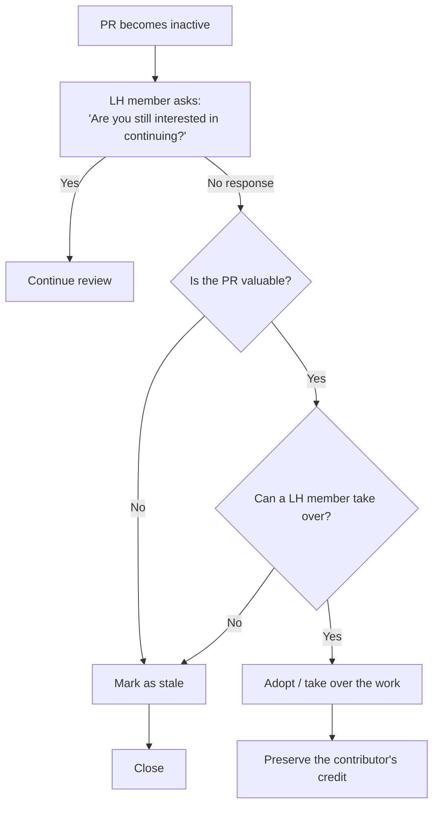

<a id="doc-12e0a48d6c5f2a58f4caa284"></a>

# longhorn/longhorn / ADOPTERS.md

Upstream: https://github.com/longhorn/longhorn/blob/cab5052ccbe546d936f69429f35d1ea0bce4fbba/ADOPTERS.md

Commit: `cab5052ccbe546d936f69429f35d1ea0bce4fbba`

Retrieved: 2026-10-01T15:22:59.234425+00:00

Kind: official-document

Raw SHA256: `fc928b81402ee416af69dc32e5d504337128869907b885f0118bdb5e585c3083`

Source text below is untrusted reference content. Acquisition does not verify technical claims.

License status: UPSTREAM_NOTICES_CAPTURED_PER_FILE_REVIEW_REQUIRED. See this repository's captured license files.

---

> [!NOTE]
> 
> To encourage adoption of Longhorn and share your experience with the community, please add your information below.

### Adopter Types
- End-User: An organization that runs Longhorn in a production environment.
- Integration: An organization offering a product that integrates with Longhorn by providing additional services or functionality.
- Vendor: An organization that includes Longhorn as part of its packaged product.
- Hosted-Service: An organization that operates Longhorn within its hosted service, offered as a product to customers.

### Longhorn Adopters

| Type | Name | Website | Use-Case |
|:-|:-|:-|:-|
| End-User | Nemlig | https://www.nemlig.com/ | A comprehensive, persistent storage solution on Kubernetes. Part of “Kubernemlig,” Nemlig’s internal, developer- and operations-friendly Platform-as-a-Service (PaaS). |
| End-User | Child Rescue Coalition | https://childrescuecoalition.org/ | Kubernetes persistent replicated storage with automated backups. |
| End-User | NAVER | https://www.navercorp.com/ | Production Kubernetes persistent storage supporting NAVER's internal platform and cloud-native services at scale. |
| End-User | Walkbase | https://walkbase.com/ | Walkbase uses Longhorn for persistent storage in our bare metal kubernetes clusters. |
| End-User | JTEKT | https://www.jtekt.co.jp | Longhorn is the storage solution for an on-premise K8s cluster used as internal developer platform |


<a id="doc-986ee1eb51fd85810c14d14a"></a>

# longhorn/longhorn / CHANGELOG/CHANGELOG-1.10.0.md

Upstream: https://github.com/longhorn/longhorn/blob/cab5052ccbe546d936f69429f35d1ea0bce4fbba/CHANGELOG/CHANGELOG-1.10.0.md

Commit: `cab5052ccbe546d936f69429f35d1ea0bce4fbba`

Retrieved: 2026-10-01T15:22:59.234425+00:00

Kind: official-document

Raw SHA256: `b32425764b898e0c698389eb779795645b7e88f5570d42f22e8229fd9b853058`

Source text below is untrusted reference content. Acquisition does not verify technical claims.

License status: UPSTREAM_NOTICES_CAPTURED_PER_FILE_REVIEW_REQUIRED. See this repository's captured license files.

---

# Longhorn v1.10.0 Release Notes

Longhorn v1.10.0 is a major release focused on improving stability, performance, and the overall user experience. This version introduces significant enhancements to our core features, including the V2 Data Engine, and streamlines configuration for easier management.

The key highlights include improvements to the V2 Data Engine, enhanced resilience, simplified configuration, and better observability.

We welcome feedback and contributions to help continuously improve Longhorn.

For terminology and context on Longhorn releases, see [Releases](https://github.com/longhorn/longhorn#releases).

## Removal

### `longhorn.io/v1beta1` API

The `v1beta1` Longhorn API version has been removed.

See [GitHub Issue #10249](https://github.com/longhorn/longhorn/issues/10249) for details.

### `replica.status.evictionRequested` Field

The deprecated `replica.status.evictionRequested` field has been removed.

See [GitHub Issue #7022](https://github.com/longhorn/longhorn/issues/7022) for details.

## Primary Highlights

### New V2 Data Engine Features

#### Interrupt Mode Support

Interrupt mode has been added to the V2 Data Engine to help reduce CPU usage. This feature is especially beneficial for clusters with idle or low I/O workloads, where conserving CPU resources is more important than minimizing latency.

While interrupt mode lowers CPU consumption, it may introduce slightly higher I/O latency compared to polling mode. In addition, the current implementation uses a hybrid approach, which still incurs a minimal, constant CPU load even when interrupts are enabled.

> [!NOTE]
> **Limitation:** Supports **AIO disks only**.

See [Interrupt Mode](https://longhorn.io/docs/1.10.0/v2-data-engine/features/interrupt-mode) and [GitHub Issue#9834](https://github.com/longhorn/longhorn/issues/9834) for details.

#### Volume and Snapshot Cloning

V2 volumes now support two types of cloning:

- **Full-Copy Clone**: Creates a new PVC with a complete, independent copy of the source data, providing full isolation.
- **Linked-Clone (Fast/Smart Clone)**: Creates a PVC that shares data blocks with the source volume for near-instant creation. Ideal for temporary workloads, backups, or testing. Linked-clones are lightweight, fast, and reduce storage overhead.

See [Volume Clone Support](https://longhorn.io/docs/1.10.0/v2-data-engine/features/volume-clone) and [GitHub Issue#7794](https://github.com/longhorn/longhorn/issues/7794) for details.

#### Replica Rebuild QoS

Provides Quality of Service (QoS) control for V2 volume replica rebuilds. You can configure bandwidth limits globally or per volume to prevent storage throughput overload on source and destination nodes.

See [Replica Rebuild QoS](https://longhorn.io/docs/1.10.0/v2-data-engine/features/replica-rebuild-qos) and [GitHub Issue#10770](https://github.com/longhorn/longhorn/issues/10770) for details.

#### Volume Expansion

Longhorn now supports volume expansion for V2 Data Engine volumes. You can expand the volume through the UI or by modifying the PVC manifest.

See [V2 Volume Expansion](https://longhorn.io/docs/1.10.0/v2-data-engine/features/volume-expansion) and [GitHub Issue#8022](https://github.com/longhorn/longhorn/issues/8022) for details.

#### Support for Running Without Hugepages

This reduces memory pressure on low-spec nodes and increases deployment flexibility. Performance may be lower compared to running with Hugepages.

See [GitHub Issue#7066](https://github.com/longhorn/longhorn/issues/7066) for details.

### New V1 Data Engine Features

#### IPv6 Support

V1 volumes now support single-stack IPv6 Kubernetes clusters.

> **Warning:** Dual-stack Kubernetes clusters and V2 volumes are **not supported** in this release.

See [GitHub Issue #2259](https://github.com/longhorn/longhorn/issues/2259) for details.

### Consolidated Global Settings

To simplify management, Longhorn settings are now unified across V1 and V2 Data Engines, using a new, more flexible JSON format.

- **Single value (applies to all Data Engines)**: Non-JSON string (e.g., `1024`).
- **Data-engine-specific**: JSON object (e.g., `{"v1": "value1", "v2": "value2"}`)
- **V1-only**: JSON object with v1 key (e.g., `{"v1":"value1"}`).
- **V2-only**: JSON object with v2 key (e.g., `{"v2":"value1"}`).

See [Longhorn Settings](https://longhorn.io/docs/1.10.0/references/settings) and [GitHub Issue#10926](https://github.com/longhorn/longhorn/issues/10926) for details.

### Pod Scheduling with CSIStorageCapacity

Longhorn now supports **CSIStorageCapacity**, allowing Kubernetes to verify node storage before scheduling pods using StorageClasses with **WaitForFirstConsumer**. This reduces scheduling errors and improves reliability.

See [GitHub Issue #10685](https://github.com/longhorn/longhorn/issues/10685) for details.

### Configurable Backup Block Size

Backup block size can now be configured when creating a volume to optimize performance and efficiency.

See [Create Longhorn Volumes](https://longhorn.io/docs/1.10.0/nodes-and-volumes/volumes/create-volumes) and [GitHub Issue#5215](https://github.com/longhorn/longhorn/issues/5215) for details.

### Volume Attachment Summary

The UI now shows a summary of attachment tickets on each volume page for improved visibility.

See [GitHub Issue #11400](https://github.com/longhorn/longhorn/issues/11400) for details.

## Installation

>  [!IMPORTANT]
**Ensure that your cluster is running Kubernetes v1.25 or later before installing Longhorn v1.10.0.**

You can install Longhorn using a variety of tools, including Rancher, Kubectl, and Helm. For more information about installation methods and requirements, see [Quick Installation](https://longhorn.io/docs/1.10.0/deploy/install/) in the Longhorn documentation.

## Upgrade

>  [!IMPORTANT]
**Ensure that your cluster is running Kubernetes v1.25 or later before upgrading from Longhorn v1.9.x to v1.10.0.**

Longhorn only allows upgrades from supported versions. For more information about upgrade paths and procedures, see [Upgrade](https://longhorn.io/docs/1.10.0/deploy/upgrade/) in the Longhorn documentation.

## Post-Release Known Issues

For information about issues identified after this release, see [Release-Known-Issues](https://github.com/longhorn/longhorn/wiki/Release-Known-Issues).

### Highlight

- [FEATURE] V2 Volume Supports Cloning [7794](https://github.com/longhorn/longhorn/issues/7794) - @yangchiu @PhanLe1010
- [FEATURE] v2 supports volume expansion [8022](https://github.com/longhorn/longhorn/issues/8022) - @davidcheng0922 @chriscchien
- [UI][FEATURE] V2 Volume Supports Cloning [11736](https://github.com/longhorn/longhorn/issues/11736) - @yangchiu @houhoucoop
- [FEATURE] V2 volumes support interrupt mode [9834](https://github.com/longhorn/longhorn/issues/9834) - @yangchiu @c3y1huang
- [FEATURE] Support v2 volume without hugepage [7066](https://github.com/longhorn/longhorn/issues/7066) - @derekbit @chriscchien
- [FEATURE] Configurable Backup Block Size [5215](https://github.com/longhorn/longhorn/issues/5215) - @COLDTURNIP @yangchiu
- [UI][FEATURE] Configurable Backup Block Size [11586](https://github.com/longhorn/longhorn/issues/11586) - 
- [FEATURE]  Add QoS support to limit replica rebuilding load [10770](https://github.com/longhorn/longhorn/issues/10770) - @hookak @roger-ryao
- [FEATURE]  Volume granular setting parity for V2 to match V1 data engine [10926](https://github.com/longhorn/longhorn/issues/10926) - @derekbit @chriscchien
- [IMPROVEMENT] Support CSIStorageCapacity in Longhorn CSI driver to enable capacity-aware pod scheduling [10685](https://github.com/longhorn/longhorn/issues/10685) - @bachmanity1 @roger-ryao
- [FEATURE] IPV6 for V1 Data Engine [2259](https://github.com/longhorn/longhorn/issues/2259) - @yangchiu @c3y1huang
- [FEATURE] Delta Replica Rebuilding using Delta Snapshot: Control and Data Planes [10037](https://github.com/longhorn/longhorn/issues/10037) - @shuo-wu @roger-ryao
- [FEATURE] Remove v1beta1 API CRD in Longhorn v1.10 [10249](https://github.com/longhorn/longhorn/issues/10249) - @derekbit @roger-ryao

### Feature

- [FEATURE] Add option to restart kubelet through `longhornctl` after huge page update [11241](https://github.com/longhorn/longhorn/issues/11241) - @chriscchien @bachmanity1
- [UI][FEATURE] Configurable Backup Block Size [11351](https://github.com/longhorn/longhorn/issues/11351) - @yangchiu @houhoucoop
- [UI][FEATURE] Display a summary of the attachment tickets in an individual volume's overview page [11401](https://github.com/longhorn/longhorn/issues/11401) - @yangchiu @houhoucoop
- [UI][FEATURE]  Add QoS support to limit replica rebuilding load [11306](https://github.com/longhorn/longhorn/issues/11306) - @davidcheng0922 @houhoucoop @roger-ryao
- [UI][FEATURE]  Volume granular setting parity for V2 to match V1 data engine [11354](https://github.com/longhorn/longhorn/issues/11354) - @chriscchien @houhoucoop
- [FEATURE] Display a summary of the attachment tickets in an individual volume's overview page [11400](https://github.com/longhorn/longhorn/issues/11400) - @yangchiu @davidcheng0922
- [FEATURE] Allow longhorn to restart pods with custom controllers, while the `Automatically Delete Workload Pod when The Volume Is Detached Unexpectedly` feature is enabled [8353](https://github.com/longhorn/longhorn/issues/8353) - @derekbit @roger-ryao
- [FEATURE] Standardized way to override container image registry [11064](https://github.com/longhorn/longhorn/issues/11064) - @marcosbc @yangchiu @roger-ryao
- [FEATURE] Standardized way to specify image pull secrets [11062](https://github.com/longhorn/longhorn/issues/11062) - @marcosbc @chriscchien

### Improvement

- [IMPROVEMENT] Add usage metrics for Longhorn installation variant [11792](https://github.com/longhorn/longhorn/issues/11792) - @derekbit
- [IMPROVEMENT] Allow applying different values of snapshot checksum related settings for v1 and v2 data engine [11537](https://github.com/longhorn/longhorn/issues/11537) - @chriscchien @nzhan126
- [IMPROVEMENT] Make `longhornctl` usable in air-gapped environments [11291](https://github.com/longhorn/longhorn/issues/11291) - @chriscchien @bachmanity1
- [IMPROVEMENT] SAST Potential dereference of the null pointer in controller/volume_controller.go in longhorn-manager [11780](https://github.com/longhorn/longhorn/issues/11780) - @c3y1huang
- [IMPROVEMENT] Collect Logs from the Host Directory Defined by the Setting `log-path` [11522](https://github.com/longhorn/longhorn/issues/11522) - @c3y1huang @roger-ryao
- [IMPROVEMENT] Enhance Offline Rebuilding with Resource Awareness and Retry Backoff [11270](https://github.com/longhorn/longhorn/issues/11270) - @mantissahz @chriscchien
- [IMPROVEMENT] Collect mount table, process status and process table in support bundle   [8397](https://github.com/longhorn/longhorn/issues/8397) - @mantissahz @chriscchien
- [IMPROVEMENT] Volume attachment should automatically exclude nodes with `disable-v2-data-engine="true"` [11695](https://github.com/longhorn/longhorn/issues/11695) - @derekbit @chriscchien
- [IMPROVEMENT] Introduce `System Info` Category for Settings [11656](https://github.com/longhorn/longhorn/issues/11656) - @derekbit @roger-ryao
- [IMPROVEMENT] RBAC permissions [11345](https://github.com/longhorn/longhorn/issues/11345) - @davidcheng0922 @chriscchien
- [IMPROVEMENT] Improve Longhorn Pods Logging Precision to Nanoseconds [11596](https://github.com/longhorn/longhorn/issues/11596) - @derekbit @roger-ryao
- [IMPROVEMENT] Update validation logics for v2 data engine [11600](https://github.com/longhorn/longhorn/issues/11600) - @derekbit @chriscchien
- [IMPROVEMENT] Improve log messages of longhorn-engine, tgt and liblonghorn for troubleshooting [11545](https://github.com/longhorn/longhorn/issues/11545) - @yangchiu @derekbit
- [IMPROVEMENT] rename the backing image manager to reduce the probability of CR name collision [11455](https://github.com/longhorn/longhorn/issues/11455) - @COLDTURNIP @chriscchien
- [IMPROVEMENT] Remove outdated prerequisite installation scripts in longhorn/longhorn [11430](https://github.com/longhorn/longhorn/issues/11430) - @yangchiu @roger-ryao @sushant-suse
- [UI][IMPROVEMENT] Add UI Warning for Force-Detach Actions to Prevent Out-of-Sync Kubernetes and Longhorn VolumeAttachments [9944](https://github.com/longhorn/longhorn/issues/9944) - @yangchiu @houhoucoop
- [IMPROVEMENT] Add `node-selector` option to `longhornctl` to select nodes on which to run DaemonSet [11213](https://github.com/longhorn/longhorn/issues/11213) - @yangchiu @bachmanity1
- [IMPROVEMENT] Improve volume `Scheduled` condition message [11460](https://github.com/longhorn/longhorn/issues/11460) - @yangchiu @derekbit @chriscchien
- [IMPROVEMENT] Launching a new mechanism to collect instance manager logs [5948](https://github.com/longhorn/longhorn/issues/5948) - @yangchiu @derekbit
- [IMPROVEMENT] adjust the hardcoded timeout limitation for backing image downloading [11309](https://github.com/longhorn/longhorn/issues/11309) - @COLDTURNIP @roger-ryao
- [IMPROVEMENT] Make liveness probe parameters of instance-manager pod configurable [10788](https://github.com/longhorn/longhorn/issues/10788) - @yangchiu @derekbit
- [IMPROVEMENT] Enhance menu descriptions for Longhorn CLI [8998](https://github.com/longhorn/longhorn/issues/8998) - @roger-ryao @sushant-suse
- [IMPROVEMENT] Improve longhorn-engine controller log messages [11507](https://github.com/longhorn/longhorn/issues/11507) - @derekbit @chriscchien
- [IMPROVEMENT] Add a comment to explain what `isSettingDataEngineSynced` does in the instance manager controller. [11321](https://github.com/longhorn/longhorn/issues/11321) - @mantissahz
- [IMPROVEMENT] Flooding and misleading log message `Deleting orphans on evicted node ...` [11500](https://github.com/longhorn/longhorn/issues/11500) - @yangchiu @derekbit
- [IMPROVEMENT] Reject `volume.spec.replicaRebuildingBandwidthLimit` update for V1 Data Engine [11497](https://github.com/longhorn/longhorn/issues/11497) - @derekbit @roger-ryao
- [IMPROVEMENT] Detach an offline rebuilding volume if rebuilding can not start [11274](https://github.com/longhorn/longhorn/issues/11274) - @mantissahz
- [IMPROVEMENT] backing image handle node disk deleting events [10983](https://github.com/longhorn/longhorn/issues/10983) - @COLDTURNIP @chriscchien
- [IMPROVEMENT] Rename `RebuildingMbytesPerSecond` to `ReplicaRebuildBandwidthLimit` [11403](https://github.com/longhorn/longhorn/issues/11403) - @derekbit @roger-ryao
- [IMPROVEMENT] Make the sync agent profilable [11386](https://github.com/longhorn/longhorn/issues/11386) - @COLDTURNIP @yangchiu
- [IMPROVEMENT] Add performance metrics for Longhorn disk I/O [11223](https://github.com/longhorn/longhorn/issues/11223) - @hookak @DamiaSan
- [IMPROVEMENT] Make CLI preflight check non-blocking for subsequent checkups [9877](https://github.com/longhorn/longhorn/issues/9877) - @davidcheng0922 @DamiaSan
- [IMPROVEMENT] Add namespace argument/parameter to cli pre-flight check [9749](https://github.com/longhorn/longhorn/issues/9749) - @davidcheng0922 @DamiaSan
- [IMPROVEMENT] `Orphaned Data` should not be placed under Settings [10383](https://github.com/longhorn/longhorn/issues/10383) - @houhoucoop @DamiaSan @sushant-suse
- [IMPROVEMENT] Upgrade Node v20 in longhorn-ui [11315](https://github.com/longhorn/longhorn/issues/11315) - @chriscchien @houhoucoop
- [IMPROVEMENT] useful error message from /v1/backuptargets is not displayed in UI [10428](https://github.com/longhorn/longhorn/issues/10428) - @houhoucoop @DamiaSan
- [IMPROVEMENT] Check if the backup target is available before creating a backup, backup backing image, and system backup [10085](https://github.com/longhorn/longhorn/issues/10085) - @yangchiu @nzhan126
- [IMPROVEMENT] Backoff Retry Interval for Instance Manager Pod Re-creation in Resource Constraint Scenarios [10263](https://github.com/longhorn/longhorn/issues/10263) - @yangchiu @bachmanity1
- [IMPROVEMENT] record the detail while webhook rejecting migration attachment tickets [11150](https://github.com/longhorn/longhorn/issues/11150) - @COLDTURNIP @roger-ryao
- [IMPROVEMENT] Handle credential secret containing mixed invalid conditions  [8537](https://github.com/longhorn/longhorn/issues/8537) - @yangchiu @nzhan126
- [IMPROVEMENT] Add the possibility of setting floating point values for `guaranteed-instance-manager-cpu` and `node.spec.instanceManagerCPURequest` [11179](https://github.com/longhorn/longhorn/issues/11179) - @yangchiu @gigabyte132
- [IMPROVEMENT] Remove the Patch `preserveUnknownFields: false` for CRDs [11263](https://github.com/longhorn/longhorn/issues/11263) - @derekbit @chriscchien
- [IMPROVEMENT] Schedule at least one replica locally when locality is `best-effort` [11007](https://github.com/longhorn/longhorn/issues/11007) - @chriscchien @bachmanity1
- [IMPROVEMENT] Improve the disk space un-schedulable condition message [10436](https://github.com/longhorn/longhorn/issues/10436) - @yangchiu @davidcheng0922
- [IMPROVEMENT] Improve the condition message of engine image check [9845](https://github.com/longhorn/longhorn/issues/9845) - @derekbit @chriscchien
- [IMPROVEMENT] Improve the logging when detecting multiple backup volumes of the same volume on the same backup target [11152](https://github.com/longhorn/longhorn/issues/11152) - @PhanLe1010 @chriscchien
- [IMPROVEMENT] Implement Documentation Validation for `longhorn/cli` [11229](https://github.com/longhorn/longhorn/issues/11229) - @derekbit
- [IMPROVEMENT] Move validation from each resource deletion to validation webhook [5156](https://github.com/longhorn/longhorn/issues/5156) - @derekbit @roger-ryao
- [IMPROVEMENT] Validate node.longhorn.io resource spec fields [11079](https://github.com/longhorn/longhorn/issues/11079) - @Felipalds @chriscchien
- [IMPROVEMENT] add support for custom annotations in the UI service on Longhorn Helm Chart [11031](https://github.com/longhorn/longhorn/issues/11031) - @josimar-silva @roger-ryao
- [IMPROVEMENT] Adding retry logic for longhorn-csi-plugin when it trying to contact the longhorn-manager pods [9482](https://github.com/longhorn/longhorn/issues/9482) - @PhanLe1010 @roger-ryao

### Bug

- [BUG] failed to load DataEngineSpecific boolean setting from configmap [11810](https://github.com/longhorn/longhorn/issues/11810) - @COLDTURNIP @roger-ryao
- [BUG] V2 stop working - connectNVMfBdev() -> "code": -95,"message": "Operation not supported" (1.10.0-rc2) [11761](https://github.com/longhorn/longhorn/issues/11761) - @yangchiu @c3y1huang
- [BUG] [UI] Inconsistent Default Value for Data Engine in Clone Volume [11802](https://github.com/longhorn/longhorn/issues/11802) - @houhoucoop @roger-ryao
- [BUG] System backup could get stuck in `CreatingVolumeBackups` if some nodes are labeled with `disable-v2-data-engine=true` [11774](https://github.com/longhorn/longhorn/issues/11774) - @mantissahz @roger-ryao
- [BUG] Potential Data Corruption During Volume Resizing When Created from Snapshot [11484](https://github.com/longhorn/longhorn/issues/11484) - @yangchiu @PhanLe1010
- [BUG] Block disk may never become `Schedulable` after re-adding [11760](https://github.com/longhorn/longhorn/issues/11760) - @derekbit @chriscchien
- [BUG] v2 volume could get stuck in `Detaching/Faulted` state after nodes reboot [10112](https://github.com/longhorn/longhorn/issues/10112) - @yangchiu @shuo-wu
- [BUG] Fail to dynamically provision a v2 volume with a backing image if the backing image doesn't exist before PVC creation [11762](https://github.com/longhorn/longhorn/issues/11762) - @COLDTURNIP @yangchiu
- [BUG] v2 DR volume faulted after origin volume expand and backuped [11767](https://github.com/longhorn/longhorn/issues/11767) - @davidcheng0922 @roger-ryao
- [BUG] longhorn manager crash in installation [11743](https://github.com/longhorn/longhorn/issues/11743) - @derekbit @chriscchien
- [BUG] Unable to sync existing backups from a remote backup store [11758](https://github.com/longhorn/longhorn/issues/11758) - @yangchiu @mantissahz
- [BUG] Longhorn pvcs are in pending state. [11654](https://github.com/longhorn/longhorn/issues/11654) - @yangchiu @derekbit
- [BUG] Volume becomes faulted when its replica node disks run out of space during a write operation [10718](https://github.com/longhorn/longhorn/issues/10718) - @yangchiu @mantissahz
- [BUG] [v1.10.0-rc1] `longhornctl trim volume` command hangs [11704](https://github.com/longhorn/longhorn/issues/11704) - @davidcheng0922 @chriscchien
- [BUG]  longhornctl preflight install should load and check iscsi_tcp kernel module. [11706](https://github.com/longhorn/longhorn/issues/11706) - @mantissahz @chriscchien
- [BUG] spdk_tgt crash after replica rebuilding due to bdev_channel_destroy_resource() assert failure [11109](https://github.com/longhorn/longhorn/issues/11109) - @hookak @chriscchien
- [BUG] Unable to set replica affinity when creating a v2 volume (`test_soft_anti_affinity_scheduling_volume_enable`) [11642](https://github.com/longhorn/longhorn/issues/11642) - @yangchiu @derekbit
- [BUG] BackupBackingImage may be created from an unready BackingImageManager [11675](https://github.com/longhorn/longhorn/issues/11675) - @WebberHuang1118 @roger-ryao
- [BUG] Creating a 2 Gi volume with a 200 Mi backing image is rejected with “volume size should be larger than the backing image size” [11362](https://github.com/longhorn/longhorn/issues/11362) - @COLDTURNIP @yangchiu
- [BUG] Replica auto balance disk in pressure fails on v2 volumes [10551](https://github.com/longhorn/longhorn/issues/10551) - @yangchiu @hookak
- [BUG] Backup stuck when ownerID is assigned to a node with node.longhorn.io/disable-v2-data-engine: "true" [11619](https://github.com/longhorn/longhorn/issues/11619) - @davidcheng0922 @roger-ryao
- [BUG] Engine process continues running after rapid volume detachment [11605](https://github.com/longhorn/longhorn/issues/11605) - @COLDTURNIP @yangchiu
- [BUG] remaining unknown OS condition in node CR [11612](https://github.com/longhorn/longhorn/issues/11612) - @COLDTURNIP @roger-ryao
- [BUG] Longhorn Manager continues to send replica deletion requests to the Instance Manager for the v2 volume indefinitely [11553](https://github.com/longhorn/longhorn/issues/11553) - @yangchiu @shuo-wu
- [BUG] Unable to disable v2-data-engine even though there is no v2 volumes, backing images or orphaned data [11330](https://github.com/longhorn/longhorn/issues/11330) - @shuo-wu @roger-ryao
- [BUG] longhorn-manager repeatedly emits `No instance manager for node xxx for update instance state of orphan instance orphan-xxx..` [11597](https://github.com/longhorn/longhorn/issues/11597) - @COLDTURNIP @chriscchien
- [BUG] Volumes fails to remount when they go read-only [8572](https://github.com/longhorn/longhorn/issues/8572) - @derekbit @chriscchien
- [BUG] Dangling Volume State When Live Migration Terminates Unexpectedly [11479](https://github.com/longhorn/longhorn/issues/11479) - @PhanLe1010 @chriscchien
- [BUG] S3 Backup target reverts randomly to previous value [9581](https://github.com/longhorn/longhorn/issues/9581) - @yangchiu @mantissahz
- [BUG] Longhornctl / CLI -  no configuration has been provided, try setting KUBERNETES_MASTER environment variable [10094](https://github.com/longhorn/longhorn/issues/10094) - @davidcheng0922 @chriscchien
- [BUG] longhorn-images.txt specifies CSI component repo tags not found [11575](https://github.com/longhorn/longhorn/issues/11575) - @yangchiu @derekbit
- [BUG] DR volume's backup block size should be set from the latest backup [11580](https://github.com/longhorn/longhorn/issues/11580) - @COLDTURNIP @yangchiu
- [BUG] longhornctl --enable-spdk doesn't support arm64 [11551](https://github.com/longhorn/longhorn/issues/11551) - @yangchiu @davidcheng0922
- [BUG] extra invalid BackupVolumeCR may be created during cluster split-brain [11154](https://github.com/longhorn/longhorn/issues/11154) - @mantissahz @roger-ryao
- [BUG]  system backup error [11232](https://github.com/longhorn/longhorn/issues/11232) - @c3y1huang @roger-ryao
- [BUG] Can not create backup using `Create Backup` icon in UI [11451](https://github.com/longhorn/longhorn/issues/11451) - @yangchiu @mantissahz @houhoucoop
- [BUG] Unable to create backup for old snapshots on v2 volumes: failed to find snapshot lvol range [11461](https://github.com/longhorn/longhorn/issues/11461) - @c3y1huang @chriscchien
- [BUG] Uninstall fail because find backuptargets remaining [11486](https://github.com/longhorn/longhorn/issues/11486) - @COLDTURNIP @yangchiu
- [BUG] Setting v2 data engine can be enabled without fulfilling the hugepage requirement, causing error v2 instance manager CR dangling in the system [11519](https://github.com/longhorn/longhorn/issues/11519) - @yangchiu @derekbit
- [BUG] Unable to setup backup target in storage network environment: cannot find a running instance manager for node [11478](https://github.com/longhorn/longhorn/issues/11478) - @yangchiu @derekbit
- [BUG] Volume migration negative test cases fail on v2 volumes [10800](https://github.com/longhorn/longhorn/issues/10800) - @shuo-wu @chriscchien
- [BUG] V2 volume fails to cleanup error replica and rebuild new one - test_data_locality_basic [10335](https://github.com/longhorn/longhorn/issues/10335) - @shuo-wu @chriscchien
- [BUG] Issue auto detecting nvme drive on talos cluster (vfio-pci driver instead of expected vfio_pci) [11127](https://github.com/longhorn/longhorn/issues/11127) - @Hugome @roger-ryao
- [BUG] Test case `test_running_volume_with_scheduling_failure` failed due to unexpected new replica created [11512](https://github.com/longhorn/longhorn/issues/11512) - @derekbit @chriscchien
- [BUG] Regression test cases failed due to unable to clean up dummy backups [11487](https://github.com/longhorn/longhorn/issues/11487) - @COLDTURNIP @yangchiu
- [BUG][v1.9.0-rc1] Unexpected orphaned data are created after v2 instance managers deleted [10829](https://github.com/longhorn/longhorn/issues/10829) - @yangchiu @derekbit
- [BUG] v2 Engine loops in detaching and attaching state after rebuilding [10396](https://github.com/longhorn/longhorn/issues/10396) - @shuo-wu @roger-ryao
- [BUG] `test_basic.py::test_backup_status_for_unavailable_replicas` is failed [11416](https://github.com/longhorn/longhorn/issues/11416) - @derekbit @roger-ryao
- [BUG] Build fails due to outdated SLES repo [11481](https://github.com/longhorn/longhorn/issues/11481) - @PhanLe1010
- [BUG] Unable to set up S3 backup target if backups already exist [11337](https://github.com/longhorn/longhorn/issues/11337) - @mantissahz @chriscchien
- [BUG][UI] `Snapshots and Backups` graph is stuck loading and console shows error messages [10529](https://github.com/longhorn/longhorn/issues/10529) - @yangchiu @davidcheng0922
- [BUG] The Backup YAML example in the Longhorn doc does not work [11216](https://github.com/longhorn/longhorn/issues/11216) - @roger-ryao @nzhan126
- [BUG] v2 volume workload IO could get `Bad message` error after network disconnect [10113](https://github.com/longhorn/longhorn/issues/10113) - @yangchiu @shuo-wu
- [BUG] Test case `Test Replica Auto Balance Node Least Effort` failed on v2 volume [10977](https://github.com/longhorn/longhorn/issues/10977) - @yangchiu @c3y1huang
- [BUG] IsJSONRPCRespErrorNoSuchDevice fails on wrapped errors for ublk client [11361](https://github.com/longhorn/longhorn/issues/11361) - @yangchiu @davidcheng0922
- [BUG] longhorn-manager is crashed due to `SIGSEGV: segmentation violation` [11420](https://github.com/longhorn/longhorn/issues/11420) - @derekbit @chriscchien
- [BUG] Test Case `test_replica_auto_balance_node_least_effort` Is Sometimes Failed [11388](https://github.com/longhorn/longhorn/issues/11388) - @derekbit @chriscchien
- [BUG] volume gets stuck at detaching/faulted state for spdk v2 engine intermittently [10724](https://github.com/longhorn/longhorn/issues/10724) - @DamiaSan
- [BUG] Typo in configuration parameter: "offlineRelicaRebuilding" should be "offlineReplicaRebuilding" [11380](https://github.com/longhorn/longhorn/issues/11380) - @yangchiu @in-jun
- [BUG][DOC] OpenShift documentation [11174](https://github.com/longhorn/longhorn/issues/11174) - @yangchiu @mlacko64
- [BUG] In single node Harvester, endless "unable to schedule replica" is logged in longhorn-manager [3708](https://github.com/longhorn/longhorn/issues/3708) - @derekbit @chriscchien
- [BUG] Uninstallation fail due to deleting the running Longhorn node is not allowed [11131](https://github.com/longhorn/longhorn/issues/11131) - @COLDTURNIP @roger-ryao
- [BUG] Engine v2 I/O Blocked Over 1-2 Minutes After Instance Manager Pod Deletion [10167](https://github.com/longhorn/longhorn/issues/10167) - @c3y1huang @chriscchien
- [BUG] Regression test cases failed: expecting volume to be detached but it's attached [11273](https://github.com/longhorn/longhorn/issues/11273) - @yangchiu @mantissahz
- [BUG] Volume expansion fails with "unsupported disk encryption format ext4" [11120](https://github.com/longhorn/longhorn/issues/11120) - @COLDTURNIP @mantissahz @roger-ryao
- [BUG] longhorn-spdk-engine rebuilding unit tests may get stuck for 2 minutes [11099](https://github.com/longhorn/longhorn/issues/11099) - @shuo-wu @roger-ryao
- [BUG] v2 volume could get stuck in `detaching/detached` loop when `Migration Confirmation After Migration Node Down` [10157](https://github.com/longhorn/longhorn/issues/10157) - @yangchiu @PhanLe1010
- [BUG] Longhorn will not reuse the failed v2 replicas when a race condition is triggered after the instance manager pod restart [11188](https://github.com/longhorn/longhorn/issues/11188) - @shuo-wu @roger-ryao
- [BUG] Auto-generated CLI document overwrite by make [11219](https://github.com/longhorn/longhorn/issues/11219) - @bachmanity1
- [BUG] Incorrect value of `remove-snapshots-during-filesystem-trim` in longhorn chart/values.yaml [11264](https://github.com/longhorn/longhorn/issues/11264) - @derekbit @chriscchien
- [BUG][v1.9.0-rc1] v2 volumes don't reuse failed replicas as expected after a node goes down [10828](https://github.com/longhorn/longhorn/issues/10828) - @yangchiu @shuo-wu
- [BUG] CSI Plugin restart triggers unintended restart of migratable RWX volume workloads [11158](https://github.com/longhorn/longhorn/issues/11158) - @c3y1huang @roger-ryao
- [BUG] in the browser UI: Volume -> Clone Volume results in the broken browser page [11165](https://github.com/longhorn/longhorn/issues/11165) - @houhoucoop @roger-ryao
- [BUG] "mkfsParams" in StorageClass are not passed to share-manager for filesystem formatting [11107](https://github.com/longhorn/longhorn/issues/11107) - @Florianisme @roger-ryao
- [BUG] Test case `test_engine_image_not_fully_deployed_perform_volume_operations` failed: unable to detach a volume [10874](https://github.com/longhorn/longhorn/issues/10874) - @mantissahz @chriscchien
- [BUG] Creating support-bundle panic NPE [11169](https://github.com/longhorn/longhorn/issues/11169) - @c3y1huang @roger-ryao
- [BUG] Unable to Build Longhorn-Share-Manager Image Due to CMAKE Compatibility [11159](https://github.com/longhorn/longhorn/issues/11159) - @derekbit @roger-ryao
- [BUG] Uninstallation fail due to deleting the default engine image is not allowed [11130](https://github.com/longhorn/longhorn/issues/11130) - @COLDTURNIP @chriscchien
- [BUG] v2 volume gets stuck in degraded state and continuously rebuilds/deletes replicas after a kubelet restart [10107](https://github.com/longhorn/longhorn/issues/10107) - @shuo-wu
- [BUG] SPDK API bdev_lvol_detach_parent does not work as expected [11046](https://github.com/longhorn/longhorn/issues/11046) - @DamiaSan @roger-ryao
- [BUG] Recurring jobs fail when assigned to default group [11016](https://github.com/longhorn/longhorn/issues/11016) - @c3y1huang @chriscchien
- [BUG] v2 volume data checksum mismatch after replica rebuilding [10118](https://github.com/longhorn/longhorn/issues/10118) - @yangchiu @shuo-wu
- [BUG] Most of regression test cases are failing due to unable to update settings [11042](https://github.com/longhorn/longhorn/issues/11042) - @yangchiu @mantissahz
- [BUG] unable to clean up the backing image volume replica after node eviction [11053](https://github.com/longhorn/longhorn/issues/11053) - @COLDTURNIP @roger-ryao
- [BUG] backing image volume replica NPE crash during evicting node [11034](https://github.com/longhorn/longhorn/issues/11034) - @COLDTURNIP @chriscchien
- [BUG]  A degraded DR volume remains in standby and attached after activation. [2107](https://github.com/longhorn/longhorn/issues/2107) - @roger-ryao
- [BUG] DR volume gets stuck if there is only a rebuilding replica running [2753](https://github.com/longhorn/longhorn/issues/2753) - @c3y1huang @roger-ryao

### Stability

- [DOC] Document Volume Stability Risks Caused by I/O Latency on HDDs [11240](https://github.com/longhorn/longhorn/issues/11240) - @chriscchien @sushant-suse

### Misc

- [DOC] Add Information on Replica Failure Tolerance [11526](https://github.com/longhorn/longhorn/issues/11526) - @roger-ryao @sushant-suse
- [TASK] KB for backup store lock conflict error message [11293](https://github.com/longhorn/longhorn/issues/11293) - @yangchiu @pratikjagrut
- [DOC] Document Replica Rebuilding Mechanisms and Their Limitations [11119](https://github.com/longhorn/longhorn/issues/11119) - @mantissahz @chriscchien
- [DOC] V2 Engine usage contradiction [11409](https://github.com/longhorn/longhorn/issues/11409) - @shuo-wu @roger-ryao
- [DOC] Talos new volumes strategy [11015](https://github.com/longhorn/longhorn/issues/11015) - @yangchiu @DrummyFloyd
- [TASK] [pytest] automatically add -m v2_volume_test if RUN_V2_TEST enabled [11376](https://github.com/longhorn/longhorn/issues/11376) - @chriscchien
- Revise the document about node space [3021](https://github.com/longhorn/longhorn/issues/3021) - @derekbit @chriscchien
- [DOC] Troubleshooting KB for Mount Failure with XFS Filesystem [11214](https://github.com/longhorn/longhorn/issues/11214) - @derekbit @roger-ryao
- [DOC] Explain Longhorn VolumeAttachment operation and behavior [11142](https://github.com/longhorn/longhorn/issues/11142) - @derekbit @roger-ryao
- [DOC] Update Broken Links on Website [11288](https://github.com/longhorn/longhorn/issues/11288) - @yangchiu @sushant-suse
- [DOC] Clarify privateRegistry.createSecret and registrySecret usage in chart README [11251](https://github.com/longhorn/longhorn/issues/11251) - @chriscchien
- [DOC] KB: failed to complete volume migration during VM upgrade [11149](https://github.com/longhorn/longhorn/issues/11149) - @COLDTURNIP @chriscchien
- [DOC] Elaborate how to enable DR volume using kubectl [10958](https://github.com/longhorn/longhorn/issues/10958) - @derekbit @chriscchien
- [DOC] Remove `defaultSettings.registrySecret` reference from air gap installation guide [11237](https://github.com/longhorn/longhorn/issues/11237) - @chriscchien
- [TASK] Remove deprecated replica.status.evictionRequested field [7022](https://github.com/longhorn/longhorn/issues/7022) - @yangchiu @derekbit @roger-ryao
- [TASK] Create longhorn/spdk longhorn-v25.05 branch [11048](https://github.com/longhorn/longhorn/issues/11048) - @derekbit @chriscchien
- [TASK] Create a Dedicated Repository for libqcow to Improve Maintainability and Build Management [10988](https://github.com/longhorn/longhorn/issues/10988) - @derekbit @chriscchien
- [DOC] Update examples using deprecated crd version v1beta1 to v1beta2 on 1.9.0 [11019](https://github.com/longhorn/longhorn/issues/11019) - @falmar @roger-ryao
- [TASK] POC for ui-extension migration [10516](https://github.com/longhorn/longhorn/issues/10516) - @houhoucoop
- [TASK] Ensure support-bundle-kit builds use vendored dependencies [11106](https://github.com/longhorn/longhorn/issues/11106) - @yangchiu @c3y1huang
- [DOC] Fix the broken links present in documentation [11028](https://github.com/longhorn/longhorn/issues/11028) - @chriscchien @sushant-suse
- [DOC] Update website front page to include community meeting links [10890](https://github.com/longhorn/longhorn/issues/10890) - @yangchiu @divya-mohan0209 @sushant-suse
- [REFACTOR] Use go pkg for system operation instead of relying on external system call via shell command [5193](https://github.com/longhorn/longhorn/issues/5193) - @c3y1huang

## New Contributors

- @Felipalds
- @Florianisme
- @Hugome
- @divya-mohan0209
- @falmar
- @gigabyte132
- @in-jun
- @josimar-silva
- @mlacko64
- @pratikjagrut

## Contributors

- @COLDTURNIP
- @DamiaSan
- @DrummyFloyd
- @PhanLe1010
- @WebberHuang1118
- @bachmanity1
- @c3y1huang
- @chriscchien
- @davidcheng0922
- @derekbit
- @hookak
- @houhoucoop
- @innobead
- @mantissahz
- @marcosbc
- @nzhan126
- @roger-ryao
- @shuo-wu
- @sushant-suse
- @yangchiu

<a id="doc-52e50b5ed8125991ec2a4378"></a>

# longhorn/longhorn / CHANGELOG/CHANGELOG-1.10.1.md

Upstream: https://github.com/longhorn/longhorn/blob/cab5052ccbe546d936f69429f35d1ea0bce4fbba/CHANGELOG/CHANGELOG-1.10.1.md

Commit: `cab5052ccbe546d936f69429f35d1ea0bce4fbba`

Retrieved: 2026-10-01T15:22:59.234425+00:00

Kind: official-document

Raw SHA256: `eb2d4c5b5671b7d00992b55f8d60d6d18b22ae83da435e40b1969a3360c79dd8`

Source text below is untrusted reference content. Acquisition does not verify technical claims.

License status: UPSTREAM_NOTICES_CAPTURED_PER_FILE_REVIEW_REQUIRED. See this repository's captured license files.

---

# Longhorn v1.10.1 Release Notes

Longhorn 1.10.1 introduces several improvements and bug fixes that are intended to improve system quality, resilience, stability and security.

We welcome feedback and contributions to help continuously improve Longhorn.

For terminology and context on Longhorn releases, see [Releases](https://github.com/longhorn/longhorn#releases).

## Important Fixes

This release includes several critical stability and performance improvements:

### Goroutine Leak in Instance Manager (V2 Data Engine)

Fixed a goroutine leak in the instance manager when using the V2 data engine. This issue could lead to increased memory usage and potential stability problems over time.

For more details, see [Issue #11962](https://github.com/longhorn/longhorn/issues/11962).

### V2 Volume Attachment Failure in Interrupt Mode

Fixed an issue where V2 volumes using interrupt mode with NVMe disks could fail to complete the attachment process, causing volumes to remain stuck in the attaching state indefinitely.

In Longhorn v1.10.0, interrupt mode supports only **AIO disks**. Interrupt mode for **NVMe disks** is supported starting in v1.10.1.

For more details, see [Issue #11816](https://github.com/longhorn/longhorn/issues/11816).

### UI Deployment Failure on IPv4-Only Nodes

Fixed a bug introduced in v1.10.0 where the Longhorn UI failed to deploy on nodes with only IPv4 enabled. The UI now correctly supports IPv4-only configurations without requiring IPv6.

For more details, see [Issue #11875](https://github.com/longhorn/longhorn/issues/11875).

### Share Manager Excessive Memory Usage

Fixed excessive memory consumption in the share manager for RWX (ReadWriteMany) volumes. The component now maintains stable memory usage under normal operation.

For more details, see [Issue #12043](https://github.com/longhorn/longhorn/issues/12043).

## Installation

>  [!IMPORTANT]
**Ensure that your cluster is running Kubernetes v1.25 or later before installing Longhorn v1.10.1.**

You can install Longhorn using a variety of tools, including Rancher, Kubectl, and Helm. For more information about installation methods and requirements, see [Quick Installation](https://longhorn.io/docs/1.10.0/deploy/install/) in the Longhorn documentation.

## Upgrade

>  [!IMPORTANT]
**Ensure that your cluster is running Kubernetes v1.25 or later before upgrading from Longhorn v1.9.x to v1.10.1.**

Longhorn only allows upgrades from supported versions. For more information about upgrade paths and procedures, see [Upgrade](https://longhorn.io/docs/1.10.0/deploy/upgrade/) in the Longhorn documentation.

## Post-Release Known Issues

For information about issues identified after this release, see [Release-Known-Issues](https://github.com/longhorn/longhorn/wiki/Release-Known-Issues).

## Resolved Issues

### Improvement

- [BACKPORT][v1.10.1][IMPROVEMENT] The `auto-delete-pod-when-volume-detached-unexpectedly` should only focus on the kubernetes builtin workload. [12125](https://github.com/longhorn/longhorn/issues/12125) - @derekbit @chriscchien
- [BACKPORT][v1.10.1][IMPROVEMENT] `CSIStorageCapacity` objects must show schedulable (allocatable) capacity [12036](https://github.com/longhorn/longhorn/issues/12036) - @chriscchien @bachmanity1
- [BACKPORT][v1.10.1][IMPROVEMENT] improve error logging for failed mounting during node publish volume [12033](https://github.com/longhorn/longhorn/issues/12033) - @COLDTURNIP @roger-ryao
- [BACKPORT][v1.10.1][IMPROVEMENT] Improve Helm Chart defaultSettings handling with automatic quoting and multi-type support [12020](https://github.com/longhorn/longhorn/issues/12020) - @derekbit @chriscchien
- [BACKPORT][v1.10.1][IMPROVEMENT] Avoid repeat engine restart when there are replica unavailable during migration [11945](https://github.com/longhorn/longhorn/issues/11945) - @yangchiu @shuo-wu
- [BACKPORT][v1.10.1][IMPROVEMENT] Adjust maximum of GuaranteedInstanceManagerCPU to a big value [11968](https://github.com/longhorn/longhorn/issues/11968) - @mantissahz
- [BACKPORT][v1.10.1][IMPROVEMENT] Add usage metrics for Longhorn installation variant [11795](https://github.com/longhorn/longhorn/issues/11795) - @derekbit

### Bug

- [BACKPORT][v1.10.1][BUG] Backup target metric is broken [12089](https://github.com/longhorn/longhorn/issues/12089) - @mantissahz @roger-ryao
- [BACKPORT][v1.10.1][BUG] Backing image download gets stuck after network disconnection [12094](https://github.com/longhorn/longhorn/issues/12094) - @COLDTURNIP @chriscchien
- [BACKPORT][v1.10.1][BUG] panic: runtime error: invalid memory address or nil pointer dereference [signal SIGSEGV: segmentation violation code=0x1 at longhorn-engine/pkg/controller/control.go:218 +0x2de [12088](https://github.com/longhorn/longhorn/issues/12088) - @roger-ryao
- [BACKPORT][v1.10.1][BUG] Unable to complete uninstallation due to the remaining backuptarget [11964](https://github.com/longhorn/longhorn/issues/11964) - @mantissahz @roger-ryao
- [BACKPORT][v1.10.1][BUG] share-manager excessive memory usage [12043](https://github.com/longhorn/longhorn/issues/12043) - @derekbit @chriscchien
- [BACKPORT][v1.10.1][BUG] NVME disk not found in v2 data engine (failed to find device for BDF) [12029](https://github.com/longhorn/longhorn/issues/12029) - @derekbit @roger-ryao
- [BACKPORT][v1.10.1][BUG] NPE error during recurring job execution [11926](https://github.com/longhorn/longhorn/issues/11926) - @yangchiu @shuo-wu
- [BACKPORT][v1.10.1][BUG] v2 volume creation failed on talos nodes [12026](https://github.com/longhorn/longhorn/issues/12026) - @c3y1huang @chriscchien
- [BACKPORT][v1.10.1][BUG] mounting error is not properly hanedled during CSI node publish volume [12008](https://github.com/longhorn/longhorn/issues/12008) - @COLDTURNIP
- [BACKPORT][v1.10.1][BUG] Adding multiple disks to the same node concurrently may occasionally fail [12018](https://github.com/longhorn/longhorn/issues/12018) - @davidcheng0922 @roger-ryao
- [BUG] upgrading from 1.9.1 to 1.10.0 fails due to old resources still being in v1beta1 [11886](https://github.com/longhorn/longhorn/issues/11886) - @COLDTURNIP @roger-ryao
- [BACKPORT][v1.10.1][BUG] DR volume gets stuck in `unknown` state if engine image is deleted from the attached node [11998](https://github.com/longhorn/longhorn/issues/11998) - @yangchiu @shuo-wu
- [BACKPORT][v1.10.1][BUG] Volume gets stuck in `attaching` state if engine image image is not deployed on one of nodes [11996](https://github.com/longhorn/longhorn/issues/11996) - @yangchiu @shuo-wu
- [BACKPORT][v1.10.1][BUG] Unable to re-add block-type disks by BDF after re-enable v2 data engine [12000](https://github.com/longhorn/longhorn/issues/12000) - @yangchiu @davidcheng0922
- [BACKPORT][v1.10.1][BUG] `test_system_backup_and_restore` test case failed on master-head [12005](https://github.com/longhorn/longhorn/issues/12005) - @derekbit @chriscchien
- [BACKPORT][v1.10.1][BUG] Fix SPDK v25.05 CVE issue [11970](https://github.com/longhorn/longhorn/issues/11970) - @derekbit @roger-ryao
- [BACKPORT][v1.10.1][BUG] V2 volume stuck in volume attachment (V2 interrupt mode) [11976](https://github.com/longhorn/longhorn/issues/11976) - @c3y1huang @chriscchien
- [BACKPORT][v1.10.1][BUG] RWX volume causes process uninterruptible sleep [11958](https://github.com/longhorn/longhorn/issues/11958) - @COLDTURNIP @chriscchien
- [BACKPORT][v1.10.1][BUG] longhorn-manager fails to start after upgrading from 1.9.2 to 1.10.0 [11865](https://github.com/longhorn/longhorn/issues/11865) - @derekbit @roger-ryao
- [BACKPORT][v1.10.1][BUG] Block disk deletion fails without error message [11954](https://github.com/longhorn/longhorn/issues/11954) - @davidcheng0922 @roger-ryao
- [BACKPORT][v1.10.1][BUG] Goroutine leak in instance-manager when using v2 data engine [11962](https://github.com/longhorn/longhorn/issues/11962) - @PhanLe1010 @chriscchien
- [BACKPORT][v1.10.1][BUG] invalid memory address or nil pointer dereference [11942](https://github.com/longhorn/longhorn/issues/11942) - @bachmanity1 @roger-ryao
- [BACKPORT][v1.10.1][BUG] csi-provisioner silently fails to create CSIStorageCapacity if dataEngine parameter is missing [11918](https://github.com/longhorn/longhorn/issues/11918) - @yangchiu @bachmanity1
- [BACKPORT][v1.10.1][BUG] longhorn-engine's UI panics [11901](https://github.com/longhorn/longhorn/issues/11901) - @derekbit @chriscchien
- [BACKPORT][v1.10.1][BUG] Volume is unable to upgrade if the number of active replicas is larger than `volumme.spec.numberOfReplicas` [11895](https://github.com/longhorn/longhorn/issues/11895) - @yangchiu @derekbit
- [BACKPORT][v1.10.1][BUG] UI fails to deploy when only IPv4 is enabled on nodes with v1.10.0 version [11875](https://github.com/longhorn/longhorn/issues/11875) - @yangchiu @c3y1huang
- [BACKPORT][v1.10.1][BUG] Unable to detach a v2 volume after labeling `disable-v2-data-engine=true` [11801](https://github.com/longhorn/longhorn/issues/11801) - @mantissahz

### Misc

- [BACKPORT][v1.10.1][REFACTOR] SAST checks for UI component [11992](https://github.com/longhorn/longhorn/issues/11992) - @chriscchien
- [HOTFIX] Create hotfixed image for longhorn-manager:v1.10.0 [11951](https://github.com/longhorn/longhorn/issues/11951) - @c3y1huang @roger-ryao

## Contributors

- @COLDTURNIP
- @PhanLe1010
- @bachmanity1
- @c3y1huang
- @chriscchien
- @davidcheng0922
- @derekbit
- @forbesguthrie
- @innobea
- @mantissahz
- @rebeccazzzz
- @roger-ryao
- @sushant-suse
- @shuo-wu
- @yangchiu


<a id="doc-7cfd8a2c9d6aeb6d354058e1"></a>

# longhorn/longhorn / CHANGELOG/CHANGELOG-1.10.2.md

Upstream: https://github.com/longhorn/longhorn/blob/cab5052ccbe546d936f69429f35d1ea0bce4fbba/CHANGELOG/CHANGELOG-1.10.2.md

Commit: `cab5052ccbe546d936f69429f35d1ea0bce4fbba`

Retrieved: 2026-10-01T15:22:59.234425+00:00

Kind: official-document

Raw SHA256: `914c1aeb0ee9762be32b140d45547b645ea7e4dd76e92f91fd3d7e36ccacf786`

Source text below is untrusted reference content. Acquisition does not verify technical claims.

License status: UPSTREAM_NOTICES_CAPTURED_PER_FILE_REVIEW_REQUIRED. See this repository's captured license files.

---

# Longhorn v1.10.2 Release Notes

Longhorn 1.10.2 introduces several improvements and bug fixes that are intended to improve system quality, resilience, stability and security.

We welcome feedback and contributions to help continuously improve Longhorn.

For terminology and context on Longhorn releases, see [Releases](https://github.com/longhorn/longhorn#releases).

## Important Fixes

This release includes several critical stability fixes.

### RWX Volume Unavailable After Node Drain

Fixed a race condition where **ReadWriteMany (RWX) volumes** could remain in the *attaching* state after node drains, causing workloads to become unavailable.

For more details, see [Issue #12231](https://github.com/longhorn/longhorn/issues/12231).

### Encrypted Volume Cannot Be Expanded Online

Fixed an issue where online expansion of encrypted volumes did not propagate the new size to the dm-crypt device.

For more details, see [Issue #12368](https://github.com/longhorn/longhorn/issues/12368).

### Cloned Volume Cannot Be Attached to Workload

Fixed a bug where cloned volumes could fail to reach a healthy state, preventing attachment to workloads.

For more details, see [Issue #12208](https://github.com/longhorn/longhorn/issues/12208).

### Block Mode Volume Migration Stuck

Fixed a regression in block-mode volume migrations where newly created replicas could incorrectly inherit the `lastFailedAt` timestamp from source replicas, causing repeated deletion and blocking migration completion.

For more details, see [Issue #12312](https://github.com/longhorn/longhorn/issues/12312).

### Replica Auto Balance Disk Pressure Threshold Stalled

Fixed an issue where replica auto-balance under disk pressure could be blocked if stopped volumes were present on the disk.

For more details, see [Issue #12334](https://github.com/longhorn/longhorn/issues/12334).

### Replicas Accumulate During Engine Upgrade

Fixed a bug where temporary replicas could accumulate during engine upgrade. High etcd latency could cause new replicas to fail verification, leading to accumulation over multiple reconciliation cycles.

For more details, see [Issue #12115](https://github.com/longhorn/longhorn/issues/12115).

### Potential Client Connection and Context Leak

Fixed potential context leaks in the instance manager client and backing image manager client, improving stability and preventing resource exhaustion.

For more details, see [Issue #12200](https://github.com/longhorn/longhorn/issues/12200) and [Issue #12195](https://github.com/longhorn/longhorn/issues/12195).

### Replica Node Level Soft Anti-Affinity Ignored

Fixed a bug of replica scheduling loop where replicas could be scheduled onto nodes that already host a replica, even when *Replica Node-Level Soft Anti-Affinity* was disabled.

For more details, see [Issue #12251](https://github.com/longhorn/longhorn/issues/12251).

## Installation

>  [!IMPORTANT]
**Ensure that your cluster is running Kubernetes v1.25 or later before installing Longhorn v1.10.2.**

You can install Longhorn using a variety of tools, including Rancher, Kubectl, and Helm. For more information about installation methods and requirements, see [Quick Installation](https://longhorn.io/docs/1.10.2/deploy/install/) in the Longhorn documentation.

## Upgrade

>  [!IMPORTANT]
**Ensure that your cluster is running Kubernetes v1.25 or later before upgrading from Longhorn v1.9.x to v1.10.2.**

Longhorn only allows upgrades from supported versions. For more information about upgrade paths and procedures, see [Upgrade](https://longhorn.io/docs/1.10.2/deploy/upgrade/) in the Longhorn documentation.

## Post-Release Known Issues

For information about issues identified after this release, see [Release-Known-Issues](https://github.com/longhorn/longhorn/wiki/Release-Known-Issues).

## Resolved Issues

### Feature

- [BACKPORT][v1.10.2][FEATURE] Inherit namespace for longhorn-share-manager in FastFailover mode [12245](https://github.com/longhorn/longhorn/issues/12245) - @yangchiu
- [BACKPORT][v1.10.2][FEATURE] [Dependency] aws-sdk-go v1.55.7 is EOL as of 2025-07-31 — plan to migrate to v2? [12181](https://github.com/longhorn/longhorn/issues/12181) - @mantissahz @roger-ryao

### Improvement

- [BACKPORT][v1.10.2][IMPROVEMENT] Fix V2 Volume CSI Clone Slowness Caused by VolumeAttachment Webhook Blocking [12329](https://github.com/longhorn/longhorn/issues/12329) - @PhanLe1010 @roger-ryao

### Bug

- [BACKPORT][v1.10.2][BUG]  `instance-manager` on nodes that don't have hard or solid state disk DDOSing cluster DNS server with TXT query  `_grpc_config.localhost` [12536](https://github.com/longhorn/longhorn/issues/12536) - @COLDTURNIP @chriscchien
- [BACKPORT] Replica rebuild, clone and restore fail, traffic being sent to HTTP proxy [12518](https://github.com/longhorn/longhorn/issues/12518) - @yangchiu @derekbit
- [BACKPORT][v1.10.2][BUG] Healthy replica could be deleted unexpectedly after reducing volume's number of replicas [12512](https://github.com/longhorn/longhorn/issues/12512) - @yangchiu @shuo-wu
- [BACKPORT][v1.10.2][BUG] Data locality enabled volume fails to remove an existing running replica after numberOfReplicas reduced [12509](https://github.com/longhorn/longhorn/issues/12509) - @derekbit @chriscchien
- [BACKPORT][v1.10.2][BUG] System backup may fail to be created or deleted [12479](https://github.com/longhorn/longhorn/issues/12479) - @yangchiu @mantissahz
- [BACKPORT][v1.10.2][BUG] Some default settings in questions.yaml are placed incorrectly. [12222](https://github.com/longhorn/longhorn/issues/12222) - @derekbit @roger-ryao
- [BACKPORT][v1.10.2][BUG] Auto balance feature may lead to volumes falling into a replica deletion-recreation loop [12482](https://github.com/longhorn/longhorn/issues/12482) - @shuo-wu @roger-ryao
- [BACKPORT][v1.10.2][BUG] Single replica volume could get stuck in attaching/detaching loop after the replica node rebooted [12494](https://github.com/longhorn/longhorn/issues/12494) - @COLDTURNIP @yangchiu
- [BACKPORT][v1.10.2][BUG] Potential Instance Manager Client Context Leak [12200](https://github.com/longhorn/longhorn/issues/12200) - @derekbit @chriscchien
- [BACKPORT][v1.10.2][BUG] SnapshotBack proxy request might be sent to incorrect instance-manager pod [12476](https://github.com/longhorn/longhorn/issues/12476) - @derekbit @chriscchien
- [BACKPORT][v1.10.2][BUG] unknown OS condition in node CR is not properly removed during upgrade [12451](https://github.com/longhorn/longhorn/issues/12451) - @COLDTURNIP @roger-ryao
- [BACKPORT][v1.10.2][BUG] RWX volume becomes unavailable after drain node [12231](https://github.com/longhorn/longhorn/issues/12231) - @yangchiu @mantissahz
- [BACKPORT][v1.10.2][BUG] mounting error is not properly hanedled during CSI node publish volume [12382](https://github.com/longhorn/longhorn/issues/12382) - @COLDTURNIP @yangchiu
- [BACKPORT][v1.10.2][BUG] Encrypted Volume Cannot Be Expanded Online [12368](https://github.com/longhorn/longhorn/issues/12368) - @yangchiu @mantissahz
- [BACKPORT][v1.10.2][BUG] The auo generated backing image pod name is complained by kubelet [12357](https://github.com/longhorn/longhorn/issues/12357) - @COLDTURNIP @yangchiu
- [BACKPORT][v1.10.2][BUG] `tests.test_cloning.test_cloning_basic` fails at  msater-head [12342](https://github.com/longhorn/longhorn/issues/12342) - @c3y1huang
- [BACKPORT][v1.10.2][Bug] A cloned volume cannot be attached to a workload [12208](https://github.com/longhorn/longhorn/issues/12208) - @yangchiu @PhanLe1010
- [BACKPORT][v1.10.2][BUG] Block Mode Volume Migration Stuck [12312](https://github.com/longhorn/longhorn/issues/12312) - @COLDTURNIP @yangchiu @shuo-wu
- [BACKPORT][v1.10.2][BUG] Replica auto balance disk pressure threshold stalled with stopped volumes [12334](https://github.com/longhorn/longhorn/issues/12334) - @c3y1huang @chriscchien
- [BACKPORT][v1.10.2][BUG] short name mode is enforcing, but image name longhornio/longhorn-manager:v1.10. │ │ 0 returns ambiguous list [12270](https://github.com/longhorn/longhorn/issues/12270) - @yangchiu
- [BACKPORT][v1.10.2][BUG] Replicas accumulate during engine upgrade [12115](https://github.com/longhorn/longhorn/issues/12115) - @c3y1huang @chriscchien
- [BACKPORT][v1.10.2][BUG] Potential BackingImageManagerClient Connection and Context Leak [12195](https://github.com/longhorn/longhorn/issues/12195) - @derekbit @chriscchien
- [BACKPORT][v1.10.2][BUG] Longhorn ignores `Replica Node Level Soft Anti-Affinity` when auto balance is set to `best-effort` [12251](https://github.com/longhorn/longhorn/issues/12251) - @c3y1huang @chriscchien
- [BACKPORT][v1.10.2][BUG] invalid memory address or nil pointer dereference (again) [12234](https://github.com/longhorn/longhorn/issues/12234) - @chriscchien @bachmanity1
- [BACKPORT][v1.10.2][BUG] Request Header Or Cookie Too Large in Web UI with OIDC auth [12213](https://github.com/longhorn/longhorn/issues/12213) - @chriscchien @houhoucoop

## Contributors

- @COLDTURNIP
- @PhanLe1010
- @bachmanity1
- @c3y1huang
- @chriscchien
- @derekbit
- @houhoucoop
- @innobead
- @mantissahz
- @rebeccazzzz
- @roger-ryao
- @shuo-wu
- @sushant-suse
- @yangchiu

<a id="doc-05507a1ac588f9998aeac3fb"></a>

# longhorn/longhorn / CHANGELOG/CHANGELOG-1.11.0.md

Upstream: https://github.com/longhorn/longhorn/blob/cab5052ccbe546d936f69429f35d1ea0bce4fbba/CHANGELOG/CHANGELOG-1.11.0.md

Commit: `cab5052ccbe546d936f69429f35d1ea0bce4fbba`

Retrieved: 2026-10-01T15:22:59.234425+00:00

Kind: official-document

Raw SHA256: `dc8bb77bbd51820d6b4a7a014f9cdf143d5e41114d2c74ca56f1e9ae83e72fe5`

Source text below is untrusted reference content. Acquisition does not verify technical claims.

License status: UPSTREAM_NOTICES_CAPTURED_PER_FILE_REVIEW_REQUIRED. See this repository's captured license files.

---

# Longhorn v1.11.0 Release Notes

The Longhorn team is excited to announce the release of Longhorn v1.11.0. This release marks a major milestone, with the **V2 Data Engine** officially entering the **Technical Preview** stage following significant stability improvements.

Additionally, this version optimizes the stability of the whole system and introduces critical improvements in resource observability, scheduling, and utilization.

For terminology and background on Longhorn releases, see [Releases](https://github.com/longhorn/longhorn#releases).

> [!WARNING]
>
> ## Hotfix
>
> The `longhorn-instance-manager:v1.11.0` image is affected by a [regression issue](https://github.com/longhorn/longhorn/issues/12573) introduced by the new longhorn-instance-manager Proxy service APIs. The bug causes Proxy connection leaks in the longhorn-instance-manager pods, resulting in increased memory usage. To mitigate this issue, replace `longhornio/longhorn-instance-manager:v1.11.0` with the hotfixed image `longhornio/longhorn-instance-manager:v1.11.0-hotfix-1`.
>
> You can apply the update by following these steps:
>
> 1. **Update the `longhorn-instance-manager` image**
>
>    - Change the longhorn-instance-manager image tag from `v1.11.0` to `v1.11.0-hotfix-1` in the appropriate file:
>        - For Helm: Update `values.yaml`
>        - For manifests: Update the deployment manifest directly.
>
> 2. **Proceed with the upgrade**
>
>    - Apply the changes using your standard Helm upgrade command or reapply the updated manifest.

## Deprecation

### V2 Backing Image Deprecation

The Backing Image feature for the V2 Data Engine is now deprecated in v1.11.0 and is scheduled for removal in v1.12.0.

Users using V2 volumes for virtual machines are encouraged to adopt the [Containerized Data Importer (CDI)](https://kubevirt.io/user-guide/operations/containerized_data_importer/) for volume population instead.

[GitHub Issue #12237](https://github.com/longhorn/longhorn/issues/12237)

## Primary Highlights

### V2 Data Engine

#### Now in Technical Preview Stage

We are pleased to announce that the V2 Data Engine has officially graduated to the **Technical Preview** stage. This indicates increased stability and feature maturity as we move toward General Availability.

> **Limitation:** While the engine is in Technical Preview, live upgrade is not supported yet. V2 volumes must be detached (offline) before engine upgrade.

#### Support for `ublk` Frontend

Users can now configure `ublk` (Userspace Block Device) as the frontend for V2 Data Engine volumes. This provides a high-performance alternative to the NVMe-oF frontend for environments running Kernel v6.0+.

[GitHub Issue #11039](https://github.com/longhorn/longhorn/issues/11039)

### V1 Data Engine

#### Faster Replica Rebuilding from Multiple Sources

The V1 Data Engine now supports parallel rebuilding. When a replica needs to be rebuilt, the engine can now stream data from multiple healthy replicas simultaneously rather than a single source. This significantly reduces the time required to restore redundancy for volumes containing tons of scattered data chunks.

[GitHub Issue #11331](https://www.google.com/search?q=https://github.com/longhorn/longhorn/issues/11331)

### General

#### Balance-Aware Algorithm Disk Selection For Replica Scheduling

Longhorn improves the disk selection for the replica scheduling by introducing an intelligent `balance-aware` scheduling algorithm, reducing uneven storage usage across nodes and disks.

[GitHub Issue #10512](https://github.com/longhorn/longhorn/issues/10512)

#### Node Disk Health Monitoring

Longhorn now actively monitors the physical health of the underlying disks used for storage by using S.M.A.R.T. data. This allows administrators to identify issues and raise alerts when abnormal SMART metrics are detected, helping prevent failed volumes.

[GitHub Issue #12016](https://github.com/longhorn/longhorn/issues/12016)

#### Share Manager Networking

Users can now configure an extra network interface for the Share Manager to support complex network segmentation requirements.

[GitHub Issue #10269](https://github.com/longhorn/longhorn/issues/10269)

#### ReadWriteOncePod (RWOP) Support
  
Full support for the Kubernetes `ReadWriteOncePod` access mode has been added.

[GitHub Issue #9727](https://github.com/longhorn/longhorn/issues/9727)

#### StorageClass `allowedTopologies` Support

Administrators can now use the `allowedTopologies` field in Longhorn StorageClasses to restrict volume provisioning to specific zones, regions, or nodes within the cluster.

[GitHub Issue #12261](https://github.com/longhorn/longhorn/issues/12261)

## Installation

> [!IMPORTANT]
**Ensure that your cluster is running Kubernetes v1.25 or later before installing Longhorn v1.11.0.**

You can install Longhorn using a variety of tools, including Rancher, Kubectl, and Helm. For more information about installation methods and requirements, see [Quick Installation](https://longhorn.io/docs/1.11.0/deploy/install/) in the Longhorn documentation.

## Upgrade

> [!IMPORTANT]
**Ensure that your cluster is running Kubernetes v1.25 or later before upgrading from Longhorn v1.10.x to v1.11.0.**

Longhorn only allows upgrades from supported versions. For more information about upgrade paths and procedures, see [Upgrade](https://longhorn.io/docs/1.11.0/deploy/upgrade/) in the Longhorn documentation.

## Post-Release Known Issues

For information about issues identified after this release, see [Release-Known-Issues](https://github.com/longhorn/longhorn/wiki/Release-Known-Issues).

## Resolved Issues in this release

### Highlight

- [FEATURE] Add support for ReadWriteOncePod access mode [9727](https://github.com/longhorn/longhorn/issues/9727) - @derekbit @shikanime @chriscchien @Copilot
- [FEATURE] Scale replica rebuilding speed from multiple healthy replicas [11331](https://github.com/longhorn/longhorn/issues/11331) - @derekbit @shuo-wu @roger-ryao @Copilot
- [FEATURE] Support StorageClass allowedTopologies for Longhorn volumes [12261](https://github.com/longhorn/longhorn/issues/12261) - @yangchiu @derekbit @hookak @Copilot
- [FEATURE] Support extra network interface (not only storage network) on the share manager pod [10269](https://github.com/longhorn/longhorn/issues/10269) - @yangchiu @c3y1huang
- [FEATURE] Monitor Node Disk Health [12016](https://github.com/longhorn/longhorn/issues/12016) - @c3y1huang @roger-ryao
- [FEATURE] Replica Auto Balance Across Nodes based on Node Disk Space Consumption [10512](https://github.com/longhorn/longhorn/issues/10512) - @davidcheng0922 @chriscchien

### Feature

- [FEATURE] Guess Linux distro from the package manager [12153](https://github.com/longhorn/longhorn/issues/12153) - @yangchiu @derekbit @NamrathShetty @Copilot
- [FEATURE] Provide a helm chart setting to define the managerUrl [10583](https://github.com/longhorn/longhorn/issues/10583) - @lexfrei @yangchiu
- [FEATURE] Add metric for last backup of a volume [6049](https://github.com/longhorn/longhorn/issues/6049) - @c3y1huang @roger-ryao
- [FEATURE] Real-time volume performance monitoring [368](https://github.com/longhorn/longhorn/issues/368) - @derekbit @hookak
- [UI][FEATURE] Monitor Node Disk Health [12263](https://github.com/longhorn/longhorn/issues/12263) - @houhoucoop @roger-ryao
- [FEATURE] custom annotation/label of UI's k8s service on value.yaml of helm chart [11754](https://github.com/longhorn/longhorn/issues/11754) - @yangchiu @lucasl0st
- [FEATURE] Make `longhornctl` load `ublk_drv` module when kernel version is 6 or newer [11803](https://github.com/longhorn/longhorn/issues/11803) - @chriscchien @bachmanity1
- [BUG] Inherit namespace for longhorn-share-manager in FastFailover mode [12244](https://github.com/longhorn/longhorn/issues/12244) - @yangchiu @semenas
- [FEATURE] Enable CSI pod anti-affinity preset update [12100](https://github.com/longhorn/longhorn/issues/12100) - @yangchiu @yulken
- [FEATURE] [Dependency] aws-sdk-go v1.55.7 is EOL as of 2025-07-31 — plan to migrate to v2? [12098](https://github.com/longhorn/longhorn/issues/12098) - @mantissahz @roger-ryao
- [FEATURE] Change volume operation menu button behaviour from hover to click. [11408](https://github.com/longhorn/longhorn/issues/11408) - @yangchiu @houhoucoop
- [FEATURE] "hard" podAntiAffinity for csi-attacher/csi-provisioner/csi-resizer/csi-snapshotter [11617](https://github.com/longhorn/longhorn/issues/11617) - @yangchiu @yulken
- [FEATURE] node storage scheduled metrics [11949](https://github.com/longhorn/longhorn/issues/11949) - @yangchiu @AoRuiAC

### Improvement

- [IMPROVEMENT] Generalize the offline rebuilding setting for both data engines [12484](https://github.com/longhorn/longhorn/issues/12484) - @mantissahz @chriscchien
- [IMPROVEMENT] Introduce Concurrent Job Limit for Snapshot Operations [11635](https://github.com/longhorn/longhorn/issues/11635) - @yangchiu @derekbit @davidcheng0922 @Copilot
- [IMPROVEMENT] Improve disk error logging to retain errors from newDiskServiceClients() [12446](https://github.com/longhorn/longhorn/issues/12446) - @yangchiu @davidcheng0922
- [IMPROVEMENT] Propagate longhorn-manager's timezone to instance-manager and CSI pods [12448](https://github.com/longhorn/longhorn/issues/12448) - @hookak @roger-ryao
- [UI][FEATURE] Scale replica rebuilding speed from multiple healthy replicas [12461](https://github.com/longhorn/longhorn/issues/12461) - @houhoucoop @roger-ryao
- [IMPROVEMENT] Configure rolling update strategy for longhorn-manager and CSI deployments [12240](https://github.com/longhorn/longhorn/issues/12240) - @hookak @chriscchien
- [IMPROVEMENT] Improve log messages for `rebuildNewReplica()` in longhorn-manager [12426](https://github.com/longhorn/longhorn/issues/12426) - @derekbit @chriscchien
- [IMPROVEMENT] misleading message when instance manager tries to create the pod [11759](https://github.com/longhorn/longhorn/issues/11759) - @mantissahz @chriscchien
- [IMPROVEMENT] To improve the debugging process and UX, it would be nice that the error is recorded in the `instancemanager.status.conditions`. [6732](https://github.com/longhorn/longhorn/issues/6732) - @mantissahz @chriscchien
- [IMPROVEMENT] Add setting to disable node disk health monitoring [12300](https://github.com/longhorn/longhorn/issues/12300) - @derekbit @roger-ryao @Copilot
- [IMPROVEMENT] Avoid repeat engine restart when there are replica unavailable during migration [11397](https://github.com/longhorn/longhorn/issues/11397) - @yangchiu @shuo-wu
- [IMPROVEMENT]  [Script] Minor script adjustments from PR #12177 [12187](https://github.com/longhorn/longhorn/issues/12187) - @rauldsl @yangchiu
- [IMPROVEMENT] Check toolchain versions before generate k8s codes [12164](https://github.com/longhorn/longhorn/issues/12164) - @derekbit @roger-ryao
- [IMPROVEMENT] Create Volume UI improvement, Automatically Filter `Data Source` Based on v1 or v2 Selection [11846](https://github.com/longhorn/longhorn/issues/11846) - @yangchiu @houhoucoop
- [IMPROVEMENT] Disable the snapshot of v1 volume hashing while it is being deleted [10294](https://github.com/longhorn/longhorn/issues/10294) - @davidcheng0922 @chriscchien
- [IMPROVEMENT] Expose SPDK UBLK Parameters [11039](https://github.com/longhorn/longhorn/issues/11039) - @derekbit @PhanLe1010 @roger-ryao @Copilot
- [IMPROVEMENT] Check that block device is not in use before creating disk [12078](https://github.com/longhorn/longhorn/issues/12078) - @chriscchien @bachmanity1
- [UI][IMPROVEMENT] Awareness of when an offline replica rebuilding is triggered for an individual volume [11247](https://github.com/longhorn/longhorn/issues/11247) - @houhoucoop @roger-ryao
- [IMPROVEMENT] Ensure synchronized upgrades between longhorn-manager and instance-manager [12309](https://github.com/longhorn/longhorn/issues/12309) - @hookak @chriscchien
- [IMPROVEMENT] Add Resource Limits Configuration for Longhorn manager/instance-manager [12225](https://github.com/longhorn/longhorn/issues/12225) - @hookak @chriscchien
- [IMPROVEMENT] Add Validation Webhook to Volume Expansion When Node Disk Is Full [12134](https://github.com/longhorn/longhorn/issues/12134) - @yangchiu @davidcheng0922
- [UI][IMPROVEMENT] Expose SPDK UBLK Parameters [12166](https://github.com/longhorn/longhorn/issues/12166) - @houhoucoop @roger-ryao
- [IMPROVEMENT] Fix V2 Volume CSI Clone Slowness Caused by VolumeAttachment Webhook Blocking [12328](https://github.com/longhorn/longhorn/issues/12328) - @PhanLe1010 @roger-ryao
- [IMPROVEMENT] Use label-based state in metrics instead of numeric values [10723](https://github.com/longhorn/longhorn/issues/10723) - @hookak @roger-ryao
- [IMPROVEMENT] Add Resource Limits Configuration for CSI Components [12224](https://github.com/longhorn/longhorn/issues/12224) - @yangchiu @hookak @Copilot
- [IMPROVEMENT] Awareness of when an offline replica rebuilding is triggered for an individual volume [11246](https://github.com/longhorn/longhorn/issues/11246) - @yangchiu @mantissahz
- [IMPROVEMENT] Add loadBalancerClass value inside a helm chart for ui service [12273](https://github.com/longhorn/longhorn/issues/12273) - @ehpc @chriscchien
- [IMPROVEMENT] Add DNS round-robin load balancing to the pool of S3 addresses [12296](https://github.com/longhorn/longhorn/issues/12296) - @yangchiu
- [UI][IMPROVEMENT] Should Not Hide the Deleted Snapshots on UI [11620](https://github.com/longhorn/longhorn/issues/11620) - @yangchiu @houhoucoop
- [IMPROVEMENT] Helm chart Multiple TLS FQDNs [12127](https://github.com/longhorn/longhorn/issues/12127) - @yangchiu @hrabalvojta
- [IMPROVEMENT] Removing executables from mirrored-longhornio-longhorn-engine image [11254](https://github.com/longhorn/longhorn/issues/11254) - @derekbit @chriscchien
- [IMPROVEMENT] [DOC] Clarify replica auto-balance behavior for unhealthy and detached volumes [12002](https://github.com/longhorn/longhorn/issues/12002) - @roger-ryao @sushant-suse
- [IMPROVEMENT] CRD enum values [9718](https://github.com/longhorn/longhorn/issues/9718) - @roger-ryao @nzhan126
- [DOC] Troubleshooting KB Articles Fix Typos [12199](https://github.com/longhorn/longhorn/issues/12199) - @jmeza-xyz
- [IMPROVEMENT] Remove backupstore related settings [11026](https://github.com/longhorn/longhorn/issues/11026) - @nzhan126
- [IMPROVEMENT] Reject Trim Operation on Block Volume [12048](https://github.com/longhorn/longhorn/issues/12048) - @yangchiu @derekbit
- [IMPROVEMENT] Replace `github.com/pkg/errors` with `github.com/cockroachdb/errors` [11413](https://github.com/longhorn/longhorn/issues/11413) - @derekbit @chriscchien
- [UI][IMPROVEMENT] UI shows the backing image virtual size [11674](https://github.com/longhorn/longhorn/issues/11674) - @chriscchien @houhoucoop
- [IMPROVEMENT] Simplify locking in unsub and stream methods [12057](https://github.com/longhorn/longhorn/issues/12057) - @derekbit @NamrathShetty
- [UI][IMPROVEMENT] Show Error Message for Unschedulable Disks [11449](https://github.com/longhorn/longhorn/issues/11449) - @yangchiu @houhoucoop
- [IMPROVEMENT] The `auto-delete-pod-when-volume-detached-unexpectedly` should only focus on the Kubernetes builtin workload. [12120](https://github.com/longhorn/longhorn/issues/12120) - @derekbit @chriscchien @sushant-suse
- [IMPROVEMENT] `CSIStorageCapacity` objects must show schedulable (allocatable) capacity [12014](https://github.com/longhorn/longhorn/issues/12014) - @chriscchien @bachmanity1
- [IMPROVEMENT] improve error logging for failed mounting during node publish volume [12025](https://github.com/longhorn/longhorn/issues/12025) - @COLDTURNIP @roger-ryao
- [IMPROVEMENT] Improve Helm Chart defaultSettings handling with automatic quoting and multi-type support [12019](https://github.com/longhorn/longhorn/issues/12019) - @derekbit @chriscchien
- [IMPROVEMENT] volume `spec.backingImage` and `spec.encrypted` shouldn't allow to update for both v1 and v2 data engines [11615](https://github.com/longhorn/longhorn/issues/11615) - @yulken @roger-ryao

### Bug

- [BUG] V2 DR volume failed if backupstore is temporarily unavailable after node reboot [12543](https://github.com/longhorn/longhorn/issues/12543) - @c3y1huang @roger-ryao
- [BUG] SnapshotBack proxy request might be sent to incorrect instance-manager pod [12475](https://github.com/longhorn/longhorn/issues/12475) - @derekbit @chriscchien
- [BUG] Replica rebuild, clone and restore fail, traffic being sent to HTTP proxy [12304](https://github.com/longhorn/longhorn/issues/12304) - @derekbit @chriscchien @roger-ryao
- [BUG]  `instance-manager` on nodes that don't have hard or solid state disk DDOSing cluster DNS server with TXT query  `_grpc_config.localhost` [12521](https://github.com/longhorn/longhorn/issues/12521) - @COLDTURNIP @chriscchien
- [BUG][v1.11.0-rc3] test_basic.py::test_snapshot fails on v2 data engine [12526](https://github.com/longhorn/longhorn/issues/12526) - @derekbit @chriscchien
- [BUG] RWX volume causes process uninterruptible sleep [11907](https://github.com/longhorn/longhorn/issues/11907) - @COLDTURNIP @chriscchien
- [BUG] Healthy replica could be deleted unexpectedly after reducing volume's number of replicas [12511](https://github.com/longhorn/longhorn/issues/12511) - @yangchiu @shuo-wu
- [BUG] Auto balance feature may lead to volumes falling into a replica deletion-recreation loop [11730](https://github.com/longhorn/longhorn/issues/11730) - @shuo-wu @roger-ryao
- [BUG] Data locality enabled volume fails to remove an existing running replica after numberOfReplicas reduced [12488](https://github.com/longhorn/longhorn/issues/12488) - @derekbit @chriscchien
- [BUG] Single replica volume could get stuck in attaching/detaching loop after the replica node rebooted [9141](https://github.com/longhorn/longhorn/issues/9141) - @COLDTURNIP @yangchiu
- [BUG] v2 volume rebuild performance doesn't improve after enabling snapshot integrity [12416](https://github.com/longhorn/longhorn/issues/12416) - @yangchiu @davidcheng0922
- [BUG] Request Header Or Cookie Too Large in Web UI with OIDC auth [12077](https://github.com/longhorn/longhorn/issues/12077) - @chriscchien @houhoucoop
- [BUG] v1.11.x upgrade test may fail because the default disk of a node is removed during a test case and cannot be re-added [12469](https://github.com/longhorn/longhorn/issues/12469) - @COLDTURNIP @yangchiu
- [BUG] Potential Instance Manager Client Context Leak [12198](https://github.com/longhorn/longhorn/issues/12198) - @derekbit @chriscchien
- [BUG] v2 DR volume becomes faulted during incremental restoration after source volume expansion [12465](https://github.com/longhorn/longhorn/issues/12465) - @yangchiu @davidcheng0922
- [BUG] `rebuildConcurrentSyncLimit` field is omitted from `volume.spec` when value is `0` [12471](https://github.com/longhorn/longhorn/issues/12471) - @derekbit @houhoucoop @roger-ryao
- [BUG] Adding multiple disks to the same node concurrently may occasionally fail [11971](https://github.com/longhorn/longhorn/issues/11971) - @davidcheng0922 @roger-ryao
- [BUG] unknown OS condition in node CR is not properly removed during upgrade [12450](https://github.com/longhorn/longhorn/issues/12450) - @COLDTURNIP @roger-ryao
- [BUG] Longhorn charts does not take care timezone [11965](https://github.com/longhorn/longhorn/issues/11965) - @hookak @roger-ryao
- [BUG] Pod failed to use an activated DR volume, got `UNEXPECTED INCONSISTENCY; RUN fsck MANUALLY` error [12444](https://github.com/longhorn/longhorn/issues/12444) - @yangchiu
- [BUG] v2 volumes do not reuse failed replicas for rebuilding as expected [12413](https://github.com/longhorn/longhorn/issues/12413) - @yangchiu @shuo-wu
- [BUG] v2 volumes complete offline rebuilding with an extra failed replica if a node is rebooted during the rebuild [12407](https://github.com/longhorn/longhorn/issues/12407) - @yangchiu @mantissahz
- [BUG] Test case `test_rebuild_failure_with_intensive_data` is failing because replicas cannot be rebuilt after replica process crashed [12436](https://github.com/longhorn/longhorn/issues/12436) - @yangchiu @shuo-wu
- [BUG] Replica mode becomes empty and replica rebuilding cannot be triggered after upgrading from v1.10.1 to master-head or v1.11.0-rc1 [12431](https://github.com/longhorn/longhorn/issues/12431) - @yangchiu @derekbit
- [BUG] v2 volumes get stuck in `Attaching/Detaching` loop after node reboots [12406](https://github.com/longhorn/longhorn/issues/12406) - @yangchiu @c3y1huang
- [BUG] test_basic.py::test_expansion_basic is flaky on v2 data engine due to revert snapshot fail [12235](https://github.com/longhorn/longhorn/issues/12235) - @davidcheng0922 @chriscchien
- [BUG] Longhorn nodes may fail to recover after node reboots [12422](https://github.com/longhorn/longhorn/issues/12422) - @COLDTURNIP @yangchiu
- [BUG] Missing `Frontend` default value when creating v2 volumes via Longhorn UI [12152](https://github.com/longhorn/longhorn/issues/12152) - @houhoucoop @roger-ryao
- [BUG] setting values are not converted to strings in Longhorn UI [12192](https://github.com/longhorn/longhorn/issues/12192) - @chriscchien @houhoucoop
- [BUG] `disk health information` appears briefly [12415](https://github.com/longhorn/longhorn/issues/12415) - @c3y1huang @roger-ryao
- [BUG] encrypted v2 volume gets stuck in `Attaching/Detaching` loop after volume expansion [12359](https://github.com/longhorn/longhorn/issues/12359) - @yangchiu @davidcheng0922
- [BUG] Unexpected orphaned replica is created after node reboot, preventing new replica from being scheduled on that node, and blocking v2 volume from recovering to healthy state [11333](https://github.com/longhorn/longhorn/issues/11333) - @yangchiu @c3y1huang
- [BUG] RWX volume becomes unavailable after drain node [12226](https://github.com/longhorn/longhorn/issues/12226) - @yangchiu @mantissahz
- [BUG] invalid memory address or nil pointer dereference [11939](https://github.com/longhorn/longhorn/issues/11939) - @bachmanity1 @roger-ryao
- [BUG] share-manager excessive memory usage [11938](https://github.com/longhorn/longhorn/issues/11938) - @derekbit @chriscchien
- [BUG] Encrypted Volume Cannot Be Expanded Online [12366](https://github.com/longhorn/longhorn/issues/12366) - @yangchiu @chriscchien
- [BUG] Backing image download gets stuck after network disconnection [11622](https://github.com/longhorn/longhorn/issues/11622) - @COLDTURNIP @chriscchien
- [BUG] Can not delete the parent of volume head snapshot of a v2 volume [9064](https://github.com/longhorn/longhorn/issues/9064) - @yulken @chriscchien
- [BUG] changing of the volume controller owner caused: BUG: multiple engines detected when volume is detached [1755](https://github.com/longhorn/longhorn/issues/1755) - @PhanLe1010 @chriscchien
- [BUG] mounting error is not properly handled during CSI node publish volume [12006](https://github.com/longhorn/longhorn/issues/12006) - @COLDTURNIP @yangchiu
- [BUG] test_rebuild_after_replica_file_crash failed on master-head [12389](https://github.com/longhorn/longhorn/issues/12389) - @derekbit @chriscchien
- [BUG] `test_backing_image_auto_resync` is flaky due to recent commit [12387](https://github.com/longhorn/longhorn/issues/12387) - @derekbit @chriscchien
- [BUG] Flooding messages `Failed to resolve sysfs path for \"/sys/class/block/root\  ...`  in longhorn-manager [12344](https://github.com/longhorn/longhorn/issues/12344) - @c3y1huang @roger-ryao
- [BUG] v2 volumes could fail to auto salvage after cluster restart [11336](https://github.com/longhorn/longhorn/issues/11336) - @yangchiu @c3y1huang
- [BUG] The auo generated backing image pod name is complained by kubelet [12356](https://github.com/longhorn/longhorn/issues/12356) - @COLDTURNIP @yangchiu
- [BUG] `test_restore_inc_with_offline_expansion` fails on v2 data engine [12313](https://github.com/longhorn/longhorn/issues/12313) - @davidcheng0922 @chriscchien
- [BUG] Block disks have a chance become Unschedulable in v2 regression test in test_rebuild_with_restoration [11446](https://github.com/longhorn/longhorn/issues/11446) - @shuo-wu @chriscchien
- [BUG] v2 volume workload FailedMount with message Staging target path `/var/lib/kubelet/plugins/kubernetes.io/csi/driver.longhorn.io/xxx/globalmount is no longer valid` [10476](https://github.com/longhorn/longhorn/issues/10476) - @yangchiu @shuo-wu
- [BUG] [v1.10.0-rc1] v2 DR volume stuck Unhealthy after incremental restore with replica deletion(`test_rebuild_with_inc_restoration`) [11684](https://github.com/longhorn/longhorn/issues/11684) - @c3y1huang @chriscchien
- [BUG] `test_data_locality_strict_local_node_affinity` fails at master-head [12343](https://github.com/longhorn/longhorn/issues/12343) - @derekbit @chriscchien
- [BUG] `tests.test_cloning.test_cloning_basic` fails at  msater-head [12341](https://github.com/longhorn/longhorn/issues/12341) - @derekbit @chriscchien @Copilot
- [BUG] v2 volume could get stuck in `Detaching` indefinitely after node reboot [11332](https://github.com/longhorn/longhorn/issues/11332) - @yangchiu @c3y1huang
- [Bug] A cloned volume cannot be attached to a workload [12206](https://github.com/longhorn/longhorn/issues/12206) - @yangchiu @PhanLe1010
- [BUG] Block Mode Volume Migration Stuck [12311](https://github.com/longhorn/longhorn/issues/12311) - @COLDTURNIP @yangchiu @shuo-wu
- [BUG] Replica auto balance disk pressure threshold stalled with stopped volumes [10837](https://github.com/longhorn/longhorn/issues/10837) - @c3y1huang @chriscchien
- [BUG] short name mode is enforcing, but image name longhornio/longhorn-manager:v1.10. │ │ 0 returns ambiguous list [12268](https://github.com/longhorn/longhorn/issues/12268) - @yangchiu @Wqrld
- [BUG] invalid memory address or nil pointer dereference (again) [12233](https://github.com/longhorn/longhorn/issues/12233) - @chriscchien @bachmanity1
- [BUG] Restored v2 volume gets stuck in `RestoreInProgress` state if backup is deleted during restoration [11828](https://github.com/longhorn/longhorn/issues/11828) - @yangchiu @c3y1huang
- [BUG] spdk_tgt is crashed due to SIGSEGV [11698](https://github.com/longhorn/longhorn/issues/11698) - @c3y1huang
- [BUG] Longhorn ignores `Replica Node Level Soft Anti-Affinity` when auto balance is set to `best-effort` [11189](https://github.com/longhorn/longhorn/issues/11189) - @c3y1huang @chriscchien
- [BUG] SPDK NVMe synchronous calls [11096](https://github.com/longhorn/longhorn/issues/11096) -
- [BUG] Replicas accumulate during engine upgrade [12111](https://github.com/longhorn/longhorn/issues/12111) - @c3y1huang @chriscchien
- [BUG] Some default settings in questions.yaml are placed incorrectly. [12219](https://github.com/longhorn/longhorn/issues/12219) - @derekbit @roger-ryao
- [BUG] Chart does not handle defaultSettings.taintToleration with a trailing colon [12162](https://github.com/longhorn/longhorn/issues/12162) - @derekbit @chriscchien
- [BUG] Fix SPDK v25.05 CVE issue [11969](https://github.com/longhorn/longhorn/issues/11969) - @derekbit @roger-ryao
- [BUG] Potential BackingImageManagerClient Connection and Context Leak [12194](https://github.com/longhorn/longhorn/issues/12194) - @derekbit @chriscchien
- [BUG] Instance manager pod `awsIAMRoleArn` annotation disappearing [9923](https://github.com/longhorn/longhorn/issues/9923) - @yangchiu @mantissahz
- [BUG] Node block-type disk is unable to unbind after Longhorn uninstall [9127](https://github.com/longhorn/longhorn/issues/9127) - @yangchiu @davidcheng0922
- [BUG] longhorn-manager fails to start after upgrading from 1.9.2 to 1.10.0 [11864](https://github.com/longhorn/longhorn/issues/11864) - @derekbit @roger-ryao
- [BUG][UI] When creating volume/backing image, change `Data Engine` will reset `Number of Replicas` [11775](https://github.com/longhorn/longhorn/issues/11775) - @yangchiu @houhoucoop
- [BUG] Backup target metric is broken [12073](https://github.com/longhorn/longhorn/issues/12073) - @mantissahz @roger-ryao
- [BUG] panic: runtime error: invalid memory address or nil pointer dereference [signal SIGSEGV: segmentation violation code=0x1 at longhorn-engine/pkg/controller/control.go:218 +0x2de [12081](https://github.com/longhorn/longhorn/issues/12081) - @liyimeng @roger-ryao
- [BUG] Unable to complete uninstallation due to the remaining backuptarget [11934](https://github.com/longhorn/longhorn/issues/11934) - @mantissahz @roger-ryao
- [BUG] NVME disk not found in v2 data engine (failed to find device for BDF) [11903](https://github.com/longhorn/longhorn/issues/11903) - @derekbit @roger-ryao
- [BUG] NPE error during recurring job execution [11925](https://github.com/longhorn/longhorn/issues/11925) - @yangchiu @shuo-wu
- [BUG] v2 volume creation failed on talos nodes [11910](https://github.com/longhorn/longhorn/issues/11910) - @c3y1huang @chriscchien
- [BUG] DR volume gets stuck in `unknown` state if engine image is deleted from the attached node [11995](https://github.com/longhorn/longhorn/issues/11995) - @yangchiu @shuo-wu
- [BUG] Volume gets stuck in `attaching` state if engine image image is not deployed on one of nodes [11994](https://github.com/longhorn/longhorn/issues/11994) - @yangchiu @shuo-wu
- [BUG] Rebooting the volume attached node during a v2 DR volume incremental restoration, the restoration is left incomplete and the activation has no effect [11778](https://github.com/longhorn/longhorn/issues/11778) - @yangchiu @c3y1huang
- [BUG] Unable to detach a v2 volume after labeling `disable-v2-data-engine=true` [11799](https://github.com/longhorn/longhorn/issues/11799) - @yangchiu @mantissahz
- [BUG] `test_system_backup_and_restore` test case failed on master-head [11933](https://github.com/longhorn/longhorn/issues/11933) - @derekbit @chriscchien
- [BUG] Shebang refactor in scripts may cause compatibility issues [11815](https://github.com/longhorn/longhorn/issues/11815) - @NamrathShetty @chriscchien
- [BUG] longhorn-spdk-engine CIs complain that the unit tests successfully hash system created snapshots [11822](https://github.com/longhorn/longhorn/issues/11822) - @yangchiu @shuo-wu
- [BUG] Unable to re-add block-type disks by BDF after re-enable v2 data engine [11860](https://github.com/longhorn/longhorn/issues/11860) - @yangchiu @davidcheng0922
- [BUG] V2 volume stuck in volume attachment (V2 interrupt mode) [11816](https://github.com/longhorn/longhorn/issues/11816) - @c3y1huang
- [BUG] Goroutine leak in instance-manager when using v2 data engine [11959](https://github.com/longhorn/longhorn/issues/11959) - @PhanLe1010 @chriscchien
- [BUG] csi-provisioner silently fails to create CSIStorageCapacity if dataEngine parameter is missing [11906](https://github.com/longhorn/longhorn/issues/11906) - @yangchiu @bachmanity1
- [BUG][v1.8.x] v2 volume stuck at attaching due to stopped replica [10486](https://github.com/longhorn/longhorn/issues/10486) - @chriscchien
- [BUG] longhorn-engine's UI panics [11867](https://github.com/longhorn/longhorn/issues/11867) - @derekbit @chriscchien @Copilot
- [BUG] v2 volume workload gets stuck in `ContainerCreating` or `Unknown` state with `FailedMount` error [10111](https://github.com/longhorn/longhorn/issues/10111) - @yangchiu @shuo-wu
- [BUG] Volume is unable to upgrade if the number of active replicas is larger than `volume.spec.numberOfReplicas` [11825](https://github.com/longhorn/longhorn/issues/11825) - @yangchiu @derekbit
- [BUG] UI fails to deploy when only IPv4 is enabled on nodes with v1.10.0 version [11869](https://github.com/longhorn/longhorn/issues/11869) - @yangchiu @c3y1huang
- [BUG] v2 DR volume fails to auto-reattach when engine image missing on current node [11772](https://github.com/longhorn/longhorn/issues/11772) - @chriscchien
- [BUG] inconsistent behavior of v2 volume after labeling disable-v2-data-engine to the volume attached node and deleting the instance manager [11578](https://github.com/longhorn/longhorn/issues/11578) - @yangchiu

### Misc

- [DOC] Fix Talos install documentation for current versions [12514](https://github.com/longhorn/longhorn/issues/12514) -
- [DOC] Add KB article for the failure of RWX volume detachment [12238](https://github.com/longhorn/longhorn/issues/12238) - @sushant-suse
- [TASK] Fix flaky regression test case `test_recurring_job.py::test_recurring_job_snapshot_cleanup` for v2 data engine [12464](https://github.com/longhorn/longhorn/issues/12464) - @derekbit @chriscchien
- [DOC] Review and Update Ingress Controller Examples for Longhorn UI [12252](https://github.com/longhorn/longhorn/issues/12252) - @yangchiu @sushant-suse
- [DOC] Incorrect longhornctl subcommand [12423](https://github.com/longhorn/longhorn/issues/12423) - @chriscchien @roger-ryao
- [TASK] Update nvme and libnvme to v2.16 and v1.16.1 [12391](https://github.com/longhorn/longhorn/issues/12391) - @derekbit @chriscchien
- [DOC] Disk Aggregation Options [12378](https://github.com/longhorn/longhorn/issues/12378) - @davidcheng0922 @roger-ryao
- [TASK] Deprecate V2 Backing Image Feature [12237](https://github.com/longhorn/longhorn/issues/12237) - @derekbit @chriscchien
- feat(chart): Add Gateway API HTTPRoute support for Longhorn UI [12299](https://github.com/longhorn/longhorn/issues/12299) - @lexfrei @derekbit @chriscchien @Copilot
- [DOC] V2 data engine: delete snapshot after volume-head behaves inconsistently vs v1 [12355](https://github.com/longhorn/longhorn/issues/12355) - @chriscchien @sushant-suse
- [TASK] Revert Base Image bci-base:16.0 to bci-base:15.7 [12354](https://github.com/longhorn/longhorn/issues/12354) - @derekbit @chriscchien
- [DOC] Clarify share-manager image update behavior after system upgrade with attached RWX volumes [12363](https://github.com/longhorn/longhorn/issues/12363) - @derekbit @chriscchien
- [DOC] Clarify expected behavior of old instance manager pods after live engine upgrade [12361](https://github.com/longhorn/longhorn/issues/12361) - @derekbit @chriscchien
- [TASK] Update Longhorn v1.11.0 SPDK to v25.09 [11975](https://github.com/longhorn/longhorn/issues/11975) - @derekbit @chriscchien
- [TASK] Bump Longhorn Component `registry.suse.com/bci/bci-base` to 16.0 [12145](https://github.com/longhorn/longhorn/issues/12145) - @derekbit @chriscchien
- [DOC] Add KB Article: Handling Persistent Replica Failures via Disk Isolation [12242](https://github.com/longhorn/longhorn/issues/12242) - @derekbit @roger-ryao
- [DOC] Document how to permanently enable hugepages [12167](https://github.com/longhorn/longhorn/issues/12167) - @roger-ryao @sushant-suse
- [DOC] Update existing terminologies and add new terminologies [12302](https://github.com/longhorn/longhorn/issues/12302) - @sushant-suse
- [DOC] Add a KB for restoring data from an orphan replica directory [9972](https://github.com/longhorn/longhorn/issues/9972) - @yangchiu @sushant-suse
- [DOC] [UI][IMPROVEMENT] Should Not Hide the Deleted Snapshots on UI #11620 [12214](https://github.com/longhorn/longhorn/issues/12214) - @chriscchien @sushant-suse
- [DOC] Add `Enterprise` Page in Longhorn Official Document [12110](https://github.com/longhorn/longhorn/issues/12110) - @sushant-suse
- [DOC] Update Talos Linux Support with Longhorn [12108](https://github.com/longhorn/longhorn/issues/12108) - @roger-ryao @egrosdou01
- [DOC] [FEATURE] Add support for ReadWriteOncePod access mode [12228](https://github.com/longhorn/longhorn/issues/12228) - @chriscchien
- [DOC] Workaround KB doc for backing image manager disk UUID collision issue [12114](https://github.com/longhorn/longhorn/issues/12114) - @COLDTURNIP @roger-ryao
- [TASK] Remove testing credentials from backup target manifest examples [11076](https://github.com/longhorn/longhorn/issues/11076) - @davidcheng0922 @roger-ryao
- [DOC] Document the Migratable RWX Volume in the Official Document [11277](https://github.com/longhorn/longhorn/issues/11277) - @derekbit @chriscchien @sushant-suse
- [DOC][UI][IMPROVEMENT] Show Error Message for Unschedulable Disks #11449 [12151](https://github.com/longhorn/longhorn/issues/12151) - @yangchiu @sushant-suse
- [TASK] Create a GitHub Action to Update Versions in longhorn/dev-versions [12062](https://github.com/longhorn/longhorn/issues/12062) - @derekbit
- [DOC] Update NFSv4 client installation docs to verify actual NFS version in use [11944](https://github.com/longhorn/longhorn/issues/11944) - @derekbit @chriscchien
- [REFACTOR] SAST checks for UI component [11540](https://github.com/longhorn/longhorn/issues/11540) - @sminux @chriscchien
- [DOC] Update Longhorn README file [10891](https://github.com/longhorn/longhorn/issues/10891) - @divya-mohan0209
- [BUG] Block disk deletion fails without error message [11952](https://github.com/longhorn/longhorn/issues/11952) - @davidcheng0922 @roger-ryao
- [REFACTOR] Remove redundant assignment [11705](https://github.com/longhorn/longhorn/issues/11705) - @jvanz
- [TASK] Remove deprecated instances field and instance type from instance manager CR [5844](https://github.com/longhorn/longhorn/issues/5844) - @derekbit @chriscchien
- [DOC] Update deployment links according to the document version [11847](https://github.com/longhorn/longhorn/issues/11847) - @yulken

## New Contributors

* @ADN182
* @AoRuiAC
* @Henllage-hqb
* @Mmx233
* @NamrathShetty
* @Wqrld
* @adegoodyer
* @ah8ad3
* @boomam
* @brandboat
* @bvankampen
* @danielskowronski
* @davepgreene
* @egrosdou01
* @ehpc
* @enterdv
* @fatihmete
* @hrabalvojta
* @inqode-lars
* @jmeza-xyz
* @jvanz
* @kocmoc1
* @koeberlue
* @lexfrei
* @lucasl0st
* @madeITBelgium
* @marnixbouhuis
* @mattn
* @maximemoreillon
* @mo124121
* @nachtschatt3n
* @rajeshkio
* @rauldsl
* @saimikiry
* @sdre15
* @semenas
* @shikanime
* @sminux
* @zijiren233

## Contributors

Thank you to the following contributors who made this release possible.

> **Note:** Starting from v1.11.0, as long as a GitHub issue is resolved in the current release, the corresponding authors will be listed in this contributor list as well. If there is still a missing, please contact Longhorn team for the update. 

- @ADN182
- @AoRuiAC
- @COLDTURNIP
- @DamiaSan
- @Henllage-hqb
- @Mmx233
- @NRCan-LGariepy
- @NamrathShetty
- @PhanLe1010
- @Vicente-Cheng
- @WebberHuang1118
- @Wqrld
- @adegoodyer
- @ah8ad3
- @bachmanity1
- @boomam
- @brandboat
- @bvankampen
- @c3y1huang
- @chriscchien
- @danielskowronski
- @davepgreene
- @davidcheng0922
- @derekbit
- @dhedberg
- @divya-mohan0209
- @egrosdou01
- @ehpc
- @enterdv
- @fatihmete
- @fmunteanu
- @forbesguthrie
- @hoo29
- @hookak
- @houhoucoop
- @hrabalvojta
- @innobead
- @inqode-lars
- @james-munson
- @jmeza-xyz
- @jvanz
- @kocmoc1
- @koeberlue
- @lexfrei
- @liyimeng
- @lucasl0st
- @madeITBelgium
- @mantissahz
- @marnixbouhuis
- @mattn
- @maximemoreillon
- @mcerveny
- @mo124121
- @nachtschatt3n
- @nzhan126
- @rajeshkio
- @rauldsl
- @rebeccazzzz
- @roger-ryao
- @runningman84
- @saimikiry
- @sdre15
- @semenas
- @shikanime
- @shuo-wu
- @sminux
- @sushant-suse
- @w13915984028
- @yangchiu
- @yasker
- @yulken
- @zijiren233


<a id="doc-0c6e400d86784a270938c80d"></a>

# longhorn/longhorn / CHANGELOG/CHANGELOG-1.11.1.md

Upstream: https://github.com/longhorn/longhorn/blob/cab5052ccbe546d936f69429f35d1ea0bce4fbba/CHANGELOG/CHANGELOG-1.11.1.md

Commit: `cab5052ccbe546d936f69429f35d1ea0bce4fbba`

Retrieved: 2026-10-01T15:22:59.234425+00:00

Kind: official-document

Raw SHA256: `b07e2a532e0069a4fe44738964188446e18b7d85c46811d5f5507e732bb00204`

Source text below is untrusted reference content. Acquisition does not verify technical claims.

License status: UPSTREAM_NOTICES_CAPTURED_PER_FILE_REVIEW_REQUIRED. See this repository's captured license files.

---

# Longhorn v1.11.1 Release Notes

Longhorn v1.11.1 is a patch release that focuses on critical bug fixes, security hardening, and stability improvements for both V1 and V2 data engines. Key highlights include a fix for a significant memory leak in the instance manager and improvements to backup reliability and volume scheduling.

We welcome feedback and contributions to help continuously improve Longhorn.

For terminology and context on Longhorn releases, see [Releases](https://github.com/longhorn/longhorn#releases).

## Important Fixes

This release includes several critical stability fixes.

### Longhorn workload pods memory leak

Fixed a critical regression where proxy connection leaks in the longhorn-instance-manager pods caused high memory consumption.

For more details, see [#12575](https://github.com/longhorn/longhorn/issues/12575)

### Backup & Restore compatibility fix

Resolved compatibility issues introduced by aws-go-sdk v2, including backups to S3-compatible storage (like Storj or Google Cloud Storage). This fix ensures the completion of large data transfers to remote backup targets with correct authorization.

For more details, see [#12714](https://github.com/longhorn/longhorn/issues/12714) and [12688](https://github.com/longhorn/longhorn/issues/12688)

### V2 Data Engine (SPDK) refinements

Several enhancements were delivered for some V2 Data Engine features, including fast replica rebuild and clone.

For more details, see [#12751](https://github.com/longhorn/longhorn/issues/12751) and [12748](https://github.com/longhorn/longhorn/issues/12748)

### CSI scheduling enhancement

Support CSI topology-aware PV nodeAffinity control.

For more details, see [#12689](https://github.com/longhorn/longhorn/issues/12689) and [12656](https://github.com/longhorn/longhorn/issues/12656)

## Installation

> [!IMPORTANT]
**Ensure that your cluster is running Kubernetes v1.25 or later before installing Longhorn v1.11.1.**

You can install Longhorn using a variety of tools, including Rancher, Kubectl, and Helm. For more information about installation methods and requirements, see [Quick Installation](https://longhorn.io/docs/1.11.1/deploy/install/) in the Longhorn documentation.

## Upgrade

> [!IMPORTANT]
**Ensure that your cluster is running Kubernetes v1.25 or later before upgrading from Longhorn v1.10.x or v1.11.0 to v1.11.1.**

> [!IMPORTANT]
**Users on v1.11.0 who experienced the memory leaks of longhorn-instance-manager pods [12575](https://github.com/longhorn/longhorn/issues/12575) are highly encouraged to upgrade to v1.11.1 to receive the permanent fix for the proxy connection leaks.**

Longhorn only allows upgrades from supported versions. For more information about upgrade paths and procedures, see [Upgrade](https://longhorn.io/docs/1.11.1/deploy/upgrade/) in the Longhorn documentation.

## Post-Release Known Issues

For information about issues identified after this release, see [Release-Known-Issues](https://github.com/longhorn/longhorn/wiki/Release-Known-Issues).

## Resolved Issues in this release

### Improvement

- [BACKPORT][v1.11.1][IMPROVEMENT] Ensure V2 Engine ReplicaAdd respects the fast-replica-rebuild-enabled setting [12751](https://github.com/longhorn/longhorn/issues/12751) - @davidcheng0922 @roger-ryao
- [BACKPORT][v1.11.1][IMPROVEMENT] Topology-aware PV nodeAffinity control: allowedTopologies keys + strictTopology [12689](https://github.com/longhorn/longhorn/issues/12689) - @hookak @roger-ryao
- [BACKPORT][v1.11.1][IMPROVEMENT] detailed log for the reason of node controller deleting backing image copies [12585](https://github.com/longhorn/longhorn/issues/12585) - @COLDTURNIP @yangchiu
- [BACKPORT][v1.11.1][IMPROVEMENT] Relax `endpoint-network-for-rwx-volume` validation for migratable block-mode volumes [12711](https://github.com/longhorn/longhorn/issues/12711) - @c3y1huang @chriscchien
- [BACKPORT][v1.11.1][IMPROVEMENT] RBAC permissions for csi-resizer [12694](https://github.com/longhorn/longhorn/issues/12694) - @yangchiu

### Bug

- [BACKPORT][v1.11.1][BUG] Failed replicas accumulate during engine upgrade [12768](https://github.com/longhorn/longhorn/issues/12768) - @davidcheng0922
- [BACKPORT][v1.11.1][BUG] V2 Volume Clone Status is Changed Over Time [12748](https://github.com/longhorn/longhorn/issues/12748) - @davidcheng0922 @roger-ryao
- [BACKPORT][v1.11.1][BUG] Backup to S3 fails at 95% [12714](https://github.com/longhorn/longhorn/issues/12714) - @yangchiu @mantissahz
- [BACKPORT][v1.11.1][BUG] `spdk_tgt` encountered an assertion failure in `longhorn-spdk-helper` during a CI test run [12738](https://github.com/longhorn/longhorn/issues/12738) - @derekbit @roger-ryao
- [BACKPORT][v1.11.1][BUG] Google Cloud Storage (GCS) backup target always fails with SignatureDoesNotMatch due to AWS SDK Go v2 CRC32 checksum incompatibility [12688](https://github.com/longhorn/longhorn/issues/12688) - @mantissahz @chriscchien
- [BACKPORT][v1.11.1][BUG] Enable to set defaultSettings.nodeDiskHealthMonitoring [12730](https://github.com/longhorn/longhorn/issues/12730) - @chriscchien
- [BACKPORT][v1.11.1][BUG] stale name variable in nsmounter get_pid [12704](https://github.com/longhorn/longhorn/issues/12704) - @chriscchien
- [BACKPORT][v1.11.1][BUG] After upgrading to 1.11.0, new persistent volumes have nodeAffinity [12665](https://github.com/longhorn/longhorn/issues/12665) - @chriscchien
- [BACKPORT][v1.11.1][BUG]  Incorrect storage double-counting causes scheduling failure when multiple replicas exist on the same node [12661](https://github.com/longhorn/longhorn/issues/12661) - @yangchiu @davidcheng0922
- [BACKPORT][v1.11.1][BUG] Recreated block disk with same name never becomes schedulable after volume and disk deletion [12641](https://github.com/longhorn/longhorn/issues/12641) - @davidcheng0922
- [BACKPORT][v1.11.1][BUG] Longhorn v1.10 Volume API is not compatible with the v1.8.1 manifest [12618](https://github.com/longhorn/longhorn/issues/12618) - @mantissahz @roger-ryao
- [BACKPORT][v1.11.1][BUG] [v2] Can't use partition as block device [12626](https://github.com/longhorn/longhorn/issues/12626) - @bachmanity1
- [BACKPORT][v1.11.1][BUG] Volume.Spec.CloneMode is empty after upgrading to v1.10.x and following version [12615](https://github.com/longhorn/longhorn/issues/12615) - @mantissahz
- [BACKPORT][v1.11.1][BUG] Longhorn validating webhook blocks k3s server node joins - flannel CNI fails to initialize [12589](https://github.com/longhorn/longhorn/issues/12589) - @yangchiu @mantissahz
- [BACKPORT][v1.11.1][BUG] V1.11.0 very high memory consumption for instance manager [12575](https://github.com/longhorn/longhorn/issues/12575) - @derekbit @roger-ryao
- [BACKPORT][v1.11.1][BUG] Backing image data source pod fails when HTTP proxy is enabled [12780](https://github.com/longhorn/longhorn/issues/12780) - @c3y1huang @chriscchien
- [BACKPORT][v1.11.1][BUG] orphan controller does not cleanup the instance on the corresponding instance manager on a multiple IM node [12788](https://github.com/longhorn/longhorn/issues/12788) - @COLDTURNIP @roger-ryao

### Stability

- [BACKPORT][v1.11.1][BUG] Potential NEP in Volume Metrics Collector [12733](https://github.com/longhorn/longhorn/issues/12733) - @derekbit @chriscchien

## Contributors

- @COLDTURNIP
- @PhanLe1010
- @bachmanity1
- @c3y1huang
- @chriscchien
- @davidcheng0922
- @derekbit
- @forbesguthrie
- @github-actions[bot]
- @hookak
- @houhoucoop
- @innobead
- @mantissahz
- @rebeccazzzz
- @roger-ryao
- @shuo-wu
- @sushant-suse
- @yangchiu 

<a id="doc-64b658faaae48099d2b83de8"></a>

# longhorn/longhorn / CHANGELOG/CHANGELOG-1.11.2.md

Upstream: https://github.com/longhorn/longhorn/blob/cab5052ccbe546d936f69429f35d1ea0bce4fbba/CHANGELOG/CHANGELOG-1.11.2.md

Commit: `cab5052ccbe546d936f69429f35d1ea0bce4fbba`

Retrieved: 2026-10-01T15:22:59.234425+00:00

Kind: official-document

Raw SHA256: `52e7cd96310294b3becb68112603586ce69b02c798f029ac4ee32c057fde5f69`

Source text below is untrusted reference content. Acquisition does not verify technical claims.

License status: UPSTREAM_NOTICES_CAPTURED_PER_FILE_REVIEW_REQUIRED. See this repository's captured license files.

---

# Longhorn v1.11.2 Release Notes

Longhorn 1.11.2 introduces several improvements and bug fixes that are intended to improve system quality, resilience, stability and security.

We welcome feedback and contributions to help continuously improve Longhorn.

For terminology and context on Longhorn releases, see [Releases](https://github.com/longhorn/longhorn#releases).

## Important Fixes

This release includes several critical stability fixes.

### Replica rebuild progress fix

Resolved an issue where replica rebuild progress could exceed 100% under unstable network conditions. Progress reporting is now capped at 100%.

For more details, see [#12949](https://github.com/longhorn/longhorn/issues/12949).

### CSIStorageCapacity scheduling enhancement

Introduced a new setting to control CSIStorageCapacity reporting. Previously, compute nodes without Longhorn disks incorrectly reported 0 capacity, breaking WaitForFirstConsumer scheduling. With this enhancement, capacity tracking can be configured to avoid rejecting compute nodes in separated compute/storage architectures.

For more details, see [#12807](https://github.com/longhorn/longhorn/issues/12807).

## Improvement

### Manager memory optimization

Optimized longhorn‑manager Pod informer caching to reduce cluster‑wide memory usage.

For more details, see [#12771](https://github.com/longhorn/longhorn/issues/12771).

### 

## Installation

> [!IMPORTANT]
**Ensure that your cluster is running Kubernetes v1.25 or later before installing Longhorn v1.11.2.**

You can install Longhorn using a variety of tools, including Rancher, Kubectl, and Helm. For more information about installation methods and requirements, see [Quick Installation](https://longhorn.io/docs/1.11.2/deploy/install/) in the Longhorn documentation.

## Upgrade

> [!IMPORTANT]
**Ensure that your cluster is running Kubernetes v1.25 or later before upgrading from Longhorn v1.10.x or v1.11.0 to v1.11.2.**

> [!IMPORTANT]
**Users on v1.11.0 who experienced the memory leaks of longhorn-instance-manager pods [12575](https://github.com/longhorn/longhorn/issues/12575) are highly encouraged to upgrade to v1.11.2 to receive the permanent fix for the proxy connection leaks.**

Longhorn only allows upgrades from supported versions. For more information about upgrade paths and procedures, see [Upgrade](https://longhorn.io/docs/1.11.2/deploy/upgrade/) in the Longhorn documentation.

## Post-Release Known Issues

For information about issues identified after this release, see [Release-Known-Issues](https://github.com/longhorn/longhorn/wiki/Release-Known-Issues).

## Resolved Issues in this release

### Improvement

- [BACKPORT][v1.11.2][IMPROVEMENT] Reduce longhorn-manager memory usage by optimizing cluster-wide informer caching [12819](https://github.com/longhorn/longhorn/issues/12819) - @hookak @roger-ryao

### Bug

- [BACKPORT][v1.11.2][BUG] Test case `test_storage_capacity_aware_pod_scheduling` fails [13006](https://github.com/longhorn/longhorn/issues/13006) - @yangchiu @bachmanity1
- [BACKPORT][v1.11.2][BUG] Replica Auto-Balance Causes Infinite Replica Scheduling Loop [12928](https://github.com/longhorn/longhorn/issues/12928) - @yangchiu @shuo-wu
- [BACKPORT][v1.11.2][BUG] CSIStorageCapacity reports 0 for compute nodes without Longhorn disks, breaking WaitForFirstConsumer scheduling [12918](https://github.com/longhorn/longhorn/issues/12918) - @chriscchien @bachmanity1
- [BACKPORT][v1.11.2][BUG] Replica rebuild progress can go over 100% [12952](https://github.com/longhorn/longhorn/issues/12952) - @yangchiu @davidcheng0922
- [BACKPORT][v1.11.2][BUG] Node exhaustion caused by backup inspect buildup induced due to NFS latency [12945](https://github.com/longhorn/longhorn/issues/12945) - @COLDTURNIP @roger-ryao
- [BACKPORT][v1.11.2][BUG] Failed to collect health data for block disk (AIO) when disk path is a /dev/disk/by-id symlink [12911](https://github.com/longhorn/longhorn/issues/12911) - @yangchiu @hookak
- [BACKPORT][v1.11.2][BUG] "snapshot becomes not ready to use" Warning events emitted during expected auto-cleanup after backup [12856](https://github.com/longhorn/longhorn/issues/12856) - @EpochBoy @yangchiu

### Stability

- [BACKPORT][v1.11.1][BUG] Potential NEP in Volume Metrics Collector [12733](https://github.com/longhorn/longhorn/issues/12733) - @derekbit @chriscchien

## Contributors

- @COLDTURNIP 
- @bachmanity1 
- @chriscchien 
- @davidcheng0922 
- @derekbit
- @EpochBoy
- @github-actions[bot] 
- @hookak 
- @innobead 
- @roger-ryao 
- @shuo-wu 
- @yangchiu 
- @sushant-suse
- @rebeccazzzz
- @forbesguthrie


<a id="doc-dbe914f97e7a532ad1837065"></a>

# longhorn/longhorn / CHANGELOG/CHANGELOG-1.11.3.md

Upstream: https://github.com/longhorn/longhorn/blob/cab5052ccbe546d936f69429f35d1ea0bce4fbba/CHANGELOG/CHANGELOG-1.11.3.md

Commit: `cab5052ccbe546d936f69429f35d1ea0bce4fbba`

Retrieved: 2026-10-01T15:22:59.234425+00:00

Kind: official-document

Raw SHA256: `decefa6df1522f22c83b03560e79e5016dd1e86eb781639fb60d38f1b925f1b0`

Source text below is untrusted reference content. Acquisition does not verify technical claims.

License status: UPSTREAM_NOTICES_CAPTURED_PER_FILE_REVIEW_REQUIRED. See this repository's captured license files.

---

# Longhorn v1.11.3 Release Notes

Longhorn 1.11.3 introduces several improvements and bug fixes that are intended to improve system quality, resilience, stability and security.

We welcome feedback and contributions to help continuously improve Longhorn.

For terminology and context on Longhorn releases, see [Releases](https://github.com/longhorn/longhorn#releases).

## Important Fixes

This release includes several critical stability fixes.

### V1 volumes not operable fix after iscsid restart

Resolved the issue caused by the `iscsid` restart where volume operations could become stuck or fail, including PVC resize failures.

For more details, see [#13411](https://github.com/longhorn/longhorn/issues/13411), [#13413](https://github.com/longhorn/longhorn/issues/13413), and [#13383](https://github.com/longhorn/longhorn/issues/13383).

### Replica rebuild stability fix

Fixed a nil pointer dereference panic in `longhorn-instance-manager` during replica rebuild, improving rebuild stability under failure conditions.

For more details, see [#13129](https://github.com/longhorn/longhorn/issues/13129).

### Migration engine readiness transition fix

Resolved an issue where the migration engine could be unexpectedly deleted while the target node was still transitioning to ready, which could interrupt migration workflows.

For more details, see [#13133](https://github.com/longhorn/longhorn/issues/13133).

### Recurring trim job deadlock fix

Resolved a deadlock that could cause recurring trim jobs to fail.

For more details, see [#13424](https://github.com/longhorn/longhorn/issues/13424).

## Installation

> [!IMPORTANT]
**Due to the upgrade of the CSI external provisioner to v6.3.0, ensure that your cluster is running Kubernetes v1.34 or later before installing Longhorn v1.11.3.**

You can install Longhorn using a variety of tools, including Rancher, Kubectl, and Helm. For more information about installation methods and requirements, see [Quick Installation](https://longhorn.io/docs/1.11.3/deploy/install/) in the Longhorn documentation.

## Upgrade

> [!IMPORTANT]
**Due to the upgrade of the CSI external provisioner to v6.3.0, ensure that your cluster is running Kubernetes v1.34 or later before upgrading from Longhorn v1.10.x or v1.11.0 to v1.11.3.**

> [!IMPORTANT]
**Users on v1.11.0 who experienced the memory leaks of longhorn-instance-manager pods [12575](https://github.com/longhorn/longhorn/issues/12575) are highly encouraged to upgrade to v1.11.3 to receive the permanent fix for the proxy connection leaks.**

Longhorn only allows upgrades from supported versions. For more information about upgrade paths and procedures, see [Upgrade](https://longhorn.io/docs/1.11.3/deploy/upgrade/) in the Longhorn documentation.

## Post-Release Known Issues

For information about issues identified after this release, see [Release-Known-Issues](https://github.com/longhorn/longhorn/wiki/Release-Known-Issues).

## Resolved Issues in this release

### Improvement

- [BACKPORT][v1.11.3][IMPROVEMENT] longhorn-manager pods race on webhook TLS Secret at scale [13116](https://github.com/longhorn/longhorn/issues/13116) - @yangchiu @hookak
- [BACKPORT][v1.11.3][IMPROVEMENT]  Add metrics to collect information about LONGHORN_DISTRO [13283](https://github.com/longhorn/longhorn/issues/13283) - @derekbit @chriscchien

### Bug

- [BACKPORT][v1.11.3][BUG] volume expansion stuck [13411](https://github.com/longhorn/longhorn/issues/13411) - @shuo-wu @roger-ryao
- [BACKPORT][v1.11.3][BUG] pvc resize fails after iscsid restart [13413](https://github.com/longhorn/longhorn/issues/13413) - @yangchiu @shuo-wu
- [BACKPORT][v1.11.3][BUG] expanding the volume fails [13383](https://github.com/longhorn/longhorn/issues/13383) - @chriscchien
- [BACKPORT][v1.11.3][BUG] Migration Engine Can Be Unexpectedly Deleted If the Target Node Is Still in Readiness Transition [13133](https://github.com/longhorn/longhorn/issues/13133) - @COLDTURNIP @yangchiu
- [BACKPORT][v1.11.3][BUG] System Backup RecurringJob retention prunes newest CR — sorts by Status.CreatedAt (zero for Error/racing CRs) [13211](https://github.com/longhorn/longhorn/issues/13211) - @roger-ryao
- [BACKPORT][v1.11.3][BUG] when uploading backup to S3 storage (NetApp appliance) it fails [13296](https://github.com/longhorn/longhorn/issues/13296) - @mantissahz
- [BACKPORT][v1.11.3][BUG] spdk interrupt mode value is missing in chart/values.yaml [13270](https://github.com/longhorn/longhorn/issues/13270) - @yangchiu
- [BACKPORT][v1.11.3][BUG] nil pointer dereference panic in instance-manager during replica rebuild. [13129](https://github.com/longhorn/longhorn/issues/13129) - @derekbit @shuo-wu @roger-ryao
- [BACKPORT][v1.11.3][BUG] Test Encrypted Volume Upgrade: Old-engine RWO volume shows 1008 MiB  after expansion to 2 GiB instead of expected 2032 MiB [13200](https://github.com/longhorn/longhorn/issues/13200) - @derekbit @mantissahz @roger-ryao
- [BACKPORT][v1.11.3][BUG] HTTP response body leaks in support bundle status polling and webhook readiness checks [13124](https://github.com/longhorn/longhorn/issues/13124) - @derekbit @roger-ryao
- [BACKPORT][v1.11.3][BUG] global.cattle.systemDefaultRegistry is not applied as the image registry prefix in 108.2.1+up1.10.2 [13099](https://github.com/longhorn/longhorn/issues/13099) - @COLDTURNIP @yangchiu
- [BACKPORT][v1.11.3][BUG] [longhorn-engine/dataserver] Handling EOF returned by io.ReadFull robustly [13080](https://github.com/longhorn/longhorn/issues/13080) - @yangchiu
- [BACKPORT][v1.11.3][BUG] PrometheusTimeseriesCardinality for metric longhorn_rest_client_rate_limiter_latency_seconds_bucket [13088](https://github.com/longhorn/longhorn/issues/13088) - @derekbit
- [BACKPORT][v1.11.3][BUG] Recurring trim job fails with deadlock [13424](https://github.com/longhorn/longhorn/issues/13424) - @c3y1huang @roger-ryao

### Stability

- [BACKPORT][v1.11.3][BUG] longhorn-manager panic in BackupController.setInprogressDeletionMap during backup deletion [13247](https://github.com/longhorn/longhorn/issues/13247) - @roger-ryao

### Misc

- [BACKPORT][v1.11.3][TASK] Add distro information to upgrade responder requests [13278](https://github.com/longhorn/longhorn/issues/13278) - @davidcheng0922 @roger-ryao

## Contributors

- @COLDTURNIP 
- @chriscchien 
- @davidcheng0922 
- @derekbit 
- @hookak 
- @innobead 
- @mantissahz 
- @roger-ryao 
- @shuo-wu 
- @yangchiu
- @c3y1huang
- @rebeccazzzz
- @forbesguthrie
- @asettle

<a id="doc-bb9c7aa6e6378284ef9dba5f"></a>

# longhorn/longhorn / CHANGELOG/CHANGELOG-1.12.0.md

Upstream: https://github.com/longhorn/longhorn/blob/cab5052ccbe546d936f69429f35d1ea0bce4fbba/CHANGELOG/CHANGELOG-1.12.0.md

Commit: `cab5052ccbe546d936f69429f35d1ea0bce4fbba`

Retrieved: 2026-10-01T15:22:59.234425+00:00

Kind: official-document

Raw SHA256: `b5594e6bc873484d70370b31548eb5a07b6db5c7199cb5af61c8dc388bdb89f1`

Source text below is untrusted reference content. Acquisition does not verify technical claims.

License status: UPSTREAM_NOTICES_CAPTURED_PER_FILE_REVIEW_REQUIRED. See this repository's captured license files.

---

# Longhorn v1.12.0 Release Notes

The Longhorn team is excited to announce the release of Longhorn v1.12.0. This feature release marks a major milestone for Longhorn: the **V2 Data Engine** is now officially **Generally Available (GA)**.

With the V2 Data Engine reaching GA, Longhorn v1.12.0 strengthens the production story for modern workloads with topology-aware provisioning, dual-stack and V2 IPv6 support, improved observability and operational tooling, and clearer guidance around V1 and V2 behavior and feature parity.

For terminology and background on Longhorn releases, see [Releases](https://github.com/longhorn/longhorn#releases).

## Removal

### V2 Backing Image Removal

V2 Backing Images are removed in Longhorn v1.12.0. Suggest using the [Containerized Data Importer (CDI)](https://longhorn.io/docs/1.12.0/advanced-resources/containerized-data-importer/containerized-data-importer/) to import VM disk images into V2 volumes to achieve the same purpose.

If you have V2 volumes that were created from backing images, you must migrate them before upgrading to v1.12.0:

1. **Backup and recreate** (recommended): Create a backup of the V2 volume, delete the original volume, then restore from backup. The restored volume will not have a backing image dependency.
2. **Delete the volume**: If the data is not needed, delete the V2 volume directly.

V2 volumes with backing image dependencies cannot be upgraded in-place. Attempting to upgrade without migration may result in volume attachment failures.

[GitHub Issue #13181](https://github.com/longhorn/longhorn/issues/13181)

## Primary Highlights

### V2 Data Engine

#### Generally Available

We are pleased to announce that the V2 Data Engine has officially graduated to **General Availability** in Longhorn v1.12.0.

This milestone reflects major progress in stability, operational safety, networking support, and feature maturity. Compared with earlier releases, V2 volumes are better positioned for production use, combining GA readiness with modern networking support, more precise scheduling behavior, and clearer visibility into where V2 already matches V1 behavior and where differences still matter.


> [!IMPORTANT]
> **V2 Live Upgrade:**
>
> V2 volumes do not support live upgrades between Longhorn v1.12 patch releases and must be detached before upgrading. Support is planned when upgrading from a Longhorn v1.12 release to a Longhorn v1.13 release.
>
> **V2 Volume Attach Latency at Scale:**
>
> In environments with a growing number of attached V2 volumes, increased attach latency has been observed for subsequent volumes. Initial analysis suggests this may be related to NVMe-TCP connection handling at scale, though the precise layer, SPDK user-space or Linux kernel, has not yet been identified. Further investigation is in progress. For follow-up status, see [Issue #13241](https://github.com/longhorn/longhorn/issues/13241).
>
> **ARM64 NVMe-backed Block-Type Node Disk Limitation:**
>
> On ARM64 systems, V2 volumes may experience stuck I/O when SPDK is configured with two or more CPU cores and node disks use the NVMe driver. The root cause may lie in either the Linux kernel or SPDK itself, and further investigation is required. As a workaround, use [AIO-backed node disks](https://longhorn.io/docs/1.12.0/nodes-and-volumes/nodes/multidisk/#using-aio-disks) instead of [NVMe-backed node disks](https://longhorn.io/docs/1.12.0/nodes-and-volumes/nodes/multidisk/#using-nvme-disks) on ARM64 systems. For follow-up status, see [Issue #13243](https://github.com/longhorn/longhorn/issues/13243).
>
> **UBLK Frontend Kernel Limitation:**
>
> The UBLK frontend for V2 data engine volumes remains experimental and is only functional on Linux kernels below v6.17. On kernel v6.17.0 and above, UBLK fails due to upstream UBLK API changes that cause `EINVAL` errors when starting UBLK devices. For follow-up status, see [Issue #11977](https://github.com/longhorn/longhorn/issues/11977).

For a summary of the current V1 and V2 volume behavior differences and feature parity, see [V1 and V2 Volume Feature Support](https://longhorn.io/docs/1.12.0/v1-v2-volume-behavior-and-feature-parity/).

Looking ahead, the roadmap remains active: **fast volume cloning for V2 data engine** ([#12552](https://github.com/longhorn/longhorn/issues/12552)) and **Sharding Storage (Experimental Feature)** ([#1061](https://github.com/longhorn/longhorn/issues/1061)) are planned for Longhorn v1.12.1.

### Smarter Provisioning and Modern Networking

#### Topology-Aware PV Node Affinity Control

Longhorn v1.12.0 adds the `csi-allowed-topology-keys` setting and `strictTopology` StorageClass parameter for more precise control of PV `nodeAffinity`. These options allow users to limit which topology keys are propagated and, with `WaitForFirstConsumer`, pin the PV to the selected node topology when needed.

[GitHub Issue #12684](https://github.com/longhorn/longhorn/issues/12684)

#### IPv6 Support for V2 Volumes

V2 volumes now support single-stack IPv6 Kubernetes clusters.

[GitHub Issue #10928](https://github.com/longhorn/longhorn/issues/10928)

#### Dual-Stack Cluster Support

Longhorn now supports dual-stack Kubernetes clusters when all nodes are configured with their IP families in the same order, either all IPv4-first or all IPv6-first. This applies to both the V1 and V2 data engines.

> **Warning:** Dual-stack clusters with mixed IP family ordering across nodes are not supported and may result in connectivity failures between replicas and the engine.

[GitHub Issue #11531](https://github.com/longhorn/longhorn/issues/11531)

### Better Operations and Observability

#### Default CPU Allocation

Longhorn v1.12.0 changes the default `data-engine-cpu-mask` from `0x1`, one CPU core, to `0x3`, two CPU cores. V2 Data Engine uses a busy-polling reactor model where the master reactor handles both I/O polling and management RPCs. When only a single core is assigned, heavy I/O workloads can delay or starve RPC processing, resulting in increased latency, timeout events, and operational instability.

Assigning two or more cores allows I/O and management tasks to run on separate reactors, improving responsiveness and operational stability.

[GitHub Issue #13237](https://github.com/longhorn/longhorn/issues/13237)

#### On-Demand Snapshot Checksum Calculation

Longhorn v1.12.0 adds `longhornctl` support for triggering on-demand snapshot checksum calculation. The command can target a specific volume, all volumes on a specific node, or all volumes in the cluster, and the checksum operation runs asynchronously in the background.

[GitHub Issue #11442](https://github.com/longhorn/longhorn/issues/11442)

#### Toggle Kubernetes Metrics Server Integration

Longhorn v1.12.0 adds the `Kubernetes Metrics Server Metrics Enabled` setting to disable metrics-server-dependent metrics when the Kubernetes Metrics Server API is unavailable. This reduces repeated scrape warnings and unnecessary API calls while preserving other Longhorn metrics.

[GitHub Issue #13011](https://github.com/longhorn/longhorn/issues/13011)

#### Longhorn Manager Memory Optimization

Longhorn v1.12.0 optimizes longhorn-manager informer caching to reduce memory usage, especially in large clusters with high pod counts. This lowers cluster-wide memory overhead caused by repeated caching of non-Longhorn pod data on every manager instance.

[GitHub Issue #12771](https://github.com/longhorn/longhorn/issues/12771)

#### Configurable Engine Image Pod Liveness Probe

Longhorn v1.12.0 adds settings to configure the engine-image DaemonSet liveness probe period, timeout, and failure threshold. These settings help reduce unnecessary engine-image pod restarts on resource-constrained clusters, especially during upgrades or transient CPU spikes.

[GitHub Issue #12846](https://github.com/longhorn/longhorn/issues/12846)

### Critical Stability Fixes

#### Instance Manager Stability During Replica Rebuild Storms

Longhorn v1.12.0 fixes an instance-manager panic that could occur during replica rebuild storms. In affected environments, the panic could terminate all iSCSI targets served by the instance-manager and trigger cascading volume detachments across multiple PVCs.

[GitHub Issue #13087](https://github.com/longhorn/longhorn/issues/13087)

#### Replica Rebuild Progress Reporting

Longhorn v1.12.0 fixes a replica rebuild progress reporting bug that could display values greater than 100% after file-sync retries on unstable networks. Progress accounting is now reset correctly for retried files, so rebuild progress remains within the valid 0% to 100% range.

[GitHub Issue #12949](https://github.com/longhorn/longhorn/issues/12949)

#### Replica Auto-Balance Scheduling Loop

Longhorn v1.12.0 fixes a regression in replica auto-balance that could trigger a repeated replica create-and-delete loop when `Replica Auto Balance` was set to `best-effort`. In affected clusters, Longhorn could keep scheduling an extra replica instead of stabilizing at the configured replica count.

[GitHub Issue #12926](https://github.com/longhorn/longhorn/issues/12926)

#### Replica CR Leak During Failed Local Scheduling

Longhorn v1.12.0 fixes a replica scheduling issue where large numbers of stopped Replica CRs could accumulate when `dataLocality` was set to `best-effort` and the node did not have enough eligible local disk space for another replica. In affected clusters, recurring reconciliation could keep creating placeholder Replica CRs instead of reusing a single failed-schedule placeholder.

[GitHub Issue #13152](https://github.com/longhorn/longhorn/issues/13152)

#### CSI Storage Capacity Tracking

Longhorn v1.12.0 fixes a CSIStorageCapacity scheduling issue that could cause compute nodes without Longhorn disks to report zero capacity and be rejected by `WaitForFirstConsumer` scheduling. In affected clusters with separated compute and storage nodes, new PVCs could remain pending even though eligible storage was available on storage nodes.

[GitHub Issue #12807](https://github.com/longhorn/longhorn/issues/12807)

#### Encrypted Volume Size Correction

Longhorn v1.12.0 pre-allocates the 16 MiB LUKS2 header in the replica backend file for encrypted volumes, so the dm-crypt device now exposes the full requested size to workloads after the engine image is upgraded.

This change also introduces an upgrade constraint for encrypted migratable volumes: live migration is not supported when using an engine image with a CLI API version older than 12. Upgrade the engine image to v1.12.0 or later before attempting live migration of encrypted volumes.

[GitHub Issue #9205](https://github.com/longhorn/longhorn/issues/9205)

## Installation

> [!IMPORTANT]
**Ensure that your cluster is running Kubernetes v1.25 or later before installing Longhorn v1.12.0.**

You can install Longhorn using a variety of tools, including Rancher, Kubectl, and Helm. For more information about installation methods and requirements, see [Quick Installation](https://longhorn.io/docs/1.12.0/deploy/install/) in the Longhorn documentation.

## Upgrade

> [!IMPORTANT]
**Ensure that your cluster is running Kubernetes v1.25 or later before upgrading from Longhorn v1.11.x to v1.12.0.**

Longhorn only allows upgrades from supported versions. For more information about upgrade paths and procedures, see [Upgrade](https://longhorn.io/docs/1.12.0/deploy/upgrade/) in the Longhorn documentation.

## Post-Release Known Issues

For information about issues identified after this release, see [Release-Known-Issues](https://github.com/longhorn/longhorn/wiki/Release-Known-Issues).

## Resolved Issues in this release

### Highlight

- [FEATURE] Decouple V2 Data Engine Initiator and Target Placement [7124](https://github.com/longhorn/longhorn/issues/7124) - @derekbit @shuo-wu @chriscchien
- [FEATURE] IPv6 for V2 Data Engine [10928](https://github.com/longhorn/longhorn/issues/10928) - @COLDTURNIP @chriscchien
- [FEATURE] Support IPv4/IPv6 Dual-Stack with IPv6 Family First or IPv4 Family First [11531](https://github.com/longhorn/longhorn/issues/11531) - @COLDTURNIP @c3y1huang @chriscchien
- [FEATURE] Support v2 Data Engine (GA) [6229](https://github.com/longhorn/longhorn/issues/6229) - @derekbit

### Feature

- [FEATURE] Support on-demand snapshot checksum calculation [11442](https://github.com/longhorn/longhorn/issues/11442) - @yangchiu @davidcheng0922
- [FEATURE] Add `--tolerations` flag to `longhornctl` for scheduling DaemonSet pods on tainted nodes [12993](https://github.com/longhorn/longhorn/issues/12993) - @chriscchien @bachmanity1

### Improvement

- [IMPROVEMENT] Use per-volume file lock to eliminate cross-volume blocking in NVMe/TCP initiator operations [13236](https://github.com/longhorn/longhorn/issues/13236) - @derekbit @chriscchien
- [IMPROVEMENT] Increase Default SPDK CPU Mask to Use 2+ CPU Cores for V2 Data Engine [13237](https://github.com/longhorn/longhorn/issues/13237) - @derekbit @mantissahz @chriscchien
- [IMPROVEMENT] Remove v2 backing image monitoring [13181](https://github.com/longhorn/longhorn/issues/13181) - @COLDTURNIP @derekbit @chriscchien
- [IMPROVEMENT] Wait for spdk_tgt process to terminate during pre-stop cleanup [13179](https://github.com/longhorn/longhorn/issues/13179) - @derekbit @chriscchien
- [IMPROVEMENT] Restart Instance Manager pod when hugepage settings change and no instances are running [13170](https://github.com/longhorn/longhorn/issues/13170) - @derekbit @chriscchien
- [IMPROVEMENT] Support CPU list format for V2 Data Engine CPU Mask setting with automatic conversion to hex mask [13166](https://github.com/longhorn/longhorn/issues/13166) - @derekbit @chriscchien
- [IMPROVEMENT] Update Longhorn `distro` in chart to `longhorn` [13160](https://github.com/longhorn/longhorn/issues/13160) - @derekbit @chriscchien
- [IMPROVEMENT] Misleading storage values [12633](https://github.com/longhorn/longhorn/issues/12633) - @elTwingo @davidcheng0922 @houhoucoop @roger-ryao
- [IMPROVEMENT] Implement Network Reconnection for Enhancing Replica Rebuilding Resilience [9626](https://github.com/longhorn/longhorn/issues/9626) - @yangchiu @mschneider82
- [IMPROVEMENT] Add support of new StorageClass parameters to helm chart [9324](https://github.com/longhorn/longhorn/issues/9324) - @yangchiu @TheFutonEng
- [IMPROVEMENT] Make Kubernetes Metrics Server (metrics.k8s.io) integration toggleable [13011](https://github.com/longhorn/longhorn/issues/13011) - @yangchiu @mantissahz @hookak
- [IMPROVEMENT] Reduce longhorn-manager memory usage by optimizing cluster-wide informer caching [12771](https://github.com/longhorn/longhorn/issues/12771) - @hookak @roger-ryao
- [IMPROVEMENT] Topology-aware PV nodeAffinity control: allowedTopologies keys + strictTopology [12684](https://github.com/longhorn/longhorn/issues/12684) - @hookak @roger-ryao
- [IMPROVEMENT] Set storage class annotations using helm values [13137](https://github.com/longhorn/longhorn/issues/13137) - @yangchiu @Profiidev
- [IMPROVEMENT] longhorn-manager pods race on webhook TLS Secret at scale [13012](https://github.com/longhorn/longhorn/issues/13012) - @yangchiu @hookak
- [IMPROVEMENT] Improve Longhorn auto-salvage observability [13018](https://github.com/longhorn/longhorn/issues/13018) - @yangchiu @derekbit
- [IMPROVEMENT] Removing Scheduled condition check during volume expansion [12606](https://github.com/longhorn/longhorn/issues/12606) - @yangchiu @davidcheng0922
- [IMPROVEMENT] `TooManySnapshots` volume condition uses a hard-coded threshold despite configurable snapshot max count [12396](https://github.com/longhorn/longhorn/issues/12396) - @COLDTURNIP @yangchiu
- [IMPROVEMENT] Move v2 volume backup restore from replica to engine [9277](https://github.com/longhorn/longhorn/issues/9277) - @davidcheng0922 @roger-ryao
- [IMPROVEMENT] Is there any way to have longhorn without python [12679](https://github.com/longhorn/longhorn/issues/12679) - @roger-ryao
- [IMPROVEMENT] sparse-tools APIs must not introduce breaking changes to existing APIs. [12967](https://github.com/longhorn/longhorn/issues/12967) - @yangchiu @derekbit
- [UI][IMPROVEMENT] `TooManySnapshots` volume condition uses a hard-coded threshold despite configurable snapshot max count [12922](https://github.com/longhorn/longhorn/issues/12922) - @chriscchien @houhoucoop
- [IMPROVEMENT] Add `Backup Target` to volume list `custom column` options [12619](https://github.com/longhorn/longhorn/issues/12619) - @yangchiu @houhoucoop
- [IMPROVEMENT] Allow disabling creation of the default longhorn StorageClass via Helm [12906](https://github.com/longhorn/longhorn/issues/12906) - @hookak @roger-ryao
- [IMPROVEMENT][TEST] Add unit tests for util parsing and string conversion helpers [12898](https://github.com/longhorn/longhorn/issues/12898) - @archy-rock3t-cloud @chriscchien
- [IMPROVEMENT] Metrics for backups [11387](https://github.com/longhorn/longhorn/issues/11387) - @yangchiu @mantissahz @Copilot
- [IMPROVEMENT] chart: allow specifying spec.sampleLimit on ServiceMonitor [12671](https://github.com/longhorn/longhorn/issues/12671) - @grelland @yangchiu
- [IMPROVEMENT] Add metrics for non-Encrypted and encrypted volumes [12462](https://github.com/longhorn/longhorn/issues/12462) - @derekbit @mantissahz @chriscchien @Copilot
- [IMPROVEMENT] Clarify helm version in generate-longhorn-yaml error message [12630](https://github.com/longhorn/longhorn/issues/12630) - @luojiyin1987 @chriscchien
- [IMPROVEMENT][UI] Link version number to git releases [11132](https://github.com/longhorn/longhorn/issues/11132) - @chriscchien @houhoucoop
- [IMPROVEMENT] Record the current share manager image in the Share Manager CR status [11203](https://github.com/longhorn/longhorn/issues/11203) - @derekbit @roger-ryao @Copilot
- [IMPROVEMENT] Snapshot tree color explanation [12247](https://github.com/longhorn/longhorn/issues/12247) - @houhoucoop
- [IMPROVEMENT] Refuse to attach strict-local volume to the wrong node [8546](https://github.com/longhorn/longhorn/issues/8546) - @yangchiu @derekbit @mantissahz @Copilot
- [IMPROVEMENT] Ensure V2 Engine ReplicaAdd respects the fast-replica-rebuild-enabled setting [12540](https://github.com/longhorn/longhorn/issues/12540) - @davidcheng0922 @roger-ryao
- [IMPROVEMENT] Relax `endpoint-network-for-rwx-volume` validation for migratable block-mode volumes [12644](https://github.com/longhorn/longhorn/issues/12644) - @c3y1huang @chriscchien
- [IMPROVEMENT] detailed log for the reason of node controller deleting backing image copies [12584](https://github.com/longhorn/longhorn/issues/12584) - @COLDTURNIP @yangchiu
- [IMPROVEMENT] RBAC permissions for csi-resizer [12681](https://github.com/longhorn/longhorn/issues/12681) - @yangchiu @konstantin-kelemen
- [IMPROVEMENT] Adding a message to hint users to clean up non-existing disks in Backing Image CR [10617](https://github.com/longhorn/longhorn/issues/10617) - @chriscchien @Copilot
- [IMPROVEMENT] Keep workload pod in the original zone and region [12517](https://github.com/longhorn/longhorn/issues/12517) - @bachmanity1
- [IMPROVEMENT] Consider node storage capacity when scheduling pods with existing PVs [12398](https://github.com/longhorn/longhorn/issues/12398) - @bachmanity1
- [IMPROVEMENT] Volume may enter faulty state without clear reason when backing image size mismatches [11673](https://github.com/longhorn/longhorn/issues/11673) - @COLDTURNIP @derekbit @roger-ryao @Copilot

### Bug

- [BUG] Adding V2 disk using `/dev/disk/by-path/pci-*` path fails (should use aio driver, but incorrectly thinks it's a BDF path) [13228](https://github.com/longhorn/longhorn/issues/13228) - @tserong @chriscchien
- [BUG] v2 RWX workload IO timed out after Longhorn components are deleted and restarted [13217](https://github.com/longhorn/longhorn/issues/13217) - @yangchiu @derekbit
- [BUG] v2 volume gets stuck in `Degraded` state after instance manager is deleted and restarted [13215](https://github.com/longhorn/longhorn/issues/13215) - @yangchiu @derekbit
- [BUG] nil pointer dereference panic in instance-manager during replica rebuild. [13087](https://github.com/longhorn/longhorn/issues/13087) - @derekbit @shuo-wu @roger-ryao
- [BUG] Test Encrypted Volume Upgrade: Old-engine RWO volume shows 1008 MiB  after expansion to 2 GiB instead of expected 2032 MiB [13194](https://github.com/longhorn/longhorn/issues/13194) - @derekbit @mantissahz @roger-ryao
- [BUG] v2 volume deletion clears `Spec.NodeID` before delete, potentially orphaning replicas when `Status.InstanceManagerName` is empty [13198](https://github.com/longhorn/longhorn/issues/13198) - @derekbit @chriscchien
- [BUG] Backup target still shows `Available` after being reset to empty [13195](https://github.com/longhorn/longhorn/issues/13195) - @yangchiu @derekbit
- [BUG] v2 instance-manager pod stuck in create/delete loop when engine frontend recovery blocks gRPC startup [13185](https://github.com/longhorn/longhorn/issues/13185) - @derekbit @chriscchien
- [BUG] global.cattle.systemDefaultRegistry is not applied as the image registry prefix in 108.2.1+up1.10.2 [13071](https://github.com/longhorn/longhorn/issues/13071) - @COLDTURNIP @yangchiu
- [BUG] Potential resource leak in longhorn-instance-manager [13143](https://github.com/longhorn/longhorn/issues/13143) - @derekbit @chriscchien
- [BUG] Encrypt volume provided size is 16MB shorter than the claimed size [9205](https://github.com/longhorn/longhorn/issues/9205) - @mantissahz @roger-ryao
- [BUG]  CSIStorageCapacity reports 0 for compute nodes without Longhorn disks, breaking WaitForFirstConsumer scheduling [12807](https://github.com/longhorn/longhorn/issues/12807) - @bachmanity1 @roger-ryao
- [BUG] Google Cloud Storage (GCS) backup target always fails with SignatureDoesNotMatch due to AWS SDK Go v2 CRC32 checksum incompatibility [12676](https://github.com/longhorn/longhorn/issues/12676) - @mantissahz @chriscchien
- [BUG] Longhorn Fails to enable volume security on FIPS enabled systems [12721](https://github.com/longhorn/longhorn/issues/12721) - @davidcheng0922 @chriscchien
- [BUG] Replica Auto-Balance Causes Infinite Replica Scheduling Loop [12926](https://github.com/longhorn/longhorn/issues/12926) - @yangchiu @shuo-wu
- [BUG] Replica rebuild progress can go over 100% [12949](https://github.com/longhorn/longhorn/issues/12949) - @yangchiu @mschneider82 @davidcheng0922
- [BUG] v2 backup/restore open failure paths can leak NVMe initiators and exposed bdevs [13114](https://github.com/longhorn/longhorn/issues/13114) - @derekbit @roger-ryao
- [BUG] Connection leak in longhorn-spdk-engine [13101](https://github.com/longhorn/longhorn/issues/13101) - @derekbit @roger-ryao @Copilot
- [BUG] HTTP response body leaks in support bundle status polling and webhook readiness checks [13115](https://github.com/longhorn/longhorn/issues/13115) - @derekbit @roger-ryao
- [BUG] Encrypted volume stuck in Attaching/Detaching loop after node reboot and instance manager deletion [11510](https://github.com/longhorn/longhorn/issues/11510) - @yangchiu @mantissahz
- [BUG] Test case `test_cleanup_system_generated_snapshots` fails on v2 volumes [13123](https://github.com/longhorn/longhorn/issues/13123) - @yangchiu @davidcheng0922
- [BUG] Test case `test_drain_with_block_for_eviction_if_contains_last_replica_success` failed on v1 volumes [13103](https://github.com/longhorn/longhorn/issues/13103) - @derekbit @chriscchien
- [BUG] Volume may get stuck when the snapshot CR deletion cannot be handled [12489](https://github.com/longhorn/longhorn/issues/12489) - @COLDTURNIP @yangchiu
- [BUG] `snapshot-max-count` doesn't work on v2 volumes [12921](https://github.com/longhorn/longhorn/issues/12921) - @yangchiu @davidcheng0922
- [BUG][v1.12.0-rc1] RWX Volume Gets Stuck in Detaching/Attaching Loop After Reboot Replica Node While Heavy Writing And Recurring Jobs on v2 Data Engine [13062](https://github.com/longhorn/longhorn/issues/13062) - @derekbit @chriscchien
- [BUG] After a node is rebooted and attach a v2 volume to the rebooted node, the volume gets stuck in the `Attaching` state [13084](https://github.com/longhorn/longhorn/issues/13084) - @yangchiu @derekbit
- [BUG] [v1.12.0-rc1] longhornctl fails on sle-micro 6.1 [13048](https://github.com/longhorn/longhorn/issues/13048) - @COLDTURNIP @roger-ryao
- [BUG] [longhorn-engine/dataserver] Handling EOF returned by io.ReadFull robustly [12964](https://github.com/longhorn/longhorn/issues/12964) - @yangchiu @apoorvajagtap
- [BUG] PrometheusTimeseriesCardinality for metric longhorn_rest_client_rate_limiter_latency_seconds_bucket [13085](https://github.com/longhorn/longhorn/issues/13085) - @derekbit @chriscchien
- [BUG] [v1.12.0-rc1] longhornctl fails on Ubuntu 26.04 [13072](https://github.com/longhorn/longhorn/issues/13072) - @derekbit @roger-ryao
- [BUG] longhorn-spdk-engine `verify()` race overwrites `replicaMap`, breaking concurrent replica rebuild [13074](https://github.com/longhorn/longhorn/issues/13074) - @derekbit @roger-ryao
- [BUG] spdk_tgt crash during rebuild cleanup [13076](https://github.com/longhorn/longhorn/issues/13076) - @derekbit @roger-ryao
- [BUG] Stopping spdk_tgt during v2 volume expansion leaves the volume stuck in detaching and does not record the failure in the Engine CR [12903](https://github.com/longhorn/longhorn/issues/12903) - @davidcheng0922 @chriscchien
- [BUG] RWX Workload becomes Read-only after nodes shutdown and share manager is recreated on a new node [12986](https://github.com/longhorn/longhorn/issues/12986) - @yangchiu @davidcheng0922
- [BUG] `test_support_bundle.py` test cases fail on `hardened cluster` with `IPv6 mode` [13066](https://github.com/longhorn/longhorn/issues/13066) - @COLDTURNIP @yangchiu
- [BUG] [v1.12.0-rc1] `test_delete_backup_during_restoring_volume` fails on v2 volume, volume not faulted and condition Restore is True [13061](https://github.com/longhorn/longhorn/issues/13061) - @derekbit @chriscchien
- [BUG] Test cases in test_engine_upgrade.py failed [13014](https://github.com/longhorn/longhorn/issues/13014) - @mantissahz @roger-ryao
- [BUG] v2 DR volume may get stuck in `Degraded` state if replica rebuilding is triggered during incremental restoration [12515](https://github.com/longhorn/longhorn/issues/12515) - @davidcheng0922 @chriscchien
- [BUG] Unexpected replica remains on node after all volumes have been cleaned up and causing unexpected scheduled storage [11177](https://github.com/longhorn/longhorn/issues/11177) - @yangchiu @c3y1huang
- [BUG] V2 volume created from backup become data corrupted after crashing one replica during restore [12830](https://github.com/longhorn/longhorn/issues/12830) - @chriscchien
- [BUG] [UI] replica shown as gray when v2 volume engine live switchover [13029](https://github.com/longhorn/longhorn/issues/13029) - @derekbit @chriscchien
- [Bug] `test_rebuild_with_restoration` is flaky on v2 volume [11447](https://github.com/longhorn/longhorn/issues/11447) - @derekbit @chriscchien
- [BUG] `lastBackup` of a v2 volume may remain empty after a backup is created [12542](https://github.com/longhorn/longhorn/issues/12542) - @mantissahz @roger-ryao
- [BUG] `dd && sync ` command hangs on v2 rwx encrypted volume [12649](https://github.com/longhorn/longhorn/issues/12649) - @mantissahz @chriscchien
- [BUG] VolumeSnapshot snapshot.storage.k8s.io/v1 report stale error [11429](https://github.com/longhorn/longhorn/issues/11429) - @COLDTURNIP @yangchiu
- [BUG] Test case `test_storage_capacity_aware_pod_scheduling` fails [13001](https://github.com/longhorn/longhorn/issues/13001) - @yangchiu @bachmanity1
- [BUG] Crash Single Instance Manager While RWO Encrypted Volume Backup Is Restoring fails on v2 volume [12938](https://github.com/longhorn/longhorn/issues/12938) - @chriscchien
- [BUG] Encrypted V2 volume cannot be mounted and stays in unknown robustness [12924](https://github.com/longhorn/longhorn/issues/12924) - @derekbit @chriscchien
- [BUG] Backup to S3 fails at 95% [12713](https://github.com/longhorn/longhorn/issues/12713) - @yangchiu @mantissahz
- [BUG] Node exhaustion caused by backup inspect buildup induced due to NFS latency [12896](https://github.com/longhorn/longhorn/issues/12896) - @COLDTURNIP @roger-ryao
- [BUG] Failed to collect health data for block disk (AIO) when disk path is a /dev/disk/by-id symlink [12910](https://github.com/longhorn/longhorn/issues/12910) - @yangchiu @hookak
- [BUG] "snapshot becomes not ready to use" Warning events emitted during expected auto-cleanup after backup [12850](https://github.com/longhorn/longhorn/issues/12850) - @yangchiu @EpochBoy
- [BUG] V1.11.0 very high memory consumption for instance manager [12573](https://github.com/longhorn/longhorn/issues/12573) - @derekbit @roger-ryao
- [BUG] (chart) image.openshift.oauthProxy.registry is silently ignored - global.imageRegistry: "docker.io" default always wins [12685](https://github.com/longhorn/longhorn/issues/12685) - @drewmullen @roger-ryao
- [BUG] Annotations not being applied to ingress [4014](https://github.com/longhorn/longhorn/issues/4014) - @DodoLeDev @roger-ryao
- [BUG] Regression test case `test_replica_scheduler_rebuild_restore_is_too_big` creates a volume with an incorrect data engine type. [12776](https://github.com/longhorn/longhorn/issues/12776) - @derekbit @chriscchien
- [BUG] Backing image data source pod fails when HTTP proxy is enabled [12779](https://github.com/longhorn/longhorn/issues/12779) - @c3y1huang @chriscchien
- [BUG] Block disks become Unschedulable on SLES 16.0 during v2 regression [12404](https://github.com/longhorn/longhorn/issues/12404) - @davidcheng0922 @chriscchien
- [BUG] v2 DR volume could become faulted and fail to restore from backups if volume attached node is rebooted during restoration [12412](https://github.com/longhorn/longhorn/issues/12412) - @c3y1huang @chriscchien
- [BUG] orphan controller does not cleanup the instance on the corresponding instance manager on a multiple IM node [12786](https://github.com/longhorn/longhorn/issues/12786) - @COLDTURNIP @roger-ryao
- [BUG] V2 Volume Clone Status is Changed Over Time [12746](https://github.com/longhorn/longhorn/issues/12746) - @davidcheng0922 @roger-ryao
- [BUG] `spdk_tgt` encountered an assertion failure in `longhorn-spdk-helper` during a CI test run [10599](https://github.com/longhorn/longhorn/issues/10599) - @derekbit @roger-ryao
- [BUG] Enable to set defaultSettings.nodeDiskHealthMonitoring [12729](https://github.com/longhorn/longhorn/issues/12729) - @Turgon37 @chriscchien
- [BUG] stale name variable in nsmounter get_pid [12703](https://github.com/longhorn/longhorn/issues/12703) - @ionfury @chriscchien
- [BUG] After upgrading to 1.11.0, new persistent volumes have nodeAffinity [12656](https://github.com/longhorn/longhorn/issues/12656) - @hookak @chriscchien
- [BUG]  Incorrect storage double-counting causes scheduling failure when multiple replicas exist on the same node [12653](https://github.com/longhorn/longhorn/issues/12653) - @yangchiu @davidcheng0922
- [BUG] Longhorn validating webhook blocks k3s server node joins - flannel CNI fails to initialize [12578](https://github.com/longhorn/longhorn/issues/12578) - @yangchiu @mantissahz
- [BUG] [v2] Can't use partition as block device [12599](https://github.com/longhorn/longhorn/issues/12599) - @chriscchien @bachmanity1
- [BUG] v2 encrypted volume stuck at attach-detach loop after delete correspond instance manager pod [12648](https://github.com/longhorn/longhorn/issues/12648) - @mantissahz
- [BUG] Reboot node while volume expansion, will cause pod stuck at creating state [5171](https://github.com/longhorn/longhorn/issues/5171) - @roger-ryao
- [BUG] Longhorn v1.10 Volume API is not compatible with the v1.8.1 manifest [12613](https://github.com/longhorn/longhorn/issues/12613) - @mantissahz @roger-ryao
- [BUG] Volume.Spec.CloneMode is empty after upgrading to v1.10.x and following version [12614](https://github.com/longhorn/longhorn/issues/12614) - @mantissahz
- [BUG] System backup may fail to be created or deleted [12472](https://github.com/longhorn/longhorn/issues/12472) - @yangchiu @mantissahz
- [BUG] Unexpected replica rebuilding is triggered again after a previous replica rebuilding has completed [12510](https://github.com/longhorn/longhorn/issues/12510) - @chriscchien

### Performance

- [TASK] Evaluate the CPU and memory consumption of the Longhorn engine and replica instances [12936](https://github.com/longhorn/longhorn/issues/12936) - @roger-ryao

### Resilience

- [DOC] Enhance Longhorn docs about Instance Manager [13197](https://github.com/longhorn/longhorn/issues/13197) - @Felipalds
- [IMPROVEMENT] Make liveness probe parameters of engine-image DaemonSet configurable [12846](https://github.com/longhorn/longhorn/issues/12846) - @roger-ryao @aviralgarg05

### Stability

- [BUG] longhorn-manager panic in BackupController.setInprogressDeletionMap during backup deletion [13245](https://github.com/longhorn/longhorn/issues/13245) - @EpochBoy @chriscchien @roger-ryao
- [BUG] v1.10.2: dataLocality=best-effort with insufficient local storage leaks N Replica CRs per recurring-job firing (#12488 follow-up) [13152](https://github.com/longhorn/longhorn/issues/13152) - @derekbit @roger-ryao

### Misc

- [TASK] Add distro information to upgrade responder requests [12778](https://github.com/longhorn/longhorn/issues/12778) - @yangchiu @davidcheng0922
- [DOC] Expected inconsistent behavior of between v1 and v2 volume [7624](https://github.com/longhorn/longhorn/issues/7624) - @yangchiu @derekbit @sushant-suse
- [EPIC] Integrate "V2 Data Engine" content into standard documentation structure [13054](https://github.com/longhorn/longhorn/issues/13054) - @mantissahz @chriscchien @sushant-suse
- [BUG] UI does not update v2 backup state from Error to Completed [12842](https://github.com/longhorn/longhorn/issues/12842) - @derekbit @mantissahz @chriscchien
- [BUG] v1.11.1 upgrade to v1.12.x-head fail due to v2 volume snapshot unknown field `status.requestedTime` [13113](https://github.com/longhorn/longhorn/issues/13113) - @chriscchien
- [DOC] Create a KB post for Longhorn node eviction workflows during node rolling replacement [12870](https://github.com/longhorn/longhorn/issues/12870) - @COLDTURNIP @yangchiu
- [DOC] Document for gracefully node removing [12961](https://github.com/longhorn/longhorn/issues/12961) - @roger-ryao @sushant-suse
- [BUG] v2 Volume fails to rebuild on existing replica when a scheduling-failed replica exists [12664](https://github.com/longhorn/longhorn/issues/12664) - @shuo-wu @chriscchien
- [WEBSITE][DOC] Update website footer to new LF Projects Series LLC trademark disclaimer [12982](https://github.com/longhorn/longhorn/issues/12982) - @sushant-suse
- [DOC] Helm chart: v4 compatibility? [12894](https://github.com/longhorn/longhorn/issues/12894) - @COLDTURNIP
- [TASK] Ensure all remaining GitHub Actions are pinned to specific commit SHAs [12920](https://github.com/longhorn/longhorn/issues/12920) - @carterli0407-cell
- [DOC] Broken links in the nginx ingress deprecation notice [12904](https://github.com/longhorn/longhorn/issues/12904) - @Copilot
- [IMPROVEMENT] Add validation to prevent duplicate disk `paths` when patching node via `kubectl` [12480](https://github.com/longhorn/longhorn/issues/12480) - @yangchiu @carterli0407-cell
- [REFACTOR] Remove redundant type casts [12316](https://github.com/longhorn/longhorn/issues/12316) - @futhgar @roger-ryao
- [DOC] Add a KB for the insufficient space issue [8785](https://github.com/longhorn/longhorn/issues/8785) - @mantissahz @roger-ryao @sushant-suse
- [BUG] invalid character '<' looking for beginning of value [12569](https://github.com/longhorn/longhorn/issues/12569) - @COLDTURNIP @roger-ryao
- [DOC] Add documentation to restore a backup using CRs instead of only documenting the UI [12810](https://github.com/longhorn/longhorn/issues/12810) - @chriscchien @sushant-suse
- [DOC] Update doc as ingress-nginx will be deprecated [12758](https://github.com/longhorn/longhorn/issues/12758) - @yangchiu @sushant-suse
- [DOC] Improve `Configurable CPU Cores` description [12740](https://github.com/longhorn/longhorn/issues/12740) - @chriscchien @sushant-suse
- [DOC] KB for iSCSI loop back connection issues [12548](https://github.com/longhorn/longhorn/issues/12548) - @COLDTURNIP @roger-ryao
- [DOC] Fix typos in documentation and enhancement files [12628](https://github.com/longhorn/longhorn/issues/12628) - @luojiyin1987
- [TASK] Add FOSSA action workflow to longhorn/<component> repos [12506](https://github.com/longhorn/longhorn/issues/12506) - @derekbit
- [DOC] Evaluate HugePage Usage of Longhorn V2 Volumes [12504](https://github.com/longhorn/longhorn/issues/12504) - @derekbit

## New Contributors

- @DodoLeDev
- @Edo78
- @Flou21
- @Nemric
- @Profiidev
- @SquaredPotato
- @TheFutonEng
- @Turgon37
- @abacef
- @adarmi
- @apoorvajagtap
- @archy-rock3t-cloud
- @aviralgarg05
- @carterli0407-cell
- @chamarakera
- @drewmullen
- @elTwingo
- @farukheaver
- @flori4n
- @futhgar
- @grelland
- @ionfury
- @jeven2016
- @jimmy-wei
- @johnwc
- @konstantin-kelemen
- @kudodenko
- @lelgenio
- @luojiyin1987
- @mschneider82
- @mzac
- @peyremorgan
- @rrishabh6172
- @thisisobate
- @tomklapka
- @wstutt

## Contributors

- @COLDTURNIP 
- @EpochBoy 
- @Felipalds 
- @PhanLe1010 
- @WebberHuang1118 
- @bachmanity1 
- @boomam 
- @brandboat 
- @c3y1huang 
- @chriscchien 
- @davepgreene 
- @davidcheng0922 
- @derekbit 
- @ejweber 
- @hoo29 
- @hookak 
- @houhoucoop 
- @innobead 
- @mantissahz 
- @roger-ryao 
- @shuo-wu 
- @sushant-suse 
- @yangchiu
- @tserong
- @rebeccazzzz
- @forbesguthrie


<a id="doc-a7417d7415678e3753a347c7"></a>

# longhorn/longhorn / CHANGELOG/CHANGELOG-1.12.1.md

Upstream: https://github.com/longhorn/longhorn/blob/cab5052ccbe546d936f69429f35d1ea0bce4fbba/CHANGELOG/CHANGELOG-1.12.1.md

Commit: `cab5052ccbe546d936f69429f35d1ea0bce4fbba`

Retrieved: 2026-10-01T15:22:59.234425+00:00

Kind: official-document

Raw SHA256: `7e01aa617afded36db12114da67e943a9b6e3d69b70679b1982205abc80f5ede`

Source text below is untrusted reference content. Acquisition does not verify technical claims.

License status: UPSTREAM_NOTICES_CAPTURED_PER_FILE_REVIEW_REQUIRED. See this repository's captured license files.

---

# Longhorn v1.12.1 Release Notes

Longhorn v1.12.1 introduces V2 Data Engine fast volume cloning and storage sharding (experimental), along with important improvements and bug fixes that enhance system quality, resilience, stability, and security.

We welcome feedback and contributions to help continuously improve Longhorn.

For terminology and context on Longhorn releases, see [Releases](https://github.com/longhorn/longhorn#releases).

## Breaking Changes

### Deprecation of Legacy V2 Linked Clone Volumes

V2 linked-clone volumes created in v1.12.0 or earlier are marked as legacy and deprecated starting in v1.12.1. The new linked-clone architecture introduced in [Issue #12552](https://github.com/longhorn/longhorn/issues/12552) is not compatible with the legacy design.

After upgrading to v1.12.1, **legacy linked-clone volumes cannot be operated on except for detachment and deletion**.

To replace, create new linked-clone volumes from the same source volumes that back the legacy ones. As long as a legacy volume exists, its source volume is guaranteed to still be present, so you can create a replacement linked clone directly; no data copy is required.

For more information, see [Issue #12552](https://github.com/longhorn/longhorn/issues/12552).

## Highlighted Features

### Fast Volume Cloning

Longhorn v1.12.1 enhances fast volume cloning for the V2 Data Engine. A `linked-clone` volume shares data blocks with its source instead of copying data. With the new architecture, a source replica can share its data blocks with multiple linked-clone volumes, and multiple clone replicas can be created in parallel.

Linked-clone volumes now support most operations available to regular volumes, including snapshots, expansion, replica rebuilding, and use as the source of nested linked clones.

For more information, see [Issue #12552](https://github.com/longhorn/longhorn/issues/12552) and [CSI Volume Clone](https://longhorn.io/docs/1.12.1/snapshots-and-backups/csi-volume-clone).

> [!NOTE]
**V2 fast cloning does not currently support volume backup and restore. This improvement is tracked in [Issue #13714](https://github.com/longhorn/longhorn/issues/13714).**

### Storage Sharding (Experimental)

Longhorn v1.12.1 introduces storage sharding as an experimental data protection and storage layout feature built on the V2 Data Engine. Instead of storing a full copy of the volume on each replica, sharding uses erasure coding to encode written data into data and parity chunks, which are distributed across multiple nodes. This allows a volume to grow beyond the capacity of a single disk or node while using less disk space to achieve the same level of fault tolerance.

Because this feature is experimental, it is intended for evaluation and testing only and is not recommended for production use.

For more information, see [Issue #1061](https://github.com/longhorn/longhorn/issues/1061) and [Sharding with Erasure Coding](https://longhorn.io/docs/1.12.1/advanced-resources/v2-data-engine/sharding).

## Important Improvements and Fixes

This release includes several important improvements and critical stability fixes.

### Internal Network Policies

Longhorn v1.12.1 enables ingress `NetworkPolicy` resources for internal component endpoints and RPCs by default to improve security by restricting access to Longhorn internal services, including the instance-manager gRPC endpoint used for engine control. These policies only take effect when a `NetworkPolicy` provider is available in the cluster.

Longhorn has validated the internal network policies with the following Kubernetes distribution and CNI plugin combinations. See the [CNI Plugin Compatibility](https://longhorn.io/docs/1.12.1/best-practices/#cni-plugin-compatibility) table for the validated combinations. The minimum required Kubernetes version is v1.25.

For more information and troubleshooting guidance, see [Internal Network Policies](https://longhorn.io/docs/1.12.1/important-notes/#internal-network-policies) and [Issue #13438](https://github.com/longhorn/longhorn/issues/13438).

> [!NOTE]
**ServiceMonitor discovery does not automatically authorize network traffic. Cross-namespace Prometheus scrapers might be blocked by the Longhorn Manager's network policy. To allow this traffic, apply a scoped additive policy as detailed in the [Prometheus and Grafana setup](https://longhorn.io/docs/1.12.1/monitoring/prometheus-and-grafana-setup/) guide.**


### Instance Manager gRPC mTLS Coverage

In previous versions, mutual TLS (mTLS) for the instance-manager gRPC endpoint only covered the instance and proxy services when the `longhorn-grpc-tls` secret was configured. Other services, including the disk service and the SPDK service, accepted plaintext connections.

Longhorn v1.12.1 extends mTLS to all remaining instance-manager gRPC services, so every gRPC port now requires a valid client certificate when the `longhorn-grpc-tls` secret is configured.

For more information, see [Issue #7787](https://github.com/longhorn/longhorn/issues/7787).

### CPU Core Allocation with the Kubernetes CPU Manager

Longhorn v1.12.1 can allocate exclusive CPU cores to the SPDK target daemon, which runs in each V2 Instance Manager pod, through the Kubernetes CPU Manager by using the `data-engine-number-of-cpu-cores` setting.

The setting can be applied only when the kubelet CPU Manager policy is set to `static` on all worker nodes; otherwise, the update is rejected. When the value is positive, it takes precedence, and `data-engine-cpu-mask` is ignored.

For more information, see [Issue #13248](https://github.com/longhorn/longhorn/issues/13248).

### Host CPU Isolation

The `data-engine-cpu-isolation-enabled` setting now also configures host network Receive Packet Steering (RPS) to steer RX softirq processing away from the CPU cores used by the SPDK target daemon, in addition to hardware IRQs and unbound kernel workqueue workers. Without this, the kernel can distribute incoming network packets to the SPDK reactor cores, and the resulting softirq work competes with the reactor's busy-poll loop, degrading volume I/O under network load.

For more information, see [Issue #13483](https://github.com/longhorn/longhorn/issues/13483) and [Issue #13502](https://github.com/longhorn/longhorn/issues/13502).

### V2 Data Engine SPDK iobuf Pool Size Configuration

Longhorn v1.12.1 allows tuning the SPDK iobuf buffer pools used by the V2 Data Engine. The `data-engine-iobuf-large-pool-size` and `data-engine-iobuf-small-pool-size` settings configure the large and 8 KiB small buffer pools, respectively. Increasing the small pool can relieve buffer exhaustion under high-queue-depth workloads with small I/O sizes. Because iobuf pools can only be sized at SPDK target startup, changing either setting recreates V2 Instance Manager pods that have no running instances.

For more information, see [Issue #13322](https://github.com/longhorn/longhorn/issues/13322) and [Issue #13674](https://github.com/longhorn/longhorn/issues/13674).

### Encrypted Volume Size Correction

Longhorn reserves an additional 16 MiB of raw capacity for the LUKS2 metadata used by encrypted volumes, allowing the mapped device to expose the full capacity requested by the workload. Previously, the metadata was taken from usable capacity, so a requested 1 GiB encrypted volume exposed only 1008 MiB. This discrepancy could cause operations such as block-level copies between equally sized unencrypted and encrypted volumes to fail.

- **V1 Data Engine**: This correction was introduced in Longhorn v1.12.0. Existing encrypted V1 volumes created with v1.11.x or earlier receive the additional capacity automatically when their engine image is upgraded to v1.12 or later. Encrypted migratable V1 volumes cannot be live-migrated until they are upgraded to the version (>= v1.12.0).
- **V2 Data Engine**: Longhorn v1.12.1 applies the correction to newly created encrypted V2 volumes.

> [!NOTE]
**Encrypted V2 volumes created before v1.12.1, and volumes restored from the backup of such volumes, do not receive the additional 16 MiB of raw capacity and continue to expose 16 MiB less than requested. Existing data is preserved.**

For more information, see [Issue #9205](https://github.com/longhorn/longhorn/issues/9205) and [Issue #13163](https://github.com/longhorn/longhorn/issues/13163).

## Installation

> [!IMPORTANT]
**Ensure that your cluster is running Kubernetes v1.25 or later before installing Longhorn v1.12.1.**

You can install Longhorn using a variety of tools, including Rancher, Kubectl, and Helm. For more information about installation methods and requirements, see [Quick Installation](https://longhorn.io/docs/1.12.1/deploy/install/) in the Longhorn documentation.

## Upgrade

> [!IMPORTANT]
**Ensure that your cluster is running Kubernetes v1.25 or later before installing Longhorn v1.12.1.**

Longhorn only allows upgrades from supported versions. For more information about upgrade paths and procedures, see [Upgrade](https://longhorn.io/docs/1.12.1/deploy/upgrade/) in the Longhorn documentation.

## Post-Release Known Issues

For information about issues identified after this release, see [Release-Known-Issues](https://github.com/longhorn/longhorn/wiki/Release-Known-Issues).

## Resolved Issues in this release

### Highlight

- [BACKPORT][v1.12.1][UI][FEATURE] V2 Data Engine Fast Cloning [13672](https://github.com/longhorn/longhorn/issues/13672) - @shuo-wu @roger-ryao
- [BACKPORT][v1.12.1][FEATURE] V2 Data Engine Sharding - Experimental [13176](https://github.com/longhorn/longhorn/issues/13176) - @c3y1huang @chriscchien
- [BACKPORT][v1.12.1][FEATURE] V2 Data Engine Fast Cloning [13174](https://github.com/longhorn/longhorn/issues/13174) - @shuo-wu @roger-ryao

### Feature
- [BACKPORT][v1.12.1][FEATURE] Support Kubernetes CPU Manager for Longhorn V2 instance-manager SPDK CPU assignment [13320](https://github.com/longhorn/longhorn/issues/13320) - @yangchiu @mantissahz @Copilot

### Improvement

- [BACKPORT][v1.12.1][IMPROVEMENT] Allow configuring SPDK iobuf small pool size [13675](https://github.com/longhorn/longhorn/issues/13675) - @yangchiu @hookak
- [BACKPORT][v1.12.1][IMPROVEMENT] go-common-libs: kill the child process when command execution times out [13621](https://github.com/longhorn/longhorn/issues/13621) - @hookak
- [BACKPORT][v1.12.1][IMPROVEMENT] always setup NetworkPolicy for the internal communication [13439](https://github.com/longhorn/longhorn/issues/13439) - @COLDTURNIP @roger-ryao
- [BACKPORT][v1.12.1][IMPROVEMENT] Steer host RPS away from SPDK reactor cores [13502](https://github.com/longhorn/longhorn/issues/13502) - @bachmanity1 @roger-ryao
- [BACKPORT][v1.12.1][IMPROVEMENT] updateBackupCompressionMethod may write the Volume even when the method is unchanged [13480](https://github.com/longhorn/longhorn/issues/13480) - @yangchiu
- [BACKPORT][v1.12.1][IMPROVEMENT] Add metrics to collect information about V2 data engine usage [13262](https://github.com/longhorn/longhorn/issues/13262) - @derekbit @chriscchien
- [BACKPORT][v1.12.1][IMPROVEMENT] Improving error transparency for volume attachment failure [13431](https://github.com/longhorn/longhorn/issues/13431) - @derekbit @chriscchien
- [BACKPORT][v1.12.1][IMPROVEMENT] Allow configuring SPDK iobuf large pool size [13415](https://github.com/longhorn/longhorn/issues/13415) - @chriscchien @bachmanity1
- [BACKPORT][v1.12.1][IMPROVEMENT] V2 volume write I/O stalls(~10s) when a replica is removed during migration [13310](https://github.com/longhorn/longhorn/issues/13310) - @hookak @chriscchien
- [BACKPORT][v1.12.1][IMPROVEMENT] Support mTLS encrypted communication for remaining gRPC services in instance manager [13299](https://github.com/longhorn/longhorn/issues/13299) - @COLDTURNIP @yangchiu
- [BACKPORT][v1.12.1][IMPROVEMENT]  Add metrics to collect information about LONGHORN_DISTRO [13253](https://github.com/longhorn/longhorn/issues/13253) - @derekbit @chriscchien

### Bug

- [BACKPORT][v1.12.1][BUG] Host OS nvmf-autoconnect connects kernel initiators to v2 replica subsystems, stalling volume attach/detach for minutes [13660](https://github.com/longhorn/longhorn/issues/13660) - @hookak @chriscchien
- [BACKPORT][v1.12.1][BUG] Longhorn Helm Chart NetworkPolicies do not honor new RKE2 "rke2-traefik" ingress controller [13665](https://github.com/longhorn/longhorn/issues/13665) - @COLDTURNIP @roger-ryao
- [BACKPORT][v1.12.1][BUG] Longhorn may try to attach volumes to a node without valid IM pod during the clone [13640](https://github.com/longhorn/longhorn/issues/13640) - @yangchiu @shuo-wu
- [BACKPORT][v1.12.1][BUG] Test case `test_volume_scheduling_failure` fails on v2 volumes [13656](https://github.com/longhorn/longhorn/issues/13656) - @yangchiu @c3y1huang
- [BACKPORT][v1.12.1][BUG] `Backup Listing With More Than 1000 Backups` fails on v2 volume due to an empty replica address in the backup status [13612](https://github.com/longhorn/longhorn/issues/13612) - @COLDTURNIP @chriscchien
- [BACKPORT][v1.12.1][BUG] Incorrect Web Link in GUI [13539](https://github.com/longhorn/longhorn/issues/13539) - @yangchiu @sushant-suse
- [BACKPORT][v1.12.1][BUG] Encrypted V2 volume size is 16MB short of the claimed size [13175](https://github.com/longhorn/longhorn/issues/13175) - @mantissahz @roger-ryao
- [BACKPORT][v1.12.1][BUG] CSI pods do not respect anti-affinity preset update [13548](https://github.com/longhorn/longhorn/issues/13548) - @chriscchien @carterli0407-cell
- [BACKPORT][v1.12.1][BUG] Failed to add v2 block disk with virtio-scsi BDF path [13475](https://github.com/longhorn/longhorn/issues/13475) - @chriscchien @carterli0407-cell
- [BACKPORT][v1.12.1][BUG]  V2 encrypted volume keeps switching between Attaching and Detaching state after expand operation [13562](https://github.com/longhorn/longhorn/issues/13562) - @mantissahz @roger-ryao
- [BACKPORT][v1.12.1][BUG] GCS backup target: backup of large volume fails at final .cfg PUT with SignatureDoesNotMatch (residual of #12676 in v1.12.0) [13574](https://github.com/longhorn/longhorn/issues/13574) - @derekbit @chriscchien
- [BACKPORT][v1.12.1][BUG] Fail to restore a volume from a full backup if a previous backup is corrupted [13538](https://github.com/longhorn/longhorn/issues/13538) - @yangchiu @derekbit
- [BACKPORT][v1.12.1][BUG] Test case `Recurring Job Pod Should Not Crash` fails [13568](https://github.com/longhorn/longhorn/issues/13568) - @yangchiu @c3y1huang
- [BACKPORT][v1.12.1][BUG] Longhorn 1.12.0: AWS chunked encoding not supported with OCI S3 buckets [13478](https://github.com/longhorn/longhorn/issues/13478) - @derekbit @mantissahz @roger-ryao
- [BACKPORT][v1.12.1][BUG] Error logs in longhorn-uninstall job [13549](https://github.com/longhorn/longhorn/issues/13549) - @yangchiu @c3y1huang
- [BACKPORT][v1.12.1][BUG] V2 Data Engine: UBLK fails with EINVAL on Linux kernel 6.17.0 [13274](https://github.com/longhorn/longhorn/issues/13274) - @chriscchien @carterli0407-cell
- [BACKPORT][v1.12.1][BUG] Kernel Workqueue Lockup and Unstable RKE2 Service After Enabling LH V2 in Harvester [13495](https://github.com/longhorn/longhorn/issues/13495) - @derekbit @chriscchien
- [BACKPORT][v1.12.1][BUG] V2 expansion can report success while the engine remains at the old size [13380](https://github.com/longhorn/longhorn/issues/13380) - @davidcheng0922 @chriscchien
- [BACKPORT][v1.12.1][BUG] FilesystemReadOnly never detected on kernel >= 6.12 — ext4 reports emergency_ro, not ro; read-only auto-remount silently inoperative [13482](https://github.com/longhorn/longhorn/issues/13482) - @yangchiu
- [BACKPORT][v1.12.1][BUG] csi.*ReplicaCount Helm values silently no-op on existing csi-* deployments (only applied at first creation) [13465](https://github.com/longhorn/longhorn/issues/13465) - @roger-ryao
- [BACKPORT][v1.12.1][BUG] v2 volume may crash again after the auto reattachment [13337](https://github.com/longhorn/longhorn/issues/13337) - @shuo-wu @roger-ryao
- [BACKPORT][v1.12.1][BUG] V2 Volume Cannot Be Attached When the Storage Network Is Enabled [13490](https://github.com/longhorn/longhorn/issues/13490) - @c3y1huang
- [BACKPORT][v1.12.1][BUG] v2 volume repeated replica reuse failure [13336](https://github.com/longhorn/longhorn/issues/13336) - @shuo-wu @chriscchien
- [BACKPORT][v1.12.1][BUG] V2 Encrypted Volume Restore Fails [13365](https://github.com/longhorn/longhorn/issues/13365) - @mantissahz @roger-ryao
- [BACKPORT][v1.12.1][BUG] V2 backup/snapshot can leave NVMe/TCP frontend or dm device stale, causing pod EIO on attached volumes [13332](https://github.com/longhorn/longhorn/issues/13332) - @davidcheng0922 @chriscchien
- [BACKPORT][v1.12.1][BUG] (chart) ArgoCD OutOfSync when using Gateway API [13446](https://github.com/longhorn/longhorn/issues/13446) - @yangchiu
- [BACKPORT][v1.12.1][BUG] Migration Engine Can Be Unexpectedly Deleted If the Target Node Is Still in Readiness Transition [13367](https://github.com/longhorn/longhorn/issues/13367) - @COLDTURNIP @yangchiu
- [BACKPORT][v1.12.1][BUG] Recurring trim job fails with deadlock [13425](https://github.com/longhorn/longhorn/issues/13425) - @c3y1huang @roger-ryao
- [BACKPORT][v1.12.1][BUG] volume expansion stuck [13368](https://github.com/longhorn/longhorn/issues/13368) - @shuo-wu @chriscchien
- [BACKPORT][v1.12.1][BUG] pvc resize fails after iscsid restart [13412](https://github.com/longhorn/longhorn/issues/13412) - @yangchiu @shuo-wu
- [BACKPORT][v1.12.1][BUG] expanding the volume fails [13384](https://github.com/longhorn/longhorn/issues/13384) - @chriscchien
- [BACKPORT][v1.12.1][BUG] Test case `test_rwx_delete_share_manager_pod` fails because it's unable to find the exported volume in share manager pod after it's deleted and restarted [13226](https://github.com/longhorn/longhorn/issues/13226) - @davidcheng0922 @roger-ryao
- [BACKPORT][v1.12.1][BUG] System Backup RecurringJob retention prunes newest CR — sorts by Status.CreatedAt (zero for Error/racing CRs) [13209](https://github.com/longhorn/longhorn/issues/13209) - @roger-ryao
- [BACKPORT][v1.12.1][BUG] CSI components may have 0 running replica during upgrade [13348](https://github.com/longhorn/longhorn/issues/13348) - @yangchiu @carterli0407-cell
- [BACKPORT][v1.12.1][BUG] Node update forces a complete rebuild [13357](https://github.com/longhorn/longhorn/issues/13357) - @mantissahz
- [BACKPORT][v1.12.1][BUG] Creating backup for a v2 volume may fail [13191](https://github.com/longhorn/longhorn/issues/13191) - @mantissahz
- [BACKPORT][v1.12.1][BUG] when uploading backup to S3 storage (NetApp appliance) it fails [13297](https://github.com/longhorn/longhorn/issues/13297) - @mantissahz
- [BACKPORT][v1.12.1][BUG] spdk interrupt mode value is missing in chart/values.yaml [13269](https://github.com/longhorn/longhorn/issues/13269) - @yangchiu

### Resilience

- [BACKPORT][v1.12.1][BUG] Transient SPDK lvol metadata failure can permanently fault a healthy v2 replica [13542](https://github.com/longhorn/longhorn/issues/13542) - @roger-ryao

### Misc

- [BACKPORT][v1.12.1][DOC] NetworkPolicy setup guidance [13622](https://github.com/longhorn/longhorn/issues/13622) - @COLDTURNIP @roger-ryao
- [BACKPORT][v1.12.1][DOC] Chart values.yaml still refers to Data Engine V2 as experimental [13615](https://github.com/longhorn/longhorn/issues/13615) - @sushant-suse
- [BACKPORT][v1.12.1][DOC] Update the minimum Kubernetes version requirement to v1.34. [13577](https://github.com/longhorn/longhorn/issues/13577) - @derekbit @roger-ryao
- [BACKPORT][v1.12.1][BUG] v2 volume stuck `attaching` with Storage Network enabled because the `EngineFrontend` target uses the engine pod IP instead of `StorageIP` [13353](https://github.com/longhorn/longhorn/issues/13353) - @yangchiu @c3y1huang

## Contributors

- @COLDTURNIP 
- @bachmanity1 
- @c3y1huang 
- @carterli0407-cell 
- @chriscchien 
- @davidcheng0922 
- @derekbit 
- @hookak 
- @innobead 
- @mantissahz 
- @roger-ryao 
- @shuo-wu 
- @sushant-suse 
- @yangchiu 
- @rebeccazzzz
- @forbesguthrie
- @asettle


<a id="doc-ef107dc7cfd5a77dc37b1e77"></a>

# longhorn/longhorn / CHANGELOG/CHANGELOG-1.13.0.md

Upstream: https://github.com/longhorn/longhorn/blob/cab5052ccbe546d936f69429f35d1ea0bce4fbba/CHANGELOG/CHANGELOG-1.13.0.md

Commit: `cab5052ccbe546d936f69429f35d1ea0bce4fbba`

Retrieved: 2026-10-01T15:22:59.234425+00:00

Kind: official-document

Raw SHA256: `d9377ce02c928486a9b61071071f503d8298a3db0c24b210c65b8144dbba88f0`

Source text below is untrusted reference content. Acquisition does not verify technical claims.

License status: UPSTREAM_NOTICES_CAPTURED_PER_FILE_REVIEW_REQUIRED. See this repository's captured license files.

---

# Longhorn v1.13.0 Release Notes

The Longhorn team is excited to announce the release of Longhorn v1.13.0. This feature release brings **live upgrade** to the **V2 Data Engine**, which reached general availability in v1.12.0. V2 volumes can now stay attached while Longhorn is upgraded, as long as your cluster meets the [live upgrade prerequisites](https://longhorn.io/docs/1.13.0/deploy/upgrade/v2-instance-upgrade/#prerequisites).

Longhorn v1.13.0 also introduces full interrupt mode for the V2 Data Engine, volume group snapshots, age-based retention for recurring jobs, topology-constrained replica scheduling, a scheduler extender, and the `longhorn-global-manager` Deployment that lowers control-plane overhead in large clusters.

For terminology and background on Longhorn releases, see [Releases](https://github.com/longhorn/longhorn#releases).

## Breaking Changes

### Kubernetes v1.34 Minimum Version

Because the CSI external-provisioner is upgraded to v6.3.0, all clusters must be running Kubernetes v1.34 or later before installing or upgrading to Longhorn v1.13.0.

### Legacy V2 Linked-Clone Volumes

Since v1.12.1, V2 linked-clone volumes created in Longhorn v1.12.0 or earlier **can only be detached or deleted**. To replace one, create a new linked clone from the same source volume; no data copy is required.

[GitHub Issue #12552](https://github.com/longhorn/longhorn/issues/12552)

## Primary Highlights

### V2 Data Engine

The V2 Data Engine became generally available in Longhorn v1.12.0. Longhorn v1.13.0 adds live upgrade and full interrupt mode, and enables CPU isolation by default for new installations.

> [!IMPORTANT]
> **V2 Volume Attach Latency at Scale:**
>
> In clusters with many attached V2 volumes, attaching additional volumes takes longer. The root cause is under investigation. For follow-up status, see [Issue #13241](https://github.com/longhorn/longhorn/issues/13241).
>
> **ARM64 NVMe-backed Block-Type Node Disk Limitation:**
>
> On ARM64 systems, V2 volumes may experience stuck I/O when SPDK is configured with two or more CPU cores and node disks use the NVMe driver. The root cause is under investigation. As a workaround, use [AIO-backed node disks](https://longhorn.io/docs/1.13.0/nodes-and-volumes/nodes/multidisk/#using-aio-disks) instead of [NVMe-backed node disks](https://longhorn.io/docs/1.13.0/nodes-and-volumes/nodes/multidisk/#using-nvme-disks) on ARM64 systems. For follow-up status, see [Issue #13243](https://github.com/longhorn/longhorn/issues/13243).
>
> **UBLK Frontend Kernel Limitation:**
>
> The UBLK frontend for V2 Data Engine volumes remains experimental. On kernel v6.17, attaching a UBLK volume can cause a kernel panic. Do not use the UBLK frontend on this kernel version. For more information, see [Issue #13509](https://github.com/longhorn/longhorn/issues/13509) and [UBLK Frontend Support](https://longhorn.io/docs/1.13.0/advanced-resources/v2-data-engine/ublk-frontend-support).

For the expected behavior differences between V1 and V2 volumes and the feature support matrix, see [V1 and V2 Volume Feature Support](https://longhorn.io/docs/1.13.0/v1-v2-volume-behavior-and-feature-parity/).

[GitHub Issue #6229](https://github.com/longhorn/longhorn/issues/6229)

#### Live Upgrade

Longhorn v1.13.0 supports live upgrade of V2 volumes, so the V2 instance managers can be upgraded without detaching the volumes, preventing disruption during Longhorn upgrades. For more information, see [V2 Data Engine Instance Manager Upgrade](https://longhorn.io/docs/1.13.0/deploy/upgrade/v2-instance-upgrade/).

> [!IMPORTANT]
> **Upgrade path:**
>
> V2 live upgrade to v1.13.0 is supported only from Longhorn v1.12.2. When upgrading from v1.12.0 or v1.12.1, or when the [prerequisites](https://longhorn.io/docs/1.13.0/deploy/upgrade/v2-instance-upgrade/#prerequisites) are not met, detach all V2 volumes and ensure their replicas are stopped before upgrading.

[GitHub Issue #9104](https://github.com/longhorn/longhorn/issues/9104)

#### Full Interrupt Mode

In Longhorn v1.13.0, interrupt mode for the V2 Data Engine is now fully event-driven. SPDK reactors wait for I/O events instead of polling continuously, with only low-frequency background checks remaining, significantly reducing CPU usage for idle or low I/O workloads. This improves the hybrid implementation introduced in v1.10.0, which still incurred a minimal, constant CPU load when volumes were idle. As before, interrupt mode may introduce slightly higher I/O latency than polling mode under sustained high-throughput workloads.

Polling mode remains the default. To switch, set `data-engine-interrupt-mode-enabled` to `{"v2":"true"}` while no V2 volumes are attached. For more information, see [Interrupt Mode Support](https://longhorn.io/docs/1.13.0/advanced-resources/v2-data-engine/interrupt-mode).

[GitHub Issue #11662](https://github.com/longhorn/longhorn/issues/11662)

#### CPU Isolation Enabled by Default

CPU isolation keeps interrupts and other kernel background work off the CPU cores used by the V2 Data Engine. Longhorn v1.13.0 sets `data-engine-cpu-isolation-enabled` to `{"v2":"true"}` by default for new installations; clusters upgraded from v1.12.x keep their existing value and can opt in by setting it to `{"v2":"true"}`. CPU isolation applies only in polling mode; Longhorn skips it automatically when interrupt mode is enabled. For more information, see [Data Engine CPU Isolation Enabled](https://longhorn.io/docs/1.13.0/references/settings/#data-engine-cpu-isolation-enabled).

[GitHub Issue #13724](https://github.com/longhorn/longhorn/issues/13724), [GitHub Issue #13973](https://github.com/longhorn/longhorn/issues/13973)

#### Fast Volume Cloning

Since v1.12.1, fast volume cloning for the V2 Data Engine has used a linked-clone architecture: a linked-clone volume shares data blocks with its source instead of copying them. One source volume can back multiple linked clones. Linked-clone volumes support most operations available to regular volumes, including snapshots, expansion, replica rebuilding, backup, and use as the source of nested linked clones. Starting with v1.13.0, V2 linked-clone volumes also support restore operations. For more information, see [Volume Clone Support](https://longhorn.io/docs/1.13.0/snapshots-and-backups/csi-volume-clone).

[GitHub Issue #12552](https://github.com/longhorn/longhorn/issues/12552)

#### Storage Sharding (Experimental)

Introduced in v1.12.1, storage sharding is an experimental V2 Data Engine feature. Instead of keeping a full copy of the volume on every replica, it splits written data into data and parity chunks and spreads them across nodes. A volume can then be larger than any single disk or node, and tolerate the same number of failures with less disk space.

Sharded volumes do not support backup and restore, volume cloning, backing images, disaster recovery (DR) volumes, or live migration. This feature is for evaluation and testing only and is not recommended for production. For more information, see [Sharding with Erasure Coding](https://longhorn.io/docs/1.13.0/advanced-resources/v2-data-engine/sharding).

[GitHub Issue #1061](https://github.com/longhorn/longhorn/issues/1061)

#### SPDK iobuf Pool Size Configuration

Introduced in v1.12.1, the `data-engine-iobuf-large-pool-size` and `data-engine-iobuf-small-pool-size` settings control the size of the SPDK buffer pools used by the V2 Data Engine. Larger pools help avoid running out of buffers under high-queue-depth workloads. Because the pools are sized when SPDK starts, changing either setting recreates V2 instance manager pods that have no running engines or replicas.

[GitHub Issue #13322](https://github.com/longhorn/longhorn/issues/13322), [GitHub Issue #13674](https://github.com/longhorn/longhorn/issues/13674)

### Snapshots and Backups

#### Volume Group Snapshot Support

Longhorn v1.13.0 makes it easier to protect related volumes by letting you snapshot a group of volumes with a single request from the Longhorn UI, kubectl, or Kubernetes `VolumeGroupSnapshot` objects through CSI. The CSI path, which is disabled by default, also supports group backups.

> [!NOTE]
> **Snapshot Consistency:** Each member volume is snapshotted independently, so the group is **not** captured at a single point in time. Application-level consistency across the group is future work ([Issue #2128](https://github.com/longhorn/longhorn/issues/2128)).

For more information, see [Create a Snapshot Group](https://longhorn.io/docs/1.13.0/snapshots-and-backups/snapshot-groups) and [Enable CSI Volume Group Snapshot Support](https://longhorn.io/docs/1.13.0/snapshots-and-backups/csi-snapshot-support/enable-csi-volume-group-snapshot-support).

[GitHub Issue #13349](https://github.com/longhorn/longhorn/issues/13349)

#### Age-Based Retention for Recurring Jobs

Longhorn v1.13.0 adds an `age-based` retention policy for snapshot, backup, and system backup recurring jobs, letting you retain data based on its age instead of the number of items. Set `retentionPolicy` to `age-based` and `retainAge` to a duration such as `720h`; each run deletes snapshots or backups older than the specified age. The `count-based` policy remains the default, and existing recurring jobs are unchanged after the upgrade.

[GitHub Issue #12060](https://github.com/longhorn/longhorn/issues/12060)

### Smarter Scheduling

#### Volume Topology Constraint

Longhorn v1.13.0 adds the `volumeTopology` StorageClass parameter (`any`, `zonal`, or `regional`) to keep a volume's replicas within the zone or region where it was provisioned, including during rebuilds and replica count changes, so replicas stay close to the workload. Previously, zone labels only spread replicas across zones; a rebuild could still place a replica in a different zone from the workload. For more information, see [Topology-Aware Provisioning](https://longhorn.io/docs/1.13.0/nodes-and-volumes/nodes/topology-aware-provisioning).

[GitHub Issue #13493](https://github.com/longhorn/longhorn/issues/13493)

#### Scheduler Extender

Longhorn v1.13.0 improves pod scheduling by allowing kube-scheduler to check actual Longhorn disk capacity and, when possible, place a restarted pod on the node that already holds all of its replicas. This helps avoid scheduling decisions based on stale `CSIStorageCapacity` data during bursts of pod creation and improves data locality, especially with `best-effort` data locality. The scheduler extender runs inside longhorn-manager and requires a kube-scheduler configuration change, which is not possible on managed Kubernetes services such as GKE and EKS.

[GitHub Issue #12591](https://github.com/longhorn/longhorn/issues/12591)

### Better Operations

#### Longhorn Global Manager

Longhorn v1.13.0 reduces kube-apiserver load and longhorn-manager memory usage in large clusters by moving the cluster-wide pod and PersistentVolume controllers from the `longhorn-manager` DaemonSet to a new `longhorn-global-manager` Deployment. The Deployment is created with three replicas by default during installation and upgrade. Before upgrading, make sure at least one of its pods can be scheduled. For more information, see [Upgrading Longhorn Manager](https://longhorn.io/docs/1.13.0/deploy/upgrade/longhorn-manager).

[GitHub Issue #13059](https://github.com/longhorn/longhorn/issues/13059)

### Security Hardening

#### Internal Network Policies

Since v1.12.1, Longhorn creates ingress `NetworkPolicy` resources for its internal components by default. They take effect only when the CNI plugin enforces `NetworkPolicy`. Longhorn v1.12.2 resolves the CNI compatibility issues found in v1.12.1 and adds three Helm values:

- `networkPolicies.v1DataEngineInitiatorSourceCIDRs` and `networkPolicies.recoveryBackendAdditionalIngressPorts` allow traffic that the v1.12.1 policies blocked.
- `networkPolicies.metricsScrapeSources` lets Prometheus and other scrapers reach longhorn-manager metrics on TCP port 9500.

For more information, see [Internal Network Policies](https://longhorn.io/docs/1.13.0/important-notes/#internal-network-policies).

[GitHub Issue #13438](https://github.com/longhorn/longhorn/issues/13438), [GitHub Issue #13802](https://github.com/longhorn/longhorn/issues/13802), [GitHub Issue #13740](https://github.com/longhorn/longhorn/issues/13740), [GitHub Issue #13947](https://github.com/longhorn/longhorn/issues/13947)

#### Instance Manager gRPC mTLS Coverage

Before v1.12.1, when the `longhorn-grpc-tls` secret was configured, mutual TLS (mTLS) covered only the instance manager's instance and proxy gRPC services; the disk and SPDK services still accepted plaintext connections. Since v1.12.1, mTLS covers all instance manager gRPC services, so every gRPC port requires a valid client certificate when the secret is configured.

[GitHub Issue #7787](https://github.com/longhorn/longhorn/issues/7787), [GitHub Issue #13212](https://github.com/longhorn/longhorn/issues/13212)

#### Dedicated CSI Service Account

Longhorn v1.13.0 runs the CSI controller sidecars under a dedicated `longhorn-csi-service-account` instead of the shared `longhorn-service-account`. For compatibility with existing Secret references, the new service account still receives cluster-wide `get` access to Secrets by default. You can turn this off with the `csi.allowControllerSecretAccess` Helm value after removing `csi.storage.k8s.io/provisioner-secret-*` parameters from Longhorn StorageClasses. For more information, see [Optional Restriction of CSI Controller Secret Access](https://longhorn.io/docs/1.13.0/important-notes/#optional-restriction-of-csi-controller-secret-access).

[GitHub Issue #14020](https://github.com/longhorn/longhorn/issues/14020)

### Critical Stability Fixes

#### Linked-Clone Backup Restore

Longhorn v1.13.0 fixes a V2 linked-clone backup restore issue that could produce a corrupted volume when the source volume or the snapshot the clone was created from no longer existed. Backups of V2 linked-clone volumes now record the source volume and snapshot, and a restore fails with an error if either is missing.

[GitHub Issue #13714](https://github.com/longhorn/longhorn/issues/13714)

#### CSI Volume Clone with Strict-Local Data Locality

Longhorn v1.13.0 fixes a CSI volume clone issue where cloning a volume with `dataLocality: strict-local` could fail with `hard affinity cannot be satisfied`. Longhorn now picks a node that matches the volume's `nodeSelector` and `diskSelector` for the clone.

[GitHub Issue #12792](https://github.com/longhorn/longhorn/issues/12792)

#### Longhorn Node Removal After Kubernetes Node Deletion

Longhorn v1.13.0 fixes a node cleanup issue where a Longhorn node could not be removed after its Kubernetes node had been deleted without eviction. You can now disable scheduling on the node, remove its remaining replicas and engines, and then delete it. Evicting a node before deleting it from the cluster is still the recommended procedure. For more information, see [Graceful Node Removal](https://longhorn.io/docs/1.13.0/nodes-and-volumes/nodes/graceful-node-removal).

[GitHub Issue #13494](https://github.com/longhorn/longhorn/issues/13494)

#### Backing Image Copies on IPv6 Clusters

Longhorn v1.13.0 fixes a backing image issue where copies were always transferred over IPv4, so on IPv6 single-stack and IPv6-first dual-stack clusters a backing image stayed at one copy. Backing images are now copied over the cluster's IP family and the storage network.

[GitHub Issue #13864](https://github.com/longhorn/longhorn/issues/13864)

## Installation

> [!IMPORTANT]
> **Ensure that your cluster is running Kubernetes v1.34 or later before installing Longhorn v1.13.0.**

You can install Longhorn using a variety of tools, including Rancher, kubectl, and Helm. For more information about installation methods and requirements, see [Quick Installation](https://longhorn.io/docs/1.13.0/deploy/install/) in the Longhorn documentation.

## Upgrade

> [!IMPORTANT]
> **Ensure that your cluster is running Kubernetes v1.34 or later before upgrading from Longhorn v1.12.x to v1.13.0.**

Longhorn only allows upgrades from supported versions. For more information about upgrade paths and procedures, see [Upgrade](https://longhorn.io/docs/1.13.0/deploy/upgrade/) in the Longhorn documentation.

Automated pre-upgrade checks do not cover all scenarios. Before upgrading, review the manual checks in [Important Notes](https://longhorn.io/docs/1.13.0/important-notes/#manual-checks-before-upgrade), and for V2 volumes confirm the [live upgrade prerequisites](https://longhorn.io/docs/1.13.0/deploy/upgrade/v2-instance-upgrade/#prerequisites) or detach them and ensure their replicas are stopped before upgrading.

## Post-Release Known Issues

For information about issues identified after this release, see [Release-Known-Issues](https://github.com/longhorn/longhorn/wiki/Release-Known-Issues).

## Resolved Issues in this release

### Highlight
- [FEATURE] Support v2 Data Engine (GA) [6229](https://github.com/longhorn/longhorn/issues/6229) - @derekbit
- [FEATURE] V2 Volume Supports Live Upgrade [9104](https://github.com/longhorn/longhorn/issues/9104) - @yangchiu @davidcheng0922
- [FEATURE] VolumeGroupSnapshot support [13349](https://github.com/longhorn/longhorn/issues/13349) - @c3y1huang @chriscchien
- [FEATURE] Full Interrupt Mode for V2 Data Engine [11662](https://github.com/longhorn/longhorn/issues/11662) - @au2001 @chriscchien
- [FEATURE] V2 Data Engine Fast Cloning  [12552](https://github.com/longhorn/longhorn/issues/12552) - @shuo-wu @roger-ryao
- [FEATURE] V2 Data Engine Sharding - Experimental [1061](https://github.com/longhorn/longhorn/issues/1061) - @c3y1huang @chriscchien

### Feature
- [FEATURE] Support Age-Based Retention for Recurring Jobs [12060](https://github.com/longhorn/longhorn/issues/12060) - @mantissahz @roger-ryao
- [UI][FEATURE] V2 Data Engine Fast Cloning [13671](https://github.com/longhorn/longhorn/issues/13671) - @shuo-wu @roger-ryao
- [FEATURE] Backing image supports IPv6 and dual-stack IP families [13864](https://github.com/longhorn/longhorn/issues/13864) - @COLDTURNIP @yangchiu
- [UI][FEATURE] VolumeGroupSnapshot support [13707](https://github.com/longhorn/longhorn/issues/13707) - @a110605 @chriscchien
- [FEATURE] Allow configuring Gateway API filters [12976](https://github.com/longhorn/longhorn/issues/12976) - @apoorvajagtap @chriscchien
- [UI][FEATURE] Support Age-Based Retention for Recurring Jobs [13669](https://github.com/longhorn/longhorn/issues/13669) - @yangchiu @a110605 @houhoucoop
- [FEATURE] TLS gRPC API for instance manager [13212](https://github.com/longhorn/longhorn/issues/13212) - @COLDTURNIP

### Improvement
- [IMPROVEMENT] Restrict the Secret access of CSI components [14020](https://github.com/longhorn/longhorn/issues/14020) - @COLDTURNIP @roger-ryao
- [IMPROVEMENT] [CLI] preflight checks on Elemental3-based systems fails [13949](https://github.com/longhorn/longhorn/issues/13949) - @rdoxenham @yangchiu
- [IMPROVEMENT] Enable CPU Isolation for V2 Data Engine [13724](https://github.com/longhorn/longhorn/issues/13724) - @derekbit @roger-ryao @Copilot
- [IMPROVEMENT] Introduce longhorn-global-manager Deployment for cluster-wide controllers [13059](https://github.com/longhorn/longhorn/issues/13059) - @hookak @chriscchien
- [IMPROVEMENT] backup target availability status metric [13980](https://github.com/longhorn/longhorn/issues/13980) - @yangchiu @eklatzer
- [IMPROVEMENT] Disable CPU Isolation When V2 Data Engine Uses Interruption Mode [13973](https://github.com/longhorn/longhorn/issues/13973) - @derekbit @chriscchien
- [IMPROVEMENT] Add longhorn-cli command to check if the user's environment supports IOMMU [12076](https://github.com/longhorn/longhorn/issues/12076) - @yangchiu @apoorvajagtap
- [IMPROVEMENT] Make `ignoreSigningHeaders` configurable — SigV4 `Accept-Encoding` breaks every S3 backup target behind a header-rewriting proxy, not just GCS [13756](https://github.com/longhorn/longhorn/issues/13756) - @kinorai @roger-ryao
- [IMPROVEMENT] Longhorn Scheduler Extender [12591](https://github.com/longhorn/longhorn/issues/12591) - @bachmanity1
- [IMPROVEMENT] v2 data engine: gate the replica host-ACL restriction on cluster-wide instance manager version [13699](https://github.com/longhorn/longhorn/issues/13699) - @hookak
- [IMPROVEMENT] CSI ignores EC StorageClass parameters (silent replicated fallback) [13792](https://github.com/longhorn/longhorn/issues/13792) - @yangchiu @apoorvajagtap
- [IMPROVEMENT][Helm] Allow setting spec.trafficDistribution [13814](https://github.com/longhorn/longhorn/issues/13814) - @mydoomfr @yangchiu
- [IMPROVEMENT] (chart) Precedence of image.*.*.registry [12611](https://github.com/longhorn/longhorn/issues/12611) - @bachmanity1 @roger-ryao
- [IMPROVEMENT] Add metrics to collect information about V2 data engine usage [12941](https://github.com/longhorn/longhorn/issues/12941) - @derekbit @chriscchien @Copilot
- [IMPROVEMENT] Allow configuring SPDK iobuf large pool size [13322](https://github.com/longhorn/longhorn/issues/13322) - @chriscchien @bachmanity1
- [IMPROVEMENT] Truncate the attached-to pod list in the volume table for volumes with many pods [13851](https://github.com/longhorn/longhorn/issues/13851) - @HypeMC @chriscchien
- [IMPROVEMENT] Add a pod filter to the Workload/Pod detail popup [13852](https://github.com/longhorn/longhorn/issues/13852) - @HypeMC @chriscchien
- [IMPROVEMENT] Every longhorn-manager pod builds its DataStore and informer caches twice [13782](https://github.com/longhorn/longhorn/issues/13782) - @hookak @roger-ryao
- [IMPROVEMENT] Expose topologySpreadConstraints for longhorn-ui in the Helm chart [13731](https://github.com/longhorn/longhorn/issues/13731) - @yangchiu @seanblake
- [IMPROVEMENT] Respect volume topology in replica scheduling (opt-in zonal/regional volume placement) [13493](https://github.com/longhorn/longhorn/issues/13493) - @yangchiu @hookak
- [IMPROVEMENT] longhorn-manager watches Leases cluster-wide but reads only those in the Longhorn namespace [13786](https://github.com/longhorn/longhorn/issues/13786) - @hookak @chriscchien
- [IMPROVEMENT] longhorn-manager caches every Secret in the cluster in order to watch one [13726](https://github.com/longhorn/longhorn/issues/13726) - @yangchiu @hookak
- [IMPROVEMENT] v2 volumes: allow configuring the NVMe-TCP initiator I/O queue count (nr-io-queues) [13706](https://github.com/longhorn/longhorn/issues/13706) - @hookak @chriscchien
- [IMPROVEMENT] Allow configuring SPDK iobuf small pool size [13674](https://github.com/longhorn/longhorn/issues/13674) - @yangchiu @hookak
- [IMPROVEMENT] Increase `kbench` fio numjobs to higher value [9100](https://github.com/longhorn/longhorn/issues/9100) - @derekbit
- [IMPROVEMENT] Simplify kbench Metrics to Focus on Key Performance Indicators [9460](https://github.com/longhorn/longhorn/issues/9460) - @derekbit
- [IMPROVEMENT] go-common-libs: kill the child process when command execution times out [13619](https://github.com/longhorn/longhorn/issues/13619) - @hookak
- [IMPROVEMENT] always setup NetworkPolicy for the internal communication [13438](https://github.com/longhorn/longhorn/issues/13438) - @COLDTURNIP @roger-ryao
- [IMPROVEMENT] Steer host RPS away from SPDK reactor cores [13483](https://github.com/longhorn/longhorn/issues/13483) - @bachmanity1 @roger-ryao
- [IMPROVEMENT] updateBackupCompressionMethod may write the Volume even when the method is unchanged [13460](https://github.com/longhorn/longhorn/issues/13460) - @yangchiu @ChaoHuang2018
- [IMPROVEMENT] Improving error transparency for volume attachment failure [9968](https://github.com/longhorn/longhorn/issues/9968) - @derekbit @chriscchien @Copilot
- [IMPROVEMENT] Add usage metrics for volume size [11521](https://github.com/longhorn/longhorn/issues/11521) - @derekbit @chriscchien @Copilot
- [IMPROVEMENT] V2 volume write I/O stalls(~10s) when a replica is removed during migration [13309](https://github.com/longhorn/longhorn/issues/13309) - @hookak @chriscchien
- [IMPROVEMENT] Support mTLS encrypted communication for remaining gRPC services in instance manager [7787](https://github.com/longhorn/longhorn/issues/7787) - @COLDTURNIP @yangchiu
- [IMPROVEMENT]  Add metrics to collect information about LONGHORN_DISTRO [13252](https://github.com/longhorn/longhorn/issues/13252) - @derekbit @chriscchien
- [IMPROVEMENT] Exporting a volume from a single replica via crictl command [7711](https://github.com/longhorn/longhorn/issues/7711) - @c3y1huang

### Bug
- [BUG] Runtime container images contain development (-devel) packages [13479](https://github.com/longhorn/longhorn/issues/13479) - @yangchiu @benispeti
- [BUG] DR replicas break [13685](https://github.com/longhorn/longhorn/issues/13685) - @derekbit @chriscchien
- [BUG] Longhorn may not reject expansion requests when the volume clone is in-progress [14065](https://github.com/longhorn/longhorn/issues/14065) - @yangchiu @shuo-wu
- [BUG] Request Schema in Upgrade Responder is Outdate [14027](https://github.com/longhorn/longhorn/issues/14027) - @yangchiu @roger-ryao
- [BUG] Test case `test_csi_block_volume_online_expansion` fails with 'assert md5sum: == ...' on v2 volume (AMD64 only) [14045](https://github.com/longhorn/longhorn/issues/14045) - @derekbit @roger-ryao
- [BUG] `Disconnect Volume Node Network For More Than Pod Eviction Timeout While Workload Heavy Writing With RWX Fast Failover Disabled` fails on v2 data engine [13913](https://github.com/longhorn/longhorn/issues/13913) - @derekbit @shuo-wu @chriscchien
- [BUG] deleting nodes.longhorn.io failed due to KubernetesNodeGone [13494](https://github.com/longhorn/longhorn/issues/13494) - @COLDTURNIP @yangchiu
- [BUG] test `test_single_replica_failed_during_engine_start` fails [13861](https://github.com/longhorn/longhorn/issues/13861) - @davidcheng0922
- [BUG] Cloned volume stuck "not ready for workloads" after the clone finishes (v1.12.0, v1 engine) [13335](https://github.com/longhorn/longhorn/issues/13335) - @roger-ryao @somanchi004-code
- [BUG] SystemRestore job ignores the registry-secret setting [13968](https://github.com/longhorn/longhorn/issues/13968) - @bachmanity1 @roger-ryao
- [BUG] After host restart one node no longer abe to start any replica [13733](https://github.com/longhorn/longhorn/issues/13733) - @roger-ryao
- [BUG] `test_engine_image_not_fully_deployed_perform_dr_restoring_expanding_volume` fails on v1.13.x-head [13974](https://github.com/longhorn/longhorn/issues/13974) - @shuo-wu @chriscchien
- [BUG] v2 workload IO gets stuck in `Continuous IO Test` [13912](https://github.com/longhorn/longhorn/issues/13912) - @yangchiu @c3y1huang
- [BUG] Test case `Test V2 Volume Engine Live Switchover` may fail on v1.13.x-head [13951](https://github.com/longhorn/longhorn/issues/13951) - @yangchiu @davidcheng0922
- [BUG] Terminal workload pods cause NodePublishVolume to abort with "no Pending workload pods" [13723](https://github.com/longhorn/longhorn/issues/13723) - @yangchiu @guolxingxing
- [BUG] v2 volumes might get stuck in `deleting` state [13585](https://github.com/longhorn/longhorn/issues/13585) - @yangchiu @davidcheng0922 @sushant-suse
- [UI][BUG] The restore of V2 Linked Clone volumes misses src volume handling [13922](https://github.com/longhorn/longhorn/issues/13922) - @shuo-wu @roger-ryao
- [BUG] The restore of V2 Linked Clone volumes misses src volume handling [13714](https://github.com/longhorn/longhorn/issues/13714) - @shuo-wu @roger-ryao
- [BUG] Sharded/EC volume: writes stall to ~0 and wedge the SPDK target on arm64/AIO, blocking volume deletion; plus CSI drops EC StorageClass params [13789](https://github.com/longhorn/longhorn/issues/13789) - @c3y1huang @chriscchien
- [BUG] Regression test fails with v2 BDF block disks [13939](https://github.com/longhorn/longhorn/issues/13939) - @yangchiu @davidcheng0922 @sushant-suse
- [BUG] v2 volume gets stuck in `Attaching` in an IPv6 storage network environment [13933](https://github.com/longhorn/longhorn/issues/13933) - @yangchiu @derekbit
- [BUG] CSI volume cloning doesn't respect node-/diskSelector [12792](https://github.com/longhorn/longhorn/issues/12792) - @roger-ryao @carterli0407-cell
- [BUG] [v1.13.0-rc1] V2 volume DD easy to stuck in V2 interrupt mode [13937](https://github.com/longhorn/longhorn/issues/13937) - @au2001 @roger-ryao
- [BUG] v1.12.1 default NetworkPolicies miss legitimate non-pod-labeled and host-originated callers, silently breaking CSI attach/detach [13802](https://github.com/longhorn/longhorn/issues/13802) - @COLDTURNIP @roger-ryao
- [BUG] Replica rebuiliding may fail with `Input/output error` on v2 volumes [13189](https://github.com/longhorn/longhorn/issues/13189) - @derekbit @chriscchien
- [BUG] Test case `Test DR Volume Live Upgrade And Rebuild` fails [13911](https://github.com/longhorn/longhorn/issues/13911) - @yangchiu @derekbit
- [BUG] Creating default disks with `createDefaultDiskLabeledNodes` setting and `create-default-disk` label doesn't work with BDF [13491](https://github.com/longhorn/longhorn/issues/13491) - @yangchiu @davidcheng0922
- [BUG] Test case `test_node_default_disk_labeled` fails [13910](https://github.com/longhorn/longhorn/issues/13910) - @roger-ryao
- [BUG] invalid block disks should not block Longhorn system uninstallation [13572](https://github.com/longhorn/longhorn/issues/13572) - @apoorvajagtap @chriscchien
- [BUG]  The manifests in the /deploy directory of the longhorn/cli repository do not work due to an error in the command: field. [13514](https://github.com/longhorn/longhorn/issues/13514) - @chattytak @roger-ryao
- [BUG] V2 replica rebuild destination failure faults the entire engine [13673](https://github.com/longhorn/longhorn/issues/13673) - @christophersherman @roger-ryao
- [BUG] v1 engine never starts: a stale `stopped` process record makes createInstance a silent no-op, volume stuck in `attaching` forever [13687](https://github.com/longhorn/longhorn/issues/13687) - @derekbit @roger-ryao
- [BUG] SPDK initialization fails on Talos OS with "nsenter: operation not permitted" [12709](https://github.com/longhorn/longhorn/issues/12709) - @c3y1huang @roger-ryao @sushant-suse
- [BUG] V2 expansion can report success while the engine remains at the old size [13379](https://github.com/longhorn/longhorn/issues/13379) - @davidcheng0922 @chriscchien
- [BUG] Recurring trim job fails with deadlock [13416](https://github.com/longhorn/longhorn/issues/13416) - @c3y1huang @roger-ryao
- [BUG] Kernel Workqueue Lockup and Unstable RKE2 Service After Enabling LH V2 in Harvester [13417](https://github.com/longhorn/longhorn/issues/13417) - @derekbit @chriscchien
- [BUG] Failed to add v2 block disk with virtio-scsi BDF path [13474](https://github.com/longhorn/longhorn/issues/13474) - @chriscchien @carterli0407-cell
- [BUG] Longhorn 1.12.0: AWS chunked encoding not supported with OCI S3 buckets [13477](https://github.com/longhorn/longhorn/issues/13477) - @derekbit @mantissahz @roger-ryao
- [BUG] Host OS nvmf-autoconnect connects kernel initiators to v2 replica subsystems, stalling volume attach/detach for minutes [13651](https://github.com/longhorn/longhorn/issues/13651) - @hookak @chriscchien
- [BUG] Adding V2 disk using the "Default Data Path" /dev/disk/by-id/scsi-* path fails [13557](https://github.com/longhorn/longhorn/issues/13557) - @davidcheng0922 @roger-ryao
- [BUG] backupvolume.longhorn.io not updated on cluster with nodes drained [13859](https://github.com/longhorn/longhorn/issues/13859) - @derekbit @chriscchien
- [BUG] Volume expansion snapshot CR name expand-<size> collides across volumes [13386](https://github.com/longhorn/longhorn/issues/13386) - @derekbit @chriscchien
- [BUG] System managed components don't respect System Managed Components Node Selector [12834](https://github.com/longhorn/longhorn/issues/12834) - @COLDTURNIP @yangchiu
- [BUG] Recurring-job pods report success after startup or volume execution errors [13587](https://github.com/longhorn/longhorn/issues/13587) - @christophersherman @roger-ryao
- [BUG] backupvolume.longhorn.io not created on cluster have nodes drained [13775](https://github.com/longhorn/longhorn/issues/13775) - @derekbit @chriscchien
- [BUG] Backup not started on cluster have nodes drained [12562](https://github.com/longhorn/longhorn/issues/12562) - @chriscchien @carterli0407-cell
- [BUG] Test case `Power Off Replica Node Should Not Rebuild New Replica On Same Node` fails [13705](https://github.com/longhorn/longhorn/issues/13705) - @yangchiu @derekbit
- [BUG] v1 replica rebuild fails after a single gRPC TCP keepalive is lost [13703](https://github.com/longhorn/longhorn/issues/13703) - @dnesting @chriscchien
- [BUG] v1.12.1 chart: new default-on `networkPolicies.restrictInternalTraffic` silently breaks Prometheus scraping of longhorn-manager (metrics/alerting blackout on patch upgrade) [13740](https://github.com/longhorn/longhorn/issues/13740) - @COLDTURNIP @roger-ryao
- [BUG] Longhorn UI is not  running with PID 1 [13680](https://github.com/longhorn/longhorn/issues/13680) - @yangchiu @xandau
- [BUG][v1.6.2-rc2] Volume failed to recover after nodes reboot, pod failed to mount the volume with Input/output error [8587](https://github.com/longhorn/longhorn/issues/8587) - @shuo-wu @roger-ryao
- [BUG] Snapshot CR is missing for backup CR of recurring job [10184](https://github.com/longhorn/longhorn/issues/10184) - @yangchiu @christophersherman
- [BUG] V1 volumes not rebuilding after cluster shutdown [13571](https://github.com/longhorn/longhorn/issues/13571) - @COLDTURNIP @yangchiu
- [BUG] Incorrect Web Link in GUI [13352](https://github.com/longhorn/longhorn/issues/13352) - @yangchiu @sushant-suse
- [BUG] V2 backup/snapshot can leave NVMe/TCP frontend or dm device stale, causing pod EIO on attached volumes [13331](https://github.com/longhorn/longhorn/issues/13331) - @davidcheng0922 @chriscchien
- [BUG] Longhorn Helm Chart NetworkPolicies do not honor new RKE2 "rke2-traefik" ingress controller [13653](https://github.com/longhorn/longhorn/issues/13653) - @COLDTURNIP @roger-ryao
- [BUG] v2 volume repeated replica reuse failure [13315](https://github.com/longhorn/longhorn/issues/13315) - @shuo-wu @chriscchien
- [BUG] Longhorn may try to attach volumes to a node without valid IM pod during the clone [13639](https://github.com/longhorn/longhorn/issues/13639) - @yangchiu @shuo-wu
- [BUG] Test case `test_volume_scheduling_failure` fails on v2 volumes [13655](https://github.com/longhorn/longhorn/issues/13655) - @yangchiu @c3y1huang
- [BUG] `Backup Listing With More Than 1000 Backups` fails on v2 volume due to an empty replica address in the backup status [13611](https://github.com/longhorn/longhorn/issues/13611) - @COLDTURNIP @chriscchien
- [BUG] Interrupt Mode V2 stuck high CPU after workload completed [12066](https://github.com/longhorn/longhorn/issues/12066) - @c3y1huang
- [BUG] Encrypted V2 volume size is 16MB short of the claimed size [13163](https://github.com/longhorn/longhorn/issues/13163) - @mantissahz @roger-ryao
- [BUG] Transient SPDK lvol metadata failure can permanently fault a healthy v2 replica [13541](https://github.com/longhorn/longhorn/issues/13541) - @christophersherman @roger-ryao
- [BUG] CSI pods do not respect anti-affinity preset update [13546](https://github.com/longhorn/longhorn/issues/13546) - @chriscchien @carterli0407-cell
- [BUG]  V2 encrypted volume keeps switching between Attaching and Detaching state after expand operation [13561](https://github.com/longhorn/longhorn/issues/13561) - @mantissahz @roger-ryao
- [BUG] Test case `Recurring Job Pod Should Not Crash` fails [13567](https://github.com/longhorn/longhorn/issues/13567) - @yangchiu @c3y1huang
- [BUG] Fail to restore a v2 volume from a full backup if a previous backup is corrupted [13526](https://github.com/longhorn/longhorn/issues/13526) - @yangchiu @derekbit
- [BUG] Error logs in longhorn-uninstall job [13547](https://github.com/longhorn/longhorn/issues/13547) - @yangchiu @c3y1huang
- [BUG] V2 Data Engine: UBLK fails with EINVAL on Linux kernel 6.17.0 [11977](https://github.com/longhorn/longhorn/issues/11977) - @chriscchien @carterli0407-cell
- [BUG] csi.*ReplicaCount Helm values silently no-op on existing csi-* deployments (only applied at first creation) [13461](https://github.com/longhorn/longhorn/issues/13461) - @sebastiangaiser @roger-ryao
- [BUG] v2 volume may crash again after the auto reattachment [13314](https://github.com/longhorn/longhorn/issues/13314) - @shuo-wu @roger-ryao
- [BUG] V2 Encrypted Volume Restore Fails [13363](https://github.com/longhorn/longhorn/issues/13363) - @mantissahz @roger-ryao
- [BUG] (chart) ArgoCD OutOfSync when using Gateway API [13340](https://github.com/longhorn/longhorn/issues/13340) - @yangchiu @SalvoRusso8
- [BUG] Migration Engine Can Be Unexpectedly Deleted If the Target Node Is Still in Readiness Transition [13109](https://github.com/longhorn/longhorn/issues/13109) - @COLDTURNIP @yangchiu
- [BUG] volume expansion stuck [13334](https://github.com/longhorn/longhorn/issues/13334) - @shuo-wu @roger-ryao
- [BUG] expanding the volume fails [13355](https://github.com/longhorn/longhorn/issues/13355) - @AoRuiAC @chriscchien
- [BUG] Test case `test_rwx_delete_share_manager_pod` fails because it's unable to find the exported volume in share manager pod after it's deleted and restarted [13221](https://github.com/longhorn/longhorn/issues/13221) - @davidcheng0922 @roger-ryao
- [BUG] System Backup RecurringJob retention prunes newest CR — sorts by Status.CreatedAt (zero for Error/racing CRs) [13203](https://github.com/longhorn/longhorn/issues/13203) - @issmirnov @roger-ryao
- [BUG] CSI components may have 0 running replica during upgrade [13105](https://github.com/longhorn/longhorn/issues/13105) - @yangchiu @carterli0407-cell
- [BUG] Test case `test_best_effort_data_locality` fails because there is no replica for the created volume [13222](https://github.com/longhorn/longhorn/issues/13222) - @yangchiu @carterli0407-cell
- [BUG] spdk interrupt mode value is missing in chart/values.yaml [13266](https://github.com/longhorn/longhorn/issues/13266) - @yangchiu @kema-dev
- [BUG] Misconfigured and deleted Talos node causes Driver Deployer to constantly restart [12159](https://github.com/longhorn/longhorn/issues/12159) - @c3y1huang

### Resilience
- [BUG] V2 instance-manager liveness probe errors ('test: -eq: unary operator expected') -> self-kill -> node-wide replica fault under rebuild load [13957](https://github.com/longhorn/longhorn/issues/13957) - @yangchiu @mantissahz @Copilot
- [DOC] Enhance Longhorn docs about Instance Manager [13197](https://github.com/longhorn/longhorn/issues/13197) - @Felipalds @chriscchien
- [BUG] V2 Instance Manager panics in backupstore when S3 volume.cfg is missing, taking all node volumes offline [13790](https://github.com/longhorn/longhorn/issues/13790) - @mantissahz @chriscchien

### Stability
- [BUG] V2 backup readers race snapshot cleanup and panic the instance manager [14017](https://github.com/longhorn/longhorn/issues/14017) - @christophersherman @roger-ryao
- [BUG] Recurring snapshot-cleanup aborts the entire run when any volume's replica is rebuilding [13623](https://github.com/longhorn/longhorn/issues/13623) - @derekbit @chriscchien

### Misc
- [DOC] the upgrade behavior for volumes differs between the v1 and v2 data engines [14023](https://github.com/longhorn/longhorn/issues/14023) - @mantissahz @chriscchien
- [IMPROVEMENT] Chart value to allow metrics scrapers through the longhorn-manager NetworkPolicy [13947](https://github.com/longhorn/longhorn/issues/13947) - @alekc @yangchiu
- [IMPROVEMENT] Help large replicas on full disks reclaim the space and squash all data into the heads [13636](https://github.com/longhorn/longhorn/issues/13636) - @apoorvajagtap @roger-ryao
- [DOC] Remove backing image dependency from v2 BI backup guide [13858](https://github.com/longhorn/longhorn/issues/13858) - @COLDTURNIP @chriscchien
- [BUG] Longhorn block disk remains Ready=False and Schedulable=False when NVMe device is bound to vfio-pci [13893](https://github.com/longhorn/longhorn/issues/13893) - @derekbit @chriscchien
- [DOC] Add Data Path Diagrams for V1 and V2 Data Engines [13570](https://github.com/longhorn/longhorn/issues/13570) - @derekbit @chriscchien
- [TASK] Clarify the share manager NFS server dual-stack compatibility [13900](https://github.com/longhorn/longhorn/issues/13900) - @COLDTURNIP
- [DOC] Broken image URL for OpenShift OAuth proxy [13339](https://github.com/longhorn/longhorn/issues/13339) - @geragio @roger-ryao
- [DOC] Create a Rancher Chart Generation and Release Wiki Page [13346](https://github.com/longhorn/longhorn/issues/13346) - @carterli0407-cell
- [TASK] document to cleanup orphaned backing image copies manually [13523](https://github.com/longhorn/longhorn/issues/13523) - @COLDTURNIP @chriscchien
- [BUG] CSI method-level request logs bypass secret sanitization [13613](https://github.com/longhorn/longhorn/issues/13613) - @anthonymartin @yangchiu
- [DOC] Improve contributing documentation [10814](https://github.com/longhorn/longhorn/issues/10814) - @derekbit
- [DOC] NetworkPolicy setup guidance [13591](https://github.com/longhorn/longhorn/issues/13591) - @COLDTURNIP @roger-ryao
- [DOC] Chart values.yaml still refers to Data Engine V2 as experimental [13614](https://github.com/longhorn/longhorn/issues/13614) - @sushant-suse
- [TASK] fix longhorn-instance-manager lint validation failure [13313](https://github.com/longhorn/longhorn/issues/13313) - @COLDTURNIP @roger-ryao
- [IMPROVEMENT] Add opt-in PodDisruptionBudget for the Longhorn UI Deployment [13466](https://github.com/longhorn/longhorn/issues/13466) - @yangchiu @somaz94
- [DOC] Update the minimum Kubernetes version requirement to v1.34 [13576](https://github.com/longhorn/longhorn/issues/13576) - @derekbit @roger-ryao
- [BUG] v2 volume stuck `attaching` with Storage Network enabled because the `EngineFrontend` target uses the engine pod IP instead of `StorageIP` [13351](https://github.com/longhorn/longhorn/issues/13351) - @yangchiu @c3y1huang
- [FEATURE] Support Kubernetes CPU Manager for Longhorn V2 instance-manager SPDK CPU assignment [13248](https://github.com/longhorn/longhorn/issues/13248) - @yangchiu @mantissahz
- [REFACTOR] Refactor longhorn-spdk-engine codes [12491](https://github.com/longhorn/longhorn/issues/12491) - @derekbit
- [TASK] Remove downstream security patches for CSI sidecar images [13329](https://github.com/longhorn/longhorn/issues/13329) - @derekbit

## Contributors
- @98jan
- @AoRuiAC
- @COLDTURNIP
- @ChaoHuang2018
- @DrJosh9000
- @Felipalds
- @HypeMC
- @IggyGG
- @Martin-Weiss
- @NRCan-LGariepy
- @PhanLe1010
- @SalvoRusso8
- @WebberHuang1118
- @Xeboc
- @a110605
- @abonillabeeche
- @alekc
- @anthonymartin
- @antoinemichea
- @apoorvajagtap
- @au2001
- @bachmanity1
- @benispeti
- @boomam
- @brandboat
- @c3y1huang
- @carterli0407-cell
- @chattytak
- @chriscchien
- @christophersherman
- @cosmo-wang
- @daftu
- @darkpixel
- @davidcheng0922
- @derekbit
- @divya-mohan0209
- @dnesting
- @eklatzer
- @foobardmr
- @geragio
- @guolxingxing
- @hookak
- @houhoucoop
- @innobead
- @issmirnov
- @jabrown93
- @jkempson
- @jzaehrin
- @kema-dev
- @kinorai
- @kolonelkrazy
- @kondanta
- @lictw
- @mantissahz
- @mydoomfr
- @rd-eng
- @rdoxenham
- @roger-ryao
- @seanblake
- @sebastiangaiser
- @shuo-wu
- @somanchi004-code
- @somaz94
- @steled
- @sushant-suse
- @tarlomitico
- @tvanderka
- @vanchaxy
- @xandau
- @yangchiu
- @yasker
- @yhamouda
- @zauguin
- @rebeccazzzz
- @forbesguthrie
- @asettle


<a id="doc-e22f8f43bb499038405101a1"></a>

# longhorn/longhorn / CHANGELOG/CHANGELOG-1.4.0.md

Upstream: https://github.com/longhorn/longhorn/blob/cab5052ccbe546d936f69429f35d1ea0bce4fbba/CHANGELOG/CHANGELOG-1.4.0.md

Commit: `cab5052ccbe546d936f69429f35d1ea0bce4fbba`

Retrieved: 2026-10-01T15:22:59.234425+00:00

Kind: official-document

Raw SHA256: `dd0d19e7e8be5ed013ddeb12eb55660feaddbe620702964828263e7c6b7fd19d`

Source text below is untrusted reference content. Acquisition does not verify technical claims.

License status: UPSTREAM_NOTICES_CAPTURED_PER_FILE_REVIEW_REQUIRED. See this repository's captured license files.

---

## Release Note
**v1.4.0 released!** 🎆

This release introduces many enhancements, improvements, and bug fixes as described below about stability, performance, data integrity, troubleshooting, and so on. Please try it and feedback. Thanks for all the contributions!

- [Kubernetes 1.25 Support](https://github.com/longhorn/longhorn/issues/4003) [[doc]](https://longhorn.io/docs/1.4.0/deploy/important-notes/#pod-security-policies-disabled--pod-security-admission-introduction)
  In the previous versions, Longhorn relies on Pod Security Policy (PSP) to authorize Longhorn components for privileged operations. From Kubernetes 1.25, PSP has been removed and replaced with Pod Security Admission (PSA). Longhorn v1.4.0 supports opt-in PSP enablement, so it can support Kubernetes versions with or without PSP.

- [ARM64 GA](https://github.com/longhorn/longhorn/issues/4206)
  ARM64 has been experimental from Longhorn v1.1.0. After receiving more user feedback and increasing testing coverage, ARM64 distribution has been stabilized with quality as per our regular regression testing, so it is qualified for general availability.

- [RWX GA](https://github.com/longhorn/longhorn/issues/2293) [[lep]](https://github.com/longhorn/longhorn/blob/master/enhancements/20220727-dedicated-recovery-backend-for-rwx-volume-nfs-server.md)[[doc]](https://longhorn.io/docs/1.4.0/advanced-resources/rwx-workloads/)
  RWX has been experimental from Longhorn v1.1.0, but it lacks availability support when the Longhorn Share Manager component behind becomes unavailable. Longhorn v1.4.0 supports NFS recovery backend based on Kubernetes built-in resource, ConfigMap, for recovering NFS client connection during the fail-over period. Also, the NFS client hard mode introduction will further avoid previous potential data loss. For the detail, please check the issue and enhancement proposal.

- [Volume Snapshot Checksum](https://github.com/longhorn/longhorn/issues/4210) [[lep]](https://github.com/longhorn/longhorn/blob/master/enhancements/20220922-snapshot-checksum-and-bit-rot-detection.md)[[doc]](https://longhorn.io/docs/1.4.0/references/settings/#snapshot-data-integrity)
  Data integrity is a continuous effort for Longhorn. In this version, Snapshot Checksum has been introduced w/ some settings to allow users to enable or disable checksum calculation with different modes.

- [Volume Bit-rot Protection](https://github.com/longhorn/longhorn/issues/3198) [[lep]](https://github.com/longhorn/longhorn/blob/master/enhancements/20220922-snapshot-checksum-and-bit-rot-detection.md)[[doc]](https://longhorn.io/docs/1.4.0/references/settings/#snapshot-data-integrity)
  When enabling the Volume Snapshot Checksum feature, Longhorn will periodically calculate and check the checksums of volume snapshots, find corrupted snapshots, then fix them.

- [Volume Replica Rebuilding Speedup](https://github.com/longhorn/longhorn/issues/4783)
  When enabling the Volume Snapshot Checksum feature, Longhorn will use the calculated snapshot checksum to avoid needless snapshot replication between nodes for improving replica rebuilding speed and resource consumption.

- [Volume Trim](https://github.com/longhorn/longhorn/issues/836) [[lep]](https://github.com/longhorn/longhorn/blob/master/enhancements/20221103-filesystem-trim.md)[[doc]](https://longhorn.io/docs/1.4.0/volumes-and-nodes/trim-filesystem/#trim-the-filesystem-in-a-longhorn-volume)
  Longhorn engine supports UNMAP SCSI command to reclaim space from the block volume.

- [Online Volume Expansion](https://github.com/longhorn/longhorn/issues/1674) [[doc]](https://longhorn.io/docs/1.4.0/volumes-and-nodes/expansion)
  Longhorn engine supports optional parameters to pass size expansion requests when updating the volume frontend to support online volume expansion and resize the filesystem via CSI node driver.

- [Local Volume via Data Locality Strict Mode](https://github.com/longhorn/longhorn/issues/3957) [[lep]](https://github.com/longhorn/longhorn/blob/master/enhancements/20200819-keep-a-local-replica-to-engine.md)[[doc]](https://longhorn.io/docs/1.4.0/references/settings/#default-data-locality)
  Local volume is based on a new Data Locality setting, Strict Local. It will allow users to create one replica volume staying in a consistent location, and the data transfer between the volume frontend and engine will be through a local socket instead of the TCP stack to improve performance and reduce resource consumption.

- [Volume Recurring Job Backup Restore](https://github.com/longhorn/longhorn/issues/2227) [[lep]](https://github.com/longhorn/longhorn/blob/master/enhancements/20201002-allow-recurring-backup-detached-volumes.md)[[doc]](https://longhorn.io/docs/1.4.0/snapshots-and-backups/backup-and-restore/restore-recurring-jobs-from-a-backup/)
  Recurring jobs binding to a volume can be backed up to the remote backup target together with the volume backup metadata. They can be restored back as well for a better operation experience.

- [Volume IO Metrics](https://github.com/longhorn/longhorn/issues/2406) [[doc]](https://longhorn.io/docs/1.4.0/monitoring/metrics/#volume)
  Longhorn enriches Volume metrics by providing real-time IO stats including IOPS, latency, and throughput of R/W IO. Users can set up a monotoning solution like Prometheus to monitor volume performance.

- [Longhorn System Backup & Restore](https://github.com/longhorn/longhorn/issues/1455) [[lep]](https://github.com/longhorn/longhorn/blob/master/enhancements/20220913-longhorn-system-backup-restore.md)[[doc]](https://longhorn.io/docs/1.4.0/advanced-resources/system-backup-restore/)
  Users can back up the longhorn system to the remote backup target. Afterward, it's able to restore back to an existing cluster in place or a new cluster for specific operational purposes.

- [Support Bundle Enhancement](https://github.com/longhorn/longhorn/issues/2759) [[lep]](https://github.com/longhorn/longhorn/blob/master/enhancements/20221109-support-bundle-enhancement.md)
  Longhorn introduces a new support bundle integration based on a general [support bundle kit](https://github.com/rancher/support-bundle-kit) solution. This can help us collect more complete troubleshooting info and simulate the cluster environment.

- [Tunable Timeout between Engine and Replica](https://github.com/longhorn/longhorn/issues/4491) [[doc]](https://longhorn.io/docs/1.4.0/references/settings/#engine-to-replica-timeout)
  In the current Longhorn versions, the default timeout between the Longhorn engine and replica is fixed without any exposed user settings. This will potentially bring some challenges for users having a low-spec infra environment. By exporting the setting configurable, it will allow users adaptively tune the stability of volume operations.

## Installation

> **Please ensure your Kubernetes cluster is at least v1.21 before installing Longhorn v1.4.0.**

Longhorn supports 3 installation ways including Rancher App Marketplace, Kubectl, and Helm. Follow the installation instructions [here](https://longhorn.io/docs/1.4.0/deploy/install/).

## Upgrade

> **Please ensure your Kubernetes cluster is at least v1.21 before upgrading to Longhorn v1.4.0 from v1.3.x. Only support upgrading from 1.3.x.**

Follow the upgrade instructions [here](https://longhorn.io/docs/1.4.0/deploy/upgrade/).

## Deprecation & Incompatibilities

- Pod Security Policy is an opt-in setting. If installing Longhorn with PSP support, need to enable it first.
- The built-in CSI Snapshotter sidecar is upgraded to v5.0.1. The v1beta1 version of Volume Snapshot custom resource is deprecated but still supported. However, it will be removed after upgrading CSI Snapshotter to 6.1 or later versions in the future, so please start using v1 version instead before the deprecated version is removed.

## Known Issues after Release

Please follow up on [here](https://github.com/longhorn/longhorn/wiki/Outstanding-Known-Issues-of-Releases) about any outstanding issues found after this release.

## Highlights

- [FEATURE] Reclaim/Shrink space of volume ([836](https://github.com/longhorn/longhorn/issues/836)) - @yangchiu @derekbit @smallteeths @shuo-wu
- [FEATURE] Backup/Restore Longhorn System ([1455](https://github.com/longhorn/longhorn/issues/1455)) - @c3y1huang @khushboo-rancher
- [FEATURE] Online volume expansion ([1674](https://github.com/longhorn/longhorn/issues/1674)) - @shuo-wu @chriscchien
- [FEATURE] Record recurring schedule in the backups and allow user choose to use it for the restored volume ([2227](https://github.com/longhorn/longhorn/issues/2227)) - @yangchiu @mantissahz
- [FEATURE] NFS support (RWX) GA ([2293](https://github.com/longhorn/longhorn/issues/2293)) - @derekbit @chriscchien
- [FEATURE] Support metrics for Volume IOPS, throughput and latency real time ([2406](https://github.com/longhorn/longhorn/issues/2406)) - @derekbit @roger-ryao
- [FEATURE] Support bundle enhancement ([2759](https://github.com/longhorn/longhorn/issues/2759)) - @c3y1huang @chriscchien
- [FEATURE] Automatic identifying of corrupted replica (bit rot detection) ([3198](https://github.com/longhorn/longhorn/issues/3198)) - @yangchiu @derekbit
- [FEATURE] Local volume for distributed data workloads ([3957](https://github.com/longhorn/longhorn/issues/3957)) - @derekbit @chriscchien
- [IMPROVEMENT] Support K8s 1.25 by updating removed deprecated resource versions like PodSecurityPolicy ([4003](https://github.com/longhorn/longhorn/issues/4003)) - @PhanLe1010 @chriscchien
- [IMPROVEMENT] Faster resync time for fresh replica rebuilding ([4092](https://github.com/longhorn/longhorn/issues/4092)) - @yangchiu @derekbit
- [FEATURE] Introduce checksum for snapshots ([4210](https://github.com/longhorn/longhorn/issues/4210)) - @derekbit @roger-ryao
- [FEATURE] Update K8s version support and component/pkg/build dependencies ([4239](https://github.com/longhorn/longhorn/issues/4239)) - @yangchiu @PhanLe1010
- [BUG] data corruption due to COW and block size not being aligned during rebuilding replicas  ([4354](https://github.com/longhorn/longhorn/issues/4354)) - @PhanLe1010 @chriscchien
- [IMPROVEMENT]  Adjust the iSCSI timeout and the engine-to-replica timeout settings ([4491](https://github.com/longhorn/longhorn/issues/4491)) - @yangchiu @derekbit
- [IMPROVEMENT] Using specific block size in Longhorn volume's filesystem ([4594](https://github.com/longhorn/longhorn/issues/4594)) - @derekbit @roger-ryao
- [IMPROVEMENT] Speed up replica rebuilding by the metadata such as ctime of snapshot disk files ([4783](https://github.com/longhorn/longhorn/issues/4783)) - @yangchiu @derekbit

## Enhancements

- [FEATURE] Configure successfulJobsHistoryLimit of CronJobs ([1711](https://github.com/longhorn/longhorn/issues/1711)) - @weizhe0422 @chriscchien
- [FEATURE] Allow customization of the cipher used by cryptsetup in volume encryption ([3353](https://github.com/longhorn/longhorn/issues/3353)) - @mantissahz @chriscchien
- [FEATURE] New setting to limit the concurrent volume restoring from backup ([4558](https://github.com/longhorn/longhorn/issues/4558)) - @c3y1huang @chriscchien
- [FEATURE] Make FS format options configurable in storage class ([4642](https://github.com/longhorn/longhorn/issues/4642)) - @weizhe0422 @chriscchien

## Improvement

- [IMPROVEMENT] Change the script into a docker run command mentioned in 'recovery from longhorn backup without system installed' doc ([1521](https://github.com/longhorn/longhorn/issues/1521)) - @weizhe0422 @chriscchien
- [IMPROVEMENT] Improve 'recovery from longhorn backup without system installed' doc. ([1522](https://github.com/longhorn/longhorn/issues/1522)) - @weizhe0422 @roger-ryao
- [IMPROVEMENT] Dump NFS ganesha logs to pod stdout ([2380](https://github.com/longhorn/longhorn/issues/2380)) - @weizhe0422 @roger-ryao
- [IMPROVEMENT] Support failed/obsolete orphaned backup cleanup ([3898](https://github.com/longhorn/longhorn/issues/3898)) - @mantissahz @chriscchien
- [IMPROVEMENT] liveness and readiness probes with longhorn csi plugin daemonset ([3907](https://github.com/longhorn/longhorn/issues/3907)) - @c3y1huang @roger-ryao
- [IMPROVEMENT] Longhorn doesn't reuse failed replica on a disk with full allocated space ([3921](https://github.com/longhorn/longhorn/issues/3921)) - @PhanLe1010 @chriscchien
- [IMPROVEMENT] Reduce syscalls while reading and writing requests in longhorn-engine (engine <-> replica) ([4122](https://github.com/longhorn/longhorn/issues/4122)) - @yangchiu @derekbit
- [IMPROVEMENT] Reduce read and write calls in liblonghorn (tgt <-> engine) ([4133](https://github.com/longhorn/longhorn/issues/4133)) - @derekbit
- [IMPROVEMENT] Replace the GCC allocator in liblonghorn with a more efficient memory allocator ([4136](https://github.com/longhorn/longhorn/issues/4136)) - @yangchiu @derekbit
- [DOC] Update Helm readme and document ([4175](https://github.com/longhorn/longhorn/issues/4175)) - @derekbit
- [IMPROVEMENT] Purging a volume before rebuilding starts ([4183](https://github.com/longhorn/longhorn/issues/4183)) - @yangchiu @shuo-wu
- [IMPROVEMENT] Schedule volumes based on available disk space ([4185](https://github.com/longhorn/longhorn/issues/4185)) - @yangchiu @c3y1huang
- [IMPROVEMENT] Recognize default toleration and node selector to allow Longhorn run on the RKE mixed cluster ([4246](https://github.com/longhorn/longhorn/issues/4246)) - @c3y1huang @chriscchien
- [IMPROVEMENT] Support bundle doesn't collect the snapshot yamls ([4285](https://github.com/longhorn/longhorn/issues/4285)) - @yangchiu @PhanLe1010
- [IMPROVEMENT] Avoid accidentally deleting engine images that are still in use ([4332](https://github.com/longhorn/longhorn/issues/4332)) - @derekbit @chriscchien
- [IMPROVEMENT] Show non-JSON error from backup store ([4336](https://github.com/longhorn/longhorn/issues/4336)) - @c3y1huang
- [IMPROVEMENT] Update nfs-ganesha to v4.0 ([4351](https://github.com/longhorn/longhorn/issues/4351)) - @derekbit
- [IMPROVEMENT] show error when failed to init frontend ([4362](https://github.com/longhorn/longhorn/issues/4362)) - @c3y1huang
- [IMPROVEMENT]  Too many debug-level log messages in engine instance-manager ([4427](https://github.com/longhorn/longhorn/issues/4427)) - @derekbit @chriscchien
- [IMPROVEMENT] Add prep work for fixing the corrupted filesystem using fsck in KB ([4440](https://github.com/longhorn/longhorn/issues/4440)) - @derekbit
- [IMPROVEMENT] Prevent users from accidentally uninstalling Longhorn ([4509](https://github.com/longhorn/longhorn/issues/4509)) - @yangchiu @PhanLe1010
- [IMPROVEMENT] add possibility to use nodeSelector on the storageClass ([4574](https://github.com/longhorn/longhorn/issues/4574)) - @weizhe0422 @roger-ryao
- [IMPROVEMENT] Check if node schedulable condition is set before trying to read it ([4581](https://github.com/longhorn/longhorn/issues/4581)) - @weizhe0422 @roger-ryao
- [IMPROVEMENT] Review/consolidate  the sectorSize in replica server, replica volume, and engine ([4599](https://github.com/longhorn/longhorn/issues/4599)) - @yangchiu @derekbit
- [IMPROVEMENT] Reorganize longhorn-manager/k8s/patches and auto-generate preserveUnknownFields field ([4600](https://github.com/longhorn/longhorn/issues/4600)) - @yangchiu @derekbit
- [IMPROVEMENT] share-manager pod bypasses the kubernetes scheduler ([4789](https://github.com/longhorn/longhorn/issues/4789)) - @joshimoo @chriscchien
- [IMPROVEMENT] Unify the format of returned error messages in longhorn-engine ([4828](https://github.com/longhorn/longhorn/issues/4828)) - @derekbit
- [IMPROVEMENT] Longhorn system backup/restore UI ([4855](https://github.com/longhorn/longhorn/issues/4855)) - @smallteeths
- [IMPROVEMENT] Replace the modTime (mtime) with ctime in snapshot hash ([4934](https://github.com/longhorn/longhorn/issues/4934)) - @derekbit @chriscchien
- [BUG] volume is stuck in attaching/detaching loop with error `Failed to init frontend: device...` ([4959](https://github.com/longhorn/longhorn/issues/4959)) - @derekbit @PhanLe1010 @chriscchien
- [IMPROVEMENT] Affinity in the longhorn-ui deployment within the helm chart ([4987](https://github.com/longhorn/longhorn/issues/4987)) - @mantissahz @chriscchien
- [IMPROVEMENT] Allow users to change volume.spec.snapshotDataIntegrity on UI ([4994](https://github.com/longhorn/longhorn/issues/4994)) - @yangchiu @smallteeths
- [IMPROVEMENT] Backup and restore recurring jobs on UI ([5009](https://github.com/longhorn/longhorn/issues/5009)) - @smallteeths @chriscchien
- [IMPROVEMENT] Disable `Automatically Delete Workload Pod when The Volume Is Detached Unexpectedly` for RWX volumes ([5017](https://github.com/longhorn/longhorn/issues/5017)) - @derekbit @chriscchien
- [IMPROVEMENT] Enable fast replica rebuilding by default ([5023](https://github.com/longhorn/longhorn/issues/5023)) - @derekbit @roger-ryao
- [IMPROVEMENT] Upgrade tcmalloc in longhorn-engine ([5050](https://github.com/longhorn/longhorn/issues/5050)) - @derekbit
- [IMPROVEMENT] UI show error when backup target is empty for system backup ([5056](https://github.com/longhorn/longhorn/issues/5056)) - @smallteeths @khushboo-rancher
- [IMPROVEMENT] System restore job name should be Longhorn prefixed ([5057](https://github.com/longhorn/longhorn/issues/5057)) - @c3y1huang @khushboo-rancher
- [BUG] Error in logs while restoring the system backup ([5061](https://github.com/longhorn/longhorn/issues/5061)) - @c3y1huang @chriscchien
- [IMPROVEMENT] Add warning message to when deleting the restoring backups ([5065](https://github.com/longhorn/longhorn/issues/5065)) - @smallteeths @khushboo-rancher @roger-ryao
- [IMPROVEMENT] Inconsistent name convention across volume backup restore and system backup restore ([5066](https://github.com/longhorn/longhorn/issues/5066)) - @smallteeths @roger-ryao
- [IMPROVEMENT] System restore should proceed to restore other volumes if restoring one volume keeps failing for a certain time. ([5086](https://github.com/longhorn/longhorn/issues/5086)) - @c3y1huang @khushboo-rancher @roger-ryao
- [IMPROVEMENT] Support customized number of replicas of webhook and recovery-backend ([5087](https://github.com/longhorn/longhorn/issues/5087)) - @derekbit @chriscchien
- [IMPROVEMENT] Simplify the page by placing some configuration items in the advanced configuration when creating the volume ([5090](https://github.com/longhorn/longhorn/issues/5090)) - @yangchiu @smallteeths
- [IMPROVEMENT] Support replica sync client timeout setting to stabilize replica rebuilding ([5110](https://github.com/longhorn/longhorn/issues/5110)) - @derekbit @chriscchien
- [IMPROVEMENT] Set a newly created volume's data integrity from UI to `ignored` rather than `Fast-Check`. ([5126](https://github.com/longhorn/longhorn/issues/5126)) - @yangchiu @smallteeths

## Performance

- [BUG] Turn a node down and up, workload takes longer time to come back online in Longhorn v1.2.0 ([2947](https://github.com/longhorn/longhorn/issues/2947)) - @yangchiu @PhanLe1010
- [TASK] RWX volume performance measurement and investigation ([3665](https://github.com/longhorn/longhorn/issues/3665)) - @derekbit
- [TASK] Verify spinning disk/HDD via the current e2e regression ([4182](https://github.com/longhorn/longhorn/issues/4182)) - @yangchiu
- [BUG] test_csi_snapshot_snap_create_volume_from_snapshot failed when using HDD as Longhorn disks ([4227](https://github.com/longhorn/longhorn/issues/4227)) - @yangchiu @PhanLe1010
- [TASK] Disable tcmalloc in data path because newer tcmalloc version leads to performance drop ([5096](https://github.com/longhorn/longhorn/issues/5096)) - @derekbit @chriscchien

## Stability

- [BUG] Longhorn won't fail all replicas if there is no valid backend during the engine starting stage ([1330](https://github.com/longhorn/longhorn/issues/1330)) - @derekbit @roger-ryao
- [BUG] Every other backup fails and crashes the volume (Segmentation Fault) ([1768](https://github.com/longhorn/longhorn/issues/1768)) - @olljanat @mantissahz
- [BUG] Backend sizes do not match 5368709120 != 10737418240 in the engine initiation phase ([3601](https://github.com/longhorn/longhorn/issues/3601)) - @derekbit @chriscchien
- [BUG] Somehow the Rebuilding field inside volume.meta is set to true causing the volume to stuck in attaching/detaching loop ([4212](https://github.com/longhorn/longhorn/issues/4212)) - @yangchiu @derekbit
- [BUG] Engine binary cannot be recovered after being removed accidentally ([4380](https://github.com/longhorn/longhorn/issues/4380)) - @yangchiu @c3y1huang
- [TASK] Disable tcmalloc in longhorn-engine and longhorn-instance-manager ([5068](https://github.com/longhorn/longhorn/issues/5068)) - @derekbit

## Bugs

- [BUG] Removing old instance records after the new IM pod is launched will take 1 minute ([1363](https://github.com/longhorn/longhorn/issues/1363)) - @mantissahz
- [BUG] Restoring volume stuck forever if the backup is already deleted. ([1867](https://github.com/longhorn/longhorn/issues/1867)) - @mantissahz @chriscchien
- [BUG] Duplicated default instance manager leads to engine/replica cannot be started ([3000](https://github.com/longhorn/longhorn/issues/3000)) - @PhanLe1010 @roger-ryao
- [BUG] Restore from backup sometimes failed if having high frequent recurring backup job w/ retention ([3055](https://github.com/longhorn/longhorn/issues/3055)) - @mantissahz @roger-ryao
- [BUG] Newly created backup stays in `InProgress` when the volume deleted before backup finished ([3122](https://github.com/longhorn/longhorn/issues/3122)) - @mantissahz @chriscchien
- [Bug] Degraded volume generate failed replica make volume unschedulable ([3220](https://github.com/longhorn/longhorn/issues/3220)) - @derekbit @chriscchien
- [BUG] The default access mode of a restored RWX volume is RWO ([3444](https://github.com/longhorn/longhorn/issues/3444)) - @weizhe0422 @roger-ryao
- [BUG] Replica rebuilding failure with error "Replica must be closed, Can not add in state: open" ([3828](https://github.com/longhorn/longhorn/issues/3828)) - @mantissahz @roger-ryao
- [BUG] Max length of volume name not consist between frontend and backend ([3917](https://github.com/longhorn/longhorn/issues/3917)) - @weizhe0422 @roger-ryao
- [BUG] Can't delete volumesnapshot if backup removed first  ([4107](https://github.com/longhorn/longhorn/issues/4107)) - @weizhe0422 @chriscchien
- [BUG] A IM-proxy connection not closed in full regression 1.3 ([4113](https://github.com/longhorn/longhorn/issues/4113)) - @c3y1huang @chriscchien
- [BUG] Scale replica warning ([4120](https://github.com/longhorn/longhorn/issues/4120)) - @c3y1huang @chriscchien
- [BUG] Wrong nodeOrDiskEvicted collected in node monitor ([4143](https://github.com/longhorn/longhorn/issues/4143)) - @yangchiu @derekbit
- [BUG] Misleading log "BUG: replica is running but storage IP is empty" ([4153](https://github.com/longhorn/longhorn/issues/4153)) - @shuo-wu @chriscchien
- [BUG] longhorn-manager cannot start while upgrading if the configmap contains volume sensitive settings ([4160](https://github.com/longhorn/longhorn/issues/4160)) - @derekbit @chriscchien
- [BUG] Replica stuck in buggy state with status.currentState is error and the spec.desireState is running ([4197](https://github.com/longhorn/longhorn/issues/4197)) - @yangchiu @PhanLe1010
- [BUG] After updating longhorn to version 1.3.0, only 1 node had problems and I can't even delete it ([4213](https://github.com/longhorn/longhorn/issues/4213)) - @derekbit @c3y1huang @chriscchien
- [BUG] Unable to use a TTY error when running environment_check.sh ([4216](https://github.com/longhorn/longhorn/issues/4216)) - @flkdnt @chriscchien
- [BUG] The last healthy replica may be evicted or removed ([4238](https://github.com/longhorn/longhorn/issues/4238)) - @yangchiu @shuo-wu
- [BUG] Volume detaching and attaching repeatedly while creating multiple snapshots with a same id ([4250](https://github.com/longhorn/longhorn/issues/4250)) - @yangchiu @derekbit
- [BUG] Backing image is not deleted and recreated correctly ([4256](https://github.com/longhorn/longhorn/issues/4256)) - @shuo-wu @chriscchien
- [BUG] longhorn-ui fails to start on RKE2 with cis-1.6 profile for Longhorn v1.3.0 with helm install ([4266](https://github.com/longhorn/longhorn/issues/4266)) - @yangchiu @mantissahz
- [BUG] Longhorn volume stuck in deleting state ([4278](https://github.com/longhorn/longhorn/issues/4278)) - @yangchiu @PhanLe1010
- [BUG]  the IP address is duplicate when using storage network and the second network is contronllerd by ovs-cni. ([4281](https://github.com/longhorn/longhorn/issues/4281)) - @mantissahz
- [BUG] build longhorn-ui image error ([4283](https://github.com/longhorn/longhorn/issues/4283)) - @smallteeths
- [BUG] Wrong conditions in the Chart default-setting manifest for Rancher deployed Windows Cluster feature ([4289](https://github.com/longhorn/longhorn/issues/4289)) - @derekbit @chriscchien
- [BUG] Volume operations/rebuilding error during eviction ([4294](https://github.com/longhorn/longhorn/issues/4294)) - @yangchiu @shuo-wu
- [BUG] longhorn-manager deletes same pod multi times when rebooting ([4302](https://github.com/longhorn/longhorn/issues/4302)) - @mantissahz @w13915984028
- [BUG] test_setting_backing_image_auto_cleanup failed because the backing image file isn't deleted on the corresponding node as expected ([4308](https://github.com/longhorn/longhorn/issues/4308)) - @shuo-wu @chriscchien
- [BUG] After automatically force delete terminating pods of deployment on down node, data lost and I/O error ([4384](https://github.com/longhorn/longhorn/issues/4384)) - @yangchiu @derekbit @PhanLe1010
- [BUG] Volume can not attach to node when engine image DaemonSet pods are not fully deployed ([4386](https://github.com/longhorn/longhorn/issues/4386)) - @PhanLe1010 @chriscchien
- [BUG] Error/warning during uninstallation of Longhorn v1.3.1 via manifest ([4405](https://github.com/longhorn/longhorn/issues/4405)) - @PhanLe1010 @roger-ryao
- [BUG] can't upgrade engine if a volume was created in Longhorn v1.0 and the volume.spec.dataLocality is `""` ([4412](https://github.com/longhorn/longhorn/issues/4412)) - @derekbit @chriscchien
- [BUG] Confusing description the label for replica delition ([4430](https://github.com/longhorn/longhorn/issues/4430)) - @yangchiu @smallteeths
- [BUG] Update the Longhorn document in Using the Environment Check Script ([4450](https://github.com/longhorn/longhorn/issues/4450)) - @weizhe0422 @roger-ryao
- [BUG] Unable to search 1.3.1 doc by algolia ([4457](https://github.com/longhorn/longhorn/issues/4457)) - @mantissahz @roger-ryao
- [BUG] Misleading message "The volume is in expansion progress from size 20Gi to 10Gi" if the expansion is invalid ([4475](https://github.com/longhorn/longhorn/issues/4475)) - @yangchiu @smallteeths
- [BUG] Flaky case test_autosalvage_with_data_locality_enabled ([4489](https://github.com/longhorn/longhorn/issues/4489)) - @weizhe0422
- [BUG] Continuously rebuild when auto-balance==least-effort and existing node becomes unschedulable ([4502](https://github.com/longhorn/longhorn/issues/4502)) - @yangchiu @c3y1huang
- [BUG] Inconsistent system snapshots between replicas after rebuilding ([4513](https://github.com/longhorn/longhorn/issues/4513)) - @derekbit
- [BUG] Prometheus metric for backup state (longhorn_backup_state) returns wrong values ([4521](https://github.com/longhorn/longhorn/issues/4521)) - @mantissahz @roger-ryao
- [BUG] Longhorn accidentally schedule all replicas onto a worker node even though the setting Replica Node Level Soft Anti-Affinity is currently disabled ([4546](https://github.com/longhorn/longhorn/issues/4546)) - @yangchiu @mantissahz
- [BUG] LH continuously reports `invalid customized default setting taint-toleration` ([4554](https://github.com/longhorn/longhorn/issues/4554)) - @weizhe0422 @roger-ryao
- [BUG] the values.yaml in the longhorn helm chart contains values not used. ([4601](https://github.com/longhorn/longhorn/issues/4601)) - @weizhe0422 @roger-ryao
- [BUG] longhorn-engine integration test test_restore_to_file_with_backing_file failed after upgrade to sles 15.4 ([4632](https://github.com/longhorn/longhorn/issues/4632)) - @mantissahz
- [BUG] Can not pull a backup created by another Longhorn system from the remote backup target ([4637](https://github.com/longhorn/longhorn/issues/4637)) - @yangchiu @mantissahz @roger-ryao
- [BUG] Fix the share-manager deletion failure if the confimap is not existing ([4648](https://github.com/longhorn/longhorn/issues/4648)) - @derekbit @roger-ryao
- [BUG] Updating volume-scheduling-error failure for RWX volumes and expanding volumes ([4654](https://github.com/longhorn/longhorn/issues/4654)) - @derekbit @chriscchien
- [BUG] charts/longhorn/questions.yaml include oudated csi-image tags ([4669](https://github.com/longhorn/longhorn/issues/4669)) - @PhanLe1010 @roger-ryao
- [BUG] rebuilding the replica failed after upgrading from 1.2.4 to 1.3.2-rc2 ([4705](https://github.com/longhorn/longhorn/issues/4705)) - @derekbit @chriscchien
- [BUG] Cannot re-run helm uninstallation if the first one failed and cannot fetch logs of failed uninstallation pod ([4711](https://github.com/longhorn/longhorn/issues/4711)) - @yangchiu @PhanLe1010 @roger-ryao
- [BUG] The old instance-manager-r Pods are not deleted after upgrade ([4726](https://github.com/longhorn/longhorn/issues/4726)) - @mantissahz @chriscchien
- [BUG] Replica Auto Balance repeatedly delete the local replica and trigger rebuilding ([4761](https://github.com/longhorn/longhorn/issues/4761)) - @c3y1huang @roger-ryao
- [BUG] Volume metafile getting deleted or empty results in a detach-attach loop ([4846](https://github.com/longhorn/longhorn/issues/4846)) - @mantissahz @chriscchien
- [BUG] Backing image is stuck at `in-progress` status if the provided checksum is incorrect ([4852](https://github.com/longhorn/longhorn/issues/4852)) - @FrankYang0529 @chriscchien
- [BUG] Duplicate channel close error in the backing image manage related components ([4865](https://github.com/longhorn/longhorn/issues/4865)) - @weizhe0422 @roger-ryao
- [BUG] The node ID of backing image data source somehow get changed then lead to file handling failed ([4887](https://github.com/longhorn/longhorn/issues/4887)) - @shuo-wu @chriscchien
- [BUG] Cannot upload a backing image larger than 10G ([4902](https://github.com/longhorn/longhorn/issues/4902)) - @smallteeths @shuo-wu @chriscchien
- [BUG] Failed to build longhorn-instance-manager master branch ([4946](https://github.com/longhorn/longhorn/issues/4946)) - @derekbit
- [BUG] PVC only works with plural annotation `volumes.kubernetes.io/storage-provisioner: driver.longhorn.io` ([4951](https://github.com/longhorn/longhorn/issues/4951)) - @weizhe0422
- [BUG] Failed to create a replenished replica process because of the newly adding option ([4962](https://github.com/longhorn/longhorn/issues/4962)) - @yangchiu @derekbit
- [BUG] Incorrect log messages in longhorn-engine processRemoveSnapshot() ([4980](https://github.com/longhorn/longhorn/issues/4980)) - @derekbit
- [BUG] System backup showing wrong age ([5047](https://github.com/longhorn/longhorn/issues/5047)) - @smallteeths @khushboo-rancher
- [BUG] System backup should validate empty backup target ([5055](https://github.com/longhorn/longhorn/issues/5055)) - @c3y1huang @khushboo-rancher
- [BUG] missing the `restoreVolumeRecurringJob` parameter in the VolumeGet API ([5062](https://github.com/longhorn/longhorn/issues/5062)) - @mantissahz @roger-ryao
- [BUG] System restore stuck in restoring if pvc exists with identical name ([5064](https://github.com/longhorn/longhorn/issues/5064)) - @c3y1huang @roger-ryao
- [BUG] No error shown on UI if system backup conf not available ([5072](https://github.com/longhorn/longhorn/issues/5072)) - @c3y1huang @khushboo-rancher
- [BUG] System restore missing services ([5074](https://github.com/longhorn/longhorn/issues/5074)) - @yangchiu @c3y1huang
- [BUG] In a system restore, PV & PVC are not restored if PVC was created with 'longhorn-static' (created via Longhorn GUI) ([5091](https://github.com/longhorn/longhorn/issues/5091)) - @c3y1huang @khushboo-rancher
- [BUG][v1.4.0-rc1] image security scan CRITICAL issues ([5107](https://github.com/longhorn/longhorn/issues/5107)) - @yangchiu @mantissahz
- [BUG] Snapshot trim wrong label in the volume detail page. ([5127](https://github.com/longhorn/longhorn/issues/5127)) - @smallteeths @chriscchien
- [BUG] Filesystem on the volume with a backing image is corrupted after applying trim operation ([5129](https://github.com/longhorn/longhorn/issues/5129)) - @derekbit @chriscchien
- [BUG] Error in uninstall job ([5132](https://github.com/longhorn/longhorn/issues/5132)) - @c3y1huang @chriscchien
- [BUG] Uninstall job unable to delete the systembackup and systemrestore cr. ([5133](https://github.com/longhorn/longhorn/issues/5133)) - @c3y1huang @chriscchien
- [BUG] Nil pointer dereference error on restoring the system backup ([5134](https://github.com/longhorn/longhorn/issues/5134)) - @yangchiu @c3y1huang
- [BUG] UI option Update Replicas Auto Balance should use capital letter like others ([5154](https://github.com/longhorn/longhorn/issues/5154)) - @smallteeths @chriscchien
- [BUG] System restore cannot roll out when volume name is different to the PV ([5157](https://github.com/longhorn/longhorn/issues/5157)) - @yangchiu @c3y1huang
- [BUG] Online expansion doesn't succeed after a failed expansion ([5169](https://github.com/longhorn/longhorn/issues/5169)) - @derekbit @shuo-wu @khushboo-rancher

## Misc

- [DOC] RWX support for NVIDIA JETSON Ubuntu 18.4LTS kernel requires enabling NFSV4.1 ([3157](https://github.com/longhorn/longhorn/issues/3157)) - @yangchiu @derekbit
- [DOC] Add information about encryption algorithm to documentation ([3285](https://github.com/longhorn/longhorn/issues/3285)) - @mantissahz
- [DOC] Update the doc of volume size after introducing snapshot prune ([4158](https://github.com/longhorn/longhorn/issues/4158)) - @shuo-wu
- [Doc] Update the outdated "Customizing Default Settings" document ([4174](https://github.com/longhorn/longhorn/issues/4174)) - @derekbit
- [TASK] Refresh distro version support for 1.4 ([4401](https://github.com/longhorn/longhorn/issues/4401)) - @weizhe0422
- [TASK] Update official document Longhorn Networking ([4478](https://github.com/longhorn/longhorn/issues/4478)) - @derekbit
- [TASK] Update preserveUnknownFields fields in longhorn-manager CRD manifest  ([4505](https://github.com/longhorn/longhorn/issues/4505)) - @derekbit @roger-ryao
- [TASK] Disable doc search for archived versions < 1.1 ([4524](https://github.com/longhorn/longhorn/issues/4524)) - @mantissahz
- [TASK] Update longhorn components with the latest backupstore ([4552](https://github.com/longhorn/longhorn/issues/4552)) - @derekbit
- [TASK] Update base image of all components from BCI 15.3 to 15.4 ([4617](https://github.com/longhorn/longhorn/issues/4617)) - @yangchiu
- [DOC] Update the Longhorn document in Install with Helm ([4745](https://github.com/longhorn/longhorn/issues/4745)) - @roger-ryao
- [TASK] Create longhornio support-bundle-kit image ([4911](https://github.com/longhorn/longhorn/issues/4911)) - @yangchiu
- [DOC] Add Recurring * Jobs History Limit to setting reference ([4912](https://github.com/longhorn/longhorn/issues/4912)) - @weizhe0422 @roger-ryao
- [DOC] Add Failed Backup TTL to setting reference ([4913](https://github.com/longhorn/longhorn/issues/4913)) - @mantissahz
- [TASK] Create longhornio liveness probe image ([4945](https://github.com/longhorn/longhorn/issues/4945)) - @yangchiu
- [TASK] Make system managed components branch-based build ([5024](https://github.com/longhorn/longhorn/issues/5024)) - @yangchiu
- [TASK] Remove unstable s390x from PR check for all repos ([5040](https://github.com/longhorn/longhorn/issues/5040)) -
- [TASK] Update longhorn-share-manager's nfs-ganesha to V4.2.1 ([5083](https://github.com/longhorn/longhorn/issues/5083)) - @derekbit @mantissahz
- [DOC] Update the Longhorn document in Setting up Prometheus and Grafana ([5158](https://github.com/longhorn/longhorn/issues/5158)) - @roger-ryao

## Contributors

- @FrankYang0529
- @PhanLe1010
- @c3y1huang
- @chriscchien
- @derekbit
- @flkdnt
- @innobead
- @joshimoo
- @khushboo-rancher
- @mantissahz
- @olljanat
- @roger-ryao
- @shuo-wu
- @smallteeths
- @w13915984028
- @weizhe0422
- @yangchiu


<a id="doc-b827fd25ad301812394bb855"></a>

# longhorn/longhorn / CHANGELOG/CHANGELOG-1.4.1.md

Upstream: https://github.com/longhorn/longhorn/blob/cab5052ccbe546d936f69429f35d1ea0bce4fbba/CHANGELOG/CHANGELOG-1.4.1.md

Commit: `cab5052ccbe546d936f69429f35d1ea0bce4fbba`

Retrieved: 2026-10-01T15:22:59.234425+00:00

Kind: official-document

Raw SHA256: `a9eb31b35474a03f52b815f4f58863d7bf5542d0f283e68bb4e002149b6fde1d`

Source text below is untrusted reference content. Acquisition does not verify technical claims.

License status: UPSTREAM_NOTICES_CAPTURED_PER_FILE_REVIEW_REQUIRED. See this repository's captured license files.

---

## Release Note
**v1.4.1 released!** 🎆

This release introduces improvements and bug fixes as described below about stability, performance, space efficiency, resilience, and so on. Please try it and feedback. Thanks for all the contributions!

## Installation

> **Please ensure your Kubernetes cluster is at least v1.21 before installing Longhorn v1.4.1.**

Longhorn supports 3 installation ways including Rancher App Marketplace, Kubectl, and Helm. Follow the installation instructions [here](https://longhorn.io/docs/1.4.1/deploy/install/).

## Upgrade

> **Please ensure your Kubernetes cluster is at least v1.21 before upgrading to Longhorn v1.4.1 from v1.3.x/v1.4.0, which are only supported source versions.**

Follow the upgrade instructions [here](https://longhorn.io/docs/1.4.1/deploy/upgrade/).

## Deprecation & Incompatibilities

N/A

## Known Issues after Release

Please follow up on [here](https://github.com/longhorn/longhorn/wiki/Outstanding-Known-Issues-of-Releases) about any outstanding issues found after this release.


## Highlights

- [IMPROVEMENT] Periodically clean up volume snapshots ([3836](https://github.com/longhorn/longhorn/issues/3836)) - @c3y1huang @chriscchien

## Improvement

- [IMPROVEMENT] Do not count the failure replica reuse failure caused by the disconnection ([1923](https://github.com/longhorn/longhorn/issues/1923)) - @yangchiu @mantissahz
- [IMPROVEMENT] Update uninstallation info to include the 'Deleting Confirmation Flag'  in chart ([5250](https://github.com/longhorn/longhorn/issues/5250)) - @PhanLe1010 @roger-ryao
- [IMPROVEMENT] Fix Guaranteed Engine Manager CPU recommendation formula in UI ([5338](https://github.com/longhorn/longhorn/issues/5338)) - @c3y1huang @smallteeths @roger-ryao
- [IMPROVEMENT] Update PSP validation in the Longhorn upstream chart  ([5339](https://github.com/longhorn/longhorn/issues/5339)) - @yangchiu @PhanLe1010
- [IMPROVEMENT] Update ganesha nfs to 4.2.3 ([5356](https://github.com/longhorn/longhorn/issues/5356)) - @derekbit @roger-ryao
- [IMPROVEMENT] Set write-cache of longhorn block device to off explicitly ([5382](https://github.com/longhorn/longhorn/issues/5382)) - @derekbit @chriscchien

## Stability

- [BUG] Memory leak in CSI plugin caused by stuck umount processes if the RWX volume is already gone ([5296](https://github.com/longhorn/longhorn/issues/5296)) - @derekbit @roger-ryao
- [BUG] share-manager pod failed to restart after kubelet restart ([5507](https://github.com/longhorn/longhorn/issues/5507)) - @yangchiu @derekbit

## Bugs

- [BUG] Longhorn 1.3.2 fails to backup & restore volumes behind Internet proxy  ([5054](https://github.com/longhorn/longhorn/issues/5054)) - @mantissahz @chriscchien
- [BUG] RWX doesn't work with release 1.4.0 due to end grace update error from recovery backend ([5183](https://github.com/longhorn/longhorn/issues/5183)) - @derekbit @chriscchien
- [BUG] Incorrect indentation of charts/questions.yaml ([5196](https://github.com/longhorn/longhorn/issues/5196)) - @mantissahz @roger-ryao
- [BUG] Updating option "Allow snapshots removal during trim" for old volumes failed  ([5218](https://github.com/longhorn/longhorn/issues/5218)) - @shuo-wu @roger-ryao
- [BUG] Incorrect router retry mechanism ([5259](https://github.com/longhorn/longhorn/issues/5259)) - @mantissahz @chriscchien
- [BUG] System Backup is stuck at Uploading if there are PVs not provisioned by CSI driver ([5286](https://github.com/longhorn/longhorn/issues/5286)) - @c3y1huang @chriscchien
- [BUG] Sync up with backup target during DR volume activation ([5292](https://github.com/longhorn/longhorn/issues/5292)) - @yangchiu @weizhe0422
- [BUG] environment_check.sh does not handle different kernel versions in cluster correctly ([5304](https://github.com/longhorn/longhorn/issues/5304)) - @achims311 @roger-ryao
- [BUG] instance-manager-r high memory consumption ([5312](https://github.com/longhorn/longhorn/issues/5312)) - @derekbit @roger-ryao
- [BUG] Replica rebuilding caused by rke2/kubelet restart ([5340](https://github.com/longhorn/longhorn/issues/5340)) - @derekbit @chriscchien
- [BUG] Error message not consistent between create/update recurring job when retain number greater than 50 ([5434](https://github.com/longhorn/longhorn/issues/5434)) - @c3y1huang @chriscchien
- [BUG] Do not copy Host header to API requests forwarded to Longhorn Manager ([5438](https://github.com/longhorn/longhorn/issues/5438)) - @yangchiu @smallteeths
- [BUG] RWX Volume attachment is getting Failed ([5456](https://github.com/longhorn/longhorn/issues/5456)) - @derekbit
- [BUG] test case test_backup_lock_deletion_during_restoration failed ([5458](https://github.com/longhorn/longhorn/issues/5458)) - @yangchiu @derekbit
- [BUG] [master] [v1.4.1-rc1] Volume restoration will never complete if attached node is down ([5464](https://github.com/longhorn/longhorn/issues/5464)) - @derekbit @weizhe0422 @chriscchien
- [BUG] Unable to create support bundle agent pod in air-gap environment ([5467](https://github.com/longhorn/longhorn/issues/5467)) - @yangchiu @c3y1huang
- [BUG] Node disconnection test failed ([5476](https://github.com/longhorn/longhorn/issues/5476)) - @yangchiu @derekbit
- [BUG] Physical node down test failed ([5477](https://github.com/longhorn/longhorn/issues/5477)) - @derekbit @chriscchien
- [BUG] Backing image with sync failure ([5481](https://github.com/longhorn/longhorn/issues/5481)) - @ChanYiLin @roger-ryao
- [BUG] Example of data migration doesn't work for hidden/./dot-files) ([5484](https://github.com/longhorn/longhorn/issues/5484)) - @hedefalk @shuo-wu @chriscchien
- [BUG] test case test_dr_volume_with_backup_block_deletion failed ([5489](https://github.com/longhorn/longhorn/issues/5489)) - @yangchiu @derekbit

## Misc

- [TASK][UI] add new recurring job tasks ([5272](https://github.com/longhorn/longhorn/issues/5272)) - @smallteeths @chriscchien

## Contributors

- @ChanYiLin
- @PhanLe1010
- @achims311
- @c3y1huang
- @chriscchien
- @derekbit
- @hedefalk
- @innobead
- @mantissahz
- @roger-ryao
- @shuo-wu
- @smallteeths
- @weizhe0422
- @yangchiu


<a id="doc-77327b9d61c5f3a66100f5c1"></a>

# longhorn/longhorn / CHANGELOG/CHANGELOG-1.4.2.md

Upstream: https://github.com/longhorn/longhorn/blob/cab5052ccbe546d936f69429f35d1ea0bce4fbba/CHANGELOG/CHANGELOG-1.4.2.md

Commit: `cab5052ccbe546d936f69429f35d1ea0bce4fbba`

Retrieved: 2026-10-01T15:22:59.234425+00:00

Kind: official-document

Raw SHA256: `365d27cdfec5a48a5c07ec1169a7ac5e8b7d3143c1568c97a6703125caf51127`

Source text below is untrusted reference content. Acquisition does not verify technical claims.

License status: UPSTREAM_NOTICES_CAPTURED_PER_FILE_REVIEW_REQUIRED. See this repository's captured license files.

---

## Release Note
### **v1.4.2 released!** 🎆

Longhorn v1.4.2 is the latest stable version of Longhorn 1.4.
It introduces improvements and bug fixes in the areas of stability, performance, space efficiency, resilience, and so on. Please try it out and provide feedback. Thanks for all the contributions!

> For the definition of stable or latest release, please check [here](https://github.com/longhorn/longhorn#releases).

## Installation

> **Please ensure your Kubernetes cluster is at least v1.21 before installing v1.4.2.**

Longhorn supports 3 installation ways including Rancher App Marketplace, Kubectl, and Helm. Follow the installation instructions [here](https://longhorn.io/docs/1.4.2/deploy/install/).

## Upgrade

> **Please read the [important notes](https://longhorn.io/docs/1.4.2/deploy/important-notes/) first and ensure your Kubernetes cluster is at least v1.21 before upgrading to Longhorn v1.4.2 from v1.3.x/v1.4.x, which are only supported source versions.**

Follow the upgrade instructions [here](https://longhorn.io/docs/1.4.2/deploy/upgrade/).

## Deprecation & Incompatibilities

N/A

## Known Issues after Release

Please follow up on [here](https://github.com/longhorn/longhorn/wiki/Outstanding-Known-Issues-of-Releases) about any outstanding issues found after this release.


## Highlights
  
  - [IMPROVEMENT] Use PDB to protect Longhorn components from unexpected drains ([3304](https://github.com/longhorn/longhorn/issues/3304)) - @yangchiu @PhanLe1010
  - [IMPROVEMENT] Introduce timeout mechanism for the sparse file syncing service ([4305](https://github.com/longhorn/longhorn/issues/4305)) - @yangchiu @ChanYiLin
  - [IMPROVEMENT] Recurring jobs create new snapshots while being not able to clean up old ones ([4898](https://github.com/longhorn/longhorn/issues/4898)) - @mantissahz @chriscchien
  
## Improvement
  
  - [IMPROVEMENT] Support bundle collects dmesg, syslog and related information of longhorn nodes ([5073](https://github.com/longhorn/longhorn/issues/5073)) - @weizhe0422 @roger-ryao
  - [IMPROVEMENT] Fix BackingImage uploading/downloading flow to prevent client timeout ([5443](https://github.com/longhorn/longhorn/issues/5443)) - @ChanYiLin @chriscchien
  - [IMPROVEMENT] Create a new setting so that Longhorn removes PDB for instance-manager-r that doesn't have any running instance inside it ([5549](https://github.com/longhorn/longhorn/issues/5549)) - @PhanLe1010 @khushboo-rancher
  - [IMPROVEMENT] Deprecate the setting `allow-node-drain-with-last-healthy-replica` and replace it by `node-drain-policy` setting ([5585](https://github.com/longhorn/longhorn/issues/5585)) - @yangchiu @PhanLe1010
  - [IMPROVEMENT][UI] Recurring jobs create new snapshots while being not able to clean up old one ([5610](https://github.com/longhorn/longhorn/issues/5610)) - @mantissahz @smallteeths @roger-ryao
  - [IMPROVEMENT] Only activate replica if it doesn't have deletion timestamp during volume engine upgrade ([5632](https://github.com/longhorn/longhorn/issues/5632)) - @PhanLe1010 @roger-ryao
  - [IMPROVEMENT] Clean up backup target if the backup target setting is unset ([5655](https://github.com/longhorn/longhorn/issues/5655)) - @yangchiu @ChanYiLin
  
## Resilience
  
  - [BUG] Directly mark replica as failed if the node is deleted ([5542](https://github.com/longhorn/longhorn/issues/5542)) - @weizhe0422 @roger-ryao
  - [BUG] RWX volume is stuck at detaching when the attached node is down  ([5558](https://github.com/longhorn/longhorn/issues/5558)) - @derekbit @roger-ryao
  - [BUG] Backup monitor gets stuck in an infinite loop if backup isn't found ([5662](https://github.com/longhorn/longhorn/issues/5662)) - @derekbit @chriscchien
  - [BUG] Resources such as replicas are somehow not mutated when network is unstable  ([5762](https://github.com/longhorn/longhorn/issues/5762)) - @derekbit @roger-ryao
  - [BUG] Instance manager may not update instance status for a minute after starting ([5809](https://github.com/longhorn/longhorn/issues/5809)) - @ejweber @chriscchien
  
## Bugs
  
  - [BUG] Delete a uploading backing image, the corresponding LH temp file is not deleted ([3682](https://github.com/longhorn/longhorn/issues/3682)) - @ChanYiLin @chriscchien
  - [BUG] Can not create backup in engine image not fully deployed cluster ([5248](https://github.com/longhorn/longhorn/issues/5248)) - @ChanYiLin @roger-ryao
  - [BUG] Upgrade engine --> spec.restoreVolumeRecurringJob and spec.snapshotDataIntegrity Unsupported value ([5485](https://github.com/longhorn/longhorn/issues/5485)) - @yangchiu @derekbit
  - [BUG] Bulk backup deletion cause restoring volume to finish with attached state. ([5506](https://github.com/longhorn/longhorn/issues/5506)) - @ChanYiLin @roger-ryao
  - [BUG] volume expansion starts for no reason, gets stuck on current size > expected size ([5513](https://github.com/longhorn/longhorn/issues/5513)) - @mantissahz @roger-ryao
  - [BUG] RWX volume attachment failed if tried more enough times ([5537](https://github.com/longhorn/longhorn/issues/5537)) - @yangchiu @derekbit
  - [BUG] instance-manager-e emits `Wait for process pvc-xxxx to shutdown` constantly ([5575](https://github.com/longhorn/longhorn/issues/5575)) - @derekbit @roger-ryao
  - [BUG] Support bundle kit should respect node selector & taint toleration ([5614](https://github.com/longhorn/longhorn/issues/5614)) - @yangchiu @c3y1huang
  - [BUG] Value overlapped in page Instance Manager Image ([5622](https://github.com/longhorn/longhorn/issues/5622)) - @smallteeths @chriscchien
  - [BUG] Instance manager PDB created with wrong selector thus blocking the draining of the wrongly selected node forever ([5680](https://github.com/longhorn/longhorn/issues/5680)) - @PhanLe1010 @chriscchien
  - [BUG] During volume live engine upgrade, if the replica pod is killed, the volume is stuck in upgrading forever ([5684](https://github.com/longhorn/longhorn/issues/5684)) - @yangchiu @PhanLe1010
  - [BUG] Instance manager PDBs cannot be removed if the longhorn-manager pod on its spec node is not available ([5688](https://github.com/longhorn/longhorn/issues/5688)) - @PhanLe1010 @roger-ryao
  - [BUG] Rebuild rebuilding is possibly issued to a wrong replica ([5709](https://github.com/longhorn/longhorn/issues/5709)) - @ejweber @roger-ryao
  - [BUG] longhorn upgrade is not upgrading engineimage ([5740](https://github.com/longhorn/longhorn/issues/5740)) - @shuo-wu @chriscchien
  - [BUG] `test_replica_auto_balance_when_replica_on_unschedulable_node` Error in creating volume with nodeSelector and dataLocality parameters ([5745](https://github.com/longhorn/longhorn/issues/5745)) - @c3y1huang @roger-ryao
  - [BUG] Unable to backup volume after NFS server IP change ([5856](https://github.com/longhorn/longhorn/issues/5856)) - @derekbit @roger-ryao
  
## Misc
  
  - [TASK] Check and update the networking doc & example YAMLs ([5651](https://github.com/longhorn/longhorn/issues/5651)) - @yangchiu @shuo-wu
  
## Contributors

- @ChanYiLin
- @PhanLe1010
- @c3y1huang
- @chriscchien
- @derekbit
- @ejweber
- @innobead
- @khushboo-rancher
- @mantissahz
- @roger-ryao
- @shuo-wu
- @smallteeths
- @weizhe0422
- @yangchiu


<a id="doc-25b1b3449afe4ff0b60cbe47"></a>

# longhorn/longhorn / CHANGELOG/CHANGELOG-1.4.3.md

Upstream: https://github.com/longhorn/longhorn/blob/cab5052ccbe546d936f69429f35d1ea0bce4fbba/CHANGELOG/CHANGELOG-1.4.3.md

Commit: `cab5052ccbe546d936f69429f35d1ea0bce4fbba`

Retrieved: 2026-10-01T15:22:59.234425+00:00

Kind: official-document

Raw SHA256: `99dc32a6b65164b88c07a335705a0bcaa2f2464bd802b7b2a24efa8c6239709d`

Source text below is untrusted reference content. Acquisition does not verify technical claims.

License status: UPSTREAM_NOTICES_CAPTURED_PER_FILE_REVIEW_REQUIRED. See this repository's captured license files.

---

## Release Note
### **v1.4.3 released!** 🎆

Longhorn v1.4.3 is the latest stable version of Longhorn 1.4.
It introduces improvements and bug fixes in the areas of stability, resilience, and so on. Please try it out and provide feedback. Thanks for all the contributions!

> For the definition of stable or latest release, please check [here](https://github.com/longhorn/longhorn#releases).

## Installation

> **Please ensure your Kubernetes cluster is at least v1.21 before installing v1.4.3.**

Longhorn supports 3 installation ways including Rancher App Marketplace, Kubectl, and Helm. Follow the installation instructions [here](https://longhorn.io/docs/1.4.3/deploy/install/).

## Upgrade

> **Please read the [important notes](https://longhorn.io/docs/1.4.3/deploy/important-notes/) first and ensure your Kubernetes cluster is at least v1.21 before upgrading to Longhorn v1.4.3 from v1.3.x/v1.4.x, which are only supported source versions.**

Follow the upgrade instructions [here](https://longhorn.io/docs/1.4.3/deploy/upgrade/).

## Deprecation & Incompatibilities

N/A

## Known Issues after Release

Please follow up on [here](https://github.com/longhorn/longhorn/wiki/Outstanding-Known-Issues-of-Releases) about any outstanding issues found after this release.


## Improvement
  
  - [IMPROVEMENT] Assign the pods to the same node where the strict-local volume is present ([5448](https://github.com/longhorn/longhorn/issues/5448)) - @c3y1huang @chriscchien
  
## Resilience
  
  - [BUG] filesystem corrupted after delete instance-manager-r for a locality best-effort volume ([5801](https://github.com/longhorn/longhorn/issues/5801)) - @yangchiu @ChanYiLin @mantissahz
  
## Bugs
  
  - [BUG] 'Upgrade Engine' still shows up in a specific situation when engine already upgraded ([3063](https://github.com/longhorn/longhorn/issues/3063)) - @weizhe0422 @PhanLe1010 @smallteeths
  - [BUG] DR volume even after activation remains in standby mode if there are one or more failed replicas. ([3069](https://github.com/longhorn/longhorn/issues/3069)) - @yangchiu @mantissahz
  - [BUG] Prevent Longhorn uninstallation from getting stuck due to backups in error ([5868](https://github.com/longhorn/longhorn/issues/5868)) - @ChanYiLin @mantissahz
  - [BUG]  Unable to create support bundle if the previous one stayed in ReadyForDownload phase ([5882](https://github.com/longhorn/longhorn/issues/5882)) - @c3y1huang @roger-ryao
  - [BUG] share-manager for a given pvc keep restarting (other pvc are working fine) ([5954](https://github.com/longhorn/longhorn/issues/5954)) - @yangchiu @derekbit
  - [BUG] Replica auto-rebalance doesn't respect node selector ([5971](https://github.com/longhorn/longhorn/issues/5971)) - @c3y1huang @roger-ryao
  - [BUG] Extra snapshot generated when clone from a detached volume ([5986](https://github.com/longhorn/longhorn/issues/5986)) - @weizhe0422 @ejweber
  - [BUG] User created snapshot deleted after node drain and uncordon ([5992](https://github.com/longhorn/longhorn/issues/5992)) - @yangchiu @mantissahz
  - [BUG] In some specific situation, system backup auto deleted when creating another one ([6045](https://github.com/longhorn/longhorn/issues/6045)) - @c3y1huang @chriscchien
  - [BUG] Backing Image deletion stuck if it's deleted during uploading process and bids is ready-for-transfer state ([6086](https://github.com/longhorn/longhorn/issues/6086)) - @WebberHuang1118 @chriscchien
  - [BUG] Backing image manager fails when SELinux is enabled ([6108](https://github.com/longhorn/longhorn/issues/6108)) - @ejweber @chriscchien
  - [BUG] test_dr_volume_with_restore_command_error failed ([6130](https://github.com/longhorn/longhorn/issues/6130)) - @mantissahz @roger-ryao
  - [BUG] Longhorn doesn't remove the system backups crd on uninstallation ([6185](https://github.com/longhorn/longhorn/issues/6185)) - @c3y1huang @khushboo-rancher
  - [BUG] Test case test_ha_backup_deletion_recovery failed in rhel or rockylinux arm64 environment ([6213](https://github.com/longhorn/longhorn/issues/6213)) - @yangchiu @ChanYiLin @mantissahz
  - [BUG] Engine continues to attempt to rebuild replica while detaching ([6217](https://github.com/longhorn/longhorn/issues/6217)) - @yangchiu @ejweber
  - [BUG] Unable to receive support bundle from UI when it's large (400MB+) ([6256](https://github.com/longhorn/longhorn/issues/6256)) - @c3y1huang @chriscchien 
  - [BUG] Migration test case failed: unable to detach volume migration is not ready yet ([6238](https://github.com/longhorn/longhorn/issues/6238)) - @yangchiu @PhanLe1010 @khushboo-rancher
  - [BUG] Restored Volumes stuck in attaching state ([6239](https://github.com/longhorn/longhorn/issues/6239)) - @derekbit @roger-ryao
  
## Contributors

- @ChanYiLin
- @PhanLe1010
- @WebberHuang1118
- @c3y1huang
- @chriscchien
- @derekbit
- @ejweber
- @innobead
- @khushboo-rancher
- @mantissahz
- @roger-ryao
- @smallteeths
- @weizhe0422
- @yangchiu


<a id="doc-fb01baafca59f567775ff8b3"></a>

# longhorn/longhorn / CHANGELOG/CHANGELOG-1.5.0.md

Upstream: https://github.com/longhorn/longhorn/blob/cab5052ccbe546d936f69429f35d1ea0bce4fbba/CHANGELOG/CHANGELOG-1.5.0.md

Commit: `cab5052ccbe546d936f69429f35d1ea0bce4fbba`

Retrieved: 2026-10-01T15:22:59.234425+00:00

Kind: official-document

Raw SHA256: `f37006d52a51d9bad050cff65910bbf6e756a40725a1b739e2772cbdf106ca9e`

Source text below is untrusted reference content. Acquisition does not verify technical claims.

License status: UPSTREAM_NOTICES_CAPTURED_PER_FILE_REVIEW_REQUIRED. See this repository's captured license files.

---

## Release Note
### **v1.5.0 released!** 🎆

Longhorn v1.5.0 is the latest version of Longhorn 1.5.
It introduces many enhancements, improvements, and bug fixes as described below including performance, stability, maintenance, resilience, and so on. Please try it and feedback. Thanks for all the contributions!

> For the definition of stable or latest release, please check [here](https://github.com/longhorn/longhorn#releases).

  - [v2 Data Engine based on SPDK - Preview](https://github.com/longhorn/longhorn/issues/5751)
    > **Please note that this is a preview feature, so should not be used in any production environment. A preview feature is disabled by default and would be changed in the following versions until it becomes general availability.**
    
    In addition to the existing iSCSI stack (v1) data engine, we are introducing the v2 data engine based on SPDK (Storage Performance Development Kit). This release includes the introduction of volume lifecycle management, degraded volume handling, offline replica rebuilding, block device management, and orphaned replica management. For the performance benchmark and comparison with v1, check the report [here](https://longhorn.io/docs/1.5.0/spdk/performance-benchmark/).

  - [Longhorn Volume Attachment](https://github.com/longhorn/longhorn/issues/3715)
    Introducing the new Longhorn VolumeAttachment CR, which ensures exclusive attachment and supports automatic volume attachment and detachment for various headless operations such as volume cloning, backing image export, and recurring jobs.

  - [Cluster Autoscaler - GA](https://github.com/longhorn/longhorn/issues/5238)
    Cluster Autoscaler was initially introduced as an experimental feature in v1.3. After undergoing automatic validation on different public cloud Kubernetes distributions and receiving user feedback, it has now reached general availability.

  - [Instance Manager Engine & Replica Consolidation](https://github.com/longhorn/longhorn/issues/5208)
    Previously, there were two separate instance manager pods responsible for volume engine and replica process management. However, this setup required high resource usage, especially during live upgrades. In this release, we have merged these pods into a single instance manager, reducing the initial resource requirements.

  - [Volume Backup Compression Methods](https://github.com/longhorn/longhorn/issues/5189)
    Longhorn supports different compression methods for volume backups, including lz4, gzip, or no compression. This allows users to choose the most suitable method based on their data type and usage requirements.

  - [Automatic Volume Trim Recurring Job](https://github.com/longhorn/longhorn/issues/5186)
    While volume filesystem trim was introduced in v1.4, users had to perform the operation manually. From this release, users can create a recurring job that automatically runs the trim process, improving space efficiency without requiring human intervention.

  - [RWX Volume Trim](https://github.com/longhorn/longhorn/issues/5143)
    Longhorn supports filesystem trim for RWX (Read-Write-Many) volumes, expanding the trim functionality beyond RWO (Read-Write-Once) volumes only.

  - [Upgrade Path Enforcement & Downgrade Prevention](https://github.com/longhorn/longhorn/issues/5131)
    To ensure compatibility after an upgrade, we have implemented upgrade path enforcement. This prevents unintended downgrades and ensures the system and data remain intact.

  - [Backing Image Management via CSI VolumeSnapshot](https://github.com/longhorn/longhorn/issues/5005)
    Users can now utilize the unified CSI VolumeSnapshot interface to manage Backing Images similar to volume snapshots and backups.

  - [Snapshot Cleanup & Delete Recurring Job](https://github.com/longhorn/longhorn/issues/3836)
    Introducing two new recurring job types specifically designed for snapshot cleanup and deletion. These jobs allow users to remove unnecessary snapshots for better space efficiency.

  - [CIFS Backup Store](https://github.com/longhorn/longhorn/issues/3599) & [Azure Backup Store](https://github.com/longhorn/longhorn/issues/1309)
    To enhance users' backup strategies and align with data governance policies, Longhorn now supports additional backup storage protocols, including CIFS and Azure.

  - [Kubernetes Upgrade Node Drain Policy](https://github.com/longhorn/longhorn/issues/3304)  
    The new Node Drain Policy provides flexible strategies to protect volume data during Kubernetes upgrades or node maintenance operations. This ensures the integrity and availability of your volumes.

## Installation

> **Please ensure your Kubernetes cluster is at least v1.21 before installing Longhorn v1.5.0.**

Longhorn supports 3 installation ways including Rancher App Marketplace, Kubectl, and Helm. Follow the installation instructions [here](https://longhorn.io/docs/1.5.0/deploy/install/).

## Upgrade

> **Please ensure your Kubernetes cluster is at least v1.21 before upgrading to Longhorn v1.5.0 from v1.4.x. Only support upgrading from 1.4.x.**

Follow the upgrade instructions [here](https://longhorn.io/docs/1.5.0/deploy/upgrade/).

## Deprecation & Incompatibilities

Please check the [important notes](https://longhorn.io/docs/1.5.0/deploy/important-notes/) to know more about deprecated, removed, incompatible features and important changes. If you upgrade indirectly from an older version like v1.3.x, please also check the corresponding important note for each upgrade version path.

## Known Issues after Release

Please follow up on [here](https://github.com/longhorn/longhorn/wiki/Outstanding-Known-Issues-of-Releases) about any outstanding issues found after this release. 

## Highlights
  
  - [DOC] Provide the user guide for Kubernetes upgrade ([494](https://github.com/longhorn/longhorn/issues/494)) - @PhanLe1010
  - [FEATURE] Backups to Azure Blob Storage ([1309](https://github.com/longhorn/longhorn/issues/1309)) - @mantissahz @chriscchien
  - [IMPROVEMENT] Use PDB to protect Longhorn components from unexpected drains ([3304](https://github.com/longhorn/longhorn/issues/3304)) - @yangchiu @PhanLe1010
  - [FEATURE] CIFS Backup Store Support ([3599](https://github.com/longhorn/longhorn/issues/3599)) - @derekbit @chriscchien
  - [IMPROVEMENT] Consolidate volume attach/detach implementation ([3715](https://github.com/longhorn/longhorn/issues/3715)) - @yangchiu @PhanLe1010
  - [IMPROVEMENT] Periodically clean up volume snapshots ([3836](https://github.com/longhorn/longhorn/issues/3836)) - @c3y1huang @chriscchien
  - [IMPROVEMENT] Introduce timeout mechanism for the sparse file syncing service ([4305](https://github.com/longhorn/longhorn/issues/4305)) - @yangchiu @ChanYiLin
  - [IMPROVEMENT] Recurring jobs create new snapshots while being not able to clean up old ones ([4898](https://github.com/longhorn/longhorn/issues/4898)) - @mantissahz @chriscchien
  - [FEATURE] BackingImage Management via VolumeSnapshot ([5005](https://github.com/longhorn/longhorn/issues/5005)) - @ChanYiLin @chriscchien
  - [FEATURE] Upgrade path enforcement & downgrade prevention ([5131](https://github.com/longhorn/longhorn/issues/5131)) - @yangchiu @mantissahz
  - [FEATURE] Support RWX volume trim ([5143](https://github.com/longhorn/longhorn/issues/5143)) - @derekbit @chriscchien
  - [FEATURE] Auto Trim via recurring job ([5186](https://github.com/longhorn/longhorn/issues/5186)) - @c3y1huang @chriscchien
  - [FEATURE] Introduce faster compression and multiple threads for volume backup & restore  ([5189](https://github.com/longhorn/longhorn/issues/5189)) - @derekbit @roger-ryao
  - [FEATURE] Consolidate Instance Manager Engine & Replica for resource consumption reduction ([5208](https://github.com/longhorn/longhorn/issues/5208)) - @yangchiu @c3y1huang
  - [FEATURE] Cluster Autoscaler Support GA ([5238](https://github.com/longhorn/longhorn/issues/5238)) - @yangchiu @c3y1huang
  - [FEATURE] Update K8s version support and component/pkg/build dependencies for Longhorn 1.5 ([5595](https://github.com/longhorn/longhorn/issues/5595)) - @yangchiu @ejweber
  - [FEATURE] Support SPDK Data Engine - Preview ([5751](https://github.com/longhorn/longhorn/issues/5751)) - @derekbit @shuo-wu @DamiaSan
  
## Enhancements
  
  - [FEATURE] Allow users to directly activate a restoring/DR volume as long as there is one ready replica. ([1512](https://github.com/longhorn/longhorn/issues/1512)) - @mantissahz @weizhe0422
  - [REFACTOR] volume controller refactoring/split up, to simplify the control flow ([2527](https://github.com/longhorn/longhorn/issues/2527)) - @PhanLe1010 @chriscchien
  - [FEATURE] Import and export SPDK longhorn volumes to longhorn sparse file directory ([4100](https://github.com/longhorn/longhorn/issues/4100)) - @DamiaSan
  - [FEATURE] Add a global `storage reserved` setting for newly created longhorn nodes' disks ([4773](https://github.com/longhorn/longhorn/issues/4773)) - @mantissahz @chriscchien
  - [FEATURE] Support backup volumes during system backup ([5011](https://github.com/longhorn/longhorn/issues/5011)) - @c3y1huang @chriscchien
  - [FEATURE] Support SPDK lvol shallow copy for newly replica creation ([5217](https://github.com/longhorn/longhorn/issues/5217)) - @DamiaSan
  - [FEATURE] Introduce longhorn-spdk-engine for SPDK volume management ([5282](https://github.com/longhorn/longhorn/issues/5282)) - @shuo-wu
  - [FEATURE] Support replica-zone-soft-anti-affinity setting per volume ([5358](https://github.com/longhorn/longhorn/issues/5358)) - @ChanYiLin @smallteeths @chriscchien
  - [FEATURE] Install Opt-In NetworkPolicies  ([5403](https://github.com/longhorn/longhorn/issues/5403)) - @yangchiu @ChanYiLin
  - [FEATURE] Create Longhorn SPDK Engine component with basic fundamental functions ([5406](https://github.com/longhorn/longhorn/issues/5406)) - @shuo-wu
  - [FEATURE] Add status APIs for shallow copy and IO pause/resume ([5647](https://github.com/longhorn/longhorn/issues/5647)) - @DamiaSan
  - [FEATURE] Introduce a new disk type, disk management and replica scheduler for SPDK volumes ([5683](https://github.com/longhorn/longhorn/issues/5683)) - @derekbit @roger-ryao
  - [FEATURE] Support replica scheduling for SPDK volume  ([5711](https://github.com/longhorn/longhorn/issues/5711)) - @derekbit
  - [FEATURE] Create SPDK gRPC service for instance manager ([5712](https://github.com/longhorn/longhorn/issues/5712)) - @shuo-wu
  - [FEATURE] Environment check script for Longhorn with SPDK ([5738](https://github.com/longhorn/longhorn/issues/5738)) - @derekbit @chriscchien
  - [FEATURE] Deployment manifests for helping install SPDK dependencies, utilities and libraries ([5739](https://github.com/longhorn/longhorn/issues/5739)) - @yangchiu @derekbit
  - [FEATURE] Implement Disk gRPC Service in Instance Manager for collecting SPDK disk statistics from SPDK gRPC service  ([5744](https://github.com/longhorn/longhorn/issues/5744)) - @derekbit @chriscchien
  - [FEATURE] Support for SPDK RAID1 by setting the minimum number of base_bdevs to 1 ([5758](https://github.com/longhorn/longhorn/issues/5758)) - @yangchiu @DamiaSan
  - [FEATURE] Add a global setting for enabling and disabling SPDK feature ([5778](https://github.com/longhorn/longhorn/issues/5778)) - @yangchiu @derekbit
  - [FEATURE] Identify and manage orphaned lvols and raid bdevs if the associated `Volume` resources are not existing ([5827](https://github.com/longhorn/longhorn/issues/5827)) - @yangchiu @derekbit
  - [FEATURE] Longhorn UI for SPDK feature ([5846](https://github.com/longhorn/longhorn/issues/5846)) - @smallteeths @chriscchien
  - [FEATURE] UI modification to work with new AD mechanism (Longhorn UI -> Longhorn API) ([6004](https://github.com/longhorn/longhorn/issues/6004)) - @yangchiu @smallteeths
  - [FEATURE] Replica offline rebuild over SPDK - data engine ([6067](https://github.com/longhorn/longhorn/issues/6067)) - @shuo-wu
  - [FEATURE] Support automatic offline replica rebuilding of volumes using SPDK data engine ([6071](https://github.com/longhorn/longhorn/issues/6071)) - @yangchiu @derekbit
  
## Improvement
  
  - [IMPROVEMENT] Do not count the failure replica reuse failure caused by the disconnection ([1923](https://github.com/longhorn/longhorn/issues/1923)) - @yangchiu @mantissahz
  - [IMPROVEMENT] Consider changing the over provisioning default/recommendation to 100% percentage (no over provisioning) ([2694](https://github.com/longhorn/longhorn/issues/2694)) - @c3y1huang @chriscchien
  - [BUG] StorageClass of pv and pvc of a recovered pv should not always be default. ([3506](https://github.com/longhorn/longhorn/issues/3506)) - @ChanYiLin @smallteeths @roger-ryao
  - [IMPROVEMENT] Auto-attach volume for K8s CSI snapshot ([3726](https://github.com/longhorn/longhorn/issues/3726)) - @weizhe0422 @PhanLe1010
  - [IMPROVEMENT] Change Longhorn API to create/delete snapshot CRs instead of calling engine CLI ([3995](https://github.com/longhorn/longhorn/issues/3995)) - @yangchiu @PhanLe1010
  - [IMPROVEMENT] Add support for crypto parameters for RWX volumes ([4829](https://github.com/longhorn/longhorn/issues/4829)) - @mantissahz @roger-ryao
  - [IMPROVEMENT] Remove the global setting `mkfs-ext4-parameters` ([4914](https://github.com/longhorn/longhorn/issues/4914)) - @ejweber @roger-ryao
  - [IMPROVEMENT] Move all snapshot related settings at one place. ([4930](https://github.com/longhorn/longhorn/issues/4930)) - @smallteeths @roger-ryao
  - [IMPROVEMENT] Remove system managed component image settings  ([5028](https://github.com/longhorn/longhorn/issues/5028)) - @mantissahz @chriscchien
  - [IMPROVEMENT] Set default `engine-replica-timeout` value for engine controller start command ([5031](https://github.com/longhorn/longhorn/issues/5031)) - @derekbit @chriscchien
  - [IMPROVEMENT] Support bundle collects dmesg, syslog and related information of longhorn nodes ([5073](https://github.com/longhorn/longhorn/issues/5073)) - @weizhe0422 @roger-ryao
  - [IMPROVEMENT] Collect volume, system, feature info for metrics for better usage awareness ([5235](https://github.com/longhorn/longhorn/issues/5235)) - @c3y1huang @chriscchien @roger-ryao
  - [IMPROVEMENT] Update uninstallation info to include the 'Deleting Confirmation Flag'  in chart ([5250](https://github.com/longhorn/longhorn/issues/5250)) - @PhanLe1010 @roger-ryao
  - [IMPROVEMENT] Disable Revision Counter for Strict-Local dataLocality ([5257](https://github.com/longhorn/longhorn/issues/5257)) - @derekbit @roger-ryao
  - [IMPROVEMENT] Fix Guaranteed Engine Manager CPU recommendation formula in UI ([5338](https://github.com/longhorn/longhorn/issues/5338)) - @c3y1huang @smallteeths @roger-ryao
  - [IMPROVEMENT] Update PSP validation in the Longhorn upstream chart  ([5339](https://github.com/longhorn/longhorn/issues/5339)) - @yangchiu @PhanLe1010
  - [IMPROVEMENT] Update ganesha nfs to 4.2.3 ([5356](https://github.com/longhorn/longhorn/issues/5356)) - @derekbit @roger-ryao
  - [IMPROVEMENT] Set write-cache of longhorn block device to off explicitly ([5382](https://github.com/longhorn/longhorn/issues/5382)) - @derekbit @chriscchien
  - [IMPROVEMENT] Clean up unused backupstore mountpoint ([5391](https://github.com/longhorn/longhorn/issues/5391)) - @derekbit @chriscchien
  - [DOC] Update Kubernetes version info to have consistent description from the longhorn documentation in chart ([5399](https://github.com/longhorn/longhorn/issues/5399)) - @ChanYiLin @roger-ryao
  - [IMPROVEMENT] Fix BackingImage uploading/downloading flow to prevent client timeout ([5443](https://github.com/longhorn/longhorn/issues/5443)) - @ChanYiLin @chriscchien
  - [IMPROVEMENT] Assign the pods to the same node where the strict-local volume is present ([5448](https://github.com/longhorn/longhorn/issues/5448)) - @c3y1huang @chriscchien
  - [IMPROVEMENT] Have explicitly message when trying to attach a volume which it's engine and replica were on deleted node  ([5545](https://github.com/longhorn/longhorn/issues/5545)) - @ChanYiLin @chriscchien
  - [IMPROVEMENT] Create a new setting so that Longhorn removes PDB for instance-manager-r that doesn't have any running instance inside it ([5549](https://github.com/longhorn/longhorn/issues/5549)) - @PhanLe1010 @roger-ryao
  - [IMPROVEMENT] Merge conversion/admission webhook and recovery backend services into longhorn-manager ([5590](https://github.com/longhorn/longhorn/issues/5590)) - @ChanYiLin @chriscchien
  - [IMPROVEMENT][UI] Recurring jobs create new snapshots while being not able to clean up old one ([5610](https://github.com/longhorn/longhorn/issues/5610)) - @mantissahz @smallteeths @roger-ryao
  - [IMPROVEMENT] Only activate replica if it doesn't have deletion timestamp during volume engine upgrade ([5632](https://github.com/longhorn/longhorn/issues/5632)) - @PhanLe1010 @roger-ryao
  - [IMPROVEMENT] Clean up backup target if the backup target setting is unset ([5655](https://github.com/longhorn/longhorn/issues/5655)) - @yangchiu @ChanYiLin
  - [IMPROVEMENT] Bump CSI sidecar components' version ([5672](https://github.com/longhorn/longhorn/issues/5672)) - @yangchiu @ejweber
  - [IMPROVEMENT] Configure log level of Longhorn components ([5888](https://github.com/longhorn/longhorn/issues/5888)) - @ChanYiLin @weizhe0422
  - [IMPROVEMENT] Remove development toolchain from Longhorn images ([6022](https://github.com/longhorn/longhorn/issues/6022)) - @ChanYiLin @derekbit
  - [IMPROVEMENT] Reduce replica process's number of allocated ports  ([6079](https://github.com/longhorn/longhorn/issues/6079)) - @ChanYiLin @derekbit
  - [IMPROVEMENT] UI supports automatic replica rebuilding for SPDK volumes ([6107](https://github.com/longhorn/longhorn/issues/6107)) - @smallteeths @roger-ryao
  - [IMPROVEMENT] Minor UX changes for Longhorn SPDK ([6126](https://github.com/longhorn/longhorn/issues/6126)) - @derekbit @roger-ryao
  - [IMPROVEMENT] Instance manager spdk_tgt resilience due to spdk_tgt crash ([6155](https://github.com/longhorn/longhorn/issues/6155)) - @yangchiu @derekbit
  - [IMPROVEMENT] Determine number of replica/engine port count in longhorn-manager (control plane) instead ([6163](https://github.com/longhorn/longhorn/issues/6163)) - @derekbit @chriscchien
  - [IMPROVEMENT] SPDK client should functions after encountering decoding error ([6191](https://github.com/longhorn/longhorn/issues/6191)) - @yangchiu @shuo-wu
  
## Performance
  
  - [REFACTORING] Evaluate the impact of removing the client side compression for backup blocks ([1409](https://github.com/longhorn/longhorn/issues/1409)) - @derekbit
  
## Resilience
  
  - [BUG] If backing image downloading fails on one node, it doesn't try on other nodes. ([3746](https://github.com/longhorn/longhorn/issues/3746)) - @ChanYiLin
  - [BUG] Replica rebuilding caused by rke2/kubelet restart ([5340](https://github.com/longhorn/longhorn/issues/5340)) - @derekbit @chriscchien
  - [BUG] Volume restoration will never complete if attached node is down ([5464](https://github.com/longhorn/longhorn/issues/5464)) - @derekbit @weizhe0422 @chriscchien
  - [BUG] Node disconnection test failed ([5476](https://github.com/longhorn/longhorn/issues/5476)) - @yangchiu @derekbit
  - [BUG] Physical node down test failed ([5477](https://github.com/longhorn/longhorn/issues/5477)) - @derekbit @chriscchien
  - [BUG] Backing image with sync failure ([5481](https://github.com/longhorn/longhorn/issues/5481)) - @ChanYiLin @roger-ryao
  - [BUG] share-manager pod failed to restart after kubelet restart ([5507](https://github.com/longhorn/longhorn/issues/5507)) - @yangchiu @derekbit
  - [BUG] Directly mark replica as failed if the node is deleted ([5542](https://github.com/longhorn/longhorn/issues/5542)) - @weizhe0422 @roger-ryao
  - [BUG] RWX volume is stuck at detaching when the attached node is down  ([5558](https://github.com/longhorn/longhorn/issues/5558)) - @derekbit @roger-ryao
  - [BUG] Unable to export RAID1 bdev in degraded state  ([5650](https://github.com/longhorn/longhorn/issues/5650)) - @chriscchien @DamiaSan
  - [BUG] Backup monitor gets stuck in an infinite loop if backup isn't found ([5662](https://github.com/longhorn/longhorn/issues/5662)) - @derekbit @chriscchien
  - [BUG] Resources such as replicas are somehow not mutated when network is unstable  ([5762](https://github.com/longhorn/longhorn/issues/5762)) - @derekbit @roger-ryao
  - [BUG] filesystem corrupted after delete instance-manager-r for a locality best-effort volume ([5801](https://github.com/longhorn/longhorn/issues/5801)) - @yangchiu @ChanYiLin @mantissahz
  
## Stability
  
  - [BUG] nfs backup broken - NFS server: mkdir - file exists ([4626](https://github.com/longhorn/longhorn/issues/4626)) - @yangchiu @derekbit
  - [BUG] Memory leak in CSI plugin caused by stuck umount processes if the RWX volume is already gone ([5296](https://github.com/longhorn/longhorn/issues/5296)) - @derekbit @roger-ryao
  
## Bugs
  
  - [BUG] 'Upgrade Engine' still shows up in a specific situation when engine already upgraded ([3063](https://github.com/longhorn/longhorn/issues/3063)) - @weizhe0422 @PhanLe1010 @smallteeths
  - [BUG] DR volume even after activation remains in standby mode if there are one or more failed replicas. ([3069](https://github.com/longhorn/longhorn/issues/3069)) - @yangchiu @mantissahz
  - [BUG] volume not able to attach with raw type backing image ([3437](https://github.com/longhorn/longhorn/issues/3437)) - @yangchiu @ChanYiLin
  - [BUG] Delete a uploading backing image, the corresponding LH temp file is not deleted ([3682](https://github.com/longhorn/longhorn/issues/3682)) - @ChanYiLin @chriscchien
  - [BUG] Cloned PVC from detached volume will stuck at not ready for workload ([3692](https://github.com/longhorn/longhorn/issues/3692)) - @PhanLe1010 @chriscchien
  - [BUG] Block device volume failed to unmount when it is detached unexpectedly ([3778](https://github.com/longhorn/longhorn/issues/3778)) - @PhanLe1010 @chriscchien
  - [BUG] After migration of Longhorn from Rancher old UI to dashboard, the csi-plugin doesn't update ([4519](https://github.com/longhorn/longhorn/issues/4519)) - @mantissahz @roger-ryao
  - [BUG] Volumes Stuck in Attach/Detach Loop when running on OpenShift/OKD ([4988](https://github.com/longhorn/longhorn/issues/4988)) - @ChanYiLin
  - [BUG] Longhorn 1.3.2 fails to backup & restore volumes behind Internet proxy  ([5054](https://github.com/longhorn/longhorn/issues/5054)) - @mantissahz @chriscchien
  - [BUG] Instance manager pod does not respect of node taint? ([5161](https://github.com/longhorn/longhorn/issues/5161)) - @ejweber
  - [BUG] RWX doesn't work with release 1.4.0 due to end grace update error from recovery backend ([5183](https://github.com/longhorn/longhorn/issues/5183)) - @derekbit @chriscchien
  - [BUG] Incorrect indentation of charts/questions.yaml ([5196](https://github.com/longhorn/longhorn/issues/5196)) - @mantissahz @roger-ryao
  - [BUG] Updating option "Allow snapshots removal during trim" for old volumes failed  ([5218](https://github.com/longhorn/longhorn/issues/5218)) - @shuo-wu @roger-ryao
  - [BUG] Since 1.4.0 RWX volume failing regularly ([5224](https://github.com/longhorn/longhorn/issues/5224)) - @derekbit
  - [BUG] Can not create backup in engine image not fully deployed cluster ([5248](https://github.com/longhorn/longhorn/issues/5248)) - @ChanYiLin @roger-ryao
  - [BUG] Incorrect router retry mechanism ([5259](https://github.com/longhorn/longhorn/issues/5259)) - @mantissahz @chriscchien
  - [BUG] System Backup is stuck at Uploading if there are PVs not provisioned by CSI driver ([5286](https://github.com/longhorn/longhorn/issues/5286)) - @c3y1huang @chriscchien
  - [BUG] Sync up with backup target during DR volume activation ([5292](https://github.com/longhorn/longhorn/issues/5292)) - @yangchiu @weizhe0422
  - [BUG] environment_check.sh does not handle different kernel versions in cluster correctly ([5304](https://github.com/longhorn/longhorn/issues/5304)) - @achims311 @roger-ryao
  - [BUG] instance-manager-r high memory consumption ([5312](https://github.com/longhorn/longhorn/issues/5312)) - @derekbit @roger-ryao
  - [BUG] Unable to upgrade longhorn from v1.3.2 to master-head ([5368](https://github.com/longhorn/longhorn/issues/5368)) - @yangchiu @derekbit
  - [BUG] Modify engineManagerCPURequest and replicaManagerCPURequest won't raise resource request in instance-manager-e pod ([5419](https://github.com/longhorn/longhorn/issues/5419)) - @c3y1huang
  - [BUG] Error message not consistent between create/update recurring job when retain number greater than 50 ([5434](https://github.com/longhorn/longhorn/issues/5434)) - @c3y1huang @chriscchien
  - [BUG] Do not copy Host header to API requests forwarded to Longhorn Manager ([5438](https://github.com/longhorn/longhorn/issues/5438)) - @yangchiu @smallteeths
  - [BUG] RWX Volume attachment is getting Failed ([5456](https://github.com/longhorn/longhorn/issues/5456)) - @derekbit
  - [BUG] test case test_backup_lock_deletion_during_restoration failed ([5458](https://github.com/longhorn/longhorn/issues/5458)) - @yangchiu @derekbit
  - [BUG] Unable to create support bundle agent pod in air-gap environment ([5467](https://github.com/longhorn/longhorn/issues/5467)) - @yangchiu @c3y1huang
  - [BUG] Example of data migration doesn't work for hidden/./dot-files) ([5484](https://github.com/longhorn/longhorn/issues/5484)) - @hedefalk @shuo-wu @chriscchien
  - [BUG] Upgrade engine --> spec.restoreVolumeRecurringJob and spec.snapshotDataIntegrity Unsupported value ([5485](https://github.com/longhorn/longhorn/issues/5485)) - @yangchiu @derekbit
  - [BUG] test case test_dr_volume_with_backup_block_deletion failed ([5489](https://github.com/longhorn/longhorn/issues/5489)) - @yangchiu @derekbit
  - [BUG] Bulk backup deletion cause restoring volume to finish with attached state. ([5506](https://github.com/longhorn/longhorn/issues/5506)) - @ChanYiLin @roger-ryao
  - [BUG] volume expansion starts for no reason, gets stuck on current size > expected size ([5513](https://github.com/longhorn/longhorn/issues/5513)) - @mantissahz @roger-ryao
  - [BUG] RWX volume attachment failed if tried more enough times ([5537](https://github.com/longhorn/longhorn/issues/5537)) - @yangchiu @derekbit
  - [BUG] instance-manager-e emits `Wait for process pvc-xxxx to shutdown` constantly ([5575](https://github.com/longhorn/longhorn/issues/5575)) - @derekbit @roger-ryao
  - [BUG] Support bundle kit should respect node selector & taint toleration ([5614](https://github.com/longhorn/longhorn/issues/5614)) - @yangchiu @c3y1huang
  - [BUG] Value overlapped in page Instance Manager Image ([5622](https://github.com/longhorn/longhorn/issues/5622)) - @smallteeths @chriscchien
  - [BUG] Updated Rocky 9 (and others) can't attach due to SELinux ([5627](https://github.com/longhorn/longhorn/issues/5627)) - @yangchiu @ejweber
  - [BUG] Fix misleading error messages when creating a mount point for a backup store ([5630](https://github.com/longhorn/longhorn/issues/5630)) - @derekbit
  - [BUG] Instance manager PDB created with wrong selector thus blocking the draining of the wrongly selected node forever ([5680](https://github.com/longhorn/longhorn/issues/5680)) - @PhanLe1010 @chriscchien
  - [BUG] During volume live engine upgrade, if the replica pod is killed, the volume is stuck in upgrading forever ([5684](https://github.com/longhorn/longhorn/issues/5684)) - @yangchiu @PhanLe1010
  - [BUG] Instance manager PDBs cannot be removed if the longhorn-manager pod on its spec node is not available ([5688](https://github.com/longhorn/longhorn/issues/5688)) - @PhanLe1010 @roger-ryao
  - [BUG] Rebuild rebuilding is possibly issued to a wrong replica ([5709](https://github.com/longhorn/longhorn/issues/5709)) - @ejweber @roger-ryao
  - [BUG] Observing repilca on new IM-r before upgrading of volume ([5729](https://github.com/longhorn/longhorn/issues/5729)) - @c3y1huang
  - [BUG] longhorn upgrade is not upgrading engineimage ([5740](https://github.com/longhorn/longhorn/issues/5740)) - @shuo-wu @chriscchien
  - [BUG] `test_replica_auto_balance_when_replica_on_unschedulable_node` Error in creating volume with nodeSelector and dataLocality parameters ([5745](https://github.com/longhorn/longhorn/issues/5745)) - @c3y1huang @roger-ryao
  - [BUG] Unable to backup volume after NFS server IP change ([5856](https://github.com/longhorn/longhorn/issues/5856)) - @derekbit @roger-ryao
  - [BUG] Prevent Longhorn uninstallation from getting stuck due to backups in error ([5868](https://github.com/longhorn/longhorn/issues/5868)) - @ChanYiLin @mantissahz
  - [BUG]  Unable to create support bundle if the previous one stayed in ReadyForDownload phase ([5882](https://github.com/longhorn/longhorn/issues/5882)) - @c3y1huang @roger-ryao
  - [BUG] share-manager for a given pvc keep restarting (other pvc are working fine) ([5954](https://github.com/longhorn/longhorn/issues/5954)) - @yangchiu @derekbit
  - [BUG] Replica auto-rebalance doesn't respect node selector ([5971](https://github.com/longhorn/longhorn/issues/5971)) - @c3y1huang @roger-ryao
  - [BUG] Volume detached automatically after upgrade Longhorn ([5983](https://github.com/longhorn/longhorn/issues/5983)) - @yangchiu @PhanLe1010
  - [BUG] Extra snapshot generated when clone from a detached volume ([5986](https://github.com/longhorn/longhorn/issues/5986)) - @weizhe0422 @ejweber
  - [BUG] User created snapshot deleted after node drain and uncordon ([5992](https://github.com/longhorn/longhorn/issues/5992)) - @yangchiu @mantissahz
  - [BUG] Webhook PDBs are not removed after upgrading to master-head ([6026](https://github.com/longhorn/longhorn/issues/6026)) - @weizhe0422 @PhanLe1010
  - [BUG] In some specific situation, system backup auto deleted when creating another one ([6045](https://github.com/longhorn/longhorn/issues/6045)) - @c3y1huang @chriscchien
  - [BUG] Backing Image deletion stuck if it's deleted during uploading process and bids is ready-for-transfer state ([6086](https://github.com/longhorn/longhorn/issues/6086)) - @WebberHuang1118 @chriscchien
  - [BUG] A backup target backed by a Samba server is not recognized ([6100](https://github.com/longhorn/longhorn/issues/6100)) - @derekbit @weizhe0422
  - [BUG] Backing image manager fails when SELinux is enabled ([6108](https://github.com/longhorn/longhorn/issues/6108)) - @ejweber @chriscchien
  - [BUG] Force delete volume make SPDK disk unschedule ([6110](https://github.com/longhorn/longhorn/issues/6110)) - @derekbit
  - [BUG] share-manager terminated during Longhorn upgrading causes rwx volume not working ([6120](https://github.com/longhorn/longhorn/issues/6120)) - @yangchiu @derekbit
  - [BUG] SPDK Volume snapshotList API Error ([6123](https://github.com/longhorn/longhorn/issues/6123)) - @derekbit @chriscchien
  - [BUG] test_recurring_jobs_allow_detached_volume failed ([6124](https://github.com/longhorn/longhorn/issues/6124)) - @ChanYiLin @roger-ryao
  - [BUG] Cron job triggered replica rebuilding keeps repeating itself after corrupting snapshot data ([6129](https://github.com/longhorn/longhorn/issues/6129)) - @yangchiu @mantissahz
  - [BUG] test_dr_volume_with_restore_command_error failed ([6130](https://github.com/longhorn/longhorn/issues/6130)) - @mantissahz @roger-ryao
  - [BUG] RWX volume remains attached after workload deleted if it's upgraded from v1.4.2 ([6139](https://github.com/longhorn/longhorn/issues/6139)) - @PhanLe1010 @chriscchien
  - [BUG] timestamp or checksum not matched in test_snapshot_hash_detect_corruption test case ([6145](https://github.com/longhorn/longhorn/issues/6145)) - @yangchiu @derekbit
  - [BUG] When a v2 volume is attached in maintenance mode, removing a replica will lead to volume stuck in attaching-detaching loop  ([6166](https://github.com/longhorn/longhorn/issues/6166)) - @derekbit @chriscchien
  - [BUG] Misleading offline rebuilding hint if offline rebuilding is not enabled ([6169](https://github.com/longhorn/longhorn/issues/6169)) - @smallteeths @roger-ryao
  - [BUG] Longhorn doesn't remove the system backups crd on uninstallation ([6185](https://github.com/longhorn/longhorn/issues/6185)) - @c3y1huang @khushboo-rancher
  - [BUG] Volume attachment related error logs in uninstaller pod ([6197](https://github.com/longhorn/longhorn/issues/6197)) - @yangchiu @PhanLe1010
  - [BUG] Test case test_ha_backup_deletion_recovery failed in rhel or rockylinux arm64 environment ([6213](https://github.com/longhorn/longhorn/issues/6213)) - @yangchiu @ChanYiLin @mantissahz
  - [BUG] migration test cases could fail due to unexpected volume controllers and replicas status ([6215](https://github.com/longhorn/longhorn/issues/6215)) - @yangchiu @PhanLe1010
  - [BUG] Engine continues to attempt to rebuild replica while detaching ([6217](https://github.com/longhorn/longhorn/issues/6217)) - @yangchiu @ejweber
  
## Misc
  
  - [TASK] Remove deprecated volume spec recurringJobs and storageClass recurringJobs field ([2865](https://github.com/longhorn/longhorn/issues/2865)) - @c3y1huang @chriscchien
  - [TASK] Remove deprecated fields after CRD API version bump ([3289](https://github.com/longhorn/longhorn/issues/3289)) - @c3y1huang @roger-ryao
  - [TASK] Replace jobq lib with an alternative way for listing remote backup volumes and info ([4176](https://github.com/longhorn/longhorn/issues/4176)) - @ChanYiLin @chriscchien
  - [DOC] Update the Longhorn document in Uninstalling Longhorn using kubectl ([4841](https://github.com/longhorn/longhorn/issues/4841)) - @roger-ryao
  - [TASK] Remove a deprecated feature `disable-replica-rebuild` from longhorn-manager ([4997](https://github.com/longhorn/longhorn/issues/4997)) - @ejweber @chriscchien
  - [TASK]  Update the distro matrix supports on Longhorn docs for 1.5 ([5177](https://github.com/longhorn/longhorn/issues/5177)) - @yangchiu
  - [TASK] Clarify if any upcoming K8s API deprecation/removal will impact Longhorn 1.4 ([5180](https://github.com/longhorn/longhorn/issues/5180)) - @PhanLe1010
  - [TASK] Revert affinity for Longhorn user deployed components ([5191](https://github.com/longhorn/longhorn/issues/5191)) - @weizhe0422 @ejweber
  - [TASK] Add GitHub action for CI to lib repos for supporting dependency bot ([5239](https://github.com/longhorn/longhorn/issues/5239)) - 
  - [DOC] Update the readme of longhorn-spdk-engine about using new Longhorn (RAID1) bdev ([5256](https://github.com/longhorn/longhorn/issues/5256)) - @DamiaSan
  - [TASK][UI] add new recurring job tasks ([5272](https://github.com/longhorn/longhorn/issues/5272)) - @smallteeths @chriscchien
  - [DOC] Update the node maintenance doc to cover upgrade prerequisites for Rancher ([5278](https://github.com/longhorn/longhorn/issues/5278)) - @PhanLe1010
  - [TASK] Run build-engine-test-images automatically when having incompatible engine on master ([5400](https://github.com/longhorn/longhorn/issues/5400)) - @yangchiu
  - [TASK] Update k8s.gcr.io to registry.k8s.io in repos ([5432](https://github.com/longhorn/longhorn/issues/5432)) - @yangchiu
  - [TASK][UI] add new recurring job task - filesystem trim ([5529](https://github.com/longhorn/longhorn/issues/5529)) - @smallteeths @chriscchien
  - doc: update prerequisites in chart readme to make it consistent with documentation v1.3.x ([5531](https://github.com/longhorn/longhorn/pull/5531)) - @ChanYiLin
  - [FEATURE] Remove deprecated `allow-node-drain-with-last-healthy-replica` ([5620](https://github.com/longhorn/longhorn/issues/5620)) - @weizhe0422 @PhanLe1010
  - [FEATURE] Set recurring jobs to PVCs ([5791](https://github.com/longhorn/longhorn/issues/5791)) - @yangchiu @c3y1huang
  - [TASK] Automatically update crds.yaml in longhorn repo from longhorn-manager repo ([5854](https://github.com/longhorn/longhorn/issues/5854)) - @yangchiu
  - [IMPROVEMENT] Remove privilege requirement from lifecycle jobs ([5862](https://github.com/longhorn/longhorn/issues/5862)) - @mantissahz @chriscchien
  - [TASK][UI] support new aio typed instance managers ([5876](https://github.com/longhorn/longhorn/issues/5876)) - @smallteeths @chriscchien
  - [TASK] Remove `Guaranteed Engine Manager CPU`, `Guaranteed Replica Manager CPU`, and `Guaranteed Engine CPU` settings. ([5917](https://github.com/longhorn/longhorn/issues/5917)) - @c3y1huang @roger-ryao
  - [TASK][UI] Support volume backup policy ([6028](https://github.com/longhorn/longhorn/issues/6028)) - @smallteeths @chriscchien
  - [TASK] Reduce BackupConcurrentLimit and RestoreConcurrentLimit default values  ([6135](https://github.com/longhorn/longhorn/issues/6135)) - @derekbit @chriscchien
  
## Contributors

- @ChanYiLin
- @DamiaSan
- @PhanLe1010
- @WebberHuang1118
- @achims311
- @c3y1huang
- @chriscchien
- @derekbit
- @ejweber
- @hedefalk
- @innobead
- @khushboo-rancher
- @mantissahz
- @roger-ryao
- @shuo-wu
- @smallteeths
- @weizhe0422
- @yangchiu


<a id="doc-ebb0d98e8a09c92c89169da3"></a>

# longhorn/longhorn / CHANGELOG/CHANGELOG-1.5.1.md

Upstream: https://github.com/longhorn/longhorn/blob/cab5052ccbe546d936f69429f35d1ea0bce4fbba/CHANGELOG/CHANGELOG-1.5.1.md

Commit: `cab5052ccbe546d936f69429f35d1ea0bce4fbba`

Retrieved: 2026-10-01T15:22:59.234425+00:00

Kind: official-document

Raw SHA256: `e502fba011a92bfbed76f7e5ec169c1e4d9a8e37e9a1b522a951d92aa41f8fec`

Source text below is untrusted reference content. Acquisition does not verify technical claims.

License status: UPSTREAM_NOTICES_CAPTURED_PER_FILE_REVIEW_REQUIRED. See this repository's captured license files.

---

## Release Note
### **v1.5.1 released!** 🎆

Longhorn v1.5.1 is the latest version of Longhorn 1.5.
This release introduces bug fixes as described below about 1.5.0 upgrade issues, stability, troubleshooting and so on. Please try it and feedback. Thanks for all the contributions!

> For the definition of stable or latest release, please check [here](https://github.com/longhorn/longhorn#releases).

## Installation

> **Please ensure your Kubernetes cluster is at least v1.21 before installing v1.5.1.**

Longhorn supports 3 installation ways including Rancher App Marketplace, Kubectl, and Helm. Follow the installation instructions [here](https://longhorn.io/docs/1.5.1/deploy/install/).

## Upgrade

> **Please read the [important notes](https://longhorn.io/docs/1.5.1/deploy/important-notes/) first and ensure your Kubernetes cluster is at least v1.21 before upgrading to Longhorn v1.5.1 from v1.4.x/v1.5.0, which are only supported source versions.**

Follow the upgrade instructions [here](https://longhorn.io/docs/1.5.1/deploy/upgrade/).

## Deprecation & Incompatibilities

N/A

## Known Issues after Release

Please follow up on [here](https://github.com/longhorn/longhorn/wiki/Outstanding-Known-Issues-of-Releases) about any outstanding issues found after this release.

## Improvement
  
  - [IMPROVEMENT] Implement/fix the unit tests of Volume Attachment and volume controller ([6005](https://github.com/longhorn/longhorn/issues/6005)) - @PhanLe1010
  - [QUESTION] Repetitive warnings and errors in a new longhorn setup ([6257](https://github.com/longhorn/longhorn/issues/6257)) - @derekbit @c3y1huang @roger-ryao
  
## Resilience
  
  - [BUG] 1.5.0 Upgrade: Longhorn conversion webhook server fails ([6259](https://github.com/longhorn/longhorn/issues/6259)) - @derekbit @roger-ryao
  - [BUG] Race leaves snapshot CRs that cannot be deleted ([6298](https://github.com/longhorn/longhorn/issues/6298)) - @yangchiu @PhanLe1010 @ejweber
  
## Bugs
  
  - [BUG] Engine continues to attempt to rebuild replica while detaching ([6217](https://github.com/longhorn/longhorn/issues/6217)) - @yangchiu @ejweber
  - [BUG] Upgrade to 1.5.0 failed: validator.longhorn.io denied the request if having orphan resources ([6246](https://github.com/longhorn/longhorn/issues/6246)) - @derekbit @roger-ryao
  - [BUG] Unable to receive support bundle from UI when it's large (400MB+) ([6256](https://github.com/longhorn/longhorn/issues/6256)) - @c3y1huang @chriscchien
  - [BUG] Longhorn Manager Pods CrashLoop after upgrade from 1.4.0 to 1.5.0 while backing up volumes ([6264](https://github.com/longhorn/longhorn/issues/6264)) - @ChanYiLin @roger-ryao
  - [BUG] Can not delete type=`bi` VolumeSnapshot if related backing image not exist ([6266](https://github.com/longhorn/longhorn/issues/6266)) - @ChanYiLin @chriscchien
  - [BUG] 1.5.0: AttachVolume.Attach failed for volume, the volume is currently attached to a different node ([6287](https://github.com/longhorn/longhorn/issues/6287)) - @yangchiu @derekbit
  - [BUG] test case test_setting_priority_class failed in master and v1.5.x ([6319](https://github.com/longhorn/longhorn/issues/6319)) - @derekbit @chriscchien
  - [BUG] Unused webhook and recovery backend deployment left in helm chart ([6252](https://github.com/longhorn/longhorn/issues/6252)) - @ChanYiLin @chriscchien
  
## Misc
  
  - [DOC] v1.5.0 additional outgoing firewall ports need to be opened 9501 9502 9503 ([6317](https://github.com/longhorn/longhorn/issues/6317)) - @ChanYiLin @chriscchien
  
## Contributors

- @ChanYiLin
- @PhanLe1010
- @c3y1huang
- @chriscchien
- @derekbit
- @ejweber
- @innobead
- @roger-ryao
- @yangchiu


<a id="doc-5f83210e9d910c06718b47f0"></a>

# longhorn/longhorn / CHANGELOG/CHANGELOG-1.5.2.md

Upstream: https://github.com/longhorn/longhorn/blob/cab5052ccbe546d936f69429f35d1ea0bce4fbba/CHANGELOG/CHANGELOG-1.5.2.md

Commit: `cab5052ccbe546d936f69429f35d1ea0bce4fbba`

Retrieved: 2026-10-01T15:22:59.234425+00:00

Kind: official-document

Raw SHA256: `54898dae01b2f266e24f06a39245b183ce98e6e05f51a77fd80080196f1a37ba`

Source text below is untrusted reference content. Acquisition does not verify technical claims.

License status: UPSTREAM_NOTICES_CAPTURED_PER_FILE_REVIEW_REQUIRED. See this repository's captured license files.

---

## Release Note

### **v1.5.2 released!** 🎆

This release introduces bug fixes and improvements, with the main focus on stability. Please try it and provide feedback. Thanks for all the contributions!

> For the definition of stable or latest release, please check [here](https://github.com/longhorn/longhorn#releases).

## Installation

> **Please ensure your Kubernetes cluster is at least v1.21 before installing v1.5.2.**

Longhorn supports three installation ways including Rancher App Marketplace, Kubectl, and Helm. Follow the installation instructions [here](https://longhorn.io/docs/1.5.2/deploy/install/).

## Upgrade

> **Please read the [important notes](https://longhorn.io/docs/1.5.2/deploy/important-notes/) first and ensure your Kubernetes cluster is at least v1.21 before upgrading to Longhorn v1.5.2 from v1.4.x/v1.5.x, which are only supported source versions.**

Follow the upgrade instructions here. [Here](https://longhorn.io/docs/1.5.2/deploy/upgrade/).

## Deprecation & Incompatibilities

N/A

## Known Issues after Release

Please follow up on [here](https://github.com/longhorn/longhorn/wiki/Outstanding-Known-Issues-of-Releases) about any outstanding issues found after this release.

## Resolved Issues

### Enhancement
- [FEATURE] Add disk status prometheus metrics [6858](https://github.com/longhorn/longhorn/issues/6858) - @c3y1huang @chriscchien

### Improvement
- [IMPROVEMENT] High memory consumption of longhorn-manager pods since Longhorn v1.5 [6936](https://github.com/longhorn/longhorn/issues/6936) - @derekbit
- [IMPROVEMENT] Old kernel such as 3.10.0 set provisioning_mode to wrong value (writesame_16, disabled, full, ...) but not the correct value (unmap) so the trim feature doesn't work [6854](https://github.com/longhorn/longhorn/issues/6854) - @PhanLe1010 @chriscchien
- [IMPROVEMENT] Improve log level for resource update failure able to reconcile again [6843](https://github.com/longhorn/longhorn/issues/6843) - @PhanLe1010 @nitendra-suse
- [IMPROVEMENT] Don't log about inability to change settings that didn't change. [6812](https://github.com/longhorn/longhorn/issues/6812) - @james-munson @roger-ryao
- [IMPROVEMENT] Use nvme-cli in instance-manager pod instead [6798](https://github.com/longhorn/longhorn/issues/6798) - @derekbit
- [IMPROVEMENT] Prevent unexpected engine creation [6682](https://github.com/longhorn/longhorn/issues/6682) - @PhanLe1010 @ejweber @roger-ryao
- [IMPROVEMENT] Support both NFS `hard` and `soft` with custom `timeo` and `retrans` options for RWX volumes [6655](https://github.com/longhorn/longhorn/issues/6655) - @derekbit @roger-ryao
- [IMPROVEMENT] Prevent Volume Provision if Related Backing Image Stuck in Ready-For-Trasfer State [6615](https://github.com/longhorn/longhorn/issues/6615) - @ChanYiLin @roger-ryao
- [IMPROVEMENT] Support custom options for network filesystems for backup [6608](https://github.com/longhorn/longhorn/issues/6608) - @james-munson
- [IMPROVEMENT] Remove dummy services of each CSI sidecar if not required [6581](https://github.com/longhorn/longhorn/issues/6581) - @ejweber @roger-ryao
- [IMPROVEMENT] Include /var/log/messages during the support-bundle syslog collection [6544](https://github.com/longhorn/longhorn/issues/6544) - @c3y1huang @roger-ryao
- [IMPROVEMENT] Provide more information for volume scheduling failure [6461](https://github.com/longhorn/longhorn/issues/6461) - @smallteeths @chriscchien
- [IMPROVEMENT] Remove or Change Helm pre-upgrade hook to support ArgoCD [6415](https://github.com/longhorn/longhorn/issues/6415) - @mantissahz
- [IMPROVEMENT] Improve upgrade path and make it more solid [6294](https://github.com/longhorn/longhorn/issues/6294) - @PhanLe1010 @roger-ryao
- [IMPROVEMENT] UI Volume detail page still shows `Block Device` when `spec.disableFrontend` is true [6167](https://github.com/longhorn/longhorn/issues/6167) - @smallteeths @chriscchien
- [IMPROVEMENT]  Fix scheduling flooding logs [6019](https://github.com/longhorn/longhorn/issues/6019) - @ChanYiLin @roger-ryao
- [IMPROVEMENT] Add reserve storage percentage of nodes setting in helm chart [5958](https://github.com/longhorn/longhorn/issues/5958) - @mantissahz @roger-ryao
- [IMPROVEMENT] Longhorn-engine processes should refuse to serve requests not intended for them [5845](https://github.com/longhorn/longhorn/issues/5845) - @ejweber @chriscchien
- [IMPROVEMENT] Unify logs with extra static info like module/method/function/line [5509](https://github.com/longhorn/longhorn/issues/5509) - @ChanYiLin @roger-ryao
- [IMPROVEMENT] Add pvc name to longhorn_volume metrics [5297](https://github.com/longhorn/longhorn/issues/5297) - @c3y1huang @nitendra-suse
- [IMPROVEMENT] Avoid the accident deletion of longhorn settings [4984](https://github.com/longhorn/longhorn/issues/4984) - @ejweber @roger-ryao
- [IMPROVEMENT] Remove Longhorn engine path mismatch log [3786](https://github.com/longhorn/longhorn/issues/3786) - @c3y1huang @roger-ryao

### Performance
- [IMPROVEMENT] Optimize the resource cache to prevent high memory usage in longhorn-manager  [6954](https://github.com/longhorn/longhorn/issues/6954) - @derekbit @nitendra-suse
- [BUG] Longhorn manager pods in 1.5.1 consuming 20GB+ RAM and 3-4 vCPUs [6866](https://github.com/longhorn/longhorn/issues/6866) - @derekbit @shuo-wu
- [BUG] Longhorn Instance Manager Memory leak  [6481](https://github.com/longhorn/longhorn/issues/6481) - @james-munson @chriscchien

### Stability
- [BUG] DR volume failed when synchronizing the incremental backup [6750](https://github.com/longhorn/longhorn/issues/6750) - @mantissahz @chriscchien
- [BUG] After crashed engine process, volume stuck in `Unknown` state [6699](https://github.com/longhorn/longhorn/issues/6699) - @ChanYiLin @nitendra-suse
- [BUG] Two active engine when volume migrating [6642](https://github.com/longhorn/longhorn/issues/6642) - @PhanLe1010 @chriscchien
- [BUG] Somehow the Rebuilding field inside volume.meta is set to true when one replica only, causing the volume into attaching/detaching loop  [6626](https://github.com/longhorn/longhorn/issues/6626) - @c3y1huang @nitendra-suse

### Resilience
- [BUG] RWX workload gets stuck in ContainerCreating after cluster restart [6924](https://github.com/longhorn/longhorn/issues/6924) - @yangchiu @derekbit
- [BUG] Volumes failing to mount because of engine upgradedReplicaAddressMap reference [6762](https://github.com/longhorn/longhorn/issues/6762) - @PhanLe1010 @chriscchien
- [BUG] Set a invalid backup target when backup in progress will cause backup never finish [6491](https://github.com/longhorn/longhorn/issues/6491) - @ChanYiLin @chriscchien
- [BUG] Share manager pod will stay in IO error when the volume becomes read only [5961](https://github.com/longhorn/longhorn/issues/5961) - @ChanYiLin @roger-ryao

### Bug
- [BUG] duplicate MIME type "text/html" in `/var/config/nginx/nginx.conf` [7002](https://github.com/longhorn/longhorn/issues/7002) - @votdev
- [BUG]  invalid memory address or nil pointer dereference in BackupVolumeController [6998](https://github.com/longhorn/longhorn/issues/6998) - @mantissahz @roger-ryao
- [BUG] Unable to upgrade longhorn from v1.4.x to v1.5.x: longhorn-manager CrashLoopBackOff [6987](https://github.com/longhorn/longhorn/issues/6987) - @mantissahz @chriscchien
- [BUG] Longhorn storage network is incompatible with Multus version above v4.0.0 [6953](https://github.com/longhorn/longhorn/issues/6953) - @c3y1huang
- [BUG] longhorn manager isn't annotated with iam.amazonaws.com/role [6947](https://github.com/longhorn/longhorn/issues/6947) - @mantissahz
- [BUG] Unable to add a block-type disk with a new name [6849](https://github.com/longhorn/longhorn/issues/6849) - @derekbit @chriscchien
- [BUG] IO error occurs when detaching RWX volume [6829](https://github.com/longhorn/longhorn/issues/6829) - @derekbit @chriscchien
- [BUG] cifs backup mount paths with dollar sign are not allowed [6660](https://github.com/longhorn/longhorn/issues/6660) - @derekbit @roger-ryao
- [BUG] Orphan snapshot attachment tickets prevent volume from detaching [6652](https://github.com/longhorn/longhorn/issues/6652) - @ejweber
- [BUG] High CPU usage on one node. [6578](https://github.com/longhorn/longhorn/issues/6578) - @derekbit @chriscchien
- [BUG] The instance manager with state unknown will be cleaned up in the split-brain case [6479](https://github.com/longhorn/longhorn/issues/6479) - @shuo-wu
- [BUG] Removed IM CPU request settings still exists and new IM CPU request missed from chart settings [6465](https://github.com/longhorn/longhorn/issues/6465) - @c3y1huang @chriscchien
- [BUG] PV using v2 engine cannot attach [6441](https://github.com/longhorn/longhorn/issues/6441) - @derekbit @chriscchien @nitendra-suse
- [BUG] SettingNameSnapshotDataIntegrityCronJob should be sent as boolean value [6410](https://github.com/longhorn/longhorn/issues/6410) - @c3y1huang @roger-ryao
- [BUG] Fix errors in questions.yaml [6392](https://github.com/longhorn/longhorn/issues/6392) - @james-munson @chriscchien
- [BUG] Webhook is never called for BackingImageManager [6328](https://github.com/longhorn/longhorn/issues/6328) - @ejweber @chriscchien
- [BUG] Longhorn Read-Only setting can be modified [5989](https://github.com/longhorn/longhorn/issues/5989) - @mantissahz
- [BUG] Environment Check Script Fails To Perform All Checks [5653](https://github.com/longhorn/longhorn/issues/5653) - @PhanLe1010 @roger-ryao
- [BUG] Can't delete volumesnapshot if backup target not set [4979](https://github.com/longhorn/longhorn/issues/4979) - @ejweber @chriscchien
- [BUG] Backup Job returns "Completed" despite running into errors [4255](https://github.com/longhorn/longhorn/issues/4255) - @mantissahz @chriscchien
- [BUG] Error during backup process will be removed quickly without user knowing [1249](https://github.com/longhorn/longhorn/issues/1249) - @mantissahz @chriscchien

### Misc
- [TASK] Revert "Disable Automatically Delete Workload Pod when The Volume Is Detached Unexpectedly for RWX volumes" [6838](https://github.com/longhorn/longhorn/issues/6838) - @derekbit @roger-ryao

## Contributors
- @ChanYiLin 
- @PhanLe1010 
- @c3y1huang 
- @chriscchien 
- @derekbit 
- @ejweber 
- @innobead 
- @james-munson 
- @mantissahz 
- @nitendra-suse 
- @roger-ryao 
- @shuo-wu 
- @smallteeths 
- @votdev 
- @yangchiu 


<a id="doc-2d9b04ff545d61b503b7a7fb"></a>

# longhorn/longhorn / CHANGELOG/CHANGELOG-1.5.3.md

Upstream: https://github.com/longhorn/longhorn/blob/cab5052ccbe546d936f69429f35d1ea0bce4fbba/CHANGELOG/CHANGELOG-1.5.3.md

Commit: `cab5052ccbe546d936f69429f35d1ea0bce4fbba`

Retrieved: 2026-10-01T15:22:59.234425+00:00

Kind: official-document

Raw SHA256: `92b294c3ff5ee7a9d2efa1886a9bb346162751b451f4b046640c7dd045345bf4`

Source text below is untrusted reference content. Acquisition does not verify technical claims.

License status: UPSTREAM_NOTICES_CAPTURED_PER_FILE_REVIEW_REQUIRED. See this repository's captured license files.

---

## Release Note

### **v1.5.3 released!** 🎆

This release focuses on resolving a regression issue from v1.5.2 related to volume encryption, along with a few other fixes and improvements. Please try it and provide feedback. Thanks for all the contributions!

> For the definition of stable or latest release, please check [here](https://github.com/longhorn/longhorn#releases).

## Installation

> **Please ensure your Kubernetes cluster is at least v1.21 before installing v1.5.3.**

Longhorn supports three installation ways including Rancher App Marketplace, Kubectl, and Helm. Follow the installation instructions [here](https://longhorn.io/docs/1.5.3/deploy/install/).

## Upgrade

> **Please read the [important notes](https://longhorn.io/docs/1.5.3/deploy/important-notes/) first and ensure your Kubernetes cluster is at least v1.21 before upgrading to Longhorn v1.5.3 from v1.4.x/v1.5.x, which are only supported source versions.**

Follow the upgrade instructions [here](https://longhorn.io/docs/1.5.3/deploy/upgrade/).

## Deprecation & Incompatibilities

N/A

## Known Issues after Release

Please follow up on [here](https://github.com/longhorn/longhorn/wiki/Outstanding-Known-Issues-of-Releases) about any outstanding issues found after this release.

## Resolved Issues

### Improvement
- [IMPROVEMENT] Add PVC namespace to longhorn_volume metrics [7077](https://github.com/longhorn/longhorn/issues/7077) - @mantissahz @roger-ryao @antoninferrand

### Resilience
- [BUG] A race after a node reboot leads to I/O errors with migratable volumes [6961](https://github.com/longhorn/longhorn/issues/6961) - @yangchiu @ejweber

### Bug
- [BUG] Share manager unmount/unexport RWX volume timing issue [7106](https://github.com/longhorn/longhorn/issues/7106) - @yangchiu @derekbit
- [BUG] `backing-image-manager-` hostPath selection exception [7062](https://github.com/longhorn/longhorn/issues/7062) - @ChanYiLin @nitendra-suse
- [BUG] Failing to mount encrypted volumes v1.5.2 [7045](https://github.com/longhorn/longhorn/issues/7045) - @derekbit @nitendra-suse
- [BUG] Fix RWX volume mount option typo in v1.5.x [7104](https://github.com/longhorn/longhorn/issues/7104) - @yangchiu @derekbit
- [BUG] Upgrade from v1.5.2 to v1.5.3-rc1 failed if there's an attached v1 volume and a detached v2 volume [7094](https://github.com/longhorn/longhorn/issues/7094) - @derekbit

## Contributors
- @ChanYiLin 
- @antoninferrand 
- @derekbit 
- @ejweber 
- @innobead 
- @mantissahz 
- @nitendra-suse 
- @roger-ryao 
- @yangchiu 


<a id="doc-d6f7563e938cae58210acd56"></a>

# longhorn/longhorn / CHANGELOG/CHANGELOG-1.5.4.md

Upstream: https://github.com/longhorn/longhorn/blob/cab5052ccbe546d936f69429f35d1ea0bce4fbba/CHANGELOG/CHANGELOG-1.5.4.md

Commit: `cab5052ccbe546d936f69429f35d1ea0bce4fbba`

Retrieved: 2026-10-01T15:22:59.234425+00:00

Kind: official-document

Raw SHA256: `9b70922680c7e5a3167d528623dc1b40f80ff65f3122b39307c0811c8f05b0d5`

Source text below is untrusted reference content. Acquisition does not verify technical claims.

License status: UPSTREAM_NOTICES_CAPTURED_PER_FILE_REVIEW_REQUIRED. See this repository's captured license files.

---

## Longhorn v1.5.4 Release Notes

This latest stable version of Longhorn 1.5 introduces several improvements and bug fixes that are intended to improve system quality, resilience, and stability. 

The Longhorn team appreciates your contributions and anticipates receiving feedback regarding this release.

> **Note:**
> For more information about release-related terminology, see [Releases](https://github.com/longhorn/longhorn#releases).

## Installation

**Ensure that your cluster is running Kubernetes v1.21 or later before installing Longhorn v1.5.4.**

You can install Longhorn using a variety of tools, including Rancher, Kubectl, and Helm. For more information about installation methods and requirements, see [Quick Installation](https://longhorn.io/docs/1.5.4/deploy/install/) in the Longhorn documentation.

## Upgrade

**Ensure that your cluster is running Kubernetes v1.21 or later before upgrading from Longhorn v1.4.x to v1.5.4.**

Longhorn only allows upgrades from supported versions. For more information about upgrade paths and procedures, see [Upgrade](https://longhorn.io/docs/1.5.4/deploy/upgrade/) in the Longhorn documentation.

## Deprecation & Incompatibilities

For information about important changes, including feature incompatibility, deprecation, and removal, see [Important Notes](https://longhorn.io/docs/1.5.4/deploy/important-notes/) in the Longhorn documentation.

## Post-Release Known Issues

For information about issues identified after this release, see [Release-Known-Issues](https://github.com/longhorn/longhorn/wiki/Release-Known-Issues).

## Resolved Issues

### Highlight
- [BACKPORT][v1.5.4][FEATURE] Add a new settings that allows Longhorn to evict replicas automatically when a node is drained [7421](https://github.com/longhorn/longhorn/issues/7421) - @yangchiu @ejweber

### Improvement
- [BACKPORT][v1.5.4][IMPROVEMENT] Use HEAD instead of a GET to fetch the `Content-Length` of an resource via URL [7981](https://github.com/longhorn/longhorn/issues/7981) - @votdev @roger-ryao
- [BACKPORT][v1.5.4][IMPROVEMENT] Change support-bundle-manager image pull policy to PullIfNotPresent [7999](https://github.com/longhorn/longhorn/issues/7999) - @ChanYiLin @chriscchien
- [BACKPORT][v1.5.4][FEATURE] Update base image of Longhorn components to BCI 15.5 [7134](https://github.com/longhorn/longhorn/issues/7134) - @nitendra-suse
- [BACKPORT][v1.5.4]Allow to set mount options for storageclass via values.yaml in helm chart [7593](https://github.com/longhorn/longhorn/issues/7593) - @ChanYiLin @mantissahz
- [BACKPORT][v1.5.4][IMPROVEMENT] Remove startup probe of CSI driver after liveness probe conn fix ready [7933](https://github.com/longhorn/longhorn/issues/7933) - @ejweber @chriscchien
- [IMPROVEMENT] Make environment_check look for a global default K8s priority class in those releases that it affects. [7831](https://github.com/longhorn/longhorn/issues/7831) - @mantissahz @james-munson
- [BACKPORT][v1.5.4][IMPROVEMENT] Allow deployment of Prometheus ServiceMonitor with the Longhorn helm chart [7864](https://github.com/longhorn/longhorn/issues/7864) - @mantissahz @chriscchien
- [BACKPORT][v1.5.4][IMPROVEMENT] Remove unused process manager connection in longhorn-manager [7785](https://github.com/longhorn/longhorn/issues/7785) - @derekbit @roger-ryao
- [BACKPORT][v1.5.4][IMPROVEMENT] Clean up backup target in IM-R pod if the backup target setting is unset [7145](https://github.com/longhorn/longhorn/issues/7145) - @ChanYiLin @chriscchien
- [BACKPORT][v1.5.4][IMPROVEMENT] BackingImage should be compressed when downloading and use the name as filename instead of UUID [7397](https://github.com/longhorn/longhorn/issues/7397) - @ChanYiLin @roger-ryao
- [BACKPORT][v1.5.4][IMPROVEMENT] Automatically remount read-only RWO volume to read-write [7500](https://github.com/longhorn/longhorn/issues/7500) - @ChanYiLin @chriscchien
- [BACKPORT][v1.5.4][IMPROVEMENT] deploy: driver deployer shouldn't cleanup previous deployment if Kubernetes version changes [7345](https://github.com/longhorn/longhorn/issues/7345) - @PhanLe1010 @roger-ryao
- [BACKPORT][v1.5.4][IMPROVEMENT] Only restarts pods with volumes in the unexpected Read-Only state [7729](https://github.com/longhorn/longhorn/issues/7729) - @yangchiu @ChanYiLin
- [BACKPORT][v1.5.4][IMPROVEMENT] Improve handling of 16TiB+ volumes with ext4 as the underlying file system [7429](https://github.com/longhorn/longhorn/issues/7429) - @mantissahz @chriscchien
- [BACKPORT][v1.5.4][IMPROVEMENT] Volumes: metrics for snapshots include (size and type: system vs user) [7725](https://github.com/longhorn/longhorn/issues/7725) - @c3y1huang @chriscchien
- [BACKPORT][v1.5.4][IMPROVEMENT] Improve the profiler of longhorn-engine for runtime profiling [7545](https://github.com/longhorn/longhorn/issues/7545) - @Vicente-Cheng @chriscchien
- [BACKPORT][v1.5.4][IMPROVEMENT] Don't crash the migration engine when kubelet restarts [7328](https://github.com/longhorn/longhorn/issues/7328) - @yangchiu @ejweber
- [BACKPORT][v1.5.4][IMPROVEMENT] Upgrade CSI components to the latest patch release [7492](https://github.com/longhorn/longhorn/issues/7492) - @c3y1huang @roger-ryao
- [BACKPORT][v1.5.4][IMPROVEMENT] Reject the last replica deletion if its volume.spec.deletionTimestamp is not set [7432](https://github.com/longhorn/longhorn/issues/7432) - @yangchiu @derekbit
- [BACKPORT][v1.5.4][IMPROVEMENT] Upgrade support bundle kit version to v0.0.33 [7279](https://github.com/longhorn/longhorn/issues/7279) - @c3y1huang
- [BACKPORT][v1.5.4][IMPROVEMENT] Review and simplify longhorn component image build [7162](https://github.com/longhorn/longhorn/issues/7162) - @ChanYiLin
- [BACKPORT][v1.5.4][IMPROVEMENT] Replace deprecated grpc.WithInsecure [7364](https://github.com/longhorn/longhorn/issues/7364) - @c3y1huang
- [BACKPORT][v1.5.4][IMPROVEMENT] Have a setting to disable snapshot purge for maintenance purpose [7265](https://github.com/longhorn/longhorn/issues/7265) - @ejweber @chriscchien
- [BACKPORT][v1.5.4][IMPROVEMENT] Bypass upgrade when installing a fresh setup [7283](https://github.com/longhorn/longhorn/issues/7283) - @mantissahz @roger-ryao

### Bug
- [BACKPORT][v1.5.4][BUG][v1.5.4-rc4] Test case test_backuptarget_available_during_engine_image_not_ready failed to wait for backup target available [8054](https://github.com/longhorn/longhorn/issues/8054) - @yangchiu @c3y1huang
- [BACKPORT][v1.5.4][BUG] The activated DR volume do not contain the latest data. [7947](https://github.com/longhorn/longhorn/issues/7947) - @shuo-wu @roger-ryao
- [BUG][v1.5.x] DR volume unable to be activated if the latest backup's been deleted [7997](https://github.com/longhorn/longhorn/issues/7997) - @yangchiu @shuo-wu
- [BUG] Backup related test cases failed [7989](https://github.com/longhorn/longhorn/issues/7989) - @yangchiu @shuo-wu
- [BACKPORT][v1.5.4][BUG][v1.5.x] Recurring job fails to create backup when volume detached [8015](https://github.com/longhorn/longhorn/issues/8015) - @yangchiu @mantissahz @PhanLe1010 @c3y1huang
- [BACKPORT][v1.5.4][BUG] Deadlock for RWX volume if an error occurs in its share-manager pod [7186](https://github.com/longhorn/longhorn/issues/7186) - @ejweber @chriscchien
- [BACKPORT][v1.5.4][BUG] Deadlock is possible in v1.6.0 instance manager [7941](https://github.com/longhorn/longhorn/issues/7941) - @ejweber @roger-ryao
- [BACKPORT][v1.5.4][BUG] Longhorn may keep corrupted salvaged replicas and discard good ones [7801](https://github.com/longhorn/longhorn/issues/7801) - @ejweber @chriscchien
- [BACKPORT][v1.5.4][BUG] Deadlock between volume migration and upgrade after Longhorn upgrade [7869](https://github.com/longhorn/longhorn/issues/7869) - @ejweber @chriscchien
- [BACKPORT][v1.5.4][BUG] Executing fstrim while rebuilding causes IO errors [7867](https://github.com/longhorn/longhorn/issues/7867) - @ejweber @chriscchien
- [BACKPORT][v1.5.4][BUG] BackingImage does not download URL correctly in some situation [7986](https://github.com/longhorn/longhorn/issues/7986) - @yangchiu
- [BACKPORT][v1.5.4][BUG] The feature of auto remount read only volume not work on a single node cluster. [7844](https://github.com/longhorn/longhorn/issues/7844) - @ChanYiLin @chriscchien
- [BACKPORT][v1.5.4][BUG] Volumes stuck upgrading after 1.5.3 -> 1.6.0 upgrade. [7901](https://github.com/longhorn/longhorn/issues/7901) - @yangchiu @ejweber
- [BUG][v1.5.4-rc1] V2 volume have engine upgrade option on UI after upgrade from v1.5.3 to v1.5.4-rc1 [7863](https://github.com/longhorn/longhorn/issues/7863) - @chriscchien @scures
- [BACKPORT][v1.5.4][BUG] longhorn manager pod fails to start in container-based K3s [7848](https://github.com/longhorn/longhorn/issues/7848) - @ChanYiLin
- [BACKPORT][v1.5.4][BUG] Relax S3 client retry intervals, for throttled requests [7098](https://github.com/longhorn/longhorn/issues/7098) - @mantissahz @chriscchien
- [BACKPORT][v1.5.4][BUG][v1.6.0-rc1] Negative test case failed: Stop Volume Node Kubelet For More Than Pod Eviction Timeout While Workload Heavy Writing [7761](https://github.com/longhorn/longhorn/issues/7761) - @yangchiu @c3y1huang
- [BACKPORT][v1.5.4][BUG] Volumes don't mount with mTLS enabled [7789](https://github.com/longhorn/longhorn/issues/7789) - @derekbit @roger-ryao
- [BACKPORT][v1.5.4][BUG] supportbundle/kubelet.log empty in k3s environment [7123](https://github.com/longhorn/longhorn/issues/7123) - @c3y1huang @chriscchien @roger-ryao
- [BUG] v1.5.x/v1.4.x BackingImage download fails if URL has query parameters [7822](https://github.com/longhorn/longhorn/issues/7822) - @ChanYiLin @mantissahz
- [BACKPORT][v1.5.4][BUG] Metric totalVolumeSize and totalVolumeActualSize incorrect due to v2 volume counts [7392](https://github.com/longhorn/longhorn/issues/7392) - @c3y1huang @chriscchien
- [BACKPORT][v1.5.4][BUG] Continuously auto-balancing replicas when zone does not have enough space [7306](https://github.com/longhorn/longhorn/issues/7306) - @c3y1huang @chriscchien
- [BACKPORT][v1.5.4][BUG] Unable to list backups when backuptarget resource is picked up by a cordoned node [7621](https://github.com/longhorn/longhorn/issues/7621) - @mantissahz @c3y1huang
- [BUG] The wrong template in default-setting.yaml of the Longhorn chart in v1.5 and v1.4 [7459](https://github.com/longhorn/longhorn/issues/7459) - @mantissahz @roger-ryao
- [BACKPORT][v1.5.4][BUG]  Failed to `check_volume_data` after volume engine upgrade/migration [7402](https://github.com/longhorn/longhorn/issues/7402) - @PhanLe1010 @chriscchien
- [BACKPORT][v1.5.4][BUG] Volume conditions are not represented in the UI for v1.4.x and newer [7242](https://github.com/longhorn/longhorn/issues/7242) - @m-ildefons @roger-ryao
- [BACKPORT][v1.5.4][BUG] Confusing logging when trying to attach a new volume with no scheduled replicas [7245](https://github.com/longhorn/longhorn/issues/7245) - @ejweber @roger-ryao
- [BACKPORT][v1.5.4][BUG] Environment check script claims success when kubectl fails. [7216](https://github.com/longhorn/longhorn/issues/7216) - @james-munson @roger-ryao
- [BACKPORT][v1.5.4][BUG] Backup volume attachment tickets might not be cleaned up after completion. [7604](https://github.com/longhorn/longhorn/issues/7604) - @james-munson @chriscchien
- [BACKPORT][v1.5.4][BUG][v1.6.0-rc1] Some Longhorn resources remaining after longhorn-uninstall job completed [7663](https://github.com/longhorn/longhorn/issues/7663) - @yangchiu @PhanLe1010
- [BACKPORT][v1.5.4][BUG] Backing Image Data Inconsistency if it's Exported from a Backing Image Backed Volume [7701](https://github.com/longhorn/longhorn/issues/7701) - @yangchiu @ChanYiLin
- [BACKPORT][v1.5.4][BUG] CSI components CrashLoopBackOff, failed to connect to unix://csi/csi.sock after cluster restart [7426](https://github.com/longhorn/longhorn/issues/7426) - @ejweber @roger-ryao
- [BACKPORT][v1.5.4][BUG] Volume could not be remounted after engine process killed [7772](https://github.com/longhorn/longhorn/issues/7772) - @ChanYiLin @shuo-wu @roger-ryao
- [BACKPORT][v1.5.4][BUG] Enabling replica-auto-balance tries to replicate to disabled nodes causing lots of errors in the logs and in the UI [7275](https://github.com/longhorn/longhorn/issues/7275) - @yangchiu @c3y1huang
- [BACKPORT][v1.5.4][BUG] `allow-collecting-longhorn-usage-metrics` setting is missing from chart settings [7250](https://github.com/longhorn/longhorn/issues/7250) - @ChanYiLin @roger-ryao
- [BACKPORT][v1.5.4][BUG] When disabling revision counter, salvaging a faulty volume not work as expected [7732](https://github.com/longhorn/longhorn/issues/7732) - @james-munson @roger-ryao
- [BACKPORT][v1.5.4][BUG] During volume live engine upgrade, delete replica with old engine image will make volume degraded forever [7334](https://github.com/longhorn/longhorn/issues/7334) - @PhanLe1010 @chriscchien
- [BACKPORT][v1.5.4][BUG] Uninstallation job stuck forever if the MutatingWebhookConfigurations or ValidatingWebhookConfigurations already deleted [7658](https://github.com/longhorn/longhorn/issues/7658) - @PhanLe1010 @roger-ryao
- [BACKPORT][v1.5.4][BUG] Volume encryption doesn't work on Amazon Linux 2 [7165](https://github.com/longhorn/longhorn/issues/7165) - @derekbit @chriscchien
- [BACKPORT][v1.5.4][BUG] Rancher cannot import longhorn 1.5 charts due to "error converting YAML to JSON: yaml: line 699: did not find expected key" [7776](https://github.com/longhorn/longhorn/issues/7776) - @mantissahz @PhanLe1010
- [BACKPORT][v1.5.4][BUG] Delete kubernetes node did not remove `node.longhorn.io` [7538](https://github.com/longhorn/longhorn/issues/7538) - @ejweber @chriscchien
- [BACKPORT][v1.5.4][BUG] backingimage download server error [7381](https://github.com/longhorn/longhorn/issues/7381) - @scures @roger-ryao
- [BACKPORT][v1.5.4][BUG] Longhorn-manager does not deploy CSI driver when integrated with linkerd service mesh [7391](https://github.com/longhorn/longhorn/issues/7391) - @yangchiu @mantissahz
- [BACKPORT][v1.5.4][BUG] Helm2 install error: 'lookup' function not defined in validate-psp-install.yaml [7435](https://github.com/longhorn/longhorn/issues/7435) - @roger-ryao
- [BACKPORT][v1.5.4][BUG] Warning events are being spammed by Longhorn - CRD [7309](https://github.com/longhorn/longhorn/issues/7309) - @m-ildefons @roger-ryao
- [BACKPORT][v1.5.4][BUG] Persistent volume is not ready for workloads [7314](https://github.com/longhorn/longhorn/issues/7314) - @james-munson @roger-ryao
- [BACKPORT][v1.5.4][BUG] Download backing image failed with HTTP 502 error if Storage Network configured [7239](https://github.com/longhorn/longhorn/issues/7239) - @ChanYiLin @roger-ryao
- [BACKPORT][v1.5.4][BUG] Errors found by static checker in volume controller [7269](https://github.com/longhorn/longhorn/issues/7269) - @m-ildefons

### Misc
- [TASK] Update v1.5.x Longhorn components vendor dependencies [8003](https://github.com/longhorn/longhorn/issues/8003) - @mantissahz @chriscchien
- [BACKPORT][v1.5.4][TASK] Review why sessionAffinity: ClientIP is used in most services [7760](https://github.com/longhorn/longhorn/issues/7760) - @ejweber @roger-ryao
- [BACKPORT][v1.5.4][TASK] Synchronize version of CSI components in longhorn/longhorn and longhorn/longhorn-manager [7378](https://github.com/longhorn/longhorn/issues/7378) - @c3y1huang @roger-ryao
- [BACKPORT][v1.5.4][TASK] Bump the versions of dependent libs or components [7150](https://github.com/longhorn/longhorn/issues/7150) - @c3y1huang
- [BACKPORT][v1.5.4][DOC] Fix erroneous value for default StorageMinimalAvailablePercentage setting. [7400](https://github.com/longhorn/longhorn/issues/7400) - @james-munson

## Contributors
- @ChanYiLin
- @PhanLe1010
- @Vicente-Cheng
- @c3y1huang
- @chriscchien
- @derekbit
- @ejweber
- @innobead
- @james-munson
- @m-ildefons
- @mantissahz
- @nitendra-suse
- @roger-ryao
- @scures
- @shuo-wu
- @votdev
- @yangchiu 


<a id="doc-8db50bc3fd5d8ffff63dc120"></a>

# longhorn/longhorn / CHANGELOG/CHANGELOG-1.5.5.md

Upstream: https://github.com/longhorn/longhorn/blob/cab5052ccbe546d936f69429f35d1ea0bce4fbba/CHANGELOG/CHANGELOG-1.5.5.md

Commit: `cab5052ccbe546d936f69429f35d1ea0bce4fbba`

Retrieved: 2026-10-01T15:22:59.234425+00:00

Kind: official-document

Raw SHA256: `e43d5c4e2dad33b74199883ac7645c3c40da83eb3312bbaba593037c5e246560`

Source text below is untrusted reference content. Acquisition does not verify technical claims.

License status: UPSTREAM_NOTICES_CAPTURED_PER_FILE_REVIEW_REQUIRED. See this repository's captured license files.

---

## Longhorn v1.5.5 Release Notes

This latest stable version of Longhorn 1.5 introduces several improvements and bug fixes that are intended to improve system quality, resilience, and stability. 

The Longhorn team appreciates your contributions and anticipates receiving feedback regarding this release.

> [!NOTE]
> **For more information about release-related terminology, see [Releases](https://github.com/longhorn/longhorn#releases).**

## Installation

>  [!IMPORTANT]  
> **Ensure that your cluster is running Kubernetes v1.21 or later before installing Longhorn v1.5.5.**

You can install Longhorn using a variety of tools, including Rancher, Kubectl, and Helm. For more information about installation methods and requirements, see [Quick Installation](https://longhorn.io/docs/1.5.5/deploy/install/) in the Longhorn documentation.

## Upgrade

>  [!IMPORTANT]  
> **Ensure that your cluster is running Kubernetes v1.21 or later before upgrading from Longhorn v1.4.x or v1.5.x (< v1.5.5) to v1.5.5.**

Longhorn only allows upgrades from supported versions. For more information about upgrade paths and procedures, see [Upgrade](https://longhorn.io/docs/1.5.5/deploy/upgrade/) in the Longhorn documentation.

## Deprecation & Incompatibilities

For information about important changes, including feature incompatibility, deprecation, and removal, see [Important Notes](https://longhorn.io/docs/1.5.5/deploy/important-notes/) in the Longhorn documentation.

## Post-Release Known Issues

For information about issues identified after this release, see [Release-Known-Issues](https://github.com/longhorn/longhorn/wiki/Release-Known-Issues).

## Resolved Issues

### Improvements
- [BACKPORT][v1.5.5][IMPROVEMENT] Cannot read/write to block volume when the container is run as non-root [8123](https://github.com/longhorn/longhorn/issues/8123) - @PhanLe1010 @chriscchien
- [BACKPORT][v1.5.5][IMPROVEMENT] Do not terminate nfs-ganesha in share-manager pod after failing to access recovery backend [8347](https://github.com/longhorn/longhorn/issues/8347) - @derekbit @chriscchien
- [BACKPORT][v1.5.5][IMPROVEMENT] Expose virtual size of qcow2 backing images [8321](https://github.com/longhorn/longhorn/issues/8321) - @shuo-wu @chriscchien
-  [BACKPORT][v1.5.5][IMPROVEMENT] Improve logging in CSI plugin when mount fails.  [8286](https://github.com/longhorn/longhorn/issues/8286) - @james-munson @chriscchien
- [BACKPORT][v1.5.5][IMPROVEMENT] Upgrade support bundle kit version to v0.0.36 [8161](https://github.com/longhorn/longhorn/issues/8161) - @c3y1huang @roger-ryao
- [BACKPORT][v1.5.5][IMPROVEMENT] Improve environment_check script for NFS protocol bug and the host system self diagnosis [7972](https://github.com/longhorn/longhorn/issues/7972) - @james-munson @roger-ryao

### Bug Fixes
- Security issues in latest longhorn docker images [8372](https://github.com/longhorn/longhorn/issues/8372) - @c3y1huang @chriscchien
- [BACKPORT][v1.5.5][BUG] Backup marked as "completed" cannot be restored, gzip: invalid header [8378](https://github.com/longhorn/longhorn/issues/8378) - @derekbit @chriscchien
- [BACKPORT][v1.5.5][BUG][v1.6.0-rc1] Failed to run instance-manager in storage network environment [8305](https://github.com/longhorn/longhorn/issues/8305) - @yangchiu @ejweber
- [BACKPORT][v1.5.5][BUG] Replica rebuild failed [8257](https://github.com/longhorn/longhorn/issues/8257) - @shuo-wu @chriscchien
- [BACKPORT][v1.5.5][BUG] longhorn manager pod fails to start in container-based K3s [7948](https://github.com/longhorn/longhorn/issues/7948) - @ChanYiLin @chriscchien
- [BACKPORT][v1.5.5][BUG] persistence.removeSnapshotsDuringFilesystemTrim Helm variable is unreferenced [7951](https://github.com/longhorn/longhorn/issues/7951) - @ejweber @roger-ryao
- [BACKPORT][v1.5.5][BUG] Failed to restore a backup to file by the scripts/restore-backup-to-file.sh with a CIFS backup target. [8127](https://github.com/longhorn/longhorn/issues/8127) - @mantissahz @roger-ryao
- [BACKPORT][v1.5.5][BUG] Longhorn api-server PUT request rate [8153](https://github.com/longhorn/longhorn/issues/8153) - @ejweber @roger-ryao
- [BACKPORT][v1.5.5][BUG] A replica may be incorrectly scheduled to a node with an existing failed replica [8116](https://github.com/longhorn/longhorn/issues/8116) - @ejweber @chriscchien
- [BACKPORT][v1.5.5][BUG] potential risk to unmap a negative number [8236](https://github.com/longhorn/longhorn/issues/8236) - @Vicente-Cheng @roger-ryao
- [BACKPORT][v1.5.5][BUG] Use config map to update `default-replica-count` won't apply to `default-replica-count.definition.default` if the value equal to current `default-replica-count.value` [8135](https://github.com/longhorn/longhorn/issues/8135) - @james-munson @chriscchien
- [BACKPORT][v1.5.5][BUG] LH manager reboots due to the webhook is not ready [8036](https://github.com/longhorn/longhorn/issues/8036) - @ChanYiLin @chriscchien
- [BACKPORT][v1.5.5][BUG] Can't use longhorn with Generic ephemeral volumes [8201](https://github.com/longhorn/longhorn/issues/8201) - @ejweber @roger-ryao
- [BACKPORT][v1.5.5][BUG] Volume cannot attach because of the leftover non-empty volume.status.PendingNodeID after upgrading Longhorn [7996](https://github.com/longhorn/longhorn/issues/7996) - @james-munson @roger-ryao
- [BACKPORT][v1.5.5][BUG] no Pending workload pods for volume xxx to be mounted [8082](https://github.com/longhorn/longhorn/issues/8082) - @c3y1huang @roger-ryao

### Miscellaneous
- [TASK] update go-iscsi-helper and go-common-lib in v1.5.x [7960](https://github.com/longhorn/longhorn/issues/7960) - @ChanYiLin
- [BACKPORT][v1.5.5][REFACTOR] move mount point check function to common lib [8125](https://github.com/longhorn/longhorn/issues/8125) - @ChanYiLin @roger-ryao

## Contributors
- @ChanYiLin
- @PhanLe1010
- @Vicente-Cheng
- @c3y1huang
- @chriscchien
- @derekbit
- @ejweber
- @innobead
- @james-munson
- @mantissahz
- @roger-ryao
- @shuo-wu
- @yangchiu 


<a id="doc-c09037dda70278c62fffaa72"></a>

# longhorn/longhorn / CHANGELOG/CHANGELOG-1.6.0.md

Upstream: https://github.com/longhorn/longhorn/blob/cab5052ccbe546d936f69429f35d1ea0bce4fbba/CHANGELOG/CHANGELOG-1.6.0.md

Commit: `cab5052ccbe546d936f69429f35d1ea0bce4fbba`

Retrieved: 2026-10-01T15:22:59.234425+00:00

Kind: official-document

Raw SHA256: `f2e141ed65d5543d58b1ee927d17bef5e53ae1544ca2857308dddc23bae6d8ad`

Source text below is untrusted reference content. Acquisition does not verify technical claims.

License status: UPSTREAM_NOTICES_CAPTURED_PER_FILE_REVIEW_REQUIRED. See this repository's captured license files.

---

## Longhorn v1.6.0 Release Notes

This latest version of Longhorn introduces several features, enhancements, and bug fixes that are intended to improve system quality and the overall user experience. Highlights include new V2 Data Engine features, platform-agnostic deployment, node maintenance, and improvements to stability, performance, and resilience.

The Longhorn team appreciates your contributions and anticipates receiving feedback regarding this release.

> **Note:**
> For more information about release-related terminology, see [Releases](https://github.com/longhorn/longhorn#releases).

## Primary Highlights

### New V2 Data Engine Features

Although the V2 Data Engine is still considered a preview feature in this release, the core functions have been significantly enhanced. For example, you can now seamlessly perform volume backup and restore operations between the V1 and V2 Data Engines, paving the way for volume migration between the two data engines in the future.

- [Volume Snapshot and Revert](https://github.com/longhorn/longhorn/issues/6137)
- [Volume Backup and Restore](https://github.com/longhorn/longhorn/issues/6138)
- [Separate Data Plane for v1 and v2 Data Engines](https://github.com/longhorn/longhorn/issues/7015)
- [ARM64 Support](https://github.com/longhorn/longhorn/issues/6021)

The Longhorn team will continue to develop features for the V1 Data Engine and to prepare the V2 Data Engine for use in all types of environments.

### Platform-Agnostic Deployment

Longhorn is designed to seamlessly operate on general-purpose Linux distributions, and on certain container-optimized systems such as SLE Micro. In response to numerous requests, v1.6.0 was enhanced to allow installation of Longhorn components on [Talos](https://www.talos.dev/), which is a secure, immutable, and minimal Kubernetes OS. v1.6.0 also includes OKD support, which was contributed by community member @ArthurVardevanyan.

- [Talos Support](https://github.com/longhorn/longhorn/issues/3161) 
- [OKD (OpenShift Origin) Support](https://github.com/longhorn/longhorn/issues/1831)

The Longhorn team is committed to making Longhorn an adaptive storage solution and anticipates receiving feedback regarding your preferred platforms.

### Space Efficiency

Starting with v1.6.0, Longhorn allows you to configure the maximum snapshot count and the maximum aggregate snapshot size for all volumes and for specific volumes. Both settings, whether applied globally or individually, aid in space estimation and management. Earlier Longhorn versions do not provide mechanisms for controlling or predicting the quantity and size of volume snapshots.

- [Snapshot Space Management](https://github.com/longhorn/longhorn/issues/6563)

### GitOps Friendly

Longhorn has been validated with popular GitOps solutions, including [Flux](https://github.com/longhorn/longhorn/issues/6343), [Argo CD](https://github.com/longhorn/longhorn/issues/6434), and [Fleet](https://github.com/longhorn/longhorn/issues/6935). Future releases will include enhancements that further solidify Longhorn's status as a GitOps-aware storage solution.

### Data Protection

Longhorn now supports [block volume encryption](https://github.com/longhorn/longhorn/issues/4883), which is particularly beneficial in virtualization use cases such as Harvester and KubeVirt.

### Node Maintenance

v1.6.0 includes two new [node drain policy options](https://longhorn.io/docs/1.6.0/references/settings/#node-drain-policy): *Block For Eviction* and *Block For Eviction If Contains Last Replica*. Both options allow automatic eviction and relocation of healthy replicas from draining nodes (before the nodes are cordoned).

The Longhorn team recommends enabling these options only during planned maintenance to minimize impact on data movement. For more information about the advantages and disavantages of all options, see [Node Drain Policy Recommendations](../../volumes-and-nodes/maintenance/#node-drain-policy-recommendations) in the Longhorn documentation.

### Backing Image Management

Longhorn now allows you to [create and restore backups of backing images](https://github.com/longhorn/longhorn/issues/4165), which can streamline the management of backing images across clusters. This feature is particularly beneficial in virtualization use cases such as Harvester and KubeVirt.

## Installation

**Ensure that your cluster is running Kubernetes v1.21 or later before installing Longhorn v1.6.0.**

You can install Longhorn using a variety of tools, including Rancher, Kubectl, and Helm. For more information about installation methods and requirements, see [Quick Installation](https://longhorn.io/docs/1.6.0/deploy/install/) in the Longhorn documentation.

## Upgrade

**Ensure that your cluster is running Kubernetes v1.21 or later before upgrading from Longhorn v1.5.x to v1.6.0.**

Longhorn only allows upgrades from supported versions. For more information about upgrade paths and procedures, see [Upgrade](https://longhorn.io/docs/1.6.0/deploy/upgrade/) in the Longhorn documentation.

## Deprecation & Incompatibilities

For information about important changes, including feature incompatibility, deprecation, and removal, see [Important Notes](https://longhorn.io/docs/1.6.0/deploy/important-notes/) in the Longhorn documentation.

## Post-Release Known Issues

For information about issues identified after this release, see [Release-Known-Issues](https://github.com/longhorn/longhorn/wiki/Release-Known-Issues).

## Resolved Issues

### Highlights
- [FEATURE] Longhorn snapshot space management [6563](https://github.com/longhorn/longhorn/issues/6563) - @FrankYang0529 @yangchiu
- [FEATURE] v2 data engine volume snapshot and revert [6137](https://github.com/longhorn/longhorn/issues/6137) - @shuo-wu @roger-ryao
- [FEATURE] Support eventual danger zone setting update [7173](https://github.com/longhorn/longhorn/issues/7173) - @mantissahz @chriscchien
- [FEATURE] Engine upgrade enforcement [5842](https://github.com/longhorn/longhorn/issues/5842) - @yangchiu @mantissahz @c3y1huang
- [FEATURE] Selective V2 Data Engine Activation [7015](https://github.com/longhorn/longhorn/issues/7015) - @derekbit @chriscchien @roger-ryao
- [FEATURE] Have default priorityClass to prevent unexpected longhorn pods eviction [6528](https://github.com/longhorn/longhorn/issues/6528) - @mantissahz @chriscchien
- [FEATURE] v2 volume supports volume backup/restore [6138](https://github.com/longhorn/longhorn/issues/6138) - @yangchiu @derekbit
- [IMPROVEMENT] Remove or Change Helm pre-upgrade hook to support ArgoCD [6415](https://github.com/longhorn/longhorn/issues/6415) - @mantissahz
- [FEATURE] Restore BackingImage for BackupVolume in a new cluster [4165](https://github.com/longhorn/longhorn/issues/4165) - @ChanYiLin @roger-ryao
- [FEATURE] Talos support [3161](https://github.com/longhorn/longhorn/issues/3161) - @yangchiu @c3y1huang
- [FEATURE] Support v2 volume on ARM64 platform [6021](https://github.com/longhorn/longhorn/issues/6021) - @derekbit @chriscchien @roger-ryao
- [IMPROVEMENT] Add a new setting that allows Longhorn to evict replicas automatically when a node is drained [2238](https://github.com/longhorn/longhorn/issues/2238) - @ejweber @chriscchien
- [FEATURE] Add linear dm device on the top of v2 volume [7357](https://github.com/longhorn/longhorn/issues/7357) - @derekbit @chriscchien
- [FEATURE] Support Encryption for VolumeMode Block [4883](https://github.com/longhorn/longhorn/issues/4883) - @derekbit @roger-ryao
- [TASK] Add install/upgrade longhorn by gitops (flux) pipeline [6343](https://github.com/longhorn/longhorn/issues/6343) - @yangchiu
- [FEATURE] OKD/Openshift support [1831](https://github.com/longhorn/longhorn/issues/1831) - @mantissahz @ArthurVardevanyan @roger-ryao

### Features
- [UI][FEATURE] Longhorn snapshot space management [7522](https://github.com/longhorn/longhorn/issues/7522) - @yangchiu @scures
- [FEATURE] RWX volume supports different NFS version (4.2) and mount options [7638](https://github.com/longhorn/longhorn/issues/7638) - @james-munson
- [FEATURE] Introduce `upgradeVersionCheck` to decide version upgrade enforcement  [7539](https://github.com/longhorn/longhorn/issues/7539) - @mantissahz @chriscchien
- [FEATURE] v2 volume replica management [5420](https://github.com/longhorn/longhorn/issues/5420) - @DamiaSan
- [FEATURE] Update nfs-genesha to 5.x for share manager [6000](https://github.com/longhorn/longhorn/issues/6000) - @james-munson @chriscchien
- [FEATURE] Allow to set mount options for storageclass via values.yaml in helm chart [7351](https://github.com/longhorn/longhorn/issues/7351) - @ChanYiLin @chriscchien
- [FEATURE] Flush on-the-fly IOs in the queue before snapshotting [5648](https://github.com/longhorn/longhorn/issues/5648) - @DamiaSan
- [FEATURE] Update base image of Longhorn components to BCI 15.5 [6206](https://github.com/longhorn/longhorn/issues/6206) - @nitendra-suse
- [FEATURE] Customize MaxRecurringJobRetain [5713](https://github.com/longhorn/longhorn/issues/5713) - @mantissahz @chriscchien
- [FEATURE] Replica rebuild over SPDK [5216](https://github.com/longhorn/longhorn/issues/5216) - @shuo-wu @DamiaSan
- [FEATURE] Allow kubectl drain to stop manually attached volumes [6978](https://github.com/longhorn/longhorn/issues/6978) - @ChanYiLin @chriscchien
- [FEATURE] Single Node Disk affinity [3823](https://github.com/longhorn/longhorn/issues/3823) - @ejweber @roger-ryao
- [FEATURE] Storage network support for Multus v4.0 thick-plugin [5048](https://github.com/longhorn/longhorn/issues/5048) - @c3y1huang @chriscchien
- [FEATURE] Add disk status prometheus metrics [6858](https://github.com/longhorn/longhorn/issues/6858) - @c3y1huang @chriscchien
- [FEATURE] Add a brand new/empty bdev with WriteOnly mode to the RAID1 bdev [5865](https://github.com/longhorn/longhorn/issues/5865) - @DamiaSan
- [FEATURE] Add a script to identify the valid volumes to recover given s3 backup url and secret [1523](https://github.com/longhorn/longhorn/issues/1523) - @weizhe0422
- [FEATURE] Pause IO when raid1 bdev snapshotting [5421](https://github.com/longhorn/longhorn/issues/5421) - @DamiaSan
- [FEATURE] Change the replica selector behavior so that an absent selector is able to select nodes without a TAG [4826](https://github.com/longhorn/longhorn/issues/4826) - @ChanYiLin @roger-ryao
- [FEATURE] Helm Chart make loglevel configurable [3655](https://github.com/longhorn/longhorn/issues/3655) - @mantissahz

### Improvements
- [IMPROVEMENT] Use ensureFolderPath rather than ensureMount for checking folder path in CSI plugin [7784](https://github.com/longhorn/longhorn/issues/7784) - @derekbit @roger-ryao
- [IMPROVEMENT] Remove unused process manager connection in longhorn-manager [7783](https://github.com/longhorn/longhorn/issues/7783) - @derekbit @chriscchien
- [IMPROVEMENT] Revert RWX volume back to NFS v4.1 [7741](https://github.com/longhorn/longhorn/issues/7741) - @yangchiu @james-munson
- [IMPROVEMENT] Remove static sessionAffinity: ClientIP set in most services if not required [7399](https://github.com/longhorn/longhorn/issues/7399) - @yangchiu @ejweber
- [IMPROVEMENT] Automatically remount read-only RWO volume to read-write [6386](https://github.com/longhorn/longhorn/issues/6386) - @ChanYiLin @chriscchien
- [IMPROVEMENT] Only restarts pods with volumes in the unexpected Read-Only state  [7728](https://github.com/longhorn/longhorn/issues/7728) - @ChanYiLin @chriscchien
- [IMPROVEMENT] Volumes: metrics for snapshots include (size and type: system vs user) [5869](https://github.com/longhorn/longhorn/issues/5869) - @c3y1huang @chriscchien
- [IMPROVEMENT] Have a clear message when reverting the parent of a volume-head snapshot for a v2 volume [7630](https://github.com/longhorn/longhorn/issues/7630) - @derekbit @chriscchien
- [IMPROVEMENT] Flooding error messages `failed to sync setting for.....` [7654](https://github.com/longhorn/longhorn/issues/7654) - @mantissahz @chriscchien
- [IMPROVEMENT] Enhance the code quality in the instance-manager instance and disk gRPC server methods. [7628](https://github.com/longhorn/longhorn/issues/7628) - @derekbit
- [IMPROVEMENT] Increase the hugepage size for spdk_tgt to 2GiB [7606](https://github.com/longhorn/longhorn/issues/7606) - @derekbit @chriscchien
- [IMPROVEMENT] Reject DR volume creation for v2 volume [7627](https://github.com/longhorn/longhorn/issues/7627) - @derekbit @roger-ryao
- [IMPROVEMENT] Do not use `--force` for dmsetup remove command [7615](https://github.com/longhorn/longhorn/issues/7615) -
- [IMPROVEMENT] Update nvme-cli to v2.7.1 in instance-manager pod [7609](https://github.com/longhorn/longhorn/issues/7609) - @derekbit
- [IMPROVEMENT] Prevent from complains in spdk_tgt when deleting a v2 volume [7568](https://github.com/longhorn/longhorn/issues/7568) - @yangchiu @derekbit @roger-ryao
- [IMPROVEMENT] Expose actual size of a logical volume [5947](https://github.com/longhorn/longhorn/issues/5947) - @derekbit @shuo-wu @chriscchien @DamiaSan
- [IMPROVEMENT] UI backup restoration supports v1 and v2 `Data Engine` [6597](https://github.com/longhorn/longhorn/issues/6597) - @derekbit @scures @roger-ryao
- [IMPROVEMENT][UI] Display v2 volume actual size [7524](https://github.com/longhorn/longhorn/issues/7524) - @derekbit @chriscchien
- [IMPROVEMENT] Recreate instance manager pod for v2 volume when `spdk_tgt` is dead [7551](https://github.com/longhorn/longhorn/issues/7551) - @derekbit @chriscchien
- [IMPROVEMENT] Add reserve storage percentage of nodes setting in helm chart [5958](https://github.com/longhorn/longhorn/issues/5958) - @mantissahz @roger-ryao
- [IMPROVEMENT] Reconcile engine/replica instance state of v2 volume like v1 volume [7326](https://github.com/longhorn/longhorn/issues/7326) - @derekbit @chriscchien
- [IMPROVEMENT] Improve handling of 16TiB+ volumes with ext4 as the underlying file system [7423](https://github.com/longhorn/longhorn/issues/7423) - @mantissahz @chriscchien
- [IMPROVEMENT] Rename backendStoreDriver to dataEngin in instance-manager and associated components [7480](https://github.com/longhorn/longhorn/issues/7480) - @yangchiu @derekbit
- [IMPROVEMENT][UI] Validate volume creation according to the enabled data engines [7505](https://github.com/longhorn/longhorn/issues/7505) - @derekbit @chriscchien
- [IMPROVEMENT] Add guaranteed instanceManager CPU setting for v2 volume [7361](https://github.com/longhorn/longhorn/issues/7361) - @derekbit @roger-ryao
- [IMPROVEMENT] Support backup list if there is only v2-data-engine enabled [7486](https://github.com/longhorn/longhorn/issues/7486) - @derekbit @chriscchien
- [IMPROVEMENT] Upgrade CSI components to the latest patch release [7384](https://github.com/longhorn/longhorn/issues/7384) - @c3y1huang @roger-ryao
- [IMPROVEMENT] Add global setting for enable v1 or v2 volume support [7095](https://github.com/longhorn/longhorn/issues/7095) - @yangchiu @derekbit
- [IMPROVEMENT] Blindly stop raid bdev exposure before exposing it for V2 volume [7324](https://github.com/longhorn/longhorn/issues/7324) - @yangchiu @derekbit @roger-ryao
- [IMPROVEMENT] instance-managers for v1 and v2 volumes respectively   [6984](https://github.com/longhorn/longhorn/issues/6984) - @yangchiu @derekbit
- [IMPROVEMENT] BackingImage should be compressed when downloading and use the name as filename instead of UUID [7295](https://github.com/longhorn/longhorn/issues/7295) - @ChanYiLin @chriscchien
- [IMPROVEMENT] Reject the creation of encrypted v2 volume in validating webhook [7404](https://github.com/longhorn/longhorn/issues/7404) - @derekbit @chriscchien
- [IMPROVEMENT] Longhorn-engine processes should refuse to serve requests not intended for them [5845](https://github.com/longhorn/longhorn/issues/5845) - @ejweber @chriscchien
- [IMPROVEMENT] Collect v2 Data Engine related info for the usage metrics [6033](https://github.com/longhorn/longhorn/issues/6033) - @c3y1huang @chriscchien
- [IMPROVEMENT] Review and simplify longhorn component image build [5911](https://github.com/longhorn/longhorn/issues/5911) - @ChanYiLin @chriscchien
- [IMPROVEMENT] Gracefully shut down spdk_tgt [7263](https://github.com/longhorn/longhorn/issues/7263) - @derekbit @chriscchien
- [IMPROVEMENT] Reject the last replica deletion if its volume.spec.deletionTimestamp is not set [7372](https://github.com/longhorn/longhorn/issues/7372) - @yangchiu @derekbit
- [IMPROVEMENT] add build script to generate gRPC related code more convenient [6973](https://github.com/longhorn/longhorn/issues/6973) - @Vicente-Cheng
- [IMPROVEMENT] Upgrade support bundle kit version to v0.0.33 [7277](https://github.com/longhorn/longhorn/issues/7277) - @c3y1huang
- [IMPROVEMENT] Upgrade CSI sidecar components version [6916](https://github.com/longhorn/longhorn/issues/6916) - @c3y1huang @roger-ryao
- [IMPROVEMENT] Have a setting to disable snapshot purge for maintenance purpose [7075](https://github.com/longhorn/longhorn/issues/7075) - @ejweber @roger-ryao
- [IMPROVEMENT] Don't crash the migration engine when kubelet restarts [7302](https://github.com/longhorn/longhorn/issues/7302) - @ejweber @chriscchien
- [IMPROVEMENT] deploy: driver deployer shouldn't cleanup previous deployment if Kubernetes version changes  [5474](https://github.com/longhorn/longhorn/issues/5474) - @PhanLe1010 @chriscchien
- [IMPROVEMENT] Replace deprecated grpc.WithInsecure [7291](https://github.com/longhorn/longhorn/issues/7291) - @c3y1huang
- [IMPROVEMENT] Allow deployment of Prometheus ServiceMonitor with the Longhorn helm chart [7041](https://github.com/longhorn/longhorn/issues/7041) - @mantissahz @chriscchien
- [IMPROVEMENT] Disable CGO in longhorn components if not used [7135](https://github.com/longhorn/longhorn/issues/7135) - @derekbit
- [IMPROVEMENT] Add test for longhorn-spdk-engine [6060](https://github.com/longhorn/longhorn/issues/6060) - @shuo-wu
- [IMPROVEMENT] Thread-safe SPDK JSON client [6106](https://github.com/longhorn/longhorn/issues/6106) - @shuo-wu
- [IMPROVEMENT] Bypass upgrade when installing a fresh setup [6988](https://github.com/longhorn/longhorn/issues/6988) - @mantissahz @roger-ryao
- [IMPROVEMENT] Upgrade support bundle kit version to v0.0.32 [7152](https://github.com/longhorn/longhorn/issues/7152) - @c3y1huang @chriscchien
- [IMPROVEMENT] Support custom options for network filesystems for backup [6608](https://github.com/longhorn/longhorn/issues/6608) - @james-munson @roger-ryao
- [IMPROVEMENT] Global setting `default-data-path` supports block device [7234](https://github.com/longhorn/longhorn/issues/7234) - @derekbit @chriscchien
- [IMPROVEMENT] Clean up backup target in IM-R pod if the backup target setting is unset [5741](https://github.com/longhorn/longhorn/issues/5741) - @ChanYiLin @chriscchien
- [IMPROVEMENT] Improve log level for resource update failure able to reconcile again [6843](https://github.com/longhorn/longhorn/issues/6843) - @PhanLe1010 @nitendra-suse
- [IMPROVEMENT] Add missing volume settings to the default storage class [6496](https://github.com/longhorn/longhorn/issues/6496) - @james-munson
- [IMPROVEMENT] High memory consumption of longhorn-manager pods since Longhorn v1.5 [6936](https://github.com/longhorn/longhorn/issues/6936) - @derekbit @roger-ryao
- [IMPROVEMENT] Upgrade support bundle kit version to v0.0.29 [6922](https://github.com/longhorn/longhorn/issues/6922) - @c3y1huang @chriscchien
- [IMPROVEMENT] Improve upgrade path and make it more solid [6294](https://github.com/longhorn/longhorn/issues/6294) - @PhanLe1010 @roger-ryao
- [IMPROVEMENT] Use nvme-cli in instance-manager pod instead [6798](https://github.com/longhorn/longhorn/issues/6798) - @derekbit @chriscchien
- [IMPROVEMENT] Add PVC namespace to longhorn_volume metrics [7077](https://github.com/longhorn/longhorn/issues/7077) - @mantissahz @roger-ryao @antoninferrand
- [IMPROVEMENT] Don't log about inability to change settings that didn't change. [6812](https://github.com/longhorn/longhorn/issues/6812) - @james-munson @roger-ryao
- [IMPROVEMENT] Consolidate the mounts in longhorn-manager and instance-manager [5883](https://github.com/longhorn/longhorn/issues/5883) - @ChanYiLin
- [IMPROVEMENT] Make the timeout value of a filesystem-based backup store configurable [5723](https://github.com/longhorn/longhorn/issues/5723) - @ChanYiLin
- [IMPROVEMENT] Unify logs with extra static info like module/method/function/line [5509](https://github.com/longhorn/longhorn/issues/5509) - @ChanYiLin @roger-ryao
- [IMPROVEMENT] Prevent Volume Provision if Related Backing Image Stuck in Ready-For-Trasfer State [6615](https://github.com/longhorn/longhorn/issues/6615) - @ChanYiLin @roger-ryao
- [IMPROVEMENT] Remove dummy services of each CSI sidecar if not required [6581](https://github.com/longhorn/longhorn/issues/6581) - @ejweber @roger-ryao
- [IMPROVEMENT] Old kernel such as 3.10.0 set provisioning_mode to wrong value (writesame_16, disabled, full, ...) but not the correct value (unmap) so the trim feature doesn't work [6854](https://github.com/longhorn/longhorn/issues/6854) - @PhanLe1010 @chriscchien
- [IMPROVEMENT] Support both NFS `hard` and `soft` with custom `timeo` and `retrans` options for RWX volumes [6655](https://github.com/longhorn/longhorn/issues/6655) - @derekbit @roger-ryao
- [IMPROVEMENT] Prevent unexpected engine creation [6682](https://github.com/longhorn/longhorn/issues/6682) - @PhanLe1010 @ejweber @roger-ryao
- [IMPROVEMENT] Add pvc name to longhorn_volume metrics [5297](https://github.com/longhorn/longhorn/issues/5297) - @c3y1huang @nitendra-suse
- [IMPROVEMENT] Replace `engineImage` field in CRDs with `image` [6647](https://github.com/longhorn/longhorn/issues/6647) - @derekbit @chriscchien
- [IMPROVEMENT]  Fix scheduling flooding logs [6019](https://github.com/longhorn/longhorn/issues/6019) - @ChanYiLin @roger-ryao
- [IMPROVEMENT] Avoid the accident deletion of longhorn settings [4984](https://github.com/longhorn/longhorn/issues/4984) - @ejweber @roger-ryao
- [IMPROVEMENT] UI: making batch deletion dialog more readable [4080](https://github.com/longhorn/longhorn/issues/4080) - @smallteeths
- [IMPROVEMENT] Upgrade Longhorn upgrade-responder server and build new Grafana dashboard [6368](https://github.com/longhorn/longhorn/issues/6368) - @PhanLe1010
- [IMPROVEMENT] Consider adding owner reference Backup/BackupVolume CR [5896](https://github.com/longhorn/longhorn/issues/5896) - @ChanYiLin
- [IMPROVEMENT] Include /var/log/messages during the support-bundle syslog collection [6544](https://github.com/longhorn/longhorn/issues/6544) - @c3y1huang @roger-ryao
- [IMPROVEMENT] UI Volume detail page still shows `Block Device` when `spec.disableFrontend` is true [6167](https://github.com/longhorn/longhorn/issues/6167) - @smallteeths @chriscchien
- [IMPROVEMENT] Remove Longhorn engine path mismatch log [3786](https://github.com/longhorn/longhorn/issues/3786) - @c3y1huang @roger-ryao
- [IMPROVEMENT] Provide more information for volume scheduling failure [6461](https://github.com/longhorn/longhorn/issues/6461) - @smallteeths @chriscchien
- [IMPROVEMENT] Implement/fix the unit tests of Volume Attachment and volume controller [6005](https://github.com/longhorn/longhorn/issues/6005) - @PhanLe1010 @roger-ryao
- [QUESTION] Repetitive warnings and errors in a new longhorn setup [6257](https://github.com/longhorn/longhorn/issues/6257) - @derekbit @c3y1huang @roger-ryao
- [IMPROVEMENT] Make environment check script recognize iscsid.socket enable instead of iscsid.server only   [5380](https://github.com/longhorn/longhorn/issues/5380) - @derekbit @roger-ryao

### Bug Fixes
- [BUG] Volumes don't mount with mTLS enabled [7040](https://github.com/longhorn/longhorn/issues/7040) - @sfackler @derekbit @c3y1huang @ejweber @chriscchien
- [BUG] Negative test case failed: Stop Volume Node Kubelet For More Than Pod Eviction Timeout While Workload Heavy Writing [7694](https://github.com/longhorn/longhorn/issues/7694) - @yangchiu @c3y1huang
- [BUG] Rancher cannot import longhorn 1.5 charts due to "error converting YAML to JSON: yaml: line 699: did not find expected key" [7496](https://github.com/longhorn/longhorn/issues/7496) - @mantissahz @PhanLe1010
- [BUG] Volume could not be remounted after engine process killed [7751](https://github.com/longhorn/longhorn/issues/7751) - @yangchiu @ChanYiLin @shuo-wu
- [BUG][v1.6.0-rc2] rwx volume failed to execute trim filesystem [7768](https://github.com/longhorn/longhorn/issues/7768) - @c3y1huang @roger-ryao
- [BUG] Protect spdkClient in ReplicaCreate [7752](https://github.com/longhorn/longhorn/issues/7752) - @derekbit @chriscchien
- [BUG] When disabling revision counter, salvaging a faulty volume not work as expected [7714](https://github.com/longhorn/longhorn/issues/7714) - @james-munson @roger-ryao
- [BUG] Chart v1.6.0-rc2 is not synced between longhorn/longhorn and longhorn/charts [7743](https://github.com/longhorn/longhorn/issues/7743) - @innobead @chriscchien
- [BUG] v2 Engine does not show the rebuilding replica mode  [7718](https://github.com/longhorn/longhorn/issues/7718) - @shuo-wu
- [BUG] Volume rebuilding never succeed after the first rebuilding failed [7723](https://github.com/longhorn/longhorn/issues/7723) - @shuo-wu @chriscchien
- [BUG] Backing Image Data Inconsistency if it's Exported from a Backing Image Backed Volume [6899](https://github.com/longhorn/longhorn/issues/6899) - @ChanYiLin @chriscchien
- [BUG] Remove v2 volume rebuild snapshot could cause volume stuck in detaching/faulted state [7573](https://github.com/longhorn/longhorn/issues/7573) - @yangchiu @shuo-wu
- [BUG] Incompatible engine image kept in "deploying" state on master-head [7683](https://github.com/longhorn/longhorn/issues/7683) - @mantissahz @chriscchien
- [BUG] Updating Taint Toleration is allowed if there are volumes attached [7675](https://github.com/longhorn/longhorn/issues/7675) - @yangchiu @mantissahz
- [BUG] After v2 volume offline rebuilding, re-attached volume remains degraded [7574](https://github.com/longhorn/longhorn/issues/7574) - @yangchiu @shuo-wu
- [BUG] Update settings GuaranteedInstanceManagerCPU and V2DataEngineGuaranteedInstanceManagerCPU separately [7676](https://github.com/longhorn/longhorn/issues/7676) - @mantissahz @chriscchien
- [BUG] Uninstallation job stuck forever if the MutatingWebhookConfigurations or ValidatingWebhookConfigurations already deleted [7657](https://github.com/longhorn/longhorn/issues/7657) - @PhanLe1010 @roger-ryao
- [BUG][v1.6.0-rc1] Some Longhorn resources remaining after longhorn-uninstall job completed [7645](https://github.com/longhorn/longhorn/issues/7645) - @yangchiu @PhanLe1010
- [BUG] Crypt device mapper of RWX volume with `migratable=true` is not cleaned up [7678](https://github.com/longhorn/longhorn/issues/7678) - @derekbit @chriscchien
- [BUG] replica not rebuild in v1.6.0-dev if engine image is v1.4.x [7631](https://github.com/longhorn/longhorn/issues/7631) - @mantissahz @chriscchien
- [BUG] Warning events are being spammed by Longhorn - CRD [7290](https://github.com/longhorn/longhorn/issues/7290) - @m-ildefons @roger-ryao
- [BUG][v1.6.0-rc1] Error message in longhorn-uninstall job logs [7643](https://github.com/longhorn/longhorn/issues/7643) - @yangchiu @ChanYiLin
- [BUG][v1.6.0-rc1] Failed to run instance-manager in storage network environment [7640](https://github.com/longhorn/longhorn/issues/7640) - @yangchiu @c3y1huang
- [BUG] Volume with v1.5.x engine not worked well in v1.6.0-rc1 [7642](https://github.com/longhorn/longhorn/issues/7642) - @FrankYang0529 @chriscchien
- [BUG] Unable to list backups when backuptarget resource is picked up by a cordoned node [7619](https://github.com/longhorn/longhorn/issues/7619) - @derekbit @c3y1huang @chriscchien
- [BUG] Update the description of v2-data-engine setting [7655](https://github.com/longhorn/longhorn/issues/7655) - @derekbit
- [BUG] Deleting instance-manager during restoring a v2 volume, the volume stuck in detaching state [7581](https://github.com/longhorn/longhorn/issues/7581) - @derekbit @chriscchien @roger-ryao
- [BUG] Deleting instance-manager pod causes v2 volume stuck in attaching/detaching loop [7579](https://github.com/longhorn/longhorn/issues/7579) - @derekbit @roger-ryao
- [BUG] After some v2 volume operations, v2 instance manager on a specific node somehow doesn't work [7608](https://github.com/longhorn/longhorn/issues/7608) - @yangchiu @derekbit
- [BUG] Inconsistent behavior of snapshot list between v1 and v2 volume [7622](https://github.com/longhorn/longhorn/issues/7622) - @yangchiu @derekbit
- [BUG] Fix and improve the offline rebuilding after introducing the SPDK snapshot feature [7596](https://github.com/longhorn/longhorn/issues/7596) - @shuo-wu @chriscchien
- [BUG] Backup volume attachment tickets might not be cleaned up after completion. [6654](https://github.com/longhorn/longhorn/issues/6654) - @james-munson @chriscchien
- [BUG] Correct the naming of v2 volume snapshot created after backup restoration  [7577](https://github.com/longhorn/longhorn/issues/7577) - @derekbit @chriscchien
- [BUG] Randomly failed to create volume with backing image [7543](https://github.com/longhorn/longhorn/issues/7543) - @yangchiu @ChanYiLin
- [BUG] v2 volume becomes faulted and detached after deleting one replica during full restoration [7597](https://github.com/longhorn/longhorn/issues/7597) - @derekbit @chriscchien
- [BUG] Creating volume randomly failed: failed to find a node that is ready and has the default engine image [7413](https://github.com/longhorn/longhorn/issues/7413) - @yangchiu @PhanLe1010
- [BUG] Delete error backup could cause v2 volume stuck in detaching/faulted state [7575](https://github.com/longhorn/longhorn/issues/7575) - @derekbit @roger-ryao
- [BUG] Restore v2 volume stuck in detaching/faulted state if the backup is corrupted [7583](https://github.com/longhorn/longhorn/issues/7583) - @derekbit @chriscchien
- [BUG] After upgrade to master-head, existing volume won't rebuild replica if one deleted, and the volume keeps healthy instead of degraded [7555](https://github.com/longhorn/longhorn/issues/7555) - @FrankYang0529 @yangchiu @derekbit
- [BUG] Delete the backup during restoring a v2 volume from the backup, the restore volume will be detached and faulted [7584](https://github.com/longhorn/longhorn/issues/7584) - @derekbit
- [BUG] Fix the failure of `test_basic.py:: test_volume_scheduling_failure` for v2 volumes [7570](https://github.com/longhorn/longhorn/issues/7570) - @derekbit @chriscchien
- [BUG] Fix using deprecated option of `blockdev` command in go-spdk-helper [7567](https://github.com/longhorn/longhorn/issues/7567) - @derekbit
- [BUG] Delete kubernetes node did not remove `node.longhorn.io`  [7475](https://github.com/longhorn/longhorn/issues/7475) - @ejweber @chriscchien
- [BUG]  Failed to `check_volume_data` after volume engine upgrade/migration [7396](https://github.com/longhorn/longhorn/issues/7396) - @PhanLe1010 @james-munson @roger-ryao
- [BUG] Failed RWX mount due to connection timeout still happening [7301](https://github.com/longhorn/longhorn/issues/7301) - @james-munson
- [BUG] V2 volume is attached to a node first, the V1 volume will fails to attach. [7511](https://github.com/longhorn/longhorn/issues/7511) - @c3y1huang @roger-ryao
- [BUG] v2 volume always displays engine upgrade available on UI [7489](https://github.com/longhorn/longhorn/issues/7489) - @scures
- [BUG] Create volume(v1) faulted [7536](https://github.com/longhorn/longhorn/issues/7536) - @FrankYang0529 @chriscchien
- [BUG] Persistent volume is not ready for workloads [6776](https://github.com/longhorn/longhorn/issues/6776) - @james-munson @roger-ryao
- [BUG] Unable to create snapshot: cannot get engine client because it isn't deployed [7438](https://github.com/longhorn/longhorn/issues/7438) - @yangchiu @PhanLe1010
- [BUG] Deadlock for RWX volume if an error occurs in its share-manager pod [7183](https://github.com/longhorn/longhorn/issues/7183) - @derekbit @chriscchien
- [BUG] Volume conditions are not represented in the UI for v1.4.x and newer [7241](https://github.com/longhorn/longhorn/issues/7241) - @m-ildefons @chriscchien
- [BUG] backingimage download server error [7288](https://github.com/longhorn/longhorn/issues/7288) - @scures @roger-ryao
- [BUG] CSI components CrashLoopBackOff, failed to connect to unix://csi/csi.sock after cluster restart [7116](https://github.com/longhorn/longhorn/issues/7116) - @yangchiu @ejweber
- [BUG] Kubelet cannot finish terminating a pod that uses a PVC with volumeMode: Block when restarting the node [6919](https://github.com/longhorn/longhorn/issues/6919) - @PhanLe1010 @chriscchien
- [BUG] Test case `test_node_default_disk_labeled` failed [7385](https://github.com/longhorn/longhorn/issues/7385) - @derekbit @roger-ryao
- [BUG] Helm2 install error: 'lookup' function not defined in validate-psp-install.yaml [6318](https://github.com/longhorn/longhorn/issues/6318) - @innobead @roger-ryao
- [BUG] Client in go-spdk-helper is stuck after encountering IO timeout [7395](https://github.com/longhorn/longhorn/issues/7395) - @derekbit @chriscchien
- [BUG] DataEngineV2 Unable to attach a PV to a pod in the newer kernel [7190](https://github.com/longhorn/longhorn/issues/7190) - @yangchiu @derekbit
- [BUG] orphaned pod pod_id found, but error not a directory occurred when trying to remove the volumes dir [3207](https://github.com/longhorn/longhorn/issues/3207) - @weizhe0422 @roger-ryao
- [BUG] Download backing image failed with HTTP 502 error if Storage Network configured [7236](https://github.com/longhorn/longhorn/issues/7236) - @ChanYiLin @roger-ryao
- [BUG] During volume live engine upgrade, delete replica with old engine image will make volume degraded forever [7012](https://github.com/longhorn/longhorn/issues/7012) - @PhanLe1010 @chriscchien
- [BUG] A race after a node reboot leads to I/O errors with migratable volumes [6961](https://github.com/longhorn/longhorn/issues/6961) - @yangchiu @ejweber
- [BUG] Metric totalVolumeSize and totalVolumeActualSize incorrect due to v2 volume counts [7380](https://github.com/longhorn/longhorn/issues/7380) - @c3y1huang @chriscchien
- [BUG] Longhorn-manager does not deploy CSI driver when integrated with linkerd service mesh [3809](https://github.com/longhorn/longhorn/issues/3809) - @mantissahz @chriscchien
- [BUG] Test case `test_node_eviction`  failed [7210](https://github.com/longhorn/longhorn/issues/7210) - @ejweber @roger-ryao
- [BUG] Cannot add block-type disk to node resource due to timeout error [7253](https://github.com/longhorn/longhorn/issues/7253) - @yangchiu @shuo-wu
- [BUG] multiple "for-cloning-volume" snapshots created after cloning volume  [5835](https://github.com/longhorn/longhorn/issues/5835) - @PhanLe1010 @chriscchien
- [BUG] Volume has 2 active engines at the same time that blocks the volume controller reconciliation loop  [4827](https://github.com/longhorn/longhorn/issues/4827) - @PhanLe1010 @chriscchien @roger-ryao
- [BUG] Volume UI displays only the last backup when using the recurring job [2997](https://github.com/longhorn/longhorn/issues/2997) - @mantissahz @chriscchien @roger-ryao
- [BUG] Volume gets stuck in an unknown state forever if created in an engine not fully deployed environment [6131](https://github.com/longhorn/longhorn/issues/6131) - @yangchiu @PhanLe1010
- [BUG] Continuously auto-balancing replicas when zone does not have enough space [6671](https://github.com/longhorn/longhorn/issues/6671) - @yangchiu @c3y1huang @roger-ryao
- [BUG] `backing-image-manager-` hostPath selection exception [7062](https://github.com/longhorn/longhorn/issues/7062) - @ChanYiLin @chriscchien
- [BUG] GET error for volume attachment on node reboot [4188](https://github.com/longhorn/longhorn/issues/4188) - @PhanLe1010
- [BUG] Errors found by static checker in volume controller [7009](https://github.com/longhorn/longhorn/issues/7009) - @m-ildefons
- [BUG] Enabling replica-auto-balance tries to replicate to disabled nodes causing lots of errors in the logs and in the UI [6508](https://github.com/longhorn/longhorn/issues/6508) - @c3y1huang @chriscchien
- [BUG] Confusing logging when trying to attach a new volume with no scheduled replicas [7244](https://github.com/longhorn/longhorn/issues/7244) - @ejweber @chriscchien
- [BUG] `allow-collecting-longhorn-usage-metrics` setting is missing from chart settings [7050](https://github.com/longhorn/longhorn/issues/7050) - @ChanYiLin @yardenshoham @roger-ryao
- [BUG] Longhorn storage network is incompatible with Multus version above v4.0.0 [6953](https://github.com/longhorn/longhorn/issues/6953) - @c3y1huang @chriscchien
- [BUG] The archived docs page is broken [7222](https://github.com/longhorn/longhorn/issues/7222) - @innobead
- [IMPROVEMENT] Optimize the resource cache to prevent high memory usage in longhorn-manager  [6954](https://github.com/longhorn/longhorn/issues/6954) - @derekbit @nitendra-suse
- [DOC] longhorn-csi-plugin stuck in CrashLoopBackOff after system crash (SELinux related) [5348](https://github.com/longhorn/longhorn/issues/5348) - @ejweber
- [BUG] Cannot detach the restored volume when there is a node goes down during restoring [2103](https://github.com/longhorn/longhorn/issues/2103) - @ejweber @chriscchien
- [BUG] Failing to mount encrypted volumes [7033](https://github.com/longhorn/longhorn/issues/7033) - @mantissahz @chriscchien
- [BUG] The instance manager with state unknown will be cleaned up in the split-brain case [6479](https://github.com/longhorn/longhorn/issues/6479) - @shuo-wu @chriscchien
- [BUG] Orphan snapshot attachment tickets prevent volume from detaching [6652](https://github.com/longhorn/longhorn/issues/6652) - @ejweber @chriscchien
- [BUG] Test case `test_system_backup_and_restore` failed [7143](https://github.com/longhorn/longhorn/issues/7143) - @ChanYiLin @roger-ryao
- [BUG] missing description in support-bundle metadata.yaml [6997](https://github.com/longhorn/longhorn/issues/6997) - @c3y1huang @roger-ryao
- [BUG] Cannot mount XFS PV  [7140](https://github.com/longhorn/longhorn/issues/7140) - @PhanLe1010 @roger-ryao
- [BUG] Volume encryption doesn't work on Amazon Linux 2 [5944](https://github.com/longhorn/longhorn/issues/5944) - @derekbit @chriscchien
- [BUG] Test case `test_csi_minimal_volume_size` failed [7170](https://github.com/longhorn/longhorn/issues/7170) - @roger-ryao
- [BUG] Deleting a PVC bound to a CSI PV, will delete associated volume and the CSI PV in result. [7172](https://github.com/longhorn/longhorn/issues/7172) -
- [BUG] Relax S3 client retry intervals, for throttled requests [2810](https://github.com/longhorn/longhorn/issues/2810) - @mantissahz @chriscchien
- [BUG] supportbundle/kubelet.log empty in k3s environment [7121](https://github.com/longhorn/longhorn/issues/7121) - @c3y1huang @chriscchien
- [BUG] Failing to mount encrypted volumes v1.5.2 [7045](https://github.com/longhorn/longhorn/issues/7045) - @derekbit @nitendra-suse
- [BUG] Invalid volume name containing less-than sign [7092](https://github.com/longhorn/longhorn/issues/7092) -
- [BUG] Somehow the Rebuilding field inside volume.meta is set to true when one replica only, causing the volume into attaching/detaching loop  [6626](https://github.com/longhorn/longhorn/issues/6626) - @c3y1huang @nitendra-suse
- [BUG] [longhorn-engine] [s390x] intermittent fail pipeline on build step [6975](https://github.com/longhorn/longhorn/issues/6975) - @Anarkis
- [BUG] Longhorn Read-Only setting can be modified [5989](https://github.com/longhorn/longhorn/issues/5989) - @mantissahz @roger-ryao
- [BUG] UI: All components handle window resizing events incorrectly [7036](https://github.com/longhorn/longhorn/issues/7036) - @votdev
- [BUG] UI: The action menu handler should stop event propagation [7032](https://github.com/longhorn/longhorn/issues/7032) - @votdev
- [BUG] longhorn manager isn't annotated with iam.amazonaws.com/role [6947](https://github.com/longhorn/longhorn/issues/6947) - @mantissahz @chriscchien
- [BUG]  invalid memory address or nil pointer dereference in BackupVolumeController [6998](https://github.com/longhorn/longhorn/issues/6998) - @mantissahz @roger-ryao
- [BUG] Longhorn manager pods in 1.5.1 consuming 20GB+ RAM and 3-4 vCPUs [6866](https://github.com/longhorn/longhorn/issues/6866) - @derekbit @shuo-wu
- [BUG] MountVolume.MountDevice failed for volume Output: mount.nfs: Protocol not supported [6887](https://github.com/longhorn/longhorn/issues/6887) - @derekbit
- [BUG] High CPU usage on one node. [6578](https://github.com/longhorn/longhorn/issues/6578) - @derekbit @chriscchien
- [BUG] Set a invalid backup target when backup in progress will cause backup never finish [6491](https://github.com/longhorn/longhorn/issues/6491) - @ChanYiLin @chriscchien
- [BUG] duplicate MIME type "text/html" in `/var/config/nginx/nginx.conf` [7002](https://github.com/longhorn/longhorn/issues/7002) - @votdev
- [BUG] After crashed engine process, volume stuck in `Unknown` state [6699](https://github.com/longhorn/longhorn/issues/6699) - @ChanYiLin @nitendra-suse
- [BUG] Longhorn Instance Manager Memory leak  [6481](https://github.com/longhorn/longhorn/issues/6481) - @james-munson @chriscchien
- [BUG] Two active engine when volume migrating [6642](https://github.com/longhorn/longhorn/issues/6642) - @PhanLe1010 @chriscchien
- [BUG] Button "Take Snapshot" and "Create Backup" grayed out. [6841](https://github.com/longhorn/longhorn/issues/6841) - @votdev
- [BUG] Environment Check Script Fails To Perform All Checks [5653](https://github.com/longhorn/longhorn/issues/5653) - @PhanLe1010 @roger-ryao
- [BUG] Volumes failing to mount because of engine upgradedReplicaAddressMap reference [6762](https://github.com/longhorn/longhorn/issues/6762) - @PhanLe1010 @chriscchien
- [BUG] Unable to add a block-type disk with a new name [6849](https://github.com/longhorn/longhorn/issues/6849) - @derekbit @chriscchien
- [BUG] IO error occurs when detaching RWX volume [6829](https://github.com/longhorn/longhorn/issues/6829) - @derekbit @chriscchien
- [BUG] DR volume failed when synchronizing the incremental backup [6750](https://github.com/longhorn/longhorn/issues/6750) - @mantissahz @chriscchien
- [BUG] Salvage failing in attaching and detaching loop, another pod is attached with health unknown [6662](https://github.com/longhorn/longhorn/issues/6662) - @james-munson
- [BUG] 1.5.0: AttachVolume.Attach failed for volume, the volume is currently attached to different node [6287](https://github.com/longhorn/longhorn/issues/6287) - @yangchiu @derekbit
- [BUG] Helm installation with privateRegistry.registryUrl set doesn't work [3057](https://github.com/longhorn/longhorn/issues/3057) - @PhanLe1010 @chriscchien
- [BUG] cifs backup mount paths with dollar sign are not allowed [6660](https://github.com/longhorn/longhorn/issues/6660) - @derekbit @roger-ryao
- [BUG] Failed Statefulset Pod Creation with RWX Workload on Longhorn v1.3.3 and SLES 15 SP5 [6494](https://github.com/longhorn/longhorn/issues/6494) - @ejweber @roger-ryao
- [BUG] Failure to update backup status leads to infinite reconciliation [6358](https://github.com/longhorn/longhorn/issues/6358) - @ejweber @chriscchien
- [BUG] longhorn installation randomly failed on sles 15-sp5 due to longhorn manager CrashLoopBackOff [6504](https://github.com/longhorn/longhorn/issues/6504) - @ejweber @chriscchien
- [BUG] Can't delete volumesnapshot if backup target not set [4979](https://github.com/longhorn/longhorn/issues/4979) - @ejweber @chriscchien
- [BUG] Share manager pod will stay in IO error when the volume becomes read only [5961](https://github.com/longhorn/longhorn/issues/5961) - @ChanYiLin @roger-ryao
- [BUG] SettingNameSnapshotDataIntegrityCronJob should be sent as boolean value [6410](https://github.com/longhorn/longhorn/issues/6410) - @c3y1huang @roger-ryao
- [BUG] Permission denied when starting longhorn-ui container [6430](https://github.com/longhorn/longhorn/issues/6430) - @mantissahz @chriscchien
- [BUG] Longhorn manager crashed during backing image 100gb volume export [5209](https://github.com/longhorn/longhorn/issues/5209) - @ChanYiLin @chriscchien
- [BUG] Removed IM CPU request settings still exists and new IM CPU request missed from chart settings [6465](https://github.com/longhorn/longhorn/issues/6465) - @c3y1huang @chriscchien
- [BUG] Error during backup process will be removed quickly without user knowing [1249](https://github.com/longhorn/longhorn/issues/1249) - @mantissahz @chriscchien
- [BUG] PV using v2 engine cannot attach [6441](https://github.com/longhorn/longhorn/issues/6441) - @derekbit @chriscchien @nitendra-suse
- [BUG] Backup Job returns "Completed" despite running into errors [4255](https://github.com/longhorn/longhorn/issues/4255) - @mantissahz @chriscchien
- [BUG] 1.5.0 Upgrade: Longhorn conversion webhook server fails [6259](https://github.com/longhorn/longhorn/issues/6259) - @derekbit @roger-ryao
- [BUG] Webhook is never called for BackingImageManager [6328](https://github.com/longhorn/longhorn/issues/6328) - @ejweber @chriscchien
- [BUG] Error message not getting cleaned up on switching the backupstore [2944](https://github.com/longhorn/longhorn/issues/2944) - @mantissahz
- [BUG] Unable to list backup from a local backupstore in RKE2 CIS-1.23 environment [6342](https://github.com/longhorn/longhorn/issues/6342) - @mantissahz
- [BUG] test case test_inc_restoration_with_multiple_rebuild_and_expansion randomly failed [5496](https://github.com/longhorn/longhorn/issues/5496) - @mantissahz
- [BUG] disk monitor cannot recognize disks if disk paths are somehow changed after reboot [6125](https://github.com/longhorn/longhorn/issues/6125) - @yangchiu @derekbit
- [BUG] Can not delete type=`bi` VolumeSnapshot if related backing image not exist [6266](https://github.com/longhorn/longhorn/issues/6266) - @ChanYiLin @chriscchien
- [BUG] Race leaves snapshot CRs that cannot be deleted [6298](https://github.com/longhorn/longhorn/issues/6298) - @yangchiu @PhanLe1010 @ejweber
- [BUG] test case test_setting_priority_class failed in master and v1.5.x [6319](https://github.com/longhorn/longhorn/issues/6319) - @derekbit @chriscchien
- [BUG] Upgrade to 1.5.0 failed: validator.longhorn.io denied the request if having orphan resources [6246](https://github.com/longhorn/longhorn/issues/6246) - @derekbit @roger-ryao
- [BUG] Longhorn Manager Pods CrashLoop after upgrade from 1.4.0 to 1.5.0 while backing up volumes [6264](https://github.com/longhorn/longhorn/issues/6264) - @ChanYiLin @roger-ryao
- [BUG] Unable to receive support bundle from UI when it's large (400MB+) [6256](https://github.com/longhorn/longhorn/issues/6256) - @c3y1huang @chriscchien
- [BUG] Live upgrade stuck if the same volume name backup exists in the backup store [3403](https://github.com/longhorn/longhorn/issues/3403) - @ChanYiLin @chriscchien
- [BUG] Instance manager may not update instance status for a minute after starting [5809](https://github.com/longhorn/longhorn/issues/5809) - @ejweber @chriscchien

### Performance
- [FEATURE] Increase read bandwidth of v2 volume from all downstream replicas [5759](https://github.com/longhorn/longhorn/issues/5759) - @derekbit @chriscchien
- [TASK] Add 1.5 performance benchmark to performance benchmark WIKI page [6203](https://github.com/longhorn/longhorn/issues/6203) - @derekbit

### Miscellaneous
- [TASK] Bump the versions of dependent libs or components [7001](https://github.com/longhorn/longhorn/issues/7001) - @c3y1huang @chriscchien
- [DOC] Make `Troubleshooting` section as an individual chapter   [7706](https://github.com/longhorn/longhorn/issues/7706) - @derekbit
- [TASK] Update the descriptions of setting variables in chart after doc review [7667](https://github.com/longhorn/longhorn/issues/7667) - @ChanYiLin
- [REFACTOR] Remove unnecessary Kubernetes version check in chart manifests [7601](https://github.com/longhorn/longhorn/issues/7601) - @c3y1huang @roger-ryao
- [TASK] Bump up the minimum supported Kubernetes version [7224](https://github.com/longhorn/longhorn/issues/7224) - @c3y1huang @roger-ryao
- [TASK] Update CLIAPIVersion in longhorn-manager [7588](https://github.com/longhorn/longhorn/issues/7588) - @FrankYang0529 @roger-ryao
- [TASK] Security vulnerabilities in docker images [7523](https://github.com/longhorn/longhorn/issues/7523) - @c3y1huang @roger-ryao
- [TASK][UI] v2 volume does not support engine image upgrade [7445](https://github.com/longhorn/longhorn/issues/7445) - @chriscchien @scures @roger-ryao
- [DOC] Add missing descriptions for Helm  [7485](https://github.com/longhorn/longhorn/issues/7485) - @mantissahz
- [TASK] Update protoc to v24.3 [6666](https://github.com/longhorn/longhorn/issues/6666) - @FrankYang0529
- [FEATURE] Enable resource profiling for IM [6377](https://github.com/longhorn/longhorn/issues/6377) - @derekbit @roger-ryao
- [TASK] Synchronize version of CSI components in longhorn/longhorn and longhorn/longhorn-manager [7377](https://github.com/longhorn/longhorn/issues/7377) - @c3y1huang @roger-ryao
- [TASK] Upgrade csi-snapshotter to mitigate rapid retry bug [6506](https://github.com/longhorn/longhorn/issues/6506) - @ejweber
- [TASK] Remove engine image dependency of v2 volumes [7157](https://github.com/longhorn/longhorn/issues/7157) - @derekbit
- [DOC] Fix erroneous value for default StorageMinimalAvailablePercentage setting. [7342](https://github.com/longhorn/longhorn/issues/7342) - @james-munson
- [DOC] FS Trim for RWX is supported, but docs are out of date. [6733](https://github.com/longhorn/longhorn/issues/6733) - @james-munson
- [REFACTOR] Abstract the disk/lvol file operations in backupstore [6576](https://github.com/longhorn/longhorn/issues/6576) - @derekbit @chriscchien
- [TASK] Implement xattr get and set operations on SPDK logical volumes (lvol) [6604](https://github.com/longhorn/longhorn/issues/6604) - @derekbit
- [DOC] Stress using object store as best practice for backups. [6773](https://github.com/longhorn/longhorn/issues/6773) - @james-munson
- [DOC] Run fsck.ext4 on newer Longhorn volume from older Linux distro [6859](https://github.com/longhorn/longhorn/issues/6859) - @ejweber @roger-ryao
- [TASK] Move common functions for backup to backupstore lib [6514](https://github.com/longhorn/longhorn/issues/6514) - @derekbit
- [TASK] Investigate SELinux enabled with Longhorn [6074](https://github.com/longhorn/longhorn/issues/6074) - @yangchiu @ejweber
- [IMPROVEMENT] List of Longhorn Helm Chart Flags [5455](https://github.com/longhorn/longhorn/issues/5455) - @ChanYiLin
- [REFACTOR] UI: Disable `Delete` menu for default engine image [7029](https://github.com/longhorn/longhorn/issues/7029) - @votdev
- [TASK][UI] Replace `spec.engineImage` field in volume, engine and replica CRDs with `spec.image` [6685](https://github.com/longhorn/longhorn/issues/6685) - @votdev
- [EPIC] Side effects of increasing resync period in informer's event handlers [3629](https://github.com/longhorn/longhorn/issues/3629) - @PhanLe1010
- [TASK] The development branch should reference to the head images in longhorn-image.txt [6737](https://github.com/longhorn/longhorn/issues/6737) - @c3y1huang @chriscchien
- [TASK] Create a CIFS backup store example in longhorn repo [6530](https://github.com/longhorn/longhorn/issues/6530) - @chriscchien
- [DOC] Explanation of storage class parameters [4776](https://github.com/longhorn/longhorn/issues/4776) - @james-munson @roger-ryao
- [DOC] Create a KB for high space consumption issue guideline [6592](https://github.com/longhorn/longhorn/issues/6592) - @shuo-wu
- [DOC] Create a KB for incorrect replica expansion [6391](https://github.com/longhorn/longhorn/issues/6391) - @ejweber
- [DOC] `deploy/longhorn.yaml` out of date - causes all longhorn-manager instances to crash-loop [6428](https://github.com/longhorn/longhorn/issues/6428) - @c3y1huang
- [REFACTORING] Move adding finalizer of resources to mutation webhooks as volume/engine/replica  [4872](https://github.com/longhorn/longhorn/issues/4872) - @ejweber @chriscchien
- [TASK]  Update or remove out-of-date cleanup script [6316](https://github.com/longhorn/longhorn/issues/6316) - @james-munson
- [DOC] v1.5.0 additional outgoing firewall ports need to be opened 9501 9502 9503 [6317](https://github.com/longhorn/longhorn/issues/6317) - @ChanYiLin @chriscchien
- [TASK] Check and update the networking doc & example YAMLs [5651](https://github.com/longhorn/longhorn/issues/5651) - @yangchiu @shuo-wu

## Contributors
- @Anarkis
- @ArthurVardevanyan
- @ChanYiLin
- @DamiaSan
- @FrankYang0529
- @PhanLe1010
- @Vicente-Cheng
- @antoninferrand
- @c3y1huang
- @chriscchien
- @derekbit
- @ejweber
- @innobead
- @james-munson
- @jillian-maroket 
- @m-ildefons
- @mantissahz
- @nitendra-suse
- @roger-ryao
- @scures
- @sfackler
- @shuo-wu
- @smallteeths
- @votdev
- @weizhe0422
- @yangchiu
- @yardenshoham


<a id="doc-c7c937282c913b12917dc81b"></a>

# longhorn/longhorn / CHANGELOG/CHANGELOG-1.6.1.md

Upstream: https://github.com/longhorn/longhorn/blob/cab5052ccbe546d936f69429f35d1ea0bce4fbba/CHANGELOG/CHANGELOG-1.6.1.md

Commit: `cab5052ccbe546d936f69429f35d1ea0bce4fbba`

Retrieved: 2026-10-01T15:22:59.234425+00:00

Kind: official-document

Raw SHA256: `e20628e0a1ad317eb6f9637d822a650c9ea04d91b84066790b9338fa4ab2e2c7`

Source text below is untrusted reference content. Acquisition does not verify technical claims.

License status: UPSTREAM_NOTICES_CAPTURED_PER_FILE_REVIEW_REQUIRED. See this repository's captured license files.

---

## Longhorn v1.6.1 Release Notes

Longhorn 1.6.1 introduces several improvements and bug fixes that are intended to improve system quality, resilience, and stability.

The Longhorn team appreciates your contributions and expects to receive feedback regarding this release.

> **Note:**
> For more information about release-related terminology, see [Releases](https://github.com/longhorn/longhorn#releases).

## Installation

**Ensure that your cluster is running Kubernetes v1.21 or later before installing Longhorn v1.6.1.**

You can install Longhorn using a variety of tools, including Rancher, Kubectl, and Helm. For more information about installation methods and requirements, see [Quick Installation](https://longhorn.io/docs/1.6.1/deploy/install/) in the Longhorn documentation.

## Upgrade

**Ensure that your cluster is running Kubernetes v1.21 or later before upgrading from Longhorn v1.5.x or v1.6.x to v1.6.1.**

Longhorn only allows upgrades from supported versions. For more information about upgrade paths and procedures, see [Upgrade](https://longhorn.io/docs/1.6.1/deploy/upgrade/) in the Longhorn documentation.

## Deprecation & Incompatibilities

For information about important changes, including feature incompatibility, deprecation, and removal, see [Important Notes](https://longhorn.io/docs/1.6.1/deploy/important-notes/) in the Longhorn documentation.

## Post-Release Known Issues

For information about issues identified after this release, see [Release-Known-Issues](https://github.com/longhorn/longhorn/wiki/Release-Known-Issues).

## Resolved Issues

### Improvement
- [BACKPORT][v1.6.1][IMPROVEMENT] Add dmsetup and dmcrypt utilities check in environment check script [8234](https://github.com/longhorn/longhorn/issues/8234) - @derekbit @chriscchien
- [BACKPORT][v1.6.1][IMPROVEMENT] Upgrade support bundle kit version to v0.0.36 [8162](https://github.com/longhorn/longhorn/issues/8162) - @c3y1huang @roger-ryao
- [BACKPORT][v1.6.1][IMPROVEMENT] Cannot read/write to block volume when the container is run as non-root [8122](https://github.com/longhorn/longhorn/issues/8122) - @PhanLe1010 @chriscchien
- [BACKPORT][v1.6.1][IMPROVEMENT] Improve environment_check script for NFS protocol bug and the host system self diagnosis [7971](https://github.com/longhorn/longhorn/issues/7971) - @james-munson @roger-ryao
- [BACKPORT][v1.6.1][IMPROVEMENT] Use HEAD instead of a GET to fetch the `Content-Length` of an resource via URL [7973](https://github.com/longhorn/longhorn/issues/7973) - @votdev @roger-ryao
- [BACKPORT][v1.6.1][IMPROVEMENT] Remove startup probe of CSI driver after liveness probe conn fix ready [7886](https://github.com/longhorn/longhorn/issues/7886) - @ejweber @roger-ryao
- [BACKPORT][v1.6.1][IMPROVEMENT] Change support-bundle-manager image pull policy to PullIfNotPresent [8000](https://github.com/longhorn/longhorn/issues/8000) - @ChanYiLin @roger-ryao

### Bug
- [BUG][v1.6.1-rc3] test_backup_lock_creation_during_deletion failed with *.lck type 1 acquisition [8269](https://github.com/longhorn/longhorn/issues/8269) - @ChanYiLin @chriscchien
- [BACKPORT][v1.6.1][BUG] Replica rebuild failed [8258](https://github.com/longhorn/longhorn/issues/8258) - @shuo-wu @roger-ryao
- [BACKPORT][v1.6.1][BUG] potential risk to unmap a negative number [8237](https://github.com/longhorn/longhorn/issues/8237) - @Vicente-Cheng @roger-ryao
- [BACKPORT][v1.6.1][BUG] Can't use longhorn with Generic ephemeral volumes [8213](https://github.com/longhorn/longhorn/issues/8213) - @ejweber @chriscchien
- [BUG] [v1.6.1-rc1] v2 volume replica offline rebuilding fail [8187](https://github.com/longhorn/longhorn/issues/8187) - @shuo-wu @chriscchien
- [BACKPORT][v1.6.1][BUG] Longhorn api-server PUT request rate [8152](https://github.com/longhorn/longhorn/issues/8152) - @ejweber @roger-ryao
- [BACKPORT][v1.6.1][BUG] Use config map to update `default-replica-count` won't apply to `default-replica-count.definition.default` if the value equal to current `default-replica-count.value` [8134](https://github.com/longhorn/longhorn/issues/8134) - @james-munson @roger-ryao
- [BACKPORT][v1.6.1][BUG] Failed to restore a backup to file by the scripts/restore-backup-to-file.sh with a CIFS backup target. [8128](https://github.com/longhorn/longhorn/issues/8128) - @mantissahz @roger-ryao
- [BACKPORT][v1.6.1][BUG] Exporting data from the existing replicas has issues in 1.6.0 [8096](https://github.com/longhorn/longhorn/issues/8096) - @ChanYiLin @chriscchien
- [BACKPORT][v1.6.1][BUG] longhorn manager pod fails to start in container-based K3s [7847](https://github.com/longhorn/longhorn/issues/7847) - @ChanYiLin @khushboo-rancher @chriscchien
- [BACKPORT][v1.6.1][BUG] no Pending workload pods for volume xxx to be mounted [8081](https://github.com/longhorn/longhorn/issues/8081) - @c3y1huang @chriscchien
- [BACKPORT][v1.6.1][BUG] Deadlock is possible in v1.6.0 instance manager [7920](https://github.com/longhorn/longhorn/issues/7920) - @roger-ryao
- [BACKPORT][v1.6.1][BUG][1.6.0] ENGINE v2 : disk /dev/xxxx is already used by AIO bdev disk-x [8133](https://github.com/longhorn/longhorn/issues/8133) - @derekbit @chriscchien
- [BACKPORT][v1.6.1][BUG] A replica may be incorrectly scheduled to a node with an existing failed replica [8044](https://github.com/longhorn/longhorn/issues/8044) - @ejweber @chriscchien
- [BACKPORT][v1.6.1][BUG] Deadlock between volume migration and upgrade after Longhorn upgrade [7870](https://github.com/longhorn/longhorn/issues/7870) - @ejweber @roger-ryao
- [BACKPORT][v1.6.1][BUG] Volume cannot attach because of the leftover non-empty volume.status.PendingNodeID after upgrading Longhorn [7995](https://github.com/longhorn/longhorn/issues/7995) - @james-munson @chriscchien
- [BACKPORT][v1.6.1][BUG] Longhorn may keep corrupted salvaged replicas and discard good ones [7885](https://github.com/longhorn/longhorn/issues/7885) - @ejweber @roger-ryao
- [BACKPORT][v1.6.1][BUG] LH manager reboots due to the webhook is not ready [8037](https://github.com/longhorn/longhorn/issues/8037) - @ChanYiLin @chriscchien
- [BACKPORT][v1.6.1][BUG] BackingImage does not download URL correctly in some situation [7987](https://github.com/longhorn/longhorn/issues/7987) - @votdev @yangchiu
- [BACKPORT][v1.6.1][BUG] Executing fstrim while rebuilding causes IO errors [7868](https://github.com/longhorn/longhorn/issues/7868) - @yangchiu @ejweber
- [BACKPORT][v1.6.1][BUG] The feature of auto remount read only volume not work on a single node cluster. [7846](https://github.com/longhorn/longhorn/issues/7846) - @yangchiu @ChanYiLin
- [BACKPORT][v1.6.1][BUG] Missed NodeStageVolume after reboot leads to CreateContainerError [8012](https://github.com/longhorn/longhorn/issues/8012) - @ejweber @chriscchien
- [BACKPORT][v1.6.1][BUG] persistence.removeSnapshotsDuringFilesystemTrim Helm variable is unreferenced [7952](https://github.com/longhorn/longhorn/issues/7952) - @ejweber @chriscchien
- [BACKPORT][v1.6.1][BUG][v1.5.4-rc4] Test case test_backuptarget_available_during_engine_image_not_ready failed to wait for backup target available [8055](https://github.com/longhorn/longhorn/issues/8055) - @c3y1huang @chriscchien
- [BACKPORT][v1.6.1][BUG] Add Snapshot Maximum Count to the Settings [7979](https://github.com/longhorn/longhorn/issues/7979) - @FrankYang0529 @roger-ryao
- [BACKPORT][v1.6.1][BUG] Volumes stuck upgrading after 1.5.3 -> 1.6.0 upgrade. [7899](https://github.com/longhorn/longhorn/issues/7899) - @ejweber @roger-ryao
- [BACKPORT][v1.6.1][BUG] The activated DR volume do not contain the latest data. [7946](https://github.com/longhorn/longhorn/issues/7946) - @shuo-wu @roger-ryao
- [BACKPORT][v1.6.1][BUG][v1.5.x] Recurring job fails to create backup when volume detached [8013](https://github.com/longhorn/longhorn/issues/8013) - @yangchiu @mantissahz @PhanLe1010 @c3y1huang
- [BACKPORT][v1.6.1][BUG] Create backup failed: failed lock lock-*.lck type 1 acquisition [7875](https://github.com/longhorn/longhorn/issues/7875) - @yangchiu @ChanYiLin @chriscchien
- [BUG] Fix errors in questions.yaml [6392](https://github.com/longhorn/longhorn/issues/6392) - @james-munson @chriscchien

### Misc
- [BACKPORT][v1.6.1][REFACTOR] move mount point check function to common lib [8124](https://github.com/longhorn/longhorn/issues/8124) - @ChanYiLin @chriscchien
- [TASK] Fix updating patch digest dependencies (v1.6.x)  [8107](https://github.com/longhorn/longhorn/issues/8107) - @mantissahz

## Contributors
- @ChanYiLin
- @FrankYang0529
- @PhanLe1010
- @Vicente-Cheng
- @c3y1huang
- @chriscchien
- @derekbit
- @ejweber
- @innobead
- @james-munson
- @khushboo-rancher
- @mantissahz
- @roger-ryao
- @shuo-wu
- @votdev
- @yangchiu 


<a id="doc-57f77b2a8c17ceac64e481fc"></a>

# longhorn/longhorn / CHANGELOG/CHANGELOG-1.6.2.md

Upstream: https://github.com/longhorn/longhorn/blob/cab5052ccbe546d936f69429f35d1ea0bce4fbba/CHANGELOG/CHANGELOG-1.6.2.md

Commit: `cab5052ccbe546d936f69429f35d1ea0bce4fbba`

Retrieved: 2026-10-01T15:22:59.234425+00:00

Kind: official-document

Raw SHA256: `a171c196cc183d33d54e1f0fb6e7747aa59bbe33865339040b38eedada679aab`

Source text below is untrusted reference content. Acquisition does not verify technical claims.

License status: UPSTREAM_NOTICES_CAPTURED_PER_FILE_REVIEW_REQUIRED. See this repository's captured license files.

---

## Longhorn v1.6.2 Release Notes

Longhorn 1.6.2 introduces several improvements and bug fixes that are intended to improve system quality, resilience, and stability.

The Longhorn team appreciates your contributions and expects to receive feedback regarding this release.

> [!NOTE]
> For more information about release-related terminology, see [Releases](https://github.com/longhorn/longhorn#releases).

## Installation

>  [!IMPORTANT]
**Ensure that your cluster is running Kubernetes v1.21 or later before installing Longhorn v1.6.2.**

You can install Longhorn using a variety of tools, including Rancher, Kubectl, and Helm. For more information about installation methods and requirements, see [Quick Installation](https://longhorn.io/docs/1.6.2/deploy/install/) in the Longhorn documentation.

## Upgrade

>  [!IMPORTANT]
**Ensure that your cluster is running Kubernetes v1.21 or later before upgrading from Longhorn v1.5.x or v1.6.x (< v1.6.2) to v1.6.2.**

Longhorn only allows upgrades from supported versions. For more information about upgrade paths and procedures, see [Upgrade](https://longhorn.io/docs/1.6.2/deploy/upgrade/) in the Longhorn documentation.

## Deprecation & Incompatibilities

For information about important changes, including feature incompatibility, deprecation, and removal, see [Important Notes](https://longhorn.io/docs/1.6.2/deploy/important-notes/) in the Longhorn documentation.

## Post-Release Known Issues

For information about issues identified after this release, see [Release-Known-Issues](https://github.com/longhorn/longhorn/wiki/Release-Known-Issues).

## Resolved Issues

### Improvement
- [BACKPORT][v1.6.2][IMPROVEMENT] Saving Settings page changes [8600](https://github.com/longhorn/longhorn/issues/8600) - @a110605 @roger-ryao
- [BACKPORT][v1.6.2][IMPROVEMENT] Expose virtual size of qcow2 backing images [8322](https://github.com/longhorn/longhorn/issues/8322) - @chriscchien
- [BACKPORT][v1.6.2][IMPROVEMENT] Prevent unnecessary updates of instanceManager status [8421](https://github.com/longhorn/longhorn/issues/8421) - @yangchiu @derekbit
- [BACKPORT][v1.6.2][UI][IMPROVEMENT] Allow users to request backup volume update [8539](https://github.com/longhorn/longhorn/issues/8539) - @a110605 @chriscchien
- [BACKPORT][v1.6.2][IMPROVEMENT] Allow users to request backup volume update [8154](https://github.com/longhorn/longhorn/issues/8154) - @yangchiu @mantissahz
- [BACKPORT][v1.6.2][IMPROVEMENT] Investigate performance bottleneck in v1 data path [8511](https://github.com/longhorn/longhorn/issues/8511) - @PhanLe1010 @roger-ryao
- [BACKPORT][v1.6.2]Mirror the `quay.io/openshift/origin-oauth-proxy` image to Longhorn repo similar to what we are doing for CSI sidecar images [8334](https://github.com/longhorn/longhorn/issues/8334) - @PhanLe1010 @roger-ryao
- [BACKPORT][v1.6.2][IMPROVEMENT] Avoid misleading log messages in longhorn manager while syncing danger zone settings [8383](https://github.com/longhorn/longhorn/issues/8383) - @yangchiu @mantissahz
- [BACKPORT][v1.6.2][IMPROVEMENT] Do not terminate nfs-ganesha in share-manager pod after failing to access recovery backend [8346](https://github.com/longhorn/longhorn/issues/8346) - @derekbit @chriscchien
- [BACKPORT][v1.6.2][IMPROVEMENT] Improve environment_check script for NFS protocol bug and the host system self diagnosis [8277](https://github.com/longhorn/longhorn/issues/8277) - @james-munson @chriscchien

### Bug
- [BACKPORT][v1.6.2][BUG] Longhorn upgrade from 1.4.4 to 1.5.5 failing [8607](https://github.com/longhorn/longhorn/issues/8607) - @PhanLe1010 @roger-ryao
- [BACKPORT][v1.6.2][BUG] BackupTarget conditions don't reflect connection errors in v1.6.0 [8223](https://github.com/longhorn/longhorn/issues/8223) - @ejweber @chriscchien
- [BACKPORT][v1.6.2][BUG] share-manager-pvc appears to be leaking memory [8426](https://github.com/longhorn/longhorn/issues/8426) - @derekbit @roger-ryao
- [BACKPORT][v1.6.2][BUG] Secret for backup not found [8512](https://github.com/longhorn/longhorn/issues/8512) - @yangchiu @mantissahz
- [BUG][v1.6.2-rc1] Workload pod got stuck in ContainerStatusUnknown after node shutdown and reboot [8550](https://github.com/longhorn/longhorn/issues/8550) - @c3y1huang
- [BACKPORT][v1.6.2][BUG] Valid backup secret produces error message: "there is space or new line in AWS_CERT" [8477](https://github.com/longhorn/longhorn/issues/8477) - @yangchiu @mantissahz
- [BACKPORT][v1.6.2][BUG] Backup marked as "completed" cannot be restored, gzip: invalid header [8377](https://github.com/longhorn/longhorn/issues/8377) - @derekbit @roger-ryao
- [BACKPORT][v1.6.2][BUG] Lost connection to unix:///csi/csi.sock [8493](https://github.com/longhorn/longhorn/issues/8493) - @ejweber @roger-ryao
- [BACKPORT][v1.6.2][BUG] Longhorn Helm uninstall times out. [8409](https://github.com/longhorn/longhorn/issues/8409) - @ChanYiLin @roger-ryao
- [BACKPORT][v1.6.2][BUG] Disable tls 1.0 and 1.1 on webhook service [8388](https://github.com/longhorn/longhorn/issues/8388) - @ChanYiLin @roger-ryao
- [BACKPORT][v1.6.2][BUG] longhorn-manager build failed [8410](https://github.com/longhorn/longhorn/issues/8410) - @yangchiu @mantissahz
- [BACKPORT][v1.6.2][BUG] RWX volume is hang on Photon OS [8279](https://github.com/longhorn/longhorn/issues/8279) - @yangchiu @PhanLe1010

### Misc
- [BACKPORT][v1.6.2]DOCS - Incorrect documentation on pre-upgrade checker configuration [8342](https://github.com/longhorn/longhorn/issues/8342) - @yangchiu

## Contributors
- @ChanYiLin 
- @PhanLe1010 
- @a110605 
- @c3y1huang 
- @chriscchien 
- @derekbit 
- @ejweber 
- @forbesguthrie 
- @innobead 
- @james-munson 
- @jillian-maroket 
- @mantissahz
- @rebeccazzzz  
- @roger-ryao 
- @shuo-wu 
- @yangchiu 


<a id="doc-27b31c13763bd4b29fcea378"></a>

# longhorn/longhorn / CHANGELOG/CHANGELOG-1.6.3.md

Upstream: https://github.com/longhorn/longhorn/blob/cab5052ccbe546d936f69429f35d1ea0bce4fbba/CHANGELOG/CHANGELOG-1.6.3.md

Commit: `cab5052ccbe546d936f69429f35d1ea0bce4fbba`

Retrieved: 2026-10-01T15:22:59.234425+00:00

Kind: official-document

Raw SHA256: `12bf83fbe681019886233b4a5b0ebf95cf49ebae8d2905510a3836ca43ceec22`

Source text below is untrusted reference content. Acquisition does not verify technical claims.

License status: UPSTREAM_NOTICES_CAPTURED_PER_FILE_REVIEW_REQUIRED. See this repository's captured license files.

---

## Longhorn v1.6.3 Release Notes

Longhorn 1.6.3 introduces several improvements and bug fixes that are intended to improve system quality, resilience, and stability.

The Longhorn team appreciates your contributions and expects to receive feedback regarding this release.

> [!NOTE]
> For more information about release-related terminology, see [Releases](https://github.com/longhorn/longhorn#releases).

## Installation

>  [!IMPORTANT]
**Ensure that your cluster is running Kubernetes v1.21 or later before installing Longhorn v1.6.3.**

You can install Longhorn using a variety of tools, including Rancher, Kubectl, and Helm. For more information about installation methods and requirements, see [Quick Installation](https://longhorn.io/docs/1.6.3/deploy/install/) in the Longhorn documentation.

## Upgrade

>  [!IMPORTANT]
**Ensure that your cluster is running Kubernetes v1.21 or later before upgrading from Longhorn v1.5.x or v1.6.x (< v1.6.3) to v1.6.3.**

Longhorn only allows upgrades from supported versions. For more information about upgrade paths and procedures, see [Upgrade](https://longhorn.io/docs/1.6.3/deploy/upgrade/) in the Longhorn documentation.

## Deprecation & Incompatibilities

For information about important changes, including feature incompatibility, deprecation, and removal, see [Important Notes](https://longhorn.io/docs/1.6.3/deploy/important-notes/) in the Longhorn documentation.

## Post-Release Known Issues

For information about issues identified after this release, see [Release-Known-Issues](https://github.com/longhorn/longhorn/wiki/Release-Known-Issues).

## Resolved Issues

### Features
- [BACKPORT][v1.6.3][FEATURE] Add additional monitoring settings to ServiceMonitor resource. [8984](https://github.com/longhorn/longhorn/issues/8984) - @ejweber @chriscchien

### Improvement
- [BACKPORT][v1.6.3][IMPROVEMENT] Fix contradicting node status events [9327](https://github.com/longhorn/longhorn/issues/9327) - @ejweber @roger-ryao
- [BACKPORT][v1.6.3][IMPROVEMENT] Always update the built-in installed system packages when building component images [8722](https://github.com/longhorn/longhorn/issues/8722) - @yangchiu @c3y1huang
- [BACKPORT][v1.6.3][IMPROVEMENT] Update sizes in Engine and Volume resources less frequently [8684](https://github.com/longhorn/longhorn/issues/8684) - @ejweber @roger-ryao
- [BACKPORT][v1.6.3][IMPROVEMENT] Longhor Manager Flood with "Failed to get engine proxy of ... cannot get client for engine" Message [8729](https://github.com/longhorn/longhorn/issues/8729) - @derekbit @roger-ryao
- [BACKPORT][v1.6.3][IMPROVEMENT] Restore Latest Backup should be applied with BackingImage name value [8671](https://github.com/longhorn/longhorn/issues/8671) - @a110605 @roger-ryao
- [BACKPORT][v1.6.3][IMPROVEMENT] Improve and simplify chart values.yaml [8636](https://github.com/longhorn/longhorn/issues/8636) - @ChanYiLin @chriscchien
- [BACKPORT][v1.6.3][IMPROVEMENT] BackingImage UI improvement [8655](https://github.com/longhorn/longhorn/issues/8655) - @a110605 @roger-ryao
- [BACKPORT][v1.6.3][IMPROVEMENT] Saving Settings page changes [8602](https://github.com/longhorn/longhorn/issues/8602) - @a110605 @roger-ryao
- [BACKPORT][v1.6.3][IMPROVEMENT] The client-go rest client rate limit inside the csi sidecar component might be too small (csi-provisioner, csi-attacjer. csi-snappshotter, csi-attacher) [8726](https://github.com/longhorn/longhorn/issues/8726) - @PhanLe1010
- [BACKPORT][v1.6.3][IMPROVEMENT] Add setting to configure support bundle timeout for node bundle collection [8624](https://github.com/longhorn/longhorn/issues/8624) - @c3y1huang @chriscchien
- [BACKPORT][v1.6.3][IMPROVEMENT] Problems mounting XFS volume clones / restored snapshots [8797](https://github.com/longhorn/longhorn/issues/8797) - @PhanLe1010 @chriscchien
- [BACKPORT][v1.6.3][IMPROVEMENT] Cannot expand a volume created by Longhorn UI [8828](https://github.com/longhorn/longhorn/issues/8828) - @mantissahz
- [BACKPORT][v1.6.3][IMPROVEMENT] environment_check.sh should check for the iscsi_tcp kernel module [8720](https://github.com/longhorn/longhorn/issues/8720) - @tserong @roger-ryao
- [BACKPORT][v1.6.3][IMPROVEMENT] `toomanysnapshots` UI element not prominent enough to prevent runaway snapshots [8672](https://github.com/longhorn/longhorn/issues/8672) - @a110605 @roger-ryao

### Bug
- [BACKPORT][v1.6.3][BUG] instance-manager is stuck at starting state [8678](https://github.com/longhorn/longhorn/issues/8678) - @derekbit
- [BACKPORT][v1.6.3][BUG] kubectl drain node is blocked by unexpected orphan engine processes [9446](https://github.com/longhorn/longhorn/issues/9446) - @ejweber @chriscchien @roger-ryao
- [BACKPORT][v1.6.3][BUG] Uninstallation will fail if invalid backuptarget is set. [8793](https://github.com/longhorn/longhorn/issues/8793) - @mantissahz @chriscchien
- [BACKPORT][v1.6.3][BUG] Longhorn thinks node is unschedulable [9052](https://github.com/longhorn/longhorn/issues/9052) - @c3y1huang @roger-ryao
- [BACKPORT][v1.6.3][BUG] Can not revert V2 volume snapshot after upgrade from v1.6.2 to v1.7.0-dev [9066](https://github.com/longhorn/longhorn/issues/9066) - @chriscchien @DamiaSan
- [BACKPORT][v1.6.3][BUG] Canceling expansion results in a volume expansion error [9469](https://github.com/longhorn/longhorn/issues/9469) - @derekbit
- [BACKPORT][v1.6.3][BUG] Pod auto-deletion may cause thousands of logs [9020](https://github.com/longhorn/longhorn/issues/9020) - @ejweber @roger-ryao
- [BACKPORT][v1.6.3][BUG] Engine Upgrade to 1.7.1 fails on volumes with strict-local data locality [9447](https://github.com/longhorn/longhorn/issues/9447) - @james-munson @chriscchien
- [BACKPORT][v1.6.3][BUG] Fix longhorn-manager `TestCleanupRedundantInstanceManagers` [8670](https://github.com/longhorn/longhorn/issues/8670) - @derekbit @roger-ryao
- [BUG] Security issues in longhorn 1.6.2 version images [9132](https://github.com/longhorn/longhorn/issues/9132) - @c3y1huang
- [BACKPORT][v1.6.3][BUG] Longhorn keeps resetting my storageClass [9395](https://github.com/longhorn/longhorn/issues/9395) - @mantissahz @roger-ryao
- [BUG] Regression in 1.6.x-head, significant increase in execution time [9439](https://github.com/longhorn/longhorn/issues/9439) - @ChanYiLin @roger-ryao
- [BACKPORT][v1.6.3][BUG] System Backup Fails and DR Volume Enters Attach-Detach Loop When Volume Backup Policy is Set to `Always` [9339](https://github.com/longhorn/longhorn/issues/9339) - @c3y1huang @roger-ryao
- [BACKPORT][v1.6.3][BUG] `toomanysnapshots` UI message displays incorrect snapshot count [8700](https://github.com/longhorn/longhorn/issues/8700) - @ejweber
- [BACKPORT][v1.6.3][BUG] Longhorn can no longer create XFS volumes smaller than 300 MiB [8560](https://github.com/longhorn/longhorn/issues/8560) - @ejweber @chriscchien
- [BACKPORT][v1.6.3][BUG] test case `test_system_backup_and_restore_volume_with_backingimage` failed on sle-micro ARM64 [9227](https://github.com/longhorn/longhorn/issues/9227) - @ChanYiLin @roger-ryao
- [BACKPORT][v1.6.3][BUG] Longhorn did not close and open encrypted volumes correctly when the service k3s-agent restarted for a while [9386](https://github.com/longhorn/longhorn/issues/9386) - @mantissahz @roger-ryao
- [BUG] test case `test_recurring_job` the backup recurring job's retain is not working on `v1.6.x-head` for `amd64` [9454](https://github.com/longhorn/longhorn/issues/9454) - @mantissahz @chriscchien
- [BUG][v1.6.x] Abnormal snapshot missing status field [9438](https://github.com/longhorn/longhorn/issues/9438) - @yangchiu @derekbit
- [BACKPORT][v1.6.3][BUG] Instance manager missing required selector labels after manager crash [9472](https://github.com/longhorn/longhorn/issues/9472) - @c3y1huang @chriscchien
- [BUG] test case `test_support_bundle_should_not_timeout` timeout on `v1.6.x-head` for `amd64` [9452](https://github.com/longhorn/longhorn/issues/9452) - @yangchiu @derekbit
- [BACKPORT][v1.6.3][BUG] Replica Auto Balance options under General Setting and under Volume section should have similar case [8786](https://github.com/longhorn/longhorn/issues/8786) - @yangchiu @a110605
- [BUG][UI][v1.6.x] blank dropdown menu in update volume property modals [9465](https://github.com/longhorn/longhorn/issues/9465) - @a110605
- [BACKPORT][v1.6.3][BUG] Accidentally encountered a single replica volume backup stuck at progress 17% indefinitely after a node rebooted [9399](https://github.com/longhorn/longhorn/issues/9399) - @yangchiu @ChanYiLin
- [BACKPORT][v1.6.3][BUG] Non-existing block device results in longhorn-manager to be in Crashloopbackoff state [9074](https://github.com/longhorn/longhorn/issues/9074) - @yangchiu @derekbit
- [BACKPORT][v1.6.3][BUG] Volume failed to create healthy replica after data locality and replica count changed and got stuck in degraded state forever [8561](https://github.com/longhorn/longhorn/issues/8561) - @ejweber @chriscchien @roger-ryao
- [BACKPORT][v1.6.3][BUG] [Backupstore] Need to close the reader after downloading files for the Azure backup store driver. [9283](https://github.com/longhorn/longhorn/issues/9283) - @yangchiu @mantissahz
- [BACKPORT][v1.6.3][BUG] LH fails silently when node has attached volumes [9211](https://github.com/longhorn/longhorn/issues/9211) - @yangchiu @ejweber
- [BACKPORT][v1.6.3][BUG] Volume stuck in degraded [9295](https://github.com/longhorn/longhorn/issues/9295) - @PhanLe1010 @roger-ryao
- [BACKPORT][v1.6.3][BUG] v1 volume replica rebuild fail after upgrade from v1.7.0 to v1.7.1-rc1 [9336](https://github.com/longhorn/longhorn/issues/9336) - @PhanLe1010 @chriscchien
- [BACKPORT][v1.6.3][BUG] instance-manager pod for v2 volume is killed due to a failed liveness probe. [8808](https://github.com/longhorn/longhorn/issues/8808) - @derekbit @chriscchien
- [BACKPORT][v1.6.3][BUG] Share manager controller reconciles tens of thousands of times [9088](https://github.com/longhorn/longhorn/issues/9088) - @ejweber @roger-ryao
- [BACKPORT][v1.6.3][BUG]  Scale replica snapsots warning [8851](https://github.com/longhorn/longhorn/issues/8851) - @ejweber
- [BACKPORT][v1.6.3][BUG]filesystem trim RecurringJob times out (volumes where files are frequently created and deleted) [9048](https://github.com/longhorn/longhorn/issues/9048) - @c3y1huang @chriscchien
- [BACKPORT][v1.6.3][BUG] Rebuilding Replica fails on larger volumes [8949](https://github.com/longhorn/longhorn/issues/8949) - 
- [BACKPORT][v1.6.3][BUG] Orphan longhorn-engine-manager and longhorn-replica-manager services [8858](https://github.com/longhorn/longhorn/issues/8858) - @PhanLe1010 @chriscchien
- [BACKPORT][v1.6.3][BUG] When revision counter is disabled, the engine might choose a replica with a smaller head size to be the source of truth for auto-salvage [8661](https://github.com/longhorn/longhorn/issues/8661) - @PhanLe1010

### Misc
- [BACKPORT][v1.6.3][TASK] Update the best practice page to mention these broken kernels [8882](https://github.com/longhorn/longhorn/issues/8882) - @PhanLe1010

## Contributors
- @ChanYiLin 
- @DamiaSan 
- @PhanLe1010 
- @a110605 
- @c3y1huang 
- @chriscchien 
- @derekbit 
- @ejweber 
- @innobead 
- @james-munson 
- @mantissahz 
- @roger-ryao 
- @tserong 
- @yangchiu
- @jillian-maroket
- @jhkrug 
- @rebeccazzzz
- @forbesguthrie
- @asettle

<a id="doc-a87a94fa7f2852840c24beb1"></a>

# longhorn/longhorn / CHANGELOG/CHANGELOG-1.6.4.md

Upstream: https://github.com/longhorn/longhorn/blob/cab5052ccbe546d936f69429f35d1ea0bce4fbba/CHANGELOG/CHANGELOG-1.6.4.md

Commit: `cab5052ccbe546d936f69429f35d1ea0bce4fbba`

Retrieved: 2026-10-01T15:22:59.234425+00:00

Kind: official-document

Raw SHA256: `ef0bce7ddad0963cc8307266de7ecbbb1805dc3b476255b8f6d4d1f1122af7e2`

Source text below is untrusted reference content. Acquisition does not verify technical claims.

License status: UPSTREAM_NOTICES_CAPTURED_PER_FILE_REVIEW_REQUIRED. See this repository's captured license files.

---

## Longhorn v1.6.4 Release Notes

Longhorn 1.6.4 introduces several improvements and bug fixes that are intended to improve system quality, resilience, and stability.

The Longhorn team appreciates your contributions and expects to receive feedback regarding this release.

> [!NOTE]
> For more information about release-related terminology, see [Releases](https://github.com/longhorn/longhorn#releases).

## Installation

>  [!IMPORTANT]
**Ensure that your cluster is running Kubernetes v1.21 or later before installing Longhorn v1.6.4.**

You can install Longhorn using a variety of tools, including Rancher, Kubectl, and Helm. For more information about installation methods and requirements, see [Quick Installation](https://longhorn.io/docs/1.6.4/deploy/install/) in the Longhorn documentation.

## Upgrade

>  [!IMPORTANT]
**Ensure that your cluster is running Kubernetes v1.21 or later before upgrading from Longhorn v1.5.x or v1.6.x (< v1.6.4) to v1.6.4.**

Longhorn only allows upgrades from supported versions. For more information about upgrade paths and procedures, see [Upgrade](https://longhorn.io/docs/1.6.4/deploy/upgrade/) in the Longhorn documentation.

## Deprecation & Incompatibilities

For information about important changes, including feature incompatibility, deprecation, and removal, see [Important Notes](https://longhorn.io/docs/1.6.4/deploy/important-notes/) in the Longhorn documentation.

## Post-Release Known Issues

For information about issues identified after this release, see [Release-Known-Issues](https://github.com/longhorn/longhorn/wiki/Release-Known-Issues).

## Resolved Issues

### Improvement
- [BACKPORT][v1.6.4][IMPROVEMENT] Add support for JSON log format configuration in Longhorn components (UI, driver) [10080](https://github.com/longhorn/longhorn/issues/10080) - @chriscchien
- [BACKPORT][v1.6.4][IMPROVEMENT] Logging the reason why the instance manager pod is going to be deleted. [9888](https://github.com/longhorn/longhorn/issues/9888) - @derekbit @chriscchien
- [BACKPORT][v1.6.4][IMPROVEMENT] Check NFS versions in /etc/nfsmount.conf instead [9832](https://github.com/longhorn/longhorn/issues/9832) - @COLDTURNIP @yangchiu
- [BACKPORT][v1.6.4][IMPROVEMENT] Prevent Volume Resize Stuck [9913](https://github.com/longhorn/longhorn/issues/9913) - @c3y1huang @roger-ryao
- [BACKPORT][v1.6.4][IMPROVEMENT] Reject strict-local + RWX volume creation [9931](https://github.com/longhorn/longhorn/issues/9931) - @COLDTURNIP @yangchiu
- [BACKPORT][v1.6.4][IMPROVEMENT] Configure the log level of other system and user managed components via longhorn manager setting [9618](https://github.com/longhorn/longhorn/issues/9618) - @yangchiu @james-munson
- [BACKPORT][v1.6.4][IMPROVEMENT] Change misleading error message to warning level [9918](https://github.com/longhorn/longhorn/issues/9918) - @yangchiu @derekbit
- [BACKPORT][v1.6.4][IMPROVEMENT] Building longhorn-manager takes long time [9694](https://github.com/longhorn/longhorn/issues/9694) - @derekbit @chriscchien
- [BACKPORT][v1.6.4][IMPROVEMENT] Remove mirrored openshift image from Longhorn [9599](https://github.com/longhorn/longhorn/issues/9599) - @derekbit @chriscchien

### Bug
- [BUG][v1.6.x-head] Share manager pod kept restarting [10096](https://github.com/longhorn/longhorn/issues/10096) - @c3y1huang @chriscchien
- [BACKPORT][v1.6.4][BUG] Webhook servers initialization blocks longhorn-manager from running [10067](https://github.com/longhorn/longhorn/issues/10067) - @c3y1huang
- [BACKPORT][v1.6.4][BUG] Missing `fromBackup` Parameter in API Request When Restoring Multiple Files from Backup List [10065](https://github.com/longhorn/longhorn/issues/10065) - @a110605 @chriscchien
- [BACKPORT][v1.6.4][BUG] Busrt ISCSI Connection Errors, and IM Pod Restarting to make LH Volume disconnection [9890](https://github.com/longhorn/longhorn/issues/9890) - @yangchiu @ChanYiLin @chriscchien
- [BACKPORT][v1.6.4][BUG] Failed to inspect the backup backing image information if NFS backup target URL with options [9704](https://github.com/longhorn/longhorn/issues/9704) - @yangchiu @mantissahz @chriscchien
- [BACKPORT][v1.6.4][BUG] Error notification appears on the volume backup details page [10070](https://github.com/longhorn/longhorn/issues/10070) - @a110605 @houhoucoop
- [BACKPORT][v1.6.4][BUG][v1.8.x] Unable to add block disk after node deleted and added back [10041](https://github.com/longhorn/longhorn/issues/10041) - 
- [BACKPORT][v1.6.4][BUG] Detached Volume Stuck in Attached State During Node Eviction [9809](https://github.com/longhorn/longhorn/issues/9809) - @c3y1huang @roger-ryao
- [BACKPORT][v1.6.4][BUG] Backup progress should not add block failed to upload to successful count [9792](https://github.com/longhorn/longhorn/issues/9792) - @yangchiu @derekbit
- [BACKPORT][v1.6.4][BUG] S3 Backup target reverts randomly to previous value [9589](https://github.com/longhorn/longhorn/issues/9589) - @c3y1huang
- [BACKPORT][v1.6.4][BUG] Old backups are not cleaned up after timeout [9730](https://github.com/longhorn/longhorn/issues/9730) - @yangchiu @mantissahz
- [BACKPORT][v1.6.4][BUG] Share manager is permanently stuck in stopping/error if we shutdown the node of share manager pod. This makes RWX PVC cannot attach to any new node [9855](https://github.com/longhorn/longhorn/issues/9855) - @yangchiu @PhanLe1010
- [BACKPORT][v1.6.4][BUG] Test case test_node_eviction_multiple_volume failed to reschedule replicas after volume detached [9867](https://github.com/longhorn/longhorn/issues/9867) - @yangchiu @c3y1huang
- [BACKPORT][v1.6.4][BUG] DR volume fails to reattach and faulted after node stop and start during incremental restore [9802](https://github.com/longhorn/longhorn/issues/9802) - @c3y1huang @roger-ryao
- [BACKPORT][v1.6.4][BUG] Fail to resize RWX PVC at filesystem resizing step [9737](https://github.com/longhorn/longhorn/issues/9737) - @james-munson
- [BACKPORT][v1.6.4][BUG] Test case `Stopped replicas on deleted nodes should not be counted as healthy replicas when draining nodes` fails [9625](https://github.com/longhorn/longhorn/issues/9625) - @yangchiu @derekbit
- [BACKPORT][v1.6.4][BUG] Pre-upgrade pod should event the reason for any failures. [9644](https://github.com/longhorn/longhorn/issues/9644) - @yangchiu @james-munson
- [BACKPORT][v1.6.4][BUG] All Backups are lost in the Backup Target if the NFS Service Disconnects and Reconnects again [9543](https://github.com/longhorn/longhorn/issues/9543) - @yangchiu @mantissahz
- [BACKPORT][v1.6.4][BUG] kubectl drain node is blocked by unexpected orphan engine processes [9443](https://github.com/longhorn/longhorn/issues/9443) - @ejweber

### Misc
- [TASK] Fix CVE issues for v1.6.4 [9898](https://github.com/longhorn/longhorn/issues/9898) - @c3y1huang
- [TASK] Update base image version to 15.6 for v1.6.4 [10073](https://github.com/longhorn/longhorn/issues/10073) - @c3y1huang
- [BACKPORT][v1.6.4][TASK] Install the latest grpc_health_probe at build time [9716](https://github.com/longhorn/longhorn/issues/9716) - @yangchiu @c3y1huang

## Contributors
- @COLDTURNIP 
- @ChanYiLin 
- @PhanLe1010 
- @a110605 
- @c3y1huang 
- @chriscchien 
- @derekbit 
- @ejweber 
- @houhoucoop 
- @innobead 
- @james-munson 
- @mantissahz 
- @roger-ryao 
- @yangchiu 
- @jillian-maroket
- @jhkrug 
- @rebeccazzzz
- @forbesguthrie
- @asettle

<a id="doc-96101c5c72a5b5babf032aa0"></a>

# longhorn/longhorn / CHANGELOG/CHANGELOG-1.7.0.md

Upstream: https://github.com/longhorn/longhorn/blob/cab5052ccbe546d936f69429f35d1ea0bce4fbba/CHANGELOG/CHANGELOG-1.7.0.md

Commit: `cab5052ccbe546d936f69429f35d1ea0bce4fbba`

Retrieved: 2026-10-01T15:22:59.234425+00:00

Kind: official-document

Raw SHA256: `6ccd1df9cb45685ad3fdcfcb0a7f0d4afc542ce62e2c56f3fe2b5702f9d29f7b`

Source text below is untrusted reference content. Acquisition does not verify technical claims.

License status: UPSTREAM_NOTICES_CAPTURED_PER_FILE_REVIEW_REQUIRED. See this repository's captured license files.

---

## Longhorn v1.7.0 Release Notes

This latest version of Longhorn introduces several features, enhancements, and bug fixes that are intended to improve system quality and the overall user experience. Highlights include new V2 Data Engine features, platform-agnostic deployment, high availability, and improvements to data protection, stability, performance, and resilience.

The Longhorn team appreciates your contributions and anticipates receiving feedback regarding this release.

For more information about release-related terminology, see [Releases](https://github.com/longhorn/longhorn#releases).


> [!WARNING]
> The Longhorn team has identified [a critical issue](https://github.com/longhorn/longhorn/issues/9267) that affects volume attachment in Longhorn v1.7.0. We are currently working on releasing v1.7.1, which will be available soon. If your Longhorn cluster contains `engine` resources with names in the format `<volume name>-e-<8-char random id>` that are created before v1.5.2 and v1.4.4, please put v1.7.0 upgrade on hold until v1.7.1 is available.
>
> You can use the following command to check if it is safe to upgrade your Longhorn cluster to v1.7.0:
>
> ```
> [ $(kubectl -n longhorn-system get engines.longhorn.io -o name | grep -E '\-e\-[a-z0-9]{8}$' | wc -l) -gt 0 ] && echo "Please hold off on upgrading to v1.7.0 until v1.7.1 is available." || echo "Safe to upgrade to v1.7.0."
> ```

## Deprecation & Incompatibilities

The functionality of the [environment check script](https://github.com/longhorn/longhorn/blob/v1.7.x/scripts/environment_check.sh) overlaps with that of the Longhorn CLI, which is available starting with v1.7.0. Because of this, the script is deprecated in v1.7.0 and is scheduled for removal in v1.8.0.

For information about important changes, including feature incompatibility, deprecation, and removal, see [Important Notes](https://longhorn.io/docs/1.7.0/deploy/important-notes/) in the Longhorn documentation.

## Primary Highlights

### New V2 Data Engine Features

Although the V2 Data Engine is still considered a preview feature in this release, the core functions have been significantly enhanced.

- [Online replica rebuilding](https://github.com/longhorn/longhorn/issues/7199): Allows Longhorn to rebuild replicas while the volume is running without any IO interruptions.
- [Filesystem trim](https://github.com/longhorn/longhorn/issues/7534): Reclaims unused space more effectively.
- [Block-type disk support for SPDK AIO, NVMe and VirtIO Bdev drivers](https://github.com/longhorn/longhorn/issues/7672): Broadens the range of compatible hardware and improves performance in high-demand environments.
- [V2 volume support for data plane live upgrade](https://github.com/longhorn/longhorn/issues/6001): Enables upgrading of the spdk_tgt process, which handles IO operations, without any downtime. Coverage of the live upgrade function will be extended to the control plane in a future release.

The Longhorn team will continue to develop features for the V1 Data Engine and to prepare the V2 Data Engine for use in all types of environments.

### Platform-Agnostic Deployment

Longhorn is designed to seamlessly operate on general-purpose Linux distributions and certain container-optimized operating systems. v1.7.0 provides robust and efficient persistent storage solutions for Kubernetes clusters running on [Container-Optimized OS (COS)](https://github.com/longhorn/longhorn/issues/6165).

### High Availability

v1.7.0 introduces features that enhance system resilience and address potential single points of failure. 

- [High availability for backing images](github.com/longhorn/longhorn/issues/2856): Mitigates risks associated with image failures. 
- [RWX volumes fast failover](https://github.com/longhorn/longhorn/issues/6205): Enables rapid detection of and response to Share Manager pod failures (independent of the timing and sequence of Kubernetes node failures).

### Data Protection

Starting with v1.7.0, Longhorn supports [periodic and on-demand full backups](https://github.com/longhorn/longhorn/issues/7070) that help reduce the likelihood of backup corruption and enhance the overall reliability of the backup process.

### Scheduling

The [replica auto-balancing](https://github.com/longhorn/longhorn/issues/4105) feature was enhanced to address disk space pressure from growing volumes. These enhancements reduce manual intervention by automatically rebalancing replicas under disk pressure and improve performance with faster replica rebuilding through local file copying.

### Storage Network

The storage network now [supports RWX volumes]((https://github.com/longhorn/longhorn/issues/8184)) with network segregation, enabling dedicated traffic lanes for storage operations.

### Longhorn CLI

The [Longhorn CLI](https://github.com/longhorn/longhorn/issues/7927), which is the official Longhorn command line tool, is introduced in v1.7.0. This tool interacts with Longhorn by creating Kubernetes custom resources (CRs) and executing commands inside a dedicated pod for in-cluster and host operations. Usage scenarios include installation, operations such as exporting replicas, and troubleshooting.

## Installation

>  [!IMPORTANT]
**Ensure that your cluster is running Kubernetes v1.21 or later before installing Longhorn v1.7.0.**

You can install Longhorn using a variety of tools, including Rancher, Kubectl, and Helm. For more information about installation methods and requirements, see [Quick Installation](https://longhorn.io/docs/1.7.0/deploy/install/) in the Longhorn documentation.

## Upgrade

>  [!IMPORTANT]
**Ensure that your cluster is running Kubernetes v1.21 or later before upgrading from Longhorn v1.6.x to v1.7.0.**

Longhorn only allows upgrades from supported versions. For more information about upgrade paths and procedures, see [Upgrade](https://longhorn.io/docs/1.7.0/deploy/upgrade/) in the Longhorn documentation.

## Post-Release Known Issues

For information about issues identified after this release, see [Release-Known-Issues](https://github.com/longhorn/longhorn/wiki/Release-Known-Issues).

## Resolved Issues

### Highlights
- [FEATURE] Longhorn block-type disks supports different SPDK disk bdev drivers [7672](https://github.com/longhorn/longhorn/issues/7672) - @derekbit @roger-ryao
- [FEATURE] Volume cloning enhancement [2907](https://github.com/longhorn/longhorn/issues/2907) - @yangchiu @PhanLe1010
- [FEATURE] Share manager HA - Experimental [6205](https://github.com/longhorn/longhorn/issues/6205) - @PhanLe1010 @james-munson @roger-ryao
- [FEATURE] v2 volume replica online rebuilding [7199](https://github.com/longhorn/longhorn/issues/7199) - @shuo-wu @chriscchien
- [FEATURE] v2 volume supports live upgrade for data plane [6001](https://github.com/longhorn/longhorn/issues/6001) - @derekbit @chriscchien
- [IMPROVEMENT] Use `fsfreeze` instead of `sync` before snapshot [2187](https://github.com/longhorn/longhorn/issues/2187) - @ejweber @chriscchien
- [FEATURE] Auto-balancing volumes between nodes & disks [4105](https://github.com/longhorn/longhorn/issues/4105) - @yangchiu @c3y1huang
- [FEATURE] HA backing image [2856](https://github.com/longhorn/longhorn/issues/2856) - @ChanYiLin @chriscchien
- [FEATURE] Create Longhorn CLI focusing on non CR resource operations [7927](https://github.com/longhorn/longhorn/issues/7927) - @c3y1huang @chriscchien
- [FEATURE] Support periodic or on-demand full backups to enhance backup reliability [7070](https://github.com/longhorn/longhorn/issues/7070) - @ChanYiLin @chriscchien
- [IMPROVEMENT] Improve rebuilding is canceled if it takes longer than 24 hours [2765](https://github.com/longhorn/longhorn/issues/2765) - @PhanLe1010 @chriscchien
- [UI][FEATURE]  Support volume cloning using UI [8741](https://github.com/longhorn/longhorn/issues/8741) - @a110605 @chriscchien
- [UI][FEATURE] Add backing image encryption and clone support  [8789](https://github.com/longhorn/longhorn/issues/8789) - @a110605 @mantissahz
- [FEATURE] Support volume encryption for (encrypted) backing image volumes [7051](https://github.com/longhorn/longhorn/issues/7051) - @ChanYiLin @roger-ryao
- [FEATURE] Container-Optimized OS support [6165](https://github.com/longhorn/longhorn/issues/6165) - @yangchiu @c3y1huang

### Features
- [FEATURE] v2 volume supports filesystem trim  [7534](https://github.com/longhorn/longhorn/issues/7534) - @derekbit @chriscchien
- [FEATURE] Add nodeSelector as a parameter to VolumeSnapshotClass for backing images [6526](https://github.com/longhorn/longhorn/issues/6526) - @ChanYiLin @chriscchien
- [FEATURE] Add additional monitoring settings to ServiceMonitor resource. [8142](https://github.com/longhorn/longhorn/issues/8142) - @yangchiu @ejweber @kejrak
- [FEATURE] Support storage network for RWX volumes [8184](https://github.com/longhorn/longhorn/issues/8184) - @c3y1huang @chriscchien
- [FEATURE] Add BackupBackingImage UI [7541](https://github.com/longhorn/longhorn/issues/7541) - @a110605 @mantissahz
- [FEATURE][UI] Add parameters support to the Backup and RecurringJob [8291](https://github.com/longhorn/longhorn/issues/8291) - @a110605 @chriscchien
- [UI][FEATURE] Add Fields to Backing Image Creation and Update [8485](https://github.com/longhorn/longhorn/issues/8485) - @a110605 @chriscchien
- [FEATURE] Change parent of a logical volume for volume rebuild [5866](https://github.com/longhorn/longhorn/issues/5866) - @DamiaSan

### Improvements
- [IMPROVEMENT] Restore Latest Backup should be applied with BackingImage name value [7560](https://github.com/longhorn/longhorn/issues/7560) - @a110605 @roger-ryao
- [IMPROVEMENT] Remove Offline Rebuilding from UI on master and v1.7.0 [9090](https://github.com/longhorn/longhorn/issues/9090) - @a110605 @derekbit @chriscchien
- [IMPROVEMENT] Add a label and selector for webhooks to longhorn-manager pod manifest. [8803](https://github.com/longhorn/longhorn/issues/8803) - @james-munson @roger-ryao
- [IMPROVEMENT] Fix outdated environment check in longhorn manager [7571](https://github.com/longhorn/longhorn/issues/7571) - @mantissahz @roger-ryao
- [IMPROVEMENT] v2 volume snapshot supports `UserCreated` flag [7578](https://github.com/longhorn/longhorn/issues/7578) - @DamiaSan @roger-ryao
- [IMPROVEMENT] Undocumented traffic on port 8503 [9076](https://github.com/longhorn/longhorn/issues/9076) - @derekbit
- [IMPROVEMENT] Cannot expand a volume created by Longhorn UI [6446](https://github.com/longhorn/longhorn/issues/6446) - @mantissahz @chriscchien
- [IMPROVEMENT] Minor log improvement [6396](https://github.com/longhorn/longhorn/issues/6396) - @Vicente-Cheng
- [IMPROVEMENT] Refactor the usage of timer reset in SPDK JSON-RPC read method [7297](https://github.com/longhorn/longhorn/issues/7297) - @shuo-wu
- [IMPROVEMENT] Update sizes in Engine and Volume resources less frequently [8076](https://github.com/longhorn/longhorn/issues/8076) - @ejweber @chriscchien
- [IMPROVEMENT] Docker build of instance-manager should error out if the execution of SPDK pkgdep.sh fails [8063](https://github.com/longhorn/longhorn/issues/8063) - @derekbit @roger-ryao
- [IMPROVEMENT] Enable spdk_tgt debug log for helping debug [7939](https://github.com/longhorn/longhorn/issues/7939) - @derekbit @chriscchien
- [BUG] Do not terminate nfs-ganesha in share-manager pod after failing to access recovery backend [8345](https://github.com/longhorn/longhorn/issues/8345) - @derekbit @chriscchien
- [IMPROVEMENT] Fall back to a running instance-manager if a default is not available [8464](https://github.com/longhorn/longhorn/issues/8464) - @derekbit @chriscchien
- [IMPROVEMENT] Only sync log settings to running instance manager pod [8466](https://github.com/longhorn/longhorn/issues/8466) - @derekbit
- [IMPROVEMENT] Expose local logical volume and attach it to local node [8551](https://github.com/longhorn/longhorn/issues/8551) - @derekbit @chriscchien
- [IMPROVEMENT] Update nfs-ganesha to v5.9 [9008](https://github.com/longhorn/longhorn/issues/9008) - @derekbit @chriscchien
- [IMPROVEMENT] Pre-pull images (share-manager image and instance-manager image) on each Longhorn node [8376](https://github.com/longhorn/longhorn/issues/8376) - @mantissahz @chriscchien
- [IMPROVEMENT]  Add websocket for backup backing image [8849](https://github.com/longhorn/longhorn/issues/8849) - @ChanYiLin @roger-ryao
- [IMPROVEMENT] Allow users to request backup volume update [7982](https://github.com/longhorn/longhorn/issues/7982) - @mantissahz @chriscchien
- [IMPROVEMENT] Problems mounting XFS volume clones / restored snapshots [8796](https://github.com/longhorn/longhorn/issues/8796) - @PhanLe1010 @chriscchien
- [IMPROVEMENT] Do not start any instance-manager pods for the v2 data engine on a node if one is already running [8456](https://github.com/longhorn/longhorn/issues/8456) - @derekbit @roger-ryao
- [IMPROVEMENT] Auto cleanup related Snapshot when removing Backup [8365](https://github.com/longhorn/longhorn/issues/8365) - @FrankYang0529 @roger-ryao
- [IMPROVEMENT] Improve environment_check script for NFS protocol bug and the host system self diagnosis  [7931](https://github.com/longhorn/longhorn/issues/7931) - @james-munson @roger-ryao
- [UI][IMPROVEMENT] Tweak some minor UI issues [8646](https://github.com/longhorn/longhorn/issues/8646) - @a110605 @roger-ryao
- [IMPROVEMENT] environment_check.sh should check for the iscsi_tcp kernel module [8697](https://github.com/longhorn/longhorn/issues/8697) - @tserong @roger-ryao
- [IMPROVEMENT] Improve and simplify chart values.yaml [5089](https://github.com/longhorn/longhorn/issues/5089) - @yangchiu @ChanYiLin
- [IMPROVEMENT] The client-go rest client rate limit inside the csi sidecar component might be too small (csi-provisioner, csi-attacjer. csi-snappshotter, csi-attacher)  [8699](https://github.com/longhorn/longhorn/issues/8699) - @PhanLe1010 @chriscchien
- [IMPROVEMENT] Always update the built-in installed system packages when building component images [8721](https://github.com/longhorn/longhorn/issues/8721) - @c3y1huang @roger-ryao
- [UI][IMPROVEMENT] Improve the UX of updating danger zone settings [8071](https://github.com/longhorn/longhorn/issues/8071) - @a110605 @roger-ryao
- [IMPROVEMENT] Prevent unnecessary updates of instanceManager status [8420](https://github.com/longhorn/longhorn/issues/8420) - @derekbit @chriscchien
- [IMPROVEMENT] Longhor Manager Flood with "Failed to get engine proxy of ... cannot get client for engine" Message [8266](https://github.com/longhorn/longhorn/issues/8266) - @derekbit @chriscchien
- [IMPROVEMENT] Add setting value limits in `SettingDefinition` [7441](https://github.com/longhorn/longhorn/issues/7441) - @ChanYiLin @roger-ryao
- [IMPROVEMENT] Investigate performance bottleneck in v1 data path  [8436](https://github.com/longhorn/longhorn/issues/8436) - @PhanLe1010 @roger-ryao
- [IMPROVEMENT] Disable revision counter by default [8563](https://github.com/longhorn/longhorn/issues/8563) - @PhanLe1010 @chriscchien
- [IMPROVEMENT] BackingImage UI improvement [7293](https://github.com/longhorn/longhorn/issues/7293) - @a110605 @roger-ryao
- [IMPROVEMENT] Avoid misleading log messages in longhorn manager while syncing danger zone settings [7797](https://github.com/longhorn/longhorn/issues/7797) - @mantissahz @chriscchien
- [IMPROVEMENT] Add setting to configure support bundle timeout for node bundle collection [8623](https://github.com/longhorn/longhorn/issues/8623) - @c3y1huang @roger-ryao
- [IMPROVEMENT] RWX volume scheduling [7872](https://github.com/longhorn/longhorn/issues/7872) - @derekbit @chriscchien
- [IMPROVEMENT] Expose virtual size of qcow2 backing images [7923](https://github.com/longhorn/longhorn/issues/7923) - @tserong @roger-ryao
- [IMPROVEMENT] Saving Settings page changes  [7497](https://github.com/longhorn/longhorn/issues/7497) - @a110605 @roger-ryao
- [IMPROVEMENT] UI does not find credentials for Backblaze B2 s3-compatible storage for backup [8462](https://github.com/longhorn/longhorn/issues/8462) - @mantissahz
- [IMPROVEMENT] Add documents for Longhorn deployed with GitOps [6948](https://github.com/longhorn/longhorn/issues/6948) - @yangchiu
- [UI][IMPROVEMENT] Allow users to request backup volume update [8501](https://github.com/longhorn/longhorn/issues/8501) - @a110605
- [IMPROVEMENT] Record instance-manager name for a block disksin `node.spec.diskStatus` [8458](https://github.com/longhorn/longhorn/issues/8458) - @derekbit @chriscchien
- [TASK] Mirror the `quay.io/openshift/origin-oauth-proxy` image to Longhorn repo similar to what we are doing for CSI sidecar images [8329](https://github.com/longhorn/longhorn/issues/8329) - @PhanLe1010 @roger-ryao
- [IMPROVEMENT] Helm Chart: Support Gateway API and improve Ingress [7889](https://github.com/longhorn/longhorn/issues/7889) - @e3b0c442 @mantissahz @roger-ryao
- [IMPROVEMENT] Upgrade support bundle kit version to v0.0.36 [8159](https://github.com/longhorn/longhorn/issues/8159) - @c3y1huang @roger-ryao
- [IMPROVEMENT] Cannot read/write to block volume when the container is run as non-root [8088](https://github.com/longhorn/longhorn/issues/8088) - @PhanLe1010 @chriscchien
- [IMPROVEMENT] Change support-bundle-manager image pull policy to PullIfNotPresent [7998](https://github.com/longhorn/longhorn/issues/7998) - @ChanYiLin @roger-ryao
- [IMPROVEMENT] Use HEAD instead of a GET to fetch the `Content-Length` of an resource via URL [7892](https://github.com/longhorn/longhorn/issues/7892) - @votdev @chriscchien
- [IMPROVEMENT] Remove startup probe of CSI driver after liveness probe conn fix ready [7428](https://github.com/longhorn/longhorn/issues/7428) - @ejweber @chriscchien
- [IMPROVEMENT] Implement TLS to proxy client [3975](https://github.com/longhorn/longhorn/issues/3975) - @c3y1huang
- [DOC] Snapshot Maximum Count setting is missing from the Settings Reference page  [7894](https://github.com/longhorn/longhorn/issues/7894) - @FrankYang0529

### Bug Fixes
- [BUG] v2 Volume Filesystem Trim doesn't work without enabling `uio_pci_generic` [9182](https://github.com/longhorn/longhorn/issues/9182) - @derekbit
- [BUG] Backup CR Stuck in Deletion if the Source PVC is already removed [9252](https://github.com/longhorn/longhorn/issues/9252) - @mantissahz @chriscchien
- [BUG] v2 volume workload pod failed mount with error: UNEXPECTED INCONSISTENCY [9196](https://github.com/longhorn/longhorn/issues/9196) - @derekbit @shuo-wu @chriscchien
- [BUG] `longhornctl` doesn't work on `amazon linux` and `sle-micro` [9139](https://github.com/longhorn/longhorn/issues/9139) - @mantissahz @chriscchien
- [BUG] v2 volume could get stuck in attaching/detaching loop if deleting replica while replica rebuilding [9190](https://github.com/longhorn/longhorn/issues/9190) - @yangchiu @derekbit @shuo-wu @chriscchien
- [BUG] Networking between longhorn-csi-plugin and longhorn-manager is broken after upgrading Longhorn to 1.7.0-rc3  [9223](https://github.com/longhorn/longhorn/issues/9223) - @PhanLe1010 @roger-ryao
- [BUG] Longhorn didn't choose to rebuild on an existing replica if there is a scheduling failed replica after  [1992](https://github.com/longhorn/longhorn/issues/1992) - @yangchiu @c3y1huang
- [BUG] test case `test_system_backup_and_restore_volume_with_backingimage` failed on sle-micro ARM64 [9209](https://github.com/longhorn/longhorn/issues/9209) - @ChanYiLin
- [BUG] v2 volume size could become 0 if deleting replica while replica rebuilding [9191](https://github.com/longhorn/longhorn/issues/9191) - @derekbit @shuo-wu @chriscchien
- [BUG] Degraded v2 volume write error after replica rebuild [9166](https://github.com/longhorn/longhorn/issues/9166) - @shuo-wu @chriscchien
- [BUG] SPDK NVMe bdev is unable to create on some NVMe disks (on Equinix platform) [8813](https://github.com/longhorn/longhorn/issues/8813) - @derekbit @roger-ryao
- [BUG] Node block-type disk is unable to unbind from userspace driver after failed to add it to node disk [9126](https://github.com/longhorn/longhorn/issues/9126) - @derekbit @roger-ryao
- [BUG] Test case test_rwx_delete_share_manager_pod fails after changes for RWX HA. [9081](https://github.com/longhorn/longhorn/issues/9081) - @yangchiu @PhanLe1010 @james-munson
- [BUG] RWX volume is stuck in auto-salvage loop forever if volume becomes faulted and RWX fast failover setting is enabled [9089](https://github.com/longhorn/longhorn/issues/9089) - @PhanLe1010 @chriscchien
- [BUG]filesystem trim RecurringJob times out (volumes where files are frequently created and deleted) [6868](https://github.com/longhorn/longhorn/issues/6868) - @c3y1huang @roger-ryao
- [BUG] Can not revert V2 volume snapshot after upgrade from v1.6.2 to v1.7.0-dev [9054](https://github.com/longhorn/longhorn/issues/9054) - @chriscchien @DamiaSan
- [BUG] Share manager controller reconciles tens of thousands of times [9086](https://github.com/longhorn/longhorn/issues/9086) - @ejweber @roger-ryao
- [BUG] Non-existing block device results in longhorn-manager to be in Crashloopbackoff state  [9073](https://github.com/longhorn/longhorn/issues/9073) - @yangchiu @derekbit
- [BUG] v2 snapshot creation time will change in UI from time to time [7641](https://github.com/longhorn/longhorn/issues/7641) - @chriscchien @DamiaSan
- [BUG][v1.7.x-head] Test case `test_support_bundle_should_not_timeout` support bundle cleanup failed [9055](https://github.com/longhorn/longhorn/issues/9055) - @yangchiu @mantissahz
- [BUG][v1.7.0-rc1] Clone DR volume result in fail [9016](https://github.com/longhorn/longhorn/issues/9016) - @a110605 @PhanLe1010 @chriscchien
- [BUG] longhorn rwx volume fails to mount on first pod [6857](https://github.com/longhorn/longhorn/issues/6857) - @james-munson
- [BUG][v1.7.0-rc1] Test case `test_csi_encrypted_block_volume` failed even though `cryptsetup` has been installed [9000](https://github.com/longhorn/longhorn/issues/9000) - @ejweber @roger-ryao
- [BUG] System restore with backing image could fail due to backing image checksum mismatch [9041](https://github.com/longhorn/longhorn/issues/9041) - @ChanYiLin @roger-ryao
- [BUG] Longhorn v.1.7.0-rc1 on ARM, the v2-data-engine failed to enable the instance-manager pod  [9004](https://github.com/longhorn/longhorn/issues/9004) - @derekbit @roger-ryao
- [BUG][v1.7.x-head] Test case `test_engine_image_not_fully_deployed_perform_auto_upgrade_engine` failed due to engine image unable to deploy on one of nodes [9038](https://github.com/longhorn/longhorn/issues/9038) - @yangchiu @mantissahz
- [BUG][v1.7.x-head] Test case `test_allow_volume_creation_with_degraded_availability_csi` failed due to inconsistent `Scheduled` status [9035](https://github.com/longhorn/longhorn/issues/9035) - @yangchiu @ejweber
- [BUG] V2 volume snapshot creation time disappear after upgrade from v1.6.2 to v1.7.0-dev [9045](https://github.com/longhorn/longhorn/issues/9045) - @chriscchien @DamiaSan
- [BUG] RWX pod stuck in hanging forever after a node shutdown/reboot [9022](https://github.com/longhorn/longhorn/issues/9022) - @yangchiu @c3y1huang
- [BUG][v1.7.0-rc1] Workload unable to recover after kubelet restart with error: MountVolume.MountDevice failed [9014](https://github.com/longhorn/longhorn/issues/9014) - @yangchiu @c3y1huang
- [BUG][v1.7.0-rc1] Require unexpected long time to remount RWX volume after share manager restarted [8999](https://github.com/longhorn/longhorn/issues/8999) - @yangchiu @c3y1huang
- [BUG][v1.7.x] V2 volume cannot detach after upgrade if a recurring job was set before the upgrade [9032](https://github.com/longhorn/longhorn/issues/9032) - @derekbit @chriscchien
- [BUG] Pod auto-deletion may cause thousands of logs [9019](https://github.com/longhorn/longhorn/issues/9019) - @yangchiu @ejweber
- [BUG] HA Volume Migration: Volume does not auto-attach to another node after turning off the original node [9039](https://github.com/longhorn/longhorn/issues/9039) - @ejweber @roger-ryao
- [BUG][UI][v1.7.0-rc1] Instance manager image search by state not work properly [9010](https://github.com/longhorn/longhorn/issues/9010) - @a110605 @chriscchien
- [BUG] The check of longhorn-cli for spdk environment is set to 1024 MiB [8994](https://github.com/longhorn/longhorn/issues/8994) - @derekbit @mantissahz
- [BUG] Encrypted volume can't be mounted to the workload [9002](https://github.com/longhorn/longhorn/issues/9002) - 
- [BUG] The volume remain in attached state even if detach action is called on the volume which is in migration process and old engine node is powered down. [3401](https://github.com/longhorn/longhorn/issues/3401) - @ejweber @chriscchien
- [BUG][UI] Snapshots and Backups content not alignment in volume detail page of a restored v2 volume  [8964](https://github.com/longhorn/longhorn/issues/8964) - @derekbit @roger-ryao
- [BUG] Can not change `storage-network-for-rwx-volume-enabled` when RWX volume attached [8979](https://github.com/longhorn/longhorn/issues/8979) - @c3y1huang @chriscchien
- [BUG] Undocumented changes in migration behavior since v1.4.x [8735](https://github.com/longhorn/longhorn/issues/8735) - @yangchiu @ejweber
- [BUG] v2 volume data are not sync before taking a snapshot [8977](https://github.com/longhorn/longhorn/issues/8977) - @derekbit @chriscchien
- [BUG] Extra recurring jobs being created after volume restoration [8874](https://github.com/longhorn/longhorn/issues/8874) - @ChanYiLin @mantissahz
- [BUG] Backing image related test cases failed [8887](https://github.com/longhorn/longhorn/issues/8887) - @ChanYiLin @mantissahz
- [BUG] Cannot do a Helm upgrade after PR 2763 [8974](https://github.com/longhorn/longhorn/issues/8974) - @mantissahz @roger-ryao
- [BUG] OpenShift 4.15.3 - Lonhorn 1.6.1 - longhorn-ui nginx (13: Permission denied) [8300](https://github.com/longhorn/longhorn/issues/8300) - @mantissahz @roger-ryao
- [BUG] Can not create V2 volume(faulted) after upgrade from v1.6.2 to v1.7.0-dev [8967](https://github.com/longhorn/longhorn/issues/8967) - @derekbit @chriscchien
- [BUG] Cloned PVC from detached volume will stuck at not ready for workload [3692](https://github.com/longhorn/longhorn/issues/3692) - @PhanLe1010 @chriscchien
- [BUG] Volume cloning retry logic causes unnecessary updates to engine CR [8952](https://github.com/longhorn/longhorn/issues/8952) - @PhanLe1010 @roger-ryao
- [BUG] controller-gen panic while generating crds.yaml [8901](https://github.com/longhorn/longhorn/issues/8901) - @derekbit @chriscchien
- [BUG] Create backup from UI volume page failed [8947](https://github.com/longhorn/longhorn/issues/8947) - @yangchiu @a110605 @chriscchien
- [BUG] iscsid - connect to x.x.x.x failed - no route to host [7386](https://github.com/longhorn/longhorn/issues/7386) - @PhanLe1010 @roger-ryao
- [BUG] Longhorn upgrade from 1.4.4 to 1.5.5 failing [8578](https://github.com/longhorn/longhorn/issues/8578) - @PhanLe1010 @roger-ryao
- [BUG] v2 volume snapshot invalid date [8862](https://github.com/longhorn/longhorn/issues/8862) - @yangchiu @DamiaSan
- [BUG] Pod mount took a long time even PV/PVC bound [2590](https://github.com/longhorn/longhorn/issues/2590) - @yangchiu @mantissahz
- [BUG] Uninstallation fails if backup exists in error state [3082](https://github.com/longhorn/longhorn/issues/3082) - @mantissahz @chriscchien
- [BUG] Executing fstrim while rebuilding causes IO errors [7103](https://github.com/longhorn/longhorn/issues/7103) - @yangchiu @ejweber
- [BUG] Workload cannot recover after tainting node [2517](https://github.com/longhorn/longhorn/issues/2517) - @ejweber @chriscchien @roger-ryao
- [BUG] Backup marked as "completed" cannot be restored, gzip: invalid header [7687](https://github.com/longhorn/longhorn/issues/7687) - @derekbit @roger-ryao
- [BUG] Use config map to update `default-replica-count` won't apply to `default-replica-count.definition.default` if the value equal to current `default-replica-count.value` [7755](https://github.com/longhorn/longhorn/issues/7755) - @james-munson @chriscchien
- [BUG] Deadlock between volume migration and upgrade after Longhorn upgrade [7833](https://github.com/longhorn/longhorn/issues/7833) - @ejweber @roger-ryao
- [BUG] After perform volume online expand to a unavailable value, expand volume again with a proper value will succeed but actually the storage size not changed. [7841](https://github.com/longhorn/longhorn/issues/7841) - @mantissahz @chriscchien
- [BUG] The feature of auto remount read only volume not work on a single node cluster. [7843](https://github.com/longhorn/longhorn/issues/7843) - @ChanYiLin @chriscchien
- [BUG] Add Snapshot Maximum Count to the Settings [7906](https://github.com/longhorn/longhorn/issues/7906) - @FrankYang0529 @yardenshoham @roger-ryao
- [BUG] BackingImage does not download URL correctly in some situation [7914](https://github.com/longhorn/longhorn/issues/7914) - @votdev @yangchiu
- [BUG] The activated DR volume do not contain the latest data. [7945](https://github.com/longhorn/longhorn/issues/7945) - @shuo-wu @roger-ryao
- [BUG] A replica may be incorrectly scheduled to a node with an existing failed replica [8043](https://github.com/longhorn/longhorn/issues/8043) - @ejweber @chriscchien
- [BUG] Exporting data from the existing replicas has issues in 1.6.0 [8094](https://github.com/longhorn/longhorn/issues/8094) - @ChanYiLin @chriscchien
- [BUG] Failed to restore a backup to file by the scripts/restore-backup-to-file.sh with a CIFS backup target. [8126](https://github.com/longhorn/longhorn/issues/8126) - @mantissahz @chriscchien
- [BUG] potential risk to unmap a negative number [8235](https://github.com/longhorn/longhorn/issues/8235) - @Vicente-Cheng @roger-ryao
- [BUG] Failed to delete a v2 orphan replica [8642](https://github.com/longhorn/longhorn/issues/8642) - @shuo-wu
- [BUG] When revision counter is disabled, the engine might choose a replica with a smaller head size to be the source of truth for auto-salvage [8659](https://github.com/longhorn/longhorn/issues/8659) - @PhanLe1010 @chriscchien
- [BUG] Uninstallation will fail if invalid backuptarget is set. [8784](https://github.com/longhorn/longhorn/issues/8784) - @mantissahz @chriscchien
- [BUG] Unable to create backup recurring job with label [8868](https://github.com/longhorn/longhorn/issues/8868) - @yangchiu @ChanYiLin
- [BUG] Test case `test_reuse_failed_replica` failed due to issues with replica-replenishment-wait-interval behavior [8891](https://github.com/longhorn/longhorn/issues/8891) - @yangchiu @c3y1huang
- [BUG] Test case `test_allow_volume_creation_with_degraded_availability_restore` failed. Inconsistent replica creation behavior. [8893](https://github.com/longhorn/longhorn/issues/8893) - @yangchiu @c3y1huang
- [BUG] Scheduling related test cases fail with wrong Scheduled status [8867](https://github.com/longhorn/longhorn/issues/8867) - @yangchiu @c3y1huang
- [BUG] Volume failed to create a new replica after Replica Replenishment Wait Interval [8870](https://github.com/longhorn/longhorn/issues/8870) - @c3y1huang @chriscchien
- [BUG] Failed to create a new replica after an existing replica node becomes unschedulable [8872](https://github.com/longhorn/longhorn/issues/8872) - @c3y1huang @roger-ryao
- [BUG] Test case `test_migration_with_unscheduled_replica` failed [8873](https://github.com/longhorn/longhorn/issues/8873) - @yangchiu @c3y1huang
- [BUG] Unable to create backing image [8877](https://github.com/longhorn/longhorn/issues/8877) - @yangchiu @ChanYiLin
- [BUG] Volume failed to delete redundant replicas on the same node [8869](https://github.com/longhorn/longhorn/issues/8869) - @c3y1huang @chriscchien
- [BUG] Failed to backup snapshot: Internal error occurred: invalid character 'i' looking for beginning of value [8861](https://github.com/longhorn/longhorn/issues/8861) - @yangchiu @ChanYiLin
- [BUG] No replica is created after increased replica count [8871](https://github.com/longhorn/longhorn/issues/8871) - @c3y1huang @chriscchien
- [BUG] Helm upgrade from v1.6.2 to v1.7.0-dev failed due to the longhorn-post-upgrade job exceeding the BackoffLimit. [8866](https://github.com/longhorn/longhorn/issues/8866) - @PhanLe1010 @chriscchien
- [BUG] Orphan longhorn-engine-manager and longhorn-replica-manager services  [8844](https://github.com/longhorn/longhorn/issues/8844) - @PhanLe1010 @chriscchien
- [BUG] v2-data-engine-log-level not applied [8865](https://github.com/longhorn/longhorn/issues/8865) - @derekbit @chriscchien
- [BUG]  Scale replica snapsots warning [4126](https://github.com/longhorn/longhorn/issues/4126) - @yangchiu @ejweber
- [BUG] RWX volume is hang on Photon OS [8253](https://github.com/longhorn/longhorn/issues/8253) - @PhanLe1010 @chriscchien
- [BUG] spdk_tgt somehow ran into an internal error. [7703](https://github.com/longhorn/longhorn/issues/7703) - @yangchiu @DamiaSan
- [BUG] Can not add block disk - Failed to initialize OpenSSL [8846](https://github.com/longhorn/longhorn/issues/8846) - @derekbit @chriscchien
- [BUG] longhorn-manager /usr/local/sbin/ volume and noexec configuration [8780](https://github.com/longhorn/longhorn/issues/8780) - @chriscchien @lenglet-k
- [IMPROVEMENT] System restore unable to restore volume with backing image [5085](https://github.com/longhorn/longhorn/issues/5085) - @ChanYiLin @roger-ryao
- [BUG] backing image isn't restored after restored a system backup  [8515](https://github.com/longhorn/longhorn/issues/8515) - @ChanYiLin @roger-ryao
- [BUG] System backup failed because backup creation failed. [8650](https://github.com/longhorn/longhorn/issues/8650) - @ChanYiLin @chriscchien
- [BUG] instance-manager pod for v2 volume is killed due to a failed liveness probe. [8807](https://github.com/longhorn/longhorn/issues/8807) - @derekbit @chriscchien
- [BUG] Replica Auto Balance options under General Setting and under Volume section should have similar case  [7530](https://github.com/longhorn/longhorn/issues/7530) - @yangchiu @a110605
- [BUG] longhorn-manager build failed [8400](https://github.com/longhorn/longhorn/issues/8400) - @yangchiu @mantissahz @hookak
- [BUG][v1.6.0-rc3] Randomly observed v2 volume the first replica rebuilding failed [7810](https://github.com/longhorn/longhorn/issues/7810) - @DamiaSan
- [BUG] Sometimes v2 volume stuck at attaching because engine error [6176](https://github.com/longhorn/longhorn/issues/6176) - @shuo-wu
- [BUG] `toomanysnapshots` UI message displays incorrect snapshot count [8668](https://github.com/longhorn/longhorn/issues/8668) - @ejweber @roger-ryao
- [BUG in the internal Testing code] Create backup failed: failed lock lock-*.lck type 1 acquisition [7744](https://github.com/longhorn/longhorn/issues/7744) - @yangchiu @ChanYiLin @chriscchien
- [BUG] Missed NodeStageVolume after reboot leads to CreateContainerError [8009](https://github.com/longhorn/longhorn/issues/8009) - @ejweber @chriscchien
- [BUG] Backing image disk state unknown after unmount disk [6443](https://github.com/longhorn/longhorn/issues/6443) - @ChanYiLin @chriscchien
- [BUG] Can not add block disk on longhorn node [8320](https://github.com/longhorn/longhorn/issues/8320) - @derekbit @chriscchien
- [BUG] longhorn-engine integration-test fails after introducing the fix of golangci-lint error [8548](https://github.com/longhorn/longhorn/issues/8548) - @derekbit @chriscchien
- [BUG] instance-manager is stuck at starting state [8455](https://github.com/longhorn/longhorn/issues/8455) - @derekbit @chriscchien
- [BUG] system restore stuck because of the volume/PV/PVC restoration [8601](https://github.com/longhorn/longhorn/issues/8601) - @ChanYiLin @roger-ryao
- [BUG] Fix longhorn-manager `TestCleanupRedundantInstanceManagers` [8658](https://github.com/longhorn/longhorn/issues/8658) - @derekbit @roger-ryao
- [BUG] Volume cannot attach because of the leftover non-empty volume.status.PendingNodeID after upgrading Longhorn [7994](https://github.com/longhorn/longhorn/issues/7994) - @james-munson @chriscchien
- [BUG] LH manager reboots due to the webhook is not ready [8005](https://github.com/longhorn/longhorn/issues/8005) - @ChanYiLin @chriscchien
- [BUG] BackupTarget conditions don't reflect connection errors in v1.6.0 [8210](https://github.com/longhorn/longhorn/issues/8210) - @ejweber @chriscchien
- [BUG] Longhorn can no longer create XFS volumes smaller than 300 MiB [8488](https://github.com/longhorn/longhorn/issues/8488) - @ejweber @chriscchien
- [BUG] Secret for backup not found [8299](https://github.com/longhorn/longhorn/issues/8299) - @mantissahz @roger-ryao
- [BUG] Volume failed to create healthy replica after data locality and replica count changed and got stuck in degraded state forever [8522](https://github.com/longhorn/longhorn/issues/8522) - @ejweber @roger-ryao
- [BUG] VolumeSnapshot keeps in a non-ready state even related LH snapshot and backup are ready [8618](https://github.com/longhorn/longhorn/issues/8618) - @PhanLe1010
- [BUG] Valid backup secret produces error message: "there is space or new line in AWS_CERT" [7159](https://github.com/longhorn/longhorn/issues/7159) - @mantissahz @chriscchien
- [BUG][1.5.0] instance-manager doesn't seem to apply the tolerations [6313](https://github.com/longhorn/longhorn/issues/6313) - @ejweber
- [BUG] The README.md in `longhorn-manager` is outdated [6914](https://github.com/longhorn/longhorn/issues/6914) - @mantissahz
- [BUG] Instance manager pod consumes high CPU usage  [8496](https://github.com/longhorn/longhorn/issues/8496) - @derekbit @roger-ryao
- [BUG] Lost connection to unix:///csi/csi.sock [8427](https://github.com/longhorn/longhorn/issues/8427) - @ejweber @roger-ryao
- [BUG] share-manager-pvc appears to be leaking memory [8394](https://github.com/longhorn/longhorn/issues/8394) - @derekbit @roger-ryao
- [BUG] Longhorn Helm uninstall times out. [8408](https://github.com/longhorn/longhorn/issues/8408) - @ChanYiLin @roger-ryao
- [BUG] Disable tls 1.0 and 1.1 on webhook service [8387](https://github.com/longhorn/longhorn/issues/8387) - @ChanYiLin @roger-ryao
- [BUG] Longhorn may keep corrupted salvaged replicas and discard good ones [7425](https://github.com/longhorn/longhorn/issues/7425) - @ejweber @roger-ryao
- [BUG] v2 volume gets stuck after force deleting one of its replicas [8354](https://github.com/longhorn/longhorn/issues/8354) - @derekbit @chriscchien
- [BUG] Decrement the number allocated clusters of a blob after executing UNMAP [8411](https://github.com/longhorn/longhorn/issues/8411) - @DamiaSan
- [BUG] gRPC server reflection doesn't work for ProxyEngineService [5752](https://github.com/longhorn/longhorn/issues/5752) - @FrankYang0529 @roger-ryao
- [BUG] Replica rebuild failed [8091](https://github.com/longhorn/longhorn/issues/8091) - @yangchiu @shuo-wu
- [BUG] persistence.removeSnapshotsDuringFilesystemTrim Helm variable is unreferenced [7909](https://github.com/longhorn/longhorn/issues/7909) - @ejweber @roger-ryao
- [BUG] mount volume with rwx mode, frequent error output "kernel: nfs: Deprecated parameter 'intr'" [6599](https://github.com/longhorn/longhorn/issues/6599) - 
- [BUG] longhorn manager pod fails to start in container-based K3s [5693](https://github.com/longhorn/longhorn/issues/5693) - @ChanYiLin @chriscchien @andrewd-zededa
- [BUG] Longhorn api-server PUT request rate [8114](https://github.com/longhorn/longhorn/issues/8114) - @ejweber @roger-ryao
- [BUG] DOCS - Incorrect documentation on pre-upgrade checker configuration [8336](https://github.com/longhorn/longhorn/issues/8336) - @yangchiu
- [BUG] Can't use longhorn with Generic ephemeral volumes [8198](https://github.com/longhorn/longhorn/issues/8198) - @ejweber @roger-ryao
- [BUG] no Pending workload pods for volume xxx to be mounted [8072](https://github.com/longhorn/longhorn/issues/8072) - @c3y1huang @roger-ryao
- [BUG] RWX volumes are broken after share-manager base image update [8166](https://github.com/longhorn/longhorn/issues/8166) - @ejweber
- [BUG] automatically updating Rancher image mirror list is not working [8066](https://github.com/longhorn/longhorn/issues/8066) - @PhanLe1010
- [BUG] Panic during collecting metrics [8098](https://github.com/longhorn/longhorn/issues/8098) - @derekbit
- [BUG] metric `longhorn_volume_robustness` did not reflect detached volume [8139](https://github.com/longhorn/longhorn/issues/8139) - @c3y1huang @chriscchien
- [BUG] Deadlock is possible in v1.6.0 instance manager [7919](https://github.com/longhorn/longhorn/issues/7919) - @ejweber @chriscchien
- [BUG] ENGINE v2 : disk /dev/xxxx is already used by AIO bdev disk-x [8129](https://github.com/longhorn/longhorn/issues/8129) - @derekbit @chriscchien
- [BUG] Volumes stuck upgrading after 1.5.3 -> 1.6.0 upgrade. [7887](https://github.com/longhorn/longhorn/issues/7887) - @yangchiu @ejweber
- [BUG][v1.5.4-rc4] Test case test_backuptarget_available_during_engine_image_not_ready failed to wait for backup target available [8045](https://github.com/longhorn/longhorn/issues/8045) - @yangchiu @c3y1huang
- [BUG][v1.5.x] Recurring job fails to create backup when volume detached [7937](https://github.com/longhorn/longhorn/issues/7937) - @yangchiu @mantissahz @PhanLe1010 @c3y1huang
- [BUG] Fix codespell issues in backing-image-manager [7893](https://github.com/longhorn/longhorn/issues/7893) - @votdev
- [BUG][v1.5.4-rc1] Recurring job failed to create/delete backups after node reboot [7854](https://github.com/longhorn/longhorn/issues/7854) - @ChanYiLin @james-munson
- [BUG][v1.6.0-rc1] Negative test case failed: Stress Volume Node CPU/Memory When Volume Is Offline Expanding [7707](https://github.com/longhorn/longhorn/issues/7707) - @PhanLe1010

### Performance
- [DOC] Reference Architecture and Sizing Guidelines [2598](https://github.com/longhorn/longhorn/issues/2598) - @yangchiu @PhanLe1010

### Benchmark
- [TASK] Add 1.6.0 performance report [7829](https://github.com/longhorn/longhorn/issues/7829) - @derekbit

### Miscellaneous
- [DOC] Last-ditch uninstall cleanup instructions are out of date. [9116](https://github.com/longhorn/longhorn/issues/9116) - @james-munson
- [TASK] Fix CVE issues for v1.7.0 (RC3)  [9172](https://github.com/longhorn/longhorn/issues/9172) - @c3y1huang
- [DOC] Update `Quick Installation` document for `longhornctl` [9075](https://github.com/longhorn/longhorn/issues/9075) - @mantissahz @chriscchien
- [TASK] Fix CVE issues for v1.7.0 (RC1) [8976](https://github.com/longhorn/longhorn/issues/8976) - @c3y1huang
- [DOC] Improve the usage and official doc for Longhorn CLI [8992](https://github.com/longhorn/longhorn/issues/8992) - @c3y1huang
- [TASK] Move longhorn/[samba,nfs-ganesha] to rancher/[samba,nfs-ganesha] before v1.7.0-rc2 [8991](https://github.com/longhorn/longhorn/issues/8991) - @derekbit
- [TASK] Bump base images to SLES 15.6 [8273](https://github.com/longhorn/longhorn/issues/8273) - @mantissahz
- [TASK] Update the best practice page to mention some broken kernels [8881](https://github.com/longhorn/longhorn/issues/8881) - @yangchiu @PhanLe1010
- [REFACTOR] Move the construction of each backup store service to service constructor  [5840](https://github.com/longhorn/longhorn/issues/5840) - @mantissahz @chriscchien
- [DOC] Update v2 engine prerequisites [8819](https://github.com/longhorn/longhorn/issues/8819) - @DamiaSan
- [TASK] Update nvme-cli to v2.9.1 for v2 data engine [8836](https://github.com/longhorn/longhorn/issues/8836) - @derekbit @roger-ryao
- [TASK] Update longhorn-spdk-engine and longhorn-instance-manager to SPDK longhorn-v24.05 [8820](https://github.com/longhorn/longhorn/issues/8820) - @DamiaSan
- [TASK] Manage Shallow copy async in go-spdk-helper [8772](https://github.com/longhorn/longhorn/issues/8772) - @DamiaSan
- [REFACTOR] Build a method to differentiate process type instead of port number [7393](https://github.com/longhorn/longhorn/issues/7393) - @yangchiu @ChanYiLin
- [TASK] Creation of longhorn-v24.05 branch [8595](https://github.com/longhorn/longhorn/issues/8595) - @DamiaSan
- [TASK] Upgrade Go version to 1.22 [8337](https://github.com/longhorn/longhorn/issues/8337) - @FrankYang0529
- [FEATURE] Support backing image metrics collection [7563](https://github.com/longhorn/longhorn/issues/7563) - @ChanYiLin @chriscchien
- [REFACTOR] move mount point check function to common lib [7394](https://github.com/longhorn/longhorn/issues/7394) - @ChanYiLin @roger-ryao
- [TASK] Fix errors when upgrading K8s lib to 0.30 [8056](https://github.com/longhorn/longhorn/issues/8056) - @mantissahz @chriscchien
- [DOC] Incorrect and invalid links  [8633](https://github.com/longhorn/longhorn/issues/8633) - @jillian-maroket
- [TASK] Remove v2 volume offline rebuilding in Longhorn v1.7 [8442](https://github.com/longhorn/longhorn/issues/8442) - @derekbit @chriscchien
- [TASK] Performance and scalability report for Longhorn [2986](https://github.com/longhorn/longhorn/issues/2986) - @PhanLe1010
- [TASK] Sync longohorn/spdk codes with upstream codes [7812](https://github.com/longhorn/longhorn/issues/7812) - @DamiaSan
- [QUESTION] Safe node shutdown, disk eviction, replicas and orphaned volumes [6921](https://github.com/longhorn/longhorn/issues/6921) - 
- [DOC] Hugepage-2Mi recommended [7008](https://github.com/longhorn/longhorn/issues/7008) - 
- [DOC] uninstall longhorn with argocd,  the longhorn is still running. [8395](https://github.com/longhorn/longhorn/issues/8395) - 
- [DOC] Add uninstall and upgrade doc for GitOps solutions [8441](https://github.com/longhorn/longhorn/issues/8441) - @yangchiu
- [TASK] Clarify the reason for k8s.io replace directives in go.mod files [8481](https://github.com/longhorn/longhorn/issues/8481) - @ejweber
- [DOC] Add a doc for elaborating when will the requesting remount be triggered [7965](https://github.com/longhorn/longhorn/issues/7965) - @ChanYiLin
- [TASK] Collect all proto files in longhorn-types repo [6744](https://github.com/longhorn/longhorn/issues/6744) - @FrankYang0529
- Algolia search for DS [8178](https://github.com/longhorn/longhorn/issues/8178) - @jhkrug
- Netlify preview site for Docusaurus, provided by the project infrastructure. [8181](https://github.com/longhorn/longhorn/issues/8181) - @jhkrug
- DS requires an `authors.yml` file for the KB. [8182](https://github.com/longhorn/longhorn/issues/8182) - @jhkrug
- Improve ordering in sections [8220](https://github.com/longhorn/longhorn/issues/8220) - @jhkrug
- Improve broken links management [8215](https://github.com/longhorn/longhorn/issues/8215) - @jhkrug
- Styling to match the current website in feel [8173](https://github.com/longhorn/longhorn/issues/8173) - @jhkrug
- Remove or change Hugo formatting to Docusaurus [8165](https://github.com/longhorn/longhorn/issues/8165) - @jhkrug
- [TASK] Downgrade the package `github.com/prometheus/common` [8274](https://github.com/longhorn/longhorn/issues/8274) - @mantissahz
- [TASK] SPDK raid merge with upstream [8074](https://github.com/longhorn/longhorn/issues/8074) - @DamiaSan
- [DOC] Update fleet document for ignoring more modified crd [8214](https://github.com/longhorn/longhorn/issues/8214) - @yangchiu
- [TASK] Generate BackupBackingImage Backend API [8068](https://github.com/longhorn/longhorn/issues/8068) - @ChanYiLin @chriscchien
- [DOC] Typo on Longhorn-specific StorageClass parameters [8170](https://github.com/longhorn/longhorn/issues/8170) - 
- [UI][TASK] Generate BackupBackingImage Backend API [8069](https://github.com/longhorn/longhorn/issues/8069) - 
- [TASK] Clean up defunct patches and scripts [5945](https://github.com/longhorn/longhorn/issues/5945) - @ejweber
- [TASK] Update version file in component repos automatically when starting a new release [7958](https://github.com/longhorn/longhorn/issues/7958) - 

## Contributors
- @ChanYiLin 
- @DamiaSan 
- @FrankYang0529 
- @PhanLe1010 
- @Vicente-Cheng 
- @a110605 
- @andrewd-zededa 
- @c3y1huang 
- @chriscchien 
- @derekbit 
- @e3b0c442 
- @ejweber 
- @hookak 
- @innobead 
- @james-munson 
- @jhkrug 
- @jillian-maroket 
- @kejrak 
- @lenglet-k 
- @mantissahz 
- @roger-ryao 
- @shuo-wu 
- @tserong 
- @votdev 
- @yangchiu 
- @yardenshoham
- @rebeccazzzz
- @forbesguthrie
- @asettle

<a id="doc-de419215b9db296fdc061dd2"></a>

# longhorn/longhorn / CHANGELOG/CHANGELOG-1.7.1.md

Upstream: https://github.com/longhorn/longhorn/blob/cab5052ccbe546d936f69429f35d1ea0bce4fbba/CHANGELOG/CHANGELOG-1.7.1.md

Commit: `cab5052ccbe546d936f69429f35d1ea0bce4fbba`

Retrieved: 2026-10-01T15:22:59.234425+00:00

Kind: official-document

Raw SHA256: `4f28d646cf9dec1fd2a6b62aa74141948e49ec67376bc10c35fb139c9fd7699d`

Source text below is untrusted reference content. Acquisition does not verify technical claims.

License status: UPSTREAM_NOTICES_CAPTURED_PER_FILE_REVIEW_REQUIRED. See this repository's captured license files.

---

## Longhorn v1.7.1 Release Notes

Longhorn 1.7.1 introduces several improvements and bug fixes that are intended to improve system quality, resilience, and stability.

The Longhorn team appreciates your contributions and expects to receive feedback regarding this release.

> [!NOTE]
> For more information about release-related terminology, see [Releases](https://github.com/longhorn/longhorn#releases).

## Installation

>  [!IMPORTANT]
**Ensure that your cluster is running Kubernetes v1.21 or later before installing Longhorn v1.7.1.**

You can install Longhorn using a variety of tools, including Rancher, Kubectl, and Helm. For more information about installation methods and requirements, see [Quick Installation](https://longhorn.io/docs/1.7.1/deploy/install/) in the Longhorn documentation.

## Upgrade

>  [!IMPORTANT]
**Ensure that your cluster is running Kubernetes v1.21 or later before upgrading from Longhorn v1.6.x or v1.7.x (< v1.7.0) to v1.7.1.**

Longhorn only allows upgrades from supported versions. For more information about upgrade paths and procedures, see [Upgrade](https://longhorn.io/docs/1.7.1/deploy/upgrade/) in the Longhorn documentation.

## Deprecation & Incompatibilities

The functionality of the [environment check script](https://github.com/longhorn/longhorn/blob/v1.7.x/scripts/environment_check.sh) overlaps with that of the Longhorn CLI, which is available starting with v1.7.0. Because of this, the script is deprecated in v1.7.0 and is scheduled for removal in v1.8.0.

For information about important changes, including feature incompatibility, deprecation, and removal, see [Important Notes](https://longhorn.io/docs/1.7.1/important-notes/) in the Longhorn documentation.

## Post-Release Known Issues

For information about issues identified after this release, see [Release-Known-Issues](https://github.com/longhorn/longhorn/wiki/Release-Known-Issues).

## Resolved Issues

### Improvement

- [BACKPORT][v1.7.1][IMPROVEMENT] Longhorn CLI should install `cryptsetup` [9316](https://github.com/longhorn/longhorn/issues/9316) - @mantissahz @roger-ryao
- [BACKPORT][v1.7.1][IMPROVEMENT] Resilience handling for the last replica timeout [9275](https://github.com/longhorn/longhorn/issues/9275) - @ejweber @chriscchien
- [BACKPORT][v1.7.1][IMPROVEMENT] Check kernel module `dm_crypt` on host machines [9310](https://github.com/longhorn/longhorn/issues/9310) - @mantissahz


### Bug
- [BACKPORT][v1.7.1][BUG] Fix security issues in v1.7.1 RC images [9363](https://github.com/longhorn/longhorn/issues/9363) - @c3y1huang
- [BACKPORT][v1.7.1][BUG] should set backing image minNumberOfCopies to 1 when upgrading Longhorn [9353](https://github.com/longhorn/longhorn/issues/9353) - @ChanYiLin @chriscchien
- [BACKPORT][v1.7.1][BUG] System Backup Fails and DR Volume Enters Attach-Detach Loop When Volume Backup Policy is Set to `Always` [9333](https://github.com/longhorn/longhorn/issues/9333) - @c3y1huang @roger-ryao
- [BACKPORT][v1.7.1][BUG] [Backupstore] Need to close the reader after downloading files for the Azure backup store driver. [9282](https://github.com/longhorn/longhorn/issues/9282) - @yangchiu @mantissahz
- [BACKPORT][v1.7.1][BUG] Unable to access azurite backup store by DNS hostname [9341](https://github.com/longhorn/longhorn/issues/9341) - @mantissahz
- [BACKPORT][v1.7.1][BUG] v1 volume replica rebuild fail after upgrade from v1.7.0 to v1.7.1-rc1 [9332](https://github.com/longhorn/longhorn/issues/9332) - @PhanLe1010 @chriscchien
- [BACKPORT][v1.7.1][BUG] v2-data-engine setting validator doesn't take disabled nodes into account when checking hugepages [9320](https://github.com/longhorn/longhorn/issues/9320) - @tserong @roger-ryao
- [BACKPORT][v1.7.1][BUG] Some volumes stuck in "Attaching" state after upgrade to 1.7.0 [9270](https://github.com/longhorn/longhorn/issues/9270) - @ChanYiLin @roger-ryao
- [BACKPORT][v1.7.1][BUG] error logs appeared in uninstallation job [9304](https://github.com/longhorn/longhorn/issues/9304) - @ChanYiLin @chriscchien
- [BACKPORT][v1.7.1][BUG] Incorrect NFS endpoint after enable/disable storage network for RWX volume [9273](https://github.com/longhorn/longhorn/issues/9273) - @Vicente-Cheng @roger-ryao
- [BACKPORT][v1.7.1][BUG] Volume stuck in degraded [9285](https://github.com/longhorn/longhorn/issues/9285) - @PhanLe1010 @chriscchien
- [BACKPORT][v1.7.1][BUG] LH fails silently when node has attached volumes [9210](https://github.com/longhorn/longhorn/issues/9210) - @ejweber @chriscchien

## Contributors
- @ChanYiLin 
- @PhanLe1010 
- @Vicente-Cheng 
- @c3y1huang 
- @chriscchien 
- @ejweber 
- @innobead 
- @mantissahz 
- @roger-ryao 
- @tserong 
- @yangchiu
- @jillian-maroket 
- @yardenshoham
- @rebeccazzzz
- @forbesguthrie
- @asettle

<a id="doc-fe4b7cfefc77a21616bc31af"></a>

# longhorn/longhorn / CHANGELOG/CHANGELOG-1.7.2.md

Upstream: https://github.com/longhorn/longhorn/blob/cab5052ccbe546d936f69429f35d1ea0bce4fbba/CHANGELOG/CHANGELOG-1.7.2.md

Commit: `cab5052ccbe546d936f69429f35d1ea0bce4fbba`

Retrieved: 2026-10-01T15:22:59.234425+00:00

Kind: official-document

Raw SHA256: `45732ceb4ac02c90504f9bde65f69d1ea46c16f28cf57e472a9d606d006ae407`

Source text below is untrusted reference content. Acquisition does not verify technical claims.

License status: UPSTREAM_NOTICES_CAPTURED_PER_FILE_REVIEW_REQUIRED. See this repository's captured license files.

---

## Longhorn v1.7.2 Release Notes

Longhorn 1.7.2 introduces several improvements and bug fixes that are intended to improve system quality, resilience, stability and security.

The Longhorn team appreciates your contributions and expects to receive feedback regarding this release.

> [!NOTE]
> For more information about release-related terminology, see [Releases](https://github.com/longhorn/longhorn#releases).

## Installation

>  [!IMPORTANT]
**Ensure that your cluster is running Kubernetes v1.21 or later before installing Longhorn v1.7.2.**

You can install Longhorn using a variety of tools, including Rancher, Kubectl, and Helm. For more information about installation methods and requirements, see [Quick Installation](https://longhorn.io/docs/1.7.2/deploy/install/) in the Longhorn documentation.

## Upgrade

>  [!IMPORTANT]
**Ensure that your cluster is running Kubernetes v1.21 or later before upgrading from Longhorn v1.6.x or v1.7.x (< v1.7.0) to v1.7.2.**

Longhorn only allows upgrades from supported versions. For more information about upgrade paths and procedures, see [Upgrade](https://longhorn.io/docs/1.7.2/deploy/upgrade/) in the Longhorn documentation.

## Deprecation & Incompatibilities

The functionality of the [environment check script](https://github.com/longhorn/longhorn/blob/v1.7.x/scripts/environment_check.sh) overlaps with that of the Longhorn CLI, which is available starting with v1.7.0. Because of this, the script is deprecated in v1.7.0 and is scheduled for removal in v1.8.0.

For information about important changes, including feature incompatibility, deprecation, and removal, see [Important Notes](https://longhorn.io/docs/1.7.2/important-notes/) in the Longhorn documentation.

## Post-Release Known Issues

For information about issues identified after this release, see [Release-Known-Issues](https://github.com/longhorn/longhorn/wiki/Release-Known-Issues).

## Resolved Issues

### Improvement

- [BACKPORT][v1.7.2][IMPROVEMENT] Allow specify data engine version for the default storageclass during Helm installation [9632](https://github.com/longhorn/longhorn/issues/9632) - @shuo-wu @chriscchien
- [BACKPORT][v1.7.2][IMPROVEMENT] Remove mirrored openshift image from Longhorn [9598](https://github.com/longhorn/longhorn/issues/9598) - @derekbit @chriscchien
- [BACKPORT][v1.7.2][IMPROVEMENT] Fix contradicting node status events [9326](https://github.com/longhorn/longhorn/issues/9326) - @yangchiu @PhanLe1010
- [BACKPORT][v1.7.2][IMPROVEMENT] Check kernel module `dm_crypt` on host machines [9317](https://github.com/longhorn/longhorn/issues/9317) - @yangchiu @mantissahz

### Bug

- [BACKPORT][v1.7.2][BUG] longhornctl install preflight --operating-system=cos failed on COS_CONTAINERD [9666](https://github.com/longhorn/longhorn/issues/9666) - @c3y1huang @chriscchien
- [BACKPORT][v1.7.2][BUG] System Restore Stuck at Pending due to Tolerations not Applied [9655](https://github.com/longhorn/longhorn/issues/9655) - @c3y1huang @chriscchien
- [BACKPORT][v1.7.2][BUG][v1.7.x] Disks modal broken layout [9633](https://github.com/longhorn/longhorn/issues/9633) - @a110605 @roger-ryao
- [BACKPORT][v1.7.2][BUG] Single Replica Node Down test cases fail [9628](https://github.com/longhorn/longhorn/issues/9628) - @yangchiu @c3y1huang
- [BACKPORT][v1.7.2][BUG] Test case `Stopped replicas on deleted nodes should not be counted as healthy replicas when draining nodes` fails [9621](https://github.com/longhorn/longhorn/issues/9621) - @yangchiu @derekbit
- [BUG] robot test case `Single Replica Node Down Deletion Policy do-nothing With RWO Volume Replica Locate On Replica Node` fails to wait for the volume getting stuck in attaching state [9498](https://github.com/longhorn/longhorn/issues/9498) - @c3y1huang
- [BACKPORT][v1.7.2][BUG] All Backups are lost in the Backup Target if the NFS Service Disconnects and Reconnects again [9542](https://github.com/longhorn/longhorn/issues/9542) - @yangchiu @mantissahz
- [BACKPORT][v1.7.2][BUG] PV Annotation Isn't Updated After Creating An Oversize Volume [9515](https://github.com/longhorn/longhorn/issues/9515) - @c3y1huang @chriscchien
- [BACKPORT][v1.7.2][BUG] Instance manager missing required selector labels after manager crash [9471](https://github.com/longhorn/longhorn/issues/9471) - @c3y1huang @chriscchien
- [BACKPORT][v1.7.2][BUG] Engine Upgrade to 1.7.1 fails on volumes with strict-local data locality [9416](https://github.com/longhorn/longhorn/issues/9416) - @yangchiu @james-munson
- [BACKPORT][v1.7.2][BUG] Longhorn did not close and open encrypted volumes correctly when the service k3s-agent restarted for a while [9387](https://github.com/longhorn/longhorn/issues/9387) - @yangchiu @mantissahz
- [BACKPORT][v1.7.2][BUG] Longhorn keeps resetting my storageClass [9396](https://github.com/longhorn/longhorn/issues/9396) - @yangchiu @mantissahz
- [BACKPORT][v1.7.2][BUG] Fix test case test_rwx_delete_share_manager_pod failure after changes to RWX workload restart. [9505](https://github.com/longhorn/longhorn/issues/9505) - @yangchiu @james-munson
- [BACKPORT][v1.7.2][BUG] Remove unnecessary restart of RWX workload. [9290](https://github.com/longhorn/longhorn/issues/9290) - @yangchiu @james-munson
- [BACKPORT][v1.7.2][BUG] Faulted RWX volume upon creation [9474](https://github.com/longhorn/longhorn/issues/9474) - @yangchiu @james-munson
- [BACKPORT][v1.7.2][BUG] Accidentally encountered a single replica volume backup stuck at progress 17% indefinitely after a node rebooted [9312](https://github.com/longhorn/longhorn/issues/9312) - @yangchiu @ChanYiLin
- [BACKPORT][v1.7.2][BUG] Longhorn thinks node is unschedulable [9382](https://github.com/longhorn/longhorn/issues/9382) - @c3y1huang @roger-ryao

## Misc

- [BACKPORT][v1.7.2][TASK] Fix CVE issues in support bundle [9659](https://github.com/longhorn/longhorn/issues/9659) - @yangchiu @c3y1huang
- [BACKPORT][v1.7.2][TASK] Update CSI components to address CVE issues [9563](https://github.com/longhorn/longhorn/issues/9563) - @derekbit @c3y1huang @chriscchien

## Contributors

- @ChanYiLin 
- @PhanLe1010 
- @a110605 
- @c3y1huang 
- @chriscchien 
- @derekbit 
- @innobead 
- @james-munson 
- @mantissahz 
- @roger-ryao 
- @shuo-wu 
- @yangchiu 
- @jillian-maroket 
- @jhkrug
- @rebeccazzzz
- @forbesguthrie
- @asettle

<a id="doc-b44245bce01735d8bcbfe518"></a>

# longhorn/longhorn / CHANGELOG/CHANGELOG-1.7.3.md

Upstream: https://github.com/longhorn/longhorn/blob/cab5052ccbe546d936f69429f35d1ea0bce4fbba/CHANGELOG/CHANGELOG-1.7.3.md

Commit: `cab5052ccbe546d936f69429f35d1ea0bce4fbba`

Retrieved: 2026-10-01T15:22:59.234425+00:00

Kind: official-document

Raw SHA256: `7952eb21768b3c7e1aafb87911a7c93dc6dd2f3fb39bb906db111a27f87182a2`

Source text below is untrusted reference content. Acquisition does not verify technical claims.

License status: UPSTREAM_NOTICES_CAPTURED_PER_FILE_REVIEW_REQUIRED. See this repository's captured license files.

---

## Longhorn v1.7.3 Release Notes

Longhorn 1.7.3 introduces several improvements and bug fixes that are intended to improve system quality, resilience, stability and security.

The Longhorn team appreciates your contributions and expects to receive feedback regarding this release.

> [!NOTE]
> For more information about release-related terminology, see [Releases](https://github.com/longhorn/longhorn#releases).

## Installation

>  [!IMPORTANT]
**Ensure that your cluster is running Kubernetes v1.21 or later before installing Longhorn v1.7.3.**

You can install Longhorn using a variety of tools, including Rancher, Kubectl, and Helm. For more information about installation methods and requirements, see [Quick Installation](https://longhorn.io/docs/1.7.3/deploy/install/) in the Longhorn documentation.

## Upgrade

>  [!IMPORTANT]
**Ensure that your cluster is running Kubernetes v1.21 or later before upgrading from Longhorn v1.6.x or v1.7.x (< v1.7.0) to v1.7.3.**

Longhorn only allows upgrades from supported versions. For more information about upgrade paths and procedures, see [Upgrade](https://longhorn.io/docs/1.7.3/deploy/upgrade/) in the Longhorn documentation.

## Deprecation & Incompatibilities

The functionality of the [environment check script](https://github.com/longhorn/longhorn/blob/v1.7.x/scripts/environment_check.sh) overlaps with that of the Longhorn CLI, which is available starting with v1.7.0. Because of this, the script is deprecated in v1.7.0 and is scheduled for removal in v1.8.0.

For information about important changes, including feature incompatibility, deprecation, and removal, see [Important Notes](https://longhorn.io/docs/1.7.3/important-notes/) in the Longhorn documentation.

## Post-Release Known Issues

For information about issues identified after this release, see [Release-Known-Issues](https://github.com/longhorn/longhorn/wiki/Release-Known-Issues).

## Resolved Issues

### Feature
- [BACKPORT][v1.7.3][FEATURE] Add periodic HugePages (2Mi) configuration check to ensure v2 data engine compatibility [10029](https://github.com/longhorn/longhorn/issues/10029) - @jangseon-ryu @yangchiu

### Improvement

- [BACKPORT][v1.7.3][IMPROVEMENT] Settings change validation should go back to using Volume state to determine "are all volumes detached" [10375](https://github.com/longhorn/longhorn/issues/10375) - @yangchiu @james-munson
- [BACKPORT][v1.7.3][IMPROVEMENT] Add support for JSON log format configuration in Longhorn components (UI, driver) [10082](https://github.com/longhorn/longhorn/issues/10082) - @chriscchien
- [BACKPORT][v1.7.3][IMPROVEMENT] Logging the reason why the instance manager pod is going to be deleted. [9887](https://github.com/longhorn/longhorn/issues/9887) - @derekbit @chriscchien
- [BACKPORT][v1.7.3][IMPROVEMENT] Why is it not possible to change the replica count in v2 longhorn volume? [9806](https://github.com/longhorn/longhorn/issues/9806) - @chriscchien
- [BACKPORT][v1.7.3][IMPROVEMENT] Check NFS versions in /etc/nfsmount.conf instead [9831](https://github.com/longhorn/longhorn/issues/9831) - @COLDTURNIP @roger-ryao
- [BACKPORT][v1.7.3][IMPROVEMENT] Add dmsetup and dmcrypt utilities check in cli [9935](https://github.com/longhorn/longhorn/issues/9935) - @COLDTURNIP @roger-ryao
- [BACKPORT][v1.7.3][UI][IMPROVEMENT] Improve the volume size information on UI [9964](https://github.com/longhorn/longhorn/issues/9964) - @houhoucoop @roger-ryao
- [BACKPORT][v1.7.3][IMPROVEMENT] Prevent Volume Resize Stuck [9914](https://github.com/longhorn/longhorn/issues/9914) - @c3y1huang @roger-ryao
- [BACKPORT][v1.7.3][IMPROVEMENT][UI] Add backupBackingImage table in backup page with tabs [9970](https://github.com/longhorn/longhorn/issues/9970) - @houhoucoop
- [BACKPORT][v1.7.3][IMPROVEMENT] Reject strict-local + RWX volume creation [9930](https://github.com/longhorn/longhorn/issues/9930) - @COLDTURNIP @yangchiu
- [BACKPORT][v1.7.3][IMPROVEMENT] Configure the log level of other system and user managed components via longhorn manager setting [9617](https://github.com/longhorn/longhorn/issues/9617) - @yangchiu @james-munson
- [BACKPORT][v1.7.3][IMPROVEMENT] Change confusing error message to warning level [9917](https://github.com/longhorn/longhorn/issues/9917) - @yangchiu @derekbit
- [BACKPORT][v1.7.3][IMPROVEMENT] Building longhorn-manager takes long time [9693](https://github.com/longhorn/longhorn/issues/9693) - @derekbit @chriscchien
- [BACKPORT][v1.7.3][IMPROVEMENT] Talos support for environment check in longhorn manager [9723](https://github.com/longhorn/longhorn/issues/9723) - @yangchiu @c3y1huang

### Bug

- [BACKPORT][v1.7.3][BUG] Data lost caused by Longhorn CSI plugin doing a wrong filesystem format action in a rare race condition [10417](https://github.com/longhorn/longhorn/issues/10417) - @yangchiu @PhanLe1010 @chriscchien
- [BACKPORT][v1.7.3][BUG] kubectl drain node is blocked by unexpected orphan engine processes [10427](https://github.com/longhorn/longhorn/issues/10427) - @yangchiu @PhanLe1010
- [BACKPORT][v1.7.3][BUG] Test case `test_csi_mount_volume_online_expansion` is failing due to unable to expand PVC [10413](https://github.com/longhorn/longhorn/issues/10413) - @yangchiu @c3y1huang
- [BACKPORT][v1.7.3][BUG] Workload pod will not be able to move to new node when backup operation is taking a long time [10173](https://github.com/longhorn/longhorn/issues/10173) - @yangchiu
- [BUG][v1.7.x] Excessive memory consumption caused by RWX volumes / ganesha.nfsd [8523](https://github.com/longhorn/longhorn/issues/8523) - @james-munson @chriscchien
- [BACKPORT][v1.7.3][BUG] WebUI Volumes Disappear and Reappear [10331](https://github.com/longhorn/longhorn/issues/10331) - @PhanLe1010 @chriscchien @houhoucoop
- [BACKPORT][v1.7.3][BUG] "Error get size" from "metrics_collector.(*BackupCollector).Collect" on every metric scrape [10362](https://github.com/longhorn/longhorn/issues/10362) - @derekbit @chriscchien
- [BACKPORT][v1.7.3][BUG] Engine stuck in "stopped" state, prevent volume attach [9954](https://github.com/longhorn/longhorn/issues/9954) - @ChanYiLin @roger-ryao
- [BACKPORT][v1.7.3][BUG] Backup Execution Timeout setting issue in Helm chart [10326](https://github.com/longhorn/longhorn/issues/10326) - @james-munson @chriscchien
- [BACKPORT][v1.7.3][BUG] Instability after power failure [10185](https://github.com/longhorn/longhorn/issues/10185) - @yangchiu @james-munson
- [BACKPORT][v1.7.3][BUG] CSI plugin pod keep crashing util the backup volume appears  when creation a backup via the CSI snapshotter [10024](https://github.com/longhorn/longhorn/issues/10024) - @mantissahz @chriscchien
- [BACKPORT][v1.7.3][BUG] insufficient storage;precheck new replica failed after a temporary shutdown of a node [10223](https://github.com/longhorn/longhorn/issues/10223) - @PhanLe1010 @roger-ryao
- [BACKPORT][v1.7.3][BUG] longhorn-manager seems to crash rpm-DB on the host by continuously calling rpm -q ... [10022](https://github.com/longhorn/longhorn/issues/10022) - @COLDTURNIP @roger-ryao
- [BACKPORT][v1.7.3][BUG] Backup progress should not add block failed to upload to successful count [9793](https://github.com/longhorn/longhorn/issues/9793) - @derekbit @chriscchien
- [BACKPORT][v1.7.3][BUG][v1.8.x] Can not create backup, backup become in error state immediately [10180](https://github.com/longhorn/longhorn/issues/10180) - @PhanLe1010 @chriscchien
- [BACKPORT][v1.7.3][BUG] Storage doesn't reschedule in v1.7.2 [10109](https://github.com/longhorn/longhorn/issues/10109) - @PhanLe1010
- [BACKPORT][v1.7.3][BUG] Old backups are not cleaned up after timeout [9731](https://github.com/longhorn/longhorn/issues/9731) - @mantissahz @roger-ryao
- [BACKPORT][v1.7.3][BUG] UnknowOS Message in Longhorn Node Condition on RHEL [9833](https://github.com/longhorn/longhorn/issues/9833) - @yangchiu @mantissahz @roger-ryao
- [BACKPORT][v1.7.3][BUG] volume FailedMount - Input/output error [10005](https://github.com/longhorn/longhorn/issues/10005) - @PhanLe1010 @roger-ryao
- [BACKPORT][v1.7.3][BUG] Unable to delete backing image backup through UI [10068](https://github.com/longhorn/longhorn/issues/10068) - @chriscchien @houhoucoop @roger-ryao
- [BACKPORT][v1.7.3][BUG] Error notification appears on the volume backup details page [10071](https://github.com/longhorn/longhorn/issues/10071) - @houhoucoop @roger-ryao
- [BACKPORT][v1.7.3][BUG] Missing `fromBackup` Parameter in API Request When Restoring Multiple Files from Backup List [10051](https://github.com/longhorn/longhorn/issues/10051) - @a110605 @roger-ryao
- [BACKPORT][v1.7.3][BUG] Webhook servers initialization blocks longhorn-manager from running [10055](https://github.com/longhorn/longhorn/issues/10055) - @c3y1huang @chriscchien
- [BACKPORT][v1.7.3][BUG] CLI check preflight glosses over absence of NFS installation. [9893](https://github.com/longhorn/longhorn/issues/9893) - @COLDTURNIP @roger-ryao
- [BACKPORT][v1.7.3][BUG] Detached Volume Stuck in Attached State During Node Eviction [9810](https://github.com/longhorn/longhorn/issues/9810) - @yangchiu @c3y1huang
- [BACKPORT][v1.7.3][BUG] Test case test_node_eviction_multiple_volume failed to reschedule replicas after volume detached [9866](https://github.com/longhorn/longhorn/issues/9866) - @yangchiu @c3y1huang
- [BACKPORT][v1.7.3][BUG] DR volume fails to reattach and faulted after node stop and start during incremental restore [9803](https://github.com/longhorn/longhorn/issues/9803) - @c3y1huang @roger-ryao
- [BACKPORT][v1.7.3][BUG] Share manager is permanently stuck in stopping/error if we shutdown the node of share manager pod. This makes RWX PVC cannot attach to any new node [9856](https://github.com/longhorn/longhorn/issues/9856) - 
- [BACKPORT][v1.7.3][BUG] Fail to resize RWX PVC at filesystem resizing step [9738](https://github.com/longhorn/longhorn/issues/9738) - @james-munson
- [BACKPORT][v1.7.3][BUG] Failed to inspect the backup backing image information if NFS backup target URL with options [9703](https://github.com/longhorn/longhorn/issues/9703) - @yangchiu @mantissahz
- [BACKPORT][v1.7.3][BUG] Pre-upgrade pod should event the reason for any failures. [9643](https://github.com/longhorn/longhorn/issues/9643) - @yangchiu @james-munson

## Misc

- [TASK] Fix CVE issues for v1.7.3 [9897](https://github.com/longhorn/longhorn/issues/9897) - @c3y1huang
- [BACKPORT][v1.7.3][TASK] Install the latest grpc_health_probe at build time [9715](https://github.com/longhorn/longhorn/issues/9715) - @yangchiu @c3y1huang

## Contributors

- @COLDTURNIP 
- @ChanYiLin 
- @PhanLe1010 
- @a110605 
- @c3y1huang 
- @chriscchien 
- @derekbit 
- @houhoucoop 
- @innobead 
- @james-munson
- @jangseon-ryu  
- @mantissahz 
- @roger-ryao 
- @yangchiu 
- @jillian-maroket 
- @jhkrug
- @rebeccazzzz
- @forbesguthrie
- @asettle


<a id="doc-a04fbc2598b13f2c32f5c063"></a>

# longhorn/longhorn / CHANGELOG/CHANGELOG-1.8.0.md

Upstream: https://github.com/longhorn/longhorn/blob/cab5052ccbe546d936f69429f35d1ea0bce4fbba/CHANGELOG/CHANGELOG-1.8.0.md

Commit: `cab5052ccbe546d936f69429f35d1ea0bce4fbba`

Retrieved: 2026-10-01T15:22:59.234425+00:00

Kind: official-document

Raw SHA256: `2995b099051fa89b7231d2f45f598b44e7162d6361bc32fd5c1734a7d6c40adf`

Source text below is untrusted reference content. Acquisition does not verify technical claims.

License status: UPSTREAM_NOTICES_CAPTURED_PER_FILE_REVIEW_REQUIRED. See this repository's captured license files.

---

## Longhorn v1.8.0 Release Notes

This latest version of Longhorn introduces several features, enhancements, and bug fixes that are intended to improve system quality and the overall user experience. Highlights include new V2 Data Engine features, multiple backupstores, automatic RWX volume expansion, installation and upgrades via Helm Controller, and V2 Data Engine Support for Talos Linux.

The Longhorn team appreciates your contributions and anticipates receiving feedback regarding this release.

For more information about release-related terminology, see [Releases](https://github.com/longhorn/longhorn#releases).

> [!WARNING]
> An incorrect Longhorn image tag (`v1.8.x-head`) was used in the [deployment manifest](https://github.com/longhorn/longhorn/blob/v1.8.0/deploy/longhorn.yaml) and the [Helm chart](https://github.com/longhorn/longhorn/blob/v1.8.0/chart/values.yaml#L40-L65). The correct tag for Longhorn v1.8.0 images is `v1.8.0`. For more information, see [Issue #10336](https://github.com/longhorn/longhorn/issues/10336). 
>
> If you installed or upgraded Longhorn using the deployment manifest or the Helm chart from the [main Longhorn repository](https://github.com/longhorn/longhorn), perform the following actions to resolve the issue:
>
> - **New installations**: Replace `v1.8.x-head` with `v1.8.0` in the deployment manifest or the Helm chart before deploying Longhorn.
>
> - **Upgrades**: Replace `v1.8.x-head` with `v1.8.0` in the deployment manifest or Helm chart. Next, upgrade the Longhorn system and update the engine image for volumes that use `v1.8.x-head`.
>
> This issue does not affect installations and upgrades performed using the [Longhorn Helm repository](https://charts.longhorn.io). For more details, refer to the [Install with Helm](https://longhorn.io/docs/1.8.0/deploy/install/install-with-helm/) section of the official documentation.

> [!IMPORTANT]
The CSI external-snapshotter was upgraded to v8.2.0. Ensure that all clusters are running Kubernetes v1.25 or later before upgrading to Longhorn v1.8.0 or a later version.

## Deprecation & Incompatibilities

- The default block size for block-type disks in earlier Longhorn releases is 4096 bytes. However, 512 bytes is more commonly used and aligns with the V1 Data Engine's configuration. Additionally, the 4096-byte block size is incompatible with backing images generated by the V1 Data Engine. To address these concerns, the default block size was changed to 512 bytes.

  If you have existing V2 volumes, perform the following steps:

    1. Back up the V2 volumes.
    2. Remove the V2 volumes.
    3. Delete the block-type disk with a 4096-byte block size from `node.spec.disks`.
    4. Erase the old data on the block-type disk using tools such as dd.
    5. Add the disk again to `node.spec.disks` with the updated configuration.
    6. Restore the V2 volumes.

    For more information, see [#10053](https://github.com/longhorn/longhorn/issues/10053).

- A V2 volume data corruption issue that affects earlier Longhorn releases has been resolved in v1.8.0. The issue involves potential continual changes to the checksum of files in a V2 volume with multiple replicas. This occurs because SPDK allocates clusters without initialization, leading to data inconsistencies across replicas. The varying data read from the volume can result in data corruption and broken backups. For more information, see [#10035](https://github.com/longhorn/longhorn/issues/10135).

## Primary Highlights

### New V2 Data Engine Features

Although the V2 Data Engine is still considered an experimental feature in this release, the core functions have been significantly enhanced.

- [Configurable CPU cores](https://longhorn.io/docs/1.8.0/v2-data-engine/features/configurable-cpu-cores): Support the global and node-specific configuration options provide greater control and flexibility for optimizing performance and resource allocation.
- [Disaster recovery (DR) volumes](https://github.com/longhorn/longhorn/issues/6613): Designed to store data in a backup cluster in the event of a failure in the main cluster. DR volumes enhance the resiliency of Longhorn volumes by ensuring data can be quickly restored in case of cluster outages.
- [Auto-salvage volumes](https://github.com/longhorn/longhorn/issues/8430): Automatically repair volumes in the event of a failure.
- [Live migration](https://github.com/longhorn/longhorn/issues/6361): Allow for the migration of volumes from one node to another without interrupting the services using those volumes.
- [Volume encryption](https://github.com/longhorn/longhorn/issues/7355): Ensure data stored in volumes is protected through encryption in transit and at rest.
- [Delta replica rebuilding using snapshot checksum](https://github.com/longhorn/longhorn/issues/9488).
- [Backing image update and download](https://github.com/longhorn/longhorn/issues/6341).


### Multiple Backupstores and Default Backup Target

Starting with v1.8.0, Longhorn allows you to use multiple backupstores for storing backups of Longhorn volumes. Longhorn v1.8.0 also creates a default backup target (`default`) during installation and upgrades. The default backup target is used for system backups and volumes that were created without an assigned backup target name.

[Demo](https://www.youtube.com/watch?v=cvsz6YLDLrM) | [Documentation](https://longhorn.io/docs/1.8.0/snapshots-and-backups/backup-and-restore/set-backup-target/) | [GitHub Issue](https://github.com/longhorn/longhorn/issues/5411)

### Automatic RWX Volume Expansion

Longhorn v1.8.0 supports fully automatic online expansion of RWX volumes without the need to scale down the workload or apply manual commands. To use this feature, ensure that the v1.8.0 versions of Longhorn Manager, Share Manager, and the CSI plugin are all running.

[Documentation](https://longhorn.io/docs/1.8.0/nodes-and-volumes/volumes/expansion/#rwx-volume) | [GitHub Issue](https://github.com/longhorn/longhorn/issues/9736)

### Helm Controller

You can now install and upgrade Longhorn on clusters running RKE2 or K3s using the Helm Controller that is built into those distributions. The Helm Controller manages Helm charts using a HelmChart Custom Resource Definition (CRD), which contains most of the options that would normally be passed to the Helm command-line tool.

[Documentation](https://longhorn.io/docs/1.8.0/deploy/install/install-with-helm-controller/) | [GitHub Issue](https://github.com/longhorn/longhorn/issues/9506)

### V2 Data Engine Support for Talos Linux

Longhorn v1.8.0 supports usage of V2 volumes in Talos Linux clusters. To use this feature, ensure that all nodes meet the V2 Data Engine prerequisites. 

[Documentation](https://longhorn.io/docs/1.8.0/advanced-resources/os-distro-specific/talos-linux-support#v2-data-engine) | [GitHub Issue](https://github.com/longhorn/longhorn/issues/7791)

## Installation

>  [!IMPORTANT]
**Ensure that your cluster is running Kubernetes v1.25 or later before installing Longhorn v1.8.0.**

You can install Longhorn using a variety of tools, including Rancher, Kubectl, and Helm. For more information about installation methods and requirements, see [Quick Installation](https://longhorn.io/docs/1.8.0/deploy/install/) in the Longhorn documentation.

## Upgrade

>  [!IMPORTANT]
**Ensure that your cluster is running Kubernetes v1.25 or later before upgrading from Longhorn v1.7.x to v1.8.0.**

Longhorn only allows upgrades from supported versions. For more information about upgrade paths and procedures, see [Upgrade](https://longhorn.io/docs/1.8.0/deploy/upgrade/) in the Longhorn documentation.

## Post-Release Known Issues

For information about issues identified after this release, see [Release-Known-Issues](https://github.com/longhorn/longhorn/wiki/Release-Known-Issues).

### Highlight
- [FEATURE] Support encrypted v2 volumes [7355](https://github.com/longhorn/longhorn/issues/7355) - @mantissahz @chriscchien
- [FEATURE] Support v2 volume delta replica rebuilding based on snapshot checksum: data plane and control plane [9488](https://github.com/longhorn/longhorn/issues/9488) - @shuo-wu @roger-ryao
- [FEATURE] Multiple backup stores support [5411](https://github.com/longhorn/longhorn/issues/5411) - @mantissahz @roger-ryao
- [FEATURE] Support v2 volume delta replica rebuilding based on snapshot checksum: SPDK part [5573](https://github.com/longhorn/longhorn/issues/5573) - @DamiaSan @roger-ryao
- [IMPROVEMENT] v2 volume supports data locality [9371](https://github.com/longhorn/longhorn/issues/9371) - @derekbit @roger-ryao
- [FEATURE] SPDK volume supports live migration [6361](https://github.com/longhorn/longhorn/issues/6361) - @PhanLe1010 @chriscchien @roger-ryao
- [FEATURE] Support backing image for v2 volume [6341](https://github.com/longhorn/longhorn/issues/6341) - @yangchiu @ChanYiLin @chriscchien
- [FEATURE] Make CPU core configurable for v2 data engine [8835](https://github.com/longhorn/longhorn/issues/8835) - @yangchiu @derekbit
- [FEATURE] Support/verify installing Longhorn Helm chart using helm-controller which is built in k3s and rke2 [9506](https://github.com/longhorn/longhorn/issues/9506) - @yangchiu @james-munson
- [FEATURE] v2 volume supports auto salvage  [8430](https://github.com/longhorn/longhorn/issues/8430) - @c3y1huang @chriscchien
- [FEATURE] v2 volumes supports DR volume [6613](https://github.com/longhorn/longhorn/issues/6613) - @c3y1huang @roger-ryao
- [FEATURE] Talos support for v2 data engine [7791](https://github.com/longhorn/longhorn/issues/7791) - @yangchiu @c3y1huang

### Feature
- [FEATURE] Support Data Engine Option For Backing Image in CSI flow [10084](https://github.com/longhorn/longhorn/issues/10084) - @ChanYiLin @roger-ryao
- [FEATURE] Missing option to modify backup-task retain value from UI while editing recurring job [8810](https://github.com/longhorn/longhorn/issues/8810) - @houhoucoop @roger-ryao
- [UI][FEATURE] Multiple backup stores support [8647](https://github.com/longhorn/longhorn/issues/8647) - @a110605 @roger-ryao
- [UI][FEATURE] Support V2 Backing Image in UI [9880](https://github.com/longhorn/longhorn/issues/9880) - @yangchiu @chriscchien @houhoucoop
- [FEATURE] Add periodic HugePages (2Mi) configuration check to ensure v2 data engine compatibility [9983](https://github.com/longhorn/longhorn/issues/9983) - @yangchiu @jangseon-ryu
- [FEATURE][UI] Fill in the secret and secret namespace when restoring the BackupBackingImage [9490](https://github.com/longhorn/longhorn/issues/9490) - @chriscchien @houhoucoop
- [FEATURE] Add kernel module check for data engine v2 [9915](https://github.com/longhorn/longhorn/issues/9915) - @jangseon-ryu @roger-ryao
- [FEATURE]: Automatic online filesystem resize for RWX volumes. [9736](https://github.com/longhorn/longhorn/issues/9736) - @yangchiu @james-munson
- [FEATURE] Add recurring job label to backup metrics or empty value [9429](https://github.com/longhorn/longhorn/issues/9429) - @ChanYiLin @roger-ryao
- [FEATURE] Longhorn CLI supports darwin platform [9532](https://github.com/longhorn/longhorn/issues/9532) - @derekbit @chriscchien

### Improvement
- [IMPROVEMENT] Bump nfs-ganesha in longhorn-share-manager from v6.3 to v6.5 [10194](https://github.com/longhorn/longhorn/issues/10194) - @derekbit @chriscchien
- [IMPROVEMENT] V2 Data engine avoids changing the data of a lvol when decoupling it from [9922](https://github.com/longhorn/longhorn/issues/9922) - @DamiaSan @roger-ryao
- [IMPROVEMENT] Change the AIO disk block size to 512 bytes for v2 data engine [10053](https://github.com/longhorn/longhorn/issues/10053) - @derekbit @chriscchien
- [IMPROVEMENT] No need to truncate block-type disk's StorageAvailable value [10121](https://github.com/longhorn/longhorn/issues/10121) - @derekbit @chriscchien
- [IMPROVEMENT] Separate the default backup target settings from default settings [10089](https://github.com/longhorn/longhorn/issues/10089) - @mantissahz @roger-ryao
- [IMPROVEMENT] Add support for JSON log format configuration in Longhorn components (UI, driver) [10064](https://github.com/longhorn/longhorn/issues/10064) - @IshinMV @chriscchien
- [IMPROVEMENT] No need to start `tgtd` in an instance-manager pod for v2 data engine [9941](https://github.com/longhorn/longhorn/issues/9941) - @derekbit @roger-ryao
- [IMPROVEMENT] Configure the log level of other system and user managed components via longhorn manager setting [6702](https://github.com/longhorn/longhorn/issues/6702) - @james-munson @roger-ryao
- [IMPROVEMENT] Longhorn CLI should install `cryptsetup` [9315](https://github.com/longhorn/longhorn/issues/9315) - @mantissahz @roger-ryao
- [IMPROVEMENT] Collect and display disk space usage for the backing images [8757](https://github.com/longhorn/longhorn/issues/8757) - @ChanYiLin @roger-ryao
- [IMPROVEMENT] Check NFS versions in /etc/nfsmount.conf instead [9830](https://github.com/longhorn/longhorn/issues/9830) - @COLDTURNIP @roger-ryao
- [IMPROVEMENT] Change misleading error message to warning level [9916](https://github.com/longhorn/longhorn/issues/9916) - @yangchiu @derekbit
- [IMPROVEMENT] No need to redirect `spdk_tgt` log to `/var/log/spdk_tgt.log` [9926](https://github.com/longhorn/longhorn/issues/9926) - @derekbit @chriscchien
- [UI][IMPROVEMENT] Make backup wait until there is no backup being delete and Add the progress time [8750](https://github.com/longhorn/longhorn/issues/8750) - @a110605
- [IMPROVEMENT] Allow specify data engine version for the default storageclass during Helm installation [9584](https://github.com/longhorn/longhorn/issues/9584) - @shuo-wu @chriscchien
- [IMPROVEMENT] Building longhorn-manager takes long time [8744](https://github.com/longhorn/longhorn/issues/8744) - @derekbit @chriscchien
- [IMPROVEMENT] Reject strict-local + RWX volume creation [6735](https://github.com/longhorn/longhorn/issues/6735) - @COLDTURNIP @chriscchien
- [IMPROVEMENT] Restored volume or other operations should be allowed on the old and running instance-manager pods [9383](https://github.com/longhorn/longhorn/issues/9383) - @derekbit @chriscchien
- [IMPROVEMENT] Make backup deletion async and force backup creation wait until there is no backup being delete [8746](https://github.com/longhorn/longhorn/issues/8746) - @ChanYiLin @roger-ryao
- [IMPROVEMENT][UI] Attach table search keyword to URL on Backup pages [9974](https://github.com/longhorn/longhorn/issues/9974) - @chriscchien @houhoucoop
- [IMPROVEMENT] Busrt ISCSI Connection Errors, and IM Pod Restarting to make LH Volume disconnection [9851](https://github.com/longhorn/longhorn/issues/9851) - @ChanYiLin @chriscchien
- [IMPROVEMENT] Why is it not possible to change the replica count in v2 longhorn volume? [9805](https://github.com/longhorn/longhorn/issues/9805) - @hookak @chriscchien
- [IMPROVEMENT][UI] Add backupBackingImage table in backup page with tabs  [8956](https://github.com/longhorn/longhorn/issues/8956) - @chriscchien @houhoucoop
- [IMPROVEMENT] Decrease the reconnect delay of v2 volume nvme initiator [9818](https://github.com/longhorn/longhorn/issues/9818) - @derekbit @chriscchien
- [UI][IMPROVEMENT] Improve the volume size information on UI [8843](https://github.com/longhorn/longhorn/issues/8843) - @yangchiu @houhoucoop
- [IMPROVEMENT] Add dmsetup and dmcrypt utilities check in cli [8217](https://github.com/longhorn/longhorn/issues/8217) - @COLDTURNIP @roger-ryao
- [UI IMPROVEMENT] Collect and display disk space usage for the backing images [9325](https://github.com/longhorn/longhorn/issues/9325) - @chriscchien @houhoucoop
- [IMPROVEMENT] Check kernel module `dm_crypt` on host machines [9153](https://github.com/longhorn/longhorn/issues/9153) - @mantissahz @roger-ryao
- [IMPROVEMENT] Logging the reason why the instance manager pod is going to be deleted. [9886](https://github.com/longhorn/longhorn/issues/9886) - @derekbit @chriscchien
- [IMPROVEMENT] Remove isCLIAPIVersionOne related codes  [7191](https://github.com/longhorn/longhorn/issues/7191) - @derekbit @chriscchien
- [IMPROVEMENT] Prevent Volume Resize Stuck [6633](https://github.com/longhorn/longhorn/issues/6633) - @c3y1huang @roger-ryao
- [IMPROVEMENT] Expose EngineImage CLIAPIVersion and ControllerAPIVersion [6531](https://github.com/longhorn/longhorn/issues/6531) - @chriscchien @houhoucoop
- [IMPROVEMENT] Update longhorn-share-manager's nfs-ganesha to v6.2 [9614](https://github.com/longhorn/longhorn/issues/9614) - @derekbit @chriscchien
- [UI][IMPROVEMENT] Display `ReUploadedDataSize` and `NewlyUploadedDataSize` of each backup on Backup page [8975](https://github.com/longhorn/longhorn/issues/8975) - @yangchiu @houhoucoop
- [IMPROVEMENT] Remove the default CSI component images in longhorn-manager [9580](https://github.com/longhorn/longhorn/issues/9580) - @yangchiu @c3y1huang
- [IMPROVEMENT] the `if-not-present` volume backup policy should also check if the latest backup is up-to-date [6027](https://github.com/longhorn/longhorn/issues/6027) - @c3y1huang @chriscchien
- [IMPROVEMENT] longhorn/go-common-libs should support Darwin [9487](https://github.com/longhorn/longhorn/issues/9487) - @Yu-Jack @chriscchien
- [IMPROVEMENT] Enable Prometheus metrics of the CSI sidecar components  [7938](https://github.com/longhorn/longhorn/issues/7938) - @yangchiu @ChanYiLin
- [IMPROVEMENT] Talos support for environment check in longhorn manager [9558](https://github.com/longhorn/longhorn/issues/9558) - @yangchiu @c3y1huang
- [IMPROVEMENT] Refactor condition icon and text in edit node and disk modal [9238](https://github.com/longhorn/longhorn/issues/9238) - @a110605
- [IMPROVEMENT] Read-only volume monitoring check [8508](https://github.com/longhorn/longhorn/issues/8508) - @ChanYiLin @chriscchien
- [IMPROVEMENT] Fix contradicting node status events [7738](https://github.com/longhorn/longhorn/issues/7738) - @yangchiu @ejweber
- [IMPROVEMENT] Informative warning message for the failed backup/restore lock acquisition [8713](https://github.com/longhorn/longhorn/issues/8713) - @ChanYiLin @roger-ryao
- [IMPROVEMENT] backup backing image should store the secret and secret namespace if it is encrypted [8884](https://github.com/longhorn/longhorn/issues/8884) - @yangchiu @ChanYiLin
- [IMPROVEMENT] Start searching for the new available port from the last allocated port instead of starting from 0th port. [8598](https://github.com/longhorn/longhorn/issues/8598) - @james-munson @chriscchien
- [IMPROVEMENT] Resilience handling for the last replica timeout [8711](https://github.com/longhorn/longhorn/issues/8711) - @yangchiu @ejweber
- [IMPROVEMENT] update `azure-sdk-for-go` version to stable version [8965](https://github.com/longhorn/longhorn/issues/8965) - @mantissahz @chriscchien
- [IMPROVEMENT] `toomanysnapshots` UI element not prominent enough to prevent runaway snapshots [6560](https://github.com/longhorn/longhorn/issues/6560) - @a110605 @roger-ryao

### Bug
- [BUG] insufficient storage;precheck new replica failed after a temporary shutdown of a node [10210](https://github.com/longhorn/longhorn/issues/10210) - @PhanLe1010 @roger-ryao
- [BUG] Checksum of a block device of a v2 volume with multiple replicas might continue to change [10135](https://github.com/longhorn/longhorn/issues/10135) - @derekbit @chriscchien
- [BUG] DR volume gets stuck in `Attaching/Detaching` loop when creating a system backup [10239](https://github.com/longhorn/longhorn/issues/10239) - @yangchiu @mantissahz
- [BUG] Instability after power failure [9978](https://github.com/longhorn/longhorn/issues/9978) - @yangchiu @james-munson
- [BUG] UI Backups list hides the "next 10" buttons [10211](https://github.com/longhorn/longhorn/issues/10211) - @chriscchien @houhoucoop
- [BUG] All Backups are lost in the Backup Target if the NFS Service Disconnects and Reconnects again [9530](https://github.com/longhorn/longhorn/issues/9530) - @yangchiu @mantissahz
- [BUG] Failed to create system backup if a backup volume with the same name as a volume already exists [10215](https://github.com/longhorn/longhorn/issues/10215) - @mantissahz @roger-ryao
- [BUG] v2 engine crash after a rebuilding failure [10212](https://github.com/longhorn/longhorn/issues/10212) - @shuo-wu @chriscchien
- [BUG] CSI plugin pod keep crashing util the backup volume appears  when creation a backup via the CSI snapshotter [10008](https://github.com/longhorn/longhorn/issues/10008) - @mantissahz @chriscchien @roger-ryao
- [BUG] Incorrect field name for backup target in printcolumn [10191](https://github.com/longhorn/longhorn/issues/10191) - @derekbit @mantissahz @roger-ryao
- [BUG] BackupTargetController.bsTimerMap should be protected by lock [10190](https://github.com/longhorn/longhorn/issues/10190) - @derekbit @roger-ryao
- [BUG] Error backups don't appear on Longhorn UI Backup page [10182](https://github.com/longhorn/longhorn/issues/10182) - @yangchiu @a110605 @mantissahz
- [BUG] Fix checksum inconsistent issue after closing the file handler [9876](https://github.com/longhorn/longhorn/issues/9876) - @ChanYiLin @chriscchien
- [BUG] Storage doesn't reschedule in v1.7.2 [10090](https://github.com/longhorn/longhorn/issues/10090) - @yangchiu @PhanLe1010
- [BUG][v1.8.0-rc2] Accidentally encountered errors when uninstalling Longhorn [10104](https://github.com/longhorn/longhorn/issues/10104) - @yangchiu @mantissahz
- [BUG] Unable to upgrade Longhorn from `v1.7.2` to `v1.8.x-head` if there's an error backup [10181](https://github.com/longhorn/longhorn/issues/10181) - @yangchiu @mantissahz
- [BUG][v1.8.x] Can not create backup, backup become in error state immediately [10165](https://github.com/longhorn/longhorn/issues/10165) - @PhanLe1010 @chriscchien
- [BUG][v1.8.x] V2 DR volume becomes faulted if the backup deleted before the activation(test_dr_volume_with_backup_and_backup_volume_deleted) [10160](https://github.com/longhorn/longhorn/issues/10160) - @c3y1huang @chriscchien
- [BUG] engine.status.snapshots of a DR volume is not correctly updated  [10139](https://github.com/longhorn/longhorn/issues/10139) - @derekbit @chriscchien
- [BUG] Replica address is missing in the v2 volume backup status response from spdk engine  [10136](https://github.com/longhorn/longhorn/issues/10136) - @derekbit @chriscchien
- [BUG] V2 volume checksum kept changing [9998](https://github.com/longhorn/longhorn/issues/9998) - @PhanLe1010 @chriscchien
- [BUG] v2 volume replica scheduling failed due to insufficient storage but there is available space on the disks [10116](https://github.com/longhorn/longhorn/issues/10116) - @derekbit @chriscchien
- [BUG] v2 volume/backup created in v1.7.2 get stuck in attaching/detaching loop after upgrade to v1.8.0-rc2 [10131](https://github.com/longhorn/longhorn/issues/10131) - @yangchiu @derekbit
- [BUG][v1.8.0-rc1] Default backup target is periodically cleared [10043](https://github.com/longhorn/longhorn/issues/10043) - @mantissahz @roger-ryao
- [BUG] Test case `test_csi_encrypted_block_volume` fails on GKE COS_CONTAINERD [10049](https://github.com/longhorn/longhorn/issues/10049) - @c3y1huang @chriscchien
- [BUG] race condition of bdev map get could lead to replica being deleted from the spdk server [9953](https://github.com/longhorn/longhorn/issues/9953) - @derekbit @shuo-wu @roger-ryao
- [BUG] Test Case `test_setting` Randomly Fails [10077](https://github.com/longhorn/longhorn/issues/10077) - @mantissahz @roger-ryao
- [BUG] Engine Upgrade to 1.7.1 fails on volumes with strict-local data locality [9389](https://github.com/longhorn/longhorn/issues/9389) - @yangchiu @james-munson
- [BUG] Default disk registration sets Storage Reserved to 0 instead of using storage-reserved-percentage-for-default-disk value (Engine v2 block type only) [9871](https://github.com/longhorn/longhorn/issues/9871) - @jangseon-ryu @chriscchien
- [BUG] Detached Volume Stuck in Attached State During Node Eviction [9781](https://github.com/longhorn/longhorn/issues/9781) - @c3y1huang @chriscchien
- [BUG] Data Not Retained After Restoring System Backup [10058](https://github.com/longhorn/longhorn/issues/10058) - @mantissahz @chriscchien @roger-ryao
- [BUG] v2 Volume Data Locality `Disabled` Behavior Incorrectly (Switches to `Best-Effort` After Node Drain) [9591](https://github.com/longhorn/longhorn/issues/9591) - @mantissahz @roger-ryao
- [BUG] [v1.8.0-rc1] v2 backing image disk download randomly stuck at File processing is not started [10075](https://github.com/longhorn/longhorn/issues/10075) - @ChanYiLin @chriscchien
- [BUG] Test case test_system_backup_and_restore_volume_with_backingimage fails [10057](https://github.com/longhorn/longhorn/issues/10057) - @mantissahz @chriscchien
- [BUG] longhorn-manager seems to crash rpm-DB on the host by continuously calling rpm -q ... [10019](https://github.com/longhorn/longhorn/issues/10019) - @COLDTURNIP @roger-ryao
- [BUG] Backing Image Creation with Multiple Copies Fails in Loop [9976](https://github.com/longhorn/longhorn/issues/9976) - @ChanYiLin @roger-ryao
- [BUG] Webhook servers initialization blocks longhorn-manager from running [10054](https://github.com/longhorn/longhorn/issues/10054) - @c3y1huang @chriscchien
- [BUG] Missing `fromBackup` Parameter in API Request When Restoring Multiple Files from Backup List [10050](https://github.com/longhorn/longhorn/issues/10050) - @a110605 @roger-ryao
- [BUG] Unable to backup backing image through Longhorn UI [10023](https://github.com/longhorn/longhorn/issues/10023) - @a110605 @ChanYiLin @chriscchien
- [BUG] Unable to update volume backup target in volume detail page [10045](https://github.com/longhorn/longhorn/issues/10045) - @a110605 @chriscchien
- [BUG] Unable to delete backing image backup through UI [10047](https://github.com/longhorn/longhorn/issues/10047) - @chriscchien @houhoucoop
- [BUG] Frequent Failures When Uploading 512MB Backing Image [9975](https://github.com/longhorn/longhorn/issues/9975) - @ChanYiLin @roger-ryao
- [BUG][v1.8.0-rc1] Error Status When Setting BackupTarget to AWS S3 [10026](https://github.com/longhorn/longhorn/issues/10026) - @mantissahz @roger-ryao
- [BUG] Unable to restore latest backup from backup page [10046](https://github.com/longhorn/longhorn/issues/10046) - @mantissahz @roger-ryao
- [BUG] Raw format backing image unable to transfer to other nodes to maintain minimum number of copies in Talos v1.8.3 [9882](https://github.com/longhorn/longhorn/issues/9882) - @yangchiu @ChanYiLin
- [BUG][v1.8.x] Unable to add block disk after node deleted and added back [10035](https://github.com/longhorn/longhorn/issues/10035) - @yangchiu @derekbit
- [BUG] Test case `test_backup_volume_list` failed: failed to find backup in `bv.backupList().data` [9987](https://github.com/longhorn/longhorn/issues/9987) - @yangchiu @mantissahz
- [BUG] BackupBackingImage Create failed because it failed to get the BackingImage [10020](https://github.com/longhorn/longhorn/issues/10020) - @ChanYiLin @chriscchien
- [BUG] Error creating backup for v2 volume [10013](https://github.com/longhorn/longhorn/issues/10013) - @yangchiu @ChanYiLin
- [BUG] Backup does not appear on the backup page [9985](https://github.com/longhorn/longhorn/issues/9985) - @yangchiu @mantissahz
- [BUG] volume FailedMount - Input/output error [9939](https://github.com/longhorn/longhorn/issues/9939) - @yangchiu @PhanLe1010
- [BUG] (v2 volume) orphan longhorn device and dm device on the node when IM pod crash [9959](https://github.com/longhorn/longhorn/issues/9959) - @c3y1huang @chriscchien
- [BUG] Test case `Stopped replicas on deleted nodes should not be counted as healthy replicas when draining nodes` fails [9616](https://github.com/longhorn/longhorn/issues/9616) - @yangchiu @derekbit
- [BUG] Test case test_node_eviction_multiple_volume failed to reschedule replicas after volume detached [9857](https://github.com/longhorn/longhorn/issues/9857) - @yangchiu @c3y1huang
- [BUG] Fast-failover lease needs a fail-safe mechanism to clear delinquent state. [9093](https://github.com/longhorn/longhorn/issues/9093) - @yangchiu @james-munson
- [BUG] Fail to create v2 volume from VolumeSnapshot with Source:snapshotHandle as Backup [9965](https://github.com/longhorn/longhorn/issues/9965) - @derekbit @chriscchien
- [BUG] v2 volume restoration fail if the backup is created by csi-snapshotter [9962](https://github.com/longhorn/longhorn/issues/9962) - @derekbit @chriscchien
- [BUG] v2 volume stuck in crash loop due to replica r.ActiveChain is out of sync [9942](https://github.com/longhorn/longhorn/issues/9942) - @shuo-wu @roger-ryao
- [BUG] Old backups are not cleaned up after timeout [8319](https://github.com/longhorn/longhorn/issues/8319) - @yangchiu @mantissahz
- [BUG] CLI check preflight glosses over absence of NFS installation. [9495](https://github.com/longhorn/longhorn/issues/9495) - @COLDTURNIP @roger-ryao
- [BUG] Backport lvol flush implementation from `spdk:v24.01` to `spdk:v24.09` and fix memory leak [8730](https://github.com/longhorn/longhorn/issues/8730) - @yangchiu @DamiaSan
- [BUG] v2 volume cannot be attach after upgrading [9943](https://github.com/longhorn/longhorn/issues/9943) - @derekbit @roger-ryao
- [BUG] Longhorn is unable to provision volumes larger than 20TB [9221](https://github.com/longhorn/longhorn/issues/9221) - @derekbit @chriscchien @DamiaSan
- [BUG] Longhorn v2 volume is stuck in detaching/attaching loop forever if replica crash  [9919](https://github.com/longhorn/longhorn/issues/9919) - @derekbit @chriscchien
- [BUG] v2 volume may enter ERROR state after deleting an instance manager containing a replica [9874](https://github.com/longhorn/longhorn/issues/9874) - @derekbit @roger-ryao
- [BUG] DR volume fails to reattach and faulted after node stop and start during incremental restore [9752](https://github.com/longhorn/longhorn/issues/9752) - @c3y1huang @roger-ryao
- [BUG] Backup progress should not add block failed to upload to successful count [9791](https://github.com/longhorn/longhorn/issues/9791) - @derekbit @chriscchien
- [BUG] v2 volume faulted during degraded availability restore [9852](https://github.com/longhorn/longhorn/issues/9852) - @c3y1huang @chriscchien
- [BUG] Longhorn volume cannot attach to new node permanently if shutdown the current attached node.  [9854](https://github.com/longhorn/longhorn/issues/9854) - @yangchiu @PhanLe1010
- [BUG] Replica deletion fails at the end of longhorn-spdk-engine unit test [9121](https://github.com/longhorn/longhorn/issues/9121) - @shuo-wu @chriscchien
- [BUG] UnknowOS Message in Longhorn Node Condition on RHEL [9829](https://github.com/longhorn/longhorn/issues/9829) - @yangchiu @mantissahz @jangseon-ryu
- [BUG] Failed to inspect the backup backing image information if NFS backup target URL with options [9702](https://github.com/longhorn/longhorn/issues/9702) - @yangchiu @mantissahz
- [BUG] Longhorn keeps resetting my storageClass [9391](https://github.com/longhorn/longhorn/issues/9391) - @yangchiu @mantissahz
- [BUG] Pre-upgrade pod should event the reason for any failures. [9569](https://github.com/longhorn/longhorn/issues/9569) - @yangchiu @james-munson
- [BUG] nvme cli somehow shows the error `malloc(): unsorted double linked list corrupted` [7693](https://github.com/longhorn/longhorn/issues/7693) - @DamiaSan @roger-ryao
- [BUG] Host machine is somehow reboot when running into IO timeout [7697](https://github.com/longhorn/longhorn/issues/7697) - @DamiaSan @roger-ryao
- [BUG] `spdk_tgt` is somehow crashed [7559](https://github.com/longhorn/longhorn/issues/7559) - @DamiaSan
- [BUG] longhornctl install preflight --operating-system=cos failed on COS_CONTAINERD [9664](https://github.com/longhorn/longhorn/issues/9664) - @c3y1huang @chriscchien
- [BUG] PV Annotation Isn't Updated After Creating An Oversize Volume [9514](https://github.com/longhorn/longhorn/issues/9514) - @c3y1huang @chriscchien
- [BUG] System Restore Stuck at Pending due to Tolerations not Applied [8656](https://github.com/longhorn/longhorn/issues/8656) - @yangchiu @c3y1huang
- [BUG] Instance manager missing required selector labels after manager crash [9464](https://github.com/longhorn/longhorn/issues/9464) - @c3y1huang @chriscchien
- [BUG] Single Replica Node Down test cases fail [9622](https://github.com/longhorn/longhorn/issues/9622) - @yangchiu @c3y1huang
- [BUG] Disks modal broken layout [9629](https://github.com/longhorn/longhorn/issues/9629) - @a110605 @roger-ryao
- [BUG] Volume creation violated numberOfReplicas spec causing an unexpected engine image reference count [8573](https://github.com/longhorn/longhorn/issues/8573) - @yangchiu @ChanYiLin
- [BUG] kubectl drain node is blocked by unexpected orphan engine processes [6552](https://github.com/longhorn/longhorn/issues/6552) - @yangchiu @PhanLe1010 @ejweber
- [BUG] Remove unnecessary restart of RWX workload. [9095](https://github.com/longhorn/longhorn/issues/9095) - @yangchiu @james-munson
- [BUG] Fix test case test_rwx_delete_share_manager_pod failure after changes to RWX workload restart. [9504](https://github.com/longhorn/longhorn/issues/9504) - @yangchiu @james-munson
- [BUG] longhorn-spdk-engine fail to build [9517](https://github.com/longhorn/longhorn/issues/9517) - @derekbit
- [BUG] Volume stuck in degraded [9279](https://github.com/longhorn/longhorn/issues/9279) - @yangchiu @PhanLe1010
- [BUG] Resize RWX PVC Fails [6050](https://github.com/longhorn/longhorn/issues/6050) - @james-munson @roger-ryao
- [BUG] Longhorn did not close and open encrypted volumes correctly when the service k3s-agent restarted for a while [9385](https://github.com/longhorn/longhorn/issues/9385) - @yangchiu @mantissahz
- [BUG] Faulted RWX volume upon creation [7802](https://github.com/longhorn/longhorn/issues/7802) - @yangchiu @james-munson
- [BUG] Accidentally encountered a single replica volume backup stuck at progress 17% indefinitely after a node rebooted  [9168](https://github.com/longhorn/longhorn/issues/9168) - @ChanYiLin
- [BUG] Longhorn thinks node is unschedulable [9011](https://github.com/longhorn/longhorn/issues/9011) - @c3y1huang @roger-ryao
- [BUG] System Backup Fails and DR Volume Enters Attach-Detach Loop When Volume Backup Policy is Set to `Always` [9330](https://github.com/longhorn/longhorn/issues/9330) - @c3y1huang @roger-ryao
- [BUG] v1 volume replica rebuild fail after upgrade from v1.7.0 to v1.7.1-rc1 [9331](https://github.com/longhorn/longhorn/issues/9331) - @yangchiu @PhanLe1010
- [BUG] LH fails silently when node has attached volumes [9183](https://github.com/longhorn/longhorn/issues/9183) - @yangchiu @ejweber @w13915984028
- [BUG] Fix security issues in v1.7.1 RC images [9354](https://github.com/longhorn/longhorn/issues/9354) - @c3y1huang
- [BUG] Some volumes stuck in "Attaching" state after upgrade to 1.7.0 [9267](https://github.com/longhorn/longhorn/issues/9267) - @ChanYiLin @roger-ryao
- [BUG] [Backupstore] Need to close the reader after downloading files for the Azure backup store driver. [9281](https://github.com/longhorn/longhorn/issues/9281) - @yangchiu @mantissahz
- [BUG] v2-data-engine setting validator doesn't take disabled nodes into account when checking hugepages [9319](https://github.com/longhorn/longhorn/issues/9319) - @tserong @roger-ryao
- [BUG] error logs appeared in uninstallation job [9303](https://github.com/longhorn/longhorn/issues/9303) - @ChanYiLin @chriscchien
- [BUG] Incorrect NFS endpoint after enable/disable storage network for RWX volume [9272](https://github.com/longhorn/longhorn/issues/9272) - @Vicente-Cheng @roger-ryao
- [BUG][v1.7.x-head] Test case `test_dr_volume_with_backup_block_deletion_abort_during_backup_in_progress` failed due to `failed lock *.lck type 1 acquisition` [9037](https://github.com/longhorn/longhorn/issues/9037) - @ChanYiLin @chriscchien
- [BUG] Test case test_support_bundle_should_not_timeout timed out [8507](https://github.com/longhorn/longhorn/issues/8507) - @c3y1huang

### Performance
- [TASK] An Investigation for Future Longhorn performance [9552](https://github.com/longhorn/longhorn/issues/9552) - @PhanLe1010
- [TASK] Performance benchmark of v1.7.0 [9350](https://github.com/longhorn/longhorn/issues/9350) - @derekbit

### Misc
- [TASK] Fix CVE issues for v1.8.0 [9895](https://github.com/longhorn/longhorn/issues/9895) - @c3y1huang
- [TASK] Verify Longhorn v1.8.0 on Talos v1.8.3 [9764](https://github.com/longhorn/longhorn/issues/9764) - @yangchiu @roger-ryao
- [DOC] Use experimental for alpha features and preview for beta features [9794](https://github.com/longhorn/longhorn/issues/9794) - @derekbit
- [REFACTOR] Consolidate the replica related maps such as bdev map, mode map and address map in SPDK engine [9244](https://github.com/longhorn/longhorn/issues/9244) - @yangchiu @shuo-wu
- [IMPROVEMENT] Encrypted volume online expansion support after k8s 1.29 [9902](https://github.com/longhorn/longhorn/issues/9902) - @COLDTURNIP @mantissahz @chriscchien
- [DOC] Add an important note about checking items before upgrade [9440](https://github.com/longhorn/longhorn/issues/9440) - @james-munson @chriscchien
- [TASK] Bump nfs-ganesha to v6.3 [9979](https://github.com/longhorn/longhorn/issues/9979) - @james-munson @chriscchien
- [TASK] No need to add `kind/test` tickets to Longhorn Sprint board [9873](https://github.com/longhorn/longhorn/issues/9873) - @yangchiu
- [TASK] Creation of longhorn-v24.09 branch [9700](https://github.com/longhorn/longhorn/issues/9700) - @DamiaSan @roger-ryao
- [DOC] Emphasize the backupstore cannot set retention policy [9795](https://github.com/longhorn/longhorn/issues/9795) - @derekbit @roger-ryao
- [FEATURE] Inquiry: Storage Reserved Change for Block Type Disks in Engine v2 [9842](https://github.com/longhorn/longhorn/issues/9842) - @derekbit @jangseon-ryu @chriscchien
- [TASK] Install the latest grpc_health_probe at build time [9714](https://github.com/longhorn/longhorn/issues/9714) - @yangchiu @c3y1huang
- [TASK] Upgrade nvme-cli to v2.10.2 [9739](https://github.com/longhorn/longhorn/issues/9739) - @derekbit
- [TASK] Fix CVE issues in support bundle [9658](https://github.com/longhorn/longhorn/issues/9658) - @yangchiu @c3y1huang
- [TASK] Update CSI components [9561](https://github.com/longhorn/longhorn/issues/9561) - @c3y1huang
- [DOC] Clarify RWX volume expansion documentation [6216](https://github.com/longhorn/longhorn/issues/6216) - @james-munson @roger-ryao
- [DOC] Update `Kubernetes Version` in `Best Practices` [9497](https://github.com/longhorn/longhorn/issues/9497) - @derekbit
- [TASK] Check Longhorn compatibility with more kind of Linux distros [4900](https://github.com/longhorn/longhorn/issues/4900) - @ChanYiLin @roger-ryao
- [TASK] Down size longhorn CLI [8995](https://github.com/longhorn/longhorn/issues/8995) - @c3y1huang

## Contributors
- @COLDTURNIP 
- @ChanYiLin 
- @DamiaSan 
- @IshinMV 
- @PhanLe1010 
- @Vicente-Cheng 
- @Yu-Jack 
- @a110605 
- @c3y1huang 
- @chriscchien 
- @derekbit 
- @ejweber 
- @hookak 
- @houhoucoop 
- @innobead 
- @james-munson 
- @jangseon-ryu 
- @mantissahz 
- @roger-ryao 
- @shuo-wu 
- @tserong 
- @w13915984028 
- @yangchiu 
- @jillian-maroket 
- @jhkrug
- @rebeccazzzz
- @forbesguthrie
- @asettle


<a id="doc-27bcfc0eedd6a2c6264ce5de"></a>

# longhorn/longhorn / CHANGELOG/CHANGELOG-1.8.1.md

Upstream: https://github.com/longhorn/longhorn/blob/cab5052ccbe546d936f69429f35d1ea0bce4fbba/CHANGELOG/CHANGELOG-1.8.1.md

Commit: `cab5052ccbe546d936f69429f35d1ea0bce4fbba`

Retrieved: 2026-10-01T15:22:59.234425+00:00

Kind: official-document

Raw SHA256: `c99fa36df43866b26f465936fe4b048e2ccbb5f86eb73f918b39b40843a3210b`

Source text below is untrusted reference content. Acquisition does not verify technical claims.

License status: UPSTREAM_NOTICES_CAPTURED_PER_FILE_REVIEW_REQUIRED. See this repository's captured license files.

---

## Longhorn v1.8.1 Release Notes

Longhorn 1.8.1 introduces several improvements and bug fixes that are intended to improve system quality, resilience, stability and security.

The Longhorn team appreciates your contributions and expects to receive feedback regarding this release.

> [!NOTE]
> For more information about release-related terminology, see [Releases](https://github.com/longhorn/longhorn#releases).

## Installation

>  [!IMPORTANT]
**Ensure that your cluster is running Kubernetes v1.25 or later before installing Longhorn v1.8.1.**

You can install Longhorn using a variety of tools, including Rancher, Kubectl, and Helm. For more information about installation methods and requirements, see [Quick Installation](https://longhorn.io/docs/1.8.1/deploy/install/) in the Longhorn documentation.

## Upgrade

>  [!IMPORTANT]
**Ensure that your cluster is running Kubernetes v1.25 or later before upgrading from Longhorn v1.7.x or v1.8.x (< v1.8.1) to v1.8.1.**

Longhorn only allows upgrades from supported versions. For more information about upgrade paths and procedures, see [Upgrade](https://longhorn.io/docs/1.8.1/deploy/upgrade/) in the Longhorn documentation.

## Post-Release Known Issues

For information about issues identified after this release, see [Release-Known-Issues](https://github.com/longhorn/longhorn/wiki/Release-Known-Issues).

## Resolved Issues

### Improvement

- [BACKPORT][v1.8.1][IMPROVEMENT] Support configurable upgrade-responder URL [10439](https://github.com/longhorn/longhorn/issues/10439) - @derekbit @roger-ryao
- [BACKPORT][v1.8.1][IMPROVEMENT] Several warning for unknown reason [10420](https://github.com/longhorn/longhorn/issues/10420) - @roger-ryao
- [BACKPORT][v1.8.1][IMPROVEMENT] Settings change validation should go back to using Volume state to determine "are all volumes detached" [10376](https://github.com/longhorn/longhorn/issues/10376) - @yangchiu @james-munson

### Bug

- [BACKPORT][v1.8.1][BUG] csi keeps creating backup if the backup target is unavailable [10510](https://github.com/longhorn/longhorn/issues/10510) - @mantissahz @roger-ryao
- [BACKPORT][v1.8.1][BUG] integer divide by zero in replica scheduler [10506](https://github.com/longhorn/longhorn/issues/10506) - @c3y1huang @chriscchien
- [BACKPORT][v1.8.1][BUG] Leading or trailing spaces in Longhorn UI break search [10508](https://github.com/longhorn/longhorn/issues/10508) - @houhoucoop @roger-ryao
- [BACKPORT][v1.8.1][BUG] When replica rebuilding completed, the progress could be 99 instead of 100 [10485](https://github.com/longhorn/longhorn/issues/10485) - @shuo-wu @chriscchien
- [BACKPORT][v1.8.1][BUG] list_backupVolume API could randomly returns `failed to find a node that is ready and has the default engine image` error [10478](https://github.com/longhorn/longhorn/issues/10478) - @yangchiu @mantissahz
- [BACKPORT][v1.8.1][BUG] nil pointer when the backing image copy is delete from the spec but also gets evicted at the same time [10466](https://github.com/longhorn/longhorn/issues/10466) - @yangchiu @ChanYiLin
- [BACKPORT][v1.8.1][BUG] 2 uninstall pods could be created after uninstall job was created, one failed with `deleting-confirmation-flag is set to false` error, while the other completed successfully [10484](https://github.com/longhorn/longhorn/issues/10484) - 
- [BACKPORT][v1.8.1][BUG][UI] Backup store setting doesn't apply to the cloned volume [10468](https://github.com/longhorn/longhorn/issues/10468) - @yangchiu @mantissahz
- [BACKPORT][v1.8.1][BUG] v2 volume workload FailedMount with message Staging target path `/var/lib/kubelet/plugins/kubernetes.io/csi/driver.longhorn.io/xxx/globalmount is no longer valid` [10477](https://github.com/longhorn/longhorn/issues/10477) - 
- [BACKPORT][v1.8.1][BUG][UI] Bulk backup creation with a detached volume returns error 405 and error messages show in browser console [10462](https://github.com/longhorn/longhorn/issues/10462) - @mantissahz
- [BACKPORT][v1.8.1][BUG] V2 volume fails to cleanup error replica and rebuild new one - test_data_locality_basic [10364](https://github.com/longhorn/longhorn/issues/10364) - @shuo-wu @chriscchien
- [BACKPORT][v1.8.1][BUG] Data lost caused by Longhorn CSI plugin doing a wrong filesystem format action in a rare race condition [10418](https://github.com/longhorn/longhorn/issues/10418) - @yangchiu @PhanLe1010
- [BACKPORT][v1.8.1][BUG] v2 Engine loops in detaching and attaching state after rebuilding [10397](https://github.com/longhorn/longhorn/issues/10397) - @shuo-wu
- [BACKPORT][v1.8.1][BUG]  A V2 volume checksum will change after replica rebuilding if the volume created with backing image [10341](https://github.com/longhorn/longhorn/issues/10341) - @shuo-wu @chriscchien
- [BACKPORT][v1.8.1][BUG] Bug in snapshot count enforcement cause volume faulted and stuck in detaching/attaching loop [10309](https://github.com/longhorn/longhorn/issues/10309) - @PhanLe1010 @roger-ryao
- [BACKPORT][v1.8.1][BUG] Test case `test_csi_mount_volume_online_expansion` is failing due to unable to expand PVC [10414](https://github.com/longhorn/longhorn/issues/10414) - @yangchiu @c3y1huang
- [BACKPORT][v1.8.1][BUG] V2 BackingImage failed after node reboot [10343](https://github.com/longhorn/longhorn/issues/10343) - @ChanYiLin @chriscchien
- [BACKPORT][v1.8.1][BUG] Workload pod will not be able to move to new node when backup operation is taking a long time [10172](https://github.com/longhorn/longhorn/issues/10172) - @PhanLe1010 @chriscchien
- [BACKPORT][v1.8.1][BUG] WebUI Volumes Disappear and Reappear [10332](https://github.com/longhorn/longhorn/issues/10332) - @PhanLe1010 @chriscchien @houhoucoop
- [BACKPORT][v1.8.1][BUG] "Error get size" from "metrics_collector.(*BackupCollector).Collect" on every metric scrape [10361](https://github.com/longhorn/longhorn/issues/10361) - @derekbit @chriscchien
- [BACKPORT][v1.8.1][BUG] [UI] 'Create' button on the System Backup page is disabled after reloading page [10354](https://github.com/longhorn/longhorn/issues/10354) - @chriscchien @houhoucoop
- [BACKPORT][v1.8.1][BUG] Proxy gRPC API ReplicaList returns different output formats for v1 and v2 volumes [10353](https://github.com/longhorn/longhorn/issues/10353) - @shuo-wu @roger-ryao
- [BACKPORT][v1.8.1][BUG] constant attaching/reattaching of volumes after upgrading to 1.8 [10315](https://github.com/longhorn/longhorn/issues/10315) - @james-munson
- [BACKPORT][v1.8.1][BUG] Backup Execution Timeout setting issue in Helm chart [10325](https://github.com/longhorn/longhorn/issues/10325) - @james-munson @chriscchien
- [BACKPORT][v1.8.1][BUG] v2 engine stuck in detaching-attaching loop if the previous replica is not cleaned up correct [10363](https://github.com/longhorn/longhorn/issues/10363) - @shuo-wu @chriscchien
- [BACKPORT][v1.8.1][BUG] Longhorn CSI plugin 1.8.0 crashes consistently when trying to create a snapshot [10319](https://github.com/longhorn/longhorn/issues/10319) - @PhanLe1010 @chriscchien
- [BACKPORT][v1.8.1][BUG] Engine stuck in "stopped" state, prevent volume attach [10329](https://github.com/longhorn/longhorn/issues/10329) - @ChanYiLin @chriscchien
- [BACKPORT][v1.8.1][BUG] After upgrading to v1.8.0 the version number lost on the web-ui [10337](https://github.com/longhorn/longhorn/issues/10337) - @derekbit
- [BACKPORT][v1.8.1][BUG] insufficient storage;precheck new replica failed after a temporary shutdown of a node [10234](https://github.com/longhorn/longhorn/issues/10234) - @PhanLe1010

## Misc

- [TASK] Fix CVE issues for v1.8.1 [10318](https://github.com/longhorn/longhorn/issues/10318) - @c3y1huang

## Contributors

- @ChanYiLin 
- @PhanLe1010 
- @c3y1huang 
- @chriscchien 
- @derekbit 
- @houhoucoop 
- @innobead 
- @james-munson 
- @mantissahz 
- @roger-ryao 
- @shuo-wu 
- @yangchiu 
- @jillian-maroket 
- @jhkrug
- @rebeccazzzz
- @forbesguthrie
- @asettle


<a id="doc-23cb2ee3feb1e40958f69195"></a>

# longhorn/longhorn / CHANGELOG/CHANGELOG-1.8.2.md

Upstream: https://github.com/longhorn/longhorn/blob/cab5052ccbe546d936f69429f35d1ea0bce4fbba/CHANGELOG/CHANGELOG-1.8.2.md

Commit: `cab5052ccbe546d936f69429f35d1ea0bce4fbba`

Retrieved: 2026-10-01T15:22:59.234425+00:00

Kind: official-document

Raw SHA256: `2c04faf799a7cc6b3563aee41943310983b997896e553451c5aa0b510d92a710`

Source text below is untrusted reference content. Acquisition does not verify technical claims.

License status: UPSTREAM_NOTICES_CAPTURED_PER_FILE_REVIEW_REQUIRED. See this repository's captured license files.

---

## Longhorn v1.8.2 Release Notes

Longhorn 1.8.2 introduces several improvements and bug fixes that are intended to improve system quality, resilience, stability and security.

The Longhorn team appreciates your contributions and expects to receive feedback regarding this release.

> [!NOTE]
> For more information about release-related terminology, see [Releases](https://github.com/longhorn/longhorn#releases).

## Installation

>  [!IMPORTANT]
**Ensure that your cluster is running Kubernetes v1.25 or later before installing Longhorn v1.8.2.**

You can install Longhorn using a variety of tools, including Rancher, Kubectl, and Helm. For more information about installation methods and requirements, see [Quick Installation](https://longhorn.io/docs/1.8.2/deploy/install/) in the Longhorn documentation.

## Upgrade

>  [!IMPORTANT]
**Ensure that your cluster is running Kubernetes v1.25 or later before upgrading from Longhorn v1.7.x or v1.8.x (< v1.8.2) to v1.8.2.**

Longhorn only allows upgrades from supported versions. For more information about upgrade paths and procedures, see [Upgrade](https://longhorn.io/docs/1.8.2/deploy/upgrade/) in the Longhorn documentation.

## Post-Release Known Issues

For information about issues identified after this release, see [Release-Known-Issues](https://github.com/longhorn/longhorn/wiki/Release-Known-Issues).

## Resolved Issues

### Improvement

- [BACKPORT][v1.8.2][IMPROVEMENT] Adding retry logic for longhorn-csi-plugin when it is trying to contact the longhorn-manager pods [11027](https://github.com/longhorn/longhorn/issues/11027) - @PhanLe1010 @roger-ryao
- [BACKPORT][v1.8.2][IMPROVEMENT] add strict field validation to the update option in upgrade path [10648](https://github.com/longhorn/longhorn/issues/10648) - @ChanYiLin
- [BACKPORT][v1.8.2][IMPROVEMENT] Move `SettingNameV2DataEngineHugepageLimit` to danger zone settings [10568](https://github.com/longhorn/longhorn/issues/10568) - @derekbit @chriscchien
- [BACKPORT][v1.8.2][IMPROVEMENT] Reduce auto balancing logging noise for detached volumes [10692](https://github.com/longhorn/longhorn/issues/10692) - @roger-ryao
- [BACKPORT][v1.8.2][IMPROVEMENT] Improve the Warning Message When Failed to Remove `Block`-Type Disks [10576](https://github.com/longhorn/longhorn/issues/10576) - @yangchiu @ChanYiLin

### Bug

- [BACKPORT][v1.8.2][BUG] unable to clean up the backing image volume replica after node eviction [11057](https://github.com/longhorn/longhorn/issues/11057) - @COLDTURNIP @roger-ryao
- [BACKPORT][v1.8.2][BUG] backing image volume replica NPE crash during evicting node [11036](https://github.com/longhorn/longhorn/issues/11036) - @COLDTURNIP @chriscchien
- [BUG] V2 Backing image failed after upgrade from v1.8.1 to v1.8.2-rc1 [10969](https://github.com/longhorn/longhorn/issues/10969) - @COLDTURNIP @roger-ryao
- [BACKPORT][v1.8.2][BUG] Error on git checkout in a container [10975](https://github.com/longhorn/longhorn/issues/10975) - @derekbit @chriscchien
- [BACKPORT][v1.8.2][BUG] Helm persistence.backupTargetName not referenced in storageclass template [10964](https://github.com/longhorn/longhorn/issues/10964) - @yangchiu @mantissahz
- [BACKPORT][v1.8.2][BUG] MultiUnmapper floods logs with warnings about size mismatch. [10565](https://github.com/longhorn/longhorn/issues/10565) - @shuo-wu @roger-ryao
- [BACKPORT][v1.8.2][BUG] Test case `test_snapshot_prune_and_coalesce_simultaneously_with_backing_image` fails [10822](https://github.com/longhorn/longhorn/issues/10822) - @yangchiu @c3y1huang
- [BACKPORT][v1.8.2][BUG] System backup could get stuck in `CreatingBackingImageBackups` indefinitely [10748](https://github.com/longhorn/longhorn/issues/10748) - @yangchiu @ChanYiLin
- [BACKPORT][v1.8.2][BUG] Failed to terminate namespace `longhorn-system` if there is a support bundle `ReadyForDownload` [10732](https://github.com/longhorn/longhorn/issues/10732) - @yangchiu @c3y1huang
- [BACKPORT][v1.8.2][BUG] [v1.9.0-rc1] DR volume does not sync with latest backup when activation [10842](https://github.com/longhorn/longhorn/issues/10842) - @c3y1huang @chriscchien
- [BACKPORT][v1.8.2][BUG] Can NOT delete an oversized Not Ready volume [10742](https://github.com/longhorn/longhorn/issues/10742) - @WebberHuang1118 @chriscchien
- [BACKPORT][v1.8.2][BUG][UI] Bulk backup creation with a detached volume returns error 405 and error messages show in browser console [10725](https://github.com/longhorn/longhorn/issues/10725) - @yangchiu @a110605
- [BACKPORT][v1.8.2][BUG] Naming collision when creating the name of the new backing image manager [10618](https://github.com/longhorn/longhorn/issues/10618) - @yangchiu @ChanYiLin
- [BACKPORT][v1.8.2][BUG] I/O errors on Longhorn v1.7.2 volume during VM migration while upgrading Harvester v1.4.1 [10549](https://github.com/longhorn/longhorn/issues/10549) - @derekbit @roger-ryao
- [BACKPORT][v1.8.2][BUG] Adding a non-existing disk to a node will cause the longhorn-manager to crash [10750](https://github.com/longhorn/longhorn/issues/10750) - @ChanYiLin @roger-ryao
- [BACKPORT][v1.8.2][BUG] After node down and force delete the terminating deployment pod, volume can not attach success [10713](https://github.com/longhorn/longhorn/issues/10713) - @c3y1huang @chriscchien
- [BACKPORT][v1.8.2][BUG] Instance manager image build fail [10654](https://github.com/longhorn/longhorn/issues/10654) - @shuo-wu
- [BACKPORT][v1.8.2][BUG] Longhorn Volume Encryption Not Working in Talos 1.9.x [10605](https://github.com/longhorn/longhorn/issues/10605) - @c3y1huang @roger-ryao
- [BACKPORT][v1.8.2][BUG] integer divide by zero in replica scheduler [10504](https://github.com/longhorn/longhorn/issues/10504) - @c3y1huang

## Misc

- [TASK] Fix CVE issues for v1.8.2 [10913](https://github.com/longhorn/longhorn/issues/10913) - @c3y1huang

## Contributors

- @COLDTURNIP
- @ChanYiLin
- @WebberHuang1118
- @a110605
- @c3y1huang
- @chriscchien
- @derekbit
- @innobead
- @mantissahz
- @roger-ryao
- @shuo-wu
- @yangchiu
- @sushant-suse
- @jillian-maroket
- @rebeccazzzz
- @forbesguthrie
- @asettle


<a id="doc-0921209dbf73bb5a63a7d3d7"></a>

# longhorn/longhorn / CHANGELOG/CHANGELOG-1.9.0.md

Upstream: https://github.com/longhorn/longhorn/blob/cab5052ccbe546d936f69429f35d1ea0bce4fbba/CHANGELOG/CHANGELOG-1.9.0.md

Commit: `cab5052ccbe546d936f69429f35d1ea0bce4fbba`

Retrieved: 2026-10-01T15:22:59.234425+00:00

Kind: official-document

Raw SHA256: `9a16ca3ac247d4d0539c03627d57aab4416c43bdd6cb6478574f58dab341a642`

Source text below is untrusted reference content. Acquisition does not verify technical claims.

License status: UPSTREAM_NOTICES_CAPTURED_PER_FILE_REVIEW_REQUIRED. See this repository's captured license files.

---

## Longhorn v1.9.0 Release Notes

Longhorn v1.9.0 introduces new features, enhancements, and bug fixes aimed at improving system stability and user experience. Key highlights include V2 Data Engine improvements, orphaned instance deletion, offline replica rebuilding, recurring system backups, and enhanced observability of Longhorn resources.

The Longhorn team appreciates your contributions and anticipates receiving feedback regarding this release.

For terminology and background on Longhorn releases, see [Releases](https://github.com/longhorn/longhorn#releases).

## Removal

### Environment Check Script

The `environment_check.sh` script, deprecated in v1.7.0, has been removed in v1.9.0. Use the [Longhorn Command Line Tool](https://longhorn.io/docs/1.9.0/advanced-resources/longhornctl/) (`longhornctl`) to check your environment for potential issues.

### Orphan Resource Auto-Deletion

The `orphan-auto-deletion` setting has been replaced by `orphan-resource-auto-deletion` in v1.9.0. To replicate the previous behavior, include `replica-data` in the `orphan-resource-auto-deletion` value. During the upgrade, the original `orphan-auto-deletion` setting is automatically migrated.

For more information, see [Orphan Data Cleanup](https://longhorn.io/docs/1.9.0/advanced-resources/data-cleanup/).

### Deprecated Fields in `longhorn.io/v1beta2` CRDs

Deprecated fields have been removed from the CRDs. For details, see issue [#6684](https://github.com/longhorn/longhorn/issues/6684).

## Deprecation & Incompatibilities

### `longhorn.io/v1beta1` API

The `v1beta1` version of the Longhorn API is marked unserved and unsupported in v1.9.0 and will be removed in v1.10.0.

For more details, see [Issue #10250](https://github.com/longhorn/longhorn/issues/10250).

### Breaking Change in V2 Backing Image

Starting with Longhorn v1.9.0, V2 backing images are incompatible with earlier versions due to naming conflicts in the extended attributes (`xattrs`) used by SPDK backing image logical volumes. As a result, V2 backing images must be deleted and recreated during the upgrade process. Since backing images cannot be deleted while volumes using them still exist, you must first back up, delete, and later restore those volumes as the following steps:

- Before upgrading to v1.9.0:
  - Verify that backup targets are functioning properly.
  - Create full backups of all volumes that use a V2 backing image.
  - Detach and delete these volumes after the backups complete.
  - In the **Backing Image** page, save the specifications of all V2 backing images, including the name and the image source.
  - Delete all V2 backing images.
- After upgrading:
  - Recreate the V2 backing images using the same names and image sources.
  - Restore the volumes from your backups.

For more details, see [Issue #10805](https://github.com/longhorn/longhorn/issues/10805).

## Primary Highlights

### New V2 Data Engine Features

While the V2 Data Engine remains experimental in this release, several core functions have been significantly improved:

- [Support UBLK Frontend](https://github.com/longhorn/longhorn/issues/9719): Support for UBLK frontend in the V2 Data Engine, which allows for better performance and resource utilization.
- [Storage Network](https://github.com/longhorn/longhorn/issues/6450): Introduces support for storage networks in the V2 Data Engine to allow network segregation.
- [Offline Replica Rebuilding](https://github.com/longhorn/longhorn/issues/8443): Support for offline replica rebuilding, which allows degraded volumes to automatically recover replicas even while the volume is detached. This capability ensures high data availability without manual intervention.

### Recurring System Backup

Starting with Longhorn v1.9.0, you can create a recurring job for system backup creation.

[Documentation](https://longhorn.io/docs/1.9.0/advanced-resources/system-backup-restore/backup-longhorn-system/) | [GitHub Issue](https://github.com/longhorn/longhorn/issues/6534)

### Offline Replica Rebuilding

Longhorn introduces offline replica rebuilding, a feature that allows degraded volumes to automatically recover replicas even while the volume is detached. This capability minimizes the need for manual recovery steps, accelerates restoration, and ensures high data availability. By default, offline replica rebuilding is disabled. To enable it, set the `offline-replica-rebuilding` setting to `true` in the Longhorn UI or CLI.

[Documentation](https://longhorn.io/docs/1.9.0/advanced-resources/rebuilding/offline-replica-rebuilding/) | [GitHub Issue](https://github.com/longhorn/longhorn/issues/8443)

### Orphaned Instance Deletion

Longhorn can now track and remove orphaned instances, which are leftover resources like replicas or engines that are no longer associated with an active volume. These instances may accumulate due to unexpected failures or incomplete cleanup.

To reduce resource usage and maintain system performance, Longhorn supports both automatic and manual cleanup. By default, this feature is disabled. To enable it, set the `orphan-resource-auto-deletion` setting to `instance` in the Longhorn UI or CLI.

[Documentation](https://longhorn.io/docs/1.9.0/advanced-resources/data-cleanup/orphaned-instance-cleanup/) | [GitHub Issue](https://github.com/longhorn/longhorn/issues/6764)

### Improved Metrics for Replica, Engine, and Rebuild Status

Longhorn improves observability with new Prometheus metrics that expose the status and identity of Replica and Engine CRs, along with rebuild activity. These metrics make it easier to monitor rebuilds across the cluster.

For more information, see [#10550](https://github.com/longhorn/longhorn/issues/10550) and [#10722](https://github.com/longhorn/longhorn/issues/10722).

## Installation

>  [!IMPORTANT]
**Ensure that your cluster is running Kubernetes v1.25 or later before installing Longhorn v1.9.0.**

You can install Longhorn using a variety of tools, including Rancher, Kubectl, and Helm. For more information about installation methods and requirements, see [Quick Installation](https://longhorn.io/docs/1.9.0/deploy/install/) in the Longhorn documentation.

## Upgrade

>  [!IMPORTANT]
**Ensure that your cluster is running Kubernetes v1.25 or later before upgrading from Longhorn v1.8.x to v1.9.0.**

Longhorn only allows upgrades from supported versions. For more information about upgrade paths and procedures, see [Upgrade](https://longhorn.io/docs/1.9.0/deploy/upgrade/) in the Longhorn documentation.

## Post-Release Known Issues

For information about issues identified after this release, see [Release-Known-Issues](https://github.com/longhorn/longhorn/wiki/Release-Known-Issues).

### Highlight

- [FEATURE] Cleanup orphaned volume runtime resources if the v1 resources already deleted [6764](https://github.com/longhorn/longhorn/issues/6764) - @COLDTURNIP @chriscchien
- [FEATURE] v2 volume supports UBLK frontend [9456](https://github.com/longhorn/longhorn/issues/9456) - @PhanLe1010 @chriscchien
- [FEATURE] V1 and V2 volume offline replica rebuilding [8443](https://github.com/longhorn/longhorn/issues/8443) - @mantissahz @roger-ryao
- [TASK] Migrate v1beta1 CR to v1beta2 [10250](https://github.com/longhorn/longhorn/issues/10250) - @COLDTURNIP @roger-ryao
- [FEATURE] Storage network with V2 data engine [6450](https://github.com/longhorn/longhorn/issues/6450) - @c3y1huang @roger-ryao
- [FEATURE] Recurring system backup [6534](https://github.com/longhorn/longhorn/issues/6534) - @yangchiu @c3y1huang

### Feature

- [FEATURE] Delta Replica Rebuilding using Delta Snapshot: SPDK API Development [10799](https://github.com/longhorn/longhorn/issues/10799) - @yangchiu @DamiaSan
- [FEATURE] Running replicas field in volume table [10817](https://github.com/longhorn/longhorn/issues/10817) - @xelab04 @roger-ryao
- [FEATURE] Longhorn UI supports orphaned instance CRs management [10760](https://github.com/longhorn/longhorn/issues/10760) - @yangchiu @houhoucoop
- [FEATURE] Allow auto deleting snapshot when a backup is created from that snapshot. [9213](https://github.com/longhorn/longhorn/issues/9213) - @yangchiu @mantissahz
- [FEATURE] Add missing metrics of number of volumes/replicas by node/cluster [7599](https://github.com/longhorn/longhorn/issues/7599) - @c3y1huang @roger-ryao

### Improvement

- [IMPROVEMENT] Remove unnecessary lasso dependency [10856](https://github.com/longhorn/longhorn/issues/10856) - @derekbit @chriscchien
- [IMPROVEMENT] Configurable wait interval for orphaned instance CR creation [10904](https://github.com/longhorn/longhorn/issues/10904) - @derekbit @chriscchien
- [IMPROVEMENT] Prevent creating orphans while deleting the v1 instances [10888](https://github.com/longhorn/longhorn/issues/10888) - @COLDTURNIP @chriscchien
- [IMPROVEMENT] prevent false logs from deleting volume with offline rebuilding is disabled. [10889](https://github.com/longhorn/longhorn/issues/10889) - @mantissahz @chriscchien
- [IMPROVEMENT] Add Prometheus metrics for Replica and Engine CRs [10722](https://github.com/longhorn/longhorn/issues/10722) - @hookak @chriscchien
- [IMPROVEMENT]  Export longhorn engine rebuild status as prometheus metrics [10550](https://github.com/longhorn/longhorn/issues/10550) - @hookak @chriscchien
- [IMPROVEMENT] Disable Snapshot Checksum Calculation for Single-Replica V1 Volume [10518](https://github.com/longhorn/longhorn/issues/10518) - @derekbit @chriscchien
- [IMPROVEMENT] add extraObject in charts [10835](https://github.com/longhorn/longhorn/issues/10835) - @DrummyFloyd @chriscchien
- [IMPROVEMENT] Disable the v2 snapshot hashing while it is being deleted [10563](https://github.com/longhorn/longhorn/issues/10563) - @shuo-wu @roger-ryao
- [IMPROVEMENT] v2 checksum calculation and update should follow the v1 flow [10480](https://github.com/longhorn/longhorn/issues/10480) - @shuo-wu @roger-ryao
- [IMPROVEMENT] add strict field validation to the update option in upgrade path [10644](https://github.com/longhorn/longhorn/issues/10644) - @ChanYiLin @chriscchien
- [IMPROVEMENT] Show snapshot size during in-progress backup [9783](https://github.com/longhorn/longhorn/issues/9783) - @yangchiu @houhoucoop
- [IMPROVEMENT] Don't synchronize all filesystem before snapshotting a v2 volume [9023](https://github.com/longhorn/longhorn/issues/9023) - @yangchiu @DamiaSan
- [IMPROVEMENT] spdk_tgt can cancel lvol checksum calculation while there is high priority task [10421](https://github.com/longhorn/longhorn/issues/10421) - @yangchiu @DamiaSan
- [IMPROVEMENT] Lvol is not force-removed if Blob is busy [10474](https://github.com/longhorn/longhorn/issues/10474) - @yangchiu @DamiaSan
- [IMPROVEMENT] Remove deprecated fields from CRDs [6684](https://github.com/longhorn/longhorn/issues/6684) - @derekbit @roger-ryao
- [IMPROVEMENT] Longhorn CLI fails to recognize Raspbian OS [10676](https://github.com/longhorn/longhorn/issues/10676) - @bachmanity1 @roger-ryao
- [IMPROVEMENT] Reduce auto balancing logging noise for detached volumes [10691](https://github.com/longhorn/longhorn/issues/10691) - @dihmandrake @roger-ryao
- [IMPROVEMENT] Remove the upper bound of v2-data-engine-guaranteed-instance-manager-cpu [10662](https://github.com/longhorn/longhorn/issues/10662) - @derekbit @roger-ryao
- [IMPROVEMENT] Clean up BackupTarget condition message handling [8224](https://github.com/longhorn/longhorn/issues/8224) - @chriscchien @houhoucoop
- [IMPROVEMENT] Longhorn CLI supports SLES micro [9256](https://github.com/longhorn/longhorn/issues/9256) - @yangchiu @DamiaSan
- [IMPROVEMENT] Allow `volumeBindingMode` to be set from helm values [10592](https://github.com/longhorn/longhorn/issues/10592) - @ruant @roger-ryao
- [DOC] Prepare a knowledge base for backing image trouble shooting during upgrade [10590](https://github.com/longhorn/longhorn/issues/10590) - @ChanYiLin @chriscchien
- [IMPROVEMENT] Missing Prometheus Metrics for Engine v2 Volumes [10472](https://github.com/longhorn/longhorn/issues/10472) - @hookak @roger-ryao
- [IMPROVEMENT] Create Volume UI improvement, Automatically Filter Backing Image Based on `v1` or `v2` Selection [10086](https://github.com/longhorn/longhorn/issues/10086) - @houhoucoop @roger-ryao
- [UI][IMPROVEMENT] Improve the Warning Message When Failed to Remove `Block`-Type Disks [10580](https://github.com/longhorn/longhorn/issues/10580) - @houhoucoop @roger-ryao
- [IMPROVEMENT] Pass full backup mode option to CSI volume snapshot type backup [9785](https://github.com/longhorn/longhorn/issues/9785) - @ChanYiLin @roger-ryao
- [UI][IMPROVEMENT] Clean up BackupTarget condition message handling [10579](https://github.com/longhorn/longhorn/issues/10579) - @houhoucoop
- [IMPROVEMENT] Improve the Warning Message When Failed to Remove `Block`-Type Disks [10522](https://github.com/longhorn/longhorn/issues/10522) - @yangchiu @ChanYiLin
- [IMPROVEMENT] Move `SettingNameV2DataEngineHugepageLimit` to danger zone settings [7746](https://github.com/longhorn/longhorn/issues/7746) - @derekbit @chriscchien
- [IMPROVEMENT] Include the /proc/mounts file and multipath.config in the support-bundle [6754](https://github.com/longhorn/longhorn/issues/6754) - @c3y1huang @roger-ryao
- [IMPROVEMENT] Use code-generator/kube_codegen.sh to generate K8s stubs and CRDs [7944](https://github.com/longhorn/longhorn/issues/7944) - @derekbit @chriscchien
- [IMPROVEMENT] CRD & API code generator decouple from Go conventional source path [10556](https://github.com/longhorn/longhorn/issues/10556) - @COLDTURNIP
- [IMPROVEMENT] Support configurable upgrade-responder URL [10437](https://github.com/longhorn/longhorn/issues/10437) - @derekbit @roger-ryao
- [IMPROVEMENT] Settings change validation should go back to using Volume state to determine "are all volumes detached" [10233](https://github.com/longhorn/longhorn/issues/10233) - @yangchiu @james-munson
- [IMPROVEMENT] Improve the UX of updating danger zone settings [8070](https://github.com/longhorn/longhorn/issues/8070) - @yangchiu @mantissahz
- [UI][FEATURE] V1 and V2 volume offline replica rebuilding [10581](https://github.com/longhorn/longhorn/issues/10581) - @houhoucoop @roger-ryao
- [UI][FEATURE] Recurring system backup [10262](https://github.com/longhorn/longhorn/issues/10262) - @yangchiu @houhoucoop

### Bug

- [BUG] Error on git checkout in a container [10621](https://github.com/longhorn/longhorn/issues/10621) - @derekbit @chriscchien
- [BUG] Test case `test_snapshot_prune_and_coalesce_simultaneously_with_backing_image` fails [10808](https://github.com/longhorn/longhorn/issues/10808) - @yangchiu @c3y1huang
- [BUG] Failed to terminate namespace `longhorn-system` if there is a support bundle `ReadyForDownload` [10731](https://github.com/longhorn/longhorn/issues/10731) - @yangchiu @c3y1huang
- [BUG] Helm persistence.backupTargetName not referenced in storageclass template [10961](https://github.com/longhorn/longhorn/issues/10961) - @yangchiu @mantissahz
- [BUG] SPDK API lvol_get_snapshot_range_checksums cannot get the correct result [10950](https://github.com/longhorn/longhorn/issues/10950) - @shuo-wu @roger-ryao
- [BUG] V2 Backing image not ready after upgrade from v1.8.1 to v1.9.x [10805](https://github.com/longhorn/longhorn/issues/10805) - @COLDTURNIP @chriscchien
- [BUG] v2 replica rebuilding will miss the backing image [10909](https://github.com/longhorn/longhorn/issues/10909) - @shuo-wu @chriscchien
- [BUG] minor spacing issues found with yamllint in the helm chart [10681](https://github.com/longhorn/longhorn/issues/10681) - @codekow
- [BUG][UI] Snapshots of v2 volume with backing image aren't shown on the `Snapshots and Backups` graph [10526](https://github.com/longhorn/longhorn/issues/10526) - @derekbit @chriscchien
- [BUG] Deleted orphan data still renders on the page until page refresh [10803](https://github.com/longhorn/longhorn/issues/10803) - @COLDTURNIP @chriscchien @houhoucoop
- [BUG] DR volume does not sync with latest backup when activation [10824](https://github.com/longhorn/longhorn/issues/10824) - @c3y1huang @chriscchien
- [BUG][v1.9.0-rc1] Block disks become temporarily unavailable after the upgrading from `v1.8.1` to `v1.9.0-rc1` [10821](https://github.com/longhorn/longhorn/issues/10821) - @mantissahz
- [BUG] Naming collision when creating the name of the new backing image manager [10616](https://github.com/longhorn/longhorn/issues/10616) - @yangchiu @ChanYiLin
- [BUG] v2 volume replica status `error` after snapshot deletion with `Immediate Data Integrity Check` Enabled [10798](https://github.com/longhorn/longhorn/issues/10798) - @shuo-wu
- [BUG] Enabling `V2 Data Engine` setting, v2 instance manager doesn't start after certain negative factor operations [10791](https://github.com/longhorn/longhorn/issues/10791) - @COLDTURNIP @yangchiu
- [BUG] spdk emits `Device or resource busy` while registering lvol checksum calculation [10140](https://github.com/longhorn/longhorn/issues/10140) - @shuo-wu @roger-ryao
- [BUG] v2 instance managers keep crashing on master-head arm64 environment [10768](https://github.com/longhorn/longhorn/issues/10768) - @yangchiu @PhanLe1010
- [BUG] Wrong image name in `longhorn-images.txt` [10774](https://github.com/longhorn/longhorn/issues/10774) - @c3y1huang
- [BUG] After node down and force delete the terminating deployment pod, volume can not attach success [10689](https://github.com/longhorn/longhorn/issues/10689) - @c3y1huang @chriscchien
- [BUG] Deleting a replica of one v2 volume will also degrade the other v2 volume [10527](https://github.com/longhorn/longhorn/issues/10527) - @yangchiu @ChanYiLin
- [BUG] Adding a non-existing disk to a node will cause the longhorn-manager to crash [10749](https://github.com/longhorn/longhorn/issues/10749) - @ChanYiLin @roger-ryao
- [BUG] Upgrading Longhorn from v1.8.1 to master-head causes longhorn-manager to crash [10762](https://github.com/longhorn/longhorn/issues/10762) - @yangchiu @mantissahz
- [BUG] After node rebooted and workload pod restarted, pod data size became 0, and the mounted volume turned read-only [9248](https://github.com/longhorn/longhorn/issues/9248) - @yangchiu @c3y1huang
- [BUG] Test case `test_engine_crash_during_live_upgrade` failed due to data loss [10751](https://github.com/longhorn/longhorn/issues/10751) - @c3y1huang @roger-ryao
- [BUG] System backup could get stuck in `CreatingBackingImageBackups` indefinitely [10740](https://github.com/longhorn/longhorn/issues/10740) - @yangchiu @ChanYiLin
- [BUG] v2 volume with backing image gets stuck in `Attaching` state [10743](https://github.com/longhorn/longhorn/issues/10743) - @yangchiu @ChanYiLin
- [BUG] Can NOT delete an oversized Not Ready volume [10741](https://github.com/longhorn/longhorn/issues/10741) - @WebberHuang1118 @chriscchien
- [BUG][UI] Bulk backup creation with a detached volume returns error 405 and error messages show in browser console [10460](https://github.com/longhorn/longhorn/issues/10460) - @yangchiu @a110605
- [BUG] `spdk_tgt` encountered `Lvol store removed with error: -16` in `longhorn-spdk-helper` during a CI test [10622](https://github.com/longhorn/longhorn/issues/10622) - @derekbit @roger-ryao
- [BUG] 2 uninstall pods could be created after uninstall job was created, one failed with `deleting-confirmation-flag is set to false` error, while the other completed successfully [10483](https://github.com/longhorn/longhorn/issues/10483) - @yangchiu @derekbit
- [BUG] SPDK constantly emits "Bad length of checksum xattr" [10399](https://github.com/longhorn/longhorn/issues/10399) - @ChanYiLin @chriscchien
- [BUG] Can't create v2 block-type disk via BDF on Talos [10313](https://github.com/longhorn/longhorn/issues/10313) - @derekbit @roger-ryao
- [BUG] I/O errors on Longhorn v1.7.2 volume during VM migration while upgrading Harvester v1.4.1 [10495](https://github.com/longhorn/longhorn/issues/10495) - @derekbit @roger-ryao
- [BUG] MultiUnmapper floods logs with warnings about size mismatch. [6406](https://github.com/longhorn/longhorn/issues/6406) - @shuo-wu @roger-ryao
- [BUG] `spdk_tgt` segfaulted in `longhorn-spdk-helper` during a CI test run. [10598](https://github.com/longhorn/longhorn/issues/10598) - @derekbit @roger-ryao
- [BUG] Backup Execution Timeout setting issue in Helm chart [10323](https://github.com/longhorn/longhorn/issues/10323) - @yangchiu @james-munson
- [BUG] Longhorn Volume Encryption Not Working in Talos 1.9.x [10584](https://github.com/longhorn/longhorn/issues/10584) - @c3y1huang @roger-ryao
- [BUG][UI] Inconsistent capitalization in the `Allow snapshots removal during trim` volume setting [10470](https://github.com/longhorn/longhorn/issues/10470) - @yangchiu @houhoucoop
- [BUG] Expand Volume option is greyed under Volume tab but working in the volume detail section.  [7529](https://github.com/longhorn/longhorn/issues/7529) - @yangchiu @houhoucoop
- [BUG] Instance manager image build fail [10653](https://github.com/longhorn/longhorn/issues/10653) - @shuo-wu
- [BUG] Recurring job pod stuck in pending state and unable to create new snapshots after node reboot [7956](https://github.com/longhorn/longhorn/issues/7956) - @c3y1huang @chriscchien
- [BUG] Instance manager pod stuck in Terminating state after upgrade with v2 backing image [10520](https://github.com/longhorn/longhorn/issues/10520) - @ChanYiLin @chriscchien
- [BUG] Extra replica created when create volume in a engine image not fully deployed environment [8263](https://github.com/longhorn/longhorn/issues/8263) - @c3y1huang @chriscchien
- [BUG] [v1.8.0-rc1] Uninstallation fail if having backing images, the instance-manager pod stuck at terminating [10044](https://github.com/longhorn/longhorn/issues/10044) - @ChanYiLin @chriscchien
- [BUG] test_statefulset_restore fails on integration test run with NFS backup store [3451](https://github.com/longhorn/longhorn/issues/3451) - @roger-ryao
- [BUG] csi keeps creating backup if the backup target is unavailable [10501](https://github.com/longhorn/longhorn/issues/10501) - @mantissahz @roger-ryao
- [BUG] nil pointer when the backing image copy is delete from the spec but also gets evicted at the same time [10464](https://github.com/longhorn/longhorn/issues/10464) - @yangchiu @ChanYiLin
- [BUG] Mutex is copied in getLatestBackup [6965](https://github.com/longhorn/longhorn/issues/6965) - @james-munson @roger-ryao
- [BUG] integer divide by zero in replica scheduler [10502](https://github.com/longhorn/longhorn/issues/10502) - @c3y1huang @chriscchien
- [BUG] Leading or trailing spaces in Longhorn UI break search [10491](https://github.com/longhorn/longhorn/issues/10491) - @houhoucoop @roger-ryao
- [BUG] When replica rebuilding completed, the progress could be 99 instead of 100 [8589](https://github.com/longhorn/longhorn/issues/8589) - @shuo-wu @chriscchien
- [BUG] Workload with RWX volume cannot recover when Kubelet restarts [2933](https://github.com/longhorn/longhorn/issues/2933) - @james-munson @chriscchien
- [BUG][UI] Backup store setting doesn't apply to the cloned volume [10463](https://github.com/longhorn/longhorn/issues/10463) - @yangchiu @mantissahz
- [BUG] Data lost caused by Longhorn CSI plugin doing a wrong filesystem format action in a rare race condition [10416](https://github.com/longhorn/longhorn/issues/10416) - @yangchiu @PhanLe1010
- [BUG] WebUI Volumes Disappear and Reappear [10314](https://github.com/longhorn/longhorn/issues/10314) - @yangchiu @PhanLe1010 @houhoucoop
- [BUG] Longhorn-manager logs "Failed to sync backup status" on every backup [10301](https://github.com/longhorn/longhorn/issues/10301) - @derekbit @chriscchien
- [BUG] Rebuilding stuck for DR volume if the node was power down while restoring [2747](https://github.com/longhorn/longhorn/issues/2747) - @COLDTURNIP @roger-ryao
- [BUG] Uninstalling K3s without uninstalling Longhorn first when Longhorn SPDK volumes exist hangs on arm64 [8132](https://github.com/longhorn/longhorn/issues/8132) - @roger-ryao
- [BUG]  A V2 volume checksum will change after replica rebuilding if the volume created with backing image [10340](https://github.com/longhorn/longhorn/issues/10340) - @shuo-wu @chriscchien
- [BUG] RWX volume becomes faulted after the node reconnects [5658](https://github.com/longhorn/longhorn/issues/5658) - @james-munson @chriscchien
- [BUG] V2 BackingImage failed after node reboot [10342](https://github.com/longhorn/longhorn/issues/10342) - @ChanYiLin @chriscchien
- [BUG] degraded v2 volume doesn't create new replica even though there is an available disk [9197](https://github.com/longhorn/longhorn/issues/9197) - @c3y1huang
- [BUG] Bug in snapshot count enforcement cause volume faulted and stuck in detaching/attaching loop [10308](https://github.com/longhorn/longhorn/issues/10308) - @PhanLe1010 @roger-ryao
- [BUG] Test case `test_csi_mount_volume_online_expansion` is failing due to unable to expand PVC [10411](https://github.com/longhorn/longhorn/issues/10411) - @yangchiu @c3y1huang
- [BUG] Longhorn CSI plugin 1.8.0 crashes consistently when trying to create a snapshot [10303](https://github.com/longhorn/longhorn/issues/10303) - @yangchiu @PhanLe1010
- [BUG] Workload pod will not be able to move to new node when backup operation is taking a long time [10171](https://github.com/longhorn/longhorn/issues/10171) - @yangchiu @PhanLe1010
- [BUG] v2 engine stuck in detaching-attaching loop if the previous replica is not cleaned up correct [10293](https://github.com/longhorn/longhorn/issues/10293) - @yangchiu @shuo-wu
- [BUG] [UI] 'Create' button on the System Backup page is disabled after reloading page [10351](https://github.com/longhorn/longhorn/issues/10351) - @yangchiu @houhoucoop
- [BUG] "Error get size" from "metrics_collector.(*BackupCollector).Collect" on every metric scrape [10358](https://github.com/longhorn/longhorn/issues/10358) - @derekbit @chriscchien
- [BUG] Proxy gRPC API ReplicaList returns different output formats for v1 and v2 volumes [10347](https://github.com/longhorn/longhorn/issues/10347) - @shuo-wu @roger-ryao
- [BUG] Engine stuck in "stopped" state, prevent volume attach [9938](https://github.com/longhorn/longhorn/issues/9938) - @ChanYiLin @roger-ryao
- [BUG] After upgrading to v1.8.0 the version number lost on the web-ui [10336](https://github.com/longhorn/longhorn/issues/10336) - @derekbit
- [BUG] constant attaching/reattaching of volumes after upgrading to 1.8 [10304](https://github.com/longhorn/longhorn/issues/10304) - @PhanLe1010
- [BUG] Sometimes attached DR volume checksum fluctuates [9305](https://github.com/longhorn/longhorn/issues/9305) - @c3y1huang
- [BUG] Backing image manager pods unable to come up on RHEL 8.4 [2767](https://github.com/longhorn/longhorn/issues/2767) - @roger-ryao
- [BUG] Failed to upgrade Longhorn from `v1.8.x-head` to `master-head` [10143](https://github.com/longhorn/longhorn/issues/10143) - @roger-ryao
- [BUG] [v1.5.4-rc2] V2 volume perform engine upgrade when concurrent-automatic-engine-upgrade-per-node-limit > 0 [7930](https://github.com/longhorn/longhorn/issues/7930) - @derekbit
- [BUG] Negative test case got stuck in waiting for longhorn-ui pods [8248](https://github.com/longhorn/longhorn/issues/8248) - @c3y1huang

### Misc

- [DOC] Replica count behaviour is unclear. [10861](https://github.com/longhorn/longhorn/issues/10861) - @hoo29 @chriscchien
- [DOC] Update "Upgrade Path Enforcement and Downgrade Prevention" [10945](https://github.com/longhorn/longhorn/issues/10945) - @derekbit @roger-ryao
- [TASK] Update the longhornio/nfs-ganesha image [10878](https://github.com/longhorn/longhorn/issues/10878) - @derekbit @c3y1huang @chriscchien
- [DOC] No `BackupTargetSecret` in `Settings/General` [10858](https://github.com/longhorn/longhorn/issues/10858) - @vnwnv @roger-ryao
- [DOC] Create system backup first before upgrade system [10633](https://github.com/longhorn/longhorn/issues/10633) - @ChanYiLin @chriscchien
- [TASK] [UI] [FEATURE] v2 volume supports UBLK frontend [10735](https://github.com/longhorn/longhorn/issues/10735) - @chriscchien @houhoucoop
- [DOC] Adding support for RKE2/k3s in data-recovery steps [10714](https://github.com/longhorn/longhorn/issues/10714) - @mattmattox @roger-ryao
- [DOC] Architecture Diagram [6761](https://github.com/longhorn/longhorn/issues/6761) - @derekbit @chriscchien
- [TASK] Fix longhorn/website to support latest Hugo server version [10632](https://github.com/longhorn/longhorn/issues/10632) - @chriscchien @sushant-suse
- [TASK] fix lint problems in longhorn-manager [10639](https://github.com/longhorn/longhorn/issues/10639) - @COLDTURNIP @chriscchien
- [DOC] Codeblocks in KB don't line wrap [8143](https://github.com/longhorn/longhorn/issues/8143) - @roger-ryao @sushant-suse
- [TASK] Longhorn UI assessment for ui-extension migration [10487](https://github.com/longhorn/longhorn/issues/10487) - @houhoucoop
- [DOC] Update the steps to set up the Azure backup target [9688](https://github.com/longhorn/longhorn/issues/9688) - @mantissahz
- [DOC] Explain the process of creating backing images from existing volumes [10093](https://github.com/longhorn/longhorn/issues/10093) - @ChanYiLin @chriscchien
- [DOC] Update ArgoCD installation document [10588](https://github.com/longhorn/longhorn/issues/10588) - @mantissahz
- [TASK] Remove environment check script since v1.9.0 [9239](https://github.com/longhorn/longhorn/issues/9239) - @yangchiu @derekbit
- [TASK] Add platform architect and volume encryption info to metrics [7047](https://github.com/longhorn/longhorn/issues/7047) - @c3y1huang @roger-ryao
- [DOC] Update the document and create a KB to address the limitation that BackingImage should be multiple of 512B [10536](https://github.com/longhorn/longhorn/issues/10536) - @ChanYiLin
- [Doc] Clarifications on defaultSettings.defaultDataLocality and persistence.defaultDataLocality usage [10253](https://github.com/longhorn/longhorn/issues/10253) - @james-munson @roger-ryao

## New Contributors

- @bachmanity1
- @codekow
- @DrummyFloyd
- @hoo29
- @hookak
- @dihmandrake
- @mattmattox
- @ruant
- @vnwnv
- @xelab04

## Contributors

- @COLDTURNIP
- @ChanYiLin
- @DamiaSan
- @PhanLe1010
- @WebberHuang1118
- @a110605
- @c3y1huang
- @chriscchien
- @derekbit
- @houhoucoop
- @innobead
- @james-munson
- @mantissahz
- @roger-ryao
- @shuo-wu
- @yangchiu
- @sushant-suse
- @jillian-maroket
- @rebeccazzzz
- @forbesguthrie
- @asettle


<a id="doc-7d2a198688a2d584e0e27fde"></a>

# longhorn/longhorn / CHANGELOG/CHANGELOG-1.9.1.md

Upstream: https://github.com/longhorn/longhorn/blob/cab5052ccbe546d936f69429f35d1ea0bce4fbba/CHANGELOG/CHANGELOG-1.9.1.md

Commit: `cab5052ccbe546d936f69429f35d1ea0bce4fbba`

Retrieved: 2026-10-01T15:22:59.234425+00:00

Kind: official-document

Raw SHA256: `250d692a5e3670c61cd6bba0a3cd4f6fbc02848b1e801c2d269a40fadf7fc772`

Source text below is untrusted reference content. Acquisition does not verify technical claims.

License status: UPSTREAM_NOTICES_CAPTURED_PER_FILE_REVIEW_REQUIRED. See this repository's captured license files.

---

## Longhorn v1.9.1 Release Notes

Longhorn 1.9.1 introduces several improvements and bug fixes that are intended to improve system quality, resilience, stability and security.

The Longhorn team appreciates your contributions and expects to receive feedback regarding this release.

> [!NOTE]
> For more information about release-related terminology, see [Releases](https://github.com/longhorn/longhorn#releases).

## Installation

>  [!IMPORTANT]
**Ensure that your cluster is running Kubernetes v1.25 or later before installing Longhorn v1.9.1.**

You can install Longhorn using a variety of tools, including Rancher, Kubectl, and Helm. For more information about installation methods and requirements, see [Quick Installation](https://longhorn.io/docs/1.9.1/deploy/install/) in the Longhorn documentation.

## Upgrade

>  [!IMPORTANT]
**Ensure that your cluster is running Kubernetes v1.25 or later before upgrading from Longhorn v1.8.x or v1.9.x (< v1.9.1) to v1.9.1.**

Longhorn only allows upgrades from supported versions. For more information about upgrade paths and procedures, see [Upgrade](https://longhorn.io/docs/1.9.1/deploy/upgrade/) in the Longhorn documentation.

## Post-Release Known Issues

For information about issues identified after this release, see [Release-Known-Issues](https://github.com/longhorn/longhorn/wiki/Release-Known-Issues).

## Resolved Issues

### Feature

- [BACKPORT][v1.9.1][FEATURE] Standardized way to override container image registry [11068](https://github.com/longhorn/longhorn/issues/11068) - @marcosbc @roger-ryao
- [BACKPORT][v1.9.1][FEATURE] Standardized way to specify image pull secrets [11072](https://github.com/longhorn/longhorn/issues/11072) - @marcosbc @chriscchien

### Improvement

- [BACKPORT][v1.9.1][IMPROVEMENT] Remove the Patch `preserveUnknownFields: false` for CRDs [11280](https://github.com/longhorn/longhorn/issues/11280) - @derekbit @chriscchien
- [BACKPORT][v1.9.1][IMPROVEMENT] Improve the disk space un-schedulable condition message [11212](https://github.com/longhorn/longhorn/issues/11212) - @yangchiu @davidcheng0922
- [BACKPORT][v1.9.1][IMPROVEMENT] Improve the condition message of engine image check [11196](https://github.com/longhorn/longhorn/issues/11196) - @derekbit @chriscchien
- [BACKPORT][v1.9.1][IMPROVEMENT] Improve the logging when detecting multiple backup volumes of the same volume on the same backup target [11225](https://github.com/longhorn/longhorn/issues/11225) - @PhanLe1010 @chriscchien
- [BACKPORT][v1.9.1][IMPROVEMENT] extra invalid BackupVolumeCR may be created during cluster split-brain [11168](https://github.com/longhorn/longhorn/issues/11168) - @mantissahz @roger-ryao
- [BACKPORT][v1.9.1][IMPROVEMENT] Full replica rebuilding when a node goes down for a while and then comes back [11069](https://github.com/longhorn/longhorn/issues/11069) - @mantissahz
- [BACKPORT][v1.9.1][IMPROVEMENT] Adding retry logic for longhorn-csi-plugin when it trying to contact the longhorn-manager pods [10914](https://github.com/longhorn/longhorn/issues/10914) - @PhanLe1010 @roger-ryao

### Bug

- [BACKPORT][v1.9.1][BUG] Incorrect value of `remove-snapshots-during-filesystem-trim` in longhorn chart/values.yaml [11266](https://github.com/longhorn/longhorn/issues/11266) - @derekbit @chriscchien
- [BACKPORT][v1.9.1][BUG] privateRegistry.registryUrl does not work when overriding specific image registries [11258](https://github.com/longhorn/longhorn/issues/11258) - @marcosbc @chriscchien
- [BACKPORT][v1.9.1][BUG]  system backup error [11235](https://github.com/longhorn/longhorn/issues/11235) - @c3y1huang @roger-ryao
- [BACKPORT][v1.9.1][BUG] Volume expansion fails with "unsupported disk encryption format ext4" [11184](https://github.com/longhorn/longhorn/issues/11184) - @COLDTURNIP @mantissahz @roger-ryao
- [BACKPORT][v1.9.1][BUG] The Backup YAML example in the Longhorn doc does not work [11217](https://github.com/longhorn/longhorn/issues/11217) - @mantissahz @nzhan126
- [BACKPORT][v1.9.1][BUG] CSI Plugin restart triggers unintended restart of migratable RWX volume workloads [11164](https://github.com/longhorn/longhorn/issues/11164) - @c3y1huang @roger-ryao
- [BACKPORT][v1.9.1][BUG] in the browser UI: Volume -> Clone Volume results in the broken browser page [11180](https://github.com/longhorn/longhorn/issues/11180) - @houhoucoop @roger-ryao
- [BACKPORT][v1.9.1][BUG] Test case `test_engine_image_not_fully_deployed_perform_volume_operations` failed: unable to detach a volume [10917](https://github.com/longhorn/longhorn/issues/10917) - @mantissahz @chriscchien
- [BACKPORT][v1.9.1][BUG] Creating support-bundle panic NPE [11170](https://github.com/longhorn/longhorn/issues/11170) - @c3y1huang @roger-ryao
- [BACKPORT][v1.9.1][BUG] Unable to Build Longhorn-Share-Manager Image Due to CMAKE Compatibility [11162](https://github.com/longhorn/longhorn/issues/11162) - @derekbit @roger-ryao
- [BACKPORT][v1.9.1][BUG] Recurring jobs fail when assigned to default group [11020](https://github.com/longhorn/longhorn/issues/11020) - @c3y1huang @chriscchien
- [BACKPORT][v1.9.1][BUG] SPDK API bdev_lvol_detach_parent does not work as expected [11047](https://github.com/longhorn/longhorn/issues/11047) - @DamiaSan @roger-ryao
- [BACKPORT][v1.9.1][BUG] unable to clean up the backing image volume replica after node eviction [11056](https://github.com/longhorn/longhorn/issues/11056) - @COLDTURNIP @roger-ryao
- [BACKPORT][v1.9.1][BUG] backing image volume replica NPE crash during evicting node [11035](https://github.com/longhorn/longhorn/issues/11035) - @COLDTURNIP @chriscchien

## Misc

- [HOTFIX] Create hotfixed image for longhorn-manager:v1.9.0 [11140](https://github.com/longhorn/longhorn/issues/11140) - @derekbit @chriscchien
- [BACKPORT][v1.9.1][TASK] Ensure support-bundle-kit builds use vendored dependencies [11118](https://github.com/longhorn/longhorn/issues/11118) - @yangchiu @c3y1huang

## New Contributors

- @davidcheng0922 
- @marcosbc 
- @nzhan126 
 
## Contributors

- @COLDTURNIP 
- @DamiaSan 
- @PhanLe1010 
- @c3y1huang 
- @chriscchien 
- @derekbit 
- @houhoucoop 
- @innobead 
- @mantissahz 
- @roger-ryao 
- @yangchiu 
- @sushant-suse
- @rebeccazzzz
- @forbesguthrie
- @asettle

<a id="doc-9b243178c912093e966dcb24"></a>

# longhorn/longhorn / CHANGELOG/CHANGELOG-1.9.2.md

Upstream: https://github.com/longhorn/longhorn/blob/cab5052ccbe546d936f69429f35d1ea0bce4fbba/CHANGELOG/CHANGELOG-1.9.2.md

Commit: `cab5052ccbe546d936f69429f35d1ea0bce4fbba`

Retrieved: 2026-10-01T15:22:59.234425+00:00

Kind: official-document

Raw SHA256: `633387f344c73e518fe6c84e24eeac2f8ce91683177440254c142472e3af519e`

Source text below is untrusted reference content. Acquisition does not verify technical claims.

License status: UPSTREAM_NOTICES_CAPTURED_PER_FILE_REVIEW_REQUIRED. See this repository's captured license files.

---

## Longhorn v1.9.2 Release Notes

Longhorn 1.9.2 introduces several improvements and bug fixes that are intended to improve system quality, resilience, stability and security.

The Longhorn team appreciates your contributions and expects to receive feedback regarding this release.

> [!NOTE]
> For more information about release-related terminology, see [Releases](https://github.com/longhorn/longhorn#releases).

## Installation

>  [!IMPORTANT]
**Ensure that your cluster is running Kubernetes v1.25 or later before installing Longhorn v1.9.2.**

You can install Longhorn using a variety of tools, including Rancher, Kubectl, and Helm. For more information about installation methods and requirements, see [Quick Installation](https://longhorn.io/docs/1.9.2/deploy/install/) in the Longhorn documentation.

## Upgrade

>  [!IMPORTANT]
**Ensure that your cluster is running Kubernetes v1.25 or later before upgrading from Longhorn v1.8.x or v1.9.x (< v1.9.2) to v1.9.2.**

Longhorn only allows upgrades from supported versions. For more information about upgrade paths and procedures, see [Upgrade](https://longhorn.io/docs/1.9.2/deploy/upgrade/) in the Longhorn documentation.

## Post-Release Known Issues

For information about issues identified after this release, see [Release-Known-Issues](https://github.com/longhorn/longhorn/wiki/Release-Known-Issues).

## Resolved Issues

### Improvement

- [BACKPORT][v1.9.2][IMPROVEMENT] Add usage metrics for Longhorn installation variant [11805](https://github.com/longhorn/longhorn/issues/11805) - @derekbit
- [BACKPORT][v1.9.2][IMPROVEMENT] SAST Potential dereference of the null pointer in controller/volume_controller.go in longhorn-manager [11782](https://github.com/longhorn/longhorn/issues/11782) - @c3y1huang
- [BACKPORT][v1.9.2][IMPROVEMENT] Collect mount table, process status and process table in support bundle [11726](https://github.com/longhorn/longhorn/issues/11726) - @mantissahz @chriscchien
- [BACKPORT][v1.9.2][IMPROVEMENT] rename the backing image manager to reduce the probability of CR name collision [11567](https://github.com/longhorn/longhorn/issues/11567) - @COLDTURNIP @chriscchien
- [BACKPORT][v1.9.2][IMPROVEMENT] Improve log messages of longhorn-engine, tgt and liblonghorn for troubleshooting [11604](https://github.com/longhorn/longhorn/issues/11604) - @yangchiu @derekbit
- [BACKPORT][v1.9.2][IMPROVEMENT] Misleading log message `Deleting orphans on evicted node ...` [11501](https://github.com/longhorn/longhorn/issues/11501) - @yangchiu @derekbit
- [BACKPORT][v1.9.2][IMPROVEMENT] Check if the backup target is available before creating a backup, backup backing image, and system backup [11324](https://github.com/longhorn/longhorn/issues/11324) - @yangchiu @nzhan126
- [BACKPORT][v1.9.2][IMPROVEMENT] adjust the hardcoded timeout limitation for backing image downloading [11310](https://github.com/longhorn/longhorn/issues/11310) - @COLDTURNIP @chriscchien
- [BACKPORT][v1.9.2][IMPROVEMENT] Improve longhorn-engine controller log messages [11508](https://github.com/longhorn/longhorn/issues/11508) - @derekbit @chriscchien
- [BACKPORT][v1.9.2][IMPROVEMENT] Make liveness probe parameters of instance-manager pod configurable [11506](https://github.com/longhorn/longhorn/issues/11506) - @derekbit @chriscchien
- [BACKPORT][v1.9.2][IMPROVEMENT] backing image handle node disk deleting events [11488](https://github.com/longhorn/longhorn/issues/11488) - @COLDTURNIP @chriscchien
- [BACKPORT][v1.9.2][IMPROVEMENT] Handle credential secret containing mixed invalid conditions [11327](https://github.com/longhorn/longhorn/issues/11327) - @yangchiu @nzhan126
- [BACKPORT][v1.9.2][IMPROVEMENT] Improve the condition message of engine image check [11193](https://github.com/longhorn/longhorn/issues/11193) - @derekbit @chriscchien

### Bug

- [BACKPORT][v1.9.2][BUG] Potential Data Corruption During Volume Resizing When Created from Snapshot [11788](https://github.com/longhorn/longhorn/issues/11788) - @yangchiu @PhanLe1010
- [BUG] [v1.9.x] support bundle stuck at 33% [11744](https://github.com/longhorn/longhorn/issues/11744) - @mantissahz @chriscchien
- [BACKPORT][v1.9.2][BUG] Unable to disable v2-data-engine even though there is no v2 volumes, backing images or orphaned data [11639](https://github.com/longhorn/longhorn/issues/11639) - @shuo-wu @chriscchien
- [BACKPORT][v1.9.2][BUG] Longhorn pvcs are in pending state. [11722](https://github.com/longhorn/longhorn/issues/11722) - @yangchiu @derekbit
- [BUG] Broken link in documentation [11729](https://github.com/longhorn/longhorn/issues/11729) - @consideRatio
- [BACKPORT][v1.9.2][BUG]  longhornctl preflight install should load and check iscsi_tcp kernel module. [11710](https://github.com/longhorn/longhorn/issues/11710) - @mantissahz @chriscchien
- [BACKPORT][v1.9.2][BUG] Backing image download gets stuck after network disconnection [11624](https://github.com/longhorn/longhorn/issues/11624) - @COLDTURNIP
- [BACKPORT][v1.9.2][BUG] Volume becomes faulted when its replica node disks run out of space during a write operation [11341](https://github.com/longhorn/longhorn/issues/11341) - @mantissahz @chriscchien
- [BACKPORT][v1.9.2][BUG] Engine process continues running after rapid volume detachment [11606](https://github.com/longhorn/longhorn/issues/11606) - @COLDTURNIP @yangchiu @chriscchien
- [BACKPORT][v1.9.2][BUG] Creating a 2 Gi volume with a 200 Mi backing image is rejected with “volume size should be larger than the backing image size” [11648](https://github.com/longhorn/longhorn/issues/11648) - @COLDTURNIP @yangchiu @chriscchien
- [BACKPORT][v1.9.2][BUG] longhorn-manager repeatedly emits `No instance manager for node xxx for update instance state of orphan instance orphan-xxx..` [11599](https://github.com/longhorn/longhorn/issues/11599) - @COLDTURNIP @chriscchien
- [BACKPORT][v1.9.2][BUG] BackupBackingImage may be created from an unready BackingImageManager [11692](https://github.com/longhorn/longhorn/issues/11692) - @WebberHuang1118 @roger-ryao
- [BACKPORT][v1.9.2][BUG] Longhorn fails to create Backing Image Backup on ARM platform [11570](https://github.com/longhorn/longhorn/issues/11570) - @COLDTURNIP
- [BACKPORT][v1.9.2][BUG] remaining unknown OS condition in node CR [11614](https://github.com/longhorn/longhorn/issues/11614) - @COLDTURNIP @roger-ryao
- [BACKPORT][v1.9.2][BUG] Volumes fails to remount when they go read-only [11584](https://github.com/longhorn/longhorn/issues/11584) - @derekbit @chriscchien
- [BACKPORT][v1.9.2][BUG] Dangling Volume State When Live Migration Terminates Unexpectedly [11590](https://github.com/longhorn/longhorn/issues/11590) - @PhanLe1010 @chriscchien
- [BACKPORT][v1.9.2][BUG] Unable to setup backup target in storage network environment: cannot find a running instance manager for node [11482](https://github.com/longhorn/longhorn/issues/11482) - @derekbit @chriscchien
- [BACKPORT][v1.9.2][BUG] Test case `test_recurring_jobs_when_volume_detached_unexpectedly` failed: backup completed but progress did not reach 100% [11476](https://github.com/longhorn/longhorn/issues/11476) - @yangchiu @mantissahz
- [BACKPORT][v1.9.2][BUG] Recurring Job with 'default' group causes goroutine deadlock on v1.9.1 (Regression of #11020) [11494](https://github.com/longhorn/longhorn/issues/11494) - @c3y1huang
- [BACKPORT][v1.9.2][BUG] Test Case `test_replica_auto_balance_node_least_effort` Is Sometimes Failed [11391](https://github.com/longhorn/longhorn/issues/11391) - @derekbit @chriscchien
- [BACKPORT][v1.9.2][BUG] Unable to set up S3 backup target if backups already exist [11344](https://github.com/longhorn/longhorn/issues/11344) - @mantissahz @chriscchien
- [BACKPORT][v1.9.2][BUG] longhorn-manager is crashed due to `SIGSEGV: segmentation violation` [11422](https://github.com/longhorn/longhorn/issues/11422) - @derekbit @roger-ryao
- [BACKPORT][v1.9.2][BUG] Typo in configuration parameter: "offlineRelicaRebuilding" should be "offlineReplicaRebuilding" [11382](https://github.com/longhorn/longhorn/issues/11382) - @yangchiu
- [BUG][UI][v1.9.2-rc2] Unable to Retrieve Volume's Backup List in the Operation [11841](https://github.com/longhorn/longhorn/issues/11841) - @houhouhoucoop @roger-ryao

## New Contributors

- @consideRatio 
 
## Contributors

- @COLDTURNIP 
- @PhanLe1010 
- @WebberHuang1118 
- @c3y1huang 
- @chriscchien 
- @derekbit 
- @innobead 
- @mantissahz 
- @nzhan126 
- @roger-ryao 
- @shuo-wu 
- @yangchiu 


<a id="doc-ffdbe3a1e7ee93cacfc080b6"></a>

# longhorn/longhorn / CODE_OF_CONDUCT.md

Upstream: https://github.com/longhorn/longhorn/blob/cab5052ccbe546d936f69429f35d1ea0bce4fbba/CODE_OF_CONDUCT.md

Commit: `cab5052ccbe546d936f69429f35d1ea0bce4fbba`

Retrieved: 2026-10-01T15:22:59.234425+00:00

Kind: official-document

Raw SHA256: `71fe2ffe6def6d31441ab593bf9080b2a46a53b501cb0767360eac6cc5e99fa2`

Source text below is untrusted reference content. Acquisition does not verify technical claims.

License status: UPSTREAM_NOTICES_CAPTURED_PER_FILE_REVIEW_REQUIRED. See this repository's captured license files.

---

# Longhorn Community Code of Conduct

Longhorn follows the [Cloud Native Computing Foundation Code of Conduct](https://github.com/cncf/foundation/blob/master/code-of-conduct.md).


<a id="doc-eca12c0a30e25b4b46522ebf"></a>

# longhorn/longhorn / CONTRIBUTING.md

Upstream: https://github.com/longhorn/longhorn/blob/cab5052ccbe546d936f69429f35d1ea0bce4fbba/CONTRIBUTING.md

Commit: `cab5052ccbe546d936f69429f35d1ea0bce4fbba`

Retrieved: 2026-10-01T15:22:59.234425+00:00

Kind: official-document

Raw SHA256: `7befded5c5dd10b555f0ac977a9ba9c0f935e8b314cdabd93fa566691de60d65`

Source text below is untrusted reference content. Acquisition does not verify technical claims.

License status: UPSTREAM_NOTICES_CAPTURED_PER_FILE_REVIEW_REQUIRED. See this repository's captured license files.

---

# Contributing to Longhorn

Welcome, and thank you for your interest in contributing to Longhorn!

Longhorn is a cloud-native distributed block storage system for Kubernetes. Contributions are not limited to code changes. You can help by reporting issues, improving documentation, reviewing pull requests, testing fixes, proposing new features, or sharing feedback from real-world deployments.

This guide applies to contributions to the Longhorn project and its related repositories.

## Getting Started

Before contributing code, please read the Longhorn developer guide:

- [Getting started with Longhorn development](https://github.com/longhorn/longhorn/wiki/Getting-started-with-Longhorn-Development)

You can also join the Longhorn community discussions through the available Longhorn community channels.

## Project Structure and Repositories

Longhorn is spread across several repositories. The [`longhorn/longhorn`](https://github.com/longhorn/longhorn) repository is the umbrella project: it is the single place for issue tracking, enhancement proposals, release manifests (`deploy/`), the Helm chart source (`chart/`), and design documents (`enhancements/`). It does **not** contain the component source code.

Source code for components and libraries lives in dedicated repositories. Open code pull requests against the repository that owns the code you are changing:

| Component                      | What it does                                                           | GitHub repo                                                                                 |
| :----------------------------- | :--------------------------------------------------------------------- | :------------------------------------------------------------------------------------------ |
| Longhorn Backing Image Manager | Backing image download, sync, and deletion in a disk                   | [longhorn/backing-image-manager](https://github.com/longhorn/backing-image-manager)         |
| Longhorn Engine                | Core V1 Data Engine controller/replica logic                           | [longhorn/longhorn-engine](https://github.com/longhorn/longhorn-engine)                     |
| Longhorn SPDK Engine           | Core V2 Data Engine controller/replica logic                           | [longhorn/longhorn-spdk-engine](https://github.com/longhorn/longhorn-spdk-engine)           |
| Longhorn Instance Manager      | Controller/replica instance lifecycle management                       | [longhorn/longhorn-instance-manager](https://github.com/longhorn/longhorn-instance-manager) |
| Longhorn Manager               | Longhorn orchestration, includes CSI driver for Kubernetes             | [longhorn/longhorn-manager](https://github.com/longhorn/longhorn-manager)                   |
| Longhorn Share Manager         | NFS provisioner that exposes Longhorn volumes as ReadWriteMany volumes | [longhorn/longhorn-share-manager](https://github.com/longhorn/longhorn-share-manager)       |
| Longhorn UI                    | The Longhorn dashboard                                                 | [longhorn/longhorn-ui](https://github.com/longhorn/longhorn-ui)                             |

Regardless of which repository the code change targets, the tracking issue is always filed in [`longhorn/longhorn`](https://github.com/longhorn/longhorn/issues).

## Reporting Issues and Before Opening a Pull Request

Before submitting a pull request, make sure there is a related issue in the Longhorn issue tracker:

- https://github.com/longhorn/longhorn/issues

If no issue exists, please create one first.

When creating an issue, use the correct issue template so the report is categorized properly and includes the required information:

- https://github.com/longhorn/longhorn/tree/master/.github/ISSUE_TEMPLATE

The selected template automatically applies the matching title prefix, and the issue title should keep that prefix, for example:

- `[BUG] <description>`
- `[FEATURE] <description>`
- `[IMPROVEMENT] <description>`
- `[REFACTOR] <description>`
- `[DOC] <description>`
- `[TEST] <description>`

Having an issue for every pull request helps the community:

- Track bugs, enhancements, regressions, and design discussions.
- Understand the motivation and scope of the change.
- Coordinate review, testing, release planning, and backport decisions.
- Avoid duplicated or conflicting work.

Small changes such as typo fixes may be submitted directly, but larger bug fixes, behavior changes, features, refactoring, dependency updates, or chart-related changes should always be linked to an issue.

## Enhancement Proposals

Large features, architectural changes, or changes that affect the storage data path, upgrade behavior, or public APIs require a Longhorn Enhancement Proposal (LEP) before implementation begins.

- Proposals live in the [`enhancements/`](https://github.com/longhorn/longhorn/tree/master/enhancements) directory of this repository.
- Use an existing proposal as a template and open the proposal as a pull request for discussion.
- Reaching agreement on the design early avoids rework and helps maintainers plan releases and backports.

If you are unsure whether a change needs a proposal, open an issue first and ask the maintainers.

## Pull Request Requirements

Each pull request must include:

1. A clear summary of the change.
2. A link to the related Longhorn issue.
3. The motivation and context for the change.
4. The test plan and actual test results.
5. Any known risks, limitations, compatibility concerns, or follow-up work.

Every commit and the pull request description must reference the related ticket number, for example `longhorn/longhorn#1234`. This links the change back to its tracking issue.

A pull request should be focused and reviewable. Avoid combining unrelated fixes, refactoring, formatting changes, and feature work in the same pull request.

For stale pull requests, see [Community Contribution Triage and Stale Pull Requests](#community-contribution-triage-and-stale-pull-requests).

## Testing Requirements

Every pull request must be tested before submission.

The pull request description must include:

- What was tested.
- How it was tested.
- The environment used for testing.
- The test result.
- Any tests that were not run and the reason.

Examples of useful test information include:

```text
Test environment:
- Longhorn version/image:
- Kubernetes version:
- Kubernetes distribution:
- Node count:
- OS:
- Data engine:
- Installation method:

Test steps:
1.
2.
3.

Result:
- PASS / FAIL
- Relevant logs, screenshots, or command output if applicable.
```

Depending on the change, testing may include:

- Unit tests.
- Integration tests.
- End-to-end tests.
- Upgrade tests.
- Regression tests.
- Manual validation in a Kubernetes cluster.
- Helm installation or upgrade validation.
- UI validation.
- Backup, restore, snapshot, replica rebuild, engine, node, disk, or volume lifecycle validation.

If a pull request affects storage behavior, upgrade behavior, data path logic, scheduling, recovery, backup, restore, snapshot handling, CSI behavior, or Kubernetes object reconciliation, provide enough detail for reviewers to reproduce the test.

## Commit and Pull Request Title Convention

Pull request titles and commit titles must follow the Conventional Commits format:

- https://www.conventionalcommits.org/en/v1.0.0/

```text
<type>(optional scope): <description>
```

Common types include:

```text
fix:
feat:
chore:
docs:
test:
refactor:
ci:
build:
perf:
```

Examples:

```text
fix(manager): prevent stale disk ready condition after node recovery
feat(engine): add validation for v2 live switchover
docs: update snapshot restore troubleshooting guide
test(e2e): add regression test for replica rebuild failure
chore(deps): update CSI sidecar images
```

Use a clear and concise description. The title should explain what changed, not only where the change happened.

## DCO Sign-off

All commits must be signed off.

Longhorn uses the Developer Certificate of Origin (DCO). By signing off your commit, you certify that you have the right to submit the contribution under the project license.

Use the `--signoff` or `-s` option when creating commits:

```bash
git commit -s -m "fix(manager): handle replica cleanup error"
```

This adds a `Signed-off-by` line to the commit message:

```text
Signed-off-by: Your Name <your-email@example.com>
```

Every commit in the pull request must include a valid sign-off.

If you already created commits without sign-off, you can amend or rebase them:

```bash
git commit --amend --signoff
```

or, for multiple commits:

```bash
git rebase --signoff <base-branch>
```

## Coding Convention

Go code must follow the Longhorn coding convention:

- https://github.com/longhorn/longhorn/wiki/coding-convention

In particular, Go imports must follow the project import grouping convention. Import groups should be organized consistently with the existing codebase and separated by blank lines.

The expected grouping is generally:

1. Go standard library packages.
2. Third-party packages.
3. Kubernetes-related packages.
4. Longhorn component packages outside the current repository.
5. Packages from the current repository.

When aliases are used, keep them grouped consistently with nearby imports and existing Longhorn code patterns.

Before submitting a pull request, run the relevant formatting and validation commands for the repository you are changing.

## Chart Changes

Do not submit pull requests directly to:

- https://github.com/longhorn/charts

The `longhorn/charts` repository is used for publishing released Helm charts. Chart changes should be submitted to the source repository instead:

- https://github.com/longhorn/longhorn

After chart changes are merged and ready for release, they will be synced to the charts repository through the release process.

## Documentation Changes

The official Longhorn product documentation published at https://longhorn.io is maintained in the [longhorn/website](https://github.com/longhorn/website) repository. Submit changes to installation, configuration, operation, troubleshooting, upgrade, and feature documentation there.

Repository-specific documentation, such as README files, development instructions, Helm chart documentation, examples, and design documents, should be updated in the repository that owns that content. A change may require documentation pull requests in both the component repository and `longhorn/website`.

For documentation pull requests, please make sure:

- The content is accurate and matches the current Longhorn behavior.
- The change is linked to a related issue in [`longhorn/longhorn`](https://github.com/longhorn/longhorn/issues) when it affects user-facing behavior, troubleshooting, installation, upgrade, settings, or feature documentation.
- The correct documentation version is updated, and the change is applied to other supported versions when it also applies to them.
- The wording is clear and concise.
- Examples, commands, and YAML snippets are tested.

## Backports and Release Branches

Longhorn maintains multiple release branches (for example `v1.x.x`) in addition to `master`.

- New work normally lands on `master` first.
- Fixes that also affect supported releases are backported to the relevant release branches. Backport issues and pull requests are tracked with a `[BACKPORT]` prefix and the target version.
- When reporting or fixing a bug, mention which released versions are affected so maintainers can plan backports.

## Review Process

Maintainers and reviewers may ask for:

- More test coverage.
- Additional manual validation.
- Design clarification.
- Backward compatibility analysis.
- Upgrade or rollback considerations.
- Documentation updates.
- Smaller or more focused pull requests.

Please keep discussions constructive and technical. Review comments are part of the normal contribution process and help maintain Longhorn quality.

## Community Contribution Triage and Stale Pull Requests

Pull requests may be marked stale when they have had no meaningful activity for an extended period. Before closing a stale pull request, Longhorn members should determine whether the change is still valuable to the project.

If the contributor is still interested in continuing the work, review should continue as usual. If there is no response and the pull request is still valuable, a Longhorn member may adopt the work and preserve the original contributor's credit, for example by keeping authorship where appropriate or using a `Co-authored-by` trailer in the final commit.

Use the following workflow for stale pull requests:



## Security Issues

Do not publicly disclose security vulnerabilities through GitHub issues or pull requests before they are properly reported and triaged.

If you believe you have found a security vulnerability, follow the Longhorn security reporting process instead of opening a public issue.

## Contribution Checklist

Before requesting review, confirm that:

- [ ] There is a related issue in https://github.com/longhorn/longhorn/issues.
- [ ] The code pull request targets the correct component repository.
- [ ] The pull request description explains the motivation and scope.
- [ ] The commit and pull request description reference the related ticket number (for example `longhorn/longhorn#1234`).
- [ ] The pull request title follows Conventional Commits.
- [ ] Each commit title follows Conventional Commits.
- [ ] Each commit includes a valid DCO sign-off.
- [ ] The change has been tested.
- [ ] The test steps and results are included in the pull request description.
- [ ] Go imports follow the Longhorn coding convention.
- [ ] Documentation has been updated in the appropriate repository when needed.
- [ ] Chart changes are submitted to `longhorn/longhorn`, not `longhorn/charts`.
- [ ] Backports to supported release branches are considered when needed.
- [ ] The pull request contains only related changes.

Thank you for helping improve Longhorn!


<a id="doc-b60c6a93e9f74ee52e71bf33"></a>

# longhorn/longhorn / GOVERNANCE.md

Upstream: https://github.com/longhorn/longhorn/blob/cab5052ccbe546d936f69429f35d1ea0bce4fbba/GOVERNANCE.md

Commit: `cab5052ccbe546d936f69429f35d1ea0bce4fbba`

Retrieved: 2026-10-01T15:22:59.234425+00:00

Kind: official-document

Raw SHA256: `13606f5dcb2ea85176f64d0e68ee166000fe1b981c86e5bf3d61264e65f1802a`

Source text below is untrusted reference content. Acquisition does not verify technical claims.

License status: UPSTREAM_NOTICES_CAPTURED_PER_FILE_REVIEW_REQUIRED. See this repository's captured license files.

---

# Longhorn Governance

This document defines governance policies for the Longhorn project.

Longhorn is an open source, cloud-native distributed storage platform built for Kubernetes. The project is community-driven and welcomes contributions from individuals and organizations.

## Maintainer Role

Maintainers are trusted technical leaders responsible for the development, quality, and long-term sustainability of Longhorn.

Responsibilities include:

* Provide technical leadership and participate in design discussions
* Review and approve pull requests
* Maintain code quality and testing standards
* Regularly triage GitHub issues and pull requests
* Participate in release planning and release readiness
* Help maintain project documentation
* Support and mentor contributors
* Participate in community discussions and meetings
* Make decisions in the best interest of the Longhorn project and its community

The current list of maintainers is published and maintained in `OWNERS.md`.

### Becoming a Maintainer

To become a maintainer, a contributor should demonstrate:

* Consistent and meaningful contributions to Longhorn
* Strong knowledge of one or more Longhorn technical areas
* Good understanding of Kubernetes and cloud-native storage
* Ability to write and review high-quality code
* Understanding of Longhorn architecture and development practices
* Effective collaboration with the community
* Commitment to the long-term health of the project

Contributions may include code, design, reviews, testing, documentation, issue triage, security, release engineering, and community support.

New maintainers are nominated by existing maintainers and approved through consensus.

### Removing a Maintainer

A maintainer may move to emeritus status when they voluntarily step down, are unable to perform their responsibilities, or have been inactive for an extended period.

In exceptional circumstances, a maintainer may be removed through a maintainer vote.

---

## Reviewer Role

Reviewers are trusted contributors with demonstrated expertise in one or more technical areas of Longhorn.

Responsibilities include:

* Review pull requests
* Participate in technical discussions
* Help triage issues
* Provide guidance to contributors

Reviewers may be assigned to specific technical areas. The current list of reviewers and their areas of responsibility should be maintained in `OWNERS.md` or `CODEOWNERS`.

---

## Contributor Role

Anyone who contributes to Longhorn is a contributor.

Contributions may include:

* Source code
* Bug reports and issue triage
* Technical designs
* Documentation
* Tests
* Performance analysis
* Security reports
* Community support

Longhorn welcomes contributions from individuals and organizations that share the project's goals.

---

## Technical Decision-Making

Longhorn prefers consensus-based decision-making.

Technical decisions should normally be made through public GitHub issues, discussions, design documents, and pull requests.

Maintainers are empowered to make technical decisions within their areas of responsibility.

For significant architectural or project-wide changes, maintainers should seek input from relevant maintainers and the broader community.

If maintainers cannot reach consensus, the issue should be discussed openly until a resolution is reached. If necessary, a maintainer vote may be conducted.

Formal decisions should be documented in a public GitHub issue or pull request whenever possible.

---

## Vendor Neutrality

Longhorn is a community-driven open source project.

Contributors and maintainers may be employed by companies that build products or services around Longhorn. This is welcomed.

However:

* Project decisions should be made in the best interest of Longhorn
* No organization should control the project's technical direction solely through corporate affiliation
* Technical decisions should be based on technical merit, user needs, and long-term project health

The project should encourage participation from multiple organizations and independent contributors.


<a id="doc-c693279643b8cd5d248172d9"></a>

# longhorn/longhorn / LICENSE

Upstream: https://github.com/longhorn/longhorn/blob/cab5052ccbe546d936f69429f35d1ea0bce4fbba/LICENSE

Commit: `cab5052ccbe546d936f69429f35d1ea0bce4fbba`

Retrieved: 2026-10-01T15:22:59.234425+00:00

Kind: license

Raw SHA256: `b40930bbcf80744c86c46a12bc9da056641d722716c378f5659b9e555ef833e1`

Source text below is untrusted reference content. Acquisition does not verify technical claims.

License status: UPSTREAM_NOTICES_CAPTURED_PER_FILE_REVIEW_REQUIRED. See this repository's captured license files.

---

````text
                                 Apache License
                           Version 2.0, January 2004
                        http://www.apache.org/licenses/

   TERMS AND CONDITIONS FOR USE, REPRODUCTION, AND DISTRIBUTION

   1. Definitions.

      "License" shall mean the terms and conditions for use, reproduction,
      and distribution as defined by Sections 1 through 9 of this document.

      "Licensor" shall mean the copyright owner or entity authorized by
      the copyright owner that is granting the License.

      "Legal Entity" shall mean the union of the acting entity and all
      other entities that control, are controlled by, or are under common
      control with that entity. For the purposes of this definition,
      "control" means (i) the power, direct or indirect, to cause the
      direction or management of such entity, whether by contract or
      otherwise, or (ii) ownership of fifty percent (50%) or more of the
      outstanding shares, or (iii) beneficial ownership of such entity.

      "You" (or "Your") shall mean an individual or Legal Entity
      exercising permissions granted by this License.

      "Source" form shall mean the preferred form for making modifications,
      including but not limited to software source code, documentation
      source, and configuration files.

      "Object" form shall mean any form resulting from mechanical
      transformation or translation of a Source form, including but
      not limited to compiled object code, generated documentation,
      and conversions to other media types.

      "Work" shall mean the work of authorship, whether in Source or
      Object form, made available under the License, as indicated by a
      copyright notice that is included in or attached to the work
      (an example is provided in the Appendix below).

      "Derivative Works" shall mean any work, whether in Source or Object
      form, that is based on (or derived from) the Work and for which the
      editorial revisions, annotations, elaborations, or other modifications
      represent, as a whole, an original work of authorship. For the purposes
      of this License, Derivative Works shall not include works that remain
      separable from, or merely link (or bind by name) to the interfaces of,
      the Work and Derivative Works thereof.

      "Contribution" shall mean any work of authorship, including
      the original version of the Work and any modifications or additions
      to that Work or Derivative Works thereof, that is intentionally
      submitted to Licensor for inclusion in the Work by the copyright owner
      or by an individual or Legal Entity authorized to submit on behalf of
      the copyright owner. For the purposes of this definition, "submitted"
      means any form of electronic, verbal, or written communication sent
      to the Licensor or its representatives, including but not limited to
      communication on electronic mailing lists, source code control systems,
      and issue tracking systems that are managed by, or on behalf of, the
      Licensor for the purpose of discussing and improving the Work, but
      excluding communication that is conspicuously marked or otherwise
      designated in writing by the copyright owner as "Not a Contribution."

      "Contributor" shall mean Licensor and any individual or Legal Entity
      on behalf of whom a Contribution has been received by Licensor and
      subsequently incorporated within the Work.

   2. Grant of Copyright License. Subject to the terms and conditions of
      this License, each Contributor hereby grants to You a perpetual,
      worldwide, non-exclusive, no-charge, royalty-free, irrevocable
      copyright license to reproduce, prepare Derivative Works of,
      publicly display, publicly perform, sublicense, and distribute the
      Work and such Derivative Works in Source or Object form.

   3. Grant of Patent License. Subject to the terms and conditions of
      this License, each Contributor hereby grants to You a perpetual,
      worldwide, non-exclusive, no-charge, royalty-free, irrevocable
      (except as stated in this section) patent license to make, have made,
      use, offer to sell, sell, import, and otherwise transfer the Work,
      where such license applies only to those patent claims licensable
      by such Contributor that are necessarily infringed by their
      Contribution(s) alone or by combination of their Contribution(s)
      with the Work to which such Contribution(s) was submitted. If You
      institute patent litigation against any entity (including a
      cross-claim or counterclaim in a lawsuit) alleging that the Work
      or a Contribution incorporated within the Work constitutes direct
      or contributory patent infringement, then any patent licenses
      granted to You under this License for that Work shall terminate
      as of the date such litigation is filed.

   4. Redistribution. You may reproduce and distribute copies of the
      Work or Derivative Works thereof in any medium, with or without
      modifications, and in Source or Object form, provided that You
      meet the following conditions:

      (a) You must give any other recipients of the Work or
          Derivative Works a copy of this License; and

      (b) You must cause any modified files to carry prominent notices
          stating that You changed the files; and

      (c) You must retain, in the Source form of any Derivative Works
          that You distribute, all copyright, patent, trademark, and
          attribution notices from the Source form of the Work,
          excluding those notices that do not pertain to any part of
          the Derivative Works; and

      (d) If the Work includes a "NOTICE" text file as part of its
          distribution, then any Derivative Works that You distribute must
          include a readable copy of the attribution notices contained
          within such NOTICE file, excluding those notices that do not
          pertain to any part of the Derivative Works, in at least one
          of the following places: within a NOTICE text file distributed
          as part of the Derivative Works; within the Source form or
          documentation, if provided along with the Derivative Works; or,
          within a display generated by the Derivative Works, if and
          wherever such third-party notices normally appear. The contents
          of the NOTICE file are for informational purposes only and
          do not modify the License. You may add Your own attribution
          notices within Derivative Works that You distribute, alongside
          or as an addendum to the NOTICE text from the Work, provided
          that such additional attribution notices cannot be construed
          as modifying the License.

      You may add Your own copyright statement to Your modifications and
      may provide additional or different license terms and conditions
      for use, reproduction, or distribution of Your modifications, or
      for any such Derivative Works as a whole, provided Your use,
      reproduction, and distribution of the Work otherwise complies with
      the conditions stated in this License.

   5. Submission of Contributions. Unless You explicitly state otherwise,
      any Contribution intentionally submitted for inclusion in the Work
      by You to the Licensor shall be under the terms and conditions of
      this License, without any additional terms or conditions.
      Notwithstanding the above, nothing herein shall supersede or modify
      the terms of any separate license agreement you may have executed
      with Licensor regarding such Contributions.

   6. Trademarks. This License does not grant permission to use the trade
      names, trademarks, service marks, or product names of the Licensor,
      except as required for reasonable and customary use in describing the
      origin of the Work and reproducing the content of the NOTICE file.

   7. Disclaimer of Warranty. Unless required by applicable law or
      agreed to in writing, Licensor provides the Work (and each
      Contributor provides its Contributions) on an "AS IS" BASIS,
      WITHOUT WARRANTIES OR CONDITIONS OF ANY KIND, either express or
      implied, including, without limitation, any warranties or conditions
      of TITLE, NON-INFRINGEMENT, MERCHANTABILITY, or FITNESS FOR A
      PARTICULAR PURPOSE. You are solely responsible for determining the
      appropriateness of using or redistributing the Work and assume any
      risks associated with Your exercise of permissions under this License.

   8. Limitation of Liability. In no event and under no legal theory,
      whether in tort (including negligence), contract, or otherwise,
      unless required by applicable law (such as deliberate and grossly
      negligent acts) or agreed to in writing, shall any Contributor be
      liable to You for damages, including any direct, indirect, special,
      incidental, or consequential damages of any character arising as a
      result of this License or out of the use or inability to use the
      Work (including but not limited to damages for loss of goodwill,
      work stoppage, computer failure or malfunction, or any and all
      other commercial damages or losses), even if such Contributor
      has been advised of the possibility of such damages.

   9. Accepting Warranty or Additional Liability. While redistributing
      the Work or Derivative Works thereof, You may choose to offer,
      and charge a fee for, acceptance of support, warranty, indemnity,
      or other liability obligations and/or rights consistent with this
      License. However, in accepting such obligations, You may act only
      on Your own behalf and on Your sole responsibility, not on behalf
      of any other Contributor, and only if You agree to indemnify,
      defend, and hold each Contributor harmless for any liability
      incurred by, or claims asserted against, such Contributor by reason
      of your accepting any such warranty or additional liability.

   END OF TERMS AND CONDITIONS

   APPENDIX: How to apply the Apache License to your work.

      To apply the Apache License to your work, attach the following
      boilerplate notice, with the fields enclosed by brackets "{}"
      replaced with your own identifying information. (Don't include
      the brackets!)  The text should be enclosed in the appropriate
      comment syntax for the file format. We also recommend that a
      file or class name and description of purpose be included on the
      same "printed page" as the copyright notice for easier
      identification within third-party archives.

   Copyright {yyyy} {name of copyright owner}

   Licensed under the Apache License, Version 2.0 (the "License");
   you may not use this file except in compliance with the License.
   You may obtain a copy of the License at

       http://www.apache.org/licenses/LICENSE-2.0

   Unless required by applicable law or agreed to in writing, software
   distributed under the License is distributed on an "AS IS" BASIS,
   WITHOUT WARRANTIES OR CONDITIONS OF ANY KIND, either express or implied.
   See the License for the specific language governing permissions and
   limitations under the License.

````


<a id="doc-b335630551682c19a781afeb"></a>

# longhorn/longhorn / README.md

Upstream: https://github.com/longhorn/longhorn/blob/cab5052ccbe546d936f69429f35d1ea0bce4fbba/README.md

Commit: `cab5052ccbe546d936f69429f35d1ea0bce4fbba`

Retrieved: 2026-10-01T15:22:59.234425+00:00

Kind: official-document

Raw SHA256: `bef18344f333a55adb870f0d5f88e29e6bfeb96e3b33db79a2456fbaa6a5f607`

Source text below is untrusted reference content. Acquisition does not verify technical claims.

License status: UPSTREAM_NOTICES_CAPTURED_PER_FILE_REVIEW_REQUIRED. See this repository's captured license files.

---

<h1 align="center" style="border-bottom: none">
    <a href="https://longhorn.io/" target="_blank"></a>
</h1>

<p align="center">A CNCF Incubating Project. Visit <a href="https://longhorn.io/" target="_blank">longhorn.io</a> for the full documentation.</p>

<div align="center">

[](https://scorecard.dev/viewer/?uri=github.com/longhorn/longhorn)
[](https://github.com/longhorn/longhorn/releases)
[](https://github.com/longhorn/longhorn/blob/master/LICENSE)
[](https://longhorn.io/docs/latest/)

</div>

Longhorn is a distributed block storage system for Kubernetes. Longhorn is cloud-native storage built using Kubernetes and container primitives.

Longhorn is lightweight, reliable, and powerful. You can install Longhorn on an existing Kubernetes cluster with one `kubectl apply` command or by using Helm charts. Once Longhorn is installed, it adds persistent volume support to the Kubernetes cluster.

Longhorn implements distributed block storage using containers and microservices. Longhorn creates a dedicated storage controller for each block device volume and synchronously replicates the volume across multiple replicas stored on multiple nodes. The storage controller and replicas are themselves orchestrated using Kubernetes. Here are some notable features of Longhorn:

1. Enterprise-grade distributed storage with no single point of failure
2. Incremental snapshot of block storage
3. Backup to secondary storage (NFSv4 or S3-compatible object storage) built on efficient change block detection
4. Recurring snapshot and backup
5. Automated non-disruptive upgrade. You can upgrade the entire Longhorn software stack without disrupting running volumes!
6. Intuitive GUI dashboard

You can read more technical details of Longhorn [here](https://longhorn.io/).

# Releases

> **NOTE**:
> - __\<version\>*__ means the release branch is under active support and will have periodic follow-up patch releases.
> - __Latest__ release means the version is the latest release of the newest release branch.
> - __Stable__ release means the version is stable and has been widely adopted by users.
> - Release EOL: One year after the first stable version. For the details, please refer to [Release Support](https://github.com/longhorn/longhorn/wiki/Release-Schedule-&-Support#release-support).

https://github.com/longhorn/longhorn/releases

| Release   | Latest Version  | Stable Versions                   | Release Note                                                    | Important Note                                               | Active |
|-----------|-----------------|-----------------------------------|-----------------------------------------------------------------|--------------------------------------------------------------|--------|
| **1.13*** | 1.13.0          |                                   | [🔗](https://github.com/longhorn/longhorn/releases/tag/v1.13.0) | [🔗](https://longhorn.io/docs/1.13.0/important-notes)        | ✅     |
| **1.12*** | 1.12.1          | 1.12.1                            | [🔗](https://github.com/longhorn/longhorn/releases/tag/v1.12.1) | [🔗](https://longhorn.io/docs/1.12.1/important-notes)        | ✅     |
| **1.11*** | 1.11.3          | 1.11.3                            | [🔗](https://github.com/longhorn/longhorn/releases/tag/v1.11.3) | [🔗](https://longhorn.io/docs/1.11.3/important-notes)        | ✅     |
| 1.10      | 1.10.2          | 1.10.2                            | [🔗](https://github.com/longhorn/longhorn/releases/tag/v1.10.2) | [🔗](https://longhorn.io/docs/1.10.2/important-notes)        |        |
| 1.9       | 1.9.2           | 1.9.2                             | [🔗](https://github.com/longhorn/longhorn/releases/tag/v1.9.2)  | [🔗](https://longhorn.io/docs/1.9.2/important-notes)         |        |
| 1.8       | 1.8.2           | 1.8.2                             | [🔗](https://github.com/longhorn/longhorn/releases/tag/v1.8.2)  | [🔗](https://longhorn.io/docs/1.8.2/important-notes)         |        |
| 1.7       | 1.7.3           | 1.7.3, 1.7.2, 1.7.1               | [🔗](https://github.com/longhorn/longhorn/releases/tag/v1.7.3)  | [🔗](https://longhorn.io/docs/1.7.3/important-notes)         |        |
| 1.6       | 1.6.4           | 1.6.4, 1.6.3, 1.6.2, 1.6.1        | [🔗](https://github.com/longhorn/longhorn/releases/tag/v1.6.4)  | [🔗](https://longhorn.io/docs/1.6.4/deploy/important-notes)  |        |
| 1.5       | 1.5.5           | 1.5.5, 1.5.4, 1.5.3               | [🔗](https://github.com/longhorn/longhorn/releases/tag/v1.5.5)  | [🔗](https://longhorn.io/docs/1.5.5/deploy/important-notes)  |        |
| 1.4       | 1.4.4           | 1.4.4, 1.4.3, 1.4.2, 1.4.1        | [🔗](https://github.com/longhorn/longhorn/releases/tag/v1.4.4)  | [🔗](https://longhorn.io/docs/1.4.4/deploy/important-notes)  |        |
| 1.3       | 1.3.3           | 1.3.3, 1.3.2                      | [🔗](https://github.com/longhorn/longhorn/releases/tag/v1.3.3)  | [🔗](https://longhorn.io/docs/1.3.3/deploy/important-notes)  |        |
| 1.2       | 1.2.6           | 1.2.6, 1.2.5, 1.2.4, 1.2.3, 1.2.2 | [🔗](https://github.com/longhorn/longhorn/releases/tag/v1.2.6)  | [🔗](https://longhorn.io/docs/1.2.6/deploy/important-notes)  |        |
| 1.1       | 1.1.3           | 1.1.3, 1.1.2                      | [🔗](https://github.com/longhorn/longhorn/releases/tag/v1.1.3)  |                                                              |        |

# Roadmap

https://github.com/longhorn/longhorn/wiki/Roadmap

# Components

Longhorn is 100% open-source software. Project source code is spread across several repositories:

* Manager: [](https://github.com/longhorn/longhorn-manager/actions/workflows/build.yml)[](https://goreportcard.com/report/github.com/longhorn/longhorn-manager)[](https://app.fossa.com/projects/custom%2B162%2Flonghorn-manager?ref=badge_shield&issueType=license)
* Instance Manager: [](https://github.com/longhorn/longhorn-instance-manager/actions/workflows/build.yml)[](https://goreportcard.com/report/github.com/longhorn/longhorn-instance-manager)[](https://app.fossa.com/projects/custom%2B162%2Flonghorn-instance-manager?ref=badge_shield&issueType=license)
* Engine: [](https://github.com/longhorn/longhorn-engine/actions/workflows/build.yml)[](https://goreportcard.com/report/github.com/longhorn/longhorn-engine)[](https://app.fossa.com/projects/custom%2B162%2Flonghorn-engine?ref=badge_shield&issueType=license)
* Share Manager: [](https://github.com/longhorn/longhorn-share-manager/actions/workflows/build.yml)[](https://goreportcard.com/report/github.com/longhorn/longhorn-share-manager)[](https://app.fossa.com/projects/custom%2B162%2Flonghorn-share-manager?ref=badge_shield&issueType=license)
* Backing Image Manager: [](https://github.com/longhorn/backing-image-manager/actions/workflows/build.yml)[](https://goreportcard.com/report/github.com/longhorn/backing-image-manager)[](https://app.fossa.com/projects/custom%2B162%2Flonghorn-backing-image-manager?ref=badge_shield&issueType=license)
* UI: [](https://github.com/longhorn/longhorn-ui/actions/workflows/build.yml)[](https://app.fossa.com/projects/custom%2B162%2Flonghorn-ui?ref=badge_shield&issueType=license)
* CLI: [](https://github.com/longhorn/cli/actions/workflows/build.yml)[](https://app.fossa.com/projects/custom%2B162%2Flonghorn-cli?ref=badge_shield&issueType=license)

| Component                      | What it does                                                           | GitHub repo                                                                                 |
| :----------------------------- | :--------------------------------------------------------------------- | :------------------------------------------------------------------------------------------ |
| Longhorn Backing Image Manager | Backing image download, sync, and deletion in a disk                   | [longhorn/backing-image-manager](https://github.com/longhorn/backing-image-manager)         |
| Longhorn Instance Manager      | Controller/replica instance lifecycle management                       | [longhorn/longhorn-instance-manager](https://github.com/longhorn/longhorn-instance-manager) |
| Longhorn Manager               | Longhorn orchestration, includes CSI driver for Kubernetes             | [longhorn/longhorn-manager](https://github.com/longhorn/longhorn-manager)                   |
| Longhorn Share Manager         | NFS provisioner that exposes Longhorn volumes as ReadWriteMany volumes | [longhorn/longhorn-share-manager](https://github.com/longhorn/longhorn-share-manager)       |
| Longhorn UI                    | The Longhorn dashboard                                                 | [longhorn/longhorn-ui](https://github.com/longhorn/longhorn-ui)                             |
| Longhorn CLI                    | Command Line Interface for Longhorn                                   | [longhorn/cli](https://github.com/longhorn/cli)                           |


| Library                        | What it does                                                           | GitHub repo                                                                                 |
| :----------------------------- | :--------------------------------------------------------------------- | :------------------------------------------------------------------------------------------ |
| Longhorn Engine                | V1 Core controller/replica logic                                       | [longhorn/longhorn-engine](https://github.com/longhorn/longhorn-engine)                     |
| Longhorn SPDK Engine           | V2 Core controller/replica logic                                       | [longhorn/longhorn-spdk-engine](https://github.com/longhorn/longhorn-spdk-engine)           |
| iSCSI Helper                   | V1 iSCSI client and server libraries                                   | [longhorn/go-iscsi-helper](https://github.com/longhorn/go-iscsi-helper)                     |
| SPDK Helper                    | V2 SPDK client and server libraries                                    | [longhorn/go-spdk-helper](https://github.com/longhorn/go-spdk-helper)                       |
| Backup Store                   | Backup libraries                                                      | [longhorn/backupstore](https://github.com/longhorn/backupstore)                             |
| Common Libraries               |                                                                        | [longhorn/go-common-libs](https://github.com/longhorn/go-common-libs)                       |


# Get Started

## Requirements

For the installation requirements, refer to the [Longhorn documentation.](https://longhorn.io/docs/latest/deploy/install/#installation-requirements)

## Installation

> **NOTE**: 
> Please note that the master branch is for the upcoming feature release development. 
> For an official release installation or upgrade, please take a look at the ways below.

Longhorn can be installed on a Kubernetes cluster in several ways:

- [Rancher App Marketplace](https://longhorn.io/docs/latest/deploy/install/install-with-rancher/)
- [kubectl](https://longhorn.io/docs/latest/deploy/install/install-with-kubectl/)
- [Helm](https://longhorn.io/docs/latest/deploy/install/install-with-helm/)

## Documentation

The official Longhorn documentation is [here.](https://longhorn.io/docs)

# Get Involved

## Discussion, Feedback

If having any discussions or feedback, feel free to [file a discussion](https://github.com/longhorn/longhorn/discussions).

## Features Request, Bug Reporting

If having any issues, feel free to [file an issue](https://github.com/longhorn/longhorn/issues/new/choose).
We have a weekly community issue review meeting to review all reported issues or enhancement requests.

When creating a bug issue, please help upload the support bundle to the issue or send it to
[longhorn-support-bundle](mailto:longhorn-support-bundle@suse.com).

## Report Vulnerabilities

If any vulnerabilities are found, please report them to [longhorn-security](mailto:longhorn-security@suse.com).

# Community

Longhorn is open-source software, so contributions are greatly welcome.
Please read [Code of Conduct](./CODE_OF_CONDUCT.md) and [Contributing Guideline](./CONTRIBUTING.md) before contributing.

Contributing code is not the only way of contributing. We value feedback very much and many of the Longhorn features originated from users' feedback.
If you have any feedback, feel free to [file an issue](https://github.com/longhorn/longhorn/issues/new/choose).

## Slack

You can also provide feedback or join the conversation with other developers, users, and contributors on the [CNCF](https://slack.cncf.io/) [#longhorn](https://cloud-native.slack.com/messages/longhorn) Slack channel.
This is a good place to learn about Longhorn, ask questions, and share your experiences.

## Community Meeting and Office Hours

We host a monthly community meeting on the **3rd Thursday**, alternating between *AMER/EU-friendly* and *APAC-friendly times* - at **4 PM UTC** and **6 AM UTC** respectively. 

Everyone is welcome to join us. You can find the calendar invite [here](https://zoom-lfx.platform.linuxfoundation.org/meetings/longhorn?view=list)

## Longhorn Mailing List

Subscribe to our [developer](https://lists.cncf.io/g/cncf-longhorn-dev) and [users](https://lists.cncf.io/g/cncf-longhorn-users) to stay updated with the latest news and events.

You can read more about our community and its events here: https://github.com/longhorn/community

# License

Copyright (c) 2014-2026 The Longhorn Authors

Licensed under the Apache License, Version 2.0 (the "License"); you may not use this file except in compliance with the License. You may obtain a copy of the License at

[http://www.apache.org/licenses/LICENSE-2.0](http://www.apache.org/licenses/LICENSE-2.0)

Unless required by applicable law or agreed to in writing, software distributed under the License is distributed on an "AS IS" BASIS, WITHOUT WARRANTIES OR CONDITIONS OF ANY KIND, either express or implied. See the License for the specific language governing permissions and limitations under the License.

## Longhorn is a [CNCF Incubating Project](https://www.cncf.io/projects/)


<a id="doc-f6ed156e4bf5c79168066246"></a>

# longhorn/longhorn / SECURITY.md

Upstream: https://github.com/longhorn/longhorn/blob/cab5052ccbe546d936f69429f35d1ea0bce4fbba/SECURITY.md

Commit: `cab5052ccbe546d936f69429f35d1ea0bce4fbba`

Retrieved: 2026-10-01T15:22:59.234425+00:00

Kind: official-document

Raw SHA256: `15e99c45bffdc0ce8981b202ed70e57284cf98006d6ffde7b80ece26c30980f5`

Source text below is untrusted reference content. Acquisition does not verify technical claims.

License status: UPSTREAM_NOTICES_CAPTURED_PER_FILE_REVIEW_REQUIRED. See this repository's captured license files.

---

# Security Policy

Longhorn is a CNCF project deeply committed to safeguarding the security of its products and endeavors to resolve security issues in a timely manner.

We extend our heartfelt thanks to the security researchers and users who diligently report vulnerabilities. Your invaluable contributions enhance our ability to improve our systems and protect the user community.

We review all reported security issues with the Longhorn maintainers and coordinate the corresponding fixes and disclosures. We credit all accepted reports from users and security researchers in our [Security Advisories](https://github.com/longhorn/longhorn/security/advisories).

## Reporting a Vulnerability

> Caution: Do not attempt to test a possible vulnerability or an exploit on systems that you do not have an explicit authorization of its owner.

Please before reporting a vulnerability, make sure it impacts a supported version.

### What types of issue to report

This reporting channel focuses on bugs with potential security impact on Longhorn. If you are unsure, check the types of issues NOT to report below.

### What types of issue NOT to report

Some issues are outside of the scope of this channel, and therefore should not be reported:

- CVEs that were found by CVE scanners (e.g. Trivy, Snyk). Public CVEs do not need to be reported as they are fixed as part of the development process.
- Improvements or questions on the security hardening guides. 
- Issues or bugs that aren't security related. These should be reported as a new [Longhorn issue](https://github.com/longhorn/longhorn/issues).
- Issues with mirrored container images, instead please report them via the security channels of the specific upstream project.
- Issues that are self inflicted and require the user to disable security features or downgrade the security of its environment in order for the vulnerability to be exploited.
- Issues that can only be exploited by the administrator itself (after all, the admin is already a privileged user and implicitly trusted).
- Issues regarding missing HTTP headers or exposure of versions in HTTP headers.
- Vulnerabilities affecting directly a user or customer environment. Such vulnerabilities must be reported directly to the affected user/customer. Be advised that such reports can constitute law infringement under certain jurisdictions.

If going through all the examples above you are still in doubt, please go ahead and use this channel. After all, it's better be safe than sorry.

### Supported Versions

Please review our [support maintenance and terms](https://github.com/longhorn/longhorn/blob/master/README.md) to view the current support lifecycle.

### Reporting a Vulnerability

If any vulnerabilities are found, please report them to [longhorn-security](mailto:longhorn-security@suse.com).

The information contained in your report must be treated as embargoed and must not be shared publicly, unless explicitly agreed with us first. This is to protect the Longhorn users and enable us to follow through our coordinated disclosure process. The information shall be kept embargoed until a fix is released.

#### What information to provide

The information below must be provided in order for the report to be timely and effectively analyzed. Reports that miss the required information might be considered AI generated spam or reviewed with a lower priority.

- Product name and version where the issue was observed. If the issue was observed on the source code, the link to the specific code in GitHub instead.
Description of the problem.
- Type of the issue and impact when exploited.
- Steps to reproduce.
- A valid proof of concept (POC) exploit (only on a valid system that you are authorized to perform such proof). A working POC is now mandatory as a proof of work (POW) to reduce the noise of AI generated low quality reports.
- It's mandatory to inform if AI tools were used to find the issue being reported, to automate or to write the report, POC code or possible patch. If this was the case, then inform which AI tools and models were used.

The more information you provide, the faster we will be able to reproduce the issue and address your concerns more effectively.

<a id="doc-8c1b4e77ab2d1a243d157dea"></a>

# longhorn/longhorn / chart/README.md

Upstream: https://github.com/longhorn/longhorn/blob/cab5052ccbe546d936f69429f35d1ea0bce4fbba/chart/README.md

Commit: `cab5052ccbe546d936f69429f35d1ea0bce4fbba`

Retrieved: 2026-10-01T15:22:59.234425+00:00

Kind: official-document

Raw SHA256: `72135fcf83b20b829971a9a64f13598ec008de1e61795dd982835d088f4486e0`

Source text below is untrusted reference content. Acquisition does not verify technical claims.

License status: UPSTREAM_NOTICES_CAPTURED_PER_FILE_REVIEW_REQUIRED. See this repository's captured license files.

---

# Longhorn Chart

> **Important**: Please install the Longhorn chart in the `longhorn-system` namespace only.

> **Warning**: Longhorn doesn't support downgrading from a higher version to a lower version.

> **Note**: Use Helm 3 when installing and upgrading Longhorn. Helm 2 is [no longer supported](https://helm.sh/blog/helm-2-becomes-unsupported/).

## Source Code

Longhorn is 100% open source software. Project source code is spread across a number of repos:

1. Longhorn Engine -- Core controller/replica logic https://github.com/longhorn/longhorn-engine
2. Longhorn Instance Manager -- Controller/replica instance lifecycle management https://github.com/longhorn/longhorn-instance-manager
3. Longhorn Share Manager -- NFS provisioner that exposes Longhorn volumes as ReadWriteMany volumes. https://github.com/longhorn/longhorn-share-manager
4. Backing Image Manager -- Backing image file lifecycle management. https://github.com/longhorn/backing-image-manager
5. Longhorn Manager -- Longhorn orchestration, includes CSI driver for Kubernetes https://github.com/longhorn/longhorn-manager
6. Longhorn UI -- Dashboard https://github.com/longhorn/longhorn-ui

## Prerequisites

1. A container runtime compatible with Kubernetes (Docker v1.13+, containerd v1.3.7+, etc.)
2. Kubernetes >= v1.34
3. Make sure `bash`, `curl`, `findmnt`, `grep`, `awk` and `blkid` has been installed in all nodes of the Kubernetes cluster.
4. Make sure `open-iscsi` has been installed, and the `iscsid` daemon is running on all nodes of the Kubernetes cluster. For GKE, recommended Ubuntu as guest OS image since it contains `open-iscsi` already.

## Upgrading to Kubernetes v1.25+

Starting in Kubernetes v1.25, [Pod Security Policies](https://kubernetes.io/docs/concepts/security/pod-security-policy/) have been removed from the Kubernetes API.

As a result, **before upgrading to Kubernetes v1.25** (or on a fresh install in a Kubernetes v1.25+ cluster), users are expected to perform an in-place upgrade of this chart with `enablePSP` set to `false` if it has been previously set to `true`.

> **Note:**
> If you upgrade your cluster to Kubernetes v1.25+ before removing PSPs via a `helm upgrade` (even if you manually clean up resources), **it will leave the Helm release in a broken state within the cluster such that further Helm operations will not work (`helm uninstall`, `helm upgrade`, etc.).**
>
> If your charts get stuck in this state, you may have to clean up your Helm release secrets.
Upon setting `enablePSP` to false, the chart will remove any PSP resources deployed on its behalf from the cluster. This is the default setting for this chart.

As a replacement for PSPs, [Pod Security Admission](https://kubernetes.io/docs/concepts/security/pod-security-admission/) should be used. Please consult the Longhorn docs for more details on how to configure your chart release namespaces to work with the new Pod Security Admission and apply Pod Security Standards.

## Installation

1. Add Longhorn chart repository.
```
helm repo add longhorn https://charts.longhorn.io
```

2. Update local Longhorn chart information from chart repository.
```
helm repo update
```

3. Use the following commands to create the `longhorn-system` namespace first, then install the Longhorn chart.

```
kubectl create namespace longhorn-system
helm install longhorn longhorn/longhorn --namespace longhorn-system
```

## Uninstallation

```
kubectl -n longhorn-system patch -p '{"value": "true"}' --type=merge lhs deleting-confirmation-flag
helm uninstall longhorn -n longhorn-system
kubectl delete namespace longhorn-system
```

## Values

The `values.yaml` contains items used to tweak a deployment of this chart.

### Cattle Settings

| Key | Type | Default | Description |
|-----|------|---------|-------------|
| global.cattle.systemDefaultRegistry | string | `""` | Default system registry. |
| global.cattle.windowsCluster.defaultSetting.systemManagedComponentsNodeSelector | string | `"kubernetes.io/os:linux"` | Node selector for system-managed Longhorn components. |
| global.cattle.windowsCluster.defaultSetting.taintToleration | string | `"cattle.io/os=linux:NoSchedule"` | Toleration for system-managed Longhorn components. |
| global.cattle.windowsCluster.enabled | bool | `false` | Setting that allows Longhorn to run on a Rancher Windows cluster. |
| global.cattle.windowsCluster.nodeSelector | object | `{"kubernetes.io/os":"linux"}` | Node selector for Linux nodes that can run user-deployed Longhorn components. |
| global.cattle.windowsCluster.tolerations | list | `[{"effect":"NoSchedule","key":"cattle.io/os","operator":"Equal","value":"linux"}]` | Toleration for Linux nodes that can run user-deployed Longhorn components. |
| global.imagePullSecrets | list | `[]` | Global override for image pull secrets for container registry. |
| global.imageRegistry | string | `""` | Global override for container image registry. |
| global.nodeSelector | object | `{}` | Node selector for nodes allowed to run user-deployed components such as Longhorn Manager, Longhorn UI, and Longhorn Driver Deployer. |
| global.timezone | string | `""` | Set container timezone (TZ env) for all Longhorn workloads. Leave empty to use container default. |
| global.tolerations | list | `[]` | Toleration for nodes allowed to run user-deployed components such as Longhorn Manager, Longhorn UI, and Longhorn Driver Deployer. |

### Network Policies

| Key | Type | Default | Description |
|-----|------|---------|-------------|
| networkPolicies.enabled | bool | `false` | Setting that allows you to enable network policies that control access to Longhorn pods. |
| networkPolicies.kubeAPIServerSourceCIDRs | list | `[]` | Kubernetes API server source CIDRs allowed to access the Longhorn admission webhook. When empty, source filtering is disabled. |
| networkPolicies.metricsScrapeSources | list | `[]` | Sources permitted to scrape Longhorn Manager metrics on TCP/9500 when `restrictInternalTraffic` is enabled. Each entry is a NetworkPolicy peer. TCP/9500 also serves the Longhorn Manager REST API, so scope every entry as narrowly as the scraper allows, for example a `namespaceSelector` and a `podSelector` in one entry rather than a namespace on its own. When empty, only the Longhorn components already listed in the policy can reach Longhorn Manager. |
| networkPolicies.recoveryBackendAdditionalIngressPorts | list | `[]` | Additional TCP ports used by recovery backend mesh transport. |
| networkPolicies.restrictInternalTraffic | bool | `true` | Setting that allows you to enable network policies for internal Longhorn components. When enabled, only authorized Longhorn components are allowed to communicate with each other. |
| networkPolicies.type | string | `"k3s"` | Distribution that determines the policy for allowing access for an ingress. (Options: "k3s", "rke2", "rke1") |
| networkPolicies.v1DataEngineInitiatorSourceCIDRs | list | `[]` | Source CIDRs observed by the CNI for V1 iSCSI initiator traffic. When empty, any source that can reach instance-manager can connect to TCP/3260. |

### Image Settings

| Key | Type | Default | Description |
|-----|------|---------|-------------|
| image.csi.attacher.registry | string | `""` | Registry for the CSI attacher image. When unspecified, Longhorn uses the default value. |
| image.csi.attacher.repository | string | `"longhornio/csi-attacher"` | Repository for the CSI attacher image. When unspecified, Longhorn uses the default value. |
| image.csi.attacher.tag | string | `"v4.12.0"` | Tag for the CSI attacher image. When unspecified, Longhorn uses the default value. |
| image.csi.livenessProbe.registry | string | `""` | Registry for the CSI liveness probe image. When unspecified, Longhorn uses the default value. |
| image.csi.livenessProbe.repository | string | `"longhornio/livenessprobe"` | Repository for the CSI liveness probe image. When unspecified, Longhorn uses the default value. |
| image.csi.livenessProbe.tag | string | `"v2.19.0"` | Tag for the CSI liveness probe image. When unspecified, Longhorn uses the default value. |
| image.csi.nodeDriverRegistrar.registry | string | `""` | Registry for the CSI Node Driver Registrar image. When unspecified, Longhorn uses the default value. |
| image.csi.nodeDriverRegistrar.repository | string | `"longhornio/csi-node-driver-registrar"` | Repository for the CSI Node Driver Registrar image. When unspecified, Longhorn uses the default value. |
| image.csi.nodeDriverRegistrar.tag | string | `"v2.17.0"` | Tag for the CSI Node Driver Registrar image. When unspecified, Longhorn uses the default value. |
| image.csi.provisioner.registry | string | `""` | Registry for the CSI Provisioner image. When unspecified, Longhorn uses the default value. |
| image.csi.provisioner.repository | string | `"longhornio/csi-provisioner"` | Repository for the CSI Provisioner image. When unspecified, Longhorn uses the default value. |
| image.csi.provisioner.tag | string | `"v6.3.0"` | Tag for the CSI Provisioner image. When unspecified, Longhorn uses the default value. |
| image.csi.resizer.registry | string | `""` | Registry for the CSI Resizer image. When unspecified, Longhorn uses the default value. |
| image.csi.resizer.repository | string | `"longhornio/csi-resizer"` | Repository for the CSI Resizer image. When unspecified, Longhorn uses the default value. |
| image.csi.resizer.tag | string | `"v2.2.1"` | Tag for the CSI Resizer image. When unspecified, Longhorn uses the default value. |
| image.csi.snapshotter.registry | string | `""` | Registry for the CSI Snapshotter image. When unspecified, Longhorn uses the default value. |
| image.csi.snapshotter.repository | string | `"longhornio/csi-snapshotter"` | Repository for the CSI Snapshotter image. When unspecified, Longhorn uses the default value. |
| image.csi.snapshotter.tag | string | `"v8.6.0"` | Tag for the CSI Snapshotter image. When unspecified, Longhorn uses the default value. |
| image.longhorn.backingImageManager.registry | string | `""` | Registry for the Backing Image Manager image. When unspecified, Longhorn uses the default value. |
| image.longhorn.backingImageManager.repository | string | `"longhornio/backing-image-manager"` | Repository for the Backing Image Manager image. When unspecified, Longhorn uses the default value. |
| image.longhorn.backingImageManager.tag | string | `"master-head"` | Tag for the Backing Image Manager image. When unspecified, Longhorn uses the default value. |
| image.longhorn.engine.registry | string | `""` | Registry for the Longhorn Engine image. |
| image.longhorn.engine.repository | string | `"longhornio/longhorn-engine"` | Repository for the Longhorn Engine image. |
| image.longhorn.engine.tag | string | `"master-head"` | Tag for the Longhorn Engine image. |
| image.longhorn.instanceManager.registry | string | `""` | Registry for the Longhorn Instance Manager image. |
| image.longhorn.instanceManager.repository | string | `"longhornio/longhorn-instance-manager"` | Repository for the Longhorn Instance Manager image. |
| image.longhorn.instanceManager.tag | string | `"master-head"` | Tag for the Longhorn Instance Manager image. |
| image.longhorn.manager.registry | string | `""` | Registry for the Longhorn Manager image. |
| image.longhorn.manager.repository | string | `"longhornio/longhorn-manager"` | Repository for the Longhorn Manager image. |
| image.longhorn.manager.tag | string | `"master-head"` | Tag for the Longhorn Manager image. |
| image.longhorn.shareManager.registry | string | `""` | Registry for the Longhorn Share Manager image. |
| image.longhorn.shareManager.repository | string | `"longhornio/longhorn-share-manager"` | Repository for the Longhorn Share Manager image. |
| image.longhorn.shareManager.tag | string | `"master-head"` | Tag for the Longhorn Share Manager image. |
| image.longhorn.supportBundleKit.registry | string | `""` | Registry for the Longhorn Support Bundle Manager image. |
| image.longhorn.supportBundleKit.repository | string | `"longhornio/support-bundle-kit"` | Repository for the Longhorn Support Bundle Manager image. |
| image.longhorn.supportBundleKit.tag | string | `"v0.0.93"` | Tag for the Longhorn Support Bundle Manager image. |
| image.longhorn.ui.registry | string | `""` | Registry for the Longhorn UI image. |
| image.longhorn.ui.repository | string | `"longhornio/longhorn-ui"` | Repository for the Longhorn UI image. |
| image.longhorn.ui.tag | string | `"master-head"` | Tag for the Longhorn UI image. |
| image.openshift.oauthProxy.registry | string | `""` | Registry for the OAuth Proxy image. Specify the upstream image (for example, "quay.io/openshift/origin-oauth-proxy"). This setting applies only to OpenShift users. |
| image.openshift.oauthProxy.repository | string | `""` | Repository for the OAuth Proxy image. Specify the upstream image (for example, "quay.io/openshift/origin-oauth-proxy"). This setting applies only to OpenShift users. |
| image.openshift.oauthProxy.tag | string | `""` | Tag for the OAuth Proxy image. Specify OCP/OKD version 4.1 or later (including version 4.18, which is available at quay.io/openshift/origin-oauth-proxy:4.18). This setting applies only to OpenShift users. |
| image.pullPolicy | string | `"IfNotPresent"` | Image pull policy that applies to all user-deployed Longhorn components, such as Longhorn Manager, Longhorn driver, and Longhorn UI. |

### Service Settings

| Key | Description |
|-----|-------------|
| service.admissionWebhook.trafficDistribution | Traffic distribution preference for the Longhorn admission webhook service. (Options: "PreferSameZone", "PreferSameNode") When unspecified, Kubernetes distributes traffic across all endpoints. |
| service.manager.nodePort | NodePort port number for Longhorn Manager. When unspecified, Longhorn selects a free port between 30000 and 32767. |
| service.manager.trafficDistribution | Traffic distribution preference for the Longhorn Manager service. (Options: "PreferSameZone", "PreferSameNode") When unspecified, Kubernetes distributes traffic across all endpoints. |
| service.manager.type | Service type for Longhorn Manager. |
| service.recoveryBackend.trafficDistribution | Traffic distribution preference for the Longhorn recovery backend service. (Options: "PreferSameZone", "PreferSameNode") When unspecified, Kubernetes distributes traffic across all endpoints. |
| service.ui.annotations | Annotation for the Longhorn UI service. |
| service.ui.labels |  |
| service.ui.loadBalancerClass | Class of a load balancer implementation |
| service.ui.nodePort | NodePort port number for Longhorn UI. When unspecified, Longhorn selects a free port between 30000 and 32767. |
| service.ui.trafficDistribution | Traffic distribution preference for the Longhorn UI service. (Options: "PreferSameZone", "PreferSameNode") When unspecified, Kubernetes distributes traffic across all endpoints. |
| service.ui.type | Service type for Longhorn UI. (Options: "ClusterIP", "NodePort", "LoadBalancer", "Rancher-Proxy") |

### StorageClass Settings

| Key | Type | Default | Description |
|-----|------|---------|-------------|
| persistence.annotations | object | `{}` | Setting that allows to set the annotations of the default Longhorn StorageClass. |
| persistence.backingImage.dataSourceParameters | string | `nil` | Data source parameters of a backing image used in a Longhorn StorageClass. You can specify a JSON string of a map. (Example: `'{\"url\":\"https://backing-image-example.s3-region.amazonaws.com/test-backing-image\"}'`) |
| persistence.backingImage.dataSourceType | string | `nil` | Data source type of a backing image used in a Longhorn StorageClass. If the backing image exists in the cluster, Longhorn uses this setting to verify the image. If the backing image does not exist, Longhorn creates one using the specified data source type. |
| persistence.backingImage.enable | bool | `false` | Setting that allows you to use a backing image in a Longhorn StorageClass. |
| persistence.backingImage.expectedChecksum | string | `nil` | Expected SHA-512 checksum of a backing image used in a Longhorn StorageClass. |
| persistence.backingImage.name | string | `nil` | Backing image to be used for creating and restoring volumes in a Longhorn StorageClass. When no backing images are available, specify the data source type and parameters that Longhorn can use to create a backing image. |
| persistence.backupTargetName | string | `"default"` | Setting that allows you to specify the backup target for the default Longhorn StorageClass. |
| persistence.createStorageClass | bool | `true` | Setting that allows you to create the default Longhorn StorageClass ConfigMap. Set to false to skip StorageClass creation. |
| persistence.dataEngine | string | `"v1"` | Setting that allows you to specify the data engine version for the default Longhorn StorageClass. (Options: "v1", "v2") |
| persistence.defaultClass | bool | `true` | Setting that allows you to specify the default Longhorn StorageClass. |
| persistence.defaultClassReplicaCount | int | `3` | Replica count of the default Longhorn StorageClass. |
| persistence.defaultDataLocality | string | `"disabled"` | Data locality of the default Longhorn StorageClass. (Options: "disabled", "best-effort") |
| persistence.defaultDiskSelector.enable | bool | `false` | Setting that allows you to enable the disk selector for the default Longhorn StorageClass. |
| persistence.defaultDiskSelector.selector | string | `""` | Disk selector for the default Longhorn StorageClass. Longhorn uses only disks with the specified tags for storing volume data. (Examples: "nvme,sata") |
| persistence.defaultFsType | string | `"ext4"` | Filesystem type of the default Longhorn StorageClass. |
| persistence.defaultMkfsParams | string | `""` | mkfs parameters of the default Longhorn StorageClass. |
| persistence.defaultNodeSelector.enable | bool | `false` | Setting that allows you to enable the node selector for the default Longhorn StorageClass. |
| persistence.defaultNodeSelector.selector | string | `""` | Node selector for the default Longhorn StorageClass. Longhorn uses only nodes with the specified tags for storing volume data. (Examples: "storage,fast") |
| persistence.disableRevisionCounter | string | `"true"` | Setting that disables the revision counter and thereby prevents Longhorn from tracking all write operations to a volume. When salvaging a volume, Longhorn uses properties of the volume-head-xxx.img file (the last file size and the last time the file was modified) to select the replica to be used for volume recovery. |
| persistence.migratable | bool | `false` | Setting that allows you to enable live migration of a Longhorn volume from one node to another. |
| persistence.nfsOptions | string | `""` | Set NFS mount options for Longhorn StorageClass for RWX volumes |
| persistence.reclaimPolicy | string | `"Delete"` | Reclaim policy that provides instructions for handling of a volume after its claim is released. (Options: "Retain", "Delete") |
| persistence.recurringJobSelector.enable | bool | `false` | Setting that allows you to enable the recurring job selector for a Longhorn StorageClass. |
| persistence.recurringJobSelector.jobList | list | `[]` | Recurring job selector for a Longhorn StorageClass. Ensure that quotes are used correctly when specifying job parameters. (Example: `[{"name":"backup", "isGroup":true}]`) |
| persistence.shareManagerNodeSelector.enable | bool | `false` | Setting that allows you to enable the share manager node selector for the default Longhorn StorageClass. |
| persistence.shareManagerNodeSelector.selector | string | `""` | Node selector for the share manager pods of the default Longhorn StorageClass. Longhorn schedules share manager pods only on nodes with the specified tags. (Examples: "storage,fast") |
| persistence.shareManagerTolerations.enable | bool | `false` | Setting that allows you to enable the share manager tolerations for the default Longhorn StorageClass. |
| persistence.shareManagerTolerations.tolerations | string | `""` | Tolerations for the share manager pods of the default Longhorn StorageClass. Specify values using a semicolon-separated list in `kubectl taint` syntax. (Example: "key1=value1:effect; key2=value2:effect") |
| persistence.unmapMarkSnapChainRemoved | string | `"ignored"` | Setting that allows you to enable automatic snapshot removal during filesystem trim for a Longhorn StorageClass. (Options: "ignored", "enabled", "disabled") |
| persistence.volumeBindingMode | string | `"Immediate"` | VolumeBindingMode controls when volume binding and dynamic provisioning should occur. (Options: "Immediate", "WaitForFirstConsumer") (Defaults to "Immediate") |

### CSI Settings

| Key | Description |
|-----|-------------|
| csi.allowControllerSecretAccess | Grant CSI controller sidecars cluster-wide get access to Kubernetes Secrets. Enabled by default for compatibility with existing Secret references. Disable only when Longhorn StorageClasses use no provisioner or controller-side Secret parameters and no existing PV requires controller-side Secret access. Encrypted volumes must retain their node-stage, node-publish, and node-expand Secret references. |
| csi.attacherReplicaCount | Replica count of the CSI Attacher. When unspecified, Longhorn uses the default value ("3"). |
| csi.kubeletRootDir | kubelet root directory. When unspecified, Longhorn uses the default value. |
| csi.podAntiAffinityPreset | Configures Pod anti-affinity to prevent multiple instances on the same node. Use soft (tries to separate) or hard (must separate). When unspecified, Longhorn uses the default value ("soft"). |
| csi.provisionerReplicaCount | Replica count of the CSI Provisioner. When unspecified, Longhorn uses the default value ("3"). |
| csi.resizerReplicaCount | Replica count of the CSI Resizer. When unspecified, Longhorn uses the default value ("3"). |
| csi.snapshotterReplicaCount | Replica count of the CSI Snapshotter. When unspecified, Longhorn uses the default value ("3"). |
| csi.volumeGroupSnapshotEnabled | Enable CSI VolumeGroupSnapshot support by turning on the CSIVolumeGroupSnapshot feature gate of the CSI Snapshotter. Requires the VolumeGroupSnapshot CRDs (groupsnapshot.storage.k8s.io) to be installed first; otherwise the CSI Snapshotter stops serving regular volume snapshots. |

### Longhorn Manager Settings

Longhorn consists of user-deployed components (for example, Longhorn Manager, Longhorn Driver, and Longhorn UI) and system-managed components (for example, Instance Manager, Backing Image Manager, Share Manager, CSI Driver, and Engine Image). The following settings only apply to Longhorn Manager.

| Key | Type | Default | Description |
|-----|------|---------|-------------|
| longhornManager.distro | string | `"longhorn"` | Optional distro identifier used for upgrade responder reporting. |
| longhornManager.log.format | string | `"plain"` | Format of Longhorn Manager logs. (Options: "plain", "json") |
| longhornManager.nodeSelector | object | `{}` | Node selector for Longhorn Manager. Specify the nodes allowed to run Longhorn Manager. |
| longhornManager.priorityClass | string | `"longhorn-critical"` | PriorityClass for Longhorn Manager. |
| longhornManager.resources | string | `nil` | Resource requests and limits for Longhorn Manager pods. |
| longhornManager.serviceAnnotations | object | `{}` | Annotation for the Longhorn Manager service. |
| longhornManager.serviceLabels | object | `{}` |  |
| longhornManager.tolerations | list | `[]` | Toleration for Longhorn Manager on nodes allowed to run Longhorn components. |
| longhornManager.updateStrategy.rollingUpdate.maxUnavailable | string | `"100%"` |  |

### Longhorn Driver Settings

Longhorn consists of user-deployed components (for example, Longhorn Manager, Longhorn Driver, and Longhorn UI) and system-managed components (for example, Instance Manager, Backing Image Manager, Share Manager, CSI Driver, and Engine Image). The following settings only apply to Longhorn Driver.

| Key | Type | Default | Description |
|-----|------|---------|-------------|
| longhornDriver.log.format | string | `"plain"` | Format of longhorn-driver logs. (Options: "plain", "json") |
| longhornDriver.nodeSelector | object | `{}` | Node selector for Longhorn Driver. Specify the nodes allowed to run Longhorn Driver. |
| longhornDriver.priorityClass | string | `"longhorn-critical"` | PriorityClass for Longhorn Driver. |
| longhornDriver.tolerations | list | `[]` | Toleration for Longhorn Driver on nodes allowed to run Longhorn components. |

### Longhorn UI Settings

Longhorn consists of user-deployed components (for example, Longhorn Manager, Longhorn Driver, and Longhorn UI) and system-managed components (for example, Instance Manager, Backing Image Manager, Share Manager, CSI Driver, and Engine Image). The following settings only apply to Longhorn UI.

| Key | Type | Default | Description |
|-----|------|---------|-------------|
| longhornUI.affinity | object | `{"podAntiAffinity":{"preferredDuringSchedulingIgnoredDuringExecution":[{"podAffinityTerm":{"labelSelector":{"matchExpressions":[{"key":"app","operator":"In","values":["longhorn-ui"]}]},"topologyKey":"kubernetes.io/hostname"},"weight":1}]}}` | Affinity for Longhorn UI pods. Specify the affinity you want to use for Longhorn UI. |
| longhornUI.nodeSelector | object | `{}` | Node selector for Longhorn UI. Specify the nodes allowed to run Longhorn UI. |
| longhornUI.podDisruptionBudget | object | `{"enabled":false,"maxUnavailable":"","minAvailable":1}` | Pod Disruption Budget for Longhorn UI. Keeps a minimum number of UI pods available during voluntary disruptions such as node drains. Effective only when `longhornUI.replicas` is greater than 1. |
| longhornUI.podDisruptionBudget.enabled | bool | `false` | Setting that allows you to enable the Pod Disruption Budget for Longhorn UI. |
| longhornUI.podDisruptionBudget.maxUnavailable | string | `""` | Maximum number or percentage of Longhorn UI pods that can be unavailable during a disruption. When set, it takes precedence over `longhornUI.podDisruptionBudget.minAvailable`. |
| longhornUI.podDisruptionBudget.minAvailable | int | `1` | Minimum number or percentage of Longhorn UI pods that must remain available during a disruption. Mutually exclusive with `longhornUI.podDisruptionBudget.maxUnavailable`. |
| longhornUI.priorityClass | string | `"longhorn-critical"` | PriorityClass for Longhorn UI. |
| longhornUI.replicas | int | `2` | Replica count for Longhorn UI. |
| longhornUI.tolerations | list | `[]` | Toleration for Longhorn UI on nodes allowed to run Longhorn components. |
| longhornUI.topologySpreadConstraints | list | `[]` | Topology spread constraints for Longhorn UI pods. Unlike `longhornUI.affinity`, these can guarantee that replicas stay spread across a topology domain during a rolling update or a mass reschedule. |

### Longhorn Global Manager Settings

The following settings apply to the longhorn-global-manager Deployment, which hosts the cluster-wide Pod controllers (KubernetesPVController and KubernetesPodController) instead of running them in every Longhorn Manager DaemonSet pod.

| Key | Type | Default | Description |
|-----|------|---------|-------------|
| longhornGlobalManager.affinity | object | `{"podAntiAffinity":{"preferredDuringSchedulingIgnoredDuringExecution":[{"podAffinityTerm":{"labelSelector":{"matchExpressions":[{"key":"app","operator":"In","values":["longhorn-global-manager"]}]},"topologyKey":"kubernetes.io/hostname"},"weight":1}]}}` | Affinity for global manager pods. The default spreads replicas across nodes. |
| longhornGlobalManager.annotations | object | `{}` | Annotations for global manager pods. |
| longhornGlobalManager.nodeSelector | object | `{}` | Node selector for global manager pods. |
| longhornGlobalManager.podDisruptionBudget | object | `{"enabled":false,"maxUnavailable":"","minAvailable":1}` | Pod Disruption Budget for the global manager. Keeps a minimum number of global manager pods available during voluntary disruptions such as node drains. Effective only when `longhornGlobalManager.replicas` is greater than 1. |
| longhornGlobalManager.podDisruptionBudget.enabled | bool | `false` | Setting that allows you to enable the Pod Disruption Budget for the global manager. |
| longhornGlobalManager.podDisruptionBudget.maxUnavailable | string | `""` | Maximum number or percentage of global manager pods that can be unavailable during a disruption. When set, it takes precedence over `longhornGlobalManager.podDisruptionBudget.minAvailable`. |
| longhornGlobalManager.podDisruptionBudget.minAvailable | int | `1` | Minimum number or percentage of global manager pods that must remain available during a disruption. Mutually exclusive with `longhornGlobalManager.podDisruptionBudget.maxUnavailable`. |
| longhornGlobalManager.priorityClass | string | `"longhorn-critical"` | PriorityClass for the global manager. |
| longhornGlobalManager.replicas | int | `3` | Replica count for the global manager. One replica is the active leader; the others are warm standbys. |
| longhornGlobalManager.resources | string | `nil` | Resource requests and limits for global manager pods. Memory scales with the cluster's Pod count (cluster-wide Pod informer cache). |
| longhornGlobalManager.tolerations | list | `[]` | Node tolerations for global manager pods. |

### Ingress Settings

| Key | Type | Default | Description |
|-----|------|---------|-------------|
| ingress.annotations | object | `{}` | Ingress annotations in the form of key-value pairs. |
| ingress.enabled | bool | `false` | Setting that allows Longhorn to generate ingress records for the Longhorn UI service. |
| ingress.extraHosts | list | `[]` | Extra hostnames for TLS (Subject Alternative Names - SAN). Used when you need multiple FQDNs for the same ingress. Example: extraHosts:   - longhorn.example.com   - longhorn-ui.internal.local |
| ingress.host | string | `"sslip.io"` | Hostname of the Layer 7 load balancer. |
| ingress.ingressClassName | string | `nil` | IngressClass resource that contains ingress configuration, including the name of the Ingress controller. ingressClassName can replace the kubernetes.io/ingress.class annotation used in earlier Kubernetes releases. |
| ingress.path | string | `"/"` | Default ingress path. You can access the Longhorn UI by following the full ingress path {{host}}+{{path}}. |
| ingress.pathType | string | `"ImplementationSpecific"` | Ingress path type. To maintain backward compatibility, the default value is "ImplementationSpecific". |
| ingress.secrets | string | `nil` | Secret that contains a TLS private key and certificate. Use secrets if you want to use your own certificates to secure ingresses. |
| ingress.secureBackends | bool | `false` | Setting that allows you to enable secure connections to the Longhorn UI service via port 443. |
| ingress.tls | bool | `false` | Setting that allows you to enable TLS on ingress records. |
| ingress.tlsSecret | string | `"longhorn.local-tls"` | TLS secret that contains the private key and certificate to be used for TLS. This setting applies only when TLS is enabled on ingress records. |

### HTTPRoute Settings

| Key | Type | Default | Description |
|-----|------|---------|-------------|
| httproute.annotations | object | `{}` | Annotations for the HTTPRoute resource in the form of key-value pairs. |
| httproute.enabled | bool | `false` | Setting that allows Longhorn to generate HTTPRoute records for the Longhorn UI service using Gateway API. |
| httproute.filters | list | `[]` | List of allowed HTTPRouteFilter rules. |
| httproute.hostnames | list | `[]` | List of hostnames for the HTTPRoute. Multiple hostnames are supported. |
| httproute.parentRefs | list | `[]` | Gateway references for HTTPRoute. Specify which Gateway(s) should handle this route. |
| httproute.path | string | `"/"` | Default path for HTTPRoute. You can access the Longhorn UI by following the full path. |
| httproute.pathType | string | `"PathPrefix"` | Path match type for HTTPRoute. (Options: "Exact", "PathPrefix") |

### Private Registry Settings

You can install Longhorn in an air-gapped environment with a private registry. For more information, see the **Air Gap Installation** section of the [documentation](https://longhorn.io/docs).

| Key | Description |
|-----|-------------|
| privateRegistry.createSecret | Set to `true` to automatically create a new private registry secret. |
| privateRegistry.registryPasswd | Password for authenticating with a private registry. |
| privateRegistry.registrySecret | If create a new private registry secret is true, create a Kubernetes secret with this name; else use the existing secret of this name. Use it to pull images from your private registry. |
| privateRegistry.registryUrl | URL of a private registry. When unspecified, Longhorn uses the default system registry. |
| privateRegistry.registryUser | User account used for authenticating with a private registry. |

### Metrics Settings

| Key | Type | Default | Description |
|-----|------|---------|-------------|
| metrics.serviceMonitor.additionalLabels | object | `{}` | Additional labels for the Prometheus ServiceMonitor resource. |
| metrics.serviceMonitor.annotations | object | `{}` | Annotations for the Prometheus ServiceMonitor resource. |
| metrics.serviceMonitor.enabled | bool | `false` | Setting that allows the creation of a Prometheus ServiceMonitor resource for Longhorn Manager components. |
| metrics.serviceMonitor.interval | string | `""` | Interval at which Prometheus scrapes the metrics from the target. |
| metrics.serviceMonitor.metricRelabelings | list | `[]` | Configures the relabeling rules to apply to the samples before ingestion. See the [Prometheus Operator documentation](https://prometheus-operator.dev/docs/api-reference/api/#monitoring.coreos.com/v1.Endpoint) for formatting details. |
| metrics.serviceMonitor.relabelings | list | `[]` | Configures the relabeling rules to apply the target's metadata labels. See the [Prometheus Operator documentation](https://prometheus-operator.dev/docs/api-reference/api/#monitoring.coreos.com/v1.Endpoint) for formatting details. |
| metrics.serviceMonitor.sampleLimit | int | `0` | Per-scrape sample limit. A value of 0 (default) omits sampleLimit. |
| metrics.serviceMonitor.scrapeTimeout | string | `""` | Timeout after which Prometheus considers the scrape to be failed. |

### OS/Kubernetes Distro Settings

#### OpenShift Settings

For more details, see the [ocp-readme](https://github.com/longhorn/longhorn/blob/master/chart/ocp-readme.md).

| Key | Type | Default | Description |
|-----|------|---------|-------------|
| openshift.enabled | bool | `false` | Setting that allows Longhorn to integrate with OpenShift. |
| openshift.ui.port | int | `443` | Port for accessing the OpenShift web console. |
| openshift.ui.proxy | int | `8443` | Port for proxy that provides access to the OpenShift web console. |
| openshift.ui.route | string | `"longhorn-ui"` | Route for connections between Longhorn and the OpenShift web console. |

### Other Settings

| Key | Default | Description |
|-----|---------|-------------|
| annotations | `{}` | Annotation for the Longhorn Manager DaemonSet pods. This setting is optional. |
| defaultBackupStore | `{"backupTarget":null,"backupTargetCredentialSecret":null,"pollInterval":null}` | Setting that allows you to update the default backupstore. |
| defaultBackupStore.backupTarget | `nil` | Endpoint used to access the default backupstore. (Options: "NFS", "CIFS", "AWS", "GCP", "AZURE") |
| defaultBackupStore.backupTargetCredentialSecret | `nil` | Name of the Kubernetes secret associated with the default backup target. |
| defaultBackupStore.pollInterval | `nil` | Number of seconds that Longhorn waits before checking the default backupstore for new backups. The default value is "300". When the value is "0", polling is disabled. |
| enableGoCoverDir | `false` | Setting that allows Longhorn to generate code coverage profiles. |
| enablePSP | `false` | Setting that allows you to enable pod security policies (PSPs) that allow privileged Longhorn pods to start. This setting applies only to clusters running Kubernetes 1.25 and earlier, and with the built-in Pod Security admission controller enabled. |
| extraObjects | `[]` | Add extra objects manifests |
| namespaceOverride | `""` | Specify override namespace, specifically this is useful for using longhorn as sub-chart and its release namespace is not the `longhorn-system`. |
| preUpgradeChecker.jobEnabled | `true` | Setting that allows Longhorn to perform pre-upgrade checks. Disable this setting when installing Longhorn using Argo CD or other GitOps solutions. |
| preUpgradeChecker.upgradeVersionCheck | `true` | Setting that allows Longhorn to perform upgrade version checks after starting the Longhorn Manager DaemonSet Pods. Disabling this setting also disables `preUpgradeChecker.jobEnabled`. Longhorn recommends keeping this setting enabled. |

### System Default Settings

During installation, you can either allow Longhorn to use the default system settings or use specific flags to modify the default values. After installation, you can modify the settings using the Longhorn UI. For more information, see the **Settings Reference** section of the [documentation](https://longhorn.io/docs).

| Key | Description |
|-----|-------------|
| defaultSettings.allowCollectingLonghornUsageMetrics | Setting that allows Longhorn to periodically collect anonymous usage data for product improvement purposes. Longhorn sends collected data to the [Upgrade Responder](https://github.com/longhorn/upgrade-responder) server, which is the data source of the Longhorn Public Metrics Dashboard (https://metrics.longhorn.io). The Upgrade Responder server does not store data that can be used to identify clients, including IP addresses. |
| defaultSettings.allowEmptyDiskSelectorVolume | Setting that allows scheduling of empty disk selector volumes to any disk. |
| defaultSettings.allowEmptyNodeSelectorVolume | Setting that allows scheduling of empty node selector volumes to any node. |
| defaultSettings.allowInstanceManagerAutomaticUpgrade | Setting that allows Longhorn to automatically upgrade V2 instance managers after Longhorn Manager is upgraded. |
| defaultSettings.allowRecurringJobWhileVolumeDetached | Setting that allows Longhorn to automatically attach a volume and create snapshots or backups when recurring jobs are run. |
| defaultSettings.allowVolumeCreationWithDegradedAvailability | Setting that allows you to create and attach a volume without having all replicas scheduled at the time of creation. |
| defaultSettings.autoCleanupRecurringJobBackupSnapshot | Setting that allows Longhorn to automatically clean up the snapshot generated by a recurring backup job. |
| defaultSettings.autoCleanupSnapshotAfterOnDemandBackupCompleted | Setting that automatically cleans up the snapshot after the on-demand backup is completed. |
| defaultSettings.autoCleanupSnapshotWhenDeleteBackup | Setting that automatically cleans up the snapshot when the backup is deleted. |
| defaultSettings.autoCleanupSystemGeneratedSnapshot | Setting that allows Longhorn to automatically clean up the system-generated snapshot after replica rebuilding is completed. |
| defaultSettings.autoDeletePodWhenVolumeDetachedUnexpectedly | Setting that allows Longhorn to automatically delete a workload pod that is managed by a controller (for example, daemonset) whenever a Longhorn volume is detached unexpectedly (for example, during Kubernetes upgrades). After deletion, the controller restarts the pod and then Kubernetes handles volume reattachment and remounting. |
| defaultSettings.autoSalvage | Setting that allows Longhorn to automatically salvage volumes when all replicas become faulty (for example, when the network connection is interrupted). Longhorn determines which replicas are usable and then uses these replicas for the volume. This setting is enabled by default. |
| defaultSettings.backingImageCleanupWaitInterval | Number of minutes that Longhorn waits before cleaning up the backing image file when no replicas in the disk are using it. |
| defaultSettings.backingImageRecoveryWaitInterval | Number of seconds that Longhorn waits before downloading a backing image file again when the status of all image disk files changes to "failed" or "unknown". |
| defaultSettings.backupCompressionMethod | Setting that allows you to specify a backup compression method. |
| defaultSettings.backupConcurrentLimit | Maximum number of worker threads that can concurrently run for each backup. |
| defaultSettings.backupExecutionTimeout | Number of minutes that Longhorn allows for the backup execution. The default value is "1". |
| defaultSettings.blacklistForAutoDeletePodWhenVolumeDetachedUnexpectedly | Blacklist of controller api/kind values for the setting Automatically Delete Workload Pod when the Volume Is Detached Unexpectedly. If a workload pod is managed by a controller whose api/kind is listed in this blacklist, Longhorn will not automatically delete the pod when its volume is unexpectedly detached. Multiple controller api/kind entries can be specified, separated by semicolons. For example: `apps/StatefulSet;apps/DaemonSet`. Note that the controller api/kind is case sensitive and must exactly match the api/kind in the workload pod's owner reference. |
| defaultSettings.concurrentAutomaticEngineUpgradePerNodeLimit | Maximum number of engines that are allowed to concurrently upgrade on each node after Longhorn Manager is upgraded. When the value is "0", Longhorn does not automatically upgrade volume engines to the new default engine image version. |
| defaultSettings.concurrentReplicaRebuildPerNodeLimit | Maximum number of replicas that can be concurrently rebuilt on each node. |
| defaultSettings.concurrentVolumeBackupRestorePerNodeLimit | Maximum number of volumes that can be concurrently restored on each node using a backup. When the value is "0", restoration of volumes using a backup is disabled. |
| defaultSettings.createDefaultDiskLabeledNodes | Setting that allows Longhorn to automatically create a default disk only on nodes with the label "node.longhorn.io/create-default-disk=true" (if no other disks exist). When this setting is disabled, Longhorn creates a default disk on each node that is added to the cluster. |
| defaultSettings.csiAllowedTopologyKeys | Comma-separated list of topology keys that the Longhorn CSI driver is allowed to pass through. When empty (default), no topology keys are passed through, and PVs will have no nodeAffinity. When configured (e.g., "topology.kubernetes.io/zone,topology.kubernetes.io/region"), only the specified keys are kept in topology segments. All other keys are filtered out from both CreateVolumeResponse.AccessibleTopology and NodeGetInfo topology. |
| defaultSettings.csiStorageCapacityTracking | Setting that controls CSI storage capacity tracking, which allows the kube-scheduler to filter nodes that cannot fit the requested volume. |
| defaultSettings.dataEngineCPUIsolationEnabled | Applies only to the V2 Data Engine. Steers host hardware IRQs, unbound kernel workqueue workers, and network Receive Packet Steering (RPS) away from the CPUs used by the Storage Performance Development Kit (SPDK) target daemon, so that interrupt handling, deferred kernel work, and network softirq processing do not preempt SPDK polling reactors. When applying the setting, Longhorn will try to restart all V2 instance-manager pods if all volumes are detached and eventually restart the instance manager pod without instances running on the instance manager. This value can be overridden per Instance Manager via Spec.DataEngineSpec.V2.CPUIsolationEnabled (set to "true" or "false" on a specific instance manager to force the value on that node; leave empty to inherit this setting). The default value is "{"v2":"false"}". |
| defaultSettings.dataEngineCPUMask | Applies only to the V2 Data Engine. If the Data Engine CPU Core Number setting is specified, this setting will be ignored. It specifies the CPU cores on which the Storage Performance Development Kit (SPDK) target daemon runs. The daemon is deployed in each Instance Manager pod. Ensure that the assigned CPU cores do not exceed the guaranteed CPUs allocated to the V2 Data Engine Instance Manager. A minimum of 2 CPU cores is recommended. SPDK uses a busy-polling reactor model where the master reactor handles both I/O polling and management RPCs. When only a single core is assigned, heavy I/O workloads can delay or starve RPC processing, resulting in increased latency, timeout events, and operational instability. Assigning 2 or more cores allows I/O and management tasks to run on separate reactors, improving responsiveness and operational stability. Accepts either hexadecimal CPU masks (for example, 0x3 or 0xff) or CPU list format (for example, 0-1,2,5). CPU lists are automatically converted to hexadecimal masks. The default value is 0x3. |
| defaultSettings.dataEngineHugepageEnabled | Applies only to the V2 Data Engine. Enables hugepages for the Storage Performance Development Kit (SPDK) target daemon. If disabled, legacy memory is used. Allocation size is set via the Data Engine Memory Size setting. |
| defaultSettings.dataEngineInterruptModeEnabled | Applies only to the V2 Data Engine. Controls whether the Storage Performance Development Kit (SPDK) target daemon runs in interrupt mode or the default polling mode. The default value is "{"v2":"false"}" |
| defaultSettings.dataEngineIobufLargePoolSize | Applies only to the V2 Data Engine. Sets the SPDK iobuf large buffer pool size (large_pool_count) on the Instance Manager's SPDK target. The Instance Manager passes the value to spdk_tgt at startup through a generated JSON configuration file, since the iobuf pool can only be sized at startup and not changed at runtime. The default value 1024 keeps SPDK's built-in behavior; values not greater than 1024 are a no-op. |
| defaultSettings.dataEngineIobufSmallPoolSize | Applies only to the V2 Data Engine. Sets the SPDK iobuf small buffer pool size (small_pool_count) on the Instance Manager's SPDK target. The Instance Manager passes the value to spdk_tgt at startup through a generated JSON configuration file, since the iobuf pool can only be sized at startup and not changed at runtime. The default value 8192 keeps SPDK's built-in behavior; values not greater than 8192 are a no-op. |
| defaultSettings.dataEngineLogFlags | Applies only to the V2 Data Engine. Specifies the log flags for the Storage Performance Development Kit (SPDK) target daemon. |
| defaultSettings.dataEngineLogLevel | Applies only to the V2 Data Engine. Specifies the log level for the Storage Performance Development Kit (SPDK) target daemon. Supported values are: Error, Warning, Notice, Info, and Debug. The default is Notice. |
| defaultSettings.dataEngineMemorySize | Applies only to the V2 Data Engine. Specifies the hugepage size, in MiB, for the Storage Performance Development Kit (SPDK) target daemon. The default value is "{"v2":"2048"}" |
| defaultSettings.dataEngineNumberOfCPUCores | Applies only to the V2 Data Engine. It can be applied only when the kubelet CPU policy is set to static. It has higher priority than the Data Engine CPU Mask setting. Therefore, when specified, the CPU Mask setting will be ignored. Specifies the number of CPU cores allocated to the Storage Performance Development Kit (SPDK) target daemon. The daemon is deployed in each Instance Manager pod. Ensure that the assigned CPU cores do not exceed the guaranteed CPUs allocated to the V2 Data Engine Instance Manager. A minimum of 2 CPU cores is recommended. SPDK uses a busy-polling reactor model where the master reactor handles both I/O polling and management RPCs. When only a single core is assigned, heavy I/O workloads can delay or starve RPC processing, resulting in increased latency, timeout events, and operational instability. Assigning 2 or more cores allows I/O and management tasks to run on separate reactors, improving responsiveness and operational stability. The default value is "{"v2":"0"}". |
| defaultSettings.defaultBackupBlockSize | Specifies the default backup block size, in MiB, used when creating a new volume. Supported values are 2 or 16. |
| defaultSettings.defaultDataLocality | Default data locality. A Longhorn volume has data locality if a local replica of the volume exists on the same node as the pod that is using the volume. |
| defaultSettings.defaultDataPath | Default path to use for storing data on a host. An absolute directory path indicates a filesystem-type disk used by the V1 Data Engine, while a path to a block device indicates a block-type disk used by the V2 Data Engine. The default value is "/var/lib/longhorn/". |
| defaultSettings.defaultLonghornStaticStorageClass | Default name of Longhorn static StorageClass. "storageClassName" is assigned to PVs and PVCs that are created for an existing Longhorn volume. "storageClassName" can also be used as a label, so it is possible to use a Longhorn StorageClass to bind a workload to an existing PV without creating a Kubernetes StorageClass object. "storageClassName" needs to be an existing StorageClass. The default value is "longhorn-static". |
| defaultSettings.defaultNvmeTcpNrIoQueues | The default number of I/O queues the kernel initiator creates when connecting a volume frontend over NVMe-TCP. This setting applies to volumes using the V2 Data Engine with the block device front end, takes effect on (re)attach, and can be overridden per volume. 0 means unspecified (kernel default, one queue per online core). |
| defaultSettings.defaultReplicaCount | Default number of replicas for volumes created using the Longhorn UI. For Kubernetes configuration, modify the `numberOfReplicas` field in the StorageClass. The default value is "{"v1":"3","v2":"3"}". |
| defaultSettings.defaultUblkNumberOfQueue | This setting specifies the default the number of queues for ublk frontend. This setting applies to volumes using the V2 Data Engine with Ublk front end. Individual volumes can override this setting by specifying their own number of queues for ublk. |
| defaultSettings.defaultUblkQueueDepth | This setting specifies the default depth of each queue for Ublk frontend. This setting applies to volumes using the V2 Data Engine with Ublk front end. Individual volumes can override this setting by specifying their own Ublk queue depth. |
| defaultSettings.deletingConfirmationFlag | Flag that prevents accidental uninstallation of Longhorn. |
| defaultSettings.detachManuallyAttachedVolumesWhenCordoned | Setting that allows automatic detaching of manually-attached volumes when a node is cordoned. |
| defaultSettings.disableRevisionCounter | Setting that disables the revision counter and thereby prevents Longhorn from tracking all write operations to a volume. When salvaging a volume, Longhorn uses properties of the "volume-head-xxx.img" file (the last file size and the last time the file was modified) to select the replica to be used for volume recovery. This setting applies only to volumes created using the Longhorn UI. |
| defaultSettings.disableSchedulingOnCordonedNode | Setting that prevents Longhorn Manager from scheduling replicas on a cordoned Kubernetes node. This setting is enabled by default. |
| defaultSettings.disableSnapshotPurge | Setting that temporarily prevents all attempts to purge volume snapshots. |
| defaultSettings.endpointNetworkForRWXVolume | Specifies a dedicated network for mounting RWX (ReadWriteMany) volumes. Leave this blank to use the default Kubernetes cluster network. **Caution**: This setting should change after all RWX volumes are detached because some Longhorn component pods must be recreated to apply the setting. You cannot modify this setting while RWX volumes are still attached. |
| defaultSettings.engineImagePodLivenessProbeFailureThreshold | The setting specifies the number of consecutive failed liveness probes before an engine image pod is restarted. The default value is 3. |
| defaultSettings.engineImagePodLivenessProbePeriod | In seconds. The setting specifies the interval between liveness probes for engine image pods. The default value is 5 seconds. |
| defaultSettings.engineImagePodLivenessProbeTimeout | In seconds. The setting specifies the timeout for the engine image pod liveness probe. The default value is 4 seconds. |
| defaultSettings.engineReplicaTimeout | Timeout between the Longhorn Engine and replicas. Specify a value between "8" and "30" seconds. The default value is "8". |
| defaultSettings.failedBackupTTL | Number of minutes that Longhorn keeps a failed backup resource. When the value is "0", automatic deletion is disabled. |
| defaultSettings.fastReplicaRebuildEnabled | Setting that allows fast rebuilding of replicas using the checksum of snapshot disk files. Before enabling this setting, you must set the snapshot-data-integrity value to "enable" or "fast-check". |
| defaultSettings.freezeFilesystemForSnapshot | Setting that freezes the filesystem on the root partition before a snapshot is created. |
| defaultSettings.guaranteedInstanceManagerCPU | Percentage of the total allocatable CPU resources on each node to be reserved for each instance manager pod. The default value is {"v1":"12","v2":"12"}. |
| defaultSettings.instanceManagerPodLivenessProbeTimeout | In seconds. The setting specifies the timeout for the instance manager pod liveness probe. The default value is 10 seconds. |
| defaultSettings.instanceManagerUpgradeStartTime | Specifies when the rolling upgrade of V2 instance managers should begin, in RFC3339 format. Leave empty to start immediately. |
| defaultSettings.instanceManagerUpgradeTimeout | Number of minutes a single V2 instance manager upgrade attempt can remain in progress before it is aborted. |
| defaultSettings.kubernetesClusterAutoscalerEnabled | Setting that notifies Longhorn that the cluster is using the Kubernetes Cluster Autoscaler. |
| defaultSettings.kubernetesMetricsServerMetricsEnabled | Setting that allows Longhorn to query the Kubernetes Metrics Server ('metrics.k8s.io') for pod and node resource usage. |
| defaultSettings.logLevel | Log levels that indicate the type and severity of logs in Longhorn Manager. The default value is "Info". (Options: "Panic", "Fatal", "Error", "Warn", "Info", "Debug", "Trace") |
| defaultSettings.logPath | Specifies the directory on the host where Longhorn stores log files for the instance manager pod. Currently, it is only used for instance manager pods in the v2 data engine. |
| defaultSettings.longGRPCTimeOut | Number of seconds that Longhorn allows for the completion of replica rebuilding and snapshot cloning operations. |
| defaultSettings.managerUrl | URL prefix embedded in Longhorn Manager API response links (the "actions" and "links" fields). When set, internal components such as longhorn-driver-deployer and longhorn-csi-plugin will follow links using this URL, so it must be reachable from within the cluster without authentication. Setting this to an externally-facing URL that is protected by auth middleware (e.g. OAuth2 proxy, ingress auth) will cause internal components to receive an HTML redirect instead of JSON, resulting in "invalid character '<'" errors and CSI driver deployment failure. Use this setting only when the URL is accessible unauthenticated from inside the cluster. Format: scheme://host[:port] (for example, http://longhorn.example.com). Leave empty to use the default behavior (internal pod IP). Note: this value is persisted in the manager-url Setting CR; removing it from Helm values does not automatically clear the CR. To reset, manually set the manager-url Setting CR value to empty via the Longhorn UI or kubectl. |
| defaultSettings.nodeDiskHealthMonitoring | Controls whether Longhorn monitors and records health information for node disks. When disabled, disk health checks and status updates are skipped. |
| defaultSettings.nodeDownPodDeletionPolicy | Policy that defines the action Longhorn takes when a volume is stuck with a StatefulSet or Deployment pod on a node that failed. |
| defaultSettings.nodeDrainPolicy | Policy that defines the action Longhorn takes when a node with the last healthy replica of a volume is drained. |
| defaultSettings.offlineReplicaRebuilding | Enables automatic rebuilding of degraded replicas while the volume is detached. This setting only takes effect if the individual volume setting is set to `ignored` or `enabled`. |
| defaultSettings.orphanResourceAutoDeletion | Enables Longhorn to automatically delete orphaned resources and their associated data or processes (e.g., stale replicas). Orphaned resources on failed or unknown nodes are not automatically cleaned up. You need to specify the resource types to be deleted using a semicolon-separated list (e.g., `replica-data;instance`). Available items are: `replica-data`, `instance`. |
| defaultSettings.orphanResourceAutoDeletionGracePeriod | Specifies the wait time, in seconds, before Longhorn automatically deletes an orphaned Custom Resource (CR) and its associated resources. Note that if a user manually deletes an orphaned CR, the deletion occurs immediately and does not respect this grace period. |
| defaultSettings.priorityClass | PriorityClass for system-managed Longhorn components. This setting can help prevent Longhorn components from being evicted under Node Pressure. Notice that this will be applied to Longhorn user-deployed components by default if there are no priority class values set yet, such as `longhornManager.priorityClass`. |
| defaultSettings.rebuildConcurrentSyncLimit | Maximum number of file synchronization operations that can run concurrently during a single replica rebuild. Right now, it's for v1 data engine only. |
| defaultSettings.recurringFailedJobsHistoryLimit | Maximum number of failed recurring backup and snapshot jobs to be retained. When the value is "0", a history of failed recurring jobs is not retained. |
| defaultSettings.recurringJobMaxRetention | Maximum number of snapshots or backups to be retained. |
| defaultSettings.recurringSuccessfulJobsHistoryLimit | Maximum number of successful recurring backup and snapshot jobs to be retained. When the value is "0", a history of successful recurring jobs is not retained. |
| defaultSettings.removeSnapshotsDuringFilesystemTrim | Setting that allows Longhorn to automatically mark the latest snapshot and its parent files as removed during a filesystem trim. Longhorn does not remove snapshots containing multiple child files. |
| defaultSettings.replicaAutoBalance | Setting that automatically rebalances replicas when an available node is discovered. |
| defaultSettings.replicaDiskSoftAntiAffinity | Setting that allows scheduling on disks with existing healthy replicas of the same volume. This setting is enabled by default. |
| defaultSettings.replicaFileSyncHttpClientTimeout | Number of seconds that an HTTP client waits for a response from a File Sync server before considering the connection to have failed. |
| defaultSettings.replicaRebuildingBandwidthLimit | This setting specifies the default write bandwidth limit (in megabytes per second) for volume replica rebuilding when using the v2 data engine (SPDK). If this value is set to 0, there will be no write bandwidth limitation. Individual volumes can override this setting by specifying their own rebuilding bandwidth limit. |
| defaultSettings.replicaReplenishmentWaitInterval | Number of seconds that Longhorn waits before reusing existing data on a failed replica instead of creating a new replica of a degraded volume. |
| defaultSettings.replicaSoftAntiAffinity | Setting that allows scheduling on nodes with healthy replicas of the same volume. This setting is disabled by default. |
| defaultSettings.replicaZoneSoftAntiAffinity | Setting that allows Longhorn to schedule new replicas of a volume to nodes in the same zone as existing healthy replicas. Nodes that do not belong to any zone are treated as existing in the zone that contains healthy replicas. When identifying zones, Longhorn relies on the label "topology.kubernetes.io/zone=<Zone name of the node>" in the Kubernetes node object. |
| defaultSettings.restoreConcurrentLimit | Maximum number of worker threads that can concurrently run for each restore operation. |
| defaultSettings.restoreVolumeRecurringJobs | Setting that restores recurring jobs from a backup volume on a backup target and creates recurring jobs if none exist during backup restoration. |
| defaultSettings.rwxVolumeFastFailover | Setting that allows Longhorn to detect node failure and immediately migrate affected RWX volumes. |
| defaultSettings.snapshotCountWarningThreshold | Warning threshold for the count-based TooManySnapshots volume condition. The value should be between 2 to 250. Default is 100. |
| defaultSettings.snapshotDataIntegrity | Setting that allows you to enable and disable snapshot hashing and data integrity checks. |
| defaultSettings.snapshotDataIntegrityCronjob | Setting that defines when Longhorn checks the integrity of data in snapshot disk files. You must use the Unix cron expression format. |
| defaultSettings.snapshotDataIntegrityImmediateCheckAfterSnapshotCreation | Setting that allows disabling of snapshot hashing after snapshot creation to minimize impact on system performance. |
| defaultSettings.snapshotHeavyTaskConcurrentLimit | Setting that controls how many snapshot heavy task operations (such as purge and clone) can run concurrently per node. This is a best-effort mechanism: due to the distributed nature of the system, temporary oversubscription may occur. The limiter reduces worst-case overload but does not guarantee perfect enforcement. |
| defaultSettings.snapshotMaxCount | Maximum snapshot count for a volume. The value should be between 2 to 250 |
| defaultSettings.storageMinimalAvailablePercentage | Percentage of minimum available disk capacity. When the minimum available capacity exceeds the total available capacity, the disk becomes unschedulable until more space is made available for use. The default value is "25". |
| defaultSettings.storageNetwork | Storage network for in-cluster traffic. When unspecified, Longhorn uses the Kubernetes cluster network. |
| defaultSettings.storageOverProvisioningPercentage | Percentage of storage that can be allocated relative to hard drive capacity. The default value is "100". |
| defaultSettings.storageReservedPercentageForDefaultDisk | Percentage of disk space that is not allocated to the default disk on each new Longhorn node. |
| defaultSettings.supportBundleFailedHistoryLimit | Maximum number of failed support bundles that can exist in the cluster. When the value is "0", Longhorn automatically purges all failed support bundles. |
| defaultSettings.systemManagedCSIComponentsResourceLimits | Resource limits for system-managed CSI components. This setting allows you to configure CPU and memory requests/limits for CSI attacher, provisioner, resizer, snapshotter, and plugin components. Supported components: csi-attacher, csi-provisioner, csi-resizer, csi-snapshotter, longhorn-csi-plugin, node-driver-registrar, longhorn-liveness-probe. Notice that changing resource limits will cause CSI components to restart, which may temporarily affect volume provisioning and attach/detach operations until the components are ready. The value should be a JSON object with component names as keys and ResourceRequirements as values. |
| defaultSettings.systemManagedComponentsNodeSelector | Node selector for system-managed Longhorn components. |
| defaultSettings.systemManagedPodsImagePullPolicy | Image pull policy for system-managed pods, such as Instance Manager, engine images, and CSI Driver. Changes to the image pull policy are applied only after the system-managed pods restart. |
| defaultSettings.taintToleration | Taint or toleration for system-managed Longhorn components. Specify values using a semicolon-separated list in `kubectl taint` syntax (Example: key1=value1:effect; key2=value2:effect). |
| defaultSettings.upgradeChecker | Upgrade Checker that periodically checks for new Longhorn versions. When a new version is available, a notification appears on the Longhorn UI. This setting is enabled by default |
| defaultSettings.upgradeResponderURL | The Upgrade Responder sends a notification whenever a new Longhorn version that you can upgrade to becomes available. The default value is https://longhorn-upgrade-responder.rancher.io/v1/checkupgrade. |
| defaultSettings.v1DataEngine | Setting that allows you to enable the V1 Data Engine. |
| defaultSettings.v2DataEngine | Setting that allows you to enable the V2 Data Engine, which is based on the Storage Performance Development Kit (SPDK). |

---
Please see [link](https://github.com/longhorn/longhorn) for more information.


<a id="doc-0d502d7bca0c3b1152ab0ae0"></a>

# longhorn/longhorn / deploy/backupstores/README.md

Upstream: https://github.com/longhorn/longhorn/blob/cab5052ccbe546d936f69429f35d1ea0bce4fbba/deploy/backupstores/README.md

Commit: `cab5052ccbe546d936f69429f35d1ea0bce4fbba`

Retrieved: 2026-10-01T15:22:59.234425+00:00

Kind: official-document

Raw SHA256: `7c0636900a7acbf3900de2ea7521f38c1598bf80d336ba8b3e177049c72918f7`

Source text below is untrusted reference content. Acquisition does not verify technical claims.

License status: UPSTREAM_NOTICES_CAPTURED_PER_FILE_REVIEW_REQUIRED. See this repository's captured license files.

---

# Longhorn Backupstores (Kustomize + Dynamic Credentials)

This directory provides manifest templates to deploy **test-ready backup targets** for Longhorn, including:

- Azurite (Azure Blob-compatible)
- CIFS (SMB mount)
- NFS
- RustFS (S3-compatible object storage)

All secrets are generated **dynamically** at runtime using Kustomize patches, to avoid committing hardcoded credentials.

---

## Purpose

For security concerns related to credential exposure, we avoid static credential exposure in Git. Instead, we generate the Kustomize patches dynamically through a script to simulate test credentials without committing them.

---

## Directory Structure

> Note: `overlays/` will be generated by `generate-backupstore-credentials.sh`

```
deploy/backupstores/
├── base
│   ├── azurite
│   │   ├── azurite-backupstore.yaml
│   │   └── kustomization.yaml
│   ├── cifs
│   │   ├── cifs-backupstore.yaml
│   │   └── kustomization.yaml
│   ├── nfs
│   │   ├── kustomization.yaml
│   │   └── nfs-backupstore.yaml
│   └── rustfs
│       ├── kustomization.yaml
│       └── rustfs-backupstore.yaml
├── overlays
│   └── generated-credentials
│       ├── all
│       │   └── kustomization.yaml
│       ├── azurite
│       │   ├── azurite-backupstore-secret-patch-longhorn-system.yaml
│       │   └── kustomization.yaml
│       ├── cifs
│       │   ├── cifs-backupstore-secret-patch-default.yaml
│       │   ├── cifs-backupstore-secret-patch-longhorn-system.yaml
│       │   └── kustomization.yaml
│       ├── nfs
│       │   └── kustomization.yaml
│       └── rustfs
│           ├── kustomization.yaml
│           ├── rustfs-backupstore-secret-patch-default.yaml
│           ├── rustfs-backupstore-secret-patch-longhorn-system.yaml
│           └── rustfs-backupstore-tls-patch.yaml   # only when AWS_ENDPOINTS is https://
└── README.md

```

---

## Script: `generate-backupstore-credentials.sh`

This script generates dummy secret patches for one or more backends.
It supports two namespaces: `default` and `longhorn-system`.

⚠️ Be careful not to double-encode values.
If using `--no-encode`, ensure your environment variables are already base64-encoded exactly once.

### Preconfigured credentials (edit as needed)

> **Credential Notes:**
>
> - Kubernetes secrets require base64-encoded values.
> - The script supports both:
>   - **Plaintext input (default)**: The script will automatically base64-encode values before writing them into Secret manifests.
>   - **Base64-encoded input**: Use the `--no-encode` flag to use your values as-is without re-encoding.

In `generate-backupstore-credentials.sh`:

```bash
# Azurite
export AZBLOB_ACCOUNT_NAME="example-azblob-account"
export AZBLOB_ACCOUNT_KEY="example-azblob-key"
export AZBLOB_ENDPOINT="http://azblob-service.default:10000"

# CIFS 
export CIFS_USERNAME="example-cifs-username"
export CIFS_PASSWORD="example-cifs-password"

# RustFS 
export AWS_ACCESS_KEY_ID="example-rustfs-access-key"
export AWS_SECRET_ACCESS_KEY="example-rustfs-secret-key"
export AWS_ENDPOINTS="http://rustfs-service.default:9000"
```

TLS is opt-in and driven by the `AWS_ENDPOINTS` scheme. To serve the S3 API over HTTPS, use an `https://` endpoint and provide a certificate valid for `rustfs-service.default`:

```bash
openssl req -x509 -nodes -newkey rsa:2048 -days 3650 \
  -keyout rustfs_key.pem -out rustfs_cert.pem \
  -subj "/CN=rustfs-service.default" \
  -addext "subjectAltName=DNS:rustfs-service.default,DNS:rustfs-service.default.svc"

export AWS_ENDPOINTS="https://rustfs-service.default:9000"
export AWS_CERT="$(cat rustfs_cert.pem)"
export AWS_CERT_KEY="$(cat rustfs_key.pem)"
```

### Options

- `<backend>`: One of `azurite`, `cifs`, `nfs`, `rustfs` or `all`. Required.
- `--no-encode` (optional): Indicates that the provided values are already base64-encoded and should be used as-is without additional encoding.
### Usage

**Generate credentials for a single backend**

```bash
./scripts/generate-backupstore-credentials.sh rustfs 
```

**Generate credentials for all backends**

```bash
./scripts/generate-backupstore-credentials.sh all
```

**By default, secrets are base64-encoded. Use --no-encode if the input is already base64.**

```bash
./scripts/generate-backupstore-credentials.sh rustfs --no-encode
```

### Deploy / Delete

Azurite, CIFS and RustFS also place a credential secret in `longhorn-system`, so that namespace must exist first — either install Longhorn beforehand or run:

```bash
kubectl create namespace longhorn-system
```

**Deploy / Delete one backend**

```bash
kubectl apply -k deploy/backupstores/overlays/generated-credentials/rustfs
```

```bash
kubectl delete -k deploy/backupstores/overlays/generated-credentials/rustfs
```

**Deploy / Delete all**

```bash
kubectl apply -k deploy/backupstores/overlays/generated-credentials/all
```

```bash
kubectl delete -k deploy/backupstores/overlays/generated-credentials/all
```

---

## Backup Target Settings

Once a backend is deployed, point Longhorn at it with the following backup target URL and credential secret:

| Backend | Backup target URL | Credential secret |
| --- | --- | --- |
| RustFS | `s3://backupbucket@us-east-1/backupstore` | `rustfs-secret` |
| NFS | `nfs://longhorn-test-nfs-svc.default:/opt/backupstore` | — |
| CIFS | `cifs://longhorn-test-cifs-svc.default/backupstore` | `cifs-secret` |
| Azurite | `azblob://longhorn-test-azurite@core.windows.net/` | `azblob-secret` |

S3 URLs follow `s3://<bucket>@<region>/<path>`. The server address is not part of the URL; Longhorn reads it from `AWS_ENDPOINTS` in the credential secret. For RustFS, the `backupbucket` bucket is pre-created by the deployment's init container.

For example, to configure the default backup target for RustFS:

```bash
kubectl -n longhorn-system patch backuptarget default --type merge -p '{
  "spec": {
    "backupTargetURL": "s3://backupbucket@us-east-1/backupstore",
    "credentialSecret": "rustfs-secret",
    "pollInterval": "30s"
  }
}'
```

> The `<url>$<secret>` form (e.g. `s3://backupbucket@us-east-1/backupstore$rustfs-secret`) seen in longhorn-tests is a test-harness convention that is split into the two fields above; it is not a valid Longhorn backup target URL.


<a id="doc-656aaeae2d2c0424a3772741"></a>

# longhorn/longhorn / deploy/upgrade_responder_server/README.md

Upstream: https://github.com/longhorn/longhorn/blob/cab5052ccbe546d936f69429f35d1ea0bce4fbba/deploy/upgrade_responder_server/README.md

Commit: `cab5052ccbe546d936f69429f35d1ea0bce4fbba`

Retrieved: 2026-10-01T15:22:59.234425+00:00

Kind: official-document

Raw SHA256: `c112e790359e7657525fd283baf676a9cf8a332f871ac71826138806964fbbec`

Source text below is untrusted reference content. Acquisition does not verify technical claims.

License status: UPSTREAM_NOTICES_CAPTURED_PER_FILE_REVIEW_REQUIRED. See this repository's captured license files.

---

# Upgrade Responder Helm Chart

This directory contains the helm values for the Longhorn upgrade responder server.
The values are in the file `./chart-values.yaml`.
When you update the content of `./chart-values.yaml`, automation pipeline will update the Longhorn upgrade responder.
Information about the source chart is in `chart.yaml`.
See [dev/upgrade-responder](../../dev/upgrade-responder/README.md) for manual deployment steps.


<a id="doc-bf06a7e4df399db774f24302"></a>

# longhorn/longhorn / dev/scale-test/README.md

Upstream: https://github.com/longhorn/longhorn/blob/cab5052ccbe546d936f69429f35d1ea0bce4fbba/dev/scale-test/README.md

Commit: `cab5052ccbe546d936f69429f35d1ea0bce4fbba`

Retrieved: 2026-10-01T15:22:59.234425+00:00

Kind: official-document

Raw SHA256: `e863a5a524cb55a984833fd8c1c5c789df110455fea5858ed048650c064fc03c`

Source text below is untrusted reference content. Acquisition does not verify technical claims.

License status: UPSTREAM_NOTICES_CAPTURED_PER_FILE_REVIEW_REQUIRED. See this repository's captured license files.

---

## Overview
scale-test is a collection of developer scripts that are used for scaling a cluster to a certain amount of volumes
while monitoring the time required to complete these actions.
`sample.sh` can be used to quickly see how long it takes for the requested amount of volumes to be up and usable.
`scale-test.py` can be used to create the amount of requested statefulsets based on the `statefulset.yaml` template,
as well as retrieve detailed timing information per volume.


### scale-test.py
scale-test.py watches `pod`, `pvc`, `va` events (ADDED, MODIFIED, DELETED).
Based on that information we can calculate the time of actions for each individual pod.

In additional scale-test.py can also be used to create a set of statefulset deployment files.
based on the `statefulset.yaml` with the following VARIABLES substituted based on the current sts index.
`@NODE_NAME@` - schedule each sts on a dedicated node
`@STS_NAME@` - also used for the volume-name

make sure to set the correct CONSTANT values in scale-test.py before running.


### sample.sh
sample.sh can be used to scale to a requested amount of volumes based on the existing statefulsets 
and node count for the current cluster.

One can pass the requested amount of volumes as well as the node count of the current cluster.
example for 1000 volumes and 100 nodes: `./sample.sh 1000 100` 
this expects there to be a statefulset deployment for each node.


<a id="doc-b7bc96fce42a8770f81b2d37"></a>

# longhorn/longhorn / dev/upgrade-responder/README.md

Upstream: https://github.com/longhorn/longhorn/blob/cab5052ccbe546d936f69429f35d1ea0bce4fbba/dev/upgrade-responder/README.md

Commit: `cab5052ccbe546d936f69429f35d1ea0bce4fbba`

Retrieved: 2026-10-01T15:22:59.234425+00:00

Kind: official-document

Raw SHA256: `cf98ae0075f6cb06c5dcd0f149bb9101b83c653e02f73cd9662f44192ddb4543`

Source text below is untrusted reference content. Acquisition does not verify technical claims.

License status: UPSTREAM_NOTICES_CAPTURED_PER_FILE_REVIEW_REQUIRED. See this repository's captured license files.

---

## Overview

### Install

1. Install Longhorn.
1. Install Longhorn [upgrade-responder](https://github.com/longhorn/upgrade-responder) stack.
   ```bash
   ./install.sh 
   ```
   Sample output:
   ```shell
   secret/influxdb-creds created
   persistentvolumeclaim/influxdb created
   deployment.apps/influxdb created
   service/influxdb created
   Deployment influxdb is running.
   Cloning into 'upgrade-responder'...
   remote: Enumerating objects: 1077, done.
   remote: Counting objects: 100% (1076/1076), done.
   remote: Compressing objects: 100% (454/454), done.
   remote: Total 1077 (delta 573), reused 1049 (delta 565), pack-reused 1
   Receiving objects: 100% (1077/1077), 55.01 MiB | 18.10 MiB/s, done.
   Resolving deltas: 100% (573/573), done.
   Release "longhorn-upgrade-responder" does not exist. Installing it now.
   NAME: longhorn-upgrade-responder
   LAST DEPLOYED: Thu May 11 00:42:44 2023
   NAMESPACE: default
   STATUS: deployed
   REVISION: 1
   TEST SUITE: None
   NOTES:
   1. Get the Upgrade Responder server URL by running these commands:
     export POD_NAME=$(kubectl get pods --namespace default -l "app.kubernetes.io/name=upgrade-responder,app.kubernetes.io/instance=longhorn-upgrade-responder" -o jsonpath="{.items[0].metadata.name}")
     kubectl port-forward $POD_NAME 8080:8314 --namespace default
     echo "Upgrade Responder server URL is http://127.0.0.1:8080"
   Deployment longhorn-upgrade-responder is running.
   persistentvolumeclaim/grafana-pvc created
   deployment.apps/grafana created
   service/grafana created
   Deployment grafana is running.
   
   [Upgrade Checker]
   URL       : http://longhorn-upgrade-responder.default.svc.cluster.local:8314/v1/checkupgrade
   
   [InfluxDB]
   URL       : http://influxdb.default.svc.cluster.local:8086
   Database  : longhorn_upgrade_responder
   Username  : root
   Password  : root
   
   [Grafana]
   Dashboard : http://1.2.3.4:30864
   Username  : admin
   Password  : admin
   ```


<a id="doc-dac38b01b5cecde0ca4cacbc"></a>

# longhorn/longhorn / scalability/reference-setup-performance-scalability-and-sizing-guidelines/README.md

Upstream: https://github.com/longhorn/longhorn/blob/cab5052ccbe546d936f69429f35d1ea0bce4fbba/scalability/reference-setup-performance-scalability-and-sizing-guidelines/README.md

Commit: `cab5052ccbe546d936f69429f35d1ea0bce4fbba`

Retrieved: 2026-10-01T15:22:59.234425+00:00

Kind: official-document

Raw SHA256: `6d8b5d607d1e941e00dd9df92cbd6b9c9634592eef2d8eb17fef0f3013d51cff`

Source text below is untrusted reference content. Acquisition does not verify technical claims.

License status: UPSTREAM_NOTICES_CAPTURED_PER_FILE_REVIEW_REQUIRED. See this repository's captured license files.

---

# Reference Setup, Performance, Scalability, and Sizing Guidelines

In this document, we present the reference setup, performance, scalability, and sizing guidelines when using the Longhorn storage system. 
In practice, users deploy Longhorn in a vast array of different cluster specifications, making it impossible for us to test all potential setups. 
Therefore, we will select and test some typical environments for users' reference. 
By providing these references, users can gain insight into how Longhorn would perform in a similar cluster specification.


In summary, in the reports, we will perform various tests against Longhorn data plane and control plane to explore the Longhorn capability.
We adjust the parameter like: number of workload pods, IO pattern, number of Longhorn volumes, number of nodes in the cluster, the size of Longhorn volumes, ...
Then we measure the Longhorn data plane performance (read/write performance) and Longhorn control plane performance (speed of volume provisioning/attaching/detaching/mounting/unmounting)

We are building the reports for 2 type of environments: `public cloud` and `on-prem`. 
The reason that we want to separate `public cloud` and `on-prem` is that they are 2 popular usecases with typically different configurations. 
For example, `public cloud` usually does not offer fast disk and network for small/medium instances while this configuration is possible in the on-prem environment.

## Public Cloud 
1. [Medium Node Spec](./public-cloud/medium-node-spec.md)
1. [Big Node Spec](./public-cloud/big-node-spec.md) (targeted for `v1.7.0`)

## On-Prem 
1. [Medium Node Spec](./on-prem/medium-node-spec.md) (targeted for `v1.7.0`)
1. [Big Node Spec](./on-prem/big-node-spec.md) (targeted for `v1.7.0`)