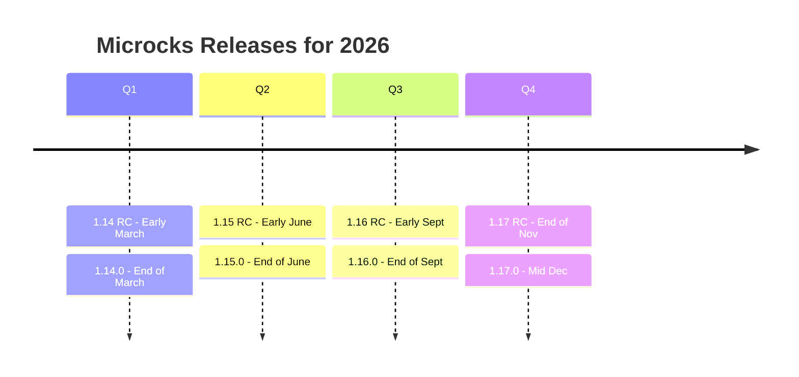
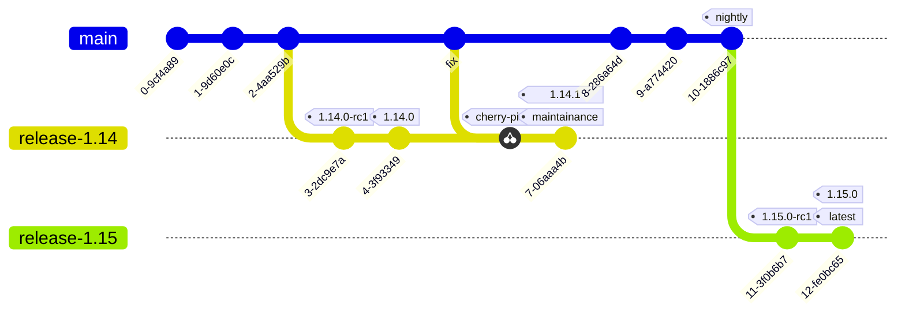
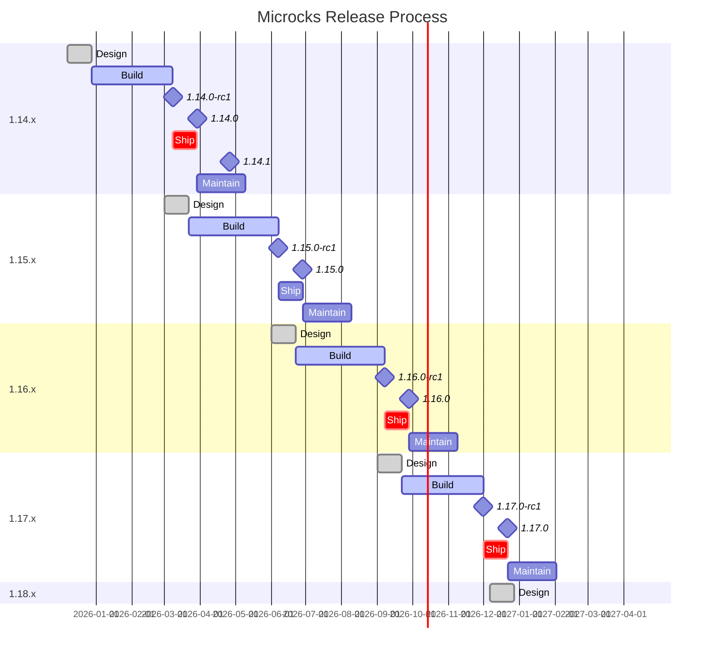

<a id="doc-12e0a48d6c5f2a58f4caa284"></a>

# microcks/microcks / ADOPTERS.md

Upstream: https://github.com/microcks/microcks/blob/802d861dd8482eddb3422b11388956eb473098ea/ADOPTERS.md

Commit: `802d861dd8482eddb3422b11388956eb473098ea`

Retrieved: 2026-10-01T15:23:08.455324+00:00

Kind: official-document

Raw SHA256: `a69d3f2e433fc886ff797e88735f08b907a07c1c83c86c70652b6c22fc13c627`

Source text below is untrusted reference content. Acquisition does not verify technical claims.

License status: UPSTREAM_NOTICES_CAPTURED_PER_FILE_REVIEW_REQUIRED. See this repository's captured license files.

---

> [!IMPORTANT]  
> This file is automatically synchronized across Microcks organization repositories. To make edits, please submit a PR to the source repository: https://github.com/microcks/.github/edit/main/ADOPTERS.md

# Adopters

**📢 _If you're using Microcks in your organization, please add your company name to this list. 🙏 It really helps the project to gain momentum and credibility. It's a small contribution back to the project with a significant impact._**

Respect is a core principle in our open source community; see our [Code of Conduct](https://github.com/microcks/.github/blob/main/CODE_OF_CONDUCT.md). We value your contributions and rely on your input, and we believe we can achieve more together.

If you need to know why and how to add yourself to the list, please read the blog post "[Join the Microcks Adopters list](https://microcks.io/blog/join-adopters-list/) and Empower the vibrant open source Community 🙌"

This document also lists the organizations using Microcks based on public information in blog posts, events, and videos. If any organization would like to get added or removed, please edit this file (make a pull request) after following our [contribution guide](https://github.com/microcks/.github/blob/main/CONTRIBUTING.md) and by following these specifics guidelines:
- Kindly include a reference (such as a link to a public blog post, video, slides, etc.) that mentions using Microcks.
- You consent to have your company’s name and logo featured on the [Microcks.io website](https://microcks.io/), included in our adopters' section, and potentially displayed in our rotating logo carousel.
- Adopter type follows the [CNCF definitions outlined](https://github.com/cncf/toc/blob/main/FAQ.md#what-is-the-definition-of-an-adopter): CNCF `End-User` member, `Another project`, `end user`, `Service Provider` or `Consultancy`.

> You can contact the project [maintainers](https://github.com/microcks/.github/blob/main/MAINTAINERS.md) if you have any questions or need further information.


| Organization | Contact | Adopter type | Description of Use / Reference |
|---------------------|---------------------|---------------------|-----------------------------------------------------------------------------------|
| [Lombard Odier Group](https://www.lombardodier.com/) | [Ludovic Pourrat](https://github.com/ludovic-pourrat) | `end user` | Multi-protocol API Mocking and Sandbox as a service #APIOps. APIdays Paris 2022 - Adding a mock as a service capability to your API strategy portfolio 👉 [slide deck](https://speakerdeck.com/apidays/apidays-paris-2022-adding-a-mock-as-a-service-capability-to-your-api-strategy-portfolio-ludovic-pourrat-lombard-odier) ⭐️ |
| [La Poste Groupe](https://www.lapostegroupe.com/) | [Nicolas Matelot](https://www.linkedin.com/in/nicolas-matelot/) [Romain Gil](https://www.linkedin.com/in/romain-gil-8444898a) | `end user` | Cloud-native application development, API Mocking and Sandbox. |
| [J.B. Hunt](https://www.jbhunt.com/) | [Carol Gschwend](https://github.com/carolgschwend) | `end user` | Accelerating cloud-native application development "The developers of the project mentioned above saved at least 7 months using Microcks. They were not only able to work concurrently but also captured the exact business requirements specified by the product owner in the form of example request/response pairs. These persistent mocks can now be utilized in sandbox environments if needed." See J.B. Hunt ⭐️ [blog post](https://microcks.io/blog/jb-hunt-mock-it-till-you-make-it/) ⭐️ |
| [Société Générale](https://www.societegenerale.com/en) | [Patrice Lachance](https://github.com/patlachance) | `end user` | Multi-protocol API Mocking, Testing and Sandbox for cloud-native APIs / applications. Cloud Innovation Platform presentation and Microcks demo 👉 [Red Hat Summit 2019](https://www.redhat.com/files/summit/session-assets/2019/T8B6B4.pdf) ⭐️|
| [Deloitte](https://www.deloitte.com/global/en.html) | [Madiha Rehman](https://www.linkedin.com/in/madihar/) | `End-User` `Consultancy` | Utilised Microcks to create backend mocks for 170+ APIs including REST and SOAP services.|
| [sesam-vitale](https://www.sesam-vitale.fr/) | [Vincent Fasciaux](mailto:vincent.fasciaux@sesam-vitale.fr) | `end user` | We use Microcks to replace the SUT's dependencies with test doubles in order to accelerate our API deliveries.|
| [BNP PARIBAS](https://group.bnpparibas/en/) | [Nadji BERRAF](https://www.linkedin.com/in/nadji-berraf-26707148/) | `end user` | We use Microcks since 2022 to mock our legacy core banking systems and mainframe APIs in order to increase agility, accelerate development, and reduce costs. Microcks is also integrated into our API-first strategy for building and delivering new cloud-native services.|
| [Akwatype](https://akwatype.io) | [Pierre-Michel Bret](https://www.linkedin.com/in/pierre-michel-bret/) | `Service Provider` | Use of Microcks to mock the APIs corresponding to the OpenAPI contracts generated by Akwatype, integration through Git.|
| [codecentric AG](https://www.codecentric.de) | [Daniel Kocot](https://www.linkedin.com/in/danielkocot/) | `Consultancy` | API Operations pipeline with an integration of Microcks and consulting services around API Mocking and Testing.|
| [CNAM](https://www.ameli.fr) | [Sébastien Fraigneau](https://www.linkedin.com/in/s%C3%A9bastien-fraigneau-82826a2) | `end user` | Using Microcks to mock SOAP services for the French healthcare system. REST is coming.|
| [CloudAPPi](https://cloudappi.net) | [Marco Antonio Sanz Molina Prados](https://www.linkedin.com/in/marco-antonio-sanz-molina-prados-09733518/)| `Service Provider` | We manage over 40 APIs strategies in medium and big companies and install Microcks as a mock server. |
| [Sypid](https://www.sypid.com/) | [Zubair Aslam](https://www.linkedin.com/in/zubes1/)| `Consultancy` | Sypid consultants are highly experienced in the Spec-first approach to API and integration design. We use Microcks to implement this approach effectively. We found the docker extension is specifically useful to get started quickly.|
| [Inetum Software](https://www.inetum.com/) | [Jérôme Palon](https://www.linkedin.com/in/jpalon/)| `end user` `Consultancy` | We use Microcks as an API centralisation and mock server for the social and civil security division, paving the path for migration to microservices and event-driven cloud architecture.|
| [Fluent CI](https://fluentci.io/) | [Tsiry Sandratraina](https://github.com/tsirysndr)| `Another project` | We use Microcks to mock and test our REST and GraphQL APIs. We also provide an open source [Microcks module](https://github.com/fluent-ci-templates/microcks-pipeline) for [Dagger](https://dagger.io) and [Fluent CI](https://fluentci.io).|
| [Nordic Semiconductor](https://nordicsemi.com) | Patrick Barnes | `end user` | We use Microcks mainly via testcontainers to test the REST APIs (and probably soon, our async, event-based APIs) for the microservices that comprise our IoT platform, [nRFCloud.com](https://nrfcloud.com/). Microcks has been invaluable, and the Microcks team a real pleasure to work with!|
| [Office national de l'emploi (ONEm)](https://www.onem.be/) | [Samuel Antoine](https://www.linkedin.com/in/samuel-antoine-07347b171/) [Christophe Lopez](https://www.linkedin.com/in/aeoncl/) | `end user` | We use Microcks as both OpenAPI contract testing tool and mock provider.|
| [Bitso](https://bitso.com/) | [Caio Amaral](https://www.linkedin.com/in/camaral) | `end user` | Microcks supports Bitso's integration and capacity testing infrastructure, allowing us to isolate the applications through well defined gRPC contracts.|
| [Catena Clearing](https://catenaclearing.io/) | [Andre Sionek](https://www.linkedin.com/in/andresionek) | `end user` | We use Microcks to mock 3rd party APIs so we can develop against them without hitting the real endpoints, Microcks is also used to run integration tests.|
| [Traefik](https://traefik.io/) | [Emile Vauge](https://github.com/emilevauge) | `Another project` `Service Provider` | We use Microcks in [Traefik’s API sandbox solution](https://traefik.io/solutions/api-mocking/) to enable developers create, publish, and consume mock APIs with production-like UX and SLAs.|
| [APIQuality](https://apiquality.io/) | [Marco Antonio Sanz](https://www.linkedin.com/in/marco-antonio-sanz-molina-prados-09733518/) [Omar del Valle](https://www.linkedin.com/in/omardelvalle/) | `Service Provider` | Your low code tool to integrate APIOps. Develops secure and quality APIs implementing API First methodology. We use Microcks as our default tool for mocking. Create secure and functional APIs from a single tool!|
| [Banco PAN](https://www.bancopan.com.br/) | [Rodrigo Ferreira](https://www.linkedin.com/in/rodrigo-ferreira-321a7995/) | `end user` | We leverage Microcks to create a virtual environment, simulating API and AsyncAPI services while seamlessly connecting with our external Kafka cluster for testing purposes. |
|[ Office des Postes et Télécommunications de Nouvelle-Calédonie](https://www.opt.nc/) | [Adrien SALES](https://www.linkedin.com/in/adrien-sales/) [Vinh Faucher](https://www.linkedin.com/in/vinh-faucher/) [Michèle BARRE](https://www.linkedin.com/in/michelebarre/)| `end user` | API & Kafka Mocking (end users & Github.com CI), see [Microcks for dummies](https://dev.to/optnc/microcks-for-dummies-1imn) on [dev.to/optnc](https://dev.to/optnc) for more information.|
|[ Bump.sh](https://bump.sh/) | [Christophe Dujarric](https://www.linkedin.com/in/christophedujarric/) [Sebastien Charrier](https://www.linkedin.com/in/sebastiencharrier/)| `Service Provider` | Using Bump.sh and Microcks together allows you to create a clear feedback cycle of [API documentation](https://bump.sh/), testing, simulation, trial implementation, and iteration. [Read more about this](https://bump.sh/blog/microcks-bump-sh-testing-mocking-docs).|
|[Michelin](https://www.michelin.fr/) | [Alex Picarle](https://github.com/AlexP63) | `End-User` | We use Microcks to elaborate our PoCs, to offer api sandbox or discovery trials and overall promote #DesignFirst approach.|
|[Amway](https://www.amway.com/) | [Brian Hibma](https://www.linkedin.com/in/brianhibma/) [Sai Bommakanti](https://www.linkedin.com/in/saiabhinay-bommakanti-31014943/) | `end user` | We use Microcks primarily as a platform for API and Event mocking and discovery, integrating it into our DevOps and CI/CD practices, and unblocking parallel, contract-based development from teams. |
|[BITMARCK](https://www.bitmarck.de) | [Michael Goll](https://github.com/goll-michael) | `end user` | We use Microcks to mock the APIs that correspond to the generated or manually created OpenAPI contracts.|
|[Agile Actors](https://www.agileactors.com/) | [Stelios Gkiokas](https://github.com/sgkiokas) | `Consultancy` | Microcks is used for speeding up the development time of multiple microservices, both locally and on CI, by leveraging the ability of auto-generating (dynamic) mocks via OpenAPI specs, gRPC contracts and GraphQL schemas in our case. We managed to bridge the gap we had in our client between developers, SETs and Manual QAs in the best possible manner.|
| [AsyncAPI Generator](https://github.com/asyncapi/generator) | [Lukasz Gornicki](https://www.linkedin.com/in/lukasz-gornicki-a621914/) | `Another project` | AsyncAPI Generator is a tool that, among other things, is responsible for providing functionality to generate clients/SDKs. Thanks to Microcks, we were able to provide acceptance testing infrastructure that allows us to test, on a pull request level, if generated clients actually work. Microcks provides mocks, and we communicate with them through generated clients. Some more details you can find [in this directory in the generator repo](https://github.com/asyncapi/generator/tree/master/packages/templates/clients/websocket/test), but this location is a subject for change as we want to start using Microcks not only for Websocket but now also for Kafka. |
| [TransferGo](https://www.transfergo.com/) | [Zbigniew Malcherczyk](https://www.linkedin.com/in/zbigniew-malcherczyk/) | `end user` | TransferGo, founded in 2012, serves over 8 million customers across 160+ countries by providing fast and affordable international money transfers. Microcks has empowered our teams with AsyncAPI and OpenAPI server mocks, as well as a robust infrastructure for contract testing. |
| [UEAT](https://ueat.io/) | [Olivier Beaudet](https://github.com/obeaudet-ueat) | `end user` | UEAT is a complete solutions for restaurant revenue growth. Online Ordering, Self-Ordering Kiosks, Hub Management, Table Ordering, POS Integration and more. Microcks has empowered our teams with OpenAPI server mocks. Allowing to mock third party integration, testing locally or via CI/CD. |
| [GetYourGuide](https://www.getyourguide.com/) | [Lukasz Luszczynski](https://github.com/lukaszgyg) | `end user` | We use Microcks to mock OpenAPI-defined dependencies for local development and integration testing, enabling parallel, contract-based development across services. |
|[XM](https://www.xm.com/) | [Stelios Gkiokas](https://github.com/sgkiokas) | `end user` | Microcks streamlines microservice development and testing by dynamically generating mocks from OpenAPI specs, gRPC contracts, and GraphQL schemas. Using Testcontainers, it replaces WireMock, gRPC Mock by Fadelis, and HttpGraphQlTester, while Kubernetes Operators allow teams to manage their own instances. This approach also enables realistic simulation of Payment Service Providers and provides a unified platform for developers, SETs, and QAs to collaborate effectively.|
| [Amadeus](https://amadeus.com) | [Romain Quinio](https://www.linkedin.com/in/rquinio) [Kevin Viet](https://www.linkedin.com/in/vietk) [Basappa Vittalappa Dapalapur](https://www.linkedin.com/in/basu-dapalapur/) | `End-User` | We use Microcks to shift-left our mocking and contract-testing approach. For example, see how we use Microcks for mocking [OIDC](https://hub.microcks.io/package/openid.net/api/oidc.1.0) by checking out the slide deck from one of our talks on the subject! 👉 [Riviera DEV 2025](https://www.slideshare.net/slideshow/how-to-secure-your-apis-without-compromising-the-developer-experience-pdf/281499574).|
| [Kiabi](https://kiabi.com) | [Emmanuel Peru](https://github.com/emmanuelperu) [Baptiste Desmasures](https://www.linkedin.com/in/baptiste-desmasures) | `end user` | We use **Microcks** to mock REST and Graphql API contracts, enable reliable testing, and streamline development workflows. It helps some of our teams ensure consistency, validate integrations early, and improve collaboration across different services. By simulating APIs, Microcks reduces friction in development and increases confidence in production deployments.|
| [Waymark Health](https://waymarkhealth.au) | [Steve Swinsburg](https://www.linkedin.com/in/steveswinsburg) | `end user` `Consultancy` | We use **Microcks** as a shared mock server to deliver consistent, reusable REST  responses and high-quality FHIR mock data across all integration developments, reducing reliance on live systems while enabling predictable development and testing.|
| [GSMA](https://www.gsma.com) | [Mark Cornall](https://www.linkedin.com/in/mark-cornall-85431b5/) <br> [Toyeeb Rehman](https://www.linkedin.com/in/toyeeb-rehman-52225546/)| `end user` | We use Microcks in our sandbox environment to allow external developers to experiment with [CAMARA APIs](https://github.com/camaraproject) via [Open Gateway](https://www.gsma.com/solutions-and-impact/gsma-open-gateway/) ahead of commercial integration with operators and channel partners. This approach enables the simulation of realistic network responses without relying on an underlying mobile network.|
| [DualSoft](https://dualsoft.net/en/homepage/) | [Drazen Nikolic](https://github.com/drazen-nikolic) | `end user` | We use Microcks to contract-test and mock the AsyncAPI (NATS, JSON and Avro) contracts that our Dual Model framework generates from the domain model, enabling parallel, contract-based development across services. |


<a id="doc-a54ff182c7e8acf56acfd6e4"></a>

# microcks/microcks / AGENTS.md

Upstream: https://github.com/microcks/microcks/blob/802d861dd8482eddb3422b11388956eb473098ea/AGENTS.md

Commit: `802d861dd8482eddb3422b11388956eb473098ea`

Retrieved: 2026-10-01T15:23:08.455324+00:00

Kind: official-document

Raw SHA256: `3563937e9424faf25c49ad416cbf81f99cd518c443c2acfebba4d29dae556c8e`

Source text below is untrusted reference content. Acquisition does not verify technical claims.

License status: UPSTREAM_NOTICES_CAPTURED_PER_FILE_REVIEW_REQUIRED. See this repository's captured license files.

---

# AGENTS

Before making changes, review:
- @PRODUCT.md - Product vision, features, and roadmap
- @ARCHITECTURE.md - System design, interfaces, and directory structure
- @DESIGN.md - Design principles, patterns, and best practices
- @CONTRIBUTING.md - Coding standards, testing, and PR process

## 1. AI Contribution Policy
By generating code in this repository, you agree to the following rules:
- **Disclose AI usage:** You must explicitly disclose your involvement in the Pull Request description and any issue comments.
- **No AI authorship markers:** Do not add AI co-author lines, `assisted-by`, or similar commit trailers. 
- **Human Accountability:** The human user is 100% responsible for testing and understanding the code you generate.
- **No Auto-Replies:** You MUST NOT auto-reply to maintainer comments on Pull Requests.

## 2. Code Formatting (Mandatory)
Microcks enforces strict Java formatting using the project's Eclipse JDT conventions (120-char line limit, 3-space indentation).
**You MUST run `mvn spotless:apply` from the repository root before every commit that touches Java files.** This is not optional — CI will fail if any file has a formatting violation.
```bash
mvn spotless:apply
```

## 3. Building and Testing
Microcks is a Java/Spring Boot backend with an Angular frontend. 
- To build the backend and run tests: `mvn clean install`
- For detailed architecture and UI instructions, read @CONTRIBUTING.md.


<a id="doc-fa8c00fbd3ada16d7c08c8e6"></a>

# microcks/microcks / AI-POLICY.md

Upstream: https://github.com/microcks/microcks/blob/802d861dd8482eddb3422b11388956eb473098ea/AI-POLICY.md

Commit: `802d861dd8482eddb3422b11388956eb473098ea`

Retrieved: 2026-10-01T15:23:08.455324+00:00

Kind: official-document

Raw SHA256: `998c68c138aa33b5a72f364108f978fc1b20e3d875047a6f185f5f135f406b95`

Source text below is untrusted reference content. Acquisition does not verify technical claims.

License status: UPSTREAM_NOTICES_CAPTURED_PER_FILE_REVIEW_REQUIRED. See this repository's captured license files.

---

# Microcks AI Contribution Policy

Contributors may use Generative AI tools (such as Large Language Models, GitHub Copilot, Cursor, Claude Code, etc.) when contributing to Microcks. As with any development tool, you are responsible for the quality of the result and for understanding what you submit.

This policy applies to all repositories in the `microcks` GitHub organization.

## Guiding Principle

Microcks is a community-driven organization that values expertise, clear communication, and personal responsibility. To maintain trust in the AI era, we follow a key principle:

**What you do with Generative AI reflects on you.**

Successful ongoing contribution to this community is contingent on building trust with the members of the organization through ongoing collaboration. Whether or not Generative AI tools were involved, you are fully accountable for the correctness, security, and clarity of your contributions. Human review is required for all code, including code generated or assisted by Generative AI tools. 

## Understanding and Responsibility

* **You must understand your contribution.** Do not submit code, documentation, or other content that you do not fully understand. You should be able to explain to reviewers what your contribution does, how it works, and how you verified it. You should be able to answer reviewers' questions yourself, without recourse to AI.
* **Review all AI-generated content.** Before submitting, verify that the contribution is correct, tested, and follows the project's contributing guidelines.
* **You own what you submit.** As the PR author, you are responsible for all changes, regardless of the tools used to create them. 
* **Do not blame the AI tool.** “The AI generated it” is not an acceptable response to review feedback. You are expected to understand and defend every part of your contribution.

## Acceptable Use

We recognize that Generative AI can be a helpful tool. You may use it to:
* Explain parts of the codebase you don’t understand.
* Auto-complete routines or boilerplate code (such as error handling, test scaffolding, function signatures).
* Reformat or refactor existing content.
* Brainstorm ideas for implementation cases, but write the actual code yourself.
* Draft test cases which you subsequently review, revise, and simplify before submission.

These uses are acceptable provided you are involved in the entire process, fully understand the content, and take personal responsibility for it.

## What NOT to Do (Unacceptable Use)

It is **not acceptable** to use Generative AI tools in the following ways:

* **Do not instruct AI tools to directly respond to comments.** You must not use AI tools to auto-reply to maintainer review comments on Pull Requests or Issues. Reviewers want to engage with you, not receive generic AI-generated responses. If you use AI assistance to formulate responses, ensure they genuinely reflect your understanding and that you can defend your reasoning.
* **Do not use AI tools in commit trailers.** AI tools MUST NOT be added to `Signed-off-by`, `Co-authored-by`, `Assisted-by`, or similar tags in commit messages. Only humans can legally certify the [Developer Certificate of Origin (DCO)](https://developercertificate.org/). The `Signed-off-by` tag certifies that you wrote the code or otherwise have the right to submit it. An AI tool is not a legal entity and cannot make this certification.
* **Do not submit large, unfocused AI-generated PRs.** AI tools can generate content faster than reviewers can read it. Keep PRs focused. Maintainers MAY close pull requests that are too large to review effectively.
* **Do not flood the project with contributions.** If you already have Pull Requests awaiting review, allow maintainers time to respond before opening more.
* **Avoid verbose AI-generated content.** Trim down unnecessary verbosity in PR descriptions, commit messages, and code comments. Be clear, concise, and specific. 
* **Do not use AI for `good first issue` tasks.** Issues labeled as `good first issue` are intended for new contributors to learn the codebase and gain experience. Using AI tools to complete these issues is against their purpose.
* **Do not plagiarize.** Do not submit work produced via AI tooling that copies from external sources without correct attribution or licensing.

## Quality Standards

* **Meet the same standards.** AI-assisted contributions are reviewed to the same standard as any other contribution. Code must be correct, maintainable, well-tested, and consistent with project conventions.
* **Ensure licensing compliance.** AI-generated content must not introduce material under licenses incompatible with the project's Apache 2.0 License.
* **Test your changes.** All code contributions must be tested according to the project's standards, whether AI-assisted or not.

## AI-Assisted Reviews and Proposals

* **AI reviews don't replace human review.** Automated checks and AI-generated review comments can provide useful signals, but they do not satisfy the project's review requirements. Maintainers make the merge decisions.
* **Do not request AI-assisted reviews on PRs.** Do not invoke AI bots or tools to post review comments on project PRs. If AI-assisted review is desired, maintainers will request it.
* **Proposals require deep understanding.** If you use AI tools to help draft architectural proposals, you must have a thorough understanding of the problem space, proposed solution, and alternatives. The rationale matters most.
* **Communicate in your own voice.** AI tools may help improve clarity, especially when English is not your first language, but the reasoning and final message must genuinely be yours.

## Transparency & Attribution

We expect contributors to declare when Generative AI was used to prepare a submission. 

* **Explicit Disclosure:** You must explicitly disclose AI usage in your Pull Request description.
* **Developer Certificate of Origin:** If you submit AI-assisted contributions, you are personally certifying via the DCO that you have the right to contribute the content under the project's license.

If you’re unsure about the licensing of code you created using Generative AI tools, **don’t submit it**.

## Linux Foundation Policy

As a CNCF project, Microcks contributions must also comply with the [Linux Foundation Generative AI Policy](https://www.linuxfoundation.org/legal/generative-ai).

## Consequences of Non-Compliance

Pull Requests that violate this policy may be closed. Specific cases include:
* PRs where the contributor cannot explain or defend the changes during review.
* PRs with generic, inauthentic responses to reviewer feedback that demonstrate a lack of understanding.
* Large, unfocused PRs that appear to be bulk AI-generated content.

## Credits

This policy was inspired by the [Crossplane AI Contribution Policy](https://github.com/crossplane/crossplane/blob/main/AI_POLICY.md) and by the experiences and references shared through the collaborative [CNCF discussion on AI contribution policies](https://github.com/cncf/foundation/issues/1285) initiated by Microcks.

We thank all the maintainers and contributors who have participated in this discussion: @caniszczyk, @charlieegan, @CortNick, @jberkus, @jbw976, @joestringer, @krook, @mx-psi, @Sapthagiri777, @soltysh, @stefanprodan, @tuminoid, @Vaishnav88sk, @xmulligan, @yada, and @yurishkuro.


<a id="doc-8f6366fd8e7a5fa30f7f0587"></a>

# microcks/microcks / ARCHITECTURE.md

Upstream: https://github.com/microcks/microcks/blob/802d861dd8482eddb3422b11388956eb473098ea/ARCHITECTURE.md

Commit: `802d861dd8482eddb3422b11388956eb473098ea`

Retrieved: 2026-10-01T15:23:08.455324+00:00

Kind: official-document

Raw SHA256: `ae94450619699ddf52406c93212c9128223893b752965ff0360209e5462190f0`

Source text below is untrusted reference content. Acquisition does not verify technical claims.

License status: UPSTREAM_NOTICES_CAPTURED_PER_FILE_REVIEW_REQUIRED. See this repository's captured license files.

---

# Architecture

Microcks is designed as a cloud-native, Kubernetes-ready application.

## Core Components
- **Backend:** A Java-based Spring Boot application providing the core API and orchestration logic.
- **Frontend:** An Angular-based SPA for the web user interface.
- **Database:** MongoDB for storing mock definitions, tests, and configuration data.
- **IAM/Auth:** Keycloak is used for securing endpoints, managing users, and handling authentication (OAuth2/OIDC).
- **Minions:** Specialized async workers (e.g., AsyncAPI minion) for handling message-driven protocols like Kafka.

## Interfaces
- **REST API:** The primary interface for the frontend UI and the Microcks CLI to interact with the backend.
- **Microcks CLI:** A Go-based command-line tool for CI/CD pipeline integration.

## Extensibility
Microcks is built to be highly extensible. Through the use of plugins and dedicated Minion workers, it can easily adapt to new enterprise protocols or integrate with external Identity Providers.


<a id="doc-9d2e6541ed796693cf2aa484"></a>

# microcks/microcks / BACKERS.md

Upstream: https://github.com/microcks/microcks/blob/802d861dd8482eddb3422b11388956eb473098ea/BACKERS.md

Commit: `802d861dd8482eddb3422b11388956eb473098ea`

Retrieved: 2026-10-01T15:23:08.455324+00:00

Kind: official-document

Raw SHA256: `281547ea6371626879fbd1994569406220617d2144e44c1a5de3187cf9e72577`

Source text below is untrusted reference content. Acquisition does not verify technical claims.

License status: UPSTREAM_NOTICES_CAPTURED_PER_FILE_REVIEW_REQUIRED. See this repository's captured license files.

---

# Sponsors &amp; Backers

[Microcks](https://microcks.io/) is a [Cloud Native Computing Foundation Incubating](https://landscape.cncf.io/?item=app-definition-and-development--application-definition-image-build--microcks) project 🚀 with its ongoing development made possible entirely by the support of the awesome sponsors and backers listed in this file. If you'd like to join them, please consider [sponsoring](https://opencollective.com/microcks) Microcks's development.

**BTW 📢 _If you're using Microcks in your organization, please add your company name to the adopters list. 🙏 It really helps the project to gain momentum and credibility. It's a small contribution back to the project with a big impact._**
https://github.com/microcks/.github/blob/main/ADOPTERS.md

> Platinum💎, gold🥇 and silver🥈 **sponsors**, [join us](https://opencollective.com/microcks) 🙌<br>
> **Invest** in **your supply chain!**

If you run a business and is using Microcks in a revenue-generating product/service, it would make business sense to sponsor Microcks development: it ensures the project that you rely on a healthy, strong and engaged community. It can also help your exposure in the open source community and makes it easier to attract new talents.

If you'd like to help and support Microcks to [level up](https://www.cncf.io/project-metrics/) within the [CNCF](https://www.cncf.io) and keep growing the open source way, please consider:

- [Become a backer or sponsor on OpenCollective](https://opencollective.com/microcks).

## Special Sponsors
[image width="350"]: #
<p align="center">
  <a href="https://postman.com/"></a>
</p>

## Platinum Sponsors
[image width="300"]: #
[Become the first platinum sponsor](https://opencollective.com/microcks/contribute/platinum-sponsors-61341/checkout?interval=month&amount=2000&name=&legalName=&email=)

## Gold Sponsors
[image width="250"]: #
[Become the first gold sponsor](https://opencollective.com/microcks/contribute/gold-sponsors-61340/checkout?interval=month&amount=1000&name=&legalName=&email=)

## Silver Sponsors
[image width="200"]: #
[Become the first silver sponsor](https://opencollective.com/microcks/contribute/silver-sponsors-61339/checkout?interval=month&amount=500&name=&legalName=&email=)

## Bronze Sponsors
[image width="150"]: #
<p align="center">
  <a href="https://bitso.com/"></a>
  <a href="https://www.devmark.ai/fern/?utm_source=microcks&utm_loc=readme&utm_type=logo"></a>
</p>

[Become a bronze sponsor](https://opencollective.com/microcks/contribute/bronze-sponsors-61338/checkout?interval=month&amount=100&name=&legalName=&email=)

## OpenCollective Generous Backers

<a href="https://opencollective.com/microcks#section-contributors" target="_blank"></a>


<a id="doc-f1355fd54329147c830843ab"></a>

# microcks/microcks / BUILDING.md

Upstream: https://github.com/microcks/microcks/blob/802d861dd8482eddb3422b11388956eb473098ea/BUILDING.md

Commit: `802d861dd8482eddb3422b11388956eb473098ea`

Retrieved: 2026-10-01T15:23:08.455324+00:00

Kind: official-document

Raw SHA256: `8ef4bbf0cd92850724a54e6572415b83154bdae56ea101fede05a905ace8bcae`

Source text below is untrusted reference content. Acquisition does not verify technical claims.

License status: UPSTREAM_NOTICES_CAPTURED_PER_FILE_REVIEW_REQUIRED. See this repository's captured license files.

---

# Building guide

**Want to contribute and build stuff? Great!** ✨ We try to make it easy, and all contributions, even the smaller ones, are more than welcome. This includes bug reports, fixes, documentation, examples...

First, you may need to read our [global contribution guide](https://github.com/microcks/.github/blob/master/CONTRIBUTING.md) and then to read this page.

## Reporting an issue

This project uses GitHub issues to manage the issues. Open an issue directly in GitHub.

If you believe you found a bug, and it's likely possible, please indicate a way to reproduce it, what you are seeing and what you would expect to see.
Don't forget to indicate your Java, Maven and/or Docker version.

## Setup

### Git hooks

The repository ships its client-side hooks in the versioned `.githooks` directory (a `pre-commit` hook running
`mvn spotless:check` and a `commit-msg` hook enforcing Conventional Commits and sign-off).

Running a build from the repository root (`mvn validate`, `mvn clean install`, ...) wires them automatically by setting
the **repository-local** Git config:

```
$ git config --local core.hooksPath .githooks
```

Notes:

- Only this repository's config is touched. Your global/system Git configuration and your other projects are never
  modified.
- The path is relative, so Git resolves it from the top level of the current working tree. This makes it work
  identically in the main clone and in any [git worktree](https://git-scm.com/docs/git-worktree), where `.git` is a
  file and has no `hooks` directory of its own.
- If you previously built Microcks, stale copies may still live in `.git/hooks`; they are now ignored and can be
  deleted.
- Pass `-Dgit.hooks.skip=true` to skip this step, or run `git commit --no-verify` to bypass the hooks for a commit.

## Build

### Build the whole project

You need to have [Apache Maven](https://maven.apache.org) (version >= 3.5) up and running as well as a valid Java Development Kit (version >= 25) install to build the project.

```
$ git clone https://github.com/microcks/microcks.git
[...]
$ cd microcks
$ mvn clean install
[...] 
[INFO] ------------------------------------------------------------------------
[INFO] Reactor Summary for Microcks 1.12.0-SNAPSHOT:
[INFO] 
[INFO] Microcks ........................................... SUCCESS [  0.408 s]
[INFO] Microcks Model ..................................... SUCCESS [  1.771 s]
[INFO] Microcks Util ...................................... SUCCESS [  4.590 s]
[INFO] Microcks EL ........................................ SUCCESS [  1.018 s]
[INFO] Microcks App ....................................... SUCCESS [ 40.540 s]
[INFO] Microcks Async Minion .............................. SUCCESS [  8.425 s]
[INFO] Microcks Distros ................................... SUCCESS [  0.034 s]
[INFO] Microcks Uber App .................................. SUCCESS [  0.850 s]
[INFO] Microcks Uber Async Minion ......................... SUCCESS [  3.818 s]
[INFO] ------------------------------------------------------------------------
[INFO] BUILD SUCCESS
[INFO] ------------------------------------------------------------------------
[INFO] Total time:  01:01 min
[INFO] Finished at: 2025-04-07T18:07:39+02:00
[INFO] ------------------------------------------------------------------------
```

### Build and run webapp jar

For now, there's still a problem with Frontend integration tests configuration so you should disable them using the following flag:

```
$ cd webapp
$ mvn -Pprod package
[...]
$ java -jar target/microcks-x.y.z-SNAPSHOT.jar
```

### Build and run webapp Docker image

```
$ cd webapp
$ mvn -Pprod clean package && docker build -f src/main/docker/Dockerfile -t microcks/microcks-uber:nightly .
[...]
$ cd ../install/docker-compose
$ docker-compose -f docker-compose.yml up -d
```
After spinning up the containers, you will now have access to Keycloak for account management, and microcks webapp to setup mocking, etc.

You can login to keycloak on `http://localhost:18080/` with username and password `admin`.
You can login to microcks webapp with the username `admin` and password `microcks123`.

## Before you contribute

To contribute, use GitHub Pull Requests, from your **own** fork.


<a id="doc-06572a96a58dc510037d5efa"></a>

# microcks/microcks / CHANGELOG.md

Upstream: https://github.com/microcks/microcks/blob/802d861dd8482eddb3422b11388956eb473098ea/CHANGELOG.md

Commit: `802d861dd8482eddb3422b11388956eb473098ea`

Retrieved: 2026-10-01T15:23:08.455324+00:00

Kind: official-document

Raw SHA256: `7beb0a6855d6dfb289fcea1bb54a4209b784fc3f100e88d92da6e8a6073e106d`

Source text below is untrusted reference content. Acquisition does not verify technical claims.

License status: UPSTREAM_NOTICES_CAPTURED_PER_FILE_REVIEW_REQUIRED. See this repository's captured license files.

---

# CHANGELOG

## Introduction

This file provides a high-level summary of the changes and updates made to the Microcks project.

## Releases

For a comprehensive list of changes, please visit the [official release page](https://github.com/microcks/microcks/releases) 

## For More Information

For more detailed release notes, please refer to the [Microcks blog page](https://microcks.io/blog/).

## For specific changes on this repo

Refer to the [activity view](https://docs.github.com/en/repositories/viewing-activity-and-data-for-your-repository/using-the-activity-view-to-see-changes-to-a-repository) of the current repository for detailed information on all recent changes.


<a id="doc-6ebdb617a8104a7756d0cf36"></a>

# microcks/microcks / CLAUDE.md

Upstream: https://github.com/microcks/microcks/blob/802d861dd8482eddb3422b11388956eb473098ea/CLAUDE.md

Commit: `802d861dd8482eddb3422b11388956eb473098ea`

Retrieved: 2026-10-01T15:23:08.455324+00:00

Kind: official-document

Raw SHA256: `336cc4fbf19beaada7ccf9986414fa91851a8d7a07dfb3ccbe800a69eed0ab49`

Source text below is untrusted reference content. Acquisition does not verify technical claims.

License status: UPSTREAM_NOTICES_CAPTURED_PER_FILE_REVIEW_REQUIRED. See this repository's captured license files.

---

@AGENTS.md


<a id="doc-ffdbe3a1e7ee93cacfc080b6"></a>

# microcks/microcks / CODE_OF_CONDUCT.md

Upstream: https://github.com/microcks/microcks/blob/802d861dd8482eddb3422b11388956eb473098ea/CODE_OF_CONDUCT.md

Commit: `802d861dd8482eddb3422b11388956eb473098ea`

Retrieved: 2026-10-01T15:23:08.455324+00:00

Kind: official-document

Raw SHA256: `cab02e8608992b4cacdeba26b0051ad0e7b64c534480c26f9af60d9e2a22b6d3`

Source text below is untrusted reference content. Acquisition does not verify technical claims.

License status: UPSTREAM_NOTICES_CAPTURED_PER_FILE_REVIEW_REQUIRED. See this repository's captured license files.

---

# Microcks Community Code of Conduct

Microcks project adheres to the [CNCF Code of Conduct](https://github.com/cncf/foundation/blob/main/code-of-conduct.md), aligning with the values of collaboration, transparency, and inclusivity that define open source.

## Our Pledge

As contributors and maintainers of the Microcks project, we are committed to fostering an open, welcoming, and inclusive environment. By participating in our community, we pledge to:

- Promote a harassment-free experience for everyone, regardless of age, body size, disability, ethnicity, gender identity and expression, experience level, nationality, personal appearance, race, religion, or sexual identity and orientation.
- Support a spirit of mutual respect, empathy, and cooperation, ensuring that every contribution—big or small—is valued.
- Encourage collaboration, knowledge-sharing, and continuous learning, as these are the cornerstones of any successful open-source community.

## Our Standards

To ensure a productive, positive experience for all community members, we ask everyone to:

- **Be respectful and considerate**: Engage with others constructively, appreciating the diverse perspectives and ideas within the community.
- **Be collaborative**: Open-source thrives on shared efforts and diverse input. Offer help where needed and seek help when necessary.
- **Lead by example**: Encourage new contributors and foster an environment where everyone feels welcome to participate.
- **Value inclusivity**: Open source is for everyone. Actively support a diverse range of contributors and voices, regardless of background.

## Enforcement

Please do not report Code of Conduct incidents through public channels.

Incidents occurring entirely within the Microcks community may be reported privately to the Microcks project team at [info@microcks.io](mailto:info@microcks.io).

Reports may instead be submitted to the CNCF Code of Conduct Committee at [conduct@cncf.io](mailto:conduct@cncf.io), especially when:

- A Microcks Maintainer or project-level incident responder is involved,
- A conflict of interest may prevent impartial project-level handling,
- The incident is project-agnostic or affects multiple CNCF projects, or
- The reporter prefers independent handling by CNCF.

The CNCF [Incident Resolution Procedures](https://github.com/cncf/foundation/blob/main/code-of-conduct/coc-incident-resolution-procedures.md) explain what to include in a report, what happens after submission and how to report anonymously. Reports are handled or transferred according to the CNCF [Code of Conduct jurisdiction policy](https://github.com/cncf/foundation/blob/main/code-of-conduct/coc-committee-jurisdiction-policy.md).

The project team will:

- Review and investigate all reports confidentially.
- Take proportionate protective or remedial action within the project's jurisdiction and applicable CNCF policies.
- Protect the reporter's identity and share confidential information only when needed to investigate, resolve or transfer the incident, subject to the CNCF procedures and applicable law.
- Require anyone with a conflict of interest to recuse themselves from accessing confidential report information, investigating the incident or deciding its resolution.
- Transfer incidents to the CNCF Code of Conduct Committee when required by the CNCF jurisdiction policy.

## A Community-Driven Open Source

Microcks thrives because of its open-source community. We encourage all members to actively contribute, share knowledge, and help make our project better for everyone. By following this Code of Conduct, we can create a community that supports innovation, collaboration, and the open-source values we all believe in.

Thank you for being part of the Microcks community!


<a id="doc-eca12c0a30e25b4b46522ebf"></a>

# microcks/microcks / CONTRIBUTING.md

Upstream: https://github.com/microcks/microcks/blob/802d861dd8482eddb3422b11388956eb473098ea/CONTRIBUTING.md

Commit: `802d861dd8482eddb3422b11388956eb473098ea`

Retrieved: 2026-10-01T15:23:08.455324+00:00

Kind: official-document

Raw SHA256: `0464bc571a94ec65b654128b68ba6b04afa95a7d6c8efbbc7382f413c012c261`

Source text below is untrusted reference content. Acquisition does not verify technical claims.

License status: UPSTREAM_NOTICES_CAPTURED_PER_FILE_REVIEW_REQUIRED. See this repository's captured license files.

---

# Contributing to Microcks

We love your input! We want to make contributing to this project as easy and transparent as possible.

## Summary of the contribution flow

The following is a summary of the ideal contribution flow. Please, note that Pull Requests can also be rejected by the maintainers when appropriate.

```
    ┌───────────────────────┐
    │                       │
    │    Open an issue      │
    │  (a bug report or a   │
    │   feature request)    │
    │                       │
    └───────────────────────┘
               ⇩
    ┌───────────────────────┐
    │                       │
    │  Open a Pull Request  │
    │   (only after issue   │
    │     is approved)      │
    │                       │
    └───────────────────────┘
               ⇩
    ┌───────────────────────┐
    │                       │
    │   Your changes will   │
    │     be merged and     │
    │ published on the next │
    │        release        │
    │                       │
    └───────────────────────┘
```

## Code of Conduct

Microcks has adopted a Code of Conduct that we expect project participants to adhere to. Please [read the full text](CODE_OF_CONDUCT.md) so that you can understand what sort of behaviour is expected.

## Our Development Process

We use Github to host code, to track issues and feature requests, as well as accept pull requests.

## Issues

[Open an issue](https://github.com/microcks/microcks/issues/new) **only** if you want to report a bug or a feature. Don't open issues for questions or support, instead join our [Discord #support channel](https://microcks.io/discord-invite) or our [GitHub discussions](https://github.com/orgs/microcks/discussions) and ask there. 

## Bug Reports and Feature Requests

Please use our issues templates that provide you with hints on what information we need from you to help you out.

## Pull Requests

**Please, make sure you open an issue before starting with a Pull Request, unless it's a typo or a really obvious error.** Pull requests are the best way to propose changes to the specification. Take time to check the current working branch for the repository you want to contribute on before working :wink:

### AI Contribution Policy

If you use Generative AI tools (like GitHub Copilot, Cursor, etc.) to assist in your contributions, you must adhere to our [AI Contribution Policy](AI-POLICY.md). You are 100% accountable for your code, must explicitly disclose AI usage in your PR, and must not use AI tools to auto-reply to maintainers.

## Conventional commits

Our repositories follow [Conventional Commits](https://www.conventionalcommits.org/en/v1.0.0/#summary) specification. Releasing to GitHub and NPM is done with the support of [semantic-release](https://semantic-release.gitbook.io/semantic-release/).

Pull requests should have a title that follows the specification, otherwise, merging is blocked. If you are not familiar with the specification simply ask maintainers to modify. You can also use this cheatsheet if you want:

- `fix: ` prefix in the title indicates that PR is a bug fix and PATCH release must be triggered.
- `feat: ` prefix in the title indicates that PR is a feature and MINOR release must be triggered.
- `docs: ` prefix in the title indicates that PR is only related to the documentation and there is no need to trigger release.
- `chore: ` prefix in the title indicates that PR is only related to cleanup in the project and there is no need to trigger release.
- `test: ` prefix in the title indicates that PR is only related to tests and there is no need to trigger release.
- `refactor: ` prefix in the title indicates that PR is only related to refactoring and there is no need to trigger release.

What about MAJOR release? just add `!` to the prefix, like `fix!: ` or `refactor!: `

Prefix that follows specification is not enough though. Remember that the title must be clear and descriptive with usage of [imperative mood](https://chris.beams.io/posts/git-commit/#imperative).

Happy contributing :heart:

## License

When you submit changes, your submissions are understood to be under the same [Apache 2.0 License](https://github.com/microcks/microcks/blob/master/LICENSE) that covers the project. Feel free to [contact the maintainers](https://github.com/microcks/.github/blob/main/MAINTAINERS.md) if that's a concern.

## References

This document was adapted from the open-source contribution guidelines for [Facebook's Draft](https://github.com/facebook/draft-js/blob/master/CONTRIBUTING.md).


<a id="doc-74eb2623aa815edb7cd6f6b6"></a>

# microcks/microcks / DEPENDENCY_POLICY.md

Upstream: https://github.com/microcks/microcks/blob/802d861dd8482eddb3422b11388956eb473098ea/DEPENDENCY_POLICY.md

Commit: `802d861dd8482eddb3422b11388956eb473098ea`

Retrieved: 2026-10-01T15:23:08.455324+00:00

Kind: official-document

Raw SHA256: `be6e966866786463bfef0ce86013c30095c61af3cd354512ba421321c0c21082`

Source text below is untrusted reference content. Acquisition does not verify technical claims.

License status: UPSTREAM_NOTICES_CAPTURED_PER_FILE_REVIEW_REQUIRED. See this repository's captured license files.

---

# Microcks External Dependency Policy

## External dependencies dashboard

The list of external dependencies in this Microcks repository with their current version is available at
[network/dependencies](../../network/dependencies)

## Declaring external dependencies

Depending on the Microcks Core or Module/extension technology stack, all external dependencies should be declared
in either `pom.xml`, `package.json` or `go.mod` root files.

Dependency declarations must:

* Provide a meaningful project name and URL.
* State the version in the `version` field. String interpolation can be used to aggregate all versions declaration at the same place.
* Versions should prefer release versions over main branch GitHub SHA tarballs. A comment is necessary if the latter is used. 
  This comment should contain the reason that a non-release version is being used.

## New external dependencies

The criteria below are used to evaluate new dependencies. They apply to all core dependencies and any extension
that is robust to untrusted downstream or upstream traffic. The criteria are guidelines, exceptions may be granted 
with solid rationale. Precedent from existing extensions does not apply; there are extant extensions in violation 
of this policy which we will be addressing over time, they do not provide grounds to ignore policy criteria below.

|Criteria|Requirement|Mnemonic|Weight|Rationale|
|--------|-----------|--------|------|---------|
|Cloud Native Computing Foundation (CNCF) [approved license](https://github.com/cncf/foundation/blob/main/policies-guidance/allowed-third-party-license-policy.md#approved-licenses-for-allowlist)|MUST|License|High||
|Dependencies must not substantially increase the binary size unless they are optional (i.e. confined to specific extensions)|MUST|BinarySize|High|Microcks Uber is sensitive to binary size. We should pick dependencies that are used in core with this criteria in mind.|
|No duplication of existing dependencies|MUST|NoDuplication|High|Avoid maintenance cost of multiple utility libs with same goals (ex: JSON parsers)|
|CVE history appears reasonable, no pathological CVE arcs|MUST|SoundCVEs|High|Avoid dependencies that are CVE heavy in the same area (e.g. buffer overflow)
|Security vulnerability process exists, with contact details and reporting/disclosure process|MUST|SecPolicy|High|Lack of a policy implies security bugs are open zero days|
|Code review (ideally PRs) before merge|MUST|Code-Review|Normal|Consistent code reviews|
|> 1 contributor responsible for a non-trivial number of commits|MUST|Contributors|Normal|Avoid bus factor of 1|
|Tests run in CI|MUST|CI-Tests|Normal|Changes gated on tests|
|Hosted on a git repository and the archive fetch must directly reference this repository. We will NOT support intermediate artifacts built by-hand located on GCS, S3, etc.|MUST|Source|Normal|Flows based on manual updates are fragile (they are not tested until needed), often suffer from missing documentation and shared exercise, may fail during emergency zero day updates and have no audit trail (i.e. it's unclear how the artifact we depend upon came to be at a later date).|
|High test coverage (also static/dynamic analysis, fuzzing)|SHOULD|Test-Coverage|Normal|Key dependencies must meet the same quality bar as Envoy|
|Do other significant projects have shared fate by using this dependency?|SHOULD|SharedFate|High|Increased likelihood of security community interest, many eyes.|
|Releases (with release notes)|SHOULD|Releases|Normal|Discrete upgrade points, clear understanding of security implications. We have many counterexamples today (e.g. CEL, re2).|
|Commits/releases in last 90 days|SHOULD|Active|Normal|Avoid unmaintained deps, not compulsory since some code bases are “done”|


## Maintaining existing dependencies

We rely on community volunteers to help track the latest versions of dependencies. On a best effort
basis:

* Core Microcks dependencies will be updated by the Microcks maintainers/security team.

* Module/extension `CODEOWNERS` should update extension specific dependencies.

Where possible, we prefer the latest release version for external dependencies, rather than main branch GitHub SHA tarballs.

If you intend to update a dependency, please assign the relevant ticket to yourself and/or associate any Pull Request (eg by adding `chore: #1234`) with the issue.


## Policy exceptions

The following dependencies are exempt from the policy:

* Any developer-only facing tooling or the documentation build.

* Transitive build time dependencies.


<a id="doc-3dc5dd454e080eb849ee5efa"></a>

# microcks/microcks / DESIGN.md

Upstream: https://github.com/microcks/microcks/blob/802d861dd8482eddb3422b11388956eb473098ea/DESIGN.md

Commit: `802d861dd8482eddb3422b11388956eb473098ea`

Retrieved: 2026-10-01T15:23:08.455324+00:00

Kind: official-document

Raw SHA256: `82fabd67b5a216fe3376160336f96e6cc05c86af510958f439419ba10d52b573`

Source text below is untrusted reference content. Acquisition does not verify technical claims.

License status: UPSTREAM_NOTICES_CAPTURED_PER_FILE_REVIEW_REQUIRED. See this repository's captured license files.

---

---
name: Microcks
description: A pragmatic, dense contract workbench for mocking, testing, and observing APIs.
colors:
  workbench-blue: "#0088ce"
  workbench-blue-deep: "#00659c"
  canvas: "#ffffff"
  canvas-dark: "#263140"
  surface-muted: "#f1f1f1"
  surface-subtle: "#f5f5f5"
  surface-hover: "#edf8ff"
  text-default: "#4d5258"
  text-strong: "#363636"
  text-muted: "#9c9c9c"
  border-muted: "#cccccc"
  divider: "#eaeaea"
  on-accent: "#ffffff"
  rest-green: "#89bf04"
  soap-blue: "#39a5dc"
  event-orange: "#ec7a08"
  grpc-teal: "#379c9c"
  graphql-magenta: "#e10098"
  generic-purple: "#9c27b0"
  success-green: "#7bb33d"
  danger-red: "#dd1f26"
typography:
  display:
    fontFamily: '"Open Sans", Helvetica, Arial, sans-serif'
    fontSize: "2.4em"
    fontWeight: 600
    lineHeight: 1.2
    letterSpacing: "normal"
  headline:
    fontFamily: '"Open Sans", Helvetica, Arial, sans-serif'
    fontSize: "38px"
    fontWeight: 300
    letterSpacing: "normal"
  title:
    fontFamily: '"Open Sans", Helvetica, Arial, sans-serif'
    fontSize: "24px"
    fontWeight: 400
    letterSpacing: "normal"
  body:
    fontFamily: '"Open Sans", Helvetica, Arial, sans-serif'
    fontSize: "16px"
    fontWeight: 400
    letterSpacing: "normal"
  label:
    fontFamily: '"Open Sans", Helvetica, Arial, sans-serif'
    fontSize: "12px"
    fontWeight: 600
    letterSpacing: "normal"
  control:
    fontFamily: '"Open Sans", Helvetica, Arial, sans-serif'
    fontSize: "12px"
    fontWeight: 400
    lineHeight: 1.66666667
    letterSpacing: "normal"
  code:
    fontFamily: 'SFMono-Regular, Menlo, Monaco, Consolas, "Liberation Mono", "Courier New", monospace'
    fontSize: "14px"
    fontWeight: 400
    letterSpacing: "normal"
rounded:
  crisp: "1px"
  control: "4px"
  panel: "6px"
  node: "8px"
  chip: "12px"
  circle: "50%"
spacing:
  xs: "4px"
  sm: "8px"
  field: "10px"
  section: "20px"
  spacious: "40px"
components:
  button-primary:
    backgroundColor: "{colors.workbench-blue}"
    textColor: "{colors.on-accent}"
    typography: "{typography.label}"
    rounded: "{rounded.crisp}"
  button-default:
    backgroundColor: "{colors.surface-muted}"
    textColor: "{colors.text-default}"
    typography: "{typography.label}"
    rounded: "{rounded.crisp}"
  input:
    backgroundColor: "{colors.canvas}"
    textColor: "{colors.text-default}"
    typography: "{typography.control}"
    rounded: "{rounded.crisp}"
    height: "26px"
  metadata-chip:
    backgroundColor: "{colors.surface-subtle}"
    textColor: "{colors.text-default}"
    rounded: "{rounded.chip}"
    padding: "0 8px"
    height: "20px"
  card:
    backgroundColor: "{colors.canvas}"
    textColor: "{colors.text-default}"
    rounded: "{rounded.crisp}"
---

# Design System: Microcks

## Overview

**Creative North Star: "The Contract Workbench"**

Microcks is a pragmatic, dense, and trustworthy operational workspace. Its interface should feel like a dependable
bench for importing contracts, inspecting services, running tests, and reading system state: familiar controls, compact
information, explicit labels, and restrained decoration. The visual system inherits PatternFly 3 and Bootstrap
conventions, then uses Microcks tokens and scoped Angular component styles to keep the experience coherent.

The system favors scanability over spectacle. Workbench Blue carries navigation, actions, and focus; the Protocol
Spectrum distinguishes API technologies; semantic colors communicate outcomes. Light and dark themes preserve the same
hierarchy and meaning. Avoid marketing-page composition, monochrome protocol treatment, deep shadows, oversized radii,
and nested soft cards in operational screens.

**Key Characteristics:**

- Compact, information-dense layouts built for repeated technical work.
- Conventional, explicit controls with restrained, predictable states.
- Blue action hierarchy plus stable protocol and status color semantics.
- Flat structural layers with shallow elevation only where separation or interaction benefits.
- Theme-aware tokens and modular Angular components that preserve established PatternFly contracts.

## Colors

Workbench Blue anchors action and navigation while the Protocol Spectrum makes API type legible at a glance. Neutral
surfaces carry most of the interface so semantic color remains informative.

### Primary

- **Workbench Blue** (`workbench-blue`): links, primary actions, active tabs, chart bars, and selected states.
- **Deep Workbench Blue** (`workbench-blue-deep`): hover, active, and high-emphasis blue states.

### Secondary

- **REST Green** (`rest-green`): REST protocol rings and labels.
- **SOAP Blue** (`soap-blue`): SOAP protocol rings and selected step indicators.
- **Event Orange** (`event-orange`): event-driven protocol rings, labels, and operation emphasis.
- **gRPC Teal** (`grpc-teal`): gRPC protocol rings and labels.
- **GraphQL Magenta** (`graphql-magenta`): GraphQL protocol rings and labels.
- **Generic Purple** (`generic-purple`): direct and generic API labels.

### Tertiary

- **Success Green** (`success-green`): passing tests and positive result bars.
- **Danger Red** (`danger-red`): failed tests, destructive actions, and critical results.

### Neutral

- **Canvas** (`canvas`) and **Dark Canvas** (`canvas-dark`): primary light and dark application backgrounds.
- **Muted Surface** (`surface-muted`) and **Subtle Surface** (`surface-subtle`): grouped controls, headings, cards, and
	read-only regions.
- **Hover Surface** (`surface-hover`): selected or hovered list rows and interactive regions.
- **Default Text** (`text-default`), **Strong Text** (`text-strong`), and **Muted Text** (`text-muted`): the core content
	hierarchy.
- **Muted Border** (`border-muted`) and **Divider** (`divider`): quiet structural separation.

**The Semantic Color Rule.** Never repurpose a protocol or result color for unrelated decoration. Color is a compact
data channel in Microcks, not ambient ornament.

**The Theme Parity Rule.** Every new semantic token must remain legible and preserve its meaning in both light and dark
themes.

## Typography

**Display Font:** Open Sans (with Helvetica and Arial fallbacks)

**Body Font:** Open Sans (with Helvetica and Arial fallbacks)

**Label/Mono Font:** Open Sans for labels; SFMono-Regular, Menlo, Monaco, Consolas, and system monospace fallbacks for
code and payloads

**Character:** The single sans-serif family keeps dense operational screens calm and familiar. Weight, size, casing,
and spacing establish hierarchy without introducing a decorative display voice; monospace is reserved for machine data.

### Hierarchy

- **Display** (600, `display`, 1.2): dashboard-level emphasis and rare top-level summaries.
- **Headline** (300, `headline`): service identity and large detail-page titles.
- **Title** (400, `title`): page regions, dialogs, and prominent component headings.
- **Body** (400, `body`): forms, descriptions, table and list content.
- **Label** (600, `label`): compact graph labels, control labels, badges, and high-density metadata.
- **Code** (400, `code`): payloads, destinations, identifiers, and other machine-readable values.

**The Operational Type Rule.** Use typography to clarify hierarchy and data type; do not introduce hero-scale or
decorative type into task surfaces.

## Layout

The application uses a fixed PatternFly navigation shell with a fluid content canvas. Pages favor rows, lists, tables,
toolbars, tabsets, and split detail regions over decorative card grids. Content density is deliberate: controls sit near
the data they affect, primary and secondary actions share a clear toolbar or heading region, and repeated records align
for rapid comparison.

Spacing follows a compact working rhythm from `xs` and `sm` for icon, control, and inline gaps through `field` for
component interiors, `section` for page regions, and `spacious` only for empty states or deliberate emphasis. Bootstrap
breakpoints at 480px, 768px, 992px, 1200px, and 1400px progressively reflow filters, dialogs, split views, and wide
containers. At narrow widths, preserve task order, allow labels and graph annotations to wrap, and keep controls usable
rather than merely scaling the desktop composition.

**The Workbench Density Rule.** Prefer one clear, aligned information structure over a field of isolated cards. Add
space to separate jobs, not to make operational screens feel promotional.

## Elevation & Depth

The system is flat by default and lifted when useful. Dividers, borders, and tonal surfaces establish most hierarchy.
Cards use a shallow one-pixel shadow; dropdowns and menus use a stronger but still compact layer; interactive live-trace
nodes gain a small colored shadow on hover. Depth should explain containment, overlap, or interaction rather than decorate
static content.

### Shadow Vocabulary

- **Card Rest** (`0 1px 1px rgba(3, 3, 3, 0.175)`): default PatternFly cards on the light canvas.
- **Card Rest Dark** (`0 1px 1px rgba(3, 3, 3, 0.825)`): equivalent separation on the dark canvas.
- **Floating Menu** (`0 6px 12px rgba(0, 0, 0, 0.175)`): dropdowns and transient overlays.
- **Interactive Node** (`0 2px 8px` to `0 4px 12px` mixed from the node accent): graph nodes at rest and hover.

**The Structural Depth Rule.** Keep surfaces flat until a border, tonal layer, or shallow shadow communicates a real
relationship. Never stack elevated cards inside elevated cards.

## Shapes

Microcks uses crisp, sturdy geometry. PatternFly controls, breadcrumbs, and list containers use nearly square corners
(`crisp`). Dialog internals and compact controls may use `control` or `panel`; newer interactive graph nodes use `node`.
The rounded `chip` silhouette is reserved for short metadata tags, while circles belong to protocol icons, step markers,
and status indicators. Dashed rounded outlines are appropriate for drop targets, not general containers.

**The Radius Has Meaning Rule.** Increasing radius signals a compact tag, node, or direct-manipulation target. Do not
soften ordinary panels and controls with large, interchangeable corners.

## Components

Components are restrained, sturdy, and predictable. Preserve their established Angular inputs, outputs, semantic HTML,
and PatternFly or Bootstrap class contracts when refining their appearance.

### Buttons

- **Shape:** compact, nearly square PatternFly controls (`crisp`) with bold label typography.
- **Primary:** Workbench Blue with white text; reserve it for the main action in a local task region.
- **Default:** neutral canvas with a quiet border for secondary actions.
- **Link:** Workbench Blue without a filled container for low-emphasis or toolbar actions.
- **Hover / Focus:** deepen the semantic color and retain a visible keyboard focus treatment; do not rely on motion alone.
- **Danger / Success:** use semantic variants only when the action or outcome is genuinely destructive or positive.

### Chips

- **Metadata:** subtle neutral fill, quiet border, compact horizontal padding, and the `chip` radius.
- **Protocol:** compact labels use the stable Protocol Spectrum rather than arbitrary per-page colors.
- **State:** maintain readable text contrast and do not use color as the only carrier of meaning.

### Cards / Containers

- **Corner Style:** crisp by default; moderate rounding belongs to interactive graph nodes and upload targets.
- **Background:** canvas or a subtle neutral surface, including theme-aware equivalents.
- **Shadow Strategy:** shallow Card Rest elevation or no shadow; rely first on headings, dividers, and tonal grouping.
- **Internal Padding:** compact and consistent with adjacent lists and toolbars.

### Inputs / Fields

- **Style:** white or theme canvas, muted one-pixel border, compact height, and restrained corner radius.
- **Focus:** use Workbench Blue or the active semantic accent with a visible border or outline.
- **Read-only / Disabled:** shift to Subtle Surface while retaining legible text.
- **Placeholder:** muted and optionally italic; it supplements rather than replaces a persistent label.

### Navigation

- **Style:** fixed PatternFly top and vertical navigation with the Microcks logo, familiar icons, concise labels, and
	persistent access to import, help, identity, administration, and theme controls.
- **State:** active and hover states must be obvious without moving the layout.
- **Responsive:** preserve route access and control labels; collapse according to the established PatternFly shell.

### Lists and Toolbars

- **Style:** full-width aligned records, compact metadata, conventional filters, and actions placed at the trailing edge.
- **State:** use Hover Surface for hover and selection, with borders or labels reinforcing meaning.
- **Behavior:** keep comparison columns aligned and prevent dynamic labels from shifting action positions.

### Live Trace Nodes

- **Style:** protocol- or role-colored borders, pale tonal fills, compact labels, and shallow accent-tinted shadows.
- **Behavior:** expansion changes information capacity, not identity; hover and focus strengthen the existing accent.
- **Responsive:** wrap supporting text and preserve a usable graph canvas on narrow screens.

## Do's and Don'ts

### Do:

- **Do** use the shared semantic tokens and provide light/dark equivalents instead of scattering literal colors.
- **Do** preserve protocol distinctions and pair color with text, icons, or labels.
- **Do** keep operational pages compact, aligned, and optimized for scanning and repeated action.
- **Do** keep Angular components modular and single-purpose, with component-scoped styles for local behavior.
- **Do** preserve established PatternFly selectors and component APIs unless a migration explicitly owns the break.

### Don't:

- **Don't** turn app screens into marketing compositions with oversized heroes, decorative storytelling, or sparse copy.
- **Don't** collapse REST, SOAP, event, gRPC, GraphQL, and generic APIs into a monochrome treatment.
- **Don't** use deep shadows, oversized radii, or nested cards as default structure.
- **Don't** introduce one-off colors, typefaces, or spacing values when an existing semantic token fits.
- **Don't** sacrifice keyboard focus, text wrapping, or dark-theme legibility for visual polish.


<a id="doc-b60c6a93e9f74ee52e71bf33"></a>

# microcks/microcks / GOVERNANCE.md

Upstream: https://github.com/microcks/microcks/blob/802d861dd8482eddb3422b11388956eb473098ea/GOVERNANCE.md

Commit: `802d861dd8482eddb3422b11388956eb473098ea`

Retrieved: 2026-10-01T15:23:08.455324+00:00

Kind: official-document

Raw SHA256: `a82d28665e2c9c67aa38966b4ea8f29986610ebf2e59c6609deb4bd9457600d3`

Source text below is untrusted reference content. Acquisition does not verify technical claims.

License status: UPSTREAM_NOTICES_CAPTURED_PER_FILE_REVIEW_REQUIRED. See this repository's captured license files.

---

# Microcks Governance

This document defines governance policies for the Microcks project.

**Last reviewed:** September 11, 2026

## Principles
The Microcks project community adheres to the following principles:

- **Open**: The Microcks community strives to be open, accessible and welcoming to everyone. Anyone may contribute, and contributions are available to all users according to open source values and licenses.
- **Transparent** and **accessible**: Any changes to the Microcks source code and collaborations on the project are publicly accessible (GitHub code, issues, PRs, and discussions).
- **Merit**: Ideas and contributions are accepted according to their technical merit and alignment with project objectives, scope, and design principles.
- **Vendor-neutral**: Microcks is designed and maintained to be fully aligned with the [principles](https://contribute.cncf.io/maintainers/community/vendor-neutrality/) of the Cloud Native Computing Foundation (CNCF).

Join us 👉 https://microcks.io/community/

## Maintainers, Code Owners, Contributors and Adopters
The Microcks project has four roles. All project members operate in one (or more) of these roles:

| Level | Role | Responsibilities |
| :---  | :--- | :--- |
| 1 | **Maintainer** | Participate in governance votes; Develop roadmap and contribution guidelines; Review, Approve/Reject, Merge, and Manage repositories. Maintainers are elected or removed by the current maintainers. A Maintainer has authority over the entire Microcks project: the organization and every project, sub-project and repo within the organization.|
| 2     | **Code Owner**| Have special expertise in a particular domain within the Microcks project. The domain may be a sub-project, repo or other responsibility as defined by the Maintainers. The maintainers grant a code owner (alias Domain Maintainers) a set of authorities and responsibilities for the domain. Code owners are expected to join maintainer and community meetings when required. A code owner has no responsibilities for the entire project, organization or projects outside their domain. Code owners role, refer to [GitHub CODEOWNERS](https://docs.github.com/fr/repositories/managing-your-repositorys-settings-and-features/customizing-your-repository/about-code-owners) capabilities.|
| 3     | **Contributor** | Contribute code, test and document the project. A contributor’s authority applies to one or more sub-projects. Microcks is a very welcoming community and is eager to onboard and help anyone from the open source community to contribute to the project. |
| 4     | **Adopter** | Use the Microcks project, with or without contributing to the project. Adopters are encouraged to raise issues, provide feedback and participate in discussions on sub-projects within a public forum and community. |

- Maintainer and Code Owners list: https://github.com/microcks/.github/blob/main/MAINTAINERS.md
- Contributors list: (DevStats) [new contributors over the last 6 months](https://microcks.devstats.cncf.io/d/52/new-contributors-table?orgId=1&from=now-6M&to=now) / (GitHub) [contributors on Microcks main repo](https://github.com/microcks/microcks/graphs/contributors).
- Adopters (public) list: https://github.com/microcks/.github/blob/main/ADOPTERS.md
> 📢 If you're using Microcks in your organization, please add your company name to this [list](https://github.com/microcks/.github/blob/main/ADOPTERS.md) 🙏 It really helps the project to gain momentum and credibility. It's a small contribution back to the project with a significant impact.

## Decision Making and Voting

Most day-to-day technical decisions, including pull request reviews, merges and releases, are made by Maintainers through lazy consensus. Discussions and decisions should take place in public GitHub issues, pull requests, discussions or community meetings whenever possible.

A formal vote is required for:

- Changes to governance policy or supporting governance documents,
- Adding or removing a Maintainer,
- Adding or removing a sub-project or repository,
- Project-wide strategic direction or roadmap priorities,
- Requests involving CNCF funds or resources,
- Any other decision that the Maintainers explicitly designate for a formal vote.

Formal votes use organization-balanced voting so that no single organization can control Microcks governance through Maintainer headcount. Each organization has one vote, regardless of how many Maintainers are affiliated with it. Each independent or unaffiliated Maintainer has one vote.

A Maintainer's organization is the affiliation listed in the [centralized Maintainers and Code Owners list](https://github.com/microcks/.github/blob/main/MAINTAINERS.md). Maintainers employed by, sponsored by or working primarily on behalf of the same organization are treated as one affiliation. Parent companies and their controlled subsidiaries are also treated as one affiliation. Self-employed or independent Maintainers are each treated as a separate affiliation. Affiliation changes take effect as soon as they are disclosed and recorded in the Maintainers list. The Maintainers must document how any unclear affiliation is classified before a formal vote begins.

When multiple eligible Maintainers share an affiliation, the position supported by a majority of all those Maintainers becomes the organization's vote. If no position has a majority, the organization abstains. An abstention does not reduce the number of organizational votes used to calculate the approval threshold.

A formal vote must:

1. Be opened in a public GitHub issue or pull request and clearly identified as a vote,
2. Remain open for two weeks unless it can be closed early because the outcome can no longer change,
3. Allow anyone in the community to comment, while only eligible Maintainers determine organizational votes,
4. Be approved by at least two-thirds of all eligible organizational votes, rounded up to the next whole vote,
5. Record each organization's position and the final result in the issue or pull request.

Maintainers must disclose material conflicts of interest and recuse themselves when appropriate. Recused Maintainers do not participate in determining their organization's position. If every Maintainer from an organization is recused, that organization is not eligible for that vote. A Maintainer whose removal is under consideration must recuse themselves from that vote.

## Contributor ladder

Promotion is based on sustained, public contributions and demonstrated trust, regardless of employment status. Meeting the minimum eligibility criteria does not guarantee promotion. Maintainers also consider the quality and impact of contributions, collaboration, judgment and the project's current needs.

### Becoming a Maintainer

A Maintainer candidate must provide public evidence of all the following:

- At least six months of sustained participation in the Microcks community, including at least three months as a Code Owner or in an equivalent position of scoped project responsibility,
- At least five significant contributions accepted during the previous twelve months. Contributions may include code, tests, documentation, design proposals, release work or community operations,
- At least five substantive pull request reviews or issue-triage decisions during the previous twelve months,
- Participation in at least three public project-wide discussions, decisions or community meetings during the previous twelve months. Synchronous meeting attendance is not required when equivalent participation is recorded asynchronously,
- Demonstrated collaboration, including incorporating feedback, helping other contributors and working constructively across project areas,
- Consistent alignment with the Microcks and CNCF Codes of Conduct and vendor-neutrality principles, and
- Reliable availability through at least one documented public project channel. Full-time availability and presence on every communication channel are not required.

The nominating Maintainer must link the evidence for these criteria in the nomination pull request so that the community and voting Maintainers can evaluate the candidate consistently.
     
### Voting in and voting out maintainers

1. A Maintainer publicly nominates a person to become a Maintainer or proposes removing an existing Maintainer during a community meeting,
2. The nominating Maintainer opens a pull request against the [centralized Maintainers and Code Owners list](https://github.com/microcks/.github/blob/main/MAINTAINERS.md),
3. The pull request is clearly identified as a formal vote and follows the organization-balanced voting rules defined above,
4. Anyone in the community may comment during the voting period. Community comments are considered but are not binding votes,
5. Once the result is approved and the pull request is merged, permissions are added or removed immediately.

The candidate being nominated does not participate in the vote. A Maintainer whose removal is under consideration must follow the recusal rule defined above.

### Becoming a Code Owner 
A Code Owner (alias Domain Maintainers) is appointed by the maintainers to recognize a contributor with expertise and authority in a specific domain. Code Owners are appointed to have elevated privileges, authority and specific responsibilities. The code owner role is part of the Microcks contributor ladder and is the primary path from contributor to maintainer. The roles and responsibilities of code owners are scoped. A person can have one or more code owner responsibilities.

A Code Owner candidate must have participated in the relevant domain for at least three months, with at least three accepted contributions and three substantive reviews or issue-triage decisions in that domain. The appointment must identify the domain and link this public evidence.

Code owners are enabled to act independently. They do not have responsibilities or voting rights over the entire project or organization. They are expected to participate with the community, but they are not expected to participate in maintainer meetings unless requested.

### Remaining a Maintainer or Code Owner

If a maintainer or code owner can no longer fulfill their commitments, they should consult with the maintainers and either take a sabbatical or step down from their role. All maintainers share the responsibility of ensuring the group operates with consistent dedication. If a maintainer or code owner fails to meet their commitments, they may be voted out by the maintainers and transitioned to emeritus status.

## Adding or Removing Sub Projects
Microcks maintainers have the authority to add or remove sub-projects or repositories as needed. We follow a careful approach when making these changes: any new sub-project must serve a long-term purpose that is clearly distinct from existing ones, while sub-projects slated for removal must be shown to have either outlived their usefulness, become deprecated or unmaintainable.

The canonical inventory of Microcks projects and repositories, including their lifecycle status and responsible ownership, is maintained in [SUBPROJECTS.md](https://github.com/microcks/.github/blob/main/SUBPROJECTS.md).

When a sub-project is removed, it will be archived as-is within the Microcks-archive organization, along with its associated repositories, ensuring transparency and historical reference.

## Conflict Resolutions
Typically, disputes are resolved amicably by those involved through open discussion and lazy consensus. If a conflict cannot be resolved, a Maintainer may initiate a formal organization-balanced vote. If the vote cannot produce a resolution or the conflict cannot be handled impartially within the project, the Maintainers may request assistance from the CNCF and the Technical Oversight Committee.

## Community Meetings
[Microcks](https://microcks.io/) hosts two monthly community meetings tailored for different time zones:

- **APAC-friendly Meeting:** Second Thursday of each month  
  - Time: 9–10 a.m. CET / 1–2 p.m. Bengaluru
- **America-friendly Meeting:** Fourth Thursday of each month  
  - Time: 6–7 p.m. CET / 1–2 p.m. EST / 9–10 a.m. PST

Here’s how to join and participate: https://github.com/microcks/community/blob/main/JOIN-OUR-MEETINGS.md

Maintainers may hold closed meetings when needed to handle security reports or Code of Conduct incidents. Participation is limited to people needed to respond who do not have a material conflict of interest. Any Maintainer who is accused, directly involved or otherwise conflicted must recuse themselves and must not receive confidential information about the incident except as required for a fair investigation. Code of Conduct reports are handled or transferred according to the reporting and escalation process in the [Code of Conduct](CODE_OF_CONDUCT.md).

## Steering Committee
To support sustainable growth and ensure the project remains responsive to high-scale users, Microcks features a **Steering Committee (SC)**. The SC acts as a functional component of governance, focusing on strategic project orientation and incorporating the "adopter's voice" into the long-term roadmap.

Detailed guidelines regarding the SC's composition, election process, and operational mandate can be found in the:
👉 [Microcks Steering Committee Charter](https://github.com/microcks/community/blob/main/steering/STEERING.md)

## Governance Changes
Changes to governance policy and any supporting governance documents require a formal organization-balanced vote as defined in this document.

This Project Governance is a living document. As the Microcks community and project continue to evolve, maintainers are **committed** to improving and openly sharing our governance model, ensuring transparency and collaboration every step of the way.

Maintainers review this document at least once every twelve months and after any material change to project structure, roles, decision-making or repository scope. Each review is recorded in a public GitHub issue or pull request. A review that concludes no policy change is needed may update only the **Last reviewed** date through lazy consensus; any substantive change requires a formal organization-balanced vote.

## Code of Conduct
Microcks follows the [Code of Conduct](CODE_OF_CONDUCT.md), which is aligned with the [CNCF Code of Conduct](https://github.com/cncf/foundation/blob/main/code-of-conduct.md).

## Credits
Thanks to [Dawn Foster](https://github.com/geekygirldawn) for the inspiring talk and valuable insights at KubeCon Europe 2022: "Good Governance Practices for CNCF Projects":
[Info](https://contribute.cncf.io/resources/videos/2022/good-governance-practices/), [Recording](https://youtu.be/x0tgEpIER1M?si=0EMgdfA1j5kxpXlW) and [slide deck](https://static.sched.com/hosted_files/kccnceu2022/7c/Good_Governance_CNCF_Projects.pdf) 👀

Sections of this document have been borrowed and inspired from the [CoreDNS](https://github.com/coredns/coredns/blob/master/GOVERNANCE.md), [Kyverno](https://github.com/kyverno/kyverno/blob/main/GOVERNANCE.md), [OpenEBS](https://github.com/openebs/community/blob/72506ee3b885bd06324b82a650fcd3a61e93eef0/GOVERNANCE.md) and [fluxcd](https://github.com/fluxcd/community/blob/main/GOVERNANCE.md) projects.


<a id="doc-c693279643b8cd5d248172d9"></a>

# microcks/microcks / LICENSE

Upstream: https://github.com/microcks/microcks/blob/802d861dd8482eddb3422b11388956eb473098ea/LICENSE

Commit: `802d861dd8482eddb3422b11388956eb473098ea`

Retrieved: 2026-10-01T15:23:08.455324+00:00

Kind: license

Raw SHA256: `cb5e8e7e5f4a3988e1063c142c60dc2df75605f4c46515e776e3aca6df976e14`

Source text below is untrusted reference content. Acquisition does not verify technical claims.

License status: UPSTREAM_NOTICES_CAPTURED_PER_FILE_REVIEW_REQUIRED. See this repository's captured license files.

---

````text
Apache License
                           Version 2.0, January 2004
                        http://www.apache.org/licenses/

   TERMS AND CONDITIONS FOR USE, REPRODUCTION, AND DISTRIBUTION

   1. Definitions.

      "License" shall mean the terms and conditions for use, reproduction,
      and distribution as defined by Sections 1 through 9 of this document.

      "Licensor" shall mean the copyright owner or entity authorized by
      the copyright owner that is granting the License.

      "Legal Entity" shall mean the union of the acting entity and all
      other entities that control, are controlled by, or are under common
      control with that entity. For the purposes of this definition,
      "control" means (i) the power, direct or indirect, to cause the
      direction or management of such entity, whether by contract or
      otherwise, or (ii) ownership of fifty percent (50%) or more of the
      outstanding shares, or (iii) beneficial ownership of such entity.

      "You" (or "Your") shall mean an individual or Legal Entity
      exercising permissions granted by this License.

      "Source" form shall mean the preferred form for making modifications,
      including but not limited to software source code, documentation
      source, and configuration files.

      "Object" form shall mean any form resulting from mechanical
      transformation or translation of a Source form, including but
      not limited to compiled object code, generated documentation,
      and conversions to other media types.

      "Work" shall mean the work of authorship, whether in Source or
      Object form, made available under the License, as indicated by a
      copyright notice that is included in or attached to the work
      (an example is provided in the Appendix below).

      "Derivative Works" shall mean any work, whether in Source or Object
      form, that is based on (or derived from) the Work and for which the
      editorial revisions, annotations, elaborations, or other modifications
      represent, as a whole, an original work of authorship. For the purposes
      of this License, Derivative Works shall not include works that remain
      separable from, or merely link (or bind by name) to the interfaces of,
      the Work and Derivative Works thereof.

      "Contribution" shall mean any work of authorship, including
      the original version of the Work and any modifications or additions
      to that Work or Derivative Works thereof, that is intentionally
      submitted to Licensor for inclusion in the Work by the copyright owner
      or by an individual or Legal Entity authorized to submit on behalf of
      the copyright owner. For the purposes of this definition, "submitted"
      means any form of electronic, verbal, or written communication sent
      to the Licensor or its representatives, including but not limited to
      communication on electronic mailing lists, source code control systems,
      and issue tracking systems that are managed by, or on behalf of, the
      Licensor for the purpose of discussing and improving the Work, but
      excluding communication that is conspicuously marked or otherwise
      designated in writing by the copyright owner as "Not a Contribution."

      "Contributor" shall mean Licensor and any individual or Legal Entity
      on behalf of whom a Contribution has been received by Licensor and
      subsequently incorporated within the Work.

   2. Grant of Copyright License. Subject to the terms and conditions of
      this License, each Contributor hereby grants to You a perpetual,
      worldwide, non-exclusive, no-charge, royalty-free, irrevocable
      copyright license to reproduce, prepare Derivative Works of,
      publicly display, publicly perform, sublicense, and distribute the
      Work and such Derivative Works in Source or Object form.

   3. Grant of Patent License. Subject to the terms and conditions of
      this License, each Contributor hereby grants to You a perpetual,
      worldwide, non-exclusive, no-charge, royalty-free, irrevocable
      (except as stated in this section) patent license to make, have made,
      use, offer to sell, sell, import, and otherwise transfer the Work,
      where such license applies only to those patent claims licensable
      by such Contributor that are necessarily infringed by their
      Contribution(s) alone or by combination of their Contribution(s)
      with the Work to which such Contribution(s) was submitted. If You
      institute patent litigation against any entity (including a
      cross-claim or counterclaim in a lawsuit) alleging that the Work
      or a Contribution incorporated within the Work constitutes direct
      or contributory patent infringement, then any patent licenses
      granted to You under this License for that Work shall terminate
      as of the date such litigation is filed.

   4. Redistribution. You may reproduce and distribute copies of the
      Work or Derivative Works thereof in any medium, with or without
      modifications, and in Source or Object form, provided that You
      meet the following conditions:

      (a) You must give any other recipients of the Work or
          Derivative Works a copy of this License; and

      (b) You must cause any modified files to carry prominent notices
          stating that You changed the files; and

      (c) You must retain, in the Source form of any Derivative Works
          that You distribute, all copyright, patent, trademark, and
          attribution notices from the Source form of the Work,
          excluding those notices that do not pertain to any part of
          the Derivative Works; and

      (d) If the Work includes a "NOTICE" text file as part of its
          distribution, then any Derivative Works that You distribute must
          include a readable copy of the attribution notices contained
          within such NOTICE file, excluding those notices that do not
          pertain to any part of the Derivative Works, in at least one
          of the following places: within a NOTICE text file distributed
          as part of the Derivative Works; within the Source form or
          documentation, if provided along with the Derivative Works; or,
          within a display generated by the Derivative Works, if and
          wherever such third-party notices normally appear. The contents
          of the NOTICE file are for informational purposes only and
          do not modify the License. You may add Your own attribution
          notices within Derivative Works that You distribute, alongside
          or as an addendum to the NOTICE text from the Work, provided
          that such additional attribution notices cannot be construed
          as modifying the License.

      You may add Your own copyright statement to Your modifications and
      may provide additional or different license terms and conditions
      for use, reproduction, or distribution of Your modifications, or
      for any such Derivative Works as a whole, provided Your use,
      reproduction, and distribution of the Work otherwise complies with
      the conditions stated in this License.

   5. Submission of Contributions. Unless You explicitly state otherwise,
      any Contribution intentionally submitted for inclusion in the Work
      by You to the Licensor shall be under the terms and conditions of
      this License, without any additional terms or conditions.
      Notwithstanding the above, nothing herein shall supersede or modify
      the terms of any separate license agreement you may have executed
      with Licensor regarding such Contributions.

   6. Trademarks. This License does not grant permission to use the trade
      names, trademarks, service marks, or product names of the Licensor,
      except as required for reasonable and customary use in describing the
      origin of the Work and reproducing the content of the NOTICE file.

   7. Disclaimer of Warranty. Unless required by applicable law or
      agreed to in writing, Licensor provides the Work (and each
      Contributor provides its Contributions) on an "AS IS" BASIS,
      WITHOUT WARRANTIES OR CONDITIONS OF ANY KIND, either express or
      implied, including, without limitation, any warranties or conditions
      of TITLE, NON-INFRINGEMENT, MERCHANTABILITY, or FITNESS FOR A
      PARTICULAR PURPOSE. You are solely responsible for determining the
      appropriateness of using or redistributing the Work and assume any
      risks associated with Your exercise of permissions under this License.

   8. Limitation of Liability. In no event and under no legal theory,
      whether in tort (including negligence), contract, or otherwise,
      unless required by applicable law (such as deliberate and grossly
      negligent acts) or agreed to in writing, shall any Contributor be
      liable to You for damages, including any direct, indirect, special,
      incidental, or consequential damages of any character arising as a
      result of this License or out of the use or inability to use the
      Work (including but not limited to damages for loss of goodwill,
      work stoppage, computer failure or malfunction, or any and all
      other commercial damages or losses), even if such Contributor
      has been advised of the possibility of such damages.

   9. Accepting Warranty or Additional Liability. While redistributing
      the Work or Derivative Works thereof, You may choose to offer,
      and charge a fee for, acceptance of support, warranty, indemnity,
      or other liability obligations and/or rights consistent with this
      License. However, in accepting such obligations, You may act only
      on Your own behalf and on Your sole responsibility, not on behalf
      of any other Contributor, and only if You agree to indemnify,
      defend, and hold each Contributor harmless for any liability
      incurred by, or claims asserted against, such Contributor by reason
      of your accepting any such warranty or additional liability.

   END OF TERMS AND CONDITIONS

   APPENDIX: How to apply the Apache License to your work.

      To apply the Apache License to your work, attach the following
      boilerplate notice, with the fields enclosed by brackets "{}"
      replaced with your own identifying information. (Don't include
      the brackets!)  The text should be enclosed in the appropriate
      comment syntax for the file format. We also recommend that a
      file or class name and description of purpose be included on the
      same "printed page" as the copyright notice for easier
      identification within third-party archives.

   Copyright {yyyy} {name of copyright owner}

   Licensed under the Apache License, Version 2.0 (the "License");
   you may not use this file except in compliance with the License.
   You may obtain a copy of the License at

       http://www.apache.org/licenses/LICENSE-2.0

   Unless required by applicable law or agreed to in writing, software
   distributed under the License is distributed on an "AS IS" BASIS,
   WITHOUT WARRANTIES OR CONDITIONS OF ANY KIND, either express or implied.
   See the License for the specific language governing permissions and
   limitations under the License.


````


<a id="doc-39da3bd6270d44ea37b6ed50"></a>

# microcks/microcks / MAINTAINERS.md

Upstream: https://github.com/microcks/microcks/blob/802d861dd8482eddb3422b11388956eb473098ea/MAINTAINERS.md

Commit: `802d861dd8482eddb3422b11388956eb473098ea`

Retrieved: 2026-10-01T15:23:08.455324+00:00

Kind: official-document

Raw SHA256: `df303e5fbcf2d49fe915d5e7eb4528e0fa1e6547557b826bb6200944367ef7f1`

Source text below is untrusted reference content. Acquisition does not verify technical claims.

License status: UPSTREAM_NOTICES_CAPTURED_PER_FILE_REVIEW_REQUIRED. See this repository's captured license files.

---

> [!Important]
> Microcks governance, roles and policies are defined in the [GOVERNANCE](https://github.com/microcks/.github/blob/main/GOVERNANCE.md) file.
> This MAINTAINERS file applies to every sub-project, repository and file existing within the [Microcks GitHub organization](https://github.com/microcks/).
> Please keep the lists sorted in ascending alphabetical order.
> Maintainer affiliations determine organization-balanced governance votes and must be kept current. Any affiliation change must be recorded before a formal vote begins.

## Overview

This document provides an alphabetical list of Microcks' maintainers and code owners. If you want to contribute and become a maintainer or code owner, please refer to [CONTRIBUTING](https://github.com/microcks/.github/blob/main/CONTRIBUTING.md).

## Maintainers

The following members are Top-level [maintainers](https://github.com/microcks/.github/blob/main/GOVERNANCE.md#maintainers-code-owners-contributors-and-adopters) of the Microcks Parent Org, Parent Project, all repos, sub-repos, projects, sub-projects and forks contained within and under the entire Microcks parent org. They participate in binding votes according to the [organization-balanced voting rules](https://github.com/microcks/.github/blob/main/GOVERNANCE.md#decision-making-and-voting).

| Name | GitHub ID | Affiliation |
|----------------------------------------------------------|--------------------------------------------------------------|-------------------|
| Laurent Broudoux | [lbroudoux](https://github.com/lbroudoux) | Sponsored by Postman |
| Yacine Kheddache | [yada](https://github.com/yada) | Sponsored by Postman |
| Sebastien DEGODEZ | [SebastienDegodez](https://github.com/SebastienDegodez) | AXA France |

## Code Owners

The following members are [code owners](https://github.com/microcks/.github/blob/main/GOVERNANCE.md#maintainers-code-owners-contributors-and-adopters) with specialized expertise in specific domains within the Microcks project. The domain may be a sub-project, repo or other responsibility as defined by the Maintainers.

| Name | GitHub ID | Affiliation | Sub-Projects |
|----------------------------------------------------------|-------------------------------------------------------------|-------------------|-------------------|
| Harshvardhan Parmar | [Harsh4902](https://github.com/Harsh4902) | Yosemite Crew | [Microcks CLI](https://github.com/microcks/microcks-cli) |
| Hugo Guerrero | [hguerrero](https://github.com/hguerrero) | Kong (Ex Red Hat) | [Docker Desktop Extension](https://github.com/microcks/microcks-docker-desktop-extension) |

## Emeritus

Below the list of Emeritus members are those who are no longer active but are recognized for their past contributions to the project.

| Name | GitHub ID | Affiliation | Sub-Projects |
|----------------------------------------------------------|-------------------------------------------------------------|-------------------|-------------------|
| Julien Breux | [JulienBreux](https://github.com/JulienBreux) | Google | [Microcks CLI](https://github.com/microcks/microcks-cli), [Microcks Go Client](https://github.com/microcks/microcks-go-client) |


<a id="doc-211481d78d1a6589c2619139"></a>

# microcks/microcks / PRODUCT.md

Upstream: https://github.com/microcks/microcks/blob/802d861dd8482eddb3422b11388956eb473098ea/PRODUCT.md

Commit: `802d861dd8482eddb3422b11388956eb473098ea`

Retrieved: 2026-10-01T15:23:08.455324+00:00

Kind: official-document

Raw SHA256: `ed4079f6355cf34f10d5d0eea1ae7ce6ed2ea4dc12b3755a79ab8da39d40ff00`

Source text below is untrusted reference content. Acquisition does not verify technical claims.

License status: UPSTREAM_NOTICES_CAPTURED_PER_FILE_REVIEW_REQUIRED. See this repository's captured license files.

---

# Product

<!-- impeccable:product-schema 1 -->

## Platform

web

## Users

The primary users are API developers building or integrating API providers and consumers. They use Microcks while
designing, implementing, and validating APIs so that dependent teams can work in parallel before every implementation is
available.

Platform engineers and API architects are supporting audiences. They operate shared API lifecycle infrastructure,
establish contract-testing practices, and govern API quality across teams.

## Product Purpose

Microcks turns API and microservice contracts into live mocks in seconds and reuses the same contracts for conformance
and non-regression testing. It exists to shorten feedback loops, enable parallel development, and make API behavior
testable throughout delivery rather than only after integration.

Success means teams can move from an existing contract to a usable mock or meaningful compatibility test with minimal
custom code, across the protocols they already use.

## Positioning

Microcks unifies mocking and contract testing around the API artifact itself. OpenAPI, AsyncAPI, GraphQL schemas, gRPC
protobufs, Postman collections, and SoapUI projects remain the source material for both simulated behavior and
implementation verification, instead of requiring separate mock definitions and test suites.

## Operating Context

- Developers import or synchronize API artifacts, inspect discovered services and operations, manage examples, and run
	tests from the web application.
- Teams integrate contract tests into delivery workflows through the Microcks CLI and integrations such as Jenkins,
	GitHub Actions, and Tekton.
- Operators deploy Microcks in containerized and Kubernetes environments, with MongoDB for persistence and optional
	Keycloak-based authentication and authorization.
- API workflows may be request-response or event-driven and may span REST, GraphQL, gRPC, SOAP, and AsyncAPI/Kafka.

## Capabilities and Constraints

- Generate live mocks from existing API specifications without requiring implementation code.
- Run contract conformance and non-regression tests against API implementations.
- Preserve broad protocol support; core workflows must not assume that every API is REST-based.
- Remain Kubernetes-native and extensible through integrations and specialized minions.
- Maintain backward compatibility for established API specifications and mocking behavior wherever possible.
- Continue expanding AsyncAPI protocol support, DataContracts validation, CI/CD integration, and developer experience.

## Brand Commitments

Microcks is an open-source, community-governed project focused on API mocking and testing. Product language should be
technical, direct, and credible. Preserve the Microcks name, its API-first and cloud-native identity, and its established
project assets; do not manufacture customer, adoption, performance, or compatibility claims.

## Evidence on Hand

- The root README documents supported artifact formats, mocking and testing capabilities, CI/CD integrations, release
	status, project health, security scans, supply-chain documentation, and community links.
- `ADOPTERS.md` and the public project governance files are the sources for real adoption and community evidence.
- `samples/`, `api/`, and `specs/` contain concrete contracts and examples that can demonstrate supported workflows.
- No testimonial, benchmark, or customer claim should be introduced unless it is backed by a repository source or other
	user-provided evidence.

## Product Principles

1. Treat API contracts as the source of truth for mocks and tests.
2. Shorten feedback loops so API producers and consumers can develop in parallel.
3. Give request-response and event-driven protocols first-class workflows.
4. Fit cloud-native delivery practices from local development through CI/CD and Kubernetes operation.
5. Preserve trust through backward compatibility, verifiable claims, and open community governance.


<a id="doc-b335630551682c19a781afeb"></a>

# microcks/microcks / README.md

Upstream: https://github.com/microcks/microcks/blob/802d861dd8482eddb3422b11388956eb473098ea/README.md

Commit: `802d861dd8482eddb3422b11388956eb473098ea`

Retrieved: 2026-10-01T15:23:08.455324+00:00

Kind: official-document

Raw SHA256: `22ef463af29fc02fb9ab77010c5aa859a6e7719f22f7da8e2ed4774c2a16112c`

Source text below is untrusted reference content. Acquisition does not verify technical claims.

License status: UPSTREAM_NOTICES_CAPTURED_PER_FILE_REVIEW_REQUIRED. See this repository's captured license files.

---

 

[](https://github.com/microcks/microcks/actions)
[](https://quay.io/repository/microcks/microcks?tab=tags)
[]((https://search.maven.org/artifact/io.github.microcks/microcks))
[](https://www.apache.org/licenses/LICENSE-2.0)
[](https://microcks.io/discord-invite/)
[](https://artifacthub.io/packages/search?repo=microcks)
[](https://landscape.cncf.io/?item=app-definition-and-development--application-definition-image-build--microcks)

# Microcks - cloud native tool for API Mocking & Testing

Microcks is a platform for turning your API and microservices assets - *OpenAPI specs*, *AsyncAPI specs*, *gRPC protobuf*, *GraphQL schema*, *Postman collections*, *SoapUI projects* - into live mocks in seconds.

It also reuses these assets to run contract conformance and non-regression tests against your API implementation. We provide integrations with *Jenkins*, *GitHub Actions*, *Tekton* and many others through a simple CLI.

[](https://insights.linuxfoundation.org/project/microcks/repository/microcks-microcks) [](https://insights.linuxfoundation.org/project/microcks/repository/microcks-microcks) [&message=208&color=0094FF&logo=linuxfoundation&logoColor=white&style=flat)](https://insights.linuxfoundation.org/project/microcks/repository/microcks-microcks)

## Getting Started

* [Documentation](https://microcks.io/documentation/tutorials/getting-started/)
* [Microcks Community](https://github.com/microcks/community) and community meeting

To get involved with our community, please familiarize yourself with the project's [Code of Conduct](./CODE_OF_CONDUCT.md).

## Build Status

The current development version is `1.15.0-SNAPSHOT`. 

[](https://github.com/microcks/microcks/actions)

#### Sonarcloud Quality metrics

[](https://sonarcloud.io/summary/new_code?id=microcks_microcks)
[](https://sonarcloud.io/summary/new_code?id=microcks_microcks)
[](https://sonarcloud.io/summary/new_code?id=microcks_microcks)
[](https://sonarcloud.io/summary/new_code?id=microcks_microcks)
[](https://sonarcloud.io/summary/new_code?id=microcks_microcks)
[](https://sonarcloud.io/summary/new_code?id=microcks_microcks)
[](https://sonarcloud.io/summary/new_code?id=microcks_microcks)

#### Fossa license and security scans

[](https://app.fossa.com/projects/git%2Bgithub.com%2Fmicrocks%2Fmicrocks?ref=badge_shield&issueType=license)
[](https://app.fossa.com/projects/git%2Bgithub.com%2Fmicrocks%2Fmicrocks?ref=badge_shield&issueType=security)
[](https://app.fossa.com/projects/git%2Bgithub.com%2Fmicrocks%2Fmicrocks?ref=badge_small)

#### Signature, Provenance, SBOM

[](https://microcks.io/documentation/references/container-images#software-supply-chain-security)

#### OpenSSF best practices

[](https://bestpractices.coreinfrastructure.org/projects/7513)
[](https://securityscorecards.dev/viewer/?uri=github.com/microcks/microcks)


## Versions

Here are the naming conventions we're using for current releases, ongoing development maintenance activities.

| Status      | Version           | Branch         | Container images tags |
| ----------- |-------------------|----------------|-----------------------|
| Stable      | `1.15.0`          | `release-1.15` | `1.15.0`, `latest`    |
| Dev         | `1.16.0-SNAPSHOT` | `master`       | `nightly`             |
| Maintenance | `1.14.1-SNAPSHOT` | `1.14.x`       | `maintenance`         |

Have a look at our [tested configurations](TESTED_CONFIGURATIONS.md) to know more about the versions of dependencies 
and integrations that we are using for development and testing.

## How to build Microcks

The build instructions are available in the [building guide](BUILDING.md).

## Thanks to the community!

[](https://github.com/microcks/microcks/graphs/contributors)
[](http://github.com/microcks/microcks/network/members)


<a id="doc-2b1b69303b927a484e02c7fa"></a>

# microcks/microcks / RELEASE.md

Upstream: https://github.com/microcks/microcks/blob/802d861dd8482eddb3422b11388956eb473098ea/RELEASE.md

Commit: `802d861dd8482eddb3422b11388956eb473098ea`

Retrieved: 2026-10-01T15:23:08.455324+00:00

Kind: official-document

Raw SHA256: `eb230c538b5711ee4ad156b9b8006fb4c8335987d5676576639c0bcb64fd6a77`

Source text below is untrusted reference content. Acquisition does not verify technical claims.

License status: UPSTREAM_NOTICES_CAPTURED_PER_FILE_REVIEW_REQUIRED. See this repository's captured license files.

---

# Release Cycle and Cadence

The Microcks project aims to release four updates per year, typically one each quarter (every three months).

> Here's below a typical implementation for 2026.



This cadence provides a balance between regular feature releases and bug fixes, giving end users time to adopt a release and providing contributors clarity on releases they can contribute towards. By having a regular “train” of releases end users and contributors can plan ahead.

Although this is the desired candence, imbalance between scope and availability of contributors and maintainers might impact the number of releases in a given year. Maintainers might decide to reduce the number of releases in order to have more time to finish high priority improvements.

## Versioning, tagging and branching

All release artifacts must follow [Semantic Versioning](https://semver.org). Each release milestone increments the minor version. In exceptional cases, the major version can be increased too.

At code freeze of a release milestone, the `master` (or `main`) branch is forked into a branch named `release-<MAJOR>.<MINOR>`, which lives forever. To trigger a release candidate or a release, tagging should happen in the corresponding release branch. For example, to release version `1.14.0`, the tag `1.14.0` must be cut out of the `release-1.14` branch.

Hotfixes should be applied directly on `master` (or `main`) branch and then reported via cherry-picking into each of the impacted release branches, depending on the lifecycle policy (see below).

The Git graph below illustrates this rules:



Ideally, a release should be 100% automated and require only the tag to be pushed upstream.

## Release milestone

The Microcks project is under continuous development addressing issues for both bugs on existing features and new features. Features go through a lifecycle from proposal, design, code, test, docs, and often quickstart and other dependant repository deliverables. Feature proposals can be raised and reviewed by the community and maintainers at any time. 

Microcks is an open source and agile project, with feature planning and implementation happening at all times. Given the project scale and globally distributed developer base, it is critical to project velocity to not solely rely on a stabilization phase and rather have continuous integration testing which ensures the project is always stable so that individual commits can be flagged as having broken something. This includes continuous feature tests suites, performance tests and end-to-end testing for integration.

Each release goes through 4 phases:
  * `Design` phase is 3 weeks long
  * `Build` phase is 10 weeks long
  * `Ship` phase is 3 weeks long
  * `Maintain` phase is 6 weeks long

To be flexible enough, we define the following needs of parallelism between phases:  
  * `Design` phase of next release might start just before the `Ship` phase of the previous one. Thus, we can decide if a non-ready feature needs to be split or reported on the next release,
  * `Maintain` phase occurs during the `Build` phase of the next release. Producing a new release during the maintenance phase is not mandatory (depends on fix or CVE criticity), and the choice can be made to integrate into the `Build` of the next release.

Overall, this can be illustrated with the following Gantt diagram for the 2026 releases:



Most significant features take at least 2 releases to become included in a release, and through the preview feature process often more. Therefore as a release comes to a close, it is not unusual to move a complex feature to the next milestone to give it time to complete the requirements of the feature lifecycle.

### Release team

At the start of a milestone a release team is chosen. The release team has the responsibility of enforcing processes to ensure the release is successfully delivered. The release team consists of the following roles:

-	**Release lead.** This role oversees enforcing the processes for a release and ensuring communication to all contributors and community on the ongoing status of the release. This role requires to have at least been a release team shadow previously.
-	**Release lead shadow(s).** This role is identical to the lead and is interchangeable. The only difference is that the lead can delegate activities to the shadow to share distribution of work. There needs to be at least one shadow for a release, preferably two.
-	**Release test lead.** This role is responsible for overseeing the continuous monitoring of the CI builds, end-to-end tests, ensuring new tests are added for new features in this release.
-	**Build manager.** This role applies in the `Ship` and `Maintain` phase and is responsible for creating the RC releases, the final build/testing and release branches.
  
On assignment, the release team lead and shadow(s) are included into the Github release team group. They are responsible for;
- [ ] Creating and updating a milestone tracking issue with the proposed delivery dates.
- [ ] Communicating status to the community on an on-going basis.


### Design phase definition (~ 3 weeks)

`Design` phase is the moment we refine the backlogs and pick features or enhancements we plan to release in a version. In this phase, a set of feature proposals and significant design changes to existing features are reviewed where contributors are able to dedicate time to completing the issue or starting an issue for a future release.

For a feature to be considered for selection it must have a feature proposal issue, tagged appropriately. The proposal must include:
- [ ] A design in an implementable state that is reviewed and commented by maintainers and code owners
- [ ] A test plan and a Sponsor (ie. a user/adopter that will provide feedback during the `Build` phase)
- [ ] A linked open issue for the current milestone (if the design was discussed into a GitHub Discussion or Discord)

Maintainers are responsible for triaging issues into the milestone in this phase.

#### Communication & meetings

The bi-weekly Community Meeting is the privileged channel to discuss feature proposals and issues that different users would like to see in this release. This is to enable discussions on issues raised on Discord especially on priorities and scenarios. It is not intended for deep design discussion, which should be held separately and updated into the proposal.

The Discord channels from the "Project Area", specific to each project theme (ex: `#core`, `#testcontainers`, `#kubernetes`) must be used to discuss feature proposals and issues.

During this phase the **release lead** is responsible for:

- [ ] Posting on the Discord `#announcements` channel the start of the milestone and the `Design` phase
- [ ] Lead discussions during the Community Meetings

#### Phase check-list

At the conclusion of this phase, the **release lead**, working with maintainers and contributors, is responsible for;

**Adding to the milestone tracking issue:**
  - [ ] Any notes on specific goals for the release (for example focus on completing OpenAPI support)
  - [ ] The list of milestone issues for feature proposals and significant design changes to existing features
  - [ ] Will any preview features be made stable in this release?
  - [ ] Will alpha APIs be made stable in this release?

- [ ] Each maintainer acknowledges this to the release lead.
- [ ] Communicating the final decisions for this release on Discord channels. 


### Build phase definition (~ 10 weeks)

`Build` phase is the moment where contributors and volunteers develop, test, and document changes. This is the feature implementation and bug fixing phase and culminates in a code freeze period. During this phase, maintainers and code owners do continuous triages on their repos assigning or removing issues from the milestone and communicating any decisions that may affect other repos. It is recommended to triage on the Monday before the Community Meeting on Thursday.

#### Communication & meetings

The Discord channels from the "Project Area", specific to each project theme (ex: `#core`, `#testcontainers`, `#kubernetes`) or the draft PRs are the privileged chanels to discuss feature implementation and issues.

During this phase the **release lead** is responsible for:

- [ ] Seeking for updates from the maintainers and contributors involved in milestone issues
- [ ] Lead discussions during the Community Meetings

#### Phase outcomes

Members of the release team may remove issues from the milestone if the maintainers determine that the issue is not actually blocking the release and is unlikely to be resolved in a timely fashion. Members of the release team may remove PRs from the milestone for any of the following, or similar, reasons:

* PR is potentially destabilizing and is not needed to resolve a blocking issue.
* PR is a new, late feature PR and has not gone through the feature process
* There is no responsible contributor willing to take ownership of the PR and resolve any follow-up issues with it
* PR is not correctly labeled
* Work has visibly halted on the PR and delivery dates are uncertain or late


### Ship phase definition (~ 3 weeks)

`Ship` phase is the stabilization phase (eg. code freeze) when we prepare the release.

After code freeze, only critical bug fixes are accepted into the release codebase.

All features going into the release must be code-complete, including tests, and have docs PRs open. The docs PRs don't have to be ready to merge, but it should be clear what the topic will be and an owner is assigned. It’s incredibly important that documentation work gets completed as quickly as possible.

There are approximately three weeks following Code Freeze, and preceding final release, during which all remaining critical issues must be resolved before release. This also gives time for documentation finalization.

#### Communication & meetings

At code freeze the **release lead** is responsible for;

- [ ] Announcing on the Discord `#announcements` channel the code freeze.
- [ ] Create a "Release" type issue that listed all the remaining tasks before and during the release process.
- [ ] If needed, tells maintainers to create repo specific endgame issues.

During the three weeks of the `Ship` phase, the **build manager** is in charge to track the "Release" type issue and to coordinates with the **release lead**, the **release tests lead**, and the maintainers to evaluate if and when to build new Release Candidates packages.

- [ ] Each RC build is announced on the `#announcements` Discord channel to inform the community for validation testing.

- [ ] Final build is announced on the `#announcements` Discord channel to inform the community for update.


#### Phase outcomes

As soon as possible after the code freeze, we aim to provide a release candidate in the form of a `<MAJOR>.<MINOR>.0-RC1` tagged package. 

At the end of the `Ship` phase, and after all the tasks list in the "Realease" type issue are done, the **build managed** produce the final release package.

The **release lead** writes and publishes a release blog post on [Microcks.io](https://microcks.io) - see [1.13.0 release post](https://microcks.io/blog/microcks-1.13.0-release/) as an example.

Social network posts are schedule accordingly and the **release lead** is expected to present the final content into the next Community Meeting.


### Maintain phase definition (~ 6 weeks)

`Maintain` is the phase during which maintainers may produce bug fixes (either for features or for CVE). The release team for a given release remains on point for all future patch releases for that release.

Packages produced during this phase are versioned with `<MAJOR>.<MINOR>.N` tagged package. A new pathed version must be build if one of those criteria is met:

* Is it a fix for a functionnal feature aimed to be delivered in previous `Ship` phase?
* Is it a fix for a regression that appeared during current release?
* Is it a fix for a Critical vulnerability - rated with a CVSS score of 9.0 to 10.0?

#### Communication & meetings

At path version decision, the **release lead** is responsible for;

- [ ] Announcing on the Discord `#announcements` channel the pacth version release date

#### Phase check-list

If a patch is needed then the **release lead**:

- [ ] Creates a hotfix checklist issue and assigns owners to tasks
- [ ] Assigns a contributor(s) to fix the issue(s)
- [ ] The **build manager** is responsible for releasing the patch
- [ ] Announcing the patch availability on the Discord `#announcements` channel

<a id="doc-683343bdf93f55ed3cada861"></a>

# microcks/microcks / ROADMAP.md

Upstream: https://github.com/microcks/microcks/blob/802d861dd8482eddb3422b11388956eb473098ea/ROADMAP.md

Commit: `802d861dd8482eddb3422b11388956eb473098ea`

Retrieved: 2026-10-01T15:23:08.455324+00:00

Kind: official-document

Raw SHA256: `1a3b6b787d4393d328ca9834ca14e113eb52b58c492cf0b054c2cd480b324df0`

Source text below is untrusted reference content. Acquisition does not verify technical claims.

License status: UPSTREAM_NOTICES_CAPTURED_PER_FILE_REVIEW_REQUIRED. See this repository's captured license files.

---

# Microcks Feature Planning and Tracking (roadmap) 🗓️

Microcks features are planned and tracked through the Project Tracker board on GitHub.

👉 You can view the roadmap by [area](https://github.com/orgs/microcks/projects/1/views/1) or by [status](https://github.com/orgs/microcks/projects/1/views/2).

The full release roadmaps of the main repo are managed via [release milestones](https://github.com/microcks/microcks/milestones?direction=asc&sort=due_date&state=open) on GitHub. 


<a id="doc-f6ed156e4bf5c79168066246"></a>

# microcks/microcks / SECURITY.md

Upstream: https://github.com/microcks/microcks/blob/802d861dd8482eddb3422b11388956eb473098ea/SECURITY.md

Commit: `802d861dd8482eddb3422b11388956eb473098ea`

Retrieved: 2026-10-01T15:23:08.455324+00:00

Kind: official-document

Raw SHA256: `3739a6dc40f5c679153b08e0479913c8da377f040bf546af842ca5681dea5f0c`

Source text below is untrusted reference content. Acquisition does not verify technical claims.

License status: UPSTREAM_NOTICES_CAPTURED_PER_FILE_REVIEW_REQUIRED. See this repository's captured license files.

---

# Security Policy

## Reporting a Vulnerability

Please do not report suspected vulnerabilities through public GitHub issues, discussions, pull requests or other public channels.

Report a vulnerability affecting any Microcks component or website privately by emailing the Microcks Security Team at [security@microcks.io](mailto:security@microcks.io).

Include as much of the following information as possible:

- The affected component, repository and version,
- A description of the vulnerability and its potential impact,
- Detailed steps to reproduce the issue or a proof of concept,
- Any known mitigations or suggested remediation,
- Whether the vulnerability has already been disclosed or shared elsewhere.

The Security Team will acknowledge receipt within five business days. We may contact you for additional information while we validate the report, determine its severity and affected versions, and develop a remediation. Please keep the report confidential until a coordinated disclosure date has been agreed upon.

## Coordinated Disclosure

Microcks targets coordinated public disclosure within 90 calendar days of receiving a vulnerability report. When a fix or effective mitigation is available earlier, the Security Team may coordinate an earlier disclosure with the reporter.

The timeline may be extended when remediation is unusually complex, upstream or downstream coordination is required, or an earlier disclosure would create additional risk for users. The Security Team will notify the reporter of material timeline changes and agree on a revised disclosure date.

When appropriate, the Security Team will publish a GitHub Security Advisory that identifies affected and fixed versions, available mitigations, severity, credits and a CVE identifier. Disclosure occurs only after the fix or mitigation and the advisory are ready, unless active exploitation or another exceptional circumstance requires a different response.

## Supported Versions

Microcks releases follow the [Semantic Versioning](https://semver.org/) specification. Security fixes are applied to the current development branch and may be backported to actively maintained release branches based on severity, impact and feasibility. Each published security advisory identifies the affected and fixed versions and any available mitigations.

## Security Team

The Security Team is made up of a subset of the project [Maintainers](https://github.com/microcks/.github/blob/main/GOVERNANCE.md#maintainers-code-owners-contributors-and-adopters) and [Code Owners](https://github.com/microcks/.github/blob/main/GOVERNANCE.md#maintainers-code-owners-contributors-and-adopters) who are willing and able to respond to vulnerability reports.

The Security Team is responsible for acknowledging and triaging reports, coordinating remediation, identifying a Fix Lead when needed, communicating with reporters, preparing advisories and coordinating disclosure. Information about an undisclosed vulnerability is shared only with people who need it to investigate, remediate or coordinate the disclosure.

## Credits

Sections of this document have been borrowed and inspired from the [OpenEBS](https://github.com/openebs/community/blob/72506ee3b885bd06324b82a650fcd3a61e93eef0/SECURITY.md) project.


<a id="doc-091bb6eb8db7d2da9ce701e9"></a>

# microcks/microcks / TESTED_CONFIGURATIONS.md

Upstream: https://github.com/microcks/microcks/blob/802d861dd8482eddb3422b11388956eb473098ea/TESTED_CONFIGURATIONS.md

Commit: `802d861dd8482eddb3422b11388956eb473098ea`

Retrieved: 2026-10-01T15:23:08.455324+00:00

Kind: official-document

Raw SHA256: `5336aa26ff0bee379e48246dc42d6c03d847fb17f590de4d5ef4d9df2492b81f`

Source text below is untrusted reference content. Acquisition does not verify technical claims.

License status: UPSTREAM_NOTICES_CAPTURED_PER_FILE_REVIEW_REQUIRED. See this repository's captured license files.

---

# Tested Configurations

This document lists the configurations that the project team is using to develop and test the different versions of Microcks.
It includes details about the versions of external dependencies, runtime environments, or any specific configurations that were 
used during integration development and testing.

> 💡 This is _not an exhaustive list of all possible configurations_ that Microcks can work with, but **rather a reference point 
for users and contributors** to understand the environments in which it has been validated.

There are other configurations that work well with Microcks. Look at [community compatibility matrix](https://github.com/microcks/community/blob/main/install/COMPATIBILITY-MATRIX.md)
for more working configurations. If you have a running configuration, please consider sharing it with the community by opening
a pull request against the community file 🙏

## Microcks 1.16.x

### Dependencies

* **Microcks Postman Runtime**: 0.8.0
* **MongoDB**: 4.4.29 - wire protocol version 8 as the minimum
* **Keycloak**: 26.0.0

### Runtime Environments

* **Minikube**: v1.37.0 with Kubernetes v1.34.0
* **Kind**: v0.25.0 with Kubernetes v1.28.3

### Integrations

* `microcks-cli`: 1.0.0
* **Jenkins**: v2.462.3 with `microcks-jenkins-plugin` 0.6.0
* **Backstage**: 1.43.0 with `microcks-backstage-provider` 0.0.7


## Microcks 1.15.x

### Dependencies

* **Microcks Postman Runtime**: 0.7.2
* **MongoDB**: 4.4.29 - wire protocol version 8 as the minimum
* **Keycloak**: 26.0.0

### Runtime Environments

* **Minikube**: v1.37.0 with Kubernetes v1.34.0
* **Kind**: v0.25.0 with Kubernetes v1.28.3

### Integrations

* `microcks-cli`: 1.0.0
* **Jenkins**: v2.462.3 with `microcks-jenkins-plugin` 0.6.0
* **Backstage**: 1.43.0 with `microcks-backstage-provider` 0.0.7


## Microcks 1.14.x

### Dependencies

* **Microcks Postman Runtime**: 0.7.1
* **MongoDB**: 4.4.29 - wire protocol version 8 as the minimum
* **Keycloak**: 26.0.0

### Runtime Environments

* **Minikube**: v1.37.0 with Kubernetes v1.34.0
* **Kind**: v0.25.0 with Kubernetes v1.28.3

### Integrations

* `microcks-cli`: 1.0.0
* **Jenkins**: v2.462.3 with `microcks-jenkins-plugin` 0.6.0
* **Backstage**: 1.43.0 with `microcks-backstage-provider` 0.0.7


## Microcks 1.13.x

### Dependencies

* **Microcks Postman Runtime**: 0.7.0
* **MongoDB**: 4.4.29 - wire protocol version 8 as the minimum
* **Keycloak**: 26.0.0

### Runtime Environments

* **Minikube**: v1.32.0 with Kubernetes v1.28.3, v1.36.0 with Kubernetes v1.32.1, v1.37.0 with Kubernetes v1.34.0
* **Kind**: v0.25.0 with Kubernetes v1.28.3

### Integrations

* `microcks-cli`: 0.9.0
* **Jenkins**: v2.462.3 with `microcks-jenkins-plugin` 0.6.0
* **Backstage**: 1.33.0 with `microcks-backstage-provider` 0.0.6


## Microcks 1.12.x

### Dependencies

* **Microcks Postman Runtime**: 0.6.0
* **MongoDB**: 4.4.29 - wire protocol version 6 as the minimum
* **Keycloak**: 26.0.0

### Runtime Environments

* **Minikube**: v1.32.0 with Kubernetes v1.28.3
* **Kind**: v0.25.0 with Kubernetes v1.28.3

### Integrations

* `microcks-cli`: 0.9.0
* **Jenkins**: v2.462.3 with `microcks-jenkins-plugin` 0.6.0
* **Backstage**: 1.33.0 with `microcks-backstage-provider` 0.0.6

<a id="doc-7fe6b01752be42136da1c4bf"></a>

# microcks/microcks / benchmark/README.md

Upstream: https://github.com/microcks/microcks/blob/802d861dd8482eddb3422b11388956eb473098ea/benchmark/README.md

Commit: `802d861dd8482eddb3422b11388956eb473098ea`

Retrieved: 2026-10-01T15:23:08.455324+00:00

Kind: official-document

Raw SHA256: `1a9622e1c242076a8ab1b819521e31f55b0ee3a7bdfbbfeccc58a743a106e9b0`

Source text below is untrusted reference content. Acquisition does not verify technical claims.

License status: UPSTREAM_NOTICES_CAPTURED_PER_FILE_REVIEW_REQUIRED. See this repository's captured license files.

---

# K6 load testing on Microcks instance

This benchmark tool provides you an easy way of validating/sizing/evaluating changes on your Microcks instance.
It allows you to simulate Virtual Users on different usage scenarios and gather performance metrics of your instance.

1. Start you Microck instance 
2. Import MicrocksIO Samples APIs / Pastry API - 2.0
3. Import MicrocksIO Samples APIs / Movie Graph API
4. Import MicrocksIO Samples APIs / HelloService Mock
5. Import any other mock if you want to have more APIs to browse

## Settings that may impact your Microcks instance performance

Please carefully consider those settings that may have a direct impact on your Microcks instance:

* Instance sizing - when deployed on Kubernetes, check the `requests.cpu`, `limits.cpu`, `requests.memory` and `requests.memory` settings,
* Enabling/Disabling invocation statistics - by default, Microcks has a `mocks.enable-invocation-stats` configuration property that is set to `true`.
This can cause an overhead even if the processing is asynchronous,
* MongoDB database indexes - Microcks comes with no index by default, but we put some recommendations in [mongodb-indexes](./mongodb-indexes.md),
* Logging verbosity - moving from `DEBUG` to `INFO` or above levels may have a significant impact.

## Required environment variables

```sh
export MICROCKS_BASE_URL=http://172.31.243.54:8080
export K6_VERSION=0.48.0
export PROMETHEUS_RW_URL=http://172.31.243.54:9080/api/v1/write    # Optional     
```

If you're running Microcks locally (via docker-compose or other), you may use these ones:

```sh
export MICROCKS_BASE_URL=http://host.docker.internal:8080
export K6_VERSION=0.48.0
```

## Simple script execution

The command below launches a test script that last between 1 and 2 minutes depending on your instance:

```sh
docker run --rm -i \
    -e BASE_URL=${MICROCKS_BASE_URL} \
    grafana/k6:${K6_VERSION} run \
    - < bench-microcks.js
```

Behind the scenes, it executes 4 different scenarios that simulates different activities:
* `browse` simulates Virtual Users that browse the Microcks API repository,
* `invokeRESTMocks` simulates VU/apps that invoke a bunch of mock REST endpoint of our **Pastry API - 2.0** sample,
* `invokeGraphQLMocks` simulates VU/apps that invoke a bunch of mock GraphQL endpoint of our **Movie Graph API** sample,
* `invokeSOAPMocks` simulates VU/apps that invoke a bunch of mock SOAP endpoint of our **HelloService Mock** sample.


## Override wait time & scenarios

The `browse` scenario has a `WAIT_TIME` configuration that simulates pause time between user interaction.
The default value is `0.5` but you can customize it to suit your needs:

```sh
docker run --rm -i \
    -e BASE_URL=${MICROCKS_BASE_URL} \
    -e WAIT_TIME=0.2 \
    grafana/k6:${K6_VERSION} run \
    - < bench-microcks.js
```

More over you can configure the number of Virtual Users and iteration for each scenario. That way, you can
use this benchmark to be truly representative to your API patrimony and expected load. Just edit the `bench-microcks.js`
and check the `scenarios` section:

```json
[...]
  scenarios: {
    browse: {
      [...]
    },
    invokeRESTMocks: {
      executor: 'per-vu-iterations',
      exec: 'invokeRESTMocks',
      vus: 40,
      iterations: 200,
      startTime: '5s',
      maxDuration: '2m',
    },
    invokeGraphQLMocks: {
      [...]
    },
    invokeSOAPMocks: {
      [...]
    },
  }
[...]
```

## Export metrics to prometheus endpoint

The K6 scripts results may be exported to a running Prometheus instance like this:

```sh
docker run --rm -i \
    -e K6_PROMETHEUS_RW_SERVER_URL=${PROMETHEUS_RW_URL} \
    -e K6_PROMETHEUS_RW_TREND_STATS="p(95),p(99),min,max" \
    -e BASE_URL=${MICROCKS_BASE_URL} \
    grafana/k6:${K6_VERSION} run  \
    --tag testid=$(date -u +"%Y-%m-%dT%H:%M:%SZ") \
    -o experimental-prometheus-rw \
    - < bench-microcks.js
```


<a id="doc-824137108e5f19d129c40393"></a>

# microcks/microcks / distro/uber/README.md

Upstream: https://github.com/microcks/microcks/blob/802d861dd8482eddb3422b11388956eb473098ea/distro/uber/README.md

Commit: `802d861dd8482eddb3422b11388956eb473098ea`

Retrieved: 2026-10-01T15:23:08.455324+00:00

Kind: official-document

Raw SHA256: `3cf3ed2750d442eca5fcd3ead06bb2b452cf754969bd18cc976097e248a31b4a`

Source text below is untrusted reference content. Acquisition does not verify technical claims.

License status: UPSTREAM_NOTICES_CAPTURED_PER_FILE_REVIEW_REQUIRED. See this repository's captured license files.

---

This is an all-in-one distribution of Microcks that disabled Keycloak need and removed dependency to external MongoDB server. 

For that we're using an embedded MongoDB-protocol compatible Java server that is started conditionally when Spring `uber` profile is active.
That MongoDB Java server is able to run in two different modes:
* Ephemeral in-memory persistence that will not survive a JVM restart (that is the default mode),
* File persistence that will survive restarts.

## In-memory mode

Just start the server using `mvn spring-boot:run` command:

```shell
$ mvn spring-boot:run 
====== OUTPUT ======
[INFO] Attaching agents: []

  .   ____          _            __ _ _
 /\\ / ___'_ __ _ _(_)_ __  __ _ \ \ \ \
( ( )\___ | '_ | '_| | '_ \/ _` | \ \ \ \
 \\/  ___)| |_)| | | | | || (_| |  ) ) ) )
  '  |____| .__|_| |_|_| |_\__, | / / / /
 =========|_|==============|___/=/_/_/_/
 :: Spring Boot ::                (v3.1.1)

11:51:41.518  INFO 10712 --- [      main] i.g.microcks.MicrocksApplication         : Starting MicrocksApplication using Java 17.0.6 with PID 10712 (/Users/laurent/Development/repository/io/github/microcks/microcks-app/1.8.0-SNAPSHOT/microcks-app-1.8.0-SNAPSHOT.jar started by laurent in /Users/laurent/Development/github/microcks/distro/uber)
11:51:41.520 DEBUG 10712 --- [      main] i.g.microcks.MicrocksApplication         : Running with Spring Boot v3.1.1, Spring v6.0.10
11:51:41.520  INFO 10712 --- [      main] i.g.microcks.MicrocksApplication         : The following 1 profile is active: "uber"
11:51:42.363  INFO 10712 --- [      main] i.g.microcks.config.WebConfiguration     : Starting web application configuration, using profiles: [uber]
11:51:42.364  INFO 10712 --- [      main] i.g.microcks.config.WebConfiguration     : Web application fully configured
11:51:42.393  INFO 10712 --- [      main] i.g.m.c.EmbeddedMongoConfiguration       : Creating a new embedded Mongo Java Server with in-memory persistence
11:51:42.474  INFO 10712 --- [      main] de.bwaldvogel.mongo.MongoServer          : started MongoServer(port: 50935, ssl: false)
[...]
11:51:43.177  INFO 10712 --- [      main] i.g.microcks.MicrocksApplication         : Started MicrocksApplication in 1.798 seconds (process running for 2.08)
```

You can see in above logs that `The following 1 profile is active: "uber"` and that is creates a new `embedded Mongo Java Server with in-memory persistence``

## Persistent mode

Persistent file location is controlled via the `mongodb.storage.file` configuration in `application.properties` file,
but you can just set its value using the `MONGODB_STORAGE_PATH` environment variable.

Use this one-line command below:

```shell
$ MONGODB_STORAGE_PATH=target/microcks.mv mvn spring-boot:run 
====== OUTPUT ======
[INFO] Attaching agents: []

  .   ____          _            __ _ _
 /\\ / ___'_ __ _ _(_)_ __  __ _ \ \ \ \
( ( )\___ | '_ | '_| | '_ \/ _` | \ \ \ \
 \\/  ___)| |_)| | | | | || (_| |  ) ) ) )
  '  |____| .__|_| |_|_| |_\__, | / / / /
 =========|_|==============|___/=/_/_/_/
 :: Spring Boot ::                (v3.1.1)

11:53:32.292  INFO 10974 --- [      main] i.g.microcks.MicrocksApplication         : Starting MicrocksApplication using Java 17.0.6 with PID 10974 (/Users/laurent/Development/repository/io/github/microcks/microcks-app/1.8.0-SNAPSHOT/microcks-app-1.8.0-SNAPSHOT.jar started by laurent in /Users/laurent/Development/github/microcks/distro/uber)
11:53:32.294 DEBUG 10974 --- [      main] i.g.microcks.MicrocksApplication         : Running with Spring Boot v3.1.1, Spring v6.0.10
11:53:32.294  INFO 10974 --- [      main] i.g.microcks.MicrocksApplication         : The following 1 profile is active: "uber"
11:53:33.151  INFO 10974 --- [      main] i.g.microcks.config.WebConfiguration     : Starting web application configuration, using profiles: [uber]
11:53:33.152  INFO 10974 --- [      main] i.g.microcks.config.WebConfiguration     : Web application fully configured
11:53:33.172  INFO 10974 --- [      main] i.g.m.c.EmbeddedMongoConfiguration       : Creating a new embedded Mongo Java Server with disk persistence at target/microcks.mv
11:53:33.176  INFO 10974 --- [      main] d.b.mongo.backend.h2.H2Backend           : opening MVStore in 'target/microcks.mv'
11:53:33.273  INFO 10974 --- [      main] de.bwaldvogel.mongo.MongoServer          : started MongoServer(port: 51430, ssl: false)
[...]
11:53:33.946  INFO 10974 --- [      main] i.g.microcks.MicrocksApplication         : Started MicrocksApplication in 1.793 seconds (process running for 2.073)
```

You can see in above logs that `The following 1 profile is active: "uber"` and that is creates a new `embedded Mongo Java Server with disk persistence at target/microcks.mv`.

<a id="doc-8afd57978b1a3694f7faf6e4"></a>

# microcks/microcks / install/docker-compose/README.md

Upstream: https://github.com/microcks/microcks/blob/802d861dd8482eddb3422b11388956eb473098ea/install/docker-compose/README.md

Commit: `802d861dd8482eddb3422b11388956eb473098ea`

Retrieved: 2026-10-01T15:23:08.455324+00:00

Kind: official-document

Raw SHA256: `b886bafff1526b7741b0c1de62162de481006f1ab9c051095047c0f053db8035`

Source text below is untrusted reference content. Acquisition does not verify technical claims.

License status: UPSTREAM_NOTICES_CAPTURED_PER_FILE_REVIEW_REQUIRED. See this repository's captured license files.

---

# Getting started with Docker Compose

[Docker Compose](https://docs.docker.com/compose/) is a tool for easily test and run multi-container applications. [Microcks](https://microcks.io/) offers a simple way to set up the minimal required containers to have a functional environment in your local computer.

## Usage

To get started, make sure you have [Docker installed](https://docs.docker.com/get-docker/) on your system.

In your terminal issue the following commands:

1. Clone this repository.

   ```bash
   git clone https://github.com/microcks/microcks.git
   ```

2. Change to the install folder

   ```bash
   cd microcks/install/docker-compose
   ```

3. Spin up the containers

   ```bash
   docker-compose up -d
   ```

This will start the required containers and setup a simple environment for your usage.

Open a new browser tab and point to the `http://localhost:8080` endpoint. This will redirect you to the [Keycloak](https://www.keycloak.org/) Single Sign On page for login. Use the following default credentials:

* **Username:** admin
* **Password:** microcks123

You will be redirected to the main dashboard page. You can now start [using Microcks](https://microcks.io/documentation/tutorials/getting-started/#using-microcks).


<a id="doc-669beef2fee125a233e016a5"></a>

# microcks/microcks / install/kubernetes/README.md

Upstream: https://github.com/microcks/microcks/blob/802d861dd8482eddb3422b11388956eb473098ea/install/kubernetes/README.md

Commit: `802d861dd8482eddb3422b11388956eb473098ea`

Retrieved: 2026-10-01T15:23:08.455324+00:00

Kind: official-document

Raw SHA256: `2c5307d190f6f7a63b4aeacf092e755b3e73b6bb290dbbefb8b30adda99a6b01`

Source text below is untrusted reference content. Acquisition does not verify technical claims.

License status: UPSTREAM_NOTICES_CAPTURED_PER_FILE_REVIEW_REQUIRED. See this repository's captured license files.

---

# Microcks

This chart bootstraps a new [Microcks](http://microcks.io) application using the [Helm](https://helm.sh) package manager.

Resources within this directory should work with Helm version 3+ (which do not need the Tiller server-side component).

## Installing the Chart

### Simple install - with no asynchronous mocking

From the [Helm Hub](https://hub.helm.sh) directly - assuming here for the example, you are running `minikube`:

```console
$ helm repo add microcks https://microcks.io/helm

$ kubectl create namespace microcks

$ helm install microcks microcks/microcks —-version 1.10.0 --namespace microcks --set microcks.url=microcks.$(minikube ip).nip.io --set keycloak.url=keycloak.$(minikube ip).nip.io --set keycloak.privateUrl=http://microcks-keycloak.microcks.svc.cluster.local:8080
  
NAME: microcks
LAST DEPLOYED: Wed Jul 31 17:38:43 2024
NAMESPACE: microcks
STATUS: deployed
REVISION: 1
TEST SUITE: None
NOTES:
Thank you for installing microcks.

Your release is named microcks.

To learn more about the release, try:

  $ helm status microcks
  $ helm get microcks

Microcks is available at https://microcks.192.168.64.6.nip.io.

GRPC mock service is available at "microcks-grpc.192.168.64.6.nip.io".
It has been exposed using TLS passthrough on the Ingress controller, you should extract the certificate for your client using:

  $ kubectl get secret microcks-microcks-grpc-secret -n microcks -o jsonpath='{.data.tls\.crt}' | base64 -d > tls.crt
  
Keycloak has been deployed on https://keycloak.192.168.64.6.nip.io to protect user access.
You may want to configure an Identity Provider or add some users for your Microcks installation by login in using the
username and password found into 'microcks-keycloak-admin' secret.
```

From the sources cloned locally:

```console
$ git clone https://github.com/microcks/microcks

$ cd install/kubernetes

$ helm install microcks ./microcks --namespace microcks \
   --set microcks.url=microcks.$(minikube ip).nip.io \
   --set keycloak.url=keycloak.$(minikube ip).nip.io \
   --set keycloak.privateUrl=http://microcks-keycloak.microcks.svc.cluster.local:8080

NAME: microcks
LAST DEPLOYED: Wed Jul 31 18:02:12 2024
NAMESPACE: microcks
STATUS: deployed
REVISION: 1
TEST SUITE: None
NOTES:
Thank you for installing microcks.

Your release is named microcks.

To learn more about the release, try:

  $ helm status microcks
  $ helm get microcks

Microcks is available at https://microcks.192.168.64.6.nip.io.

GRPC mock service is available at "microcks-grpc.192.168.64.6.nip.io".
It has been exposed using TLS passthrough on the Ingress controller, you should extract the certificate for your client using:

  $ kubectl get secret microcks-microcks-grpc-secret -n  -o jsonpath='{.data.tls\.crt}' | base64 -d > tls.crt

Keycloak has been deployed on https://keycloak.192.168.64.6.nip.io to protect user access.
You may want to configure an Identity Provider or add some users for your Microcks installation by login in using the
username and password found into 'microcks-keycloak-admin' secret.
```

### Advanced install - with asynchronous mocking

Microcks supports mocking of event-driven API thanks to [AsyncAPI Spec](https://asyncapi.com). Microcks will take care of publishing sample messages for you on a message broker. You may reuse an existing broker or let Microcks deploy its own (this is the default when turning on this feature).

To install a Kafka message broker during its deployment, Microcks relies on [Strimzi Operator](https://strimzi.io) and will try to create such custom resources such as `Kafka` and `KafkaTopic`. When using this configuration, you will thus need to install Strimzi Operator cluster-wide or on targeted namespace.

Here are some commands below on how to do that onto a Minikube instance:

```console
$ helm repo add strimzi https://strimzi.io/charts/
$ helm repo add microcks https://microcks.io/helm

$ kubectl create namespace microcks

$ helm install strimzi strimzi/strimzi-kafka-operator --namespace microcks

$ helm install microcks ./microcks --namespace=microcks \
    --set appName=microcks --set features.async.enabled=true \
    --set microcks.url=microcks.$(minikube ip).nip.io \
    --set keycloak.url=keycloak.$(minikube ip).nip.io \
    --set keycloak.privateUrl=http://microcks-keycloak.microcks.svc.cluster.local:8080 \
    --set features.async.kafka.url=$(minikube ip).nip.io 

NAME: microcks
LAST DEPLOYED: Wed Jul 31 18:27:35 2024
NAMESPACE: microcks
STATUS: deployed
REVISION: 1
TEST SUITE: None
NOTES:
Thank you for installing microcks.

Your release is named microcks.

To learn more about the release, try:

  $ helm status microcks
  $ helm get microcks

Microcks is available at https://microcks.192.168.64.6.nip.io.

GRPC mock service is available at "microcks-grpc.192.168.64.6.nip.io".
It has been exposed using TLS passthrough on the Ingress controller, you should extract the certificate for your client using:

  $ kubectl get secret microcks-microcks-grpc-secret -n  -o jsonpath='{.data.tls\.crt}' | base64 -d > tls.crt

Keycloak has been deployed on https://keycloak.192.168.64.6.nip.io to protect user access.
You may want to configure an Identity Provider or add some users for your Microcks installation by login in using the
username and password found into 'microcks-keycloak-admin' secret.

Kafka broker has been deployed on microcks-kafka.192.168.64.6.nip.io.
It has been exposed using TLS passthrough of the Ingress controller, you shoud extract the certificate for your client using:

  $ kubectl get secret microcks-kafka-cluster-ca-cert -o jsonpath='{.data.ca\.crt}' | base64 -d > ca.crt
```

[This video](https://www.youtube.com/watch?v=u7SP1bQ8_FE) details the setup.

## Configuration

All configurable variables and default values can be seen in `values.yaml`, with reasonable comments.

Typically, you may want to configure the following blocks and options:

* Global part is mandatory and contain attributes like `appName` of your install,
* `microcks` part is mandatory and contain attributes like the number of `replicas` and the access `url` if you want some customizations,
* `postman` part is mandatory for the number of `replicas`
* `keycloak` part is optional and allows specifying :
  * if you want a new install or reuse an existing instance: `keycloak.install`
  * if you want microcks to delegate authentication to keycloak: `keycloak.enabled`.
  * Note that `keycloak.enabled=false` forces keycloak not be installed in this release
* `mongodb` part is optional and allows specifying if you want a new install or reuse an existing instance.
* `features` part is optional and allows enabling and configuring opt-in features of Microcks.

The table below describes all the fields of the `values.yaml`, providing information on what's mandatory and what's optional as well as default values.

| Section    | Property                    | Description                                                                                                                                                                                                                                                                                                           |
|------------|-----------------------------|-----------------------------------------------------------------------------------------------------------------------------------------------------------------------------------------------------------------------------------------------------------------------------------------------------------------------|
| `<root>`   | `appName`                   | **Mandatory**. Name of the Microcks deployment (Default to `Microcks`)                                                                                                                                                                                                                                                |
| `<root>`   | `ingresses`                 | **Mandatory**. Enable or Disable ingresses creation and associated secrets (Default to `true`)                                                                                                                                                                                                                        |
| `<root>`   | `gatewayRoutes`             | **Mandatory**. Enable or Disable `HTTPRoute` creation instead of `Ingress` (Default to `false`)                                                                                                                                                                                                                       |
| `<root>`   | `gatewayRefName`            | **Optional**. Set the name of the `Gateway` to reference when `gatewayRoutes` is enabled (Default to `default`)                                                                                                                                                                                                       |
| `<root>`   | `gatewayRefNamespace`       | **Optional**. Set the name of the `Gateway` to reference when `gatewayRoutes` is enabled (Default to `empty` which means "local namespace")                                                                                                                                                                           |
| `<root>`   | `gatewayRefSectionName`     | **Optional**. Set the name of the `Gateway` section/listener to reference from `HTTPRoute` (Default to `https`)                                                                                                                                                                                                       |
| `<root>`   | `grpcGatewayRefSectionName` | **Optional**. Set the name of the `Gateway` section/listener to reference from `GRPCRoute` (Default to `grpc`)                                                                                                                                                                                                        |
| `<root>`   | `serviceAccount.name`       | **Optional**. Defines a service account to use for the Microcks internal components (Default to `default`)                                                                                                                                                                                                            |
| `<root>`   | `serviceAccount.create`     | **Optional**. Whether the service account must be created by this chart, if not the `default` service account. (Default to `true`)                                                                                                                                                                                    |
| `<root>`   | `commonLabels`              | **Optional**. Defines the list of labels that will be added to all kubernetes resources (Default to `empty`)                                                                                                                                                                                                          |
| `<root>`   | `commonAnnotations`         | **Optional**. Defines the list of annotations that will be added to all kubernetes resources (Default to `empty`)                                                                                                                                                                                                     |
| `microcks` | `url`                       | **Mandatory**. The URL to use for exposing `Ingress`                                                                                                                                                                                                                                                                  |
| `microcks` | `ingressSecretRef`          | **Optional**. The name of a TLS Secret for securing `Ingress`. If missing, self-signed certificate is generated.                                                                                                                                                                                                      |
| `microcks` | `ingressAnnotations`        | **Optional**. A map of annotations that will be added to the `Ingress` or `HTTPRoute` for Microcks main pod. If these annotations are triggering a Certificate generation (for example through [cert-mamanger.io](https://cert-manager.io/)). The `generateCert` property should be set to `false`.                   |
| `microcks` | `generateCert`              | **Optional**. Whether to generate self-signed certificate or not if no valid `ingressSecretRef` provided. Default is `true`                                                                                                                                                                                           |
| `microcks` | `gatewayRefName`            | **Optional**. Overrides the parameter defined at `<root>` level if defined. Default is `undefined`.                                                                                                                                                                                                                   |
| `microcks` | `gatewayRefNamespace`       | **Optional**. Overrides the parameter defined at `<root>` level if defined. Default is `undefined`.                                                                                                                                                                                                                   |
| `microcks` | `gatewayRefSectionName`     | **Optional**. Overrides the parameter defined at `<root>` level if defined. Default is `undefined`.                                                                                                                                                                                                                   |
| `microcks` | `replicas`                  | **Optional**. The number of replicas for the Microcks main pod. Default is `1`.                                                                                                                                                                                                                                       |
| `microcks` | `image`                     | **Optional**. The reference of container image used. Chart comes with its default version.                                                                                                                                                                                                                            |
| `microcks` | `serviceType`               | **Optional**. The service type used. Defaults to `ClusterIP`.                                                                                                                                                                                                                                                         |
| `microcks` | `grpcEnableTLS`             | **Optional**. Flag to disable TLS on gRPC endpoint. Default value is `true`.                                                                                                                                                                                                                                          |
| `microcks` | `grpcSecretRef`             | **Optional**. The name of a TLS Secret for securing the gRPC endpoint. If missing, self-signed certificate is generated.                                                                                                                                                                                              |
| `microcks` | `grpcIngressAnnotations`    | **Optional**. A map of annotations that will be added to the `Ingress` or `GRPCRoute` for Microcks GRPC mocks. This allows you to specify specific ingress class and GRPC specific settings.                                                                                                                          |
| `microcks` | `grpcGatewayRefName`        | **Optional**. Overrides the parameter defined at `<root>` level if defined. Default is `undefined`.                                                                                                                                                                                                                   |
| `microcks` | `grpcGatewayRefNamespace`   | **Optional**. Overrides the parameter defined at `<root>` level if defined. Default is `undefined`.                                                                                                                                                                                                                   |
| `microcks` | `grpcGatewayRefSectionName` | **Optional**. Overrides the parameter defined at `<root>` level if defined. Default is `undefined`.                                                                                                                                                                                                                   |
| `microcks` | `resources`                 | **Optional**. Some resources constraints to apply on Microcks pods. This should be expressed using [Kubernetes syntax](https://kubernetes.io/docs/concepts/configuration/manage-resources-containers/#resource-requests-and-limits-of-pod-and-container).                                                             |
| `microcks` | `env`                       | **Optional**. Some environment variables to add on Microcks container. This should be expressed using [Kubernetes syntax](https://kubernetes.io/docs/tasks/inject-data-application/define-environment-variable-container/#define-an-environment-variable-for-a-container).                                            |
| `microcks` | `logLevel`                  | **Optional**. Allows to tune the verbosity level of logs. Default is `INFO`. You can use `DEBUG` for more verbosity or `WARN` for less.                                                                                                                                                                               |
| `microcks` | `mockInvocationStats`       | **Optional**. Allows to disable invocation stats on mocks. Default is `true` (enabled).                                                                                                                                                                                                                               |
| `microcks` | `extraProperties`           | **Optional**. Allows to add yaml extra application configurations. Default is `empty` (disabled).                                                                                                                                                                                                                     |
| `microcks` | `customSecretRef`           | **Optional**. Permit to use a secret (for exemple a keystore). Default is `false` (disabled).                                                                                                                                                                                                                         |
| `postman`  | `replicas`                  | **Optional**. The number of replicas for the Microcks Postman pod. Default is `1`.                                                                                                                                                                                                                                    |
| `postman`  | `image`                     | **Optional**. The reference of container image used. Chart comes with its default version.                                                                                                                                                                                                                            |
| `postman`  | `resources`                 | **Optional**. Some resources constraints to apply on Postman pods. This should be expressed using [Kubernetes syntax](https://kubernetes.io/docs/concepts/configuration/manage-resources-containers/#resource-requests-and-limits-of-pod-and-container)..                                                             |
| `keycloak` | `enabled`                   | **Optional**. Flag for using Keycloak to protect Microcks API. Default is `true`. Set to `false` if you want to bypass the authorization checks, **this is not recommended for production environment**.                                                                                                              |
| `keycloak` | `install`                   | **Optional**. Flag for Keycloak installation. Default is `true`. Set to `false` if you want to reuse an existing Keycloak instance.                                                                                                                                                                                   |
| `keycloak` | `realm`                     | **Optional**. Name of Keycloak realm to use. Should be setup only if `install` is `false` and you want to reuse an existing realm. Default is `microcks`.                                                                                                                                                             |
| `keycloak` | `url`                       | **Mandatory**. The URL of Keycloak install - indeed just the hostname + port part - if it already exists or the one used for exposing Keycloak `Ingress`.                                                                                                                                                             |
| `keycloak` | `privateUrl`                | **Optional**. A private URL - a full URL here - used by the Microcks component to internally join Keycloak. This is also known as `backendUrl` in [Keycloak doc](https://www.keycloak.org/docs/latest/server_installation/#_hostname). When specified, the `keycloak.url` is used as `frontendUrl` in Keycloak terms. |
| `keycloak` | `ingressSecretRef`          | **Optional**. The name of a TLS Secret for securing `Ingress`. If missing, self-signed certificate is generated.                                                                                                                                                                                                      |
| `keycloak` | `ingressAnnotations`        | **Optional**. A map of annotations that will be added to the `Ingress` or `HTTPRoute` for Keycloak pod. If these annotations are triggering a Certificate generation (for example through [cert-mamanger.io](https://cert-manager.io/)). The `generateCert` property should be set to `false`.                        |
| `keycloak` | `generateCert`              | **Optional**. Whether to generate self-signed certificate or not if no valid `ingressSecretRef` provided. Default is `true`                                                                                                                                                                                           |
| `keycloak` | `gatewayRefName`            | **Optional**. Overrides the parameter defined at `<root>` level if defined. Default is `undefined`.                                                                                                                                                                                                                   |
| `keycloak` | `gatewayRefNamespace`       | **Optional**. Overrides the parameter defined at `<root>` level if defined. Default is `undefined`.                                                                                                                                                                                                                   |
| `keycloak` | `gatewayRefSectionName`     | **Optional**. Overrides the parameter defined at `<root>` level if defined. Default is `undefined`.                                                                                                                                                                                                                   |
| `keycloak` | `secretRef`                 | **Optional**. Reference of a Secret containing credentials for connecting a provided Keycloak instance. Mandatory if `install` is `false`.                                                                                                                                                                            |
| `keycloak` | `pvcAnnotations`            | **Optional**. A map of annotations that will be added to the `pvc` for the Keycloak pod.                                                                                                                                                                                                                              |
| `keycloak` | `image`                     | **Optional**. The reference of container image used. Chart comes with its default version.                                                                                                                                                                                                                            |
| `keycloak` | `serviceType`               | **Optional**. The service type used. Defaults to `ClusterIP`.                                                                                                                                                                                                                                                         |
| `keycloak` | `resources`                 | **Optional**. Some resources constraints to apply on Keycloak pods. This should be expressed using [Kubernetes syntax](https://kubernetes.io/docs/concepts/configuration/manage-resources-containers/#resource-requests-and-limits-of-pod-and-container).                                                             |
| `keycloak` | `persistent`                | **Optional**. Flag for Keycloak persistence. Default is `true`. Set to `false` if you want an ephemeral Keycloak installation.                                                                                                                                                                                        |
| `keycloak` | `volumeSize`                | **Optional**. Size of persistent volume claim for Keycloak. Default is `1Gi`. Not used if not persistent install asked.                                                                                                                                                                                               |
| `keycloak` | `storageClassName`          | **Optional**. The cluster storage class to use for persistent volume claim. If not specified, we rely on cluster default storage class.                                                                                                                                                                               |
| `keycloak` | `postgresImage`             | **Optional**. The reference of container image used. Chart comes with its default version.                                                                                                                                                                                                                            |
| `keycloak` | `postgresResources`         | **Optional**. Some resources constraints to apply on Keycloak Postgres pods. This should be expressed using [Kubernetes syntax](https://kubernetes.io/docs/concepts/configuration/manage-resources-containers/#resource-requests-and-limits-of-pod-and-container).                                                    |
| `keycloak` | `serviceAccount`            | **Optional**. A service account to create into Microcks Keycloak realm. Default is `microcks-serviceaccount`.                                                                                                                                                                                                         |
| `keycloak` | `serviceAccountCredentials` | **Optional**. The credentials of Keycloak realm service account for Microcks. Default is `ab54d329-e435-41ae-a900-ec6b3fe15c54`.                                                                                                                                                                                      |
| `mongodb`  | `install`                   | **Optional**. Flag for MongoDB installation. Default is `true`. Set to `false` if you want to reuse an existing MongoDB instance.                                                                                                                                                                                     |
| `mongodb`  | `uri`                       | **Optional**. MongoDB URI in case you're reusing existing MongoDB instance (must include `mongo://` or `mongo+srv://` prefix). Mandatory if `install` is `false`.                                                                                                                                                     |
| `mongodb`  | `uriParameters`             | **Optional**. Allows you to add parameters to the mongodb uri connection string.                                                                                                                                                                                                                                      |
| `mongodb`  | `database`                  | **Optional**. MongoDB database name in case you're reusing existing MongoDB instance. Used if `install` is `false`. Default to `appName`.                                                                                                                                                                             |
| `mongodb`  | `secretRef`                 | **Optional**. Reference of a Secret containing credentials for connecting a provided MongoDB instance. Mandatory if `install` is `false`.                                                                                                                                                                             |
| `mongodb`  | `pvcAnnotations`            | **Optional**. A map of annotations that will be added to the `pvc` for the MongoDB pod.                                                                                                                                                                                                                               |
| `mongodb`  | `resources`                 | **Optional**. Some resources constraints to apply on MongoDB pods. This should be expressed using [Kubernetes syntax](https://kubernetes.io/docs/concepts/configuration/manage-resources-containers/#resource-requests-and-limits-of-pod-and-container).                                                              |
| `mongodb`  | `persistent`                | **Optional**. Flag for MongoDB persistence. Default is `true`. Set to `false` if you want an ephemeral MongoDB installation.                                                                                                                                                                                          |
| `mongodb`  | `volumeSize`                | **Optional**. Size of persistent volume claim for MongoDB. Default is `2Gi`. Not used if not persistent install asked.                                                                                                                                                                                                |
| `mongodb`  | `storageClassName`          | **Optional**. The cluster storage class to use for persistent volume claim. If not specified, we rely on cluster default storage class.                                                                                                                                                                               |
| `features` | `repositoryFilter`          | **Optional**. Feature allowing to filter API and services on main page. Must be explicitly `enabled`. See [Organizing repository](https://microcks.io/documentation/using/advanced/organizing/#master-level-filter) for more information.                                                                             |
| `features` | `repositoryTenancy`         | **Optional**. Feature allowing to segment and delegate API and services management according the `repositoryFilter` master criteria. Must be explicitly `enabled`. See [Organizing repository](https://microcks.io/documentation/using/advanced/organizing/#rbac-security-segmentation) for more information.         |
| `features` | `microcksHub.enabled`       | **Optional**. Feature allowing to directly import mocks coming from `hub.microcks.io` marketplace. Default is `true`. See [Micorkcs Hub](https://microcks.io/documentation/using/advanced/microcks-hub) for more information.                                                                                         |
| `features` | `async.enabled`             | **Optional**. Feature allowing to mock an tests asynchronous APIs through Events. Enabling it requires an active message broker. Default is `false`.                                                                                                                                                                  |
| `features` | `async.image`               | **Optional**. The reference of container image used for `async-minion` component. Chart comes with its default version.                                                                                                                                                                                               |
| `features` | `async.env`                 | **Optional**. Some environment variables to add on `async-minion` container. This should be expressed using [Kubernetes syntax](https://kubernetes.io/docs/tasks/inject-data-application/define-environment-variable-container/#define-an-environment-variable-for-a-container).                                      |
| `features` | `aiCopilot`                 | **Optional**. Feature allowing to activate AI Copilot. Must be explicitly `enabled`. Default is `false`.                                                                                                                                                                                                              |

### AI Copilot feature

Here are below the configuration properties of the AI Copilot feature:

| Section                     | Property           | Description                                                                                                                               |
|-----------------------------| ------------------ |-------------------------------------------------------------------------------------------------------------------------------------------|
| `features.aiCopilot`        | `enabled`          | **Optional**. Flag for enabling the feature. Default is `false`. Set to `true` to activate.                                               |
| `features.aiCopilot`        | `implementation`   | **Optional**. Allow to choose an AI service implementation. Default is `openai` and its the only supported value at the moment.           |
| `features.aiCopilot.openai` | `apiKey`           | **Madantory** when enabled. Put here your OpenAI API key.                                                                                 |
| `features.aiCopilot.openai` | `timeout`          | **Optional**. Allow the customization of the timeout when requesting OpenAI. Default to `20` seconds.                                     |
| `features.aiCopilot.openai` | `model`            | **Optional**. Allow the customization of the OpenAI model to use. Default may vary from one Microcks version to another.                  |
| `features.aiCopilot.openai` | `maxTokens`        | **Optional**. Allow the customization of the maximum number of tokens that may be exchanged by OpenAI services. Default to `2000` tokens? |

### Kafka feature details

Here are below the configuration properties of the Kafka support feature:

| Section                               | Property                        | Description                                                                                                                                                                                                            |
| ------------------------------------- |---------------------------------|------------------------------------------------------------------------------------------------------------------------------------------------------------------------------------------------------------------------|
| `features.async.kafka`                | `install`                       | **Optional**. Flag for Kafka installation. Default is `true` and require Strimzi Operator to be setup. Set to `false` if you want to reuse an existing Kafka instance.                                                 |
| `features.async.kafka`                | `enableKraft`                   | **Optional**. Flag for Kafka installation. Default is `true` and require Strimzi Operator >= 0.42 to be setup. Set to `false` if you use an older version and want to stick to Zookeeper based Kafka cluster.          |
| `features.async.kafka`                | `url`                           | **Optional**. The URL of Kafka broker if it already exists or the one used for exposing Kafka `Ingress` when we install it. In this later case, it should only be the subdomain part (eg: `apps.example.com`).         |
| `features.async.kafka`                | `ingressClassName`              | **Optional**. The ingress class to use for exposing broker to the outer world when installing it. Default is `nginx`.                                                                                                  |
| `features.async.kafka`                | `persistent`                    | **Optional**. Flag for Kafka persistence. Default is `false`. Set to `true` if you want a persistent Kafka installation.                                                                                               |
| `features.async.kafka`                | `volumeSize`                    | **Optional**. Size of persistent volume claim for Kafka. Default is `2Gi`. Not used if not persistent install asked.                                                                                                   |
| `features.async.kafka.schemaRegistry` | `url`                           | **Optional**. The API URL of a Kafka Schema Registry. Used for Avro based serialization                                                                                                                                |
| `features.async.kafka.schemaRegistry` | `confluent`                     | **Optional**. Flag for indicating that registry is a Confluent one, or using a Confluent compatibility mode. Default to `true`                                                                                         |
| `features.async.kafka.schemaRegistry` | `username`                      | **Optional**. Username for connecting to the specified Schema registry. Default to ``                                                                                                                                  |
| `features.async.kafka.schemaRegistry` | `credentialsSource`             | **Optional**. Source of the credentials for connecting to the specified Schema registry. Default to `USER_INFO`                                                                                                        |
| `features.async.kafka.authentication` | `type`                          | **Optional**. The type of authentication for connecting to a pre-existing Kafka broker. Supports `SSL` or `SASL_SSL`. Default to `none`                                                                                |
| `features.async.kafka.authentication` | `truststoreType`                | **Optional**. For TLS transport, you'll always need a truststore to hold your cluster certificate. Default to `PKCS12`                                                                                                 |
| `features.async.kafka.authentication` | `truststoreSecretRef`           | **Optional**. For TLS transport, the reference of a Secret holding truststore and its password. Set `secret`, `storeKey` and `passwordKey` properties                                                                  |
| `features.async.kafka.authentication` | `keystoreType`                  | **Optional**. In case of `SSL` type, you'll also need a keystore to hold your user private key for mutual TLS authentication. Default to `PKCS12`                                                                      |
| `features.async.kafka.authentication` | `keystoreSecretRef`             | **Optional**. For mutual TLS authentication, the reference of a Secret holding keystore and its password. Set `secret`, `storeKey` and `passwordKey` properties                                                        |
| `features.async.kafka.authentication` | `saslMechanism`                 | **Optional**. For SASL authentication, you'll have to specify an additional authentication mechanism such as `SCRAM-SHA-512` or `OAUTHBEARER`                                                                          |
| `features.async.kafka.authentication` | `saslJaasConfig`                | **Optional**. For SASL authentication, you'll have to specify a JAAS configuration line with login module, username and password.                                                                                      |
| `features.async.kafka.authentication` | `saslLoginCallbackHandlerClass` | **Optional**. For SASL authentication, you may want to provide a Login Callback Handler implementations. This implementation may be provided by extending the main and `async-minion` images and adding your own libs. |
| `features.async.kafka.authentication` | `saslClientCallbackHandlerClass` | **Optional**. For SASL authentication, you may want to provide a Client Callback Handler implementation (required for Amazon MSK IAM with `AWS_MSK_IAM`). This implementation may be provided by extending the main and `async-minion` images and adding your own libs. |

#### MQTT feature details

Here are below the configuration properties of the MQTT support feature:

| Section               | Property   | Description                                                                                                                              |
| --------------------- | ---------- | ---------------------------------------------------------------------------------------------------------------------------------------- |
| `features.async.mqtt` | `url`      | **Optional**. The URL of MQTT broker (eg: `my-mqtt-broker.example.com:1883`). Default is undefined which means that feature is disabled. |
| `features.async.mqtt` | `username` | **Optional**. The username to use for connecting to secured MQTT broker. Default to `microcks`.                                          |
| `features.async.mqtt` | `password` | **Optional**. The password to use for connecting to secured MQTT broker. Default to `microcks`.                                          |

#### WebSocket feature details

Here are below the configuration properties of the WebSocket support feature:

| Section             | Property                | Description                                                                                                                                                                                                                                                                                |
| ------------------- |-------------------------|--------------------------------------------------------------------------------------------------------------------------------------------------------------------------------------------------------------------------------------------------------------------------------------------|
| `features.async.ws` | `ingressSecretRef`      | **Optional**. The name of a TLS Secret for securing WebSocket `Ingress`. If missing, self-signed certificate is generated.                                                                                                                                                                 |
| `features.async.ws` | `ingressAnnotations`    | **Optional**. A map of annotations that will be added to the `Ingress` for Microcks WebSocket mocks. If these annotations are triggering a Certificate generation (for example through [cert-mamanger.io](https://cert-manager.io/)). The `generateCert` property should be set to `false`.|
| `features.async.ws` | `generateCert`          | **Optional**. Whether to generate self-signed certificate or not if no valid `ingressSecretRef` provided. Default is `true`                                                                                                                                                                |
| `features.async.ws` | `gatewayRefName`        | **Optional**. Overrides the parameter defined at `<root>` level if defined. Default is `undefined`.                                                                                                                                                                                        |
| `features.async.ws` | `gatewayRefNamespace`   | **Optional**. Overrides the parameter defined at `<root>` level if defined. Default is `undefined`.                                                                                                                                                                                        |
| `features.async.ws` | `gatewayRefSectionName` | **Optional**. Overrides the parameter defined at `<root>` level if defined. Default is `undefined`.                                                                                                                                                                                        |

#### AMQP feature details

Here are below the configuration properties of the AMQP support feature:

| Section               | Property   | Description                                                                                                                              |
| --------------------- | ---------- | ---------------------------------------------------------------------------------------------------------------------------------------- |
| `features.async.amqp` | `url`      | **Optional**. The URL of AMQP broker. Supports `host:5672` (plain AMQP), `host:5671` (auto `amqps://` for TLS), or explicit `amqps://host:5671` (e.g. Amazon MQ). Default is undefined which means that feature is disabled. |
| `features.async.amqp` | `username` | **Optional**. The username to use for connecting to secured AMQP broker. Default to `microcks`.                                          |
| `features.async.amqp` | `password` | **Optional**. The password to use for connecting to secured AMQP broker. Default to `microcks`.                                          |

#### NATS feature details

Here are below the configuration properties of the NATS support feature:

| Section               | Property   | Description                                                                                                                              |
| --------------------- | ---------- | ---------------------------------------------------------------------------------------------------------------------------------------- |
| `features.async.nats` | `url`      | **Optional**. The URL of NATS broker (eg: `my-nats-broker.example.com:4222`). Default is undefined which means that feature is disabled. |
| `features.async.nats` | `username` | **Optional**. The username to use for connecting to secured NATS broker. Default to `microcks`.                                          |
| `features.async.nats` | `password` | **Optional**. The password to use for connecting to secured NATS broker. Default to `microcks`.                                          |

#### Google PubSub feature details

Here are below the configuration properties of the Google PubSub support feature:

| Section                       | Property  | Description                                                                                                                          |
|-------------------------------|-----------|--------------------------------------------------------------------------------------------------------------------------------------|
| `features.async.googlepubsub` | `project` | **Optional**. The GCP project id of PubSub (eg: `my-gcp-project-347219`). Default is undefined which means that feature is disabled. |
| `features.async.googlepubsub` | `serviceAccountSecretRef` | **Optional**. The name of a Generic Secret holding Service Account JSON credentiels. Set `secret` and `fileKey` properties.          |

#### Amazon SQS feature details

Here are below the configuration properties of the Amazon SQS support feature:

| Section              | Property               | Description                                                                                                                                                                                                                                                                     |
|----------------------|------------------------|---------------------------------------------------------------------------------------------------------------------------------------------------------------------------------------------------------------------------------------------------------------------------------|
| `features.async.sqs` | `region`               | **Optional**. The AWS region for connecting SQS service (eg: `eu-west-3`). Default is undefined which means that feature is disabled.                                                                                                                                           |
| `features.async.sqs` | `credentialsType`      | **Optional**. The type of credentials we use for authentication. 2 options here `env-variable` or `profile`. Default to `env-variable`.                                                                                                                                         |
| `features.async.sqs` | `credentialsProfile`   | **Optional**. When using `profile` authent, name of profile to use for authenticating to SQS. This profile should be present into a credentials file mounted from a Secret (see below). Default to `microcks-sqs-admin`.                                                        |
| `features.async.sqs` | `credentialsSecretRef` | **Optional**. The name of a Generic Secret holding either environment variables (set `secret` and `accessKeyIdKey`, `secretAccessKeyKey` and optional `sessionTokenKey` properties) or an AWS credentials file with referenced profile (set `secret` and `fileKey` properties). |
| `features.async.sqs` | `endpointOverride`     | **Optional**. The AWS endpoint URI used for API calls. Handy for using SQS via [LocalStack](https://localstack.cloud).                                                                                                                                                          |

#### Amazon SNS feature details

Here are below the configuration properties of the Amazon SNS support feature:

| Section              | Property               | Description                                                                                                                                                                                                                                                                     |
|----------------------|------------------------|---------------------------------------------------------------------------------------------------------------------------------------------------------------------------------------------------------------------------------------------------------------------------------|
| `features.async.sns` | `region`               | **Optional**. The AWS region for connecting SNS service (eg: `eu-west-3`). Default is undefined which means that feature is disabled.                                                                                                                                           |
| `features.async.sns` | `credentialsType`      | **Optional**. The type of credentials we use for authentication. 2 options here `env-variable` or `profile`. Default to `env-variable`.                                                                                                                                         |
| `features.async.sns` | `credentialsProfile`   | **Optional**. When using `profile` authent, name of profile to use for authenticating to SQS. This profile should be present into a credentials file mounted from a Secret (see below). Default to `microcks-sns-admin`.                                                        |
| `features.async.sns` | `credentialsSecretRef` | **Optional**. The name of a Generic Secret holding either environment variables (set `secret` and `accessKeyIdKey`, `secretAccessKeyKey` and optional `sessionTokenKey` properties) or an AWS credentials file with referenced profile (set `secret` and `fileKey` properties). |
| `features.async.sns` | `endpointOverride`     | **Optional**. The AWS endpoint URI used for API calls. Handy for using SNS via [LocalStack](https://localstack.cloud).                                                                                                                                                          |

> **Note:** Enabling both SQS and SNS features and using `env-variable` credentials type for both, may lead to collision as both clients rely on the
> same environment variables. So you have to specify `credentialsSecretRef` on only one of those two services and be sure that the access key and secret
> access key mounted refers to a IAM account having write access to both services.

### Examples

You may want to launch custom installation with such a command:

 ```console
 $ helm install microcks ./microcks --namespace=microcks \
    --set appName=mocks --set mongodb.volumeSize=5Gi \
    --set microcks.url=mocks-microcks.apps.example.com \
    --set keycloak.url=keycloak-microcks.apps.example.com
 ```

or - with included Kafka for async mocking turned on:

 ```console
 $ helm install microcks ./microcks --namespace=microcks \
    --set appName=microcks --set features.async.enabled=true \
    --set microcks.url=microcks.$(minikube ip).nip.io \
    --set keycloak.url=keycloak.$(minikube ip).nip.io \
    --set features.async.kafka.url=$(minikube ip).nip.io
 ```

## Checking everything is OK

Just check you've got this 5 running pods:

```console
$ kubectl get pods -n microcks
NAME                                            READY   STATUS    RESTARTS   AGE
microcks-7f8445887d-f7wt9                       1/1     Running   0          39s
microcks-keycloak-bbbfcb-8flrr                  1/1     Running   0          39s
microcks-keycloak-postgresql-6dc77c4968-5dcjd   1/1     Running   0          39s
microcks-mongodb-6d558666dc-zdhxl               1/1     Running   0          39s
microcks-postman-runtime-58bf695b59-nm858       1/1     Running   0          39s
```

## Deleting the Chart

```console
helm delete microcks
helm del --purge microcks
```


<a id="doc-d4f7151adc2d784777ba5507"></a>

# microcks/microcks / install/kubernetes/microcks/README.md

Upstream: https://github.com/microcks/microcks/blob/802d861dd8482eddb3422b11388956eb473098ea/install/kubernetes/microcks/README.md

Commit: `802d861dd8482eddb3422b11388956eb473098ea`

Retrieved: 2026-10-01T15:23:08.455324+00:00

Kind: official-document

Raw SHA256: `2c5307d190f6f7a63b4aeacf092e755b3e73b6bb290dbbefb8b30adda99a6b01`

Source text below is untrusted reference content. Acquisition does not verify technical claims.

License status: UPSTREAM_NOTICES_CAPTURED_PER_FILE_REVIEW_REQUIRED. See this repository's captured license files.

---

# Microcks

This chart bootstraps a new [Microcks](http://microcks.io) application using the [Helm](https://helm.sh) package manager.

Resources within this directory should work with Helm version 3+ (which do not need the Tiller server-side component).

## Installing the Chart

### Simple install - with no asynchronous mocking

From the [Helm Hub](https://hub.helm.sh) directly - assuming here for the example, you are running `minikube`:

```console
$ helm repo add microcks https://microcks.io/helm

$ kubectl create namespace microcks

$ helm install microcks microcks/microcks —-version 1.10.0 --namespace microcks --set microcks.url=microcks.$(minikube ip).nip.io --set keycloak.url=keycloak.$(minikube ip).nip.io --set keycloak.privateUrl=http://microcks-keycloak.microcks.svc.cluster.local:8080
  
NAME: microcks
LAST DEPLOYED: Wed Jul 31 17:38:43 2024
NAMESPACE: microcks
STATUS: deployed
REVISION: 1
TEST SUITE: None
NOTES:
Thank you for installing microcks.

Your release is named microcks.

To learn more about the release, try:

  $ helm status microcks
  $ helm get microcks

Microcks is available at https://microcks.192.168.64.6.nip.io.

GRPC mock service is available at "microcks-grpc.192.168.64.6.nip.io".
It has been exposed using TLS passthrough on the Ingress controller, you should extract the certificate for your client using:

  $ kubectl get secret microcks-microcks-grpc-secret -n microcks -o jsonpath='{.data.tls\.crt}' | base64 -d > tls.crt
  
Keycloak has been deployed on https://keycloak.192.168.64.6.nip.io to protect user access.
You may want to configure an Identity Provider or add some users for your Microcks installation by login in using the
username and password found into 'microcks-keycloak-admin' secret.
```

From the sources cloned locally:

```console
$ git clone https://github.com/microcks/microcks

$ cd install/kubernetes

$ helm install microcks ./microcks --namespace microcks \
   --set microcks.url=microcks.$(minikube ip).nip.io \
   --set keycloak.url=keycloak.$(minikube ip).nip.io \
   --set keycloak.privateUrl=http://microcks-keycloak.microcks.svc.cluster.local:8080

NAME: microcks
LAST DEPLOYED: Wed Jul 31 18:02:12 2024
NAMESPACE: microcks
STATUS: deployed
REVISION: 1
TEST SUITE: None
NOTES:
Thank you for installing microcks.

Your release is named microcks.

To learn more about the release, try:

  $ helm status microcks
  $ helm get microcks

Microcks is available at https://microcks.192.168.64.6.nip.io.

GRPC mock service is available at "microcks-grpc.192.168.64.6.nip.io".
It has been exposed using TLS passthrough on the Ingress controller, you should extract the certificate for your client using:

  $ kubectl get secret microcks-microcks-grpc-secret -n  -o jsonpath='{.data.tls\.crt}' | base64 -d > tls.crt

Keycloak has been deployed on https://keycloak.192.168.64.6.nip.io to protect user access.
You may want to configure an Identity Provider or add some users for your Microcks installation by login in using the
username and password found into 'microcks-keycloak-admin' secret.
```

### Advanced install - with asynchronous mocking

Microcks supports mocking of event-driven API thanks to [AsyncAPI Spec](https://asyncapi.com). Microcks will take care of publishing sample messages for you on a message broker. You may reuse an existing broker or let Microcks deploy its own (this is the default when turning on this feature).

To install a Kafka message broker during its deployment, Microcks relies on [Strimzi Operator](https://strimzi.io) and will try to create such custom resources such as `Kafka` and `KafkaTopic`. When using this configuration, you will thus need to install Strimzi Operator cluster-wide or on targeted namespace.

Here are some commands below on how to do that onto a Minikube instance:

```console
$ helm repo add strimzi https://strimzi.io/charts/
$ helm repo add microcks https://microcks.io/helm

$ kubectl create namespace microcks

$ helm install strimzi strimzi/strimzi-kafka-operator --namespace microcks

$ helm install microcks ./microcks --namespace=microcks \
    --set appName=microcks --set features.async.enabled=true \
    --set microcks.url=microcks.$(minikube ip).nip.io \
    --set keycloak.url=keycloak.$(minikube ip).nip.io \
    --set keycloak.privateUrl=http://microcks-keycloak.microcks.svc.cluster.local:8080 \
    --set features.async.kafka.url=$(minikube ip).nip.io 

NAME: microcks
LAST DEPLOYED: Wed Jul 31 18:27:35 2024
NAMESPACE: microcks
STATUS: deployed
REVISION: 1
TEST SUITE: None
NOTES:
Thank you for installing microcks.

Your release is named microcks.

To learn more about the release, try:

  $ helm status microcks
  $ helm get microcks

Microcks is available at https://microcks.192.168.64.6.nip.io.

GRPC mock service is available at "microcks-grpc.192.168.64.6.nip.io".
It has been exposed using TLS passthrough on the Ingress controller, you should extract the certificate for your client using:

  $ kubectl get secret microcks-microcks-grpc-secret -n  -o jsonpath='{.data.tls\.crt}' | base64 -d > tls.crt

Keycloak has been deployed on https://keycloak.192.168.64.6.nip.io to protect user access.
You may want to configure an Identity Provider or add some users for your Microcks installation by login in using the
username and password found into 'microcks-keycloak-admin' secret.

Kafka broker has been deployed on microcks-kafka.192.168.64.6.nip.io.
It has been exposed using TLS passthrough of the Ingress controller, you shoud extract the certificate for your client using:

  $ kubectl get secret microcks-kafka-cluster-ca-cert -o jsonpath='{.data.ca\.crt}' | base64 -d > ca.crt
```

[This video](https://www.youtube.com/watch?v=u7SP1bQ8_FE) details the setup.

## Configuration

All configurable variables and default values can be seen in `values.yaml`, with reasonable comments.

Typically, you may want to configure the following blocks and options:

* Global part is mandatory and contain attributes like `appName` of your install,
* `microcks` part is mandatory and contain attributes like the number of `replicas` and the access `url` if you want some customizations,
* `postman` part is mandatory for the number of `replicas`
* `keycloak` part is optional and allows specifying :
  * if you want a new install or reuse an existing instance: `keycloak.install`
  * if you want microcks to delegate authentication to keycloak: `keycloak.enabled`.
  * Note that `keycloak.enabled=false` forces keycloak not be installed in this release
* `mongodb` part is optional and allows specifying if you want a new install or reuse an existing instance.
* `features` part is optional and allows enabling and configuring opt-in features of Microcks.

The table below describes all the fields of the `values.yaml`, providing information on what's mandatory and what's optional as well as default values.

| Section    | Property                    | Description                                                                                                                                                                                                                                                                                                           |
|------------|-----------------------------|-----------------------------------------------------------------------------------------------------------------------------------------------------------------------------------------------------------------------------------------------------------------------------------------------------------------------|
| `<root>`   | `appName`                   | **Mandatory**. Name of the Microcks deployment (Default to `Microcks`)                                                                                                                                                                                                                                                |
| `<root>`   | `ingresses`                 | **Mandatory**. Enable or Disable ingresses creation and associated secrets (Default to `true`)                                                                                                                                                                                                                        |
| `<root>`   | `gatewayRoutes`             | **Mandatory**. Enable or Disable `HTTPRoute` creation instead of `Ingress` (Default to `false`)                                                                                                                                                                                                                       |
| `<root>`   | `gatewayRefName`            | **Optional**. Set the name of the `Gateway` to reference when `gatewayRoutes` is enabled (Default to `default`)                                                                                                                                                                                                       |
| `<root>`   | `gatewayRefNamespace`       | **Optional**. Set the name of the `Gateway` to reference when `gatewayRoutes` is enabled (Default to `empty` which means "local namespace")                                                                                                                                                                           |
| `<root>`   | `gatewayRefSectionName`     | **Optional**. Set the name of the `Gateway` section/listener to reference from `HTTPRoute` (Default to `https`)                                                                                                                                                                                                       |
| `<root>`   | `grpcGatewayRefSectionName` | **Optional**. Set the name of the `Gateway` section/listener to reference from `GRPCRoute` (Default to `grpc`)                                                                                                                                                                                                        |
| `<root>`   | `serviceAccount.name`       | **Optional**. Defines a service account to use for the Microcks internal components (Default to `default`)                                                                                                                                                                                                            |
| `<root>`   | `serviceAccount.create`     | **Optional**. Whether the service account must be created by this chart, if not the `default` service account. (Default to `true`)                                                                                                                                                                                    |
| `<root>`   | `commonLabels`              | **Optional**. Defines the list of labels that will be added to all kubernetes resources (Default to `empty`)                                                                                                                                                                                                          |
| `<root>`   | `commonAnnotations`         | **Optional**. Defines the list of annotations that will be added to all kubernetes resources (Default to `empty`)                                                                                                                                                                                                     |
| `microcks` | `url`                       | **Mandatory**. The URL to use for exposing `Ingress`                                                                                                                                                                                                                                                                  |
| `microcks` | `ingressSecretRef`          | **Optional**. The name of a TLS Secret for securing `Ingress`. If missing, self-signed certificate is generated.                                                                                                                                                                                                      |
| `microcks` | `ingressAnnotations`        | **Optional**. A map of annotations that will be added to the `Ingress` or `HTTPRoute` for Microcks main pod. If these annotations are triggering a Certificate generation (for example through [cert-mamanger.io](https://cert-manager.io/)). The `generateCert` property should be set to `false`.                   |
| `microcks` | `generateCert`              | **Optional**. Whether to generate self-signed certificate or not if no valid `ingressSecretRef` provided. Default is `true`                                                                                                                                                                                           |
| `microcks` | `gatewayRefName`            | **Optional**. Overrides the parameter defined at `<root>` level if defined. Default is `undefined`.                                                                                                                                                                                                                   |
| `microcks` | `gatewayRefNamespace`       | **Optional**. Overrides the parameter defined at `<root>` level if defined. Default is `undefined`.                                                                                                                                                                                                                   |
| `microcks` | `gatewayRefSectionName`     | **Optional**. Overrides the parameter defined at `<root>` level if defined. Default is `undefined`.                                                                                                                                                                                                                   |
| `microcks` | `replicas`                  | **Optional**. The number of replicas for the Microcks main pod. Default is `1`.                                                                                                                                                                                                                                       |
| `microcks` | `image`                     | **Optional**. The reference of container image used. Chart comes with its default version.                                                                                                                                                                                                                            |
| `microcks` | `serviceType`               | **Optional**. The service type used. Defaults to `ClusterIP`.                                                                                                                                                                                                                                                         |
| `microcks` | `grpcEnableTLS`             | **Optional**. Flag to disable TLS on gRPC endpoint. Default value is `true`.                                                                                                                                                                                                                                          |
| `microcks` | `grpcSecretRef`             | **Optional**. The name of a TLS Secret for securing the gRPC endpoint. If missing, self-signed certificate is generated.                                                                                                                                                                                              |
| `microcks` | `grpcIngressAnnotations`    | **Optional**. A map of annotations that will be added to the `Ingress` or `GRPCRoute` for Microcks GRPC mocks. This allows you to specify specific ingress class and GRPC specific settings.                                                                                                                          |
| `microcks` | `grpcGatewayRefName`        | **Optional**. Overrides the parameter defined at `<root>` level if defined. Default is `undefined`.                                                                                                                                                                                                                   |
| `microcks` | `grpcGatewayRefNamespace`   | **Optional**. Overrides the parameter defined at `<root>` level if defined. Default is `undefined`.                                                                                                                                                                                                                   |
| `microcks` | `grpcGatewayRefSectionName` | **Optional**. Overrides the parameter defined at `<root>` level if defined. Default is `undefined`.                                                                                                                                                                                                                   |
| `microcks` | `resources`                 | **Optional**. Some resources constraints to apply on Microcks pods. This should be expressed using [Kubernetes syntax](https://kubernetes.io/docs/concepts/configuration/manage-resources-containers/#resource-requests-and-limits-of-pod-and-container).                                                             |
| `microcks` | `env`                       | **Optional**. Some environment variables to add on Microcks container. This should be expressed using [Kubernetes syntax](https://kubernetes.io/docs/tasks/inject-data-application/define-environment-variable-container/#define-an-environment-variable-for-a-container).                                            |
| `microcks` | `logLevel`                  | **Optional**. Allows to tune the verbosity level of logs. Default is `INFO`. You can use `DEBUG` for more verbosity or `WARN` for less.                                                                                                                                                                               |
| `microcks` | `mockInvocationStats`       | **Optional**. Allows to disable invocation stats on mocks. Default is `true` (enabled).                                                                                                                                                                                                                               |
| `microcks` | `extraProperties`           | **Optional**. Allows to add yaml extra application configurations. Default is `empty` (disabled).                                                                                                                                                                                                                     |
| `microcks` | `customSecretRef`           | **Optional**. Permit to use a secret (for exemple a keystore). Default is `false` (disabled).                                                                                                                                                                                                                         |
| `postman`  | `replicas`                  | **Optional**. The number of replicas for the Microcks Postman pod. Default is `1`.                                                                                                                                                                                                                                    |
| `postman`  | `image`                     | **Optional**. The reference of container image used. Chart comes with its default version.                                                                                                                                                                                                                            |
| `postman`  | `resources`                 | **Optional**. Some resources constraints to apply on Postman pods. This should be expressed using [Kubernetes syntax](https://kubernetes.io/docs/concepts/configuration/manage-resources-containers/#resource-requests-and-limits-of-pod-and-container)..                                                             |
| `keycloak` | `enabled`                   | **Optional**. Flag for using Keycloak to protect Microcks API. Default is `true`. Set to `false` if you want to bypass the authorization checks, **this is not recommended for production environment**.                                                                                                              |
| `keycloak` | `install`                   | **Optional**. Flag for Keycloak installation. Default is `true`. Set to `false` if you want to reuse an existing Keycloak instance.                                                                                                                                                                                   |
| `keycloak` | `realm`                     | **Optional**. Name of Keycloak realm to use. Should be setup only if `install` is `false` and you want to reuse an existing realm. Default is `microcks`.                                                                                                                                                             |
| `keycloak` | `url`                       | **Mandatory**. The URL of Keycloak install - indeed just the hostname + port part - if it already exists or the one used for exposing Keycloak `Ingress`.                                                                                                                                                             |
| `keycloak` | `privateUrl`                | **Optional**. A private URL - a full URL here - used by the Microcks component to internally join Keycloak. This is also known as `backendUrl` in [Keycloak doc](https://www.keycloak.org/docs/latest/server_installation/#_hostname). When specified, the `keycloak.url` is used as `frontendUrl` in Keycloak terms. |
| `keycloak` | `ingressSecretRef`          | **Optional**. The name of a TLS Secret for securing `Ingress`. If missing, self-signed certificate is generated.                                                                                                                                                                                                      |
| `keycloak` | `ingressAnnotations`        | **Optional**. A map of annotations that will be added to the `Ingress` or `HTTPRoute` for Keycloak pod. If these annotations are triggering a Certificate generation (for example through [cert-mamanger.io](https://cert-manager.io/)). The `generateCert` property should be set to `false`.                        |
| `keycloak` | `generateCert`              | **Optional**. Whether to generate self-signed certificate or not if no valid `ingressSecretRef` provided. Default is `true`                                                                                                                                                                                           |
| `keycloak` | `gatewayRefName`            | **Optional**. Overrides the parameter defined at `<root>` level if defined. Default is `undefined`.                                                                                                                                                                                                                   |
| `keycloak` | `gatewayRefNamespace`       | **Optional**. Overrides the parameter defined at `<root>` level if defined. Default is `undefined`.                                                                                                                                                                                                                   |
| `keycloak` | `gatewayRefSectionName`     | **Optional**. Overrides the parameter defined at `<root>` level if defined. Default is `undefined`.                                                                                                                                                                                                                   |
| `keycloak` | `secretRef`                 | **Optional**. Reference of a Secret containing credentials for connecting a provided Keycloak instance. Mandatory if `install` is `false`.                                                                                                                                                                            |
| `keycloak` | `pvcAnnotations`            | **Optional**. A map of annotations that will be added to the `pvc` for the Keycloak pod.                                                                                                                                                                                                                              |
| `keycloak` | `image`                     | **Optional**. The reference of container image used. Chart comes with its default version.                                                                                                                                                                                                                            |
| `keycloak` | `serviceType`               | **Optional**. The service type used. Defaults to `ClusterIP`.                                                                                                                                                                                                                                                         |
| `keycloak` | `resources`                 | **Optional**. Some resources constraints to apply on Keycloak pods. This should be expressed using [Kubernetes syntax](https://kubernetes.io/docs/concepts/configuration/manage-resources-containers/#resource-requests-and-limits-of-pod-and-container).                                                             |
| `keycloak` | `persistent`                | **Optional**. Flag for Keycloak persistence. Default is `true`. Set to `false` if you want an ephemeral Keycloak installation.                                                                                                                                                                                        |
| `keycloak` | `volumeSize`                | **Optional**. Size of persistent volume claim for Keycloak. Default is `1Gi`. Not used if not persistent install asked.                                                                                                                                                                                               |
| `keycloak` | `storageClassName`          | **Optional**. The cluster storage class to use for persistent volume claim. If not specified, we rely on cluster default storage class.                                                                                                                                                                               |
| `keycloak` | `postgresImage`             | **Optional**. The reference of container image used. Chart comes with its default version.                                                                                                                                                                                                                            |
| `keycloak` | `postgresResources`         | **Optional**. Some resources constraints to apply on Keycloak Postgres pods. This should be expressed using [Kubernetes syntax](https://kubernetes.io/docs/concepts/configuration/manage-resources-containers/#resource-requests-and-limits-of-pod-and-container).                                                    |
| `keycloak` | `serviceAccount`            | **Optional**. A service account to create into Microcks Keycloak realm. Default is `microcks-serviceaccount`.                                                                                                                                                                                                         |
| `keycloak` | `serviceAccountCredentials` | **Optional**. The credentials of Keycloak realm service account for Microcks. Default is `ab54d329-e435-41ae-a900-ec6b3fe15c54`.                                                                                                                                                                                      |
| `mongodb`  | `install`                   | **Optional**. Flag for MongoDB installation. Default is `true`. Set to `false` if you want to reuse an existing MongoDB instance.                                                                                                                                                                                     |
| `mongodb`  | `uri`                       | **Optional**. MongoDB URI in case you're reusing existing MongoDB instance (must include `mongo://` or `mongo+srv://` prefix). Mandatory if `install` is `false`.                                                                                                                                                     |
| `mongodb`  | `uriParameters`             | **Optional**. Allows you to add parameters to the mongodb uri connection string.                                                                                                                                                                                                                                      |
| `mongodb`  | `database`                  | **Optional**. MongoDB database name in case you're reusing existing MongoDB instance. Used if `install` is `false`. Default to `appName`.                                                                                                                                                                             |
| `mongodb`  | `secretRef`                 | **Optional**. Reference of a Secret containing credentials for connecting a provided MongoDB instance. Mandatory if `install` is `false`.                                                                                                                                                                             |
| `mongodb`  | `pvcAnnotations`            | **Optional**. A map of annotations that will be added to the `pvc` for the MongoDB pod.                                                                                                                                                                                                                               |
| `mongodb`  | `resources`                 | **Optional**. Some resources constraints to apply on MongoDB pods. This should be expressed using [Kubernetes syntax](https://kubernetes.io/docs/concepts/configuration/manage-resources-containers/#resource-requests-and-limits-of-pod-and-container).                                                              |
| `mongodb`  | `persistent`                | **Optional**. Flag for MongoDB persistence. Default is `true`. Set to `false` if you want an ephemeral MongoDB installation.                                                                                                                                                                                          |
| `mongodb`  | `volumeSize`                | **Optional**. Size of persistent volume claim for MongoDB. Default is `2Gi`. Not used if not persistent install asked.                                                                                                                                                                                                |
| `mongodb`  | `storageClassName`          | **Optional**. The cluster storage class to use for persistent volume claim. If not specified, we rely on cluster default storage class.                                                                                                                                                                               |
| `features` | `repositoryFilter`          | **Optional**. Feature allowing to filter API and services on main page. Must be explicitly `enabled`. See [Organizing repository](https://microcks.io/documentation/using/advanced/organizing/#master-level-filter) for more information.                                                                             |
| `features` | `repositoryTenancy`         | **Optional**. Feature allowing to segment and delegate API and services management according the `repositoryFilter` master criteria. Must be explicitly `enabled`. See [Organizing repository](https://microcks.io/documentation/using/advanced/organizing/#rbac-security-segmentation) for more information.         |
| `features` | `microcksHub.enabled`       | **Optional**. Feature allowing to directly import mocks coming from `hub.microcks.io` marketplace. Default is `true`. See [Micorkcs Hub](https://microcks.io/documentation/using/advanced/microcks-hub) for more information.                                                                                         |
| `features` | `async.enabled`             | **Optional**. Feature allowing to mock an tests asynchronous APIs through Events. Enabling it requires an active message broker. Default is `false`.                                                                                                                                                                  |
| `features` | `async.image`               | **Optional**. The reference of container image used for `async-minion` component. Chart comes with its default version.                                                                                                                                                                                               |
| `features` | `async.env`                 | **Optional**. Some environment variables to add on `async-minion` container. This should be expressed using [Kubernetes syntax](https://kubernetes.io/docs/tasks/inject-data-application/define-environment-variable-container/#define-an-environment-variable-for-a-container).                                      |
| `features` | `aiCopilot`                 | **Optional**. Feature allowing to activate AI Copilot. Must be explicitly `enabled`. Default is `false`.                                                                                                                                                                                                              |

### AI Copilot feature

Here are below the configuration properties of the AI Copilot feature:

| Section                     | Property           | Description                                                                                                                               |
|-----------------------------| ------------------ |-------------------------------------------------------------------------------------------------------------------------------------------|
| `features.aiCopilot`        | `enabled`          | **Optional**. Flag for enabling the feature. Default is `false`. Set to `true` to activate.                                               |
| `features.aiCopilot`        | `implementation`   | **Optional**. Allow to choose an AI service implementation. Default is `openai` and its the only supported value at the moment.           |
| `features.aiCopilot.openai` | `apiKey`           | **Madantory** when enabled. Put here your OpenAI API key.                                                                                 |
| `features.aiCopilot.openai` | `timeout`          | **Optional**. Allow the customization of the timeout when requesting OpenAI. Default to `20` seconds.                                     |
| `features.aiCopilot.openai` | `model`            | **Optional**. Allow the customization of the OpenAI model to use. Default may vary from one Microcks version to another.                  |
| `features.aiCopilot.openai` | `maxTokens`        | **Optional**. Allow the customization of the maximum number of tokens that may be exchanged by OpenAI services. Default to `2000` tokens? |

### Kafka feature details

Here are below the configuration properties of the Kafka support feature:

| Section                               | Property                        | Description                                                                                                                                                                                                            |
| ------------------------------------- |---------------------------------|------------------------------------------------------------------------------------------------------------------------------------------------------------------------------------------------------------------------|
| `features.async.kafka`                | `install`                       | **Optional**. Flag for Kafka installation. Default is `true` and require Strimzi Operator to be setup. Set to `false` if you want to reuse an existing Kafka instance.                                                 |
| `features.async.kafka`                | `enableKraft`                   | **Optional**. Flag for Kafka installation. Default is `true` and require Strimzi Operator >= 0.42 to be setup. Set to `false` if you use an older version and want to stick to Zookeeper based Kafka cluster.          |
| `features.async.kafka`                | `url`                           | **Optional**. The URL of Kafka broker if it already exists or the one used for exposing Kafka `Ingress` when we install it. In this later case, it should only be the subdomain part (eg: `apps.example.com`).         |
| `features.async.kafka`                | `ingressClassName`              | **Optional**. The ingress class to use for exposing broker to the outer world when installing it. Default is `nginx`.                                                                                                  |
| `features.async.kafka`                | `persistent`                    | **Optional**. Flag for Kafka persistence. Default is `false`. Set to `true` if you want a persistent Kafka installation.                                                                                               |
| `features.async.kafka`                | `volumeSize`                    | **Optional**. Size of persistent volume claim for Kafka. Default is `2Gi`. Not used if not persistent install asked.                                                                                                   |
| `features.async.kafka.schemaRegistry` | `url`                           | **Optional**. The API URL of a Kafka Schema Registry. Used for Avro based serialization                                                                                                                                |
| `features.async.kafka.schemaRegistry` | `confluent`                     | **Optional**. Flag for indicating that registry is a Confluent one, or using a Confluent compatibility mode. Default to `true`                                                                                         |
| `features.async.kafka.schemaRegistry` | `username`                      | **Optional**. Username for connecting to the specified Schema registry. Default to ``                                                                                                                                  |
| `features.async.kafka.schemaRegistry` | `credentialsSource`             | **Optional**. Source of the credentials for connecting to the specified Schema registry. Default to `USER_INFO`                                                                                                        |
| `features.async.kafka.authentication` | `type`                          | **Optional**. The type of authentication for connecting to a pre-existing Kafka broker. Supports `SSL` or `SASL_SSL`. Default to `none`                                                                                |
| `features.async.kafka.authentication` | `truststoreType`                | **Optional**. For TLS transport, you'll always need a truststore to hold your cluster certificate. Default to `PKCS12`                                                                                                 |
| `features.async.kafka.authentication` | `truststoreSecretRef`           | **Optional**. For TLS transport, the reference of a Secret holding truststore and its password. Set `secret`, `storeKey` and `passwordKey` properties                                                                  |
| `features.async.kafka.authentication` | `keystoreType`                  | **Optional**. In case of `SSL` type, you'll also need a keystore to hold your user private key for mutual TLS authentication. Default to `PKCS12`                                                                      |
| `features.async.kafka.authentication` | `keystoreSecretRef`             | **Optional**. For mutual TLS authentication, the reference of a Secret holding keystore and its password. Set `secret`, `storeKey` and `passwordKey` properties                                                        |
| `features.async.kafka.authentication` | `saslMechanism`                 | **Optional**. For SASL authentication, you'll have to specify an additional authentication mechanism such as `SCRAM-SHA-512` or `OAUTHBEARER`                                                                          |
| `features.async.kafka.authentication` | `saslJaasConfig`                | **Optional**. For SASL authentication, you'll have to specify a JAAS configuration line with login module, username and password.                                                                                      |
| `features.async.kafka.authentication` | `saslLoginCallbackHandlerClass` | **Optional**. For SASL authentication, you may want to provide a Login Callback Handler implementations. This implementation may be provided by extending the main and `async-minion` images and adding your own libs. |
| `features.async.kafka.authentication` | `saslClientCallbackHandlerClass` | **Optional**. For SASL authentication, you may want to provide a Client Callback Handler implementation (required for Amazon MSK IAM with `AWS_MSK_IAM`). This implementation may be provided by extending the main and `async-minion` images and adding your own libs. |

#### MQTT feature details

Here are below the configuration properties of the MQTT support feature:

| Section               | Property   | Description                                                                                                                              |
| --------------------- | ---------- | ---------------------------------------------------------------------------------------------------------------------------------------- |
| `features.async.mqtt` | `url`      | **Optional**. The URL of MQTT broker (eg: `my-mqtt-broker.example.com:1883`). Default is undefined which means that feature is disabled. |
| `features.async.mqtt` | `username` | **Optional**. The username to use for connecting to secured MQTT broker. Default to `microcks`.                                          |
| `features.async.mqtt` | `password` | **Optional**. The password to use for connecting to secured MQTT broker. Default to `microcks`.                                          |

#### WebSocket feature details

Here are below the configuration properties of the WebSocket support feature:

| Section             | Property                | Description                                                                                                                                                                                                                                                                                |
| ------------------- |-------------------------|--------------------------------------------------------------------------------------------------------------------------------------------------------------------------------------------------------------------------------------------------------------------------------------------|
| `features.async.ws` | `ingressSecretRef`      | **Optional**. The name of a TLS Secret for securing WebSocket `Ingress`. If missing, self-signed certificate is generated.                                                                                                                                                                 |
| `features.async.ws` | `ingressAnnotations`    | **Optional**. A map of annotations that will be added to the `Ingress` for Microcks WebSocket mocks. If these annotations are triggering a Certificate generation (for example through [cert-mamanger.io](https://cert-manager.io/)). The `generateCert` property should be set to `false`.|
| `features.async.ws` | `generateCert`          | **Optional**. Whether to generate self-signed certificate or not if no valid `ingressSecretRef` provided. Default is `true`                                                                                                                                                                |
| `features.async.ws` | `gatewayRefName`        | **Optional**. Overrides the parameter defined at `<root>` level if defined. Default is `undefined`.                                                                                                                                                                                        |
| `features.async.ws` | `gatewayRefNamespace`   | **Optional**. Overrides the parameter defined at `<root>` level if defined. Default is `undefined`.                                                                                                                                                                                        |
| `features.async.ws` | `gatewayRefSectionName` | **Optional**. Overrides the parameter defined at `<root>` level if defined. Default is `undefined`.                                                                                                                                                                                        |

#### AMQP feature details

Here are below the configuration properties of the AMQP support feature:

| Section               | Property   | Description                                                                                                                              |
| --------------------- | ---------- | ---------------------------------------------------------------------------------------------------------------------------------------- |
| `features.async.amqp` | `url`      | **Optional**. The URL of AMQP broker. Supports `host:5672` (plain AMQP), `host:5671` (auto `amqps://` for TLS), or explicit `amqps://host:5671` (e.g. Amazon MQ). Default is undefined which means that feature is disabled. |
| `features.async.amqp` | `username` | **Optional**. The username to use for connecting to secured AMQP broker. Default to `microcks`.                                          |
| `features.async.amqp` | `password` | **Optional**. The password to use for connecting to secured AMQP broker. Default to `microcks`.                                          |

#### NATS feature details

Here are below the configuration properties of the NATS support feature:

| Section               | Property   | Description                                                                                                                              |
| --------------------- | ---------- | ---------------------------------------------------------------------------------------------------------------------------------------- |
| `features.async.nats` | `url`      | **Optional**. The URL of NATS broker (eg: `my-nats-broker.example.com:4222`). Default is undefined which means that feature is disabled. |
| `features.async.nats` | `username` | **Optional**. The username to use for connecting to secured NATS broker. Default to `microcks`.                                          |
| `features.async.nats` | `password` | **Optional**. The password to use for connecting to secured NATS broker. Default to `microcks`.                                          |

#### Google PubSub feature details

Here are below the configuration properties of the Google PubSub support feature:

| Section                       | Property  | Description                                                                                                                          |
|-------------------------------|-----------|--------------------------------------------------------------------------------------------------------------------------------------|
| `features.async.googlepubsub` | `project` | **Optional**. The GCP project id of PubSub (eg: `my-gcp-project-347219`). Default is undefined which means that feature is disabled. |
| `features.async.googlepubsub` | `serviceAccountSecretRef` | **Optional**. The name of a Generic Secret holding Service Account JSON credentiels. Set `secret` and `fileKey` properties.          |

#### Amazon SQS feature details

Here are below the configuration properties of the Amazon SQS support feature:

| Section              | Property               | Description                                                                                                                                                                                                                                                                     |
|----------------------|------------------------|---------------------------------------------------------------------------------------------------------------------------------------------------------------------------------------------------------------------------------------------------------------------------------|
| `features.async.sqs` | `region`               | **Optional**. The AWS region for connecting SQS service (eg: `eu-west-3`). Default is undefined which means that feature is disabled.                                                                                                                                           |
| `features.async.sqs` | `credentialsType`      | **Optional**. The type of credentials we use for authentication. 2 options here `env-variable` or `profile`. Default to `env-variable`.                                                                                                                                         |
| `features.async.sqs` | `credentialsProfile`   | **Optional**. When using `profile` authent, name of profile to use for authenticating to SQS. This profile should be present into a credentials file mounted from a Secret (see below). Default to `microcks-sqs-admin`.                                                        |
| `features.async.sqs` | `credentialsSecretRef` | **Optional**. The name of a Generic Secret holding either environment variables (set `secret` and `accessKeyIdKey`, `secretAccessKeyKey` and optional `sessionTokenKey` properties) or an AWS credentials file with referenced profile (set `secret` and `fileKey` properties). |
| `features.async.sqs` | `endpointOverride`     | **Optional**. The AWS endpoint URI used for API calls. Handy for using SQS via [LocalStack](https://localstack.cloud).                                                                                                                                                          |

#### Amazon SNS feature details

Here are below the configuration properties of the Amazon SNS support feature:

| Section              | Property               | Description                                                                                                                                                                                                                                                                     |
|----------------------|------------------------|---------------------------------------------------------------------------------------------------------------------------------------------------------------------------------------------------------------------------------------------------------------------------------|
| `features.async.sns` | `region`               | **Optional**. The AWS region for connecting SNS service (eg: `eu-west-3`). Default is undefined which means that feature is disabled.                                                                                                                                           |
| `features.async.sns` | `credentialsType`      | **Optional**. The type of credentials we use for authentication. 2 options here `env-variable` or `profile`. Default to `env-variable`.                                                                                                                                         |
| `features.async.sns` | `credentialsProfile`   | **Optional**. When using `profile` authent, name of profile to use for authenticating to SQS. This profile should be present into a credentials file mounted from a Secret (see below). Default to `microcks-sns-admin`.                                                        |
| `features.async.sns` | `credentialsSecretRef` | **Optional**. The name of a Generic Secret holding either environment variables (set `secret` and `accessKeyIdKey`, `secretAccessKeyKey` and optional `sessionTokenKey` properties) or an AWS credentials file with referenced profile (set `secret` and `fileKey` properties). |
| `features.async.sns` | `endpointOverride`     | **Optional**. The AWS endpoint URI used for API calls. Handy for using SNS via [LocalStack](https://localstack.cloud).                                                                                                                                                          |

> **Note:** Enabling both SQS and SNS features and using `env-variable` credentials type for both, may lead to collision as both clients rely on the
> same environment variables. So you have to specify `credentialsSecretRef` on only one of those two services and be sure that the access key and secret
> access key mounted refers to a IAM account having write access to both services.

### Examples

You may want to launch custom installation with such a command:

 ```console
 $ helm install microcks ./microcks --namespace=microcks \
    --set appName=mocks --set mongodb.volumeSize=5Gi \
    --set microcks.url=mocks-microcks.apps.example.com \
    --set keycloak.url=keycloak-microcks.apps.example.com
 ```

or - with included Kafka for async mocking turned on:

 ```console
 $ helm install microcks ./microcks --namespace=microcks \
    --set appName=microcks --set features.async.enabled=true \
    --set microcks.url=microcks.$(minikube ip).nip.io \
    --set keycloak.url=keycloak.$(minikube ip).nip.io \
    --set features.async.kafka.url=$(minikube ip).nip.io
 ```

## Checking everything is OK

Just check you've got this 5 running pods:

```console
$ kubectl get pods -n microcks
NAME                                            READY   STATUS    RESTARTS   AGE
microcks-7f8445887d-f7wt9                       1/1     Running   0          39s
microcks-keycloak-bbbfcb-8flrr                  1/1     Running   0          39s
microcks-keycloak-postgresql-6dc77c4968-5dcjd   1/1     Running   0          39s
microcks-mongodb-6d558666dc-zdhxl               1/1     Running   0          39s
microcks-postman-runtime-58bf695b59-nm858       1/1     Running   0          39s
```

## Deleting the Chart

```console
helm delete microcks
helm del --purge microcks
```


<a id="doc-0e0506348088088941be7382"></a>

# microcks/microcks / install/podman-compose/README.md

Upstream: https://github.com/microcks/microcks/blob/802d861dd8482eddb3422b11388956eb473098ea/install/podman-compose/README.md

Commit: `802d861dd8482eddb3422b11388956eb473098ea`

Retrieved: 2026-10-01T15:23:08.455324+00:00

Kind: official-document

Raw SHA256: `6adb1eb8575c100926baade9b3475fcd0f15a3d31c9afb743f25d241ad6b9a43`

Source text below is untrusted reference content. Acquisition does not verify technical claims.

License status: UPSTREAM_NOTICES_CAPTURED_PER_FILE_REVIEW_REQUIRED. See this repository's captured license files.

---

From Microcks `1.7.1`, we changed the purpose of `run-microcks.sh` script.

Before `1.7.1`, this file was about adapting compose templates to root or rootless usages.

However with recent versions of podman for MacOS (and probably M1 architecture as well),
we faced more and more issues for getting podman run on MacOS (see https://github.com/microcks/microcks/issues/568
for details).

As a consequence, we now shifted to rootless mode only (safer) and change `run-microcks.sh` to
manage compose files and command lines tweaking depending on your OS.

### Archived run-microcks.sh

The old content of `run-microcks.sh` is put below for archive concern:

```sh
#!/bin/bash

mkdir -p microcks-data || exit 1

# The chosen podman-compose template depends on who is running this script
if [ "$UID" -eq 0 ]; then
  # We are root !
  template="microcks-template.yml"
  cmd_prefix="sudo"
else
  echo "Running rootless containers..."
  template="microcks-template-rootless.yml"
  cmd_prefix=""
fi

# Find the host ip address on linux systems
host_ip="$(ip -o route get to 8.8.8.8 2>/dev/null | sed -n 's/.*src \([0-9.]\+\).*/\1/p')"
if [ -z "$host_ip" ]; then
  # Fallback method
  iface="$(awk -F "\t" '$2 == "00000000" { print $1 }' /proc/net/route 2>/dev/null)"
  host_ip="$(ifconfig "$iface" 2>/dev/null |awk '$1 == "inet" { print $2 }')"
fi

# Generate a podman-compose file from the supplied template
echo "Discovered host IP address: ${host_ip:-none}" 
sed "s/__HOST__/$host_ip/" "$template" > microcks.yml || exit 1

echo
echo "Starting Microcks using podman-compose ..."
echo "------------------------------------------"
echo "Stop it with: $cmd_prefix podman-compose -f microcks.yml stop"
echo "Re-launch it with: $cmd_prefix podman-compose -f microcks.yml start"
echo "Clean everything with: $cmd_prefix podman-compose -f microcks.yml down"
echo "------------------------------------------"
echo "Go to https://localhost:8080 - first login with admin/microcks123"
echo "Having issues? Check you have changed microcks.yml to your platform"
echo

podman-compose -f microcks.yml up -d
```

<a id="doc-90e295cf1374b2edc4a2d2bb"></a>

# microcks/microcks / observability/README.md

Upstream: https://github.com/microcks/microcks/blob/802d861dd8482eddb3422b11388956eb473098ea/observability/README.md

Commit: `802d861dd8482eddb3422b11388956eb473098ea`

Retrieved: 2026-10-01T15:23:08.455324+00:00

Kind: official-document

Raw SHA256: `0639c5362a6052def3442d2145458e469e256c535d3ab59a36003556d970a0ec`

Source text below is untrusted reference content. Acquisition does not verify technical claims.

License status: UPSTREAM_NOTICES_CAPTURED_PER_FILE_REVIEW_REQUIRED. See this repository's captured license files.

---

# OpenTelemetry observability on Microcks instance

This folder provides resources for configuring OpenTelemetry support in Microcks and running an observability stack on your
local development machine.

## OpenTelemetry configuration

In order to enable OpenTelemetry on your Microcks instance, you'll have to define those 1 environment variables:

* `OTEL_EXPORTER_OTLP_ENDPOINT` is by default set to a local dummy endpoint, so you'll have to set it to an OpenTelemetry collector endpoint
  of your environment. Something like `http://otel-collector.acme.com:4317` for example.

Depending on the content your want to sent to this OpenTelemetry collector configuration, you may also need to set:

* `OTEL_METRICS_EXPORTER` set to `otlp` - it is set to `none` by default and will not export any metric if not set
* `OTEL_TRACES_EXPORTER` set to `otlp` - it is set to `none` by default and will not export any trace if not set
* `OTEL_LOGS_EXPORTER` set to `otlp` - it is set to `none` by default and will not export any log if not set

Optionally, you may override this following environment variables to fit your environment requirements:

* `OTEL_METRIC_EXPORT_INTERVAL`, those default value is set to `10000`
* `OTEL_EXPORTER_OTLP_TIMEOUT`, those default value is set to `10000` 
* `OTEL_RESOURCE_ATTRIBUTES`, those default value is set to `service.name=microcks,service.namespace=microcks-ns,service.instance.id=my-microcks-dev,service.version=1.13.0`
* `MANAGEMENT_OLTP_TRACING_SAMPLING_PROBABILITY`, those default value is set to `0.2` (meaning 20% of regular API requests are sampled)

The above environment variables may be easily setup via the Microcks Helm Chart or Operator using the `microcks.env` properties.

## Grafana dashboard

You can find a Grafana dashboard for Microcks in the `./dashboards/microcks-overview.json` file. You'll get here detailed performance
view on Microcks mock endpoints, as well as logs, as well as distributed tracing.

## Want to generate some load?

Check our [benchmark](../benchmark/README.md) folder in this GitHub repository.

## Running the observability stack locally

We provide everything so that you can easily test and try the observability features locally!

Open a terminal and use our `start-o11y-dev-stack.sh` shell script like below:

```shell
$ ./start-o11y-dev-stack.sh
--- OUTPUT ---
Setting up dedicated network bridge..
cabc290d6b9f9e23569103f17ec4201407f099695016486cd332663b27b082dc
✅ o11y docker network created !
e88eb45e85894f13cae717c090940dcc17fc65a65271a9fb22a4f7c6790ea0c8
393fa7f135cecba4a1b2d64cb75d0cc319c595a2bffcd8944223db9fdaf9b3fd
ad09df1e2fd225cbbddf0619ef99ab7de9c6501b916f3cc220d297d000d731d9
1bba5d36bc885fc6c89587ac260fb839a294d1f7ee71884392e247bf1a185a65
b464ab2682b2398f56ba84cc9dc559afca794153b6aee45481600b89d76d076f
Check state of the stack !
✅ Prometheus OK
✅ Grafana OK
✅ OpenTelemetryCollector OK
✅ Tempo OK
✅ Loki OK
Finished !
```

This will start a bunch of containers providing the OpenTelemetry services:

```shell
$ docker ps
--- OUTPUT ---
CONTAINER ID   IMAGE                                         COMMAND                  CREATED          STATUS          PORTS                                                               NAMES
b464ab2682b2   grafana/grafana:10.2.3                        "/run.sh"                22 minutes ago   Up 22 minutes   0.0.0.0:3000->3000/tcp                                              o11y_grafana
1bba5d36bc88   otel/opentelemetry-collector-contrib:0.92.0   "/otelcol-contrib --…"   22 minutes ago   Up 22 minutes   0.0.0.0:4317->4317/tcp, 0.0.0.0:13133->13133/tcp, 55678-55679/tcp   o11y_otel
ad09df1e2fd2   grafana/tempo:2.3.0                           "/tempo -config.file…"   22 minutes ago   Up 22 minutes   0.0.0.0:3200->3200/tcp                                              o11y_tempo
393fa7f135ce   grafana/loki:2.9.3                            "/usr/bin/loki -conf…"   22 minutes ago   Up 22 minutes   0.0.0.0:3100->3100/tcp                                              o11y_loki
e88eb45e8589   prom/prometheus:v2.48.1                       "/bin/prometheus --c…"   22 minutes ago   Up 22 minutes   0.0.0.0:9080->9090/tcp
```

You can now open Grafana, loaded with a Microcks dashboard into your browser at `http://localhost:3000`.

> For people running Microcks locally using docker-compose or other, you'll need to add the extra environment variables introduced above
and set `OTEL_EXPORTER_OTLP_ENDPOINT` to `http://host.docker.internal:4317` to access the OpenTelemetry collector from within the docker network.

> For Microcks developers: enabling the OpenTelemetry features is accessible via a Maven profile. Just run `mvn -Pdev-otel spring-boot:run`
and Microcks is started and configured to use this local OpenTelemetry stack.

To stop all the observability-related containers and free resources on your machine, you can simply execute our `teardown-o11y-dev-stack.sh`:

```shell
$ ./teardown-o11y-dev-stack.sh
--- OUTPUT ---
o11y_prom
o11y_loki
o11y_tempo
o11y_grafana
o11y_otel
o11y
```

<a id="doc-2727aeb4add56a737595849a"></a>

# microcks/microcks / testsuite/README.md

Upstream: https://github.com/microcks/microcks/blob/802d861dd8482eddb3422b11388956eb473098ea/testsuite/README.md

Commit: `802d861dd8482eddb3422b11388956eb473098ea`

Retrieved: 2026-10-01T15:23:08.455324+00:00

Kind: official-document

Raw SHA256: `481b0270526b301a19d894bf46176e8d89897e5c25c5d219397bb1d0c746eb3f`

Source text below is untrusted reference content. Acquisition does not verify technical claims.

License status: UPSTREAM_NOTICES_CAPTURED_PER_FILE_REVIEW_REQUIRED. See this repository's captured license files.

---

# Function Testsuite for Microcks instance

This collection of scripts and test cases is designed to validate the installation methods and the functionalities of a Microcks instance.
It is designed so that same scripts and tests can/should be applied to different methods and to validate different Microcks distribution and flavors.

The tests are organized in two main categories:
* **Installation Tests**: Validate the installation methods and the Microcks instance itself. This is what we called the "health checks" below,
* **Functional Tests**: Validate the functionalities of Microcks instance by running a set of tests that cover the following aspects:
  * Microcks own APIs,
  * Mocking & Testing REST APIs,
  * Mocking & Testing GraphQL APIs,
  * Mocking & Testing gRPC APIs,
  * Mocking & Testing SOAP APIs,
  * Mocking & Testing AsyncAPI APIs.

The Testsuite is intended to be run on the current development branch of Microcks to validate the latest changes of the installation scripts 
and the features embedded into the `nightly` tagged container images. 

## Health Checks

Health checks consist in installing a Microcks instance using the provided Docker or Podman compose scripts as well as the Helm chart
provided in a Microcks release.

The installations can be driven via the `install-compose.sh` or `install-helm.sh` scripts that provides wrappers around the Docker Compose and Helm commands.

Example:
```shell
./install-compose.sh --method docker --mode default --addons async
```

The validation is actually done using the `health-check.sh` script that will check the readiness probes of the different containers started
by the different installation methods.

Example:
```shell
./check-health.sh --method docker
```


All those checks are intended to be scheduled and embedded into a [GitHub Action matrix job](https://docs.github.com/en/actions/writing-workflows/choosing-what-your-workflow-does/running-variations-of-jobs-in-a-workflow).

## Functional Tests

The goal is to validate the functionalities of Microcks instances using different distribution and flavours.

The different configuration/combinations to consider are:
* Microcks Regular distribution with authentication enabled (`quay.io/microcks/microcks:nightly`),
* Microcks Regular distribution without authentication (aka `devmode`),
* Microcks Uber distribution using the JVM based image (`quay.io/microcks/microcks-uber:nightly`),
* Microcks Uber distribution using the native image (`quay.io/microcks/microcks-uber:nightly-native`),

Based on our experience, the following APIs and the features listed below are the most used and the most important to validate
for each different combination (unchecked boxes are not yet implemented).

### Regular distribution with authentication

#### Microcks own APIs

* [ ] Getting the configuration (`GET /api/features/config`) should return 200 when not authenticated,
* [ ] Getting the Keycloak configuration (`GET /api/keycloak/config`) should return 200 when not authenticated,
* [ ] Getting the list of services (`GET /api/services`) should return 403 when not authenticated,
* [ ] Authentication (with default _Service Account_) should return an `AccessToken` when successful,
* [ ] Getting the list of services (`GET /api/services`) should return 200 when authenticated (using `AccessToken` as a `Bearer` token),
* [ ] Getting the list of jobs (`GET /api/jobs`) should return 403 when not authenticated or authenticated as user,
* [ ] Getting the list of jobs (`GET /api/jobs`) should return 200 when authenticated as manager or admin,

#### Mocking APIs

* [ ] REST Mocks for "Pastry API 2.0 - 2.0.0" should return 200,
* [ ] GraphQL Mocks for "Movie Graph API - 1.0" should return 200,
* [ ] SOAP Mocks for "HelloService Mock - 0.9" should return 200,
* [ ] gRPC Mocks for "org.acme.petstore.v1.PetstoreService - v1" should return OK,

### Regular distribution without authentication (devmode)

#### Microcks own APIs

* [ ] Getting the configuration (`GET /api/features/config`) should return 200 when not authenticated,
* [ ] Getting the Keycloak configuration (`GET /api/keycloak/config`) should return 200 when not authenticated,
* [ ] Getting the list of services (`GET /api/services`) should return 200 when not authenticated,
* [ ] Getting the list of jobs (`GET /api/jobs`) should return 200 when not authenticated,

#### Mocking APIs

Embed the same tests as the _Regular distribution with authentication_.

### Uber distribution using the JVM based image

Embed the same tests as the _Regular distribution without authentication (devmode)_ for both the Microcks own APIs and the Mocking APIs.

### Uber distribution using the native image

Embed the same tests as the _Uber distribution using the JVM based image_ + these one in addition:

* [ ] REST Mocks using `JSON_BODY`, `FALLBACK` and `PROXY_FALLBACK` dispatcher should return 200,

The following tests must be excluded:

* [ ] SOAP Mocks for "HelloService Mock - 0.9" (as the native image is not able to execute Groovy `SCRIPT` dispatcher),

<a id="doc-91584b86758870da3cf7b93a"></a>

# microcks/microcks / webapp/README.md

Upstream: https://github.com/microcks/microcks/blob/802d861dd8482eddb3422b11388956eb473098ea/webapp/README.md

Commit: `802d861dd8482eddb3422b11388956eb473098ea`

Retrieved: 2026-10-01T15:23:08.455324+00:00

Kind: official-document

Raw SHA256: `ec81003be6fdfdb12177a363668bd739688a943c7f24d2b086ec0acbe3c880c9`

Source text below is untrusted reference content. Acquisition does not verify technical claims.

License status: UPSTREAM_NOTICES_CAPTURED_PER_FILE_REVIEW_REQUIRED. See this repository's captured license files.

---

## Setup

For development purposes, frontend GUI and backend APIs have been separated and runs onto 2 different runtime servers.
* Frontend is an Angular 8 application served by `ng serve` with livereload enabled,
* Backend is a Spring Boot application served by Boot internal server

To run the dependencies we rely on ([MongoDB](https://mongodb.com) and [Keycloak](https://keycloak.org))
we recommend using [Docker](https://www.docker.com/). We provide some useful scripts in the `/dev` folder of the
repository root that pull the correct versions and auto-configure them.

### Pre-requisites

* NodeJS (version >= 16.0) and associated tools : NPM and ng-cli (`npm i -g @angular/cli`)
* Java Development Kit (version >= 17) and [Apache Maven](https://maven.apache.org) (version >= 3.5)

### Start dependencies

If you chose to run [MongoDB](https://mongodb.com) and [Keycloak](https://keycloak.org) via containers, you'll
need to open a first terminal and run:

```shell
$ cd dev
$ ./start-mongodb-docker.sh
# or ./start-mongodb-podman.sh if you prefer Podman
```

MongoDB is started on port `27017`.

Keycloak is optional depending on your will to try out authentication and authorization features.
If you need Keycloak, open a second terminal and run:

```shell
$ cd dev
$ ./start-keycloak.sh
# or ./start-keycloak-podman.sh if you prefer Podman
```

Keycloak is started on port `8180`.

### Start servers

In a terminal, start frontend GUI server using NG :

```shell
$ cd src/main/webapp
$ npm install --legacy-peer-deps
$ ng serve
```

Server is started on port `4200`. Open a new browser tab pointing to `http://localhost:4200` where application is hosted.

with Keycloak:

```shell
$ mvn spring-boot:run
```

with Keycloak disabled:

```shell
$ KEYCLOAK_ENABLED=false mvn spring-boot:run
```

Server is started on port `8080` and will be used as API endpoints root by frontend GUI (URLs starting by `http://localhost:4200/api` will be in fact proxied to port `8080`).

### Formatting and linting

We use [Spotless](https://github.com/diffplug/spotless) to format our Java code. Spotless is configured using an Eclipse 
code style file, which is located at `eclipse-formatter.xml` in the root folder of this repository. Spotless check is automatically
triggered during the build process, but you can also run it manually using the following command:

```shell
$ mvn spotless:apply
```