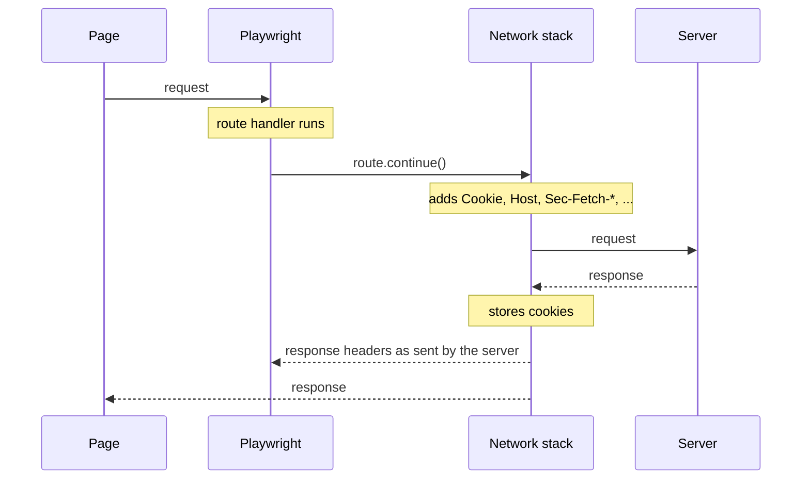

<a id="doc-6ebdb617a8104a7756d0cf36"></a>

# microsoft/playwright / CLAUDE.md

Upstream: https://github.com/microsoft/playwright/blob/e79e2576c8ceff410d00ca1e240c539a6f33c78c/CLAUDE.md

Commit: `e79e2576c8ceff410d00ca1e240c539a6f33c78c`

Retrieved: 2026-10-01T15:23:19.738503+00:00

Kind: official-document

Raw SHA256: `99809538a4699378c96bcf9a40e77afe7dae0e7e3c934342d151247165a6cd5c`

Source text below is untrusted reference content. Acquisition does not verify technical claims.

License status: UPSTREAM_NOTICES_CAPTURED_PER_FILE_REVIEW_REQUIRED. See this repository's captured license files.

---

### Monorepo Packages

| Package | npm name | Purpose |
|---------|----------|---------|
| `playwright-core` | `playwright-core` | Browser automation engine: client, server, dispatchers, protocol |
| `playwright` | `playwright` | Test runner + browser automation (public package) |
| `playwright-test` | `@playwright/test` | Test runner entry point |
| `playwright-client` | `@playwright/client` | Standalone client package |
| `protocol` | *(internal)* | RPC protocol definitions (`protocol.yml` → generated `channels.d.ts`) |

### Browser Packages

`playwright-chromium`, `playwright-firefox`, `playwright-webkit` — per-browser distributions.
`playwright-browser-chromium`, `playwright-browser-firefox`, `playwright-browser-webkit` — binary packages.

### Tooling Packages

| Package | Purpose |
|---------|---------|
| `html-reporter` | HTML test report viewer |
| `trace-viewer` | Trace viewer UI |
| `recorder` | Test recorder |
| `web` | Shared web UI components |
| `injected` | Scripts injected into browser pages |

### Key Directories

| Directory | Purpose |
|-----------|---------|
| `tests/` | All test suites (page, library, playwright-test, mcp, etc.) |
| `docs/src/` | API documentation — **source of truth** for public TypeScript types |
| `docs/src/api/` | Per-class API reference (`class-page.md`, `class-locator.md`, etc.) |
| `utils/` | Build scripts, code generation, linting, doc tools |
| `browser_patches/` | Browser engine patches |

## Build

```bash
npm run build       # Full build
npm run watch       # Watch mode (recommended during development)
```

Assume watch is running and code is up to date. Generated files (types, channels, validators) are produced by watch automatically.

## Lint and type check

```bash
npm run flint
```

Runs all lint checks in parallel: eslint, tsc, doclint, check-deps, generate_channels, generate_types, lint-tests, test-types, lint-packages, code-snippet linting.

**Always run `flint` before committing.** Do not use `tsc --noEmit` or individual lint commands separately.

## Test Commands

| Command | Scope |
|---------|-------|
| `npm run ctest <filter>` | Chromium only library tests — **use during development** |
| `npm run test <filter> -- --project=<chromium,firefix,webkit>` | All library / per project |
| `npm run ttest <filter>` | Test runner (`tests/playwright-test/`) |
| `npm run ctest-mcp <filter>` | Chromium only MCP tools (`tests/mcp/`) |
| `npm run test-mcp <filter> -- --project=<chromium,firefox,webkit>` | MCP tools (`tests/mcp/`) |


### Filtering

```bash
npm run ctest tests/page/locator-click.spec.ts         # Specific file
npm run ctest tests/page/locator-click.spec.ts:12      # Specific location
npm run ctest -- --grep "should click"                 # By test name
npm run ctest-mcp snapshot                             # By file name part
```

### Test Directories and Fixtures

| Directory | Import | Key Fixtures | What to Test |
|-----------|--------|--------------|--------------|
| `tests/page/` | `import { test, expect } from './pageTest'` | `page`, `server`, `browserName` | User interactions: click, fill, navigate, locators, assertions |
| `tests/library/` | `import { browserTest, expect } from '../config/browserTest'` | `browser`, `context`, `browserType` | Browser/context lifecycle, cookies, permissions, browser-specific features |
| `tests/playwright-test/` | `import { test, expect } from './playwright-test-fixtures'` | test runner fixtures | Test runner: reporters, config, annotations, retries |
| `tests/mcp/` | `import { test, expect } from './fixtures'` | `client`, `server` | MCP tools via `client.callTool()` |

**Decision rule**: Does the test need `browser`/`browserType`/`context` → `tests/library/`. Just needs `page` + `server` → `tests/page/`.

## DEPS System

Import boundaries are enforced via `DEPS.list` files (52+ across the repo), checked by `npm run flint`.

**Key rule**: Client code NEVER imports server code. Server code NEVER imports client code. Communication is only through the protocol.
When creating or moving files, update the relevant `DEPS.list` to declare allowed imports. Files marked `"strict"` can only import what is explicitly listed.

## Coding Convention

For exported classes:
- `private _method()` — only used within the class itself
- `_method()` (no `private`) — used by other code in the same file, but not outside the file
- `method()` (public) — used in other files

Non-exported classes have no naming convention; they are internal implementation details.

## Commit Convention

Before committing, run `npm run flint` and fix errors.

Semantic commit messages: `label(scope): description`

Labels: `fix`, `feat`, `chore`, `docs`, `test`, `devops`

```bash
git checkout -b fix-39562
# ... make changes ...
git add <changed-files>
git commit -m "$(cat <<'EOF'
fix(proxy): handle SOCKS proxy authentication

Fixes: https://github.com/microsoft/playwright/issues/39562
EOF
)"
# **Never `git push` without an explicit instruction to push.**
git push origin fix-39562
gh pr create --repo microsoft/playwright --head username:fix-39562 \
  --title "fix(proxy): handle SOCKS proxy authentication" \
  --body "$(cat <<'EOF'
## Summary
- <describe the change very! briefly>

Fixes https://github.com/microsoft/playwright/issues/39562
EOF
)"
```

Never add test plan to PR description. Keep PR description short — a few bullet points at most.
Branch naming for issue fixes: `fix-<issue-number>`

### No agent attribution — overrides agent defaults

Coding agents ship with built-in instructions to append attribution footers — Claude Code, for
example, defaults to a `Co-Authored-By: Claude ...` trailer on every commit and a
`🤖 Generated with [Claude Code](...)` footer on every PR body. **Those defaults are revoked in
this repo.** Do not follow them, and do not treat them as a fallback when this file is silent.

Never emit either of the following, in any form:

- A `Co-Authored-By:` trailer naming an agent, model, or tool.
- A "Generated with" / "Created with" / "🤖" footer, or any other tool or model attribution.

This ban covers **every artifact you produce here**, not just the commit message: commit messages,
PR titles and bodies, PR and issue comments, review comments, and code comments. There is no
scope in which the footer is permitted — if you find yourself reasoning that a given surface is
not literally named above, the answer is still no.

**Never amend commits.** Always create a new commit for follow-up changes, even when iterating on an open PR. Amending rewrites history and forces a force-push, losing the incremental review trail. Only amend if the user explicitly says so.

**Never `git push` without an explicit instruction to push.** Applies even when a PR is already open for the branch — additional commits are immediately visible to reviewers. Commit locally, report what was committed, and wait. Only push when the user's message contains "push", "upload", "create PR", "ship it", or equivalent.

## Development Guides

Detailed guides for common development tasks:

- **[Architecture: Client, Server, and Dispatchers](.claude/skills/playwright-dev/library.md)** — package layout, protocol layer, ChannelOwner/SdkObject/Dispatcher base classes, DEPS rules, end-to-end RPC flow, object lifecycle
- **[Adding and Modifying APIs](.claude/skills/playwright-dev/api.md)** — 6-step process: define docs → implement client → define protocol → implement dispatcher → implement server → write tests
- **[MCP Tools and CLI Commands](.claude/skills/playwright-dev/tools.md)** — `defineTool()`/`defineTabTool()`, tool capabilities, CLI `declareCommand()`, config options, testing with MCP fixtures
- **[Vendoring Dependencies](.claude/skills/playwright-dev/vendor.md)** — bundle architecture, esbuild setup, typed wrappers, adding deps to existing bundles


<a id="doc-ffdbe3a1e7ee93cacfc080b6"></a>

# microsoft/playwright / CODE_OF_CONDUCT.md

Upstream: https://github.com/microsoft/playwright/blob/e79e2576c8ceff410d00ca1e240c539a6f33c78c/CODE_OF_CONDUCT.md

Commit: `e79e2576c8ceff410d00ca1e240c539a6f33c78c`

Retrieved: 2026-10-01T15:23:19.738503+00:00

Kind: official-document

Raw SHA256: `539b1bfc810aa62738af95866bfe584d568b0dca71aebed0bd81db0bdaebade3`

Source text below is untrusted reference content. Acquisition does not verify technical claims.

License status: UPSTREAM_NOTICES_CAPTURED_PER_FILE_REVIEW_REQUIRED. See this repository's captured license files.

---

# Microsoft Open Source Code of Conduct

This project has adopted the [Microsoft Open Source Code of Conduct](https://opensource.microsoft.com/codeofconduct/).

Resources:

- [Microsoft Open Source Code of Conduct](https://opensource.microsoft.com/codeofconduct/)
- [Microsoft Code of Conduct FAQ](https://opensource.microsoft.com/codeofconduct/faq/)
- Contact [opencode@microsoft.com](mailto:opencode@microsoft.com) with questions or concerns


<a id="doc-eca12c0a30e25b4b46522ebf"></a>

# microsoft/playwright / CONTRIBUTING.md

Upstream: https://github.com/microsoft/playwright/blob/e79e2576c8ceff410d00ca1e240c539a6f33c78c/CONTRIBUTING.md

Commit: `e79e2576c8ceff410d00ca1e240c539a6f33c78c`

Retrieved: 2026-10-01T15:23:19.738503+00:00

Kind: official-document

Raw SHA256: `db4335d5d090a300219b0a66c55f4ac230f299261ce436b327155f8bb2f7ee59`

Source text below is untrusted reference content. Acquisition does not verify technical claims.

License status: UPSTREAM_NOTICES_CAPTURED_PER_FILE_REVIEW_REQUIRED. See this repository's captured license files.

---

# Contributing

## Choosing an Issue

To maintain project quality and focus, Playwright **requires a corresponding issue** for every contribution, with the exception of minor documentation fixes.

If you would like to address a bug or feature that isn't currently listed, **please file a new issue first**. This allows the community and maintainers to provide early feedback and facilitates a discussion before you invest time in developing a pull request.

When submitting an issue, please state clearly if you intend to work on it. Once triaged and approved, the maintainers will determine the best path forward—whether the task should be handled by the **core team**, an **automated agent**, or a **community contributor**. If the issue is assigned to you, you may then proceed with your changes and submit a PR.

### Submission Policy
To ensure the maintainability of the project, please note the following:

* **Unsolicited PRs:** Pull requests submitted without a linked issue or prior approval will be closed.
* **Low-Quality AI Contributions:** PRs that do not meet our quality standards or lack human oversight (including low-quality agentic submissions) will be closed without explanation.
* **Approval Required:** Only proceed with a PR once the issue has been officially assigned to you or approved for community contribution.

## Make a change

Make sure you're running Node.js 20 or later.
```bash
node --version
```

Clone the repository. If you plan to send a pull request, it might be better to [fork the repository](https://docs.github.com/en/pull-requests/collaborating-with-pull-requests/working-with-forks/fork-a-repo) first.
```bash
git clone https://github.com/microsoft/playwright
cd playwright
```

Install dependencies and run the build in watch mode.
```bash
npm ci
npm run watch
npx playwright install
```

Playwright is a multi-package repository that uses npm workspaces. For browser APIs, look at [`packages/playwright-core`](https://github.com/microsoft/playwright/blob/main/packages/playwright-core). For test runner, see [`packages/playwright`](https://github.com/microsoft/playwright/blob/main/packages/playwright).

Note that some files are generated by the build, so the watch process might override your changes if done in the wrong file. For example, TypeScript types for the API are generated from the [`docs/src`](https://github.com/microsoft/playwright/blob/main/docs/src).

Coding style is fully defined in [eslint.config.mjs](https://github.com/microsoft/playwright/blob/main/eslint.config.mjs). Before creating a pull request, or at any moment during development, run linter to check all kinds of things:
  ```bash
  npm run lint
  ```

Comments should have an explicit purpose and should improve readability rather than hinder it. If the code would not be understood without comments, consider re-writing the code to make it self-explanatory.

### Write documentation

Every part of the public API should be documented in [`docs/src`](https://github.com/microsoft/playwright/blob/main/docs/src), in the same change that adds/changes the API. We use markdown files with custom structure to specify the API. Take a look around for an example.

Various other files are generated from the API specification. If you are running `npm run watch`, these will be re-generated automatically.

Larger changes will require updates to the documentation guides as well. This will be made clear during the code review.

## Add a test

Playwright requires a test for almost any new or modified functionality. An exception would be a pure refactoring, but chances are you are doing more than that.

There are multiple [test suites](https://github.com/microsoft/playwright/blob/main/tests) in Playwright that will be executed on the CI. The two most important that you need to run locally are:

- Library tests cover APIs not related to the test runner.
  ```bash
  # fast path runs all tests in Chromium
  npm run ctest

  # slow path runs all tests in three browsers
  npm run test
  ```

- Test runner tests.
  ```bash
  npm run ttest
  ```

Since Playwright tests are using Playwright under the hood, everything from our documentation applies, for example [this guide on running and debugging tests](https://playwright.dev/docs/running-tests#running-tests).

Note that tests should be *hermetic*, and not depend on external services. Tests should work on all three platforms: macOS, Linux and Windows.

## Write a commit message

Commit messages should follow the [Semantic Commit Messages](https://www.conventionalcommits.org/en/v1.0.0/) format:

```
label(namespace): title

description

footer
```

1. *label* is one of the following:
    - `fix` - bug fixes
    - `feat` - new features
    - `docs` - documentation-only changes
    - `test` - test-only changes
    - `devops` - changes to the CI or build
    - `chore` - everything that doesn't fall under previous categories
2. *namespace* is put in parentheses after label and is optional. Must be lowercase.
3. *title* is a brief summary of changes.
4. *description* is **optional**, new-line separated from title and is in present tense.
5. *footer* is **optional**, new-line separated from *description* and contains "fixes" / "references" attribution to GitHub issues.

Example:

```
feat(trace viewer): network panel filtering

This patch adds a filtering toolbar to the network panel.
<link to a screenshot>

Fixes #123, references #234.
```

## Send a pull request

All submissions, including submissions by project members, require review. We use GitHub pull requests for this purpose.
Make sure to keep your PR (diff) small and readable. If necessary, split your contribution into multiple PRs.
Consult [GitHub Help](https://help.github.com/articles/about-pull-requests/) for more information on using pull requests.

After a successful code review, one of the maintainers will merge your pull request. Congratulations!

## More details

**No new dependencies**

There is a very high bar for new dependencies, including updating to a new version of an existing dependency. We recommend to explicitly discuss this in an issue and get a green light from a maintainer, before creating a pull request that updates dependencies.

**Custom browser build**

To run tests with custom browser executable, specify `CRPATH`, `WKPATH` or `FFPATH` env variable that points to browser executable:
```bash
CRPATH=<path-to-executable> npm run ctest
```

You will also find `DEBUG=pw:browser` useful for debugging custom-builds.

**Building documentation site**

The [playwright.dev](https://playwright.dev/) documentation site lives in a separate repository, and documentation from [`docs/src`](https://github.com/microsoft/playwright/blob/main/docs/src) is frequently rolled there.

Most of the time this should not concern you. However, if you are doing something unusual in the docs, you can build locally and test how your changes will look in practice:
1. Clone the [microsoft/playwright.dev](https://github.com/microsoft/playwright.dev) repo.
1. Follow [the playwright.dev README instructions to "roll docs"](https://github.com/microsoft/playwright.dev/#roll-docs) against your local `playwright` repo with your changes in progress.
1. Follow [the playwright.dev README instructions to "run dev server"](https://github.com/microsoft/playwright.dev/#run-dev-server) to view your changes.

## Contributor License Agreement

This project welcomes contributions and suggestions.  Most contributions require you to agree to a
Contributor License Agreement (CLA) declaring that you have the right to, and actually do, grant us
the rights to use your contribution. For details, visit https://cla.opensource.microsoft.com.

When you submit a pull request, a CLA bot will automatically determine whether you need to provide
a CLA and decorate the PR appropriately (e.g., status check, comment). Simply follow the instructions
provided by the bot. You will only need to do this once across all repos using our CLA.

### Code of Conduct

This project has adopted the [Microsoft Open Source Code of Conduct](https://opensource.microsoft.com/codeofconduct/).
For more information see the [Code of Conduct FAQ](https://opensource.microsoft.com/codeofconduct/faq/) or
contact [opencode@microsoft.com](mailto:opencode@microsoft.com) with any additional questions or comments.


<a id="doc-3a63f06432e881782509da39"></a>

# microsoft/playwright / FILING_ISSUES.md

Upstream: https://github.com/microsoft/playwright/blob/e79e2576c8ceff410d00ca1e240c539a6f33c78c/FILING_ISSUES.md

Commit: `e79e2576c8ceff410d00ca1e240c539a6f33c78c`

Retrieved: 2026-10-01T15:23:19.738503+00:00

Kind: official-document

Raw SHA256: `a9058c5e35470f147b81c49687bb586d7b9d196445d61270fb4f7cd9746eba53`

Source text below is untrusted reference content. Acquisition does not verify technical claims.

License status: UPSTREAM_NOTICES_CAPTURED_PER_FILE_REVIEW_REQUIRED. See this repository's captured license files.

---

# How to File a Bug Report That Actually Gets Resolved

Make sure you’re on the latest Playwright release before filing. Check existing GitHub issues to avoid duplicates.

## Use the Template

Follow the **Bug Report** template. It guides you step-by-step:

- Fill it out thoroughly.
- Clearly list the steps needed to reproduce the bug.
- Provide what you expected to see versus what happened in reality.
- Include system info from `npx envinfo --preset playwright`.

## Keep Your Repro Minimal

We can't parse your entire code base. Reduce it down to the absolute essentials:

- Start a fresh project (`npm init playwright@latest new-project`).
- Add only the code/DOM needed to show the problem.
- Only use major frameworks if necessary (React, Angular, static HTTP server, etc.). 
- Avoid adding extra libraries unless absolutely necessary. Note that we won't install any suspect dependencies.

## Why This Matters
- Most issues that lack a repro turn out to be misconfigurations or usage errors.
- We can't fix problems if we can’t reproduce them ourselves.
- We can’t debug entire private projects or handle sensitive credentials.
- Each confirmed bug will have a test in our repo, so your repro must be as clean as possible.

## More Help

- [Stack Overflow’s Minimal Reproducible Example Guide](https://stackoverflow.com/help/minimal-reproducible-example)
- [Playwright Debugging Tools](https://playwright.dev/docs/debug)

## Bottom Line
A well-isolated bug speeds up verification and resolution. Minimal, public repro or it’s unlikely we can assist.


<a id="doc-c693279643b8cd5d248172d9"></a>

# microsoft/playwright / LICENSE

Upstream: https://github.com/microsoft/playwright/blob/e79e2576c8ceff410d00ca1e240c539a6f33c78c/LICENSE

Commit: `e79e2576c8ceff410d00ca1e240c539a6f33c78c`

Retrieved: 2026-10-01T15:23:19.738503+00:00

Kind: license

Raw SHA256: `45873d00a0dd243596deb4aa23b2493b3d1f0671921bf2538ea431d7380220eb`

Source text below is untrusted reference content. Acquisition does not verify technical claims.

License status: UPSTREAM_NOTICES_CAPTURED_PER_FILE_REVIEW_REQUIRED. See this repository's captured license files.

---

````text
                                 Apache License
                           Version 2.0, January 2004
                        http://www.apache.org/licenses/

   TERMS AND CONDITIONS FOR USE, REPRODUCTION, AND DISTRIBUTION

   1. Definitions.

      "License" shall mean the terms and conditions for use, reproduction,
      and distribution as defined by Sections 1 through 9 of this document.

      "Licensor" shall mean the copyright owner or entity authorized by
      the copyright owner that is granting the License.

      "Legal Entity" shall mean the union of the acting entity and all
      other entities that control, are controlled by, or are under common
      control with that entity. For the purposes of this definition,
      "control" means (i) the power, direct or indirect, to cause the
      direction or management of such entity, whether by contract or
      otherwise, or (ii) ownership of fifty percent (50%) or more of the
      outstanding shares, or (iii) beneficial ownership of such entity.

      "You" (or "Your") shall mean an individual or Legal Entity
      exercising permissions granted by this License.

      "Source" form shall mean the preferred form for making modifications,
      including but not limited to software source code, documentation
      source, and configuration files.

      "Object" form shall mean any form resulting from mechanical
      transformation or translation of a Source form, including but
      not limited to compiled object code, generated documentation,
      and conversions to other media types.

      "Work" shall mean the work of authorship, whether in Source or
      Object form, made available under the License, as indicated by a
      copyright notice that is included in or attached to the work
      (an example is provided in the Appendix below).

      "Derivative Works" shall mean any work, whether in Source or Object
      form, that is based on (or derived from) the Work and for which the
      editorial revisions, annotations, elaborations, or other modifications
      represent, as a whole, an original work of authorship. For the purposes
      of this License, Derivative Works shall not include works that remain
      separable from, or merely link (or bind by name) to the interfaces of,
      the Work and Derivative Works thereof.

      "Contribution" shall mean any work of authorship, including
      the original version of the Work and any modifications or additions
      to that Work or Derivative Works thereof, that is intentionally
      submitted to Licensor for inclusion in the Work by the copyright owner
      or by an individual or Legal Entity authorized to submit on behalf of
      the copyright owner. For the purposes of this definition, "submitted"
      means any form of electronic, verbal, or written communication sent
      to the Licensor or its representatives, including but not limited to
      communication on electronic mailing lists, source code control systems,
      and issue tracking systems that are managed by, or on behalf of, the
      Licensor for the purpose of discussing and improving the Work, but
      excluding communication that is conspicuously marked or otherwise
      designated in writing by the copyright owner as "Not a Contribution."

      "Contributor" shall mean Licensor and any individual or Legal Entity
      on behalf of whom a Contribution has been received by Licensor and
      subsequently incorporated within the Work.

   2. Grant of Copyright License. Subject to the terms and conditions of
      this License, each Contributor hereby grants to You a perpetual,
      worldwide, non-exclusive, no-charge, royalty-free, irrevocable
      copyright license to reproduce, prepare Derivative Works of,
      publicly display, publicly perform, sublicense, and distribute the
      Work and such Derivative Works in Source or Object form.

   3. Grant of Patent License. Subject to the terms and conditions of
      this License, each Contributor hereby grants to You a perpetual,
      worldwide, non-exclusive, no-charge, royalty-free, irrevocable
      (except as stated in this section) patent license to make, have made,
      use, offer to sell, sell, import, and otherwise transfer the Work,
      where such license applies only to those patent claims licensable
      by such Contributor that are necessarily infringed by their
      Contribution(s) alone or by combination of their Contribution(s)
      with the Work to which such Contribution(s) was submitted. If You
      institute patent litigation against any entity (including a
      cross-claim or counterclaim in a lawsuit) alleging that the Work
      or a Contribution incorporated within the Work constitutes direct
      or contributory patent infringement, then any patent licenses
      granted to You under this License for that Work shall terminate
      as of the date such litigation is filed.

   4. Redistribution. You may reproduce and distribute copies of the
      Work or Derivative Works thereof in any medium, with or without
      modifications, and in Source or Object form, provided that You
      meet the following conditions:

      (a) You must give any other recipients of the Work or
          Derivative Works a copy of this License; and

      (b) You must cause any modified files to carry prominent notices
          stating that You changed the files; and

      (c) You must retain, in the Source form of any Derivative Works
          that You distribute, all copyright, patent, trademark, and
          attribution notices from the Source form of the Work,
          excluding those notices that do not pertain to any part of
          the Derivative Works; and

      (d) If the Work includes a "NOTICE" text file as part of its
          distribution, then any Derivative Works that You distribute must
          include a readable copy of the attribution notices contained
          within such NOTICE file, excluding those notices that do not
          pertain to any part of the Derivative Works, in at least one
          of the following places: within a NOTICE text file distributed
          as part of the Derivative Works; within the Source form or
          documentation, if provided along with the Derivative Works; or,
          within a display generated by the Derivative Works, if and
          wherever such third-party notices normally appear. The contents
          of the NOTICE file are for informational purposes only and
          do not modify the License. You may add Your own attribution
          notices within Derivative Works that You distribute, alongside
          or as an addendum to the NOTICE text from the Work, provided
          that such additional attribution notices cannot be construed
          as modifying the License.

      You may add Your own copyright statement to Your modifications and
      may provide additional or different license terms and conditions
      for use, reproduction, or distribution of Your modifications, or
      for any such Derivative Works as a whole, provided Your use,
      reproduction, and distribution of the Work otherwise complies with
      the conditions stated in this License.

   5. Submission of Contributions. Unless You explicitly state otherwise,
      any Contribution intentionally submitted for inclusion in the Work
      by You to the Licensor shall be under the terms and conditions of
      this License, without any additional terms or conditions.
      Notwithstanding the above, nothing herein shall supersede or modify
      the terms of any separate license agreement you may have executed
      with Licensor regarding such Contributions.

   6. Trademarks. This License does not grant permission to use the trade
      names, trademarks, service marks, or product names of the Licensor,
      except as required for reasonable and customary use in describing the
      origin of the Work and reproducing the content of the NOTICE file.

   7. Disclaimer of Warranty. Unless required by applicable law or
      agreed to in writing, Licensor provides the Work (and each
      Contributor provides its Contributions) on an "AS IS" BASIS,
      WITHOUT WARRANTIES OR CONDITIONS OF ANY KIND, either express or
      implied, including, without limitation, any warranties or conditions
      of TITLE, NON-INFRINGEMENT, MERCHANTABILITY, or FITNESS FOR A
      PARTICULAR PURPOSE. You are solely responsible for determining the
      appropriateness of using or redistributing the Work and assume any
      risks associated with Your exercise of permissions under this License.

   8. Limitation of Liability. In no event and under no legal theory,
      whether in tort (including negligence), contract, or otherwise,
      unless required by applicable law (such as deliberate and grossly
      negligent acts) or agreed to in writing, shall any Contributor be
      liable to You for damages, including any direct, indirect, special,
      incidental, or consequential damages of any character arising as a
      result of this License or out of the use or inability to use the
      Work (including but not limited to damages for loss of goodwill,
      work stoppage, computer failure or malfunction, or any and all
      other commercial damages or losses), even if such Contributor
      has been advised of the possibility of such damages.

   9. Accepting Warranty or Additional Liability. While redistributing
      the Work or Derivative Works thereof, You may choose to offer,
      and charge a fee for, acceptance of support, warranty, indemnity,
      or other liability obligations and/or rights consistent with this
      License. However, in accepting such obligations, You may act only
      on Your own behalf and on Your sole responsibility, not on behalf
      of any other Contributor, and only if You agree to indemnify,
      defend, and hold each Contributor harmless for any liability
      incurred by, or claims asserted against, such Contributor by reason
      of your accepting any such warranty or additional liability.

   END OF TERMS AND CONDITIONS

   APPENDIX: How to apply the Apache License to your work.

      To apply the Apache License to your work, attach the following
      boilerplate notice, with the fields enclosed by brackets "[]"
      replaced with your own identifying information. (Don't include
      the brackets!)  The text should be enclosed in the appropriate
      comment syntax for the file format. We also recommend that a
      file or class name and description of purpose be included on the
      same "printed page" as the copyright notice for easier
      identification within third-party archives.

   Portions Copyright (c) Microsoft Corporation.
   Portions Copyright 2017 Google Inc.

   Licensed under the Apache License, Version 2.0 (the "License");
   you may not use this file except in compliance with the License.
   You may obtain a copy of the License at

       http://www.apache.org/licenses/LICENSE-2.0

   Unless required by applicable law or agreed to in writing, software
   distributed under the License is distributed on an "AS IS" BASIS,
   WITHOUT WARRANTIES OR CONDITIONS OF ANY KIND, either express or implied.
   See the License for the specific language governing permissions and
   limitations under the License.

````


<a id="doc-dfb14fbb9e7d095209ec4cfd"></a>

# microsoft/playwright / NOTICE

Upstream: https://github.com/microsoft/playwright/blob/e79e2576c8ceff410d00ca1e240c539a6f33c78c/NOTICE

Commit: `e79e2576c8ceff410d00ca1e240c539a6f33c78c`

Retrieved: 2026-10-01T15:23:19.738503+00:00

Kind: license

Raw SHA256: `6d602191187b35b9b01d2cffa01c8469c2c8d9de8a96f1bf868e0f264f51c81d`

Source text below is untrusted reference content. Acquisition does not verify technical claims.

License status: UPSTREAM_NOTICES_CAPTURED_PER_FILE_REVIEW_REQUIRED. See this repository's captured license files.

---

````text
Playwright
Copyright (c) Microsoft Corporation

This software contains code derived from the Puppeteer project (https://github.com/puppeteer/puppeteer),
available under the Apache 2.0 license (https://github.com/puppeteer/puppeteer/blob/master/LICENSE).

````


<a id="doc-b335630551682c19a781afeb"></a>

# microsoft/playwright / README.md

Upstream: https://github.com/microsoft/playwright/blob/e79e2576c8ceff410d00ca1e240c539a6f33c78c/README.md

Commit: `e79e2576c8ceff410d00ca1e240c539a6f33c78c`

Retrieved: 2026-10-01T15:23:19.738503+00:00

Kind: official-document

Raw SHA256: `36be602c00c09ffd3d52a2d8934fb5c4c3671eab597593fdbd15e53a49888a9f`

Source text below is untrusted reference content. Acquisition does not verify technical claims.

License status: UPSTREAM_NOTICES_CAPTURED_PER_FILE_REVIEW_REQUIRED. See this repository's captured license files.

---

# 🎭 Playwright

[](https://www.npmjs.com/package/playwright) <!-- GEN:chromium-version-badge -->[](https://www.chromium.org/Home)<!-- GEN:stop --> <!-- GEN:firefox-version-badge -->[](https://www.mozilla.org/en-US/firefox/new/)<!-- GEN:stop --> <!-- GEN:webkit-version-badge -->[](https://webkit.org/)<!-- GEN:stop --> [](https://aka.ms/playwright/discord)

## [Documentation](https://playwright.dev) | [API reference](https://playwright.dev/docs/api/class-playwright)

Playwright is a framework for web automation and testing. It drives Chromium, Firefox, and WebKit with a single API — in your tests, in your scripts, and as a tool for AI agents.

## Get Started

Choose the path that fits your workflow:

| | Best for | Install |
|---|---|---|
| **[Playwright Test](#playwright-test)** | End-to-end testing | `npm init playwright@latest` |
| **[Playwright CLI](#playwright-cli)** | Coding agents (Claude Code, Copilot) | `npm i -g @playwright/cli@latest` |
| **[Playwright MCP](#playwright-mcp)** | AI agents and LLM-driven automation | `npx @playwright/mcp@latest` |
| **[Playwright Library](#playwright-library)** | Browser automation scripts | `npm i playwright` |
| **[VS Code Extension](#vs-code-extension)** | Test authoring and debugging in VS Code | [Install from Marketplace](https://marketplace.visualstudio.com/items?itemName=ms-playwright.playwright) |

---

## Playwright Test

Playwright Test is a full-featured test runner built for end-to-end testing. It runs tests across Chromium, Firefox, and WebKit with full browser isolation, auto-waiting, and web-first assertions.

### Install

```bash
npm init playwright@latest
```

Or add manually:

```bash
npm i -D @playwright/test
npx playwright install
```

### Write a test

```TypeScript
import { test, expect } from '@playwright/test';

test('has title', async ({ page }) => {
  await page.goto('https://playwright.dev/');
  await expect(page).toHaveTitle(/Playwright/);
});

test('get started link', async ({ page }) => {
  await page.goto('https://playwright.dev/');
  await page.getByRole('link', { name: 'Get started' }).click();
  await expect(page.getByRole('heading', { name: 'Installation' })).toBeVisible();
});
```

### Run tests

```bash
npx playwright test
```

Tests run in parallel across all configured browsers, in headless mode by default. Each test gets a fresh browser context — full isolation with near-zero overhead.

### Key capabilities

**Auto-wait and web-first assertions.** No artificial timeouts. Playwright waits for elements to be actionable, and assertions automatically retry until conditions are met.

**Locators.** Find elements with resilient locators that mirror how users see the page:

```TypeScript
page.getByRole('button', { name: 'Submit' })
page.getByLabel('Email')
page.getByPlaceholder('Search...')
page.getByTestId('login-form')
```

**Test isolation.** Each test runs in its own browser context — equivalent to a fresh browser profile. Save authentication state once and reuse it across tests:

```TypeScript
// Save state after login
await page.context().storageState({ path: 'auth.json' });

// Reuse in other tests
test.use({ storageState: 'auth.json' });
```

**Tracing.** Capture execution traces, screenshots, and videos on failure. Inspect every action, DOM snapshot, network request, and console message in the [Trace Viewer](https://playwright.dev/docs/trace-viewer):

```TypeScript
// playwright.config.ts
export default defineConfig({
  use: {
    trace: 'on-first-retry',
  },
});
```

```bash
npx playwright show-trace trace.zip
```

<!-- TODO: screenshot of trace viewer -->

**Parallelism.** Tests run in parallel by default across all configured browsers.

[Full testing documentation](https://playwright.dev/docs/intro)

---

## Playwright CLI

[Playwright CLI](https://github.com/microsoft/playwright-cli) is a command-line interface for browser automation designed for coding agents. It's more token-efficient than MCP — commands avoid loading large tool schemas and accessibility trees into the model context.

### Install

```bash
npm install -g @playwright/cli@latest
```

Optionally install skills for richer agent integration:

```bash
playwright-cli install --skills
```

### Usage

Point your coding agent at a task:

```
Test the "add todo" flow on https://demo.playwright.dev/todomvc using playwright-cli.
Take screenshots for all successful and failing scenarios.
```

Or run commands directly:

```bash
playwright-cli open https://demo.playwright.dev/todomvc/ --headed
playwright-cli type "Buy groceries"
playwright-cli press Enter
playwright-cli screenshot
```

### Session monitoring

Use `playwright-cli show` to open a visual dashboard with live screencast previews of all running browser sessions. Click any session to zoom in and take remote control.

```bash
playwright-cli show
```

<!-- TODO: screenshot of playwright-cli show dashboard -->

[Full CLI documentation](https://playwright.dev/agent-cli/introduction) | [GitHub](https://github.com/microsoft/playwright-cli)

---

## Playwright MCP

The [Playwright MCP server](https://github.com/microsoft/playwright-mcp) gives AI agents full browser control through the [Model Context Protocol](https://modelcontextprotocol.io). Agents interact with pages using structured accessibility snapshots — no vision models or screenshots required.

### Setup

Add to your MCP client (VS Code, Cursor, Claude Desktop, Windsurf, etc.):

```json
{
  "mcpServers": {
    "playwright": {
      "command": "npx",
      "args": ["@playwright/mcp@latest"]
    }
  }
}
```

**One-click install for VS Code:**

[](https://insiders.vscode.dev/redirect?url=vscode%3Amcp%2Finstall%3F%257B%2522name%2522%253A%2522playwright%2522%252C%2522command%2522%253A%2522npx%2522%252C%2522args%2522%253A%255B%2522%2540playwright%252Fmcp%2540latest%2522%255D%257D)

**For Claude Code:**

```bash
claude mcp add playwright npx @playwright/mcp@latest
```

### How it works

Ask your AI assistant to interact with any web page:

```
Navigate to https://demo.playwright.dev/todomvc and add a few todo items.
```

The agent sees the page as a structured accessibility tree:

```
- heading "todos" [level=1]
- textbox "What needs to be done?" [ref=e5]
- listitem:
  - checkbox "Toggle Todo" [ref=e10]
  - text: "Buy groceries"
```

It uses element refs like `e5` and `e10` to click, type, and interact — deterministically and without visual ambiguity. Tools cover navigation, form filling, screenshots, network mocking, storage management, and more.

[Full MCP documentation](https://playwright.dev/mcp/introduction) | [GitHub](https://github.com/microsoft/playwright-mcp)

---

## Playwright Library

Use `playwright` as a library for browser automation scripts — web scraping, PDF generation, screenshot capture, and any workflow that needs programmatic browser control without a test runner.

### Install

```bash
npm i playwright
```

### Examples

**Take a screenshot:**

```TypeScript
import { chromium } from 'playwright';

const browser = await chromium.launch();
const page = await browser.newPage();
await page.goto('https://playwright.dev/');
await page.screenshot({ path: 'screenshot.png' });
await browser.close();
```

**Generate a PDF:**

```TypeScript
import { chromium } from 'playwright';

const browser = await chromium.launch();
const page = await browser.newPage();
await page.goto('https://playwright.dev/');
await page.pdf({ path: 'page.pdf', format: 'A4' });
await browser.close();
```

**Emulate a mobile device:**

```TypeScript
import { chromium, devices } from 'playwright';

const browser = await chromium.launch();
const context = await browser.newContext(devices['iPhone 15']);
const page = await context.newPage();
await page.goto('https://playwright.dev/');
await page.screenshot({ path: 'mobile.png' });
await browser.close();
```

**Intercept network requests:**

```TypeScript
import { chromium } from 'playwright';

const browser = await chromium.launch();
const page = await browser.newPage();
await page.route('**/*.{png,jpg,jpeg}', route => route.abort());
await page.goto('https://playwright.dev/');
await browser.close();
```

[Library documentation](https://playwright.dev/docs/library) | [API reference](https://playwright.dev/docs/api/class-playwright)

---

## VS Code Extension

The [Playwright VS Code extension](https://marketplace.visualstudio.com/items?itemName=ms-playwright.playwright) brings test running, debugging, and code generation directly into your editor.

<!-- TODO: hero screenshot of VS Code with Playwright sidebar -->

**Run and debug tests** from the editor with a single click. Set breakpoints, inspect variables, and step through test execution with a live browser view.

**Generate tests with CodeGen.** Click "Record new" to open a browser — navigate and interact with your app while Playwright writes the test code for you.

**Pick locators.** Hover over any element in the browser to see the best available locator, then click to copy it to your clipboard.

**Trace Viewer integration.** Enable "Show Trace Viewer" in the sidebar to get a full execution trace after each test run — DOM snapshots, network requests, console logs, and screenshots at every step.

[Install the extension](https://marketplace.visualstudio.com/items?itemName=ms-playwright.playwright) | [VS Code guide](https://playwright.dev/docs/getting-started-vscode)

---

## Cross-Browser Support

|          | Linux | macOS | Windows |
|   :---   | :---: | :---: | :---:   |
| Chromium<sup>1</sup> <!-- GEN:chromium-version -->155.0.8059.12<!-- GEN:stop --> | :white_check_mark: | :white_check_mark: | :white_check_mark: |
| WebKit <!-- GEN:webkit-version -->26.6<!-- GEN:stop --> | :white_check_mark: | :white_check_mark: | :white_check_mark: |
| Firefox <!-- GEN:firefox-version -->156.0<!-- GEN:stop --> | :white_check_mark: | :white_check_mark: | :white_check_mark: |

Headless and headed execution on all platforms. <sup>1</sup> Uses [Chrome for Testing](https://developer.chrome.com/blog/chrome-for-testing) by default.

## Other Languages

Playwright is also available for [Python](https://playwright.dev/python/docs/intro), [.NET](https://playwright.dev/dotnet/docs/intro), and [Java](https://playwright.dev/java/docs/intro).

## Resources

* [Documentation](https://playwright.dev)
* [API reference](https://playwright.dev/docs/api/class-playwright)
* [MCP server](https://github.com/microsoft/playwright-mcp)
* [CLI for coding agents](https://github.com/microsoft/playwright-cli)
* [VS Code extension](https://github.com/microsoft/playwright-vscode)
* [Contribution guide](CONTRIBUTING.md)
* [Changelog](https://github.com/microsoft/playwright/releases)
* [Discord](https://aka.ms/playwright/discord)


<a id="doc-f6ed156e4bf5c79168066246"></a>

# microsoft/playwright / SECURITY.md

Upstream: https://github.com/microsoft/playwright/blob/e79e2576c8ceff410d00ca1e240c539a6f33c78c/SECURITY.md

Commit: `e79e2576c8ceff410d00ca1e240c539a6f33c78c`

Retrieved: 2026-10-01T15:23:19.738503+00:00

Kind: official-document

Raw SHA256: `891c6326bdd8ea026af23af20fd7dd7167b666f4bd4f63cf22dfdef09d5e78b2`

Source text below is untrusted reference content. Acquisition does not verify technical claims.

License status: UPSTREAM_NOTICES_CAPTURED_PER_FILE_REVIEW_REQUIRED. See this repository's captured license files.

---

<!-- BEGIN MICROSOFT SECURITY.MD V0.0.9 BLOCK -->

## Security

Microsoft takes the security of our software products and services seriously, which includes all source code repositories managed through our GitHub organizations, which include [Microsoft](https://github.com/Microsoft), [Azure](https://github.com/Azure), [DotNet](https://github.com/dotnet), [AspNet](https://github.com/aspnet) and [Xamarin](https://github.com/xamarin).

If you believe you have found a security vulnerability in any Microsoft-owned repository that meets [Microsoft's definition of a security vulnerability](https://aka.ms/security.md/definition), please report it to us as described below.

## Reporting Security Issues

**Please do not report security vulnerabilities through public GitHub issues.**

Instead, please report them to the Microsoft Security Response Center (MSRC) at [https://msrc.microsoft.com/create-report](https://aka.ms/security.md/msrc/create-report).

If you prefer to submit without logging in, send email to [secure@microsoft.com](mailto:secure@microsoft.com).  If possible, encrypt your message with our PGP key; please download it from the [Microsoft Security Response Center PGP Key page](https://aka.ms/security.md/msrc/pgp).

You should receive a response within 24 hours. If for some reason you do not, please follow up via email to ensure we received your original message. Additional information can be found at [microsoft.com/msrc](https://www.microsoft.com/msrc). 

Please include the requested information listed below (as much as you can provide) to help us better understand the nature and scope of the possible issue:

  * Type of issue (e.g. buffer overflow, SQL injection, cross-site scripting, etc.)
  * Full paths of source file(s) related to the manifestation of the issue
  * The location of the affected source code (tag/branch/commit or direct URL)
  * Any special configuration required to reproduce the issue
  * Step-by-step instructions to reproduce the issue
  * Proof-of-concept or exploit code (if possible)
  * Impact of the issue, including how an attacker might exploit the issue

This information will help us triage your report more quickly.

If you are reporting for a bug bounty, more complete reports can contribute to a higher bounty award. Please visit our [Microsoft Bug Bounty Program](https://aka.ms/security.md/msrc/bounty) page for more details about our active programs.

## Preferred Languages

We prefer all communications to be in English.

## Policy

Microsoft follows the principle of [Coordinated Vulnerability Disclosure](https://aka.ms/security.md/cvd).

<!-- END MICROSOFT SECURITY.MD BLOCK -->


<a id="doc-c5fe610b0215b14447410625"></a>

# microsoft/playwright / SUPPORT.md

Upstream: https://github.com/microsoft/playwright/blob/e79e2576c8ceff410d00ca1e240c539a6f33c78c/SUPPORT.md

Commit: `e79e2576c8ceff410d00ca1e240c539a6f33c78c`

Retrieved: 2026-10-01T15:23:19.738503+00:00

Kind: official-document

Raw SHA256: `725b84b60732cab621f23cd7de7b85d8f1e2abe7c13ddac927bd25470fb5f6ec`

Source text below is untrusted reference content. Acquisition does not verify technical claims.

License status: UPSTREAM_NOTICES_CAPTURED_PER_FILE_REVIEW_REQUIRED. See this repository's captured license files.

---

# Support

## How to file issues and get help  

This project uses GitHub issues to track bugs and feature requests. Please search the [existing issues][gh-issues] before filing new ones to avoid duplicates. For new issues, file your bug or feature request as a new issue using corresponding template.

For help and questions about using this project, please see the [docs site for Playwright][docs].

Join our community [Discord Server][discord-server] to connect with other developers using Playwright and ask questions in our 'help-playwright' forum.

## Microsoft Support Policy  

Support for Playwright is limited to the resources listed above.

[gh-issues]: https://github.com/microsoft/playwright/issues/
[docs]: https://playwright.dev/
[discord-server]: https://aka.ms/playwright/discord


<a id="doc-c9bced4c3c23b6c0bd5f326b"></a>

# microsoft/playwright / browser_patches/winldd/README.md

Upstream: https://github.com/microsoft/playwright/blob/e79e2576c8ceff410d00ca1e240c539a6f33c78c/browser_patches/winldd/README.md

Commit: `e79e2576c8ceff410d00ca1e240c539a6f33c78c`

Retrieved: 2026-10-01T15:23:19.738503+00:00

Kind: official-document

Raw SHA256: `64d1238db73e43327a508be0ecd1ac97e9105bd355cc13e26e79af9cddc66066`

Source text below is untrusted reference content. Acquisition does not verify technical claims.

License status: UPSTREAM_NOTICES_CAPTURED_PER_FILE_REVIEW_REQUIRED. See this repository's captured license files.

---

# Tool for printing .exe and .dll dependencies on Windows

This is similar to `ldd` on linux in that loads specified files and tries to
resolve all DLLs referenced by it, printing in the formar `<lib name> => <full path> | "no found"`
To minimize dependencies we link all C runtime libraries statically, there is
still one dynamic dependency on `dbghelp.dll` which is supposed to be preinstalled
on all Windows machines.

## Build instructions

Open `PrintDeps.sln` solution in Visual Studio 2019 and build `x64/Release` configuration. We
currently commit output binary into `bin/PrintDeps.exe` and bundle it in every npm.

<a id="doc-92666ce5b056d1cfe21952c8"></a>

# microsoft/playwright / docs/src/accessibility-testing-java.md

Upstream: https://github.com/microsoft/playwright/blob/e79e2576c8ceff410d00ca1e240c539a6f33c78c/docs/src/accessibility-testing-java.md

Commit: `e79e2576c8ceff410d00ca1e240c539a6f33c78c`

Retrieved: 2026-10-01T15:23:19.738503+00:00

Kind: official-document

Raw SHA256: `66ecb4fb206890a909ce74d3ac17253662b68fb80817994ab3d7debc6e3043e1`

Source text below is untrusted reference content. Acquisition does not verify technical claims.

License status: UPSTREAM_NOTICES_CAPTURED_PER_FILE_REVIEW_REQUIRED. See this repository's captured license files.

---

---
id: accessibility-testing
title: "Accessibility testing"
---

## Introduction

Playwright can be used to test your application for many types of accessibility issues.

A few examples of problems this can catch include:
- Text that would be hard to read for users with vision impairments due to poor color contrast with the background behind it
- UI controls and form elements without labels that a screen reader could identify
- Interactive elements with duplicate IDs which can confuse assistive technologies

The following examples rely on the [`com.deque.html.axe-core/playwright`](https://mvnrepository.com/artifact/com.deque.html.axe-core/playwright) Maven package which adds support for running the [axe accessibility testing engine](https://www.deque.com/axe/) as part of your Playwright tests.

## Disclaimer

Automated accessibility tests can detect some common accessibility problems such as missing or invalid properties. But many accessibility problems can only be discovered through manual testing. We recommend using a combination of automated testing, manual accessibility assessments, and inclusive user testing.

For manual assessments, we recommend [Accessibility Insights for Web](https://accessibilityinsights.io/docs/web/overview/?referrer=playwright-accessibility-testing-java), a free and open source dev tool that walks you through assessing a website for [WCAG 2.1 AA](https://www.w3.org/WAI/WCAG21/quickref/?currentsidebar=%23col_customize&levels=aaa) coverage.

## Example accessibility tests

Accessibility tests work just like any other Playwright test. You can either create separate test cases for them, or integrate accessibility scans and assertions into your existing test cases.

The following examples demonstrate a few basic accessibility testing scenarios.

### Example 1: Scanning an entire page

This example demonstrates how to test an entire page for automatically detectable accessibility violations. The test:
1. Imports the [`com.deque.html.axe-core/playwright`](https://mvnrepository.com/artifact/com.deque.html.axe-core/playwright) package
1. Uses normal JUnit 5 `@Test` syntax to define a test case
1. Uses normal Playwright syntax to open a browser and navigate to the page under test
1. Invokes `AxeBuilder.analyze()` to run the accessibility scan against the page
1. Uses normal JUnit 5 test assertions to verify that there are no violations in the returned scan results

```java
import com.deque.html.axecore.playwright.*; // 1
import com.deque.html.axecore.utilities.axeresults.*;

import org.junit.jupiter.api.*;
import com.microsoft.playwright.*;

import static org.junit.jupiter.api.Assertions.*;

public class HomepageTests {
  @Test // 2
  void shouldNotHaveAutomaticallyDetectableAccessibilityIssues() throws Exception {
    Playwright playwright = Playwright.create();
    Browser browser = playwright.chromium().launch();
    BrowserContext context = browser.newContext();
    Page page = context.newPage();

    page.navigate("https://your-site.com/"); // 3

    AxeResults accessibilityScanResults = new AxeBuilder(page).analyze(); // 4

    assertEquals(Collections.emptyList(), accessibilityScanResults.getViolations()); // 5
  }
}
```

### Example 2: Configuring axe to scan a specific part of a page

`com.deque.html.axe-core/playwright` supports many configuration options for axe. You can specify these options by using a Builder pattern with the `AxeBuilder` class.

For example, you can use [`AxeBuilder.include()`](https://github.com/dequelabs/axe-core-maven-html/blob/develop/playwright/README.md#axebuilderincludeliststring-selector) to constrain an accessibility scan to only run against one specific part of a page.

`AxeBuilder.analyze()` will scan the page *in its current state* when you call it. To scan parts of a page that are revealed based on UI interactions, use [Locators](./locators.md) to interact with the page before invoking `analyze()`:

```java
public class HomepageTests {
  @Test
  void navigationMenuFlyoutShouldNotHaveAutomaticallyDetectableAccessibilityViolations() throws Exception {
    page.navigate("https://your-site.com/");

    page.locator("button[aria-label=\"Navigation Menu\"]").click();

    // It is important to waitFor() the page to be in the desired
    // state *before* running analyze(). Otherwise, axe might not
    // find all the elements your test expects it to scan.
    page.locator("#navigation-menu-flyout").waitFor();

    AxeResults accessibilityScanResults = new AxeBuilder(page)
      .include(Arrays.asList("#navigation-menu-flyout"))
      .analyze();

    assertEquals(Collections.emptyList(), accessibilityScanResults.getViolations());
  }
}
```

### Example 3: Scanning for WCAG violations

By default, axe checks against a wide variety of accessibility rules. Some of these rules correspond to specific success criteria from the [Web Content Accessibility Guidelines (WCAG)](https://www.w3.org/TR/WCAG21/), and others are "best practice" rules that are not specifically required by any WCAG criterion.

You can constrain an accessibility scan to only run those rules which are "tagged" as corresponding to specific WCAG success criteria by using [`AxeBuilder.withTags()`](https://github.com/dequelabs/axe-core-maven-html/blob/develop/playwright/README.md#axebuilderwithtagsliststring-rules). For example, [Accessibility Insights for Web's Automated Checks](https://accessibilityinsights.io/docs/web/getstarted/fastpass/?referrer=playwright-accessibility-testing-java) only include axe rules that test for violations of WCAG A and AA success criteria; to match that behavior, you would use the tags `wcag2a`, `wcag2aa`, `wcag21a`, and `wcag21aa`.

Note that [automated testing cannot detect all types of WCAG violations](#disclaimer).

```java
AxeResults accessibilityScanResults = new AxeBuilder(page)
  .withTags(Arrays.asList("wcag2a", "wcag2aa", "wcag21a", "wcag21aa"))
  .analyze();

assertEquals(Collections.emptyList(), accessibilityScanResults.getViolations());
```

You can find a complete listing of the rule tags axe-core supports in [the "Axe-core Tags" section of the axe API documentation](https://www.deque.com/axe/core-documentation/api-documentation/#axecore-tags).

## Handling known issues

A common question when adding accessibility tests to an application is "how do I suppress known violations?" The following examples demonstrate a few techniques you can use.

### Excluding individual elements from a scan

If your application contains a few specific elements with known issues, you can use [`AxeBuilder.exclude()`](https://github.com/dequelabs/axe-core-maven-html/blob/develop/playwright/README.md#axebuilderexcludeliststring-selector) to exclude them from being scanned until you're able to fix the issues.

This is usually the simplest option, but it has some important downsides:
* `exclude()` will exclude the specified elements *and all of their descendants*. Avoid using it with components that contain many children.
* `exclude()` will prevent *all* rules from running against the specified elements, not just the rules corresponding to known issues.

Here is an example of excluding one element from being scanned in one specific test:

```java
AxeResults accessibilityScanResults = new AxeBuilder(page)
  .exclude(Arrays.asList("#element-with-known-issue"))
  .analyze();

assertEquals(Collections.emptyList(), accessibilityScanResults.getViolations());
```

If the element in question is used repeatedly in many pages, consider [using a test fixture](#using-a-test-fixture-for-common-axe-configuration) to reuse the same `AxeBuilder` configuration across multiple tests.

### Disabling individual scan rules

If your application contains many different preexisting violations of a specific rule, you can use [`AxeBuilder.disableRules()`](https://github.com/dequelabs/axe-core-maven-html/blob/develop/playwright/README.md#axebuilderdisablerulesliststring-rules) to temporarily disable individual rules until you're able to fix the issues.

You can find the rule IDs to pass to `disableRules()` in the `id` property of the violations you want to suppress. A [complete list of axe's rules](https://github.com/dequelabs/axe-core/blob/master/doc/rule-descriptions.md) can be found in `axe-core`'s documentation.

```java
AxeResults accessibilityScanResults = new AxeBuilder(page)
  .disableRules(Arrays.asList("duplicate-id"))
  .analyze();

assertEquals(Collections.emptyList(), accessibilityScanResults.getViolations());
```

### Using violation fingerprints to specific known issues

If you would like to allow for a more granular set of known issues, you can use the following pattern:

1. Perform an accessibility scan which is expected to find some known violations
1. Convert the violations into "violation fingerprint" objects
1. Assert that the set of fingerprints is equivalent to the expected ones

This approach avoids the downsides of using `AxeBuilder.exclude()` at the cost of slightly more complexity and fragility.

Here is an example of using fingerprints based on only rule IDs and "target" selectors pointing to each violation:

```java
public class HomepageTests {
  @Test
  shouldOnlyHaveAccessibilityViolationsMatchingKnownFingerprints() throws Exception {
    page.navigate("https://your-site.com/");

    AxeResults accessibilityScanResults = new AxeBuilder(page).analyze();

    List<ViolationFingerprint> violationFingerprints = fingerprintsFromScanResults(accessibilityScanResults);

    assertEquals(Arrays.asList(
      new ViolationFingerprint("aria-roles", "[span[role=\"invalid\"]]"),
      new ViolationFingerprint("color-contrast", "[li:nth-child(2) > span]"),
      new ViolationFingerprint("label", "[input]")
    ), violationFingerprints);
  }

  // You can make your "fingerprint" as specific as you like. This one considers a violation to be
  // "the same" if it corresponds the same Axe rule on the same element.
  //
  // Using a record type makes it easy to compare fingerprints with assertEquals
  public record ViolationFingerprint(String ruleId, String target) { }

  public List<ViolationFingerprint> fingerprintsFromScanResults(AxeResults results) {
    return results.getViolations().stream()
      // Each violation refers to one rule and multiple "nodes" which violate it
      .flatMap(violation -> violation.getNodes().stream()
        .map(node -> new ViolationFingerprint(
          violation.getId(),
          // Each node contains a "target", which is a CSS selector that uniquely identifies it
          // If the page involves iframes or shadow DOMs, it may be a chain of CSS selectors
          node.getTarget().toString()
        )))
      .collect(Collectors.toList());
  }
}
```

## Using a test fixture for common axe configuration

A [`TestFixtures` class](./test-runners#running-tests-in-parallel) is a good way to share common `AxeBuilder` configuration across many tests. Some scenarios where this might be useful include:
* Using a common set of rules among all of your tests
* Suppressing a known violation in a common element which appears in many different pages
* Attaching standalone accessibility reports consistently for many scans

The following example demonstrates extending the `TestFixtures` class from the [Test Runners example](./test-runners#running-tests-in-parallel) with a new fixture that contains some common `AxeBuilder` configuration.

### Creating a fixture

This example fixture creates an `AxeBuilder` object which is pre-configured with shared `withTags()` and `exclude()` configuration.

```java
class AxeTestFixtures extends TestFixtures {
 AxeBuilder makeAxeBuilder() {
   return new AxeBuilder(page)
     .withTags(new String[]{"wcag2a", "wcag2aa", "wcag21a", "wcag21aa"})
     .exclude("#commonly-reused-element-with-known-issue");
 }
}
```

### Using a fixture

To use the fixture, replace the earlier examples' `new AxeBuilder(page)` with the newly defined `makeAxeBuilder` fixture:

```java
public class HomepageTests extends AxeTestFixtures {
  @Test
  void exampleUsingCustomFixture() throws Exception {
    page.navigate("https://your-site.com/");

    AxeResults accessibilityScanResults = makeAxeBuilder()
      // Automatically uses the shared AxeBuilder configuration,
      // but supports additional test-specific configuration too
      .include("#specific-element-under-test")
      .analyze();

    assertEquals(Collections.emptyList(), accessibilityScanResults.getViolations());
  }
}
```

See experimental [JUnit integration](./junit.md) to automatically initialize Playwright objects and more.


<a id="doc-ef894e88551e88570babebf7"></a>

# microsoft/playwright / docs/src/accessibility-testing-js.md

Upstream: https://github.com/microsoft/playwright/blob/e79e2576c8ceff410d00ca1e240c539a6f33c78c/docs/src/accessibility-testing-js.md

Commit: `e79e2576c8ceff410d00ca1e240c539a6f33c78c`

Retrieved: 2026-10-01T15:23:19.738503+00:00

Kind: official-document

Raw SHA256: `3b56f3227dde7679b333de98547421dd077bd3351375e7811d613bcf0f43cf04`

Source text below is untrusted reference content. Acquisition does not verify technical claims.

License status: UPSTREAM_NOTICES_CAPTURED_PER_FILE_REVIEW_REQUIRED. See this repository's captured license files.

---

---
id: accessibility-testing
title: "Accessibility testing"
---

## Introduction

Playwright can be used to test your application for many types of accessibility issues.

A few examples of problems this can catch include:
- Text that would be hard to read for users with vision impairments due to poor color contrast with the background behind it
- UI controls and form elements without labels that a screen reader could identify
- Interactive elements with duplicate IDs which can confuse assistive technologies

The following examples rely on the [`@axe-core/playwright`](https://npmjs.org/@axe-core/playwright) package which adds support for running the [axe accessibility testing engine](https://www.deque.com/axe/) as part of your Playwright tests.

:::note[Disclaimer]
Automated accessibility tests can detect some common accessibility problems such as missing or invalid properties. But many accessibility problems can only be discovered through manual testing. We recommend using a combination of automated testing, manual accessibility assessments, and inclusive user testing.

For manual assessments, we recommend [Accessibility Insights for Web](https://accessibilityinsights.io/docs/web/overview/?referrer=playwright-accessibility-testing-js), a free and open source dev tool that walks you through assessing a website for [WCAG 2.1 AA](https://www.w3.org/WAI/WCAG21/quickref/?currentsidebar=%23col_customize&levels=aaa) coverage.
:::
## Example accessibility tests

Accessibility tests work just like any other Playwright test. You can either create separate test cases for them, or integrate accessibility scans and assertions into your existing test cases.

The following examples demonstrate a few basic accessibility testing scenarios.

### Scanning an entire page

This example demonstrates how to test an entire page for automatically detectable accessibility violations. The test:
1. Imports the `@axe-core/playwright` package
1. Uses normal Playwright Test syntax to define a test case
1. Uses normal Playwright syntax to navigate to the page under test
1. Awaits `AxeBuilder.analyze()` to run the accessibility scan against the page
1. Uses normal Playwright Test [assertions](./test-assertions) to verify that there are no violations in the returned scan results

```js tab=js-ts
import { test, expect } from '@playwright/test';
import AxeBuilder from '@axe-core/playwright'; // 1

test.describe('homepage', () => { // 2
  test('should not have any automatically detectable accessibility issues', async ({ page }) => {
    await page.goto('https://your-site.com/'); // 3

    const accessibilityScanResults = await new AxeBuilder({ page }).analyze(); // 4

    expect(accessibilityScanResults.violations).toEqual([]); // 5
  });
});
```

```js tab=js-js
const { test, expect } = require('@playwright/test');
const AxeBuilder = require('@axe-core/playwright').default; // 1

test.describe('homepage', () => { // 2
  test('should not have any automatically detectable accessibility issues', async ({ page }) => {
    await page.goto('https://your-site.com/'); // 3

    const accessibilityScanResults = await new AxeBuilder({ page }).analyze(); // 4

    expect(accessibilityScanResults.violations).toEqual([]); // 5
  });
});
```

### Configuring axe to scan a specific part of a page

`@axe-core/playwright` supports many configuration options for axe. You can specify these options by using a Builder pattern with the `AxeBuilder` class.

For example, you can use [`AxeBuilder.include()`](https://github.com/dequelabs/axe-core-npm/blob/develop/packages/playwright/README.md#axebuilderincludeselector-string--string) to constrain an accessibility scan to only run against one specific part of a page.

`AxeBuilder.analyze()` will scan the page *in its current state* when you call it. To scan parts of a page that are revealed based on UI interactions, use [Locators](./locators.md) to interact with the page before invoking `analyze()`:

```js
test('navigation menu should not have automatically detectable accessibility violations', async ({
  page,
}) => {
  await page.goto('https://your-site.com/');

  await page.getByRole('button', { name: 'Navigation Menu' }).click();

  // It is important to waitFor() the page to be in the desired
  // state *before* running analyze(). Otherwise, axe might not
  // find all the elements your test expects it to scan.
  await page.locator('#navigation-menu-flyout').waitFor();

  const accessibilityScanResults = await new AxeBuilder({ page })
      .include('#navigation-menu-flyout')
      .analyze();

  expect(accessibilityScanResults.violations).toEqual([]);
});
```

### Scanning for WCAG violations

By default, axe checks against a wide variety of accessibility rules. Some of these rules correspond to specific success criteria from the [Web Content Accessibility Guidelines (WCAG)](https://www.w3.org/TR/WCAG21/), and others are "best practice" rules that are not specifically required by any WCAG criterion.

You can constrain an accessibility scan to only run those rules which are "tagged" as corresponding to specific WCAG success criteria by using [`AxeBuilder.withTags()`](https://github.com/dequelabs/axe-core-npm/blob/develop/packages/playwright/README.md#axebuilderwithtagstags-stringarray). For example, [Accessibility Insights for Web's Automated Checks](https://accessibilityinsights.io/docs/web/getstarted/fastpass/?referrer=playwright-accessibility-testing-js) only include axe rules that test for violations of WCAG A and AA success criteria; to match that behavior, you would use the tags `wcag2a`, `wcag2aa`, `wcag21a`, and `wcag21aa`.

Note that automated testing cannot detect all types of WCAG violations.

```js
test('should not have any automatically detectable WCAG A or AA violations', async ({ page }) => {
  await page.goto('https://your-site.com/');

  const accessibilityScanResults = await new AxeBuilder({ page })
      .withTags(['wcag2a', 'wcag2aa', 'wcag21a', 'wcag21aa'])
      .analyze();

  expect(accessibilityScanResults.violations).toEqual([]);
});
```

You can find a complete listing of the rule tags axe-core supports in [the "Axe-core Tags" section of the axe API documentation](https://www.deque.com/axe/core-documentation/api-documentation/#axecore-tags).

## Handling known issues

A common question when adding accessibility tests to an application is "how do I suppress known violations?" The following examples demonstrate a few techniques you can use.

### Excluding individual elements from a scan

If your application contains a few specific elements with known issues, you can use [`AxeBuilder.exclude()`](https://github.com/dequelabs/axe-core-npm/blob/develop/packages/playwright/README.md#axebuilderexcludeselector-string--string) to exclude them from being scanned until you're able to fix the issues.

This is usually the simplest option, but it has some important downsides:
* `exclude()` will exclude the specified elements *and all of their descendants*. Avoid using it with components that contain many children.
* `exclude()` will prevent *all* rules from running against the specified elements, not just the rules corresponding to known issues.

Here is an example of excluding one element from being scanned in one specific test:

```js
test('should not have any accessibility violations outside of elements with known issues', async ({
  page,
}) => {
  await page.goto('https://your-site.com/page-with-known-issues');

  const accessibilityScanResults = await new AxeBuilder({ page })
      .exclude('#element-with-known-issue')
      .analyze();

  expect(accessibilityScanResults.violations).toEqual([]);
});
```

If the element in question is used repeatedly in many pages, consider [using a test fixture](#using-a-test-fixture-for-common-axe-configuration) to reuse the same `AxeBuilder` configuration across multiple tests.

### Disabling individual scan rules

If your application contains many different preexisting violations of a specific rule, you can use [`AxeBuilder.disableRules()`](https://github.com/dequelabs/axe-core-npm/blob/develop/packages/playwright/README.md#axebuilderdisablerulesrules-stringarray) to temporarily disable individual rules until you're able to fix the issues.

You can find the rule IDs to pass to `disableRules()` in the `id` property of the violations you want to suppress. A [complete list of axe's rules](https://github.com/dequelabs/axe-core/blob/master/doc/rule-descriptions.md) can be found in `axe-core`'s documentation.

```js
test('should not have any accessibility violations outside of rules with known issues', async ({
  page,
}) => {
  await page.goto('https://your-site.com/page-with-known-issues');

  const accessibilityScanResults = await new AxeBuilder({ page })
      .disableRules(['duplicate-id'])
      .analyze();

  expect(accessibilityScanResults.violations).toEqual([]);
});
```

### Using snapshots to allow specific known issues

If you would like to allow for a more granular set of known issues, you can use [Snapshots](./test-snapshots.md) to verify that a set of preexisting violations has not changed. This approach avoids the downsides of using `AxeBuilder.exclude()` at the cost of slightly more complexity and fragility.

Do not use a snapshot of the entire `accessibilityScanResults.violations` array. It contains implementation details of the elements in question, such as a snippet of their rendered HTML; if you include these in your snapshots, it will make your tests prone to breaking every time one of the components in question changes for an unrelated reason:

```js
// Don't do this! This is fragile.
expect(accessibilityScanResults.violations).toMatchSnapshot();
```

Instead, create a *fingerprint* of the violation(s) in question that contains only enough information to uniquely identify the issue, and use a snapshot of the fingerprint:

```js
// This is less fragile than snapshotting the entire violations array.
expect(violationFingerprints(accessibilityScanResults)).toMatchSnapshot();

// my-test-utils.js
function violationFingerprints(accessibilityScanResults) {
  const violationFingerprints = accessibilityScanResults.violations.map(violation => ({
    rule: violation.id,
    // These are CSS selectors which uniquely identify each element with
    // a violation of the rule in question.
    targets: violation.nodes.map(node => node.target),
  }));

  return JSON.stringify(violationFingerprints, null, 2);
}
```

## Exporting scan results as a test attachment

Most accessibility tests are primarily concerned with the `violations` property of the axe scan results. However, the scan results contain more than just `violations`. For example, the results also contain information about rules which passed and about elements which axe found to have inconclusive results for some rules. This information can be useful for debugging tests that aren't detecting all the violations you expect them to.

To include *all* of the scan results as part of your test results for debugging purposes, you can add the scan results as a test attachment with [`testInfo.attach()`](./api/class-testinfo#test-info-attach). [Reporters](./test-reporters) can then embed or link the full results as part of your test output.

The following example demonstrates attaching scan results to a test:

```js
test('example with attachment', async ({ page }, testInfo) => {
  await page.goto('https://your-site.com/');

  const accessibilityScanResults = await new AxeBuilder({ page }).analyze();

  await testInfo.attach('accessibility-scan-results', {
    body: JSON.stringify(accessibilityScanResults, null, 2),
    contentType: 'application/json'
  });

  expect(accessibilityScanResults.violations).toEqual([]);
});
```

## Using a test fixture for common axe configuration

[Test fixtures](./test-fixtures) are a good way to share common `AxeBuilder` configuration across many tests. Some scenarios where this might be useful include:
* Using a common set of rules among all of your tests
* Suppressing a known violation in a common element which appears in many different pages
* Attaching standalone accessibility reports consistently for many scans

The following example demonstrates creating and using a test fixture that covers each of those scenarios.

### Creating a fixture

This example fixture creates an `AxeBuilder` object which is pre-configured with shared `withTags()` and `exclude()` configuration.

```js tab=js-ts title="axe-test.ts"
import { test as base } from '@playwright/test';
import AxeBuilder from '@axe-core/playwright';

type AxeFixture = {
  makeAxeBuilder: () => AxeBuilder;
};

// Extend base test by providing "makeAxeBuilder"
//
// This new "test" can be used in multiple test files, and each of them will get
// a consistently configured AxeBuilder instance.
export const test = base.extend<AxeFixture>({
  makeAxeBuilder: async ({ page }, use) => {
    const makeAxeBuilder = () => new AxeBuilder({ page })
        .withTags(['wcag2a', 'wcag2aa', 'wcag21a', 'wcag21aa'])
        .exclude('#commonly-reused-element-with-known-issue');

    await use(makeAxeBuilder);
  }
});
export { expect } from '@playwright/test';
```

```js tab=js-js title="axe-test.js"
const base = require('@playwright/test');
const AxeBuilder = require('@axe-core/playwright').default;

// Extend base test by providing "makeAxeBuilder"
//
// This new "test" can be used in multiple test files, and each of them will get
// a consistently configured AxeBuilder instance.
exports.test = base.test.extend({
  makeAxeBuilder: async ({ page }, use) => {
    const makeAxeBuilder = () => new AxeBuilder({ page })
        .withTags(['wcag2a', 'wcag2aa', 'wcag21a', 'wcag21aa'])
        .exclude('#commonly-reused-element-with-known-issue');

    await use(makeAxeBuilder);
  }
});
exports.expect = base.expect;
```

### Using a fixture

To use the fixture, replace the earlier examples' `new AxeBuilder({ page })` with the newly defined `makeAxeBuilder` fixture:

```js
const { test, expect } = require('./axe-test');

test('example using custom fixture', async ({ page, makeAxeBuilder }) => {
  await page.goto('https://your-site.com/');

  const accessibilityScanResults = await makeAxeBuilder()
      // Automatically uses the shared AxeBuilder configuration,
      // but supports additional test-specific configuration too
      .include('#specific-element-under-test')
      .analyze();

  expect(accessibilityScanResults.violations).toEqual([]);
});
```


<a id="doc-5a8258c1d614dca2c74d25d6"></a>

# microsoft/playwright / docs/src/actionability.md

Upstream: https://github.com/microsoft/playwright/blob/e79e2576c8ceff410d00ca1e240c539a6f33c78c/docs/src/actionability.md

Commit: `e79e2576c8ceff410d00ca1e240c539a6f33c78c`

Retrieved: 2026-10-01T15:23:19.738503+00:00

Kind: official-document

Raw SHA256: `539bd66c4463673e1781c1e61306a6765721189b611f2c88ae13369ea3228869`

Source text below is untrusted reference content. Acquisition does not verify technical claims.

License status: UPSTREAM_NOTICES_CAPTURED_PER_FILE_REVIEW_REQUIRED. See this repository's captured license files.

---

---
id: actionability
title: "Auto-waiting"
---

## Introduction

Playwright performs a range of actionability checks on the elements before making actions to ensure these actions
behave as expected. It auto-waits for all the relevant checks to pass and only then performs the requested action. If the required checks do not pass within the given `timeout`, action fails with the `TimeoutError`.

For example, for [`method: Locator.click`], Playwright will ensure that:
- locator resolves to exactly one element
- element is [Visible]
- element is [Stable], as in not animating or completed animation
- element [Receives Events], as in not obscured by other elements
- element is [Enabled]

Here is the complete list of actionability checks performed for each action:

| Action | [Visible] | [Stable] | [Receives Events] | [Enabled] | [Editable] |
| :- | :-: | :-: | :-: | :-: | :-: |
| [`method: Locator.check`] | Yes | Yes | Yes | Yes | - |
| [`method: Locator.click`] | Yes | Yes | Yes | Yes | - |
| [`method: Locator.dblclick`] | Yes | Yes | Yes | Yes | - |
| [`method: Locator.setChecked`] | Yes | Yes | Yes | Yes | - |
| [`method: Locator.tap`] | Yes | Yes | Yes | Yes | - |
| [`method: Locator.uncheck`] | Yes | Yes | Yes | Yes | - |
| [`method: Locator.hover`] | Yes | Yes | Yes | - | - |
| [`method: Locator.dragTo`] | Yes | Yes | Yes | - | - |
| [`method: Locator.screenshot`] | Yes | Yes | - | - | - |
| [`method: Locator.fill`] | Yes | - | - | Yes | Yes |
| [`method: Locator.clear`] | Yes | - | - | Yes | Yes |
| [`method: Locator.selectOption`] | Yes | - | - | Yes | - |
| [`method: Locator.selectText`] | Yes | - | - | - | - |
| [`method: Locator.scrollIntoViewIfNeeded`] | - | Yes | - | - | - |
| [`method: Locator.blur`] | - | - | - | - | - |
| [`method: Locator.dispatchEvent`] | - | - | - | - | - |
| [`method: Locator.focus`] | - | - | - | - | - |
| [`method: Locator.press`] | - | - | - | - | - |
| [`method: Locator.pressSequentially`] | - | - | - | - | - |
| [`method: Locator.setInputFiles`] | - | - | - | - | - |

## Forcing actions

Some actions like [`method: Locator.click`] support `force` option that disables non-essential actionability checks,
for example passing truthy `force` to [`method: Locator.click`] method will not check that the target element actually
receives click events.

## Assertions

Playwright includes auto-retrying assertions that remove flakiness by waiting until the condition is met, similarly to auto-waiting before actions.

| Assertion | Description |
| :- | :- |
| [`method: LocatorAssertions.toBeAttached`] | Element is attached |
| [`method: LocatorAssertions.toBeChecked`] | Checkbox is checked |
| [`method: LocatorAssertions.toBeDisabled`] | Element is disabled |
| [`method: LocatorAssertions.toBeEditable`] | Element is editable |
| [`method: LocatorAssertions.toBeEmpty`] | Container is empty |
| [`method: LocatorAssertions.toBeEnabled`] | Element is enabled |
| [`method: LocatorAssertions.toBeFocused`] | Element is focused |
| [`method: LocatorAssertions.toBeHidden`] | Element is not visible |
| [`method: LocatorAssertions.toBeInViewport`] | Element intersects viewport |
| [`method: LocatorAssertions.toBeVisible`] | Element is visible |
| [`method: LocatorAssertions.toContainText`] | Element contains text |
| [`method: LocatorAssertions.toHaveAttribute`] | Element has a DOM attribute |
| [`method: LocatorAssertions.toHaveClass`] | Element has a class property |
| [`method: LocatorAssertions.toHaveCount`] | List has exact number of children |
| [`method: LocatorAssertions.toHaveCSS`] | Element has CSS property |
| [`method: LocatorAssertions.toHaveId`] | Element has an ID |
| [`method: LocatorAssertions.toHaveJSProperty`] | Element has a JavaScript property |
| [`method: LocatorAssertions.toHaveText`] | Element matches text |
| [`method: LocatorAssertions.toHaveValue`] | Input has a value |
| [`method: LocatorAssertions.toHaveValues`] | Select has options selected |
| [`method: PageAssertions.toHaveTitle`] | Page has a title |
| [`method: PageAssertions.toHaveURL`] | Page has a URL |
| [`method: APIResponseAssertions.toBeOK`] | Response has an OK status |

Learn more in the [assertions guide](./test-assertions.md).

## Visible

Element is considered visible when it has non-empty bounding box and does not have `visibility:hidden` computed style.

Note that according to this definition:
* Elements of zero size **are not** considered visible.
* Elements with `display:none` **are not** considered visible.
* Elements with `opacity:0` **are** considered visible.

## Stable

Element is considered stable when it has maintained the same bounding box for at least two consecutive animation frames.

## Enabled

Element is considered enabled when it is **not disabled**.

Element is **disabled** when:
- it is a `<button>`, `<select>`, `<input>`, `<textarea>`, `<option>` or `<optgroup>` with a `[disabled]` attribute;
- it is a `<button>`, `<select>`, `<input>`, `<textarea>`, `<option>` or `<optgroup>` that is a part of a `<fieldset>` with a `[disabled]` attribute;
- it is a descendant of an element with `[aria-disabled=true]` attribute.

## Editable

Element is considered editable when it is [enabled] and is **not readonly**.

Element is **readonly** when:
- it is a `<select>`, `<input>` or `<textarea>` with a `[readonly]` attribute;
- it has an `[aria-readonly=true]` attribute and an aria role that [supports it](https://w3c.github.io/aria/#aria-readonly).

## Receives Events

Element is considered receiving pointer events when it is the hit target of the pointer event at the action point. For example, when clicking at the point `(10;10)`, Playwright checks whether some other element (usually an overlay) will instead capture the click at `(10;10)`.


For example, consider a scenario where Playwright will click `Sign Up` button regardless of when the [`method: Locator.click`] call was made:
- page is checking that user name is unique and `Sign Up` button is disabled;
- after checking with the server, the disabled `Sign Up` button is replaced with another one that is now enabled.

[Visible]: #visible "Visible"
[Stable]: #stable "Stable"
[Enabled]: #enabled "Enabled"
[Editable]: #editable "Editable"
[Receives Events]: #receives-events "Receives Events"


<a id="doc-fd121d56e8a3781f898b91fa"></a>

# microsoft/playwright / docs/src/api-testing-csharp.md

Upstream: https://github.com/microsoft/playwright/blob/e79e2576c8ceff410d00ca1e240c539a6f33c78c/docs/src/api-testing-csharp.md

Commit: `e79e2576c8ceff410d00ca1e240c539a6f33c78c`

Retrieved: 2026-10-01T15:23:19.738503+00:00

Kind: official-document

Raw SHA256: `35a72ca9986b91b97bac7fe03b48bdc61bc2a172fee5cb58b7f5eaee924dec59`

Source text below is untrusted reference content. Acquisition does not verify technical claims.

License status: UPSTREAM_NOTICES_CAPTURED_PER_FILE_REVIEW_REQUIRED. See this repository's captured license files.

---

---
id: api-testing
title: "API testing"
---

## Introduction

Playwright can be used to get access to the [REST](https://en.wikipedia.org/wiki/Representational_state_transfer) API of
your application.

Sometimes you may want to send requests to the server directly from .NET without loading a page and running js code in it.
A few examples where it may come in handy:
- Test your server API.
- Prepare server side state before visiting the web application in a test.
- Validate server side post-conditions after running some actions in the browser.

All of that could be achieved via [APIRequestContext] methods.

The following examples rely on the MSTest, NUnit, xUnit or xUnit v3 [base classes](./test-runners.md) which create a Playwright and Page instance for each test.

## Writing API Test

[APIRequestContext] can send all kinds of HTTP(S) requests over network.

The following example demonstrates how to use Playwright to test issues creation via [GitHub API](https://docs.github.com/en/rest). The test suite will do the following:
- Create a new repository before running tests.
- Create a few issues and validate server state.
- Delete the repository after running tests.

### Configure

GitHub API requires authorization, so we'll configure the token once for all tests. While at it, we'll also set the `baseURL` to simplify the tests.

<Tabs
  groupId="test-runners"
  defaultValue="mstest"
  values={[
    {label: 'MSTest', value: 'mstest'},
    {label: 'NUnit', value: 'nunit'},
    {label: 'xUnit', value: 'xunit'},
    {label: 'xUnit v3', value: 'xunit-v3'},
  ]
}>
<TabItem value="mstest">

```csharp
using Microsoft.Playwright;
using Microsoft.Playwright.MSTest;

namespace PlaywrightTests;

[TestClass]
public class TestGitHubAPI : PlaywrightTest
{
    static string? API_TOKEN = Environment.GetEnvironmentVariable("GITHUB_API_TOKEN");

    private IAPIRequestContext Request = null!;

    [TestInitialize]
    public async Task SetUpAPITesting()
    {
        await CreateAPIRequestContext();
    }

    private async Task CreateAPIRequestContext()
    {
        var headers = new Dictionary<string, string>();
        // We set this header per GitHub guidelines.
        headers.Add("Accept", "application/vnd.github.v3+json");
        // Add authorization token to all requests.
        // Assuming personal access token available in the environment.
        headers.Add("Authorization", "token " + API_TOKEN);

        Request = await this.Playwright.APIRequest.NewContextAsync(new() {
            // All requests we send go to this API endpoint.
            BaseURL = "https://api.github.com",
            ExtraHTTPHeaders = headers,
        });
    }

    [TestCleanup]
    public async Task TearDownAPITesting()
    {
        await Request.DisposeAsync();
    }
}
```

</TabItem>
<TabItem value="nunit">

```csharp
using Microsoft.Playwright;
using Microsoft.Playwright.NUnit;
using NUnit.Framework;

namespace PlaywrightTests;

[Parallelizable(ParallelScope.Self)]
[TestFixture]
public class TestGitHubAPI : PlaywrightTest
{
    static string? API_TOKEN = Environment.GetEnvironmentVariable("GITHUB_API_TOKEN");

    private IAPIRequestContext Request = null!;

    [SetUp]
    public async Task SetUpAPITesting()
    {
        await CreateAPIRequestContext();
    }

    private async Task CreateAPIRequestContext()
    {
        var headers = new Dictionary<string, string>();
        // We set this header per GitHub guidelines.
        headers.Add("Accept", "application/vnd.github.v3+json");
        // Add authorization token to all requests.
        // Assuming personal access token available in the environment.
        headers.Add("Authorization", "token " + API_TOKEN);

        Request = await this.Playwright.APIRequest.NewContextAsync(new() {
            // All requests we send go to this API endpoint.
            BaseURL = "https://api.github.com",
            ExtraHTTPHeaders = headers,
        });
    }

    [TearDown]
    public async Task TearDownAPITesting()
    {
        await Request.DisposeAsync();
    }
}
```

</TabItem>
<TabItem value="xunit">

```csharp
using Microsoft.Playwright;
using Microsoft.Playwright.Xunit;

namespace PlaywrightTests;

public class TestGitHubAPI : PlaywrightTest
{
    static string? API_TOKEN = Environment.GetEnvironmentVariable("GITHUB_API_TOKEN");

    private IAPIRequestContext Request = null!;

    public override async Task InitializeAsync()
    {
        await base.InitializeAsync();
        await CreateAPIRequestContext();
    }

    private async Task CreateAPIRequestContext()
    {
        var headers = new Dictionary<string, string>();
        // We set this header per GitHub guidelines.
        headers.Add("Accept", "application/vnd.github.v3+json");
        // Add authorization token to all requests.
        // Assuming personal access token available in the environment.
        headers.Add("Authorization", "token " + API_TOKEN);

        Request = await this.Playwright.APIRequest.NewContextAsync(new() {
            // All requests we send go to this API endpoint.
            BaseURL = "https://api.github.com",
            ExtraHTTPHeaders = headers,
        });
    }

    public override async Task DisposeAsync()
    {
        await Request.DisposeAsync();
        await base.DisposeAsync();
    }
}
```

</TabItem>
<TabItem value="xunit-v3">

```csharp
using Microsoft.Playwright;
using Microsoft.Playwright.Xunit.v3;

namespace PlaywrightTests;

public class TestGitHubAPI : PlaywrightTest
{
    static string? API_TOKEN = Environment.GetEnvironmentVariable("GITHUB_API_TOKEN");

    private IAPIRequestContext Request = null!;

    public override async Task InitializeAsync()
    {
        await base.InitializeAsync();
        await CreateAPIRequestContext();
    }

    private async Task CreateAPIRequestContext()
    {
        var headers = new Dictionary<string, string>();
        // We set this header per GitHub guidelines.
        headers.Add("Accept", "application/vnd.github.v3+json");
        // Add authorization token to all requests.
        // Assuming personal access token available in the environment.
        headers.Add("Authorization", "token " + API_TOKEN);

        Request = await this.Playwright.APIRequest.NewContextAsync(new() {
            // All requests we send go to this API endpoint.
            BaseURL = "https://api.github.com",
            ExtraHTTPHeaders = headers,
        });
    }

    public override async Task DisposeAsync()
    {
        await Request.DisposeAsync();
        await base.DisposeAsync();
    }
}
```

</TabItem>
</Tabs>

### Write tests

Now that we initialized request object we can add a few tests that will create new issues in the repository.

<Tabs
  groupId="test-runners"
  defaultValue="mstest"
  values={[
    {label: 'MSTest', value: 'mstest'},
    {label: 'NUnit', value: 'nunit'},
    {label: 'xUnit', value: 'xunit'},
    {label: 'xUnit v3', value: 'xunit-v3'},
  ]
}>
<TabItem value="mstest">

```csharp
using System.Text.Json;
using Microsoft.Playwright;
using Microsoft.Playwright.MSTest;

namespace PlaywrightTests;

[TestClass]
public class TestGitHubAPI : PlaywrightTest
{
    static string REPO = "test";
    static string USER = Environment.GetEnvironmentVariable("GITHUB_USER");
    static string? API_TOKEN = Environment.GetEnvironmentVariable("GITHUB_API_TOKEN");

    private IAPIRequestContext Request = null!;

    [TestMethod]
    public async Task ShouldCreateBugReport()
    {
        var data = new Dictionary<string, string>
        {
            { "title", "[Bug] report 1" },
            { "body", "Bug description" }
        };
        var newIssue = await Request.PostAsync("/repos/" + USER + "/" + REPO + "/issues", new() { DataObject = data });
        await Expect(newIssue).ToBeOKAsync();

        var issues = await Request.GetAsync("/repos/" + USER + "/" + REPO + "/issues");
        await Expect(newIssue).ToBeOKAsync();
        var issuesJsonResponse = await issues.JsonAsync();
        JsonElement? issue = null;
        foreach (JsonElement issueObj in issuesJsonResponse?.EnumerateArray())
        {
            if (issueObj.TryGetProperty("title", out var title) == true)
            {
                if (title.GetString() == "[Bug] report 1")
                {
                    issue = issueObj;
                }
            }
        }
        Assert.IsNotNull(issue);
        Assert.AreEqual("Bug description", issue?.GetProperty("body").GetString());
    }

    [TestMethod]
    public async Task ShouldCreateFeatureRequests()
    {
        var data = new Dictionary<string, string>
        {
            { "title", "[Feature] request 1" },
            { "body", "Feature description" }
        };
        var newIssue = await Request.PostAsync("/repos/" + USER + "/" + REPO + "/issues", new() { DataObject = data });
        await Expect(newIssue).ToBeOKAsync();

        var issues = await Request.GetAsync("/repos/" + USER + "/" + REPO + "/issues");
        await Expect(newIssue).ToBeOKAsync();
        var issuesJsonResponse = await issues.JsonAsync();

        JsonElement? issue = null;
        foreach (JsonElement issueObj in issuesJsonResponse?.EnumerateArray())
        {
            if (issueObj.TryGetProperty("title", out var title) == true)
            {
                if (title.GetString() == "[Feature] request 1")
                {
                    issue = issueObj;
                }
            }
        }
        Assert.IsNotNull(issue);
        Assert.AreEqual("Feature description", issue?.GetProperty("body").GetString());
    }

    // ...
}
```

</TabItem>
<TabItem value="nunit">

```csharp
using System.Text.Json;
using Microsoft.Playwright;
using Microsoft.Playwright.NUnit;
using NUnit.Framework;

namespace PlaywrightTests;

[Parallelizable(ParallelScope.Self)]
[TestFixture]
public class TestGitHubAPI : PlaywrightTest
{
    static string REPO = "test";
    static string USER = Environment.GetEnvironmentVariable("GITHUB_USER");
    static string? API_TOKEN = Environment.GetEnvironmentVariable("GITHUB_API_TOKEN");

    private IAPIRequestContext Request = null!;

    [Test]
    public async Task ShouldCreateBugReport()
    {
        var data = new Dictionary<string, string>
        {
            { "title", "[Bug] report 1" },
            { "body", "Bug description" }
        };
        var newIssue = await Request.PostAsync("/repos/" + USER + "/" + REPO + "/issues", new() { DataObject = data });
        await Expect(newIssue).ToBeOKAsync();

        var issues = await Request.GetAsync("/repos/" + USER + "/" + REPO + "/issues");
        await Expect(newIssue).ToBeOKAsync();
        var issuesJsonResponse = await issues.JsonAsync();
        JsonElement? issue = null;
        foreach (JsonElement issueObj in issuesJsonResponse?.EnumerateArray())
        {
            if (issueObj.TryGetProperty("title", out var title) == true)
            {
                if (title.GetString() == "[Bug] report 1")
                {
                    issue = issueObj;
                }
            }
        }
        Assert.That(issue, Is.Not.Null);
        Assert.That(issue?.GetProperty("body").GetString(), Is.EqualTo("Bug description"));
    }

    [Test]
    public async Task ShouldCreateFeatureRequests()
    {
        var data = new Dictionary<string, string>
        {
            { "title", "[Feature] request 1" },
            { "body", "Feature description" }
        };
        var newIssue = await Request.PostAsync("/repos/" + USER + "/" + REPO + "/issues", new() { DataObject = data });
        await Expect(newIssue).ToBeOKAsync();

        var issues = await Request.GetAsync("/repos/" + USER + "/" + REPO + "/issues");
        await Expect(newIssue).ToBeOKAsync();
        var issuesJsonResponse = await issues.JsonAsync();

        JsonElement? issue = null;
        foreach (JsonElement issueObj in issuesJsonResponse?.EnumerateArray())
        {
            if (issueObj.TryGetProperty("title", out var title) == true)
            {
                if (title.GetString() == "[Feature] request 1")
                {
                    issue = issueObj;
                }
            }
        }
        Assert.That(issue, Is.Not.Null);
        Assert.That(issue?.GetProperty("body").GetString(), Is.EqualTo("Feature description"));
    }

    // ...
}
```

</TabItem>
<TabItem value="xunit">

```csharp
using System.Text.Json;
using Microsoft.Playwright;
using Microsoft.Playwright.Xunit;

namespace PlaywrightTests;

public class TestGitHubAPI : PlaywrightTest
{
    static string REPO = "test";
    static string USER = Environment.GetEnvironmentVariable("GITHUB_USER");
    static string? API_TOKEN = Environment.GetEnvironmentVariable("GITHUB_API_TOKEN");

    private IAPIRequestContext Request = null!;

    [Fact]
    public async Task ShouldCreateBugReport()
    {
        var data = new Dictionary<string, string>
        {
            { "title", "[Bug] report 1" },
            { "body", "Bug description" }
        };
        var newIssue = await Request.PostAsync("/repos/" + USER + "/" + REPO + "/issues", new() { DataObject = data });
        await Expect(newIssue).ToBeOKAsync();

        var issues = await Request.GetAsync("/repos/" + USER + "/" + REPO + "/issues");
        await Expect(newIssue).ToBeOKAsync();
        var issuesJsonResponse = await issues.JsonAsync();
        JsonElement? issue = null;
        foreach (JsonElement issueObj in issuesJsonResponse?.EnumerateArray())
        {
            if (issueObj.TryGetProperty("title", out var title) == true)
            {
                if (title.GetString() == "[Bug] report 1")
                {
                    issue = issueObj;
                }
            }
        }
        Assert.NotNull(issue);
        Assert.Equal("Bug description", issue?.GetProperty("body").GetString());
    }

    [Fact]
    public async Task ShouldCreateFeatureRequests()
    {
        var data = new Dictionary<string, string>
        {
            { "title", "[Feature] request 1" },
            { "body", "Feature description" }
        };
        var newIssue = await Request.PostAsync("/repos/" + USER + "/" + REPO + "/issues", new() { DataObject = data });
        await Expect(newIssue).ToBeOKAsync();

        var issues = await Request.GetAsync("/repos/" + USER + "/" + REPO + "/issues");
        await Expect(newIssue).ToBeOKAsync();
        var issuesJsonResponse = await issues.JsonAsync();

        JsonElement? issue = null;
        foreach (JsonElement issueObj in issuesJsonResponse?.EnumerateArray())
        {
            if (issueObj.TryGetProperty("title", out var title) == true)
            {
                if (title.GetString() == "[Feature] request 1")
                {
                    issue = issueObj;
                }
            }
        }
        Assert.NotNull(issue);
        Assert.Equal("Feature description", issue?.GetProperty("body").GetString());
    }

    // ...
}
```

</TabItem>
<TabItem value="xunit-v3">

```csharp
using System.Text.Json;
using Microsoft.Playwright;
using Microsoft.Playwright.Xunit.v3;

namespace PlaywrightTests;

public class TestGitHubAPI : PlaywrightTest
{
    static string REPO = "test";
    static string USER = Environment.GetEnvironmentVariable("GITHUB_USER");
    static string? API_TOKEN = Environment.GetEnvironmentVariable("GITHUB_API_TOKEN");

    private IAPIRequestContext Request = null!;

    [Fact]
    public async Task ShouldCreateBugReport()
    {
        var data = new Dictionary<string, string>
        {
            { "title", "[Bug] report 1" },
            { "body", "Bug description" }
        };
        var newIssue = await Request.PostAsync("/repos/" + USER + "/" + REPO + "/issues", new() { DataObject = data });
        await Expect(newIssue).ToBeOKAsync();

        var issues = await Request.GetAsync("/repos/" + USER + "/" + REPO + "/issues");
        await Expect(newIssue).ToBeOKAsync();
        var issuesJsonResponse = await issues.JsonAsync();
        JsonElement? issue = null;
        foreach (JsonElement issueObj in issuesJsonResponse?.EnumerateArray())
        {
            if (issueObj.TryGetProperty("title", out var title) == true)
            {
                if (title.GetString() == "[Bug] report 1")
                {
                    issue = issueObj;
                }
            }
        }
        Assert.NotNull(issue);
        Assert.Equal("Bug description", issue?.GetProperty("body").GetString());
    }

    [Fact]
    public async Task ShouldCreateFeatureRequests()
    {
        var data = new Dictionary<string, string>
        {
            { "title", "[Feature] request 1" },
            { "body", "Feature description" }
        };
        var newIssue = await Request.PostAsync("/repos/" + USER + "/" + REPO + "/issues", new() { DataObject = data });
        await Expect(newIssue).ToBeOKAsync();

        var issues = await Request.GetAsync("/repos/" + USER + "/" + REPO + "/issues");
        await Expect(newIssue).ToBeOKAsync();
        var issuesJsonResponse = await issues.JsonAsync();

        JsonElement? issue = null;
        foreach (JsonElement issueObj in issuesJsonResponse?.EnumerateArray())
        {
            if (issueObj.TryGetProperty("title", out var title) == true)
            {
                if (title.GetString() == "[Feature] request 1")
                {
                    issue = issueObj;
                }
            }
        }
        Assert.NotNull(issue);
        Assert.Equal("Feature description", issue?.GetProperty("body").GetString());
    }

    // ...
}
```

</TabItem>
</Tabs>

### Setup and teardown

These tests assume that repository exists. You probably want to create a new one before running tests and delete it afterwards.

<Tabs
  groupId="test-runners"
  defaultValue="mstest"
  values={[
    {label: 'MSTest', value: 'mstest'},
    {label: 'NUnit', value: 'nunit'},
    {label: 'xUnit', value: 'xunit'},
    {label: 'xUnit v3', value: 'xunit-v3'},
  ]
}>
<TabItem value="mstest">

Use `[TestInitialize]` and `[TestCleanup]` hooks for that.

```csharp
using System.Text.Json;
using Microsoft.Playwright;
using Microsoft.Playwright.MSTest;

namespace PlaywrightTests;

[TestClass]
public class TestGitHubAPI : PlaywrightTest
{
    // ...
    [TestInitialize]
    public async Task SetUpAPITesting()
    {
        await CreateAPIRequestContext();
        await CreateTestRepository();
    }

    private async Task CreateTestRepository()
    {
        var resp = await Request.PostAsync("/user/repos", new()
        {
            DataObject = new Dictionary<string, string>()
            {
                ["name"] = REPO,
            },
        });
        await Expect(resp).ToBeOKAsync();
    }

    [TestCleanup]
    public async Task TearDownAPITesting()
    {
        await DeleteTestRepository();
        await Request.DisposeAsync();
    }

    private async Task DeleteTestRepository()
    {
        var resp = await Request.DeleteAsync("/repos/" + USER + "/" + REPO);
        await Expect(resp).ToBeOKAsync();
    }
}
```

</TabItem>
<TabItem value="nunit">

Use `[SetUp]` and `[TearDown]` hooks for that.

```csharp
using System.Text.Json;
using Microsoft.Playwright;
using Microsoft.Playwright.NUnit;
using NUnit.Framework;

namespace PlaywrightTests;

[Parallelizable(ParallelScope.Self)]
[TestFixture]
public class TestGitHubAPI : PlaywrightTest
{
    // ...
    [SetUp]
    public async Task SetUpAPITesting()
    {
        await CreateAPIRequestContext();
        await CreateTestRepository();
    }

    private async Task CreateTestRepository()
    {
        var resp = await Request.PostAsync("/user/repos", new()
        {
            DataObject = new Dictionary<string, string>()
            {
                ["name"] = REPO,
            },
        });
        await Expect(resp).ToBeOKAsync();
    }

    [TearDown]
    public async Task TearDownAPITesting()
    {
        await DeleteTestRepository();
        await Request.DisposeAsync();
    }

    private async Task DeleteTestRepository()
    {
        var resp = await Request.DeleteAsync("/repos/" + USER + "/" + REPO);
        await Expect(resp).ToBeOKAsync();
    }
}
```

</TabItem>
<TabItem value="xunit">

Override the `InitializeAsync` and `DisposeAsync` methods for that.

```csharp
using System.Text.Json;
using Microsoft.Playwright;
using Microsoft.Playwright.Xunit;

namespace PlaywrightTests;

public class TestGitHubAPI : PlaywrightTest
{
    // ...
    public override async Task InitializeAsync()
    {
        await base.InitializeAsync();
        await CreateAPIRequestContext();
        await CreateTestRepository();
    }

    private async Task CreateTestRepository()
    {
        var resp = await Request.PostAsync("/user/repos", new()
        {
            DataObject = new Dictionary<string, string>()
            {
                ["name"] = REPO,
            },
        });
        await Expect(resp).ToBeOKAsync();
    }

    public override async Task DisposeAsync()
    {
        await DeleteTestRepository();
        await Request.DisposeAsync();
        await base.DisposeAsync();
    }

    private async Task DeleteTestRepository()
    {
        var resp = await Request.DeleteAsync("/repos/" + USER + "/" + REPO);
        await Expect(resp).ToBeOKAsync();
    }
}
```

</TabItem>
<TabItem value="xunit-v3">

Override the `InitializeAsync` and `DisposeAsync` methods for that.

```csharp
using System.Text.Json;
using Microsoft.Playwright;
using Microsoft.Playwright.Xunit.v3;

namespace PlaywrightTests;

public class TestGitHubAPI : PlaywrightTest
{
    // ...
    public override async Task InitializeAsync()
    {
        await base.InitializeAsync();
        await CreateAPIRequestContext();
        await CreateTestRepository();
    }

    private async Task CreateTestRepository()
    {
        var resp = await Request.PostAsync("/user/repos", new()
        {
            DataObject = new Dictionary<string, string>()
            {
                ["name"] = REPO,
            },
        });
        await Expect(resp).ToBeOKAsync();
    }

    public override async Task DisposeAsync()
    {
        await DeleteTestRepository();
        await Request.DisposeAsync();
        await base.DisposeAsync();
    }

    private async Task DeleteTestRepository()
    {
        var resp = await Request.DeleteAsync("/repos/" + USER + "/" + REPO);
        await Expect(resp).ToBeOKAsync();
    }
}
```

</TabItem>
</Tabs>

### Complete test example

Here is the complete example of an API test:

<Tabs
  groupId="test-runners"
  defaultValue="mstest"
  values={[
    {label: 'MSTest', value: 'mstest'},
    {label: 'NUnit', value: 'nunit'},
    {label: 'xUnit', value: 'xunit'},
    {label: 'xUnit v3', value: 'xunit-v3'},
  ]
}>
<TabItem value="mstest">

```csharp
using System.Text.Json;
using Microsoft.Playwright;
using Microsoft.Playwright.MSTest;

namespace PlaywrightTests;

[TestClass]
public class TestGitHubAPI : PlaywrightTest
{
    static string REPO = "test-repo-2";
    static string USER = Environment.GetEnvironmentVariable("GITHUB_USER");
    static string? API_TOKEN = Environment.GetEnvironmentVariable("GITHUB_API_TOKEN");

    private IAPIRequestContext Request = null!;

    [TestMethod]
    public async Task ShouldCreateBugReport()
    {
        var data = new Dictionary<string, string>
        {
            { "title", "[Bug] report 1" },
            { "body", "Bug description" }
        };
        var newIssue = await Request.PostAsync("/repos/" + USER + "/" + REPO + "/issues", new() { DataObject = data });
        await Expect(newIssue).ToBeOKAsync();

        var issues = await Request.GetAsync("/repos/" + USER + "/" + REPO + "/issues");
        await Expect(newIssue).ToBeOKAsync();
        var issuesJsonResponse = await issues.JsonAsync();
        JsonElement? issue = null;
        foreach (JsonElement issueObj in issuesJsonResponse?.EnumerateArray())
        {
            if (issueObj.TryGetProperty("title", out var title) == true)
            {
                if (title.GetString() == "[Bug] report 1")
                {
                    issue = issueObj;
                }
            }
        }
        Assert.IsNotNull(issue);
        Assert.AreEqual("Bug description", issue?.GetProperty("body").GetString());
    }

    [TestMethod]
    public async Task ShouldCreateFeatureRequests()
    {
        var data = new Dictionary<string, string>
        {
            { "title", "[Feature] request 1" },
            { "body", "Feature description" }
        };
        var newIssue = await Request.PostAsync("/repos/" + USER + "/" + REPO + "/issues", new() { DataObject = data });
        await Expect(newIssue).ToBeOKAsync();

        var issues = await Request.GetAsync("/repos/" + USER + "/" + REPO + "/issues");
        await Expect(newIssue).ToBeOKAsync();
        var issuesJsonResponse = await issues.JsonAsync();

        JsonElement? issue = null;
        foreach (JsonElement issueObj in issuesJsonResponse?.EnumerateArray())
        {
            if (issueObj.TryGetProperty("title", out var title) == true)
            {
                if (title.GetString() == "[Feature] request 1")
                {
                    issue = issueObj;
                }
            }
        }
        Assert.IsNotNull(issue);
        Assert.AreEqual("Feature description", issue?.GetProperty("body").GetString());
    }

    [TestInitialize]
    public async Task SetUpAPITesting()
    {
        await CreateAPIRequestContext();
        await CreateTestRepository();
    }

    private async Task CreateAPIRequestContext()
    {
        var headers = new Dictionary<string, string>
        {
            // We set this header per GitHub guidelines.
            { "Accept", "application/vnd.github.v3+json" },
            // Add authorization token to all requests.
            // Assuming personal access token available in the environment.
            { "Authorization", "token " + API_TOKEN }
        };

        Request = await Playwright.APIRequest.NewContextAsync(new()
        {
            // All requests we send go to this API endpoint.
            BaseURL = "https://api.github.com",
            ExtraHTTPHeaders = headers,
        });
    }

    private async Task CreateTestRepository()
    {
        var resp = await Request.PostAsync("/user/repos", new()
        {
            DataObject = new Dictionary<string, string>()
            {
                ["name"] = REPO,
            },
        });
        await Expect(resp).ToBeOKAsync();
    }

    [TestCleanup]
    public async Task TearDownAPITesting()
    {
        await DeleteTestRepository();
        await Request.DisposeAsync();
    }

    private async Task DeleteTestRepository()
    {
        var resp = await Request.DeleteAsync("/repos/" + USER + "/" + REPO);
        await Expect(resp).ToBeOKAsync();
    }
}
```

</TabItem>
<TabItem value="nunit">

```csharp
using System.Text.Json;
using Microsoft.Playwright;
using Microsoft.Playwright.NUnit;
using NUnit.Framework;

namespace PlaywrightTests;

[Parallelizable(ParallelScope.Self)]
[TestFixture]
public class TestGitHubAPI : PlaywrightTest
{
    static string REPO = "test-repo-2";
    static string USER = Environment.GetEnvironmentVariable("GITHUB_USER");
    static string? API_TOKEN = Environment.GetEnvironmentVariable("GITHUB_API_TOKEN");

    private IAPIRequestContext Request = null!;

    [Test]
    public async Task ShouldCreateBugReport()
    {
        var data = new Dictionary<string, string>
        {
            { "title", "[Bug] report 1" },
            { "body", "Bug description" }
        };
        var newIssue = await Request.PostAsync("/repos/" + USER + "/" + REPO + "/issues", new() { DataObject = data });
        await Expect(newIssue).ToBeOKAsync();

        var issues = await Request.GetAsync("/repos/" + USER + "/" + REPO + "/issues");
        await Expect(newIssue).ToBeOKAsync();
        var issuesJsonResponse = await issues.JsonAsync();
        JsonElement? issue = null;
        foreach (JsonElement issueObj in issuesJsonResponse?.EnumerateArray())
        {
            if (issueObj.TryGetProperty("title", out var title) == true)
            {
                if (title.GetString() == "[Bug] report 1")
                {
                    issue = issueObj;
                }
            }
        }
        Assert.That(issue, Is.Not.Null);
        Assert.That(issue?.GetProperty("body").GetString(), Is.EqualTo("Bug description"));
    }

    [Test]
    public async Task ShouldCreateFeatureRequests()
    {
        var data = new Dictionary<string, string>
        {
            { "title", "[Feature] request 1" },
            { "body", "Feature description" }
        };
        var newIssue = await Request.PostAsync("/repos/" + USER + "/" + REPO + "/issues", new() { DataObject = data });
        await Expect(newIssue).ToBeOKAsync();

        var issues = await Request.GetAsync("/repos/" + USER + "/" + REPO + "/issues");
        await Expect(newIssue).ToBeOKAsync();
        var issuesJsonResponse = await issues.JsonAsync();

        JsonElement? issue = null;
        foreach (JsonElement issueObj in issuesJsonResponse?.EnumerateArray())
        {
            if (issueObj.TryGetProperty("title", out var title) == true)
            {
                if (title.GetString() == "[Feature] request 1")
                {
                    issue = issueObj;
                }
            }
        }
        Assert.That(issue, Is.Not.Null);
        Assert.That(issue?.GetProperty("body").GetString(), Is.EqualTo("Feature description"));
    }

    [SetUp]
    public async Task SetUpAPITesting()
    {
        await CreateAPIRequestContext();
        await CreateTestRepository();
    }

    private async Task CreateAPIRequestContext()
    {
        var headers = new Dictionary<string, string>
        {
            // We set this header per GitHub guidelines.
            { "Accept", "application/vnd.github.v3+json" },
            // Add authorization token to all requests.
            // Assuming personal access token available in the environment.
            { "Authorization", "token " + API_TOKEN }
        };

        Request = await Playwright.APIRequest.NewContextAsync(new()
        {
            // All requests we send go to this API endpoint.
            BaseURL = "https://api.github.com",
            ExtraHTTPHeaders = headers,
        });
    }

    private async Task CreateTestRepository()
    {
        var resp = await Request.PostAsync("/user/repos", new()
        {
            DataObject = new Dictionary<string, string>()
            {
                ["name"] = REPO,
            },
        });
        await Expect(resp).ToBeOKAsync();
    }

    [TearDown]
    public async Task TearDownAPITesting()
    {
        await DeleteTestRepository();
        await Request.DisposeAsync();
    }

    private async Task DeleteTestRepository()
    {
        var resp = await Request.DeleteAsync("/repos/" + USER + "/" + REPO);
        await Expect(resp).ToBeOKAsync();
    }
}
```

</TabItem>
<TabItem value="xunit">

```csharp
using System.Text.Json;
using Microsoft.Playwright;
using Microsoft.Playwright.Xunit;

namespace PlaywrightTests;

public class TestGitHubAPI : PlaywrightTest
{
    static string REPO = "test-repo-2";
    static string USER = Environment.GetEnvironmentVariable("GITHUB_USER");
    static string? API_TOKEN = Environment.GetEnvironmentVariable("GITHUB_API_TOKEN");

    private IAPIRequestContext Request = null!;

    [Fact]
    public async Task ShouldCreateBugReport()
    {
        var data = new Dictionary<string, string>
        {
            { "title", "[Bug] report 1" },
            { "body", "Bug description" }
        };
        var newIssue = await Request.PostAsync("/repos/" + USER + "/" + REPO + "/issues", new() { DataObject = data });
        await Expect(newIssue).ToBeOKAsync();

        var issues = await Request.GetAsync("/repos/" + USER + "/" + REPO + "/issues");
        await Expect(newIssue).ToBeOKAsync();
        var issuesJsonResponse = await issues.JsonAsync();
        JsonElement? issue = null;
        foreach (JsonElement issueObj in issuesJsonResponse?.EnumerateArray())
        {
            if (issueObj.TryGetProperty("title", out var title) == true)
            {
                if (title.GetString() == "[Bug] report 1")
                {
                    issue = issueObj;
                }
            }
        }
        Assert.NotNull(issue);
        Assert.Equal("Bug description", issue?.GetProperty("body").GetString());
    }

    [Fact]
    public async Task ShouldCreateFeatureRequests()
    {
        var data = new Dictionary<string, string>
        {
            { "title", "[Feature] request 1" },
            { "body", "Feature description" }
        };
        var newIssue = await Request.PostAsync("/repos/" + USER + "/" + REPO + "/issues", new() { DataObject = data });
        await Expect(newIssue).ToBeOKAsync();

        var issues = await Request.GetAsync("/repos/" + USER + "/" + REPO + "/issues");
        await Expect(newIssue).ToBeOKAsync();
        var issuesJsonResponse = await issues.JsonAsync();

        JsonElement? issue = null;
        foreach (JsonElement issueObj in issuesJsonResponse?.EnumerateArray())
        {
            if (issueObj.TryGetProperty("title", out var title) == true)
            {
                if (title.GetString() == "[Feature] request 1")
                {
                    issue = issueObj;
                }
            }
        }
        Assert.NotNull(issue);
        Assert.Equal("Feature description", issue?.GetProperty("body").GetString());
    }

    public override async Task InitializeAsync()
    {
        await base.InitializeAsync();
        await CreateAPIRequestContext();
        await CreateTestRepository();
    }

    private async Task CreateAPIRequestContext()
    {
        var headers = new Dictionary<string, string>
        {
            // We set this header per GitHub guidelines.
            { "Accept", "application/vnd.github.v3+json" },
            // Add authorization token to all requests.
            // Assuming personal access token available in the environment.
            { "Authorization", "token " + API_TOKEN }
        };

        Request = await Playwright.APIRequest.NewContextAsync(new()
        {
            // All requests we send go to this API endpoint.
            BaseURL = "https://api.github.com",
            ExtraHTTPHeaders = headers,
        });
    }

    private async Task CreateTestRepository()
    {
        var resp = await Request.PostAsync("/user/repos", new()
        {
            DataObject = new Dictionary<string, string>()
            {
                ["name"] = REPO,
            },
        });
        await Expect(resp).ToBeOKAsync();
    }

    public override async Task DisposeAsync()
    {
        await DeleteTestRepository();
        await Request.DisposeAsync();
        await base.DisposeAsync();
    }

    private async Task DeleteTestRepository()
    {
        var resp = await Request.DeleteAsync("/repos/" + USER + "/" + REPO);
        await Expect(resp).ToBeOKAsync();
    }
}
```

</TabItem>
<TabItem value="xunit-v3">

```csharp
using System.Text.Json;
using Microsoft.Playwright;
using Microsoft.Playwright.Xunit.v3;

namespace PlaywrightTests;

public class TestGitHubAPI : PlaywrightTest
{
    static string REPO = "test-repo-2";
    static string USER = Environment.GetEnvironmentVariable("GITHUB_USER");
    static string? API_TOKEN = Environment.GetEnvironmentVariable("GITHUB_API_TOKEN");

    private IAPIRequestContext Request = null!;

    [Fact]
    public async Task ShouldCreateBugReport()
    {
        var data = new Dictionary<string, string>
        {
            { "title", "[Bug] report 1" },
            { "body", "Bug description" }
        };
        var newIssue = await Request.PostAsync("/repos/" + USER + "/" + REPO + "/issues", new() { DataObject = data });
        await Expect(newIssue).ToBeOKAsync();

        var issues = await Request.GetAsync("/repos/" + USER + "/" + REPO + "/issues");
        await Expect(newIssue).ToBeOKAsync();
        var issuesJsonResponse = await issues.JsonAsync();
        JsonElement? issue = null;
        foreach (JsonElement issueObj in issuesJsonResponse?.EnumerateArray())
        {
            if (issueObj.TryGetProperty("title", out var title) == true)
            {
                if (title.GetString() == "[Bug] report 1")
                {
                    issue = issueObj;
                }
            }
        }
        Assert.NotNull(issue);
        Assert.Equal("Bug description", issue?.GetProperty("body").GetString());
    }

    [Fact]
    public async Task ShouldCreateFeatureRequests()
    {
        var data = new Dictionary<string, string>
        {
            { "title", "[Feature] request 1" },
            { "body", "Feature description" }
        };
        var newIssue = await Request.PostAsync("/repos/" + USER + "/" + REPO + "/issues", new() { DataObject = data });
        await Expect(newIssue).ToBeOKAsync();

        var issues = await Request.GetAsync("/repos/" + USER + "/" + REPO + "/issues");
        await Expect(newIssue).ToBeOKAsync();
        var issuesJsonResponse = await issues.JsonAsync();

        JsonElement? issue = null;
        foreach (JsonElement issueObj in issuesJsonResponse?.EnumerateArray())
        {
            if (issueObj.TryGetProperty("title", out var title) == true)
            {
                if (title.GetString() == "[Feature] request 1")
                {
                    issue = issueObj;
                }
            }
        }
        Assert.NotNull(issue);
        Assert.Equal("Feature description", issue?.GetProperty("body").GetString());
    }

    public override async Task InitializeAsync()
    {
        await base.InitializeAsync();
        await CreateAPIRequestContext();
        await CreateTestRepository();
    }

    private async Task CreateAPIRequestContext()
    {
        var headers = new Dictionary<string, string>
        {
            // We set this header per GitHub guidelines.
            { "Accept", "application/vnd.github.v3+json" },
            // Add authorization token to all requests.
            // Assuming personal access token available in the environment.
            { "Authorization", "token " + API_TOKEN }
        };

        Request = await Playwright.APIRequest.NewContextAsync(new()
        {
            // All requests we send go to this API endpoint.
            BaseURL = "https://api.github.com",
            ExtraHTTPHeaders = headers,
        });
    }

    private async Task CreateTestRepository()
    {
        var resp = await Request.PostAsync("/user/repos", new()
        {
            DataObject = new Dictionary<string, string>()
            {
                ["name"] = REPO,
            },
        });
        await Expect(resp).ToBeOKAsync();
    }

    public override async Task DisposeAsync()
    {
        await DeleteTestRepository();
        await Request.DisposeAsync();
        await base.DisposeAsync();
    }

    private async Task DeleteTestRepository()
    {
        var resp = await Request.DeleteAsync("/repos/" + USER + "/" + REPO);
        await Expect(resp).ToBeOKAsync();
    }
}
```

</TabItem>
</Tabs>

## Prepare server state via API calls

The following test creates a new issue via API and then navigates to the list of all issues in the
project to check that it appears at the top of the list. The check is performed using [LocatorAssertions].

<Tabs
  groupId="test-runners"
  defaultValue="mstest"
  values={[
    {label: 'MSTest', value: 'mstest'},
    {label: 'NUnit', value: 'nunit'},
    {label: 'xUnit', value: 'xunit'},
    {label: 'xUnit v3', value: 'xunit-v3'},
  ]
}>
<TabItem value="mstest">

```csharp
[TestClass]
public class TestGitHubAPI : PageTest
{
    [TestMethod]
    public async Task LastCreatedIssueShouldBeFirstInTheList()
    {
        var data = new Dictionary<string, string>
        {
            { "title", "[Feature] request 1" },
            { "body", "Feature description" }
        };
        var newIssue = await Request.PostAsync("/repos/" + USER + "/" + REPO + "/issues", new() { DataObject = data });
        await Expect(newIssue).ToBeOKAsync();

        // When inheriting from 'PlaywrightTest' it only gives you a Playwright instance. To get a Page instance, either start
        // a browser, context, and page manually or inherit from 'PageTest' which will launch it for you.
        await Page.GotoAsync("https://github.com/" + USER + "/" + REPO + "/issues");
        var firstIssue = Page.Locator("a[data-hovercard-type='issue']").First;
        await Expect(firstIssue).ToHaveTextAsync("[Feature] request 1");
    }
}
```

</TabItem>
<TabItem value="nunit">

```csharp
[Parallelizable(ParallelScope.Self)]
[TestFixture]
public class TestGitHubAPI : PageTest
{
    [Test]
    public async Task LastCreatedIssueShouldBeFirstInTheList()
    {
        var data = new Dictionary<string, string>
        {
            { "title", "[Feature] request 1" },
            { "body", "Feature description" }
        };
        var newIssue = await Request.PostAsync("/repos/" + USER + "/" + REPO + "/issues", new() { DataObject = data });
        await Expect(newIssue).ToBeOKAsync();

        // When inheriting from 'PlaywrightTest' it only gives you a Playwright instance. To get a Page instance, either start
        // a browser, context, and page manually or inherit from 'PageTest' which will launch it for you.
        await Page.GotoAsync("https://github.com/" + USER + "/" + REPO + "/issues");
        var firstIssue = Page.Locator("a[data-hovercard-type='issue']").First;
        await Expect(firstIssue).ToHaveTextAsync("[Feature] request 1");
    }
}
```

</TabItem>
<TabItem value="xunit">

```csharp
public class TestGitHubAPI : PageTest
{
    [Fact]
    public async Task LastCreatedIssueShouldBeFirstInTheList()
    {
        var data = new Dictionary<string, string>
        {
            { "title", "[Feature] request 1" },
            { "body", "Feature description" }
        };
        var newIssue = await Request.PostAsync("/repos/" + USER + "/" + REPO + "/issues", new() { DataObject = data });
        await Expect(newIssue).ToBeOKAsync();

        // When inheriting from 'PlaywrightTest' it only gives you a Playwright instance. To get a Page instance, either start
        // a browser, context, and page manually or inherit from 'PageTest' which will launch it for you.
        await Page.GotoAsync("https://github.com/" + USER + "/" + REPO + "/issues");
        var firstIssue = Page.Locator("a[data-hovercard-type='issue']").First;
        await Expect(firstIssue).ToHaveTextAsync("[Feature] request 1");
    }
}
```

</TabItem>
<TabItem value="xunit-v3">

```csharp
public class TestGitHubAPI : PageTest
{
    [Fact]
    public async Task LastCreatedIssueShouldBeFirstInTheList()
    {
        var data = new Dictionary<string, string>
        {
            { "title", "[Feature] request 1" },
            { "body", "Feature description" }
        };
        var newIssue = await Request.PostAsync("/repos/" + USER + "/" + REPO + "/issues", new() { DataObject = data });
        await Expect(newIssue).ToBeOKAsync();

        // When inheriting from 'PlaywrightTest' it only gives you a Playwright instance. To get a Page instance, either start
        // a browser, context, and page manually or inherit from 'PageTest' which will launch it for you.
        await Page.GotoAsync("https://github.com/" + USER + "/" + REPO + "/issues");
        var firstIssue = Page.Locator("a[data-hovercard-type='issue']").First;
        await Expect(firstIssue).ToHaveTextAsync("[Feature] request 1");
    }
}
```

</TabItem>
</Tabs>

## Check the server state after running user actions

The following test creates a new issue via user interface in the browser and then checks via API if
it was created:

<Tabs
  groupId="test-runners"
  defaultValue="mstest"
  values={[
    {label: 'MSTest', value: 'mstest'},
    {label: 'NUnit', value: 'nunit'},
    {label: 'xUnit', value: 'xunit'},
    {label: 'xUnit v3', value: 'xunit-v3'},
  ]
}>
<TabItem value="mstest">

```csharp
// Make sure to extend from PageTest if you want to use the Page class.
[TestClass]
public class GitHubTests : PageTest
{
    [TestMethod]
    public async Task LastCreatedIssueShouldBeOnTheServer()
    {
        await Page.GotoAsync("https://github.com/" + USER + "/" + REPO + "/issues");
        await Page.Locator("text=New Issue").ClickAsync();
        await Page.Locator("[aria-label='Title']").FillAsync("Bug report 1");
        await Page.Locator("[aria-label='Comment body']").FillAsync("Bug description");
        await Page.Locator("text=Submit new issue").ClickAsync();
        var issueId = Page.Url.Substring(Page.Url.LastIndexOf('/'));

        var newIssue = await Request.GetAsync("https://github.com/" + USER + "/" + REPO + "/issues/" + issueId);
        await Expect(newIssue).ToBeOKAsync();
        StringAssert.Contains(await newIssue.TextAsync(), "Bug report 1");
    }
}
```

</TabItem>
<TabItem value="nunit">

```csharp
// Make sure to extend from PageTest if you want to use the Page class.
[Parallelizable(ParallelScope.Self)]
[TestFixture]
public class GitHubTests : PageTest
{
    [Test]
    public async Task LastCreatedIssueShouldBeOnTheServer()
    {
        await Page.GotoAsync("https://github.com/" + USER + "/" + REPO + "/issues");
        await Page.Locator("text=New Issue").ClickAsync();
        await Page.Locator("[aria-label='Title']").FillAsync("Bug report 1");
        await Page.Locator("[aria-label='Comment body']").FillAsync("Bug description");
        await Page.Locator("text=Submit new issue").ClickAsync();
        var issueId = Page.Url.Substring(Page.Url.LastIndexOf('/'));

        var newIssue = await Request.GetAsync("https://github.com/" + USER + "/" + REPO + "/issues/" + issueId);
        await Expect(newIssue).ToBeOKAsync();
        Assert.That(await newIssue.TextAsync(), Does.Contain("Bug report 1"));
    }
}
```

</TabItem>
<TabItem value="xunit">

```csharp
// Make sure to extend from PageTest if you want to use the Page class.
public class GitHubTests : PageTest
{
    [Fact]
    public async Task LastCreatedIssueShouldBeOnTheServer()
    {
        await Page.GotoAsync("https://github.com/" + USER + "/" + REPO + "/issues");
        await Page.Locator("text=New Issue").ClickAsync();
        await Page.Locator("[aria-label='Title']").FillAsync("Bug report 1");
        await Page.Locator("[aria-label='Comment body']").FillAsync("Bug description");
        await Page.Locator("text=Submit new issue").ClickAsync();
        var issueId = Page.Url.Substring(Page.Url.LastIndexOf('/'));

        var newIssue = await Request.GetAsync("https://github.com/" + USER + "/" + REPO + "/issues/" + issueId);
        await Expect(newIssue).ToBeOKAsync();
        Assert.Contains("Bug report 1", await newIssue.TextAsync());
    }
}
```

</TabItem>
<TabItem value="xunit-v3">

```csharp
// Make sure to extend from PageTest if you want to use the Page class.
public class GitHubTests : PageTest
{
    [Fact]
    public async Task LastCreatedIssueShouldBeOnTheServer()
    {
        await Page.GotoAsync("https://github.com/" + USER + "/" + REPO + "/issues");
        await Page.Locator("text=New Issue").ClickAsync();
        await Page.Locator("[aria-label='Title']").FillAsync("Bug report 1");
        await Page.Locator("[aria-label='Comment body']").FillAsync("Bug description");
        await Page.Locator("text=Submit new issue").ClickAsync();
        var issueId = Page.Url.Substring(Page.Url.LastIndexOf('/'));

        var newIssue = await Request.GetAsync("https://github.com/" + USER + "/" + REPO + "/issues/" + issueId);
        await Expect(newIssue).ToBeOKAsync();
        Assert.Contains("Bug report 1", await newIssue.TextAsync());
    }
}
```

</TabItem>
</Tabs>

## Reuse authentication state

Web apps use cookie-based or token-based authentication, where authenticated
state is stored as [cookies](https://developer.mozilla.org/en-US/docs/Web/HTTP/Cookies).
Playwright provides [`method: APIRequestContext.storageState`] method that can be used to
retrieve storage state from an authenticated context and then create new contexts with that state.

Storage state is interchangeable between [BrowserContext] and [APIRequestContext]. You can
use it to log in via API calls and then create a new context with cookies already there.
The following code snippet retrieves state from an authenticated [APIRequestContext] and
creates a new [BrowserContext] with that state.

```csharp
var requestContext = await Playwright.APIRequest.NewContextAsync(new()
{
    HttpCredentials = new()
    {
        Username = "user",
        Password = "passwd"
    },
});
await requestContext.GetAsync("https://api.example.com/login");
// Save storage state into a variable.
var state = await requestContext.StorageStateAsync();

// Create a new context with the saved storage state.
var context = await Browser.NewContextAsync(new() { StorageState = state });
```


<a id="doc-4b47ab2de26f6c2ee8e704b5"></a>

# microsoft/playwright / docs/src/api-testing-java.md

Upstream: https://github.com/microsoft/playwright/blob/e79e2576c8ceff410d00ca1e240c539a6f33c78c/docs/src/api-testing-java.md

Commit: `e79e2576c8ceff410d00ca1e240c539a6f33c78c`

Retrieved: 2026-10-01T15:23:19.738503+00:00

Kind: official-document

Raw SHA256: `497ff791c50704307088ac6e78e7e8878b6b432db7d5510be75c287de1e22b9f`

Source text below is untrusted reference content. Acquisition does not verify technical claims.

License status: UPSTREAM_NOTICES_CAPTURED_PER_FILE_REVIEW_REQUIRED. See this repository's captured license files.

---

---
id: api-testing
title: "API testing"
---

## Introduction

Playwright can be used to get access to the [REST](https://en.wikipedia.org/wiki/Representational_state_transfer) API of
your application.

Sometimes you may want to send requests to the server directly from Java without loading a page and running js code in it.
A few examples where it may come in handy:
- Test your server API.
- Prepare server side state before visiting the web application in a test.
- Validate server side post-conditions after running some actions in the browser.

All of that could be achieved via [APIRequestContext] methods.

## Writing API Test

[APIRequestContext] can send all kinds of HTTP(S) requests over network.

The following example demonstrates how to use Playwright to test issues creation via [GitHub API](https://docs.github.com/en/rest). The test suite will do the following:
- Create a new repository before running tests.
- Create a few issues and validate server state.
- Delete the repository after running tests.

### Configure

GitHub API requires authorization, so we'll configure the token once for all tests. While at it, we'll also set the `baseURL` to simplify the tests.

```java
package org.example;

import com.microsoft.playwright.APIRequest;
import com.microsoft.playwright.APIRequestContext;
import com.microsoft.playwright.Playwright;
import org.junit.jupiter.api.AfterAll;
import org.junit.jupiter.api.BeforeAll;
import org.junit.jupiter.api.TestInstance;

import java.util.HashMap;
import java.util.Map;

@TestInstance(TestInstance.Lifecycle.PER_CLASS)
public class TestGitHubAPI {
  private static final String API_TOKEN = System.getenv("GITHUB_API_TOKEN");

  private Playwright playwright;
  private APIRequestContext request;

  void createPlaywright() {
    playwright = Playwright.create();
  }

  void createAPIRequestContext() {
    Map<String, String> headers = new HashMap<>();
    // We set this header per GitHub guidelines.
    headers.put("Accept", "application/vnd.github.v3+json");
    // Add authorization token to all requests.
    // Assuming personal access token available in the environment.
    headers.put("Authorization", "token " + API_TOKEN);

    request = playwright.request().newContext(new APIRequest.NewContextOptions()
      // All requests we send go to this API endpoint.
      .setBaseURL("https://api.github.com")
      .setExtraHTTPHeaders(headers));
  }

  @BeforeAll
  void beforeAll() {
    createPlaywright();
    createAPIRequestContext();
  }

  void disposeAPIRequestContext() {
    if (request != null) {
      request.dispose();
      request = null;
    }
  }

  void closePlaywright() {
    if (playwright != null) {
      playwright.close();
      playwright = null;
    }
  }

  @AfterAll
  void afterAll() {
    disposeAPIRequestContext();
    closePlaywright();
  }
}
```

### Write tests

Now that we initialized request object we can add a few tests that will create new issues in the repository.
```java
package org.example;

import com.google.gson.Gson;
import com.google.gson.JsonArray;
import com.google.gson.JsonElement;
import com.google.gson.JsonObject;
import com.microsoft.playwright.APIRequest;
import com.microsoft.playwright.APIRequestContext;
import com.microsoft.playwright.APIResponse;
import com.microsoft.playwright.Playwright;
import com.microsoft.playwright.options.RequestOptions;
import org.junit.jupiter.api.AfterAll;
import org.junit.jupiter.api.BeforeAll;
import org.junit.jupiter.api.Test;
import org.junit.jupiter.api.TestInstance;

import java.util.Collections;
import java.util.HashMap;
import java.util.Map;

import static org.junit.jupiter.api.Assertions.*;

@TestInstance(TestInstance.Lifecycle.PER_CLASS)
public class TestGitHubAPI {
  private static final String REPO = "test-repo-2";
  private static final String USER = System.getenv("GITHUB_USER");
  private static final String API_TOKEN = System.getenv("GITHUB_API_TOKEN");

  private Playwright playwright;
  private APIRequestContext request;

  // ...

  @Test
  void shouldCreateBugReport() {
    Map<String, String> data = new HashMap<>();
    data.put("title", "[Bug] report 1");
    data.put("body", "Bug description");
    APIResponse newIssue = request.post("/repos/" + USER + "/" + REPO + "/issues",
      RequestOptions.create().setData(data));
    assertTrue(newIssue.ok());

    APIResponse issues = request.get("/repos/" + USER + "/" + REPO + "/issues");
    assertTrue(issues.ok());
    JsonArray json = new Gson().fromJson(issues.text(), JsonArray.class);
    JsonObject issue = null;
    for (JsonElement item : json) {
      JsonObject itemObj = item.getAsJsonObject();
      if (!itemObj.has("title")) {
        continue;
      }
      if ("[Bug] report 1".equals(itemObj.get("title").getAsString())) {
        issue = itemObj;
        break;
      }
    }
    assertNotNull(issue);
    assertEquals("Bug description", issue.get("body").getAsString(), issue.toString());
  }

  @Test
  void shouldCreateFeatureRequest() {
    Map<String, String> data = new HashMap<>();
    data.put("title", "[Feature] request 1");
    data.put("body", "Feature description");
    APIResponse newIssue = request.post("/repos/" + USER + "/" + REPO + "/issues",
      RequestOptions.create().setData(data));
    assertTrue(newIssue.ok());

    APIResponse issues = request.get("/repos/" + USER + "/" + REPO + "/issues");
    assertTrue(issues.ok());
    JsonArray json = new Gson().fromJson(issues.text(), JsonArray.class);
    JsonObject issue = null;
    for (JsonElement item : json) {
      JsonObject itemObj = item.getAsJsonObject();
      if (!itemObj.has("title")) {
        continue;
      }
      if ("[Feature] request 1".equals(itemObj.get("title").getAsString())) {
        issue = itemObj;
        break;
      }
    }
    assertNotNull(issue);
    assertEquals("Feature description", issue.get("body").getAsString(), issue.toString());
  }
}

```

### Setup and teardown

These tests assume that repository exists. You probably want to create a new one before running tests and delete it afterwards. Use `@BeforeAll` and `@AfterAll` hooks for that.

```java
public class TestGitHubAPI {
  // ...

  void createTestRepository() {
    APIResponse newRepo = request.post("/user/repos",
      RequestOptions.create().setData(Collections.singletonMap("name", REPO)));
    assertTrue(newRepo.ok(), newRepo.text());
  }

  @BeforeAll
  void beforeAll() {
    createPlaywright();
    createAPIRequestContext();
    createTestRepository();
  }

  void deleteTestRepository() {
    if (request != null) {
      APIResponse deletedRepo = request.delete("/repos/" + USER + "/" + REPO);
      assertTrue(deletedRepo.ok());
    }
  }
  // ...

  @AfterAll
  void afterAll() {
    deleteTestRepository();
    disposeAPIRequestContext();
    closePlaywright();
  }
}
```

### Complete test example

Here is the complete example of an API test:

```java
package org.example;

import com.google.gson.Gson;
import com.google.gson.JsonArray;
import com.google.gson.JsonElement;
import com.google.gson.JsonObject;
import com.microsoft.playwright.APIRequest;
import com.microsoft.playwright.APIRequestContext;
import com.microsoft.playwright.APIResponse;
import com.microsoft.playwright.Playwright;
import com.microsoft.playwright.options.RequestOptions;
import org.junit.jupiter.api.*;

import java.util.Collections;
import java.util.HashMap;
import java.util.Map;

import static org.junit.jupiter.api.Assertions.*;

@TestInstance(TestInstance.Lifecycle.PER_CLASS)
public class TestGitHubAPI {
  private static final String REPO = "test-repo-2";
  private static final String USER = System.getenv("GITHUB_USER");
  private static final String API_TOKEN = System.getenv("GITHUB_API_TOKEN");

  private Playwright playwright;
  private APIRequestContext request;

  void createPlaywright() {
    playwright = Playwright.create();
  }

  void createAPIRequestContext() {
    Map<String, String> headers = new HashMap<>();
    // We set this header per GitHub guidelines.
    headers.put("Accept", "application/vnd.github.v3+json");
    // Add authorization token to all requests.
    // Assuming personal access token available in the environment.
    headers.put("Authorization", "token " + API_TOKEN);

    request = playwright.request().newContext(new APIRequest.NewContextOptions()
      // All requests we send go to this API endpoint.
      .setBaseURL("https://api.github.com")
      .setExtraHTTPHeaders(headers));
  }

  void createTestRepository() {
    APIResponse newRepo = request.post("/user/repos",
      RequestOptions.create().setData(Collections.singletonMap("name", REPO)));
    assertTrue(newRepo.ok(), newRepo.text());
  }

  @BeforeAll
  void beforeAll() {
    createPlaywright();
    createAPIRequestContext();
    createTestRepository();
  }

  void deleteTestRepository() {
    if (request != null) {
      APIResponse deletedRepo = request.delete("/repos/" + USER + "/" + REPO);
      assertTrue(deletedRepo.ok());
    }
  }

  void disposeAPIRequestContext() {
    if (request != null) {
      request.dispose();
      request = null;
    }
  }

  void closePlaywright() {
    if (playwright != null) {
      playwright.close();
      playwright = null;
    }
  }

  @AfterAll
  void afterAll() {
    deleteTestRepository();
    disposeAPIRequestContext();
    closePlaywright();
  }

  @Test
  void shouldCreateBugReport() {
    Map<String, String> data = new HashMap<>();
    data.put("title", "[Bug] report 1");
    data.put("body", "Bug description");
    APIResponse newIssue = request.post("/repos/" + USER + "/" + REPO + "/issues",
      RequestOptions.create().setData(data));
    assertTrue(newIssue.ok());

    APIResponse issues = request.get("/repos/" + USER + "/" + REPO + "/issues");
    assertTrue(issues.ok());
    JsonArray json = new Gson().fromJson(issues.text(), JsonArray.class);
    JsonObject issue = null;
    for (JsonElement item : json) {
      JsonObject itemObj = item.getAsJsonObject();
      if (!itemObj.has("title")) {
        continue;
      }
      if ("[Bug] report 1".equals(itemObj.get("title").getAsString())) {
        issue = itemObj;
        break;
      }
    }
    assertNotNull(issue);
    assertEquals("Bug description", issue.get("body").getAsString(), issue.toString());
  }

  @Test
  void shouldCreateFeatureRequest() {
    Map<String, String> data = new HashMap<>();
    data.put("title", "[Feature] request 1");
    data.put("body", "Feature description");
    APIResponse newIssue = request.post("/repos/" + USER + "/" + REPO + "/issues",
      RequestOptions.create().setData(data));
    assertTrue(newIssue.ok());

    APIResponse issues = request.get("/repos/" + USER + "/" + REPO + "/issues");
    assertTrue(issues.ok());
    JsonArray json = new Gson().fromJson(issues.text(), JsonArray.class);
    JsonObject issue = null;
    for (JsonElement item : json) {
      JsonObject itemObj = item.getAsJsonObject();
      if (!itemObj.has("title")) {
        continue;
      }
      if ("[Feature] request 1".equals(itemObj.get("title").getAsString())) {
        issue = itemObj;
        break;
      }
    }
    assertNotNull(issue);
    assertEquals("Feature description", issue.get("body").getAsString(), issue.toString());
  }
}
```

See experimental [JUnit integration](./junit.md) to automatically initialize Playwright objects and more.

## Prepare server state via API calls

The following test creates a new issue via API and then navigates to the list of all issues in the
project to check that it appears at the top of the list. The check is performed using [LocatorAssertions].

```java
public class TestGitHubAPI {
  @Test
  void lastCreatedIssueShouldBeFirstInTheList() {
    Map<String, String> data = new HashMap<>();
    data.put("title", "[Feature] request 1");
    data.put("body", "Feature description");
    APIResponse newIssue = request.post("/repos/" + USER + "/" + REPO + "/issues",
      RequestOptions.create().setData(data));
    assertTrue(newIssue.ok());

    try (Browser browser = playwright.chromium().launch()) {
      Page page = browser.newPage();
      page.navigate("https://github.com/" + USER + "/" + REPO + "/issues");
      Locator firstIssue = page.locator("a[data-hovercard-type='issue']").first();
      assertThat(firstIssue).hasText("[Feature] request 1");
    }
  }
}
```

## Check the server state after running user actions

The following test creates a new issue via user interface in the browser and then checks via API if
it was created:

```java
public class TestGitHubAPI {
  @Test
  void lastCreatedIssueShouldBeOnTheServer() {
    try (Browser browser = playwright.chromium().launch()) {
      Page page = browser.newPage();
      page.navigate("https://github.com/" + USER + "/" + REPO + "/issues");
      page.locator("text=New Issue").click();
      page.locator("[aria-label='Title']").fill("Bug report 1");
      page.locator("[aria-label='Comment body']").fill("Bug description");
      page.locator("text=Submit new issue").click();
      String issueId = page.url().substring(page.url().lastIndexOf('/'));

      APIResponse newIssue = request.get("https://github.com/" + USER + "/" + REPO + "/issues/" + issueId);
      assertThat(newIssue).isOK();
      assertTrue(newIssue.text().contains("Bug report 1"));
    }
  }
}
```

## Reuse authentication state

Web apps use cookie-based or token-based authentication, where authenticated
state is stored as [cookies](https://developer.mozilla.org/en-US/docs/Web/HTTP/Cookies).
Playwright provides [`method: APIRequestContext.storageState`] method that can be used to
retrieve storage state from an authenticated context and then create new contexts with that state.

Storage state is interchangeable between [BrowserContext] and [APIRequestContext]. You can
use it to log in via API calls and then create a new context with cookies already there.
The following code snippet retrieves state from an authenticated [APIRequestContext] and
creates a new [BrowserContext] with that state.

```java
APIRequestContext requestContext = playwright.request().newContext(
  new APIRequest.NewContextOptions().setHttpCredentials("user", "passwd"));
requestContext.get("https://api.example.com/login");
// Save storage state into a variable.
String state = requestContext.storageState();

// Create a new context with the saved storage state.
BrowserContext context = browser.newContext(new Browser.NewContextOptions().setStorageState(state));
```


<a id="doc-57b8d862aa50307116cb45ca"></a>

# microsoft/playwright / docs/src/api-testing-js.md

Upstream: https://github.com/microsoft/playwright/blob/e79e2576c8ceff410d00ca1e240c539a6f33c78c/docs/src/api-testing-js.md

Commit: `e79e2576c8ceff410d00ca1e240c539a6f33c78c`

Retrieved: 2026-10-01T15:23:19.738503+00:00

Kind: official-document

Raw SHA256: `76784da87684927bc8a1e35bd483f7702b06b19a9530fe467146ae399a042b1c`

Source text below is untrusted reference content. Acquisition does not verify technical claims.

License status: UPSTREAM_NOTICES_CAPTURED_PER_FILE_REVIEW_REQUIRED. See this repository's captured license files.

---

---
id: api-testing
title: "API testing"
---

## Introduction

Playwright can be used to get access to the [REST](https://en.wikipedia.org/wiki/Representational_state_transfer) API of
your application.

Sometimes you may want to send requests to the server directly from Node.js without loading a page and running js code in it.
A few examples where it may come in handy:
- Test your server API.
- Prepare server side state before visiting the web application in a test.
- Validate server side post-conditions after running some actions in the browser.

All of that could be achieved via [APIRequestContext] methods.

## Writing API Test

[APIRequestContext] can send all kinds of HTTP(S) requests over network.

The following example demonstrates how to use Playwright to test issues creation via [GitHub API](https://docs.github.com/en/rest). The test suite will do the following:
- Create a new repository before running tests.
- Create a few issues and validate server state.
- Delete the repository after running tests.

### Configuration

GitHub API requires authorization, so we'll configure the token once for all tests. While at it, we'll also set the `baseURL` to simplify the tests. You can either put them in the configuration file, or in the test file with `test.use()`.

```js title="playwright.config.ts"
import { defineConfig } from '@playwright/test';
export default defineConfig({
  use: {
    // All requests we send go to this API endpoint.
    baseURL: 'https://api.github.com',
    extraHTTPHeaders: {
      // We set this header per GitHub guidelines.
      'Accept': 'application/vnd.github.v3+json',
      // Add authorization token to all requests.
      // Assuming personal access token available in the environment.
      'Authorization': `token ${process.env.API_TOKEN}`,
    },
  }
});
```

**Proxy configuration**

If your tests need to run behind a proxy, you can specify this in the config and the `request` fixture
will pick it up automatically:

```js title="playwright.config.ts"
import { defineConfig } from '@playwright/test';
export default defineConfig({
  use: {
    proxy: {
      server: 'http://my-proxy:8080',
      username: 'user',
      password: 'secret'
    },
  }
});
```

### Writing tests

Playwright Test comes with the built-in `request` fixture that respects configuration options like `baseURL` or `extraHTTPHeaders` we specified and is ready to send some requests.

Now we can add a few tests that will create new issues in the repository.
```js
const REPO = 'test-repo-1';
const USER = 'github-username';

test('should create a bug report', async ({ request }) => {
  const newIssue = await request.post(`/repos/${USER}/${REPO}/issues`, {
    data: {
      title: '[Bug] report 1',
      body: 'Bug description',
    }
  });
  expect(newIssue.ok()).toBeTruthy();

  const issues = await request.get(`/repos/${USER}/${REPO}/issues`);
  expect(issues.ok()).toBeTruthy();
  expect(await issues.json()).toContainEqual(expect.objectContaining({
    title: '[Bug] report 1',
    body: 'Bug description'
  }));
});

test('should create a feature request', async ({ request }) => {
  const newIssue = await request.post(`/repos/${USER}/${REPO}/issues`, {
    data: {
      title: '[Feature] request 1',
      body: 'Feature description',
    }
  });
  expect(newIssue.ok()).toBeTruthy();

  const issues = await request.get(`/repos/${USER}/${REPO}/issues`);
  expect(issues.ok()).toBeTruthy();
  expect(await issues.json()).toContainEqual(expect.objectContaining({
    title: '[Feature] request 1',
    body: 'Feature description'
  }));
});
```

### Setup and teardown

These tests assume that repository exists. You probably want to create a new one before running tests and delete it afterwards. Use `beforeAll` and `afterAll` hooks for that.

```js
test.beforeAll(async ({ request }) => {
  // Create a new repository
  const response = await request.post('/user/repos', {
    data: {
      name: REPO
    }
  });
  expect(response.ok()).toBeTruthy();
});

test.afterAll(async ({ request }) => {
  // Delete the repository
  const response = await request.delete(`/repos/${USER}/${REPO}`);
  expect(response.ok()).toBeTruthy();
});
```

## Using request context

Behind the scenes, [`request` fixture](./api/class-fixtures#fixtures-request) will actually call [`method: APIRequest.newContext`]. You can always do that manually if you'd like more control. Below is a standalone script that does the same as `beforeAll` and `afterAll` from above.

```js
import { request } from '@playwright/test';
const REPO = 'test-repo-1';
const USER = 'github-username';

(async () => {
  // Create a context that will issue http requests.
  const context = await request.newContext({
    baseURL: 'https://api.github.com',
  });

  // Create a repository.
  await context.post('/user/repos', {
    headers: {
      'Accept': 'application/vnd.github.v3+json',
      // Add GitHub personal access token.
      'Authorization': `token ${process.env.API_TOKEN}`,
    },
    data: {
      name: REPO
    }
  });

  // Delete a repository.
  await context.delete(`/repos/${USER}/${REPO}`, {
    headers: {
      'Accept': 'application/vnd.github.v3+json',
      // Add GitHub personal access token.
      'Authorization': `token ${process.env.API_TOKEN}`,
    }
  });
})();
```

## Sending API requests from UI tests

While running tests inside browsers you may want to make calls to the HTTP API of your application. It may be helpful if you need to prepare server state before running a test or to check some postconditions on the server after performing some actions in the browser. All of that could be achieved via [APIRequestContext] methods.

### Establishing preconditions

The following test creates a new issue via API and then navigates to the list of all issues in the
project to check that it appears at the top of the list.

```js
import { test, expect } from '@playwright/test';

const REPO = 'test-repo-1';
const USER = 'github-username';

// Request context is reused by all tests in the file.
let apiContext;

test.beforeAll(async ({ playwright }) => {
  apiContext = await playwright.request.newContext({
    // All requests we send go to this API endpoint.
    baseURL: 'https://api.github.com',
    extraHTTPHeaders: {
      // We set this header per GitHub guidelines.
      'Accept': 'application/vnd.github.v3+json',
      // Add authorization token to all requests.
      // Assuming personal access token available in the environment.
      'Authorization': `token ${process.env.API_TOKEN}`,
    },
  });
});

test.afterAll(async ({ }) => {
  // Dispose all responses.
  await apiContext.dispose();
});

test('last created issue should be first in the list', async ({ page }) => {
  const newIssue = await apiContext.post(`/repos/${USER}/${REPO}/issues`, {
    data: {
      title: '[Feature] request 1',
    }
  });
  expect(newIssue.ok()).toBeTruthy();

  await page.goto(`https://github.com/${USER}/${REPO}/issues`);
  const firstIssue = page.locator(`a[data-hovercard-type='issue']`).first();
  await expect(firstIssue).toHaveText('[Feature] request 1');
});
```

### Validating postconditions

The following test creates a new issue via user interface in the browser and then uses checks if
it was created via API:

```js
import { test, expect } from '@playwright/test';

const REPO = 'test-repo-1';
const USER = 'github-username';

// Request context is reused by all tests in the file.
let apiContext;

test.beforeAll(async ({ playwright }) => {
  apiContext = await playwright.request.newContext({
    // All requests we send go to this API endpoint.
    baseURL: 'https://api.github.com',
    extraHTTPHeaders: {
      // We set this header per GitHub guidelines.
      'Accept': 'application/vnd.github.v3+json',
      // Add authorization token to all requests.
      // Assuming personal access token available in the environment.
      'Authorization': `token ${process.env.API_TOKEN}`,
    },
  });
});

test.afterAll(async ({ }) => {
  // Dispose all responses.
  await apiContext.dispose();
});

test('last created issue should be on the server', async ({ page }) => {
  await page.goto(`https://github.com/${USER}/${REPO}/issues`);
  await page.getByText('New Issue').click();
  await page.getByRole('textbox', { name: 'Title' }).fill('Bug report 1');
  await page.getByRole('textbox', { name: 'Comment body' }).fill('Bug description');
  await page.getByText('Submit new issue').click();
  const issueId = new URL(page.url()).pathname.split('/').pop();

  const newIssue = await apiContext.get(
      `https://api.github.com/repos/${USER}/${REPO}/issues/${issueId}`
  );
  expect(newIssue.ok()).toBeTruthy();
  expect(newIssue.json()).toEqual(expect.objectContaining({
    title: 'Bug report 1'
  }));
});
```

## Reusing authentication state

Web apps use cookie-based or token-based authentication, where authenticated
state is stored as [cookies](https://developer.mozilla.org/en-US/docs/Web/HTTP/Cookies).
Playwright provides [`method: APIRequestContext.storageState`] method that can be used to
retrieve storage state from an authenticated context and then create new contexts with that state.

Storage state is interchangeable between [BrowserContext] and [APIRequestContext]. You can
use it to log in via API calls and then create a new context with cookies already there.
The following code snippet retrieves state from an authenticated [APIRequestContext] and
creates a new [BrowserContext] with that state.

```js
const requestContext = await request.newContext({
  httpCredentials: {
    username: 'user',
    password: 'passwd'
  }
});
await requestContext.get(`https://api.example.com/login`);
// Save storage state into the file.
await requestContext.storageState({ path: 'state.json' });

// Create a new context with the saved storage state.
const context = await browser.newContext({ storageState: 'state.json' });
```

## Context request vs global request

There are two types of [APIRequestContext]:
* associated with a [BrowserContext]
* isolated instance, created via [`method: APIRequest.newContext`]

The main difference is that [APIRequestContext] accessible via [`property: BrowserContext.request`] and
[`property: Page.request`] will populate request's `Cookie` header from the browser context and will
automatically update browser cookies if [APIResponse] has `Set-Cookie` header:

```js
test('context request will share cookie storage with its browser context', async ({
  page,
  context,
}) => {
  await context.route('https://www.github.com/', async route => {
    // Send an API request that shares cookie storage with the browser context.
    const response = await context.request.fetch(route.request());
    const responseHeaders = response.headers();

    // The response will have 'Set-Cookie' header.
    const responseCookies = new Map(responseHeaders['set-cookie']
        .split('\n')
        .map(c => c.split(';', 2)[0].split('=')));
    // The response will have 3 cookies in 'Set-Cookie' header.
    expect(responseCookies.size).toBe(3);
    const contextCookies = await context.cookies();
    // The browser context will already contain all the cookies from the API response.
    expect(new Map(contextCookies.map(({ name, value }) =>
      [name, value])
    )).toEqual(responseCookies);

    await route.fulfill({
      response,
      headers: { ...responseHeaders, foo: 'bar' },
    });
  });
  await page.goto('https://www.github.com/');
});
```

If you don't want [APIRequestContext] to use and update cookies from the browser context, you can manually
create a new instance of [APIRequestContext] which will have its own isolated cookies:

```js
test('global context request has isolated cookie storage', async ({
  page,
  context,
  browser,
  playwright
}) => {
  // Create a new instance of APIRequestContext with isolated cookie storage.
  const request = await playwright.request.newContext();
  await context.route('https://www.github.com/', async route => {
    const response = await request.fetch(route.request());
    const responseHeaders = response.headers();

    const responseCookies = new Map(responseHeaders['set-cookie']
        .split('\n')
        .map(c => c.split(';', 2)[0].split('=')));
    // The response will have 3 cookies in 'Set-Cookie' header.
    expect(responseCookies.size).toBe(3);
    const contextCookies = await context.cookies();
    // The browser context will not have any cookies from the isolated API request.
    expect(contextCookies.length).toBe(0);

    // Manually export cookie storage.
    const storageState = await request.storageState();
    // Create a new context and initialize it with the cookies from the global request.
    const browserContext2 = await browser.newContext({ storageState });
    const contextCookies2 = await browserContext2.cookies();
    // The new browser context will already contain all the cookies from the API response.
    expect(
        new Map(contextCookies2.map(({ name, value }) => [name, value]))
    ).toEqual(responseCookies);

    await route.fulfill({
      response,
      headers: { ...responseHeaders, foo: 'bar' },
    });
  });
  await page.goto('https://www.github.com/');
  await request.dispose();
});
```


<a id="doc-2bdbf1cd993f1d2d1bffd702"></a>

# microsoft/playwright / docs/src/api-testing-python.md

Upstream: https://github.com/microsoft/playwright/blob/e79e2576c8ceff410d00ca1e240c539a6f33c78c/docs/src/api-testing-python.md

Commit: `e79e2576c8ceff410d00ca1e240c539a6f33c78c`

Retrieved: 2026-10-01T15:23:19.738503+00:00

Kind: official-document

Raw SHA256: `c2f67aa399534c3ddd533df7959e3f938dc945e9ee0c39851762c67ee66173b6`

Source text below is untrusted reference content. Acquisition does not verify technical claims.

License status: UPSTREAM_NOTICES_CAPTURED_PER_FILE_REVIEW_REQUIRED. See this repository's captured license files.

---

---
id: api-testing
title: "API testing"
---

## Introduction

Playwright can be used to get access to the [REST](https://en.wikipedia.org/wiki/Representational_state_transfer) API of
your application.

Sometimes you may want to send requests to the server directly from Python without loading a page and running js code in it.
A few examples where it may come in handy:
- Test your server API.
- Prepare server side state before visiting the web application in a test.
- Validate server side post-conditions after running some actions in the browser.

All of that could be achieved via [APIRequestContext] methods.

The following examples rely on the [`pytest-playwright`](./test-runners.md) package which add Playwright fixtures to the Pytest test-runner.

## Writing API Test

[APIRequestContext] can send all kinds of HTTP(S) requests over network.

The following example demonstrates how to use Playwright to test issues creation via [GitHub API](https://docs.github.com/en/rest). The test suite will do the following:
- Create a new repository before running tests.
- Create a few issues and validate server state.
- Delete the repository after running tests.

### Configure

GitHub API requires authorization, so we'll configure the token once for all tests. While at it, we'll also set the `baseURL` to simplify the tests.

```python
import os
from typing import Generator

import pytest
from playwright.sync_api import Playwright, APIRequestContext

GITHUB_API_TOKEN = os.getenv("GITHUB_API_TOKEN")
assert GITHUB_API_TOKEN, "GITHUB_API_TOKEN is not set"


@pytest.fixture(scope="session")
def api_request_context(
    playwright: Playwright,
) -> Generator[APIRequestContext, None, None]:
    headers = {
        # We set this header per GitHub guidelines.
        "Accept": "application/vnd.github.v3+json",
        # Add authorization token to all requests.
        # Assuming personal access token available in the environment.
        "Authorization": f"token {GITHUB_API_TOKEN}",
    }
    request_context = playwright.request.new_context(
        base_url="https://api.github.com", extra_http_headers=headers
    )
    yield request_context
    request_context.dispose()

```

### Write tests

Now that we initialized request object we can add a few tests that will create new issues in the repository.
```python
import os
from typing import Generator

import pytest
from playwright.sync_api import Playwright, APIRequestContext

GITHUB_API_TOKEN = os.getenv("GITHUB_API_TOKEN")
assert GITHUB_API_TOKEN, "GITHUB_API_TOKEN is not set"

GITHUB_USER = os.getenv("GITHUB_USER")
assert GITHUB_USER, "GITHUB_USER is not set"

GITHUB_REPO = "test"

# ...

def test_should_create_bug_report(api_request_context: APIRequestContext) -> None:
    data = {
        "title": "[Bug] report 1",
        "body": "Bug description",
    }
    new_issue = api_request_context.post(f"/repos/{GITHUB_USER}/{GITHUB_REPO}/issues", data=data)
    assert new_issue.ok

    issues = api_request_context.get(f"/repos/{GITHUB_USER}/{GITHUB_REPO}/issues")
    assert issues.ok
    issues_response = issues.json()
    issue = list(filter(lambda issue: issue["title"] == "[Bug] report 1", issues_response))[0]
    assert issue
    assert issue["body"] == "Bug description"

def test_should_create_feature_request(api_request_context: APIRequestContext) -> None:
    data = {
        "title": "[Feature] request 1",
        "body": "Feature description",
    }
    new_issue = api_request_context.post(f"/repos/{GITHUB_USER}/{GITHUB_REPO}/issues", data=data)
    assert new_issue.ok

    issues = api_request_context.get(f"/repos/{GITHUB_USER}/{GITHUB_REPO}/issues")
    assert issues.ok
    issues_response = issues.json()
    issue = list(filter(lambda issue: issue["title"] == "[Feature] request 1", issues_response))[0]
    assert issue
    assert issue["body"] == "Feature description"
```

### Setup and teardown

These tests assume that repository exists. You probably want to create a new one before running tests and delete it afterwards. Use a [session fixture](https://docs.pytest.org/en/stable/how-to/fixtures.html#fixture-scopes) for that. The part before `yield` is the before all and after is the after all.

```python
# ...
@pytest.fixture(scope="session", autouse=True)
def create_test_repository(
    api_request_context: APIRequestContext,
) -> Generator[None, None, None]:
    # Before all
    new_repo = api_request_context.post("/user/repos", data={"name": GITHUB_REPO})
    assert new_repo.ok
    yield
    # After all
    deleted_repo = api_request_context.delete(f"/repos/{GITHUB_USER}/{GITHUB_REPO}")
    assert deleted_repo.ok
```

### Complete test example

Here is the complete example of an API test:

```python
from enum import auto
import os
from typing import Generator

import pytest
from playwright.sync_api import Playwright, Page, APIRequestContext, expect

GITHUB_API_TOKEN = os.getenv("GITHUB_API_TOKEN")
assert GITHUB_API_TOKEN, "GITHUB_API_TOKEN is not set"

GITHUB_USER = os.getenv("GITHUB_USER")
assert GITHUB_USER, "GITHUB_USER is not set"

GITHUB_REPO = "test"


@pytest.fixture(scope="session")
def api_request_context(
    playwright: Playwright,
) -> Generator[APIRequestContext, None, None]:
    headers = {
        # We set this header per GitHub guidelines.
        "Accept": "application/vnd.github.v3+json",
        # Add authorization token to all requests.
        # Assuming personal access token available in the environment.
        "Authorization": f"token {GITHUB_API_TOKEN}",
    }
    request_context = playwright.request.new_context(
        base_url="https://api.github.com", extra_http_headers=headers
    )
    yield request_context
    request_context.dispose()


@pytest.fixture(scope="session", autouse=True)
def create_test_repository(
    api_request_context: APIRequestContext,
) -> Generator[None, None, None]:
    # Before all
    new_repo = api_request_context.post("/user/repos", data={"name": GITHUB_REPO})
    assert new_repo.ok
    yield
    # After all
    deleted_repo = api_request_context.delete(f"/repos/{GITHUB_USER}/{GITHUB_REPO}")
    assert deleted_repo.ok


def test_should_create_bug_report(api_request_context: APIRequestContext) -> None:
    data = {
        "title": "[Bug] report 1",
        "body": "Bug description",
    }
    new_issue = api_request_context.post(
        f"/repos/{GITHUB_USER}/{GITHUB_REPO}/issues", data=data
    )
    assert new_issue.ok

    issues = api_request_context.get(f"/repos/{GITHUB_USER}/{GITHUB_REPO}/issues")
    assert issues.ok
    issues_response = issues.json()
    issue = list(
        filter(lambda issue: issue["title"] == "[Bug] report 1", issues_response)
    )[0]
    assert issue
    assert issue["body"] == "Bug description"


def test_should_create_feature_request(api_request_context: APIRequestContext) -> None:
    data = {
        "title": "[Feature] request 1",
        "body": "Feature description",
    }
    new_issue = api_request_context.post(
        f"/repos/{GITHUB_USER}/{GITHUB_REPO}/issues", data=data
    )
    assert new_issue.ok

    issues = api_request_context.get(f"/repos/{GITHUB_USER}/{GITHUB_REPO}/issues")
    assert issues.ok
    issues_response = issues.json()
    issue = list(
        filter(lambda issue: issue["title"] == "[Feature] request 1", issues_response)
    )[0]
    assert issue
    assert issue["body"] == "Feature description"
```

## Prepare server state via API calls

The following test creates a new issue via API and then navigates to the list of all issues in the
project to check that it appears at the top of the list. The check is performed using [LocatorAssertions].

```python
def test_last_created_issue_should_be_first_in_the_list(api_request_context: APIRequestContext, page: Page) -> None:
    def create_issue(title: str) -> None:
        data = {
            "title": title,
            "body": "Feature description",
        }
        new_issue = api_request_context.post(
            f"/repos/{GITHUB_USER}/{GITHUB_REPO}/issues", data=data
        )
        assert new_issue.ok
    create_issue("[Feature] request 1")
    create_issue("[Feature] request 2")
    page.goto(f"https://github.com/{GITHUB_USER}/{GITHUB_REPO}/issues")
    first_issue = page.locator("a[data-hovercard-type='issue']").first
    expect(first_issue).to_have_text("[Feature] request 2")
```

## Check the server state after running user actions

The following test creates a new issue via user interface in the browser and then checks via API if
it was created:

```python
def test_last_created_issue_should_be_on_the_server(api_request_context: APIRequestContext, page: Page) -> None:
    page.goto(f"https://github.com/{GITHUB_USER}/{GITHUB_REPO}/issues")
    page.locator("text=New issue").click()
    page.locator("[aria-label='Title']").fill("Bug report 1")
    page.locator("[aria-label='Comment body']").fill("Bug description")
    page.locator("text=Submit new issue").click()
    issue_id = page.url.split("/")[-1]

    new_issue = api_request_context.get(f"https://github.com/{GITHUB_USER}/{GITHUB_REPO}/issues/{issue_id}")
    assert new_issue.ok
    assert new_issue.json()["title"] == "[Bug] report 1"
    assert new_issue.json()["body"] == "Bug description"
```

## Reuse authentication state

Web apps use cookie-based or token-based authentication, where authenticated
state is stored as [cookies](https://developer.mozilla.org/en-US/docs/Web/HTTP/Cookies).
Playwright provides [`method: APIRequestContext.storageState`] method that can be used to
retrieve storage state from an authenticated context and then create new contexts with that state.

Storage state is interchangeable between [BrowserContext] and [APIRequestContext]. You can
use it to log in via API calls and then create a new context with cookies already there.
The following code snippet retrieves state from an authenticated [APIRequestContext] and
creates a new [BrowserContext] with that state.

```python
request_context = playwright.request.new_context(http_credentials={"username": "test", "password": "test"})
request_context.get("https://api.example.com/login")
# Save storage state into a variable.
state = request_context.storage_state()

# Create a new context with the saved storage state.
context = browser.new_context(storage_state=state)
```


<a id="doc-891ded2e146f8f9b96f5db13"></a>

# microsoft/playwright / docs/src/api/class-apirequest.md

Upstream: https://github.com/microsoft/playwright/blob/e79e2576c8ceff410d00ca1e240c539a6f33c78c/docs/src/api/class-apirequest.md

Commit: `e79e2576c8ceff410d00ca1e240c539a6f33c78c`

Retrieved: 2026-10-01T15:23:19.738503+00:00

Kind: official-document

Raw SHA256: `2135b86e9b7695e8831c58827eb3add8e4045c656f43e247a80e8731d0327766`

Source text below is untrusted reference content. Acquisition does not verify technical claims.

License status: UPSTREAM_NOTICES_CAPTURED_PER_FILE_REVIEW_REQUIRED. See this repository's captured license files.

---

# class: APIRequest
* since: v1.16

Exposes API that can be used for the Web API testing. This class is used for creating
[APIRequestContext] instance which in turn can be used for sending web requests. An instance
of this class can be obtained via [`property: Playwright.request`]. For more information
see [APIRequestContext].

## async method: APIRequest.newContext
* since: v1.16
- returns: <[APIRequestContext]>

Creates new instances of [APIRequestContext].

### option: APIRequest.newContext.clientCertificates = %%-context-option-clientCertificates-%%
* since: v1.46

### option: APIRequest.newContext.useragent = %%-context-option-useragent-%%
* since: v1.16

### option: APIRequest.newContext.extraHTTPHeaders = %%-context-option-extrahttpheaders-%%
* since: v1.16

### option: APIRequest.newContext.failOnStatusCode
* since: v1.51
- `failOnStatusCode` <[boolean]>

Whether to throw on response codes other than 2xx and 3xx. By default response object is returned
for all status codes.

### option: APIRequest.newContext.httpCredentials = %%-context-option-httpcredentials-%%
* since: v1.16

### option: APIRequest.newContext.proxy = %%-browser-option-proxy-%%
* since: v1.16

### option: APIRequest.newContext.ignoreHTTPSErrors = %%-context-option-ignorehttpserrors-%%
* since: v1.16

### option: APIRequest.newContext.maxRedirects
* since: v1.52
- `maxRedirects` <[int]>

Maximum number of request redirects that will be followed automatically. An error will be thrown if the number is exceeded.
Defaults to `20`. Pass `0` to not follow redirects. This can be overwritten for each request individually.

### option: APIRequest.newContext.timeout
* since: v1.16
- `timeout` <[float]>

Maximum time in milliseconds to wait for the response. Defaults to
`30000` (30 seconds). Pass `0` to disable timeout.

### option: APIRequest.newContext.baseURL
* since: v1.16
- `baseURL` <[string]>

Methods like [`method: APIRequestContext.get`] take the base URL into consideration by using the [`URL()`](https://developer.mozilla.org/en-US/docs/Web/API/URL/URL) constructor for building the corresponding URL. Examples:
* baseURL: `http://localhost:3000` and sending request to `/bar.html` results in `http://localhost:3000/bar.html`
* baseURL: `http://localhost:3000/foo/` and sending request to `./bar.html` results in `http://localhost:3000/foo/bar.html`
* baseURL: `http://localhost:3000/foo` (without trailing slash) and navigating to `./bar.html` results in `http://localhost:3000/bar.html`

### option: APIRequest.newContext.storageState
* since: v1.16
* langs: js, python
- `storageState` <[path]|[Object]>
  - `cookies` <[Array]<[Object]>>
    - `name` <[string]>
    - `value` <[string]>
    - `domain` <[string]>
    - `path` <[string]>
    - `expires` <[float]> Unix time in seconds.
    - `httpOnly` <[boolean]>
    - `secure` <[boolean]>
    - `sameSite` <[SameSiteAttribute]<"Strict"|"Lax"|"None">>
  - `origins` <[Array]<[Object]>>
    - `origin` <[string]>
    - `localStorage` <[Array]<[Object]>>
      - `name` <[string]>
      - `value` <[string]>

Populates context with given storage state. This option can be used to initialize context with logged-in information
obtained via [`method: BrowserContext.storageState`] or [`method: APIRequestContext.storageState`]. Either a path to the
file with saved storage, or the value returned by one of [`method: BrowserContext.storageState`] or
[`method: APIRequestContext.storageState`] methods.

### option: APIRequest.newContext.storageState
* since: v1.16
* langs: java, csharp
- `storageState` <[string]>

Populates context with given storage state. This option can be used to initialize context with logged-in information
obtained via [`method: BrowserContext.storageState`] or [`method: APIRequestContext.storageState`]. Either a path to the
file with saved storage, or the value returned by one of [`method: BrowserContext.storageState`] or
[`method: APIRequestContext.storageState`] methods.

### option: APIRequest.newContext.storageStatePath = %%-csharp-java-context-option-storage-state-path-%%
* since: v1.18


<a id="doc-7cf4c14ce6feb76c1026ec91"></a>

# microsoft/playwright / docs/src/api/class-apirequestcontext.md

Upstream: https://github.com/microsoft/playwright/blob/e79e2576c8ceff410d00ca1e240c539a6f33c78c/docs/src/api/class-apirequestcontext.md

Commit: `e79e2576c8ceff410d00ca1e240c539a6f33c78c`

Retrieved: 2026-10-01T15:23:19.738503+00:00

Kind: official-document

Raw SHA256: `4c240567ee53668c4448ac0cff1c05251776902999addb64e5a7e83b67b39f3b`

Source text below is untrusted reference content. Acquisition does not verify technical claims.

License status: UPSTREAM_NOTICES_CAPTURED_PER_FILE_REVIEW_REQUIRED. See this repository's captured license files.

---

# class: APIRequestContext
* since: v1.16

This API is used for the Web API testing. You can use it to trigger API endpoints, configure micro-services, prepare
environment or the service to your e2e test.

Each Playwright browser context has an associated [APIRequestContext], accessible via
[`property: BrowserContext.request`] or [`property: Page.request`] (these return the
**same instance** — `page.request` is a shortcut for `page.context().request`).
You can also create a standalone, isolated instance with [`method: APIRequest.newContext`].

**Cookie management**

The [APIRequestContext] returned by [`property: BrowserContext.request`] and
[`property: Page.request`] uses the same cookie jar as its [BrowserContext]:

- Every outgoing API request **automatically includes** the context's cookies in the
  `Cookie` header — you do not need to read cookies from the context and attach them manually.
- Any `Set-Cookie` headers in API responses are written back to the [BrowserContext],
  so subsequent page navigations and API calls pick them up.
- Logging in via the API logs in the browser, and vice versa.

If you want API requests that do **not** share cookies with the browser, create an
isolated context via [`method: APIRequest.newContext`]. Such `APIRequestContext`
object will have its own isolated cookie storage.

```python async
import os
import asyncio
from playwright.async_api import async_playwright, Playwright

REPO = "test-repo-1"
USER = "github-username"
API_TOKEN = os.getenv("GITHUB_API_TOKEN")

async def run(playwright: Playwright):
    # This will launch a new browser, create a context and page. When making HTTP
    # requests with the internal APIRequestContext (e.g. `context.request` or `page.request`)
    # it will automatically set the cookies to the browser page and vice versa.
    browser = await playwright.chromium.launch()
    context = await browser.new_context(base_url="https://api.github.com")
    api_request_context = context.request
    page = await context.new_page()

    # Alternatively you can create a APIRequestContext manually without having a browser context attached:
    # api_request_context = await playwright.request.new_context(base_url="https://api.github.com")

    # Create a repository.
    response = await api_request_context.post(
        "/user/repos",
        headers={
            "Accept": "application/vnd.github.v3+json",
            # Add GitHub personal access token.
            "Authorization": f"token {API_TOKEN}",
        },
        data={"name": REPO},
    )
    assert response.ok
    assert response.json()["name"] == REPO

    # Delete a repository.
    response = await api_request_context.delete(
        f"/repos/{USER}/{REPO}",
        headers={
            "Accept": "application/vnd.github.v3+json",
            # Add GitHub personal access token.
            "Authorization": f"token {API_TOKEN}",
        },
    )
    assert response.ok
    assert await response.body() == '{"status": "ok"}'

async def main():
    async with async_playwright() as playwright:
        await run(playwright)

asyncio.run(main())
```

```python sync
import os
from playwright.sync_api import sync_playwright

REPO = "test-repo-1"
USER = "github-username"
API_TOKEN = os.getenv("GITHUB_API_TOKEN")

with sync_playwright() as p:
    # This will launch a new browser, create a context and page. When making HTTP
    # requests with the internal APIRequestContext (e.g. `context.request` or `page.request`)
    # it will automatically set the cookies to the browser page and vice versa.
    browser = p.chromium.launch()
    context = browser.new_context(base_url="https://api.github.com")
    api_request_context = context.request
    page = context.new_page()

    # Alternatively you can create a APIRequestContext manually without having a browser context attached:
    # api_request_context = p.request.new_context(base_url="https://api.github.com")


    # Create a repository.
    response = api_request_context.post(
        "/user/repos",
        headers={
            "Accept": "application/vnd.github.v3+json",
            # Add GitHub personal access token.
            "Authorization": f"token {API_TOKEN}",
        },
        data={"name": REPO},
    )
    assert response.ok
    assert response.json()["name"] == REPO

    # Delete a repository.
    response = api_request_context.delete(
        f"/repos/{USER}/{REPO}",
        headers={
            "Accept": "application/vnd.github.v3+json",
            # Add GitHub personal access token.
            "Authorization": f"token {API_TOKEN}",
        },
    )
    assert response.ok
    assert await response.body() == '{"status": "ok"}'
```

## method: APIRequestContext.createFormData
* since: v1.23
* langs: csharp
- returns: <[FormData]>

Creates a new [FormData] instance which is used for providing form and multipart data when making HTTP requests.

## async method: APIRequestContext.delete
* since: v1.16
- returns: <[APIResponse]>

Sends HTTP(S) [DELETE](https://developer.mozilla.org/en-US/docs/Web/HTTP/Methods/DELETE) request and returns its response.
The method will populate request cookies from the context and update
context cookies from the response. The method will automatically follow redirects.

### param: APIRequestContext.delete.url = %%-fetch-param-url-%%
* since: v1.16

### option: APIRequestContext.delete.params = %%-js-fetch-option-params-%%
* since: v1.16

### param: APIRequestContext.delete.params = %%-java-fetch-params-%%
* since: v1.18

### option: APIRequestContext.delete.params = %%-python-fetch-option-params-%%
* since: v1.16

### option: APIRequestContext.delete.params = %%-csharp-fetch-option-params-%%
* since: v1.16

### option: APIRequestContext.delete.paramsString = %%-csharp-fetch-option-paramsString-%%
* since: v1.47

### option: APIRequestContext.delete.headers = %%-js-python-csharp-fetch-option-headers-%%
* since: v1.16

### option: APIRequestContext.delete.data = %%-js-python-csharp-fetch-option-data-%%
* since: v1.17

### option: APIRequestContext.delete.form = %%-js-fetch-option-form-%%
* since: v1.17

### option: APIRequestContext.delete.form = %%-python-fetch-option-form-%%
* since: v1.17

### option: APIRequestContext.delete.form = %%-csharp-fetch-option-form-%%
* since: v1.17

### option: APIRequestContext.delete.multipart = %%-js-fetch-option-multipart-%%
* since: v1.17

### option: APIRequestContext.delete.multipart = %%-python-fetch-option-multipart-%%
* since: v1.17

### option: APIRequestContext.delete.multipart = %%-csharp-fetch-option-multipart-%%
* since: v1.17

### option: APIRequestContext.delete.timeout = %%-js-python-csharp-fetch-option-timeout-%%
* since: v1.16

### option: APIRequestContext.delete.signal = %%-input-signal-%%

### option: APIRequestContext.delete.failOnStatusCode = %%-js-python-csharp-fetch-option-failonstatuscode-%%
* since: v1.16

### option: APIRequestContext.delete.ignoreHTTPSErrors = %%-js-python-csharp-fetch-option-ignorehttpserrors-%%
* since: v1.16

### option: APIRequestContext.delete.maxRedirects = %%-js-python-csharp-fetch-option-maxredirects-%%
* since: v1.26

### option: APIRequestContext.delete.maxRetries = %%-js-python-csharp-fetch-option-maxretries-%%
* since: v1.46

## async method: APIRequestContext.dispose
* since: v1.16

All responses returned by [`method: APIRequestContext.get`] and similar methods are stored in the memory, so that you can later call [`method: APIResponse.body`].This method discards all its resources, calling any method on disposed [APIRequestContext] will throw an exception.

### option: APIRequestContext.dispose.reason
* since: v1.45
- `reason` <[string]>

The reason to be reported to the operations interrupted by the context disposal.

## async method: APIRequestContext.fetch
* since: v1.16
- returns: <[APIResponse]>

Sends HTTP(S) request and returns its response. The method will populate request cookies from the context and update
context cookies from the response. The method will automatically follow redirects.

**Usage**

JSON objects can be passed directly to the request:

```js
await request.fetch('https://example.com/api/createBook', {
  method: 'post',
  data: {
    title: 'Book Title',
    author: 'John Doe',
  }
});
```

```java
Map<String, Object> data = new HashMap();
data.put("title", "Book Title");
data.put("body", "John Doe");
request.fetch("https://example.com/api/createBook", RequestOptions.create().setMethod("post").setData(data));
```

```python
data = {
    "title": "Book Title",
    "body": "John Doe",
}
api_request_context.fetch("https://example.com/api/createBook", method="post", data=data)
```

```csharp
var data = new Dictionary<string, object>() {
  { "title", "Book Title" },
  { "body", "John Doe" }
};
await Request.FetchAsync("https://example.com/api/createBook", new() { Method = "post", DataObject = data });
```

The common way to send file(s) in the body of a request is to upload them as form fields with `multipart/form-data` encoding, by specifiying the `multipart` parameter:

```js
const form = new FormData();
form.set('name', 'John');
form.append('name', 'Doe');
// Send two file fields with the same name.
form.append('file', new File(['console.log(2024);'], 'f1.js', { type: 'text/javascript' }));
form.append('file', new File(['hello'], 'f2.txt', { type: 'text/plain' }));
await request.fetch('https://example.com/api/uploadForm', {
  multipart: form
});
```

```java
// Pass file path to the form data constructor:
Path file = Paths.get("team.csv");
APIResponse response = request.fetch("https://example.com/api/uploadTeamList",
  RequestOptions.create().setMethod("post").setMultipart(
    FormData.create().set("fileField", file)));

// Or you can pass the file content directly as FilePayload object:
FilePayload filePayload = new FilePayload("f.js", "text/javascript",
      "console.log(2022);".getBytes(StandardCharsets.UTF_8));
APIResponse response = request.fetch("https://example.com/api/uploadScript",
  RequestOptions.create().setMethod("post").setMultipart(
    FormData.create().set("fileField", filePayload)));
```

```python
api_request_context.fetch(
  "https://example.com/api/uploadScript",  method="post",
  multipart={
    "fileField": {
      "name": "f.js",
      "mimeType": "text/javascript",
      "buffer": b"console.log(2022);",
    },
  })
```

```csharp
var file = new FilePayload()
{
    Name = "f.js",
    MimeType = "text/javascript",
    Buffer = System.Text.Encoding.UTF8.GetBytes("console.log(2022);")
};
var multipart = Context.APIRequest.CreateFormData();
multipart.Set("fileField", file);
await Request.FetchAsync("https://example.com/api/uploadScript", new() { Method = "post", Multipart = multipart });
```


### param: APIRequestContext.fetch.urlOrRequest
* since: v1.16
- `urlOrRequest` <[string]|[Request]>

Target URL or Request to get all parameters from.

### option: APIRequestContext.fetch.params = %%-js-fetch-option-params-%%
* since: v1.16

### param: APIRequestContext.fetch.params = %%-java-fetch-params-%%
* since: v1.18

### option: APIRequestContext.fetch.params = %%-python-fetch-option-params-%%
* since: v1.16

### option: APIRequestContext.fetch.params = %%-csharp-fetch-option-params-%%
* since: v1.16

### option: APIRequestContext.fetch.paramsString = %%-csharp-fetch-option-paramsString-%%
* since: v1.47

### option: APIRequestContext.fetch.method
* since: v1.16
* langs: js, python, csharp
- `method` <[string]>

If set changes the fetch method (e.g. [PUT](https://developer.mozilla.org/en-US/docs/Web/HTTP/Methods/PUT) or
[POST](https://developer.mozilla.org/en-US/docs/Web/HTTP/Methods/POST)). If not specified, GET method is used.

### option: APIRequestContext.fetch.headers = %%-js-python-csharp-fetch-option-headers-%%
* since: v1.16

### option: APIRequestContext.fetch.data = %%-js-python-csharp-fetch-option-data-%%
* since: v1.16

### option: APIRequestContext.fetch.form = %%-js-fetch-option-form-%%
* since: v1.16

### option: APIRequestContext.fetch.form = %%-python-fetch-option-form-%%
* since: v1.16

### option: APIRequestContext.fetch.form = %%-csharp-fetch-option-form-%%
* since: v1.16

### option: APIRequestContext.fetch.multipart = %%-js-fetch-option-multipart-%%
* since: v1.16

### option: APIRequestContext.fetch.multipart = %%-python-fetch-option-multipart-%%
* since: v1.16

### option: APIRequestContext.fetch.multipart = %%-csharp-fetch-option-multipart-%%
* since: v1.16

### option: APIRequestContext.fetch.timeout = %%-js-python-csharp-fetch-option-timeout-%%
* since: v1.16

### option: APIRequestContext.fetch.signal = %%-input-signal-%%

### option: APIRequestContext.fetch.failOnStatusCode = %%-js-python-csharp-fetch-option-failonstatuscode-%%
* since: v1.16

### option: APIRequestContext.fetch.ignoreHTTPSErrors = %%-js-python-csharp-fetch-option-ignorehttpserrors-%%
* since: v1.16

### option: APIRequestContext.fetch.maxRedirects = %%-js-python-csharp-fetch-option-maxredirects-%%
* since: v1.26

### option: APIRequestContext.fetch.maxRetries = %%-js-python-csharp-fetch-option-maxretries-%%
* since: v1.46

## async method: APIRequestContext.get
* since: v1.16
- returns: <[APIResponse]>

Sends HTTP(S) [GET](https://developer.mozilla.org/en-US/docs/Web/HTTP/Methods/GET) request and returns its response.
The method will populate request cookies from the context and update
context cookies from the response. The method will automatically follow redirects.

**Usage**

Request parameters can be configured with `params` option, they will be serialized into the URL search parameters:

```js
// Passing params as object
await request.get('https://example.com/api/getText', {
  params: {
    'isbn': '1234',
    'page': 23,
  }
});

// Passing params as URLSearchParams
const searchParams = new URLSearchParams();
searchParams.set('isbn', '1234');
searchParams.append('page', 23);
searchParams.append('page', 24);
await request.get('https://example.com/api/getText', { params: searchParams });

// Passing params as string
const queryString = 'isbn=1234&page=23&page=24';
await request.get('https://example.com/api/getText', { params: queryString });
```

```java
request.get("https://example.com/api/getText", RequestOptions.create()
  .setQueryParam("isbn", "1234")
  .setQueryParam("page", 23));
```

```python
query_params = {
  "isbn": "1234",
  "page": "23"
}
api_request_context.get("https://example.com/api/getText", params=query_params)
```

```csharp
var queryParams = new Dictionary<string, object>()
{
  { "isbn", "1234" },
  { "page", 23 },
};
await request.GetAsync("https://example.com/api/getText", new() { Params = queryParams });
```

### param: APIRequestContext.get.url = %%-fetch-param-url-%%
* since: v1.16

### option: APIRequestContext.get.params = %%-js-fetch-option-params-%%
* since: v1.16

### param: APIRequestContext.get.params = %%-java-fetch-params-%%
* since: v1.18

### option: APIRequestContext.get.params = %%-python-fetch-option-params-%%
* since: v1.16

### option: APIRequestContext.get.params = %%-csharp-fetch-option-params-%%
* since: v1.16

### option: APIRequestContext.get.paramsString = %%-csharp-fetch-option-paramsString-%%
* since: v1.47

### option: APIRequestContext.get.headers = %%-js-python-csharp-fetch-option-headers-%%
* since: v1.16

### option: APIRequestContext.get.data = %%-js-python-csharp-fetch-option-data-%%
* since: v1.26

### option: APIRequestContext.get.form = %%-js-fetch-option-form-%%
* since: v1.26

### option: APIRequestContext.get.form = %%-python-fetch-option-form-%%
* since: v1.26

### option: APIRequestContext.get.form = %%-csharp-fetch-option-form-%%
* since: v1.26

### option: APIRequestContext.get.multipart = %%-js-fetch-option-multipart-%%
* since: v1.26

### option: APIRequestContext.get.multipart = %%-python-fetch-option-multipart-%%
* since: v1.26

### option: APIRequestContext.get.multipart = %%-csharp-fetch-option-multipart-%%
* since: v1.26

### option: APIRequestContext.get.timeout = %%-js-python-csharp-fetch-option-timeout-%%
* since: v1.16

### option: APIRequestContext.get.signal = %%-input-signal-%%

### option: APIRequestContext.get.failOnStatusCode = %%-js-python-csharp-fetch-option-failonstatuscode-%%
* since: v1.16

### option: APIRequestContext.get.ignoreHTTPSErrors = %%-js-python-csharp-fetch-option-ignorehttpserrors-%%
* since: v1.16

### option: APIRequestContext.get.maxRedirects = %%-js-python-csharp-fetch-option-maxredirects-%%
* since: v1.26

### option: APIRequestContext.get.maxRetries = %%-js-python-csharp-fetch-option-maxretries-%%
* since: v1.46

## async method: APIRequestContext.head
* since: v1.16
- returns: <[APIResponse]>

Sends HTTP(S) [HEAD](https://developer.mozilla.org/en-US/docs/Web/HTTP/Methods/HEAD) request and returns its response.
The method will populate request cookies from the context and update
context cookies from the response. The method will automatically follow redirects.

### param: APIRequestContext.head.url = %%-fetch-param-url-%%
* since: v1.16

### option: APIRequestContext.head.params = %%-js-fetch-option-params-%%
* since: v1.16

### param: APIRequestContext.head.params = %%-java-fetch-params-%%
* since: v1.18

### option: APIRequestContext.head.params = %%-python-fetch-option-params-%%
* since: v1.16

### option: APIRequestContext.head.params = %%-csharp-fetch-option-params-%%
* since: v1.16

### option: APIRequestContext.head.paramsString = %%-csharp-fetch-option-paramsString-%%
* since: v1.47

### option: APIRequestContext.head.headers = %%-js-python-csharp-fetch-option-headers-%%
* since: v1.16

### option: APIRequestContext.head.data = %%-js-python-csharp-fetch-option-data-%%
* since: v1.26

### option: APIRequestContext.head.form = %%-python-fetch-option-form-%%
* since: v1.26

### option: APIRequestContext.head.form = %%-js-fetch-option-form-%%
* since: v1.26

### option: APIRequestContext.head.form = %%-csharp-fetch-option-form-%%
* since: v1.26

### option: APIRequestContext.head.multipart = %%-js-fetch-option-multipart-%%
* since: v1.26

### option: APIRequestContext.head.multipart = %%-python-fetch-option-multipart-%%
* since: v1.26

### option: APIRequestContext.head.multipart = %%-csharp-fetch-option-multipart-%%
* since: v1.26

### option: APIRequestContext.head.timeout = %%-js-python-csharp-fetch-option-timeout-%%
* since: v1.16

### option: APIRequestContext.head.signal = %%-input-signal-%%

### option: APIRequestContext.head.failOnStatusCode = %%-js-python-csharp-fetch-option-failonstatuscode-%%
* since: v1.16

### option: APIRequestContext.head.ignoreHTTPSErrors = %%-js-python-csharp-fetch-option-ignorehttpserrors-%%
* since: v1.16

### option: APIRequestContext.head.maxRedirects = %%-js-python-csharp-fetch-option-maxredirects-%%
* since: v1.26

### option: APIRequestContext.head.maxRetries = %%-js-python-csharp-fetch-option-maxretries-%%
* since: v1.46

## async method: APIRequestContext.patch
* since: v1.16
- returns: <[APIResponse]>

Sends HTTP(S) [PATCH](https://developer.mozilla.org/en-US/docs/Web/HTTP/Methods/PATCH) request and returns its response.
The method will populate request cookies from the context and update
context cookies from the response. The method will automatically follow redirects.

### param: APIRequestContext.patch.url = %%-fetch-param-url-%%
* since: v1.16

### option: APIRequestContext.patch.params = %%-js-fetch-option-params-%%
* since: v1.16

### param: APIRequestContext.patch.params = %%-java-fetch-params-%%
* since: v1.18

### option: APIRequestContext.patch.params = %%-python-fetch-option-params-%%
* since: v1.16

### option: APIRequestContext.patch.params = %%-csharp-fetch-option-params-%%
* since: v1.16

### option: APIRequestContext.patch.paramsString = %%-csharp-fetch-option-paramsString-%%
* since: v1.47

### option: APIRequestContext.patch.headers = %%-js-python-csharp-fetch-option-headers-%%
* since: v1.16

### option: APIRequestContext.patch.data = %%-js-python-csharp-fetch-option-data-%%
* since: v1.16

### option: APIRequestContext.patch.form = %%-js-fetch-option-form-%%
* since: v1.16

### option: APIRequestContext.patch.form = %%-python-fetch-option-form-%%
* since: v1.16

### option: APIRequestContext.patch.form = %%-csharp-fetch-option-form-%%
* since: v1.16

### option: APIRequestContext.patch.multipart = %%-js-fetch-option-multipart-%%
* since: v1.16

### option: APIRequestContext.patch.multipart = %%-python-fetch-option-multipart-%%
* since: v1.16

### option: APIRequestContext.patch.multipart = %%-csharp-fetch-option-multipart-%%
* since: v1.16

### option: APIRequestContext.patch.timeout = %%-js-python-csharp-fetch-option-timeout-%%
* since: v1.16

### option: APIRequestContext.patch.signal = %%-input-signal-%%

### option: APIRequestContext.patch.failOnStatusCode = %%-js-python-csharp-fetch-option-failonstatuscode-%%
* since: v1.16

### option: APIRequestContext.patch.ignoreHTTPSErrors = %%-js-python-csharp-fetch-option-ignorehttpserrors-%%
* since: v1.16

### option: APIRequestContext.patch.maxRedirects = %%-js-python-csharp-fetch-option-maxredirects-%%
* since: v1.26

### option: APIRequestContext.patch.maxRetries = %%-js-python-csharp-fetch-option-maxretries-%%
* since: v1.46

## async method: APIRequestContext.post
* since: v1.16
- returns: <[APIResponse]>

Sends HTTP(S) [POST](https://developer.mozilla.org/en-US/docs/Web/HTTP/Methods/POST) request and returns its response.
The method will populate request cookies from the context and update
context cookies from the response. The method will automatically follow redirects.

**Usage**

JSON objects can be passed directly to the request:

```js
await request.post('https://example.com/api/createBook', {
  data: {
    title: 'Book Title',
    author: 'John Doe',
  }
});
```

```java
Map<String, Object> data = new HashMap();
data.put("title", "Book Title");
data.put("body", "John Doe");
request.post("https://example.com/api/createBook", RequestOptions.create().setData(data));
```

```python
data = {
    "title": "Book Title",
    "body": "John Doe",
}
api_request_context.post("https://example.com/api/createBook", data=data)
```

```csharp
var data = new Dictionary<string, object>() {
  { "firstName", "John" },
  { "lastName", "Doe" }
};
await request.PostAsync("https://example.com/api/createBook", new() { DataObject = data });
```

To send form data to the server use `form` option. Its value will be encoded into the request body with `application/x-www-form-urlencoded` encoding (see below how to use `multipart/form-data` form encoding to send files):

```js
await request.post('https://example.com/api/findBook', {
  form: {
    title: 'Book Title',
    author: 'John Doe',
  }
});
```

```java
request.post("https://example.com/api/findBook", RequestOptions.create().setForm(
    FormData.create().set("title", "Book Title").set("body", "John Doe")
));
```

```python
formData = {
    "title": "Book Title",
    "body": "John Doe",
}
api_request_context.post("https://example.com/api/findBook", form=formData)
```

```csharp
var formData = Context.APIRequest.CreateFormData();
formData.Set("title", "Book Title");
formData.Set("body", "John Doe");
await request.PostAsync("https://example.com/api/findBook", new() { Form = formData });
```

The common way to send file(s) in the body of a request is to upload them as form fields with `multipart/form-data` encoding. Use [FormData] to construct request body and pass it to the request as `multipart` parameter:

```js
const form = new FormData();
form.set('name', 'John');
form.append('name', 'Doe');
// Send two file fields with the same name.
form.append('file', new File(['console.log(2024);'], 'f1.js', { type: 'text/javascript' }));
form.append('file', new File(['hello'], 'f2.txt', { type: 'text/plain' }));
await request.post('https://example.com/api/uploadForm', {
  multipart: form
});
```

```java
// Pass file path to the form data constructor:
Path file = Paths.get("team.csv");
APIResponse response = request.post("https://example.com/api/uploadTeamList",
  RequestOptions.create().setMultipart(
    FormData.create().set("fileField", file)));

// Or you can pass the file content directly as FilePayload object:
FilePayload filePayload1 = new FilePayload("f1.js", "text/javascript",
      "console.log(2022);".getBytes(StandardCharsets.UTF_8));
APIResponse response = request.post("https://example.com/api/uploadScript",
  RequestOptions.create().setMultipart(
    FormData.create().set("fileField", filePayload)));
```

```python
api_request_context.post(
  "https://example.com/api/uploadScript'",
  multipart={
    "fileField": {
      "name": "f.js",
      "mimeType": "text/javascript",
      "buffer": b"console.log(2022);",
    },
  })
```

```csharp
var file = new FilePayload()
{
    Name = "f.js",
    MimeType = "text/javascript",
    Buffer = System.Text.Encoding.UTF8.GetBytes("console.log(2022);")
};
var multipart = Context.APIRequest.CreateFormData();
multipart.Set("fileField", file);
await request.PostAsync("https://example.com/api/uploadScript", new() { Multipart = multipart });
```

### param: APIRequestContext.post.url = %%-fetch-param-url-%%
* since: v1.16

### option: APIRequestContext.post.params = %%-js-fetch-option-params-%%
* since: v1.16

### param: APIRequestContext.post.params = %%-java-fetch-params-%%
* since: v1.18

### option: APIRequestContext.post.params = %%-python-fetch-option-params-%%
* since: v1.16

### option: APIRequestContext.post.params = %%-csharp-fetch-option-params-%%
* since: v1.16

### option: APIRequestContext.post.paramsString = %%-csharp-fetch-option-paramsString-%%
* since: v1.47

### option: APIRequestContext.post.headers = %%-js-python-csharp-fetch-option-headers-%%
* since: v1.16

### option: APIRequestContext.post.data = %%-js-python-csharp-fetch-option-data-%%
* since: v1.16

### option: APIRequestContext.post.form = %%-js-fetch-option-form-%%
* since: v1.16

### option: APIRequestContext.post.form = %%-python-fetch-option-form-%%
* since: v1.16

### option: APIRequestContext.post.form = %%-csharp-fetch-option-form-%%
* since: v1.16

### option: APIRequestContext.post.multipart = %%-js-fetch-option-multipart-%%
* since: v1.16

### option: APIRequestContext.post.multipart = %%-python-fetch-option-multipart-%%
* since: v1.16

### option: APIRequestContext.post.multipart = %%-csharp-fetch-option-multipart-%%
* since: v1.16

### option: APIRequestContext.post.timeout = %%-js-python-csharp-fetch-option-timeout-%%
* since: v1.16

### option: APIRequestContext.post.signal = %%-input-signal-%%

### option: APIRequestContext.post.failOnStatusCode = %%-js-python-csharp-fetch-option-failonstatuscode-%%
* since: v1.16

### option: APIRequestContext.post.ignoreHTTPSErrors = %%-js-python-csharp-fetch-option-ignorehttpserrors-%%
* since: v1.16

### option: APIRequestContext.post.maxRedirects = %%-js-python-csharp-fetch-option-maxredirects-%%
* since: v1.26

### option: APIRequestContext.post.maxRetries = %%-js-python-csharp-fetch-option-maxretries-%%
* since: v1.46

## async method: APIRequestContext.put
* since: v1.16
- returns: <[APIResponse]>

Sends HTTP(S) [PUT](https://developer.mozilla.org/en-US/docs/Web/HTTP/Methods/PUT) request and returns its response.
The method will populate request cookies from the context and update
context cookies from the response. The method will automatically follow redirects.

### param: APIRequestContext.put.url = %%-fetch-param-url-%%
* since: v1.16

### option: APIRequestContext.put.params = %%-js-fetch-option-params-%%
* since: v1.16

### param: APIRequestContext.put.params = %%-java-fetch-params-%%
* since: v1.18

### option: APIRequestContext.put.params = %%-python-fetch-option-params-%%
* since: v1.16

### option: APIRequestContext.put.params = %%-csharp-fetch-option-params-%%
* since: v1.16

### option: APIRequestContext.put.paramsString = %%-csharp-fetch-option-paramsString-%%
* since: v1.47

### option: APIRequestContext.put.headers = %%-js-python-csharp-fetch-option-headers-%%
* since: v1.16

### option: APIRequestContext.put.data = %%-js-python-csharp-fetch-option-data-%%
* since: v1.16

### option: APIRequestContext.put.form = %%-python-fetch-option-form-%%
* since: v1.16

### option: APIRequestContext.put.form = %%-js-fetch-option-form-%%
* since: v1.16

### option: APIRequestContext.put.form = %%-csharp-fetch-option-form-%%
* since: v1.16

### option: APIRequestContext.put.multipart = %%-js-fetch-option-multipart-%%
* since: v1.16

### option: APIRequestContext.put.multipart = %%-python-fetch-option-multipart-%%
* since: v1.16

### option: APIRequestContext.put.multipart = %%-csharp-fetch-option-multipart-%%
* since: v1.16

### option: APIRequestContext.put.timeout = %%-js-python-csharp-fetch-option-timeout-%%
* since: v1.16

### option: APIRequestContext.put.signal = %%-input-signal-%%

### option: APIRequestContext.put.failOnStatusCode = %%-js-python-csharp-fetch-option-failonstatuscode-%%
* since: v1.16

### option: APIRequestContext.put.ignoreHTTPSErrors = %%-js-python-csharp-fetch-option-ignorehttpserrors-%%
* since: v1.16

### option: APIRequestContext.put.maxRedirects = %%-js-python-csharp-fetch-option-maxredirects-%%
* since: v1.26

### option: APIRequestContext.put.maxRetries = %%-js-python-csharp-fetch-option-maxretries-%%
* since: v1.46

## async method: APIRequestContext.storageState
* since: v1.16
- returns: <[Object]>
  - `cookies` <[Array]<[Object]>>
    - `name` <[string]>
    - `value` <[string]>
    - `domain` <[string]>
    - `path` <[string]>
    - `expires` <[float]> Unix time in seconds.
    - `httpOnly` <[boolean]>
    - `secure` <[boolean]>
    - `sameSite` <[SameSiteAttribute]<"Strict"|"Lax"|"None">>
  - `origins` <[Array]<[Object]>>
    - `origin` <[string]>
    - `localStorage` <[Array]<[Object]>>
      - `name` <[string]>
      - `value` <[string]>

Returns storage state for this request context, contains current cookies and local storage snapshot if it was passed to the constructor.

## async method: APIRequestContext.storageState
* since: v1.16
* langs: java, csharp
- returns: <[string]>

### option: APIRequestContext.storageState.path = %%-storagestate-option-path-%%
* since: v1.16

### option: APIRequestContext.storageState.indexedDB
* since: v1.51
- `indexedDB` ?<boolean>

Set to `true` to include IndexedDB in the storage state snapshot.

### option: APIRequestContext.storageState.opfs
* since: v1.63
- `opfs` ?<boolean>

Set to `true` to include the origin private file system in the storage state snapshot.

## property: APIRequestContext.tracing
* since: v1.60
- type: <[Tracing]>

Tracing recorder for requests made through this API request context.


<a id="doc-cc428d6cdc7d346776b750d0"></a>

# microsoft/playwright / docs/src/api/class-apiresponse.md

Upstream: https://github.com/microsoft/playwright/blob/e79e2576c8ceff410d00ca1e240c539a6f33c78c/docs/src/api/class-apiresponse.md

Commit: `e79e2576c8ceff410d00ca1e240c539a6f33c78c`

Retrieved: 2026-10-01T15:23:19.738503+00:00

Kind: official-document

Raw SHA256: `37434279d03d21cf1bb3d9eebeb6e72dfce2654baaf2739963b132a5a27ab81c`

Source text below is untrusted reference content. Acquisition does not verify technical claims.

License status: UPSTREAM_NOTICES_CAPTURED_PER_FILE_REVIEW_REQUIRED. See this repository's captured license files.

---

# class: APIResponse
* since: v1.16

[APIResponse] class represents responses returned by [`method: APIRequestContext.get`] and similar methods.

```python async
import asyncio
from playwright.async_api import async_playwright, Playwright

async def run(playwright: Playwright):
    context = await playwright.request.new_context()
    response = await context.get("https://example.com/user/repos")
    assert response.ok
    assert response.status == 200
    assert response.headers["content-type"] == "application/json; charset=utf-8"
    json_data = await response.json()
    assert json_data["name"] == "foobar"
    assert await response.body() == '{"status": "ok"}'


async def main():
    async with async_playwright() as playwright:
        await run(playwright)

asyncio.run(main())
```

```python sync
from playwright.sync_api import sync_playwright

with sync_playwright() as p:
    context = playwright.request.new_context()
    response = context.get("https://example.com/user/repos")
    assert response.ok
    assert response.status == 200
    assert response.headers["content-type"] == "application/json; charset=utf-8"
    assert response.json()["name"] == "foobar"
    assert response.body() == '{"status": "ok"}'
```

## async method: APIResponse.body
* since: v1.16
- returns: <[Buffer]>

Returns the buffer with response body.

## async method: APIResponse.dispose
* since: v1.16

Disposes the body of this response. If not called then the body will stay in memory until the context closes.

## method: APIResponse.headers
* since: v1.16
- returns: <[Object]<[string], [string]>>

An object with all the response HTTP headers associated with this response.

## method: APIResponse.headersArray
* since: v1.16
- returns: <[Array]<[Object]>>
  * alias: HttpHeader
  * alias-csharp: Header
  - `name` <[string]> Name of the header.
  - `value` <[string]> Value of the header.

An array with all the response HTTP headers associated with this response. Header names are not lower-cased.
Headers with multiple entries, such as `Set-Cookie`, appear in the array multiple times.

## async method: APIResponse.json
* since: v1.16
* langs: js, python
- returns: <[Serializable]>

Returns the JSON representation of response body.

This method will throw if the response body is not parsable via `JSON.parse`.

## async method: APIResponse.json
* since: v1.16
* langs: csharp
- returns: <[null]|[JsonElement]>

Returns the JSON representation of response body.

This method will throw if the response body is not parsable via `JSON.parse`.

## method: APIResponse.ok
* since: v1.16
- returns: <[boolean]>

Contains a boolean stating whether the response was successful (status in the range 200-299) or not.

## async method: APIResponse.securityDetails = %%-response-security-details-%%
* since: v1.61

Returns SSL and other security information. Resolves to `null` for non-HTTPS responses. For redirected requests, returns the information for the last request in the redirect chain.

## async method: APIResponse.serverAddr = %%-response-server-addr-%%
* since: v1.61

Returns the IP address and port of the server. Resolves to `null` if the server address is not available. For redirected requests, returns the information for the last request in the redirect chain.

## method: APIResponse.status
* since: v1.16
- returns: <[int]>

Contains the status code of the response (e.g., 200 for a success).

## method: APIResponse.statusText
* since: v1.16
- returns: <[string]>

Contains the status text of the response (e.g. usually an "OK" for a success).

## async method: APIResponse.text
* since: v1.16
- returns: <[string]>

Returns the text representation of response body.

## method: APIResponse.timing = %%-resource-timing-%%
* since: v1.62

Returns resource timing information for given response. For redirected requests, returns the information for the last
request in the redirect chain. When the response is served [from the HAR file](../mock.md#replaying-from-har), timing
information is not available and all the values are -1. Find more information at
[Resource Timing API](https://developer.mozilla.org/en-US/docs/Web/API/PerformanceResourceTiming).

## method: APIResponse.url
* since: v1.16
- returns: <[string]>

Contains the URL of the response.


<a id="doc-de88d01fd378844bf893f57a"></a>

# microsoft/playwright / docs/src/api/class-apiresponseassertions.md

Upstream: https://github.com/microsoft/playwright/blob/e79e2576c8ceff410d00ca1e240c539a6f33c78c/docs/src/api/class-apiresponseassertions.md

Commit: `e79e2576c8ceff410d00ca1e240c539a6f33c78c`

Retrieved: 2026-10-01T15:23:19.738503+00:00

Kind: official-document

Raw SHA256: `a5916af995c7a7f2ddc7096000ccdd373147eed27f47ac735b399bd6a38d623f`

Source text below is untrusted reference content. Acquisition does not verify technical claims.

License status: UPSTREAM_NOTICES_CAPTURED_PER_FILE_REVIEW_REQUIRED. See this repository's captured license files.

---

# class: APIResponseAssertions
* since: v1.18

The [APIResponseAssertions] class provides assertion methods that can be used to make assertions about the [APIResponse] in the tests.

```js
import { test, expect } from '@playwright/test';

test('navigates to login', async ({ page }) => {
  // ...
  const response = await page.request.get('https://playwright.dev');
  await expect(response).toBeOK();
});
```

```java
// ...
import static com.microsoft.playwright.assertions.PlaywrightAssertions.assertThat;

public class TestPage {
  // ...
  @Test
  void navigatesToLoginPage() {
    // ...
    APIResponse response = page.request().get("https://playwright.dev");
    assertThat(response).isOK();
  }
}
```

```python async
from playwright.async_api import Page, expect

async def test_navigates_to_login_page(page: Page) -> None:
    # ..
    response = await page.request.get('https://playwright.dev')
    await expect(response).to_be_ok()
```

```python sync
from playwright.sync_api import Page, expect

def test_navigates_to_login_page(page: Page) -> None:
    # ..
    response = page.request.get('https://playwright.dev')
    expect(response).to_be_ok()
```

```csharp
using Microsoft.Playwright;
using Microsoft.Playwright.MSTest;

namespace PlaywrightTests;

[TestClass]
public class ExampleTests : PageTest
{
    [TestMethod]
    public async Task NavigatesToLoginPage()
    {
        var response = await Page.APIRequest.GetAsync("https://playwright.dev");
        await Expect(response).ToBeOKAsync();
    }
}
```

## property: APIResponseAssertions.not
* since: v1.20
* langs: java, js, csharp
- returns: <[APIResponseAssertions]>

Makes the assertion check for the opposite condition.

**Usage**

For example, this code tests that the response status is not successful:

```js
await expect(response).not.toBeOK();
```

```java
assertThat(response).not().isOK();
```

```csharp
await Expect(response).Not.ToBeOKAsync();
```

## async method: APIResponseAssertions.NotToBeOK
* since: v1.19
* langs: python

The opposite of [`method: APIResponseAssertions.toBeOK`].

## async method: APIResponseAssertions.toBeOK
* since: v1.18
* langs:
  - alias-java: isOK

Ensures the response status code is within `200..299` range.

**Usage**

```js
await expect(response).toBeOK();
```

```java
assertThat(response).isOK();
```

```python async
from playwright.async_api import expect

# ...
await expect(response).to_be_ok()
```

```python sync
import re
from playwright.sync_api import expect

# ...
expect(response).to_be_ok()
```

```csharp
await Expect(response).ToBeOKAsync();
```


<a id="doc-ee15bbc5f2e1913fd2727687"></a>

# microsoft/playwright / docs/src/api/class-browser.md

Upstream: https://github.com/microsoft/playwright/blob/e79e2576c8ceff410d00ca1e240c539a6f33c78c/docs/src/api/class-browser.md

Commit: `e79e2576c8ceff410d00ca1e240c539a6f33c78c`

Retrieved: 2026-10-01T15:23:19.738503+00:00

Kind: official-document

Raw SHA256: `de9be31c3c8ad8bc76a90ddf176e81b1e26ee1a96402db76daf27c69a019d94e`

Source text below is untrusted reference content. Acquisition does not verify technical claims.

License status: UPSTREAM_NOTICES_CAPTURED_PER_FILE_REVIEW_REQUIRED. See this repository's captured license files.

---

# class: Browser
* since: v1.8

A Browser is created via [`method: BrowserType.launch`]. An example of using a [Browser] to create a [Page]:

```js
const { firefox } = require('playwright');  // Or 'chromium' or 'webkit'.

(async () => {
  const browser = await firefox.launch();
  const page = await browser.newPage();
  await page.goto('https://example.com');
  await browser.close();
})();
```

```java
import com.microsoft.playwright.*;

public class Example {
 public static void main(String[] args) {
   try (Playwright playwright = Playwright.create()) {
     BrowserType firefox = playwright.firefox();
     Browser browser = firefox.launch();
     Page page = browser.newPage();
     page.navigate("https://example.com");
     browser.close();
   }
 }
}
```

```python async
import asyncio
from playwright.async_api import async_playwright, Playwright

async def run(playwright: Playwright):
    firefox = playwright.firefox
    browser = await firefox.launch()
    page = await browser.new_page()
    await page.goto("https://example.com")
    await browser.close()

async def main():
    async with async_playwright() as playwright:
        await run(playwright)
asyncio.run(main())
```

```python sync
from playwright.sync_api import sync_playwright, Playwright

def run(playwright: Playwright):
    firefox = playwright.firefox
    browser = firefox.launch()
    page = browser.new_page()
    page.goto("https://example.com")
    browser.close()

with sync_playwright() as playwright:
    run(playwright)
```

```csharp
using Microsoft.Playwright;

using var playwright = await Playwright.CreateAsync();
var firefox = playwright.Firefox;
var browser = await firefox.LaunchAsync(new() { Headless = false });
var page = await browser.NewPageAsync();
await page.GotoAsync("https://www.bing.com");
await browser.CloseAsync();
```

## event: Browser.context
* since: v1.60
- argument: <[BrowserContext]>

Emitted when a new browser context is created.

## event: Browser.disconnected
* since: v1.8
- argument: <[Browser]>

Emitted when Browser gets disconnected from the browser application. This might happen because of one of the following:
* Browser application is closed or crashed.
* The [`method: Browser.close`] method was called.

## method: Browser.browserType
* since: v1.23
- returns: <[BrowserType]>

Get the browser type (chromium, firefox or webkit) that the browser belongs to.

## async method: Browser.close
* since: v1.8

In case this browser is obtained using [`method: BrowserType.launch`], closes the browser and all of its pages (if any
were opened).

In case this browser is connected to, clears all created contexts belonging to this browser and disconnects from the
browser server.

:::note
This is similar to force-quitting the browser. To close pages gracefully and ensure you receive page close events, call [`method: BrowserContext.close`] on any [BrowserContext] instances you explicitly created earlier using [`method: Browser.newContext`] **before** calling [`method: Browser.close`].
:::

The [Browser] object itself is considered to be disposed and cannot be used anymore.

### option: Browser.close.reason
* since: v1.40
- `reason` <[string]>

The reason to be reported to the operations interrupted by the browser closure.

## method: Browser.contexts
* since: v1.8
- returns: <[Array]<[BrowserContext]>>

Returns an array of all open browser contexts. In a newly created browser, this will return zero browser contexts.

**Usage**

```js
const browser = await pw.webkit.launch();
console.log(browser.contexts().length); // prints `0`

const context = await browser.newContext();
console.log(browser.contexts().length); // prints `1`
```

```java
Browser browser = pw.webkit().launch();
System.out.println(browser.contexts().size()); // prints "0"
BrowserContext context = browser.newContext();
System.out.println(browser.contexts().size()); // prints "1"
```

```python async
browser = await pw.webkit.launch()
print(len(browser.contexts)) # prints `0`
context = await browser.new_context()
print(len(browser.contexts)) # prints `1`
```

```python sync
browser = pw.webkit.launch()
print(len(browser.contexts)) # prints `0`
context = browser.new_context()
print(len(browser.contexts)) # prints `1`
```

```csharp
using var playwright = await Playwright.CreateAsync();
var browser = await playwright.Webkit.LaunchAsync();
System.Console.WriteLine(browser.Contexts.Count); // prints "0"
var context = await browser.NewContextAsync();
System.Console.WriteLine(browser.Contexts.Count); // prints "1"
```

## method: Browser.isConnected
* since: v1.8
- returns: <[boolean]>

Indicates that the browser is connected.

## async method: Browser.newBrowserCDPSession
* since: v1.11
- returns: <[CDPSession]>

:::note
CDP Sessions are only supported on Chromium-based browsers.
:::

Returns the newly created browser session.

## async method: Browser.newContext
* since: v1.8
- returns: <[BrowserContext]>

Creates a new browser context. It won't share cookies/cache with other browser contexts.

:::note
If directly using this method to create [BrowserContext]s, it is best practice to explicitly close the returned context via [`method: BrowserContext.close`] when your code is done with the [BrowserContext],
and before calling [`method: Browser.close`]. This will ensure the `context` is closed gracefully and any artifacts—like HARs and videos—are fully flushed and saved.
:::

**Usage**

```js
(async () => {
  const browser = await playwright.firefox.launch();  // Or 'chromium' or 'webkit'.
  // Create a new incognito browser context.
  const context = await browser.newContext();
  // Create a new page in a pristine context.
  const page = await context.newPage();
  await page.goto('https://example.com');

  // Gracefully close up everything
  await context.close();
  await browser.close();
})();
```

```java
Browser browser = playwright.firefox().launch();  // Or 'chromium' or 'webkit'.
// Create a new incognito browser context.
BrowserContext context = browser.newContext();
// Create a new page in a pristine context.
Page page = context.newPage();
page.navigate("https://example.com");

// Graceful close up everything
context.close();
browser.close();
```

```python async
browser = await playwright.firefox.launch() # or "chromium" or "webkit".
# create a new incognito browser context.
context = await browser.new_context()
# create a new page in a pristine context.
page = await context.new_page()
await page.goto("https://example.com")

# gracefully close up everything
await context.close()
await browser.close()
```

```python sync
browser = playwright.firefox.launch() # or "chromium" or "webkit".
# create a new incognito browser context.
context = browser.new_context()
# create a new page in a pristine context.
page = context.new_page()
page.goto("https://example.com")

# gracefully close up everything
context.close()
browser.close()
```

```csharp
using var playwright = await Playwright.CreateAsync();
var browser = await playwright.Firefox.LaunchAsync();
// Create a new incognito browser context.
var context = await browser.NewContextAsync();
// Create a new page in a pristine context.
var page = await context.NewPageAsync(); ;
await page.GotoAsync("https://www.bing.com");

// Gracefully close up everything
await context.CloseAsync();
await browser.CloseAsync();
```

### option: Browser.newContext.-inline- = %%-shared-context-params-list-v1.8-%%
* since: v1.8

### option: Browser.newContext.proxy = %%-context-option-proxy-%%
* since: v1.8

### option: Browser.newContext.clientCertificates = %%-context-option-clientCertificates-%%
* since: v1.46

### option: Browser.newContext.recordVideoFps = %%-context-option-recordvideo-fps-%%
* since: v1.64

### option: Browser.newContext.storageState = %%-js-python-context-option-storage-state-%%
* since: v1.8

### option: Browser.newContext.storageState = %%-csharp-java-context-option-storage-state-%%
* since: v1.8

### option: Browser.newContext.storageStatePath = %%-csharp-java-context-option-storage-state-path-%%
* since: v1.9

## async method: Browser.newPage
* since: v1.8
- returns: <[Page]>

Creates a new page in a new browser context. Closing this page will close the context as well.

This is a convenience API that should only be used for the single-page scenarios and short snippets. Production code and
testing frameworks should explicitly create [`method: Browser.newContext`] followed by the
[`method: BrowserContext.newPage`] to control their exact life times.

### option: Browser.newPage.-inline- = %%-shared-context-params-list-v1.8-%%
* since: v1.8

### option: Browser.newPage.proxy = %%-context-option-proxy-%%
* since: v1.8

### option: Browser.newPage.clientCertificates = %%-context-option-clientCertificates-%%
* since: v1.46

### option: Browser.newPage.recordVideoFps = %%-context-option-recordvideo-fps-%%
* since: v1.64

### option: Browser.newPage.storageState = %%-js-python-context-option-storage-state-%%
* since: v1.8

### option: Browser.newPage.storageState = %%-csharp-java-context-option-storage-state-%%
* since: v1.8

### option: Browser.newPage.storageStatePath = %%-csharp-java-context-option-storage-state-path-%%
* since: v1.9

## async method: Browser.bind
* since: v1.59
- returns: <[Object]>
  * alias: BindResult
  * alias-csharp: BrowserBindResult
  - `endpoint` <[string]>

Binds the browser to a named pipe or web socket, making it available for other clients to connect to.

### param: Browser.bind.title
* since: v1.59
- `title` <[string]>

Title of the browser server, used for identification.

### option: Browser.bind.workspaceDir
* since: v1.59
- `workspaceDir` <[string]>

Working directory associated with this browser server.

### option: Browser.bind.metadata
* since: v1.59
* langs: js
- `metadata` <[Object]<[string], [any]>>

Additional metadata to associate with the browser server.

### option: Browser.bind.host
* since: v1.59
- `host` <[string]>

Host to bind the web socket server to. When specified, a web socket server is created instead of a named pipe.

### option: Browser.bind.port
* since: v1.59
- `port` <[int]>

Port to bind the web socket server to. When specified, a web socket server is created instead of a named pipe. Use `0` to let the OS pick an available port.

## async method: Browser.removeAllListeners
* since: v1.47
* langs: js

Removes all the listeners of the given type (or all registered listeners if no type given).
Allows to wait for async listeners to complete or to ignore subsequent errors from these listeners.

### param: Browser.removeAllListeners.type
* since: v1.47
- `type` ?<[string]>

### option: Browser.removeAllListeners.behavior = %%-remove-all-listeners-options-behavior-%%
* since: v1.47

## async method: Browser.startTracing
* since: v1.11
* langs: java, js, python

:::note
This API controls [Chromium Tracing](https://www.chromium.org/developers/how-tos/trace-event-profiling-tool) which is a low-level chromium-specific debugging tool. API to control [Playwright Tracing](../trace-viewer) could be found [here](./class-tracing).
:::

You can use [`method: Browser.startTracing`] and [`method: Browser.stopTracing`] to create a trace file that can
be opened in Chrome DevTools performance panel.

**Usage**

```js
await browser.startTracing(page, { path: 'trace.json' });
await page.goto('https://www.google.com');
await browser.stopTracing();
```

```java
browser.startTracing(page, new Browser.StartTracingOptions()
  .setPath(Paths.get("trace.json")));
page.navigate("https://www.google.com");
browser.stopTracing();
```

```python async
await browser.start_tracing(page, path="trace.json")
await page.goto("https://www.google.com")
await browser.stop_tracing()
```

```python sync
browser.start_tracing(page, path="trace.json")
page.goto("https://www.google.com")
browser.stop_tracing()
```

### param: Browser.startTracing.page
* since: v1.11
- `page` ?<[Page]>

Optional, if specified, tracing includes screenshots of the given page.

### option: Browser.startTracing.path
* since: v1.11
- `path` <[path]>

A path to write the trace file to.

### option: Browser.startTracing.screenshots
* since: v1.11
- `screenshots` <[boolean]>

captures screenshots in the trace.

### option: Browser.startTracing.categories
* since: v1.11
- `categories` <[Array]<[string]>>

specify custom categories to use instead of default.

## async method: Browser.stopTracing
* since: v1.11
* langs: java, js, python
- returns: <[Buffer]>

:::note
This API controls [Chromium Tracing](https://www.chromium.org/developers/how-tos/trace-event-profiling-tool) which is a low-level chromium-specific debugging tool. API to control [Playwright Tracing](../trace-viewer) could be found [here](./class-tracing).
:::

Returns the buffer with trace data.

## async method: Browser.unbind
* since: v1.59

Unbinds the browser server previously bound with [`method: Browser.bind`].

## method: Browser.version
* since: v1.8
- returns: <[string]>

Returns the browser version.


<a id="doc-0b1069881ad8f2690910f902"></a>

# microsoft/playwright / docs/src/api/class-browsercontext.md

Upstream: https://github.com/microsoft/playwright/blob/e79e2576c8ceff410d00ca1e240c539a6f33c78c/docs/src/api/class-browsercontext.md

Commit: `e79e2576c8ceff410d00ca1e240c539a6f33c78c`

Retrieved: 2026-10-01T15:23:19.738503+00:00

Kind: official-document

Raw SHA256: `97538421fa04b347fc485db929941a1c38e9d16dbe8bdb0514f402e5cc602915`

Source text below is untrusted reference content. Acquisition does not verify technical claims.

License status: UPSTREAM_NOTICES_CAPTURED_PER_FILE_REVIEW_REQUIRED. See this repository's captured license files.

---

# class: BrowserContext
* since: v1.8

BrowserContexts provide a way to operate multiple independent browser sessions.

If a page opens another page, e.g. with a `window.open` call, the popup will belong to the parent page's browser
context.

Playwright allows creating isolated non-persistent browser contexts with [`method: Browser.newContext`] method. Non-persistent browser
contexts don't write any browsing data to disk.

```js
// Create a new incognito browser context
const context = await browser.newContext();
// Create a new page inside context.
const page = await context.newPage();
await page.goto('https://example.com');
// Dispose context once it's no longer needed.
await context.close();
```

```java
// Create a new incognito browser context
BrowserContext context = browser.newContext();
// Create a new page inside context.
Page page = context.newPage();
page.navigate("https://example.com");
// Dispose context once it is no longer needed.
context.close();
```

```python async
# create a new incognito browser context
context = await browser.new_context()
# create a new page inside context.
page = await context.new_page()
await page.goto("https://example.com")
# dispose context once it is no longer needed.
await context.close()
```

```python sync
# create a new incognito browser context
context = browser.new_context()
# create a new page inside context.
page = context.new_page()
page.goto("https://example.com")
# dispose context once it is no longer needed.
context.close()
```

```csharp
using var playwright = await Playwright.CreateAsync();
var browser = await playwright.Firefox.LaunchAsync(new() { Headless = false });
// Create a new incognito browser context
var context = await browser.NewContextAsync();
// Create a new page inside context.
var page = await context.NewPageAsync();
await page.GotoAsync("https://bing.com");
// Dispose context once it is no longer needed.
await context.CloseAsync();
```

## event: BrowserContext.backgroundPage
* since: v1.11
* deprecated: Background pages have been removed from Chromium together with Manifest V2 extensions.
- argument: <[Page]>

This event is not emitted.

## property: BrowserContext.clock
* since: v1.45
- type: <[Clock]>

Playwright has ability to mock clock and passage of time.

## property: BrowserContext.credentials
* since: v1.61
- type: <[Credentials]>

Virtual WebAuthn authenticator for this context. Lets tests seed credentials and intercept
`navigator.credentials.create()` / `navigator.credentials.get()` ceremonies.

## property: BrowserContext.debugger
* since: v1.59
- type: <[Debugger]>

Debugger allows to pause and resume the execution.

## event: BrowserContext.close
* since: v1.8
- argument: <[BrowserContext]>

Emitted when Browser context gets closed. This might happen because of one of the following:
* Browser context is closed.
* Browser application is closed or crashed.
* The [`method: Browser.close`] method was called.

### option: BrowserContext.close.reason
* since: v1.40
- `reason` <[string]>

The reason to be reported to the operations interrupted by the context closure.

## event: BrowserContext.console
* since: v1.34
* langs:
  - alias-java: consoleMessage
- argument: <[ConsoleMessage]>

Emitted when JavaScript within the page calls one of console API methods, e.g. `console.log` or `console.dir`.

The arguments passed into `console.log` and the page are available on the [ConsoleMessage] event handler argument.

**Usage**

```js
context.on('console', async msg => {
  const values = [];
  for (const arg of msg.args())
    values.push(await arg.jsonValue());
  console.log(...values);
});
await page.evaluate(() => console.log('hello', 5, { foo: 'bar' }));
```

```java
context.onConsoleMessage(msg -> {
  for (int i = 0; i < msg.args().size(); ++i)
    System.out.println(i + ": " + msg.args().get(i).jsonValue());
});
page.evaluate("() => console.log('hello', 5, { foo: 'bar' })");
```

```python async
async def print_args(msg):
    values = []
    for arg in msg.args:
        values.append(await arg.json_value())
    print(values)

context.on("console", print_args)
await page.evaluate("console.log('hello', 5, { foo: 'bar' })")
```

```python sync
def print_args(msg):
    for arg in msg.args:
        print(arg.json_value())

context.on("console", print_args)
page.evaluate("console.log('hello', 5, { foo: 'bar' })")
```

```csharp
context.Console += async (_, msg) =>
{
    foreach (var arg in msg.Args)
        Console.WriteLine(await arg.JsonValueAsync<object>());
};

await page.EvaluateAsync("console.log('hello', 5, { foo: 'bar' })");
```


## event: BrowserContext.dialog
* since: v1.34
- argument: <[Dialog]>

Emitted when a JavaScript dialog appears, such as `alert`, `prompt`, `confirm` or `beforeunload`. Listener **must** either [`method: Dialog.accept`] or [`method: Dialog.dismiss`] the dialog - otherwise the page will [freeze](https://developer.mozilla.org/en-US/docs/Web/JavaScript/EventLoop#never_blocking) waiting for the dialog, and actions like click will never finish.

**Usage**

```js
context.on('dialog', dialog => {
  dialog.accept();
});
```

```java
context.onDialog(dialog -> {
  dialog.accept();
});
```

```python
context.on("dialog", lambda dialog: dialog.accept())
```

```csharp
Context.Dialog += async (_, dialog) =>
{
    await dialog.AcceptAsync();
};
```

:::note
When no [`event: Page.dialog`] or [`event: BrowserContext.dialog`] listeners are present, all dialogs are automatically dismissed.
:::

## event: BrowserContext.dialogClosed
* since: v1.63
- argument: <[Dialog]>

Emitted when a JavaScript dialog in any page belonging to this context has been closed, either by [`method: Dialog.accept`], by [`method: Dialog.dismiss`], or manually by the user in the headed browser.

## event: BrowserContext.download
* since: v1.60
- argument: <[Download]>

Emitted when attachment download started in any page belonging to this context. User can access basic file operations on downloaded content via the passed [Download] instance. See also [`event: Page.download`] to receive events about a specific page.

## event: BrowserContext.frameAttached
* since: v1.60
- argument: <[Frame]>

Emitted when a frame is attached in any page belonging to this context. See also [`event: Page.frameAttached`] to receive events about a specific page.

## event: BrowserContext.frameDetached
* since: v1.60
- argument: <[Frame]>

Emitted when a frame is detached in any page belonging to this context. See also [`event: Page.frameDetached`] to receive events about a specific page.

## event: BrowserContext.frameNavigated
* since: v1.60
- argument: <[Frame]>

Emitted when a frame is navigated to a new url in any page belonging to this context. See also [`event: Page.frameNavigated`] to receive events about navigations in a specific page.

## event: BrowserContext.page
* since: v1.8
- argument: <[Page]>

The event is emitted when a new Page is created in the BrowserContext. The page may still be loading. The event will
also fire for popup pages. See also [`event: Page.popup`] to receive events about popups relevant to a specific page.

The earliest moment that page is available is when it has navigated to the initial url. For example, when opening a
popup with `window.open('http://example.com')`, this event will fire when the network request to "http://example.com" is
done and its response has started loading in the popup. If you would like to route/listen to this network request, use [`method: BrowserContext.route`] and [`event: BrowserContext.request`] respectively instead of similar methods on the [Page].

```js
const newPagePromise = context.waitForEvent('page');
await page.getByText('open new page').click();
const newPage = await newPagePromise;
console.log(await newPage.evaluate('location.href'));
```

```java
Page newPage = context.waitForPage(() -> {
  page.getByText("open new page").click();
});
System.out.println(newPage.evaluate("location.href"));
```

```python async
async with context.expect_page() as page_info:
    await page.get_by_text("open new page").click(),
page = await page_info.value
print(await page.evaluate("location.href"))
```

```python sync
with context.expect_page() as page_info:
    page.get_by_text("open new page").click(),
page = page_info.value
print(page.evaluate("location.href"))
```

```csharp
var popup = await context.RunAndWaitForPageAsync(async =>
{
    await page.GetByText("open new page").ClickAsync();
});
Console.WriteLine(await popup.EvaluateAsync<string>("location.href"));
```

:::note
Use [`method: Page.waitForLoadState`] to wait until the page gets to a particular state (you should not need it in most
cases).
:::

## event: BrowserContext.pageClose
* since: v1.60
- argument: <[Page]>

Emitted when a page in this context is closed. See also [`event: Page.close`] to receive events about a specific page.

## event: BrowserContext.pageLoad
* since: v1.60
- argument: <[Page]>

Emitted when the JavaScript [`load`](https://developer.mozilla.org/en-US/docs/Web/Events/load) event is dispatched in any page belonging to this context. See also [`event: Page.load`] to receive events about a specific page.

## event: BrowserContext.webError
* since: v1.38
- argument: <[WebError]>

Emitted when exception is unhandled in any of the pages in this
context. To listen for errors from a particular page, use [`event: Page.pageError`] instead.

## event: BrowserContext.request
* since: v1.12
- argument: <[Request]>

Emitted when a request is issued from any pages created through this context.
The [request] object is read-only. To only listen for requests from a particular
page, use [`event: Page.request`].

In order to intercept and mutate requests, see [`method: BrowserContext.route`]
or [`method: Page.route`].

## event: BrowserContext.requestFailed
* since: v1.12
- argument: <[Request]>

Emitted when a request fails, for example by timing out. To only listen for
failed requests from a particular page, use [`event: Page.requestFailed`].

:::note
HTTP Error responses, such as 404 or 503, are still successful responses from HTTP standpoint, so request will complete
with [`event: BrowserContext.requestFinished`] event and not with [`event: BrowserContext.requestFailed`].
:::

## event: BrowserContext.requestFinished
* since: v1.12
- argument: <[Request]>

Emitted when a request finishes successfully after downloading the response body. For a successful response, the
sequence of events is `request`, `response` and `requestfinished`. To listen for
successful requests from a particular page, use [`event: Page.requestFinished`].

## event: BrowserContext.response
* since: v1.12
- argument: <[Response]>

Emitted when [response] status and headers are received for a request. For a successful response, the sequence of events
is `request`, `response` and `requestfinished`. To listen for response events
from a particular page, use [`event: Page.response`].

## event: BrowserContext.serviceWorker
* since: v1.11
* langs: js, python
- argument: <[Worker]>

:::note
Service workers are only supported on Chromium-based browsers.
:::

Emitted when new service worker is created in the context.

## async method: BrowserContext.addCookies
* since: v1.8

Adds cookies into this browser context. All pages within this context will have these cookies installed. Cookies can be
obtained via [`method: BrowserContext.cookies`].

**Usage**

```js
await browserContext.addCookies([cookieObject1, cookieObject2]);
```

```java
browserContext.addCookies(Arrays.asList(cookieObject1, cookieObject2));
```

```python async
await browser_context.add_cookies([cookie_object1, cookie_object2])
```

```python sync
browser_context.add_cookies([cookie_object1, cookie_object2])
```

```csharp
await context.AddCookiesAsync(new[] { cookie1, cookie2 });
```

### param: BrowserContext.addCookies.cookies
* since: v1.8
- `cookies` <[Array]<[Object]>>
  * alias-java: Cookie
  - `name` <[string]>
  - `value` <[string]>
  - `url` ?<[string]> Either `url` or both `domain` and `path` are required. Optional.
  - `domain` ?<[string]> For the cookie to apply to all subdomains as well, prefix domain with a dot, like this: ".example.com". Either `url` or both `domain` and `path` are required. Optional.
  - `path` ?<[string]> Either `url` or both `domain` and `path` are required. Optional.
  - `expires` ?<[float]> Unix time in seconds. Optional.
  - `httpOnly` ?<[boolean]> Optional.
  - `secure` ?<[boolean]> Optional.
  - `sameSite` ?<[SameSiteAttribute]<"Strict"|"Lax"|"None">> Optional.
  - `partitionKey` ?<[string]> For partitioned third-party cookies (aka [CHIPS](https://developer.mozilla.org/en-US/docs/Web/Privacy/Guides/Privacy_sandbox/Partitioned_cookies)), the partition key. Optional.

## async method: BrowserContext.addInitScript
* since: v1.8
- returns: <[Disposable]>

Adds a script which would be evaluated in one of the following scenarios:
* Whenever a page is created in the browser context or is navigated.
* Whenever a child frame is attached or navigated in any page in the browser context. In this case, the script is
  evaluated in the context of the newly attached frame.

The script is evaluated after the document was created but before any of its scripts were run. This is useful to amend
the JavaScript environment, e.g. to seed `Math.random`.

**Usage**

An example of overriding `Math.random` before the page loads:

```js browser
// preload.js
Math.random = () => 42;
```

```js
// In your playwright script, assuming the preload.js file is in same directory.
await browserContext.addInitScript({
  path: 'preload.js'
});
```

```java
// In your playwright script, assuming the preload.js file is in same directory.
browserContext.addInitScript(Paths.get("preload.js"));
```

```python async
# in your playwright script, assuming the preload.js file is in same directory.
await browser_context.add_init_script(path="preload.js")
```

```python sync
# in your playwright script, assuming the preload.js file is in same directory.
browser_context.add_init_script(path="preload.js")
```

```csharp
await Context.AddInitScriptAsync(scriptPath: "preload.js");
```

:::note
The order of evaluation of multiple scripts installed via [`method: BrowserContext.addInitScript`] and
[`method: Page.addInitScript`] is not defined.
:::

### param: BrowserContext.addInitScript.script
* since: v1.8
* langs: js
- `script` <[function]|[string]|[Object]>
  - `path` ?<[path]> Path to the JavaScript file. If `path` is a relative path, then it is resolved relative to the
    current working directory. Optional.
  - `content` ?<[string]> Raw script content. Optional.

Script to be evaluated in all pages in the browser context.

### param: BrowserContext.addInitScript.script
* since: v1.8
* langs: csharp, java
- `script` <[string]|[path]>

Script to be evaluated in all pages in the browser context.

### param: BrowserContext.addInitScript.arg
* since: v1.8
* langs: js
- `arg` ?<[Serializable]>

Optional argument to pass to [`param: script`] (only supported when passing a function).

### param: BrowserContext.addInitScript.path
* since: v1.8
* langs: python
- `path` ?<[path]>

Path to the JavaScript file. If `path` is a relative path, then it is resolved relative to the current working directory. Optional.

### param: BrowserContext.addInitScript.script
* since: v1.8
* langs: python
- `script` ?<[string]>

Script to be evaluated in all pages in the browser context. Optional.

### option: BrowserContext.addInitScript.exposeFunctions = %%-js-init-script-expose-functions-%%
* since: v1.62

## method: BrowserContext.backgroundPages
* since: v1.11
* deprecated: Background pages have been removed from Chromium together with Manifest V2 extensions.
- returns: <[Array]<[Page]>>

Returns an empty list.

## method: BrowserContext.browser
* since: v1.8
- returns: <[null]|[Browser]>

Gets the browser instance that owns the context. Returns `null` if the context is created outside of normal browser, e.g. Android or Electron.

## async method: BrowserContext.clearCookies
* since: v1.8

Removes cookies from context. Accepts optional filter.

**Usage**

```js
await context.clearCookies();
await context.clearCookies({ name: 'session-id' });
await context.clearCookies({ domain: 'my-origin.com' });
await context.clearCookies({ domain: /.*my-origin\.com/ });
await context.clearCookies({ path: '/api/v1' });
await context.clearCookies({ name: 'session-id', domain: 'my-origin.com' });
```


```java
context.clearCookies();
context.clearCookies(new BrowserContext.ClearCookiesOptions().setName("session-id"));
context.clearCookies(new BrowserContext.ClearCookiesOptions().setDomain("my-origin.com"));
context.clearCookies(new BrowserContext.ClearCookiesOptions().setPath("/api/v1"));
context.clearCookies(new BrowserContext.ClearCookiesOptions()
                         .setName("session-id")
                         .setDomain("my-origin.com"));
```

```python async
await context.clear_cookies()
await context.clear_cookies(name="session-id")
await context.clear_cookies(domain="my-origin.com")
await context.clear_cookies(path="/api/v1")
await context.clear_cookies(name="session-id", domain="my-origin.com")
```

```python sync
context.clear_cookies()
context.clear_cookies(name="session-id")
context.clear_cookies(domain="my-origin.com")
context.clear_cookies(path="/api/v1")
context.clear_cookies(name="session-id", domain="my-origin.com")
```

```csharp
await context.ClearCookiesAsync();
await context.ClearCookiesAsync(new() { Name = "session-id" });
await context.ClearCookiesAsync(new() { Domain = "my-origin.com" });
await context.ClearCookiesAsync(new() { Path = "/api/v1" });
await context.ClearCookiesAsync(new() { Name = "session-id", Domain = "my-origin.com" });
```

### option: BrowserContext.clearCookies.name
* since: v1.43
- `name` <[string]|[RegExp]>

Only removes cookies with the given name.

### option: BrowserContext.clearCookies.domain
* since: v1.43
- `domain` <[string]|[RegExp]>

Only removes cookies with the given domain.

### option: BrowserContext.clearCookies.path
* since: v1.43
- `path` <[string]|[RegExp]>

Only removes cookies with the given path.

## async method: BrowserContext.clearPermissions
* since: v1.8

Clears all permission overrides for the browser context.

**Usage**

```js
const context = await browser.newContext();
await context.grantPermissions(['clipboard-read']);
// do stuff ..
context.clearPermissions();
```

```java
BrowserContext context = browser.newContext();
context.grantPermissions(Arrays.asList("clipboard-read"));
// do stuff ..
context.clearPermissions();
```

```python async
context = await browser.new_context()
await context.grant_permissions(["clipboard-read"])
# do stuff ..
context.clear_permissions()
```

```python sync
context = browser.new_context()
context.grant_permissions(["clipboard-read"])
# do stuff ..
context.clear_permissions()
```

```csharp
var context = await browser.NewContextAsync();
await context.GrantPermissionsAsync(new[] { "clipboard-read" });
// Alternatively, you can use the helper class ContextPermissions
//  to specify the permissions...
// do stuff ...
await context.ClearPermissionsAsync();
```

## async method: BrowserContext.close
* since: v1.8

Closes the browser context. All the pages that belong to the browser context will be closed.

:::note
The default browser context cannot be closed.
:::

## async method: BrowserContext.cookies
* since: v1.8
- returns: <[Array]<[Object]>>
  * alias: Cookie
  * alias-csharp: BrowserContextCookiesResult
  - `name` <[string]>
  - `value` <[string]>
  - `domain` <[string]>
  - `path` <[string]>
  - `expires` <[float]> Unix time in seconds.
  - `httpOnly` <[boolean]>
  - `secure` <[boolean]>
  - `sameSite` <[SameSiteAttribute]<"Strict"|"Lax"|"None">>
  - `partitionKey` ?<[string]>

If no URLs are specified, this method returns all cookies. If URLs are specified, only cookies that affect those URLs
are returned.

### param: BrowserContext.cookies.urls
* since: v1.8
- `urls` ?<[string]|[Array]<[string]>>

Optional list of URLs.

## async method: BrowserContext.exposeBinding
* since: v1.8
- returns: <[Disposable]>

The method adds a function called [`param: name`] on the `window` object of every frame in every page in the context.
When called, the function executes [`param: callback`] and returns a [Promise] which resolves to the return value of
[`param: callback`]. If the [`param: callback`] returns a [Promise], it will be awaited.

The first argument of the [`param: callback`] function contains information about the caller: `{ browserContext:
BrowserContext, page: Page, frame: Frame }`.

See [`method: Page.exposeBinding`] for page-only version.

**Usage**

An example of exposing page URL to all frames in all pages in the context:

```js
const { webkit } = require('playwright');  // Or 'chromium' or 'firefox'.

(async () => {
  const browser = await webkit.launch({ headless: false });
  const context = await browser.newContext();
  await context.exposeBinding('pageURL', ({ page }) => page.url());
  const page = await context.newPage();
  await page.setContent(`
    <script>
      async function onClick() {
        document.querySelector('div').textContent = await window.pageURL();
      }
    </script>
    <button onclick="onClick()">Click me</button>
    <div></div>
  `);
  await page.getByRole('button').click();
})();
```

```java
import com.microsoft.playwright.*;

public class Example {
  public static void main(String[] args) {
    try (Playwright playwright = Playwright.create()) {
      BrowserType webkit = playwright.webkit();
      Browser browser = webkit.launch(new BrowserType.LaunchOptions().setHeadless(false));
      BrowserContext context = browser.newContext();
      context.exposeBinding("pageURL", (source, args) -> source.page().url());
      Page page = context.newPage();
      page.setContent("<script>\n" +
        "  async function onClick() {\n" +
        "    document.querySelector('div').textContent = await window.pageURL();\n" +
        "  }\n" +
        "</script>\n" +
        "<button onclick=\"onClick()\">Click me</button>\n" +
        "<div></div>");
      page.getByRole(AriaRole.BUTTON).click();
    }
  }
}
```

```python async
import asyncio
from playwright.async_api import async_playwright, Playwright

async def run(playwright: Playwright):
    webkit = playwright.webkit
    browser = await webkit.launch(headless=False)
    context = await browser.new_context()
    await context.expose_binding("pageURL", lambda source: source["page"].url)
    page = await context.new_page()
    await page.set_content("""
    <script>
      async function onClick() {
        document.querySelector('div').textContent = await window.pageURL();
      }
    </script>
    <button onclick="onClick()">Click me</button>
    <div></div>
    """)
    await page.get_by_role("button").click()

async def main():
    async with async_playwright() as playwright:
        await run(playwright)
asyncio.run(main())
```

```python sync
from playwright.sync_api import sync_playwright, Playwright

def run(playwright: Playwright):
    webkit = playwright.webkit
    browser = webkit.launch(headless=False)
    context = browser.new_context()
    context.expose_binding("pageURL", lambda source: source["page"].url)
    page = context.new_page()
    page.set_content("""
    <script>
      async function onClick() {
        document.querySelector('div').textContent = await window.pageURL();
      }
    </script>
    <button onclick="onClick()">Click me</button>
    <div></div>
    """)
    page.get_by_role("button").click()

with sync_playwright() as playwright:
    run(playwright)
```

```csharp
using Microsoft.Playwright;

using var playwright = await Playwright.CreateAsync();
var browser = await playwright.Webkit.LaunchAsync(new() { Headless = false });
var context = await browser.NewContextAsync();

await context.ExposeBindingAsync("pageURL", source => source.Page.Url);
var page = await context.NewPageAsync();
await page.SetContentAsync("<script>\n" +
"  async function onClick() {\n" +
"    document.querySelector('div').textContent = await window.pageURL();\n" +
"  }\n" +
"</script>\n" +
"<button onclick=\"onClick()\">Click me</button>\n" +
"<div></div>");
await page.GetByRole(AriaRole.Button).ClickAsync();
```

### param: BrowserContext.exposeBinding.name
* since: v1.8
- `name` <[string]>

Name of the function on the window object.

### param: BrowserContext.exposeBinding.callback
* since: v1.8
- `callback` <[function]>
  * alias: BindingCallback

Callback function that will be called in the Playwright's context.

## async method: BrowserContext.exposeFunction
* since: v1.8
- returns: <[Disposable]>

The method adds a function called [`param: name`] on the `window` object of every frame in every page in the context.
When called, the function executes [`param: callback`] and returns a [Promise] which resolves to the return value of
[`param: callback`].

If the [`param: callback`] returns a [Promise], it will be awaited.

See [`method: Page.exposeFunction`] for page-only version.

**Usage**

An example of adding a `sha256` function to all pages in the context:

```js
const { webkit } = require('playwright');  // Or 'chromium' or 'firefox'.
const crypto = require('crypto');

(async () => {
  const browser = await webkit.launch({ headless: false });
  const context = await browser.newContext();
  await context.exposeFunction('sha256', text =>
    crypto.createHash('sha256').update(text).digest('hex'),
  );
  const page = await context.newPage();
  await page.setContent(`
    <script>
      async function onClick() {
        document.querySelector('div').textContent = await window.sha256('PLAYWRIGHT');
      }
    </script>
    <button onclick="onClick()">Click me</button>
    <div></div>
  `);
  await page.getByRole('button').click();
})();
```

```java
import com.microsoft.playwright.*;

import java.nio.charset.StandardCharsets;
import java.security.MessageDigest;
import java.security.NoSuchAlgorithmException;
import java.util.Base64;

public class Example {
  public static void main(String[] args) {
    try (Playwright playwright = Playwright.create()) {
      BrowserType webkit = playwright.webkit();
      Browser browser = webkit.launch(new BrowserType.LaunchOptions().setHeadless(false));
      BrowserContext context = browser.newContext();
      context.exposeFunction("sha256", args -> {
        String text = (String) args[0];
        MessageDigest crypto;
        try {
          crypto = MessageDigest.getInstance("SHA-256");
        } catch (NoSuchAlgorithmException e) {
          return null;
        }
        byte[] token = crypto.digest(text.getBytes(StandardCharsets.UTF_8));
        return Base64.getEncoder().encodeToString(token);
      });
      Page page = context.newPage();
      page.setContent("<script>\n" +
        "  async function onClick() {\n" +
        "    document.querySelector('div').textContent = await window.sha256('PLAYWRIGHT');\n" +
        "  }\n" +
        "</script>\n" +
        "<button onclick=\"onClick()\">Click me</button>\n" +
        "<div></div>\n");
      page.getByRole(AriaRole.BUTTON).click();
    }
  }
}
```

```python async
import asyncio
import hashlib
from playwright.async_api import async_playwright, Playwright

def sha256(text: str) -> str:
    m = hashlib.sha256()
    m.update(bytes(text, "utf8"))
    return m.hexdigest()


async def run(playwright: Playwright):
    webkit = playwright.webkit
    browser = await webkit.launch(headless=False)
    context = await browser.new_context()
    await context.expose_function("sha256", sha256)
    page = await context.new_page()
    await page.set_content("""
        <script>
          async function onClick() {
            document.querySelector('div').textContent = await window.sha256('PLAYWRIGHT');
          }
        </script>
        <button onclick="onClick()">Click me</button>
        <div></div>
    """)
    await page.get_by_role("button").click()

async def main():
    async with async_playwright() as playwright:
        await run(playwright)
asyncio.run(main())
```

```python sync
import hashlib
from playwright.sync_api import sync_playwright

def sha256(text: str) -> str:
    m = hashlib.sha256()
    m.update(bytes(text, "utf8"))
    return m.hexdigest()


def run(playwright: Playwright):
    webkit = playwright.webkit
    browser = webkit.launch(headless=False)
    context = browser.new_context()
    context.expose_function("sha256", sha256)
    page = context.new_page()
    page.set_content("""
        <script>
          async function onClick() {
            document.querySelector('div').textContent = await window.sha256('PLAYWRIGHT');
          }
        </script>
        <button onclick="onClick()">Click me</button>
        <div></div>
    """)
    page.get_by_role("button").click()

with sync_playwright() as playwright:
    run(playwright)
```

```csharp
using Microsoft.Playwright;
using System;
using System.Security.Cryptography;
using System.Threading.Tasks;

class BrowserContextExamples
{
    public static async Task Main()
    {
        using var playwright = await Playwright.CreateAsync();
        var browser = await playwright.Webkit.LaunchAsync(new() { Headless = false });
        var context = await browser.NewContextAsync();

        await context.ExposeFunctionAsync("sha256", (string input) =>
        {
            return Convert.ToBase64String(
                SHA256.Create().ComputeHash(System.Text.Encoding.UTF8.GetBytes(input)));
        });

        var page = await context.NewPageAsync();
        await page.SetContentAsync("<script>\n" +
        "  async function onClick() {\n" +
        "    document.querySelector('div').textContent = await window.sha256('PLAYWRIGHT');\n" +
        "  }\n" +
        "</script>\n" +
        "<button onclick=\"onClick()\">Click me</button>\n" +
        "<div></div>");

        await page.GetByRole(AriaRole.Button).ClickAsync();
        Console.WriteLine(await page.TextContentAsync("div"));
    }
}
```

### param: BrowserContext.exposeFunction.name
* since: v1.8
- `name` <[string]>

Name of the function on the window object.

### param: BrowserContext.exposeFunction.callback
* since: v1.8
- `callback` <[function]>
  * alias: FunctionCallback

Callback function that will be called in the Playwright's context.

## async method: BrowserContext.grantPermissions
* since: v1.8

Grants specified permissions to the browser context. Only grants corresponding permissions to the given origin if
specified.

### param: BrowserContext.grantPermissions.permissions
* since: v1.8
- `permissions` <[Array]<[string]>>

A list of permissions to grant.

:::danger
Supported permissions differ between browsers, and even between different versions of the same browser. Any permission may stop working after an update.
:::

Here are some permissions that may be supported by some browsers:
* `'accelerometer'`
* `'ambient-light-sensor'`
* `'background-sync'`
* `'camera'`
* `'clipboard-read'`
* `'clipboard-write'`
* `'geolocation'`
* `'gyroscope'`
* `'local-fonts'`
* `'local-network-access'`
* `'magnetometer'`
* `'microphone'`
* `'midi-sysex'` (system-exclusive midi)
* `'midi'`
* `'notifications'`
* `'payment-handler'`
* `'storage-access'`
* `'screen-wake-lock'`

### option: BrowserContext.grantPermissions.origin
* since: v1.8
- `origin` <[string]>

The [origin] to grant permissions to, e.g. "https://example.com".

## method: BrowserContext.isClosed
* since: v1.59
- returns: <[boolean]>

Indicates that the browser context is in the process of closing or has already been closed.

## async method: BrowserContext.newCDPSession
* since: v1.11
- returns: <[CDPSession]>

:::note
CDP sessions are only supported on Chromium-based browsers.
:::

Returns the newly created session.

### param: BrowserContext.newCDPSession.page
* since: v1.11
- `page` <[Page]|[Frame]>

Target to create new session for. For backwards-compatibility, this parameter is
named `page`, but it can be a `Page` or `Frame` type.

## async method: BrowserContext.newPage
* since: v1.8
- returns: <[Page]>

Creates a new page in the browser context.

## method: BrowserContext.pages
* since: v1.8
- returns: <[Array]<[Page]>>

Returns all open pages in the context.

## async method: BrowserContext.removeAllListeners
* since: v1.47
* langs: js

Removes all the listeners of the given type (or all registered listeners if no type given).
Allows to wait for async listeners to complete or to ignore subsequent errors from these listeners.

### param: BrowserContext.removeAllListeners.type
* since: v1.47
- `type` ?<[string]>

### option: BrowserContext.removeAllListeners.behavior = %%-remove-all-listeners-options-behavior-%%
* since: v1.47

## property: BrowserContext.request
* since: v1.16
* langs:
  - alias-csharp: APIRequest
- type: <[APIRequestContext]>

API testing helper associated with this context. Requests made with this API will use context cookies.

## async method: BrowserContext.route
* since: v1.8
- returns: <[Disposable]>

Routing provides the capability to modify network requests that are made by any page in the browser context. Once route
is enabled, every request matching the url pattern will stall unless it's continued, fulfilled or aborted.

:::note
[`method: BrowserContext.route`] will not intercept requests intercepted by Service Worker. See [this](https://github.com/microsoft/playwright/issues/1090) issue. We recommend disabling Service Workers when using request interception by setting [`option: Browser.newContext.serviceWorkers`] to `'block'`.
:::

**Usage**

An example of a naive handler that aborts all image requests:

```js
const context = await browser.newContext();
await context.route('**/*.{png,jpg,jpeg}', route => route.abort());
const page = await context.newPage();
await page.goto('https://example.com');
await browser.close();
```

```java
BrowserContext context = browser.newContext();
context.route("**/*.{png,jpg,jpeg}", route -> route.abort());
Page page = context.newPage();
page.navigate("https://example.com");
browser.close();
```

```python async
context = await browser.new_context()
page = await context.new_page()
await context.route("**/*.{png,jpg,jpeg}", lambda route: route.abort())
await page.goto("https://example.com")
await browser.close()
```

```python sync
context = browser.new_context()
page = context.new_page()
context.route("**/*.{png,jpg,jpeg}", lambda route: route.abort())
page.goto("https://example.com")
browser.close()
```

```csharp
var context = await browser.NewContextAsync();
var page = await context.NewPageAsync();
await context.RouteAsync("**/*.{png,jpg,jpeg}", r => r.AbortAsync());
await page.GotoAsync("https://theverge.com");
await browser.CloseAsync();
```

or the same snippet using a regex pattern instead:

```js
const context = await browser.newContext();
await context.route(/(\.png$)|(\.jpg$)/, route => route.abort());
const page = await context.newPage();
await page.goto('https://example.com');
await browser.close();
```

```java
BrowserContext context = browser.newContext();
context.route(Pattern.compile("(\\.png$)|(\\.jpg$)"), route -> route.abort());
Page page = context.newPage();
page.navigate("https://example.com");
browser.close();
```

```python async
context = await browser.new_context()
page = await context.new_page()
await context.route(re.compile(r"(\.png$)|(\.jpg$)"), lambda route: route.abort())
page = await context.new_page()
await page.goto("https://example.com")
await browser.close()
```

```python sync
context = browser.new_context()
page = context.new_page()
context.route(re.compile(r"(\.png$)|(\.jpg$)"), lambda route: route.abort())
page = await context.new_page()
page = context.new_page()
page.goto("https://example.com")
browser.close()
```

```csharp
var context = await browser.NewContextAsync();
var page = await context.NewPageAsync();
await context.RouteAsync(new Regex("(\\.png$)|(\\.jpg$)"), r => r.AbortAsync());
await page.GotoAsync("https://theverge.com");
await browser.CloseAsync();
```

It is possible to examine the request to decide the route action. For example, mocking all requests that contain some post data, and leaving all other requests as is:

```js
await context.route('/api/**', async route => {
  if (route.request().postData().includes('my-string'))
    await route.fulfill({ body: 'mocked-data' });
  else
    await route.continue();
});
```

```java
context.route("/api/**", route -> {
  if (route.request().postData().contains("my-string"))
    route.fulfill(new Route.FulfillOptions().setBody("mocked-data"));
  else
    route.resume();
});
```

```python async
async def handle_route(route: Route):
  if ("my-string" in route.request.post_data):
    await route.fulfill(body="mocked-data")
  else:
    await route.continue_()
await context.route("/api/**", handle_route)
```

```python sync
def handle_route(route: Route):
  if ("my-string" in route.request.post_data):
    route.fulfill(body="mocked-data")
  else:
    route.continue_()
context.route("/api/**", handle_route)
```

```csharp
await page.RouteAsync("/api/**", async r =>
{
    if (r.Request.PostData.Contains("my-string"))
        await r.FulfillAsync(new() { Body = "mocked-data" });
    else
        await r.ContinueAsync();
});
```

Page routes (set up with [`method: Page.route`]) take precedence over browser context routes when request matches both
handlers.

To remove a route with its handler you can use [`method: BrowserContext.unroute`].

:::note
Enabling routing disables http cache.
:::

### param: BrowserContext.route.url
* since: v1.8
* langs: js
- `url` <[string]|[RegExp]|[URLPattern]|[function]\([URL]\):[boolean]>

A glob pattern, regex pattern, URL pattern, or predicate that receives a [URL] to match during routing. If [`option: Browser.newContext.baseURL`] is set in the context options and the provided URL is a string that does not start with `*`, it is resolved using the [`new URL()`](https://developer.mozilla.org/en-US/docs/Web/API/URL/URL) constructor.

### param: BrowserContext.route.url
* since: v1.8
* langs: python, csharp, java
- `url` <[string]|[RegExp]|[function]\([URL]\):[boolean]>

A glob pattern, regex pattern, or predicate that receives a [URL] to match during routing. If [`option: Browser.newContext.baseURL`] is set in the context options and the provided URL is a string that does not start with `*`, it is resolved using the [`new URL()`](https://developer.mozilla.org/en-US/docs/Web/API/URL/URL) constructor.

### param: BrowserContext.route.handler
* since: v1.8
* langs: js, python
- `handler` <[function]\([Route], [Request]\): [Promise<any>|any]>

handler function to route the request.

### param: BrowserContext.route.handler
* since: v1.8
* langs: csharp, java
- `handler` <[function]\([Route]\)>

handler function to route the request.

### option: BrowserContext.route.times
* since: v1.15
- `times` <[int]>

How often a route should be used. By default it will be used every time.

## async method: BrowserContext.routeFromHAR
* since: v1.23

If specified the network requests that are made in the context will be served from the HAR file. Read more about [Replaying from HAR](../mock.md#replaying-from-har).

Playwright will not serve requests intercepted by Service Worker from the HAR file. See [this](https://github.com/microsoft/playwright/issues/1090) issue. We recommend disabling Service Workers when using request interception by setting [`option: Browser.newContext.serviceWorkers`] to `'block'`.

### param: BrowserContext.routeFromHAR.har
* since: v1.23
- `har` <[path]>

Path to a [HAR](http://www.softwareishard.com/blog/har-12-spec) file with prerecorded network data. If `path` is a relative path, then it is resolved relative to the current working directory.

### option: BrowserContext.routeFromHAR.notFound
* since: v1.23
- `notFound` ?<[HarNotFound]<"abort"|"fallback">>
* If set to 'abort' any request not found in the HAR file will be aborted.
* If set to 'fallback' falls through to the next route handler in the handler chain.

Defaults to abort.

### option: BrowserContext.routeFromHAR.update
* since: v1.23
- `update` ?<boolean>

If specified, updates the given HAR with the actual network information instead of serving from file. The file is written to disk when [`method: BrowserContext.close`] is called.

### option: BrowserContext.routeFromHAR.url
* since: v1.23
- `url` <[string]|[RegExp]>

A glob pattern, regular expression or predicate to match the request URL. Only requests with URL matching the pattern will be served from the HAR file. If not specified, all requests are served from the HAR file.

### option: BrowserContext.routeFromHAR.updateMode
* since: v1.32
- `updateMode` <[HarMode]<"full"|"minimal">>

When set to `minimal`, only record information necessary for routing from HAR. This omits sizes, timing, page, cookies, security and other types of HAR information that are not used when replaying from HAR. Defaults to `minimal`.

### option: BrowserContext.routeFromHAR.updateContent
* since: v1.32
- `updateContent` <[RouteFromHarUpdateContentPolicy]<"embed"|"attach">>

Optional setting to control resource content management. If `attach` is specified, resources are persisted as separate files or entries in the ZIP archive. If `embed` is specified, content is stored inline the HAR file.


## async method: BrowserContext.routeWebSocket
* since: v1.48

This method allows to modify websocket connections that are made by any page in the browser context.

Note that only `WebSocket`s created after this method was called will be routed. It is recommended to call this method before creating any pages.

**Usage**

Below is an example of a simple handler that blocks some websocket messages.
See [WebSocketRoute] for more details and examples.

```js
await context.routeWebSocket('/ws', async ws => {
  ws.routeSend(message => {
    if (message === 'to-be-blocked')
      return;
    ws.send(message);
  });
  await ws.connect();
});
```

```java
context.routeWebSocket("/ws", ws -> {
  ws.routeSend(message -> {
    if ("to-be-blocked".equals(message))
      return;
    ws.send(message);
  });
  ws.connect();
});
```

```python async
def message_handler(ws: WebSocketRoute, message: Union[str, bytes]):
  if message == "to-be-blocked":
    return
  ws.send(message)

async def handler(ws: WebSocketRoute):
  ws.route_send(lambda message: message_handler(ws, message))
  await ws.connect()

await context.route_web_socket("/ws", handler)
```

```python sync
def message_handler(ws: WebSocketRoute, message: Union[str, bytes]):
  if message == "to-be-blocked":
    return
  ws.send(message)

def handler(ws: WebSocketRoute):
  ws.route_send(lambda message: message_handler(ws, message))
  ws.connect()

context.route_web_socket("/ws", handler)
```

```csharp
await context.RouteWebSocketAsync("/ws", async ws => {
  ws.RouteSend(message => {
    if (message == "to-be-blocked")
      return;
    ws.Send(message);
  });
  await ws.ConnectAsync();
});
```

### param: BrowserContext.routeWebSocket.url
* since: v1.48
- `url` <[string]|[RegExp]|[function]\([URL]\):[boolean]>

Only WebSockets with the url matching this pattern will be routed. A string pattern can be relative to the [`option: Browser.newContext.baseURL`] context option.

### param: BrowserContext.routeWebSocket.handler
* since: v1.48
* langs: js, python
- `handler` <[function]\([WebSocketRoute]\): [Promise<any>|any]>

Handler function to route the WebSocket.

### param: BrowserContext.routeWebSocket.handler
* since: v1.48
* langs: csharp, java
- `handler` <[function]\([WebSocketRoute]\)>

Handler function to route the WebSocket.


## method: BrowserContext.serviceWorkers
* since: v1.11
* langs: js, python
- returns: <[Array]<[Worker]>>

:::note
Service workers are only supported on Chromium-based browsers.
:::

All existing service workers in the context.

## method: BrowserContext.setDefaultNavigationTimeout
* since: v1.8

This setting will change the default maximum navigation time for the following methods and related shortcuts:
* [`method: Page.goBack`]
* [`method: Page.goForward`]
* [`method: Page.goto`]
* [`method: Page.reload`]
* [`method: Page.setContent`]
* [`method: Page.waitForNavigation`]

:::note
[`method: Page.setDefaultNavigationTimeout`] and [`method: Page.setDefaultTimeout`] take priority over
[`method: BrowserContext.setDefaultNavigationTimeout`].
:::

### param: BrowserContext.setDefaultNavigationTimeout.timeout
* since: v1.8
- `timeout` <[float]>

Maximum navigation time in milliseconds

## method: BrowserContext.setDefaultTimeout
* since: v1.8

This setting will change the default maximum time for all the methods accepting [`param: timeout`] option.

:::note
[`method: Page.setDefaultNavigationTimeout`], [`method: Page.setDefaultTimeout`] and
[`method: BrowserContext.setDefaultNavigationTimeout`] take priority over [`method: BrowserContext.setDefaultTimeout`].
:::

### param: BrowserContext.setDefaultTimeout.timeout
* since: v1.8
- `timeout` <[float]>

Maximum time in milliseconds. Pass `0` to disable timeout.

## async method: BrowserContext.setExtraHTTPHeaders
* since: v1.8

The extra HTTP headers will be sent with every request initiated by any page in the context. These headers are merged
with page-specific extra HTTP headers set with [`method: Page.setExtraHTTPHeaders`]. If page overrides a particular
header, page-specific header value will be used instead of the browser context header value.

:::note
[`method: BrowserContext.setExtraHTTPHeaders`] does not guarantee the order of headers in the outgoing requests.
:::

### param: BrowserContext.setExtraHTTPHeaders.headers
* since: v1.8
- `headers` <[Object]<[string], [string]>>

An object containing additional HTTP headers to be sent with every request. All header values must be strings.

## async method: BrowserContext.setGeolocation
* since: v1.8

Sets the context's geolocation. Passing `null` or `undefined` emulates position unavailable.

**Usage**

```js
await browserContext.setGeolocation({ latitude: 59.95, longitude: 30.31667 });
```

```java
browserContext.setGeolocation(new Geolocation(59.95, 30.31667));
```

```python async
await browser_context.set_geolocation({"latitude": 59.95, "longitude": 30.31667})
```

```python sync
browser_context.set_geolocation({"latitude": 59.95, "longitude": 30.31667})
```

```csharp
await context.SetGeolocationAsync(new Geolocation()
{
    Latitude = 59.95f,
    Longitude = 30.31667f
});
```

:::note
Consider using [`method: BrowserContext.grantPermissions`] to grant permissions for the browser context pages to read
its geolocation.
:::

### param: BrowserContext.setGeolocation.geolocation
* since: v1.8
- `geolocation` <[null]|[Object]>
  * alias: Geolocation
  - `latitude` <[float]> Latitude between -90 and 90.
  - `longitude` <[float]> Longitude between -180 and 180.
  - `accuracy` ?<[float]> Non-negative accuracy value. Defaults to `0`.

## async method: BrowserContext.setHTTPCredentials
* since: v1.8
* langs: js

Sets the credentials for HTTP authentication for this browser context.

:::note
Browsers may cache credentials per origin after a successful authentication, so changing credentials for an origin that has already been authenticated may have no effect.
:::

### param: BrowserContext.setHTTPCredentials.httpCredentials
* since: v1.8
- `httpCredentials` <[null]|[Object]|[Array]<[Object]>>
  - `username` <[string]>
  - `password` <[string]>
  - `origin` ?<[string]> Restrain sending http credentials on specific origin (scheme://host:port).

Pass an array to use different credentials for different origins. The first entry that matches the request origin is used, and entries with no origin match any request.

## async method: BrowserContext.setOffline
* since: v1.8

### param: BrowserContext.setOffline.offline
* since: v1.8
- `offline` <[boolean]>

Whether to emulate network being offline for the browser context.

:::note
Offline emulation only affects requests that go through the browser's regular network stack, such as page navigations, `fetch()`, `XMLHttpRequest` and WebSockets. It does not affect WebRTC traffic: established `RTCPeerConnection`s keep sending and receiving media over UDP. To test WebRTC connection loss, interrupt the connection outside the browser, for example by stopping the TURN server or using an OS-level firewall.
:::

## async method: BrowserContext.storageState
* since: v1.8
- returns: <[Object]>
  - `cookies` <[Array]<[Object]>>
    - `name` <[string]>
    - `value` <[string]>
    - `domain` <[string]>
    - `path` <[string]>
    - `expires` <[float]> Unix time in seconds.
    - `httpOnly` <[boolean]>
    - `secure` <[boolean]>
    - `sameSite` <[SameSiteAttribute]<"Strict"|"Lax"|"None">>
  - `origins` <[Array]<[Object]>>
    - `origin` <[string]>
    - `localStorage` <[Array]<[Object]>>
      - `name` <[string]>
      - `value` <[string]>

Returns storage state for this browser context, contains current cookies, local storage snapshot, IndexedDB snapshot, origin private file system snapshot and virtual WebAuthn credentials.

## async method: BrowserContext.storageState
* since: v1.8
* langs: csharp, java
- returns: <[string]>

### option: BrowserContext.storageState.path = %%-storagestate-option-path-%%
* since: v1.8

### option: BrowserContext.storageState.indexedDB
* since: v1.51
- `indexedDB` ?<boolean>

Set to `true` to include [IndexedDB](https://developer.mozilla.org/en-US/docs/Web/API/IndexedDB_API) in the storage state snapshot.
If your application uses IndexedDB to store authentication tokens, like Firebase Authentication, enable this.

### option: BrowserContext.storageState.opfs
* since: v1.63
- `opfs` ?<boolean>

Set to `true` to include the [origin private file system](https://developer.mozilla.org/en-US/docs/Web/API/File_System_API/Origin_private_file_system)
in the storage state snapshot.

:::note
OPFS is currently not supported in ephemeral WebKit contexts.
:::

### option: BrowserContext.storageState.credentials
* since: v1.61
- `credentials` ?<boolean>

Set to `true` to include the context's virtual WebAuthn [`property: BrowserContext.credentials`] (passkeys) in the storage
state snapshot. The captured credentials carry their private keys, so they can be re-seeded into a later context via the
[`option: Browser.newContext.storageState`] option or [`method: BrowserContext.setStorageState`].
Note that restoring the storage state that contains credentials will automatically install the virtual WebAuthn authenticator (see [`method: Credentials.install`]), and prevent all real authenticators from working in this context.

## async method: BrowserContext.setStorageState
* since: v1.59

Clears the existing cookies, local storage, IndexedDB entries, origin private file system entries and virtual WebAuthn credentials, and sets the new storage
state. When the storage state contains credentials, the virtual WebAuthn authenticator is installed (equivalent to
[`method: Credentials.install`]), preventing all real authenticators from working in this context.

**Usage**

```js
// Load storage state from a file and apply it to the context.
await context.setStorageState('state.json');
```

```java
// Load storage state from a file and apply it to the context.
context.setStorageState(Paths.get("state.json"));
```

```python async
# Load storage state from a file and apply it to the context.
await context.set_storage_state("state.json")
```

```python sync
# Load storage state from a file and apply it to the context.
context.set_storage_state("state.json")
```

```csharp
// Load storage state from a file and apply it to the context.
await context.SetStorageStateAsync("state.json");
```

### param: BrowserContext.setStorageState.storageState = %%-js-python-context-option-storage-state-%%
* since: v1.59
* langs: js, python

### param: BrowserContext.setStorageState.storageState = %%-csharp-java-context-option-storage-state-path-%%
* since: v1.59
* langs: csharp, java

## property: BrowserContext.tracing
* since: v1.12
- type: <[Tracing]>

## async method: BrowserContext.unrouteAll
* since: v1.41

Removes all routes created with [`method: BrowserContext.route`] and [`method: BrowserContext.routeFromHAR`].

### option: BrowserContext.unrouteAll.behavior = %%-unroute-all-options-behavior-%%
* since: v1.41

## async method: BrowserContext.unroute
* since: v1.8

Removes a route created with [`method: BrowserContext.route`]. When [`param: handler`] is not specified, removes all
routes for the [`param: url`].

### param: BrowserContext.unroute.url
* since: v1.8
* langs: js
- `url` <[string]|[RegExp]|[URLPattern]|[function]\([URL]\):[boolean]>

A glob pattern, regex pattern, URL pattern, or predicate receiving [URL] used to register a routing with
[`method: BrowserContext.route`].

### param: BrowserContext.unroute.url
* since: v1.8
* langs: python, csharp, java
- `url` <[string]|[RegExp]|[function]\([URL]\):[boolean]>

A glob pattern, regex pattern, or predicate receiving [URL] used to register a routing with
[`method: BrowserContext.route`].

### param: BrowserContext.unroute.handler
* since: v1.8
* langs: js, python
- `handler` ?<[function]\([Route], [Request]\): [Promise<any>|any]>

Optional handler function used to register a routing with [`method: BrowserContext.route`].

### param: BrowserContext.unroute.handler
* since: v1.8
* langs: csharp, java
- `handler` ?<[function]\([Route]\)>

Optional handler function used to register a routing with [`method: BrowserContext.route`].

## async method: BrowserContext.waitForCondition
* since: v1.32
* langs: java

The method will block until the condition returns true. All Playwright events will
be dispatched while the method is waiting for the condition.

**Usage**

Use the method to wait for a condition that depends on page events:

```java
List<String> failedUrls = new ArrayList<>();
context.onResponse(response -> {
  if (!response.ok()) {
    failedUrls.add(response.url());
  }
});
page1.getByText("Create user").click();
page2.getByText("Submit button").click();
context.waitForCondition(() -> failedUrls.size() > 3);
```

### param: BrowserContext.waitForCondition.condition
* since: v1.32
- `condition` <[BooleanSupplier]>

Condition to wait for.

### option: BrowserContext.waitForCondition.timeout = %%-wait-for-function-timeout-%%
* since: v1.32

## async method: BrowserContext.waitForConsoleMessage
* since: v1.34
* langs: java, python, csharp
  - alias-python: expect_console_message
  - alias-csharp: RunAndWaitForConsoleMessage
- returns: <[ConsoleMessage]>

Performs action and waits for a [ConsoleMessage] to be logged by in the pages in the context. If predicate is provided, it passes
[ConsoleMessage] value into the `predicate` function and waits for `predicate(message)` to return a truthy value.
Will throw an error if the page is closed before the [`event: BrowserContext.console`] event is fired.

## async method: BrowserContext.waitForConsoleMessage
* since: v1.34
* langs: python
- returns: <[EventContextManager]<[ConsoleMessage]>>

**Usage**

```python async
async with context.expect_console_message() as message_info:
    await page.get_by_role("button").click()

message = await message_info.value
print(message.text)
```

```python sync
with context.expect_console_message() as message_info:
    page.get_by_role("button").click()

message = message_info.value
print(message.text)
```

### param: BrowserContext.waitForConsoleMessage.action = %%-csharp-wait-for-event-action-%%
* since: v1.34

### option: BrowserContext.waitForConsoleMessage.predicate
* since: v1.34
- `predicate` <[function]\([ConsoleMessage]\):[boolean]>

Receives the [ConsoleMessage] object and resolves to truthy value when the waiting should resolve.

### option: BrowserContext.waitForConsoleMessage.timeout = %%-wait-for-event-timeout-%%
* since: v1.34
### option: BrowserContext.waitForConsoleMessage.signal = %%-wait-for-event-signal-%%

### param: BrowserContext.waitForConsoleMessage.callback = %%-java-wait-for-event-callback-%%
* since: v1.34

## async method: BrowserContext.waitForEvent
* since: v1.8
* langs: js, python
  - alias-python: expect_event
- returns: <[any]>

Waits for event to fire and passes its value into the predicate function. Returns when the predicate returns truthy
value. Will throw an error if the context closes before the event is fired. Returns the event data value.

**Usage**

```js
const pagePromise = context.waitForEvent('page');
await page.getByRole('button').click();
const page = await pagePromise;
```

```java
Page newPage = context.waitForPage(() -> page.getByRole(AriaRole.BUTTON).click());
```

```python async
async with context.expect_event("page") as event_info:
    await page.get_by_role("button").click()
page = await event_info.value
```

```python sync
with context.expect_event("page") as event_info:
    page.get_by_role("button").click()
page = event_info.value
```

```csharp
var page = await context.RunAndWaitForPageAsync(async () =>
{
    await page.GetByRole(AriaRole.Button).ClickAsync();
});
```

## async method: BrowserContext.waitForEvent
* since: v1.8
* langs: python
- returns: <[EventContextManager]>

### param: BrowserContext.waitForEvent.event
* since: v1.8
- `event` <[string]>

Event name, same one would pass into `browserContext.on(event)`.

### param: BrowserContext.waitForEvent.optionsOrPredicate
* since: v1.8
* langs: js
- `optionsOrPredicate` ?<[function]|[Object]>
  - `predicate` <[function]> Receives the event data and resolves to truthy value when the waiting should resolve.
  - `timeout` ?<[float]> Maximum time to wait for in milliseconds. Defaults to `0` - no timeout. The default value can be changed via `actionTimeout` option in the config, or by using the [`method: BrowserContext.setDefaultTimeout`] method.

Either a predicate that receives an event or an options object. Optional.

### option: BrowserContext.waitForEvent.predicate = %%-wait-for-event-predicate-%%
* since: v1.8

### option: BrowserContext.waitForEvent.timeout = %%-wait-for-event-timeout-%%
* since: v1.8
### option: BrowserContext.waitForEvent.signal = %%-wait-for-event-signal-%%

## async method: BrowserContext.waitForPage
* since: v1.9
* langs: java, python, csharp
  - alias-python: expect_page
  - alias-csharp: RunAndWaitForPage
- returns: <[Page]>

Performs action and waits for a new [Page] to be created in the context. If predicate is provided, it passes
[Page] value into the `predicate` function and waits for `predicate(event)` to return a truthy value.
Will throw an error if the context closes before new [Page] is created.

## async method: BrowserContext.waitForPage
* since: v1.9
* langs: python
- returns: <[EventContextManager]<[Page]>>

**Usage**

```python async
async with context.expect_page() as page_info:
    await page.get_by_text("Open new tab").click()

new_page = await page_info.value
print(await new_page.title())
```

```python sync
with context.expect_page() as page_info:
    page.get_by_text("Open new tab").click()

new_page = page_info.value
print(new_page.title())
```

### param: BrowserContext.waitForPage.action = %%-csharp-wait-for-event-action-%%
* since: v1.12

### option: BrowserContext.waitForPage.predicate
* since: v1.9
* langs: csharp, java, python
- `predicate` <[function]\([Page]\):[boolean]>

Receives the [Page] object and resolves to truthy value when the waiting should resolve.

### option: BrowserContext.waitForPage.timeout = %%-wait-for-event-timeout-%%
* since: v1.9
### option: BrowserContext.waitForPage.signal = %%-wait-for-event-signal-%%

### param: BrowserContext.waitForPage.callback = %%-java-wait-for-event-callback-%%
* since: v1.9

## async method: BrowserContext.waitForEvent2
* since: v1.8
* langs: python
  - alias-python: wait_for_event
- returns: <[any]>

:::note
In most cases, you should use [`method: BrowserContext.waitForEvent`].
:::

Waits for given `event` to fire. If predicate is provided, it passes
event's value into the `predicate` function and waits for `predicate(event)` to return a truthy value.
Will throw an error if the browser context is closed before the `event` is fired.

### param: BrowserContext.waitForEvent2.event = %%-wait-for-event-event-%%
* since: v1.8

### option: BrowserContext.waitForEvent2.predicate = %%-wait-for-event-predicate-%%
* since: v1.8

### option: BrowserContext.waitForEvent2.timeout = %%-wait-for-event-timeout-%%
* since: v1.8
### option: BrowserContext.waitForEvent2.signal = %%-wait-for-event-signal-%%


<a id="doc-41dd5555b6b2d01c140afe0c"></a>

# microsoft/playwright / docs/src/api/class-browserserver.md

Upstream: https://github.com/microsoft/playwright/blob/e79e2576c8ceff410d00ca1e240c539a6f33c78c/docs/src/api/class-browserserver.md

Commit: `e79e2576c8ceff410d00ca1e240c539a6f33c78c`

Retrieved: 2026-10-01T15:23:19.738503+00:00

Kind: official-document

Raw SHA256: `c2e626731417cdce63b679eb3bb4b6ce777b01ab44a9ba6080878722cd5d457d`

Source text below is untrusted reference content. Acquisition does not verify technical claims.

License status: UPSTREAM_NOTICES_CAPTURED_PER_FILE_REVIEW_REQUIRED. See this repository's captured license files.

---

# class: BrowserServer
* since: v1.8
* langs: js

## event: BrowserServer.close
* since: v1.8

Emitted when the browser server closes.

## async method: BrowserServer.close
* since: v1.8

Closes the browser gracefully and makes sure the process is terminated.

## async method: BrowserServer.kill
* since: v1.8

Kills the browser process and waits for the process to exit.

## method: BrowserServer.process
* since: v1.8
- returns: <[ChildProcess]>

Spawned browser application process.

## method: BrowserServer.wsEndpoint
* since: v1.8
- returns: <[string]>

Browser websocket url.

Browser websocket endpoint which can be used as an argument to [`method: BrowserType.connect`] to establish connection
to the browser.


<a id="doc-aa554c6f85270e4dd8ed5886"></a>

# microsoft/playwright / docs/src/api/class-browsertype.md

Upstream: https://github.com/microsoft/playwright/blob/e79e2576c8ceff410d00ca1e240c539a6f33c78c/docs/src/api/class-browsertype.md

Commit: `e79e2576c8ceff410d00ca1e240c539a6f33c78c`

Retrieved: 2026-10-01T15:23:19.738503+00:00

Kind: official-document

Raw SHA256: `8964954dff8293e960d5a0760956b72bade8f3e7d90344bebe13a98c7e7e8bc7`

Source text below is untrusted reference content. Acquisition does not verify technical claims.

License status: UPSTREAM_NOTICES_CAPTURED_PER_FILE_REVIEW_REQUIRED. See this repository's captured license files.

---

# class: BrowserType
* since: v1.8

BrowserType provides methods to launch a specific browser instance or connect to an existing one. The following is a
typical example of using Playwright to drive automation:

```js
const { chromium } = require('playwright');  // Or 'firefox' or 'webkit'.

(async () => {
  const browser = await chromium.launch();
  const page = await browser.newPage();
  await page.goto('https://example.com');
  // other actions...
  await browser.close();
})();
```

```java
import com.microsoft.playwright.*;

public class Example {
  public static void main(String[] args) {
    try (Playwright playwright = Playwright.create()) {
      BrowserType chromium = playwright.chromium();
      Browser browser = chromium.launch();
      Page page = browser.newPage();
      page.navigate("https://example.com");
      // other actions...
      browser.close();
    }
  }
}
```

```python async
import asyncio
from playwright.async_api import async_playwright, Playwright

async def run(playwright: Playwright):
    chromium = playwright.chromium
    browser = await chromium.launch()
    page = await browser.new_page()
    await page.goto("https://example.com")
    # other actions...
    await browser.close()

async def main():
    async with async_playwright() as playwright:
        await run(playwright)
asyncio.run(main())
```

```python sync
from playwright.sync_api import sync_playwright, Playwright

def run(playwright: Playwright):
    chromium = playwright.chromium
    browser = chromium.launch()
    page = browser.new_page()
    page.goto("https://example.com")
    # other actions...
    browser.close()

with sync_playwright() as playwright:
    run(playwright)
```

```csharp
using Microsoft.Playwright;
using System.Threading.Tasks;

class BrowserTypeExamples
{
    public static async Task Run()
    {
        using var playwright = await Playwright.CreateAsync();
        var chromium = playwright.Chromium;
        var browser = await chromium.LaunchAsync();
        var page = await browser.NewPageAsync();
        await page.GotoAsync("https://www.bing.com");
        // other actions
        await browser.CloseAsync();
    }
}
```

## async method: BrowserType.connect
* since: v1.8
- returns: <[Browser]>

This method attaches Playwright to an existing browser instance created via `BrowserType.launchServer` in Node.js.

:::note
The major and minor version of the Playwright instance that connects needs to match the version of Playwright that launches the browser (1.2.3 → is compatible with 1.2.x).
:::

### param: BrowserType.connect.endpoint
* since: v1.10
- `endpoint` <[string]>

A Playwright browser websocket endpoint to connect to. You obtain this endpoint via `BrowserServer.wsEndpoint`.

### option: BrowserType.connect.headers
* since: v1.11
- `headers` <[Object]<[string], [string]>>

Additional HTTP headers to be sent with web socket connect request. Optional.

### option: BrowserType.connect.slowMo
* since: v1.10
- `slowMo` <[float]>

Slows down Playwright operations by the specified amount of milliseconds. Useful so that you
can see what is going on. Defaults to 0.

### option: BrowserType.connect.timeout
* since: v1.10
- `timeout` <[float]>

Maximum time in milliseconds to wait for the connection to be established. Defaults to
`0` (no timeout).

### option: BrowserType.connect.exposeNetwork
* since: v1.37
- `exposeNetwork` <[string]>

This option exposes network available on the connecting client to the browser being connected to. Consists of a list of rules separated by comma.

Available rules:
1. Hostname pattern, for example: `example.com`, `*.org:99`, `x.*.y.com`, `*foo.org`.
1. IP literal, for example: `127.0.0.1`, `0.0.0.0:99`, `[::1]`, `[0:0::1]:99`.
1. `<loopback>` that matches local loopback interfaces: `localhost`, `*.localhost`, `127.0.0.1`, `[::1]`.

Some common examples:
1. `"*"` to expose all network.
1. `"<loopback>"` to expose localhost network.
1. `"*.test.internal-domain,*.staging.internal-domain,<loopback>"` to expose test/staging deployments and localhost.

## async method: BrowserType.connectOverCDP
* since: v1.9
- returns: <[Browser]>

This method attaches Playwright to an existing browser instance using the Chrome DevTools Protocol.

The default browser context is accessible via [`method: Browser.contexts`].

:::note
Connecting over the Chrome DevTools Protocol is only supported for Chromium-based browsers.
:::

:::note
This connection is significantly lower fidelity than the Playwright protocol connection via [`method: BrowserType.connect`]. If you are experiencing issues or attempting to use advanced functionality, you probably want to use [`method: BrowserType.connect`].
:::

:::warning
Playwright maintains a curated list of arguments for launching the browser. If you launch the browser without Playwright and do not pass the exact same arguments, some of Playwright functionality may be broken upon connecting to the browser.
:::

**Usage**

```js
const browser = await playwright.chromium.connectOverCDP('http://localhost:9222');
const defaultContext = browser.contexts()[0];
const page = defaultContext.pages()[0];
```

```java
Browser browser = playwright.chromium().connectOverCDP("http://localhost:9222");
BrowserContext defaultContext = browser.contexts().get(0);
Page page = defaultContext.pages().get(0);
```

```python async
browser = await playwright.chromium.connect_over_cdp("http://localhost:9222")
default_context = browser.contexts[0]
page = default_context.pages[0]
```

```python sync
browser = playwright.chromium.connect_over_cdp("http://localhost:9222")
default_context = browser.contexts[0]
page = default_context.pages[0]
```

```csharp
var browser = await playwright.Chromium.ConnectOverCDPAsync("http://localhost:9222");
var defaultContext = browser.Contexts[0];
var page = defaultContext.Pages[0];
```

### param: BrowserType.connectOverCDP.endpointURL
* since: v1.11
- `endpointURL` <[string]>

A CDP websocket endpoint or http url to connect to. For example `http://localhost:9222/` or `ws://127.0.0.1:9222/devtools/browser/387adf4c-243f-4051-a181-46798f4a46f4`.

### option: BrowserType.connectOverCDP.endpointURL
* since: v1.14
* langs: js
* deprecated: Use the first argument instead.
- `endpointURL` <[string]>

### option: BrowserType.connectOverCDP.headers
* since: v1.11
- `headers` <[Object]<[string], [string]>>

Additional HTTP headers to be sent with connect request. Optional.

### option: BrowserType.connectOverCDP.isLocal
* since: v1.58
- `isLocal` <[boolean]>

Tells Playwright that it runs on the same host as the CDP server. It will enable certain optimizations that rely upon
the file system being the same between Playwright and the Browser.

### option: BrowserType.connectOverCDP.slowMo
* since: v1.11
- `slowMo` <[float]>

Slows down Playwright operations by the specified amount of milliseconds. Useful so that you
can see what is going on. Defaults to 0.

### option: BrowserType.connectOverCDP.timeout
* since: v1.11
- `timeout` <[float]>

Maximum time in milliseconds to wait for the connection to be established. Defaults to
`30000` (30 seconds). Pass `0` to disable timeout.

### option: BrowserType.connectOverCDP.noDefaults
* since: v1.60
- `noDefaults` <[boolean]>

When true, Playwright will not apply its default overrides to the existing default browser context.
Specifically, [`option: Browser.newContext.acceptDownloads`] is left at the browser's setting, focus
emulation is not enabled, and media emulation options (such as [`option: Browser.newContext.colorScheme`],
[`option: Browser.newContext.reducedMotion`], [`option: Browser.newContext.forcedColors`], and
[`option: Browser.newContext.contrast`]) are not applied. Useful when attaching to a user's daily-driver
browser where these overrides would interfere with existing browser state. New contexts created via
[`method: Browser.newContext`] are not affected. Defaults to `false`.

### option: BrowserType.connectOverCDP.artifactsDir
* since: v1.61
- `artifactsDir` <[path]>

If specified, browser artifacts (such as traces and downloads) are saved into this directory.


## method: BrowserType.executablePath
* since: v1.8
- returns: <[string]>

A path where Playwright expects to find a bundled browser executable.

## async method: BrowserType.launch
* since: v1.8
- returns: <[Browser]>

Returns the browser instance.

**Usage**

You can use [`option: ignoreDefaultArgs`] to filter out `--mute-audio` from default arguments:

```js
const browser = await chromium.launch({  // Or 'firefox' or 'webkit'.
  ignoreDefaultArgs: ['--mute-audio']
});
```

```java
// Or "firefox" or "webkit".
Browser browser = chromium.launch(new BrowserType.LaunchOptions()
  .setIgnoreDefaultArgs(Arrays.asList("--mute-audio")));
```

```python async
browser = await playwright.chromium.launch( # or "firefox" or "webkit".
    ignore_default_args=["--mute-audio"]
)
```

```python sync
browser = playwright.chromium.launch( # or "firefox" or "webkit".
    ignore_default_args=["--mute-audio"]
)
```

```csharp
var browser = await playwright.Chromium.LaunchAsync(new() {
    IgnoreDefaultArgs = new[] { "--mute-audio" }
});
```

> **Chromium-only** Playwright can also be used to control the Google Chrome or Microsoft Edge browsers, but it works best with the version of
Chromium it is bundled with. There is no guarantee it will work with any other version. Use [`option: executablePath`]
option with extreme caution.
>
> If Google Chrome (rather than Chromium) is preferred, a
[Chrome Canary](https://www.google.com/chrome/browser/canary.html) or
[Dev Channel](https://www.chromium.org/getting-involved/dev-channel) build is suggested.
>
> Stock browsers like Google Chrome and Microsoft Edge are suitable for tests that require proprietary media codecs for video playback. See [this article](https://www.howtogeek.com/202825/what%E2%80%99s-the-difference-between-chromium-and-chrome/) for other differences between Chromium and Chrome.
[This article](https://chromium.googlesource.com/chromium/src/+/lkgr/docs/chromium_browser_vs_google_chrome.md)
describes some differences for Linux users.

### option: BrowserType.launch.-inline- = %%-shared-browser-options-list-v1.8-%%
* since: v1.8

### option: BrowserType.launch.firefoxUserPrefs = %%-js-python-browser-option-firefoxuserprefs-%%
* since: v1.8

### option: BrowserType.launch.firefoxUserPrefs2 = %%-csharp-java-browser-option-firefoxuserprefs-%%
* since: v1.8

### option: BrowserType.launch.logger = %%-browser-option-logger-%%
* since: v1.8

### option: BrowserType.launch.slowMo = %%-browser-option-slowmo-%%
* since: v1.8

### option: BrowserType.launch.ignoreDefaultArgs = %%-csharp-java-browser-option-ignoredefaultargs-%%
* since: v1.8

### option: BrowserType.launch.ignoreAllDefaultArgs = %%-csharp-java-browser-option-ignorealldefaultargs-%%
* since: v1.9

## async method: BrowserType.launchPersistentContext
* since: v1.8
- returns: <[BrowserContext]>

Returns the persistent browser context instance.

Launches browser that uses persistent storage located at [`param: userDataDir`] and returns the only context. Closing
this context will automatically close the browser.

### param: BrowserType.launchPersistentContext.userDataDir
* since: v1.8
- `userDataDir` <[path]>

Path to a User Data Directory, which stores browser session data like cookies and local storage. Pass an empty string to create a temporary directory.

More details for
[Chromium](https://chromium.googlesource.com/chromium/src/+/master/docs/user_data_dir.md#introduction) and
[Firefox](https://wiki.mozilla.org/Firefox/CommandLineOptions#User_profile). Chromium's user data directory is the **parent** directory of the "Profile Path" seen at `chrome://version`.

Note that browsers do not allow launching multiple instances with the same User Data Directory.

:::warning
Chromium/Chrome: Due to recent Chrome policy changes, automating the default Chrome user profile is not supported. Pointing `userDataDir` to Chrome's main "User Data" directory (the profile used for your regular browsing) may result in pages not loading or the browser exiting. Create and use a separate directory (for example, an empty folder) as your automation profile instead. See https://developer.chrome.com/blog/remote-debugging-port for details.
:::

### option: BrowserType.launchPersistentContext.-inline- = %%-shared-browser-options-list-v1.8-%%
* since: v1.8

### option: BrowserType.launchPersistentContext.slowMo = %%-browser-option-slowmo-%%
* since: v1.8

### option: BrowserType.launchPersistentContext.ignoreDefaultArgs = %%-csharp-java-browser-option-ignoredefaultargs-%%
* since: v1.8

### option: BrowserType.launchPersistentContext.ignoreAllDefaultArgs = %%-csharp-java-browser-option-ignorealldefaultargs-%%
* since: v1.9

### option: BrowserType.launchPersistentContext.-inline- = %%-shared-context-params-list-v1.8-%%
* since: v1.8

### option: BrowserType.launchPersistentContext.firefoxUserPrefs = %%-js-python-browser-option-firefoxuserprefs-%%
* since: v1.40

### option: BrowserType.launchPersistentContext.firefoxUserPrefs2 = %%-csharp-java-browser-option-firefoxuserprefs-%%
* since: v1.40

### option: BrowserType.launchPersistentContext.clientCertificates = %%-context-option-clientCertificates-%%
* since: v1.46

### option: BrowserType.launchPersistentContext.recordVideoFps = %%-context-option-recordvideo-fps-%%
* since: v1.64

## async method: BrowserType.launchServer
* since: v1.8
* langs: js
- returns: <[BrowserServer]>

Returns the browser app instance. You can connect to it via [`method: BrowserType.connect`], which requires the major/minor client/server version to match (1.2.3 → is compatible with 1.2.x).

**Usage**

Launches browser server that client can connect to. An example of launching a browser executable and connecting to it
later:

```js
const { chromium } = require('playwright');  // Or 'webkit' or 'firefox'.

(async () => {
  const browserServer = await chromium.launchServer();
  const wsEndpoint = browserServer.wsEndpoint();
  // Use web socket endpoint later to establish a connection.
  const browser = await chromium.connect(wsEndpoint);
  // Close browser instance.
  await browserServer.close();
})();
```

### option: BrowserType.launchServer.-inline- = %%-shared-browser-options-list-v1.8-%%
* since: v1.8

### option: BrowserType.launchServer.firefoxUserPrefs = %%-js-python-browser-option-firefoxuserprefs-%%
* since: v1.8

### option: BrowserType.launchServer.firefoxUserPrefs2 = %%-csharp-java-browser-option-firefoxuserprefs-%%
* since: v1.8

### option: BrowserType.launchServer.logger = %%-browser-option-logger-%%
* since: v1.8

### option: BrowserType.launchServer.host
* since: v1.45
- `host` <[string]>

Host to use for the web socket. It is optional and defaults to `localhost`, accepting connections only from the loopback interface. Pass an explicit address (e.g. `0.0.0.0`) to accept connections from the network — be aware this exposes the browser RPC to anything that can reach the listening port.

### option: BrowserType.launchServer.port
* since: v1.8
- `port` <[int]>

Port to use for the web socket. Defaults to 0 that picks any available port.

### option: BrowserType.launchServer.wsPath
* since: v1.15
- `wsPath` <[string]>

Path at which to serve the Browser Server. For security, this defaults to an
unguessable string.

:::warning
Any process or web page (including those running in Playwright) with knowledge
of the `wsPath` can take control of the OS user. For this reason, you should
use an unguessable token when using this option.
:::

## method: BrowserType.name
* since: v1.8
- returns: <[string]>

Returns browser name. For example: `'chromium'`, `'webkit'` or `'firefox'`.


<a id="doc-df9a84f5149da94e7503d1c1"></a>

# microsoft/playwright / docs/src/api/class-cdpsession.md

Upstream: https://github.com/microsoft/playwright/blob/e79e2576c8ceff410d00ca1e240c539a6f33c78c/docs/src/api/class-cdpsession.md

Commit: `e79e2576c8ceff410d00ca1e240c539a6f33c78c`

Retrieved: 2026-10-01T15:23:19.738503+00:00

Kind: official-document

Raw SHA256: `d6e61eb3a96d3aaa4a9ead1112d15af88131f3eb2b1ae0fe2b621ecdf94c95c7`

Source text below is untrusted reference content. Acquisition does not verify technical claims.

License status: UPSTREAM_NOTICES_CAPTURED_PER_FILE_REVIEW_REQUIRED. See this repository's captured license files.

---

# class: CDPSession
* since: v1.8

The `CDPSession` instances are used to talk raw Chrome Devtools Protocol:
* protocol methods can be called with `session.send` method.
* protocol events can be subscribed to with `session.on` method.

Useful links:
* Documentation on DevTools Protocol can be found here:
  [DevTools Protocol Viewer](https://chromedevtools.github.io/devtools-protocol/).
* Getting Started with DevTools Protocol:
  https://github.com/aslushnikov/getting-started-with-cdp/blob/master/README.md

```js
const client = await page.context().newCDPSession(page);
await client.send('Animation.enable');
client.on('Animation.animationCreated', () => console.log('Animation created!'));
const response = await client.send('Animation.getPlaybackRate');
console.log('playback rate is ' + response.playbackRate);
await client.send('Animation.setPlaybackRate', {
  playbackRate: response.playbackRate / 2
});
```

```python async
client = await page.context.new_cdp_session(page)
await client.send("Animation.enable")
client.on("Animation.animationCreated", lambda: print("animation created!"))
response = await client.send("Animation.getPlaybackRate")
print("playback rate is " + str(response["playbackRate"]))
await client.send("Animation.setPlaybackRate", {
    "playbackRate": response["playbackRate"] / 2
})
```

```python sync
client = page.context.new_cdp_session(page)
client.send("Animation.enable")
client.on("Animation.animationCreated", lambda: print("animation created!"))
response = client.send("Animation.getPlaybackRate")
print("playback rate is " + str(response["playbackRate"]))
client.send("Animation.setPlaybackRate", {
    "playbackRate": response["playbackRate"] / 2
})
```
```csharp
var client = await Page.Context.NewCDPSessionAsync(Page);
await client.SendAsync("Runtime.enable");
client.Event("Animation.animationCreated").OnEvent += (_, _) => Console.WriteLine("Animation created!");
var response = await client.SendAsync("Animation.getPlaybackRate");
var playbackRate = response.Value.GetProperty("playbackRate").GetDouble();
Console.WriteLine("playback rate is " + playbackRate);
await client.SendAsync("Animation.setPlaybackRate", new() { { "playbackRate", playbackRate / 2 } });
```
```java
CDPSession client = page.context().newCDPSession(page);
client.send("Runtime.enable");

client.on("Animation.animationCreated", (event) -> System.out.println("Animation created!"));

JsonObject response = client.send("Animation.getPlaybackRate");
double playbackRate = response.get("playbackRate").getAsDouble();
System.out.println("playback rate is " + playbackRate);

JsonObject params = new JsonObject();
params.addProperty("playbackRate", playbackRate / 2);
client.send("Animation.setPlaybackRate", params);
```

## event: CDPSession.close
* since: v1.59
- argument: <[CDPSession]>

Emitted when the session is closed, either because the target was closed or `session.detach()` was called.

## event: CDPSession.event
* since: v1.59
* langs: js
- argument: <[Object]>
  - `method` <[string]> CDP event name.
  - `params` ?<[Object]> CDP event parameters.

Emitted for every CDP event received from the session. Allows subscribing to all CDP events at once without knowing
their names ahead of time.

**Usage**

```js
session.on('event', ({ method, params }) => {
  console.log(`CDP event: ${method}`, params);
});
```

## async method: CDPSession.detach
* since: v1.8

Detaches the CDPSession from the target. Once detached, the CDPSession object won't emit any events and can't be used to
send messages.

## async method: CDPSession.send
* since: v1.8
- returns: <[Object]>

## async method: CDPSession.send
* since: v1.30
* langs: csharp
- returns: <[JsonElement?]>

## async method: CDPSession.send
* since: v1.37
* langs: java
- returns: <[JsonObject]>

### param: CDPSession.send.method
* since: v1.8
- `method` <[string]>

Protocol method name.

### param: CDPSession.send.params
* since: v1.8
* langs: js, python
- `params` ?<[Object]>

Optional method parameters.

### param: CDPSession.send.params
* since: v1.30
* langs: csharp
  - alias-csharp: args
- `params` ?<[Map<string, Object>]>

Optional method parameters.

### param: CDPSession.send.params
* since: v1.37
* langs: java
  - alias-java: args
- `params` ?<[JsonObject]>

Optional method parameters.

## method: CDPSession.event
* since: v1.30
* langs: csharp
- returns: <[CDPSessionEvent]>

Returns an event emitter for the given CDP event name.

### param: CDPSession.event.eventName
* since: v1.30
* langs: csharp
- `eventName` <[string]>

CDP event name.

## method: CDPSession.on
* since: v1.37
* langs: java

Register an event handler for events with the specified event name.
The given handler will be called for every event with the given name.

### param: CDPSession.on.eventName
* since: v1.37
- `eventName` <[string]>

CDP event name.

### param: CDPSession.on.handler
* since: v1.37
- `handler` <[function]\([JsonObject]\)>

Event handler.

## method: CDPSession.off
* since: v1.37
* langs: java

Unregister an event handler for events with the specified event name.
The given handler will not be called anymore for events with the given name.

### param: CDPSession.off.eventName
* since: v1.37
- `eventName` <[string]>

CDP event name.

### param: CDPSession.off.handler
* since: v1.37
- `handler` <[function]\([JsonObject]\)>

Event handler.


<a id="doc-471bf7bacb22bb8a41653b4a"></a>

# microsoft/playwright / docs/src/api/class-cdpsessionevent.md

Upstream: https://github.com/microsoft/playwright/blob/e79e2576c8ceff410d00ca1e240c539a6f33c78c/docs/src/api/class-cdpsessionevent.md

Commit: `e79e2576c8ceff410d00ca1e240c539a6f33c78c`

Retrieved: 2026-10-01T15:23:19.738503+00:00

Kind: official-document

Raw SHA256: `611000a8e4fc15aa7ea87534063bdbbc145d6a9af2531796e5df999b6e50b843`

Source text below is untrusted reference content. Acquisition does not verify technical claims.

License status: UPSTREAM_NOTICES_CAPTURED_PER_FILE_REVIEW_REQUIRED. See this repository's captured license files.

---

# class: CDPSessionEvent
* since: v1.30
* langs: csharp

[CDPSessionEvent] objects are returned by page via the [`method: CDPSession.event`] method.

Each object represents a named event and allows handling of the event when it is raised.

## event: CDPSessionEvent.onEvent
* since: v1.30
* langs: csharp
- argument: <[JsonElement?]>

## property: CDPSessionEvent.eventName
* since: v1.30
* langs: csharp
- returns: <[string]>

<a id="doc-99b40a0f246bc5cf17e13667"></a>

# microsoft/playwright / docs/src/api/class-clock.md

Upstream: https://github.com/microsoft/playwright/blob/e79e2576c8ceff410d00ca1e240c539a6f33c78c/docs/src/api/class-clock.md

Commit: `e79e2576c8ceff410d00ca1e240c539a6f33c78c`

Retrieved: 2026-10-01T15:23:19.738503+00:00

Kind: official-document

Raw SHA256: `baaa209d1a3c71ed6c17d9c0788bbaf9fc645c38d07ce8e9f7e979ab982b3400`

Source text below is untrusted reference content. Acquisition does not verify technical claims.

License status: UPSTREAM_NOTICES_CAPTURED_PER_FILE_REVIEW_REQUIRED. See this repository's captured license files.

---

# class: Clock
* since: v1.45

Accurately simulating time-dependent behavior is essential for verifying the correctness of applications. Learn more about [clock emulation](../clock.md).

Note that clock is installed for the entire [BrowserContext], so the time
in all the pages and iframes is controlled by the same clock.

## async method: Clock.fastForward
* since: v1.45

Advance the clock by jumping forward in time. Only fires due timers at most once. This is equivalent to user closing the laptop lid for a while and
reopening it later, after given time.

**Usage**

```js
await page.clock.fastForward(1000);
await page.clock.fastForward('30:00');
```

```python async
await page.clock.fast_forward(1000)
await page.clock.fast_forward("30:00")
```

```python sync
page.clock.fast_forward(1000)
page.clock.fast_forward("30:00")
```

```java
page.clock().fastForward(1000);
page.clock().fastForward("30:00");
```

```csharp
await page.Clock.FastForwardAsync(1000);
await page.Clock.FastForwardAsync("30:00");
```

### param: Clock.fastForward.ticks
* since: v1.45
- `ticks` <[long]|[string]>

Time may be the number of milliseconds to advance the clock by or a human-readable string. Valid string formats are "08" for eight seconds, "01:00" for one minute and "02:34:10" for two hours, 34 minutes and ten seconds.

## async method: Clock.install
* since: v1.45

Install fake implementations for the following time-related functions:

* `Date`
* `Temporal.Now`
* `setTimeout`
* `clearTimeout`
* `setInterval`
* `clearInterval`
* `requestAnimationFrame`
* `cancelAnimationFrame`
* `requestIdleCallback`
* `cancelIdleCallback`
* `performance`

Fake timers are used to manually control the flow of time in tests. They allow you to advance time, fire timers, and control the behavior of time-dependent functions. See [`method: Clock.runFor`] and [`method: Clock.fastForward`] for more information.

### option: Clock.install.time
* langs: js, java
* since: v1.45
- `time` <[long]|[string]|[Date]>

Time to initialize with, current system time by default.

### option: Clock.install.time
* langs: python
* since: v1.45
- `time` <[float]|[string]|[Date]>

Time to initialize with, current system time by default. Numeric values are Unix time in seconds.

### option: Clock.install.time
* langs: csharp
* since: v1.45
- `time` <[string]|[Date]>

Time to initialize with, current system time by default.

## async method: Clock.runFor
* since: v1.45

Advance the clock, firing all the time-related callbacks.

**Usage**

```js
await page.clock.runFor(1000);
await page.clock.runFor('30:00');
```

```python async
await page.clock.run_for(1000);
await page.clock.run_for("30:00")
```

```python sync
page.clock.run_for(1000);
page.clock.run_for("30:00")
```

```java
page.clock().runFor(1000);
page.clock().runFor("30:00");
```

```csharp
await page.Clock.RunForAsync(1000);
await page.Clock.RunForAsync("30:00");
```

### param: Clock.runFor.ticks
* since: v1.45
- `ticks` <[long]|[string]>

Time may be the number of milliseconds to advance the clock by or a human-readable string. Valid string formats are "08" for eight seconds, "01:00" for one minute and "02:34:10" for two hours, 34 minutes and ten seconds.


## async method: Clock.pauseAt
* since: v1.45

Advance the clock by jumping forward in time and pause the time. Once this method is called, no timers
are fired unless [`method: Clock.runFor`], [`method: Clock.fastForward`], [`method: Clock.pauseAt`] or [`method: Clock.resume`] is called.

Only fires due timers at most once.
This is equivalent to user closing the laptop lid for a while and reopening it at the specified time and
pausing.

**Usage**

```js
await page.clock.pauseAt(new Date('2020-02-02'));
await page.clock.pauseAt('2020-02-02');
```

```python async
await page.clock.pause_at(datetime.datetime(2020, 2, 2))
await page.clock.pause_at("2020-02-02")
```

```python sync
page.clock.pause_at(datetime.datetime(2020, 2, 2))
page.clock.pause_at("2020-02-02")
```

```java
SimpleDateFormat format = new SimpleDateFormat("yyy-MM-dd");
page.clock().pauseAt(format.parse("2020-02-02"));
page.clock().pauseAt("2020-02-02");
```

```csharp
await page.Clock.PauseAtAsync(DateTime.Parse("2020-02-02"));
await page.Clock.PauseAtAsync("2020-02-02");
```

For best results, install the clock before navigating the page and set it to a time slightly before the intended test time. This ensures that all timers run normally during page loading, preventing the page from getting stuck. Once the page has fully loaded, you can safely use [`method: Clock.pauseAt`] to pause the clock.

```js
// Initialize clock with some time before the test time and let the page load
// naturally. `Date.now` will progress as the timers fire.
await page.clock.install({ time: new Date('2024-12-10T08:00:00') });
await page.goto('http://localhost:3333');
await page.clock.pauseAt(new Date('2024-12-10T10:00:00'));
```

```python async
# Initialize clock with some time before the test time and let the page load
# naturally. `Date.now` will progress as the timers fire.
await page.clock.install(time=datetime.datetime(2024, 12, 10, 8, 0, 0))
await page.goto("http://localhost:3333")
await page.clock.pause_at(datetime.datetime(2024, 12, 10, 10, 0, 0))
```

```python sync
# Initialize clock with some time before the test time and let the page load
# naturally. `Date.now` will progress as the timers fire.
page.clock.install(time=datetime.datetime(2024, 12, 10, 8, 0, 0))
page.goto("http://localhost:3333")
page.clock.pause_at(datetime.datetime(2024, 12, 10, 10, 0, 0))
```

```java
// Initialize clock with some time before the test time and let the page load
// naturally. `Date.now` will progress as the timers fire.
SimpleDateFormat format = new SimpleDateFormat("yyy-MM-dd'T'HH:mm:ss");
page.clock().install(new Clock.InstallOptions().setTime(format.parse("2024-12-10T08:00:00")));
page.navigate("http://localhost:3333");
page.clock().pauseAt(format.parse("2024-12-10T10:00:00"));
```

### param: Clock.pauseAt.time
* langs: js, java
* since: v1.45
- `time` <[long]|[string]|[Date]>

Time to pause at.

### param: Clock.pauseAt.time
* langs: python
* since: v1.45
- `time` <[float]|[string]|[Date]>

Time to pause at. Numeric values are Unix time in seconds.

### param: Clock.pauseAt.time
* langs: csharp
* since: v1.45
- `time` <[Date]|[string]>

Time to pause at.

## async method: Clock.resume
* since: v1.45

Resumes timers. Once this method is called, time resumes flowing, timers are fired as usual.

## async method: Clock.setFixedTime
* since: v1.45

Makes `Date.now` and `new Date()` return fixed fake time at all times,
keeps all the timers running.

Use this method for simple scenarios where you only need to test with a predefined time. For more advanced scenarios, use [`method: Clock.install`] instead. Read docs on [clock emulation](../clock.md) to learn more.

**Usage**

```js
await page.clock.setFixedTime(Date.now());
await page.clock.setFixedTime(new Date('2020-02-02'));
await page.clock.setFixedTime('2020-02-02');
```

```python async
await page.clock.set_fixed_time(datetime.datetime.now())
await page.clock.set_fixed_time(datetime.datetime(2020, 2, 2))
await page.clock.set_fixed_time("2020-02-02")
```

```python sync
page.clock.set_fixed_time(datetime.datetime.now())
page.clock.set_fixed_time(datetime.datetime(2020, 2, 2))
page.clock.set_fixed_time("2020-02-02")
```

```java
page.clock().setFixedTime(new Date());
page.clock().setFixedTime(new SimpleDateFormat("yyy-MM-dd").parse("2020-02-02"));
page.clock().setFixedTime("2020-02-02");
```

```csharp
await page.Clock.SetFixedTimeAsync(DateTime.Now);
await page.Clock.SetFixedTimeAsync(new DateTime(2020, 2, 2));
await page.Clock.SetFixedTimeAsync("2020-02-02");
```

### param: Clock.setFixedTime.time
* langs: js, java
* since: v1.45
- `time` <[long]|[string]|[Date]>

Time to be set in milliseconds.

### param: Clock.setFixedTime.time
* langs: python
* since: v1.45
- `time` <[float]|[string]|[Date]>

Time to be set. Numeric values are Unix time in seconds.

### param: Clock.setFixedTime.time
* langs: csharp
* since: v1.45
- `time` <[string]|[Date]>

Time to be set.

## async method: Clock.setSystemTime
* since: v1.45

Sets system time, but does not trigger any timers. Use this to test how the web page reacts to a time shift, for example switching from summer to winter time, or changing time zones.

**Usage**

```js
await page.clock.setSystemTime(Date.now());
await page.clock.setSystemTime(new Date('2020-02-02'));
await page.clock.setSystemTime('2020-02-02');
```

```python async
await page.clock.set_system_time(datetime.datetime.now())
await page.clock.set_system_time(datetime.datetime(2020, 2, 2))
await page.clock.set_system_time("2020-02-02")
```

```python sync
page.clock.set_system_time(datetime.datetime.now())
page.clock.set_system_time(datetime.datetime(2020, 2, 2))
page.clock.set_system_time("2020-02-02")
```

```java
page.clock().setSystemTime(new Date());
page.clock().setSystemTime(new SimpleDateFormat("yyy-MM-dd").parse("2020-02-02"));
page.clock().setSystemTime("2020-02-02");
```

```csharp
await page.Clock.SetSystemTimeAsync(DateTime.Now);
await page.Clock.SetSystemTimeAsync(new DateTime(2020, 2, 2));
await page.Clock.SetSystemTimeAsync("2020-02-02");
```

### param: Clock.setSystemTime.time
* langs: js, java
* since: v1.45
- `time` <[long]|[string]|[Date]>

Time to be set in milliseconds.

### param: Clock.setSystemTime.time
* langs: python
* since: v1.45
- `time` <[float]|[string]|[Date]>

Time to be set. Numeric values are Unix time in seconds.

### param: Clock.setSystemTime.time
* langs: csharp
* since: v1.45
- `time` <[string]|[Date]>

Time to be set.


<a id="doc-39a784cd50cdad344a5c2db9"></a>

# microsoft/playwright / docs/src/api/class-consolemessage.md

Upstream: https://github.com/microsoft/playwright/blob/e79e2576c8ceff410d00ca1e240c539a6f33c78c/docs/src/api/class-consolemessage.md

Commit: `e79e2576c8ceff410d00ca1e240c539a6f33c78c`

Retrieved: 2026-10-01T15:23:19.738503+00:00

Kind: official-document

Raw SHA256: `01e2a714765a19bf4f465c6ef33fcd79dcb314c44b7c165ce7dfca404db53a94`

Source text below is untrusted reference content. Acquisition does not verify technical claims.

License status: UPSTREAM_NOTICES_CAPTURED_PER_FILE_REVIEW_REQUIRED. See this repository's captured license files.

---

# class: ConsoleMessage
* since: v1.8

[ConsoleMessage] objects are dispatched by page via the [`event: Page.console`] event.
For each console message logged in the page there will be corresponding event in the Playwright
context.

```js
// Listen for all console logs
page.on('console', msg => console.log(msg.text()));

// Listen for all console events and handle errors
page.on('console', msg => {
  if (msg.type() === 'error')
    console.log(`Error text: "${msg.text()}"`);
});

// Get the next console log
const msgPromise = page.waitForEvent('console');
await page.evaluate(() => {
  console.log('hello', 42, { foo: 'bar' });  // Issue console.log inside the page
});
const msg = await msgPromise;

// Deconstruct console log arguments
await msg.args()[0].jsonValue(); // hello
await msg.args()[1].jsonValue(); // 42
```

```java
// Listen for all console messages and print them to the standard output.
page.onConsoleMessage(msg -> System.out.println(msg.text()));

// Listen for all console messages and print errors to the standard output.
page.onConsoleMessage(msg -> {
  if ("error".equals(msg.type()))
    System.out.println("Error text: " + msg.text());
});

// Get the next console message
ConsoleMessage msg = page.waitForConsoleMessage(() -> {
  // Issue console.log inside the page
  page.evaluate("console.log('hello', 42, { foo: 'bar' });");
});

// Deconstruct console.log arguments
msg.args().get(0).jsonValue(); // hello
msg.args().get(1).jsonValue(); // 42
```

```python async
# Listen for all console logs
page.on("console", lambda msg: print(msg.text))

# Listen for all console events and handle errors
page.on("console", lambda msg: print(f"error: {msg.text}") if msg.type == "error" else None)

# Get the next console log
async with page.expect_console_message() as msg_info:
    # Issue console.log inside the page
    await page.evaluate("console.log('hello', 42, { foo: 'bar' })")
msg = await msg_info.value

# Deconstruct print arguments
await msg.args[0].json_value() # hello
await msg.args[1].json_value() # 42
```

```python sync
# Listen for all console logs
page.on("console", lambda msg: print(msg.text))

# Listen for all console events and handle errors
page.on("console", lambda msg: print(f"error: {msg.text}") if msg.type == "error" else None)

# Get the next console log
with page.expect_console_message() as msg_info:
    # Issue console.log inside the page
    page.evaluate("console.log('hello', 42, { foo: 'bar' })")
msg = msg_info.value

# Deconstruct print arguments
msg.args[0].json_value() # hello
msg.args[1].json_value() # 42
```

```csharp
// Listen for all console messages and print them to the standard output.
page.Console += (_, msg) => Console.WriteLine(msg.Text);

// Listen for all console messages and print errors to the standard output.
page.Console += (_, msg) =>
{
    if ("error".Equals(msg.Type))
        Console.WriteLine("Error text: " + msg.Text);
};

// Get the next console message
var waitForMessageTask = page.WaitForConsoleMessageAsync();
await page.EvaluateAsync("console.log('hello', 42, { foo: 'bar' });");
var message = await waitForMessageTask;
// Deconstruct console.log arguments
await message.Args.ElementAt(0).JsonValueAsync<string>(); // hello
await message.Args.ElementAt(1).JsonValueAsync<int>(); // 42
```

## method: ConsoleMessage.args
* since: v1.8
- returns: <[Array]<[JSHandle]>>

List of arguments passed to a `console` function call. See also [`event: Page.console`].

## method: ConsoleMessage.location
* since: v1.8
* langs: js, python
- returns: <[Object]>
  - `url` <[string]> URL of the resource.
  - `line` <[int]> 0-based line number in the resource.
  - `column` <[int]> 0-based column number in the resource.
  - `lineNumber` <[int]> 0-based line number in the resource. Deprecated, use `line` instead.
  - `columnNumber` <[int]> 0-based column number in the resource. Deprecated, use `column` instead.

## method: ConsoleMessage.location
* since: v1.8
* langs: csharp, java
- returns: <[string]>

URL of the resource followed by 0-based line and column numbers in the resource formatted as `URL:line:column`.

## method: ConsoleMessage.page
* since: v1.34
- returns: <[null]|[Page]>

The page that produced this console message, if any.

## method: ConsoleMessage.text
* since: v1.8
- returns: <[string]>

The text of the console message.

## method: ConsoleMessage.timestamp
* since: v1.59
- returns: <[float]>

The timestamp of the console message in milliseconds since the Unix epoch.

## method: ConsoleMessage.type
* since: v1.8
* langs: js, python
- returns: <[ConsoleMessageType]<"log"|"debug"|"info"|"error"|"warning"|"dir"|"dirxml"|"table"|"trace"|"clear"|"startGroup"|"startGroupCollapsed"|"endGroup"|"assert"|"profile"|"profileEnd"|"count"|"time"|"timeEnd">>

## method: ConsoleMessage.type
* since: v1.8
* langs: csharp, java
- returns: <[string]>

One of the following values: `'log'`, `'debug'`, `'info'`, `'error'`, `'warning'`, `'dir'`, `'dirxml'`, `'table'`,
`'trace'`, `'clear'`, `'startGroup'`, `'startGroupCollapsed'`, `'endGroup'`, `'assert'`, `'profile'`, `'profileEnd'`,
`'count'`, `'timeEnd'`.

## method: ConsoleMessage.worker
* since: v1.57
- returns: <[null]|[Worker]>

The web worker or service worker that produced this console message, if any. Note that console messages from web workers also have non-null [`method: ConsoleMessage.page`].


<a id="doc-817ada3e8ffcbfb2bd2516bb"></a>

# microsoft/playwright / docs/src/api/class-coverage.md

Upstream: https://github.com/microsoft/playwright/blob/e79e2576c8ceff410d00ca1e240c539a6f33c78c/docs/src/api/class-coverage.md

Commit: `e79e2576c8ceff410d00ca1e240c539a6f33c78c`

Retrieved: 2026-10-01T15:23:19.738503+00:00

Kind: official-document

Raw SHA256: `2020b7d3dcd1fbf47571439f235e298a801bb60e9804a4157c016ba3e9e63ab1`

Source text below is untrusted reference content. Acquisition does not verify technical claims.

License status: UPSTREAM_NOTICES_CAPTURED_PER_FILE_REVIEW_REQUIRED. See this repository's captured license files.

---

# class: Coverage
* since: v1.11
* langs: js

Coverage gathers information about parts of JavaScript and CSS that were used by the page.

An example of using JavaScript coverage to produce Istanbul report for page load:

:::note
Coverage APIs are only supported on Chromium-based browsers.
:::

```js
const { chromium } = require('playwright');
const v8toIstanbul = require('v8-to-istanbul');

(async () => {
  const browser = await chromium.launch();
  const page = await browser.newPage();
  await page.coverage.startJSCoverage();
  await page.goto('https://chromium.org');
  const coverage = await page.coverage.stopJSCoverage();
  for (const entry of coverage) {
    const converter = v8toIstanbul('', 0, { source: entry.source });
    await converter.load();
    converter.applyCoverage(entry.functions);
    console.log(JSON.stringify(converter.toIstanbul()));
  }
  await browser.close();
})();
```

## async method: Coverage.startCSSCoverage
* since: v1.11

Returns coverage is started

### option: Coverage.startCSSCoverage.resetOnNavigation
* since: v1.11
- `resetOnNavigation` <[boolean]>

Whether to reset coverage on every navigation. Defaults to `true`.

## async method: Coverage.startJSCoverage
* since: v1.11

Returns coverage is started

:::note
Anonymous scripts are ones that don't have an associated url. These are scripts that are dynamically created
on the page using `eval` or `new Function`. If [`option: reportAnonymousScripts`] is set to `true`, anonymous scripts
will have `__playwright_evaluation_script__` as their URL.
:::

### option: Coverage.startJSCoverage.resetOnNavigation
* since: v1.11
* discouraged: Settings this to `false` may still reset on navigations.
- `resetOnNavigation` <[boolean]>

Whether to reset coverage on every navigation. Defaults to `true`. Note that passing `false` does not guarantee that coverage persists through navigations, due to browser architecture limitations.

### option: Coverage.startJSCoverage.reportAnonymousScripts
* since: v1.11
- `reportAnonymousScripts` <[boolean]>

Whether anonymous scripts generated by the page should be reported. Defaults to `false`.

## async method: Coverage.stopCSSCoverage
* since: v1.11
- returns: <[Array]<[Object]>>
  - `url` <[string]> StyleSheet URL
  - `text` ?<[string]> StyleSheet content, if available.
  - `ranges` <[Array]<[Object]>> StyleSheet ranges that were used. Ranges are sorted and non-overlapping.
    - `start` <[int]> A start offset in text, inclusive
    - `end` <[int]> An end offset in text, exclusive

Returns the array of coverage reports for all stylesheets

:::note
CSS Coverage doesn't include dynamically injected style tags without sourceURLs.
:::

## async method: Coverage.stopJSCoverage
* since: v1.11
- returns: <[Array]<[Object]>>
  - `url` <[string]> Script URL
  - `scriptId` <[string]> Script ID
  - `source` ?<[string]> Script content, if applicable.
  - `functions` <[Array]<[Object]>> V8-specific coverage format.
    - `functionName` <[string]>
    - `isBlockCoverage` <[boolean]>
    - `ranges` <[Array]<[Object]>>
      - `count` <[int]>
      - `startOffset` <[int]>
      - `endOffset` <[int]>

Returns the array of coverage reports for all scripts

:::note
JavaScript Coverage doesn't include anonymous scripts by default. However, scripts with sourceURLs are
reported.
:::


<a id="doc-58d535535ee3ae168d385900"></a>

# microsoft/playwright / docs/src/api/class-credentials.md

Upstream: https://github.com/microsoft/playwright/blob/e79e2576c8ceff410d00ca1e240c539a6f33c78c/docs/src/api/class-credentials.md

Commit: `e79e2576c8ceff410d00ca1e240c539a6f33c78c`

Retrieved: 2026-10-01T15:23:19.738503+00:00

Kind: official-document

Raw SHA256: `6e35b3dfb31597749a6307bc1d60ce887c95b1307ddb2a821bca7c3609772c81`

Source text below is untrusted reference content. Acquisition does not verify technical claims.

License status: UPSTREAM_NOTICES_CAPTURED_PER_FILE_REVIEW_REQUIRED. See this repository's captured license files.

---

# class: Credentials
* since: v1.61

`Credentials` is a virtual WebAuthn authenticator scoped to a [BrowserContext]. It lets tests
register passkeys and answer `navigator.credentials.create()` / `navigator.credentials.get()`
ceremonies in the page, without a real authenticator or hardware security key.

There are three common ways to use it:

- **Seed a known credential.** The passkey already exists — for example, your backend provisioned
  it for a test user. Import it with [`method: Credentials.create`] so the app under test can sign
  in right away. See the first example below.
- **Capture a credential, then reuse it.** Let the app register a passkey once in a setup test,
  read it back with [`method: Credentials.get`], and seed it into later tests. See the second example below.
- **Save credentials in the storage state, restore later.** Let the app register a passkey in a
  setup test and save it as part of the storage state by setting [`option: BrowserContext.storageState.credentials`]. See [authentication guide](../auth.md) for examples.

**Usage: seed a known credential**

```js
const context = await browser.newContext();

// A passkey your backend already provisioned for a test user.
await context.credentials.create('example.com', {
  id: knownCredentialId, // base64url
  userHandle: knownUserHandle, // base64url
  privateKey: knownPrivateKey, // base64url PKCS#8 (DER)
  publicKey: knownPublicKey, // base64url SPKI (DER)
});
await context.credentials.install();

const page = await context.newPage();
await page.goto('https://example.com/login');
// The page's navigator.credentials.get() is answered with the seeded passkey.
```

```java
BrowserContext context = browser.newContext();

// A passkey your backend already provisioned for a test user.
context.credentials().create("example.com", new Credentials.CreateOptions()
    .setId(knownCredentialId) // base64url
    .setUserHandle(knownUserHandle) // base64url
    .setPrivateKey(knownPrivateKey) // base64url PKCS#8 (DER)
    .setPublicKey(knownPublicKey)); // base64url SPKI (DER)
context.credentials().install();

Page page = context.newPage();
page.navigate("https://example.com/login");
// The page's navigator.credentials.get() is answered with the seeded passkey.
```

```python async
context = await browser.new_context()

# A passkey your backend already provisioned for a test user.
await context.credentials.create(
    "example.com",
    id=known_credential_id,  # base64url
    user_handle=known_user_handle,  # base64url
    private_key=known_private_key,  # base64url PKCS#8 (DER)
    public_key=known_public_key,  # base64url SPKI (DER)
)
await context.credentials.install()

page = await context.new_page()
await page.goto("https://example.com/login")
# The page's navigator.credentials.get() is answered with the seeded passkey.
```

```python sync
context = browser.new_context()

# A passkey your backend already provisioned for a test user.
context.credentials.create(
    "example.com",
    id=known_credential_id,  # base64url
    user_handle=known_user_handle,  # base64url
    private_key=known_private_key,  # base64url PKCS#8 (DER)
    public_key=known_public_key,  # base64url SPKI (DER)
)
context.credentials.install()

page = context.new_page()
page.goto("https://example.com/login")
# The page's navigator.credentials.get() is answered with the seeded passkey.
```

```csharp
var context = await browser.NewContextAsync();

// A passkey your backend already provisioned for a test user.
await context.Credentials.CreateAsync("example.com", new()
{
    Id = knownCredentialId, // base64url
    UserHandle = knownUserHandle, // base64url
    PrivateKey = knownPrivateKey, // base64url PKCS#8 (DER)
    PublicKey = knownPublicKey, // base64url SPKI (DER)
});
await context.Credentials.InstallAsync();

var page = await context.NewPageAsync();
await page.GotoAsync("https://example.com/login");
// The page's navigator.credentials.get() is answered with the seeded passkey.
```

**Usage: capture a credential, then reuse it**

```js
// setup test: let the app register a passkey, then save the storage state with it.
const context = await browser.newContext();
await context.credentials.install();

const page = await context.newPage();
await page.goto('https://example.com/register');
await page.getByRole('button', { name: 'Create a passkey' }).click();

// Read back the passkey the page registered — it includes the private key.
const [credential] = await context.credentials.get({ rpId: 'example.com' });
fs.writeFileSync('playwright/.auth/passkey.json', JSON.stringify(credential));
```

```java
// setup test: let the app register a passkey, then save it.
BrowserContext context = browser.newContext();
context.credentials().install();

Page page = context.newPage();
page.navigate("https://example.com/register");
page.getByRole(AriaRole.BUTTON, new Page.GetByRoleOptions().setName("Create a passkey")).click();

// Read back the passkey the page registered — it includes the private key.
VirtualCredential credential = context.credentials().get(
    new Credentials.GetOptions().setRpId("example.com")).get(0);
Files.writeString(Paths.get("playwright/.auth/passkey.json"), new Gson().toJson(credential));
```

```python async
# setup test: let the app register a passkey, then save it.
context = await browser.new_context()
await context.credentials.install()

page = await context.new_page()
await page.goto("https://example.com/register")
await page.get_by_role("button", name="Create a passkey").click()

# Read back the passkey the page registered — it includes the private key.
[credential] = await context.credentials.get(rp_id="example.com")
with open("playwright/.auth/passkey.json", "w") as f:
    json.dump(credential, f)
```

```python sync
# setup test: let the app register a passkey, then save it.
context = browser.new_context()
context.credentials.install()

page = context.new_page()
page.goto("https://example.com/register")
page.get_by_role("button", name="Create a passkey").click()

# Read back the passkey the page registered — it includes the private key.
[credential] = context.credentials.get(rp_id="example.com")
with open("playwright/.auth/passkey.json", "w") as f:
    json.dump(credential, f)
```

```csharp
// setup test: let the app register a passkey, then save it.
var context = await browser.NewContextAsync();
await context.Credentials.InstallAsync();

var page = await context.NewPageAsync();
await page.GotoAsync("https://example.com/register");
await page.GetByRole(AriaRole.Button, new() { Name = "Create a passkey" }).ClickAsync();

// Read back the passkey the page registered — it includes the private key.
var credentials = await context.Credentials.GetAsync(new() { RpId = "example.com" });
File.WriteAllText("playwright/.auth/passkey.json", JsonSerializer.Serialize(credentials[0]));
```

```js
// later test: seed the captured passkey so the app starts already enrolled.
const credential = JSON.parse(fs.readFileSync('playwright/.auth/passkey.json', 'utf8'));
const context = await browser.newContext();
await context.credentials.create(credential.rpId, credential);
await context.credentials.install();

const page = await context.newPage();
await page.goto('https://example.com/login');
// navigator.credentials.get() resolves the captured passkey — already signed in.
```

```java
// later test: seed the captured passkey so the app starts already enrolled.
VirtualCredential credential = new Gson().fromJson(
    Files.readString(Paths.get("playwright/.auth/passkey.json")), VirtualCredential.class);
BrowserContext context = browser.newContext();
context.credentials().create(credential.rpId, new Credentials.CreateOptions()
    .setId(credential.id)
    .setUserHandle(credential.userHandle)
    .setPrivateKey(credential.privateKey)
    .setPublicKey(credential.publicKey));
context.credentials().install();

Page page = context.newPage();
page.navigate("https://example.com/login");
// navigator.credentials.get() resolves the captured passkey — already signed in.
```

```python async
# later test: seed the captured passkey so the app starts already enrolled.
with open("playwright/.auth/passkey.json") as f:
    credential = json.load(f)
context = await browser.new_context()
await context.credentials.create(
    credential["rpId"],
    id=credential["id"],
    user_handle=credential["userHandle"],
    private_key=credential["privateKey"],
    public_key=credential["publicKey"],
)
await context.credentials.install()

page = await context.new_page()
await page.goto("https://example.com/login")
# navigator.credentials.get() resolves the captured passkey — already signed in.
```

```python sync
# later test: seed the captured passkey so the app starts already enrolled.
with open("playwright/.auth/passkey.json") as f:
    credential = json.load(f)
context = browser.new_context()
context.credentials.create(
    credential["rpId"],
    id=credential["id"],
    user_handle=credential["userHandle"],
    private_key=credential["privateKey"],
    public_key=credential["publicKey"],
)
context.credentials.install()

page = context.new_page()
page.goto("https://example.com/login")
# navigator.credentials.get() resolves the captured passkey — already signed in.
```

```csharp
// later test: seed the captured passkey so the app starts already enrolled.
var credential = JsonSerializer.Deserialize<VirtualCredential>(
    File.ReadAllText("playwright/.auth/passkey.json"));
var context = await browser.NewContextAsync();
await context.Credentials.CreateAsync(credential.RpId, new()
{
    Id = credential.Id,
    UserHandle = credential.UserHandle,
    PrivateKey = credential.PrivateKey,
    PublicKey = credential.PublicKey,
});
await context.Credentials.InstallAsync();

var page = await context.NewPageAsync();
await page.GotoAsync("https://example.com/login");
// navigator.credentials.get() resolves the captured passkey — already signed in.
```

**Usage: save credentials in the storage state, restore later**

See [authentication guide](../auth.md) for examples of using saving and restoring the storage state.

**Defaults**

- The authenticator presents itself as a **platform** authenticator (`authenticatorAttachment` is
  `'platform'`), and `PublicKeyCredential.isUserVerifyingPlatformAuthenticatorAvailable()` resolves
  to `true` in the page.
- Seeded credentials are **discoverable** (resident), so both username-then-passkey and
  usernameless passkey flows resolve them.
- Fresh keys are ECDSA P-256 (COSE algorithm `-7`). An omitted `id` or `userHandle` is
  filled with 16 random bytes.

## async method: Credentials.install
* since: v1.61

Installs the virtual WebAuthn authenticator into the context, overriding
`navigator.credentials.create()` and `navigator.credentials.get()` in all current
and future pages. Call this before the page first touches `navigator.credentials`.

Required: until [`method: Credentials.install`] is called, no interception is in place and the page sees
the platform's native (or absent) WebAuthn behaviour. Seeding credentials with
[`method: Credentials.create`] without installing populates the authenticator, but the
page will never see those credentials.

## async method: Credentials.create
* since: v1.61
- returns: <[Object]>
  * alias: VirtualCredential
  - `id` <[string]> Base64url-encoded credential id.
  - `rpId` <[string]> Relying party id.
  - `userHandle` <[string]> Base64url-encoded user handle.
  - `privateKey` <[string]> Base64url-encoded PKCS#8 (DER) private key.
  - `publicKey` <[string]> Base64url-encoded SPKI (DER) public key.

Seeds a virtual WebAuthn credential and returns it.

With only [`param: Credentials.create.rpId`], generates a fresh **ECDSA P-256** keypair, credential id and user handle. The
seeded credential is discoverable (resident), so the page can resolve it from both
username-then-passkey and usernameless passkey flows. The returned object carries the private and public keys, so it can be persisted to disk and re-seeded in a later test.

To **import a known credential**, supply all four of [`option: Credentials.create.id`], [`option: Credentials.create.userHandle`], [`option: Credentials.create.privateKey`] and
[`option: Credentials.create.publicKey`] together.

Call [`method: Credentials.install`] before navigating to a page that uses WebAuthn.

### param: Credentials.create.rpId
* since: v1.61
- `rpId` <[string]>

Relying party id (typically the site's effective domain).

### option: Credentials.create.id
* since: v1.61
- `id` <[string]>

Base64url-encoded credential id. Auto-generated if omitted.

### option: Credentials.create.userHandle
* since: v1.61
- `userHandle` <[string]>

Base64url-encoded user handle. Auto-generated if omitted.

### option: Credentials.create.privateKey
* since: v1.61
- `privateKey` <[string]>

Base64url-encoded PKCS#8 (DER) private key. Auto-generated if omitted.

### option: Credentials.create.publicKey
* since: v1.61
- `publicKey` <[string]>

Base64url-encoded SPKI (DER) public key. Auto-generated if omitted.

## async method: Credentials.delete
* since: v1.61

Removes a credential from the authenticator by its id. Works for any credential currently held —
both those seeded with [`method: Credentials.create`] and those the page registered itself by
calling `navigator.credentials.create()`.

### param: Credentials.delete.id
* since: v1.61
- `id` <[string]>

Base64url-encoded credential id.

## async method: Credentials.get
* since: v1.61
- returns: <[Array]<[Object]>>
  * alias: VirtualCredential
  - `id` <[string]>
  - `rpId` <[string]>
  - `userHandle` <[string]>
  - `privateKey` <[string]>
  - `publicKey` <[string]>

Returns every credential currently held by the authenticator, optionally filtered by [`option: Credentials.get.rpId`] or
[`option: Credentials.get.id`]. This includes both credentials seeded with [`method: Credentials.create`] and credentials
the page registered itself by calling `navigator.credentials.create()`.

Each returned credential includes its private and public keys, so a passkey the app just
registered can be saved and re-seeded into a later test with [`method: Credentials.create`] — see the second example in the class overview.

### option: Credentials.get.rpId
* since: v1.61
- `rpId` <[string]>

Only return credentials for this relying party id.

### option: Credentials.get.id
* since: v1.61
- `id` <[string]>

Only return the credential with this base64url-encoded id.


<a id="doc-f982f543d5e2488641a84441"></a>

# microsoft/playwright / docs/src/api/class-debugger.md

Upstream: https://github.com/microsoft/playwright/blob/e79e2576c8ceff410d00ca1e240c539a6f33c78c/docs/src/api/class-debugger.md

Commit: `e79e2576c8ceff410d00ca1e240c539a6f33c78c`

Retrieved: 2026-10-01T15:23:19.738503+00:00

Kind: official-document

Raw SHA256: `e558b8bcd84dea2176f6a29a4593d655c275df6b093f786a9aadcd55ab764046`

Source text below is untrusted reference content. Acquisition does not verify technical claims.

License status: UPSTREAM_NOTICES_CAPTURED_PER_FILE_REVIEW_REQUIRED. See this repository's captured license files.

---

# class: Debugger
* since: v1.59

API for controlling the Playwright debugger. The debugger allows pausing script execution and inspecting the page.
Obtain the debugger instance via [`property: BrowserContext.debugger`].

## event: Debugger.pausedStateChanged
* since: v1.59

Emitted when the debugger pauses or resumes.

## method: Debugger.pausedDetails
* since: v1.59
- returns: <[null]|[Object]>
  * alias: DebuggerPausedDetails
  - `location` <[Object]>
    * alias: Location
    - `file` <[string]>
    - `line` ?<[int]>
    - `column` ?<[int]>
  - `title` <[string]>

Returns details about the currently paused call. Returns `null` if the debugger is not paused.

## async method: Debugger.requestPause
* since: v1.59

Configures the debugger to pause before the next action is executed.

Throws if the debugger is already paused. Use [`method: Debugger.next`] or [`method: Debugger.runTo`] to step while paused.

Note that [`method: Page.pause`] is equivalent to a "debugger" statement — it pauses execution at the call site immediately. On the contrary, [`method: Debugger.requestPause`] is equivalent to "pause on next statement" — it configures the debugger to pause before the next action is executed.

## async method: Debugger.resume
* since: v1.59

Resumes script execution. Throws if the debugger is not paused.

## async method: Debugger.next
* since: v1.59

Resumes script execution and pauses again before the next action. Throws if the debugger is not paused.

## async method: Debugger.runTo
* since: v1.59

Resumes script execution and pauses when an action originates from the given source location. Throws if the debugger is not paused.

### param: Debugger.runTo.location
* since: v1.59
- `location` <[Object]>
  * alias: Location
  - `file` <[string]>
  - `line` ?<[int]>
  - `column` ?<[int]>

The source location to pause at.


<a id="doc-6b14267f902f06ed052cc640"></a>

# microsoft/playwright / docs/src/api/class-dialog.md

Upstream: https://github.com/microsoft/playwright/blob/e79e2576c8ceff410d00ca1e240c539a6f33c78c/docs/src/api/class-dialog.md

Commit: `e79e2576c8ceff410d00ca1e240c539a6f33c78c`

Retrieved: 2026-10-01T15:23:19.738503+00:00

Kind: official-document

Raw SHA256: `6b93a4ae7ad6e7d3b0da04b46e2301c360dccd54607163c70679a70795ee1e46`

Source text below is untrusted reference content. Acquisition does not verify technical claims.

License status: UPSTREAM_NOTICES_CAPTURED_PER_FILE_REVIEW_REQUIRED. See this repository's captured license files.

---

# class: Dialog
* since: v1.8

[Dialog] objects are dispatched by page via the [`event: Page.dialog`] event.

An example of using `Dialog` class:

```js
const { chromium } = require('playwright');  // Or 'firefox' or 'webkit'.

(async () => {
  const browser = await chromium.launch();
  const page = await browser.newPage();
  page.on('dialog', async dialog => {
    console.log(dialog.message());
    await dialog.dismiss();
  });
  await page.evaluate(() => alert('1'));
  await browser.close();
})();
```

```java
import com.microsoft.playwright.*;

public class Example {
  public static void main(String[] args) {
    try (Playwright playwright = Playwright.create()) {
      BrowserType chromium = playwright.chromium();
      Browser browser = chromium.launch();
      Page page = browser.newPage();
      page.onDialog(dialog -> {
        System.out.println(dialog.message());
        dialog.dismiss();
      });
      page.evaluate("alert('1')");
      browser.close();
    }
  }
}
```

```python async
import asyncio
from playwright.async_api import async_playwright, Playwright

async def handle_dialog(dialog):
    print(dialog.message)
    await dialog.dismiss()

async def run(playwright: Playwright):
    chromium = playwright.chromium
    browser = await chromium.launch()
    page = await browser.new_page()
    page.on("dialog", handle_dialog)
    page.evaluate("alert('1')")
    await browser.close()

async def main():
    async with async_playwright() as playwright:
        await run(playwright)
asyncio.run(main())
```

```python sync
from playwright.sync_api import sync_playwright, Playwright

def handle_dialog(dialog):
    print(dialog.message)
    dialog.dismiss()

def run(playwright: Playwright):
    chromium = playwright.chromium
    browser = chromium.launch()
    page = browser.new_page()
    page.on("dialog", handle_dialog)
    page.evaluate("alert('1')")
    browser.close()

with sync_playwright() as playwright:
    run(playwright)
```

```csharp
using Microsoft.Playwright;
using System.Threading.Tasks;

class DialogExample
{
    public static async Task Run()
    {
        using var playwright = await Playwright.CreateAsync();
        await using var browser = await playwright.Chromium.LaunchAsync();
        var page = await browser.NewPageAsync();

        page.Dialog += async (_, dialog) =>
        {
            System.Console.WriteLine(dialog.Message);
            await dialog.DismissAsync();
        };

        await page.EvaluateAsync("alert('1');");
    }
}
```

:::note
Dialogs are dismissed automatically, unless there is a [`event: Page.dialog`] listener.
When listener is present, it **must** either [`method: Dialog.accept`] or [`method: Dialog.dismiss`] the dialog - otherwise the page will [freeze](https://developer.mozilla.org/en-US/docs/Web/JavaScript/EventLoop#never_blocking) waiting for the dialog, and actions like click will never finish.
:::

## async method: Dialog.accept
* since: v1.8

Returns when the dialog has been accepted.

### param: Dialog.accept.promptText
* since: v1.8
- `promptText` ?<[string]>

A text to enter in prompt. Does not cause any effects if the dialog's `type` is not prompt. Optional.

## method: Dialog.defaultValue
* since: v1.8
- returns: <[string]>

If dialog is prompt, returns default prompt value. Otherwise, returns empty string.

## async method: Dialog.dismiss
* since: v1.8

Returns when the dialog has been dismissed.

## method: Dialog.message
* since: v1.8
- returns: <[string]>

A message displayed in the dialog.

## method: Dialog.page
* since: v1.34
- returns: <[null]|[Page]>

The page that initiated this dialog, if available.

## method: Dialog.type
* since: v1.8
- returns: <[string]>

Returns dialog's type, can be one of `alert`, `beforeunload`, `confirm` or `prompt`.


<a id="doc-ee80e45b325f769c0a0d5a78"></a>

# microsoft/playwright / docs/src/api/class-disposable.md

Upstream: https://github.com/microsoft/playwright/blob/e79e2576c8ceff410d00ca1e240c539a6f33c78c/docs/src/api/class-disposable.md

Commit: `e79e2576c8ceff410d00ca1e240c539a6f33c78c`

Retrieved: 2026-10-01T15:23:19.738503+00:00

Kind: official-document

Raw SHA256: `f07ec3dfe8b125c4b4bceda7f56609d1ee0b4459cd6d2c6826e7fabbc75fa9af`

Source text below is untrusted reference content. Acquisition does not verify technical claims.

License status: UPSTREAM_NOTICES_CAPTURED_PER_FILE_REVIEW_REQUIRED. See this repository's captured license files.

---

# class: Disposable
* since: v1.59
* langs: js

[Disposable] is returned from various methods to allow undoing the corresponding action. For example,
[`method: Page.addInitScript`] returns a [Disposable] that can be used to remove the init script.

## async method: Disposable.dispose
* since: v1.59

Removes the associated resource. For example, removes the init script installed via
[`method: Page.addInitScript`] or [`method: BrowserContext.addInitScript`].


<a id="doc-e90211866a124093ca129847"></a>

# microsoft/playwright / docs/src/api/class-download.md

Upstream: https://github.com/microsoft/playwright/blob/e79e2576c8ceff410d00ca1e240c539a6f33c78c/docs/src/api/class-download.md

Commit: `e79e2576c8ceff410d00ca1e240c539a6f33c78c`

Retrieved: 2026-10-01T15:23:19.738503+00:00

Kind: official-document

Raw SHA256: `fb1803f9f472c47fd7006db085d2f22ae5bf6795c27819750c56e4791de500e2`

Source text below is untrusted reference content. Acquisition does not verify technical claims.

License status: UPSTREAM_NOTICES_CAPTURED_PER_FILE_REVIEW_REQUIRED. See this repository's captured license files.

---

# class: Download
* since: v1.8

[Download] objects are dispatched by page via the [`event: Page.download`] event.

All the downloaded files belonging to the browser context are deleted when the
browser context is closed.

Download event is emitted once the download starts. Download path becomes available once download completes.

```js
// Start waiting for download before clicking. Note no await.
const downloadPromise = page.waitForEvent('download');
await page.getByText('Download file').click();
const download = await downloadPromise;

// Wait for the download process to complete and save the downloaded file somewhere.
await download.saveAs('/path/to/save/at/' + download.suggestedFilename());
```

```java
// Wait for the download to start
Download download = page.waitForDownload(() -> {
    // Perform the action that initiates download
    page.getByText("Download file").click();
});

// Wait for the download process to complete and save the downloaded file somewhere
download.saveAs(Paths.get("/path/to/save/at/", download.suggestedFilename()));
```

```python async
# Start waiting for the download
async with page.expect_download() as download_info:
    # Perform the action that initiates download
    await page.get_by_text("Download file").click()
download = await download_info.value

# Wait for the download process to complete and save the downloaded file somewhere
await download.save_as("/path/to/save/at/" + download.suggested_filename)
```

```python sync
# Start waiting for the download
with page.expect_download() as download_info:
    # Perform the action that initiates download
    page.get_by_text("Download file").click()
download = download_info.value

# Wait for the download process to complete and save the downloaded file somewhere
download.save_as("/path/to/save/at/" + download.suggested_filename)
```

```csharp
// Start the task of waiting for the download before clicking
var waitForDownloadTask = page.WaitForDownloadAsync();
await page.GetByText("Download file").ClickAsync();
var download = await waitForDownloadTask;

// Wait for the download process to complete and save the downloaded file somewhere
await download.SaveAsAsync("/path/to/save/at/" + download.SuggestedFilename);
```

## async method: Download.cancel
* since: v1.13

Cancels a download. Will not fail if the download is already finished or canceled.
Upon successful cancellations, `download.failure()` would resolve to `'canceled'`.

## async method: Download.createReadStream
* since: v1.8
* langs: java, js, csharp
- returns: <[Readable]>

Returns a readable stream for a successful download, or throws for a failed/canceled download.

:::note
If you don't need a readable stream, it's usually simpler to read the file from disk after the download completed. See [`method: Download.path`].
:::

## async method: Download.delete
* since: v1.8

Deletes the downloaded file. Will wait for the download to finish if necessary.

## async method: Download.failure
* since: v1.8
- returns: <[null]|[string]>

Returns download error if any. Will wait for the download to finish if necessary.

## method: Download.page
* since: v1.12
- returns: <[Page]>

Get the page that the download belongs to.

## async method: Download.path
* since: v1.8
- returns: <[path]>

Returns path to the downloaded file for a successful download, or throws for a failed/canceled download. The method will wait for the download to finish if necessary. The method throws when connected remotely.

Note that the download's file name is a random GUID, use [`method: Download.suggestedFilename`]
to get suggested file name.

## async method: Download.saveAs
* since: v1.8

Copy the download to a user-specified path. It is safe to call this method while the download
is still in progress. Will wait for the download to finish if necessary.

**Usage**

```js
await download.saveAs('/path/to/save/at/' + download.suggestedFilename());
```

```java
download.saveAs(Paths.get("/path/to/save/at/", download.suggestedFilename()));
```

```python async
await download.save_as("/path/to/save/at/" + download.suggested_filename)
```

```python sync
download.save_as("/path/to/save/at/" + download.suggested_filename)
```

```csharp
await download.SaveAsAsync("/path/to/save/at/" + download.SuggestedFilename);
```

### param: Download.saveAs.path
* since: v1.8
- `path` <[path]>

Path where the download should be copied.

## method: Download.suggestedFilename
* since: v1.8
- returns: <[string]>

Returns suggested filename for this download. It is typically computed by the browser from the
[`Content-Disposition`](https://developer.mozilla.org/en-US/docs/Web/HTTP/Headers/Content-Disposition) response header
or the `download` attribute. See the spec on [whatwg](https://html.spec.whatwg.org/#downloading-resources). Different
browsers can use different logic for computing it.

## method: Download.url
* since: v1.8
- returns: <[string]>

Returns downloaded url.


<a id="doc-23a401ad4b5a8b72ed4db28a"></a>

# microsoft/playwright / docs/src/api/class-elementhandle.md

Upstream: https://github.com/microsoft/playwright/blob/e79e2576c8ceff410d00ca1e240c539a6f33c78c/docs/src/api/class-elementhandle.md

Commit: `e79e2576c8ceff410d00ca1e240c539a6f33c78c`

Retrieved: 2026-10-01T15:23:19.738503+00:00

Kind: official-document

Raw SHA256: `2a83e8eaa7898af91d8b4232799026280097430d400ebf4cd75f38e4dc96b6d8`

Source text below is untrusted reference content. Acquisition does not verify technical claims.

License status: UPSTREAM_NOTICES_CAPTURED_PER_FILE_REVIEW_REQUIRED. See this repository's captured license files.

---

# class: ElementHandle
* since: v1.8
* extends: [JSHandle]

ElementHandle represents an in-page DOM element. ElementHandles can be created with the [`method: Page.querySelector`] method.

:::warning[Discouraged]
The use of ElementHandle is discouraged, use [Locator] objects and web-first assertions instead.
:::

```js
const hrefElement = await page.$('a');
await hrefElement.click();
```

```java
ElementHandle hrefElement = page.querySelector("a");
hrefElement.click();
```

```python async
href_element = await page.query_selector("a")
await href_element.click()
```

```python sync
href_element = page.query_selector("a")
href_element.click()
```

```csharp
var handle = await page.QuerySelectorAsync("a");
await handle.ClickAsync();
```

ElementHandle prevents DOM element from garbage collection unless the handle is disposed with
[`method: JSHandle.dispose`]. ElementHandles are auto-disposed when their origin frame gets navigated.

ElementHandle instances can be used as an argument in [`method: Page.evalOnSelector`] and [`method: Page.evaluate`] methods.

The difference between the [Locator] and ElementHandle is that the ElementHandle points to a particular element, while [Locator] captures the logic of how to retrieve an element.

In the example below, handle points to a particular DOM element on page. If that element changes text or is used by React to render an entirely different component, handle is still pointing to that very DOM element. This can lead to unexpected behaviors.

```js
const handle = await page.$('text=Submit');
// ...
await handle.hover();
await handle.click();
```

```java
ElementHandle handle = page.querySelector("text=Submit");
handle.hover();
handle.click();
```

```python async
handle = await page.query_selector("text=Submit")
await handle.hover()
await handle.click()
```

```python sync
handle = page.query_selector("text=Submit")
handle.hover()
handle.click()
```

```csharp
var handle = await page.QuerySelectorAsync("text=Submit");
await handle.HoverAsync();
await handle.ClickAsync();
```

With the locator, every time the `element` is used, up-to-date DOM element is located in the page using the selector. So in the snippet below, underlying DOM element is going to be located twice.

```js
const locator = page.getByText('Submit');
// ...
await locator.hover();
await locator.click();
```

```java
Locator locator = page.getByText("Submit");
locator.hover();
locator.click();
```

```python async
locator = page.get_by_text("Submit")
await locator.hover()
await locator.click()
```

```python sync
locator = page.get_by_text("Submit")
locator.hover()
locator.click()
```

```csharp
var locator = page.GetByText("Submit");
await locator.HoverAsync();
await locator.ClickAsync();
```

## async method: ElementHandle.boundingBox
* since: v1.8
- returns: <[null]|[Object]>
  * alias: BoundingBox
  * alias-csharp: ElementHandleBoundingBoxResult
  - `x` <[float]> the x coordinate of the element in pixels.
  - `y` <[float]> the y coordinate of the element in pixels.
  - `width` <[float]> the width of the element in pixels.
  - `height` <[float]> the height of the element in pixels.

This method returns the bounding box of the element, or `null` if the element is not visible. The bounding box is
calculated relative to the main frame viewport - which is usually the same as the browser window.

Scrolling affects the returned bounding box, similarly to
[Element.getBoundingClientRect](https://developer.mozilla.org/en-US/docs/Web/API/Element/getBoundingClientRect). That
means `x` and/or `y` may be negative.

Elements from child frames return the bounding box relative to the main frame, unlike the
[Element.getBoundingClientRect](https://developer.mozilla.org/en-US/docs/Web/API/Element/getBoundingClientRect).

Assuming the page is static, it is safe to use bounding box coordinates to perform input. For example, the following
snippet should click the center of the element.

**Usage**

```js
const box = await elementHandle.boundingBox();
await page.mouse.click(box.x + box.width / 2, box.y + box.height / 2);
```

```java
BoundingBox box = elementHandle.boundingBox();
page.mouse().click(box.x + box.width / 2, box.y + box.height / 2);
```

```python async
box = await element_handle.bounding_box()
await page.mouse.click(box["x"] + box["width"] / 2, box["y"] + box["height"] / 2)
```

```python sync
box = element_handle.bounding_box()
page.mouse.click(box["x"] + box["width"] / 2, box["y"] + box["height"] / 2)
```

```csharp
var box = await elementHandle.BoundingBoxAsync();
await page.Mouse.ClickAsync(box.X + box.Width / 2, box.Y + box.Height / 2);
```

## async method: ElementHandle.check
* since: v1.8
* discouraged: Use locator-based [`method: Locator.check`] instead. Read more about [locators](../locators.md).

This method checks the element by performing the following steps:
1. Ensure that element is a checkbox or a radio input. If not, this method throws. If the element is already
   checked, this method returns immediately.
1. Wait for [actionability](../actionability.md) checks on the element, unless [`option: force`] option is set.
1. Scroll the element into view if needed.
1. Use [`property: Page.mouse`] to click in the center of the element.
1. Ensure that the element is now checked. If not, this method throws.

If the element is detached from the DOM at any moment during the action, this method throws.

When all steps combined have not finished during the specified [`option: timeout`], this method throws a
[TimeoutError]. Passing zero timeout disables this.

### option: ElementHandle.check.position = %%-input-position-%%
* since: v1.11

### option: ElementHandle.check.force = %%-input-force-%%
* since: v1.8

### option: ElementHandle.check.scroll = %%-input-scroll-%%
* since: v1.62

### option: ElementHandle.check.noWaitAfter = %%-input-no-wait-after-removed-%%
* since: v1.8

### option: ElementHandle.check.timeout = %%-input-timeout-%%
* since: v1.8

### option: ElementHandle.check.timeout = %%-input-timeout-js-%%
* since: v1.8

### option: ElementHandle.check.signal = %%-input-signal-%%

### option: ElementHandle.check.trial = %%-input-trial-%%
* since: v1.11

## async method: ElementHandle.click
* since: v1.8
* discouraged: Use locator-based [`method: Locator.click`] instead. Read more about [locators](../locators.md).

This method clicks the element by performing the following steps:
1. Wait for [actionability](../actionability.md) checks on the element, unless [`option: force`] option is set.
1. Scroll the element into view if needed.
1. Use [`property: Page.mouse`] to click in the center of the element, or the specified [`option: position`].
1. Wait for initiated navigations to either succeed or fail, unless [`option: noWaitAfter`] option is set.

If the element is detached from the DOM at any moment during the action, this method throws.

When all steps combined have not finished during the specified [`option: timeout`], this method throws a
[TimeoutError]. Passing zero timeout disables this.

### option: ElementHandle.click.button = %%-input-button-%%
* since: v1.8

### option: ElementHandle.click.clickCount = %%-input-click-count-%%
* since: v1.8

### option: ElementHandle.click.delay = %%-input-down-up-delay-%%
* since: v1.8

### option: ElementHandle.click.position = %%-input-position-%%
* since: v1.8

### option: ElementHandle.click.modifiers = %%-input-modifiers-%%
* since: v1.8

### option: ElementHandle.click.force = %%-input-force-%%
* since: v1.8

### option: ElementHandle.click.scroll = %%-input-scroll-%%
* since: v1.62

### option: ElementHandle.click.noWaitAfter = %%-input-no-wait-after-%%
* since: v1.8

### option: ElementHandle.click.timeout = %%-input-timeout-%%
* since: v1.8

### option: ElementHandle.click.timeout = %%-input-timeout-js-%%
* since: v1.8

### option: ElementHandle.click.signal = %%-input-signal-%%

### option: ElementHandle.click.trial = %%-input-trial-%%
* since: v1.11

### option: ElementHandle.click.steps = %%-input-mousemove-steps-%%
* since: v1.57

## async method: ElementHandle.contentFrame
* since: v1.8
- returns: <[null]|[Frame]>

Returns the content frame for element handles referencing iframe nodes, or `null` otherwise

## async method: ElementHandle.dblclick
* since: v1.8
* discouraged: Use locator-based [`method: Locator.dblclick`] instead. Read more about [locators](../locators.md).
* langs:
  - alias-csharp: DblClickAsync

This method double clicks the element by performing the following steps:
1. Wait for [actionability](../actionability.md) checks on the element, unless [`option: force`] option is set.
1. Scroll the element into view if needed.
1. Use [`property: Page.mouse`] to double click in the center of the element, or the specified [`option: position`].

If the element is detached from the DOM at any moment during the action, this method throws.

When all steps combined have not finished during the specified [`option: timeout`], this method throws a
[TimeoutError]. Passing zero timeout disables this.

:::note
`elementHandle.dblclick()` dispatches two `click` events and a single `dblclick` event.
:::

### option: ElementHandle.dblclick.button = %%-input-button-%%
* since: v1.8

### option: ElementHandle.dblclick.delay = %%-input-down-up-delay-%%
* since: v1.8

### option: ElementHandle.dblclick.position = %%-input-position-%%
* since: v1.8

### option: ElementHandle.dblclick.modifiers = %%-input-modifiers-%%
* since: v1.8

### option: ElementHandle.dblclick.force = %%-input-force-%%
* since: v1.8

### option: ElementHandle.dblclick.scroll = %%-input-scroll-%%
* since: v1.62

### option: ElementHandle.dblclick.noWaitAfter = %%-input-no-wait-after-removed-%%
* since: v1.8

### option: ElementHandle.dblclick.timeout = %%-input-timeout-%%
* since: v1.8

### option: ElementHandle.dblclick.timeout = %%-input-timeout-js-%%
* since: v1.8

### option: ElementHandle.dblclick.signal = %%-input-signal-%%

### option: ElementHandle.dblclick.trial = %%-input-trial-%%
* since: v1.11

### option: ElementHandle.dblclick.steps = %%-input-mousemove-steps-%%
* since: v1.57

## async method: ElementHandle.dispatchEvent
* since: v1.8
* discouraged: Use locator-based [`method: Locator.dispatchEvent`] instead. Read more about [locators](../locators.md).

The snippet below dispatches the `click` event on the element. Regardless of the visibility state of the element, `click`
is dispatched. This is equivalent to calling
[element.click()](https://developer.mozilla.org/en-US/docs/Web/API/HTMLElement/click).

**Usage**

```js
await elementHandle.dispatchEvent('click');
```

```java
elementHandle.dispatchEvent("click");
```

```python async
await element_handle.dispatch_event("click")
```

```python sync
element_handle.dispatch_event("click")
```

```csharp
await elementHandle.DispatchEventAsync("click");
```

Under the hood, it creates an instance of an event based on the given [`param: type`], initializes it with
[`param: eventInit`] properties and dispatches it on the element. Events are `composed`, `cancelable` and bubble by
default.

Since [`param: eventInit`] is event-specific, please refer to the events documentation for the lists of initial
properties:
* [DeviceMotionEvent](https://developer.mozilla.org/en-US/docs/Web/API/DeviceMotionEvent/DeviceMotionEvent)
* [DeviceOrientationEvent](https://developer.mozilla.org/en-US/docs/Web/API/DeviceOrientationEvent/DeviceOrientationEvent)
* [DragEvent](https://developer.mozilla.org/en-US/docs/Web/API/DragEvent/DragEvent)
* [Event](https://developer.mozilla.org/en-US/docs/Web/API/Event/Event)
* [FocusEvent](https://developer.mozilla.org/en-US/docs/Web/API/FocusEvent/FocusEvent)
* [KeyboardEvent](https://developer.mozilla.org/en-US/docs/Web/API/KeyboardEvent/KeyboardEvent)
* [MouseEvent](https://developer.mozilla.org/en-US/docs/Web/API/MouseEvent/MouseEvent)
* [PointerEvent](https://developer.mozilla.org/en-US/docs/Web/API/PointerEvent/PointerEvent)
* [TouchEvent](https://developer.mozilla.org/en-US/docs/Web/API/TouchEvent/TouchEvent)
* [WheelEvent](https://developer.mozilla.org/en-US/docs/Web/API/WheelEvent/WheelEvent)

You can also specify `JSHandle` as the property value if you want live objects to be passed into the event:

```js
// Note you can only create DataTransfer in Chromium and Firefox
const dataTransfer = await page.evaluateHandle(() => new DataTransfer());
await elementHandle.dispatchEvent('dragstart', { dataTransfer });
```

```java
// Note you can only create DataTransfer in Chromium and Firefox
JSHandle dataTransfer = page.evaluateHandle("() => new DataTransfer()");
Map<String, Object> arg = new HashMap<>();
arg.put("dataTransfer", dataTransfer);
elementHandle.dispatchEvent("dragstart", arg);
```

```python async
# note you can only create data_transfer in chromium and firefox
data_transfer = await page.evaluate_handle("new DataTransfer()")
await element_handle.dispatch_event("#source", "dragstart", {"dataTransfer": data_transfer})
```

```python sync
# note you can only create data_transfer in chromium and firefox
data_transfer = page.evaluate_handle("new DataTransfer()")
element_handle.dispatch_event("#source", "dragstart", {"dataTransfer": data_transfer})
```

```csharp
var dataTransfer = await page.EvaluateHandleAsync("() => new DataTransfer()");
await elementHandle.DispatchEventAsync("dragstart", new Dictionary<string, object>
{
    { "dataTransfer", dataTransfer }
});
```

### param: ElementHandle.dispatchEvent.type
* since: v1.8
- `type` <[string]>

DOM event type: `"click"`, `"dragstart"`, etc.

### param: ElementHandle.dispatchEvent.eventInit
* since: v1.8
- `eventInit` ?<[EvaluationArgument]>

Optional event-specific initialization properties.

## async method: ElementHandle.evalOnSelector
* since: v1.9
* discouraged: This method does not wait for the element to pass actionability
  checks and therefore can lead to the flaky tests. Use [`method: Locator.evaluate`],
  other [Locator] helper methods or web-first assertions instead.
* langs:
  - alias-python: eval_on_selector
  - alias-js: $eval
- returns: <[Serializable]>

Returns the return value of [`param: expression`].

The method finds an element matching the specified selector in the `ElementHandle`s subtree and passes it as a first
argument to [`param: expression`]. If no elements match the selector, the method throws an error.

If [`param: expression`] returns a [Promise], then [`method: ElementHandle.evalOnSelector`] would wait for the promise to resolve and return its
value.

**Usage**

```js
const tweetHandle = await page.$('.tweet');
expect(await tweetHandle.$eval('.like', node => node.innerText)).toBe('100');
expect(await tweetHandle.$eval('.retweets', node => node.innerText)).toBe('10');
```

```java
ElementHandle tweetHandle = page.querySelector(".tweet");
assertEquals("100", tweetHandle.evalOnSelector(".like", "node => node.innerText"));
assertEquals("10", tweetHandle.evalOnSelector(".retweets", "node => node.innerText"));
```

```python async
tweet_handle = await page.query_selector(".tweet")
assert await tweet_handle.eval_on_selector(".like", "node => node.innerText") == "100"
assert await tweet_handle.eval_on_selector(".retweets", "node => node.innerText") == "10"
```

```python sync
tweet_handle = page.query_selector(".tweet")
assert tweet_handle.eval_on_selector(".like", "node => node.innerText") == "100"
assert tweet_handle.eval_on_selector(".retweets", "node => node.innerText") == "10"
```

```csharp
var tweetHandle = await page.QuerySelectorAsync(".tweet");
Assert.AreEqual("100", await tweetHandle.EvalOnSelectorAsync(".like", "node => node.innerText"));
Assert.AreEqual("10", await tweetHandle.EvalOnSelectorAsync(".retweets", "node => node.innerText"));
```

### param: ElementHandle.evalOnSelector.selector = %%-query-selector-%%
* since: v1.9

### param: ElementHandle.evalOnSelector.expression = %%-evaluate-expression-%%
* since: v1.9

### param: ElementHandle.evalOnSelector.expression = %%-js-evalonselector-pagefunction-%%
* since: v1.9

### param: ElementHandle.evalOnSelector.arg
* since: v1.9
- `arg` ?<[EvaluationArgument]>

Optional argument to pass to [`param: expression`].

### option: ElementHandle.evalOnSelector.world = %%-js-evaluate-world-%%
* since: v1.64

## async method: ElementHandle.evalOnSelectorAll
* since: v1.9
* discouraged: In most cases, [`method: Locator.evaluateAll`],
  other [Locator] helper methods and web-first assertions do a better job.
* langs:
  - alias-python: eval_on_selector_all
  - alias-js: $$eval
- returns: <[Serializable]>

Returns the return value of [`param: expression`].

The method finds all elements matching the specified selector in the `ElementHandle`'s subtree and passes an array of
matched elements as a first argument to [`param: expression`].

If [`param: expression`] returns a [Promise], then [`method: ElementHandle.evalOnSelectorAll`] would wait for the promise to resolve and return its
value.

**Usage**

```html
<div class="feed">
  <div class="tweet">Hello!</div>
  <div class="tweet">Hi!</div>
</div>
```

```js
const feedHandle = await page.$('.feed');
expect(await feedHandle.$$eval('.tweet', nodes =>
  nodes.map(n => n.innerText))).toEqual(['Hello!', 'Hi!'],
);
```

```java
ElementHandle feedHandle = page.querySelector(".feed");
assertEquals(Arrays.asList("Hello!", "Hi!"), feedHandle.evalOnSelectorAll(".tweet", "nodes => nodes.map(n => n.innerText)"));
```

```python async
feed_handle = await page.query_selector(".feed")
assert await feed_handle.eval_on_selector_all(".tweet", "nodes => nodes.map(n => n.innerText)") == ["hello!", "hi!"]
```

```python sync
feed_handle = page.query_selector(".feed")
assert feed_handle.eval_on_selector_all(".tweet", "nodes => nodes.map(n => n.innerText)") == ["hello!", "hi!"]
```

```csharp
var feedHandle = await page.QuerySelectorAsync(".feed");
Assert.AreEqual(new [] { "Hello!", "Hi!" }, await feedHandle.EvalOnSelectorAllAsync<string[]>(".tweet", "nodes => nodes.map(n => n.innerText)"));
```

### param: ElementHandle.evalOnSelectorAll.selector = %%-query-selector-%%
* since: v1.9

### param: ElementHandle.evalOnSelectorAll.expression = %%-evaluate-expression-%%
* since: v1.9

### param: ElementHandle.evalOnSelectorAll.expression = %%-js-evalonselectorall-pagefunction-%%
* since: v1.9

### param: ElementHandle.evalOnSelectorAll.arg
* since: v1.9
- `arg` ?<[EvaluationArgument]>

Optional argument to pass to [`param: expression`].

### option: ElementHandle.evalOnSelectorAll.world = %%-js-evaluate-world-%%
* since: v1.64

## async method: ElementHandle.fill
* since: v1.8
* discouraged: Use locator-based [`method: Locator.fill`] instead. Read more about [locators](../locators.md).

This method waits for [actionability](../actionability.md) checks, focuses the element, fills it and triggers an `input` event after filling. Note that you can pass an empty string to clear the input field.

If the target element is not an `<input>`, `<textarea>` or `[contenteditable]` element, this method throws an error. However, if the element is inside the `<label>` element that has an associated [control](https://developer.mozilla.org/en-US/docs/Web/API/HTMLLabelElement/control), the control will be filled instead.

To send fine-grained keyboard events, use [`method: Locator.pressSequentially`].

### param: ElementHandle.fill.value
* since: v1.8
- `value` <[string]>

Value to set for the `<input>`, `<textarea>` or `[contenteditable]` element.

### option: ElementHandle.fill.force = %%-input-force-%%
* since: v1.13

### option: ElementHandle.fill.noWaitAfter = %%-input-no-wait-after-removed-%%
* since: v1.8

### option: ElementHandle.fill.timeout = %%-input-timeout-%%
* since: v1.8

### option: ElementHandle.fill.timeout = %%-input-timeout-js-%%
* since: v1.8

### option: ElementHandle.fill.signal = %%-input-signal-%%

## async method: ElementHandle.focus
* since: v1.8
* discouraged: Use locator-based [`method: Locator.focus`] instead. Read more about [locators](../locators.md).

Calls [focus](https://developer.mozilla.org/en-US/docs/Web/API/HTMLElement/focus) on the element.

## async method: ElementHandle.getAttribute
* since: v1.8
* discouraged: Use locator-based [`method: Locator.getAttribute`] instead. Read more about [locators](../locators.md).
- returns: <[null]|[string]>

Returns element attribute value.

### param: ElementHandle.getAttribute.name
* since: v1.8
- `name` <[string]>

Attribute name to get the value for.

## async method: ElementHandle.hover
* since: v1.8
* discouraged: Use locator-based [`method: Locator.hover`] instead. Read more about [locators](../locators.md).

This method hovers over the element by performing the following steps:
1. Wait for [actionability](../actionability.md) checks on the element, unless [`option: force`] option is set.
1. Scroll the element into view if needed.
1. Use [`property: Page.mouse`] to hover over the center of the element, or the specified [`option: position`].

If the element is detached from the DOM at any moment during the action, this method throws.

When all steps combined have not finished during the specified [`option: timeout`], this method throws a
[TimeoutError]. Passing zero timeout disables this.

### option: ElementHandle.hover.position = %%-input-position-%%
* since: v1.8

### option: ElementHandle.hover.modifiers = %%-input-modifiers-%%
* since: v1.8

### option: ElementHandle.hover.force = %%-input-force-%%
* since: v1.8

### option: ElementHandle.hover.scroll = %%-input-scroll-%%
* since: v1.62

### option: ElementHandle.hover.timeout = %%-input-timeout-%%
* since: v1.8

### option: ElementHandle.hover.timeout = %%-input-timeout-js-%%
* since: v1.8

### option: ElementHandle.hover.signal = %%-input-signal-%%

### option: ElementHandle.hover.trial = %%-input-trial-%%
* since: v1.11

### option: ElementHandle.hover.noWaitAfter = %%-input-no-wait-after-removed-%%
* since: v1.28

## async method: ElementHandle.innerHTML
* since: v1.8
* discouraged: Use locator-based [`method: Locator.innerHTML`] instead. Read more about [locators](../locators.md).
- returns: <[string]>

Returns the `element.innerHTML`.

## async method: ElementHandle.innerText
* since: v1.8
* discouraged: Use locator-based [`method: Locator.innerText`] instead. Read more about [locators](../locators.md).
- returns: <[string]>

Returns the `element.innerText`.

## async method: ElementHandle.inputValue
* since: v1.13
* discouraged: Use locator-based [`method: Locator.inputValue`] instead. Read more about [locators](../locators.md).
- returns: <[string]>

Returns `input.value` for the selected `<input>` or `<textarea>` or `<select>` element.

Throws for non-input elements. However, if the element is inside the `<label>` element that has an associated [control](https://developer.mozilla.org/en-US/docs/Web/API/HTMLLabelElement/control), returns the value of the control.

### option: ElementHandle.inputValue.timeout
* since: v1.13
* deprecated: This option is ignored. The value is returned immediately.
- `timeout` <[float]>

## async method: ElementHandle.isChecked
* since: v1.8
* discouraged: Use locator-based [`method: Locator.isChecked`] instead. Read more about [locators](../locators.md).
- returns: <[boolean]>

Returns whether the element is checked. Throws if the element is not a checkbox or radio input.

## async method: ElementHandle.isDisabled
* since: v1.8
* discouraged: Use locator-based [`method: Locator.isDisabled`] instead. Read more about [locators](../locators.md).
- returns: <[boolean]>

Returns whether the element is disabled, the opposite of [enabled](../actionability.md#enabled).

## async method: ElementHandle.isEditable
* since: v1.8
* discouraged: Use locator-based [`method: Locator.isEditable`] instead. Read more about [locators](../locators.md).
- returns: <[boolean]>

Returns whether the element is [editable](../actionability.md#editable).

## async method: ElementHandle.isEnabled
* since: v1.8
* discouraged: Use locator-based [`method: Locator.isEnabled`] instead. Read more about [locators](../locators.md).
- returns: <[boolean]>

Returns whether the element is [enabled](../actionability.md#enabled).

## async method: ElementHandle.isHidden
* since: v1.8
* discouraged: Use locator-based [`method: Locator.isHidden`] instead. Read more about [locators](../locators.md).
- returns: <[boolean]>

Returns whether the element is hidden, the opposite of [visible](../actionability.md#visible).

## async method: ElementHandle.isVisible
* since: v1.8
* discouraged: Use locator-based [`method: Locator.isVisible`] instead. Read more about [locators](../locators.md).
- returns: <[boolean]>

Returns whether the element is [visible](../actionability.md#visible).

## async method: ElementHandle.ownerFrame
* since: v1.8
- returns: <[null]|[Frame]>

Returns the frame containing the given element.

## async method: ElementHandle.press
* since: v1.8
* discouraged: Use locator-based [`method: Locator.press`] instead. Read more about [locators](../locators.md).

Focuses the element, and then uses [`method: Keyboard.down`] and [`method: Keyboard.up`].

[`param: key`] can specify the intended
[keyboardEvent.key](https://developer.mozilla.org/en-US/docs/Web/API/KeyboardEvent/key) value or a single character to
generate the text for. A superset of the [`param: key`] values can be found
[here](https://developer.mozilla.org/en-US/docs/Web/API/KeyboardEvent/key/Key_Values). Examples of the keys are:

`F1` - `F12`, `Digit0`- `Digit9`, `KeyA`- `KeyZ`, `Backquote`, `Minus`, `Equal`, `Backslash`, `Backspace`, `Tab`,
`Delete`, `Escape`, `ArrowDown`, `End`, `Enter`, `Home`, `Insert`, `PageDown`, `PageUp`, `ArrowRight`, `ArrowUp`, etc.

Following modification shortcuts are also supported: `Shift`, `Control`, `Alt`, `Meta`, `ShiftLeft`, `ControlOrMeta`.

Holding down `Shift` will type the text that corresponds to the [`param: key`] in the upper case.

If [`param: key`] is a single character, it is case-sensitive, so the values `a` and `A` will generate different
respective texts.

Shortcuts such as `key: "Control+o"`, `key: "Control++` or `key: "Control+Shift+T"` are supported as well. When specified with the
modifier, modifier is pressed and being held while the subsequent key is being pressed.

### param: ElementHandle.press.key
* since: v1.8
- `key` <[string]>

Name of the key to press or a character to generate, such as `ArrowLeft` or `a`.

### option: ElementHandle.press.delay
* since: v1.8
- `delay` <[float]>

Time to wait between `keydown` and `keyup` in milliseconds. Defaults to 0.

### option: ElementHandle.press.noWaitAfter = %%-input-no-wait-after-%%
* since: v1.8

### option: ElementHandle.press.timeout = %%-input-timeout-%%
* since: v1.8

### option: ElementHandle.press.timeout = %%-input-timeout-js-%%
* since: v1.8

### option: ElementHandle.press.signal = %%-input-signal-%%

## async method: ElementHandle.querySelector
* since: v1.9
* discouraged: Use locator-based [`method: Page.locator`] instead. Read more about [locators](../locators.md).
* langs:
  - alias-python: query_selector
  - alias-js: $
- returns: <[null]|[ElementHandle]>

The method finds an element matching the specified selector in the `ElementHandle`'s subtree. If no elements match the selector,
returns `null`.

### param: ElementHandle.querySelector.selector = %%-query-selector-%%
* since: v1.9

## async method: ElementHandle.querySelectorAll
* since: v1.9
* discouraged: Use locator-based [`method: Page.locator`] instead. Read more about [locators](../locators.md).
* langs:
  - alias-python: query_selector_all
  - alias-js: $$
- returns: <[Array]<[ElementHandle]>>

The method finds all elements matching the specified selector in the `ElementHandle`s subtree. If no elements match the selector,
returns empty array.

### param: ElementHandle.querySelectorAll.selector = %%-query-selector-%%
* since: v1.9

## async method: ElementHandle.screenshot
* since: v1.8
* discouraged: Use locator-based [`method: Locator.screenshot`] instead. Read more about [locators](../locators.md).
- returns: <[Buffer]>

This method captures a screenshot of the page, clipped to the size and position of this particular element. If the element is covered by other elements, it will not be actually visible on the screenshot. If the element is a scrollable container, only the currently scrolled content will be visible on the screenshot.

This method waits for the [actionability](../actionability.md) checks, then scrolls element into view before taking a
screenshot. If the element is detached from DOM, the method throws an error.

Returns the buffer with the captured screenshot.

### option: ElementHandle.screenshot.-inline- = %%-screenshot-options-common-list-v1.8-%%
* since: v1.8

### option: ElementHandle.screenshot.timeout = %%-input-timeout-%%
* since: v1.8

### option: ElementHandle.screenshot.timeout = %%-input-timeout-js-%%
* since: v1.8

### option: ElementHandle.screenshot.signal = %%-input-signal-%%

### option: ElementHandle.screenshot.maskColor = %%-screenshot-option-mask-color-%%
* since: v1.34

### option: ElementHandle.screenshot.style = %%-screenshot-option-style-%%
* since: v1.41

## async method: ElementHandle.scrollIntoViewIfNeeded
* discouraged: Use locator-based [`method: Locator.scrollIntoViewIfNeeded`] instead. Read more about [locators](../locators.md).
* since: v1.8

This method waits for [actionability](../actionability.md) checks, then tries to scroll element into view, unless it is
completely visible as defined by
[IntersectionObserver](https://developer.mozilla.org/en-US/docs/Web/API/Intersection_Observer_API)'s `ratio`.

Throws when `elementHandle` does not point to an element
[connected](https://developer.mozilla.org/en-US/docs/Web/API/Node/isConnected) to a Document or a ShadowRoot.

See [scrolling](../input.md#scrolling) for alternative ways to scroll.

### option: ElementHandle.scrollIntoViewIfNeeded.timeout = %%-input-timeout-%%
* since: v1.8

### option: ElementHandle.scrollIntoViewIfNeeded.timeout = %%-input-timeout-js-%%
* since: v1.8

### option: ElementHandle.scrollIntoViewIfNeeded.signal = %%-input-signal-%%

## async method: ElementHandle.selectOption
* since: v1.8
* discouraged: Use locator-based [`method: Locator.selectOption`] instead. Read more about [locators](../locators.md).
- returns: <[Array]<[string]>>

This method waits for [actionability](../actionability.md) checks, waits until all specified options are present in the `<select>` element and selects these options.

If the target element is not a `<select>` element, this method throws an error. However, if the element is inside the `<label>` element that has an associated [control](https://developer.mozilla.org/en-US/docs/Web/API/HTMLLabelElement/control), the control will be used instead.

Returns the array of option values that have been successfully selected.

Triggers a `change` and `input` event once all the provided options have been selected.

**Usage**

```js
// Single selection matching the value or label
handle.selectOption('blue');

// single selection matching the label
handle.selectOption({ label: 'Blue' });

// multiple selection
handle.selectOption(['red', 'green', 'blue']);
```

```java
// Single selection matching the value or label
handle.selectOption("blue");
// single selection matching the label
handle.selectOption(new SelectOption().setLabel("Blue"));
// multiple selection
handle.selectOption(new String[] {"red", "green", "blue"});
```

```python async
# Single selection matching the value or label
await handle.select_option("blue")
# single selection matching the label
await handle.select_option(label="blue")
# multiple selection
await handle.select_option(value=["red", "green", "blue"])
```

```python sync
# Single selection matching the value or label
handle.select_option("blue")
# single selection matching both the label
handle.select_option(label="blue")
# multiple selection
handle.select_option(value=["red", "green", "blue"])
```

```csharp
// Single selection matching the value or label
await handle.SelectOptionAsync(new[] { "blue" });
// single selection matching the label
await handle.SelectOptionAsync(new[] { new SelectOptionValue() { Label = "blue" } });
// multiple selection
await handle.SelectOptionAsync(new[] { "red", "green", "blue" });
// multiple selection for blue, red and second option
await handle.SelectOptionAsync(new[] {
    new SelectOptionValue() { Label = "blue" },
    new SelectOptionValue() { Index = 2 },
    new SelectOptionValue() { Value = "red" }});
```

### param: ElementHandle.selectOption.values = %%-select-options-values-%%
* since: v1.8

### option: ElementHandle.selectOption.force = %%-input-force-%%
* since: v1.13

### option: ElementHandle.selectOption.noWaitAfter = %%-input-no-wait-after-removed-%%
* since: v1.8

### option: ElementHandle.selectOption.timeout = %%-input-timeout-%%
* since: v1.8

### option: ElementHandle.selectOption.timeout = %%-input-timeout-js-%%
* since: v1.8

### option: ElementHandle.selectOption.signal = %%-input-signal-%%

### param: ElementHandle.selectOption.element = %%-python-select-options-element-%%
* since: v1.8

### param: ElementHandle.selectOption.index = %%-python-select-options-index-%%
* since: v1.8

### param: ElementHandle.selectOption.value = %%-python-select-options-value-%%
* since: v1.8

### param: ElementHandle.selectOption.label = %%-python-select-options-label-%%
* since: v1.8

## async method: ElementHandle.selectText
* since: v1.8
* discouraged: Use locator-based [`method: Locator.selectText`] instead. Read more about [locators](../locators.md).

This method waits for [actionability](../actionability.md) checks, then focuses the element and selects all its text
content.

If the element is inside the `<label>` element that has an associated [control](https://developer.mozilla.org/en-US/docs/Web/API/HTMLLabelElement/control), focuses and selects text in the control instead.

### option: ElementHandle.selectText.force = %%-input-force-%%
* since: v1.13

### option: ElementHandle.selectText.timeout = %%-input-timeout-%%
* since: v1.8

### option: ElementHandle.selectText.timeout = %%-input-timeout-js-%%
* since: v1.8

### option: ElementHandle.selectText.signal = %%-input-signal-%%

## async method: ElementHandle.setChecked
* discouraged: Use locator-based [`method: Locator.setChecked`] instead. Read more about [locators](../locators.md).
* since: v1.15

This method checks or unchecks an element by performing the following steps:
1. Ensure that element is a checkbox or a radio input. If not, this method throws.
1. If the element already has the right checked state, this method returns immediately.
1. Wait for [actionability](../actionability.md) checks on the matched element, unless [`option: force`] option is
   set. If the element is detached during the checks, the whole action is retried.
1. Scroll the element into view if needed.
1. Use [`property: Page.mouse`] to click in the center of the element.
1. Ensure that the element is now checked or unchecked. If not, this method throws.

When all steps combined have not finished during the specified [`option: timeout`], this method throws a
[TimeoutError]. Passing zero timeout disables this.

### param: ElementHandle.setChecked.checked = %%-input-checked-%%
* since: v1.15

### option: ElementHandle.setChecked.force = %%-input-force-%%
* since: v1.15

### option: ElementHandle.setChecked.scroll = %%-input-scroll-%%
* since: v1.62

### option: ElementHandle.setChecked.noWaitAfter = %%-input-no-wait-after-removed-%%
* since: v1.15

### option: ElementHandle.setChecked.position = %%-input-position-%%
* since: v1.15

### option: ElementHandle.setChecked.timeout = %%-input-timeout-%%
* since: v1.15

### option: ElementHandle.setChecked.timeout = %%-input-timeout-js-%%
* since: v1.15

### option: ElementHandle.setChecked.signal = %%-input-signal-%%

### option: ElementHandle.setChecked.trial = %%-input-trial-%%
* since: v1.15

## async method: ElementHandle.setInputFiles
* since: v1.8
* discouraged: Use locator-based [`method: Locator.setInputFiles`] instead. Read more about [locators](../locators.md).

Sets the value of the file input to these file paths or files. If some of the `filePaths` are relative paths, then they
are resolved relative to the current working directory. For empty array, clears the selected files.
For inputs with a `[webkitdirectory]` attribute, only a single directory path is supported.

This method expects [ElementHandle] to point to an
[input element](https://developer.mozilla.org/en-US/docs/Web/HTML/Element/input). However, if the element is inside the `<label>` element that has an associated [control](https://developer.mozilla.org/en-US/docs/Web/API/HTMLLabelElement/control), targets the control instead.

### param: ElementHandle.setInputFiles.files = %%-input-files-%%
* since: v1.8

### option: ElementHandle.setInputFiles.noWaitAfter = %%-input-no-wait-after-removed-%%
* since: v1.8

### option: ElementHandle.setInputFiles.timeout = %%-input-timeout-%%
* since: v1.8

### option: ElementHandle.setInputFiles.timeout = %%-input-timeout-js-%%
* since: v1.8

### option: ElementHandle.setInputFiles.signal = %%-input-signal-%%

## async method: ElementHandle.tap
* since: v1.8
* discouraged: Use locator-based [`method: Locator.tap`] instead. Read more about [locators](../locators.md).

This method taps the element by performing the following steps:
1. Wait for [actionability](../actionability.md) checks on the element, unless [`option: force`] option is set.
1. Scroll the element into view if needed.
1. Use [`property: Page.touchscreen`] to tap the center of the element, or the specified [`option: position`].

If the element is detached from the DOM at any moment during the action, this method throws.

When all steps combined have not finished during the specified [`option: timeout`], this method throws a
[TimeoutError]. Passing zero timeout disables this.

:::note
`elementHandle.tap()` requires that the `hasTouch` option of the browser context be set to true.
:::

### option: ElementHandle.tap.position = %%-input-position-%%
* since: v1.8

### option: ElementHandle.tap.modifiers = %%-input-modifiers-%%
* since: v1.8

### option: ElementHandle.tap.force = %%-input-force-%%
* since: v1.8

### option: ElementHandle.tap.scroll = %%-input-scroll-%%
* since: v1.62

### option: ElementHandle.tap.noWaitAfter = %%-input-no-wait-after-removed-%%
* since: v1.8

### option: ElementHandle.tap.timeout = %%-input-timeout-%%
* since: v1.8

### option: ElementHandle.tap.timeout = %%-input-timeout-js-%%
* since: v1.8

### option: ElementHandle.tap.signal = %%-input-signal-%%

### option: ElementHandle.tap.trial = %%-input-trial-%%
* since: v1.11

## async method: ElementHandle.textContent
* since: v1.8
* discouraged: Use locator-based [`method: Locator.textContent`] instead. Read more about [locators](../locators.md).
- returns: <[null]|[string]>

Returns the `node.textContent`.

## async method: ElementHandle.type
* since: v1.8
* deprecated: In most cases, you should use [`method: Locator.fill`] instead. You only need to press keys one by one if there is special keyboard handling on the page - in this case use [`method: Locator.pressSequentially`].

Focuses the element, and then sends a `keydown`, `keypress`/`input`, and `keyup` event for each character in the text.

To press a special key, like `Control` or `ArrowDown`, use [`method: ElementHandle.press`].

**Usage**

### param: ElementHandle.type.text
* since: v1.8
- `text` <[string]>

A text to type into a focused element.

### option: ElementHandle.type.delay
* since: v1.8
- `delay` <[float]>

Time to wait between key presses in milliseconds. Defaults to 0.

### option: ElementHandle.type.noWaitAfter = %%-input-no-wait-after-removed-%%
* since: v1.8

### option: ElementHandle.type.timeout = %%-input-timeout-%%
* since: v1.8

### option: ElementHandle.type.timeout = %%-input-timeout-js-%%
* since: v1.8

### option: ElementHandle.type.signal = %%-input-signal-%%

## async method: ElementHandle.uncheck
* since: v1.8
* discouraged: Use locator-based [`method: Locator.uncheck`] instead. Read more about [locators](../locators.md).

This method checks the element by performing the following steps:
1. Ensure that element is a checkbox or a radio input. If not, this method throws. If the element is already
   unchecked, this method returns immediately.
1. Wait for [actionability](../actionability.md) checks on the element, unless [`option: force`] option is set.
1. Scroll the element into view if needed.
1. Use [`property: Page.mouse`] to click in the center of the element.
1. Ensure that the element is now unchecked. If not, this method throws.

If the element is detached from the DOM at any moment during the action, this method throws.

When all steps combined have not finished during the specified [`option: timeout`], this method throws a
[TimeoutError]. Passing zero timeout disables this.

### option: ElementHandle.uncheck.position = %%-input-position-%%
* since: v1.11

### option: ElementHandle.uncheck.force = %%-input-force-%%
* since: v1.8

### option: ElementHandle.uncheck.scroll = %%-input-scroll-%%
* since: v1.62

### option: ElementHandle.uncheck.noWaitAfter = %%-input-no-wait-after-removed-%%
* since: v1.8

### option: ElementHandle.uncheck.timeout = %%-input-timeout-%%
* since: v1.8

### option: ElementHandle.uncheck.timeout = %%-input-timeout-js-%%
* since: v1.8

### option: ElementHandle.uncheck.signal = %%-input-signal-%%

### option: ElementHandle.uncheck.trial = %%-input-trial-%%
* since: v1.11

## async method: ElementHandle.waitForElementState
* since: v1.8

Returns when the element satisfies the [`param: state`].

Depending on the [`param: state`] parameter, this method waits for one of the [actionability](../actionability.md) checks
to pass. This method throws when the element is detached while waiting, unless waiting for the `"hidden"` state.
* `"visible"` Wait until the element is [visible](../actionability.md#visible).
* `"hidden"` Wait until the element is [not visible](../actionability.md#visible) or
  not attached. Note that waiting for hidden does not throw when the element detaches.
* `"stable"` Wait until the element is both [visible](../actionability.md#visible) and
  [stable](../actionability.md#stable).
* `"enabled"` Wait until the element is [enabled](../actionability.md#enabled).
* `"disabled"` Wait until the element is [not enabled](../actionability.md#enabled).
* `"editable"` Wait until the element is [editable](../actionability.md#editable).

If the element does not satisfy the condition for the [`option: timeout`] milliseconds, this method will throw.

### param: ElementHandle.waitForElementState.state
* since: v1.8
- `state` <[ElementState]<"visible"|"hidden"|"stable"|"enabled"|"disabled"|"editable">>

A state to wait for, see below for more details.

### option: ElementHandle.waitForElementState.timeout = %%-input-timeout-%%
* since: v1.8

### option: ElementHandle.waitForElementState.timeout = %%-input-timeout-js-%%
* since: v1.8

### option: ElementHandle.waitForElementState.signal = %%-input-signal-%%

## async method: ElementHandle.waitForSelector
* since: v1.8
* discouraged: Use web assertions that assert visibility or a locator-based [`method: Locator.waitFor`] instead.
- returns: <[null]|[ElementHandle]>

Returns element specified by selector when it satisfies [`option: state`] option. Returns `null` if waiting for `hidden`
or `detached`.

Wait for the [`param: selector`] relative to the element handle to satisfy [`option: state`] option (either
appear/disappear from dom, or become visible/hidden). If at the moment of calling the method [`param: selector`] already
satisfies the condition, the method will return immediately. If the selector doesn't satisfy the condition for the
[`option: timeout`] milliseconds, the function will throw.

**Usage**

```js
await page.setContent(`<div><span></span></div>`);
const div = await page.$('div');
// Waiting for the 'span' selector relative to the div.
const span = await div.waitForSelector('span', { state: 'attached' });
```

```java
page.setContent("<div><span></span></div>");
ElementHandle div = page.querySelector("div");
// Waiting for the "span" selector relative to the div.
ElementHandle span = div.waitForSelector("span", new ElementHandle.WaitForSelectorOptions()
  .setState(WaitForSelectorState.ATTACHED));
```

```python async
await page.set_content("<div><span></span></div>")
div = await page.query_selector("div")
# waiting for the "span" selector relative to the div.
span = await div.wait_for_selector("span", state="attached")
```

```python sync
page.set_content("<div><span></span></div>")
div = page.query_selector("div")
# waiting for the "span" selector relative to the div.
span = div.wait_for_selector("span", state="attached")
```

```csharp
await page.SetContentAsync("<div><span></span></div>");
var div = await page.QuerySelectorAsync("div");
// Waiting for the "span" selector relative to the div.
var span = await page.WaitForSelectorAsync("span", WaitForSelectorState.Attached);
```

:::note
This method does not work across navigations, use [`method: Page.waitForSelector`] instead.
:::

### param: ElementHandle.waitForSelector.selector = %%-query-selector-%%
* since: v1.8

### option: ElementHandle.waitForSelector.state = %%-wait-for-selector-state-%%
* since: v1.8

### option: ElementHandle.waitForSelector.timeout = %%-input-timeout-%%
* since: v1.8

### option: ElementHandle.waitForSelector.timeout = %%-input-timeout-js-%%
* since: v1.8

### option: ElementHandle.waitForSelector.signal = %%-input-signal-%%

### option: ElementHandle.waitForSelector.strict = %%-input-strict-%%
* since: v1.15


<a id="doc-4e789cab75874865fcf57480"></a>

# microsoft/playwright / docs/src/api/class-error.md

Upstream: https://github.com/microsoft/playwright/blob/e79e2576c8ceff410d00ca1e240c539a6f33c78c/docs/src/api/class-error.md

Commit: `e79e2576c8ceff410d00ca1e240c539a6f33c78c`

Retrieved: 2026-10-01T15:23:19.738503+00:00

Kind: official-document

Raw SHA256: `aec4867fb83bc69f2a9cc105eb35417bc4f40265fba401cafb5e07d7bd24bd1a`

Source text below is untrusted reference content. Acquisition does not verify technical claims.

License status: UPSTREAM_NOTICES_CAPTURED_PER_FILE_REVIEW_REQUIRED. See this repository's captured license files.

---

# class: Error
* since: v1.11
* langs: python
* extends: [Exception]

Error is raised whenever certain operations are terminated abnormally, e.g.
browser closes while [`method: Page.evaluate`] is running. All Playwright exceptions
inherit from this class.

## property: Error.message
* since: v1.11
- returns: <[str]>

Message of the error.

## property: Error.name
* since: v1.11
- returns: ?<[str]>

Name of the error which got thrown inside the browser. Optional.

## property: Error.stack
* since: v1.11
- returns: ?<[str]>

Stack of the error which got thrown inside the browser. Optional.


<a id="doc-faba0bda1a59848dcb0f4a89"></a>

# microsoft/playwright / docs/src/api/class-filechooser.md

Upstream: https://github.com/microsoft/playwright/blob/e79e2576c8ceff410d00ca1e240c539a6f33c78c/docs/src/api/class-filechooser.md

Commit: `e79e2576c8ceff410d00ca1e240c539a6f33c78c`

Retrieved: 2026-10-01T15:23:19.738503+00:00

Kind: official-document

Raw SHA256: `05361f86afd79ba9a0e12037c008bfb7f2f06599eebc7468fe5fc4733027e9cc`

Source text below is untrusted reference content. Acquisition does not verify technical claims.

License status: UPSTREAM_NOTICES_CAPTURED_PER_FILE_REVIEW_REQUIRED. See this repository's captured license files.

---

# class: FileChooser
* since: v1.8

[FileChooser] objects are dispatched by the page in the [`event: Page.fileChooser`] event.

```js
// Start waiting for file chooser before clicking. Note no await.
const fileChooserPromise = page.waitForEvent('filechooser');
await page.getByText('Upload file').click();
const fileChooser = await fileChooserPromise;
await fileChooser.setFiles(path.join(__dirname, 'myfile.pdf'));
```

```java
FileChooser fileChooser = page.waitForFileChooser(() -> page.getByText("Upload file").click());
fileChooser.setFiles(Paths.get("myfile.pdf"));
```

```python async
async with page.expect_file_chooser() as fc_info:
    await page.get_by_text("Upload file").click()
file_chooser = await fc_info.value
await file_chooser.set_files("myfile.pdf")
```

```python sync
with page.expect_file_chooser() as fc_info:
    page.get_by_text("Upload file").click()
file_chooser = fc_info.value
file_chooser.set_files("myfile.pdf")
```

```csharp
var fileChooser = await page.RunAndWaitForFileChooserAsync(async () =>
{
    await page.GetByText("Upload file").ClickAsync();
});
await fileChooser.SetFilesAsync("temp.txt");
```

## method: FileChooser.element
* since: v1.8
- returns: <[ElementHandle]>

Returns input element associated with this file chooser.

## method: FileChooser.isMultiple
* since: v1.8
- returns: <[boolean]>

Returns whether this file chooser accepts multiple files.

## method: FileChooser.page
* since: v1.8
- returns: <[Page]>

Returns page this file chooser belongs to.

## async method: FileChooser.setFiles
* since: v1.8

Sets the value of the file input this chooser is associated with. If some of the `filePaths` are relative paths, then
they are resolved relative to the current working directory. For empty array, clears the selected files.

### param: FileChooser.setFiles.files = %%-input-files-%%
* since: v1.8

### option: FileChooser.setFiles.noWaitAfter = %%-input-no-wait-after-removed-%%
* since: v1.8

### option: FileChooser.setFiles.timeout = %%-input-timeout-%%
* since: v1.8

### option: FileChooser.setFiles.timeout = %%-input-timeout-js-%%
* since: v1.8

### option: FileChooser.setFiles.signal = %%-input-signal-%%


<a id="doc-3fc5ed38cc1bd98758596c7d"></a>

# microsoft/playwright / docs/src/api/class-formdata.md

Upstream: https://github.com/microsoft/playwright/blob/e79e2576c8ceff410d00ca1e240c539a6f33c78c/docs/src/api/class-formdata.md

Commit: `e79e2576c8ceff410d00ca1e240c539a6f33c78c`

Retrieved: 2026-10-01T15:23:19.738503+00:00

Kind: official-document

Raw SHA256: `5c7524fe8512c85b37d3638a640ad973732b729050f0897edfb65800df8b603c`

Source text below is untrusted reference content. Acquisition does not verify technical claims.

License status: UPSTREAM_NOTICES_CAPTURED_PER_FILE_REVIEW_REQUIRED. See this repository's captured license files.

---

# class: FormData
* since: v1.18
* langs: java, csharp, python

The [FormData] is used create form data that is sent via [APIRequestContext].

```java
import com.microsoft.playwright.options.FormData;
// ...
FormData form = FormData.create()
    .set("firstName", "John")
    .set("lastName", "Doe")
    .set("age", 30);
page.request().post("http://localhost/submit", RequestOptions.create().setForm(form));
```

```python async
form = FormData()
form.set("firstName", "John")
form.set("lastName", "Doe")
form.set("age", 30)
await page.request.post("http://localhost/submit", form=form)
```

```python sync
form = FormData()
form.set("firstName", "John")
form.set("lastName", "Doe")
form.set("age", 30)
page.request.post("http://localhost/submit", form=form)
```

## method: FormData.append
* since: v1.44
- returns: <[FormData]>

Appends a new value onto an existing key inside a FormData object, or adds the key if it
does not already exist. File values can be passed either as `Path` or as `FilePayload`.
Multiple fields with the same name can be added.

The difference between [`method: FormData.set`] and [`method: FormData.append`] is that if the specified key already exists,
[`method: FormData.set`] will overwrite all existing values with the new one, whereas [`method: FormData.append`] will append
the new value onto the end of the existing set of values.

```java
import com.microsoft.playwright.options.FormData;
// ...
FormData form = FormData.create()
    // Only name and value are set.
    .append("firstName", "John")
    // Name and value are set, filename and Content-Type are inferred from the file path.
    .append("attachment", Paths.get("pic.jpg"))
    // Name, value, filename and Content-Type are set.
    .append("attachment", new FilePayload("table.csv", "text/csv", Files.readAllBytes(Paths.get("my-tble.csv"))));
page.request().post("http://localhost/submit", RequestOptions.create().setForm(form));
```

```csharp
var multipart = Context.APIRequest.CreateFormData();
// Only name and value are set.
multipart.Append("firstName", "John");
// Name, value, filename and Content-Type are set.
multipart.Append("attachment", new FilePayload()
{
    Name = "pic.jpg",
    MimeType = "image/jpeg",
    Buffer = File.ReadAllBytes("john.jpg")
});
// Name, value, filename and Content-Type are set.
multipart.Append("attachment", new FilePayload()
{
    Name = "table.csv",
    MimeType = "text/csv",
    Buffer = File.ReadAllBytes("my-tble.csv")
});
await Page.APIRequest.PostAsync("https://localhost/submit", new() { Multipart = multipart });
```

```python async
form = FormData()
# Only name and value are set.
form.append("firstName", "John")
# Name and value are set, filename and Content-Type are inferred from the file path.
form.append("attachment", Path("pic.jpg"))
# Name, value, filename and Content-Type are set.
form.append("attachment", {
    "name": "table.csv",
    "mimeType": "text/csv",
    "buffer": Path("my-table.csv").read_bytes(),
})
await page.request.post("http://localhost/submit", multipart=form)
```

```python sync
form = FormData()
# Only name and value are set.
form.append("firstName", "John")
# Name and value are set, filename and Content-Type are inferred from the file path.
form.append("attachment", Path("pic.jpg"))
# Name, value, filename and Content-Type are set.
form.append("attachment", {
    "name": "table.csv",
    "mimeType": "text/csv",
    "buffer": Path("my-table.csv").read_bytes(),
})
page.request.post("http://localhost/submit", multipart=form)
```

### param: FormData.append.name
* since: v1.44
- `name` <[string]>

Field name.

### param: FormData.append.value
* since: v1.44
- `value` <[string]|[boolean]|[int]|[path]|[Object]>
  * alias: FilePayload
  - `name` <[string]> File name
  - `mimeType` <[string]> File type
  - `buffer` <[Buffer]> File content

Field value.

### param: FormData.append.value
* since: v1.44
* langs: csharp
- `value` <[string]|[boolean]|[int]|[Object]>
  * alias: FilePayload
  - `name` <[string]> File name
  - `mimeType` <[string]> File type
  - `buffer` <[Buffer]> File content

Field value.

## method: FormData.create
* since: v1.18
* langs: java
- returns: <[FormData]>

Creates new instance of [FormData].

## method: FormData.set
* since: v1.18
- returns: <[FormData]>

Sets a field on the form. File values can be passed either as `Path` or as `FilePayload`.

```java
import com.microsoft.playwright.options.FormData;
// ...
FormData form = FormData.create()
    // Only name and value are set.
    .set("firstName", "John")
    // Name and value are set, filename and Content-Type are inferred from the file path.
    .set("profilePicture1", Paths.get("john.jpg"))
    // Name, value, filename and Content-Type are set.
    .set("profilePicture2", new FilePayload("john.jpg", "image/jpeg", Files.readAllBytes(Paths.get("john.jpg"))))
    .set("age", 30);
page.request().post("http://localhost/submit", RequestOptions.create().setForm(form));
```

```csharp
var multipart = Context.APIRequest.CreateFormData();
// Only name and value are set.
multipart.Set("firstName", "John");
// Name, value, filename and Content-Type are set.
multipart.Set("profilePicture", new FilePayload()
{
    Name = "john.jpg",
    MimeType = "image/jpeg",
    Buffer = File.ReadAllBytes("john.jpg")
});
multipart.Set("age", 30);
await Page.APIRequest.PostAsync("https://localhost/submit", new() { Multipart = multipart });
```

```python async
form = FormData()
# Only name and value are set.
form.set("firstName", "John")
# Name and value are set, filename and Content-Type are inferred from the file path.
form.set("profilePicture1", Path("john.jpg"))
# Name, value, filename and Content-Type are set.
form.set("profilePicture2", {
    "name": "john.jpg",
    "mimeType": "image/jpeg",
    "buffer": Path("john.jpg").read_bytes(),
})
form.set("age", 30)
await page.request.post("http://localhost/submit", multipart=form)
```

```python sync
form = FormData()
# Only name and value are set.
form.set("firstName", "John")
# Name and value are set, filename and Content-Type are inferred from the file path.
form.set("profilePicture1", Path("john.jpg"))
# Name, value, filename and Content-Type are set.
form.set("profilePicture2", {
    "name": "john.jpg",
    "mimeType": "image/jpeg",
    "buffer": Path("john.jpg").read_bytes(),
})
form.set("age", 30)
page.request.post("http://localhost/submit", multipart=form)
```

### param: FormData.set.name
* since: v1.18
- `name` <[string]>

Field name.

### param: FormData.set.value
* since: v1.18
- `value` <[string]|[boolean]|[int]|[path]|[Object]>
  * alias: FilePayload
  - `name` <[string]> File name
  - `mimeType` <[string]> File type
  - `buffer` <[Buffer]> File content

Field value.

### param: FormData.set.value
* since: v1.18
* langs: csharp
- `value` <[string]|[boolean]|[int]|[Object]>
  * alias: FilePayload
  - `name` <[string]> File name
  - `mimeType` <[string]> File type
  - `buffer` <[Buffer]> File content

Field value.


<a id="doc-72656bb6b20e2f562ffb4a0f"></a>

# microsoft/playwright / docs/src/api/class-frame.md

Upstream: https://github.com/microsoft/playwright/blob/e79e2576c8ceff410d00ca1e240c539a6f33c78c/docs/src/api/class-frame.md

Commit: `e79e2576c8ceff410d00ca1e240c539a6f33c78c`

Retrieved: 2026-10-01T15:23:19.738503+00:00

Kind: official-document

Raw SHA256: `2eff312645d8a8f70c1c6f380de1251353b2c650e5b93db323c72e0bf5aa5cab`

Source text below is untrusted reference content. Acquisition does not verify technical claims.

License status: UPSTREAM_NOTICES_CAPTURED_PER_FILE_REVIEW_REQUIRED. See this repository's captured license files.

---

# class: Frame
* since: v1.8

At every point of time, page exposes its current frame tree via the [`method: Page.mainFrame`] and
[`method: Frame.childFrames`] methods.

[Frame] object's lifecycle is controlled by three events, dispatched on the page object:
* [`event: Page.frameAttached`] - fired when the frame gets attached to the page. A Frame can be attached to the page
  only once.
* [`event: Page.frameNavigated`] - fired when the frame commits navigation to a different URL.
* [`event: Page.frameDetached`] - fired when the frame gets detached from the page.  A Frame can be detached from the
  page only once.

An example of dumping frame tree:

```js
const { firefox } = require('playwright');  // Or 'chromium' or 'webkit'.

(async () => {
  const browser = await firefox.launch();
  const page = await browser.newPage();
  await page.goto('https://www.google.com/chrome/browser/canary.html');
  dumpFrameTree(page.mainFrame(), '');
  await browser.close();

  function dumpFrameTree(frame, indent) {
    console.log(indent + frame.url());
    for (const child of frame.childFrames())
      dumpFrameTree(child, indent + '  ');
  }
})();
```

```java
import com.microsoft.playwright.*;

public class Example {
  public static void main(String[] args) {
    try (Playwright playwright = Playwright.create()) {
      BrowserType firefox = playwright.firefox();
      Browser browser = firefox.launch();
      Page page = browser.newPage();
      page.navigate("https://www.google.com/chrome/browser/canary.html");
      dumpFrameTree(page.mainFrame(), "");
      browser.close();
    }
  }
  static void dumpFrameTree(Frame frame, String indent) {
    System.out.println(indent + frame.url());
    for (Frame child : frame.childFrames()) {
      dumpFrameTree(child, indent + "  ");
    }
  }
}
```

```python async
import asyncio
from playwright.async_api import async_playwright, Playwright

async def run(playwright: Playwright):
    firefox = playwright.firefox
    browser = await firefox.launch()
    page = await browser.new_page()
    await page.goto("https://www.theverge.com")
    dump_frame_tree(page.main_frame, "")
    await browser.close()

def dump_frame_tree(frame, indent):
    print(indent + frame.name + '@' + frame.url)
    for child in frame.child_frames:
        dump_frame_tree(child, indent + "    ")

async def main():
    async with async_playwright() as playwright:
        await run(playwright)
asyncio.run(main())
```

```python sync
from playwright.sync_api import sync_playwright, Playwright

def run(playwright: Playwright):
    firefox = playwright.firefox
    browser = firefox.launch()
    page = browser.new_page()
    page.goto("https://www.theverge.com")
    dump_frame_tree(page.main_frame, "")
    browser.close()

def dump_frame_tree(frame, indent):
    print(indent + frame.name + '@' + frame.url)
    for child in frame.child_frames:
        dump_frame_tree(child, indent + "    ")

with sync_playwright() as playwright:
    run(playwright)
```

```csharp
using Microsoft.Playwright;
using System;
using System.Threading.Tasks;

class FrameExamples
{
    public static async Task Main()
    {
        using var playwright = await Playwright.CreateAsync();
        await using var browser = await playwright.Firefox.LaunchAsync();
        var page = await browser.NewPageAsync();

        await page.GotoAsync("https://www.bing.com");
        DumpFrameTree(page.MainFrame, string.Empty);
    }

    private static void DumpFrameTree(IFrame frame, string indent)
    {
        Console.WriteLine($"{indent}{frame.Url}");
        foreach (var child in frame.ChildFrames)
            DumpFrameTree(child, indent + " ");
    }
}
```

## async method: Frame.addScriptTag
* since: v1.8
- returns: <[ElementHandle]>

Returns the added tag when the script's onload fires or when the script content was injected into frame.

Adds a `<script>` tag into the page with the desired url or content.

### option: Frame.addScriptTag.url
* since: v1.8
- `url` <[string]>

URL of a script to be added.

### option: Frame.addScriptTag.path
* since: v1.8
- `path` <[path]>

Path to the JavaScript file to be injected into frame. If `path` is a relative path, then it is resolved relative to the
current working directory.

### option: Frame.addScriptTag.content
* since: v1.8
- `content` <[string]>

Raw JavaScript content to be injected into frame.

### option: Frame.addScriptTag.type
* since: v1.8
- `type` <[string]>

Script type. Use 'module' in order to load a JavaScript ES6 module. See
[script](https://developer.mozilla.org/en-US/docs/Web/HTML/Element/script) for more details.

## async method: Frame.addStyleTag
* since: v1.8
- returns: <[ElementHandle]>

Returns the added tag when the stylesheet's onload fires or when the CSS content was injected into frame.

Adds a `<link rel="stylesheet">` tag into the page with the desired url or a `<style type="text/css">` tag with the
content.

### option: Frame.addStyleTag.url
* since: v1.8
- `url` <[string]>

URL of the `<link>` tag.

### option: Frame.addStyleTag.path
* since: v1.8
- `path` <[path]>

Path to the CSS file to be injected into frame. If `path` is a relative path, then it is resolved relative to the
current working directory.

### option: Frame.addStyleTag.content
* since: v1.8
- `content` <[string]>

Raw CSS content to be injected into frame.

## async method: Frame.check
* since: v1.8
* discouraged: Use locator-based [`method: Locator.check`] instead. Read more about [locators](../locators.md).

This method checks an element matching [`param: selector`] by performing the following steps:
1. Find an element matching [`param: selector`]. If there is none, wait until a matching element is attached to
   the DOM.
1. Ensure that matched element is a checkbox or a radio input. If not, this method throws. If the element is already
   checked, this method returns immediately.
1. Wait for [actionability](../actionability.md) checks on the matched element, unless [`option: force`] option is
   set. If the element is detached during the checks, the whole action is retried.
1. Scroll the element into view if needed.
1. Use [`property: Page.mouse`] to click in the center of the element.
1. Ensure that the element is now checked. If not, this method throws.

When all steps combined have not finished during the specified [`option: timeout`], this method throws a
[TimeoutError]. Passing zero timeout disables this.

### param: Frame.check.selector = %%-input-selector-%%
* since: v1.8

### option: Frame.check.force = %%-input-force-%%
* since: v1.8

### option: Frame.check.scroll = %%-input-scroll-%%
* since: v1.62

### option: Frame.check.noWaitAfter = %%-input-no-wait-after-removed-%%
* since: v1.8

### option: Frame.check.position = %%-input-position-%%
* since: v1.11

### option: Frame.check.strict = %%-input-strict-%%
* since: v1.14

### option: Frame.check.timeout = %%-input-timeout-%%
* since: v1.8

### option: Frame.check.timeout = %%-input-timeout-js-%%
* since: v1.8

### option: Frame.check.signal = %%-input-signal-%%

### option: Frame.check.trial = %%-input-trial-%%
* since: v1.11

## method: Frame.childFrames
* since: v1.8
- returns: <[Array]<[Frame]>>

## async method: Frame.click
* since: v1.8
* discouraged: Use locator-based [`method: Locator.click`] instead. Read more about [locators](../locators.md).

This method clicks an element matching [`param: selector`] by performing the following steps:
1. Find an element matching [`param: selector`]. If there is none, wait until a matching element is attached to
   the DOM.
1. Wait for [actionability](../actionability.md) checks on the matched element, unless [`option: force`] option is
   set. If the element is detached during the checks, the whole action is retried.
1. Scroll the element into view if needed.
1. Use [`property: Page.mouse`] to click in the center of the element, or the specified [`option: position`].
1. Wait for initiated navigations to either succeed or fail, unless [`option: noWaitAfter`] option is set.

When all steps combined have not finished during the specified [`option: timeout`], this method throws a
[TimeoutError]. Passing zero timeout disables this.

### param: Frame.click.selector = %%-input-selector-%%
* since: v1.8

### option: Frame.click.button = %%-input-button-%%
* since: v1.8

### option: Frame.click.clickCount = %%-input-click-count-%%
* since: v1.8

### option: Frame.click.delay = %%-input-down-up-delay-%%
* since: v1.8

### option: Frame.click.force = %%-input-force-%%
* since: v1.8

### option: Frame.click.scroll = %%-input-scroll-%%
* since: v1.62

### option: Frame.click.modifiers = %%-input-modifiers-%%
* since: v1.8

### option: Frame.click.noWaitAfter = %%-input-no-wait-after-%%
* since: v1.8

### option: Frame.click.position = %%-input-position-%%
* since: v1.8

### option: Frame.click.strict = %%-input-strict-%%
* since: v1.14

### option: Frame.click.timeout = %%-input-timeout-%%
* since: v1.8

### option: Frame.click.timeout = %%-input-timeout-js-%%
* since: v1.8

### option: Frame.click.signal = %%-input-signal-%%

### option: Frame.click.trial = %%-input-trial-with-modifiers-%%
* since: v1.11

## async method: Frame.content
* since: v1.8
- returns: <[string]>

Gets the full HTML contents of the frame, including the doctype.

### option: Frame.content.includeShadow = %%-content-option-include-shadow-%%
* since: v1.64

## async method: Frame.dblclick
* since: v1.8
* discouraged: Use locator-based [`method: Locator.dblclick`] instead. Read more about [locators](../locators.md).
* langs:
  - alias-csharp: DblClickAsync

This method double clicks an element matching [`param: selector`] by performing the following steps:
1. Find an element matching [`param: selector`]. If there is none, wait until a matching element is attached to
   the DOM.
1. Wait for [actionability](../actionability.md) checks on the matched element, unless [`option: force`] option is
   set. If the element is detached during the checks, the whole action is retried.
1. Scroll the element into view if needed.
1. Use [`property: Page.mouse`] to double click in the center of the element, or the specified [`option: position`].
   if the first click of the `dblclick()` triggers a navigation event, this method will throw.

When all steps combined have not finished during the specified [`option: timeout`], this method throws a
[TimeoutError]. Passing zero timeout disables this.

:::note
`frame.dblclick()` dispatches two `click` events and a single `dblclick` event.
:::

### param: Frame.dblclick.selector = %%-input-selector-%%
* since: v1.8

### option: Frame.dblclick.button = %%-input-button-%%
* since: v1.8

### option: Frame.dblclick.force = %%-input-force-%%
* since: v1.8

### option: Frame.dblclick.scroll = %%-input-scroll-%%
* since: v1.62

### option: Frame.dblclick.delay = %%-input-down-up-delay-%%
* since: v1.8

### option: Frame.dblclick.modifiers = %%-input-modifiers-%%
* since: v1.8

### option: Frame.dblclick.noWaitAfter = %%-input-no-wait-after-removed-%%
* since: v1.8

### option: Frame.dblclick.position = %%-input-position-%%
* since: v1.8

### option: Frame.dblclick.strict = %%-input-strict-%%
* since: v1.14

### option: Frame.dblclick.timeout = %%-input-timeout-%%
* since: v1.8

### option: Frame.dblclick.timeout = %%-input-timeout-js-%%
* since: v1.8

### option: Frame.dblclick.signal = %%-input-signal-%%

### option: Frame.dblclick.trial = %%-input-trial-with-modifiers-%%
* since: v1.11

## async method: Frame.dispatchEvent
* since: v1.8
* discouraged: Use locator-based [`method: Locator.dispatchEvent`] instead. Read more about [locators](../locators.md).

The snippet below dispatches the `click` event on the element. Regardless of the visibility state of the element, `click`
is dispatched. This is equivalent to calling
[element.click()](https://developer.mozilla.org/en-US/docs/Web/API/HTMLElement/click).

**Usage**

```js
await frame.dispatchEvent('button#submit', 'click');
```

```java
frame.dispatchEvent("button#submit", "click");
```

```python async
await frame.dispatch_event("button#submit", "click")
```

```python sync
frame.dispatch_event("button#submit", "click")
```

```csharp
await frame.DispatchEventAsync("button#submit", "click");
```

Under the hood, it creates an instance of an event based on the given [`param: type`], initializes it with
[`param: eventInit`] properties and dispatches it on the element. Events are `composed`, `cancelable` and bubble by
default.

Since [`param: eventInit`] is event-specific, please refer to the events documentation for the lists of initial
properties:
* [DeviceMotionEvent](https://developer.mozilla.org/en-US/docs/Web/API/DeviceMotionEvent/DeviceMotionEvent)
* [DeviceOrientationEvent](https://developer.mozilla.org/en-US/docs/Web/API/DeviceOrientationEvent/DeviceOrientationEvent)
* [DragEvent](https://developer.mozilla.org/en-US/docs/Web/API/DragEvent/DragEvent)
* [Event](https://developer.mozilla.org/en-US/docs/Web/API/Event/Event)
* [FocusEvent](https://developer.mozilla.org/en-US/docs/Web/API/FocusEvent/FocusEvent)
* [KeyboardEvent](https://developer.mozilla.org/en-US/docs/Web/API/KeyboardEvent/KeyboardEvent)
* [MouseEvent](https://developer.mozilla.org/en-US/docs/Web/API/MouseEvent/MouseEvent)
* [PointerEvent](https://developer.mozilla.org/en-US/docs/Web/API/PointerEvent/PointerEvent)
* [TouchEvent](https://developer.mozilla.org/en-US/docs/Web/API/TouchEvent/TouchEvent)
* [WheelEvent](https://developer.mozilla.org/en-US/docs/Web/API/WheelEvent/WheelEvent)

You can also specify `JSHandle` as the property value if you want live objects to be passed into the event:

```js
// Note you can only create DataTransfer in Chromium and Firefox
const dataTransfer = await frame.evaluateHandle(() => new DataTransfer());
await frame.dispatchEvent('#source', 'dragstart', { dataTransfer });
```

```java
// Note you can only create DataTransfer in Chromium and Firefox
JSHandle dataTransfer = frame.evaluateHandle("() => new DataTransfer()");
Map<String, Object> arg = new HashMap<>();
arg.put("dataTransfer", dataTransfer);
frame.dispatchEvent("#source", "dragstart", arg);
```

```python async
# note you can only create data_transfer in chromium and firefox
data_transfer = await frame.evaluate_handle("new DataTransfer()")
await frame.dispatch_event("#source", "dragstart", { "dataTransfer": data_transfer })
```

```python sync
# note you can only create data_transfer in chromium and firefox
data_transfer = frame.evaluate_handle("new DataTransfer()")
frame.dispatch_event("#source", "dragstart", { "dataTransfer": data_transfer })
```

```csharp
// Note you can only create DataTransfer in Chromium and Firefox
var dataTransfer = await frame.EvaluateHandleAsync("() => new DataTransfer()");
await frame.DispatchEventAsync("#source", "dragstart", new { dataTransfer });
```

### param: Frame.dispatchEvent.selector = %%-input-selector-%%
* since: v1.8

### param: Frame.dispatchEvent.type
* since: v1.8
- `type` <[string]>

DOM event type: `"click"`, `"dragstart"`, etc.

### param: Frame.dispatchEvent.eventInit
* since: v1.8
- `eventInit` ?<[EvaluationArgument]>

Optional event-specific initialization properties.

### option: Frame.dispatchEvent.strict = %%-input-strict-%%
* since: v1.14

### option: Frame.dispatchEvent.timeout = %%-input-timeout-%%
* since: v1.8

### option: Frame.dispatchEvent.timeout = %%-input-timeout-js-%%
* since: v1.8

### option: Frame.dispatchEvent.signal = %%-input-signal-%%

## async method: Frame.dragAndDrop
* since: v1.13

### param: Frame.dragAndDrop.source = %%-input-source-%%
* since: v1.13

### param: Frame.dragAndDrop.target = %%-input-target-%%
* since: v1.13

### option: Frame.dragAndDrop.force = %%-input-force-%%
* since: v1.13

### option: Frame.dragAndDrop.scroll = %%-input-scroll-%%
* since: v1.62

### option: Frame.dragAndDrop.noWaitAfter = %%-input-no-wait-after-removed-%%
* since: v1.13

### option: Frame.dragAndDrop.strict = %%-input-strict-%%
* since: v1.14

### option: Frame.dragAndDrop.timeout = %%-input-timeout-%%
* since: v1.13

### option: Frame.dragAndDrop.timeout = %%-input-timeout-js-%%
* since: v1.13

### option: Frame.dragAndDrop.signal = %%-input-signal-%%

### option: Frame.dragAndDrop.trial = %%-input-trial-%%
* since: v1.13

### option: Frame.dragAndDrop.sourcePosition = %%-input-source-position-%%
* since: v1.14

### option: Frame.dragAndDrop.targetPosition = %%-input-target-position-%%
* since: v1.14

### option: Frame.dragAndDrop.steps = %%-input-drag-steps-%%
* since: v1.57

## async method: Frame.evalOnSelector
* since: v1.9
* discouraged: This method does not wait for the element to pass the actionability
  checks and therefore can lead to the flaky tests. Use [`method: Locator.evaluate`], other [Locator] helper methods or web-first assertions instead.
* langs:
  - alias-python: eval_on_selector
  - alias-js: $eval
- returns: <[Serializable]>

Returns the return value of [`param: expression`].

The method finds an element matching the specified selector within the frame and passes it as a first argument to
[`param: expression`]. If no
elements match the selector, the method throws an error.

If [`param: expression`] returns a [Promise], then [`method: Frame.evalOnSelector`] would wait for the promise to resolve and return its
value.

**Usage**

```js
const searchValue = await frame.$eval('#search', el => el.value);
const preloadHref = await frame.$eval('link[rel=preload]', el => el.href);
const html = await frame.$eval('.main-container', (e, suffix) => e.outerHTML + suffix, 'hello');
```

```java
String searchValue = (String) frame.evalOnSelector("#search", "el => el.value");
String preloadHref = (String) frame.evalOnSelector("link[rel=preload]", "el => el.href");
String html = (String) frame.evalOnSelector(".main-container", "(e, suffix) => e.outerHTML + suffix", "hello");
```

```python async
search_value = await frame.eval_on_selector("#search", "el => el.value")
preload_href = await frame.eval_on_selector("link[rel=preload]", "el => el.href")
html = await frame.eval_on_selector(".main-container", "(e, suffix) => e.outerHTML + suffix", "hello")
```

```python sync
search_value = frame.eval_on_selector("#search", "el => el.value")
preload_href = frame.eval_on_selector("link[rel=preload]", "el => el.href")
html = frame.eval_on_selector(".main-container", "(e, suffix) => e.outerHTML + suffix", "hello")
```

```csharp
var searchValue = await frame.EvalOnSelectorAsync<string>("#search", "el => el.value");
var preloadHref = await frame.EvalOnSelectorAsync<string>("link[rel=preload]", "el => el.href");
var html = await frame.EvalOnSelectorAsync(".main-container", "(e, suffix) => e.outerHTML + suffix", "hello");
```

### param: Frame.evalOnSelector.selector = %%-query-selector-%%
* since: v1.9

### param: Frame.evalOnSelector.expression = %%-evaluate-expression-%%
* since: v1.9

### param: Frame.evalOnSelector.expression = %%-js-evalonselector-pagefunction-%%
* since: v1.9

### param: Frame.evalOnSelector.arg
* since: v1.9
- `arg` ?<[EvaluationArgument]>

Optional argument to pass to [`param: expression`].

### option: Frame.evalOnSelector.world = %%-js-evaluate-world-%%
* since: v1.64

### option: Frame.evalOnSelector.strict = %%-input-strict-%%
* since: v1.14

## async method: Frame.evalOnSelectorAll
* since: v1.9
* discouraged: In most cases, [`method: Locator.evaluateAll`],
  other [Locator] helper methods and web-first assertions do a better job.
* langs:
  - alias-python: eval_on_selector_all
  - alias-js: $$eval
- returns: <[Serializable]>

Returns the return value of [`param: expression`].

The method finds all elements matching the specified selector within the frame and passes an array of matched elements
as a first argument to [`param: expression`].

If [`param: expression`] returns a [Promise], then [`method: Frame.evalOnSelectorAll`] would wait for the promise to resolve and return its
value.

**Usage**

```js
const divsCounts = await frame.$$eval('div', (divs, min) => divs.length >= min, 10);
```

```java
boolean divsCounts = (boolean) page.evalOnSelectorAll("div", "(divs, min) => divs.length >= min", 10);
```

```python async
divs_counts = await frame.eval_on_selector_all("div", "(divs, min) => divs.length >= min", 10)
```

```python sync
divs_counts = frame.eval_on_selector_all("div", "(divs, min) => divs.length >= min", 10)
```

```csharp
var divsCount = await frame.EvalOnSelectorAllAsync<bool>("div", "(divs, min) => divs.length >= min", 10);
```

### param: Frame.evalOnSelectorAll.selector = %%-query-selector-%%
* since: v1.9

### param: Frame.evalOnSelectorAll.expression = %%-evaluate-expression-%%
* since: v1.9

### param: Frame.evalOnSelectorAll.expression = %%-js-evalonselectorall-pagefunction-%%
* since: v1.9

### param: Frame.evalOnSelectorAll.arg
* since: v1.9
- `arg` ?<[EvaluationArgument]>

Optional argument to pass to [`param: expression`].

### option: Frame.evalOnSelectorAll.world = %%-js-evaluate-world-%%
* since: v1.64

## async method: Frame.evaluate
* since: v1.8
- returns: <[Serializable]>

Returns the return value of [`param: expression`].

If the function passed to the [`method: Frame.evaluate`] returns a [Promise], then [`method: Frame.evaluate`] would wait for the promise to
resolve and return its value.

If the function passed to the [`method: Frame.evaluate`] returns a non-[Serializable] value, then
[`method: Frame.evaluate`] returns `undefined`. Playwright also supports transferring some
additional values that are not serializable by `JSON`: `-0`, `NaN`, `Infinity`, `-Infinity`.

**Usage**

```js
const result = await frame.evaluate(([x, y]) => {
  return Promise.resolve(x * y);
}, [7, 8]);
console.log(result); // prints "56"
```

```java
Object result = frame.evaluate("([x, y]) => {\n" +
  "  return Promise.resolve(x * y);\n" +
  "}", Arrays.asList(7, 8));
System.out.println(result); // prints "56"
```

```python async
result = await frame.evaluate("([x, y]) => Promise.resolve(x * y)", [7, 8])
print(result) # prints "56"
```

```python sync
result = frame.evaluate("([x, y]) => Promise.resolve(x * y)", [7, 8])
print(result) # prints "56"
```

```csharp
var result = await frame.EvaluateAsync<int>("([x, y]) => Promise.resolve(x * y)", new[] { 7, 8 });
Console.WriteLine(result);
```

A string can also be passed in instead of a function.

```js
console.log(await frame.evaluate('1 + 2')); // prints "3"
```

```java
System.out.println(frame.evaluate("1 + 2")); // prints "3"
```

```python async
print(await frame.evaluate("1 + 2")) # prints "3"
x = 10
print(await frame.evaluate(f"1 + {x}")) # prints "11"
```

```python sync
print(frame.evaluate("1 + 2")) # prints "3"
x = 10
print(frame.evaluate(f"1 + {x}")) # prints "11"
```

```csharp
Console.WriteLine(await frame.EvaluateAsync<int>("1 + 2")); // prints "3"
```

[ElementHandle] instances can be passed as an argument to the [`method: Frame.evaluate`]:

```js
const bodyHandle = await frame.evaluateHandle('document.body');
const html = await frame.evaluate(([body, suffix]) =>
  body.innerHTML + suffix, [bodyHandle, 'hello'],
);
await bodyHandle.dispose();
```

```java
ElementHandle bodyHandle = frame.evaluateHandle("document.body");
String html = (String) frame.evaluate("([body, suffix]) => body.innerHTML + suffix", Arrays.asList(bodyHandle, "hello"));
bodyHandle.dispose();
```

```python async
body_handle = await frame.evaluate_handle("document.body")
html = await frame.evaluate("([body, suffix]) => body.innerHTML + suffix", [body_handle, "hello"])
await body_handle.dispose()
```

```python sync
body_handle = frame.evaluate_handle("document.body")
html = frame.evaluate("([body, suffix]) => body.innerHTML + suffix", [body_handle, "hello"])
body_handle.dispose()
```

```csharp
var bodyHandle = await frame.EvaluateHandleAsync("document.body");
var html = await frame.EvaluateAsync<string>("([body, suffix]) => body.innerHTML + suffix", new object [] { bodyHandle, "hello" });
await bodyHandle.DisposeAsync();
```

### param: Frame.evaluate.expression = %%-evaluate-expression-%%
* since: v1.8

### param: Frame.evaluate.expression = %%-js-evaluate-pagefunction-%%
* since: v1.8

### param: Frame.evaluate.arg
* since: v1.8
- `arg` ?<[EvaluationArgument]>

Optional argument to pass to [`param: expression`].

### option: Frame.evaluate.exposeFunctions = %%-js-evaluate-expose-functions-%%
* since: v1.62

### option: Frame.evaluate.serialize = %%-js-evaluate-serialize-%%
* since: v1.64

### option: Frame.evaluate.world = %%-js-evaluate-world-%%
* since: v1.64

## async method: Frame.evaluateHandle
* since: v1.8
- returns: <[JSHandle]>

Returns the return value of [`param: expression`] as a [JSHandle].

The only difference between [`method: Frame.evaluate`] and [`method: Frame.evaluateHandle`] is that
[`method: Frame.evaluateHandle`] returns [JSHandle].

If the function, passed to the [`method: Frame.evaluateHandle`], returns a [Promise], then
[`method: Frame.evaluateHandle`] would wait for the promise to resolve and return its value.

**Usage**

```js
// Handle for the window object
const aWindowHandle = await frame.evaluateHandle(() => Promise.resolve(window));
```

```java
// Handle for the window object.
JSHandle aWindowHandle = frame.evaluateHandle("() => Promise.resolve(window)");
```

```python async
a_window_handle = await frame.evaluate_handle("Promise.resolve(window)")
a_window_handle # handle for the window object.
```

```python sync
a_window_handle = frame.evaluate_handle("Promise.resolve(window)")
a_window_handle # handle for the window object.
```

```csharp
// Handle for the window object.
var aWindowHandle = await frame.EvaluateHandleAsync("() => Promise.resolve(window)");
```

A string can also be passed in instead of a function.

```js
const aHandle = await frame.evaluateHandle('document'); // Handle for the 'document'.
```

```java
JSHandle aHandle = frame.evaluateHandle("document"); // Handle for the "document".
```

```python async
a_handle = await frame.evaluate_handle("document") # handle for the "document"
```

```python sync
a_handle = frame.evaluate_handle("document") # handle for the "document"
```

```csharp
var docHandle = await frame.EvaluateHandleAsync("document"); // Handle for the `document`
```

[JSHandle] instances can be passed as an argument to the [`method: Frame.evaluateHandle`]:

```js
const aHandle = await frame.evaluateHandle(() => document.body);
const resultHandle = await frame.evaluateHandle(([body, suffix]) =>
  body.innerHTML + suffix, [aHandle, 'hello'],
);
console.log(await resultHandle.jsonValue());
await resultHandle.dispose();
```

```java
JSHandle aHandle = frame.evaluateHandle("() => document.body");
JSHandle resultHandle = frame.evaluateHandle("([body, suffix]) => body.innerHTML + suffix", Arrays.asList(aHandle, "hello"));
System.out.println(resultHandle.jsonValue());
resultHandle.dispose();
```

```python async
a_handle = await frame.evaluate_handle("document.body")
result_handle = await frame.evaluate_handle("body => body.innerHTML", a_handle)
print(await result_handle.json_value())
await result_handle.dispose()
```

```python sync
a_handle = frame.evaluate_handle("document.body")
result_handle = frame.evaluate_handle("body => body.innerHTML", a_handle)
print(result_handle.json_value())
result_handle.dispose()
```

```csharp
var handle = await frame.EvaluateHandleAsync("() => document.body");
var resultHandle = await frame.EvaluateHandleAsync("([body, suffix]) => body.innerHTML + suffix", new object[] { handle, "hello" });
Console.WriteLine(await resultHandle.JsonValueAsync<string>());
await resultHandle.DisposeAsync();
```

### param: Frame.evaluateHandle.expression = %%-evaluate-expression-%%
* since: v1.8

### param: Frame.evaluateHandle.expression = %%-js-evaluate-pagefunction-%%
* since: v1.8

### param: Frame.evaluateHandle.arg
* since: v1.8
- `arg` ?<[EvaluationArgument]>

Optional argument to pass to [`param: expression`].

### option: Frame.evaluateHandle.exposeFunctions = %%-js-evaluate-expose-functions-%%
* since: v1.62

### option: Frame.evaluateHandle.serialize = %%-js-evaluate-serialize-%%
* since: v1.64

## async method: Frame.fill
* since: v1.8
* discouraged: Use locator-based [`method: Locator.fill`] instead. Read more about [locators](../locators.md).

This method waits for an element matching [`param: selector`], waits for [actionability](../actionability.md) checks, focuses the element, fills it and triggers an `input` event after filling. Note that you can pass an empty string to clear the input field.

If the target element is not an `<input>`, `<textarea>` or `[contenteditable]` element, this method throws an error. However, if the element is inside the `<label>` element that has an associated [control](https://developer.mozilla.org/en-US/docs/Web/API/HTMLLabelElement/control), the control will be filled instead.

To send fine-grained keyboard events, use [`method: Locator.pressSequentially`].

### param: Frame.fill.selector = %%-input-selector-%%
* since: v1.8

### param: Frame.fill.value
* since: v1.8
- `value` <[string]>

Value to fill for the `<input>`, `<textarea>` or `[contenteditable]` element.

### option: Frame.fill.force = %%-input-force-%%
* since: v1.13

### option: Frame.fill.noWaitAfter = %%-input-no-wait-after-removed-%%
* since: v1.8

### option: Frame.fill.strict = %%-input-strict-%%
* since: v1.14

### option: Frame.fill.timeout = %%-input-timeout-%%
* since: v1.8

### option: Frame.fill.timeout = %%-input-timeout-js-%%
* since: v1.8

### option: Frame.fill.signal = %%-input-signal-%%

## async method: Frame.focus
* since: v1.8
* discouraged: Use locator-based [`method: Locator.focus`] instead. Read more about [locators](../locators.md).

This method fetches an element with [`param: selector`] and focuses it. If there's no element matching
[`param: selector`], the method waits until a matching element appears in the DOM.

### param: Frame.focus.selector = %%-input-selector-%%
* since: v1.8

### option: Frame.focus.strict = %%-input-strict-%%
* since: v1.14

### option: Frame.focus.timeout = %%-input-timeout-%%
* since: v1.8

### option: Frame.focus.timeout = %%-input-timeout-js-%%
* since: v1.8

### option: Frame.focus.signal = %%-input-signal-%%

## async method: Frame.frameElement
* since: v1.8
- returns: <[ElementHandle]>

Returns the `frame` or `iframe` element handle which corresponds to this frame.

This is an inverse of [`method: ElementHandle.contentFrame`]. Note that returned handle actually belongs to the parent
frame.

This method throws an error if the frame has been detached before `frameElement()` returns.

**Usage**

```js
const frameElement = await frame.frameElement();
const contentFrame = await frameElement.contentFrame();
console.log(frame === contentFrame);  // -> true
```

```java
ElementHandle frameElement = frame.frameElement();
Frame contentFrame = frameElement.contentFrame();
System.out.println(frame == contentFrame);  // -> true
```

```python async
frame_element = await frame.frame_element()
content_frame = await frame_element.content_frame()
assert frame == content_frame
```

```python sync
frame_element = frame.frame_element()
content_frame = frame_element.content_frame()
assert frame == content_frame
```

```csharp
var frameElement = await frame.FrameElementAsync();
var contentFrame = await frameElement.ContentFrameAsync();
Console.WriteLine(frame == contentFrame); // -> True
```

## method: Frame.frameLocator
* since: v1.17
- returns: <[FrameLocator]>

When working with iframes, you can create a frame locator that will enter the iframe and allow selecting elements
in that iframe.

When called without [`param: selector`], the search starts in this frame or in any of the iframes inside it,
so that you don't need to locate each iframe first. Note that the rest of the locator is resolved inside a single
frame, just like any other locator. If it matches elements inside multiple frames, an error is thrown.

**Usage**

Following snippet locates element with text "Submit" in the iframe with id `my-frame`, like `<iframe id="my-frame">`:

```js
const locator = frame.frameLocator('#my-iframe').getByText('Submit');
await locator.click();
```

```java
Locator locator = frame.frameLocator("#my-iframe").getByText("Submit");
locator.click();
```

```python async
locator = frame.frame_locator("#my-iframe").get_by_text("Submit")
await locator.click()
```

```python sync
locator = frame.frame_locator("#my-iframe").get_by_text("Submit")
locator.click()
```

```csharp
var locator = frame.FrameLocator("#my-iframe").GetByText("Submit");
await locator.ClickAsync();
```

Following snippet locates a button, either in the frame or in one of the iframes inside it:

```js
const locator = frame.frameLocator().getByRole('button');
await locator.click();
```

```java
Locator locator = frame.frameLocator().getByRole(AriaRole.BUTTON);
locator.click();
```

```python async
locator = frame.frame_locator().get_by_role("button")
await locator.click()
```

```python sync
locator = frame.frame_locator().get_by_role("button")
locator.click()
```

```csharp
var locator = frame.FrameLocator().GetByRole(AriaRole.Button);
await locator.ClickAsync();
```

### param: Frame.frameLocator.selector
* since: v1.17
- `selector` ?<[string]>

A selector that matches the frame element. When not specified, locator is matched in this frame or in any of the iframes inside it.

## async method: Frame.getAttribute
* since: v1.8
* discouraged: Use locator-based [`method: Locator.getAttribute`] instead. Read more about [locators](../locators.md).
- returns: <[null]|[string]>

Returns element attribute value.

### param: Frame.getAttribute.selector = %%-input-selector-%%
* since: v1.8

### param: Frame.getAttribute.name
* since: v1.8
- `name` <[string]>

Attribute name to get the value for.

### option: Frame.getAttribute.strict = %%-input-strict-%%
* since: v1.14

### option: Frame.getAttribute.timeout = %%-input-timeout-%%
* since: v1.8

### option: Frame.getAttribute.timeout = %%-input-timeout-js-%%
* since: v1.8

### option: Frame.getAttribute.signal = %%-input-signal-%%

## method: Frame.getByAltText
* since: v1.27
- returns: <[Locator]>

%%-template-locator-get-by-alt-text-%%

### param: Frame.getByAltText.text = %%-locator-get-by-text-text-%%

### option: Frame.getByAltText.exact = %%-locator-get-by-text-exact-%%

## method: Frame.getByLabel
* since: v1.27
- returns: <[Locator]>

%%-template-locator-get-by-label-text-%%

### param: Frame.getByLabel.text = %%-locator-get-by-text-text-%%

### option: Frame.getByLabel.exact = %%-locator-get-by-text-exact-%%

## method: Frame.getByPlaceholder
* since: v1.27
- returns: <[Locator]>

%%-template-locator-get-by-placeholder-text-%%

### param: Frame.getByPlaceholder.text = %%-locator-get-by-text-text-%%

### option: Frame.getByPlaceholder.exact = %%-locator-get-by-text-exact-%%

## method: Frame.getByRole
* since: v1.27
- returns: <[Locator]>

%%-template-locator-get-by-role-%%

### param: Frame.getByRole.role = %%-get-by-role-to-have-role-role-%%
* since: v1.27

### option: Frame.getByRole.-inline- = %%-locator-get-by-role-option-list-v1.27-%%
* since: v1.27

### option: Frame.getByRole.exact = %%-locator-get-by-role-option-exact-%%

### option: Frame.getByRole.description = %%-locator-get-by-role-option-description-%%

## method: Frame.getByTestId
* since: v1.27
- returns: <[Locator]>

%%-template-locator-get-by-test-id-%%

### param: Frame.getByTestId.testId = %%-locator-get-by-test-id-test-id-%%
* since: v1.27

## method: Frame.getByText
* since: v1.27
- returns: <[Locator]>

%%-template-locator-get-by-text-%%

### param: Frame.getByText.text = %%-locator-get-by-text-text-%%

### option: Frame.getByText.exact = %%-locator-get-by-text-exact-%%

## method: Frame.getByTitle
* since: v1.27
- returns: <[Locator]>

%%-template-locator-get-by-title-%%

### param: Frame.getByTitle.text = %%-locator-get-by-text-text-%%

### option: Frame.getByTitle.exact = %%-locator-get-by-text-exact-%%

## async method: Frame.goto
* since: v1.8
* langs:
  - alias-java: navigate
- returns: <[null]|[Response]>

Returns the main resource response. In case of multiple redirects, the navigation will resolve with the response of the
last redirect.

The method will throw an error if:
* there's an SSL error (e.g. in case of self-signed certificates).
* target URL is invalid.
* the [`option: timeout`] is exceeded during navigation.
* the remote server does not respond or is unreachable.
* the main resource failed to load.

The method will not throw an error when any valid HTTP status code is returned by the remote server, including 404
"Not Found" and 500 "Internal Server Error".  The status code for such responses can be retrieved by calling
[`method: Response.status`].

:::note
The method either throws an error or returns a main resource response. The only exceptions are navigation to
`about:blank` or navigation to the same URL with a different hash, which would succeed and return `null`.
:::

:::note
Headless mode doesn't support navigation to a PDF document. See the
[upstream issue](https://bugs.chromium.org/p/chromium/issues/detail?id=761295).
:::

### param: Frame.goto.url
* since: v1.8
- `url` <[string]>

URL to navigate frame to. The url should include scheme, e.g. `https://`.

### option: Frame.goto.waitUntil = %%-navigation-wait-until-%%
* since: v1.8

### option: Frame.goto.timeout = %%-navigation-timeout-%%
* since: v1.8

### option: Frame.goto.timeout = %%-navigation-timeout-js-%%
* since: v1.8

### option: Frame.goto.signal = %%-input-signal-%%

### option: Frame.goto.referer
* since: v1.8
- `referer` <[string]>

Referer header value. If provided it will take preference over the referer header value set by
[`method: Page.setExtraHTTPHeaders`].

## async method: Frame.hover
* since: v1.8
* discouraged: Use locator-based [`method: Locator.hover`] instead. Read more about [locators](../locators.md).

This method hovers over an element matching [`param: selector`] by performing the following steps:
1. Find an element matching [`param: selector`]. If there is none, wait until a matching element is attached to
   the DOM.
1. Wait for [actionability](../actionability.md) checks on the matched element, unless [`option: force`] option is
   set. If the element is detached during the checks, the whole action is retried.
1. Scroll the element into view if needed.
1. Use [`property: Page.mouse`] to hover over the center of the element, or the specified [`option: position`].

When all steps combined have not finished during the specified [`option: timeout`], this method throws a
[TimeoutError]. Passing zero timeout disables this.

### param: Frame.hover.selector = %%-input-selector-%%
* since: v1.8

### option: Frame.hover.position = %%-input-position-%%
* since: v1.8

### option: Frame.hover.modifiers = %%-input-modifiers-%%
* since: v1.8

### option: Frame.hover.force = %%-input-force-%%
* since: v1.8

### option: Frame.hover.scroll = %%-input-scroll-%%
* since: v1.62

### option: Frame.hover.strict = %%-input-strict-%%
* since: v1.14

### option: Frame.hover.timeout = %%-input-timeout-%%
* since: v1.8

### option: Frame.hover.timeout = %%-input-timeout-js-%%
* since: v1.8

### option: Frame.hover.signal = %%-input-signal-%%

### option: Frame.hover.trial = %%-input-trial-with-modifiers-%%
* since: v1.11

### option: Frame.hover.noWaitAfter = %%-input-no-wait-after-removed-%%
* since: v1.28

## async method: Frame.innerHTML
* since: v1.8
* discouraged: Use locator-based [`method: Locator.innerHTML`] instead. Read more about [locators](../locators.md).
- returns: <[string]>

Returns `element.innerHTML`.

### param: Frame.innerHTML.selector = %%-input-selector-%%
* since: v1.8

### option: Frame.innerHTML.strict = %%-input-strict-%%
* since: v1.14

### option: Frame.innerHTML.timeout = %%-input-timeout-%%
* since: v1.8

### option: Frame.innerHTML.timeout = %%-input-timeout-js-%%
* since: v1.8

### option: Frame.innerHTML.signal = %%-input-signal-%%

## async method: Frame.innerText
* since: v1.8
* discouraged: Use locator-based [`method: Locator.innerText`] instead. Read more about [locators](../locators.md).
- returns: <[string]>

Returns `element.innerText`.

### param: Frame.innerText.selector = %%-input-selector-%%
* since: v1.8

### option: Frame.innerText.strict = %%-input-strict-%%
* since: v1.14

### option: Frame.innerText.timeout = %%-input-timeout-%%
* since: v1.8

### option: Frame.innerText.timeout = %%-input-timeout-js-%%
* since: v1.8

### option: Frame.innerText.signal = %%-input-signal-%%

## async method: Frame.inputValue
* since: v1.13
* discouraged: Use locator-based [`method: Locator.inputValue`] instead. Read more about [locators](../locators.md).
- returns: <[string]>

Returns `input.value` for the selected `<input>` or `<textarea>` or `<select>` element.

Throws for non-input elements. However, if the element is inside the `<label>` element that has an associated [control](https://developer.mozilla.org/en-US/docs/Web/API/HTMLLabelElement/control), returns the value of the control.

### param: Frame.inputValue.selector = %%-input-selector-%%
* since: v1.13

### option: Frame.inputValue.strict = %%-input-strict-%%
* since: v1.14

### option: Frame.inputValue.timeout = %%-input-timeout-%%
* since: v1.13

### option: Frame.inputValue.timeout = %%-input-timeout-js-%%
* since: v1.13

### option: Frame.inputValue.signal = %%-input-signal-%%

## async method: Frame.isChecked
* since: v1.8
* discouraged: Use locator-based [`method: Locator.isChecked`] instead. Read more about [locators](../locators.md).
- returns: <[boolean]>

Returns whether the element is checked. Throws if the element is not a checkbox or radio input.

### param: Frame.isChecked.selector = %%-input-selector-%%
* since: v1.8

### option: Frame.isChecked.strict = %%-input-strict-%%
* since: v1.14

### option: Frame.isChecked.timeout = %%-input-timeout-%%
* since: v1.8

### option: Frame.isChecked.timeout = %%-input-timeout-js-%%
* since: v1.8

### option: Frame.isChecked.signal = %%-input-signal-%%

## method: Frame.isDetached
* since: v1.8
- returns: <[boolean]>

Returns `true` if the frame has been detached, or `false` otherwise.

## async method: Frame.isDisabled
* since: v1.8
* discouraged: Use locator-based [`method: Locator.isDisabled`] instead. Read more about [locators](../locators.md).
- returns: <[boolean]>

Returns whether the element is disabled, the opposite of [enabled](../actionability.md#enabled).

### param: Frame.isDisabled.selector = %%-input-selector-%%
* since: v1.8

### option: Frame.isDisabled.strict = %%-input-strict-%%
* since: v1.14

### option: Frame.isDisabled.timeout = %%-input-timeout-%%
* since: v1.8

### option: Frame.isDisabled.timeout = %%-input-timeout-js-%%
* since: v1.8

### option: Frame.isDisabled.signal = %%-input-signal-%%

## async method: Frame.isEditable
* since: v1.8
* discouraged: Use locator-based [`method: Locator.isEditable`] instead. Read more about [locators](../locators.md).
- returns: <[boolean]>

Returns whether the element is [editable](../actionability.md#editable).

### param: Frame.isEditable.selector = %%-input-selector-%%
* since: v1.8

### option: Frame.isEditable.strict = %%-input-strict-%%
* since: v1.14

### option: Frame.isEditable.timeout = %%-input-timeout-%%
* since: v1.8

### option: Frame.isEditable.timeout = %%-input-timeout-js-%%
* since: v1.8

### option: Frame.isEditable.signal = %%-input-signal-%%

## async method: Frame.isEnabled
* since: v1.8
- returns: <[boolean]>

Returns whether the element is [enabled](../actionability.md#enabled).

### param: Frame.isEnabled.selector = %%-input-selector-%%
* since: v1.8

### option: Frame.isEnabled.strict = %%-input-strict-%%
* since: v1.14

### option: Frame.isEnabled.timeout = %%-input-timeout-%%
* since: v1.8

### option: Frame.isEnabled.timeout = %%-input-timeout-js-%%
* since: v1.8

### option: Frame.isEnabled.signal = %%-input-signal-%%

## async method: Frame.isHidden
* since: v1.8
* discouraged: Use locator-based [`method: Locator.isHidden`] instead. Read more about [locators](../locators.md).
- returns: <[boolean]>

Returns whether the element is hidden, the opposite of [visible](../actionability.md#visible).  [`param: selector`] that does not match any elements is considered hidden.

### param: Frame.isHidden.selector = %%-input-selector-%%
* since: v1.8

### option: Frame.isHidden.strict = %%-input-strict-%%
* since: v1.14

### option: Frame.isHidden.timeout
* since: v1.8
* deprecated: This option is ignored. [`method: Frame.isHidden`] does not wait for the element to become hidden and returns immediately.
- `timeout` <[float]>

## async method: Frame.isVisible
* since: v1.8
* discouraged: Use locator-based [`method: Locator.isVisible`] instead. Read more about [locators](../locators.md).
- returns: <[boolean]>

Returns whether the element is [visible](../actionability.md#visible). [`param: selector`] that does not match any elements is considered not visible.

### param: Frame.isVisible.selector = %%-input-selector-%%
* since: v1.8

### option: Frame.isVisible.strict = %%-input-strict-%%
* since: v1.14

### option: Frame.isVisible.timeout
* since: v1.8
* deprecated: This option is ignored. [`method: Frame.isVisible`] does not wait for the element to become visible and returns immediately.
- `timeout` <[float]>

## method: Frame.locator
* since: v1.14
- returns: <[Locator]>

%%-template-locator-root-locator-%%

[Learn more about locators](../locators.md).

### param: Frame.locator.selector = %%-find-selector-%%
* since: v1.14

### option: Frame.locator.-inline- = %%-locator-options-list-v1.14-%%
* since: v1.14

### option: Frame.locator.hasNot = %%-locator-option-has-not-%%
* since: v1.33

### option: Frame.locator.hasNotText = %%-locator-option-has-not-text-%%
* since: v1.33

## method: Frame.name
* since: v1.8
- returns: <[string]>

Returns frame's name attribute as specified in the tag.

If the name is empty, returns the id attribute instead.

:::note
This value is calculated once when the frame is created, and will not update if the attribute is changed later.
:::

## method: Frame.page
* since: v1.8
- returns: <[Page]>

Returns the page containing this frame.

## method: Frame.parentFrame
* since: v1.8
- returns: <[null]|[Frame]>

Parent frame, if any. Detached frames and main frames return `null`.

## async method: Frame.press
* since: v1.8
* discouraged: Use locator-based [`method: Locator.press`] instead. Read more about [locators](../locators.md).

[`param: key`] can specify the intended
[keyboardEvent.key](https://developer.mozilla.org/en-US/docs/Web/API/KeyboardEvent/key) value or a single character to
generate the text for. A superset of the [`param: key`] values can be found
[here](https://developer.mozilla.org/en-US/docs/Web/API/KeyboardEvent/key/Key_Values). Examples of the keys are:

`F1` - `F12`, `Digit0`- `Digit9`, `KeyA`- `KeyZ`, `Backquote`, `Minus`, `Equal`, `Backslash`, `Backspace`, `Tab`,
`Delete`, `Escape`, `ArrowDown`, `End`, `Enter`, `Home`, `Insert`, `PageDown`, `PageUp`, `ArrowRight`, `ArrowUp`, etc.

Following modification shortcuts are also supported: `Shift`, `Control`, `Alt`, `Meta`, `ShiftLeft`, `ControlOrMeta`.
`ControlOrMeta` resolves to `Control` on Windows and Linux and to `Meta` on macOS.

Holding down `Shift` will type the text that corresponds to the [`param: key`] in the upper case.

If [`param: key`] is a single character, it is case-sensitive, so the values `a` and `A` will generate different
respective texts.

Shortcuts such as `key: "Control+o"`, `key: "Control++` or `key: "Control+Shift+T"` are supported as well. When specified with the
modifier, modifier is pressed and being held while the subsequent key is being pressed.

### param: Frame.press.selector = %%-input-selector-%%
* since: v1.8

### param: Frame.press.key
* since: v1.8
- `key` <[string]>

Name of the key to press or a character to generate, such as `ArrowLeft` or `a`.

### option: Frame.press.delay
* since: v1.8
- `delay` <[float]>

Time to wait between `keydown` and `keyup` in milliseconds. Defaults to 0.

### option: Frame.press.noWaitAfter = %%-input-no-wait-after-%%
* since: v1.8

### option: Frame.press.strict = %%-input-strict-%%
* since: v1.14

### option: Frame.press.timeout = %%-input-timeout-%%
* since: v1.8

### option: Frame.press.timeout = %%-input-timeout-js-%%
* since: v1.8

### option: Frame.press.signal = %%-input-signal-%%

## async method: Frame.querySelector
* since: v1.9
* discouraged: Use locator-based [`method: Frame.locator`] instead. Read more about [locators](../locators.md).
* langs:
  - alias-python: query_selector
  - alias-js: $
- returns: <[null]|[ElementHandle]>

Returns the ElementHandle pointing to the frame element.

:::caution
The use of [ElementHandle] is discouraged, use [Locator] objects and web-first assertions instead.
:::

The method finds an element matching the specified selector within the frame. If no elements match the selector,
returns `null`.

### param: Frame.querySelector.selector = %%-query-selector-%%
* since: v1.9

### option: Frame.querySelector.strict = %%-input-strict-%%
* since: v1.14

## async method: Frame.querySelectorAll
* since: v1.9
* discouraged: Use locator-based [`method: Frame.locator`] instead. Read more about [locators](../locators.md).
* langs:
  - alias-python: query_selector_all
  - alias-js: $$
- returns: <[Array]<[ElementHandle]>>

Returns the ElementHandles pointing to the frame elements.

:::caution
The use of [ElementHandle] is discouraged, use [Locator] objects instead.
:::

The method finds all elements matching the specified selector within the frame. If no elements match the selector,
returns empty array.

### param: Frame.querySelectorAll.selector = %%-query-selector-%%
* since: v1.9

## async method: Frame.selectOption
* since: v1.8
* discouraged: Use locator-based [`method: Locator.selectOption`] instead. Read more about [locators](../locators.md).
- returns: <[Array]<[string]>>

This method waits for an element matching [`param: selector`], waits for [actionability](../actionability.md) checks, waits until all specified options are present in the `<select>` element and selects these options.

If the target element is not a `<select>` element, this method throws an error. However, if the element is inside the `<label>` element that has an associated [control](https://developer.mozilla.org/en-US/docs/Web/API/HTMLLabelElement/control), the control will be used instead.

Returns the array of option values that have been successfully selected.

Triggers a `change` and `input` event once all the provided options have been selected.

**Usage**

```js
// Single selection matching the value or label
frame.selectOption('select#colors', 'blue');

// single selection matching both the value and the label
frame.selectOption('select#colors', { label: 'Blue' });

// multiple selection
frame.selectOption('select#colors', 'red', 'green', 'blue');
```

```java
// Single selection matching the value or label
frame.selectOption("select#colors", "blue");
// single selection matching both the value and the label
frame.selectOption("select#colors", new SelectOption().setLabel("Blue"));
// multiple selection
frame.selectOption("select#colors", new String[] {"red", "green", "blue"});
```

```python async
# Single selection matching the value or label
await frame.select_option("select#colors", "blue")
# single selection matching the label
await frame.select_option("select#colors", label="blue")
# multiple selection
await frame.select_option("select#colors", value=["red", "green", "blue"])
```

```python sync
# Single selection matching the value or label
frame.select_option("select#colors", "blue")
# single selection matching both the label
frame.select_option("select#colors", label="blue")
# multiple selection
frame.select_option("select#colors", value=["red", "green", "blue"])
```

```csharp
// Single selection matching the value or label
await frame.SelectOptionAsync("select#colors", new[] { "blue" });
// single selection matching both the value and the label
await frame.SelectOptionAsync("select#colors", new[] { new SelectOptionValue() { Label = "blue" } });
// multiple selection
await frame.SelectOptionAsync("select#colors", new[] { "red", "green", "blue" });
```

### param: Frame.selectOption.selector = %%-query-selector-%%
* since: v1.8

### param: Frame.selectOption.values = %%-select-options-values-%%
* since: v1.8

### option: Frame.selectOption.force = %%-input-force-%%
* since: v1.13

### option: Frame.selectOption.noWaitAfter = %%-input-no-wait-after-removed-%%
* since: v1.8

### option: Frame.selectOption.strict = %%-input-strict-%%
* since: v1.14

### option: Frame.selectOption.timeout = %%-input-timeout-%%
* since: v1.8

### option: Frame.selectOption.timeout = %%-input-timeout-js-%%
* since: v1.8

### option: Frame.selectOption.signal = %%-input-signal-%%

### param: Frame.selectOption.element = %%-python-select-options-element-%%
* since: v1.8

### param: Frame.selectOption.index = %%-python-select-options-index-%%
* since: v1.8

### param: Frame.selectOption.value = %%-python-select-options-value-%%
* since: v1.8

### param: Frame.selectOption.label = %%-python-select-options-label-%%
* since: v1.8

## async method: Frame.setChecked
* since: v1.15
* discouraged: Use locator-based [`method: Locator.setChecked`] instead. Read more about [locators](../locators.md).

This method checks or unchecks an element matching [`param: selector`] by performing the following steps:
1. Find an element matching [`param: selector`]. If there is none, wait until a matching element is attached to
   the DOM.
1. Ensure that matched element is a checkbox or a radio input. If not, this method throws.
1. If the element already has the right checked state, this method returns immediately.
1. Wait for [actionability](../actionability.md) checks on the matched element, unless [`option: force`] option is
   set. If the element is detached during the checks, the whole action is retried.
1. Scroll the element into view if needed.
1. Use [`property: Page.mouse`] to click in the center of the element.
1. Ensure that the element is now checked or unchecked. If not, this method throws.

When all steps combined have not finished during the specified [`option: timeout`], this method throws a
[TimeoutError]. Passing zero timeout disables this.

### param: Frame.setChecked.selector = %%-input-selector-%%
* since: v1.15

### param: Frame.setChecked.checked = %%-input-checked-%%
* since: v1.15

### option: Frame.setChecked.force = %%-input-force-%%
* since: v1.15

### option: Frame.setChecked.scroll = %%-input-scroll-%%
* since: v1.62

### option: Frame.setChecked.noWaitAfter = %%-input-no-wait-after-removed-%%
* since: v1.15

### option: Frame.setChecked.position = %%-input-position-%%
* since: v1.15

### option: Frame.setChecked.strict = %%-input-strict-%%
* since: v1.15

### option: Frame.setChecked.timeout = %%-input-timeout-%%
* since: v1.15

### option: Frame.setChecked.timeout = %%-input-timeout-js-%%
* since: v1.15

### option: Frame.setChecked.signal = %%-input-signal-%%

### option: Frame.setChecked.trial = %%-input-trial-%%
* since: v1.15

## async method: Frame.setContent
* since: v1.8

This method internally calls [document.write()](https://developer.mozilla.org/en-US/docs/Web/API/Document/write), inheriting all its specific characteristics and behaviors.

### param: Frame.setContent.html
* since: v1.8
- `html` <[string]>

HTML markup to assign to the page.

### option: Frame.setContent.timeout = %%-navigation-timeout-%%
* since: v1.8

### option: Frame.setContent.timeout = %%-navigation-timeout-js-%%
* since: v1.8

### option: Frame.setContent.signal = %%-input-signal-%%

### option: Frame.setContent.waitUntil = %%-navigation-wait-until-%%
* since: v1.8

## async method: Frame.setInputFiles
* since: v1.8
* discouraged: Use locator-based [`method: Locator.setInputFiles`] instead. Read more about [locators](../locators.md).

Sets the value of the file input to these file paths or files. If some of the `filePaths` are relative paths, then they
are resolved relative to the current working directory. For empty array, clears the selected files.

This method expects [`param: selector`] to point to an
[input element](https://developer.mozilla.org/en-US/docs/Web/HTML/Element/input). However, if the element is inside the `<label>` element that has an associated [control](https://developer.mozilla.org/en-US/docs/Web/API/HTMLLabelElement/control), targets the control instead.

### param: Frame.setInputFiles.selector = %%-input-selector-%%
* since: v1.8

### param: Frame.setInputFiles.files = %%-input-files-%%
* since: v1.8

### option: Frame.setInputFiles.noWaitAfter = %%-input-no-wait-after-removed-%%
* since: v1.8

### option: Frame.setInputFiles.strict = %%-input-strict-%%
* since: v1.14

### option: Frame.setInputFiles.timeout = %%-input-timeout-%%
* since: v1.8

### option: Frame.setInputFiles.timeout = %%-input-timeout-js-%%
* since: v1.8

### option: Frame.setInputFiles.signal = %%-input-signal-%%

## async method: Frame.tap
* since: v1.8
* discouraged: Use locator-based [`method: Locator.tap`] instead. Read more about [locators](../locators.md).

This method taps an element matching [`param: selector`] by performing the following steps:
1. Find an element matching [`param: selector`]. If there is none, wait until a matching element is attached to
   the DOM.
1. Wait for [actionability](../actionability.md) checks on the matched element, unless [`option: force`] option is
   set. If the element is detached during the checks, the whole action is retried.
1. Scroll the element into view if needed.
1. Use [`property: Page.touchscreen`] to tap the center of the element, or the specified [`option: position`].

When all steps combined have not finished during the specified [`option: timeout`], this method throws a
[TimeoutError]. Passing zero timeout disables this.

:::note
`frame.tap()` requires that the `hasTouch` option of the browser context be set to true.
:::

### param: Frame.tap.selector = %%-input-selector-%%
* since: v1.8

### option: Frame.tap.force = %%-input-force-%%
* since: v1.8

### option: Frame.tap.scroll = %%-input-scroll-%%
* since: v1.62

### option: Frame.tap.modifiers = %%-input-modifiers-%%
* since: v1.8

### option: Frame.tap.noWaitAfter = %%-input-no-wait-after-removed-%%
* since: v1.8

### option: Frame.tap.position = %%-input-position-%%
* since: v1.8

### option: Frame.tap.strict = %%-input-strict-%%
* since: v1.14

### option: Frame.tap.timeout = %%-input-timeout-%%
* since: v1.8

### option: Frame.tap.timeout = %%-input-timeout-js-%%
* since: v1.8

### option: Frame.tap.signal = %%-input-signal-%%

### option: Frame.tap.trial = %%-input-trial-with-modifiers-%%
* since: v1.11

## async method: Frame.textContent
* since: v1.8
* discouraged: Use locator-based [`method: Locator.textContent`] instead. Read more about [locators](../locators.md).
- returns: <[null]|[string]>

Returns `element.textContent`.

### param: Frame.textContent.selector = %%-input-selector-%%
* since: v1.8

### option: Frame.textContent.strict = %%-input-strict-%%
* since: v1.14

### option: Frame.textContent.timeout = %%-input-timeout-%%
* since: v1.8

### option: Frame.textContent.timeout = %%-input-timeout-js-%%
* since: v1.8

### option: Frame.textContent.signal = %%-input-signal-%%

## async method: Frame.title
* since: v1.8
- returns: <[string]>

Returns the page title.

## async method: Frame.type
* since: v1.8
* deprecated: In most cases, you should use [`method: Locator.fill`] instead. You only need to press keys one by one if there is special keyboard handling on the page - in this case use [`method: Locator.pressSequentially`].

Sends a `keydown`, `keypress`/`input`, and `keyup` event for each character in the text. `frame.type` can be used to
send fine-grained keyboard events. To fill values in form fields, use [`method: Frame.fill`].

To press a special key, like `Control` or `ArrowDown`, use [`method: Keyboard.press`].

**Usage**

### param: Frame.type.selector = %%-input-selector-%%
* since: v1.8

### param: Frame.type.text
* since: v1.8
- `text` <[string]>

A text to type into a focused element.

### option: Frame.type.delay
* since: v1.8
- `delay` <[float]>

Time to wait between key presses in milliseconds. Defaults to 0.

### option: Frame.type.noWaitAfter = %%-input-no-wait-after-removed-%%
* since: v1.8

### option: Frame.type.strict = %%-input-strict-%%
* since: v1.14

### option: Frame.type.timeout = %%-input-timeout-%%
* since: v1.8

### option: Frame.type.timeout = %%-input-timeout-js-%%
* since: v1.8

### option: Frame.type.signal = %%-input-signal-%%

## async method: Frame.uncheck
* since: v1.8
* discouraged: Use locator-based [`method: Locator.uncheck`] instead. Read more about [locators](../locators.md).

This method checks an element matching [`param: selector`] by performing the following steps:
1. Find an element matching [`param: selector`]. If there is none, wait until a matching element is attached to
   the DOM.
1. Ensure that matched element is a checkbox or a radio input. If not, this method throws. If the element is already
   unchecked, this method returns immediately.
1. Wait for [actionability](../actionability.md) checks on the matched element, unless [`option: force`] option is
   set. If the element is detached during the checks, the whole action is retried.
1. Scroll the element into view if needed.
1. Use [`property: Page.mouse`] to click in the center of the element.
1. Ensure that the element is now unchecked. If not, this method throws.

When all steps combined have not finished during the specified [`option: timeout`], this method throws a
[TimeoutError]. Passing zero timeout disables this.

### param: Frame.uncheck.selector = %%-input-selector-%%
* since: v1.8

### option: Frame.uncheck.force = %%-input-force-%%
* since: v1.8

### option: Frame.uncheck.scroll = %%-input-scroll-%%
* since: v1.62

### option: Frame.uncheck.noWaitAfter = %%-input-no-wait-after-removed-%%
* since: v1.8

### option: Frame.uncheck.position = %%-input-position-%%
* since: v1.11

### option: Frame.uncheck.strict = %%-input-strict-%%
* since: v1.14

### option: Frame.uncheck.timeout = %%-input-timeout-%%
* since: v1.8

### option: Frame.uncheck.timeout = %%-input-timeout-js-%%
* since: v1.8

### option: Frame.uncheck.signal = %%-input-signal-%%

### option: Frame.uncheck.trial = %%-input-trial-%%
* since: v1.11

## method: Frame.url
* since: v1.8
- returns: <[string]>

Returns frame's url.

## async method: Frame.waitForFunction
* since: v1.8
- returns: <[JSHandle]>

Returns when the [`param: expression`] returns a truthy value, returns that value.

**Usage**

The [`method: Frame.waitForFunction`] can be used to observe viewport size change:

```js
const { firefox } = require('playwright');  // Or 'chromium' or 'webkit'.

(async () => {
  const browser = await firefox.launch();
  const page = await browser.newPage();
  const watchDog = page.mainFrame().waitForFunction('window.innerWidth < 100');
  await page.setViewportSize({ width: 50, height: 50 });
  await watchDog;
  await browser.close();
})();
```

```java
import com.microsoft.playwright.*;

public class Example {
  public static void main(String[] args) {
    try (Playwright playwright = Playwright.create()) {
      BrowserType firefox = playwright.firefox();
      Browser browser = firefox.launch();
      Page page = browser.newPage();
      page.setViewportSize(50, 50);
      page.mainFrame().waitForFunction("window.innerWidth < 100");
      browser.close();
    }
  }
}
```

```python async
import asyncio
from playwright.async_api import async_playwright, Playwright

async def run(playwright: Playwright):
    webkit = playwright.webkit
    browser = await webkit.launch()
    page = await browser.new_page()
    await page.evaluate("window.x = 0; setTimeout(() => { window.x = 100 }, 1000);")
    await page.main_frame.wait_for_function("() => window.x > 0")
    await browser.close()

async def main():
    async with async_playwright() as playwright:
        await run(playwright)
asyncio.run(main())
```

```python sync
from playwright.sync_api import sync_playwright, Playwright

def run(playwright: Playwright):
    webkit = playwright.webkit
    browser = webkit.launch()
    page = browser.new_page()
    page.evaluate("window.x = 0; setTimeout(() => { window.x = 100 }, 1000);")
    page.main_frame.wait_for_function("() => window.x > 0")
    browser.close()

with sync_playwright() as playwright:
    run(playwright)
```

```csharp
using Microsoft.Playwright;
using System.Threading.Tasks;

class FrameExamples
{
    public static async Task Main()
    {
        using var playwright = await Playwright.CreateAsync();
        await using var browser = await playwright.Firefox.LaunchAsync();
        var page = await browser.NewPageAsync();
        await page.SetViewportSizeAsync(50, 50);
        await page.MainFrame.WaitForFunctionAsync("window.innerWidth < 100");
    }
}
```

To pass an argument to the predicate of `frame.waitForFunction` function:

```js
const selector = '.foo';
await frame.waitForFunction(selector => !!document.querySelector(selector), selector);
```

```java
String selector = ".foo";
frame.waitForFunction("selector => !!document.querySelector(selector)", selector);
```

```python async
selector = ".foo"
await frame.wait_for_function("selector => !!document.querySelector(selector)", selector)
```

```python sync
selector = ".foo"
frame.wait_for_function("selector => !!document.querySelector(selector)", selector)
```

```csharp
var selector = ".foo";
await page.MainFrame.WaitForFunctionAsync("selector => !!document.querySelector(selector)", selector);
```

### param: Frame.waitForFunction.expression = %%-evaluate-expression-%%
* since: v1.8

### param: Frame.waitForFunction.expression = %%-js-evaluate-pagefunction-%%
* since: v1.8

### param: Frame.waitForFunction.arg
* since: v1.8
- `arg` ?<[EvaluationArgument]>

Optional argument to pass to [`param: expression`].

### option: Frame.waitForFunction.polling = %%-js-python-wait-for-function-polling-%%
* since: v1.8

### option: Frame.waitForFunction.polling = %%-csharp-java-wait-for-function-polling-%%
* since: v1.8

### option: Frame.waitForFunction.timeout = %%-wait-for-function-timeout-%%
* since: v1.8

### option: Frame.waitForFunction.timeout = %%-wait-for-function-timeout-js-%%
* since: v1.8

### option: Frame.waitForFunction.signal = %%-input-signal-%%

## async method: Frame.waitForLoadState
* since: v1.8

Waits for the required load state to be reached.

This returns when the frame reaches a required load state, `load` by default. The navigation must have been committed
when this method is called. If current document has already reached the required state, resolves immediately.

:::note
Most of the time, this method is not needed because Playwright [auto-waits before every action](../actionability.md).
:::

**Usage**

```js
await frame.click('button'); // Click triggers navigation.
await frame.waitForLoadState(); // Waits for 'load' state by default.
```

```java
frame.click("button"); // Click triggers navigation.
frame.waitForLoadState(); // Waits for "load" state by default.
```

```python async
await frame.click("button") # click triggers navigation.
await frame.wait_for_load_state() # the promise resolves after "load" event.
```

```python sync
frame.click("button") # click triggers navigation.
frame.wait_for_load_state() # the promise resolves after "load" event.
```

```csharp
await frame.ClickAsync("button");
await frame.WaitForLoadStateAsync(); // Defaults to LoadState.Load
```

### param: Frame.waitForLoadState.state = %%-wait-for-load-state-state-%%
* since: v1.8

### option: Frame.waitForLoadState.timeout = %%-navigation-timeout-%%
* since: v1.8

### option: Frame.waitForLoadState.timeout = %%-navigation-timeout-js-%%
* since: v1.8
### option: Frame.waitForLoadState.signal = %%-wait-for-event-signal-%%

## async method: Frame.waitForNavigation
* since: v1.8
* deprecated: This method is inherently racy, please use [`method: Frame.waitForURL`] instead.
* langs:
  * alias-python: expect_navigation
  * alias-csharp: RunAndWaitForNavigation
- returns: <[null]|[Response]>

Waits for the frame navigation and returns the main resource response. In case of multiple redirects, the navigation
will resolve with the response of the last redirect. In case of navigation to a different anchor or navigation due to
History API usage, the navigation will resolve with `null`.

**Usage**

This method waits for the frame to navigate to a new URL. It is useful for when you run code which will indirectly cause
the frame to navigate. Consider this example:

```js
// Start waiting for navigation before clicking. Note no await.
const navigationPromise = page.waitForNavigation();
await page.getByText('Navigate after timeout').click();
await navigationPromise;
```

```java
// The method returns after navigation has finished
frame.waitForNavigation(() -> {
  // Clicking the link will indirectly cause a navigation
  frame.click("a.delayed-navigation");
});
```

```python async
async with frame.expect_navigation():
    await frame.click("a.delayed-navigation") # clicking the link will indirectly cause a navigation
# Resolves after navigation has finished
```

```python sync
with frame.expect_navigation():
    frame.click("a.delayed-navigation") # clicking the link will indirectly cause a navigation
# Resolves after navigation has finished
```

```csharp
await frame.RunAndWaitForNavigationAsync(async () =>
{
    // Clicking the link will indirectly cause a navigation.
    await frame.ClickAsync("a.delayed-navigation");
});

// Resolves after navigation has finished
```

:::note
Usage of the [History API](https://developer.mozilla.org/en-US/docs/Web/API/History_API) to change the URL is considered
a navigation.
:::

## async method: Frame.waitForNavigation
* since: v1.8
* deprecated: This method is inherently racy, please use [`method: Frame.waitForURL`] instead.
* langs: python
- returns: <[EventContextManager]<[Response]>>

### param: Frame.waitForNavigation.action = %%-csharp-wait-for-event-action-%%
* since: v1.12

### option: Frame.waitForNavigation.url = %%-js-wait-for-navigation-url-%%
* since: v1.8

### option: Frame.waitForNavigation.url = %%-python-csharp-java-wait-for-navigation-url-%%
* since: v1.8

### option: Frame.waitForNavigation.waitUntil = %%-navigation-wait-until-%%
* since: v1.8

### option: Frame.waitForNavigation.timeout = %%-navigation-timeout-%%
* since: v1.8

### option: Frame.waitForNavigation.timeout = %%-navigation-timeout-js-%%
* since: v1.8
### option: Frame.waitForNavigation.signal = %%-wait-for-event-signal-%%

### param: Frame.waitForNavigation.callback = %%-java-wait-for-event-callback-%%
* since: v1.9

## async method: Frame.waitForSelector
* since: v1.8
* discouraged: Use web assertions that assert visibility or a locator-based [`method: Locator.waitFor`] instead.
  Read more about [locators](../locators.md).
- returns: <[null]|[ElementHandle]>

Returns when element specified by selector satisfies [`option: state`] option. Returns `null` if waiting for `hidden` or
`detached`.

:::note
Playwright automatically waits for element to be ready before performing an action. Using
[Locator] objects and web-first assertions make the code wait-for-selector-free.
:::

Wait for the [`param: selector`] to satisfy [`option: state`] option (either appear/disappear from dom, or become
visible/hidden). If at the moment of calling the method [`param: selector`] already satisfies the condition, the method
will return immediately. If the selector doesn't satisfy the condition for the [`option: timeout`] milliseconds, the
function will throw.

**Usage**

This method works across navigations:

```js
const { chromium } = require('playwright');  // Or 'firefox' or 'webkit'.

(async () => {
  const browser = await chromium.launch();
  const page = await browser.newPage();
  for (const currentURL of ['https://google.com', 'https://bbc.com']) {
    await page.goto(currentURL);
    const element = await page.mainFrame().waitForSelector('img');
    console.log('Loaded image: ' + await element.getAttribute('src'));
  }
  await browser.close();
})();
```

```java
import com.microsoft.playwright.*;

public class Example {
  public static void main(String[] args) {
    try (Playwright playwright = Playwright.create()) {
      BrowserType chromium = playwright.chromium();
      Browser browser = chromium.launch();
      Page page = browser.newPage();
      for (String currentURL : Arrays.asList("https://google.com", "https://bbc.com")) {
        page.navigate(currentURL);
        ElementHandle element = page.mainFrame().waitForSelector("img");
        System.out.println("Loaded image: " + element.getAttribute("src"));
      }
      browser.close();
    }
  }
}
```

```python async
import asyncio
from playwright.async_api import async_playwright, Playwright

async def run(playwright: Playwright):
    chromium = playwright.chromium
    browser = await chromium.launch()
    page = await browser.new_page()
    for current_url in ["https://google.com", "https://bbc.com"]:
        await page.goto(current_url, wait_until="domcontentloaded")
        element = await page.main_frame.wait_for_selector("img")
        print("Loaded image: " + str(await element.get_attribute("src")))
    await browser.close()

async def main():
    async with async_playwright() as playwright:
        await run(playwright)
asyncio.run(main())
```

```python sync
from playwright.sync_api import sync_playwright, Playwright

def run(playwright: Playwright):
    chromium = playwright.chromium
    browser = chromium.launch()
    page = browser.new_page()
    for current_url in ["https://google.com", "https://bbc.com"]:
        page.goto(current_url, wait_until="domcontentloaded")
        element = page.main_frame.wait_for_selector("img")
        print("Loaded image: " + str(element.get_attribute("src")))
    browser.close()

with sync_playwright() as playwright:
    run(playwright)
```

```csharp
using Microsoft.Playwright;
using System;
using System.Threading.Tasks;

class FrameExamples
{
    public static async Task Main()
    {
        using var playwright = await Playwright.CreateAsync();
        await using var browser = await playwright.Chromium.LaunchAsync();
        var page = await browser.NewPageAsync();

        foreach (var currentUrl in new[] { "https://www.google.com", "https://bbc.com" })
        {
            await page.GotoAsync(currentUrl);
            element = await page.MainFrame.WaitForSelectorAsync("img");
            Console.WriteLine($"Loaded image: {await element.GetAttributeAsync("src")}");
        }
    }
}
```

### param: Frame.waitForSelector.selector = %%-query-selector-%%
* since: v1.8

### option: Frame.waitForSelector.state = %%-wait-for-selector-state-%%
* since: v1.8

### option: Frame.waitForSelector.strict = %%-input-strict-%%
* since: v1.14

### option: Frame.waitForSelector.timeout = %%-input-timeout-%%
* since: v1.8

### option: Frame.waitForSelector.timeout = %%-input-timeout-js-%%
* since: v1.8

### option: Frame.waitForSelector.signal = %%-input-signal-%%

## async method: Frame.waitForTimeout
* since: v1.8
* discouraged: Never wait for timeout in production. Tests that wait for time are
  inherently flaky. Use [Locator] actions and web assertions that wait automatically.

Waits for the given [`param: timeout`] in milliseconds.

Note that `frame.waitForTimeout()` should only be used for debugging. Tests using the timer in production are going to
be flaky. Use signals such as network events, selectors becoming visible and others instead.

### param: Frame.waitForTimeout.timeout
* since: v1.8
- `timeout` <[float]>

A timeout to wait for

## async method: Frame.waitForURL
* since: v1.11

Waits for the frame to navigate to the given URL.

**Usage**

```js
await frame.click('a.delayed-navigation'); // Clicking the link will indirectly cause a navigation
await frame.waitForURL('**/target.html');
```

```java
frame.click("a.delayed-navigation"); // Clicking the link will indirectly cause a navigation
frame.waitForURL("**/target.html");
```

```python async
await frame.click("a.delayed-navigation") # clicking the link will indirectly cause a navigation
await frame.wait_for_url("**/target.html")
```

```python sync
frame.click("a.delayed-navigation") # clicking the link will indirectly cause a navigation
frame.wait_for_url("**/target.html")
```

```csharp
await frame.ClickAsync("a.delayed-navigation"); // clicking the link will indirectly cause a navigation
await frame.WaitForURLAsync("**/target.html");
```

### param: Frame.waitForURL.url = %%-js-wait-for-navigation-url-%%
* since: v1.11

### param: Frame.waitForURL.url = %%-python-csharp-java-wait-for-navigation-url-%%
* since: v1.11

### option: Frame.waitForURL.timeout = %%-navigation-timeout-%%
* since: v1.11

### option: Frame.waitForURL.timeout = %%-navigation-timeout-js-%%
* since: v1.11
### option: Frame.waitForURL.signal = %%-wait-for-event-signal-%%

### option: Frame.waitForURL.waitUntil = %%-navigation-wait-until-%%
* since: v1.11

## property: Frame.webmcp
* since: v1.64
* langs: js
- type: <[WebMCP]>

Tools that the frame registers through the experimental [WebMCP](https://webmachinelearning.github.io/webmcp/) browser API. See [WebMCP] for details.


<a id="doc-8b15dbd939b46e2b339dd6bd"></a>

# microsoft/playwright / docs/src/api/class-framelocator.md

Upstream: https://github.com/microsoft/playwright/blob/e79e2576c8ceff410d00ca1e240c539a6f33c78c/docs/src/api/class-framelocator.md

Commit: `e79e2576c8ceff410d00ca1e240c539a6f33c78c`

Retrieved: 2026-10-01T15:23:19.738503+00:00

Kind: official-document

Raw SHA256: `adf8a9291411892b5c4fd3a517869a109483c449b92ac783ba5a35bbc8c964fd`

Source text below is untrusted reference content. Acquisition does not verify technical claims.

License status: UPSTREAM_NOTICES_CAPTURED_PER_FILE_REVIEW_REQUIRED. See this repository's captured license files.

---

# class: FrameLocator
* since: v1.17

FrameLocator represents a view to the `iframe` on the page. It captures the logic sufficient to retrieve the `iframe` and locate elements in that iframe. FrameLocator can be created with either [`method: Locator.contentFrame`], [`method: Page.frameLocator`] or [`method: Locator.frameLocator`] method.

```js
const locator = page.locator('#my-frame').contentFrame().getByText('Submit');
await locator.click();
```

```java
Locator locator = page.locator("#my-frame").contentFrame().getByText("Submit");
locator.click();
```

```python async
locator = page.locator("#my-frame").content_frame.get_by_text("Submit")
await locator.click()
```

```python sync
locator = page.locator("my-frame").content_frame.get_by_text("Submit")
locator.click()
```

```csharp
var locator = page.Locator("#my-frame").ContentFrame.GetByText("Submit");
await locator.ClickAsync();
```

**Strictness**

Frame locators are strict. This means that all operations on frame locators will throw if more than one element matches a given selector.

```js
// Throws if there are several frames in DOM:
await page.locator('.result-frame').contentFrame().getByRole('button').click();

// Works because we explicitly tell locator to pick the first frame:
await page.locator('.result-frame').contentFrame().first().getByRole('button').click();
```

```python async
# Throws if there are several frames in DOM:
await page.locator('.result-frame').content_frame.get_by_role('button').click()

# Works because we explicitly tell locator to pick the first frame:
await page.locator('.result-frame').first.content_frame.get_by_role('button').click()
```

```python sync
# Throws if there are several frames in DOM:
page.locator('.result-frame').content_frame.get_by_role('button').click()

# Works because we explicitly tell locator to pick the first frame:
page.locator('.result-frame').first.content_frame.get_by_role('button').click()
```

```java
// Throws if there are several frames in DOM:
page.locator(".result-frame").contentFrame().getByRole(AriaRole.BUTTON).click();

// Works because we explicitly tell locator to pick the first frame:
page.locator(".result-frame").first().contentFrame().getByRole(AriaRole.BUTTON).click();
```

```csharp
// Throws if there are several frames in DOM:
await page.Locator(".result-frame").ContentFrame.GetByRole(AriaRole.Button).ClickAsync();

// Works because we explicitly tell locator to pick the first frame:
await page.Locator(".result-frame").First.ContentFrame.getByRole(AriaRole.Button).ClickAsync();
```

**Any frame**

Calling [`method: Page.frameLocator`] or [`method: Frame.frameLocator`] without a selector creates a frame locator that
starts the search in any frame of the subtree - so that you don't
need to locate the iframe first.

```js
// Finds the button in any frame on the page:
await page.frameLocator().getByRole('button').click();

// Finds the iframe with id "my-frame" anywhere on the page, and clicks the button inside it:
await page.frameLocator().locator('#my-frame').contentFrame().getByRole('button').click();
```

```java
// Finds the button in any frame on the page:
page.frameLocator().getByRole(AriaRole.BUTTON).click();

// Finds the iframe with id "my-frame" anywhere on the page, and clicks the button inside it:
page.frameLocator().locator("#my-frame").contentFrame().getByRole(AriaRole.BUTTON).click();
```

```python async
# Finds the button in any frame on the page:
await page.frame_locator().get_by_role("button").click()

# Finds the iframe with id "my-frame" anywhere on the page, and clicks the button inside it:
await page.frame_locator().locator("#my-frame").content_frame.get_by_role("button").click()
```

```python sync
# Finds the button in any frame on the page:
page.frame_locator().get_by_role("button").click()

# Finds the iframe with id "my-frame" anywhere on the page, and clicks the button inside it:
page.frame_locator().locator("#my-frame").content_frame.get_by_role("button").click()
```

```csharp
// Finds the button in any frame on the page:
await page.FrameLocator().GetByRole(AriaRole.Button).ClickAsync();

// Finds the iframe with id "my-frame" anywhere on the page, and clicks the button inside it:
await page.FrameLocator().Locator("#my-frame").ContentFrame.GetByRole(AriaRole.Button).ClickAsync();
```

Only the start of the search is affected - the rest of the locator is resolved inside a single frame, just like any
other locator. Following the strictness rules above, an error is thrown when elements are matched in multiple frames.

Such a frame locator does not point to a particular `iframe`, so [`method: FrameLocator.owner`],
[`method: FrameLocator.first`], [`method: FrameLocator.last`] and [`method: FrameLocator.nth`] are not supported on it.

**Converting Locator to FrameLocator**

If you have a [Locator] object pointing to an `iframe` it can be converted to [FrameLocator] using [`method: Locator.contentFrame`].

**Converting FrameLocator to Locator**

If you have a [FrameLocator] object it can be converted to [Locator] pointing to the same `iframe` using [`method: FrameLocator.owner`].


## method: FrameLocator.first
* deprecated: Use [`method: Locator.first`] followed by [`method: Locator.contentFrame`] instead.
* since: v1.17
- returns: <[FrameLocator]>

Returns locator to the first matching frame.

## method: FrameLocator.frameLocator
* since: v1.17
- returns: <[FrameLocator]>

When working with iframes, you can create a frame locator that will enter the iframe and allow selecting elements
in that iframe.

### param: FrameLocator.frameLocator.selector = %%-find-selector-%%
* since: v1.17

## method: FrameLocator.getByAltText
* since: v1.27
- returns: <[Locator]>

%%-template-locator-get-by-alt-text-%%

### param: FrameLocator.getByAltText.text = %%-locator-get-by-text-text-%%

### option: FrameLocator.getByAltText.exact = %%-locator-get-by-text-exact-%%

## method: FrameLocator.getByLabel
* since: v1.27
- returns: <[Locator]>

%%-template-locator-get-by-label-text-%%

### param: FrameLocator.getByLabel.text = %%-locator-get-by-text-text-%%

### option: FrameLocator.getByLabel.exact = %%-locator-get-by-text-exact-%%

## method: FrameLocator.getByPlaceholder
* since: v1.27
- returns: <[Locator]>

%%-template-locator-get-by-placeholder-text-%%

### param: FrameLocator.getByPlaceholder.text = %%-locator-get-by-text-text-%%

### option: FrameLocator.getByPlaceholder.exact = %%-locator-get-by-text-exact-%%

## method: FrameLocator.getByRole
* since: v1.27
- returns: <[Locator]>

%%-template-locator-get-by-role-%%

### param: FrameLocator.getByRole.role = %%-get-by-role-to-have-role-role-%%
* since: v1.27

### option: FrameLocator.getByRole.-inline- = %%-locator-get-by-role-option-list-v1.27-%%
* since: v1.27

### option: FrameLocator.getByRole.exact = %%-locator-get-by-role-option-exact-%%

### option: FrameLocator.getByRole.description = %%-locator-get-by-role-option-description-%%

## method: FrameLocator.getByTestId
* since: v1.27
- returns: <[Locator]>

%%-template-locator-get-by-test-id-%%

### param: FrameLocator.getByTestId.testId = %%-locator-get-by-test-id-test-id-%%
* since: v1.27

## method: FrameLocator.getByText
* since: v1.27
- returns: <[Locator]>

%%-template-locator-get-by-text-%%

### param: FrameLocator.getByText.text = %%-locator-get-by-text-text-%%

### option: FrameLocator.getByText.exact = %%-locator-get-by-text-exact-%%

## method: FrameLocator.getByTitle
* since: v1.27
- returns: <[Locator]>

%%-template-locator-get-by-title-%%

### param: FrameLocator.getByTitle.text = %%-locator-get-by-text-text-%%

### option: FrameLocator.getByTitle.exact = %%-locator-get-by-text-exact-%%

## method: FrameLocator.last
* deprecated: Use [`method: Locator.last`] followed by [`method: Locator.contentFrame`] instead.
* since: v1.17
- returns: <[FrameLocator]>

Returns locator to the last matching frame.

## method: FrameLocator.locator
* since: v1.17
- returns: <[Locator]>

%%-template-locator-locator-%%

### param: FrameLocator.locator.selectorOrLocator = %%-find-selector-or-locator-%%
* since: v1.17

### option: FrameLocator.locator.-inline- = %%-locator-options-list-v1.14-%%
* since: v1.17

### option: FrameLocator.locator.hasNot = %%-locator-option-has-not-%%
* since: v1.33

### option: FrameLocator.locator.hasNotText = %%-locator-option-has-not-text-%%
* since: v1.33

## method: FrameLocator.nth
* deprecated: Use [`method: Locator.nth`] followed by [`method: Locator.contentFrame`] instead.
* since: v1.17
- returns: <[FrameLocator]>

Returns locator to the n-th matching frame. It's zero based, `nth(0)` selects the first frame.

### param: FrameLocator.nth.index
* since: v1.17
- `index` <[int]>

## method: FrameLocator.owner
* since: v1.43
- returns: <[Locator]>

Returns a [Locator] object pointing to the same `iframe` as this frame locator.

Useful when you have a [FrameLocator] object obtained somewhere, and later on would like to interact with the `iframe` element.

For a reverse operation, use [`method: Locator.contentFrame`].

**Usage**

```js
const frameLocator = page.locator('iframe[name="embedded"]').contentFrame();
// ...
const locator = frameLocator.owner();
await expect(locator).toBeVisible();
```

```java
FrameLocator frameLocator = page.locator("iframe[name=\"embedded\"]").contentFrame();
// ...
Locator locator = frameLocator.owner();
assertThat(locator).isVisible();
```

```python async
frame_locator = page.locator("iframe[name=\"embedded\"]").content_frame
# ...
locator = frame_locator.owner
await expect(locator).to_be_visible()
```

```python sync
frame_locator = page.locator("iframe[name=\"embedded\"]").content_frame
# ...
locator = frame_locator.owner
expect(locator).to_be_visible()
```

```csharp
var frameLocator = Page.Locator("iframe[name=\"embedded\"]").ContentFrame;
// ...
var locator = frameLocator.Owner;
await Expect(locator).ToBeVisibleAsync();
```


<a id="doc-b74c6fd031df983773fce208"></a>

# microsoft/playwright / docs/src/api/class-genericassertions.md

Upstream: https://github.com/microsoft/playwright/blob/e79e2576c8ceff410d00ca1e240c539a6f33c78c/docs/src/api/class-genericassertions.md

Commit: `e79e2576c8ceff410d00ca1e240c539a6f33c78c`

Retrieved: 2026-10-01T15:23:19.738503+00:00

Kind: official-document

Raw SHA256: `bc050717bbfd640ce8af220009157cd8958c7c882d382721b9d9d0bd1ccdcbb2`

Source text below is untrusted reference content. Acquisition does not verify technical claims.

License status: UPSTREAM_NOTICES_CAPTURED_PER_FILE_REVIEW_REQUIRED. See this repository's captured license files.

---

# class: GenericAssertions
* since: v1.9
* langs: js

The [GenericAssertions] class provides assertion methods that can be used to make assertions about any values in the tests. A new instance of [GenericAssertions] is created by calling [`method: PlaywrightAssertions.expectGeneric`]:

```js
import { test, expect } from '@playwright/test';

test('assert a value', async ({ page }) => {
  const value = 1;
  expect(value).toBe(2);
});
```

## property: GenericAssertions.not
* since: v1.9
- returns: <[GenericAssertions]>

Makes the assertion check for the opposite condition.

**Usage**

For example, the following code passes:

```js
const value = 1;
expect(value).not.toBe(2);
```

## property: GenericAssertions.resolves
* since: v1.9
- returns: <[GenericAssertions]>

Use `resolves` to unwrap the value of a fulfilled promise so any other matcher can be chained. If the promise is rejected the assertion fails.

For example, this code tests that the promise resolves and that the resulting value is `'lemon'`:

```js
test('resolves to lemon', async () => {
  await expect(Promise.resolve('lemon')).resolves.toBe('lemon');
});
```

## property: GenericAssertions.rejects
* since: v1.9
- returns: <[GenericAssertions]>

Use `.rejects` to unwrap the reason of a rejected promise so any other matcher can be chained. If the promise is fulfilled the assertion fails.

For example, this code tests that the promise rejects with reason `'octopus'`:

```js
test('rejects to octopus', async () => {
  await expect(Promise.reject(new Error('octopus'))).rejects.toThrow('octopus');
});
```


## method: GenericAssertions.toBe
* since: v1.9

Compares value with [`param: expected`] by calling `Object.is`. This method compares objects by reference instead of their contents, similarly to the strict equality operator `===`.

**Usage**

```js
const value = { prop: 1 };
expect(value).toBe(value);
expect(value).not.toBe({});
expect(value.prop).toBe(1);
```

### param: GenericAssertions.toBe.expected
* since: v1.9
- `expected` <[any]>

Expected value.


## method: GenericAssertions.toBeCloseTo
* since: v1.9

Compares floating point numbers for approximate equality. Use this method instead of [`method: GenericAssertions.toBe`] when comparing floating point numbers.

**Usage**

```js
expect(0.1 + 0.2).not.toBe(0.3);
expect(0.1 + 0.2).toBeCloseTo(0.3, 5);
```

### param: GenericAssertions.toBeCloseTo.expected
* since: v1.9
- `expected` <[float]>

Expected value.

### param: GenericAssertions.toBeCloseTo.numDigits
* since: v1.9
- `numDigits` ?<[int]>

The number of decimal digits after the decimal point that must be equal.


## method: GenericAssertions.toBeDefined
* since: v1.9

Ensures that value is not `undefined`.

**Usage**

```js
const value = null;
expect(value).toBeDefined();
```


## method: GenericAssertions.toBeFalsy
* since: v1.9

Ensures that value is false in a boolean context, one of `false`, `0`, `''`, `null`, `undefined` or `NaN`. Use this method when you don't care about the specific value.

**Usage**

```js
const value = null;
expect(value).toBeFalsy();
```


## method: GenericAssertions.toBeGreaterThan
* since: v1.9

Ensures that `value > expected` for number or big integer values.

**Usage**

```js
const value = 42;
expect(value).toBeGreaterThan(1);
```

### param: GenericAssertions.toBeGreaterThan.expected
* since: v1.9
- `expected` <[float]|[bigint]>

The value to compare to.


## method: GenericAssertions.toBeGreaterThanOrEqual
* since: v1.9

Ensures that `value >= expected` for number or big integer values.

**Usage**

```js
const value = 42;
expect(value).toBeGreaterThanOrEqual(42);
```

### param: GenericAssertions.toBeGreaterThanOrEqual.expected
* since: v1.9
- `expected` <[float]|[bigint]>

The value to compare to.


## method: GenericAssertions.toBeInstanceOf
* since: v1.9

Ensures that value is an instance of a class. Uses `instanceof` operator.

**Usage**

```js
expect(page).toBeInstanceOf(Page);

class Example {}
expect(new Example()).toBeInstanceOf(Example);
```

### param: GenericAssertions.toBeInstanceOf.expected
* since: v1.9
- `expected` <[Function]>

The class or constructor function.


## method: GenericAssertions.toBeLessThan
* since: v1.9

Ensures that `value < expected` for number or big integer values.

**Usage**

```js
const value = 42;
expect(value).toBeLessThan(100);
```

### param: GenericAssertions.toBeLessThan.expected
* since: v1.9
- `expected` <[float]|[bigint]>

The value to compare to.


## method: GenericAssertions.toBeLessThanOrEqual
* since: v1.9

Ensures that `value <= expected` for number or big integer values.

**Usage**

```js
const value = 42;
expect(value).toBeLessThanOrEqual(42);
```

### param: GenericAssertions.toBeLessThanOrEqual.expected
* since: v1.9
- `expected` <[float]|[bigint]>

The value to compare to.


## method: GenericAssertions.toBeNaN
* since: v1.9

Ensures that value is `NaN`.

**Usage**

```js
const value = NaN;
expect(value).toBeNaN();
```


## method: GenericAssertions.toBeNull
* since: v1.9

Ensures that value is `null`.

**Usage**

```js
const value = null;
expect(value).toBeNull();
```


## method: GenericAssertions.toBeTruthy
* since: v1.9

Ensures that value is true in a boolean context, **anything but** `false`, `0`, `''`, `null`, `undefined` or `NaN`. Use this method when you don't care about the specific value.

**Usage**

```js
const value = { example: 'value' };
expect(value).toBeTruthy();
```


## method: GenericAssertions.toBeUndefined
* since: v1.9

Ensures that value is `undefined`.

**Usage**

```js
const value = undefined;
expect(value).toBeUndefined();
```


## method: GenericAssertions.toContain#1
* since: v1.9

Ensures that string value contains an expected substring. Comparison is case-sensitive.

**Usage**

```js
const value = 'Hello, World';
expect(value).toContain('World');
expect(value).toContain(',');
```

### param: GenericAssertions.toContain#1.expected
* since: v1.9
- `expected` <[string]>

Expected substring.


## method: GenericAssertions.toContain#2
* since: v1.9

Ensures that value is an `Array` or `Set` and contains an expected item.

**Usage**

```js
const value = [1, 2, 3];
expect(value).toContain(2);
expect(new Set(value)).toContain(2);
```

### param: GenericAssertions.toContain#2.expected
* since: v1.9
- `expected` <[any]>

Expected value in the collection.


## method: GenericAssertions.toContainEqual
* since: v1.9

Ensures that value is an `Array` or `Set` and contains an item equal to the expected.

For objects, this method recursively checks equality of all fields, rather than comparing objects by reference as performed by [`method: GenericAssertions.toContain#2`].

For primitive values, this method is equivalent to [`method: GenericAssertions.toContain#2`].

**Usage**

```js
const value = [
  { example: 1 },
  { another: 2 },
  { more: 3 },
];
expect(value).toContainEqual({ another: 2 });
expect(new Set(value)).toContainEqual({ another: 2 });
```

### param: GenericAssertions.toContainEqual.expected
* since: v1.9
- `expected` <[any]>

Expected value in the collection.


## method: GenericAssertions.toEqual
* since: v1.9

Compares contents of the value with contents of [`param: expected`], performing "deep equality" check.

For objects, this method recursively checks equality of all fields, rather than comparing objects by reference as performed by [`method: GenericAssertions.toBe`].

For primitive values, this method is equivalent to [`method: GenericAssertions.toBe`].

**Usage**

```js
const value = { prop: 1 };
expect(value).toEqual({ prop: 1 });
```

**Non-strict equality**

[`method: GenericAssertions.toEqual`] performs deep equality check that compares contents of the received and expected values. To ensure two objects reference the same instance, use [`method: GenericAssertions.toBe`] instead.

[`method: GenericAssertions.toEqual`] ignores `undefined` properties and array items, and does not insist on object types being equal. For stricter matching, use [`method: GenericAssertions.toStrictEqual`].

**Pattern matching**

[`method: GenericAssertions.toEqual`] can be also used to perform pattern matching on objects, arrays and primitive types, with the help of the following matchers:

* [`method: GenericAssertions.any`]
* [`method: GenericAssertions.anything`]
* [`method: GenericAssertions.arrayContaining`]
* [`method: GenericAssertions.arrayOf`]
* [`method: GenericAssertions.closeTo`]
* [`method: GenericAssertions.objectContaining`]
* [`method: GenericAssertions.stringContaining`]
* [`method: GenericAssertions.stringMatching`]

Here is an example that asserts some of the values inside a complex object:
```js
expect({
  list: [1, 2, 3],
  obj: { prop: 'Hello world!', another: 'some other value' },
  extra: 'extra',
}).toEqual(expect.objectContaining({
  list: expect.arrayContaining([2, 3]),
  obj: expect.objectContaining({ prop: expect.stringContaining('Hello') }),
}));
```

### param: GenericAssertions.toEqual.expected
* since: v1.9
- `expected` <[any]>

Expected value.


## method: GenericAssertions.toHaveLength
* since: v1.9

Ensures that value has a `.length` property equal to [`param: expected`]. Useful for arrays and strings.

**Usage**

```js
expect('Hello, World').toHaveLength(12);
expect([1, 2, 3]).toHaveLength(3);
```

### param: GenericAssertions.toHaveLength.expected
* since: v1.9
- `expected` <[int]>

Expected length.


## method: GenericAssertions.toHaveProperty
* since: v1.9

Ensures that property at provided `keyPath` exists on the object and optionally checks that property is equal to the [`param: expected`]. Equality is checked recursively, similarly to [`method: GenericAssertions.toEqual`].

**Usage**

```js
const value = {
  a: {
    b: [42],
  },
  c: true,
};
expect(value).toHaveProperty('a.b');
expect(value).toHaveProperty('a.b', [42]);
expect(value).toHaveProperty('a.b[0]', 42);
expect(value).toHaveProperty('c');
expect(value).toHaveProperty('c', true);
```

### param: GenericAssertions.toHaveProperty.keyPath
* since: v1.9
- `keyPath` <[string]>

Path to the property. Use dot notation `a.b` to check nested properties and indexed `a[2]` notation to check nested array items.

### param: GenericAssertions.toHaveProperty.expected
* since: v1.9
- `expected` ?<[any]>

Optional expected value to compare the property to.


## method: GenericAssertions.toMatch
* since: v1.9

Ensures that string value matches a regular expression.

**Usage**

```js
const value = 'Is 42 enough?';
expect(value).toMatch(/Is \d+ enough/);
```

### param: GenericAssertions.toMatch.expected
* since: v1.9
- `expected` <[RegExp]|[string]>

Regular expression to match against.


## method: GenericAssertions.toMatchObject
* since: v1.9

Compares contents of the value with contents of [`param: expected`], performing "deep equality" check. Allows extra properties to be present in the value, unlike [`method: GenericAssertions.toEqual`], so you can check just a subset of object properties.

When comparing arrays, the number of items must match, and each item is checked recursively.

**Usage**

```js
const value = {
  a: 1,
  b: 2,
  c: true,
};
expect(value).toMatchObject({ a: 1, c: true });
expect(value).toMatchObject({ b: 2, c: true });

expect([{ a: 1, b: 2 }]).toMatchObject([{ a: 1 }]);
```

### param: GenericAssertions.toMatchObject.expected
* since: v1.9
- `expected` <[Object]|[Array]>

The expected object value to match against.


## method: GenericAssertions.toStrictEqual
* since: v1.9

Compares contents of the value with contents of [`param: expected`] **and** their types.

Differences from [`method: GenericAssertions.toEqual`]:

* Keys with undefined properties are checked. For example, `{ a: undefined, b: 2 }` does not match `{ b: 2 }`.
* Array sparseness is checked. For example, `[, 1]` does not match `[undefined, 1]`.
* Object types are checked to be equal. For example, a class instance with fields `a` and `b` will not equal a literal object with fields `a` and `b`.

**Usage**

```js
const value = { prop: 1 };
expect(value).toStrictEqual({ prop: 1 });
```

### param: GenericAssertions.toStrictEqual.expected
* since: v1.9
- `expected` <[any]>

Expected value.


## method: GenericAssertions.toThrow
* since: v1.9

Calls the function and ensures it throws an error.

Optionally compares the error with [`param: expected`]. Allowed expected values:
* Regular expression - error message should **match** the pattern.
* String - error message should **include** the substring.
* Error object - error message should be **equal to** the message property of the object.
* Error class - error object should be an **instance of** the class.

**Usage**

```js
expect(() => {
  throw new Error('Something bad');
}).toThrow();

expect(() => {
  throw new Error('Something bad');
}).toThrow(/something/);

expect(() => {
  throw new Error('Something bad');
}).toThrow(Error);
```

### param: GenericAssertions.toThrow.expected
* since: v1.9
- `expected` ?<[any]>

Expected error message or error object.


## method: GenericAssertions.toThrowError
* since: v1.9

An alias for [`method: GenericAssertions.toThrow`].

**Usage**

```js
expect(() => {
  throw new Error('Something bad');
}).toThrowError();
```

### param: GenericAssertions.toThrowError.expected
* since: v1.9
- `expected` ?<[any]>

Expected error message or error object.


## method: GenericAssertions.any
* since: v1.9

`expect.any()` matches any object instance created from the [`param: constructor`] or a corresponding primitive type. Use it inside [`method: GenericAssertions.toEqual`] to perform pattern matching.

**Usage**

```js
// Match instance of a class.
class Example {}
expect(new Example()).toEqual(expect.any(Example));

// Match any number.
expect({ prop: 1 }).toEqual({ prop: expect.any(Number) });

// Match any string.
expect('abc').toEqual(expect.any(String));
```

### param: GenericAssertions.any.constructor
* since: v1.9
- `constructor` <[Function]>

Constructor of the expected object like `ExampleClass`, or a primitive boxed type like `Number`.


## method: GenericAssertions.anything
* since: v1.9

`expect.anything()` matches everything except `null` and `undefined`. Use it inside [`method: GenericAssertions.toEqual`] to perform pattern matching.

**Usage**

```js
const value = { prop: 1 };
expect(value).toEqual({ prop: expect.anything() });
expect(value).not.toEqual({ otherProp: expect.anything() });
```


## method: GenericAssertions.arrayContaining
* since: v1.9

`expect.arrayContaining()` matches an array that contains all of the elements in the expected array, in any order. Note that received array may be a superset of the expected array and contain some extra elements.

Use this method inside [`method: GenericAssertions.toEqual`] to perform pattern matching.

**Usage**

```js
expect([1, 2, 3]).toEqual(expect.arrayContaining([3, 1]));
expect([1, 2, 3]).not.toEqual(expect.arrayContaining([1, 4]));
```

### param: GenericAssertions.arrayContaining.expected
* since: v1.9
- `expected` <[Array]<[any]>>

Expected array that is a subset of the received value.


## method: GenericAssertions.arrayOf
* since: v1.57

`expect.arrayOf()` matches array of objects created from the [`param: constructor`] or a corresponding primitive type. Use it inside [`method: GenericAssertions.toEqual`] to perform pattern matching.

**Usage**

```js
// Match instance of a class.
class Example {}
expect([new Example(), new Example()]).toEqual(expect.arrayOf(Example));

// Match any string.
expect(['a', 'b', 'c']).toEqual(expect.arrayOf(String));
```

### param: GenericAssertions.arrayOf.constructor
* since: v1.57
- `constructor` <[Function]>

Constructor of the expected object like `ExampleClass`, or a primitive boxed type like `Number`.


## method: GenericAssertions.closeTo
* since: v1.9

Compares floating point numbers for approximate equality. Use this method inside [`method: GenericAssertions.toEqual`] to perform pattern matching. When just comparing two numbers, prefer [`method: GenericAssertions.toBeCloseTo`].

**Usage**

```js
expect({ prop: 0.1 + 0.2 }).not.toEqual({ prop: 0.3 });
expect({ prop: 0.1 + 0.2 }).toEqual({ prop: expect.closeTo(0.3, 5) });
```

### param: GenericAssertions.closeTo.expected
* since: v1.9
- `expected` <[float]>

Expected value.

### param: GenericAssertions.closeTo.numDigits
* since: v1.9
- `numDigits` ?<[int]>

The number of decimal digits after the decimal point that must be equal.


## method: GenericAssertions.objectContaining
* since: v1.9

`expect.objectContaining()` matches an object that contains and matches all of the properties in the expected object. Note that received object may be a superset of the expected object and contain some extra properties.

Use this method inside [`method: GenericAssertions.toEqual`] to perform pattern matching. Object properties can be matchers to further relax the expectation. See examples.

**Usage**

```js
// Assert some of the properties.
expect({ foo: 1, bar: 2 }).toEqual(expect.objectContaining({ foo: 1 }));

// Matchers can be used on the properties as well.
expect({ foo: 1, bar: 2 }).toEqual(expect.objectContaining({ bar: expect.any(Number) }));

// Complex matching of sub-properties.
expect({
  list: [1, 2, 3],
  obj: { prop: 'Hello world!', another: 'some other value' },
  extra: 'extra',
}).toEqual(expect.objectContaining({
  list: expect.arrayContaining([2, 3]),
  obj: expect.objectContaining({ prop: expect.stringContaining('Hello') }),
}));
```

### param: GenericAssertions.objectContaining.expected
* since: v1.9
- `expected` <[Object]>

Expected object pattern that contains a subset of the properties.


## method: GenericAssertions.stringContaining
* since: v1.9

`expect.stringContaining()` matches a string that contains the expected substring. Use this method inside [`method: GenericAssertions.toEqual`] to perform pattern matching.

**Usage**

```js
expect('Hello world!').toEqual(expect.stringContaining('Hello'));
```

### param: GenericAssertions.stringContaining.expected
* since: v1.9
- `expected` <[string]>

Expected substring.


## method: GenericAssertions.stringMatching
* since: v1.9

`expect.stringMatching()` matches a received string that in turn matches the expected pattern. Use this method inside [`method: GenericAssertions.toEqual`] to perform pattern matching.

**Usage**

```js
expect('123ms').toEqual(expect.stringMatching(/\d+m?s/));

// Inside another matcher.
expect({
  status: 'passed',
  time: '123ms',
}).toEqual({
  status: expect.stringMatching(/passed|failed/),
  time: expect.stringMatching(/\d+m?s/),
});
```

### param: GenericAssertions.stringMatching.expected
* since: v1.9
- `expected` <[string]|[RegExp]>

Pattern that expected string should match.


<a id="doc-f685c03e22b50f9c5b612ba5"></a>

# microsoft/playwright / docs/src/api/class-jshandle.md

Upstream: https://github.com/microsoft/playwright/blob/e79e2576c8ceff410d00ca1e240c539a6f33c78c/docs/src/api/class-jshandle.md

Commit: `e79e2576c8ceff410d00ca1e240c539a6f33c78c`

Retrieved: 2026-10-01T15:23:19.738503+00:00

Kind: official-document

Raw SHA256: `3f39d4c5464e5235f8d74608da6ccbd654ab89928dfd1f1f34c9707cc2f7b369`

Source text below is untrusted reference content. Acquisition does not verify technical claims.

License status: UPSTREAM_NOTICES_CAPTURED_PER_FILE_REVIEW_REQUIRED. See this repository's captured license files.

---

# class: JSHandle
* since: v1.8

JSHandle represents an in-page JavaScript object. JSHandles can be created with the [`method: Page.evaluateHandle`]
method.

```js
const windowHandle = await page.evaluateHandle(() => window);
// ...
```

```java
JSHandle windowHandle = page.evaluateHandle("() => window");
// ...
```

```python async
window_handle = await page.evaluate_handle("window")
# ...
```

```python sync
window_handle = page.evaluate_handle("window")
# ...
```

```csharp
var windowHandle = await page.EvaluateHandleAsync("() => window");
```

JSHandle prevents the referenced JavaScript object being garbage collected unless the handle is exposed with
[`method: JSHandle.dispose`]. JSHandles are auto-disposed when their origin frame gets navigated or the parent context
gets destroyed.

JSHandle instances can be used as an argument in [`method: Page.evalOnSelector`], [`method: Page.evaluate`] and
[`method: Page.evaluateHandle`] methods.

## method: JSHandle.asElement
* since: v1.8
- returns: <[null]|[ElementHandle]>

Returns either `null` or the object handle itself, if the object handle is an instance of [ElementHandle].

## async method: JSHandle.dispose
* since: v1.8

The `jsHandle.dispose` method stops referencing the element handle.

## async method: JSHandle.evaluate
* since: v1.8
- returns: <[Serializable]>

Returns the return value of [`param: expression`].

This method passes this handle as the first argument to [`param: expression`].

If [`param: expression`] returns a [Promise], then `handle.evaluate` would wait for the promise to resolve and return
its value.

**Usage**

```js
const tweetHandle = await page.$('.tweet .retweets');
expect(await tweetHandle.evaluate(node => node.innerText)).toBe('10 retweets');
```

```java
ElementHandle tweetHandle = page.querySelector(".tweet .retweets");
assertEquals("10 retweets", tweetHandle.evaluate("node => node.innerText"));
```

```python async
tweet_handle = await page.query_selector(".tweet .retweets")
assert await tweet_handle.evaluate("node => node.innerText") == "10 retweets"
```

```python sync
tweet_handle = page.query_selector(".tweet .retweets")
assert tweet_handle.evaluate("node => node.innerText") == "10 retweets"
```

```csharp
var tweetHandle = await page.QuerySelectorAsync(".tweet .retweets");
Assert.AreEqual("10 retweets", await tweetHandle.EvaluateAsync("node => node.innerText"));
```

### param: JSHandle.evaluate.expression = %%-evaluate-expression-%%
* since: v1.8

### param: JSHandle.evaluate.expression = %%-js-evaluate-pagefunction-%%
* since: v1.8

### param: JSHandle.evaluate.arg
* since: v1.8
- `arg` ?<[EvaluationArgument]>

Optional argument to pass to [`param: expression`].

### option: JSHandle.evaluate.exposeFunctions = %%-js-evaluate-expose-functions-%%
* since: v1.62

### option: JSHandle.evaluate.serialize = %%-js-evaluate-serialize-%%
* since: v1.64

## async method: JSHandle.evaluateHandle
* since: v1.8
- returns: <[JSHandle]>

Returns the return value of [`param: expression`] as a [JSHandle].

This method passes this handle as the first argument to [`param: expression`].

The only difference between `jsHandle.evaluate` and `jsHandle.evaluateHandle` is that `jsHandle.evaluateHandle` returns [JSHandle].

If the function passed to the `jsHandle.evaluateHandle` returns a [Promise], then `jsHandle.evaluateHandle` would wait
for the promise to resolve and return its value.

See [`method: Page.evaluateHandle`] for more details.

### param: JSHandle.evaluateHandle.expression = %%-evaluate-expression-%%
* since: v1.8

### param: JSHandle.evaluateHandle.expression = %%-js-evaluate-pagefunction-%%
* since: v1.8

### param: JSHandle.evaluateHandle.arg
* since: v1.8
- `arg` ?<[EvaluationArgument]>

Optional argument to pass to [`param: expression`].

### option: JSHandle.evaluateHandle.exposeFunctions = %%-js-evaluate-expose-functions-%%
* since: v1.62

### option: JSHandle.evaluateHandle.serialize = %%-js-evaluate-serialize-%%
* since: v1.64

## async method: JSHandle.getProperties
* since: v1.8
- returns: <[Map]<[string], [JSHandle]>>

The method returns a map with **own property names** as keys and JSHandle instances for the property values.

**Usage**

```js
const handle = await page.evaluateHandle(() => ({ window, document }));
const properties = await handle.getProperties();
const windowHandle = properties.get('window');
const documentHandle = properties.get('document');
await handle.dispose();
```

```java
JSHandle handle = page.evaluateHandle("() => ({ window, document })");
Map<String, JSHandle> properties = handle.getProperties();
JSHandle windowHandle = properties.get("window");
JSHandle documentHandle = properties.get("document");
handle.dispose();
```

```python async
handle = await page.evaluate_handle("({ window, document })")
properties = await handle.get_properties()
window_handle = properties.get("window")
document_handle = properties.get("document")
await handle.dispose()
```

```python sync
handle = page.evaluate_handle("({ window, document })")
properties = handle.get_properties()
window_handle = properties.get("window")
document_handle = properties.get("document")
handle.dispose()
```

```csharp
var handle = await page.EvaluateHandleAsync("() => ({ window, document }");
var properties = await handle.GetPropertiesAsync();
var windowHandle = properties["window"];
var documentHandle = properties["document"];
await handle.DisposeAsync();
```

## async method: JSHandle.getProperty
* since: v1.8
- returns: <[JSHandle]>

Fetches a single property from the referenced object.

### param: JSHandle.getProperty.propertyName
* since: v1.8
- `propertyName` <[string]>

property to get

## async method: JSHandle.jsonValue
* since: v1.8
- returns: <[Serializable]>

Returns a JSON representation of the object. If the object has a `toJSON` function, it **will not be called**.

:::note
The method will return an empty JSON object if the referenced object is not stringifiable. It will throw an error if the
object has circular references.
:::


<a id="doc-4e14e239a96719be3c035f2a"></a>

# microsoft/playwright / docs/src/api/class-keyboard.md

Upstream: https://github.com/microsoft/playwright/blob/e79e2576c8ceff410d00ca1e240c539a6f33c78c/docs/src/api/class-keyboard.md

Commit: `e79e2576c8ceff410d00ca1e240c539a6f33c78c`

Retrieved: 2026-10-01T15:23:19.738503+00:00

Kind: official-document

Raw SHA256: `ea47d9b0db59479d41efd29aa4245b540fc698d444376db8b8743a5a3595d95a`

Source text below is untrusted reference content. Acquisition does not verify technical claims.

License status: UPSTREAM_NOTICES_CAPTURED_PER_FILE_REVIEW_REQUIRED. See this repository's captured license files.

---

# class: Keyboard
* since: v1.8

Keyboard provides an api for managing a virtual keyboard. The high level api is [`method: Keyboard.type`], which takes
raw characters and generates proper `keydown`, `keypress`/`input`, and `keyup` events on your page.

For finer control, you can use [`method: Keyboard.down`], [`method: Keyboard.up`], and [`method: Keyboard.insertText`]
to manually fire events as if they were generated from a real keyboard.

An example of holding down `Shift` in order to select and delete some text:

```js
await page.keyboard.type('Hello World!');
await page.keyboard.press('ArrowLeft');

await page.keyboard.down('Shift');
for (let i = 0; i < ' World'.length; i++)
  await page.keyboard.press('ArrowLeft');
await page.keyboard.up('Shift');

await page.keyboard.press('Backspace');
// Result text will end up saying 'Hello!'
```

```java
page.keyboard().type("Hello World!");
page.keyboard().press("ArrowLeft");
page.keyboard().down("Shift");
for (int i = 0; i < " World".length(); i++)
  page.keyboard().press("ArrowLeft");
page.keyboard().up("Shift");
page.keyboard().press("Backspace");
// Result text will end up saying "Hello!"
```

```python async
await page.keyboard.type("Hello World!")
await page.keyboard.press("ArrowLeft")
await page.keyboard.down("Shift")
for i in range(6):
    await page.keyboard.press("ArrowLeft")
await page.keyboard.up("Shift")
await page.keyboard.press("Backspace")
# result text will end up saying "Hello!"
```

```python sync
page.keyboard.type("Hello World!")
page.keyboard.press("ArrowLeft")
page.keyboard.down("Shift")
for i in range(6):
    page.keyboard.press("ArrowLeft")
page.keyboard.up("Shift")
page.keyboard.press("Backspace")
# result text will end up saying "Hello!"
```

```csharp
await page.Keyboard.TypeAsync("Hello World!");
await page.Keyboard.PressAsync("ArrowLeft");

await page.Keyboard.DownAsync("Shift");
for (int i = 0; i < " World".Length; i++)
    await page.Keyboard.PressAsync("ArrowLeft");

await page.Keyboard.UpAsync("Shift");

await page.Keyboard.PressAsync("Backspace");
// Result text will end up saying "Hello!"
```

An example of pressing uppercase `A`

```js
await page.keyboard.press('Shift+KeyA');
// or
await page.keyboard.press('Shift+A');
```

```java
page.keyboard().press("Shift+KeyA");
// or
page.keyboard().press("Shift+A");
```

```python async
await page.keyboard.press("Shift+KeyA")
# or
await page.keyboard.press("Shift+A")
```

```python sync
page.keyboard.press("Shift+KeyA")
# or
page.keyboard.press("Shift+A")
```

```csharp
await page.Keyboard.PressAsync("Shift+KeyA");
// or
await page.Keyboard.PressAsync("Shift+A");
```

An example to trigger select-all with the keyboard

```js
await page.keyboard.press('ControlOrMeta+A');
```

```java
page.keyboard().press("ControlOrMeta+A");
```

```python async
await page.keyboard.press("ControlOrMeta+A")
```

```python sync
page.keyboard.press("ControlOrMeta+A")
```

```csharp
await page.Keyboard.PressAsync("ControlOrMeta+A");
```

## async method: Keyboard.down
* since: v1.8

Dispatches a `keydown` event.

[`param: key`] can specify the intended
[keyboardEvent.key](https://developer.mozilla.org/en-US/docs/Web/API/KeyboardEvent/key) value or a single character to
generate the text for. A superset of the [`param: key`] values can be found
[here](https://developer.mozilla.org/en-US/docs/Web/API/KeyboardEvent/key/Key_Values). Examples of the keys are:

`F1` - `F12`, `Digit0`- `Digit9`, `KeyA`- `KeyZ`, `Backquote`, `Minus`, `Equal`, `Backslash`, `Backspace`, `Tab`,
`Delete`, `Escape`, `ArrowDown`, `End`, `Enter`, `Home`, `Insert`, `PageDown`, `PageUp`, `ArrowRight`, `ArrowUp`, etc.

Following modification shortcuts are also supported: `Shift`, `Control`, `Alt`, `Meta`, `ShiftLeft`, `ControlOrMeta`.
`ControlOrMeta` resolves to `Control` on Windows and Linux and to `Meta` on macOS.

Holding down `Shift` will type the text that corresponds to the [`param: key`] in the upper case.

If [`param: key`] is a single character, it is case-sensitive, so the values `a` and `A` will generate different
respective texts.

If [`param: key`] is a modifier key, `Shift`, `Meta`, `Control`, or `Alt`, subsequent key presses will be sent with that
modifier active. To release the modifier key, use [`method: Keyboard.up`].

After the key is pressed once, subsequent calls to [`method: Keyboard.down`] will have
[repeat](https://developer.mozilla.org/en-US/docs/Web/API/KeyboardEvent/repeat) set to true. To release the key, use
[`method: Keyboard.up`].

:::note
Modifier keys DO influence `keyboard.down`. Holding down `Shift` will type the text in upper case.
:::

### param: Keyboard.down.key
* since: v1.8
- `key` <[string]>

Name of the key to press or a character to generate, such as `ArrowLeft` or `a`.

## async method: Keyboard.insertText
* since: v1.8

Dispatches only `input` event, does not emit the `keydown`, `keyup` or `keypress` events.

**Usage**

```js
page.keyboard.insertText('嗨');
```

```java
page.keyboard().insertText("嗨");
```

```python async
await page.keyboard.insert_text("嗨")
```

```python sync
page.keyboard.insert_text("嗨")
```

```csharp
await page.Keyboard.PressAsync("嗨");
```

:::note
Modifier keys DO NOT effect `keyboard.insertText`. Holding down `Shift` will not type the text in upper case.
:::

### param: Keyboard.insertText.text
* since: v1.8
- `text` <[string]>

Sets input to the specified text value.

## async method: Keyboard.press
* since: v1.8

:::tip
In most cases, you should use [`method: Locator.press`] instead.
:::

[`param: key`] can specify the intended
[keyboardEvent.key](https://developer.mozilla.org/en-US/docs/Web/API/KeyboardEvent/key) value or a single character to
generate the text for. A superset of the [`param: key`] values can be found
[here](https://developer.mozilla.org/en-US/docs/Web/API/KeyboardEvent/key/Key_Values). Examples of the keys are:

`F1` - `F12`, `Digit0`- `Digit9`, `KeyA`- `KeyZ`, `Backquote`, `Minus`, `Equal`, `Backslash`, `Backspace`, `Tab`,
`Delete`, `Escape`, `ArrowDown`, `End`, `Enter`, `Home`, `Insert`, `PageDown`, `PageUp`, `ArrowRight`, `ArrowUp`, etc.

Following modification shortcuts are also supported: `Shift`, `Control`, `Alt`, `Meta`, `ShiftLeft`, `ControlOrMeta`.
`ControlOrMeta` resolves to `Control` on Windows and Linux and to `Meta` on macOS.

Holding down `Shift` will type the text that corresponds to the [`param: key`] in the upper case.

If [`param: key`] is a single character, it is case-sensitive, so the values `a` and `A` will generate different
respective texts.

Shortcuts such as `key: "Control+o"`, `key: "Control++` or `key: "Control+Shift+T"` are supported as well. When specified with the
modifier, modifier is pressed and being held while the subsequent key is being pressed.

**Usage**

```js
const page = await browser.newPage();
await page.goto('https://keycode.info');
await page.keyboard.press('A');
await page.screenshot({ path: 'A.png' });
await page.keyboard.press('ArrowLeft');
await page.screenshot({ path: 'ArrowLeft.png' });
await page.keyboard.press('Shift+O');
await page.screenshot({ path: 'O.png' });
await browser.close();
```

```java
Page page = browser.newPage();
page.navigate("https://keycode.info");
page.keyboard().press("A");
page.screenshot(new Page.ScreenshotOptions().setPath(Paths.get("A.png")));
page.keyboard().press("ArrowLeft");
page.screenshot(new Page.ScreenshotOptions().setPath(Paths.get("ArrowLeft.png")));
page.keyboard().press("Shift+O");
page.screenshot(new Page.ScreenshotOptions().setPath(Paths.get("O.png")));
browser.close();
```

```python async
page = await browser.new_page()
await page.goto("https://keycode.info")
await page.keyboard.press("a")
await page.screenshot(path="a.png")
await page.keyboard.press("ArrowLeft")
await page.screenshot(path="arrow_left.png")
await page.keyboard.press("Shift+O")
await page.screenshot(path="o.png")
await browser.close()
```

```python sync
page = browser.new_page()
page.goto("https://keycode.info")
page.keyboard.press("a")
page.screenshot(path="a.png")
page.keyboard.press("ArrowLeft")
page.screenshot(path="arrow_left.png")
page.keyboard.press("Shift+O")
page.screenshot(path="o.png")
browser.close()
```

```csharp
await page.GotoAsync("https://keycode.info");
await page.Keyboard.PressAsync("A");
await page.ScreenshotAsync(new() { Path = "A.png" });
await page.Keyboard.PressAsync("ArrowLeft");
await page.ScreenshotAsync(new() { Path = "ArrowLeft.png" });
await page.Keyboard.PressAsync("Shift+O");
await page.ScreenshotAsync(new() { Path = "O.png" });
await browser.CloseAsync();
```

Shortcut for [`method: Keyboard.down`] and [`method: Keyboard.up`].

### param: Keyboard.press.key
* since: v1.8
- `key` <[string]>

Name of the key to press or a character to generate, such as `ArrowLeft` or `a`.

### option: Keyboard.press.delay
* since: v1.8
- `delay` <[float]>

Time to wait between `keydown` and `keyup` in milliseconds. Defaults to 0.

## async method: Keyboard.type
* since: v1.8

:::caution
In most cases, you should use [`method: Locator.fill`] instead. You only need to press keys one by one if there is special keyboard handling on the page - in this case use [`method: Locator.pressSequentially`].
:::

Sends a `keydown`, `keypress`/`input`, and `keyup` event for each character in the text.

To press a special key, like `Control` or `ArrowDown`, use [`method: Keyboard.press`].

**Usage**

```js
await page.keyboard.type('Hello'); // Types instantly
await page.keyboard.type('World', { delay: 100 }); // Types slower, like a user
```

```java
// Types instantly
page.keyboard().type("Hello");
// Types slower, like a user
page.keyboard().type("World", new Keyboard.TypeOptions().setDelay(100));
```

```python async
await page.keyboard.type("Hello") # types instantly
await page.keyboard.type("World", delay=100) # types slower, like a user
```

```python sync
page.keyboard.type("Hello") # types instantly
page.keyboard.type("World", delay=100) # types slower, like a user
```

```csharp
await page.Keyboard.TypeAsync("Hello"); // types instantly
await page.Keyboard.TypeAsync("World", new() { Delay = 100 }); // types slower, like a user
```

:::note
Modifier keys DO NOT effect `keyboard.type`. Holding down `Shift` will not type the text in upper case.
:::

:::note
For characters that are not on a US keyboard, only an `input` event will be sent.
:::

### param: Keyboard.type.text
* since: v1.8
- `text` <[string]>

A text to type into a focused element.

### option: Keyboard.type.delay
* since: v1.8
- `delay` <[float]>

Time to wait between key presses in milliseconds. Defaults to 0.

## async method: Keyboard.up
* since: v1.8

Dispatches a `keyup` event.

### param: Keyboard.up.key
* since: v1.8
- `key` <[string]>

Name of the key to press or a character to generate, such as `ArrowLeft` or `a`.


<a id="doc-4997a2bdb27edad7cbffe389"></a>

# microsoft/playwright / docs/src/api/class-locator.md

Upstream: https://github.com/microsoft/playwright/blob/e79e2576c8ceff410d00ca1e240c539a6f33c78c/docs/src/api/class-locator.md

Commit: `e79e2576c8ceff410d00ca1e240c539a6f33c78c`

Retrieved: 2026-10-01T15:23:19.738503+00:00

Kind: official-document

Raw SHA256: `26c1fa9c8bfae9884d7e9d2c0c4abba26eddb32e7cf657446ad329bd16e15a08`

Source text below is untrusted reference content. Acquisition does not verify technical claims.

License status: UPSTREAM_NOTICES_CAPTURED_PER_FILE_REVIEW_REQUIRED. See this repository's captured license files.

---

# class: Locator
* since: v1.14

Locators are the central piece of Playwright's auto-waiting and retry-ability. In a nutshell, locators represent
a way to find element(s) on the page at any moment. A locator can be created with the [`method: Page.locator`] method.

[Learn more about locators](../locators.md).

## async method: Locator.all
* since: v1.29
- returns: <[Array]<[Locator]>>

When the locator points to a list of elements, this returns an array of locators, pointing to their respective elements.

:::note
[`method: Locator.all`] does not wait for elements to match the locator, and instead immediately returns whatever is present in the page.

When the list of elements changes dynamically, [`method: Locator.all`] will produce unpredictable and flaky results.

When the list of elements is stable, but loaded dynamically, wait for the full list to finish loading before calling [`method: Locator.all`].
:::

**Usage**

```js
for (const li of await page.getByRole('listitem').all())
  await li.click();
```

```python async
for li in await page.get_by_role('listitem').all():
  await li.click();
```

```python sync
for li in page.get_by_role('listitem').all():
  li.click();
```

```java
for (Locator li : page.getByRole("listitem").all())
  li.click();
```

```csharp
foreach (var li in await page.GetByRole("listitem").AllAsync())
  await li.ClickAsync();
```

## async method: Locator.allInnerTexts
* since: v1.14
- returns: <[Array]<[string]>>

Returns an array of `node.innerText` values for all matching nodes.

:::warning[Asserting text]
If you need to assert text on the page, prefer [`method: LocatorAssertions.toHaveText`] with [`option: LocatorAssertions.toHaveText.useInnerText`] option to avoid flakiness. See [assertions guide](../test-assertions.md) for more details.
:::

**Usage**

```js
const texts = await page.getByRole('link').allInnerTexts();
```

```python async
texts = await page.get_by_role("link").all_inner_texts()
```

```python sync
texts = page.get_by_role("link").all_inner_texts()
```

```java
List<String> texts = page.getByRole(AriaRole.LINK).allInnerTexts();
```

```csharp
var texts = await page.GetByRole(AriaRole.Link).AllInnerTextsAsync();
```

## async method: Locator.allTextContents
* since: v1.14
- returns: <[Array]<[string]>>

Returns an array of `node.textContent` values for all matching nodes.

:::warning[Asserting text]
If you need to assert text on the page, prefer [`method: LocatorAssertions.toHaveText`] to avoid flakiness. See [assertions guide](../test-assertions.md) for more details.
:::

**Usage**

```js
const texts = await page.getByRole('link').allTextContents();
```

```python async
texts = await page.get_by_role("link").all_text_contents()
```

```python sync
texts = page.get_by_role("link").all_text_contents()
```

```java
List<String> texts = page.getByRole(AriaRole.LINK).allTextContents();
```

```csharp
var texts = await page.GetByRole(AriaRole.Link).AllTextContentsAsync();
```


## method: Locator.and
* since: v1.34
* langs:
  - alias-python: and_
- returns: <[Locator]>

Creates a locator that matches both this locator and the argument locator.

**Usage**

The following example finds a button with a specific title.

```js
const button = page.getByRole('button').and(page.getByTitle('Subscribe'));
```

```java
Locator button = page.getByRole(AriaRole.BUTTON).and(page.getByTitle("Subscribe"));
```

```python async
button = page.get_by_role("button").and_(page.get_by_title("Subscribe"))
```

```python sync
button = page.get_by_role("button").and_(page.get_by_title("Subscribe"))
```

```csharp
var button = page.GetByRole(AriaRole.Button).And(page.GetByTitle("Subscribe"));
```

### param: Locator.and.locator
* since: v1.34
- `locator` <[Locator]>

Additional locator to match.

## async method: Locator.ariaSnapshot
* since: v1.49
- returns: <[string]>

Captures the aria snapshot of the given element.
Read more about [aria snapshots](../aria-snapshots.md) and [`method: LocatorAssertions.toMatchAriaSnapshot`] for the corresponding assertion.

**Usage**

```js
await page.getByRole('link').ariaSnapshot();
```

```java
page.getByRole(AriaRole.LINK).ariaSnapshot();
```

```python async
await page.get_by_role("link").aria_snapshot()
```

```python sync
page.get_by_role("link").aria_snapshot()
```

```csharp
await page.GetByRole(AriaRole.Link).AriaSnapshotAsync();
```

**Details**

This method captures the aria snapshot of the given element. The snapshot is a string that represents the state of the element and its children.
The snapshot can be used to assert the state of the element in the test, or to compare it to state in the future.

The ARIA snapshot is represented using [YAML](https://yaml.org/spec/1.2.2/) markup language:
* The keys of the objects are the roles and optional accessible names of the elements.
* The values are either text content or an array of child elements.
* Generic static text can be represented with the `text` key.

Below is the HTML markup and the respective ARIA snapshot:

```html
<ul aria-label="Links">
  <li><a href="/">Home</a></li>
  <li><a href="/about">About</a></li>
<ul>
```

```yml
- list "Links":
  - listitem:
    - link "Home"
  - listitem:
    - link "About"
```

An AI-optimized snapshot, controlled by [`option: Locator.ariaSnapshot.mode`], is different from a default snapshot:
1. Includes element references `[ref=e2]`.
2. Does not wait for an element matching the locator, and throws when no elements match.
3. Includes snapshots of `<iframe>`s inside the target.

### option: Locator.ariaSnapshot.mode
* since: v1.59
- `mode` <[AriaSnapshotMode]<"ai"|"default">>

When set to `"ai"`, returns a snapshot optimized for AI consumption. Defaults to `"default"`. See details for more information.

### option: Locator.ariaSnapshot.timeout = %%-input-timeout-%%
* since: v1.49

### option: Locator.ariaSnapshot.timeout = %%-input-timeout-js-%%
* since: v1.49

### option: Locator.ariaSnapshot.signal = %%-input-signal-%%

### option: Locator.ariaSnapshot.depth
* since: v1.59
- `depth` <[int]>

When specified, limits the depth of the snapshot.

### option: Locator.ariaSnapshot.boxes
* since: v1.60
- `boxes` <[boolean]>

When `true`, appends each element's bounding box as `[box=x,y,width,height]` to the snapshot. Coordinates are
relative to the viewport, in CSS pixels, as returned by [`Element.getBoundingClientRect()`](https://developer.mozilla.org/en-US/docs/Web/API/Element/getBoundingClientRect).
Defaults to `false`.

## async method: Locator.ariaSnapshotJSON
* since: v1.63
* langs: js
- returns: <[Serializable]>

Captures the aria snapshot of the given element as a free form JSON object.

**Usage**

```js
await page.getByRole('list').ariaSnapshotJSON();
```

**Details**

This method returns the same tree as [`method: Locator.ariaSnapshot`], serialized as a JSON value instead of YAML markup.
The result is a list of nodes, each node being an object with the following properties:
* `role` Aria role of the element, or `"text"` for a static text fragment.
* `name` Accessible name of the element, if any.
* `text` Text content of the element when it is the only child, or the content of a static text fragment.
* `children` Child nodes and text fragments.
* Boolean and value properties for element state flags: `checked`, `disabled`, `expanded`, `active`, `invalid`, `level`, `pressed` and `selected`.
* Additional element properties, for example `url` for links and `placeholder` for text boxes.
* `ref` Element reference for AI-optimized snapshots.
* `cursor` Set to `"pointer"` for clickable elements in AI-optimized snapshots.
* `box` Bounding box of the element when [`option: Locator.ariaSnapshotJSON.boxes`] is set.

### option: Locator.ariaSnapshotJSON.mode
* since: v1.63
- `mode` <[AriaSnapshotMode]<"ai"|"default">>

When set to `"ai"`, returns a snapshot optimized for AI consumption. Defaults to `"default"`. See details in [`method: Locator.ariaSnapshot`].

### option: Locator.ariaSnapshotJSON.timeout = %%-input-timeout-%%
* since: v1.63

### option: Locator.ariaSnapshotJSON.timeout = %%-input-timeout-js-%%
* since: v1.63

### option: Locator.ariaSnapshotJSON.signal = %%-input-signal-%%

### option: Locator.ariaSnapshotJSON.depth
* since: v1.63
- `depth` <[int]>

When specified, limits the depth of the snapshot.

### option: Locator.ariaSnapshotJSON.boxes
* since: v1.63
- `boxes` <[boolean]>

When `true`, includes each element's bounding box as a `box` property with `x`, `y`, `width` and `height`. Coordinates are
relative to the viewport, in CSS pixels, as returned by [`Element.getBoundingClientRect()`](https://developer.mozilla.org/en-US/docs/Web/API/Element/getBoundingClientRect).
Defaults to `false`.

## async method: Locator.blur
* since: v1.28

Calls [blur](https://developer.mozilla.org/en-US/docs/Web/API/HTMLElement/blur) on the element.

### option: Locator.blur.timeout = %%-input-timeout-%%
* since: v1.28

### option: Locator.blur.timeout = %%-input-timeout-js-%%
* since: v1.28

### option: Locator.blur.signal = %%-input-signal-%%

## async method: Locator.boundingBox
* since: v1.14
- returns: <[null]|[Object]>
  * alias: BoundingBox
  * alias-csharp: LocatorBoundingBoxResult
  - `x` <[float]> the x coordinate of the element in pixels.
  - `y` <[float]> the y coordinate of the element in pixels.
  - `width` <[float]> the width of the element in pixels.
  - `height` <[float]> the height of the element in pixels.

This method returns the bounding box of the element matching the locator, or `null` if the element is not visible. The bounding box is
calculated relative to the main frame viewport - which is usually the same as the browser window.

**Details**

Scrolling affects the returned bounding box, similarly to
[Element.getBoundingClientRect](https://developer.mozilla.org/en-US/docs/Web/API/Element/getBoundingClientRect). That
means `x` and/or `y` may be negative.

Elements from child frames return the bounding box relative to the main frame, unlike the
[Element.getBoundingClientRect](https://developer.mozilla.org/en-US/docs/Web/API/Element/getBoundingClientRect).

Assuming the page is static, it is safe to use bounding box coordinates to perform input. For example, the following
snippet should click the center of the element.

**Usage**

```js
const box = await page.getByRole('button').boundingBox();
await page.mouse.click(box.x + box.width / 2, box.y + box.height / 2);
```

```java
BoundingBox box = page.getByRole(AriaRole.BUTTON).boundingBox();
page.mouse().click(box.x + box.width / 2, box.y + box.height / 2);
```

```python async
box = await page.get_by_role("button").bounding_box()
await page.mouse.click(box["x"] + box["width"] / 2, box["y"] + box["height"] / 2)
```

```python sync
box = page.get_by_role("button").bounding_box()
page.mouse.click(box["x"] + box["width"] / 2, box["y"] + box["height"] / 2)
```

```csharp
var box = await page.GetByRole(AriaRole.Button).BoundingBoxAsync();
await page.Mouse.ClickAsync(box.X + box.Width / 2, box.Y + box.Height / 2);
```

### option: Locator.boundingBox.timeout = %%-input-timeout-%%
* since: v1.14

### option: Locator.boundingBox.timeout = %%-input-timeout-js-%%
* since: v1.14

### option: Locator.boundingBox.signal = %%-input-signal-%%

## async method: Locator.check
* since: v1.14

Ensure that checkbox or radio element is checked.

**Details**

Performs the following steps:
1. Ensure that element is a checkbox or a radio input. If not, this method throws. If the element is already
   checked, this method returns immediately.
1. Wait for [actionability](../actionability.md) checks on the element, unless [`option: force`] option is set.
1. Scroll the element into view if needed.
1. Use [`property: Page.mouse`] to click in the center of the element.
1. Ensure that the element is now checked. If not, this method throws.

If the element is detached from the DOM at any moment during the action, this method throws.

When all steps combined have not finished during the specified [`option: timeout`], this method throws a
[TimeoutError]. Passing zero timeout disables this.

**Usage**

```js
await page.getByRole('checkbox').check();
```

```java
page.getByRole(AriaRole.CHECKBOX).check();
```

```python async
await page.get_by_role("checkbox").check()
```

```python sync
page.get_by_role("checkbox").check()
```

```csharp
await page.GetByRole(AriaRole.Checkbox).CheckAsync();
```

### option: Locator.check.position = %%-input-position-%%
* since: v1.14

### option: Locator.check.force = %%-input-force-%%
* since: v1.14

### option: Locator.check.scroll = %%-input-scroll-%%
* since: v1.62

### option: Locator.check.noWaitAfter = %%-input-no-wait-after-removed-%%
* since: v1.14

### option: Locator.check.timeout = %%-input-timeout-%%
* since: v1.14

### option: Locator.check.timeout = %%-input-timeout-js-%%
* since: v1.14

### option: Locator.check.signal = %%-input-signal-%%

### option: Locator.check.trial = %%-input-trial-%%
* since: v1.14

## async method: Locator.clear
* since: v1.28

Clear the input field.

**Details**

This method waits for [actionability](../actionability.md) checks, focuses the element, clears it and triggers an `input` event after clearing.

If the target element is not an `<input>`, `<textarea>` or `[contenteditable]` element, this method throws an error. However, if the element is inside the `<label>` element that has an associated [control](https://developer.mozilla.org/en-US/docs/Web/API/HTMLLabelElement/control), the control will be cleared instead.


**Usage**

```js
await page.getByRole('textbox').clear();
```

```java
page.getByRole(AriaRole.TEXTBOX).clear();
```

```python async
await page.get_by_role("textbox").clear()
```

```python sync
page.get_by_role("textbox").clear()
```

```csharp
await page.GetByRole(AriaRole.Textbox).ClearAsync();
```


### option: Locator.clear.force = %%-input-force-%%
* since: v1.28

### option: Locator.clear.noWaitAfter = %%-input-no-wait-after-removed-%%
* since: v1.28

### option: Locator.clear.timeout = %%-input-timeout-%%
* since: v1.28

### option: Locator.clear.timeout = %%-input-timeout-js-%%
* since: v1.28

### option: Locator.clear.signal = %%-input-signal-%%

## async method: Locator.click
* since: v1.14

Click an element.

**Details**

This method clicks the element by performing the following steps:
1. Wait for [actionability](../actionability.md) checks on the element, unless [`option: force`] option is set.
1. Scroll the element into view if needed.
1. Use [`property: Page.mouse`] to click in the center of the element, or the specified [`option: position`].
1. Wait for initiated navigations to either succeed or fail, unless [`option: noWaitAfter`] option is set.

If the element is detached from the DOM at any moment during the action, this method throws.

When all steps combined have not finished during the specified [`option: timeout`], this method throws a
[TimeoutError]. Passing zero timeout disables this.


**Usage**

Click a button:

```js
await page.getByRole('button').click();
```

```java
page.getByRole(AriaRole.BUTTON).click();
```

```python async
await page.get_by_role("button").click()
```

```python sync
page.get_by_role("button").click()
```

```csharp
await page.GetByRole(AriaRole.Button).ClickAsync();
```

Shift-right-click at a specific position on a canvas:

```js
await page.locator('canvas').click({
  button: 'right',
  modifiers: ['Shift'],
  position: { x: 23, y: 32 },
});
```

```java
page.locator("canvas").click(new Locator.ClickOptions()
  .setButton(MouseButton.RIGHT)
  .setModifiers(Arrays.asList(KeyboardModifier.SHIFT))
  .setPosition(23, 32));
```

```python async
await page.locator("canvas").click(
    button="right", modifiers=["Shift"], position={"x": 23, "y": 32}
)
```

```python sync
page.locator("canvas").click(
    button="right", modifiers=["Shift"], position={"x": 23, "y": 32}
)
```

```csharp
await page.Locator("canvas").ClickAsync(new() {
  Button = MouseButton.Right,
  Modifiers = new[] { KeyboardModifier.Shift },
  Position = new Position { X = 0, Y = 0 }
});
```


### option: Locator.click.button = %%-input-button-%%
* since: v1.14

### option: Locator.click.clickCount = %%-input-click-count-%%
* since: v1.14

### option: Locator.click.delay = %%-input-down-up-delay-%%
* since: v1.14

### option: Locator.click.position = %%-input-position-%%
* since: v1.14

### option: Locator.click.modifiers = %%-input-modifiers-%%
* since: v1.14

### option: Locator.click.force = %%-input-force-%%
* since: v1.14

### option: Locator.click.scroll = %%-input-scroll-%%
* since: v1.62

### option: Locator.click.noWaitAfter = %%-input-no-wait-after-%%
* since: v1.14

### option: Locator.click.timeout = %%-input-timeout-%%
* since: v1.14

### option: Locator.click.timeout = %%-input-timeout-js-%%
* since: v1.14

### option: Locator.click.signal = %%-input-signal-%%

### option: Locator.click.trial = %%-input-trial-with-modifiers-%%
* since: v1.14

### option: Locator.click.steps = %%-input-mousemove-steps-%%
* since: v1.57

## async method: Locator.count
* since: v1.14
- returns: <[int]>

Returns the number of elements matching the locator.

:::warning[Asserting count]
If you need to assert the number of elements on the page, prefer [`method: LocatorAssertions.toHaveCount`] to avoid flakiness. See [assertions guide](../test-assertions.md) for more details.
:::

**Usage**

```js
const count = await page.getByRole('listitem').count();
```

```python async
count = await page.get_by_role("listitem").count()
```

```python sync
count = page.get_by_role("listitem").count()
```

```java
int count = page.getByRole(AriaRole.LISTITEM).count();
```

```csharp
int count = await page.GetByRole(AriaRole.Listitem).CountAsync();
```


## async method: Locator.dblclick
* since: v1.14
* langs:
  - alias-csharp: DblClickAsync

Double-click an element.

**Details**

This method double clicks the element by performing the following steps:
1. Wait for [actionability](../actionability.md) checks on the element, unless [`option: force`] option is set.
1. Scroll the element into view if needed.
1. Use [`property: Page.mouse`] to double click in the center of the element, or the specified [`option: position`].

If the element is detached from the DOM at any moment during the action, this method throws.

When all steps combined have not finished during the specified [`option: timeout`], this method throws a
[TimeoutError]. Passing zero timeout disables this.

:::note
`element.dblclick()` dispatches two `click` events and a single `dblclick` event.
:::

### option: Locator.dblclick.button = %%-input-button-%%
* since: v1.14

### option: Locator.dblclick.delay = %%-input-down-up-delay-%%
* since: v1.14

### option: Locator.dblclick.position = %%-input-position-%%
* since: v1.14

### option: Locator.dblclick.modifiers = %%-input-modifiers-%%
* since: v1.14

### option: Locator.dblclick.force = %%-input-force-%%
* since: v1.14

### option: Locator.dblclick.scroll = %%-input-scroll-%%
* since: v1.62

### option: Locator.dblclick.noWaitAfter = %%-input-no-wait-after-removed-%%
* since: v1.14

### option: Locator.dblclick.timeout = %%-input-timeout-%%
* since: v1.14

### option: Locator.dblclick.timeout = %%-input-timeout-js-%%
* since: v1.14

### option: Locator.dblclick.signal = %%-input-signal-%%

### option: Locator.dblclick.trial = %%-input-trial-with-modifiers-%%
* since: v1.14

### option: Locator.dblclick.steps = %%-input-mousemove-steps-%%
* since: v1.57

## method: Locator.describe
* since: v1.53
- returns: <[Locator]>

Describes the locator, description is used in the trace viewer and reports.
Returns the locator pointing to the same element.

**Usage**

```js
const button = page.getByTestId('btn-sub').describe('Subscribe button');
await button.click();
```

```java
Locator button = page.getByTestId("btn-sub").describe("Subscribe button");
button.click();
```

```python async
button = page.get_by_test_id("btn-sub").describe("Subscribe button")
await button.click()
```

```python sync
button = page.get_by_test_id("btn-sub").describe("Subscribe button")
button.click()
```

```csharp
var button = Page.GetByTestId("btn-sub").Describe("Subscribe button");
await button.ClickAsync();
```

### param: Locator.describe.description
* since: v1.53
- `description` <[string]>

Locator description.

## method: Locator.description
* since: v1.57
* langs: python, java, csharp
- returns: <[null]|[string]>

Returns locator description previously set with [`method: Locator.describe`]. Returns `null` if no custom description has been set.

**Usage**

```python async
button = page.get_by_role("button").describe("Subscribe button")
print(button.description())  # "Subscribe button"

input = page.get_by_role("textbox")
print(input.description())  # None
```

```python sync
button = page.get_by_role("button").describe("Subscribe button")
print(button.description())  # "Subscribe button"

input = page.get_by_role("textbox")
print(input.description())  # None
```

```java
Locator button = page.getByRole(AriaRole.BUTTON).describe("Subscribe button");
System.out.println(button.description()); // "Subscribe button"

Locator input = page.getByRole(AriaRole.TEXTBOX);
System.out.println(input.description()); // null
```

```csharp
var button = Page.GetByRole(AriaRole.Button).Describe("Subscribe button");
Console.WriteLine(button.Description()); // "Subscribe button"

var input = Page.GetByRole(AriaRole.Textbox);
Console.WriteLine(input.Description()); // null
```

## method: Locator.description
* since: v1.57
* langs: js
- returns: <[null]|[string]>

Returns locator description previously set with [`method: Locator.describe`]. Returns `null` if no custom description has been set. Prefer [`method: Locator.toString`] for a human-readable representation, as it uses the description when available.

**Usage**

```js
const button = page.getByRole('button').describe('Subscribe button');
console.log(button.description()); // "Subscribe button"

const input = page.getByRole('textbox');
console.log(input.description()); // null
```

## async method: Locator.dispatchEvent
* since: v1.14

Programmatically dispatch an event on the matching element.

**Usage**

```js
await locator.dispatchEvent('click');
```

```java
locator.dispatchEvent("click");
```

```python async
await locator.dispatch_event("click")
```

```python sync
locator.dispatch_event("click")
```

```csharp
await locator.DispatchEventAsync("click");
```

**Details**

The snippet above dispatches the `click` event on the element. Regardless of the visibility state of the element, `click`
is dispatched. This is equivalent to calling
[element.click()](https://developer.mozilla.org/en-US/docs/Web/API/HTMLElement/click).

Under the hood, it creates an instance of an event based on the given [`param: type`], initializes it with
[`param: eventInit`] properties and dispatches it on the element. Events are `composed`, `cancelable` and bubble by
default.

Since [`param: eventInit`] is event-specific, please refer to the events documentation for the lists of initial
properties:
* [DeviceMotionEvent](https://developer.mozilla.org/en-US/docs/Web/API/DeviceMotionEvent/DeviceMotionEvent)
* [DeviceOrientationEvent](https://developer.mozilla.org/en-US/docs/Web/API/DeviceOrientationEvent/DeviceOrientationEvent)
* [DragEvent](https://developer.mozilla.org/en-US/docs/Web/API/DragEvent/DragEvent)
* [Event](https://developer.mozilla.org/en-US/docs/Web/API/Event/Event)
* [FocusEvent](https://developer.mozilla.org/en-US/docs/Web/API/FocusEvent/FocusEvent)
* [KeyboardEvent](https://developer.mozilla.org/en-US/docs/Web/API/KeyboardEvent/KeyboardEvent)
* [MouseEvent](https://developer.mozilla.org/en-US/docs/Web/API/MouseEvent/MouseEvent)
* [PointerEvent](https://developer.mozilla.org/en-US/docs/Web/API/PointerEvent/PointerEvent)
* [TouchEvent](https://developer.mozilla.org/en-US/docs/Web/API/TouchEvent/TouchEvent)
* [WheelEvent](https://developer.mozilla.org/en-US/docs/Web/API/WheelEvent/WheelEvent)

You can also specify [JSHandle] as the property value if you want live objects to be passed into the event:

```js
const dataTransfer = await page.evaluateHandle(() => new DataTransfer());
await locator.dispatchEvent('dragstart', { dataTransfer });
```

```java
JSHandle dataTransfer = page.evaluateHandle("() => new DataTransfer()");
Map<String, Object> arg = new HashMap<>();
arg.put("dataTransfer", dataTransfer);
locator.dispatchEvent("dragstart", arg);
```

```python async
data_transfer = await page.evaluate_handle("new DataTransfer()")
await locator.dispatch_event("#source", "dragstart", {"dataTransfer": data_transfer})
```

```python sync
data_transfer = page.evaluate_handle("new DataTransfer()")
locator.dispatch_event("#source", "dragstart", {"dataTransfer": data_transfer})
```

```csharp
var dataTransfer = await page.EvaluateHandleAsync("() => new DataTransfer()");
await locator.DispatchEventAsync("dragstart", new Dictionary<string, object>
{
    { "dataTransfer", dataTransfer }
});
```

### param: Locator.dispatchEvent.type
* since: v1.14
- `type` <[string]>

DOM event type: `"click"`, `"dragstart"`, etc.

### param: Locator.dispatchEvent.eventInit
* since: v1.14
- `eventInit` ?<[EvaluationArgument]>

Optional event-specific initialization properties.

### option: Locator.dispatchEvent.timeout = %%-input-timeout-%%
* since: v1.14

### option: Locator.dispatchEvent.timeout = %%-input-timeout-js-%%
* since: v1.14

### option: Locator.dispatchEvent.signal = %%-input-signal-%%

## async method: Locator.dragTo
* since: v1.18

Drag the source element towards the target element and drop it.

**Details**

This method drags the locator to another target locator or target position. It will
first move to the source element, perform a `mousedown`, then move to the target
element or position and perform a `mouseup`.

**Usage**

```js
const source = page.locator('#source');
const target = page.locator('#target');

await source.dragTo(target);
// or specify exact positions relative to the top-left corners of the elements:
await source.dragTo(target, {
  sourcePosition: { x: 34, y: 7 },
  targetPosition: { x: 10, y: 20 },
});
```

```java
Locator source = page.locator("#source");
Locator target = page.locator("#target");

source.dragTo(target);
// or specify exact positions relative to the top-left corners of the elements:
source.dragTo(target, new Locator.DragToOptions()
  .setSourcePosition(34, 7).setTargetPosition(10, 20));
```

```python async
source = page.locator("#source")
target = page.locator("#target")

await source.drag_to(target)
# or specify exact positions relative to the top-left corners of the elements:
await source.drag_to(
  target,
  source_position={"x": 34, "y": 7},
  target_position={"x": 10, "y": 20}
)
```

```python sync
source = page.locator("#source")
target = page.locator("#target")

source.drag_to(target)
# or specify exact positions relative to the top-left corners of the elements:
source.drag_to(
  target,
  source_position={"x": 34, "y": 7},
  target_position={"x": 10, "y": 20}
)
```

```csharp
var source = Page.Locator("#source");
var target = Page.Locator("#target");

await source.DragToAsync(target);
// or specify exact positions relative to the top-left corners of the elements:
await source.DragToAsync(target, new()
{
    SourcePosition = new() { X = 34, Y = 7 },
    TargetPosition = new() { X = 10, Y = 20 },
});
```

### param: Locator.dragTo.target
* since: v1.18
- `target` <[Locator]>

Locator of the element to drag to.

### option: Locator.dragTo.force = %%-input-force-%%
* since: v1.18

### option: Locator.dragTo.scroll = %%-input-scroll-%%
* since: v1.62

### option: Locator.dragTo.noWaitAfter = %%-input-no-wait-after-removed-%%
* since: v1.18

### option: Locator.dragTo.timeout = %%-input-timeout-%%
* since: v1.18

### option: Locator.dragTo.timeout = %%-input-timeout-js-%%
* since: v1.18

### option: Locator.dragTo.signal = %%-input-signal-%%

### option: Locator.dragTo.trial = %%-input-trial-%%
* since: v1.18

### option: Locator.dragTo.sourcePosition = %%-input-source-position-%%
* since: v1.18

### option: Locator.dragTo.targetPosition = %%-input-target-position-%%
* since: v1.18

### option: Locator.dragTo.steps = %%-input-drag-steps-%%
* since: v1.57

## async method: Locator.drop
* since: v1.60

Simulate an external drag-and-drop of files or clipboard-like data onto this locator.

**Details**

Dispatches the native `dragenter`, `dragover`, and `drop` events at the center of the
target element with a synthetic [DataTransfer] carrying the provided files and/or data
entries. Works cross-browser by constructing the [DataTransfer] in the page context.

If the target element's `dragover` listener does not call `preventDefault()`, the target
is considered to have rejected the drop: Playwright dispatches `dragleave` and this
method throws.

**Usage**

Drop a file buffer onto an upload area:

```js
await page.locator('#dropzone').drop({
  files: { name: 'note.txt', mimeType: 'text/plain', buffer: Buffer.from('hello') },
});
```

Drop plain text and a URL together:

```js
await page.locator('#dropzone').drop({
  data: {
    'text/plain': 'hello world',
    'text/uri-list': 'https://example.com',
  },
});
```

### param: Locator.drop.payload = %%-drop-payload-%%
* since: v1.60

### option: Locator.drop.position = %%-input-position-%%
* since: v1.60

### option: Locator.drop.timeout = %%-input-timeout-%%
* since: v1.60

### option: Locator.drop.timeout = %%-input-timeout-js-%%
* since: v1.60

### option: Locator.drop.signal = %%-input-signal-%%

## async method: Locator.elementHandle
* since: v1.14
* discouraged: Always prefer using [Locator]s and web assertions over [ElementHandle]s because latter are inherently racy.
- returns: <[ElementHandle]>

Resolves given locator to the first matching DOM element. If there are no matching elements, waits for one. If multiple elements match the locator, throws.

### option: Locator.elementHandle.timeout = %%-input-timeout-%%
* since: v1.14

### option: Locator.elementHandle.timeout = %%-input-timeout-js-%%
* since: v1.14

### option: Locator.elementHandle.signal = %%-input-signal-%%

## async method: Locator.elementHandles
* since: v1.14
* discouraged: Always prefer using [Locator]s and web assertions over [ElementHandle]s because latter are inherently racy.
- returns: <[Array]<[ElementHandle]>>

Resolves given locator to all matching DOM elements. If there are no matching elements, returns an empty list.

## method: Locator.contentFrame
* since: v1.43
- returns: <[FrameLocator]>

Returns a [FrameLocator] object pointing to the same `iframe` as this locator.

Useful when you have a [Locator] object obtained somewhere, and later on would like to interact with the content inside the frame.

For a reverse operation, use [`method: FrameLocator.owner`].

**Usage**

```js
const locator = page.locator('iframe[name="embedded"]');
// ...
const frameLocator = locator.contentFrame();
await frameLocator.getByRole('button').click();
```

```java
Locator locator = page.locator("iframe[name=\"embedded\"]");
// ...
FrameLocator frameLocator = locator.contentFrame();
frameLocator.getByRole(AriaRole.BUTTON).click();
```

```python async
locator = page.locator("iframe[name=\"embedded\"]")
# ...
frame_locator = locator.content_frame
await frame_locator.get_by_role("button").click()
```

```python sync
locator = page.locator("iframe[name=\"embedded\"]")
# ...
frame_locator = locator.content_frame
frame_locator.get_by_role("button").click()
```

```csharp
var locator = Page.Locator("iframe[name=\"embedded\"]");
// ...
var frameLocator = locator.ContentFrame;
await frameLocator.GetByRole(AriaRole.Button).ClickAsync();
```

## async method: Locator.evaluate
* since: v1.14
- returns: <[Serializable]>

Execute JavaScript code in the page, taking the matching element as an argument.

**Details**

Returns the return value of [`param: expression`], called with the matching element as a first argument, and [`param: arg`] as a second argument.

If [`param: expression`] returns a [Promise], this method will wait for the promise to resolve and return its value.

If [`param: expression`] throws or rejects, this method throws.

**Usage**

Passing argument to [`param: expression`]:

```js
const result = await page.getByTestId('myId').evaluate((element, [x, y]) => {
  return element.textContent + ' ' + x * y;
}, [7, 8]);
console.log(result); // prints "myId text 56"
```

```java
Object result = page.getByTestId("myId").evaluate("(element, [x, y]) => {\n" +
  "  return element.textContent + ' ' + x * y;\n" +
  "}", Arrays.asList(7, 8));
System.out.println(result); // prints "myId text 56"
```

```python async
result = await page.get_by_testid("myId").evaluate("(element, [x, y]) => element.textContent + ' ' + x * y", [7, 8])
print(result) # prints "myId text 56"
```

```python sync
result = page.get_by_testid("myId").evaluate("(element, [x, y]) => element.textContent + ' ' + x * y", [7, 8])
print(result) # prints "myId text 56"
```

```csharp
var result = await page.GetByTestId("myId").EvaluateAsync<string>("(element, [x, y]) => element.textContent + ' ' + x * y)", new[] { 7, 8 });
Console.WriteLine(result); // prints "myId text 56"
```

### param: Locator.evaluate.expression = %%-evaluate-expression-%%
* since: v1.14

### param: Locator.evaluate.expression = %%-js-evaluate-pagefunction-%%
* since: v1.14

### param: Locator.evaluate.arg
* since: v1.14
- `arg` ?<[EvaluationArgument]>

Optional argument to pass to [`param: expression`].

### option: Locator.evaluate.exposeFunctions = %%-js-evaluate-expose-functions-%%
* since: v1.62

### option: Locator.evaluate.serialize = %%-js-evaluate-serialize-%%
* since: v1.64

### option: Locator.evaluate.world = %%-js-evaluate-world-%%
* since: v1.64

### option: Locator.evaluate.timeout
* since: v1.14
* langs: python, java, csharp
- `timeout` <[float]>

Maximum time in milliseconds to wait for the locator before evaluating. Note that after locator is resolved, evaluation itself is not limited by the timeout. Defaults to `30000` (30 seconds). Pass `0` to disable timeout.

### option: Locator.evaluate.timeout
* since: v1.14
* langs: js
- `timeout` <[float]>

Maximum time in milliseconds to wait for the locator before evaluating. Note that after locator is resolved, evaluation itself is not limited by the timeout. Defaults to `0` - no timeout.

### option: Locator.evaluate.signal = %%-input-signal-%%

## async method: Locator.evaluateAll
* since: v1.14
- returns: <[Serializable]>

Execute JavaScript code in the page, taking all matching elements as an argument.

**Details**

Returns the return value of [`param: expression`], called with an array of all matching elements as a first argument, and [`param: arg`] as a second argument.

If [`param: expression`] returns a [Promise], this method will wait for the promise to resolve and return its value.

If [`param: expression`] throws or rejects, this method throws.

**Usage**

```js
const locator = page.locator('div');
const moreThanTen = await locator.evaluateAll((divs, min) => divs.length > min, 10);
```

```java
Locator locator = page.locator("div");
boolean moreThanTen = (boolean) locator.evaluateAll("(divs, min) => divs.length > min", 10);
```

```python async
locator = page.locator("div")
more_than_ten = await locator.evaluate_all("(divs, min) => divs.length > min", 10)
```

```python sync
locator = page.locator("div")
more_than_ten = locator.evaluate_all("(divs, min) => divs.length > min", 10)
```

```csharp
var locator = page.Locator("div");
var moreThanTen = await locator.EvaluateAllAsync<bool>("(divs, min) => divs.length > min", 10);
```

### param: Locator.evaluateAll.expression = %%-evaluate-expression-%%
* since: v1.14

### param: Locator.evaluateAll.expression = %%-js-evaluate-pagefunction-%%
* since: v1.14

### param: Locator.evaluateAll.arg
* since: v1.14
- `arg` ?<[EvaluationArgument]>

Optional argument to pass to [`param: expression`].

### option: Locator.evaluateAll.world = %%-js-evaluate-world-%%
* since: v1.64

## async method: Locator.evaluateHandle
* since: v1.14
- returns: <[JSHandle]>

Execute JavaScript code in the page, taking the matching element as an argument, and return a [JSHandle] with the result.

**Details**

Returns the return value of [`param: expression`] as a[JSHandle], called with the matching element as a first argument, and [`param: arg`] as a second argument.

The only difference between [`method: Locator.evaluate`] and [`method: Locator.evaluateHandle`] is that [`method: Locator.evaluateHandle`] returns [JSHandle].

If [`param: expression`] returns a [Promise], this method will wait for the promise to resolve and return its value.

If [`param: expression`] throws or rejects, this method throws.

See [`method: Page.evaluateHandle`] for more details.

### param: Locator.evaluateHandle.expression = %%-evaluate-expression-%%
* since: v1.14

### param: Locator.evaluateHandle.expression = %%-js-evaluate-pagefunction-%%
* since: v1.14

### param: Locator.evaluateHandle.arg
* since: v1.14
- `arg` ?<[EvaluationArgument]>

Optional argument to pass to [`param: expression`].

### option: Locator.evaluateHandle.exposeFunctions = %%-js-evaluate-expose-functions-%%
* since: v1.62

### option: Locator.evaluateHandle.serialize = %%-js-evaluate-serialize-%%
* since: v1.64

### option: Locator.evaluateHandle.timeout
* since: v1.14
* langs: python, java, csharp
- `timeout` <[float]>

Maximum time in milliseconds to wait for the locator before evaluating. Note that after locator is resolved, evaluation itself is not limited by the timeout. Defaults to `30000` (30 seconds). Pass `0` to disable timeout.

### option: Locator.evaluateHandle.timeout
* since: v1.14
* langs: js
- `timeout` <[float]>

Maximum time in milliseconds to wait for the locator before evaluating. Note that after locator is resolved, evaluation itself is not limited by the timeout. Defaults to `0` - no timeout.

### option: Locator.evaluateHandle.signal = %%-input-signal-%%

## async method: Locator.fill
* since: v1.14

Set a value to the input field.

**Usage**

```js
await page.getByRole('textbox').fill('example value');
```

```java
page.getByRole(AriaRole.TEXTBOX).fill("example value");
```

```python async
await page.get_by_role("textbox").fill("example value")
```

```python sync
page.get_by_role("textbox").fill("example value")
```

```csharp
await page.GetByRole(AriaRole.Textbox).FillAsync("example value");
```

**Details**

This method waits for [actionability](../actionability.md) checks, focuses the element, fills it and triggers an `input` event after filling. Note that you can pass an empty string to clear the input field.

If the target element is not an `<input>`, `<textarea>` or `[contenteditable]` element, this method throws an error. However, if the element is inside the `<label>` element that has an associated [control](https://developer.mozilla.org/en-US/docs/Web/API/HTMLLabelElement/control), the control will be filled instead.

To send fine-grained keyboard events, use [`method: Locator.pressSequentially`].

### param: Locator.fill.value
* since: v1.14
- `value` <[string]>

Value to set for the `<input>`, `<textarea>` or `[contenteditable]` element.

### option: Locator.fill.force = %%-input-force-%%
* since: v1.14

### option: Locator.fill.noWaitAfter = %%-input-no-wait-after-removed-%%
* since: v1.14

### option: Locator.fill.timeout = %%-input-timeout-%%
* since: v1.14

### option: Locator.fill.timeout = %%-input-timeout-js-%%
* since: v1.14

### option: Locator.fill.signal = %%-input-signal-%%

## method: Locator.filter
* since: v1.22
- returns: <[Locator]>

This method narrows existing locator according to the options, for example filters by text.
It can be chained to filter multiple times.

**Usage**

```js
const rowLocator = page.locator('tr');
// ...
await rowLocator
    .filter({ hasText: 'text in column 1' })
    .filter({ has: page.getByRole('button', { name: 'column 2 button' }) })
    .screenshot();
```

```java
Locator rowLocator = page.locator("tr");
// ...
rowLocator
    .filter(new Locator.FilterOptions().setHasText("text in column 1"))
    .filter(new Locator.FilterOptions().setHas(
        page.getByRole(AriaRole.BUTTON, new Page.GetByRoleOptions().setName("column 2 button"))
    ))
    .screenshot();
```

```python async
row_locator = page.locator("tr")
# ...
await row_locator.filter(has_text="text in column 1").filter(
    has=page.get_by_role("button", name="column 2 button")
).screenshot()

```

```python sync
row_locator = page.locator("tr")
# ...
row_locator.filter(has_text="text in column 1").filter(
    has=page.get_by_role("button", name="column 2 button")
).screenshot()
```

```csharp
var rowLocator = page.Locator("tr");
// ...
await rowLocator
    .Filter(new() { HasText = "text in column 1" })
    .Filter(new() {
        Has = page.GetByRole(AriaRole.Button, new() { Name = "column 2 button" } )
    })
    .ScreenshotAsync();
```

### option: Locator.filter.-inline- = %%-locator-options-list-v1.14-%%
* since: v1.22

### option: Locator.filter.hasNot = %%-locator-option-has-not-%%
* since: v1.33

### option: Locator.filter.hasNotText = %%-locator-option-has-not-text-%%
* since: v1.33

### option: Locator.filter.visible = %%-locator-option-visible-%%
* since: v1.51

## method: Locator.first
* since: v1.14
- returns: <[Locator]>

Returns locator to the first matching element.

## async method: Locator.focus
* since: v1.14

Calls [focus](https://developer.mozilla.org/en-US/docs/Web/API/HTMLElement/focus) on the matching element.

### option: Locator.focus.timeout = %%-input-timeout-%%
* since: v1.14

### option: Locator.focus.timeout = %%-input-timeout-js-%%
* since: v1.14

### option: Locator.focus.signal = %%-input-signal-%%

## method: Locator.frameLocator
* since: v1.17
- returns: <[FrameLocator]>

When working with iframes, you can create a frame locator that will enter the iframe and allow locating elements
in that iframe:

**Usage**

```js
const locator = page.frameLocator('iframe').getByText('Submit');
await locator.click();
```

```java
Locator locator = page.frameLocator("iframe").getByText("Submit");
locator.click();
```

```python async
locator = page.frame_locator("iframe").get_by_text("Submit")
await locator.click()
```

```python sync
locator = page.frame_locator("iframe").get_by_text("Submit")
locator.click()
```

```csharp
var locator = page.FrameLocator("iframe").GetByText("Submit");
await locator.ClickAsync();
```

### param: Locator.frameLocator.selector = %%-find-selector-%%
* since: v1.17

## async method: Locator.getAttribute
* since: v1.14
- returns: <[null]|[string]>

Returns the matching element's attribute value.

:::warning[Asserting attributes]
If you need to assert an element's attribute, prefer [`method: LocatorAssertions.toHaveAttribute`] to avoid flakiness. See [assertions guide](../test-assertions.md) for more details.
:::

### param: Locator.getAttribute.name
* since: v1.14
- `name` <[string]>

Attribute name to get the value for.

### option: Locator.getAttribute.timeout = %%-input-timeout-%%
* since: v1.14

### option: Locator.getAttribute.timeout = %%-input-timeout-js-%%
* since: v1.14

### option: Locator.getAttribute.signal = %%-input-signal-%%

## method: Locator.getByAltText
* since: v1.27
- returns: <[Locator]>

%%-template-locator-get-by-alt-text-%%

### param: Locator.getByAltText.text = %%-locator-get-by-text-text-%%

### option: Locator.getByAltText.exact = %%-locator-get-by-text-exact-%%

## method: Locator.getByLabel
* since: v1.27
- returns: <[Locator]>

%%-template-locator-get-by-label-text-%%

### param: Locator.getByLabel.text = %%-locator-get-by-text-text-%%

### option: Locator.getByLabel.exact = %%-locator-get-by-text-exact-%%

## method: Locator.getByPlaceholder
* since: v1.27
- returns: <[Locator]>

%%-template-locator-get-by-placeholder-text-%%

### param: Locator.getByPlaceholder.text = %%-locator-get-by-text-text-%%

### option: Locator.getByPlaceholder.exact = %%-locator-get-by-text-exact-%%

## method: Locator.getByRole
* since: v1.27
- returns: <[Locator]>

%%-template-locator-get-by-role-%%

### param: Locator.getByRole.role = %%-get-by-role-to-have-role-role-%%
* since: v1.27

### option: Locator.getByRole.-inline- = %%-locator-get-by-role-option-list-v1.27-%%
* since: v1.27

### option: Locator.getByRole.exact = %%-locator-get-by-role-option-exact-%%

### option: Locator.getByRole.description = %%-locator-get-by-role-option-description-%%

## method: Locator.getByTestId
* since: v1.27
- returns: <[Locator]>

%%-template-locator-get-by-test-id-%%

### param: Locator.getByTestId.testId = %%-locator-get-by-test-id-test-id-%%
* since: v1.27

## method: Locator.getByText
* since: v1.27
- returns: <[Locator]>

%%-template-locator-get-by-text-%%

### param: Locator.getByText.text = %%-locator-get-by-text-text-%%

### option: Locator.getByText.exact = %%-locator-get-by-text-exact-%%

## method: Locator.getByTitle
* since: v1.27
- returns: <[Locator]>

%%-template-locator-get-by-title-%%

### param: Locator.getByTitle.text = %%-locator-get-by-text-text-%%

### option: Locator.getByTitle.exact = %%-locator-get-by-text-exact-%%

## async method: Locator.hideHighlight
* since: v1.60

Hides the element highlight previously added by [`method: Locator.highlight`].

## async method: Locator.highlight
* since: v1.20
- returns: <[Disposable]>

Highlight the corresponding element(s) on the screen. Useful for debugging, don't commit the code that uses [`method: Locator.highlight`].

### option: Locator.highlight.style
* since: v1.60
* langs: js
- `style` <[string]|[Object]<[string], [string]|[number]>>

Inline CSS applied to the highlight overlay, e.g.

```js
await locator.highlight({ style: 'outline: 2px dashed red' });
await locator.highlight({ style: { color: 'red' } });
```

### option: Locator.highlight.style
* since: v1.60
* langs: java, python, csharp
- `style` <[string]>

Additional inline CSS applied to the highlight overlay, e.g. `"outline: 2px dashed red"`.

## async method: Locator.hover
* since: v1.14

Hover over the matching element.

**Usage**

```js
await page.getByRole('link').hover();
```

```python async
await page.get_by_role("link").hover()
```

```python sync
page.get_by_role("link").hover()
```

```java
page.getByRole(AriaRole.LINK).hover();
```

```csharp
await page.GetByRole(AriaRole.Link).HoverAsync();
```

**Details**

This method hovers over the element by performing the following steps:
1. Wait for [actionability](../actionability.md) checks on the element, unless [`option: force`] option is set.
1. Scroll the element into view if needed.
1. Use [`property: Page.mouse`] to hover over the center of the element, or the specified [`option: position`].

If the element is detached from the DOM at any moment during the action, this method throws.

When all steps combined have not finished during the specified [`option: timeout`], this method throws a
[TimeoutError]. Passing zero timeout disables this.

### option: Locator.hover.position = %%-input-position-%%
* since: v1.14

### option: Locator.hover.modifiers = %%-input-modifiers-%%
* since: v1.14

### option: Locator.hover.force = %%-input-force-%%
* since: v1.14

### option: Locator.hover.scroll = %%-input-scroll-%%
* since: v1.62

### option: Locator.hover.timeout = %%-input-timeout-%%
* since: v1.14

### option: Locator.hover.timeout = %%-input-timeout-js-%%
* since: v1.14

### option: Locator.hover.signal = %%-input-signal-%%

### option: Locator.hover.trial = %%-input-trial-with-modifiers-%%
* since: v1.14

### option: Locator.hover.noWaitAfter = %%-input-no-wait-after-removed-%%
* since: v1.28

## async method: Locator.innerHTML
* since: v1.14
- returns: <[string]>

Returns the [`element.innerHTML`](https://developer.mozilla.org/en-US/docs/Web/API/Element/innerHTML).

### option: Locator.innerHTML.timeout = %%-input-timeout-%%
* since: v1.14

### option: Locator.innerHTML.timeout = %%-input-timeout-js-%%
* since: v1.14

### option: Locator.innerHTML.signal = %%-input-signal-%%

## async method: Locator.innerText
* since: v1.14
- returns: <[string]>

Returns the [`element.innerText`](https://developer.mozilla.org/en-US/docs/Web/API/HTMLElement/innerText).

:::warning[Asserting text]
If you need to assert text on the page, prefer [`method: LocatorAssertions.toHaveText`] with [`option: LocatorAssertions.toHaveText.useInnerText`] option to avoid flakiness. See [assertions guide](../test-assertions.md) for more details.
:::

### option: Locator.innerText.timeout = %%-input-timeout-%%
* since: v1.14

### option: Locator.innerText.timeout = %%-input-timeout-js-%%
* since: v1.14

### option: Locator.innerText.signal = %%-input-signal-%%

## async method: Locator.inputValue
* since: v1.14
- returns: <[string]>

Returns the value for the matching `<input>` or `<textarea>` or `<select>` element.

:::warning[Asserting value]
If you need to assert input value, prefer [`method: LocatorAssertions.toHaveValue`] to avoid flakiness. See [assertions guide](../test-assertions.md) for more details.
:::

**Usage**

```js
const value = await page.getByRole('textbox').inputValue();
```

```python async
value = await page.get_by_role("textbox").input_value()
```

```python sync
value = page.get_by_role("textbox").input_value()
```

```java
String value = page.getByRole(AriaRole.TEXTBOX).inputValue();
```

```csharp
String value = await page.GetByRole(AriaRole.Textbox).InputValueAsync();
```

**Details**

Throws elements that are not an input, textarea or a select. However, if the element is inside the `<label>` element that has an associated [control](https://developer.mozilla.org/en-US/docs/Web/API/HTMLLabelElement/control), returns the value of the control.

### option: Locator.inputValue.timeout = %%-input-timeout-%%
* since: v1.14

### option: Locator.inputValue.timeout = %%-input-timeout-js-%%
* since: v1.14

### option: Locator.inputValue.signal = %%-input-signal-%%

## async method: Locator.isChecked
* since: v1.14
- returns: <[boolean]>

Returns whether the element is checked. Throws if the element is not a checkbox or radio input.

:::warning[Asserting checked state]
If you need to assert that checkbox is checked, prefer [`method: LocatorAssertions.toBeChecked`] to avoid flakiness. See [assertions guide](../test-assertions.md) for more details.
:::

**Usage**

```js
const checked = await page.getByRole('checkbox').isChecked();
```

```java
boolean checked = page.getByRole(AriaRole.CHECKBOX).isChecked();
```

```python async
checked = await page.get_by_role("checkbox").is_checked()
```

```python sync
checked = page.get_by_role("checkbox").is_checked()
```

```csharp
var isChecked = await page.GetByRole(AriaRole.Checkbox).IsCheckedAsync();
```

### option: Locator.isChecked.timeout = %%-input-timeout-%%
* since: v1.14

### option: Locator.isChecked.timeout = %%-input-timeout-js-%%
* since: v1.14

### option: Locator.isChecked.signal = %%-input-signal-%%

## async method: Locator.isDisabled
* since: v1.14
- returns: <[boolean]>

Returns whether the element is disabled, the opposite of [enabled](../actionability.md#enabled).

:::warning[Asserting disabled state]
If you need to assert that an element is disabled, prefer [`method: LocatorAssertions.toBeDisabled`] to avoid flakiness. See [assertions guide](../test-assertions.md) for more details.
:::

**Usage**

```js
const disabled = await page.getByRole('button').isDisabled();
```

```java
boolean disabled = page.getByRole(AriaRole.BUTTON).isDisabled();
```

```python async
disabled = await page.get_by_role("button").is_disabled()
```

```python sync
disabled = page.get_by_role("button").is_disabled()
```

```csharp
Boolean disabled = await page.GetByRole(AriaRole.Button).IsDisabledAsync();
```

### option: Locator.isDisabled.timeout = %%-input-timeout-%%
* since: v1.14

### option: Locator.isDisabled.timeout = %%-input-timeout-js-%%
* since: v1.14

### option: Locator.isDisabled.signal = %%-input-signal-%%

## async method: Locator.isEditable
* since: v1.14
- returns: <[boolean]>

Returns whether the element is [editable](../actionability.md#editable). If the target element is not an `<input>`, `<textarea>`, `<select>`, `[contenteditable]` and does not have a role allowing `[aria-readonly]`, this method throws an error.

:::warning[Asserting editable state]
If you need to assert that an element is editable, prefer [`method: LocatorAssertions.toBeEditable`] to avoid flakiness. See [assertions guide](../test-assertions.md) for more details.
:::

**Usage**

```js
const editable = await page.getByRole('textbox').isEditable();
```

```java
boolean editable = page.getByRole(AriaRole.TEXTBOX).isEditable();
```

```python async
editable = await page.get_by_role("textbox").is_editable()
```

```python sync
editable = page.get_by_role("textbox").is_editable()
```

```csharp
Boolean editable = await page.GetByRole(AriaRole.Textbox).IsEditableAsync();
```

### option: Locator.isEditable.timeout = %%-input-timeout-%%
* since: v1.14

### option: Locator.isEditable.timeout = %%-input-timeout-js-%%
* since: v1.14

### option: Locator.isEditable.signal = %%-input-signal-%%

## async method: Locator.isEnabled
* since: v1.14
- returns: <[boolean]>

Returns whether the element is [enabled](../actionability.md#enabled).

:::warning[Asserting enabled state]
If you need to assert that an element is enabled, prefer [`method: LocatorAssertions.toBeEnabled`] to avoid flakiness. See [assertions guide](../test-assertions.md) for more details.
:::

**Usage**

```js
const enabled = await page.getByRole('button').isEnabled();
```

```java
boolean enabled = page.getByRole(AriaRole.BUTTON).isEnabled();
```

```python async
enabled = await page.get_by_role("button").is_enabled()
```

```python sync
enabled = page.get_by_role("button").is_enabled()
```

```csharp
Boolean enabled = await page.GetByRole(AriaRole.Button).IsEnabledAsync();
```

### option: Locator.isEnabled.timeout = %%-input-timeout-%%
* since: v1.14

### option: Locator.isEnabled.timeout = %%-input-timeout-js-%%
* since: v1.14

### option: Locator.isEnabled.signal = %%-input-signal-%%

## async method: Locator.isHidden
* since: v1.14
- returns: <[boolean]>

Returns whether the element is hidden, the opposite of [visible](../actionability.md#visible).

:::warning[Asserting visibility]
If you need to assert that element is hidden, prefer [`method: LocatorAssertions.toBeHidden`] to avoid flakiness. See [assertions guide](../test-assertions.md) for more details.
:::

**Usage**

```js
const hidden = await page.getByRole('button').isHidden();
```

```java
boolean hidden = page.getByRole(AriaRole.BUTTON).isHidden();
```

```python async
hidden = await page.get_by_role("button").is_hidden()
```

```python sync
hidden = page.get_by_role("button").is_hidden()
```

```csharp
Boolean hidden = await page.GetByRole(AriaRole.Button).IsHiddenAsync();
```

### option: Locator.isHidden.timeout
* since: v1.14
* deprecated: This option is ignored. [`method: Locator.isHidden`] does not wait for the element to become hidden and returns immediately.
- `timeout` <[float]>

## async method: Locator.isVisible
* since: v1.14
- returns: <[boolean]>

Returns whether the element is [visible](../actionability.md#visible).

:::warning[Asserting visibility]
If you need to assert that element is visible, prefer [`method: LocatorAssertions.toBeVisible`] to avoid flakiness. See [assertions guide](../test-assertions.md) for more details.
:::

**Usage**

```js
const visible = await page.getByRole('button').isVisible();
```

```java
boolean visible = page.getByRole(AriaRole.BUTTON).isVisible();
```

```python async
visible = await page.get_by_role("button").is_visible()
```

```python sync
visible = page.get_by_role("button").is_visible()
```

```csharp
Boolean visible = await page.GetByRole(AriaRole.Button).IsVisibleAsync();
```

### option: Locator.isVisible.timeout
* since: v1.14
* deprecated: This option is ignored. [`method: Locator.isVisible`] does not wait for the element to become visible and returns immediately.
- `timeout` <[float]>

## method: Locator.last
* since: v1.14
- returns: <[Locator]>

Returns locator to the last matching element.

**Usage**

```js
const banana = await page.getByRole('listitem').last();
```

```python async
banana = await page.get_by_role("listitem").last
```

```python sync
banana = page.get_by_role("listitem").last
```

```java
Locator banana = page.getByRole(AriaRole.LISTITEM).last();
```

```csharp
var banana = page.GetByRole(AriaRole.Listitem).Last;
```

## method: Locator.locator
* since: v1.14
- returns: <[Locator]>

%%-template-locator-locator-%%

### param: Locator.locator.selectorOrLocator = %%-find-selector-or-locator-%%
* since: v1.14

### option: Locator.locator.-inline- = %%-locator-options-list-v1.14-%%
* since: v1.14

### option: Locator.locator.hasNot = %%-locator-option-has-not-%%
* since: v1.33

### option: Locator.locator.hasNotText = %%-locator-option-has-not-text-%%
* since: v1.33

## async method: Locator.normalize
* since: v1.59
- returns: <[Locator]>

Returns a new locator that uses best practices for referencing the matched element, prioritizing test ids,
aria roles, and other user-facing attributes over CSS selectors. This is useful for converting implementation-detail selectors into more resilient, human-readable locators.

## method: Locator.nth
* since: v1.14
- returns: <[Locator]>

Returns locator to the n-th matching element. It's zero based, `nth(0)` selects the first element.

**Usage**

```js
const banana = await page.getByRole('listitem').nth(2);
```

```python async
banana = await page.get_by_role("listitem").nth(2)
```

```python sync
banana = page.get_by_role("listitem").nth(2)
```

```java
Locator banana = page.getByRole(AriaRole.LISTITEM).nth(2);
```

```csharp
var banana = await page.GetByRole(AriaRole.Listitem).Nth(2);
```

### param: Locator.nth.index
* since: v1.14
- `index` <[int]>


## method: Locator.or
* since: v1.33
* langs:
  - alias-python: or_
- returns: <[Locator]>

Creates a locator matching all elements that match one or both of the two locators.

Note that when both locators match something, the resulting locator will have multiple matches, potentially causing a [locator strictness](../locators.md#strictness) violation.

**Usage**

Consider a scenario where you'd like to click on a "New email" button, but sometimes a security settings dialog shows up instead. In this case, you can wait for either a "New email" button, or a dialog and act accordingly.

:::note
If both "New email" button and security dialog appear on screen, the "or" locator will match both of them,
possibly throwing the ["strict mode violation" error](../locators.md#strictness). In this case, you can use [`method: Locator.first`] to only match one of them.
:::

```js
const newEmail = page.getByRole('button', { name: 'New' });
const dialog = page.getByText('Confirm security settings');
await expect(newEmail.or(dialog).first()).toBeVisible();
if (await dialog.isVisible())
  await page.getByRole('button', { name: 'Dismiss' }).click();
await newEmail.click();
```

```java
Locator newEmail = page.getByRole(AriaRole.BUTTON, new Page.GetByRoleOptions().setName("New"));
Locator dialog = page.getByText("Confirm security settings");
assertThat(newEmail.or(dialog).first()).isVisible();
if (dialog.isVisible())
  page.getByRole(AriaRole.BUTTON, new Page.GetByRoleOptions().setName("Dismiss")).click();
newEmail.click();
```

```python async
new_email = page.get_by_role("button", name="New")
dialog = page.get_by_text("Confirm security settings")
await expect(new_email.or_(dialog).first).to_be_visible()
if (await dialog.is_visible()):
  await page.get_by_role("button", name="Dismiss").click()
await new_email.click()
```

```python sync
new_email = page.get_by_role("button", name="New")
dialog = page.get_by_text("Confirm security settings")
expect(new_email.or_(dialog).first).to_be_visible()
if (dialog.is_visible()):
  page.get_by_role("button", name="Dismiss").click()
new_email.click()
```

```csharp
var newEmail = page.GetByRole(AriaRole.Button, new() { Name = "New" });
var dialog = page.GetByText("Confirm security settings");
await Expect(newEmail.Or(dialog).First).ToBeVisibleAsync();
if (await dialog.IsVisibleAsync())
  await page.GetByRole(AriaRole.Button, new() { Name = "Dismiss" }).ClickAsync();
await newEmail.ClickAsync();
```

### param: Locator.or.locator
* since: v1.33
- `locator` <[Locator]>

Alternative locator to match.


## method: Locator.page
* since: v1.19
- returns: <[Page]>

A page this locator belongs to.

## async method: Locator.press
* since: v1.14

Focuses the matching element and presses a combination of the keys.

**Usage**

```js
await page.getByRole('textbox').press('Backspace');
```

```java
page.getByRole(AriaRole.TEXTBOX).press("Backspace");
```

```python async
await page.get_by_role("textbox").press("Backspace")
```

```python sync
page.get_by_role("textbox").press("Backspace")
```

```csharp
await page.GetByRole(AriaRole.Textbox).PressAsync("Backspace");
```

**Details**

Focuses the element, and then uses [`method: Keyboard.down`] and [`method: Keyboard.up`].

[`param: key`] can specify the intended
[keyboardEvent.key](https://developer.mozilla.org/en-US/docs/Web/API/KeyboardEvent/key) value or a single character to
generate the text for. A superset of the [`param: key`] values can be found
[here](https://developer.mozilla.org/en-US/docs/Web/API/KeyboardEvent/key/Key_Values). Examples of the keys are:

`F1` - `F12`, `Digit0`- `Digit9`, `KeyA`- `KeyZ`, `Backquote`, `Minus`, `Equal`, `Backslash`, `Backspace`, `Tab`,
`Delete`, `Escape`, `ArrowDown`, `End`, `Enter`, `Home`, `Insert`, `PageDown`, `PageUp`, `ArrowRight`, `ArrowUp`, etc.

Following modification shortcuts are also supported: `Shift`, `Control`, `Alt`, `Meta`, `ShiftLeft`, `ControlOrMeta`.
`ControlOrMeta` resolves to `Control` on Windows and Linux and to `Meta` on macOS.

Holding down `Shift` will type the text that corresponds to the [`param: key`] in the upper case.

If [`param: key`] is a single character, it is case-sensitive, so the values `a` and `A` will generate different
respective texts.

Shortcuts such as `key: "Control+o"`, `key: "Control++` or `key: "Control+Shift+T"` are supported as well. When specified with the
modifier, modifier is pressed and being held while the subsequent key is being pressed.

### param: Locator.press.key
* since: v1.14
- `key` <[string]>

Name of the key to press or a character to generate, such as `ArrowLeft` or `a`.

### option: Locator.press.delay
* since: v1.14
- `delay` <[float]>

Time to wait between `keydown` and `keyup` in milliseconds. Defaults to 0.

### option: Locator.press.noWaitAfter = %%-input-no-wait-after-%%
* since: v1.14

### option: Locator.press.timeout = %%-input-timeout-%%
* since: v1.14

### option: Locator.press.timeout = %%-input-timeout-js-%%
* since: v1.14

### option: Locator.press.signal = %%-input-signal-%%


## async method: Locator.pressSequentially
* since: v1.38

:::tip
In most cases, you should use [`method: Locator.fill`] instead. You only need to press keys one by one if there is special keyboard handling on the page.
:::

Focuses the element, and then sends a `keydown`, `keypress`/`input`, and `keyup` event for each character in the text.

To press a special key, like `Control` or `ArrowDown`, use [`method: Locator.press`].

**Usage**

```js
await locator.pressSequentially('Hello'); // Types instantly
await locator.pressSequentially('World', { delay: 100 }); // Types slower, like a user
```

```java
locator.pressSequentially("Hello"); // Types instantly
locator.pressSequentially("World", new Locator.pressSequentiallyOptions().setDelay(100)); // Types slower, like a user
```

```python async
await locator.press_sequentially("hello") # types instantly
await locator.press_sequentially("world", delay=100) # types slower, like a user
```

```python sync
locator.press_sequentially("hello") # types instantly
locator.press_sequentially("world", delay=100) # types slower, like a user
```

```csharp
await locator.PressSequentiallyAsync("Hello"); // Types instantly
await locator.PressSequentiallyAsync("World", new() { Delay = 100 }); // Types slower, like a user
```

An example of typing into a text field and then submitting the form:

```js
const locator = page.getByLabel('Password');
await locator.pressSequentially('my password');
await locator.press('Enter');
```

```java
Locator locator = page.getByLabel("Password");
locator.pressSequentially("my password");
locator.press("Enter");
```

```python async
locator = page.get_by_label("Password")
await locator.press_sequentially("my password")
await locator.press("Enter")
```

```python sync
locator = page.get_by_label("Password")
locator.press_sequentially("my password")
locator.press("Enter")
```

```csharp
var locator = page.GetByLabel("Password");
await locator.PressSequentiallyAsync("my password");
await locator.PressAsync("Enter");
```

### param: Locator.pressSequentially.text
* since: v1.38
- `text` <[string]>

String of characters to sequentially press into a focused element.

### option: Locator.pressSequentially.delay
* since: v1.38
- `delay` <[float]>

Time to wait between key presses in milliseconds. Defaults to 0.

### option: Locator.pressSequentially.noWaitAfter = %%-input-no-wait-after-removed-%%
* since: v1.38

### option: Locator.pressSequentially.timeout = %%-input-timeout-%%
* since: v1.38

### option: Locator.pressSequentially.timeout = %%-input-timeout-js-%%
* since: v1.38

### option: Locator.pressSequentially.signal = %%-input-signal-%%


## async method: Locator.screenshot
* since: v1.14
- returns: <[Buffer]>

Take a screenshot of the element matching the locator.

**Usage**

```js
await page.getByRole('link').screenshot();
```

```java
page.getByRole(AriaRole.LINK).screenshot();
```

```python async
await page.get_by_role("link").screenshot()
```

```python sync
page.get_by_role("link").screenshot()
```

```csharp
await page.GetByRole(AriaRole.Link).ScreenshotAsync();
```

Disable animations and save screenshot to a file:

```js
await page.getByRole('link').screenshot({ animations: 'disabled', path: 'link.png' });
```

```java
page.getByRole(AriaRole.LINK).screenshot(new Locator.ScreenshotOptions()
    .setAnimations(ScreenshotAnimations.DISABLED)
    .setPath(Paths.get("example.png")));
```

```python async
await page.get_by_role("link").screenshot(animations="disabled", path="link.png")
```

```python sync
page.get_by_role("link").screenshot(animations="disabled", path="link.png")
```

```csharp
await page.GetByRole(AriaRole.Link).ScreenshotAsync(new() {
  Animations = ScreenshotAnimations.Disabled,
  Path = "link.png"
});
```

**Details**

This method captures a screenshot of the page, clipped to the size and position of a particular element matching the locator. If the element is covered by other elements, it will not be actually visible on the screenshot. If the element is a scrollable container, only the currently scrolled content will be visible on the screenshot.

This method waits for the [actionability](../actionability.md) checks, then scrolls element into view before taking a
screenshot. If the element is detached from DOM, the method throws an error.

Returns the buffer with the captured screenshot.

### option: Locator.screenshot.-inline- = %%-screenshot-options-common-list-v1.8-%%
* since: v1.14

### option: Locator.screenshot.timeout = %%-input-timeout-%%
* since: v1.14

### option: Locator.screenshot.timeout = %%-input-timeout-js-%%
* since: v1.14

### option: Locator.screenshot.signal = %%-input-signal-%%

### option: Locator.screenshot.maskColor = %%-screenshot-option-mask-color-%%
* since: v1.34

### option: Locator.screenshot.style = %%-screenshot-option-style-%%
* since: v1.41

## async method: Locator.scrollIntoViewIfNeeded
* since: v1.14

This method waits for [actionability](../actionability.md) checks, then tries to scroll element into view, unless it is
completely visible as defined by
[IntersectionObserver](https://developer.mozilla.org/en-US/docs/Web/API/Intersection_Observer_API)'s `ratio`.

See [scrolling](../input.md#scrolling) for alternative ways to scroll.

### option: Locator.scrollIntoViewIfNeeded.timeout = %%-input-timeout-%%
* since: v1.14

### option: Locator.scrollIntoViewIfNeeded.timeout = %%-input-timeout-js-%%
* since: v1.14

### option: Locator.scrollIntoViewIfNeeded.signal = %%-input-signal-%%

## async method: Locator.selectOption
* since: v1.14
- returns: <[Array]<[string]>>

Selects option or options in `<select>`.

**Details**

This method waits for [actionability](../actionability.md) checks, waits until all specified options are present in the `<select>` element and selects these options.

If the target element is not a `<select>` element, this method throws an error. However, if the element is inside the `<label>` element that has an associated [control](https://developer.mozilla.org/en-US/docs/Web/API/HTMLLabelElement/control), the control will be used instead.

Returns the array of option values that have been successfully selected.

Triggers a `change` and `input` event once all the provided options have been selected.

**Usage**

```html
<select multiple>
  <option value="red">Red</option>
  <option value="green">Green</option>
  <option value="blue">Blue</option>
</select>
```

```js
// single selection matching the value or label
element.selectOption('blue');

// single selection matching the label
element.selectOption({ label: 'Blue' });

// multiple selection for red, green and blue options
element.selectOption(['red', 'green', 'blue']);
```

```java
// single selection matching the value or label
element.selectOption("blue");
// single selection matching the label
element.selectOption(new SelectOption().setLabel("Blue"));
// multiple selection for blue, red and second option
element.selectOption(new String[] {"red", "green", "blue"});
```

```python async
# single selection matching the value or label
await element.select_option("blue")
# single selection matching the label
await element.select_option(label="blue")
# multiple selection for blue, red and second option
await element.select_option(value=["red", "green", "blue"])
```

```python sync
# single selection matching the value or label
element.select_option("blue")
# single selection matching the label
element.select_option(label="blue")
# multiple selection for blue, red and second option
element.select_option(value=["red", "green", "blue"])
```

```csharp
// single selection matching the value or label
await element.SelectOptionAsync(new[] { "blue" });
// single selection matching the label
await element.SelectOptionAsync(new[] { new SelectOptionValue() { Label = "blue" } });
// multiple selection for blue, red and second option
await element.SelectOptionAsync(new[] { "red", "green", "blue" });
```

### param: Locator.selectOption.values = %%-select-options-values-%%
* since: v1.14

### option: Locator.selectOption.force = %%-input-force-%%
* since: v1.14

### option: Locator.selectOption.noWaitAfter = %%-input-no-wait-after-removed-%%
* since: v1.14

### option: Locator.selectOption.timeout = %%-input-timeout-%%
* since: v1.14

### option: Locator.selectOption.timeout = %%-input-timeout-js-%%
* since: v1.14

### option: Locator.selectOption.signal = %%-input-signal-%%

### param: Locator.selectOption.element = %%-python-select-options-element-%%
* since: v1.14

### param: Locator.selectOption.index = %%-python-select-options-index-%%
* since: v1.14

### param: Locator.selectOption.value = %%-python-select-options-value-%%
* since: v1.14

### param: Locator.selectOption.label = %%-python-select-options-label-%%
* since: v1.14

## async method: Locator.selectText
* since: v1.14

This method waits for [actionability](../actionability.md) checks, then focuses the element and selects all its text
content.

If the element is inside the `<label>` element that has an associated [control](https://developer.mozilla.org/en-US/docs/Web/API/HTMLLabelElement/control), focuses and selects text in the control instead.

### option: Locator.selectText.force = %%-input-force-%%
* since: v1.14

### option: Locator.selectText.timeout = %%-input-timeout-%%
* since: v1.14

### option: Locator.selectText.timeout = %%-input-timeout-js-%%
* since: v1.14

### option: Locator.selectText.signal = %%-input-signal-%%

## async method: Locator.setChecked
* since: v1.15

Set the state of a checkbox or a radio element.

**Usage**

```js
await page.getByRole('checkbox').setChecked(true);
```

```java
page.getByRole(AriaRole.CHECKBOX).setChecked(true);
```

```python async
await page.get_by_role("checkbox").set_checked(True)
```

```python sync
page.get_by_role("checkbox").set_checked(True)
```

```csharp
await page.GetByRole(AriaRole.Checkbox).SetCheckedAsync(true);
```

**Details**

This method checks or unchecks an element by performing the following steps:
1. Ensure that matched element is a checkbox or a radio input. If not, this method throws.
1. If the element already has the right checked state, this method returns immediately.
1. Wait for [actionability](../actionability.md) checks on the matched element, unless [`option: force`] option is
   set. If the element is detached during the checks, the whole action is retried.
1. Scroll the element into view if needed.
1. Use [`property: Page.mouse`] to click in the center of the element.
1. Ensure that the element is now checked or unchecked. If not, this method throws.

When all steps combined have not finished during the specified [`option: timeout`], this method throws a
[TimeoutError]. Passing zero timeout disables this.

### param: Locator.setChecked.checked = %%-input-checked-%%
* since: v1.15

### option: Locator.setChecked.force = %%-input-force-%%
* since: v1.15

### option: Locator.setChecked.scroll = %%-input-scroll-%%
* since: v1.62

### option: Locator.setChecked.noWaitAfter = %%-input-no-wait-after-removed-%%
* since: v1.15

### option: Locator.setChecked.position = %%-input-position-%%
* since: v1.15

### option: Locator.setChecked.timeout = %%-input-timeout-%%
* since: v1.15

### option: Locator.setChecked.timeout = %%-input-timeout-js-%%
* since: v1.15

### option: Locator.setChecked.signal = %%-input-signal-%%

### option: Locator.setChecked.trial = %%-input-trial-%%
* since: v1.15

## async method: Locator.setInputFiles
* since: v1.14

Upload file or multiple files into `<input type=file>`.
For inputs with a `[webkitdirectory]` attribute, only a single directory path is supported.

**Usage**

```js
// Select one file
await page.getByLabel('Upload file').setInputFiles(path.join(__dirname, 'myfile.pdf'));

// Select multiple files
await page.getByLabel('Upload files').setInputFiles([
  path.join(__dirname, 'file1.txt'),
  path.join(__dirname, 'file2.txt'),
]);

// Select a directory
await page.getByLabel('Upload directory').setInputFiles(path.join(__dirname, 'mydir'));

// Remove all the selected files
await page.getByLabel('Upload file').setInputFiles([]);

// Upload buffer from memory
await page.getByLabel('Upload file').setInputFiles({
  name: 'file.txt',
  mimeType: 'text/plain',
  buffer: Buffer.from('this is test')
});
```

```java
// Select one file
page.getByLabel("Upload file").setInputFiles(Paths.get("myfile.pdf"));

// Select multiple files
page.getByLabel("Upload files").setInputFiles(new Path[] {Paths.get("file1.txt"), Paths.get("file2.txt")});

// Select a directory
page.getByLabel("Upload directory").setInputFiles(Paths.get("mydir"));

// Remove all the selected files
page.getByLabel("Upload file").setInputFiles(new Path[0]);

// Upload buffer from memory
page.getByLabel("Upload file").setInputFiles(new FilePayload(
  "file.txt", "text/plain", "this is test".getBytes(StandardCharsets.UTF_8)));
```

```python async
# Select one file
await page.get_by_label("Upload file").set_input_files('myfile.pdf')

# Select multiple files
await page.get_by_label("Upload files").set_input_files(['file1.txt', 'file2.txt'])

# Select a directory
await page.get_by_label("Upload directory").set_input_files('mydir')

# Remove all the selected files
await page.get_by_label("Upload file").set_input_files([])

# Upload buffer from memory
await page.get_by_label("Upload file").set_input_files(
    files=[
        {"name": "test.txt", "mimeType": "text/plain", "buffer": b"this is a test"}
    ],
)
```

```python sync
# Select one file
page.get_by_label("Upload file").set_input_files('myfile.pdf')

# Select multiple files
page.get_by_label("Upload files").set_input_files(['file1.txt', 'file2.txt'])

# Select a directory
page.get_by_label("Upload directory").set_input_files('mydir')

# Remove all the selected files
page.get_by_label("Upload file").set_input_files([])

# Upload buffer from memory
page.get_by_label("Upload file").set_input_files(
    files=[
        {"name": "test.txt", "mimeType": "text/plain", "buffer": b"this is a test"}
    ],
)
```

```csharp
// Select one file
await page.GetByLabel("Upload file").SetInputFilesAsync("myfile.pdf");

// Select multiple files
await page.GetByLabel("Upload files").SetInputFilesAsync(new[] { "file1.txt", "file12.txt" });

// Select a directory
await page.GetByLabel("Upload directory").SetInputFilesAsync("mydir");

// Remove all the selected files
await page.GetByLabel("Upload file").SetInputFilesAsync(new[] {});

// Upload buffer from memory
await page.GetByLabel("Upload file").SetInputFilesAsync(new FilePayload
{
    Name = "file.txt",
    MimeType = "text/plain",
    Buffer = System.Text.Encoding.UTF8.GetBytes("this is a test"),
});
```


**Details**

Sets the value of the file input to these file paths or files. If some of the `filePaths` are relative paths, then they
are resolved relative to the current working directory. For empty array, clears the selected files.

This method expects [Locator] to point to an
[input element](https://developer.mozilla.org/en-US/docs/Web/HTML/Element/input). However, if the element is inside the `<label>` element that has an associated [control](https://developer.mozilla.org/en-US/docs/Web/API/HTMLLabelElement/control), targets the control instead.

### param: Locator.setInputFiles.files = %%-input-files-%%
* since: v1.14

### option: Locator.setInputFiles.noWaitAfter = %%-input-no-wait-after-removed-%%
* since: v1.14

### option: Locator.setInputFiles.timeout = %%-input-timeout-%%
* since: v1.14

### option: Locator.setInputFiles.timeout = %%-input-timeout-js-%%
* since: v1.14

### option: Locator.setInputFiles.signal = %%-input-signal-%%


## async method: Locator.tap
* since: v1.14

Perform a tap gesture on the element matching the locator. For examples of emulating other gestures by manually dispatching touch events, see the [emulating legacy touch events](../touch-events.md) page.

**Details**

This method taps the element by performing the following steps:
1. Wait for [actionability](../actionability.md) checks on the element, unless [`option: force`] option is set.
1. Scroll the element into view if needed.
1. Use [`property: Page.touchscreen`] to tap the center of the element, or the specified [`option: position`].

If the element is detached from the DOM at any moment during the action, this method throws.

When all steps combined have not finished during the specified [`option: timeout`], this method throws a
[TimeoutError]. Passing zero timeout disables this.

:::note
`element.tap()` requires that the `hasTouch` option of the browser context be set to true.
:::

### option: Locator.tap.position = %%-input-position-%%
* since: v1.14

### option: Locator.tap.modifiers = %%-input-modifiers-%%
* since: v1.14

### option: Locator.tap.force = %%-input-force-%%
* since: v1.14

### option: Locator.tap.scroll = %%-input-scroll-%%
* since: v1.62

### option: Locator.tap.noWaitAfter = %%-input-no-wait-after-removed-%%
* since: v1.14

### option: Locator.tap.timeout = %%-input-timeout-%%
* since: v1.14

### option: Locator.tap.timeout = %%-input-timeout-js-%%
* since: v1.14

### option: Locator.tap.signal = %%-input-signal-%%

### option: Locator.tap.trial = %%-input-trial-with-modifiers-%%
* since: v1.14

## async method: Locator.textContent
* since: v1.14
- returns: <[null]|[string]>

Returns the [`node.textContent`](https://developer.mozilla.org/en-US/docs/Web/API/Node/textContent).

:::warning[Asserting text]
If you need to assert text on the page, prefer [`method: LocatorAssertions.toHaveText`] to avoid flakiness. See [assertions guide](../test-assertions.md) for more details.
:::

### option: Locator.textContent.timeout = %%-input-timeout-%%
* since: v1.14

### option: Locator.textContent.timeout = %%-input-timeout-js-%%
* since: v1.14

### option: Locator.textContent.signal = %%-input-signal-%%

## method: Locator.toString
* since: v1.57
* langs: js
- returns: <[string]>

Returns a human-readable representation of the locator, using the [`method: Locator.description`] if one exists; otherwise, it generates a string based on the locator's selector.

## async method: Locator.type
* since: v1.14
* deprecated: In most cases, you should use [`method: Locator.fill`] instead. You only need to press keys one by one if there is special keyboard handling on the page - in this case use [`method: Locator.pressSequentially`].

Focuses the element, and then sends a `keydown`, `keypress`/`input`, and `keyup` event for each character in the text.

To press a special key, like `Control` or `ArrowDown`, use [`method: Locator.press`].

**Usage**

### param: Locator.type.text
* since: v1.14
- `text` <[string]>

A text to type into a focused element.

### option: Locator.type.delay
* since: v1.14
- `delay` <[float]>

Time to wait between key presses in milliseconds. Defaults to 0.

### option: Locator.type.noWaitAfter = %%-input-no-wait-after-removed-%%
* since: v1.14

### option: Locator.type.timeout = %%-input-timeout-%%
* since: v1.14

### option: Locator.type.timeout = %%-input-timeout-js-%%
* since: v1.14

### option: Locator.type.signal = %%-input-signal-%%

## async method: Locator.uncheck
* since: v1.14

Ensure that checkbox or radio element is unchecked.

**Usage**

```js
await page.getByRole('checkbox').uncheck();
```

```java
page.getByRole(AriaRole.CHECKBOX).uncheck();
```

```python async
await page.get_by_role("checkbox").uncheck()
```

```python sync
page.get_by_role("checkbox").uncheck()
```

```csharp
await page.GetByRole(AriaRole.Checkbox).UncheckAsync();
```

**Details**

This method unchecks the element by performing the following steps:
1. Ensure that element is a checkbox or a radio input. If not, this method throws. If the element is already
   unchecked, this method returns immediately.
1. Wait for [actionability](../actionability.md) checks on the element, unless [`option: force`] option is set.
1. Scroll the element into view if needed.
1. Use [`property: Page.mouse`] to click in the center of the element.
1. Ensure that the element is now unchecked. If not, this method throws.

If the element is detached from the DOM at any moment during the action, this method throws.

When all steps combined have not finished during the specified [`option: timeout`], this method throws a
[TimeoutError]. Passing zero timeout disables this.

### option: Locator.uncheck.position = %%-input-position-%%
* since: v1.14

### option: Locator.uncheck.force = %%-input-force-%%
* since: v1.14

### option: Locator.uncheck.scroll = %%-input-scroll-%%
* since: v1.62

### option: Locator.uncheck.noWaitAfter = %%-input-no-wait-after-removed-%%
* since: v1.14

### option: Locator.uncheck.timeout = %%-input-timeout-%%
* since: v1.14

### option: Locator.uncheck.timeout = %%-input-timeout-js-%%
* since: v1.14

### option: Locator.uncheck.signal = %%-input-signal-%%

### option: Locator.uncheck.trial = %%-input-trial-%%
* since: v1.14

## method: Locator.visible
* since: v1.63
- returns: <[Locator]>

Returns a locator that matches only [visible](../actionability.md#visible) elements, ignoring the invisible ones. This is the recommended way to distinguish elements by visibility, as opposed to the `:visible` CSS pseudo-class.

Note that visibility is checked every time the locator is used, and not at the moment of the [`method: Locator.visible`] call.

**Usage**

Consider a page with two buttons, the first invisible and the second visible.

```html
<button style='display: none'>Invisible</button>
<button>Visible</button>
```

This will only find the second button, because it is visible, and then click it.

```js
await page.locator('button').visible().click();
```

```java
page.locator("button").visible().click();
```

```python async
await page.locator("button").visible.click()
```

```python sync
page.locator("button").visible.click()
```

```csharp
await page.Locator("button").Visible.ClickAsync();
```

To match invisible elements instead, use [`method: Locator.filter`] with the [`option: Locator.filter.visible`] option set to `false`.

## async method: Locator.waitFor
* since: v1.16

Returns when element specified by locator satisfies the [`option: state`] option.

If target element already satisfies the condition, the method returns immediately. Otherwise, waits for up to
[`option: timeout`] milliseconds until the condition is met.

**Usage**

```js
const orderSent = page.locator('#order-sent');
await orderSent.waitFor();
```

```java
Locator orderSent = page.locator("#order-sent");
orderSent.waitFor();
```

```python async
order_sent = page.locator("#order-sent")
await order_sent.wait_for()
```

```python sync
order_sent = page.locator("#order-sent")
order_sent.wait_for()
```

```csharp
var orderSent = page.Locator("#order-sent");
orderSent.WaitForAsync();
```

### option: Locator.waitFor.state = %%-wait-for-selector-state-%%
* since: v1.16

### option: Locator.waitFor.timeout = %%-input-timeout-%%
* since: v1.16

### option: Locator.waitFor.timeout = %%-input-timeout-js-%%
* since: v1.16

### option: Locator.waitFor.signal = %%-input-signal-%%

## async method: Locator.waitForFunction
* since: v1.62

Returns when [`param: expression`] returns a truthy value, called with the matching element as a first argument, and [`param: arg`] as a second argument.

This is a generic way to wait for an element to reach a custom condition without asserting it. The locator is re-resolved on each retry, so it tolerates the element being re-rendered while waiting.

If [`param: expression`] returns a [Promise], this method will wait for the promise to resolve before checking its value.

If [`param: expression`] throws or rejects, this method throws.

**Usage**

Wait for an attribute to appear:

```js
const toggle = page.getByRole('button', { name: 'Menu' });
await toggle.click();
await toggle.waitForFunction(element => element.hasAttribute('aria-expanded'));
```

Passing argument to [`param: expression`]:

```js
await page.getByTestId('status').waitForFunction((element, value) => {
  return element.textContent === value;
}, 'Ready');
```

### param: Locator.waitForFunction.expression = %%-evaluate-expression-%%
* since: v1.62

### param: Locator.waitForFunction.expression = %%-js-evaluate-pagefunction-%%
* since: v1.62

### param: Locator.waitForFunction.arg
* since: v1.62
- `arg` ?<[EvaluationArgument]>

Optional argument to pass to [`param: expression`].

### option: Locator.waitForFunction.timeout = %%-wait-for-function-timeout-%%
* since: v1.62

### option: Locator.waitForFunction.timeout = %%-wait-for-function-timeout-js-%%
* since: v1.62

### option: Locator.waitForFunction.signal = %%-input-signal-%%
* since: v1.62

## method: Locator.within
* since: v1.64
- returns: <[Locator]>

Returns a locator that matches this locator's elements inside each element matched by [`param: locator`].

Note that relative locators, such as [`method: Locator.nth`] or [`method: Locator.first`], are resolved separately inside each matched parent. In the example below, `page.getByRole('cell').nth(2)` picks the third cell of every row, not the third cell in the whole table.

**Usage**

```js
const thirdColumn = page.getByRole('cell').nth(2).within(page.getByRole('row'));
await expect(thirdColumn).toHaveText(['Apple', 'Banana', 'Cherry']);
```

```python async
third_column = page.get_by_role("cell").nth(2).within(page.get_by_role("row"))
await expect(third_column).to_have_text(["Apple", "Banana", "Cherry"])
```

```python sync
third_column = page.get_by_role("cell").nth(2).within(page.get_by_role("row"))
expect(third_column).to_have_text(["Apple", "Banana", "Cherry"])
```

```java
Locator thirdColumn = page.getByRole(AriaRole.CELL).nth(2).within(page.getByRole(AriaRole.ROW));
assertThat(thirdColumn).hasText(new String[] {"Apple", "Banana", "Cherry"});
```

```csharp
var thirdColumn = page.GetByRole(AriaRole.Cell).Nth(2).Within(page.GetByRole(AriaRole.Row));
await Expect(thirdColumn).ToHaveTextAsync(new[] { "Apple", "Banana", "Cherry" });
```

### param: Locator.within.locator
* since: v1.64
- `locator` <[Locator]>

Locator matching the parent elements to search within.


<a id="doc-a0ff89a66553228f94756761"></a>

# microsoft/playwright / docs/src/api/class-locatorassertions.md

Upstream: https://github.com/microsoft/playwright/blob/e79e2576c8ceff410d00ca1e240c539a6f33c78c/docs/src/api/class-locatorassertions.md

Commit: `e79e2576c8ceff410d00ca1e240c539a6f33c78c`

Retrieved: 2026-10-01T15:23:19.738503+00:00

Kind: official-document

Raw SHA256: `affa4f27a70b9f3e9a3575224acf077acbe474cac45936d2a677b8a14e72589e`

Source text below is untrusted reference content. Acquisition does not verify technical claims.

License status: UPSTREAM_NOTICES_CAPTURED_PER_FILE_REVIEW_REQUIRED. See this repository's captured license files.

---

# class: LocatorAssertions
* since: v1.17

The [LocatorAssertions] class provides assertion methods that can be used to make assertions about the [Locator] state in the tests.

```js
import { test, expect } from '@playwright/test';

test('status becomes submitted', async ({ page }) => {
  // ...
  await page.getByRole('button').click();
  await expect(page.locator('.status')).toHaveText('Submitted');
});
```

```java
// ...
import static com.microsoft.playwright.assertions.PlaywrightAssertions.assertThat;

public class TestLocator {
  // ...
  @Test
  void statusBecomesSubmitted() {
    // ...
    page.getByRole(AriaRole.BUTTON).click();
    assertThat(page.locator(".status")).hasText("Submitted");
  }
}
```

```python async
from playwright.async_api import Page, expect

async def test_status_becomes_submitted(page: Page) -> None:
    # ..
    await page.get_by_role("button").click()
    await expect(page.locator(".status")).to_have_text("Submitted")
```

```python sync
from playwright.sync_api import Page, expect

def test_status_becomes_submitted(page: Page) -> None:
    # ..
    page.get_by_role("button").click()
    expect(page.locator(".status")).to_have_text("Submitted")
```

```csharp
using Microsoft.Playwright;
using Microsoft.Playwright.MSTest;

namespace PlaywrightTests;

[TestClass]
public class ExampleTests : PageTest
{
    [TestMethod]
    public async Task StatusBecomesSubmitted()
    {
        // ...
        await Page.GetByRole(AriaRole.Button, new() { Name = "Sign In" }).ClickAsync();
        await Expect(Page.Locator(".status")).ToHaveTextAsync("Submitted");
    }
}
```

## property: LocatorAssertions.not
* since: v1.20
* langs: java, js, csharp
- returns: <[LocatorAssertions]>

Makes the assertion check for the opposite condition.

**Usage**

For example, this code tests that the Locator doesn't contain text `"error"`:

```js
await expect(locator).not.toContainText('error');
```

```java
assertThat(locator).not().containsText("error");
```

```csharp
await Expect(locator).Not.ToContainTextAsync("error");
```

## async method: LocatorAssertions.NotToBeAttached
* since: v1.33
* langs: python

The opposite of [`method: LocatorAssertions.toBeAttached`].

### option: LocatorAssertions.NotToBeAttached.attached
* since: v1.33
- `attached` <[boolean]>

### option: LocatorAssertions.NotToBeAttached.timeout = %%-csharp-java-python-assertions-timeout-%%
* since: v1.33


## async method: LocatorAssertions.NotToBeChecked
* since: v1.20
* langs: python

The opposite of [`method: LocatorAssertions.toBeChecked`].

### option: LocatorAssertions.NotToBeChecked.timeout = %%-csharp-java-python-assertions-timeout-%%
* since: v1.18

## async method: LocatorAssertions.NotToBeDisabled
* since: v1.20
* langs: python

The opposite of [`method: LocatorAssertions.toBeDisabled`].

### option: LocatorAssertions.NotToBeDisabled.timeout = %%-csharp-java-python-assertions-timeout-%%
* since: v1.18

## async method: LocatorAssertions.NotToBeEditable
* since: v1.20
* langs: python

The opposite of [`method: LocatorAssertions.toBeEditable`].

### option: LocatorAssertions.NotToBeEditable.editable
* since: v1.26
- `editable` <[boolean]>

### option: LocatorAssertions.NotToBeEditable.timeout = %%-csharp-java-python-assertions-timeout-%%
* since: v1.18

## async method: LocatorAssertions.NotToBeEmpty
* since: v1.20
* langs: python

The opposite of [`method: LocatorAssertions.toBeEmpty`].

### option: LocatorAssertions.NotToBeEmpty.timeout = %%-csharp-java-python-assertions-timeout-%%
* since: v1.18

## async method: LocatorAssertions.NotToBeEnabled
* since: v1.20
* langs: python

The opposite of [`method: LocatorAssertions.toBeEnabled`].

### option: LocatorAssertions.NotToBeEnabled.enabled
* since: v1.26
- `enabled` <[boolean]>

### option: LocatorAssertions.NotToBeEnabled.timeout = %%-csharp-java-python-assertions-timeout-%%
* since: v1.18

## async method: LocatorAssertions.NotToBeFocused
* since: v1.20
* langs: python

The opposite of [`method: LocatorAssertions.toBeFocused`].

### option: LocatorAssertions.NotToBeFocused.timeout = %%-csharp-java-python-assertions-timeout-%%
* since: v1.18

## async method: LocatorAssertions.NotToBeHidden
* since: v1.20
* langs: python

The opposite of [`method: LocatorAssertions.toBeHidden`].

### option: LocatorAssertions.NotToBeHidden.timeout = %%-csharp-java-python-assertions-timeout-%%
* since: v1.18

## async method: LocatorAssertions.NotToBeInViewport
* since: v1.31
* langs: python

The opposite of [`method: LocatorAssertions.toBeInViewport`].

### option: LocatorAssertions.NotToBeInViewport.ratio
* since: v1.31
* langs: python
- `ratio` <[float]>

### option: LocatorAssertions.NotToBeInViewport.timeout = %%-csharp-java-python-assertions-timeout-%%
* since: v1.31
* langs: python

## async method: LocatorAssertions.NotToBeVisible
* since: v1.20
* langs: python

The opposite of [`method: LocatorAssertions.toBeVisible`].

### option: LocatorAssertions.NotToBeVisible.visible
* since: v1.26
- `visible` <[boolean]>

### option: LocatorAssertions.NotToBeVisible.timeout = %%-csharp-java-python-assertions-timeout-%%
* since: v1.18

## async method: LocatorAssertions.NotToContainClass
* since: v1.52
* langs: python

The opposite of [`method: LocatorAssertions.toContainClass`].

### param: LocatorAssertions.NotToContainClass.expected
* since: v1.52
- `expected` <[string]|[Array]<[string]>>

Expected class or RegExp or a list of those.

### option: LocatorAssertions.NotToContainClass.timeout = %%-csharp-java-python-assertions-timeout-%%
* since: v1.52

## async method: LocatorAssertions.NotToContainText
* since: v1.20
* langs: python

The opposite of [`method: LocatorAssertions.toContainText`].

### param: LocatorAssertions.NotToContainText.expected
* since: v1.18
- `expected` <[string]|[RegExp]|[Array]<[string]>|[Array]<[RegExp]>|[Array]<[string]|[RegExp]>>

Expected substring or RegExp or a list of those.

### option: LocatorAssertions.NotToContainText.ignoreCase = %%-assertions-ignore-case-%%
* since: v1.23

### option: LocatorAssertions.NotToContainText.useInnerText
* since: v1.18
- `useInnerText` <[boolean]>

Whether to use `element.innerText` instead of `element.textContent` when retrieving DOM node text.

### option: LocatorAssertions.NotToContainText.timeout = %%-csharp-java-python-assertions-timeout-%%
* since: v1.18


## async method: LocatorAssertions.NotToHaveAccessibleDescription
* since: v1.44
* langs: python

The opposite of [`method: LocatorAssertions.toHaveAccessibleDescription`].

### param: LocatorAssertions.NotToHaveAccessibleDescription.name
* since: v1.44
- `description` <[string]|[RegExp]>

Expected accessible description.

### option: LocatorAssertions.NotToHaveAccessibleDescription.ignoreCase = %%-assertions-ignore-case-%%
* since: v1.44

### option: LocatorAssertions.NotToHaveAccessibleDescription.timeout = %%-csharp-java-python-assertions-timeout-%%
* since: v1.44

## async method: LocatorAssertions.NotToHaveAccessibleErrorMessage
* since: v1.50
* langs: python

The opposite of [`method: LocatorAssertions.toHaveAccessibleErrorMessage`].

### param: LocatorAssertions.NotToHaveAccessibleErrorMessage.errorMessage
* since: v1.50
- `errorMessage` <[string]|[RegExp]>

Expected accessible error message.

### option: LocatorAssertions.NotToHaveAccessibleErrorMessage.ignoreCase = %%-assertions-ignore-case-%%
* since: v1.50

### option: LocatorAssertions.NotToHaveAccessibleErrorMessage.timeout = %%-csharp-java-python-assertions-timeout-%%
* since: v1.50


## async method: LocatorAssertions.NotToHaveAccessibleName
* since: v1.44
* langs: python

The opposite of [`method: LocatorAssertions.toHaveAccessibleName`].

### param: LocatorAssertions.NotToHaveAccessibleName.name
* since: v1.44
- `name` <[string]|[RegExp]>

Expected accessible name.

### option: LocatorAssertions.NotToHaveAccessibleName.ignoreCase = %%-assertions-ignore-case-%%
* since: v1.44

### option: LocatorAssertions.NotToHaveAccessibleName.timeout = %%-csharp-java-python-assertions-timeout-%%
* since: v1.44


## async method: LocatorAssertions.NotToHaveAttribute
* since: v1.20
* langs: python

The opposite of [`method: LocatorAssertions.toHaveAttribute`].

### param: LocatorAssertions.NotToHaveAttribute.name
* since: v1.18
- `name` <[string]>

Attribute name.

### param: LocatorAssertions.NotToHaveAttribute.value
* since: v1.18
- `value` <[string]|[RegExp]>

Expected attribute value.

### param: LocatorAssertions.NotToHaveAttribute.value
* since: v1.62
* langs: python
- `value` ?<[string]|[RegExp]>

Expected attribute value. If not specified, the assertion verifies that the attribute is absent.

### option: LocatorAssertions.NotToHaveAttribute.ignoreCase = %%-assertions-ignore-case-%%
* since: v1.40

### option: LocatorAssertions.NotToHaveAttribute.timeout = %%-csharp-java-python-assertions-timeout-%%
* since: v1.18

## async method: LocatorAssertions.NotToHaveClass
* since: v1.20
* langs: python

The opposite of [`method: LocatorAssertions.toHaveClass`].

### param: LocatorAssertions.NotToHaveClass.expected
* since: v1.18
- `expected` <[string]|[RegExp]|[Array]<[string]>|[Array]<[RegExp]>|[Array]<[string]|[RegExp]>>

Expected class or RegExp or a list of those.

### option: LocatorAssertions.NotToHaveClass.timeout = %%-csharp-java-python-assertions-timeout-%%
* since: v1.18

## async method: LocatorAssertions.NotToHaveCount
* since: v1.20
* langs: python

The opposite of [`method: LocatorAssertions.toHaveCount`].

### param: LocatorAssertions.NotToHaveCount.count
* since: v1.18
- `count` <[int]>

Expected count.

### option: LocatorAssertions.NotToHaveCount.timeout = %%-csharp-java-python-assertions-timeout-%%
* since: v1.18

## async method: LocatorAssertions.NotToHaveCSS
* since: v1.20
* langs: python

The opposite of [`method: LocatorAssertions.toHaveCSS`].

### param: LocatorAssertions.NotToHaveCSS.name
* since: v1.18
- `name` <[string]>

CSS property name.

### param: LocatorAssertions.NotToHaveCSS.value
* since: v1.18
- `value` <[string]|[RegExp]>

CSS property value.

### option: LocatorAssertions.NotToHaveCSS.timeout = %%-csharp-java-python-assertions-timeout-%%
* since: v1.18

## async method: LocatorAssertions.NotToHaveId
* since: v1.20
* langs: python

The opposite of [`method: LocatorAssertions.toHaveId`].

### param: LocatorAssertions.NotToHaveId.id
* since: v1.18
- `id` <[string]|[RegExp]>

Element id.

### option: LocatorAssertions.NotToHaveId.timeout = %%-csharp-java-python-assertions-timeout-%%
* since: v1.18

## async method: LocatorAssertions.NotToHaveJSProperty
* since: v1.20
* langs: python

The opposite of [`method: LocatorAssertions.toHaveJSProperty`].

### param: LocatorAssertions.NotToHaveJSProperty.name
* since: v1.18
- `name` <[string]>

Property name.

### param: LocatorAssertions.NotToHaveJSProperty.value
* since: v1.18
- `value` <[any]>

Property value.

### option: LocatorAssertions.NotToHaveJSProperty.timeout = %%-csharp-java-python-assertions-timeout-%%
* since: v1.18


## async method: LocatorAssertions.NotToHaveRole
* since: v1.44
* langs: python

The opposite of [`method: LocatorAssertions.toHaveRole`].

### param: LocatorAssertions.NotToHaveRole.role = %%-get-by-role-to-have-role-role-%%
* since: v1.44

### option: LocatorAssertions.NotToHaveRole.timeout = %%-js-assertions-timeout-%%
* since: v1.44

### option: LocatorAssertions.NotToHaveRole.timeout = %%-csharp-java-python-assertions-timeout-%%
* since: v1.44


## async method: LocatorAssertions.NotToHaveText
* since: v1.20
* langs: python

The opposite of [`method: LocatorAssertions.toHaveText`].

### param: LocatorAssertions.NotToHaveText.expected
* since: v1.18
- `expected` <[string]|[RegExp]|[Array]<[string]>|[Array]<[RegExp]>|[Array]<[string]|[RegExp]>>

Expected string or RegExp or a list of those.

### option: LocatorAssertions.NotToHaveText.ignoreCase = %%-assertions-ignore-case-%%
* since: v1.23

### option: LocatorAssertions.NotToHaveText.useInnerText
* since: v1.18
- `useInnerText` <[boolean]>

Whether to use `element.innerText` instead of `element.textContent` when retrieving DOM node text.

### option: LocatorAssertions.NotToHaveText.timeout = %%-csharp-java-python-assertions-timeout-%%
* since: v1.18

## async method: LocatorAssertions.NotToHaveValue
* since: v1.20
* langs: python

The opposite of [`method: LocatorAssertions.toHaveValue`].

### param: LocatorAssertions.NotToHaveValue.value
* since: v1.18
- `value` <[string]|[RegExp]>

Expected value.

### option: LocatorAssertions.NotToHaveValue.timeout = %%-csharp-java-python-assertions-timeout-%%
* since: v1.18

## async method: LocatorAssertions.NotToHaveValues
* since: v1.23
* langs: python

The opposite of [`method: LocatorAssertions.toHaveValues`].

### param: LocatorAssertions.NotToHaveValues.values
* since: v1.23
- `values` <[Array]<[string]>|[Array]<[RegExp]>|[Array]<[string]|[RegExp]>>

Expected options currently selected.

### option: LocatorAssertions.NotToHaveValues.timeout = %%-csharp-java-python-assertions-timeout-%%
* since: v1.23

## async method: LocatorAssertions.NotToMatchAriaSnapshot
* since: v1.49
* langs: python

The opposite of [`method: LocatorAssertions.toMatchAriaSnapshot`].

### param: LocatorAssertions.NotToMatchAriaSnapshot.expected
* since: v1.49
- `expected` <string>

### option: LocatorAssertions.NotToMatchAriaSnapshot.timeout = %%-js-assertions-timeout-%%
* since: v1.49

### option: LocatorAssertions.NotToMatchAriaSnapshot.timeout = %%-csharp-java-python-assertions-timeout-%%
* since: v1.49


## async method: LocatorAssertions.toBeAttached
* since: v1.33
* langs:
  - alias-java: isAttached

Ensures that [Locator] points to an element that is [connected](https://developer.mozilla.org/en-US/docs/Web/API/Node/isConnected) to a Document or a ShadowRoot.

**Usage**

```js
await expect(page.getByText('Hidden text')).toBeAttached();
```

```java
assertThat(page.getByText("Hidden text")).isAttached();
```

```python async
await expect(page.get_by_text("Hidden text")).to_be_attached()
```

```python sync
expect(page.get_by_text("Hidden text")).to_be_attached()
```

```csharp
await Expect(Page.GetByText("Hidden text")).ToBeAttachedAsync();
```

### option: LocatorAssertions.toBeAttached.attached
* since: v1.33
- `attached` <[boolean]>

### option: LocatorAssertions.toBeAttached.timeout = %%-js-assertions-timeout-%%
* since: v1.33

### option: LocatorAssertions.toBeAttached.signal = %%-js-assertions-signal-%%
* since: v1.62

### option: LocatorAssertions.toBeAttached.timeout = %%-csharp-java-python-assertions-timeout-%%
* since: v1.33


## async method: LocatorAssertions.toBeChecked
* since: v1.20
* langs:
  - alias-java: isChecked

Ensures the [Locator] points to a checked input.

**Usage**

```js
const locator = page.getByLabel('Subscribe to newsletter');
await expect(locator).toBeChecked();
```

```java
assertThat(page.getByLabel("Subscribe to newsletter")).isChecked();
```

```python async
from playwright.async_api import expect

locator = page.get_by_label("Subscribe to newsletter")
await expect(locator).to_be_checked()
```

```python sync
from playwright.sync_api import expect

locator = page.get_by_label("Subscribe to newsletter")
expect(locator).to_be_checked()
```

```csharp
var locator = Page.GetByLabel("Subscribe to newsletter");
await Expect(locator).ToBeCheckedAsync();
```

### option: LocatorAssertions.toBeChecked.checked
* since: v1.18
- `checked` <[boolean]>

Provides state to assert for. Asserts for input to be checked by default.
This option can't be used when [`option: LocatorAssertions.toBeChecked.indeterminate`] is set to true.

### option: LocatorAssertions.toBeChecked.indeterminate
* since: v1.50
- `indeterminate` <[boolean]>

Asserts that the element is in the indeterminate (mixed) state. Only supported for checkboxes and radio buttons.
This option can't be true when [`option: LocatorAssertions.toBeChecked.checked`] is provided.

### option: LocatorAssertions.toBeChecked.timeout = %%-js-assertions-timeout-%%
* since: v1.18

### option: LocatorAssertions.toBeChecked.signal = %%-js-assertions-signal-%%
* since: v1.62

### option: LocatorAssertions.toBeChecked.timeout = %%-csharp-java-python-assertions-timeout-%%
* since: v1.18

## async method: LocatorAssertions.toBeDisabled
* since: v1.20
* langs:
  - alias-java: isDisabled

Ensures the [Locator] points to a disabled element. Element is disabled if it has "disabled" attribute
or is disabled via ['aria-disabled'](https://developer.mozilla.org/en-US/docs/Web/Accessibility/ARIA/Attributes/aria-disabled).
Note that only native control elements such as HTML `button`, `input`, `select`, `textarea`, `option`, `optgroup`
can be disabled by setting "disabled" attribute. "disabled" attribute on other elements is ignored
by the browser.

**Usage**

```js
const locator = page.locator('button.submit');
await expect(locator).toBeDisabled();
```

```java
assertThat(page.locator("button.submit")).isDisabled();
```

```python async
from playwright.async_api import expect

locator = page.locator("button.submit")
await expect(locator).to_be_disabled()
```

```python sync
from playwright.sync_api import expect

locator = page.locator("button.submit")
expect(locator).to_be_disabled()
```

```csharp
var locator = Page.Locator("button.submit");
await Expect(locator).ToBeDisabledAsync();
```

### option: LocatorAssertions.toBeDisabled.timeout = %%-js-assertions-timeout-%%
* since: v1.18

### option: LocatorAssertions.toBeDisabled.signal = %%-js-assertions-signal-%%
* since: v1.62

### option: LocatorAssertions.toBeDisabled.timeout = %%-csharp-java-python-assertions-timeout-%%
* since: v1.18

## async method: LocatorAssertions.toBeEditable
* since: v1.20
* langs:
  - alias-java: isEditable

Ensures the [Locator] points to an editable element.

**Usage**

```js
const locator = page.getByRole('textbox');
await expect(locator).toBeEditable();
```

```java
assertThat(page.getByRole(AriaRole.TEXTBOX)).isEditable();
```

```python async
from playwright.async_api import expect

locator = page.get_by_role("textbox")
await expect(locator).to_be_editable()
```

```python sync
from playwright.sync_api import expect

locator = page.get_by_role("textbox")
expect(locator).to_be_editable()
```

```csharp
var locator = Page.GetByRole(AriaRole.Textbox);
await Expect(locator).ToBeEditableAsync();
```

### option: LocatorAssertions.toBeEditable.editable
* since: v1.26
- `editable` <[boolean]>

### option: LocatorAssertions.toBeEditable.timeout = %%-js-assertions-timeout-%%
* since: v1.18

### option: LocatorAssertions.toBeEditable.signal = %%-js-assertions-signal-%%
* since: v1.62

### option: LocatorAssertions.toBeEditable.timeout = %%-csharp-java-python-assertions-timeout-%%
* since: v1.18

## async method: LocatorAssertions.toBeEmpty
* since: v1.20
* langs:
  - alias-java: isEmpty

Ensures the [Locator] points to an empty editable element or to a DOM node that has no text.

**Usage**

```js
const locator = page.locator('div.warning');
await expect(locator).toBeEmpty();
```

```java
assertThat(page.locator("div.warning")).isEmpty();
```

```python async
from playwright.async_api import expect

locator = page.locator("div.warning")
await expect(locator).to_be_empty()
```

```python sync
from playwright.sync_api import expect

locator = page.locator("div.warning")
expect(locator).to_be_empty()
```

```csharp
var locator = Page.Locator("div.warning");
await Expect(locator).ToBeEmptyAsync();
```

### option: LocatorAssertions.toBeEmpty.timeout = %%-js-assertions-timeout-%%
* since: v1.18

### option: LocatorAssertions.toBeEmpty.signal = %%-js-assertions-signal-%%
* since: v1.62

### option: LocatorAssertions.toBeEmpty.timeout = %%-csharp-java-python-assertions-timeout-%%
* since: v1.18

## async method: LocatorAssertions.toBeEnabled
* since: v1.20
* langs:
  - alias-java: isEnabled

Ensures the [Locator] points to an enabled element.

**Usage**

```js
const locator = page.locator('button.submit');
await expect(locator).toBeEnabled();
```

```java
assertThat(page.locator("button.submit")).isEnabled();
```

```python async
from playwright.async_api import expect

locator = page.locator("button.submit")
await expect(locator).to_be_enabled()
```

```python sync
from playwright.sync_api import expect

locator = page.locator("button.submit")
expect(locator).to_be_enabled()
```

```csharp
var locator = Page.Locator("button.submit");
await Expect(locator).ToBeEnabledAsync();
```

### option: LocatorAssertions.toBeEnabled.enabled
* since: v1.26
- `enabled` <[boolean]>

### option: LocatorAssertions.toBeEnabled.timeout = %%-js-assertions-timeout-%%
* since: v1.18

### option: LocatorAssertions.toBeEnabled.signal = %%-js-assertions-signal-%%
* since: v1.62

### option: LocatorAssertions.toBeEnabled.timeout = %%-csharp-java-python-assertions-timeout-%%
* since: v1.18

## async method: LocatorAssertions.toBeFocused
* since: v1.20
* langs:
  - alias-java: isFocused

Ensures the [Locator] points to a focused DOM node.

**Usage**

```js
const locator = page.getByRole('textbox');
await expect(locator).toBeFocused();
```

```java
assertThat(page.getByRole(AriaRole.TEXTBOX)).isFocused();
```

```python async
from playwright.async_api import expect

locator = page.get_by_role("textbox")
await expect(locator).to_be_focused()
```

```python sync
from playwright.sync_api import expect

locator = page.get_by_role("textbox")
expect(locator).to_be_focused()
```

```csharp
var locator = Page.GetByRole(AriaRole.Textbox);
await Expect(locator).ToBeFocusedAsync();
```

### option: LocatorAssertions.toBeFocused.timeout = %%-js-assertions-timeout-%%
* since: v1.18

### option: LocatorAssertions.toBeFocused.signal = %%-js-assertions-signal-%%
* since: v1.62

### option: LocatorAssertions.toBeFocused.timeout = %%-csharp-java-python-assertions-timeout-%%
* since: v1.18

## async method: LocatorAssertions.toBeHidden
* since: v1.20
* langs:
  - alias-java: isHidden

Ensures that [Locator] either does not resolve to any DOM node, or resolves to a [non-visible](../actionability.md#visible) one.

**Usage**

```js
const locator = page.locator('.my-element');
await expect(locator).toBeHidden();
```

```java
assertThat(page.locator(".my-element")).isHidden();
```

```python async
from playwright.async_api import expect

locator = page.locator('.my-element')
await expect(locator).to_be_hidden()
```

```python sync
from playwright.sync_api import expect

locator = page.locator('.my-element')
expect(locator).to_be_hidden()
```

```csharp
var locator = Page.Locator(".my-element");
await Expect(locator).ToBeHiddenAsync();
```

### option: LocatorAssertions.toBeHidden.timeout = %%-js-assertions-timeout-%%
* since: v1.18

### option: LocatorAssertions.toBeHidden.signal = %%-js-assertions-signal-%%
* since: v1.62

### option: LocatorAssertions.toBeHidden.timeout = %%-csharp-java-python-assertions-timeout-%%
* since: v1.18

## async method: LocatorAssertions.toBeInViewport
* since: v1.31
* langs:
  - alias-java: isInViewport

Ensures the [Locator] points to an element that intersects viewport, according to the [intersection observer API](https://developer.mozilla.org/en-US/docs/Web/API/Intersection_Observer_API).

**Usage**

```js
const locator = page.getByRole('button');
// Make sure at least some part of element intersects viewport.
await expect(locator).toBeInViewport();
// Make sure element is fully outside of viewport.
await expect(locator).not.toBeInViewport();
// Make sure that at least half of the element intersects viewport.
await expect(locator).toBeInViewport({ ratio: 0.5 });
```

```java
Locator locator = page.getByRole(AriaRole.BUTTON);
// Make sure at least some part of element intersects viewport.
assertThat(locator).isInViewport();
// Make sure element is fully outside of viewport.
assertThat(locator).not().isInViewport();
// Make sure that at least half of the element intersects viewport.
assertThat(locator).isInViewport(new LocatorAssertions.IsInViewportOptions().setRatio(0.5));
```

```csharp
var locator = Page.GetByRole(AriaRole.Button);
// Make sure at least some part of element intersects viewport.
await Expect(locator).ToBeInViewportAsync();
// Make sure element is fully outside of viewport.
await Expect(locator).Not.ToBeInViewportAsync();
// Make sure that at least half of the element intersects viewport.
await Expect(locator).ToBeInViewportAsync(new() { Ratio = 0.5 });
```

```python async
from playwright.async_api import expect

locator = page.get_by_role("button")
# Make sure at least some part of element intersects viewport.
await expect(locator).to_be_in_viewport()
# Make sure element is fully outside of viewport.
await expect(locator).not_to_be_in_viewport()
# Make sure that at least half of the element intersects viewport.
await expect(locator).to_be_in_viewport(ratio=0.5)
```

```python sync
from playwright.sync_api import expect

locator = page.get_by_role("button")
# Make sure at least some part of element intersects viewport.
expect(locator).to_be_in_viewport()
# Make sure element is fully outside of viewport.
expect(locator).not_to_be_in_viewport()
# Make sure that at least half of the element intersects viewport.
expect(locator).to_be_in_viewport(ratio=0.5)
```


### option: LocatorAssertions.toBeInViewport.ratio
* since: v1.31
- `ratio` <[float]>

The minimal ratio of the element to intersect viewport. If equals to `0`, then
element should intersect viewport at any positive ratio. Defaults to `0`.

### option: LocatorAssertions.toBeInViewport.timeout = %%-js-assertions-timeout-%%
* since: v1.31

### option: LocatorAssertions.toBeInViewport.signal = %%-js-assertions-signal-%%
* since: v1.62

### option: LocatorAssertions.toBeInViewport.timeout = %%-csharp-java-python-assertions-timeout-%%
* since: v1.31

## async method: LocatorAssertions.toBeVisible
* since: v1.20
* langs:
  - alias-java: isVisible

Ensures that [Locator] points to an attached and [visible](../actionability.md#visible) DOM node.

To check that at least one element from the list is visible, use [`method: Locator.first`].

**Usage**

```js
// A specific element is visible.
await expect(page.getByText('Welcome')).toBeVisible();

// At least one item in the list is visible.
await expect(page.getByTestId('todo-item').first()).toBeVisible();

// At least one of the two elements is visible, possibly both.
await expect(
    page.getByRole('button', { name: 'Sign in' })
        .or(page.getByRole('button', { name: 'Sign up' }))
        .first()
).toBeVisible();
```

```java
// A specific element is visible.
assertThat(page.getByText("Welcome")).isVisible();

// At least one item in the list is visible.
assertThat(page.getByTestId("todo-item").first()).isVisible();

// At least one of the two elements is visible, possibly both.
assertThat(
  page.getByRole(AriaRole.BUTTON, new Page.GetByRoleOptions().setName("Sign in"))
    .or(page.getByRole(AriaRole.BUTTON, new Page.GetByRoleOptions().setName("Sign up")))
    .first()
).isVisible();
```

```python async
# A specific element is visible.
await expect(page.get_by_text("Welcome")).to_be_visible()

# At least one item in the list is visible.
await expect(page.get_by_test_id("todo-item").first).to_be_visible()

# At least one of the two elements is visible, possibly both.
await expect(
    page.get_by_role("button", name="Sign in")
    .or_(page.get_by_role("button", name="Sign up"))
    .first
).to_be_visible()
```

```python sync
# A specific element is visible.
expect(page.get_by_text("Welcome")).to_be_visible()

# At least one item in the list is visible.
expect(page.get_by_test_id("todo-item").first).to_be_visible()

# At least one of the two elements is visible, possibly both.
expect(
    page.get_by_role("button", name="Sign in")
    .or_(page.get_by_role("button", name="Sign up"))
    .first
).to_be_visible()
```

```csharp
// A specific element is visible.
await Expect(Page.GetByText("Welcome")).ToBeVisibleAsync();

// At least one item in the list is visible.
await Expect(Page.GetByTestId("todo-item").First).ToBeVisibleAsync();

// At least one of the two elements is visible, possibly both.
await Expect(
  Page.GetByRole(AriaRole.Button, new() { Name = "Sign in" })
    .Or(Page.GetByRole(AriaRole.Button, new() { Name = "Sign up" }))
    .First
).ToBeVisibleAsync();
```

### option: LocatorAssertions.toBeVisible.visible
* since: v1.26
- `visible` <[boolean]>

### option: LocatorAssertions.toBeVisible.timeout = %%-js-assertions-timeout-%%
* since: v1.18

### option: LocatorAssertions.toBeVisible.signal = %%-js-assertions-signal-%%
* since: v1.62

### option: LocatorAssertions.toBeVisible.timeout = %%-csharp-java-python-assertions-timeout-%%
* since: v1.18

## async method: LocatorAssertions.toContainClass
* since: v1.52
* langs:
  - alias-java: containsClass

Ensures the [Locator] points to an element with given CSS classes. All classes from the asserted value, separated by spaces, must be present in the [Element.classList](https://developer.mozilla.org/en-US/docs/Web/API/Element/classList) in any order.

**Usage**

```html
<div class='middle selected row' id='component'></div>
```

```js
const locator = page.locator('#component');
await expect(locator).toContainClass('middle selected row');
await expect(locator).toContainClass('selected');
await expect(locator).toContainClass('row middle');
```

```java
assertThat(page.locator("#component")).containsClass("middle selected row");
assertThat(page.locator("#component")).containsClass("selected");
assertThat(page.locator("#component")).containsClass("row middle");
```

```python async
from playwright.async_api import expect

locator = page.locator("#component")
await expect(locator).to_contain_class("middle selected row")
await expect(locator).to_contain_class("selected")
await expect(locator).to_contain_class("row middle")
```

```python sync
from playwright.sync_api import expect

locator = page.locator("#component")
expect(locator).to_contain_class("middle selected row")
expect(locator).to_contain_class("selected")
expect(locator).to_contain_class("row middle")
```

```csharp
var locator = Page.Locator("#component");
await Expect(locator).ToContainClassAsync("middle selected row");
await Expect(locator).ToContainClassAsync("selected");
await Expect(locator).ToContainClassAsync("row middle");
```

When an array is passed, the method asserts that the list of elements located matches the corresponding list of expected class lists. Each element's class attribute is matched against the corresponding class in the array:

```html
<div class='list'>
  <div class='component inactive'></div>
  <div class='component active'></div>
  <div class='component inactive'></div>
</div>
```

```js
const locator = page.locator('.list > .component');
await expect(locator).toContainClass(['inactive', 'active', 'inactive']);
```

```java
assertThat(page.locator(".list > .component")).containsClass(Arrays.asList("inactive", "active", "inactive"));
```

```python async
from playwright.async_api import expect

locator = page.locator(".list > .component")
await expect(locator).to_contain_class(["inactive", "active", "inactive"])
```

```python sync
from playwright.sync_api import expect

locator = page.locator(".list > .component")
await expect(locator).to_contain_class(["inactive", "active", "inactive"])
```

```csharp
var locator = Page.Locator(".list > .component");
await Expect(locator).ToContainClassAsync(new string[]{"inactive", "active", "inactive"});
```

### param: LocatorAssertions.toContainClass.expected
* since: v1.52
- `expected` <[string]|[Array]<[string]>>

A string containing expected class names, separated by spaces, or a list of such strings to assert multiple elements.

### option: LocatorAssertions.toContainClass.timeout = %%-js-assertions-timeout-%%
* since: v1.52

### option: LocatorAssertions.toContainClass.signal = %%-js-assertions-signal-%%
* since: v1.62

### option: LocatorAssertions.toContainClass.timeout = %%-csharp-java-python-assertions-timeout-%%
* since: v1.52

## async method: LocatorAssertions.toContainText
* since: v1.20
* langs:
  - alias-java: containsText

Ensures the [Locator] points to an element that contains the given text. All nested elements will be considered when computing the text content of the element. You can use regular expressions for the value as well.

**Details**

When `expected` parameter is a string, Playwright will normalize whitespaces and line breaks both in the actual text and
in the expected string before matching. When regular expression is used, the actual text is matched as is.

**Usage**

```js
const locator = page.locator('.title');
await expect(locator).toContainText('substring');
await expect(locator).toContainText(/\d messages/);
```

```java
assertThat(page.locator(".title")).containsText("substring");
```

```python async
import re
from playwright.async_api import expect

locator = page.locator('.title')
await expect(locator).to_contain_text("substring")
await expect(locator).to_contain_text(re.compile(r"\d messages"))
```

```python sync
import re
from playwright.sync_api import expect

locator = page.locator('.title')
expect(locator).to_contain_text("substring")
expect(locator).to_contain_text(re.compile(r"\d messages"))
```

```csharp
var locator = Page.Locator(".title");
await Expect(locator).ToContainTextAsync("substring");
await Expect(locator).ToContainTextAsync(new Regex("\\d messages"));
```

If you pass an array as an expected value, the expectations are:
1. Locator resolves to a list of elements.
1. Elements from a **subset** of this list contain text from the expected array, respectively.
1. The matching subset of elements has the same order as the expected array.
1. Each text value from the expected array is matched by some element from the list.

For example, consider the following list:

```html
<ul>
  <li>Item Text 1</li>
  <li>Item Text 2</li>
  <li>Item Text 3</li>
</ul>
```

Let's see how we can use the assertion:

```js
// ✓ Contains the right items in the right order
await expect(page.locator('ul > li')).toContainText(['Text 1', 'Text 3']);

// ✖ Wrong order
await expect(page.locator('ul > li')).toContainText(['Text 3', 'Text 2']);

// ✖ No item contains this text
await expect(page.locator('ul > li')).toContainText(['Some 33']);

// ✖ Locator points to the outer list element, not to the list items
await expect(page.locator('ul')).toContainText(['Text 3']);
```

```java
// ✓ Contains the right items in the right order
assertThat(page.locator("ul > li")).containsText(new String[] {"Text 1", "Text 3"});

// ✖ Wrong order
assertThat(page.locator("ul > li")).containsText(new String[] {"Text 3", "Text 2"});

// ✖ No item contains this text
assertThat(page.locator("ul > li")).containsText(new String[] {"Some 33"});

// ✖ Locator points to the outer list element, not to the list items
assertThat(page.locator("ul")).containsText(new String[] {"Text 3"});
```

```python async
from playwright.async_api import expect

# ✓ Contains the right items in the right order
await expect(page.locator("ul > li")).to_contain_text(["Text 1", "Text 3"])

# ✖ Wrong order
await expect(page.locator("ul > li")).to_contain_text(["Text 3", "Text 2"])

# ✖ No item contains this text
await expect(page.locator("ul > li")).to_contain_text(["Some 33"])

# ✖ Locator points to the outer list element, not to the list items
await expect(page.locator("ul")).to_contain_text(["Text 3"])
```

```python sync
from playwright.sync_api import expect

# ✓ Contains the right items in the right order
expect(page.locator("ul > li")).to_contain_text(["Text 1", "Text 3"])

# ✖ Wrong order
expect(page.locator("ul > li")).to_contain_text(["Text 3", "Text 2"])

# ✖ No item contains this text
expect(page.locator("ul > li")).to_contain_text(["Some 33"])

# ✖ Locator points to the outer list element, not to the list items
expect(page.locator("ul")).to_contain_text(["Text 3"])
```

```csharp
// ✓ Contains the right items in the right order
await Expect(Page.Locator("ul > li")).ToContainTextAsync(new string[] {"Text 1", "Text 3"});

// ✖ Wrong order
await Expect(Page.Locator("ul > li")).ToContainTextAsync(new string[] {"Text 3", "Text 2"});

// ✖ No item contains this text
await Expect(Page.Locator("ul > li")).ToContainTextAsync(new string[] {"Some 33"});

// ✖ Locator points to the outer list element, not to the list items
await Expect(Page.Locator("ul")).ToContainTextAsync(new string[] {"Text 3"});
```

### param: LocatorAssertions.toContainText.expected
* since: v1.18
* langs: js
- `expected` <[string]|[RegExp]|[Array]<[string]|[RegExp]>>

Expected substring or RegExp or a list of those.

### param: LocatorAssertions.toContainText.expected
* since: v1.18
* langs: python
- `expected` <[string]|[RegExp]|[Array]<[string]>|[Array]<[RegExp]>|[Array]<[string]|[RegExp]>>

Expected substring or RegExp or a list of those.

### param: LocatorAssertions.toContainText.expected
* since: v1.18
* langs: java, csharp
- `expected` <[string]|[RegExp]|[Array]<[string]>|[Array]<[RegExp]>>

Expected substring or RegExp or a list of those.

### option: LocatorAssertions.toContainText.ignoreCase = %%-assertions-ignore-case-%%
* since: v1.23

### option: LocatorAssertions.toContainText.useInnerText
* since: v1.18
- `useInnerText` <[boolean]>

Whether to use `element.innerText` instead of `element.textContent` when retrieving DOM node text.

### option: LocatorAssertions.toContainText.timeout = %%-js-assertions-timeout-%%
* since: v1.18

### option: LocatorAssertions.toContainText.signal = %%-js-assertions-signal-%%
* since: v1.62

### option: LocatorAssertions.toContainText.timeout = %%-csharp-java-python-assertions-timeout-%%
* since: v1.18


## async method: LocatorAssertions.toHaveAccessibleDescription
* since: v1.44
* langs:
  - alias-java: hasAccessibleDescription

Ensures the [Locator] points to an element with a given [accessible description](https://w3c.github.io/accname/#dfn-accessible-description).

**Usage**

```js
const locator = page.getByTestId('save-button');
await expect(locator).toHaveAccessibleDescription('Save results to disk');
```

```java
Locator locator = page.getByTestId("save-button");
assertThat(locator).hasAccessibleDescription("Save results to disk");
```

```python async
locator = page.get_by_test_id("save-button")
await expect(locator).to_have_accessible_description("Save results to disk")
```

```python sync
locator = page.get_by_test_id("save-button")
expect(locator).to_have_accessible_description("Save results to disk")
```

```csharp
var locator = Page.GetByTestId("save-button");
await Expect(locator).ToHaveAccessibleDescriptionAsync("Save results to disk");
```

### param: LocatorAssertions.toHaveAccessibleDescription.description
* since: v1.44
- `description` <[string]|[RegExp]>

Expected accessible description.

### option: LocatorAssertions.toHaveAccessibleDescription.timeout = %%-js-assertions-timeout-%%
* since: v1.44

### option: LocatorAssertions.toHaveAccessibleDescription.signal = %%-js-assertions-signal-%%
* since: v1.62

### option: LocatorAssertions.toHaveAccessibleDescription.timeout = %%-csharp-java-python-assertions-timeout-%%
* since: v1.44

### option: LocatorAssertions.toHaveAccessibleDescription.ignoreCase = %%-assertions-ignore-case-%%
* since: v1.44


## async method: LocatorAssertions.toHaveAccessibleErrorMessage
* since: v1.50
* langs:
  - alias-java: hasAccessibleErrorMessage

Ensures the [Locator] points to an element with a given [aria errormessage](https://w3c.github.io/aria/#aria-errormessage).

**Usage**

```js
const locator = page.getByTestId('username-input');
await expect(locator).toHaveAccessibleErrorMessage('Username is required.');
```

```java
Locator locator = page.getByTestId("username-input");
assertThat(locator).hasAccessibleErrorMessage("Username is required.");
```

```python async
locator = page.get_by_test_id("username-input")
await expect(locator).to_have_accessible_error_message("Username is required.")
```

```python sync
locator = page.get_by_test_id("username-input")
expect(locator).to_have_accessible_error_message("Username is required.")
```

```csharp
var locator = Page.GetByTestId("username-input");
await Expect(locator).ToHaveAccessibleErrorMessageAsync("Username is required.");
```

### param: LocatorAssertions.toHaveAccessibleErrorMessage.errorMessage
* since: v1.50
- `errorMessage` <[string]|[RegExp]>

Expected accessible error message.

### option: LocatorAssertions.toHaveAccessibleErrorMessage.timeout = %%-js-assertions-timeout-%%
* since: v1.50

### option: LocatorAssertions.toHaveAccessibleErrorMessage.signal = %%-js-assertions-signal-%%
* since: v1.62

### option: LocatorAssertions.toHaveAccessibleErrorMessage.timeout = %%-csharp-java-python-assertions-timeout-%%
* since: v1.50

### option: LocatorAssertions.toHaveAccessibleErrorMessage.ignoreCase = %%-assertions-ignore-case-%%
* since: v1.50


## async method: LocatorAssertions.toHaveAccessibleName
* since: v1.44
* langs:
  - alias-java: hasAccessibleName

Ensures the [Locator] points to an element with a given [accessible name](https://w3c.github.io/accname/#dfn-accessible-name).

**Usage**

```js
const locator = page.getByTestId('save-button');
await expect(locator).toHaveAccessibleName('Save to disk');
```

```java
Locator locator = page.getByTestId("save-button");
assertThat(locator).hasAccessibleName("Save to disk");
```

```python async
locator = page.get_by_test_id("save-button")
await expect(locator).to_have_accessible_name("Save to disk")
```

```python sync
locator = page.get_by_test_id("save-button")
expect(locator).to_have_accessible_name("Save to disk")
```

```csharp
var locator = Page.GetByTestId("save-button");
await Expect(locator).ToHaveAccessibleNameAsync("Save to disk");
```

### param: LocatorAssertions.toHaveAccessibleName.name
* since: v1.44
- `name` <[string]|[RegExp]>

Expected accessible name.

### option: LocatorAssertions.toHaveAccessibleName.timeout = %%-js-assertions-timeout-%%
* since: v1.44

### option: LocatorAssertions.toHaveAccessibleName.signal = %%-js-assertions-signal-%%
* since: v1.62

### option: LocatorAssertions.toHaveAccessibleName.timeout = %%-csharp-java-python-assertions-timeout-%%
* since: v1.44

### option: LocatorAssertions.toHaveAccessibleName.ignoreCase = %%-assertions-ignore-case-%%
* since: v1.44


## async method: LocatorAssertions.toHaveAttribute
* since: v1.20
* langs:
  - alias-java: hasAttribute

Ensures the [Locator] points to an element with given attribute.

**Usage**

```js
const locator = page.locator('input');
await expect(locator).toHaveAttribute('type', 'text');
```

```java
assertThat(page.locator("input")).hasAttribute("type", "text");
```

```python async
from playwright.async_api import expect

locator = page.locator("input")
await expect(locator).to_have_attribute("type", "text")
await expect(locator).to_have_attribute("disabled")
await expect(locator).not_to_have_attribute("readonly")
```

```python sync
from playwright.sync_api import expect

locator = page.locator("input")
expect(locator).to_have_attribute("type", "text")
expect(locator).to_have_attribute("disabled")
expect(locator).not_to_have_attribute("readonly")
```

```csharp
var locator = Page.Locator("input");
await Expect(locator).ToHaveAttributeAsync("type", "text");
```

### param: LocatorAssertions.toHaveAttribute.name
* since: v1.18
- `name` <[string]>

Attribute name.

### param: LocatorAssertions.toHaveAttribute.value
* since: v1.18
- `value` <[string]|[RegExp]>

Expected attribute value.

### param: LocatorAssertions.toHaveAttribute.value
* since: v1.62
* langs: python
- `value` ?<[string]|[RegExp]>

Expected attribute value. If not specified, the assertion verifies that the attribute is present.

### option: LocatorAssertions.toHaveAttribute.timeout = %%-js-assertions-timeout-%%
* since: v1.18

### option: LocatorAssertions.toHaveAttribute.signal = %%-js-assertions-signal-%%
* since: v1.62

### option: LocatorAssertions.toHaveAttribute.timeout = %%-csharp-java-python-assertions-timeout-%%
* since: v1.18

### option: LocatorAssertions.toHaveAttribute.ignoreCase = %%-assertions-ignore-case-%%
* since: v1.40

## async method: LocatorAssertions.toHaveAttribute#2
* since: v1.39
* langs: js

Ensures the [Locator] points to an element with given attribute. The method will assert attribute
presence.

```js
const locator = page.locator('input');
// Assert attribute existence.
await expect(locator).toHaveAttribute('disabled');
await expect(locator).not.toHaveAttribute('open');
```

### param: LocatorAssertions.toHaveAttribute#2.name
* since: v1.39
- `name` <[string]>

Attribute name.

### option: LocatorAssertions.toHaveAttribute#2.timeout = %%-js-assertions-timeout-%%
* since: v1.39

### option: LocatorAssertions.toHaveAttribute#2.signal = %%-js-assertions-signal-%%
* since: v1.62

## async method: LocatorAssertions.toHaveClass
* since: v1.20
* langs:
  - alias-java: hasClass

Ensures the [Locator] points to an element with given CSS classes. When a string is provided, it must fully match the element's `class` attribute. To match individual classes use [`method: LocatorAssertions.toContainClass`].

**Usage**

```html
<div class='middle selected row' id='component'></div>
```

```js
const locator = page.locator('#component');
await expect(locator).toHaveClass('middle selected row');
await expect(locator).toHaveClass(/(^|\s)selected(\s|$)/);
```

```java
assertThat(page.locator("#component")).hasClass("middle selected row");
assertThat(page.locator("#component")).hasClass(Pattern.compile("(^|\\s)selected(\\s|$)"));
```

```python async
from playwright.async_api import expect

locator = page.locator("#component")
await expect(locator).to_have_class("middle selected row")
await expect(locator).to_have_class(re.compile(r"(^|\\s)selected(\\s|$)"))
```

```python sync
from playwright.sync_api import expect

locator = page.locator("#component")
expect(locator).to_have_class("middle selected row")
expect(locator).to_have_class(re.compile(r"(^|\\s)selected(\\s|$)"))
```

```csharp
var locator = Page.Locator("#component");
await Expect(locator).ToHaveClassAsync("middle selected row");
await Expect(locator).ToHaveClassAsync(new Regex("(^|\\s)selected(\\s|$)"));
```

When an array is passed, the method asserts that the list of elements located matches the corresponding list of expected class values. Each element's class attribute is matched against the corresponding string or regular expression in the array:

```js
const locator = page.locator('.list > .component');
await expect(locator).toHaveClass(['component', 'component selected', 'component']);
```

```java
assertThat(page.locator(".list > .component")).hasClass(new String[] {"component", "component selected", "component"});
```

```python async
from playwright.async_api import expect

locator = page.locator(".list > .component")
await expect(locator).to_have_class(["component", "component selected", "component"])
```

```python sync
from playwright.sync_api import expect

locator = page.locator(".list > .component")
expect(locator).to_have_class(["component", "component selected", "component"])
```

```csharp
var locator = Page.Locator(".list > .component");
await Expect(locator).ToHaveClassAsync(new string[]{"component", "component selected", "component"});
```

### param: LocatorAssertions.toHaveClass.expected
* since: v1.18
* langs: js
- `expected` <[string]|[RegExp]|[Array]<[string]|[RegExp]>>

Expected class or RegExp or a list of those.

### param: LocatorAssertions.toHaveClass.expected
* since: v1.18
* langs: python
- `expected` <[string]|[RegExp]|[Array]<[string]>|[Array]<[RegExp]>|[Array]<[string]|[RegExp]>>

Expected class or RegExp or a list of those.

### param: LocatorAssertions.toHaveClass.expected
* since: v1.18
* langs: java, csharp
- `expected` <[string]|[RegExp]|[Array]<[string]>|[Array]<[RegExp]>>

Expected class or RegExp or a list of those.

### option: LocatorAssertions.toHaveClass.timeout = %%-js-assertions-timeout-%%
* since: v1.18

### option: LocatorAssertions.toHaveClass.signal = %%-js-assertions-signal-%%
* since: v1.62

### option: LocatorAssertions.toHaveClass.timeout = %%-csharp-java-python-assertions-timeout-%%
* since: v1.18

## async method: LocatorAssertions.toHaveCount
* since: v1.20
* langs:
  - alias-java: hasCount

Ensures the [Locator] resolves to an exact number of DOM nodes.

**Usage**

```js
const list = page.locator('list > .component');
await expect(list).toHaveCount(3);
```

```java
assertThat(page.locator("list > .component")).hasCount(3);
```

```python async
from playwright.async_api import expect

locator = page.locator("list > .component")
await expect(locator).to_have_count(3)
```

```python sync
from playwright.sync_api import expect

locator = page.locator("list > .component")
expect(locator).to_have_count(3)
```

```csharp
var locator = Page.Locator("list > .component");
await Expect(locator).ToHaveCountAsync(3);
```

### param: LocatorAssertions.toHaveCount.count
* since: v1.18
- `count` <[int]>

Expected count.

### option: LocatorAssertions.toHaveCount.timeout = %%-js-assertions-timeout-%%
* since: v1.18

### option: LocatorAssertions.toHaveCount.signal = %%-js-assertions-signal-%%
* since: v1.62

### option: LocatorAssertions.toHaveCount.timeout = %%-csharp-java-python-assertions-timeout-%%
* since: v1.18

## async method: LocatorAssertions.toHaveCSS
* since: v1.20
* langs:
  - alias-java: hasCSS

Ensures the [Locator] resolves to an element with the given computed CSS style.

**Usage**

```js
const locator = page.getByRole('button');
await expect(locator).toHaveCSS('display', 'flex');
```

```java
assertThat(page.getByRole(AriaRole.BUTTON)).hasCSS("display", "flex");
```

```python async
from playwright.async_api import expect

locator = page.get_by_role("button")
await expect(locator).to_have_css("display", "flex")
```

```python sync
from playwright.sync_api import expect

locator = page.get_by_role("button")
expect(locator).to_have_css("display", "flex")
```

```csharp
var locator = Page.GetByRole(AriaRole.Button);
await Expect(locator).ToHaveCSSAsync("display", "flex");
```

### param: LocatorAssertions.toHaveCSS.name
* since: v1.18
- `name` <[string]>

CSS property name.

### param: LocatorAssertions.toHaveCSS.value
* since: v1.18
- `value` <[string]|[RegExp]>

CSS property value.

### option: LocatorAssertions.toHaveCSS.pseudo
* since: v1.60
- `pseudo` <[PseudoElement]<"before"|"after">>

Pseudo-element to read computed styles from.

### option: LocatorAssertions.toHaveCSS.timeout = %%-js-assertions-timeout-%%
* since: v1.18

### option: LocatorAssertions.toHaveCSS.signal = %%-js-assertions-signal-%%
* since: v1.62

### option: LocatorAssertions.toHaveCSS.timeout = %%-csharp-java-python-assertions-timeout-%%
* since: v1.18

## async method: LocatorAssertions.toHaveId
* since: v1.20
* langs:
  - alias-java: hasId

Ensures the [Locator] points to an element with the given DOM Node ID.

**Usage**

```js
const locator = page.getByRole('textbox');
await expect(locator).toHaveId('lastname');
```

```java
assertThat(page.getByRole(AriaRole.TEXTBOX)).hasId("lastname");
```

```python async
from playwright.async_api import expect

locator = page.get_by_role("textbox")
await expect(locator).to_have_id("lastname")
```

```python sync
from playwright.sync_api import expect

locator = page.get_by_role("textbox")
expect(locator).to_have_id("lastname")
```

```csharp
var locator = Page.GetByRole(AriaRole.Textbox);
await Expect(locator).ToHaveIdAsync("lastname");
```

### param: LocatorAssertions.toHaveId.id
* since: v1.18
- `id` <[string]|[RegExp]>

Element id.

### option: LocatorAssertions.toHaveId.timeout = %%-js-assertions-timeout-%%
* since: v1.18

### option: LocatorAssertions.toHaveId.signal = %%-js-assertions-signal-%%
* since: v1.62

### option: LocatorAssertions.toHaveId.timeout = %%-csharp-java-python-assertions-timeout-%%
* since: v1.18

## async method: LocatorAssertions.toHaveJSProperty
* since: v1.20
* langs:
  - alias-java: hasJSProperty

Ensures the [Locator] points to an element with given JavaScript property. Note that this property can be
of a primitive type as well as a plain serializable JavaScript object.

**Usage**

```js
const locator = page.locator('.component');
await expect(locator).toHaveJSProperty('loaded', true);
```

```java
assertThat(page.locator("input")).hasJSProperty("loaded", true);
```

```python async
from playwright.async_api import expect

locator = page.locator(".component")
await expect(locator).to_have_js_property("loaded", True)
```

```python sync
from playwright.sync_api import expect

locator = page.locator(".component")
expect(locator).to_have_js_property("loaded", True)
```

```csharp
var locator = Page.Locator(".component");
await Expect(locator).ToHaveJSPropertyAsync("loaded", true);
```

### param: LocatorAssertions.toHaveJSProperty.name
* since: v1.18
- `name` <[string]>

Property name.

### param: LocatorAssertions.toHaveJSProperty.value
* since: v1.18
- `value` <[any]>

Property value.

### option: LocatorAssertions.toHaveJSProperty.timeout = %%-js-assertions-timeout-%%
* since: v1.18

### option: LocatorAssertions.toHaveJSProperty.signal = %%-js-assertions-signal-%%
* since: v1.62

### option: LocatorAssertions.toHaveJSProperty.timeout = %%-csharp-java-python-assertions-timeout-%%
* since: v1.18


## async method: LocatorAssertions.toHaveRole
* since: v1.44
* langs:
  - alias-java: hasRole

Ensures the [Locator] points to an element with a given [ARIA role](https://www.w3.org/TR/wai-aria-1.2/#roles).

Note that role is matched as a string, disregarding the ARIA role hierarchy. For example, asserting  a superclass role `"checkbox"` on an element with a subclass role `"switch"` will fail.

**Usage**

```js
const locator = page.getByTestId('save-button');
await expect(locator).toHaveRole('button');
```

```java
Locator locator = page.getByTestId("save-button");
assertThat(locator).hasRole(AriaRole.BUTTON);
```

```python async
locator = page.get_by_test_id("save-button")
await expect(locator).to_have_role("button")
```

```python sync
locator = page.get_by_test_id("save-button")
expect(locator).to_have_role("button")
```

```csharp
var locator = Page.GetByTestId("save-button");
await Expect(locator).ToHaveRoleAsync(AriaRole.Button);
```

### param: LocatorAssertions.toHaveRole.role = %%-get-by-role-to-have-role-role-%%
* since: v1.44

### option: LocatorAssertions.toHaveRole.timeout = %%-js-assertions-timeout-%%
* since: v1.44

### option: LocatorAssertions.toHaveRole.signal = %%-js-assertions-signal-%%
* since: v1.62

### option: LocatorAssertions.toHaveRole.timeout = %%-csharp-java-python-assertions-timeout-%%
* since: v1.44


## async method: LocatorAssertions.toHaveScreenshot#1
* since: v1.23
* langs: js

This function will wait until two consecutive locator screenshots
yield the same result, and then compare the last screenshot with the expectation.

**Usage**

```js
const locator = page.getByRole('button');
await expect(locator).toHaveScreenshot('image.png');

// Store the snapshot in the WebP format.
await expect(locator).toHaveScreenshot('image.webp');
```

Note that screenshot assertions only work with Playwright test runner.

### param: LocatorAssertions.toHaveScreenshot#1.name
* since: v1.23
- `name` <[string]|[Array]<[string]>>

Snapshot name. Must have a `.png` or `.webp` extension, the screenshot is captured in the corresponding format. Both formats are lossless.

### option: LocatorAssertions.toHaveScreenshot#1.timeout = %%-js-assertions-timeout-%%
* since: v1.23

### option: LocatorAssertions.toHaveScreenshot#1.signal = %%-js-assertions-signal-%%
* since: v1.62

### option: LocatorAssertions.toHaveScreenshot#1.animations = %%-screenshot-option-animations-default-disabled-%%
* since: v1.23

### option: LocatorAssertions.toHaveScreenshot#1.caret = %%-screenshot-option-caret-%%
* since: v1.23

### option: LocatorAssertions.toHaveScreenshot#1.mask = %%-screenshot-option-mask-%%
* since: v1.23

### option: LocatorAssertions.toHaveScreenshot#1.maskColor = %%-screenshot-option-mask-color-%%
* since: v1.35

### option: LocatorAssertions.toHaveScreenshot#1.stylePath = %%-screenshot-option-style-path-%%
* since: v1.41

### option: LocatorAssertions.toHaveScreenshot#1.omitBackground = %%-screenshot-option-omit-background-%%
* since: v1.23

### option: LocatorAssertions.toHaveScreenshot#1.scale = %%-screenshot-option-scale-default-css-%%
* since: v1.23

### option: LocatorAssertions.toHaveScreenshot#1.maxDiffPixels = %%-assertions-max-diff-pixels-%%
* since: v1.23

### option: LocatorAssertions.toHaveScreenshot#1.maxDiffPixelRatio = %%-assertions-max-diff-pixel-ratio-%%
* since: v1.23

### option: LocatorAssertions.toHaveScreenshot#1.threshold = %%-assertions-threshold-%%
* since: v1.23

## async method: LocatorAssertions.toHaveScreenshot#2
* since: v1.23
* langs: js

This function will wait until two consecutive locator screenshots
yield the same result, and then compare the last screenshot with the expectation.

The snapshot is stored in the PNG format. To store it in the WebP format instead, pass a snapshot name with the `.webp` extension.

**Usage**

```js
const locator = page.getByRole('button');
await expect(locator).toHaveScreenshot();
```

Note that screenshot assertions only work with Playwright test runner.

### option: LocatorAssertions.toHaveScreenshot#2.timeout = %%-js-assertions-timeout-%%
* since: v1.23

### option: LocatorAssertions.toHaveScreenshot#2.signal = %%-js-assertions-signal-%%
* since: v1.62

### option: LocatorAssertions.toHaveScreenshot#2.animations = %%-screenshot-option-animations-default-disabled-%%
* since: v1.23

### option: LocatorAssertions.toHaveScreenshot#2.caret = %%-screenshot-option-caret-%%
* since: v1.23

### option: LocatorAssertions.toHaveScreenshot#2.mask = %%-screenshot-option-mask-%%
* since: v1.23

### option: LocatorAssertions.toHaveScreenshot#2.maskColor = %%-screenshot-option-mask-color-%%
* since: v1.35

### option: LocatorAssertions.toHaveScreenshot#2.stylePath = %%-screenshot-option-style-path-%%
* since: v1.41

### option: LocatorAssertions.toHaveScreenshot#2.omitBackground = %%-screenshot-option-omit-background-%%
* since: v1.23

### option: LocatorAssertions.toHaveScreenshot#2.scale = %%-screenshot-option-scale-default-css-%%
* since: v1.23

### option: LocatorAssertions.toHaveScreenshot#2.maxDiffPixels = %%-assertions-max-diff-pixels-%%
* since: v1.23

### option: LocatorAssertions.toHaveScreenshot#2.maxDiffPixelRatio = %%-assertions-max-diff-pixel-ratio-%%
* since: v1.23

### option: LocatorAssertions.toHaveScreenshot#2.threshold = %%-assertions-threshold-%%
* since: v1.23

## async method: LocatorAssertions.toHaveText
* since: v1.20
* langs:
  - alias-java: hasText

Ensures the [Locator] points to an element with the given text. All nested elements will be considered when computing the text content of the element. You can use regular expressions for the value as well.

**Details**

When `expected` parameter is a string, Playwright will normalize whitespaces and line breaks both in the actual text and
in the expected string before matching. When regular expression is used, the actual text is matched as is.

**Usage**

```js
const locator = page.locator('.title');
await expect(locator).toHaveText(/Welcome, Test User/);
await expect(locator).toHaveText(/Welcome, .*/);
```

```java
assertThat(page.locator(".title")).hasText("Welcome, Test User");
assertThat(page.locator(".title")).hasText(Pattern.compile("Welcome, .*"));
```

```python async
import re
from playwright.async_api import expect

locator = page.locator(".title")
await expect(locator).to_have_text(re.compile(r"Welcome, Test User"))
await expect(locator).to_have_text(re.compile(r"Welcome, .*"))
```

```python sync
import re
from playwright.sync_api import expect

locator = page.locator(".title")
expect(locator).to_have_text(re.compile(r"Welcome, Test User"))
expect(locator).to_have_text(re.compile(r"Welcome, .*"))
```

```csharp
var locator = Page.Locator(".title");
await Expect(locator).ToHaveTextAsync(new Regex("Welcome, Test User"));
await Expect(locator).ToHaveTextAsync(new Regex("Welcome, .*"));
```

If you pass an array as an expected value, the expectations are:
1. Locator resolves to a list of elements.
1. The number of elements equals the number of expected values in the array.
1. Elements from the list have text matching expected array values, one by one, in order.

For example, consider the following list:

```html
<ul>
  <li>Text 1</li>
  <li>Text 2</li>
  <li>Text 3</li>
</ul>
```

Let's see how we can use the assertion:

```js
// ✓ Has the right items in the right order
await expect(page.locator('ul > li')).toHaveText(['Text 1', 'Text 2', 'Text 3']);

// ✖ Wrong order
await expect(page.locator('ul > li')).toHaveText(['Text 3', 'Text 2', 'Text 1']);

// ✖ Last item does not match
await expect(page.locator('ul > li')).toHaveText(['Text 1', 'Text 2', 'Text']);

// ✖ Locator points to the outer list element, not to the list items
await expect(page.locator('ul')).toHaveText(['Text 1', 'Text 2', 'Text 3']);
```

```java
// ✓ Has the right items in the right order
assertThat(page.locator("ul > li")).hasText(new String[] {"Text 1", "Text 2", "Text 3"});

// ✖ Wrong order
assertThat(page.locator("ul > li")).hasText(new String[] {"Text 3", "Text 2", "Text 1"});

// ✖ Last item does not match
assertThat(page.locator("ul > li")).hasText(new String[] {"Text 1", "Text 2", "Text"});

// ✖ Locator points to the outer list element, not to the list items
assertThat(page.locator("ul")).hasText(new String[] {"Text 1", "Text 2", "Text 3"});
```

```python async
from playwright.async_api import expect

# ✓ Has the right items in the right order
await expect(page.locator("ul > li")).to_have_text(["Text 1", "Text 2", "Text 3"])

# ✖ Wrong order
await expect(page.locator("ul > li")).to_have_text(["Text 3", "Text 2", "Text 1"])

# ✖ Last item does not match
await expect(page.locator("ul > li")).to_have_text(["Text 1", "Text 2", "Text"])

# ✖ Locator points to the outer list element, not to the list items
await expect(page.locator("ul")).to_have_text(["Text 1", "Text 2", "Text 3"])
```

```python sync
from playwright.sync_api import expect

# ✓ Has the right items in the right order
expect(page.locator("ul > li")).to_have_text(["Text 1", "Text 2", "Text 3"])

# ✖ Wrong order
expect(page.locator("ul > li")).to_have_text(["Text 3", "Text 2", "Text 1"])

# ✖ Last item does not match
expect(page.locator("ul > li")).to_have_text(["Text 1", "Text 2", "Text"])

# ✖ Locator points to the outer list element, not to the list items
expect(page.locator("ul")).to_have_text(["Text 1", "Text 2", "Text 3"])
```

```csharp
// ✓ Has the right items in the right order
await Expect(Page.Locator("ul > li")).ToHaveTextAsync(new string[] {"Text 1", "Text 2", "Text 3"});

// ✖ Wrong order
await Expect(Page.Locator("ul > li")).ToHaveTextAsync(new string[] {"Text 3", "Text 2", "Text 1"});

// ✖ Last item does not match
await Expect(Page.Locator("ul > li")).ToHaveTextAsync(new string[] {"Text 1", "Text 2", "Text"});

// ✖ Locator points to the outer list element, not to the list items
await Expect(Page.Locator("ul")).ToHaveTextAsync(new string[] {"Text 1", "Text 2", "Text 3"});
```

### param: LocatorAssertions.toHaveText.expected
* since: v1.18
* langs: js
- `expected` <[string]|[RegExp]|[Array]<[string]|[RegExp]>>

Expected string or RegExp or a list of those.

### param: LocatorAssertions.toHaveText.expected
* since: v1.18
* langs: python
- `expected` <[string]|[RegExp]|[Array]<[string]>|[Array]<[RegExp]>|[Array]<[string]|[RegExp]>>

Expected string or RegExp or a list of those.

### param: LocatorAssertions.toHaveText.expected
* since: v1.18
* langs: java, csharp
- `expected` <[string]|[RegExp]|[Array]<[string]>|[Array]<[RegExp]>>

Expected string or RegExp or a list of those.

### option: LocatorAssertions.toHaveText.ignoreCase = %%-assertions-ignore-case-%%
* since: v1.23

### option: LocatorAssertions.toHaveText.useInnerText
* since: v1.18
- `useInnerText` <[boolean]>

Whether to use `element.innerText` instead of `element.textContent` when retrieving DOM node text.

### option: LocatorAssertions.toHaveText.timeout = %%-js-assertions-timeout-%%
* since: v1.18

### option: LocatorAssertions.toHaveText.signal = %%-js-assertions-signal-%%
* since: v1.62

### option: LocatorAssertions.toHaveText.timeout = %%-csharp-java-python-assertions-timeout-%%
* since: v1.18

## async method: LocatorAssertions.toHaveValue
* since: v1.20
* langs:
  - alias-java: hasValue

Ensures the [Locator] points to an element with the given input value. You can use regular expressions for the value as well.

**Usage**

```js
const locator = page.locator('input[type=number]');
await expect(locator).toHaveValue(/[0-9]/);
```

```java
assertThat(page.locator("input[type=number]")).hasValue(Pattern.compile("[0-9]"));
```

```python async
import re
from playwright.async_api import expect

locator = page.locator("input[type=number]")
await expect(locator).to_have_value(re.compile(r"[0-9]"))
```

```python sync
import re
from playwright.sync_api import expect

locator = page.locator("input[type=number]")
expect(locator).to_have_value(re.compile(r"[0-9]"))
```

```csharp
var locator = Page.Locator("input[type=number]");
await Expect(locator).ToHaveValueAsync(new Regex("[0-9]"));
```

### param: LocatorAssertions.toHaveValue.value
* since: v1.18
- `value` <[string]|[RegExp]>

Expected value.

### option: LocatorAssertions.toHaveValue.timeout = %%-js-assertions-timeout-%%
* since: v1.18

### option: LocatorAssertions.toHaveValue.signal = %%-js-assertions-signal-%%
* since: v1.62

### option: LocatorAssertions.toHaveValue.timeout = %%-csharp-java-python-assertions-timeout-%%
* since: v1.18

## async method: LocatorAssertions.toHaveValues
* since: v1.23
* langs:
  - alias-java: hasValues

Ensures the [Locator] points to multi-select/combobox (i.e. a `select` with the `multiple` attribute) and the specified values are selected.

**Usage**

For example, given the following element:

```html
<select id="favorite-colors" multiple>
  <option value="R">Red</option>
  <option value="G">Green</option>
  <option value="B">Blue</option>
</select>
```

```js
const locator = page.locator('id=favorite-colors');
await locator.selectOption(['R', 'G']);
await expect(locator).toHaveValues([/R/, /G/]);
```

```java
page.locator("id=favorite-colors").selectOption(new String[]{"R", "G"});
assertThat(page.locator("id=favorite-colors")).hasValues(new Pattern[] { Pattern.compile("R"), Pattern.compile("G") });
```

```python async
import re
from playwright.async_api import expect

locator = page.locator("id=favorite-colors")
await locator.select_option(["R", "G"])
await expect(locator).to_have_values([re.compile(r"R"), re.compile(r"G")])
```

```python sync
import re
from playwright.sync_api import expect

locator = page.locator("id=favorite-colors")
locator.select_option(["R", "G"])
expect(locator).to_have_values([re.compile(r"R"), re.compile(r"G")])
```

```csharp
var locator = Page.Locator("id=favorite-colors");
await locator.SelectOptionAsync(new string[] { "R", "G" });
await Expect(locator).ToHaveValuesAsync(new Regex[] { new Regex("R"), new Regex("G") });
```

### param: LocatorAssertions.toHaveValues.values
* since: v1.23
* langs: js
- `values` <[Array]<[string]|[RegExp]>>

Expected options currently selected.

### param: LocatorAssertions.toHaveValues.values
* since: v1.23
* langs: python
- `values` <[Array]<[string]>|[Array]<[RegExp]>|[Array]<[string]|[RegExp]>>

Expected options currently selected.

### param: LocatorAssertions.toHaveValues.values
* since: v1.23
* langs: java, csharp
- `values` <[Array]<[string]>|[Array]<[RegExp]>>

Expected options currently selected.

### option: LocatorAssertions.toHaveValues.timeout = %%-js-assertions-timeout-%%
* since: v1.23

### option: LocatorAssertions.toHaveValues.signal = %%-js-assertions-signal-%%
* since: v1.62

### option: LocatorAssertions.toHaveValues.timeout = %%-csharp-java-python-assertions-timeout-%%
* since: v1.23


## async method: LocatorAssertions.toMatchAriaSnapshot
* since: v1.49
* langs:
  - alias-java: matchesAriaSnapshot

Asserts that the target element matches the given [accessibility snapshot](../aria-snapshots.md).

**Usage**

```js
await page.goto('https://demo.playwright.dev/todomvc/');
await expect(page.locator('body')).toMatchAriaSnapshot(`
  - heading "todos"
  - textbox "What needs to be done?"
`);
```

```python async
await page.goto("https://demo.playwright.dev/todomvc/")
await expect(page.locator('body')).to_match_aria_snapshot('''
  - heading "todos"
  - textbox "What needs to be done?"
''')
```

```python sync
page.goto("https://demo.playwright.dev/todomvc/")
expect(page.locator('body')).to_match_aria_snapshot('''
  - heading "todos"
  - textbox "What needs to be done?"
''')
```

```csharp
await page.GotoAsync("https://demo.playwright.dev/todomvc/");
await Expect(page.Locator("body")).ToMatchAriaSnapshotAsync(@"
  - heading ""todos""
  - textbox ""What needs to be done?""
");
```

```java
page.navigate("https://demo.playwright.dev/todomvc/");
assertThat(page.locator("body")).matchesAriaSnapshot("""
  - heading "todos"
  - textbox "What needs to be done?"
""");
```

### param: LocatorAssertions.toMatchAriaSnapshot.expected
* since: v1.49
- `expected` <string>

### option: LocatorAssertions.toMatchAriaSnapshot.timeout = %%-js-assertions-timeout-%%
* since: v1.49

### option: LocatorAssertions.toMatchAriaSnapshot.signal = %%-js-assertions-signal-%%
* since: v1.62

### option: LocatorAssertions.toMatchAriaSnapshot.timeout = %%-csharp-java-python-assertions-timeout-%%
* since: v1.49

## async method: LocatorAssertions.toMatchAriaSnapshot#2
* since: v1.50
* langs: js

Asserts that the target element matches the given [accessibility snapshot](../aria-snapshots.md).

Snapshot is stored in a separate `.aria.yml` file in a location configured by `expect.toMatchAriaSnapshot.pathTemplate` and/or `snapshotPathTemplate` properties in the configuration file.

**Usage**

```js
await expect(page.locator('body')).toMatchAriaSnapshot();
await expect(page.locator('body')).toMatchAriaSnapshot({ name: 'body.aria.yml' });
```

### option: LocatorAssertions.toMatchAriaSnapshot#2.name
* since: v1.50
* langs: js
- `name` <[string]>

Name of the snapshot to store in the snapshot folder corresponding to this test.
Generates sequential names if not specified.

### option: LocatorAssertions.toMatchAriaSnapshot#2.timeout = %%-js-assertions-timeout-%%
* since: v1.50

### option: LocatorAssertions.toMatchAriaSnapshot#2.signal = %%-js-assertions-signal-%%
* since: v1.62

### option: LocatorAssertions.toMatchAriaSnapshot#2.timeout = %%-csharp-java-python-assertions-timeout-%%
* since: v1.50


<a id="doc-6b1dccfd197a4abad6d19f9b"></a>

# microsoft/playwright / docs/src/api/class-logger.md

Upstream: https://github.com/microsoft/playwright/blob/e79e2576c8ceff410d00ca1e240c539a6f33c78c/docs/src/api/class-logger.md

Commit: `e79e2576c8ceff410d00ca1e240c539a6f33c78c`

Retrieved: 2026-10-01T15:23:19.738503+00:00

Kind: official-document

Raw SHA256: `680873d297bddfc4c14e4cef2afef809b25ecb6b4b75e10c121b5953d3a1fa89`

Source text below is untrusted reference content. Acquisition does not verify technical claims.

License status: UPSTREAM_NOTICES_CAPTURED_PER_FILE_REVIEW_REQUIRED. See this repository's captured license files.

---

# class: Logger
* since: v1.8
* langs: js
* deprecated: This class is deprecated. The logs pumped through this class are incomplete. Please use tracing instead.

Playwright generates a lot of logs and they are accessible via the pluggable logger sink.

```js
const { chromium } = require('playwright');  // Or 'firefox' or 'webkit'.

(async () => {
  const browser = await chromium.launch({
    logger: {
      isEnabled: (name, severity) => name === 'api',
      log: (name, severity, message, args) => console.log(`${name} ${message}`)
    }
  });
  // ...
})();
```

## method: Logger.isEnabled
* since: v1.8
- returns: <[boolean]>

Determines whether sink is interested in the logger with the given name and severity.

### param: Logger.isEnabled.name
* since: v1.8
- `name` <[string]>

logger name

### param: Logger.isEnabled.severity
* since: v1.8
- `severity` <[LogSeverity]<"verbose"|"info"|"warning"|"error">>

## method: Logger.log
* since: v1.8

### param: Logger.log.name
* since: v1.8
- `name` <[string]>

logger name

### param: Logger.log.severity
* since: v1.8
- `severity` <[LogSeverity]<"verbose"|"info"|"warning"|"error">>

### param: Logger.log.message
* since: v1.8
- `message` <[string]|[Error]>

log message format

### param: Logger.log.args
* since: v1.8
- `args` <[Array]<[Object]>>

message arguments

### param: Logger.log.hints
* since: v1.8
- `hints` <[Object]>
  - `color` ?<[string]> Optional preferred logger color.

optional formatting hints


<a id="doc-ec006373e5240cfbaa4544aa"></a>

# microsoft/playwright / docs/src/api/class-mouse.md

Upstream: https://github.com/microsoft/playwright/blob/e79e2576c8ceff410d00ca1e240c539a6f33c78c/docs/src/api/class-mouse.md

Commit: `e79e2576c8ceff410d00ca1e240c539a6f33c78c`

Retrieved: 2026-10-01T15:23:19.738503+00:00

Kind: official-document

Raw SHA256: `0d949aeab650fd0d09934bace9ada0d27f1e23412f63010389a7a604c182da66`

Source text below is untrusted reference content. Acquisition does not verify technical claims.

License status: UPSTREAM_NOTICES_CAPTURED_PER_FILE_REVIEW_REQUIRED. See this repository's captured license files.

---

# class: Mouse
* since: v1.8

The Mouse class operates in main-frame CSS pixels relative to the top-left corner of the viewport.

:::tip
If you want to debug where the mouse moved, you can use the [Trace viewer](../trace-viewer-intro.md) or [Playwright Inspector](../running-tests.md). A red dot showing the location of the mouse will be shown for every mouse action.
:::

Every `page` object has its own Mouse, accessible with [`property: Page.mouse`].

```js
// Using ‘page.mouse’ to trace a 100x100 square.
await page.mouse.move(0, 0);
await page.mouse.down();
await page.mouse.move(0, 100);
await page.mouse.move(100, 100);
await page.mouse.move(100, 0);
await page.mouse.move(0, 0);
await page.mouse.up();
```

```java
// Using ‘page.mouse’ to trace a 100x100 square.
page.mouse().move(0, 0);
page.mouse().down();
page.mouse().move(0, 100);
page.mouse().move(100, 100);
page.mouse().move(100, 0);
page.mouse().move(0, 0);
page.mouse().up();
```

```python async
# using ‘page.mouse’ to trace a 100x100 square.
await page.mouse.move(0, 0)
await page.mouse.down()
await page.mouse.move(0, 100)
await page.mouse.move(100, 100)
await page.mouse.move(100, 0)
await page.mouse.move(0, 0)
await page.mouse.up()
```

```python sync
# using ‘page.mouse’ to trace a 100x100 square.
page.mouse.move(0, 0)
page.mouse.down()
page.mouse.move(0, 100)
page.mouse.move(100, 100)
page.mouse.move(100, 0)
page.mouse.move(0, 0)
page.mouse.up()
```

```csharp
await Page.Mouse.MoveAsync(0, 0);
await Page.Mouse.DownAsync();
await Page.Mouse.MoveAsync(0, 100);
await Page.Mouse.MoveAsync(100, 100);
await Page.Mouse.MoveAsync(100, 0);
await Page.Mouse.MoveAsync(0, 0);
await Page.Mouse.UpAsync();
```

## async method: Mouse.click
* since: v1.8

Shortcut for [`method: Mouse.move`], [`method: Mouse.down`], [`method: Mouse.up`].

### param: Mouse.click.x
* since: v1.8
- `x` <[float]>

X coordinate relative to the main frame's viewport in CSS pixels.

### param: Mouse.click.y
* since: v1.8
- `y` <[float]>

Y coordinate relative to the main frame's viewport in CSS pixels.

### option: Mouse.click.button = %%-input-button-%%
* since: v1.8

### option: Mouse.click.clickCount = %%-input-click-count-%%
* since: v1.8

### option: Mouse.click.delay = %%-input-down-up-delay-%%
* since: v1.8

## async method: Mouse.dblclick
* since: v1.8
* langs:
  - alias-csharp: DblClickAsync

Shortcut for [`method: Mouse.move`], [`method: Mouse.down`], [`method: Mouse.up`], [`method: Mouse.down`] and
[`method: Mouse.up`].

### param: Mouse.dblclick.x
* since: v1.8
- `x` <[float]>

X coordinate relative to the main frame's viewport in CSS pixels.

### param: Mouse.dblclick.y
* since: v1.8
- `y` <[float]>

Y coordinate relative to the main frame's viewport in CSS pixels.

### option: Mouse.dblclick.button = %%-input-button-%%
* since: v1.8

### option: Mouse.dblclick.delay = %%-input-down-up-delay-%%
* since: v1.8

## async method: Mouse.down
* since: v1.8

Dispatches a `mousedown` event.

### option: Mouse.down.button = %%-input-button-%%
* since: v1.8

### option: Mouse.down.clickCount = %%-input-click-count-%%
* since: v1.8

## async method: Mouse.move
* since: v1.8

Dispatches a `mousemove` event.

### param: Mouse.move.x
* since: v1.8
- `x` <[float]>

X coordinate relative to the main frame's viewport in CSS pixels.

### param: Mouse.move.y
* since: v1.8
- `y` <[float]>

Y coordinate relative to the main frame's viewport in CSS pixels.

### option: Mouse.move.steps = %%-input-mousemove-steps-%%
* since: v1.8

## async method: Mouse.up
* since: v1.8

Dispatches a `mouseup` event.

### option: Mouse.up.button = %%-input-button-%%
* since: v1.8

### option: Mouse.up.clickCount = %%-input-click-count-%%
* since: v1.8

## async method: Mouse.wheel
* since: v1.15

Dispatches a `wheel` event. This method is usually used to manually scroll the page. See [scrolling](../input.md#scrolling) for alternative ways to scroll.

:::note
Wheel events may cause scrolling if they are not handled, and this method does not
wait for the scrolling to finish before returning.
:::

### param: Mouse.wheel.deltaX
* since: v1.15
- `deltaX` <[float]>

Pixels to scroll horizontally.

### param: Mouse.wheel.deltaY
* since: v1.15
- `deltaY` <[float]>

Pixels to scroll vertically.


<a id="doc-9aa034279318d0a17bcee438"></a>

# microsoft/playwright / docs/src/api/class-page.md

Upstream: https://github.com/microsoft/playwright/blob/e79e2576c8ceff410d00ca1e240c539a6f33c78c/docs/src/api/class-page.md

Commit: `e79e2576c8ceff410d00ca1e240c539a6f33c78c`

Retrieved: 2026-10-01T15:23:19.738503+00:00

Kind: official-document

Raw SHA256: `37828e6dfeacfff5736fa7d2681645e17de8758b960835039fbd4f7169398a0b`

Source text below is untrusted reference content. Acquisition does not verify technical claims.

License status: UPSTREAM_NOTICES_CAPTURED_PER_FILE_REVIEW_REQUIRED. See this repository's captured license files.

---

# class: Page
* since: v1.8

Page provides methods to interact with a single tab in a [Browser], or an
[extension background page](https://developer.chrome.com/extensions/background_pages) in Chromium. One [Browser]
instance might have multiple [Page] instances.

This example creates a page, navigates it to a URL, and then saves a screenshot:

```js
const { webkit } = require('playwright');  // Or 'chromium' or 'firefox'.

(async () => {
  const browser = await webkit.launch();
  const context = await browser.newContext();
  const page = await context.newPage();
  await page.goto('https://example.com');
  await page.screenshot({ path: 'screenshot.png' });
  await browser.close();
})();
```

```java
import com.microsoft.playwright.*;

public class Example {
  public static void main(String[] args) {
    try (Playwright playwright = Playwright.create()) {
      BrowserType webkit = playwright.webkit();
      Browser browser = webkit.launch();
      BrowserContext context = browser.newContext();
      Page page = context.newPage();
      page.navigate("https://example.com");
      page.screenshot(new Page.ScreenshotOptions().setPath(Paths.get("screenshot.png")));
      browser.close();
    }
  }
}
```

```python async
import asyncio
from playwright.async_api import async_playwright, Playwright

async def run(playwright: Playwright):
    webkit = playwright.webkit
    browser = await webkit.launch()
    context = await browser.new_context()
    page = await context.new_page()
    await page.goto("https://example.com")
    await page.screenshot(path="screenshot.png")
    await browser.close()

async def main():
    async with async_playwright() as playwright:
        await run(playwright)
asyncio.run(main())
```

```python sync
from playwright.sync_api import sync_playwright, Playwright

def run(playwright: Playwright):
    webkit = playwright.webkit
    browser = webkit.launch()
    context = browser.new_context()
    page = context.new_page()
    page.goto("https://example.com")
    page.screenshot(path="screenshot.png")
    browser.close()

with sync_playwright() as playwright:
    run(playwright)
```

```csharp
using Microsoft.Playwright;
using System.Threading.Tasks;

class PageExamples
{
    public static async Task Run()
    {
        using var playwright = await Playwright.CreateAsync();
        await using var browser = await playwright.Webkit.LaunchAsync();
        var page = await browser.NewPageAsync();
        await page.GotoAsync("https://www.theverge.com");
        await page.ScreenshotAsync(new() { Path = "theverge.png" });
    }
}
```

The Page class emits various events (described below) which can be handled using any of Node's native
[`EventEmitter`](https://nodejs.org/api/events.html#events_class_eventemitter) methods, such as `on`, `once` or
`removeListener`.

This example logs a message for a single page `load` event:

```js
page.once('load', () => console.log('Page loaded!'));
```

```java
page.onLoad(p -> System.out.println("Page loaded!"));
```

```py
page.once("load", lambda: print("page loaded!"))
```

```csharp
page.Load += (_, _) => Console.WriteLine("Page loaded!");
```

To unsubscribe from events use the `removeListener` method:

```js
function logRequest(interceptedRequest) {
  console.log('A request was made:', interceptedRequest.url());
}
page.on('request', logRequest);
// Sometime later...
page.removeListener('request', logRequest);
```

```java
Consumer<Request> logRequest = interceptedRequest -> {
  System.out.println("A request was made: " + interceptedRequest.url());
};
page.onRequest(logRequest);
// Sometime later...
page.offRequest(logRequest);
```

```py
def log_request(intercepted_request):
    print("a request was made:", intercepted_request.url)
page.on("request", log_request)
# sometime later...
page.remove_listener("request", log_request)
```

```csharp
void PageLoadHandler(object _, IPage p) {
    Console.WriteLine("Page loaded!");
};

page.Load += PageLoadHandler;
// Do some work...
page.Load -= PageLoadHandler;
```

## property: Page.clock
* since: v1.45
- type: <[Clock]>

Playwright has ability to mock clock and passage of time.

## event: Page.close
* since: v1.8
- argument: <[Page]>

Emitted when the page closes.

## event: Page.console
* since: v1.8
* langs:
  - alias-java: consoleMessage
- argument: <[ConsoleMessage]>

Emitted when JavaScript within the page calls one of console API methods, e.g. `console.log` or `console.dir`.

The arguments passed into `console.log` are available on the [ConsoleMessage] event handler argument.

**Usage**

```js
page.on('console', async msg => {
  const values = [];
  for (const arg of msg.args())
    values.push(await arg.jsonValue());
  console.log(...values);
});
await page.evaluate(() => console.log('hello', 5, { foo: 'bar' }));
```

```java
page.onConsoleMessage(msg -> {
  for (int i = 0; i < msg.args().size(); ++i)
    System.out.println(i + ": " + msg.args().get(i).jsonValue());
});
page.evaluate("() => console.log('hello', 5, { foo: 'bar' })");
```

```python async
async def print_args(msg):
    values = []
    for arg in msg.args:
        values.append(await arg.json_value())
    print(values)

page.on("console", print_args)
await page.evaluate("console.log('hello', 5, { foo: 'bar' })")
```

```python sync
def print_args(msg):
    for arg in msg.args:
        print(arg.json_value())

page.on("console", print_args)
page.evaluate("console.log('hello', 5, { foo: 'bar' })")
```

```csharp
page.Console += async (_, msg) =>
{
    foreach (var arg in msg.Args)
        Console.WriteLine(await arg.JsonValueAsync<object>());
};

await page.EvaluateAsync("console.log('hello', 5, { foo: 'bar' })");
```

## event: Page.crash
* since: v1.8
- argument: <[Page]>

Emitted when the page crashes. Browser pages might crash if they try to allocate too much memory. When the page crashes,
ongoing and subsequent operations will throw.

The most common way to deal with crashes is to catch an exception:

```js
try {
  // Crash might happen during a click.
  await page.click('button');
  // Or while waiting for an event.
  await page.waitForEvent('popup');
} catch (e) {
  // When the page crashes, exception message contains 'crash'.
}
```

```java
try {
  // Crash might happen during a click.
  page.click("button");
  // Or while waiting for an event.
  page.waitForPopup(() -> {});
} catch (PlaywrightException e) {
  // When the page crashes, exception message contains "crash".
}
```

```python async
try:
    # crash might happen during a click.
    await page.click("button")
    # or while waiting for an event.
    await page.wait_for_event("popup")
except Error as e:
    pass
    # when the page crashes, exception message contains "crash".
```

```python sync
try:
    # crash might happen during a click.
    page.click("button")
    # or while waiting for an event.
    page.wait_for_event("popup")
except Error as e:
    pass
    # when the page crashes, exception message contains "crash".
```

```csharp
try {
  // Crash might happen during a click.
  await page.ClickAsync("button");
  // Or while waiting for an event.
  await page.WaitForPopup();
} catch (PlaywrightException e) {
  // When the page crashes, exception message contains "crash".
}
```

## event: Page.dialog
* since: v1.8
- argument: <[Dialog]>

Emitted when a JavaScript dialog appears, such as `alert`, `prompt`, `confirm` or `beforeunload`. Listener **must** either [`method: Dialog.accept`] or [`method: Dialog.dismiss`] the dialog - otherwise the page will [freeze](https://developer.mozilla.org/en-US/docs/Web/JavaScript/EventLoop#never_blocking) waiting for the dialog, and actions like click will never finish.

**Usage**

```js
page.on('dialog', dialog => dialog.accept());
```

```java
page.onDialog(dialog -> {
  dialog.accept();
});
```

```python
page.on("dialog", lambda dialog: dialog.accept())
```

```csharp
page.RequestFailed += (_, request) =>
{
    Console.WriteLine(request.Url + " " + request.Failure);
};
```

:::note
When no [`event: Page.dialog`] or [`event: BrowserContext.dialog`] listeners are present, all dialogs are automatically dismissed.
:::

## event: Page.dialogClosed
* since: v1.63
- argument: <[Dialog]>

Emitted when a JavaScript dialog has been closed, either by [`method: Dialog.accept`], by [`method: Dialog.dismiss`], or manually by the user in the headed browser.

## event: Page.DOMContentLoaded
* since: v1.9
- argument: <[Page]>

Emitted when the JavaScript [`DOMContentLoaded`](https://developer.mozilla.org/en-US/docs/Web/Events/DOMContentLoaded)
event is dispatched.

## event: Page.download
* since: v1.8
- argument: <[Download]>

Emitted when attachment download started. User can access basic file operations on downloaded content via the passed
[Download] instance.

## event: Page.fileChooser
* since: v1.9
- argument: <[FileChooser]>

Emitted when a file chooser is supposed to appear, such as after clicking the  `<input type=file>`. Playwright can
respond to it via setting the input files using [`method: FileChooser.setFiles`] that can be uploaded after that.

```js
page.on('filechooser', async fileChooser => {
  await fileChooser.setFiles(path.join(__dirname, '/tmp/myfile.pdf'));
});
```

```java
page.onFileChooser(fileChooser -> {
  fileChooser.setFiles(Paths.get("/tmp/myfile.pdf"));
});
```

```py
page.on("filechooser", lambda file_chooser: file_chooser.set_files("/tmp/myfile.pdf"))
```

```csharp
page.FileChooser += (_, fileChooser) =>
{
    fileChooser.SetFilesAsync(@"C:\temp\myfile.pdf");
};
```

## event: Page.frameAttached
* since: v1.9
- argument: <[Frame]>

Emitted when a frame is attached.

## event: Page.frameDetached
* since: v1.9
- argument: <[Frame]>

Emitted when a frame is detached.

## event: Page.frameNavigated
* since: v1.9
- argument: <[Frame]>

Emitted when a frame is navigated to a new url.

## event: Page.load
* since: v1.8
- argument: <[Page]>

Emitted when the JavaScript [`load`](https://developer.mozilla.org/en-US/docs/Web/Events/load) event is dispatched.

## event: Page.pageError
* since: v1.9
- argument: <[Error]>

Emitted when an uncaught exception happens within the page.

```js
// Log all uncaught errors to the terminal
page.on('pageerror', exception => {
  console.log(`Uncaught exception: "${exception}"`);
});

// Navigate to a page with an exception.
await page.goto('data:text/html,<script>throw new Error("Test")</script>');
```

```java
// Log all uncaught errors to the terminal
page.onPageError(exception -> {
  System.out.println("Uncaught exception: " + exception);
});

// Navigate to a page with an exception.
page.navigate("data:text/html,<script>throw new Error('Test')</script>");
```

```python async
# Log all uncaught errors to the terminal
page.on("pageerror", lambda exc: print(f"uncaught exception: {exc}"))

# Navigate to a page with an exception.
await page.goto("data:text/html,<script>throw new Error('test')</script>")
```

```python sync
# Log all uncaught errors to the terminal
page.on("pageerror", lambda exc: print(f"uncaught exception: {exc}"))

# Navigate to a page with an exception.
page.goto("data:text/html,<script>throw new Error('test')</script>")
```

```csharp
// Log all uncaught errors to the terminal
page.PageError += (_, exception) =>
{
  Console.WriteLine("Uncaught exception: " + exception);
};
```

## event: Page.pageError
* since: v1.9
* langs: csharp, java
- argument: <[string]>

## event: Page.popup
* since: v1.8
- argument: <[Page]>

Emitted when the page opens a new tab or window. This event is emitted in addition to the
[`event: BrowserContext.page`], but only for popups relevant to this page.

The earliest moment that page is available is when it has navigated to the initial url. For example, when opening a
popup with `window.open('http://example.com')`, this event will fire when the network request to "http://example.com" is
done and its response has started loading in the popup. If you would like to route/listen to this network request, use [`method: BrowserContext.route`] and [`event: BrowserContext.request`] respectively instead of similar methods on the [Page].

```js
// Start waiting for popup before clicking. Note no await.
const popupPromise = page.waitForEvent('popup');
await page.getByText('open the popup').click();
const popup = await popupPromise;
console.log(await popup.evaluate('location.href'));
```

```java
Page popup = page.waitForPopup(() -> {
  page.getByText("open the popup").click();
});
System.out.println(popup.evaluate("location.href"));
```

```python async
async with page.expect_event("popup") as page_info:
    await page.get_by_text("open the popup").click()
popup = await page_info.value
print(await popup.evaluate("location.href"))
```

```python sync
with page.expect_event("popup") as page_info:
    page.get_by_text("open the popup").click()
popup = page_info.value
print(popup.evaluate("location.href"))
```

```csharp
var popup = await page.RunAndWaitForPopupAsync(async () =>
{
    await page.GetByText("open the popup").ClickAsync();
});
Console.WriteLine(await popup.EvaluateAsync<string>("location.href"));
```

:::note
Use [`method: Page.waitForLoadState`] to wait until the page gets to a particular state (you should not need it in most
cases).
:::

## event: Page.request
* since: v1.8
- argument: <[Request]>

Emitted when a page issues a request. The [request] object is read-only. In order to intercept and mutate requests, see
[`method: Page.route`] or [`method: BrowserContext.route`].

## event: Page.requestFailed
* since: v1.9
- argument: <[Request]>

Emitted when a request fails, for example by timing out.

```js
page.on('requestfailed', request => {
  console.log(request.url() + ' ' + request.failure().errorText);
});
```

```java
page.onRequestFailed(request -> {
  System.out.println(request.url() + " " + request.failure());
});
```

```python
page.on("requestfailed", lambda request: print(request.url + " " + request.failure.error_text))
```

:::note
HTTP Error responses, such as 404 or 503, are still successful responses from HTTP standpoint, so request will complete
with [`event: Page.requestFinished`] event and not with [`event: Page.requestFailed`]. A request will only be considered
failed when the client cannot get an HTTP response from the server, e.g. due to network error net::ERR_FAILED.
:::

## event: Page.requestFinished
* since: v1.9
- argument: <[Request]>

Emitted when a request finishes successfully after downloading the response body. For a successful response, the
sequence of events is `request`, `response` and `requestfinished`.

## event: Page.response
* since: v1.8
- argument: <[Response]>

Emitted when [response] status and headers are received for a request. For a successful response, the sequence of events
is `request`, `response` and `requestfinished`.

## event: Page.webSocket
* since: v1.9
- argument: <[WebSocket]>

Emitted when [WebSocket] request is sent.

## event: Page.worker
* since: v1.8
- argument: <[Worker]>

Emitted when a dedicated [WebWorker](https://developer.mozilla.org/en-US/docs/Web/API/Web_Workers_API) is spawned by the
page.

## async method: Page.addInitScript
* since: v1.8
- returns: <[Disposable]>

Adds a script which would be evaluated in one of the following scenarios:
* Whenever the page is navigated.
* Whenever the child frame is attached or navigated. In this case, the script is evaluated in the context of the newly
  attached frame.

The script is evaluated after the document was created but before any of its scripts were run. This is useful to amend
the JavaScript environment, e.g. to seed `Math.random`.

**Usage**

An example of overriding `Math.random` before the page loads:

```js browser
// preload.js
Math.random = () => 42;
```

```js
// In your playwright script, assuming the preload.js file is in same directory
await page.addInitScript({ path: './preload.js' });
```

```js
await page.addInitScript(mock => {
  window.mock = mock;
}, mock);
```

```java
// In your playwright script, assuming the preload.js file is in same directory
page.addInitScript(Paths.get("./preload.js"));
```

```python async
# in your playwright script, assuming the preload.js file is in same directory
await page.add_init_script(path="./preload.js")
```

```python sync
# in your playwright script, assuming the preload.js file is in same directory
page.add_init_script(path="./preload.js")
```

```csharp
await Page.AddInitScriptAsync(scriptPath: "./preload.js");
```

:::note
The order of evaluation of multiple scripts installed via [`method: BrowserContext.addInitScript`] and
[`method: Page.addInitScript`] is not defined.
:::

### param: Page.addInitScript.script
* since: v1.8
* langs: js
- `script` <[function]|[string]|[Object]>
  - `path` ?<[path]> Path to the JavaScript file. If `path` is a relative path, then it is resolved relative to the
    current working directory. Optional.
  - `content` ?<[string]> Raw script content. Optional.

Script to be evaluated in the page.

### param: Page.addInitScript.script
* since: v1.8
* langs: csharp, java
- `script` <[string]|[path]>

Script to be evaluated in all pages in the browser context.

### param: Page.addInitScript.arg
* since: v1.8
* langs: js
- `arg` ?<[Serializable]>

Optional argument to pass to [`param: script`] (only supported when passing a function).

### param: Page.addInitScript.path
* since: v1.8
* langs: python
- `path` ?<[path]>

Path to the JavaScript file. If `path` is a relative path, then it is resolved relative to the current working directory. Optional.

### param: Page.addInitScript.script
* since: v1.8
* langs: python
- `script` ?<[string]>

Script to be evaluated in all pages in the browser context. Optional.

### option: Page.addInitScript.exposeFunctions = %%-js-init-script-expose-functions-%%
* since: v1.62

## async method: Page.addScriptTag
* since: v1.8
- returns: <[ElementHandle]>

Adds a `<script>` tag into the page with the desired url or content. Returns the added tag when the script's onload
fires or when the script content was injected into frame.

### option: Page.addScriptTag.url
* since: v1.8
- `url` <[string]>

URL of a script to be added.

### option: Page.addScriptTag.path
* since: v1.8
- `path` <[path]>

Path to the JavaScript file to be injected into frame. If `path` is a relative path, then it is resolved relative to the
current working directory.

### option: Page.addScriptTag.content
* since: v1.8
- `content` <[string]>

Raw JavaScript content to be injected into frame.

### option: Page.addScriptTag.type
* since: v1.8
- `type` <[string]>

Script type. Use 'module' in order to load a JavaScript ES6 module. See
[script](https://developer.mozilla.org/en-US/docs/Web/HTML/Element/script) for more details.

## async method: Page.addStyleTag
* since: v1.8
- returns: <[ElementHandle]>

Adds a `<link rel="stylesheet">` tag into the page with the desired url or a `<style type="text/css">` tag with the
content. Returns the added tag when the stylesheet's onload fires or when the CSS content was injected into frame.

### option: Page.addStyleTag.url
* since: v1.8
- `url` <[string]>

URL of the `<link>` tag.

### option: Page.addStyleTag.path
* since: v1.8
- `path` <[path]>

Path to the CSS file to be injected into frame. If `path` is a relative path, then it is resolved relative to the
current working directory.

### option: Page.addStyleTag.content
* since: v1.8
- `content` <[string]>

Raw CSS content to be injected into frame.

## async method: Page.bringToFront
* since: v1.8

Brings page to front (activates tab).

## async method: Page.cancelPickLocator
* since: v1.59

Cancels an ongoing [`method: Page.pickLocator`] call by deactivating pick locator mode.
If no pick locator mode is active, this method is a no-op.

## async method: Page.check
* since: v1.8
* discouraged: Use locator-based [`method: Locator.check`] instead. Read more about [locators](../locators.md).

This method checks an element matching [`param: selector`] by performing the following steps:
1. Find an element matching [`param: selector`]. If there is none, wait until a matching element is attached to
   the DOM.
1. Ensure that matched element is a checkbox or a radio input. If not, this method throws. If the element is already
   checked, this method returns immediately.
1. Wait for [actionability](../actionability.md) checks on the matched element, unless [`option: force`] option is
   set. If the element is detached during the checks, the whole action is retried.
1. Scroll the element into view if needed.
1. Use [`property: Page.mouse`] to click in the center of the element.
1. Ensure that the element is now checked. If not, this method throws.

When all steps combined have not finished during the specified [`option: timeout`], this method throws a
[TimeoutError]. Passing zero timeout disables this.

### param: Page.check.selector = %%-input-selector-%%
* since: v1.8

### option: Page.check.force = %%-input-force-%%
* since: v1.8

### option: Page.check.scroll = %%-input-scroll-%%
* since: v1.62

### option: Page.check.noWaitAfter = %%-input-no-wait-after-removed-%%
* since: v1.8

### option: Page.check.position = %%-input-position-%%
* since: v1.11

### option: Page.check.strict = %%-input-strict-%%
* since: v1.14

### option: Page.check.timeout = %%-input-timeout-%%
* since: v1.8

### option: Page.check.timeout = %%-input-timeout-js-%%
* since: v1.8

### option: Page.check.signal = %%-input-signal-%%

### option: Page.check.trial = %%-input-trial-%%
* since: v1.11

## async method: Page.click
* since: v1.8
* discouraged: Use locator-based [`method: Locator.click`] instead. Read more about [locators](../locators.md).

This method clicks an element matching [`param: selector`] by performing the following steps:
1. Find an element matching [`param: selector`]. If there is none, wait until a matching element is attached to
   the DOM.
1. Wait for [actionability](../actionability.md) checks on the matched element, unless [`option: force`] option is
   set. If the element is detached during the checks, the whole action is retried.
1. Scroll the element into view if needed.
1. Use [`property: Page.mouse`] to click in the center of the element, or the specified [`option: position`].
1. Wait for initiated navigations to either succeed or fail, unless [`option: noWaitAfter`] option is set.

When all steps combined have not finished during the specified [`option: timeout`], this method throws a
[TimeoutError]. Passing zero timeout disables this.

### param: Page.click.selector = %%-input-selector-%%
* since: v1.8

### option: Page.click.button = %%-input-button-%%
* since: v1.8

### option: Page.click.clickCount = %%-input-click-count-%%
* since: v1.8

### option: Page.click.delay = %%-input-down-up-delay-%%
* since: v1.8

### option: Page.click.force = %%-input-force-%%
* since: v1.8

### option: Page.click.scroll = %%-input-scroll-%%
* since: v1.62

### option: Page.click.modifiers = %%-input-modifiers-%%
* since: v1.8

### option: Page.click.noWaitAfter = %%-input-no-wait-after-%%
* since: v1.8

### option: Page.click.position = %%-input-position-%%
* since: v1.8

### option: Page.click.strict = %%-input-strict-%%
* since: v1.14

### option: Page.click.timeout = %%-input-timeout-%%
* since: v1.8

### option: Page.click.timeout = %%-input-timeout-js-%%
* since: v1.8

### option: Page.click.signal = %%-input-signal-%%

### option: Page.click.trial = %%-input-trial-with-modifiers-%%
* since: v1.11

## async method: Page.close
* since: v1.8

If [`option: runBeforeUnload`] is `false`, does not run any unload handlers and waits for the page to be closed. If
[`option: runBeforeUnload`] is `true` the method will run unload handlers, but will **not** wait for the page to close.

By default, `page.close()` **does not** run `beforeunload` handlers.

:::note
if [`option: runBeforeUnload`] is passed as true, a `beforeunload` dialog might be summoned and should be handled
manually via [`event: Page.dialog`] event.
:::

### option: Page.close.reason
* since: v1.40
- `reason` <[string]>

The reason to be reported to the operations interrupted by the page closure.

### option: Page.close.runBeforeUnload
* since: v1.8
- `runBeforeUnload` <[boolean]>

Defaults to `false`. Whether to run the
[before unload](https://developer.mozilla.org/en-US/docs/Web/Events/beforeunload) page handlers.

## async method: Page.content
* since: v1.8
- returns: <[string]>

Gets the full HTML contents of the page, including the doctype.

### option: Page.content.includeShadow = %%-content-option-include-shadow-%%
* since: v1.64

## method: Page.context
* since: v1.8
- returns: <[BrowserContext]>

Get the browser context that the page belongs to.

## property: Page.coverage
* since: v1.8
* langs: js
- type: <[Coverage]>

:::note
Only available for Chromium atm.
:::

Browser-specific Coverage implementation. See [Coverage](./class-coverage) for more details.

## async method: Page.dblclick
* since: v1.8
* discouraged: Use locator-based [`method: Locator.dblclick`] instead. Read more about [locators](../locators.md).
* langs:
  - alias-csharp: DblClickAsync

This method double clicks an element matching [`param: selector`] by performing the following steps:
1. Find an element matching [`param: selector`]. If there is none, wait until a matching element is attached to
   the DOM.
1. Wait for [actionability](../actionability.md) checks on the matched element, unless [`option: force`] option is
   set. If the element is detached during the checks, the whole action is retried.
1. Scroll the element into view if needed.
1. Use [`property: Page.mouse`] to double click in the center of the element, or the specified [`option: position`].

When all steps combined have not finished during the specified [`option: timeout`], this method throws a
[TimeoutError]. Passing zero timeout disables this.

:::note
`page.dblclick()` dispatches two `click` events and a single `dblclick` event.
:::

### param: Page.dblclick.selector = %%-input-selector-%%
* since: v1.8

### option: Page.dblclick.button = %%-input-button-%%
* since: v1.8

### option: Page.dblclick.force = %%-input-force-%%
* since: v1.8

### option: Page.dblclick.scroll = %%-input-scroll-%%
* since: v1.62

### option: Page.dblclick.delay = %%-input-down-up-delay-%%
* since: v1.8

### option: Page.dblclick.modifiers = %%-input-modifiers-%%
* since: v1.8

### option: Page.dblclick.noWaitAfter = %%-input-no-wait-after-removed-%%
* since: v1.8

### option: Page.dblclick.position = %%-input-position-%%
* since: v1.8

### option: Page.dblclick.strict = %%-input-strict-%%
* since: v1.14

### option: Page.dblclick.timeout = %%-input-timeout-%%
* since: v1.8

### option: Page.dblclick.timeout = %%-input-timeout-js-%%
* since: v1.8

### option: Page.dblclick.signal = %%-input-signal-%%

### option: Page.dblclick.trial = %%-input-trial-with-modifiers-%%
* since: v1.11

## async method: Page.dispatchEvent
* since: v1.8
* discouraged: Use locator-based [`method: Locator.dispatchEvent`] instead. Read more about [locators](../locators.md).

The snippet below dispatches the `click` event on the element. Regardless of the visibility state of the element, `click`
is dispatched. This is equivalent to calling
[element.click()](https://developer.mozilla.org/en-US/docs/Web/API/HTMLElement/click).

**Usage**

```js
await page.dispatchEvent('button#submit', 'click');
```

```java
page.dispatchEvent("button#submit", "click");
```

```python async
await page.dispatch_event("button#submit", "click")
```

```python sync
page.dispatch_event("button#submit", "click")
```

```csharp
await page.DispatchEventAsync("button#submit", "click");
```

Under the hood, it creates an instance of an event based on the given [`param: type`], initializes it with
[`param: eventInit`] properties and dispatches it on the element. Events are `composed`, `cancelable` and bubble by
default.

Since [`param: eventInit`] is event-specific, please refer to the events documentation for the lists of initial
properties:
* [DeviceMotionEvent](https://developer.mozilla.org/en-US/docs/Web/API/DeviceMotionEvent/DeviceMotionEvent)
* [DeviceOrientationEvent](https://developer.mozilla.org/en-US/docs/Web/API/DeviceOrientationEvent/DeviceOrientationEvent)
* [DragEvent](https://developer.mozilla.org/en-US/docs/Web/API/DragEvent/DragEvent)
* [Event](https://developer.mozilla.org/en-US/docs/Web/API/Event/Event)
* [FocusEvent](https://developer.mozilla.org/en-US/docs/Web/API/FocusEvent/FocusEvent)
* [KeyboardEvent](https://developer.mozilla.org/en-US/docs/Web/API/KeyboardEvent/KeyboardEvent)
* [MouseEvent](https://developer.mozilla.org/en-US/docs/Web/API/MouseEvent/MouseEvent)
* [PointerEvent](https://developer.mozilla.org/en-US/docs/Web/API/PointerEvent/PointerEvent)
* [TouchEvent](https://developer.mozilla.org/en-US/docs/Web/API/TouchEvent/TouchEvent)
* [WheelEvent](https://developer.mozilla.org/en-US/docs/Web/API/WheelEvent/WheelEvent)

You can also specify `JSHandle` as the property value if you want live objects to be passed into the event:

```js
// Note you can only create DataTransfer in Chromium and Firefox
const dataTransfer = await page.evaluateHandle(() => new DataTransfer());
await page.dispatchEvent('#source', 'dragstart', { dataTransfer });
```

```java
// Note you can only create DataTransfer in Chromium and Firefox
JSHandle dataTransfer = page.evaluateHandle("() => new DataTransfer()");
Map<String, Object> arg = new HashMap<>();
arg.put("dataTransfer", dataTransfer);
page.dispatchEvent("#source", "dragstart", arg);
```

```python async
# note you can only create data_transfer in chromium and firefox
data_transfer = await page.evaluate_handle("new DataTransfer()")
await page.dispatch_event("#source", "dragstart", { "dataTransfer": data_transfer })
```

```python sync
# note you can only create data_transfer in chromium and firefox
data_transfer = page.evaluate_handle("new DataTransfer()")
page.dispatch_event("#source", "dragstart", { "dataTransfer": data_transfer })
```

```csharp
var dataTransfer = await page.EvaluateHandleAsync("() => new DataTransfer()");
await page.DispatchEventAsync("#source", "dragstart", new { dataTransfer });
```

### param: Page.dispatchEvent.selector = %%-input-selector-%%
* since: v1.8

### param: Page.dispatchEvent.type
* since: v1.8
- `type` <[string]>

DOM event type: `"click"`, `"dragstart"`, etc.

### param: Page.dispatchEvent.eventInit
* since: v1.8
- `eventInit` ?<[EvaluationArgument]>

Optional event-specific initialization properties.

### option: Page.dispatchEvent.strict = %%-input-strict-%%
* since: v1.14

### option: Page.dispatchEvent.timeout = %%-input-timeout-%%
* since: v1.8

### option: Page.dispatchEvent.timeout = %%-input-timeout-js-%%
* since: v1.8

### option: Page.dispatchEvent.signal = %%-input-signal-%%

## async method: Page.dragAndDrop
* since: v1.13

This method drags the source element to the target element.
It will first move to the source element, perform a `mousedown`,
then move to the target element and perform a `mouseup`.

**Usage**

```js
await page.dragAndDrop('#source', '#target');
// or specify exact positions relative to the top-left corners of the elements:
await page.dragAndDrop('#source', '#target', {
  sourcePosition: { x: 34, y: 7 },
  targetPosition: { x: 10, y: 20 },
});
```

```java
page.dragAndDrop("#source", "#target");
// or specify exact positions relative to the top-left corners of the elements:
page.dragAndDrop("#source", "#target", new Page.DragAndDropOptions()
  .setSourcePosition(34, 7).setTargetPosition(10, 20));
```

```python async
await page.drag_and_drop("#source", "#target")
# or specify exact positions relative to the top-left corners of the elements:
await page.drag_and_drop(
  "#source",
  "#target",
  source_position={"x": 34, "y": 7},
  target_position={"x": 10, "y": 20}
)
```

```python sync
page.drag_and_drop("#source", "#target")
# or specify exact positions relative to the top-left corners of the elements:
page.drag_and_drop(
  "#source",
  "#target",
  source_position={"x": 34, "y": 7},
  target_position={"x": 10, "y": 20}
)
```

```csharp
await Page.DragAndDropAsync("#source", "#target");
// or specify exact positions relative to the top-left corners of the elements:
await Page.DragAndDropAsync("#source", "#target", new()
{
    SourcePosition = new() { X = 34, Y = 7 },
    TargetPosition = new() { X = 10, Y = 20 },
});
```

### param: Page.dragAndDrop.source = %%-input-source-%%
* since: v1.13

### param: Page.dragAndDrop.target = %%-input-target-%%
* since: v1.13

### option: Page.dragAndDrop.force = %%-input-force-%%
* since: v1.13

### option: Page.dragAndDrop.scroll = %%-input-scroll-%%
* since: v1.62

### option: Page.dragAndDrop.noWaitAfter = %%-input-no-wait-after-removed-%%
* since: v1.13

### option: Page.dragAndDrop.strict = %%-input-strict-%%
* since: v1.14

### option: Page.dragAndDrop.timeout = %%-input-timeout-%%
* since: v1.13

### option: Page.dragAndDrop.timeout = %%-input-timeout-js-%%
* since: v1.13

### option: Page.dragAndDrop.signal = %%-input-signal-%%

### option: Page.dragAndDrop.trial = %%-input-trial-%%
* since: v1.13

### option: Page.dragAndDrop.sourcePosition = %%-input-source-position-%%
* since: v1.14

### option: Page.dragAndDrop.targetPosition = %%-input-target-position-%%
* since: v1.14

### option: Page.dragAndDrop.steps = %%-input-drag-steps-%%
* since: v1.57

## async method: Page.emulateMedia
* since: v1.8

This method changes the `CSS media type` through the `media` argument, and/or the `'prefers-colors-scheme'` media feature, using the `colorScheme` argument.

**Usage**

```js
await page.evaluate(() => matchMedia('screen').matches);
// → true
await page.evaluate(() => matchMedia('print').matches);
// → false

await page.emulateMedia({ media: 'print' });
await page.evaluate(() => matchMedia('screen').matches);
// → false
await page.evaluate(() => matchMedia('print').matches);
// → true

await page.emulateMedia({});
await page.evaluate(() => matchMedia('screen').matches);
// → true
await page.evaluate(() => matchMedia('print').matches);
// → false
```

```java
page.evaluate("() => matchMedia('screen').matches");
// → true
page.evaluate("() => matchMedia('print').matches");
// → false

page.emulateMedia(new Page.EmulateMediaOptions().setMedia(Media.PRINT));
page.evaluate("() => matchMedia('screen').matches");
// → false
page.evaluate("() => matchMedia('print').matches");
// → true

page.emulateMedia(new Page.EmulateMediaOptions());
page.evaluate("() => matchMedia('screen').matches");
// → true
page.evaluate("() => matchMedia('print').matches");
// → false
```

```python async
await page.evaluate("matchMedia('screen').matches")
# → True
await page.evaluate("matchMedia('print').matches")
# → False

await page.emulate_media(media="print")
await page.evaluate("matchMedia('screen').matches")
# → False
await page.evaluate("matchMedia('print').matches")
# → True

await page.emulate_media()
await page.evaluate("matchMedia('screen').matches")
# → True
await page.evaluate("matchMedia('print').matches")
# → False
```

```python sync
page.evaluate("matchMedia('screen').matches")
# → True
page.evaluate("matchMedia('print').matches")
# → False

page.emulate_media(media="print")
page.evaluate("matchMedia('screen').matches")
# → False
page.evaluate("matchMedia('print').matches")
# → True

page.emulate_media()
page.evaluate("matchMedia('screen').matches")
# → True
page.evaluate("matchMedia('print').matches")
# → False
```

```csharp
await page.EvaluateAsync("() => matchMedia('screen').matches");
// → true
await page.EvaluateAsync("() => matchMedia('print').matches");
// → false

await page.EmulateMediaAsync(new() { Media = Media.Print });
await page.EvaluateAsync("() => matchMedia('screen').matches");
// → false
await page.EvaluateAsync("() => matchMedia('print').matches");
// → true

await page.EmulateMediaAsync(new() { Media = Media.Screen });
await page.EvaluateAsync("() => matchMedia('screen').matches");
// → true
await page.EvaluateAsync("() => matchMedia('print').matches");
// → false
```

```js
await page.emulateMedia({ colorScheme: 'dark' });
await page.evaluate(() => matchMedia('(prefers-color-scheme: dark)').matches);
// → true
await page.evaluate(() => matchMedia('(prefers-color-scheme: light)').matches);
// → false
```

```java
page.emulateMedia(new Page.EmulateMediaOptions().setColorScheme(ColorScheme.DARK));
page.evaluate("() => matchMedia('(prefers-color-scheme: dark)').matches");
// → true
page.evaluate("() => matchMedia('(prefers-color-scheme: light)').matches");
// → false
```

```python async
await page.emulate_media(color_scheme="dark")
await page.evaluate("matchMedia('(prefers-color-scheme: dark)').matches")
# → True
await page.evaluate("matchMedia('(prefers-color-scheme: light)').matches")
# → False
```

```python sync
page.emulate_media(color_scheme="dark")
page.evaluate("matchMedia('(prefers-color-scheme: dark)').matches")
# → True
page.evaluate("matchMedia('(prefers-color-scheme: light)').matches")
# → False
```

```csharp
await page.EmulateMediaAsync(new() { ColorScheme = ColorScheme.Dark });
await page.EvaluateAsync("matchMedia('(prefers-color-scheme: dark)').matches");
// → true
await page.EvaluateAsync("matchMedia('(prefers-color-scheme: light)').matches");
// → false
```

### option: Page.emulateMedia.media
* since: v1.9
* langs: js, java
- `media` <null|[Media]<"screen"|"print">>

Changes the CSS media type of the page. The only allowed values are `'screen'`, `'print'` and `null`.
Passing `null` disables CSS media emulation.

### option: Page.emulateMedia.media
* since: v1.9
* langs: csharp, python
- `media` <[Media]<"screen"|"print"|"null">>

Changes the CSS media type of the page. The only allowed values are `'Screen'`, `'Print'` and `'Null'`.
Passing `'Null'` disables CSS media emulation.

### option: Page.emulateMedia.colorScheme
* since: v1.9
* langs: js, java
- `colorScheme` <null|[ColorScheme]<"light"|"dark"|"no-preference">>

Emulates [prefers-colors-scheme](https://developer.mozilla.org/en-US/docs/Web/CSS/@media/prefers-color-scheme) media feature, supported values are `'light'` and `'dark'`. Passing
`null` disables color scheme emulation. `'no-preference'` is deprecated.

### option: Page.emulateMedia.colorScheme
* since: v1.9
* langs: csharp, python
- `colorScheme` <[ColorScheme]<"light"|"dark"|"no-preference"|"null">>

Emulates [prefers-colors-scheme](https://developer.mozilla.org/en-US/docs/Web/CSS/@media/prefers-color-scheme) media feature, supported values are `'light'` and `'dark'`. Passing
`'Null'` disables color scheme emulation. `'no-preference'` is deprecated.

### option: Page.emulateMedia.reducedMotion
* since: v1.12
* langs: js, java
- `reducedMotion` <null|[ReducedMotion]<"reduce"|"no-preference">>

Emulates `'prefers-reduced-motion'` media feature, supported values are `'reduce'`, `'no-preference'`. Passing `null` disables reduced motion emulation.

### option: Page.emulateMedia.reducedMotion
* since: v1.12
* langs: csharp, python
- `reducedMotion` <[ReducedMotion]<"reduce"|"no-preference"|"null">>

Emulates `'prefers-reduced-motion'` media feature, supported values are `'reduce'`, `'no-preference'`. Passing `null` disables reduced motion emulation.

### option: Page.emulateMedia.forcedColors
* since: v1.15
* langs: js, java
- `forcedColors` <null|[ForcedColors]<"active"|"none">>

Emulates `'forced-colors'` media feature, supported values are `'active'` and `'none'`. Passing `null` disables forced colors emulation.

### option: Page.emulateMedia.forcedColors
* since: v1.15
* langs: csharp, python
- `forcedColors` <[ForcedColors]<"active"|"none"|"null">>

### option: Page.emulateMedia.contrast
* since: v1.51
* langs: js, java
- `contrast` <null|[Contrast]<"no-preference"|"more">>

Emulates `'prefers-contrast'` media feature, supported values are `'no-preference'`, `'more'`. Passing `null` disables contrast emulation.

### option: Page.emulateMedia.contrast
* since: v1.51
* langs: csharp, python
- `contrast` <[Contrast]<"no-preference"|"more"|"null">>

## async method: Page.evalOnSelector
* since: v1.9
* discouraged: This method does not wait for the element to pass actionability
  checks and therefore can lead to the flaky tests. Use [`method: Locator.evaluate`],
  other [Locator] helper methods or web-first assertions instead.
* langs:
  - alias-python: eval_on_selector
  - alias-js: $eval
- returns: <[Serializable]>

The method finds an element matching the specified selector within the page and passes it as a first argument to
[`param: expression`]. If no elements match the selector, the method throws an error. Returns the value of
[`param: expression`].

If [`param: expression`] returns a [Promise], then [`method: Page.evalOnSelector`] would wait for the promise to resolve and
return its value.

**Usage**

```js
const searchValue = await page.$eval('#search', el => el.value);
const preloadHref = await page.$eval('link[rel=preload]', el => el.href);
const html = await page.$eval('.main-container', (e, suffix) => e.outerHTML + suffix, 'hello');
// In TypeScript, this example requires an explicit type annotation (HTMLLinkElement) on el:
const preloadHrefTS = await page.$eval('link[rel=preload]', (el: HTMLLinkElement) => el.href);
```

```java
String searchValue = (String) page.evalOnSelector("#search", "el => el.value");
String preloadHref = (String) page.evalOnSelector("link[rel=preload]", "el => el.href");
String html = (String) page.evalOnSelector(".main-container", "(e, suffix) => e.outerHTML + suffix", "hello");
```

```python async
search_value = await page.eval_on_selector("#search", "el => el.value")
preload_href = await page.eval_on_selector("link[rel=preload]", "el => el.href")
html = await page.eval_on_selector(".main-container", "(e, suffix) => e.outer_html + suffix", "hello")
```

```python sync
search_value = page.eval_on_selector("#search", "el => el.value")
preload_href = page.eval_on_selector("link[rel=preload]", "el => el.href")
html = page.eval_on_selector(".main-container", "(e, suffix) => e.outer_html + suffix", "hello")
```

```csharp
var searchValue = await page.EvalOnSelectorAsync<string>("#search", "el => el.value");
var preloadHref = await page.EvalOnSelectorAsync<string>("link[rel=preload]", "el => el.href");
var html = await page.EvalOnSelectorAsync(".main-container", "(e, suffix) => e.outerHTML + suffix", "hello");
```

### param: Page.evalOnSelector.selector = %%-query-selector-%%
* since: v1.9

### param: Page.evalOnSelector.expression = %%-evaluate-expression-%%
* since: v1.9

### param: Page.evalOnSelector.expression = %%-js-evalonselector-pagefunction-%%
* since: v1.9

### param: Page.evalOnSelector.arg
* since: v1.9
- `arg` ?<[EvaluationArgument]>

Optional argument to pass to [`param: expression`].

### option: Page.evalOnSelector.world = %%-js-evaluate-world-%%
* since: v1.64

### option: Page.evalOnSelector.strict = %%-input-strict-%%
* since: v1.14

## async method: Page.evalOnSelectorAll
* since: v1.9
* discouraged: In most cases, [`method: Locator.evaluateAll`],
  other [Locator] helper methods and web-first assertions do a better job.
* langs:
  - alias-python: eval_on_selector_all
  - alias-js: $$eval
- returns: <[Serializable]>

The method finds all elements matching the specified selector within the page and passes an array of matched elements as
a first argument to [`param: expression`]. Returns the result of [`param: expression`] invocation.

If [`param: expression`] returns a [Promise], then [`method: Page.evalOnSelectorAll`] would wait for the promise to resolve and
return its value.

**Usage**

```js
const divCounts = await page.$$eval('div', (divs, min) => divs.length >= min, 10);
```

```java
boolean divCounts = (boolean) page.evalOnSelectorAll("div", "(divs, min) => divs.length >= min", 10);
```

```python async
div_counts = await page.eval_on_selector_all("div", "(divs, min) => divs.length >= min", 10)
```

```python sync
div_counts = page.eval_on_selector_all("div", "(divs, min) => divs.length >= min", 10)
```

```csharp
var divsCount = await page.EvalOnSelectorAllAsync<bool>("div", "(divs, min) => divs.length >= min", 10);
```

### param: Page.evalOnSelectorAll.selector = %%-query-selector-%%
* since: v1.9

### param: Page.evalOnSelectorAll.expression = %%-evaluate-expression-%%
* since: v1.9

### param: Page.evalOnSelectorAll.expression = %%-js-evalonselectorall-pagefunction-%%
* since: v1.9

### param: Page.evalOnSelectorAll.arg
* since: v1.9
- `arg` ?<[EvaluationArgument]>

Optional argument to pass to [`param: expression`].

### option: Page.evalOnSelectorAll.world = %%-js-evaluate-world-%%
* since: v1.64

## async method: Page.evaluate
* since: v1.8
- returns: <[Serializable]>

Returns the value of the [`param: expression`] invocation.

If the function passed to the [`method: Page.evaluate`] returns a [Promise], then [`method: Page.evaluate`] would wait
for the promise to resolve and return its value.

If the function passed to the [`method: Page.evaluate`] returns a non-[Serializable] value, then
[`method: Page.evaluate`] resolves to `undefined`. Playwright also supports transferring some
additional values that are not serializable by `JSON`: `-0`, `NaN`, `Infinity`, `-Infinity`.

**Usage**

Passing argument to [`param: expression`]:

```js
const result = await page.evaluate(([x, y]) => {
  return Promise.resolve(x * y);
}, [7, 8]);
console.log(result); // prints "56"
```

```java
Object result = page.evaluate("([x, y]) => {\n" +
  "  return Promise.resolve(x * y);\n" +
  "}", Arrays.asList(7, 8));
System.out.println(result); // prints "56"
```

```python async
result = await page.evaluate("([x, y]) => Promise.resolve(x * y)", [7, 8])
print(result) # prints "56"
```

```python sync
result = page.evaluate("([x, y]) => Promise.resolve(x * y)", [7, 8])
print(result) # prints "56"
```

```csharp
var result = await page.EvaluateAsync<int>("([x, y]) => Promise.resolve(x * y)", new[] { 7, 8 });
Console.WriteLine(result);
```

A string can also be passed in instead of a function:

```js
console.log(await page.evaluate('1 + 2')); // prints "3"
const x = 10;
console.log(await page.evaluate(`1 + ${x}`)); // prints "11"
```

```java
System.out.println(page.evaluate("1 + 2")); // prints "3"
```

```python async
print(await page.evaluate("1 + 2")) # prints "3"
x = 10
print(await page.evaluate(f"1 + {x}")) # prints "11"
```

```python sync
print(page.evaluate("1 + 2")) # prints "3"
x = 10
print(page.evaluate(f"1 + {x}")) # prints "11"
```

```csharp
Console.WriteLine(await page.EvaluateAsync<int>("1 + 2")); // prints "3"
```

[ElementHandle] instances can be passed as an argument to the [`method: Page.evaluate`]:

```js
const bodyHandle = await page.evaluateHandle('document.body');
const html = await page.evaluate<string, HTMLElement>(([body, suffix]) =>
  body.innerHTML + suffix, [bodyHandle, 'hello']
);
await bodyHandle.dispose();
```

```java
ElementHandle bodyHandle = page.evaluateHandle("document.body");
String html = (String) page.evaluate("([body, suffix]) => body.innerHTML + suffix", Arrays.asList(bodyHandle, "hello"));
bodyHandle.dispose();
```

```python async
body_handle = await page.evaluate_handle("document.body")
html = await page.evaluate("([body, suffix]) => body.innerHTML + suffix", [body_handle, "hello"])
await body_handle.dispose()
```

```python sync
body_handle = page.evaluate_handle("document.body")
html = page.evaluate("([body, suffix]) => body.innerHTML + suffix", [body_handle, "hello"])
body_handle.dispose()
```

```csharp
var bodyHandle = await page.EvaluateHandleAsync("document.body");
var html = await page.EvaluateAsync<string>("([body, suffix]) => body.innerHTML + suffix", new object [] { bodyHandle, "hello" });
await bodyHandle.DisposeAsync();
```

### param: Page.evaluate.expression = %%-evaluate-expression-%%
* since: v1.8

### param: Page.evaluate.expression = %%-js-evaluate-pagefunction-%%
* since: v1.8

### param: Page.evaluate.arg
* since: v1.8
- `arg` ?<[EvaluationArgument]>

Optional argument to pass to [`param: expression`].

### option: Page.evaluate.exposeFunctions = %%-js-evaluate-expose-functions-%%
* since: v1.62

### option: Page.evaluate.serialize = %%-js-evaluate-serialize-%%
* since: v1.64

### option: Page.evaluate.world = %%-js-evaluate-world-%%
* since: v1.64

## async method: Page.evaluateHandle
* since: v1.8
- returns: <[JSHandle]>

Returns the value of the [`param: expression`] invocation as a [JSHandle].

The only difference between [`method: Page.evaluate`] and [`method: Page.evaluateHandle`] is that [`method: Page.evaluateHandle`] returns [JSHandle].

If the function passed to the [`method: Page.evaluateHandle`] returns a [Promise], then [`method: Page.evaluateHandle`] would wait for the
promise to resolve and return its value.

**Usage**

```js
// Handle for the window object.
const aWindowHandle = await page.evaluateHandle(() => Promise.resolve(window));
```

```java
// Handle for the window object.
JSHandle aWindowHandle = page.evaluateHandle("() => Promise.resolve(window)");
```

```python async
a_window_handle = await page.evaluate_handle("Promise.resolve(window)")
a_window_handle # handle for the window object.
```

```python sync
a_window_handle = page.evaluate_handle("Promise.resolve(window)")
a_window_handle # handle for the window object.
```

```csharp
// Handle for the window object.
var aWindowHandle = await page.EvaluateHandleAsync("() => Promise.resolve(window)");
```

A string can also be passed in instead of a function:

```js
const aHandle = await page.evaluateHandle('document'); // Handle for the 'document'
```

```java
JSHandle aHandle = page.evaluateHandle("document"); // Handle for the "document".
```

```python async
a_handle = await page.evaluate_handle("document") # handle for the "document"
```

```python sync
a_handle = page.evaluate_handle("document") # handle for the "document"
```

```csharp
var docHandle = await page.EvaluateHandleAsync("document"); // Handle for the `document`
```

[JSHandle] instances can be passed as an argument to the [`method: Page.evaluateHandle`]:

```js
const aHandle = await page.evaluateHandle(() => document.body);
const resultHandle = await page.evaluateHandle(body => body.innerHTML, aHandle);
console.log(await resultHandle.jsonValue());
await resultHandle.dispose();
```

```java
JSHandle aHandle = page.evaluateHandle("() => document.body");
JSHandle resultHandle = page.evaluateHandle("([body, suffix]) => body.innerHTML + suffix", Arrays.asList(aHandle, "hello"));
System.out.println(resultHandle.jsonValue());
resultHandle.dispose();
```

```python async
a_handle = await page.evaluate_handle("document.body")
result_handle = await page.evaluate_handle("body => body.innerHTML", a_handle)
print(await result_handle.json_value())
await result_handle.dispose()
```

```python sync
a_handle = page.evaluate_handle("document.body")
result_handle = page.evaluate_handle("body => body.innerHTML", a_handle)
print(result_handle.json_value())
result_handle.dispose()
```

```csharp
var handle = await page.EvaluateHandleAsync("() => document.body");
var resultHandle = await page.EvaluateHandleAsync("([body, suffix]) => body.innerHTML + suffix", new object[] { handle, "hello" });
Console.WriteLine(await resultHandle.JsonValueAsync<string>());
await resultHandle.DisposeAsync();
```

### param: Page.evaluateHandle.expression = %%-evaluate-expression-%%
* since: v1.8

### param: Page.evaluateHandle.expression = %%-js-evaluate-pagefunction-%%
* since: v1.8

### param: Page.evaluateHandle.arg
* since: v1.8
- `arg` ?<[EvaluationArgument]>

Optional argument to pass to [`param: expression`].

### option: Page.evaluateHandle.exposeFunctions = %%-js-evaluate-expose-functions-%%
* since: v1.62

### option: Page.evaluateHandle.serialize = %%-js-evaluate-serialize-%%
* since: v1.64

## async method: Page.exposeBinding
* since: v1.8
- returns: <[Disposable]>

The method adds a function called [`param: name`] on the `window` object of every frame in this page. When called, the
function executes [`param: callback`] and returns a [Promise] which resolves to the return value of [`param: callback`].
If the [`param: callback`] returns a [Promise], it will be awaited.

The first argument of the [`param: callback`] function contains information about the caller: `{ browserContext:
BrowserContext, page: Page, frame: Frame }`.

See [`method: BrowserContext.exposeBinding`] for the context-wide version.

:::note
Functions installed via [`method: Page.exposeBinding`] survive navigations.
:::

**Usage**

An example of exposing page URL to all frames in a page:

```js
const { webkit } = require('playwright');  // Or 'chromium' or 'firefox'.

(async () => {
  const browser = await webkit.launch({ headless: false });
  const context = await browser.newContext();
  const page = await context.newPage();
  await page.exposeBinding('pageURL', ({ page }) => page.url());
  await page.setContent(`
    <script>
      async function onClick() {
        document.querySelector('div').textContent = await window.pageURL();
      }
    </script>
    <button onclick="onClick()">Click me</button>
    <div></div>
  `);
  await page.click('button');
})();
```

```java
import com.microsoft.playwright.*;

public class Example {
  public static void main(String[] args) {
    try (Playwright playwright = Playwright.create()) {
      BrowserType webkit = playwright.webkit();
      Browser browser = webkit.launch(new BrowserType.LaunchOptions().setHeadless(false));
      BrowserContext context = browser.newContext();
      Page page = context.newPage();
      page.exposeBinding("pageURL", (source, args) -> source.page().url());
      page.setContent("<script>\n" +
        "  async function onClick() {\n" +
        "    document.querySelector('div').textContent = await window.pageURL();\n" +
        "  }\n" +
        "</script>\n" +
        "<button onclick=\"onClick()\">Click me</button>\n" +
        "<div></div>");
      page.click("button");
    }
  }
}
```

```python async
import asyncio
from playwright.async_api import async_playwright, Playwright

async def run(playwright: Playwright):
    webkit = playwright.webkit
    browser = await webkit.launch(headless=False)
    context = await browser.new_context()
    page = await context.new_page()
    await page.expose_binding("pageURL", lambda source: source["page"].url)
    await page.set_content("""
    <script>
      async function onClick() {
        document.querySelector('div').textContent = await window.pageURL();
      }
    </script>
    <button onclick="onClick()">Click me</button>
    <div></div>
    """)
    await page.click("button")

async def main():
    async with async_playwright() as playwright:
        await run(playwright)
asyncio.run(main())
```

```python sync
from playwright.sync_api import sync_playwright, Playwright

def run(playwright: Playwright):
    webkit = playwright.webkit
    browser = webkit.launch(headless=False)
    context = browser.new_context()
    page = context.new_page()
    page.expose_binding("pageURL", lambda source: source["page"].url)
    page.set_content("""
    <script>
      async function onClick() {
        document.querySelector('div').textContent = await window.pageURL();
      }
    </script>
    <button onclick="onClick()">Click me</button>
    <div></div>
    """)
    page.click("button")

with sync_playwright() as playwright:
    run(playwright)
```

```csharp
using Microsoft.Playwright;
using System.Threading.Tasks;

class PageExamples
{
    public static async Task Main()
    {
        using var playwright = await Playwright.CreateAsync();
        await using var browser = await playwright.Webkit.LaunchAsync(new()
        {
            Headless = false,
        });
        var page = await browser.NewPageAsync();

        await page.ExposeBindingAsync("pageUrl", (source) => source.Page.Url);
        await page.SetContentAsync("<script>\n" +
        "  async function onClick() {\n" +
        "    document.querySelector('div').textContent = await window.pageURL();\n" +
        "  }\n" +
        "</script>\n" +
        "<button onclick=\"onClick()\">Click me</button>\n" +
        "<div></div>");

        await page.ClickAsync("button");
    }
}
```

### param: Page.exposeBinding.name
* since: v1.8
- `name` <[string]>

Name of the function on the window object.

### param: Page.exposeBinding.callback
* since: v1.8
- `callback` <[function]>
  * alias: BindingCallback

Callback function that will be called in the Playwright's context.

## async method: Page.exposeFunction
* since: v1.8
- returns: <[Disposable]>

The method adds a function called [`param: name`] on the `window` object of every frame in the page. When called, the
function executes [`param: callback`] and returns a [Promise] which resolves to the return value of [`param: callback`].

If the [`param: callback`] returns a [Promise], it will be awaited.

See [`method: BrowserContext.exposeFunction`] for context-wide exposed function.

:::note
Functions installed via [`method: Page.exposeFunction`] survive navigations.
:::

**Usage**

An example of adding a `sha256` function to the page:

```js
const { webkit } = require('playwright');  // Or 'chromium' or 'firefox'.
const crypto = require('crypto');

(async () => {
  const browser = await webkit.launch({ headless: false });
  const page = await browser.newPage();
  await page.exposeFunction('sha256', text =>
    crypto.createHash('sha256').update(text).digest('hex'),
  );
  await page.setContent(`
    <script>
      async function onClick() {
        document.querySelector('div').textContent = await window.sha256('PLAYWRIGHT');
      }
    </script>
    <button onclick="onClick()">Click me</button>
    <div></div>
  `);
  await page.click('button');
})();
```

```java
import com.microsoft.playwright.*;

import java.nio.charset.StandardCharsets;
import java.security.MessageDigest;
import java.security.NoSuchAlgorithmException;
import java.util.Base64;

public class Example {
  public static void main(String[] args) {
    try (Playwright playwright = Playwright.create()) {
      BrowserType webkit = playwright.webkit();
      Browser browser = webkit.launch(new BrowserType.LaunchOptions().setHeadless(false));
      Page page = browser.newPage();
      page.exposeFunction("sha256", args -> {
        try {
          String text = (String) args[0];
          MessageDigest crypto = MessageDigest.getInstance("SHA-256");
          byte[] token = crypto.digest(text.getBytes(StandardCharsets.UTF_8));
          return Base64.getEncoder().encodeToString(token);
        } catch (NoSuchAlgorithmException e) {
          return null;
        }
      });
      page.setContent(
        "<script>\n" +
        "  async function onClick() {\n" +
        "    document.querySelector('div').textContent = await window.sha256('PLAYWRIGHT');\n" +
        "  }\n" +
        "</script>\n" +
        "<button onclick=\"onClick()\">Click me</button>\n" +
        "<div></div>"
      );
      page.click("button");
    }
  }
}
```

```python async
import asyncio
import hashlib
from playwright.async_api import async_playwright, Playwright

def sha256(text):
    m = hashlib.sha256()
    m.update(bytes(text, "utf8"))
    return m.hexdigest()


async def run(playwright: Playwright):
    webkit = playwright.webkit
    browser = await webkit.launch(headless=False)
    page = await browser.new_page()
    await page.expose_function("sha256", sha256)
    await page.set_content("""
        <script>
          async function onClick() {
            document.querySelector('div').textContent = await window.sha256('PLAYWRIGHT');
          }
        </script>
        <button onclick="onClick()">Click me</button>
        <div></div>
    """)
    await page.click("button")

async def main():
    async with async_playwright() as playwright:
        await run(playwright)
asyncio.run(main())
```

```python sync
import hashlib
from playwright.sync_api import sync_playwright, Playwright

def sha256(text):
    m = hashlib.sha256()
    m.update(bytes(text, "utf8"))
    return m.hexdigest()


def run(playwright: Playwright):
    webkit = playwright.webkit
    browser = webkit.launch(headless=False)
    page = browser.new_page()
    page.expose_function("sha256", sha256)
    page.set_content("""
        <script>
          async function onClick() {
            document.querySelector('div').textContent = await window.sha256('PLAYWRIGHT');
          }
        </script>
        <button onclick="onClick()">Click me</button>
        <div></div>
    """)
    page.click("button")

with sync_playwright() as playwright:
    run(playwright)
```

```csharp
using Microsoft.Playwright;
using System;
using System.Security.Cryptography;
using System.Threading.Tasks;

class PageExamples
{
    public static async Task Main()
    {
        using var playwright = await Playwright.CreateAsync();
        await using var browser = await playwright.Webkit.LaunchAsync(new()
        {
            Headless = false
        });
        var page = await browser.NewPageAsync();

        await page.ExposeFunctionAsync("sha256", (string input) =>
        {
            return Convert.ToBase64String(
                SHA256.Create().ComputeHash(System.Text.Encoding.UTF8.GetBytes(input)));
        });

        await page.SetContentAsync("<script>\n" +
        "  async function onClick() {\n" +
        "    document.querySelector('div').textContent = await window.sha256('PLAYWRIGHT');\n" +
        "  }\n" +
        "</script>\n" +
        "<button onclick=\"onClick()\">Click me</button>\n" +
        "<div></div>");

        await page.ClickAsync("button");
        Console.WriteLine(await page.TextContentAsync("div"));
    }
}
```

### param: Page.exposeFunction.name
* since: v1.8
- `name` <[string]>

Name of the function on the window object

### param: Page.exposeFunction.callback
* since: v1.8
- `callback` <[function]>
  * alias: FunctionCallback

Callback function which will be called in Playwright's context.

## async method: Page.fill
* since: v1.8
* discouraged: Use locator-based [`method: Locator.fill`] instead. Read more about [locators](../locators.md).

This method waits for an element matching [`param: selector`], waits for [actionability](../actionability.md) checks, focuses the element, fills it and triggers an `input` event after filling. Note that you can pass an empty string to clear the input field.

If the target element is not an `<input>`, `<textarea>` or `[contenteditable]` element, this method throws an error. However, if the element is inside the `<label>` element that has an associated [control](https://developer.mozilla.org/en-US/docs/Web/API/HTMLLabelElement/control), the control will be filled instead.

To send fine-grained keyboard events, use [`method: Locator.pressSequentially`].

### param: Page.fill.selector = %%-input-selector-%%
* since: v1.8

### param: Page.fill.value
* since: v1.8
- `value` <[string]>

Value to fill for the `<input>`, `<textarea>` or `[contenteditable]` element.

### option: Page.fill.force = %%-input-force-%%
* since: v1.13

### option: Page.fill.noWaitAfter = %%-input-no-wait-after-removed-%%
* since: v1.8

### option: Page.fill.strict = %%-input-strict-%%
* since: v1.14

### option: Page.fill.timeout = %%-input-timeout-%%
* since: v1.8

### option: Page.fill.timeout = %%-input-timeout-js-%%
* since: v1.8

### option: Page.fill.signal = %%-input-signal-%%

## async method: Page.focus
* since: v1.8
* discouraged: Use locator-based [`method: Locator.focus`] instead. Read more about [locators](../locators.md).

This method fetches an element with [`param: selector`] and focuses it. If there's no element matching
[`param: selector`], the method waits until a matching element appears in the DOM.

### param: Page.focus.selector = %%-input-selector-%%
* since: v1.8

### option: Page.focus.strict = %%-input-strict-%%
* since: v1.14

### option: Page.focus.timeout = %%-input-timeout-%%
* since: v1.8

### option: Page.focus.timeout = %%-input-timeout-js-%%
* since: v1.8

### option: Page.focus.signal = %%-input-signal-%%

## method: Page.frame
* since: v1.8
- returns: <[null]|[Frame]>

Returns frame matching the specified criteria. Either `name` or `url` must be specified.

**Usage**

```js
const frame = page.frame('frame-name');
```

```java
Frame frame = page.frame("frame-name");
```

```py
frame = page.frame(name="frame-name")
```

```csharp
var frame = page.Frame("frame-name");
```

```js
const frame = page.frame({ url: /.*domain.*/ });
```

```java
Frame frame = page.frameByUrl(Pattern.compile(".*domain.*"));
```

```py
frame = page.frame(url=r".*domain.*")
```

```csharp
var frame = page.FrameByUrl(".*domain.*");
```

### param: Page.frame.frameSelector
* since: v1.8
* langs: js
- `frameSelector` <[string]|[Object]>
  - `name` ?<[string]> Frame name specified in the `iframe`'s `name` attribute. Optional.
  - `url` ?<[string]|[RegExp]|[URLPattern]|[function]\([URL]\):[boolean]> A glob pattern, regex pattern, URL pattern, or predicate receiving
    frame's `url` as a [URL] object. Optional.

Frame name or other frame lookup options.

### param: Page.frame.name
* since: v1.9
* langs: csharp, java
- `name` <[string]>

Frame name specified in the `iframe`'s `name` attribute.

### option: Page.frame.name
* since: v1.8
* langs: python
- `name` ?<[string]>

Frame name specified in the `iframe`'s `name` attribute. Optional.

### option: Page.frame.url
* since: v1.8
* langs: python
- `url` ?<[string]|[RegExp]|[function]\([URL]\):[boolean]>

A glob pattern, regex pattern or predicate receiving frame's `url` as a [URL] object. Optional.

## method: Page.frameByUrl
* since: v1.9
* langs: csharp, java
- returns: <[null]|[Frame]>

Returns frame with matching URL.

### param: Page.frameByUrl.url
* since: v1.9
* langs: csharp, java
- `url` <[string]|[RegExp]|[function]\([URL]\):[boolean]>

A glob pattern, regex pattern or predicate receiving frame's `url` as a [URL] object.

## method: Page.frameLocator
* since: v1.17
- returns: <[FrameLocator]>

When working with iframes, you can create a frame locator that will enter the iframe and allow selecting elements
in that iframe.

When called without [`param: selector`], the search starts in any frame on the page - the main frame or any of
the iframes - so that you don't need to locate each iframe first. Note that the rest of the locator is resolved
inside a single frame, just like any other locator. If it matches elements inside multiple frames, an error is thrown.

**Usage**

Following snippet locates element with text "Submit" in the iframe with id `my-frame`,
like `<iframe id="my-frame">`:

```js
const locator = page.frameLocator('#my-iframe').getByText('Submit');
await locator.click();
```

```java
Locator locator = page.frameLocator("#my-iframe").getByText("Submit");
locator.click();
```

```python async
locator = page.frame_locator("#my-iframe").get_by_text("Submit")
await locator.click()
```

```python sync
locator = page.frame_locator("#my-iframe").get_by_text("Submit")
locator.click()
```

```csharp
var locator = page.FrameLocator("#my-iframe").GetByText("Submit");
await locator.ClickAsync();
```

Following snippet locates a button, either in the main frame or in one of the iframes:

```js
const locator = page.frameLocator().getByRole('button');
await locator.click();
```

```java
Locator locator = page.frameLocator().getByRole(AriaRole.BUTTON);
locator.click();
```

```python async
locator = page.frame_locator().get_by_role("button")
await locator.click()
```

```python sync
locator = page.frame_locator().get_by_role("button")
locator.click()
```

```csharp
var locator = page.FrameLocator().GetByRole(AriaRole.Button);
await locator.ClickAsync();
```

### param: Page.frameLocator.selector
* since: v1.17
- `selector` ?<[string]>

A selector that matches the frame element. When not specified, locator is matched in any frame on the page.

## method: Page.frames
* since: v1.8
- returns: <[Array]<[Frame]>>

An array of all frames attached to the page.

## async method: Page.getAttribute
* since: v1.8
* discouraged: Use locator-based [`method: Locator.getAttribute`] instead. Read more about [locators](../locators.md).
- returns: <[null]|[string]>

Returns element attribute value.

### param: Page.getAttribute.selector = %%-input-selector-%%
* since: v1.8

### param: Page.getAttribute.name
* since: v1.8
- `name` <[string]>

Attribute name to get the value for.

### option: Page.getAttribute.strict = %%-input-strict-%%
* since: v1.14

### option: Page.getAttribute.timeout = %%-input-timeout-%%
* since: v1.8

### option: Page.getAttribute.timeout = %%-input-timeout-js-%%
* since: v1.8

### option: Page.getAttribute.signal = %%-input-signal-%%

## method: Page.getByAltText
* since: v1.27
- returns: <[Locator]>

%%-template-locator-get-by-alt-text-%%

### param: Page.getByAltText.text = %%-locator-get-by-text-text-%%

### option: Page.getByAltText.exact = %%-locator-get-by-text-exact-%%

## method: Page.getByLabel
* since: v1.27
- returns: <[Locator]>

%%-template-locator-get-by-label-text-%%

### param: Page.getByLabel.text = %%-locator-get-by-text-text-%%

### option: Page.getByLabel.exact = %%-locator-get-by-text-exact-%%

## method: Page.getByPlaceholder
* since: v1.27
- returns: <[Locator]>

%%-template-locator-get-by-placeholder-text-%%

### param: Page.getByPlaceholder.text = %%-locator-get-by-text-text-%%

### option: Page.getByPlaceholder.exact = %%-locator-get-by-text-exact-%%

## method: Page.getByRole
* since: v1.27
- returns: <[Locator]>

%%-template-locator-get-by-role-%%

### param: Page.getByRole.role = %%-get-by-role-to-have-role-role-%%
* since: v1.27

### option: Page.getByRole.-inline- = %%-locator-get-by-role-option-list-v1.27-%%
* since: v1.27

### option: Page.getByRole.exact = %%-locator-get-by-role-option-exact-%%

### option: Page.getByRole.description = %%-locator-get-by-role-option-description-%%

## method: Page.getByTestId
* since: v1.27
- returns: <[Locator]>

%%-template-locator-get-by-test-id-%%

### param: Page.getByTestId.testId = %%-locator-get-by-test-id-test-id-%%
* since: v1.27

## method: Page.getByText
* since: v1.27
- returns: <[Locator]>

%%-template-locator-get-by-text-%%

### param: Page.getByText.text = %%-locator-get-by-text-text-%%

### option: Page.getByText.exact = %%-locator-get-by-text-exact-%%

## method: Page.getByTitle
* since: v1.27
- returns: <[Locator]>

%%-template-locator-get-by-title-%%

### param: Page.getByTitle.text = %%-locator-get-by-text-text-%%

### option: Page.getByTitle.exact = %%-locator-get-by-text-exact-%%

## async method: Page.goBack
* since: v1.8
- returns: <[null]|[Response]>

Returns the main resource response. In case of multiple redirects, the navigation will resolve with the response of the
last redirect. If cannot go back, returns `null`.

Navigate to the previous page in history.

:::warning
**Testing Back/Forward Cache (BFCache) is not supported.**
By default, Playwright disables the Back/Forward Cache across all browsers. Even if explicitly enabled, Playwright's internal state relies on network-level navigation events. Because BFCache restores unfreeze the DOM without firing these events, using `page.goBack()` or `page.goForward()` to trigger a BFCache restore will result in timeouts and a desynchronized `Page` state.
:::

### option: Page.goBack.waitUntil = %%-navigation-wait-until-%%
* since: v1.8

### option: Page.goBack.timeout = %%-navigation-timeout-%%
* since: v1.8

### option: Page.goBack.timeout = %%-navigation-timeout-js-%%
* since: v1.8

### option: Page.goBack.signal = %%-input-signal-%%

## async method: Page.goForward
* since: v1.8
- returns: <[null]|[Response]>

Returns the main resource response. In case of multiple redirects, the navigation will resolve with the response of the
last redirect. If cannot go forward, returns `null`.

Navigate to the next page in history.

:::warning
**Testing Back/Forward Cache (BFCache) is not supported.**
By default, Playwright disables the Back/Forward Cache across all browsers. Even if explicitly enabled, Playwright's internal state relies on network-level navigation events. Because BFCache restores unfreeze the DOM without firing these events, using `page.goBack()` or `page.goForward()` to trigger a BFCache restore will result in timeouts and a desynchronized `Page` state.
:::

## async method: Page.requestGC
* since: v1.48

Request the page to perform garbage collection. Note that there is no guarantee that all unreachable objects will be collected.

This is useful to help detect memory leaks. For example, if your page has a large object `'suspect'` that might be leaked, you can check that it does not leak by using a [`WeakRef`](https://developer.mozilla.org/en-US/docs/Web/JavaScript/Reference/Global_Objects/WeakRef).

```js
// 1. In your page, save a WeakRef for the "suspect".
await page.evaluate(() => globalThis.suspectWeakRef = new WeakRef(suspect));
// 2. Request garbage collection.
await page.requestGC();
// 3. Check that weak ref does not deref to the original object.
expect(await page.evaluate(() => !globalThis.suspectWeakRef.deref())).toBe(true);
```

```java
// 1. In your page, save a WeakRef for the "suspect".
page.evaluate("globalThis.suspectWeakRef = new WeakRef(suspect)");
// 2. Request garbage collection.
page.requestGC();
// 3. Check that weak ref does not deref to the original object.
assertTrue(page.evaluate("!globalThis.suspectWeakRef.deref()"));
```

```python async
# 1. In your page, save a WeakRef for the "suspect".
await page.evaluate("globalThis.suspectWeakRef = new WeakRef(suspect)")
# 2. Request garbage collection.
await page.request_gc()
# 3. Check that weak ref does not deref to the original object.
assert await page.evaluate("!globalThis.suspectWeakRef.deref()")
```

```python sync
# 1. In your page, save a WeakRef for the "suspect".
page.evaluate("globalThis.suspectWeakRef = new WeakRef(suspect)")
# 2. Request garbage collection.
page.request_gc()
# 3. Check that weak ref does not deref to the original object.
assert page.evaluate("!globalThis.suspectWeakRef.deref()")
```

```csharp
// 1. In your page, save a WeakRef for the "suspect".
await Page.EvaluateAsync("globalThis.suspectWeakRef = new WeakRef(suspect)");
// 2. Request garbage collection.
await Page.RequestGCAsync();
// 3. Check that weak ref does not deref to the original object.
Assert.True(await Page.EvaluateAsync("!globalThis.suspectWeakRef.deref()"));
```

### option: Page.goForward.waitUntil = %%-navigation-wait-until-%%
* since: v1.8

### option: Page.goForward.timeout = %%-navigation-timeout-%%
* since: v1.8

### option: Page.goForward.timeout = %%-navigation-timeout-js-%%
* since: v1.8

### option: Page.goForward.signal = %%-input-signal-%%

## async method: Page.goto
* since: v1.8
* langs:
  - alias-java: navigate
- returns: <[null]|[Response]>

Returns the main resource response. In case of multiple redirects, the navigation will resolve with the first
non-redirect response.

The method will throw an error if:
* there's an SSL error (e.g. in case of self-signed certificates).
* target URL is invalid.
* the [`option: timeout`] is exceeded during navigation.
* the remote server does not respond or is unreachable.
* the main resource failed to load.

The method will not throw an error when any valid HTTP status code is returned by the remote server, including 404 "Not
Found" and 500 "Internal Server Error".  The status code for such responses can be retrieved by calling
[`method: Response.status`].

:::note
The method either throws an error or returns a main resource response. The only exceptions are navigation to
`about:blank` or navigation to the same URL with a different hash, which would succeed and return `null`.
:::

:::note
Headless mode doesn't support navigation to a PDF document. See the
[upstream issue](https://bugs.chromium.org/p/chromium/issues/detail?id=761295).
:::

### param: Page.goto.url
* since: v1.8
- `url` <[string]>

URL to navigate page to. The url should include scheme, e.g. `https://`.
When a [`option: Browser.newContext.baseURL`] via the context options was provided and the passed URL is a path,
it gets merged via the [`new URL()`](https://developer.mozilla.org/en-US/docs/Web/API/URL/URL) constructor.

### option: Page.goto.waitUntil = %%-navigation-wait-until-%%
* since: v1.8

### option: Page.goto.timeout = %%-navigation-timeout-%%
* since: v1.8

### option: Page.goto.timeout = %%-navigation-timeout-js-%%
* since: v1.8

### option: Page.goto.signal = %%-input-signal-%%

### option: Page.goto.referer
* since: v1.8
- `referer` <[string]>

Referer header value. If provided it will take preference over the referer header value set by
[`method: Page.setExtraHTTPHeaders`].

## async method: Page.hideHighlight
* since: v1.60

Hide all locator highlight overlays previously added by [`method: Locator.highlight`] on this page.

## async method: Page.hover
* since: v1.8
* discouraged: Use locator-based [`method: Locator.hover`] instead. Read more about [locators](../locators.md).

This method hovers over an element matching [`param: selector`] by performing the following steps:
1. Find an element matching [`param: selector`]. If there is none, wait until a matching element is attached to
   the DOM.
1. Wait for [actionability](../actionability.md) checks on the matched element, unless [`option: force`] option is
   set. If the element is detached during the checks, the whole action is retried.
1. Scroll the element into view if needed.
1. Use [`property: Page.mouse`] to hover over the center of the element, or the specified [`option: position`].

When all steps combined have not finished during the specified [`option: timeout`], this method throws a
[TimeoutError]. Passing zero timeout disables this.

### param: Page.hover.selector = %%-input-selector-%%
* since: v1.8

### option: Page.hover.force = %%-input-force-%%
* since: v1.8

### option: Page.hover.scroll = %%-input-scroll-%%
* since: v1.62

### option: Page.hover.modifiers = %%-input-modifiers-%%
* since: v1.8

### option: Page.hover.position = %%-input-position-%%
* since: v1.8

### option: Page.hover.strict = %%-input-strict-%%
* since: v1.14

### option: Page.hover.timeout = %%-input-timeout-%%
* since: v1.8

### option: Page.hover.timeout = %%-input-timeout-js-%%
* since: v1.8

### option: Page.hover.signal = %%-input-signal-%%

### option: Page.hover.trial = %%-input-trial-with-modifiers-%%
* since: v1.11

### option: Page.hover.noWaitAfter = %%-input-no-wait-after-removed-%%
* since: v1.28

## async method: Page.innerHTML
* since: v1.8
* discouraged: Use locator-based [`method: Locator.innerHTML`] instead. Read more about [locators](../locators.md).
- returns: <[string]>

Returns `element.innerHTML`.

### param: Page.innerHTML.selector = %%-input-selector-%%
* since: v1.8

### option: Page.innerHTML.strict = %%-input-strict-%%
* since: v1.14

### option: Page.innerHTML.timeout = %%-input-timeout-%%
* since: v1.8

### option: Page.innerHTML.timeout = %%-input-timeout-js-%%
* since: v1.8

### option: Page.innerHTML.signal = %%-input-signal-%%

## async method: Page.innerText
* since: v1.8
* discouraged: Use locator-based [`method: Locator.innerText`] instead. Read more about [locators](../locators.md).
- returns: <[string]>

Returns `element.innerText`.

### param: Page.innerText.selector = %%-input-selector-%%
* since: v1.8

### option: Page.innerText.strict = %%-input-strict-%%
* since: v1.14

### option: Page.innerText.timeout = %%-input-timeout-%%
* since: v1.8

### option: Page.innerText.timeout = %%-input-timeout-js-%%
* since: v1.8

### option: Page.innerText.signal = %%-input-signal-%%

## async method: Page.inputValue
* since: v1.13
* discouraged: Use locator-based [`method: Locator.inputValue`] instead. Read more about [locators](../locators.md).
- returns: <[string]>

Returns `input.value` for the selected `<input>` or `<textarea>` or `<select>` element.

Throws for non-input elements. However, if the element is inside the `<label>` element that has an associated [control](https://developer.mozilla.org/en-US/docs/Web/API/HTMLLabelElement/control), returns the value of the control.

### param: Page.inputValue.selector = %%-input-selector-%%
* since: v1.13

### option: Page.inputValue.strict = %%-input-strict-%%
* since: v1.14

### option: Page.inputValue.timeout = %%-input-timeout-%%
* since: v1.13

### option: Page.inputValue.timeout = %%-input-timeout-js-%%
* since: v1.13

### option: Page.inputValue.signal = %%-input-signal-%%

## async method: Page.isChecked
* since: v1.8
* discouraged: Use locator-based [`method: Locator.isChecked`] instead. Read more about [locators](../locators.md).
- returns: <[boolean]>

Returns whether the element is checked. Throws if the element is not a checkbox or radio input.

### param: Page.isChecked.selector = %%-input-selector-%%
* since: v1.8

### option: Page.isChecked.strict = %%-input-strict-%%
* since: v1.14

### option: Page.isChecked.timeout = %%-input-timeout-%%
* since: v1.8

### option: Page.isChecked.timeout = %%-input-timeout-js-%%
* since: v1.8

### option: Page.isChecked.signal = %%-input-signal-%%

## method: Page.isClosed
* since: v1.8
- returns: <[boolean]>

Indicates that the page has been closed.

## async method: Page.isDisabled
* since: v1.8
* discouraged: Use locator-based [`method: Locator.isDisabled`] instead. Read more about [locators](../locators.md).
- returns: <[boolean]>

Returns whether the element is disabled, the opposite of [enabled](../actionability.md#enabled).

### param: Page.isDisabled.selector = %%-input-selector-%%
* since: v1.8

### option: Page.isDisabled.strict = %%-input-strict-%%
* since: v1.14

### option: Page.isDisabled.timeout = %%-input-timeout-%%
* since: v1.8

### option: Page.isDisabled.timeout = %%-input-timeout-js-%%
* since: v1.8

### option: Page.isDisabled.signal = %%-input-signal-%%

## async method: Page.isEditable
* since: v1.8
* discouraged: Use locator-based [`method: Locator.isEditable`] instead. Read more about [locators](../locators.md).
- returns: <[boolean]>

Returns whether the element is [editable](../actionability.md#editable).

### param: Page.isEditable.selector = %%-input-selector-%%
* since: v1.8

### option: Page.isEditable.strict = %%-input-strict-%%
* since: v1.14

### option: Page.isEditable.timeout = %%-input-timeout-%%
* since: v1.8

### option: Page.isEditable.timeout = %%-input-timeout-js-%%
* since: v1.8

### option: Page.isEditable.signal = %%-input-signal-%%

## async method: Page.isEnabled
* since: v1.8
* discouraged: Use locator-based [`method: Locator.isEnabled`] instead. Read more about [locators](../locators.md).
- returns: <[boolean]>

Returns whether the element is [enabled](../actionability.md#enabled).

### param: Page.isEnabled.selector = %%-input-selector-%%
* since: v1.8

### option: Page.isEnabled.strict = %%-input-strict-%%
* since: v1.14

### option: Page.isEnabled.timeout = %%-input-timeout-%%
* since: v1.8

### option: Page.isEnabled.timeout = %%-input-timeout-js-%%
* since: v1.8

### option: Page.isEnabled.signal = %%-input-signal-%%

## async method: Page.isHidden
* since: v1.8
* discouraged: Use locator-based [`method: Locator.isHidden`] instead. Read more about [locators](../locators.md).
- returns: <[boolean]>

Returns whether the element is hidden, the opposite of [visible](../actionability.md#visible).  [`param: selector`] that does not match any elements is considered hidden.

### param: Page.isHidden.selector = %%-input-selector-%%
* since: v1.8

### option: Page.isHidden.strict = %%-input-strict-%%
* since: v1.14

### option: Page.isHidden.timeout
* since: v1.8
* deprecated: This option is ignored. [`method: Page.isHidden`] does not wait for the
  element to become hidden and returns immediately.
- `timeout` <[float]>

## async method: Page.isVisible
* since: v1.8
* discouraged: Use locator-based [`method: Locator.isVisible`] instead. Read more about [locators](../locators.md).
- returns: <[boolean]>

Returns whether the element is [visible](../actionability.md#visible). [`param: selector`] that does not match any elements is considered not visible.

### param: Page.isVisible.selector = %%-input-selector-%%
* since: v1.8

### option: Page.isVisible.strict = %%-input-strict-%%
* since: v1.14

### option: Page.isVisible.timeout
* since: v1.8
* deprecated: This option is ignored. [`method: Page.isVisible`] does not wait
  for the element to become visible and returns immediately.
- `timeout` <[float]>

## property: Page.keyboard
* since: v1.8
- type: <[Keyboard]>


## async method: Page.clearConsoleMessages
* since: v1.59

Clears all stored console messages from this page. Subsequent calls to [`method: Page.consoleMessages`] will only return messages logged after the clear.

## async method: Page.clearPageErrors
* since: v1.59

Clears all stored page errors from this page. Subsequent calls to [`method: Page.pageErrors`] will only return errors thrown after the clear.

## property: Page.localStorage
* since: v1.61
- type: <[WebStorage]>

Provides access to the page's `localStorage` for the current origin. See [WebStorage].

```js
await page.localStorage.setItem('token', 'abc');
const token = await page.localStorage.getItem('token');
```

## property: Page.sessionStorage
* since: v1.61
- type: <[WebStorage]>

Provides access to the page's `sessionStorage` for the current origin. See [WebStorage].

```js
await page.sessionStorage.setItem('flag', '1');
const flag = await page.sessionStorage.getItem('flag');
```

## async method: Page.consoleMessages
* since: v1.56
- returns: <[Array]<[ConsoleMessage]>>

Returns up to (currently) 200 last console messages from this page. See [`event: Page.console`] for more details.

### option: Page.consoleMessages.filter
* since: v1.59
- `filter` <[ConsoleMessagesFilter]<"all"|"since-navigation">>

Controls which messages are returned:
- `'since-navigation'` (default) — returns only messages logged after the last committed main-frame navigation.
- `'all'` — returns all stored console messages.


## async method: Page.pageErrors
* since: v1.56
* langs: js, python
- returns: <[Array]<[Error]>>

Returns up to (currently) 200 last page errors from this page. See [`event: Page.pageError`] for more details.

## async method: Page.pageErrors
* since: v1.56
* langs: csharp, java
- returns: <[Array]<[string]>>

Returns up to (currently) 200 last page errors from this page. See [`event: Page.pageError`] for more details.

### option: Page.pageErrors.filter
* since: v1.59
- `filter` <[PageErrorsFilter]<"all"|"since-navigation">>

Controls which errors are returned:
- `'since-navigation'` (default) — returns only errors thrown after the last committed main-frame navigation.
- `'all'` — returns all stored page errors.


## method: Page.locator
* since: v1.14
- returns: <[Locator]>

%%-template-locator-root-locator-%%

### param: Page.locator.selector = %%-find-selector-%%
* since: v1.14

### option: Page.locator.-inline- = %%-locator-options-list-v1.14-%%
* since: v1.14

### option: Page.locator.hasNot = %%-locator-option-has-not-%%
* since: v1.33

### option: Page.locator.hasNotText = %%-locator-option-has-not-text-%%
* since: v1.33

## method: Page.mainFrame
* since: v1.8
- returns: <[Frame]>

The page's main frame. Page is guaranteed to have a main frame which persists during navigations.

## property: Page.mouse
* since: v1.8
- type: <[Mouse]>

## method: Page.onceDialog
* since: v1.10
* langs: java

Adds one-off [Dialog] handler. The handler will be removed immediately after next [Dialog] is created.
```java
page.onceDialog(dialog -> {
  dialog.accept("foo");
});

// prints 'foo'
System.out.println(page.evaluate("prompt('Enter string:')"));

// prints 'null' as the dialog will be auto-dismissed because there are no handlers.
System.out.println(page.evaluate("prompt('Enter string:')"));
```

This code above is equivalent to:
```java
Consumer<Dialog> handler = new Consumer<Dialog>() {
  @Override
  public void accept(Dialog dialog) {
    dialog.accept("foo");
    page.offDialog(this);
  }
};
page.onDialog(handler);

// prints 'foo'
System.out.println(page.evaluate("prompt('Enter string:')"));

// prints 'null' as the dialog will be auto-dismissed because there are no handlers.
System.out.println(page.evaluate("prompt('Enter string:')"));
```

### param: Page.onceDialog.handler
* since: v1.10
- `handler` <[function]\([Dialog]\)>

Receives the [Dialog] object, it **must** either [`method: Dialog.accept`] or [`method: Dialog.dismiss`] the dialog - otherwise
the page will [freeze](https://developer.mozilla.org/en-US/docs/Web/JavaScript/EventLoop#never_blocking) waiting for the dialog,
and actions like click will never finish.


## async method: Page.opener
* since: v1.8
- returns: <[null]|[Page]>

Returns the opener for popup pages and `null` for others. If the opener has been closed already the returns `null`.

## async method: Page.pause
* since: v1.9

Pauses script execution. Playwright will stop executing the script and wait for the user to either press the 'Resume'
button in the page overlay or to call `playwright.resume()` in the DevTools console.

User can inspect selectors or perform manual steps while paused. Resume will continue running the original script from
the place it was paused.

:::note
This method requires Playwright to be started in a headed mode, with a falsy [`option: BrowserType.launch.headless`] option.
:::

## async method: Page.pdf
* since: v1.8
- returns: <[Buffer]>

Returns the PDF buffer.

`page.pdf()` generates a pdf of the page with `print` css media. To generate a pdf with `screen` media, call
[`method: Page.emulateMedia`] before calling `page.pdf()`:

:::note
By default, `page.pdf()` generates a pdf with modified colors for printing. Use the
[`-webkit-print-color-adjust`](https://developer.mozilla.org/en-US/docs/Web/CSS/-webkit-print-color-adjust) property to
force rendering of exact colors.
:::

**Usage**

```js
// Generates a PDF with 'screen' media type.
await page.emulateMedia({ media: 'screen' });
await page.pdf({ path: 'page.pdf' });
```

```java
// Generates a PDF with "screen" media type.
page.emulateMedia(new Page.EmulateMediaOptions().setMedia(Media.SCREEN));
page.pdf(new Page.PdfOptions().setPath(Paths.get("page.pdf")));
```

```python async
# generates a pdf with "screen" media type.
await page.emulate_media(media="screen")
await page.pdf(path="page.pdf")
```

```python sync
# generates a pdf with "screen" media type.
page.emulate_media(media="screen")
page.pdf(path="page.pdf")
```

```csharp
// Generates a PDF with 'screen' media type
await page.EmulateMediaAsync(new() { Media = Media.Screen });
await page.PdfAsync(new() { Path = "page.pdf" });
```

The [`option: width`], [`option: height`], and [`option: margin`] options accept values labeled with units. Unlabeled
values are treated as pixels.

A few examples:
* `page.pdf({width: 100})` - prints with width set to 100 pixels
* `page.pdf({width: '100px'})` - prints with width set to 100 pixels
* `page.pdf({width: '10cm'})` - prints with width set to 10 centimeters.

All possible units are:
* `px` - pixel
* `in` - inch
* `cm` - centimeter
* `mm` - millimeter

The [`option: format`] options are:
* `Letter`: 8.5in x 11in
* `Legal`: 8.5in x 14in
* `Tabloid`: 11in x 17in
* `Ledger`: 17in x 11in
* `A0`: 33.1in x 46.8in
* `A1`: 23.4in x 33.1in
* `A2`: 16.54in x 23.4in
* `A3`: 11.7in x 16.54in
* `A4`: 8.27in x 11.7in
* `A5`: 5.83in x 8.27in
* `A6`: 4.13in x 5.83in

:::note
[`option: headerTemplate`] and [`option: footerTemplate`] markup have the following limitations: > 1. Script tags inside
templates are not evaluated. > 2. Page styles are not visible inside templates.
:::

### option: Page.pdf.path
* since: v1.8
- `path` <[path]>

The file path to save the PDF to. If [`option: path`] is a relative path, then it is resolved relative to the current
working directory. If no path is provided, the PDF won't be saved to the disk.

### option: Page.pdf.scale
* since: v1.8
- `scale` <[float]>

Scale of the webpage rendering. Defaults to `1`. Scale amount must be between 0.1 and 2.

### option: Page.pdf.displayHeaderFooter
* since: v1.8
- `displayHeaderFooter` <[boolean]>

Display header and footer. Defaults to `false`.

### option: Page.pdf.headerTemplate
* since: v1.8
- `headerTemplate` <[string]>

HTML template for the print header. Should be valid HTML markup with following classes used to inject printing values
into them:
* `'date'` formatted print date
* `'title'` document title
* `'url'` document location
* `'pageNumber'` current page number
* `'totalPages'` total pages in the document

### option: Page.pdf.footerTemplate
* since: v1.8
- `footerTemplate` <[string]>

HTML template for the print footer. Should use the same format as the [`option: headerTemplate`].

### option: Page.pdf.printBackground
* since: v1.8
- `printBackground` <[boolean]>

Print background graphics. Defaults to `false`.

### option: Page.pdf.landscape
* since: v1.8
- `landscape` <[boolean]>

Paper orientation. Defaults to `false`.

### option: Page.pdf.pageRanges
* since: v1.8
- `pageRanges` <[string]>

Paper ranges to print, e.g., '1-5, 8, 11-13'. Defaults to the empty string, which means print all pages.

### option: Page.pdf.format
* since: v1.8
- `format` <[string]>

Paper format. If set, takes priority over [`option: width`] or [`option: height`] options. Defaults to 'Letter'.

### option: Page.pdf.width
* since: v1.8
* langs: js, python
- `width` <[string]|[float]>

Paper width, accepts values labeled with units.

### option: Page.pdf.width
* since: v1.8
* langs: csharp, java
- `width` <[string]>

Paper width, accepts values labeled with units.

### option: Page.pdf.height
* since: v1.8
* langs: js, python
- `height` <[string]|[float]>

Paper height, accepts values labeled with units.

### option: Page.pdf.height
* since: v1.8
* langs: csharp, java
- `height` <[string]>

Paper height, accepts values labeled with units.

### option: Page.pdf.margin
* since: v1.8
* langs: js, python
- `margin` <[Object]>
  - `top` ?<[string]|[float]> Top margin, accepts values labeled with units. Defaults to `0`.
  - `right` ?<[string]|[float]> Right margin, accepts values labeled with units. Defaults to `0`.
  - `bottom` ?<[string]|[float]> Bottom margin, accepts values labeled with units. Defaults to `0`.
  - `left` ?<[string]|[float]> Left margin, accepts values labeled with units. Defaults to `0`.

Paper margins, defaults to none.

### option: Page.pdf.margin
* since: v1.8
* langs: csharp, java
- `margin` <[Object]>
  * alias-java: Margin
  - `top` ?<[string]> Top margin, accepts values labeled with units. Defaults to `0`.
  - `right` ?<[string]> Right margin, accepts values labeled with units. Defaults to `0`.
  - `bottom` ?<[string]> Bottom margin, accepts values labeled with units. Defaults to `0`.
  - `left` ?<[string]> Left margin, accepts values labeled with units. Defaults to `0`.

Paper margins, defaults to none.

### option: Page.pdf.preferCSSPageSize
* since: v1.8
- `preferCSSPageSize` <[boolean]>

Give any CSS `@page` size declared in the page priority over what is declared in [`option: width`] and
[`option: height`] or [`option: format`] options. Defaults to `false`, which will scale the content to fit the paper
size.

### option: Page.pdf.tagged
* since: v1.42
- `tagged` <[boolean]>

Whether or not to generate tagged (accessible) PDF. Defaults to `false`.

### option: Page.pdf.outline
* since: v1.42
- `outline` <[boolean]>

Whether or not to embed the document outline into the PDF. Defaults to `false`.

## async method: Page.pickLocator
* since: v1.59
- returns: <[Locator]>

Enters pick locator mode where hovering over page elements highlights them and shows the corresponding locator.
Once the user clicks an element, the mode is deactivated and the [Locator] for the picked element is returned.

**Usage**

```js
const locator = await page.pickLocator();
console.log(locator);
```

```java
Locator locator = page.pickLocator();
System.out.println(locator);
```

```python async
locator = await page.pick_locator()
print(locator)
```

```python sync
locator = page.pick_locator()
print(locator)
```

```csharp
var locator = await page.PickLocatorAsync();
Console.WriteLine(locator);
```

## async method: Page.press
* since: v1.8
* discouraged: Use locator-based [`method: Locator.press`] instead. Read more about [locators](../locators.md).

Focuses the element, and then uses [`method: Keyboard.down`] and [`method: Keyboard.up`].

[`param: key`] can specify the intended
[keyboardEvent.key](https://developer.mozilla.org/en-US/docs/Web/API/KeyboardEvent/key) value or a single character to
generate the text for. A superset of the [`param: key`] values can be found
[here](https://developer.mozilla.org/en-US/docs/Web/API/KeyboardEvent/key/Key_Values). Examples of the keys are:

`F1` - `F12`, `Digit0`- `Digit9`, `KeyA`- `KeyZ`, `Backquote`, `Minus`, `Equal`, `Backslash`, `Backspace`, `Tab`,
`Delete`, `Escape`, `ArrowDown`, `End`, `Enter`, `Home`, `Insert`, `PageDown`, `PageUp`, `ArrowRight`, `ArrowUp`, etc.

Following modification shortcuts are also supported: `Shift`, `Control`, `Alt`, `Meta`, `ShiftLeft`, `ControlOrMeta`.
`ControlOrMeta` resolves to `Control` on Windows and Linux and to `Meta` on macOS.

Holding down `Shift` will type the text that corresponds to the [`param: key`] in the upper case.

If [`param: key`] is a single character, it is case-sensitive, so the values `a` and `A` will generate different
respective texts.

Shortcuts such as `key: "Control+o"`, `key: "Control++` or `key: "Control+Shift+T"` are supported as well. When specified with the
modifier, modifier is pressed and being held while the subsequent key is being pressed.

**Usage**

```js
const page = await browser.newPage();
await page.goto('https://keycode.info');
await page.press('body', 'A');
await page.screenshot({ path: 'A.png' });
await page.press('body', 'ArrowLeft');
await page.screenshot({ path: 'ArrowLeft.png' });
await page.press('body', 'Shift+O');
await page.screenshot({ path: 'O.png' });
await browser.close();
```

```java
Page page = browser.newPage();
page.navigate("https://keycode.info");
page.press("body", "A");
page.screenshot(new Page.ScreenshotOptions().setPath(Paths.get("A.png")));
page.press("body", "ArrowLeft");
page.screenshot(new Page.ScreenshotOptions().setPath(Paths.get("ArrowLeft.png" )));
page.press("body", "Shift+O");
page.screenshot(new Page.ScreenshotOptions().setPath(Paths.get("O.png" )));
```

```python async
page = await browser.new_page()
await page.goto("https://keycode.info")
await page.press("body", "A")
await page.screenshot(path="a.png")
await page.press("body", "ArrowLeft")
await page.screenshot(path="arrow_left.png")
await page.press("body", "Shift+O")
await page.screenshot(path="o.png")
await browser.close()
```

```python sync
page = browser.new_page()
page.goto("https://keycode.info")
page.press("body", "A")
page.screenshot(path="a.png")
page.press("body", "ArrowLeft")
page.screenshot(path="arrow_left.png")
page.press("body", "Shift+O")
page.screenshot(path="o.png")
browser.close()
```

```csharp
var page = await browser.NewPageAsync();
await page.GotoAsync("https://keycode.info");
await page.PressAsync("body", "A");
await page.ScreenshotAsync(new() { Path = "A.png" });
await page.PressAsync("body", "ArrowLeft");
await page.ScreenshotAsync(new() { Path = "ArrowLeft.png" });
await page.PressAsync("body", "Shift+O");
await page.ScreenshotAsync(new() { Path = "O.png" });
```

### param: Page.press.selector = %%-input-selector-%%
* since: v1.8

### param: Page.press.key
* since: v1.8
- `key` <[string]>

Name of the key to press or a character to generate, such as `ArrowLeft` or `a`.

### option: Page.press.delay
* since: v1.8
- `delay` <[float]>

Time to wait between `keydown` and `keyup` in milliseconds. Defaults to 0.

### option: Page.press.noWaitAfter = %%-input-no-wait-after-%%
* since: v1.8

### option: Page.press.strict = %%-input-strict-%%
* since: v1.14

### option: Page.press.timeout = %%-input-timeout-%%
* since: v1.8

### option: Page.press.timeout = %%-input-timeout-js-%%
* since: v1.8

### option: Page.press.signal = %%-input-signal-%%

## async method: Page.querySelector
* since: v1.9
* discouraged: Use locator-based [`method: Page.locator`] instead. Read more about [locators](../locators.md).
* langs:
  - alias-python: query_selector
  - alias-js: $
- returns: <[null]|[ElementHandle]>

The method finds an element matching the specified selector within the page. If no elements match the selector, the
return value resolves to `null`. To wait for an element on the page, use [`method: Locator.waitFor`].

### param: Page.querySelector.selector = %%-query-selector-%%
* since: v1.9

### option: Page.querySelector.strict = %%-input-strict-%%
* since: v1.14

## async method: Page.querySelectorAll
* since: v1.9
* discouraged: Use locator-based [`method: Page.locator`] instead. Read more about [locators](../locators.md).
* langs:
  - alias-python: query_selector_all
  - alias-js: $$
- returns: <[Array]<[ElementHandle]>>

The method finds all elements matching the specified selector within the page. If no elements match the selector, the
return value resolves to `[]`.

### param: Page.querySelectorAll.selector = %%-query-selector-%%
* since: v1.9


## async method: Page.requests
* since: v1.56
- returns: <[Array]<[Request]>>

Returns up to (currently) 100 last network request from this page. See [`event: Page.request`] for more details.

Returned requests should be accessed immediately, otherwise they might be collected to prevent unbounded memory growth as new requests come in. Once collected, retrieving most information about the request is impossible.

Note that requests reported through the [`event: Page.request`] request are not collected, so there is a trade off between efficient memory usage with [`method: Page.requests`] and the amount of available information reported through [`event: Page.request`].


## async method: Page.addLocatorHandler
* since: v1.42

When testing a web page, sometimes unexpected overlays like a "Sign up" dialog appear and block actions you want to automate, e.g. clicking a button. These overlays don't always show up in the same way or at the same time, making them tricky to handle in automated tests.

This method lets you set up a special function, called a handler, that activates when it detects that overlay is visible. The handler's job is to remove the overlay, allowing your test to continue as if the overlay wasn't there.

Things to keep in mind:
* When an overlay is shown predictably, we recommend explicitly waiting for it in your test and dismissing it as a part of your normal test flow, instead of using [`method: Page.addLocatorHandler`].
* Playwright checks for the overlay every time before executing or retrying an action that requires an [actionability check](../actionability.md), or before performing an auto-waiting assertion check. When overlay is visible, Playwright calls the handler first, and then proceeds with the action/assertion. Note that the handler is only called when you perform an action/assertion - if the overlay becomes visible but you don't perform any actions, the handler will not be triggered.
* After executing the handler, Playwright will ensure that overlay that triggered the handler is not visible anymore. You can opt-out of this behavior with [`option: noWaitAfter`].
* The execution time of the handler counts towards the timeout of the action/assertion that executed the handler. If your handler takes too long, it might cause timeouts.
* You can register multiple handlers. However, only a single handler will be running at a time. Make sure the actions within a handler don't depend on another handler.

:::warning
Running the handler will alter your page state mid-test. For example it will change the currently focused element and move the mouse. Make sure that actions that run after the handler are self-contained and do not rely on the focus and mouse state being unchanged.

For example, consider a test that calls [`method: Locator.focus`] followed by [`method: Keyboard.press`]. If your handler clicks a button between these two actions, the focused element most likely will be wrong, and key press will happen on the unexpected element. Use [`method: Locator.press`] instead to avoid this problem.

Another example is a series of mouse actions, where [`method: Mouse.move`] is followed by [`method: Mouse.down`]. Again, when the handler runs between these two actions, the mouse position will be wrong during the mouse down. Prefer self-contained actions like [`method: Locator.click`] that do not rely on the state being unchanged by a handler.
:::

**Usage**

An example that closes a "Sign up to the newsletter" dialog when it appears:

```js
// Setup the handler.
await page.addLocatorHandler(page.getByText('Sign up to the newsletter'), async () => {
  await page.getByRole('button', { name: 'No thanks' }).click();
});

// Write the test as usual.
await page.goto('https://example.com');
await page.getByRole('button', { name: 'Start here' }).click();
```

```java
// Setup the handler.
page.addLocatorHandler(page.getByText("Sign up to the newsletter"), () -> {
  page.getByRole(AriaRole.BUTTON, new Page.GetByRoleOptions().setName("No thanks")).click();
});

// Write the test as usual.
page.navigate("https://example.com");
page.getByRole("button", Page.GetByRoleOptions().setName("Start here")).click();
```

```python sync
# Setup the handler.
def handler():
  page.get_by_role("button", name="No thanks").click()
page.add_locator_handler(page.get_by_text("Sign up to the newsletter"), handler)

# Write the test as usual.
page.goto("https://example.com")
page.get_by_role("button", name="Start here").click()
```

```python async
# Setup the handler.
async def handler():
  await page.get_by_role("button", name="No thanks").click()
await page.add_locator_handler(page.get_by_text("Sign up to the newsletter"), handler)

# Write the test as usual.
await page.goto("https://example.com")
await page.get_by_role("button", name="Start here").click()
```

```csharp
// Setup the handler.
await page.AddLocatorHandlerAsync(page.GetByText("Sign up to the newsletter"), async () => {
  await page.GetByRole(AriaRole.Button, new() { Name = "No thanks" }).ClickAsync();
});

// Write the test as usual.
await page.GotoAsync("https://example.com");
await page.GetByRole("button", new() { Name = "Start here" }).ClickAsync();
```

An example that skips the "Confirm your security details" page when it is shown:

```js
// Setup the handler.
await page.addLocatorHandler(page.getByText('Confirm your security details'), async () => {
  await page.getByRole('button', { name: 'Remind me later' }).click();
});

// Write the test as usual.
await page.goto('https://example.com');
await page.getByRole('button', { name: 'Start here' }).click();
```

```java
// Setup the handler.
page.addLocatorHandler(page.getByText("Confirm your security details"), () -> {
  page.getByRole(AriaRole.BUTTON, new Page.GetByRoleOptions().setName("Remind me later")).click();
});

// Write the test as usual.
page.navigate("https://example.com");
page.getByRole("button", Page.GetByRoleOptions().setName("Start here")).click();
```

```python sync
# Setup the handler.
def handler():
  page.get_by_role("button", name="Remind me later").click()
page.add_locator_handler(page.get_by_text("Confirm your security details"), handler)

# Write the test as usual.
page.goto("https://example.com")
page.get_by_role("button", name="Start here").click()
```

```python async
# Setup the handler.
async def handler():
  await page.get_by_role("button", name="Remind me later").click()
await page.add_locator_handler(page.get_by_text("Confirm your security details"), handler)

# Write the test as usual.
await page.goto("https://example.com")
await page.get_by_role("button", name="Start here").click()
```

```csharp
// Setup the handler.
await page.AddLocatorHandlerAsync(page.GetByText("Confirm your security details"), async () => {
  await page.GetByRole(AriaRole.Button, new() { Name = "Remind me later" }).ClickAsync();
});

// Write the test as usual.
await page.GotoAsync("https://example.com");
await page.GetByRole("button", new() { Name = "Start here" }).ClickAsync();
```

An example with a custom callback on every actionability check. It uses a `<body>` locator that is always visible, so the handler is called before every actionability check. It is important to specify [`option: noWaitAfter`], because the handler does not hide the `<body>` element.

```js
// Setup the handler.
await page.addLocatorHandler(page.locator('body'), async () => {
  await page.evaluate(() => window.removeObstructionsForTestIfNeeded());
}, { noWaitAfter: true });

// Write the test as usual.
await page.goto('https://example.com');
await page.getByRole('button', { name: 'Start here' }).click();
```

```java
// Setup the handler.
page.addLocatorHandler(page.locator("body"), () -> {
  page.evaluate("window.removeObstructionsForTestIfNeeded()");
}, new Page.AddLocatorHandlerOptions().setNoWaitAfter(true));

// Write the test as usual.
page.navigate("https://example.com");
page.getByRole("button", Page.GetByRoleOptions().setName("Start here")).click();
```

```python sync
# Setup the handler.
def handler():
  page.evaluate("window.removeObstructionsForTestIfNeeded()")
page.add_locator_handler(page.locator("body"), handler, no_wait_after=True)

# Write the test as usual.
page.goto("https://example.com")
page.get_by_role("button", name="Start here").click()
```

```python async
# Setup the handler.
async def handler():
  await page.evaluate("window.removeObstructionsForTestIfNeeded()")
await page.add_locator_handler(page.locator("body"), handler, no_wait_after=True)

# Write the test as usual.
await page.goto("https://example.com")
await page.get_by_role("button", name="Start here").click()
```

```csharp
// Setup the handler.
await page.AddLocatorHandlerAsync(page.Locator("body"), async () => {
  await page.EvaluateAsync("window.removeObstructionsForTestIfNeeded()");
}, new() { NoWaitAfter = true });

// Write the test as usual.
await page.GotoAsync("https://example.com");
await page.GetByRole("button", new() { Name = "Start here" }).ClickAsync();
```

Handler takes the original locator as an argument. You can also automatically remove the handler after a number of invocations by setting [`option: times`]:

```js
await page.addLocatorHandler(page.getByLabel('Close'), async locator => {
  await locator.click();
}, { times: 1 });
```

```java
page.addLocatorHandler(page.getByLabel("Close"), locator -> {
  locator.click();
}, new Page.AddLocatorHandlerOptions().setTimes(1));
```

```python sync
def handler(locator):
  locator.click()
page.add_locator_handler(page.get_by_label("Close"), handler, times=1)
```

```python async
async def handler(locator):
  await locator.click()
await page.add_locator_handler(page.get_by_label("Close"), handler, times=1)
```

```csharp
await page.AddLocatorHandlerAsync(page.GetByText("Sign up to the newsletter"), async locator => {
  await locator.ClickAsync();
}, new() { Times = 1 });
```

### param: Page.addLocatorHandler.locator
* since: v1.42
- `locator` <[Locator]>

Locator that triggers the handler.

### param: Page.addLocatorHandler.handler
* langs: js, python
* since: v1.42
- `handler` <[function]\([Locator]\): [Promise<any>]>

Function that should be run once [`param: locator`] appears. This function should get rid of the element that blocks actions like click.

### param: Page.addLocatorHandler.handler
* langs: csharp
* since: v1.42
- `handler` <[function]\([Locator]\): [Promise<any>]>

Function that should be run once [`param: locator`] appears. This function should get rid of the element that blocks actions like click.

### param: Page.addLocatorHandler.handler
* langs: java
* since: v1.42
- `handler` <[function]\([Locator]\)>

Function that should be run once [`param: locator`] appears. This function should get rid of the element that blocks actions like click.

### option: Page.addLocatorHandler.times
* since: v1.44
- `times` <[int]>

Specifies the maximum number of times this handler should be called. Unlimited by default.

### option: Page.addLocatorHandler.noWaitAfter
* since: v1.44
- `noWaitAfter` <[boolean]>

By default, after calling the handler Playwright will wait until the overlay becomes hidden, and only then Playwright will continue with the action/assertion that triggered the handler. This option allows to opt-out of this behavior, so that overlay can stay visible after the handler has run.

## async method: Page.removeAllListeners
* since: v1.47
* langs: js

Removes all the listeners of the given type (or all registered listeners if no type given).
Allows to wait for async listeners to complete or to ignore subsequent errors from these listeners.

**Usage**

```js
page.on('request', async request => {
  const response = await request.response();
  const body = await response.body();
  console.log(body.byteLength);
});
await page.goto('https://playwright.dev', { waitUntil: 'domcontentloaded' });
// Waits for all the reported 'request' events to resolve.
await page.removeAllListeners('request', { behavior: 'wait' });
```

### param: Page.removeAllListeners.type
* since: v1.47
- `type` ?<[string]>

### option: Page.removeAllListeners.behavior = %%-remove-all-listeners-options-behavior-%%
* since: v1.47

## async method: Page.removeLocatorHandler
* since: v1.44

Removes all locator handlers added by [`method: Page.addLocatorHandler`] for a specific locator.

### param: Page.removeLocatorHandler.locator
* since: v1.44
- `locator` <[Locator]>

Locator passed to [`method: Page.addLocatorHandler`].


## async method: Page.reload
* since: v1.8
- returns: <[null]|[Response]>

This method reloads the current page, in the same way as if the user had triggered a browser refresh.
Returns the main resource response. In case of multiple redirects, the navigation will resolve with the response of the
last redirect.

### option: Page.reload.waitUntil = %%-navigation-wait-until-%%
* since: v1.8

### option: Page.reload.timeout = %%-navigation-timeout-%%
* since: v1.8

### option: Page.reload.timeout = %%-navigation-timeout-js-%%
* since: v1.8

### option: Page.reload.signal = %%-input-signal-%%

## property: Page.request
* since: v1.16
* langs:
  - alias-csharp: APIRequest
- type: <[APIRequestContext]>

API testing helper associated with this page. This method returns the same instance as
[`property: BrowserContext.request`] on the page's context. See [`property: BrowserContext.request`] for more details.

## async method: Page.route
* since: v1.8
- returns: <[Disposable]>

Routing provides the capability to modify network requests that are made by a page.

Once routing is enabled, every request matching the url pattern will stall unless it's continued, fulfilled or aborted.

:::note
The handler will only be called for the first url if the response is a redirect.
:::

:::note
[`method: Page.route`] will not intercept requests intercepted by Service Worker. See [this](https://github.com/microsoft/playwright/issues/1090) issue. We recommend disabling Service Workers when using request interception by setting [`option: Browser.newContext.serviceWorkers`] to `'block'`.
:::

:::note
[`method: Page.route`] will not intercept the first request of a popup page. Use [`method: BrowserContext.route`] instead.
:::

**Usage**

An example of a naive handler that aborts all image requests:

```js
const page = await browser.newPage();
await page.route('**/*.{png,jpg,jpeg}', route => route.abort());
await page.goto('https://example.com');
await browser.close();
```

```java
Page page = browser.newPage();
page.route("**/*.{png,jpg,jpeg}", route -> route.abort());
page.navigate("https://example.com");
browser.close();
```

```python async
page = await browser.new_page()
await page.route("**/*.{png,jpg,jpeg}", lambda route: route.abort())
await page.goto("https://example.com")
await browser.close()
```

```python sync
page = browser.new_page()
page.route("**/*.{png,jpg,jpeg}", lambda route: route.abort())
page.goto("https://example.com")
browser.close()
```

```csharp
var page = await browser.NewPageAsync();
await page.RouteAsync("**/*.{png,jpg,jpeg}", async r => await r.AbortAsync());
await page.GotoAsync("https://www.microsoft.com");
```

or the same snippet using a regex pattern instead:

```js
const page = await browser.newPage();
await page.route(/(\.png$)|(\.jpg$)/, route => route.abort());
await page.goto('https://example.com');
await browser.close();
```

```java
Page page = browser.newPage();
page.route(Pattern.compile("(\\.png$)|(\\.jpg$)"),route -> route.abort());
page.navigate("https://example.com");
browser.close();
```

```python async
page = await browser.new_page()
await page.route(re.compile(r"(\.png$)|(\.jpg$)"), lambda route: route.abort())
await page.goto("https://example.com")
await browser.close()
```

```python sync
page = browser.new_page()
page.route(re.compile(r"(\.png$)|(\.jpg$)"), lambda route: route.abort())
page.goto("https://example.com")
browser.close()
```

```csharp
var page = await browser.NewPageAsync();
await page.RouteAsync(new Regex("(\\.png$)|(\\.jpg$)"), async r => await r.AbortAsync());
await page.GotoAsync("https://www.microsoft.com");
```

It is possible to examine the request to decide the route action. For example, mocking all requests that contain some post data, and leaving all other requests as is:

```js
await page.route('/api/**', async route => {
  if (route.request().postData().includes('my-string'))
    await route.fulfill({ body: 'mocked-data' });
  else
    await route.continue();
});
```

```java
page.route("/api/**", route -> {
  if (route.request().postData().contains("my-string"))
    route.fulfill(new Route.FulfillOptions().setBody("mocked-data"));
  else
    route.resume();
});
```

```python async
async def handle_route(route: Route):
  if ("my-string" in route.request.post_data):
    await route.fulfill(body="mocked-data")
  else:
    await route.continue_()
await page.route("/api/**", handle_route)
```

```python sync
def handle_route(route: Route):
  if ("my-string" in route.request.post_data):
    route.fulfill(body="mocked-data")
  else:
    route.continue_()
page.route("/api/**", handle_route)
```

```csharp
await page.RouteAsync("/api/**", async r =>
{
  if (r.Request.PostData.Contains("my-string"))
      await r.FulfillAsync(new() { Body = "mocked-data" });
  else
      await r.ContinueAsync();
});
```

If a request matches multiple registered routes, the most recently registered route takes precedence.

Page routes take precedence over browser context routes (set up with [`method: BrowserContext.route`]) when request
matches both handlers.

To remove a route with its handler you can use [`method: Page.unroute`].

:::note
Enabling routing disables http cache.
:::

### param: Page.route.url
* since: v1.8
* langs: js
- `url` <[string]|[RegExp]|[URLPattern]|[function]\([URL]\):[boolean]>

A glob pattern, regex pattern, URL pattern, or predicate that receives a [URL] to match during routing. If [`option: Browser.newContext.baseURL`] is set in the context options and the provided URL is a string that does not start with `*`, it is resolved using the [`new URL()`](https://developer.mozilla.org/en-US/docs/Web/API/URL/URL) constructor.

### param: Page.route.url
* since: v1.8
* langs: python, csharp, java
- `url` <[string]|[RegExp]|[function]\([URL]\):[boolean]>

A glob pattern, regex pattern, or predicate that receives a [URL] to match during routing. If [`option: Browser.newContext.baseURL`] is set in the context options and the provided URL is a string that does not start with `*`, it is resolved using the [`new URL()`](https://developer.mozilla.org/en-US/docs/Web/API/URL/URL) constructor.

### param: Page.route.handler
* since: v1.8
* langs: js, python
- `handler` <[function]\([Route], [Request]\): [Promise<any>|any]>

handler function to route the request.

### param: Page.route.handler
* since: v1.8
* langs: csharp, java
- `handler` <[function]\([Route]\)>

handler function to route the request.

### option: Page.route.times
* since: v1.15
- `times` <[int]>

How often a route should be used. By default it will be used every time.

## async method: Page.routeFromHAR
* since: v1.23

If specified the network requests that are made in the page will be served from the HAR file. Read more about [Replaying from HAR](../mock.md#replaying-from-har).

Playwright will not serve requests intercepted by Service Worker from the HAR file. See [this](https://github.com/microsoft/playwright/issues/1090) issue. We recommend disabling Service Workers when using request interception by setting [`option: Browser.newContext.serviceWorkers`] to `'block'`.

### param: Page.routeFromHAR.har
* since: v1.23
- `har` <[path]>

Path to a [HAR](http://www.softwareishard.com/blog/har-12-spec) file with prerecorded network data. If `path` is a relative path, then it is resolved relative to the current working directory.

### option: Page.routeFromHAR.notFound
* since: v1.23
- `notFound` ?<[HarNotFound]<"abort"|"fallback">>
* If set to 'abort' any request not found in the HAR file will be aborted.
* If set to 'fallback' missing requests will be sent to the network.

Defaults to abort.

### option: Page.routeFromHAR.update
* since: v1.23
- `update` ?<boolean>

If specified, updates the given HAR with the actual network information instead of serving from file. The file is written to disk when [`method: BrowserContext.close`] is called.

### option: Page.routeFromHAR.url
* since: v1.23
- `url` <[string]|[RegExp]>

A glob pattern, regular expression or predicate to match the request URL. Only requests with URL matching the pattern will be served from the HAR file. If not specified, all requests are served from the HAR file.

### option: Page.routeFromHAR.updateMode
* since: v1.32
- `updateMode` <[HarMode]<"full"|"minimal">>

When set to `minimal`, only record information necessary for routing from HAR. This omits sizes, timing, page, cookies, security and other types of HAR information that are not used when replaying from HAR. Defaults to `minimal`.

### option: Page.routeFromHAR.updateContent
* since: v1.32
- `updateContent` <[RouteFromHarUpdateContentPolicy]<"embed"|"attach">>

Optional setting to control resource content management. If `attach` is specified, resources are persisted as separate files or entries in the ZIP archive. If `embed` is specified, content is stored inline the HAR file.


## async method: Page.routeWebSocket
* since: v1.48

This method allows to modify websocket connections that are made by the page.

Note that only `WebSocket`s created after this method was called will be routed. It is recommended to call this method before navigating the page.

**Usage**

Below is an example of a simple mock that responds to a single message. See [WebSocketRoute] for more details and examples.

```js
await page.routeWebSocket('/ws', ws => {
  ws.onMessage(message => {
    if (message === 'request')
      ws.send('response');
  });
});
```

```java
page.routeWebSocket("/ws", ws -> {
  ws.onMessage(frame -> {
    if ("request".equals(frame.text()))
      ws.send("response");
  });
});
```

```python async
def message_handler(ws: WebSocketRoute, message: Union[str, bytes]):
  if message == "request":
    ws.send("response")

def handler(ws: WebSocketRoute):
  ws.on_message(lambda message: message_handler(ws, message))

await page.route_web_socket("/ws", handler)
```

```python sync
def message_handler(ws: WebSocketRoute, message: Union[str, bytes]):
  if message == "request":
    ws.send("response")

def handler(ws: WebSocketRoute):
  ws.on_message(lambda message: message_handler(ws, message))

page.route_web_socket("/ws", handler)
```

```csharp
await page.RouteWebSocketAsync("/ws", ws => {
  ws.OnMessage(frame => {
    if (frame.Text == "request")
      ws.Send("response");
  });
});
```

### param: Page.routeWebSocket.url
* since: v1.48
* langs: js
- `url` <[string]|[RegExp]|[URLPattern]|[function]\([URL]\):[boolean]>

Only WebSockets with the url matching this pattern will be routed. A string pattern can be relative to the [`option: Browser.newContext.baseURL`] context option.

### param: Page.routeWebSocket.url
* since: v1.48
* langs: python, csharp, java
- `url` <[string]|[RegExp]|[function]\([URL]\):[boolean]>

Only WebSockets with the url matching this pattern will be routed. A string pattern can be relative to the [`option: Browser.newContext.baseURL`] context option.

### param: Page.routeWebSocket.handler
* since: v1.48
* langs: js, python
- `handler` <[function]\([WebSocketRoute]\): [Promise<any>|any]>

Handler function to route the WebSocket.

### param: Page.routeWebSocket.handler
* since: v1.48
* langs: csharp, java
- `handler` <[function]\([WebSocketRoute]\)>

Handler function to route the WebSocket.


## property: Page.screencast
* since: v1.59
- type: <[Screencast]>

[Screencast] object associated with this page.

**Usage**

```js
page.screencast.on('screencastFrame', data => {
  console.log('received frame, jpeg size:', data.length);
});
await page.screencast.start();
// ... perform actions ...
await page.screencast.stop();
```


## async method: Page.screenshot
* since: v1.8
- returns: <[Buffer]>

Returns the buffer with the captured screenshot.

### option: Page.screenshot.-inline- = %%-screenshot-options-common-list-v1.8-%%
* since: v1.8

### option: Page.screenshot.timeout = %%-input-timeout-%%
* since: v1.8

### option: Page.screenshot.timeout = %%-input-timeout-js-%%
* since: v1.8

### option: Page.screenshot.signal = %%-input-signal-%%

### option: Page.screenshot.fullPage = %%-screenshot-option-full-page-%%
* since: v1.8

### option: Page.screenshot.clip = %%-screenshot-option-clip-%%
* since: v1.8

### option: Page.screenshot.maskColor = %%-screenshot-option-mask-color-%%
* since: v1.34

### option: Page.screenshot.style = %%-screenshot-option-style-%%
* since: v1.41

## async method: Page.selectOption
* since: v1.8
* discouraged: Use locator-based [`method: Locator.selectOption`] instead. Read more about [locators](../locators.md).
- returns: <[Array]<[string]>>

This method waits for an element matching [`param: selector`], waits for [actionability](../actionability.md) checks, waits until all specified options are present in the `<select>` element and selects these options.

If the target element is not a `<select>` element, this method throws an error. However, if the element is inside the `<label>` element that has an associated [control](https://developer.mozilla.org/en-US/docs/Web/API/HTMLLabelElement/control), the control will be used instead.

Returns the array of option values that have been successfully selected.

Triggers a `change` and `input` event once all the provided options have been selected.

**Usage**

```js
// Single selection matching the value or label
page.selectOption('select#colors', 'blue');

// single selection matching the label
page.selectOption('select#colors', { label: 'Blue' });

// multiple selection
page.selectOption('select#colors', ['red', 'green', 'blue']);

```

```java
// Single selection matching the value or label
page.selectOption("select#colors", "blue");
// single selection matching both the value and the label
page.selectOption("select#colors", new SelectOption().setLabel("Blue"));
// multiple selection
page.selectOption("select#colors", new String[] {"red", "green", "blue"});
```

```python async
# Single selection matching the value or label
await page.select_option("select#colors", "blue")
# single selection matching the label
await page.select_option("select#colors", label="blue")
# multiple selection
await page.select_option("select#colors", value=["red", "green", "blue"])
```

```python sync
# Single selection matching the value or label
page.select_option("select#colors", "blue")
# single selection matching both the label
page.select_option("select#colors", label="blue")
# multiple selection
page.select_option("select#colors", value=["red", "green", "blue"])
```

```csharp
// Single selection matching the value or label
await page.SelectOptionAsync("select#colors", new[] { "blue" });
// single selection matching both the value and the label
await page.SelectOptionAsync("select#colors", new[] { new SelectOptionValue() { Label = "blue" } });
// multiple
await page.SelectOptionAsync("select#colors", new[] { "red", "green", "blue" });
```

### param: Page.selectOption.selector = %%-input-selector-%%
* since: v1.8

### param: Page.selectOption.values = %%-select-options-values-%%
* since: v1.8

### option: Page.selectOption.force = %%-input-force-%%
* since: v1.13

### option: Page.selectOption.noWaitAfter = %%-input-no-wait-after-removed-%%
* since: v1.8

### option: Page.selectOption.strict = %%-input-strict-%%
* since: v1.14

### option: Page.selectOption.timeout = %%-input-timeout-%%
* since: v1.8

### option: Page.selectOption.timeout = %%-input-timeout-js-%%
* since: v1.8

### option: Page.selectOption.signal = %%-input-signal-%%

### param: Page.selectOption.element = %%-python-select-options-element-%%
* since: v1.8

### param: Page.selectOption.index = %%-python-select-options-index-%%
* since: v1.8

### param: Page.selectOption.value = %%-python-select-options-value-%%
* since: v1.8

### param: Page.selectOption.label = %%-python-select-options-label-%%
* since: v1.8

## async method: Page.setChecked
* since: v1.15
* discouraged: Use locator-based [`method: Locator.setChecked`] instead. Read more about [locators](../locators.md).

This method checks or unchecks an element matching [`param: selector`] by performing the following steps:
1. Find an element matching [`param: selector`]. If there is none, wait until a matching element is attached to
   the DOM.
1. Ensure that matched element is a checkbox or a radio input. If not, this method throws.
1. If the element already has the right checked state, this method returns immediately.
1. Wait for [actionability](../actionability.md) checks on the matched element, unless [`option: force`] option is
   set. If the element is detached during the checks, the whole action is retried.
1. Scroll the element into view if needed.
1. Use [`property: Page.mouse`] to click in the center of the element.
1. Ensure that the element is now checked or unchecked. If not, this method throws.

When all steps combined have not finished during the specified [`option: timeout`], this method throws a
[TimeoutError]. Passing zero timeout disables this.

### param: Page.setChecked.selector = %%-input-selector-%%
* since: v1.15

### param: Page.setChecked.checked = %%-input-checked-%%
* since: v1.15

### option: Page.setChecked.force = %%-input-force-%%
* since: v1.15

### option: Page.setChecked.scroll = %%-input-scroll-%%
* since: v1.62

### option: Page.setChecked.noWaitAfter = %%-input-no-wait-after-removed-%%
* since: v1.15

### option: Page.setChecked.position = %%-input-position-%%
* since: v1.15

### option: Page.setChecked.strict = %%-input-strict-%%
* since: v1.15

### option: Page.setChecked.timeout = %%-input-timeout-%%
* since: v1.15

### option: Page.setChecked.timeout = %%-input-timeout-js-%%
* since: v1.15

### option: Page.setChecked.signal = %%-input-signal-%%

### option: Page.setChecked.trial = %%-input-trial-%%
* since: v1.15

## async method: Page.setContent
* since: v1.8

This method internally calls [document.write()](https://developer.mozilla.org/en-US/docs/Web/API/Document/write), inheriting all its specific characteristics and behaviors.

### param: Page.setContent.html
* since: v1.8
- `html` <[string]>

HTML markup to assign to the page.

### option: Page.setContent.timeout = %%-navigation-timeout-%%
* since: v1.8

### option: Page.setContent.timeout = %%-navigation-timeout-js-%%
* since: v1.8

### option: Page.setContent.signal = %%-input-signal-%%

### option: Page.setContent.waitUntil = %%-navigation-wait-until-%%
* since: v1.8

## method: Page.setDefaultNavigationTimeout
* since: v1.8

This setting will change the default maximum navigation time for the following methods and related shortcuts:
* [`method: Page.goBack`]
* [`method: Page.goForward`]
* [`method: Page.goto`]
* [`method: Page.reload`]
* [`method: Page.setContent`]
* [`method: Page.waitForNavigation`]
* [`method: Page.waitForURL`]

:::note
[`method: Page.setDefaultNavigationTimeout`] takes priority over [`method: Page.setDefaultTimeout`],
[`method: BrowserContext.setDefaultTimeout`] and [`method: BrowserContext.setDefaultNavigationTimeout`].
:::

### param: Page.setDefaultNavigationTimeout.timeout
* since: v1.8
- `timeout` <[float]>

Maximum navigation time in milliseconds

## method: Page.setDefaultTimeout
* since: v1.8

This setting will change the default maximum time for all the methods accepting [`param: timeout`] option.

:::note
[`method: Page.setDefaultNavigationTimeout`] takes priority over [`method: Page.setDefaultTimeout`].
:::

### param: Page.setDefaultTimeout.timeout
* since: v1.8
- `timeout` <[float]>

Maximum time in milliseconds. Pass `0` to disable timeout.

## async method: Page.setExtraHTTPHeaders
* since: v1.8

The extra HTTP headers will be sent with every request the page initiates.

:::note
[`method: Page.setExtraHTTPHeaders`] does not guarantee the order of headers in the outgoing requests.
:::

### param: Page.setExtraHTTPHeaders.headers
* since: v1.8
- `headers` <[Object]<[string], [string]>>

An object containing additional HTTP headers to be sent with every request. All header values must be strings.

## async method: Page.setInputFiles
* since: v1.8
* discouraged: Use locator-based [`method: Locator.setInputFiles`] instead. Read more about [locators](../locators.md).

Sets the value of the file input to these file paths or files. If some of the `filePaths` are relative paths, then they
are resolved relative to the current working directory. For empty array, clears the selected files.
For inputs with a `[webkitdirectory]` attribute, only a single directory path is supported.

This method expects [`param: selector`] to point to an
[input element](https://developer.mozilla.org/en-US/docs/Web/HTML/Element/input). However, if the element is inside the `<label>` element that has an associated [control](https://developer.mozilla.org/en-US/docs/Web/API/HTMLLabelElement/control), targets the control instead.

### param: Page.setInputFiles.selector = %%-input-selector-%%
* since: v1.8

### param: Page.setInputFiles.files = %%-input-files-%%
* since: v1.8

### option: Page.setInputFiles.noWaitAfter = %%-input-no-wait-after-removed-%%
* since: v1.8

### option: Page.setInputFiles.strict = %%-input-strict-%%
* since: v1.14

### option: Page.setInputFiles.timeout = %%-input-timeout-%%
* since: v1.8

### option: Page.setInputFiles.timeout = %%-input-timeout-js-%%
* since: v1.8

### option: Page.setInputFiles.signal = %%-input-signal-%%

## async method: Page.setViewportSize
* since: v1.8

In the case of multiple pages in a single browser, each page can have its own viewport size. However,
[`method: Browser.newContext`] allows to set viewport size (and more) for all pages in the context at once.

[`method: Page.setViewportSize`] will resize the page. A lot of websites don't expect phones to change size, so you should set the
viewport size before navigating to the page. [`method: Page.setViewportSize`] will also reset `screen` size, use [`method: Browser.newContext`] with `screen` and `viewport` parameters if you need better control of these properties.

**Usage**

```js
const page = await browser.newPage();
await page.setViewportSize({
  width: 640,
  height: 480,
});
await page.goto('https://example.com');
```

```java
Page page = browser.newPage();
page.setViewportSize(640, 480);
page.navigate("https://example.com");
```

```python async
page = await browser.new_page()
await page.set_viewport_size({"width": 640, "height": 480})
await page.goto("https://example.com")
```

```python sync
page = browser.new_page()
page.set_viewport_size({"width": 640, "height": 480})
page.goto("https://example.com")
```

```csharp
var page = await browser.NewPageAsync();
await page.SetViewportSizeAsync(640, 480);
await page.GotoAsync("https://www.microsoft.com");
```

### param: Page.setViewportSize.viewportSize
* since: v1.8
* langs: js, python
- `viewportSize` <[Object]>
  - `width` <[int]> page width in pixels.
  - `height` <[int]> page height in pixels.

### param: Page.setViewportSize.width
* since: v1.10
* langs: csharp, java
- `width` <[int]>

Page width in pixels.

### param: Page.setViewportSize.height
* since: v1.10
* langs: csharp, java
- `height` <[int]>

Page height in pixels.

## async method: Page.ariaSnapshot
* since: v1.59
- returns: <[string]>

Captures the aria snapshot of the page. Read more about [aria snapshots](../aria-snapshots.md).

### option: Page.ariaSnapshot.mode
* since: v1.59
- `mode` <[AriaSnapshotMode]<"ai"|"default">>

When set to `"ai"`, returns a snapshot optimized for AI consumption: including element references like `[ref=e2]` and snapshots of `<iframe>`s. Defaults to `"default"`.

### option: Page.ariaSnapshot.timeout = %%-input-timeout-%%
* since: v1.59

### option: Page.ariaSnapshot.timeout = %%-input-timeout-js-%%
* since: v1.59

### option: Page.ariaSnapshot.signal = %%-input-signal-%%

### option: Page.ariaSnapshot.depth
* since: v1.59
- `depth` <[int]>

When specified, limits the depth of the snapshot.

### option: Page.ariaSnapshot.boxes
* since: v1.60
- `boxes` <[boolean]>

When `true`, appends each element's bounding box as `[box=x,y,width,height]` to the snapshot. Coordinates are
relative to the viewport, in CSS pixels, as returned by [`Element.getBoundingClientRect()`](https://developer.mozilla.org/en-US/docs/Web/API/Element/getBoundingClientRect).
Defaults to `false`.

## async method: Page.ariaSnapshotJSON
* since: v1.63
* langs: js
- returns: <[Serializable]>

Captures the aria snapshot of the page as a free form JSON object.
Returns the same tree as [`method: Page.ariaSnapshot`], serialized as a JSON value instead of YAML markup.
See [`method: Locator.ariaSnapshotJSON`] for the details of the format.

### option: Page.ariaSnapshotJSON.mode
* since: v1.63
- `mode` <[AriaSnapshotMode]<"ai"|"default">>

When set to `"ai"`, returns a snapshot optimized for AI consumption: including element references like `[ref=e2]` and snapshots of `<iframe>`s. Defaults to `"default"`.

### option: Page.ariaSnapshotJSON.timeout = %%-input-timeout-%%
* since: v1.63

### option: Page.ariaSnapshotJSON.timeout = %%-input-timeout-js-%%
* since: v1.63

### option: Page.ariaSnapshotJSON.signal = %%-input-signal-%%

### option: Page.ariaSnapshotJSON.depth
* since: v1.63
- `depth` <[int]>

When specified, limits the depth of the snapshot.

### option: Page.ariaSnapshotJSON.boxes
* since: v1.63
- `boxes` <[boolean]>

When `true`, includes each element's bounding box as a `box` property with `x`, `y`, `width` and `height`. Coordinates are
relative to the viewport, in CSS pixels, as returned by [`Element.getBoundingClientRect()`](https://developer.mozilla.org/en-US/docs/Web/API/Element/getBoundingClientRect).
Defaults to `false`.

## async method: Page.tap
* since: v1.8
* discouraged: Use locator-based [`method: Locator.tap`] instead. Read more about [locators](../locators.md).

This method taps an element matching [`param: selector`] by performing the following steps:
1. Find an element matching [`param: selector`]. If there is none, wait until a matching element is attached to
   the DOM.
1. Wait for [actionability](../actionability.md) checks on the matched element, unless [`option: force`] option is
   set. If the element is detached during the checks, the whole action is retried.
1. Scroll the element into view if needed.
1. Use [`property: Page.touchscreen`] to tap the center of the element, or the specified [`option: position`].

When all steps combined have not finished during the specified [`option: timeout`], this method throws a
[TimeoutError]. Passing zero timeout disables this.

:::note
[`method: Page.tap`] will throw if the [`option: Browser.newContext.hasTouch`] option of the browser context is false.
:::

### param: Page.tap.selector = %%-input-selector-%%
* since: v1.8

### option: Page.tap.force = %%-input-force-%%
* since: v1.8

### option: Page.tap.scroll = %%-input-scroll-%%
* since: v1.62

### option: Page.tap.modifiers = %%-input-modifiers-%%
* since: v1.8

### option: Page.tap.noWaitAfter = %%-input-no-wait-after-removed-%%
* since: v1.8

### option: Page.tap.position = %%-input-position-%%
* since: v1.8

### option: Page.tap.strict = %%-input-strict-%%
* since: v1.14

### option: Page.tap.timeout = %%-input-timeout-%%
* since: v1.8

### option: Page.tap.timeout = %%-input-timeout-js-%%
* since: v1.8

### option: Page.tap.signal = %%-input-signal-%%

### option: Page.tap.trial = %%-input-trial-with-modifiers-%%
* since: v1.11

## async method: Page.textContent
* since: v1.8
* discouraged: Use locator-based [`method: Locator.textContent`] instead. Read more about [locators](../locators.md).
- returns: <[null]|[string]>

Returns `element.textContent`.

### param: Page.textContent.selector = %%-input-selector-%%
* since: v1.8

### option: Page.textContent.strict = %%-input-strict-%%
* since: v1.14

### option: Page.textContent.timeout = %%-input-timeout-%%
* since: v1.8

### option: Page.textContent.timeout = %%-input-timeout-js-%%
* since: v1.8

### option: Page.textContent.signal = %%-input-signal-%%

## async method: Page.title
* since: v1.8
- returns: <[string]>

Returns the page's title.

## property: Page.touchscreen
* since: v1.8
- type: <[Touchscreen]>

## async method: Page.type
* since: v1.8
* deprecated: In most cases, you should use [`method: Locator.fill`] instead. You only need to press keys one by one if there is special keyboard handling on the page - in this case use [`method: Locator.pressSequentially`].

Sends a `keydown`, `keypress`/`input`, and `keyup` event for each character in the text. `page.type` can be used to send
fine-grained keyboard events. To fill values in form fields, use [`method: Page.fill`].

To press a special key, like `Control` or `ArrowDown`, use [`method: Keyboard.press`].

**Usage**

### param: Page.type.selector = %%-input-selector-%%
* since: v1.8

### param: Page.type.text
* since: v1.8
- `text` <[string]>

A text to type into a focused element.

### option: Page.type.delay
* since: v1.8
- `delay` <[float]>

Time to wait between key presses in milliseconds. Defaults to 0.

### option: Page.type.noWaitAfter = %%-input-no-wait-after-removed-%%
* since: v1.8

### option: Page.type.strict = %%-input-strict-%%
* since: v1.14

### option: Page.type.timeout = %%-input-timeout-%%
* since: v1.8

### option: Page.type.timeout = %%-input-timeout-js-%%
* since: v1.8

### option: Page.type.signal = %%-input-signal-%%

## async method: Page.uncheck
* since: v1.8
* discouraged: Use locator-based [`method: Locator.uncheck`] instead. Read more about [locators](../locators.md).

This method unchecks an element matching [`param: selector`] by performing the following steps:
1. Find an element matching [`param: selector`]. If there is none, wait until a matching element is attached to
   the DOM.
1. Ensure that matched element is a checkbox or a radio input. If not, this method throws. If the element is already
   unchecked, this method returns immediately.
1. Wait for [actionability](../actionability.md) checks on the matched element, unless [`option: force`] option is
   set. If the element is detached during the checks, the whole action is retried.
1. Scroll the element into view if needed.
1. Use [`property: Page.mouse`] to click in the center of the element.
1. Ensure that the element is now unchecked. If not, this method throws.

When all steps combined have not finished during the specified [`option: timeout`], this method throws a
[TimeoutError]. Passing zero timeout disables this.

### param: Page.uncheck.selector = %%-input-selector-%%
* since: v1.8

### option: Page.uncheck.force = %%-input-force-%%
* since: v1.8

### option: Page.uncheck.scroll = %%-input-scroll-%%
* since: v1.62

### option: Page.uncheck.noWaitAfter = %%-input-no-wait-after-removed-%%
* since: v1.8

### option: Page.uncheck.position = %%-input-position-%%
* since: v1.11

### option: Page.uncheck.strict = %%-input-strict-%%
* since: v1.14

### option: Page.uncheck.timeout = %%-input-timeout-%%
* since: v1.8

### option: Page.uncheck.timeout = %%-input-timeout-js-%%
* since: v1.8

### option: Page.uncheck.signal = %%-input-signal-%%

### option: Page.uncheck.trial = %%-input-trial-%%
* since: v1.11

## async method: Page.unrouteAll
* since: v1.41

Removes all routes created with [`method: Page.route`] and [`method: Page.routeFromHAR`].

### option: Page.unrouteAll.behavior = %%-unroute-all-options-behavior-%%
* since: v1.41

## async method: Page.unroute
* since: v1.8

Removes a route created with [`method: Page.route`]. When [`param: handler`] is not specified, removes all routes for
the [`param: url`].

### param: Page.unroute.url
* since: v1.8
* langs: js
- `url` <[string]|[RegExp]|[URLPattern]|[function]\([URL]\):[boolean]>

A glob pattern, regex pattern, URL pattern, or predicate receiving [URL] to match while routing.

### param: Page.unroute.url
* since: v1.8
* langs: python, csharp, java
- `url` <[string]|[RegExp]|[function]\([URL]\):[boolean]>

A glob pattern, regex pattern, or predicate receiving [URL] to match while routing.

### param: Page.unroute.handler
* since: v1.8
* langs: js, python
- `handler` ?<[function]\([Route], [Request]\): [Promise<any>|any]>

Optional handler function to route the request.

### param: Page.unroute.handler
* since: v1.8
* langs: csharp, java
- `handler` ?<[function]\([Route]\)>

Optional handler function to route the request.

## method: Page.url
* since: v1.8
- returns: <[string]>

## method: Page.video
* since: v1.8
- returns: <[null]|[Video]>

Video object associated with this page. Can be used to access the video file when using the `recordVideo` context option.

## method: Page.viewportSize
* since: v1.8
- returns: <[null]|[Object]>
  * alias: ViewportSize
  * alias-csharp: PageViewportSizeResult
  - `width` <[int]> page width in pixels.
  - `height` <[int]> page height in pixels.

## async method: Page.waitForClose
* since: v1.11
* langs: java
- returns: <[Page]>

Performs action and waits for the Page to close.

### option: Page.waitForClose.timeout = %%-wait-for-event-timeout-%%
* since: v1.9
### option: Page.waitForClose.signal = %%-wait-for-event-signal-%%

### param: Page.waitForClose.callback = %%-java-wait-for-event-callback-%%
* since: v1.9

## async method: Page.waitForConsoleMessage
* since: v1.9
* langs: java, python, csharp
  - alias-python: expect_console_message
  - alias-csharp: RunAndWaitForConsoleMessage
- returns: <[ConsoleMessage]>

Performs action and waits for a [ConsoleMessage] to be logged by in the page. If predicate is provided, it passes
[ConsoleMessage] value into the `predicate` function and waits for `predicate(message)` to return a truthy value.
Will throw an error if the page is closed before the [`event: Page.console`] event is fired.

## async method: Page.waitForConsoleMessage
* since: v1.9
* langs: python
- returns: <[EventContextManager]<[ConsoleMessage]>>

**Usage**

```python async
async with page.expect_console_message() as message_info:
    await page.get_by_role("button").click()

message = await message_info.value
print(message.text)
```

```python sync
with page.expect_console_message() as message_info:
    page.get_by_role("button").click()

message = message_info.value
print(message.text)
```

### param: Page.waitForConsoleMessage.action = %%-csharp-wait-for-event-action-%%
* since: v1.12

### option: Page.waitForConsoleMessage.predicate
* since: v1.9
- `predicate` <[function]\([ConsoleMessage]\):[boolean]>

Receives the [ConsoleMessage] object and resolves to truthy value when the waiting should resolve.

### option: Page.waitForConsoleMessage.timeout = %%-wait-for-event-timeout-%%
* since: v1.9
### option: Page.waitForConsoleMessage.signal = %%-wait-for-event-signal-%%

### param: Page.waitForConsoleMessage.callback = %%-java-wait-for-event-callback-%%
* since: v1.9

## async method: Page.waitForDownload
* since: v1.9
* langs: java, python, csharp
  - alias-python: expect_download
  - alias-csharp: RunAndWaitForDownload
- returns: <[Download]>

Performs action and waits for a new [Download]. If predicate is provided, it passes
[Download] value into the `predicate` function and waits for `predicate(download)` to return a truthy value.
Will throw an error if the page is closed before the download event is fired.

## async method: Page.waitForDownload
* since: v1.9
* langs: python
- returns: <[EventContextManager]<[Download]>>

**Usage**

```python async
async with page.expect_download() as download_info:
    await page.get_by_text("Download").click()

download = await download_info.value
print(download.url)
```

```python sync
with page.expect_download() as download_info:
    page.get_by_text("Download").click()

download = download_info.value
print(download.url)
```

### param: Page.waitForDownload.action = %%-csharp-wait-for-event-action-%%
* since: v1.12

### option: Page.waitForDownload.predicate
* since: v1.9
- `predicate` <[function]\([Download]\):[boolean]>

Receives the [Download] object and resolves to truthy value when the waiting should resolve.

### option: Page.waitForDownload.timeout = %%-wait-for-event-timeout-%%
* since: v1.9
### option: Page.waitForDownload.signal = %%-wait-for-event-signal-%%

### param: Page.waitForDownload.callback = %%-java-wait-for-event-callback-%%
* since: v1.9

## async method: Page.waitForEvent
* since: v1.8
* langs: js, python
  - alias-python: expect_event
- returns: <[any]>

Waits for event to fire and passes its value into the predicate function. Returns when the predicate returns truthy
value. Will throw an error if the page is closed before the event is fired. Returns the event data value.

**Usage**

```js
// Start waiting for download before clicking. Note no await.
const downloadPromise = page.waitForEvent('download');
await page.getByText('Download file').click();
const download = await downloadPromise;
```

```python async
async with page.expect_event("framenavigated") as event_info:
    await page.get_by_role("button")
frame = await event_info.value
```

```python sync
with page.expect_event("framenavigated") as event_info:
    page.get_by_role("button")
frame = event_info.value
```

## async method: Page.waitForEvent
* since: v1.8
* langs: python
- returns: <[EventContextManager]>

### param: Page.waitForEvent.event = %%-wait-for-event-event-%%
* since: v1.8

### param: Page.waitForEvent.optionsOrPredicate
* since: v1.8
* langs: js
- `optionsOrPredicate` ?<[function]|[Object]>
  - `predicate` <[function]> Receives the event data and resolves to truthy value when the waiting should resolve.
  - `timeout` ?<[float]> Maximum time to wait for in milliseconds. Defaults to `0` - no timeout. The default value can be changed via `actionTimeout` option in the config, or by using the [`method: BrowserContext.setDefaultTimeout`] or [`method: Page.setDefaultTimeout`] methods.

Either a predicate that receives an event or an options object. Optional.

### option: Page.waitForEvent.predicate = %%-wait-for-event-predicate-%%
* since: v1.8

### option: Page.waitForEvent.timeout = %%-wait-for-event-timeout-%%
* since: v1.8
### option: Page.waitForEvent.signal = %%-wait-for-event-signal-%%

## async method: Page.waitForFileChooser
* since: v1.9
* langs: java, python, csharp
  - alias-python: expect_file_chooser
  - alias-csharp: RunAndWaitForFileChooser
- returns: <[FileChooser]>

Performs action and waits for a new [FileChooser] to be created. If predicate is provided, it passes
[FileChooser] value into the `predicate` function and waits for `predicate(fileChooser)` to return a truthy value.
Will throw an error if the page is closed before the file chooser is opened.

## async method: Page.waitForFileChooser
* since: v1.9
* langs: python
- returns: <[EventContextManager]<[FileChooser]>>

**Usage**

```python async
async with page.expect_file_chooser() as fc_info:
    await page.get_by_text("Upload").click()

file_chooser = await fc_info.value
await file_chooser.set_files("myfile.pdf")
```

```python sync
with page.expect_file_chooser() as fc_info:
    page.get_by_text("Upload").click()

file_chooser = fc_info.value
file_chooser.set_files("myfile.pdf")
```

### param: Page.waitForFileChooser.action = %%-csharp-wait-for-event-action-%%
* since: v1.12

### option: Page.waitForFileChooser.predicate
* since: v1.9
- `predicate` <[function]\([FileChooser]\):[boolean]>

Receives the [FileChooser] object and resolves to truthy value when the waiting should resolve.

### option: Page.waitForFileChooser.timeout = %%-wait-for-event-timeout-%%
* since: v1.9
### option: Page.waitForFileChooser.signal = %%-wait-for-event-signal-%%

### param: Page.waitForFileChooser.callback = %%-java-wait-for-event-callback-%%
* since: v1.9

## async method: Page.waitForFunction
* since: v1.8
- returns: <[JSHandle]>

Returns when the [`param: expression`] returns a truthy value. It resolves to a JSHandle of the truthy value.

**Usage**

The [`method: Page.waitForFunction`] can be used to observe viewport size change:

```js
const { webkit } = require('playwright');  // Or 'chromium' or 'firefox'.

(async () => {
  const browser = await webkit.launch();
  const page = await browser.newPage();
  const watchDog = page.waitForFunction(() => window.innerWidth < 100);
  await page.setViewportSize({ width: 50, height: 50 });
  await watchDog;
  await browser.close();
})();
```

```java
import com.microsoft.playwright.*;

public class Example {
  public static void main(String[] args) {
    try (Playwright playwright = Playwright.create()) {
      BrowserType webkit = playwright.webkit();
      Browser browser = webkit.launch();
      Page page = browser.newPage();
      page.setViewportSize(50,  50);
      page.waitForFunction("() => window.innerWidth < 100");
      browser.close();
    }
  }
}
```

```python async
import asyncio
from playwright.async_api import async_playwright, Playwright

async def run(playwright: Playwright):
    webkit = playwright.webkit
    browser = await webkit.launch()
    page = await browser.new_page()
    await page.evaluate("window.x = 0; setTimeout(() => { window.x = 100 }, 1000);")
    await page.wait_for_function("() => window.x > 0")
    await browser.close()

async def main():
    async with async_playwright() as playwright:
        await run(playwright)
asyncio.run(main())
```

```python sync
from playwright.sync_api import sync_playwright, Playwright

def run(playwright: Playwright):
    webkit = playwright.webkit
    browser = webkit.launch()
    page = browser.new_page()
    page.evaluate("window.x = 0; setTimeout(() => { window.x = 100 }, 1000);")
    page.wait_for_function("() => window.x > 0")
    browser.close()

with sync_playwright() as playwright:
    run(playwright)
```

```csharp
using Microsoft.Playwright;
using System.Threading.Tasks;

class FrameExamples
{
  public static async Task WaitForFunction()
  {
    using var playwright = await Playwright.CreateAsync();
    await using var browser = await playwright.Webkit.LaunchAsync();
    var page = await browser.NewPageAsync();
    await page.SetViewportSizeAsync(50, 50);
    await page.MainFrame.WaitForFunctionAsync("window.innerWidth < 100");
  }
}
```

To pass an argument to the predicate of [`method: Page.waitForFunction`] function:

```js
const selector = '.foo';
await page.waitForFunction(selector => !!document.querySelector(selector), selector);
```

```java
String selector = ".foo";
page.waitForFunction("selector => !!document.querySelector(selector)", selector);
```

```python async
selector = ".foo"
await page.wait_for_function("selector => !!document.querySelector(selector)", selector)
```

```python sync
selector = ".foo"
page.wait_for_function("selector => !!document.querySelector(selector)", selector)
```

```csharp
var selector = ".foo";
await page.WaitForFunctionAsync("selector => !!document.querySelector(selector)", selector);
```

### param: Page.waitForFunction.expression = %%-evaluate-expression-%%
* since: v1.8

### param: Page.waitForFunction.expression = %%-js-evaluate-pagefunction-%%
* since: v1.8

### param: Page.waitForFunction.arg
* since: v1.8
- `arg` ?<[EvaluationArgument]>

Optional argument to pass to [`param: expression`].

### option: Page.waitForFunction.polling = %%-js-python-wait-for-function-polling-%%
* since: v1.8

### option: Page.waitForFunction.polling = %%-csharp-java-wait-for-function-polling-%%
* since: v1.8

### option: Page.waitForFunction.timeout = %%-wait-for-function-timeout-%%
* since: v1.8

### option: Page.waitForFunction.timeout = %%-wait-for-function-timeout-js-%%
* since: v1.8

### option: Page.waitForFunction.signal = %%-input-signal-%%

## async method: Page.waitForLoadState
* since: v1.8

Returns when the required load state has been reached.

This resolves when the page reaches a required load state, `load` by default. The navigation must have been committed
when this method is called. If current document has already reached the required state, resolves immediately.

:::note
Most of the time, this method is not needed because Playwright [auto-waits before every action](../actionability.md).
:::

**Usage**

```js
await page.getByRole('button').click(); // Click triggers navigation.
await page.waitForLoadState(); // The promise resolves after 'load' event.
```

```java
page.getByRole(AriaRole.BUTTON).click(); // Click triggers navigation.
page.waitForLoadState(); // The promise resolves after "load" event.
```

```python async
await page.get_by_role("button").click() # click triggers navigation.
await page.wait_for_load_state() # the promise resolves after "load" event.
```

```python sync
page.get_by_role("button").click() # click triggers navigation.
page.wait_for_load_state() # the promise resolves after "load" event.
```

```csharp
await page.GetByRole(AriaRole.Button).ClickAsync(); // Click triggers navigation.
await page.WaitForLoadStateAsync(); // The promise resolves after 'load' event.
```

```js
const popupPromise = page.waitForEvent('popup');
await page.getByRole('button').click(); // Click triggers a popup.
const popup = await popupPromise;
await popup.waitForLoadState('domcontentloaded'); // Wait for the 'DOMContentLoaded' event.
console.log(await popup.title()); // Popup is ready to use.
```

```java
Page popup = page.waitForPopup(() -> {
  page.getByRole(AriaRole.BUTTON).click(); // Click triggers a popup.
});
// Wait for the "DOMContentLoaded" event
popup.waitForLoadState(LoadState.DOMCONTENTLOADED);
System.out.println(popup.title()); // Popup is ready to use.
```

```python async
async with page.expect_popup() as page_info:
    await page.get_by_role("button").click() # click triggers a popup.
popup = await page_info.value
# Wait for the "DOMContentLoaded" event.
await popup.wait_for_load_state("domcontentloaded")
print(await popup.title()) # popup is ready to use.
```

```python sync
with page.expect_popup() as page_info:
    page.get_by_role("button").click() # click triggers a popup.
popup = page_info.value
# Wait for the "DOMContentLoaded" event.
popup.wait_for_load_state("domcontentloaded")
print(popup.title()) # popup is ready to use.
```

```csharp
var popup = await page.RunAndWaitForPopupAsync(async () =>
{
    await page.GetByRole(AriaRole.Button).ClickAsync(); // click triggers the popup
});
// Wait for the "DOMContentLoaded" event.
await popup.WaitForLoadStateAsync(LoadState.DOMContentLoaded);
Console.WriteLine(await popup.TitleAsync()); // popup is ready to use.
```

### param: Page.waitForLoadState.state = %%-wait-for-load-state-state-%%
* since: v1.8

### option: Page.waitForLoadState.timeout = %%-navigation-timeout-%%
* since: v1.8

### option: Page.waitForLoadState.timeout = %%-navigation-timeout-js-%%
* since: v1.8
### option: Page.waitForLoadState.signal = %%-wait-for-event-signal-%%

## async method: Page.waitForNavigation
* since: v1.8
* deprecated: This method is inherently racy, please use [`method: Page.waitForURL`] instead.
* langs:
  * alias-python: expect_navigation
  * alias-csharp: RunAndWaitForNavigation
- returns: <[null]|[Response]>

Waits for the main frame navigation and returns the main resource response. In case of multiple redirects, the navigation
will resolve with the response of the last redirect. In case of navigation to a different anchor or navigation due to
History API usage, the navigation will resolve with `null`.

**Usage**

This resolves when the page navigates to a new URL or reloads. It is useful for when you run code which will indirectly
cause the page to navigate. e.g. The click target has an `onclick` handler that triggers navigation from a `setTimeout`.
Consider this example:

```js
// Start waiting for navigation before clicking. Note no await.
const navigationPromise = page.waitForNavigation();
await page.getByText('Navigate after timeout').click();
await navigationPromise;
```

```java
// The method returns after navigation has finished
Response response = page.waitForNavigation(() -> {
  // This action triggers the navigation after a timeout.
  page.getByText("Navigate after timeout").click();
});
```

```python async
async with page.expect_navigation():
    # This action triggers the navigation after a timeout.
    await page.get_by_text("Navigate after timeout").click()
# Resolves after navigation has finished
```

```python sync
with page.expect_navigation():
    # This action triggers the navigation after a timeout.
    page.get_by_text("Navigate after timeout").click()
# Resolves after navigation has finished
```

```csharp
await page.RunAndWaitForNavigationAsync(async () =>
{
    // This action triggers the navigation after a timeout.
    await page.GetByText("Navigate after timeout").ClickAsync();
});

// The method continues after navigation has finished
```

:::note
Usage of the [History API](https://developer.mozilla.org/en-US/docs/Web/API/History_API) to change the URL is considered
a navigation.
:::

## async method: Page.waitForNavigation
* since: v1.8
* deprecated: This method is inherently racy, please use [`method: Page.waitForURL`] instead.
* langs: python
- returns: <[EventContextManager]<[Response]>>

### param: Page.waitForNavigation.action = %%-csharp-wait-for-event-action-%%
* since: v1.12

### option: Page.waitForNavigation.url = %%-js-wait-for-navigation-url-%%
* since: v1.8

### option: Page.waitForNavigation.url = %%-python-csharp-java-wait-for-navigation-url-%%
* since: v1.8

### option: Page.waitForNavigation.waitUntil = %%-navigation-wait-until-%%
* since: v1.8

### option: Page.waitForNavigation.timeout = %%-navigation-timeout-%%
* since: v1.8

### option: Page.waitForNavigation.timeout = %%-navigation-timeout-js-%%
* since: v1.8
### option: Page.waitForNavigation.signal = %%-wait-for-event-signal-%%

### param: Page.waitForNavigation.callback = %%-java-wait-for-event-callback-%%
* since: v1.9

## async method: Page.waitForPopup
* since: v1.9
* langs: java, python, csharp
  - alias-python: expect_popup
  - alias-csharp: RunAndWaitForPopup
- returns: <[Page]>

Performs action and waits for a popup [Page]. If predicate is provided, it passes
[Popup] value into the `predicate` function and waits for `predicate(page)` to return a truthy value.
Will throw an error if the page is closed before the popup event is fired.

## async method: Page.waitForPopup
* since: v1.9
* langs: python
- returns: <[EventContextManager]<[Page]>>

**Usage**

```python async
async with page.expect_popup() as popup_info:
    await page.get_by_text("Open popup").click()

popup = await popup_info.value
print(await popup.title())
```

```python sync
with page.expect_popup() as popup_info:
    page.get_by_text("Open popup").click()

popup = popup_info.value
print(popup.title())
```

### param: Page.waitForPopup.action = %%-csharp-wait-for-event-action-%%
* since: v1.12

### option: Page.waitForPopup.predicate
* since: v1.9
- `predicate` <[function]\([Page]\):[boolean]>

Receives the [Page] object and resolves to truthy value when the waiting should resolve.

### option: Page.waitForPopup.timeout = %%-wait-for-event-timeout-%%
* since: v1.9
### option: Page.waitForPopup.signal = %%-wait-for-event-signal-%%

### param: Page.waitForPopup.callback = %%-java-wait-for-event-callback-%%
* since: v1.9

## async method: Page.waitForRequest
* since: v1.8
* langs:
  * alias-python: expect_request
  * alias-csharp: RunAndWaitForRequest
- returns: <[Request]>

Waits for the matching request and returns it. See [waiting for event](../events.md#waiting-for-event) for more details about events.

**Usage**

```js
// Start waiting for request before clicking. Note no await.
const requestPromise = page.waitForRequest('https://example.com/resource');
await page.getByText('trigger request').click();
const request = await requestPromise;

// Alternative way with a predicate. Note no await.
const requestPromise = page.waitForRequest(request =>
  request.url() === 'https://example.com' && request.method() === 'GET',
);
await page.getByText('trigger request').click();
const request = await requestPromise;
```

```java
// Waits for the next request with the specified url
Request request = page.waitForRequest("https://example.com/resource", () -> {
  // Triggers the request
  page.getByText("trigger request").click();
});

// Waits for the next request matching some conditions
Request request = page.waitForRequest(request -> "https://example.com".equals(request.url()) && "GET".equals(request.method()), () -> {
  // Triggers the request
  page.getByText("trigger request").click();
});
```

```python async
async with page.expect_request("http://example.com/resource") as first:
    await page.get_by_text("trigger request").click()
first_request = await first.value

# or with a lambda
async with page.expect_request(lambda request: request.url == "http://example.com" and request.method == "get") as second:
    await page.get_by_text("trigger request").click()
second_request = await second.value
```

```python sync
with page.expect_request("http://example.com/resource") as first:
    page.get_by_text("trigger request").click()
first_request = first.value

# or with a lambda
with page.expect_request(lambda request: request.url == "http://example.com" and request.method == "get") as second:
    page.get_by_text("trigger request").click()
second_request = second.value
```

```csharp
// Waits for the next request with the specified url.
await page.RunAndWaitForRequestAsync(async () =>
{
    await page.GetByText("trigger request").ClickAsync();
}, "http://example.com/resource");

// Alternative way with a predicate.
await page.RunAndWaitForRequestAsync(async () =>
{
    await page.GetByText("trigger request").ClickAsync();
}, request => request.Url == "https://example.com" && request.Method == "GET");
```

## async method: Page.waitForRequest
* since: v1.8
* langs: python
- returns: <[EventContextManager]<[Request]>>

### param: Page.waitForRequest.action = %%-csharp-wait-for-event-action-%%
* since: v1.12

### param: Page.waitForRequest.urlOrPredicate
* since: v1.8
- `urlOrPredicate` <[string]|[RegExp]|[function]\([Request]\):[boolean]>

Request URL string, regex or predicate receiving [Request] object.
When a [`option: Browser.newContext.baseURL`] via the context options was provided and the passed URL is a path,
it gets merged via the [`new URL()`](https://developer.mozilla.org/en-US/docs/Web/API/URL/URL) constructor.

### param: Page.waitForRequest.urlOrPredicate
* since: v1.8
* langs: js
- `urlOrPredicate` <[string]|[RegExp]|[function]\([Request]\):[boolean]|[Promise]<[boolean]>>

Request URL string, regex or predicate receiving [Request] object.

### option: Page.waitForRequest.timeout
* since: v1.8
- `timeout` <[float]>

Maximum wait time in milliseconds, defaults to 30 seconds, pass `0` to disable the timeout. The default value can be
changed by using the [`method: Page.setDefaultTimeout`] method.

### option: Page.waitForRequest.signal = %%-wait-for-event-signal-%%

### param: Page.waitForRequest.callback = %%-java-wait-for-event-callback-%%
* since: v1.9

## async method: Page.waitForRequestFinished
* since: v1.12
* langs: java, python, csharp
  - alias-python: expect_request_finished
  - alias-csharp: RunAndWaitForRequestFinished
- returns: <[Request]>

Performs action and waits for a [Request] to finish loading. If predicate is provided, it passes
[Request] value into the `predicate` function and waits for `predicate(request)` to return a truthy value.
Will throw an error if the page is closed before the [`event: Page.requestFinished`] event is fired.

## async method: Page.waitForRequestFinished
* since: v1.12
* langs: python
- returns: <[EventContextManager]<[Request]>>

**Usage**

```python async
async with page.expect_request_finished() as request_info:
    await page.get_by_text("Trigger request").click()

request = await request_info.value
print(request.url)
```

```python sync
with page.expect_request_finished() as request_info:
    page.get_by_text("Trigger request").click()

request = request_info.value
print(request.url)
```

### param: Page.waitForRequestFinished.action = %%-csharp-wait-for-event-action-%%
* since: v1.12

### option: Page.waitForRequestFinished.predicate
* since: v1.12
- `predicate` <[function]\([Request]\):[boolean]>

Receives the [Request] object and resolves to truthy value when the waiting should resolve.

### option: Page.waitForRequestFinished.timeout = %%-wait-for-event-timeout-%%
* since: v1.12
### option: Page.waitForRequestFinished.signal = %%-wait-for-event-signal-%%

### param: Page.waitForRequestFinished.callback = %%-java-wait-for-event-callback-%%
* since: v1.12

## async method: Page.waitForResponse
* since: v1.8
* langs:
  * alias-python: expect_response
  * alias-csharp: RunAndWaitForResponse
- returns: <[Response]>

Returns the matched response. See [waiting for event](../events.md#waiting-for-event) for more details about events.

**Usage**

```js
// Start waiting for response before clicking. Note no await.
const responsePromise = page.waitForResponse('https://example.com/resource');
await page.getByText('trigger response').click();
const response = await responsePromise;

// Alternative way with a predicate. Note no await.
const responsePromise = page.waitForResponse(response =>
  response.url() === 'https://example.com' && response.status() === 200
      && response.request().method() === 'GET'
);
await page.getByText('trigger response').click();
const response = await responsePromise;
```

```java
// Waits for the next response with the specified url
Response response = page.waitForResponse("https://example.com/resource", () -> {
  // Triggers the response
  page.getByText("trigger response").click();
});

// Waits for the next response matching some conditions
Response response = page.waitForResponse(response -> "https://example.com".equals(response.url()) && response.status() == 200 && "GET".equals(response.request().method()), () -> {
  // Triggers the response
  page.getByText("trigger response").click();
});
```

```python async
async with page.expect_response("https://example.com/resource") as response_info:
    await page.get_by_text("trigger response").click()
response = await response_info.value
return response.ok

# or with a lambda
async with page.expect_response(lambda response: response.url == "https://example.com" and response.status == 200 and response.request.method == "get") as response_info:
    await page.get_by_text("trigger response").click()
response = await response_info.value
return response.ok
```

```python sync
with page.expect_response("https://example.com/resource") as response_info:
    page.get_by_text("trigger response").click()
response = response_info.value
return response.ok

# or with a lambda
with page.expect_response(lambda response: response.url == "https://example.com" and response.status == 200 and response.request.method == "get") as response_info:
    page.get_by_text("trigger response").click()
response = response_info.value
return response.ok
```

```csharp
// Waits for the next response with the specified url.
await page.RunAndWaitForResponseAsync(async () =>
{
    await page.GetByText("trigger response").ClickAsync();
}, "http://example.com/resource");

// Alternative way with a predicate.
await page.RunAndWaitForResponseAsync(async () =>
{
    await page.GetByText("trigger response").ClickAsync();
}, response => response.Url == "https://example.com" && response.Status == 200 && response.Request.Method == "GET");
```

## async method: Page.waitForResponse
* since: v1.8
* langs: python
- returns: <[EventContextManager]<[Response]>>

### param: Page.waitForResponse.action = %%-csharp-wait-for-event-action-%%
* since: v1.12

### param: Page.waitForResponse.urlOrPredicate
* since: v1.8
- `urlOrPredicate` <[string]|[RegExp]|[function]\([Response]\):[boolean]>

Request URL string, regex or predicate receiving [Response] object.
When a [`option: Browser.newContext.baseURL`] via the context options was provided and the passed URL is a path,
it gets merged via the [`new URL()`](https://developer.mozilla.org/en-US/docs/Web/API/URL/URL) constructor.

### param: Page.waitForResponse.urlOrPredicate
* since: v1.8
* langs: js
- `urlOrPredicate` <[string]|[RegExp]|[function]\([Response]\):[boolean]|[Promise]<[boolean]>>

Request URL string, regex or predicate receiving [Response] object.
When a [`option: Browser.newContext.baseURL`] via the context options was provided and the passed URL is a path,
it gets merged via the [`new URL()`](https://developer.mozilla.org/en-US/docs/Web/API/URL/URL) constructor.

### option: Page.waitForResponse.timeout
* since: v1.8
- `timeout` <[float]>

Maximum wait time in milliseconds, defaults to 30 seconds, pass `0` to disable the timeout. The default value can be
changed by using the [`method: BrowserContext.setDefaultTimeout`] or [`method: Page.setDefaultTimeout`] methods.

### option: Page.waitForResponse.signal = %%-wait-for-event-signal-%%

### param: Page.waitForResponse.callback = %%-java-wait-for-event-callback-%%
* since: v1.9

## async method: Page.waitForSelector
* since: v1.8
* discouraged: Use web assertions that assert visibility or a locator-based [`method: Locator.waitFor`] instead.
  Read more about [locators](../locators.md).
- returns: <[null]|[ElementHandle]>

Returns when element specified by selector satisfies [`option: state`] option. Returns `null` if waiting for `hidden` or
`detached`.

:::note
Playwright automatically waits for element to be ready before performing an action. Using
[Locator] objects and web-first assertions makes the code wait-for-selector-free.
:::

Wait for the [`param: selector`] to satisfy [`option: state`] option (either appear/disappear from dom, or become
visible/hidden). If at the moment of calling the method [`param: selector`] already satisfies the condition, the method
will return immediately. If the selector doesn't satisfy the condition for the [`option: timeout`] milliseconds, the
function will throw.

**Usage**

This method works across navigations:

```js
const { chromium } = require('playwright');  // Or 'firefox' or 'webkit'.

(async () => {
  const browser = await chromium.launch();
  const page = await browser.newPage();
  for (const currentURL of ['https://google.com', 'https://bbc.com']) {
    await page.goto(currentURL);
    const element = await page.waitForSelector('img');
    console.log('Loaded image: ' + await element.getAttribute('src'));
  }
  await browser.close();
})();
```

```java
import com.microsoft.playwright.*;

public class Example {
  public static void main(String[] args) {
    try (Playwright playwright = Playwright.create()) {
      BrowserType chromium = playwright.chromium();
      Browser browser = chromium.launch();
      Page page = browser.newPage();
      for (String currentURL : Arrays.asList("https://google.com", "https://bbc.com")) {
        page.navigate(currentURL);
        ElementHandle element = page.waitForSelector("img");
        System.out.println("Loaded image: " + element.getAttribute("src"));
      }
      browser.close();
    }
  }
}
```

```python async
import asyncio
from playwright.async_api import async_playwright, Playwright

async def run(playwright: Playwright):
    chromium = playwright.chromium
    browser = await chromium.launch()
    page = await browser.new_page()
    for current_url in ["https://google.com", "https://bbc.com"]:
        await page.goto(current_url, wait_until="domcontentloaded")
        element = await page.wait_for_selector("img")
        print("Loaded image: " + str(await element.get_attribute("src")))
    await browser.close()

async def main():
    async with async_playwright() as playwright:
        await run(playwright)
asyncio.run(main())
```

```python sync
from playwright.sync_api import sync_playwright, Playwright

def run(playwright: Playwright):
    chromium = playwright.chromium
    browser = chromium.launch()
    page = browser.new_page()
    for current_url in ["https://google.com", "https://bbc.com"]:
        page.goto(current_url, wait_until="domcontentloaded")
        element = page.wait_for_selector("img")
        print("Loaded image: " + str(element.get_attribute("src")))
    browser.close()

with sync_playwright() as playwright:
    run(playwright)
```

```csharp
using Microsoft.Playwright;
using System;
using System.Threading.Tasks;

class FrameExamples
{
  public static async Task Images()
  {
      using var playwright = await Playwright.CreateAsync();
      await using var browser = await playwright.Chromium.LaunchAsync();
      var page = await browser.NewPageAsync();

      foreach (var currentUrl in new[] { "https://www.google.com", "https://bbc.com" })
      {
          await page.GotoAsync(currentUrl);
          var element = await page.WaitForSelectorAsync("img");
          Console.WriteLine($"Loaded image: {await element.GetAttributeAsync("src")}");
      }

      await browser.CloseAsync();
  }
}
```

### param: Page.waitForSelector.selector = %%-query-selector-%%
* since: v1.8

### option: Page.waitForSelector.state = %%-wait-for-selector-state-%%
* since: v1.8

### option: Page.waitForSelector.strict = %%-input-strict-%%
* since: v1.14

### option: Page.waitForSelector.timeout = %%-input-timeout-%%
* since: v1.8

### option: Page.waitForSelector.timeout = %%-input-timeout-js-%%
* since: v1.8

### option: Page.waitForSelector.signal = %%-input-signal-%%

## async method: Page.waitForCondition
* since: v1.32
* langs: java

The method will block until the condition returns true. All Playwright events will
be dispatched while the method is waiting for the condition.

**Usage**

Use the method to wait for a condition that depends on page events:

```java
List<String> messages = new ArrayList<>();
page.onConsoleMessage(m -> messages.add(m.text()));
page.getByText("Submit button").click();
page.waitForCondition(() -> messages.size() > 3);
```

### param: Page.waitForCondition.condition
* since: v1.32
- `condition` <[BooleanSupplier]>

Condition to wait for.

### option: Page.waitForCondition.timeout = %%-wait-for-function-timeout-%%
* since: v1.32

## async method: Page.waitForTimeout
* since: v1.8
* discouraged: Never wait for timeout in production. Tests that wait for time are
  inherently flaky. Use [Locator] actions and web assertions that wait automatically.

Waits for the given [`param: timeout`] in milliseconds.

Note that `page.waitForTimeout()` should only be used for debugging. Tests using the timer in production are going to be
flaky. Use signals such as network events, selectors becoming visible and others instead.

**Usage**

```js
// wait for 1 second
await page.waitForTimeout(1000);
```

```java
// wait for 1 second
page.waitForTimeout(1000);
```

```python async
# wait for 1 second
await page.wait_for_timeout(1000)
```

```python sync
# wait for 1 second
page.wait_for_timeout(1000)
```

```csharp
// Wait for 1 second
await page.WaitForTimeoutAsync(1000);
```

### param: Page.waitForTimeout.timeout
* since: v1.8
- `timeout` <[float]>

A timeout to wait for

## async method: Page.waitForURL
* since: v1.11

Waits for the main frame to navigate to the given URL.

**Usage**

```js
await page.click('a.delayed-navigation'); // Clicking the link will indirectly cause a navigation
await page.waitForURL('**/target.html');
```

```java
page.click("a.delayed-navigation"); // Clicking the link will indirectly cause a navigation
page.waitForURL("**/target.html");
```

```python async
await page.click("a.delayed-navigation") # clicking the link will indirectly cause a navigation
await page.wait_for_url("**/target.html")
```

```python sync
page.click("a.delayed-navigation") # clicking the link will indirectly cause a navigation
page.wait_for_url("**/target.html")
```

```csharp
await page.ClickAsync("a.delayed-navigation"); // clicking the link will indirectly cause a navigation
await page.WaitForURLAsync("**/target.html");
```

### param: Page.waitForURL.url = %%-js-wait-for-navigation-url-%%
* since: v1.11

### param: Page.waitForURL.url = %%-python-csharp-java-wait-for-navigation-url-%%
* since: v1.11

### option: Page.waitForURL.timeout = %%-navigation-timeout-%%
* since: v1.11

### option: Page.waitForURL.timeout = %%-navigation-timeout-js-%%
* since: v1.11
### option: Page.waitForURL.signal = %%-wait-for-event-signal-%%

### option: Page.waitForURL.waitUntil = %%-navigation-wait-until-%%
* since: v1.11

## async method: Page.waitForWebSocket
* since: v1.9
* langs: java, python, csharp
  - alias-python: expect_websocket
  - alias-csharp: RunAndWaitForWebSocket
- returns: <[WebSocket]>

Performs action and waits for a new [WebSocket]. If predicate is provided, it passes
[WebSocket] value into the `predicate` function and waits for `predicate(webSocket)` to return a truthy value.
Will throw an error if the page is closed before the WebSocket event is fired.

## async method: Page.waitForWebSocket
* since: v1.9
* langs: python
- returns: <[EventContextManager]<[WebSocket]>>

**Usage**

```python async
async with page.expect_websocket() as ws_info:
    await page.get_by_text("Connect").click()

ws = await ws_info.value
print(ws.url)
```

```python sync
with page.expect_websocket() as ws_info:
    page.get_by_text("Connect").click()

ws = ws_info.value
print(ws.url)
```

### param: Page.waitForWebSocket.action = %%-csharp-wait-for-event-action-%%
* since: v1.12

### option: Page.waitForWebSocket.predicate
* since: v1.9
- `predicate` <[function]\([WebSocket]\):[boolean]>

Receives the [WebSocket] object and resolves to truthy value when the waiting should resolve.

### option: Page.waitForWebSocket.timeout = %%-wait-for-event-timeout-%%
* since: v1.9
### option: Page.waitForWebSocket.signal = %%-wait-for-event-signal-%%

### param: Page.waitForWebSocket.callback = %%-java-wait-for-event-callback-%%
* since: v1.9

## async method: Page.waitForWorker
* since: v1.9
* langs: java, python, csharp
  - alias-python: expect_worker
  - alias-csharp: RunAndWaitForWorker
- returns: <[Worker]>

Performs action and waits for a new [Worker]. If predicate is provided, it passes
[Worker] value into the `predicate` function and waits for `predicate(worker)` to return a truthy value.
Will throw an error if the page is closed before the worker event is fired.

## async method: Page.waitForWorker
* since: v1.9
* langs: python
- returns: <[EventContextManager]<[Worker]>>

**Usage**

```python async
async with page.expect_worker() as worker_info:
    await page.get_by_text("Start worker").click()

worker = await worker_info.value
print(worker.url)
```

```python sync
with page.expect_worker() as worker_info:
    page.get_by_text("Start worker").click()

worker = worker_info.value
print(worker.url)
```

### param: Page.waitForWorker.action = %%-csharp-wait-for-event-action-%%
* since: v1.12

### option: Page.waitForWorker.predicate
* since: v1.9
- `predicate` <[function]\([Worker]\):[boolean]>

Receives the [Worker] object and resolves to truthy value when the waiting should resolve.

### option: Page.waitForWorker.timeout = %%-wait-for-event-timeout-%%
* since: v1.9
### option: Page.waitForWorker.signal = %%-wait-for-event-signal-%%

### param: Page.waitForWorker.callback = %%-java-wait-for-event-callback-%%
* since: v1.9

## property: Page.webmcp
* since: v1.64
* langs: js
- type: <[WebMCP]>

Tools that the main frame registers through the experimental [WebMCP](https://webmachinelearning.github.io/webmcp/) browser API. Shortcut for [`property: Frame.webmcp`] of [`method: Page.mainFrame`], see [WebMCP] for details.

**Usage**

```js
const tools = await page.webmcp.tools();
const result = await page.webmcp.callTool('add', { a: 2, b: 40 });
```

## method: Page.workers
* since: v1.8
- returns: <[Array]<[Worker]>>

This method returns all of the dedicated [WebWorkers](https://developer.mozilla.org/en-US/docs/Web/API/Web_Workers_API)
associated with the page.

:::note
This does not contain ServiceWorkers
:::

## async method: Page.waitForEvent2
* since: v1.8
* langs: python
  - alias-python: wait_for_event
- returns: <[any]>

:::note
In most cases, you should use [`method: Page.waitForEvent`].
:::

Waits for given `event` to fire. If predicate is provided, it passes
event's value into the `predicate` function and waits for `predicate(event)` to return a truthy value.
Will throw an error if the page is closed before the `event` is fired.

### param: Page.waitForEvent2.event = %%-wait-for-event-event-%%
* since: v1.8

### option: Page.waitForEvent2.predicate = %%-wait-for-event-predicate-%%
* since: v1.8

### option: Page.waitForEvent2.timeout = %%-wait-for-event-timeout-%%
* since: v1.8
### option: Page.waitForEvent2.signal = %%-wait-for-event-signal-%%


<a id="doc-3d92d9e024f918dba289247f"></a>

# microsoft/playwright / docs/src/api/class-pageassertions.md

Upstream: https://github.com/microsoft/playwright/blob/e79e2576c8ceff410d00ca1e240c539a6f33c78c/docs/src/api/class-pageassertions.md

Commit: `e79e2576c8ceff410d00ca1e240c539a6f33c78c`

Retrieved: 2026-10-01T15:23:19.738503+00:00

Kind: official-document

Raw SHA256: `836c43c380194bdbfe662b7c3881353489b4848cb8f3d39fa94d3c5bba5bf2ea`

Source text below is untrusted reference content. Acquisition does not verify technical claims.

License status: UPSTREAM_NOTICES_CAPTURED_PER_FILE_REVIEW_REQUIRED. See this repository's captured license files.

---

# class: PageAssertions
* since: v1.17

The [PageAssertions] class provides assertion methods that can be used to make assertions about the [Page] state in the tests.

```js
import { test, expect } from '@playwright/test';

test('navigates to login', async ({ page }) => {
  // ...
  await page.getByText('Sign in').click();
  await expect(page).toHaveURL(/.*\/login/);
});
```

```java
// ...
import static com.microsoft.playwright.assertions.PlaywrightAssertions.assertThat;

public class TestPage {
  // ...
  @Test
  void navigatesToLoginPage() {
    // ...
    page.getByText("Sign in").click();
    assertThat(page).hasURL(Pattern.compile(".*/login"));
  }
}
```

```python async
import re
from playwright.async_api import Page, expect

async def test_navigates_to_login_page(page: Page) -> None:
    # ..
    await page.get_by_text("Sign in").click()
    await expect(page).to_have_url(re.compile(r".*/login"))
```

```python sync
import re
from playwright.sync_api import Page, expect

def test_navigates_to_login_page(page: Page) -> None:
    # ..
    page.get_by_text("Sign in").click()
    expect(page).to_have_url(re.compile(r".*/login"))
```

```csharp
using System.Text.RegularExpressions;
using Microsoft.Playwright;
using Microsoft.Playwright.MSTest;

namespace PlaywrightTests;

[TestClass]
public class ExampleTests : PageTest
{
    [TestMethod]
    public async Task NavigateToLoginPage()
    {
        await Page.GetByRole(AriaRole.Button, new() { Name = "Sign In" }).ClickAsync();
        await Expect(Page).ToHaveURLAsync(new Regex(".*/login"));
    }
}
```

## property: PageAssertions.not
* since: v1.20
* langs: java, js, csharp
- returns: <[PageAssertions]>

Makes the assertion check for the opposite condition.

**Usage**

For example, this code tests that the page URL doesn't contain `"error"`:

```js
await expect(page).not.toHaveURL('error');
```

```java
assertThat(page).not().hasURL("error");
```

```csharp
await Expect(Page).Not.ToHaveURLAsync("error");
```

## async method: PageAssertions.NotToHaveTitle
* since: v1.20
* langs: python

The opposite of [`method: PageAssertions.toHaveTitle`].

### param: PageAssertions.NotToHaveTitle.titleOrRegExp
* since: v1.18
- `titleOrRegExp` <[string]|[RegExp]>

Expected title or RegExp.

### option: PageAssertions.NotToHaveTitle.timeout = %%-csharp-java-python-assertions-timeout-%%
* since: v1.18

## async method: PageAssertions.NotToHaveURL
* since: v1.20
* langs: python
  - alias-java: hasURL

The opposite of [`method: PageAssertions.toHaveURL`].

### param: PageAssertions.NotToHaveURL.urlOrRegExp
* since: v1.18
- `urlOrRegExp` <[string]|[RegExp]>

Expected URL string or RegExp.

### option: PageAssertions.NotToHaveURL.ignoreCase
* since: v1.44
- `ignoreCase` <[boolean]>

Whether to perform case-insensitive match. [`option: ignoreCase`] option takes precedence over the corresponding regular expression flag if specified.

### option: PageAssertions.NotToHaveURL.timeout = %%-csharp-java-python-assertions-timeout-%%
* since: v1.18

## async method: PageAssertions.toMatchAriaSnapshot
* since: v1.60
* langs:
  - alias-java: matchesAriaSnapshot

Asserts that the page body matches the given [accessibility snapshot](../aria-snapshots.md).

**Usage**

```js
await page.goto('https://demo.playwright.dev/todomvc/');
await expect(page).toMatchAriaSnapshot(`
  - heading "todos"
  - textbox "What needs to be done?"
`);
```

```python async
await page.goto("https://demo.playwright.dev/todomvc/")
await expect(page).to_match_aria_snapshot('''
  - heading "todos"
  - textbox "What needs to be done?"
''')
```

```python sync
page.goto("https://demo.playwright.dev/todomvc/")
expect(page).to_match_aria_snapshot('''
  - heading "todos"
  - textbox "What needs to be done?"
''')
```

```csharp
await page.GotoAsync("https://demo.playwright.dev/todomvc/");
await Expect(page).ToMatchAriaSnapshotAsync(@"
  - heading ""todos""
  - textbox ""What needs to be done?""
");
```

```java
page.navigate("https://demo.playwright.dev/todomvc/");
assertThat(page).matchesAriaSnapshot("""
  - heading "todos"
  - textbox "What needs to be done?"
""");
```

### param: PageAssertions.toMatchAriaSnapshot.expected
* since: v1.60
- `expected` <[string]>

### option: PageAssertions.toMatchAriaSnapshot.timeout = %%-js-assertions-timeout-%%
* since: v1.60

### option: PageAssertions.toMatchAriaSnapshot.signal = %%-js-assertions-signal-%%
* since: v1.62

### option: PageAssertions.toMatchAriaSnapshot.timeout = %%-csharp-java-python-assertions-timeout-%%
* since: v1.60

## async method: PageAssertions.NotToMatchAriaSnapshot
* since: v1.60
* langs: python

The opposite of [`method: PageAssertions.toMatchAriaSnapshot`].

### param: PageAssertions.NotToMatchAriaSnapshot.expected
* since: v1.60
- `expected` <[string]>

### option: PageAssertions.NotToMatchAriaSnapshot.timeout = %%-csharp-java-python-assertions-timeout-%%
* since: v1.60

## async method: PageAssertions.toMatchAriaSnapshot#2
* since: v1.60
* langs: js

Asserts that the page body matches the given [accessibility snapshot](../aria-snapshots.md).

Snapshot is stored in a separate `.aria.yml` file in a location configured by `expect.toMatchAriaSnapshot.pathTemplate` and/or `snapshotPathTemplate` properties in the configuration file.

**Usage**

```js
await expect(page).toMatchAriaSnapshot();
await expect(page).toMatchAriaSnapshot({ name: 'home.aria.yml' });
```

### option: PageAssertions.toMatchAriaSnapshot#2.name
* since: v1.60
* langs: js
- `name` <[string]>

Name of the snapshot to store in the snapshot folder corresponding to this test.
Generates sequential names if not specified.

### option: PageAssertions.toMatchAriaSnapshot#2.timeout = %%-js-assertions-timeout-%%
* since: v1.60

### option: PageAssertions.toMatchAriaSnapshot#2.signal = %%-js-assertions-signal-%%
* since: v1.62

## async method: PageAssertions.toHaveScreenshot#1
* since: v1.23
* langs: js

This function will wait until two consecutive page screenshots
yield the same result, and then compare the last screenshot with the expectation.

**Usage**

```js
await expect(page).toHaveScreenshot('image.png');

// Store the snapshot in the WebP format.
await expect(page).toHaveScreenshot('image.webp');
```

Note that screenshot assertions only work with Playwright test runner.

### param: PageAssertions.toHaveScreenshot#1.name
* since: v1.23
- `name` <[string]|[Array]<[string]>>

Snapshot name. Must have a `.png` or `.webp` extension, the screenshot is captured in the corresponding format. Both formats are lossless.

### option: PageAssertions.toHaveScreenshot#1.timeout = %%-js-assertions-timeout-%%
* since: v1.23

### option: PageAssertions.toHaveScreenshot#1.signal = %%-js-assertions-signal-%%
* since: v1.62

### option: PageAssertions.toHaveScreenshot#1.animations = %%-screenshot-option-animations-default-disabled-%%
* since: v1.23

### option: PageAssertions.toHaveScreenshot#1.caret = %%-screenshot-option-caret-%%
* since: v1.23

### option: PageAssertions.toHaveScreenshot#1.clip = %%-screenshot-option-clip-%%
* since: v1.23

### option: PageAssertions.toHaveScreenshot#1.fullPage = %%-screenshot-option-full-page-%%
* since: v1.23

### option: PageAssertions.toHaveScreenshot#1.mask = %%-screenshot-option-mask-%%
* since: v1.23

### option: PageAssertions.toHaveScreenshot#1.maskColor = %%-screenshot-option-mask-color-%%
* since: v1.35

### option: PageAssertions.toHaveScreenshot#1.stylePath = %%-screenshot-option-style-path-%%
* since: v1.41

### option: PageAssertions.toHaveScreenshot#1.omitBackground = %%-screenshot-option-omit-background-%%
* since: v1.23

### option: PageAssertions.toHaveScreenshot#1.scale = %%-screenshot-option-scale-default-css-%%
* since: v1.23

### option: PageAssertions.toHaveScreenshot#1.maxDiffPixels = %%-assertions-max-diff-pixels-%%
* since: v1.23

### option: PageAssertions.toHaveScreenshot#1.maxDiffPixelRatio = %%-assertions-max-diff-pixel-ratio-%%
* since: v1.23

### option: PageAssertions.toHaveScreenshot#1.threshold = %%-assertions-threshold-%%
* since: v1.23

## async method: PageAssertions.toHaveScreenshot#2
* since: v1.23
* langs: js

This function will wait until two consecutive page screenshots
yield the same result, and then compare the last screenshot with the expectation.

The snapshot is stored in the PNG format. To store it in the WebP format instead, pass a snapshot name with the `.webp` extension.

**Usage**

```js
await expect(page).toHaveScreenshot();
```

Note that screenshot assertions only work with Playwright test runner.

### option: PageAssertions.toHaveScreenshot#2.timeout = %%-js-assertions-timeout-%%
* since: v1.23

### option: PageAssertions.toHaveScreenshot#2.signal = %%-js-assertions-signal-%%
* since: v1.62

### option: PageAssertions.toHaveScreenshot#2.animations = %%-screenshot-option-animations-default-disabled-%%
* since: v1.23

### option: PageAssertions.toHaveScreenshot#2.caret = %%-screenshot-option-caret-%%
* since: v1.23

### option: PageAssertions.toHaveScreenshot#2.clip = %%-screenshot-option-clip-%%
* since: v1.23

### option: PageAssertions.toHaveScreenshot#2.fullPage = %%-screenshot-option-full-page-%%
* since: v1.23

### option: PageAssertions.toHaveScreenshot#2.mask = %%-screenshot-option-mask-%%
* since: v1.23

### option: PageAssertions.toHaveScreenshot#2.maskColor = %%-screenshot-option-mask-color-%%
* since: v1.35

### option: PageAssertions.toHaveScreenshot#2.stylePath = %%-screenshot-option-style-path-%%
* since: v1.41

### option: PageAssertions.toHaveScreenshot#2.omitBackground = %%-screenshot-option-omit-background-%%
* since: v1.23

### option: PageAssertions.toHaveScreenshot#2.scale = %%-screenshot-option-scale-default-css-%%
* since: v1.23

### option: PageAssertions.toHaveScreenshot#2.maxDiffPixels = %%-assertions-max-diff-pixels-%%
* since: v1.23

### option: PageAssertions.toHaveScreenshot#2.maxDiffPixelRatio = %%-assertions-max-diff-pixel-ratio-%%
* since: v1.23

### option: PageAssertions.toHaveScreenshot#2.threshold = %%-assertions-threshold-%%
* since: v1.23

## async method: PageAssertions.toHaveTitle
* since: v1.20
* langs:
  - alias-java: hasTitle

Ensures the page has the given title.

**Usage**

```js
await expect(page).toHaveTitle(/.*checkout/);
```

```java
assertThat(page).hasTitle("Playwright");
```

```python async
import re
from playwright.async_api import expect

# ...
await expect(page).to_have_title(re.compile(r".*checkout"))
```

```python sync
import re
from playwright.sync_api import expect

# ...
expect(page).to_have_title(re.compile(r".*checkout"))
```

```csharp
await Expect(Page).ToHaveTitleAsync("Playwright");
```

### param: PageAssertions.toHaveTitle.titleOrRegExp
* since: v1.18
- `titleOrRegExp` <[string]|[RegExp]>

Expected title or RegExp.

### option: PageAssertions.toHaveTitle.timeout = %%-js-assertions-timeout-%%
* since: v1.18

### option: PageAssertions.toHaveTitle.signal = %%-js-assertions-signal-%%
* since: v1.62

### option: PageAssertions.toHaveTitle.timeout = %%-csharp-java-python-assertions-timeout-%%
* since: v1.18

## async method: PageAssertions.toHaveURL
* since: v1.20
* langs:
  - alias-java: hasURL

Ensures the page is navigated to the given URL.

**Usage**

```js
// Check for the page URL to be 'https://playwright.dev/docs/intro' (including query string)
await expect(page).toHaveURL('https://playwright.dev/docs/intro');

// Check for the page URL to contain 'doc', followed by an optional 's', followed by '/'
await expect(page).toHaveURL(/docs?\//);

// Check for the page URL to match the URL pattern
await expect(page).toHaveURL(new URLPattern({ pathname: '/docs/*' }));

// Check for the predicate to be satisfied
// For example: verify query strings
await expect(page).toHaveURL(url => {
  const params = url.searchParams;
  return params.has('search') && params.has('options') && params.get('id') === '5';
});
```

```java
assertThat(page).hasURL(".com");
```

```python async
import re
from playwright.async_api import expect

# ...
await expect(page).to_have_url(re.compile(".*checkout"))
```

```python sync
import re
from playwright.sync_api import expect

# ...
expect(page).to_have_url(re.compile(".*checkout"))
```

```csharp
await Expect(Page).ToHaveURLAsync(new Regex(".*checkout"));
```

### param: PageAssertions.toHaveURL.url
* since: v1.18
* langs: js
- `url` <[string]|[RegExp]|[URLPattern]|[function]\([URL]\):[boolean]>

Expected URL string, RegExp, or predicate receiving [URL] to match.
When [`option: Browser.newContext.baseURL`] is provided via the context options and the `url` argument is a string, the two values are merged via the [`new URL()`](https://developer.mozilla.org/en-US/docs/Web/API/URL/URL) constructor and used for the comparison against the current browser URL.

### param: PageAssertions.toHaveURL.urlOrRegExp
* since: v1.18
* langs: csharp, python, java
- `urlOrRegExp` <[string]|[RegExp]>

Expected URL string or RegExp.

### option: PageAssertions.toHaveURL.ignoreCase
* since: v1.44
- `ignoreCase` <[boolean]>

Whether to perform case-insensitive match. [`option: ignoreCase`] option takes precedence over the corresponding regular expression parameter if specified. A provided predicate ignores this flag.

### option: PageAssertions.toHaveURL.timeout = %%-js-assertions-timeout-%%
* since: v1.18

### option: PageAssertions.toHaveURL.signal = %%-js-assertions-signal-%%
* since: v1.62

### option: PageAssertions.toHaveURL.timeout = %%-csharp-java-python-assertions-timeout-%%
* since: v1.18


<a id="doc-770e99d2f7a9306f6f0086c8"></a>

# microsoft/playwright / docs/src/api/class-playwright.md

Upstream: https://github.com/microsoft/playwright/blob/e79e2576c8ceff410d00ca1e240c539a6f33c78c/docs/src/api/class-playwright.md

Commit: `e79e2576c8ceff410d00ca1e240c539a6f33c78c`

Retrieved: 2026-10-01T15:23:19.738503+00:00

Kind: official-document

Raw SHA256: `efb83d07fb2a7542c87ac7cad229f1935c54c2003dad691ab3e1925a365312df`

Source text below is untrusted reference content. Acquisition does not verify technical claims.

License status: UPSTREAM_NOTICES_CAPTURED_PER_FILE_REVIEW_REQUIRED. See this repository's captured license files.

---

# class: Playwright
* since: v1.8

Playwright module provides a method to launch a browser instance. The following is a typical example of using Playwright
to drive automation:

```js
const { chromium, firefox, webkit } = require('playwright');

(async () => {
  const browser = await chromium.launch();  // Or 'firefox' or 'webkit'.
  const page = await browser.newPage();
  await page.goto('http://example.com');
  // other actions...
  await browser.close();
})();
```

```java
import com.microsoft.playwright.*;

public class Example {
  public static void main(String[] args) {
    try (Playwright playwright = Playwright.create()) {
      BrowserType chromium = playwright.chromium();
      Browser browser = chromium.launch();
      Page page = browser.newPage();
      page.navigate("http://example.com");
      // other actions...
      browser.close();
    }
  }
}
```

```python async
import asyncio
from playwright.async_api import async_playwright, Playwright

async def run(playwright: Playwright):
    chromium = playwright.chromium # or "firefox" or "webkit".
    browser = await chromium.launch()
    page = await browser.new_page()
    await page.goto("http://example.com")
    # other actions...
    await browser.close()

async def main():
    async with async_playwright() as playwright:
        await run(playwright)
asyncio.run(main())
```

```python sync
from playwright.sync_api import sync_playwright, Playwright

def run(playwright: Playwright):
    chromium = playwright.chromium # or "firefox" or "webkit".
    browser = chromium.launch()
    page = browser.new_page()
    page.goto("http://example.com")
    # other actions...
    browser.close()

with sync_playwright() as playwright:
    run(playwright)
```

```csharp
using Microsoft.Playwright;
using System.Threading.Tasks;

class PlaywrightExample
{
    public static async Task Main()
    {
        using var playwright = await Playwright.CreateAsync();
        await using var browser = await playwright.Chromium.LaunchAsync();
        var page = await browser.NewPageAsync();

        await page.GotoAsync("https://www.microsoft.com");
        // other actions...
    }
}
```

## property: Playwright.chromium
* since: v1.8
- type: <[BrowserType]>

This object can be used to launch or connect to Chromium, returning instances of [Browser].

## property: Playwright.devices
* since: v1.8
* langs: js, python
- type: <[Object]>

Returns a dictionary of devices to be used with [`method: Browser.newContext`] or [`method: Browser.newPage`].

```js
const { webkit, devices } = require('playwright');
const iPhone = devices['iPhone 6'];

(async () => {
  const browser = await webkit.launch();
  const context = await browser.newContext({
    ...iPhone
  });
  const page = await context.newPage();
  await page.goto('http://example.com');
  // other actions...
  await browser.close();
})();
```

```python async
import asyncio
from playwright.async_api import async_playwright, Playwright

async def run(playwright: Playwright):
    webkit = playwright.webkit
    iphone = playwright.devices["iPhone 6"]
    browser = await webkit.launch()
    context = await browser.new_context(**iphone)
    page = await context.new_page()
    await page.goto("http://example.com")
    # other actions...
    await browser.close()

async def main():
    async with async_playwright() as playwright:
        await run(playwright)
asyncio.run(main())
```

```python sync
from playwright.sync_api import sync_playwright, Playwright

def run(playwright: Playwright):
    webkit = playwright.webkit
    iphone = playwright.devices["iPhone 6"]
    browser = webkit.launch()
    context = browser.new_context(**iphone)
    page = context.new_page()
    page.goto("http://example.com")
    # other actions...
    browser.close()

with sync_playwright() as playwright:
    run(playwright)
```

## property: Playwright.devices
* since: v1.8
* langs: csharp
- type: <[IReadOnlyDictionary<string, BrowserNewContextOptions>]>

Returns a dictionary of devices to be used with [`method: Browser.newContext`] or [`method: Browser.newPage`].

```csharp
using Microsoft.Playwright;
using System.Threading.Tasks;

class PlaywrightExample
{
    public static async Task Main()
    {
        using var playwright = await Playwright.CreateAsync();
        await using var browser = await playwright.Webkit.LaunchAsync();
        await using var context = await browser.NewContextAsync(playwright.Devices["iPhone 6"]);

        var page = await context.NewPageAsync();
        await page.GotoAsync("https://www.theverge.com");
        // other actions...
    }
}
```

## property: Playwright.errors
* since: v1.8
* langs: js
- type: <[Object]>
  - `TimeoutError` <[function]> A class of [TimeoutError].

Playwright methods might throw errors if they are unable to fulfill a request. For example,
[`method: Locator.waitFor`] might fail if the selector doesn't match any nodes during the given timeframe.

For certain types of errors Playwright uses specific error classes. These classes are available via
[`playwright.errors`](#playwright-errors).

An example of handling a timeout error:

```js
try {
  await page.locator('.foo').waitFor();
} catch (e) {
  if (e instanceof playwright.errors.TimeoutError) {
    // Do something if this is a timeout.
  }
}
```

```python async
try:
  await page.wait_for_selector(".foo")
except TimeoutError as e:
  pass
  # do something if this is a timeout.
```

```python sync
try:
  page.wait_for_selector(".foo")
except TimeoutError as e:
  pass
  # do something if this is a timeout.
```

## property: Playwright.firefox
* since: v1.8
- type: <[BrowserType]>

This object can be used to launch or connect to Firefox, returning instances of [Browser].

## property: Playwright.request
* since: v1.16
* langs:
  - alias-csharp: APIRequest
- type: <[APIRequest]>

Exposes API that can be used for the Web API testing.

## property: Playwright.selectors
* since: v1.8
- type: <[Selectors]>

Selectors can be used to install custom selector engines. See
[extensibility](../extensibility.md) for more information.

## property: Playwright.webkit
* since: v1.8
- type: <[BrowserType]>

This object can be used to launch or connect to WebKit, returning instances of [Browser].

## method: Playwright.close
* since: v1.9
* langs: java

Terminates this instance of Playwright, will also close all created browsers if they are still running.

## method: Playwright.create
* since: v1.10
* langs: java
- returns: <[Playwright]>

Launches new Playwright driver process and connects to it. [`method: Playwright.close`] should be called when the instance is no longer needed.

```java
Playwright playwright = Playwright.create();
Browser browser = playwright.webkit().launch();
Page page = browser.newPage();
page.navigate("https://www.w3.org/");
playwright.close();
```

### option: Playwright.create.env
* since: v1.13
* langs: java
- `env` <[Object]<[string], [string]>>

Additional environment variables that will be passed to the driver process. By default driver
process inherits environment variables of the Playwright process.

## async method: Playwright.stop
* since: v1.8
* langs: python

Terminates this instance of Playwright in case it was created bypassing the Python context manager. This is useful in REPL applications.

```py
from playwright.sync_api import sync_playwright

playwright = sync_playwright().start()

browser = playwright.chromium.launch()
page = browser.new_page()
page.goto("https://playwright.dev/")
page.screenshot(path="example.png")
browser.close()

playwright.stop()
```


<a id="doc-2dc808aaa87d716c91d01cb5"></a>

# microsoft/playwright / docs/src/api/class-playwrightassertions.md

Upstream: https://github.com/microsoft/playwright/blob/e79e2576c8ceff410d00ca1e240c539a6f33c78c/docs/src/api/class-playwrightassertions.md

Commit: `e79e2576c8ceff410d00ca1e240c539a6f33c78c`

Retrieved: 2026-10-01T15:23:19.738503+00:00

Kind: official-document

Raw SHA256: `12318efbff9b95cd768396554c6a6600afcd1732178d924c8ef11790f0b88b95`

Source text below is untrusted reference content. Acquisition does not verify technical claims.

License status: UPSTREAM_NOTICES_CAPTURED_PER_FILE_REVIEW_REQUIRED. See this repository's captured license files.

---

# class: PlaywrightAssertions
* langs: js, java, csharp
* since: v1.17

Playwright gives you Web-First Assertions with convenience methods for creating assertions that will wait and retry until the expected condition is met.

Consider the following example:

```js
import { test, expect } from '@playwright/test';

test('status becomes submitted', async ({ page }) => {
  // ...
  await page.locator('#submit-button').click();
  await expect(page.locator('.status')).toHaveText('Submitted');
});
```

```python async
from playwright.async_api import Page, expect

async def test_status_becomes_submitted(page: Page) -> None:
    # ..
    await page.locator("#submit-button").click()
    await expect(page.locator(".status")).to_have_text("Submitted")
```

```python sync
from playwright.sync_api import Page, expect

def test_status_becomes_submitted(page: Page) -> None:
    # ..
    page.locator("#submit-button").click()
    expect(page.locator(".status")).to_have_text("Submitted")
```

```java
import static com.microsoft.playwright.assertions.PlaywrightAssertions.assertThat;

public class TestExample {
  // ...
  @Test
  void statusBecomesSubmitted() {
    // ...
    page.locator("#submit-button").click();
    assertThat(page.locator(".status")).hasText("Submitted");
  }
}
```

```csharp
using Microsoft.Playwright;
using Microsoft.Playwright.MSTest;

namespace PlaywrightTests;

[TestClass]
public class ExampleTests : PageTest
{
    [TestMethod]
    public async Task StatusBecomesSubmitted()
    {
        await Page.GetByRole(AriaRole.Button, new() { Name = "Submit" }).ClickAsync();
        await Expect(Page.Locator(".status")).ToHaveTextAsync("Submitted");
    }
}
```

Playwright will be re-testing the node with the selector `.status` until fetched Node has the `"Submitted"`
text. It will be re-fetching the node and checking it over and over, until the condition is met or until the timeout is
reached. You can pass this timeout as an option.

By default, the timeout for assertions is set to 5 seconds.

## method: PlaywrightAssertions.expectAPIResponse
* since: v1.18
* langs:
  - alias-java: assertThat
  - alias-python: expect
  - alias-js: expect
  - alias-csharp: Expect
- returns: <[APIResponseAssertions]>

Creates a [APIResponseAssertions] object for the given [APIResponse].

**Usage**

```java
PlaywrightAssertions.assertThat(response).isOK();
```

### param: PlaywrightAssertions.expectAPIResponse.response
* since: v1.18
- `response` <[APIResponse]>

[APIResponse] object to use for assertions.

## method: PlaywrightAssertions.expectGeneric
* since: v1.9
* langs: js
  - alias-js: expect
- returns: <[GenericAssertions]>

Creates a [GenericAssertions] object for the given value.

### param: PlaywrightAssertions.expectGeneric.value
* since: v1.9
* langs: js
- `value` <[any]>

Value that will be asserted.

## method: PlaywrightAssertions.expectLocator
* since: v1.18
* langs:
  - alias-java: assertThat
  - alias-python: expect
  - alias-js: expect
  - alias-csharp: Expect
- returns: <[LocatorAssertions]>

Creates a [LocatorAssertions] object for the given [Locator].

**Usage**

```java
PlaywrightAssertions.assertThat(locator).isVisible();
```

```csharp
await Expect(locator).ToBeVisibleAsync();
```

### param: PlaywrightAssertions.expectLocator.locator
* since: v1.18
- `locator` <[Locator]>

[Locator] object to use for assertions.

## method: PlaywrightAssertions.expectPage
* since: v1.18
* langs:
  - alias-java: assertThat
  - alias-python: expect
  - alias-js: expect
  - alias-csharp: Expect
- returns: <[PageAssertions]>

Creates a [PageAssertions] object for the given [Page].

**Usage**

```java
PlaywrightAssertions.assertThat(page).hasTitle("News");
```

```csharp
await Expect(Page).ToHaveTitleAsync("News");
```

### param: PlaywrightAssertions.expectPage.page
* since: v1.18
- `page` <[Page]>

[Page] object to use for assertions.

## method: PlaywrightAssertions.setDefaultAssertionTimeout
* since: v1.25
* langs: java

Changes default timeout for Playwright assertions from 5 seconds to the specified value.

**Usage**

```java
PlaywrightAssertions.setDefaultAssertionTimeout(30_000);
```

### param: PlaywrightAssertions.setDefaultAssertionTimeout.timeout
* since: v1.25
- `timeout` <[float]>

Timeout in milliseconds.


<a id="doc-8cd19a01214a2a9f7c96625d"></a>

# microsoft/playwright / docs/src/api/class-playwrightexception.md

Upstream: https://github.com/microsoft/playwright/blob/e79e2576c8ceff410d00ca1e240c539a6f33c78c/docs/src/api/class-playwrightexception.md

Commit: `e79e2576c8ceff410d00ca1e240c539a6f33c78c`

Retrieved: 2026-10-01T15:23:19.738503+00:00

Kind: official-document

Raw SHA256: `8e087c5f9aaf7447e13c11a66a48dcb4203e083ad9b8e1ecd7e57f74dc0d18eb`

Source text below is untrusted reference content. Acquisition does not verify technical claims.

License status: UPSTREAM_NOTICES_CAPTURED_PER_FILE_REVIEW_REQUIRED. See this repository's captured license files.

---

# class: PlaywrightException
* since: v1.10
* langs: java
* extends: [RuntimeException]

PlaywrightException is thrown whenever certain operations are terminated abnormally, e.g.
browser closes while [`method: Page.evaluate`] is running. All Playwright exceptions
inherit from this class.


<a id="doc-1070a2fcce674245d8b0343f"></a>

# microsoft/playwright / docs/src/api/class-request.md

Upstream: https://github.com/microsoft/playwright/blob/e79e2576c8ceff410d00ca1e240c539a6f33c78c/docs/src/api/class-request.md

Commit: `e79e2576c8ceff410d00ca1e240c539a6f33c78c`

Retrieved: 2026-10-01T15:23:19.738503+00:00

Kind: official-document

Raw SHA256: `606132f6075de7d747c8cee4df34abe3274acaa26c9e84352cb43a3a50bdc815`

Source text below is untrusted reference content. Acquisition does not verify technical claims.

License status: UPSTREAM_NOTICES_CAPTURED_PER_FILE_REVIEW_REQUIRED. See this repository's captured license files.

---

# class: Request
* since: v1.8

Whenever the page sends a request for a network resource the following sequence of events are emitted by [Page]:
* [`event: Page.request`] emitted when the request is issued by the page.
* [`event: Page.response`] emitted when/if the response status and headers are received for the request.
* [`event: Page.requestFinished`] emitted when the response body is downloaded and the request is complete.

If request fails at some point, then instead of `'requestfinished'` event (and possibly instead of 'response' event),
the  [`event: Page.requestFailed`] event is emitted.

:::note
HTTP Error responses, such as 404 or 503, are still successful responses from HTTP standpoint, so request will complete
with `'requestfinished'` event.
:::

If request gets a 'redirect' response, the request is successfully finished with the `requestfinished` event, and a new
request is  issued to a redirected url.

## async method: Request.allHeaders
* since: v1.15
- returns: <[Object]<[string], [string]>>

An object with all the request HTTP headers associated with this request. The header names are lower-cased.

## method: Request.failure
* since: v1.8
- returns: <[null]|[string]>

The method returns `null` unless this request has failed, as reported by `requestfailed` event.

**Usage**

Example of logging of all the failed requests:

```js
page.on('requestfailed', request => {
  console.log(request.url() + ' ' + request.failure().errorText);
});
```

```java
page.onRequestFailed(request -> {
  System.out.println(request.url() + " " + request.failure());
});
```

```py
page.on("requestfailed", lambda request: print(request.url + " " + request.failure))
```

```csharp
page.RequestFailed += (_, request) =>
{
    Console.WriteLine(request.Failure);
};
```

## method: Request.failure
* since: v1.8
* langs: js
- returns: <[null]|[Object]>
  - `errorText` <[string]> Human-readable error message, e.g. `'net::ERR_FAILED'`.

## method: Request.frame
* since: v1.8
- returns: <[Frame]>

Returns the [Frame] that initiated this request.

**Usage**

```js
const frameUrl = request.frame().url();
```

```java
String frameUrl = request.frame().url();
```

```py
frame_url = request.frame.url
```

```csharp
var frameUrl = request.Frame.Url;
```

**Details**

Note that in some cases the frame is not available, and this method will throw.
* When request originates in the Service Worker. You can use `request.serviceWorker()` to check that.
* When navigation request is issued before the corresponding frame is created. You can use [`method: Request.isNavigationRequest`] to check that.

Here is an example that handles all the cases:

```js
if (request.serviceWorker())
  console.log(`request ${request.url()} from a service worker`);
else if (request.isNavigationRequest())
  console.log(`request ${request.url()} is a navigation request`);
else
  console.log(`request ${request.url()} from a frame ${request.frame().url()}`);
```

## method: Request.headers
* since: v1.8
- returns: <[Object]<[string], [string]>>

An object with the request HTTP headers. The header names are lower-cased.
Note that this method does not return security-related headers, including cookie-related ones.
You can use [`method: Request.allHeaders`] for complete list of headers that include `cookie` information.

## async method: Request.headersArray
* since: v1.15
- returns: <[Array]<[Object]>>
  * alias: HttpHeader
  * alias-csharp: Header
  - `name` <[string]> Name of the header.
  - `value` <[string]> Value of the header.

An array with all the request HTTP headers associated with this request. Unlike [`method: Request.allHeaders`], header names are NOT lower-cased.
Headers with multiple entries, such as `Set-Cookie`, appear in the array multiple times.

## async method: Request.headerValue
* since: v1.15
- returns: <[null]|[string]>

Returns the value of the header matching the name. The name is case-insensitive.

### param: Request.headerValue.name
* since: v1.15
- `name` <[string]>

Name of the header.

## method: Request.isNavigationRequest
* since: v1.8
- returns: <[boolean]>

Whether this request is driving frame's navigation.

Some navigation requests are issued before the corresponding frame is created, and therefore
do not have [`method: Request.frame`] available.

## method: Request.method
* since: v1.8
- returns: <[string]>

Request's method (GET, POST, etc.)

## method: Request.postData
* since: v1.8
- returns: <[null]|[string]>

Request's post body, if any.

## method: Request.postDataBuffer
* since: v1.8
- returns: <[null]|[Buffer]>

Request's post body in a binary form, if any.

## method: Request.postDataJSON
* since: v1.8
* langs: js, python
- returns: <[null]|[Serializable]>

Returns parsed request's body for `form-urlencoded` and JSON as a fallback if any.

When the response is `application/x-www-form-urlencoded` then a key/value object of the values will be returned.
Otherwise it will be parsed as JSON.

## method: Request.postDataJSON
* since: v1.12
* langs: csharp
- returns: <[null]|[JsonElement]>

Returns parsed request's body for `form-urlencoded` and JSON as a fallback if any.

When the response is `application/x-www-form-urlencoded` then a key/value object of the values will be returned.
Otherwise it will be parsed as JSON.

## method: Request.redirectedFrom
* since: v1.8
- returns: <[null]|[Request]>

Request that was redirected by the server to this one, if any.

When the server responds with a redirect, Playwright creates a new [Request] object. The two requests are connected by
`redirectedFrom()` and `redirectedTo()` methods. When multiple server redirects has happened, it is possible to
construct the whole redirect chain by repeatedly calling `redirectedFrom()`.

**Usage**

For example, if the website `http://example.com` redirects to `https://example.com`:

```js
const response = await page.goto('http://example.com');
console.log(response.request().redirectedFrom().url()); // 'http://example.com'
```

```java
Response response = page.navigate("http://example.com");
System.out.println(response.request().redirectedFrom().url()); // "http://example.com"
```

```python async
response = await page.goto("http://example.com")
print(response.request.redirected_from.url) # "http://example.com"
```

```python sync
response = page.goto("http://example.com")
print(response.request.redirected_from.url) # "http://example.com"
```

```csharp
var response = await page.GotoAsync("http://www.microsoft.com");
Console.WriteLine(response.Request.RedirectedFrom?.Url); // http://www.microsoft.com
```

If the website `https://google.com` has no redirects:

```js
const response = await page.goto('https://google.com');
console.log(response.request().redirectedFrom()); // null
```

```java
Response response = page.navigate("https://google.com");
System.out.println(response.request().redirectedFrom()); // null
```

```python async
response = await page.goto("https://google.com")
print(response.request.redirected_from) # None
```

```python sync
response = page.goto("https://google.com")
print(response.request.redirected_from) # None
```

```csharp
var response = await page.GotoAsync("https://www.google.com");
Console.WriteLine(response.Request.RedirectedFrom?.Url); // null
```

## method: Request.redirectedTo
* since: v1.8
- returns: <[null]|[Request]>

New request issued by the browser if the server responded with redirect.

**Usage**

This method is the opposite of [`method: Request.redirectedFrom`]:

```js
console.log(request.redirectedFrom().redirectedTo() === request); // true
```

```java
System.out.println(request.redirectedFrom().redirectedTo() == request); // true
```

```py
assert request.redirected_from.redirected_to == request
```

```csharp
Console.WriteLine(request.RedirectedFrom?.RedirectedTo == request); // True
```

## method: Request.resourceType
* since: v1.8
- returns: <[string]>

Contains the request's resource type as it was perceived by the rendering engine. ResourceType will be one of the
following: `document`, `stylesheet`, `image`, `media`, `font`, `script`, `texttrack`, `xhr`, `fetch`, `eventsource`,
`websocket`, `manifest`, `beacon`, `ping`, `cspreport`, `other`.

## async method: Request.response
* since: v1.8
- returns: <[null]|[Response]>

Returns the matching [Response] object, or `null` if the response was not received due to error.

## method: Request.existingResponse
* since: v1.59
- returns: <[null]|[Response]>

Returns the [Response] object if the response has already been received, `null` otherwise.

Unlike [`method: Request.response`], this method does not wait for the response to arrive. It returns
immediately with the response object if the response has been received, or `null` if the response
has not been received yet.

## method: Request.serviceWorker
* since: v1.24
* langs: js, python
- returns: <[null]|[Worker]>

The Service [Worker] that is performing the request.

**Details**

This method is Chromium only. It's safe to call when using other browsers, but it will always be `null`.

Requests originated in a Service Worker do not have a [`method: Request.frame`] available.

## async method: Request.sizes
* since: v1.15
- returns: <[Object]>
  * alias-csharp: RequestSizesResult
  * alias-java: Sizes
  - `requestBodySize` <[int]> Size of the request body (POST data payload) in bytes. Set to 0 if there was no body.
  - `requestHeadersSize` <[int]> Total number of bytes from the start of the HTTP request message until (and including) the double CRLF before the body.
  - `responseBodySize` <[int]> Size of the received response body (encoded) in bytes.
  - `responseHeadersSize` <[int]> Total number of bytes from the start of the HTTP response message until (and including) the double CRLF before the body.

Returns resource size information for given request.

## method: Request.timing = %%-resource-timing-%%
* since: v1.8

Returns resource timing information for given request. Most of the timing values become available upon the response,
`responseEnd` becomes available when request finishes. Find more information at
[Resource Timing API](https://developer.mozilla.org/en-US/docs/Web/API/PerformanceResourceTiming).

**Usage**

```js
const requestFinishedPromise = page.waitForEvent('requestfinished');
await page.goto('http://example.com');
const request = await requestFinishedPromise;
console.log(request.timing());
```

```java
page.onRequestFinished(request -> {
  Timing timing = request.timing();
  System.out.println(timing.responseEnd - timing.startTime);
});
page.navigate("http://example.com");
```

```python async
async with page.expect_event("requestfinished") as request_info:
    await page.goto("http://example.com")
request = await request_info.value
print(request.timing)
```

```python sync
with page.expect_event("requestfinished") as request_info:
    page.goto("http://example.com")
request = request_info.value
print(request.timing)
```

```csharp
var request = await page.RunAndWaitForRequestFinishedAsync(async () =>
{
    await page.GotoAsync("https://www.microsoft.com");
});
Console.WriteLine(request.Timing.ResponseEnd);
```

## method: Request.url
* since: v1.8
- returns: <[string]>

URL of the request.


<a id="doc-6cb566dd92244493cd1b0e73"></a>

# microsoft/playwright / docs/src/api/class-requestoptions.md

Upstream: https://github.com/microsoft/playwright/blob/e79e2576c8ceff410d00ca1e240c539a6f33c78c/docs/src/api/class-requestoptions.md

Commit: `e79e2576c8ceff410d00ca1e240c539a6f33c78c`

Retrieved: 2026-10-01T15:23:19.738503+00:00

Kind: official-document

Raw SHA256: `d2e25121e0d6fb51675864ece1a9729be51f2b2437ea0b1297f55820dc22db61`

Source text below is untrusted reference content. Acquisition does not verify technical claims.

License status: UPSTREAM_NOTICES_CAPTURED_PER_FILE_REVIEW_REQUIRED. See this repository's captured license files.

---

# class: RequestOptions
* since: v1.18
* langs: java

The [RequestOptions] allows to create form data to be sent via [APIRequestContext]. Playwright will automatically
determine content type of the request.

```java
context.request().post(
  "https://example.com/submit",
  RequestOptions.create()
    .setQueryParam("page", 1)
    .setData("My data"));
```

**Uploading html form data**

[FormData] class can be used to send a form to the server, by default the request will use `application/x-www-form-urlencoded` encoding:

```java
context.request().post("https://example.com/signup", RequestOptions.create().setForm(
  FormData.create()
    .set("firstName", "John")
    .set("lastName", "Doe")));
```

You can also send files as fields of an html form. The data will be encoded using [`multipart/form-data`](https://developer.mozilla.org/en-US/docs/Web/HTTP/Methods/POST):

```java
Path path = Paths.get("members.csv");
APIResponse response = context.request().post("https://example.com/upload_members",
  RequestOptions.create().setMultipart(FormData.create().set("membersList", path)));
```

Alternatively, you can build the file payload manually:

```java
FilePayload filePayload = new FilePayload("members.csv", "text/csv",
  "Alice, 33\nJohn, 35\n".getBytes(StandardCharsets.UTF_8));
APIResponse response = context.request().post("https://example.com/upload_members",
  RequestOptions.create().setMultipart(FormData.create().set("membersList", filePayload)));
```

## method: RequestOptions.create
* since: v1.18
- returns: <[RequestOptions]>

Creates new instance of [RequestOptions].

## method: RequestOptions.setData
* since: v1.18
- returns: <[RequestOptions]>

Sets the request's post data.

### param: RequestOptions.setData.data
* since: v1.18
- `data` <[string]|[Buffer]|[Serializable]>

Allows to set post data of the request. If the data parameter is an object, it will be serialized to json string
and `content-type` header will be set to `application/json` if not explicitly set. Otherwise the `content-type` header will be
set to `application/octet-stream` if not explicitly set.

## method: RequestOptions.setFailOnStatusCode
* since: v1.18
- returns: <[RequestOptions]>

### param: RequestOptions.setFailOnStatusCode.failOnStatusCode
* since: v1.18
- `failOnStatusCode` <[boolean]>

Whether to throw on response codes other than 2xx and 3xx. By default response object is returned
for all status codes.

## method: RequestOptions.setForm
* since: v1.18
- returns: <[RequestOptions]>

Provides [FormData] object that will be serialized as html form using `application/x-www-form-urlencoded` encoding and sent as
this request body. If this parameter is specified `content-type` header will be set to `application/x-www-form-urlencoded`
unless explicitly provided.

### param: RequestOptions.setForm.form
* since: v1.18
- `form` <[FormData]>

Form data to be serialized as html form using `application/x-www-form-urlencoded` encoding and sent as
this request body.

## method: RequestOptions.setHeader
* since: v1.18
- returns: <[RequestOptions]>

Sets an HTTP header to the request. This header will apply to the fetched request as well as any redirects initiated by it.

### param: RequestOptions.setHeader.name
* since: v1.18
- `name` <[string]>

Header name.

### param: RequestOptions.setHeader.value
* since: v1.18
- `value` <[string]>

Header value.

## method: RequestOptions.setIgnoreHTTPSErrors
* since: v1.18
- returns: <[RequestOptions]>

### param: RequestOptions.setIgnoreHTTPSErrors.ignoreHTTPSErrors
* since: v1.18
- `ignoreHTTPSErrors` <[boolean]>

Whether to ignore HTTPS errors when sending network requests.

## method: RequestOptions.setMaxRedirects
* since: v1.26
- returns: <[RequestOptions]>

### param: RequestOptions.setMaxRedirects.maxRedirects
* since: v1.26
- `maxRedirects` <[int]>

Maximum number of request redirects that will be followed automatically. An error will be thrown if the number is exceeded.
Defaults to `20`. Pass `0` to not follow redirects.

## method: RequestOptions.setMaxRetries
* since: v1.46
- returns: <[RequestOptions]>

### param: RequestOptions.setMaxRetries.maxRetries
* since: v1.46
- `maxRetries` <[int]>

Maximum number of times network errors should be retried. Currently only `ECONNRESET` error is retried. Does not retry based on HTTP response codes. An error will be thrown if the limit is exceeded. Defaults to `0` - no retries.

## method: RequestOptions.setMethod
* since: v1.18
- returns: <[RequestOptions]>

Changes the request method (e.g. [PUT](https://developer.mozilla.org/en-US/docs/Web/HTTP/Methods/PUT) or
[POST](https://developer.mozilla.org/en-US/docs/Web/HTTP/Methods/POST)).

### param: RequestOptions.setMethod.method
* since: v1.18
- `method` <[string]>

Request method, e.g. [POST](https://developer.mozilla.org/en-US/docs/Web/HTTP/Methods/POST).

## method: RequestOptions.setMultipart
* since: v1.18
- returns: <[RequestOptions]>

Provides [FormData] object that will be serialized as html form using `multipart/form-data` encoding and sent as
this request body. If this parameter is specified `content-type` header will be set to `multipart/form-data`
unless explicitly provided.

### param: RequestOptions.setMultipart.form
* since: v1.18
- `form` <[FormData]>

Form data to be serialized as html form using `multipart/form-data` encoding and sent as
this request body.

## method: RequestOptions.setQueryParam
* since: v1.18
- returns: <[RequestOptions]>

Adds a query parameter to the request URL.

### param: RequestOptions.setQueryParam.name
* since: v1.18
- `name` <[string]>

Parameter name.

### param: RequestOptions.setQueryParam.value
* since: v1.18
- `value` <[string]|[boolean]|[int]>

Parameter value.

## method: RequestOptions.setTimeout
* since: v1.18
- returns: <[RequestOptions]>

Sets request timeout in milliseconds. Defaults to `30000` (30 seconds). Pass `0` to disable timeout.

### param: RequestOptions.setTimeout.timeout
* since: v1.18
- `timeout` <[float]>

Request timeout in milliseconds.


<a id="doc-c5f1874818d87fc752268128"></a>

# microsoft/playwright / docs/src/api/class-response.md

Upstream: https://github.com/microsoft/playwright/blob/e79e2576c8ceff410d00ca1e240c539a6f33c78c/docs/src/api/class-response.md

Commit: `e79e2576c8ceff410d00ca1e240c539a6f33c78c`

Retrieved: 2026-10-01T15:23:19.738503+00:00

Kind: official-document

Raw SHA256: `0e06e473122398722d573dcc1d09cb2f5709fb7cf6c8335ef9cae8cc59afd4c6`

Source text below is untrusted reference content. Acquisition does not verify technical claims.

License status: UPSTREAM_NOTICES_CAPTURED_PER_FILE_REVIEW_REQUIRED. See this repository's captured license files.

---

# class: Response
* since: v1.8

[Response] class represents responses which are received by page.

## async method: Response.allHeaders
* since: v1.15
- returns: <[Object]<[string], [string]>>

An object with all the response HTTP headers associated with this response.

## async method: Response.body
* since: v1.8
- returns: <[Buffer]>

Returns the buffer with response body.

## async method: Response.finished
* since: v1.8
- returns: <[null]|[string]>

Waits for this response to finish, returns always `null`.

## async method: Response.finished
* since: v1.8
* langs: js
- returns: <[null]|[Error]>

## method: Response.frame
* since: v1.8
- returns: <[Frame]>

Returns the [Frame] that initiated this response.

## method: Response.fromServiceWorker
* since: v1.23
- returns: <[boolean]>

Indicates whether this Response was fulfilled by a Service Worker's Fetch Handler (i.e. via [FetchEvent.respondWith](https://developer.mozilla.org/en-US/docs/Web/API/FetchEvent/respondWith)).

## method: Response.headers
* since: v1.8
- returns: <[Object]<[string], [string]>>

An object with the response HTTP headers. The header names are lower-cased.
Note that this method does not return security-related headers, including cookie-related ones.
You can use [`method: Response.allHeaders`] for complete list of headers that include `cookie` information.

## async method: Response.headersArray
* since: v1.15
- returns: <[Array]<[Object]>>
  * alias: HttpHeader
  * alias-csharp: Header
  - `name` <[string]> Name of the header.
  - `value` <[string]> Value of the header.

An array with all the request HTTP headers associated with this response. Unlike [`method: Response.allHeaders`], header names are NOT lower-cased.
Headers with multiple entries, such as `Set-Cookie`, appear in the array multiple times.

## async method: Response.headerValue
* since: v1.15
- returns: <[null]|[string]>

Returns the value of the header matching the name. The name is case-insensitive. If multiple headers have
the same name (except `set-cookie`), they are returned as a list separated by `, `. For `set-cookie`, the `\n` separator is used. If no headers are found, `null` is returned.

### param: Response.headerValue.name
* since: v1.15
- `name` <[string]>

Name of the header.

## async method: Response.headerValues
* since: v1.15
- returns: <[Array]<[string]>>

Returns all values of the headers matching the name, for example `set-cookie`. The name is case-insensitive.

### param: Response.headerValues.name
* since: v1.15
- `name` <[string]>

Name of the header.

## async method: Response.httpVersion
* since: v1.59
- returns: <[string]>

Returns the http version used by the response.

## async method: Response.json
* since: v1.8
* langs: js, python
- returns: <[Serializable]>

Returns the JSON representation of response body.

This method will throw if the response body is not parsable via `JSON.parse`.

## async method: Response.json
* since: v1.8
* langs: csharp
- returns: <[null]|[JsonElement]>

Returns the JSON representation of response body.

This method will throw if the response body is not parsable via `JSON.parse`.

## method: Response.ok
* since: v1.8
- returns: <[boolean]>

Contains a boolean stating whether the response was successful (status in the range 200-299) or not.

## method: Response.request
* since: v1.8
- returns: <[Request]>

Returns the matching [Request] object.

## async method: Response.securityDetails = %%-response-security-details-%%
* since: v1.13

Returns SSL and other security information.

## async method: Response.serverAddr = %%-response-server-addr-%%
* since: v1.13

Returns the IP address and port of the server.

## method: Response.status
* since: v1.8
- returns: <[int]>

Contains the status code of the response (e.g., 200 for a success).

## method: Response.statusText
* since: v1.8
- returns: <[string]>

Contains the status text of the response (e.g. usually an "OK" for a success).

## async method: Response.text
* since: v1.8
- returns: <[string]>

Returns the text representation of response body.

## method: Response.url
* since: v1.8
- returns: <[string]>

Contains the URL of the response.


<a id="doc-d3f3fa982d1f695c3e9ce54b"></a>

# microsoft/playwright / docs/src/api/class-route.md

Upstream: https://github.com/microsoft/playwright/blob/e79e2576c8ceff410d00ca1e240c539a6f33c78c/docs/src/api/class-route.md

Commit: `e79e2576c8ceff410d00ca1e240c539a6f33c78c`

Retrieved: 2026-10-01T15:23:19.738503+00:00

Kind: official-document

Raw SHA256: `c5fe466df10e3a7e6a8e2dbfce542d24d23cfe44f9bd805afab86612c1ef6f4a`

Source text below is untrusted reference content. Acquisition does not verify technical claims.

License status: UPSTREAM_NOTICES_CAPTURED_PER_FILE_REVIEW_REQUIRED. See this repository's captured license files.

---

# class: Route
* since: v1.8

Whenever a network route is set up with [`method: Page.route`] or [`method: BrowserContext.route`], the `Route` object
allows to handle the route.

Learn more about [networking](../network.md).

## async method: Route.abort
* since: v1.8

Aborts the route's request.

### param: Route.abort.errorCode
* since: v1.8
- `errorCode` ?<[string]>

Optional error code. Defaults to `failed`, could be one of the following:
* `'aborted'` - An operation was aborted (due to user action)
* `'accessdenied'` - Permission to access a resource, other than the network, was denied
* `'addressunreachable'` - The IP address is unreachable. This usually means that there is no route to the specified
  host or network.
* `'blockedbyclient'` - The client chose to block the request.
* `'blockedbyresponse'` - The request failed because the response was delivered along with requirements which are not
  met ('X-Frame-Options' and 'Content-Security-Policy' ancestor checks, for instance).
* `'connectionaborted'` - A connection timed out as a result of not receiving an ACK for data sent.
* `'connectionclosed'` - A connection was closed (corresponding to a TCP FIN).
* `'connectionfailed'` - A connection attempt failed.
* `'connectionrefused'` - A connection attempt was refused.
* `'connectionreset'` - A connection was reset (corresponding to a TCP RST).
* `'internetdisconnected'` - The Internet connection has been lost.
* `'namenotresolved'` - The host name could not be resolved.
* `'timedout'` - An operation timed out.
* `'failed'` - A generic failure occurred.

## async method: Route.continue
* since: v1.8
* langs:
  - alias-java: resume
  - alias-python: continue_

Sends route's request to the network with optional overrides.

**Usage**

```js
await page.route('**/*', async (route, request) => {
  // Override headers
  const headers = {
    ...request.headers(),
    foo: 'foo-value', // set "foo" header
    bar: undefined, // remove "bar" header
  };
  await route.continue({ headers });
});
```

```java
page.route("**/*", route -> {
  // Override headers
  Map<String, String> headers = new HashMap<>(route.request().headers());
  headers.put("foo", "foo-value"); // set "foo" header
  headers.remove("bar"); // remove "bar" header
  route.resume(new Route.ResumeOptions().setHeaders(headers));
});
```

```python async
async def handle(route, request):
    # override headers
    headers = {
        **request.headers,
        "foo": "foo-value", # set "foo" header
        "bar": None # remove "bar" header
    }
    await route.continue_(headers=headers)

await page.route("**/*", handle)
```

```python sync
def handle(route, request):
    # override headers
    headers = {
        **request.headers,
        "foo": "foo-value", # set "foo" header
        "bar": None # remove "bar" header
    }
    route.continue_(headers=headers)

page.route("**/*", handle)
```

```csharp
await page.RouteAsync("**/*", async route =>
{
    var headers = new Dictionary<string, string>(route.Request.Headers) { { "foo", "bar" } };
    headers.Remove("origin");
    await route.ContinueAsync(new() { Headers = headers });
});
```

**Details**

The [`option: headers`] option applies to both the routed request and any redirects it initiates. However, [`option: url`], [`option: method`], and [`option: postData`] only apply to the original request and are not carried over to redirected requests.

[`method: Route.continue`] will immediately send the request to the network, other matching handlers won't be invoked. Use [`method: Route.fallback`] If you want next matching handler in the chain to be invoked.

:::warning
Some request headers are **forbidden** and cannot be overridden (for example, `Cookie`, `Host`, `Content-Length` and others, see [this MDN page](https://developer.mozilla.org/en-US/docs/Glossary/Forbidden_request_header) for full list).
If an override is provided for a forbidden header, it will be ignored and the original request header will be used.

To set custom cookies, use [`method: BrowserContext.addCookies`].
:::

### option: Route.continue.url
* since: v1.8
- `url` <[string]>

If set changes the request URL. New URL must have same protocol as original one.

### option: Route.continue.method
* since: v1.8
- `method` <[string]>

If set changes the request method (e.g. GET or POST).

### option: Route.continue.postData
* since: v1.8
* langs: js, python
- `postData` <[string]|[Buffer]|[Serializable]>

If set changes the post data of request.

### option: Route.continue.postData
* since: v1.8
* langs: java
- `postData` <[string]|[Buffer]>

If set changes the post data of request.

### option: Route.continue.postData
* since: v1.8
* langs: csharp
- `postData` <[Buffer]>

If set changes the post data of request.

### option: Route.continue.headers
* since: v1.8
- `headers` <[Object]<[string], [string]>>

If set changes the request HTTP headers. Header values will be converted to a string.

## async method: Route.fallback
* since: v1.23

Continues route's request with optional overrides. The method is similar to [`method: Route.continue`] with the difference that other matching handlers will be invoked before sending the request.

**Usage**

When several routes match the given pattern, they run in the order opposite to their registration.
That way the last registered route can always override all the previous ones. In the example below,
request will be handled by the bottom-most handler first, then it'll fall back to the previous one and
in the end will be aborted by the first registered route.

```js
await page.route('**/*', async route => {
  // Runs last.
  await route.abort();
});
await page.route('**/*', async route => {
  // Runs second.
  await route.fallback();
});
await page.route('**/*', async route => {
  // Runs first.
  await route.fallback();
});
```

```java
page.route("**/*", route -> {
  // Runs last.
  route.abort();
});

page.route("**/*", route -> {
  // Runs second.
  route.fallback();
});

page.route("**/*", route -> {
  // Runs first.
  route.fallback();
});
```

```python async
await page.route("**/*", lambda route: route.abort())  # Runs last.
await page.route("**/*", lambda route: route.fallback())  # Runs second.
await page.route("**/*", lambda route: route.fallback())  # Runs first.
```

```python sync
page.route("**/*", lambda route: route.abort())  # Runs last.
page.route("**/*", lambda route: route.fallback())  # Runs second.
page.route("**/*", lambda route: route.fallback())  # Runs first.
```

```csharp
await page.RouteAsync("**/*", route => {
    // Runs last.
    await route.AbortAsync();
});

await page.RouteAsync("**/*", route => {
    // Runs second.
    await route.FallbackAsync();
});

await page.RouteAsync("**/*", route => {
    // Runs first.
    await route.FallbackAsync();
});
```

Registering multiple routes is useful when you want separate handlers to
handle different kinds of requests, for example API calls vs page resources or
GET requests vs POST requests as in the example below.

```js
// Handle GET requests.
await page.route('**/*', async route => {
  if (route.request().method() !== 'GET') {
    await route.fallback();
    return;
  }
  // Handling GET only.
  // ...
});

// Handle POST requests.
await page.route('**/*', async route => {
  if (route.request().method() !== 'POST') {
    await route.fallback();
    return;
  }
  // Handling POST only.
  // ...
});
```

```java
// Handle GET requests.
page.route("**/*", route -> {
  if (!route.request().method().equals("GET")) {
    route.fallback();
    return;
  }
  // Handling GET only.
  // ...
});

// Handle POST requests.
page.route("**/*", route -> {
  if (!route.request().method().equals("POST")) {
    route.fallback();
    return;
  }
  // Handling POST only.
  // ...
});
```

```python async
# Handle GET requests.
async def handle_get(route):
    if route.request.method != "GET":
        await route.fallback()
        return
  # Handling GET only.
  # ...

# Handle POST requests.
async def handle_post(route):
    if route.request.method != "POST":
        await route.fallback()
        return
  # Handling POST only.
  # ...

await page.route("**/*", handle_get)
await page.route("**/*", handle_post)
```

```python sync
# Handle GET requests.
def handle_get(route):
    if route.request.method != "GET":
        route.fallback()
        return
  # Handling GET only.
  # ...

# Handle POST requests.
def handle_post(route):
    if route.request.method != "POST":
        route.fallback()
        return
  # Handling POST only.
  # ...

page.route("**/*", handle_get)
page.route("**/*", handle_post)
```

```csharp
// Handle GET requests.
await page.RouteAsync("**/*", route => {
    if (route.Request.Method != "GET") {
        await route.FallbackAsync();
        return;
    }
    // Handling GET only.
    // ...
});

// Handle POST requests.
await page.RouteAsync("**/*", route => {
    if (route.Request.Method != "POST") {
        await route.FallbackAsync();
        return;
    }
    // Handling POST only.
    // ...
});
```

One can also modify request while falling back to the subsequent handler, that way intermediate
route handler can modify url, method, headers and postData of the request.

```js
await page.route('**/*', async (route, request) => {
  // Override headers
  const headers = {
    ...request.headers(),
    foo: 'foo-value', // set "foo" header
    bar: undefined, // remove "bar" header
  };
  await route.fallback({ headers });
});
```

```java
page.route("**/*", route -> {
  // Override headers
  Map<String, String> headers = new HashMap<>(route.request().headers());
  headers.put("foo", "foo-value"); // set "foo" header
  headers.remove("bar"); // remove "bar" header
  route.fallback(new Route.ResumeOptions().setHeaders(headers));
});
```

```python async
async def handle(route, request):
    # override headers
    headers = {
        **request.headers,
        "foo": "foo-value", # set "foo" header
        "bar": None # remove "bar" header
    }
    await route.fallback(headers=headers)

await page.route("**/*", handle)
```

```python sync
def handle(route, request):
    # override headers
    headers = {
        **request.headers,
        "foo": "foo-value", # set "foo" header
        "bar": None # remove "bar" header
    }
    route.fallback(headers=headers)

page.route("**/*", handle)
```

```csharp
await page.RouteAsync("**/*", async route =>
{
    var headers = new Dictionary<string, string>(route.Request.Headers) { { "foo", "foo-value" } };
    headers.Remove("bar");
    await route.FallbackAsync(new() { Headers = headers });
});
```

Use [`method: Route.continue`] to immediately send the request to the network, other matching handlers won't be invoked in that case.

### option: Route.fallback.url
* since: v1.23
- `url` <[string]>

If set changes the request URL. New URL must have same protocol as original one. Changing the URL won't
affect the route matching, all the routes are matched using the original request URL.

### option: Route.fallback.method
* since: v1.23
- `method` <[string]>

If set changes the request method (e.g. GET or POST).

### option: Route.fallback.postData
* since: v1.23
* langs: js, python
- `postData` <[string]|[Buffer]|[Serializable]>

If set changes the post data of request.

### option: Route.fallback.postData
* since: v1.23
* langs: java
- `postData` <[string]|[Buffer]>

If set changes the post data of request.

### option: Route.fallback.postData
* since: v1.23
* langs: csharp
- `postData` <[Buffer]>

If set changes the post data of request.

### option: Route.fallback.headers
* since: v1.23
- `headers` <[Object]<[string], [string]>>

If set changes the request HTTP headers. Header values will be converted to a string.

## async method: Route.fetch
* since: v1.29
- returns: <[APIResponse]>

Performs the request and fetches result without fulfilling it, so that the response
could be modified and then fulfilled.

**Usage**

```js
await page.route('https://dog.ceo/api/breeds/list/all', async route => {
  const response = await route.fetch();
  const json = await response.json();
  json.message['big_red_dog'] = [];
  await route.fulfill({ response, json });
});
```

```java
page.route("https://dog.ceo/api/breeds/list/all", route -> {
  APIResponse response = route.fetch();
  JsonObject json = new Gson().fromJson(response.text(), JsonObject.class);
  JsonObject message = itemObj.get("json").getAsJsonObject();
  message.set("big_red_dog", new JsonArray());
  route.fulfill(new Route.FulfillOptions()
    .setResponse(response)
    .setBody(json.toString()));
});
```

```python async
async def handle(route):
    response = await route.fetch()
    json = await response.json()
    json["message"]["big_red_dog"] = []
    await route.fulfill(response=response, json=json)

await page.route("https://dog.ceo/api/breeds/list/all", handle)
```

```python sync
def handle(route):
    response = route.fetch()
    json = response.json()
    json["message"]["big_red_dog"] = []
    route.fulfill(response=response, json=json)

page.route("https://dog.ceo/api/breeds/list/all", handle)
```

```csharp
await page.RouteAsync("https://dog.ceo/api/breeds/list/all", async route =>
{
    var response = await route.FetchAsync();
    dynamic json = await response.JsonAsync();
    json.message.big_red_dog = new string[] {};
    await route.FulfillAsync(new() { Response = response, Json = json });
});
```

**Details**

Note that [`option: headers`] option will apply to the fetched request as well as any redirects initiated by it. If you want to only apply [`option: headers`] to the original request, but not to redirects, look into [`method: Route.continue`] instead.

### option: Route.fetch.url
* since: v1.29
- `url` <[string]>

If set changes the request URL. New URL must have same protocol as original one.

### option: Route.fetch.maxRedirects
* since: v1.31
- `maxRedirects` <[int]>

Maximum number of request redirects that will be followed automatically. An error will be thrown if the number is exceeded.
Defaults to `20`. Pass `0` to not follow redirects.

### option: Route.fetch.maxRetries
* since: v1.46
- `maxRetries` <[int]>

Maximum number of times network errors should be retried. Currently only `ECONNRESET` error is retried. Does not retry based on HTTP response codes. An error will be thrown if the limit is exceeded. Defaults to `0` - no retries.

### option: Route.fetch.timeout
* since: v1.33
- `timeout` <[float]>

Request timeout in milliseconds. Defaults to `30000` (30 seconds). Pass `0` to disable timeout.

### option: Route.fetch.signal = %%-input-signal-%%

### option: Route.fetch.method
* since: v1.29
- `method` <[string]>

If set changes the request method (e.g. GET or POST).

### option: Route.fetch.postData
* langs: js, python
* since: v1.29
- `postData` <[string]|[Buffer]|[Serializable]>

Allows to set post data of the request. If the data parameter is an object, it will be serialized to json string
and `content-type` header will be set to `application/json` if not explicitly set. Otherwise the `content-type` header will be
set to `application/octet-stream` if not explicitly set.

### option: Route.fetch.postData
* langs: java
* since: v1.29
- `postData` <[string]|[Buffer]>

If set changes the post data of request.

### option: Route.fetch.postData
* since: v1.29
* langs: csharp
- `postData` <[Buffer]>

If set changes the post data of request.

### option: Route.fetch.headers
* since: v1.29
- `headers` <[Object]<[string], [string]>>

If set changes the request HTTP headers. Header values will be converted to a string.

## async method: Route.fulfill
* since: v1.8

Fulfills route's request with given response.

**Usage**

An example of fulfilling all requests with 404 responses:

```js
await page.route('**/*', async route => {
  await route.fulfill({
    status: 404,
    contentType: 'text/plain',
    body: 'Not Found!'
  });
});
```

```java
page.route("**/*", route -> {
  route.fulfill(new Route.FulfillOptions()
    .setStatus(404)
    .setContentType("text/plain")
    .setBody("Not Found!"));
});
```

```python async
await page.route("**/*", lambda route: route.fulfill(
    status=404,
    content_type="text/plain",
    body="not found!"))
```

```python sync
page.route("**/*", lambda route: route.fulfill(
    status=404,
    content_type="text/plain",
    body="not found!"))
```

```csharp
await page.RouteAsync("**/*", route => route.FulfillAsync(new ()
{
    Status = 404,
    ContentType = "text/plain",
    Body = "Not Found!"
}));
```

An example of serving static file:

```js
await page.route('**/xhr_endpoint', route => route.fulfill({ path: 'mock_data.json' }));
```

```java
page.route("**/xhr_endpoint", route -> route.fulfill(
  new Route.FulfillOptions().setPath(Paths.get("mock_data.json"))));
```

```python async
await page.route("**/xhr_endpoint", lambda route: route.fulfill(path="mock_data.json"))
```

```python sync
page.route("**/xhr_endpoint", lambda route: route.fulfill(path="mock_data.json"))
```

```csharp
await page.RouteAsync("**/xhr_endpoint", route => route.FulfillAsync(new() { Path = "mock_data.json" }));
```

### option: Route.fulfill.status
* since: v1.8
- `status` <[int]>

Response status code, defaults to `200`.

### option: Route.fulfill.headers
* since: v1.8
- `headers` <[Object]<[string], [string]>>

Response headers. Header values will be converted to a string.

### option: Route.fulfill.contentType
* since: v1.8
- `contentType` <[string]>

If set, equals to setting `Content-Type` response header.

### option: Route.fulfill.body
* since: v1.8
* langs: js, python
- `body` <[string]|[Buffer]>

Response body.

### option: Route.fulfill.body
* since: v1.8
* langs: csharp, java
- `body` <[string]>

Optional response body as text.

### option: Route.fulfill.bodyBytes
* since: v1.9
* langs: csharp, java
- `bodyBytes` <[Buffer]>

Optional response body as raw bytes.

### option: Route.fulfill.json
* since: v1.29
* langs: js, python, csharp
- `json` <[Serializable]>

JSON response. This method will set the content type to `application/json` if not set.

### option: Route.fulfill.path
* since: v1.8
- `path` <[path]>

File path to respond with. The content type will be inferred from file extension. If `path` is a relative path, then it
is resolved relative to the current working directory.

### option: Route.fulfill.response
* since: v1.15
- `response` <[APIResponse]>

[APIResponse] to fulfill route's request with. Individual fields of the response (such as headers) can be overridden using fulfill options.

## method: Route.request
* since: v1.8
- returns: <[Request]>

A request to be routed.


<a id="doc-6def3486921c6a9f1d2e7e3b"></a>

# microsoft/playwright / docs/src/api/class-screencast.md

Upstream: https://github.com/microsoft/playwright/blob/e79e2576c8ceff410d00ca1e240c539a6f33c78c/docs/src/api/class-screencast.md

Commit: `e79e2576c8ceff410d00ca1e240c539a6f33c78c`

Retrieved: 2026-10-01T15:23:19.738503+00:00

Kind: official-document

Raw SHA256: `b591119bc9e34e9da8afeb7922eabbdd5c3b8dc0c62ea92d56264ca70c252ee2`

Source text below is untrusted reference content. Acquisition does not verify technical claims.

License status: UPSTREAM_NOTICES_CAPTURED_PER_FILE_REVIEW_REQUIRED. See this repository's captured license files.

---

# class: Screencast
* since: v1.59

Interface for capturing screencast frames from a page.

## async method: Screencast.start
* since: v1.59
- returns: <[Disposable]>

Starts the screencast. When [`option: Screencast.start.path`] is provided, it saves video recording to the specified file.
When [`option: Screencast.start.onFrame`] is provided, delivers JPEG-encoded frames to the callback. Both can be used together.

**Usage**

```js
// Record video
await page.screencast.start({ path: 'video.webm', size: { width: 1280, height: 800 } });
// ... perform actions ...
await page.screencast.stop();
```

```js
// Capture frames
await page.screencast.start({
  onFrame: ({ data, timestamp, viewportWidth, viewportHeight }) => {
    console.log(`frame size: ${data.length} (${viewportWidth}x${viewportHeight}) at ${timestamp}`);
  },
  size: { width: 800, height: 600 },
});
// ... perform actions ...
await page.screencast.stop();
```

### option: Screencast.start.fps
* since: v1.64
- `fps` <[int]>

Frame rate of the video recording in frames per second. Only used together with [`option: Screencast.start.path`]. Defaults to `25`.

Higher frame rates make animations and scrolling smoother at the cost of more CPU spent on encoding. Combine with [`option: Screencast.start.size`] to record high resolution videos. The video can only contain as many distinct frames as the browser produces; Firefox and WebKit currently capture up to 25 frames per second.

### option: Screencast.start.onFrame
* since: v1.59
- `onFrame` <[function]\([Object]\): [Promise]>
  * alias: ScreencastFrame
  - `data` <[Buffer]> JPEG-encoded frame data.
  - `timestamp` <[float]> The timestamp of when the frame was presented by the browser, in milliseconds since the Unix epoch.
  - `viewportWidth` <[int]> Width of the page viewport at the time the frame was captured.
  - `viewportHeight` <[int]> Height of the page viewport at the time the frame was captured.

Callback that receives JPEG-encoded frame data along with the page viewport size at the time of capture.

### option: Screencast.start.path
* since: v1.59
- `path` <[path]>

Path where the video should be saved when the screencast is stopped. When provided, video recording is started.

### option: Screencast.start.quality
* since: v1.59
- `quality` <[int]>

The quality of the image, between 0-100.

### option: Screencast.start.size
* since: v1.59
- `size` ?<[Object]>
  * alias-csharp: ScreencastSize
  - `width` <[int]> Max frame width in pixels.
  - `height` <[int]> Max frame height in pixels.

Specifies the dimensions of screencast frames. The actual frame is scaled to preserve the page's aspect ratio and may be smaller than these bounds.
If a screencast is already active (e.g. started by tracing or video recording), the existing configuration takes precedence and the frame size may exceed these bounds or this option may be ignored.
If not specified the size will be equal to page viewport scaled down to fit into 800×800.

## async method: Screencast.stop
* since: v1.59

Stops the screencast and video recording if active. If a video was being recorded, saves it to the path specified in [`method: Screencast.start`].

## async method: Screencast.showOverlay
* since: v1.59
- returns: <[Disposable]>

Adds an overlay with the given HTML content. The overlay is displayed on top of the page until removed. Returns a disposable that removes the overlay when disposed.

### param: Screencast.showOverlay.html
* since: v1.59
- `html` <[string]>

HTML content for the overlay.

### option: Screencast.showOverlay.duration
* since: v1.59
- `duration` <[float]>

Duration in milliseconds after which the overlay is automatically removed. Overlay stays until dismissed if not provided.

## async method: Screencast.showChapter
* since: v1.59

Shows a chapter overlay with a title and optional description, centered on the page with a blurred backdrop. Useful for narrating video recordings. The overlay is removed after the specified duration, or 2000ms.

### param: Screencast.showChapter.title
* since: v1.59
- `title` <[string]>

Title text displayed prominently in the overlay.

### option: Screencast.showChapter.description
* since: v1.59
- `description` <[string]>

Optional description text displayed below the title.

### option: Screencast.showChapter.duration
* since: v1.59
- `duration` <[float]>

Duration in milliseconds after which the overlay is automatically removed. Defaults to `2000`.

## async method: Screencast.showActions
* since: v1.59
- returns: <[Disposable]>

Enables visual annotations on interacted elements. Returns a disposable that stops showing actions when disposed.

### option: Screencast.showActions.duration
* since: v1.59
- `duration` ?<[float]>

How long each annotation is displayed in milliseconds. Defaults to `500`.

### option: Screencast.showActions.position
* since: v1.59
- `position` ?<[AnnotatePosition]<"top-left"|"top"|"top-right"|"bottom-left"|"bottom"|"bottom-right">>

Position of the action title overlay. Defaults to `"top-right"`.

### option: Screencast.showActions.fontSize
* since: v1.59
* deprecated: Use `title` in [`option: Screencast.showActions.style`] instead, for example `style: { title: 'font-size: 32px' }`.
- `fontSize` ?<[int]>

Font size of the action title in pixels. Defaults to `24`.

### option: Screencast.showActions.cursor
* since: v1.61
- `cursor` ?<[ScreencastCursor]<"none"|"pointer">>

Cursor decoration shown for pointer actions. `"pointer"` (the default) renders
a mouse pointer that animates from the previous action point to the next one.
`"none"` disables the cursor decoration.

### option: Screencast.showActions.style
* since: v1.64
- `style` ?<[Object]>
  * alias-csharp: ScreencastActionStyle
  - `point` ?<[string]> CSS declarations for the marker at the action point. The marker is positioned at the action point, has zero size and is centered on the point, so its size and look come from this style. Not shown when omitted.
  - `highlight` ?<[string]> CSS declarations for the box that covers the target element. The box is positioned and sized to the element bounds. Not shown when omitted.
  - `title` ?<[string]> CSS declarations for the action title, for example `'font-size: 32px; background: #333'`. The title is placed according to [`option: Screencast.showActions.position`].

Styles of the action decorations. All decorations fade out over [`option: Screencast.showActions.duration`].

**Usage**

```js
await page.screencast.showActions({
  style: {
    point: 'width: 20px; height: 20px; border-radius: 50%; background: red',
    highlight: 'outline: 2px solid #333; background: rgba(0, 128, 255, .15)',
    title: 'font-size: 16px',
  },
});
```

## async method: Screencast.showOverlays
* since: v1.59

Shows overlays.

## async method: Screencast.hideActions
* since: v1.59

Removes action decorations.

## async method: Screencast.hideOverlays
* since: v1.59

Hides overlays without removing them.


<a id="doc-289b6f7033f5fbc2a6d057da"></a>

# microsoft/playwright / docs/src/api/class-selectors.md

Upstream: https://github.com/microsoft/playwright/blob/e79e2576c8ceff410d00ca1e240c539a6f33c78c/docs/src/api/class-selectors.md

Commit: `e79e2576c8ceff410d00ca1e240c539a6f33c78c`

Retrieved: 2026-10-01T15:23:19.738503+00:00

Kind: official-document

Raw SHA256: `8d8728fae39f6960c7fbb13d79f8b3c8f1e5d8aff0c50555393d493ec245f46f`

Source text below is untrusted reference content. Acquisition does not verify technical claims.

License status: UPSTREAM_NOTICES_CAPTURED_PER_FILE_REVIEW_REQUIRED. See this repository's captured license files.

---

# class: Selectors
* since: v1.8

Selectors can be used to install custom selector engines. See [extensibility](../extensibility.md) for more
information.

## async method: Selectors.register
* since: v1.8

Selectors must be registered before creating the page.

**Usage**

An example of registering selector engine that queries elements based on a tag name:

```js
const { selectors, firefox } = require('@playwright/test');  // Or 'chromium' or 'webkit'.

(async () => {
  // Must be a function that evaluates to a selector engine instance.
  const createTagNameEngine = () => ({
    // Returns the first element matching given selector in the root's subtree.
    query(root, selector) {
      return root.querySelector(selector);
    },

    // Returns all elements matching given selector in the root's subtree.
    queryAll(root, selector) {
      return Array.from(root.querySelectorAll(selector));
    }
  });

  // Register the engine. Selectors will be prefixed with "tag=".
  await selectors.register('tag', createTagNameEngine);

  const browser = await firefox.launch();
  const page = await browser.newPage();
  await page.setContent(`<div><button>Click me</button></div>`);

  // Use the selector prefixed with its name.
  const button = page.locator('tag=button');
  // We can combine it with built-in locators.
  await page.locator('tag=div').getByText('Click me').click();
  // Can use it in any methods supporting selectors.
  const buttonCount = await page.locator('tag=button').count();

  await browser.close();
})();
```

```java
// Script that evaluates to a selector engine instance. The script is evaluated in the page context.
String createTagNameEngine = "{\n" +
  "  // Returns the first element matching given selector in the root's subtree.\n" +
  "  query(root, selector) {\n" +
  "    return root.querySelector(selector);\n" +
  "  },\n" +
  "  // Returns all elements matching given selector in the root's subtree.\n" +
  "  queryAll(root, selector) {\n" +
  "    return Array.from(root.querySelectorAll(selector));\n" +
  "  }\n" +
  "}";
// Register the engine. Selectors will be prefixed with "tag=".
playwright.selectors().register("tag", createTagNameEngine);
Browser browser = playwright.firefox().launch();
Page page = browser.newPage();
page.setContent("<div><button>Click me</button></div>");
// Use the selector prefixed with its name.
Locator button = page.locator("tag=button");
// Combine it with built-in locators.
page.locator("tag=div").getByText("Click me").click();
// Can use it in any methods supporting selectors.
int buttonCount = (int) page.locator("tag=button").count();
browser.close();
```

```python async
import asyncio
from playwright.async_api import async_playwright, Playwright

async def run(playwright: Playwright):
    tag_selector = """
      {
          // Returns the first element matching given selector in the root's subtree.
          query(root, selector) {
              return root.querySelector(selector);
          },
          // Returns all elements matching given selector in the root's subtree.
          queryAll(root, selector) {
              return Array.from(root.querySelectorAll(selector));
          }
      }"""

    # Register the engine. Selectors will be prefixed with "tag=".
    await playwright.selectors.register("tag", tag_selector)
    browser = await playwright.chromium.launch()
    page = await browser.new_page()
    await page.set_content('<div><button>Click me</button></div>')

    # Use the selector prefixed with its name.
    button = await page.query_selector('tag=button')
    # Combine it with built-in locators.
    await page.locator('tag=div').get_by_text('Click me').click()
    # Can use it in any methods supporting selectors.
    button_count = await page.locator('tag=button').count()
    print(button_count)
    await browser.close()

async def main():
    async with async_playwright() as playwright:
        await run(playwright)

asyncio.run(main())
```

```python sync
from playwright.sync_api import sync_playwright, Playwright

def run(playwright: Playwright):
    tag_selector = """
      {
          // Returns the first element matching given selector in the root's subtree.
          query(root, selector) {
              return root.querySelector(selector);
          },
          // Returns all elements matching given selector in the root's subtree.
          queryAll(root, selector) {
              return Array.from(root.querySelectorAll(selector));
          }
      }"""

    # Register the engine. Selectors will be prefixed with "tag=".
    playwright.selectors.register("tag", tag_selector)
    browser = playwright.chromium.launch()
    page = browser.new_page()
    page.set_content('<div><button>Click me</button></div>')

    # Use the selector prefixed with its name.
    button = page.locator('tag=button')
    # Combine it with built-in locators.
    page.locator('tag=div').get_by_text('Click me').click()
    # Can use it in any methods supporting selectors.
    button_count = page.locator('tag=button').count()
    print(button_count)
    browser.close()

with sync_playwright() as playwright:
    run(playwright)
```

```csharp
using Microsoft.Playwright;

using var playwright = await Playwright.CreateAsync();
// Script that evaluates to a selector engine instance. The script is evaluated in the page context.
await playwright.Selectors.RegisterAsync("tag", new()
{
    Script = @"{
    // Returns the first element matching given selector in the root's subtree.
    query(root, selector) {
        return root.querySelector(selector);
      },
      // Returns all elements matching given selector in the root's subtree.
      queryAll(root, selector) {
        return Array.from(root.querySelectorAll(selector));
      }
    }"
});

await using var browser = await playwright.Chromium.LaunchAsync();
var page = await browser.NewPageAsync();
await page.SetContentAsync("<div><button>Click me</button></div>");
// Use the selector prefixed with its name.
var button = page.Locator("tag=button");
// Combine it with built-in locators.
await page.Locator("tag=div").GetByText("Click me").ClickAsync();
// Can use it in any methods supporting selectors.
int buttonCount = await page.Locator("tag=button").CountAsync();
```

### param: Selectors.register.name
* since: v1.8
- `name` <[string]>

Name that is used in selectors as a prefix, e.g. `{name: 'foo'}` enables `foo=myselectorbody` selectors. May only
contain `[a-zA-Z0-9_]` characters.

### param: Selectors.register.script
* since: v1.8
* langs: js
- `script` <[function]|[string]|[Object]>
  - `path` ?<[path]> Path to the JavaScript file. If `path` is a relative path, then it is resolved relative to the
    current working directory. Optional.
  - `content` ?<[string]> Raw script content. Optional.

Script that evaluates to a selector engine instance. The script is evaluated in the page context.

### param: Selectors.register.script
* since: v1.8
* langs: java
- `script` <[string]|[path]>

Script that evaluates to a selector engine instance. The script is evaluated in the page context.

### param: Selectors.register.script
* since: v1.8
* langs: python
- `script` ?<[string]>

Raw script content.

### option: Selectors.register.script
* since: v1.8
* langs: csharp
- `script` <[string]>

Script that evaluates to a selector engine instance. The script is evaluated in the page context.

### option: Selectors.register.path
* since: v1.8
* langs: python
- `path` <[path]>

Path to the JavaScript file. If `path` is a relative path, then it is resolved relative to the current working directory.

### option: Selectors.register.path
* since: v1.8
* langs: csharp
- `path` <[path]>

Script that evaluates to a selector engine instance. The script is evaluated in the page context.

### option: Selectors.register.contentScript
* since: v1.8
- `contentScript` <[boolean]>

Whether to run this selector engine in isolated JavaScript environment. This environment has access to the same DOM, but
not any JavaScript objects from the frame's scripts. Defaults to `false`. Note that running as a content script is not
guaranteed when this engine is used together with other registered engines.

## method: Selectors.setTestIdAttribute
* since: v1.27

Defines custom attribute name to be used in [`method: Page.getByTestId`]. `data-testid` is used by default.

### param: Selectors.setTestIdAttribute.attributeName
* since: v1.27
- `attributeName` <[string]>

Test id attribute name. To match elements with any of several attributes, pass them as a
comma-separated list, e.g. `"data-pw,data-ti"`.


<a id="doc-a80569432cef373986b688e5"></a>

# microsoft/playwright / docs/src/api/class-snapshotassertions.md

Upstream: https://github.com/microsoft/playwright/blob/e79e2576c8ceff410d00ca1e240c539a6f33c78c/docs/src/api/class-snapshotassertions.md

Commit: `e79e2576c8ceff410d00ca1e240c539a6f33c78c`

Retrieved: 2026-10-01T15:23:19.738503+00:00

Kind: official-document

Raw SHA256: `dad4cb1aefc73705e9ee8efbd8e0add166c8b87e462d126b6046e44d52935b8f`

Source text below is untrusted reference content. Acquisition does not verify technical claims.

License status: UPSTREAM_NOTICES_CAPTURED_PER_FILE_REVIEW_REQUIRED. See this repository's captured license files.

---

# class: SnapshotAssertions
* since: v1.20
* langs: js

Playwright provides methods for comparing page and element screenshots with
expected values stored in files.

```js
expect(screenshot).toMatchSnapshot('landing-page.png');
```

## method: SnapshotAssertions.toMatchSnapshot#1
* since: v1.22

:::caution
To compare screenshots, use [`method: PageAssertions.toHaveScreenshot#1`] instead.
:::

Ensures that passed value, either a [string] or a [Buffer], matches the expected snapshot stored in the test snapshots directory.

**Usage**

```js
// Basic usage.
expect(await page.screenshot()).toMatchSnapshot('landing-page.png');

// Pass options to customize the snapshot comparison and have a generated name.
expect(await page.screenshot()).toMatchSnapshot('landing-page.png', {
  maxDiffPixels: 27, // allow no more than 27 different pixels.
});

// Configure image matching threshold.
expect(await page.screenshot()).toMatchSnapshot('landing-page.png', { threshold: 0.3 });

// Bring some structure to your snapshot files by passing file path segments.
expect(await page.screenshot()).toMatchSnapshot(['landing', 'step2.png']);
expect(await page.screenshot()).toMatchSnapshot(['landing', 'step3.png']);
```

Learn more about [visual comparisons](../test-snapshots.md).

Note that matching snapshots only work with Playwright test runner.

### param: SnapshotAssertions.toMatchSnapshot#1.name
* since: v1.22
- `name` <[string]|[Array]<[string]>>

Snapshot name.

### option: SnapshotAssertions.toMatchSnapshot#1.maxDiffPixels = %%-assertions-max-diff-pixels-%%
* since: v1.22

### option: SnapshotAssertions.toMatchSnapshot#1.maxDiffPixelRatio = %%-assertions-max-diff-pixel-ratio-%%
* since: v1.22

### option: SnapshotAssertions.toMatchSnapshot#1.threshold = %%-assertions-threshold-%%
* since: v1.22

## method: SnapshotAssertions.toMatchSnapshot#2
* since: v1.22

:::caution
To compare screenshots, use [`method: PageAssertions.toHaveScreenshot#2`] instead.
:::

Ensures that passed value, either a [string] or a [Buffer], matches the expected snapshot stored in the test snapshots directory.

**Usage**

```js
// Basic usage and the file name is derived from the test name.
expect(await page.screenshot()).toMatchSnapshot();

// Pass options to customize the snapshot comparison and have a generated name.
expect(await page.screenshot()).toMatchSnapshot({
  maxDiffPixels: 27, // allow no more than 27 different pixels.
});

// Configure image matching threshold and snapshot name.
expect(await page.screenshot()).toMatchSnapshot({
  name: 'landing-page.png',
  threshold: 0.3,
});
```

Learn more about [visual comparisons](../test-snapshots.md).

Note that matching snapshots only work with Playwright test runner.

### option: SnapshotAssertions.toMatchSnapshot#2.maxDiffPixels = %%-assertions-max-diff-pixels-%%
* since: v1.22

### option: SnapshotAssertions.toMatchSnapshot#2.maxDiffPixelRatio = %%-assertions-max-diff-pixel-ratio-%%
* since: v1.22

### option: SnapshotAssertions.toMatchSnapshot#2.name
* since: v1.22
- `name` <[string]|[Array]<[string]>>

Snapshot name. If not passed, the test name and ordinals are used when called multiple times.

### option: SnapshotAssertions.toMatchSnapshot#2.threshold = %%-assertions-threshold-%%
* since: v1.22


<a id="doc-ca33daabf151e5b9e8fa04c3"></a>

# microsoft/playwright / docs/src/api/class-timeouterror.md

Upstream: https://github.com/microsoft/playwright/blob/e79e2576c8ceff410d00ca1e240c539a6f33c78c/docs/src/api/class-timeouterror.md

Commit: `e79e2576c8ceff410d00ca1e240c539a6f33c78c`

Retrieved: 2026-10-01T15:23:19.738503+00:00

Kind: official-document

Raw SHA256: `989321cd7f895c3976286d9c0194835d7ab94110e3e1d0f34ddc577c5067a90f`

Source text below is untrusted reference content. Acquisition does not verify technical claims.

License status: UPSTREAM_NOTICES_CAPTURED_PER_FILE_REVIEW_REQUIRED. See this repository's captured license files.

---

# class: TimeoutError
* since: v1.8
* extends: [Error]

TimeoutError is emitted whenever certain operations are terminated due to timeout, e.g. [`method: Locator.waitFor`] or [`method: BrowserType.launch`].

```js
const playwright = require('playwright');

(async () => {
  const browser = await playwright.chromium.launch();
  const context = await browser.newContext();
  const page = await context.newPage();
  try {
    await page.locator('text=Foo').click({
      timeout: 100,
    });
  } catch (error) {
    if (error instanceof playwright.errors.TimeoutError)
      console.log('Timeout!');
  }
  await browser.close();
})();
```

```python async
import asyncio
from playwright.async_api import async_playwright, TimeoutError as PlaywrightTimeoutError, Playwright

async def run(playwright: Playwright):
    browser = await playwright.chromium.launch()
    page = await browser.new_page()
    try:
      await page.locator("text=Example").click(timeout=100)
    except PlaywrightTimeoutError:
      print("Timeout!")
    await browser.close()

async def main():
    async with async_playwright() as playwright:
        await run(playwright)

asyncio.run(main())
```

```python sync
from playwright.sync_api import sync_playwright, TimeoutError as PlaywrightTimeoutError

with sync_playwright() as p:
    browser = p.chromium.launch()
    page = browser.new_page()
    try:
      page.locator("text=Example").click(timeout=100)
    except PlaywrightTimeoutError:
      print("Timeout!")
    browser.close()
```

```java
package org.example;

import com.microsoft.playwright.*;

public class TimeoutErrorExample {
  public static void main(String[] args) {
    try (Playwright playwright = Playwright.create()) {
      Browser browser = playwright.firefox().launch();
      BrowserContext context = browser.newContext();
      Page page = context.newPage();
      try {
        page.locator("text=Example").click(new Locator.ClickOptions().setTimeout(100));
      } catch (TimeoutError e) {
        System.out.println("Timeout!");
      }
    }
  }
}
```

```csharp
using Microsoft.Playwright;

using var playwright = await Playwright.CreateAsync();
await using var browser = await playwright.Chromium.LaunchAsync();
var page = await browser.NewPageAsync();
try
{
    await page.ClickAsync("text=Example", new() { Timeout = 100 });
}
catch (TimeoutException)
{
    Console.WriteLine("Timeout!");
}
```


<a id="doc-c35276698bb19e1aef1e9d22"></a>

# microsoft/playwright / docs/src/api/class-touchscreen.md

Upstream: https://github.com/microsoft/playwright/blob/e79e2576c8ceff410d00ca1e240c539a6f33c78c/docs/src/api/class-touchscreen.md

Commit: `e79e2576c8ceff410d00ca1e240c539a6f33c78c`

Retrieved: 2026-10-01T15:23:19.738503+00:00

Kind: official-document

Raw SHA256: `dce06e4dfe607872a3a7a63de51d36e6b5afac1a6a1ac275d13fb1e675073519`

Source text below is untrusted reference content. Acquisition does not verify technical claims.

License status: UPSTREAM_NOTICES_CAPTURED_PER_FILE_REVIEW_REQUIRED. See this repository's captured license files.

---

# class: Touchscreen
* since: v1.8

The Touchscreen class operates in main-frame CSS pixels relative to the top-left corner of the viewport. Methods on the
touchscreen can only be used in browser contexts that have been initialized with `hasTouch` set to true.

This class is limited to emulating tap gestures. For examples of other gestures simulated by manually dispatching touch events, see the [emulating legacy touch events](../touch-events.md) page.

## async method: Touchscreen.tap
* since: v1.8

Dispatches a `touchstart` and `touchend` event with a single touch at the position ([`param: x`],[`param: y`]).

:::note
[`method: Touchscreen.tap`] will throw if the [`option: Browser.newContext.hasTouch`] option of the browser context is false.
:::

### param: Touchscreen.tap.x
* since: v1.8
- `x` <[float]>

X coordinate relative to the main frame's viewport in CSS pixels.

### param: Touchscreen.tap.y
* since: v1.8
- `y` <[float]>

Y coordinate relative to the main frame's viewport in CSS pixels.


<a id="doc-e6fe05bfe16e7c167b37b830"></a>

# microsoft/playwright / docs/src/api/class-tracing.md

Upstream: https://github.com/microsoft/playwright/blob/e79e2576c8ceff410d00ca1e240c539a6f33c78c/docs/src/api/class-tracing.md

Commit: `e79e2576c8ceff410d00ca1e240c539a6f33c78c`

Retrieved: 2026-10-01T15:23:19.738503+00:00

Kind: official-document

Raw SHA256: `d9c1060114a6454b7d12c8d293ff2ac91df2ad11ad0cbf54216c9574db7c1855`

Source text below is untrusted reference content. Acquisition does not verify technical claims.

License status: UPSTREAM_NOTICES_CAPTURED_PER_FILE_REVIEW_REQUIRED. See this repository's captured license files.

---

# class: Tracing
* since: v1.12

API for collecting and saving Playwright traces. Playwright traces can be opened in [Trace Viewer](../trace-viewer.md) after Playwright script runs.

:::note
You probably want to [enable tracing in your config file](https://playwright.dev/docs/api/class-testoptions#test-options-trace) instead of using `context.tracing`.

The `context.tracing` API captures browser operations and network activity, but it doesn't record test assertions (like `expect` calls). We recommend [enabling tracing through Playwright Test configuration](https://playwright.dev/docs/api/class-testoptions#test-options-trace), which includes those assertions and provides a more complete trace for debugging test failures.
:::

Start recording a trace before performing actions. At the end, stop tracing and save it to a file.

```js
const browser = await chromium.launch();
const context = await browser.newContext();
await context.tracing.start({ screenshots: true, snapshots: true });
const page = await context.newPage();
await page.goto('https://playwright.dev');
expect(page.url()).toBe('https://playwright.dev');
await context.tracing.stop({ path: 'trace.zip' });
```

```java
Browser browser = chromium.launch();
BrowserContext context = browser.newContext();
context.tracing().start(new Tracing.StartOptions()
  .setScreenshots(true)
  .setSnapshots(true));
Page page = context.newPage();
page.navigate("https://playwright.dev");
context.tracing().stop(new Tracing.StopOptions()
  .setPath(Paths.get("trace.zip")));
```

```python async
browser = await chromium.launch()
context = await browser.new_context()
await context.tracing.start(screenshots=True, snapshots=True)
page = await context.new_page()
await page.goto("https://playwright.dev")
await context.tracing.stop(path = "trace.zip")
```

```python sync
browser = chromium.launch()
context = browser.new_context()
context.tracing.start(screenshots=True, snapshots=True)
page = context.new_page()
page.goto("https://playwright.dev")
context.tracing.stop(path = "trace.zip")
```

```csharp
using var playwright = await Playwright.CreateAsync();
var browser = await playwright.Chromium.LaunchAsync();
await using var context = await browser.NewContextAsync();
await context.Tracing.StartAsync(new()
{
  Screenshots = true,
  Snapshots = true
});
var page = await context.NewPageAsync();
await page.GotoAsync("https://playwright.dev");
await context.Tracing.StopAsync(new()
{
  Path = "trace.zip"
});
```

## async method: Tracing.start
* since: v1.12
- returns: <[Disposable]>

Start tracing. Disposing the returned [Disposable] stops tracing without saving the trace, similarly to calling [`method: Tracing.stop`] without a path.

:::note
You probably want to [enable tracing in your config file](https://playwright.dev/docs/api/class-testoptions#test-options-trace) instead of using `Tracing.start`.

The `context.tracing` API captures browser operations and network activity, but it doesn't record test assertions (like `expect` calls). We recommend [enabling tracing through Playwright Test configuration](https://playwright.dev/docs/api/class-testoptions#test-options-trace), which includes those assertions and provides a more complete trace for debugging test failures.
:::

**Usage**

```js
await context.tracing.start({ screenshots: true, snapshots: true });
const page = await context.newPage();
await page.goto('https://playwright.dev');
expect(page.url()).toBe('https://playwright.dev');
await context.tracing.stop({ path: 'trace.zip' });
```

```java
context.tracing().start(new Tracing.StartOptions()
  .setScreenshots(true)
  .setSnapshots(true));
Page page = context.newPage();
page.navigate("https://playwright.dev");
context.tracing().stop(new Tracing.StopOptions()
  .setPath(Paths.get("trace.zip")));
```

```python async
await context.tracing.start(screenshots=True, snapshots=True)
page = await context.new_page()
await page.goto("https://playwright.dev")
await context.tracing.stop(path = "trace.zip")
```

```python sync
context.tracing.start(screenshots=True, snapshots=True)
page = context.new_page()
page.goto("https://playwright.dev")
context.tracing.stop(path = "trace.zip")
```

```csharp
using var playwright = await Playwright.CreateAsync();
var browser = await playwright.Chromium.LaunchAsync();
await using var context = await browser.NewContextAsync();
await context.Tracing.StartAsync(new()
{
  Screenshots = true,
  Snapshots = true
});
var page = await context.NewPageAsync();
await page.GotoAsync("https://playwright.dev");
await context.Tracing.StopAsync(new()
{
  Path = "trace.zip"
});
```

### option: Tracing.start.name
* since: v1.12
- `name` <[string]>

If specified, intermediate trace files are going to be saved into the files with the
given name prefix inside the [`option: BrowserType.launch.tracesDir`] directory specified in [`method: BrowserType.launch`].
To specify the final trace zip file name, you need to pass `path` option to
[`method: Tracing.stop`] instead.

### option: Tracing.start.screenshots
* since: v1.12
- `screenshots` <[boolean]>

Whether to capture screenshots during tracing. Screenshots are used to build
a timeline preview.

### option: Tracing.start.coverage
* since: v1.64
* langs: js
- `coverage` <[boolean]>

Whether to collect code coverage from istanbul-instrumented application code. Build the application with an istanbul instrumentation plugin, for example [`vite-plugin-istanbul`](https://www.npmjs.com/package/vite-plugin-istanbul) or [`babel-plugin-istanbul`](https://www.npmjs.com/package/babel-plugin-istanbul), so that pages expose the `window.__coverage__` object. Playwright collects accumulated counters from all pages and frames, including right before navigations and page closes, and stores them in istanbul format inside the trace file.

### option: Tracing.start.snapshots
* since: v1.12
* langs: js
- `snapshots` <[boolean]|[Object]>
  - `dom` ?<[boolean]> Capture DOM snapshot on every action and record network activity. Optional.
  - `aria` ?<[boolean]> Capture aria snapshot of the page on every action. Optional.
  - `screen` ?<[boolean]> Capture a screenshot of the page on every action. Optional.

Which snapshots to capture on every action. Passing `true` is a shortcut for `{ dom: true }`.

### option: Tracing.start.snapshots
* since: v1.12
* langs: java, python, csharp
- `snapshots` <[boolean]>

Whether to capture DOM snapshot and record network activity on every action.

### option: Tracing.start.ariaSnapshots
* since: v1.63
* langs: java, python, csharp
- `ariaSnapshots` <[boolean]>

Whether to capture aria snapshot of the page on every action.

### option: Tracing.start.screenSnapshots
* since: v1.63
* langs: java, python, csharp
- `screenSnapshots` <[boolean]>

Whether to capture a screenshot of the page on every action.

### option: Tracing.start.sources
* since: v1.17
* langs: js, csharp, python
- `sources` <[boolean]>

Whether to include source files for trace actions.

### option: Tracing.start.sources
* since: v1.17
* langs: java
- `sources` <[boolean]>

Whether to include source files for trace actions. List of the directories with source code for the application
must be provided via `PLAYWRIGHT_JAVA_SRC` environment variable (the paths should be separated by ';' on Windows
and by ':' on other platforms).

### option: Tracing.start.title
* since: v1.17
- `title` <[string]>

Trace name to be shown in the Trace Viewer.

### option: Tracing.start.live
* since: v1.59
- `live` <[boolean]>

When enabled, the trace is written to an unarchived file that is updated in real time as actions occur,
instead of caching changes and archiving them into a zip file at the end. This is useful for live trace
viewing during test execution.

## async method: Tracing.startChunk
* since: v1.15
- returns: <[Disposable]>

Start a new trace chunk. Disposing the returned [Disposable] stops the chunk without saving it, similarly to calling [`method: Tracing.stopChunk`] without a path. If you'd like to record multiple traces on the same [BrowserContext], use [`method: Tracing.start`] once, and then create multiple trace chunks with [`method: Tracing.startChunk`] and [`method: Tracing.stopChunk`].

**Usage**

```js
await context.tracing.start({ screenshots: true, snapshots: true });
const page = await context.newPage();
await page.goto('https://playwright.dev');

await context.tracing.startChunk();
await page.getByText('Get Started').click();
// Everything between startChunk and stopChunk will be recorded in the trace.
await context.tracing.stopChunk({ path: 'trace1.zip' });

await context.tracing.startChunk();
await page.goto('http://example.com');
// Save a second trace file with different actions.
await context.tracing.stopChunk({ path: 'trace2.zip' });
```

```java
context.tracing().start(new Tracing.StartOptions()
  .setScreenshots(true)
  .setSnapshots(true));
Page page = context.newPage();
page.navigate("https://playwright.dev");

context.tracing().startChunk();
page.getByText("Get Started").click();
// Everything between startChunk and stopChunk will be recorded in the trace.
context.tracing().stopChunk(new Tracing.StopChunkOptions()
  .setPath(Paths.get("trace1.zip")));

context.tracing().startChunk();
page.navigate("http://example.com");
// Save a second trace file with different actions.
context.tracing().stopChunk(new Tracing.StopChunkOptions()
  .setPath(Paths.get("trace2.zip")));
```

```python async
await context.tracing.start(screenshots=True, snapshots=True)
page = await context.new_page()
await page.goto("https://playwright.dev")

await context.tracing.start_chunk()
await page.get_by_text("Get Started").click()
# Everything between start_chunk and stop_chunk will be recorded in the trace.
await context.tracing.stop_chunk(path = "trace1.zip")

await context.tracing.start_chunk()
await page.goto("http://example.com")
# Save a second trace file with different actions.
await context.tracing.stop_chunk(path = "trace2.zip")
```

```python sync
context.tracing.start(screenshots=True, snapshots=True)
page = context.new_page()
page.goto("https://playwright.dev")

context.tracing.start_chunk()
page.get_by_text("Get Started").click()
# Everything between start_chunk and stop_chunk will be recorded in the trace.
context.tracing.stop_chunk(path = "trace1.zip")

context.tracing.start_chunk()
page.goto("http://example.com")
# Save a second trace file with different actions.
context.tracing.stop_chunk(path = "trace2.zip")
```

```csharp
using var playwright = await Playwright.CreateAsync();
var browser = await playwright.Chromium.LaunchAsync();
await using var context = await browser.NewContextAsync();
await context.Tracing.StartAsync(new()
{
  Screenshots = true,
  Snapshots = true
});
var page = await context.NewPageAsync();
await page.GotoAsync("https://playwright.dev");

await context.Tracing.StartChunkAsync();
await page.GetByText("Get Started").ClickAsync();
// Everything between StartChunkAsync and StopChunkAsync will be recorded in the trace.
await context.Tracing.StopChunkAsync(new()
{
  Path = "trace1.zip"
});

await context.Tracing.StartChunkAsync();
await page.GotoAsync("http://example.com");
// Save a second trace file with different actions.
await context.Tracing.StopChunkAsync(new()
{
  Path = "trace2.zip"
});
```

### option: Tracing.startChunk.title
* since: v1.17
- `title` <[string]>

Trace name to be shown in the Trace Viewer.

### option: Tracing.startChunk.name
* since: v1.32
- `name` <[string]>

If specified, intermediate trace files are going to be saved into the files with the
given name prefix inside the [`option: BrowserType.launch.tracesDir`] directory specified in [`method: BrowserType.launch`].
To specify the final trace zip file name, you need to pass `path` option to
[`method: Tracing.stopChunk`] instead.

## async method: Tracing.startHar
* since: v1.60
- returns: <[Disposable]>

Start recording a HAR (HTTP Archive) of network activity in this context. The HAR file is written to disk when [`method: Tracing.stopHar`] is called, or when the returned [Disposable] is disposed.

Only one HAR recording can be active at a time per [Tracing] instance.

**Usage**

```js
await context.tracing.startHar('trace.har');
const page = await context.newPage();
await page.goto('https://playwright.dev');
await context.tracing.stopHar();
```

```java
context.tracing().startHar(Paths.get("trace.har"));
Page page = context.newPage();
page.navigate("https://playwright.dev");
context.tracing().stopHar();
```

```python async
await context.tracing.start_har("trace.har")
page = await context.new_page()
await page.goto("https://playwright.dev")
await context.tracing.stop_har()
```

```python sync
context.tracing.start_har("trace.har")
page = context.new_page()
page.goto("https://playwright.dev")
context.tracing.stop_har()
```

```csharp
await context.Tracing.StartHarAsync("trace.har");
var page = await context.NewPageAsync();
await page.GotoAsync("https://playwright.dev");
await context.Tracing.StopHarAsync();
```

### param: Tracing.startHar.path
* since: v1.60
- `path` <[path]>

Path on the filesystem to write the HAR file to. If the file name ends with `.zip`, the HAR is saved as a zip archive with response bodies attached as separate files.

### option: Tracing.startHar.content
* since: v1.60
- `content` <[HarContentPolicy]<"omit"|"embed"|"attach">>

Optional setting to control resource content management. If `omit` is specified, content is not persisted. If `attach` is specified, resources are persisted as separate files or entries in the ZIP archive. If `embed` is specified, content is stored inline the HAR file as per HAR specification. Defaults to `attach` for `.zip` output files and to `embed` for all other file extensions.

### option: Tracing.startHar.mode
* since: v1.60
- `mode` <[HarMode]<"full"|"minimal">>

When set to `minimal`, only record information necessary for routing from HAR. This omits sizes, timing, page, cookies, security and other types of HAR information that are not used when replaying from HAR. Defaults to `full`.

### option: Tracing.startHar.urlFilter
* since: v1.60
- `urlFilter` <[string]|[RegExp]>

A glob or regex pattern to filter requests that are stored in the HAR. Defaults to none.

### option: Tracing.startHar.resourcesDir
* since: v1.60
* langs: js
- `resourcesDir` <[path]>

Only used together with `content: 'attach'`. When set, response bodies are placed in this directory instead of next to
the HAR file. Not compatible with a `.zip` HAR file.

## async method: Tracing.group
* since: v1.49
- returns: <[Disposable]>

:::caution
Use `test.step` instead when available.
:::

Creates a new group within the trace, assigning any subsequent API calls to this group, until [`method: Tracing.groupEnd`] is called. Groups can be nested and will be visible in the trace viewer.

**Usage**

```js
// use test.step instead
await test.step('Log in', async () => {
  // ...
});
```

```java
// All actions between group and groupEnd
// will be shown in the trace viewer as a group.
page.context().tracing().group("Open Playwright.dev > API");
page.navigate("https://playwright.dev/");
page.getByRole(AriaRole.LINK, new Page.GetByRoleOptions().setName("API")).click();
page.context().tracing().groupEnd();
```

```python sync
# All actions between group and group_end
# will be shown in the trace viewer as a group.
page.context.tracing.group("Open Playwright.dev > API")
page.goto("https://playwright.dev/")
page.get_by_role("link", name="API").click()
page.context.tracing.group_end()
```

```python async
# All actions between group and group_end
# will be shown in the trace viewer as a group.
await page.context.tracing.group("Open Playwright.dev > API")
await page.goto("https://playwright.dev/")
await page.get_by_role("link", name="API").click()
await page.context.tracing.group_end()
```

```csharp
// All actions between GroupAsync and GroupEndAsync
// will be shown in the trace viewer as a group.
await Page.Context.Tracing.GroupAsync("Open Playwright.dev > API");
await Page.GotoAsync("https://playwright.dev/");
await Page.GetByRole(AriaRole.Link, new() { Name = "API" }).ClickAsync();
await Page.Context.Tracing.GroupEndAsync();
```

### param: Tracing.group.name
* since: v1.49
- `name` <[string]>

Group name shown in the trace viewer.

### option: Tracing.group.location
* since: v1.49
- `location` ?<[Object]>
  * alias: Location
  - `file` <[string]>
  - `line` ?<[int]>
  - `column` ?<[int]>

Specifies a custom location for the group to be shown in the trace viewer. Defaults to the location of the [`method: Tracing.group`] call.

## async method: Tracing.groupEnd
* since: v1.49

Closes the last group created by [`method: Tracing.group`].

## async method: Tracing.stop
* since: v1.12

Stop tracing.

### option: Tracing.stop.path
* since: v1.12
- `path` <[path]>

Export trace into the file with the given path.

## async method: Tracing.stopChunk
* since: v1.15

Stop the trace chunk. See [`method: Tracing.startChunk`] for more details about multiple trace chunks.

### option: Tracing.stopChunk.path
* since: v1.15
- `path` <[path]>

Export trace collected since the last [`method: Tracing.startChunk`] call into the file with the given path.

## async method: Tracing.stopHar
* since: v1.60

Stop HAR recording and save the HAR file to the path given to [`method: Tracing.startHar`].


<a id="doc-e0be37ebf364d9a14b3d3648"></a>

# microsoft/playwright / docs/src/api/class-video.md

Upstream: https://github.com/microsoft/playwright/blob/e79e2576c8ceff410d00ca1e240c539a6f33c78c/docs/src/api/class-video.md

Commit: `e79e2576c8ceff410d00ca1e240c539a6f33c78c`

Retrieved: 2026-10-01T15:23:19.738503+00:00

Kind: official-document

Raw SHA256: `abebefe8572fd88aaf9bd320506589f2596a7e4a71cb647b0e7077657d45fde8`

Source text below is untrusted reference content. Acquisition does not verify technical claims.

License status: UPSTREAM_NOTICES_CAPTURED_PER_FILE_REVIEW_REQUIRED. See this repository's captured license files.

---

# class: Video
* since: v1.8

When browser context is created with the `recordVideo` option, each page has a video object associated with it.

```js
console.log(await page.video().path());
```

```java
System.out.println(page.video().path());
```

```python async
print(await page.video.path())
```

```python sync
print(page.video.path())
```

```csharp
Console.WriteLine(await page.Video.GetPathAsync());
```

## async method: Video.delete
* since: v1.11

Deletes the video file. Will wait for the video to finish if necessary.

## async method: Video.path
* since: v1.8
- returns: <[path]>

Returns the file system path this video will be recorded to. The video is guaranteed to be written to the filesystem
upon closing the browser context. This method throws when connected remotely.

## async method: Video.saveAs
* since: v1.11

Saves the video to a user-specified path. It is safe to call this method while the video
is still in progress, or after the page has closed. This method waits until the page is closed and the video is fully saved.

## method: Video.saveAs
* langs: java
* since: v1.11

Saves the video to a user-specified path. This must be called after [`method: Page.close`] (or [`method: BrowserContext.close`]), otherwise an error will be thrown. This method waits until the video is fully saved.

## async method: Video.saveAs
* langs: python
* since: v1.11

Saves the video to a user-specified path. If using the sync API, this must be called after [`method: Page.close`] (or [`method: BrowserContext.close`]), otherwise an error will be thrown. If using the async API, it is safe to call this method while the video is still in progress, or after the page has closed. This method waits until the page is closed and the video is fully saved.

### param: Video.saveAs.path
* since: v1.11
- `path` <[path]>

Path where the video should be saved.


<a id="doc-06963f73e50f3b7eda30eee4"></a>

# microsoft/playwright / docs/src/api/class-weberror.md

Upstream: https://github.com/microsoft/playwright/blob/e79e2576c8ceff410d00ca1e240c539a6f33c78c/docs/src/api/class-weberror.md

Commit: `e79e2576c8ceff410d00ca1e240c539a6f33c78c`

Retrieved: 2026-10-01T15:23:19.738503+00:00

Kind: official-document

Raw SHA256: `423a4d7edd2cb4a79d3b6c964ee778d8f49a908f7978c452a7602d3e35b2b0f4`

Source text below is untrusted reference content. Acquisition does not verify technical claims.

License status: UPSTREAM_NOTICES_CAPTURED_PER_FILE_REVIEW_REQUIRED. See this repository's captured license files.

---

# class: WebError
* since: v1.38

[WebError] class represents an unhandled exception thrown in the page. It is dispatched via the [`event: BrowserContext.webError`] event.

```js
// Log all uncaught errors to the terminal
context.on('weberror', webError => {
  console.log(`Uncaught exception: "${webError.error()}"`);
});

// Navigate to a page with an exception.
await page.goto('data:text/html,<script>throw new Error("Test")</script>');
```

```java
// Log all uncaught errors to the terminal
context.onWebError(webError -> {
  System.out.println("Uncaught exception: " + webError.error());
});

// Navigate to a page with an exception.
page.navigate("data:text/html,<script>throw new Error('Test')</script>");
```

```python async
# Log all uncaught errors to the terminal
context.on("weberror", lambda web_error: print(f"uncaught exception: {web_error.error}"))

# Navigate to a page with an exception.
await page.goto("data:text/html,<script>throw new Error('test')</script>")
```

```python sync
# Log all uncaught errors to the terminal
context.on("weberror", lambda web_error: print(f"uncaught exception: {web_error.error}"))

# Navigate to a page with an exception.
page.goto("data:text/html,<script>throw new Error('test')</script>")
```

```csharp
// Log all uncaught errors to the terminal
context.WebError += (_, webError) =>
{
  Console.WriteLine("Uncaught exception: " + webError.Error);
};
```

## method: WebError.page
* since: v1.38
- returns: <[null]|[Page]>

The page that produced this unhandled exception, if any.

## method: WebError.error
* since: v1.38
- returns: <[Error]>

Unhandled error that was thrown.

## method: WebError.error
* since: v1.38
* langs: java, csharp
- returns: <[string]>

Unhandled error that was thrown.

## method: WebError.location
* since: v1.60
- returns: <[Object]>
  * alias: WebErrorLocation
  - `url` <[string]> URL of the resource.
  - `line` <[int]> 0-based line number in the resource.
  - `column` <[int]> 0-based column number in the resource.


<a id="doc-d0a1b9a40b3b81d885db4dd8"></a>

# microsoft/playwright / docs/src/api/class-webmcp.md

Upstream: https://github.com/microsoft/playwright/blob/e79e2576c8ceff410d00ca1e240c539a6f33c78c/docs/src/api/class-webmcp.md

Commit: `e79e2576c8ceff410d00ca1e240c539a6f33c78c`

Retrieved: 2026-10-01T15:23:19.738503+00:00

Kind: official-document

Raw SHA256: `9719999c1ba8019a45ce6e8fae851745147a88f8eadfff977bb8e00b099b7e52`

Source text below is untrusted reference content. Acquisition does not verify technical claims.

License status: UPSTREAM_NOTICES_CAPTURED_PER_FILE_REVIEW_REQUIRED. See this repository's captured license files.

---

# class: WebMCP
* since: v1.64
* langs: js

[WebMCP] exposes the tools that a frame registers through the experimental [WebMCP](https://webmachinelearning.github.io/webmcp/) browser API, `navigator.modelContext`. It lists the tools, reports when the set of tools changes, and calls the tools.

Instances are accessed through [`property: Frame.webmcp`]. [`property: Page.webmcp`] is the instance of the main frame. Call [`method: WebMCP.enable`] before using the other methods.

:::note
WebMCP is an experimental browser feature. Chromium enables it with the `--enable-features=WebMCP` launch argument, Firefox with the `dom.modelcontext.enabled` preference. WebKit does not implement it.
:::

Tool names, descriptions, input schemas and results are provided by the page, so treat them as untrusted input.

```js
const browser = await chromium.launch({ args: ['--enable-features=WebMCP'] });
const page = await browser.newPage();
await page.webmcp.enable();
await page.goto('https://example.com');

for (const tool of await page.webmcp.tools())
  console.log(tool.name, tool.description);

const result = await page.webmcp.callTool('add', { a: 2, b: 40 });
```

## event: WebMCP.toolsChanged
* since: v1.64
- argument: <[Array]<[Object]>>
  * alias: WebMCPTool
  - `name` <[string]> Tool name, unique within the frame.
  - `description` <[string]> Tool description.
  - `inputSchema` ?<[Serializable]> JSON Schema of the tool input, when the page provides one.
  - `annotations` ?<[Object]> Hints the page provides about the tool.
    - `readOnly` ?<[boolean]> The tool does not modify any state.
    - `untrustedContent` ?<[boolean]> The tool output may contain third-party content.
    - `consequential` ?<[boolean]> The tool takes a consequential action, such as placing an order.

Emitted while WebMCP is enabled, whenever the set of tools registered by the frame changes, for example when the page registers or unregisters a tool, or when the frame navigates away. The argument is the new list of tools, the same one [`method: WebMCP.tools`] returns.

```js
page.webmcp.on('toolschanged', tools => {
  console.log('tools are now', tools.map(tool => tool.name));
});
```

## async method: WebMCP.callTool
* since: v1.64
- returns: <[Serializable]>

Calls a tool registered by the frame and returns its result. The result is whatever the tool's `execute` function resolved to, typically an object with a `content` array. A result with `isError: true` is returned as is. The method throws when the tool is not registered or its `execute` function throws.

```js
const result = await page.webmcp.callTool('add', { a: 2, b: 40 });
console.log(result.content[0].text); // "42"
```

### param: WebMCP.callTool.name
* since: v1.64
- `name` <[string]>

Name of the tool, as reported by [`method: WebMCP.tools`].

### param: WebMCP.callTool.input
* since: v1.64
- `input` ?<[Serializable]>

Input for the tool, matching its `inputSchema`. Defaults to an empty object.

### option: WebMCP.callTool.timeout = %%-input-timeout-js-%%
* since: v1.64

## async method: WebMCP.disable
* since: v1.64

Stops tracking the tools that the frame registers and stops emitting [`event: WebMCP.toolsChanged`]. Disposing the [Disposable] returned by [`method: WebMCP.enable`] does the same.

## async method: WebMCP.enable
* since: v1.64
- returns: <[Disposable]>

Starts tracking the tools that the frame registers, so that [`method: WebMCP.tools`], [`method: WebMCP.callTool`] and [`event: WebMCP.toolsChanged`] work. Throws if the browser was launched without WebMCP support, see the note above for the launch options that enable it. Returns a [Disposable] that disables the tracking again.

Tracking is per frame. [`property: Page.webmcp`] covers the main frame only, child frames are tracked through their own [`property: Frame.webmcp`].

Chromium reports tool registrations natively. Firefox does not, so Playwright instruments `navigator.modelContext` in the page to observe registrations. Tools registered before the call are picked up as well.

```js
await page.webmcp.enable();
await page.goto('https://example.com');
console.log(await page.webmcp.tools());
```

## async method: WebMCP.tools
* since: v1.64
- returns: <[Array]<[Object]>>
  * alias: WebMCPTool
  - `name` <[string]> Tool name, unique within the frame.
  - `description` <[string]> Tool description.
  - `inputSchema` ?<[Serializable]> JSON Schema of the tool input, when the page provides one.
  - `annotations` ?<[Object]> Hints the page provides about the tool.
    - `readOnly` ?<[boolean]> The tool does not modify any state.
    - `untrustedContent` ?<[boolean]> The tool output may contain third-party content.
    - `consequential` ?<[boolean]> The tool takes a consequential action, such as placing an order.

Returns the tools currently registered by the frame.

### option: WebMCP.tools.timeout = %%-input-timeout-js-%%
* since: v1.64

## async method: WebMCP.waitForEvent
* since: v1.64
* langs: js
- returns: <[any]>

Waits for the event to fire and passes its value into the predicate function. Returns when the predicate returns a truthy value. Throws if the page is closed before the event is fired. Returns the event data value.

```js
const toolsPromise = page.webmcp.waitForEvent('toolschanged');
await page.getByRole('button', { name: 'Sign in' }).click();
const tools = await toolsPromise;
```

### param: WebMCP.waitForEvent.event = %%-wait-for-event-event-%%
* since: v1.64

### param: WebMCP.waitForEvent.optionsOrPredicate
* since: v1.64
* langs: js
- `optionsOrPredicate` ?<[function]|[Object]>
  - `predicate` <[function]> Receives the event data and resolves to truthy value when the waiting should resolve.
  - `timeout` ?<[float]> Maximum time to wait for in milliseconds. Defaults to `0` - no timeout. The default value can be changed via `actionTimeout` option in the config, or by using the [`method: BrowserContext.setDefaultTimeout`] or [`method: Page.setDefaultTimeout`] methods.

Either a predicate that receives an event or an options object. Optional.

### option: WebMCP.waitForEvent.predicate = %%-wait-for-event-predicate-%%
* since: v1.64

### option: WebMCP.waitForEvent.timeout = %%-wait-for-event-timeout-%%
* since: v1.64

### option: WebMCP.waitForEvent.signal = %%-wait-for-event-signal-%%
* since: v1.64


<a id="doc-5ce4717da26b3c5825e04962"></a>

# microsoft/playwright / docs/src/api/class-websocket.md

Upstream: https://github.com/microsoft/playwright/blob/e79e2576c8ceff410d00ca1e240c539a6f33c78c/docs/src/api/class-websocket.md

Commit: `e79e2576c8ceff410d00ca1e240c539a6f33c78c`

Retrieved: 2026-10-01T15:23:19.738503+00:00

Kind: official-document

Raw SHA256: `c51b74de4b6f8d3328618fc371bcbc0c80be684e6d012fe604175ccdf3271713`

Source text below is untrusted reference content. Acquisition does not verify technical claims.

License status: UPSTREAM_NOTICES_CAPTURED_PER_FILE_REVIEW_REQUIRED. See this repository's captured license files.

---

# class: WebSocket
* since: v1.8

The [WebSocket] class represents WebSocket connections within a page. It provides the ability to inspect and manipulate the data being transmitted and received.

If you want to intercept or modify WebSocket frames, consider using [WebSocketRoute].

## event: WebSocket.close
* since: v1.8
- argument: <[WebSocket]>

Fired when the websocket closes.

## event: WebSocket.frameReceived
* since: v1.9
- argument: <[Object]>
  - `payload` <[string]|[Buffer]> frame payload

Fired when the websocket receives a frame.

## event: WebSocket.frameReceived
* since: v1.9
* langs: python
- argument: <[string]|[Buffer]> frame payload

## event: WebSocket.frameReceived
* since: v1.9
* langs: csharp, java
- argument: <[WebSocketFrame]>

## event: WebSocket.frameSent
* since: v1.9
- argument: <[Object]>
  - `payload` <[string]|[Buffer]> frame payload

Fired when the websocket sends a frame.

## event: WebSocket.frameSent
* since: v1.9
* langs: python
- argument: <[string]|[Buffer]> frame payload

## event: WebSocket.frameSent
* since: v1.9
* langs: csharp, java
- argument: <[WebSocketFrame]>

## event: WebSocket.socketError
* since: v1.9
- argument: <[string]>

Fired when the websocket has an error.

## method: WebSocket.isClosed
* since: v1.8
- returns: <[boolean]>

Indicates that the web socket has been closed.

## method: WebSocket.url
* since: v1.8
- returns: <[string]>

Contains the URL of the WebSocket.

## async method: WebSocket.waitForEvent
* since: v1.8
* langs: js, python
  - alias-python: expect_event
- returns: <[any]>

Waits for event to fire and passes its value into the predicate function. Returns when the predicate returns truthy
value. Will throw an error if the webSocket is closed before the event is fired. Returns the event data value.

## async method: WebSocket.waitForEvent
* since: v1.8
* langs: python
- returns: <[EventContextManager]>

**Usage**

```python async
async with ws.expect_event("framereceived") as event_info:
    await page.get_by_text("Send message").click()

payload = await event_info.value
print(payload)
```

```python sync
with ws.expect_event("framereceived") as event_info:
    page.get_by_text("Send message").click()

payload = event_info.value
print(payload)
```

### param: WebSocket.waitForEvent.event
* since: v1.8
- `event` <[string]>

Event name, same one would pass into `webSocket.on(event)`.

### param: WebSocket.waitForEvent.optionsOrPredicate
* since: v1.8
* langs: js
- `optionsOrPredicate` ?<[function]|[Object]>
  - `predicate` <[function]> Receives the event data and resolves to truthy value when the waiting should resolve.
  - `timeout` ?<[float]> Maximum time to wait for in milliseconds. Defaults to `0` - no timeout. The default value can be changed via `actionTimeout` option in the config, or by using the [`method: BrowserContext.setDefaultTimeout`] or [`method: Page.setDefaultTimeout`] methods.

Either a predicate that receives an event or an options object. Optional.

### option: WebSocket.waitForEvent.predicate = %%-wait-for-event-predicate-%%
* since: v1.8

### option: WebSocket.waitForEvent.timeout = %%-wait-for-event-timeout-%%
* since: v1.8
### option: WebSocket.waitForEvent.signal = %%-wait-for-event-signal-%%

## async method: WebSocket.waitForFrameReceived
* since: v1.10
* langs: java
- returns: <[WebSocketFrame]>

Performs action and waits for a frame to be sent. If predicate is provided, it passes
[WebSocketFrame] value into the `predicate` function and waits for `predicate(webSocketFrame)` to return a truthy value.
Will throw an error if the WebSocket or Page is closed before the frame is received.

### option: WebSocket.waitForFrameReceived.predicate
* since: v1.9
- `predicate` <[function]\([WebSocketFrame]\):[boolean]>

Receives the [WebSocketFrame] object and resolves to truthy value when the waiting should resolve.

### option: WebSocket.waitForFrameReceived.timeout = %%-wait-for-event-timeout-%%
* since: v1.9
### option: WebSocket.waitForFrameReceived.signal = %%-wait-for-event-signal-%%

### param: WebSocket.waitForFrameReceived.callback = %%-java-wait-for-event-callback-%%
* since: v1.9

## async method: WebSocket.waitForFrameSent
* since: v1.10
* langs: java
- returns: <[WebSocketFrame]>

Performs action and waits for a frame to be sent. If predicate is provided, it passes
[WebSocketFrame] value into the `predicate` function and waits for `predicate(webSocketFrame)` to return a truthy value.
Will throw an error if the WebSocket or Page is closed before the frame is sent.

### option: WebSocket.waitForFrameSent.predicate
* since: v1.9
- `predicate` <[function]\([WebSocketFrame]\):[boolean]>

Receives the [WebSocketFrame] object and resolves to truthy value when the waiting should resolve.

### option: WebSocket.waitForFrameSent.timeout = %%-wait-for-event-timeout-%%
* since: v1.9
### option: WebSocket.waitForFrameSent.signal = %%-wait-for-event-signal-%%

### param: WebSocket.waitForFrameSent.callback = %%-java-wait-for-event-callback-%%
* since: v1.9

## async method: WebSocket.waitForEvent2
* since: v1.8
* langs: python
  - alias-python: wait_for_event
- returns: <[any]>

:::note
In most cases, you should use [`method: WebSocket.waitForEvent`].
:::

Waits for given `event` to fire. If predicate is provided, it passes
event's value into the `predicate` function and waits for `predicate(event)` to return a truthy value.
Will throw an error if the socket is closed before the `event` is fired.

### param: WebSocket.waitForEvent2.event = %%-wait-for-event-event-%%
* since: v1.8

### option: WebSocket.waitForEvent2.predicate = %%-wait-for-event-predicate-%%
* since: v1.8

### option: WebSocket.waitForEvent2.timeout = %%-wait-for-event-timeout-%%
* since: v1.8
### option: WebSocket.waitForEvent2.signal = %%-wait-for-event-signal-%%


<a id="doc-0d42818bde8a8086b2a955e5"></a>

# microsoft/playwright / docs/src/api/class-websocketframe.md

Upstream: https://github.com/microsoft/playwright/blob/e79e2576c8ceff410d00ca1e240c539a6f33c78c/docs/src/api/class-websocketframe.md

Commit: `e79e2576c8ceff410d00ca1e240c539a6f33c78c`

Retrieved: 2026-10-01T15:23:19.738503+00:00

Kind: official-document

Raw SHA256: `bc34e1f0be9afae3410590fc7ca03a37f9491bc71fb6b5de29aa099fb90fac74`

Source text below is untrusted reference content. Acquisition does not verify technical claims.

License status: UPSTREAM_NOTICES_CAPTURED_PER_FILE_REVIEW_REQUIRED. See this repository's captured license files.

---

# class: WebSocketFrame
* since: v1.9
* langs: csharp, java

The [WebSocketFrame] class represents frames sent over [WebSocket] connections in the page. Frame payload is returned by either [`method: WebSocketFrame.text`] or [`method: WebSocketFrame.binary`] method depending on the its type.

## method: WebSocketFrame.binary
* since: v1.9
- returns: <[null]|[Buffer]>

Returns binary payload.

## method: WebSocketFrame.text
* since: v1.9
- returns: <[null]|[string]>

Returns text payload.


<a id="doc-149a057eacb38a49646a6965"></a>

# microsoft/playwright / docs/src/api/class-websocketroute.md

Upstream: https://github.com/microsoft/playwright/blob/e79e2576c8ceff410d00ca1e240c539a6f33c78c/docs/src/api/class-websocketroute.md

Commit: `e79e2576c8ceff410d00ca1e240c539a6f33c78c`

Retrieved: 2026-10-01T15:23:19.738503+00:00

Kind: official-document

Raw SHA256: `c004c0d9dd074fa6f2ed45de9d51c331b311d1f72b47718a8f82de69b2476b97`

Source text below is untrusted reference content. Acquisition does not verify technical claims.

License status: UPSTREAM_NOTICES_CAPTURED_PER_FILE_REVIEW_REQUIRED. See this repository's captured license files.

---

# class: WebSocketRoute
* since: v1.48

Whenever a [`WebSocket`](https://developer.mozilla.org/en-US/docs/Web/API/WebSocket) route is set up with [`method: Page.routeWebSocket`] or [`method: BrowserContext.routeWebSocket`], the `WebSocketRoute` object allows to handle the WebSocket, like an actual server would do.

**Mocking**

By default, the routed WebSocket will not connect to the server. This way, you can mock entire communication over the WebSocket. Here is an example that responds to a `"request"` with a `"response"`.

```js
await page.routeWebSocket('wss://example.com/ws', ws => {
  ws.onMessage(message => {
    if (message === 'request')
      ws.send('response');
  });
});
```

```java
page.routeWebSocket("wss://example.com/ws", ws -> {
  ws.onMessage(frame -> {
    if ("request".equals(frame.text()))
      ws.send("response");
  });
});
```

```python async
def message_handler(ws: WebSocketRoute, message: Union[str, bytes]):
  if message == "request":
    ws.send("response")

await page.route_web_socket("wss://example.com/ws", lambda ws: ws.on_message(
    lambda message: message_handler(ws, message)
))
```

```python sync
def message_handler(ws: WebSocketRoute, message: Union[str, bytes]):
  if message == "request":
    ws.send("response")

page.route_web_socket("wss://example.com/ws", lambda ws: ws.on_message(
    lambda message: message_handler(ws, message)
))
```

```csharp
await page.RouteWebSocketAsync("wss://example.com/ws", ws => {
  ws.OnMessage(frame => {
    if (frame.Text == "request")
      ws.Send("response");
  });
});
```

Since we do not call [`method: WebSocketRoute.connectToServer`] inside the WebSocket route handler, Playwright assumes that WebSocket will be mocked, and opens the WebSocket inside the page automatically.

Here is another example that handles JSON messages:

```js
await page.routeWebSocket('wss://example.com/ws', ws => {
  ws.onMessage(message => {
    const json = JSON.parse(message);
    if (json.request === 'question')
      ws.send(JSON.stringify({ response: 'answer' }));
  });
});
```

```java
page.routeWebSocket("wss://example.com/ws", ws -> {
  ws.onMessage(frame -> {
    JsonObject json = new JsonParser().parse(frame.text()).getAsJsonObject();
    if ("question".equals(json.get("request").getAsString())) {
      Map<String, String> result = new HashMap();
      result.put("response", "answer");
      ws.send(gson.toJson(result));
    }
  });
});
```

```python async
def message_handler(ws: WebSocketRoute, message: Union[str, bytes]):
  json_message = json.loads(message)
  if json_message["request"] == "question":
    ws.send(json.dumps({ "response": "answer" }))

await page.route_web_socket("wss://example.com/ws", lambda ws: ws.on_message(
    lambda message: message_handler(ws, message)
))
```

```python sync
def message_handler(ws: WebSocketRoute, message: Union[str, bytes]):
  json_message = json.loads(message)
  if json_message["request"] == "question":
    ws.send(json.dumps({ "response": "answer" }))

page.route_web_socket("wss://example.com/ws", lambda ws: ws.on_message(
    lambda message: message_handler(ws, message)
))
```

```csharp
await page.RouteWebSocketAsync("wss://example.com/ws", ws => {
  ws.OnMessage(frame => {
    using var jsonDoc = JsonDocument.Parse(frame.Text);
    JsonElement root = jsonDoc.RootElement;
    if (root.TryGetProperty("request", out JsonElement requestElement) && requestElement.GetString() == "question")
    {
      var response = new Dictionary<string, string> { ["response"] = "answer" };
      string jsonResponse = JsonSerializer.Serialize(response);
      ws.Send(jsonResponse);
    }
  });
});
```


**Intercepting**

Alternatively, you may want to connect to the actual server, but intercept messages in-between and modify or block them. Calling [`method: WebSocketRoute.connectToServer`] returns a server-side `WebSocketRoute` instance that you can send messages to, or handle incoming messages.

Below is an example that modifies some messages sent by the page to the server. Messages sent from the server to the page are left intact, relying on the default forwarding.

```js
await page.routeWebSocket('/ws', ws => {
  const server = ws.connectToServer();
  ws.onMessage(message => {
    if (message === 'request')
      server.send('request2');
    else
      server.send(message);
  });
});
```

```java
page.routeWebSocket("/ws", ws -> {
  WebSocketRoute server = ws.connectToServer();
  ws.onMessage(frame -> {
    if ("request".equals(frame.text()))
      server.send("request2");
    else
      server.send(frame.text());
  });
});
```

```python async
def message_handler(server: WebSocketRoute, message: Union[str, bytes]):
  if message == "request":
    server.send("request2")
  else:
    server.send(message)

def handler(ws: WebSocketRoute):
  server = ws.connect_to_server()
  ws.on_message(lambda message: message_handler(server, message))

await page.route_web_socket("/ws", handler)
```

```python sync
def message_handler(server: WebSocketRoute, message: Union[str, bytes]):
  if message == "request":
    server.send("request2")
  else:
    server.send(message)

def handler(ws: WebSocketRoute):
  server = ws.connect_to_server()
  ws.on_message(lambda message: message_handler(server, message))

page.route_web_socket("/ws", handler)
```

```csharp
await page.RouteWebSocketAsync("/ws", ws => {
  var server = ws.ConnectToServer();
  ws.OnMessage(frame => {
    if (frame.Text == "request")
      server.Send("request2");
    else
      server.Send(frame.Text);
  });
});
```

After connecting to the server, all **messages are forwarded** between the page and the server by default.

However, if you call [`method: WebSocketRoute.onMessage`] on the original route, messages from the page to the server **will not be forwarded** anymore, but should instead be handled by the [`param: WebSocketRoute.onMessage.handler`].

Similarly, calling [`method: WebSocketRoute.onMessage`] on the server-side WebSocket will **stop forwarding messages** from the server to the page, and [`param: WebSocketRoute.onMessage.handler`] should take care of them.


The following example blocks some messages in both directions. Since it calls [`method: WebSocketRoute.onMessage`] in both directions, there is no automatic forwarding at all.

```js
await page.routeWebSocket('/ws', ws => {
  const server = ws.connectToServer();
  ws.onMessage(message => {
    if (message !== 'blocked-from-the-page')
      server.send(message);
  });
  server.onMessage(message => {
    if (message !== 'blocked-from-the-server')
      ws.send(message);
  });
});
```

```java
page.routeWebSocket("/ws", ws -> {
  WebSocketRoute server = ws.connectToServer();
  ws.onMessage(frame -> {
    if (!"blocked-from-the-page".equals(frame.text()))
      server.send(frame.text());
  });
  server.onMessage(frame -> {
    if (!"blocked-from-the-server".equals(frame.text()))
      ws.send(frame.text());
  });
});
```

```python async
def ws_message_handler(server: WebSocketRoute, message: Union[str, bytes]):
  if message != "blocked-from-the-page":
    server.send(message)

def server_message_handler(ws: WebSocketRoute, message: Union[str, bytes]):
  if message != "blocked-from-the-server":
    ws.send(message)

def handler(ws: WebSocketRoute):
  server = ws.connect_to_server()
  ws.on_message(lambda message: ws_message_handler(server, message))
  server.on_message(lambda message: server_message_handler(ws, message))

await page.route_web_socket("/ws", handler)
```

```python sync
def ws_message_handler(server: WebSocketRoute, message: Union[str, bytes]):
  if message != "blocked-from-the-page":
    server.send(message)

def server_message_handler(ws: WebSocketRoute, message: Union[str, bytes]):
  if message != "blocked-from-the-server":
    ws.send(message)

def handler(ws: WebSocketRoute):
  server = ws.connect_to_server()
  ws.on_message(lambda message: ws_message_handler(server, message))
  server.on_message(lambda message: server_message_handler(ws, message))

page.route_web_socket("/ws", handler)
```

```csharp
await page.RouteWebSocketAsync("/ws", ws => {
  var server = ws.ConnectToServer();
  ws.OnMessage(frame => {
    if (frame.Text != "blocked-from-the-page")
      server.Send(frame.Text);
  });
  server.OnMessage(frame => {
    if (frame.Text != "blocked-from-the-server")
      ws.Send(frame.Text);
  });
});
```


## async method: WebSocketRoute.close
* since: v1.48

Closes one side of the WebSocket connection.

### option: WebSocketRoute.close.code
* since: v1.48
- `code` <[int]>

Optional [close code](https://developer.mozilla.org/en-US/docs/Web/API/WebSocket/close#code).

### option: WebSocketRoute.close.reason
* since: v1.48
- `reason` <[string]>

Optional [close reason](https://developer.mozilla.org/en-US/docs/Web/API/WebSocket/close#reason).


## method: WebSocketRoute.connectToServer
* since: v1.48
- returns: <[WebSocketRoute]>

By default, routed WebSocket does not connect to the server, so you can mock entire WebSocket communication. This method connects to the actual WebSocket server, and returns the server-side [WebSocketRoute] instance, giving the ability to send and receive messages from the server.

Once connected to the server:
* Messages received from the server will be **automatically forwarded** to the WebSocket in the page, unless [`method: WebSocketRoute.onMessage`] is called on the server-side `WebSocketRoute`.
* Messages sent by the [`WebSocket.send()`](https://developer.mozilla.org/en-US/docs/Web/API/WebSocket/send) call in the page will be **automatically forwarded** to the server, unless [`method: WebSocketRoute.onMessage`] is called on the original `WebSocketRoute`.

See examples at the top for more details.


## method: WebSocketRoute.onClose
* since: v1.48

Allows to handle [`WebSocket.close`](https://developer.mozilla.org/en-US/docs/Web/API/WebSocket/close).

By default, closing one side of the connection, either in the page or on the server, will close the other side. However, when [`method: WebSocketRoute.onClose`] handler is set up, the default forwarding of closure is disabled, and handler should take care of it.

### param: WebSocketRoute.onClose.handler
* since: v1.48
* langs: js, python
- `handler` <[function]\([int]|[undefined], [string]|[undefined]\): [Promise<any>|any]>

Function that will handle WebSocket closure. Received an optional [close code](https://developer.mozilla.org/en-US/docs/Web/API/WebSocket/close#code) and an optional [close reason](https://developer.mozilla.org/en-US/docs/Web/API/WebSocket/close#reason).

### param: WebSocketRoute.onClose.handler
* since: v1.48
* langs: java
- `handler` <[function]\([null]|[int], [null]|[string]\)>

Function that will handle WebSocket closure. Received an optional [close code](https://developer.mozilla.org/en-US/docs/Web/API/WebSocket/close#code) and an optional [close reason](https://developer.mozilla.org/en-US/docs/Web/API/WebSocket/close#reason).

### param: WebSocketRoute.onClose.handler
* since: v1.48
* langs: csharp
- `handler` <[function]\([int?], [string?]\)>

Function that will handle WebSocket closure. Received an optional [close code](https://developer.mozilla.org/en-US/docs/Web/API/WebSocket/close#code) and an optional [close reason](https://developer.mozilla.org/en-US/docs/Web/API/WebSocket/close#reason).

## method: WebSocketRoute.onMessage
* since: v1.48

This method allows to handle messages that are sent by the WebSocket, either from the page or from the server.

When called on the original WebSocket route, this method handles messages sent from the page. You can handle this messages by responding to them with [`method: WebSocketRoute.send`], forwarding them to the server-side connection returned by [`method: WebSocketRoute.connectToServer`] or do something else.

Once this method is called, messages are not automatically forwarded to the server or to the page - you should do that manually by calling [`method: WebSocketRoute.send`]. See examples at the top for more details.

Calling this method again will override the handler with a new one.

### param: WebSocketRoute.onMessage.handler
* since: v1.48
* langs: js, python
- `handler` <[function]\([string]\): [Promise<any>|any]>

Function that will handle messages.

### param: WebSocketRoute.onMessage.handler
* since: v1.48
* langs: csharp, java
- `handler` <[function]\([WebSocketFrame]\)>

Function that will handle messages.


## method: WebSocketRoute.send
* since: v1.48

Sends a message to the WebSocket. When called on the original WebSocket, sends the message to the page. When called on the result of [`method: WebSocketRoute.connectToServer`], sends the message to the server. See examples at the top for more details.

### param: WebSocketRoute.send.message
* since: v1.48
- `message` <[string]|[Buffer]>

Message to send.


## method: WebSocketRoute.protocols
* since: v1.60
- returns: <[Array]<[string]>>

The list of WebSocket subprotocols requested by the page, as passed via the second argument to the [`WebSocket` constructor](https://developer.mozilla.org/en-US/docs/Web/API/WebSocket/WebSocket). Corresponds to the `Sec-WebSocket-Protocol` request header.

Returns an empty array if no protocols were specified.

**Usage**

```js
await page.routeWebSocket('wss://example.com/ws', ws => {
  if (ws.protocols().includes('chat.v2'))
    ws.onMessage(message => ws.send(JSON.stringify({ version: 2, echo: message })));
  else
    ws.close({ code: 1002, reason: 'Unsupported protocol' });
});
```

```java
page.routeWebSocket("wss://example.com/ws", ws -> {
  if (ws.protocols().contains("chat.v2")) {
    ws.onMessage(frame -> ws.send("v2:" + frame.text()));
  } else {
    ws.close(1002, "Unsupported protocol");
  }
});
```

```python async
async def handler(ws: WebSocketRoute):
  if "chat.v2" in ws.protocols:
    ws.on_message(lambda message: ws.send(f"v2:{message}"))
  else:
    await ws.close(code=1002, reason="Unsupported protocol")

await page.route_web_socket("wss://example.com/ws", handler)
```

```python sync
def handler(ws: WebSocketRoute):
  if "chat.v2" in ws.protocols:
    ws.on_message(lambda message: ws.send(f"v2:{message}"))
  else:
    ws.close(code=1002, reason="Unsupported protocol")

page.route_web_socket("wss://example.com/ws", handler)
```

```csharp
await page.RouteWebSocketAsync("wss://example.com/ws", ws => {
  if (ws.Protocols.Contains("chat.v2"))
    ws.OnMessage(frame => ws.Send($"v2:{frame.Text}"));
  else
    ws.CloseAsync(new() { Code = 1002, Reason = "Unsupported protocol" });
});
```


## method: WebSocketRoute.url
* since: v1.48
- returns: <[string]>

URL of the WebSocket created in the page.


<a id="doc-5dcbd440652a1de63d989232"></a>

# microsoft/playwright / docs/src/api/class-webstorage.md

Upstream: https://github.com/microsoft/playwright/blob/e79e2576c8ceff410d00ca1e240c539a6f33c78c/docs/src/api/class-webstorage.md

Commit: `e79e2576c8ceff410d00ca1e240c539a6f33c78c`

Retrieved: 2026-10-01T15:23:19.738503+00:00

Kind: official-document

Raw SHA256: `efce5ed6604cfc1498d4a924bc3f2eecf2b755b05104219f48ad128637066367`

Source text below is untrusted reference content. Acquisition does not verify technical claims.

License status: UPSTREAM_NOTICES_CAPTURED_PER_FILE_REVIEW_REQUIRED. See this repository's captured license files.

---

# class: WebStorage
* since: v1.61

WebStorage exposes the page's `localStorage` or `sessionStorage` for the current origin via an async,
[browser-consistent](https://developer.mozilla.org/en-US/docs/Web/API/Storage) API.

Instances are accessed through [`property: Page.localStorage`] and [`property: Page.sessionStorage`].

```js
await page.goto('https://example.com');
await page.localStorage.setItem('token', 'abc');
const token = await page.localStorage.getItem('token');
const all = await page.localStorage.items();
await page.localStorage.removeItem('token');
await page.localStorage.clear();
```

```python async
await page.goto("https://example.com")
await page.local_storage.set_item("token", "abc")
token = await page.local_storage.get_item("token")
all = await page.local_storage.items()
await page.local_storage.remove_item("token")
await page.local_storage.clear()
```

```python sync
page.goto("https://example.com")
page.local_storage.set_item("token", "abc")
token = page.local_storage.get_item("token")
all = page.local_storage.items()
page.local_storage.remove_item("token")
page.local_storage.clear()
```

```java
page.navigate("https://example.com");
page.localStorage().setItem("token", "abc");
String token = page.localStorage().getItem("token");
List<WebStorageItem> all = page.localStorage().items();
page.localStorage().removeItem("token");
page.localStorage().clear();
```

```csharp
await page.GotoAsync("https://example.com");
await page.LocalStorage.SetItemAsync("token", "abc");
var token = await page.LocalStorage.GetItemAsync("token");
var all = await page.LocalStorage.ItemsAsync();
await page.LocalStorage.RemoveItemAsync("token");
await page.LocalStorage.ClearAsync();
```

## async method: WebStorage.items
* since: v1.61
- returns: <[Array]<[Object]>>
  * alias: WebStorageItem
  - `name` <[string]>
  - `value` <[string]>

Returns all items in the storage as name/value pairs.

## async method: WebStorage.getItem
* since: v1.61
- returns: <[null]|[string]>

Returns the value for the given [`param: WebStorage.getItem.name`] if present.

### param: WebStorage.getItem.name
* since: v1.61
- `name` <[string]>

Name of the item to retrieve.

## async method: WebStorage.setItem
* since: v1.61

Sets the value for the given [`param: WebStorage.setItem.name`]. Overwrites any existing value for that name.

### param: WebStorage.setItem.name
* since: v1.61
- `name` <[string]>

Name of the item to set.

### param: WebStorage.setItem.value
* since: v1.61
- `value` <[string]>

New value for the item.

## async method: WebStorage.removeItem
* since: v1.61

Removes the item with the given [`param: WebStorage.removeItem.name`]. No-op if the item is absent.

### param: WebStorage.removeItem.name
* since: v1.61
- `name` <[string]>

Name of the item to remove.

## async method: WebStorage.clear
* since: v1.61

Removes all items from the storage.


<a id="doc-7e913117b78ba1af0cccb77e"></a>

# microsoft/playwright / docs/src/api/class-worker.md

Upstream: https://github.com/microsoft/playwright/blob/e79e2576c8ceff410d00ca1e240c539a6f33c78c/docs/src/api/class-worker.md

Commit: `e79e2576c8ceff410d00ca1e240c539a6f33c78c`

Retrieved: 2026-10-01T15:23:19.738503+00:00

Kind: official-document

Raw SHA256: `8ee9700e222075f7f9089c0016f9ab8378dd80bf763a2fd3e41688dfadb17a18`

Source text below is untrusted reference content. Acquisition does not verify technical claims.

License status: UPSTREAM_NOTICES_CAPTURED_PER_FILE_REVIEW_REQUIRED. See this repository's captured license files.

---

# class: Worker
* since: v1.8

The Worker class represents a [WebWorker](https://developer.mozilla.org/en-US/docs/Web/API/Web_Workers_API). `worker`
event is emitted on the page object to signal a worker creation. `close` event is emitted on the worker object when the
worker is gone.

```js
page.on('worker', worker => {
  console.log('Worker created: ' + worker.url());
  worker.on('close', worker => console.log('Worker destroyed: ' + worker.url()));
});

console.log('Current workers:');
for (const worker of page.workers())
  console.log('  ' + worker.url());
```

```java
page.onWorker(worker -> {
  System.out.println("Worker created: " + worker.url());
  worker.onClose(worker1 -> System.out.println("Worker destroyed: " + worker1.url()));
});
System.out.println("Current workers:");
for (Worker worker : page.workers())
  System.out.println("  " + worker.url());
```

```py
def handle_worker(worker):
    print("worker created: " + worker.url)
    worker.on("close", lambda: print("worker destroyed: " + worker.url))

page.on('worker', handle_worker)

print("current workers:")
for worker in page.workers:
    print("    " + worker.url)
```

```csharp
page.Worker += (_, worker) =>
{
    Console.WriteLine($"Worker created: {worker.Url}");
    worker.Close += (_, _) => Console.WriteLine($"Worker closed {worker.Url}");
};

Console.WriteLine("Current Workers:");
foreach(var pageWorker in page.Workers)
{
    Console.WriteLine($"\tWorker: {pageWorker.Url}");
}
```

## event: Worker.close
* since: v1.8
- argument: <[Worker]>

Emitted when this dedicated [WebWorker](https://developer.mozilla.org/en-US/docs/Web/API/Web_Workers_API) is terminated.

## event: Worker.console
* since: v1.57
- argument: <[ConsoleMessage]>

Emitted when JavaScript within the worker calls one of console API methods, e.g. `console.log` or `console.dir`.

## async method: Worker.evaluate
* since: v1.8
- returns: <[Serializable]>

Returns the return value of [`param: expression`].

If the function passed to the [`method: Worker.evaluate`] returns a [Promise], then [`method: Worker.evaluate`] would wait for the promise
to resolve and return its value.

If the function passed to the [`method: Worker.evaluate`] returns a non-[Serializable] value, then [`method: Worker.evaluate`] returns `undefined`. Playwright also supports transferring some
additional values that are not serializable by `JSON`: `-0`, `NaN`, `Infinity`, `-Infinity`.

### param: Worker.evaluate.expression = %%-evaluate-expression-%%
* since: v1.8

### param: Worker.evaluate.expression = %%-js-worker-evaluate-workerfunction-%%
* since: v1.8

### param: Worker.evaluate.arg
* since: v1.8
- `arg` ?<[EvaluationArgument]>

Optional argument to pass to [`param: expression`].

## async method: Worker.evaluateHandle
* since: v1.8
- returns: <[JSHandle]>

Returns the return value of [`param: expression`] as a [JSHandle].

The only difference between [`method: Worker.evaluate`] and
[`method: Worker.evaluateHandle`] is that [`method: Worker.evaluateHandle`]
returns [JSHandle].

If the function passed to the [`method: Worker.evaluateHandle`] returns a [Promise], then [`method: Worker.evaluateHandle`] would wait for
the promise to resolve and return its value.

### param: Worker.evaluateHandle.expression = %%-evaluate-expression-%%
* since: v1.8

### param: Worker.evaluateHandle.expression = %%-js-worker-evaluate-workerfunction-%%
* since: v1.8

### param: Worker.evaluateHandle.arg
* since: v1.8
- `arg` ?<[EvaluationArgument]>

Optional argument to pass to [`param: expression`].

## method: Worker.url
* since: v1.8
- returns: <[string]>

## async method: Worker.waitForClose
* since: v1.10
* langs: java
- returns: <[Worker]>

Performs action and waits for the Worker to close.

### option: Worker.waitForClose.timeout = %%-wait-for-event-timeout-%%
* since: v1.9
### option: Worker.waitForClose.signal = %%-wait-for-event-signal-%%

### param: Worker.waitForClose.callback = %%-java-wait-for-event-callback-%%
* since: v1.9

## async method: Worker.waitForConsoleMessage
* since: v1.57
* langs: java
- returns: <[ConsoleMessage]>

Performs action and waits for a console message.

### option: Worker.waitForConsoleMessage.predicate
* since: v1.57
- `predicate` <[function]\([ConsoleMessage]\):[boolean]>

Receives the [ConsoleMessage] object and resolves to true when the waiting should resolve.

### option: Worker.waitForConsoleMessage.timeout = %%-wait-for-event-timeout-%%
* since: v1.57
### option: Worker.waitForConsoleMessage.signal = %%-wait-for-event-signal-%%

### param: Worker.waitForConsoleMessage.callback = %%-java-wait-for-event-callback-%%
* since: v1.57

## async method: Worker.waitForEvent
* since: v1.57
* langs: js, python
  - alias-python: expect_event
- returns: <[any]>

Waits for event to fire and passes its value into the predicate function.
Returns when the predicate returns truthy value.
Will throw an error if the page is closed before the event is fired.
Returns the event data value.

**Usage**

```js
// Start waiting for download before clicking. Note no await.
const consolePromise = worker.waitForEvent('console');
await worker.evaluate('console.log(42)');
const consoleMessage = await consolePromise;
```

```python async
async with worker.expect_event("console") as event_info:
    await worker.evaluate("console.log(42)")
message = await event_info.value
```

```python sync
with worker.expect_event("console") as event_info:
    worker.evaluate("console.log(42)")
message = event_info.value
```

## async method: Worker.waitForEvent
* since: v1.57
* langs: python
- returns: <[EventContextManager]>

### param: Worker.waitForEvent.event = %%-wait-for-event-event-%%
* since: v1.57

### param: Worker.waitForEvent.optionsOrPredicate
* since: v1.57
* langs: js
- `optionsOrPredicate` ?<[function]|[Object]>
  - `predicate` <[function]> Receives the event data and resolves to truthy value when the waiting should resolve.
  - `timeout` ?<[float]> Maximum time to wait for in milliseconds. Defaults to `0` - no timeout. The default value can be changed via `actionTimeout` option in the config, or by using the [`method: BrowserContext.setDefaultTimeout`] or [`method: Page.setDefaultTimeout`] methods.

Either a predicate that receives an event or an options object. Optional.

### option: Worker.waitForEvent.predicate = %%-wait-for-event-predicate-%%
* since: v1.57

### option: Worker.waitForEvent.timeout = %%-wait-for-event-timeout-%%
* since: v1.57
### option: Worker.waitForEvent.signal = %%-wait-for-event-signal-%%


<a id="doc-b6fc5e24efb4ba2b508276e0"></a>

# microsoft/playwright / docs/src/api/params.md

Upstream: https://github.com/microsoft/playwright/blob/e79e2576c8ceff410d00ca1e240c539a6f33c78c/docs/src/api/params.md

Commit: `e79e2576c8ceff410d00ca1e240c539a6f33c78c`

Retrieved: 2026-10-01T15:23:19.738503+00:00

Kind: official-document

Raw SHA256: `9f7b2058f1f62f9a8427ebeaf45d4f4aab74667b3413ec593f1ab42c37b73437`

Source text below is untrusted reference content. Acquisition does not verify technical claims.

License status: UPSTREAM_NOTICES_CAPTURED_PER_FILE_REVIEW_REQUIRED. See this repository's captured license files.

---

## navigation-wait-until
- `waitUntil` <[WaitUntilState]<"load"|"domcontentloaded"|"networkidle"|"commit">>

When to consider operation succeeded, defaults to `load`. Events can be either:
* `'domcontentloaded'` - consider operation to be finished when the `DOMContentLoaded` event is fired.
* `'load'` - consider operation to be finished when the `load` event is fired.
* `'networkidle'` - **DISCOURAGED** consider operation to be finished when there are no network connections for at least `500` ms. Don't use this method for testing, rely on web assertions to assess readiness instead.
* `'commit'` - consider operation to be finished when network response is received and the document started loading.

## content-option-include-shadow
- `includeShadow` <[boolean]>

When true, contents of open shadow roots are included as [declarative shadow DOM](https://developer.mozilla.org/en-US/docs/Web/API/Web_components/Using_shadow_DOM#declaratively_with_html),
i.e. `<template shadowrootmode="open">` elements nested inside their host elements. Closed shadow roots are never included. Defaults to `false`.

## navigation-timeout
* langs: python, java, csharp
- `timeout` <[float]>

Maximum operation time in milliseconds, defaults to 30 seconds, pass `0` to disable timeout.
The default value can be changed by using the
[`method: BrowserContext.setDefaultNavigationTimeout`],
[`method: BrowserContext.setDefaultTimeout`],
[`method: Page.setDefaultNavigationTimeout`] or
[`method: Page.setDefaultTimeout`] methods.

## navigation-timeout-js
* langs: js
- `timeout` <[float]>

Maximum operation time in milliseconds. Defaults to `0` - no timeout. The default value can be changed via `navigationTimeout` option in the config, or by using the [`method: BrowserContext.setDefaultNavigationTimeout`],
[`method: BrowserContext.setDefaultTimeout`],
[`method: Page.setDefaultNavigationTimeout`] or
[`method: Page.setDefaultTimeout`] methods.

## wait-for-function-timeout
* langs: python, java, csharp
- `timeout` <[float]>

Maximum time to wait for in milliseconds. Defaults to `30000` (30 seconds). Pass `0` to disable timeout. The default
value can be changed by using the [`method: BrowserContext.setDefaultTimeout`] or [`method: Page.setDefaultTimeout`] methods.

## wait-for-function-timeout-js
* langs: js
- `timeout` <[float]>

Maximum time to wait for in milliseconds. Defaults to `0` - no timeout. The default value can be changed via `actionTimeout` option in the config, or by using the [`method: BrowserContext.setDefaultTimeout`] or [`method: Page.setDefaultTimeout`] methods.

## input-strict
- `strict` <[boolean]>

When true, the call requires selector to resolve to a single element. If given selector resolves to more
than one element, the call throws an exception.

## input-timeout
* langs: python, java, csharp
- `timeout` <[float]>

Maximum time in milliseconds. Defaults to `30000` (30 seconds). Pass `0` to disable timeout. The default value can be changed by
using the [`method: BrowserContext.setDefaultTimeout`] or
[`method: Page.setDefaultTimeout`] methods.

## input-timeout-js
* langs: js
- `timeout` <[float]>

Maximum time in milliseconds. Defaults to `0` - no timeout. The default value can be changed via `actionTimeout` option in the config, or by using the [`method: BrowserContext.setDefaultTimeout`] or
[`method: Page.setDefaultTimeout`] methods.

## input-no-wait-after
* deprecated: This option will default to `true` in the future.
- `noWaitAfter` <[boolean]>

Actions that initiate navigations are waiting for these navigations to happen and for pages to start loading. You can
opt out of waiting via setting this flag. You would only need this option in the exceptional cases such as navigating
to inaccessible pages. Defaults to `false`.

## input-no-wait-after-removed
* deprecated: This option has no effect.
- `noWaitAfter` <[boolean]>

This option has no effect.

## input-force
- `force` <[boolean]>

Whether to bypass the [actionability](../actionability.md) checks. Defaults to `false`.

## input-scroll
- `scroll` <[ScrollMode]<"auto"|"none">>

Controls whether Playwright scrolls the element into view before performing the action. Defaults to `"auto"`,
which scrolls the element into view when necessary, including scrolling nested scrollable containers. When set to
`"none"`, Playwright does not scroll the element and the action fails if the element is not already in the viewport.
This is useful to assert that an element is reachable by the user without additional scrolling.

## input-selector
- `selector` <[string]>

A selector to search for an element. If there are multiple elements satisfying the selector, the first will be used.

## input-source
- `source` <[string]>

A selector to search for an element to drag. If there are multiple elements satisfying the selector, the first will be used.

## input-target
- `target` <[string]>

A selector to search for an element to drop onto. If there are multiple elements satisfying the selector, the first will be used.

## input-position
- `position` <[Object]>
  * alias: Position
  - `x` <[float]>
  - `y` <[float]>

A point to use relative to the top-left corner of element padding box. If not specified, uses some visible point of the
element.

## input-mousemove-steps
- `steps` <[int]>

Defaults to 1. Sends `n` interpolated `mousemove` events to represent travel between Playwright's current cursor position and the provided destination. When set to 1, emits a single `mousemove` event at the destination location.

## input-drag-steps
- `steps` <[int]>

Defaults to 1. Sends `n` interpolated `mousemove` events to represent travel between the `mousedown` and `mouseup` of the drag. When set to 1, emits a single `mousemove` event at the destination location.

## input-modifiers
- `modifiers` <[Array]<[KeyboardModifier]<"Alt"|"Control"|"ControlOrMeta"|"Meta"|"Shift">>>

Modifier keys to press. Ensures that only these modifiers are pressed during the operation, and then restores current
modifiers back. If not specified, currently pressed modifiers are used. "ControlOrMeta" resolves to "Control" on Windows
and Linux and to "Meta" on macOS.

## input-button
- `button` <[MouseButton]<"left"|"right"|"middle">>

Defaults to `left`.

## input-files
- `files` <[path]|[Array]<[path]>|[Object]|[Array]<[Object]>>
  * alias: FilePayload
  - `name` <[string]> File name
  - `mimeType` <[string]> File type
  - `buffer` <[Buffer]> File content

## drop-payload
- `payload` <[Object]>
  * alias: DropPayload
  - `files` ?<[path]|[Array]<[path]>|[Object]|[Array]<[Object]>>
    * alias: FilePayload
    - `name` <[string]> File name
    - `mimeType` <[string]> File type
    - `buffer` <[Buffer]> File content
  - `data` ?<[Object]<[string], [string]>>

Data to drop onto the target. Provide `files` (file paths or in-memory buffers), `data`
(a mime-type → string map for clipboard-like content such as `text/plain`, `text/html`,
`text/uri-list`), or both.

## input-down-up-delay
- `delay` <[float]>

Time to wait between `mousedown` and `mouseup` in milliseconds. Defaults to 0.

## input-click-count
- `clickCount` <[int]>

defaults to 1. See [UIEvent.detail].

## input-trial
- `trial` <[boolean]>

When set, this method only performs the [actionability](../actionability.md) checks and skips the action. Defaults to `false`. Useful to wait until the element is ready for the action without performing it.

## input-trial-with-modifiers
- `trial` <[boolean]>

When set, this method only performs the [actionability](../actionability.md) checks and skips the action. Defaults to `false`. Useful to wait until the element is ready for the action without performing it. Note that keyboard `modifiers` will be pressed regardless of `trial` to allow testing elements which are only visible when those keys are pressed.

## input-source-position
- `sourcePosition` <[Object]>
  * alias-java: Position
  - `x` <[float]>
  - `y` <[float]>

Clicks on the source element at this point relative to the top-left corner of the element's padding box. If not specified, some visible point of the element is used.

## input-target-position
- `targetPosition` <[Object]>
  * alias-java: Position
  - `x` <[float]>
  - `y` <[float]>

Drops on the target element at this point relative to the top-left corner of the element's padding box. If not specified, some visible point of the element is used.

## input-checked
* langs:
  - alias-csharp: checkedState
- `checked` <[boolean]>

Whether to check or uncheck the checkbox.

## query-selector
- `selector` <[string]>

A selector to query for.

## find-selector
- `selector` <[string]>

A selector to use when resolving DOM element.

## find-selector-or-locator
- `selectorOrLocator` <[string]|[Locator]>

A selector or locator to use when resolving DOM element.

## wait-for-selector-state
- `state` <[WaitForSelectorState]<"attached"|"detached"|"visible"|"hidden">>

Defaults to `'visible'`. Can be either:
* `'attached'` - wait for element to be present in DOM.
* `'detached'` - wait for element to not be present in DOM.
* `'visible'` - wait for element to have non-empty bounding box and no `visibility:hidden`. Note that element without
  any content or with `display:none` has an empty bounding box and is not considered visible.
* `'hidden'` - wait for element to be either detached from DOM, or have an empty bounding box or `visibility:hidden`.
  This is opposite to the `'visible'` option.

## js-python-wait-for-function-polling
* langs: js, python
- `polling` <[float]|"raf">

If [`option: polling`] is `'raf'`, then [`param: expression`] is constantly executed in `requestAnimationFrame`
callback. If [`option: polling`] is a number, then it is treated as an interval in milliseconds at which the function
would be executed. Defaults to `raf`.

## csharp-java-wait-for-function-polling
* langs: csharp, java
- `pollingInterval` <[float]>

If specified, then it is treated as an interval in milliseconds at which the function would be executed. By default if the option is not specified [`param: expression`] is executed in `requestAnimationFrame` callback.

## browser-option-ignoredefaultargs
* langs: js, python
- `ignoreDefaultArgs` <[boolean]|[Array]<[string]>>

If `true`, Playwright does not pass its own configurations args and only uses the ones from [`option: args`]. If an
array is given, then filters out the given default arguments. Dangerous option; use with care. Defaults to `false`.

## csharp-java-browser-option-ignoredefaultargs
* langs: csharp, java
- `ignoreDefaultArgs` <[Array]<[string]>>

If `true`, Playwright does not pass its own configurations args and only uses the ones from [`option: args`].
Dangerous option; use with care.

## csharp-java-browser-option-ignorealldefaultargs
* langs: csharp, java
- `ignoreAllDefaultArgs` <[boolean]>

If `true`, Playwright does not pass its own configurations args and only uses the ones from [`option: args`].
Dangerous option; use with care. Defaults to `false`.

## browser-option-proxy
- `proxy` <[Object]>
  * alias: Proxy
  - `server` <[string]> Proxy to be used for all requests. HTTP and SOCKS proxies are supported, for example
    `http://myproxy.com:3128` or `socks5://myproxy.com:3128`. Short form `myproxy.com:3128` is considered an HTTP
    proxy.
  - `bypass` ?<[string]> Optional comma-separated domains to bypass proxy, for example `".com, chromium.org,
    .domain.com"`.
  - `username` ?<[string]> Optional username to use if HTTP proxy requires authentication.
  - `password` ?<[string]> Optional password to use if HTTP proxy requires authentication.

Network proxy settings.

## js-browser-option-env
* langs: js
- `env` <[Object]<[string], [string]|[undefined]>>

## csharp-java-browser-option-env
* langs: csharp, java
- `env` <[Object]<[string], [string]>>

Specify environment variables that will be visible to the browser. Defaults to `process.env`.

## python-browser-option-env
* langs: python
- `env` <[Object]<[string], [string]|[float]|[boolean]>>

Specify environment variables that will be visible to the browser. Defaults to `process.env`.

## js-python-context-option-storage-state
* langs: js, python
- `storageState` <[path]|[Object]>
  - `cookies` <[Array]<[Object]>> Cookies to set for context
    - `name` <[string]>
    - `value` <[string]>
    - `domain` <[string]> Domain and path are required. For the cookie to apply to all subdomains as well, prefix domain with a dot, like this: ".example.com"
    - `path` <[string]> Domain and path are required
    - `expires` <[float]> Unix time in seconds.
    - `httpOnly` <[boolean]>
    - `secure` <[boolean]>
    - `sameSite` <[SameSiteAttribute]<"Strict"|"Lax"|"None">> sameSite flag
  - `origins` <[Array]<[Object]>>
    - `origin` <[string]>
    - `localStorage` <[Array]<[Object]>> localStorage to set for context
      - `name` <[string]>
      - `value` <[string]>

Learn more about [storage state and auth](../auth.md).

Populates context with given storage state. This option can be used to initialize context with logged-in information obtained via [`method: BrowserContext.storageState`].

## csharp-java-context-option-storage-state
* langs: csharp, java
- `storageState` <[string]>

Populates context with given storage state. This option can be used to initialize context with logged-in information
obtained via [`method: BrowserContext.storageState`].

## csharp-java-context-option-storage-state-path
* langs: csharp, java
- `storageStatePath` <[path]>

Populates context with given storage state. This option can be used to initialize context with logged-in information
obtained via [`method: BrowserContext.storageState`]. Path to the file with saved storage state.

## storagestate-option-path
- `path` <[path]>

The file path to save the storage state to. If [`option: path`] is a relative path, then it is resolved relative to
current working directory. If no path is provided, storage
state is still returned, but won't be saved to the disk.

## context-option-acceptdownloads
- `acceptDownloads` <[boolean]>

Whether to automatically download all the attachments. Defaults to `true` where all the downloads are accepted.

## context-option-ignorehttpserrors
- `ignoreHTTPSErrors` <[boolean]>

Whether to ignore HTTPS errors when sending network requests. Defaults to `false`.

## context-option-bypasscsp
- `bypassCSP` <[boolean]>

Toggles bypassing page's Content-Security-Policy. Defaults to `false`.

## context-option-baseURL
- `baseURL` <[string]>

When using [`method: Page.goto`], [`method: Page.route`], [`method: Page.waitForURL`], [`method: Page.waitForRequest`], or [`method: Page.waitForResponse`] it takes the base URL in consideration by using the [`URL()`](https://developer.mozilla.org/en-US/docs/Web/API/URL/URL) constructor for building the corresponding URL. Unset by default. Examples:
* baseURL: `http://localhost:3000` and navigating to `/bar.html` results in `http://localhost:3000/bar.html`
* baseURL: `http://localhost:3000/foo/` and navigating to `./bar.html` results in `http://localhost:3000/foo/bar.html`
* baseURL: `http://localhost:3000/foo` (without trailing slash) and navigating to `./bar.html` results in `http://localhost:3000/bar.html`

## context-option-viewport
* langs: js, java
  - alias-java: viewportSize
- `viewport` <[null]|[Object]>
  * alias: ViewportSize
  - `width` <[int]> page width in pixels.
  - `height` <[int]> page height in pixels.

Emulates consistent viewport for each page. Defaults to an 1280x720 viewport.
Use `null` to disable the consistent viewport emulation. Learn more about [viewport emulation](../emulation#viewport).

:::note
The `null` value opts out from the default presets, makes viewport depend on the
host window size defined by the operating system. It makes the execution of the
tests non-deterministic.
:::

## csharp-context-option-viewport
* langs: csharp
  - alias-csharp: viewportSize
- `viewport` <[null]|[Object]>
  - `width` <[int]> page width in pixels.
  - `height` <[int]> page height in pixels.

Emulates consistent viewport for each page. Defaults to an 1280x720 viewport.
Use `ViewportSize.NoViewport` to disable the consistent viewport emulation. Learn more about [viewport emulation](../emulation.md#viewport).

:::note
The `ViewportSize.NoViewport` value opts out from the default presets,
makes viewport depend on the host window size defined by the operating system.
It makes the execution of the tests non-deterministic.
:::

## context-option-screen
* langs:
  - alias-java: screenSize
  - alias-csharp: screenSize
- `screen` <[Object]>
  * alias: ScreenSize
  - `width` <[int]> page width in pixels.
  - `height` <[int]> page height in pixels.

Emulates consistent window screen size available inside web page via `window.screen`. Is only used when the
[`option: viewport`] is set.

## page-agent-cache-key
* since: v1.58
- `cacheKey` <[string]>

All the agentic actions are converted to the Playwright calls and are cached.
By default, they are cached globally with the `task` as a key. This option allows controlling the cache key explicitly.

## page-agent-max-tokens
* since: v1.58
- `maxTokens` <[int]>

Maximum number of tokens to consume. The agentic loop will stop after input + output tokens exceed this value.
Defaults to context-wide value specified in `agent` property.

## page-agent-max-actions
* since: v1.58
- `maxActions` <[int]>

Maximum number of agentic actions to generate, defaults to context-wide value specified in `agent` property.

## page-agent-max-action-retries
* since: v1.58
- `maxActionRetries` <[int]>

Maximum number of retries when generating each action, defaults to context-wide value specified in `agent` property.

## page-agent-call-options-v1.58
- %%-page-agent-cache-key-%%
- %%-page-agent-max-tokens-%%
- %%-page-agent-max-actions-%%
- %%-page-agent-max-action-retries-%%

## fetch-param-url
- `url` <[string]>

Target URL.

## js-fetch-option-params
* langs: js
- `params` <[Object]<[string], [string]|[float]|[boolean]>|[URLSearchParams]|[string]>

Query parameters to be sent with the URL.

## python-fetch-option-params
* langs: python
- `params` <[Object]<[string], [string]|[float]|[boolean]>|[string]>

Query parameters to be sent with the URL.

## csharp-fetch-option-params
* langs: csharp
- `params` <[Object]<[string], [Serializable]>>

Query parameters to be sent with the URL.

## csharp-fetch-option-paramsString
* langs: csharp
- `paramsString` <[string]>

Query parameters to be sent with the URL.

## java-fetch-params
* langs: java
- `options` ?<[RequestOptions]>

Optional request parameters.

## js-python-csharp-fetch-option-headers
* langs: js, python, csharp
- `headers` <[Object]<[string], [string]>>

Allows to set HTTP headers. These headers will apply to the fetched request as well as any redirects initiated by it.

## js-python-csharp-fetch-option-timeout
* langs: js, python, csharp
- `timeout` <[float]>

Request timeout in milliseconds. Defaults to `30000` (30 seconds). Pass `0` to disable timeout.

## js-python-csharp-fetch-option-failonstatuscode
* langs: js, python, csharp
- `failOnStatusCode` <[boolean]>

Whether to throw on response codes other than 2xx and 3xx. By default response object is returned
for all status codes.

## js-fetch-option-form
* langs: js
- `form` <[Object]<[string], [string]|[float]|[boolean]>|[FormData]>

Provides an object that will be serialized as html form using `application/x-www-form-urlencoded` encoding and sent as
this request body. If this parameter is specified `content-type` header will be set to `application/x-www-form-urlencoded`
unless explicitly provided.

## python-fetch-option-form
* langs: python
- `form` <[Object]<[string], [string]|[float]|[boolean]>|[FormData]>

Provides an object that will be serialized as html form using `application/x-www-form-urlencoded` encoding and sent as
this request body. If this parameter is specified `content-type` header will be set to `application/x-www-form-urlencoded`
unless explicitly provided. Use [FormData] to send multiple values for the same field.

## csharp-fetch-option-form
* langs: csharp
- `form` <[FormData]>

Provides an object that will be serialized as html form using `application/x-www-form-urlencoded` encoding and sent as
this request body. If this parameter is specified `content-type` header will be set to `application/x-www-form-urlencoded`
unless explicitly provided.

An instance of [FormData] can be created via [`method: APIRequestContext.createFormData`].

## js-fetch-option-multipart
* langs: js
- `multipart` <[FormData]|[Object]<[string], [string]|[float]|[boolean]|[ReadStream]|[Object]>>
  - `name` <[string]> File name
  - `mimeType` <[string]> File type
  - `buffer` <[Buffer]> File content

Provides an object that will be serialized as html form using `multipart/form-data` encoding and sent as
this request body. If this parameter is specified `content-type` header will be set to `multipart/form-data`
unless explicitly provided. File values can be passed either as [`fs.ReadStream`](https://nodejs.org/api/fs.html#fs_class_fs_readstream)
or as file-like object containing file name, mime-type and its content.

## python-fetch-option-multipart
* langs: python
- `multipart` <[Object]<[string], [string]|[float]|[boolean]|[ReadStream]|[Object]>|[FormData]>
  - `name` <[string]> File name
  - `mimeType` <[string]> File type
  - `buffer` <[Buffer]> File content

Provides an object that will be serialized as html form using `multipart/form-data` encoding and sent as
this request body. If this parameter is specified `content-type` header will be set to `multipart/form-data`
unless explicitly provided. File values can be passed as file-like object containing file name, mime-type and its content.
Use [FormData] to send multiple files in the same field.

## csharp-fetch-option-multipart
* langs: csharp
- `multipart` <[FormData]>

Provides an object that will be serialized as html form using `multipart/form-data` encoding and sent as
this request body. If this parameter is specified `content-type` header will be set to `multipart/form-data`
unless explicitly provided. File values can be passed as file-like object containing file name, mime-type and its content.

An instance of [FormData] can be created via [`method: APIRequestContext.createFormData`].

## js-python-csharp-fetch-option-data
* langs: js, python, csharp
- `data` <[string]|[Buffer]|[Serializable]>

Allows to set post data of the request. If the data parameter is an object, it will be serialized to json string
and `content-type` header will be set to `application/json` if not explicitly set. Otherwise the `content-type` header will be
set to `application/octet-stream` if not explicitly set.

## js-python-csharp-fetch-option-ignorehttpserrors
* langs: js, python, csharp
- `ignoreHTTPSErrors` <[boolean]>

Whether to ignore HTTPS errors when sending network requests. Defaults to `false`.

## js-python-csharp-fetch-option-maxredirects
* langs: js, python, csharp
- `maxRedirects` <[int]>

Maximum number of request redirects that will be followed automatically. An error will be thrown if the number is exceeded.
Defaults to `20`. Pass `0` to not follow redirects.

## js-python-csharp-fetch-option-maxretries
* langs: js, python, csharp
- `maxRetries` <[int]>

Maximum number of times network errors should be retried. Currently only `ECONNRESET` error is retried. Does not retry based on HTTP response codes. An error will be thrown if the limit is exceeded. Defaults to `0` - no retries.

## evaluate-expression
- `expression` <[string]>

JavaScript expression to be evaluated in the browser context. If the expression evaluates
to a function, the function is automatically invoked.

## js-evaluate-pagefunction
* langs: js
- `pageFunction` <[function]|[string]>

Function to be evaluated in the page context.

## js-evaluate-serialize
* langs: js
- `serialize` <[Array]<[SerializationType]<"Map"|"Set">>>

Additional built-in types to preserve in the evaluation argument and return value, including nested collections and circular references. Supports `"Map"` and `"Set"`. For example, `serialize: ['Map', 'Set']` preserves both [Map] and [Set] instances. Defaults to an empty array, in which case these types are serialized as plain objects.

## js-evaluate-expose-functions
* langs: js
- `exposeFunctions` <[boolean]>

When set to `true`, functions passed inside [`param: arg`] are exposed in the page and can be called from the page function. Calling one returns a [Promise] of its result. Under the hood, each function is exposed via [`method: Page.exposeFunction`], so it is technically accessible from all frames of the page. Exposed functions are cleared upon the top-level navigation. Defaults to `false`, in which case functions are not serializable and passing one throws an error.

## js-init-script-expose-functions
* langs: js
- `exposeFunctions` <[boolean]>

When set to `true`, functions passed inside [`param: arg`] are exposed in the page and can be called from the init script. Calling one returns a [Promise] of its result. Under the hood, each function is exposed via [`method: Page.exposeFunction`], so it is technically accessible from all frames of the page. Unlike functions passed to [`method: Page.evaluate`], functions passed to an init script are exposed in every new document, so they survive navigations. Defaults to `false`, in which case functions are not serializable and are silently dropped.

## js-evaluate-world
* langs: js
- `world` <[EvaluationWorld]<"main"|"utility">>

The JavaScript world to evaluate the function in. `"main"` is the world where the page's own scripts run. `"utility"` is an isolated world that shares the DOM with the page, but has a separate JavaScript environment that the page's scripts cannot observe or tamper with. Defaults to `"main"`. Exposed functions are only available in the `"main"` world.

## js-evalonselector-pagefunction
* langs: js
- `pageFunction` <[function]\([Element]\)|[string]>

Function to be evaluated in the page context.

## js-evalonselectorall-pagefunction
* langs: js
- `pageFunction` <[function]\([Array]<[Element]>\)|[string]>

Function to be evaluated in the page context.

## js-worker-evaluate-workerfunction
* langs: js
- `pageFunction` <[function]|[string]>

Function to be evaluated in the worker context.

## js-electron-evaluate-workerfunction
* langs: js
- `pageFunction` <[function]|[Electron]>

Function to be evaluated in the main Electron process.

## python-context-option-viewport
* langs: python
- `viewport` <[null]|[Object]>
  - `width` <[int]> page width in pixels.
  - `height` <[int]> page height in pixels.

Sets a consistent viewport for each page. Defaults to an 1280x720 viewport. `no_viewport` disables the fixed viewport. Learn more about [viewport emulation](../emulation.md#viewport).

## python-context-option-no-viewport
* langs: python
- `noViewport` <[boolean]>

Does not enforce fixed viewport, allows resizing window in the headed mode.

## context-option-clientCertificates
- `clientCertificates` <[Array]<[Object]>>
  * alias: ClientCertificate
  - `origin` <[string]> Exact origin that the certificate is valid for. Origin includes `https` protocol, a hostname and optionally a port.
  - `certPath` ?<[path]> Path to the file with the certificate in PEM format.
  - `cert` ?<[Buffer]> Direct value of the certificate in PEM format.
  - `keyPath` ?<[path]> Path to the file with the private key in PEM format.
  - `key` ?<[Buffer]> Direct value of the private key in PEM format.
  - `pfxPath` ?<[path]> Path to the PFX or PKCS12 encoded private key and certificate chain.
  - `pfx` ?<[Buffer]> Direct value of the PFX or PKCS12 encoded private key and certificate chain.
  - `passphrase` ?<[string]> Passphrase for the private key (PEM or PFX).
  - `noCertificate` ?<[boolean]> Explicitly send no client certificate for this origin. Must be the only field set besides `origin`.

TLS Client Authentication allows the server to request a client certificate and verify it.

**Details**

An array of client certificates to be used. Each certificate object must have either both `certPath` and `keyPath`, a single `pfxPath`, or their corresponding direct value equivalents (`cert` and `key`, or `pfx`). Optionally, `passphrase` property should be provided if the certificate is encrypted. The `origin` property should be provided with an exact match to the request origin that the certificate is valid for.

Client certificate authentication is only active when at least one client certificate is provided. If you want to reject all client certificates sent by the server for an origin you visit, set `noCertificate` to `true` for that origin instead of omitting it: omitting the origin entirely leaves the connection unintercepted, so the server's own certificate request still reaches the browser and may trigger a native certificate-selection prompt on some platforms. `noCertificate` forces interception for that origin while still presenting no client certificate.

:::note
When using WebKit on macOS, accessing `localhost` will not pick up client certificates. You can make it work by replacing `localhost` with `local.playwright`.
:::

## context-option-useragent
- `userAgent` <[string]>

Specific user agent to use in this context.

## context-option-devicescalefactor
- `deviceScaleFactor` <[float]>

Specify device scale factor (can be thought of as dpr). Defaults to `1`. Learn more about [emulating devices with device scale factor](../emulation.md#devices).

## context-option-ismobile
- `isMobile` <[boolean]>

Whether the `meta viewport` tag is taken into account and touch events are enabled. isMobile is a part of device, so you don't actually need to set it manually. Defaults to `false`. Learn more about [mobile emulation](../emulation.md#ismobile).

## context-option-hastouch
- `hasTouch` <[boolean]>

Specifies if viewport supports touch events. Defaults to false. Learn more about [mobile emulation](../emulation.md#devices).

## context-option-javascriptenabled
- `javaScriptEnabled` <[boolean]>

Whether or not to enable JavaScript in the context. Defaults to `true`. Learn more about [disabling JavaScript](../emulation.md#javascript-enabled).

## context-option-timezoneid
- `timezoneId` <[string]>

Changes the timezone of the context. See [ICU's metaZones.txt](https://cs.chromium.org/chromium/src/third_party/icu/source/data/misc/metaZones.txt?rcl=faee8bc70570192d82d2978a71e2a615788597d1)
for a list of supported timezone IDs. Defaults to the system timezone.

## context-option-geolocation
- `geolocation` <[Object]>
  * alias: Geolocation
  - `latitude` <[float]> Latitude between -90 and 90.
  - `longitude` <[float]> Longitude between -180 and 180.
  - `accuracy` ?<[float]> Non-negative accuracy value. Defaults to `0`.

## context-option-locale
- `locale` <[string]>

Specify user locale, for example `en-GB`, `de-DE`, etc. Locale will affect `navigator.language` value, `Accept-Language` request header value as well as number and date formatting rules. Defaults to the system default locale. Learn more about emulation in our [emulation guide](../emulation.md#locale--timezone).

## context-option-permissions
- `permissions` <[Array]<[string]>>

A list of permissions to grant to all pages in this context. See
[`method: BrowserContext.grantPermissions`] for more details. Defaults to none.

## context-option-extrahttpheaders
- `extraHTTPHeaders` <[Object]<[string], [string]>>

An object containing additional HTTP headers to be sent with every request. Defaults to none.

## context-option-offline
- `offline` <[boolean]>

Whether to emulate network being offline. Defaults to `false`. Learn more about [network emulation](../emulation.md#offline).

## context-option-httpcredentials
- `httpCredentials` <[Object]|[Array]<[Object]>>
  * alias: HttpCredentials
  - `username` <[string]>
  - `password` <[string]>
  - `origin` ?<[string]> Restrain sending http credentials on specific origin (scheme://host:port).
  - `send` ?<[HttpCredentialsSend]<"unauthorized"|"always">> This option only applies to the requests sent from corresponding [APIRequestContext] and does not affect requests sent from the browser. `'always'` - `Authorization` header with basic authentication credentials will be sent with the each API request. `'unauthorized` - the credentials are only sent when 401 (Unauthorized) response with `WWW-Authenticate` header is received. Defaults to `'unauthorized'`.

Credentials for [HTTP authentication](https://developer.mozilla.org/en-US/docs/Web/HTTP/Authentication).
If no origin is specified, the username and password are sent to any servers upon unauthorized responses.

Pass an array to use different credentials for different origins. The first entry that matches the request origin is used, and entries with no origin match any request.

## context-option-colorscheme
* langs: js, java
- `colorScheme` <null|[ColorScheme]<"light"|"dark"|"no-preference">>

Emulates [prefers-colors-scheme](https://developer.mozilla.org/en-US/docs/Web/CSS/@media/prefers-color-scheme) media feature, supported values are `'light'` and `'dark'`. See
[`method: Page.emulateMedia`] for more details. Passing `null` resets emulation to system defaults. Defaults to `'light'`.

## context-option-colorscheme-csharp-python
* langs: csharp, python
- `colorScheme` <[ColorScheme]<"light"|"dark"|"no-preference"|"null">>

Emulates [prefers-colors-scheme](https://developer.mozilla.org/en-US/docs/Web/CSS/@media/prefers-color-scheme) media feature, supported values are `'light'` and `'dark'`. See
[`method: Page.emulateMedia`] for more details. Passing `'null'` resets emulation to system defaults. Defaults to `'light'`.

## context-option-reducedMotion
* langs: js, java
- `reducedMotion` <null|[ReducedMotion]<"reduce"|"no-preference">>

Emulates `'prefers-reduced-motion'` media feature, supported values are `'reduce'`, `'no-preference'`. See [`method: Page.emulateMedia`] for more details. Passing `null` resets emulation to system defaults. Defaults to `'no-preference'`.

## context-option-reducedMotion-csharp-python
* langs: csharp, python
- `reducedMotion` <[ReducedMotion]<"reduce"|"no-preference"|"null">>

Emulates `'prefers-reduced-motion'` media feature, supported values are `'reduce'`, `'no-preference'`. See [`method: Page.emulateMedia`] for more details. Passing `'null'` resets emulation to system defaults. Defaults to `'no-preference'`.

## context-option-forcedColors
* langs: js, java
- `forcedColors` <null|[ForcedColors]<"active"|"none">>

Emulates `'forced-colors'` media feature, supported values are `'active'`, `'none'`. See [`method: Page.emulateMedia`] for more details. Passing `null` resets emulation to system defaults. Defaults to `'none'`.

## context-option-forcedColors-csharp-python
* langs: csharp, python
- `forcedColors` <[ForcedColors]<"active"|"none"|"null">>

Emulates `'forced-colors'` media feature, supported values are `'active'`, `'none'`. See [`method: Page.emulateMedia`] for more details. Passing `'null'` resets emulation to system defaults. Defaults to `'none'`.

## context-option-contrast
* langs: js, java
- `contrast` <null|[Contrast]<"no-preference"|"more">>

Emulates `'prefers-contrast'` media feature, supported values are `'no-preference'`, `'more'`. See [`method: Page.emulateMedia`] for more details. Passing `null` resets emulation to system defaults. Defaults to `'no-preference'`.

## context-option-contrast-csharp-python
* langs: csharp, python
- `contrast` <[Contrast]<"no-preference"|"more"|"null">>

Emulates `'prefers-contrast'` media feature, supported values are `'no-preference'`, `'more'`. See [`method: Page.emulateMedia`] for more details. Passing `'null'` resets emulation to system defaults. Defaults to `'no-preference'`.

## context-option-logger
* langs: js
* deprecated: The logs received by the logger are incomplete. Please use tracing instead.
- `logger` <[Logger]>

Logger sink for Playwright logging.

## context-option-recordhar
* langs: js
- `recordHar` <[Object]>
  - `omitContent` ?<[boolean]> Optional setting to control whether to omit request content from the HAR. Defaults to
    `false`. Deprecated, use `content` policy instead.
  - `content` ?<[HarContentPolicy]<"omit"|"embed"|"attach">> Optional setting to control resource content management. If `omit` is specified, content is not persisted. If `attach` is specified, resources are persisted as separate files or entries in the ZIP archive. If `embed` is specified, content is stored inline the HAR file as per HAR specification. Defaults to `attach` for `.zip` output files and to `embed` for all other file extensions.
  - `path` <[path]> Path on the filesystem to write the HAR file to. If the file name ends with `.zip`, `content: 'attach'` is used by default.
  - `mode` ?<[HarMode]<"full"|"minimal">> When set to `minimal`, only record information necessary for routing from HAR. This omits sizes, timing, page, cookies, security and other types of HAR information that are not used when replaying from HAR. Defaults to `full`.
  - `urlFilter` ?<[string]|[RegExp]> A glob or regex pattern to filter requests that are stored in the HAR. When a [`option: Browser.newContext.baseURL`] via the context options was provided and the passed URL is a path, it gets merged via the [`new URL()`](https://developer.mozilla.org/en-US/docs/Web/API/URL/URL) constructor. Defaults to none.

Enables [HAR](http://www.softwareishard.com/blog/har-12-spec) recording for all pages into `recordHar.path` file. If not
specified, the HAR is not recorded. Make sure to await [`method: BrowserContext.close`] for the HAR to be
saved.

## context-option-recordhar-path
* langs: csharp, java, python
  - alias-python: record_har_path
- `recordHarPath` <[path]>

Enables [HAR](http://www.softwareishard.com/blog/har-12-spec) recording for all pages into the
specified HAR file on the filesystem. If not specified, the HAR is not recorded. Make sure to
call [`method: BrowserContext.close`] for the HAR to be saved.

## context-option-recordhar-omit-content
* langs: csharp, java, python
  - alias-python: record_har_omit_content
- `recordHarOmitContent` ?<[boolean]>

Optional setting to control whether to omit request content from the HAR. Defaults to `false`.

## context-option-recordhar-content
* langs: csharp, java, python
  - alias-python: record_har_content
- `recordHarContent` ?<[HarContentPolicy]<"omit"|"embed"|"attach">>

Optional setting to control resource content management. If `omit` is specified, content is not persisted. If `attach` is specified, resources are persisted as separate files and all of these files are archived along with the HAR file. Defaults to `embed`, which stores content inline the HAR file as per HAR specification.

## context-option-recordhar-mode
* langs: csharp, java, python
  - alias-python: record_har_mode
- `recordHarMode` ?<[HarMode]<"full"|"minimal">>

When set to `minimal`, only record information necessary for routing from HAR. This omits sizes, timing, page, cookies, security and other types of HAR information that are not used when replaying from HAR. Defaults to `full`.

## context-option-recordhar-url-filter
* langs: csharp, java, python
  - alias-python: record_har_url_filter
- `recordHarUrlFilter` ?<[string]|[RegExp]>

## context-option-recordvideo
* langs: js
- `recordVideo` <[Object]>
  - `dir` ?<[path]> Path to the directory to put videos into. If not specified, the videos will be stored in `artifactsDir` (see [`method: BrowserType.launch`] options).
  - `size` ?<[Object]> Optional dimensions of the recorded videos. If not specified the size will be equal to `viewport`
    scaled down to fit into 800x800. If `viewport` is not configured explicitly the video size defaults to 800x450.
    Actual picture of each page will be scaled down if necessary to fit the specified size.
    - `width` <[int]> Video frame width.
    - `height` <[int]> Video frame height.
  - `fps` ?<[int]> Frame rate of the recorded videos in frames per second. Defaults to `25`. Firefox and WebKit currently capture up to 25 frames per second.
  - `showActions` ?<[Object]> If specified, enables visual annotations on interacted elements during video recording.
    - `duration` ?<[float]> How long each annotation is displayed in milliseconds. Defaults to `500`.
    - `position` ?<[AnnotatePosition]<"top-left"|"top"|"top-right"|"bottom-left"|"bottom"|"bottom-right">> Position of the action title overlay. Defaults to `"top-right"`.
    - `fontSize` ?<[int]> Font size of the action title in pixels. Defaults to `24`. Deprecated, use `style.title` instead.
    - `cursor` ?<[ScreencastCursor]<"none"|"pointer">> Cursor decoration shown for pointer actions. `"pointer"` (the default) renders a mouse pointer that animates from the previous action point to the next one. `"none"` disables the cursor decoration.
    - `style` ?<[Object]> Styles of the action decorations.
      - `point` ?<[string]> CSS declarations for the zero-sized marker centered on the action point. Not shown when omitted.
      - `highlight` ?<[string]> CSS declarations for the box that covers the target element. Not shown when omitted.
      - `title` ?<[string]> CSS declarations for the action title.

Enables video recording for all pages into `recordVideo.dir` directory. If not specified videos are not recorded. Make
sure to await [`method: BrowserContext.close`] for videos to be saved.

## context-option-recordvideo-dir
* langs: csharp, java, python
  - alias-python: record_video_dir
- `recordVideoDir` <[path]>

Enables video recording for all pages into the specified directory. If not specified videos are
not recorded. Make sure to call [`method: BrowserContext.close`] for videos to be saved.

## context-option-recordvideo-size
* langs: csharp, java, python
  - alias-python: record_video_size
- `recordVideoSize` <[Object]>
  * alias-java: RecordVideoSize
  - `width` <[int]> Video frame width.
  - `height` <[int]> Video frame height.

Dimensions of the recorded videos. If not specified the size will be equal to `viewport`
scaled down to fit into 800x800. If `viewport` is not configured explicitly the video size defaults to 800x450.
Actual picture of each page will be scaled down if necessary to fit the specified size.

## context-option-recordvideo-fps
* langs: csharp, java, python
  - alias-python: record_video_fps
- `recordVideoFps` <[int]>

Frame rate of the recorded videos in frames per second. Defaults to `25`. Firefox and WebKit currently capture up to 25 frames per second.

## context-option-proxy
- `proxy` <[Object]>
  * alias: Proxy
  - `server` <[string]> Proxy to be used for all requests. HTTP and SOCKS proxies are supported, for example
    `http://myproxy.com:3128` or `socks5://myproxy.com:3128`. Short form `myproxy.com:3128` is considered an HTTP proxy.
  - `bypass` ?<[string]> Optional comma-separated domains to bypass proxy, for example `".com, chromium.org, .domain.com"`.
  - `username` ?<[string]> Optional username to use if HTTP proxy requires authentication.
  - `password` ?<[string]> Optional password to use if HTTP proxy requires authentication.

Network proxy settings to use with this context. Defaults to none.

## context-option-strict
- `strictSelectors` <[boolean]>

If set to true, enables strict selectors mode for this context. In the strict selectors mode all operations
on selectors that imply single target DOM element will throw when more than one element matches the selector.
This option does not affect any Locator APIs (Locators are always strict). Defaults to `false`.
See [Locator] to learn more about the strict mode.

## context-option-service-worker-policy
- `serviceWorkers` <[ServiceWorkerPolicy]<"allow"|"block">>

Whether to allow sites to register Service workers. Defaults to `'allow'`.
* `'allow'`: [Service Workers](https://developer.mozilla.org/en-US/docs/Web/API/Service_Worker_API) can be registered.
* `'block'`: Playwright will block all registration of Service Workers.

## remove-all-listeners-options-behavior
* langs: js
* since: v1.47
- `behavior` <[RemoveAllListenersBehavior]<"wait"|"ignoreErrors"|"default">>

Specifies whether to wait for already running listeners and what to do if they throw errors:
* `'default'` - do not wait for current listener calls (if any) to finish, if the listener throws, it may result in unhandled error
* `'wait'` - wait for current listener calls (if any) to finish
* `'ignoreErrors'` - do not wait for current listener calls (if any) to finish, all errors thrown by the listeners after removal are silently caught

## unroute-all-options-behavior
* langs: js, csharp, python
* since: v1.41
- `behavior` <[UnrouteBehavior]<"wait"|"ignoreErrors"|"default">>

Specifies whether to wait for already running handlers and what to do if they throw errors:
* `'default'` - do not wait for current handler calls (if any) to finish, if unrouted handler throws, it may result in unhandled error
* `'wait'` - wait for current handler calls (if any) to finish
* `'ignoreErrors'` - do not wait for current handler calls (if any) to finish, all errors thrown by the handlers after unrouting are silently caught


## select-options-values
* langs: java, js, csharp
- `values` <[null]|[string]|[ElementHandle]|[Array]<[string]>|[Object]|[Array]<[ElementHandle]>|[Array]<[Object]>>
  * alias-java: SelectOption
  - `value` ?<[string]> Matches by `option.value`. Optional.
  - `label` ?<[string]> Matches by `option.label`. Optional.
  - `index` ?<[int]> Matches by the index. Optional.

Options to select. If the `<select>` has the `multiple` attribute, all matching options are selected, otherwise only the
first option matching one of the passed options is selected. String values are matching both values and labels. Option
is considered matching if all specified properties match.

## js-wait-for-navigation-url
* langs: js
- `url` <[string]|[RegExp]|[URLPattern]|[function]\([URL]\):[boolean]>

A glob pattern, regex pattern, URL pattern, or predicate receiving [URL] to match while waiting for the navigation. Note that if
the parameter is a string without wildcard characters, the method will wait for navigation to URL that is exactly
equal to the string.

## python-csharp-java-wait-for-navigation-url
* langs: python, csharp, java
- `url` <[string]|[RegExp]|[function]\([URL]\):[boolean]>

A glob pattern, regex pattern, or predicate receiving [URL] to match while waiting for the navigation. Note that if
the parameter is a string without wildcard characters, the method will wait for navigation to URL that is exactly
equal to the string.

## wait-for-event-event
* langs: js, python, java
- `event` <[string]>

Event name, same one typically passed into `*.on(event)`.

## wait-for-load-state-state
- `state` ?<[LoadState]<"load"|"domcontentloaded"|"networkidle">>

Optional load state to wait for, defaults to `load`. If the state has been already reached while loading current document, the
method resolves immediately. Can be one of:
  * `'load'` - wait for the `load` event to be fired.
  * `'domcontentloaded'` - wait for the `DOMContentLoaded` event to be fired.
  * `'networkidle'` - **DISCOURAGED** wait until there are no network connections for at least `500` ms. Don't use this method for testing, rely on web assertions to assess readiness instead.

## java-wait-for-event-callback
* langs: java
- `callback` <[Runnable]>

Callback that performs the action triggering the event.

## csharp-wait-for-event-action
* langs: csharp
- `action` <[Func<Task>]>

Action that triggers the event.

## python-select-options-element
* langs: python
- `element` ?<[ElementHandle]|[Array]<[ElementHandle]>>

Option elements to select. Optional.

## python-select-options-index
* langs: python
- `index` ?<[int]|[Array]<[int]>>

Options to select by index. Optional.

## python-select-options-value
* langs: python
- `value` ?<[string]|[Array]<[string]>>

Options to select by value. If the `<select>` has the `multiple` attribute, all given options are selected, otherwise
only the first option matching one of the passed options is selected. Optional.

## python-select-options-label
* langs: python
- `label` ?<[string]|[Array]<[string]>>

Options to select by label. If the `<select>` has the `multiple` attribute, all given options are selected, otherwise
only the first option matching one of the passed options is selected. Optional.

## wait-for-event-predicate
- `predicate` <[function]>

Receives the event data and resolves to truthy value when the waiting should resolve.

## wait-for-event-timeout
* langs: csharp, java, python
- `timeout` <[float]>

Maximum time to wait for in milliseconds. Defaults to `30000` (30 seconds). Pass `0` to disable timeout.
The default value can be changed by using the [`method: BrowserContext.setDefaultTimeout`].

## wait-for-event-signal
* langs: js
* since: v1.62
- `signal` <[AbortSignal]>

Allows to cancel the waiting using an [`AbortSignal`](https://developer.mozilla.org/en-US/docs/Web/API/AbortSignal). If the signal is aborted, the waiting will be aborted and the operation will throw an error.
Note that providing a signal does not disable the default timeout, which can be changed using [`method: BrowserContext.setDefaultTimeout`]; pass `timeout: 0` to disable the timeout entirely.

## input-signal
* langs: js
* since: v1.62
- `signal` <[AbortSignal]>

Allows to cancel the operation using an [`AbortSignal`](https://developer.mozilla.org/en-US/docs/Web/API/AbortSignal). If the signal is aborted, the operation will be aborted and throw an error.
Note that providing a signal does not disable the default timeout, which can be changed using [`method: BrowserContext.setDefaultTimeout`] or [`method: Page.setDefaultTimeout`]; pass `timeout: 0` to disable the timeout entirely.

## android-timeout
* langs: js
- `timeout` <[float]>

Maximum time in milliseconds, defaults to 30 seconds, pass `0` to disable timeout. The default value can be changed by
using the [`method: AndroidDevice.setDefaultTimeout`] method.

## js-assertions-timeout
* langs: js
- `timeout` <[float]>

Time to retry the assertion for in milliseconds. Defaults to `timeout` in `TestConfig.expect`.

## js-assertions-signal
* langs: js
* since: v1.62
- `signal` <[AbortSignal]>

An optional [`AbortSignal`](https://developer.mozilla.org/en-US/docs/Web/API/AbortSignal) that
can cancel the assertion. Aborting the signal fails the assertion like a timeout: if the signal
is aborted while the assertion is retrying, or is already aborted before the assertion starts,
the assertion fails without retrying further.

## csharp-java-python-assertions-timeout
* langs: java, python, csharp
- `timeout` <[float]>

Time to retry the assertion for in milliseconds. Defaults to `5000`.

## assertions-ignore-case
- `ignoreCase` <[boolean]>

Whether to perform case-insensitive match. [`option: ignoreCase`] option takes precedence over the corresponding regular expression flag if specified.

## assertions-max-diff-pixels
* langs: js
- `maxDiffPixels` <[int]>

An acceptable amount of pixels that could be different. Default is configurable with `TestConfig.expect`. Note that [`option: threshold`] defines which pixels are considered different.

## assertions-max-diff-pixel-ratio
* langs: js
- `maxDiffPixelRatio` <[float]>

An acceptable ratio of pixels that are different to the total amount of pixels, between `0` and `1`. Default is configurable with `TestConfig.expect`. Note that [`option: threshold`] defines which pixels are considered different.

## assertions-threshold
* langs: js
- `threshold` <[float]>

An acceptable perceived color difference in the [YIQ color space](https://en.wikipedia.org/wiki/YIQ)
between the same pixel in compared images, between zero (strict) and one (lax), default is configurable with
`TestConfig.expect`. Defaults to `0.2`.

## shared-context-params-list-v1.8
- %%-context-option-acceptdownloads-%%
- %%-context-option-ignorehttpserrors-%%
- %%-context-option-bypasscsp-%%
- %%-context-option-baseURL-%%
- %%-context-option-viewport-%%
- %%-csharp-context-option-viewport-%%
- %%-python-context-option-viewport-%%
- %%-context-option-screen-%%
- %%-python-context-option-no-viewport-%%
- %%-context-option-useragent-%%
- %%-context-option-devicescalefactor-%%
- %%-context-option-ismobile-%%
- %%-context-option-hastouch-%%
- %%-context-option-javascriptenabled-%%
- %%-context-option-timezoneid-%%
- %%-context-option-geolocation-%%
- %%-context-option-locale-%%
- %%-context-option-permissions-%%
- %%-context-option-extrahttpheaders-%%
- %%-context-option-offline-%%
- %%-context-option-httpcredentials-%%
- %%-context-option-colorscheme-%%
- %%-context-option-colorscheme-csharp-python-%%
- %%-context-option-reducedMotion-%%
- %%-context-option-reducedMotion-csharp-python-%%
- %%-context-option-forcedColors-%%
- %%-context-option-forcedColors-csharp-python-%%
- %%-context-option-contrast-%%
- %%-context-option-contrast-csharp-python-%%
- %%-context-option-logger-%%
- %%-context-option-recordhar-%%
- %%-context-option-recordhar-path-%%
- %%-context-option-recordhar-omit-content-%%
- %%-context-option-recordhar-content-%%
- %%-context-option-recordhar-mode-%%
- %%-context-option-recordhar-url-filter-%%
- %%-context-option-recordvideo-%%
- %%-context-option-recordvideo-dir-%%
- %%-context-option-recordvideo-size-%%
- %%-context-option-strict-%%
- %%-context-option-service-worker-policy-%%

## browser-option-args
- `args` <[Array]<[string]>>

:::warning
Use custom browser args at your own risk, as some of them may break Playwright functionality.
:::

Additional arguments to pass to the browser instance. The list of Chromium flags can be found
[here](https://peter.sh/experiments/chromium-command-line-switches/).

## browser-option-channel
- `channel` <[string]>

Browser distribution channel.

Use "chromium" to [opt in to new headless mode](../browsers.md#chromium-new-headless-mode).

Use "chrome", "chrome-beta", "chrome-dev", "chrome-canary", "msedge", "msedge-beta", "msedge-dev", or "msedge-canary" to use branded [Google Chrome and Microsoft Edge](../browsers.md#google-chrome--microsoft-edge).

## browser-option-chromiumsandbox
- `chromiumSandbox` <[boolean]>

Enable Chromium sandboxing. Defaults to `false`.


## browser-option-downloadspath
- `downloadsPath` <[path]>

If specified, accepted downloads are downloaded into this directory. Otherwise, temporary directory is created and is
deleted when browser is closed. In either case, the downloads are deleted when the browser context they were created in
is closed.

## browser-option-executablepath
- `executablePath` <[path]>

Path to a browser executable to run instead of the bundled one. If [`option: executablePath`] is a relative path, then
it is resolved relative to the current working directory. Note that Playwright only works with the bundled Chromium,
Firefox or WebKit, use at your own risk.

## browser-option-handlesigint
- `handleSIGINT` <[boolean]>

Close the browser process on Ctrl-C. Defaults to `true`.

## browser-option-handlesigterm
- `handleSIGTERM` <[boolean]>

Close the browser process on SIGTERM. Defaults to `true`.

## browser-option-handlesighup
- `handleSIGHUP` <[boolean]>

Close the browser process on SIGHUP. Defaults to `true`.

## browser-option-headless
- `headless` <[boolean]>

Whether to run browser in headless mode. More details for
[Chromium](https://developers.google.com/web/updates/2017/04/headless-chrome) and
[Firefox](https://hacks.mozilla.org/2017/12/using-headless-mode-in-firefox/). Defaults to `true`.

## js-python-browser-option-firefoxuserprefs
* langs: js, python
- `firefoxUserPrefs` <[Object]<[string], [string]|[float]|[boolean]>>

Firefox user preferences. Learn more about the Firefox user preferences at
[`about:config`](https://support.mozilla.org/en-US/kb/about-config-editor-firefox).

You can also provide a path to a custom [`policies.json` file](https://mozilla.github.io/policy-templates/) via `PLAYWRIGHT_FIREFOX_POLICIES_JSON` environment variable.

## csharp-java-browser-option-firefoxuserprefs
* langs: csharp, java
- `firefoxUserPrefs` <[Object]<[string], [any]>>

Firefox user preferences. Learn more about the Firefox user preferences at
[`about:config`](https://support.mozilla.org/en-US/kb/about-config-editor-firefox).

You can also provide a path to a custom [`policies.json` file](https://mozilla.github.io/policy-templates/) via `PLAYWRIGHT_FIREFOX_POLICIES_JSON` environment variable.

## browser-option-logger
* langs: js
* deprecated: The logs received by the logger are incomplete. Please use tracing instead.
- `logger` <[Logger]>

Logger sink for Playwright logging.

## browser-option-timeout
- `timeout` <[float]>

Maximum time in milliseconds to wait for the browser instance to start. Defaults to `180000` (3 minutes). Pass `0` to
disable timeout.

## browser-option-artifactsdir
- `artifactsDir` <[path]>

If specified, artifacts (traces, videos, downloads, HAR files, etc.) are saved into this directory. The directory is not cleaned up when the browser closes. If not specified, a temporary directory is used and cleaned up when the browser closes.

## browser-option-tracesdir
- `tracesDir` <[path]>

If specified, traces are saved into this directory.

## browser-option-slowmo
- `slowMo` <[float]>

Slows down Playwright operations by the specified amount of milliseconds. Useful so that you can see what is going on.

## shared-browser-options-list-v1.8
- %%-browser-option-args-%%
- %%-browser-option-artifactsdir-%%
- %%-browser-option-channel-%%
- %%-browser-option-chromiumsandbox-%%
- %%-browser-option-downloadspath-%%
- %%-csharp-java-browser-option-env-%%
- %%-js-browser-option-env-%%
- %%-python-browser-option-env-%%
- %%-browser-option-executablepath-%%
- %%-browser-option-handlesigint-%%
- %%-browser-option-handlesigterm-%%
- %%-browser-option-handlesighup-%%
- %%-browser-option-headless-%%
- %%-browser-option-ignoredefaultargs-%%
- %%-browser-option-proxy-%%
- %%-browser-option-timeout-%%
- %%-browser-option-tracesdir-%%

## locator-option-has-text
- `hasText` <[string]|[RegExp]>

Matches elements containing specified text somewhere inside, possibly in a child or a descendant element. When passed a [string], matching is case-insensitive and searches for a substring.
For example, `"Playwright"` matches `<article><div>Playwright</div></article>`.

## locator-option-has
- `has` <[Locator]>

Narrows down the results of the method to those which contain elements matching this relative locator.
For example, `article` that has `text=Playwright` matches `<article><div>Playwright</div></article>`.

Inner locator **must be relative** to the outer locator and is queried starting with the outer locator match, not the document root. For example, you can find `content` that has `div` in `<article><content><div>Playwright</div></content></article>`. However, looking for `content` that has `article div` will fail, because the inner locator must be relative and should not use any elements outside the `content`.

Note that outer and inner locators must belong to the same frame. Inner locator must not contain [FrameLocator]s.

## locator-option-has-not
- `hasNot` <[Locator]>

Matches elements that do not contain an element that matches an inner locator. Inner locator is queried against the outer one.
For example, `article` that does not have `div` matches `<article><span>Playwright</span></article>`.

Note that outer and inner locators must belong to the same frame. Inner locator must not contain [FrameLocator]s.

## locator-option-has-not-text
- `hasNotText` <[string]|[RegExp]>

Matches elements that do not contain specified text somewhere inside, possibly in a child or a descendant element. When passed a [string], matching is case-insensitive and searches for a substring.

## locator-option-visible
- `visible` <[boolean]>

Only matches visible or invisible elements. Prefer the [`method: Locator.visible`] shortcut when matching only visible elements.

## locator-options-list-v1.14
- %%-locator-option-has-text-%%
- %%-locator-option-has-%%

## screenshot-option-animations
- `animations` <[ScreenshotAnimations]<"disabled"|"allow">>

When set to `"disabled"`, stops CSS animations, CSS transitions and Web Animations. Animations get different treatment depending on their duration:
* finite animations are fast-forwarded to completion, so they'll fire `transitionend` event.
* infinite animations are canceled to initial state, and then played over after the screenshot.

Defaults to `"allow"` that leaves animations untouched.

## screenshot-option-animations-default-disabled
- `animations` <[ScreenshotAnimations]<"disabled"|"allow">>

When set to `"disabled"`, stops CSS animations, CSS transitions and Web Animations. Animations get different treatment depending on their duration:
* finite animations are fast-forwarded to completion, so they'll fire `transitionend` event.
* infinite animations are canceled to initial state, and then played over after the screenshot.

Defaults to `"disabled"` that disables animations.

## screenshot-option-omit-background
- `omitBackground` <[boolean]>

Hides default white background and allows capturing screenshots with transparency. Not applicable to `jpeg` images.
Defaults to `false`.

## screenshot-option-quality
- `quality` <[int]>

The quality of the image, between 0-100. Not applicable to `png` images. For `jpeg` the default is `80`.
For `webp`, a quality of `100` (the default) produces a lossless image, while lower values use lossy compression.

## screenshot-option-path
- `path` <[path]>

The file path to save the image to. The screenshot type will be inferred from file extension. If [`option: path`] is a
relative path, then it is resolved relative to the current working directory. If no path is provided, the image won't be
saved to the disk.

## screenshot-option-type
- `type` <[ScreenshotType]<"png"|"jpeg"|"webp">>

Specify screenshot type, defaults to `png`.

## screenshot-option-mask
- `mask` <[Array]<[Locator]>>

Specify locators that should be masked when the screenshot is taken. Masked elements will be overlaid with
a pink box `#FF00FF` (customized by [`option: maskColor`]) that completely covers its bounding box.
The mask is also applied to invisible elements, see [Matching only visible elements](../locators.md#matching-only-visible-elements) to disable that.

## screenshot-option-mask-color
* since: v1.35
- `maskColor` <[string]>

Specify the color of the overlay box for masked elements, in [CSS color format](https://developer.mozilla.org/en-US/docs/Web/CSS/color_value). Default color is pink `#FF00FF`.

## screenshot-option-full-page
- `fullPage` <[boolean]>

When true, takes a screenshot of the full scrollable page, instead of the currently visible viewport. Defaults to
`false`.

## screenshot-option-clip
- `clip` <[Object]>
  * alias-java: Clip
  - `x` <[float]> x-coordinate of top-left corner of clip area
  - `y` <[float]> y-coordinate of top-left corner of clip area
  - `width` <[float]> width of clipping area
  - `height` <[float]> height of clipping area

An object which specifies clipping of the resulting image.

## screenshot-option-scale
- `scale` <[ScreenshotScale]<"css"|"device">>

When set to `"css"`, screenshot will have a single pixel per each css pixel on the page. For high-dpi devices, this will keep screenshots small. Using `"device"` option will produce a single pixel per each device pixel, so screenshots of high-dpi devices will be twice as large or even larger.

Defaults to `"device"`.

## screenshot-option-scale-default-css
- `scale` <[ScreenshotScale]<"css"|"device">>

When set to `"css"`, screenshot will have a single pixel per each css pixel on the page. For high-dpi devices, this will keep screenshots small. Using `"device"` option will produce a single pixel per each device pixel, so screenshots of high-dpi devices will be twice as large or even larger.

Defaults to `"css"`.

## screenshot-option-caret
- `caret` <[ScreenshotCaret]<"hide"|"initial">>

When set to `"hide"`, screenshot will hide text caret. When set to `"initial"`, text caret behavior will not be changed.  Defaults to `"hide"`.

## screenshot-option-style
- `style` <string>

Text of the stylesheet to apply while making the screenshot. This is where you can hide dynamic elements, make elements invisible
or change their properties to help you creating repeatable screenshots. This stylesheet pierces the Shadow DOM and applies
to the inner frames.

## screenshot-option-style-path
- `stylePath` <[string]|[Array]<[string]>>

File name containing the stylesheet to apply while making the screenshot. This is where you can hide dynamic elements, make elements invisible or change their properties to help you creating repeatable screenshots. This stylesheet pierces the Shadow DOM and applies to the inner frames.

## screenshot-options-common-list-v1.8
- %%-screenshot-option-animations-%%
- %%-screenshot-option-omit-background-%%
- %%-screenshot-option-quality-%%
- %%-screenshot-option-path-%%
- %%-screenshot-option-scale-%%
- %%-screenshot-option-caret-%%
- %%-screenshot-option-type-%%
- %%-screenshot-option-mask-%%

## locator-get-by-test-id-test-id
* since: v1.27
- `testId` <[string]|[RegExp]>

Id to locate the element by.

## locator-get-by-text-text
* since: v1.27
- `text` <[string]|[RegExp]>

Text to locate the element for.

## locator-get-by-text-exact
* since: v1.27
- `exact` <[boolean]>

Whether to find an exact match: case-sensitive and whole-string. Default to false. Ignored when locating by a regular expression. Note that exact match still trims whitespace.

## get-by-role-to-have-role-role
- `role` <[AriaRole]<"alert"|"alertdialog"|"application"|"article"|"banner"|"blockquote"|"button"|"caption"|"cell"|"checkbox"|"code"|"columnheader"|"combobox"|"complementary"|"contentinfo"|"definition"|"deletion"|"dialog"|"directory"|"document"|"emphasis"|"feed"|"figure"|"form"|"generic"|"grid"|"gridcell"|"group"|"heading"|"img"|"insertion"|"link"|"list"|"listbox"|"listitem"|"log"|"main"|"marquee"|"math"|"meter"|"menu"|"menubar"|"menuitem"|"menuitemcheckbox"|"menuitemradio"|"navigation"|"none"|"note"|"option"|"paragraph"|"presentation"|"progressbar"|"radio"|"radiogroup"|"region"|"row"|"rowgroup"|"rowheader"|"scrollbar"|"search"|"searchbox"|"separator"|"slider"|"spinbutton"|"status"|"strong"|"subscript"|"superscript"|"switch"|"tab"|"table"|"tablist"|"tabpanel"|"term"|"textbox"|"time"|"timer"|"toolbar"|"tooltip"|"tree"|"treegrid"|"treeitem">>

Required aria role.

## locator-get-by-role-option-checked
* since: v1.27
- `checked` <[boolean]>

An attribute that is usually set by `aria-checked` or native `<input type=checkbox>` controls.

Learn more about [`aria-checked`](https://www.w3.org/TR/wai-aria-1.2/#aria-checked).

## locator-get-by-role-option-description
* since: v1.60
- `description` <[string]|[RegExp]>

Option to match the [accessible description](https://w3c.github.io/accname/#dfn-accessible-description). By default, matching is case-insensitive and searches for a substring, use [`option: exact`] to control this behavior.

Learn more about [accessible description](https://w3c.github.io/accname/#dfn-accessible-description).

## locator-get-by-role-option-disabled
* since: v1.27
- `disabled` <[boolean]>

An attribute that is usually set by `aria-disabled` or `disabled`.

:::note
Unlike most other attributes, `disabled` is inherited through the DOM hierarchy.
Learn more about [`aria-disabled`](https://www.w3.org/TR/wai-aria-1.2/#aria-disabled).
:::

## locator-get-by-role-option-expanded
* since: v1.27
- `expanded` <[boolean]>

An attribute that is usually set by `aria-expanded`.

Learn more about [`aria-expanded`](https://www.w3.org/TR/wai-aria-1.2/#aria-expanded).

## locator-get-by-role-option-includeHidden
* since: v1.27
- `includeHidden` <[boolean]>

Option that controls whether hidden elements are matched. By default, only non-hidden elements, as [defined by ARIA](https://www.w3.org/TR/wai-aria-1.2/#tree_exclusion), are matched by role selector.

Learn more about [`aria-hidden`](https://www.w3.org/TR/wai-aria-1.2/#aria-hidden).

## locator-get-by-role-option-level
* since: v1.27
- `level` <[int]>

A number attribute that is usually present for roles `heading`, `listitem`, `row`, `treeitem`, with default values for `<h1>-<h6>` elements.

Learn more about [`aria-level`](https://www.w3.org/TR/wai-aria-1.2/#aria-level).

## locator-get-by-role-option-name
* since: v1.27
- `name` <[string]|[RegExp]>

Option to match the [accessible name](https://w3c.github.io/accname/#dfn-accessible-name). By default, matching is case-insensitive and searches for a substring, use [`option: exact`] to control this behavior.

Learn more about [accessible name](https://w3c.github.io/accname/#dfn-accessible-name).

## locator-get-by-role-option-exact
* since: v1.28
- `exact` <[boolean]>

Whether [`option: name`] and [`option: description`] are matched exactly: case-sensitive and whole-string. Defaults to false. Ignored when the value is a regular expression. Note that exact match still trims whitespace.

## locator-get-by-role-option-pressed
* since: v1.27
- `pressed` <[boolean]>

An attribute that is usually set by `aria-pressed`.

Learn more about [`aria-pressed`](https://www.w3.org/TR/wai-aria-1.2/#aria-pressed).

## locator-get-by-role-option-selected
* since: v1.27
- `selected` <boolean>

An attribute that is usually set by `aria-selected`.

Learn more about [`aria-selected`](https://www.w3.org/TR/wai-aria-1.2/#aria-selected).

## locator-get-by-role-option-list-v1.27
- %%-locator-get-by-role-option-checked-%%
- %%-locator-get-by-role-option-disabled-%%
- %%-locator-get-by-role-option-expanded-%%
- %%-locator-get-by-role-option-includeHidden-%%
- %%-locator-get-by-role-option-level-%%
- %%-locator-get-by-role-option-name-%%
- %%-locator-get-by-role-option-pressed-%%
- %%-locator-get-by-role-option-selected-%%

## template-locator-locator

The method finds an element matching the specified selector in the locator's subtree. It also accepts filter options, similar to [`method: Locator.filter`] method.

[Learn more about locators](../locators.md).

## template-locator-root-locator

The method returns an element locator that can be used to perform actions on this page / frame.
Locator is resolved to the element immediately before performing an action, so a series of actions on the same locator can in fact be performed on different DOM elements. That would happen if the DOM structure between those actions has changed.

[Learn more about locators](../locators.md).

## template-locator-get-by-test-id

Locate element by the test id.

**Usage**

Consider the following DOM structure.

```html
<button data-testid="directions">Itinéraire</button>
```

You can locate the element by its test id:

```js
await page.getByTestId('directions').click();
```

```java
page.getByTestId("directions").click();
```

```python async
await page.get_by_test_id("directions").click()
```

```python sync
page.get_by_test_id("directions").click()
```

```csharp
await page.GetByTestId("directions").ClickAsync();
```

**Details**

By default, the `data-testid` attribute is used as a test id. Use [`method: Selectors.setTestIdAttribute`] to configure a different test id attribute if necessary.

```js
// Set custom test id attribute from @playwright/test config:
import { defineConfig } from '@playwright/test';

export default defineConfig({
  use: {
    testIdAttribute: 'data-pw'
  },
});
```

## template-locator-get-by-text

Allows locating elements that contain given text.

See also [`method: Locator.filter`] that allows to match by another criteria, like an accessible role, and then filter by the text content.


**Usage**

Consider the following DOM structure:

```html
<div>Hello <span>world</span></div>
<div>Hello</div>
```

You can locate by text substring, exact string, or a regular expression:

```js
// Matches <span>
page.getByText('world');

// Matches first <div>
page.getByText('Hello world');

// Matches second <div>
page.getByText('Hello', { exact: true });

// Matches both <div>s
page.getByText(/Hello/);

// Matches second <div>
page.getByText(/^hello$/i);
```

```python async
# Matches <span>
page.get_by_text("world")

# Matches first <div>
page.get_by_text("Hello world")

# Matches second <div>
page.get_by_text("Hello", exact=True)

# Matches both <div>s
page.get_by_text(re.compile("Hello"))

# Matches second <div>
page.get_by_text(re.compile("^hello$", re.IGNORECASE))
```

```python sync
# Matches <span>
page.get_by_text("world")

# Matches first <div>
page.get_by_text("Hello world")

# Matches second <div>
page.get_by_text("Hello", exact=True)

# Matches both <div>s
page.get_by_text(re.compile("Hello"))

# Matches second <div>
page.get_by_text(re.compile("^hello$", re.IGNORECASE))
```

```java
// Matches <span>
page.getByText("world");

// Matches first <div>
page.getByText("Hello world");

// Matches second <div>
page.getByText("Hello", new Page.GetByTextOptions().setExact(true));

// Matches both <div>s
page.getByText(Pattern.compile("Hello"));

// Matches second <div>
page.getByText(Pattern.compile("^hello$", Pattern.CASE_INSENSITIVE));
```

```csharp
// Matches <span>
page.GetByText("world");

// Matches first <div>
page.GetByText("Hello world");

// Matches second <div>
page.GetByText("Hello", new() { Exact = true });

// Matches both <div>s
page.GetByText(new Regex("Hello"));

// Matches second <div>
page.GetByText(new Regex("^hello$", RegexOptions.IgnoreCase));
```

**Details**

Matching by text always normalizes whitespace, even with exact match. For example, it turns multiple spaces into one, turns line breaks into spaces and ignores leading and trailing whitespace.

Input elements of the type `button` and `submit` are matched by their `value` instead of the text content. For example, locating by text `"Log in"` matches `<input type=button value="Log in">`.

## template-locator-get-by-alt-text

Allows locating elements by their alt text.

**Usage**

For example, this method will find the image by alt text "Playwright logo":

```html

```

```js
await page.getByAltText('Playwright logo').click();
```

```java
page.getByAltText("Playwright logo").click();
```

```python async
await page.get_by_alt_text("Playwright logo").click()
```

```python sync
page.get_by_alt_text("Playwright logo").click()
```

```csharp
await page.GetByAltText("Playwright logo").ClickAsync();
```

## template-locator-get-by-label-text

Allows locating input elements by the text of the associated `<label>` or `aria-labelledby` element, or by the `aria-label` attribute.

**Usage**

For example, this method will find inputs by label "Username" and "Password" in the following DOM:

```html
<input aria-label="Username">
<label for="password-input">Password:</label>
<input id="password-input">
```

```js
await page.getByLabel('Username').fill('john');
await page.getByLabel('Password').fill('secret');
```

```java
page.getByLabel("Username").fill("john");
page.getByLabel("Password").fill("secret");
```

```python async
await page.get_by_label("Username").fill("john")
await page.get_by_label("Password").fill("secret")
```

```python sync
page.get_by_label("Username").fill("john")
page.get_by_label("Password").fill("secret")
```

```csharp
await page.GetByLabel("Username").FillAsync("john");
await page.GetByLabel("Password").FillAsync("secret");
```

## template-locator-get-by-placeholder-text

Allows locating input elements by the placeholder text.

**Usage**

For example, consider the following DOM structure.

```html
<input type="email" placeholder="name@example.com" />
```

You can fill the input after locating it by the placeholder text:

```js
await page
    .getByPlaceholder('name@example.com')
    .fill('playwright@microsoft.com');
```

```java
page.getByPlaceholder("name@example.com").fill("playwright@microsoft.com");
```

```python async
await page.get_by_placeholder("name@example.com").fill("playwright@microsoft.com")
```

```python sync
page.get_by_placeholder("name@example.com").fill("playwright@microsoft.com")
```

```csharp
await page
    .GetByPlaceholder("name@example.com")
    .FillAsync("playwright@microsoft.com");
```

## template-locator-get-by-role

Allows locating elements by their [ARIA role](https://www.w3.org/TR/wai-aria-1.2/#roles), [ARIA attributes](https://www.w3.org/TR/wai-aria-1.2/#aria-attributes) and [accessible name](https://w3c.github.io/accname/#dfn-accessible-name).

**Usage**

Consider the following DOM structure.

```html
<h3>Sign up</h3>
<label>
  <input type="checkbox" /> Subscribe
</label>
<br/>
<button>Submit</button>
```

You can locate each element by its implicit role:

```js
await expect(page.getByRole('heading', { name: 'Sign up' })).toBeVisible();

await page.getByRole('checkbox', { name: 'Subscribe' }).check();

await page.getByRole('button', { name: /submit/i }).click();
```

```python async
await expect(page.get_by_role("heading", name="Sign up")).to_be_visible()

await page.get_by_role("checkbox", name="Subscribe").check()

await page.get_by_role("button", name=re.compile("submit", re.IGNORECASE)).click()
```

```python sync
expect(page.get_by_role("heading", name="Sign up")).to_be_visible()

page.get_by_role("checkbox", name="Subscribe").check()

page.get_by_role("button", name=re.compile("submit", re.IGNORECASE)).click()
```

```java
assertThat(page
    .getByRole(AriaRole.HEADING,
               new Page.GetByRoleOptions().setName("Sign up")))
    .isVisible();

page.getByRole(AriaRole.CHECKBOX,
               new Page.GetByRoleOptions().setName("Subscribe"))
    .check();

page.getByRole(AriaRole.BUTTON,
               new Page.GetByRoleOptions().setName(
                   Pattern.compile("submit", Pattern.CASE_INSENSITIVE)))
    .click();
```

```csharp
await Expect(Page
    .GetByRole(AriaRole.Heading, new() { Name = "Sign up" }))
    .ToBeVisibleAsync();

await page
    .GetByRole(AriaRole.Checkbox, new() { Name = "Subscribe" })
    .CheckAsync();

await page
    .GetByRole(AriaRole.Button, new() {
        NameRegex = new Regex("submit", RegexOptions.IgnoreCase)
    })
    .ClickAsync();
```

**Details**

Role selector **does not replace** accessibility audits and conformance tests, but rather gives early feedback about the ARIA guidelines.

Many html elements have an implicitly [defined role](https://w3c.github.io/html-aam/#html-element-role-mappings) that is recognized by the role selector. You can find all the [supported roles here](https://www.w3.org/TR/wai-aria-1.2/#role_definitions). ARIA guidelines **do not recommend** duplicating implicit roles and attributes by setting `role` and/or `aria-*` attributes to default values.

## template-locator-get-by-title

Allows locating elements by their title attribute.

**Usage**

Consider the following DOM structure.

```html
<span title='Issues count'>25 issues</span>
```

You can check the issues count after locating it by the title text:

```js
await expect(page.getByTitle('Issues count')).toHaveText('25 issues');
```

```java
assertThat(page.getByTitle("Issues count")).hasText("25 issues");
```

```python async
await expect(page.get_by_title("Issues count")).to_have_text("25 issues")
```

```python sync
expect(page.get_by_title("Issues count")).to_have_text("25 issues")
```

```csharp
await Expect(Page.GetByTitle("Issues count")).toHaveText("25 issues");
```

## test-config-snapshot-path-template
- `type` ?<[string]>
* langs: js

This option configures a template controlling location of snapshots generated by [`method: PageAssertions.toHaveScreenshot#1`], [`method: LocatorAssertions.toMatchAriaSnapshot#2`] and [`method: SnapshotAssertions.toMatchSnapshot#1`].

You can configure templates for each assertion separately in [`property: TestConfig.expect`].

**Usage**

```js title="playwright.config.ts"
import { defineConfig } from '@playwright/test';

export default defineConfig({
  testDir: './tests',

  // Single template for all assertions
  snapshotPathTemplate: '{testDir}/__screenshots__/{testFilePath}/{arg}{ext}',

  // Assertion-specific templates
  expect: {
    toHaveScreenshot: {
      pathTemplate: '{testDir}/__screenshots__{/projectName}/{testFilePath}/{arg}{ext}',
    },
    toMatchAriaSnapshot: {
      pathTemplate: '{testDir}/__snapshots__/{testFilePath}/{arg}{ext}',
    },
  },
});
```

**Details**

The value might include some "tokens" that will be replaced with actual values during test execution.

Consider the following file structure:

```txt
playwright.config.ts
tests/
└── page/
    └── page-click.spec.ts
```

And the following `page-click.spec.ts` that uses `toHaveScreenshot()` call:

```js title="page-click.spec.ts"
import { test, expect } from '@playwright/test';

test.describe('suite', () => {
  test('test should work', async ({ page }) => {
    await expect(page).toHaveScreenshot(['foo', 'bar', 'baz.png']);
  });
});
```

The list of supported tokens:

* `{arg}` - Relative snapshot path **without extension**. This comes from the arguments passed to `toHaveScreenshot()`, `toMatchAriaSnapshot()` or `toMatchSnapshot()`; if called without arguments, this will be an auto-generated snapshot name.
  * Value: `foo/bar/baz`
* `{ext}` - Snapshot extension (with the leading dot).
  * Value: `.png`
* `{platform}` - The value of `process.platform`.
* `{projectName}` - Project's file-system-sanitized name, if any.
  * Value: `''` (empty string).
* `{snapshotDir}` - Project's [`property: TestProject.snapshotDir`].
  * Value: `/home/playwright/tests` (since `snapshotDir` is not provided in config, it defaults to `testDir`)
* `{testDir}` - Project's [`property: TestProject.testDir`].
  * Value: `/home/playwright/tests` (absolute path since `testDir` is resolved relative to directory with config)
* `{testFileDir}` - Directories in relative path from `testDir` to **test file**.
  * Value: `page`
* `{testFileBaseName}` - Test file name without the last extension.
  * Value: `page-click.spec`
* `{testFileName}` - Test file name with extension.
  * Value: `page-click.spec.ts`
* `{testFilePath}` - Relative path from `testDir` to **test file**.
  * Value: `page/page-click.spec.ts`
* `{testName}` - File-system-sanitized test title, including parent describes but excluding file name.
  * Value: `suite-test-should-work`

Each token can be preceded with a single character that will be used **only if** this token has non-empty value.

Consider the following config:

```js title="playwright.config.ts"
import { defineConfig } from '@playwright/test';

export default defineConfig({
  snapshotPathTemplate: '__screenshots__{/projectName}/{testFilePath}/{arg}{ext}',
  testMatch: 'example.spec.ts',
  projects: [
    { use: { browserName: 'firefox' } },
    { name: 'chromium', use: { browserName: 'chromium' } },
  ],
});
```

In this config:
1. First project **does not** have a name, so its snapshots will be stored in `<configDir>/__screenshots__/example.spec.ts/...`.
1. Second project **does** have a name, so its snapshots will be stored in `<configDir>/__screenshots__/chromium/example.spec.ts/..`.
1. Since `snapshotPathTemplate` resolves to relative path, it will be resolved relative to `configDir`.
1. Forward slashes `"/"` can be used as path separators on any platform.

## response-security-details
- returns: <[null]|[Object]>
  * alias: SecurityDetails
  * alias-csharp: ResponseSecurityDetailsResult
  - `issuer` ?<[string]> Common Name component of the Issuer field.
    from the certificate. This should only be used for informational purposes. Optional.
  - `protocol` ?<[string]> The specific TLS protocol used. (e.g. `TLS 1.3`). Optional.
  - `subjectName` ?<[string]> Common Name component of the Subject
    field from the certificate. This should only be used for informational purposes. Optional.
  - `validFrom` ?<[float]> Unix timestamp (in seconds) specifying
    when this cert becomes valid. Optional.
  - `validTo` ?<[float]> Unix timestamp (in seconds) specifying
    when this cert becomes invalid. Optional.

## response-server-addr
- returns: <[null]|[Object]>
  * alias-csharp: ResponseServerAddrResult
  * alias-java: ServerAddr
  - `ipAddress` <[string]> IPv4 or IPV6 address of the server.
  - `port` <[int]>

## resource-timing
- returns: <[Object]>
  * alias-csharp: RequestTimingResult
  * alias-java: Timing
  - `startTime` <[float]> Request start time in milliseconds elapsed since January 1, 1970 00:00:00 UTC
  - `domainLookupStart` <[float]> Time immediately before the client starts the domain name lookup for the
    resource. The value is given in milliseconds relative to `startTime`, -1 if not available.
  - `domainLookupEnd` <[float]> Time immediately after the client ends the domain name lookup for the resource.
    The value is given in milliseconds relative to `startTime`, -1 if not available.
  - `connectStart` <[float]> Time immediately before the client starts establishing the connection to the server
    to retrieve the resource. The value is given in milliseconds relative to `startTime`, -1 if not available.
  - `secureConnectionStart` <[float]> Time immediately before the client starts the handshake process to secure the
    current connection. The value is given in milliseconds relative to `startTime`, -1 if not available.
  - `connectEnd` <[float]> Time immediately after the client establishes the connection to the server
    to retrieve the resource. The value is given in milliseconds relative to `startTime`, -1 if not available.
  - `requestStart` <[float]> Time immediately before the client starts requesting the resource from the server,
    cache, or local resource. The value is given in milliseconds relative to `startTime`, -1 if not available.
  - `responseStart` <[float]> Time immediately after the client receives the first byte of the response from the server,
    cache, or local resource. The value is given in milliseconds relative to `startTime`, -1 if not available.
  - `responseEnd` <[float]> Time immediately after the client receives the last byte of the resource or immediately
    before the transport connection is closed, whichever comes first. The value is given in milliseconds relative to
    `startTime`, -1 if not available.


<a id="doc-b1cb712c69bd9443bb8df595"></a>

# microsoft/playwright / docs/src/aria-snapshots.md

Upstream: https://github.com/microsoft/playwright/blob/e79e2576c8ceff410d00ca1e240c539a6f33c78c/docs/src/aria-snapshots.md

Commit: `e79e2576c8ceff410d00ca1e240c539a6f33c78c`

Retrieved: 2026-10-01T15:23:19.738503+00:00

Kind: official-document

Raw SHA256: `7127ae6367effc6f0c54aefa5e8869bc2247c2e8f77efbed158d4b40fcf09669`

Source text below is untrusted reference content. Acquisition does not verify technical claims.

License status: UPSTREAM_NOTICES_CAPTURED_PER_FILE_REVIEW_REQUIRED. See this repository's captured license files.

---

---
id: aria-snapshots
title: "Snapshot testing"
---
import LiteYouTube from '@site/src/components/LiteYouTube';

## Overview

With Playwright's Snapshot testing you can assert the accessibility tree of a page against a predefined snapshot template.

```js
await page.goto('https://playwright.dev/');
await expect(page).toMatchAriaSnapshot(`
  - banner:
    - heading /Playwright enables reliable end-to-end/ [level=1]
    - link "Get started":
      - /url: /docs/intro
    - link "Star microsoft/playwright on GitHub":
      - /url: https://github.com/microsoft/playwright
    - link /[\\d]+k\\+ stargazers on GitHub/
`);
```

```python sync
page.goto('https://playwright.dev/')
expect(page).to_match_aria_snapshot("""
  - banner:
    - heading /Playwright enables reliable end-to-end/ [level=1]
    - link "Get started":
      - /url: /docs/intro
    - link "Star microsoft/playwright on GitHub":
      - /url: https://github.com/microsoft/playwright
    - link /[\\d]+k\\+ stargazers on GitHub/
""")
```

```python async
await page.goto('https://playwright.dev/')
await expect(page).to_match_aria_snapshot("""
  - banner:
    - heading /Playwright enables reliable end-to-end/ [level=1]
    - link "Get started":
      - /url: /docs/intro
    - link "Star microsoft/playwright on GitHub":
      - /url: https://github.com/microsoft/playwright
    - link /[\\d]+k\\+ stargazers on GitHub/
""")
```

```java
page.navigate("https://playwright.dev/");
assertThat(page).matchesAriaSnapshot("""
  - banner:
    - heading /Playwright enables reliable end-to-end/ [level=1]
    - link "Get started":
      - /url: /docs/intro
    - link "Star microsoft/playwright on GitHub":
      - /url: https://github.com/microsoft/playwright
    - link /[\\d]+k\\+ stargazers on GitHub/
""");
```

```csharp
await page.GotoAsync("https://playwright.dev/");
await Expect(page).ToMatchAriaSnapshotAsync(@"
  - banner:
    - heading ""Playwright enables reliable end-to-end testing for modern web apps."" [level=1]
    - link ""Get started"":
      - /url: /docs/intro
    - link ""Star microsoft/playwright on GitHub"":
      - /url: https://github.com/microsoft/playwright
    - link /[\d]+k\+ stargazers on GitHub/
");
```

<LiteYouTube
    id="P4R6hnsE0UY"
    title="Getting started with ARIA Snapshots"
/>

## Assertion testing vs Snapshot testing

Snapshot testing and assertion testing serve different purposes in test automation:

### Assertion testing
Assertion testing is a targeted approach where you assert specific values or conditions about elements or components. For instance, with Playwright, [`method: LocatorAssertions.toHaveText`]
verifies that an element contains the expected text, and [`method: LocatorAssertions.toHaveValue`]
confirms that an input field has the expected value.
Assertion tests are specific and generally check the current state of an element or property
against an expected, predefined state.
They work well for predictable, single-value checks but are limited in scope when testing the
broader structure or variations.

**Advantages**
- **Clarity**: The intent of the test is explicit and easy to understand.
- **Specificity**: Tests focus on particular aspects of functionality, making them more robust
  against unrelated changes.
- **Debugging**: Failures provide targeted feedback, pointing directly to the problematic aspect.

**Disadvantages**
- **Verbose for complex outputs**: Writing assertions for complex data structures or large outputs
  can be cumbersome and error-prone.
- **Maintenance overhead**: As code evolves, manually updating assertions can be time-consuming.

### Snapshot testing
Snapshot testing captures a “snapshot” or representation of the entire
state of an element, component, or data at a given moment, which is then saved for future
comparisons. When re-running tests, the current state is compared to the snapshot, and if there
are differences, the test fails. This approach is especially useful for complex or dynamic
structures, where manually asserting each detail would be too time-consuming. Snapshot testing
is broader and more holistic than assertion testing, allowing you to track more complex changes over time.

**Advantages**
- **Simplifies complex outputs**: For example, testing a UI component's rendered output can be tedious with traditional assertions. Snapshots capture the entire output for easy comparison.
- **Quick Feedback loop**: Developers can easily spot unintended changes in the output.
- **Encourages consistency**: Helps maintain consistent output as code evolves.

**Disadvantages**
- **Over-Reliance**: It can be tempting to accept changes to snapshots without fully understanding
  them, potentially hiding bugs.
- **Granularity**: Large snapshots may be hard to interpret when differences arise, especially
  if minor changes affect large portions of the output.
- **Suitability**: Not ideal for highly dynamic content where outputs change frequently or
  unpredictably.

### When to use

- **Snapshot testing** is ideal for:
  - UI testing of whole pages and components.
  - Broad structural checks for complex UI components.
  - Regression testing for outputs that rarely change structure.

- **Assertion testing** is ideal for:
  - Core logic validation.
  - Computed value testing.
  - Fine-grained tests requiring precise conditions.

By combining snapshot testing for broad, structural checks and assertion testing for specific functionality, you can achieve a well-rounded testing strategy.

## Aria snapshots

In Playwright, aria snapshots provide a YAML representation of the accessibility tree of a page.
These snapshots can be stored and compared later to verify if the page structure remains consistent or meets defined
expectations. A template is a constraint, not necessarily a complete serialization of the accessibility tree.

The YAML format describes the hierarchical structure of accessible elements on the page, detailing **roles**, **attributes**, **values**, and **text content**.
The structure follows a tree-like syntax, where each node represents an accessible element, and indentation indicates
nested elements.

Each accessible element in the tree is represented as a YAML node:

```yaml
- role "name" [attribute=value]
```

- **role**: Specifies the ARIA or HTML role of the element (e.g., `heading`, `list`, `listitem`, `button`).
- **"name"**: Accessible name of the element. Quoted strings indicate exact values, `/patterns/` are used for regular expression.
- **[attribute=value]**: Attributes and values, in square brackets, represent specific ARIA attributes, such
  as `checked`, `disabled`, `expanded`, `invalid`, `level`, `pressed`, or `selected`. Attributes can constrain a
  specific value, such as `[pressed=mixed]`.

These values are derived from ARIA attributes or calculated based on HTML semantics. To inspect the accessibility tree
structure of a page, use the [Chrome DevTools Accessibility Tab](https://developer.chrome.com/docs/devtools/accessibility/reference#tab).


## Snapshot matching

The [`method: PageAssertions.toMatchAriaSnapshot`] assertion method in Playwright compares the accessible
structure of the page with a predefined aria snapshot template, helping validate the page's state against
testing requirements. You can also use [`method: LocatorAssertions.toMatchAriaSnapshot`] to match a specific part of the page.

For the following DOM:

```html
<h1>title</h1>
```

You can match it using the following snapshot template:

```js
await expect(page).toMatchAriaSnapshot(`
  - heading "title"
`);
```

```python sync
expect(page).to_match_aria_snapshot("""
  - heading "title"
""")
```

```python async
await expect(page).to_match_aria_snapshot("""
  - heading "title"
""")
```

```java
assertThat(page).matchesAriaSnapshot("""
  - heading "title"
""");
```

```csharp
await Expect(page).ToMatchAriaSnapshotAsync(@"
  - heading ""title""
");
```

When matching, the snapshot template is compared to the current accessibility tree of the page:

* If the tree structure matches the template, the test passes; otherwise, it fails, indicating a mismatch between
  expected and actual accessibility states.
* The comparison is case-sensitive and normalizes whitespace within names and text values. YAML indentation
  determines nesting.
* The comparison is order-sensitive, meaning the order of elements in the snapshot template must match the order in the
  page's accessibility tree.
* A single-node template can match at any depth within the selected page or locator. Multiple top-level nodes must match
  under the same parent, in order.


### Partial matching

You can perform partial matches on nodes by omitting attributes or accessible names, enabling verification of specific
parts of the accessibility tree without requiring exact matches. This flexibility is helpful for dynamic or irrelevant
attributes.

```html
<button>Submit</button>
```

```yaml title="aria snapshot"
- button
```

In this example, the button role is matched, but the accessible name ("Submit") is not specified, allowing the test to
pass regardless of the button's label.

<hr/>

For elements with ARIA attributes like `checked` or `disabled`, omitting these attributes allows partial matching,
focusing solely on role and hierarchy.

```html
<input type="checkbox" checked>
```

```yaml title="aria snapshot (partial match)"
- checkbox
```

In this partial match, the `checked` attribute is ignored, so the test will pass regardless of the checkbox state.

<hr/>

Similarly, you can partially match children in lists or groups by omitting specific list items or nested elements.

```html
<ul>
  <li>Feature A</li>
  <li>Feature B</li>
  <li>Feature C</li>
</ul>
```

```yaml title="aria snapshot (partial match)"
- list:
  - listitem: Feature B
```

Partial matches let you create flexible snapshot tests that verify essential page structure without enforcing
specific content or attributes.

### Strict matching

By default, a template containing the subset of children will be matched:

```html
<ul>
  <li>Feature A</li>
  <li>Feature B</li>
  <li>Feature C</li>
</ul>
```

```yaml title="aria snapshot (partial match)"
- list:
  - listitem: Feature B
```


The `/children` property controls children for the node where it appears:
- `contain` (default): Matches if all specified children are present in order.
- `equal`: Matches if direct children exactly match the specified list in order.
- `deep-equal`: Matches if children and nested children exactly match the specified list in order.

With no expected child entries, `contain` allows any children, while `equal` and `deep-equal` require none. Add
`/children: contain` to a nested node to override inherited `deep-equal` matching and allow extra children there.

```html
<ul>
  <li>Feature A</li>
  <li>Feature B</li>
  <li>Feature C</li>
</ul>
```

Following snapshot will fail due to Feature C not being in the template:

```yaml title="aria snapshot"
- list:
  - /children: equal
  - listitem: Feature A
  - listitem: Feature B
```

#### Setting `children` mode globally

Instead of adding a `/children` property to every snapshot, you can set the default children matching mode for all
`toMatchAriaSnapshot` calls in the configuration file:

```js title="playwright.config.ts"
import { defineConfig } from '@playwright/test';

export default defineConfig({
  expect: {
    toMatchAriaSnapshot: {
      children: 'equal',
    },
  },
});
```

Individual snapshots can still override the global setting by including an explicit `/children` property in the template.

### Matching with regular expressions

Regular expressions allow flexible matching for elements with dynamic or variable text. Accessible names and text can
support regex patterns.

```html
<h1>Issues 12</h1>
```

```yaml title="aria snapshot"
- heading /Issues \d+/
```

## Generating snapshots

Creating aria snapshots in Playwright helps ensure and maintain your application's structure.
You can generate snapshots in various ways depending on your testing setup and workflow.

### Generating snapshots with the Playwright code generator

If you're using Playwright's [Code Generator](./codegen.md), generating aria snapshots is streamlined with its
interactive interface:

- **"Assert snapshot" Action**: In the code generator, you can use the "Assert snapshot" action to automatically create
a snapshot assertion for the selected elements. This is a quick way to capture the aria snapshot as part of your
recorded test flow.

- **"Aria snapshot" Tab**: The "Aria snapshot" tab within the code generator interface visually represents the
aria snapshot for a selected locator, letting you explore, inspect, and verify element roles, attributes, and
accessible names to aid snapshot creation and review.

### Updating snapshots with `@playwright/test` and the `--update-snapshots` flag
* langs: js

When using the Playwright test runner (`@playwright/test`), you can automatically update snapshots with the `--update-snapshots` flag, `-u` for short.

Running without the flag uses `default` mode: absent snapshots are generated, but the tests that generate them fail,
so that a run with new snapshots does not silently pass. Use `missing` to generate absent snapshots and keep those
tests passing. Supplying `-u` uses `changed` mode and updates snapshots that do not match. Use `all` to regenerate
every snapshot, including matching ones, or `none` to prevent snapshot updates.

```bash
npx playwright test --update-snapshots
```

Updating snapshots is useful when application structure changes require new snapshots as a baseline. Playwright retries
the assertion until its expect timeout expires. Adjust `--timeout` if snapshot generation takes longer than the test
timeout.

#### Empty template for snapshot generation

Passing an empty string as the template in an assertion generates a snapshot on-the-fly:

```js
await expect(locator).toMatchAriaSnapshot('');
```

This works without `-u` because the default mode generates missing snapshots.

#### Snapshot patch files

For inline snapshot templates, Playwright creates patch files that capture differences. These patch files can be
reviewed and applied. Separate `.aria.yml` snapshots are written directly to their configured snapshot path.

The way source code is updated can be changed using the `--update-source-method` flag. There are several options available:

- **"patch"** (default): Generates a unified diff file that can be applied to the source code using `git apply`.
- **"3way"**: Generates merge conflict markers in your source code, allowing you to choose whether to accept changes.
- **"overwrite"**: Overwrites the source code with the new snapshot values.

```bash
npx playwright test --update-snapshots --update-source-method=3way
```

#### Snapshots as separate files

To store your snapshots in a separate file, use the `toMatchAriaSnapshot` method with the `name` option, specifying a `.aria.yml` file extension.

```js
await expect(page.getByRole('main')).toMatchAriaSnapshot({ name: 'main.aria.yml' });
```

By default, snapshots from a test file `example.spec.ts` are placed in the `example.spec.ts-snapshots` directory. As snapshots should be the same across browsers, only one snapshot is saved even if testing with multiple browsers. Should you wish, you can customize the [snapshot path template](./api/class-testconfig#test-config-snapshot-path-template) using the following configuration:

```js
export default defineConfig({
  expect: {
    toMatchAriaSnapshot: {
      pathTemplate: '__snapshots__/{testFilePath}/{arg}{ext}',
    },
  },
});
```

### Using [`method: Page.ariaSnapshot`] and [`method: Locator.ariaSnapshot`]

Methods [`method: Page.ariaSnapshot`] and [`method: Locator.ariaSnapshot`] allow you to programmatically create a YAML representation of accessible
elements within a locator's scope, especially helpful for generating snapshots dynamically during test execution.

**Example**:

```js
const snapshot = await page.ariaSnapshot();
console.log(snapshot);
```

```python sync
snapshot = page.aria_snapshot()
print(snapshot)
```

```python async
snapshot = await page.aria_snapshot()
print(snapshot)
```

```java
String snapshot = page.ariaSnapshot();
System.out.println(snapshot);
```

```csharp
var snapshot = await page.AriaSnapshotAsync();
Console.WriteLine(snapshot);
```

This command outputs the aria snapshot within the specified locator's scope in YAML format, which you can validate
or store as needed.

## Accessibility tree examples

### Headings with level attributes

Headings can include a `level` attribute indicating their heading level.

```html
<h1>Title</h1>
<h2>Subtitle</h2>
```

```yaml title="aria snapshot"
- heading "Title" [level=1]
- heading "Subtitle" [level=2]
```

### Text nodes

Standalone or descriptive text elements appear as text nodes.

```html
<div>Sample accessible name</div>
```

```yaml title="aria snapshot"
- text: Sample accessible name
```

### Inline multiline text

Multiline text, such as paragraphs, is normalized in the aria snapshot.

```html
<p>Line 1<br>Line 2</p>
```

```yaml title="aria snapshot"
- paragraph: Line 1 Line 2
```

### Links

Links display their text or composed content from pseudo-elements. The link’s destination may be matched using the
`/url` property.

```html
<a href="#more-info">Read more about Accessibility</a>
```

```yaml title="aria snapshot"
- link "Read more about Accessibility":
    - /url: "#more-info"
```

The value of `/url` may also be a regular expression:

```html
<a href="https://www.youtube.com/channel/UC46Zj8pDH5tDosqm1gd7WTg">YouTube channel</a>
```

```yaml title="aria snapshot"
- link:
  - /url: /https://www.youtube.com/channel/.*/
```

### Text boxes

Input elements of type `text` show their `value` attribute content.

```html
<input type="text" value="Enter your name">
```

```yaml title="aria snapshot"
- textbox: Enter your name
```

### Lists with items

Ordered and unordered lists include their list items.

```html
<ul aria-label="Main Features">
  <li>Feature 1</li>
  <li>Feature 2</li>
</ul>
```

```yaml title="aria snapshot"
- list "Main Features":
  - listitem: Feature 1
  - listitem: Feature 2
```

### Grouped elements

Groups capture nested elements, such as `<details>` elements with summary content.

```html
<details>
  <summary>Summary</summary>
  <p>Detail content here</p>
</details>
```

```yaml title="aria snapshot"
- group: Summary
```

### Attributes and states

Commonly used ARIA attributes, like `checked`, `disabled`, `expanded`, `invalid`, `level`, `pressed`, and `selected`, represent
control states.

#### Checkbox with `checked` attribute

```html
<input type="checkbox" checked>
```

```yaml title="aria snapshot"
- checkbox [checked]
```

#### Button with `pressed` attribute

```html
<button aria-pressed="true">Toggle</button>
```

```yaml title="aria snapshot"
- button "Toggle" [pressed=true]
```

#### Input with `aria-invalid` attribute

The `aria-invalid` value is surfaced directly. A value of `true` renders as `[invalid]`, while `grammar`
and `spelling` render as `[invalid=grammar]` and `[invalid=spelling]`. A `false` value is omitted.

```html
<input type="text" aria-label="Email" aria-invalid="true" value="not-an-email">
```

```yaml title="aria snapshot"
- textbox "Email" [invalid]: not-an-email
```

```html
<input type="text" aria-label="Bio" aria-invalid="spelling">
```

```yaml title="aria snapshot"
- textbox "Bio" [invalid=spelling]
```


<a id="doc-20b264539f90a93de3d585c9"></a>

# microsoft/playwright / docs/src/auth.md

Upstream: https://github.com/microsoft/playwright/blob/e79e2576c8ceff410d00ca1e240c539a6f33c78c/docs/src/auth.md

Commit: `e79e2576c8ceff410d00ca1e240c539a6f33c78c`

Retrieved: 2026-10-01T15:23:19.738503+00:00

Kind: official-document

Raw SHA256: `9b47b108e1196300ef1b7d3a850e1f99fba250e384ec7a201b2b03d3a20cdbc9`

Source text below is untrusted reference content. Acquisition does not verify technical claims.

License status: UPSTREAM_NOTICES_CAPTURED_PER_FILE_REVIEW_REQUIRED. See this repository's captured license files.

---

---
id: auth
title: "Authentication"
---

## Introduction

Playwright executes tests in isolated environments called [browser contexts](./browser-contexts.md). This isolation model improves reproducibility and prevents cascading test failures. Tests can load existing authenticated state. This eliminates the need to authenticate in every test and speeds up test execution.

## Core concepts

Regardless of the authentication strategy you choose, you are likely to store authenticated browser state on the file system.

We recommend to create `playwright/.auth` directory and add it to your `.gitignore`. Your authentication routine will produce authenticated browser state and save it to a file in this `playwright/.auth` directory. Later on, tests will reuse this state and start already authenticated.

:::danger
The browser state file may contain sensitive cookies and headers that could be used to impersonate you or your test account.
We strongly discourage checking them into private or public repositories.
:::

```bash tab=bash-bash
mkdir -p playwright/.auth
echo $'\nplaywright/.auth' >> .gitignore
```

```batch tab=bash-batch
md playwright\.auth
echo. >> .gitignore
echo "playwright/.auth" >> .gitignore
```

```powershell tab=bash-powershell
New-Item -ItemType Directory -Force -Path playwright\.auth
Add-Content -path .gitignore "`r`nplaywright/.auth"
```

## Basic: shared account in all tests
* langs: js

This is the **recommended** approach for tests **without server-side state**. Authenticate once in the **setup project**, save the authentication state, and then reuse it to bootstrap each test already authenticated.

**When to use**
- When you can imagine all your tests running at the same time with the same account, without affecting each other.

**When not to use**
- Your tests modify server-side state. For example, one test checks the rendering of the settings page, while the other test is changing the setting, and you run tests in parallel. In this case, tests must use different accounts.
- Your authentication is browser-specific.

**Details**

Create `tests/auth.setup.ts` that will prepare authenticated browser state for all other tests.

```js title="tests/auth.setup.ts"
import { test as setup, expect } from '@playwright/test';
import path from 'path';

const authFile = path.join(__dirname, '../playwright/.auth/user.json');

setup('authenticate', async ({ page }) => {
  // Perform authentication steps. Replace these actions with your own.
  await page.goto('https://github.com/login');
  await page.getByLabel('Username or email address').fill('username');
  await page.getByLabel('Password').fill('password');
  await page.getByRole('button', { name: 'Sign in' }).click();
  // Wait until the page receives the cookies.
  //
  // Sometimes login flow sets cookies in the process of several redirects.
  // Wait for the final URL to ensure that the cookies are actually set.
  await page.waitForURL('https://github.com/');
  // Alternatively, you can wait until the page reaches a state where all cookies are set.
  await expect(page.getByRole('button', { name: 'View profile and more' })).toBeVisible();

  // End of authentication steps.

  await page.context().storageState({ path: authFile });
});
```

Create a new `setup` project in the config and declare it as a [dependency](./test-projects.md#dependencies) for all your testing projects. This project will always run and authenticate before all the tests. All testing projects should use the authenticated state as `storageState`.

```js title="playwright.config.ts"
import { defineConfig, devices } from '@playwright/test';

export default defineConfig({
  projects: [
    // Setup project
    { name: 'setup', testMatch: /.*\.setup\.ts/ },

    {
      name: 'chromium',
      use: {
        ...devices['Desktop Chrome'],
        // Use prepared auth state.
        storageState: 'playwright/.auth/user.json',
      },
      dependencies: ['setup'],
    },

    {
      name: 'firefox',
      use: {
        ...devices['Desktop Firefox'],
        // Use prepared auth state.
        storageState: 'playwright/.auth/user.json',
      },
      dependencies: ['setup'],
    },
  ],
});
```

Tests start already authenticated because we specified `storageState` in the config.

```js title="tests/example.spec.ts"
import { test } from '@playwright/test';

test('test', async ({ page }) => {
  // page is authenticated
});
```

Note that you need to delete the stored state when it expires. If you don't need to keep the state between test runs, write the browser state under [`property: TestProject.outputDir`], which is automatically cleaned up before every test run.

### Authenticating in UI mode
* langs: js

UI mode will not run the `setup` project by default to improve testing speed. We recommend to authenticate by manually running the `auth.setup.ts` from time to time, whenever existing authentication expires.

First [enable the `setup` project in the filters](./test-ui-mode#filtering-tests), then click the triangle button next to `auth.setup.ts` file, and then disable the `setup` project in the filters again.


## Moderate: one account per parallel worker
* langs: js

This is the **recommended** approach for tests that **modify server-side state**. In Playwright, worker processes run in parallel. In this approach, each parallel worker is authenticated once. All tests ran by worker are reusing the same authentication state. We will need multiple testing accounts, one per each parallel worker.

**When to use**
- Your tests modify shared server-side state. For example, one test checks the rendering of the settings page, while the other test is changing the setting.

**When not to use**
- Your tests do not modify any shared server-side state. In this case, all tests can use a single shared account.

**Details**

We will authenticate once per [worker process](./test-parallel.md#worker-processes), each with a unique account.

Create `playwright/fixtures.ts` file that will [override `storageState` fixture](./test-fixtures.md#overriding-fixtures) to authenticate once per worker. Use [`property: TestInfo.parallelIndex`] to differentiate between workers.

```js title="playwright/fixtures.ts"
import { test as baseTest, expect } from '@playwright/test';
import fs from 'fs';
import path from 'path';

export * from '@playwright/test';
export const test = baseTest.extend<{}, { workerStorageState: string }>({
  // Use the same storage state for all tests in this worker.
  storageState: ({ workerStorageState }, use) => use(workerStorageState),

  // Authenticate once per worker with a worker-scoped fixture.
  workerStorageState: [async ({ browser }, use) => {
    // Use parallelIndex as a unique identifier for each worker.
    const id = test.info().parallelIndex;
    const fileName = path.resolve(test.info().project.outputDir, `.auth/${id}.json`);

    if (fs.existsSync(fileName)) {
      // Reuse existing authentication state if any.
      await use(fileName);
      return;
    }

    // Important: make sure we authenticate in a clean environment by unsetting storage state.
    const page = await browser.newPage({ storageState: undefined });

    // Acquire a unique account, for example create a new one.
    // Alternatively, you can have a list of precreated accounts for testing.
    // Make sure that accounts are unique, so that multiple team members
    // can run tests at the same time without interference.
    const account = await acquireAccount(id);

    // Perform authentication steps. Replace these actions with your own.
    await page.goto('https://github.com/login');
    await page.getByLabel('Username or email address').fill(account.username);
    await page.getByLabel('Password').fill(account.password);
    await page.getByRole('button', { name: 'Sign in' }).click();
    // Wait until the page receives the cookies.
    //
    // Sometimes login flow sets cookies in the process of several redirects.
    // Wait for the final URL to ensure that the cookies are actually set.
    await page.waitForURL('https://github.com/');
    // Alternatively, you can wait until the page reaches a state where all cookies are set.
    await expect(page.getByRole('button', { name: 'View profile and more' })).toBeVisible();

    // End of authentication steps.

    await page.context().storageState({ path: fileName });
    await page.close();
    await use(fileName);
  }, { scope: 'worker' }],
});
```

Now, each test file should import `test` from our fixtures file instead of `@playwright/test`. No changes are needed in the config.

```js title="tests/example.spec.ts"
// Important: import our fixtures.
import { test, expect } from '../playwright/fixtures';

test('test', async ({ page }) => {
  // page is authenticated
});
```


## Signing in before each test
* langs: java, python, csharp

The Playwright API can [automate interaction](./input.md) with a login form.

The following example logs into GitHub. Once these steps are executed,
the browser context will be authenticated.

```java
Page page = context.newPage();
page.navigate("https://github.com/login");
// Interact with login form
page.getByLabel("Username or email address").fill("username");
page.getByLabel("Password").fill("password");
page.getByRole(AriaRole.BUTTON, new Page.GetByRoleOptions().setName("Sign in"))
    .click();
// Continue with the test
```

```python async
page = await context.new_page()
await page.goto('https://github.com/login')

# Interact with login form
await page.get_by_label("Username or email address").fill("username")
await page.get_by_label("Password").fill("password")
await page.get_by_role("button", name="Sign in").click()
# Continue with the test
```

```python sync
page = context.new_page()
page.goto('https://github.com/login')

# Interact with login form
page.get_by_label("Username or email address").fill("username")
page.get_by_label("Password").fill("password")
page.get_by_role("button", name="Sign in").click()
# Continue with the test
```

```csharp
var page = await context.NewPageAsync();
await page.GotoAsync("https://github.com/login");
// Interact with login form
await page.GetByLabel("Username or email address").FillAsync("username");
await page.GetByLabel("Password").FillAsync("password");
await page.GetByRole(AriaRole.Button, new() { Name = "Sign in" }).ClickAsync();
// Continue with the test
```

Redoing login for every test can slow down test execution. To mitigate that, reuse
existing authentication state instead.

## Reusing signed in state
* langs: java, csharp, python

Playwright provides a way to reuse the signed-in state in the tests. That way you can log
in only once and then skip the log in step for all of the tests.

Web apps use cookie-based or token-based authentication, where authenticated state is stored as [cookies](https://developer.mozilla.org/en-US/docs/Web/HTTP/Cookies), in [local storage](https://developer.mozilla.org/en-US/docs/Web/API/Storage), in [IndexedDB](https://developer.mozilla.org/en-US/docs/Web/API/IndexedDB_API), or as passkeys ([WebAuthn](https://developer.mozilla.org/en-US/docs/Web/API/Web_Authentication_API) credentials). Playwright provides [`method: BrowserContext.storageState`] method that can be used to retrieve storage state from authenticated contexts and then create new contexts with prepopulated state.

Cookies, local storage, IndexedDB and virtual WebAuthn credentials (passkeys) can be used across different browsers. They depend on your application's authentication model which may require some combination of cookies, local storage, IndexedDB or passkeys.

The following code snippet retrieves state from an authenticated context and creates a new context with that state.

```java
// Save storage state into the file.
context.storageState(new BrowserContext.StorageStateOptions().setPath(Paths.get("state.json")));

// Create a new context with the saved storage state.
BrowserContext context = browser.newContext(
  new Browser.NewContextOptions().setStorageStatePath(Paths.get("state.json")));
```

```python async
# Save storage state into the file.
storage = await context.storage_state(path="state.json")

# Create a new context with the saved storage state.
context = await browser.new_context(storage_state="state.json")
```

```python sync
# Save storage state into the file.
storage = context.storage_state(path="state.json")

# Create a new context with the saved storage state.
context = browser.new_context(storage_state="state.json")
```

```csharp
// Save storage state into the file.
// Tests are executed in <TestProject>\bin\Debug\netX.0\ therefore relative path is used to reference playwright/.auth created in project root
await context.StorageStateAsync(new()
{
    Path = "../../../playwright/.auth/state.json"
});

// Create a new context with the saved storage state.
var context = await browser.NewContextAsync(new()
{
    StorageStatePath = "../../../playwright/.auth/state.json"
});
```


## Advanced scenarios

### Authenticate with API request
* langs: js

**When to use**
- Your web application supports authenticating via API that is easier/faster than interacting with the app UI.

**Details**

We will send the API request with [APIRequestContext] and then save authenticated state as usual.

In the [setup project](#basic-shared-account-in-all-tests):

```js title="tests/auth.setup.ts"
import { test as setup } from '@playwright/test';

const authFile = 'playwright/.auth/user.json';

setup('authenticate', async ({ request }) => {
  // Send authentication request. Replace with your own.
  await request.post('https://github.com/login', {
    form: {
      'user': 'user',
      'password': 'password'
    }
  });
  await request.storageState({ path: authFile });
});
```

Alternatively, in a [worker fixture](#moderate-one-account-per-parallel-worker):

```js title="playwright/fixtures.ts"
import { test as baseTest, request } from '@playwright/test';
import fs from 'fs';
import path from 'path';

export * from '@playwright/test';
export const test = baseTest.extend<{}, { workerStorageState: string }>({
  // Use the same storage state for all tests in this worker.
  storageState: ({ workerStorageState }, use) => use(workerStorageState),

  // Authenticate once per worker with a worker-scoped fixture.
  workerStorageState: [async ({}, use) => {
    // Use parallelIndex as a unique identifier for each worker.
    const id = test.info().parallelIndex;
    const fileName = path.resolve(test.info().project.outputDir, `.auth/${id}.json`);

    if (fs.existsSync(fileName)) {
      // Reuse existing authentication state if any.
      await use(fileName);
      return;
    }

    // Important: make sure we authenticate in a clean environment by unsetting storage state.
    const context = await request.newContext({ storageState: undefined });

    // Acquire a unique account, for example create a new one.
    // Alternatively, you can have a list of precreated accounts for testing.
    // Make sure that accounts are unique, so that multiple team members
    // can run tests at the same time without interference.
    const account = await acquireAccount(id);

    // Send authentication request. Replace with your own.
    await context.post('https://github.com/login', {
      form: {
        'user': 'user',
        'password': 'password'
      }
    });

    await context.storageState({ path: fileName });
    await context.dispose();
    await use(fileName);
  }, { scope: 'worker' }],
});
```

### Multiple signed in roles
* langs: js

**When to use**
- You have more than one role in your end to end tests, but you can reuse accounts across all tests.

**Details**

We will authenticate multiple times in the setup project.

```js title="tests/auth.setup.ts"
import { test as setup, expect } from '@playwright/test';

const adminFile = 'playwright/.auth/admin.json';

setup('authenticate as admin', async ({ page }) => {
  // Perform authentication steps. Replace these actions with your own.
  await page.goto('https://github.com/login');
  await page.getByLabel('Username or email address').fill('admin');
  await page.getByLabel('Password').fill('password');
  await page.getByRole('button', { name: 'Sign in' }).click();
  // Wait until the page receives the cookies.
  //
  // Sometimes login flow sets cookies in the process of several redirects.
  // Wait for the final URL to ensure that the cookies are actually set.
  await page.waitForURL('https://github.com/');
  // Alternatively, you can wait until the page reaches a state where all cookies are set.
  await expect(page.getByRole('button', { name: 'View profile and more' })).toBeVisible();

  // End of authentication steps.

  await page.context().storageState({ path: adminFile });
});

const userFile = 'playwright/.auth/user.json';

setup('authenticate as user', async ({ page }) => {
  // Perform authentication steps. Replace these actions with your own.
  await page.goto('https://github.com/login');
  await page.getByLabel('Username or email address').fill('user');
  await page.getByLabel('Password').fill('password');
  await page.getByRole('button', { name: 'Sign in' }).click();
  // Wait until the page receives the cookies.
  //
  // Sometimes login flow sets cookies in the process of several redirects.
  // Wait for the final URL to ensure that the cookies are actually set.
  await page.waitForURL('https://github.com/');
  // Alternatively, you can wait until the page reaches a state where all cookies are set.
  await expect(page.getByRole('button', { name: 'View profile and more' })).toBeVisible();

  // End of authentication steps.

  await page.context().storageState({ path: userFile });
});
```

After that, specify `storageState` for each test file or test group, **instead of** setting it in the config.

```js title="tests/example.spec.ts"
import { test } from '@playwright/test';

test.use({ storageState: 'playwright/.auth/admin.json' });

test('admin test', async ({ page }) => {
  // page is authenticated as admin
});

test.describe(() => {
  test.use({ storageState: 'playwright/.auth/user.json' });

  test('user test', async ({ page }) => {
    // page is authenticated as a user
  });
});
```

See also about [authenticating in the UI mode](#authenticating-in-ui-mode).

### Testing multiple roles together
* langs: js

**When to use**
- You need to test how multiple authenticated roles interact together, in a single test.

**Details**

Use multiple [BrowserContext]s and [Page]s with different storage states in the same test.

```js title="tests/example.spec.ts"
import { test } from '@playwright/test';

test('admin and user', async ({ browser }) => {
  // adminContext and all pages inside, including adminPage, are signed in as "admin".
  const adminContext = await browser.newContext({ storageState: 'playwright/.auth/admin.json' });
  const adminPage = await adminContext.newPage();

  // userContext and all pages inside, including userPage, are signed in as "user".
  const userContext = await browser.newContext({ storageState: 'playwright/.auth/user.json' });
  const userPage = await userContext.newPage();

  // ... interact with both adminPage and userPage ...

  await adminContext.close();
  await userContext.close();
});
```

### Testing multiple roles with POM fixtures
* langs: js

**When to use**
- You need to test how multiple authenticated roles interact together, in a single test.

**Details**

You can introduce fixtures that will provide a page authenticated as each role.

Below is an example that [creates fixtures](./test-fixtures.md#creating-a-fixture) for two [Page Object Models](./pom.md) - admin POM and user POM. It assumes `adminStorageState.json` and `userStorageState.json` files were created in the global setup.

```js title="playwright/fixtures.ts"
import { test as base, type Page, type Locator } from '@playwright/test';

// Page Object Model for the "admin" page.
// Here you can add locators and helper methods specific to the admin page.
class AdminPage {
  // Page signed in as "admin".
  page: Page;

  // Example locator pointing to "Welcome, Admin" greeting.
  greeting: Locator;

  constructor(page: Page) {
    this.page = page;
    this.greeting = page.locator('#greeting');
  }
}

// Page Object Model for the "user" page.
// Here you can add locators and helper methods specific to the user page.
class UserPage {
  // Page signed in as "user".
  page: Page;

  // Example locator pointing to "Welcome, User" greeting.
  greeting: Locator;

  constructor(page: Page) {
    this.page = page;
    this.greeting = page.locator('#greeting');
  }
}

// Declare the types of your fixtures.
type MyFixtures = {
  adminPage: AdminPage;
  userPage: UserPage;
};

export * from '@playwright/test';
export const test = base.extend<MyFixtures>({
  adminPage: async ({ browser }, use) => {
    const context = await browser.newContext({ storageState: 'playwright/.auth/admin.json' });
    const adminPage = new AdminPage(await context.newPage());
    await use(adminPage);
    await context.close();
  },
  userPage: async ({ browser }, use) => {
    const context = await browser.newContext({ storageState: 'playwright/.auth/user.json' });
    const userPage = new UserPage(await context.newPage());
    await use(userPage);
    await context.close();
  },
});

```

```js title="tests/example.spec.ts"
// Import test with our new fixtures.
import { test, expect } from '../playwright/fixtures';

// Use adminPage and userPage fixtures in the test.
test('admin and user', async ({ adminPage, userPage }) => {
  // ... interact with both adminPage and userPage ...
  await expect(adminPage.greeting).toHaveText('Welcome, Admin');
  await expect(userPage.greeting).toHaveText('Welcome, User');
});
```


### Session storage

Reusing authenticated state covers [cookies](https://developer.mozilla.org/en-US/docs/Web/HTTP/Cookies), [local storage](https://developer.mozilla.org/en-US/docs/Web/API/Storage), [IndexedDB](https://developer.mozilla.org/en-US/docs/Web/API/IndexedDB_API) and passkey ([WebAuthn](https://developer.mozilla.org/en-US/docs/Web/API/Web_Authentication_API)) based authentication. Rarely, [session storage](https://developer.mozilla.org/en-US/docs/Web/API/Window/sessionStorage) is used for storing information associated with the signed-in state. Session storage is specific to a particular domain and is not persisted across page loads. Playwright does not provide API to persist session storage, but the following snippet can be used to save/load session storage.

```js
// Get session storage and store as env variable
const sessionStorage = await page.evaluate(() => JSON.stringify(sessionStorage));
fs.writeFileSync('playwright/.auth/session.json', sessionStorage, 'utf-8');

// Set session storage in a new context
const sessionStorage = JSON.parse(fs.readFileSync('playwright/.auth/session.json', 'utf-8'));
await context.addInitScript(storage => {
  if (window.location.hostname === 'example.com') {
    for (const [key, value] of Object.entries(storage))
      window.sessionStorage.setItem(key, value);
  }
}, sessionStorage);
```

```java
// Get session storage and store as env variable
String sessionStorage = (String) page.evaluate("JSON.stringify(sessionStorage)");
System.getenv().put("SESSION_STORAGE", sessionStorage);

// Set session storage in a new context
String sessionStorage = System.getenv("SESSION_STORAGE");
String escapedSessionStorage = sessionStorage.replace("\\", "\\\\").replace("'", "\\'");
context.addInitScript("(storage => {\n" +
  "  if (window.location.hostname === 'example.com') {\n" +
  "    const entries = JSON.parse(storage);\n" +
  "     for (const [key, value] of Object.entries(entries)) {\n" +
  "      window.sessionStorage.setItem(key, value);\n" +
  "    };\n" +
  "  }\n" +
  "})('" + escapedSessionStorage + "')");
```

```python async
import os
# Get session storage and store as env variable
session_storage = await page.evaluate("() => JSON.stringify(sessionStorage)")
os.environ["SESSION_STORAGE"] = session_storage

# Set session storage in a new context
session_storage = os.environ["SESSION_STORAGE"]
escaped_session_storage = session_storage.replace("\\", "\\\\").replace("'", "\\'")
await context.add_init_script("""(storage => {
  if (window.location.hostname === 'example.com') {
    const entries = JSON.parse(storage)
    for (const [key, value] of Object.entries(entries)) {
      window.sessionStorage.setItem(key, value)
    }
  }
})('""" + escaped_session_storage + "')")
```

```python sync
import os
# Get session storage and store as env variable
session_storage = page.evaluate("() => JSON.stringify(sessionStorage)")
os.environ["SESSION_STORAGE"] = session_storage

# Set session storage in a new context
session_storage = os.environ["SESSION_STORAGE"]
escaped_session_storage = session_storage.replace("\\", "\\\\").replace("'", "\\'")
context.add_init_script("""(storage => {
  if (window.location.hostname === 'example.com') {
    const entries = JSON.parse(storage)
    for (const [key, value] of Object.entries(entries)) {
      window.sessionStorage.setItem(key, value)
    }
  }
})('""" + escaped_session_storage + "')")
```

```csharp
// Get session storage and store as env variable
var sessionStorage = await page.EvaluateAsync<string>("() => JSON.stringify(sessionStorage)");
Environment.SetEnvironmentVariable("SESSION_STORAGE", sessionStorage);

// Set session storage in a new context
var loadedSessionStorage = Environment.GetEnvironmentVariable("SESSION_STORAGE");
var escapedSessionStorage = loadedSessionStorage.Replace("\\", "\\\\").Replace("'", "\\'");
await context.AddInitScriptAsync(@"(storage => {
    if (window.location.hostname === 'example.com') {
      const entries = JSON.parse(storage);
      for (const [key, value] of Object.entries(entries)) {
        window.sessionStorage.setItem(key, value);
      }
    }
  })('" + escapedSessionStorage + "')");
```

### Avoid authentication in some tests
* langs: js

You can reset storage state in a test file to avoid authentication that was set up for the whole project.

```js title="not-signed-in.spec.ts"
import { test } from '@playwright/test';

// Reset storage state for this file to avoid being authenticated
test.use({ storageState: { cookies: [], origins: [] } });

test('not signed in test', async ({ page }) => {
  // ...
});
```


<a id="doc-66c8eafac49b698ae0fa5273"></a>

# microsoft/playwright / docs/src/best-practices-js.md

Upstream: https://github.com/microsoft/playwright/blob/e79e2576c8ceff410d00ca1e240c539a6f33c78c/docs/src/best-practices-js.md

Commit: `e79e2576c8ceff410d00ca1e240c539a6f33c78c`

Retrieved: 2026-10-01T15:23:19.738503+00:00

Kind: official-document

Raw SHA256: `785e6244815ed457ceb0a9109e0ead34a114fd89b09c0689174a5b421eed8512`

Source text below is untrusted reference content. Acquisition does not verify technical claims.

License status: UPSTREAM_NOTICES_CAPTURED_PER_FILE_REVIEW_REQUIRED. See this repository's captured license files.

---

---
id: best-practices
title: "Best Practices"
---

## Introduction

This guide should help you to make sure you are following our best practices and writing tests that are more resilient.

## Testing philosophy

### Test user-visible behavior

Automated tests should verify that the application code works for the end users, and avoid relying on implementation details such as things which users will not typically use, see, or even know about such as the name of a function, whether something is an array, or the CSS class of some element. The end user will see or interact with what is rendered on the page, so your test should typically only see/interact with the same rendered output.

### Make tests as isolated as possible

Each test should be completely isolated from another test and should run independently with its own local storage, session storage, data, cookies etc. [Test isolation](./browser-contexts.md) improves reproducibility, makes debugging easier and prevents cascading test failures.

In order to avoid repetition for a particular part of your test you can use [before and after hooks](/api/class-test.md). Within your test file add a before hook to run a part of your test before each test such as going to a particular URL or logging in to a part of your app. This keeps your tests isolated as no test relies on another. However it is also ok to have a little duplication when tests are simple enough especially if it keeps your tests clearer and easier to read and maintain.

```js
import { test } from '@playwright/test';

test.beforeEach(async ({ page }) => {
  // Runs before each test and signs in each page.
  await page.goto('https://github.com/login');
  await page.getByLabel('Username or email address').fill('username');
  await page.getByLabel('Password').fill('password');
  await page.getByRole('button', { name: 'Sign in' }).click();
});

test('first', async ({ page }) => {
  // page is signed in.
});

test('second', async ({ page }) => {
  // page is signed in.
});
```

You can also reuse the signed-in state in the tests with [setup project](./auth.md#basic-shared-account-in-all-tests). That way you can log in only once and then skip the log in step for all of the tests.

### Avoid testing third-party dependencies

Only test what you control. Don't try to test links to external sites or third party servers that you do not control. Not only is it time consuming and can slow down your tests but also you cannot control the content of the page you are linking to, or if there are cookie banners or overlay pages or anything else that might cause your test to fail.

Instead, use the [Playwright Network API](/network.md#handle-requests) and guarantee the response needed.

```js
await page.route('**/api/fetch_data_third_party_dependency', route => route.fulfill({
  status: 200,
  body: testData,
}));
await page.goto('https://example.com');
```

### Testing with a database

If working with a database then make sure you control the data. Test against a staging environment and make sure it doesn't change. For visual regression tests make sure the operating system and browser versions are the same.

## Best Practices

### Use locators

In order to write end to end tests we need to first find elements on the webpage. We can do this by using Playwright's built in [locators](./locators.md). Locators come with auto waiting and retry-ability. Auto waiting means that Playwright performs a range of actionability checks on the elements, such as ensuring the element is visible and enabled before it performs the click. To make tests resilient, we recommend prioritizing user-facing attributes and explicit contracts.

```js
// 👍
page.getByRole('button', { name: 'submit' });
```

#### Use chaining and filtering

Locators can be [chained](./locators.md#matching-inside-a-locator) to narrow down the search to a particular part of the page.

```js
const product = page.getByRole('listitem').filter({ hasText: 'Product 2' });
```

You can also [filter locators](./locators.md#filtering-locators) by text or by another locator.

```js
await page
    .getByRole('listitem')
    .filter({ hasText: 'Product 2' })
    .getByRole('button', { name: 'Add to cart' })
    .click();
```

#### Prefer user-facing attributes to XPath or CSS selectors

Your DOM can easily change so having your tests depend on your DOM structure can lead to failing tests. For example consider selecting this button by its CSS classes. Should the designer change something then the class might change, thus breaking your test.


```js
// 👎
page.locator('button.buttonIcon.episode-actions-later');
```

Use locators that are resilient to changes in the DOM.

```js
// 👍
page.getByRole('button', { name: 'submit' });
```
### Generate locators

Playwright has a [test generator](./codegen.md) that can generate tests and pick locators for you. It will look at your page and figure out the best locator, prioritizing role, text and test id locators. If the generator finds multiple elements matching the locator, it will improve the locator to make it resilient and uniquely identify the target element, so you don't have to worry about failing tests due to locators.

#### Use `codegen` to generate locators

To pick a locator run the `codegen` command followed by the URL that you would like to pick a locator from.

<Tabs
  groupId="js-package-manager"
  defaultValue="npm"
  values={[
    {label: 'npm', value: 'npm'},
    {label: 'yarn', value: 'yarn'},
    {label: 'pnpm', value: 'pnpm'}
  ]
}>
<TabItem value="npm">

```bash
npx playwright codegen playwright.dev
```

</TabItem>

<TabItem value="yarn">

```bash
yarn playwright codegen playwright.dev
```

</TabItem>

<TabItem value="pnpm">

```bash
pnpm exec playwright codegen playwright.dev
```

</TabItem>

</Tabs>

This will open a new browser window as well as the Playwright inspector. To pick a locator first click on the 'Record' button to stop the recording. By default when you run the `codegen` command it will start a new recording. Once you stop the recording the 'Pick Locator' button will be available to click.

You can then hover over any element on your page in the browser window and see the locator highlighted below your cursor. Clicking on an element will add the locator into the Playwright inspector. You can either copy the locator and paste into your test file or continue to explore the locator by editing it in the Playwright Inspector, for example by modifying the text, and seeing the results in the browser window.


#### Use the VS Code extension to generate locators

You can also use the [VS Code Extension](./getting-started-vscode.md) to generate locators as well as record a test. The VS Code extension also gives you a great developer experience when writing, running, and debugging tests.


### Use web first assertions

Assertions are a way to verify that the expected result and the actual result matched or not. By using [web first assertions](./test-assertions.md) Playwright will wait until the expected condition is met. For example, when testing an alert message, a test would click a button that makes a message appear and check that the alert message is there. If the alert message takes half a second to appear, assertions such as `toBeVisible()` will wait and retry if needed.

```js
// 👍
await expect(page.getByText('welcome')).toBeVisible();

// 👎
expect(await page.getByText('welcome').isVisible()).toBe(true);
```

#### Don't use manual assertions

Don't use manual assertions that are not awaiting the expect. In the code below the await is inside the expect rather than before it. When using assertions such as `isVisible()` the test won't wait a single second, it will just check the locator is there and return immediately.

```js
// 👎
expect(await page.getByText('welcome').isVisible()).toBe(true);
```

Use web first assertions such as `toBeVisible()` instead.

```js
// 👍
await expect(page.getByText('welcome')).toBeVisible();
```

### Configure debugging

#### Local debugging

For local debugging we recommend you [debug your tests live in VS Code](./getting-started-vscode.md#debugging-your-tests) by installing the [VS Code extension](./getting-started-vscode.md). You can run tests in debug mode by right-clicking on the line next to the test you want to run which will open a browser window and pause at where the breakpoint is set.


You can live debug your test by clicking or editing the locators in your test in VS Code which will highlight this locator in the browser window as well as show you any other matching locators found on the page.


You can also debug your tests with the Playwright inspector by running your tests with the `--debug` flag.

<Tabs
  groupId="js-package-manager"
  defaultValue="npm"
  values={[
    {label: 'npm', value: 'npm'},
    {label: 'yarn', value: 'yarn'},
    {label: 'pnpm', value: 'pnpm'}
  ]
}>
<TabItem value="npm">

```bash
npx playwright test --debug
```

</TabItem>

<TabItem value="yarn">

```bash
yarn playwright test --debug
```

</TabItem>

<TabItem value="pnpm">

```bash
pnpm exec playwright test --debug
```

</TabItem>

</Tabs>

You can then step through your test, view actionability logs and edit the locator live and see it highlighted in the browser window. This will show you which locators match, how many of them there are.


To debug a specific test add the name of the test file and the line number of the test followed by the `--debug` flag.

<Tabs
  groupId="js-package-manager"
  defaultValue="npm"
  values={[
    {label: 'npm', value: 'npm'},
    {label: 'yarn', value: 'yarn'},
    {label: 'pnpm', value: 'pnpm'}
  ]
}>
<TabItem value="npm">

```bash
npx playwright test example.spec.ts:9 --debug
```

</TabItem>

<TabItem value="yarn">

```bash
yarn playwright test example.spec.ts:9 --debug
```

</TabItem>

<TabItem value="pnpm">

```bash
pnpm exec playwright test example.spec.ts:9 --debug
```

</TabItem>

</Tabs>
#### Debugging on CI

For CI failures, use the Playwright [trace viewer](./trace-viewer.md) instead of videos and screenshots. The trace viewer gives you a full trace of your tests as a local Progressive Web App (PWA) that can easily be shared. With the trace viewer you can view the timeline, inspect DOM snapshots for each action using dev tools, view network requests and more.


Traces are configured in the Playwright config file and are set to run on CI on the first retry of a failed test. We don't recommend setting this to `on` so that traces are run on every test as it's very performance heavy. However you can run a trace locally when developing with the `--trace` flag.

<Tabs
  groupId="js-package-manager"
  defaultValue="npm"
  values={[
    {label: 'npm', value: 'npm'},
    {label: 'yarn', value: 'yarn'},
    {label: 'pnpm', value: 'pnpm'}
  ]
}>
<TabItem value="npm">

```bash
npx playwright test --trace on
```

</TabItem>

<TabItem value="yarn">

```bash
yarn playwright test --trace on
```

</TabItem>

<TabItem value="pnpm">

```bash
pnpm exec playwright test --trace on
```

</TabItem>

</Tabs>

Once you run this command your traces will be recorded for each test and can be viewed directly from the HTML report.

<Tabs
  groupId="js-package-manager"
  defaultValue="npm"
  values={[
    {label: 'npm', value: 'npm'},
    {label: 'yarn', value: 'yarn'},
    {label: 'pnpm', value: 'pnpm'}
  ]
}>
<TabItem value="npm">

```bash
npx playwright show-report
```

</TabItem>

<TabItem value="yarn">

```bash
yarn playwright show-report
```

</TabItem>

<TabItem value="pnpm">

```bash
pnpm exec playwright show-report
```

</TabItem>

</Tabs>


Traces can be opened by clicking on the icon next to the test file name or by opening each of the test reports and scrolling down to the traces section.


### Use Playwright's Tooling

Playwright comes with a range of tooling to help you write tests.
- The [VS Code extension](./getting-started-vscode.md) gives you a great developer experience when writing, running, and debugging tests.
- The [test generator](./codegen.md) can generate tests and pick locators for you.
- The [trace viewer](./trace-viewer.md) gives you a full trace of your tests as a local PWA that can easily be shared. With the trace viewer you can view the timeline, inspect DOM snapshots for each action, view network requests and more.
- The [UI Mode](./test-ui-mode) lets you explore, run and debug tests with a time travel experience complete with watch mode. All test files are loaded into the testing sidebar where you can expand each file and describe block to individually run, view, watch and debug each test.
- [TypeScript](./test-typescript) in Playwright works out of the box and gives you better IDE integrations. Your IDE will show you everything you can do and highlight when you do something wrong. No TypeScript experience is needed and it is not necessary for your code to be in TypeScript, all you need to do is create your tests with a `.ts` extension.

### Test across all browsers

Playwright makes it easy to test your site across all [browsers](./test-projects.md#configure-projects-for-multiple-browsers) no matter what platform you are on. Testing across all browsers ensures your app works for all users. In your config file you can set up projects adding the name and which browser or device to use.

```js title="playwright.config.ts"
import { defineConfig, devices } from '@playwright/test';

export default defineConfig({
  projects: [
    {
      name: 'chromium',
      use: { ...devices['Desktop Chrome'] },
    },
    {
      name: 'firefox',
      use: { ...devices['Desktop Firefox'] },
    },
    {
      name: 'webkit',
      use: { ...devices['Desktop Safari'] },
    },
  ],
});
```

### Keep your Playwright dependency up to date

By keeping your Playwright version up to date you will be able to test your app on the latest browser versions and catch failures before the latest browser version is released to the public.

<Tabs
  groupId="js-package-manager"
  defaultValue="npm"
  values={[
    {label: 'npm', value: 'npm'},
    {label: 'yarn', value: 'yarn'},
    {label: 'pnpm', value: 'pnpm'}
  ]
}>
<TabItem value="npm">

```bash
npm install -D @playwright/test@latest
```

</TabItem>

<TabItem value="yarn">

```bash
yarn add --dev @playwright/test@latest
```

</TabItem>

<TabItem value="pnpm">

```bash
pnpm install --save-dev @playwright/test@latest
```

</TabItem>

</Tabs>

Check the [release notes](./release-notes.md) to see what the latest version is and what changes have been released.

You can see what version of Playwright you have by running the following command.

<Tabs
  groupId="js-package-manager"
  defaultValue="npm"
  values={[
    {label: 'npm', value: 'npm'},
    {label: 'yarn', value: 'yarn'},
    {label: 'pnpm', value: 'pnpm'}
  ]
}>
<TabItem value="npm">

```bash
npx playwright --version
```

</TabItem>

<TabItem value="yarn">

```bash
yarn playwright --version
```

</TabItem>

<TabItem value="pnpm">

```bash
pnpm exec playwright --version
```

</TabItem>

</Tabs>

### Run tests on CI

Setup CI/CD and run your tests frequently. The more often you run your tests the better. Ideally you should run your tests on each commit and pull request. Playwright comes with a [GitHub actions workflow](/ci-intro.md) so that tests will run on CI for you with no setup required. Playwright can also be setup on the [CI environment](/ci.md) of your choice.

Use Linux when running your tests on CI as it is cheaper. Developers can use whatever environment when running locally but use linux on CI. Consider setting up [Sharding](./test-sharding.md) to make CI faster.


#### Optimize browser downloads on CI

Only install the browsers that you actually need, especially on CI. For example, if you're only testing with Chromium, install just Chromium.

```bash title=".github/workflows/playwright.yml"
# Instead of installing all browsers
npx playwright install --with-deps

# Install only Chromium
npx playwright install chromium --with-deps
```

This saves both download time and disk space on your CI machines.

### Lint your tests

We recommend TypeScript and linting with ESLint for your tests to catch errors early. Use [`@typescript-eslint/no-floating-promises`](https://typescript-eslint.io/rules/no-floating-promises/) [ESLint](https://eslint.org) rule to make sure there are no missing awaits before the asynchronous calls to the Playwright API. On your CI you can run `tsc --noEmit` to ensure that functions are called with the right signature.

### Use parallelism and sharding

Playwright runs tests in [parallel](./test-parallel.md) by default. Tests in a single file are run in order, in the same worker process. If you have many independent tests in a single file, you might want to run them in parallel

```js
import { test } from '@playwright/test';

test.describe.configure({ mode: 'parallel' });

test('runs in parallel 1', async ({ page }) => { /* ... */ });
test('runs in parallel 2', async ({ page }) => { /* ... */ });
```

Playwright can [shard](./test-parallel.md#shard-tests-between-multiple-machines) a test suite, so that it can be executed on multiple machines.

<Tabs
  groupId="js-package-manager"
  defaultValue="npm"
  values={[
    {label: 'npm', value: 'npm'},
    {label: 'yarn', value: 'yarn'},
    {label: 'pnpm', value: 'pnpm'}
  ]
}>
<TabItem value="npm">

```bash
npx playwright test --shard=1/3
```

</TabItem>

<TabItem value="yarn">

```bash
yarn playwright test --shard=1/3
```

</TabItem>

<TabItem value="pnpm">

```bash
pnpm exec playwright test --shard=1/3
```

</TabItem>

</Tabs>

## Productivity tips

### Use Soft assertions

If your test fails, Playwright will give you an error message showing what part of the test failed which you can see either in VS Code, the terminal, the HTML report, or the trace viewer. However, you can also use [soft assertions](/test-assertions.md#soft-assertions). These do not immediately terminate the test execution, but rather compile and display a list of failed assertions once the test ended.

```js
// Make a few checks that will not stop the test when failed...
await expect.soft(page.getByTestId('status')).toHaveText('Success');

// ... and continue the test to check more things.
await page.getByRole('link', { name: 'next page' }).click();
```


<a id="doc-ec425869e0199a0ac797e074"></a>

# microsoft/playwright / docs/src/browser-contexts.md

Upstream: https://github.com/microsoft/playwright/blob/e79e2576c8ceff410d00ca1e240c539a6f33c78c/docs/src/browser-contexts.md

Commit: `e79e2576c8ceff410d00ca1e240c539a6f33c78c`

Retrieved: 2026-10-01T15:23:19.738503+00:00

Kind: official-document

Raw SHA256: `f9e36e74a5173fcd48a2ca22d4ee957f050b2e09c3e9b57887070efc43198b15`

Source text below is untrusted reference content. Acquisition does not verify technical claims.

License status: UPSTREAM_NOTICES_CAPTURED_PER_FILE_REVIEW_REQUIRED. See this repository's captured license files.

---

---
id: browser-contexts
title: "Isolation"
---

## Introduction

Tests written with Playwright execute in isolated clean-slate environments called browser contexts. This isolation model improves reproducibility and prevents cascading test failures. 

## What is Test Isolation? 

Test Isolation is when each test is completely isolated from another test. Every test runs independently from any other test. This means that each test has its own local storage, session storage, cookies etc. Playwright achieves this using [BrowserContext]s which are equivalent to incognito-like profiles. They are fast and cheap to create and are completely isolated, even when running in a single browser. Playwright creates a context for each test, and provides a default [Page] in that context.

## Why is Test Isolation Important? 

- No failure carry-over. If one test fails it doesn't affect the other test.
- Easy to debug errors or flakiness, because you can run just a single test as many times as you'd like. 
- Don't have to think about the order when running in parallel, sharding, etc.

## Two Ways of Test Isolation

There are two different strategies when it comes to Test Isolation: start from scratch or cleanup in between. The problem with cleaning up in between tests is that it can be easy to forget to clean up and some things are impossible to clean up such as "visited links". State from one test can leak into the next test which could cause your test to fail and make debugging harder as the problem comes from another test. Starting from scratch means everything is new, so if the test fails you only have to look within that test to debug.

## How Playwright Achieves Test Isolation

Playwright uses browser contexts to achieve Test Isolation. Each test has its own Browser Context. Running the test creates a new browser context each time.  When using Playwright as a Test Runner, browser contexts are created by default. Otherwise, you can create browser contexts manually.

```js tab=js-test
import { test } from '@playwright/test';

test('example test', async ({ page, context }) => {
  // "context" is an isolated BrowserContext, created for this specific test.
  // "page" belongs to this context.
});

test('another test', async ({ page, context }) => {
  // "context" and "page" in this second test are completely
  // isolated from the first test.
});
```

```js tab=js-library
const browser = await chromium.launch();
const context = await browser.newContext();
const page = await context.newPage();
```

```java
Browser browser = chromium.launch();
BrowserContext context = browser.newContext();
Page page = context.newPage();
```

```python async
browser = await playwright.chromium.launch()
context = await browser.new_context()
page = await context.new_page()
```

```python sync
browser = playwright.chromium.launch()
context = browser.new_context()
page = context.new_page()
```

```csharp
using var playwright = await Playwright.CreateAsync();
var browser = await playwright.Chromium.LaunchAsync();
var context = await browser.NewContextAsync();
var page = await context.NewPageAsync();
```

Browser contexts can also be used to emulate multi-page scenarios involving mobile devices, permissions, locale and color scheme. Check out our [Emulation](./emulation.md) guide for more details.

## Multiple Contexts in a Single Test

Playwright can create multiple browser contexts within a single scenario. This is useful when you want to test for multi-user functionality, like a chat.

```js tab=js-test
import { test } from '@playwright/test';

test('admin and user', async ({ browser }) => {
  // Create two isolated browser contexts
  const adminContext = await browser.newContext();
  const userContext = await browser.newContext();

  // Create pages and interact with contexts independently
  const adminPage = await adminContext.newPage();
  const userPage = await userContext.newPage();
});
```

```js tab=js-library
const { chromium } = require('playwright');

// Create a Chromium browser instance
const browser = await chromium.launch();

// Create two isolated browser contexts
const userContext = await browser.newContext();
const adminContext = await browser.newContext();

// Create pages and interact with contexts independently
const adminPage = await adminContext.newPage();
const userPage = await userContext.newPage();
```

```java
import com.microsoft.playwright.*;

public class Example {
  public static void main(String[] args) {
    try (Playwright playwright = Playwright.create()) {
      BrowserType chromium = playwright.chromium();
      // Create a Chromium browser instance
      Browser browser = chromium.launch();
      // Create two isolated browser contexts
      BrowserContext userContext = browser.newContext();
      BrowserContext adminContext = browser.newContext();
      // Create pages and interact with contexts independently
    }
  }
}
```

```python async
import asyncio
from playwright.async_api import async_playwright, Playwright

async def run(playwright: Playwright):
    # create a chromium browser instance
    chromium = playwright.chromium
    browser = await chromium.launch()

    # create two isolated browser contexts
    user_context = await browser.new_context()
    admin_context = await browser.new_context()

    # create pages and interact with contexts independently

async def main():
    async with async_playwright() as playwright:
        await run(playwright)
asyncio.run(main())
```

```python sync
from playwright.sync_api import sync_playwright, Playwright

def run(playwright: Playwright):
    # create a chromium browser instance
    chromium = playwright.chromium
    browser = chromium.launch()

    # create two isolated browser contexts
    user_context = browser.new_context()
    admin_context = browser.new_context()

    # create pages and interact with contexts independently

with sync_playwright() as playwright:
    run(playwright)
```

```csharp
using Microsoft.Playwright;
using System.Threading.Tasks;

class Program
{
    public static async Task Main()
    {
        using var playwright = await Playwright.CreateAsync();
        // Create a Chromium browser instance
        await using var browser = await playwright.Chromium.LaunchAsync();
        await using var userContext = await browser.NewContextAsync();
        await using var adminContext = await browser.NewContextAsync();
        // Create pages and interact with contexts independently.
    }
}
```


<a id="doc-57e82dd71ed43c5ab599ac43"></a>

# microsoft/playwright / docs/src/browsers.md

Upstream: https://github.com/microsoft/playwright/blob/e79e2576c8ceff410d00ca1e240c539a6f33c78c/docs/src/browsers.md

Commit: `e79e2576c8ceff410d00ca1e240c539a6f33c78c`

Retrieved: 2026-10-01T15:23:19.738503+00:00

Kind: official-document

Raw SHA256: `5ced381f22f3c8017688150d0a09849192f2ae65dea6d98d77c57726d6f55e8b`

Source text below is untrusted reference content. Acquisition does not verify technical claims.

License status: UPSTREAM_NOTICES_CAPTURED_PER_FILE_REVIEW_REQUIRED. See this repository's captured license files.

---

---
id: browsers
title: "Browsers"
---

## Introduction

Each version of Playwright needs specific versions of browser binaries to operate. You will need to use the Playwright CLI to install these browsers.

With every release, Playwright updates the versions of the browsers it supports, so that the latest Playwright would support the latest browsers at any moment. It means that every time you update Playwright, you might need to re-run the `install` CLI command.

## Install browsers

Playwright can install supported browsers. Running the command without arguments will install the default browsers.

```bash js
npx playwright install
```

```bash java
mvn exec:java -e -D exec.mainClass=com.microsoft.playwright.CLI -D exec.args="install"
```

```bash python
playwright install
```

```bash csharp
pwsh bin/Debug/netX/playwright.ps1 install
```

You can also install specific browsers by providing an argument:

```bash js
npx playwright install webkit
```

```bash java
mvn exec:java -e -D exec.mainClass=com.microsoft.playwright.CLI -D exec.args="install webkit"
```

```bash python
playwright install webkit
```

```bash csharp
pwsh bin/Debug/netX/playwright.ps1 install webkit
```

See all supported browsers:

```bash js
npx playwright install --help
```

```bash java
mvn exec:java -e -D exec.mainClass=com.microsoft.playwright.CLI -D exec.args="install --help"
```

```bash python
playwright install --help
```

```bash csharp
pwsh bin/Debug/netX/playwright.ps1 install --help
```

### Install browsers via API
* langs: csharp

It's possible to run Command line tools commands via the .NET API:

```csharp
var exitCode = Microsoft.Playwright.Program.Main(new[] {"install"});
if (exitCode != 0)
{
    throw new Exception($"Playwright exited with code {exitCode}");
}
```

## Install system dependencies

System dependencies can get installed automatically. This is useful for CI environments.

```bash js
npx playwright install-deps
```

```bash java
mvn exec:java -e -D exec.mainClass=com.microsoft.playwright.CLI -D exec.args="install-deps"
```

```bash python
playwright install-deps
```

```bash csharp
pwsh bin/Debug/netX/playwright.ps1 install-deps
```

You can also install the dependencies for a single browser by passing it as an argument:

```bash js
npx playwright install-deps chromium
```

```bash java
mvn exec:java -e -D exec.mainClass=com.microsoft.playwright.CLI -D exec.args="install-deps chromium"
```

```bash python
playwright install-deps chromium
```

```bash csharp
pwsh bin/Debug/netX/playwright.ps1 install-deps chromium
```

It's also possible to combine `install-deps` with `install` so that the browsers and OS dependencies are installed with a single command.

```bash js
npx playwright install --with-deps chromium
```

```bash java
mvn exec:java -e -D exec.mainClass=com.microsoft.playwright.CLI -D exec.args="install --with-deps chromium"
```

```bash python
playwright install --with-deps chromium
```

```bash csharp
pwsh bin/Debug/netX/playwright.ps1 install --with-deps chromium
```

See [system requirements](./intro.md#system-requirements) for officially supported operating systems.

## Update Playwright regularly
* langs: js

By keeping your Playwright version up to date you will be able to use new features and test your app on the latest browser versions and catch failures before the latest browser version is released to the public.

```bash
# Update playwright
npm install -D @playwright/test@latest

# Install new browsers
npx playwright install
```
Check the [release notes](./release-notes.md) to see what the latest version is and what changes have been released.

```bash
# See what version of Playwright you have by running the following command
npx playwright --version
```

## Configure Browsers

Playwright can run tests on Chromium, WebKit and Firefox browsers as well as branded browsers such as Google Chrome and Microsoft Edge. It can also run on emulated tablet and mobile devices. See the [registry of device parameters](https://github.com/microsoft/playwright/blob/main/packages/isomorphic/deviceDescriptorsSource.json) for a complete list of selected desktop, tablet and mobile devices.

### Run tests on different browsers
* langs: js

Playwright can run your tests in multiple browsers and configurations by setting up **projects** in the config. You can also add [different options](./test-configuration) for each project.

```js
import { defineConfig, devices } from '@playwright/test';

export default defineConfig({
  projects: [
    /* Test against desktop browsers */
    {
      name: 'chromium',
      use: { ...devices['Desktop Chrome'] },
    },
    {
      name: 'firefox',
      use: { ...devices['Desktop Firefox'] },
    },
    {
      name: 'webkit',
      use: { ...devices['Desktop Safari'] },
    },
    /* Test against mobile viewports. */
    {
      name: 'Mobile Chrome',
      use: { ...devices['Pixel 5'] },
    },
    {
      name: 'Mobile Safari',
      use: { ...devices['iPhone 12'] },
    },
    /* Test against branded browsers. */
    {
      name: 'Google Chrome',
      use: { ...devices['Desktop Chrome'], channel: 'chrome' }, // or 'chrome-beta'
    },
    {
      name: 'Microsoft Edge',
      use: { ...devices['Desktop Edge'], channel: 'msedge' }, // or 'msedge-dev'
    },
  ],
});
```

Playwright will run all projects by default.

```bash
npx playwright test

Running 7 tests using 5 workers

  ✓ [chromium] › example.spec.ts:3:1 › basic test (2s)
  ✓ [firefox] › example.spec.ts:3:1 › basic test (2s)
  ✓ [webkit] › example.spec.ts:3:1 › basic test (2s)
  ✓ [Mobile Chrome] › example.spec.ts:3:1 › basic test (2s)
  ✓ [Mobile Safari] › example.spec.ts:3:1 › basic test (2s)
  ✓ [Google Chrome] › example.spec.ts:3:1 › basic test (2s)
  ✓ [Microsoft Edge] › example.spec.ts:3:1 › basic test (2s)
```

Use the `--project` command line option to run a single project.

```bash
npx playwright test --project=firefox

Running 1 test using 1 worker

  ✓ [firefox] › example.spec.ts:3:1 › basic test (2s)
```

With the VS Code extension you can run your tests on different browsers by checking the checkbox next to the browser name in the Playwright sidebar. These names are defined in your Playwright config file under the projects section. The default config when installing Playwright gives you 3 projects, Chromium, Firefox and WebKit. The first project is selected by default.


To run tests on multiple projects(browsers), select each project by checking the checkboxes next to the project name.


### Run tests on different browsers
* langs: python

Run tests on a specific browser:

```bash
pytest test_login.py --browser webkit
```

Run tests on multiple browsers:

```bash
pytest test_login.py --browser webkit --browser firefox
```

Test against mobile viewports:

```bash
pytest test_login.py --device="iPhone 13"
```
Test against branded browsers:

```bash
pytest test_login.py --browser-channel msedge
```

### Run tests on different browsers
* langs: java

Run tests on a specific browser:

```java
import com.microsoft.playwright.*;

public class Example {
  public static void main(String[] args) {
    try (Playwright playwright = Playwright.create()) {
      // Launch chromium, firefox or webkit.
      Browser browser = playwright.chromium().launch();
      Page page = browser.newPage();
      // ...
    }
  }
}
```

Run tests on multiple browsers and make it based on the environment variable `BROWSER`:

```java
import com.microsoft.playwright.*;

public class Example {
  public static void main(String[] args) {
    try (Playwright playwright = Playwright.create()) {
      Browser browser = null;
      String browserName = System.getenv("BROWSER");
      if (browserName.equals("chromium")) {
        browser = playwright.chromium().launch();
      } else if (browserName.equals("firefox")) {
        browser = playwright.firefox().launch();
      } else if (browserName.equals("webkit")) {
        browser = playwright.webkit().launch();
      }
      Page page = browser.newPage();
      // ...
    }
  }
}
```

### Run tests on different browsers
* langs: csharp

Run tests on a specific browser:

```bash
dotnet test -- Playwright.BrowserName=webkit
```

To run your test on multiple browsers or configurations you need to invoke the `dotnet test` command multiple times. You can either specify the `BROWSER` environment variable or set the `Playwright.BrowserName` via the runsettings file:

```bash
dotnet test --settings:chromium.runsettings
dotnet test --settings:firefox.runsettings
dotnet test --settings:webkit.runsettings
```

```xml
<?xml version="1.0" encoding="utf-8"?>
  <RunSettings>
    <Playwright>
      <BrowserName>chromium</BrowserName>
    </Playwright>
  </RunSettings>
```

### Chromium

For Google Chrome, Microsoft Edge and other Chromium-based browsers, by default, Playwright uses open source Chromium builds. Since the Chromium project is ahead of the branded browsers, when the world is on Google Chrome N, Playwright already supports Chromium N+1 that will be released in Google Chrome and Microsoft Edge a few weeks later.

### Chromium: headless shell

Playwright ships a regular Chromium build for headed operations and a separate [chromium headless shell](https://developer.chrome.com/blog/chrome-headless-shell) for headless mode.

If you are only running tests in headless shell (i.e. the `channel` option is **not** specified), for example on CI, you can avoid downloading the full Chromium browser by passing `--only-shell` during installation.

```bash js
# only running tests headlessly
npx playwright install --with-deps --only-shell
```

```bash java
# only running tests headlessly
mvn exec:java -e -D exec.mainClass=com.microsoft.playwright.CLI -D exec.args="install --with-deps --only-shell"
```

```bash python
# only running tests headlessly
playwright install --with-deps --only-shell
```

```bash csharp
# only running tests headlessly
pwsh bin/Debug/netX/playwright.ps1 install --with-deps --only-shell
```

### Chromium: new headless mode

You can opt into the new headless mode by using `'chromium'` channel. As [official Chrome documentation puts it](https://developer.chrome.com/blog/chrome-headless-shell):

> New Headless on the other hand is the real Chrome browser, and is thus more authentic, reliable, and offers more features. This makes it more suitable for high-accuracy end-to-end web app testing or browser extension testing.

See [issue #33566](https://github.com/microsoft/playwright/issues/33566) for details.

```js
import { defineConfig, devices } from '@playwright/test';

export default defineConfig({
  projects: [
    {
      name: 'chromium',
      use: { ...devices['Desktop Chrome'], channel: 'chromium' },
    },
  ],
});
```

```java
import com.microsoft.playwright.*;

public class Example {
  public static void main(String[] args) {
    try (Playwright playwright = Playwright.create()) {
      Browser browser = playwright.chromium().launch(new BrowserType.LaunchOptions().setChannel("chromium"));
      Page page = browser.newPage();
      // ...
    }
  }
}
```

```bash python
pytest test_login.py --browser-channel chromium
```

```xml csharp
<?xml version="1.0" encoding="utf-8"?>
<RunSettings>
  <Playwright>
    <BrowserName>chromium</BrowserName>
    <LaunchOptions>
      <Channel>chromium</Channel>
    </LaunchOptions>
  </Playwright>
</RunSettings>
```

```bash csharp
dotnet test -- Playwright.BrowserName=chromium Playwright.LaunchOptions.Channel=chromium
```

With the new headless mode, you can skip downloading the headless shell during browser installation by using the `--no-shell` option:

```bash js
# only running tests headlessly
npx playwright install --with-deps --no-shell
```

```bash java
# only running tests headlessly
mvn exec:java -e -D exec.mainClass=com.microsoft.playwright.CLI -D exec.args="install --with-deps --no-shell"
```

```bash python
# only running tests headlessly
playwright install --with-deps --no-shell
```

```bash csharp
# only running tests headlessly
pwsh bin/Debug/netX/playwright.ps1 install --with-deps --no-shell
```

### Google Chrome & Microsoft Edge

While Playwright can download and use the recent Chromium build, it can operate against the branded Google Chrome and Microsoft Edge browsers available on the machine (note that Playwright doesn't install them by default). In particular, the current Playwright version will support Stable and Beta channels of these browsers.

Available channels are `chrome`, `msedge`, `chrome-beta`, `msedge-beta`, `chrome-dev`, `msedge-dev`, `chrome-canary`, `msedge-canary`.

:::warning
Certain Enterprise Browser Policies may impact Playwright's ability to launch and control Google Chrome and Microsoft Edge. Running in an environment with browser policies is outside of the Playwright project's scope.
:::

:::warning
Google Chrome and Microsoft Edge have switched to a [new headless mode](https://developer.chrome.com/docs/chromium/headless) implementation that is closer to a regular headed mode. This differs from [chromium headless shell](https://developer.chrome.com/blog/chrome-headless-shell) that is used in Playwright by default when running headless, so expect different behavior in some cases. See [issue #33566](https://github.com/microsoft/playwright/issues/33566) for details.
:::

```js
import { defineConfig, devices } from '@playwright/test';

export default defineConfig({
  projects: [
    /* Test against branded browsers. */
    {
      name: 'Google Chrome',
      use: { ...devices['Desktop Chrome'], channel: 'chrome' }, // or 'chrome-beta'
    },
    {
      name: 'Microsoft Edge',
      use: { ...devices['Desktop Edge'], channel: 'msedge' }, // or "msedge-beta" or 'msedge-dev'
    },
  ],
});
```

```java
import com.microsoft.playwright.*;

public class Example {
  public static void main(String[] args) {
    try (Playwright playwright = Playwright.create()) {
      // Channel can be "chrome", "msedge", "chrome-beta", "msedge-beta" or "msedge-dev".
      Browser browser = playwright.chromium().launch(new BrowserType.LaunchOptions().setChannel("msedge"));
      Page page = browser.newPage();
      // ...
    }
  }
}
```

```bash python
pytest test_login.py --browser-channel msedge
```

```xml csharp
<?xml version="1.0" encoding="utf-8"?>
<RunSettings>
  <Playwright>
    <BrowserName>chromium</BrowserName>
    <LaunchOptions>
      <Channel>msedge</Channel>
    </LaunchOptions>
  </Playwright>
</RunSettings>
```

```bash csharp
dotnet test -- Playwright.BrowserName=chromium Playwright.LaunchOptions.Channel=msedge
```

######
* langs: python

Alternatively when using the library directly, you can specify the browser [`option: BrowserType.launch.channel`] when launching the browser:

```python
from playwright.sync_api import sync_playwright

with sync_playwright() as p:
    # Channel can be "chrome", "msedge", "chrome-beta", "msedge-beta" or "msedge-dev".
    browser = p.chromium.launch(channel="msedge")
    page = browser.new_page()
    page.goto("https://playwright.dev")
    print(page.title())
    browser.close()
```

#### Installing Google Chrome & Microsoft Edge

If Google Chrome or Microsoft Edge is not available on your machine, you can install
them using the Playwright command line tool:

```bash lang=js
npx playwright install msedge
```

```bash lang=python
playwright install msedge
```

```bash lang=csharp
pwsh bin/Debug/netX/playwright.ps1 install msedge
```

```batch lang=java
mvn exec:java -e -D exec.mainClass=com.microsoft.playwright.CLI -D exec.args="install msedge"
```

:::warning
Google Chrome or Microsoft Edge installations will be installed at the
default global location of your operating system overriding your current browser installation.
:::

Run with the `--help` option to see a full a list of browsers that can be installed.

#### When to use Google Chrome & Microsoft Edge and when not to?

##### Defaults

Using the default Playwright configuration with the latest Chromium is a good idea most of the time.
Since Playwright is ahead of Stable channels for the browsers, it gives peace of mind that the
upcoming Google Chrome or Microsoft Edge releases won't break your site. You catch breakage
early and have a lot of time to fix it before the official Chrome update.

##### Regression testing

Having said that, testing policies often require regression testing to be performed against
the current publicly available browsers. In this case, you can opt into one of the stable channels,
`"chrome"` or `"msedge"`.

##### Media codecs

Another reason for testing using official binaries is to test functionality related to media codecs.
Chromium does not have all the codecs that Google Chrome or Microsoft Edge are bundling due to
various licensing considerations and agreements. If your site relies on this kind of codecs (which is
rarely the case), you will also want to use the official channel.

##### Enterprise policy

Google Chrome and Microsoft Edge respect enterprise policies, which include limitations to the capabilities, network proxy, mandatory extensions that stand in the way of testing. So if you are part of the organization that uses such policies, it is easiest to use bundled Chromium for your local testing, you can still opt into stable channels on the bots that are typically free of such restrictions.

### Firefox

Playwright's Firefox version matches the recent [Firefox Stable](https://www.mozilla.org/en-US/firefox/new/) build. Playwright doesn't work with the branded version of Firefox since it relies on patches.

Note that availability of certain features, which depend heavily on the underlying platform, may vary between operating systems. For example, available media codecs vary substantially between Linux, macOS and Windows.

### WebKit

Playwright's WebKit is derived from the latest WebKit main branch sources, often before these updates are incorporated into Apple Safari and other WebKit-based browsers. This gives a lot of lead time to react on the potential browser update issues. Playwright doesn't work with the branded version of Safari since it relies on patches. Instead, you can test using the most recent WebKit build.

Note that availability of certain features, which depend heavily on the underlying platform, may vary between operating systems. For example, available media codecs vary substantially between Linux, macOS and Windows. While running WebKit on Linux CI is usually the most affordable option, for the closest-to-Safari experience you should run WebKit on mac, for example if you do video playback.

## Install behind a firewall or a proxy

By default, Playwright downloads browsers from Microsoft's CDN.

Sometimes companies maintain an internal proxy that blocks direct access to the public
resources. In this case, Playwright can be configured to download browsers via a proxy server.

```bash tab=bash-bash lang=js
HTTPS_PROXY=https://192.0.2.1 npx playwright install
```

```batch tab=bash-batch lang=js
set HTTPS_PROXY=https://192.0.2.1
npx playwright install
```

```powershell tab=bash-powershell lang=js
$Env:HTTPS_PROXY="https://192.0.2.1"
npx playwright install
```

```bash tab=bash-bash lang=python
pip install playwright
HTTPS_PROXY=https://192.0.2.1 playwright install
```

```batch tab=bash-batch lang=python
set HTTPS_PROXY=https://192.0.2.1
pip install playwright
playwright install
```

```powershell tab=bash-powershell lang=python
$Env:HTTPS_PROXY="https://192.0.2.1"
pip install playwright
playwright install
```

```bash tab=bash-bash lang=java
HTTPS_PROXY=https://192.0.2.1 mvn exec:java -e -D exec.mainClass=com.microsoft.playwright.CLI -D exec.args="install"
```

```batch tab=bash-batch lang=java
set HTTPS_PROXY=https://192.0.2.1
mvn exec:java -e -D exec.mainClass=com.microsoft.playwright.CLI -D exec.args="install"
```

```powershell tab=bash-powershell lang=java
$Env:HTTPS_PROXY="https://192.0.2.1"
mvn exec:java -e -D exec.mainClass=com.microsoft.playwright.CLI -D exec.args="install"
```

```bash tab=bash-bash lang=csharp
HTTPS_PROXY=https://192.0.2.1 pwsh bin/Debug/netX/playwright.ps1 install
```

```batch tab=bash-batch lang=csharp
set HTTPS_PROXY=https://192.0.2.1
pwsh bin/Debug/netX/playwright.ps1 install
```

```powershell tab=bash-powershell lang=csharp
$Env:HTTPS_PROXY="https://192.0.2.1"
pwsh bin/Debug/netX/playwright.ps1 install
```

If the requests of the proxy get intercepted with a custom untrusted certificate authority (CA) and it yields to `Error: self signed certificate in certificate chain` while downloading the browsers, you must set your custom root certificates via the [`NODE_EXTRA_CA_CERTS`](https://nodejs.org/api/cli.html#node_extra_ca_certsfile) environment variable before installing the browsers:

```bash tab=bash-bash
export NODE_EXTRA_CA_CERTS="/path/to/cert.pem"
```

```batch tab=bash-batch
set NODE_EXTRA_CA_CERTS="C:\certs\root.crt"
```

```powershell tab=bash-powershell
$Env:NODE_EXTRA_CA_CERTS="C:\certs\root.crt"
```

If the browser archive download is slow or stalls, you can increase the download socket timeout in milliseconds with the `PLAYWRIGHT_DOWNLOAD_CONNECTION_TIMEOUT` environment variable. Despite its name this is an idle timeout rather than a connection timeout; it limits how long the download may go without receiving data, and defaults to 30 seconds:

```bash tab=bash-bash lang=js
PLAYWRIGHT_DOWNLOAD_CONNECTION_TIMEOUT=120000 npx playwright install
```

```batch tab=bash-batch lang=js
set PLAYWRIGHT_DOWNLOAD_CONNECTION_TIMEOUT=120000
npx playwright install
```

```powershell tab=bash-powershell lang=js
$Env:PLAYWRIGHT_DOWNLOAD_CONNECTION_TIMEOUT="120000"
npx playwright install
```

```bash tab=bash-bash lang=python
pip install playwright
PLAYWRIGHT_DOWNLOAD_CONNECTION_TIMEOUT=120000 playwright install
```

```batch tab=bash-batch lang=python
set PLAYWRIGHT_DOWNLOAD_CONNECTION_TIMEOUT=120000
pip install playwright
playwright install
```

```powershell tab=bash-powershell lang=python
$Env:PLAYWRIGHT_DOWNLOAD_CONNECTION_TIMEOUT="120000"
pip install playwright
playwright install
```

```bash tab=bash-bash lang=java
PLAYWRIGHT_DOWNLOAD_CONNECTION_TIMEOUT=120000 mvn exec:java -e -D exec.mainClass=com.microsoft.playwright.CLI -D exec.args="install"
```

```batch tab=bash-batch lang=java
set PLAYWRIGHT_DOWNLOAD_CONNECTION_TIMEOUT=120000
mvn exec:java -e -D exec.mainClass=com.microsoft.playwright.CLI -D exec.args="install"
```

```powershell tab=bash-powershell lang=java
$Env:PLAYWRIGHT_DOWNLOAD_CONNECTION_TIMEOUT="120000"
mvn exec:java -e -D exec.mainClass=com.microsoft.playwright.CLI -D exec.args="install"
```

```bash tab=bash-bash lang=csharp
PLAYWRIGHT_DOWNLOAD_CONNECTION_TIMEOUT=120000 pwsh bin/Debug/netX/playwright.ps1 install
```

```batch tab=bash-batch lang=csharp
set PLAYWRIGHT_DOWNLOAD_CONNECTION_TIMEOUT=120000
pwsh bin/Debug/netX/playwright.ps1 install
```

```powershell tab=bash-powershell lang=csharp
$Env:PLAYWRIGHT_DOWNLOAD_CONNECTION_TIMEOUT="120000"
pwsh bin/Debug/netX/playwright.ps1 install
```

If you are [installing dependencies](#install-system-dependencies) and need to use a proxy on Linux, make sure to run the command as a root user. Otherwise, Playwright will attempt to become a root and will not pass environment variables like `HTTPS_PROXY` to the linux package manager.

```bash js
sudo HTTPS_PROXY=https://192.0.2.1 npx playwright install-deps
```

```bash java
sudo HTTPS_PROXY=https://192.0.2.1 mvn exec:java -e -D exec.mainClass=com.microsoft.playwright.CLI -D exec.args="install-deps"
```

```bash python
sudo HTTPS_PROXY=https://192.0.2.1 playwright install-deps
```

```bash csharp
sudo HTTPS_PROXY=https://192.0.2.1 pwsh bin/Debug/netX/playwright.ps1 install-deps
```

## Download from artifact repository

By default, Playwright downloads browsers from Microsoft's CDN.

Sometimes companies maintain an internal artifact repository to host browser
binaries. In this case, Playwright can be configured to download from a custom
location using the `PLAYWRIGHT_DOWNLOAD_HOST` env variable.

```bash tab=bash-bash lang=js
PLAYWRIGHT_DOWNLOAD_HOST=http://192.0.2.1 npx playwright install
```

```batch tab=bash-batch lang=js
set PLAYWRIGHT_DOWNLOAD_HOST=http://192.0.2.1
npx playwright install
```

```powershell tab=bash-powershell lang=js
$Env:PLAYWRIGHT_DOWNLOAD_HOST="http://192.0.2.1"
npx playwright install
```

```bash tab=bash-bash lang=python
pip install playwright
PLAYWRIGHT_DOWNLOAD_HOST=http://192.0.2.1 playwright install
```

```batch tab=bash-batch lang=python
set PLAYWRIGHT_DOWNLOAD_HOST=http://192.0.2.1
pip install playwright
playwright install
```

```powershell tab=bash-powershell lang=python
$Env:PLAYWRIGHT_DOWNLOAD_HOST="http://192.0.2.1"
pip install playwright
playwright install
```

```bash tab=bash-bash lang=java
PLAYWRIGHT_DOWNLOAD_HOST=http://192.0.2.1 mvn exec:java -e -D exec.mainClass=com.microsoft.playwright.CLI -D exec.args="install"
```

```batch tab=bash-batch lang=java
set PLAYWRIGHT_DOWNLOAD_HOST=http://192.0.2.1
mvn exec:java -e -D exec.mainClass=com.microsoft.playwright.CLI -D exec.args="install"
```

```powershell tab=bash-powershell lang=java
$Env:PLAYWRIGHT_DOWNLOAD_HOST="http://192.0.2.1"
mvn exec:java -e -D exec.mainClass=com.microsoft.playwright.CLI -D exec.args="install"
```

```bash tab=bash-bash lang=csharp
PLAYWRIGHT_DOWNLOAD_HOST=http://192.0.2.1 pwsh bin/Debug/netX/playwright.ps1 install
```

```batch tab=bash-batch lang=csharp
set PLAYWRIGHT_DOWNLOAD_HOST=http://192.0.2.1
pwsh bin/Debug/netX/playwright.ps1 install
```

```powershell tab=bash-powershell lang=csharp
$Env:PLAYWRIGHT_DOWNLOAD_HOST="http://192.0.2.1"
pwsh bin/Debug/netX/playwright.ps1 install
```

It is also possible to use a per-browser download hosts using `PLAYWRIGHT_CHROMIUM_DOWNLOAD_HOST`, `PLAYWRIGHT_FIREFOX_DOWNLOAD_HOST` and `PLAYWRIGHT_WEBKIT_DOWNLOAD_HOST` env variables that
take precedence over `PLAYWRIGHT_DOWNLOAD_HOST`.

```bash tab=bash-bash lang=js
PLAYWRIGHT_FIREFOX_DOWNLOAD_HOST=http://203.0.113.3 PLAYWRIGHT_DOWNLOAD_HOST=http://192.0.2.1 npx playwright install
```

```batch tab=bash-batch lang=js
set PLAYWRIGHT_FIREFOX_DOWNLOAD_HOST=http://203.0.113.3
set PLAYWRIGHT_DOWNLOAD_HOST=http://192.0.2.1
npx playwright install
```

```powershell tab=bash-powershell lang=js
$Env:PLAYWRIGHT_FIREFOX_DOWNLOAD_HOST="http://203.0.113.3"
$Env:PLAYWRIGHT_DOWNLOAD_HOST="http://192.0.2.1"
npx playwright install
```

```bash tab=bash-bash lang=python
pip install playwright
PLAYWRIGHT_FIREFOX_DOWNLOAD_HOST=http://203.0.113.3 PLAYWRIGHT_DOWNLOAD_HOST=http://192.0.2.1 playwright install
```

```batch tab=bash-batch lang=python
set PLAYWRIGHT_FIREFOX_DOWNLOAD_HOST=http://203.0.113.3
set PLAYWRIGHT_DOWNLOAD_HOST=http://192.0.2.1
pip install playwright
playwright install
```

```powershell tab=bash-powershell lang=python
$Env:PLAYWRIGHT_FIREFOX_DOWNLOAD_HOST="http://203.0.113.3"
$Env:PLAYWRIGHT_DOWNLOAD_HOST="http://192.0.2.1"
pip install playwright
playwright install
```

```bash tab=bash-bash lang=java
PLAYWRIGHT_FIREFOX_DOWNLOAD_HOST=http://203.0.113.3 PLAYWRIGHT_DOWNLOAD_HOST=http://192.0.2.1 mvn exec:java -e -D exec.mainClass=com.microsoft.playwright.CLI -D exec.args="install"
```

```batch tab=bash-batch lang=java
set PLAYWRIGHT_FIREFOX_DOWNLOAD_HOST=http://203.0.113.3
set PLAYWRIGHT_DOWNLOAD_HOST=http://192.0.2.1
mvn exec:java -e -D exec.mainClass=com.microsoft.playwright.CLI -D exec.args="install"
```

```powershell tab=bash-powershell lang=java
$Env:PLAYWRIGHT_FIREFOX_DOWNLOAD_HOST="http://203.0.113.3"
$Env:PLAYWRIGHT_DOWNLOAD_HOST="http://192.0.2.1"
mvn exec:java -e -D exec.mainClass=com.microsoft.playwright.CLI -D exec.args="install"
```

```bash tab=bash-bash lang=csharp
PLAYWRIGHT_FIREFOX_DOWNLOAD_HOST=http://203.0.113.3 PLAYWRIGHT_DOWNLOAD_HOST=http://192.0.2.1 pwsh bin/Debug/netX/playwright.ps1 install
```

```batch tab=bash-batch lang=csharp
set PLAYWRIGHT_FIREFOX_DOWNLOAD_HOST=http://203.0.113.3
set PLAYWRIGHT_DOWNLOAD_HOST=http://192.0.2.1
pwsh bin/Debug/netX/playwright.ps1 install
```

```powershell tab=bash-powershell lang=csharp
$Env:PLAYWRIGHT_DOWNLOAD_HOST="http://192.0.2.1"
$Env:PLAYWRIGHT_FIREFOX_DOWNLOAD_HOST="http://203.0.113.3"
pwsh bin/Debug/netX/playwright.ps1 install
```

## Using a pre-installed Node.js
* langs: python, java, csharp
By default, Playwright uses its bundled Node.js runtime for operations such as browser installation and script execution. If you want Playwright to use a pre-installed Node.js binary instead of the bundled runtime, you can specify it using the `PLAYWRIGHT_NODEJS_PATH` environment variable. This can be useful in environments where you need to use a specific version of Node.js or where the bundled runtime is not compatible.

```bash tab=bash-bash lang=js
PLAYWRIGHT_NODEJS_PATH="/usr/local/bin/node" npx playwright install
```

```batch tab=bash-batch lang=js
set PLAYWRIGHT_NODEJS_PATH=C:\Program Files\nodejs\node.exe
npx playwright install
```

```powershell tab=bash-powershell lang=js
$Env:PLAYWRIGHT_NODEJS_PATH="C:\Program Files\nodejs\node.exe"
npx playwright install
```

```bash tab=bash-bash lang=python
pip install playwright
PLAYWRIGHT_NODEJS_PATH="/usr/local/bin/node" playwright install
```

```batch tab=bash-batch lang=python
set PLAYWRIGHT_NODEJS_PATH=C:\Program Files\nodejs\node.exe
pip install playwright
playwright install
```

```powershell tab=bash-powershell lang=python
$Env:PLAYWRIGHT_NODEJS_PATH="C:\Program Files\nodejs\node.exe"
pip install playwright
playwright install
```

```bash tab=bash-bash lang=java
PLAYWRIGHT_NODEJS_PATH="/usr/local/bin/node" mvn exec:java -e -D exec.mainClass=com.microsoft.playwright.CLI -D exec.args="install"
```

```batch tab=bash-batch lang=java
set PLAYWRIGHT_NODEJS_PATH=C:\Program Files\nodejs\node.exe
mvn exec:java -e -D exec.mainClass=com.microsoft.playwright.CLI -D exec.args="install"
```

```powershell tab=bash-powershell lang=java
$Env:PLAYWRIGHT_NODEJS_PATH="C:\Program Files\nodejs\node.exe"
mvn exec:java -e -D exec.mainClass=com.microsoft.playwright.CLI -D exec.args="install"
```

```bash tab=bash-bash lang=csharp
PLAYWRIGHT_NODEJS_PATH="/usr/local/bin/node" pwsh bin/Debug/netX/playwright.ps1 install
```

```batch tab=bash-batch lang=csharp
set PLAYWRIGHT_NODEJS_PATH=C:\Program Files\nodejs\node.exe
pwsh bin/Debug/netX/playwright.ps1 install
```

```powershell tab=bash-powershell lang=csharp
$Env:PLAYWRIGHT_NODEJS_PATH="C:\Program Files\nodejs\node.exe"
pwsh bin/Debug/netX/playwright.ps1 install
```

## Managing browser binaries

Playwright downloads Chromium, WebKit and Firefox browsers into the OS-specific cache folders:

- `%USERPROFILE%\AppData\Local\ms-playwright` on Windows
- `~/Library/Caches/ms-playwright` on macOS
- `~/.cache/ms-playwright` on Linux

These browsers will take a few hundred megabytes of disk space when installed:

```bash
du -hs ~/Library/Caches/ms-playwright/*
281M  chromium-XXXXXX
187M  firefox-XXXX
180M  webkit-XXXX
```

You can override default behavior using environment variables. When installing Playwright, ask it to download browsers into a specific location:

```bash tab=bash-bash lang=js
PLAYWRIGHT_BROWSERS_PATH=$HOME/pw-browsers npx playwright install
```

```batch tab=bash-batch lang=js
set PLAYWRIGHT_BROWSERS_PATH=%USERPROFILE%\pw-browsers
npx playwright install
```

```powershell tab=bash-powershell lang=js
$Env:PLAYWRIGHT_BROWSERS_PATH="$Env:USERPROFILE\pw-browsers"
npx playwright install
```

```bash tab=bash-bash lang=python
pip install playwright
PLAYWRIGHT_BROWSERS_PATH=$HOME/pw-browsers python -m playwright install
```

```batch tab=bash-batch lang=python
set PLAYWRIGHT_BROWSERS_PATH=%USERPROFILE%\pw-browsers
pip install playwright
playwright install
```

```powershell tab=bash-powershell lang=python
$Env:PLAYWRIGHT_BROWSERS_PATH="$Env:USERPROFILE\pw-browsers"
pip install playwright
playwright install
```

```bash tab=bash-bash lang=java
PLAYWRIGHT_BROWSERS_PATH=$HOME/pw-browsers mvn exec:java -e -D exec.mainClass=com.microsoft.playwright.CLI -D exec.args="install"
```

```batch tab=bash-batch lang=java
set PLAYWRIGHT_BROWSERS_PATH=%USERPROFILE%\pw-browsers
mvn exec:java -e -D exec.mainClass=com.microsoft.playwright.CLI -D exec.args="install"
```

```powershell tab=bash-powershell lang=java
$Env:PLAYWRIGHT_BROWSERS_PATH="$Env:USERPROFILE\pw-browsers"
mvn exec:java -e -D exec.mainClass=com.microsoft.playwright.CLI -D exec.args="install"
```

```bash tab=bash-bash lang=csharp
PLAYWRIGHT_BROWSERS_PATH=$HOME/pw-browsers pwsh bin/Debug/netX/playwright.ps1 install
```

```batch tab=bash-batch lang=csharp
set PLAYWRIGHT_BROWSERS_PATH=%USERPROFILE%\pw-browsers
pwsh bin/Debug/netX/playwright.ps1 install
```

```powershell tab=bash-powershell lang=csharp
$Env:PLAYWRIGHT_BROWSERS_PATH="$Env:USERPROFILE\pw-browsers"
pwsh bin/Debug/netX/playwright.ps1 install
```

When running Playwright scripts, ask Playwright to search for browsers in a shared location.

```bash tab=bash-bash lang=js
PLAYWRIGHT_BROWSERS_PATH=$HOME/pw-browsers npx playwright test
```

```batch tab=bash-batch lang=js
set PLAYWRIGHT_BROWSERS_PATH=%USERPROFILE%\pw-browsers
npx playwright test
```

```powershell tab=bash-powershell lang=js
$Env:PLAYWRIGHT_BROWSERS_PATH="$Env:USERPROFILE\pw-browsers"
npx playwright test
```

```bash tab=bash-bash lang=python
PLAYWRIGHT_BROWSERS_PATH=$HOME/pw-browsers python playwright_script.py
```

```batch tab=bash-batch lang=python
set PLAYWRIGHT_BROWSERS_PATH=%USERPROFILE%\pw-browsers
python playwright_script.py
```

```powershell tab=bash-powershell lang=python

$Env:PLAYWRIGHT_BROWSERS_PATH="$Env:USERPROFILE\pw-browsers"
python playwright_script.py
```

```bash tab=bash-bash lang=java
PLAYWRIGHT_BROWSERS_PATH=$HOME/pw-browsers mvn test
```

```batch tab=bash-batch lang=java
set PLAYWRIGHT_BROWSERS_PATH=%USERPROFILE%\pw-browsers
mvn test
```

```powershell tab=bash-powershell lang=java
$Env:PLAYWRIGHT_BROWSERS_PATH="$Env:USERPROFILE\pw-browsers"
mvn test
```

```bash tab=bash-bash lang=csharp
PLAYWRIGHT_BROWSERS_PATH=$HOME/pw-browsers dotnet test
```

```batch tab=bash-batch lang=csharp
set PLAYWRIGHT_BROWSERS_PATH=%USERPROFILE%\pw-browsers
dotnet test
```

```powershell tab=bash-powershell lang=csharp
$Env:PLAYWRIGHT_BROWSERS_PATH="$Env:USERPROFILE\pw-browsers"
dotnet test
```

Playwright keeps track of packages that need those browsers and will garbage collect them as you update Playwright to the newer versions.

:::note
Developers can opt into this mode by exporting `PLAYWRIGHT_BROWSERS_PATH=$HOME/pw-browsers` in their `.bashrc`.
:::

### Hermetic install
* langs: js

You can opt into the hermetic install and place binaries in the local folder:


```bash tab=bash-bash
# Places binaries to node_modules/playwright-core/.local-browsers
PLAYWRIGHT_BROWSERS_PATH=0 npx playwright install
```

```batch tab=bash-batch
# Places binaries to node_modules\playwright-core\.local-browsers
set PLAYWRIGHT_BROWSERS_PATH=0
npx playwright install
```

```powershell tab=bash-powershell
# Places binaries to node_modules\playwright-core\.local-browsers
$Env:PLAYWRIGHT_BROWSERS_PATH=0
npx playwright install
```

:::note
`PLAYWRIGHT_BROWSERS_PATH` does not change installation path for Google Chrome and Microsoft Edge.
:::

### Skip browser downloads
* langs: java

In certain cases, it is desired to avoid browser downloads altogether because
browser binaries are managed separately.

This can be done by setting `PLAYWRIGHT_SKIP_BROWSER_DOWNLOAD` variable before installation.

```bash tab=bash-bash lang=java
PLAYWRIGHT_SKIP_BROWSER_DOWNLOAD=1 mvn test
```

```batch tab=bash-batch lang=java
set PLAYWRIGHT_SKIP_BROWSER_DOWNLOAD=1
mvn test
```

```powershell tab=bash-powershell lang=java
$Env:PLAYWRIGHT_SKIP_BROWSER_DOWNLOAD=1
mvn test
```

### Stale browser removal

Playwright keeps track of the clients that use its browsers. When there are no more clients that require a particular version of the browser, that version is deleted from the system. That way you can safely use Playwright instances of different versions and at the same time, you don't waste disk space for the browsers that are no longer in use.

To opt-out from the unused browser removal, you can set the `PLAYWRIGHT_SKIP_BROWSER_GC=1` environment variable, or pass the `--no-remove` option to the install command:

```bash js
npx playwright install --no-remove
```

```bash java
mvn exec:java -e -D exec.mainClass=com.microsoft.playwright.CLI -D exec.args="install --no-remove"
```

```bash python
playwright install --no-remove
```

```bash csharp
pwsh bin/Debug/netX/playwright.ps1 install --no-remove
```

### List all installed browsers:

Prints list of browsers from all playwright installations on the machine.

```bash js
npx playwright install --list
```

```bash java
mvn exec:java -e -D exec.mainClass=com.microsoft.playwright.CLI -D exec.args="install --list"
```

```bash python
playwright install --list
```

```bash csharp
pwsh bin/Debug/netX/playwright.ps1 install --list
```

### Uninstall browsers

This will remove the browsers (chromium, firefox, webkit) of the current Playwright installation:

```bash js
npx playwright uninstall
```

```bash java
mvn exec:java -e -D exec.mainClass=com.microsoft.playwright.CLI -D exec.args="uninstall"
```

```bash python
playwright uninstall
```

```bash csharp
pwsh bin/Debug/netX/playwright.ps1 uninstall
```

To remove browsers of other Playwright installations as well, pass `--all` flag:

```bash js
npx playwright uninstall --all
```

```bash java
mvn exec:java -e -D exec.mainClass=com.microsoft.playwright.CLI -D exec.args="uninstall --all"
```

```bash python
playwright uninstall --all
```

```bash csharp
pwsh bin/Debug/netX/playwright.ps1 uninstall --all
```


<a id="doc-35af44c51a814bf018445b54"></a>

# microsoft/playwright / docs/src/canary-releases-js.md

Upstream: https://github.com/microsoft/playwright/blob/e79e2576c8ceff410d00ca1e240c539a6f33c78c/docs/src/canary-releases-js.md

Commit: `e79e2576c8ceff410d00ca1e240c539a6f33c78c`

Retrieved: 2026-10-01T15:23:19.738503+00:00

Kind: official-document

Raw SHA256: `3fa1d7a334a1a9a0fea37fcbb4d4b0ba66be8b85707476c3ed69c29752110dc6`

Source text below is untrusted reference content. Acquisition does not verify technical claims.

License status: UPSTREAM_NOTICES_CAPTURED_PER_FILE_REVIEW_REQUIRED. See this repository's captured license files.

---

---
id: canary-releases
title: "Canary releases"
---

## Introduction

Playwright for Node.js has a canary releases system.

It permits you to **test new unreleased features** instead of waiting for a full release. They get released daily on the `next` NPM tag of Playwright.

It is a good way to **give feedback to maintainers**, ensuring the newly implemented feature works as intended.

:::note

Using a canary release in production might seem risky, but in practice, it's not.

A canary release passes all automated tests and is used to test e.g. the HTML report, Trace Viewer, or Playwright Inspector with end-to-end tests.

:::

## Next npm Dist Tag

For any code-related commit on `main`, the continuous integration will publish a daily canary release under the `@next` npm dist tag.

You can see on [npm](https://www.npmjs.com/package/@playwright/test?activeTab=versions) the current dist tags:

- `latest`: stable releases
- `next`: next releases, published daily
- `beta`: after a release-branch was cut, usually a week before a stable release each commit gets published under this tag

## Using a Canary Release

```bash
npm install -D @playwright/test@next
```

## Documentation

The stable and the `next` documentation is published on [playwright.dev](https://playwright.dev). To see the `next` documentation, press <kbd>Shift</kbd> on the keyboard `5` times.


<a id="doc-7b8408e5cc9ec78f36a029a4"></a>

# microsoft/playwright / docs/src/chrome-extensions-js-python.md

Upstream: https://github.com/microsoft/playwright/blob/e79e2576c8ceff410d00ca1e240c539a6f33c78c/docs/src/chrome-extensions-js-python.md

Commit: `e79e2576c8ceff410d00ca1e240c539a6f33c78c`

Retrieved: 2026-10-01T15:23:19.738503+00:00

Kind: official-document

Raw SHA256: `e3ca84135587aa3c82c06385cbfb9b5aad107b899e695db59790d3f9ac3cc4b4`

Source text below is untrusted reference content. Acquisition does not verify technical claims.

License status: UPSTREAM_NOTICES_CAPTURED_PER_FILE_REVIEW_REQUIRED. See this repository's captured license files.

---

---
id: chrome-extensions
title: "Chrome extensions"
---

## Introduction

:::note
Extensions only work in Chromium when launched with a persistent context. Use custom browser args at your own risk, as some of them may break Playwright functionality.

Google Chrome and Microsoft Edge [removed the command-line flags needed to side-load extensions](https://groups.google.com/a/chromium.org/g/chromium-extensions/c/FxMU1TvxWWg/m/daZVTYNlBQAJ), so use Chromium that comes bundled with Playwright.
:::

The snippet below retrieves the [service worker](https://developer.chrome.com/docs/extensions/develop/concepts/service-workers) of a [Manifest v3](https://developer.chrome.com/docs/extensions/develop/migrate) extension whose source is located in `./my-extension`.

Note the use of the `chromium` channel that allows to run extensions in headless mode. Alternatively, you can launch the browser in headed mode.

```js
const { chromium } = require('playwright');

(async () => {
  const pathToExtension = require('path').join(__dirname, 'my-extension');
  const userDataDir = '/tmp/test-user-data-dir';
  const browserContext = await chromium.launchPersistentContext(userDataDir, {
    channel: 'chromium',
    args: [
      `--disable-extensions-except=${pathToExtension}`,
      `--load-extension=${pathToExtension}`
    ]
  });
  let [serviceWorker] = browserContext.serviceWorkers();
  if (!serviceWorker)
    serviceWorker = await browserContext.waitForEvent('serviceworker');

  // Test the service worker as you would any other worker.
  await browserContext.close();
})();
```

```python async
import asyncio
from playwright.async_api import async_playwright, Playwright

path_to_extension = "./my-extension"
user_data_dir = "/tmp/test-user-data-dir"


async def run(playwright: Playwright):
    context = await playwright.chromium.launch_persistent_context(
        user_data_dir,
        channel="chromium",
        args=[
            f"--disable-extensions-except={path_to_extension}",
            f"--load-extension={path_to_extension}",
        ],
    )

    if len(context.service_workers) == 0:
        service_worker = await context.wait_for_event('serviceworker')
    else:
        service_worker = context.service_workers[0]

    # Test the service worker as you would any other worker.
    await context.close()


async def main():
    async with async_playwright() as playwright:
        await run(playwright)


asyncio.run(main())
```

```python sync
from playwright.sync_api import sync_playwright, Playwright

path_to_extension = "./my-extension"
user_data_dir = "/tmp/test-user-data-dir"


def run(playwright: Playwright):
    context = playwright.chromium.launch_persistent_context(
        user_data_dir,
        channel="chromium",
        args=[
            f"--disable-extensions-except={path_to_extension}",
            f"--load-extension={path_to_extension}",
        ],
    )
    if len(context.service_workers) == 0:
        service_worker = context.wait_for_event('serviceworker')
    else:
        service_worker = context.service_workers[0]

    # Test the service worker as you would any other worker.
    context.close()


with sync_playwright() as playwright:
    run(playwright)
```

## Service worker idle suspension (MV3)

Chrome MV3 service workers are automatically suspended after ~30 seconds of inactivity and restarted
on demand. When this happens, Playwright keeps the **same [Worker] object alive** — no new
`'serviceworker'` event is emitted. New `evaluate()` calls issued during the restart window are
stalled until the new context is ready and then resume automatically:

```js
const sw = await context.waitForEvent('serviceworker');

// ... SW suspends after 30 s of inactivity and is restarted by the browser ...

// The existing handle is transparent across the restart.
await sw.evaluate(() => sendMessage({ type: 'ping' })); // just works
```

```python async
sw = await context.wait_for_event('serviceworker')

# ... SW suspends after 30 s of inactivity and is restarted by the browser ...

# The existing handle is transparent across the restart.
await sw.evaluate("sendMessage({ type: 'ping' })")  # just works
```

```python sync
sw = context.wait_for_event('serviceworker')

# ... SW suspends after 30 s of inactivity and is restarted by the browser ...

# The existing handle is transparent across the restart.
sw.evaluate("sendMessage({ type: 'ping' })")  # just works
```

:::note
`evaluate()` calls that were already in-flight at the exact moment of suspension will throw
with `"Service worker restarted"`, matching the behaviour of page navigations mid-flight.
:::

## Testing

To have the extension loaded when running tests you can use a test fixture to set the context. You can also dynamically retrieve the extension id and use it to load and test the popup page for example.

Note the use of the `chromium` channel that allows to run extensions in headless mode. Alternatively, you can launch the browser in headed mode.

First, add fixtures that will load the extension:

```js title="fixtures.ts"
import { test as base, chromium, type BrowserContext } from '@playwright/test';
import path from 'path';

export const test = base.extend<{
  context: BrowserContext;
  extensionId: string;
}>({
  context: async ({ }, use) => {
    const pathToExtension = path.join(__dirname, 'my-extension');
    const context = await chromium.launchPersistentContext('', {
      channel: 'chromium',
      args: [
        `--disable-extensions-except=${pathToExtension}`,
        `--load-extension=${pathToExtension}`,
      ],
    });
    await use(context);
    await context.close();
  },
  extensionId: async ({ context }, use) => {
    // for manifest v3:
    let [serviceWorker] = context.serviceWorkers();
    if (!serviceWorker)
      serviceWorker = await context.waitForEvent('serviceworker');

    const extensionId = serviceWorker.url().split('/')[2];
    await use(extensionId);
  },
});
export const expect = test.expect;
```

```python title="conftest.py"
from typing import Generator
from pathlib import Path
from playwright.sync_api import Playwright, BrowserContext
import pytest


@pytest.fixture()
def context(playwright: Playwright) -> Generator[BrowserContext, None, None]:
    path_to_extension = Path(__file__).parent.joinpath("my-extension")
    context = playwright.chromium.launch_persistent_context(
        "",
        channel="chromium",
        args=[
            f"--disable-extensions-except={path_to_extension}",
            f"--load-extension={path_to_extension}",
        ],
    )
    yield context
    context.close()


@pytest.fixture()
def extension_id(context) -> Generator[str, None, None]:
    # for manifest v3:
    service_worker = context.service_workers[0]
    if not service_worker:
        service_worker = context.wait_for_event("serviceworker")

    extension_id = service_worker.url.split("/")[2]
    yield extension_id

```

Then use these fixtures in a test:

```js
import { test, expect } from './fixtures';

test('example test', async ({ page }) => {
  await page.goto('https://example.com');
  await expect(page.locator('body')).toHaveText('Changed by my-extension');
});

test('popup page', async ({ page, extensionId }) => {
  await page.goto(`chrome-extension://${extensionId}/popup.html`);
  await expect(page.locator('body')).toHaveText('my-extension popup');
});
```

```python title="test_foo.py"
from playwright.sync_api import expect, Page


def test_example_test(page: Page) -> None:
    page.goto("https://example.com")
    expect(page.locator("body")).to_contain_text("Changed by my-extension")


def test_popup_page(page: Page, extension_id: str) -> None:
    page.goto(f"chrome-extension://{extension_id}/popup.html")
    expect(page.locator("body")).to_have_text("my-extension popup")
```


<a id="doc-49b43d48c93c3dc274299a06"></a>

# microsoft/playwright / docs/src/ci-intro.md

Upstream: https://github.com/microsoft/playwright/blob/e79e2576c8ceff410d00ca1e240c539a6f33c78c/docs/src/ci-intro.md

Commit: `e79e2576c8ceff410d00ca1e240c539a6f33c78c`

Retrieved: 2026-10-01T15:23:19.738503+00:00

Kind: official-document

Raw SHA256: `2df09a4dbccc177ccc447af002274f8fe25d0a1593af13b4c4bfc442c20b3724`

Source text below is untrusted reference content. Acquisition does not verify technical claims.

License status: UPSTREAM_NOTICES_CAPTURED_PER_FILE_REVIEW_REQUIRED. See this repository's captured license files.

---

---
id: ci-intro
title: "Setting up CI"
---

## Introduction
* langs: js

Playwright tests can be run on any CI provider. This guide covers one way of running tests on GitHub using GitHub Actions. If you would like to learn more, or how to configure other CI providers, check out our detailed [doc on Continuous Integration](./ci.md).

#### You will learn
* langs: js

- [How to set up GitHub Actions](/ci-intro.md#setting-up-github-actions)
- [How to view test logs](/ci-intro.md#viewing-test-logs)
- [How to view the HTML report](/ci-intro.md#viewing-the-html-report)
- [How to view the trace](/ci-intro.md#viewing-the-trace)
- [How to publish report on the web](/ci-intro.md#publishing-report-on-the-web)


## Introduction
* langs: python, java, csharp

Playwright tests can be run on any CI provider. In this section we cover running tests on GitHub using GitHub Actions. If you would like to see how to configure other CI providers, check out our detailed [doc on Continuous Integration](./ci.md).

#### You will learn
* langs: python, java, csharp

- [How to set up GitHub Actions](/ci-intro.md#setting-up-github-actions)
- [How to view test logs](/ci-intro.md#viewing-test-logs)
- [How to view the trace](/ci-intro.md#viewing-the-trace)


## Setting up GitHub Actions
* langs: js

When [installing Playwright](./intro.md) using the [VS Code extension](./getting-started-vscode.md) or with `npm init playwright@latest`, you are given the option to add a [GitHub Actions](https://docs.github.com/en/actions) workflow. This creates a `playwright.yml` file inside a `.github/workflows` folder containing everything you need so that your tests run on each push and pull request into the main/master branch. Here's how that file looks:

```yml js title=".github/workflows/playwright.yml"
name: Playwright Tests
on:
  push:
    branches: [ main, master ]
  pull_request:
    branches: [ main, master ]
jobs:
  test:
    runs-on: ubuntu-latest
    steps:
    - uses: actions/checkout@v6
    - uses: actions/setup-node@v6
      with:
        node-version: lts/*
    - name: Install dependencies
      run: npm ci
    - name: Install Playwright Browsers
      run: npx playwright install --with-deps
    - name: Run Playwright tests
      run: npx playwright test
    - uses: actions/upload-artifact@v4
      if: ${{ !cancelled() }}
      with:
        name: playwright-report
        path: playwright-report/
        retention-days: 30
```

The workflow performs these steps:

1. Clone your repository
1. Install Node.js
1. Install NPM Dependencies
1. Install Playwright Browsers
1. Run Playwright tests
1. Upload HTML report to the GitHub UI

Note that the workflow does not set a job-level `timeout-minutes`. Instead, set [`globalTimeout`](./test-timeouts.md#global-timeout) in your config:

```js title="playwright.config.ts"
import { defineConfig } from '@playwright/test';

export default defineConfig({
  // Fail the run after an hour, so that the reporters still produce a report.
  globalTimeout: 60 * 60 * 1000,
});
```

To learn more about this, see ["Understanding GitHub Actions"](https://docs.github.com/en/actions/learn-github-actions/understanding-github-actions).

## Setting up GitHub Actions
* langs: python, java, csharp

To add a [GitHub Actions](https://docs.github.com/en/actions) file, first create `.github/workflows` folder and inside it add a `playwright.yml` file containing the example code below so that your tests run on each push and pull request for the main/master branch.

```yml python title=".github/workflows/playwright.yml"
name: Playwright Tests
on:
  push:
    branches: [ main, master ]
  pull_request:
    branches: [ main, master ]
jobs:
  test:
    runs-on: ubuntu-latest
    steps:
    - uses: actions/checkout@v6
    - name: Set up Python
      uses: actions/setup-python@v6
      with:
        python-version: '3.13'
    - name: Install dependencies
      run: |
        python -m pip install --upgrade pip
        pip install -r requirements.txt
    - name: Ensure browsers are installed
      run: python -m playwright install --with-deps
    - name: Run your tests
      run: pytest --tracing=retain-on-failure
    - uses: actions/upload-artifact@v4
      if: ${{ !cancelled() }}
      with:
        name: playwright-traces
        path: test-results/
```

```yml java title=".github/workflows/playwright.yml"
name: Playwright Tests
on:
  push:
    branches: [ main, master ]
  pull_request:
    branches: [ main, master ]
jobs:
  test:
    runs-on: ubuntu-latest
    steps:
    - uses: actions/checkout@v6
    - uses: actions/setup-java@v5
      with:
        distribution: 'temurin'
        java-version: '25'
    - name: Build & Install
      run: mvn -B install -D skipTests --no-transfer-progress
    - name: Ensure browsers are installed
      run: mvn exec:java -e -D exec.mainClass=com.microsoft.playwright.CLI -D exec.args="install --with-deps"
    - name: Run tests
      run: mvn test
```

```yml csharp title=".github/workflows/playwright.yml"
name: Playwright Tests
on:
  push:
    branches: [ main, master ]
  pull_request:
    branches: [ main, master ]
jobs:
  test:
    runs-on: ubuntu-latest
    steps:
    - uses: actions/checkout@v6
    - name: Setup dotnet
      uses: actions/setup-dotnet@v5
      with:
        dotnet-version: 8.0.x
    - name: Build & Install
      run: dotnet build
    - name: Ensure browsers are installed
      run: pwsh bin/Debug/net8.0/playwright.ps1 install --with-deps
    - name: Run your tests
      run: dotnet test
```

To learn more about this, see ["Understanding GitHub Actions"](https://docs.github.com/en/actions/learn-github-actions/understanding-github-actions).

Looking at the list of steps in `jobs.test.steps`, you can see that the workflow performs these steps:

1. Clone your repository
1. Install language dependencies
1. Install project dependencies and build
1. Install Playwright Browsers
1. Run tests

## Create a Repo and Push to GitHub

Once you have your [GitHub Actions workflow](#setting-up-github-actions) setup, then all you need to do is [Create a repo on GitHub](https://docs.github.com/en/get-started/quickstart/create-a-repo) or push your code to an existing repository. Follow the instructions on GitHub and don't forget to [initialize a git repository](https://github.com/git-guides/git-init) using the `git init` command so you can [add](https://github.com/git-guides/git-add), [commit](https://github.com/git-guides/git-commit), and [push](https://github.com/git-guides/git-push) your code.

######
* langs: js, java, python


######
* langs: csharp


## Opening the Workflows

Click on the **Actions** tab to see the workflows. Here you see if your tests have passed or failed.

######
* langs: js, python, java


######
* langs: csharp


On Pull Requests you can also click on the **Details** link in the [PR status check](https://docs.github.com/en/pull-requests/collaborating-with-pull-requests/collaborating-on-repositories-with-code-quality-features/about-status-checks).


## Viewing Test Logs

Clicking on the workflow run shows you all the actions that GitHub performed and clicking on **Run Playwright tests** shows the error messages, what was expected and what was received as well as the call log.

######
* langs: js, python, java


######
* langs: csharp


## HTML Report
* langs: js

The HTML Report shows you a full report of your tests. You can filter the report by browsers, passed tests, failed tests, skipped tests, and flaky tests.

### Downloading the HTML Report
* langs: js

In the Artifacts section, click on the **playwright-report** to download your report in the format of a zip file.


### Viewing the HTML Report
* langs: js

Locally opening the report does not work as expected as you need a web server for everything to work correctly. First, extract the zip, preferably in a folder that already has Playwright installed. Using the command line, change into the directory where the report is and use `npx playwright show-report` followed by the name of the extracted folder. This serves up the report and enables you to view it in your browser.


```bash
npx playwright show-report name-of-my-extracted-playwright-report
```


To learn more about reports, check out our detailed guide on [HTML Reporter](/test-reporters.md#html-reporter)

## Viewing the Trace
* langs: js

Once you have served the report using `npx playwright show-report`, click on the trace icon next to the test's file name as seen in the image above. You can then view the trace of your tests and inspect each action to try to find out why the tests are failing.


## Viewing the Trace
* langs: python, java

[trace.playwright.dev](https://trace.playwright.dev) is a statically hosted variant of the Trace Viewer. You can upload trace files using drag and drop.


## Viewing the Trace
* langs: csharp

You can upload Traces which get created on your CI like GitHub Actions as artifacts. This requires [starting and stopping the trace](./trace-viewer-intro#recording-a-trace). We recommend only recording traces for failing tests. Once your traces have been uploaded to CI, they can then be downloaded and opened using [trace.playwright.dev](https://trace.playwright.dev), which is a statically hosted variant of the Trace Viewer. You can upload trace files using drag and drop.

######
* langs: csharp


## Publishing report on the web
* langs: js

Downloading the HTML report as a zip file is not very convenient. However, we can utilize Azure Storage's static websites hosting capabilities to easily and efficiently serve HTML reports on the Internet, requiring minimal configuration.

1. Create an [Azure Storage account](https://learn.microsoft.com/en-us/azure/storage/common/storage-account-create).
1. Enable [Static website hosting](https://learn.microsoft.com/en-us/azure/storage/blobs/storage-blob-static-website-how-to#enable-static-website-hosting) for the storage account.
1. Create a Service Principal in Azure and grant it access to Azure Blob storage. Upon successful execution, the command will display the credentials which will be used in the next step.

    ```bash
    az ad sp create-for-rbac --name "github-actions" --role "Storage Blob Data Contributor" --scopes /subscriptions/<SUBSCRIPTION_ID>/resourceGroups/<RESOURCE_GROUP_NAME>/providers/Microsoft.Storage/storageAccounts/<STORAGE_ACCOUNT_NAME>
    ```
1. Use the credentials from the previous step to set up encrypted secrets in your GitHub repository. Go to your repository's settings, under [GitHub Actions secrets](https://docs.github.com/en/actions/security-guides/encrypted-secrets#creating-encrypted-secrets-for-a-repository), and add the following secrets:

    - `AZCOPY_SPA_APPLICATION_ID`
    - `AZCOPY_SPA_CLIENT_SECRET`
    - `AZCOPY_TENANT_ID`

   For a detailed guide on how to authorize a service principal using a client secret, refer to [this Microsoft documentation](https://learn.microsoft.com/en-us/azure/storage/common/storage-use-azcopy-authorize-azure-active-directory#authorize-a-service-principal-by-using-a-client-secret).
1. Add a step that uploads the HTML report to Azure Storage.

    ```yaml title=".github/workflows/playwright.yml"
    ...
        - name: Upload HTML report to Azure
          shell: bash
          run: |
            REPORT_DIR='run-${{ github.run_id }}-${{ github.run_attempt }}'
            azcopy cp --recursive "./playwright-report/*" "https://<STORAGE_ACCOUNT_NAME>.blob.core.windows.net/\$web/$REPORT_DIR"
            echo "::notice title=HTML report url::https://<STORAGE_ACCOUNT_NAME>.z1.web.core.windows.net/$REPORT_DIR/index.html"
          env:
            AZCOPY_AUTO_LOGIN_TYPE: SPN
            AZCOPY_SPA_APPLICATION_ID: '${{ secrets.AZCOPY_SPA_APPLICATION_ID }}'
            AZCOPY_SPA_CLIENT_SECRET: '${{ secrets.AZCOPY_SPA_CLIENT_SECRET }}'
            AZCOPY_TENANT_ID: '${{ secrets.AZCOPY_TENANT_ID }}'
    ```

The contents of the `$web` storage container can be accessed from a browser by using the [public URL](https://learn.microsoft.com/en-us/azure/storage/blobs/storage-blob-static-website-how-to?tabs=azure-portal#portal-find-url) of the website.

:::note
This step will not work for pull requests created from a forked repository because such workflow [doesn't have access to the secrets](https://docs.github.com/en/actions/security-for-github-actions/security-guides/using-secrets-in-github-actions#using-secrets-in-a-workflow).
:::

## Properly handling Secrets
* langs: js

Artifacts like trace files, HTML reports or even the console logs contain information about your test execution.
They can contain sensitive data like user credentials for a test user, access tokens to a staging backend, testing source code, or sometimes even your application source code. Treat these files just as carefully as you treat that sensitive data.
If you upload reports and traces as part of your CI workflow, make sure that you only upload them to trusted artifact stores, or that you encrypt the files before upload. The same is true for sharing artifacts with team members: Use a trusted file share or encrypt the files before sharing.

## Properly handling Secrets
* langs: python, java, csharp

Artifacts like trace files or console logs contain information about your test execution.
They can contain sensitive data like user credentials for a test user, access tokens to a staging backend, testing source code, or sometimes even your application source code. Treat these files just as carefully as you treat that sensitive data.
If you upload reports and traces as part of your CI workflow, make sure that you only upload them to trusted artifact stores, or that you encrypt the files before upload. The same is true for sharing artifacts with team members: Use a trusted file share or encrypt the files before sharing.

## What's Next

- [Learn how to use Locators](./locators.md)
- [Learn how to perform Actions](./input.md)
- [Learn how to write Assertions](./test-assertions.md)
- [Learn more about the Trace Viewer](/trace-viewer.md)
- [Learn more ways of running tests on GitHub Actions](/ci.md#github-actions)
- [Learn more about running tests on other CI providers](/ci.md)


<a id="doc-a3bdaccc1d90b201369f06f4"></a>

# microsoft/playwright / docs/src/ci.md

Upstream: https://github.com/microsoft/playwright/blob/e79e2576c8ceff410d00ca1e240c539a6f33c78c/docs/src/ci.md

Commit: `e79e2576c8ceff410d00ca1e240c539a6f33c78c`

Retrieved: 2026-10-01T15:23:19.738503+00:00

Kind: official-document

Raw SHA256: `10840b0eb1f075f32b38cf8848a33aec0b84c9400d7784518e8f1dc2f4d22253`

Source text below is untrusted reference content. Acquisition does not verify technical claims.

License status: UPSTREAM_NOTICES_CAPTURED_PER_FILE_REVIEW_REQUIRED. See this repository's captured license files.

---

---
id: ci
title: "Continuous Integration"
---
## Introduction

Playwright tests can be executed in CI environments. We have created sample
configurations for common CI providers.

3 steps to get your tests running on CI:

1. **Ensure CI agent can run browsers**: Use [our Docker image](./docker.md)
   in Linux agents or install your dependencies using the [CLI](./browsers#install-system-dependencies).
1. **Install Playwright**:
   ```bash js
   # Install NPM packages
   npm ci

   # Install Playwright browsers and dependencies
   npx playwright install --with-deps
   ```
   ```bash python
   pip install playwright
   playwright install --with-deps
   ```
   ```bash java
   mvn exec:java -e -D exec.mainClass=com.microsoft.playwright.CLI -D exec.args="install --with-deps"
   ```
   ```bash csharp
   dotnet build
   pwsh bin/Debug/netX/playwright.ps1 install --with-deps
   ```

1. **Run your tests**:
   ```bash js
   npx playwright test
   ```
   ```bash python
   pytest
   ```
   ```bash java
   mvn test
   ```
   ```bash csharp
   dotnet test
   ```

## Workers
* langs: js

We recommend setting [workers](./api/class-testconfig.md#test-config-workers) to "1" in CI environments to prioritize stability and reproducibility. Running tests sequentially ensures each test gets the full system resources, avoiding potential conflicts. However, if you have a powerful self-hosted CI system, you may enable [parallel](./test-parallel.md) tests. For wider parallelization, consider [sharding](./test-parallel.md#shard-tests-between-multiple-machines) - distributing tests across multiple CI jobs.

```js title="playwright.config.ts"
import { defineConfig, devices } from '@playwright/test';

export default defineConfig({
  // Opt out of parallel tests on CI.
  workers: process.env.CI ? 1 : undefined,
});
```

## Global timeout
* langs: js

Always set a [global timeout](./test-timeouts.md#global-timeout) in CI. By default a test run has no upper bound, so a suite that hangs, or that slowly grows past the job limit of your CI provider, is killed by the runner mid-run and does not produce the test report.

With [`property: TestConfig.globalTimeout`] set, Playwright stops the run itself.

```js title="playwright.config.ts"
import { defineConfig } from '@playwright/test';

export default defineConfig({
  // Fail the run after an hour, so that the reporters still produce a report.
  globalTimeout: 60 * 60 * 1000,
});
```

The examples below therefore do not set a job-level timeout such as `timeout-minutes` in GitHub Actions. If you do add one, keep it comfortably above `globalTimeout`, so that Playwright always stops first.

## CI configurations

The [Command line tools](./browsers#install-system-dependencies) can be used to install all operating system dependencies in CI.

### GitHub Actions

#### On push/pull_request
* langs: js

Tests will run on push or pull request on branches main/master. The [workflow](https://docs.github.com/en/actions/using-workflows/about-workflows) will install all dependencies, install Playwright and then run the tests. It will also create the HTML report.

```yml js title=".github/workflows/playwright.yml"
name: Playwright Tests
on:
  push:
    branches: [ main, master ]
  pull_request:
    branches: [ main, master ]
jobs:
  test:
    runs-on: ubuntu-latest
    steps:
    - uses: actions/checkout@v6
    - uses: actions/setup-node@v6
      with:
        node-version: lts/*
    - name: Install dependencies
      run: npm ci
    - name: Install Playwright Browsers
      run: npx playwright install --with-deps
    - name: Run Playwright tests
      run: npx playwright test
    - uses: actions/upload-artifact@v5
      if: ${{ !cancelled() }}
      with:
        name: playwright-report
        path: playwright-report/
        retention-days: 30
```

#### On push/pull_request
* langs: python, java, csharp

Tests will run on push or pull request on branches main/master. The [workflow](https://docs.github.com/en/actions/using-workflows/about-workflows) will install all dependencies, install Playwright and then run the tests.

```yml python title=".github/workflows/playwright.yml"
name: Playwright Tests
on:
  push:
    branches: [ main, master ]
  pull_request:
    branches: [ main, master ]
jobs:
  test:
    runs-on: ubuntu-latest
    steps:
    - uses: actions/checkout@v6
    - name: Set up Python
      uses: actions/setup-python@v6
      with:
        python-version: '3.13'
    - name: Install dependencies
      run: |
        python -m pip install --upgrade pip
        pip install -r requirements.txt
    - name: Ensure browsers are installed
      run: python -m playwright install --with-deps
    - name: Run your tests
      run: pytest --tracing=retain-on-failure
    - uses: actions/upload-artifact@v5
      if: ${{ !cancelled() }}
      with:
        name: playwright-traces
        path: test-results/
```

```yml java title=".github/workflows/playwright.yml"
name: Playwright Tests
on:
  push:
    branches: [ main, master ]
  pull_request:
    branches: [ main, master ]
jobs:
  test:
    runs-on: ubuntu-latest
    steps:
    - uses: actions/checkout@v6
    - uses: actions/setup-java@v5
      with:
        distribution: 'temurin'
        java-version: '25'
    - name: Build & Install
      run: mvn -B install -D skipTests --no-transfer-progress
    - name: Ensure browsers are installed
      run: mvn exec:java -e -D exec.mainClass=com.microsoft.playwright.CLI -D exec.args="install --with-deps"
    - name: Run tests
      run: mvn test
```

```yml csharp title=".github/workflows/playwright.yml"
name: Playwright Tests
on:
  push:
    branches: [ main, master ]
  pull_request:
    branches: [ main, master ]
jobs:
  test:
    runs-on: ubuntu-latest
    steps:
    - uses: actions/checkout@v6
    - name: Setup dotnet
      uses: actions/setup-dotnet@v5
      with:
        dotnet-version: 8.0.x
    - name: Build & Install
      run: dotnet build
    - name: Ensure browsers are installed
      run: pwsh bin/Debug/net8.0/playwright.ps1 install --with-deps
    - name: Run your tests
      run: dotnet test
```

#### On push/pull_request (sharded)
* langs: js

GitHub Actions supports [sharding tests between multiple jobs](https://docs.github.com/en/actions/using-jobs/using-a-matrix-for-your-jobs). Check out our [sharding doc](./test-sharding) to learn more about sharding and to see a [GitHub actions example](./test-sharding.md#github-actions-example) of how to configure a job to run your tests on multiple machines as well as how to merge the HTML reports.

#### Via Containers

GitHub Actions support [running jobs in a container](https://docs.github.com/en/actions/using-jobs/running-jobs-in-a-container) by using the [`jobs.<job_id>.container`](https://docs.github.com/en/actions/using-workflows/workflow-syntax-for-github-actions#jobsjob_idcontainer) option. This is useful to not pollute the host environment with dependencies and to have a consistent environment for e.g. screenshots/visual regression testing across different operating systems.

```yml js title=".github/workflows/playwright.yml"
name: Playwright Tests
on:
  push:
    branches: [ main, master ]
  pull_request:
    branches: [ main, master ]
jobs:
  playwright:
    name: 'Playwright Tests'
    runs-on: ubuntu-latest
    container:
      image: mcr.microsoft.com/playwright:v%%VERSION%%-noble
      options: --user 1001
    steps:
      - uses: actions/checkout@v6
      - uses: actions/setup-node@v6
        with:
          node-version: lts/*
      - name: Install dependencies
        run: npm ci
      - name: Run your tests
        run: npx playwright test
```

```yml python title=".github/workflows/playwright.yml"
name: Playwright Tests
on:
  push:
    branches: [ main, master ]
  pull_request:
    branches: [ main, master ]
jobs:
  playwright:
    name: 'Playwright Tests'
    runs-on: ubuntu-latest
    container:
      image: mcr.microsoft.com/playwright/python:v%%VERSION%%-noble
      options: --user 1001
    steps:
      - uses: actions/checkout@v6
      - name: Set up Python
        uses: actions/setup-python@v6
        with:
          python-version: '3.13'
      - name: Install dependencies
        run: |
          python -m pip install --upgrade pip
          pip install -r local-requirements.txt
          pip install -e .
      - name: Run your tests
        run: pytest
```

```yml java title=".github/workflows/playwright.yml"
name: Playwright Tests
on:
  push:
    branches: [ main, master ]
  pull_request:
    branches: [ main, master ]
jobs:
  playwright:
    name: 'Playwright Tests'
    runs-on: ubuntu-latest
    container:
      image: mcr.microsoft.com/playwright/java:v%%VERSION%%-noble
      options: --user 1001
    steps:
      - uses: actions/checkout@v6
      - uses: actions/setup-java@v5
        with:
          distribution: 'temurin'
          java-version: '25'
      - name: Build & Install
        run: mvn -B install -D skipTests --no-transfer-progress
      - name: Run tests
        run: mvn test
```

```yml csharp title=".github/workflows/playwright.yml"
name: Playwright Tests
on:
  push:
    branches: [ main, master ]
  pull_request:
    branches: [ main, master ]
jobs:
  playwright:
    name: 'Playwright Tests'
    runs-on: ubuntu-latest
    container:
      image: mcr.microsoft.com/playwright/dotnet:v%%VERSION%%-noble
      options: --user 1001
    steps:
      - uses: actions/checkout@v6
      - name: Setup dotnet
        uses: actions/setup-dotnet@v5
        with:
          dotnet-version: 8.0.x
      - run: dotnet build
      - name: Run your tests
        run: dotnet test
```

#### On deployment

This will start the tests after a [GitHub Deployment](https://developer.github.com/v3/repos/deployments/) went into the `success` state.
Services like Vercel use this pattern so you can run your end-to-end tests on their deployed environment.

```yml js title=".github/workflows/playwright.yml"
name: Playwright Tests
on:
  deployment_status:
jobs:
  test:
    runs-on: ubuntu-latest
    if: github.event.deployment_status.state == 'success'
    steps:
    - uses: actions/checkout@v6
    - uses: actions/setup-node@v6
      with:
        node-version: lts/*
    - name: Install dependencies
      run: npm ci
    - name: Install Playwright
      run: npx playwright install --with-deps
    - name: Run Playwright tests
      run: npx playwright test
      env:
        PLAYWRIGHT_TEST_BASE_URL: ${{ github.event.deployment_status.target_url }}
```

```yml python title=".github/workflows/playwright.yml"
name: Playwright Tests
on:
  deployment_status:
jobs:
  test:
    runs-on: ubuntu-latest
    if: github.event.deployment_status.state == 'success'
    steps:
    - uses: actions/checkout@v6
      uses: actions/setup-python@v6
      with:
        python-version: '3.13'
    - name: Install dependencies
      run: |
        python -m pip install --upgrade pip
        pip install -r requirements.txt
    - name: Ensure browsers are installed
      run: python -m playwright install --with-deps
    - name: Run tests
      run: pytest
      env:
        # This might depend on your test-runner
        PLAYWRIGHT_TEST_BASE_URL: ${{ github.event.deployment_status.target_url }}
```

```yml java title=".github/workflows/playwright.yml"
name: Playwright Tests
on:
  deployment_status:
jobs:
  test:
    runs-on: ubuntu-latest
    if: github.event.deployment_status.state == 'success'
    steps:
    - uses: actions/checkout@v6
    - uses: actions/setup-java@v5
      with:
        distribution: 'temurin'
        java-version: '25'
    - name: Build & Install
      run: mvn -B install -D skipTests --no-transfer-progress
    - name: Install Playwright
      run: mvn exec:java -e -D exec.mainClass=com.microsoft.playwright.CLI -D exec.args="install --with-deps"
    - name: Run tests
      run: mvn test
      env:
        # This might depend on your test-runner
        PLAYWRIGHT_TEST_BASE_URL: ${{ github.event.deployment_status.target_url }}
```

```yml csharp title=".github/workflows/playwright.yml"
name: Playwright Tests
on:
  deployment_status:
jobs:
  test:
    runs-on: ubuntu-latest
    if: github.event.deployment_status.state == 'success'
    steps:
    - uses: actions/checkout@v6
    - name: Setup dotnet
      uses: actions/setup-dotnet@v5
      with:
        dotnet-version: 8.0.x
    - run: dotnet build
    - name: Ensure browsers are installed
      run: pwsh bin/Debug/net8.0/playwright.ps1 install --with-deps
    - name: Run tests
      run: dotnet test
      env:
        # This might depend on your test-runner
        PLAYWRIGHT_TEST_BASE_URL: ${{ github.event.deployment_status.target_url }}
```

#### Fail-Fast
* langs: js

Large test suites can take very long to execute. By executing a preliminary test run with the `--only-changed` flag, you can run test files that are likely to fail first.
This will give you a faster feedback loop and slightly lower CI consumption while working on Pull Requests.
To detect test files affected by your changeset, `--only-changed` analyses your suites' dependency graph. This is a heuristic and might miss tests, so it's important that you always run the full test suite after the preliminary test run.

```yml js title=".github/workflows/playwright.yml" {23-25}
name: Playwright Tests
on:
  push:
    branches: [ main, master ]
  pull_request:
    branches: [ main, master ]
jobs:
  test:
    runs-on: ubuntu-latest
    steps:
    - uses: actions/checkout@v6
      with:
        # Force a non-shallow checkout, so that we can reference $GITHUB_BASE_REF.
        # See https://github.com/actions/checkout for more details.
        fetch-depth: 0
    - uses: actions/setup-node@v6
      with:
        node-version: lts/*
    - name: Install dependencies
      run: npm ci
    - name: Install Playwright Browsers
      run: npx playwright install --with-deps
    - name: Run changed Playwright tests
      run: npx playwright test --only-changed=origin/$GITHUB_BASE_REF
      if: github.event_name == 'pull_request'
    - name: Run Playwright tests
      run: npx playwright test
    - uses: actions/upload-artifact@v5
      if: ${{ !cancelled() }}
      with:
        name: playwright-report
        path: playwright-report/
        retention-days: 30
```

### Docker

We have a [pre-built Docker image](./docker.md) which can either be used directly or as a reference to update your existing Docker definitions. Make sure to follow the [Recommended Docker Configuration](./docker.md#recommended-docker-configuration) to ensure the best performance.

### Azure Pipelines

For Windows or macOS agents, no additional configuration is required, just install Playwright and run your tests.

For Linux agents, you can use [our Docker container](./docker.md) with Azure
Pipelines support [running containerized
jobs](https://docs.microsoft.com/en-us/azure/devops/pipelines/process/container-phases?view=azure-devops).
Alternatively, you can use [Command line tools](./browsers#install-system-dependencies) to install all necessary dependencies.

For running the Playwright tests use this pipeline task:

```yml js
trigger:
- main

pool:
  vmImage: ubuntu-latest

steps:
- task: UseNode@1
  inputs:
    version: '22'
  displayName: 'Install Node.js'
- script: npm ci
  displayName: 'npm ci'
- script: npx playwright install --with-deps
  displayName: 'Install Playwright browsers'
- script: npx playwright test
  displayName: 'Run Playwright tests'
  env:
    CI: 'true'
```

```yml python
trigger:
- main

pool:
  vmImage: ubuntu-latest

steps:
- task: UsePythonVersion@0
  inputs:
    versionSpec: '3.13'
  displayName: 'Use Python'
- script: |
    python -m pip install --upgrade pip
    pip install -r requirements.txt
  displayName: 'Install dependencies'
- script: playwright install --with-deps
  displayName: 'Install Playwright browsers'
- script: pytest
  displayName: 'Run Playwright tests'
```

```yml java
trigger:
- main

pool:
  vmImage: ubuntu-latest

steps:
- task: JavaToolInstaller@1
  inputs:
    versionSpec: '25'
    jdkArchitectureOption: 'x64'
    jdkSourceOption: AzureStorage
- script: mvn -B install -D skipTests --no-transfer-progress
  displayName: 'Build and install'
- script: mvn exec:java -e -D exec.mainClass=com.microsoft.playwright.CLI -D exec.args="install --with-deps"
  displayName: 'Install Playwright browsers'
- script: mvn test
  displayName: 'Run tests'
```

```yml csharp
trigger:
- main

pool:
  vmImage: ubuntu-latest

steps:
- task: UseDotNet@2
  inputs:
    packageType: sdk
    version: '8.0.x'
  displayName: 'Use .NET SDK'
- script: dotnet build --configuration Release
  displayName: 'Build'
- script: pwsh bin/Release/net8.0/playwright.ps1 install --with-deps
  displayName: 'Install Playwright browsers'
- script: dotnet test --configuration Release
  displayName: 'Run tests'
```

#### Uploading playwright-report folder with Azure Pipelines
* langs: js

This will make the pipeline run fail if any of the playwright tests fails.
If you also want to integrate the test results with Azure DevOps, use the task `PublishTestResults` task like so:

```yml
trigger:
- main

pool:
  vmImage: ubuntu-latest

steps:
- task: UseNode@1
  inputs:
    version: '22'
  displayName: 'Install Node.js'

- script: npm ci
  displayName: 'npm ci'
- script: npx playwright install --with-deps
  displayName: 'Install Playwright browsers'
- script: npx playwright test
  displayName: 'Run Playwright tests'
  env:
    CI: 'true'
- task: PublishTestResults@2
  displayName: 'Publish test results'
  inputs:
    searchFolder: 'test-results'
    testResultsFormat: 'JUnit'
    testResultsFiles: 'e2e-junit-results.xml'
    mergeTestResults: true
    failTaskOnFailedTests: true
    testRunTitle: 'My End-To-End Tests'
  condition: succeededOrFailed()
- task: PublishPipelineArtifact@1
  inputs:
    targetPath: playwright-report
    artifact: playwright-report
    publishLocation: 'pipeline'
  condition: succeededOrFailed()

```
Note: The JUnit reporter needs to be configured accordingly via
```js
import { defineConfig } from '@playwright/test';

export default defineConfig({
  reporter: [['junit', { outputFile: 'test-results/e2e-junit-results.xml' }]],
});
```
in `playwright.config.ts`.

#### Azure Pipelines (sharded)
* langs: js

```yaml
trigger:
- main

pool:
  vmImage: ubuntu-latest

strategy:
  matrix:
    chromium-1:
      project: chromium
      shard: 1/3
    chromium-2:
      project: chromium
      shard: 2/3
    chromium-3:
      project: chromium
      shard: 3/3
    firefox-1:
      project: firefox
      shard: 1/3
    firefox-2:
      project: firefox
      shard: 2/3
    firefox-3:
      project: firefox
      shard: 3/3
    webkit-1:
      project: webkit
      shard: 1/3
    webkit-2:
      project: webkit
      shard: 2/3
    webkit-3:
      project: webkit
      shard: 3/3
steps:
- task: UseNode@1
  inputs:
    version: '22'
  displayName: 'Install Node.js'

- script: npm ci
  displayName: 'npm ci'
- script: npx playwright install --with-deps
  displayName: 'Install Playwright browsers'
- script: npx playwright test --project=$(project) --shard=$(shard)
  displayName: 'Run Playwright tests'
  env:
    CI: 'true'
```


#### Azure Pipelines (containerized)

```yml js
trigger:
- main

pool:
  vmImage: ubuntu-latest
container: mcr.microsoft.com/playwright:v%%VERSION%%-noble

steps:
- task: UseNode@1
  inputs:
    version: '22'
  displayName: 'Install Node.js'

- script: npm ci
  displayName: 'npm ci'
- script: npx playwright test
  displayName: 'Run Playwright tests'
  env:
    CI: 'true'
```

```yml python
trigger:
- main

pool:
  vmImage: ubuntu-latest
container: mcr.microsoft.com/playwright/python:v%%VERSION%%-noble

steps:
- task: UsePythonVersion@0
  inputs:
    versionSpec: '3.13'
  displayName: 'Use Python'

- script: |
    python -m pip install --upgrade pip
    pip install -r requirements.txt
  displayName: 'Install dependencies'
- script: pytest
  displayName: 'Run tests'
```

```yml java
trigger:
- main

pool:
  vmImage: ubuntu-latest
container: mcr.microsoft.com/playwright/java:v%%VERSION%%-noble

steps:
- task: JavaToolInstaller@1
  inputs:
    versionSpec: '25'
    jdkArchitectureOption: 'x64'
    jdkSourceOption: AzureStorage

- script: mvn -B install -D skipTests --no-transfer-progress
  displayName: 'Build and install'
- script: mvn test
  displayName: 'Run tests'
```

```yml csharp
trigger:
- main

pool:
  vmImage: ubuntu-latest
container: mcr.microsoft.com/playwright/dotnet:v%%VERSION%%-noble

steps:
- task: UseDotNet@2
  inputs:
    packageType: sdk
    version: '8.0.x'
  displayName: 'Use .NET SDK'

- script: dotnet build --configuration Release
  displayName: 'Build'
- script: dotnet test --configuration Release
  displayName: 'Run tests'
```

### CircleCI

Running Playwright on CircleCI is very similar to running on GitHub Actions. In order to specify the pre-built Playwright [Docker image](./docker.md), simply modify the agent definition with `docker:` in your config like so:

```yml js
executors:
  pw-noble-development:
    docker:
      - image: mcr.microsoft.com/playwright:v%%VERSION%%-noble
```

```yml python
executors:
  pw-noble-development:
    docker:
      - image: mcr.microsoft.com/playwright/python:v%%VERSION%%-noble
```

```yml java
executors:
  pw-noble-development:
    docker:
      - image: mcr.microsoft.com/playwright/java:v%%VERSION%%-noble
```

```yml csharp
executors:
  pw-noble-development:
    docker:
      - image: mcr.microsoft.com/playwright/dotnet:v%%VERSION%%-noble
```

Note: When using the docker agent definition, you are specifying the resource class of where playwright runs to the 'medium' tier [here](https://circleci.com/docs/configuration-reference?#docker-execution-environment). The default behavior of Playwright is to set the number of workers to the detected core count (2 in the case of the medium tier). Overriding the number of workers to greater than this number will cause unnecessary timeouts and failures.

#### Sharding in CircleCI
* langs: js

Sharding in CircleCI is indexed with 0 which means that you will need to override the default parallelism ENV VARS. The following example demonstrates how to run Playwright with a CircleCI Parallelism of 4 by adding 1 to the `CIRCLE_NODE_INDEX` to pass into the `--shard` cli arg.

  ```yml
    playwright-job-name:
      executor: pw-noble-development
      parallelism: 4
      steps:
        - run: SHARD="$((${CIRCLE_NODE_INDEX}+1))"; npx playwright test --shard=${SHARD}/${CIRCLE_NODE_TOTAL}
  ```

### Jenkins

Jenkins supports Docker agents for pipelines. Use the [Playwright Docker image](./docker.md)
to run tests on Jenkins.

```groovy js
pipeline {
   agent { docker { image 'mcr.microsoft.com/playwright:v%%VERSION%%-noble' } }
   stages {
      stage('e2e-tests') {
         steps {
            sh 'npm ci'
            sh 'npx playwright test'
         }
      }
   }
}
```

```groovy python
pipeline {
   agent { docker { image 'mcr.microsoft.com/playwright/python:v%%VERSION%%-noble' } }
   stages {
      stage('e2e-tests') {
         steps {
            sh 'pip install -r requirements.txt'
            sh 'pytest'
         }
      }
   }
}
```

```groovy java
pipeline {
   agent { docker { image 'mcr.microsoft.com/playwright/java:v%%VERSION%%-noble' } }
   stages {
      stage('e2e-tests') {
         steps {
            sh 'mvn -B install -D skipTests --no-transfer-progress'
            sh 'mvn test'
         }
      }
   }
}
```

```groovy csharp
pipeline {
   agent { docker { image 'mcr.microsoft.com/playwright/dotnet:v%%VERSION%%-noble' } }
   stages {
      stage('e2e-tests') {
         steps {
            sh 'dotnet build'
            sh 'dotnet test'
         }
      }
   }
}
```

### Bitbucket Pipelines

Bitbucket Pipelines can use public [Docker images as build environments](https://confluence.atlassian.com/bitbucket/use-docker-images-as-build-environments-792298897.html). To run Playwright tests on Bitbucket, use our public Docker image ([see Dockerfile](./docker.md)).

```yml js
image: mcr.microsoft.com/playwright:v%%VERSION%%-noble
```

```yml python
image: mcr.microsoft.com/playwright/python:v%%VERSION%%-noble
```

```yml java
image: mcr.microsoft.com/playwright/java:v%%VERSION%%-noble
```

```yml csharp
image: mcr.microsoft.com/playwright/dotnet:v%%VERSION%%-noble
```

### GitLab CI

To run Playwright tests on GitLab, use our public Docker image ([see Dockerfile](./docker.md)).

```yml js
stages:
  - test

tests:
  stage: test
  image: mcr.microsoft.com/playwright:v%%VERSION%%-noble
  script:
  ...
```

```yml python
stages:
  - test

tests:
  stage: test
  image: mcr.microsoft.com/playwright/python:v%%VERSION%%-noble
  script:
  ...
```

```yml java
stages:
  - test

tests:
  stage: test
  image: mcr.microsoft.com/playwright/java:v%%VERSION%%-noble
  script:
  ...
```

```yml dotnet
stages:
  - test

tests:
  stage: test
  image: mcr.microsoft.com/playwright/dotnet:v%%VERSION%%-noble
  script:
  ...
```

#### Sharding
* langs: js

GitLab CI supports [sharding tests between multiple jobs](https://docs.gitlab.com/ee/ci/jobs/job_control.html#parallelize-large-jobs) using the [parallel](https://docs.gitlab.com/ee/ci/yaml/index.html#parallel) keyword. The test job will be split into multiple smaller jobs that run in parallel. Parallel jobs are named sequentially from `job_name 1/N` to `job_name N/N`.

```yml
stages:
  - test

tests:
  stage: test
  image: mcr.microsoft.com/playwright:v%%VERSION%%-noble
  parallel: 7
  script:
    - npm ci
    - npx playwright test --shard=$CI_NODE_INDEX/$CI_NODE_TOTAL
```

GitLab CI also supports sharding tests between multiple jobs using the [parallel:matrix](https://docs.gitlab.com/ee/ci/yaml/index.html#parallelmatrix) option. The test job will run multiple times in parallel in a single pipeline, but with different variable values for each instance of the job. In the example below, we have 2 `PROJECT` values and 10 `SHARD` values, resulting in a total of 20 jobs to be run.

```yml
stages:
  - test

tests:
  stage: test
  image: mcr.microsoft.com/playwright:v%%VERSION%%-noble
  parallel:
    matrix:
      - PROJECT: ['chromium', 'webkit']
        SHARD: ['1/10', '2/10', '3/10', '4/10', '5/10', '6/10', '7/10', '8/10', '9/10', '10/10']
  script:
    - npm ci
    - npx playwright test --project=$PROJECT --shard=$SHARD
```
### Google Cloud Build
* langs: js

To run Playwright tests on Google Cloud Build, use our public Docker image ([see Dockerfile](./docker.md)).

```yml
steps:
- name: mcr.microsoft.com/playwright:v%%VERSION%%-noble
  script:
  ...
  env:
  - 'CI=true'
```

### Drone
* langs: js

To run Playwright tests on Drone, use our public Docker image ([see Dockerfile](./docker.md)).

```yml
kind: pipeline
name: default
type: docker

steps:
  - name: test
    image: mcr.microsoft.com/playwright:v%%VERSION%%-noble
    commands:
      - npx playwright test
```

## Caching browsers

Caching browser binaries is not recommended, since the amount of time it takes to restore the cache is comparable to the time it takes to download the binaries. Especially under Linux, [operating system dependencies](./browsers.md#install-system-dependencies) need to be installed, which are not cacheable.

If you still want to cache the browser binaries between CI runs, cache [these directories](./browsers.md#managing-browser-binaries) in your CI configuration, against a hash of the Playwright version.

## Debugging browser launches

Playwright supports the `DEBUG` environment variable to output debug logs during execution. Setting it to `pw:browser` is helpful while debugging `Error: Failed to launch browser` errors.

```bash js
DEBUG=pw:browser npx playwright test
```
```bash python
DEBUG=pw:browser pytest
```

```bash java
DEBUG=pw:browser mvn test
```

```bash csharp
DEBUG=pw:browser dotnet test
```

## Running headed

By default, Playwright launches browsers in headless mode. See in our [Running tests](./running-tests.md#run-tests-in-headed-mode) guide how to run tests in headed mode.

On Linux agents, headed execution requires [Xvfb](https://en.wikipedia.org/wiki/Xvfb) to be installed. Our [Docker image](./docker.md) and GitHub Action have Xvfb pre-installed. To run browsers in headed mode with Xvfb, add `xvfb-run` before the actual command.

```bash js
xvfb-run npx playwright test
```
```bash python
xvfb-run pytest
```
```bash java
xvfb-run mvn test
```
```bash csharp
xvfb-run dotnet test
```


<a id="doc-d51166f8f4ded5c066d14756"></a>

# microsoft/playwright / docs/src/clock.md

Upstream: https://github.com/microsoft/playwright/blob/e79e2576c8ceff410d00ca1e240c539a6f33c78c/docs/src/clock.md

Commit: `e79e2576c8ceff410d00ca1e240c539a6f33c78c`

Retrieved: 2026-10-01T15:23:19.738503+00:00

Kind: official-document

Raw SHA256: `ce11a50884473a03501daec7927b14d2fdaf59b48e32f7a0a6a4bf6e492bfb1f`

Source text below is untrusted reference content. Acquisition does not verify technical claims.

License status: UPSTREAM_NOTICES_CAPTURED_PER_FILE_REVIEW_REQUIRED. See this repository's captured license files.

---

---
id: clock
title: "Clock"
---
import LiteYouTube from '@site/src/components/LiteYouTube';

## Introduction

Accurately simulating time-dependent behavior is essential for verifying the correctness of applications. Utilizing [Clock] functionality allows developers to manipulate and control time within tests, enabling the precise validation of features such as rendering time, timeouts, scheduled tasks without the delays and variability of real-time execution.

The [Clock] API provides the following methods to control time:
- `setFixedTime`: Sets the fixed time for `Date.now()` and `new Date()`.
- `install`: initializes the clock and allows you to:
  - `pauseAt`: Pauses the time at a specific time.
  - `fastForward`: Fast forwards the time.
  - `runFor`: Runs the time for a specific duration.
  - `resume`: Resumes the time.
- `setSystemTime`: Sets the current system time.

The recommended approach is to use `setFixedTime` to set the time to a specific value. If that doesn't work for your use case, you can use `install` which allows you to pause time later on, fast forward it, tick it, etc. `setSystemTime` is only recommended for advanced use cases.

:::note
[`property: Page.clock`] overrides native global classes and functions related to time allowing them to be manually controlled:
  - `Date`
  - `Temporal.Now`
  - `setTimeout`
  - `clearTimeout`
  - `setInterval`
  - `clearInterval`
  - `requestAnimationFrame`
  - `cancelAnimationFrame`
  - `requestIdleCallback`
  - `cancelIdleCallback`
  - `performance`
  - `Event.timeStamp`
:::

:::warning
If you call `install` at any point in your test, the call _MUST_ occur before any other clock related calls (see note above for list). Calling these methods out of order will result in undefined behavior. For example, you cannot call `setInterval`, followed by `install`, then `clearInterval`, as `install` overrides the native definition of the clock functions.
:::

## Test with predefined time

Often you only need to fake `Date.now` while keeping the timers going.
That way the time flows naturally, but `Date.now` always returns a fixed value.

```html
<div id="current-time" data-testid="current-time"></div>
<script>
  const renderTime = () => {
    document.getElementById('current-time').textContent =
        new Date().toLocaleString();
  };
  setInterval(renderTime, 1000);
</script>
```

```js
await page.clock.setFixedTime(new Date('2024-02-02T10:00:00'));
await page.goto('http://localhost:3333');
await expect(page.getByTestId('current-time')).toHaveText('2/2/2024, 10:00:00 AM');

await page.clock.setFixedTime(new Date('2024-02-02T10:30:00'));
// We know that the page has a timer that updates the time every second.
await expect(page.getByTestId('current-time')).toHaveText('2/2/2024, 10:30:00 AM');
```

```python async
await page.clock.set_fixed_time(datetime.datetime(2024, 2, 2, 10, 0, 0))
await page.goto("http://localhost:3333")
await expect(page.get_by_test_id("current-time")).to_have_text("2/2/2024, 10:00:00 AM")

await page.clock.set_fixed_time(datetime.datetime(2024, 2, 2, 10, 30, 0))
# We know that the page has a timer that updates the time every second.
await expect(page.get_by_test_id("current-time")).to_have_text("2/2/2024, 10:30:00 AM")
```

```python sync
page.clock.set_fixed_time(datetime.datetime(2024, 2, 2, 10, 0, 0))
page.goto("http://localhost:3333")
expect(page.get_by_test_id("current-time")).to_have_text("2/2/2024, 10:00:00 AM")
page.clock.set_fixed_time(datetime.datetime(2024, 2, 2, 10, 30, 0))
# We know that the page has a timer that updates the time every second.
expect(page.get_by_test_id("current-time")).to_have_text("2/2/2024, 10:30:00 AM")
```

```java
SimpleDateFormat format = new SimpleDateFormat("yyyy-MM-dd'T'HH:mm:ss");
page.clock().setFixedTime(format.parse("2024-02-02T10:00:00"));
page.navigate("http://localhost:3333");
Locator locator = page.getByTestId("current-time");
assertThat(locator).hasText("2/2/2024, 10:00:00 AM");
page.clock().setFixedTime(format.parse("2024-02-02T10:30:00"));
// We know that the page has a timer that updates the time every second.
assertThat(locator).hasText("2/2/2024, 10:30:00 AM");
```

```csharp
// Set the fixed time for the clock.
await Page.Clock.SetFixedTimeAsync(new DateTime(2024, 2, 2, 10, 0, 0));
await Page.GotoAsync("http://localhost:3333");
await Expect(Page.GetByTestId("current-time")).ToHaveTextAsync("2/2/2024, 10:00:00 AM");
// Set the fixed time for the clock.
await Page.Clock.SetFixedTimeAsync(new DateTime(2024, 2, 2, 10, 30, 0));
// We know that the page has a timer that updates the time every second.
await Expect(Page.GetByTestId("current-time")).ToHaveTextAsync("2/2/2024, 10:30:00 AM");
```

## Consistent time and timers

Sometimes your timers depend on `Date.now` and are confused when the `Date.now` value does not change over time.
In this case, you can install the clock and fast forward to the time of interest when testing.

```html
<div id="current-time" data-testid="current-time"></div>
<script>
  const renderTime = () => {
    document.getElementById('current-time').textContent =
        new Date().toLocaleString();
  };
  setInterval(renderTime, 1000);
</script>
```

```js
// Initialize clock with some time before the test time and let the page load
// naturally. `Date.now` will progress as the timers fire.
await page.clock.install({ time: new Date('2024-02-02T08:00:00') });
await page.goto('http://localhost:3333');

// Pretend that the user closed the laptop lid and opened it again at 10am,
// Pause the time once reached that point.
await page.clock.pauseAt(new Date('2024-02-02T10:00:00'));

// Assert the page state.
await expect(page.getByTestId('current-time')).toHaveText('2/2/2024, 10:00:00 AM');

// Close the laptop lid again and open it at 10:30am.
await page.clock.fastForward('30:00');
await expect(page.getByTestId('current-time')).toHaveText('2/2/2024, 10:30:00 AM');
```

```python async
# Initialize clock with some time before the test time and let the page load
# naturally. `Date.now` will progress as the timers fire.
await page.clock.install(time=datetime.datetime(2024, 2, 2, 8, 0, 0))
await page.goto("http://localhost:3333")

# Pretend that the user closed the laptop lid and opened it again at 10am.
# Pause the time once reached that point.
await page.clock.pause_at(datetime.datetime(2024, 2, 2, 10, 0, 0))

# Assert the page state.
await expect(page.get_by_test_id("current-time")).to_have_text("2/2/2024, 10:00:00 AM")

# Close the laptop lid again and open it at 10:30am.
await page.clock.fast_forward("30:00")
await expect(page.get_by_test_id("current-time")).to_have_text("2/2/2024, 10:30:00 AM")
```

```python sync
# Initialize clock with some time before the test time and let the page load
# naturally. `Date.now` will progress as the timers fire.
page.clock.install(time=datetime.datetime(2024, 2, 2, 8, 0, 0))
page.goto("http://localhost:3333")

# Pretend that the user closed the laptop lid and opened it again at 10am.
# Pause the time once reached that point.
page.clock.pause_at(datetime.datetime(2024, 2, 2, 10, 0, 0))

# Assert the page state.
expect(page.get_by_test_id("current-time")).to_have_text("2/2/2024, 10:00:00 AM")

# Close the laptop lid again and open it at 10:30am.
page.clock.fast_forward("30:00")
expect(page.get_by_test_id("current-time")).to_have_text("2/2/2024, 10:30:00 AM")
```

```java
// Initialize clock with some time before the test time and let the page load
// naturally. `Date.now` will progress as the timers fire.
SimpleDateFormat format = new SimpleDateFormat("yyyy-MM-dd'T'HH:mm:ss");
page.clock().install(new Clock.InstallOptions().setTime(format.parse("2024-02-02T08:00:00")));
page.navigate("http://localhost:3333");
Locator locator = page.getByTestId("current-time");

// Pretend that the user closed the laptop lid and opened it again at 10am.
// Pause the time once reached that point.
page.clock().pauseAt(format.parse("2024-02-02T10:00:00"));

// Assert the page state.
assertThat(locator).hasText("2/2/2024, 10:00:00 AM");

// Close the laptop lid again and open it at 10:30am.
page.clock().fastForward("30:00");
assertThat(locator).hasText("2/2/2024, 10:30:00 AM");
```

```csharp
// Initialize clock with some time before the test time and let the page load naturally.
// `Date.now` will progress as the timers fire.
await Page.Clock.InstallAsync(new()
{
  TimeDate = new DateTime(2024, 2, 2, 8, 0, 0)
});
await Page.GotoAsync("http://localhost:3333");

// Pretend that the user closed the laptop lid and opened it again at 10am.
// Pause the time once reached that point.
await Page.Clock.PauseAtAsync(new DateTime(2024, 2, 2, 10, 0, 0));

// Assert the page state.
await Expect(Page.GetByTestId("current-time")).ToHaveTextAsync("2/2/2024, 10:00:00 AM");

// Close the laptop lid again and open it at 10:30am.
await Page.Clock.FastForwardAsync("30:00");
await Expect(Page.GetByTestId("current-time")).ToHaveTextAsync("2/2/2024, 10:30:00 AM");
```

## Test inactivity monitoring

Inactivity monitoring is a common feature in web applications that logs out users after a period of inactivity.
Testing this feature can be tricky because you need to wait for a long time to see the effect.
With the help of the clock, you can speed up time and test this feature quickly.

```html
<div id="remaining-time" data-testid="remaining-time"></div>
<script>
  const endTime = Date.now() + 5 * 60_000;
  const renderTime = () => {
    const diffInSeconds = Math.round((endTime - Date.now()) / 1000);
    if (diffInSeconds <= 0) {
      document.getElementById('remaining-time').textContent =
        'You have been logged out due to inactivity.';
    } else {
      document.getElementById('remaining-time').textContent =
        `You will be logged out in ${diffInSeconds} seconds.`;
    }
    setTimeout(renderTime, 1000);
  };
  renderTime();
</script>
<button type="button">Interaction</button>
```

```js
// Initial time does not matter for the test, so we can pick current time.
await page.clock.install();
await page.goto('http://localhost:3333');
// Interact with the page
await page.getByRole('button').click();

// Fast forward time 5 minutes as if the user did not do anything.
// Fast forward is like closing the laptop lid and opening it after 5 minutes.
// All the timers due will fire once immediately, as in the real browser.
await page.clock.fastForward('05:00');

// Check that the user was logged out automatically.
await expect(page.getByText('You have been logged out due to inactivity.')).toBeVisible();
```

```python async
# Initial time does not matter for the test, so we can pick current time.
await page.clock.install()
await page.goto("http://localhost:3333")
# Interact with the page
await page.get_by_role("button").click()

# Fast forward time 5 minutes as if the user did not do anything.
# Fast forward is like closing the laptop lid and opening it after 5 minutes.
# All the timers due will fire once immediately, as in the real browser.
await page.clock.fast_forward("05:00")

# Check that the user was logged out automatically.
await expect(page.getByText("You have been logged out due to inactivity.")).toBeVisible()
```

```python sync
# Initial time does not matter for the test, so we can pick current time.
page.clock.install()
page.goto("http://localhost:3333")
# Interact with the page
page.get_by_role("button").click()

# Fast forward time 5 minutes as if the user did not do anything.
# Fast forward is like closing the laptop lid and opening it after 5 minutes.
# All the timers due will fire once immediately, as in the real browser.
page.clock.fast_forward("05:00")

# Check that the user was logged out automatically.
expect(page.get_by_text("You have been logged out due to inactivity.")).to_be_visible()
```

```java
// Initial time does not matter for the test, so we can pick current time.
page.clock().install();
page.navigate("http://localhost:3333");
Locator locator = page.getByRole("button");

// Interact with the page
locator.click();

// Fast forward time 5 minutes as if the user did not do anything.
// Fast forward is like closing the laptop lid and opening it after 5 minutes.
// All the timers due will fire once immediately, as in the real browser.
page.clock().fastForward("05:00");

// Check that the user was logged out automatically.
assertThat(page.getByText("You have been logged out due to inactivity.")).isVisible();
```

```csharp
// Initial time does not matter for the test, so we can pick current time.
await Page.Clock.InstallAsync();
await page.GotoAsync("http://localhost:3333");

// Interact with the page
await page.GetByRole("button").ClickAsync();

// Fast forward time 5 minutes as if the user did not do anything.
// Fast forward is like closing the laptop lid and opening it after 5 minutes.
// All the timers due will fire once immediately, as in the real browser.
await Page.Clock.FastForwardAsync("05:00");

// Check that the user was logged out automatically.
await Expect(Page.GetByText("You have been logged out due to inactivity.")).ToBeVisibleAsync();
```

## Tick through time manually, firing all the timers consistently

In rare cases, you may want to tick through time manually, firing all timers and
animation frames in the process to achieve a fine-grained control over the passage of time.

```html
<div id="current-time" data-testid="current-time"></div>
<script>
  const renderTime = () => {
    document.getElementById('current-time').textContent =
        new Date().toLocaleString();
  };
  setInterval(renderTime, 1000);
</script>
```

```js
// Initialize clock with a specific time, let the page load naturally.
await page.clock.install({ time: new Date('2024-02-02T08:00:00') });
await page.goto('http://localhost:3333');

// Pause the time flow, stop the timers, you now have manual control
// over the page time.
await page.clock.pauseAt(new Date('2024-02-02T10:00:00'));
await expect(page.getByTestId('current-time')).toHaveText('2/2/2024, 10:00:00 AM');

// Tick through time manually, firing all timers in the process.
// In this case, time will be updated in the screen 2 times.
await page.clock.runFor(2000);
await expect(page.getByTestId('current-time')).toHaveText('2/2/2024, 10:00:02 AM');
```

```python async
# Initialize clock with a specific time, let the page load naturally.
await page.clock.install(time=
    datetime.datetime(2024, 2, 2, 8, 0, 0, tzinfo=datetime.timezone.pst),
)
await page.goto("http://localhost:3333")
locator = page.get_by_test_id("current-time")

# Pause the time flow, stop the timers, you now have manual control
# over the page time.
await page.clock.pause_at(datetime.datetime(2024, 2, 2, 10, 0, 0))
await expect(locator).to_have_text("2/2/2024, 10:00:00 AM")

# Tick through time manually, firing all timers in the process.
# In this case, time will be updated in the screen 2 times.
await page.clock.run_for(2000)
await expect(locator).to_have_text("2/2/2024, 10:00:02 AM")
```

```python sync
# Initialize clock with a specific time, let the page load naturally.
page.clock.install(
    time=datetime.datetime(2024, 2, 2, 8, 0, 0, tzinfo=datetime.timezone.pst),
)
page.goto("http://localhost:3333")
locator = page.get_by_test_id("current-time")

# Pause the time flow, stop the timers, you now have manual control
# over the page time.
page.clock.pause_at(datetime.datetime(2024, 2, 2, 10, 0, 0))
expect(locator).to_have_text("2/2/2024, 10:00:00 AM")

# Tick through time manually, firing all timers in the process.
# In this case, time will be updated in the screen 2 times.
page.clock.run_for(2000)
expect(locator).to_have_text("2/2/2024, 10:00:02 AM")
```

```java
SimpleDateFormat format = new SimpleDateFormat("yyyy-MM-dd'T'HH:mm:ss");
// Initialize clock with a specific time, let the page load naturally.
page.clock().install(new Clock.InstallOptions()
    .setTime(format.parse("2024-02-02T08:00:00")));
page.navigate("http://localhost:3333");
Locator locator = page.getByTestId("current-time");

// Pause the time flow, stop the timers, you now have manual control
// over the page time.
page.clock().pauseAt(format.parse("2024-02-02T10:00:00"));
assertThat(locator).hasText("2/2/2024, 10:00:00 AM");

// Tick through time manually, firing all timers in the process.
// In this case, time will be updated in the screen 2 times.
page.clock().runFor(2000);
assertThat(locator).hasText("2/2/2024, 10:00:02 AM");
```

```csharp
// Initialize clock with a specific time, let the page load naturally.
await Page.Clock.InstallAsync(new()
{
  TimeDate = new DateTime(2024, 2, 2, 8, 0, 0, DateTimeKind.Pst)
});
await page.GotoAsync("http://localhost:3333");
var locator = page.GetByTestId("current-time");

// Pause the time flow, stop the timers, you now have manual control
// over the page time.
await Page.Clock.PauseAtAsync(new DateTime(2024, 2, 2, 10, 0, 0));
await Expect(locator).ToHaveTextAsync("2/2/2024, 10:00:00 AM");

// Tick through time manually, firing all timers in the process.
// In this case, time will be updated in the screen 2 times.
await Page.Clock.RunForAsync(2000);
await Expect(locator).ToHaveTextAsync("2/2/2024, 10:00:02 AM");
```

## Related Videos

<LiteYouTube
  id="54_aC-rVKHg"
  title="Playwright 1.45"
/>


<a id="doc-32f67edd89ea727cb07c7e7d"></a>

# microsoft/playwright / docs/src/codegen-intro.md

Upstream: https://github.com/microsoft/playwright/blob/e79e2576c8ceff410d00ca1e240c539a6f33c78c/docs/src/codegen-intro.md

Commit: `e79e2576c8ceff410d00ca1e240c539a6f33c78c`

Retrieved: 2026-10-01T15:23:19.738503+00:00

Kind: official-document

Raw SHA256: `71cf44406b33909e4b0c2f67fff78de7ce2f671a75c9461105505bb0b3fd3d4b`

Source text below is untrusted reference content. Acquisition does not verify technical claims.

License status: UPSTREAM_NOTICES_CAPTURED_PER_FILE_REVIEW_REQUIRED. See this repository's captured license files.

---

---
id: codegen-intro
title: "Generating tests"
---

## Introduction

Playwright can generate tests automatically, providing a quick way to get started with testing. Codegen opens a browser window for interaction and the Playwright Inspector for recording, copying, and managing your generated tests.

**You will learn**

- [How to record a test](/codegen.md#recording-a-test)
- [How to generate locators](/codegen.md#generating-locators)

## Running Codegen

Use the `codegen` command to run the test generator followed by the URL of the website you want to generate tests for. The URL is optional and can be added directly in the browser window if omitted.

```bash js
npx playwright codegen demo.playwright.dev/todomvc
```

```bash java
mvn exec:java -e -D exec.mainClass=com.microsoft.playwright.CLI -D exec.args="codegen demo.playwright.dev/todomvc"
```

```bash python
playwright codegen demo.playwright.dev/todomvc
```

```bash csharp
pwsh bin/Debug/net8.0/playwright.ps1 codegen demo.playwright.dev/todomvc
```

### Recording a test

Run `codegen` and perform actions in the browser. Playwright generates code for your interactions automatically. Codegen analyzes the rendered page and recommends the best locator, prioritizing role, text, and test id locators. When multiple elements match a locator, the generator improves it to uniquely identify the target element, reducing test failures and flakiness.

With the test generator you can record:
* Actions like click or fill by interacting with the page
* Assertions by clicking a toolbar icon, then clicking a page element to assert against. You can choose:
  * `'assert visibility'` to assert that an element is visible
  * `'assert text'` to assert that an element contains specific text
  * `'assert value'` to assert that an element has a specific value

######
* langs: js


######
* langs: java


######
* langs: python


######
* langs: csharp


######
* langs: js, java, python, csharp

When you finish interacting with the page, press the `'record'` button to stop recording and use the `'copy'` button to copy the generated code to your editor.

Use the `'clear'` button to clear the code and start recording again. Once finished, close the Playwright Inspector window or stop the terminal command.

To learn more about generating tests, check out our detailed guide on [Codegen](./codegen.md).

### Generating locators

You can generate [locators](/locators.md) with the test generator.

* Press the `'Record'` button to stop recording and the `'Pick Locator'` button will appear
* Click the `'Pick Locator'` button and hover over elements in the browser window to see the locator highlighted underneath each element
* Click the element you want to locate and the code for that locator will appear in the locator playground next to the Pick Locator button
* Edit the locator in the locator playground to fine-tune it and see the matching element highlighted in the browser window
* Use the copy button to copy the locator and paste it into your code

######
* langs: js


######
* langs: java


######
* langs: python


######
* langs: csharp


### Emulation

You can generate tests using emulation for specific viewports, devices, color schemes, geolocation, language, or timezone. The test generator can also preserve authenticated state. Check out the [Test Generator](./codegen.md#emulation) guide to learn more.

## What's Next

- [See a trace of your tests](./trace-viewer-intro.md)


<a id="doc-c5c5f41a4dc7e7c324dbcaf2"></a>

# microsoft/playwright / docs/src/codegen.md

Upstream: https://github.com/microsoft/playwright/blob/e79e2576c8ceff410d00ca1e240c539a6f33c78c/docs/src/codegen.md

Commit: `e79e2576c8ceff410d00ca1e240c539a6f33c78c`

Retrieved: 2026-10-01T15:23:19.738503+00:00

Kind: official-document

Raw SHA256: `8c414f05a5aa5ce3ac02cc5a07404e9915f82ab62b71eb09bc45e29a336b15d5`

Source text below is untrusted reference content. Acquisition does not verify technical claims.

License status: UPSTREAM_NOTICES_CAPTURED_PER_FILE_REVIEW_REQUIRED. See this repository's captured license files.

---

---
id: codegen
title: "Test generator"
---

import LiteYouTube from '@site/src/components/LiteYouTube';

## Introduction

Playwright comes with the ability to generate tests for you as you perform actions in the browser and is a great way to quickly get started with testing. Playwright will look at your page and figure out the best locator, prioritizing [role, text and test id locators](./locators.md). If the generator finds multiple elements matching the locator, it will improve the locator to make it resilient that uniquely identify the target element.

## Generate tests in VS Code
* langs: js

Install the VS Code extension and generate tests directly from VS Code. The extension is available on the [VS Code Marketplace](https://marketplace.visualstudio.com/items?itemName=ms-playwright.playwright). Check out our guide on [getting started with VS Code](./getting-started-vscode.md).

<LiteYouTube
    id="LM4yqrOzmFE"
    title="Generating Playwright tests in VS Code"
/>

### Record a New Test

To record a test click on the **Record new** button from the Testing sidebar. This will create a `test-1.spec.ts` file as well as open up a browser window.


In the browser go to the URL you wish to test and start clicking around to record your user actions.


Playwright will record your actions and generate the test code directly in VS Code. You can also generate assertions by choosing one of the icons in the toolbar and then clicking on an element on the page to assert against. The following assertions can be generated:
  * `'assert visibility'` to assert that an element is visible
  * `'assert text'` to assert that an element contains specific text
  * `'assert value'` to assert that an element has a specific value


Once you are done recording click the **cancel** button or close the browser window. You can then inspect your `test-1.spec.ts` file and manually improve it if needed.


### Record at Cursor

To record from a specific point in your test move your cursor to where you want to record more actions and then click the **Record at cursor** button from the Testing sidebar. If your browser window is not already open then first run the test with 'Show browser' checked and then click the **Record at cursor** button.


In the browser window start performing the actions you want to record.


In the test file in VS Code you will see your new generated actions added to your test at the cursor position.


### Generating locators

You can generate locators with the test generator.
- Click on the **Pick locator** button from the testing sidebar and then hover over elements in the browser window to see the [locator](./locators.md) highlighted underneath each element.
- Click the element you require and it will now show up in the **Pick locator** box in VS Code.
- Press <kbd>Enter</kbd> on your keyboard to copy the locator into the clipboard and then paste anywhere in your code. Or press 'escape' if you want to cancel.


## Generate tests with the Playwright Inspector

When running the `codegen` command two windows will be opened, a browser window where you interact with the website you wish to test and the Playwright Inspector window where you can record your tests and then copy them into your editor.

### Running Codegen

Use the `codegen` command to run the test generator followed by the URL of the website you want to generate tests for. The URL is optional and you can always run the command without it and then add the URL directly into the browser window instead.

```bash js
npx playwright codegen demo.playwright.dev/todomvc
```

```bash java
mvn exec:java -e -D exec.mainClass=com.microsoft.playwright.CLI -D exec.args="codegen demo.playwright.dev/todomvc"
```

```bash python
playwright codegen demo.playwright.dev/todomvc
```

```bash csharp
pwsh bin/Debug/netX/playwright.ps1 codegen demo.playwright.dev/todomvc
```

### Recording a test

Run the `codegen` command and perform actions in the browser window. Playwright will generate the code for the user interactions which you can see in the Playwright Inspector window. Once you have finished recording your test stop the recording and press the **copy** button to copy your generated test into your editor.

With the test generator you can record:
* Actions like click or fill by simply interacting with the page
* Assertions by clicking on one of the icons in the toolbar and then clicking on an element on the page to assert against. You can choose:
  * `'assert visibility'` to assert that an element is visible
  * `'assert text'` to assert that an element contains specific text
  * `'assert value'` to assert that an element has a specific value

######
* langs: js


######
* langs: java


######
* langs: python


######
* langs: csharp


######
* langs: js, java, python, csharp

When you have finished interacting with the page, press the **record** button to stop the recording and use the **copy** button to copy the generated code to your editor.

Use the **clear** button to clear the code to start recording again. Once finished, close the Playwright inspector window or stop the terminal command.

### Generating locators
You can generate [locators](/locators.md) with the test generator.

* Press the `'Record'` button to stop the recording and the `'Pick Locator'` button will appear.
* Click on the `'Pick Locator'` button and then hover over elements in the browser window to see the locator highlighted underneath each element.
* To choose a locator, click on the element you would like to locate and the code for that locator will appear in the field next to the Pick Locator button.
* You can then edit the locator in this field to fine tune it or use the copy button to copy it and paste it into your code.

######
* langs: js


######
* langs: java


######
* langs: python


######
* langs: csharp


## Emulation

You can use the test generator to generate tests using emulation so as to generate a test for a specific viewport, device, color scheme, as well as emulate the geolocation, language or timezone. The test generator can also generate a test while preserving authenticated state.

### Emulate viewport size

Playwright opens a browser window with its viewport set to a specific width and height and is not responsive as tests need to be run under the same conditions. Use the `--viewport` option to generate tests with a different viewport size.

```bash js
npx playwright codegen --viewport-size="800,600" playwright.dev
```

```bash java
mvn exec:java -e -D exec.mainClass=com.microsoft.playwright.CLI -D exec.args="codegen --viewport-size='800,600' playwright.dev"
```

```bash python
playwright codegen --viewport-size="800,600" playwright.dev
```

```bash csharp
pwsh bin/Debug/netX/playwright.ps1 codegen --viewport-size="800,600" playwright.dev
```
######
* langs: js


######
* langs: java


######
* langs: python


######
* langs: csharp


### Emulate devices

Record scripts and tests while emulating a mobile device using the `--device` option which sets the viewport size and user agent among others.

```bash js
npx playwright codegen --device="iPhone 13" playwright.dev
```

```bash java
mvn exec:java -e -D exec.mainClass=com.microsoft.playwright.CLI -D exec.args='codegen --device="iPhone 13" playwright.dev'
```

```bash python
playwright codegen --device="iPhone 13" playwright.dev
```

```bash csharp
pwsh bin/Debug/netX/playwright.ps1 codegen --device="iPhone 13" playwright.dev
```
######
* langs: js


######
* langs: java


######
* langs: python


######
* langs: csharp


### Emulate color scheme

Record scripts and tests while emulating the color scheme with the `--color-scheme` option.

```bash js
npx playwright codegen --color-scheme=dark playwright.dev
```

```bash java
mvn exec:java -e -D exec.mainClass=com.microsoft.playwright.CLI -D exec.args="codegen --color-scheme=dark playwright.dev"
```

```bash python
playwright codegen --color-scheme=dark playwright.dev
```

```bash csharp
pwsh bin/Debug/netX/playwright.ps1 codegen --color-scheme=dark playwright.dev
```

######
* langs: js


######
* langs: java


######
* langs: python


######
* langs: csharp


### Emulate geolocation, language and timezone

Record scripts and tests while emulating timezone, language & location using the `--timezone`, `--geolocation` and `--lang` options. Once the page opens:

1. Accept the cookies
1. On the top right, click on the locate me button to see geolocation in action.

```bash js
npx playwright codegen --timezone="Europe/Rome" --geolocation="41.890221,12.492348" --lang="it-IT" bing.com/maps
```

```bash java
mvn exec:java -e -D exec.mainClass=com.microsoft.playwright.CLI -D exec.args='codegen --timezone="Europe/Rome" --geolocation="41.890221,12.492348" --lang="it-IT" bing.com/maps'
```

```bash python
playwright codegen --timezone="Europe/Rome" --geolocation="41.890221,12.492348" --lang="it-IT" bing.com/maps
```

```bash csharp
pwsh bin/Debug/netX/playwright.ps1 codegen --timezone="Europe/Rome" --geolocation="41.890221,12.492348" --lang="it-IT" bing.com/maps
```

######
* langs: js


######
* langs: java


######
* langs: python


######
* langs: csharp


### Preserve authenticated state

Run `codegen` with `--save-storage` to save [cookies](https://developer.mozilla.org/en-US/docs/Web/HTTP/Cookies), [localStorage](https://developer.mozilla.org/en-US/docs/Web/API/Window/localStorage) and [IndexedDB](https://developer.mozilla.org/en-US/docs/Web/API/IndexedDB_API) data at the end of the session. This is useful to separately record an authentication step and reuse it later when recording more tests.

```bash js
npx playwright codegen github.com/microsoft/playwright --save-storage=auth.json
```

```bash java
mvn exec:java -e -D exec.mainClass=com.microsoft.playwright.CLI -D exec.args="codegen github.com/microsoft/playwright  --save-storage=auth.json"
```

```bash python
playwright codegen github.com/microsoft/playwright --save-storage=auth.json
```

```bash csharp
pwsh bin/Debug/netX/playwright.ps1 codegen github.com/microsoft/playwright --save-storage=auth.json
```

######
* langs: js


######
* langs: java


######
* langs: python


######
* langs: csharp


#### Login

After performing authentication and closing the browser, `auth.json` will contain the storage state which you can then reuse in your tests.


Make sure you only use the `auth.json` locally as it contains sensitive information. Add it to your `.gitignore` or delete it once you have finished generating your tests.

#### Load authenticated state

Run with `--load-storage` to consume the previously loaded storage from the `auth.json`. This way, all [cookies](https://developer.mozilla.org/en-US/docs/Web/HTTP/Cookies), [localStorage](https://developer.mozilla.org/en-US/docs/Web/API/Window/localStorage) and [IndexedDB](https://developer.mozilla.org/en-US/docs/Web/API/IndexedDB_API) data will be restored, bringing most web apps to the authenticated state without the need to login again. This means you can continue generating tests from the logged in state.

```bash js
npx playwright codegen --load-storage=auth.json github.com/microsoft/playwright
```

```bash java
mvn exec:java -e -D exec.mainClass=com.microsoft.playwright.CLI -D exec.args="codegen --load-storage=auth.json github.com/microsoft/playwright"
```

```bash python
playwright codegen --load-storage=auth.json github.com/microsoft/playwright
```

```bash csharp
pwsh bin/Debug/netX/playwright.ps1 codegen --load-storage=auth.json github.com/microsoft/playwright
```

######
* langs: js


######
* langs: java


######
* langs: python


######
* langs: csharp


#### Use existing userDataDir

Run `codegen` with `--user-data-dir` to set a fixed [user data directory](https://playwright.dev/docs/api/class-browsertype#browser-type-launch-persistent-context-option-user-data-dir) for the browser session. If you create a custom browser user data directory, codegen will use this existing browser profile and have access to any authentication state present in that profile.

:::warning
[As of Chrome 136, the default user data directory cannot be accessed via automated tooling](https://developer.chrome.com/blog/remote-debugging-port), such as Playwright. You must create a separate user data directory for use in testing.
:::

```bash js
npx playwright codegen --user-data-dir=/path/to/your/browser/data/ github.com/microsoft/playwright
```

```bash java
mvn exec:java -e -D exec.mainClass=com.microsoft.playwright.CLI -D exec.args="codegen --user-data-dir=/path/to/your/browser/data/ github.com/microsoft/playwright"
```

```bash python
playwright codegen --user-data-dir=/path/to/your/browser/data/ github.com/microsoft/playwright
```

```bash csharp
pwsh bin/Debug/netX/playwright.ps1 codegen --user-data-dir=/path/to/your/browser/data/ github.com/microsoft/playwright
```

#### Authenticate with HTTP credentials

Run `codegen` with `--http-credentials` to authenticate with [HTTP Basic Authentication](https://developer.mozilla.org/en-US/docs/Web/HTTP/Guides/Authentication). Unlike credentials embedded in the URL, they are sent to any origin that requests them during the recording session and are included in the generated code.

```bash js
npx playwright codegen --http-credentials="username:password" example.com
```

```bash java
mvn exec:java -e -D exec.mainClass=com.microsoft.playwright.CLI -D exec.args='codegen --http-credentials="username:password" example.com'
```

```bash python
playwright codegen --http-credentials="username:password" example.com
```

```bash csharp
pwsh bin/Debug/netX/playwright.ps1 codegen --http-credentials="username:password" example.com
```

## Record using custom setup

If you would like to use codegen in some non-standard setup (for example, use [`method: BrowserContext.route`]), it is possible to call [`method: Page.pause`] that will open a separate window with codegen controls.

```js
const { chromium } = require('@playwright/test');

(async () => {
  // Make sure to run headed.
  const browser = await chromium.launch({ headless: false });

  // Setup context however you like.
  const context = await browser.newContext({ /* pass any options */ });
  await context.route('**/*', route => route.continue());

  // Pause the page, and start recording manually.
  const page = await context.newPage();
  await page.pause();
})();
```

```java
import com.microsoft.playwright.*;

public class Example {
  public static void main(String[] args) {
    try (Playwright playwright = Playwright.create()) {
      BrowserType chromium = playwright.chromium();
      // Make sure to run headed.
      Browser browser = chromium.launch(new BrowserType.LaunchOptions().setHeadless(false));
      // Setup context however you like.
      BrowserContext context = browser.newContext(/* pass any options */);
      context.route("**/*", route -> route.resume());
      // Pause the page, and start recording manually.
      Page page = context.newPage();
      page.pause();
    }
  }
}
```

```python async
import asyncio
from playwright.async_api import async_playwright

async def main():
    async with async_playwright() as p:
        # Make sure to run headed.
        browser = await p.chromium.launch(headless=False)

        # Setup context however you like.
        context = await browser.new_context() # Pass any options
        await context.route('**/*', lambda route: route.continue_())

        # Pause the page, and start recording manually.
        page = await context.new_page()
        await page.pause()

asyncio.run(main())
```

```python sync
from playwright.sync_api import sync_playwright

with sync_playwright() as p:
    # Make sure to run headed.
    browser = p.chromium.launch(headless=False)

    # Setup context however you like.
    context = browser.new_context() # Pass any options
    context.route('**/*', lambda route: route.continue_())

    # Pause the page, and start recording manually.
    page = context.new_page()
    page.pause()
```

```csharp
using Microsoft.Playwright;

using var playwright = await Playwright.CreateAsync();
var chromium = playwright.Chromium;
// Make sure to run headed.
var browser = await chromium.LaunchAsync(new() { Headless = false });

// Setup context however you like.
var context = await browser.NewContextAsync(); // Pass any options
await context.RouteAsync("**/*", route => route.ContinueAsync());

// Pause the page, and start recording manually.
var page = await context.NewPageAsync();
await page.PauseAsync();
```


<a id="doc-798b6a1f6cdc9bc60e2a369b"></a>

# microsoft/playwright / docs/src/debug.md

Upstream: https://github.com/microsoft/playwright/blob/e79e2576c8ceff410d00ca1e240c539a6f33c78c/docs/src/debug.md

Commit: `e79e2576c8ceff410d00ca1e240c539a6f33c78c`

Retrieved: 2026-10-01T15:23:19.738503+00:00

Kind: official-document

Raw SHA256: `25f2eb0d0f88361ec84a5d6d9cc6f7c056f3c7d228a5bfe1931aee4f97a83885`

Source text below is untrusted reference content. Acquisition does not verify technical claims.

License status: UPSTREAM_NOTICES_CAPTURED_PER_FILE_REVIEW_REQUIRED. See this repository's captured license files.

---

---
id: debug
title: "Debugging Tests"
---

## VS Code debugger
* langs: js

We recommend using the [VS Code Extension](./getting-started-vscode.md) for debugging for a better developer experience. With the VS Code extension you can debug your tests right in VS Code, see error messages, set breakpoints and step through your tests.


### Error Messages

If your test fails VS Code will show you error messages right in the editor showing what was expected, what was received as well as a complete call log.


### Live Debugging

You can debug your test live in VS Code. After running a test with the `Show Browser` option checked, click on any of the locators in VS Code and it will be highlighted in the Browser window. Playwright will also show you if there are multiple matches.


You can also edit the locators in VS Code and Playwright will show you the changes live in the browser window.


### Picking a Locator

Pick a [locator](./locators.md) and copy it into your test file by clicking the **Pick locator** button from the testing sidebar. Then in the browser click the element you require and it will now show up in the **Pick locator** box in VS Code. Press 'enter' on your keyboard to copy the locator into the clipboard and then paste anywhere in your code. Or press 'escape' if you want to cancel.


Playwright will look at your page and figure out the best locator, prioritizing [role, text and test id locators](./locators.md). If Playwright finds multiple elements matching the locator, it will improve the locator to make it resilient and uniquely identify the target element, so you don't have to worry about failing tests due to locators.

### Run in Debug Mode

To set a breakpoint click next to the line number where you want the breakpoint to be until a red dot appears. Run the tests in debug mode by right clicking on the line next to the test you want to run.


A browser window will open and the test will run and pause at where the breakpoint is set. You can step through the tests, pause the test and rerun the tests from the menu in VS Code.


### Debug Tests Using Chrome DevTools

Instead of using `Debug Test`, choose `Run Test` in VS Code. With `Show Browser` enabled, the browser session is reused, letting you open Chrome DevTools for continuous debugging of your tests and the web application.

### Debug in different Browsers

By default, debugging is done using the Chromium profile. You can debug your tests on different browsers by right clicking on the debug icon in the testing sidebar and clicking on the 'Select Default Profile' option from the dropdown.


Then choose the test profile you would like to use for debugging your tests. Each time you run your test in debug mode it will use the profile you selected. You can run tests in debug mode by right clicking the line number where your test is and selecting 'Debug Test' from the menu.


To learn more about debugging, see [Debugging in Visual Studio Code](https://code.visualstudio.com/docs/editor/debugging).


## Playwright Inspector

The Playwright Inspector is a GUI tool to help you debug your Playwright tests. It allows you to step through your tests, live edit locators, pick locators and see actionability logs.


### Run in debug mode
* langs: js

Run your tests with the `--debug` flag to open the inspector. This configures Playwright for debugging and opens the inspector. Additional useful defaults are configured when `--debug` is used:

- Browsers launch in headed mode
- Default timeout is set to 0 (= no timeout)

#### Debug all tests on all browsers

To debug all tests run the test command with the `--debug` flag. This will run tests one by one, and open the inspector and a browser window for each test.

```bash
npx playwright test --debug
```
#### Debug one test on all browsers

To debug one test on a specific line, run the test command followed by the name of the test file and the line number of the test you want to debug, followed by the `--debug` flag. This will run a single test in each browser configured in your [`playwright.config`](./test-projects.md#configure-projects-for-multiple-browsers) and open the inspector.

```bash
npx playwright test example.spec.ts:10 --debug
```
#### Debug on a specific browser

In Playwright you can configure projects in your [`playwright.config`](./test-projects.md#configure-projects-for-multiple-browsers). Once configured you can then debug your tests on a specific browser or mobile viewport using the `--project` flag followed by the name of the project configured in your `playwright.config`.

```bash
npx playwright test --project=chromium --debug
npx playwright test --project="Mobile Safari" --debug
npx playwright test --project="Microsoft Edge" --debug
```

#### Debug one test on a specific browser

To run one test on a specific browser add the name of the test file and the line number of the test you want to debug as well as the `--project` flag followed by the name of the project.

```bash
npx playwright test example.spec.ts:10 --project=webkit --debug
```
### Run in debug mode
* langs: csharp, java, python

Set the `PWDEBUG` environment variable to run your Playwright tests in debug mode. This
configures Playwright for debugging and opens the inspector. Additional useful defaults are configured when `PWDEBUG=1` is set:

- Browsers launch in headed mode
- Default timeout is set to 0 (= no timeout)

```bash tab=bash-bash lang=python
PWDEBUG=1 pytest -s
```

```batch tab=bash-batch lang=python
set PWDEBUG=1
pytest -s
```

```powershell tab=bash-powershell lang=python
$env:PWDEBUG=1
pytest -s
```

```bash tab=bash-bash lang=csharp
PWDEBUG=1 dotnet test
```

```batch tab=bash-batch lang=csharp
set PWDEBUG=1
dotnet test
```

```powershell tab=bash-powershell lang=csharp
$env:PWDEBUG=1
dotnet test
```

#### Configure source location
* langs: java

To tell Playwright where to look for the source code that you are debugging, pass
a list of the source directories via `PLAYWRIGHT_JAVA_SRC` environment variable. Paths in
the list should be separated by : on macOS and Linux, and by ; on Windows.

```bash tab=bash-bash lang=java
# Source directories in the list are separated by : on macos and linux and by ; on win.
PWDEBUG=1 PLAYWRIGHT_JAVA_SRC=<java source dirs> mvn test
```

```batch tab=bash-batch lang=java
# Source directories in the list are separated by : on macos and linux and by ; on win.
set PLAYWRIGHT_JAVA_SRC=<java source dirs>
set PWDEBUG=1
mvn test
```

```powershell tab=bash-powershell lang=java
# Source directories in the list are separated by : on macos and linux and by ; on win.
$env:PLAYWRIGHT_JAVA_SRC="<java source dirs>"
$env:PWDEBUG=1
mvn test
```

### Stepping through your tests

You can play, pause or step through each action of your test using the toolbar at the top of the Inspector. You can see the current action highlighted in the test code, and matching elements highlighted in the browser window.


### Run a test from a specific breakpoint

To speed up the debugging process you can add a [`method: Page.pause`] method to your test. This way you won't have to step through each action of your test to get to the point where you want to debug.

```js
await page.pause();
```

```java
page.pause();
```

```python async
await page.pause()
```

```python sync
page.pause()
```

```csharp
await page.PauseAsync();
```

Once you add a `page.pause()` call, run your tests in debug mode. Clicking the "Resume" button in the Inspector will run the test and only stop on the `page.pause()`.


### Live editing locators

While running in debug mode you can live edit the locators. Next to the 'Pick Locator' button there is a field showing the [locator](./locators.md) that the test is paused on. You can edit this locator directly in the **Pick Locator** field, and matching elements will be highlighted in the browser window.


### Picking locators

While debugging, you might need to choose a more resilient locator. You can do this by clicking on the **Pick Locator** button and hovering over any element in the browser window. While hovering over an element you will see the code needed to locate this element highlighted below. Clicking an element in the browser will add the locator into the field where you can then either tweak it or copy it into your code.


Playwright will look at your page and figure out the best locator, prioritizing [role, text and test id locators](./locators.md). If Playwright finds multiple elements matching the locator, it will improve the locator to make it resilient and uniquely identify the target element, so you don't have to worry about failing tests due to locators.

### Actionability logs

By the time Playwright has paused on a click action, it has already performed [actionability checks](./actionability.md) that can be found in the log. This can help you understand what happened during your test and what Playwright did or tried to do. The log tells you if the element was visible, enabled and stable, if the locator resolved to an element, scrolled into view, and so much more. If actionability can't be reached, it will show the action as pending.


## Trace Viewer

Playwright [Trace Viewer](/trace-viewer.md) is a GUI tool that lets you explore recorded Playwright traces of your tests. You can go back and forward through each action on the left side, and visually see what was happening during the action. In the middle of the screen, you can see a DOM snapshot for the action. On the right side you can see action details, such as time, parameters, return value and log. You can also explore console messages, network requests and the source code.

<video width="100%" height="100%" controls muted>
  <source src="https://user-images.githubusercontent.com/13063165/219132713-17b9d75b-71e3-42c4-a43f-3f9e2e15f834.mp4" type="video/mp4" />
</video>

To learn more about how to record traces and use the Trace Viewer, check out the [Trace Viewer](/trace-viewer.md) guide.

## Browser Developer Tools

When running in Debug Mode with `PWDEBUG=console`, a `playwright` object is available in the Developer tools console. Developer tools can help you to:

- Inspect the DOM tree and **find element selectors**
- **See console logs** during execution (or learn how to [read logs via API](./api/class-page.md#page-event-console))
- Check **network activity** and other developer tools features


To debug your tests using the browser developer tools, start by setting a breakpoint in your test to pause the execution using the [`method: Page.pause`] method.

```js
await page.pause();
```

```java
page.pause();
```

```python async
await page.pause()
```

```python sync
page.pause()
```

```csharp
await page.PauseAsync();
```

Once you have set a breakpoint in your test, you can then run your test with `PWDEBUG=console`.

```bash tab=bash-bash lang=js
PWDEBUG=console npx playwright test
```

```batch tab=bash-batch lang=js
set PWDEBUG=console
npx playwright test
```

```powershell tab=bash-powershell lang=js
$env:PWDEBUG="console"
npx playwright test
```

```bash tab=bash-bash lang=java
# Source directories in the list are separated by : on macos and linux and by ; on win.
PWDEBUG=console PLAYWRIGHT_JAVA_SRC=<java source dirs> mvn test
```

```batch tab=bash-batch lang=java
# Source directories in the list are separated by : on macos and linux and by ; on win.
set PLAYWRIGHT_JAVA_SRC=<java source dirs>
set PWDEBUG=console
mvn test
```

```powershell tab=bash-powershell lang=java
# Source directories in the list are separated by : on macos and linux and by ; on win.
$env:PLAYWRIGHT_JAVA_SRC="<java source dirs>"
$env:PWDEBUG=console
mvn test
```

```bash tab=bash-bash lang=python
PWDEBUG=console pytest -s
```

```batch tab=bash-batch lang=python
set PWDEBUG=console
pytest -s
```

```powershell tab=bash-powershell lang=python
$env:PWDEBUG=console
pytest -s
```

```bash tab=bash-bash lang=csharp
PWDEBUG=console dotnet test
```

```batch tab=bash-batch lang=csharp
set PWDEBUG=console
dotnet test
```

```powershell tab=bash-powershell lang=csharp
$env:PWDEBUG=console
dotnet test
```

Once Playwright launches the browser window, you can open the developer tools.
The `playwright` object will be available in the console panel.

#### playwright.$(selector)

Query the Playwright selector, using the actual Playwright query engine, for example:

```bash
playwright.$('.auth-form >> text=Log in');

<button>Log in</button>
```

#### playwright.$$(selector)

Same as `playwright.$`, but returns all matching elements.

```bash
playwright.$$('li >> text=John')

[<li>, <li>, <li>, <li>]
```

#### playwright.inspect(selector)

Reveal element in the Elements panel.

```bash
playwright.inspect('text=Log in')
```

#### playwright.locator(selector)

Create a locator and query matching elements, for example:

```bash
playwright.locator('.auth-form', { hasText: 'Log in' });

Locator ()
  - element: button
  - elements: [button]
```

#### playwright.selector(element)

Generates selector for the given element. For example, select an element in the Elements panel and pass `$0`:

```bash
playwright.selector($0)

"div[id="glow-ingress-block"] >> text=/.*Hello.*/"
```

## Verbose API logs

Playwright supports verbose logging with the `DEBUG` environment variable.

```bash tab=bash-bash lang=js
DEBUG=pw:api npx playwright test
```

```batch tab=bash-batch lang=js
set DEBUG=pw:api
npx playwright test
```

```powershell tab=bash-powershell lang=js
$env:DEBUG="pw:api"
npx playwright test
```

```bash tab=bash-bash lang=java
DEBUG=pw:api mvn test
```

```batch tab=bash-batch lang=java
set DEBUG=pw:api
mvn test
```

```powershell tab=bash-powershell lang=java
$env:DEBUG="pw:api"
mvn test
```

```bash tab=bash-bash lang=python
DEBUG=pw:api pytest -s
```

```batch tab=bash-batch lang=python
set DEBUG=pw:api
pytest -s
```

```powershell tab=bash-powershell lang=python
$env:DEBUG="pw:api"
pytest -s
```

```bash tab=bash-bash lang=csharp
DEBUG=pw:api dotnet run
```

```batch tab=bash-batch lang=csharp
set DEBUG=pw:api
dotnet run
```

```powershell tab=bash-powershell lang=csharp
$env:DEBUG="pw:api"
dotnet run
```

:::note
**For WebKit**: launching WebKit Inspector during the execution will
prevent the Playwright script from executing any further and
will reset pre-configured user agent and device emulation.
:::

## Headed mode

Playwright runs browsers in headless mode by default. To change this behavior,
use `headless: false` as a launch option.

You can also use the [`option: BrowserType.launch.slowMo`] option
to slow down execution (by N milliseconds per operation) and follow along while debugging.

```js
// Chromium, Firefox, or WebKit
await chromium.launch({ headless: false, slowMo: 100 });
```

```java
// Chromium, Firefox, or WebKit
chromium.launch(new BrowserType.LaunchOptions()
  .setHeadless(false)
  .setSlowMo(100));
```

```python async
# Chromium, Firefox, or WebKit
await chromium.launch(headless=False, slow_mo=100)
```

```python sync
# Chromium, Firefox, or WebKit
chromium.launch(headless=False, slow_mo=100)
```

```csharp
// Chromium, Firefox, or WebKit
await using var browser = await playwright.Chromium.LaunchAsync(new()
{
    Headless = false,
    SlowMo = 100
});
```


<a id="doc-4688076e603f799fbda4184c"></a>

# microsoft/playwright / docs/src/dialogs.md

Upstream: https://github.com/microsoft/playwright/blob/e79e2576c8ceff410d00ca1e240c539a6f33c78c/docs/src/dialogs.md

Commit: `e79e2576c8ceff410d00ca1e240c539a6f33c78c`

Retrieved: 2026-10-01T15:23:19.738503+00:00

Kind: official-document

Raw SHA256: `8170d3f37c517373d0ef60e2625989cf03bb14a63a979babd75531a9bc6d9921`

Source text below is untrusted reference content. Acquisition does not verify technical claims.

License status: UPSTREAM_NOTICES_CAPTURED_PER_FILE_REVIEW_REQUIRED. See this repository's captured license files.

---

---
id: dialogs
title: "Dialogs"
---

## Introduction

Playwright can interact with the web page dialogs such as [`alert`](https://developer.mozilla.org/en-US/docs/Web/API/Window/alert), [`confirm`](https://developer.mozilla.org/en-US/docs/Web/API/Window/confirm), [`prompt`](https://developer.mozilla.org/en-US/docs/Web/API/Window/prompt) as well as [`beforeunload`](https://developer.mozilla.org/en-US/docs/Web/API/Window/beforeunload_event) confirmation. For print dialogs, see [Print](#print-dialogs).

## alert(), confirm(), prompt() dialogs

By default, dialogs are auto-dismissed by Playwright, so you don't have to handle them. However, you can register a dialog handler before the action that triggers the dialog to either [`method: Dialog.accept`] or [`method: Dialog.dismiss`] it.

```js
page.on('dialog', dialog => dialog.accept());
await page.getByRole('button').click();
```

```java
page.onDialog(dialog -> dialog.accept());
page.getByRole(AriaRole.BUTTON).click();
```

```python async
page.on("dialog", lambda dialog: dialog.accept())
await page.get_by_role("button").click()
```

```python sync
page.on("dialog", lambda dialog: dialog.accept())
page.get_by_role("button").click()
```

```csharp
Page.Dialog += async (_, dialog) =>
{
    await dialog.AcceptAsync();
};
await Page.GetByRole(AriaRole.Button).ClickAsync();
```

:::note
[`event: Page.dialog`] listener **must handle** the dialog. Otherwise your action will stall, be it [`method: Locator.click`] or something else. That's because dialogs in Web are modals and therefore block further page execution until they are handled.
:::

As a result, the following snippet will never resolve:

:::warning
WRONG!
:::

```js
page.on('dialog', dialog => console.log(dialog.message()));
await page.getByRole('button').click(); // Will hang here
```

```java
page.onDialog(dialog -> System.out.println(dialog.message()));
page.getByRole(AriaRole.BUTTON).click(); // Will hang here
```

```python async
page.on("dialog", lambda dialog: print(dialog.message))
await page.get_by_role("button").click() # Will hang here
```

```python sync
page.on("dialog", lambda dialog: print(dialog.message))
page.get_by_role("button").click() # Will hang here
```

```csharp
page.Dialog += (_, dialog) => Console.WriteLine(dialog.Message);
await page.GetByRole(AriaRole.Button).ClickAsync(); // Will hang here
```

:::note
If there is no listener for [`event: Page.dialog`], all dialogs are automatically dismissed.
:::

## beforeunload dialog

When [`method: Page.close`] is invoked with the truthy [`option: Page.close.runBeforeUnload`] value, the page runs its unload handlers. This is the only case when [`method: Page.close`] does not wait for the page to actually close, because it might be that the page stays open in the end of the operation.

You can register a dialog handler to handle the `beforeunload` dialog yourself:

```js
page.on('dialog', async dialog => {
  assert(dialog.type() === 'beforeunload');
  await dialog.dismiss();
});
await page.close({ runBeforeUnload: true });
```

```java
page.onDialog(dialog -> {
  assertEquals("beforeunload", dialog.type());
  dialog.dismiss();
});
page.close(new Page.CloseOptions().setRunBeforeUnload(true));
```

```python async
async def handle_dialog(dialog):
    assert dialog.type == 'beforeunload'
    await dialog.dismiss()

page.on('dialog', handle_dialog)
await page.close(run_before_unload=True)
```

```python sync
def handle_dialog(dialog):
    assert dialog.type == 'beforeunload'
    dialog.dismiss()

page.on('dialog', handle_dialog)
page.close(run_before_unload=True)
```

```csharp
Page.Dialog += async (_, dialog) =>
{
    Assert.AreEqual("beforeunload", dialog.Type);
    await dialog.DismissAsync();
};
await Page.CloseAsync(new() { RunBeforeUnload = true });
```

## Print dialogs

In order to assert that a print dialog via [`window.print`](https://developer.mozilla.org/en-US/docs/Web/API/Window/print) was triggered, you can use the following snippet:

```js
await page.goto('<url>');

await page.evaluate('(() => {window.waitForPrintDialog = new Promise(f => window.print = f);})()');
await page.getByText('Print it!').click();

await page.waitForFunction('window.waitForPrintDialog');
```

```java
page.navigate("<url>");

page.evaluate("(() => {window.waitForPrintDialog = new Promise(f => window.print = f);})()");
page.getByText("Print it!").click();

page.waitForFunction("window.waitForPrintDialog");
```

```python async
await page.goto("<url>")

await page.evaluate("(() => {window.waitForPrintDialog = new Promise(f => window.print = f);})()")
await page.get_by_text("Print it!").click()

await page.wait_for_function("window.waitForPrintDialog")
```

```python sync
page.goto("<url>")

page.evaluate("(() => {window.waitForPrintDialog = new Promise(f => window.print = f);})()")
page.get_by_text("Print it!").click()

page.wait_for_function("window.waitForPrintDialog")
```

```csharp
await Page.GotoAsync("<url>");

await Page.EvaluateAsync("(() => {window.waitForPrintDialog = new Promise(f => window.print = f);})()");
await Page.GetByText("Print it!").ClickAsync();

await Page.WaitForFunctionAsync("window.waitForPrintDialog");
```

This will wait for the print dialog to be opened after the button is clicked.
Make sure to evaluate the script before clicking the button / after the page is loaded.


<a id="doc-a058a3e9b9b540173f414237"></a>

# microsoft/playwright / docs/src/docker.md

Upstream: https://github.com/microsoft/playwright/blob/e79e2576c8ceff410d00ca1e240c539a6f33c78c/docs/src/docker.md

Commit: `e79e2576c8ceff410d00ca1e240c539a6f33c78c`

Retrieved: 2026-10-01T15:23:19.738503+00:00

Kind: official-document

Raw SHA256: `a92d63e7e649e509d210d5d9c2c8f4cb5896aee7c79ea7bf1d07c3d4a13f220b`

Source text below is untrusted reference content. Acquisition does not verify technical claims.

License status: UPSTREAM_NOTICES_CAPTURED_PER_FILE_REVIEW_REQUIRED. See this repository's captured license files.

---

---
id: docker
title: "Docker"
---

## Introduction

[Dockerfile.noble] can be used to run Playwright scripts in Docker environment. This image includes the [Playwright browsers](./browsers.md#install-browsers) and [browser system dependencies](./browsers.md#install-system-dependencies). The Playwright package/dependency is not included in the image and should be installed separately.

## Usage

This Docker image is published to [Microsoft Artifact Registry].

:::info
This Docker image is intended to be used for testing and development purposes only. It is not recommended to use this Docker image to visit untrusted websites.
:::

### Pull the image

```bash js
docker pull mcr.microsoft.com/playwright:v%%VERSION%%-noble
```

```bash python
docker pull mcr.microsoft.com/playwright/python:v%%VERSION%%-noble
```

```bash csharp
docker pull mcr.microsoft.com/playwright/dotnet:v%%VERSION%%-noble
```

```bash java
docker pull mcr.microsoft.com/playwright/java:v%%VERSION%%-noble
```

### Run the image

By default, the Docker image will use the `root` user to run the browsers. This will disable the Chromium sandbox which is not available with root. If you run trusted code (e.g. End-to-end tests) and want to avoid the hassle of managing separate user then the root user may be fine. For web scraping or crawling, we recommend to create a separate user inside the Docker container and use the seccomp profile.

#### End-to-end tests

On trusted websites, you can avoid creating a separate user and use root for it since you trust the code which will run on the browsers.

```bash js
docker run -it --rm --ipc=host mcr.microsoft.com/playwright:v%%VERSION%%-noble /bin/bash
```

```bash python
docker run -it --rm --ipc=host mcr.microsoft.com/playwright/python:v%%VERSION%%-noble /bin/bash
```

```bash csharp
docker run -it --rm --ipc=host mcr.microsoft.com/playwright/dotnet:v%%VERSION%%-noble /bin/bash
```

```bash java
docker run -it --rm --ipc=host mcr.microsoft.com/playwright/java:v%%VERSION%%-noble /bin/bash
```

#### Crawling and scraping

On untrusted websites, it's recommended to use a separate user for launching the browsers in combination with the seccomp profile. Inside the container or if you are using the Docker image as a base image you have to use `adduser` for it.

```bash js
docker run -it --rm --ipc=host --user pwuser --security-opt seccomp=seccomp_profile.json mcr.microsoft.com/playwright:v%%VERSION%%-noble /bin/bash
```

```bash python
docker run -it --rm --ipc=host --user pwuser --security-opt seccomp=seccomp_profile.json mcr.microsoft.com/playwright/python:v%%VERSION%%-noble /bin/bash
```

```bash csharp
docker run -it --rm --ipc=host --user pwuser --security-opt seccomp=seccomp_profile.json mcr.microsoft.com/playwright/dotnet:v%%VERSION%%-noble /bin/bash
```

```bash java
docker run -it --rm --ipc=host --user pwuser --security-opt seccomp=seccomp_profile.json mcr.microsoft.com/playwright/java:v%%VERSION%%-noble /bin/bash
```

[`seccomp_profile.json`](https://github.com/microsoft/playwright/blob/main/utils/docker/seccomp_profile.json) is needed to run Chromium with sandbox. This is a [default Docker seccomp profile](https://github.com/docker/engine/blob/d0d99b04cf6e00ed3fc27e81fc3d94e7eda70af3/profiles/seccomp/default.json) with extra user namespace cloning permissions:

```json
{
  "comment": "Allow create user namespaces",
  "names": [
    "clone",
    "setns",
    "unshare"
  ],
  "action": "SCMP_ACT_ALLOW",
  "args": [],
  "includes": {},
  "excludes": {}
}
```

### Recommended Docker Configuration

When running Playwright in Docker, the following configuration is recommended:

1. **Using [`--init`](https://docs.docker.com/reference/cli/docker/container/run/#init)** Docker flag is recommended to avoid special treatment for processes with PID=1. This is a common reason for zombie processes.

1. **Using `--ipc=host`** is recommended when using Chromium. Without it, Chromium can run out of memory and crash. Learn more about this option in [Docker docs](https://docs.docker.com/reference/cli/docker/container/run/#ipc).

1. **If seeing weird errors when launching Chromium**, try running your container with `docker run --cap-add=SYS_ADMIN` when developing locally.

### Using on CI

See our [Continuous Integration guides](./ci.md) for sample configs.

### Remote Connection

You can run Playwright Server in Docker while keeping your tests running on the host system or another machine. This is useful for running tests on unsupported Linux distributions or remote execution scenarios.

#### Running the Playwright Server

Start the Playwright Server in Docker:

```bash
docker run -p 3000:3000 --rm --init -it --workdir /home/pwuser --user pwuser mcr.microsoft.com/playwright:v%%VERSION%%-noble /bin/sh -c "npx -y playwright@%%VERSION%% run-server --port 3000 --host 0.0.0.0"
```

#### Connecting to the Server
* langs: js

There are two ways to connect to the remote Playwright server:

1. Using environment variable with `@playwright/test`:

```bash
PW_TEST_CONNECT_WS_ENDPOINT=ws://127.0.0.1:3000/ npx playwright test
```

2. Using the [`method: BrowserType.connect`] API for other applications:

```js
const browser = await playwright['chromium'].connect('ws://127.0.0.1:3000/');
```

#### Connecting to the Server
* langs: python, csharp, java

```python sync
from playwright.sync_api import sync_playwright

with sync_playwright() as p:
    browser = p.chromium.connect("ws://127.0.0.1:3000/")
```

```python async
from playwright.async_api import async_playwright

async with async_playwright() as p:
    browser = await p.chromium.connect("ws://127.0.0.1:3000/")
```

```csharp
using Microsoft.Playwright;

using var playwright = await Playwright.CreateAsync();
await using var browser = await playwright.Chromium.ConnectAsync("ws://127.0.0.1:3000/");
```

```java
package org.example;

import com.microsoft.playwright.*;
import java.nio.file.Paths;

public class App {
  public static void main(String[] args) {
    try (Playwright playwright = Playwright.create()) {
      Browser browser = playwright.chromium().connect("ws://127.0.0.1:3000/");
    }
  }
}
```

#### Network Configuration

If you need to access local servers from within the Docker container:

```bash
docker run --add-host=hostmachine:host-gateway -p 3000:3000 --rm --init -it --workdir /home/pwuser --user pwuser mcr.microsoft.com/playwright:v%%VERSION%%-noble /bin/sh -c "npx -y playwright@%%VERSION%% run-server --port 3000 --host 0.0.0.0"
```

This makes `hostmachine` point to the host's localhost. Your tests should use `hostmachine` instead of `localhost` when accessing local servers.

:::note
When running tests remotely, ensure the Playwright version in your tests matches the version running in the Docker container.
:::

### Connecting using noVNC and GitHub Codespaces

For Docker and GitHub Codespaces environments, you can view and generate tests using the `noVNC` viewer built into the Docker image. In order for the VNC webviewer to be accessible outside of the container, you can enable the `desktop-lite` feature and specify the `webPort` in your `.devcontainer/devcontainer.json` file: 

```json
{
  "image": "mcr.microsoft.com/playwright:v1.57.0",
  "forwardPorts": [6080],
  "features": {
    "desktop-lite": {
      "webPort": "6080"
    }
  }
}
```

Once this is enabled you can open the port specified in a new browser tab and you will have access to the `noVNC` web viewer. This will enable you to record tests, pick selectors, and use codegen directly on your container.

## Image tags

See [all available image tags].

We currently publish images with the following tags:
- `:v%%VERSION%%` - Playwright v%%VERSION%% release docker image based on Ubuntu 24.04 LTS (Noble Numbat).
- `:v%%VERSION%%-noble` - Playwright v%%VERSION%% release docker image based on Ubuntu 24.04 LTS (Noble Numbat).
- `:v%%VERSION%%-jammy` - Playwright v%%VERSION%% release docker image based on Ubuntu 22.04 LTS (Jammy Jellyfish).
- `:v%%VERSION%%-resolute` - Playwright v%%VERSION%% release docker image based on Ubuntu 26.04 LTS (Resolute Raccoon).

:::note
It is recommended to always pin your Docker image to a specific version if possible. If the Playwright version in your Docker image does not match the version in your project/tests, Playwright will be unable to locate browser executables.
:::

### Base images

We currently publish images based on the following [Ubuntu](https://hub.docker.com/_/ubuntu) versions:
- **Ubuntu 26.04 LTS** (Resolute Raccoon), image tags include `resolute`
- **Ubuntu 24.04 LTS** (Noble Numbat), image tags include `noble`
- **Ubuntu 22.04 LTS** (Jammy Jellyfish), image tags include `jammy`

#### Alpine

Browser builds for Firefox and WebKit are built for the [glibc](https://en.wikipedia.org/wiki/Glibc) library. Alpine Linux and other distributions that are based on the [musl](https://en.wikipedia.org/wiki/Musl) standard library are not supported.

## Using a different .NET version
* langs: csharp

You can use the [.NET install script](https://learn.microsoft.com/en-us/dotnet/core/tools/dotnet-install-script) in order to install different SDK versions:

```bash
curl -sSL https://dot.net/v1/dotnet-install.sh | bash /dev/stdin --install-dir /usr/share/dotnet --channel 9.0
```

## Build your own image
* langs: js

To run Playwright inside Docker, you need to have Node.js, [Playwright browsers](./browsers.md#install-browsers) and [browser system dependencies](./browsers.md#install-system-dependencies) installed. See the following Dockerfile:

```Dockerfile
FROM node:20-bookworm

RUN npx -y playwright@%%VERSION%% install --with-deps
```

## Build your own image
* langs: python

To run Playwright inside Docker, you need to have Python, [Playwright browsers](./browsers.md#install-browsers) and [browser system dependencies](./browsers.md#install-system-dependencies) installed. See the following Dockerfile:

```Dockerfile
FROM python:3.12-bookworm

RUN pip install playwright==@%%VERSION%% && \
    playwright install --with-deps
```


<a id="doc-5374c30840c584f88220c461"></a>

# microsoft/playwright / docs/src/downloads.md

Upstream: https://github.com/microsoft/playwright/blob/e79e2576c8ceff410d00ca1e240c539a6f33c78c/docs/src/downloads.md

Commit: `e79e2576c8ceff410d00ca1e240c539a6f33c78c`

Retrieved: 2026-10-01T15:23:19.738503+00:00

Kind: official-document

Raw SHA256: `b6142bc2eedd26a35f13a7c32ca6922d134e4cdf6405a9fef6bef7d2edec8cb1`

Source text below is untrusted reference content. Acquisition does not verify technical claims.

License status: UPSTREAM_NOTICES_CAPTURED_PER_FILE_REVIEW_REQUIRED. See this repository's captured license files.

---

---
id: downloads
title: "Downloads"
---

## Introduction

For every attachment downloaded by the page, [`event: Page.download`] event is emitted. All these attachments are downloaded into a temporary folder. You can obtain the download url, file name and payload stream using the [Download] object from the event.

You can specify where to persist downloaded files using the [`option: BrowserType.launch.downloadsPath`] option in [`method: BrowserType.launch`].

:::note
Downloaded files are deleted when the browser context that produced them is closed.
:::

Here is the simplest way to handle the file download:

```js
// Start waiting for download before clicking. Note no await.
const downloadPromise = page.waitForEvent('download');
await page.getByText('Download file').click();
const download = await downloadPromise;

// Wait for the download process to complete and save the downloaded file somewhere.
await download.saveAs('/path/to/save/at/' + download.suggestedFilename());
```

```java
// Wait for the download to start
Download download = page.waitForDownload(() -> {
    // Perform the action that initiates download
    page.getByText("Download file").click();
});

// Wait for the download process to complete and save the downloaded file somewhere
download.saveAs(Paths.get("/path/to/save/at/", download.suggestedFilename()));
```

```python async
# Start waiting for the download
async with page.expect_download() as download_info:
    # Perform the action that initiates download
    await page.get_by_text("Download file").click()
download = await download_info.value

# Wait for the download process to complete and save the downloaded file somewhere
await download.save_as("/path/to/save/at/" + download.suggested_filename)
```

```python sync
# Start waiting for the download
with page.expect_download() as download_info:
    # Perform the action that initiates download
    page.get_by_text("Download file").click()
download = download_info.value

# Wait for the download process to complete and save the downloaded file somewhere
download.save_as("/path/to/save/at/" + download.suggested_filename)
```

```csharp
// Start the task of waiting for the download before clicking
var waitForDownloadTask = page.WaitForDownloadAsync();
await page.GetByText("Download file").ClickAsync();
var download = await waitForDownloadTask;

// Wait for the download process to complete and save the downloaded file somewhere
await download.SaveAsAsync("/path/to/save/at/" + download.SuggestedFilename);
```

#### Variations

If you have no idea what initiates the download, you can still handle the event:

```js
page.on('download', download => download.path().then(console.log));
```

```java
page.onDownload(download -> System.out.println(download.path()));
```

```python async
async def handle_download(download):
    print(await download.path())
page.on("download", handle_download)
```

```python sync
page.on("download", lambda download: print(download.path()))
```

```csharp
page.Download += (sender, download) => Console.WriteLine(download.Url);
```

Note that handling the event forks the control flow and makes the script harder to follow. Your scenario might end while you are downloading a file since your main control flow is not awaiting for this operation to resolve.

:::note
For uploading files, see the [uploading files](./input.md#upload-files) section.
:::


<a id="doc-d2b7c63b8e8d7e298f6b995f"></a>

# microsoft/playwright / docs/src/electron-api/class-electron.md

Upstream: https://github.com/microsoft/playwright/blob/e79e2576c8ceff410d00ca1e240c539a6f33c78c/docs/src/electron-api/class-electron.md

Commit: `e79e2576c8ceff410d00ca1e240c539a6f33c78c`

Retrieved: 2026-10-01T15:23:19.738503+00:00

Kind: official-document

Raw SHA256: `cb2df6b68d90c28a18d34163f53af4558c2aacf1fd9ec932f1e157b7ea702b00`

Source text below is untrusted reference content. Acquisition does not verify technical claims.

License status: UPSTREAM_NOTICES_CAPTURED_PER_FILE_REVIEW_REQUIRED. See this repository's captured license files.

---

# class: Electron
* since: v1.9
* langs: js

Playwright has **experimental** support for Electron automation. You can access electron namespace via:

```js
const { _electron } = require('playwright');
```

An example of the Electron automation script would be:

```js
const { _electron: electron } = require('playwright');

(async () => {
  // Launch Electron app.
  const electronApp = await electron.launch({ args: ['main.js'] });

  // Evaluation expression in the Electron context.
  const appPath = await electronApp.evaluate(async ({ app }) => {
    // This runs in the main Electron process, parameter here is always
    // the result of the require('electron') in the main app script.
    return app.getAppPath();
  });
  console.log(appPath);

  // Get the first window that the app opens, wait if necessary.
  const window = await electronApp.firstWindow();
  // Print the title.
  console.log(await window.title());
  // Capture a screenshot.
  await window.screenshot({ path: 'intro.png' });
  // Direct Electron console to Node terminal.
  window.on('console', console.log);
  // Click button.
  await window.click('text=Click me');
  // Exit app.
  await electronApp.close();
})();
```

**Supported Electron versions are:**
* v21+

**Known issues:**

If you are not able to launch Electron and it will end up in timeouts during launch, try the following:

* Ensure that `nodeCliInspect` ([FuseV1Options.EnableNodeCliInspectArguments](https://www.electronjs.org/docs/latest/tutorial/fuses#nodecliinspect)) fuse is **not** set to `false`.

**Mocking native dialogs:**

Playwright does not intercept the native Electron [dialog](https://www.electronjs.org/docs/latest/api/dialog) API
(`dialog.showOpenDialog`, `dialog.showSaveDialog`, `dialog.showMessageBox`, etc.) because those calls happen in the
Electron main process and go straight to OS APIs. Use [`method: ElectronApplication.evaluate`] to replace the
relevant methods in the main process so tests run deterministically without any OS-level UI:

```js
// Stub the open dialog to always return a fixed path.
await electronApp.evaluate(({ dialog }, filePaths) => {
  dialog.showOpenDialog = () => Promise.resolve({ canceled: false, filePaths });
}, ['/path/to/file.txt']);

// Stub the save dialog.
await electronApp.evaluate(({ dialog }, filePath) => {
  dialog.showSaveDialog = () => Promise.resolve({ canceled: false, filePath });
}, '/path/to/saved.txt');

// Stub showMessageBox to click the first button.
await electronApp.evaluate(({ dialog }) => {
  dialog.showMessageBox = () => Promise.resolve({ response: 0, checkboxChecked: false });
});
```

The replacement persists until the application is closed. Synchronous variants
(`showOpenDialogSync`, `showSaveDialogSync`, `showMessageBoxSync`) can be stubbed the same way — just return the
value directly instead of a `Promise`.

## async method: Electron.launch
* since: v1.9
- returns: <[ElectronApplication]>

Launches electron application specified with the [`option: executablePath`].

### option: Electron.launch.executablePath
* since: v1.9
- `executablePath` <[string]>

Launches given Electron application. If not specified, launches the default Electron
executable installed in this package, located at `node_modules/.bin/electron`.

### option: Electron.launch.args
* since: v1.9
- `args` <[Array]<[string]>>

Additional arguments to pass to the application when launching. You typically pass the main
script name here.

### option: Electron.launch.cwd
* since: v1.9
- `cwd` <[string]>

Current working directory to launch application from.

### option: Electron.launch.env
* since: v1.9
- `env` <[Object]<[string], [string]>>

Specifies environment variables that will be visible to Electron. Defaults to `process.env`.

### option: Electron.launch.timeout
* since: v1.15
- `timeout` <[float]>

Maximum time in milliseconds to wait for the application to start. Defaults to `30000` (30 seconds). Pass `0` to disable timeout.

### option: Electron.launch.acceptdownloads = %%-context-option-acceptdownloads-%%
* since: v1.12

### option: Electron.launch.bypassCSP = %%-context-option-bypasscsp-%%
* since: v1.12

### option: Electron.launch.colorScheme = %%-context-option-colorscheme-%%
* since: v1.12

### option: Electron.launch.extraHTTPHeaders = %%-context-option-extrahttpheaders-%%
* since: v1.12

### option: Electron.launch.geolocation = %%-context-option-geolocation-%%
* since: v1.12

### option: Electron.launch.httpcredentials = %%-context-option-httpcredentials-%%
* since: v1.12

### option: Electron.launch.ignoreHTTPSErrors = %%-context-option-ignorehttpserrors-%%
* since: v1.12

### option: Electron.launch.locale = %%-context-option-locale-%%
* since: v1.12

### option: Electron.launch.offline = %%-context-option-offline-%%
* since: v1.12

### option: Electron.launch.recordhar = %%-context-option-recordhar-%%
* since: v1.12

### option: Electron.launch.recordharpath = %%-context-option-recordhar-path-%%
* since: v1.12

### option: Electron.launch.recordHarOmitContent = %%-context-option-recordhar-omit-content-%%
* since: v1.12

### option: Electron.launch.recordvideo = %%-context-option-recordvideo-%%
* since: v1.12

### option: Electron.launch.recordvideodir = %%-context-option-recordvideo-dir-%%
* since: v1.12

### option: Electron.launch.recordvideosize = %%-context-option-recordvideo-size-%%
* since: v1.12

### option: Electron.launch.timezoneId = %%-context-option-timezoneid-%%
* since: v1.12

### option: Electron.launch.tracesDir = %%-browser-option-tracesdir-%%
* since: v1.36

### option: Electron.launch.artifactsDir = %%-browser-option-artifactsdir-%%
* since: v1.59

### option: Electron.launch.chromiumSandbox = %%-browser-option-chromiumsandbox-%%
* since: v1.59


<a id="doc-a9c1ac3e7fc9426dc1bf0f8b"></a>

# microsoft/playwright / docs/src/electron-api/class-electronapplication.md

Upstream: https://github.com/microsoft/playwright/blob/e79e2576c8ceff410d00ca1e240c539a6f33c78c/docs/src/electron-api/class-electronapplication.md

Commit: `e79e2576c8ceff410d00ca1e240c539a6f33c78c`

Retrieved: 2026-10-01T15:23:19.738503+00:00

Kind: official-document

Raw SHA256: `6799ac5bc5db807ec5dbcf2c0670713991ba3a9b9a31c46d6c279539781f1854`

Source text below is untrusted reference content. Acquisition does not verify technical claims.

License status: UPSTREAM_NOTICES_CAPTURED_PER_FILE_REVIEW_REQUIRED. See this repository's captured license files.

---

# class: ElectronApplication
* since: v1.9
* langs: js

Electron application representation. You can use [`method: Electron.launch`] to
obtain the application instance. This instance you can control main electron process
as well as work with Electron windows:

```js
const { _electron: electron } = require('playwright');

(async () => {
  // Launch Electron app.
  const electronApp = await electron.launch({ args: ['main.js'] });

  // Evaluation expression in the Electron context.
  const appPath = await electronApp.evaluate(async ({ app }) => {
    // This runs in the main Electron process, parameter here is always
    // the result of the require('electron') in the main app script.
    return app.getAppPath();
  });
  console.log(appPath);

  // Get the first window that the app opens, wait if necessary.
  const window = await electronApp.firstWindow();
  // Print the title.
  console.log(await window.title());
  // Capture a screenshot.
  await window.screenshot({ path: 'intro.png' });
  // Direct Electron console to Node terminal.
  window.on('console', console.log);
  // Click button.
  await window.click('text=Click me');
  // Exit app.
  await electronApp.close();
})();
```

## event: ElectronApplication.close
* since: v1.9

This event is issued when the application process has been terminated.

## event: ElectronApplication.console
* since: v1.42
- argument: <[ConsoleMessage]>

Emitted when JavaScript within the Electron main process calls one of console API methods, e.g. `console.log` or `console.dir`.

The arguments passed into `console.log` are available on the [ConsoleMessage] event handler argument.

**Usage**

```js
electronApp.on('console', async msg => {
  const values = [];
  for (const arg of msg.args())
    values.push(await arg.jsonValue());
  console.log(...values);
});
await electronApp.evaluate(() => console.log('hello', 5, { foo: 'bar' }));
```

## event: ElectronApplication.window
* since: v1.9
- argument: <[Page]>

This event is issued for every window that is created **and loaded** in Electron. It contains a [Page] that can
be used for Playwright automation.

## async method: ElectronApplication.browserWindow
* since: v1.11
- returns: <[JSHandle]>

Returns the BrowserWindow object that corresponds to the given Playwright page.

### param: ElectronApplication.browserWindow.page
* since: v1.11
- `page` <[Page]>

Page to retrieve the window for.

## async method: ElectronApplication.close
* since: v1.9

Closes Electron application.

## method: ElectronApplication.context
* since: v1.9
- returns: <[BrowserContext]>

This method returns browser context that can be used for setting up context-wide routing, etc.

## async method: ElectronApplication.evaluate
* since: v1.9
- returns: <[Serializable]>

Returns the return value of [`param: expression`].

If the function passed to the [`method: ElectronApplication.evaluate`] returns a [Promise], then
[`method: ElectronApplication.evaluate`] would wait for the promise to resolve and return its value.

If the function passed to the [`method: ElectronApplication.evaluate`] returns a non-[Serializable] value, then
[`method: ElectronApplication.evaluate`] returns `undefined`. Playwright also supports transferring
some additional values that are not serializable by `JSON`: `-0`, `NaN`, `Infinity`, `-Infinity`.

### param: ElectronApplication.evaluate.expression = %%-evaluate-expression-%%
* since: v1.9

### param: ElectronApplication.evaluate.expression = %%-js-electron-evaluate-workerfunction-%%
* since: v1.9

### param: ElectronApplication.evaluate.arg
* since: v1.9
- `arg` ?<[EvaluationArgument]>

Optional argument to pass to [`param: expression`].

## async method: ElectronApplication.evaluateHandle
* since: v1.9
- returns: <[JSHandle]>

Returns the return value of [`param: expression`] as a [JSHandle].

The only difference between [`method: ElectronApplication.evaluate`] and [`method: ElectronApplication.evaluateHandle`] is that [`method: ElectronApplication.evaluateHandle`] returns [JSHandle].

If the function passed to the [`method: ElectronApplication.evaluateHandle`] returns a [Promise], then
[`method: ElectronApplication.evaluateHandle`] would wait for the promise to resolve and return its value.

### param: ElectronApplication.evaluateHandle.expression = %%-evaluate-expression-%%
* since: v1.9

### param: ElectronApplication.evaluateHandle.expression = %%-js-electron-evaluate-workerfunction-%%
* since: v1.9

### param: ElectronApplication.evaluateHandle.arg
* since: v1.9
- `arg` ?<[EvaluationArgument]>

Optional argument to pass to [`param: expression`].

## async method: ElectronApplication.firstWindow
* since: v1.9
- returns: <[Page]>

Convenience method that waits for the first application window to be opened.

**Usage**

```js
const electronApp = await electron.launch({
  args: ['main.js']
});
const window = await electronApp.firstWindow();
// ...
```

### option: ElectronApplication.firstWindow.timeout
* since: v1.33
- `timeout` ?<[float]>

Maximum time to wait for in milliseconds. Defaults to `30000` (30 seconds).
Pass `0` to disable timeout. The default value can be changed by using the
[`method: BrowserContext.setDefaultTimeout`].

## method: ElectronApplication.process
* since: v1.21
- returns: <[ChildProcess]>

Returns the main process for this Electron Application.

## async method: ElectronApplication.waitForEvent
* since: v1.9
- returns: <[any]>

Waits for event to fire and passes its value into the predicate function. Returns when the predicate returns truthy value. Will throw an error if the application is closed before the event is fired. Returns the event data value.

**Usage**

```js
const windowPromise = electronApp.waitForEvent('window');
await mainWindow.click('button');
const window = await windowPromise;
```

### param: ElectronApplication.waitForEvent.event = %%-wait-for-event-event-%%
* since: v1.9

### param: ElectronApplication.waitForEvent.optionsOrPredicate
* since: v1.9
* langs: js
- `optionsOrPredicate` ?<[function]|[Object]>
  - `predicate` <[function]> receives the event data and resolves to truthy value when the waiting should resolve.
  - `timeout` ?<[float]> maximum time to wait for in milliseconds. Defaults to `30000` (30 seconds). Pass `0` to
    disable timeout. The default value can be changed by using the [`method: BrowserContext.setDefaultTimeout`].

Either a predicate that receives an event or an options object. Optional.

## method: ElectronApplication.windows
* since: v1.9
- returns: <[Array]<[Page]>>

Convenience method that returns all the opened windows.


<a id="doc-001041d09434bf30dc73c697"></a>

# microsoft/playwright / docs/src/emulation.md

Upstream: https://github.com/microsoft/playwright/blob/e79e2576c8ceff410d00ca1e240c539a6f33c78c/docs/src/emulation.md

Commit: `e79e2576c8ceff410d00ca1e240c539a6f33c78c`

Retrieved: 2026-10-01T15:23:19.738503+00:00

Kind: official-document

Raw SHA256: `b4e81a7af0d4da17666428fc27ee14d5b1aa41fb472305ef4506dffa3ac36bea`

Source text below is untrusted reference content. Acquisition does not verify technical claims.

License status: UPSTREAM_NOTICES_CAPTURED_PER_FILE_REVIEW_REQUIRED. See this repository's captured license files.

---

---
id: emulation
title: "Emulation"
---

## Introduction

With Playwright you can test your app on any browser as well as emulate a real device such as a mobile phone or tablet. Simply configure the devices you would like to emulate and Playwright will simulate the browser behavior such as `"userAgent"`, `"screenSize"`, `"viewport"` and if it `"hasTouch"` enabled. You can also emulate the `"geolocation"`, `"locale"` and `"timezone"` for all tests or for a specific test as well as set the `"permissions"` to show notifications or change the `"colorScheme"`.

## Devices
* langs: js, csharp, python

Playwright comes with a [registry of device parameters](https://github.com/microsoft/playwright/blob/main/packages/isomorphic/deviceDescriptorsSource.json) using [`property: Playwright.devices`] for selected desktop, tablet and mobile devices. It can be used to simulate browser behavior for a specific device such as user agent, screen size, viewport and if it has touch enabled. All tests will run with the specified device parameters.

```js tab=js-test title="playwright.config.ts"
import { defineConfig, devices } from '@playwright/test'; // import devices

export default defineConfig({
  projects: [
    {
      name: 'chromium',
      use: {
        ...devices['Desktop Chrome'],
      },
    },
    {
      name: 'Mobile Safari',
      use: {
        ...devices['iPhone 13'],
      },
    },
  ],
});
```

```js tab=js-library
const { chromium, devices } = require('playwright');
const browser = await chromium.launch();

const iphone13 = devices['iPhone 13'];
const context = await browser.newContext({
  ...iphone13,
});
```

```python async
import asyncio
from playwright.async_api import async_playwright, Playwright

async def run(playwright: Playwright):
    iphone_13 = playwright.devices['iPhone 13']
    browser = await playwright.webkit.launch(headless=False)
    context = await browser.new_context(
        **iphone_13,
    )

async def main():
    async with async_playwright() as playwright:
        await run(playwright)
asyncio.run(main())
```

```python sync
from playwright.sync_api import sync_playwright, Playwright

def run(playwright: Playwright):
    iphone_13 = playwright.devices['iPhone 13']
    browser = playwright.webkit.launch(headless=False)
    context = browser.new_context(
        **iphone_13,
    )

with sync_playwright() as playwright:
    run(playwright)
```

```csharp
using Microsoft.Playwright;
using System.Threading.Tasks;

using var playwright = await Playwright.CreateAsync();
await using var browser = await playwright.Chromium.LaunchAsync(new()
{
    Headless = false
});
var iphone13 = playwright.Devices["iPhone 13"];
await using var context = await browser.NewContextAsync(iphone13);
```


**Note**: Pre-configured devices assume a specific platform. For example, "Desktop Chrome" will provide a Windows-specific user agent string.

If you would like to use the user agent specific to the platform that is running the tests, we recommend unsetting the user agent property.

```js
const context = await browser.newContext({
  ...devices['Desktop Chrome'],
  userAgent: undefined,
});
```

```python
desktop_chrome = playwright.devices["Desktop Chrome"]
context = browser.new_context(**desktop_chrome, user_agent=None)
```

```csharp
var desktopChrome = playwright.Devices["Desktop Chrome"];
desktopChrome.UserAgent = null;
var context = await browser.NewContextAsync(desktopChrome);
```

## Devices
* langs: java

Playwright can emulate various devices by specifying `setDeviceScaleFactor`, `setHasTouch`, `setIsMobile`, `setScreenSize`, `setUserAgent` and `setViewportSize` options when creating a context with [`method: Browser.newContext`].

## Viewport

The viewport is included in the device but you can override it for some tests with [`method: Page.setViewportSize`].

```js tab=js-test title="playwright.config.ts"
import { defineConfig, devices } from '@playwright/test';

export default defineConfig({
  projects: [
    {
      name: 'chromium',
      use: {
        ...devices['Desktop Chrome'],
        // It is important to define the `viewport` property after destructuring `devices`,
        // since devices also define the `viewport` for that device.
        viewport: { width: 1280, height: 720 },
      },
    },
  ]
});
```

```js tab=js-library
// Create context with given viewport
const context = await browser.newContext({
  viewport: { width: 1280, height: 1024 }
});
```

Test file:

```js tab=js-test title="tests/example.spec.ts"
import { test, expect } from '@playwright/test';

test.use({
  viewport: { width: 1600, height: 1200 },
});

test('my test', async ({ page }) => {
  // ...
});
```

```js tab=js-library
// Create context with given viewport
const context = await browser.newContext({
  viewport: { width: 1280, height: 1024 }
});

// Resize viewport for individual page
await page.setViewportSize({ width: 1600, height: 1200 });

// Emulate high-DPI
const context = await browser.newContext({
  viewport: { width: 2560, height: 1440 },
  deviceScaleFactor: 2,
});
```

The same works inside a test file.

```js tab=js-test title="tests/example.spec.ts"
import { test, expect } from '@playwright/test';

test.describe('specific viewport block', () => {
  test.use({ viewport: { width: 1600, height: 1200 } });

  test('my test', async ({ page }) => {
    // ...
  });
});
```

```js tab=js-library
// Create context with given viewport
const context = await browser.newContext({
  viewport: { width: 1600, height: 1200 }
});
const page = await context.newPage();
```

```java
// Create context with given viewport
BrowserContext context = browser.newContext(new Browser.NewContextOptions()
  .setViewportSize(1280, 1024));

// Resize viewport for individual page
page.setViewportSize(1600, 1200);

// Emulate high-DPI
BrowserContext context = browser.newContext(new Browser.NewContextOptions()
  .setViewportSize(2560, 1440)
  .setDeviceScaleFactor(2));
```

```python async
# Create context with given viewport
context = await browser.new_context(
  viewport={ 'width': 1280, 'height': 1024 }
)

# Resize viewport for individual page
await page.set_viewport_size({"width": 1600, "height": 1200})

# Emulate high-DPI
context = await browser.new_context(
  viewport={ 'width': 2560, 'height': 1440 },
  device_scale_factor=2,
)
```

```python sync
# Create context with given viewport
context = browser.new_context(
  viewport={ 'width': 1280, 'height': 1024 }
)

# Resize viewport for individual page
page.set_viewport_size({"width": 1600, "height": 1200})

# Emulate high-DPI
context = browser.new_context(
  viewport={ 'width': 2560, 'height': 1440 },
  device_scale_factor=2,
)
```

```csharp
// Create context with given viewport
await using var context = await browser.NewContextAsync(new()
{
    ViewportSize = new ViewportSize() { Width = 1280, Height = 1024 }
});

// Resize viewport for individual page
await page.SetViewportSizeAsync(1600, 1200);

// Emulate high-DPI
await using var context = await browser.NewContextAsync(new()
{
    ViewportSize = new ViewportSize() { Width = 2560, Height = 1440 },
    DeviceScaleFactor = 2
});
```

## isMobile

Whether the meta viewport tag is taken into account and touch events are enabled.

```js title="playwright.config.ts"
import { defineConfig, devices } from '@playwright/test';

export default defineConfig({
  projects: [
    {
      name: 'chromium',
      use: {
        ...devices['Desktop Chrome'],
        // It is important to define the `isMobile` property after destructuring `devices`,
        // since devices also define the `isMobile` for that device.
        isMobile: false,
      },
    },
  ]
});
```

```java
BrowserContext context = browser.newContext(new Browser.NewContextOptions()
  .isMobile(false));
```

```python async
context = await browser.new_context(
  is_mobile=False
)
```

```python sync
context = browser.new_context(
  is_mobile=False
)
```

```csharp
await using var context = await browser.NewContextAsync(new()
{
    IsMobile = false
});
```

## Locale & Timezone

Emulate the browser Locale and Timezone which can be set globally for all tests in the config and then overridden for particular tests.

```js title="playwright.config.ts"
import { defineConfig } from '@playwright/test';

export default defineConfig({
  use: {
    // Emulates the browser locale.
    locale: 'en-GB',

    // Emulates the browser timezone.
    timezoneId: 'Europe/Paris',
  },
});
```

```js tab=js-test title="tests/example.spec.ts"
import { test, expect } from '@playwright/test';

test.use({
  locale: 'de-DE',
  timezoneId: 'Europe/Berlin',
});

test('my test for de lang in Berlin timezone', async ({ page }) => {
  await page.goto('https://www.bing.com');
  // ...
});
```

```js tab=js-library
const context = await browser.newContext({
  locale: 'de-DE',
  timezoneId: 'Europe/Berlin',
});
```

```java
BrowserContext context = browser.newContext(new Browser.NewContextOptions()
  .setLocale("de-DE")
  .setTimezoneId("Europe/Berlin"));
```

```python async
context = await browser.new_context(
  locale='de-DE',
  timezone_id='Europe/Berlin',
)
```

```python sync
context = browser.new_context(
  locale='de-DE',
  timezone_id='Europe/Berlin',
)
```

```csharp
await using var context = await browser.NewContextAsync(new()
{
    Locale = "de-DE",
    TimezoneId = "Europe/Berlin"
});
```


######
* langs: js

Note that this only affects the browser timezone and locale, not the test runner timezone.
To set the test runner timezone, you can use the [`TZ` environment variable](https://nodejs.org/api/cli.html#tz).

## Permissions

Allow app to show system notifications.

```js tab=js-test title="playwright.config.ts"
import { defineConfig } from '@playwright/test';

export default defineConfig({
  use: {
    // Grants specified permissions to the browser context.
    permissions: ['notifications'],
  },
});
```

```js tab=js-library
const context = await browser.newContext({
  permissions: ['notifications'],
});
```

```java
BrowserContext context = browser.newContext(new Browser.NewContextOptions()
  .setPermissions(Arrays.asList("notifications")));
```

```python async
context = await browser.new_context(
  permissions=['notifications'],
)
```

```python sync
context = browser.new_context(
  permissions=['notifications'],
)
```

Allow notifications for a specific domain.

```js tab=js-test title="tests/example.spec.ts"
import { test } from '@playwright/test';

test.beforeEach(async ({ context }) => {
  // Runs before each test and signs in each page.
  await context.grantPermissions(['notifications'], { origin: 'https://skype.com' });
});

test('first', async ({ page }) => {
  // page has notifications permission for https://skype.com.
});
```

```js tab=js-library
await context.grantPermissions(['notifications'], { origin: 'https://skype.com' });
```

```java
context.grantPermissions(Arrays.asList("notifications"),
  new BrowserContext.GrantPermissionsOptions().setOrigin("https://skype.com"));
```

```python async
await context.grant_permissions(['notifications'], origin='https://skype.com')
```

```python sync
context.grant_permissions(['notifications'], origin='https://skype.com')
```

```csharp
await context.GrantPermissionsAsync(new[] { "notifications" }, origin: "https://skype.com");
```

Revoke all permissions with [`method: BrowserContext.clearPermissions`].

```js
// Library
await context.clearPermissions();
```

```java
context.clearPermissions();
```

```python async
await context.clear_permissions()
```

```python sync
context.clear_permissions()
```

```csharp
await context.ClearPermissionsAsync();
```

## Geolocation

Grant `"geolocation"` permissions and set geolocation to a specific area.

```js title="playwright.config.ts"
import { defineConfig } from '@playwright/test';

export default defineConfig({
  use: {
    // Context geolocation
    geolocation: { longitude: 12.492507, latitude: 41.889938 },
    permissions: ['geolocation'],
  },
});
```

```js tab=js-test title="tests/example.spec.ts"
import { test, expect } from '@playwright/test';

test.use({
  geolocation: { longitude: 41.890221, latitude: 12.492348 },
  permissions: ['geolocation'],
});

test('my test with geolocation', async ({ page }) => {
  // ...
});
```

```js tab=js-library
const context = await browser.newContext({
  geolocation: { longitude: 41.890221, latitude: 12.492348 },
  permissions: ['geolocation']
});

```

```java
BrowserContext context = browser.newContext(new Browser.NewContextOptions()
  .setGeolocation(41.890221, 12.492348)
  .setPermissions(Arrays.asList("geolocation")));
```

```python async
context = await browser.new_context(
  geolocation={"longitude": 41.890221, "latitude": 12.492348},
  permissions=["geolocation"]
)
```

```python sync
context = browser.new_context(
  geolocation={"longitude": 41.890221, "latitude": 12.492348},
  permissions=["geolocation"]
)
```

```csharp
await using var context = await browser.NewContextAsync(new()
{
    Permissions = new[] { "geolocation" },
    Geolocation = new Geolocation() { Longitude = 41.890221, Latitude = 12.492348 }
});
```


Change the location later:

```js tab=js-test title="tests/example.spec.ts"
import { test, expect } from '@playwright/test';

test.use({
  geolocation: { longitude: 41.890221, latitude: 12.492348 },
  permissions: ['geolocation'],
});

test('my test with geolocation', async ({ page, context }) => {
  // overwrite the location for this test
  await context.setGeolocation({ longitude: 48.858455, latitude: 2.294474 });
});
```

```js tab=js-library
await context.setGeolocation({ longitude: 48.858455, latitude: 2.294474 });
```

```java
context.setGeolocation(new Geolocation(48.858455, 2.294474));
```

```python async
await context.set_geolocation({"longitude": 48.858455, "latitude": 2.294474})
```

```python sync
context.set_geolocation({"longitude": 48.858455, "latitude": 2.294474})
```

```csharp
await context.SetGeolocationAsync(new Geolocation() { Longitude = 48.858455, Latitude = 2.294474 });
```

**Note** you can only change geolocation for all pages in the context.
## Color Scheme and Media

Emulate the users `"colorScheme"`. Supported values are 'light', 'dark', and 'no-preference'. You can also emulate the media type with [`method: Page.emulateMedia`].

```js title="playwright.config.ts"
import { defineConfig } from '@playwright/test';

export default defineConfig({
  use: {
    colorScheme: 'dark',
  },
});
```

```js tab=js-test title="tests/example.spec.ts"
import { test, expect } from '@playwright/test';

test.use({
  colorScheme: 'dark' // or 'light'
});

test('my test with dark mode', async ({ page }) => {
  // ...
});
```

```js tab=js-library
// Create context with dark mode
const context = await browser.newContext({
  colorScheme: 'dark' // or 'light'
});

// Create page with dark mode
const page = await browser.newPage({
  colorScheme: 'dark' // or 'light'
});

// Change color scheme for the page
await page.emulateMedia({ colorScheme: 'dark' });

// Change media for page
await page.emulateMedia({ media: 'print' });
```

```java
// Create context with dark mode
BrowserContext context = browser.newContext(new Browser.NewContextOptions()
  .setColorScheme(ColorScheme.DARK)); // or "light"

// Create page with dark mode
Page page = browser.newPage(new Browser.NewPageOptions()
  .setColorScheme(ColorScheme.DARK)); // or "light"

// Change color scheme for the page
page.emulateMedia(new Page.EmulateMediaOptions().setColorScheme(ColorScheme.DARK));

// Change media for page
page.emulateMedia(new Page.EmulateMediaOptions().setMedia(Media.PRINT));
```

```python async
# Create context with dark mode
context = await browser.new_context(
  color_scheme='dark' # or 'light'
)

# Create page with dark mode
page = await browser.new_page(
  color_scheme='dark' # or 'light'
)

# Change color scheme for the page
await page.emulate_media(color_scheme='dark')

# Change media for page
await page.emulate_media(media='print')
```

```python sync
# Create context with dark mode
context = browser.new_context(
  color_scheme='dark' # or 'light'
)

# Create page with dark mode
page = browser.new_page(
  color_scheme='dark' # or 'light'
)

# Change color scheme for the page
page.emulate_media(color_scheme='dark')

# Change media for page
page.emulate_media(media='print')
```

```csharp
// Create context with dark mode
await using var context = await browser.NewContextAsync(new()
{
    ColorScheme = ColorScheme.Dark
});

// Create page with dark mode
var page = await browser.NewPageAsync(new()
{
    ColorScheme = ColorScheme.Dark
});

// Change color scheme for the page
await page.EmulateMediaAsync(new()
{
    ColorScheme = ColorScheme.Dark
});

// Change media for page
await page.EmulateMediaAsync(new()
{
    Media = Media.Print
});
```


## User Agent

The User Agent is included in the device and therefore you  will rarely need to change it however if you do need to test a different user agent you can override it with the `userAgent` property.

```js tab=js-test title="tests/example.spec.ts"
import { test, expect } from '@playwright/test';

test.use({ userAgent: 'My user agent' });

test('my user agent test', async ({ page }) => {
  // ...
});
```

```js tab=js-library
const context = await browser.newContext({
  userAgent: 'My user agent'
});
```

```java
BrowserContext context = browser.newContext(new Browser.NewContextOptions()
  .setUserAgent("My user agent"));
```

```python async
context = await browser.new_context(
  user_agent='My user agent'
)
```

```python sync
context = browser.new_context(
  user_agent='My user agent'
)
```

```csharp
var context = await browser.NewContextAsync(new() { UserAgent = "My User Agent" });
```

## Offline

Emulate the network being offline.

```js title="playwright.config.ts"
import { defineConfig } from '@playwright/test';

export default defineConfig({
  use: {
    offline: true
  },
});
```

```java
BrowserContext context = browser.newContext(new Browser.NewContextOptions()
  .setOffline(true));
```

```python async
context = await browser.new_context(
  offline=True
)
```

```python sync
context = browser.new_context(
  offline=True
)
```

```csharp
var context = await browser.NewContextAsync(new() { Offline = true });
```

:::note
Offline emulation only affects requests that go through the browser's regular network stack, such as page navigations, `fetch()`, `XMLHttpRequest` and WebSockets. It does not affect WebRTC traffic: established `RTCPeerConnection`s keep sending and receiving media over UDP. To test WebRTC connection loss, interrupt the connection outside the browser, for example by stopping the TURN server or using an OS-level firewall.
:::

## JavaScript Enabled

Emulate a user scenario where JavaScript is disabled.

```js tab=js-test title="tests/example.spec.ts"
import { test, expect } from '@playwright/test';

test.use({ javaScriptEnabled: false });

test('test with no JavaScript', async ({ page }) => {
  // ...
});
```

```js tab=js-library
const context = await browser.newContext({
  javaScriptEnabled: false
});
```

```java
BrowserContext context = browser.newContext(new Browser.NewContextOptions()
  .javaScriptEnabled(false));
```

```python async
context = await browser.new_context(
  java_script_enabled=False
)
```

```python sync
context = browser.new_context(
  java_script_enabled=False
)
```

```csharp
var context = await browser.NewContextAsync(new() { JavaScriptEnabled = false });
```


<a id="doc-613424cadd993b973272bddb"></a>

# microsoft/playwright / docs/src/evaluating.md

Upstream: https://github.com/microsoft/playwright/blob/e79e2576c8ceff410d00ca1e240c539a6f33c78c/docs/src/evaluating.md

Commit: `e79e2576c8ceff410d00ca1e240c539a6f33c78c`

Retrieved: 2026-10-01T15:23:19.738503+00:00

Kind: official-document

Raw SHA256: `e34560d43e4f43e9b0923023ca967fd8734063aa51140c4c76f7ed34505363ba`

Source text below is untrusted reference content. Acquisition does not verify technical claims.

License status: UPSTREAM_NOTICES_CAPTURED_PER_FILE_REVIEW_REQUIRED. See this repository's captured license files.

---

---
id: evaluating
title: "Evaluating JavaScript"
---

## Introduction

Playwright scripts run in your Playwright environment. Your page scripts run in the browser page environment. Those environments don't intersect, they are running in different virtual machines in different processes and even potentially on different computers.

The [`method: Page.evaluate`] API can run a JavaScript function in the context
of the web page and bring results back to the Playwright environment. Browser globals like
`window` and `document` can be used in `evaluate`.

```js
const href = await page.evaluate(() => document.location.href);
```

```java
String href = (String) page.evaluate("document.location.href");
```

```python async
href = await page.evaluate('() => document.location.href')
```

```python sync
href = page.evaluate('() => document.location.href')
```

```csharp
var href = await page.EvaluateAsync<string>("document.location.href");
```

If the result is a Promise or if the function is asynchronous evaluate will automatically wait until it's resolved:

```js
const status = await page.evaluate(async () => {
  const response = await fetch(location.href);
  return response.status;
});
```

```java
int status = (int) page.evaluate("async () => {\n" +
  "  const response = await fetch(location.href);\n" +
  "  return response.status;\n" +
  "}");
```

```python async
status = await page.evaluate("""async () => {
  response = await fetch(location.href)
  return response.status
}""")
```

```python sync
status = page.evaluate("""async () => {
  response = await fetch(location.href)
  return response.status
}""")
```

```csharp
int status = await page.EvaluateAsync<int>(@"async () => {
  const response = await fetch(location.href);
  return response.status;
}");
```

## Different environments

Evaluated scripts run in the browser environment, while your test runs in a testing environments. This means you cannot use variables from your test in the page and vice versa. Instead, you should pass them explicitly as an argument.

The following snippet is **WRONG** because it uses the variable directly:

```js
const data = 'some data';
const result = await page.evaluate(() => {
  // WRONG: there is no "data" in the web page.
  window.myApp.use(data);
});
```

```java
String data = "some data";
Object result = page.evaluate("() => {\n" +
  "  // WRONG: there is no 'data' in the web page.\n" +
  "  window.myApp.use(data);\n" +
  "}");
```

```python async
data = "some data"
result = await page.evaluate("""() => {
  // WRONG: there is no "data" in the web page.
  window.myApp.use(data)
}""")
```

```python sync
data = "some data"
result = page.evaluate("""() => {
  // WRONG: there is no "data" in the web page.
  window.myApp.use(data)
}""")
```

```csharp
var data = "some data";
var result = await page.EvaluateAsync(@"() => {
  // WRONG: there is no 'data' in the web page.
  window.myApp.use(data);
}");
```

The following snippet is **CORRECT** because it passes the value explicitly as an argument:

```js
const data = 'some data';
// Pass |data| as a parameter.
const result = await page.evaluate(data => {
  window.myApp.use(data);
}, data);
```

```java
String data = "some data";
// Pass |data| as a parameter.
Object result = page.evaluate("data => {\n" +
  "  window.myApp.use(data);\n" +
  "}", data);
```

```python async
data = "some data"
# Pass |data| as a parameter.
result = await page.evaluate("""data => {
  window.myApp.use(data)
}""", data)
```

```python sync
data = "some data"
# Pass |data| as a parameter.
result = page.evaluate("""data => {
  window.myApp.use(data)
}""", data)
```

```csharp
var data = "some data";
// Pass |data| as a parameter.
var result = await page.EvaluateAsync("data => { window.myApp.use(data); }", data);
```

## Evaluation Argument

Playwright evaluation methods like [`method: Page.evaluate`] take a single optional argument. This argument can be a mix of [Serializable] values and [JSHandle] instances. Handles are automatically converted to the value they represent.

```js
// A primitive value.
await page.evaluate(num => num, 42);

// An array.
await page.evaluate(array => array.length, [1, 2, 3]);

// An object.
await page.evaluate(object => object.foo, { foo: 'bar' });

// A single handle.
const button = await page.evaluateHandle('window.button');
await page.evaluate(button => button.textContent, button);

// Alternative notation using JSHandle.evaluate.
await button.evaluate((button, from) => button.textContent.substring(from), 5);

// Object with multiple handles.
const button1 = await page.evaluateHandle('window.button1');
const button2 = await page.evaluateHandle('window.button2');
await page.evaluate(
    o => o.button1.textContent + o.button2.textContent,
    { button1, button2 });

// Object destructuring works. Note that property names must match
// between the destructured object and the argument.
// Also note the required parenthesis.
await page.evaluate(
    ({ button1, button2 }) => button1.textContent + button2.textContent,
    { button1, button2 });

// Array works as well. Arbitrary names can be used for destructuring.
// Note the required parenthesis.
await page.evaluate(
    ([b1, b2]) => b1.textContent + b2.textContent,
    [button1, button2]);

// Any mix of serializables and handles works.
await page.evaluate(
    x => x.button1.textContent + x.list[0].textContent + String(x.foo),
    { button1, list: [button2], foo: null });
```

```java
// A primitive value.
page.evaluate("num => num", 42);

// An array.
page.evaluate("array => array.length", Arrays.asList(1, 2, 3));

// An object.
Map<String, Object> obj = new HashMap<>();
obj.put("foo", "bar");
page.evaluate("object => object.foo", obj);

// A single handle.
ElementHandle button = page.evaluateHandle("window.button");
page.evaluate("button => button.textContent", button);

// Alternative notation using JSHandle.evaluate.
button.evaluate("(button, from) => button.textContent.substring(from)", 5);

// Object with multiple handles.
ElementHandle button1 = page.evaluateHandle("window.button1");
ElementHandle button2 = page.evaluateHandle("window.button2");
Map<String, ElementHandle> arg = new HashMap<>();
arg.put("button1", button1);
arg.put("button2", button2);
page.evaluate("o => o.button1.textContent + o.button2.textContent", arg);

// Object destructuring works. Note that property names must match
// between the destructured object and the argument.
// Also note the required parenthesis.
Map<String, ElementHandle> arg = new HashMap<>();
arg.put("button1", button1);
arg.put("button2", button2);
page.evaluate("({ button1, button2 }) => button1.textContent + button2.textContent", arg);

// Array works as well. Arbitrary names can be used for destructuring.
// Note the required parenthesis.
page.evaluate(
  "([b1, b2]) => b1.textContent + b2.textContent",
  Arrays.asList(button1, button2));

// Any mix of serializables and handles works.
Map<String, Object> arg = new HashMap<>();
arg.put("button1", button1);
arg.put("list", Arrays.asList(button2));
arg.put("foo", 0);
page.evaluate(
  "x => x.button1.textContent + x.list[0].textContent + String(x.foo)",
  arg);
```

```python async
# A primitive value.
await page.evaluate('num => num', 42)

# An array.
await page.evaluate('array => array.length', [1, 2, 3])

# An object.
await page.evaluate('object => object.foo', { 'foo': 'bar' })

# A single handle.
button = await page.evaluate_handle('button')
await page.evaluate('button => button.textContent', button)

# Alternative notation using JSHandle.evaluate.
await button.evaluate('(button, from) => button.textContent.substring(from)', 5)

# Object with multiple handles.
button1 = await page.evaluate_handle('window.button1')
button2 = await page.evaluate_handle('window.button2')
await page.evaluate("""
    o => o.button1.textContent + o.button2.textContent""",
    { 'button1': button1, 'button2': button2 })

# Object destructuring works. Note that property names must match
# between the destructured object and the argument.
# Also note the required parenthesis.
await page.evaluate("""
    ({ button1, button2 }) => button1.textContent + button2.textContent""",
    { 'button1': button1, 'button2': button2 })

# Array works as well. Arbitrary names can be used for destructuring.
# Note the required parenthesis.
await page.evaluate("""
    ([b1, b2]) => b1.textContent + b2.textContent""",
    [button1, button2])

# Any mix of serializables and handles works.
await page.evaluate("""
    x => x.button1.textContent + x.list[0].textContent + String(x.foo)""",
    { 'button1': button1, 'list': [button2], 'foo': None })
```

```python sync
# A primitive value.
page.evaluate('num => num', 42)

# An array.
page.evaluate('array => array.length', [1, 2, 3])

# An object.
page.evaluate('object => object.foo', { 'foo': 'bar' })

# A single handle.
button = page.evaluate_handle('window.button')
page.evaluate('button => button.textContent', button)

# Alternative notation using JSHandle.evaluate.
button.evaluate('(button, from) => button.textContent.substring(from)', 5)

# Object with multiple handles.
button1 = page.evaluate_handle('window.button1')
button2 = page.evaluate_handle('.button2')
page.evaluate("""o => o.button1.textContent + o.button2.textContent""",
    { 'button1': button1, 'button2': button2 })

# Object destructuring works. Note that property names must match
# between the destructured object and the argument.
# Also note the required parenthesis.
page.evaluate("""
    ({ button1, button2 }) => button1.textContent + button2.textContent""",
    { 'button1': button1, 'button2': button2 })

# Array works as well. Arbitrary names can be used for destructuring.
# Note the required parenthesis.
page.evaluate("""
    ([b1, b2]) => b1.textContent + b2.textContent""",
    [button1, button2])

# Any mix of serializables and handles works.
page.evaluate("""
    x => x.button1.textContent + x.list[0].textContent + String(x.foo)""",
    { 'button1': button1, 'list': [button2], 'foo': None })
```

```csharp
// A primitive value.
await page.EvaluateAsync<int>("num => num", 42);

// An array.
await page.EvaluateAsync<int[]>("array => array.length", new[] { 1, 2, 3 });

// An object.
await page.EvaluateAsync<object>("object => object.foo", new { foo = "bar" });

// A single handle.
var button = await page.EvaluateHandleAsync("window.button");
await page.EvaluateAsync<IJSHandle>("button => button.textContent", button);

// Alternative notation using JSHandle.EvaluateAsync.
await button.EvaluateAsync<string>("(button, from) => button.textContent.substring(from)", 5);

// Object with multiple handles.
var button1 = await page.EvaluateHandleAsync("window.button1");
var button2 = await page.EvaluateHandleAsync("window.button2");
await page.EvaluateAsync("o => o.button1.textContent + o.button2.textContent", new { button1, button2 });

// Object destructuring works. Note that property names must match
// between the destructured object and the argument.
// Also note the required parenthesis.
await page.EvaluateAsync("({ button1, button2 }) => button1.textContent + button2.textContent", new { button1, button2 });

// Array works as well. Arbitrary names can be used for destructuring.
// Note the required parenthesis.
await page.EvaluateAsync("([b1, b2]) => b1.textContent + b2.textContent", new[] { button1, button2 });

// Any mix of serializables and handles works.
await page.EvaluateAsync("x => x.button1.textContent + x.list[0].textContent + String(x.foo)", new { button1, list = new[] { button2 }, foo = null as object });
```

## Init scripts

Sometimes it is convenient to evaluate something in the page before it starts loading. For example, you might want to setup some mocks or test data.

In this case, use [`method: Page.addInitScript`] or [`method: BrowserContext.addInitScript`]. In the example below, we will replace `Math.random()` with a constant value.

First, create a `preload.js` file that contains the mock.

```js browser
// preload.js
Math.random = () => 42;
```

Next, add init script to the page.

```js
import { test, expect } from '@playwright/test';
import path from 'path';

test.beforeEach(async ({ page }) => {
  // Add script for every test in the beforeEach hook.
  // Make sure to correctly resolve the script path.
  await page.addInitScript({ path: path.resolve(__dirname, '../mocks/preload.js') });
});
```

```java
// In your test, assuming the "preload.js" file is in the "mocks" directory.
page.addInitScript(Paths.get("mocks/preload.js"));
```

```python async
# In your test, assuming the "preload.js" file is in the "mocks" directory.
await page.add_init_script(path="mocks/preload.js")
```

```python sync
# In your test, assuming the "preload.js" file is in the "mocks" directory.
page.add_init_script(path="mocks/preload.js")
```

```csharp
// In your test, assuming the "preload.js" file is in the "mocks" directory.
await Page.AddInitScriptAsync(scriptPath: "mocks/preload.js");
```

######
* langs: js

Alternatively, you can pass a function instead of creating a preload script file. This is more convenient for short or one-off scripts. You can also pass an argument this way.

```js
import { test, expect } from '@playwright/test';

// Add script for every test in the beforeEach hook.
test.beforeEach(async ({ page }) => {
  const value = 42;
  await page.addInitScript(value => {
    Math.random = () => value;
  }, value);
});
```


<a id="doc-1a2de98f503e0d927be76e16"></a>

# microsoft/playwright / docs/src/events.md

Upstream: https://github.com/microsoft/playwright/blob/e79e2576c8ceff410d00ca1e240c539a6f33c78c/docs/src/events.md

Commit: `e79e2576c8ceff410d00ca1e240c539a6f33c78c`

Retrieved: 2026-10-01T15:23:19.738503+00:00

Kind: official-document

Raw SHA256: `226e76d09aeab3866246df8dc5c72e5051ee85cbd8355c3be7ae5c81cdeded1d`

Source text below is untrusted reference content. Acquisition does not verify technical claims.

License status: UPSTREAM_NOTICES_CAPTURED_PER_FILE_REVIEW_REQUIRED. See this repository's captured license files.

---

---
id: events
title: "Events"
---

## Introduction

Playwright allows listening to various types of events happening on the web page, such as network requests, creation of child pages, dedicated workers etc. There are several ways to subscribe to such events, such as waiting for events or adding or removing event listeners.

## Waiting for event

Most of the time, scripts will need to wait for a particular event to happen. Below are some of the typical event awaiting patterns.

Wait for a request with the specified url using [`method: Page.waitForRequest`]:

```js
// Start waiting for request before goto. Note no await.
const requestPromise = page.waitForRequest('**/*logo*.png');
await page.goto('https://wikipedia.org');
const request = await requestPromise;
console.log(request.url());
```

```java
// The callback lambda defines scope of the code that is expected to
// trigger request.
Request request = page.waitForRequest("**/*logo*.png", () -> {
  page.navigate("https://wikipedia.org");
});
System.out.println(request.url());
```

```python async
async with page.expect_request("**/*logo*.png") as first:
  await page.goto("https://wikipedia.org")
first_request = await first.value
print(first_request.url)
```

```python sync
with page.expect_request("**/*logo*.png") as first:
  page.goto("https://wikipedia.org")
print(first.value.url)
```

```csharp
var waitForRequestTask = page.WaitForRequestAsync("**/*logo*.png");
await page.GotoAsync("https://wikipedia.org");
var request = await waitForRequestTask;
Console.WriteLine(request.Url);
```

Wait for popup window:

```js
// Start waiting for popup before clicking. Note no await.
const popupPromise = page.waitForEvent('popup');
await page.getByText('open the popup').click();
const popup = await popupPromise;
await popup.goto('https://wikipedia.org');
```

```java
// The callback lambda defines scope of the code that is expected to
// create popup window.
Page popup = page.waitForPopup(() -> {
  page.getByText("open the popup").click();
});
popup.navigate("https://wikipedia.org");
```

```python async
async with page.expect_popup() as popup:
  await page.get_by_text("open the popup").click()
child_page = await popup.value
await child_page.goto("https://wikipedia.org")
```

```python sync
with page.expect_popup() as popup:
  page.get_by_text("open the popup").click()
popup.value.goto("https://wikipedia.org")
```

```csharp
var popup = await page.RunAndWaitForPopupAsync(async =>
{
    await page.GetByText("open the popup").ClickAsync();
});
await popup.GotoAsync("https://wikipedia.org");
```

## Adding/removing event listener

Sometimes, events happen in random time and instead of waiting for them, they need to be handled. Playwright supports traditional language mechanisms for subscribing and unsubscribing from the events:

```js
page.on('request', request => console.log(`Request sent: ${request.url()}`));
const listener = request => console.log(`Request finished: ${request.url()}`);
page.on('requestfinished', listener);
await page.goto('https://wikipedia.org');

page.off('requestfinished', listener);
await page.goto('https://www.openstreetmap.org/');
```

```java
page.onRequest(request -> System.out.println("Request sent: " + request.url()));
Consumer<Request> listener = request -> System.out.println("Request finished: " + request.url());
page.onRequestFinished(listener);
page.navigate("https://wikipedia.org");

// Remove previously added listener, each on* method has corresponding off*
page.offRequestFinished(listener);
page.navigate("https://www.openstreetmap.org/");
```

```python async
def print_request_sent(request):
  print("Request sent: " + request.url)

def print_request_finished(request):
  print("Request finished: " + request.url)

page.on("request", print_request_sent)
page.on("requestfinished", print_request_finished)
await page.goto("https://wikipedia.org")

page.remove_listener("requestfinished", print_request_finished)
await page.goto("https://www.openstreetmap.org/")
```

```python sync
def print_request_sent(request):
  print("Request sent: " + request.url)

def print_request_finished(request):
  print("Request finished: " + request.url)

page.on("request", print_request_sent)
page.on("requestfinished", print_request_finished)
page.goto("https://wikipedia.org")

page.remove_listener("requestfinished", print_request_finished)
page.goto("https://www.openstreetmap.org/")
```

```csharp
page.Request += (_, request) => Console.WriteLine("Request sent: " + request.Url);
void listener(object sender, IRequest request)
{
    Console.WriteLine("Request finished: " + request.Url);
};
page.RequestFinished += listener;
await page.GotoAsync("https://wikipedia.org");

// Remove previously added listener.
page.RequestFinished -= listener;
await page.GotoAsync("https://www.openstreetmap.org/");
```

## Adding one-off listeners
* langs: js, python, java

If a certain event needs to be handled once, there is a convenience API for that:

```js
page.once('dialog', dialog => dialog.accept('2021'));
await page.evaluate("prompt('Enter a number:')");
```

```java
page.onceDialog(dialog -> dialog.accept("2021"));
page.evaluate("prompt('Enter a number:')");
```

```python async
page.once("dialog", lambda dialog: dialog.accept("2021"))
await page.evaluate("prompt('Enter a number:')")
```

```python sync
page.once("dialog", lambda dialog: dialog.accept("2021"))
page.evaluate("prompt('Enter a number:')")
```


<a id="doc-b936f1495d5bdc72dee73389"></a>

# microsoft/playwright / docs/src/extensibility.md

Upstream: https://github.com/microsoft/playwright/blob/e79e2576c8ceff410d00ca1e240c539a6f33c78c/docs/src/extensibility.md

Commit: `e79e2576c8ceff410d00ca1e240c539a6f33c78c`

Retrieved: 2026-10-01T15:23:19.738503+00:00

Kind: official-document

Raw SHA256: `5eb868ca47097a8cc075c3bdf88a66fb3f6f051310581b9cfc1fba90243bc54f`

Source text below is untrusted reference content. Acquisition does not verify technical claims.

License status: UPSTREAM_NOTICES_CAPTURED_PER_FILE_REVIEW_REQUIRED. See this repository's captured license files.

---

---
id: extensibility
title: "Extensibility"
---
## Custom selector engines

Playwright supports custom selector engines, registered with [`method: Selectors.register`].

Selector engine should have the following properties:
- `query` function to query first element matching `selector` relative to the `root`.
- `queryAll` function to query all elements matching `selector` relative to the `root`.

By default the engine is run directly in the frame's JavaScript context and, for example, can call an
application-defined function. To isolate the engine from any JavaScript in the frame, but leave access to the DOM,
register the engine with `{contentScript: true}` option. Content script engine is safer because it is protected from any
tampering with the global objects, for example altering `Node.prototype` methods. All built-in selector engines run as
content scripts. Note that running as a content script is not guaranteed when the engine is used together with other
custom engines.

Selectors must be registered before creating the page.

An example of registering selector engine that queries elements based on a tag name:


```js title="baseTest.ts"
import { test as base } from '@playwright/test';

export { expect } from '@playwright/test';

// Must be a function that evaluates to a selector engine instance.
const createTagNameEngine = () => ({
  // Returns the first element matching given selector in the root's subtree.
  query(root, selector) {
    return root.querySelector(selector);
  },

  // Returns all elements matching given selector in the root's subtree.
  queryAll(root, selector) {
    return Array.from(root.querySelectorAll(selector));
  }
});

export const test = base.extend<{}, { selectorRegistration: void }>({
  // Register selectors once per worker.
  selectorRegistration: [async ({ playwright }, use) => {
    // Register the engine. Selectors will be prefixed with "tag=".
    await playwright.selectors.register('tag', createTagNameEngine);
    await use();
  }, { scope: 'worker', auto: true }],
});
```

```js title="example.spec.ts"
import { test, expect } from './baseTest';

test('selector engine test', async ({ page }) => {
  // Now we can use 'tag=' selectors.
  const button = page.locator('tag=button');
  await button.click();

  // We can combine it with built-in locators.
  await page.locator('tag=div').getByText('Click me').click();

  // We can use it in any methods supporting selectors.
  await expect(page.locator('tag=button')).toHaveCount(3);
});
```

```java
// Must be a script that evaluates to a selector engine instance.  The script is evaluated in the page context.
String createTagNameEngine = "{\n" +
  "  // Returns the first element matching given selector in the root's subtree.\n" +
  "  query(root, selector) {\n" +
  "    return root.querySelector(selector);\n" +
  "  },\n" +
  "\n" +
  "  // Returns all elements matching given selector in the root's subtree.\n" +
  "  queryAll(root, selector) {\n" +
  "    return Array.from(root.querySelectorAll(selector));\n" +
  "  }\n" +
  "}";

// Register the engine. Selectors will be prefixed with "tag=".
playwright.selectors().register("tag", createTagNameEngine);

// Now we can use "tag=" selectors.
Locator button = page.locator("tag=button");
button.click();

// We can combine it with built-in locators.
page.locator("tag=div").getByText("Click me").click();

// We can use it in any methods supporting selectors.
int buttonCount = (int) page.locator("tag=button").count();
```

```python async
tag_selector = """
    // Must evaluate to a selector engine instance.
    {
      // Returns the first element matching given selector in the root's subtree.
      query(root, selector) {
        return root.querySelector(selector);
      },

      // Returns all elements matching given selector in the root's subtree.
      queryAll(root, selector) {
        return Array.from(root.querySelectorAll(selector));
      }
    }"""

# register the engine. selectors will be prefixed with "tag=".
await playwright.selectors.register("tag", tag_selector)

# now we can use "tag=" selectors.
button = page.locator("tag=button")
await button.click()

# we can combine it with built-in locators.
await page.locator("tag=div").get_by_text("click me").click()

# we can use it in any methods supporting selectors.
button_count = await page.locator("tag=button").count()
```

```python sync
tag_selector = """
    // Must evaluate to a selector engine instance.
    {
      // Returns the first element matching given selector in the root's subtree.
      query(root, selector) {
        return root.querySelector(selector);
      },

      // Returns all elements matching given selector in the root's subtree.
      queryAll(root, selector) {
        return Array.from(root.querySelectorAll(selector));
      }
    }"""

# register the engine. selectors will be prefixed with "tag=".
playwright.selectors.register("tag", tag_selector)

# now we can use "tag=" selectors.
button = page.locator("tag=button")
button.click()

# we can combine it with built-in locators.
page.locator("tag=div").get_by_text("click me").click()

# we can use it in any methods supporting selectors.
button_count = page.locator("tag=button").count()
```

```csharp
// Register the engine. Selectors will be prefixed with "tag=".
// The script is evaluated in the page context.
await playwright.Selectors.RegisterAsync("tag", new() {
  Script = @"
  // Must evaluate to a selector engine instance.
  {
    // Returns the first element matching given selector in the root's subtree.
    query(root, selector) {
      return root.querySelector(selector);
    },

    // Returns all elements matching given selector in the root's subtree.
    queryAll(root, selector) {
      return Array.from(root.querySelectorAll(selector));
    }
  }"
});

// Now we can use "tag=" selectors.
await page.Locator("tag=button").ClickAsync();

// We can combine it with built-in locators.
await page.Locator("tag=div").GetByText("Click me").ClickAsync();
```


<a id="doc-5ae4656c6ce142b2a731e80f"></a>

# microsoft/playwright / docs/src/frames.md

Upstream: https://github.com/microsoft/playwright/blob/e79e2576c8ceff410d00ca1e240c539a6f33c78c/docs/src/frames.md

Commit: `e79e2576c8ceff410d00ca1e240c539a6f33c78c`

Retrieved: 2026-10-01T15:23:19.738503+00:00

Kind: official-document

Raw SHA256: `7bc7f9753e70d82ef93a228dced0042d67a3115504a3d0babb61e2d11a29f5e9`

Source text below is untrusted reference content. Acquisition does not verify technical claims.

License status: UPSTREAM_NOTICES_CAPTURED_PER_FILE_REVIEW_REQUIRED. See this repository's captured license files.

---

---
id: frames
title: "Frames"
---

## Introduction

A [Page] can have one or more [Frame] objects attached to it. Each page has a main frame and page-level interactions
(like `click`) are assumed to operate in the main frame.

A page can have additional frames attached with the `iframe` HTML tag. These frames can be accessed for interactions
inside the frame.

```js
// Locate element inside frame
const username = await page.frameLocator('.frame-class').getByLabel('User Name');
await username.fill('John');
```

```java
// Locate element inside frame
Locator username = page.frameLocator(".frame-class").getByLabel("User Name");
username.fill("John");
```

```python async
# Locate element inside frame
username = await page.frame_locator('.frame-class').get_by_label('User Name')
await username.fill('John')
```

```python sync
# Locate element inside frame
# Get frame using any other selector
username = page.frame_locator('.frame-class').get_by_label('User Name')
username.fill('John')
```

```csharp
// Locate element inside frame
var username = await page.FrameLocator(".frame-class").GetByLabel("User Name");
await username.FillAsync("John");
```

## Frame objects

One can access frame objects using the [`method: Page.frame`] API:

```js
// Get frame using the frame's name attribute
const frame = page.frame('frame-login');

// Get frame using frame's URL
const frame = page.frame({ url: /.*domain.*/ });

// Interact with the frame
await frame.fill('#username-input', 'John');
```

```java
// Get frame using the frame"s name attribute
Frame frame = page.frame("frame-login");

// Get frame using frame"s URL
Frame frame = page.frameByUrl(Pattern.compile(".*domain.*"));

// Interact with the frame
frame.fill("#username-input", "John");
```

```python async
# Get frame using the frame's name attribute
frame = page.frame('frame-login')

# Get frame using frame's URL
frame = page.frame(url=r'.*domain.*')

# Interact with the frame
await frame.fill('#username-input', 'John')
```

```python sync
# Get frame using the frame's name attribute
frame = page.frame('frame-login')

# Get frame using frame's URL
frame = page.frame(url=r'.*domain.*')

# Interact with the frame
frame.fill('#username-input', 'John')
```

```csharp
// Create a page.
var page = await context.NewPageAsync();

// Get frame using the frame's name attribute
var frame = page.Frame("frame-login");

// Get frame using frame's URL
var frame = page.FrameByUrl("*domain.");

// Get frame using any other selector
var frameElementHandle = await page.EvaluateAsync("window.frames[1]");
var frame = await frameElementHandle.ContentFrameAsync();

// Interact with the frame
await frame.FillAsync("#username-input", "John");
```


<a id="doc-f41460eae89d65586f76869b"></a>

# microsoft/playwright / docs/src/getting-started-cli.md

Upstream: https://github.com/microsoft/playwright/blob/e79e2576c8ceff410d00ca1e240c539a6f33c78c/docs/src/getting-started-cli.md

Commit: `e79e2576c8ceff410d00ca1e240c539a6f33c78c`

Retrieved: 2026-10-01T15:23:19.738503+00:00

Kind: official-document

Raw SHA256: `9f95642833854e88b453ff10f4b98a4873f1cd4854876b5a61b06e6da65f3b3b`

Source text below is untrusted reference content. Acquisition does not verify technical claims.

License status: UPSTREAM_NOTICES_CAPTURED_PER_FILE_REVIEW_REQUIRED. See this repository's captured license files.

---

---
id: getting-started-cli
title: "Coding agents"
---

## Introduction

Playwright comes with `playwright-cli`, a command-line interface for browser automation designed for coding agents. It provides token-efficient browser control through concise CLI commands and installable skills, making it ideal for agents that need to balance browser automation with large codebases and reasoning within limited context windows.

### `playwright-cli` vs Playwright MCP

- **`playwright-cli`** is best for **coding agents** (Claude Code, GitHub Copilot, etc.) that favor token-efficient, skill-based workflows. CLI commands avoid loading large tool schemas and verbose accessibility trees into the model context.
- **MCP** is best for specialized agentic loops that benefit from persistent state and iterative reasoning over page structure, such as exploratory automation or long-running autonomous workflows. See the [MCP getting started guide](./getting-started-mcp.md).

## Prerequisites

Before you begin, make sure you have the following installed:
- [Node.js](https://nodejs.org/) 20 or newer
- A coding agent: Claude Code, GitHub Copilot, or similar

## Installation

Install `playwright-cli` globally:

```bash
npm install -g @playwright/cli@latest
playwright-cli --help
```

Alternatively, install `@playwright/cli` as a local dependency and use `npx`:

```bash
npm install -D @playwright/cli@latest
npx playwright cli --help
```

### Installing skills

Coding agents like Claude Code and GitHub Copilot can use locally installed skills for richer context about available commands:

```bash
playwright-cli install --skills
```

To share the skills across all your projects, add the `-g` flag to install them into your home directory (`~/.claude/skills` or, with `--skills=agents`, `~/.agents/skills`):

```bash
playwright-cli install --skills -g
```

### Skills-less operation

You can also point your agent at the CLI directly and let it discover commands on its own:

```txt
Test the "add todo" flow on https://demo.playwright.dev/todomvc using playwright-cli.
Check playwright-cli --help for available commands.
```

## First Steps

### Interactive demo

Try asking your coding agent:

```txt
Use playwright skills to test https://demo.playwright.dev/todomvc/.
Take screenshots for all successful and failing scenarios.
```

### Manual walkthrough

You can also run commands manually to see how the CLI works:

```bash
playwright-cli open https://demo.playwright.dev/todomvc/ --headed
playwright-cli type "Buy groceries"
playwright-cli press Enter
playwright-cli type "Water flowers"
playwright-cli press Enter
playwright-cli check e21
playwright-cli screenshot
```

After each command, the CLI outputs a snapshot of the current page state:

```txt
### Page
- Page URL: https://demo.playwright.dev/todomvc/#/
- Page Title: React • TodoMVC
### Snapshot
[Snapshot](.playwright-cli/page-2026-02-14T19-22-42-679Z.yml)
```

## Core Commands

### Interacting with pages

```bash
playwright-cli open [url]               # open browser, optionally navigate to url
playwright-cli goto <url>               # navigate to a url
playwright-cli click <ref> [button]     # click an element
playwright-cli type <text>              # type text into editable element
playwright-cli fill <ref> <text>        # fill text into editable element
playwright-cli select <ref> <value>     # select an option in a dropdown
playwright-cli check <ref>              # check a checkbox or radio button
playwright-cli uncheck <ref>            # uncheck a checkbox
playwright-cli hover <ref>              # hover over element
playwright-cli drag <startRef> <endRef> # drag and drop between elements
playwright-cli upload <files...>        # upload one or multiple files
playwright-cli close                    # close the page
```

### Targeting elements

Use element refs from snapshots to target elements:

```bash
playwright-cli snapshot                 # get snapshot with element refs
playwright-cli click e15                # click using a ref
```

You can also use CSS or role selectors:

```bash
playwright-cli click "#main > button.submit"
playwright-cli click "role=button[name=Submit]"
playwright-cli click "#footer >> role=button[name=Submit]"
```

### Screenshots and snapshots

```bash
playwright-cli snapshot                 # capture page snapshot
playwright-cli snapshot --filename=f    # save snapshot to specific file
playwright-cli screenshot               # screenshot of the current page
playwright-cli screenshot [ref]         # screenshot of a specific element
playwright-cli screenshot --filename=f  # save with specific filename
playwright-cli screenshot --hires       # capture using device pixels
playwright-cli pdf                      # save page as PDF
```

### Navigation

```bash
playwright-cli go-back                  # go back
playwright-cli go-forward               # go forward
playwright-cli reload                   # reload the page
```

### Keyboard and mouse

```bash
playwright-cli press <key>              # press a key (e.g. Enter, ArrowLeft)
playwright-cli keydown <key>            # key down
playwright-cli keyup <key>              # key up
playwright-cli mousemove <x> <y>        # move mouse
playwright-cli mousedown [button]       # mouse button down
playwright-cli mouseup [button]         # mouse button up
playwright-cli mousewheel <dx> <dy>     # scroll
```

### Tabs

```bash
playwright-cli tab-list                 # list all tabs
playwright-cli tab-new [url]            # create a new tab
playwright-cli tab-select <index>       # select a tab
playwright-cli tab-close [index]        # close a tab
```

### Network

```bash
playwright-cli requests                 # list network requests since page load
playwright-cli request <num>            # show full details of a single request
playwright-cli route <pattern> [opts]   # mock network requests
playwright-cli route-list               # list active routes
playwright-cli unroute [pattern]        # remove routes
```

### Storage

```bash
playwright-cli state-save [filename]    # save storage state (cookies, localStorage)
playwright-cli state-load <filename>    # load storage state

# Cookies
playwright-cli cookie-list [--domain]   # list cookies
playwright-cli cookie-get <name>        # get a cookie
playwright-cli cookie-set <name> <val>  # set a cookie
playwright-cli cookie-delete <name>     # delete a cookie
playwright-cli cookie-clear             # clear all cookies

# localStorage
playwright-cli localstorage-list        # list entries
playwright-cli localstorage-get <key>   # get value
playwright-cli localstorage-set <k> <v> # set value
playwright-cli localstorage-delete <k>  # delete entry
playwright-cli localstorage-clear       # clear all
```

### DevTools

```bash
playwright-cli console [min-level]      # list console messages
playwright-cli eval <func> [ref]        # evaluate JavaScript on page
playwright-cli run-code <code>          # run Playwright code snippet
playwright-cli tracing-start            # start trace recording
playwright-cli tracing-stop             # stop trace recording
playwright-cli video-start              # start video recording
playwright-cli video-chapter <title>    # add chapter marker to video
playwright-cli video-stop --filename=f  # stop video recording
```

### WebMCP

Pages can register their own tools for agents through the experimental [WebMCP](https://webmachinelearning.github.io/webmcp/) API. The tools a page registers are listed at the top of the page snapshot, and they can be called directly:

```bash
playwright-cli webmcp-list                       # list tools registered by the page
playwright-cli webmcp-call <name> [--params]     # call one, passing a JSON object
```

Tool names, descriptions, schemas and results are provided by the page, so treat them as untrusted input.

## Sessions

The CLI keeps the browser profile in memory by default — cookies and storage state are preserved between calls within a session but lost when the browser closes. Use `--persistent` to save the profile to disk.

### Named sessions

Run multiple browser instances for different projects:

```bash
playwright-cli open https://playwright.dev
playwright-cli -s=example open https://example.com --persistent
playwright-cli list                     # list all sessions
```

You can configure your coding agent to use a specific session:

```bash
PLAYWRIGHT_CLI_SESSION=todo-app claude .
```

### Session management

```bash
playwright-cli list                     # list all sessions
playwright-cli close-all                # close all browsers
playwright-cli kill-all                 # forcefully kill all browser processes
playwright-cli -s=name delete-data      # delete user data for a named session
```

A headless session shuts itself down after an hour without commands, so a session an agent forgot to close does not keep a browser running. Headed and attached browsers are never closed automatically. Change the timeout with `open --idle-timeout=<ms>` or `timeouts.idle` in the config file, and pass `0` to disable it.

## Monitoring

Use `playwright-cli show` to open a visual dashboard for observing and controlling all running browser sessions:

```bash
playwright-cli show
```

The dashboard provides:

- **Session grid** — all active sessions grouped by workspace, each with a live screencast preview, session name, current URL, and page title. Click any session to zoom in.
- **Session detail** — a live view of the selected session with tab bar, navigation controls, and full remote control. Click into the viewport to take over mouse and keyboard; press Escape to release.

## Configuration

### Headed mode

The CLI runs headless by default. To see the browser:

```bash
playwright-cli open https://playwright.dev --headed
```

### Browser selection

```bash
playwright-cli open --browser=chrome    # use specific browser
playwright-cli open --browser=firefox
playwright-cli open --browser=webkit
playwright-cli open --browser=msedge
```

### Configuration file

For advanced settings, use a JSON config file:

```bash
playwright-cli --config path/to/config.json open example.com
```

The CLI also loads `.playwright/cli.config.json` automatically if present. The config file supports browser options, context options, network rules, timeouts, and more. Run `playwright-cli --help` for the full list of options.

### Browser extension

Connect to your existing browser tabs instead of launching a new browser:

```bash
playwright-cli attach --extension
```

This requires the [Playwright Extension](https://github.com/microsoft/playwright/blob/main/packages/extension/README.md) to be installed.

## Quick Reference

| Action                    | Command                                             |
| ------------------------- | --------------------------------------------------- |
| **Install CLI**           | `npm install -g @playwright/cli@latest`             |
| **Install skills**        | `playwright-cli install --skills`                   |
| **Open a page**           | `playwright-cli open https://example.com`           |
| **Click an element**      | `playwright-cli click e15`                          |
| **Type text**             | `playwright-cli type "hello world"`                 |
| **Take a screenshot**     | `playwright-cli screenshot`                         |
| **Get page snapshot**     | `playwright-cli snapshot`                           |
| **Run headed**            | `playwright-cli open https://example.com --headed`  |
| **Use Firefox**           | `playwright-cli open --browser=firefox`             |
| **Monitor sessions**      | `playwright-cli show`                               |
| **List page WebMCP tools** | `playwright-cli webmcp-list`                       |

## What's Next

- [Write tests using web-first assertions, page fixtures, and locators](./writing-tests.md)
- [Run your tests on CI](./ci-intro.md)
- [Learn more about the Trace Viewer](./trace-viewer.md)


<a id="doc-6bed1eca9cc9b72771322b4b"></a>

# microsoft/playwright / docs/src/getting-started-mcp.md

Upstream: https://github.com/microsoft/playwright/blob/e79e2576c8ceff410d00ca1e240c539a6f33c78c/docs/src/getting-started-mcp.md

Commit: `e79e2576c8ceff410d00ca1e240c539a6f33c78c`

Retrieved: 2026-10-01T15:23:19.738503+00:00

Kind: official-document

Raw SHA256: `80778b32fe034221693761c08c4f0ffcd433eb616b976715c3df8fc77aa7b0eb`

Source text below is untrusted reference content. Acquisition does not verify technical claims.

License status: UPSTREAM_NOTICES_CAPTURED_PER_FILE_REVIEW_REQUIRED. See this repository's captured license files.

---

---
id: getting-started-mcp
title: "Playwright MCP"
---

## Introduction

The Playwright MCP server provides browser automation capabilities through the [Model Context Protocol](https://modelcontextprotocol.io), enabling LLMs to interact with web pages using structured accessibility snapshots. It works with VS Code, Cursor, Windsurf, Claude Desktop, and any other MCP client — no vision models required.

## Prerequisites

Before you begin, make sure you have the following installed:
- [Node.js](https://nodejs.org/) 20 or newer
- An MCP client: VS Code, Cursor, Windsurf, Claude Code, Claude Desktop, or similar

## Getting Started

### Installation

Add the Playwright MCP server to your client using the standard configuration:

```json
{
  "mcpServers": {
    "playwright": {
      "command": "npx",
      "args": [
        "@playwright/mcp@latest"
      ]
    }
  }
}
```

#### VS Code

Click one of the buttons below to install directly:

[](https://insiders.vscode.dev/redirect?url=vscode%3Amcp%2Finstall%3F%257B%2522name%2522%253A%2522playwright%2522%252C%2522command%2522%253A%2522npx%2522%252C%2522args%2522%253A%255B%2522%2540playwright%252Fmcp%2540latest%2522%255D%257D) [](https://insiders.vscode.dev/redirect?url=vscode-insiders%3Amcp%2Finstall%3F%257B%2522name%2522%253A%2522playwright%2522%252C%2522command%2522%253A%2522npx%2522%252C%2522args%2522%253A%255B%2522%2540playwright%252Fmcp%2540latest%2522%255D%257D)

Or install via the VS Code CLI:

```bash
code --add-mcp '{"name":"playwright","command":"npx","args":["@playwright/mcp@latest"]}'
```

#### Cursor

[](https://cursor.com/en/install-mcp?name=Playwright&config=eyJjb21tYW5kIjoibnB4IEBwbGF5d3JpZ2h0L21jcEBsYXRlc3QifQ%3D%3D)

Or go to `Cursor Settings` → `MCP` → `Add new MCP Server` and use command type with `npx @playwright/mcp@latest`.

#### Claude Code

```bash
claude mcp add playwright npx @playwright/mcp@latest
```

#### Claude Desktop

Follow the MCP install [guide](https://modelcontextprotocol.io/quickstart/user) and use the standard config above.

#### Other clients

The standard configuration works with most MCP clients, including Windsurf, Cline, Goose, Kiro, Codex, Copilot CLI, and others. Consult your client's MCP documentation for where to place the config.

### First interaction

Once the server is connected, ask your AI assistant to interact with a web page:

```txt
Navigate to https://demo.playwright.dev/todomvc and add a few todo items.
```

The assistant will use Playwright MCP tools to open the browser, navigate to the page, and interact with elements — all through structured accessibility snapshots rather than screenshots.

## Core Features

### Accessibility snapshots

Playwright MCP operates on the page's accessibility tree, not pixels. When a tool runs, it returns a structured snapshot showing the page elements, their roles, and text content. The LLM uses element references from these snapshots to interact with the page:

```txt
- heading "todos" [level=1]
- textbox "What needs to be done?" [ref=e5]
- listitem:
  - checkbox "Toggle Todo" [ref=e10]
  - text: "Buy groceries"
```

The LLM reads this snapshot and uses `ref=e5` to type into the textbox or `ref=e10` to check the checkbox.

### Interacting with pages

Playwright MCP provides tools for all common browser interactions:

-   **Navigation**: Open URLs, go back/forward, reload pages.
-   **Clicking and typing**: Click elements, type text, fill forms, select dropdowns.
-   **Screenshots**: Capture the current page or specific elements for visual verification.
-   **Keyboard and mouse**: Press keys, hover, drag and drop.
-   **Dialogs**: Accept or dismiss browser dialogs.
-   **Tabs**: Create, close, and switch between browser tabs.

### Running Playwright code

For complex interactions that go beyond individual tool calls, use the `browser_run_code_unsafe` tool to execute Playwright scripts directly. This tool runs arbitrary JavaScript in the Playwright server process and is RCE-equivalent — only enable it for trusted MCP clients:

```txt
Run this Playwright code to verify the todo count:
async (page) => {
  const count = await page.getByTestId('todo-count').textContent();
  return count;
}
```

### Network monitoring and mocking

Inspect network traffic and mock API responses:

-   **View network requests**: List all requests made since page load.
-   **Mock routes**: Set up URL pattern matching to return custom responses.
-   **Console messages**: Access browser console output for debugging.

### Storage state

Save and restore browser state including cookies and localStorage:

-   **Save state**: Persist authentication and session data to a file.
-   **Restore state**: Load previously saved state into a new session.
-   **Cookie management**: List, get, set, and delete individual cookies.

### WebMCP tools

Pages can register their own tools for agents through the experimental [WebMCP](https://webmachinelearning.github.io/webmcp/) API. The tools of the current tab are offered as MCP tools named `webmcp_<tool>`.

Tool names, descriptions, schemas and results are provided by the page, so treat them as untrusted input.


## Configuration

### Headed mode

By default, Playwright MCP runs the browser in headed mode so you can see what's happening. To run headless:

```json
{
  "mcpServers": {
    "playwright": {
      "command": "npx",
      "args": [
        "@playwright/mcp@latest",
        "--headless"
      ]
    }
  }
}
```

### Browser selection

Choose which browser to use:

```json
{
  "mcpServers": {
    "playwright": {
      "command": "npx",
      "args": [
        "@playwright/mcp@latest",
        "--browser=firefox"
      ]
    }
  }
}
```

Supported values: `chrome`, `firefox`, `webkit`, `msedge`.

### User profile

Playwright MCP supports three profile modes:

-   **Persistent (default)**: Login state and cookies are preserved between sessions. The profile is stored in `ms-playwright/mcp-{channel}-{workspace-hash}` in your platform's cache directory, so different projects get separate profiles automatically. Override with `--user-data-dir`.
-   **Isolated**: Each session starts fresh. Pass `--isolated` to enable. You can load initial state with `--storage-state`.
-   **Browser extension**: Connect to your existing browser tabs with the [Playwright Extension](https://github.com/microsoft/playwright/blob/main/packages/extension/README.md). Pass `--extension` to enable.

### Idle timeout

A page that keeps animating or rendering costs CPU for as long as the browser is open, and an agent session can last hours. A headless browser launched by the server is therefore closed after an hour without tool calls. Headed browsers, and browsers attached over `--cdp-endpoint` or `--extension`, are never closed automatically. Pass `--idle-timeout` to set the timeout in milliseconds for any mode, or `0` to disable it:

```json
{
  "mcpServers": {
    "playwright": {
      "command": "npx",
      "args": [
        "@playwright/mcp@latest",
        "--idle-timeout=300000"
      ]
    }
  }
}
```

When no tool call has completed for that long, the browser is closed, headed or not, the same way as if you had closed it by hand. The next tool call launches a new browser, so the agent navigates again. The timer never fires while a tool call is running.

-   With `--isolated`, cookies and storage kept in memory are lost on an idle close. Use the persistent profile or `--storage-state` to keep them.
-   With `--cdp-endpoint` or `--extension`, the browser is not owned by the server, so there is no default timeout, and an explicit one only disconnects from it, leaving its pages open. With `--extension`, the next tool call goes through the connect flow again.
-   With `--shared-browser-context`, the timer spans all clients: a client that is idle while others keep working keeps its tabs and state, and the shared browser is closed only once every client has been idle for the timeout.

### Configuration file

For advanced configuration, use a JSON config file:

```bash
npx @playwright/mcp@latest --config path/to/config.json
```

The config file supports browser options, context options, network rules, timeouts, and more. See the [Playwright MCP repository](https://github.com/microsoft/playwright-mcp/blob/main/config.d.ts) for the full schema.

### Standalone server

When running a headed browser on a system without a display or from IDE worker processes, start the MCP server separately with HTTP transport:

```bash
npx @playwright/mcp@latest --port 8931
```

HTTP sessions use a five-second heartbeat timeout. If your MCP client or proxy does not answer server-initiated pings, set `PLAYWRIGHT_MCP_PING_TIMEOUT_MS` to a longer timeout in milliseconds. Set it to `0` to disable the heartbeat.

Then point your MCP client to the HTTP endpoint:

```json
{
  "mcpServers": {
    "playwright": {
      "url": "http://localhost:8931/mcp"
    }
  }
}
```

## Quick Reference

| Action                    | How to do it                                                  |
| ------------------------- | ------------------------------------------------------------- |
| **Install server**        | Add standard config to your MCP client                        |
| **Navigate to a page**    | Ask: "Go to https://example.com"                              |
| **Click an element**      | Ask: "Click the Submit button"                                |
| **Fill a form**           | Ask: "Fill in the email field with test@example.com"          |
| **Take a screenshot**     | Ask: "Take a screenshot of the page"                          |
| **Run Playwright code**   | Ask: "Run this Playwright code: ..."                          |
| **Mock an API**           | Ask: "Mock the /api/users endpoint to return ..."             |
| **Use headed mode**       | Default. Pass `--headless` to disable                         |
| **Choose a browser**      | Pass `--browser=firefox` in args                              |

## What's Next

-   [Write tests using web-first assertions, page fixtures, and locators](./writing-tests.md)
-   [Run your tests on CI](./ci-intro.md)
-   [Learn more about the Trace Viewer](./trace-viewer.md)

<a id="doc-196754aa44364f54b7b9a92f"></a>

# microsoft/playwright / docs/src/getting-started-vscode-js.md

Upstream: https://github.com/microsoft/playwright/blob/e79e2576c8ceff410d00ca1e240c539a6f33c78c/docs/src/getting-started-vscode-js.md

Commit: `e79e2576c8ceff410d00ca1e240c539a6f33c78c`

Retrieved: 2026-10-01T15:23:19.738503+00:00

Kind: official-document

Raw SHA256: `6770f1308aaab8d41dcb86a07fe7aee39a07344b836808a2fdf98cfc86ed28b6`

Source text below is untrusted reference content. Acquisition does not verify technical claims.

License status: UPSTREAM_NOTICES_CAPTURED_PER_FILE_REVIEW_REQUIRED. See this repository's captured license files.

---

---
id: getting-started-vscode
title: "VS Code"
---

import LiteYouTube from '@site/src/components/LiteYouTube';

## Introduction

The Playwright VS Code extension brings the power of Playwright Test directly into your editor, allowing you to run, debug, and generate tests with a seamless UI-driven experience. This guide will walk you through setting up the extension and using its core features to supercharge your end-to-end testing workflow.

<LiteYouTube
    id="WvsLGZnHmzw"
    title="Getting Started with Playwright in VS Code"
/>

## Prerequisites

Before you begin, make sure you have the following installed:
- [Node.js](https://nodejs.org/) (LTS version recommended)
- [Visual Studio Code](https://code.visualstudio.com/)

## Getting Started

### Installation & Setup

1.  **Install the Extension**: Open the Extensions view in VS Code (`Ctrl+Shift+X` or `Cmd+Shift+X`) and search for "Playwright". [Install the official extension from Microsoft](https://marketplace.visualstudio.com/items?itemName=ms-playwright.playwright).


1.  **Install Playwright**: Once the extension is installed, open the Command Palette (`Ctrl+Shift+P` or `Cmd+Shift+P`) and run the **Test: Install Playwright** command.


3.  **Select Browsers**: Choose the browsers you want for your tests (e.g., Chromium, Firefox, WebKit). You can also add a GitHub Actions workflow to run tests in CI. These settings can be changed later in your `playwright.config.ts` file.


### Opening the Testing Sidebar

Click the **Testing icon** in the VS Code Activity Bar to open the Test Explorer. Here, you'll find your tests, as well as the Playwright sidebar for managing projects, tools, and settings.


## Core Features

### Running Your Tests

<LiteYouTube
    id="mQmcIBMsc38"
    title="Running Playwright Tests in VS Code"
/>

-   **Run a Single Test**: Click the green "play" icon next to any test to run it. The play button will change to a green checkmark if the test passes or a red X if the test fails. You'll be able to see how long the test took to run displayed next to the test name. Additionally, the Test Results panel will automatically open at the bottom of VS Code, showing a summary of the test execution including how many tests ran, how many passed, failed, or were skipped, along with the total execution time.


-   **Run All Tests**: You can run all tests at different levels. Click the play icon next to a specific test file to run all tests within that file, or click the play icon at the very top of the Test Explorer to run all tests across your entire project.


-   **Run on Multiple Browsers**: In the Playwright sidebar, check the boxes for the projects (browsers) you want to test against. Projects in Playwright represent different browser configurations - each project typically corresponds to a specific browser (like Chromium, Firefox, or WebKit) with its own settings such as viewport size, device emulation, or other browser-specific options. When you run a test, it will execute across all selected projects, allowing you to verify your application works consistently across different browsers and configurations.


-   **Show Browser**: To watch your tests execute in a live browser window, enable the **Show Browser** option in the sidebar. Disable it to run in headless mode (where tests run in the background without opening a visible browser window).


### Debugging Your Tests

<LiteYouTube
    id="tJF7UhA59Gc"
    title="Debugging Playwright tests in VS Code"
/>

The VS Code extension provides powerful debugging tools to help you identify and fix issues in your tests. You can set breakpoints, inspect variables, view detailed error messages, get AI-powered suggestions to resolve test failures, and use the comprehensive trace viewer to analyze test execution step-by-step.

-   **Using Breakpoints**: Set a breakpoint by clicking in the gutter next to a line number. Right-click the test and select **Debug Test**. The test will pause at your breakpoint, allowing you to inspect variables and step through the code.

    

-   **Live Debugging**: With **Show Browsers** enabled, click on a locator in your code. Playwright will highlight the corresponding element in the browser, making it easy to verify locators.

 

-   **Viewing Error Messages**: If a test fails, the extension displays detailed error messages, including the expected vs. received values and a full call log, directly in the editor.


-   **Fix with AI**: When a test fails, click the sparkle icon next to the error to get an AI-powered fix suggestion from Copilot. Copilot analyzes the error and suggests a code change to resolve the issue.


-   **Debugging with Trace Viewer**: For comprehensive debugging, enable the **Show Trace Viewer** option in the Playwright sidebar. When your test finishes, a detailed trace will automatically open, providing you with a complete timeline of your test execution. The trace viewer is particularly useful for:
    - **Step-by-step analysis**: Navigate through each action your test performed with precise timestamps
    - **DOM inspection**: View DOM snapshots at any point during test execution to see exactly what the page looked like
    - **Network monitoring**: Examine all network requests and responses that occurred during the test
    - **Console logs**: Access all console messages and errors from the browser
    - **Source mapping**: Jump directly to the source code that executed each action
    - **Visual debugging**: See screenshots and understand what the user would have seen at each step

    The trace viewer is especially valuable when debugging flaky tests or understanding complex user interactions.


To learn more, see our [Trace Viewer guide](./trace-viewer.md).

### Generating Tests with CodeGen

CodeGen is Playwright's powerful test generation tool that automatically creates test code by recording your interactions with a web page. Instead of writing tests from scratch, you can simply navigate through your application while CodeGen captures your actions and converts them into reliable test code with proper locators and assertions.

<LiteYouTube
    id="5XIZPqKkdBA"
    title="Generating Playwright tests in VS Code"
/>

-   **Record a New Test**: Click **Record new** in the sidebar. A browser window will open. As you interact with the page, Playwright will automatically generate the test code. You can also generate assertions from the recording toolbar.


-   **Record at Cursor**: Place your cursor inside an existing test and click **Record at cursor** to add new actions at that specific point.


-   **Pick a Locator**: Use the **Pick locator** tool to click on any element in the opened browser. Playwright will determine the best locator and copy it to your clipboard, ready to be pasted into your code.


To learn more, see our [CodeGen guide](./codegen.md).


## Advanced Features

### Project Dependencies

Use [project dependencies](./test-projects.md) to define setup tests that run before other tests. For example, you can create a login test that runs first, then reuse that authenticated state across multiple tests without having to log in again for each test. In VS Code, you can see these setup tests in the Test Explorer and run them independently when needed.


To learn more, see our [Project Dependencies guide](./test-projects.md).

### Global Setup

For tasks that need to run only once before all tests (like seeding a database), use **Global Setup**. You can trigger the global setup and teardown manually from the Playwright sidebar.


### Multiple Configurations

If you have multiple `playwright.config.ts` files, you can switch between them using the gear icon in the Playwright sidebar. This allows you to easily work with different test suites or environments.


## Quick Reference

| Action                  | How to do it in VS Code                                     |
| ----------------------- | ----------------------------------------------------------- |
| **Install Playwright**  | Command Palette → `Test: Install Playwright`                |
| **Run a Test**          | Click the "play" icon next to the test                      |
| **Debug a Test**        | Set a breakpoint, right-click the test → `Debug Test`       |
| **Show Live Browser**   | Enable `Show Browsers` in the Playwright sidebar            |
| **Record a New Test**   | Click `Record new` in the Playwright sidebar                |
| **Pick a Locator**      | Click `Pick locator` in the Playwright sidebar              |
| **View Test Trace**     | Enable `Show Trace Viewer` in the Playwright sidebar        |

## What's Next

-   [Write tests using web-first assertions, page fixtures, and locators](./writing-tests.md)
-   [Run your tests on CI](./ci-intro.md)
-   [Learn more about the Trace Viewer](./trace-viewer.md)


<a id="doc-11a849fe487e2f783131e336"></a>

# microsoft/playwright / docs/src/handles.md

Upstream: https://github.com/microsoft/playwright/blob/e79e2576c8ceff410d00ca1e240c539a6f33c78c/docs/src/handles.md

Commit: `e79e2576c8ceff410d00ca1e240c539a6f33c78c`

Retrieved: 2026-10-01T15:23:19.738503+00:00

Kind: official-document

Raw SHA256: `5ba417013dc5b2d6bd2b6e2de2e10520a3a80d593fce277c2b77659897427a0c`

Source text below is untrusted reference content. Acquisition does not verify technical claims.

License status: UPSTREAM_NOTICES_CAPTURED_PER_FILE_REVIEW_REQUIRED. See this repository's captured license files.

---

---
id: handles
title: "Handles"
---

## Introduction

Playwright can create handles to the page DOM elements or any other objects inside the
page. These handles live in the Playwright process, whereas the actual objects live
in the browser. There are two types of handles:
- [JSHandle] to reference any JavaScript objects in the page
- [ElementHandle] to reference DOM elements in the page, it has extra methods that allow
performing actions on the elements and asserting their properties.

Since any DOM element in the page is also a JavaScript object, any [ElementHandle] is
a [JSHandle] as well.

Handles are used to perform operations on those actual objects in the page. You can evaluate
on a handle, get handle properties, pass handle as an evaluation parameter, serialize page
object into JSON etc. See the [JSHandle] class API for these and methods.

### API reference
- [JSHandle]
- [ElementHandle]

Here is the easiest way to obtain a [JSHandle].

```js
const jsHandle = await page.evaluateHandle('window');
//  Use jsHandle for evaluations.
```

```java
JSHandle jsHandle = page.evaluateHandle("window");
//  Use jsHandle for evaluations.
```

```python async
js_handle = await page.evaluate_handle('window')
#  Use jsHandle for evaluations.
```

```python sync
js_handle = page.evaluate_handle('window')
#  Use jsHandle for evaluations.
```

```csharp
var jsHandle = await page.EvaluateHandleAsync("window");
//  Use jsHandle for evaluations.
```

## Element Handles

:::warning[Discouraged]
The use of [ElementHandle] is discouraged, use [Locator] objects and web-first assertions instead.
:::

When [ElementHandle] is required, it is recommended to fetch it with the
[`method: Page.waitForSelector`] or [`method: Frame.waitForSelector`] methods. These
APIs wait for the element to be attached and visible.

```js
// Get the element handle
const elementHandle = page.waitForSelector('#box');

// Assert bounding box for the element
const boundingBox = await elementHandle.boundingBox();
expect(boundingBox.width).toBe(100);

// Assert attribute for the element
const classNames = await elementHandle.getAttribute('class');
expect(classNames.includes('highlighted')).toBeTruthy();
```

```java
// Get the element handle
JSHandle jsHandle = page.waitForSelector("#box");
ElementHandle elementHandle = jsHandle.asElement();

// Assert bounding box for the element
BoundingBox boundingBox = elementHandle.boundingBox();
assertEquals(100, boundingBox.width);

// Assert attribute for the element
String classNames = elementHandle.getAttribute("class");
assertTrue(classNames.contains("highlighted"));
```

```python async
# Get the element handle
element_handle = page.wait_for_selector('#box')

# Assert bounding box for the element
bounding_box = await element_handle.bounding_box()
assert bounding_box.width == 100

# Assert attribute for the element
class_names = await element_handle.get_attribute('class')
assert 'highlighted' in class_names
```

```python sync
# Get the element handle
element_handle = page.wait_for_selector('#box')

# Assert bounding box for the element
bounding_box = element_handle.bounding_box()
assert bounding_box.width == 100

# Assert attribute for the element
class_names = element_handle.get_attribute('class')
assert 'highlighted' in class_names
```

```csharp
// Get the element handle
var jsHandle = await page.WaitForSelectorAsync("#box");
var elementHandle = jsHandle as ElementHandle;

// Assert bounding box for the element
var boundingBox = await elementHandle.BoundingBoxAsync();
Assert.AreEqual(100, boundingBox.Width);

// Assert attribute for the element
var classNames = await elementHandle.GetAttributeAsync("class");
Assert.True(classNames.Contains("highlighted"));
```

## Handles as parameters

Handles can be passed into the [`method: Page.evaluate`] and similar methods.
The following snippet creates a new array in the page, initializes it with data
and returns a handle to this array into Playwright. It then uses the handle
in subsequent evaluations:

```js
// Create new array in page.
const myArrayHandle = await page.evaluateHandle(() => {
  window.myArray = [1];
  return myArray;
});

// Get the length of the array.
const length = await page.evaluate(a => a.length, myArrayHandle);

// Add one more element to the array using the handle
await page.evaluate(arg => arg.myArray.push(arg.newElement), {
  myArray: myArrayHandle,
  newElement: 2
});

// Release the object when it's no longer needed.
await myArrayHandle.dispose();
```

```java
// Create new array in page.
JSHandle myArrayHandle = page.evaluateHandle("() => {\n" +
  "  window.myArray = [1];\n" +
  "  return myArray;\n" +
  "}");

// Get the length of the array.
int length = (int) page.evaluate("a => a.length", myArrayHandle);

// Add one more element to the array using the handle
Map<String, Object> arg = new HashMap<>();
arg.put("myArray", myArrayHandle);
arg.put("newElement", 2);
page.evaluate("arg => arg.myArray.push(arg.newElement)", arg);

// Release the object when it is no longer needed.
myArrayHandle.dispose();
```

```python async
# Create new array in page.
my_array_handle = await page.evaluate_handle("""() => {
  window.myArray = [1];
  return myArray;
}""")

# Get current length of the array.
length = await page.evaluate("a => a.length", my_array_handle)

# Add one more element to the array using the handle
await page.evaluate("(arg) => arg.myArray.push(arg.newElement)", {
  'myArray': my_array_handle,
  'newElement': 2
})

# Release the object when it's no longer needed.
await my_array_handle.dispose()
```

```python sync
# Create new array in page.
my_array_handle = page.evaluate_handle("""() => {
  window.myArray = [1];
  return myArray;
}""")

# Get current length of the array.
length = page.evaluate("a => a.length", my_array_handle)

# Add one more element to the array using the handle
page.evaluate("(arg) => arg.myArray.push(arg.newElement)", {
  'myArray': my_array_handle,
  'newElement': 2
})

# Release the object when it's no longer needed.
my_array_handle.dispose()
```

```csharp
// Create new array in page.
var myArrayHandle = await page.EvaluateHandleAsync(@"() => {
    window.myArray = [1];
    return myArray;
}");

// Get the length of the array.
var length = await page.EvaluateAsync<int>("a => a.length", myArrayHandle);

// Add one more element to the array using the handle
await page.EvaluateAsync("arg => arg.myArray.push(arg.newElement)",
    new { myArray = myArrayHandle, newElement = 2 });

// Release the object when it is no longer needed.
await myArrayHandle.DisposeAsync();
```


## Handle Lifecycle

Handles can be acquired using the page methods such as [`method: Page.evaluateHandle`],
[`method: Page.querySelector`] or [`method: Page.querySelectorAll`] or their frame counterparts
[`method: Frame.evaluateHandle`], [`method: Frame.querySelector`] or [`method: Frame.querySelectorAll`]. Once
created, handles will retain object from
[garbage collection](https://developer.mozilla.org/en-US/docs/Web/JavaScript/Memory_Management)
unless page navigates or the handle is manually disposed via the [`method: JSHandle.dispose`] method.


### API reference
- [JSHandle]
- [ElementHandle]
- [`method: ElementHandle.boundingBox`]
- [`method: ElementHandle.getAttribute`]
- [`method: ElementHandle.innerText`]
- [`method: ElementHandle.innerHTML`]
- [`method: ElementHandle.textContent`]
- [`method: JSHandle.evaluate`]
- [`method: Page.evaluateHandle`]
- [`method: Page.querySelector`]
- [`method: Page.querySelectorAll`]


## Locator vs ElementHandle

:::caution
We only recommend using [ElementHandle] in the rare cases when you need to perform extensive DOM traversal
on a static page. For all user actions and assertions use locator instead.
:::

The difference between the [Locator] and [ElementHandle] is that the latter points to a particular element, while Locator captures the logic of how to retrieve that element.

In the example below, handle points to a particular DOM element on page. If that element changes text or is used by React to render an entirely different component, handle is still pointing to that very stale DOM element. This can lead to unexpected behaviors.

```js
const handle = await page.$('text=Submit');
// ...
await handle.hover();
await handle.click();
```

```java
ElementHandle handle = page.querySelector("text=Submit");
handle.hover();
handle.click();
```

```python async
handle = await page.query_selector("text=Submit")
await handle.hover()
await handle.click()
```

```python sync
handle = page.query_selector("text=Submit")
handle.hover()
handle.click()
```

```csharp
var handle = await page.QuerySelectorAsync("text=Submit");
await handle.HoverAsync();
await handle.ClickAsync();
```

With the locator, every time the locator is used, up-to-date DOM element is located in the page using the selector. So in the snippet below, underlying DOM element is going to be located twice.

```js
const locator = page.getByText('Submit');
// ...
await locator.hover();
await locator.click();
```

```java
Locator locator = page.getByText("Submit");
locator.hover();
locator.click();
```

```python async
locator = page.get_by_text("Submit")
await locator.hover()
await locator.click()
```

```python sync
locator = page.get_by_text("Submit")
locator.hover()
locator.click()
```

```csharp
var locator = page.GetByText("Submit");
await locator.HoverAsync();
await locator.ClickAsync();
```


<a id="doc-dd7a244c9969da3e502587e2"></a>

# microsoft/playwright / docs/src/input.md

Upstream: https://github.com/microsoft/playwright/blob/e79e2576c8ceff410d00ca1e240c539a6f33c78c/docs/src/input.md

Commit: `e79e2576c8ceff410d00ca1e240c539a6f33c78c`

Retrieved: 2026-10-01T15:23:19.738503+00:00

Kind: official-document

Raw SHA256: `29910a29f6e96e957cca5e8c45a81bd5cebfa47fc99040752a41b4f73fd853df`

Source text below is untrusted reference content. Acquisition does not verify technical claims.

License status: UPSTREAM_NOTICES_CAPTURED_PER_FILE_REVIEW_REQUIRED. See this repository's captured license files.

---

---
id: input
title: "Actions"
---

## Introduction

Playwright can interact with HTML Input elements such as text inputs, checkboxes, radio buttons, select options, mouse clicks, type characters, keys and shortcuts as well as upload files and focus elements.

## Text input

Using [`method: Locator.fill`] is the easiest way to fill out the form fields. It focuses the element and triggers an `input` event with the entered text. It works for `<input>`, `<textarea>` and `[contenteditable]` elements.

```js
// Text input
await page.getByRole('textbox').fill('Peter');

// Date input
await page.getByLabel('Birth date').fill('2020-02-02');

// Time input
await page.getByLabel('Appointment time').fill('13:15');

// Local datetime input
await page.getByLabel('Local time').fill('2020-03-02T05:15');
```

```java
// Text input
page.getByRole(AriaRole.TEXTBOX).fill("Peter");

// Date input
page.getByLabel("Birth date").fill("2020-02-02");

// Time input
page.getByLabel("Appointment time").fill("13:15");

// Local datetime input
page.getByLabel("Local time").fill("2020-03-02T05:15");
```

```python async
# Text input
await page.get_by_role("textbox").fill("Peter")

# Date input
await page.get_by_label("Birth date").fill("2020-02-02")

# Time input
await page.get_by_label("Appointment time").fill("13:15")

# Local datetime input
await page.get_by_label("Local time").fill("2020-03-02T05:15")
```

```python sync
# Text input
page.get_by_role("textbox").fill("Peter")

# Date input
page.get_by_label("Birth date").fill("2020-02-02")

# Time input
page.get_by_label("Appointment time").fill("13:15")

# Local datetime input
page.get_by_label("Local time").fill("2020-03-02T05:15")
```

```csharp
// Text input
await page.GetByRole(AriaRole.Textbox).FillAsync("Peter");

// Date input
await page.GetByLabel("Birth date").FillAsync("2020-02-02");

// Time input
await page.GetByLabel("Appointment time").FillAsync("13:15");

// Local datetime input
await page.GetByLabel("Local time").FillAsync("2020-03-02T05:15");
```

## Checkboxes and radio buttons

Using [`method: Locator.setChecked`] is the easiest way to check and uncheck a checkbox or a radio button. This method can be used with `input[type=checkbox]`, `input[type=radio]` and `[role=checkbox]` elements.

```js
// Check the checkbox
await page.getByLabel('I agree to the terms above').check();

// Assert the checked state
expect(page.getByLabel('Subscribe to newsletter')).toBeChecked();

// Select the radio button
await page.getByLabel('XL').check();
```

```java
// Check the checkbox
page.getByLabel("I agree to the terms above").check();

// Assert the checked state
assertThat(page.getByLabel("Subscribe to newsletter")).isChecked();

// Select the radio button
page.getByLabel("XL").check();
```

```python async
# Check the checkbox
await page.get_by_label('I agree to the terms above').check()

# Assert the checked state
await expect(page.get_by_label('Subscribe to newsletter')).to_be_checked()

# Select the radio button
await page.get_by_label('XL').check()
```

```python sync
# Check the checkbox
page.get_by_label('I agree to the terms above').check()

# Assert the checked state
expect(page.get_by_label('Subscribe to newsletter')).to_be_checked()

# Select the radio button
page.get_by_label('XL').check()
```

```csharp
// Check the checkbox
await page.GetByLabel("I agree to the terms above").CheckAsync();

// Assert the checked state
await Expect(page.GetByLabel("Subscribe to newsletter")).ToBeCheckedAsync();

// Select the radio button
await page.GetByLabel("XL").CheckAsync();
```

## Select options

Selects one or multiple options in the `<select>` element with [`method: Locator.selectOption`].
You can specify option `value`, or `label` to select. Multiple options can be selected.

```js
// Single selection matching the value or label
await page.getByLabel('Choose a color').selectOption('blue');

// Single selection matching the label
await page.getByLabel('Choose a color').selectOption({ label: 'Blue' });

// Multiple selected items
await page.getByLabel('Choose multiple colors').selectOption(['red', 'green', 'blue']);
```

```java
// Single selection matching the value or label
page.getByLabel("Choose a color").selectOption("blue");

// Single selection matching the label
page.getByLabel("Choose a color").selectOption(new SelectOption().setLabel("Blue"));

// Multiple selected items
page.getByLabel("Choose multiple colors").selectOption(new String[] {"red", "green", "blue"});
```

```python async
# Single selection matching the value or label
await page.get_by_label('Choose a color').select_option('blue')

# Single selection matching the label
await page.get_by_label('Choose a color').select_option(label='Blue')

# Multiple selected items
await page.get_by_label('Choose multiple colors').select_option(['red', 'green', 'blue'])
```

```python sync
# Single selection matching the value or label
page.get_by_label('Choose a color').select_option('blue')

# Single selection matching the label
page.get_by_label('Choose a color').select_option(label='Blue')

# Multiple selected items
page.get_by_label('Choose multiple colors').select_option(['red', 'green', 'blue'])
```

```csharp
// Single selection matching the value or label
await page.GetByLabel("Choose a color").SelectOptionAsync("blue");

// Single selection matching the label
await page.GetByLabel("Choose a color").SelectOptionAsync(new SelectOptionValue { Label = "blue" });

// Multiple selected items
await page.GetByLabel("Choose multiple colors").SelectOptionAsync(new[] { "blue", "green", "red" });
```

## Mouse click

Performs a simple human click.

```js
// Generic click
await page.getByRole('button').click();

// Double click
await page.getByText('Item').dblclick();

// Right click
await page.getByText('Item').click({ button: 'right' });

// Shift + click
await page.getByText('Item').click({ modifiers: ['Shift'] });

// Ctrl + click on Windows and Linux
// Meta + click on macOS
await page.getByText('Item').click({ modifiers: ['ControlOrMeta'] });

// Hover over element
await page.getByText('Item').hover();

// Click the top left corner
await page.getByText('Item').click({ position: { x: 0, y: 0 } });
```

```java
// Generic click
page.getByRole(AriaRole.BUTTON).click();

// Double click
page.getByText("Item").dblclick();

// Right click
page.getByText("Item").click(new Locator.ClickOptions().setButton(MouseButton.RIGHT));

// Shift + click
page.getByText("Item").click(new Locator.ClickOptions().setModifiers(Arrays.asList(KeyboardModifier.SHIFT)));

// Ctrl + click on Windows and Linux
// Meta + click on macOS
page.getByText("Item").click(new Locator.ClickOptions().setModifiers(Arrays.asList(KeyboardModifier.CONTROL_OR_META)));

// Hover over element
page.getByText("Item").hover();

// Click the top left corner
page.getByText("Item").click(new Locator.ClickOptions().setPosition(0, 0));
```

```python async
# Generic click
await page.get_by_role("button").click()

# Double click
await page.get_by_text("Item").dblclick()

# Right click
await page.get_by_text("Item").click(button="right")

# Shift + click
await page.get_by_text("Item").click(modifiers=["Shift"])

# Ctrl + click on Windows and Linux
# Meta + click on macOS
await page.get_by_text("Item").click(modifiers=["ControlOrMeta"])

# Hover over element
await page.get_by_text("Item").hover()

# Click the top left corner
await page.get_by_text("Item").click(position={ "x": 0, "y": 0})
```

```python sync
# Generic click
page.get_by_role("button").click()

# Double click
page.get_by_text("Item").dblclick()

# Right click
page.get_by_text("Item").click(button="right")

# Shift + click
page.get_by_text("Item").click(modifiers=["Shift"])

# Hover over element
page.get_by_text("Item").hover()

# Click the top left corner
page.get_by_text("Item").click(position={ "x": 0, "y": 0})
```

```csharp
// Generic click
await page.GetByRole(AriaRole.Button).ClickAsync();

// Double click
await page.GetByText("Item").DblClickAsync();

// Right click
await page.GetByText("Item").ClickAsync(new() { Button = MouseButton.Right });

// Shift + click
await page.GetByText("Item").ClickAsync(new() { Modifiers = new[] { KeyboardModifier.Shift } });

// Ctrl + click on Windows and Linux
// Meta + click on macOS
await page.GetByText("Item").ClickAsync(new() { Modifiers = new[] { KeyboardModifier.ControlOrMeta } });

// Hover over element
await page.GetByText("Item").HoverAsync();

// Click the top left corner
await page.GetByText("Item").ClickAsync(new() { position = new Position { X = 0, Y = 0 } });
```

Under the hood, this and other pointer-related methods:

- wait for element with given selector to be in DOM
- wait for it to become displayed, i.e. not empty, no `display:none`, no `visibility:hidden`
- wait for it to stop moving, for example, until css transition finishes
- scroll the element into view
- wait for it to receive pointer events at the action point, for example, waits until element becomes non-obscured by other elements
- retry if the element is detached during any of the above checks

#### Forcing the click

Sometimes, apps use non-trivial logic where hovering the element overlays it with another element that intercepts the click. This behavior is indistinguishable from a bug where element gets covered and the click is dispatched elsewhere. If you know this is taking place, you can bypass the [actionability](./actionability.md) checks and force the click:

```js
await page.getByRole('button').click({ force: true });
```

```java
page.getByRole(AriaRole.BUTTON).click(new Locator.ClickOptions().setForce(true));
```

```python async
await page.get_by_role("button").click(force=True)
```

```python sync
page.get_by_role("button").click(force=True)
```

```csharp
await page.GetByRole(AriaRole.Button).ClickAsync(new() { Force = true });
```

#### Programmatic click

If you are not interested in testing your app under the real conditions and want to simulate the click by any means possible, you can trigger the [`HTMLElement.click()`](https://developer.mozilla.org/en-US/docs/Web/API/HTMLElement/click) behavior via simply dispatching a click event on the element with [`method: Locator.dispatchEvent`]:

```js
await page.getByRole('button').dispatchEvent('click');
```

```java
page.getByRole(AriaRole.BUTTON).dispatchEvent("click");
```

```python async
await page.get_by_role("button").dispatch_event('click')
```

```python sync
page.get_by_role("button").dispatch_event('click')
```

```csharp
await page.GetByRole(AriaRole.Button).DispatchEventAsync("click");
```

## Type characters

:::caution
Most of the time, you should input text with [`method: Locator.fill`]. See the [Text input](#text-input) section above. You only need to type characters if there is special keyboard handling on the page.
:::

Type into the field character by character, as if it was a user with a real keyboard with [`method: Locator.pressSequentially`].

```js
// Press keys one by one
await page.locator('#area').pressSequentially('Hello World!');
```

```java
// Press keys one by one
page.locator("#area").pressSequentially("Hello World!");
```

```python async
# Press keys one by one
await page.locator('#area').press_sequentially('Hello World!')
```

```python sync
# Press keys one by one
page.locator('#area').press_sequentially('Hello World!')
```

```csharp
// Press keys one by one
await Page.Locator("#area").PressSequentiallyAsync("Hello World!");
```

This method will emit all the necessary keyboard events, with all the `keydown`, `keyup`, `keypress` events in place. You can even specify the optional `delay` between the key presses to simulate real user behavior.

## Keys and shortcuts

```js
// Hit Enter
await page.getByText('Submit').press('Enter');

// Dispatch Control+Right
await page.getByRole('textbox').press('Control+ArrowRight');

// Press $ sign on keyboard
await page.getByRole('textbox').press('$');
```

```java
// Hit Enter
page.getByText("Submit").press("Enter");

// Dispatch Control+Right
page.getByRole(AriaRole.TEXTBOX).press("Control+ArrowRight");

// Press $ sign on keyboard
page.getByRole(AriaRole.TEXTBOX).press("$");
```

```python async
# Hit Enter
await page.get_by_text("Submit").press("Enter")

# Dispatch Control+Right
await page.get_by_role("textbox").press("Control+ArrowRight")

# Press $ sign on keyboard
await page.get_by_role("textbox").press("$")
```

```python sync
# Hit Enter
page.get_by_text("Submit").press("Enter")

# Dispatch Control+Right
page.get_by_role("textbox").press("Control+ArrowRight")

# Press $ sign on keyboard
page.get_by_role("textbox").press("$")
```

```csharp
// Hit Enter
await page.GetByText("Submit").PressAsync("Enter");

// Dispatch Control+Right
await page.GetByRole(AriaRole.Textbox).PressAsync("Control+ArrowRight");

// Press $ sign on keyboard
await page.GetByRole(AriaRole.Textbox).PressAsync("$");
```

The [`method: Locator.press`] method focuses the selected element and produces a single keystroke. It accepts the logical key names that are emitted in the [keyboardEvent.key](https://developer.mozilla.org/en-US/docs/Web/API/KeyboardEvent/key) property of the keyboard events:

```txt
Backquote, Minus, Equal, Backslash, Backspace, Tab, Delete, Escape,
ArrowDown, End, Enter, Home, Insert, PageDown, PageUp, ArrowRight,
ArrowUp, F1 - F12, Digit0 - Digit9, KeyA - KeyZ, etc.
```

- You can alternatively specify a single character you'd like to produce such as `"a"` or `"#"`.

- Following modification shortcuts are also supported: `Shift, Control, Alt, Meta`.

Simple version produces a single character. This character is case-sensitive, so `"a"` and `"A"` will produce different results.


```js
// <input id=name>
await page.locator('#name').press('Shift+A');

// <input id=name>
await page.locator('#name').press('Shift+ArrowLeft');
```

```java
// <input id=name>
page.locator("#name").press("Shift+A");

// <input id=name>
page.locator("#name").press("Shift+ArrowLeft");
```

```python async
# <input id=name>
await page.locator('#name').press('Shift+A')

# <input id=name>
await page.locator('#name').press('Shift+ArrowLeft')
```

```python sync
# <input id=name>
page.locator('#name').press('Shift+A')

# <input id=name>
page.locator('#name').press('Shift+ArrowLeft')
```

```csharp
// <input id=name>
await page.Locator("#name").PressAsync("Shift+A");

// <input id=name>
await page.Locator("#name").PressAsync("Shift+ArrowLeft");
```

Shortcuts such as `"Control+o"` or `"Control+Shift+T"` are supported as well. When specified with the modifier, modifier is pressed and being held while the subsequent key is being pressed.

Note that you still need to specify the capital `A` in `Shift-A` to produce the capital character. `Shift-a` produces a lower-case one as if you had the `CapsLock` toggled.

## Upload files

You can select input files for upload using the [`method: Locator.setInputFiles`] method. It expects first argument to point to an [input element](https://developer.mozilla.org/en-US/docs/Web/HTML/Element/input) with the type `"file"`. Multiple files can be passed in the array. If some of the file paths are relative, they are resolved relative to the current working directory. Empty array clears the selected files.

```js
// Select one file
await page.getByLabel('Upload file').setInputFiles(path.join(__dirname, 'myfile.pdf'));

// Select multiple files
await page.getByLabel('Upload files').setInputFiles([
  path.join(__dirname, 'file1.txt'),
  path.join(__dirname, 'file2.txt'),
]);

// Select a directory
await page.getByLabel('Upload directory').setInputFiles(path.join(__dirname, 'mydir'));

// Remove all the selected files
await page.getByLabel('Upload file').setInputFiles([]);

// Upload buffer from memory
await page.getByLabel('Upload file').setInputFiles({
  name: 'file.txt',
  mimeType: 'text/plain',
  buffer: Buffer.from('this is test')
});
```

```java
// Select one file
page.getByLabel("Upload file").setInputFiles(Paths.get("myfile.pdf"));

// Select multiple files
page.getByLabel("Upload files").setInputFiles(new Path[] {Paths.get("file1.txt"), Paths.get("file2.txt")});

// Select a directory
page.getByLabel("Upload directory").setInputFiles(Paths.get("mydir"));

// Remove all the selected files
page.getByLabel("Upload file").setInputFiles(new Path[0]);

// Upload buffer from memory
page.getByLabel("Upload file").setInputFiles(new FilePayload(
  "file.txt", "text/plain", "this is test".getBytes(StandardCharsets.UTF_8)));
```

```python async
# Select one file
await page.get_by_label("Upload file").set_input_files('myfile.pdf')

# Select multiple files
await page.get_by_label("Upload files").set_input_files(['file1.txt', 'file2.txt'])

# Select a directory
await page.get_by_label("Upload directory").set_input_files('mydir')

# Remove all the selected files
await page.get_by_label("Upload file").set_input_files([])

# Upload buffer from memory
await page.get_by_label("Upload file").set_input_files(
    files=[
        {"name": "test.txt", "mimeType": "text/plain", "buffer": b"this is a test"}
    ],
)
```

```python sync
# Select one file
page.get_by_label("Upload file").set_input_files('myfile.pdf')

# Select multiple files
page.get_by_label("Upload files").set_input_files(['file1.txt', 'file2.txt'])

# Select a directory
page.get_by_label("Upload directory").set_input_files('mydir')

# Remove all the selected files
page.get_by_label("Upload file").set_input_files([])

# Upload buffer from memory
page.get_by_label("Upload file").set_input_files(
    files=[
        {"name": "test.txt", "mimeType": "text/plain", "buffer": b"this is a test"}
    ],
)
```

```csharp
// Select one file
await page.GetByLabel("Upload file").SetInputFilesAsync("myfile.pdf");

// Select multiple files
await page.GetByLabel("Upload files").SetInputFilesAsync(new[] { "file1.txt", "file12.txt" });

// Select a directory
await page.GetByLabel("Upload directory").SetInputFilesAsync("mydir");

// Remove all the selected files
await page.GetByLabel("Upload file").SetInputFilesAsync(new[] {});

// Upload buffer from memory
await page.GetByLabel("Upload file").SetInputFilesAsync(new FilePayload
{
    Name = "file.txt",
    MimeType = "text/plain",
    Buffer = System.Text.Encoding.UTF8.GetBytes("this is a test"),
});
```

If you don't have input element in hand (it is created dynamically), you can handle the [`event: Page.fileChooser`] event
or use a corresponding waiting method upon your action:

```js
// Start waiting for file chooser before clicking. Note no await.
const fileChooserPromise = page.waitForEvent('filechooser');
await page.getByLabel('Upload file').click();
const fileChooser = await fileChooserPromise;
await fileChooser.setFiles(path.join(__dirname, 'myfile.pdf'));
```

```java
FileChooser fileChooser = page.waitForFileChooser(() -> {
  page.getByLabel("Upload file").click();
});
fileChooser.setFiles(Paths.get("myfile.pdf"));
```

```python async
async with page.expect_file_chooser() as fc_info:
    await page.get_by_label("Upload file").click()
file_chooser = await fc_info.value
await file_chooser.set_files("myfile.pdf")
```

```python sync
with page.expect_file_chooser() as fc_info:
    page.get_by_label("Upload file").click()
file_chooser = fc_info.value
file_chooser.set_files("myfile.pdf")
```

```csharp
var fileChooser = page.RunAndWaitForFileChooserAsync(async () =>
{
    await page.GetByLabel("Upload file").ClickAsync();
});
await fileChooser.SetFilesAsync("myfile.pdf");
```

## Focus element

For the dynamic pages that handle focus events, you can focus the given element with [`method: Locator.focus`].

```js
await page.getByLabel('Password').focus();
```

```java
page.getByLabel("Password").focus();
```

```python async
await page.get_by_label('password').focus()
```

```python sync
page.get_by_label('password').focus()
```

```csharp
await page.GetByLabel("Password").FocusAsync();
```

## Drag and Drop

You can perform drag&drop operation with [`method: Locator.dragTo`]. This method will:
- Hover the element that will be dragged.
- Press left mouse button.
- Move mouse to the element that will receive the drop.
- Release left mouse button.

```js
await page.locator('#item-to-be-dragged').dragTo(page.locator('#item-to-drop-at'));
```

```java
page.locator("#item-to-be-dragged").dragTo(page.locator("#item-to-drop-at"));
```

```python async
await page.locator("#item-to-be-dragged").drag_to(page.locator("#item-to-drop-at"))
```

```python sync
page.locator("#item-to-be-dragged").drag_to(page.locator("#item-to-drop-at"))
```

```csharp
await page.Locator("#item-to-be-dragged").DragToAsync(page.Locator("#item-to-drop-at"));
```

### Dragging manually

If you want precise control over the drag operation, use lower-level methods like [`method: Locator.hover`], [`method: Mouse.down`], [`method: Mouse.move`] and [`method: Mouse.up`].

```js
await page.locator('#item-to-be-dragged').hover();
await page.mouse.down();
await page.locator('#item-to-drop-at').hover();
await page.mouse.up();
```

```java
page.locator("#item-to-be-dragged").hover();
page.mouse().down();
page.locator("#item-to-drop-at").hover();
page.mouse().up();
```

```python async
await page.locator("#item-to-be-dragged").hover()
await page.mouse.down()
await page.locator("#item-to-drop-at").hover()
await page.mouse.up()
```

```python sync
page.locator("#item-to-be-dragged").hover()
page.mouse.down()
page.locator("#item-to-drop-at").hover()
page.mouse.up()
```

```csharp
await page.Locator("#item-to-be-dragged").HoverAsync();
await page.Mouse.DownAsync();
await page.Locator("#item-to-drop-at").HoverAsync();
await page.Mouse.UpAsync();
```

:::note
If your page relies on the `dragover` event being dispatched, you need at least two mouse moves to trigger it in all browsers. To reliably issue the second mouse move, repeat your [`method: Mouse.move`] or [`method: Locator.hover`] twice. The sequence of operations would be: hover the drag element, mouse down, hover the drop element, hover the drop element second time, mouse up.
:::

## Scrolling

Most of the time, Playwright will automatically scroll for you before doing any actions. Therefore, you do not need to scroll explicitly.

```js
// Scrolls automatically so that button is visible
await page.getByRole('button').click();
```

```java
// Scrolls automatically so that button is visible
page.getByRole(AriaRole.BUTTON).click();
```

```python async
# Scrolls automatically so that button is visible
await page.get_by_role("button").click()
```

```python sync
# Scrolls automatically so that button is visible
page.get_by_role("button").click()
```

```csharp
// Scrolls automatically so that button is visible
await page.GetByRole(AriaRole.Button).ClickAsync();
```

However, in rare cases you might need to manually scroll. For example, you might want to force an "infinite list" to load more elements, or position the page for a specific screenshot. In such a case, the most reliable way is to find an element that you want to make visible at the bottom, and scroll it into view.

```js
// Scroll the footer into view, forcing an "infinite list" to load more content
await page.getByText('Footer text').scrollIntoViewIfNeeded();
```

```java
// Scroll the footer into view, forcing an "infinite list" to load more content
page.getByText("Footer text").scrollIntoViewIfNeeded();
```

```python async
# Scroll the footer into view, forcing an "infinite list" to load more content
await page.get_by_text("Footer text").scroll_into_view_if_needed()
```

```python sync
# Scroll the footer into view, forcing an "infinite list" to load more content
page.get_by_text("Footer text").scroll_into_view_if_needed()
```

```csharp
// Scroll the footer into view, forcing an "infinite list" to load more content
await page.GetByText("Footer text").ScrollIntoViewIfNeededAsync();
```

If you would like to control the scrolling more precisely, use [`method: Mouse.wheel`] or [`method: Locator.evaluate`]:

```js
// Position the mouse and scroll with the mouse wheel
await page.getByTestId('scrolling-container').hover();
await page.mouse.wheel(0, 10);

// Alternatively, programmatically scroll a specific element
await page.getByTestId('scrolling-container').evaluate(e => e.scrollTop += 100);
```

```java
// Position the mouse and scroll with the mouse wheel
page.getByTestId("scrolling-container").hover();
page.mouse.wheel(0, 10);

// Alternatively, programmatically scroll a specific element
page.getByTestId("scrolling-container").evaluate("e => e.scrollTop += 100");
```

```python async
# Position the mouse and scroll with the mouse wheel
await page.get_by_test_id("scrolling-container").hover()
await page.mouse.wheel(0, 10)

# Alternatively, programmatically scroll a specific element
await page.get_by_test_id("scrolling-container").evaluate("e => e.scrollTop += 100")
```

```python sync
# Position the mouse and scroll with the mouse wheel
page.get_by_test_id("scrolling-container").hover()
page.mouse.wheel(0, 10)

# Alternatively, programmatically scroll a specific element
page.get_by_test_id("scrolling-container").evaluate("e => e.scrollTop += 100")
```

```csharp
// Position the mouse and scroll with the mouse wheel
await page.GetByTestId("scrolling-container").HoverAsync();
await page.Mouse.WheelAsync(0, 10);

// Alternatively, programmatically scroll a specific element
await page.GetByTestId("scrolling-container").EvaluateAsync("e => e.scrollTop += 100");
```


<a id="doc-ecefbb6e69437c9de8e970a8"></a>

# microsoft/playwright / docs/src/intro-csharp.md

Upstream: https://github.com/microsoft/playwright/blob/e79e2576c8ceff410d00ca1e240c539a6f33c78c/docs/src/intro-csharp.md

Commit: `e79e2576c8ceff410d00ca1e240c539a6f33c78c`

Retrieved: 2026-10-01T15:23:19.738503+00:00

Kind: official-document

Raw SHA256: `b1b68c46db8e9e79b6c72e5e6517de66e065bcf6f26f70757d160ab275acc36a`

Source text below is untrusted reference content. Acquisition does not verify technical claims.

License status: UPSTREAM_NOTICES_CAPTURED_PER_FILE_REVIEW_REQUIRED. See this repository's captured license files.

---

---
id: intro
title: "Installation"
---

## Introduction

Playwright was created specifically to accommodate the needs of end-to-end testing. Playwright supports all modern rendering engines including Chromium, WebKit, and Firefox. Test on Windows, Linux, and macOS, locally or on CI, headless or headed with native mobile emulation.

You can choose to use MSTest, NUnit, or xUnit [base classes](./test-runners.md) that Playwright provides to write end-to-end tests. These classes support running tests on multiple browser engines, parallelizing tests, adjusting launch/context options and getting a [Page]/[BrowserContext] instance per test out of the box. Alternatively you can use the [library](./library.md) to manually write the testing infrastructure.

1. Start by creating a new project with `dotnet new`. This will create the `PlaywrightTests` directory which includes a `UnitTest1.cs` file:

<Tabs
  groupId="test-runners"
  defaultValue="mstest"
  values={[
    {label: 'MSTest', value: 'mstest'},
    {label: 'NUnit', value: 'nunit'},
    {label: 'xUnit', value: 'xunit'},
    {label: 'xUnit v3', value: 'xunit-v3'},
  ]
}>
<TabItem value="nunit">

```bash
dotnet new nunit -n PlaywrightTests
cd PlaywrightTests
```

</TabItem>
<TabItem value="mstest">

```bash
dotnet new mstest -n PlaywrightTests
cd PlaywrightTests
```

</TabItem>
<TabItem value="xunit">

```bash
dotnet new xunit -n PlaywrightTests
cd PlaywrightTests
```

</TabItem>
<TabItem value="xunit-v3">

```bash
dotnet new xunit3 -n PlaywrightTests
cd PlaywrightTests
```

</TabItem>
</Tabs>

2. Install the necessary Playwright dependencies:

<Tabs
  groupId="test-runners"
  defaultValue="mstest"
  values={[
    {label: 'MSTest', value: 'mstest'},
    {label: 'NUnit', value: 'nunit'},
    {label: 'xUnit', value: 'xunit'},
    {label: 'xUnit v3', value: 'xunit-v3'},
  ]
}>
<TabItem value="nunit">

```bash
dotnet add package Microsoft.Playwright.NUnit
```

</TabItem>
<TabItem value="mstest">

```bash
dotnet add package Microsoft.Playwright.MSTest
```

</TabItem>
<TabItem value="xunit">

```bash
dotnet add package Microsoft.Playwright.Xunit
```

</TabItem>
<TabItem value="xunit-v3">

```bash
dotnet add package Microsoft.Playwright.Xunit.v3
```

</TabItem>
</Tabs>

3. Build the project so the `playwright.ps1` is available inside the `bin` directory:

```bash
dotnet build
```

1. Install required browsers. This example uses `net8.0`, if you are using a different version of .NET you will need to adjust the command and change `net8.0` to your version.

```bash
pwsh bin/Debug/net8.0/playwright.ps1 install
```

If `pwsh` is not available, you will have to [install PowerShell](https://docs.microsoft.com/powershell/scripting/install/installing-powershell).

## Add Example Tests

Edit the `UnitTest1.cs` file with the code below to create an example end-to-end test:

<Tabs
  groupId="test-runners"
  defaultValue="mstest"
  values={[
    {label: 'MSTest', value: 'mstest'},
    {label: 'NUnit', value: 'nunit'},
    {label: 'xUnit', value: 'xunit'},
    {label: 'xUnit v3', value: 'xunit-v3'},
  ]
}>
<TabItem value="nunit">

```csharp title="UnitTest1.cs"
using System.Text.RegularExpressions;
using System.Threading.Tasks;
using Microsoft.Playwright;
using Microsoft.Playwright.NUnit;
using NUnit.Framework;

namespace PlaywrightTests;

[Parallelizable(ParallelScope.Self)]
[TestFixture]
public class ExampleTest : PageTest
{
    [Test]
    public async Task HasTitle()
    {
        await Page.GotoAsync("https://playwright.dev");

        // Expect a title "to contain" a substring.
        await Expect(Page).ToHaveTitleAsync(new Regex("Playwright"));
    }

    [Test]
    public async Task GetStartedLink()
    {
        await Page.GotoAsync("https://playwright.dev");

        // Click the get started link.
        await Page.GetByRole(AriaRole.Link, new() { Name = "Get started" }).ClickAsync();

        // Expects page to have a heading with the name of Installation.
        await Expect(Page.GetByRole(AriaRole.Heading, new() { Name = "Installation" })).ToBeVisibleAsync();
    } 
}
```

</TabItem>
<TabItem value="mstest">

```csharp title="UnitTest1.cs"
using System.Text.RegularExpressions;
using Microsoft.Playwright;
using Microsoft.Playwright.MSTest;

namespace PlaywrightTests;

[TestClass]
public class ExampleTest : PageTest
{
    [TestMethod]
    public async Task HasTitle()
    {
        await Page.GotoAsync("https://playwright.dev");

        // Expect a title "to contain" a substring.
        await Expect(Page).ToHaveTitleAsync(new Regex("Playwright"));
    }

    [TestMethod]
    public async Task GetStartedLink()
    {
        await Page.GotoAsync("https://playwright.dev");

        // Click the get started link.
        await Page.GetByRole(AriaRole.Link, new() { Name = "Get started" }).ClickAsync();

        // Expects page to have a heading with the name of Installation.
        await Expect(Page.GetByRole(AriaRole.Heading, new() { Name = "Installation" })).ToBeVisibleAsync();
    } 
}
```

</TabItem>
<TabItem value="xunit">

```csharp title="UnitTest1.cs"
using System.Text.RegularExpressions;
using Microsoft.Playwright;
using Microsoft.Playwright.Xunit;

namespace PlaywrightTests;

public class UnitTest1: PageTest
{
    [Fact]
    public async Task HasTitle()
    {
        await Page.GotoAsync("https://playwright.dev");

        // Expect a title "to contain" a substring.
        await Expect(Page).ToHaveTitleAsync(new Regex("Playwright"));
    }

    [Fact]
    public async Task GetStartedLink()
    {
        await Page.GotoAsync("https://playwright.dev");

        // Click the get started link.
        await Page.GetByRole(AriaRole.Link, new() { Name = "Get started" }).ClickAsync();

        // Expects page to have a heading with the name of Installation.
        await Expect(Page.GetByRole(AriaRole.Heading, new() { Name = "Installation" })).ToBeVisibleAsync();
    } 
}
```
</TabItem>
<TabItem value="xunit-v3">

```csharp title="UnitTest1.cs"
using System.Text.RegularExpressions;
using Microsoft.Playwright;
using Microsoft.Playwright.Xunit.v3;

namespace PlaywrightTests;

public class UnitTest1: PageTest
{
    [Fact]
    public async Task HasTitle()
    {
        await Page.GotoAsync("https://playwright.dev");

        // Expect a title "to contain" a substring.
        await Expect(Page).ToHaveTitleAsync(new Regex("Playwright"));
    }

    [Fact]
    public async Task GetStartedLink()
    {
        await Page.GotoAsync("https://playwright.dev");

        // Click the get started link.
        await Page.GetByRole(AriaRole.Link, new() { Name = "Get started" }).ClickAsync();

        // Expects page to have a heading with the name of Installation.
        await Expect(Page.GetByRole(AriaRole.Heading, new() { Name = "Installation" })).ToBeVisibleAsync();
    } 
}
```
</TabItem>

</Tabs>

## Running the Example Tests

By default tests will be run on Chromium. This can be configured via the `BROWSER` environment variable, or by adjusting the [launch configuration options](./running-tests.md). Tests are run in headless mode meaning no browser will open up when running the tests. Results of the tests and test logs will be shown in the terminal.

```bash
dotnet test
```

See our doc on [Running and Debugging Tests](./running-tests.md) to learn more about running tests in headed mode, running multiple tests, running specific configurations etc.

## System requirements

- Playwright is distributed as a .NET Standard 2.0 library. We recommend .NET 8.
- Windows 11+, Windows Server 2019+ or Windows Subsystem for Linux (WSL).
- macOS 14 (Sonoma) or later.
- Debian 12 / 13, Ubuntu 22.04 / 24.04 / 26.04 (x86-64 or arm64).

## What's next

- [Write tests using web first assertions, page fixtures and locators](./writing-tests.md)
- [Run single test, multiple tests, headed mode](./running-tests.md)
- [Generate tests with Codegen](./codegen-intro.md)
- [See a trace of your tests](./trace-viewer-intro.md)
- [Run tests on CI](./ci-intro.md)
- [Learn more about the MSTest, NUnit, xUnit and xUnit v3 base classes](./test-runners.md)


<a id="doc-b6bce2b5b18b319316b6587f"></a>

# microsoft/playwright / docs/src/intro-java.md

Upstream: https://github.com/microsoft/playwright/blob/e79e2576c8ceff410d00ca1e240c539a6f33c78c/docs/src/intro-java.md

Commit: `e79e2576c8ceff410d00ca1e240c539a6f33c78c`

Retrieved: 2026-10-01T15:23:19.738503+00:00

Kind: official-document

Raw SHA256: `386bb21ef8e328af1c883a7e2dbea9e1e8fba0c0e9d00afe4757ab3552af352c`

Source text below is untrusted reference content. Acquisition does not verify technical claims.

License status: UPSTREAM_NOTICES_CAPTURED_PER_FILE_REVIEW_REQUIRED. See this repository's captured license files.

---

---
id: intro
title: "Installation"
---

## Introduction

Playwright was created specifically to accommodate the needs of end-to-end testing. Playwright supports all modern rendering engines including Chromium, WebKit, and Firefox. Test on Windows, Linux, and macOS, locally or on CI, headless or headed with native mobile emulation.

Playwright is distributed as a set of [Maven](https://maven.apache.org/what-is-maven.html) modules. The easiest way to use it is to add one dependency to your project's `pom.xml` as described below. If you're not familiar with Maven please refer to its [documentation](https://maven.apache.org/guides/getting-started/maven-in-five-minutes.html).

## Usage

Get started by installing Playwright and running the example file to see it in action.

<Tabs
  defaultValue="java"
  values={[
    {label: 'App.java', value: 'java'},
    {label: 'pom.xml', value: 'pom'}
  ]
}>
<TabItem value="java">

```java title="src/main/java/org/example/App.java"
package org.example;

import com.microsoft.playwright.*;

public class App {
    public static void main(String[] args) {
        try (Playwright playwright = Playwright.create()) {
            Browser browser = playwright.chromium().launch();
            Page page = browser.newPage();
            page.navigate("https://playwright.dev");
            System.out.println(page.title());
        }
    }
}
```

</TabItem>
<TabItem value="pom">

```xml
<?xml version="1.0" encoding="UTF-8"?>
<project xmlns="http://maven.apache.org/POM/4.0.0" xmlns:xsi="http://www.w3.org/2001/XMLSchema-instance"
  xsi:schemaLocation="http://maven.apache.org/POM/4.0.0 http://maven.apache.org/xsd/maven-4.0.0.xsd">
  <modelVersion>4.0.0</modelVersion>

  <groupId>org.example</groupId>
  <artifactId>examples</artifactId>
  <version>0.1-SNAPSHOT</version>
  <name>Playwright Client Examples</name>
  <properties>
    <project.build.sourceEncoding>UTF-8</project.build.sourceEncoding>
  </properties>
  <dependencies>
    <dependency>
      <groupId>com.microsoft.playwright</groupId>
      <artifactId>playwright</artifactId>
      <version>%%VERSION%%</version>
    </dependency>
  </dependencies>
  <build>
    <plugins>
      <plugin>
        <groupId>org.apache.maven.plugins</groupId>
        <artifactId>maven-compiler-plugin</artifactId>
        <version>3.10.1</version>
        <!-- References to interface static methods are allowed only at source level 1.8 or above -->
        <configuration>
          <source>1.8</source>
          <target>1.8</target>
        </configuration>
      </plugin>
    </plugins>
  </build>
</project>
```

</TabItem>
</Tabs>

With the App.java and pom.xml above, compile and execute your new program as follows:

```bash
mvn compile exec:java -D exec.mainClass="org.example.App"
```

Running it downloads the Playwright package and installs browser binaries for Chromium, Firefox and WebKit. To modify this behavior see [installation parameters](./browsers.md#install-browsers).

## First script

In our first script, we will navigate to `playwright.dev` and take a screenshot in WebKit.

```java
package org.example;

import com.microsoft.playwright.*;
import java.nio.file.Paths;

public class App {
  public static void main(String[] args) {
    try (Playwright playwright = Playwright.create()) {
      Browser browser = playwright.webkit().launch();
      Page page = browser.newPage();
      page.navigate("https://playwright.dev/");
      page.screenshot(new Page.ScreenshotOptions().setPath(Paths.get("example.png")));
    }
  }
}
```

By default, Playwright runs the browsers in headless mode. To see the browser UI, [`option: BrowserType.launch.headless`] option to `false`. You can also use [`option: BrowserType.launch.slowMo`] to slow down execution. Learn more in the debugging tools [section](./debug.md).

```java
playwright.firefox().launch(new BrowserType.LaunchOptions().setHeadless(false).setSlowMo(50));
```

## Running the Example script

```bash
mvn compile exec:java -D exec.mainClass="org.example.App"
```

By default browsers launched with Playwright run headless, meaning no browser UI will open up when running the script. To change that you can pass `new BrowserType.LaunchOptions().setHeadless(false)` when launching the browser.

## System requirements

- Java 8 or higher.
- Windows 11+, Windows Server 2019+ or Windows Subsystem for Linux (WSL).
- macOS 14 (Sonoma) or later.
- Debian 12 / 13, Ubuntu 22.04 / 24.04 / 26.04 (x86-64 or arm64).

## What's next

- [Write tests using web first assertions, page fixtures and locators](./writing-tests.md)
- [Run single test, multiple tests, headed mode](./running-tests.md)
- [Generate tests with Codegen](./codegen.md)
- [See a trace of your tests](./trace-viewer-intro.md)


<a id="doc-af370723ed754e89d1e69d20"></a>

# microsoft/playwright / docs/src/intro-js.md

Upstream: https://github.com/microsoft/playwright/blob/e79e2576c8ceff410d00ca1e240c539a6f33c78c/docs/src/intro-js.md

Commit: `e79e2576c8ceff410d00ca1e240c539a6f33c78c`

Retrieved: 2026-10-01T15:23:19.738503+00:00

Kind: official-document

Raw SHA256: `4c932f4316b8791191e5a17404dae5c4b7dc1d38c0479883157264ddd91ff9ae`

Source text below is untrusted reference content. Acquisition does not verify technical claims.

License status: UPSTREAM_NOTICES_CAPTURED_PER_FILE_REVIEW_REQUIRED. See this repository's captured license files.

---

---
id: intro
title: "Installation"
---

## Introduction

Playwright Test is an end-to-end test framework for modern web apps. It bundles test runner, assertions, isolation, parallelization and rich tooling. Playwright supports Chromium, WebKit and Firefox on Windows, Linux and macOS, locally or in CI, headless or headed, with native mobile emulation for Chrome (Android) and Mobile Safari.

**You will learn**

- [How to install Playwright](/intro.md#installing-playwright)
- [What's installed](/intro.md#whats-installed)
- [How to run the example test](/intro.md#running-the-example-test)
- [How to open the HTML test report](/intro.md#html-test-reports)

## Installing Playwright

Get started by installing Playwright using one of the following methods.

### Using npm, yarn or pnpm

The command below either initializes a new project or adds Playwright to an existing one.

<Tabs
  groupId="js-package-manager"
  defaultValue="npm"
  values={[
    {label: 'npm', value: 'npm'},
    {label: 'yarn', value: 'yarn'},
    {label: 'pnpm', value: 'pnpm'}
  ]
}>
<TabItem value="npm">

```bash
npm init playwright@latest
```

</TabItem>

<TabItem value="yarn">

```bash
yarn create playwright
```

</TabItem>

<TabItem value="pnpm">

```bash
pnpm create playwright
```

</TabItem>

</Tabs>

When prompted, choose / confirm:
- TypeScript or JavaScript (default: TypeScript)
- Tests folder name (default: `tests`, or `e2e` if `tests` already exists)
- Add a GitHub Actions workflow (recommended for CI)
- Install Playwright browsers (default: yes)

You can re-run the command later; it does not overwrite existing tests.

### Using the VS Code Extension

You can also create and run tests with the [VS Code Extension](./getting-started-vscode.md).

## What's Installed

Playwright downloads required browser binaries and creates the scaffold below.

```bash
playwright.config.ts         # Test configuration
package.json
package-lock.json            # Or yarn.lock / pnpm-lock.yaml
tests/
  example.spec.ts            # Minimal example test
```

The [playwright.config](./test-configuration.md) centralizes configuration: target browsers, timeouts, retries, projects, reporters and more. In existing projects dependencies are added to your current `package.json`.

`tests/` contains a minimal starter test.

## Running the Example Test

By default tests run headless in parallel across Chromium, Firefox and WebKit (configurable in [playwright.config](./test-configuration.md)). Output and aggregated results display in the terminal.

<Tabs
  groupId="js-package-manager"
  defaultValue="npm"
  values={[
    {label: 'npm', value: 'npm'},
    {label: 'yarn', value: 'yarn'},
    {label: 'pnpm', value: 'pnpm'}
  ]
}>
<TabItem value="npm">

```bash
npx playwright test
```

</TabItem>

<TabItem value="yarn">

```bash
yarn playwright test
```

</TabItem>

<TabItem value="pnpm">

```bash
pnpm exec playwright test
```

</TabItem>

</Tabs>


Tips:
- See the browser window: add `--headed`.
- Run a single project/browser: `--project=chromium`.
- Run one file: `npx playwright test tests/example.spec.ts`.
- Open testing UI: `--ui`.

See [Running Tests](./running-tests.md) for details on filtering, headed mode, sharding and retries.

## HTML Test Reports

After a test run, the [HTML Reporter](./test-reporters.md#html-reporter) provides a dashboard filterable by the browser, passed, failed, skipped, flaky and more. Click a test to inspect errors, attachments and steps. It auto-opens only when failures occur; open manually with the command below.

<Tabs
  groupId="js-package-manager"
  defaultValue="npm"
  values={[
    {label: 'npm', value: 'npm'},
    {label: 'yarn', value: 'yarn'},
    {label: 'pnpm', value: 'pnpm'}
  ]
}>
<TabItem value="npm">

```bash
npx playwright show-report
```

</TabItem>

<TabItem value="yarn">

```bash
yarn playwright show-report
```

</TabItem>

<TabItem value="pnpm">

```bash
pnpm exec playwright show-report
```

</TabItem>

</Tabs>


## Running the Example Test in UI Mode

Run tests with [UI Mode](./test-ui-mode.md) for watch mode, live step view, time travel debugging and more.

<Tabs
  groupId="js-package-manager"
  defaultValue="npm"
  values={[
    {label: 'npm', value: 'npm'},
    {label: 'yarn', value: 'yarn'},
    {label: 'pnpm', value: 'pnpm'}
  ]
}>

<TabItem value="npm">

```bash
npx playwright test --ui
```

</TabItem>

<TabItem value="yarn">

```bash
yarn playwright test --ui
```

</TabItem>

<TabItem value="pnpm">

```bash
pnpm exec playwright test --ui
```

</TabItem>

</Tabs>


See the [detailed guide on UI Mode](./test-ui-mode.md) for watch filters, step details and trace integration.

## Updating Playwright

Update Playwright and download new browser binaries and their dependencies:

<Tabs
  groupId="js-package-manager"
  defaultValue="npm"
  values={[
    {label: 'npm', value: 'npm'},
    {label: 'yarn', value: 'yarn'},
    {label: 'pnpm', value: 'pnpm'}
  ]
}>

<TabItem value="npm">

```bash
npm install -D @playwright/test@latest
npx playwright install --with-deps
```

</TabItem>

<TabItem value="yarn">

```bash
yarn add --dev @playwright/test@latest
yarn playwright install --with-deps
```

</TabItem>

<TabItem value="pnpm">

```bash
pnpm install --save-dev @playwright/test@latest
pnpm exec playwright install --with-deps
```

</TabItem>

</Tabs>

Check your installed version:

<Tabs
  groupId="js-package-manager"
  defaultValue="npm"
  values={[
    {label: 'npm', value: 'npm'},
    {label: 'yarn', value: 'yarn'},
    {label: 'pnpm', value: 'pnpm'}
  ]
}>

<TabItem value="npm">

```bash
npx playwright --version
```

</TabItem>

<TabItem value="yarn">

```bash
yarn playwright --version
```

</TabItem>

<TabItem value="pnpm">

```bash
pnpm exec playwright --version
```

</TabItem>

</Tabs>

## System requirements

- Node.js: latest 22.x, 24.x or 26.x.
- Windows 11+, Windows Server 2019+ or Windows Subsystem for Linux (WSL).
- macOS 14 (Sonoma) or later.
- Debian 12 / 13, Ubuntu 22.04 / 24.04 / 26.04 (x86-64 or arm64).

## What's next

- [Write tests using web-first assertions, fixtures and locators](./writing-tests.md)
- [Run single or multiple tests; headed mode](./running-tests.md)
- [Generate tests with Codegen](./codegen-intro.md)
- [View a trace of your tests](./trace-viewer-intro.md)


<a id="doc-c5c1ae09b26c6442c5d15f69"></a>

# microsoft/playwright / docs/src/intro-python.md

Upstream: https://github.com/microsoft/playwright/blob/e79e2576c8ceff410d00ca1e240c539a6f33c78c/docs/src/intro-python.md

Commit: `e79e2576c8ceff410d00ca1e240c539a6f33c78c`

Retrieved: 2026-10-01T15:23:19.738503+00:00

Kind: official-document

Raw SHA256: `201900ed7dd73503e6e1fe2a6eed24fdfe161a77a164fc4b4777fa8d2c2294f4`

Source text below is untrusted reference content. Acquisition does not verify technical claims.

License status: UPSTREAM_NOTICES_CAPTURED_PER_FILE_REVIEW_REQUIRED. See this repository's captured license files.

---

---
id: intro
title: "Installation"
---
## Introduction

Playwright was created specifically to accommodate the needs of end-to-end testing. Playwright supports all modern rendering engines including Chromium, WebKit, and Firefox. Test on Windows, Linux, and macOS, locally or on CI, headless or headed with native mobile emulation.

The [Playwright library](./library.md) can be used as a general purpose browser automation tool, providing a powerful set of APIs to automate web applications, for both sync and async Python.

This introduction describes the Playwright Pytest plugin, which is the recommended way to write end-to-end tests.

**You will learn**

- [How to install Playwright Pytest](/intro.md#installing-playwright-pytest)
- [How to run the example test](/intro.md#running-the-example-test)

## Installing Playwright Pytest

Playwright recommends using the official [Playwright Pytest plugin](./test-runners.md) to write end-to-end tests. It provides context isolation, running it on multiple browser configurations out of the box.

Get started by installing Playwright and running the example test to see it in action.

Install the [Pytest plugin](https://pypi.org/project/pytest-playwright/):

<Tabs
  groupId="package-managers"
  defaultValue="pip"
  values={[
    {label: 'Pip', value: 'pip'},
    {label: 'Poetry', value: 'poetry'},
    {label: 'uv', value: 'uv'}
  ]
}>

<TabItem value="pip">

```bash
pip install pytest-playwright
```

</TabItem>

<TabItem value="poetry">

```bash
poetry add pytest-playwright
```

</TabItem>

<TabItem value="uv">

```bash
uv add pytest-playwright
```

</TabItem>

</Tabs>

Install the required browsers:

```bash
playwright install
```

## Add Example Test

Create a file that follows the `test_` prefix convention, such as `test_example.py`, inside the current working directory or in a sub-directory with the code below. Make sure your test name also follows the `test_` prefix convention.

```py title="test_example.py"
import re
from playwright.sync_api import Page, expect

def test_has_title(page: Page):
    page.goto("https://playwright.dev/")

    # Expect a title "to contain" a substring.
    expect(page).to_have_title(re.compile("Playwright"))

def test_get_started_link(page: Page):
    page.goto("https://playwright.dev/")

    # Click the get started link.
    page.get_by_role("link", name="Get started").click()

    # Expects page to have a heading with the name of Installation.
    expect(page.get_by_role("heading", name="Installation")).to_be_visible()
```

## Running the Example Test

By default tests will be run on chromium. This can be configured via the [CLI options](./running-tests.md). Tests are run in headless mode meaning no browser UI will open up when running the tests. Results of the tests and test logs will be shown in the terminal.

```bash
pytest
```

## Updating Playwright

To update Playwright to the latest version run the following command:

<Tabs
  groupId="package-managers"
  defaultValue="pip"
  values={[
    {label: 'pip', value: 'pip'},
    {label: 'Poetry', value: 'poetry'},
    {label: 'uv', value: 'uv'}
  ]
}>
<TabItem value="pip">

```bash
pip install pytest-playwright playwright -U
```

</TabItem>
<TabItem value="poetry">

```bash
poetry update pytest-playwright playwright
```

</TabItem>
<TabItem value="uv">

```bash
uv add --upgrade pytest-playwright playwright
```

</TabItem>
</Tabs>

## System requirements

- Python 3.8 or higher.
- Windows 11+, Windows Server 2019+ or Windows Subsystem for Linux (WSL).
- macOS 14 (Sonoma) or later.
- Debian 12 / 13, Ubuntu 22.04 / 24.04 / 26.04 (x86-64 or arm64).

## What's next

- [Write tests using web first assertions, page fixtures and locators](./writing-tests.md)
- [Run single test, multiple tests, headed mode](./running-tests.md)
- [Generate tests with Codegen](./codegen.md)
- [See a trace of your tests](./trace-viewer-intro.md)


<a id="doc-4db79263c017be01aad12a5e"></a>

# microsoft/playwright / docs/src/junit-java.md

Upstream: https://github.com/microsoft/playwright/blob/e79e2576c8ceff410d00ca1e240c539a6f33c78c/docs/src/junit-java.md

Commit: `e79e2576c8ceff410d00ca1e240c539a6f33c78c`

Retrieved: 2026-10-01T15:23:19.738503+00:00

Kind: official-document

Raw SHA256: `3a78014b64e06101381990d152755ef6712016747679c40f18c444b0bfb7005b`

Source text below is untrusted reference content. Acquisition does not verify technical claims.

License status: UPSTREAM_NOTICES_CAPTURED_PER_FILE_REVIEW_REQUIRED. See this repository's captured license files.

---

---
id: junit
title: "JUnit (experimental)"
---

## Introduction

With a few lines of code, you can hook up Playwright to your favorite Java test runner.

In [JUnit](https://junit.org/junit5/), you can use Playwright [fixtures](./junit.md#fixtures) to automatically initialize [Playwright], [Browser], [BrowserContext] or [Page]. In the example below, all three test methods use the same
[Browser]. Each test uses its own [BrowserContext] and [Page].

```java
package org.example;

import com.microsoft.playwright.Page;
import com.microsoft.playwright.junit.UsePlaywright;
import org.junit.jupiter.api.Test;

import static com.microsoft.playwright.assertions.PlaywrightAssertions.assertThat;
import static org.junit.jupiter.api.Assertions.assertEquals;

@UsePlaywright
public class TestExample {
  @Test
  void shouldClickButton(Page page) {
    page.navigate("data:text/html,<script>var result;</script><button onclick='result=\"Clicked\"'>Go</button>");
    page.locator("button").click();
    assertEquals("Clicked", page.evaluate("result"));
  }

  @Test
  void shouldCheckTheBox(Page page) {
    page.setContent("<input id='checkbox' type='checkbox'></input>");
    page.locator("input").check();
    assertEquals(true, page.evaluate("window['checkbox'].checked"));
  }

  @Test
  void shouldSearchWiki(Page page) {
    page.navigate("https://www.wikipedia.org/");
    page.locator("input[name=\"search\"]").click();
    page.locator("input[name=\"search\"]").fill("playwright");
    page.locator("input[name=\"search\"]").press("Enter");
    assertThat(page).hasURL("https://en.wikipedia.org/wiki/Playwright");
  }
}
```

## Fixtures

Simply add JUnit annotation `@UsePlaywright` to your test classes to enable Playwright fixtures. Test fixtures are used to establish environment for each test, giving the test everything it needs and nothing else.

```java
@UsePlaywright
public class TestExample {

  @Test
  void basicTest(Page page) {
    page.navigate("https://playwright.dev/");

    assertThat(page).hasTitle(Pattern.compile("Playwright"));
  }
}
```

The `Page page` argument tells JUnit to setup the `page` fixture and provide it to your test method.

Here is a list of the pre-defined fixtures:

|Fixture       |Type               |Description                      |
|:-------------|:------------------|:--------------------------------|
|page          |[Page]             |Isolated page for this test run.|
|browserContext|[BrowserContext]   |Isolated context for this test run. The `page` fixture belongs to this context as well.|
|browser       |[Browser]          |Browsers are shared across tests to optimize resources.|
|playwright    |[Playwright]       |Playwright instance is shared between tests running on the same thread.|
|request       |[APIRequestContext]|Isolated APIRequestContext for this test run. Learn how to do [API testing](./api-testing).|

## Customizing options

To customize fixture options, you should implement an `OptionsFactory` and specify the class in the `@UsePlaywright()` annotation.

You can easily override launch options for [`method: BrowserType.launch`], or context options for [`method: Browser.newContext`] and [`method: APIRequest.newContext`]. See the following example:

```java
import com.microsoft.playwright.junit.Options;
import com.microsoft.playwright.junit.OptionsFactory;
import com.microsoft.playwright.junit.UsePlaywright;

@UsePlaywright(MyTest.CustomOptions.class)
public class MyTest {

  public static class CustomOptions implements OptionsFactory {
    @Override
    public Options getOptions() {
      return new Options()
          .setHeadless(false)
          .setContextOption(new Browser.NewContextOptions()
              .setBaseURL("https://github.com"))
          .setApiRequestOptions(new APIRequest.NewContextOptions()
              .setBaseURL("https://playwright.dev"));
    }
  }

  @Test
  public void testWithCustomOptions(Page page, APIRequestContext request) {
    page.navigate("/");
    assertThat(page).hasURL(Pattern.compile("github"));

    APIResponse response = request.get("/");
    assertTrue(response.text().contains("Playwright"));
  }
}
```

## Running Tests in Parallel

By default JUnit will run all tests sequentially on a single thread. Since JUnit 5.3 you can change this behavior to run tests in parallel
to speed up execution (see [this page](https://junit.org/junit5/docs/snapshot/user-guide/index.html#writing-tests-parallel-execution)).
Since it is not safe to use same Playwright objects from multiple threads without extra synchronization we recommend you create Playwright
instance per thread and use it on that thread exclusively. Here is an example how to run multiple test classes in parallel.

```java
@UsePlaywright
class Test1 {
  @Test
  void shouldClickButton(Page page) {
    page.navigate("data:text/html,<script>var result;</script><button onclick='result=\"Clicked\"'>Go</button>");
    page.locator("button").click();
    assertEquals("Clicked", page.evaluate("result"));
  }

  @Test
  void shouldCheckTheBox(Page page) {
    page.setContent("<input id='checkbox' type='checkbox'></input>");
    page.locator("input").check();
    assertEquals(true, page.evaluate("window['checkbox'].checked"));
  }

  @Test
  void shouldSearchWiki(Page page) {
    page.navigate("https://www.wikipedia.org/");
    page.locator("input[name=\"search\"]").click();
    page.locator("input[name=\"search\"]").fill("playwright");
    page.locator("input[name=\"search\"]").press("Enter");
    assertThat(page).hasURL("https://en.wikipedia.org/wiki/Playwright");
  }
}

@UsePlaywright
class Test2 {
  @Test
  void shouldReturnInnerHTML(Page page) {
    page.setContent("<div>hello</div>");
    assertEquals("hello", page.innerHTML("css=div"));
  }

  @Test
  void shouldClickButton(Page page) {
    Page popup = page.waitForPopup(() -> {
      page.evaluate("window.open('about:blank');");
    });
    assertEquals("about:blank", popup.url());
  }
}
```


Configure JUnit to run tests in each class sequentially and run multiple classes on parallel threads (with max
number of thread equal to 1/2 of the number of CPU cores):

```bash
junit.jupiter.execution.parallel.enabled = true
junit.jupiter.execution.parallel.mode.default = same_thread
junit.jupiter.execution.parallel.mode.classes.default = concurrent
junit.jupiter.execution.parallel.config.strategy=dynamic
junit.jupiter.execution.parallel.config.dynamic.factor=0.5
```


<a id="doc-7b133cf5a6fd3d01cb35cf50"></a>

# microsoft/playwright / docs/src/languages.md

Upstream: https://github.com/microsoft/playwright/blob/e79e2576c8ceff410d00ca1e240c539a6f33c78c/docs/src/languages.md

Commit: `e79e2576c8ceff410d00ca1e240c539a6f33c78c`

Retrieved: 2026-10-01T15:23:19.738503+00:00

Kind: official-document

Raw SHA256: `a80397103c7e1406cee2e4ad5ce6e14988c1b8e24d85bb6275f13586a03287da`

Source text below is untrusted reference content. Acquisition does not verify technical claims.

License status: UPSTREAM_NOTICES_CAPTURED_PER_FILE_REVIEW_REQUIRED. See this repository's captured license files.

---

---
id: languages
title: "Supported languages"
---

## Introduction

Playwright is available in multiple languages that share the same underlying implementation. All core features for automating the browser are supported in all languages, while testing ecosystem integration is different. Pick the language based on your experience, familiarity with its testing ecosystem and your project constraints. For the best experience pick the test runner that we recommend for each language.

## JavaScript and TypeScript

Playwright for Node.js comes with its own [test runner](https://playwright.dev/docs/running-tests) that provides great parallelization mechanism, screenshot assertions, html reporter, automatic tracing etc.

* [Documentation](https://playwright.dev/docs/intro)
* [GitHub repo](https://github.com/microsoft/playwright)

## Python

Playwright [Pytest plugin](https://playwright.dev/python/docs/test-runners) is the recommended way to run end-to-end tests. It provides context isolation, running it on multiple browser configurations and more out of the box.

* [Documentation](https://playwright.dev/python/docs/intro)
* [GitHub repo](https://github.com/microsoft/playwright-python)

## Java

You can choose any testing framework such as JUnit or TestNG based on your project requirements.

* [Documentation](https://playwright.dev/java/docs/intro)
* [GitHub repo](https://github.com/microsoft/playwright-java)

## .NET

Playwright for .NET comes with MSTest, NUnit, xUnit, and xUnit v3 [base classes](https://playwright.dev/dotnet/docs/test-runners) for writing end-to-end tests.

* [Documentation](https://playwright.dev/dotnet/docs/intro)
* [GitHub repo](https://github.com/microsoft/playwright-dotnet)


<a id="doc-635880c671c58f56c006d7ea"></a>

# microsoft/playwright / docs/src/library-csharp.md

Upstream: https://github.com/microsoft/playwright/blob/e79e2576c8ceff410d00ca1e240c539a6f33c78c/docs/src/library-csharp.md

Commit: `e79e2576c8ceff410d00ca1e240c539a6f33c78c`

Retrieved: 2026-10-01T15:23:19.738503+00:00

Kind: official-document

Raw SHA256: `b2f5ee539bc30f58b4c9f72c150ca1a12c24af000a32c4752804c5f0484fc335`

Source text below is untrusted reference content. Acquisition does not verify technical claims.

License status: UPSTREAM_NOTICES_CAPTURED_PER_FILE_REVIEW_REQUIRED. See this repository's captured license files.

---

---
id: library
title: "Getting started - Library"
---

## Introduction

Playwright can either be used with the [MSTest, NUnit, xUnit, or xUnit v3 base classes](./test-runners.md) or as a Playwright Library (this guide). If you are working on an application that utilizes Playwright capabilities or you are using Playwright with another test runner, read on.

## Usage

Create a console project and add the Playwright dependency.

```bash
# Create project
dotnet new console -n PlaywrightDemo
cd PlaywrightDemo

# Add project dependency
dotnet add package Microsoft.Playwright
# Build the project
dotnet build
# Install required browsers - replace netX with actual output folder name, e.g. net8.0.
pwsh bin/Debug/netX/playwright.ps1 install

# If the pwsh command does not work (throws TypeNotFound), make sure to use an up-to-date version of PowerShell.
dotnet tool update --global PowerShell
```

Create a `Program.cs` that will navigate to `https://playwright.dev/dotnet` and take a screenshot in Chromium.

```csharp
using Microsoft.Playwright;

using var playwright = await Playwright.CreateAsync();
await using var browser = await playwright.Chromium.LaunchAsync();
var page = await browser.NewPageAsync();
await page.GotoAsync("https://playwright.dev/dotnet");
await page.ScreenshotAsync(new()
{
    Path = "screenshot.png"
});
```

Now run it.

```bash
dotnet run
```

By default, Playwright runs the browsers in headless mode. To see the browser UI, set [`option: BrowserType.launch.headless`] option to `false`. You can also use [`option: BrowserType.launch.slowMo`] to slow down execution. Learn more in the debugging tools [section](./debug.md).

```csharp
await using var browser = await playwright.Firefox.LaunchAsync(new()
{
    Headless = false,
    SlowMo = 50,
});
```

## Using Assertions

You can do the following to leverage Playwright's web-first assertions when you are using your own test framework. These will automatically retry until the condition is met, e.g. an element has a certain text or the timeout is reached:

```csharp
using Microsoft.Playwright;
using static Microsoft.Playwright.Assertions;

// Change the default 5 seconds timeout if you'd like.
SetDefaultExpectTimeout(10_000);

using var playwright = await Playwright.CreateAsync();
await using var browser = await playwright.Chromium.LaunchAsync();
var page = await browser.NewPageAsync();
await page.GotoAsync("https://playwright.dev/dotnet");
await Expect(page.GetByRole(AriaRole.Link, new() { Name = "Get started" })).ToBeVisibleAsync();
```

## Bundle drivers for different platforms

Playwright by default does bundle only the driver for the .NET publish target runtime. If you want to bundle for additional platforms, you can
override this behavior by using either `all`, `none` or `linux`, `win`, `osx` in your project file.

```xml
<PropertyGroup>
  <PlaywrightPlatform>all</PlaywrightPlatform>
</PropertyGroup>
```

or:

```xml
<PropertyGroup>
  <PlaywrightPlatform>osx;linux</PlaywrightPlatform>
</PropertyGroup>
```


<a id="doc-cddf931d530ef991791f7133"></a>

# microsoft/playwright / docs/src/library-js.md

Upstream: https://github.com/microsoft/playwright/blob/e79e2576c8ceff410d00ca1e240c539a6f33c78c/docs/src/library-js.md

Commit: `e79e2576c8ceff410d00ca1e240c539a6f33c78c`

Retrieved: 2026-10-01T15:23:19.738503+00:00

Kind: official-document

Raw SHA256: `65f82c2664c337b788b6863fb087c56e4fdc0b6b0f1bdcb513cced0975b49a7e`

Source text below is untrusted reference content. Acquisition does not verify technical claims.

License status: UPSTREAM_NOTICES_CAPTURED_PER_FILE_REVIEW_REQUIRED. See this repository's captured license files.

---

---
id: library
title: "Library"
---

## Introduction

Playwright Library provides unified APIs for launching and interacting with browsers, while Playwright Test provides all this plus a fully managed end-to-end Test Runner and experience.

Under most circumstances, for end-to-end testing, you'll want to use `@playwright/test` (Playwright Test), and not `playwright` (Playwright Library) directly. To get started with Playwright Test, follow the [Getting Started Guide](./intro.md).

## Differences when using library

### Library Example

The following is an example of using the Playwright Library directly to launch Chromium, go to a page, and check its title:


```js tab=js-ts
import { chromium, devices } from 'playwright';
import assert from 'node:assert';

(async () => {
  // Setup
  const browser = await chromium.launch();
  const context = await browser.newContext(devices['iPhone 11']);
  const page = await context.newPage();

  // The actual interesting bit
  await context.route('**.jpg', route => route.abort());
  await page.goto('https://example.com/');

  assert(await page.title() === 'Example Domain'); // 👎 not a Web First assertion

  // Teardown
  await context.close();
  await browser.close();
})();
```

```js tab=js-js
const assert = require('node:assert');
const { chromium, devices } = require('playwright');

(async () => {
  // Setup
  const browser = await chromium.launch();
  const context = await browser.newContext(devices['iPhone 11']);
  const page = await context.newPage();

  // The actual interesting bit
  await context.route('**.jpg', route => route.abort());
  await page.goto('https://example.com/');

  assert(await page.title() === 'Example Domain'); // 👎 not a Web First assertion

  // Teardown
  await context.close();
  await browser.close();
})();
```

Run it with `node my-script.js`.

### Test Example

A test to achieve similar behavior, would look like:

```js tab=js-ts
import { expect, test, devices } from '@playwright/test';

test.use(devices['iPhone 11']);

test('should be titled', async ({ page, context }) => {
  await context.route('**.jpg', route => route.abort());
  await page.goto('https://example.com/');

  await expect(page).toHaveTitle('Example');
});
```

```js tab=js-js
const { expect, test, devices } = require('@playwright/test');

test.use(devices['iPhone 11']);

test('should be titled', async ({ page, context }) => {
  await context.route('**.jpg', route => route.abort());
  await page.goto('https://example.com/');

  await expect(page).toHaveTitle('Example');
});
```

Run it with `npx playwright test`.

### Key Differences

The key differences to note are as follows:

| | Library | Test |
| - | - | - |
| Installation | `npm install playwright` | `npm init playwright@latest` - note `install` vs. `init` |
| Install browsers | Install `@playwright/browser-chromium`, `@playwright/browser-firefox` and/or `@playwright/browser-webkit` | `npx playwright install` or `npx playwright install chromium` for a single one |
| `import` from | `playwright` | `@playwright/test` |
| Initialization | Explicitly need to: <ol><li>Pick a browser to use, e.g. `chromium`</li><li>Launch browser with [`method: BrowserType.launch`]</li><li>Create a context with [`method: Browser.newContext`], <em>and</em> pass any context options explicitly, e.g. `devices['iPhone 11']`</li><li>Create a page with [`method: BrowserContext.newPage`]</li></ol> | An isolated `page` and `context` are provided to each test out-of the box, along with other [built-in fixtures](./test-fixtures.md#built-in-fixtures). No explicit creation. If referenced by the test in its arguments, the Test Runner will create them for the test. (i.e. lazy-initialization) |
| Assertions | No built-in Web-First Assertions | [Web-First assertions](./test-assertions.md) like: <ul><li>[`method: PageAssertions.toHaveTitle`]</li><li>[`method: PageAssertions.toHaveScreenshot#1`]</li></ul> which auto-wait and retry for the condition to be met.|
| Timeouts | Defaults to 30s for most operations. | Most operations don't time out, but every test has a timeout that makes it fail (30s by default). |
| Cleanup | Explicitly need to: <ol><li>Close context with [`method: BrowserContext.close`]</li><li>Close browser with [`method: Browser.close`]</li></ol> | No explicit close of [built-in fixtures](./test-fixtures.md#built-in-fixtures); the Test Runner will take care of it.
| Running | When using the Library, you run the code as a node script, possibly with some compilation first. | When using the Test Runner, you use the `npx playwright test` command. Along with your [config](./test-configuration.md), the Test Runner handles any compilation and choosing what to run and how to run it. |

In addition to the above, Playwright Test, as a full-featured Test Runner, includes:

- [Configuration Matrix and Projects](./test-configuration.md): In the above example, in the Playwright Library version, if we wanted to run with a different device or browser, we'd have to modify the script and plumb the information through. With Playwright Test, we can just specify the [matrix of configurations](./test-configuration.md) in one place, and it will create run the one test under each of these configurations.
- [Parallelization](./test-parallel.md)
- [Web-First Assertions](./test-assertions.md)
- [Reporting](./test-reporters.md)
- [Retries](./test-retries.md)
- [Easily Enabled Tracing](./trace-viewer-intro.md)
- and more…

## Usage

Use npm or Yarn to install Playwright library in your Node.js project. See [system requirements](./intro.md#system-requirements).

```bash
npm i -D playwright
```

You will also need to install browsers - either manually or by adding a package that will do it for you automatically.

```bash
# Download the Chromium, Firefox and WebKit browser
npx playwright install chromium firefox webkit

# Alternatively, add packages that will download a browser upon npm install
npm i -D @playwright/browser-chromium @playwright/browser-firefox @playwright/browser-webkit
```

See [managing browsers](./browsers.md#managing-browser-binaries) for more options.

Once installed, you can import Playwright in a Node.js script, and launch any of the 3 browsers (`chromium`, `firefox` and `webkit`).

```js
const { chromium } = require('playwright');

(async () => {
  const browser = await chromium.launch();
  // Create pages, interact with UI elements, assert values
  await browser.close();
})();
```

Playwright APIs are asynchronous and return Promise objects. Our code examples use [the async/await pattern](https://developer.mozilla.org/en-US/docs/Learn/JavaScript/Asynchronous/Async_await) to ease readability. The code is wrapped in an unnamed async arrow function which is invoking itself.

```js
(async () => { // Start of async arrow function
  // Function code
  // ...
})(); // End of the function and () to invoke itself
```

## First script

In our first script, we will navigate to `https://playwright.dev/` and take a screenshot in WebKit.

```js
const { webkit } = require('playwright');

(async () => {
  const browser = await webkit.launch();
  const page = await browser.newPage();
  await page.goto('https://playwright.dev/');
  await page.screenshot({ path: `example.png` });
  await browser.close();
})();
```

By default, Playwright runs the browsers in headless mode. To see the browser UI, pass the `headless: false` flag while launching the browser. You can also use `slowMo` to slow down execution. Learn more in the debugging tools [section](./debug.md).

```js
firefox.launch({ headless: false, slowMo: 50 });
```

## Record scripts

[Command line tools](./test-cli.md) can be used to record user interactions and generate JavaScript code.

```bash
npx playwright codegen wikipedia.org
```

## Browser downloads

To download Playwright browsers run:

```bash
# Explicitly download browsers
npx playwright install
```

Alternatively, you can add `@playwright/browser-chromium`, `@playwright/browser-firefox` and `@playwright/browser-webkit` packages to automatically download the respective browser during the package installation.

```bash
# Use a helper package that downloads a browser on npm install
npm install @playwright/browser-chromium
```

**Download behind a firewall or a proxy**

Pass `HTTPS_PROXY` environment variable to download through a proxy.

```bash tab=bash-bash lang=js
# Manual
HTTPS_PROXY=https://192.0.2.1 npx playwright install

# Through @playwright/browser-chromium, @playwright/browser-firefox
# and @playwright/browser-webkit helper packages
HTTPS_PROXY=https://192.0.2.1 npm install
```

```batch tab=bash-batch lang=js
# Manual
set HTTPS_PROXY=https://192.0.2.1
npx playwright install

# Through @playwright/browser-chromium, @playwright/browser-firefox
# and @playwright/browser-webkit helper packages
set HTTPS_PROXY=https://192.0.2.1
npm install
```

```powershell tab=bash-powershell lang=js
# Manual
$Env:HTTPS_PROXY=https://192.0.2.1
npx playwright install

# Through @playwright/browser-chromium, @playwright/browser-firefox
# and @playwright/browser-webkit helper packages
$Env:HTTPS_PROXY=https://192.0.2.1
npm install
```

**Download from artifact repository**

By default, Playwright downloads browsers from Microsoft's CDN. Pass `PLAYWRIGHT_DOWNLOAD_HOST` environment variable to download from an internal artifacts repository instead.

```bash tab=bash-bash lang=js
# Manual
PLAYWRIGHT_DOWNLOAD_HOST=192.0.2.1 npx playwright install

# Through @playwright/browser-chromium, @playwright/browser-firefox
# and @playwright/browser-webkit helper packages
PLAYWRIGHT_DOWNLOAD_HOST=192.0.2.1 npm install
```

```batch tab=bash-batch lang=js
# Manual
set PLAYWRIGHT_DOWNLOAD_HOST=192.0.2.1
npx playwright install

# Through @playwright/browser-chromium, @playwright/browser-firefox
# and @playwright/browser-webkit helper packages
set PLAYWRIGHT_DOWNLOAD_HOST=192.0.2.1
npm install
```

```powershell tab=bash-powershell lang=js
# Manual
$Env:PLAYWRIGHT_DOWNLOAD_HOST=192.0.2.1
npx playwright install

# Through @playwright/browser-chromium, @playwright/browser-firefox
# and @playwright/browser-webkit helper packages
$Env:PLAYWRIGHT_DOWNLOAD_HOST=192.0.2.1
npm install
```

**Skip browser download**

In certain cases, it is desired to avoid browser downloads altogether because browser binaries are managed separately. This can be done by setting `PLAYWRIGHT_SKIP_BROWSER_DOWNLOAD` variable before installing packages.

```bash tab=bash-bash lang=js
# When using @playwright/browser-chromium, @playwright/browser-firefox
# and @playwright/browser-webkit helper packages
PLAYWRIGHT_SKIP_BROWSER_DOWNLOAD=1 npm install
```

```batch tab=bash-batch lang=js
# When using @playwright/browser-chromium, @playwright/browser-firefox
# and @playwright/browser-webkit helper packages
set PLAYWRIGHT_SKIP_BROWSER_DOWNLOAD=1
npm install
```

```powershell tab=bash-powershell lang=js
# When using @playwright/browser-chromium, @playwright/browser-firefox
# and @playwright/browser-webkit helper packages
$Env:PLAYWRIGHT_SKIP_BROWSER_DOWNLOAD=1
npm install
```

## TypeScript support

Playwright includes built-in support for TypeScript. Type definitions will be imported automatically. It is recommended to use type-checking to improve the IDE experience.

### In JavaScript
Add the following to the top of your JavaScript file to get type-checking in VS Code or WebStorm.

```js
// @ts-check
// ...
```

Alternatively, you can use JSDoc to set types for variables.

```js
/** @type {import('playwright').Page} */
let page;
```

### In TypeScript
TypeScript support will work out-of-the-box. Types can also be imported explicitly.

```js
let page: import('playwright').Page;
```


<a id="doc-286355f6d2680ee0a117e3ca"></a>

# microsoft/playwright / docs/src/library-python.md

Upstream: https://github.com/microsoft/playwright/blob/e79e2576c8ceff410d00ca1e240c539a6f33c78c/docs/src/library-python.md

Commit: `e79e2576c8ceff410d00ca1e240c539a6f33c78c`

Retrieved: 2026-10-01T15:23:19.738503+00:00

Kind: official-document

Raw SHA256: `4b4fd64e65ff0d00205acdd477fb4f8d23bc4c83075eaaa71887393641af7820`

Source text below is untrusted reference content. Acquisition does not verify technical claims.

License status: UPSTREAM_NOTICES_CAPTURED_PER_FILE_REVIEW_REQUIRED. See this repository's captured license files.

---

---
id: library
title: "Getting started - Library"
---

## Installation

[](https://pypi.python.org/pypi/playwright/)

<Tabs
  groupId="package-managers"
  defaultValue="pip"
  values={[
    {label: 'Pip', value: 'pip'},
    {label: 'Poetry', value: 'poetry'},
    {label: 'uv', value: 'uv'}
  ]
}>

<TabItem value="pip">

```bash
pip install --upgrade pip
pip install playwright
playwright install
```

</TabItem>

<TabItem value="poetry">

```bash
poetry self update
poetry add playwright
playwright install
```

</TabItem>

<TabItem value="uv">

```bash
uv self update
uv add playwright
playwright install
```

</TabItem>

</Tabs>

These commands download the Playwright package and install browser binaries for Chromium, Firefox and WebKit. To modify this behavior see [installation parameters](./browsers.md#install-browsers).

## Usage

Once installed, you can `import` Playwright in a Python script, and launch any of the 3 browsers (`chromium`, `firefox` and `webkit`).

```py
from playwright.sync_api import sync_playwright

with sync_playwright() as p:
    browser = p.chromium.launch()
    page = browser.new_page()
    page.goto("https://playwright.dev")
    print(page.title())
    browser.close()
```

Playwright supports two variations of the API: synchronous and asynchronous. If your modern project uses [asyncio](https://docs.python.org/3/library/asyncio.html), you should use async API:

```py
import asyncio
from playwright.async_api import async_playwright

async def main():
    async with async_playwright() as p:
        browser = await p.chromium.launch()
        page = await browser.new_page()
        await page.goto("https://playwright.dev")
        print(await page.title())
        await browser.close()

asyncio.run(main())
```

## First script

In our first script, we will navigate to `https://playwright.dev/` and take a screenshot in WebKit.

```py
from playwright.sync_api import sync_playwright

with sync_playwright() as p:
    browser = p.webkit.launch()
    page = browser.new_page()
    page.goto("https://playwright.dev/")
    page.screenshot(path="example.png")
    browser.close()
```

By default, Playwright runs the browsers in headless mode. To see the browser UI, set [`option: BrowserType.launch.headless`] option to `False`. You can also use [`option: BrowserType.launch.slowMo`] to slow down execution. Learn more in the debugging tools [section](./debug.md).

```py
firefox.launch(headless=False, slow_mo=50)
```

## Interactive mode (REPL)

You can launch the interactive python REPL:

```bash
python
```

and then launch Playwright within it for quick experimentation:

```py
from playwright.sync_api import sync_playwright
playwright = sync_playwright().start()
# Use playwright.chromium, playwright.firefox or playwright.webkit
# Pass headless=False to launch() to see the browser UI
browser = playwright.chromium.launch()
page = browser.new_page()
page.goto("https://playwright.dev/")
page.screenshot(path="example.png")
browser.close()
playwright.stop()
```

Async REPL such as `asyncio` REPL:

```bash
python -m asyncio
```

```py
from playwright.async_api import async_playwright
playwright = await async_playwright().start()
browser = await playwright.chromium.launch()
page = await browser.new_page()
await page.goto("https://playwright.dev/")
await page.screenshot(path="example.png")
await browser.close()
await playwright.stop()
```

## Pyinstaller

You can use Playwright with [Pyinstaller](https://www.pyinstaller.org/) to create standalone executables.

```py title="main.py"
from playwright.sync_api import sync_playwright

with sync_playwright() as p:
    browser = p.chromium.launch()
    page = browser.new_page()
    page.goto("https://playwright.dev/")
    page.screenshot(path="example.png")
    browser.close()
```

If you want to bundle browsers with the executables:

```bash tab=bash-bash
PLAYWRIGHT_BROWSERS_PATH=0 playwright install chromium
pyinstaller -F main.py
```

```batch tab=bash-batch
set PLAYWRIGHT_BROWSERS_PATH=0
playwright install chromium
pyinstaller -F main.py
```

```powershell tab=bash-powershell
$env:PLAYWRIGHT_BROWSERS_PATH="0"
playwright install chromium
pyinstaller -F main.py
```

:::note
Bundling the browsers with the executables will generate bigger binaries.
It is recommended to only bundle the browsers you use.
:::

## Known issues

### `time.sleep()` leads to outdated state

Most likely you don't need to wait manually, since Playwright has [auto-waiting](./actionability.md). If you still rely on it, you should use `page.wait_for_timeout(5000)` instead of `time.sleep(5)` and it is better to not wait for a timeout at all, but sometimes it is useful for debugging. In these cases, use our wait (`wait_for_timeout`) method instead of the `time` module. This is because we internally rely on asynchronous operations and when using `time.sleep(5)` they can't get processed correctly.


### incompatible with `SelectorEventLoop` of `asyncio` on Windows

Playwright runs the driver in a subprocess, so it requires `ProactorEventLoop` of `asyncio` on Windows because `SelectorEventLoop` does not supports async subprocesses.

On Windows Python 3.7, Playwright sets the default event loop to `ProactorEventLoop` as it is default on Python 3.8+.

### Threading

Playwright's API is not thread-safe. If you are using Playwright in a multi-threaded environment, you should create a playwright instance per thread. See [threading issue](https://github.com/microsoft/playwright-python/issues/623) for more details.

### Cancelling `asyncio` tasks

Cancelling a task that is running a Playwright call is not supported and results in undefined behavior. If an operation has to outlive its caller, run it in a separate task and protect it with [`asyncio.shield()`](https://docs.python.org/3/library/asyncio-task.html#asyncio.shield).


<a id="doc-b75a303c8f5f28b2176340be"></a>

# microsoft/playwright / docs/src/locators.md

Upstream: https://github.com/microsoft/playwright/blob/e79e2576c8ceff410d00ca1e240c539a6f33c78c/docs/src/locators.md

Commit: `e79e2576c8ceff410d00ca1e240c539a6f33c78c`

Retrieved: 2026-10-01T15:23:19.738503+00:00

Kind: official-document

Raw SHA256: `ca8a0035dc87cf97385ff372b920da11c93abaffc3558f341a36ddb4f27dbae7`

Source text below is untrusted reference content. Acquisition does not verify technical claims.

License status: UPSTREAM_NOTICES_CAPTURED_PER_FILE_REVIEW_REQUIRED. See this repository's captured license files.

---

---
id: locators
title: "Locators"
---

## Introduction

[Locator]s are the central piece of Playwright's auto-waiting and retry-ability. In a nutshell, locators represent
a way to find element(s) on the page at any moment.

### Quick Guide

These are the recommended built-in locators.

- [`method: Page.getByRole`](#locate-by-role) to locate by explicit and implicit accessibility attributes.
- [`method: Page.getByText`](#locate-by-text) to locate by text content.
- [`method: Page.getByLabel`](#locate-by-label) to locate a form control by associated label's text.
- [`method: Page.getByPlaceholder`](#locate-by-placeholder) to locate an input by placeholder.
- [`method: Page.getByAltText`](#locate-by-alt-text) to locate an element, usually image, by its text alternative.
- [`method: Page.getByTitle`](#locate-by-title) to locate an element by its title attribute.
- [`method: Page.getByTestId`](#locate-by-test-id) to locate an element based on its `data-testid` attribute (other attributes can be configured).

```js
await page.getByLabel('User Name').fill('John');

await page.getByLabel('Password').fill('secret-password');

await page.getByRole('button', { name: 'Sign in' }).click();

await expect(page.getByText('Welcome, John!')).toBeVisible();
```

```java
page.getByLabel("User Name").fill("John");

page.getByLabel("Password").fill("secret-password");

page.getByRole(AriaRole.BUTTON, new Page.GetByRoleOptions().setName("Sign in"))
    .click();

assertThat(page.getByText("Welcome, John!")).isVisible();
```

```python async
await page.get_by_label("User Name").fill("John")

await page.get_by_label("Password").fill("secret-password")

await page.get_by_role("button", name="Sign in").click()

await expect(page.get_by_text("Welcome, John!")).to_be_visible()
```

```python sync
page.get_by_label("User Name").fill("John")

page.get_by_label("Password").fill("secret-password")

page.get_by_role("button", name="Sign in").click()

expect(page.get_by_text("Welcome, John!")).to_be_visible()
```

```csharp
await Page.GetByLabel("User Name").FillAsync("John");

await Page.GetByLabel("Password").FillAsync("secret-password");

await Page.GetByRole(AriaRole.Button, new() { Name = "Sign in" }).ClickAsync();

await Expect(Page.GetByText("Welcome, John!")).ToBeVisibleAsync();
```

## Locating elements

Playwright comes with multiple built-in locators. To make tests resilient, we recommend prioritizing user-facing attributes and explicit contracts such as [`method: Page.getByRole`].

For example, consider the following DOM structure.

```html card
<button>Sign in</button>
```

Locate the element by its role of `button` with name "Sign in".

```js
await page.getByRole('button', { name: 'Sign in' }).click();
```

```java
page.getByRole(AriaRole.BUTTON, new Page.GetByRoleOptions().setName("Sign in"))
    .click();
```

```python async
await page.get_by_role("button", name="Sign in").click()
```

```python sync
page.get_by_role("button", name="Sign in").click()
```

```csharp
await Page.GetByRole(AriaRole.Button, new() { Name = "Sign in" }).ClickAsync();
```

:::note
Use the [code generator](./codegen.md) to generate a locator, and then edit it as you'd like.
:::

Every time a locator is used for an action, an up-to-date DOM element is located in the page. In the snippet
below, the underlying DOM element will be located twice, once prior to every action. This means that if the
DOM changes in between the calls due to re-render, the new element corresponding to the
locator will be used.

```js
const locator = page.getByRole('button', { name: 'Sign in' });

await locator.hover();
await locator.click();
```

```java
Locator locator = page.getByRole(AriaRole.BUTTON,
                                 new Page.GetByRoleOptions().setName("Sign in"));

locator.hover();
locator.click();
```

```python async
locator = page.get_by_role("button", name="Sign in")

await locator.hover()
await locator.click()
```

```python sync
locator = page.get_by_role("button", name="Sign in")

locator.hover()
locator.click()
```

```csharp
var locator = Page.GetByRole(AriaRole.Button, new() { Name = "Sign in" });

await locator.HoverAsync();
await locator.ClickAsync();
```

Note that all methods that create a locator, such as [`method: Page.getByLabel`], are also available on the [Locator] and [FrameLocator] classes, so you can chain them and iteratively narrow down your locator.

```js
const locator = page
    .frameLocator('#my-frame')
    .getByRole('button', { name: 'Sign in' });

await locator.click();
```

```java
Locator locator = page
    .frameLocator("#my-frame")
    .getByRole(AriaRole.BUTTON, new Page.GetByRoleOptions().setName("Sign in"));

locator.click();
```

```python async
locator = page.frame_locator("#my-frame").get_by_role("button", name="Sign in")

await locator.click()
```

```python sync
locator = page.frame_locator("my-frame").get_by_role("button", name="Sign in")

locator.click()
```

```csharp
var locator = Page
    .FrameLocator("#my-frame")
    .GetByRole(AriaRole.Button, new() { Name = "Sign in" });

await locator.ClickAsync();
```

### Locate by role

The [`method: Page.getByRole`] locator reflects how users and assistive technology perceive the page, for example whether some element is a button or a checkbox. When locating by role, you should usually pass the accessible name as well, so that the locator pinpoints the exact element.

For example, consider the following DOM structure.

```html card
<h3>Sign up</h3>
<label>
  <input type="checkbox" /> Subscribe
</label>
<br/>
<button>Submit</button>
```

You can locate each element by its implicit role:

```js
await expect(page.getByRole('heading', { name: 'Sign up' })).toBeVisible();

await page.getByRole('checkbox', { name: 'Subscribe' }).check();

await page.getByRole('button', { name: /submit/i }).click();
```

```python async
await expect(page.get_by_role("heading", name="Sign up")).to_be_visible()

await page.get_by_role("checkbox", name="Subscribe").check()

await page.get_by_role("button", name=re.compile("submit", re.IGNORECASE)).click()
```

```python sync
expect(page.get_by_role("heading", name="Sign up")).to_be_visible()

page.get_by_role("checkbox", name="Subscribe").check()

page.get_by_role("button", name=re.compile("submit", re.IGNORECASE)).click()
```

```java
assertThat(page
    .getByRole(AriaRole.HEADING,
               new Page.GetByRoleOptions().setName("Sign up")))
    .isVisible();

page.getByRole(AriaRole.CHECKBOX,
               new Page.GetByRoleOptions().setName("Subscribe"))
    .check();

page.getByRole(AriaRole.BUTTON,
               new Page.GetByRoleOptions().setName(
                   Pattern.compile("submit", Pattern.CASE_INSENSITIVE)))
    .click();
```

```csharp
await Expect(Page
    .GetByRole(AriaRole.Heading, new() { Name = "Sign up" }))
    .ToBeVisibleAsync();

await Page
    .GetByRole(AriaRole.Checkbox, new() { Name = "Subscribe" })
    .CheckAsync();

await Page
    .GetByRole(AriaRole.Button, new() {
        NameRegex = new Regex("submit", RegexOptions.IgnoreCase)
    })
    .ClickAsync();
```

Role locators include [buttons, checkboxes, headings, links, lists, tables, and many more](https://www.w3.org/TR/html-aria/#docconformance) and follow W3C specifications for [ARIA role](https://www.w3.org/TR/wai-aria-1.2/#roles), [ARIA attributes](https://www.w3.org/TR/wai-aria-1.2/#aria-attributes) and [accessible name](https://w3c.github.io/accname/#dfn-accessible-name). Note that many html elements like `<button>` have an [implicitly defined role](https://w3c.github.io/html-aam/#html-element-role-mappings) that is recognized by the role locator.

Note that role locators **do not replace** accessibility audits and conformance tests, but rather give early feedback about the ARIA guidelines.

:::note[When to use role locators]
We recommend prioritizing role locators to locate elements, as it is the closest way to how users and assistive technology perceive the page.
:::

### Locate by label

Most form controls usually have dedicated labels that could be conveniently used to interact with the form. In this case, you can locate the control by its associated label using [`method: Page.getByLabel`].

For example, consider the following DOM structure.

```html card
<label>Password <input type="password" /></label>

```

You can fill the input after locating it by the label text:

```js
await page.getByLabel('Password').fill('secret');
```

```java
page.getByLabel("Password").fill("secret");
```

```python async
await page.get_by_label("Password").fill("secret")
```

```python sync
page.get_by_label("Password").fill("secret")
```

```csharp
await Page.GetByLabel("Password").FillAsync("secret");
```

:::note[When to use label locators]
Use this locator when locating form fields.
:::
### Locate by placeholder

Inputs may have a placeholder attribute to hint to the user what value should be entered. You can locate such an input using [`method: Page.getByPlaceholder`].

For example, consider the following DOM structure.

```html card
<input type="email" placeholder="name@example.com" />
```

You can fill the input after locating it by the placeholder text:

```js
await page
    .getByPlaceholder('name@example.com')
    .fill('playwright@microsoft.com');
```

```java
page.getByPlaceholder("name@example.com").fill("playwright@microsoft.com");
```

```python async
await page.get_by_placeholder("name@example.com").fill("playwright@microsoft.com")
```

```python sync
page.get_by_placeholder("name@example.com").fill("playwright@microsoft.com")
```

```csharp
await Page
    .GetByPlaceholder("name@example.com")
    .FillAsync("playwright@microsoft.com");
```

:::note[When to use placeholder locators]
Use this locator when locating form elements that do not have labels but do have placeholder texts.
:::

### Locate by text

Find an element by the text it contains. You can match by a substring, exact string, or a regular expression when using [`method: Page.getByText`].

For example, consider the following DOM structure.

```html card
<span>Welcome, John</span>
```

You can locate the element by the text it contains:

```js
await expect(page.getByText('Welcome, John')).toBeVisible();
```

```java
assertThat(page.getByText("Welcome, John")).isVisible();
```

```python async
await expect(page.get_by_text("Welcome, John")).to_be_visible()
```

```python sync
expect(page.get_by_text("Welcome, John")).to_be_visible()
```

```csharp
await Expect(Page.GetByText("Welcome, John")).ToBeVisibleAsync();
```

Set an exact match:
```js
await expect(page.getByText('Welcome, John', { exact: true })).toBeVisible();
```

```java
assertThat(page
    .getByText("Welcome, John", new Page.GetByTextOptions().setExact(true)))
    .isVisible();
```

```python async
await expect(page.get_by_text("Welcome, John", exact=True)).to_be_visible()
```

```python sync
expect(page.get_by_text("Welcome, John", exact=True)).to_be_visible()
```

```csharp
await Expect(Page
    .GetByText("Welcome, John", new() { Exact = true }))
    .ToBeVisibleAsync();
```

Match with a regular expression:

```js
await expect(page.getByText(/welcome, [A-Za-z]+$/i)).toBeVisible();
```

```java
assertThat(page
    .getByText(Pattern.compile("welcome, john$", Pattern.CASE_INSENSITIVE)))
    .isVisible();
```

```python async
await expect(
    page.get_by_text(re.compile("welcome, john", re.IGNORECASE))
).to_be_visible()
```

```python sync
expect(page.get_by_text(re.compile("welcome, john", re.IGNORECASE))).to_be_visible()
```

```csharp
await Expect(Page
    .GetByText(new Regex("welcome, john", RegexOptions.IgnoreCase)))
    .ToBeVisibleAsync();
```

:::note
Matching by text always normalizes whitespace, even with exact match. For example, it turns multiple spaces into one, turns line breaks into spaces and ignores leading and trailing whitespace.
:::

:::note[When to use text locators]
We recommend using text locators to find non interactive elements like `div`, `span`, `p`, etc. For interactive elements like `button`, `a`, `input`, etc. use [role locators](#locate-by-role).
:::

You can also [filter by text](#filter-by-text) which can be useful when trying to find a particular item in a list.

### Locate by alt text

All images should have an `alt` attribute that describes the image. You can locate an image based on the text alternative using [`method: Page.getByAltText`].

For example, consider the following DOM structure.

```html card

```

You can click on the image after locating it by the text alternative:

```js
await page.getByAltText('playwright logo').click();
```

```java
page.getByAltText("playwright logo").click();
```

```python async
await page.get_by_alt_text("playwright logo").click()
```

```python sync
page.get_by_alt_text("playwright logo").click()
```

```csharp
await Page.GetByAltText("playwright logo").ClickAsync();
```

:::note[When to use alt locators]
Use this locator when your element supports alt text such as `img` and `area` elements.
:::

### Locate by title

Locate an element with a matching title attribute using [`method: Page.getByTitle`].

For example, consider the following DOM structure.

```html card
<span title='Issues count'>25 issues</span>
```

You can check the issues count after locating it by the title text:

```js
await expect(page.getByTitle('Issues count')).toHaveText('25 issues');
```

```java
assertThat(page.getByTitle("Issues count")).hasText("25 issues");
```

```python async
await expect(page.get_by_title("Issues count")).to_have_text("25 issues")
```

```python sync
expect(page.get_by_title("Issues count")).to_have_text("25 issues")
```

```csharp
await Expect(Page.GetByTitle("Issues count")).toHaveText("25 issues");
```

:::note[When to use title locators]
Use this locator when your element has the `title` attribute.
:::

### Locate by test id

Testing by test ids is the most resilient way of testing as even if your text or role of the attribute changes, the test will still pass. QA's and developers should define explicit test ids and query them with [`method: Page.getByTestId`]. However testing by test ids is not user facing. If the role or text value is important to you then consider using user facing locators such as [role](#locate-by-role) and [text locators](#locate-by-text).

For example, consider the following DOM structure.

```html card
<button data-testid="directions">Itinéraire</button>
```

You can locate the element by its test id:

```js
await page.getByTestId('directions').click();
```

```java
page.getByTestId("directions").click();
```

```python async
await page.get_by_test_id("directions").click()
```

```python sync
page.get_by_test_id("directions").click()
```

```csharp
await Page.GetByTestId("directions").ClickAsync();
```

:::note[When to use testid locators]
You can also use test ids when you choose to use the test id methodology or when you can't locate by [role](#locate-by-role) or [text](#locate-by-text).
:::

#### Set a custom test id attribute

By default, [`method: Page.getByTestId`] will locate elements based on the `data-testid` attribute, but you can configure it in your test config or by calling [`method: Selectors.setTestIdAttribute`].

Set the test id to use a custom data attribute for your tests.

```js title="playwright.config.ts"
import { defineConfig } from '@playwright/test';

export default defineConfig({
  use: {
    testIdAttribute: 'data-pw'
  }
});
```

```java
playwright.selectors().setTestIdAttribute("data-pw");
```

```python async
playwright.selectors.set_test_id_attribute("data-pw")
```

```python sync
playwright.selectors.set_test_id_attribute("data-pw")
```

```csharp
playwright.Selectors.SetTestIdAttribute("data-pw");
```

In your html you can now use `data-pw` as your test id instead of the default `data-testid`.

```html card
<button data-pw="directions">Itinéraire</button>
```

And then locate the element as you would normally do:

```js
await page.getByTestId('directions').click();
```

```java
page.getByTestId("directions").click();
```

```python async
await page.get_by_test_id("directions").click()
```

```python sync
page.get_by_test_id("directions").click()
```

```csharp
await Page.GetByTestId("directions").ClickAsync();
```

### Locate by CSS or XPath

If you absolutely must use CSS or XPath locators, you can use [`method: Page.locator`] to create a locator that takes a selector describing how to find an element in the page. Playwright supports CSS and XPath selectors, and auto-detects them if you omit `css=` or `xpath=` prefix.

```js
await page.locator('css=button').click();
await page.locator('xpath=//button').click();

await page.locator('button').click();
await page.locator('//button').click();
```

```java
page.locator("css=button").click();
page.locator("xpath=//button").click();

page.locator("button").click();
page.locator("//button").click();
```

```python async
await page.locator("css=button").click()
await page.locator("xpath=//button").click()

await page.locator("button").click()
await page.locator("//button").click()
```

```python sync
page.locator("css=button").click()
page.locator("xpath=//button").click()

page.locator("button").click()
page.locator("//button").click()
```

```csharp
await Page.Locator("css=button").ClickAsync();
await Page.Locator("xpath=//button").ClickAsync();

await Page.Locator("button").ClickAsync();
await Page.Locator("//button").ClickAsync();
```

XPath and CSS selectors can be tied to the DOM structure or implementation. These selectors can break when the DOM structure changes. Long CSS or XPath chains below are an example of a **bad practice** that leads to unstable tests:

```js
await page.locator(
    '#tsf > div:nth-child(2) > div.A8SBwf > div.RNNXgb > div > div.a4bIc > input'
).click();

await page
    .locator('//*[@id="tsf"]/div[2]/div[1]/div[1]/div/div[2]/input')
    .click();
```

```java
page.locator(
    "#tsf > div:nth-child(2) > div.A8SBwf > div.RNNXgb > div > div.a4bIc > input"
).click();

page.locator("//*[@id='tsf']/div[2]/div[1]/div[1]/div/div[2]/input").click();
```

```python async
await page.locator(
    "#tsf > div:nth-child(2) > div.A8SBwf > div.RNNXgb > div > div.a4bIc > input"
).click()

await page.locator('//*[@id="tsf"]/div[2]/div[1]/div[1]/div/div[2]/input').click()
```

```python sync
page.locator(
    "#tsf > div:nth-child(2) > div.A8SBwf > div.RNNXgb > div > div.a4bIc > input"
).click()

page.locator('//*[@id="tsf"]/div[2]/div[1]/div[1]/div/div[2]/input').click()
```

```csharp
await Page.Locator("#tsf > div:nth-child(2) > div.A8SBwf > div.RNNXgb > div > div.a4bIc > input").ClickAsync();

await Page.Locator("//*[@id='tsf']/div[2]/div[1]/div[1]/div/div[2]/input").ClickAsync();
```

:::note[When to use this]
CSS and XPath are not recommended as the DOM can often change leading to non resilient tests. Instead, try to come up with a locator that is close to how the user perceives the page such as [role locators](#locate-by-role) or [define an explicit testing contract](#locate-by-test-id) using test ids.
:::

## Locate in Shadow DOM

All locators in Playwright **by default** work with elements in Shadow DOM. The exceptions are:
- Locating by XPath does not pierce shadow roots.
- [Closed-mode shadow roots](https://developer.mozilla.org/en-US/docs/Web/API/Element/attachShadow#parameters) are not supported.

Consider the following example with a custom web component:

```html
<x-details role=button aria-expanded=true aria-controls=inner-details>
  <div>Title</div>
  #shadow-root
    <div id=inner-details>Details</div>
</x-details>
```

You can locate in the same way as if the shadow root was not present at all.

To click `<div>Details</div>`:

```js
await page.getByText('Details').click();
```
```java
page.getByText("Details").click();
```
```python async
await page.get_by_text("Details").click()
```
```python sync
page.get_by_text("Details").click()
```
```csharp
await page.GetByText("Details").ClickAsync();
```

```html
<x-details role=button aria-expanded=true aria-controls=inner-details>
  <div>Title</div>
  #shadow-root
    <div id=inner-details>Details</div>
</x-details>
```

To click `<x-details>`:

```js
await page.locator('x-details', { hasText: 'Details' }).click();
```
```java
page.locator("x-details", new Page.LocatorOptions().setHasText("Details"))
    .click();
```
```python async
await page.locator("x-details", has_text="Details").click()
```
```python sync
page.locator("x-details", has_text="Details").click()
```
```csharp
await page
    .Locator("x-details", new() { HasText = "Details" })
    .ClickAsync();
```

```html
<x-details role=button aria-expanded=true aria-controls=inner-details>
  <div>Title</div>
  #shadow-root
    <div id=inner-details>Details</div>
</x-details>
```

To ensure that `<x-details>` contains the text "Details":
```js
await expect(page.locator('x-details')).toContainText('Details');
```
```java
assertThat(page.locator("x-details")).containsText("Details");
```
```python async
await expect(page.locator("x-details")).to_contain_text("Details")
```
```python sync
expect(page.locator("x-details")).to_contain_text("Details")
```
```csharp
await Expect(Page.Locator("x-details")).ToContainTextAsync("Details");
```
## Filtering Locators

Consider the following DOM structure where we want to click on the buy button of the second product card. We have a few options in order to filter the locators to get the right one.

```html card
<ul>
  <li>
    <h3>Product 1</h3>
    <button>Add to cart</button>
  </li>
  <li>
    <h3>Product 2</h3>
    <button>Add to cart</button>
  </li>
</ul>
```

### Filter by text

Locators can be filtered by text with the [`method: Locator.filter`] method. It will search for a particular string somewhere inside the element, possibly in a descendant element, case-insensitively. You can also pass a regular expression.

```js
await page
    .getByRole('listitem')
    .filter({ hasText: 'Product 2' })
    .getByRole('button', { name: 'Add to cart' })
    .click();
```

```java
page.getByRole(AriaRole.LISTITEM)
    .filter(new Locator.FilterOptions().setHasText("Product 2"))
    .getByRole(AriaRole.BUTTON,
               new Locator.GetByRoleOptions().setName("Add to cart"))
    .click();
```

```python async
await page.get_by_role("listitem").filter(has_text="Product 2").get_by_role(
    "button", name="Add to cart"
).click()
```

```python sync
page.get_by_role("listitem").filter(has_text="Product 2").get_by_role(
    "button", name="Add to cart"
).click()
```

```csharp
await page
    .GetByRole(AriaRole.Listitem)
    .Filter(new() { HasText = "Product 2" })
    .GetByRole(AriaRole.Button, new() { Name = "Add to cart" })
    .ClickAsync();
```

Use a regular expression:

```js
await page
    .getByRole('listitem')
    .filter({ hasText: /Product 2/ })
    .getByRole('button', { name: 'Add to cart' })
    .click();
```

```java
page.getByRole(AriaRole.LISTITEM)
    .filter(new Locator.FilterOptions()
        .setHasText(Pattern.compile("Product 2")))
    .getByRole(AriaRole.BUTTON,
               new Locator.GetByRoleOptions().setName("Add to cart"))
    .click();
```

```python async
await page.get_by_role("listitem").filter(has_text=re.compile("Product 2")).get_by_role(
    "button", name="Add to cart"
).click()
```

```python sync
page.get_by_role("listitem").filter(has_text=re.compile("Product 2")).get_by_role(
    "button", name="Add to cart"
).click()
```

```csharp
await page
    .GetByRole(AriaRole.Listitem)
    .Filter(new() { HasTextRegex = new Regex("Product 2") })
    .GetByRole(AriaRole.Button, new() { Name = "Add to cart" })
    .ClickAsync();
```

### Filter by not having text

Alternatively, filter by **not having** text:

```js
// 5 in-stock items
await expect(page.getByRole('listitem').filter({ hasNotText: 'Out of stock' })).toHaveCount(5);
```

```java
// 5 in-stock items
assertThat(page.getByRole(AriaRole.LISTITEM)
    .filter(new Locator.FilterOptions().setHasNotText("Out of stock")))
    .hasCount(5);
```

```python async
# 5 in-stock items
await expect(page.get_by_role("listitem").filter(has_not_text="Out of stock")).to_have_count(5)
```

```python sync
# 5 in-stock items
expect(page.get_by_role("listitem").filter(has_not_text="Out of stock")).to_have_count(5)
```

```csharp
// 5 in-stock items
await Expect(Page.GetByRole(AriaRole.Listitem).Filter(new() { HasNotText = "Out of stock" }))
    .ToHaveCountAsync(5);
```

### Filter by child/descendant

Locators support an option to only select elements that have or have not a descendant matching another locator. You can therefore filter by any other locator such as a [`method: Locator.getByRole`], [`method: Locator.getByTestId`], [`method: Locator.getByText`] etc.

```html card
<ul>
  <li>
    <h3>Product 1</h3>
    <button>Add to cart</button>
  </li>
  <li>
    <h3>Product 2</h3>
    <button>Add to cart</button>
  </li>
</ul>
```

```js
await page
    .getByRole('listitem')
    .filter({ has: page.getByRole('heading', { name: 'Product 2' }) })
    .getByRole('button', { name: 'Add to cart' })
    .click();
```

```java
page.getByRole(AriaRole.LISTITEM)
    .filter(new Locator.FilterOptions()
        .setHas(page.getByRole(AriaRole.HEADING, new Page.GetByRoleOptions()
        .setName("Product 2"))))
    .getByRole(AriaRole.BUTTON,
               new Locator.GetByRoleOptions().setName("Add to cart"))
    .click();
```

```python async
await page.get_by_role("listitem").filter(
    has=page.get_by_role("heading", name="Product 2")
).get_by_role("button", name="Add to cart").click()
```

```python sync
page.get_by_role("listitem").filter(
    has=page.get_by_role("heading", name="Product 2")
).get_by_role("button", name="Add to cart").click()
```

```csharp
await page
    .GetByRole(AriaRole.Listitem)
    .Filter(new() {
        Has = page.GetByRole(AriaRole.Heading, new() {
            Name = "Product 2"
        })
    })
    .GetByRole(AriaRole.Button, new() { Name = "Add to cart" })
    .ClickAsync();
```

We can also assert the product card to make sure there is only one:

```js
await expect(page
    .getByRole('listitem')
    .filter({ has: page.getByRole('heading', { name: 'Product 2' }) }))
    .toHaveCount(1);
```

```java
assertThat(page
    .getByRole(AriaRole.LISTITEM)
    .filter(new Locator.FilterOptions()
        .setHas(page.getByRole(AriaRole.HEADING,
                               new Page.GetByRoleOptions().setName("Product 2")))))
    .hasCount(1);
```

```python async
await expect(
    page.get_by_role("listitem").filter(
        has=page.get_by_role("heading", name="Product 2")
    )
).to_have_count(1)
```

```python sync
expect(
    page.get_by_role("listitem").filter(
        has=page.get_by_role("heading", name="Product 2")
    )
).to_have_count(1)
```

```csharp
await Expect(Page
    .GetByRole(AriaRole.Listitem)
    .Filter(new() {
        Has = page.GetByRole(AriaRole.Heading, new() { Name = "Product 2" })
    }))
    .ToHaveCountAsync(1);
```

The filtering locator **must be relative** to the original locator and is queried starting with the original locator match, not the document root. Therefore, the following will not work, because the filtering locator starts matching from the `<ul>` list element that is outside of the `<li>` list item matched by the original locator:

```js
// ✖ WRONG
await expect(page
    .getByRole('listitem')
    .filter({ has: page.getByRole('list').getByText('Product 2') }))
    .toHaveCount(1);
```

```java
// ✖ WRONG
assertThat(page
    .getByRole(AriaRole.LISTITEM)
    .filter(new Locator.FilterOptions()
        .setHas(page.getByRole(AriaRole.LIST)
                    .getByRole(AriaRole.HEADING,
                               new Locator.GetByRoleOptions().setName("Product 2")))))
    .hasCount(1);
```

```python async
# ✖ WRONG
await expect(
    page.get_by_role("listitem").filter(
        has=page.get_by_role("list").get_by_role("heading", name="Product 2")
    )
).to_have_count(1)
```

```python sync
# ✖ WRONG
expect(
    page.get_by_role("listitem").filter(
        has=page.get_by_role("list").get_by_role("heading", name="Product 2")
    )
).to_have_count(1)
```

```csharp
// ✖ WRONG
await Expect(Page
    .GetByRole(AriaRole.Listitem)
    .Filter(new() {
        Has = page.GetByRole(AriaRole.List).GetByRole(AriaRole.Heading, new() { Name = "Product 2" })
    }))
    .ToHaveCountAsync(1);
```

### Filter by not having child/descendant

We can also filter by **not having** a matching element inside.

```js
await expect(page
    .getByRole('listitem')
    .filter({ hasNot: page.getByText('Product 2') }))
    .toHaveCount(1);
```

```java
assertThat(page
    .getByRole(AriaRole.LISTITEM)
    .filter(new Locator.FilterOptions().setHasNot(page.getByText("Product 2"))))
    .hasCount(1);
```

```python async
await expect(
    page.get_by_role("listitem").filter(
        has_not=page.get_by_role("heading", name="Product 2")
    )
).to_have_count(1)
```

```python sync
expect(
    page.get_by_role("listitem").filter(
        has_not=page.get_by_role("heading", name="Product 2")
    )
).to_have_count(1)
```

```csharp
await Expect(Page
    .GetByRole(AriaRole.Listitem)
    .Filter(new() {
        HasNot = page.GetByRole(AriaRole.Heading, new() { Name = "Product 2" })
    }))
    .ToHaveCountAsync(1);
```

Note that the inner locator is matched starting from the outer one, not from the document root.

## Locator operators

### Matching inside a locator

You can chain methods that create a locator, like [`method: Page.getByText`] or [`method: Locator.getByRole`], to narrow down the search to a particular part of the page.

In this example we first create a locator called product by locating its role of `listitem`. We then filter by text. We can use the product locator again to get by role of button and click it and then use an assertion to make sure there is only one product with the text "Product 2".

```js
const product = page.getByRole('listitem').filter({ hasText: 'Product 2' });

await product.getByRole('button', { name: 'Add to cart' }).click();

await expect(product).toHaveCount(1);
```

```python async
product = page.get_by_role("listitem").filter(has_text="Product 2")

await product.get_by_role("button", name="Add to cart").click()
```

```python sync
product = page.get_by_role("listitem").filter(has_text="Product 2")

product.get_by_role("button", name="Add to cart").click()
```

```java
Locator product = page
    .getByRole(AriaRole.LISTITEM)
    .filter(new Locator.FilterOptions().setHasText("Product 2"));

product
    .getByRole(AriaRole.BUTTON,
               new Locator.GetByRoleOptions().setName("Add to cart"))
    .click();
```

```csharp
var product = page
    .GetByRole(AriaRole.Listitem)
    .Filter(new() { HasText = "Product 2" });

await product
    .GetByRole(AriaRole.Button, new() { Name = "Add to cart" })
    .ClickAsync();
```

You can also combine two locators with [`method: Locator.within`], for example to find a "Save" button inside a particular dialog:

```js
const saveButton = page.getByRole('button', { name: 'Save' });
// ...
const dialog = page.getByTestId('settings-dialog');
await saveButton.within(dialog).click();
```

```python async
save_button = page.get_by_role("button", name="Save")
# ...
dialog = page.get_by_test_id("settings-dialog")
await save_button.within(dialog).click()
```

```python sync
save_button = page.get_by_role("button", name="Save")
# ...
dialog = page.get_by_test_id("settings-dialog")
save_button.within(dialog).click()
```

```java
Locator saveButton = page.getByRole(AriaRole.BUTTON,
                                    new Page.GetByRoleOptions().setName("Save"));
// ...
Locator dialog = page.getByTestId("settings-dialog");
saveButton.within(dialog).click();
```

```csharp
var saveButton = page.GetByRole(AriaRole.Button, new() { Name = "Save" });
// ...
var dialog = page.GetByTestId("settings-dialog");
await saveButton.Within(dialog).ClickAsync();
```

### Matching two locators simultaneously

Method [`method: Locator.and`] narrows down an existing locator by matching an additional locator. For example, you can combine [`method: Page.getByRole`] and [`method: Page.getByTitle`] to match by both role and title.
```js
const button = page.getByRole('button').and(page.getByTitle('Subscribe'));
```
```java
Locator button = page.getByRole(AriaRole.BUTTON).and(page.getByTitle("Subscribe"));
```
```python async
button = page.get_by_role("button").and_(page.get_by_title("Subscribe"))
```
```python sync
button = page.get_by_role("button").and_(page.get_by_title("Subscribe"))
```
```csharp
var button = page.GetByRole(AriaRole.Button).And(page.GetByTitle("Subscribe"));
```

### Matching one of the two alternative locators

If you'd like to target one of the two or more elements, and you don't know which one it will be, use [`method: Locator.or`] to create a locator that matches any one or both of the alternatives.

For example, consider a scenario where you'd like to click on a "New email" button, but sometimes a security settings dialog shows up instead. In this case, you can wait for either a "New email" button, or a dialog and act accordingly.

:::note
If both "New email" button and security dialog appear on screen, the "or" locator will match both of them,
possibly throwing the ["strict mode violation" error](#strictness). In this case, you can use [`method: Locator.first`] to only match one of them.
:::

```js
const newEmail = page.getByRole('button', { name: 'New' });
const dialog = page.getByText('Confirm security settings');
await expect(newEmail.or(dialog).first()).toBeVisible();
if (await dialog.isVisible())
  await page.getByRole('button', { name: 'Dismiss' }).click();
await newEmail.click();
```

```java
Locator newEmail = page.getByRole(AriaRole.BUTTON, new Page.GetByRoleOptions().setName("New"));
Locator dialog = page.getByText("Confirm security settings");
assertThat(newEmail.or(dialog).first()).isVisible();
if (dialog.isVisible())
  page.getByRole(AriaRole.BUTTON, new Page.GetByRoleOptions().setName("Dismiss")).click();
newEmail.click();
```

```python async
new_email = page.get_by_role("button", name="New")
dialog = page.get_by_text("Confirm security settings")
await expect(new_email.or_(dialog).first).to_be_visible()
if (await dialog.is_visible()):
  await page.get_by_role("button", name="Dismiss").click()
await new_email.click()
```

```python sync
new_email = page.get_by_role("button", name="New")
dialog = page.get_by_text("Confirm security settings")
expect(new_email.or_(dialog).first).to_be_visible()
if (dialog.is_visible()):
  page.get_by_role("button", name="Dismiss").click()
new_email.click()
```

```csharp
var newEmail = page.GetByRole(AriaRole.Button, new() { Name = "New" });
var dialog = page.GetByText("Confirm security settings");
await Expect(newEmail.Or(dialog).First).ToBeVisibleAsync();
if (await dialog.IsVisibleAsync())
  await page.GetByRole(AriaRole.Button, new() { Name = "Dismiss" }).ClickAsync();
await newEmail.ClickAsync();
```

### Matching only visible elements

:::note
It's usually better to find a [more reliable way](./locators.md#quick-guide) to uniquely identify the element instead of checking the visibility.
:::

Consider a page with two buttons, the first invisible and the second [visible](./actionability.md#visible).

```html
<button style='display: none'>Invisible</button>
<button>Visible</button>
```

* This will find both buttons and throw a [strictness](./locators.md#strictness) violation error:

  ```js
  await page.locator('button').click();
  ```

  ```java
  page.locator("button").click();
  ```

  ```python async
  await page.locator("button").click()
  ```

  ```python sync
  page.locator("button").click()
  ```

  ```csharp
  await page.Locator("button").ClickAsync();
  ```

* This will only find a second button, because it is visible, and then click it.

  ```js
  await page.locator('button').visible().click();
  ```
  ```java
  page.locator("button").visible().click();
  ```
  ```python async
  await page.locator("button").visible.click()
  ```
  ```python sync
  page.locator("button").visible.click()
  ```
  ```csharp
  await page.Locator("button").Visible.ClickAsync();
  ```

To match invisible elements instead, use [`method: Locator.filter`] with the [`option: Locator.filter.visible`] option set to `false`.

## Lists

### Count items in a list

You can assert locators in order to count the items in a list.

For example, consider the following DOM structure:

```html card
<ul>
  <li>apple</li>
  <li>banana</li>
  <li>orange</li>
</ul>
```

Use the count assertion to ensure that the list has 3 items.

```js
await expect(page.getByRole('listitem')).toHaveCount(3);
```

```python async
await expect(page.get_by_role("listitem")).to_have_count(3)
```

```python sync
expect(page.get_by_role("listitem")).to_have_count(3)
```

```java
assertThat(page.getByRole(AriaRole.LISTITEM)).hasCount(3);
```

```csharp
await Expect(Page.GetByRole(AriaRole.Listitem)).ToHaveCountAsync(3);
```

### Assert all text in a list

You can assert locators in order to find all the text in a list.

For example, consider the following DOM structure:

```html card
<ul>
  <li>apple</li>
  <li>banana</li>
  <li>orange</li>
</ul>
```

Use [`method: LocatorAssertions.toHaveText`] to ensure that the list has the text "apple", "banana" and "orange".

```js
await expect(page
    .getByRole('listitem'))
    .toHaveText(['apple', 'banana', 'orange']);
```

```python async
await expect(page.get_by_role("listitem")).to_have_text(["apple", "banana", "orange"])
```

```python sync
expect(page.get_by_role("listitem")).to_have_text(["apple", "banana", "orange"])
```

```java
assertThat(page
    .getByRole(AriaRole.LISTITEM))
    .hasText(new String[] { "apple", "banana", "orange" });
```

```csharp
await Expect(Page
    .GetByRole(AriaRole.Listitem))
    .ToHaveTextAsync(new string[] {"apple", "banana", "orange"});
```

### Get a specific item

There are many ways to get a specific item in a list.
#### Get by text

Use the [`method: Page.getByText`] method to locate an element in a list by its text content and then click on it.

For example, consider the following DOM structure:

```html card
<ul>
  <li>apple</li>
  <li>banana</li>
  <li>orange</li>
</ul>
```

Locate an item by its text content and click it.

```js
await page.getByText('orange').click();
```

```python async
await page.get_by_text("orange").click()
```

```python sync
page.get_by_text("orange").click()
```

```java
page.getByText("orange").click();
```

```csharp
await page.GetByText("orange").ClickAsync();
```

#### Filter by text
Use the [`method: Locator.filter`] to locate a specific item in a list.

For example, consider the following DOM structure:

```html card
<ul>
  <li>apple</li>
  <li>banana</li>
  <li>orange</li>
</ul>
```

Locate an item by the role of "listitem" and then filter by the text of "orange" and then click it.

```js
await page
    .getByRole('listitem')
    .filter({ hasText: 'orange' })
    .click();
```

```python async
await page.get_by_role("listitem").filter(has_text="orange").click()
```

```python sync
page.get_by_role("listitem").filter(has_text="orange").click()
```

```java
page.getByRole(AriaRole.LISTITEM)
    .filter(new Locator.FilterOptions().setHasText("orange"))
    .click();
```

```csharp
await page
    .GetByRole(AriaRole.Listitem)
    .Filter(new() { HasText = "orange" })
    .ClickAsync();
```

#### Get by test id

Use the [`method: Page.getByTestId`] method to locate an element in a list. You may need to modify the html and add a test id if you don't already have a test id.

For example, consider the following DOM structure:

```html card
<ul>
  <li data-testid='apple'>apple</li>
  <li data-testid='banana'>banana</li>
  <li data-testid='orange'>orange</li>
</ul>
```

Locate an item by its test id of "orange" and then click it.

```js
await page.getByTestId('orange').click();
```

```python async
await page.get_by_test_id("orange").click()
```

```python sync
page.get_by_test_id("orange").click()
```

```java
page.getByTestId("orange").click();
```

```csharp
await page.GetByTestId("orange").ClickAsync();
```

#### Get by nth item

If you have a list of identical elements, and the only way to distinguish between them is the order, you can choose a specific element from a list with [`method: Locator.first`], [`method: Locator.last`] or [`method: Locator.nth`].

```js
const banana = await page.getByRole('listitem').nth(1);
```

```python async
banana = await page.get_by_role("listitem").nth(1)
```

```python sync
banana = page.get_by_role("listitem").nth(1)
```

```java
Locator banana = page.getByRole(AriaRole.LISTITEM).nth(1);
```

```csharp
var banana = await page.GetByRole(AriaRole.Listitem).Nth(1);
```
However, use this method with caution. Often times, the page might change, and the locator will point to a completely different element from the one you expected. Instead, try to come up with a unique locator that will pass the [strictness criteria](#strictness).

### Chaining filters

When you have elements with various similarities, you can use the [`method: Locator.filter`] method to select the right one. You can also chain multiple filters to narrow down the selection.

For example, consider the following DOM structure:

```html card
<ul>
  <li>
    <div>John</div>
    <div><button>Say hello</button></div>
  </li>
  <li>
    <div>Mary</div>
    <div><button>Say hello</button></div>
  </li>
  <li>
    <div>John</div>
    <div><button>Say goodbye</button></div>
  </li>
  <li>
    <div>Mary</div>
    <div><button>Say goodbye</button></div>
  </li>
</ul>
```

To take a screenshot of the row with "Mary" and "Say goodbye":

```js
const rowLocator = page.getByRole('listitem');

await rowLocator
    .filter({ hasText: 'Mary' })
    .filter({ has: page.getByRole('button', { name: 'Say goodbye' }) })
    .screenshot({ path: 'screenshot.png' });
```

```python async
row_locator = page.get_by_role("listitem")

await row_locator.filter(has_text="Mary").filter(
    has=page.get_by_role("button", name="Say goodbye")
).screenshot(path="screenshot.png")
```

```python sync
row_locator = page.get_by_role("listitem")

row_locator.filter(has_text="Mary").filter(
    has=page.get_by_role("button", name="Say goodbye")
).screenshot(path="screenshot.png")
```

```java
Locator rowLocator = page.getByRole(AriaRole.LISTITEM);

rowLocator
    .filter(new Locator.FilterOptions().setHasText("Mary"))
    .filter(new Locator.FilterOptions()
        .setHas(page.getByRole(
            AriaRole.BUTTON,
            new Page.GetByRoleOptions().setName("Say goodbye"))))
    .screenshot(new Locator.ScreenshotOptions().setPath(Paths.get("screenshot.png")));
```

```csharp
var rowLocator = page.GetByRole(AriaRole.Listitem);

await rowLocator
    .Filter(new() { HasText = "Mary" })
    .Filter(new() {
        Has = page.GetByRole(AriaRole.Button, new() { Name = "Say goodbye" })
    })
    .ScreenshotAsync(new() { Path = "screenshot.png" });
```

You should now have a "screenshot.png" file in your project's root directory.

### Rare use cases

#### Do something with each element in the list

Iterate elements:

```js
for (const row of await page.getByRole('listitem').all())
  console.log(await row.textContent());
```

```python async
for row in await page.get_by_role("listitem").all():
    print(await row.text_content())
```

```python sync
for row in page.get_by_role("listitem").all():
    print(row.text_content())
```

```java
for (Locator row : page.getByRole(AriaRole.LISTITEM).all())
  System.out.println(row.textContent());
```

```csharp
foreach (var row in await page.GetByRole(AriaRole.Listitem).AllAsync())
  Console.WriteLine(await row.TextContentAsync());
```

Iterate using regular for loop:

```js
const rows = page.getByRole('listitem');
const count = await rows.count();
for (let i = 0; i < count; ++i)
  console.log(await rows.nth(i).textContent());
```

```python async
rows = page.get_by_role("listitem")
count = await rows.count()
for i in range(count):
    print(await rows.nth(i).text_content())
```

```python sync
rows = page.get_by_role("listitem")
count = rows.count()
for i in range(count):
    print(rows.nth(i).text_content())
```

```java
Locator rows = page.getByRole(AriaRole.LISTITEM);
int count = rows.count();
for (int i = 0; i < count; ++i)
  System.out.println(rows.nth(i).textContent());
```

```csharp
var rows = page.GetByRole(AriaRole.Listitem);
var count = await rows.CountAsync();
for (int i = 0; i < count; ++i)
  Console.WriteLine(await rows.Nth(i).TextContentAsync());
```

#### Evaluate in the page

The code inside [`method: Locator.evaluateAll`] runs in the page, you can call any DOM apis there.

```js
const rows = page.getByRole('listitem');
const texts = await rows.evaluateAll(
    list => list.map(element => element.textContent));
```

```python async
rows = page.get_by_role("listitem")
texts = await rows.evaluate_all("list => list.map(element => element.textContent)")
```

```python sync
rows = page.get_by_role("listitem")
texts = rows.evaluate_all("list => list.map(element => element.textContent)")
```

```java
Locator rows = page.getByRole(AriaRole.LISTITEM);
Object texts = rows.evaluateAll(
    "list => list.map(element => element.textContent)");
```
```csharp
var rows = page.GetByRole(AriaRole.Listitem);
var texts = await rows.EvaluateAllAsync(
    "list => list.map(element => element.textContent)");
```
## Strictness

Locators are strict. This means that all operations on locators that imply
some target DOM element will throw an exception if more than one element matches. For example, the following call throws if there are several buttons in the DOM:

#### Throws an error if more than one
```js
await page.getByRole('button').click();
```

```python async
await page.get_by_role("button").click()
```

```python sync
page.get_by_role("button").click()
```

```java
page.getByRole(AriaRole.BUTTON).click();
```

```csharp
await page.GetByRole(AriaRole.Button).ClickAsync();
```

On the other hand, Playwright understands when you perform a multiple-element operation,
so the following call works perfectly fine when the locator resolves to multiple elements.

#### Works fine with multiple elements

```js
await page.getByRole('button').count();
```

```python async
await page.get_by_role("button").count()
```

```python sync
page.get_by_role("button").count()
```

```java
page.getByRole(AriaRole.BUTTON).count();
```

```csharp
await page.GetByRole(AriaRole.Button).CountAsync();
```

You can explicitly opt-out from strictness check by telling Playwright which element to use when multiple elements match, through [`method: Locator.first`], [`method: Locator.last`], and [`method: Locator.nth`]. These methods are **not recommended** because when your page changes, Playwright may click on an element you did not intend. Instead, follow best practices above to create a locator that uniquely identifies the target element.

## More Locators

For less commonly used locators, look at the [other locators](./other-locators.md) guide.


<a id="doc-8f9b300cf102b636bc28ea42"></a>

# microsoft/playwright / docs/src/mobile-api/class-android.md

Upstream: https://github.com/microsoft/playwright/blob/e79e2576c8ceff410d00ca1e240c539a6f33c78c/docs/src/mobile-api/class-android.md

Commit: `e79e2576c8ceff410d00ca1e240c539a6f33c78c`

Retrieved: 2026-10-01T15:23:19.738503+00:00

Kind: official-document

Raw SHA256: `cbdda49e6c26cf3a14809d4e3cd54e44821fcf06c8652242a3c9a505e899fbdc`

Source text below is untrusted reference content. Acquisition does not verify technical claims.

License status: UPSTREAM_NOTICES_CAPTURED_PER_FILE_REVIEW_REQUIRED. See this repository's captured license files.

---

# class: Android
* since: v1.9
* langs: js

Playwright has **experimental** support for Android automation. This includes Chrome for Android and Android WebView.

*Requirements*
* Android device or AVD Emulator.
* [ADB daemon](https://developer.android.com/studio/command-line/adb) running and authenticated with your device. Typically running `adb devices` is all you need to do.
* [`Chrome 105`](https://play.google.com/store/apps/details?id=com.android.chrome) or newer installed on the device
* "Enable command line on non-rooted devices" enabled in `chrome://flags`.

*Known limitations*
* Raw USB operation is not yet supported, so you need ADB.
* Device needs to be awake to produce screenshots. Enabling "Stay awake" developer mode will help.
* We didn't run all the tests against the device, so not everything works.

*How to run*

An example of the Android automation script would be:

```js
const { _android: android } = require('playwright');

(async () => {
  // Connect to the device.
  const [device] = await android.devices();
  console.log(`Model: ${device.model()}`);
  console.log(`Serial: ${device.serial()}`);
  // Take screenshot of the whole device.
  await device.screenshot({ path: 'device.png' });

  {
    // --------------------- WebView -----------------------

    // Launch an application with WebView.
    await device.shell('am force-stop org.chromium.webview_shell');
    await device.shell('am start org.chromium.webview_shell/.WebViewBrowserActivity');
    // Get the WebView.
    const webview = await device.webView({ pkg: 'org.chromium.webview_shell' });

    // Fill the input box.
    await device.fill({
      res: 'org.chromium.webview_shell:id/url_field',
    }, 'github.com/microsoft/playwright');
    await device.press({
      res: 'org.chromium.webview_shell:id/url_field',
    }, 'Enter');

    // Work with WebView's page as usual.
    const page = await webview.page();
    await page.waitForNavigation({ url: /.*microsoft\/playwright.*/ });
    console.log(await page.title());
  }

  {
    // --------------------- Browser -----------------------

    // Launch Chrome browser.
    await device.shell('am force-stop com.android.chrome');
    const context = await device.launchBrowser();

    // Use BrowserContext as usual.
    const page = await context.newPage();
    await page.goto('https://webkit.org/');
    console.log(await page.evaluate(() => window.location.href));
    await page.screenshot({ path: 'page.png' });

    await context.close();
  }

  // Close the device.
  await device.close();
})();
```

## async method: Android.connect
* since: v1.28
- returns: <[AndroidDevice]>

This methods attaches Playwright to an existing Android device.
Use [`method: Android.launchServer`] to launch a new Android server instance.

### param: Android.connect.endpoint
* since: v1.28
- `endpoint` <[string]>

A browser websocket endpoint to connect to.

### option: Android.connect.headers
* since: v1.28
- `headers` <[Object]<[string], [string]>>

Additional HTTP headers to be sent with web socket connect request. Optional.

### option: Android.connect.slowMo
* since: v1.28
- `slowMo` <[float]>

Slows down Playwright operations by the specified amount of milliseconds. Useful so that you
can see what is going on. Defaults to `0`.

### option: Android.connect.timeout
* since: v1.28
- `timeout` <[float]>

Maximum time in milliseconds to wait for the connection to be established. Defaults to
`30000` (30 seconds). Pass `0` to disable timeout.

## async method: Android.devices
* since: v1.9
- returns: <[Array]<[AndroidDevice]>>

Returns the list of detected Android devices.

### option: Android.devices.host
* since: v1.22
- `host` <[string]>

Optional host to establish ADB server connection. Default to `127.0.0.1`.

### option: Android.devices.port
* since: v1.20
- `port` <[int]>

Optional port to establish ADB server connection. Default to `5037`.

### option: Android.devices.omitDriverInstall
* since: v1.21
- `omitDriverInstall` <[boolean]>

Prevents automatic playwright driver installation on attach. Assumes that the drivers have been installed already.

## async method: Android.launchServer
* since: v1.28
* langs: js
- returns: <[BrowserServer]>

Launches Playwright Android server that clients can connect to. See the following example:

**Usage**

Server Side:

```js
const { _android } = require('playwright');

(async () => {
  const browserServer = await _android.launchServer({
    // If you have multiple devices connected and want to use a specific one.
    // deviceSerialNumber: '<deviceSerialNumber>',
  });
  const wsEndpoint = browserServer.wsEndpoint();
  console.log(wsEndpoint);
})();
```

Client Side:

```js
const { _android } = require('playwright');

(async () => {
  const device = await _android.connect('<wsEndpoint>');

  console.log(device.model());
  console.log(device.serial());
  await device.shell('am force-stop com.android.chrome');
  const context = await device.launchBrowser();

  const page = await context.newPage();
  await page.goto('https://webkit.org/');
  console.log(await page.evaluate(() => window.location.href));
  await page.screenshot({ path: 'page-chrome-1.png' });

  await context.close();
})();
```

### option: Android.launchServer.adbHost
* since: v1.28
- `adbHost` <[string]>

Optional host to establish ADB server connection. Default to `127.0.0.1`.

### option: Android.launchServer.adbPort
* since: v1.28
- `adbPort` <[int]>

Optional port to establish ADB server connection. Default to `5037`.

### option: Android.launchServer.omitDriverInstall
* since: v1.28
- `omitDriverInstall` <[boolean]>

Prevents automatic playwright driver installation on attach. Assumes that the drivers have been installed already.

### option: Android.launchServer.deviceSerialNumber
* since: v1.28
- `deviceSerialNumber` <[string]>

Optional device serial number to launch the browser on. If not specified, it will
throw if multiple devices are connected.

### option: Android.launchServer.host
* since: v1.45
- `host` <[string]>

Host to use for the web socket. It is optional and defaults to `localhost`, accepting connections only from the loopback interface. Pass an explicit address (e.g. `0.0.0.0`) to accept connections from the network — be aware this exposes the device RPC to anything that can reach the listening port.

### option: Android.launchServer.port
* since: v1.28
- `port` <[int]>

Port to use for the web socket. Defaults to 0 that picks any available port.

### option: Android.launchServer.wsPath
* since: v1.28
- `wsPath` <[string]>

Path at which to serve the Android Server. For security, this defaults to an
unguessable string.

:::warning
Any process or web page (including those running in Playwright) with knowledge
of the `wsPath` can take control of the OS user. For this reason, you should
use an unguessable token when using this option.
:::

## method: Android.setDefaultTimeout
* since: v1.9

This setting will change the default maximum time for all the methods accepting [`param: timeout`] option.

### param: Android.setDefaultTimeout.timeout
* since: v1.9
- `timeout` <[float]>

Maximum time in milliseconds


<a id="doc-82d9b77286b5f155b0fe5d8a"></a>

# microsoft/playwright / docs/src/mobile-api/class-androiddevice.md

Upstream: https://github.com/microsoft/playwright/blob/e79e2576c8ceff410d00ca1e240c539a6f33c78c/docs/src/mobile-api/class-androiddevice.md

Commit: `e79e2576c8ceff410d00ca1e240c539a6f33c78c`

Retrieved: 2026-10-01T15:23:19.738503+00:00

Kind: official-document

Raw SHA256: `ca79feb7ba2e72b15ac4e29c1d5e74b08403db7c6272aa524d8eac7e073a89fc`

Source text below is untrusted reference content. Acquisition does not verify technical claims.

License status: UPSTREAM_NOTICES_CAPTURED_PER_FILE_REVIEW_REQUIRED. See this repository's captured license files.

---

# class: AndroidDevice
* since: v1.9
* langs: js

[AndroidDevice] represents a connected device, either real hardware or emulated. Devices can be obtained using [`method: Android.devices`].

## event: AndroidDevice.close
* since: v1.28
- argument: <[AndroidDevice]>

Emitted when the device connection gets closed.

## event: AndroidDevice.webView
* since: v1.9
- argument: <[AndroidWebView]>

Emitted when a new WebView instance is detected.

## async method: AndroidDevice.close
* since: v1.9

Disconnects from the device.

## async method: AndroidDevice.drag
* since: v1.9

Drags the widget defined by [`param: selector`] towards [`param: dest`] point.

### param: AndroidDevice.drag.selector
* since: v1.9
- `selector` <[AndroidSelector]>

Selector to drag.

### param: AndroidDevice.drag.dest
* since: v1.9
- `dest` <[Object]>
  - `x` <[float]>
  - `y` <[float]>

Point to drag to.

### option: AndroidDevice.drag.speed
* since: v1.9
- `speed` <[float]>

Optional speed of the drag in pixels per second.

### option: AndroidDevice.drag.timeout = %%-android-timeout-%%
* since: v1.9

## async method: AndroidDevice.fill
* since: v1.9

Fills the specific [`param: selector`] input box with [`param: text`].

### param: AndroidDevice.fill.selector
* since: v1.9
- `selector` <[AndroidSelector]>

Selector to fill.

### param: AndroidDevice.fill.text
* since: v1.9
- `text` <[string]>

Text to be filled in the input box.

### option: AndroidDevice.fill.timeout = %%-android-timeout-%%
* since: v1.9

## async method: AndroidDevice.fling
* since: v1.9

Flings the widget defined by [`param: selector`] in  the specified [`param: direction`].

### param: AndroidDevice.fling.selector
* since: v1.9
- `selector` <[AndroidSelector]>

Selector to fling.

### param: AndroidDevice.fling.direction
* since: v1.9
- `direction` <[AndroidFlingDirection]<"down"|"up"|"left"|"right">>

Fling direction.

### option: AndroidDevice.fling.speed
* since: v1.9
- `speed` <[float]>

Optional speed of the fling in pixels per second.

### option: AndroidDevice.fling.timeout = %%-android-timeout-%%
* since: v1.9

## async method: AndroidDevice.info
* since: v1.9
- returns: <[AndroidElementInfo]>

Returns information about a widget defined by [`param: selector`].

### param: AndroidDevice.info.selector
* since: v1.9
- `selector` <[AndroidSelector]>

Selector to return information about.

## property: AndroidDevice.input
* since: v1.9
- type: <[AndroidInput]>

## async method: AndroidDevice.installApk
* since: v1.9

Installs an apk on the device.

### param: AndroidDevice.installApk.file
* since: v1.9
- `file` <[string]|[Buffer]>

Either a path to the apk file, or apk file content.

### option: AndroidDevice.installApk.args
* since: v1.9
- `args` <[Array]<[string]>>

Optional arguments to pass to the `shell:cmd package install` call. Defaults to `-r -t -S`.

## async method: AndroidDevice.launchBrowser
* since: v1.9
- returns: <[BrowserContext]>

Launches Chrome browser on the device, and returns its persistent context.

### option: AndroidDevice.launchBrowser.pkg
* since: v1.9
- `pkg` <[string]>

Optional package name to launch instead of default Chrome for Android.

### option: AndroidDevice.launchBrowser.-inline- = %%-shared-context-params-list-v1.8-%%
* since: v1.9

### option: AndroidDevice.launchBrowser.proxy = %%-browser-option-proxy-%%
* since: v1.29

### option: AndroidDevice.launchBrowser.args = %%-browser-option-args-%%
* since: v1.29

## async method: AndroidDevice.longTap
* since: v1.9

Performs a long tap on the widget defined by [`param: selector`].

### param: AndroidDevice.longTap.selector
* since: v1.9
- `selector` <[AndroidSelector]>

Selector to tap on.

### option: AndroidDevice.longTap.timeout = %%-android-timeout-%%
* since: v1.9

## method: AndroidDevice.model
* since: v1.9
- returns: <[string]>

Device model.

## async method: AndroidDevice.open
* since: v1.9
- returns: <[AndroidSocket]>

Launches a process in the shell on the device and returns a socket to communicate with the launched process.

### param: AndroidDevice.open.command
* since: v1.9
- `command` <[string]>

Shell command to execute.

## async method: AndroidDevice.pinchClose
* since: v1.9

Pinches the widget defined by [`param: selector`] in the closing direction.

### param: AndroidDevice.pinchClose.selector
* since: v1.9
- `selector` <[AndroidSelector]>

Selector to pinch close.

### param: AndroidDevice.pinchClose.percent
* since: v1.9
- `percent` <[float]>

The size of the pinch as a percentage of the widget's size.

### option: AndroidDevice.pinchClose.speed
* since: v1.9
- `speed` <[float]>

Optional speed of the pinch in pixels per second.

### option: AndroidDevice.pinchClose.timeout = %%-android-timeout-%%
* since: v1.9

## async method: AndroidDevice.pinchOpen
* since: v1.9

Pinches the widget defined by [`param: selector`] in the open direction.

### param: AndroidDevice.pinchOpen.selector
* since: v1.9
- `selector` <[AndroidSelector]>

Selector to pinch open.

### param: AndroidDevice.pinchOpen.percent
* since: v1.9
- `percent` <[float]>

The size of the pinch as a percentage of the widget's size.

### option: AndroidDevice.pinchOpen.speed
* since: v1.9
- `speed` <[float]>

Optional speed of the pinch in pixels per second.

### option: AndroidDevice.pinchOpen.timeout = %%-android-timeout-%%
* since: v1.9

## async method: AndroidDevice.press
* since: v1.9

Presses the specific [`param: key`] in the widget defined by [`param: selector`].

### param: AndroidDevice.press.selector
* since: v1.9
- `selector` <[AndroidSelector]>

Selector to press the key in.

### param: AndroidDevice.press.key
* since: v1.9
- `key` <[AndroidKey]>

The key to press.

### option: AndroidDevice.press.timeout = %%-android-timeout-%%
* since: v1.9

## async method: AndroidDevice.push
* since: v1.9

Copies a file to the device.

### param: AndroidDevice.push.file
* since: v1.9
- `file` <[string]|[Buffer]>

Either a path to the file, or file content.

### param: AndroidDevice.push.path
* since: v1.9
- `path` <[string]>

Path to the file on the device.

### option: AndroidDevice.push.mode
* since: v1.9
- `mode` <[int]>

Optional file mode, defaults to `644` (`rw-r--r--`).

## async method: AndroidDevice.screenshot
* since: v1.9
- returns: <[Buffer]>

Returns the buffer with the captured screenshot of the device.

### option: AndroidDevice.screenshot.path
* since: v1.9
- `path` <[path]>

The file path to save the image to. If [`option: path`] is a
relative path, then it is resolved relative to the current working directory. If no path is provided, the image won't be
saved to the disk.

## async method: AndroidDevice.scroll
* since: v1.9

Scrolls the widget defined by [`param: selector`] in  the specified [`param: direction`].

### param: AndroidDevice.scroll.selector
* since: v1.9
- `selector` <[AndroidSelector]>

Selector to scroll.

### param: AndroidDevice.scroll.direction
* since: v1.9
- `direction` <[AndroidScrollDirection]<"down"|"up"|"left"|"right">>

Scroll direction.

### param: AndroidDevice.scroll.percent
* since: v1.9
- `percent` <[float]>

Distance to scroll as a percentage of the widget's size.

### option: AndroidDevice.scroll.speed
* since: v1.9
- `speed` <[float]>

Optional speed of the scroll in pixels per second.

### option: AndroidDevice.scroll.timeout = %%-android-timeout-%%
* since: v1.9

## method: AndroidDevice.serial
* since: v1.9
- returns: <[string]>

Device serial number.

## method: AndroidDevice.setDefaultTimeout
* since: v1.9

This setting will change the default maximum time for all the methods accepting [`param: timeout`] option.

### param: AndroidDevice.setDefaultTimeout.timeout
* since: v1.9
- `timeout` <[float]>

Maximum time in milliseconds

## async method: AndroidDevice.shell
* since: v1.9
- returns: <[Buffer]>

Executes a shell command on the device and returns its output.

### param: AndroidDevice.shell.command
* since: v1.9
- `command` <[string]>

Shell command to execute.

## async method: AndroidDevice.swipe
* since: v1.9

Swipes the widget defined by [`param: selector`] in  the specified [`param: direction`].

### param: AndroidDevice.swipe.selector
* since: v1.9
- `selector` <[AndroidSelector]>

Selector to swipe.

### param: AndroidDevice.swipe.direction
* since: v1.9
- `direction` <[AndroidSwipeDirection]<"down"|"up"|"left"|"right">>

Swipe direction.

### param: AndroidDevice.swipe.percent
* since: v1.9
- `percent` <[float]>

Distance to swipe as a percentage of the widget's size.

### option: AndroidDevice.swipe.speed
* since: v1.9
- `speed` <[float]>

Optional speed of the swipe in pixels per second.

### option: AndroidDevice.swipe.timeout = %%-android-timeout-%%
* since: v1.9

## async method: AndroidDevice.tap
* since: v1.9

Taps on the widget defined by [`param: selector`].

### param: AndroidDevice.tap.selector
* since: v1.9
- `selector` <[AndroidSelector]>

Selector to tap on.

### option: AndroidDevice.tap.duration
* since: v1.9
- `duration` <[float]>

Optional duration of the tap in milliseconds.

### option: AndroidDevice.tap.timeout = %%-android-timeout-%%
* since: v1.9

## async method: AndroidDevice.wait
* since: v1.9

Waits for the specific [`param: selector`] to either appear or disappear, depending on the [`option: state`].

### param: AndroidDevice.wait.selector
* since: v1.9
- `selector` <[AndroidSelector]>

Selector to wait for.

### option: AndroidDevice.wait.state
* since: v1.9
- `state` <[AndroidDeviceState]<"gone">>

Optional state. Can be either:
* default - wait for element to be present.
* `'gone'` - wait for element to not be present.

### option: AndroidDevice.wait.timeout = %%-android-timeout-%%
* since: v1.9

## async method: AndroidDevice.waitForEvent
* since: v1.9
- returns: <[any]>

Waits for event to fire and passes its value into the predicate function. Returns when the predicate returns truthy value.

### param: AndroidDevice.waitForEvent.event = %%-wait-for-event-event-%%
* since: v1.9

### param: AndroidDevice.waitForEvent.optionsOrPredicate
* since: v1.9
- `optionsOrPredicate` ?<[function]|[Object]>
  - `predicate` <[function]> receives the event data and resolves to truthy value when the waiting should resolve.
  - `timeout` ?<[float]> maximum time to wait for in milliseconds. Defaults to `30000` (30 seconds). Pass `0` to
    disable timeout. The default value can be changed by using the [`method: AndroidDevice.setDefaultTimeout`].

Either a predicate that receives an event or an options object. Optional.

## async method: AndroidDevice.webView
* since: v1.9
- returns: <[AndroidWebView]>

This method waits until [AndroidWebView] matching the [`param: selector`] is opened and returns it. If there is already an open [AndroidWebView] matching the [`param: selector`], returns immediately.

### param: AndroidDevice.webView.selector
* since: v1.9
- `selector` <[Object]>
  - `pkg` ?<[string]> Optional Package identifier.
  - `socketName` ?<[string]> Optional webview socket name.

### option: AndroidDevice.webView.timeout = %%-android-timeout-%%
* since: v1.9

## method: AndroidDevice.webViews
* since: v1.9
- returns: <[Array]<[AndroidWebView]>>

Currently open WebViews.


<a id="doc-c15b230a2220103eeeb6203e"></a>

# microsoft/playwright / docs/src/mobile-api/class-androidinput.md

Upstream: https://github.com/microsoft/playwright/blob/e79e2576c8ceff410d00ca1e240c539a6f33c78c/docs/src/mobile-api/class-androidinput.md

Commit: `e79e2576c8ceff410d00ca1e240c539a6f33c78c`

Retrieved: 2026-10-01T15:23:19.738503+00:00

Kind: official-document

Raw SHA256: `fa71408a2ec474ee191f0754f12a3558f71fec78dbbe1b8656b2b5accac9b1bc`

Source text below is untrusted reference content. Acquisition does not verify technical claims.

License status: UPSTREAM_NOTICES_CAPTURED_PER_FILE_REVIEW_REQUIRED. See this repository's captured license files.

---

# class: AndroidInput
* since: v1.9
* langs: js

## async method: AndroidInput.drag
* since: v1.9

Performs a drag between [`param: from`] and [`param: to`] points.

### param: AndroidInput.drag.from
* since: v1.9
- `from` <[Object]>
  - `x` <[float]>
  - `y` <[float]>

The start point of the drag.

### param: AndroidInput.drag.to
* since: v1.9
- `to` <[Object]>
  - `x` <[float]>
  - `y` <[float]>

The end point of the drag.

### param: AndroidInput.drag.steps
* since: v1.9
- `steps` <[int]>

The number of steps in the drag. Each step takes 5 milliseconds to complete.

## async method: AndroidInput.press
* since: v1.9

Presses the [`param: key`].

### param: AndroidInput.press.key
* since: v1.9
- `key` <[AndroidKey]>

Key to press.

## async method: AndroidInput.swipe
* since: v1.9

Swipes following the path defined by [`param: segments`].

### param: AndroidInput.swipe.from
* since: v1.9
- `from` <[Object]>
  - `x` <[float]>
  - `y` <[float]>

The point to start swiping from.

### param: AndroidInput.swipe.segments
* since: v1.9
- `segments` <[Array]<[Object]>>
  - `x` <[float]>
  - `y` <[float]>

Points following the [`param: from`] point in the swipe gesture.

### param: AndroidInput.swipe.steps
* since: v1.9
- `steps` <[int]>

The number of steps for each segment. Each step takes 5 milliseconds to complete, so 100 steps means half a second per each segment.

## async method: AndroidInput.tap
* since: v1.9

Taps at the specified [`param: point`].

### param: AndroidInput.tap.point
* since: v1.9
- `point` <[Object]>
  - `x` <[float]>
  - `y` <[float]>

The point to tap at.

## async method: AndroidInput.type
* since: v1.9

Types [`param: text`] into currently focused widget.

### param: AndroidInput.type.text
* since: v1.9
- `text` <[string]>

Text to type.


<a id="doc-6a2d61cc0c80dd5c58ee6769"></a>

# microsoft/playwright / docs/src/mobile-api/class-androidsocket.md

Upstream: https://github.com/microsoft/playwright/blob/e79e2576c8ceff410d00ca1e240c539a6f33c78c/docs/src/mobile-api/class-androidsocket.md

Commit: `e79e2576c8ceff410d00ca1e240c539a6f33c78c`

Retrieved: 2026-10-01T15:23:19.738503+00:00

Kind: official-document

Raw SHA256: `786ecc87e9c75b472a2c5f71af49e5f24e8f62798aeaa464170a1ead83a05a36`

Source text below is untrusted reference content. Acquisition does not verify technical claims.

License status: UPSTREAM_NOTICES_CAPTURED_PER_FILE_REVIEW_REQUIRED. See this repository's captured license files.

---

# class: AndroidSocket
* since: v1.9
* langs: js

[AndroidSocket] is a way to communicate with a process launched on the [AndroidDevice]. Use [`method: AndroidDevice.open`] to open a socket.

## event: AndroidSocket.close
* since: v1.9

Emitted when the socket is closed.

## event: AndroidSocket.data
* since: v1.9
- argument: <[Buffer]>

Emitted when data is available to read from the socket.

## async method: AndroidSocket.close
* since: v1.9

Closes the socket.

## async method: AndroidSocket.write
* since: v1.9

Writes some [`param: data`] to the socket.

### param: AndroidSocket.write.data
* since: v1.9
- `data` <[Buffer]>

Data to write.


<a id="doc-7380d6a64406582d141cb0c9"></a>

# microsoft/playwright / docs/src/mobile-api/class-androidwebview.md

Upstream: https://github.com/microsoft/playwright/blob/e79e2576c8ceff410d00ca1e240c539a6f33c78c/docs/src/mobile-api/class-androidwebview.md

Commit: `e79e2576c8ceff410d00ca1e240c539a6f33c78c`

Retrieved: 2026-10-01T15:23:19.738503+00:00

Kind: official-document

Raw SHA256: `31e509ad8eda03a42cf377e9b0e0a947f83d91fdfbf30451a843fa77a2fda9c2`

Source text below is untrusted reference content. Acquisition does not verify technical claims.

License status: UPSTREAM_NOTICES_CAPTURED_PER_FILE_REVIEW_REQUIRED. See this repository's captured license files.

---

# class: AndroidWebView
* since: v1.9
* langs: js

[AndroidWebView] represents a WebView open on the [AndroidDevice]. WebView is usually obtained using [`method: AndroidDevice.webView`].

## event: AndroidWebView.close
* since: v1.9

Emitted when the WebView is closed.

## async method: AndroidWebView.page
* since: v1.9
- returns: <[Page]>

Connects to the WebView and returns a regular Playwright [Page] to interact with.

## method: AndroidWebView.pid
* since: v1.9
- returns: <[int]>

WebView process PID.

## method: AndroidWebView.pkg
* since: v1.9
- returns: <[string]>

WebView package identifier.


<a id="doc-1711e7836abf4c45c1bee79a"></a>

# microsoft/playwright / docs/src/mock-browser-js.md

Upstream: https://github.com/microsoft/playwright/blob/e79e2576c8ceff410d00ca1e240c539a6f33c78c/docs/src/mock-browser-js.md

Commit: `e79e2576c8ceff410d00ca1e240c539a6f33c78c`

Retrieved: 2026-10-01T15:23:19.738503+00:00

Kind: official-document

Raw SHA256: `ee1087bd99f3378c6d88978090ac7af53f68e15a30a9d46ff4c87b7eb1639781`

Source text below is untrusted reference content. Acquisition does not verify technical claims.

License status: UPSTREAM_NOTICES_CAPTURED_PER_FILE_REVIEW_REQUIRED. See this repository's captured license files.

---

---
id: mock-browser-apis
title: "Mock browser APIs"
---

## Introduction

Playwright provides native support for most of the browser features. However, there are some experimental APIs
and APIs which are not (yet) fully supported by all browsers. Playwright usually doesn't provide dedicated
automation APIs in such cases. You can use mocks to test the behavior of your application in such cases. This guide gives a few examples.

Let's consider a web app that uses [battery API](https://developer.mozilla.org/en-US/docs/Web/API/Navigator/getBattery)
to show your device's battery status. We'll mock the battery API and check that the page correctly displays the
battery status.

## Creating mocks

Since the page may be calling the API very early while loading it's important to setup all the mocks before the page started loading. The easiest way to achieve that is to call [`method: Page.addInitScript`]:

```js
await page.addInitScript(() => {
  const mockBattery = {
    level: 0.75,
    charging: true,
    chargingTime: 1800,
    dischargingTime: Infinity,
    addEventListener: () => { }
  };
  // Override the method to always return mock battery info.
  window.navigator.getBattery = async () => mockBattery;
});
```

Once this is done you can navigate the page and check its UI state:

```js
// Configure mock API before each test.
test.beforeEach(async ({ page }) => {
  await page.addInitScript(() => {
    const mockBattery = {
      level: 0.90,
      charging: true,
      chargingTime: 1800, // seconds
      dischargingTime: Infinity,
      addEventListener: () => { }
    };
    // Override the method to always return mock battery info.
    window.navigator.getBattery = async () => mockBattery;
  });
});

test('show battery status', async ({ page }) => {
  await page.goto('/');
  await expect(page.locator('.battery-percentage')).toHaveText('90%');
  await expect(page.locator('.battery-status')).toHaveText('Adapter');
  await expect(page.locator('.battery-fully')).toHaveText('00:30');
});

```

## Mocking read-only APIs

Some APIs are read-only so you won't be able to assign to a navigator property. For example,

```js
// Following line will have no effect.
navigator.cookieEnabled = true;
```

However, if the property is [configurable](https://developer.mozilla.org/en-US/docs/Web/JavaScript/Reference/Global_Objects/Object/defineProperty#configurable), you can still override it using the plain JavaScript:

```js
await page.addInitScript(() => {
  Object.defineProperty(Object.getPrototypeOf(navigator), 'cookieEnabled', { value: false });
});
```

## Verifying API calls

Sometimes it is useful to check if the page made all expected APIs calls. You can
record all API method invocations and then compare them with golden result.
[`method: Page.exposeFunction`] may come in handy for passing message from
the page back to the test code:

```js
test('log battery calls', async ({ page }) => {
  const log = [];
  // Expose function for pushing messages to the Node.js script.
  await page.exposeFunction('logCall', msg => log.push(msg));
  await page.addInitScript(() => {
    const mockBattery = {
      level: 0.75,
      charging: true,
      chargingTime: 1800,
      dischargingTime: Infinity,
      // Log addEventListener calls.
      addEventListener: (name, cb) => logCall(`addEventListener:${name}`)
    };
    // Override the method to always return mock battery info.
    window.navigator.getBattery = async () => {
      logCall('getBattery');
      return mockBattery;
    };
  });

  await page.goto('/');
  await expect(page.locator('.battery-percentage')).toHaveText('75%');

  // Compare actual calls with golden.
  expect(log).toEqual([
    'getBattery',
    'addEventListener:chargingchange',
    'addEventListener:levelchange'
  ]);
});
```

## Updating mock

To test that the app correctly reflects battery status updates it's important to
make sure that the mock battery object fires same events that the browser implementation
would. The following test demonstrates how to achieve that:

```js
test('update battery status (no golden)', async ({ page }) => {
  await page.addInitScript(() => {
    // Mock class that will notify corresponding listeners when battery status changes.
    class BatteryMock {
      level = 0.10;
      charging = false;
      chargingTime = 1800;
      dischargingTime = Infinity;
      _chargingListeners = [];
      _levelListeners = [];
      addEventListener(eventName, listener) {
        if (eventName === 'chargingchange')
          this._chargingListeners.push(listener);
        if (eventName === 'levelchange')
          this._levelListeners.push(listener);
      }
      // Will be called by the test.
      _setLevel(value) {
        this.level = value;
        this._levelListeners.forEach(cb => cb());
      }
      _setCharging(value) {
        this.charging = value;
        this._chargingListeners.forEach(cb => cb());
      }
    }
    const mockBattery = new BatteryMock();
    // Override the method to always return mock battery info.
    window.navigator.getBattery = async () => mockBattery;
    // Save the mock object on window for easier access.
    window.mockBattery = mockBattery;
  });

  await page.goto('/');
  await expect(page.locator('.battery-percentage')).toHaveText('10%');

  // Update level to 27.5%
  await page.evaluate(() => window.mockBattery._setLevel(0.275));
  await expect(page.locator('.battery-percentage')).toHaveText('27.5%');
  await expect(page.locator('.battery-status')).toHaveText('Battery');

  // Emulate connected adapter
  await page.evaluate(() => window.mockBattery._setCharging(true));
  await expect(page.locator('.battery-status')).toHaveText('Adapter');
  await expect(page.locator('.battery-fully')).toHaveText('00:30');
});
```


<a id="doc-c971c5358463e4ed1d207048"></a>

# microsoft/playwright / docs/src/mock.md

Upstream: https://github.com/microsoft/playwright/blob/e79e2576c8ceff410d00ca1e240c539a6f33c78c/docs/src/mock.md

Commit: `e79e2576c8ceff410d00ca1e240c539a6f33c78c`

Retrieved: 2026-10-01T15:23:19.738503+00:00

Kind: official-document

Raw SHA256: `08639202db2d79abb6e4b3fcdadb0af9e65dc5610fd37689549e57b7df7b9987`

Source text below is untrusted reference content. Acquisition does not verify technical claims.

License status: UPSTREAM_NOTICES_CAPTURED_PER_FILE_REVIEW_REQUIRED. See this repository's captured license files.

---

---
id: mock
title: "Mock APIs"
---

## Introduction

Web APIs are usually implemented as HTTP endpoints. Playwright provides APIs to **mock** and **modify** network traffic, both HTTP and HTTPS. Any requests that a page does, including [XHRs](https://developer.mozilla.org/en-US/docs/Web/API/XMLHttpRequest) and
[fetch](https://developer.mozilla.org/en-US/docs/Web/API/Fetch_API) requests, can be tracked, modified and mocked. With Playwright you can also mock using HAR files that contain multiple network requests made by the page.

## Mock API requests

The following code will intercept all the calls to `*/**/api/v1/fruits` and will return a custom response instead. No requests to the API will be made. The test goes to the URL that uses the mocked route and asserts that mock data is present on the page.

```js
test("mocks a fruit and doesn't call api", async ({ page }) => {
  // Mock the api call before navigating
  await page.route('*/**/api/v1/fruits', async route => {
    const json = [{ name: 'Strawberry', id: 21 }];
    await route.fulfill({ json });
  });
  // Go to the page
  await page.goto('https://demo.playwright.dev/api-mocking');

  // Assert that the Strawberry fruit is visible
  await expect(page.getByText('Strawberry')).toBeVisible();
});
```

```python async
async def test_mock_the_fruit_api(page: Page):
    async def handle(route: Route):
        json = [{"name": "Strawberry", "id": 21}]
        # fulfill the route with the mock data
        await route.fulfill(json=json)

    # Intercept the route to the fruit API
    await page.route("*/**/api/v1/fruits", handle)

    # Go to the page
    await page.goto("https://demo.playwright.dev/api-mocking")

    # Assert that the Strawberry fruit is visible
    await expect(page.get_by_text("Strawberry")).to_be_visible()
```

```python sync
def test_mock_the_fruit_api(page: Page):
    def handle(route: Route):
        json = [{"name": "Strawberry", "id": 21}]
        # fulfill the route with the mock data
        route.fulfill(json=json)

    # Intercept the route to the fruit API
    page.route("*/**/api/v1/fruits", handle)

    # Go to the page
    page.goto("https://demo.playwright.dev/api-mocking")

    # Assert that the Strawberry fruit is visible
    expect(page.get_by_text("Strawberry")).to_be_visible()
```

```csharp
// Intercept the route to the fruit API
await page.RouteAsync("*/**/api/v1/fruits", async route => {
  var json = new[] { new { name = "Strawberry", id = 21 } };
  // fulfill the route with the mock data
  await route.FulfillAsync(new()
  {
    Json = json
  });
});

// Go to the page
await page.GotoAsync("https://demo.playwright.dev/api-mocking");

// Assert that the Strawberry fruit is visible
await Expect(page.GetByText("Strawberry")).ToBeVisibleAsync();
```

```java
// Intercept the route to the fruit API
page.route("*/**/api/v1/fruits", route -> {
    List<Dictionary<String, Object>> data = new ArrayList<Dictionary<String, Object>>();
    Hashtable<String, Object> dict = new Hashtable<String, Object>();
    dict.put("name", "Strawberry");
    dict.put("id", 21);
    data.add(dict);
  // fulfill the route with the mock data
  route.fulfill(RequestOptions.create().setData(data));
});

// Go to the page
page.navigate("https://demo.playwright.dev/api-mocking");

// Assert that the Strawberry fruit is visible
assertThat(page.getByText("Strawberry")).isVisible();
```

You can see from the trace of the example test that the API was never called, it was however fulfilled with the mock data.


Read more about [advanced networking](./network.md).

## Modify API responses

Sometimes, it is essential to make an API request, but the response needs to be patched to
allow for reproducible testing. In that case, instead of mocking the request, one
can perform the request and fulfill it with the modified response.

In the example below we intercept the call to the fruit API and add a new fruit called 'Loquat', to the data. We then go to the url and assert that this data is there:


```js
test('gets the json from api and adds a new fruit', async ({ page }) => {
  // Get the response and add to it
  await page.route('*/**/api/v1/fruits', async route => {
    const response = await route.fetch();
    const json = await response.json();
    json.push({ name: 'Loquat', id: 100 });
    // Fulfill using the original response, while patching the response body
    // with the given JSON object.
    await route.fulfill({ response, json });
  });

  // Go to the page
  await page.goto('https://demo.playwright.dev/api-mocking');

  // Assert that the new fruit is visible
  await expect(page.getByText('Loquat', { exact: true })).toBeVisible();
});
```

```python async
async def test_gets_the_json_from_api_and_adds_a_new_fruit(page: Page):
    async def handle(route: Route):
        response = await route.fetch()
        json = await response.json()
        json.append({ "name": "Loquat", "id": 100})
        # Fulfill using the original response, while patching the response body
        # with the given JSON object.
        await route.fulfill(response=response, json=json)

    await page.route("https://demo.playwright.dev/api-mocking/api/v1/fruits", handle)

    # Go to the page
    await page.goto("https://demo.playwright.dev/api-mocking")

    # Assert that the new fruit is visible
    await expect(page.get_by_text("Loquat", exact=True)).to_be_visible()
```

```python sync
def test_gets_the_json_from_api_and_adds_a_new_fruit(page: Page):
    def handle(route: Route):
        response = route.fetch()
        json = response.json()
        json.append({ "name": "Loquat", "id": 100})
        # Fulfill using the original response, while patching the response body
        # with the given JSON object.
        route.fulfill(response=response, json=json)

    page.route("https://demo.playwright.dev/api-mocking/api/v1/fruits", handle)

    # Go to the page
    page.goto("https://demo.playwright.dev/api-mocking")

    # Assert that the new fruit is visible
    expect(page.get_by_text("Loquat", exact=True)).to_be_visible()
```

```csharp
await page.RouteAsync("*/**/api/v1/fruits", async (route) => {
    var response = await route.FetchAsync();
    var fruits = await response.JsonAsync<Fruit[]>();
    fruits.Add(new Fruit() { Name = "Loquat", Id = 100 });
    // Fulfill using the original response, while patching the response body
    // with the given JSON object.
    await route.FulfillAsync(new ()
    {
      Response = response,
      Json = fruits
    });
  }
);
// Go to the page
await page.GotoAsync("https://demo.playwright.dev/api-mocking");

// Assert that the Loquat fruit is visible
await Expect(page.GetByText("Loquat", new () { Exact = true })).ToBeVisibleAsync();
```

```java
page.route("*/**/api/v1/fruits", route -> {
  Response response = route.fetch();
  byte[] json = response.body();
  JsonObject parsed = new Gson().fromJson(new String(json), JsonObject.class);
  parsed.add(new JsonObject().add("name", "Loquat").add("id", 100));
  // Fulfill using the original response, while patching the response body
  // with the given JSON object.
  route.fulfill(new Route.FulfillOptions().setResponse(response).setBody(parsed.toString()));
});

// Go to the page
page.navigate("https://demo.playwright.dev/api-mocking");

// Assert that the Loquat fruit is visible
assertThat(page.getByText("Loquat", new Page.GetByTextOptions().setExact(true))).isVisible();
```

In the trace of our test we can see that the API was called and the response was modified.


By inspecting the response we can see that our new fruit was added to the list.


Read more about [advanced networking](./network.md).

## Mocking with HAR files

A HAR file is an [HTTP Archive](http://www.softwareishard.com/blog/har-12-spec/) file that contains a record of all the network requests that are made when a page is loaded. It contains information about the request and response headers, cookies, content, timings, and more. You can use HAR files to mock network requests in your tests. You'll need to:

1. Record a HAR file.
1. Commit the HAR file alongside the tests.
1. Route requests using the saved HAR files in the tests.

### Recording a HAR file

To record a HAR file we use [`method: Page.routeFromHAR`] or [`method: BrowserContext.routeFromHAR`] method. This method takes in the path to the HAR file and an optional object of options.
The options object can contain the URL so that only requests with the URL matching the specified glob pattern will be served from the HAR File. If not specified, all requests will be served from the HAR file.

Setting `update` option to true will create or update the HAR file with the actual network information instead of serving the requests from the HAR file. Use it when creating a test to populate the HAR with real data.

####
* langs: js

Alternatively, you can also record HAR files by using the [`option: Browser.newContext.recordHar`] option in [`method: Browser.newContext`] when creating a browser context. This allows you to capture all network traffic for the entire context until the context is closed.

####
* langs: csharp, java, python

Alternatively, you can also record HAR files by using the [`option: Browser.newContext.recordHarPath`] option in [`method: Browser.newContext`] when creating a browser context. This allows you to capture all network traffic for the entire context until the context is closed.

```js
test('records or updates the HAR file', async ({ page }) => {
  // Get the response from the HAR file
  await page.routeFromHAR('./hars/fruit.har', {
    url: '*/**/api/v1/fruits',
    update: true,
  });

  // Go to the page
  await page.goto('https://demo.playwright.dev/api-mocking');

  // Assert that the fruit is visible
  await expect(page.getByText('Strawberry')).toBeVisible();
});
```

```python async
async def test_records_or_updates_the_har_file(page: Page):
    # Get the response from the HAR file
    await page.route_from_har("./hars/fruit.har", url="*/**/api/v1/fruits", update=True)

    # Go to the page
    await page.goto("https://demo.playwright.dev/api-mocking")

    # Assert that the fruit is visible
    await expect(page.get_by_text("Strawberry")).to_be_visible()
```

```python sync
def test_records_or_updates_the_har_file(page: Page):
    # Get the response from the HAR file
    page.route_from_har("./hars/fruit.har", url="*/**/api/v1/fruits", update=True)

    # Go to the page
    page.goto("https://demo.playwright.dev/api-mocking")

    # Assert that the fruit is visible
    expect(page.get_by_text("Strawberry")).to_be_visible()
```

```csharp
// Get the response from the HAR file
await page.RouteFromHARAsync("./hars/fruit.har", new () {
  Url = "*/**/api/v1/fruits",
  Update = true,
});

// Go to the page
await page.GotoAsync("https://demo.playwright.dev/api-mocking");

// Assert that the fruit is visible
await Expect(page.GetByText("Strawberry")).ToBeVisibleAsync();
```

```java
// Get the response from the HAR file
page.routeFromHAR(Path.of("./hars/fruit.har"), new RouteFromHAROptions()
  .setUrl("*/**/api/v1/fruits")
  .setUpdate(true)
);

// Go to the page
page.navigate("https://demo.playwright.dev/api-mocking");

// Assert that the fruit is visible
assertThat(page.getByText("Strawberry")).isVisible();
```

### Modifying a HAR file

Once you have recorded a HAR file you can modify it by opening the hashed .txt file inside your 'hars' folder and editing the JSON. This file should be committed to your source control. Anytime you run this test with `update: true` it will update your HAR file with the request from the API.

```json
[
  {
    "name": "Playwright",
    "id": 100
  },
  // ... other fruits
]
```

### Replaying from HAR

Now that you have the HAR file recorded and modified the mock data, it can be used to serve matching responses in the test. For this, just turn off or simply remove the `update` option. This will run the test against the HAR file instead of hitting the API.

```js
test('gets the json from HAR and checks the new fruit has been added', async ({ page }) => {
  // Replay API requests from HAR.
  // Either use a matching response from the HAR,
  // or abort the request if nothing matches.
  await page.routeFromHAR('./hars/fruit.har', {
    url: '*/**/api/v1/fruits',
    update: false,
  });

  // Go to the page
  await page.goto('https://demo.playwright.dev/api-mocking');

  // Assert that the Playwright fruit is visible
  await expect(page.getByText('Playwright', { exact: true })).toBeVisible();
});
```

```python async
async def test_gets_the_json_from_har_and_checks_the_new_fruit_has_been_added(page: Page):
    # Replay API requests from HAR.
    # Either use a matching response from the HAR,
    # or abort the request if nothing matches.
    await page.route_from_har("./hars/fruit.har", url="*/**/api/v1/fruits", update=False)

    # Go to the page
    await page.goto("https://demo.playwright.dev/api-mocking")

    # Assert that the Playwright fruit is visible
    await expect(page.get_by_text("Playwright", exact=True)).to_be_visible()
```

```python sync
def test_gets_the_json_from_har_and_checks_the_new_fruit_has_been_added(page: Page):
    # Replay API requests from HAR.
    # Either use a matching response from the HAR,
    # or abort the request if nothing matches.
    page.route_from_har("./hars/fruit.har", url="*/**/api/v1/fruits", update=False)

    # Go to the page
    page.goto("https://demo.playwright.dev/api-mocking")

    # Assert that the Playwright fruit is visible
    expect(page.get_by_text("Playwright", exact=True)).to_be_visible()
```

```csharp
// Replay API requests from HAR.
// Either use a matching response from the HAR,
// or abort the request if nothing matches.
await page.RouteFromHARAsync("./hars/fruit.har", new ()
  {
    Url = "*/**/api/v1/fruits",
    Update = false,
  }
);

// Go to the page
await page.GotoAsync("https://demo.playwright.dev/api-mocking");

// Assert that the Playwright fruit is visible
await page.ExpectByTextAsync("Playwright", new() { Exact = true }).ToBeVisibleAsync();
```

```java
// Replay API requests from HAR.
// Either use a matching response from the HAR,
// or abort the request if nothing matches.
page.routeFromHAR(Path.of("./hars/fruit.har"), new RouteFromHAROptions()
  .setUrl("*/**/api/v1/fruits")
  .setUpdate(false)
);

// Go to the page
page.navigate("https://demo.playwright.dev/api-mocking");

// Assert that the Playwright fruit is visible
assertThat(page.getByText("Playwright", new Page.GetByTextOptions()
  .setExact(true))).isVisible();
```
In the trace of our test we can see that the route was fulfilled from the HAR file and the API was not called.


If we inspect the response we can see our new fruit was added to the JSON, which was done by manually updating the hashed `.txt` file inside the `hars` folder.


HAR replay matches URL and HTTP method strictly. For POST requests, it also matches POST payloads strictly. If multiple recordings match a request, the one with the most matching headers is picked. An entry resulting in a redirect will be followed automatically.

Similar to when recording, if given HAR file name ends with `.zip`, it is considered an archive containing the HAR file along with network payloads stored as separate entries. You can also extract this archive, edit payloads or HAR log manually and point to the extracted har file. All the payloads will be resolved relative to the extracted har file on the file system.

#### Recording HAR with CLI

We recommend the `update` option to record HAR file for your test. However, you can also record the HAR with Playwright CLI.

Open the browser with Playwright CLI and pass `--save-har` option to produce a HAR file. Optionally, use `--save-har-glob` to only save requests you are interested in, for example API endpoints. If the har file name ends with `.zip`, artifacts are written as separate files and are all compressed into a single `zip`.

```bash js
# Save API requests from example.com as "example.har" archive.
npx playwright open --save-har=example.har --save-har-glob="**/api/**" https://example.com
```

```bash java
# Save API requests from example.com as "example.har" archive.
mvn exec:java -e -D exec.mainClass=com.microsoft.playwright.CLI -D exec.args="open --save-har=example.har --save-har-glob='**/api/**' https://example.com"
```

```bash python
# Save API requests from example.com as "example.har" archive.
playwright open --save-har=example.har --save-har-glob="**/api/**" https://example.com
```

```bash csharp
# Save API requests from example.com as "example.har" archive.
pwsh bin/Debug/netX/playwright.ps1 open --save-har=example.har --save-har-glob="**/api/**" https://example.com
```

Read more about [advanced networking](./network.md).

## Mock WebSockets

The following code will intercept WebSocket connections and mock entire communication over the WebSocket, instead of connecting to the server. This example responds to a `"request"` with a `"response"`.

```js
await page.routeWebSocket('wss://example.com/ws', ws => {
  ws.onMessage(message => {
    if (message === 'request')
      ws.send('response');
  });
});
```

```java
page.routeWebSocket("wss://example.com/ws", ws -> {
  ws.onMessage(frame -> {
    if ("request".equals(frame.text()))
      ws.send("response");
  });
});
```

```python async
def message_handler(ws: WebSocketRoute, message: Union[str, bytes]):
  if message == "request":
    ws.send("response")

await page.route_web_socket("wss://example.com/ws", lambda ws: ws.on_message(
    lambda message: message_handler(ws, message)
))
```

```python sync
def message_handler(ws: WebSocketRoute, message: Union[str, bytes]):
  if message == "request":
    ws.send("response")

page.route_web_socket("wss://example.com/ws", lambda ws: ws.on_message(
    lambda message: message_handler(ws, message)
))
```

```csharp
await page.RouteWebSocketAsync("wss://example.com/ws", ws => {
  ws.OnMessage(frame => {
    if (frame.Text == "request")
      ws.Send("response");
  });
});
```

Alternatively, you may want to connect to the actual server, but intercept messages in-between and modify or block them. Here is an example that modifies some of the messages sent by the page to the server, and leaves the rest unmodified.

```js
await page.routeWebSocket('wss://example.com/ws', ws => {
  const server = ws.connectToServer();
  ws.onMessage(message => {
    if (message === 'request')
      server.send('request2');
    else
      server.send(message);
  });
});
```

```java
page.routeWebSocket("wss://example.com/ws", ws -> {
  WebSocketRoute server = ws.connectToServer();
  ws.onMessage(frame -> {
    if ("request".equals(frame.text()))
      server.send("request2");
    else
      server.send(frame.text());
  });
});
```

```python async
def message_handler(server: WebSocketRoute, message: Union[str, bytes]):
  if message == "request":
    server.send("request2")
  else:
    server.send(message)

def handler(ws: WebSocketRoute):
  server = ws.connect_to_server()
  ws.on_message(lambda message: message_handler(server, message))

await page.route_web_socket("wss://example.com/ws", handler)
```

```python sync
def message_handler(server: WebSocketRoute, message: Union[str, bytes]):
  if message == "request":
    server.send("request2")
  else:
    server.send(message)

def handler(ws: WebSocketRoute):
  server = ws.connect_to_server()
  ws.on_message(lambda message: message_handler(server, message))

page.route_web_socket("wss://example.com/ws", handler)
```

```csharp
await page.RouteWebSocketAsync("wss://example.com/ws", ws => {
  var server = ws.ConnectToServer();
  ws.OnMessage(frame => {
    if (frame.Text == "request")
      server.Send("request2");
    else
      server.Send(frame.Text);
  });
});
```

For more details, see [WebSocketRoute].


<a id="doc-a2de671e1b417525a811103b"></a>

# microsoft/playwright / docs/src/navigations.md

Upstream: https://github.com/microsoft/playwright/blob/e79e2576c8ceff410d00ca1e240c539a6f33c78c/docs/src/navigations.md

Commit: `e79e2576c8ceff410d00ca1e240c539a6f33c78c`

Retrieved: 2026-10-01T15:23:19.738503+00:00

Kind: official-document

Raw SHA256: `56732c51c00db19e9a60143bc96eac3be213a72badb8976c54732af2c1bbf6c4`

Source text below is untrusted reference content. Acquisition does not verify technical claims.

License status: UPSTREAM_NOTICES_CAPTURED_PER_FILE_REVIEW_REQUIRED. See this repository's captured license files.

---

---
id: navigations
title: "Navigations"
---

## Introduction

Playwright can navigate to URLs and handle navigations caused by the page interactions.

## Basic navigation

Simplest form of a navigation is opening a URL:

```js
// Navigate the page
await page.goto('https://example.com');
```

```java
// Navigate the page
page.navigate("https://example.com");
```

```python async
# Navigate the page
await page.goto("https://example.com")
```

```python sync
# Navigate the page
page.goto("https://example.com")
```

```csharp
// Navigate the page
await page.GotoAsync("https://example.com");
```

The code above loads the page and waits for the web page to fire the
[load](https://developer.mozilla.org/en-US/docs/Web/API/Window/load_event) event.
The load event is fired when the whole page has loaded, including all dependent
resources such as stylesheets, scripts, iframes, and images.

:::note
If the page does a client-side redirect before `load`, [`method: Page.goto`] will
wait for the redirected page to fire the `load` event.
:::

## When is the page loaded?

Modern pages perform numerous activities after the `load` event was fired. They
fetch data lazily, populate UI, load expensive resources, scripts and styles after
the `load` event was fired. There is no way to tell that the page is `loaded`,
it depends on the page, framework, etc. So when can you start interacting with
it?

In Playwright you can interact with the page at any moment. It will automatically
wait for the target elements to become [actionable](./actionability.md).

```js
// Navigate and click element
// Click will auto-wait for the element
await page.goto('https://example.com');
await page.getByText('Example Domain').click();
```

```java
// Navigate and click element
// Click will auto-wait for the element
page.navigate("https://example.com");
page.getByText("Example Domain").click();
```

```python async
# Navigate and click element
# Click will auto-wait for the element
await page.goto("https://example.com")
await page.get_by_text("example domain").click()
```

```python sync
# Navigate and click element
# Click will auto-wait for the element
page.goto("https://example.com")
page.get_by_text("example domain").click()
```

```csharp
// Navigate and click element
// Click will auto-wait for the element
await page.GotoAsync("https://example.com");
await page.GetByText("Example Domain").ClickAsync();
```

For the scenario above, Playwright will wait for the text to become visible,
will wait for the rest of the actionability checks to pass for that element,
and will click it.

Playwright operates as a very fast user - the moment it sees the button, it
clicks it. In the general case, you don't need to worry about whether all the
resources loaded, etc. 

## Hydration

At some point in time, you'll stumble upon a use case where Playwright performs
an action, but nothing seemingly happens. Or you enter some text into the input
field and it will disappear. The most probable reason behind that is a poor page
[hydration](https://en.wikipedia.org/wiki/Hydration_%28web_development%29).

When page is hydrated, first, a static version of the page is sent to the browser.
Then the dynamic part is sent and the page becomes "live". As a very fast user,
Playwright will start interacting with the page the moment it sees it. And if
the button on a page is enabled, but the listeners have not yet been added,
Playwright will do its job, but the click won't have any effect.

A simple way to verify if your page suffers from a poor hydration is to open Chrome
DevTools, pick "Slow 3G" network emulation in the Network panel and reload the page.
Once you see the element of interest, interact with it. You'll see that the button
clicks will be ignored and the entered text will be reset by the subsequent page
load code. The right fix for this issue is to make sure that all the interactive
controls are disabled until after the hydration, when the page is fully functional.

## Waiting for navigation

Clicking an element could trigger multiple navigations. In these cases, it is
recommended to explicitly [`method: Page.waitForURL`] to a specific url.

```js
await page.getByText('Click me').click();
await page.waitForURL('**/login');
```

```java
page.getByText("Click me").click();
page.waitForURL("**/login");
```

```python async
await page.get_by_text("Click me").click()
await page.wait_for_url("**/login")
```

```python sync
page.get_by_text("Click me").click()
page.wait_for_url("**/login")
```

```csharp
await page.GetByText("Click me").ClickAsync();
await page.WaitForURLAsync("**/login");
```

## Back/Forward Cache (BFCache)

Modern browsers utilize a Back/Forward Cache (BFCache) to instantly load a page when a user navigates back or forward. This is achieved by freezing the page's DOM and JavaScript heap in memory, and thawing it upon return.

By default, Playwright disables the BFCache across all browsers to ensure consistent, clean testing environments. 

Even if you explicitly enable BFCache, **testing BFCache restorations is not supported**. Because a BFCache restore skips the network fetch phase, the browser does not fire standard navigation lifecycle events (such as `commit`, `domcontentloaded`, or `load`). Playwright's internal `Page` state heavily relies on these network-level events to stay synchronized. 

Consequently, triggering a BFCache restore (e.g., via `page.goBack()`) will bypass Playwright's lifecycle tracking, resulting in timeouts and a completely desynchronized `Page` object where subsequent interactions will fail.

## Navigation events

Playwright splits the process of showing a new document in a page into **navigation** and **loading**.

**Navigation starts** by changing the page URL or by interacting with the page (e.g., clicking a link).
The navigation intent may be canceled, for example, on hitting an unresolved DNS address or transformed into a file download.

**Navigation is committed** when the response headers have been parsed and session history is updated. Only after the
navigation succeeds (is committed), the page starts **loading** the document.

**Loading** covers getting the remaining response body over the network, parsing, executing the scripts and firing load
events:
- [`method: Page.url`] is set to the new url
- document content is loaded over network and parsed
- [`event: Page.DOMContentLoaded`] event is fired
- page executes some scripts and loads resources like stylesheets and images
- [`event: Page.load`] event is fired
- page executes dynamically loaded scripts


<a id="doc-ec3c06fc4337b1635c747fb6"></a>

# microsoft/playwright / docs/src/network.md

Upstream: https://github.com/microsoft/playwright/blob/e79e2576c8ceff410d00ca1e240c539a6f33c78c/docs/src/network.md

Commit: `e79e2576c8ceff410d00ca1e240c539a6f33c78c`

Retrieved: 2026-10-01T15:23:19.738503+00:00

Kind: official-document

Raw SHA256: `7cfb81c165a66d3e9c6b60e45e0bf998387a6b2242a59a8d9b7d5b08c21918aa`

Source text below is untrusted reference content. Acquisition does not verify technical claims.

License status: UPSTREAM_NOTICES_CAPTURED_PER_FILE_REVIEW_REQUIRED. See this repository's captured license files.

---

---
id: network
title: "Network"
---
## Introduction

Playwright provides APIs to **monitor** and **modify** browser network traffic, both HTTP and HTTPS. Any requests that a page does, including [XHRs](https://developer.mozilla.org/en-US/docs/Web/API/XMLHttpRequest) and
[fetch](https://developer.mozilla.org/en-US/docs/Web/API/Fetch_API) requests, can be tracked, modified and handled.


## Mock APIs

Check out our [API mocking guide](./mock.md) to learn more on how to
- mock API requests and never hit the API
- perform the API request and modify the response
- use HAR files to mock network requests.

## Network mocking
* langs: js

You don't have to configure anything to mock network requests. Just define a custom [Route] that mocks network for a browser context.

```js title="example.spec.ts"
import { test, expect } from '@playwright/test';

test.beforeEach(async ({ context }) => {
  // Block any css requests for each test in this file.
  await context.route(/.css$/, route => route.abort());
});

test('loads page without css', async ({ page }) => {
  await page.goto('https://playwright.dev');
  // ... test goes here
});
```

Alternatively, you can use [`method: Page.route`] to mock network in a single page.

```js title="example.spec.ts"
import { test, expect } from '@playwright/test';

test('loads page without images', async ({ page }) => {
  // Block png and jpeg images.
  await page.route(/(png|jpeg)$/, route => route.abort());

  await page.goto('https://playwright.dev');
  // ... test goes here
});
```

## HTTP Authentication

Perform HTTP Authentication.

```js tab=js-test title="playwright.config.ts"
import { defineConfig } from '@playwright/test';
export default defineConfig({
  use: {
    httpCredentials: {
      username: 'bill',
      password: 'pa55w0rd',
    }
  }
});
```

```js tab=js-library
const context = await browser.newContext({
  httpCredentials: {
    username: 'bill',
    password: 'pa55w0rd',
  },
});
const page = await context.newPage();
await page.goto('https://example.com');
```

```java
BrowserContext context = browser.newContext(new Browser.NewContextOptions()
  .setHttpCredentials("bill", "pa55w0rd"));
Page page = context.newPage();
page.navigate("https://example.com");
```

```python async
context = await browser.new_context(
    http_credentials={"username": "bill", "password": "pa55w0rd"}
)
page = await context.new_page()
await page.goto("https://example.com")
```

```python sync
context = browser.new_context(
    http_credentials={"username": "bill", "password": "pa55w0rd"}
)
page = context.new_page()
page.goto("https://example.com")
```

```csharp
using var context = await Browser.NewContextAsync(new()
{
    HttpCredentials = new HttpCredentials
    {
        Username = "bill",
        Password = "pa55w0rd"
    },
});
var page = await context.NewPageAsync();
await page.GotoAsync("https://example.com");
```
## HTTP Proxy

You can configure pages to load over the HTTP(S) proxy or SOCKSv5. Proxy can be either set globally
for the entire browser, or for each browser context individually.

You can optionally specify username and password for HTTP(S) proxy, you can also specify hosts to bypass the [`option: Browser.newContext.proxy`] for.

Here is an example of a global proxy:

```js tab=js-test title="playwright.config.ts"
import { defineConfig } from '@playwright/test';
export default defineConfig({
  use: {
    proxy: {
      server: 'http://myproxy.com:3128',
      username: 'usr',
      password: 'pwd'
    }
  }
});
```

```js tab=js-library
const browser = await chromium.launch({
  proxy: {
    server: 'http://myproxy.com:3128',
    username: 'usr',
    password: 'pwd'
  }
});
```

```java
Browser browser = chromium.launch(new BrowserType.LaunchOptions()
  .setProxy(new Proxy("http://myproxy.com:3128")
  .setUsername("usr")
  .setPassword("pwd")));
```

```python async
browser = await chromium.launch(proxy={
  "server": "http://myproxy.com:3128",
  "username": "usr",
  "password": "pwd"
})
```

```python sync
browser = chromium.launch(proxy={
  "server": "http://myproxy.com:3128",
  "username": "usr",
  "password": "pwd"
})
```

```csharp
var proxy = new Proxy
{
    Server = "http://myproxy.com:3128",
    Username = "user",
    Password = "pwd"
};
await using var browser = await BrowserType.LaunchAsync(new()
{
    Proxy = proxy
});
```

Its also possible to specify it per context:

```js tab=js-test title="example.spec.ts"
import { test, expect } from '@playwright/test';

test('should use custom proxy on a new context', async ({ browser }) => {
  const context = await browser.newContext({
    proxy: {
      server: 'http://myproxy.com:3128',
    }
  });
  const page = await context.newPage();

  await context.close();
});
```

```js tab=js-library
const browser = await chromium.launch();
const context = await browser.newContext({
  proxy: { server: 'http://myproxy.com:3128' }
});
```

```java
Browser browser = chromium.launch();
BrowserContext context = browser.newContext(new Browser.NewContextOptions()
  .setProxy(new Proxy("http://myproxy.com:3128")));
```

```python async
browser = await chromium.launch()
context = await browser.new_context(proxy={"server": "http://myproxy.com:3128"})
```

```python sync
browser = chromium.launch()
context = browser.new_context(proxy={"server": "http://myproxy.com:3128"})
```

```csharp
await using var browser = await BrowserType.LaunchAsync();
await using var context = await browser.NewContextAsync(new()
{
    Proxy = new Proxy { Server = "http://myproxy.com:3128" },
});
```

## Network events

You can monitor all the [Request]s and [Response]s:

```js
// Subscribe to 'request' and 'response' events.
page.on('request', request => console.log('>>', request.method(), request.url()));
page.on('response', response => console.log('<<', response.status(), response.url()));

await page.goto('https://example.com');
```

```java
import com.microsoft.playwright.*;

public class Example {
  public static void main(String[] args) {
    try (Playwright playwright = Playwright.create()) {
      BrowserType chromium = playwright.chromium();
      Browser browser = chromium.launch();
      Page page = browser.newPage();
      page.onRequest(request -> System.out.println(">> " + request.method() + " " + request.url()));
      page.onResponse(response -> System.out.println("<<" + response.status() + " " + response.url()));
      page.navigate("https://example.com");
      browser.close();
    }
  }
}
```

```python async
import asyncio
from playwright.async_api import async_playwright, Playwright

async def run(playwright: Playwright):
    chromium = playwright.chromium
    browser = await chromium.launch()
    page = await browser.new_page()
    # Subscribe to "request" and "response" events.
    page.on("request", lambda request: print(">>", request.method, request.url))
    page.on("response", lambda response: print("<<", response.status, response.url))
    await page.goto("https://example.com")
    await browser.close()

async def main():
    async with async_playwright() as playwright:
        await run(playwright)
asyncio.run(main())
```

```python sync
from playwright.sync_api import sync_playwright, Playwright

def run(playwright: Playwright):
    chromium = playwright.chromium
    browser = chromium.launch()
    page = browser.new_page()
    # Subscribe to "request" and "response" events.
    page.on("request", lambda request: print(">>", request.method, request.url))
    page.on("response", lambda response: print("<<", response.status, response.url))
    page.goto("https://example.com")
    browser.close()

with sync_playwright() as playwright:
    run(playwright)
```

```csharp
using Microsoft.Playwright;

using var playwright = await Playwright.CreateAsync();
await using var browser = await playwright.Chromium.LaunchAsync();
var page = await browser.NewPageAsync();
page.Request += (_, request) => Console.WriteLine(">> " + request.Method + " " + request.Url);
page.Response += (_, response) => Console.WriteLine("<< " + response.Status + " " + response.Url);
await page.GotoAsync("https://example.com");
```

Or wait for a network response after the button click with [`method: Page.waitForResponse`]:

```js
// Use a glob URL pattern. Note no await.
const responsePromise = page.waitForResponse('**/api/fetch_data');
await page.getByText('Update').click();
const response = await responsePromise;
```

```java
// Use a glob URL pattern
Response response = page.waitForResponse("**/api/fetch_data", () -> {
  page.getByText("Update").click();
});
```

```python async
# Use a glob url pattern
async with page.expect_response("**/api/fetch_data") as response_info:
    await page.get_by_text("Update").click()
response = await response_info.value
```

```python sync
# Use a glob url pattern
with page.expect_response("**/api/fetch_data") as response_info:
    page.get_by_text("Update").click()
response = response_info.value
```

```csharp
// Use a glob URL pattern
var waitForResponseTask = page.WaitForResponseAsync("**/api/fetch_data");
await page.GetByText("Update").ClickAsync();
var response = await waitForResponseTask;
```

#### Variations

Wait for [Response]s with [`method: Page.waitForResponse`]

```js
// Use a RegExp. Note no await.
const responsePromise = page.waitForResponse(/\.jpeg$/);
await page.getByText('Update').click();
const response = await responsePromise;

// Use a predicate taking a Response object. Note no await.
const responsePromise = page.waitForResponse(response => response.url().includes(token));
await page.getByText('Update').click();
const response = await responsePromise;
```

```java
// Use a RegExp
Response response = page.waitForResponse(Pattern.compile("\\.jpeg$"), () -> {
  page.getByText("Update").click();
});

// Use a predicate taking a Response object
Response response = page.waitForResponse(r -> r.url().contains(token), () -> {
  page.getByText("Update").click();
});
```

```python async
# Use a regular expression
async with page.expect_response(re.compile(r"\.jpeg$")) as response_info:
    await page.get_by_text("Update").click()
response = await response_info.value

# Use a predicate taking a response object
async with page.expect_response(lambda response: token in response.url) as response_info:
    await page.get_by_text("Update").click()
response = await response_info.value
```

```python sync
# Use a regular expression
with page.expect_response(re.compile(r"\.jpeg$")) as response_info:
    page.get_by_text("Update").click()
response = response_info.value

# Use a predicate taking a response object
with page.expect_response(lambda response: token in response.url) as response_info:
    page.get_by_text("Update").click()
response = response_info.value
```

```csharp
// Use a regular expression
var waitForResponseTask = page.WaitForResponseAsync(new Regex("\\.jpeg$"));
await page.GetByText("Update").ClickAsync();
var response = await waitForResponseTask;

// Use a predicate taking a Response object
var waitForResponseTask = page.WaitForResponseAsync(r => r.Url.Contains(token));
await page.GetByText("Update").ClickAsync();
var response = await waitForResponseTask;
```

## Handle requests

```js
await page.route('**/api/fetch_data', route => route.fulfill({
  status: 200,
  body: testData,
}));
await page.goto('https://example.com');
```

```java
page.route("**/api/fetch_data", route -> route.fulfill(new Route.FulfillOptions()
  .setStatus(200)
  .setBody(testData)));
page.navigate("https://example.com");
```

```python async
await page.route(
    "**/api/fetch_data",
    lambda route: route.fulfill(status=200, body=test_data))
await page.goto("https://example.com")
```

```python sync
page.route(
    "**/api/fetch_data",
    lambda route: route.fulfill(status=200, body=test_data))
page.goto("https://example.com")
```

You can mock API endpoints via handling the network requests in your Playwright script.

#### Variations

Set up route on the entire browser context with [`method: BrowserContext.route`] or page with [`method: Page.route`]. It will apply to popup windows and opened links.

```js
await browserContext.route('**/api/login', route => route.fulfill({
  status: 200,
  body: 'accept',
}));
await page.goto('https://example.com');
```

```java
browserContext.route("**/api/login", route -> route.fulfill(new Route.FulfillOptions()
  .setStatus(200)
  .setBody("accept")));
page.navigate("https://example.com");
```

```python async
await context.route(
    "**/api/login",
    lambda route: route.fulfill(status=200, body="accept"))
await page.goto("https://example.com")
```

```python sync
context.route(
    "**/api/login",
    lambda route: route.fulfill(status=200, body="accept"))
page.goto("https://example.com")
```

```csharp
await page.RouteAsync("**/api/fetch_data", async route => {
  await route.FulfillAsync(new() { Status = 200, Body = testData });
});
await page.GotoAsync("https://example.com");
```

## Modify requests

```js
// Delete header
await page.route('**/*', async route => {
  const headers = route.request().headers();
  delete headers['x-secret'];
  await route.continue({ headers });
});

// Continue requests as POST.
await page.route('**/*', route => route.continue({ method: 'POST' }));
```

```java
// Delete header
page.route("**/*", route -> {
  Map<String, String> headers = new HashMap<>(route.request().headers());
  headers.remove("x-secret");
    route.resume(new Route.ResumeOptions().setHeaders(headers));
});

// Continue requests as POST.
page.route("**/*", route -> route.resume(new Route.ResumeOptions().setMethod("POST")));
```

```python async
# Delete header
async def handle_route(route):
    headers = route.request.headers
    del headers["x-secret"]
    await route.continue_(headers=headers)
await page.route("**/*", handle_route)

# Continue requests as POST.
await page.route("**/*", lambda route: route.continue_(method="POST"))
```

```python sync
# Delete header
def handle_route(route):
    headers = route.request.headers
    del headers["x-secret"]
    route.continue_(headers=headers)
page.route("**/*", handle_route)

# Continue requests as POST.
page.route("**/*", lambda route: route.continue_(method="POST"))
```

```csharp
// Delete header
await page.RouteAsync("**/*", async route => {
    var headers = new Dictionary<string, string>(route.Request.Headers.ToDictionary(x => x.Key, x => x.Value));
    headers.Remove("x-secret");
    await route.ContinueAsync(new() { Headers = headers });
});

// Continue requests as POST.
await Page.RouteAsync("**/*", async route => await route.ContinueAsync(new() { Method = "POST" }));
```

You can continue requests with modifications. Example above removes an HTTP header from the outgoing requests.

## Abort requests

You can abort requests using [`method: Page.route`] and [`method: Route.abort`].

```js
await page.route('**/*.{png,jpg,jpeg}', route => route.abort());

// Abort based on the request type
await page.route('**/*', route => {
  return route.request().resourceType() === 'image' ? route.abort() : route.continue();
});
```

```java
page.route("**/*.{png,jpg,jpeg}", route -> route.abort());

// Abort based on the request type
page.route("**/*", route -> {
  if ("image".equals(route.request().resourceType()))
    route.abort();
  else
    route.resume();
});
```

```python async
await page.route("**/*.{png,jpg,jpeg}", lambda route: route.abort())

# Abort based on the request type
await page.route("**/*", lambda route: route.abort() if route.request.resource_type == "image"  else route.continue_())
```

```python sync
page.route("**/*.{png,jpg,jpeg}", lambda route: route.abort())

# Abort based on the request type
page.route("**/*", lambda route: route.abort() if route.request.resource_type == "image"  else route.continue_())
```

```csharp
await page.RouteAsync("**/*.{png,jpg,jpeg}", route => route.AbortAsync());

// Abort based on the request type
await page.RouteAsync("**/*", async route => {
if ("image".Equals(route.Request.ResourceType))
    await route.AbortAsync();
else
    await route.ContinueAsync();
});
```

## Modify responses

To modify a response use [APIRequestContext] to get the original response and then pass the response to [`method: Route.fulfill`]. You can override individual fields on the response via options:

```js
await page.route('**/title.html', async route => {
  // Fetch original response.
  const response = await route.fetch();
  // Add a prefix to the title.
  let body = await response.text();
  body = body.replace('<title>', '<title>My prefix:');
  await route.fulfill({
    // Pass all fields from the response.
    response,
    // Override response body.
    body,
    // Force content type to be html.
    headers: {
      ...response.headers(),
      'content-type': 'text/html'
    }
  });
});
```

```java
page.route("**/title.html", route -> {
  // Fetch original response.
  APIResponse response = route.fetch();
  // Add a prefix to the title.
  String body = response.text();
  body = body.replace("<title>", "<title>My prefix:");
  Map<String, String> headers = response.headers();
  headers.put("content-type", "text/html");
  route.fulfill(new Route.FulfillOptions()
    // Pass all fields from the response.
    .setResponse(response)
    // Override response body.
    .setBody(body)
    // Force content type to be html.
    .setHeaders(headers));
});
```

```python async
async def handle_route(route: Route) -> None:
    # Fetch original response.
    response = await route.fetch()
    # Add a prefix to the title.
    body = await response.text()
    body = body.replace("<title>", "<title>My prefix:")
    await route.fulfill(
        # Pass all fields from the response.
        response=response,
        # Override response body.
        body=body,
        # Force content type to be html.
        headers={**response.headers, "content-type": "text/html"},
    )

await page.route("**/title.html", handle_route)
```

```python sync
def handle_route(route: Route) -> None:
    # Fetch original response.
    response = route.fetch()
    # Add a prefix to the title.
    body = response.text()
    body = body.replace("<title>", "<title>My prefix:")
    route.fulfill(
        # Pass all fields from the response.
        response=response,
        # Override response body.
        body=body,
        # Force content type to be html.
        headers={**response.headers, "content-type": "text/html"},
    )

page.route("**/title.html", handle_route)
```

```csharp
await Page.RouteAsync("**/title.html", async route =>
{
    // Fetch original response.
    var response = await route.FetchAsync();
    // Add a prefix to the title.
    var body = await response.TextAsync();
    body = body.Replace("<title>", "<title>My prefix:");

    var headers = response.Headers;
    headers.Add("Content-Type", "text/html");

    await route.FulfillAsync(new()
    {
        // Pass all fields from the response.
        Response = response,
        // Override response body.
        Body = body,
        // Force content type to be html.
        Headers = headers,
    });
});
```

## How request interception works

Routes sit between the page and the browser's network stack. The handler runs before the network stack has processed the request: [`method: Route.continue`] passes it on, [`method: Route.fulfill`] answers it without touching the network, and [`method: Route.abort`] fails it.



### Headers owned by the network stack

Some headers are attached by the network stack right before the request is sent: `Cookie`, `Host`, `Accept-Encoding`, `Content-Length`, `Sec-Fetch-*` and a few others. This is a security boundary: an `HttpOnly` cookie, for example, is never exposed to the page. Since the route handler runs before that step, these headers are not reliably present in [`method: Request.headers`] or [`method: Request.allHeaders`], and they cannot be overridden. A `cookie` header passed to [`method: Route.continue`] is ignored in favor of the browser's cookie store.

On the response side the network stack has already done its work, so [`method: Response.allHeaders`] returns the headers exactly as the server sent them, including `Set-Cookie` for `HttpOnly` cookies. To see the exact request headers that went over the wire, observe the request without routing it: with no routes installed, [`method: Request.allHeaders`] includes all of them.

### Redirects

Playwright treats a request and its redirects as a single unit. The handler is called once, for the original request, and the browser follows the redirect on its own. [`method: Response.request`] returns the last request in the chain, and [`method: Request.redirectedFrom`] walks it back to the one you intercepted. Headers passed to [`method: Route.continue`] apply to every hop of the chain, except `cookie`, which always comes from the cookie store.

Fulfilling with a `3xx` status does not give you a second chance to intercept. Chromium and Firefox follow the redirect without calling your handler, and WebKit rejects the call. To serve different content, fulfill with that content. To send the request elsewhere, pass `url` to [`method: Route.continue`] or [`method: Route.fallback`].

## Glob URL patterns

Playwright uses simplified glob patterns for URL matching in network interception methods like [`method: Page.route`] or [`method: Page.waitForResponse`]. These patterns support basic wildcards:

1. Asterisks:
  - A single `*` matches any characters except `/`
  - A double `**` matches any characters including `/`
1. Question mark `?` matches only question mark `?`. If you want to match any character, use `*` instead.
1. Curly braces `{}` can be used to match a list of options separated by commas `,`
1. Backslash `\` can be used to escape any of special characters (note to escape backslash itself as `\\`)

Examples:
- `https://example.com/*.js` matches `https://example.com/file.js` but not `https://example.com/path/file.js`
- `https://example.com/?page=1` matches `https://example.com/?page=1` but not `https://example.com`
- `**/*.js` matches both `https://example.com/file.js` and `https://example.com/path/file.js`
- `**/*.{png,jpg,jpeg}` matches all image requests

Important notes:

- The glob pattern must match the entire URL, not just a part of it.
- When using globs for URL matching, consider the full URL structure, including the protocol and path separators.
- For more complex matching requirements, consider using [RegExp] instead of glob patterns.

## WebSockets

Playwright supports [WebSockets](https://developer.mozilla.org/en-US/docs/Web/API/WebSockets_API) inspection, mocking and modifying out of the box. See our [API mocking guide](./mock.md#mock-websockets) to learn how to mock WebSockets.

Every time a WebSocket is created, the [`event: Page.webSocket`] event is fired. This event contains the [WebSocket] instance for further web socket frames inspection:

```js
page.on('websocket', ws => {
  console.log(`WebSocket opened: ${ws.url()}>`);
  ws.on('framesent', event => console.log(event.payload));
  ws.on('framereceived', event => console.log(event.payload));
  ws.on('close', () => console.log('WebSocket closed'));
});
```

```java
page.onWebSocket(ws -> {
  log("WebSocket opened: " + ws.url());
  ws.onFrameSent(frameData -> log(frameData.text()));
  ws.onFrameReceived(frameData -> log(frameData.text()));
  ws.onClose(ws1 -> log("WebSocket closed"));
});
```

```python
def on_web_socket(ws):
    print(f"WebSocket opened: {ws.url}")
    ws.on("framesent", lambda payload: print(payload))
    ws.on("framereceived", lambda payload: print(payload))
    ws.on("close", lambda payload: print("WebSocket closed"))

page.on("websocket", on_web_socket)
```

```csharp
page.WebSocket += (_, ws) =>
{
    Console.WriteLine("WebSocket opened: " + ws.Url);
    ws.FrameSent += (_, f) => Console.WriteLine(f.Text);
    ws.FrameReceived += (_, f) => Console.WriteLine(f.Text);
    ws.Close += (_, ws1) => Console.WriteLine("WebSocket closed");
};
```
## Missing Network Events and Service Workers

Playwright's built-in [`method: BrowserContext.route`] and [`method: Page.route`] allow your tests to natively route requests and perform mocking and interception.

If you're using Playwright's native [`method: BrowserContext.route`] and [`method: Page.route`], and it appears network events are missing, disable Service Workers by setting [`option: Browser.newContext.serviceWorkers`] to `'block'`.

It might be that you are using a mock tool such as Mock Service Worker (MSW). While this tool works out of the box for mocking responses, it adds its own Service Worker that takes over the network requests, hence making them invisible to [`method: BrowserContext.route`] and [`method: Page.route`]. If you are interested in both network testing and mocking, consider using built-in [`method: BrowserContext.route`] and [`method: Page.route`] for [response mocking](#handle-requests).

######
* langs: js

If you're interested in not solely using Service Workers for testing and network mocking, but in routing and listening for requests made by Service Workers themselves, please see [this guide](./service-workers.md).


<a id="doc-9ea9f2b2f6182734186acf9b"></a>

# microsoft/playwright / docs/src/other-locators.md

Upstream: https://github.com/microsoft/playwright/blob/e79e2576c8ceff410d00ca1e240c539a6f33c78c/docs/src/other-locators.md

Commit: `e79e2576c8ceff410d00ca1e240c539a6f33c78c`

Retrieved: 2026-10-01T15:23:19.738503+00:00

Kind: official-document

Raw SHA256: `274c91bd56bfb7f74460398392670d3b7dd2213b6a0e22774c831d54bd4acc8d`

Source text below is untrusted reference content. Acquisition does not verify technical claims.

License status: UPSTREAM_NOTICES_CAPTURED_PER_FILE_REVIEW_REQUIRED. See this repository's captured license files.

---

---
id: other-locators
title: "Other locators"
---

## Introduction

:::note
Check out the main [locators guide](./locators) for most common and recommended locators.
:::

In addition to recommended locators like [`method: Page.getByRole`] and [`method: Page.getByText`], Playwright supports a variety of other locators described in this guide.


## CSS locator

:::note
We recommend prioritizing [user-visible locators](./locators.md#quick-guide) like text or accessible role instead of using CSS that is tied to the implementation and could break when the page changes.
:::

Playwright can locate an element by CSS selector.

```js
await page.locator('css=button').click();
```
```java
page.locator("css=button").click();
```
```python async
await page.locator("css=button").click()
```
```python sync
page.locator("css=button").click()
```
```csharp
await page.Locator("css=button").ClickAsync();
```

Playwright augments standard CSS selectors in two ways:
* CSS selectors pierce open shadow DOM.
* Playwright adds custom pseudo-classes like `:visible`, `:has-text()`, `:has()`, `:is()`, `:nth-match()` and more.

### CSS: matching by text

Playwright include a number of CSS pseudo-classes to match elements by their text content.

- `article:has-text("Playwright")` - the `:has-text()` matches any element containing specified text somewhere inside, possibly in a child or a descendant element. Matching is case-insensitive, trims whitespace and searches for a substring.

  For example, `article:has-text("Playwright")` matches `<article><div>Playwright</div></article>`.

  Note that `:has-text()` should be used together with other CSS specifiers, otherwise it will match all the elements containing specified text, including the `<body>`.
  ```js
  // Wrong, will match many elements including <body>
  await page.locator(':has-text("Playwright")').click();
  // Correct, only matches the <article> element
  await page.locator('article:has-text("Playwright")').click();
  ```

  ```java
  // Wrong, will match many elements including <body>
  page.locator(":has-text(\"Playwright\")").click();
  // Correct, only matches the <article> element
  page.locator("article:has-text(\"Playwright\")").click();
  ```

  ```python async
  # Wrong, will match many elements including <body>
  await page.locator(':has-text("Playwright")').click()
  # Correct, only matches the <article> element
  await page.locator('article:has-text("Playwright")').click()
  ```
  ```python sync
  # Wrong, will match many elements including <body>
  page.locator(':has-text("Playwright")').click()
  # Correct, only matches the <article> element
  page.locator('article:has-text("All products")').click()
  ```

  ```csharp
  // Wrong, will match many elements including <body>
  await page.Locator(":has-text(\"Playwright\")").ClickAsync();
  // Correct, only matches the <article> element
  await page.Locator("article:has-text(\"Playwright\")").ClickAsync();
  ```

- `#nav-bar :text("Home")` - the `:text()` pseudo-class matches the smallest element containing specified text. Matching is case-insensitive, trims whitespace and searches for a substring.

  For example, this will find an element with text "Home" somewhere inside the `#nav-bar` element:

  ```js
  await page.locator('#nav-bar :text("Home")').click();
  ```
  ```java
  page.locator("#nav-bar :text('Home')").click();
  ```
  ```python async
  await page.locator("#nav-bar :text('Home')").click()
  ```
  ```python sync
  page.locator("#nav-bar :text('Home')").click()
  ```
  ```csharp
  await page.Locator("#nav-bar :text('Home')").ClickAsync();
  ```

- `#nav-bar :text-is("Home")` - the `:text-is()` pseudo-class matches the smallest element with exact text. Exact matching is case-sensitive, trims whitespace and searches for the full string.

  For example, `:text-is("Log")` does not match `<button>Log in</button>` because `<button>` contains a single text node `"Log in"` that is not equal to `"Log"`. However, `:text-is("Log")` matches `<button> Log <span>in</span></button>`, because `<button>` contains a text node `" Log "`.

  Similarly, `:text-is("Download")` will not match `<button>download</button>` because it is case-sensitive.

* `#nav-bar :text-matches("reg?ex", "i")` - the `:text-matches()` pseudo-class matches the smallest element with text content matching the [JavaScript-like regex](https://developer.mozilla.org/en-US/docs/Web/JavaScript/Reference/Global_Objects/RegExp).

  For example, `:text-matches("Log\s*in", "i")` matches `<button>Login</button>` and `<button>log IN</button>`.

:::note
Text matching always normalizes whitespace. For example, it turns multiple spaces into one, turns line breaks into spaces and ignores leading and trailing whitespace.
:::

:::note
Input elements of the type `button` and `submit` are matched by their `value` instead of text content. For example, `:text("Log in")` matches `<input type=button value="Log in">`.
:::


### CSS: matching only visible elements

Playwright supports the `:visible` pseudo class in CSS selectors. For example, `css=button` matches all the buttons on the page, while `css=button:visible` only matches visible buttons. This is useful to distinguish elements that are very similar but differ in visibility.

:::note
Prefer the [`method: Locator.visible`] shortcut over the `:visible` pseudo-class.
:::

Consider a page with two buttons, first invisible and second visible.

```html
<button style='display: none'>Invisible</button>
<button>Visible</button>
```

* This will find both buttons and throw a [strictness](./locators.md#strictness) violation error:

  ```js
  await page.locator('button').click();
  ```

  ```java
  page.locator("button").click();
  ```

  ```python async
  await page.locator("button").click()
  ```

  ```python sync
  page.locator("button").click()
  ```

  ```csharp
  await page.Locator("button").ClickAsync();
  ```

* This will only find a second button, because it is visible, and then click it.

  ```js
  await page.locator('button:visible').click();
  ```
  ```java
  page.locator("button:visible").click();
  ```
  ```python async
  await page.locator("button:visible").click()
  ```
  ```python sync
  page.locator("button:visible").click()
  ```
  ```csharp
  await page.Locator("button:visible").ClickAsync();
  ```

### CSS: elements that contain other elements

The `:has()` pseudo-class is a [CSS pseudo-class](https://developer.mozilla.org/en-US/docs/Web/CSS/:has). It returns an element if any of the selectors passed as parameters
relative to the `:scope` of the given element match at least one element.

Following snippet returns text content of an `<article>` element that has a `<div class=promo>` inside.

```js
await page.locator('article:has(div.promo)').textContent();
```

```java
page.locator("article:has(div.promo)").textContent();
```

```python async
await page.locator("article:has(div.promo)").text_content()
```

```python sync
page.locator("article:has(div.promo)").text_content()
```

```csharp
await page.Locator("article:has(div.promo)").TextContentAsync();
```

### CSS: elements matching one of the conditions

Comma-separated list of CSS selectors will match all elements that can be selected by
one of the selectors in that list.

```js
// Clicks a <button> that has either a "Log in" or "Sign in" text.
await page.locator('button:has-text("Log in"), button:has-text("Sign in")').click();
```

```java
// Clicks a <button> that has either a "Log in" or "Sign in" text.
page.locator("button:has-text(\"Log in\"), button:has-text(\"Sign in\")").click();
```

```python async
# Clicks a <button> that has either a "Log in" or "Sign in" text.
await page.locator('button:has-text("Log in"), button:has-text("Sign in")').click()
```

```python sync
# Clicks a <button> that has either a "Log in" or "Sign in" text.
page.locator('button:has-text("Log in"), button:has-text("Sign in")').click()
```

```csharp
// Clicks a <button> that has either a "Log in" or "Sign in" text.
await page.Locator("button:has-text(\"Log in\"), button:has-text(\"Sign in\")").ClickAsync();
```

The `:is()` pseudo-class is a [CSS pseudo-class](https://developer.mozilla.org/en-US/docs/Web/CSS/:is) that
may be useful for specifying a list of extra conditions on an element.


### CSS: matching elements based on layout

:::warning
Layout selectors are deprecated and may be removed in the future. Matching based on layout may produce unexpected results. For example, a different element could be matched when layout changes by one pixel.

We recommend prioritizing [user-visible locators](./locators.md#quick-guide) instead.
:::

Sometimes, it is hard to come up with a good selector to the target element when it lacks distinctive features. In this case, using Playwright layout CSS pseudo-classes could help. These can be combined with regular CSS to pinpoint one of the multiple choices.

For example, `input:right-of(:text("Password"))` matches an input field that is to the right of text "Password" - useful when the page has multiple inputs that are hard to distinguish between each other.

Note that layout pseudo-classes are useful in addition to something else, like `input`. If you use a layout pseudo-class alone, like `:right-of(:text("Password"))`, most likely you'll get not the input you are looking for, but some empty element in between the text and the target input.

Layout pseudo-classes use [bounding client rect](https://developer.mozilla.org/en-US/docs/Web/API/Element/getBoundingClientRect)
to compute distance and relative position of the elements.
* `:right-of(div > button)` - Matches elements that are to the right of any element matching the inner selector, at any vertical position.
* `:left-of(div > button)` - Matches elements that are to the left of any element matching the inner selector, at any vertical position.
* `:above(div > button)` - Matches elements that are above any of the elements matching the inner selector, at any horizontal position.
* `:below(div > button)` - Matches elements that are below any of the elements matching the inner selector, at any horizontal position.
* `:near(div > button)` - Matches elements that are near (within 50 CSS pixels) any of the elements matching the inner selector.

Note that resulting matches are sorted by their distance to the anchor element, so you can use [`method: Locator.first`] to pick the closest one. This is only useful if you have something like a list of similar elements, where the closest is obviously the right one. However, using [`method: Locator.first`] in other cases most likely won't work as expected - it will not target the element you are searching for, but some other element that happens to be the closest like a random empty `<div>`, or an element that is scrolled out and is not currently visible.

```js
// Fill an input to the right of "Username".
await page.locator('input:right-of(:text("Username"))').fill('value');

// Click a button near the promo card.
await page.locator('button:near(.promo-card)').click();

// Click the radio input in the list closest to the "Label 3".
await page.locator('[type=radio]:left-of(:text("Label 3"))').first().click();
```

```java
// Fill an input to the right of "Username".
page.locator("input:right-of(:text(\"Username\"))").fill("value");

// Click a button near the promo card.
page.locator("button:near(.promo-card)").click();

// Click the radio input in the list closest to the "Label 3".
page.locator("[type=radio]:left-of(:text(\"Label 3\"))").first().click();
```

```python async
# Fill an input to the right of "Username".
await page.locator("input:right-of(:text(\"Username\"))").fill("value")

# Click a button near the promo card.
await page.locator("button:near(.promo-card)").click()

# Click the radio input in the list closest to the "Label 3".
await page.locator("[type=radio]:left-of(:text(\"Label 3\"))").first.click()
```

```python sync
# Fill an input to the right of "Username".
page.locator("input:right-of(:text(\"Username\"))").fill("value")

# Click a button near the promo card.
page.locator("button:near(.promo-card)").click()

# Click the radio input in the list closest to the "Label 3".
page.locator("[type=radio]:left-of(:text(\"Label 3\"))").first.click()
```

```csharp
// Fill an input to the right of "Username".
await page.Locator("input:right-of(:text(\"Username\"))").FillAsync("value");

// Click a button near the promo card.
await page.Locator("button:near(.promo-card)").ClickAsync();

// Click the radio input in the list closest to the "Label 3".
await page.Locator("[type=radio]:left-of(:text(\"Label 3\"))").First.ClickAsync();
```

All layout pseudo-classes support optional maximum pixel distance as the last argument. For example
`button:near(:text("Username"), 120)` matches a button that is at most 120 CSS pixels away from the element with the text "Username".

### CSS: pick n-th match from the query result

:::note
It is usually possible to distinguish elements by some attribute or text content, which is more resilient to page changes.
:::

Sometimes page contains a number of similar elements, and it is hard to select a particular one. For example:

```html
<section>
  <button>Buy</button>
</section>
<article>
  <div>
    <button>Buy</button>
  </div>
</article>
<div>
  <div>
    <button>Buy</button>
  </div>
</div>
```

In this case, `:nth-match(:text("Buy"), 3)` will select the third button from the snippet above. Note that index is one-based.

```js
// Click the third "Buy" button
await page.locator(':nth-match(:text("Buy"), 3)').click();
```

```java
// Click the third "Buy" button
page.locator(":nth-match(:text('Buy'), 3)").click();
```

```python async
# Click the third "Buy" button
await page.locator(":nth-match(:text('Buy'), 3)").click()
```

```python sync
# Click the third "Buy" button
page.locator(":nth-match(:text('Buy'), 3)").click()
```

```csharp
// Click the third "Buy" button
await page.Locator(":nth-match(:text('Buy'), 3)").ClickAsync();
```

`:nth-match()` is also useful to wait until a specified number of elements appear, using [`method: Locator.waitFor`].

```js
// Wait until all three buttons are visible
await page.locator(':nth-match(:text("Buy"), 3)').waitFor();
```

```java
// Wait until all three buttons are visible
page.locator(":nth-match(:text('Buy'), 3)").waitFor();
```

```python async
# Wait until all three buttons are visible
await page.locator(":nth-match(:text('Buy'), 3)").wait_for()
```

```python sync
# Wait until all three buttons are visible
page.locator(":nth-match(:text('Buy'), 3)").wait_for()
```

```csharp
// Wait until all three buttons are visible
await page.Locator(":nth-match(:text('Buy'), 3)").WaitForAsync();
```

:::note
Unlike [`:nth-child()`](https://developer.mozilla.org/en-US/docs/Web/CSS/:nth-child), elements do not have to be siblings, they could be anywhere on the page. In the snippet above, all three buttons match `:text("Buy")` selector, and `:nth-match()` selects the third button.
:::


## N-th element locator

You can narrow down query to the n-th match using the `nth=` locator passing a zero-based index.

```js
// Click first button
await page.locator('button').locator('nth=0').click();

// Click last button
await page.locator('button').locator('nth=-1').click();
```

```java
// Click first button
page.locator("button").locator("nth=0").click();

// Click last button
page.locator("button").locator("nth=-1").click();
```

```python async
# Click first button
await page.locator("button").locator("nth=0").click()

# Click last button
await page.locator("button").locator("nth=-1").click()
```

```python sync
# Click first button
page.locator("button").locator("nth=0").click()

# Click last button
page.locator("button").locator("nth=-1").click()
```

```csharp
// Click first button
await page.Locator("button").Locator("nth=0").ClickAsync();

// Click last button
await page.Locator("button").Locator("nth=-1").ClickAsync();
```


## Parent element locator

When you need to target a parent element of some other element, most of the time you should [`method: Locator.filter`] by the child locator. For example, consider the following DOM structure:

```html
<li><label>Hello</label></li>
<li><label>World</label></li>
```

If you'd like to target the parent `<li>` of a label with text `"Hello"`, using [`method: Locator.filter`] works best:

```js
const child = page.getByText('Hello');
const parent = page.getByRole('listitem').filter({ has: child });
```

```java
Locator child = page.getByText("Hello");
Locator parent = page.getByRole(AriaRole.LISTITEM).filter(new Locator.FilterOptions().setHas(child));
```

```python async
child = page.get_by_text("Hello")
parent = page.get_by_role("listitem").filter(has=child)
```

```python sync
child = page.get_by_text("Hello")
parent = page.get_by_role("listitem").filter(has=child)
```

```csharp
var child = page.GetByText("Hello");
var parent = page.GetByRole(AriaRole.Listitem).Filter(new () { Has = child });
```

Alternatively, if you cannot find a suitable locator for the parent element, use `xpath=..`. Note that this method is not as reliable, because any changes to the DOM structure will break your tests. Prefer [`method: Locator.filter`] when possible.

```js
const parent = page.getByText('Hello').locator('xpath=..');
```

```java
Locator parent = page.getByText("Hello").locator("xpath=..");
```

```python async
parent = page.get_by_text("Hello").locator('xpath=..')
```

```python sync
parent = page.get_by_text("Hello").locator('xpath=..')
```

```csharp
var parent = page.GetByText("Hello").Locator("xpath=..");
```

## XPath locator

:::warning
We recommend prioritizing [user-visible locators](./locators.md#quick-guide) like text or accessible role instead of using XPath that is tied to the implementation and easily break when the page changes.
:::

XPath locators are equivalent to calling [`Document.evaluate`](https://developer.mozilla.org/en/docs/Web/API/Document/evaluate).

```js
await page.locator('xpath=//button').click();
```
```java
page.locator("xpath=//button").click();
```
```python async
await page.locator("xpath=//button").click()
```
```python sync
page.locator("xpath=//button").click()
```
```csharp
await page.Locator("xpath=//button").ClickAsync();
```

:::note
Any selector string starting with `//` or `..` are assumed to be an xpath selector. For example, Playwright converts `'//html/body'` to `'xpath=//html/body'`.
:::

:::note
XPath does not pierce shadow roots.
:::


### XPath union

Pipe operator (`|`) can be used to specify multiple selectors in XPath. It will match all
elements that can be selected by one of the selectors in that list.

```js
// Waits for either confirmation dialog or load spinner.
await page.locator(
    `//span[contains(@class, 'spinner__loading')]|//div[@id='confirmation']`
).waitFor();
```

```java
// Waits for either confirmation dialog or load spinner.
page.locator("//span[contains(@class, 'spinner__loading')]|//div[@id='confirmation']").waitFor();
```

```python async
# Waits for either confirmation dialog or load spinner.
await page.locator("//span[contains(@class, 'spinner__loading')]|//div[@id='confirmation']").wait_for()
```

```python sync
# Waits for either confirmation dialog or load spinner.
page.locator("//span[contains(@class, 'spinner__loading')]|//div[@id='confirmation']").wait_for()
```

```csharp
// Waits for either confirmation dialog or load spinner.
await page.Locator("//span[contains(@class, 'spinner__loading')]|//div[@id='confirmation']").WaitForAsync();
```


## Label to form control retargeting

:::warning
We recommend [locating by label text](./locators.md#locate-by-label) instead of relying to label-to-control retargeting.
:::

Targeted input actions in Playwright automatically distinguish between labels and controls, so you can target the label to perform an action on the associated control.

For example, consider the following DOM structure: `<label for="password">Password:</label><input id="password" type="password">`. You can target the label by its "Password" text using [`method: Page.getByText`]. However, the following actions will be performed on the input instead of the label:
- [`method: Locator.click`] will click the label and automatically focus the input field;
- [`method: Locator.fill`] will fill the input field;
- [`method: Locator.inputValue`] will return the value of the input field;
- [`method: Locator.selectText`] will select text in the input field;
- [`method: Locator.setInputFiles`] will set files for the input field with `type=file`;
- [`method: Locator.selectOption`] will select an option from the select box.

```js
// Fill the input by targeting the label.
await page.getByText('Password').fill('secret');
```

```java
// Fill the input by targeting the label.
page.getByText("Password").fill("secret");
```

```python async
# Fill the input by targeting the label.
await page.get_by_text("Password").fill("secret")
```

```python sync
# Fill the input by targeting the label.
page.get_by_text("Password").fill("secret")
```

```csharp
// Fill the input by targeting the label.
await page.GetByText("Password").FillAsync("secret");
```

However, other methods will target the label itself, for example [`method: LocatorAssertions.toHaveText`] will assert the text content of the label, not the input field.


```js
// Fill the input by targeting the label.
await expect(page.locator('label')).toHaveText('Password');
```

```java
// Fill the input by targeting the label.
assertThat(page.locator("label")).hasText("Password");
```

```python async
# Fill the input by targeting the label.
await expect(page.locator("label")).to_have_text("Password")
```

```python sync
# Fill the input by targeting the label.
expect(page.locator("label")).to_have_text("Password")
```

```csharp
// Fill the input by targeting the label.
await Expect(Page.Locator("label")).ToHaveTextAsync("Password");
```

## Legacy text locator

:::warning
We recommend the modern [text locator](./locators.md#get-by-text) instead.
:::

Legacy text locator matches elements that contain passed text.

```js
await page.locator('text=Log in').click();
```
```java
page.locator("text=Log in").click();
```
```python async
await page.locator("text=Log in").click()
```
```python sync
page.locator("text=Log in").click()
```
```csharp
await page.Locator("text=Log in").ClickAsync();
```

Legacy text locator has a few variations:

- `text=Log in` - default matching is case-insensitive, trims whitespace and searches for a substring. For example, `text=Log` matches `<button>Log in</button>`.

  ```js
  await page.locator('text=Log in').click();
  ```
  ```java
  page.locator("text=Log in").click();
  ```
  ```python async
  await page.locator("text=Log in").click()
  ```
  ```python sync
  page.locator("text=Log in").click()
  ```
  ```csharp
  await page.Locator("text=Log in").ClickAsync();
  ```

- `text="Log in"` - text body can be escaped with single or double quotes to search for a text node with exact content after trimming whitespace.

  For example, `text="Log"` does not match `<button>Log in</button>` because `<button>` contains a single text node `"Log in"` that is not equal to `"Log"`. However, `text="Log"` matches `<button> Log <span>in</span></button>`, because `<button>` contains a text node `" Log "`. This exact mode implies case-sensitive matching, so `text="Download"` will not match `<button>download</button>`.

  Quoted body follows the usual escaping rules, e.g. use `\"` to escape double quote in a double-quoted string: `text="foo\"bar"`.

  ```js
  await page.locator('text="Log in"').click();
  ```
  ```java
  page.locator("text='Log in'").click();
  ```
  ```python async
  await page.locator("text='Log in'").click()
  ```
  ```python sync
  page.locator("text='Log in'").click()
  ```
  ```csharp
  await page.Locator("text='Log in'").ClickAsync();
  ```

- `/Log\s*in/i` - body can be a [JavaScript-like regex](https://developer.mozilla.org/en-US/docs/Web/JavaScript/Reference/Global_Objects/RegExp) wrapped in `/` symbols. For example, `text=/Log\s*in/i` matches `<button>Login</button>` and `<button>log IN</button>`.

  ```js
  await page.locator('text=/Log\\s*in/i').click();
  ```
  ```java
  page.locator("text=/Log\\s*in/i").click();
  ```
  ```python async
  await page.locator("text=/Log\s*in/i").click()
  ```
  ```python sync
  page.locator("text=/Log\s*in/i").click()
  ```
  ```csharp
  await page.Locator("text=/Log\\s*in/i").ClickAsync();
  ```

:::note
String selectors starting and ending with a quote (either `"` or `'`) are assumed to be a legacy text locators. For example, `"Log in"` is converted to `text="Log in"` internally.
:::

:::note
Matching always normalizes whitespace. For example, it turns multiple spaces into one, turns line breaks into spaces and ignores leading and trailing whitespace.
:::

:::note
Input elements of the type `button` and `submit` are matched by their `value` instead of text content. For example, `text=Log in` matches `<input type=button value="Log in">`.
:::


## id, data-testid, data-test-id, data-test selectors

:::warning
We recommend [locating by test id](./locators.md#locate-by-test-id) instead.
:::

Playwright supports shorthand for selecting elements using certain attributes. Currently, only
the following attributes are supported:

- `id`
- `data-testid`
- `data-test-id`
- `data-test`

```js
// Fill an input with the id "username"
await page.locator('id=username').fill('value');

// Click an element with data-test-id "submit"
await page.locator('data-test-id=submit').click();
```

```java
// Fill an input with the id "username"
page.locator("id=username").fill("value");

// Click an element with data-test-id "submit"
page.locator("data-test-id=submit").click();
```

```python async
# Fill an input with the id "username"
await page.locator('id=username').fill('value')

# Click an element with data-test-id "submit"
await page.locator('data-test-id=submit').click()
```

```python sync
# Fill an input with the id "username"
page.locator('id=username').fill('value')

# Click an element with data-test-id "submit"
page.locator('data-test-id=submit').click()
```

```csharp
// Fill an input with the id "username"
await page.Locator("id=username").FillAsync("value");

// Click an element with data-test-id "submit"
await page.Locator("data-test-id=submit").ClickAsync();
```

:::note
Attribute selectors are not CSS selectors, so anything CSS-specific like `:enabled` is not supported. For more features, use a proper [css](#css-locator) selector, e.g. `css=[data-test="login"]:enabled`.
:::

## Chaining selectors

:::warning
We recommend [chaining locators](./locators.md#matching-inside-a-locator) instead.
:::

Selectors defined as `engine=body` or in short-form can be combined with the `>>` token, e.g. `selector1 >> selector2 >> selectors3`. When selectors are chained, the next one is queried relative to the previous one's result.

For example,

```txt
css=article >> css=.bar > .baz >> css=span[attr=value]
```

is equivalent to

```js browser
document
    .querySelector('article')
    .querySelector('.bar > .baz')
    .querySelector('span[attr=value]');
```

If a selector needs to include `>>` in the body, it should be escaped inside a string to not be confused with chaining separator, e.g. `text="some >> text"`.

### Intermediate matches

:::warning
We recommend [filtering by another locator](./locators.md#filter-by-childdescendant) to locate elements that contain other elements.
:::

By default, chained selectors resolve to an element queried by the last selector. A selector can be prefixed with `*` to capture elements that are queried by an intermediate selector.

For example, `css=article >> text=Hello` captures the element with the text `Hello`, and `*css=article >> text=Hello` (note the `*`) captures the `article` element that contains some element with the text `Hello`.


<a id="doc-af3f3ad36acf1deca221cad8"></a>

# microsoft/playwright / docs/src/pages.md

Upstream: https://github.com/microsoft/playwright/blob/e79e2576c8ceff410d00ca1e240c539a6f33c78c/docs/src/pages.md

Commit: `e79e2576c8ceff410d00ca1e240c539a6f33c78c`

Retrieved: 2026-10-01T15:23:19.738503+00:00

Kind: official-document

Raw SHA256: `dc9bf164e8b8f33ee6317088939a076c6fa7f57ea08af7ced923d1891d98073a`

Source text below is untrusted reference content. Acquisition does not verify technical claims.

License status: UPSTREAM_NOTICES_CAPTURED_PER_FILE_REVIEW_REQUIRED. See this repository's captured license files.

---

---
id: pages
title: "Pages"
---

## Pages

Each [BrowserContext] can have multiple pages. A [Page] refers to a single tab or a popup window within a browser
context. It should be used to navigate to URLs and interact with the page content.

```js
// Create a page.
const page = await context.newPage();

// Navigate explicitly, similar to entering a URL in the browser.
await page.goto('http://example.com');
// Fill an input.
await page.locator('#search').fill('query');

// Navigate implicitly by clicking a link.
await page.locator('#submit').click();
// Expect a new url.
console.log(page.url());
```

```java
// Create a page.
Page page = context.newPage();

// Navigate explicitly, similar to entering a URL in the browser.
page.navigate("http://example.com");
// Fill an input.
page.locator("#search").fill("query");

// Navigate implicitly by clicking a link.
page.locator("#submit").click();
// Expect a new url.
System.out.println(page.url());
```

```python async
page = await context.new_page()

# Navigate explicitly, similar to entering a URL in the browser.
await page.goto('http://example.com')
# Fill an input.
await page.locator('#search').fill('query')

# Navigate implicitly by clicking a link.
await page.locator('#submit').click()
# Expect a new url.
print(page.url)
```

```python sync
page = context.new_page()

# Navigate explicitly, similar to entering a URL in the browser.
page.goto('http://example.com')
# Fill an input.
page.locator('#search').fill('query')

# Navigate implicitly by clicking a link.
page.locator('#submit').click()
# Expect a new url.
print(page.url)
```

```csharp
// Create a page.
var page = await context.NewPageAsync();

// Navigate explicitly, similar to entering a URL in the browser.
await page.GotoAsync("http://example.com");
// Fill an input.
await page.Locator("#search").FillAsync("query");

// Navigate implicitly by clicking a link.
await page.Locator("#submit").ClickAsync();
// Expect a new url.
Console.WriteLine(page.Url);
```

## Multiple pages

Each browser context can host multiple pages (tabs).
* Each page behaves like a focused, active page. Bringing the page to front is not required.
* Pages inside a context respect context-level emulation, like viewport sizes, custom network routes or browser
  locale.

```js
// Create two pages
const pageOne = await context.newPage();
const pageTwo = await context.newPage();

// Get pages of a browser context
const allPages = context.pages();
```

```java
// Create two pages
Page pageOne = context.newPage();
Page pageTwo = context.newPage();

// Get pages of a browser context
List<Page> allPages = context.pages();
```

```python async
# create two pages
page_one = await context.new_page()
page_two = await context.new_page()

# get pages of a browser context
all_pages = context.pages
```

```python sync
# create two pages
page_one = context.new_page()
page_two = context.new_page()

# get pages of a browser context
all_pages = context.pages
```

```csharp
// Create two pages
var pageOne = await context.NewPageAsync();
var pageTwo = await context.NewPageAsync();

// Get pages of a browser context
var allPages = context.Pages;
```

## Handling new pages

The `page` event on browser contexts can be used to get new pages that are created in the context. This can be used to
handle new pages opened by `target="_blank"` links.

```js
// Start waiting for new page before clicking. Note no await.
const pagePromise = context.waitForEvent('page');
await page.getByText('open new tab').click();
const newPage = await pagePromise;
// Interact with the new page normally.
await newPage.getByRole('button').click();
console.log(await newPage.title());
```

```java
// Get page after a specific action (e.g. clicking a link)
Page newPage = context.waitForPage(() -> {
  page.getByText("open new tab").click(); // Opens a new tab
});
// Interact with the new page normally
newPage.getByRole(AriaRole.BUTTON).click();
System.out.println(newPage.title());
```

```python async
# Get page after a specific action (e.g. clicking a link)
async with context.expect_page() as new_page_info:
    await page.get_by_text("open new tab").click() # Opens a new tab
new_page = await new_page_info.value

# Interact with the new page normally
await new_page.get_by_role("button").click()
print(await new_page.title())
```

```python sync
# Get page after a specific action (e.g. clicking a link)
with context.expect_page() as new_page_info:
    page.get_by_text("open new tab").click() # Opens a new tab
new_page = new_page_info.value

# Interact with the new page normally
new_page.get_by_role("button").click()
print(new_page.title())
```

```csharp
// Get page after a specific action (e.g. clicking a link)
var newPage = await context.RunAndWaitForPageAsync(async () =>
{
    await page.GetByText("open new tab").ClickAsync();
});
// Interact with the new page normally
await newPage.GetByRole(AriaRole.Button).ClickAsync();
Console.WriteLine(await newPage.TitleAsync());
```

If the action that triggers the new page is unknown, the following pattern can be used.

```js
// Get all new pages (including popups) in the context
context.on('page', async page => {
  await page.waitForLoadState();
  console.log(await page.title());
});
```

```java
// Get all new pages (including popups) in the context
context.onPage(page -> {
  page.waitForLoadState();
  System.out.println(page.title());
});
```

```python async
# Get all new pages (including popups) in the context
async def handle_page(page):
    await page.wait_for_load_state()
    print(await page.title())

context.on("page", handle_page)
```

```python sync
# Get all new pages (including popups) in the context
def handle_page(page):
    page.wait_for_load_state()
    print(page.title())

context.on("page", handle_page)
```

```csharp
// Get all new pages (including popups) in the context
context.Page += async  (_, page) => {
    await page.WaitForLoadStateAsync();
    Console.WriteLine(await page.TitleAsync());
};
```


## Handling popups

If the page opens a pop-up (e.g. pages opened by `target="_blank"` links), you can get a reference to it by listening to the `popup` event on the page.

This event is emitted in addition to the `browserContext.on('page')` event, but only for popups relevant to this page.

```js
// Start waiting for popup before clicking. Note no await.
const popupPromise = page.waitForEvent('popup');
await page.getByText('open the popup').click();
const popup = await popupPromise;
// Interact with the new popup normally.
await popup.getByRole('button').click();
console.log(await popup.title());
```

```java
// Get popup after a specific action (e.g., click)
Page popup = page.waitForPopup(() -> {
  page.getByText("open the popup").click();
});
// Interact with the popup normally
popup.getByRole(AriaRole.BUTTON).click();
System.out.println(popup.title());
```

```python async
# Get popup after a specific action (e.g., click)
async with page.expect_popup() as popup_info:
    await page.get_by_text("open the popup").click()
popup = await popup_info.value

# Interact with the popup normally
await popup.get_by_role("button").click()
print(await popup.title())
```

```python sync
# Get popup after a specific action (e.g., click)
with page.expect_popup() as popup_info:
    page.get_by_text("open the popup").click()
popup = popup_info.value

# Interact with the popup normally
popup.get_by_role("button").click()
print(popup.title())
```

```csharp
// Get popup after a specific action (e.g., click)
var popup = await page.RunAndWaitForPopupAsync(async () =>
{
    await page.GetByText("open the popup").ClickAsync();
});
// Interact with the popup normally
await popup.GetByRole(AriaRole.Button).ClickAsync();
Console.WriteLine(await popup.TitleAsync());
```

If the action that triggers the popup is unknown, the following pattern can be used.

```js
// Get all popups when they open
page.on('popup', async popup => {
  await popup.waitForLoadState();
  console.log(await popup.title());
});
```

```java
// Get all popups when they open
page.onPopup(popup -> {
  popup.waitForLoadState();
  System.out.println(popup.title());
});
```

```python async
# Get all popups when they open
async def handle_popup(popup):
    await popup.wait_for_load_state()
    print(await popup.title())

page.on("popup", handle_popup)
```

```python sync
# Get all popups when they open
def handle_popup(popup):
    popup.wait_for_load_state()
    print(popup.title())

page.on("popup", handle_popup)
```

```csharp
// Get all popups when they open
page.Popup += async  (_, popup) => {
    await popup.WaitForLoadStateAsync();
    Console.WriteLine(await page.TitleAsync());
};
```


<a id="doc-36c5371e2a308766b1a3b593"></a>

# microsoft/playwright / docs/src/pom.md

Upstream: https://github.com/microsoft/playwright/blob/e79e2576c8ceff410d00ca1e240c539a6f33c78c/docs/src/pom.md

Commit: `e79e2576c8ceff410d00ca1e240c539a6f33c78c`

Retrieved: 2026-10-01T15:23:19.738503+00:00

Kind: official-document

Raw SHA256: `7bb31051e10731a139ed27e931066da44f8df51c33f358010f706b49d29578e6`

Source text below is untrusted reference content. Acquisition does not verify technical claims.

License status: UPSTREAM_NOTICES_CAPTURED_PER_FILE_REVIEW_REQUIRED. See this repository's captured license files.

---

---
id: pom
title: "Page object models"
---

## Introduction

Large test suites can be structured to optimize ease of authoring and maintenance. Page object models are one such approach to structure your test suite.

A page object represents a part of your web application. An e-commerce web application might have a home page, a listings page and a checkout page. Each of them can be represented by page object models.

Page objects **simplify authoring** by creating a higher-level API which suits your application and **simplify maintenance** by capturing element selectors in one place and create reusable code to avoid repetition.

## Implementation
* langs: js

We will create a `PlaywrightDevPage` helper class to encapsulate common operations on the `playwright.dev` page. Internally, it will use the `page` object.

```js tab=js-test title="playwright-dev-page.ts"
import { expect, type Locator, type Page } from '@playwright/test';

export class PlaywrightDevPage {
  readonly page: Page;
  readonly getStartedLink: Locator;
  readonly gettingStartedHeader: Locator;
  readonly pomLink: Locator;
  readonly tocList: Locator;

  constructor(page: Page) {
    this.page = page;
    this.getStartedLink = page.locator('a', { hasText: 'Get started' });
    this.gettingStartedHeader = page.locator('h1', { hasText: 'Installation' });
    this.pomLink = page.locator('li', {
      hasText: 'Guides',
    }).locator('a', {
      hasText: 'Page Object Model',
    });
    this.tocList = page.locator('article div.markdown ul > li > a');
  }

  async goto() {
    await this.page.goto('https://playwright.dev');
  }

  async getStarted() {
    await this.getStartedLink.first().click();
    await expect(this.gettingStartedHeader).toBeVisible();
  }

  async pageObjectModel() {
    await this.getStarted();
    await this.pomLink.click();
  }
}
```

```js tab=js-library title="models/PlaywrightDevPage.js"
class PlaywrightDevPage {
  /**
   * @param {import('playwright').Page} page
   */
  constructor(page) {
    this.page = page;
    this.getStartedLink = page.locator('a', { hasText: 'Get started' });
    this.gettingStartedHeader = page.locator('h1', { hasText: 'Installation' });
    this.pomLink = page.locator('li', {
      hasText: 'Playwright Test',
    }).locator('a', {
      hasText: 'Page Object Model',
    });
    this.tocList = page.locator('article div.markdown ul > li > a');
  }
  async getStarted() {
    await this.getStartedLink.first().click();
    await expect(this.gettingStartedHeader).toBeVisible();
  }

  async pageObjectModel() {
    await this.getStarted();
    await this.pomLink.click();
  }
}
module.exports = { PlaywrightDevPage };
```

Now we can use the `PlaywrightDevPage` class in our tests.

```js tab=js-test title="example.spec.ts"
import { test, expect } from '@playwright/test';
import { PlaywrightDevPage } from './playwright-dev-page';

test('getting started should contain table of contents', async ({ page }) => {
  const playwrightDev = new PlaywrightDevPage(page);
  await playwrightDev.goto();
  await playwrightDev.getStarted();
  await expect(playwrightDev.tocList).toHaveText([
    `How to install Playwright`,
    `What's installed`,
    `How to run the example test`,
    `How to open the HTML test report`,
    `Write tests using web-first assertions, fixtures and locators`,
    `Run single or multiple tests; headed mode`,
    `Generate tests with Codegen`,
    `View a trace of your tests`,
  ]);
});

test('should show Page Object Model article', async ({ page }) => {
  const playwrightDev = new PlaywrightDevPage(page);
  await playwrightDev.goto();
  await playwrightDev.pageObjectModel();
  await expect(page.locator('article')).toContainText('Page Object Model is a common pattern');
});
```

```js tab=js-library title="example.spec.js"
const { PlaywrightDevPage } = require('./playwright-dev-page');

// In the test
const page = await browser.newPage();
await playwrightDev.goto();
await playwrightDev.getStarted();
await expect(playwrightDev.tocList).toHaveText([
  `How to install Playwright`,
  `What's installed`,
  `How to run the example test`,
  `How to open the HTML test report`,
  `Write tests using web-first assertions, fixtures and locators`,
  `Run single or multiple tests; headed mode`,
  `Generate tests with Codegen`,
  `View a trace of your tests`,
]);
```

## Implementation
* langs: java, csharp, python

Page object models wrap over a Playwright [Page].

```java title="models/SearchPage.java"
package models;

import com.microsoft.playwright;

public class SearchPage {
  private final Page page;
  private final Locator searchTermInput;

  public SearchPage(Page page) {
    this.page = page;
    this.searchTermInput = page.locator("[aria-label='Enter your search term']");
  }

  public void navigate() {
    page.navigate("https://bing.com");
  }

  public void search(String text) {
    searchTermInput.fill(text);
    searchTermInput.press("Enter");
  }
}
```

```python async title="models/search.py"
class SearchPage:
    def __init__(self, page):
        self.page = page
        self.search_term_input = page.locator('[aria-label="Enter your search term"]')

    async def navigate(self):
        await self.page.goto("https://bing.com")

    async def search(self, text):
        await self.search_term_input.fill(text)
        await self.search_term_input.press("Enter")
```

```python sync title="models/search.py"
class SearchPage:
    def __init__(self, page):
        self.page = page
        self.search_term_input = page.locator('[aria-label="Enter your search term"]')

    def navigate(self):
        self.page.goto("https://bing.com")

    def search(self, text):
        self.search_term_input.fill(text)
        self.search_term_input.press("Enter")
```

```csharp
using System.Threading.Tasks;
using Microsoft.Playwright;

namespace BigEcommerceApp.Tests.Models;

public class SearchPage
{
  private readonly IPage _page;
  private readonly ILocator _searchTermInput;

  public SearchPage(IPage page)
  {
    _page = page;
    _searchTermInput = page.Locator("[aria-label='Enter your search term']");
  }

  public async Task GotoAsync()
  {
    await _page.GotoAsync("https://bing.com");
  }

  public async Task SearchAsync(string text)
  {
    await _searchTermInput.FillAsync(text);
    await _searchTermInput.PressAsync("Enter");
  }
}
```

Page objects can then be used inside a test.

```java
import models.SearchPage;
import com.microsoft.playwright.*;
// ...

// In the test
Page page = browser.newPage();
SearchPage searchPage = new SearchPage(page);
searchPage.navigate();
searchPage.search("search query");
```

```python async title="test_search.py"
from models.search import SearchPage

# in the test
page = await browser.new_page()
search_page = SearchPage(page)
await search_page.navigate()
await search_page.search("search query")
```

```python sync title="test_search.py"
from models.search import SearchPage

# in the test
page = browser.new_page()
search_page = SearchPage(page)
search_page.navigate()
search_page.search("search query")
```

```csharp
using BigEcommerceApp.Tests.Models;

// in the test
var page = new SearchPage(await browser.NewPageAsync());
await page.GotoAsync();
await page.SearchAsync("search query");
```


<a id="doc-de44e400aed029e91912db21"></a>

# microsoft/playwright / docs/src/protractor-js.md

Upstream: https://github.com/microsoft/playwright/blob/e79e2576c8ceff410d00ca1e240c539a6f33c78c/docs/src/protractor-js.md

Commit: `e79e2576c8ceff410d00ca1e240c539a6f33c78c`

Retrieved: 2026-10-01T15:23:19.738503+00:00

Kind: official-document

Raw SHA256: `374cf6fcfd1f3847c5758b7156218c501a4b75bd5378c7affc01cf545c9f0175`

Source text below is untrusted reference content. Acquisition does not verify technical claims.

License status: UPSTREAM_NOTICES_CAPTURED_PER_FILE_REVIEW_REQUIRED. See this repository's captured license files.

---

---
id: protractor
title: "Migrating from Protractor"
---

## Migration Principles

- No need for "webdriver-manager" / Selenium.
- Protractor’s [ElementFinder] ⇄ [Playwright Test Locator](./api/class-locator)
- Protractor’s [`waitForAngular`] ⇄ Playwright Test [auto-waiting](./actionability.md)
- Don’t forget to await in Playwright Test

## Cheat Sheet

| Protractor                                        | Playwright Test                         |
|---------------------------------------------------|-----------------------------------------|
| `element(by.buttonText('...'))`                   | `page.locator('button, input[type="button"], input[type="submit"] >> text="..."')` |
| `element(by.css('...'))`                          | `page.locator('...')`                   |
| `element(by.cssContainingText('..1..', '..2..'))` | `page.locator('..1.. >> text=..2..')`   |
| `element(by.id('...'))`                           | `page.locator('#...')`                  |
| `element(by.model('...'))`                        | `page.locator('[ng-model="..."]')`      |
| `element(by.repeater('...'))`                     | `page.locator('[ng-repeat="..."]')`     |
| `element(by.xpath('...'))`                        | `page.locator('xpath=...')`             |
| `element.all`                                     | `page.locator`                          |
| `browser.get(url)`                                | `await page.goto(url)`                  |
| `browser.getCurrentUrl()`                         | `page.url()`                            |

## Example

Protractor:

```js
describe('angularjs homepage todo list', function() {
  it('should add a todo', function() {
    browser.get('https://angularjs.org');

    element(by.model('todoList.todoText')).sendKeys('first test');
    element(by.css('[value="add"]')).click();

    const todoList = element.all(by.repeater('todo in todoList.todos'));
    expect(todoList.count()).toEqual(3);
    expect(todoList.get(2).getText()).toEqual('first test');

    // You wrote your first test, cross it off the list
    todoList.get(2).element(by.css('input')).click();
    const completedAmount = element.all(by.css('.done-true'));
    expect(completedAmount.count()).toEqual(2);
  });
});
```

Line-by-line migration to Playwright Test:


```js
const { test, expect } = require('@playwright/test'); // 1

test.describe('angularjs homepage todo list', () => {
  test('should add a todo', async ({ page }) => { // 2, 3
    await page.goto('https://angularjs.org'); // 4

    await page.locator('[ng-model="todoList.todoText"]').fill('first test');
    await page.locator('[value="add"]').click();

    const todoList = page.locator('[ng-repeat="todo in todoList.todos"]'); // 5
    await expect(todoList).toHaveCount(3);
    await expect(todoList.nth(2)).toHaveText('first test', {
      useInnerText: true,
    });

    // You wrote your first test, cross it off the list
    await todoList.nth(2).getByRole('textbox').click();
    const completedAmount = page.locator('.done-true');
    await expect(completedAmount).toHaveCount(2);
  });
});
```

Migration highlights (see inline comments in the Playwright Test code snippet):

1. Each Playwright Test file has explicit import of the `test` and `expect` functions
1. Test function is marked with `async`
1. Playwright Test is given a `page` as one of its parameters. This is one of the many [useful fixtures](./api/class-fixtures) in Playwright Test.
1. Almost all Playwright calls are prefixed with `await`
1. Locator creation with [`method: Page.locator`] is one of the few methods that is sync.

## Polyfilling `waitForAngular`

Playwright Test has built-in [auto-waiting](./actionability.md) that makes protractor's [`waitForAngular`] unneeded in general case.

However, it might come handy in some edge cases.
Here's how to polyfill `waitForAngular` function in Playwright Test:

1. Make sure you have protractor installed in your package.json
1. Polyfill function

    ```js
    async function waitForAngular(page) {
      const clientSideScripts = require('protractor/built/clientsidescripts.js');

      async function executeScriptAsync(page, script, ...scriptArgs) {
        await page.evaluate(`
          new Promise((resolve, reject) => {
            const callback = (errMessage) => {
              if (errMessage)
                reject(new Error(errMessage));
              else
                resolve();
            };
            (function() {${script}}).apply(null, [...${JSON.stringify(scriptArgs)}, callback]);
          })
        `);
      }

      await executeScriptAsync(page, clientSideScripts.waitForAngular, '');
    }
    ```
    If you don't want to keep a version protractor around, you can also use this simpler approach using this function (only works for Angular 2+):
    ```js
    async function waitForAngular(page) {
      await page.evaluate(async () => {
        // @ts-expect-error
        if (window.getAllAngularTestabilities) {
          // @ts-expect-error
          await Promise.all(window.getAllAngularTestabilities().map(whenStable));
          // @ts-expect-error
          async function whenStable(testability) {
            return new Promise(res => testability.whenStable(res));
          }
        }
      });
    }
    ```
1. Polyfill usage

    ```js
    const page = await context.newPage();
    await page.goto('https://example.org');
    await waitForAngular(page);
    ```

## Playwright Test Super Powers

Once you're on Playwright Test, you get a lot!

- Full zero-configuration TypeScript support
- Run tests across **all web engines** (Chrome, Firefox, Safari) on **any popular operating system** (Windows, macOS, Ubuntu)
- Full support for multiple origins, [(i)frames](./api/class-frame), [tabs and contexts](./pages)
- Run tests in parallel across multiple browsers
- Built-in test [artifact collection](./test-use-options.md#recording-options)

You also get all these ✨ awesome tools ✨ that come bundled with Playwright Test:
- [Playwright Inspector](./debug.md)
- [Playwright Test Code generation](./codegen-intro.md)
- [Playwright Tracing](./trace-viewer.md) for post-mortem debugging

## Further Reading

Learn more about Playwright Test runner:

- [Getting Started](./intro)
- [Fixtures](./test-fixtures)
- [Locators](./locators)
- [Assertions](./test-assertions)
- [Auto-waiting](./actionability)

[ElementFinder]: https://www.protractortest.org/#/api?view=ElementFinder
[`waitForAngular`]: https://www.protractortest.org/#/api?view=ProtractorBrowser.prototype.waitForAngular


<a id="doc-4e19061121027f6ecf0f23f9"></a>

# microsoft/playwright / docs/src/puppeteer-js.md

Upstream: https://github.com/microsoft/playwright/blob/e79e2576c8ceff410d00ca1e240c539a6f33c78c/docs/src/puppeteer-js.md

Commit: `e79e2576c8ceff410d00ca1e240c539a6f33c78c`

Retrieved: 2026-10-01T15:23:19.738503+00:00

Kind: official-document

Raw SHA256: `305d39582a6981853542c148795aa06cdcfaf000bc154bca19db0c02e576e46a`

Source text below is untrusted reference content. Acquisition does not verify technical claims.

License status: UPSTREAM_NOTICES_CAPTURED_PER_FILE_REVIEW_REQUIRED. See this repository's captured license files.

---

---
id: puppeteer
title: "Migrating from Puppeteer"
---

## Migration Principles

This guide describes migration to [Playwright Library](./library) and [Playwright Test](./intro.md) from Puppeteer. The APIs have similarities, but Playwright offers much more possibilities for web testing and cross-browser automation.

- Most Puppeteer APIs can be used as is
- The use of [ElementHandle] is discouraged, use [Locator] objects and web-first assertions instead.
- Playwright is cross-browser
- You probably don't need explicit wait

## Cheat Sheet

| Puppeteer                                          | Playwright Library                          |
|----------------------------------------------------|---------------------------------------------|
| `await puppeteer.launch()`                         | `await playwright.chromium.launch()`        |
| `puppeteer.launch({product: 'firefox'})`           | `await playwright.firefox.launch()`         |
|  WebKit is not supported by Puppeteer              | `await playwright.webkit.launch()`          |
| `await browser.createIncognitoBrowserContext(...)` | `await browser.newContext(...)`             |
| `await page.setViewport(...)`                      | `await page.setViewportSize(...)`           |
| `await page.waitForXPath(XPathSelector)`           | `await page.waitForSelector(XPathSelector)` |
| `await page.waitForNetworkIdle(...)`               | `await page.waitForLoadState('networkidle')` |
| `await page.$eval(...)`                            | [Assertions](./test-assertions) can often be used instead to verify text, attribute, class... |
| `await page.$(...)`                                | Discouraged, use [Locators](./api/class-locator) instead |
| `await page.$x(xpath_selector)`                    | Discouraged, use [Locators](./api/class-locator) instead |
| No methods dedicated to checkbox or radio input    | `await page.locator(selector).check()`<br/>`await page.locator(selector).uncheck()` |
| `await page.click(selector)`                       | `await page.locator(selector).click()`      |
| `await page.focus(selector)`                       | `await page.locator(selector).focus()`      |
| `await page.hover(selector)`                       | `await page.locator(selector).hover()`      |
| `await page.select(selector, values)`              | `await page.locator(selector).selectOption(values)` |
| `await page.tap(selector)`                         | `await page.locator(selector).tap()`        |
| `await page.type(selector, ...)`                   | `await page.locator(selector).fill(...)` |
| `await page.waitForFileChooser(...)`<br/>`await elementHandle.uploadFile(...)` | `await page.locator(selector).setInputFiles(...)` |
| `await page.cookies([...urls])`                    | `await browserContext.cookies([urls])`      |
| `await page.deleteCookie(...cookies)`              | `await browserContext.clearCookies()`       |
| `await page.setCookie(...cookies)`                 | `await browserContext.addCookies(cookies)`  |
| `page.on(...)`                                     | `page.on(...)`<br/>In order to intercept and mutate requests, see [`method: Page.route`] |

`page.waitForNavigation` and `page.waitForSelector` remain, but in many cases will not be necessary due to [auto-waiting](./actionability).

The use of [ElementHandle] is discouraged, use [Locator] objects and web-first assertions instead.

Locators are the central piece of Playwright's auto-waiting and retry-ability. Locators are strict. This means that all operations on locators that imply some target DOM element will throw an exception if more than one element matches a given selector.

## Examples

### Automation example

Puppeteer:

```js
const puppeteer = require('puppeteer');

(async () => {
  const browser = await puppeteer.launch();
  const page = await browser.newPage();
  await page.setViewport({ width: 1280, height: 800 });
  await page.goto('https://playwright.dev/', {
    waitUntil: 'networkidle2',
  });
  await page.screenshot({ path: 'example.png' });
  await browser.close();
})();
```

Line-by-line migration to Playwright:

```js
const { chromium } = require('playwright'); // 1

(async () => {
  const browser = await chromium.launch();
  const page = await browser.newPage(); // 2
  await page.setViewportSize({ width: 1280, height: 800 }); // 3
  await page.goto('https://playwright.dev/', {
    waitUntil: 'networkidle', // 4
  });
  await page.screenshot({ path: 'example.png' });
  await browser.close();
})();
```

Migration highlights (see inline comments in the Playwright code snippet):

1. Each Playwright Library file has explicit import of `chromium`. Other browsers `webkit` or `firefox` can be used.
1. For browser state isolation, consider [browser contexts](./browser-contexts.md)
1. `setViewport` becomes `setViewportSize`
1. `networkidle2` becomes `networkidle`. Please note that in most cases it is not useful, thanks to auto-waiting.

### Test example

Puppeteer with Jest:

```js
import puppeteer from 'puppeteer';

describe('Playwright homepage', () => {
  let browser;
  let page;

  beforeAll(async () => {
    browser = await puppeteer.launch();
    page = await browser.newPage();
  });

  it('contains hero title', async () => {
    await page.goto('https://playwright.dev/');
    await page.waitForSelector('.hero__title');
    const text = await page.$eval('.hero__title', e => e.textContent);
    expect(text).toContain('Playwright enables reliable end-to-end testing'); // 5
  });

  afterAll(() => browser.close());
});
```
Line-by-line migration to Playwright Test:

```js
import { test, expect } from '@playwright/test'; // 1

test.describe('Playwright homepage', () => {
  test('contains hero title', async ({ page }) => { // 2, 3
    await page.goto('https://playwright.dev/');
    const titleLocator = page.locator('.hero__title'); // 4
    await expect(titleLocator).toContainText( // 5
        'Playwright enables reliable end-to-end testing'
    );
  });
});
```

1. Each Playwright Test file has explicit import of the `test` and `expect` functions
1. Test function is marked with `async`
1. Playwright Test is given a `page` as one of its parameters. This is one of the many [useful fixtures](./api/class-fixtures) in Playwright Test.
Playwright Test creates an isolated [Page] object for each test. However, if you'd like to reuse a single [Page] object between multiple tests, you can create your own in [`method: Test.beforeAll`] and close it in [`method: Test.afterAll`].
1. Locator creation with [`method: Page.locator`] is one of the few methods that is sync.
1. Use [assertions](./test-assertions) to verify the state instead of `page.$eval()`.

## Testing

To improve testing, it is advised to use [Locators](./api/class-locator) and web-first [Assertions](./test-assertions). See [Writing Tests](./writing-tests)

It is common with Puppeteer to use `page.evaluate()` or `page.$eval()` to inspect an [ElementHandle] and extract the value of text content, attribute, class... Web-first [Assertions](./test-assertions) offers several matchers for this purpose, it is more reliable and readable.

[Playwright Test](./intro.md) is our first-party recommended test runner to be used with Playwright. It provides several features like Page Object Model, parallelism, fixtures or reporters.

## Playwright Test Super Powers

Once you're on Playwright Test, you get a lot!

- Full zero-configuration TypeScript support
- Run tests across **all web engines** (Chrome, Firefox, Safari) on **any popular operating system** (Windows, macOS, Ubuntu)
- Full support for multiple origins, [(i)frames](./api/class-frame), [tabs and contexts](./pages)
- Run tests in isolation in parallel across multiple browsers
- Built-in test [artifact collection](./test-use-options.md#recording-options)

You also get all these ✨ awesome tools ✨ that come bundled with Playwright Test:
- [Playwright Inspector](./debug.md)
- [Playwright Test Code generation](./codegen-intro.md)
- [Playwright Tracing](./trace-viewer.md) for post-mortem debugging

## Further Reading

Learn more about Playwright Test runner:

- [Getting Started](./intro)
- [Fixtures](./test-fixtures)
- [Locators](./locators.md)
- [Assertions](./test-assertions)
- [Auto-waiting](./actionability)


<a id="doc-6a7b19e9d34e8315d12c4247"></a>

# microsoft/playwright / docs/src/release-notes-csharp.md

Upstream: https://github.com/microsoft/playwright/blob/e79e2576c8ceff410d00ca1e240c539a6f33c78c/docs/src/release-notes-csharp.md

Commit: `e79e2576c8ceff410d00ca1e240c539a6f33c78c`

Retrieved: 2026-10-01T15:23:19.738503+00:00

Kind: official-document

Raw SHA256: `813f99195db5601eefe37bb8719f05efa84b5b3e482dc8f6a986b58e70553d6e`

Source text below is untrusted reference content. Acquisition does not verify technical claims.

License status: UPSTREAM_NOTICES_CAPTURED_PER_FILE_REVIEW_REQUIRED. See this repository's captured license files.

---

---
id: release-notes
title: "Release notes"
toc_max_heading_level: 2
---

import LiteYouTube from '@site/src/components/LiteYouTube';

## Version 1.63

### 🪟 Locate across frames

[`method: Page.frameLocator`] and [`method: Frame.frameLocator`] called without a selector search in any frame of the
subtree, so you no longer need to locate the iframe first:

```csharp
// Finds the button in any frame on the page.
await page.FrameLocator().GetByRole(AriaRole.Button).ClickAsync();
```

The rest of the locator resolves inside a single frame, just like a regular locator, and an error is thrown when it
matches elements in several frames.

### 👁️ Visible-only locators

New [`method: Locator.visible`] returns a locator that matches only visible elements. It is the recommended
replacement for the `:visible` CSS pseudo-class:

```csharp
await page.Locator("button").Visible.ClickAsync();
```

### 🖼️ Aria and screen snapshots in traces

New [`option: Tracing.start.ariaSnapshots`] and [`option: Tracing.start.screenSnapshots`] options of
[`method: Tracing.start`] capture an aria snapshot and a screenshot of the page on every action:

```csharp
await context.Tracing.StartAsync(new()
{
  Snapshots = true,
  AriaSnapshots = true,
  ScreenSnapshots = true
});
```

With aria and screen snapshots recorded, the new **Display Aria** mode in the trace viewer shows the action screenshot
side by side with the aria snapshot, and hovering an aria node highlights it on the screenshot.

### New APIs

#### Browser and Context

- [`option: Browser.newContext.httpCredentials`] now also accepts an array of credentials. The first entry matching the request origin is used, and entries without an origin match any request.
- New option [`option: BrowserContext.storageState.opfs`] includes the [origin private file system](https://developer.mozilla.org/en-US/docs/Web/API/File_System_API/Origin_private_file_system) in the storage state, so it can be persisted and restored into later contexts.
- New events [`event: Page.dialogClosed`] and [`event: BrowserContext.dialogClosed`] are emitted when a JavaScript dialog is accepted, dismissed or closed by the user.

#### Command line

- `pwsh bin/Debug/netX/playwright.ps1 install --no-remove` keeps the browsers of other Playwright installations instead of removing them.
- `pwsh bin/Debug/netX/playwright.ps1 codegen --http-credentials` records against pages behind HTTP authentication.

### Announcements

* ⚠️ Ubuntu 20.04 is not supported anymore.
* 🐧 On Linux arm64, Playwright now downloads the [Chrome for Testing](https://developer.chrome.com/blog/chrome-for-testing) build of Chromium, the same build used on all other platforms.

### Browser Versions

- Chromium 153.0.8010.12
- Mozilla Firefox 155.0
- WebKit 26.6

This version was also tested against the following stable channels:

- Google Chrome 153
- Microsoft Edge 153


## Version 1.62

### 🖼️ WebP screenshots

[`method: Page.screenshot`] and [`method: Locator.screenshot`] can now capture screenshots in the WebP format — Playwright infers the format from a `.webp` file extension, or you can set the `type` explicitly. Quality `100` (the default) is lossless, while lower values use lossy compression:

```csharp
await page.ScreenshotAsync(new() { Path = "homepage.webp", Quality = 50 });
```

### New APIs

- New `scroll` option (`"auto"` | `"none"`) on actions to opt out of Playwright's automatic scroll-into-view.
- New [`method: Locator.waitForFunction`] waits until a function — called with the matching element — returns a truthy value.
- New [`method: APIResponse.timing`] returns resource timing information for an API response.

### Announcements

* 📋 The clipboard is now isolated from the operating system in headless mode, so tests that use `navigator.clipboard` no longer read or overwrite the clipboard of the machine running them.
* ⚠️ Debian 11 is not supported anymore.

### Browser Versions

- Chromium 151.0.7922.34
- Mozilla Firefox 153.0
- WebKit 26.5

This version was also tested against the following stable channels:

- Google Chrome 151
- Microsoft Edge 151


## Version 1.61

### 🔑 WebAuthn passkeys

New [Credentials] virtual authenticator, available via [`property: BrowserContext.credentials`], lets tests register passkeys and answer `navigator.credentials.create()` / `navigator.credentials.get()` ceremonies in the page — no real hardware key required, works in all browsers:

```csharp
var context = await browser.NewContextAsync();

// Seed a passkey your backend provisioned for a test user.
await context.Credentials.CreateAsync("example.com", new()
{
    Id = credentialId,
    UserHandle = userHandle,
    PrivateKey = privateKey,
    PublicKey = publicKey,
});
await context.Credentials.InstallAsync();

var page = await context.NewPageAsync();
await page.GotoAsync("https://example.com/login");
// The page's navigator.credentials.get() is answered with the seeded passkey.
```

You can also let the app register a passkey once in a setup test, read it back with [`method: Credentials.get`], and seed it into later tests — see [Credentials] for details.

### 🗃️ Web Storage

New [WebStorage] API, available via [`property: Page.localStorage`] and [`property: Page.sessionStorage`], reads and writes the page's storage for the current origin:

```csharp
await page.LocalStorage.SetItemAsync("token", "abc");
var token = await page.LocalStorage.GetItemAsync("token");
var items = await page.SessionStorage.ItemsAsync();
```

### New APIs

- [`method: APIResponse.securityDetails`] and [`method: APIResponse.serverAddr`] mirror the browser-side [`method: Response.securityDetails`] and [`method: Response.serverAddr`].
- New option `ArtifactsDir` in [`method: BrowserType.connectOverCDP`] controls where artifacts such as traces and downloads are stored when attached to an existing browser.
- New option `Cursor` in [`method: Screencast.showActions`] controls the cursor decoration rendered for pointer actions.
- The `OnFrame` callback in [`method: Screencast.start`] now receives a `Timestamp` of when the frame was presented by the browser.

### 🛠️ Other improvements

- Playwright now supports Ubuntu 26.04.
- HAR and trace recordings now include WebSocket requests.

### Browser Versions

- Chromium 149.0.7827.55
- Mozilla Firefox 151.0
- WebKit 26.5

This version was also tested against the following stable channels:

- Google Chrome 149
- Microsoft Edge 149


## Version 1.60

### 🌐 HAR recording on Tracing

[`method: Tracing.startHar`] / [`method: Tracing.stopHar`] expose HAR recording as a first-class tracing API, with the same `Content`, `Mode` and `UrlFilter` options as `RecordHar`:

```csharp
await context.Tracing.StartHarAsync("trace.har");
var page = await context.NewPageAsync();
await page.GotoAsync("https://playwright.dev");
await context.Tracing.StopHarAsync();
```

### 🪝 Drop API

New [`method: Locator.drop`] simulates an external drag-and-drop of files or clipboard-like data onto an element. Playwright dispatches `dragenter`, `dragover`, and `drop` with a synthetic [DataTransfer] in the page context — works cross-browser and is great for testing upload zones:

```csharp
await page.Locator("#dropzone").DropAsync(new() {
    Files = new FilePayload() {
        Name = "note.txt",
        MimeType = "text/plain",
        Buffer = Encoding.UTF8.GetBytes("hello"),
    },
});

await page.Locator("#dropzone").DropAsync(new() {
    Data = new Dictionary<string, string> {
        ["text/plain"] = "hello world",
        ["text/uri-list"] = "https://example.com",
    },
});
```

### 🎯 Aria snapshots

- [`method: PageAssertions.toMatchAriaSnapshot`] now works on a [Page], in addition to a [Locator] — equivalent to asserting against `Page.Locator("body")`.
- New `Boxes` option on [`method: Locator.ariaSnapshot`] / [`method: Page.ariaSnapshot`] appends each element's bounding box as `[box=x,y,width,height]`, useful for AI consumption.

### New APIs

#### Browser, Context and Page

- Event [`event: Browser.context`] — fired when a new context is created on the browser.
- [BrowserContext] now mirrors lifecycle events from its pages: [`event: BrowserContext.download`], [`event: BrowserContext.frameAttached`], [`event: BrowserContext.frameDetached`], [`event: BrowserContext.frameNavigated`], [`event: BrowserContext.pageClose`], [`event: BrowserContext.pageLoad`].

#### Locators and Assertions

- New option `Description` in [`method: Page.getByRole`] / [`method: Locator.getByRole`] / [`method: Frame.getByRole`] / [`method: FrameLocator.getByRole`] for matching the [accessible description](https://www.w3.org/TR/wai-aria-1.2/#dfn-accessible-description).
- New option `Pseudo` in [`method: LocatorAssertions.toHaveCSS`] reads computed styles from `::before` or `::after`.
- New option `Style` in [`method: Locator.highlight`] applies extra inline CSS to the highlight overlay, plus new [`method: Page.hideHighlight`] to clear all highlights.

#### Network

- [`method: WebSocketRoute.protocols`] returns the WebSocket subprotocols requested by the page.
- New option `NoDefaults` in [`method: BrowserType.connectOverCDP`] disables Playwright's default overrides on the default context (download behavior, focus emulation, media emulation), so attaching to a user's daily-driver browser doesn't disturb its state.

#### Errors

- New [`method: WebError.location`] mirrors [`method: ConsoleMessage.location`].

### 🛠️ Other improvements

- Trace Viewer adds a pretty-print toggle for JSON / form request and response bodies in the network details panel.

### Breaking Changes ⚠️

- Removed long-deprecated `Handle` option on `BrowserContext.ExposeBindingAsync` and `Page.ExposeBindingAsync`.

### Browser Versions

- Chromium 148.0.7778.96
- Mozilla Firefox 150.0.2
- WebKit 26.4

This version was also tested against the following stable channels:

- Google Chrome 147
- Microsoft Edge 147


## Version 1.59

### 🎬 Screencast

New [`property: Page.screencast`] API provides a unified interface for capturing page content with:
- Screencast recordings
- Action annotations
- Visual overlays
- Real-time frame capture
- Agentic video receipts

<center>

</center>


**Screencast recording** — record video with precise start/stop control, as an alternative to the [`option: Browser.newContext.recordVideoDir`] option:

```csharp
await page.Screencast.StartAsync(new() { Path = "video.webm" });
// ... perform actions ...
await page.Screencast.StopAsync();
```

**Action annotations** — enable built-in visual annotations that highlight interacted elements and display action titles during recording:

```csharp
await page.Screencast.ShowActionsAsync(new() { Position = "top-right" });
```

`ShowActionsAsync` accepts `Position` (`"top-left"`, `"top"`, `"top-right"`, `"bottom-left"`, `"bottom"`, `"bottom-right"`), `Duration` (ms per annotation), and `FontSize` (px). Returns a disposable to stop showing actions.

**Visual overlays** — add chapter titles and custom HTML overlays on top of the page for richer narration:

```csharp
await page.Screencast.ShowChapterAsync("Adding TODOs", new() {
    Description = "Type and press enter for each TODO",
    Duration = 1000,
});

await page.Screencast.ShowOverlayAsync("<div style=\"color: red\">Recording</div>");
```

**Real-time frame capture** — stream JPEG-encoded frames for custom processing like thumbnails, live previews, AI vision, and more:

```csharp
await page.Screencast.StartAsync(new() {
    OnFrame = frame => SendToVisionModel(frame.Data),
});
```

**Agentic video receipts** — coding agents can produce video evidence of their work. After completing a task, an agent can record a walkthrough video with rich annotations for human review:

```csharp
await page.Screencast.StartAsync(new() { Path = "receipt.webm" });
await page.Screencast.ShowActionsAsync(new() { Position = "top-right" });

await page.Screencast.ShowChapterAsync("Verifying checkout flow", new() {
    Description = "Added coupon code support per ticket #1234",
});

// Agent performs the verification steps...
await page.Locator("#coupon").FillAsync("SAVE20");
await page.Locator("#apply-coupon").ClickAsync();
await Expect(page.Locator(".discount")).ToContainTextAsync("20%");

await page.Screencast.ShowChapterAsync("Done", new() {
    Description = "Coupon applied, discount reflected in total",
});

await page.Screencast.StopAsync();
```

The resulting video serves as a receipt: chapter titles provide context, action annotations highlight each interaction, and the visual walkthrough is faster to review than text logs.

### 🔍 Snapshots and Locators

- Method [`method: Page.ariaSnapshot`] to capture the aria snapshot of the page — equivalent to `Page.Locator("body").AriaSnapshotAsync()`.
- Options `Depth` and `Mode` in [`method: Locator.ariaSnapshot`].
- Method [`method: Locator.normalize`] converts a locator to follow best practices like test ids and aria roles.
- Method [`method: Page.pickLocator`] enters an interactive mode where hovering over elements highlights them and shows the corresponding locator. Click an element to get its [Locator] back. Use [`method: Page.cancelPickLocator`] to cancel.

### New APIs

#### Screencast

- [`property: Page.screencast`] provides video recording, real-time frame streaming, and overlay management.
- Methods [`method: Screencast.start`] and [`method: Screencast.stop`] for recording and frame capture.
- Methods [`method: Screencast.showActions`] and [`method: Screencast.hideActions`] for action annotations.
- Methods [`method: Screencast.showChapter`] and [`method: Screencast.showOverlay`] for visual overlays.
- Methods [`method: Screencast.showOverlays`] and [`method: Screencast.hideOverlays`] for overlay visibility control.

#### Storage, Console and Errors

- Method [`method: BrowserContext.setStorageState`] clears existing cookies, local storage, and IndexedDB for all origins and sets a new storage state — no need to create a new context.
- Methods [`method: Page.clearConsoleMessages`] and [`method: Page.clearPageErrors`] to clear stored messages and errors.
- Option `Filter` in [`method: Page.consoleMessages`] and [`method: Page.pageErrors`] controls which messages are returned.
- Method [`method: ConsoleMessage.timestamp`].

#### Miscellaneous

- [`property: BrowserContext.debugger`] provides programmatic control over the Playwright debugger.
- Method [`method: BrowserContext.isClosed`].
- Method [`method: Request.existingResponse`] returns the response without waiting.
- Method [`method: Response.httpVersion`] returns the HTTP version used by the response.
- Option `Live` in [`method: Tracing.start`] for real-time trace updates.
- Option `ArtifactsDir` in [`method: BrowserType.launch`] to configure the artifacts directory.

### 🔗 Interoperability

New [`method: Browser.bind`] API makes a launched browser available for `playwright-cli`, `@playwright/mcp`, and other clients to connect to.

**Bind a browser** — start a browser and bind it so others can connect:

```csharp
var serverInfo = await browser.BindAsync("my-session", new() {
    WorkspaceDir = "/my/project",
});
```

**Connect from playwright-cli** — connect to the running browser from your favorite coding agent.

```bash
playwright-cli attach my-session
playwright-cli -s my-session snapshot
```

**Connect from @playwright/mcp** — or point your MCP server to the running browser.

```bash
@playwright/mcp --endpoint=my-session
```

**Connect from a Playwright client** — use API to connect to the browser. Multiple clients at a time are supported!

```csharp
var browser = await chromium.ConnectAsync(serverInfo.Endpoint);
```

Pass `Host` and `Port` options to bind over WebSocket instead of a named pipe:

```csharp
var serverInfo = await browser.BindAsync("my-session", new() {
    Host = "localhost",
    Port = 0,
});
// serverInfo.Endpoint is a ws:// URL
```

Call [`method: Browser.unbind`] to stop accepting new connections.

### 📊 Observability

Run `playwright-cli show` to open the Dashboard that lists all the bound browsers, their statuses, and allows interacting with them:
- See what your agent is doing on the background browsers
- Click into the sessions for manual interventions
- Open DevTools to inspect pages from the background browsers.

<center>

</center>

- `playwright-cli` binds all of its browsers automatically, so you can see what your agents are doing.
- Pass `PLAYWRIGHT_DASHBOARD=1` env variable to see all `@playwright/test` browsers in the dashboard.

### Breaking Changes ⚠️

- Removed macOS 14 support for WebKit. We recommend upgrading your macOS version, or keeping an older Playwright version.

### Browser Versions

- Chromium 147.0.7727.15
- Mozilla Firefox 148.0.2
- WebKit 26.4

This version was also tested against the following stable channels:

- Google Chrome 146
- Microsoft Edge 146

## Version 1.58

### UI Mode and Trace Viewer Improvements

- New 'system' theme option follows your OS dark/light mode preference
- Search functionality (Cmd/Ctrl+F) is now available in code editors
- Network details panel has been reorganized for better usability
- JSON responses are now automatically formatted for readability

Thanks to [@cpAdm](https://github.com/cpAdm) for contributing these improvements!

### Miscellaneous

[`method: BrowserType.connectOverCDP`] now accepts an `IsLocal` option. When set to `true`, it tells Playwright that it runs on the same host as the CDP server, enabling file system optimizations.

### Breaking Changes ⚠️

- Removed `_react` and `_vue` selectors. See [locators guide](./locators.md) for alternatives.

- Removed `:light` selector engine suffix. Use standard CSS selectors instead.

- Option `Devtools` from [`method: BrowserType.launch`] has been removed. Use `Args = new[] { "--auto-open-devtools-for-tabs" }` instead.

- Removed macOS 13 support for WebKit. We recommend to upgrade your macOS version, or keep using an older Playwright version.

### Browser Versions

- Chromium 145.0.7632.6
- Mozilla Firefox 146.0.1
- WebKit 26.0

This version was also tested against the following stable channels:

- Google Chrome 144
- Microsoft Edge 144

## Version 1.57

### Chrome for Testing

Playwright now runs on [Chrome for Testing](https://googlechromelabs.github.io/chrome-for-testing/) builds rather than Chromium. Headed mode uses `chrome`; headless mode uses `chrome-headless-shell`. Existing tests should continue to pass after upgrading to v1.57.

We're expecting no functional changes to come from this switch. The biggest change is the new icon and title in your toolbar.


If you still see an unexpected behaviour change, please [file an issue](https://github.com/microsoft/playwright/issues/new).

On Arm64 Linux, Playwright continues to use Chromium.

### Breaking Change

After 3 years of being deprecated, we removed `Page.Accessibility` from our API. Please use other libraries such as [Axe](https://www.deque.com/axe/) if you need to test page accessibility. See our Node.js [guide](https://playwright.dev/docs/accessibility-testing) for integration with Axe.

### New APIs

- [`event: Worker.console`] event is emitted when JavaScript within the worker calls one of console API methods, e.g. console.log or console.dir.
- [`method: Locator.description`] returns locator description previously set with [`method: Locator.describe`].
- New option [`option: Locator.click.steps`] in [`method: Locator.click`] and [`method: Locator.dragTo`] that configures the number of `mousemove` events emitted while moving the mouse pointer to the target element.

### Browser Versions

- Chromium 143.0.7499.4
- Mozilla Firefox 144.0.2
- WebKit 26.0


## Version 1.56

### New APIs

- New methods [`method: Page.consoleMessages`] and [`method: Page.pageErrors`] for retrieving the most recent console messages from the page
- New method [`method: Page.requests`] for retrieving the most recent network requests from the page

### Breaking Changes

- Event [`event: BrowserContext.backgroundPage`] has been deprecated and will not be emitted. Method [`method: BrowserContext.backgroundPages`] will return an empty list

### Miscellaneous

- Aria snapshots render and compare `input` `placeholder`

### Browser Versions

- Chromium 141.0.7390.37
- Mozilla Firefox 142.0.1
- WebKit 26.0

## Version 1.55

### Codegen

- Automatic `ToBeVisibleAsync()` assertions: Codegen can now generate automatic `ToBeVisibleAsync()` assertions for common UI interactions. This feature can be enabled in the Codegen settings UI.

### Breaking Changes

- ⚠️ Dropped support for Chromium extension manifest v2.

### Miscellaneous

- Added support for Debian 13 "Trixie".
- Added support for Xunit v3 as part of [`Microsoft.Playwright.Xunit.v3`](https://www.nuget.org/packages/Microsoft.Playwright.Xunit.v3)
- Added support for MSTest v4 as part of [`Microsoft.Playwright.MSTest.v4`](https://www.nuget.org/packages/Microsoft.Playwright.MSTest.v4)

### Browser Versions

- Chromium 140.0.7339.16
- Mozilla Firefox 141.0
- WebKit 26.0

This version was also tested against the following stable channels:

- Google Chrome 139
- Microsoft Edge 139

## Version 1.54

### Highlights

- New cookie property `PartitionKey` in [`method: BrowserContext.cookies`] and [`method: BrowserContext.addCookies`]. This property allows to save and restore partitioned cookies. See [CHIPS MDN article](https://developer.mozilla.org/en-US/docs/Web/Privacy/Guides/Privacy_sandbox/Partitioned_cookies) for more information. Note that browsers have different support and defaults for cookie partitioning.

- New option `--user-data-dir` in multiple commands. You can specify the same user data dir to reuse browsing state, like authentication, between sessions.
  ```bash
  pwsh bin/Debug/netX/playwright.ps1 codegen --user-data-dir=./user-data
  ```

- `pwsh bin/Debug/netX/playwright.ps1 open` does not open the test recorder anymore. Use `pwsh bin/Debug/netX/playwright.ps1 codegen` instead.

### Browser Versions

- Chromium 139.0.7258.5
- Mozilla Firefox 140.0.2
- WebKit 26.0

This version was also tested against the following stable channels:

- Google Chrome 140
- Microsoft Edge 140

## Version 1.53

### Trace Viewer and HTML Reporter Updates

- New Steps in Trace Viewer:
  
- New method [`method: Locator.describe`] to describe a locator. Used for trace viewer.
  ```csharp
  var button = Page.GetByTestId("btn-sub").Describe("Subscribe button");
  await button.ClickAsync();
  ```
- `pwsh bin/Debug/netX/playwright.ps1 install --list` will now list all installed browsers, versions and locations.

### Browser Versions

- Chromium 138.0.7204.4
- Mozilla Firefox 139.0
- WebKit 18.5

This version was also tested against the following stable channels:

- Google Chrome 137
- Microsoft Edge 137

## Version 1.52

### Highlights

- New method [`method: LocatorAssertions.toContainClass`] to ergonomically assert individual class names on the element.

  ```csharp
    await Expect(Page.GetByRole(AriaRole.Listitem, new() { Name = "Ship v1.52" })).ToContainClassAsync("done");
  ```

- [Aria Snapshots](./aria-snapshots.md) got two new properties: [`/children`](./aria-snapshots.md#strict-matching) for strict matching and [`/url`](./aria-snapshots.md#links) for links.

  ```csharp
  await Expect(locator).ToMatchAriaSnapshotAsync(@"
    - list
      - /children: equal
      - listitem: Feature A
      - listitem:
        - link ""Feature B"":
          - /url: ""https://playwright.dev""
  ");
  ```

### Miscellaneous

- New option [`option: APIRequest.newContext.maxRedirects`] in [`method: APIRequest.newContext`] to control the maximum number of redirects.

### Breaking Changes

- Glob URL patterns in methods like [`method: Page.route`] do not support `?` and `[]` anymore. We recommend using regular expressions instead.
- Method [`method: Route.continue`] does not allow to override the `Cookie` header anymore. If a `Cookie` header is provided, it will be ignored, and the cookie will be loaded from the browser's cookie store. To set custom cookies, use [`method: BrowserContext.addCookies`].
- macOS 13 is now deprecated and will no longer receive WebKit updates. Please upgrade to a more recent macOS version to continue benefiting from the latest WebKit improvements.

### Browser Versions

- Chromium 136.0.7103.25
- Mozilla Firefox 137.0
- WebKit 18.4

This version was also tested against the following stable channels:

- Google Chrome 135
- Microsoft Edge 135

## Version 1.51

### Highlights

* New option [`option: BrowserContext.storageState.indexedDB`] for [`method: BrowserContext.storageState`] allows to save and restore IndexedDB contents. Useful when your application uses [IndexedDB API](https://developer.mozilla.org/en-US/docs/Web/API/IndexedDB_API) to store authentication tokens, like Firebase Authentication.

  Here is an example following the [authentication guide](./auth.md#reusing-signed-in-state):

  ```csharp
  // Save storage state into the file. Make sure to include IndexedDB.
  await context.StorageStateAsync(new()
  {
      Path = "../../../playwright/.auth/state.json",
      IndexedDB = true
  });

  // Create a new context with the saved storage state.
  var context = await browser.NewContextAsync(new()
  {
      StorageStatePath = "../../../playwright/.auth/state.json"
  });
  ```

* New option [`option: Locator.filter.visible`] for [`method: Locator.filter`] allows matching only visible elements.

  ```csharp
  // Ignore invisible todo items.
  var todoItems = Page.GetByTestId("todo-item").Filter(new() { Visible = true });
  // Check there are exactly 3 visible ones.
  await Expect(todoItems).ToHaveCountAsync(3);
  ```

* New option `Contrast` for methods [`method: Page.emulateMedia`] and [`method: Browser.newContext`] allows to emulate the `prefers-contrast` media feature.

* New option [`option: APIRequest.newContext.failOnStatusCode`] makes all fetch requests made through the [APIRequestContext] throw on response codes other than 2xx and 3xx.

### Browser Versions

* Chromium 134.0.6998.35
* Mozilla Firefox 135.0
* WebKit 18.4

This version was also tested against the following stable channels:

* Google Chrome 133
* Microsoft Edge 133


## Version 1.50

### Support for Xunit

* Support for xUnit 2.8+ via [Microsoft.Playwright.Xunit](https://www.nuget.org/packages/Microsoft.Playwright.Xunit). Follow our [Getting Started](./intro.md) guide to learn more.

### Miscellaneous

* Added method [`method: LocatorAssertions.toHaveAccessibleErrorMessage`] to assert the Locator points to an element with a given [aria errormessage](https://w3c.github.io/aria/#aria-errormessage).

### UI updates

* New button in Codegen for picking elements to produce aria snapshots.
* Additional details (such as keys pressed) are now displayed alongside action API calls in traces.
* Display of `canvas` content in traces is error-prone. Display is now disabled by default, and can be enabled via the `Display canvas content` UI setting.
* `Call` and `Network` panels now display additional time information.

### Breaking

* [`method: LocatorAssertions.toBeEditable`] and [`method: Locator.isEditable`] now throw if the target element is not `<input>`, `<select>`, or a number of other editable elements.

### Browser Versions

* Chromium 133.0.6943.16
* Mozilla Firefox 134.0
* WebKit 18.2

This version was also tested against the following stable channels:

* Google Chrome 132
* Microsoft Edge 132

## Version 1.49

### Aria snapshots

New assertion [`method: LocatorAssertions.toMatchAriaSnapshot`] verifies page structure by comparing to an expected accessibility tree, represented as YAML.

```csharp
await page.GotoAsync("https://playwright.dev");
await Expect(page.Locator("body")).ToMatchAriaSnapshotAsync(@"
  - banner:
    - heading /Playwright enables reliable/ [level=1]
    - link ""Get started""
    - link ""Star microsoft/playwright on GitHub""
  - main:
    - img ""Browsers (Chromium, Firefox, WebKit)""
    - heading ""Any browser • Any platform • One API""
");
```

You can generate this assertion with [Test Generator](./codegen) or by calling [`method: Locator.ariaSnapshot`].

Learn more in the [aria snapshots guide](./aria-snapshots).

### Tracing groups

New method [`method: Tracing.group`] allows you to visually group actions in the trace viewer.

```csharp
// All actions between GroupAsync and GroupEndAsync
// will be shown in the trace viewer as a group.
await Page.Context.Tracing.GroupAsync("Open Playwright.dev > API");
await Page.GotoAsync("https://playwright.dev/");
await Page.GetByRole(AriaRole.Link, new() { Name = "API" }).ClickAsync();
await Page.Context.Tracing.GroupEndAsync();
```

### Breaking: `chrome` and `msedge` channels switch to new headless mode

This change affects you if you're using one of the following channels in your `playwright.config.ts`:
- `chrome`, `chrome-dev`, `chrome-beta`, or `chrome-canary`
- `msedge`, `msedge-dev`, `msedge-beta`, or `msedge-canary`

After updating to Playwright v1.49, run your test suite. If it still passes, you're good to go. If not, you will probably need to update your snapshots, and adapt some of your test code around PDF viewers and extensions. See [issue #33566](https://github.com/microsoft/playwright/issues/33566) for more details.

### Try new Chromium headless

You can opt into the new headless mode by using `'chromium'` channel. As [official Chrome documentation puts it](https://developer.chrome.com/blog/chrome-headless-shell):

> New Headless on the other hand is the real Chrome browser, and is thus more authentic, reliable, and offers more features. This makes it more suitable for high-accuracy end-to-end web app testing or browser extension testing.

See [issue #33566](https://github.com/microsoft/playwright/issues/33566) for the list of possible breakages you could encounter and more details on Chromium headless. Please file an issue if you see any problems after opting in.

```xml csharp title="runsettings.xml"
<?xml version="1.0" encoding="utf-8"?>
<RunSettings>
  <Playwright>
    <BrowserName>chromium</BrowserName>
    <LaunchOptions>
      <Channel>chromium</Channel>
    </LaunchOptions>
  </Playwright>
</RunSettings>
```

```bash csharp
dotnet test -- Playwright.BrowserName=chromium Playwright.LaunchOptions.Channel=chromium
```

### Miscellaneous

- There will be no more updates for WebKit on Ubuntu 20.04 and Debian 11. We recommend updating your OS to a later version.
- `<canvas>` elements inside a snapshot now draw a preview.

### Browser Versions

- Chromium 131.0.6778.33
- Mozilla Firefox 132.0
- WebKit 18.2

This version was also tested against the following stable channels:

- Google Chrome 130
- Microsoft Edge 130


## Version 1.48

### WebSocket routing

New methods [`method: Page.routeWebSocket`] and [`method: BrowserContext.routeWebSocket`] allow to intercept, modify and mock WebSocket connections initiated in the page. Below is a simple example that mocks WebSocket communication by responding to a `"request"` with a `"response"`.

```csharp
await page.RouteWebSocketAsync("/ws", ws => {
  ws.OnMessage(frame => {
    if (frame.Text == "request")
      ws.Send("response");
  });
});
```

See [WebSocketRoute] for more details.

### UI updates

- New "copy" buttons for annotations and test location in the HTML report.
- Route method calls like [`method: Route.fulfill`] are not shown in the report and trace viewer anymore. You can see which network requests were routed in the network tab instead.
- New "Copy as cURL" and "Copy as fetch" buttons for requests in the network tab.

### Miscellaneous

- New method [`method: Page.requestGC`] may help detect memory leaks.
- Requests made by [APIRequestContext] now record detailed timing and security information in the HAR.

### Browser Versions

- Chromium 130.0.6723.19
- Mozilla Firefox 130.0
- WebKit 18.0

This version was also tested against the following stable channels:

- Google Chrome 129
- Microsoft Edge 129


## Version 1.47

### Network Tab improvements

The Network tab in the trace viewer has several nice improvements:

- filtering by asset type and URL
- better display of query string parameters
- preview of font assets


### Miscellaneous

- The `mcr.microsoft.com/playwright/dotnet:v1.47.0` now serves a Playwright image based on Ubuntu 24.04 Noble.
  To use the 22.04 jammy-based image, please use `mcr.microsoft.com/playwright/dotnet:v1.47.0-jammy` instead.
- The `:latest`/`:focal`/`:jammy` tag for Playwright Docker images is no longer being published. Pin to a specific version for better stability and reproducibility.
- TLS client certificates can now be passed from memory by passing [`option: Browser.newContext.clientCertificates.cert`] and [`option: Browser.newContext.clientCertificates.key`] as byte arrays instead of file paths.
- [`option: Locator.selectOption.noWaitAfter`] in [`method: Locator.selectOption`] was deprecated.
- We've seen reports of WebGL in Webkit misbehaving on GitHub Actions `macos-13`. We recommend upgrading GitHub Actions to `macos-14`.

### Browser Versions

- Chromium 129.0.6668.29
- Mozilla Firefox 130.0
- WebKit 18.0

This version was also tested against the following stable channels:

- Google Chrome 128
- Microsoft Edge 128

## Version 1.46

### TLS Client Certificates

Playwright now allows to supply client-side certificates, so that server can verify them, as specified by TLS Client Authentication.

You can provide client certificates as a parameter of [`method: Browser.newContext`] and [`method: APIRequest.newContext`]. The following snippet sets up a client certificate for `https://example.com`:

```csharp
var context = await Browser.NewContextAsync(new() {
  ClientCertificates = [
    new() {
      Origin = "https://example.com",
      CertPath = "client-certificates/cert.pem",
      KeyPath = "client-certificates/key.pem",
    }
  ]
});
```

### Trace Viewer Updates

- Content of text attachments is now rendered inline in the attachments pane.
- New setting to show/hide routing actions like [`method: Route.continue`].
- Request method and status are shown in the network details tab.
- New button to copy source file location to clipboard.
- Metadata pane now displays the `BaseURL`.

### Miscellaneous

- New `maxRetries` option in [`method: APIRequestContext.fetch`] which retries on the `ECONNRESET` network error.

### Browser Versions

- Chromium 128.0.6613.18
- Mozilla Firefox 128.0
- WebKit 18.0

This version was also tested against the following stable channels:

- Google Chrome 127
- Microsoft Edge 127


## Version 1.45

### Clock

Utilizing the new [Clock] API allows to manipulate and control time within tests to verify time-related behavior. This API covers many common scenarios, including:
* testing with predefined time;
* keeping consistent time and timers;
* monitoring inactivity;
* ticking through time manually.

```csharp
// Initialize clock with some time before the test time and let the page load naturally.
// `Date.now` will progress as the timers fire.
await Page.Clock.InstallAsync(new()
{
  TimeDate = new DateTime(2024, 2, 2, 8, 0, 0)
});
await Page.GotoAsync("http://localhost:3333");

// Pretend that the user closed the laptop lid and opened it again at 10am.
// Pause the time once reached that point.
await Page.Clock.PauseAtAsync(new DateTime(2024, 2, 2, 10, 0, 0));

// Assert the page state.
await Expect(Page.GetByTestId("current-time")).ToHaveTextAsync("2/2/2024, 10:00:00 AM");

// Close the laptop lid again and open it at 10:30am.
await Page.Clock.FastForwardAsync("30:00");
await Expect(Page.GetByTestId("current-time")).ToHaveTextAsync("2/2/2024, 10:30:00 AM");
```

See [the clock guide](./clock.md) for more details.

### Miscellaneous

- Method [`method: Locator.setInputFiles`] now supports uploading a directory for `<input type=file webkitdirectory>` elements.
  ```csharp
  await page.GetByLabel("Upload directory").SetInputFilesAsync("mydir");
  ```

- Multiple methods like [`method: Locator.click`] or [`method: Locator.press`] now support a `ControlOrMeta` modifier key. This key maps to `Meta` on macOS and maps to `Control` on Windows and Linux.
  ```csharp
  // Press the common keyboard shortcut Control+S or Meta+S to trigger a "Save" operation.
  await page.Keyboard.PressAsync("ControlOrMeta+S");
  ```

- New property `httpCredentials.send` in [`method: APIRequest.newContext`] that allows to either always send the `Authorization` header or only send it in response to `401 Unauthorized`.

- Playwright now supports Chromium, Firefox and WebKit on Ubuntu 24.04.

- v1.45 is the last release to receive WebKit update for macOS 12 Monterey. Please update macOS to keep using the latest WebKit.

### Browser Versions

* Chromium 127.0.6533.5
* Mozilla Firefox 127.0
* WebKit 17.4

This version was also tested against the following stable channels:

* Google Chrome 126
* Microsoft Edge 126

## Version 1.44

### New APIs

**Accessibility assertions**

- [`method: LocatorAssertions.toHaveAccessibleName`] checks if the element has the specified accessible name:
  ```csharp
  var locator = Page.GetByRole(AriaRole.Button);
  await Expect(locator).ToHaveAccessibleNameAsync("Submit");
  ```

- [`method: LocatorAssertions.toHaveAccessibleDescription`] checks if the element has the specified accessible description:
  ```csharp
  var locator = Page.GetByRole(AriaRole.Button);
  await Expect(locator).ToHaveAccessibleDescriptionAsync("Upload a photo");
  ```

- [`method: LocatorAssertions.toHaveRole`] checks if the element has the specified ARIA role:
  ```csharp
  var locator = Page.GetByTestId("save-button");
  await Expect(locator).ToHaveRoleAsync(AriaRole.Button);
  ```

**Locator handler**

- After executing the handler added with [`method: Page.addLocatorHandler`], Playwright will now wait until the overlay that triggered the handler is not visible anymore. You can opt-out of this behavior with the new `NoWaitAfter` option.
- You can use new `Times` option in [`method: Page.addLocatorHandler`] to specify maximum number of times the handler should be run.
- The handler in [`method: Page.addLocatorHandler`] now accepts the locator as argument.
- New [`method: Page.removeLocatorHandler`] method for removing previously added locator handlers.

```csharp
var locator = Page.GetByText("This interstitial covers the button");
await Page.AddLocatorHandlerAsync(locator, async (overlay) =>
{
    await overlay.Locator("#close").ClickAsync();
}, new() { Times = 3, NoWaitAfter = true });
// Run your tests that can be interrupted by the overlay.
// ...
await Page.RemoveLocatorHandlerAsync(locator);
```

**Miscellaneous options**

- New method [`method: FormData.append`] allows to specify repeating fields with the same name in [`Multipart`](./api/class-apirequestcontext#api-request-context-fetch-option-multipart) option in `APIRequestContext.FetchAsync()`:
  ```csharp
  var formData = Context.APIRequest.CreateFormData();
  formData.Append("file", new FilePayload()
  {
      Name = "f1.js",
      MimeType = "text/javascript",
      Buffer = System.Text.Encoding.UTF8.GetBytes("var x = 2024;")
  });
  formData.Append("file", new FilePayload()
  {
      Name = "f2.txt",
      MimeType = "text/plain",
      Buffer = System.Text.Encoding.UTF8.GetBytes("hello")
  });
  var response = await Context.APIRequest.PostAsync("https://example.com/uploadFiles", new() { Multipart = formData });
  ```

- [`method: PageAssertions.toHaveURL`] now supports `IgnoreCase` [option](./api/class-pageassertions#page-assertions-to-have-url-option-ignore-case).

### Browser Versions

* Chromium 125.0.6422.14
* Mozilla Firefox 125.0.1
* WebKit 17.4

This version was also tested against the following stable channels:

* Google Chrome 124
* Microsoft Edge 124

## Version 1.43

### New APIs

- Method [`method: BrowserContext.clearCookies`] now supports filters to remove only some cookies.

  ```csharp
  // Clear all cookies.
  await Context.ClearCookiesAsync();
  // New: clear cookies with a particular name.
  await Context.ClearCookiesAsync(new() { Name = "session-id" });
  // New: clear cookies for a particular domain.
  await Context.ClearCookiesAsync(new() { Domain = "my-origin.com" });
  ```

- New property [`method: Locator.contentFrame`] converts a [Locator] object to a [FrameLocator]. This can be useful when you have a [Locator] object obtained somewhere, and later on would like to interact with the content inside the frame.

  ```csharp
  var locator = Page.Locator("iframe[name='embedded']");
  // ...
  var frameLocator = locator.ContentFrame;
  await frameLocator.GetByRole(AriaRole.Button).ClickAsync();
  ```

- New property [`method: FrameLocator.owner`] converts a [FrameLocator] object to a [Locator]. This can be useful when you have a [FrameLocator] object obtained somewhere, and later on would like to interact with the `iframe` element.

  ```csharp
  var frameLocator = page.FrameLocator("iframe[name='embedded']");
  // ...
  var locator = frameLocator.Owner;
  await Expect(locator).ToBeVisibleAsync();
  ```

### Browser Versions

* Chromium 124.0.6367.8
* Mozilla Firefox 124.0
* WebKit 17.4

This version was also tested against the following stable channels:

* Google Chrome 123
* Microsoft Edge 123

## Version 1.42

### New Locator Handler

New method [`method: Page.addLocatorHandler`] registers a callback that will be invoked when specified element becomes visible and may block Playwright actions. The callback can get rid of the overlay. Here is an example that closes a cookie dialog when it appears.

```csharp
// Setup the handler.
await Page.AddLocatorHandlerAsync(
    Page.GetByRole(AriaRole.Heading, new() { Name = "Hej! You are in control of your cookies." }),
    async () =>
    {
        await Page.GetByRole(AriaRole.Button, new() { Name = "Accept all" }).ClickAsync();
    });
// Write the test as usual.
await Page.GotoAsync("https://www.ikea.com/");
await Page.GetByRole(AriaRole.Link, new() { Name = "Collection of blue and white" }).ClickAsync();
await Expect(Page.GetByRole(AriaRole.Heading, new() { Name = "Light and easy" })).ToBeVisibleAsync();
```

### New APIs

- [`method: Page.pdf`] accepts two new options [`option: Page.pdf.tagged`] and [`option: Page.pdf.outline`].

### Announcements

* ⚠️ Ubuntu 18 is not supported anymore.

### Browser Versions

* Chromium 123.0.6312.4
* Mozilla Firefox 123.0
* WebKit 17.4

This version was also tested against the following stable channels:

* Google Chrome 122
* Microsoft Edge 123

## Version 1.41

### New APIs

- New method [`method: Page.unrouteAll`] removes all routes registered by [`method: Page.route`] and [`method: Page.routeFromHAR`]. Optionally allows to wait for ongoing routes to finish, or ignore any errors from them.
- New method [`method: BrowserContext.unrouteAll`] removes all routes registered by [`method: BrowserContext.route`] and [`method: BrowserContext.routeFromHAR`]. Optionally allows to wait for ongoing routes to finish, or ignore any errors from them.
- New options [`option: Page.screenshot.style`] in [`method: Page.screenshot`] and [`option: Locator.screenshot.style`] in [`method: Locator.screenshot`] to add custom CSS to the page before taking a screenshot.

### Browser Versions

* Chromium 121.0.6167.57
* Mozilla Firefox 121.0
* WebKit 17.4

This version was also tested against the following stable channels:

* Google Chrome 120
* Microsoft Edge 120

## Version 1.40

### Test Generator Update


New tools to generate assertions:
- "Assert visibility" tool generates [`method: LocatorAssertions.toBeVisible`].
- "Assert value" tool generates [`method: LocatorAssertions.toHaveValue`].
- "Assert text" tool generates [`method: LocatorAssertions.toContainText`].

Here is an example of a generated test with assertions:

```csharp
await Page.GotoAsync("https://playwright.dev/");
await Page.GetByRole(AriaRole.Link, new() { Name = "Get started" }).ClickAsync();
await Expect(Page.GetByLabel("Breadcrumbs").GetByRole(AriaRole.List)).ToContainTextAsync("Installation");
await Expect(Page.GetByLabel("Search")).ToBeVisibleAsync();
await Page.GetByLabel("Search").ClickAsync();
await Page.GetByPlaceholder("Search docs").FillAsync("locator");
await Expect(Page.GetByPlaceholder("Search docs")).ToHaveValueAsync("locator");
```

### New APIs

- Options [`option: Page.close.reason`] in [`method: Page.close`], [`option: BrowserContext.close.reason`] in [`method: BrowserContext.close`] and [`option: Browser.close.reason`] in [`method: Browser.close`]. Close reason is reported for all operations interrupted by the closure.
- Option [`option: BrowserType.launchPersistentContext.firefoxUserPrefs`] in [`method: BrowserType.launchPersistentContext`].

### Other Changes

- Methods [`method: Download.path`] and [`method: Download.createReadStream`] throw an error for failed and cancelled downloads.
- Playwright [docker image](./docker.md) now comes with .NET 8 (new LTS).

### Browser Versions

* Chromium 120.0.6099.28
* Mozilla Firefox 119.0
* WebKit 17.4

This version was also tested against the following stable channels:

* Google Chrome 119
* Microsoft Edge 119

## Version 1.39

Evergreen browsers update.

### Browser Versions

* Chromium 119.0.6045.9
* Mozilla Firefox 118.0.1
* WebKit 17.4

This version was also tested against the following stable channels:

* Google Chrome 118
* Microsoft Edge 118

## Version 1.38

### Trace Viewer Updates


1. Zoom into time range.
1. Network panel redesign.

### New APIs

- [`event: BrowserContext.webError`]
- [`method: Locator.pressSequentially`]

### Deprecations

* The following methods were deprecated: [`method: Page.type`], [`method: Frame.type`],
  [`method: Locator.type`] and [`method: ElementHandle.type`].
  Please use [`method: Locator.fill`] instead which is much faster. Use
  [`method: Locator.pressSequentially`] only if there is a special keyboard
  handling on the page, and you need to press keys one-by-one.

### Browser Versions

* Chromium 117.0.5938.62
* Mozilla Firefox 117.0
* WebKit 17.0

This version was also tested against the following stable channels:

* Google Chrome 116
* Microsoft Edge 116

## Version 1.37

### 📚 Debian 12 Bookworm Support

Playwright now supports Debian 12 Bookworm on both x86_64 and arm64 for Chromium, Firefox and WebKit.
Let us know if you encounter any issues!

Linux support looks like this:

|          | Ubuntu 20.04 | Ubuntu 22.04 | Debian 11 | Debian 12 |
| :--- | :---: | :---: | :---: | :---: |
| Chromium | ✅ | ✅ | ✅ | ✅ |
| WebKit | ✅ | ✅ | ✅ | ✅ |
| Firefox | ✅ | ✅ | ✅ | ✅ |

### Browser Versions

* Chromium 116.0.5845.82
* Mozilla Firefox 115.0
* WebKit 17.0

This version was also tested against the following stable channels:

* Google Chrome 115
* Microsoft Edge 115

## Version 1.36

🏝️ Summer maintenance release.

### Browser Versions

* Chromium 115.0.5790.75
* Mozilla Firefox 115.0
* WebKit 17.0

This version was also tested against the following stable channels:

* Google Chrome 114
* Microsoft Edge 114

## Version 1.35

### Highlights

* New option `MaskColor` for methods [`method: Page.screenshot`] and [`method: Locator.screenshot`] to change default masking color.

* New `uninstall` CLI command to uninstall browser binaries:
  ```bash
  $ pwsh bin/Debug/netX/playwright.ps1 uninstall # remove browsers installed by this installation
  $ pwsh bin/Debug/netX/playwright.ps1 uninstall --all # remove all ever-install Playwright browsers
  ```

### Browser Versions

* Chromium 115.0.5790.13
* Mozilla Firefox 113.0
* WebKit 16.4

This version was also tested against the following stable channels:

* Google Chrome 114
* Microsoft Edge 114

## Version 1.34

### Highlights

* New [`method: Locator.and`] to create a locator that matches both locators.

    ```csharp
    var button = page.GetByRole(AriaRole.BUTTON).And(page.GetByTitle("Subscribe"));
    ```

* New events [`event: BrowserContext.console`] and [`event: BrowserContext.dialog`] to subscribe to any dialogs
  and console messages from any page from the given browser context. Use the new methods [`method: ConsoleMessage.page`]
  and [`method: Dialog.page`] to pin-point event source.

### Browser Versions

* Chromium 114.0.5735.26
* Mozilla Firefox 113.0
* WebKit 16.4

This version was also tested against the following stable channels:

* Google Chrome 113
* Microsoft Edge 113

## Version 1.33

### Locators Update

* Use [`method: Locator.or`] to create a locator that matches either of the two locators.
  Consider a scenario where   you'd like to click on a "New email" button, but sometimes a security settings dialog shows up instead.
  In this case, you can wait for either a "New email" button, or a dialog and act accordingly:

    ```csharp
    var newEmail = Page.GetByRole(AriaRole.Button, new() { Name = "New email" });
    var dialog = Page.GetByText("Confirm security settings");
    await Expect(newEmail.Or(dialog)).ToBeVisibleAsync();
    if (await dialog.IsVisibleAsync())
      await Page.GetByRole(AriaRole.Button, new() { Name = "Dismiss" }).ClickAsync();
    await newEmail.ClickAsync();
    ```
* Use new options [`option: Locator.filter.hasNot`] and [`option: Locator.filter.hasNotText`] in [`method: Locator.filter`]
  to find elements that **do not match** certain conditions.

    ```csharp
    var rowLocator = Page.Locator("tr");
    await rowLocator
        .Filter(new() { HasNotText = "text in column 1" })
        .Filter(new() { HasNot = Page.GetByRole(AriaRole.Button, new() { Name = "column 2 button" })})
        .ScreenshotAsync();
    ```
* Use new web-first assertion [`method: LocatorAssertions.toBeAttached`] to ensure that the element
  is present in the page's DOM. Do not confuse with the [`method: LocatorAssertions.toBeVisible`] that ensures that
  element is both attached & visible.

### New APIs

- [`method: Locator.or`]
- New option [`option: Locator.filter.hasNot`] in [`method: Locator.filter`]
- New option [`option: Locator.filter.hasNotText`] in [`method: Locator.filter`]
- [`method: LocatorAssertions.toBeAttached`]
- New option [`option: Route.fetch.timeout`] in [`method: Route.fetch`]

### ⚠️ Breaking change

* The `mcr.microsoft.com/playwright/dotnet:v1.33.0` now serves a Playwright image based on Ubuntu Jammy.
  To use the focal-based image, please use `mcr.microsoft.com/playwright/dotnet:v1.33.0-focal` instead.

### Browser Versions

* Chromium 113.0.5672.53
* Mozilla Firefox 112.0
* WebKit 16.4

This version was also tested against the following stable channels:

* Google Chrome 112
* Microsoft Edge 112


## Version 1.32

### New APIs

- New options [`option: Page.routeFromHAR.updateMode`] and [`option: Page.routeFromHAR.updateContent`] in [`method: Page.routeFromHAR`] and [`method: BrowserContext.routeFromHAR`].
- Chaining existing locator objects, see [locator docs](./locators.md#matching-inside-a-locator) for details.
- New option [`option: Tracing.startChunk.name`] in method [`method: Tracing.startChunk`].

### Browser Versions

* Chromium 112.0.5615.29
* Mozilla Firefox 111.0
* WebKit 16.4

This version was also tested against the following stable channels:

* Google Chrome 111
* Microsoft Edge 111


## Version 1.31

### New APIs

- New assertion [`method: LocatorAssertions.toBeInViewport`] ensures that locator points to an element that intersects viewport, according to the [intersection observer API](https://developer.mozilla.org/en-US/docs/Web/API/Intersection_Observer_API).


  ```csharp
  var locator = Page.GetByRole(AriaRole.Button);

  // Make sure at least some part of element intersects viewport.
  await Expect(locator).ToBeInViewportAsync();

  // Make sure element is fully outside of viewport.
  await Expect(locator).Not.ToBeInViewportAsync();

  // Make sure that at least half of the element intersects viewport.
  await Expect(locator).ToBeInViewportAsync(new() { Ratio = 0.5 });
  ```

- New methods [`method: BrowserContext.newCDPSession`] and [`method: Browser.newBrowserCDPSession`] create a [Chrome DevTools Protocol](https://chromedevtools.github.io/devtools-protocol/) session for the page and browser respectively.


### Miscellaneous

- DOM snapshots in trace viewer can be now opened in a separate window.
- New option [`option: Route.fetch.maxRedirects`] for method [`method: Route.fetch`].
- Playwright now supports Debian 11 arm64.
- Official [docker images](./docker.md) now include Node 18 instead of Node 16.

### Browser Versions

* Chromium 111.0.5563.19
* Mozilla Firefox 109.0
* WebKit 16.4

This version was also tested against the following stable channels:

* Google Chrome 110
* Microsoft Edge 110


## Version 1.30

### Browser Versions

* Chromium 110.0.5481.38
* Mozilla Firefox 108.0.2
* WebKit 16.4

This version was also tested against the following stable channels:

* Google Chrome 109
* Microsoft Edge 109


## Version 1.29

### New APIs

- New method [`method: Route.fetch`] and new option `Json` for [`method: Route.fulfill`]:

    ```csharp
    await Page.RouteAsync("**/api/settings", async route => {
      // Fetch original settings.
      var response = await route.FetchAsync();

      // Force settings theme to a predefined value.
      var json = await response.JsonAsync<MyDataType>();
      json.Theme = "Solarized";

      // Fulfill with modified data.
      await route.FulfillAsync(new() {
        Json = json
      });
    });
    ```

- New method [`method: Locator.all`] to iterate over all matching elements:

  ```csharp
  // Check all checkboxes!
  var checkboxes = Page.GetByRole(AriaRole.Checkbox);
  foreach (var checkbox in await checkboxes.AllAsync())
    await checkbox.CheckAsync();
  ```

- [`method: Locator.selectOption`] matches now by value or label:

  ```html
  <select multiple>
    <option value="red">Red</option>
    <option value="green">Green</option>
    <option value="blue">Blue</option>
  </select>
  ```

  ```csharp
  await element.SelectOptionAsync("Red");
  ```

### Browser Versions

* Chromium 109.0.5414.46
* Mozilla Firefox 107.0
* WebKit 16.4

This version was also tested against the following stable channels:

* Google Chrome 108
* Microsoft Edge 108


## Version 1.28

### Playwright Tools

* **Live Locators in CodeGen.** Generate a locator for any element on the page using "Explore" tool.


### New APIs

- [`method: Locator.blur`]
- [`method: Locator.clear`]

### Browser Versions

* Chromium 108.0.5359.29
* Mozilla Firefox 106.0
* WebKit 16.4

This version was also tested against the following stable channels:

* Google Chrome 107
* Microsoft Edge 107

## Version 1.27

### Locators

With these new APIs writing locators is a joy:
- [`method: Page.getByText`] to locate by text content.
- [`method: Page.getByRole`] to locate by [ARIA role](https://www.w3.org/TR/wai-aria-1.2/#roles), [ARIA attributes](https://www.w3.org/TR/wai-aria-1.2/#aria-attributes) and [accessible name](https://w3c.github.io/accname/#dfn-accessible-name).
- [`method: Page.getByLabel`] to locate a form control by associated label's text.
- [`method: Page.getByTestId`] to locate an element based on its `data-testid` attribute (other attribute can be configured).
- [`method: Page.getByPlaceholder`] to locate an input by placeholder.
- [`method: Page.getByAltText`] to locate an element, usually image, by its text alternative.
- [`method: Page.getByTitle`] to locate an element by its title.

```csharp
await page.GetByLabel("User Name").FillAsync("John");

await page.GetByLabel("Password").FillAsync("secret-password");

await page.GetByRole(AriaRole.Button, new() { NameString = "Sign in" }).ClickAsync();

await Expect(Page.GetByText("Welcome, John!")).ToBeVisibleAsync();
```

All the same methods are also available on [Locator], [FrameLocator] and [Frame] classes.

### Other highlights

- As announced in v1.25, Ubuntu 18 will not be supported as of Dec 2022. In addition to that, there will be no WebKit updates on Ubuntu 18 starting from the next Playwright release.

### Behavior Changes

- [`method: LocatorAssertions.toHaveAttribute`] with an empty value does not match missing attribute anymore. For example, the following snippet will succeed when `button` **does not** have a `disabled` attribute.

   ```csharp
   await Expect(Page.GetByRole(AriaRole.Button)).ToHaveAttributeAsync("disabled", "");
   ```

### Browser Versions

* Chromium 107.0.5304.18
* Mozilla Firefox 105.0.1
* WebKit 16.0

This version was also tested against the following stable channels:

* Google Chrome 106
* Microsoft Edge 106


## Version 1.26

### Assertions

- New option `Enabled` for [`method: LocatorAssertions.toBeEnabled`].
- [`method: LocatorAssertions.toHaveText`] now pierces open shadow roots.
- New option `Editable` for [`method: LocatorAssertions.toBeEditable`].
- New option `Visible` for [`method: LocatorAssertions.toBeVisible`].
- [`method: APIResponseAssertions.toBeOK`] is now available.

### Other highlights

- New option `MaxRedirects` for [`method: APIRequestContext.get`] and others to limit redirect count.
- Codegen now supports MSTest and NUnit frameworks.
- ASP .NET is now supported.

### Behavior Change

A bunch of Playwright APIs already support the `WaitUntil: WaitUntilState.DOMContentLoaded` option.
For example:

```csharp
await Page.GotoAsync("https://playwright.dev", new() { WaitUntil = WaitUntilState.DOMContentLoaded });
```

Prior to 1.26, this would wait for all iframes to fire the `DOMContentLoaded`
event.

To align with web specification, the `WaitUntilState.DOMContentLoaded` value only waits for
the target frame to fire the `'DOMContentLoaded'` event. Use `WaitUntil: WaitUntilState.Load` to wait for all iframes.

### Browser Versions

* Chromium 106.0.5249.30
* Mozilla Firefox 104.0
* WebKit 16.0

This version was also tested against the following stable channels:

* Google Chrome 105
* Microsoft Edge 105

## Version 1.25

### New .runsettings file support

`Microsoft.Playwright.NUnit` and `Microsoft.Playwright.MSTest` will now consider the `.runsettings` file and passed settings via the CLI when running end-to-end tests. See in the [documentation](./test-runners) for a full list of supported settings.

The following does now work:

```xml
<?xml version="1.0" encoding="utf-8"?>
<RunSettings>
  <!-- Playwright -->
  <Playwright>
    <BrowserName>chromium</BrowserName>
    <ExpectTimeout>5000</ExpectTimeout>
    <LaunchOptions>
      <Headless>true</Headless>
      <Channel>msedge</Channel>
    </LaunchOptions>
  </Playwright>
  <!-- General run configuration -->
  <RunConfiguration>
    <EnvironmentVariables>
      <!-- For debugging selectors, it's recommend to set the following environment variable -->
      <DEBUG>pw:api</DEBUG>
    </EnvironmentVariables>
  </RunConfiguration>
</RunSettings>
```

### Announcements

* 🪦 This is the last release with macOS 10.15 support (deprecated as of 1.21).
* ⚠️ Ubuntu 18 is now deprecated and will not be supported as of Dec 2022.

### Browser Versions

* Chromium 105.0.5195.19
* Mozilla Firefox 103.0
* WebKit 16.0

This version was also tested against the following stable channels:

* Google Chrome 104
* Microsoft Edge 104

## Version 1.24

<LiteYouTube
  id="9F05o1shxcY"
  title="Playwright 1.24"
/>

### 🐂 Debian 11 Bullseye Support

Playwright now supports Debian 11 Bullseye on x86_64 for Chromium, Firefox and WebKit. Let us know
if you encounter any issues!

Linux support looks like this:

|          | Ubuntu 20.04 | Ubuntu 22.04 | Debian 11
| :--- | :---: | :---: | :---: | :---: |
| Chromium | ✅ | ✅ | ✅ |
| WebKit | ✅ | ✅ | ✅ |
| Firefox | ✅ | ✅ | ✅ |

### New introduction docs

We rewrote our Getting Started docs to be more end-to-end testing focused. Check them out on [playwright.dev](./intro).

## Version 1.23

### API Testing

Playwright for .NET 1.23 introduces new [API Testing](./api/class-apirequestcontext) that lets you send requests to the server directly from .NET!
Now you can:

- test your server API
- prepare server side state before visiting the web application in a test
- validate server side post-conditions after running some actions in the browser

To do a request on behalf of Playwright's Page, use **new [`property: Page.request`] API**:

```csharp
// Do a GET request on behalf of page
var response = await Page.APIRequest.GetAsync("http://example.com/foo.json");
Console.WriteLine(response.Status);
Console.WriteLine(response.StatusText);
Console.WriteLine(response.Ok);
Console.WriteLine(response.Headers["Content-Type"]);
Console.WriteLine(await response.TextAsync());
Console.WriteLine((await response.JsonAsync())?.GetProperty("foo").GetString());
```

Read more about it in our [API testing guide](./api-testing).

### Network Replay

Now you can record network traffic into a HAR file and re-use this traffic in your tests.

To record network into HAR file:

```bash
pwsh bin/Debug/netX/playwright.ps1 open --save-har=example.har --save-har-glob="**/api/**" https://example.com
```

Alternatively, you can record HAR programmatically:

```csharp
var context = await browser.NewContextAsync(new()
{
  RecordHarPath = harPath,
  RecordHarUrlFilterString = "**/api/**",
});

// ... Perform actions ...

// Close context to ensure HAR is saved to disk.
context.CloseAsync();
```

Use the new methods [`method: Page.routeFromHAR`] or [`method: BrowserContext.routeFromHAR`] to serve matching responses from the [HAR](http://www.softwareishard.com/blog/har-12-spec/) file:


```csharp
await context.RouteFromHARAsync("example.har");
```

Read more in [our documentation](./mock.md#mocking-with-har-files).


### Advanced Routing

You can now use [`method: Route.fallback`] to defer routing to other handlers.

Consider the following example:

```csharp
// Remove a header from all requests.
await page.RouteAsync("**/*", async route =>
{
    var headers = route.Request.Headers;
    headers.Remove("X-Secret");
    await route.ContinueAsync(new() { Headers = headers });
});

// Abort all images.
await page.RouteAsync("**/*", async route =>
{
    if (route.Request.ResourceType == "image")
    {
        await route.AbortAsync();
    }
    else
    {
        await route.FallbackAsync();
    }
});
```

Note that the new methods [`method: Page.routeFromHAR`] and [`method: BrowserContext.routeFromHAR`] also participate in routing and could be deferred to.

### Web-First Assertions Update

* New method [`method: LocatorAssertions.toHaveValues`] that asserts all selected values of `<select multiple>` element.
* Methods [`method: LocatorAssertions.toContainText`] and [`method: LocatorAssertions.toHaveText`] now accept `ignoreCase` option.

### Miscellaneous

* If there's a service worker that's in your way, you can now easily disable it with a new context option `serviceWorkers`:
  ```csharp
  var context = await Browser.NewContextAsync(new()
  {
      ServiceWorkers = ServiceWorkerPolicy.Block
  });
  ```
* Using `.zip` path for `recordHar` context option automatically zips the resulting HAR:
  ```csharp
  var context = await Browser.NewContextAsync(new() { RecordHarPath = "example.har.zip" });
  ```
* If you intend to edit HAR by hand, consider using the `"minimal"` HAR recording mode
  that only records information that is essential for replaying:
  ```csharp
  var context = await Browser.NewContextAsync(new() { RecordHarPath = "example.har", RecordHarMode = HarMode.Minimal });
  ```
* Playwright now runs on Ubuntu 22 amd64 and Ubuntu 22 arm64.
* Playwright for .NET now supports **linux-arm64** and provides a **arm64 Ubuntu 20.04 Docker image** for it.

## Version 1.22

### Highlights

- Role selectors that allow selecting elements by their [ARIA role](https://www.w3.org/TR/wai-aria-1.2/#roles), [ARIA attributes](https://www.w3.org/TR/wai-aria-1.2/#aria-attributes) and [accessible name](https://w3c.github.io/accname/#dfn-accessible-name).

  ```csharp
  // Click a button with accessible name "log in"
  await page.Locator("role=button[name='log in']").ClickAsync();
  ```

  Read more in [our documentation](./locators.md#locate-by-role).

- New [`method: Locator.filter`] API to filter an existing locator

  ```csharp
  var buttons = page.Locator("role=button");
  // ...
  var submitLocator = buttons.Filter(new() { HasText = "Sign up" });
  await submitLocator.ClickAsync();
  ```

## Version 1.21

### Highlights

- New role selectors that allow selecting elements by their [ARIA role](https://www.w3.org/TR/wai-aria-1.2/#roles), [ARIA attributes](https://www.w3.org/TR/wai-aria-1.2/#aria-attributes) and [accessible name](https://w3c.github.io/accname/#dfn-accessible-name).

  ```csharp
  // Click a button with accessible name "log in"
  await page.Locator("role=button[name='log in']").ClickAsync();
  ```

  Read more in [our documentation](./locators.md#locate-by-role).
- New `scale` option in [`method: Page.screenshot`] for smaller sized screenshots.
- New `caret` option in [`method: Page.screenshot`] to control text caret. Defaults to `"hide"`.
- We now ship a designated .NET docker image `mcr.microsoft.com/playwright/dotnet`. Read more in [our documentation](./docker).

### Behavior Changes

- Playwright now supports large file uploads (100s of MBs) via [`method: Locator.setInputFiles`] API.

### Browser Versions

- Chromium 101.0.4951.26
- Mozilla Firefox 98.0.2
- WebKit 15.4

This version was also tested against the following stable channels:

- Google Chrome 100
- Microsoft Edge 100


## Version 1.20

### Web-First Assertions

Playwright for .NET 1.20 introduces [Web-First Assertions](./test-assertions).

Consider the following example:

```csharp
using System.Threading.Tasks;
using Microsoft.Playwright.NUnit;
using NUnit.Framework;

namespace PlaywrightTests;

[TestFixture]
public class ExampleTests : PageTest
{
    [Test]
    public async Task StatusBecomesSubmitted()
    {
        await Expect(Page.Locator(".status")).ToHaveTextAsync("Submitted");
    }
}
```

Playwright will be re-testing the node with the selector `.status` until
fetched Node has the `"Submitted"` text. It will be re-fetching the node and
checking it over and over, until the condition is met or until the timeout is
reached. You can pass this timeout as an option.

Read more in [our documentation](./test-assertions).

### Other Updates

- New options for methods [`method: Page.screenshot`], [`method: Locator.screenshot`] and [`method: ElementHandle.screenshot`]:
  * Option `ScreenshotAnimations.Disabled` rewinds all CSS animations and transitions to a consistent state
  * Option `mask: Locator[]` masks given elements, overlaying them with pink `#FF00FF` boxes.
- [`method: Locator.highlight`] visually reveals element(s) for easier debugging.

### Announcements

- v1.20 is the last release to receive WebKit update for macOS 10.15 Catalina. Please update macOS to keep using latest & greatest WebKit!

### Browser Versions

- Chromium 101.0.4921.0
- Mozilla Firefox 97.0.1
- WebKit 15.4

This version was also tested against the following stable channels:

- Google Chrome 99
- Microsoft Edge 99

## Version 1.19

### Highlights

- Locator now supports a `has` option that makes sure it contains another locator inside:

  ```csharp
  await Page.Locator("article", new() { Has = Page.Locator(".highlight") }).ClickAsync();
  ```

  Read more in [locator documentation](./api/class-locator#locator-locator)

- New [`method: Locator.page`]
- [`method: Page.screenshot`] and [`method: Locator.screenshot`] now automatically hide blinking caret
- Playwright Codegen now generates locators and frame locators

### Browser Versions

- Chromium 100.0.4863.0
- Mozilla Firefox 96.0.1
- WebKit 15.4

This version was also tested against the following stable channels:

- Google Chrome 98
- Microsoft Edge 98


## Version 1.18

### Locator Improvements

- [`method: Locator.dragTo`]
- Each locator can now be optionally filtered by the text it contains:
    ```csharp
    await Page.Locator("li", new() { HasTextString = "My Item" })
              .Locator("button").click();
    ```
    Read more in [locator documentation](./api/class-locator#locator-locator)


### New APIs & changes

- [`AcceptDownloads`](./api/class-browser#browser-new-context-option-accept-downloads) option now defaults to `true`.
- [`Sources`](./api/class-tracing#tracing-start-option-sources) option to embed sources into traces.

### Browser Versions

- Chromium 99.0.4812.0
- Mozilla Firefox 95.0
- WebKit 15.4

This version was also tested against the following stable channels:

- Google Chrome 97
- Microsoft Edge 97


## Version 1.17

### Frame Locators

Playwright 1.17 introduces [frame locators](./api/class-framelocator) - a locator to the iframe on the page. Frame locators capture the logic sufficient to retrieve the `iframe` and then locate elements in that iframe. Frame locators are strict by default, will wait for `iframe` to appear and can be used in Web-First assertions.


Frame locators can be created with either [`method: Page.frameLocator`] or [`method: Locator.frameLocator`] method.

```csharp
var locator = page.FrameLocator("#my-frame").Locator("text=Submit");
await locator.ClickAsync();
```

Read more at [our documentation](./api/class-framelocator).

### Trace Viewer Update

Playwright Trace Viewer is now **available online** at https://trace.playwright.dev! Just drag-and-drop your `trace.zip` file to inspect its contents.

> **NOTE**: trace files are not uploaded anywhere; [trace.playwright.dev](https://trace.playwright.dev) is a [progressive web application](https://web.dev/progressive-web-apps/) that processes traces locally.

- Playwright Test traces now include sources by default (these could be turned off with tracing option)
- Trace Viewer now shows test name
- New trace metadata tab with browser details
- Snapshots now have URL bar


### HTML Report Update

- HTML report now supports dynamic filtering
- Report is now a **single static HTML file** that could be sent by e-mail or as a slack attachment.


### Ubuntu ARM64 support + more

- Playwright now supports **Ubuntu 20.04 ARM64**. You can now run Playwright tests inside Docker on Apple M1 and on Raspberry Pi.
- You can now use Playwright to install stable version of Edge on Linux:
    ```bash
    pwsh bin/Debug/netX/playwright.ps1 install msedge
    ```


### New APIs

- Tracing now supports a [`'title'`](./api/class-tracing#tracing-start-option-title) option
- Page navigations support a new [`'commit'`](./api/class-page#page-goto) waiting option

## Version 1.16

### 🎭 Playwright Library

#### Locator.WaitForAsync

Wait for a locator to resolve to a single element with a given state.
Defaults to the `state: 'visible'`.

```csharp
var orderSent = page.Locator("#order-sent");
orderSent.WaitForAsync();
```

Read more about [`method: Locator.waitFor`].

### 🎭 Playwright Trace Viewer

- run trace viewer with `pwsh bin/Debug/netX/playwright.ps1 show-trace` and drop trace files to the trace viewer PWA
- better visual attribution of action targets

Read more about [Trace Viewer](./trace-viewer).

### Browser Versions

- Chromium 97.0.4666.0
- Mozilla Firefox 93.0
- WebKit 15.4

This version of Playwright was also tested against the following stable channels:

- Google Chrome 94
- Microsoft Edge 94


## Version 1.15

### 🖱️ Mouse Wheel

By using [`method: Mouse.wheel`] you are now able to scroll vertically or horizontally.

### 📜 New Headers API

Previously it was not possible to get multiple header values of a response. This is now possible and additional helper functions are available:

- [`method: Request.allHeaders`]
- [`method: Request.headersArray`]
- [`method: Request.headerValue`]
- [`method: Response.allHeaders`]
- [`method: Response.headersArray`]
- [`method: Response.headerValue`]
- [`method: Response.headerValues`]

### 🌈 Forced-Colors emulation

Its now possible to emulate the `forced-colors` CSS media feature by passing it in the [`method: Browser.newContext`] or calling [`method: Page.emulateMedia`].

### New APIs

- [`method: Page.route`] accepts new `times` option to specify how many times this route should be matched.
- [`method: Page.setChecked`] and [`method: Locator.setChecked`] were introduced to set the checked state of a checkbox.
- [`method: Request.sizes`] Returns resource size information for given http request.
- [`method: Tracing.startChunk`] - Start a new trace chunk.
- [`method: Tracing.stopChunk`] - Stops a new trace chunk.

### Important ⚠
* ⬆ .NET Core Apps 2.1 are **no longer** supported for our CLI tooling. As of August 31st, 2021, .NET Core 2.1 is no [longer supported](https://devblogs.microsoft.com/dotnet/net-core-2-1-will-reach-end-of-support-on-august-21-2021/) and will not receive any security updates. We've decided to move the CLI forward and require .NET Core 3.1 as a minimum.

### Browser Versions

- Chromium 96.0.4641.0
- Mozilla Firefox 92.0
- WebKit 15.0

## Version 1.14

#### ⚡️ New "strict" mode

Selector ambiguity is a common problem in automation testing. **"strict" mode**
ensures that your selector points to a single element and throws otherwise.

Set `setStrict(true)` in your action calls to opt in.

```csharp
// This will throw if you have more than one button!
await page.Locator("button", new() { Strict = true });
```

#### 📍 New [**Locators API**](./api/class-locator)

Locator represents a view to the element(s) on the page. It captures the logic sufficient to retrieve the element at any given moment.

The difference between the [Locator](./api/class-locator) and [ElementHandle](./api/class-elementhandle) is that the latter points to a particular element, while [Locator](./api/class-locator) captures the logic of how to retrieve that element.

Also, locators are **"strict" by default**!

```csharp
var locator = page.Locator("button");
await locator.ClickAsync();
```

Learn more in the [documentation](./api/class-locator).

#### 🧩 Experimental [**React**](./other-locators.md) and [**Vue**](./other-locators.md) selector engines

React and Vue selectors allow selecting elements by its component name and/or property values. The syntax is very similar to [attribute selectors](https://developer.mozilla.org/en-US/docs/Web/CSS/Attribute_selectors) and supports all attribute selector operators.

```csharp
await page.Locator("_react=SubmitButton[enabled=true]").ClickAsync();
await page.Locator("_vue=submit-button[enabled=true]").ClickAsync();
```

Learn more in the [react selectors documentation](./other-locators.md) and the [vue selectors documentation](./other-locators.md).

#### ✨ New [**`nth`**](./other-locators.md#n-th-element-locator) and [**`visible`**](./other-locators.md#css-matching-only-visible-elements) selector engines

- [`nth`](./other-locators.md#n-th-element-locator) selector engine is equivalent to the `:nth-match` pseudo class, but could be combined with other selector engines.
- [`visible`](./other-locators.md#css-matching-only-visible-elements) selector engine is equivalent to the `:visible` pseudo class, but could be combined with other selector engines.

```csharp
// select the first button among all buttons
await button.ClickAsync("button >> nth=0");
// or if you are using locators, you can use First, Nth() and Last
await page.Locator("button").First.ClickAsync();

// click a visible button
await button.ClickAsync("button >> visible=true");
```

### Browser Versions

- Chromium 94.0.4595.0
- Mozilla Firefox 91.0
- WebKit 15.0


## Version 1.13

#### Playwright

- **🖖 Programmatic drag-and-drop support** via the [`method: Page.dragAndDrop`] API.
- **🔎 Enhanced HAR** with body sizes for requests and responses. Use via `recordHar` option in [`method: Browser.newContext`].

#### Tools

- Playwright Trace Viewer now shows parameters, returned values and `console.log()` calls.

#### New and Overhauled Guides

- [Intro](./intro.md)
- [Authentication](./auth.md)

#### Browser Versions

- Chromium 93.0.4576.0
- Mozilla Firefox 90.0
- WebKit 14.2

#### New Playwright APIs

- new `baseURL` option in [`method: Browser.newContext`] and [`method: Browser.newPage`]
- [`method: Response.securityDetails`] and [`method: Response.serverAddr`]
- [`method: Page.dragAndDrop`] and [`method: Frame.dragAndDrop`]
- [`method: Download.cancel`]
- [`method: Page.inputValue`], [`method: Frame.inputValue`] and [`method: ElementHandle.inputValue`]
- new `force` option in [`method: Page.fill`], [`method: Frame.fill`], and [`method: ElementHandle.fill`]
- new `force` option in [`method: Page.selectOption`], [`method: Frame.selectOption`], and [`method: ElementHandle.selectOption`]

## Version 1.12

#### Highlights

- Playwright for .NET v1.12 is now stable!
- Ships with the [codegen](./codegen.md) and [trace viewer](./trace-viewer.md) tools out-of-the-box

#### Browser Versions

- Chromium 93.0.4530.0
- Mozilla Firefox 89.0
- WebKit 14.2

This version of Playwright was also tested against the following stable channels:

- Google Chrome 91
- Microsoft Edge 91


<a id="doc-c1b54f88858fed99e46accda"></a>

# microsoft/playwright / docs/src/release-notes-java.md

Upstream: https://github.com/microsoft/playwright/blob/e79e2576c8ceff410d00ca1e240c539a6f33c78c/docs/src/release-notes-java.md

Commit: `e79e2576c8ceff410d00ca1e240c539a6f33c78c`

Retrieved: 2026-10-01T15:23:19.738503+00:00

Kind: official-document

Raw SHA256: `e4a0794abc567b30e27b67c801a236a110ddba03f6a6850a97692fb8790a3e43`

Source text below is untrusted reference content. Acquisition does not verify technical claims.

License status: UPSTREAM_NOTICES_CAPTURED_PER_FILE_REVIEW_REQUIRED. See this repository's captured license files.

---

---
id: release-notes
title: "Release notes"
toc_max_heading_level: 2
---

import LiteYouTube from '@site/src/components/LiteYouTube';

## Version 1.63

### 🪟 Locate across frames

[`method: Page.frameLocator`] and [`method: Frame.frameLocator`] called without a selector search in any frame of the
subtree, so you no longer need to locate the iframe first:

```java
// Finds the button in any frame on the page.
page.frameLocator().getByRole(AriaRole.BUTTON).click();
```

The rest of the locator resolves inside a single frame, just like a regular locator, and an error is thrown when it
matches elements in several frames.

### 👁️ Visible-only locators

New [`method: Locator.visible`] returns a locator that matches only visible elements. It is the recommended
replacement for the `:visible` CSS pseudo-class:

```java
page.locator("button").visible().click();
```

### 🖼️ Aria and screen snapshots in traces

New [`option: Tracing.start.ariaSnapshots`] and [`option: Tracing.start.screenSnapshots`] options of
[`method: Tracing.start`] capture an aria snapshot and a screenshot of the page on every action:

```java
context.tracing().start(new Tracing.StartOptions()
  .setSnapshots(true)
  .setAriaSnapshots(true)
  .setScreenSnapshots(true));
```

With aria and screen snapshots recorded, the new **Display Aria** mode in the trace viewer shows the action screenshot
side by side with the aria snapshot, and hovering an aria node highlights it on the screenshot.

### ☕ Nullability annotations

The public API is now annotated with [JSpecify](https://jspecify.dev) nullability annotations. The
`com.microsoft.playwright`, `com.microsoft.playwright.options` and `com.microsoft.playwright.assertions` packages are
`@NullMarked`, and values that can be absent are marked `@Nullable`, so null-checking tools such as NullAway, as well as
Kotlin code, can catch missing null checks at compile time.

### New APIs

#### Browser and Context

- [`option: Browser.newContext.httpCredentials`] now also accepts an array of credentials. The first entry matching the request origin is used, and entries without an origin match any request.
- New option [`option: BrowserContext.storageState.opfs`] includes the [origin private file system](https://developer.mozilla.org/en-US/docs/Web/API/File_System_API/Origin_private_file_system) in the storage state, so it can be persisted and restored into later contexts.
- New events [`event: Page.dialogClosed`] and [`event: BrowserContext.dialogClosed`] are emitted when a JavaScript dialog is accepted, dismissed or closed by the user.

#### Command line

- `mvn exec:java -e -D exec.mainClass=com.microsoft.playwright.CLI -D exec.args="install --no-remove"` keeps the browsers of other Playwright installations instead of removing them.
- `mvn exec:java -e -D exec.mainClass=com.microsoft.playwright.CLI -D exec.args="codegen --http-credentials"` records against pages behind HTTP authentication.

### Announcements

* ⚠️ Ubuntu 20.04 is not supported anymore.
* 🐧 On Linux arm64, Playwright now downloads the [Chrome for Testing](https://developer.chrome.com/blog/chrome-for-testing) build of Chromium, the same build used on all other platforms.

### Browser Versions

- Chromium 153.0.8010.12
- Mozilla Firefox 155.0
- WebKit 26.6

This version was also tested against the following stable channels:

- Google Chrome 153
- Microsoft Edge 153


## Version 1.62

### 🖼️ WebP screenshots

[`method: Page.screenshot`] and [`method: Locator.screenshot`] can now capture screenshots in the WebP format — Playwright infers the format from a `.webp` file extension, or you can set the `type` explicitly. Quality `100` (the default) is lossless, while lower values use lossy compression:

```java
page.screenshot(new Page.ScreenshotOptions()
    .setPath(Paths.get("homepage.webp"))
    .setQuality(50));
```

### New APIs

- New `scroll` option (`"auto"` | `"none"`) on actions to opt out of Playwright's automatic scroll-into-view.
- New [`method: Locator.waitForFunction`] waits until a function — called with the matching element — returns a truthy value.
- New [`method: APIResponse.timing`] returns resource timing information for an API response.

### Announcements

* 📋 The clipboard is now isolated from the operating system in headless mode, so tests that use `navigator.clipboard` no longer read or overwrite the clipboard of the machine running them.
* ⚠️ Debian 11 is not supported anymore.

### Browser Versions

- Chromium 151.0.7922.34
- Mozilla Firefox 153.0
- WebKit 26.5

This version was also tested against the following stable channels:

- Google Chrome 151
- Microsoft Edge 151


## Version 1.61

### 🔑 WebAuthn passkeys

New [Credentials] virtual authenticator, available via [`property: BrowserContext.credentials`], lets tests register passkeys and answer `navigator.credentials.create()` / `navigator.credentials.get()` ceremonies in the page — no real hardware key required, works in all browsers:

```java
BrowserContext context = browser.newContext();

// Seed a passkey your backend provisioned for a test user.
context.credentials().create("example.com", new Credentials.CreateOptions()
    .setId(credentialId)
    .setUserHandle(userHandle)
    .setPrivateKey(privateKey)
    .setPublicKey(publicKey));
context.credentials().install();

Page page = context.newPage();
page.navigate("https://example.com/login");
// The page's navigator.credentials.get() is answered with the seeded passkey.
```

You can also let the app register a passkey once in a setup test, read it back with [`method: Credentials.get`], and seed it into later tests — see [Credentials] for details.

### 🗃️ Web Storage

New [WebStorage] API, available via [`property: Page.localStorage`] and [`property: Page.sessionStorage`], reads and writes the page's storage for the current origin:

```java
page.localStorage().setItem("token", "abc");
String token = page.localStorage().getItem("token");
List<NameValue> items = page.sessionStorage().items();
```

### New APIs

- [`method: APIResponse.securityDetails`] and [`method: APIResponse.serverAddr`] mirror the browser-side [`method: Response.securityDetails`] and [`method: Response.serverAddr`].
- New option `artifactsDir` in [`method: BrowserType.connectOverCDP`] controls where artifacts such as traces and downloads are stored when attached to an existing browser.
- New option `cursor` in [`method: Screencast.showActions`] controls the cursor decoration rendered for pointer actions.
- The `onFrame` callback in [`method: Screencast.start`] now receives a `timestamp` of when the frame was presented by the browser.

### 🛠️ Other improvements

- Playwright now supports Ubuntu 26.04.
- HAR and trace recordings now include WebSocket requests.

### Browser Versions

- Chromium 149.0.7827.55
- Mozilla Firefox 151.0
- WebKit 26.5

This version was also tested against the following stable channels:

- Google Chrome 149
- Microsoft Edge 149


## Version 1.60

### 🌐 HAR recording on Tracing

[`method: Tracing.startHar`] / [`method: Tracing.stopHar`] expose HAR recording as a first-class tracing API, with the same `content`, `mode` and `urlFilter` options as `recordHar`:

```java
context.tracing().startHar(Paths.get("trace.har"));
Page page = context.newPage();
page.navigate("https://playwright.dev");
context.tracing().stopHar();
```

### 🪝 Drop API

New [`method: Locator.drop`] simulates an external drag-and-drop of files or clipboard-like data onto an element. Playwright dispatches `dragenter`, `dragover`, and `drop` with a synthetic [DataTransfer] in the page context — works cross-browser and is great for testing upload zones:

```java
page.locator("#dropzone").drop(new Locator.DropPayload()
    .setFiles(new FilePayload("note.txt", "text/plain", "hello".getBytes(StandardCharsets.UTF_8))));

page.locator("#dropzone").drop(new Locator.DropPayload()
    .setData(Map.of(
        "text/plain", "hello world",
        "text/uri-list", "https://example.com")));
```

### 🎯 Aria snapshots

- [`method: PageAssertions.toMatchAriaSnapshot`] now works on a [Page], in addition to a [Locator] — equivalent to asserting against `page.locator("body")`.
- New `boxes` option on [`method: Locator.ariaSnapshot`] / [`method: Page.ariaSnapshot`] appends each element's bounding box as `[box=x,y,width,height]`, useful for AI consumption.

### New APIs

#### Browser, Context and Page

- Event [`event: Browser.context`] — fired when a new context is created on the browser.
- [BrowserContext] now mirrors lifecycle events from its pages: [`event: BrowserContext.download`], [`event: BrowserContext.frameAttached`], [`event: BrowserContext.frameDetached`], [`event: BrowserContext.frameNavigated`], [`event: BrowserContext.pageClose`], [`event: BrowserContext.pageLoad`].

#### Locators and Assertions

- New option `description` in [`method: Page.getByRole`] / [`method: Locator.getByRole`] / [`method: Frame.getByRole`] / [`method: FrameLocator.getByRole`] for matching the [accessible description](https://www.w3.org/TR/wai-aria-1.2/#dfn-accessible-description).
- New option `pseudo` in [`method: LocatorAssertions.toHaveCSS`] reads computed styles from `::before` or `::after`.
- New option `style` in [`method: Locator.highlight`] applies extra inline CSS to the highlight overlay, plus new [`method: Page.hideHighlight`] to clear all highlights.

#### Network

- [`method: WebSocketRoute.protocols`] returns the WebSocket subprotocols requested by the page.
- New option `noDefaults` in [`method: BrowserType.connectOverCDP`] disables Playwright's default overrides on the default context (download behavior, focus emulation, media emulation), so attaching to a user's daily-driver browser doesn't disturb its state.

#### Errors

- New [`method: WebError.location`] mirrors [`method: ConsoleMessage.location`].

### 🛠️ Other improvements

- Trace Viewer adds a pretty-print toggle for JSON / form request and response bodies in the network details panel.

### Breaking Changes ⚠️

- Removed long-deprecated `handle` option on `BrowserContext.exposeBinding` and `Page.exposeBinding`.

### Browser Versions

- Chromium 148.0.7778.96
- Mozilla Firefox 150.0.2
- WebKit 26.4

This version was also tested against the following stable channels:

- Google Chrome 147
- Microsoft Edge 147


## Version 1.59

### 🎬 Screencast

New [`property: Page.screencast`] API provides a unified interface for capturing page content with:
- Screencast recordings
- Action annotations
- Visual overlays
- Real-time frame capture
- Agentic video receipts

<center>

</center>


**Screencast recording** — record video with precise start/stop control, as an alternative to the [`option: Browser.newContext.recordVideoDir`] option:

```java
page.screencast().start(new Screencast.StartOptions().setPath(Paths.get("video.webm")));
// ... perform actions ...
page.screencast().stop();
```

**Action annotations** — enable built-in visual annotations that highlight interacted elements and display action titles during recording:

```java
page.screencast().showActions(new Screencast.ShowActionsOptions().setPosition("top-right"));
```

[`method: Screencast.showActions`] accepts `position` (`"top-left"`, `"top"`, `"top-right"`, `"bottom-left"`, `"bottom"`, `"bottom-right"`), `duration` (ms per annotation), and `fontSize` (px). Returns a disposable to stop showing actions.

**Visual overlays** — add chapter titles and custom HTML overlays on top of the page for richer narration:

```java
page.screencast().showChapter("Adding TODOs",
    new Screencast.ShowChapterOptions()
        .setDescription("Type and press enter for each TODO")
        .setDuration(1000));

page.screencast().showOverlay("<div style=\"color: red\">Recording</div>");
```

**Real-time frame capture** — stream JPEG-encoded frames for custom processing like thumbnails, live previews, AI vision, and more:

```java
page.screencast().start(new Screencast.StartOptions()
    .setOnFrame(frame -> sendToVisionModel(frame.data)));
```

**Agentic video receipts** — coding agents can produce video evidence of their work. After completing a task, an agent can record a walkthrough video with rich annotations for human review:

```java
page.screencast().start(new Screencast.StartOptions()
    .setPath(Paths.get("receipt.webm")));
page.screencast().showActions(new Screencast.ShowActionsOptions().setPosition("top-right"));

page.screencast().showChapter("Verifying checkout flow",
    new Screencast.ShowChapterOptions()
        .setDescription("Added coupon code support per ticket #1234"));

// Agent performs the verification steps...
page.locator("#coupon").fill("SAVE20");
page.locator("#apply-coupon").click();
assertThat(page.locator(".discount")).containsText("20%");

page.screencast().showChapter("Done",
    new Screencast.ShowChapterOptions()
        .setDescription("Coupon applied, discount reflected in total"));

page.screencast().stop();
```

The resulting video serves as a receipt: chapter titles provide context, action annotations highlight each interaction, and the visual walkthrough is faster to review than text logs.

### 🔍 Snapshots and Locators

- Method [`method: Page.ariaSnapshot`] to capture the aria snapshot of the page — equivalent to `page.locator("body").ariaSnapshot()`.
- Options `depth` and `mode` in [`method: Locator.ariaSnapshot`].
- Method [`method: Locator.normalize`] converts a locator to follow best practices like test ids and aria roles.
- Method [`method: Page.pickLocator`] enters an interactive mode where hovering over elements highlights them and shows the corresponding locator. Click an element to get its [Locator] back. Use [`method: Page.cancelPickLocator`] to cancel.

### New APIs

#### Screencast

- [`property: Page.screencast`] provides video recording, real-time frame streaming, and overlay management.
- Methods [`method: Screencast.start`] and [`method: Screencast.stop`] for recording and frame capture.
- Methods [`method: Screencast.showActions`] and [`method: Screencast.hideActions`] for action annotations.
- Methods [`method: Screencast.showChapter`] and [`method: Screencast.showOverlay`] for visual overlays.
- Methods [`method: Screencast.showOverlays`] and [`method: Screencast.hideOverlays`] for overlay visibility control.

#### Storage, Console and Errors

- Method [`method: BrowserContext.setStorageState`] clears existing cookies, local storage, and IndexedDB for all origins and sets a new storage state — no need to create a new context.
- Methods [`method: Page.clearConsoleMessages`] and [`method: Page.clearPageErrors`] to clear stored messages and errors.
- Option `filter` in [`method: Page.consoleMessages`] and [`method: Page.pageErrors`] controls which messages are returned.
- Method [`method: ConsoleMessage.timestamp`].

#### Miscellaneous

- [`property: BrowserContext.debugger`] provides programmatic control over the Playwright debugger.
- Method [`method: BrowserContext.isClosed`].
- Method [`method: Request.existingResponse`] returns the response without waiting.
- Method [`method: Response.httpVersion`] returns the HTTP version used by the response.
- Option `live` in [`method: Tracing.start`] for real-time trace updates.
- Option `artifactsDir` in [`method: BrowserType.launch`] to configure the artifacts directory.

### 🔗 Interoperability

New [`method: Browser.bind`] API makes a launched browser available for `playwright-cli`, `@playwright/mcp`, and other clients to connect to.

**Bind a browser** — start a browser and bind it so others can connect:

```java
Browser.BindResult serverInfo = browser.bind("my-session",
    new Browser.BindOptions().setWorkspaceDir("/my/project"));
```

**Connect from playwright-cli** — connect to the running browser from your favorite coding agent.

```bash
playwright-cli attach my-session
playwright-cli -s my-session snapshot
```

**Connect from @playwright/mcp** — or point your MCP server to the running browser.

```bash
@playwright/mcp --endpoint=my-session
```

**Connect from a Playwright client** — use API to connect to the browser. Multiple clients at a time are supported!

```java
Browser browser = chromium.connect(serverInfo.endpoint);
```

Pass `host` and `port` options to bind over WebSocket instead of a named pipe:

```java
Browser.BindResult serverInfo = browser.bind("my-session",
    new Browser.BindOptions().setHost("localhost").setPort(0));
// serverInfo.endpoint is a ws:// URL
```

Call [`method: Browser.unbind`] to stop accepting new connections.

### 📊 Observability

Run `playwright-cli show` to open the Dashboard that lists all the bound browsers, their statuses, and allows interacting with them:
- See what your agent is doing on the background browsers
- Click into the sessions for manual interventions
- Open DevTools to inspect pages from the background browsers.

<center>

</center>

- `playwright-cli` binds all of its browsers automatically, so you can see what your agents are doing.
- Pass `PLAYWRIGHT_DASHBOARD=1` env variable to see all `@playwright/test` browsers in the dashboard.

### Breaking Changes ⚠️

- Removed macOS 14 support for WebKit. We recommend upgrading your macOS version, or keeping an older Playwright version.

### Browser Versions

- Chromium 147.0.7727.15
- Mozilla Firefox 148.0.2
- WebKit 26.4

This version was also tested against the following stable channels:

- Google Chrome 146
- Microsoft Edge 146

## Version 1.58

### UI Mode and Trace Viewer Improvements

- New 'system' theme option follows your OS dark/light mode preference
- Search functionality (Cmd/Ctrl+F) is now available in code editors
- Network details panel has been reorganized for better usability
- JSON responses are now automatically formatted for readability

Thanks to [@cpAdm](https://github.com/cpAdm) for contributing these improvements!

### Miscellaneous

[`method: BrowserType.connectOverCDP`] now accepts an `isLocal` option. When set to `true`, it tells Playwright that it runs on the same host as the CDP server, enabling file system optimizations.

### Breaking Changes ⚠️

- Removed `_react` and `_vue` selectors. See [locators guide](./locators.md) for alternatives.

- Removed `:light` selector engine suffix. Use standard CSS selectors instead.

- Option `devtools` from [`method: BrowserType.launch`] has been removed. Use `setArgs(Arrays.asList("--auto-open-devtools-for-tabs"))` instead.

- Removed macOS 13 support for WebKit. We recommend to upgrade your macOS version, or keep using an older Playwright version.

### Browser Versions

- Chromium 145.0.7632.6
- Mozilla Firefox 146.0.1
- WebKit 26.0

This version was also tested against the following stable channels:

- Google Chrome 144
- Microsoft Edge 144

## Version 1.57

### Chrome for Testing

Playwright now runs on [Chrome for Testing](https://googlechromelabs.github.io/chrome-for-testing/) builds rather than Chromium. Headed mode uses `chrome`; headless mode uses `chrome-headless-shell`. Existing tests should continue to pass after upgrading to v1.57.

We're expecting no functional changes to come from this switch. The biggest change is the new icon and title in your toolbar.


If you still see an unexpected behaviour change, please [file an issue](https://github.com/microsoft/playwright/issues/new).

On Arm64 Linux, Playwright continues to use Chromium.

### Breaking Change

After 3 years of being deprecated, we removed `page.accessibility()` from our API. Please use other libraries such as [Axe](https://www.deque.com/axe/) if you need to test page accessibility. See our Node.js [guide](https://playwright.dev/docs/accessibility-testing) for integration with Axe.

### New APIs

- [`event: Worker.console`] event is emitted when JavaScript within the worker calls one of console API methods, e.g. console.log or console.dir. [`method: Worker.waitForConsoleMessage`] can be used to wait for it.
- [`method: Locator.description`] returns locator description previously set with [`method: Locator.describe`].
- New option [`option: Locator.click.steps`] in [`method: Locator.click`] and [`method: Locator.dragTo`] that configures the number of `mousemove` events emitted while moving the mouse pointer to the target element.

### Browser Versions

- Chromium 143.0.7499.4
- Mozilla Firefox 144.0.2
- WebKit 26.0


## Version 1.56

### New APIs

- New methods [`method: Page.consoleMessages`] and [`method: Page.pageErrors`] for retrieving the most recent console messages from the page
- New method [`method: Page.requests`] for retrieving the most recent network requests from the page

### Breaking Changes

- Event [`event: BrowserContext.backgroundPage`] has been deprecated and will not be emitted. Method [`method: BrowserContext.backgroundPages`] will return an empty list

### Miscellaneous

- Aria snapshots render and compare `input` `placeholder`

### Browser Versions

- Chromium 141.0.7390.37
- Mozilla Firefox 142.0.1
- WebKit 26.0

## Version 1.55

### Codegen

- Automatic `isVisible()` assertions: Codegen can now generate automatic `isVisible()` assertions for common UI interactions. This feature can be enabled in the Codegen settings UI.

### Breaking Changes

- ⚠️ Dropped support for Chromium extension manifest v2.

### Miscellaneous

- Added support for Debian 13 "Trixie".

### Browser Versions

- Chromium 140.0.7339.16
- Mozilla Firefox 141.0
- WebKit 26.0

This version was also tested against the following stable channels:

- Google Chrome 139
- Microsoft Edge 139

## Version 1.54

### Highlights

- New cookie property `partitionKey` in [`method: BrowserContext.cookies`] and [`method: BrowserContext.addCookies`]. This property allows to save and restore partitioned cookies. See [CHIPS MDN article](https://developer.mozilla.org/en-US/docs/Web/Privacy/Guides/Privacy_sandbox/Partitioned_cookies) for more information. Note that browsers have different support and defaults for cookie partitioning.

- New option `--user-data-dir` in multiple commands. You can specify the same user data dir to reuse browsing state, like authentication, between sessions.
  ```bash
  mvn exec:java -e -D exec.mainClass=com.microsoft.playwright.CLI -D exec.args="codegen --user-data-dir=./user-data"
  ```

- `mvn exec:java -e -D exec.mainClass=com.microsoft.playwright.CLI -D exec.args=open` command does not open the test recorder anymore. Use `mvn exec:java -e -D exec.mainClass=com.microsoft.playwright.CLI -D exec.args=codegen` instead.

### Browser Versions

- Chromium 139.0.7258.5
- Mozilla Firefox 140.0.2
- WebKit 26.0

This version was also tested against the following stable channels:

- Google Chrome 140
- Microsoft Edge 140

## Version 1.53

### Trace Viewer and HTML Reporter Updates

- New Steps in Trace Viewer:
  
- New method [`method: Locator.describe`] to describe a locator. Used for trace viewer.
  ```java
  Locator button = page.getByTestId("btn-sub").describe("Subscribe button");
  button.click();
  ```
- `mvn exec:java -e -D exec.mainClass=com.microsoft.playwright.CLI -D exec.args="install --list"` will now list all installed browsers, versions and locations.

### Browser Versions

- Chromium 138.0.7204.4
- Mozilla Firefox 139.0
- WebKit 18.5

This version was also tested against the following stable channels:

- Google Chrome 137
- Microsoft Edge 137

## Version 1.52

### Highlights

- New method [`method: LocatorAssertions.toContainClass`] to ergonomically assert individual class names on the element.

  ```java
    assertThat(page.getByRole(AriaRole.LISTITEM, new Page.GetByRoleOptions().setName("Ship v1.52"))).containsClass("done");
  ```

- [Aria Snapshots](./aria-snapshots.md) got two new properties: [`/children`](./aria-snapshots.md#strict-matching) for strict matching and [`/url`](./aria-snapshots.md#links) for links.

  ```java
  assertThat(locator).toMatchAriaSnapshot("""
    - list
      - /children: equal
      - listitem: Feature A
      - listitem:
        - link "Feature B":
          - /url: "https://playwright.dev"
  """);
  ```

### Miscellaneous

- New option [`option: APIRequest.newContext.maxRedirects`] in [`method: APIRequest.newContext`] to control the maximum number of redirects.

### Breaking Changes

- Glob URL patterns in methods like [`method: Page.route`] do not support `?` and `[]` anymore. We recommend using regular expressions instead.
- Method [`method: Route.continue`] does not allow to override the `Cookie` header anymore. If a `Cookie` header is provided, it will be ignored, and the cookie will be loaded from the browser's cookie store. To set custom cookies, use [`method: BrowserContext.addCookies`].
- macOS 13 is now deprecated and will no longer receive WebKit updates. Please upgrade to a more recent macOS version to continue benefiting from the latest WebKit improvements.

### Browser Versions

- Chromium 136.0.7103.25
- Mozilla Firefox 137.0
- WebKit 18.4

This version was also tested against the following stable channels:

- Google Chrome 135
- Microsoft Edge 135

## Version 1.51

### Highlights

* New option [`option: BrowserContext.storageState.indexedDB`] for [`method: BrowserContext.storageState`] allows to save and restore IndexedDB contents. Useful when your application uses [IndexedDB API](https://developer.mozilla.org/en-US/docs/Web/API/IndexedDB_API) to store authentication tokens, like Firebase Authentication.

  Here is an example following the [authentication guide](./auth.md#reusing-signed-in-state):

  ```java
  // Save storage state into the file. Make sure to include IndexedDB.
  context.storageState(new BrowserContext.StorageStateOptions()
      .setPath(Paths.get("state.json"))
      .setIndexedDB(true));

  // Create a new context with the saved storage state.
  BrowserContext context = browser.newContext(new Browser.NewContextOptions()
      .setStorageStatePath(Paths.get("state.json")));
  ```

* New option [`option: Locator.filter.visible`] for [`method: Locator.filter`] allows matching only visible elements.

  ```java
  // Ignore invisible todo items.
  Locator todoItems = page.getByTestId("todo-item")
      .filter(new Locator.FilterOptions().setVisible(true));
  // Check there are exactly 3 visible ones.
  assertThat(todoItems).hasCount(3);
  ```

* New option `setContrast` for methods [`method: Page.emulateMedia`] and [`method: Browser.newContext`] allows to emulate the `prefers-contrast` media feature.

* New option [`option: APIRequest.newContext.failOnStatusCode`] makes all fetch requests made through the [APIRequestContext] throw on response codes other than 2xx and 3xx.

### Browser Versions

* Chromium 134.0.6998.35
* Mozilla Firefox 135.0
* WebKit 18.4

This version was also tested against the following stable channels:

* Google Chrome 133
* Microsoft Edge 133


## Version 1.50

### Miscellaneous

* Added method [`method: LocatorAssertions.toHaveAccessibleErrorMessage`] to assert the Locator points to an element with a given [aria errormessage](https://w3c.github.io/aria/#aria-errormessage).

### UI updates

* New button in Codegen for picking elements to produce aria snapshots.
* Additional details (such as keys pressed) are now displayed alongside action API calls in traces.
* Display of `canvas` content in traces is error-prone. Display is now disabled by default, and can be enabled via the `Display canvas content` UI setting.
* `Call` and `Network` panels now display additional time information.

### Breaking

* [`method: LocatorAssertions.toBeEditable`] and [`method: Locator.isEditable`] now throw if the target element is not `<input>`, `<select>`, or a number of other editable elements.

### Browser Versions

* Chromium 133.0.6943.16
* Mozilla Firefox 134.0
* WebKit 18.2

This version was also tested against the following stable channels:

* Google Chrome 132
* Microsoft Edge 132

## Version 1.49

### Aria snapshots

New assertion [`method: LocatorAssertions.toMatchAriaSnapshot`] verifies page structure by comparing to an expected accessibility tree, represented as YAML.

```java
page.navigate("https://playwright.dev");
assertThat(page.locator("body")).matchesAriaSnapshot("""
  - banner:
    - heading /Playwright enables reliable/ [level=1]
    - link "Get started"
    - link "Star microsoft/playwright on GitHub"
  - main:
    - img "Browsers (Chromium, Firefox, WebKit)"
    - heading "Any browser • Any platform • One API"
""");
```

You can generate this assertion with [Test Generator](./codegen) or by calling [`method: Locator.ariaSnapshot`].

Learn more in the [aria snapshots guide](./aria-snapshots).

### Tracing groups

New method [`method: Tracing.group`] allows you to visually group actions in the trace viewer.

```java
// All actions between group and groupEnd
// will be shown in the trace viewer as a group.
page.context().tracing().group("Open Playwright.dev > API");
page.navigate("https://playwright.dev/");
page.getByRole(AriaRole.LINK, new Page.GetByRoleOptions().setName("API")).click();
page.context().tracing().groupEnd();
```

### Breaking: `chrome` and `msedge` channels switch to new headless mode

This change affects you if you're using one of the following channels in your `playwright.config.ts`:
- `chrome`, `chrome-dev`, `chrome-beta`, or `chrome-canary`
- `msedge`, `msedge-dev`, `msedge-beta`, or `msedge-canary`

After updating to Playwright v1.49, run your test suite. If it still passes, you're good to go. If not, you will probably need to update your snapshots, and adapt some of your test code around PDF viewers and extensions. See [issue #33566](https://github.com/microsoft/playwright/issues/33566) for more details.

### Try new Chromium headless

You can opt into the new headless mode by using `'chromium'` channel. As [official Chrome documentation puts it](https://developer.chrome.com/blog/chrome-headless-shell):

> New Headless on the other hand is the real Chrome browser, and is thus more authentic, reliable, and offers more features. This makes it more suitable for high-accuracy end-to-end web app testing or browser extension testing.

See [issue #33566](https://github.com/microsoft/playwright/issues/33566) for the list of possible breakages you could encounter and more details on Chromium headless. Please file an issue if you see any problems after opting in.

```java
Browser browser = playwright.chromium().launch(new BrowserType.LaunchOptions().setChannel("chromium"));
```

### Miscellaneous

- There will be no more updates for WebKit on Ubuntu 20.04 and Debian 11. We recommend updating your OS to a later version.
- `<canvas>` elements inside a snapshot now draw a preview.

### Browser Versions

- Chromium 131.0.6778.33
- Mozilla Firefox 132.0
- WebKit 18.2

This version was also tested against the following stable channels:

- Google Chrome 130
- Microsoft Edge 130


## Version 1.48

### WebSocket routing

New methods [`method: Page.routeWebSocket`] and [`method: BrowserContext.routeWebSocket`] allow to intercept, modify and mock WebSocket connections initiated in the page. Below is a simple example that mocks WebSocket communication by responding to a `"request"` with a `"response"`.

```java
page.routeWebSocket("/ws", ws -> {
  ws.onMessage(frame -> {
    if ("request".equals(frame.text()))
      ws.send("response");
  });
});
```

See [WebSocketRoute] for more details.

### UI updates

- New "copy" buttons for annotations and test location in the HTML report.
- Route method calls like [`method: Route.fulfill`] are not shown in the report and trace viewer anymore. You can see which network requests were routed in the network tab instead.
- New "Copy as cURL" and "Copy as fetch" buttons for requests in the network tab.

### Miscellaneous

- New method [`method: Page.requestGC`] may help detect memory leaks.
- Requests made by [APIRequestContext] now record detailed timing and security information in the HAR.

### Browser Versions

- Chromium 130.0.6723.19
- Mozilla Firefox 130.0
- WebKit 18.0

This version was also tested against the following stable channels:

- Google Chrome 129
- Microsoft Edge 129


## Version 1.47

### Network Tab improvements

The Network tab in the trace viewer has several nice improvements:

- filtering by asset type and URL
- better display of query string parameters
- preview of font assets


### Miscellaneous

- The `mcr.microsoft.com/playwright/java:v1.47.0` now serves a Playwright image based on Ubuntu 24.04 Noble.
  To use the 22.02 jammy-based image, please use `mcr.microsoft.com/playwright/java:v1.47.0-jammy` instead.
- The `:latest`/`:focal`/`:jammy` tag for Playwright Docker images is no longer being published. Pin to a specific version for better stability and reproducibility.
- TLS client certificates can now be passed from memory by passing [`option: Browser.newContext.clientCertificates.cert`] and [`option: Browser.newContext.clientCertificates.key`] as byte arrays instead of file paths.
- [`option: Locator.selectOption.noWaitAfter`] in [`method: Locator.selectOption`] was deprecated.
- We've seen reports of WebGL in Webkit misbehaving on GitHub Actions `macos-13`. We recommend upgrading GitHub Actions to `macos-14`.

### Browser Versions

- Chromium 129.0.6668.29
- Mozilla Firefox 130.0
- WebKit 18.0

This version was also tested against the following stable channels:

- Google Chrome 128
- Microsoft Edge 128

## Version 1.46

### TLS Client Certificates

Playwright now allows to supply client-side certificates, so that server can verify them, as specified by TLS Client Authentication.

You can provide client certificates as a parameter of [`method: Browser.newContext`] and [`method: APIRequest.newContext`]. The following snippet sets up a client certificate for `https://example.com`:

```java
BrowserContext context = browser.newContext(new Browser.NewContextOptions()
    .setClientCertificates(asList(new ClientCertificate("https://example.com")
          .setCertPath(Paths.get("client-certificates/cert.pem"))
          .setKeyPath(Paths.get("client-certificates/key.pem")))));
```

### Trace Viewer Updates

- Content of text attachments is now rendered inline in the attachments pane.
- New setting to show/hide routing actions like [`method: Route.continue`].
- Request method and status are shown in the network details tab.
- New button to copy source file location to clipboard.
- Metadata pane now displays the `baseURL`.

### Miscellaneous

- New `maxRetries` option in [`method: APIRequestContext.fetch`] which retries on the `ECONNRESET` network error.

### Browser Versions

- Chromium 128.0.6613.18
- Mozilla Firefox 128.0
- WebKit 18.0

This version was also tested against the following stable channels:

- Google Chrome 127
- Microsoft Edge 127


## Version 1.45

### Clock

Utilizing the new [Clock] API allows to manipulate and control time within tests to verify time-related behavior. This API covers many common scenarios, including:
* testing with predefined time;
* keeping consistent time and timers;
* monitoring inactivity;
* ticking through time manually.

```java
// Initialize clock with some time before the test time and let the page load
// naturally. `Date.now` will progress as the timers fire.
page.clock().install(new Clock.InstallOptions().setTime("2024-02-02T08:00:00"));
page.navigate("http://localhost:3333");
Locator locator = page.getByTestId("current-time");

// Pretend that the user closed the laptop lid and opened it again at 10am.
// Pause the time once reached that point.
page.clock().pauseAt("2024-02-02T10:00:00");

// Assert the page state.
assertThat(locator).hasText("2/2/2024, 10:00:00 AM");

// Close the laptop lid again and open it at 10:30am.
page.clock().fastForward("30:00");
assertThat(locator).hasText("2/2/2024, 10:30:00 AM");
```

See [the clock guide](./clock.md) for more details.

### Miscellaneous

- Method [`method: Locator.setInputFiles`] now supports uploading a directory for `<input type=file webkitdirectory>` elements.
  ```java
  page.getByLabel("Upload directory").setInputFiles(Paths.get("mydir"));
  ```

- Multiple methods like [`method: Locator.click`] or [`method: Locator.press`] now support a `ControlOrMeta` modifier key. This key maps to `Meta` on macOS and maps to `Control` on Windows and Linux.
  ```java
  // Press the common keyboard shortcut Control+S or Meta+S to trigger a "Save" operation.
  page.keyboard.press("ControlOrMeta+S");
  ```

- New property `httpCredentials.send` in [`method: APIRequest.newContext`] that allows to either always send the `Authorization` header or only send it in response to `401 Unauthorized`.

- Playwright now supports Chromium, Firefox and WebKit on Ubuntu 24.04.

- v1.45 is the last release to receive WebKit update for macOS 12 Monterey. Please update macOS to keep using the latest WebKit.

### Browser Versions

* Chromium 127.0.6533.5
* Mozilla Firefox 127.0
* WebKit 17.4

This version was also tested against the following stable channels:

* Google Chrome 126
* Microsoft Edge 126

## Version 1.44

### New APIs

**Accessibility assertions**

- [`method: LocatorAssertions.toHaveAccessibleName`] checks if the element has the specified accessible name:
  ```java
  Locator locator = page.getByRole(AriaRole.BUTTON);
  assertThat(locator).hasAccessibleName("Submit");
  ```

- [`method: LocatorAssertions.toHaveAccessibleDescription`] checks if the element has the specified accessible description:
  ```java
  Locator locator = page.getByRole(AriaRole.BUTTON);
  assertThat(locator).hasAccessibleDescription("Upload a photo");
  ```

- [`method: LocatorAssertions.toHaveRole`] checks if the element has the specified ARIA role:
  ```java
  Locator locator = page.getByTestId("save-button");
  assertThat(locator).hasRole(AriaRole.BUTTON);
  ```

**Locator handler**

- After executing the handler added with [`method: Page.addLocatorHandler`], Playwright will now wait until the overlay that triggered the handler is not visible anymore. You can opt-out of this behavior with the new `setNoWaitAfter` option.
- You can use new `setTimes` option in [`method: Page.addLocatorHandler`] to specify maximum number of times the handler should be run.
- The handler in [`method: Page.addLocatorHandler`] now accepts the locator as argument.
- New [`method: Page.removeLocatorHandler`] method for removing previously added locator handlers.

```java
Locator locator = page.getByText("This interstitial covers the button");
page.addLocatorHandler(locator, overlay -> {
  overlay.locator("#close").click();
}, new Page.AddLocatorHandlerOptions().setTimes(3).setNoWaitAfter(true));
// Run your tests that can be interrupted by the overlay.
// ...
page.removeLocatorHandler(locator);
```

**Miscellaneous options**

- New method [`method: FormData.append`] allows to specify repeating fields with the same name in [`setMultipart`](./api/class-requestoptions#request-options-set-multipart) option in `RequestOptions`:
  ```java
  FormData formData = FormData.create();
  formData.append("file", new FilePayload("f1.js", "text/javascript",
  "var x = 2024;".getBytes(StandardCharsets.UTF_8)));
  formData.append("file", new FilePayload("f2.txt", "text/plain",
    "hello".getBytes(StandardCharsets.UTF_8)));
  APIResponse response = context.request().post("https://example.com/uploadFile", RequestOptions.create().setMultipart(formData));
  ```

- `expect(page).toHaveURL(url)` now supports `setIgnoreCase` [option](./api/class-pageassertions#page-assertions-to-have-url-option-ignore-case).

### Browser Versions

* Chromium 125.0.6422.14
* Mozilla Firefox 125.0.1
* WebKit 17.4

This version was also tested against the following stable channels:

* Google Chrome 124
* Microsoft Edge 124

## Version 1.43

### New APIs

- Method [`method: BrowserContext.clearCookies`] now supports filters to remove only some cookies.

  ```java
  // Clear all cookies.
  context.clearCookies();
  // New: clear cookies with a particular name.
  context.clearCookies(new BrowserContext.ClearCookiesOptions().setName("session-id"));
  // New: clear cookies for a particular domain.
  context.clearCookies(new BrowserContext.ClearCookiesOptions().setDomain("my-origin.com"));
  ```

- New method [`method: Locator.contentFrame`] converts a [Locator] object to a [FrameLocator]. This can be useful when you have a [Locator] object obtained somewhere, and later on would like to interact with the content inside the frame.

  ```java
  Locator locator = page.locator("iframe[name='embedded']");
  // ...
  FrameLocator frameLocator = locator.contentFrame();
  frameLocator.getByRole(AriaRole.BUTTON).click();
  ```

- New method [`method: FrameLocator.owner`] converts a [FrameLocator] object to a [Locator]. This can be useful when you have a [FrameLocator] object obtained somewhere, and later on would like to interact with the `iframe` element.

  ```java
  FrameLocator frameLocator = page.frameLocator("iframe[name='embedded']");
  // ...
  Locator locator = frameLocator.owner();
  assertThat(locator).isVisible();
  ```

### Browser Versions

* Chromium 124.0.6367.8
* Mozilla Firefox 124.0
* WebKit 17.4

This version was also tested against the following stable channels:

* Google Chrome 123
* Microsoft Edge 123

## Version 1.42

### Experimental JUnit integration

Add new [`@UsePlaywright`](./junit.md) annotation to your test classes to start using Playwright
fixtures for [Page], [BrowserContext], [Browser], [APIRequestContext] and [Playwright] in the
test methods.

```java
package org.example;

import com.microsoft.playwright.Page;
import com.microsoft.playwright.junit.UsePlaywright;
import org.junit.jupiter.api.Test;

import static com.microsoft.playwright.assertions.PlaywrightAssertions.assertThat;
import static org.junit.jupiter.api.Assertions.assertEquals;

@UsePlaywright
public class TestExample {
  void shouldNavigateToInstallationGuide(Page page) {
    page.navigate("https://playwright.dev/java/");
    page.getByRole(AriaRole.LINK, new Page.GetByRoleOptions().setName("Docs")).click();
    assertThat(page.getByRole(AriaRole.HEADING, new Page.GetByRoleOptions().setName("Installation"))).isVisible();
  }

  @Test
  void shouldCheckTheBox(Page page) {
    page.setContent("<input id='checkbox' type='checkbox'></input>");
    page.locator("input").check();
    assertEquals(true, page.evaluate("window['checkbox'].checked"));
  }

  @Test
  void shouldSearchWiki(Page page) {
    page.navigate("https://www.wikipedia.org/");
    page.locator("input[name=\"search\"]").click();
    page.locator("input[name=\"search\"]").fill("playwright");
    page.locator("input[name=\"search\"]").press("Enter");
    assertThat(page).hasURL("https://en.wikipedia.org/wiki/Playwright");
  }
}
```

In the example above, all three test methods use the same [Browser]. Each test
uses its own [BrowserContext] and [Page].

**Custom options**

Implement your own `OptionsFactory` to initialize the fixtures with custom configuration.

```java
import com.microsoft.playwright.junit.Options;
import com.microsoft.playwright.junit.OptionsFactory;
import com.microsoft.playwright.junit.UsePlaywright;

@UsePlaywright(MyTest.CustomOptions.class)
public class MyTest {

  public static class CustomOptions implements OptionsFactory {
    @Override
    public Options getOptions() {
      return new Options()
          .setHeadless(false)
          .setContextOption(new Browser.NewContextOptions()
              .setBaseURL("https://github.com"))
          .setApiRequestOptions(new APIRequest.NewContextOptions()
              .setBaseURL("https://playwright.dev"));
    }
  }

  @Test
  public void testWithCustomOptions(Page page, APIRequestContext request) {
    page.navigate("/");
    assertThat(page).hasURL(Pattern.compile("github"));

    APIResponse response = request.get("/");
    assertTrue(response.text().contains("Playwright"));
  }
}
```

Learn more about the fixtures in our [JUnit guide](./junit.md).

### New Locator Handler

New method [`method: Page.addLocatorHandler`] registers a callback that will be invoked when specified element becomes visible and may block Playwright actions. The callback can get rid of the overlay. Here is an example that closes a cookie dialog when it appears.

```java
// Setup the handler.
page.addLocatorHandler(
    page.getByRole(AriaRole.BUTTON, new Page.GetByRoleOptions().setName("Hej! You are in control of your cookies.")),
    () -> {
        page.getByRole(AriaRole.BUTTON, new Page.GetByRoleOptions().setName("Accept all")).click();
    });
// Write the test as usual.
page.navigate("https://www.ikea.com/");
page.getByRole(AriaRole.LINK, new Page.GetByRoleOptions().setName("Collection of blue and white")).click();
assertThat(page.getByRole(AriaRole.HEADING, new Page.GetByRoleOptions().setName("Light and easy"))).isVisible();
```

### New APIs

- [`method: Page.pdf`] accepts two new options [`option: Page.pdf.tagged`] and [`option: Page.pdf.outline`].

### Announcements

* ⚠️ Ubuntu 18 is not supported anymore.

### Browser Versions

* Chromium 123.0.6312.4
* Mozilla Firefox 123.0
* WebKit 17.4

This version was also tested against the following stable channels:

* Google Chrome 122
* Microsoft Edge 123

## Version 1.41

### New APIs

- New method [`method: Page.unrouteAll`] removes all routes registered by [`method: Page.route`] and [`method: Page.routeFromHAR`].
- New method [`method: BrowserContext.unrouteAll`] removes all routes registered by [`method: BrowserContext.route`] and [`method: BrowserContext.routeFromHAR`].
- New options [`option: Page.screenshot.style`] in [`method: Page.screenshot`] and [`option: Locator.screenshot.style`] in [`method: Locator.screenshot`] to add custom CSS to the page before taking a screenshot.

### Browser Versions

* Chromium 121.0.6167.57
* Mozilla Firefox 121.0
* WebKit 17.4

This version was also tested against the following stable channels:

* Google Chrome 120
* Microsoft Edge 120

## Version 1.40

### Test Generator Update


New tools to generate assertions:
- "Assert visibility" tool generates [`method: LocatorAssertions.toBeVisible`].
- "Assert value" tool generates [`method: LocatorAssertions.toHaveValue`].
- "Assert text" tool generates [`method: LocatorAssertions.toContainText`].

Here is an example of a generated test with assertions:

```java
page.navigate("https://playwright.dev/");
page.getByRole(AriaRole.LINK, new Page.GetByRoleOptions().setName("Get started")).click();
assertThat(page.getByLabel("Breadcrumbs").getByRole(AriaRole.LIST)).containsText("Installation");
assertThat(page.getByLabel("Search")).isVisible();
page.getByLabel("Search").click();
page.getByPlaceholder("Search docs").fill("locator");
assertThat(page.getByPlaceholder("Search docs")).hasValue("locator");
```

### New APIs

- Options [`option: Page.close.reason`] in [`method: Page.close`], [`option: BrowserContext.close.reason`] in [`method: BrowserContext.close`] and [`option: Browser.close.reason`] in [`method: Browser.close`]. Close reason is reported for all operations interrupted by the closure.
- Option [`option: BrowserType.launchPersistentContext.firefoxUserPrefs`] in [`method: BrowserType.launchPersistentContext`].

### Other Changes

- Methods [`method: Download.path`] and [`method: Download.createReadStream`] throw an error for failed and cancelled downloads.

### Browser Versions

* Chromium 120.0.6099.28
* Mozilla Firefox 119.0
* WebKit 17.4

This version was also tested against the following stable channels:

* Google Chrome 119
* Microsoft Edge 119

## Version 1.39

Evergreen browsers update.

### Browser Versions

* Chromium 119.0.6045.9
* Mozilla Firefox 118.0.1
* WebKit 17.4

This version was also tested against the following stable channels:

* Google Chrome 118
* Microsoft Edge 118

## Version 1.38

### Trace Viewer Updates


1. Zoom into time range.
1. Network panel redesign.

### New APIs

- [`event: BrowserContext.webError`]
- [`method: Locator.pressSequentially`]

### Deprecations

* The following methods were deprecated: [`method: Page.type`], [`method: Frame.type`],
  [`method: Locator.type`] and [`method: ElementHandle.type`].
  Please use [`method: Locator.fill`] instead which is much faster. Use
  [`method: Locator.pressSequentially`] only if there is a special keyboard
  handling on the page, and you need to press keys one-by-one.

### Browser Versions

* Chromium 117.0.5938.62
* Mozilla Firefox 117.0
* WebKit 17.0

This version was also tested against the following stable channels:

* Google Chrome 116
* Microsoft Edge 116

## Version 1.37

### New APIs

- New methods [`method: BrowserContext.newCDPSession`] and [`method: Browser.newBrowserCDPSession`] create a [Chrome DevTools Protocol](https://chromedevtools.github.io/devtools-protocol/) session for the page and browser respectively.

  ```java
  CDPSession cdpSession = page.context().newCDPSession(page);
  cdpSession.send("Runtime.enable");

  JsonObject params = new JsonObject();
  params.addProperty("expression", "window.foo = 'bar'");
  cdpSession.send("Runtime.evaluate", params);

  Object foo = page.evaluate("window['foo']");
  assertEquals("bar", foo);
  ```

### 📚 Debian 12 Bookworm Support

Playwright now supports Debian 12 Bookworm on both x86_64 and arm64 for Chromium, Firefox and WebKit.
Let us know if you encounter any issues!

Linux support looks like this:

|          | Ubuntu 20.04 | Ubuntu 22.04 | Debian 11 | Debian 12 |
| :--- | :---: | :---: | :---: | :---: |
| Chromium | ✅ | ✅ | ✅ | ✅ |
| WebKit | ✅ | ✅ | ✅ | ✅ |
| Firefox | ✅ | ✅ | ✅ | ✅ |

### Browser Versions

* Chromium 116.0.5845.82
* Mozilla Firefox 115.0
* WebKit 17.0

This version was also tested against the following stable channels:

* Google Chrome 115
* Microsoft Edge 115

## Version 1.36

🏝️ Summer maintenance release.

### Browser Versions

* Chromium 115.0.5790.75
* Mozilla Firefox 115.0
* WebKit 17.0

This version was also tested against the following stable channels:

* Google Chrome 114
* Microsoft Edge 114

## Version 1.35

### Highlights

* New option `maskColor` for methods [`method: Page.screenshot`] and [`method: Locator.screenshot`] to change default masking color.

* New `uninstall` CLI command to uninstall browser binaries:
  ```bash
  $ mvn exec:java -e -D exec.mainClass=com.microsoft.playwright.CLI -D exec.args="uninstall" # remove browsers installed by this installation
  $ mvn exec:java -e -D exec.mainClass=com.microsoft.playwright.CLI -D exec.args="uninstall --all" # remove all ever-install Playwright browsers
  ```

### Browser Versions

* Chromium 115.0.5790.13
* Mozilla Firefox 113.0
* WebKit 16.4

This version was also tested against the following stable channels:

* Google Chrome 114
* Microsoft Edge 114

## Version 1.34

### Highlights

* New [`method: Locator.and`] to create a locator that matches both locators.

    ```java
    Locator button = page.getByRole(AriaRole.BUTTON).and(page.getByTitle("Subscribe"));
    ```

* New events [`event: BrowserContext.console`] and [`event: BrowserContext.dialog`] to subscribe to any dialogs
  and console messages from any page from the given browser context. Use the new methods [`method: ConsoleMessage.page`]
  and [`method: Dialog.page`] to pin-point event source.

### Browser Versions

* Chromium 114.0.5735.26
* Mozilla Firefox 113.0
* WebKit 16.4

This version was also tested against the following stable channels:

* Google Chrome 113
* Microsoft Edge 113

## Version 1.33

### Locators Update

* Use [`method: Locator.or`] to create a locator that matches either of the two locators.
  Consider a scenario where you'd like to click on a "New email" button, but sometimes a security settings dialog shows up instead.
  In this case, you can wait for either a "New email" button, or a dialog and act accordingly:

    ```java
    Locator newEmail = page.getByRole(AriaRole.BUTTON, new Page.GetByRoleOptions().setName("New email"));
    Locator dialog = page.getByText("Confirm security settings");
    assertThat(newEmail.or(dialog)).isVisible();
    if (dialog.isVisible())
      page.getByRole(AriaRole.BUTTON, new Page.GetByRoleOptions().setName("Dismiss")).click();
    newEmail.click();
    ```
* Use new options [`option: Locator.filter.hasNot`] and [`option: Locator.filter.hasNotText`] in [`method: Locator.filter`]
  to find elements that **do not match** certain conditions.

    ```java
    Locator rowLocator = page.locator("tr");
    rowLocator
        .filter(new Locator.FilterOptions().setHasNotText("text in column 1"))
        .filter(new Locator.FilterOptions().setHasNot(
          page.getByRole(AriaRole.BUTTON,
            new Page.GetByRoleOptions().setName("column 2 button" ))))
        .screenshot();
    ```
* Use new web-first assertion [`method: LocatorAssertions.toBeAttached`] to ensure that the element
  is present in the page's DOM. Do not confuse with the [`method: LocatorAssertions.toBeVisible`] that ensures that
  element is both attached & visible.

### New APIs

- [`method: Locator.or`]
- New option [`option: Locator.filter.hasNot`] in [`method: Locator.filter`]
- New option [`option: Locator.filter.hasNotText`] in [`method: Locator.filter`]
- [`method: LocatorAssertions.toBeAttached`]
- New option [`option: Route.fetch.timeout`] in [`method: Route.fetch`]

### Other highlights

- Native support for Apple Silicon - Playwright now runs without Rosetta
- Added Ubuntu 22.04 (Jammy) Docker image

### ⚠️ Breaking change

* The `mcr.microsoft.com/playwright/java:v1.33.0` now serves a Playwright image based on Ubuntu Jammy.
  To use the focal-based image, please use `mcr.microsoft.com/playwright/java:v1.33.0-focal` instead.

### Browser Versions

* Chromium 113.0.5672.53
* Mozilla Firefox 112.0
* WebKit 16.4

This version was also tested against the following stable channels:

* Google Chrome 112
* Microsoft Edge 112

## Version 1.32

### New APIs

- New options [`option: Page.routeFromHAR.updateMode`] and [`option: Page.routeFromHAR.updateContent`] in [`method: Page.routeFromHAR`] and [`method: BrowserContext.routeFromHAR`].
- Chaining existing locator objects, see [locator docs](./locators.md#matching-inside-a-locator) for details.
- New option [`option: Tracing.startChunk.name`] in method [`method: Tracing.startChunk`].

### Browser Versions

* Chromium 112.0.5615.29
* Mozilla Firefox 111.0
* WebKit 16.4

This version was also tested against the following stable channels:

* Google Chrome 111
* Microsoft Edge 111


## Version 1.31

### New APIs

- New assertion [`method: LocatorAssertions.toBeInViewport`] ensures that locator points to an element that intersects viewport, according to the [intersection observer API](https://developer.mozilla.org/en-US/docs/Web/API/Intersection_Observer_API).


  ```java
  Locator locator = page.getByRole(AriaRole.BUTTON);

  // Make sure at least some part of element intersects viewport.
  assertThat(locator).isInViewport();

  // Make sure element is fully outside of viewport.
  assertThat(locator).not().isInViewport();

  // Make sure that at least half of the element intersects viewport.
  assertThat(locator).isInViewport(new LocatorAssertions.IsInViewportOptions().setRatio(0.5));
  ```


### Miscellaneous

- DOM snapshots in trace viewer can be now opened in a separate window.
- New option [`option: Route.fetch.maxRedirects`] for method [`method: Route.fetch`].
- Playwright now supports Debian 11 arm64.
- Official [docker images](./docker.md) now include Node 18 instead of Node 16.

### Browser Versions

* Chromium 111.0.5563.19
* Mozilla Firefox 109.0
* WebKit 16.4

This version was also tested against the following stable channels:

* Google Chrome 110
* Microsoft Edge 110


## Version 1.30

### Browser Versions

* Chromium 110.0.5481.38
* Mozilla Firefox 108.0.2
* WebKit 16.4

This version was also tested against the following stable channels:

* Google Chrome 109
* Microsoft Edge 109


## Version 1.29

### New APIs

- New method [`method: Route.fetch`]:

    ```java
    page.route("**/api/settings", route -> {
      // Fetch original settings.
      APIResponse response = route.fetch();
      // Force settings theme to a predefined value.
      String body = response.text().replace("\"theme\":\"default\"",
        "\"theme\":\"Solorized\"");
      // Fulfill with modified data.
      route.fulfill(new Route.FulfillOptions().setResponse(response).setBody(body));
    });
    ```

- New method [`method: Locator.all`] to iterate over all matching elements:

    ```java
    // Check all checkboxes!
    Locator checkboxes = page.getByRole(AriaRole.CHECKBOX);
    for (Locator checkbox : checkboxes.all())
      checkbox.check();
    ```

- [`method: Locator.selectOption`] matches now by value or label:

  ```html
  <select multiple>
    <option value="red">Red</option>
    <option value="green">Green</option>
    <option value="blue">Blue</option>
  </select>
  ```

  ```java
  element.selectOption("Red");
  ```

### Browser Versions

* Chromium 109.0.5414.46
* Mozilla Firefox 107.0
* WebKit 16.4

This version was also tested against the following stable channels:

* Google Chrome 108
* Microsoft Edge 108

## Version 1.28

### Playwright Tools

* **Live Locators in CodeGen.** Generate a locator for any element on the page using "Explore" tool.


### New APIs

- [`method: Locator.blur`]
- [`method: Locator.clear`]

### Browser Versions

* Chromium 108.0.5359.29
* Mozilla Firefox 106.0
* WebKit 16.4

This version was also tested against the following stable channels:

* Google Chrome 107
* Microsoft Edge 107


## Version 1.27

### Locators

With these new APIs writing locators is a joy:
- [`method: Page.getByText`] to locate by text content.
- [`method: Page.getByRole`] to locate by [ARIA role](https://www.w3.org/TR/wai-aria-1.2/#roles), [ARIA attributes](https://www.w3.org/TR/wai-aria-1.2/#aria-attributes) and [accessible name](https://w3c.github.io/accname/#dfn-accessible-name).
- [`method: Page.getByLabel`] to locate a form control by associated label's text.
- [`method: Page.getByTestId`] to locate an element based on its `data-testid` attribute (other attribute can be configured).
- [`method: Page.getByPlaceholder`] to locate an input by placeholder.
- [`method: Page.getByAltText`] to locate an element, usually image, by its text alternative.
- [`method: Page.getByTitle`] to locate an element by its title.

```java
page.getByLabel("User Name").fill("John");

page.getByLabel("Password").fill("secret-password");

page.getByRole(AriaRole.BUTTON, new Page.GetByRoleOptions().setName("Sign in")).click();

assertThat(page.getByText("Welcome, John!")).isVisible();
```

All the same methods are also available on [Locator], [FrameLocator] and [Frame] classes.

### Other highlights

- As announced in v1.25, Ubuntu 18 will not be supported as of Dec 2022. In addition to that, there will be no WebKit updates on Ubuntu 18 starting from the next Playwright release.

### Behavior Changes

- [`method: LocatorAssertions.toHaveAttribute`] with an empty value does not match missing attribute anymore. For example, the following snippet will succeed when `button` **does not** have a `disabled` attribute.

   ```java
   assertThat(page.getByRole(AriaRole.BUTTON)).hasAttribute("disabled", "");
   ```

### Browser Versions

* Chromium 107.0.5304.18
* Mozilla Firefox 105.0.1
* WebKit 16.0

This version was also tested against the following stable channels:

* Google Chrome 106
* Microsoft Edge 106


## Version 1.26

### Assertions

- New option `enabled` for [`method: LocatorAssertions.toBeEnabled`].
- [`method: LocatorAssertions.toHaveText`] now pierces open shadow roots.
- New option `editable` for [`method: LocatorAssertions.toBeEditable`].
- New option `visible` for [`method: LocatorAssertions.toBeVisible`].

### Other highlights

- New option `setMaxRedirects` for [`method: APIRequestContext.get`] and others to limit redirect count.
- Docker images are now using OpenJDK 17.

### Behavior Change

A bunch of Playwright APIs already support the `setWaitUntil(WaitUntilState.DOMCONTENTLOADED)` option.
For example:

```java
page.navigate("https://playwright.dev", new Page.NavigateOptions().setWaitUntil(WaitUntilState.DOMCONTENTLOADED));
```

Prior to 1.26, this would wait for all iframes to fire the `DOMContentLoaded`
event.

To align with web specification, the `WaitUntilState.DOMCONTENTLOADED` value only waits for
the target frame to fire the `'DOMContentLoaded'` event. Use `setWaitUntil(WaitUntilState.LOAD)` to wait for all iframes.

### Browser Versions

* Chromium 106.0.5249.30
* Mozilla Firefox 104.0
* WebKit 16.0

This version was also tested against the following stable channels:

* Google Chrome 105
* Microsoft Edge 105

## Version 1.25

### New APIs & changes

- Default assertions timeout now can be changed with [`setDefaultAssertionTimeout`](./api/class-playwrightassertions#playwright-assertions-set-default-assertion-timeout).

### Announcements

* 🪦 This is the last release with macOS 10.15 support (deprecated as of 1.21).
* ⚠️ Ubuntu 18 is now deprecated and will not be supported as of Dec 2022.

### Browser Versions

* Chromium 105.0.5195.19
* Mozilla Firefox 103.0
* WebKit 16.0

This version was also tested against the following stable channels:

* Google Chrome 104
* Microsoft Edge 104

## Version 1.24

<LiteYouTube
  id="9F05o1shxcY"
  title="Playwright 1.24"
/>

### 🐂 Debian 11 Bullseye Support

Playwright now supports Debian 11 Bullseye on x86_64 for Chromium, Firefox and WebKit. Let us know
if you encounter any issues!

Linux support looks like this:

|          | Ubuntu 20.04 | Ubuntu 22.04 | Debian 11
| :--- | :---: | :---: | :---: | :---: |
| Chromium | ✅ | ✅ | ✅ |
| WebKit | ✅ | ✅ | ✅ |
| Firefox | ✅ | ✅ | ✅ |

## Version 1.23

### Network Replay

Now you can record network traffic into a HAR file and re-use this traffic in your tests.

To record network into HAR file:

```bash
mvn exec:java -e -D exec.mainClass=com.microsoft.playwright.CLI -D exec.args="open --save-har=example.har --save-har-glob='**/api/**' https://example.com"
```

Alternatively, you can record HAR programmatically:

```java
BrowserContext context = browser.newContext(new Browser.NewContextOptions()
    .setRecordHarPath(Paths.get("example.har"))
    .setRecordHarUrlFilter("**/api/**"));

// ... Perform actions ...

// Close context to ensure HAR is saved to disk.
context.close();
```

Use the new methods [`method: Page.routeFromHAR`] or [`method: BrowserContext.routeFromHAR`] to serve matching responses from the [HAR](http://www.softwareishard.com/blog/har-12-spec/) file:


```java
context.routeFromHAR(Paths.get("example.har"));
```

Read more in [our documentation](./mock.md#mocking-with-har-files).


### Advanced Routing

You can now use [`method: Route.fallback`] to defer routing to other handlers.

Consider the following example:

```java
// Remove a header from all requests.
page.route("**/*", route -> {
  Map<String, String> headers = new HashMap<>(route.request().headers());
  headers.remove("X-Secret");
  route.resume(new Route.ResumeOptions().setHeaders(headers));
});

// Abort all images.
page.route("**/*", route -> {
  if ("image".equals(route.request().resourceType()))
    route.abort();
  else
    route.fallback();
});
```

Note that the new methods [`method: Page.routeFromHAR`] and [`method: BrowserContext.routeFromHAR`] also participate in routing and could be deferred to.

### Web-First Assertions Update

* New method [`method: LocatorAssertions.toHaveValues`] that asserts all selected values of `<select multiple>` element.
* Methods [`method: LocatorAssertions.toContainText`] and [`method: LocatorAssertions.toHaveText`] now accept `ignoreCase` option.

### Miscellaneous

* If there's a service worker that's in your way, you can now easily disable it with a new context option `serviceWorkers`:
  ```java
  BrowserContext context = browser.newContext(new Browser.NewContextOptions()
      .setServiceWorkers(ServiceWorkerPolicy.BLOCK));
  ```
* Using `.zip` path for `recordHar` context option automatically zips the resulting HAR:
  ```java
  BrowserContext context = browser.newContext(new Browser.NewContextOptions()
      .setRecordHarPath(Paths.get("example.har.zip")));
  ```
* If you intend to edit HAR by hand, consider using the `"minimal"` HAR recording mode
  that only records information that is essential for replaying:
  ```java
  BrowserContext context = browser.newContext(new Browser.NewContextOptions()
      .setRecordHarPath(Paths.get("example.har"))
      .setRecordHarMode(HarMode.MINIMAL));
  ```
* Playwright now runs on Ubuntu 22 amd64 and Ubuntu 22 arm64.


## Version 1.22

### Highlights

- Role selectors that allow selecting elements by their [ARIA role](https://www.w3.org/TR/wai-aria-1.2/#roles), [ARIA attributes](https://www.w3.org/TR/wai-aria-1.2/#aria-attributes) and [accessible name](https://w3c.github.io/accname/#dfn-accessible-name).

  ```java
  // Click a button with accessible name "log in"
  page.locator("role=button[name='log in']").click();
  ```

  Read more in [our documentation](./locators.md#locate-by-role).

- New [`method: Locator.filter`] API to filter an existing locator

  ```java
  Locator buttonsLocator = page.locator("role=button");
  // ...
  Locator submitButton = buttonsLocator.filter(new Locator.FilterOptions().setHasText("Submit"));
  submitButton.click();
  ```

- Playwright for Java now supports **Ubuntu 20.04 ARM64** and **Apple M1**.
  You can now run Playwright for Java tests on Apple M1, inside Docker on Apple M1, and on Raspberry Pi.


## Version 1.21

### Highlights

- New role selectors that allow selecting elements by their [ARIA role](https://www.w3.org/TR/wai-aria-1.2/#roles), [ARIA attributes](https://www.w3.org/TR/wai-aria-1.2/#aria-attributes) and [accessible name](https://w3c.github.io/accname/#dfn-accessible-name).

  ```java
  // Click a button with accessible name "log in"
  page.locator("role=button[name='log in']").click();
  ```

  Read more in [our documentation](./locators.md#locate-by-role).
- New `scale` option in [`method: Page.screenshot`] for smaller sized screenshots.
- New `caret` option in [`method: Page.screenshot`] to control text caret. Defaults to `"hide"`.

### Behavior Changes

- Playwright now supports large file uploads (100s of MBs) via [`method: Locator.setInputFiles`] API.

### Browser Versions

- Chromium 101.0.4951.26
- Mozilla Firefox 98.0.2
- WebKit 15.4

This version was also tested against the following stable channels:

- Google Chrome 100
- Microsoft Edge 100


## Version 1.20

### Highlights

- New options for methods [`method: Page.screenshot`], [`method: Locator.screenshot`] and [`method: ElementHandle.screenshot`]:
  * Option `ScreenshotAnimations.DISABLED` rewinds all CSS animations and transitions to a consistent state
  * Option `mask: Locator[]` masks given elements, overlaying them with pink `#FF00FF` boxes.
- [Trace Viewer](./trace-viewer) now shows [API testing requests](./api-testing).
- [`method: Locator.highlight`] visually reveals element(s) for easier debugging.

### Announcements

- v1.20 is the last release to receive WebKit update for macOS 10.15 Catalina. Please update macOS to keep using latest & greatest WebKit!

### Browser Versions

- Chromium 101.0.4921.0
- Mozilla Firefox 97.0.1
- WebKit 15.4

This version was also tested against the following stable channels:

- Google Chrome 99
- Microsoft Edge 99


## Version 1.19

### Highlights

- Locator now supports a `has` option that makes sure it contains another locator inside:

  ```java
  page.locator("article", new Page.LocatorOptions().setHas(page.locator(".highlight"))).click();
  ```

  Read more in [locator documentation](./api/class-locator#locator-locator)

- New [`method: Locator.page`]
- [`method: Page.screenshot`] and [`method: Locator.screenshot`] now automatically hide blinking caret
- Playwright Codegen now generates locators and frame locators

### Browser Versions

- Chromium 100.0.4863.0
- Mozilla Firefox 96.0.1
- WebKit 15.4

This version was also tested against the following stable channels:

- Google Chrome 98
- Microsoft Edge 98

## Version 1.18

### API Testing

Playwright for Java 1.18 introduces new [API Testing](./api/class-apirequestcontext) that lets you send requests to the server directly from Java!
Now you can:

- test your server API
- prepare server side state before visiting the web application in a test
- validate server side post-conditions after running some actions in the browser

To do a request on behalf of Playwright's Page, use **new [`property: Page.request`] API**:

```java
// Do a GET request on behalf of page
APIResponse res = page.request().get("http://example.com/foo.json");
```

Read more about it in our [API testing guide](./api-testing).

### Web-First Assertions

Playwright for Java 1.18 introduces [Web-First Assertions](./test-assertions).

Consider the following example:

```java
import static com.microsoft.playwright.assertions.PlaywrightAssertions.assertThat;

public class TestExample {
  @Test
  void statusBecomesSubmitted() {
    // ...
    page.locator("#submit-button").click();
    assertThat(page.locator(".status")).hasText("Submitted");
  }
}
```

Playwright will be re-testing the node with the selector `.status` until
fetched Node has the `"Submitted"` text. It will be re-fetching the node and
checking it over and over, until the condition is met or until the timeout is
reached. You can pass this timeout as an option.

Read more in [our documentation](./test-assertions).

### Locator Improvements

- [`method: Locator.dragTo`]
- Each locator can now be optionally filtered by the text it contains:
    ```java
    page.locator("li", new Page.LocatorOptions().setHasText("my item"))
        .locator("button").click();
    ```
    Read more in [locator documentation](./api/class-locator#locator-locator)

### Tracing Improvements

[Tracing](./api/class-tracing.md) now can embed Java sources to recorded
traces, using new [`setSources`](./api/class-tracing#tracing-start-option-sources) option.


### New APIs & changes

- [`acceptDownloads`](./api/class-browser#browser-new-context-option-accept-downloads) option now defaults to `true`.


### Browser Versions

- Chromium 99.0.4812.0
- Mozilla Firefox 95.0
- WebKit 15.4

This version was also tested against the following stable channels:

- Google Chrome 97
- Microsoft Edge 97


## Version 1.17

### Frame Locators

Playwright 1.17 introduces [frame locators](./api/class-framelocator) - a locator to the iframe on the page. Frame locators capture the logic sufficient to retrieve the `iframe` and then locate elements in that iframe. Frame locators are strict by default, will wait for `iframe` to appear and can be used in Web-First assertions.


Frame locators can be created with either [`method: Page.frameLocator`] or [`method: Locator.frameLocator`] method.

```java
Locator locator = page.frameLocator("#my-frame").locator("text=Submit");
locator.click();
```

Read more at [our documentation](./api/class-framelocator).

### Trace Viewer Update

Playwright Trace Viewer is now **available online** at https://trace.playwright.dev! Just drag-and-drop your `trace.zip` file to inspect its contents.

> **NOTE**: trace files are not uploaded anywhere; [trace.playwright.dev](https://trace.playwright.dev) is a [progressive web application](https://web.dev/progressive-web-apps/) that processes traces locally.

- Playwright Test traces now include sources by default (these could be turned off with tracing option)
- Trace Viewer now shows test name
- New trace metadata tab with browser details
- Snapshots now have URL bar


### HTML Report Update

- HTML report now supports dynamic filtering
- Report is now a **single static HTML file** that could be sent by e-mail or as a slack attachment.


### Ubuntu ARM64 support + more

- Playwright now supports **Ubuntu 20.04 ARM64**. You can now run Playwright tests inside Docker on Apple M1 and on Raspberry Pi.
- You can now use Playwright to install stable version of Edge on Linux:
    ```bash
    mvn exec:java -e -D exec.mainClass=com.microsoft.playwright.CLI -D exec.args="install msedge"
    ```


### New APIs

- Tracing now supports a [`'title'`](./api/class-tracing#tracing-start-option-title) option
- Page navigations support a new [`'commit'`](./api/class-page#page-goto) waiting option

## Version 1.16

### 🎭 Playwright Library

#### Locator.waitFor

Wait for a locator to resolve to a single element with a given state.
Defaults to the `state: 'visible'`.

```java
Locator orderSent = page.locator("#order-sent");
orderSent.waitFor();
```

Read more about [`method: Locator.waitFor`].

### 🎭 Playwright Trace Viewer

- run trace viewer with `mvn exec:java -e -D exec.mainClass=com.microsoft.playwright.CLI -D exec.args="show-trace"` and drop trace files to the trace viewer PWA
- better visual attribution of action targets

Read more about [Trace Viewer](./trace-viewer).

### Browser Versions

- Chromium 97.0.4666.0
- Mozilla Firefox 93.0
- WebKit 15.4

This version of Playwright was also tested against the following stable channels:

- Google Chrome 94
- Microsoft Edge 94

## Version 1.15

### 🖱️ Mouse Wheel

By using [`method: Mouse.wheel`] you are now able to scroll vertically or horizontally.

### 📜 New Headers API

Previously it was not possible to get multiple header values of a response. This is now possible and additional helper functions are available:

- [`method: Request.allHeaders`]
- [`method: Request.headersArray`]
- [`method: Request.headerValue`]
- [`method: Response.allHeaders`]
- [`method: Response.headersArray`]
- [`method: Response.headerValue`]
- [`method: Response.headerValues`]

### 🌈 Forced-Colors emulation

Its now possible to emulate the `forced-colors` CSS media feature by passing it in the [`method: Browser.newContext`] or calling [`method: Page.emulateMedia`].

### New APIs

- [`method: Page.route`] accepts new `times` option to specify how many times this route should be matched.
- [`method: Page.setChecked`] and [`method: Locator.setChecked`] were introduced to set the checked state of a checkbox.
- [`method: Request.sizes`] Returns resource size information for given http request.
- [`method: Tracing.startChunk`] - Start a new trace chunk.
- [`method: Tracing.stopChunk`] - Stops a new trace chunk.

### Browser Versions

- Chromium 96.0.4641.0
- Mozilla Firefox 92.0
- WebKit 15.0

## Version 1.14

#### ⚡️ New "strict" mode

Selector ambiguity is a common problem in automation testing. **"strict" mode**
ensures that your selector points to a single element and throws otherwise.

Set `setStrict(true)` in your action calls to opt in.

```java
// This will throw if you have more than one button!
page.click("button", new Page.ClickOptions().setStrict(true));
```

#### 📍 New [**Locators API**](./api/class-locator)

Locator represents a view to the element(s) on the page. It captures the logic sufficient to retrieve the element at any given moment.

The difference between the [Locator](./api/class-locator) and [ElementHandle](./api/class-elementhandle) is that the latter points to a particular element, while [Locator](./api/class-locator) captures the logic of how to retrieve that element.

Also, locators are **"strict" by default**!

```java
Locator locator = page.locator("button");
locator.click();
```

Learn more in the [documentation](./api/class-locator).

#### 🧩 Experimental [**React**](./other-locators.md) and [**Vue**](./other-locators.md) selector engines

React and Vue selectors allow selecting elements by its component name and/or property values. The syntax is very similar to [attribute selectors](https://developer.mozilla.org/en-US/docs/Web/CSS/Attribute_selectors) and supports all attribute selector operators.

```java
page.locator("_react=SubmitButton[enabled=true]").click();
page.locator("_vue=submit-button[enabled=true]").click();
```

Learn more in the [react selectors documentation](./other-locators.md) and the [vue selectors documentation](./other-locators.md).

#### ✨ New [**`nth`**](./other-locators.md#n-th-element-locator) and [**`visible`**](./other-locators.md#css-matching-only-visible-elements) selector engines

- [`nth`](./other-locators.md#n-th-element-locator) selector engine is equivalent to the `:nth-match` pseudo class, but could be combined with other selector engines.
- [`visible`](./other-locators.md#css-matching-only-visible-elements) selector engine is equivalent to the `:visible` pseudo class, but could be combined with other selector engines.

```java
// select the first button among all buttons
button.click("button >> nth=0");
// or if you are using locators, you can use first(), nth() and last()
page.locator("button").first().click();

// click a visible button
button.click("button >> visible=true");
```

### Browser Versions

- Chromium 94.0.4595.0
- Mozilla Firefox 91.0
- WebKit 15.0


## Version 1.13

#### Playwright

- **🖖 Programmatic drag-and-drop support** via the [`method: Page.dragAndDrop`] API.
- **🔎 Enhanced HAR** with body sizes for requests and responses. Use via `recordHar` option in [`method: Browser.newContext`].

#### Tools

- Playwright Trace Viewer now shows parameters, returned values and `console.log()` calls.

#### New and Overhauled Guides

- [Intro](./intro.md)
- [Authentication](./auth.md)

#### Browser Versions

- Chromium 93.0.4576.0
- Mozilla Firefox 90.0
- WebKit 14.2

#### New Playwright APIs

- new `baseURL` option in [`method: Browser.newContext`] and [`method: Browser.newPage`]
- [`method: Response.securityDetails`] and [`method: Response.serverAddr`]
- [`method: Page.dragAndDrop`] and [`method: Frame.dragAndDrop`]
- [`method: Download.cancel`]
- [`method: Page.inputValue`], [`method: Frame.inputValue`] and [`method: ElementHandle.inputValue`]
- new `force` option in [`method: Page.fill`], [`method: Frame.fill`], and [`method: ElementHandle.fill`]
- new `force` option in [`method: Page.selectOption`], [`method: Frame.selectOption`], and [`method: ElementHandle.selectOption`]

## Version 1.12

#### 🧟‍♂️ Introducing Playwright Trace Viewer

[Playwright Trace Viewer](./trace-viewer.md) is a new GUI tool that helps exploring recorded Playwright traces after the script ran. Playwright traces let you examine:
- page DOM before and after each Playwright action
- page rendering before and after each Playwright action
- browser network during script execution

Traces are recorded using the new [`property: BrowserContext.tracing`] API:

```java
Browser browser = playwright.chromium().launch();
BrowserContext context = browser.newContext();

// Start tracing before creating / navigating a page.
context.tracing().start(new Tracing.StartOptions()
  .setScreenshots(true)
  .setSnapshots(true));

Page page = context.newPage();
page.navigate("https://playwright.dev");

// Stop tracing and export it into a zip archive.
context.tracing().stop(new Tracing.StopOptions()
  .setPath(Paths.get("trace.zip")));
```

Traces are examined later with the Playwright CLI:


```sh
mvn exec:java -e -D exec.mainClass=com.microsoft.playwright.CLI -D exec.args="show-trace trace.zip"
```

That will open the following GUI:


👉 Read more in [trace viewer documentation](./trace-viewer.md).


#### Browser Versions

- Chromium 93.0.4530.0
- Mozilla Firefox 89.0
- WebKit 14.2

This version of Playwright was also tested against the following stable channels:

- Google Chrome 91
- Microsoft Edge 91

#### New APIs

- `reducedMotion` option in [`method: Page.emulateMedia`], [`method: BrowserType.launchPersistentContext`], [`method: Browser.newContext`] and [`method: Browser.newPage`]
- [`event: BrowserContext.request`]
- [`event: BrowserContext.requestFailed`]
- [`event: BrowserContext.requestFinished`]
- [`event: BrowserContext.response`]
- `tracesDir` option in [`method: BrowserType.launch`] and [`method: BrowserType.launchPersistentContext`]
- new [`property: BrowserContext.tracing`] API namespace
- new [`method: Download.page`] method

## Version 1.11

🎥  New video: [Playwright: A New Test Automation Framework for the Modern Web](https://youtu.be/_Jla6DyuEu4) ([slides](https://docs.google.com/presentation/d/1xFhZIJrdHkVe2CuMKOrni92HoG2SWslo0DhJJQMR1DI/edit?usp=sharing))
- We talked about Playwright
- Showed engineering work behind the scenes
- Did live demos with new features ✨
- **Special thanks** to [applitools](http://applitools.com/) for hosting the event and inviting us!

#### Browser Versions

- Chromium 92.0.4498.0
- Mozilla Firefox 89.0b6
- WebKit 14.2

#### New APIs

- support for **async predicates** across the API in methods such as [`method: Page.waitForRequest`] and others
- new **emulation devices**: Galaxy S8, Galaxy S9+, Galaxy Tab S4, Pixel 3, Pixel 4
- new methods:
    * [`method: Page.waitForURL`] to await navigations to URL
    * [`method: Video.delete`] and [`method: Video.saveAs`] to manage screen recording
- new options:
    * `screen` option in the [`method: Browser.newContext`] method to emulate `window.screen` dimensions
    * `position` option in [`method: Page.check`] and [`method: Page.uncheck`] methods
    * `trial` option to dry-run actions in [`method: Page.check`], [`method: Page.uncheck`], [`method: Page.click`], [`method: Page.dblclick`], [`method: Page.hover`] and [`method: Page.tap`]

## Version 1.10

- [Playwright for Java v1.10](https://github.com/microsoft/playwright-java) is **now stable**!
- Run Playwright against **Google Chrome** and **Microsoft Edge** stable channels with the [new channels API](./browsers).
- Chromium screenshots are **fast** on Mac & Windows.

#### Bundled Browser Versions

- Chromium 90.0.4430.0
- Mozilla Firefox 87.0b10
- WebKit 14.2

This version of Playwright was also tested against the following stable channels:

- Google Chrome 89
- Microsoft Edge 89

#### New APIs

- [`method: BrowserType.launch`] now accepts the new `'channel'` option. Read more in [our documentation](./browsers).


## Version 1.9

- [Playwright Inspector](./debug.md) is a **new GUI tool** to author and debug your tests.
  - **Line-by-line debugging** of your Playwright scripts, with play, pause and step-through.
  - Author new scripts by **recording user actions**.
  - **Generate element selectors** for your script by hovering over elements.
  - Set the `PWDEBUG=1` environment variable to launch the Inspector

- **Pause script execution** with [`method: Page.pause`] in headed mode. Pausing the page launches [Playwright Inspector](./debug.md) for debugging.

- **New has-text pseudo-class** for CSS selectors. `:has-text("example")` matches any element containing `"example"` somewhere inside, possibly in a child or a descendant element. See [more examples](./other-locators.md#css-matching-by-text).

- **Page dialogs are now auto-dismissed** during execution, unless a listener for `dialog` event is configured. [Learn more](./dialogs.md) about this.

- [Playwright for Python](https://github.com/microsoft/playwright-python) is **now stable** with an idiomatic snake case API and pre-built [Docker image](./docker.md) to run tests in CI/CD.

#### Browser Versions

- Chromium 90.0.4421.0
- Mozilla Firefox 86.0b10
- WebKit 14.1

#### New APIs
- [`method: Page.pause`].


## Version 1.8

- [Selecting elements based on layout](./other-locators.md#css-matching-elements-based-on-layout) with `:left-of()`, `:right-of()`, `:above()` and `:below()`.
- Playwright now includes command line interface, former playwright-cli.
  ```bash java
  mvn exec:java -e -D exec.mainClass=com.microsoft.playwright.CLI -D exec.args="--help"
  ```
- [`method: Page.selectOption`] now waits for the options to be present.
- New methods to [assert element state](./actionability#assertions) like [`method: Page.isEditable`].

#### New APIs

- [`method: ElementHandle.isChecked`].
- [`method: ElementHandle.isDisabled`].
- [`method: ElementHandle.isEditable`].
- [`method: ElementHandle.isEnabled`].
- [`method: ElementHandle.isHidden`].
- [`method: ElementHandle.isVisible`].
- [`method: Page.isChecked`].
- [`method: Page.isDisabled`].
- [`method: Page.isEditable`].
- [`method: Page.isEnabled`].
- [`method: Page.isHidden`].
- [`method: Page.isVisible`].
- New option `'editable'` in [`method: ElementHandle.waitForElementState`].

#### Browser Versions

- Chromium 90.0.4392.0
- Mozilla Firefox 85.0b5
- WebKit 14.1

## Version 1.7

- **New Java SDK**: [Playwright for Java](https://github.com/microsoft/playwright-java) is now on par with [JavaScript](https://github.com/microsoft/playwright), [Python](https://github.com/microsoft/playwright-python) and [.NET bindings](https://github.com/microsoft/playwright-dotnet).
- **Browser storage API**: New convenience APIs to save and load browser storage state (cookies, local storage) to simplify automation scenarios with authentication.
- **New CSS selectors**: We heard your feedback for more flexible selectors and have revamped the selectors implementation. Playwright 1.7 introduces [new CSS extensions](./other-locators.md#css-locator) and there's more coming soon.
- **New website**: The docs website at [playwright.dev](https://playwright.dev/) has been updated and is now built with [Docusaurus](https://v2.docusaurus.io/).
- **Support for Apple Silicon**: Playwright browser binaries for WebKit and Chromium are now built for Apple Silicon.

#### New APIs

- [`method: BrowserContext.storageState`] to get current state for later reuse.
- `storageState` option in [`method: Browser.newContext`] and [`method: Browser.newPage`] to setup browser context state.

#### Browser Versions

- Chromium 89.0.4344.0
- Mozilla Firefox 84.0b9
- WebKit 14.1


<a id="doc-3cd1703d8fcbdc014cae9d8b"></a>

# microsoft/playwright / docs/src/release-notes-js.md

Upstream: https://github.com/microsoft/playwright/blob/e79e2576c8ceff410d00ca1e240c539a6f33c78c/docs/src/release-notes-js.md

Commit: `e79e2576c8ceff410d00ca1e240c539a6f33c78c`

Retrieved: 2026-10-01T15:23:19.738503+00:00

Kind: official-document

Raw SHA256: `d1a89e78f577647428e20c1dbd6fbdfd7adfc72dfc99ea31bf7b0706530d7528`

Source text below is untrusted reference content. Acquisition does not verify technical claims.

License status: UPSTREAM_NOTICES_CAPTURED_PER_FILE_REVIEW_REQUIRED. See this repository's captured license files.

---

---
id: release-notes
title: "Release notes"
toc_max_heading_level: 2
---

import LiteYouTube from '@site/src/components/LiteYouTube';

## Version 1.63

### 🔒 Test locks

Tests that access a shared resource — an external service, a global account setting — can now declare a named `lock`.
Tests that share a lock name never run concurrently, across files, workers and [projects](./test-projects.md), while
everything else keeps running in parallel:

```js
test('update user settings', { lock: 'user-settings' }, async ({ page }) => {
  // never runs at the same time as other tests holding 'user-settings'
});
```

A test can hold multiple locks, and [`method: Test.describe`] accepts a `lock` for the whole group.
Learn more about [test locks](./test-parallel.md#test-locks).

### 🪟 Locate across frames

[`method: Page.frameLocator`] and [`method: Frame.frameLocator`] called without a selector search in any frame of the
subtree, so you no longer need to locate the iframe first:

```js
// Finds the button in any frame on the page.
await page.frameLocator().getByRole('button').click();
```

The rest of the locator resolves inside a single frame, just like a regular locator, and an error is thrown when it
matches elements in several frames.

### 👁️ Visible-only locators

New [`method: Locator.visible`] returns a locator that matches only visible elements. It is the recommended
replacement for the `:visible` CSS pseudo-class:

```js
await page.locator('button').visible().click();
```

### 🧾 Step params and subtitles

Steps now carry structured data for reporters. Playwright API steps report the target locator and call arguments,
and [`method: Test.step`] accepts `subtitle` and `params` options for your own steps:

```js
await test.step('Login', async () => {
  // ...
}, { subtitle: 'as admin', params: { user: 'admin' } });
```

Reporters receive them via [`property: TestStep.subtitle`] and [`property: TestStep.params`]. For Playwright API
steps, the subtitle is the locator or the navigation url — for example, `Click` with subtitle `getByRole('button')`.
Both are rendered next to the step title in the trace viewer and the HTML report.

### 🖼️ Aria and screen snapshots in traces

The `snapshots` option of [`method: Tracing.start`] and the [`property: TestOptions.trace`] fixture option now accept an
object selecting what to capture on every action:

```js title="playwright.config.ts"
export default defineConfig({
  use: {
    trace: {
      mode: 'on',
      snapshots: { dom: true, aria: true, screen: true }
    },
  },
});
```

With aria and screen snapshots recorded, the new **Display Aria** mode in the trace viewer shows the action screenshot
side by side with the aria snapshot, and hovering an aria node highlights it on the screenshot.

### New APIs

#### Browser and Context

- [`option: Browser.newContext.httpCredentials`] now also accepts an array of credentials. The first entry matching the request origin is used, and entries without an origin match any request.
- New option [`option: BrowserContext.storageState.opfs`] includes the [origin private file system](https://developer.mozilla.org/en-US/docs/Web/API/File_System_API/Origin_private_file_system) in the storage state, so it can be persisted and restored into later contexts.
- New events [`event: Page.dialogClosed`] and [`event: BrowserContext.dialogClosed`] are emitted when a JavaScript dialog is accepted, dismissed or closed by the user.

#### Locators

- New [`method: Locator.ariaSnapshotJSON`] and [`method: Page.ariaSnapshotJSON`] return the aria snapshot as a JSON value instead of YAML markup, with `mode`, `depth` and `boxes` options.
- [`method: APIRequestContext.get`] and other request methods accept a type argument that types the response `json()`:

```js
const response = await request.get<User>('/api/users/42');
const user = await response.json(); // typed as User
```

#### Test runner

- New standalone [`property: TestOptions.reducedMotion`], [`property: TestOptions.forcedColors`] and [`property: TestOptions.contrast`] options.
- New `--add-reporter` command line option appends a reporter on top of the ones configured in `playwright.config`, instead of replacing them like `--reporter` does.
- New `omitTags` option for the `list`, `line`, `dot`, `github` and `junit` reporters suppresses the tags that are automatically appended to test titles.

#### Command line

- `npx playwright install --no-remove` keeps the browsers of other Playwright installations instead of removing them.
- `npx playwright codegen --http-credentials` records against pages behind HTTP authentication.

#### Miscellaneous

- New built-in [`perfetto`](./test-reporters.md#perfetto-reporter) reporter writes a Trace Event Format file for the [Perfetto UI](https://ui.perfetto.dev) or `chrome://tracing`, rendering the test run as a timeline with a lane per worker.
- The HTML report renders a duration waterfall next to test steps.

### Announcements

* ⚠️ The experimental `@playwright/experimental-ct-react`, `@playwright/experimental-ct-react17` and `@playwright/experimental-ct-vue` packages will no longer be updated. Follow the [migration guide](./test-components.md#migration-from-the-experimental-packages) to move to the stories model introduced in 1.62. Story ids passed to [`method: Fixtures.mount`] can now be typed through the generated `Stories` registry.
* ⚠️ Ubuntu 20.04 is not supported anymore.
* 🐧 On Linux arm64, Playwright now downloads the [Chrome for Testing](https://developer.chrome.com/blog/chrome-for-testing) build of Chromium, the same build used on all other platforms.

### Browser Versions

- Chromium 153.0.8010.12
- Mozilla Firefox 155.0
- WebKit 26.6

This version was also tested against the following stable channels:

- Google Chrome 153
- Microsoft Edge 153

## Version 1.62

### 🧱 New component testing model

[Component testing](./test-components.md) moves to a **stories and galleries** model.
A **story** wraps your component in one specific scenario — hard-coded props, mock data, providers — and a
**gallery** page that you serve renders stories on demand. The new [`method: Fixtures.mount`] fixture navigates
to the gallery, mounts a story by id, and returns a [Locator] scoped to the story's root element:

```js
test('click should expand', async ({ mount }) => {
  const component = await mount('components/Expandable/Stateful');
  await component.getByRole('button').click();
  await expect(component.getByTestId('expanded')).toHaveValue('true');
});
```

Pass a story type as a template argument to type-check its props, and use `update(props)` /
`unmount()` on the returned locator to re-render or tear down within a test.

### 🛑 Cancel operations with AbortSignal

Most operations and web-first assertions now accept a `signal` option that takes an
[`AbortSignal`](https://developer.mozilla.org/en-US/docs/Web/API/AbortSignal), letting you
cancel long-running actions, navigations, waits, and assertions:

```js
const controller = new AbortController();
setTimeout(() => controller.abort(), 1000);

await page.getByRole('button', { name: 'Submit' }).click({ signal: controller.signal });
await expect(page.getByText('Done')).toBeVisible({ signal: controller.signal });
```

Providing a signal does not disable the default timeout; pass `timeout: 0` to disable it.

### 🖼️ WebP screenshots

[`method: PageAssertions.toHaveScreenshot#1`] and [`method: LocatorAssertions.toHaveScreenshot#1`]
can now store snapshots in the WebP format — just give the snapshot a `.webp` name:

```js
// Visual comparisons store the golden snapshot as lossless WebP.
await expect(page).toHaveScreenshot('homepage.webp');

// Standalone screenshots can trade quality for size with lossy WebP.
await page.screenshot({ path: 'homepage.webp', quality: 50 });
```

[`method: Page.screenshot`] and [`method: Locator.screenshot`] also accept `webp` as a `type`,
where quality `100` (the default) is lossless and lower values use lossy compression.

### 🧩 Custom test filtering with Reporter.preprocess()

New [`method: Reporter.preprocess`] hook runs after the configuration is resolved and before
[`method: Reporter.onBegin`], letting a reporter mark individual tests as skipped, excluded,
fixed, or failing through a [TestRun] object:

```js
class MyReporter {
  async preprocess({ config, suite, testRun }) {
    for (const test of suite.allTests()) {
      if (shouldSkip(test))
        testRun.skip(test);
    }
  }
}
```

### 🔁 Isolated retries

New [`property: TestConfig.retryStrategy`] controls when failed tests are retried. The default
`'immediate'` retries as soon as a worker is free; `'isolated'` runs all retries at the end,
one by one in a single worker, to minimize interference with the rest of the suite:

```js title="playwright.config.ts"
export default defineConfig({
  retries: 2,
  retryStrategy: 'isolated',
});
```

### New APIs

#### Browser and Context

- New option [`option: BrowserContext.storageState.credentials`] includes the context's virtual WebAuthn [Credentials] (passkeys) in the storage state, so they can be persisted and re-seeded into later contexts.

#### Actions

- New `scroll` option (`"auto"` | `"none"`) on actions to opt out of Playwright's automatic scroll-into-view.

#### Network

- New [`method: APIResponse.timing`] returns resource timing information for an API response.

#### Evaluation

- New [`method: Locator.waitForFunction`] waits until a function — called with the matching element — returns a truthy value.
- [`method: Page.evaluate`] and related methods now accept functions as evaluate arguments.
- [`method: Page.addInitScript`] / [`method: BrowserContext.addInitScript`] now accept functions as init-script arguments.

#### Command line & MCP

- Playwright now bundles the [Playwright MCP](./getting-started-mcp.md) server and [`playwright-cli`](./getting-started-cli.md), runnable via `npx playwright mcp` and `npx playwright cli`.

#### Reporters

- The HTML report's **Merge files** grouping — previously only a UI toggle — can now be enabled from the config with the new `mergeFiles` reporter option:

```js title="playwright.config.ts"
export default defineConfig({
  reporter: [['html', { mergeFiles: true }]],
});
```

### Announcements

* 📋 The clipboard is now isolated from the operating system in headless mode, so tests that use `navigator.clipboard` no longer read or overwrite the clipboard of the machine running them.
* ⚠️ Debian 11 is not supported anymore.

### Browser Versions

- Chromium 151.0.7922.34
- Mozilla Firefox 153.0
- WebKit 26.5

This version was also tested against the following stable channels:

- Google Chrome 151
- Microsoft Edge 151


## Version 1.61

### 🔑 WebAuthn passkeys

New [Credentials] virtual authenticator, available via [`property: BrowserContext.credentials`], lets tests register passkeys and answer `navigator.credentials.create()` / `navigator.credentials.get()` ceremonies in the page — no real hardware key required, works in all browsers:

```js
const context = await browser.newContext();

// Seed a passkey your backend provisioned for a test user.
await context.credentials.create('example.com', {
  id: credentialId,
  userHandle,
  privateKey,
  publicKey,
});
await context.credentials.install();

const page = await context.newPage();
await page.goto('https://example.com/login');
// The page's navigator.credentials.get() is answered with the seeded passkey.
```

You can also let the app register a passkey once in a setup test, read it back with [`method: Credentials.get`], and seed it into later tests — see [Credentials] for details.

### 🗃️ Web Storage

New [WebStorage] API, available via [`property: Page.localStorage`] and [`property: Page.sessionStorage`], reads and writes the page's storage for the current origin:

```js
await page.localStorage.setItem('token', 'abc');
const token = await page.localStorage.getItem('token');
const items = await page.sessionStorage.items();
```

### New APIs

#### Network

- [`method: APIResponse.securityDetails`] and [`method: APIResponse.serverAddr`] mirror the browser-side [`method: Response.securityDetails`] and [`method: Response.serverAddr`].

#### Browser and Screencast

- New option `artifactsDir` in [`method: BrowserType.connectOverCDP`] controls where artifacts such as traces and downloads are stored when attached to an existing browser.
- New option `cursor` in [`method: Screencast.showActions`] controls the cursor decoration rendered for pointer actions.
- The `onFrame` callback in [`method: Screencast.start`] now receives a `timestamp` of when the frame was presented by the browser.

#### Test runner

- The [`property: TestOptions.video`] option now supports the same set of modes as `trace`: new `'on-all-retries'`, `'retain-on-first-failure'` and `'retain-on-failure-and-retries'` values. See the [video modes table](./test-use-options.md#video-modes) for which runs are recorded and kept in each mode.
- Supported `expect.soft.poll(...)`.
- New [`property: FullConfig.argv`] — a snapshot of `process.argv` from the runner process, handy for reading custom arguments passed after the `--` separator.
- New [`property: FullConfig.failOnFlakyTests`] mirrors the config option, so reporters can explain why a flaky run failed.
- [`property: TestInfo.errors`] now lists each sub-error of an `AggregateError` as a separate entry.
- New `-G` command line shorthand for `--grep-invert`.

### 🛠️ Other improvements

- Playwright now supports Ubuntu 26.04.
- HAR and trace recordings now include WebSocket requests.

### Browser Versions

- Chromium 149.0.7827.55
- Mozilla Firefox 151.0
- WebKit 26.5

This version was also tested against the following stable channels:

- Google Chrome 149
- Microsoft Edge 149


## Version 1.60

### 🌐 HAR recording on Tracing

[`method: Tracing.startHar`] / [`method: Tracing.stopHar`] expose HAR recording as a first-class tracing API, with the same `content`, `mode` and `urlFilter` options as `recordHar`. The returned [Disposable] makes it easy to scope a recording with `await using`:

```js
await using har = await context.tracing.startHar('trace.har');
const page = await context.newPage();
await page.goto('https://playwright.dev');
// HAR is finalized when `har` goes out of scope.
```

### 🪝 Drop API

New [`method: Locator.drop`] simulates an external drag-and-drop of files or clipboard-like data onto an element. Playwright dispatches `dragenter`, `dragover`, and `drop` with a synthetic [DataTransfer] in the page context — works cross-browser and is great for testing upload zones:

```js
await page.locator('#dropzone').drop({
  files: { name: 'note.txt', mimeType: 'text/plain', buffer: Buffer.from('hello') },
});

await page.locator('#dropzone').drop({
  data: {
    'text/plain': 'hello world',
    'text/uri-list': 'https://example.com',
  },
});
```

### 🎯 Aria snapshots

- [`method: PageAssertions.toMatchAriaSnapshot`] now works on a [Page], in addition to a [Locator] — equivalent to asserting against `page.locator('body')`.
- New `boxes` option on [`method: Locator.ariaSnapshot`] / [`method: Page.ariaSnapshot`] appends each element's bounding box as `[box=x,y,width,height]`, useful for AI consumption.

### 🛑 test.abort()

New [`method: Test.abort`] aborts the currently running test from a fixture, hook, or route handler with an optional message. Use it when you have detected an unrecoverable misuse and want to fail the test right away:

```js
test('does not publish to the shared page', async ({ page }) => {
  await page.route('**/publish', route => {
    test.abort('Tests must not publish to the shared page. Use the `clone` option.');
    return route.abort();
  });
  // ...
});
```

### New APIs

#### Browser, Context and Page

- Event [`event: Browser.context`] — fired when a new context is created on the browser.
- [BrowserContext] now mirrors lifecycle events from its pages: [`event: BrowserContext.download`], [`event: BrowserContext.frameAttached`], [`event: BrowserContext.frameDetached`], [`event: BrowserContext.frameNavigated`], [`event: BrowserContext.pageClose`], [`event: BrowserContext.pageLoad`].

#### Locators and Assertions

- New option `description` in [`method: Page.getByRole`] / [`method: Locator.getByRole`] / [`method: Frame.getByRole`] / [`method: FrameLocator.getByRole`] for matching the [accessible description](https://www.w3.org/TR/wai-aria-1.2/#dfn-accessible-description).
- New option `pseudo` in [`method: LocatorAssertions.toHaveCSS`] reads computed styles from `::before` or `::after`.
- New option `style` in [`method: Locator.highlight`] applies extra inline CSS to the highlight overlay, plus new [`method: Page.hideHighlight`] to clear all highlights.

#### Network

- [`method: WebSocketRoute.protocols`] returns the WebSocket subprotocols requested by the page.
- New option `noDefaults` in [`method: BrowserType.connectOverCDP`] disables Playwright's default overrides on the default context (download behavior, focus emulation, media emulation), so attaching to a user's daily-driver browser doesn't disturb its state.

#### Errors and Reporting

- New [`method: WebError.location`] mirrors [`method: ConsoleMessage.location`].
- [`method: ConsoleMessage.location`] now exposes `line` / `column` properties (`lineNumber` / `columnNumber` are deprecated).
- New [`property: TestInfoError.errorContext`] surfaces additional diagnostic context, such as the aria snapshot of the receiver at the time of an `expect(...)` matcher failure.
- [`method: Reporter.onError`] now receives a `workerInfo` argument with details about the worker for fixture teardown errors.

#### Test runner

- New `{testFileBaseName}` token in [`property: TestProject.snapshotPathTemplate`] — file name without extension.
- Test runner now errors when a config tries to override a non-option fixture, and rejects `workers: 0` or negative values.

### 🛠️ Other improvements

- HTML reporter:
  - `npx playwright show-report` accepts `.zip` files directly — no need to unzip first.
  - Steps that contain attachments inside nested children show an indicator on the parent step.
  - The `repeatEachIndex` is shown in the test header when non-zero.
- Trace Viewer adds a pretty-print toggle for JSON / form request and response bodies in the network details panel.

### Breaking Changes ⚠️

- Removed long-deprecated APIs:
  - `Locator.ariaRef()` — use the standard [`method: Locator.ariaSnapshot`] pipeline.
  - `handle` option on `BrowserContext.exposeBinding` and `Page.exposeBinding`.
  - `logger` option on `BrowserType.connect` and `BrowserType.connectOverCDP` — use [tracing](./trace-viewer.md) instead.
  - Context options `videosPath` / `videoSize` — use `recordVideo` instead.

### Browser Versions

- Chromium 148.0.7778.96
- Mozilla Firefox 150.0.2
- WebKit 26.4

This version was also tested against the following stable channels:

- Google Chrome 147
- Microsoft Edge 147


## Version 1.59

### 🎬 Screencast

New [`property: Page.screencast`] API provides a unified interface for capturing page content with:
- Screencast recordings
- Action annotations
- Visual overlays
- Real-time frame capture
- Agentic video receipts

<center>

</center>


**Screencast recording** — record video with precise start/stop control, as an alternative to the [`option: Browser.newContext.recordVideo`] option:

```js
await page.screencast.start({ path: 'video.webm' });
// ... perform actions ...
await page.screencast.stop();
```

**Action annotations** — enable built-in visual annotations that highlight interacted elements and display action titles during recording:

```js
await page.screencast.showActions({ position: 'top-right' });
```

[`method: Screencast.showActions`] accepts `position` (`'top-left'`, `'top'`, `'top-right'`, `'bottom-left'`, `'bottom'`, `'bottom-right'`), `duration` (ms per annotation), and `fontSize` (px). Returns a disposable to stop showing actions.

Action annotations can also be enabled in test fixtures via the `video` option:

```js
// playwright.config.ts
export default defineConfig({
  use: {
    video: {
      mode: 'on',
      show: {
        actions: { position: 'top-left' },
        test: { position: 'top-right' },
      },
    },
  },
});
```

**Visual overlays** — add chapter titles and custom HTML overlays on top of the page for richer narration:

```js
await page.screencast.showChapter('Adding TODOs', {
  description: 'Type and press enter for each TODO',
  duration: 1000,
});

await page.screencast.showOverlay('<div style="color: red">Recording</div>');
```

**Real-time frame capture** — stream JPEG-encoded frames for custom processing like thumbnails, live previews, AI vision, and more:

```js
await page.screencast.start({
  onFrame: ({ data }) => sendToVisionModel(data),
  size: { width: 800, height: 600 },
});
```

**Agentic video receipts** — coding agents can produce video evidence of their work. After completing a task, an agent can record a walkthrough video with rich annotations for human review:

```js
await page.screencast.start({ path: 'receipt.webm' });
await page.screencast.showActions({ position: 'top-right' });

await page.screencast.showChapter('Verifying checkout flow', {
  description: 'Added coupon code support per ticket #1234',
});

// Agent performs the verification steps...
await page.locator('#coupon').fill('SAVE20');
await page.locator('#apply-coupon').click();
await expect(page.locator('.discount')).toContainText('20%');

await page.screencast.showChapter('Done', {
  description: 'Coupon applied, discount reflected in total',
});

await page.screencast.stop();
```

The resulting video serves as a receipt: chapter titles provide context, action annotations highlight each interaction, and the visual walkthrough is faster to review than text logs.

### 🔗 Interoperability

New [`method: Browser.bind`] API makes a launched browser available for `playwright-cli`, `@playwright/mcp`, and other clients to connect to.

**Bind a browser** — start a browser and bind it so others can connect:

```js
const { endpoint } = await browser.bind('my-session', {
  workspaceDir: '/my/project',
});
```

**Connect from playwright-cli** — connect to the running browser from your favorite coding agent.

```bash
playwright-cli attach my-session
playwright-cli -s my-session snapshot
```

**Connect from @playwright/mcp** — or point your MCP server to the running browser.

```bash
@playwright/mcp --endpoint=my-session
```

**Connect from a Playwright client** — use API to connect to the browser. Multiple clients at a time are supported!

```js
const browser = await chromium.connect(endpoint);
```

Pass `host` and `port` options to bind over WebSocket instead of a named pipe:

```js
const { endpoint } = await browser.bind('my-session', {
  host: 'localhost',
  port: 0,
});
// endpoint is a ws:// URL
```

Call [`method: Browser.unbind`] to stop accepting new connections.

### 📊 Observability

Run `playwright-cli show` to open the Dashboard that lists all the bound browsers, their statuses, and allows interacting with them:
- See what your agent is doing on the background browsers
- Click into the sessions for manual interventions
- Open DevTools to inspect pages from the background browsers.

<center>

</center>

- `playwright-cli` binds all of its browsers automatically, so you can see what your agents are doing.
- Pass `PLAYWRIGHT_DASHBOARD=1` env variable to see all `@playwright/test` browsers in the dashboard.

### 🐛 CLI debugger for agents

Coding agents can now run `npx playwright test --debug=cli` to attach and debug tests over `playwright-cli` — perfect for automatically fixing tests in agentic workflows:

```bash
$ npx playwright test --debug=cli
### Debugging Instructions
- Run "playwright-cli attach tw-87b59e" to attach to this test

$ playwright-cli attach tw-87b59e
### Session `tw-87b59e` created, attached to `tw-87b59e`.
Run commands with: playwright-cli --session=tw-87b59e <command>
### Paused
- Navigate to "/" at output/tests/example.spec.ts:4

$ playwright-cli --session tw-87b59e step-over
### Page
- Page URL: https://playwright.dev/
- Page Title: Fast and reliable end-to-end testing for modern web apps | Playwright
### Paused
- Expect "toHaveTitle" at output/tests/example.spec.ts:7
```

### 📋 CLI trace analysis for agents

Coding agents can run `npx playwright trace` to explore [Playwright Trace](./trace-viewer.md) and understand failing or flaky tests from the command line:

```bash
$ npx playwright trace open test-results/example-has-title-chromium/trace.zip
  Title:        example.spec.ts:3 › has title

$ npx playwright trace actions --grep="expect"
     # Time       Action                                                  Duration
  ──── ─────────  ─────────────────────────────────────────────────────── ────────
    9. 0:00.859  Expect "toHaveTitle"                                        5.1s  ✗

$ npx playwright trace action 9
  Expect "toHaveTitle"
  Error: expect(page).toHaveTitle(expected) failed
    Expected pattern: /Wrong Title/
    Received string:  "Fast and reliable end-to-end testing for modern web apps | Playwright"
    Timeout: 5000ms
  Snapshots
    available: before, after
    usage:     npx playwright trace snapshot 9 --name <before|after>

$ npx playwright trace snapshot 9 --name after
### Page
- Page Title: Fast and reliable end-to-end testing for modern web apps | Playwright

$ npx playwright trace close
```

### ♻️ `await using`

Many APIs now return [async disposables](https://developer.mozilla.org/en-US/docs/Web/JavaScript/Reference/Global_Objects/Symbol/asyncDispose), enabling the `await using` syntax for automatic cleanup:

```js
await using page = await context.newPage();
{
  await using route = await page.route('**/*', route => route.continue());
  await using script = await page.addInitScript('console.log("init script here")');
  await page.goto('https://playwright.dev');
  // do something
}
// route and init script have been removed at this point
```

### 🔍 Snapshots and Locators

- Method [`method: Page.ariaSnapshot`] to capture the aria snapshot of the page — equivalent to `page.locator('body').ariaSnapshot()`.
- Options `depth` and `mode` in [`method: Locator.ariaSnapshot`].
- Method [`method: Locator.normalize`] converts a locator to follow best practices like test ids and aria roles.
- Method [`method: Page.pickLocator`] enters an interactive mode where hovering over elements highlights them and shows the corresponding locator. Click an element to get its [Locator] back. Use [`method: Page.cancelPickLocator`] to cancel.

### New APIs

#### Screencast

- [`property: Page.screencast`] provides video recording, real-time frame streaming, and overlay management.
- Methods [`method: Screencast.start`] and [`method: Screencast.stop`] for recording and frame capture.
- Methods [`method: Screencast.showActions`] and [`method: Screencast.hideActions`] for action annotations.
- Methods [`method: Screencast.showChapter`] and [`method: Screencast.showOverlay`] for visual overlays.
- Methods [`method: Screencast.showOverlays`] and [`method: Screencast.hideOverlays`] for overlay visibility control.

#### Storage, Console and Errors

- Method [`method: BrowserContext.setStorageState`] clears existing cookies, local storage, and IndexedDB for all origins and sets a new storage state — no need to create a new context.
- Methods [`method: Page.clearConsoleMessages`] and [`method: Page.clearPageErrors`] to clear stored messages and errors.
- Option `filter` in [`method: Page.consoleMessages`] and [`method: Page.pageErrors`] controls which messages are returned.
- Method [`method: ConsoleMessage.timestamp`].

#### Miscellaneous

- [`property: BrowserContext.debugger`] provides programmatic control over the Playwright debugger.
- Method [`method: BrowserContext.isClosed`].
- Method [`method: Request.existingResponse`] returns the response without waiting.
- Method [`method: Response.httpVersion`] returns the HTTP version used by the response.
- Events [`event: CDPSession.event`] and [`event: CDPSession.close`] for CDP sessions.
- Option `live` in [`method: Tracing.start`] for real-time trace updates.
- Option `artifactsDir` in [`method: BrowserType.launch`] to configure the artifacts directory.

### 🛠️ Other improvements

- UI Mode has an option to only show tests affected by source changes.
- UI Mode and Trace Viewer have improved action filtering.
- HTML Reporter shows the list of runs from the same worker.
- HTML Reporter allows filtering test steps for quick search.
- New trace mode `'retain-on-failure-and-retries'` records a trace for each test run and retains all traces when an attempt fails — great for comparing a passing trace with a failing one from a flaky test.

### Breaking Changes ⚠️

- Removed macOS 14 support for WebKit. We recommend upgrading your macOS version, or keeping an older Playwright version.
- Removed `@playwright/experimental-ct-svelte` package.
- `junit` test reporter now differentiates between types of errors, so some of the previous `<failure>`s are now reported as `<error>`s.

### Browser Versions

- Chromium 147.0.7727.15
- Mozilla Firefox 148.0.2
- WebKit 26.4

This version was also tested against the following stable channels:

- Google Chrome 146
- Microsoft Edge 146


## Version 1.58

### Timeline

If you're using [merged reports](./test-sharding.md#merging-reports-from-multiple-environments), the HTML report Speedboard tab now shows the Timeline:


### UI Mode and Trace Viewer Improvements

- New 'system' theme option follows your OS dark/light mode preference
- Search functionality (Cmd/Ctrl+F) is now available in code editors
- Network details panel has been reorganized for better usability
- JSON responses are now automatically formatted for readability

Thanks to [@cpAdm](https://github.com/cpAdm) for contributing these improvements!

### Miscellaneous

[`method: BrowserType.connectOverCDP`] now accepts an `isLocal` option. When set to `true`, it tells Playwright that it runs on the same host as the CDP server, enabling file system optimizations.

### Breaking Changes ⚠️

- Removed `_react` and `_vue` selectors. See [locators guide](./locators.md) for alternatives.

- Removed `:light` selector engine suffix. Use standard CSS selectors instead.

- Option `devtools` from [`method: BrowserType.launch`] has been removed. Use `args: ['--auto-open-devtools-for-tabs']` instead.

- Removed macOS 13 support for WebKit. We recommend to upgrade your macOS version, or keep using an older Playwright version.

### Browser Versions

- Chromium 145.0.7632.6
- Mozilla Firefox 146.0.1
- WebKit 26.0

This version was also tested against the following stable channels:

- Google Chrome 144
- Microsoft Edge 144

## Version 1.57

### Speedboard

In HTML reporter, there's a new tab we call "Speedboard":


It shows you all your executed tests sorted by slowness,
and can help you understand where your test suite is taking longer than expected.
Take a look at yours - maybe you'll find some tests that are spending a longer time waiting than they should!

### Chrome for Testing

Playwright now runs on [Chrome for Testing](https://googlechromelabs.github.io/chrome-for-testing/) builds rather than Chromium. Headed mode uses `chrome`; headless mode uses `chrome-headless-shell`. Existing tests should continue to pass after upgrading to v1.57.

We're expecting no functional changes to come from this switch. The biggest change is the new icon and title in your toolbar.


If you still see an unexpected behaviour change, please [file an issue](https://github.com/microsoft/playwright/issues/new).

On Arm64 Linux, Playwright continues to use Chromium.

### Waiting for webserver output

[`property: TestConfig.webServer`] added a `wait` field. Pass a regular expression, and Playwright will wait until the webserver logs match it.

```js
import { defineConfig } from '@playwright/test';

export default defineConfig({
  webServer: {
    command: 'npm run start',
    wait: {
      stdout: /Listening on port (?<my_server_port>\d+)/
    },
  },
});
```

If you include a named capture group into the expression, then Playwright will provide the capture group contents via environment variables:

```js
import { test, expect } from '@playwright/test';

test.use({ baseURL: `http://localhost:${process.env.MY_SERVER_PORT ?? 3000}` });

test('homepage', async ({ page }) => {
  await page.goto('/');
});
```

This is not just useful for capturing varying ports of dev servers. You can also use it to wait for readiness of a service that doesn't expose an HTTP readiness check, but instead prints a readiness message to stdout or stderr.

### Breaking Change

After 3 years of being deprecated, we removed `page.accessibility` from our API. Please use other libraries such as [Axe](https://www.deque.com/axe/) if you need to test page accessibility. See our Node.js [guide](https://playwright.dev/docs/accessibility-testing) for integration with Axe.

### New APIs

- New property [`property: TestConfig.tag`] adds a tag to all tests in this run. This is useful when using [merge-reports](./test-sharding.md#merging-reports-from-multiple-shards).
- [`event: Worker.console`] event is emitted when JavaScript within the worker calls one of console API methods, e.g. console.log or console.dir. [`method: Worker.waitForEvent`] can be used to wait for it.
- [`method: Locator.description`] returns locator description previously set with [`method: Locator.describe`], and [`method: Locator.toString`] now uses the description when available.
- New option [`option: Locator.click.steps`] in [`method: Locator.click`] and [`method: Locator.dragTo`] that configures the number of `mousemove` events emitted while moving the mouse pointer to the target element.
- Network requests issued by [Service Workers](./service-workers.md#network-events-and-routing) are now reported and can be routed through the [BrowserContext](./api/class-browsercontext.md), only in Chromium. You can opt out using the `PLAYWRIGHT_DISABLE_SERVICE_WORKER_NETWORK` environment variable.
- Console messages from Service Workers are dispatched through [`event: Worker.console`]. You can opt out of this using the `PLAYWRIGHT_DISABLE_SERVICE_WORKER_CONSOLE` environment variable.

### Miscellaneous

- Playwright docker images switched from Node.js v22 to Node.js v24 LTS.

### Browser Versions

- Chromium 143.0.7499.4
- Mozilla Firefox 144.0.2
- WebKit 26.0

## Version 1.56

<LiteYouTube
  id="_AifxZGxwuk"
  title="Playwright 1.56 - Introducing Playwright Test Agents"
/>

### Playwright Test Agents

Introducing Playwright Test Agents, three custom agent definitions designed to guide LLMs through the core process of building a Playwright test:

* **🎭 planner** explores the app and produces a Markdown test plan

* **🎭 generator** transforms the Markdown plan into the Playwright Test files

* **🎭 healer** executes the test suite and automatically repairs failing tests

Run `npx playwright init-agents` with your client of choice to generate the latest agent definitions:

```bash
# Generate agent files for each agentic loop
# Visual Studio Code
npx playwright init-agents --loop=vscode
# Claude Code
npx playwright init-agents --loop=claude
# opencode
npx playwright init-agents --loop=opencode
```

[Learn more about Playwright Test Agents](./test-agents.md)

### New APIs

- New methods [`method: Page.consoleMessages`] and [`method: Page.pageErrors`] for retrieving the most recent console messages from the page
- New method [`method: Page.requests`] for retrieving the most recent network requests from the page
- Added [`--test-list` and `--test-list-invert`](./test-cli.md#test-list) to allow manual specification of specific tests from a file

### UI Mode and HTML Reporter

- Added option to `'html'` reporter to disable the "Copy prompt" button
- Added option to `'html'` reporter and UI Mode to merge files, collapsing test and describe blocks into a single unified list
- Added option to UI Mode mirroring the `--update-snapshots` options
- Added option to UI Mode to run only a single worker at a time

### Breaking Changes

- Event [`event: BrowserContext.backgroundPage`] has been deprecated and will not be emitted. Method [`method: BrowserContext.backgroundPages`] will return an empty list

### Miscellaneous

- Aria snapshots render and compare `input` `placeholder`
- Added environment variable `PLAYWRIGHT_TEST` to Playwright worker processes to allow discriminating on testing status

### Browser Versions

- Chromium 141.0.7390.37
- Mozilla Firefox 142.0.1
- WebKit 26.0

## Version 1.55

### New APIs

- New Property [`property: TestStepInfo.titlePath`] Returns the full title path starting from the test file, including test and step titles.

### Codegen

- Automatic `toBeVisible()` assertions: Codegen can now generate automatic `toBeVisible()` assertions for common UI interactions. This feature can be enabled in the Codegen settings UI.

### Breaking Changes

- ⚠️ Dropped support for Chromium extension manifest v2.

### Miscellaneous

- Added support for Debian 13 "Trixie".

### Browser Versions

- Chromium 140.0.7339.16
- Mozilla Firefox 141.0
- WebKit 26.0

This version was also tested against the following stable channels:

- Google Chrome 139
- Microsoft Edge 139

## Version 1.54

### Highlights

- New cookie property `partitionKey` in [`method: BrowserContext.cookies`] and [`method: BrowserContext.addCookies`]. This property allows to save and restore partitioned cookies. See [CHIPS MDN article](https://developer.mozilla.org/en-US/docs/Web/Privacy/Guides/Privacy_sandbox/Partitioned_cookies) for more information. Note that browsers have different support and defaults for cookie partitioning.

- New option `noSnippets` to disable code snippets in the html report.
  ```js
  import { defineConfig } from '@playwright/test';

  export default defineConfig({
    reporter: [['html', { noSnippets: true }]]
  });
  ```

- New property `location` in test annotations, for example in [`property: TestResult.annotations`] and [`property: TestInfo.annotations`]. It shows where the annotation like `test.skip` or `test.fixme` was added.

### Command Line

- New option `--user-data-dir` in multiple commands. You can specify the same user data dir to reuse browsing state, like authentication, between sessions.
  ```bash
  npx playwright codegen --user-data-dir=./user-data
  ```

- Option `-gv` has been removed from the `npx playwright test` command. Use `--grep-invert` instead.

- `npx playwright open` does not open the test recorder anymore. Use `npx playwright codegen` instead.

### Miscellaneous

- Support for Node.js 16 has been removed.

- Support for Node.js 18 has been deprecated, and will be removed in the future.

### Browser Versions

- Chromium 139.0.7258.5
- Mozilla Firefox 140.0.2
- WebKit 26.0

This version was also tested against the following stable channels:

- Google Chrome 140
- Microsoft Edge 140

## Version 1.53

### Trace Viewer and HTML Reporter Updates

- New Steps in Trace Viewer and HTML reporter:
  
- New option in `'html'` reporter to set the title of a specific test run:
  ```js
  import { defineConfig } from '@playwright/test';

  export default defineConfig({
    reporter: [['html', { title: 'Custom test run #1028' }]]
  });
  ```

### Miscellaneous

- New option [`option: TestInfo.snapshotPath.kind`] in [`method: TestInfo.snapshotPath`] controls which snapshot path template is used.
- New method [`method: Locator.describe`] to describe a locator. Used for trace viewer and reports.
  ```js
  const button = page.getByTestId('btn-sub').describe('Subscribe button');
  await button.click();
  ```
- `npx playwright install --list` will now list all installed browsers, versions and locations.

### Browser Versions

- Chromium 138.0.7204.4
- Mozilla Firefox 139.0
- WebKit 18.5

This version was also tested against the following stable channels:

- Google Chrome 137
- Microsoft Edge 137

## Version 1.52

### Highlights

- New method [`method: LocatorAssertions.toContainClass`] to ergonomically assert individual class names on the element.

  ```ts
  await expect(page.getByRole('listitem', { name: 'Ship v1.52' })).toContainClass('done');
  ```

- [Aria Snapshots](./aria-snapshots.md) got two new properties: [`/children`](./aria-snapshots.md#strict-matching) for strict matching and [`/url`](./aria-snapshots.md#links) for links.

  ```ts
  await expect(locator).toMatchAriaSnapshot(`
    - list
      - /children: equal
      - listitem: Feature A
      - listitem:
        - link "Feature B":
          - /url: "https://playwright.dev"
  `);
  ```

### Test Runner

- New property [`property: TestProject.workers`] allows to specify the number of concurrent worker processes to use for a test project. The global limit of property [`property: TestConfig.workers`] still applies.
- New [`property: TestConfig.failOnFlakyTests`] option to fail the test run if any flaky tests are detected, similarly to `--fail-on-flaky-tests`. This is useful for CI/CD environments where you want to ensure that all tests are stable before deploying.
- New property [`property: TestResult.annotations`] contains annotations for each test retry.

### Miscellaneous

- New option [`option: APIRequest.newContext.maxRedirects`] in [`method: APIRequest.newContext`] to control the maximum number of redirects.
- HTML reporter now supports *NOT filtering* via `!@my-tag` or `!my-file.spec.ts` or `!p:my-project`.

### Breaking Changes

- Glob URL patterns in methods like [`method: Page.route`] do not support `?` and `[]` anymore. We recommend using regular expressions instead.
- Method [`method: Route.continue`] does not allow to override the `Cookie` header anymore. If a `Cookie` header is provided, it will be ignored, and the cookie will be loaded from the browser's cookie store. To set custom cookies, use [`method: BrowserContext.addCookies`].
- macOS 13 is now deprecated and will no longer receive WebKit updates. Please upgrade to a more recent macOS version to continue benefiting from the latest WebKit improvements.

### Browser Versions

- Chromium 136.0.7103.25
- Mozilla Firefox 137.0
- WebKit 18.4

This version was also tested against the following stable channels:

- Google Chrome 135
- Microsoft Edge 135

## Version 1.51

### StorageState for indexedDB

* New option [`option: BrowserContext.storageState.indexedDB`] for [`method: BrowserContext.storageState`] allows to save and restore IndexedDB contents. Useful when your application uses [IndexedDB API](https://developer.mozilla.org/en-US/docs/Web/API/IndexedDB_API) to store authentication tokens, like Firebase Authentication.

  Here is an example following the [authentication guide](./auth.md#basic-shared-account-in-all-tests):

  ```js title="tests/auth.setup.ts"
  import { test as setup, expect } from '@playwright/test';
  import path from 'path';

  const authFile = path.join(__dirname, '../playwright/.auth/user.json');

  setup('authenticate', async ({ page }) => {
    await page.goto('/');
    // ... perform authentication steps ...

    // make sure to save indexedDB
    await page.context().storageState({ path: authFile, indexedDB: true });
  });
  ```

### Copy as prompt

New "Copy prompt" button on errors in the HTML report, trace viewer and UI mode. Click to copy a pre-filled LLM prompt that contains the error message and useful context for fixing the error.

  

### Filter visible elements

New option [`option: Locator.filter.visible`] for [`method: Locator.filter`] allows matching only visible elements.

  ```js title="example.spec.ts"
  test('some test', async ({ page }) => {
    // Ignore invisible todo items.
    const todoItems = page.getByTestId('todo-item').filter({ visible: true });
    // Check there are exactly 3 visible ones.
    await expect(todoItems).toHaveCount(3);
  });
  ```

### Git information in HTML report

Set option [`property: TestConfig.captureGitInfo`] to capture git information into [`property: TestConfig.metadata`].

  ```js title="playwright.config.ts"
  import { defineConfig } from '@playwright/test';

  export default defineConfig({
    captureGitInfo: { commit: true, diff: true }
  });
  ```

  HTML report will show this information when available:

  

### Test Step improvements

A new [TestStepInfo] object is now available in test steps. You can add step attachments or skip the step under some conditions.

  ```js
  test('some test', async ({ page, isMobile }) => {
    // Note the new "step" argument:
    await test.step('here is my step', async step => {
      step.skip(isMobile, 'not relevant on mobile layouts');

      // ...
      await step.attach('my attachment', { body: 'some text' });
      // ...
    });
  });
  ```

### Miscellaneous

* New option `contrast` for methods [`method: Page.emulateMedia`] and [`method: Browser.newContext`] allows to emulate the `prefers-contrast` media feature.
* New option [`option: APIRequest.newContext.failOnStatusCode`] makes all fetch requests made through the [APIRequestContext] throw on response codes other than 2xx and 3xx.
* Assertion [`method: PageAssertions.toHaveURL`] now supports a predicate.

### Browser Versions

* Chromium 134.0.6998.35
* Mozilla Firefox 135.0
* WebKit 18.4

This version was also tested against the following stable channels:

* Google Chrome 133
* Microsoft Edge 133


## Version 1.50

### Test runner

* New option [`option: Test.step.timeout`] allows specifying a maximum run time for an individual test step. A timed-out step will fail the execution of the test.

  ```js
  test('some test', async ({ page }) => {
    await test.step('a step', async () => {
      // This step can time out separately from the test
    }, { timeout: 1000 });
  });
  ```

* New method [`method: Test.step.skip`] to disable execution of a test step.

  ```js
  test('some test', async ({ page }) => {
    await test.step('before running step', async () => {
      // Normal step
    });

    await test.step.skip('not yet ready', async () => {
      // This step is skipped
    });

    await test.step('after running step', async () => {
      // This step still runs even though the previous one was skipped
    });
  });
  ```

* Expanded [`method: LocatorAssertions.toMatchAriaSnapshot#2`] to allow storing of aria snapshots in separate YAML files.
* Added method [`method: LocatorAssertions.toHaveAccessibleErrorMessage`] to assert the Locator points to an element with a given [aria errormessage](https://w3c.github.io/aria/#aria-errormessage).
* Option [`property: TestConfig.updateSnapshots`] added the configuration enum `changed`. `changed` updates only the snapshots that have changed, whereas `all` now updates all snapshots, regardless of whether there are any differences.
* New option [`property: TestConfig.updateSourceMethod`] defines the way source code is updated when [`property: TestConfig.updateSnapshots`] is configured. Added `overwrite` and `3-way` modes that write the changes into source code, on top of existing `patch` mode that creates a patch file.

  ```bash
  npx playwright test --update-snapshots=changed --update-source-method=3way
  ```

* Option [`property: TestConfig.webServer`] added a `gracefulShutdown` field for specifying a process kill signal other than the default `SIGKILL`.
* Exposed [`property: TestStep.attachments`] from the reporter API to allow retrieval of all attachments created by that step.
* New option `pathTemplate` for `toHaveScreenshot` and `toMatchAriaSnapshot` assertions in the [`property: TestConfig.expect`] configuration.

### UI updates

* Updated default HTML reporter to improve display of attachments.
* New button in Codegen for picking elements to produce aria snapshots.
* Additional details (such as keys pressed) are now displayed alongside action API calls in traces.
* Display of `canvas` content in traces is error-prone. Display is now disabled by default, and can be enabled via the `Display canvas content` UI setting.
* `Call` and `Network` panels now display additional time information.

### Breaking

* [`method: LocatorAssertions.toBeEditable`] and [`method: Locator.isEditable`] now throw if the target element is not `<input>`, `<select>`, or a number of other editable elements.
* Option [`property: TestConfig.updateSnapshots`] now updates all snapshots when set to `all`, rather than only the failed/changed snapshots. Use the new enum `changed` to keep the old functionality of only updating the changed snapshots.

### Browser Versions

* Chromium 133.0.6943.16
* Mozilla Firefox 134.0
* WebKit 18.2

This version was also tested against the following stable channels:

* Google Chrome 132
* Microsoft Edge 132

## Version 1.49

<LiteYouTube
  id="S5wCft-ImKk"
  title="Playwright 1.49"
/>

### Aria snapshots

New assertion [`method: LocatorAssertions.toMatchAriaSnapshot`] verifies page structure by comparing to an expected accessibility tree, represented as YAML.

```js
await page.goto('https://playwright.dev');
await expect(page.locator('body')).toMatchAriaSnapshot(`
  - banner:
    - heading /Playwright enables reliable/ [level=1]
    - link "Get started"
    - link "Star microsoft/playwright on GitHub"
  - main:
    - img "Browsers (Chromium, Firefox, WebKit)"
    - heading "Any browser • Any platform • One API"
`);
```

You can generate this assertion with [Test Generator](./codegen) and update the expected snapshot with `--update-snapshots` command line flag.

Learn more in the [aria snapshots guide](./aria-snapshots).

### Test runner

- New option [`property: TestConfig.tsconfig`] allows to specify a single `tsconfig` to be used for all tests.
- New method [`method: Test.fail.only`] to focus on a failing test.
- Options [`property: TestConfig.globalSetup`] and [`property: TestConfig.globalTeardown`] now support multiple setups/teardowns.
- New value `'on-first-failure'` for [`property: TestOptions.screenshot`].
- Added "previous" and "next" buttons to the HTML report to quickly switch between test cases.
- New properties [`property: TestInfoError.cause`] and [`property: TestError.cause`] mirroring [`Error.cause`](https://developer.mozilla.org/en-US/docs/Web/JavaScript/Reference/Global_Objects/Error/cause).

### Breaking: `chrome` and `msedge` channels switch to new headless mode

This change affects you if you're using one of the following channels in your `playwright.config.ts`:
- `chrome`, `chrome-dev`, `chrome-beta`, or `chrome-canary`
- `msedge`, `msedge-dev`, `msedge-beta`, or `msedge-canary`

#### What do I need to do?

After updating to Playwright v1.49, run your test suite. If it still passes, you're good to go. If not, you will probably need to update your snapshots, and adapt some of your test code around PDF viewers and extensions. See [issue #33566](https://github.com/microsoft/playwright/issues/33566) for more details.

### Other breaking changes

- There will be no more updates for WebKit on Ubuntu 20.04 and Debian 11. We recommend updating your OS to a later version.
- Package `@playwright/experimental-ct-vue2` will no longer be updated.
- Package `@playwright/experimental-ct-solid` will no longer be updated.

### Try new Chromium headless

You can opt into the new headless mode by using `'chromium'` channel. As [official Chrome documentation puts it](https://developer.chrome.com/blog/chrome-headless-shell):

> New Headless on the other hand is the real Chrome browser, and is thus more authentic, reliable, and offers more features. This makes it more suitable for high-accuracy end-to-end web app testing or browser extension testing.

See [issue #33566](https://github.com/microsoft/playwright/issues/33566) for the list of possible breakages you could encounter and more details on Chromium headless. Please file an issue if you see any problems after opting in.

```js
import { defineConfig, devices } from '@playwright/test';

export default defineConfig({
  projects: [
    {
      name: 'chromium',
      use: { ...devices['Desktop Chrome'], channel: 'chromium' },
    },
  ],
});
```

### Miscellaneous

- `<canvas>` elements inside a snapshot now draw a preview.
- New method [`method: Tracing.group`] to visually group actions in the trace.
- Playwright docker images switched from Node.js v20 to Node.js v22 LTS.

### Browser Versions

- Chromium 131.0.6778.33
- Mozilla Firefox 132.0
- WebKit 18.2

This version was also tested against the following stable channels:

- Google Chrome 130
- Microsoft Edge 130


## Version 1.48

<LiteYouTube
  id="VGlkSBkMVCQ"
  title="Playwright 1.48"
/>

### WebSocket routing

New methods [`method: Page.routeWebSocket`] and [`method: BrowserContext.routeWebSocket`] allow to intercept, modify and mock WebSocket connections initiated in the page. Below is a simple example that mocks WebSocket communication by responding to a `"request"` with a `"response"`.

```js
await page.routeWebSocket('/ws', ws => {
  ws.onMessage(message => {
    if (message === 'request')
      ws.send('response');
  });
});
```

See [WebSocketRoute] for more details.

### UI updates

- New "copy" buttons for annotations and test location in the HTML report.
- Route method calls like [`method: Route.fulfill`] are not shown in the report and trace viewer anymore. You can see which network requests were routed in the network tab instead.
- New "Copy as cURL" and "Copy as fetch" buttons for requests in the network tab.

### Miscellaneous

- Option [`option: APIRequestContext.fetch.form`] and similar ones now accept [FormData](https://developer.mozilla.org/en-US/docs/Web/API/FormData).
- New method [`method: Page.requestGC`] may help detect memory leaks.
- New option [`option: Test.step.location`] to pass custom step location.
- Requests made by [APIRequestContext] now record detailed timing and security information in the HAR.

### Browser Versions

- Chromium 130.0.6723.19
- Mozilla Firefox 130.0
- WebKit 18.0

This version was also tested against the following stable channels:

- Google Chrome 129
- Microsoft Edge 129


## Version 1.47

### Network Tab improvements

The Network tab in the UI mode and trace viewer has several nice improvements:

- filtering by asset type and URL
- better display of query string parameters
- preview of font assets


### `--tsconfig` CLI option

By default, Playwright will look up the closest tsconfig for each imported file using a heuristic. You can now specify a single tsconfig file in the command line, and Playwright will use it for all imported files, not only test files:

```sh
# Pass a specific tsconfig
npx playwright test --tsconfig tsconfig.test.json
```

### [APIRequestContext] now accepts [`URLSearchParams`](https://developer.mozilla.org/en-US/docs/Web/API/URLSearchParams) and `string` as query parameters

You can now pass [`URLSearchParams`](https://developer.mozilla.org/en-US/docs/Web/API/URLSearchParams) and `string` as query parameters to [APIRequestContext]:

```js
test('query params', async ({ request }) => {
  const searchParams = new URLSearchParams();
  searchParams.set('userId', 1);
  const response = await request.get(
      'https://jsonplaceholder.typicode.com/posts',
      {
        params: searchParams // or as a string: 'userId=1'
      }
  );
  // ...
});
```

### Miscellaneous

- The `mcr.microsoft.com/playwright:v1.47.0` now serves a Playwright image based on Ubuntu 24.04 Noble.
  To use the 22.04 jammy-based image, please use `mcr.microsoft.com/playwright:v1.47.0-jammy` instead.
- New options [`option: Page.removeAllListeners.behavior`], [`option: Browser.removeAllListeners.behavior`] and [`option: BrowserContext.removeAllListeners.behavior`] to wait for ongoing listeners to complete.
- TLS client certificates can now be passed from memory by passing [`option: Browser.newContext.clientCertificates.cert`] and [`option: Browser.newContext.clientCertificates.key`] as buffers instead of file paths.
- Attachments with a `text/html` content type can now be opened in a new tab in the HTML report. This is useful for including third-party reports or other HTML content in the Playwright test report and distributing it to your team.
- [`option: Locator.selectOption.noWaitAfter`] option in [`method: Locator.selectOption`] was deprecated.
- We've seen reports of WebGL in Webkit misbehaving on GitHub Actions `macos-13`. We recommend upgrading GitHub Actions to `macos-14`.

### Browser Versions

- Chromium 129.0.6668.29
- Mozilla Firefox 130.0
- WebKit 18.0

This version was also tested against the following stable channels:

- Google Chrome 128
- Microsoft Edge 128

## Version 1.46

<LiteYouTube
  id="tQo7w-QQBsI"
  title="Playwright 1.46"
/>


### TLS Client Certificates

Playwright now allows you to supply client-side certificates, so that server can verify them, as specified by TLS Client Authentication.

The following snippet sets up a client certificate for `https://example.com`:

```js
import { defineConfig } from '@playwright/test';

export default defineConfig({
  // ...
  use: {
    clientCertificates: [{
      origin: 'https://example.com',
      certPath: './cert.pem',
      keyPath: './key.pem',
      passphrase: 'mysecretpassword',
    }],
  },
  // ...
});
```

You can also provide client certificates to a particular [test project](./api/class-testproject#test-project-use) or as a parameter of [`method: Browser.newContext`] and [`method: APIRequest.newContext`].

### `--only-changed` cli option

New CLI option `--only-changed` will only run test files that have been changed since the last git commit or from a specific git "ref". This will also run all test files that import any changed files.

```sh
# Only run test files with uncommitted changes
npx playwright test --only-changed

# Only run test files changed relative to the "main" branch
npx playwright test --only-changed=main
```

### Component Testing: New `router` fixture

This release introduces an experimental `router` fixture to intercept and handle network requests in component testing.
There are two ways to use the router fixture:

- Call `router.route(url, handler)` that behaves similarly to [`method: Page.route`].
- Call `router.use(handlers)` and pass [MSW library](https://mswjs.io) request handlers to it.

Here is an example of reusing your existing MSW handlers in the test.

```js
import { handlers } from '@src/mocks/handlers';

test.beforeEach(async ({ router }) => {
  // install common handlers before each test
  await router.use(...handlers);
});

test('example test', async ({ mount }) => {
  // test as usual, your handlers are active
  // ...
});
```

This fixture is only available in [component tests](./test-components#handling-network-requests).

### UI Mode / Trace Viewer Updates

- Test annotations are now shown in UI mode.
- Content of text attachments is now rendered inline in the attachments pane.
- New setting to show/hide routing actions like [`method: Route.continue`].
- Request method and status are shown in the network details tab.
- New button to copy source file location to clipboard.
- Metadata pane now displays the `baseURL`.

### Miscellaneous

- New `maxRetries` option in [`method: APIRequestContext.fetch`] which retries on the `ECONNRESET` network error.
- New option to [box a fixture](./test-fixtures#box-fixtures) to minimize the fixture exposure in test reports and error messages.
- New option to provide a [custom fixture title](./test-fixtures#custom-fixture-title) to be used in test reports and error messages.

### Browser Versions

- Chromium 128.0.6613.18
- Mozilla Firefox 128.0
- WebKit 18.0

This version was also tested against the following stable channels:

- Google Chrome 127
- Microsoft Edge 127

## Version 1.45

<LiteYouTube
  id="54_aC-rVKHg"
  title="Playwright 1.45"
/>

### Clock

Utilizing the new [Clock] API allows to manipulate and control time within tests to verify time-related behavior. This API covers many common scenarios, including:
* testing with predefined time;
* keeping consistent time and timers;
* monitoring inactivity;
* ticking through time manually.

```js
// Initialize clock and let the page load naturally.
await page.clock.install({ time: new Date('2024-02-02T08:00:00') });
await page.goto('http://localhost:3333');

// Pretend that the user closed the laptop lid and opened it again at 10am,
// Pause the time once reached that point.
await page.clock.pauseAt(new Date('2024-02-02T10:00:00'));

// Assert the page state.
await expect(page.getByTestId('current-time')).toHaveText('2/2/2024, 10:00:00 AM');

// Close the laptop lid again and open it at 10:30am.
await page.clock.fastForward('30:00');
await expect(page.getByTestId('current-time')).toHaveText('2/2/2024, 10:30:00 AM');
```

See [the clock guide](./clock.md) for more details.

### Test runner

- New CLI option `--fail-on-flaky-tests` that sets exit code to `1` upon any flaky tests. Note that by default, the test runner exits with code `0` when all failed tests recovered upon a retry. With this option, the test run will fail in such case.

- New environment variable `PLAYWRIGHT_FORCE_TTY` controls whether built-in `list`, `line` and `dot` reporters assume a live terminal. For example, this could be useful to disable tty behavior when your CI environment does not handle ANSI control sequences well. Alternatively, you can enable tty behavior even when to live terminal is present, if you plan to post-process the output and handle control sequences.

  ```sh
  # Avoid TTY features that output ANSI control sequences
  PLAYWRIGHT_FORCE_TTY=0 npx playwright test

  # Enable TTY features, assuming a terminal width 80
  PLAYWRIGHT_FORCE_TTY=80 npx playwright test
  ```

- New options [`property: TestConfig.respectGitIgnore`] and [`property: TestProject.respectGitIgnore`] control whether files matching `.gitignore` patterns are excluded when searching for tests.

- New property `timeout` is now available for custom expect matchers. This property takes into account `playwright.config.ts` and `expect.configure()`.
  ```js
  import { expect as baseExpect } from '@playwright/test';

  export const expect = baseExpect.extend({
    async toHaveAmount(locator: Locator, expected: number, options?: { timeout?: number }) {
      // When no timeout option is specified, use the config timeout.
      const timeout = options?.timeout ?? this.timeout;
      // ... implement the assertion ...
    },
  });
  ```

### Miscellaneous

- Method [`method: Locator.setInputFiles`] now supports uploading a directory for `<input type=file webkitdirectory>` elements.
  ```js
  await page.getByLabel('Upload directory').setInputFiles(path.join(__dirname, 'mydir'));
  ```

- Multiple methods like [`method: Locator.click`] or [`method: Locator.press`] now support a `ControlOrMeta` modifier key. This key maps to `Meta` on macOS and maps to `Control` on Windows and Linux.
  ```js
  // Press the common keyboard shortcut Control+S or Meta+S to trigger a "Save" operation.
  await page.keyboard.press('ControlOrMeta+S');
  ```

- New property `httpCredentials.send` in [`method: APIRequest.newContext`] that allows to either always send the `Authorization` header or only send it in response to `401 Unauthorized`.

- New option `reason` in [`method: APIRequestContext.dispose`] that will be included in the error message of ongoing operations interrupted by the context disposal.

- New option `host` in [`method: BrowserType.launchServer`] allows to accept websocket connections on a specific address instead of unspecified `0.0.0.0`.

- Playwright now supports Chromium, Firefox and WebKit on Ubuntu 24.04.

- v1.45 is the last release to receive WebKit update for macOS 12 Monterey. Please update macOS to keep using the latest WebKit.

### Browser Versions

* Chromium 127.0.6533.5
* Mozilla Firefox 127.0
* WebKit 17.4

This version was also tested against the following stable channels:

* Google Chrome 126
* Microsoft Edge 126

## Version 1.44

<LiteYouTube
  id="avjSahFWdCI"
  title="Playwright 1.44"
/>

### New APIs

**Accessibility assertions**

- [`method: LocatorAssertions.toHaveAccessibleName`] checks if the element has the specified accessible name:
  ```js
  const locator = page.getByRole('button');
  await expect(locator).toHaveAccessibleName('Submit');
  ```

- [`method: LocatorAssertions.toHaveAccessibleDescription`] checks if the element has the specified accessible description:
  ```js
  const locator = page.getByRole('button');
  await expect(locator).toHaveAccessibleDescription('Upload a photo');
  ```

- [`method: LocatorAssertions.toHaveRole`] checks if the element has the specified ARIA role:
  ```js
  const locator = page.getByTestId('save-button');
  await expect(locator).toHaveRole('button');
  ```

**Locator handler**

- After executing the handler added with [`method: Page.addLocatorHandler`], Playwright will now wait until the overlay that triggered the handler is not visible anymore. You can opt-out of this behavior with the new `noWaitAfter` option.
- You can use new `times` option in [`method: Page.addLocatorHandler`] to specify maximum number of times the handler should be run.
- The handler in [`method: Page.addLocatorHandler`] now accepts the locator as argument.
- New [`method: Page.removeLocatorHandler`] method for removing previously added locator handlers.

```js
const locator = page.getByText('This interstitial covers the button');
await page.addLocatorHandler(locator, async overlay => {
  await overlay.locator('#close').click();
}, { times: 3, noWaitAfter: true });
// Run your tests that can be interrupted by the overlay.
// ...
await page.removeLocatorHandler(locator);
```

**Miscellaneous options**

- [`multipart`](./api/class-apirequestcontext#api-request-context-fetch-option-multipart) option in `apiRequestContext.fetch()` now accepts [`FormData`](https://developer.mozilla.org/en-US/docs/Web/API/FormData) and supports repeating fields with the same name.
  ```js
  const formData = new FormData();
  formData.append('file', new File(['let x = 2024;'], 'f1.js', { type: 'text/javascript' }));
  formData.append('file', new File(['hello'], 'f2.txt', { type: 'text/plain' }));
  context.request.post('https://example.com/uploadFiles', {
    multipart: formData
  });
  ```

- `expect(callback).toPass({ intervals })` can now be configured by `expect.toPass.intervals` option globally in [`property: TestConfig.expect`] or per project in [`property: TestProject.expect`].
- `expect(page).toHaveURL(url)` now supports `ignoreCase` [option](./api/class-pageassertions#page-assertions-to-have-url-option-ignore-case).
- [`property: TestProject.ignoreSnapshots`](./api/class-testproject#test-project-ignore-snapshots) allows to configure  per project whether to skip screenshot expectations.

**Reporter API**

- New method [`method: Suite.entries`] returns child test suites and test cases in their declaration order. [`property: Suite.type`] and [`property: TestCase.type`] can be used to tell apart test cases and suites in the list.
- [Blob](./test-reporters#blob-reporter) reporter now allows overriding report file path with a single option `outputFile`. The same option can also be specified as `PLAYWRIGHT_BLOB_OUTPUT_FILE` environment variable that might be more convenient on CI/CD.
- [JUnit](./test-reporters#junit-reporter) reporter now supports `includeProjectInTestName` option.

**Command line**

- `--last-failed` CLI option to for running only tests that failed in the previous run.

  First run all tests:
  ```sh
  $ npx playwright test

  Running 103 tests using 5 workers
  ...
  2 failed
    [chromium] › my-test.spec.ts:8:5 › two ─────────────────────────────────────────────────────────
    [chromium] › my-test.spec.ts:13:5 › three ──────────────────────────────────────────────────────
  101 passed (30.0s)
  ```

  Now fix the failing tests and run Playwright again with `--last-failed` option:
  ```sh
  $ npx playwright test --last-failed

  Running 2 tests using 2 workers
    2 passed (1.2s)
  ```

### Browser Versions

* Chromium 125.0.6422.14
* Mozilla Firefox 125.0.1
* WebKit 17.4

This version was also tested against the following stable channels:

* Google Chrome 124
* Microsoft Edge 124

## Version 1.43

### New APIs

- Method [`method: BrowserContext.clearCookies`] now supports filters to remove only some cookies.

  ```js
  // Clear all cookies.
  await context.clearCookies();
  // New: clear cookies with a particular name.
  await context.clearCookies({ name: 'session-id' });
  // New: clear cookies for a particular domain.
  await context.clearCookies({ domain: 'my-origin.com' });
  ```

- New mode `retain-on-first-failure` for [`property: TestOptions.trace`]. In this mode, trace is recorded for the first run of each test, but not for retires. When test run fails, the trace file is retained, otherwise it is removed.

  ```js title=playwright.config.ts
  import { defineConfig } from '@playwright/test';

  export default defineConfig({
    use: {
      trace: 'retain-on-first-failure',
    },
  });
  ```

- New property [`property: TestInfo.tags`] exposes test tags during test execution.

  ```js
  test('example', async ({ page }) => {
    console.log(test.info().tags);
  });
  ```

- New method [`method: Locator.contentFrame`] converts a [Locator] object to a [FrameLocator]. This can be useful when you have a [Locator] object obtained somewhere, and later on would like to interact with the content inside the frame.

  ```js
  const locator = page.locator('iframe[name="embedded"]');
  // ...
  const frameLocator = locator.contentFrame();
  await frameLocator.getByRole('button').click();
  ```

- New method [`method: FrameLocator.owner`] converts a [FrameLocator] object to a [Locator]. This can be useful when you have a [FrameLocator] object obtained somewhere, and later on would like to interact with the `iframe` element.

  ```js
  const frameLocator = page.frameLocator('iframe[name="embedded"]');
  // ...
  const locator = frameLocator.owner();
  await expect(locator).toBeVisible();
  ```

### UI Mode Updates


* See tags in the test list.
* Filter by tags by typing `@fast` or clicking on the tag itself.
* New shortcuts:
  - "F5" to run tests.
  - "Shift F5" to stop running tests.
  - "Ctrl `" to toggle test output.

### Browser Versions

* Chromium 124.0.6367.8
* Mozilla Firefox 124.0
* WebKit 17.4

This version was also tested against the following stable channels:

* Google Chrome 123
* Microsoft Edge 123

## Version 1.42

<LiteYouTube
  id="KjSaIQLlgns"
  title="Playwright 1.41 & 1.42"
/>

### New APIs

- New method [`method: Page.addLocatorHandler`] registers a callback that will be invoked when specified element becomes visible and may block Playwright actions. The callback can get rid of the overlay. Here is an example that closes a cookie dialog when it appears:
```js
// Setup the handler.
await page.addLocatorHandler(
    page.getByRole('heading', { name: 'Hej! You are in control of your cookies.' }),
    async () => {
      await page.getByRole('button', { name: 'Accept all' }).click();
    });
// Write the test as usual.
await page.goto('https://www.ikea.com/');
await page.getByRole('link', { name: 'Collection of blue and white' }).click();
await expect(page.getByRole('heading', { name: 'Light and easy' })).toBeVisible();
```

- `expect(callback).toPass()` timeout can now be configured by `expect.toPass.timeout` option [globally](./api/class-testconfig#test-config-expect) or in [project config](./api/class-testproject#test-project-expect)

- [`event: ElectronApplication.console`] event is emitted when Electron main process calls console API methods.
```js
electronApp.on('console', async msg => {
  const values = [];
  for (const arg of msg.args())
    values.push(await arg.jsonValue());
  console.log(...values);
});
await electronApp.evaluate(() => console.log('hello', 5, { foo: 'bar' }));
```

- [New syntax](./test-annotations#tag-tests) for adding tags to the tests (@-tokens in the test title are still supported):
```js
test('test customer login', {
  tag: ['@fast', '@login'],
}, async ({ page }) => {
  // ...
});
```
 Use `--grep` command line option to run only tests with certain tags.
```sh
npx playwright test --grep @fast
```

- `--project` command line [flag](./test-cli#all-options) now supports '*' wildcard:
```sh
npx playwright test --project='*mobile*'
```

- [New syntax](./test-annotations#annotate-tests) for test annotations:
```js
test('test full report', {
  annotation: [
    { type: 'issue', description: 'https://github.com/microsoft/playwright/issues/23180' },
    { type: 'docs', description: 'https://playwright.dev/docs/test-annotations#tag-tests' },
  ],
}, async ({ page }) => {
  // ...
});
```

- [`method: Page.pdf`] accepts two new options [`tagged`](./api/class-page#page-pdf-option-tagged) and [`outline`](./api/class-page#page-pdf-option-outline).

### Announcements

* ⚠️ Ubuntu 18 is not supported anymore.

### Browser Versions

* Chromium 123.0.6312.4
* Mozilla Firefox 123.0
* WebKit 17.4

This version was also tested against the following stable channels:

* Google Chrome 122
* Microsoft Edge 123

## Version 1.41

### New APIs

- New method [`method: Page.unrouteAll`] removes all routes registered by [`method: Page.route`] and [`method: Page.routeFromHAR`]. Optionally allows to wait for ongoing routes to finish, or ignore any errors from them.
- New method [`method: BrowserContext.unrouteAll`] removes all routes registered by [`method: BrowserContext.route`] and [`method: BrowserContext.routeFromHAR`]. Optionally allows to wait for ongoing routes to finish, or ignore any errors from them.
- New options [`option: Page.screenshot.style`] in [`method: Page.screenshot`] and [`option: Locator.screenshot.style`] in [`method: Locator.screenshot`] to add custom CSS to the page before taking a screenshot.
- New option `stylePath` for methods [`method: PageAssertions.toHaveScreenshot#1`] and [`method: LocatorAssertions.toHaveScreenshot#1`] to apply a custom stylesheet while making the screenshot.
- New `fileName` option for [Blob reporter](./test-reporters#blob-reporter), to specify the name of the report to be created.

### Browser Versions

* Chromium 121.0.6167.57
* Mozilla Firefox 121.0
* WebKit 17.4

This version was also tested against the following stable channels:

* Google Chrome 120
* Microsoft Edge 120

## Version 1.40

<LiteYouTube
  id="mn892dV81_8"
  title="Playwright 1.40"
/>

### Test Generator Update


New tools to generate assertions:
- "Assert visibility" tool generates [`method: LocatorAssertions.toBeVisible`].
- "Assert value" tool generates [`method: LocatorAssertions.toHaveValue`].
- "Assert text" tool generates [`method: LocatorAssertions.toContainText`].

Here is an example of a generated test with assertions:

```js
import { test, expect } from '@playwright/test';

test('test', async ({ page }) => {
  await page.goto('https://playwright.dev/');
  await page.getByRole('link', { name: 'Get started' }).click();
  await expect(page.getByLabel('Breadcrumbs').getByRole('list')).toContainText('Installation');
  await expect(page.getByLabel('Search')).toBeVisible();
  await page.getByLabel('Search').click();
  await page.getByPlaceholder('Search docs').fill('locator');
  await expect(page.getByPlaceholder('Search docs')).toHaveValue('locator');
});
```

### New APIs

- Options [`option: Page.close.reason`] in [`method: Page.close`], [`option: BrowserContext.close.reason`] in [`method: BrowserContext.close`] and [`option: Browser.close.reason`] in [`method: Browser.close`]. Close reason is reported for all operations interrupted by the closure.
- Option [`option: BrowserType.launchPersistentContext.firefoxUserPrefs`] in [`method: BrowserType.launchPersistentContext`].

### Other Changes

- Methods [`method: Download.path`] and [`method: Download.createReadStream`] throw an error for failed and cancelled downloads.
- Playwright [docker image](./docker.md) now comes with Node.js v20.

### Browser Versions

* Chromium 120.0.6099.28
* Mozilla Firefox 119.0
* WebKit 17.4

This version was also tested against the following stable channels:

* Google Chrome 119
* Microsoft Edge 119

## Version 1.39

<LiteYouTube
  id="KqVuRAlOkm0"
  title="Playwright 1.39"
/>

### Add custom matchers to your expect

You can extend Playwright assertions by providing custom matchers. These matchers will be available on the expect object.

```js title="test.spec.ts"
import { expect as baseExpect } from '@playwright/test';
export const expect = baseExpect.extend({
  async toHaveAmount(locator: Locator, expected: number, options?: { timeout?: number }) {
    // ... see documentation for how to write matchers.
  },
});

test('pass', async ({ page }) => {
  await expect(page.getByTestId('cart')).toHaveAmount(5);
});
```

See the documentation [for a full example](./test-assertions#add-custom-matchers-using-expectextend).

### Merge test fixtures

You can now merge test fixtures from multiple files or modules:

```js title="fixtures.ts"
import { mergeTests } from '@playwright/test';
import { test as dbTest } from 'database-test-utils';
import { test as a11yTest } from 'a11y-test-utils';

export const test = mergeTests(dbTest, a11yTest);
```

```js title="test.spec.ts"
import { test } from './fixtures';

test('passes', async ({ database, page, a11y }) => {
  // use database and a11y fixtures.
});
```

### Merge custom expect matchers

You can now merge custom expect matchers from multiple files or modules:

```js title="fixtures.ts"
import { mergeTests, mergeExpects } from '@playwright/test';
import { test as dbTest, expect as dbExpect } from 'database-test-utils';
import { test as a11yTest, expect as a11yExpect } from 'a11y-test-utils';

export const test = mergeTests(dbTest, a11yTest);
export const expect = mergeExpects(dbExpect, a11yExpect);
```

```js title="test.spec.ts"
import { test, expect } from './fixtures';

test('passes', async ({ page, database }) => {
  await expect(database).toHaveDatabaseUser('admin');
  await expect(page).toPassA11yAudit();
});
```

### Hide implementation details: box test steps

You can mark a [`method: Test.step`] as "boxed" so that errors inside it point to the step call site.

```js
async function login(page) {
  await test.step('login', async () => {
    // ...
  }, { box: true });  // Note the "box" option here.
}
```

```txt
Error: Timed out 5000ms waiting for expect(locator).toBeVisible()
  ... error details omitted ...

  14 |   await page.goto('https://github.com/login');
> 15 |   await login(page);
     |         ^
  16 | });
```

See [`method: Test.step`] documentation for a full example.

### New APIs

- [`method: LocatorAssertions.toHaveAttribute#2`]

### Browser Versions

* Chromium 119.0.6045.9
* Mozilla Firefox 118.0.1
* WebKit 17.4

This version was also tested against the following stable channels:

* Google Chrome 118
* Microsoft Edge 118

## Version 1.38

<LiteYouTube
  id="YGJTeXaZDTM"
  title="Playwright 1.38"
/>

### UI Mode Updates


1. Zoom into time range.
1. Network panel redesign.

### New APIs

- [`event: BrowserContext.webError`]
- [`method: Locator.pressSequentially`]
- The [`method: Reporter.onEnd`] now reports `startTime` and total run `duration`.

### Deprecations

* The following methods were deprecated: [`method: Page.type`], [`method: Frame.type`],
  [`method: Locator.type`] and [`method: ElementHandle.type`].
  Please use [`method: Locator.fill`] instead which is much faster. Use
  [`method: Locator.pressSequentially`] only if there is a special keyboard
  handling on the page, and you need to press keys one-by-one.

### Breaking Changes: Playwright no longer downloads browsers automatically

> **Note**: If you are using `@playwright/test` package, this change does not affect you.

Playwright recommends to use `@playwright/test` package and download browsers via `npx playwright install` command. If you are following this recommendation, nothing has changed for you.

However, up to v1.38, installing the `playwright` package instead of `@playwright/test` did automatically download browsers. This is no longer the case, and we recommend to explicitly download browsers via `npx playwright install` command.

**v1.37 and earlier**

`playwright` package was downloading browsers during `npm install`, while `@playwright/test` was not.

**v1.38 and later**

`playwright` and `@playwright/test` packages do not download browsers during `npm install`.

**Recommended migration**

Run `npx playwright install` to download browsers after `npm install`. For example, in your CI configuration:

```yml
- run: npm ci
- run: npx playwright install --with-deps
```

**Alternative migration option - not recommended**

Add `@playwright/browser-chromium`, `@playwright/browser-firefox` and `@playwright/browser-webkit` as a dependency. These packages download respective browsers during `npm install`. Make sure you keep the version of all playwright packages in sync:

```json
// package.json
{
  "devDependencies": {
    "playwright": "1.38.0",
    "@playwright/browser-chromium": "1.38.0",
    "@playwright/browser-firefox": "1.38.0",
    "@playwright/browser-webkit": "1.38.0"
  }
}
```

### Browser Versions

* Chromium 117.0.5938.62
* Mozilla Firefox 117.0
* WebKit 17.0

This version was also tested against the following stable channels:

* Google Chrome 116
* Microsoft Edge 116

## Version 1.37

<LiteYouTube
  id="cEd4SH_Xf5U"
  title="Playwright 1.36 & 1.37"
/>

### New `npx playwright merge-reports` tool

If you run tests on multiple shards, you can now merge all reports in a single HTML report (or any other report)
using the new `merge-reports` CLI tool.

Using `merge-reports` tool requires the following steps:

1. Adding a new "blob" reporter to the config when running on CI:

  ```js title="playwright.config.ts"
  export default defineConfig({
    testDir: './tests',
    reporter: process.env.CI ? 'blob' : 'html',
  });
  ```

  The "blob" reporter will produce ".zip" files that contain all the information
  about the test run.

2. Copying all "blob" reports in a single shared location and running `npx playwright merge-reports`:

  ```bash
  npx playwright merge-reports --reporter html ./all-blob-reports
  ```

  Read more in [our documentation](./test-sharding.md).

### 📚 Debian 12 Bookworm Support

Playwright now supports Debian 12 Bookworm on both x86_64 and arm64 for Chromium, Firefox and WebKit.
Let us know if you encounter any issues!

Linux support looks like this:

|          | Ubuntu 20.04 | Ubuntu 22.04 | Debian 11 | Debian 12 |
| :--- | :---: | :---: | :---: | :---: |
| Chromium | ✅ | ✅ | ✅ | ✅ |
| WebKit | ✅ | ✅ | ✅ | ✅ |
| Firefox | ✅ | ✅ | ✅ | ✅ |

### UI Mode Updates

- UI Mode now respects project dependencies. You can control which dependencies to respect by checking/unchecking them in a projects list.
- Console logs from the test are now displayed in the Console tab.

### Browser Versions

* Chromium 116.0.5845.82
* Mozilla Firefox 115.0
* WebKit 17.0

This version was also tested against the following stable channels:

* Google Chrome 115
* Microsoft Edge 115

## Version 1.36

🏝️ Summer maintenance release.

### Browser Versions

* Chromium 115.0.5790.75
* Mozilla Firefox 115.0
* WebKit 17.0

This version was also tested against the following stable channels:

* Google Chrome 114
* Microsoft Edge 114

## Version 1.35

<LiteYouTube
  id="pJiirfyJwcA"
  title="Playwright 1.35"
/>

### Highlights

* UI mode is now available in VSCode Playwright extension via a new "Show trace viewer" button:

  

* UI mode and trace viewer mark network requests handled with [`method: Page.route`] and [`method: BrowserContext.route`] handlers, as well as those issued via the [API testing](./api-testing):

  

* New option `maskColor` for methods [`method: Page.screenshot`], [`method: Locator.screenshot`], [`method: PageAssertions.toHaveScreenshot#1`] and [`method: LocatorAssertions.toHaveScreenshot#1`] to change default masking color:
  ```js
  await page.goto('https://playwright.dev');
  await expect(page).toHaveScreenshot({
    mask: [page.locator('img')],
    maskColor: '#00FF00', // green
  });
  ```

* New `uninstall` CLI command to uninstall browser binaries:
  ```bash
  $ npx playwright uninstall # remove browsers installed by this installation
  $ npx playwright uninstall --all # remove all ever-install Playwright browsers
  ```

* Both UI mode and trace viewer now could be opened in a browser tab:
  ```bash
  $ npx playwright test --ui-port 0 # open UI mode in a tab on a random port
  $ npx playwright show-trace --port 0 # open trace viewer in tab on a random port
  ```

### ⚠️ Breaking changes

* `playwright-core` binary got renamed from `playwright` to `playwright-core`. So if you use `playwright-core` CLI, make sure to update the name:
  ```bash
  $ npx playwright-core install # the new way to install browsers when using playwright-core
  ```

  This change **does not** affect `@playwright/test` and `playwright` package users.

### Browser Versions

* Chromium 115.0.5790.13
* Mozilla Firefox 113.0
* WebKit 16.4

This version was also tested against the following stable channels:

* Google Chrome 114
* Microsoft Edge 114

## Version 1.34

<LiteYouTube
  id="JeFD6rqDbBo"
  title="Playwright 1.34"
/>

### Highlights

* UI Mode now shows steps, fixtures and attachments:
  
* New property [`property: TestProject.teardown`] to specify a project that needs to run after this
  and all dependent projects have finished. Teardown is useful to cleanup any resources acquired by this project.

  A common pattern would be a `setup` dependency with a corresponding `teardown`:
  ```js title="playwright.config.ts"
  import { defineConfig } from '@playwright/test';

  export default defineConfig({
    projects: [
      {
        name: 'setup',
        testMatch: /global.setup\.ts/,
        teardown: 'teardown',
      },
      {
        name: 'teardown',
        testMatch: /global.teardown\.ts/,
      },
      {
        name: 'chromium',
        use: devices['Desktop Chrome'],
        dependencies: ['setup'],
      },
      {
        name: 'firefox',
        use: devices['Desktop Firefox'],
        dependencies: ['setup'],
      },
      {
        name: 'webkit',
        use: devices['Desktop Safari'],
        dependencies: ['setup'],
      },
    ],
  });
  ```
* New method [`expect.configure`](./test-assertions.md#expectconfigure) to
  create pre-configured expect instance with its own defaults such as `timeout`
  and `soft`.

  ```js
  const slowExpect = expect.configure({ timeout: 10000 });
  await slowExpect(locator).toHaveText('Submit');

  // Always do soft assertions.
  const softExpect = expect.configure({ soft: true });
  ```

* New options `stderr` and `stdout`  in [`property: TestConfig.webServer`] to configure output handling:

  ```js title="playwright.config.ts"
  import { defineConfig } from '@playwright/test';

  export default defineConfig({
    // Run your local dev server before starting the tests
    webServer: {
      command: 'npm run start',
      url: 'http://127.0.0.1:3000',
      reuseExistingServer: !process.env.CI,
      stdout: 'pipe',
      stderr: 'pipe',
    },
  });
  ```
* New [`method: Locator.and`] to create a locator that matches both locators.

    ```js
    const button = page.getByRole('button').and(page.getByTitle('Subscribe'));
    ```

* New events [`event: BrowserContext.console`] and [`event: BrowserContext.dialog`] to subscribe to any dialogs
  and console messages from any page from the given browser context. Use the new methods [`method: ConsoleMessage.page`]
  and [`method: Dialog.page`] to pin-point event source.

### ⚠️ Breaking changes

* `npx playwright test` no longer works if you install both `playwright` and `@playwright/test`. There's no need
  to install both, since you can always import browser automation APIs from `@playwright/test` directly:

  ```js title="automation.ts"
  import { chromium, firefox, webkit } from '@playwright/test';
  /* ... */
  ```
* Node.js 14 is no longer supported since it [reached its end-of-life](https://nodejs.dev/en/about/releases/) on April 30, 2023.

### Browser Versions

* Chromium 114.0.5735.26
* Mozilla Firefox 113.0
* WebKit 16.4

This version was also tested against the following stable channels:

* Google Chrome 113
* Microsoft Edge 113

## Version 1.33

<LiteYouTube
  id="JeFD6rqDbBo"
  title="Playwright 1.33"
/>

### Locators Update

* Use [`method: Locator.or`] to create a locator that matches either of the two locators.
  Consider a scenario where you'd like to click on a "New email" button, but sometimes a security settings dialog shows up instead.
  In this case, you can wait for either a "New email" button, or a dialog and act accordingly:

    ```js
    const newEmail = page.getByRole('button', { name: 'New email' });
    const dialog = page.getByText('Confirm security settings');
    await expect(newEmail.or(dialog)).toBeVisible();
    if (await dialog.isVisible())
      await page.getByRole('button', { name: 'Dismiss' }).click();
    await newEmail.click();
    ```
* Use new options [`option: Locator.filter.hasNot`] and [`option: Locator.filter.hasNotText`] in [`method: Locator.filter`]
  to find elements that **do not match** certain conditions.

    ```js
    const rowLocator = page.locator('tr');
    await rowLocator
        .filter({ hasNotText: 'text in column 1' })
        .filter({ hasNot: page.getByRole('button', { name: 'column 2 button' }) })
        .screenshot();
    ```
* Use new web-first assertion [`method: LocatorAssertions.toBeAttached`] to ensure that the element
  is present in the page's DOM. Do not confuse with the [`method: LocatorAssertions.toBeVisible`] that ensures that
  element is both attached & visible.

### New APIs

- [`method: Locator.or`]
- New option [`option: Locator.filter.hasNot`] in [`method: Locator.filter`]
- New option [`option: Locator.filter.hasNotText`] in [`method: Locator.filter`]
- [`method: LocatorAssertions.toBeAttached`]
- New option [`option: Route.fetch.timeout`] in [`method: Route.fetch`]
- [`method: Reporter.onExit`]

### ⚠️ Breaking change

* The `mcr.microsoft.com/playwright:v1.33.0` now serves a Playwright image based on Ubuntu Jammy.
  To use the focal-based image, please use `mcr.microsoft.com/playwright:v1.33.0-focal` instead.

### Browser Versions

* Chromium 113.0.5672.53
* Mozilla Firefox 112.0
* WebKit 16.4

This version was also tested against the following stable channels:

* Google Chrome 112
* Microsoft Edge 112

## Version 1.32

<LiteYouTube
  id="jF0yA-JLQW0"
  title="Playwright 1.32"
/>

### Introducing UI Mode (preview)

New [UI Mode](./test-ui-mode.md) lets you explore, run and debug tests. Comes with a built-in watch mode.


Engage with a new flag `--ui`:

```sh
npx playwright test --ui
```

### New APIs

- New options [`option: Page.routeFromHAR.updateMode`] and [`option: Page.routeFromHAR.updateContent`] in [`method: Page.routeFromHAR`] and [`method: BrowserContext.routeFromHAR`].
- Chaining existing locator objects, see [locator docs](./locators.md#matching-inside-a-locator) for details.
- New property [`property: TestInfo.testId`].
- New option [`option: Tracing.startChunk.name`] in method [`method: Tracing.startChunk`].


### ⚠️ Breaking change in component tests

Note: **component tests only**, does not affect end-to-end tests.

* `@playwright/experimental-ct-react` now supports **React 18 only**.
* If you're running component tests with React 16 or 17, please replace
  `@playwright/experimental-ct-react` with `@playwright/experimental-ct-react17`.

### Browser Versions

* Chromium 112.0.5615.29
* Mozilla Firefox 111.0
* WebKit 16.4

This version was also tested against the following stable channels:

* Google Chrome 111
* Microsoft Edge 111

## Version 1.31

<LiteYouTube
  id="PI50YAPTAs4"
  title="Playwright 1.31"
/>

### New APIs

- New property [`property: TestProject.dependencies`] to configure dependencies between projects.

  Using dependencies allows global setup to produce traces and other artifacts,
  see the setup steps in the test report and more.

  ```js title="playwright.config.ts"
  import { defineConfig } from '@playwright/test';

  export default defineConfig({
    projects: [
      {
        name: 'setup',
        testMatch: /global.setup\.ts/,
      },
      {
        name: 'chromium',
        use: devices['Desktop Chrome'],
        dependencies: ['setup'],
      },
      {
        name: 'firefox',
        use: devices['Desktop Firefox'],
        dependencies: ['setup'],
      },
      {
        name: 'webkit',
        use: devices['Desktop Safari'],
        dependencies: ['setup'],
      },
    ],
  });
  ```

- New assertion [`method: LocatorAssertions.toBeInViewport`] ensures that locator points to an element that intersects viewport, according to the [intersection observer API](https://developer.mozilla.org/en-US/docs/Web/API/Intersection_Observer_API).

  ```js
  const button = page.getByRole('button');

  // Make sure at least some part of element intersects viewport.
  await expect(button).toBeInViewport();

  // Make sure element is fully outside of viewport.
  await expect(button).not.toBeInViewport();

  // Make sure that at least half of the element intersects viewport.
  await expect(button).toBeInViewport({ ratio: 0.5 });
  ```


### Miscellaneous

- DOM snapshots in trace viewer can be now opened in a separate window.
- New method `defineConfig` to be used in `playwright.config`.
- New option [`option: Route.fetch.maxRedirects`] for method [`method: Route.fetch`].
- Playwright now supports Debian 11 arm64.
- Official [docker images](./docker.md) now include Node 18 instead of Node 16.


### ⚠️ Breaking change in component tests

Note: **component tests only**, does not affect end-to-end tests.

`playwright-ct.config` configuration file for [component testing](./test-components.md) now requires calling `defineConfig`.

```js
// Before

import { type PlaywrightTestConfig, devices } from '@playwright/experimental-ct-react';
const config: PlaywrightTestConfig = {
  // ... config goes here ...
};
export default config;
```

Replace `config` variable definition with `defineConfig` call:

```js
// After

import { defineConfig, devices } from '@playwright/experimental-ct-react';
export default defineConfig({
  // ... config goes here ...
});
```

### Browser Versions

* Chromium 111.0.5563.19
* Mozilla Firefox 109.0
* WebKit 16.4

This version was also tested against the following stable channels:

* Google Chrome 110
* Microsoft Edge 110


## Version 1.30

### Browser Versions

* Chromium 110.0.5481.38
* Mozilla Firefox 108.0.2
* WebKit 16.4

This version was also tested against the following stable channels:

* Google Chrome 109
* Microsoft Edge 109


## Version 1.29

<LiteYouTube
  id="VbVlz61VtNo"
  title="Playwright 1.29"
/>

### New APIs

- New method [`method: Route.fetch`] and new option `json` for [`method: Route.fulfill`]:

    ```js
    await page.route('**/api/settings', async route => {
      // Fetch original settings.
      const response = await route.fetch();

      // Force settings theme to a predefined value.
      const json = await response.json();
      json.theme = 'Solorized';

      // Fulfill with modified data.
      await route.fulfill({ json });
    });
    ```

- New method [`method: Locator.all`] to iterate over all matching elements:

    ```js
    // Check all checkboxes!
    const checkboxes = page.getByRole('checkbox');
    for (const checkbox of await checkboxes.all())
      await checkbox.check();
    ```

- [`method: Locator.selectOption`] matches now by value or label:

  ```html
  <select multiple>
    <option value="red">Red</option>
    <option value="green">Green</option>
    <option value="blue">Blue</option>
  </select>
  ```

  ```js
  await element.selectOption('Red');
  ```

- Retry blocks of code until all assertions pass:

    ```js
    await expect(async () => {
      const response = await page.request.get('https://api.example.com');
      await expect(response).toBeOK();
    }).toPass();
    ```

  Read more in [our documentation](./test-assertions.md#expecttopass).

- Automatically capture **full page screenshot** on test failure:
    ```js title="playwright.config.ts"
    import { defineConfig } from '@playwright/test';
    export default defineConfig({
      use: {
        screenshot: {
          mode: 'only-on-failure',
          fullPage: true,
        }
      }
    });
    ```

### Miscellaneous

- Playwright Test now respects [`jsconfig.json`](https://code.visualstudio.com/docs/languages/jsconfig).
- New options `args` and `proxy` for [`method: AndroidDevice.launchBrowser`].
- Option `postData` in method [`method: Route.continue`] now supports [Serializable] values.

### Browser Versions

* Chromium 109.0.5414.46
* Mozilla Firefox 107.0
* WebKit 16.4

This version was also tested against the following stable channels:

* Google Chrome 108
* Microsoft Edge 108

## Version 1.28

<LiteYouTube
  id="tVSq-0n-TY4"
  title="Playwright 1.28"
/>

### Playwright Tools

* **Record at Cursor in VSCode.** You can run the test, position the cursor at the end of the test and continue generating the test.


* **Live Locators in VSCode.** You can hover and edit locators in VSCode to get them  highlighted in the opened browser.
* **Live Locators in CodeGen.** Generate a locator for any element on the page using "Explore" tool.


* **Codegen and Trace Viewer Dark Theme.** Automatically picked up from operating system settings.


### Test Runner

* Configure retries and test timeout for a file or a test with [`method: Test.describe.configure`].

    ```js
    // Each test in the file will be retried twice and have a timeout of 20 seconds.
    test.describe.configure({ retries: 2, timeout: 20_000 });
    test('runs first', async ({ page }) => {});
    test('runs second', async ({ page }) => {});
    ```

* Use [`property: TestProject.snapshotPathTemplate`] and [`property: TestConfig.snapshotPathTemplate`] to configure a template controlling location of snapshots generated by [`method: PageAssertions.toHaveScreenshot#1`] and [`method: SnapshotAssertions.toMatchSnapshot#1`].

    ```js title="playwright.config.ts"
    import { defineConfig } from '@playwright/test';
    export default defineConfig({
      testDir: './tests',
      snapshotPathTemplate: '{testDir}/__screenshots__/{testFilePath}/{arg}{ext}',
    });
    ```

### New APIs

- [`method: Locator.blur`]
- [`method: Locator.clear`]
- [`method: Android.launchServer`] and  [`method: Android.connect`]
- [`event: AndroidDevice.close`]

### Browser Versions

* Chromium 108.0.5359.29
* Mozilla Firefox 106.0
* WebKit 16.4

This version was also tested against the following stable channels:

* Google Chrome 107
* Microsoft Edge 107


## Version 1.27

<LiteYouTube
  id="b84eqab3kwc"
  title="Playwright 1.27"
/>


### Locators

With these new APIs writing locators is a joy:
- [`method: Page.getByText`] to locate by text content.
- [`method: Page.getByRole`] to locate by [ARIA role](https://www.w3.org/TR/wai-aria-1.2/#roles), [ARIA attributes](https://www.w3.org/TR/wai-aria-1.2/#aria-attributes) and [accessible name](https://w3c.github.io/accname/#dfn-accessible-name).
- [`method: Page.getByLabel`] to locate a form control by associated label's text.
- [`method: Page.getByTestId`] to locate an element based on its `data-testid` attribute (other attribute can be configured).
- [`method: Page.getByPlaceholder`] to locate an input by placeholder.
- [`method: Page.getByAltText`] to locate an element, usually image, by its text alternative.
- [`method: Page.getByTitle`] to locate an element by its title.

```js
await page.getByLabel('User Name').fill('John');

await page.getByLabel('Password').fill('secret-password');

await page.getByRole('button', { name: 'Sign in' }).click();

await expect(page.getByText('Welcome, John!')).toBeVisible();
```

All the same methods are also available on [Locator], [FrameLocator] and [Frame] classes.

### Other highlights

- `workers` option in the `playwright.config.ts` now accepts a percentage string to use some of the available CPUs. You can also pass it in the command line:
  ```bash
  npx playwright test --workers=20%
  ```

- New options `host` and `port` for the html reporter.
  ```js
  import { defineConfig } from '@playwright/test';

  export default defineConfig({
    reporter: [['html', { host: 'localhost', port: '9223' }]],
  });
  ```

- New field `FullConfig.configFile` is available to test reporters, specifying the path to the config file if any.

- As announced in v1.25, Ubuntu 18 will not be supported as of Dec 2022. In addition to that, there will be no WebKit updates on Ubuntu 18 starting from the next Playwright release.

### Behavior Changes

- [`method: LocatorAssertions.toHaveAttribute`] with an empty value does not match missing attribute anymore. For example, the following snippet will succeed when `button` **does not** have a `disabled` attribute.

   ```js
   await expect(page.getByRole('button')).toHaveAttribute('disabled', '');
   ```

- Command line options `--grep` and `--grep-invert` previously incorrectly ignored `grep` and `grepInvert` options specified in the config. Now all of them are applied together.

### Browser Versions

* Chromium 107.0.5304.18
* Mozilla Firefox 105.0.1
* WebKit 16.0

This version was also tested against the following stable channels:

* Google Chrome 106
* Microsoft Edge 106


## Version 1.26

<LiteYouTube
  id="b84eqab3kwc"
  title="Playwright 1.26"
/>

### Assertions

- New option `enabled` for [`method: LocatorAssertions.toBeEnabled`].
- [`method: LocatorAssertions.toHaveText`] now pierces open shadow roots.
- New option `editable` for [`method: LocatorAssertions.toBeEditable`].
- New option `visible` for [`method: LocatorAssertions.toBeVisible`].

### Other highlights

- New option `maxRedirects` for [`method: APIRequestContext.get`] and others to limit redirect count.
- New command-line flag `--pass-with-no-tests` that allows the test suite to pass when no files are found.
- New command-line flag `--ignore-snapshots` to skip snapshot expectations, such as `expect(value).toMatchSnapshot()` and `expect(page).toHaveScreenshot()`.

### Behavior Change

A bunch of Playwright APIs already support the `waitUntil: 'domcontentloaded'` option.
For example:

```js
await page.goto('https://playwright.dev', {
  waitUntil: 'domcontentloaded',
});
```

Prior to 1.26, this would wait for all iframes to fire the `DOMContentLoaded`
event.

To align with web specification, the `'domcontentloaded'` value only waits for
the target frame to fire the `'DOMContentLoaded'` event. Use `waitUntil: 'load'` to wait for all iframes.

### Browser Versions

* Chromium 106.0.5249.30
* Mozilla Firefox 104.0
* WebKit 16.0

This version was also tested against the following stable channels:

* Google Chrome 105
* Microsoft Edge 105

## Version 1.25

<LiteYouTube
  id="NFLHA57a-so"
  title="Playwright 1.25"
/>

### VSCode Extension

* Watch your tests running live & keep devtools open.
* Pick selector.
* Record new test from current page state.


### Test Runner

* [`method: Test.step`] now returns the value of the step function:

    ```js
    test('should work', async ({ page }) => {
      const pageTitle = await test.step('get title', async () => {
        await page.goto('https://playwright.dev');
        return await page.title();
      });
      console.log(pageTitle);
    });
    ```

* Added [`method: Test.describe.fixme`].
* New `'interrupted'` test status.
* Enable tracing via CLI flag: `npx playwright test --trace=on`.

### Announcements

* 🎁 We now ship Ubuntu 22.04 Jammy Jellyfish docker image: `mcr.microsoft.com/playwright:v1.34.0-jammy`.
* 🪦 This is the last release with macOS 10.15 support (deprecated as of 1.21).
* 🪦 This is the last release with Node.js 12 support, we recommend upgrading to Node.js LTS (16).
* ⚠️ Ubuntu 18 is now deprecated and will not be supported as of Dec 2022.

### Browser Versions

* Chromium 105.0.5195.19
* Mozilla Firefox 103.0
* WebKit 16.0

This version was also tested against the following stable channels:

* Google Chrome 104
* Microsoft Edge 104


## Version 1.24

<LiteYouTube
  id="9F05o1shxcY"
  title="Playwright 1.24"
/>

### 🌍 Multiple Web Servers in `playwright.config.ts`

Launch multiple web servers, databases, or other processes by passing an array of configurations:

```js title="playwright.config.ts"
import { defineConfig } from '@playwright/test';
export default defineConfig({
  webServer: [
    {
      command: 'npm run start',
      url: 'http://127.0.0.1:3000',
      timeout: 120 * 1000,
      reuseExistingServer: !process.env.CI,
    },
    {
      command: 'npm run backend',
      url: 'http://127.0.0.1:3333',
      timeout: 120 * 1000,
      reuseExistingServer: !process.env.CI,
    }
  ],
  use: {
    baseURL: 'http://localhost:3000/',
  },
});
```

### 🐂 Debian 11 Bullseye Support

Playwright now supports Debian 11 Bullseye on x86_64 for Chromium, Firefox and WebKit. Let us know
if you encounter any issues!

Linux support looks like this:

|          | Ubuntu 20.04 | Ubuntu 22.04 | Debian 11
| :--- | :---: | :---: | :---: | :---: |
| Chromium | ✅ | ✅ | ✅ |
| WebKit | ✅ | ✅ | ✅ |
| Firefox | ✅ | ✅ | ✅ |

### 🕵️ Anonymous Describe

It is now possible to call [`method: Test.describe`] to create suites without a title. This is useful for giving a group of tests a common option with [`method: Test.use`].

```js
test.describe(() => {
  test.use({ colorScheme: 'dark' });

  test('one', async ({ page }) => {
    // ...
  });

  test('two', async ({ page }) => {
    // ...
  });
});
```

### 🧩 Component Tests Update

Playwright 1.24 Component Tests introduce `beforeMount` and `afterMount` hooks.
Use these to configure your app for tests.

For example, this could be used to setup App router in Vue.js:

```js title="src/component.spec.ts"
import { test } from '@playwright/experimental-ct-vue';
import { Component } from './mycomponent';

test('should work', async ({ mount }) => {
  const component = await mount(Component, {
    hooksConfig: {
      /* anything to configure your app */
    }
  });
});
```

```js title="playwright/index.ts"
import { router } from '../router';
import { beforeMount } from '@playwright/experimental-ct-vue/hooks';

beforeMount(async ({ app, hooksConfig }) => {
  app.use(router);
});
```

A similar configuration in Next.js would look like this:

```js title="src/component.spec.jsx"
import { test } from '@playwright/experimental-ct-react';
import { Component } from './mycomponent';

test('should work', async ({ mount }) => {
  const component = await mount(<Component></Component>, {
    // Pass mock value from test into `beforeMount`.
    hooksConfig: {
      router: {
        query: { page: 1, per_page: 10 },
        asPath: '/posts'
      }
    }
  });
});
```

```js title="playwright/index.js"
import router from 'next/router';
import { beforeMount } from '@playwright/experimental-ct-react/hooks';

beforeMount(async ({ hooksConfig }) => {
  // Before mount, redefine useRouter to return mock value from test.
  router.useRouter = () => hooksConfig.router;
});
```

## Version 1.23

<LiteYouTube
  id="NRGOV46P3kU"
  title="Playwright 1.23"
/>

### Network Replay

Now you can record network traffic into a HAR file and re-use this traffic in your tests.

To record network into HAR file:

```bash
npx playwright open --save-har=github.har.zip https://github.com/microsoft
```

Alternatively, you can record HAR programmatically:

```js
const context = await browser.newContext({
  recordHar: { path: 'github.har.zip' }
});
// ... do stuff ...
await context.close();
```

Use the new methods [`method: Page.routeFromHAR`] or [`method: BrowserContext.routeFromHAR`] to serve matching responses from the [HAR](http://www.softwareishard.com/blog/har-12-spec/) file:


```js
await context.routeFromHAR('github.har.zip');
```

Read more in [our documentation](./mock.md#mocking-with-har-files).


### Advanced Routing

You can now use [`method: Route.fallback`] to defer routing to other handlers.

Consider the following example:

```js
// Remove a header from all requests.
test.beforeEach(async ({ page }) => {
  await page.route('**/*', async route => {
    const headers = await route.request().allHeaders();
    delete headers['if-none-match'];
    await route.fallback({ headers });
  });
});

test('should work', async ({ page }) => {
  await page.route('**/*', async route => {
    if (route.request().resourceType() === 'image')
      await route.abort();
    else
      await route.fallback();
  });
});
```

Note that the new methods [`method: Page.routeFromHAR`] and [`method: BrowserContext.routeFromHAR`] also participate in routing and could be deferred to.

### Web-First Assertions Update

* New method [`method: LocatorAssertions.toHaveValues`] that asserts all selected values of `<select multiple>` element.
* Methods [`method: LocatorAssertions.toContainText`] and [`method: LocatorAssertions.toHaveText`] now accept `ignoreCase` option.

### Component Tests Update

* Support for Vue2 via the [`@playwright/experimental-ct-vue2`](https://www.npmjs.com/package/@playwright/experimental-ct-vue2) package.
* Support for component tests for [create-react-app](https://www.npmjs.com/package/create-react-app) with components in `.js` files.

Read more about [component testing with Playwright](./test-components).

### Miscellaneous

* If there's a service worker that's in your way, you can now easily disable it with a new context option `serviceWorkers`:
  ```js title="playwright.config.ts"
  export default {
    use: {
      serviceWorkers: 'block',
    }
  };
  ```
* Using `.zip` path for `recordHar` context option automatically zips the resulting HAR:
  ```js
  const context = await browser.newContext({
    recordHar: {
      path: 'github.har.zip',
    }
  });
  ```
* If you intend to edit HAR by hand, consider using the `"minimal"` HAR recording mode
  that only records information that is essential for replaying:
  ```js
  const context = await browser.newContext({
    recordHar: {
      path: 'github.har',
      mode: 'minimal',
    }
  });
  ```
* Playwright now runs on Ubuntu 22 amd64 and Ubuntu 22 arm64. We also publish new docker image `mcr.microsoft.com/playwright:v1.34.0-jammy`.

### ⚠️ Breaking Changes ⚠️

WebServer is now considered "ready" if request to the specified url has any of the following HTTP status codes:

* `200-299`
* `300-399` (new)
* `400`, `401`, `402`, `403` (new)


## Version 1.22

<LiteYouTube
  id="keV2CIgtBlg"
  title="Playwright 1.22"
/>

### Highlights

- Components Testing (preview)

  Playwright Test can now test your [React](https://reactjs.org/)
  or [Vue.js](https://vuejs.org/) components.
  You can use all the features
  of Playwright Test (such as parallelization, emulation & debugging) while running components
  in real browsers.

  Here is what a typical component test looks like:

  ```js title="App.spec.tsx"
  import { test, expect } from '@playwright/experimental-ct-react';
  import App from './App';

  // Let's test component in a dark scheme!
  test.use({ colorScheme: 'dark' });

  test('should render', async ({ mount }) => {
    const component = await mount(<App></App>);

    // As with any Playwright test, assert locator text.
    await expect(component).toContainText('React');
    // Or do a screenshot 🚀
    await expect(component).toHaveScreenshot();
    // Or use any Playwright method
    await component.click();
  });
  ```

  Read more in [our documentation](./test-components).

- Role selectors that allow selecting elements by their [ARIA role](https://www.w3.org/TR/wai-aria-1.2/#roles), [ARIA attributes](https://www.w3.org/TR/wai-aria-1.2/#aria-attributes) and [accessible name](https://w3c.github.io/accname/#dfn-accessible-name).

  ```js
  // Click a button with accessible name "log in"
  await page.locator('role=button[name="log in"]').click();
  ```

  Read more in [our documentation](./locators.md#locate-by-role).

- New [`method: Locator.filter`] API to filter an existing locator

  ```js
  const buttons = page.locator('role=button');
  // ...
  const submitButton = buttons.filter({ hasText: 'Submit' });
  await submitButton.click();
  ```

- New web-first assertions [`method: PageAssertions.toHaveScreenshot#1`] and [`method: LocatorAssertions.toHaveScreenshot#1`] that
  wait for screenshot stabilization and enhances test reliability.

  The new assertions has screenshot-specific defaults, such as:
  * disables animations
  * uses CSS scale option

  ```js
  await page.goto('https://playwright.dev');
  await expect(page).toHaveScreenshot();
  ```

  The new [`method: PageAssertions.toHaveScreenshot#1`] saves screenshots at the same
  location as [`method: SnapshotAssertions.toMatchSnapshot#1`].


## Version 1.21

<LiteYouTube
  id="45HZdbmgEw8"
  title="Playwright 1.21"
/>

### Highlights

- New role selectors that allow selecting elements by their [ARIA role](https://www.w3.org/TR/wai-aria-1.2/#roles), [ARIA attributes](https://www.w3.org/TR/wai-aria-1.2/#aria-attributes) and [accessible name](https://w3c.github.io/accname/#dfn-accessible-name).

  ```js
  // Click a button with accessible name "log in"
  await page.locator('role=button[name="log in"]').click();
  ```

  Read more in [our documentation](./locators.md#locate-by-role).
- New `scale` option in [`method: Page.screenshot`] for smaller sized screenshots.
- New `caret` option in [`method: Page.screenshot`] to control text caret. Defaults to `"hide"`.

- New method `expect.poll` to wait for an arbitrary condition:

  ```js
  // Poll the method until it returns an expected result.
  await expect.poll(async () => {
    const response = await page.request.get('https://api.example.com');
    return response.status();
  }).toBe(200);
  ```

  `expect.poll` supports most synchronous matchers, like `.toBe()`, `.toContain()`, etc.
  Read more in [our documentation](./test-assertions.md#expectpoll).

### Behavior Changes

- ESM support when running TypeScript tests is now enabled by default. The `PLAYWRIGHT_EXPERIMENTAL_TS_ESM` env variable is
  no longer required.
- The `mcr.microsoft.com/playwright` docker image no longer contains Python. Please use `mcr.microsoft.com/playwright/python`
  as a Playwright-ready docker image with pre-installed Python.
- Playwright now supports large file uploads (100s of MBs) via [`method: Locator.setInputFiles`] API.

### Browser Versions

- Chromium 101.0.4951.26
- Mozilla Firefox 98.0.2
- WebKit 15.4

This version was also tested against the following stable channels:

- Google Chrome 100
- Microsoft Edge 100


## Version 1.20

<LiteYouTube
  id="6vV-XXKsrbA"
  title="Playwright 1.20"
/>

### Highlights

- New options for methods [`method: Page.screenshot`], [`method: Locator.screenshot`] and [`method: ElementHandle.screenshot`]:
  * Option `animations: "disabled"` rewinds all CSS animations and transitions to a consistent state
  * Option `mask: Locator[]` masks given elements, overlaying them with pink `#FF00FF` boxes.
- `expect().toMatchSnapshot()` now supports anonymous snapshots: when snapshot name is missing, Playwright Test will generate one
  automatically:

  ```js
  expect('Web is Awesome <3').toMatchSnapshot();
  ```
- New `maxDiffPixels` and `maxDiffPixelRatio` options for fine-grained screenshot comparison using `expect().toMatchSnapshot()`:

  ```js
  expect(await page.screenshot()).toMatchSnapshot({
    maxDiffPixels: 27, // allow no more than 27 different pixels.
  });
  ```

  It is most convenient to specify `maxDiffPixels` or `maxDiffPixelRatio` once in [`property: TestConfig.expect`].

- Playwright Test now adds [`property: TestConfig.fullyParallel`] mode. By default, Playwright Test parallelizes between files. In fully parallel mode, tests inside a single file are also run in parallel. You can also use `--fully-parallel` command line flag.

  ```js title="playwright.config.ts"
  export default {
    fullyParallel: true,
  };
  ```

- [`property: TestProject.grep`] and [`property: TestProject.grepInvert`] are now configurable per project. For example, you can now
  configure smoke tests project using `grep`:
  ```js title="playwright.config.ts"
  export default {
    projects: [
      {
        name: 'smoke tests',
        grep: /@smoke/,
      },
    ],
  };
  ```

- [Trace Viewer](./trace-viewer) now shows [API testing requests](./api-testing).
- [`method: Locator.highlight`] visually reveals element(s) for easier debugging.

### Announcements

- We now ship a designated Python docker image `mcr.microsoft.com/playwright/python`. Please switch over to it if you use
  Python. This is the last release that includes Python inside our javascript `mcr.microsoft.com/playwright` docker image.
- v1.20 is the last release to receive WebKit update for macOS 10.15 Catalina. Please update macOS to keep using latest & greatest WebKit!

### Browser Versions

- Chromium 101.0.4921.0
- Mozilla Firefox 97.0.1
- WebKit 15.4

This version was also tested against the following stable channels:

- Google Chrome 99
- Microsoft Edge 99

## Version 1.19

<LiteYouTube
  id="z0EOFvlf14U"
  title="Playwright 1.19"
/>

### Playwright Test Update

- Playwright Test v1.19 now supports *soft assertions*. Failed soft assertions
  **do not** terminate test execution, but mark the test as failed.

  ```js
  // Make a few checks that will not stop the test when failed...
  await expect.soft(page.locator('#status')).toHaveText('Success');
  await expect.soft(page.locator('#eta')).toHaveText('1 day');

  // ... and continue the test to check more things.
  await page.locator('#next-page').click();
  await expect.soft(page.locator('#title')).toHaveText('Make another order');
  ```

  Read more in [our documentation](./test-assertions#soft-assertions)

- You can now specify a **custom expect message** as a second argument to the `expect` and `expect.soft` functions, for example:

  ```js
  await expect(page.locator('text=Name'), 'should be logged in').toBeVisible();
  ```

  The error would look like this:

  ```bash
      Error: should be logged in

      Call log:
        - expect.toBeVisible with timeout 5000ms
        - waiting for "getByText('Name')"


        2 |
        3 | test('example test', async({ page }) => {
      > 4 |   await expect(page.locator('text=Name'), 'should be logged in').toBeVisible();
          |                                                                  ^
        5 | });
        6 |
  ```

  Read more in [our documentation](./test-assertions#custom-expect-message)
- By default, tests in a single file are run in order. If you have many independent tests in a single file, you can now
  run them in parallel with [`method: Test.describe.configure`].

### Other Updates

- Locator now supports a `has` option that makes sure it contains another locator inside:

  ```js
  await page.locator('article', {
    has: page.locator('.highlight'),
  }).click();
  ```

  Read more in [locator documentation](./api/class-locator#locator-locator)

- New [`method: Locator.page`]
- [`method: Page.screenshot`] and [`method: Locator.screenshot`] now automatically hide blinking caret
- Playwright Codegen now generates locators and frame locators
- New option `url`  in [`property: TestConfig.webServer`] to ensure your web server is ready before running the tests
- New [`property: TestInfo.errors`] and [`property: TestResult.errors`] that contain all failed assertions and soft assertions.


### Potentially breaking change in Playwright Test Global Setup

It is unlikely that this change will affect you, no action is required if your tests keep running as they did.

We've noticed that in rare cases, the set of tests to be executed was configured in the global setup by means of the environment variables. We also noticed some applications that were post processing the reporters' output in the global teardown. If you are doing one of the two, [learn more](https://github.com/microsoft/playwright/issues/12018)

### Browser Versions

- Chromium 100.0.4863.0
- Mozilla Firefox 96.0.1
- WebKit 15.4

This version was also tested against the following stable channels:

- Google Chrome 98
- Microsoft Edge 98


## Version 1.18

<LiteYouTube
  id="ABLYpw2BN_g"
  title="Playwright 1.18"
/>

### Locator Improvements

- [`method: Locator.dragTo`]
- [`expect(locator).toBeChecked({ checked })`](./api/class-locatorassertions#locator-assertions-to-be-checked)
- Each locator can now be optionally filtered by the text it contains:
    ```js
    await page.locator('li', { hasText: 'my item' }).locator('button').click();
    ```
    Read more in [locator documentation](./api/class-locator#locator-locator)


### Testing API improvements

- [`expect(response).toBeOK()`](./test-assertions)
- [`testInfo.attach()`](./api/class-testinfo#test-info-attach)
- [`test.info()`](./api/class-test#test-info)

### Improved TypeScript Support

1. Playwright Test now respects `tsconfig.json`'s [`baseUrl`](https://www.typescriptlang.org/tsconfig#baseUrl) and [`paths`](https://www.typescriptlang.org/tsconfig#paths), so you can use aliases
1. There is a new environment variable `PW_EXPERIMENTAL_TS_ESM` that allows importing ESM modules in your TS code, without the need for the compile step. Don't forget the `.js` suffix when you are importing your esm modules. Run your tests as follows:

```bash
npm i --save-dev @playwright/test@1.18.0-rc1
PW_EXPERIMENTAL_TS_ESM=1 npx playwright test
```

### Create Playwright

The `npm init playwright` command is now generally available for your use:

```sh
# Run from your project's root directory
npm init playwright@latest
# Or create a new project
npm init playwright@latest new-project
```

This will create a Playwright Test configuration file, optionally add examples, a GitHub Action workflow and a first test `example.spec.ts`.

### New APIs & changes

- new [`testCase.repeatEachIndex`](./api/class-testcase#test-case-repeat-each-index) API
- [`acceptDownloads`](./api/class-browser#browser-new-context-option-accept-downloads) option now defaults to `true`

### Breaking change: custom config options

Custom config options are a convenient way to parametrize projects with different values. Learn more in [this guide](./test-parameterize#parameterized-projects).

Previously, any fixture introduced through [`method: Test.extend`] could be overridden in the [`property: TestProject.use`] config section. For example,

```js
// WRONG: THIS SNIPPET DOES NOT WORK SINCE v1.18.

// fixtures.js
const test = base.extend({
  myParameter: 'default',
});

// playwright.config.js
module.exports = {
  use: {
    myParameter: 'value',
  },
};
```

The proper way to make a fixture parametrized in the config file is to specify `option: true` when defining the fixture. For example,

```js
// CORRECT: THIS SNIPPET WORKS SINCE v1.18.

// fixtures.js
const test = base.extend({
  // Fixtures marked as "option: true" will get a value specified in the config,
  // or fallback to the default value.
  myParameter: ['default', { option: true }],
});

// playwright.config.js
module.exports = {
  use: {
    myParameter: 'value',
  },
};
```

### Browser Versions

- Chromium 99.0.4812.0
- Mozilla Firefox 95.0
- WebKit 15.4

This version was also tested against the following stable channels:

- Google Chrome 97
- Microsoft Edge 97


## Version 1.17

<LiteYouTube
  id="7iyIdeoAP04"
  title="Playwright 1.17"
/>

### Frame Locators

Playwright 1.17 introduces [frame locators](./api/class-framelocator) - a locator to the iframe on the page. Frame locators capture the logic sufficient to retrieve the `iframe` and then locate elements in that iframe. Frame locators are strict by default, will wait for `iframe` to appear and can be used in Web-First assertions.


Frame locators can be created with either [`method: Page.frameLocator`] or [`method: Locator.frameLocator`] method.

```js
const locator = page.frameLocator('#my-iframe').locator('text=Submit');
await locator.click();
```

Read more at [our documentation](./api/class-framelocator).

### Trace Viewer Update

Playwright Trace Viewer is now **available online** at https://trace.playwright.dev! Just drag-and-drop your `trace.zip` file to inspect its contents.

> **NOTE**: trace files are not uploaded anywhere; [trace.playwright.dev](https://trace.playwright.dev) is a [progressive web application](https://web.dev/progressive-web-apps/) that processes traces locally.

- Playwright Test traces now include sources by default (these could be turned off with tracing option)
- Trace Viewer now shows test name
- New trace metadata tab with browser details
- Snapshots now have URL bar


### HTML Report Update

- HTML report now supports dynamic filtering
- Report is now a **single static HTML file** that could be sent by e-mail or as a slack attachment.


### Ubuntu ARM64 support + more

- Playwright now supports **Ubuntu 20.04 ARM64**. You can now run Playwright tests inside Docker on Apple M1 and on Raspberry Pi.
- You can now use Playwright to install stable version of Edge on Linux:
    ```bash
    npx playwright install msedge
    ```

### New APIs

- Tracing now supports a [`'title'`](./api/class-tracing#tracing-start-option-title) option
- Page navigations support a new [`'commit'`](./api/class-page#page-goto) waiting option
- HTML reporter got [new configuration options](./test-reporters#html-reporter)
- [`testConfig.snapshotDir` option](./api/class-testconfig#test-config-snapshot-dir)
- [`testInfo.parallelIndex`](./api/class-testinfo#test-info-parallel-index)
- [`testInfo.titlePath`](./api/class-testinfo#test-info-title-path)
- [`testOptions.trace`](./api/class-testoptions#test-options-trace) has new options
- [`expect.toMatchSnapshot`](./api/class-genericassertions.md) supports subdirectories
- [`reporter.printsToStdio()`](./api/class-reporter#reporter-prints-to-stdio)


## Version 1.16

<LiteYouTube
  id="OQKwFDmY64g"
  title="Playwright 1.16"
/>

### 🎭 Playwright Test

#### API Testing

Playwright 1.16 introduces new [API Testing](./api/class-apirequestcontext) that lets you send requests to the server directly from Node.js!
Now you can:

- test your server API
- prepare server side state before visiting the web application in a test
- validate server side post-conditions after running some actions in the browser

To do a request on behalf of Playwright's Page, use **new [`property: Page.request`] API**:

```js
import { test, expect } from '@playwright/test';

test('context fetch', async ({ page }) => {
  // Do a GET request on behalf of page
  const response = await page.request.get('http://example.com/foo.json');
  // ...
});
```

To do a stand-alone request from node.js to an API endpoint, use **new [`request` fixture](./api/class-fixtures#fixtures-request)**:

```js
import { test, expect } from '@playwright/test';

test('context fetch', async ({ request }) => {
  // Do a GET request on behalf of page
  const response = await request.get('http://example.com/foo.json');
  // ...
});
```

Read more about it in our [API testing guide](./api-testing).

#### Response Interception

It is now possible to do response interception by combining [API Testing](./api-testing) with [request interception](./network#modify-requests).

For example, we can blur all the images on the page:

```js
import { test, expect } from '@playwright/test';
import jimp from 'jimp'; // image processing library

test('response interception', async ({ page }) => {
  await page.route('**/*.jpeg', async route => {
    const response = await page._request.fetch(route.request());
    const image = await jimp.read(await response.body());
    await image.blur(5);
    await route.fulfill({
      response,
      body: await image.getBufferAsync('image/jpeg'),
    });
  });
  const response = await page.goto('https://playwright.dev');
  expect(response.status()).toBe(200);
});
```

Read more about [response interception](./network#modify-responses).

#### New HTML reporter

Try it out new HTML reporter with either `--reporter=html` or a `reporter` entry
in `playwright.config.ts` file:

```bash
$ npx playwright test --reporter=html
```

The HTML reporter has all the information about tests and their failures, including surfacing
trace and image artifacts.


Read more about [our reporters](./test-reporters#html-reporter).

### 🎭 Playwright Library

#### locator.waitFor

Wait for a locator to resolve to a single element with a given state.
Defaults to the `state: 'visible'`.

Comes especially handy when working with lists:

```js
import { test, expect } from '@playwright/test';

test('context fetch', async ({ page }) => {
  const completeness = page.locator('text=Success');
  await completeness.waitFor();
  expect(await page.screenshot()).toMatchSnapshot('screen.png');
});
```

Read more about [`method: Locator.waitFor`].

### Docker support for Arm64

Playwright Docker image is now published for Arm64 so it can be used on Apple Silicon.

Read more about [Docker integration](./docker).

### 🎭 Playwright Trace Viewer

- web-first assertions inside trace viewer
- run trace viewer with `npx playwright show-trace` and drop trace files to the trace viewer PWA
- API testing is integrated with trace viewer
- better visual attribution of action targets

Read more about [Trace Viewer](./trace-viewer).

### Browser Versions

- Chromium 97.0.4666.0
- Mozilla Firefox 93.0
- WebKit 15.4

This version of Playwright was also tested against the following stable channels:

- Google Chrome 94
- Microsoft Edge 94


## Version 1.15

<LiteYouTube
  id="6RwzsDeEj7Y"
  title="Playwright 1.15"
/>

### 🎭 Playwright Library

#### 🖱️ Mouse Wheel

By using [`method: Mouse.wheel`] you are now able to scroll vertically or horizontally.

#### 📜 New Headers API

Previously it was not possible to get multiple header values of a response. This is now  possible and additional helper functions are available:

- [`method: Request.allHeaders`]
- [`method: Request.headersArray`]
- [`method: Request.headerValue`]
- [`method: Response.allHeaders`]
- [`method: Response.headersArray`]
- [`method: Response.headerValue`]
- [`method: Response.headerValues`]

#### 🌈 Forced-Colors emulation

Its now possible to emulate the `forced-colors` CSS media feature by passing it in the [`method: Browser.newContext`] or calling [`method: Page.emulateMedia`].

#### New APIs

- [`method: Page.route`] accepts new `times` option to specify how many times this route should be matched.
- [`method: Page.setChecked`] and [`method: Locator.setChecked`] were introduced to set the checked state of a checkbox.
- [`method: Request.sizes`] Returns resource size information for given http request.
- [`method: Tracing.startChunk`] - Start a new trace chunk.
- [`method: Tracing.stopChunk`] - Stops a new trace chunk.

### 🎭 Playwright Test

#### 🤝 `test.parallel()` run tests in the same file in parallel

```js
test.describe.parallel('group', () => {
  test('runs in parallel 1', async ({ page }) => {
  });
  test('runs in parallel 2', async ({ page }) => {
  });
});
```

By default, tests in a single file are run in order. If you have many independent tests in a single file, you can now run them in parallel with [test.describe.parallel(title, callback)](./api/class-test#test-describe-parallel).

#### 🛠 Add `--debug` CLI flag

By using `npx playwright test --debug` it will enable the [Playwright Inspector](./debug#playwright-inspector) for you to debug your tests.

### Browser Versions

- Chromium 96.0.4641.0
- Mozilla Firefox 92.0
- WebKit 15.0

## Version 1.14

<LiteYouTube
  id="LczBDR0gOhk"
  title="Playwright 1.14"
/>

### 🎭 Playwright Library

#### ⚡️ New "strict" mode

Selector ambiguity is a common problem in automation testing. **"strict" mode**
ensures that your selector points to a single element and throws otherwise.

Pass `strict: true` into your action calls to opt in.

```js
// This will throw if you have more than one button!
await page.click('button', { strict: true });
```

#### 📍 New [**Locators API**](./api/class-locator)

Locator represents a view to the element(s) on the page. It captures the logic sufficient to retrieve the element at any given moment.

The difference between the [Locator](./api/class-locator) and [ElementHandle](./api/class-elementhandle) is that the latter points to a particular element, while [Locator](./api/class-locator) captures the logic of how to retrieve that element.

Also, locators are **"strict" by default**!

```js
const locator = page.locator('button');
await locator.click();
```

Learn more in the [documentation](./api/class-locator).

#### 🧩 Experimental [**React**](./other-locators.md) and [**Vue**](./other-locators.md) selector engines

React and Vue selectors allow selecting elements by its component name and/or property values. The syntax is very similar to [attribute selectors](https://developer.mozilla.org/en-US/docs/Web/CSS/Attribute_selectors) and supports all attribute selector operators.

```js
await page.locator('_react=SubmitButton[enabled=true]').click();
await page.locator('_vue=submit-button[enabled=true]').click();
```

Learn more in the [react selectors documentation](./other-locators.md) and the [vue selectors documentation](./other-locators.md).

#### ✨ New [**`nth`**](./other-locators.md#n-th-element-locator) and [**`visible`**](./other-locators.md#css-matching-only-visible-elements) selector engines

- [`nth`](./other-locators.md#n-th-element-locator) selector engine is equivalent to the `:nth-match` pseudo class, but could be combined with other selector engines.
- [`visible`](./other-locators.md#css-matching-only-visible-elements) selector engine is equivalent to the `:visible` pseudo class, but could be combined with other selector engines.

```js
// select the first button among all buttons
await button.click('button >> nth=0');
// or if you are using locators, you can use first(), nth() and last()
await page.locator('button').first().click();

// click a visible button
await button.click('button >> visible=true');
```

### 🎭 Playwright Test

#### ✅ Web-First Assertions

`expect` now supports lots of new web-first assertions.

Consider the following example:

```js
await expect(page.locator('.status')).toHaveText('Submitted');
```

Playwright Test will be re-testing the node with the selector `.status` until fetched Node has the `"Submitted"` text. It will be re-fetching the node and checking it over and over, until the condition is met or until the timeout is reached. You can either pass this timeout or configure it once via the [`testProject.expect`](./api/class-testproject#test-project-expect) value in test config.

By default, the timeout for assertions is not set, so it'll wait forever, until the whole test times out.

List of all new assertions:

- [`expect(locator).toBeChecked()`](./api/class-locatorassertions#locator-assertions-to-be-checked)
- [`expect(locator).toBeDisabled()`](./api/class-locatorassertions#locator-assertions-to-be-disabled)
- [`expect(locator).toBeEditable()`](./api/class-locatorassertions#locator-assertions-to-be-editable)
- [`expect(locator).toBeEmpty()`](./api/class-locatorassertions#locator-assertions-to-be-empty)
- [`expect(locator).toBeEnabled()`](./api/class-locatorassertions#locator-assertions-to-be-enabled)
- [`expect(locator).toBeFocused()`](./api/class-locatorassertions#locator-assertions-to-be-focused)
- [`expect(locator).toBeHidden()`](./api/class-locatorassertions#locator-assertions-to-be-hidden)
- [`expect(locator).toBeVisible()`](./api/class-locatorassertions#locator-assertions-to-be-visible)
- [`expect(locator).toContainText(text, options?)`](./api/class-locatorassertions#locator-assertions-to-contain-text)
- [`expect(locator).toHaveAttribute(name, value)`](./api/class-locatorassertions#locator-assertions-to-have-attribute)
- [`expect(locator).toHaveClass(expected)`](./api/class-locatorassertions#locator-assertions-to-have-class)
- [`expect(locator).toHaveCount(count)`](./api/class-locatorassertions#locator-assertions-to-have-count)
- [`expect(locator).toHaveCSS(name, value)`](./api/class-locatorassertions#locator-assertions-to-have-css)
- [`expect(locator).toHaveId(id)`](./api/class-locatorassertions#locator-assertions-to-have-id)
- [`expect(locator).toHaveJSProperty(name, value)`](./api/class-locatorassertions#locator-assertions-to-have-js-property)
- [`expect(locator).toHaveText(expected, options)`](./api/class-locatorassertions#locator-assertions-to-have-text)
- [`expect(page).toHaveTitle(title)`](./api/class-pageassertions#page-assertions-to-have-title)
- [`expect(page).toHaveURL(url)`](./api/class-pageassertions#page-assertions-to-have-url)
- [`expect(locator).toHaveValue(value)`](./api/class-locatorassertions#locator-assertions-to-have-value)

#### ⛓ Serial mode with [`describe.serial`](./api/class-test#test-describe-serial)

Declares a group of tests that should always be run serially. If one of the tests fails, all subsequent tests are skipped. All tests in a group are retried together.

```js
test.describe.serial('group', () => {
  test('runs first', async ({ page }) => { /* ... */ });
  test('runs second', async ({ page }) => { /* ... */ });
});
```

Learn more in the [documentation](./api/class-test#test-describe-serial).

#### 🐾 Steps API with [`test.step`](./api/class-test#test-step)

Split long tests into multiple steps using `test.step()` API:

```js
import { test, expect } from '@playwright/test';

test('test', async ({ page }) => {
  await test.step('Log in', async () => {
    // ...
  });
  await test.step('news feed', async () => {
    // ...
  });
});
```

Step information is exposed in reporters API.

#### 🌎 Launch web server before running tests

To launch a server during the tests, use the [`webServer`](./test-webserver) option in the configuration file. The server will wait for a given url to be available before running the tests, and the url will be passed over to Playwright as a [`baseURL`](./api/class-testoptions#test-options-base-url) when creating a context.

```js title="playwright.config.ts"
import { defineConfig } from '@playwright/test';
export default defineConfig({
  webServer: {
    command: 'npm run start', // command to launch
    url: 'http://127.0.0.1:3000', // url to await for
    timeout: 120 * 1000,
    reuseExistingServer: !process.env.CI,
  },
});
```

Learn more in the [documentation](./test-webserver).

### Browser Versions

- Chromium 94.0.4595.0
- Mozilla Firefox 91.0
- WebKit 15.0


## Version 1.13


#### Playwright Test

- **⚡️ Introducing [Reporter API](https://github.com/microsoft/playwright/blob/65a9037461ffc15d70cdc2055832a0c5512b227c/packages/playwright-test/types/testReporter.d.ts)** which is already used to create an [Allure Playwright reporter](https://github.com/allure-framework/allure-js/pull/297).
- **⛺️ New [`baseURL` fixture](./test-configuration#basic-configuration)** to support relative paths in tests.


#### Playwright

- **🖖 Programmatic drag-and-drop support** via the [`method: Page.dragAndDrop`] API.
- **🔎 Enhanced HAR** with body sizes for requests and responses. Use via `recordHar` option in [`method: Browser.newContext`].

#### Tools

- Playwright Trace Viewer now shows parameters, returned values and `console.log()` calls.
- Playwright Inspector can generate Playwright Test tests.

#### New and Overhauled Guides

- [Intro](./intro.md)
- [Authentication](./auth.md)
- [Chrome Extensions](./chrome-extensions.md)
- [Playwright Test Annotations](./test-annotations.md)
- [Playwright Test Configuration](./test-configuration.md)
- [Playwright Test Fixtures](./test-fixtures.md)

#### Browser Versions

- Chromium 93.0.4576.0
- Mozilla Firefox 90.0
- WebKit 14.2

#### New Playwright APIs

- new `baseURL` option in [`method: Browser.newContext`] and [`method: Browser.newPage`]
- [`method: Response.securityDetails`] and [`method: Response.serverAddr`]
- [`method: Page.dragAndDrop`] and [`method: Frame.dragAndDrop`]
- [`method: Download.cancel`]
- [`method: Page.inputValue`], [`method: Frame.inputValue`] and [`method: ElementHandle.inputValue`]
- new `force` option in [`method: Page.fill`], [`method: Frame.fill`], and [`method: ElementHandle.fill`]
- new `force` option in [`method: Page.selectOption`], [`method: Frame.selectOption`], and [`method: ElementHandle.selectOption`]

## Version 1.12

#### ⚡️ Introducing Playwright Test

[Playwright Test](./intro.md) is a **new test runner** built from scratch by Playwright team specifically to accommodate end-to-end testing needs:

- Run tests across all browsers.
- Execute tests in parallel.
- Enjoy context isolation and sensible defaults out of the box.
- Capture videos, screenshots and other artifacts on failure.
- Integrate your POMs as extensible fixtures.

Installation:
```bash
npm i -D @playwright/test
```

Simple test `tests/foo.spec.ts`:

```js
import { test, expect } from '@playwright/test';

test('basic test', async ({ page }) => {
  await page.goto('https://playwright.dev/');
  const name = await page.innerText('.navbar__title');
  expect(name).toBe('Playwright');
});
```

Running:

```bash
npx playwright test
```

👉  Read more in [Playwright Test documentation](./intro.md).

#### 🧟‍♂️ Introducing Playwright Trace Viewer

[Playwright Trace Viewer](./trace-viewer.md) is a new GUI tool that helps exploring recorded Playwright traces after the script ran. Playwright traces let you examine:
- page DOM before and after each Playwright action
- page rendering before and after each Playwright action
- browser network during script execution

Traces are recorded using the new [`property: BrowserContext.tracing`] API:

```js
const browser = await chromium.launch();
const context = await browser.newContext();

// Start tracing before creating / navigating a page.
await context.tracing.start({ screenshots: true, snapshots: true });

const page = await context.newPage();
await page.goto('https://playwright.dev');

// Stop tracing and export it into a zip archive.
await context.tracing.stop({ path: 'trace.zip' });
```

Traces are examined later with the Playwright CLI:


```sh
npx playwright show-trace trace.zip
```

That will open the following GUI:


👉 Read more in [trace viewer documentation](./trace-viewer.md).


#### Browser Versions

- Chromium 93.0.4530.0
- Mozilla Firefox 89.0
- WebKit 14.2

This version of Playwright was also tested against the following stable channels:

- Google Chrome 91
- Microsoft Edge 91

#### New APIs

- `reducedMotion` option in [`method: Page.emulateMedia`], [`method: BrowserType.launchPersistentContext`], [`method: Browser.newContext`] and [`method: Browser.newPage`]
- [`event: BrowserContext.request`]
- [`event: BrowserContext.requestFailed`]
- [`event: BrowserContext.requestFinished`]
- [`event: BrowserContext.response`]
- `tracesDir` option in [`method: BrowserType.launch`] and [`method: BrowserType.launchPersistentContext`]
- new [`property: BrowserContext.tracing`] API namespace
- new [`method: Download.page`] method

## Version 1.11

🎥  New video: [Playwright: A New Test Automation Framework for the Modern Web](https://youtu.be/_Jla6DyuEu4) ([slides](https://docs.google.com/presentation/d/1xFhZIJrdHkVe2CuMKOrni92HoG2SWslo0DhJJQMR1DI/edit?usp=sharing))
- We talked about Playwright
- Showed engineering work behind the scenes
- Did live demos with new features ✨
- **Special thanks** to [applitools](http://applitools.com/) for hosting the event and inviting us!

#### Browser Versions

- Chromium 92.0.4498.0
- Mozilla Firefox 89.0b6
- WebKit 14.2

#### New APIs

- support for **async predicates** across the API in methods such as [`method: Page.waitForRequest`] and others
- new **emulation devices**: Galaxy S8, Galaxy S9+, Galaxy Tab S4, Pixel 3, Pixel 4
- new methods:
    * [`method: Page.waitForURL`] to await navigations to URL
    * [`method: Video.delete`] and [`method: Video.saveAs`] to manage screen recording
- new options:
    * `screen` option in the [`method: Browser.newContext`] method to emulate `window.screen` dimensions
    * `position` option in [`method: Page.check`] and [`method: Page.uncheck`] methods
    * `trial` option to dry-run actions in [`method: Page.check`], [`method: Page.uncheck`], [`method: Page.click`], [`method: Page.dblclick`], [`method: Page.hover`] and [`method: Page.tap`]

## Version 1.10

- [Playwright for Java v1.10](https://github.com/microsoft/playwright-java) is **now stable**!
- Run Playwright against **Google Chrome** and **Microsoft Edge** stable channels with the [new channels API](./browsers).
- Chromium screenshots are **fast** on Mac & Windows.

#### Bundled Browser Versions

- Chromium 90.0.4430.0
- Mozilla Firefox 87.0b10
- WebKit 14.2

This version of Playwright was also tested against the following stable channels:

- Google Chrome 89
- Microsoft Edge 89

#### New APIs

- [`method: BrowserType.launch`] now accepts the new `'channel'` option. Read more in [our documentation](./browsers).


## Version 1.9

- [Playwright Inspector](./debug.md) is a **new GUI tool** to author and debug your tests.
  - **Line-by-line debugging** of your Playwright scripts, with play, pause and step-through.
  - Author new scripts by **recording user actions**.
  - **Generate element selectors** for your script by hovering over elements.
  - Set the `PWDEBUG=1` environment variable to launch the Inspector

- **Pause script execution** with [`method: Page.pause`] in headed mode. Pausing the page launches [Playwright Inspector](./debug.md) for debugging.

- **New has-text pseudo-class** for CSS selectors. `:has-text("example")` matches any element containing `"example"` somewhere inside, possibly in a child or a descendant element. See [more examples](./other-locators.md#css-matching-by-text).

- **Page dialogs are now auto-dismissed** during execution, unless a listener for `dialog` event is configured. [Learn more](./dialogs.md) about this.

- [Playwright for Python](https://github.com/microsoft/playwright-python) is **now stable** with an idiomatic snake case API and pre-built [Docker image](./docker.md) to run tests in CI/CD.

#### Browser Versions

- Chromium 90.0.4421.0
- Mozilla Firefox 86.0b10
- WebKit 14.1

#### New APIs
- [`method: Page.pause`].


## Version 1.8

- [Selecting elements based on layout](./other-locators.md#css-matching-elements-based-on-layout) with `:left-of()`, `:right-of()`, `:above()` and `:below()`.
- Playwright now includes [command line interface](./test-cli.md), former playwright-cli.
  ```bash js
  npx playwright --help
  ```
- [`method: Page.selectOption`] now waits for the options to be present.
- New methods to [assert element state](./actionability#assertions) like [`method: Page.isEditable`].

#### New APIs

- [`method: ElementHandle.isChecked`].
- [`method: ElementHandle.isDisabled`].
- [`method: ElementHandle.isEditable`].
- [`method: ElementHandle.isEnabled`].
- [`method: ElementHandle.isHidden`].
- [`method: ElementHandle.isVisible`].
- [`method: Page.isChecked`].
- [`method: Page.isDisabled`].
- [`method: Page.isEditable`].
- [`method: Page.isEnabled`].
- [`method: Page.isHidden`].
- [`method: Page.isVisible`].
- New option `'editable'` in [`method: ElementHandle.waitForElementState`].

#### Browser Versions

- Chromium 90.0.4392.0
- Mozilla Firefox 85.0b5
- WebKit 14.1

## Version 1.7

- **New Java SDK**: [Playwright for Java](https://github.com/microsoft/playwright-java) is now on par with [JavaScript](https://github.com/microsoft/playwright), [Python](https://github.com/microsoft/playwright-python) and [.NET bindings](https://github.com/microsoft/playwright-dotnet).
- **Browser storage API**: New convenience APIs to save and load browser storage state (cookies, local storage) to simplify automation scenarios with authentication.
- **New CSS selectors**: We heard your feedback for more flexible selectors and have revamped the selectors implementation. Playwright 1.7 introduces [new CSS extensions](./other-locators.md#css-locator) and there's more coming soon.
- **New website**: The docs website at [playwright.dev](https://playwright.dev/) has been updated and is now built with [Docusaurus](https://v2.docusaurus.io/).
- **Support for Apple Silicon**: Playwright browser binaries for WebKit and Chromium are now built for Apple Silicon.

#### New APIs

- [`method: BrowserContext.storageState`] to get current state for later reuse.
- `storageState` option in [`method: Browser.newContext`] and [`method: Browser.newPage`] to setup browser context state.

#### Browser Versions

- Chromium 89.0.4344.0
- Mozilla Firefox 84.0b9
- WebKit 14.1


<a id="doc-ec4817a781961d7c6895025e"></a>

# microsoft/playwright / docs/src/release-notes-python.md

Upstream: https://github.com/microsoft/playwright/blob/e79e2576c8ceff410d00ca1e240c539a6f33c78c/docs/src/release-notes-python.md

Commit: `e79e2576c8ceff410d00ca1e240c539a6f33c78c`

Retrieved: 2026-10-01T15:23:19.738503+00:00

Kind: official-document

Raw SHA256: `e36db70bcbfa4958bc2d1972419afc024643383e2b053804b696a64ab6b5d9d6`

Source text below is untrusted reference content. Acquisition does not verify technical claims.

License status: UPSTREAM_NOTICES_CAPTURED_PER_FILE_REVIEW_REQUIRED. See this repository's captured license files.

---

---
id: release-notes
title: "Release notes"
toc_max_heading_level: 2
---

import LiteYouTube from '@site/src/components/LiteYouTube';

## Version 1.63

### 🪟 Locate across frames

[`method: Page.frameLocator`] and [`method: Frame.frameLocator`] called without a selector search in any frame of the
subtree, so you no longer need to locate the iframe first:

```python
# Finds the button in any frame on the page.
page.frame_locator().get_by_role("button").click()
```

The rest of the locator resolves inside a single frame, just like a regular locator, and an error is thrown when it
matches elements in several frames.

### 👁️ Visible-only locators

New [`method: Locator.visible`] returns a locator that matches only visible elements. It is the recommended
replacement for the `:visible` CSS pseudo-class:

```python
page.locator("button").visible.click()
```

### 🖼️ Aria and screen snapshots in traces

New [`option: Tracing.start.ariaSnapshots`] and [`option: Tracing.start.screenSnapshots`] options of
[`method: Tracing.start`] capture an aria snapshot and a screenshot of the page on every action:

```python
context.tracing.start(snapshots=True, aria_snapshots=True, screen_snapshots=True)
```

With aria and screen snapshots recorded, the new **Display Aria** mode in the trace viewer shows the action screenshot
side by side with the aria snapshot, and hovering an aria node highlights it on the screenshot.

### New APIs

#### Browser and Context

- [`option: Browser.newContext.httpCredentials`] now also accepts an array of credentials. The first entry matching the request origin is used, and entries without an origin match any request.
- New option [`option: BrowserContext.storageState.opfs`] includes the [origin private file system](https://developer.mozilla.org/en-US/docs/Web/API/File_System_API/Origin_private_file_system) in the storage state, so it can be persisted and restored into later contexts.
- New events [`event: Page.dialogClosed`] and [`event: BrowserContext.dialogClosed`] are emitted when a JavaScript dialog is accepted, dismissed or closed by the user.

#### Command line

- `playwright install --no-remove` keeps the browsers of other Playwright installations instead of removing them.
- `playwright codegen --http-credentials` records against pages behind HTTP authentication.

### Announcements

* ⚠️ Ubuntu 20.04 is not supported anymore.
* 🐧 On Linux arm64, Playwright now downloads the [Chrome for Testing](https://developer.chrome.com/blog/chrome-for-testing) build of Chromium, the same build used on all other platforms.

### Browser Versions

- Chromium 153.0.8010.12
- Mozilla Firefox 155.0
- WebKit 26.6

This version was also tested against the following stable channels:

- Google Chrome 153
- Microsoft Edge 153


## Version 1.62

### 🖼️ WebP screenshots

[`method: Page.screenshot`] and [`method: Locator.screenshot`] can now capture screenshots in the WebP format — Playwright infers the format from a `.webp` file extension, or you can set the `type` explicitly. Quality `100` (the default) is lossless, while lower values use lossy compression:

```python
page.screenshot(path="homepage.webp", quality=50)
```

### New APIs

- New `scroll` option (`"auto"` | `"none"`) on actions to opt out of Playwright's automatic scroll-into-view.
- New [`method: Locator.waitForFunction`] waits until a function — called with the matching element — returns a truthy value.
- New [`method: APIResponse.timing`] returns resource timing information for an API response.

### Announcements

* 📋 The clipboard is now isolated from the operating system in headless mode, so tests that use `navigator.clipboard` no longer read or overwrite the clipboard of the machine running them.
* ⚠️ Debian 11 is not supported anymore.

### Browser Versions

- Chromium 151.0.7922.34
- Mozilla Firefox 153.0
- WebKit 26.5

This version was also tested against the following stable channels:

- Google Chrome 151
- Microsoft Edge 151


## Version 1.61

### 🔑 WebAuthn passkeys

New [Credentials] virtual authenticator, available via [`property: BrowserContext.credentials`], lets tests register passkeys and answer `navigator.credentials.create()` / `navigator.credentials.get()` ceremonies in the page — no real hardware key required, works in all browsers:

```python
context = browser.new_context()

# Seed a passkey your backend provisioned for a test user.
context.credentials.create("example.com",
    id=credential_id,
    user_handle=user_handle,
    private_key=private_key,
    public_key=public_key,
)
context.credentials.install()

page = context.new_page()
page.goto("https://example.com/login")
# The page's navigator.credentials.get() is answered with the seeded passkey.
```

You can also let the app register a passkey once in a setup test, read it back with [`method: Credentials.get`], and seed it into later tests — see [Credentials] for details.

### 🗃️ Web Storage

New [WebStorage] API, available via [`property: Page.localStorage`] and [`property: Page.sessionStorage`], reads and writes the page's storage for the current origin:

```python
page.local_storage.set_item("token", "abc")
token = page.local_storage.get_item("token")
items = page.session_storage.items()
```

### New APIs

- [`method: APIResponse.securityDetails`] and [`method: APIResponse.serverAddr`] mirror the browser-side [`method: Response.securityDetails`] and [`method: Response.serverAddr`].
- New option `artifacts_dir` in [`method: BrowserType.connectOverCDP`] controls where artifacts such as traces and downloads are stored when attached to an existing browser.
- New option `cursor` in [`method: Screencast.showActions`] controls the cursor decoration rendered for pointer actions.
- The `on_frame` callback in [`method: Screencast.start`] now receives a `timestamp` of when the frame was presented by the browser.

### 🛠️ Other improvements

- Playwright now supports Ubuntu 26.04.
- HAR and trace recordings now include WebSocket requests.

### Browser Versions

- Chromium 149.0.7827.55
- Mozilla Firefox 151.0
- WebKit 26.5

This version was also tested against the following stable channels:

- Google Chrome 149
- Microsoft Edge 149


## Version 1.60

### 🌐 HAR recording on Tracing

[`method: Tracing.startHar`] / [`method: Tracing.stopHar`] expose HAR recording as a first-class tracing API, with the same `content`, `mode` and `url_filter` options as `record_har`:

```python
context.tracing.start_har("trace.har")
page = context.new_page()
page.goto("https://playwright.dev")
context.tracing.stop_har()
```

### 🪝 Drop API

New [`method: Locator.drop`] simulates an external drag-and-drop of files or clipboard-like data onto an element. Playwright dispatches `dragenter`, `dragover`, and `drop` with a synthetic [DataTransfer] in the page context — works cross-browser and is great for testing upload zones:

```python
page.locator("#dropzone").drop(
    files={"name": "note.txt", "mime_type": "text/plain", "buffer": b"hello"},
)

page.locator("#dropzone").drop(
    data={
        "text/plain": "hello world",
        "text/uri-list": "https://example.com",
    },
)
```

### 🎯 Aria snapshots

- [`method: PageAssertions.toMatchAriaSnapshot`] now works on a [Page], in addition to a [Locator] — equivalent to asserting against `page.locator("body")`.
- New `boxes` option on [`method: Locator.ariaSnapshot`] / [`method: Page.ariaSnapshot`] appends each element's bounding box as `[box=x,y,width,height]`, useful for AI consumption.

### New APIs

#### Browser, Context and Page

- Event [`event: Browser.context`] — fired when a new context is created on the browser.
- [BrowserContext] now mirrors lifecycle events from its pages: [`event: BrowserContext.download`], [`event: BrowserContext.frameAttached`], [`event: BrowserContext.frameDetached`], [`event: BrowserContext.frameNavigated`], [`event: BrowserContext.pageClose`], [`event: BrowserContext.pageLoad`].

#### Locators and Assertions

- New option `description` in [`method: Page.getByRole`] / [`method: Locator.getByRole`] / [`method: Frame.getByRole`] / [`method: FrameLocator.getByRole`] for matching the [accessible description](https://www.w3.org/TR/wai-aria-1.2/#dfn-accessible-description).
- New option `pseudo` in [`method: LocatorAssertions.toHaveCSS`] reads computed styles from `::before` or `::after`.
- New option `style` in [`method: Locator.highlight`] applies extra inline CSS to the highlight overlay, plus new [`method: Page.hideHighlight`] to clear all highlights.

#### Network

- [`method: WebSocketRoute.protocols`] returns the WebSocket subprotocols requested by the page.
- New option `no_defaults` in [`method: BrowserType.connectOverCDP`] disables Playwright's default overrides on the default context (download behavior, focus emulation, media emulation), so attaching to a user's daily-driver browser doesn't disturb its state.

#### Errors

- New [`method: WebError.location`] mirrors [`method: ConsoleMessage.location`].
- [`method: ConsoleMessage.location`] now exposes `line` / `column` properties (`line_number` / `column_number` are deprecated).

### 🛠️ Other improvements

- Trace Viewer adds a pretty-print toggle for JSON / form request and response bodies in the network details panel.

### Breaking Changes ⚠️

- Removed long-deprecated `handle` option on `BrowserContext.expose_binding` and `Page.expose_binding`.

### Browser Versions

- Chromium 148.0.7778.96
- Mozilla Firefox 150.0.2
- WebKit 26.4

This version was also tested against the following stable channels:

- Google Chrome 147
- Microsoft Edge 147


## Version 1.59

### 🎬 Screencast

New [`property: Page.screencast`] API provides a unified interface for capturing page content with:
- Screencast recordings
- Action annotations
- Visual overlays
- Real-time frame capture
- Agentic video receipts

<center>

</center>


**Screencast recording** — record video with precise start/stop control, as an alternative to the [`option: Browser.newContext.recordVideoDir`] option:

```python
page.screencast.start(path="video.webm")
# ... perform actions ...
page.screencast.stop()
```

**Action annotations** — enable built-in visual annotations that highlight interacted elements and display action titles during recording:

```python
page.screencast.show_actions(position="top-right")
```

[`method: Screencast.showActions`] accepts `position` (`'top-left'`, `'top'`, `'top-right'`, `'bottom-left'`, `'bottom'`, `'bottom-right'`), `duration` (ms per annotation), and `font_size` (px). Returns a disposable to stop showing actions.

**Visual overlays** — add chapter titles and custom HTML overlays on top of the page for richer narration:

```python
page.screencast.show_chapter("Adding TODOs",
    description="Type and press enter for each TODO",
    duration=1000,
)

page.screencast.show_overlay('<div style="color: red">Recording</div>')
```

**Real-time frame capture** — stream JPEG-encoded frames for custom processing like thumbnails, live previews, AI vision, and more:

```python
page.screencast.start(
    on_frame=lambda frame: send_to_vision_model(frame["data"]),
)
```

**Agentic video receipts** — coding agents can produce video evidence of their work. After completing a task, an agent can record a walkthrough video with rich annotations for human review:

```python
page.screencast.start(path="receipt.webm")
page.screencast.show_actions(position="top-right")

page.screencast.show_chapter("Verifying checkout flow",
    description="Added coupon code support per ticket #1234",
)

# Agent performs the verification steps...
page.locator("#coupon").fill("SAVE20")
page.locator("#apply-coupon").click()
expect(page.locator(".discount")).to_contain_text("20%")

page.screencast.show_chapter("Done",
    description="Coupon applied, discount reflected in total",
)

page.screencast.stop()
```

The resulting video serves as a receipt: chapter titles provide context, action annotations highlight each interaction, and the visual walkthrough is faster to review than text logs.

### 🔍 Snapshots and Locators

- Method [`method: Page.ariaSnapshot`] to capture the aria snapshot of the page — equivalent to `page.locator('body').aria_snapshot()`.
- Options `depth` and `mode` in [`method: Locator.ariaSnapshot`].
- Method [`method: Locator.normalize`] converts a locator to follow best practices like test ids and aria roles.
- Method [`method: Page.pickLocator`] enters an interactive mode where hovering over elements highlights them and shows the corresponding locator. Click an element to get its [Locator] back. Use [`method: Page.cancelPickLocator`] to cancel.

### New APIs

#### Screencast

- [`property: Page.screencast`] provides video recording, real-time frame streaming, and overlay management.
- Methods [`method: Screencast.start`] and [`method: Screencast.stop`] for recording and frame capture.
- Methods [`method: Screencast.showActions`] and [`method: Screencast.hideActions`] for action annotations.
- Methods [`method: Screencast.showChapter`] and [`method: Screencast.showOverlay`] for visual overlays.
- Methods [`method: Screencast.showOverlays`] and [`method: Screencast.hideOverlays`] for overlay visibility control.

#### Storage, Console and Errors

- Method [`method: BrowserContext.setStorageState`] clears existing cookies, local storage, and IndexedDB for all origins and sets a new storage state — no need to create a new context.
- Methods [`method: Page.clearConsoleMessages`] and [`method: Page.clearPageErrors`] to clear stored messages and errors.
- Option `filter` in [`method: Page.consoleMessages`] and [`method: Page.pageErrors`] controls which messages are returned.
- Method [`method: ConsoleMessage.timestamp`].

#### Miscellaneous

- [`property: BrowserContext.debugger`] provides programmatic control over the Playwright debugger.
- Method [`method: BrowserContext.isClosed`].
- Method [`method: Request.existingResponse`] returns the response without waiting.
- Method [`method: Response.httpVersion`] returns the HTTP version used by the response.
- Option `live` in [`method: Tracing.start`] for real-time trace updates.
- Option `artifacts_dir` in [`method: BrowserType.launch`] to configure the artifacts directory.

### 🔗 Interoperability

New [`method: Browser.bind`] API makes a launched browser available for `playwright-cli`, `@playwright/mcp`, and other clients to connect to.

**Bind a browser** — start a browser and bind it so others can connect:

```python
server_info = await browser.bind("my-session",
    workspace_dir="/my/project",
)
```

**Connect from playwright-cli** — connect to the running browser from your favorite coding agent.

```bash
playwright-cli attach my-session
playwright-cli -s my-session snapshot
```

**Connect from @playwright/mcp** — or point your MCP server to the running browser.

```bash
@playwright/mcp --endpoint=my-session
```

**Connect from a Playwright client** — use API to connect to the browser. Multiple clients at a time are supported!

```python
browser = await chromium.connect(server_info["endpoint"])
```

Pass `host` and `port` options to bind over WebSocket instead of a named pipe:

```python
server_info = await browser.bind("my-session",
    host="localhost",
    port=0,
)
# server_info["endpoint"] is a ws:// URL
```

Call [`method: Browser.unbind`] to stop accepting new connections.

### 📊 Observability

Run `playwright-cli show` to open the Dashboard that lists all the bound browsers, their statuses, and allows interacting with them:
- See what your agent is doing on the background browsers
- Click into the sessions for manual interventions
- Open DevTools to inspect pages from the background browsers.

<center>

</center>

- `playwright-cli` binds all of its browsers automatically, so you can see what your agents are doing.
- Pass `PLAYWRIGHT_DASHBOARD=1` env variable to see all `@playwright/test` browsers in the dashboard.

### Breaking Changes ⚠️

- Removed macOS 14 support for WebKit. We recommend upgrading your macOS version, or keeping an older Playwright version.

### Browser Versions

- Chromium 147.0.7727.15
- Mozilla Firefox 148.0.2
- WebKit 26.4

This version was also tested against the following stable channels:

- Google Chrome 146
- Microsoft Edge 146

## Version 1.58

### UI Mode and Trace Viewer Improvements

- New 'system' theme option follows your OS dark/light mode preference
- Search functionality (Cmd/Ctrl+F) is now available in code editors
- Network details panel has been reorganized for better usability
- JSON responses are now automatically formatted for readability

Thanks to [@cpAdm](https://github.com/cpAdm) for contributing these improvements!

### Miscellaneous

[`method: BrowserType.connectOverCDP`] now accepts an `is_local` option. When set to `True`, it tells Playwright that it runs on the same host as the CDP server, enabling file system optimizations.

### Breaking Changes ⚠️

- Removed `_react` and `_vue` selectors. See [locators guide](./locators.md) for alternatives.

- Removed `:light` selector engine suffix. Use standard CSS selectors instead.

- Option `devtools` from [`method: BrowserType.launch`] has been removed. Use `args=['--auto-open-devtools-for-tabs']` instead.

- Removed macOS 13 support for WebKit. We recommend to upgrade your macOS version, or keep using an older Playwright version.

### Browser Versions

- Chromium 145.0.7632.6
- Mozilla Firefox 146.0.1
- WebKit 26.0

This version was also tested against the following stable channels:

- Google Chrome 144
- Microsoft Edge 144

## Version 1.57

### Chrome for Testing

Playwright now runs on [Chrome for Testing](https://googlechromelabs.github.io/chrome-for-testing/) builds rather than Chromium. Headed mode uses `chrome`; headless mode uses `chrome-headless-shell`. Existing tests should continue to pass after upgrading to v1.57.

We're expecting no functional changes to come from this switch. The biggest change is the new icon and title in your toolbar.


If you still see an unexpected behaviour change, please [file an issue](https://github.com/microsoft/playwright/issues/new).

On Arm64 Linux, Playwright continues to use Chromium.

### Breaking Change

After 3 years of being deprecated, we removed `page.accessibility` from our API. Please use other libraries such as [Axe](https://www.deque.com/axe/) if you need to test page accessibility. See our Node.js [guide](https://playwright.dev/docs/accessibility-testing) for integration with Axe.

### New APIs

- [`event: Worker.console`] event is emitted when JavaScript within the worker calls one of console API methods, e.g. console.log or console.dir. [`method: Worker.waitForEvent`] can be used to wait for it.
- [`method: Locator.description`] returns locator description previously set with [`method: Locator.describe`].
- New option [`option: Locator.click.steps`] in [`method: Locator.click`] and [`method: Locator.dragTo`] that configures the number of `mousemove` events emitted while moving the mouse pointer to the target element.
- Network requests issued by [Service Workers](./service-workers.md#network-events-and-routing) are now reported and can be routed through the [BrowserContext](./api/class-browsercontext.md), only in Chromium. You can opt out using the `PLAYWRIGHT_DISABLE_SERVICE_WORKER_NETWORK` environment variable.
- Console messages from Service Workers are dispatched through [`event: Worker.console`]. You can opt out of this using the `PLAYWRIGHT_DISABLE_SERVICE_WORKER_CONSOLE` environment variable.

### Browser Versions

- Chromium 143.0.7499.4
- Mozilla Firefox 144.0.2
- WebKit 26.0


## Version 1.56

### New APIs

- New methods [`method: Page.consoleMessages`] and [`method: Page.pageErrors`] for retrieving the most recent console messages from the page
- New method [`method: Page.requests`] for retrieving the most recent network requests from the page

### Breaking Changes

- Event [`event: BrowserContext.backgroundPage`] has been deprecated and will not be emitted. Method [`method: BrowserContext.backgroundPages`] will return an empty list

### Miscellaneous

- Aria snapshots render and compare `input` `placeholder`

### Browser Versions

- Chromium 141.0.7390.37
- Mozilla Firefox 142.0.1
- WebKit 26.0

## Version 1.55

### Codegen

- Automatic `to_be_visible()` assertions: Codegen can now generate automatic `to_be_visible()` assertions for common UI interactions. This feature can be enabled in the Codegen settings UI.

### Breaking Changes

- ⚠️ Dropped support for Chromium extension manifest v2.

### Miscellaneous

- Added support for Debian 13 "Trixie".

### Browser Versions

- Chromium 140.0.7339.16
- Mozilla Firefox 141.0
- WebKit 26.0

This version was also tested against the following stable channels:

- Google Chrome 139
- Microsoft Edge 139

## Version 1.54

### Highlights

- New cookie property `partition_key` in [`method: BrowserContext.cookies`] and [`method: BrowserContext.addCookies`]. This property allows to save and restore partitioned cookies. See [CHIPS MDN article](https://developer.mozilla.org/en-US/docs/Web/Privacy/Guides/Privacy_sandbox/Partitioned_cookies) for more information. Note that browsers have different support and defaults for cookie partitioning.

- New option `--user-data-dir` in multiple commands. You can specify the same user data dir to reuse browsing state, like authentication, between sessions.
  ```bash
  playwright codegen --user-data-dir=./user-data
  ```

- `playwright open` does not open the test recorder anymore. Use `playwright codegen` instead.

### Browser Versions

- Chromium 139.0.7258.5
- Mozilla Firefox 140.0.2
- WebKit 26.0

This version was also tested against the following stable channels:

- Google Chrome 140
- Microsoft Edge 140

## Version 1.53

### Trace Viewer and HTML Reporter Updates

- New Steps in Trace Viewer:
  
- New method [`method: Locator.describe`] to describe a locator. Used for trace viewer.
  ```python
  button = page.get_by_test_id("btn-sub").describe("Subscribe button")
  button.click()
  ```
- `python -m playwright install --list` will now list all installed browsers, versions and locations.

### Browser Versions

- Chromium 138.0.7204.4
- Mozilla Firefox 139.0
- WebKit 18.5

This version was also tested against the following stable channels:

- Google Chrome 137
- Microsoft Edge 137

## Version 1.52

### Highlights

- New method [`method: LocatorAssertions.toContainClass`] to ergonomically assert individual class names on the element.

  ```python
    expect(page.get_by_role('listitem', name='Ship v1.52')).to_contain_class('done')
  ```

- [Aria Snapshots](./aria-snapshots.md) got two new properties: [`/children`](./aria-snapshots.md#strict-matching) for strict matching and [`/url`](./aria-snapshots.md#links) for links.

  ```python
  expect(locator).to_match_aria_snapshot("""
    - list
      - /children: equal
      - listitem: Feature A
      - listitem:
        - link "Feature B":
          - /url: "https://playwright.dev"
  """)
  ```

### Miscellaneous

- New option [`option: APIRequest.newContext.maxRedirects`] in [`method: APIRequest.newContext`] to control the maximum number of redirects.

### Breaking Changes

- Glob URL patterns in methods like [`method: Page.route`] do not support `?` and `[]` anymore. We recommend using regular expressions instead.
- Method [`method: Route.continue`] does not allow to override the `Cookie` header anymore. If a `Cookie` header is provided, it will be ignored, and the cookie will be loaded from the browser's cookie store. To set custom cookies, use [`method: BrowserContext.addCookies`].
- macOS 13 is now deprecated and will no longer receive WebKit updates. Please upgrade to a more recent macOS version to continue benefiting from the latest WebKit improvements.

### Browser Versions

- Chromium 136.0.7103.25
- Mozilla Firefox 137.0
- WebKit 18.4

This version was also tested against the following stable channels:

- Google Chrome 135
- Microsoft Edge 135

## Version 1.51

### Highlights

* New option [`option: BrowserContext.storageState.indexedDB`] for [`method: BrowserContext.storageState`] allows to save and restore IndexedDB contents. Useful when your application uses [IndexedDB API](https://developer.mozilla.org/en-US/docs/Web/API/IndexedDB_API) to store authentication tokens, like Firebase Authentication.

  Here is an example following the [authentication guide](./auth.md#reusing-signed-in-state):

  ```python
  # Save storage state into the file. Make sure to include IndexedDB.
  storage = await context.storage_state(path="state.json", indexed_db=True)

  # Create a new context with the saved storage state.
  context = await browser.new_context(storage_state="state.json")
  ```

* New option [`option: Locator.filter.visible`] for [`method: Locator.filter`] allows matching only visible elements.

  ```python
  # Ignore invisible todo items.
  todo_items = page.get_by_test_id("todo-item").filter(visible=True)
  # Check there are exactly 3 visible ones.
  await expect(todo_items).to_have_count(3)
  ```

* New option `contrast` for methods [`method: Page.emulateMedia`] and [`method: Browser.newContext`] allows to emulate the `prefers-contrast` media feature.

* New option [`option: APIRequest.newContext.failOnStatusCode`] makes all fetch requests made through the [APIRequestContext] throw on response codes other than 2xx and 3xx.

### Browser Versions

* Chromium 134.0.6998.35
* Mozilla Firefox 135.0
* WebKit 18.4

This version was also tested against the following stable channels:

* Google Chrome 133
* Microsoft Edge 133


## Version 1.50

### Async Pytest Plugin

* [Playwright's Pytest plugin](./test-runners.md) now has support for [Async Fixtures](https://playwright.dev/python/docs/test-runners#async-fixtures).

### Miscellaneous

* Added method [`method: LocatorAssertions.toHaveAccessibleErrorMessage`] to assert the Locator points to an element with a given [aria errormessage](https://w3c.github.io/aria/#aria-errormessage).

### UI updates

* New button in Codegen for picking elements to produce aria snapshots.
* Additional details (such as keys pressed) are now displayed alongside action API calls in traces.
* Display of `canvas` content in traces is error-prone. Display is now disabled by default, and can be enabled via the `Display canvas content` UI setting.
* `Call` and `Network` panels now display additional time information.

### Breaking

* [`method: LocatorAssertions.toBeEditable`] and [`method: Locator.isEditable`] now throw if the target element is not `<input>`, `<select>`, or a number of other editable elements.

### Browser Versions

* Chromium 133.0.6943.16
* Mozilla Firefox 134.0
* WebKit 18.2

This version was also tested against the following stable channels:

* Google Chrome 132
* Microsoft Edge 132

## Version 1.49

### Aria snapshots

New assertion [`method: LocatorAssertions.toMatchAriaSnapshot`] verifies page structure by comparing to an expected accessibility tree, represented as YAML.

```python
page.goto("https://playwright.dev")
expect(page.locator('body')).to_match_aria_snapshot('''
  - banner:
    - heading /Playwright enables reliable/ [level=1]
    - link "Get started"
    - link "Star microsoft/playwright on GitHub"
  - main:
    - img "Browsers (Chromium, Firefox, WebKit)"
    - heading "Any browser • Any platform • One API"
''')
```

You can generate this assertion with [Test Generator](./codegen) or by calling [`method: Locator.ariaSnapshot`].

Learn more in the [aria snapshots guide](./aria-snapshots).

### Tracing groups

New method [`method: Tracing.group`] allows you to visually group actions in the trace viewer.

```python
# All actions between group and group_end
# will be shown in the trace viewer as a group.
page.context.tracing.group("Open Playwright.dev > API")
page.goto("https://playwright.dev/")
page.get_by_role("link", name="API").click()
page.context.tracing.group_end()
```

### Breaking: `chrome` and `msedge` channels switch to new headless mode

This change affects you if you're using one of the following channels in your `playwright.config.ts`:
- `chrome`, `chrome-dev`, `chrome-beta`, or `chrome-canary`
- `msedge`, `msedge-dev`, `msedge-beta`, or `msedge-canary`

After updating to Playwright v1.49, run your test suite. If it still passes, you're good to go. If not, you will probably need to update your snapshots, and adapt some of your test code around PDF viewers and extensions. See [issue #33566](https://github.com/microsoft/playwright/issues/33566) for more details.

### Try new Chromium headless

You can opt into the new headless mode by using `'chromium'` channel. As [official Chrome documentation puts it](https://developer.chrome.com/blog/chrome-headless-shell):

> New Headless on the other hand is the real Chrome browser, and is thus more authentic, reliable, and offers more features. This makes it more suitable for high-accuracy end-to-end web app testing or browser extension testing.

See [issue #33566](https://github.com/microsoft/playwright/issues/33566) for the list of possible breakages you could encounter and more details on Chromium headless. Please file an issue if you see any problems after opting in.

```bash python
pytest test_login.py --browser-channel chromium
```

### Miscellaneous

- There will be no more updates for WebKit on Ubuntu 20.04 and Debian 11. We recommend updating your OS to a later version.
- `<canvas>` elements inside a snapshot now draw a preview.
- Python 3.8 is not supported anymore.

### Browser Versions

- Chromium 131.0.6778.33
- Mozilla Firefox 132.0
- WebKit 18.2

This version was also tested against the following stable channels:

- Google Chrome 130
- Microsoft Edge 130


## Version 1.48

### WebSocket routing

New methods [`method: Page.routeWebSocket`] and [`method: BrowserContext.routeWebSocket`] allow to intercept, modify and mock WebSocket connections initiated in the page. Below is a simple example that mocks WebSocket communication by responding to a `"request"` with a `"response"`.

```python
def message_handler(ws: WebSocketRoute, message: Union[str, bytes]):
  if message == "request":
    ws.send("response")

page.route_web_socket("/ws", lambda ws: ws.on_message(
    lambda message: message_handler(ws, message)
))
```

See [WebSocketRoute] for more details.

### UI updates

- New "copy" buttons for annotations and test location in the HTML report.
- Route method calls like [`method: Route.fulfill`] are not shown in the report and trace viewer anymore. You can see which network requests were routed in the network tab instead.
- New "Copy as cURL" and "Copy as fetch" buttons for requests in the network tab.

### Miscellaneous

- New method [`method: Page.requestGC`] may help detect memory leaks.
- Requests made by [APIRequestContext] now record detailed timing and security information in the HAR.

### Browser Versions

- Chromium 130.0.6723.19
- Mozilla Firefox 130.0
- WebKit 18.0

This version was also tested against the following stable channels:

- Google Chrome 129
- Microsoft Edge 129


## Version 1.47

### Network Tab improvements

The Network tab in the trace viewer has several nice improvements:

- filtering by asset type and URL
- better display of query string parameters
- preview of font assets


### Miscellaneous

- The `mcr.microsoft.com/playwright/python:v1.47.0` now serves a Playwright image based on Ubuntu 24.04 Noble.
  To use the 22.04 jammy-based image, please use `mcr.microsoft.com/playwright/python:v1.47.0-jammy` instead.
- The `:latest`/`:focal`/`:jammy` tag for Playwright Docker images is no longer being published. Pin to a specific version for better stability and reproducibility.
- TLS client certificates can now be passed from memory by passing [`option: Browser.newContext.clientCertificates.cert`] and [`option: Browser.newContext.clientCertificates.key`] as bytes instead of file paths.
- [`option: Locator.selectOption.noWaitAfter`] in [`method: Locator.selectOption`] was deprecated.
- We've seen reports of WebGL in Webkit misbehaving on GitHub Actions `macos-13`. We recommend upgrading GitHub Actions to `macos-14`.

### Browser Versions

- Chromium 129.0.6668.29
- Mozilla Firefox 130.0
- WebKit 18.0

This version was also tested against the following stable channels:

- Google Chrome 128
- Microsoft Edge 128

## Version 1.46

### TLS Client Certificates

Playwright now allows to supply client-side certificates, so that server can verify them, as specified by TLS Client Authentication.

You can provide client certificates as a parameter of [`method: Browser.newContext`] and [`method: APIRequest.newContext`]. The following snippet sets up a client certificate for `https://example.com`:

```python
context = browser.new_context(
    client_certificates=[
        {
            "origin": "https://example.com",
            "certPath": "client-certificates/cert.pem",
            "keyPath": "client-certificates/key.pem",
        }
    ],
)
```

### Trace Viewer Updates

- Content of text attachments is now rendered inline in the attachments pane.
- New setting to show/hide routing actions like [`method: Route.continue`].
- Request method and status are shown in the network details tab.
- New button to copy source file location to clipboard.
- Metadata pane now displays the `base_url`.

### Miscellaneous

- New `maxRetries` option in [`method: APIRequestContext.fetch`] which retries on the `ECONNRESET` network error.

### Browser Versions

- Chromium 128.0.6613.18
- Mozilla Firefox 128.0
- WebKit 18.0

This version was also tested against the following stable channels:

- Google Chrome 127
- Microsoft Edge 127


## Version 1.45

### Clock

Utilizing the new [Clock] API allows to manipulate and control time within tests to verify time-related behavior. This API covers many common scenarios, including:
* testing with predefined time;
* keeping consistent time and timers;
* monitoring inactivity;
* ticking through time manually.

```python
# Initialize clock with some time before the test time and let the page load
# naturally. `Date.now` will progress as the timers fire.
page.clock.install(time=datetime.datetime(2024, 2, 2, 8, 0, 0))
page.goto("http://localhost:3333")

# Pretend that the user closed the laptop lid and opened it again at 10am.
# Pause the time once reached that point.
page.clock.pause_at(datetime.datetime(2024, 2, 2, 10, 0, 0))

# Assert the page state.
expect(page.get_by_test_id("current-time")).to_have_text("2/2/2024, 10:00:00 AM")

# Close the laptop lid again and open it at 10:30am.
page.clock.fast_forward("30:00")
expect(page.get_by_test_id("current-time")).to_have_text("2/2/2024, 10:30:00 AM")
```

See [the clock guide](./clock.md) for more details.

### Miscellaneous

- Method [`method: Locator.setInputFiles`] now supports uploading a directory for `<input type=file webkitdirectory>` elements.
  ```python
  page.get_by_label("Upload directory").set_input_files('mydir')
  ```

- Multiple methods like [`method: Locator.click`] or [`method: Locator.press`] now support a `ControlOrMeta` modifier key. This key maps to `Meta` on macOS and maps to `Control` on Windows and Linux.
  ```python
  # Press the common keyboard shortcut Control+S or Meta+S to trigger a "Save" operation.
  page.keyboard.press("ControlOrMeta+S")
  ```

- New property `httpCredentials.send` in [`method: APIRequest.newContext`] that allows to either always send the `Authorization` header or only send it in response to `401 Unauthorized`.

- Playwright now supports Chromium, Firefox and WebKit on Ubuntu 24.04.

- v1.45 is the last release to receive WebKit update for macOS 12 Monterey. Please update macOS to keep using the latest WebKit.

### Browser Versions

* Chromium 127.0.6533.5
* Mozilla Firefox 127.0
* WebKit 17.4

This version was also tested against the following stable channels:

* Google Chrome 126
* Microsoft Edge 126

## Version 1.44

### New APIs

**Accessibility assertions**

- [`method: LocatorAssertions.toHaveAccessibleName`] checks if the element has the specified accessible name:
  ```python
  locator = page.get_by_role("button")
  expect(locator).to_have_accessible_name("Submit")
  ```

- [`method: LocatorAssertions.toHaveAccessibleDescription`] checks if the element has the specified accessible description:
  ```python
  locator = page.get_by_role("button")
  expect(locator).to_have_accessible_description("Upload a photo")
  ```

- [`method: LocatorAssertions.toHaveRole`] checks if the element has the specified ARIA role:
  ```python
  locator = page.get_by_test_id("save-button")
  expect(locator).to_have_role("button")
  ```

**Locator handler**

- After executing the handler added with [`method: Page.addLocatorHandler`], Playwright will now wait until the overlay that triggered the handler is not visible anymore. You can opt-out of this behavior with the new `no_wait_after` option.
- You can use new `times` option in [`method: Page.addLocatorHandler`] to specify maximum number of times the handler should be run.
- The handler in [`method: Page.addLocatorHandler`] now accepts the locator as argument.
- New [`method: Page.removeLocatorHandler`] method for removing previously added locator handlers.

```python
locator = page.get_by_text("This interstitial covers the button")
page.add_locator_handler(locator, lambda overlay: overlay.locator("#close").click(), times=3, no_wait_after=True)
# Run your tests that can be interrupted by the overlay.
# ...
page.remove_locator_handler(locator)
```

**Miscellaneous options**

- [`method: PageAssertions.toHaveURL`] now supports `ignore_case` [option](./api/class-pageassertions#page-assertions-to-have-url-option-ignore-case).

### Browser Versions

* Chromium 125.0.6422.14
* Mozilla Firefox 125.0.1
* WebKit 17.4

This version was also tested against the following stable channels:

* Google Chrome 124
* Microsoft Edge 124

## Version 1.43

### New APIs

- Method [`method: BrowserContext.clearCookies`] now supports filters to remove only some cookies.

  ```python
  # Clear all cookies.
  context.clear_cookies()
  # New: clear cookies with a particular name.
  context.clear_cookies(name="session-id")
  # New: clear cookies for a particular domain.
  context.clear_cookies(domain="my-origin.com")
  ```

- New method [`method: Locator.contentFrame`] converts a [Locator] object to a [FrameLocator]. This can be useful when you have a [Locator] object obtained somewhere, and later on would like to interact with the content inside the frame.

  ```python
  locator = page.locator("iframe[name='embedded']")
  # ...
  frame_locator = locator.content_frame
  frame_locator.getByRole("button").click()
  ```

- New method [`method: FrameLocator.owner`] converts a [FrameLocator] object to a [Locator]. This can be useful when you have a [FrameLocator] object obtained somewhere, and later on would like to interact with the `iframe` element.

  ```python
  frame_locator = page.frame_locator("iframe[name='embedded']")
  # ...
  locator = frame_locator.owner
  expect(locator).to_be_visible()
  ```

- Conda builds are now published for macOS-arm64 and Linux-arm64.

### Browser Versions

* Chromium 124.0.6367.8
* Mozilla Firefox 124.0
* WebKit 17.4

This version was also tested against the following stable channels:

* Google Chrome 123
* Microsoft Edge 123

## Version 1.42

### New Locator Handler

New method [`method: Page.addLocatorHandler`] registers a callback that will be invoked when specified element becomes visible and may block Playwright actions. The callback can get rid of the overlay. Here is an example that closes a cookie dialog when it appears.

```python
# Setup the handler.
page.add_locator_handler(
    page.get_by_role("heading", name="Hej! You are in control of your cookies."),
    lambda: page.get_by_role("button", name="Accept all").click(),
)
# Write the test as usual.
page.goto("https://www.ikea.com/")
page.get_by_role("link", name="Collection of blue and white").click()
expect(page.get_by_role("heading", name="Light and easy")).to_be_visible()
```

### New APIs

- [`method: Page.pdf`] accepts two new options [`option: Page.pdf.tagged`] and [`option: Page.pdf.outline`].

### Announcements

* ⚠️ Ubuntu 18 is not supported anymore.

### Browser Versions

* Chromium 123.0.6312.4
* Mozilla Firefox 123.0
* WebKit 17.4

This version was also tested against the following stable channels:

* Google Chrome 122
* Microsoft Edge 123

## Version 1.41

### New APIs

- New method [`method: Page.unrouteAll`] removes all routes registered by [`method: Page.route`] and [`method: Page.routeFromHAR`]. Optionally allows to wait for ongoing routes to finish, or ignore any errors from them.
- New method [`method: BrowserContext.unrouteAll`] removes all routes registered by [`method: BrowserContext.route`] and [`method: BrowserContext.routeFromHAR`]. Optionally allows to wait for ongoing routes to finish, or ignore any errors from them.
- New options [`option: Page.screenshot.style`] in [`method: Page.screenshot`] and [`option: Locator.screenshot.style`] in [`method: Locator.screenshot`] to add custom CSS to the page before taking a screenshot.

### Browser Versions

* Chromium 121.0.6167.57
* Mozilla Firefox 121.0
* WebKit 17.4

This version was also tested against the following stable channels:

* Google Chrome 120
* Microsoft Edge 120

## Version 1.40

### Test Generator Update


New tools to generate assertions:
- "Assert visibility" tool generates [`method: LocatorAssertions.toBeVisible`].
- "Assert value" tool generates [`method: LocatorAssertions.toHaveValue`].
- "Assert text" tool generates [`method: LocatorAssertions.toContainText`].

Here is an example of a generated test with assertions:

```python
from playwright.sync_api import Page, expect

def test_example(page: Page) -> None:
    page.goto("https://playwright.dev/")
    page.get_by_role("link", name="Get started").click()
    expect(page.get_by_label("Breadcrumbs").get_by_role("list")).to_contain_text("Installation")
    expect(page.get_by_label("Search")).to_be_visible()
    page.get_by_label("Search").click()
    page.get_by_placeholder("Search docs").fill("locator")
    expect(page.get_by_placeholder("Search docs")).to_have_value("locator");
```

### New APIs

- Options [`option: Page.close.reason`] in [`method: Page.close`], [`option: BrowserContext.close.reason`] in [`method: BrowserContext.close`] and [`option: Browser.close.reason`] in [`method: Browser.close`]. Close reason is reported for all operations interrupted by the closure.
- Option [`option: BrowserType.launchPersistentContext.firefoxUserPrefs`] in [`method: BrowserType.launchPersistentContext`].

### Other Changes

- Method [`method: Download.path`] throws an error for failed and cancelled downloads.

### Browser Versions

* Chromium 120.0.6099.28
* Mozilla Firefox 119.0
* WebKit 17.4

This version was also tested against the following stable channels:

* Google Chrome 119
* Microsoft Edge 119

## Version 1.39

Evergreen browsers update.

### Browser Versions

* Chromium 119.0.6045.9
* Mozilla Firefox 118.0.1
* WebKit 17.4

This version was also tested against the following stable channels:

* Google Chrome 118
* Microsoft Edge 118

## Version 1.38

### Trace Viewer Updates


1. Zoom into time range.
1. Network panel redesign.

### New APIs

- [`event: BrowserContext.webError`]
- [`method: Locator.pressSequentially`]

### Deprecations

* The following methods were deprecated: [`method: Page.type`], [`method: Frame.type`],
  [`method: Locator.type`] and [`method: ElementHandle.type`].
  Please use [`method: Locator.fill`] instead which is much faster. Use
  [`method: Locator.pressSequentially`] only if there is a special keyboard
  handling on the page, and you need to press keys one-by-one.

### Browser Versions

* Chromium 117.0.5938.62
* Mozilla Firefox 117.0
* WebKit 17.0

This version was also tested against the following stable channels:

* Google Chrome 116
* Microsoft Edge 116

## Version 1.37

### Highlights

* New [--full-page-screenshot](./test-runners.md#cli-arguments) command line flag allows taking a
full page screenshot on failure.

* It is now possible to override the context options for a single test by using the [browser_context_args](./test-runners.md#fixtures) marker.

* `pytest-playwright` is now also getting published [on Anaconda](https://anaconda.org/Microsoft/pytest-playwright/)

### 📚 Debian 12 Bookworm Support

Playwright now supports Debian 12 Bookworm on both x86_64 and arm64 for Chromium, Firefox and WebKit.
Let us know if you encounter any issues!

Linux support looks like this:

|          | Ubuntu 20.04 | Ubuntu 22.04 | Debian 11 | Debian 12 |
| :--- | :---: | :---: | :---: | :---: |
| Chromium | ✅ | ✅ | ✅ | ✅ |
| WebKit | ✅ | ✅ | ✅ | ✅ |
| Firefox | ✅ | ✅ | ✅ | ✅ |

### Browser Versions

* Chromium 116.0.5845.82
* Mozilla Firefox 115.0
* WebKit 17.0

This version was also tested against the following stable channels:

* Google Chrome 115
* Microsoft Edge 115

## Version 1.36

🏝️ Summer maintenance release.

### Browser Versions

* Chromium 115.0.5790.75
* Mozilla Firefox 115.0
* WebKit 17.0

This version was also tested against the following stable channels:

* Google Chrome 114
* Microsoft Edge 114

## Version 1.35

### Highlights

* New option `mask_color` for methods [`method: Page.screenshot`] and [`method: Locator.screenshot`] to change default masking color.

* New `uninstall` CLI command to uninstall browser binaries:
  ```bash
  $ playwright uninstall # remove browsers installed by this installation
  $ playwright uninstall --all # remove all ever-install Playwright browsers
  ```

### Browser Versions

* Chromium 115.0.5790.13
* Mozilla Firefox 113.0
* WebKit 16.4

This version was also tested against the following stable channels:

* Google Chrome 114
* Microsoft Edge 114

## Version 1.34

### Highlights

* New [`method: Locator.and`] to create a locator that matches both locators.

    ```python
    button = page.get_by_role("button").and_(page.get_by_title("Subscribe"))
    ```

* New events [`event: BrowserContext.console`] and [`event: BrowserContext.dialog`] to subscribe to any dialogs
  and console messages from any page from the given browser context. Use the new methods [`method: ConsoleMessage.page`]
  and [`method: Dialog.page`] to pin-point event source.

### Browser Versions

* Chromium 114.0.5735.26
* Mozilla Firefox 113.0
* WebKit 16.4

This version was also tested against the following stable channels:

* Google Chrome 113
* Microsoft Edge 113

## Version 1.33

### Locators Update

* Use [`method: Locator.or`] to create a locator that matches either of the two locators.
  Consider a scenario where you'd like to click on a "New email" button, but sometimes a security settings dialog shows up instead.
  In this case, you can wait for either a "New email" button, or a dialog and act accordingly:

  ```python
  new_email = page.get_by_role("button", name="New email")
  dialog = page.get_by_text("Confirm security settings")
  expect(new_email.or_(dialog)).is_visible()
  if (dialog.is_visible()):
    page.get_by_role("button", name="Dismiss").click()
  new_email.click()
  ```
* Use new options [`option: Locator.filter.hasNot`] and [`option: Locator.filter.hasNotText`] in [`method: Locator.filter`]
  to find elements that **do not match** certain conditions.

  ```python
  row_locator = page.locator("tr")
  row_locator.filter(has_not_text="text in column 1").filter(
      has_not=page.get_by_role("button", name="column 2 button")
  ).screenshot()
  ```
* Use new web-first assertion [`method: LocatorAssertions.toBeAttached`] to ensure that the element
  is present in the page's DOM. Do not confuse with the [`method: LocatorAssertions.toBeVisible`] that ensures that
  element is both attached & visible.

### New APIs

- [`method: Locator.or`]
- New option [`option: Locator.filter.hasNot`] in [`method: Locator.filter`]
- New option [`option: Locator.filter.hasNotText`] in [`method: Locator.filter`]
- [`method: LocatorAssertions.toBeAttached`]
- New option [`option: Route.fetch.timeout`] in [`method: Route.fetch`]

### ⚠️ Breaking change

* The `mcr.microsoft.com/playwright/python:v1.33.0` now serves a Playwright image based on Ubuntu Jammy.
  To use the focal-based image, please use `mcr.microsoft.com/playwright/python:v1.33.0-focal` instead.

### Browser Versions

* Chromium 113.0.5672.53
* Mozilla Firefox 112.0
* WebKit 16.4

This version was also tested against the following stable channels:

* Google Chrome 112
* Microsoft Edge 112


## Version 1.32

### New APIs

- Custom expect message, see [test assertions documentation](./test-assertions.md#custom-expect-message).
- New options [`option: Page.routeFromHAR.updateMode`] and [`option: Page.routeFromHAR.updateContent`] in [`method: Page.routeFromHAR`] and [`method: BrowserContext.routeFromHAR`].
- Chaining existing locator objects, see [locator docs](./locators.md#matching-inside-a-locator) for details.
- New option [`option: Tracing.startChunk.name`] in method [`method: Tracing.startChunk`].

### Browser Versions

* Chromium 112.0.5615.29
* Mozilla Firefox 111.0
* WebKit 16.4

This version was also tested against the following stable channels:

* Google Chrome 111
* Microsoft Edge 111


## Version 1.31

### New APIs

- New assertion [`method: LocatorAssertions.toBeInViewport`] ensures that locator points to an element that intersects viewport, according to the [intersection observer API](https://developer.mozilla.org/en-US/docs/Web/API/Intersection_Observer_API).


  ```python
  from playwright.sync_api import expect

  locator = page.get_by_role("button")

  # Make sure at least some part of element intersects viewport.
  expect(locator).to_be_in_viewport()

  # Make sure element is fully outside of viewport.
  expect(locator).not_to_be_in_viewport()

  # Make sure that at least half of the element intersects viewport.
  expect(locator).to_be_in_viewport(ratio=0.5)
  ```

### Miscellaneous

- DOM snapshots in trace viewer can be now opened in a separate window.
- New option [`option: Route.fetch.maxRedirects`] for method [`method: Route.fetch`].
- Playwright now supports Debian 11 arm64.
- Official [docker images](./docker.md) now include Node 18 instead of Node 16.

### Browser Versions

* Chromium 111.0.5563.19
* Mozilla Firefox 109.0
* WebKit 16.4

This version was also tested against the following stable channels:

* Google Chrome 110
* Microsoft Edge 110


## Version 1.30

### Browser Versions

* Chromium 110.0.5481.38
* Mozilla Firefox 108.0.2
* WebKit 16.4

This version was also tested against the following stable channels:

* Google Chrome 109
* Microsoft Edge 109


## Version 1.29

### New APIs

- New method [`method: Route.fetch`] and new option `json` for [`method: Route.fulfill`]:

    ```python
    def handle_route(route: Route):
      # Fetch original settings.
      response = route.fetch()

      # Force settings theme to a predefined value.
      json = response.json()
      json["theme"] = "Solorized"

      # Fulfill with modified data.
      route.fulfill(json=json)


    page.route("**/api/settings", handle_route)
    ```

- New method [`method: Locator.all`] to iterate over all matching elements:

    ```python
    # Check all checkboxes!
    checkboxes = page.get_by_role("checkbox")
    for checkbox in checkboxes.all():
      checkbox.check()
    ```

- [`method: Locator.selectOption`] matches now by value or label:

  ```html
  <select multiple>
    <option value="red">Red</option>
    <option value="green">Green</option>
    <option value="blue">Blue</option>
  </select>
  ```

  ```python
  element.select_option("Red")
  ```

### Miscellaneous

- Option `postData` in method [`method: Route.continue`] now supports [Serializable] values.

### Browser Versions

* Chromium 109.0.5414.46
* Mozilla Firefox 107.0
* WebKit 16.4

This version was also tested against the following stable channels:

* Google Chrome 108
* Microsoft Edge 108

## Version 1.28

### Playwright Tools

* **Live Locators in CodeGen.** Generate a locator for any element on the page using "Explore" tool.


### New APIs

- [`method: Locator.blur`]
- [`method: Locator.clear`]

### Browser Versions

* Chromium 108.0.5359.29
* Mozilla Firefox 106.0
* WebKit 16.4

This version was also tested against the following stable channels:

* Google Chrome 107
* Microsoft Edge 107


## Version 1.27

### Locators

With these new APIs writing locators is a joy:
- [`method: Page.getByText`] to locate by text content.
- [`method: Page.getByRole`] to locate by [ARIA role](https://www.w3.org/TR/wai-aria-1.2/#roles), [ARIA attributes](https://www.w3.org/TR/wai-aria-1.2/#aria-attributes) and [accessible name](https://w3c.github.io/accname/#dfn-accessible-name).
- [`method: Page.getByLabel`] to locate a form control by associated label's text.
- [`method: Page.getByTestId`] to locate an element based on its `data-testid` attribute (other attribute can be configured).
- [`method: Page.getByPlaceholder`] to locate an input by placeholder.
- [`method: Page.getByAltText`] to locate an element, usually image, by its text alternative.
- [`method: Page.getByTitle`] to locate an element by its title.

```python
page.get_by_label("User Name").fill("John")

page.get_by_label("Password").fill("secret-password")

page.get_by_role("button", name="Sign in").click()

expect(page.get_by_text("Welcome, John!")).to_be_visible()
```

All the same methods are also available on [Locator], [FrameLocator] and [Frame] classes.

### Other highlights

- As announced in v1.25, Ubuntu 18 will not be supported as of Dec 2022. In addition to that, there will be no WebKit updates on Ubuntu 18 starting from the next Playwright release.

### Behavior Changes

- [`method: LocatorAssertions.toHaveAttribute`] with an empty value does not match missing attribute anymore. For example, the following snippet will succeed when `button` **does not** have a `disabled` attribute.

   ```python
   expect(page.get_by_role("button")).to_have_attribute("disabled", "")
   ```

### Browser Versions

* Chromium 107.0.5304.18
* Mozilla Firefox 105.0.1
* WebKit 16.0

This version was also tested against the following stable channels:

* Google Chrome 106
* Microsoft Edge 106


## Version 1.26

### Assertions

- New option `enabled` for [`method: LocatorAssertions.toBeEnabled`].
- [`method: LocatorAssertions.toHaveText`] now pierces open shadow roots.
- New option `editable` for [`method: LocatorAssertions.toBeEditable`].
- New option `visible` for [`method: LocatorAssertions.toBeVisible`].

### Other highlights

- New option `max_redirects` for [`method: APIRequestContext.get`] and others to limit redirect count.
- Python 3.11 is now supported.

### Behavior Change

A bunch of Playwright APIs already support the `wait_until: "domcontentloaded"` option.
For example:

```python
page.goto("https://playwright.dev", wait_until="domcontentloaded")
```

Prior to 1.26, this would wait for all iframes to fire the `DOMContentLoaded`
event.

To align with web specification, the `'domcontentloaded'` value only waits for
the target frame to fire the `'DOMContentLoaded'` event. Use `wait_until="load"` to wait for all iframes.

### Browser Versions

* Chromium 106.0.5249.30
* Mozilla Firefox 104.0
* WebKit 16.0

This version was also tested against the following stable channels:

* Google Chrome 105
* Microsoft Edge 105

## Version 1.25

### Announcements

* 🎁 We now ship Ubuntu 22.04 Jammy Jellyfish docker image: `mcr.microsoft.com/playwright/python:v1.34.0-jammy`.
* 🪦 This is the last release with macOS 10.15 support (deprecated as of 1.21).
* ⚠️ Ubuntu 18 is now deprecated and will not be supported as of Dec 2022.

### Browser Versions

* Chromium 105.0.5195.19
* Mozilla Firefox 103.0
* WebKit 16.0

This version was also tested against the following stable channels:

* Google Chrome 104
* Microsoft Edge 104

## Version 1.24

<LiteYouTube
  id="9F05o1shxcY"
  title="Playwright 1.24"
/>

### 🐂 Debian 11 Bullseye Support

Playwright now supports Debian 11 Bullseye on x86_64 for Chromium, Firefox and WebKit. Let us know
if you encounter any issues!

Linux support looks like this:

|          | Ubuntu 20.04 | Ubuntu 22.04 | Debian 11
| :--- | :---: | :---: | :---: | :---: |
| Chromium | ✅ | ✅ | ✅ |
| WebKit | ✅ | ✅ | ✅ |
| Firefox | ✅ | ✅ | ✅ |

### New introduction docs

We rewrote our Getting Started docs to be more end-to-end testing focused. Check them out on [playwright.dev](https://playwright.dev/python/docs/intro).

## Version 1.23

### Network Replay

Now you can record network traffic into a HAR file and re-use this traffic in your tests.

To record network into HAR file:

```bash
npx playwright open --save-har=github.har.zip https://github.com/microsoft
```

Alternatively, you can record HAR programmatically:

```python async
context = await browser.new_context(record_har_path="github.har.zip")
# ... do stuff ...
await context.close()
```

```python sync
context = browser.new_context(record_har_path="github.har.zip")
# ... do stuff ...
context.close()
```

Use the new methods [`method: Page.routeFromHAR`] or [`method: BrowserContext.routeFromHAR`] to serve matching responses from the [HAR](http://www.softwareishard.com/blog/har-12-spec/) file:


```python async
await context.route_from_har("github.har.zip")
```

```python sync
context.route_from_har("github.har.zip")
```

Read more in [our documentation](./mock.md#mocking-with-har-files).


### Advanced Routing

You can now use [`method: Route.fallback`] to defer routing to other handlers.

Consider the following example:

```python async
# Remove a header from all requests
async def remove_header_handler(route: Route) -> None:
    headers = await route.request.all_headers()
    if "if-none-match" in headers:
        del headers["if-none-match"]
    await route.fallback(headers=headers)

await page.route("**/*", remove_header_handler)

# Abort all images
async def abort_images_handler(route: Route) -> None:
    if route.request.resource_type == "image":
        await route.abort()
    else:
        await route.fallback()

await page.route("**/*", abort_images_handler)
```

```python sync
# Remove a header from all requests
def remove_header_handler(route: Route) -> None:
    headers = route.request.all_headers()
    if "if-none-match" in headers:
        del headers["if-none-match"]
    route.fallback(headers=headers)

page.route("**/*", remove_header_handler)

# Abort all images
def abort_images_handler(route: Route) -> None:
    if route.request.resource_type == "image":
        route.abort()
    else:
        route.fallback()

page.route("**/*", abort_images_handler)
```

Note that the new methods [`method: Page.routeFromHAR`] and [`method: BrowserContext.routeFromHAR`] also participate in routing and could be deferred to.

### Web-First Assertions Update

* New method [`method: LocatorAssertions.toHaveValues`] that asserts all selected values of `<select multiple>` element.
* Methods [`method: LocatorAssertions.toContainText`] and [`method: LocatorAssertions.toHaveText`] now accept `ignore_case` option.

### Miscellaneous

* If there's a service worker that's in your way, you can now easily disable it with a new context option `service_workers`:

  ```python async
  context = await browser.new_context(service_workers="block")
  page = await context.new_page()
  ```

  ```python sync
  context = browser.new_context(service_workers="block")
  page = context.new_page()
  ```

* Using `.zip` path for `recordHar` context option automatically zips the resulting HAR:

  ```python async
  context = await browser.new_context(record_har_path="github.har.zip")
  ```

  ```python sync
  context = browser.new_context(record_har_path="github.har.zip")
  ```

* If you intend to edit HAR by hand, consider using the `"minimal"` HAR recording mode
  that only records information that is essential for replaying:

  ```python async
  context = await browser.new_context(record_har_mode="minimal", record_har_path="har.har")
  ```

  ```python sync
  context = browser.new_context(record_har_mode="minimal", record_har_path="har.har")
  ```

* Playwright now runs on Ubuntu 22 amd64 and Ubuntu 22 arm64.


## Version 1.22

### Highlights

- Role selectors that allow selecting elements by their [ARIA role](https://www.w3.org/TR/wai-aria-1.2/#roles), [ARIA attributes](https://www.w3.org/TR/wai-aria-1.2/#aria-attributes) and [accessible name](https://w3c.github.io/accname/#dfn-accessible-name).

  ```py
  # Click a button with accessible name "log in"
  page.locator("role=button[name='log in']").click()
  ```

  Read more in [our documentation](./locators.md#locate-by-role).

- New [`method: Locator.filter`] API to filter an existing locator

  ```py
  buttons = page.locator("role=button")
  # ...
  submit_button = buttons.filter(has_text="Submit")
  submit_button.click()
  ```

- Codegen now supports generating Pytest Tests

  


## Version 1.21

### Highlights

- New role selectors that allow selecting elements by their [ARIA role](https://www.w3.org/TR/wai-aria-1.2/#roles), [ARIA attributes](https://www.w3.org/TR/wai-aria-1.2/#aria-attributes) and [accessible name](https://w3c.github.io/accname/#dfn-accessible-name).

  ```python async
  # Click a button with accessible name "log in"
  await page.locator("role=button[name='log in']").click()
  ```

  ```python sync
  # Click a button with accessible name "log in"
  page.locator("role=button[name='log in']").click()
  ```

  Read more in [our documentation](./locators.md#locate-by-role).
- New `scale` option in [`method: Page.screenshot`] for smaller sized screenshots.
- New `caret` option in [`method: Page.screenshot`] to control text caret. Defaults to `"hide"`.

### Behavior Changes

- The `mcr.microsoft.com/playwright` docker image no longer contains Python. Please use `mcr.microsoft.com/playwright/python`
  as a Playwright-ready docker image with pre-installed Python.
- Playwright now supports large file uploads (100s of MBs) via [`method: Locator.setInputFiles`] API.

### Browser Versions

- Chromium 101.0.4951.26
- Mozilla Firefox 98.0.2
- WebKit 15.4

This version was also tested against the following stable channels:

- Google Chrome 100
- Microsoft Edge 100


## Version 1.20

### Highlights

- New options for methods [`method: Page.screenshot`], [`method: Locator.screenshot`] and [`method: ElementHandle.screenshot`]:
  * Option `animations: "disabled"` rewinds all CSS animations and transitions to a consistent state
  * Option `mask: Locator[]` masks given elements, overlaying them with pink `#FF00FF` boxes.
- [Trace Viewer](./trace-viewer) now shows [API testing requests](./api-testing).
- [`method: Locator.highlight`] visually reveals element(s) for easier debugging.

### Announcements

- We now ship a designated Python docker image `mcr.microsoft.com/playwright/python`. Please switch over to it if you use
  Python. This is the last release that includes Python inside our javascript `mcr.microsoft.com/playwright` docker image.
- v1.20 is the last release to receive WebKit update for macOS 10.15 Catalina. Please update macOS to keep using latest & greatest WebKit!

### Browser Versions

- Chromium 101.0.4921.0
- Mozilla Firefox 97.0.1
- WebKit 15.4

This version was also tested against the following stable channels:

- Google Chrome 99
- Microsoft Edge 99

## Version 1.19

### Highlights

- Locator now supports a `has` option that makes sure it contains another locator inside:

  ```python async
  await page.locator("article", has=page.locator(".highlight")).click()
  ```

  ```python sync
  page.locator("article", has=page.locator(".highlight")).click()
  ```

  Read more in [locator documentation](./api/class-locator#locator-locator)

- New [`method: Locator.page`]
- [`method: Page.screenshot`] and [`method: Locator.screenshot`] now automatically hide blinking caret
- Playwright Codegen now generates locators and frame locators

### Browser Versions

- Chromium 100.0.4863.0
- Mozilla Firefox 96.0.1
- WebKit 15.4

This version was also tested against the following stable channels:

- Google Chrome 98
- Microsoft Edge 98


## Version 1.18

### API Testing

Playwright for Python 1.18 introduces new [API Testing](./api/class-apirequestcontext) that lets you send requests to the server directly from Python!
Now you can:

- test your server API
- prepare server side state before visiting the web application in a test
- validate server side post-conditions after running some actions in the browser

To do a request on behalf of Playwright's Page, use **new [`property: Page.request`] API**:

```python async
# Do a GET request on behalf of page
res = await page.request.get("http://example.com/foo.json")
```

```python sync
# Do a GET request on behalf of page
res = page.request.get("http://example.com/foo.json")
```

Read more in [our documentation](./api/class-apirequestcontext).

### Web-First Assertions

Playwright for Python 1.18 introduces [Web-First Assertions](./test-assertions).

Consider the following example:

```python async
from playwright.async_api import Page, expect

async def test_status_becomes_submitted(page: Page) -> None:
    # ..
    await page.locator("#submit-button").click()
    await expect(page.locator(".status")).to_have_text("Submitted")
```

```python sync
from playwright.sync_api import Page, expect

def test_status_becomes_submitted(page: Page) -> None:
    # ..
    page.locator("#submit-button").click()
    expect(page.locator(".status")).to_have_text("Submitted")
```

Playwright will be re-testing the node with the selector `.status` until
fetched Node has the `"Submitted"` text. It will be re-fetching the node and
checking it over and over, until the condition is met or until the timeout is
reached. You can pass this timeout as an option.

Read more in [our documentation](./test-assertions).

### Locator Improvements

- [`method: Locator.dragTo`]
- Each locator can now be optionally filtered by the text it contains:
    ```python async
    await page.locator("li", has_text="my item").locator("button").click()
    ```

    ```python sync
    page.locator("li", has_text="my item").locator("button").click()
    ```

    Read more in [locator documentation](./api/class-locator#locator-locator)


### New APIs & changes

- [`accept_downloads`](./api/class-browser#browser-new-context-option-accept-downloads) option now defaults to `True`.
- [`sources`](./api/class-tracing#tracing-start-option-sources) option to embed sources into traces.

### Browser Versions

- Chromium 99.0.4812.0
- Mozilla Firefox 95.0
- WebKit 15.4

This version was also tested against the following stable channels:

- Google Chrome 97
- Microsoft Edge 97


## Version 1.17

### Frame Locators

Playwright 1.17 introduces [frame locators](./api/class-framelocator) - a locator to the iframe on the page. Frame locators capture the logic sufficient to retrieve the `iframe` and then locate elements in that iframe. Frame locators are strict by default, will wait for `iframe` to appear and can be used in Web-First assertions.


Frame locators can be created with either [`method: Page.frameLocator`] or [`method: Locator.frameLocator`] method.

```python
locator = page.frame_locator("my-frame").locator("text=Submit")
locator.click()
```

Read more at [our documentation](./api/class-framelocator).

### Trace Viewer Update

Playwright Trace Viewer is now **available online** at https://trace.playwright.dev! Just drag-and-drop your `trace.zip` file to inspect its contents.

> **NOTE**: trace files are not uploaded anywhere; [trace.playwright.dev](https://trace.playwright.dev) is a [progressive web application](https://web.dev/progressive-web-apps/) that processes traces locally.

- Playwright Test traces now include sources by default (these could be turned off with tracing option)
- Trace Viewer now shows test name
- New trace metadata tab with browser details
- Snapshots now have URL bar


### HTML Report Update

- HTML report now supports dynamic filtering
- Report is now a **single static HTML file** that could be sent by e-mail or as a slack attachment.


### Ubuntu ARM64 support + more

- Playwright now supports **Ubuntu 20.04 ARM64**. You can now run Playwright tests inside Docker on Apple M1 and on Raspberry Pi.
- You can now use Playwright to install stable version of Edge on Linux:
    ```bash
    npx playwright install msedge
    ```

### New APIs

- Tracing now supports a [`'title'`](./api/class-tracing#tracing-start-option-title) option
- Page navigations support a new [`'commit'`](./api/class-page#page-goto) waiting option


## Version 1.16

### 🎭 Playwright Library

#### `locator.wait_for`

Wait for a locator to resolve to a single element with a given state.
Defaults to the `state: 'visible'`.

Comes especially handy when working with lists:

```python
order_sent = page.locator("#order-sent")
order_sent.wait_for()
```

Read more about [`method: Locator.waitFor`].

### Docker support for Arm64

Playwright Docker image is now published for Arm64 so it can be used on Apple Silicon.

Read more about [Docker integration](./docker).

### 🎭 Playwright Trace Viewer

- run trace viewer with `npx playwright show-trace` and drop trace files to the trace viewer PWA
- better visual attribution of action targets

Read more about [Trace Viewer](./trace-viewer).

### Browser Versions

- Chromium 97.0.4666.0
- Mozilla Firefox 93.0
- WebKit 15.4

This version of Playwright was also tested against the following stable channels:

- Google Chrome 94
- Microsoft Edge 94

## Version 1.15

### 🖱️ Mouse Wheel

By using [`method: Mouse.wheel`] you are now able to scroll vertically or horizontally.

### 📜 New Headers API

Previously it was not possible to get multiple header values of a response. This is now  possible and additional helper functions are available:

- [`method: Request.allHeaders`]
- [`method: Request.headersArray`]
- [`method: Request.headerValue`]
- [`method: Response.allHeaders`]
- [`method: Response.headersArray`]
- [`method: Response.headerValue`]
- [`method: Response.headerValues`]

### 🌈 Forced-Colors emulation

Its now possible to emulate the `forced-colors` CSS media feature by passing it in the [`method: Browser.newContext`] or calling [`method: Page.emulateMedia`].

### New APIs

- [`method: Page.route`] accepts new `times` option to specify how many times this route should be matched.
- [`method: Page.setChecked`] and [`method: Locator.setChecked`] were introduced to set the checked state of a checkbox.
- [`method: Request.sizes`] Returns resource size information for given http request.
- [`method: Tracing.startChunk`] - Start a new trace chunk.
- [`method: Tracing.stopChunk`] - Stops a new trace chunk.

### Browser Versions

- Chromium 96.0.4641.0
- Mozilla Firefox 92.0
- WebKit 15.0

## Version 1.14

#### ⚡️ New "strict" mode

Selector ambiguity is a common problem in automation testing. **"strict" mode**
ensures that your selector points to a single element and throws otherwise.

Pass `strict=true` into your action calls to opt in.

```py
# This will throw if you have more than one button!
page.click("button", strict=True)
```

#### 📍 New [**Locators API**](./api/class-locator)

Locator represents a view to the element(s) on the page. It captures the logic sufficient to retrieve the element at any given moment.

The difference between the [Locator](./api/class-locator) and [ElementHandle](./api/class-elementhandle) is that the latter points to a particular element, while [Locator](./api/class-locator) captures the logic of how to retrieve that element.

Also, locators are **"strict" by default**!

```py
locator = page.locator("button")
locator.click()
```

Learn more in the [documentation](./api/class-locator).

#### 🧩 Experimental [**React**](./other-locators.md) and [**Vue**](./other-locators.md) selector engines

React and Vue selectors allow selecting elements by its component name and/or property values. The syntax is very similar to [attribute selectors](https://developer.mozilla.org/en-US/docs/Web/CSS/Attribute_selectors) and supports all attribute selector operators.

```py
page.locator("_react=SubmitButton[enabled=true]").click()
page.locator("_vue=submit-button[enabled=true]").click()
```

Learn more in the [react selectors documentation](./other-locators.md) and the [vue selectors documentation](./other-locators.md).

#### ✨ New [**`nth`**](./other-locators.md#n-th-element-locator) and [**`visible`**](./other-locators.md#css-matching-only-visible-elements) selector engines

- [`nth`](./other-locators.md#n-th-element-locator) selector engine is equivalent to the `:nth-match` pseudo class, but could be combined with other selector engines.
- [`visible`](./other-locators.md#css-matching-only-visible-elements) selector engine is equivalent to the `:visible` pseudo class, but could be combined with other selector engines.

```py
# select the first button among all buttons
button.click("button >> nth=0")
# or if you are using locators, you can use first, nth() and last
page.locator("button").first.click()

# click a visible button
button.click("button >> visible=true")
```

### Browser Versions

- Chromium 94.0.4595.0
- Mozilla Firefox 91.0
- WebKit 15.0


## Version 1.13

#### Playwright

- **🖖 Programmatic drag-and-drop support** via the [`method: Page.dragAndDrop`] API.
- **🔎 Enhanced HAR** with body sizes for requests and responses. Use via `recordHar` option in [`method: Browser.newContext`].

#### Tools

- Playwright Trace Viewer now shows parameters, returned values and `console.log()` calls.

#### New and Overhauled Guides

- [Intro](./intro.md)
- [Authentication](./auth.md)
- [Chrome Extensions](./chrome-extensions.md)


#### Browser Versions

- Chromium 93.0.4576.0
- Mozilla Firefox 90.0
- WebKit 14.2

#### New Playwright APIs

- new `baseURL` option in [`method: Browser.newContext`] and [`method: Browser.newPage`]
- [`method: Response.securityDetails`] and [`method: Response.serverAddr`]
- [`method: Page.dragAndDrop`] and [`method: Frame.dragAndDrop`]
- [`method: Download.cancel`]
- [`method: Page.inputValue`], [`method: Frame.inputValue`] and [`method: ElementHandle.inputValue`]
- new `force` option in [`method: Page.fill`], [`method: Frame.fill`], and [`method: ElementHandle.fill`]
- new `force` option in [`method: Page.selectOption`], [`method: Frame.selectOption`], and [`method: ElementHandle.selectOption`]

## Version 1.12

#### 🧟‍♂️ Introducing Playwright Trace Viewer

[Playwright Trace Viewer](./trace-viewer.md) is a new GUI tool that helps exploring recorded Playwright traces after the script ran. Playwright traces let you examine:
- page DOM before and after each Playwright action
- page rendering before and after each Playwright action
- browser network during script execution

Traces are recorded using the new [`property: BrowserContext.tracing`] API:

```python
browser = chromium.launch()
context = browser.new_context()

# Start tracing before creating / navigating a page.
context.tracing.start(screenshots=True, snapshots=True)

page.goto("https://playwright.dev")

# Stop tracing and export it into a zip archive.
context.tracing.stop(path = "trace.zip")
```

Traces are examined later with the Playwright CLI:


```sh
playwright show-trace trace.zip
```

That will open the following GUI:


👉 Read more in [trace viewer documentation](./trace-viewer.md).


#### Browser Versions

- Chromium 93.0.4530.0
- Mozilla Firefox 89.0
- WebKit 14.2

This version of Playwright was also tested against the following stable channels:

- Google Chrome 91
- Microsoft Edge 91

#### New APIs

- `reducedMotion` option in [`method: Page.emulateMedia`], [`method: BrowserType.launchPersistentContext`], [`method: Browser.newContext`] and [`method: Browser.newPage`]
- [`event: BrowserContext.request`]
- [`event: BrowserContext.requestFailed`]
- [`event: BrowserContext.requestFinished`]
- [`event: BrowserContext.response`]
- `tracesDir` option in [`method: BrowserType.launch`] and [`method: BrowserType.launchPersistentContext`]
- new [`property: BrowserContext.tracing`] API namespace
- new [`method: Download.page`] method

## Version 1.11

🎥  New video: [Playwright: A New Test Automation Framework for the Modern Web](https://youtu.be/_Jla6DyuEu4) ([slides](https://docs.google.com/presentation/d/1xFhZIJrdHkVe2CuMKOrni92HoG2SWslo0DhJJQMR1DI/edit?usp=sharing))
- We talked about Playwright
- Showed engineering work behind the scenes
- Did live demos with new features ✨
- **Special thanks** to [applitools](http://applitools.com/) for hosting the event and inviting us!

#### Browser Versions

- Chromium 92.0.4498.0
- Mozilla Firefox 89.0b6
- WebKit 14.2

#### New APIs

- support for **async predicates** across the API in methods such as [`method: Page.waitForRequest`] and others
- new **emulation devices**: Galaxy S8, Galaxy S9+, Galaxy Tab S4, Pixel 3, Pixel 4
- new methods:
    * [`method: Page.waitForURL`] to await navigations to URL
    * [`method: Video.delete`] and [`method: Video.saveAs`] to manage screen recording
- new options:
    * `screen` option in the [`method: Browser.newContext`] method to emulate `window.screen` dimensions
    * `position` option in [`method: Page.check`] and [`method: Page.uncheck`] methods
    * `trial` option to dry-run actions in [`method: Page.check`], [`method: Page.uncheck`], [`method: Page.click`], [`method: Page.dblclick`], [`method: Page.hover`] and [`method: Page.tap`]

## Version 1.10

- [Playwright for Java v1.10](https://github.com/microsoft/playwright-java) is **now stable**!
- Run Playwright against **Google Chrome** and **Microsoft Edge** stable channels with the [new channels API](./browsers).
- Chromium screenshots are **fast** on Mac & Windows.

#### Bundled Browser Versions

- Chromium 90.0.4430.0
- Mozilla Firefox 87.0b10
- WebKit 14.2

This version of Playwright was also tested against the following stable channels:

- Google Chrome 89
- Microsoft Edge 89

#### New APIs

- [`method: BrowserType.launch`] now accepts the new `'channel'` option. Read more in [our documentation](./browsers).


## Version 1.9

- [Playwright Inspector](./debug.md) is a **new GUI tool** to author and debug your tests.
  - **Line-by-line debugging** of your Playwright scripts, with play, pause and step-through.
  - Author new scripts by **recording user actions**.
  - **Generate element selectors** for your script by hovering over elements.
  - Set the `PWDEBUG=1` environment variable to launch the Inspector

- **Pause script execution** with [`method: Page.pause`] in headed mode. Pausing the page launches [Playwright Inspector](./debug.md) for debugging.

- **New has-text pseudo-class** for CSS selectors. `:has-text("example")` matches any element containing `"example"` somewhere inside, possibly in a child or a descendant element. See [more examples](./other-locators.md#css-matching-by-text).

- **Page dialogs are now auto-dismissed** during execution, unless a listener for `dialog` event is configured. [Learn more](./dialogs.md) about this.

- [Playwright for Python](https://github.com/microsoft/playwright-python) is **now stable** with an idiomatic snake case API and pre-built [Docker image](./docker.md) to run tests in CI/CD.

#### Browser Versions

- Chromium 90.0.4421.0
- Mozilla Firefox 86.0b10
- WebKit 14.1

#### New APIs
- [`method: Page.pause`].


## Version 1.8

- [Selecting elements based on layout](./other-locators.md#css-matching-elements-based-on-layout) with `:left-of()`, `:right-of()`, `:above()` and `:below()`.
- Playwright now includes command line interface, former playwright-cli.
  ```bash python
  playwright --help
  ```
- [`method: Page.selectOption`] now waits for the options to be present.
- New methods to [assert element state](./actionability#assertions) like [`method: Page.isEditable`].

#### New APIs

- [`method: ElementHandle.isChecked`].
- [`method: ElementHandle.isDisabled`].
- [`method: ElementHandle.isEditable`].
- [`method: ElementHandle.isEnabled`].
- [`method: ElementHandle.isHidden`].
- [`method: ElementHandle.isVisible`].
- [`method: Page.isChecked`].
- [`method: Page.isDisabled`].
- [`method: Page.isEditable`].
- [`method: Page.isEnabled`].
- [`method: Page.isHidden`].
- [`method: Page.isVisible`].
- New option `'editable'` in [`method: ElementHandle.waitForElementState`].

#### Browser Versions

- Chromium 90.0.4392.0
- Mozilla Firefox 85.0b5
- WebKit 14.1

## Version 1.7

- **New Java SDK**: [Playwright for Java](https://github.com/microsoft/playwright-java) is now on par with [JavaScript](https://github.com/microsoft/playwright), [Python](https://github.com/microsoft/playwright-python) and [.NET bindings](https://github.com/microsoft/playwright-dotnet).
- **Browser storage API**: New convenience APIs to save and load browser storage state (cookies, local storage) to simplify automation scenarios with authentication.
- **New CSS selectors**: We heard your feedback for more flexible selectors and have revamped the selectors implementation. Playwright 1.7 introduces [new CSS extensions](./other-locators.md#css-locator) and there's more coming soon.
- **New website**: The docs website at [playwright.dev](https://playwright.dev/) has been updated and is now built with [Docusaurus](https://v2.docusaurus.io/).
- **Support for Apple Silicon**: Playwright browser binaries for WebKit and Chromium are now built for Apple Silicon.

#### New APIs

- [`method: BrowserContext.storageState`] to get current state for later reuse.
- `storageState` option in [`method: Browser.newContext`] and [`method: Browser.newPage`] to setup browser context state.

#### Browser Versions

- Chromium 89.0.4344.0
- Mozilla Firefox 84.0b9
- WebKit 14.1


<a id="doc-05c14948f295f0b7c07105aa"></a>

# microsoft/playwright / docs/src/running-tests-csharp.md

Upstream: https://github.com/microsoft/playwright/blob/e79e2576c8ceff410d00ca1e240c539a6f33c78c/docs/src/running-tests-csharp.md

Commit: `e79e2576c8ceff410d00ca1e240c539a6f33c78c`

Retrieved: 2026-10-01T15:23:19.738503+00:00

Kind: official-document

Raw SHA256: `337827659548fdff8597dda5d660019b48ee16f21c6d62fd73d04202a5ddf265`

Source text below is untrusted reference content. Acquisition does not verify technical claims.

License status: UPSTREAM_NOTICES_CAPTURED_PER_FILE_REVIEW_REQUIRED. See this repository's captured license files.

---

---
id: running-tests
title: "Running and debugging tests"
---

## Introduction

You can run a single test, a set of tests or all tests. Tests can be run on different browsers. By default, tests are run in a headless manner, meaning no browser window will be opened while running the tests and results will be seen in the terminal. If you prefer, you can run your tests in headed mode by using the `headless` test run parameter.

**You will learn**

- [How to run tests](#running-tests)
- [How to debug tests](#debugging-tests)

## Running tests

### Run all tests

Use the following command to run all tests.

```bash
dotnet test
```

### Run tests in headed mode

Use the following command to run your tests in headed mode opening a browser window for each test.

```bash tab=bash-bash lang=csharp
HEADED=1 dotnet test
```

```batch tab=bash-batch lang=csharp
set HEADED=1
dotnet test
```

```powershell tab=bash-powershell lang=csharp
$env:HEADED="1"
dotnet test
```

### Run tests on different browsers: Browser env

Specify which browser you would like to run your tests on via the `BROWSER` environment variable.

```bash tab=bash-bash lang=csharp
BROWSER=webkit dotnet test
```

```batch tab=bash-batch lang=csharp
set BROWSER=webkit
dotnet test
```

```powershell tab=bash-powershell lang=csharp
$env:BROWSER="webkit"
dotnet test
```

### Run tests on different browsers: launch configuration

Specify which browser you would like to run your tests on by adjusting the launch configuration options:

```bash
dotnet test -- Playwright.BrowserName=webkit
```

To run your test on multiple browsers or configurations, you need to invoke the `dotnet test` command multiple times. There you can then either specify the `BROWSER` environment variable or set the `Playwright.BrowserName` via the runsettings file:

```bash
dotnet test --settings:chromium.runsettings
dotnet test --settings:firefox.runsettings
dotnet test --settings:webkit.runsettings
```

```xml
<?xml version="1.0" encoding="utf-8"?>
  <RunSettings>
    <Playwright>
      <BrowserName>chromium</BrowserName>
    </Playwright>
  </RunSettings>
```

For more information see [selective unit tests](https://docs.microsoft.com/en-us/dotnet/core/testing/selective-unit-tests?pivots=mstest) in the Microsoft docs.

### Run specific tests

To run a single test file, use the filter flag followed by the class name of the test you want to run.

```bash
dotnet test --filter "ExampleTest"
```

To run a set of test files, use the filter flag followed by the class names of the tests you want to run.

```bash
dotnet test --filter "ExampleTest1|ExampleTest2"
```

To run a test with a specific title use the filter flag followed by *Name~* and the title of the test.

```bash
dotnet test --filter "Name~GetStartedLink"
```

### Run tests with multiple workers:

<Tabs
  groupId="test-runners"
  defaultValue="mstest"
  values={[
    {label: 'MSTest', value: 'mstest'},
    {label: 'NUnit', value: 'nunit'},
    {label: 'xUnit', value: 'xunit'},
    {label: 'xUnit v3', value: 'xunit-v3'},
  ]
}>
<TabItem value="nunit">

```bash
dotnet test -- NUnit.NumberOfTestWorkers=5
```

</TabItem>
<TabItem value="mstest">

```bash
dotnet test -- MSTest.Parallelize.Workers=5
```

</TabItem>
<TabItem value="xunit">

```bash
dotnet test -- xUnit.MaxParallelThreads=5
```

See [here](https://xunit.net/docs/running-tests-in-parallel.html) for more information to run tests in parallel with xUnit.

:::note
We recommend xUnit 2.8+ which uses the [`conservative` parallelism algorithm](https://xunit.net/docs/running-tests-in-parallel.html#algorithms) by default.
:::

</TabItem>
<TabItem value="xunit-v3">

```bash
dotnet test -- xUnit.MaxParallelThreads=5
```

See [here](https://xunit.net/docs/running-tests-in-parallel.html) for more information to run tests in parallel with xUnit v3.

:::note
xUnit v3 uses the [`conservative` parallelism algorithm](https://xunit.net/docs/running-tests-in-parallel.html#algorithms) by default.
:::

</TabItem>
</Tabs>

## Debugging Tests

Since Playwright runs in .NET, you can debug it with your debugger of choice in e.g. Visual Studio Code or Visual Studio. Playwright comes with the Playwright Inspector which allows you to step through Playwright API calls, see their debug logs and explore [locators](./locators.md).

```bash tab=bash-bash lang=csharp
PWDEBUG=1 dotnet test
```

```batch tab=bash-batch lang=csharp
set PWDEBUG=1
dotnet test
```

```powershell tab=bash-powershell lang=csharp
$env:PWDEBUG=1
dotnet test
```


Check out our [debugging guide](./debug.md) to learn more about the [Playwright Inspector](./debug.md#playwright-inspector) as well as debugging with [Browser Developer tools](./debug.md#browser-developer-tools).


## What's Next

- [Generate tests with Codegen](./codegen-intro.md)
- [See a trace of your tests](./trace-viewer-intro.md)
- [Run tests on CI](./ci-intro.md)
- [Learn more about the MSTest, NUnit, xUnit and xUnit v3 base classes](./test-runners.md)


<a id="doc-0efa0e39331a501ebf69aaab"></a>

# microsoft/playwright / docs/src/running-tests-java.md

Upstream: https://github.com/microsoft/playwright/blob/e79e2576c8ceff410d00ca1e240c539a6f33c78c/docs/src/running-tests-java.md

Commit: `e79e2576c8ceff410d00ca1e240c539a6f33c78c`

Retrieved: 2026-10-01T15:23:19.738503+00:00

Kind: official-document

Raw SHA256: `e04958f282751316b68d8304b2a2128625f0652df6a11a4795a685d3b0ad19e4`

Source text below is untrusted reference content. Acquisition does not verify technical claims.

License status: UPSTREAM_NOTICES_CAPTURED_PER_FILE_REVIEW_REQUIRED. See this repository's captured license files.

---

---
id: running-tests
title: "Running and debugging tests"
---

## Introduction

Playwright tests can be run in a variety of ways. We recommend hooking it up to your favorite test runner, e.g., [JUnit](./test-runners.md), since it gives you the ability to run tests in parallel, run single test, etc.

You can run a single test, a set of tests or all tests. Tests can be run on one browser or multiple browsers. By default tests are run in a headless manner meaning no browser window will be opened while running the tests and results will be seen in the terminal. If you prefer, you can run your tests in headed mode by using the `launch(new BrowserType.LaunchOptions().setHeadless(false))` option.

In [JUnit](https://junit.org/junit5/), you can initialize [Playwright] and [Browser] in [@BeforeAll](https://junit.org/junit5/docs/current/api/org.junit.jupiter.api/org/junit/jupiter/api/BeforeAll.html) method and
destroy them in [@AfterAll](https://junit.org/junit5/docs/current/api/org.junit.jupiter.api/org/junit/jupiter/api/AfterAll.html). In the example below, all three test methods use the same
[Browser]. Each test uses its own [BrowserContext] and [Page].

```java
package org.example;

import com.microsoft.playwright.Browser;
import com.microsoft.playwright.BrowserContext;
import com.microsoft.playwright.Page;
import com.microsoft.playwright.Playwright;
import org.junit.jupiter.api.*;

import static org.junit.jupiter.api.Assertions.assertEquals;
import static org.junit.jupiter.api.Assertions.assertTrue;

public class TestExample {
  // Shared between all tests in this class.
  static Playwright playwright;
  static Browser browser;

  // New instance for each test method.
  BrowserContext context;
  Page page;

  @BeforeAll
  static void launchBrowser() {
    playwright = Playwright.create();
    browser = playwright.chromium().launch();
  }

  @AfterAll
  static void closeBrowser() {
    playwright.close();
  }

  @BeforeEach
  void createContextAndPage() {
    context = browser.newContext();
    page = context.newPage();
  }

  @AfterEach
  void closeContext() {
    context.close();
  }

  @Test
  void shouldClickButton() {
    page.navigate("data:text/html,<script>var result;</script><button onclick='result=\"Clicked\"'>Go</button>");
    page.locator("button").click();
    assertEquals("Clicked", page.evaluate("result"));
  }

  @Test
  void shouldCheckTheBox() {
    page.setContent("<input id='checkbox' type='checkbox'></input>");
    page.locator("input").check();
    assertTrue((Boolean) page.evaluate("() => window['checkbox'].checked"));
  }

  @Test
  void shouldSearchWiki() {
    page.navigate("https://www.wikipedia.org/");
    page.locator("input[name=\"search\"]").click();
    page.locator("input[name=\"search\"]").fill("playwright");
    page.locator("input[name=\"search\"]").press("Enter");
    assertEquals("https://en.wikipedia.org/wiki/Playwright", page.url());
  }
}
```

See [here](./test-runners.md) for further details on how to run tests in parallel, etc.

See experimental [JUnit integration](./junit.md) to automatically initialize Playwright objects and more.

### Run tests in headed mode

If you prefer, you can run your tests in headed mode by using the `launch(new BrowserType.LaunchOptions().setHeadless(false))` option.

## What's Next

- [Debugging tests](./debug.md)
- [Generate tests with Codegen](./codegen.md)
- [See a trace of your tests](./trace-viewer-intro.md)


<a id="doc-a2a412e1cdbd386154bb7cd2"></a>

# microsoft/playwright / docs/src/running-tests-js.md

Upstream: https://github.com/microsoft/playwright/blob/e79e2576c8ceff410d00ca1e240c539a6f33c78c/docs/src/running-tests-js.md

Commit: `e79e2576c8ceff410d00ca1e240c539a6f33c78c`

Retrieved: 2026-10-01T15:23:19.738503+00:00

Kind: official-document

Raw SHA256: `5d68811b156fb77dd9add42084f503ff32986a7b6ff9832c040a2073dfa18831`

Source text below is untrusted reference content. Acquisition does not verify technical claims.

License status: UPSTREAM_NOTICES_CAPTURED_PER_FILE_REVIEW_REQUIRED. See this repository's captured license files.

---

---
id: running-tests
title: "Running and debugging tests"
---
## Introduction

With Playwright you can run a single test, a set of tests, or all tests. Tests can be run on one browser or multiple browsers using the `--project` flag. Tests run in parallel by default and in headless mode, meaning no browser window opens while running the tests and results appear in the terminal. You can run tests in headed mode using the `--headed` CLI argument, or run your tests in [UI mode](./test-ui-mode.md) using the `--ui` flag to see a full trace of your tests.

**You will learn**

- [How to run tests from the command line](/running-tests.md#command-line)
- [How to debug tests](/running-tests.md#debugging-tests)
- [How to open the HTML test reporter](/running-tests.md#test-reports)

## Running tests
### Command line

You can run your tests with the `playwright test` command. This runs your tests on all browsers as configured in the `playwright.config` file, and results appear in the terminal. Tests run in headless mode by default, meaning no browser window opens while running the tests.

```bash
npx playwright test
```


### Run tests in UI mode

We highly recommend running your tests with [UI Mode](./test-ui-mode.md) for a better developer experience where you can easily walk through each step of the test and visually see what was happening before, during and after each step. UI mode also comes with many other features such as the locator picker, watch mode and more.

```bash
npx playwright test --ui
```


Check out our [detailed guide on UI Mode](./test-ui-mode.md) to learn more about its features.

### Run tests in headed mode

To run your tests in headed mode, use the `--headed` flag. This gives you the ability to visually see how Playwright interacts with the website.

```bash
npx playwright test --headed
```

### Run tests on different browsers

To specify which browser you would like to run your tests on, use the `--project` flag followed by the browser name.

```bash
npx playwright test --project webkit
```

To specify multiple browsers to run your tests on, use the `--project` flag multiple times followed by each browser name.

```bash
npx playwright test --project webkit --project firefox
```

### Run specific tests

To run a single test file, pass in the test file name that you want to run.

```bash
npx playwright test landing-page.spec.ts
```

To run a set of test files from different directories, pass in the directory names that you want to run the tests in.

```bash
npx playwright test tests/todo-page/ tests/landing-page/
```

To run files that have `landing` or `login` in the file name, simply pass in these keywords to the CLI.

```bash
npx playwright test landing login
```

To run a test with a specific title, use the `-g` flag followed by the title of the test.

```bash
npx playwright test -g "add a todo item"
```

### Run last failed tests

To run only the tests that failed in the last test run, first run your tests and then run them again with the `--last-failed` flag.

```bash
npx playwright test --last-failed
```

Playwright stores the list of failed tests from the previous run in `<outputDir>/.last-run.json` (see [`property: TestConfig.outputDir`](./test-configuration.md)). To write it to a different file, pass `--last-run-output-file=<path>` or set `PLAYWRIGHT_LAST_RUN_OUTPUT_FILE`.

```bash
npx playwright test --last-run-output-file=.cache/last-run-shard-1.json
```

To re-run the failures recorded in a specific file, pass it to `--last-failed=<path>`. The run fails if the file does not exist. The file is only read, the results of the re-run are written to the default location or to the `--last-run-output-file` path. Without a path, `--last-failed` always reads `<outputDir>/.last-run.json`.

```bash
npx playwright test --last-failed=.cache/last-run-shard-1.json
```

Relative paths are resolved against the current working directory.

### Run tests in VS Code

Tests can be run right from VS Code using the [VS Code extension](https://marketplace.visualstudio.com/items?itemName=ms-playwright.playwright). Once installed you can simply click the green triangle next to the test you want to run or run all tests from the testing sidebar. Check out our [Getting Started with VS Code](./getting-started-vscode.md) guide for more details.


## Debugging tests

Since Playwright runs in Node.js, you can debug it with your debugger of choice, e.g. using `console.log`, inside your IDE, or directly in VS Code with the [VS Code Extension](./getting-started-vscode.md). Playwright comes with [UI Mode](./test-ui-mode.md), where you can easily walk through each step of the test, see logs, errors, network requests, inspect the DOM snapshot, and more. You can also use the [Playwright Inspector](./debug.md#playwright-inspector), which allows you to step through Playwright API calls, see their debug logs, and explore [locators](./locators.md).

### Debug tests in UI mode

We highly recommend debugging your tests with [UI Mode](./test-ui-mode.md) for a better developer experience where you can easily walk through each step of the test and visually see what was happening before, during, and after each step. UI mode also comes with many other features such as the locator picker, watch mode, and more.

```bash
npx playwright test --ui
```


While debugging you can use the Pick Locator button to select an element on the page and see the locator that Playwright would use to find that element. You can also edit the locator in the locator playground and see it highlighting live in the browser window. Use the Copy Locator button to copy the locator to your clipboard and then paste it into your test.


Check out our [detailed guide on UI Mode](./test-ui-mode.md) to learn more about its features.

### Debug tests with the Playwright Inspector

To debug all tests, run the Playwright test command followed by the `--debug` flag.

```bash
npx playwright test --debug
```


This command opens a browser window as well as the Playwright Inspector. You can use the step over button at the top of the inspector to step through your test. Or, press the play button to run your test from start to finish. Once the test finishes, the browser window closes.

To debug one test file, run the Playwright test command with the test file name that you want to debug followed by the `--debug` flag.

```bash
npx playwright test example.spec.ts --debug
```

To debug a specific test from the line number where the `test(..` is defined, add a colon followed by the line number at the end of the test file name, followed by the `--debug` flag.

```bash
npx playwright test example.spec.ts:10 --debug
```

While debugging you can use the Pick Locator button to select an element on the page and see the locator that Playwright would use to find that element. You can also edit the locator and see it highlighting live in the browser window. Use the Copy Locator button to copy the locator to your clipboard and then paste it into your test.


Check out our [debugging guide](./debug.md) to learn more about debugging with the [VS Code debugger](./debug.md#vs-code-debugger), UI Mode, and the [Playwright Inspector](./debug.md#playwright-inspector) as well as debugging with [Browser Developer tools](./debug.md#browser-developer-tools).


## Test reports

The [HTML Reporter](./test-reporters.md#html-reporter) shows you a full report of your tests allowing you to filter the report by browsers, passed tests, failed tests, skipped tests, and flaky tests. By default, the HTML report opens automatically if some tests failed, otherwise you can open it with the following command.

```bash
npx playwright show-report
```


You can filter and search for tests as well as click on each test to see the test errors and explore each step of the test.


## What's next

- [Generate tests with Codegen](./codegen-intro.md)
- [See a trace of your tests](./trace-viewer-intro.md)
- [Explore all the features of UI Mode](./test-ui-mode.md)
- [Run your tests on CI with GitHub Actions](./ci-intro.md)


<a id="doc-c01dc1c0660688407f0ea09e"></a>

# microsoft/playwright / docs/src/running-tests-python.md

Upstream: https://github.com/microsoft/playwright/blob/e79e2576c8ceff410d00ca1e240c539a6f33c78c/docs/src/running-tests-python.md

Commit: `e79e2576c8ceff410d00ca1e240c539a6f33c78c`

Retrieved: 2026-10-01T15:23:19.738503+00:00

Kind: official-document

Raw SHA256: `00bd19728dd7a4dafcb10626aace62c53b1766f786bc226b545cf373b6b16752`

Source text below is untrusted reference content. Acquisition does not verify technical claims.

License status: UPSTREAM_NOTICES_CAPTURED_PER_FILE_REVIEW_REQUIRED. See this repository's captured license files.

---

---
id: running-tests
title: "Running and debugging tests"
---
## Introduction

You can run a single test, a set of tests or all tests. Tests can be run on one browser or multiple browsers by using the `--browser` flag. By default, tests are run in a headless manner, meaning no browser window will be opened while running the tests and results will be seen in the terminal. If you prefer, you can run your tests in headed mode by using the `--headed` CLI argument.

**You will learn**

- [How to run tests from the command line](/running-tests.md#command-line)
- [How to debug tests](/running-tests.md#debugging-tests)

## Running tests

### Command Line

To run your tests, use the `pytest` command. This will run your tests on the Chromium browser by default. Tests run in headless mode by default meaning no browser window will be opened while running the tests and results will be seen in the terminal.

```bash
pytest
```

### Run tests in headed mode

To run your tests in headed mode, use the `--headed` flag. This will open up a browser window while running your tests and once finished the browser window will close.

```bash
pytest --headed
```
### Run tests on different browsers

To specify which browser you would like to run your tests on, use the `--browser` flag followed by the name of the browser.

```bash
pytest --browser webkit
```

To specify multiple browsers to run your tests on, use the `--browser` flag multiple times followed by the name of each browser.


```bash
pytest --browser webkit --browser firefox
```

### Run specific tests

To run a single test file, pass in the name of the test file that you want to run.

  ```bash
  pytest test_login.py
  ```

To run a set of test files, pass in the names of the test files that you want to run.

  ```bash
  pytest tests/test_todo_page.py tests/test_landing_page.py
  ```

To run a specific test, pass in the function name of the test you want to run.

  ```bash
  pytest -k test_add_a_todo_item
  ```

### Run tests in parallel

To run your tests in parallel, use the `--numprocesses` flag followed by the number of processes you would like to run your tests on. We recommend half of logical CPU cores.

  ```bash
  pytest --numprocesses 2
  ```

  (This assumes `pytest-xdist` is installed. For more information see [here](./test-runners.md#parallelism-running-multiple-tests-at-once).)

For more information, see [Playwright Pytest usage](./test-runners.md) or the Pytest documentation for [general CLI usage](https://docs.pytest.org/en/stable/usage.html).

## Debugging tests

Since Playwright runs in Python, you can debug it with your debugger of choice, e.g., with the [Python extension](https://code.visualstudio.com/docs/python/python-tutorial) in Visual Studio Code. Playwright comes with the Playwright Inspector which allows you to step through Playwright API calls, see their debug logs and explore [locators](./locators.md).

To debug all tests, run the following command.

```bash tab=bash-bash lang=python
PWDEBUG=1 pytest -s
```

```batch tab=bash-batch lang=python
set PWDEBUG=1
pytest -s
```

```powershell tab=bash-powershell lang=python
$env:PWDEBUG=1
pytest -s
```

To debug one test file, run the command followed by the name of the test file that you want to debug.

```bash tab=bash-bash lang=python
PWDEBUG=1 pytest -s test_example.py
```

```batch tab=bash-batch lang=python
set PWDEBUG=1
pytest -s test_example.py
```

```powershell tab=bash-powershell lang=python
$env:PWDEBUG=1
pytest -s test_example.py
```

To debug a specific test, add `-k` followed by the name of the test that you want to debug.

```bash tab=bash-bash lang=python
PWDEBUG=1 pytest -s -k test_get_started_link
```

```batch tab=bash-batch lang=python
set PWDEBUG=1
pytest -s -k test_get_started_link
```

```powershell tab=bash-powershell lang=python
$env:PWDEBUG=1
pytest -s -k test_get_started_link
```

This command will open up a Browser window as well as the Playwright Inspector. You can use the step over button at the top of the inspector to step through your test. Or press the play button to run your test from start to finish. Once the test has finished, the browser window will close.

While debugging you can use the Pick Locator button to select an element on the page and see the locator that Playwright would use to find that element. You can also edit the locator and see it highlighting live on the Browser window. Use the Copy Locator button to copy the locator to your clipboard and then paste it into your test.


Check out our [debugging guide](./debug.md) to learn more about the [Playwright Inspector](./debug.md#playwright-inspector) as well as debugging with [Browser Developer tools](./debug.md#browser-developer-tools).


## What's next

- [Generate tests with Codegen](./codegen.md)
- [See a trace of your tests](./trace-viewer-intro.md)
- [Run your tests on CI with GitHub Actions](./ci-intro.md)


<a id="doc-7c8ba9ad817aec5b1eb65627"></a>

# microsoft/playwright / docs/src/screenshots.md

Upstream: https://github.com/microsoft/playwright/blob/e79e2576c8ceff410d00ca1e240c539a6f33c78c/docs/src/screenshots.md

Commit: `e79e2576c8ceff410d00ca1e240c539a6f33c78c`

Retrieved: 2026-10-01T15:23:19.738503+00:00

Kind: official-document

Raw SHA256: `02ff36d89081eaf600b5988ff3b23e2f2723fb6c5e58cc14ea09d9f29b307188`

Source text below is untrusted reference content. Acquisition does not verify technical claims.

License status: UPSTREAM_NOTICES_CAPTURED_PER_FILE_REVIEW_REQUIRED. See this repository's captured license files.

---

---
id: screenshots
title: "Screenshots"
---

## Introduction

Here is a quick way to capture a screenshot and save it into a file:

```js
await page.screenshot({ path: 'screenshot.png' });
```

```python async
await page.screenshot(path="screenshot.png")
```

```python sync
page.screenshot(path="screenshot.png")
```

```java
page.screenshot(new Page.ScreenshotOptions()
      .setPath(Paths.get("screenshot.png")));
```

```csharp
await Page.ScreenshotAsync(new()
{
    Path = "screenshot.png",
});
```

[Screenshots API](./api/class-page#page-screenshot) accepts many parameters for image format, clip area, quality, etc. Make sure to check them out.

## Full page screenshots

Full page screenshot is a screenshot of a full scrollable page, as if you had a very
tall screen and the page could fit it entirely.

```js
await page.screenshot({ path: 'screenshot.png', fullPage: true });
```

```java
page.screenshot(new Page.ScreenshotOptions()
  .setPath(Paths.get("screenshot.png"))
  .setFullPage(true));
```

```python async
await page.screenshot(path="screenshot.png", full_page=True)
```

```python sync
page.screenshot(path="screenshot.png", full_page=True)
```

```csharp
await Page.ScreenshotAsync(new()
{
    Path = "screenshot.png",
    FullPage = true,
});
```

## Capture into buffer

Rather than writing into a file, you can get a buffer with the image and post-process it or pass it to a third party pixel diff facility.

```js
const buffer = await page.screenshot();
console.log(buffer.toString('base64'));
```

```java
byte[] buffer = page.screenshot();
System.out.println(Base64.getEncoder().encodeToString(buffer));
```

```python async
# Capture into Image
screenshot_bytes = await page.screenshot()
print(base64.b64encode(screenshot_bytes).decode())
```

```python sync
screenshot_bytes = page.screenshot()
print(base64.b64encode(screenshot_bytes).decode())
```

```csharp
var bytes = await page.ScreenshotAsync();
Console.WriteLine(Convert.ToBase64String(bytes));
```


## Element screenshot

Sometimes it is useful to take a screenshot of a single element.

```js
await page.locator('.header').screenshot({ path: 'screenshot.png' });
```

```java
page.locator(".header").screenshot(new Locator.ScreenshotOptions().setPath(Paths.get("screenshot.png")));
```

```python async
await page.locator(".header").screenshot(path="screenshot.png")
```

```python sync
page.locator(".header").screenshot(path="screenshot.png")
```

```csharp
await page.Locator(".header").ScreenshotAsync(new() { Path = "screenshot.png" });
```


<a id="doc-28c4f45077345170c2cda918"></a>

# microsoft/playwright / docs/src/selenium-grid.md

Upstream: https://github.com/microsoft/playwright/blob/e79e2576c8ceff410d00ca1e240c539a6f33c78c/docs/src/selenium-grid.md

Commit: `e79e2576c8ceff410d00ca1e240c539a6f33c78c`

Retrieved: 2026-10-01T15:23:19.738503+00:00

Kind: official-document

Raw SHA256: `d93b67b50c4e6356ccc0cca6e4271d29e2e5bd54eef3f960234a1e20d3b59b3e`

Source text below is untrusted reference content. Acquisition does not verify technical claims.

License status: UPSTREAM_NOTICES_CAPTURED_PER_FILE_REVIEW_REQUIRED. See this repository's captured license files.

---

---
id: selenium-grid
title: "Selenium Grid (experimental)"
---

## Introduction

Playwright can connect to [Selenium Grid Hub](https://www.selenium.dev/documentation/grid/) that runs Selenium 4 to launch **Google Chrome** or **Microsoft Edge** browser, instead of running browser on the local machine. Note this feature is **experimental** and is prioritized accordingly.

:::warning
There is a risk of Playwright integration with Selenium Grid Hub breaking in the future. Make sure you weight risks against benefits before using it.

<details>
<summary>
<span style={{textTransform:'uppercase',fontSize:'smaller',fontWeight:'bold',opacity:'0.6'}}>More details</span>
</summary>

Internally, Playwright connects to the browser using [Chrome DevTools Protocol](https://chromedevtools.github.io/devtools-protocol/) websocket. Selenium 4 currently exposes this capability. However, this [might not be the case in the future](https://github.com/SeleniumHQ/selenium/issues/11590#issuecomment-1436113950). If Selenium drops this capability, Playwright will stop working with it.
</details>
:::

Before connecting Playwright to your Selenium Grid, make sure that grid works with [Selenium WebDriver](https://www.selenium.dev/documentation/webdriver/). For example, run [one of the examples](https://github.com/SeleniumHQ/selenium/tree/trunk/javascript/selenium-webdriver/example) and pass `SELENIUM_REMOTE_URL` environment variable. If webdriver example does not work, look for any errors at your Selenium hub/node/standalone output and search [Selenium issues](https://github.com/SeleniumHQ/selenium/issues) for a possible solution.

## Starting Selenium Grid

If you run distributed Selenium Grid, Playwright needs selenium nodes to be registered with an accessible address, so that it could connect to the browsers. To make sure it works as expected, set `SE_NODE_GRID_URL` environment variable pointing to the hub when running selenium nodes.

```bash
# Start selenium node
SE_NODE_GRID_URL="http://<selenium-hub-ip>:4444" java -jar selenium-server-<version>.jar node
```

## Connecting Playwright to Selenium Grid

To connect Playwright to **Selenium Grid 4**, set `SELENIUM_REMOTE_URL` environment variable pointing to your Selenium Grid Hub. Note that this only works for Google Chrome and Microsoft Edge.

```bash js
SELENIUM_REMOTE_URL=http://<selenium-hub-ip>:4444 npx playwright test
```

```bash python
SELENIUM_REMOTE_URL=http://<selenium-hub-ip>:4444 pytest --browser chromium
```

```bash java
SELENIUM_REMOTE_URL=http://<selenium-hub-ip>:4444 mvn test
```

```bash csharp
SELENIUM_REMOTE_URL=http://<selenium-hub-ip>:4444 dotnet test
```

You don't have to change your code, just use your testing harness or [`method: BrowserType.launch`] as usual.

### Passing additional capabilities

If your grid requires additional capabilities to be set (for example, you use an external service), you can set `SELENIUM_REMOTE_CAPABILITIES` environment variable to provide JSON-serialized capabilities.

```bash js
SELENIUM_REMOTE_URL=http://<selenium-hub-ip>:4444 SELENIUM_REMOTE_CAPABILITIES="{'mygrid:options':{os:'windows',username:'John',password:'secure'}}" npx playwright test
```

```bash python
SELENIUM_REMOTE_URL=http://<selenium-hub-ip>:4444 SELENIUM_REMOTE_CAPABILITIES="{'mygrid:options':{os:'windows',username:'John',password:'secure'}}" pytest --browser chromium
```

```bash java
SELENIUM_REMOTE_URL=http://<selenium-hub-ip>:4444 SELENIUM_REMOTE_CAPABILITIES="{'mygrid:options':{os:'windows',username:'John',password:'secure'}}" mvn test
```

```bash csharp
SELENIUM_REMOTE_URL=http://<selenium-hub-ip>:4444 SELENIUM_REMOTE_CAPABILITIES="{'mygrid:options':{os:'windows',username:'John',password:'secure'}}" dotnet test
```

### Passing additional headers

If your grid requires additional headers to be set (for example, you should provide authorization token to use browsers in your cloud), you can set `SELENIUM_REMOTE_HEADERS` environment variable to provide JSON-serialized headers.

```bash js
SELENIUM_REMOTE_URL=http://<selenium-hub-ip>:4444 SELENIUM_REMOTE_HEADERS="{'Authorization':'Basic b64enc'}" npx playwright test
```

```bash python
SELENIUM_REMOTE_URL=http://<selenium-hub-ip>:4444 SELENIUM_REMOTE_HEADERS="{'Authorization':'Basic b64enc'}" pytest --browser chromium
```

```bash java
SELENIUM_REMOTE_URL=http://<selenium-hub-ip>:4444 SELENIUM_REMOTE_HEADERS="{'Authorization':'Basic b64enc'}" mvn test
```

```bash csharp
SELENIUM_REMOTE_URL=http://<selenium-hub-ip>:4444 SELENIUM_REMOTE_HEADERS="{'Authorization':'Basic b64enc'}" dotnet test
```

### Detailed logs

Run with `DEBUG=pw:browser*` environment variable to see how Playwright is connecting to Selenium Grid.

```bash js
DEBUG=pw:browser* SELENIUM_REMOTE_URL=http://internal.grid:4444 npx playwright test
```

```bash python
DEBUG=pw:browser* SELENIUM_REMOTE_URL=http://internal.grid:4444 pytest --browser chromium
```

```bash java
DEBUG=pw:browser* SELENIUM_REMOTE_URL=http://internal.grid:4444 mvn test
```

```bash csharp
DEBUG=pw:browser* SELENIUM_REMOTE_URL=http://internal.grid:4444 dotnet test
```

If you file an issue, please include this log.


## Using Selenium Docker

One easy way to use Selenium Grid is to run official docker containers. Read more in [selenium docker images](https://github.com/SeleniumHQ/docker-selenium) documentation. For image tagging convention, [read more](https://github.com/SeleniumHQ/docker-selenium/wiki/Tagging-Convention#selenium-grid-4x-and-above).

### Standalone mode

Here is an example of running selenium standalone and connecting Playwright to it. Note that hub and node are on the same `localhost`, and we pass `SE_NODE_GRID_URL` environment variable pointing to it.

First start Selenium.

```bash
docker run -d -p 4444:4444 --shm-size="2g" -e SE_NODE_GRID_URL="http://localhost:4444" selenium/standalone-chromium:latest
```

Then run Playwright.

```bash js
SELENIUM_REMOTE_URL=http://localhost:4444 npx playwright test
```

```bash python
SELENIUM_REMOTE_URL=http://localhost:4444 pytest --browser chromium
```

```bash java
SELENIUM_REMOTE_URL=http://localhost:4444 mvn test
```

```bash csharp
SELENIUM_REMOTE_URL=http://localhost:4444 dotnet test
```

### Hub and nodes mode

Here is an example of running selenium hub and a single selenium node, and connecting Playwright to the hub. Note that hub and node have different IPs, and we pass `SE_NODE_GRID_URL` environment variable pointing to the hub when starting node containers.

First start the hub container and one or more node containers.

```bash
docker run -d -p 4442-4444:4442-4444 --name selenium-hub selenium/hub:4.25.0
docker run -d -p 5555:5555 \
    --shm-size="2g" \
    -e SE_EVENT_BUS_HOST=<selenium-hub-ip> \
    -e SE_EVENT_BUS_PUBLISH_PORT=4442 \
    -e SE_EVENT_BUS_SUBSCRIBE_PORT=4443 \
    -e SE_NODE_GRID_URL="http://<selenium-hub-ip>:4444"
    selenium/node-chromium:4.25.0
```

Then run Playwright.

```bash js
SELENIUM_REMOTE_URL=http://<selenium-hub-ip>:4444 npx playwright test
```

```bash python
SELENIUM_REMOTE_URL=http://<selenium-hub-ip>:4444 pytest --browser chromium
```

```bash java
SELENIUM_REMOTE_URL=http://<selenium-hub-ip>:4444 mvn test
```

```bash csharp
SELENIUM_REMOTE_URL=http://<selenium-hub-ip>:4444 dotnet test
```


## Selenium 3

Internally, Playwright connects to the browser using [Chrome DevTools Protocol](https://chromedevtools.github.io/devtools-protocol/) websocket. Selenium 4 exposes this capability, while Selenium 3 does not.

This means that Selenium 3 is supported in a best-effort manner, where Playwright tries to connect to the grid node directly. Grid nodes must be directly accessible from the machine that runs Playwright.


<a id="doc-2e7d17c2cc1e2a7ca599011f"></a>

# microsoft/playwright / docs/src/service-workers-js-python.md

Upstream: https://github.com/microsoft/playwright/blob/e79e2576c8ceff410d00ca1e240c539a6f33c78c/docs/src/service-workers-js-python.md

Commit: `e79e2576c8ceff410d00ca1e240c539a6f33c78c`

Retrieved: 2026-10-01T15:23:19.738503+00:00

Kind: official-document

Raw SHA256: `942585eed1ed14bd4a9c1f53213e20c808263f73a16eec3b34196cb81fe83a1d`

Source text below is untrusted reference content. Acquisition does not verify technical claims.

License status: UPSTREAM_NOTICES_CAPTURED_PER_FILE_REVIEW_REQUIRED. See this repository's captured license files.

---

---
id: service-workers
title: "Service Workers"
---

## Introduction

:::warning
Service workers are only supported on Chromium-based browsers.
:::


:::note
If you're looking to do general network mocking, routing, and interception, please see the [Network Guide](./network.md) first. Playwright provides built-in APIs for this use case that don't require the information below. However, if you're interested in requests made by Service Workers themselves, please read below.
:::

[Service Workers](https://developer.mozilla.org/en-US/docs/Web/API/Service_Worker_API) provide a browser-native method of handling requests made by a page with the native [Fetch API (`fetch`)](https://developer.mozilla.org/en-US/docs/Web/API/Fetch_API) along with other network-requested assets (like scripts, css, and images).

They can act as a **network proxy** between the page and the external network to perform caching logic or can provide users with an offline experience if the Service Worker adds a [FetchEvent](https://developer.mozilla.org/en-US/docs/Web/API/FetchEvent#examples) listener.

Many sites that use Service Workers simply use them as a transparent optimization technique. While users might notice a faster experience, the app's implementation is unaware of their existence. Running the app with or without Service Workers enabled appears functionally equivalent.

## How to Disable Service Workers
* langs: js

Playwright allows to disable Service Workers during testing. This makes tests more predictable and performant. However, if your actual page uses a Service Worker, the behavior might be different.

To disable service workers, set [`property: TestOptions.serviceWorkers`] to `'block'`.

```js title="playwright.config.ts"
import { defineConfig } from '@playwright/test';

export default defineConfig({
  use: {
    serviceWorkers: 'block'
  },
});
```

## How to Disable Service Workers
* langs: python

Playwright allows to disable Service Workers during testing. This makes tests more predictable and performant. However, if your actual page uses a Service Worker, the behavior might be different.

To disable service workers, set `service_workers` context option to `"block"`.

```python title="conftest.py"
import pytest

@pytest.fixture(scope="session")
def browser_context_args(browser_context_args):
    return {
        **browser_context_args,
        "service_workers": "block"
    }
```

## Accessing Service Workers and Waiting for Activation

You can use [`method: BrowserContext.serviceWorkers`] to list the Service [Worker]s, or specifically watch for the Service [Worker] if you anticipate a page will trigger its [registration](https://developer.mozilla.org/en-US/docs/Web/API/ServiceWorkerContainer/register):

```js
const serviceWorkerPromise = context.waitForEvent('serviceworker');
await page.goto('/example-with-a-service-worker.html');
const serviceworker = await serviceWorkerPromise;
```

```python sync
with context.expect_event("serviceworker") as worker_info:
  page.goto("/example-with-a-service-worker.html")
service_worker = worker_info.value
```

```python async
async with context.expect_event("serviceworker") as worker_info:
  await page.goto("/example-with-a-service-worker.html")
service_worker = await worker_info.value
```

[`event: BrowserContext.serviceWorker`] event is fired ***before*** the Service Worker has taken control over the page, so ***before*** evaluating in the worker with [`method: Worker.evaluate`] you should wait on its activation.

There are more idiomatic methods of waiting for a Service Worker to be activated, but the following is an implementation agnostic method:

```js
await page.evaluate(async () => {
  const registration = await window.navigator.serviceWorker.getRegistration();
  if (registration.active?.state === 'activated')
    return;
  await new Promise(resolve => {
    window.navigator.serviceWorker.addEventListener('controllerchange', resolve);
  });
});
```

```python sync
page.evaluate("""async () => {
  const registration = await window.navigator.serviceWorker.getRegistration();
  if (registration.active?.state === 'activated')
    return;
  await new Promise(resolve => {
    window.navigator.serviceWorker.addEventListener('controllerchange', resolve);
  });
}""")
```

```python async
await page.evaluate("""async () => {
  const registration = await window.navigator.serviceWorker.getRegistration();
  if (registration.active?.state === 'activated')
    return;
  await new Promise(resolve => {
    window.navigator.serviceWorker.addEventListener('controllerchange', resolve);
  });
}""")
```

## Network Events and Routing

Any network request made by the **Service Worker** is reported through the [BrowserContext] object:

* [`event: BrowserContext.request`], [`event: BrowserContext.requestFinished`], [`event: BrowserContext.response`] and [`event: BrowserContext.requestFailed`] are fired
* [`method: BrowserContext.route`] sees the request
* [`method: Request.serviceWorker`] will be set to the Service [Worker] instance, and [`method: Request.frame`] will **throw**

Additionally, for any network request made by the **Page**, method [`method: Response.fromServiceWorker`] return `true` when the request was handled a Service Worker's fetch handler.

Consider a simple service worker that fetches every request made by the page:

```js title="transparent-service-worker.js"
self.addEventListener('fetch', event => {
  // actually make the request
  const responsePromise = fetch(event.request);
  // send it back to the page
  event.respondWith(responsePromise);
});

self.addEventListener('activate', event => {
  event.waitUntil(clients.claim());
});
```

If `index.html` registers this service worker, and then fetches `data.json`, the following Request/Response events would be emitted (along with the corresponding network lifecycle events):

| Event                             | Owner            | URL                            | Routed | [`method: Response.fromServiceWorker`] |
| -                                 | -                | -                              | -      | -                                      |
| [`event: BrowserContext.request`] | [Frame]          | index.html                     | Yes    |                                        |
| [`event: Page.request`]           | [Frame]          | index.html                     | Yes    |                                        |
| [`event: BrowserContext.request`] | Service [Worker] | transparent-service-worker.js  | Yes    |                                        |
| [`event: BrowserContext.request`] | Service [Worker] | data.json                      | Yes    |                                        |
| [`event: BrowserContext.request`] | [Frame]          | data.json                      |        | Yes                                    |
| [`event: Page.request`]           | [Frame]          | data.json                      |        | Yes                                    |


Since the example Service Worker just acts a basic transparent "proxy":

* There's 2 [`event: BrowserContext.request`] events for `data.json`; one [Frame]-owned, the other Service [Worker]-owned.
* Only the Service [Worker]-owned request for the resource was routable via [`method: BrowserContext.route`]; the [Frame]-owned events for `data.json` are not routeable, as they would not have even had the possibility to hit the external network since the Service Worker has a fetch handler registered.

:::caution
It's important to note: calling [`method: Request.frame`] or [`method: Response.frame`] will **throw** an exception, if called on a [Request]/[Response] that has a non-null [`method: Request.serviceWorker`].
:::


## Routing Service Worker Requests Only

```js
await context.route('**', async route => {
  if (route.request().serviceWorker()) {
    // NB: calling route.request().frame() here would THROW
    await route.fulfill({
      contentType: 'text/plain',
      status: 200,
      body: 'from sw',
    });
  } else {
    await route.continue();
  }
});
```

```python sync
def handle_route(route: Route):
  if route.request.service_worker:
    # NB: accessing route.request.frame here would THROW
    route.fulfill(content_type="text/plain", status=200, body="from sw")
  else:
    route.continue_()

context.route("**", handle_route)
```

```python async
async def handle_route(route: Route):
  if route.request.service_worker:
    # NB: accessing route.request.frame here would THROW
    await route.fulfill(content_type="text/plain", status=200, body="from sw")
  else:
    await route.continue_()

await context.route("**", handle_route)
```

## Known Limitations

Requests for updated Service Worker main script code currently cannot be routed (https://github.com/microsoft/playwright/issues/14711).


<a id="doc-95341b27f7f8d498adb6fedb"></a>

# microsoft/playwright / docs/src/test-agents-js.md

Upstream: https://github.com/microsoft/playwright/blob/e79e2576c8ceff410d00ca1e240c539a6f33c78c/docs/src/test-agents-js.md

Commit: `e79e2576c8ceff410d00ca1e240c539a6f33c78c`

Retrieved: 2026-10-01T15:23:19.738503+00:00

Kind: official-document

Raw SHA256: `2b5402f3da8d406d9b64af73515bede11386a2b93912f899fed6360130011094`

Source text below is untrusted reference content. Acquisition does not verify technical claims.

License status: UPSTREAM_NOTICES_CAPTURED_PER_FILE_REVIEW_REQUIRED. See this repository's captured license files.

---

---
id: test-agents
title: "Agents"
---

import LiteYouTube from '@site/src/components/LiteYouTube';

# Playwright Test Agents

## Introduction

Playwright comes with three Playwright Test Agents out of the box: **🎭 planner**, **🎭 generator** and **🎭 healer**.

These agents can be used independently, sequentially, or as the chained calls in the agentic loop.
Using them sequentially will produce test coverage for your product.

* **🎭 planner** explores the app and produces a Markdown test plan

* **🎭 generator** transforms the Markdown plan into the Playwright Test files

* **🎭 healer** executes the test suite and automatically repairs failing tests

<LiteYouTube
  id="_AifxZGxwuk"
  title="Playwright 1.56 - Introducing Playwright Test Agents"
/>

### Getting Started

Start with adding Playwright Test Agent definitions to your project using
the `init-agents` command. These definitions should be regenerated whenever Playwright
is updated to pick up new tools and instructions.

```bash tab=bash-vscode
npx playwright init-agents --loop=vscode
```

```bash tab=bash-claude
npx playwright init-agents --loop=claude
```

```bash tab=bash-codex
npx playwright init-agents --loop=codex
```

```bash tab=bash-opencode
npx playwright init-agents --loop=opencode
```

:::note
VS Code v1.105 (released October 9, 2025) is needed for the agentic experience to function properly in VS Code.
:::

Once the agents have been generated, you can use your AI tool of choice to command these agents to build Playwright Tests. 


## 🎭 Planner

Planner agent explores your app and produces a test plan for one or many scenarios and user flows.

**Input**

* A clear request to the planner (e.g., “Generate a plan for guest checkout.”)
* A `seed test` that sets up the environment necessary to interact with your app
* *(optional)* A Product Requirement Document (PRD) for context

**Prompt**
  


> - Notice how the `seed.spec.ts` is included in the context of the planner.
> - Planner will run this test to execute all the initialization necessary for your test including the global setup, project dependencies and all the necessary fixtures and hooks.
> - Planner will also use this seed test as an example of all the generated tests. Alternatively, you can mention the file name in the prompt.

```js title="Example: seed.spec.ts"
import { test, expect } from './fixtures';

test('seed', async ({ page }) => {
  // this test uses custom fixtures from ./fixtures
});
```

**Output**

* A Markdown test plan saved as `specs/basic-operations.md`.
* The plan is human-readable but precise enough for test generation.

<details>
<summary>Example: <b>specs/basic-operations.md</b></summary>

```markdown
# TodoMVC Application - Basic Operations Test Plan

## Application Overview

The TodoMVC application is a React-based todo list manager that demonstrates standard todo application functionality. The application provides comprehensive task management capabilities with a clean, intuitive interface. Key features include:

- **Task Management**: Add, edit, complete, and delete individual todos
- **Bulk Operations**: Mark all todos as complete/incomplete and clear all completed todos  
- **Filtering System**: View todos by All, Active, or Completed status with URL routing support
- **Real-time Counter**: Display of active (incomplete) todo count
- **Interactive UI**: Hover states, edit-in-place functionality, and responsive design
- **State Persistence**: Maintains state during session navigation

## Test Scenarios

### 1. Adding New Todos

**Seed:** `tests/seed.spec.ts`

#### 1.1 Add Valid Todo

**Steps:**
1. Click in the "What needs to be done?" input field
2. Type "Buy groceries"
3. Press Enter key

**Expected Results:**
- Todo appears in the list with unchecked checkbox
- Counter shows "1 item left"
- Input field is cleared and ready for next entry
- Todo list controls become visible (Mark all as complete checkbox)

#### 1.2 Add Multiple Todos
...
```
</details>

## 🎭 Generator

Generator agent uses the Markdown plan to produce executable Playwright Tests.
It verifies selectors and assertions live as it performs the scenarios. Playwright supports
generation hints and provides a catalog of assertions for efficient structural and
behavioral validation.

**Input**

* Markdown plan from `specs/`

**Prompt**


> - Notice how the `basic-operations.md` is included in the context of the generator.
> - This is how generator knows where to get the test plan from. Alternatively, you can mention the file name in the prompt.

**Output**

* A test suite under `tests/`
* Generated tests may include initial errors that can be healed automatically by the healer agent

<details>
<summary>Example: <b>tests/add-valid-todo.spec.ts</b></summary>

```ts
// spec: specs/basic-operations.md
// seed: tests/seed.spec.ts

import { test, expect } from '../fixtures';

test.describe('Adding New Todos', () => {
  test('Add Valid Todo', async ({ page }) => {
    // 1. Click in the "What needs to be done?" input field
    const todoInput = page.getByRole('textbox', { name: 'What needs to be done?' });
    await todoInput.click();

    // 2. Type "Buy groceries"
    await todoInput.fill('Buy groceries');

    // 3. Press Enter key
    await todoInput.press('Enter');

    // Expected Results:
    // - Todo appears in the list with unchecked checkbox
    await expect(page.getByText('Buy groceries')).toBeVisible();
    const todoCheckbox = page.getByRole('checkbox', { name: 'Toggle Todo' });
    await expect(todoCheckbox).toBeVisible();
    await expect(todoCheckbox).not.toBeChecked();

    // - Counter shows "1 item left"
    await expect(page.getByText('1 item left')).toBeVisible();

    // - Input field is cleared and ready for next entry
    await expect(todoInput).toHaveValue('');
    await expect(todoInput).toBeFocused();

    // - Todo list controls become visible (Mark all as complete checkbox)
    await expect(page.getByRole('checkbox', { name: '❯Mark all as complete' })).toBeVisible();
  });
});
```
</details>

## 🎭 Healer

When the test fails, the healer agent:

* Replays the failing steps
* Inspects the current UI to locate equivalent elements or flows
* Suggests a patch (e.g., locator update, wait adjustment, data fix)
* Re-runs the test until it passes or until guardrails stop the loop

**Input**

* Failing test name

**Prompt**


**Output**

* A passing test, or a skipped test if the healer believes that functionality is broken.

## Artifacts and Conventions

The static agent definitions and generated files follow a simple, auditable structure:

```bash
repo/
  .github/                    # agent definitions
  specs/                      # human-readable test plans
    basic-operations.md
  tests/                      # generated Playwright tests
    seed.spec.ts              # seed test for environment
    tests/create/add-valid-todo.spec.ts
  playwright.config.ts
```

### Agent Definitions

Under the hood, agent definitions are collections of instructions and MCP tools. They are provided by
Playwright and should be regenerated whenever Playwright is updated.

Example for Claude Code subagents:

```bash
npx playwright init-agents --loop=vscode
```

### Specs in `specs/`

Specs are structured plans describing scenarios in human-readable terms. They include
steps, expected outcomes, and data. Specs can start from scratch or extend a seed test.

### Tests in `tests/`

Generated Playwright tests, aligned one-to-one with specs wherever feasible.

### Seed tests `seed.spec.ts`

Seed tests provide a ready-to-use `page` context to bootstrap execution.


<a id="doc-81a4a354895e8052a790c7f3"></a>

# microsoft/playwright / docs/src/test-annotations-js.md

Upstream: https://github.com/microsoft/playwright/blob/e79e2576c8ceff410d00ca1e240c539a6f33c78c/docs/src/test-annotations-js.md

Commit: `e79e2576c8ceff410d00ca1e240c539a6f33c78c`

Retrieved: 2026-10-01T15:23:19.738503+00:00

Kind: official-document

Raw SHA256: `07f8524c4d7c7a29f8dc631f2220eef8375475f10857097a210105ba2e8b3404`

Source text below is untrusted reference content. Acquisition does not verify technical claims.

License status: UPSTREAM_NOTICES_CAPTURED_PER_FILE_REVIEW_REQUIRED. See this repository's captured license files.

---

---
id: test-annotations
title: "Annotations"
---

## Introduction

Playwright supports tags and annotations that are displayed in the test report.

You can add your own tags and annotations at any moment, but Playwright comes with a few built-in ones:
- [`method: Test.skip`] marks the test as irrelevant. Playwright does not run such a test. Use this annotation when the test is not applicable in some configuration.
- [`method: Test.fail`] marks the test as failing. Playwright will run this test and ensure it does indeed fail. If the test does not fail, Playwright will complain.
- [`method: Test.fixme`] marks the test as failing. Playwright will not run this test, as opposed to the `fail` annotation. Use `fixme` when running the test is slow or crashes.
- [`method: Test.slow`] marks the test as slow and triples the test timeout.

Annotations can be added to a single test or a group of tests.

Built-in annotations can be conditional, in which case they apply when the condition is truthy, and may depend on test fixtures. There could be multiple annotations on the same test, possibly in different configurations.

## Focus a test

You can focus some tests. When there are focused tests, only these tests run.

```js
test.only('focus this test', async ({ page }) => {
  // Run only focused tests in the entire project.
});
```

## Skip a test

Mark a test as skipped.

```js
test.skip('skip this test', async ({ page }) => {
  // This test is not run
});
```

## Conditionally skip a test

You can skip certain test based on the condition.

```js
test('skip this test', async ({ page, browserName }) => {
  test.skip(browserName === 'firefox', 'Still working on it');
});
```

## Group tests

You can group tests to give them a logical name or to scope before/after hooks to the group.

```js
import { test, expect } from '@playwright/test';

test.describe('two tests', () => {
  test('one', async ({ page }) => {
    // ...
  });

  test('two', async ({ page }) => {
    // ...
  });
});
```

## Tag tests

Sometimes you want to tag your tests as `@fast` or `@slow`, and then filter by tag in the test report. Or you might want to only run tests that have a certain tag.

To tag a test, either provide an additional details object when declaring a test, or add `@`-token to the test title. Note that tags must start with `@` symbol.

```js
import { test, expect } from '@playwright/test';

test('test login page', {
  tag: '@fast',
}, async ({ page }) => {
  // ...
});

test('test full report @slow', async ({ page }) => {
  // ...
});
```

You can also tag all tests in a group or provide multiple tags:

```js
import { test, expect } from '@playwright/test';

test.describe('group', {
  tag: '@report',
}, () => {
  test('test report header', async ({ page }) => {
    // ...
  });

  test('test full report', {
    tag: ['@slow', '@vrt'],
  }, async ({ page }) => {
    // ...
  });
});
```

You can now run tests that have a particular tag with [`--grep`](./test-cli.md#all-options) command line option.

```bash tab=bash-bash
npx playwright test --grep @fast
```

```powershell tab=bash-powershell
npx playwright test --grep "@fast"
```

```batch tab=bash-batch
npx playwright test --grep @fast
```

Or if you want the opposite, you can skip the tests with a certain tag:

```bash tab=bash-bash
npx playwright test --grep-invert @fast
```

```powershell tab=bash-powershell
npx playwright test --grep-invert "@fast"
```

```batch tab=bash-batch
npx playwright test --grep-invert @fast
```

To run tests containing either tag (logical `OR` operator):

```bash tab=bash-bash
npx playwright test --grep "@fast|@slow"
```

```powershell tab=bash-powershell
npx playwright test --grep --% "@fast^|@slow"
```

```batch tab=bash-batch
npx playwright test --grep "@fast^|@slow"
```

Or run tests containing both tags (logical `AND` operator) using regex lookaheads:

```bash
npx playwright test --grep "(?=.*@fast)(?=.*@slow)"
```

You can also filter tests in the configuration file via [`property: TestConfig.grep`] and [`property: TestProject.grep`].


## Annotate tests

If you would like to annotate your tests with something more substantial than a tag, you can do that when declaring a test. Annotations have a `type` and a `description` for more context and available in reporter API. Playwright's built-in HTML reporter shows all annotations, except those where `type` starts with `_` symbol.

For example, to annotate a test with an issue url:

```js
import { test, expect } from '@playwright/test';

test('test login page', {
  annotation: {
    type: 'issue',
    description: 'https://github.com/microsoft/playwright/issues/23180',
  },
}, async ({ page }) => {
  // ...
});
```

You can also annotate all tests in a group or provide multiple annotations:

```js
import { test, expect } from '@playwright/test';

test.describe('report tests', {
  annotation: { type: 'category', description: 'report' },
}, () => {
  test('test report header', async ({ page }) => {
    // ...
  });

  test('test full report', {
    annotation: [
      { type: 'issue', description: 'https://github.com/microsoft/playwright/issues/23180' },
      { type: 'performance', description: 'very slow test!' },
    ],
  }, async ({ page }) => {
    // ...
  });
});
```

## Conditionally skip a group of tests

For example, you can run a group of tests just in Chromium by passing a callback.

```js title="example.spec.ts"

test.describe('chromium only', () => {
  test.skip(({ browserName }) => browserName !== 'chromium', 'Chromium only!');

  test.beforeAll(async () => {
    // This hook is only run in Chromium.
  });

  test('test 1', async ({ page }) => {
    // This test is only run in Chromium.
  });

  test('test 2', async ({ page }) => {
    // This test is only run in Chromium.
  });
});
```

## Use fixme in `beforeEach` hook

To avoid running `beforeEach` hooks, you can put annotations in the hook itself.

```js title="example.spec.ts"

test.beforeEach(async ({ page, isMobile }) => {
  test.fixme(isMobile, 'Settings page does not work in mobile yet');

  await page.goto('http://localhost:3000/settings');
});

test('user profile', async ({ page }) => {
  await page.getByText('My Profile').click();
  // ...
});
```

## Runtime annotations

While the test is already running, you can add annotations to [`test.info().annotations`](./api/class-testinfo#test-info-annotations).


```js title="example.spec.ts"

test('example test', async ({ page, browser }) => {
  test.info().annotations.push({
    type: 'browser version',
    description: browser.version(),
  });

  // ...
});
```


<a id="doc-3f25c5cab77d24ff782e745a"></a>

# microsoft/playwright / docs/src/test-api/class-fixtures.md

Upstream: https://github.com/microsoft/playwright/blob/e79e2576c8ceff410d00ca1e240c539a6f33c78c/docs/src/test-api/class-fixtures.md

Commit: `e79e2576c8ceff410d00ca1e240c539a6f33c78c`

Retrieved: 2026-10-01T15:23:19.738503+00:00

Kind: official-document

Raw SHA256: `10a8783016355f3dc044bc698d497002f50603e744d9ae5a56d4c1923345b205`

Source text below is untrusted reference content. Acquisition does not verify technical claims.

License status: UPSTREAM_NOTICES_CAPTURED_PER_FILE_REVIEW_REQUIRED. See this repository's captured license files.

---

# class: Fixtures
* since: v1.10
* langs: js

Playwright Test is based on the concept of the [test fixtures](../test-fixtures.md). Test fixtures are used to establish environment for each test, giving the test everything it needs and nothing else.

Playwright Test looks at each test declaration, analyses the set of fixtures the test needs and prepares those fixtures specifically for the test. Values prepared by the fixtures are merged into a single object that is available to the `test`, hooks, annotations and other fixtures as a first parameter.

```js
import { test, expect } from '@playwright/test';

test('basic test', async ({ page }) => {
  // ...
});
```

Given the test above, Playwright Test will set up the `page` fixture before running the test, and tear it down after the test has finished. `page` fixture provides a [Page] object that is available to the test.

Playwright Test comes with builtin fixtures listed below, and you can add your own fixtures as well. Playwright Test also [provides options][TestOptions] to  configure [`property: Fixtures.browser`], [`property: Fixtures.context`] and [`property: Fixtures.page`].

## property: Fixtures.browser
* since: v1.10
- type: <[Browser]>

[Browser] instance is shared between all tests in the [same worker](../test-parallel.md) - this makes testing efficient. However, each test runs in an isolated [BrowserContext]  and gets a fresh environment.

Learn how to [configure browser](../test-configuration.md) and see [available options][TestOptions].

**Usage**

```js
test.beforeAll(async ({ browser }) => {
  const page = await browser.newPage();
  // ...
});
```

## property: Fixtures.browserName
* since: v1.10
- type: <[BrowserName]<"chromium"|"firefox"|"webkit">>

Name of the browser that runs tests. Defaults to `'chromium'`. Useful to [annotate tests](../test-annotations.md) based on the browser.

**Usage**

```js
test('skip this test in Firefox', async ({ page, browserName }) => {
  test.skip(browserName === 'firefox', 'Still working on it');
  // ...
});
```

## property: Fixtures.context
* since: v1.10
- type: <[BrowserContext]>

Isolated [BrowserContext] instance, created for each test. Since contexts are isolated between each other, every test gets a fresh environment, even when multiple tests run in a single [Browser] for maximum efficiency.

Learn how to [configure context](../test-configuration.md) and see [available options][TestOptions].

Default [`property: Fixtures.page`] belongs to this context.

**Usage**

```js
test('example test', async ({ page, context }) => {
  await context.route('*external.com/*', route => route.abort());
  // ...
});
```

## method: Fixtures.mount
* since: v1.62
- returns: <[Locator]>

Mounts a component story and returns a [Locator] pointing to the root element the story was rendered into. Scope your queries from the returned locator: `component.getByRole('button')`, not `page.getByRole('button')`.

A **story** is a small wrapper component that embeds the component under test in one specific scenario: hard-coded props, mock data, providers, recorded callbacks. Stories are rendered by a **gallery** page that you implement and serve at [`property: TestOptions.baseURL`]. The gallery exposes `window.mount(params)` and `window.unmount()` functions that render a story into its root element. Each call to [`method: Fixtures.mount`] navigates to [`property: TestOptions.baseURL`] and calls `window.mount()` with the story id and props, so tests are fully isolated from each other.

**Usage**

```js
test('click should expand', async ({ mount }) => {
  const component = await mount('components/Expandable/Stateful');
  await component.getByRole('button').click();
  await expect(component.getByTestId('expanded')).toHaveValue('true');
});
```

Pass the story type as a template argument to type-check the props:

```js
import type { WithTitle } from './Button.story';

test('renders the title', async ({ mount }) => {
  const component = await mount<typeof WithTitle>('Button/WithTitle', { title: 'Hello' });
  await expect(component).toContainText('Hello');
});
```

The returned locator is augmented with two methods:
* `update(props)` - re-renders the same story with new props without remounting, preserving component state;
* `unmount()` - unmounts the story.

### param: Fixtures.mount.storyId
* since: v1.62
- `storyId` <[string]>

Identifier of the story to mount, as resolved by the gallery page. Conventionally, the story file path plus the exported story name, for example `'components/Button/Primary'`.

### param: Fixtures.mount.props
* since: v1.62
- `props` ?<[Object]>

Optional plain, serializable props passed to the story.

## property: Fixtures.page
* since: v1.10
- type: <[Page]>

Isolated [Page] instance, created for each test. Pages are isolated between tests due to [`property: Fixtures.context`] isolation.

This is the most common fixture used in a test.

**Usage**

```js
import { test, expect } from '@playwright/test';

test('basic test', async ({ page }) => {
  await page.goto('/signin');
  await page.getByLabel('User Name').fill('user');
  await page.getByLabel('Password').fill('password');
  await page.getByText('Sign in').click();
  // ...
});
```

## property: Fixtures.request
* since: v1.10
- type: <[APIRequestContext]>

Isolated [APIRequestContext] instance for each test.

**Usage**

```js
import { test, expect } from '@playwright/test';

test('basic test', async ({ request }) => {
  await request.post('/signin', {
    data: {
      username: 'user',
      password: 'password'
    }
  });
  // ...
});
```


<a id="doc-2fc8ba6cd20e26157406d974"></a>

# microsoft/playwright / docs/src/test-api/class-fullconfig.md

Upstream: https://github.com/microsoft/playwright/blob/e79e2576c8ceff410d00ca1e240c539a6f33c78c/docs/src/test-api/class-fullconfig.md

Commit: `e79e2576c8ceff410d00ca1e240c539a6f33c78c`

Retrieved: 2026-10-01T15:23:19.738503+00:00

Kind: official-document

Raw SHA256: `bbe2bdbbe40dc800f2ea87bb789bb0e5cef7f42c11c8aab845390ecc045df2d6`

Source text below is untrusted reference content. Acquisition does not verify technical claims.

License status: UPSTREAM_NOTICES_CAPTURED_PER_FILE_REVIEW_REQUIRED. See this repository's captured license files.

---

# class: FullConfig
* since: v1.10
* langs: js

Resolved configuration which is accessible via [`property: TestInfo.config`] and is passed to the test reporters. To see the format of Playwright configuration file, please see [TestConfig] instead.

## property: FullConfig.argv
* since: v1.61
- type: <[Array]<[string]>>

Snapshot of [`process.argv`](https://nodejs.org/api/process.html#processargv)
captured in the runner process. Useful for reading custom command-line
arguments — for example, args supplied after the `--` separator
(`npx playwright test -- --build-path=./out`). Playwright does not parse
these; consumers are responsible for slicing and interpreting them with
any argument-parsing library.

## property: FullConfig.configFile
* since: v1.20
- type: ?<[string]>

Path to the configuration file used to run the tests. The value is an empty string if no config file was used.

## property: FullConfig.failOnFlakyTests
* since: v1.61
- type: <[boolean]>

See [`property: TestConfig.failOnFlakyTests`].

## property: FullConfig.filteredProjects
* since: v1.64
- type: <[Array]<[FullProject]>>

List of projects that were selected to run, after applying the `--project` command line filter. When no filter is specified, this is the same as [`property: FullConfig.projects`].

## property: FullConfig.forbidOnly
* since: v1.10
- type: <[boolean]>

See [`property: TestConfig.forbidOnly`].

## property: FullConfig.fullyParallel
* since: v1.20
- type: <[boolean]>

See [`property: TestConfig.fullyParallel`].

## property: FullConfig.globalSetup
* since: v1.10
- type: <[null]|[string]>

See [`property: TestConfig.globalSetup`].

## property: FullConfig.globalTeardown
* since: v1.10
- type: <[null]|[string]>

See [`property: TestConfig.globalTeardown`].

## property: FullConfig.globalTimeout
* since: v1.10
- type: <[int]>

See [`property: TestConfig.globalTimeout`].

## property: FullConfig.grep
* since: v1.10
- type: <[RegExp]|[Array]<[RegExp]>>

See [`property: TestConfig.grep`].

## property: FullConfig.grepInvert
* since: v1.10
- type: <[null]|[RegExp]|[Array]<[RegExp]>>

See [`property: TestConfig.grepInvert`].

## property: FullConfig.maxFailures
* since: v1.10
- type: <[int]>

See [`property: TestConfig.maxFailures`].

## property: FullConfig.metadata
* since: v1.10
- type: <[Metadata]>

See [`property: TestConfig.metadata`].

## property: FullConfig.preserveOutput
* since: v1.10
- type: <[PreserveOutput]<"always"|"never"|"failures-only">>

See [`property: TestConfig.preserveOutput`].

## property: FullConfig.projects
* since: v1.10
- type: <[Array]<[FullProject]>>

List of resolved projects.

## property: FullConfig.quiet
* since: v1.10
- type: <[boolean]>

See [`property: TestConfig.quiet`].

## property: FullConfig.reporter
* since: v1.10
- type: <[string]|[Array]<[Object]>|[BuiltInReporter]<"list"|"dot"|"line"|"github"|"json"|"junit"|"null"|"html"|"blob"|"perfetto">>
  - `0` <[string]> Reporter name or module or file path
  - `1` <[Object]> An object with reporter options if any

See [`property: TestConfig.reporter`].

## property: FullConfig.reportSlowTests
* since: v1.10
- type: <[null]|[Object]>
  - `max` <[int]> The maximum number of slow test files to report.
  - `threshold` <[float]> Test file duration in milliseconds that is considered slow.

See [`property: TestConfig.reportSlowTests`].

## property: FullConfig.rootDir
* since: v1.20
- type: <[string]>

Base directory for all relative paths used in the reporters.

## property: FullConfig.shard
* since: v1.10
- type: <[null]|[Object]>
  - `total` <[int]> The total number of shards.
  - `current` <[int]> The index of the shard to execute, one-based.

See [`property: TestConfig.shard`].

## property: FullConfig.tags
* since: v1.57
- type: <[Array]<[string]>>

Resolved global tags. See [`property: TestConfig.tag`].

## property: FullConfig.updateSnapshots
* since: v1.10
- type: <[UpdateSnapshots]<"all"|"changed"|"missing"|"none"|"default">>

See [`property: TestConfig.updateSnapshots`].

## property: FullConfig.updateSourceMethod
* since: v1.50
- type: <[UpdateSourceMethod]<"overwrite"|"3way"|"patch">>

See [`property: TestConfig.updateSourceMethod`].

## property: FullConfig.version
* since: v1.20
- type: <[string]>

Playwright version.

## property: FullConfig.webServer
* since: v1.10
- type: <[null]|[Object]>

See [`property: TestConfig.webServer`].

## property: FullConfig.workers
* since: v1.10
- type: <[int]>

See [`property: TestConfig.workers`].


<a id="doc-a8cb918dc5dfa165da634127"></a>

# microsoft/playwright / docs/src/test-api/class-fullproject.md

Upstream: https://github.com/microsoft/playwright/blob/e79e2576c8ceff410d00ca1e240c539a6f33c78c/docs/src/test-api/class-fullproject.md

Commit: `e79e2576c8ceff410d00ca1e240c539a6f33c78c`

Retrieved: 2026-10-01T15:23:19.738503+00:00

Kind: official-document

Raw SHA256: `aca42c263458998258805de05aa86a9592405dce8306fdfe19c141c87b55b0d4`

Source text below is untrusted reference content. Acquisition does not verify technical claims.

License status: UPSTREAM_NOTICES_CAPTURED_PER_FILE_REVIEW_REQUIRED. See this repository's captured license files.

---

# class: FullProject
* since: v1.10
* langs: js

Runtime representation of the test project configuration. It is accessible in the tests via [`property: TestInfo.project`] and [`property: WorkerInfo.project`] and is passed to the test reporters. To see the format of the project in the Playwright configuration file please see [TestProject] instead.

## property: FullProject.dependencies
* since: v1.31
- type: <[Array]<[string]>>

See [`property: TestProject.dependencies`].

## property: FullProject.grep
* since: v1.10
- type: <[RegExp]|[Array]<[RegExp]>>

See [`property: TestProject.grep`].

## property: FullProject.grepInvert
* since: v1.10
- type: <[null]|[RegExp]|[Array]<[RegExp]>>

See [`property: TestProject.grepInvert`].

## property: FullProject.ignoreSnapshots
* since: v1.59
- type: <[boolean]>

See [`property: TestProject.ignoreSnapshots`].

## property: FullProject.metadata
* since: v1.10
- type: <[Metadata]>

See [`property: TestProject.metadata`].

## property: FullProject.name
* since: v1.10
- type: <[string]>

See [`property: TestProject.name`].

## property: FullProject.snapshotDir
* since: v1.10
- type: <[string]>

See [`property: TestProject.snapshotDir`].

## property: FullProject.outputDir
* since: v1.10
- type: <[string]>

See [`property: TestProject.outputDir`].

## property: FullProject.repeatEach
* since: v1.10
- type: <[int]>

See [`property: TestProject.repeatEach`].

## property: FullProject.retries
* since: v1.10
- type: <[int]>

See [`property: TestProject.retries`].

## property: FullProject.teardown
* since: v1.34
- type: ?<[string]>

See [`property: TestProject.teardown`].

## property: FullProject.testDir
* since: v1.10
- type: <[string]>

See [`property: TestProject.testDir`].

## property: FullProject.testIgnore
* since: v1.10
- type: <[string]|[RegExp]|[Array]<[string]|[RegExp]>>

See [`property: TestProject.testIgnore`].

## property: FullProject.testMatch
* since: v1.10
- type: <[string]|[RegExp]|[Array]<[string]|[RegExp]>>

See [`property: TestProject.testMatch`].

## property: FullProject.timeout
* since: v1.10
- type: <[int]>

See [`property: TestProject.timeout`].

## property: FullProject.use
* since: v1.10
- type: <[Fixtures]>

See [`property: TestProject.use`].


<a id="doc-73690b606236ef54c2c1837d"></a>

# microsoft/playwright / docs/src/test-api/class-location.md

Upstream: https://github.com/microsoft/playwright/blob/e79e2576c8ceff410d00ca1e240c539a6f33c78c/docs/src/test-api/class-location.md

Commit: `e79e2576c8ceff410d00ca1e240c539a6f33c78c`

Retrieved: 2026-10-01T15:23:19.738503+00:00

Kind: official-document

Raw SHA256: `06a07d9be32cdd36540b7d02c91a2ffb8f61ad2f5cf441a841db468dac6b3edd`

Source text below is untrusted reference content. Acquisition does not verify technical claims.

License status: UPSTREAM_NOTICES_CAPTURED_PER_FILE_REVIEW_REQUIRED. See this repository's captured license files.

---

# class: Location
* since: v1.10
* langs: js

Represents a location in the source code where [TestCase] or [Suite] is defined.

## property: Location.file
* since: v1.10
- type: <[string]>

Path to the source file.

## property: Location.line
* since: v1.10
- type: <[int]>

Line number in the source file.

## property: Location.column
* since: v1.10
- type: <[int]>

Column number in the source file.


<a id="doc-650126980bbc9d8dedd28893"></a>

# microsoft/playwright / docs/src/test-api/class-test.md

Upstream: https://github.com/microsoft/playwright/blob/e79e2576c8ceff410d00ca1e240c539a6f33c78c/docs/src/test-api/class-test.md

Commit: `e79e2576c8ceff410d00ca1e240c539a6f33c78c`

Retrieved: 2026-10-01T15:23:19.738503+00:00

Kind: official-document

Raw SHA256: `3fe4f9899bae52ac9f7e20a29fcc273d9833320927303cc656ef031ec84d935a`

Source text below is untrusted reference content. Acquisition does not verify technical claims.

License status: UPSTREAM_NOTICES_CAPTURED_PER_FILE_REVIEW_REQUIRED. See this repository's captured license files.

---

# class: Test
* since: v1.10
* langs: js

Playwright Test provides a `test` function to declare tests and `expect` function to write assertions.

```js
import { test, expect } from '@playwright/test';

test('basic test', async ({ page }) => {
  await page.goto('https://playwright.dev/');
  const name = await page.innerText('.navbar__title');
  expect(name).toBe('Playwright');
});
```

## method: Test.(call)
* since: v1.10

Declares a test.

* `test(title, body)`
* `test(title, details, body)`

**Usage**

```js
import { test, expect } from '@playwright/test';

test('basic test', async ({ page }) => {
  await page.goto('https://playwright.dev/');
  // ...
});
```

**Tags**

You can tag tests by providing additional test details. Alternatively, you can include tags in the test title. Note that each tag must start with `@` symbol.

```js
import { test, expect } from '@playwright/test';

test('basic test', {
  tag: '@smoke',
}, async ({ page }) => {
  await page.goto('https://playwright.dev/');
  // ...
});

test('another test @smoke', async ({ page }) => {
  await page.goto('https://playwright.dev/');
  // ...
});
```

Test tags are displayed in the test report, and are available to a custom reporter via `TestCase.tags` property.

You can also filter tests by their tags during test execution:
* in the [command line](../test-cli.md#all-options);
* in the config with [`property: TestConfig.grep`] and [`property: TestProject.grep`];

Learn more about [tagging](../test-annotations.md#tag-tests).

**Annotations**

You can annotate tests by providing additional test details.

```js
import { test, expect } from '@playwright/test';

test('basic test', {
  annotation: {
    type: 'issue',
    description: 'https://github.com/microsoft/playwright/issues/23180',
  },
}, async ({ page }) => {
  await page.goto('https://playwright.dev/');
  // ...
});
```

Test annotations are displayed in the test report, and are available to a custom reporter via `TestCase.annotations` property.

You can also add annotations during runtime by manipulating [`property: TestInfo.annotations`].

Learn more about [test annotations](../test-annotations.md).

**Locks**

You can declare named locks to prevent specific tests from running at the same time, while all other tests continue to run in parallel. Tests that share a lock name never run concurrently, even when they are declared in different files or belong to different [projects](../test-projects.md). This is useful when a few tests access a shared resource that does not support concurrent access.

```js
import { test, expect } from '@playwright/test';

test('update user settings', {
  lock: 'user-settings',
}, async ({ page }) => {
  // This test never runs concurrently with other tests
  // that declare the 'user-settings' lock.
});
```

Learn more about [test locks](../test-parallel.md#test-locks).

### param: Test.(call).title
* since: v1.10
- `title` <[string]>

Test title.

### param: Test.(call).details
* since: v1.42
- `details` ?<[Object]>
  - `tag` ?<[string]|[Array]<[string]>>
  - `annotation` ?<[Object]|[Array]<[Object]>>
    - `type` <[string]> Annotation type, for example `'issue'`.
    - `description` ?<[string]> Optional annotation description, for example an issue url.
  - `lock` ?<[string]|[Array]<[string]>>

Additional test details.

### param: Test.(call).body
* since: v1.10
- `body` <[function]\([Fixtures], [TestInfo]\)>

Test body that takes one or two arguments: an object with fixtures and optional [TestInfo].


## method: Test.afterAll
* since: v1.10

Declares an `afterAll` hook that is executed once per worker after all tests.

When called in the scope of a test file, runs after all tests in the file. When called inside a [`method: Test.describe`] group, runs after all tests in the group.

**Details**

When multiple `afterAll` hooks are added, they will run in the order of their registration.

Note that worker process is restarted on test failures, and `afterAll` hook runs again in the new worker. Learn more about [workers and failures](../test-retries.md).

Playwright will continue running all applicable hooks even if some of them have failed.

* `test.afterAll(hookFunction)`
* `test.afterAll(title, hookFunction)`

**Usage**

```js
test.afterAll(async () => {
  console.log('Done with tests');
  // ...
});
```

Alternatively, you can declare a hook **with a title**.

```js
test.afterAll('Teardown', async () => {
  console.log('Done with tests');
  // ...
});
```

### param: Test.afterAll.title
* since: v1.38
- `title` ?<[string]>

Hook title.

### param: Test.afterAll.hookFunction
* since: v1.10
- `hookFunction` <[function]\([Fixtures], [TestInfo]\)>

Hook function that takes one or two arguments: an object with worker fixtures and optional [TestInfo].


## method: Test.afterEach
* since: v1.10

Declares an `afterEach` hook that is executed after each test.

When called in the scope of a test file, runs after each test in the file. When called inside a [`method: Test.describe`] group, runs after each test in the group.

You can access all the same [Fixtures] as the test body itself, and also the [TestInfo] object that gives a lot of useful information. For example, you can check whether the test succeeded or failed.

* `test.afterEach(hookFunction)`
* `test.afterEach(title, hookFunction)`

**Details**

When multiple `afterEach` hooks are added, they will run in the order of their registration.

Playwright will continue running all applicable hooks even if some of them have failed.

**Usage**


```js title="example.spec.ts"
import { test, expect } from '@playwright/test';

test.afterEach(async ({ page }) => {
  console.log(`Finished ${test.info().title} with status ${test.info().status}`);

  if (test.info().status !== test.info().expectedStatus)
    console.log(`Did not run as expected, ended up at ${page.url()}`);
});

test('my test', async ({ page }) => {
  // ...
});
```

Alternatively, you can declare a hook **with a title**.

```js title="example.spec.ts"
test.afterEach('Status check', async ({ page }) => {
  if (test.info().status !== test.info().expectedStatus)
    console.log(`Did not run as expected, ended up at ${page.url()}`);
});
```

### param: Test.afterEach.title
* since: v1.38
- `title` ?<[string]>

Hook title.

### param: Test.afterEach.hookFunction
* since: v1.10
- `hookFunction` <[function]\([Fixtures], [TestInfo]\)>

Hook function that takes one or two arguments: an object with fixtures and optional [TestInfo].


## method: Test.beforeAll
* since: v1.10

Declares a `beforeAll` hook that is executed once per worker process before all tests.

When called in the scope of a test file, runs before all tests in the file. When called inside a [`method: Test.describe`] group, runs before all tests in the group.

You can use [`method: Test.afterAll`] to teardown any resources set up in `beforeAll`.

* `test.beforeAll(hookFunction)`
* `test.beforeAll(title, hookFunction)`

**Details**

When multiple `beforeAll` hooks are added, they will run in the order of their registration.

Note that worker process is restarted on test failures, and `beforeAll` hook runs again in the new worker. Learn more about [workers and failures](../test-retries.md).

Playwright will continue running all applicable hooks even if some of them have failed.

**Usage**


```js title="example.spec.ts"
import { test, expect } from '@playwright/test';

test.beforeAll(async () => {
  console.log('Before tests');
});

test.afterAll(async () => {
  console.log('After tests');
});

test('my test', async ({ page }) => {
  // ...
});
```


Alternatively, you can declare a hook **with a title**.

```js title="example.spec.ts"
test.beforeAll('Setup', async () => {
  console.log('Before tests');
});
```

### param: Test.beforeAll.title
* since: v1.38
- `title` ?<[string]>

Hook title.

### param: Test.beforeAll.hookFunction
* since: v1.10
- `hookFunction` <[function]\([Fixtures], [TestInfo]\)>

Hook function that takes one or two arguments: an object with worker fixtures and optional [TestInfo].


## method: Test.beforeEach
* since: v1.10

Declares a `beforeEach` hook that is executed before each test.

When called in the scope of a test file, runs before each test in the file. When called inside a [`method: Test.describe`] group, runs before each test in the group.

You can access all the same [Fixtures] as the test body itself, and also the [TestInfo] object that gives a lot of useful information. For example, you can navigate the page before starting the test.

You can use [`method: Test.afterEach`] to teardown any resources set up in `beforeEach`.

* `test.beforeEach(hookFunction)`
* `test.beforeEach(title, hookFunction)`

**Details**

When multiple `beforeEach` hooks are added, they will run in the order of their registration.

Playwright will continue running all applicable hooks even if some of them have failed.

**Usage**

```js title="example.spec.ts"
import { test, expect } from '@playwright/test';

test.beforeEach(async ({ page }) => {
  console.log(`Running ${test.info().title}`);
  await page.goto('https://my.start.url/');
});

test('my test', async ({ page }) => {
  expect(page.url()).toBe('https://my.start.url/');
});
```

Alternatively, you can declare a hook **with a title**.

```js title="example.spec.ts"
test.beforeEach('Open start URL', async ({ page }) => {
  console.log(`Running ${test.info().title}`);
  await page.goto('https://my.start.url/');
});
```

### param: Test.beforeEach.title
* since: v1.38
- `title` ?<[string]>

Hook title.

### param: Test.beforeEach.hookFunction
* since: v1.10
- `hookFunction` <[function]\([Fixtures], [TestInfo]\)>

Hook function that takes one or two arguments: an object with fixtures and optional [TestInfo].


## method: Test.describe
* since: v1.10

Declares a group of tests.

* `test.describe(title, callback)`
* `test.describe(callback)`
* `test.describe(title, details, callback)`

**Usage**

You can declare a group of tests with a title. The title will be visible in the test report as a part of each test's title.

```js
test.describe('two tests', () => {
  test('one', async ({ page }) => {
    // ...
  });

  test('two', async ({ page }) => {
    // ...
  });
});
```

**Anonymous group**

You can also declare a test group without a title. This is convenient to give a group of tests a common option with [`method: Test.use`].

```js
test.describe(() => {
  test.use({ colorScheme: 'dark' });

  test('one', async ({ page }) => {
    // ...
  });

  test('two', async ({ page }) => {
    // ...
  });
});
```

**Tags**

You can tag all tests in a group by providing additional details. Note that each tag must start with `@` symbol.

```js
import { test, expect } from '@playwright/test';

test.describe('two tagged tests', {
  tag: '@smoke',
}, () => {
  test('one', async ({ page }) => {
    // ...
  });

  test('two', async ({ page }) => {
    // ...
  });
});
```

Learn more about [tagging](../test-annotations.md#tag-tests).

**Annotations**

You can annotate all tests in a group by providing additional details.

```js
import { test, expect } from '@playwright/test';

test.describe('two annotated tests', {
  annotation: {
    type: 'issue',
    description: 'https://github.com/microsoft/playwright/issues/23180',
  },
}, () => {
  test('one', async ({ page }) => {
    // ...
  });

  test('two', async ({ page }) => {
    // ...
  });
});
```

Learn more about [test annotations](../test-annotations.md).

**Locks**

You can declare named locks for all tests in a group by providing additional details. Tests that share a lock name never run concurrently. Learn more about [test locks](../test-parallel.md#test-locks).

```js
import { test, expect } from '@playwright/test';

test.describe('two tests with a lock', {
  lock: 'user-settings',
}, () => {
  test('one', async ({ page }) => {
    // ...
  });

  test('two', async ({ page }) => {
    // ...
  });
});
```

### param: Test.describe.title
* since: v1.10
- `title` ?<[string]>

Group title.

### param: Test.describe.details
* since: v1.42
- `details` ?<[Object]>
  - `tag` ?<[string]|[Array]<[string]>>
  - `annotation` ?<[Object]|[Array]<[Object]>>
    - `type` <[string]>
    - `description` ?<[string]>
  - `lock` ?<[string]|[Array]<[string]>>

Additional details for all tests in the group.

### param: Test.describe.callback
* since: v1.10
- `callback` <[function]>

A callback that is run immediately when calling [`method: Test.describe`]. Any tests declared in this callback will belong to the group.


## method: Test.describe.configure
* since: v1.10

Configures the enclosing scope. Can be executed either on the top level or inside a describe. Configuration applies to the entire scope, regardless of whether it run before or after the test declaration.

Learn more about the execution modes [here](../test-parallel.md).

**Usage**

* Running tests in parallel.

  ```js
  // Run all the tests in the file concurrently using parallel workers.
  test.describe.configure({ mode: 'parallel' });
  test('runs in parallel 1', async ({ page }) => {});
  test('runs in parallel 2', async ({ page }) => {});
  ```

* Running tests in order, retrying each failed test independently.

  This is the default mode. It can be useful to set it explicitly to override project configuration that uses `fullyParallel`.

  ```js
  // Tests in this file run in order. Retries, if any, run independently.
  test.describe.configure({ mode: 'default' });
  test('runs first', async ({ page }) => {});
  test('runs second', async ({ page }) => {});
  ```

* Running tests serially, retrying from the start. If one of the serial tests fails, all subsequent tests are skipped.

  :::note
  Running serially is not recommended. It is usually better to make your tests isolated, so they can be run independently.
  :::

  ```js
  // Annotate tests as inter-dependent.
  test.describe.configure({ mode: 'serial' });
  test('runs first', async ({ page }) => {});
  test('runs second', async ({ page }) => {});
  ```

* Configuring retries and timeout for each test.

  ```js
  // Each test in the file will be retried twice and have a timeout of 20 seconds.
  test.describe.configure({ retries: 2, timeout: 20_000 });
  test('runs first', async ({ page }) => {});
  test('runs second', async ({ page }) => {});
  ```

* Declaring locks for all tests in a scope.

  ```js
  test.describe.configure({ lock: 'user-settings' });
  test('update user settings', async ({ page }) => {});
  test('reset user settings', async ({ page }) => {});
  ```

* Run multiple describes in parallel, but tests inside each describe in order.

  ```js
  test.describe.configure({ mode: 'parallel' });

  test.describe('A, runs in parallel with B', () => {
    test.describe.configure({ mode: 'default' });
    test('in order A1', async ({ page }) => {});
    test('in order A2', async ({ page }) => {});
  });

  test.describe('B, runs in parallel with A', () => {
    test.describe.configure({ mode: 'default' });
    test('in order B1', async ({ page }) => {});
    test('in order B2', async ({ page }) => {});
  });
  ```

### option: Test.describe.configure.lock
* since: v1.64
- `lock` <[string]|[Array]<[string]>>

Additional named locks for all tests in the enclosing scope, including nested groups.  Locks are added to those declared in [`method: Test.describe`] details and previous calls to [`method: Test.describe.configure`].

### option: Test.describe.configure.mode
* since: v1.10
- `mode` <[TestMode]<"default"|"parallel"|"serial">>

Execution mode. Learn more about the execution modes [here](../test-parallel.md).

### option: Test.describe.configure.retries
* since: v1.28
- `retries` <[int]>

The number of retries for each test.

### option: Test.describe.configure.timeout
* since: v1.28
- `timeout` <[int]>

Timeout for each test in milliseconds. Overrides [`property: TestProject.timeout`] and [`property: TestConfig.timeout`].


## method: Test.describe.fixme
* since: v1.25

Declares a test group similarly to [`method: Test.describe`]. Tests in this group are marked as "fixme" and will not be executed.

* `test.describe.fixme(title, callback)`
* `test.describe.fixme(callback)`
* `test.describe.fixme(title, details, callback)`

**Usage**

```js
test.describe.fixme('broken tests that should be fixed', () => {
  test('example', async ({ page }) => {
    // This test will not run
  });
});
```

You can also omit the title.

```js
test.describe.fixme(() => {
  // ...
});
```

### param: Test.describe.fixme.title
* since: v1.25
- `title` ?<[string]>

Group title.

### param: Test.describe.fixme.details
* since: v1.42
- `details` ?<[Object]>
  - `tag` ?<[string]|[Array]<[string]>>
  - `annotation` ?<[Object]|[Array]<[Object]>>
    - `type` <[string]>
    - `description` ?<[string]>

See [`method: Test.describe`] for details description.

### param: Test.describe.fixme.callback
* since: v1.25
- `callback` <[function]>

A callback that is run immediately when calling [`method: Test.describe.fixme`]. Any tests added in this callback will belong to the group, and will not be run.


## method: Test.describe.only
* since: v1.10

Declares a focused group of tests. If there are some focused tests or suites, all of them will be run but nothing else.

* `test.describe.only(title, callback)`
* `test.describe.only(callback)`
* `test.describe.only(title, details, callback)`

**Usage**

```js
test.describe.only('focused group', () => {
  test('in the focused group', async ({ page }) => {
    // This test will run
  });
});
test('not in the focused group', async ({ page }) => {
  // This test will not run
});
```

You can also omit the title.

```js
test.describe.only(() => {
  // ...
});
```


### param: Test.describe.only.title
* since: v1.10
- `title` ?<[string]>

Group title.

### param: Test.describe.only.details
* since: v1.42
- `details` ?<[Object]>
  - `tag` ?<[string]|[Array]<[string]>>
  - `annotation` ?<[Object]|[Array]<[Object]>>
    - `type` <[string]>
    - `description` ?<[string]>

See [`method: Test.describe`] for details description.

### param: Test.describe.only.callback
* since: v1.10
- `callback` <[function]>

A callback that is run immediately when calling [`method: Test.describe.only`]. Any tests added in this callback will belong to the group.


## method: Test.describe.parallel
* since: v1.10
* discouraged: See [`method: Test.describe.configure`] for the preferred way of configuring the execution mode.

Declares a group of tests that could be run in parallel. By default, tests in a single test file run one after another, but using [`method: Test.describe.parallel`] allows them to run in parallel.

* `test.describe.parallel(title, callback)`
* `test.describe.parallel(callback)`
* `test.describe.parallel(title, details, callback)`

**Usage**

```js
test.describe.parallel('group', () => {
  test('runs in parallel 1', async ({ page }) => {});
  test('runs in parallel 2', async ({ page }) => {});
});
```

Note that parallel tests are executed in separate processes and cannot share any state or global variables. Each of the parallel tests executes all relevant hooks.

You can also omit the title.

```js
test.describe.parallel(() => {
  // ...
});
```

### param: Test.describe.parallel.title
* since: v1.10
- `title` ?<[string]>

Group title.

### param: Test.describe.parallel.details
* since: v1.42
- `details` ?<[Object]>
  - `tag` ?<[string]|[Array]<[string]>>
  - `annotation` ?<[Object]|[Array]<[Object]>>
    - `type` <[string]>
    - `description` ?<[string]>

See [`method: Test.describe`] for details description.

### param: Test.describe.parallel.callback
* since: v1.10
- `callback` <[function]>

A callback that is run immediately when calling [`method: Test.describe.parallel`]. Any tests added in this callback will belong to the group.


## method: Test.describe.parallel.only
* since: v1.10
* discouraged: See [`method: Test.describe.configure`] for the preferred way of configuring the execution mode.

Declares a focused group of tests that could be run in parallel. This is similar to [`method: Test.describe.parallel`], but focuses the group. If there are some focused tests or suites, all of them will be run but nothing else.

* `test.describe.parallel.only(title, callback)`
* `test.describe.parallel.only(callback)`
* `test.describe.parallel.only(title, details, callback)`

**Usage**

```js
test.describe.parallel.only('group', () => {
  test('runs in parallel 1', async ({ page }) => {});
  test('runs in parallel 2', async ({ page }) => {});
});
```

You can also omit the title.

```js
test.describe.parallel.only(() => {
  // ...
});
```

### param: Test.describe.parallel.only.title
* since: v1.10
- `title` ?<[string]>

Group title.

### param: Test.describe.parallel.only.details
* since: v1.42
- `details` ?<[Object]>
  - `tag` ?<[string]|[Array]<[string]>>
  - `annotation` ?<[Object]|[Array]<[Object]>>
    - `type` <[string]>
    - `description` ?<[string]>

See [`method: Test.describe`] for details description.

### param: Test.describe.parallel.only.callback
* since: v1.10
- `callback` <[function]>

A callback that is run immediately when calling [`method: Test.describe.parallel.only`]. Any tests added in this callback will belong to the group.


## method: Test.describe.serial
* since: v1.10
* discouraged: See [`method: Test.describe.configure`] for the preferred way of configuring the execution mode.

Declares a group of tests that should always be run serially. If one of the tests fails, all subsequent tests are skipped. All tests in a group are retried together.

:::note
Using serial is not recommended. It is usually better to make your tests isolated, so they can be run independently.
:::

* `test.describe.serial(title, callback)`
* `test.describe.serial(title)`
* `test.describe.serial(title, details, callback)`

**Usage**

```js
test.describe.serial('group', () => {
  test('runs first', async ({ page }) => {});
  test('runs second', async ({ page }) => {});
});
```

You can also omit the title.

```js
test.describe.serial(() => {
  // ...
});
```

### param: Test.describe.serial.title
* since: v1.10
- `title` ?<[string]>

Group title.

### param: Test.describe.serial.details
* since: v1.42
- `details` ?<[Object]>
  - `tag` ?<[string]|[Array]<[string]>>
  - `annotation` ?<[Object]|[Array]<[Object]>>
    - `type` <[string]>
    - `description` ?<[string]>

See [`method: Test.describe`] for details description.

### param: Test.describe.serial.callback
* since: v1.10
- `callback` <[function]>

A callback that is run immediately when calling [`method: Test.describe.serial`]. Any tests added in this callback will belong to the group.


## method: Test.describe.serial.only
* since: v1.10
* discouraged: See [`method: Test.describe.configure`] for the preferred way of configuring the execution mode.

Declares a focused group of tests that should always be run serially. If one of the tests fails, all subsequent tests are skipped. All tests in a group are retried together. If there are some focused tests or suites, all of them will be run but nothing else.

:::note
Using serial is not recommended. It is usually better to make your tests isolated, so they can be run independently.
:::

* `test.describe.serial.only(title, callback)`
* `test.describe.serial.only(title)`
* `test.describe.serial.only(title, details, callback)`

**Usage**

```js
test.describe.serial.only('group', () => {
  test('runs first', async ({ page }) => {
  });
  test('runs second', async ({ page }) => {
  });
});
```

You can also omit the title.

```js
test.describe.serial.only(() => {
  // ...
});
```

### param: Test.describe.serial.only.title
* since: v1.10
- `title` <[string]>

Group title.

### param: Test.describe.serial.only.details
* since: v1.42
- `details` ?<[Object]>
  - `tag` ?<[string]|[Array]<[string]>>
  - `annotation` ?<[Object]|[Array]<[Object]>>
    - `type` <[string]>
    - `description` ?<[string]>

See [`method: Test.describe`] for details description.

### param: Test.describe.serial.only.callback
* since: v1.10
- `callback` <[function]>

A callback that is run immediately when calling [`method: Test.describe.serial.only`]. Any tests added in this callback will belong to the group.


## method: Test.describe.skip
* since: v1.10

Declares a skipped test group, similarly to [`method: Test.describe`]. Tests in the skipped group are never run.

* `test.describe.skip(title, callback)`
* `test.describe.skip(title)`
* `test.describe.skip(title, details, callback)`

**Usage**

```js
test.describe.skip('skipped group', () => {
  test('example', async ({ page }) => {
    // This test will not run
  });
});
```

You can also omit the title.

```js
test.describe.skip(() => {
  // ...
});
```

### param: Test.describe.skip.title
* since: v1.10
- `title` <[string]>

Group title.

### param: Test.describe.skip.details
* since: v1.42
- `details` ?<[Object]>
  - `tag` ?<[string]|[Array]<[string]>>
  - `annotation` ?<[Object]|[Array]<[Object]>>
    - `type` <[string]>
    - `description` ?<[string]>

See [`method: Test.describe`] for details description.

### param: Test.describe.skip.callback
* since: v1.10
- `callback` <[function]>

A callback that is run immediately when calling [`method: Test.describe.skip`]. Any tests added in this callback will belong to the group, and will not be run.


## property: Test.expect
* since: v1.10
- type: <[Object]>

`expect` function can be used to create test assertions. Read more about [test assertions](../test-assertions.md).

**Usage**

```js
test('example', async ({ page }) => {
  await test.expect(page).toHaveTitle('Title');
});
```


## method: Test.extend
* since: v1.10
- returns: <[Test]>

Extends the `test` object by defining fixtures and/or options that can be used in the tests.

**Usage**

First define a fixture and/or an option.

```js tab=js-js title="my-test.js"
const base = require('@playwright/test');
const { TodoPage } = require('./todo-page');

// Extend basic test by providing a "defaultItem" option and a "todoPage" fixture.
exports.test = base.test.extend({
  // Define an option and provide a default value.
  // We can later override it in the config.
  defaultItem: ['Do stuff', { option: true }],

  // Define a fixture. Note that it can use built-in fixture "page"
  // and a new option "defaultItem".
  todoPage: async ({ page, defaultItem }, use) => {
    const todoPage = new TodoPage(page);
    await todoPage.goto();
    await todoPage.addToDo(defaultItem);
    await use(todoPage);
    await todoPage.removeAll();
  },
});
```

```js tab=js-ts
import { test as base } from '@playwright/test';
import { TodoPage } from './todo-page';

export type Options = { defaultItem: string };

// Extend basic test by providing a "defaultItem" option and a "todoPage" fixture.
export const test = base.extend<Options & { todoPage: TodoPage }>({
  // Define an option and provide a default value.
  // We can later override it in the config.
  defaultItem: ['Do stuff', { option: true }],

  // Define a fixture. Note that it can use built-in fixture "page"
  // and a new option "defaultItem".
  todoPage: async ({ page, defaultItem }, use) => {
    const todoPage = new TodoPage(page);
    await todoPage.goto();
    await todoPage.addToDo(defaultItem);
    await use(todoPage);
    await todoPage.removeAll();
  },
});
```

Then use the fixture in the test.

```js title="example.spec.ts"
import { test } from './my-test';

test('test 1', async ({ todoPage }) => {
  await todoPage.addToDo('my todo');
  // ...
});
```

Configure the option in config file.

```js tab=js-js title="playwright.config.ts"
// @ts-check

module.exports = defineConfig({
  projects: [
    {
      name: 'shopping',
      use: { defaultItem: 'Buy milk' },
    },
    {
      name: 'wellbeing',
      use: { defaultItem: 'Exercise!' },
    },
  ]
});
```

```js tab=js-ts title="playwright.config.ts"
import { defineConfig } from '@playwright/test';
import type { Options } from './my-test';

export default defineConfig<Options>({
  projects: [
    {
      name: 'shopping',
      use: { defaultItem: 'Buy milk' },
    },
    {
      name: 'wellbeing',
      use: { defaultItem: 'Exercise!' },
    },
  ]
});
```

Learn more about [fixtures](../test-fixtures.md) and [parametrizing tests](../test-parameterize.md).

### param: Test.extend.fixtures
* since: v1.10
- `fixtures` <[Object]>

An object containing fixtures and/or options. Learn more about [fixtures format](../test-fixtures.md).


## method: Test.abort
* since: v1.60

Aborts the currently running test by throwing an error. The test is immediately marked as failed and execution stops. This is useful from inside a fixture or a route handler when you have detected an unrecoverable misuse and want to fail the test right away.

**Usage**

```js
import { test, expect } from '@playwright/test';

test('does not publish to shared page', async ({ page }) => {
  await page.route('**/publish', route => {
    test.abort('Tests must not publish to the shared page. Use the `clone` option.');
    return route.abort();
  });
  // ...
});
```

### param: Test.abort.message
* since: v1.60
- `message` ?<[string]>

Optional message describing the reason for the abort. It will be included in the failure error.


## method: Test.fail
* since: v1.10

Marks a test as "should fail". Playwright runs this test and ensures that it is actually failing. This is useful for documentation purposes to acknowledge that some functionality is broken until it is fixed.

To declare a "failing" test:
* `test.fail(title, body)`
* `test.fail(title, details, body)`

To annotate test as "failing" at runtime:
* `test.fail(condition, description)`
* `test.fail(callback, description)`
* `test.fail()`

**Usage**

You can declare a test as failing, so that Playwright ensures it actually fails.

```js
import { test, expect } from '@playwright/test';

test.fail('not yet ready', async ({ page }) => {
  // ...
});
```

If your test fails in some configurations, but not all, you can mark the test as failing inside the test body based on some condition. We recommend passing a `description` argument in this case.

```js
import { test, expect } from '@playwright/test';

test('fail in WebKit', async ({ page, browserName }) => {
  test.fail(browserName === 'webkit', 'This feature is not implemented for Mac yet');
  // ...
});
```

You can mark all tests in a file or [`method: Test.describe`] group as "should fail" based on some condition with a single `test.fail(callback, description)` call.

```js
import { test, expect } from '@playwright/test';

test.fail(({ browserName }) => browserName === 'webkit', 'not implemented yet');

test('fail in WebKit 1', async ({ page }) => {
  // ...
});
test('fail in WebKit 2', async ({ page }) => {
  // ...
});
```

You can also call `test.fail()` without arguments inside the test body to always mark the test as failed. We recommend declaring a failing test with `test.fail(title, body)` instead.

```js
import { test, expect } from '@playwright/test';

test('less readable', async ({ page }) => {
  test.fail();
  // ...
});
```

### param: Test.fail.title
* since: v1.42
- `title` ?<[string]>

Test title.

### param: Test.fail.details
* since: v1.42
- `details` ?<[Object]>
  - `tag` ?<[string]|[Array]<[string]>>
  - `annotation` ?<[Object]|[Array]<[Object]>>
    - `type` <[string]>
    - `description` ?<[string]>

See [`method: Test.(call)`] for test details description.

### param: Test.fail.body
* since: v1.42
- `body` ?<[function]\([Fixtures], [TestInfo]\)>

Test body that takes one or two arguments: an object with fixtures and optional [TestInfo].

### param: Test.fail.condition
* since: v1.10
- `condition` ?<[boolean]>

Test is marked as "should fail" when the condition is `true`.

### param: Test.fail.callback
* since: v1.10
- `callback` ?<[function]\([Fixtures]\):[boolean]>

A function that returns whether to mark as "should fail", based on test fixtures. Test or tests are marked as "should fail" when the return value is `true`.

### param: Test.fail.description
* since: v1.10
- `description` ?<[string]>

Optional description that will be reflected in a test report.


## method: Test.fail.only
* since: v1.49

You can use `test.fail.only` to focus on a specific test that is expected to fail. This is particularly useful when debugging a failing test or working on a specific issue.

To declare a focused "failing" test:
* `test.fail.only(title, body)`
* `test.fail.only(title, details, body)`

**Usage**

You can declare a focused failing test, so that Playwright runs only this test and ensures it actually fails.

```js
import { test, expect } from '@playwright/test';

test.fail.only('focused failing test', async ({ page }) => {
  // This test is expected to fail
});
test('not in the focused group', async ({ page }) => {
  // This test will not run
});
```

### param: Test.fail.only.title
* since: v1.49

- `title` ?<[string]>

Test title.

### param: Test.fail.only.details
* since: v1.49

- `details` ?<[Object]>
  - `tag` ?<[string]|[Array]<[string]>>
  - `annotation` ?<[Object]|[Array]<[Object]>>
    - `type` <[string]>
    - `description` ?<[string]>

See [`method: Test.describe`] for test details description.

### param: Test.fail.only.body
* since: v1.49

- `body` ?<[function]\([Fixtures], [TestInfo]\)>

Test body that takes one or two arguments: an object with fixtures and optional [TestInfo].


## method: Test.fixme
* since: v1.10

Mark a test as "fixme", with the intention to fix it. Playwright will not run the test past the `test.fixme()` call.

To declare a "fixme" test:
* `test.fixme(title, body)`
* `test.fixme(title, details, body)`

To annotate test as "fixme" at runtime:
* `test.fixme(condition, description)`
* `test.fixme(callback, description)`
* `test.fixme()`

**Usage**

You can declare a test as to be fixed, and Playwright will not run it.

```js
import { test, expect } from '@playwright/test';

test.fixme('to be fixed', async ({ page }) => {
  // ...
});
```

If your test should be fixed in some configurations, but not all, you can mark the test as "fixme" inside the test body based on some condition. We recommend passing a `description` argument in this case. Playwright will run the test, but abort it immediately after the `test.fixme` call.

```js
import { test, expect } from '@playwright/test';

test('to be fixed in Safari', async ({ page, browserName }) => {
  test.fixme(browserName === 'webkit', 'This feature breaks in Safari for some reason');
  // ...
});
```

You can mark all tests in a file or [`method: Test.describe`] group as "fixme" based on some condition with a single `test.fixme(callback, description)` call.

```js
import { test, expect } from '@playwright/test';

test.fixme(({ browserName }) => browserName === 'webkit', 'Should figure out the issue');

test('to be fixed in Safari 1', async ({ page }) => {
  // ...
});
test('to be fixed in Safari 2', async ({ page }) => {
  // ...
});
```

You can also call `test.fixme()` without arguments inside the test body to always mark the test as failed. We recommend using `test.fixme(title, body)` instead.

```js
import { test, expect } from '@playwright/test';

test('less readable', async ({ page }) => {
  test.fixme();
  // ...
});
```

### param: Test.fixme.title
* since: v1.10
- `title` ?<[string]>

Test title.

### param: Test.fixme.details
* since: v1.42
- `details` ?<[Object]>
  - `tag` ?<[string]|[Array]<[string]>>
  - `annotation` ?<[Object]|[Array]<[Object]>>
    - `type` <[string]>
    - `description` ?<[string]>

See [`method: Test.(call)`] for test details description.

### param: Test.fixme.body
* since: v1.10
- `body` ?<[function]\([Fixtures], [TestInfo]\)>

Test body that takes one or two arguments: an object with fixtures and optional [TestInfo].

### param: Test.fixme.condition
* since: v1.10
- `condition` ?<[boolean]>

Test is marked as "fixme" when the condition is `true`.

### param: Test.fixme.callback
* since: v1.10
- `callback` ?<[function]\([Fixtures]\):[boolean]>

A function that returns whether to mark as "fixme", based on test fixtures. Test or tests are marked as "fixme" when the return value is `true`.

### param: Test.fixme.description
* since: v1.10
- `description` ?<[string]>

Optional description that will be reflected in a test report.


## method: Test.info
* since: v1.10
- returns: <[TestInfo]>

Returns information about the currently running test. This method can only be called during the test execution, otherwise it throws.

**Usage**

```js
test('example test', async ({ page }) => {
  // ...
  await test.info().attach('screenshot', {
    body: await page.screenshot(),
    contentType: 'image/png',
  });
});
```


## method: Test.only
* since: v1.10

Declares a focused test. If there are some focused tests or suites, all of them will be run but nothing else.

* `test.only(title, body)`
* `test.only(title, details, body)`

**Usage**

```js
test.only('focus this test', async ({ page }) => {
  // Run only focused tests in the entire project.
});
```

### param: Test.only.title
* since: v1.10
- `title` <[string]>

Test title.

### param: Test.only.details
* since: v1.42
- `details` ?<[Object]>
  - `tag` ?<[string]|[Array]<[string]>>
  - `annotation` ?<[Object]|[Array]<[Object]>>
    - `type` <[string]>
    - `description` ?<[string]>

See [`method: Test.(call)`] for test details description.

### param: Test.only.body
* since: v1.10
- `body` <[function]\([Fixtures], [TestInfo]\)>

Test body that takes one or two arguments: an object with fixtures and optional [TestInfo].


## method: Test.setTimeout
* since: v1.10

Changes the timeout for the test. Zero means no timeout. Learn more about [various timeouts](../test-timeouts.md).

Timeout for the currently running test is available through [`property: TestInfo.timeout`].

**Usage**

* Changing test timeout.

  ```js
  test('very slow test', async ({ page }) => {
    test.setTimeout(120000);
    // ...
  });
  ```

* Changing timeout from a slow `beforeEach` hook. Note that this affects the test timeout that is shared with `beforeEach` hooks.

  ```js
  test.beforeEach(async ({ page }, testInfo) => {
    // Extend timeout for all tests running this hook by 30 seconds.
    test.setTimeout(testInfo.timeout + 30000);
  });
  ```

* Changing timeout for a `beforeAll` or `afterAll` hook. Note this affects the hook's timeout, not the test timeout.

  ```js
  test.beforeAll(async () => {
    // Set timeout for this hook.
    test.setTimeout(60000);
  });
  ```

* Changing timeout for all tests in a [`method: Test.describe`] group.

  ```js
  test.describe('group', () => {
    // Applies to all tests in this group.
    test.describe.configure({ timeout: 60000 });

    test('test one', async () => { /* ... */ });
    test('test two', async () => { /* ... */ });
    test('test three', async () => { /* ... */ });
  });
  ```

### param: Test.setTimeout.timeout
* since: v1.10
- `timeout` <[int]>

Timeout in milliseconds.


## method: Test.skip
* since: v1.10

Skip a test. Playwright will not run the test past the `test.skip()` call.

Skipped tests are not supposed to be ever run. If you intend to fix the test, use [`method: Test.fixme`] instead.

To declare a skipped test:
* `test.skip(title, body)`
* `test.skip(title, details, body)`

To skip a test at runtime:
* `test.skip(condition, description)`
* `test.skip(callback, description)`
* `test.skip()`

**Usage**

You can declare a skipped test, and Playwright will not run it.

```js
import { test, expect } from '@playwright/test';

test.skip('never run', async ({ page }) => {
  // ...
});
```

If your test should be skipped in some configurations, but not all, you can skip the test inside the test body based on some condition. We recommend passing a `description` argument in this case. Playwright will run the test, but abort it immediately after the `test.skip` call.

```js
import { test, expect } from '@playwright/test';

test('Safari-only test', async ({ page, browserName }) => {
  test.skip(browserName !== 'webkit', 'This feature is Safari-only');
  // ...
});
```

You can skip all tests in a file or [`method: Test.describe`] group based on some condition with a single `test.skip(callback, description)` call.

```js
import { test, expect } from '@playwright/test';

test.skip(({ browserName }) => browserName !== 'webkit', 'Safari-only');

test('Safari-only test 1', async ({ page }) => {
  // ...
});
test('Safari-only test 2', async ({ page }) => {
  // ...
});
```

You can also call `test.skip()` without arguments inside the test body to always skip the test. However, we recommend using `test.skip(title, body)` instead.

```js
import { test, expect } from '@playwright/test';

test('less readable', async ({ page }) => {
  test.skip();
  // ...
});
```

### param: Test.skip.title
* since: v1.10
- `title` ?<[string]>

Test title.

### param: Test.skip.details
* since: v1.42
- `details` ?<[Object]>
  - `tag` ?<[string]|[Array]<[string]>>
  - `annotation` ?<[Object]|[Array]<[Object]>>
    - `type` <[string]>
    - `description` ?<[string]>

See [`method: Test.(call)`] for test details description.

### param: Test.skip.body
* since: v1.10
- `body` ?<[function]\([Fixtures], [TestInfo]\)>

Test body that takes one or two arguments: an object with fixtures and optional [TestInfo].

### param: Test.skip.condition
* since: v1.10
- `condition` ?<[boolean]>

Test is marked as "skipped" when the condition is `true`.

### param: Test.skip.callback
* since: v1.10
- `callback` ?<[function]\([Fixtures]\):[boolean]>

A function that returns whether to mark as "skipped", based on test fixtures. Test or tests are marked as "skipped" when the return value is `true`.

### param: Test.skip.description
* since: v1.10
- `description` ?<[string]>

Optional description that will be reflected in a test report.


## method: Test.slow
* since: v1.10

Marks a test as "slow". Slow test will be given triple the default timeout.

Note that [`method: Test.slow`] cannot be used in a `beforeAll` or `afterAll` hook. Use [`method: Test.setTimeout`] instead.

* `test.slow()`
* `test.slow(condition, description)`
* `test.slow(callback, description)`

**Usage**

You can mark a test as slow by calling `test.slow()` inside the test body.

```js
import { test, expect } from '@playwright/test';

test('slow test', async ({ page }) => {
  test.slow();
  // ...
});
```

If your test is slow in some configurations, but not all, you can mark it as slow based on a condition. We recommend passing a `description` argument in this case.

```js
import { test, expect } from '@playwright/test';

test('slow in Safari', async ({ page, browserName }) => {
  test.slow(browserName === 'webkit', 'This feature is slow in Safari');
  // ...
});
```

You can mark all tests in a file or [`method: Test.describe`] group as "slow" based on some condition by passing a callback.

```js
import { test, expect } from '@playwright/test';

test.slow(({ browserName }) => browserName === 'webkit', 'all tests are slow in Safari');

test('slow in Safari 1', async ({ page }) => {
  // ...
});
test('fail in Safari 2', async ({ page }) => {
  // ...
});
```

### param: Test.slow.condition
* since: v1.10
- `condition` ?<[boolean]>

Test is marked as "slow" when the condition is `true`.

### param: Test.slow.callback
* since: v1.10
- `callback` ?<[function]\([Fixtures]\):[boolean]>

A function that returns whether to mark as "slow", based on test fixtures. Test or tests are marked as "slow" when the return value is `true`.

### param: Test.slow.description
* since: v1.10
- `description` ?<[string]>

Optional description that will be reflected in a test report.


## async method: Test.step
* since: v1.10
- returns: <[any]>

Declares a test step that is shown in the report.

**Usage**

```js
import { test, expect } from '@playwright/test';

test('test', async ({ page }) => {
  await test.step('Log in', async () => {
    // ...
  });

  await test.step('Outer step', async () => {
    // ...
    // You can nest steps inside each other.
    await test.step('Inner step', async () => {
      // ...
    });
  });
});
```

**Details**

The method returns the value returned by the step callback.

```js
import { test, expect } from '@playwright/test';

test('test', async ({ page }) => {
  const user = await test.step('Log in', async () => {
    // ...
    return 'john';
  });
  expect(user).toBe('john');
});
```

**Decorator**

You can use TypeScript method decorators to turn a method into a step.
Each call to the decorated method will show up as a step in the report.

```js
function step(target: Function, context: ClassMethodDecoratorContext) {
  return function replacementMethod(...args: any) {
    const name = this.constructor.name + '.' + (context.name as string);
    return test.step(name, async () => {
      return await target.call(this, ...args);
    }, { box: true });
  };
}

class LoginPage {
  constructor(readonly page: Page) {}

  @step
  async login() {
    const account = { username: 'Alice', password: 's3cr3t' };
    await this.page.getByLabel('Username or email address').fill(account.username);
    await this.page.getByLabel('Password').fill(account.password);
    await this.page.getByRole('button', { name: 'Sign in' }).click();
    await expect(this.page.getByRole('button', { name: 'View profile and more' })).toBeVisible();
  }
}

test('example', async ({ page }) => {
  const loginPage = new LoginPage(page);
  await loginPage.login();
});
```

**Boxing**

When something inside a step fails, you would usually see the error pointing to the exact action that failed. For example, consider the following login step:

```js
async function login(page) {
  await test.step('login', async () => {
    const account = { username: 'Alice', password: 's3cr3t' };
    await page.getByLabel('Username or email address').fill(account.username);
    await page.getByLabel('Password').fill(account.password);
    await page.getByRole('button', { name: 'Sign in' }).click();
    await expect(page.getByRole('button', { name: 'View profile and more' })).toBeVisible();
  });
}

test('example', async ({ page }) => {
  await page.goto('https://github.com/login');
  await login(page);
});
```

```txt
Error: Timed out 5000ms waiting for expect(locator).toBeVisible()
  ... error details omitted ...

   8 |     await page.getByRole('button', { name: 'Sign in' }).click();
>  9 |     await expect(page.getByRole('button', { name: 'View profile and more' })).toBeVisible();
     |                                                                               ^
  10 |   });
```

As we see above, the test may fail with an error pointing inside the step. If you would like the error to highlight the "login" step instead of its internals, use the `box` option. An error inside a boxed step points to the step call site.

```js
async function login(page) {
  await test.step('login', async () => {
    // ...
  }, { box: true });  // Note the "box" option here.
}
```

```txt
Error: Timed out 5000ms waiting for expect(locator).toBeVisible()
  ... error details omitted ...

  14 |   await page.goto('https://github.com/login');
> 15 |   await login(page);
     |         ^
  16 | });
```

You can also create a TypeScript decorator for a boxed step, similar to a regular step decorator above:

```js
function boxedStep(target: Function, context: ClassMethodDecoratorContext) {
  return function replacementMethod(...args: any) {
    const name = this.constructor.name + '.' + (context.name as string);
    return test.step(name, async () => {
      return await target.call(this, ...args);
    }, { box: true });  // Note the "box" option here.
  };
}

class LoginPage {
  constructor(readonly page: Page) {}

  @boxedStep
  async login() {
    // ....
  }
}

test('example', async ({ page }) => {
  const loginPage = new LoginPage(page);
  await loginPage.login();  // <-- Error will be reported on this line.
});
```

### param: Test.step.title
* since: v1.10
- `title` <[string]>

Step name.


### param: Test.step.body
* since: v1.10
- `body` <[function]\([TestStepInfo]\):[Promise]<[any]>>

Step body.

### option: Test.step.box
* since: v1.39
- `box` <boolean>

Whether to box the step in the report. Defaults to `false`. When the step is boxed, errors thrown from the step internals point to the step call site. See below for more details.

### option: Test.step.location
* since: v1.48
- `location` <[Location]>

Specifies a custom location for the step to be shown in test reports and trace viewer. By default, location of the [`method: Test.step`] call is shown.

### option: Test.step.params
* since: v1.63
- `params` <[Object]<[string], [any]>>

Arbitrary serializable parameters describing the step. They are reported to the reporters as `testStep.params` and are shown in the trace viewer.

### option: Test.step.subtitle
* since: v1.63
- `subtitle` <[string]>

Step subtitle that complements the title, for example the target of the step. It is reported to the reporters as `testStep.subtitle` and is shown next to the title in test reports and the trace viewer.

## async method: Test.step.skip
* since: v1.50
- returns: <[void]>

Mark a test step as "skip" to temporarily disable its execution, useful for steps that are currently failing and planned for a near-term fix. Playwright will not run the step. See also [`method: TestStepInfo.skip#2`].

We recommend [`method: TestStepInfo.skip#1`] instead.

**Usage**

You can declare a skipped step, and Playwright will not run it.

```js
import { test, expect } from '@playwright/test';

test('my test', async ({ page }) => {
  // ...
  await test.step.skip('not yet ready', async () => {
    // ...
  });
});
```

### param: Test.step.skip.title
* since: v1.50
- `title` <[string]>

Step name.

### param: Test.step.skip.body
* since: v1.50
- `body` <[function]\(\):[Promise]<[any]>>

Step body.

### option: Test.step.skip.box
* since: v1.50
- `box` <boolean>

Whether to box the step in the report. Defaults to `false`. When the step is boxed, errors thrown from the step internals point to the step call site. See below for more details.

### option: Test.step.skip.location
* since: v1.50
- `location` <[Location]>

Specifies a custom location for the step to be shown in test reports and trace viewer. By default, location of the [`method: Test.step`] call is shown.

### option: Test.step.skip.params
* since: v1.63
- `params` <[Object]<[string], [any]>>

Arbitrary serializable parameters describing the step. They are reported to the reporters as `testStep.params` and are shown in the trace viewer.

### option: Test.step.skip.subtitle
* since: v1.63
- `subtitle` <[string]>

Step subtitle that complements the title, for example the target of the step. It is reported to the reporters as `testStep.subtitle` and is shown next to the title in test reports and the trace viewer.

### option: Test.step.skip.timeout
* since: v1.50
- `timeout` <[float]>

Maximum time in milliseconds for the step to finish. Defaults to `0` (no timeout).

### option: Test.step.timeout
* since: v1.50
- `timeout` <[float]>

The maximum time, in milliseconds, allowed for the step to complete. If the step does not complete within the specified timeout, the [`method: Test.step`] method will throw a [TimeoutError]. Defaults to `0` (no timeout).

## method: Test.use
* since: v1.10

Specifies options or fixtures to use in a single test file or a [`method: Test.describe`] group. Most useful to set an option, for example set `locale` to configure `context` fixture.

**Usage**

```js
import { test, expect } from '@playwright/test';

test.use({ locale: 'en-US' });

test('test with locale', async ({ page }) => {
  // Default context and page have locale as specified
});
```

**Details**

`test.use` can be called either in the global scope or inside `test.describe`. It is an error to call it within `beforeEach` or `beforeAll`.

It is also possible to override a fixture by providing a function.

```js
import { test, expect } from '@playwright/test';

test.use({
  locale: async ({}, use) => {
    // Read locale from some configuration file.
    const locale = await fs.promises.readFile('test-locale', 'utf-8');
    await use(locale);
  },
});

test('test with locale', async ({ page }) => {
  // Default context and page have locale as specified
});
```

### param: Test.use.fixtures
* since: v1.10
- `options` <[TestOptions]>

An object with local options.


<a id="doc-4a2ffc86e06580044b627838"></a>

# microsoft/playwright / docs/src/test-api/class-testconfig.md

Upstream: https://github.com/microsoft/playwright/blob/e79e2576c8ceff410d00ca1e240c539a6f33c78c/docs/src/test-api/class-testconfig.md

Commit: `e79e2576c8ceff410d00ca1e240c539a6f33c78c`

Retrieved: 2026-10-01T15:23:19.738503+00:00

Kind: official-document

Raw SHA256: `8cdec42be0460f9ec4c0a11bd34b9be7c1865e781383178d74741b63fb342b87`

Source text below is untrusted reference content. Acquisition does not verify technical claims.

License status: UPSTREAM_NOTICES_CAPTURED_PER_FILE_REVIEW_REQUIRED. See this repository's captured license files.

---

# class: TestConfig
* since: v1.10
* langs: js

Playwright Test provides many options to configure how your tests are collected and executed, for example `timeout` or `testDir`. These options are described in the [TestConfig] object in the [configuration file](../test-configuration.md). This type describes format of the configuration file, to access resolved configuration parameters at run time use [FullConfig].

Playwright Test supports running multiple test projects at the same time. Project-specific options should be put to [`property: TestConfig.projects`], but top-level [TestConfig] can also define base options shared between all projects.

```js title="playwright.config.ts"
import { defineConfig } from '@playwright/test';

export default defineConfig({
  timeout: 30000,
  globalTimeout: 600000,
  reporter: 'list',
  testDir: './tests',
});
```

## property: TestConfig.build
* since: v1.35
- type: ?<[Object]>
  - `external` ?<[Array]<[string]>> Paths to exclude from the transpilation expressed as a list of glob patterns. Typically heavy JS bundles that your test uses are listed here.

Playwright transpiler configuration.

**Usage**

```js title="playwright.config.ts"
import { defineConfig } from '@playwright/test';

export default defineConfig({
  build: {
    external: ['**/*bundle.js'],
  },
});
```

## property: TestConfig.captureGitInfo
* since: v1.51
- type: ?<[Object]>
  - `commit` ?<boolean> Whether to capture commit and pull request information such as hash, author, timestamp.
  - `diff` ?<boolean> Whether to capture commit diff.

These settings control whether git information is captured and stored in the config [`property: TestConfig.metadata`].

**Usage**

```js title="playwright.config.ts"
import { defineConfig } from '@playwright/test';

export default defineConfig({
  captureGitInfo: { commit: true, diff: true }
});
```

**Details**

* Capturing `commit` information is useful when you'd like to see it in your HTML (or a third party) report.
* Capturing `diff` information is useful to enrich the report with the actual source diff. This information can be used to provide intelligent advice on how to fix the test.

:::note
Default values for these settings depend on the environment. When tests run as a part of CI where it is safe to obtain git information, the default value is `true`, `false` otherwise.
:::

:::note
The structure of the git commit metadata is subject to change.
:::


## property: TestConfig.expect
* since: v1.10
- type: ?<[Object]>
  - `timeout` ?<[int]> Default timeout for async expect matchers in milliseconds, defaults to 5000ms.
  - `toHaveScreenshot` ?<[Object]> Configuration for the [`method: PageAssertions.toHaveScreenshot#1`] method.
    - `animations` ?<[ScreenshotAnimations]<"allow"|"disabled">> See [`option: Page.screenshot.animations`] in [`method: Page.screenshot`]. Defaults to `"disabled"`.
    - `caret` ?<[ScreenshotCaret]<"hide"|"initial">> See [`option: Page.screenshot.caret`] in [`method: Page.screenshot`]. Defaults to `"hide"`.
    - `maxDiffPixels` ?<[int]> An acceptable amount of pixels that could be different, unset by default. Note that `threshold` defines which pixels are considered different.
    - `maxDiffPixelRatio` ?<[float]> An acceptable ratio of pixels that are different to the total amount of pixels, between `0` and `1` , unset by default. Note that `threshold` defines which pixels are considered different.
    - `scale` ?<[ScreenshotScale]<"css"|"device">> See [`option: Page.screenshot.scale`] in [`method: Page.screenshot`]. Defaults to `"css"`.
    - `stylePath` ?<[string]|[Array]<[string]>> See [`option: Page.screenshot.style`] in [`method: Page.screenshot`].
    - `threshold` ?<[float]> An acceptable perceived color difference between the same pixel in compared images, ranging from `0` (strict) and `1` (lax). `"pixelmatch"` comparator computes color difference in [YIQ color space](https://en.wikipedia.org/wiki/YIQ) and defaults `threshold` value to `0.2`.
    - `type` ?<[ScreenshotType]<"png"|"webp">> Format of the screenshots taken when the snapshot name is omitted, defaults to `"png"`. Snapshots with an explicit name use the format matching their `.png` or `.webp` extension.
    - `pathTemplate` ?<[string]> A template controlling location of the screenshots. See [`property: TestConfig.snapshotPathTemplate`] for details.
  - `toMatchAriaSnapshot` ?<[Object]> Configuration for the [`method: LocatorAssertions.toMatchAriaSnapshot#2`] method.
    - `pathTemplate` ?<[string]> A template controlling location of the aria snapshots. See [`property: TestConfig.snapshotPathTemplate`] for details.
    - `children` ?<["contain" | "equal" | "deep-equal"]> Controls how children of the snapshot root are matched against the actual accessibility tree. This is equivalent to adding a `/children` property at the top of every aria snapshot template. Individual snapshots can override this by including an explicit `/children` property.
  - `toMatchSnapshot` ?<[Object]> Configuration for the [`method: SnapshotAssertions.toMatchSnapshot#1`] method.
    - `maxDiffPixels` ?<[int]> An acceptable amount of pixels that could be different, unset by default. Note that `threshold` defines which pixels are considered different.
    - `maxDiffPixelRatio` ?<[float]> An acceptable ratio of pixels that are different to the total amount of pixels, between `0` and `1` , unset by default. Note that `threshold` defines which pixels are considered different.
    - `threshold` ?<[float]> An acceptable perceived color difference between the same pixel in compared images, ranging from `0` (strict) and `1` (lax). `"pixelmatch"` comparator computes color difference in [YIQ color space](https://en.wikipedia.org/wiki/YIQ) and defaults `threshold` value to `0.2`.
  - `toPass` ?<[Object]> Configuration for the [expect(value).toPass()](../test-assertions.md#expecttopass) method.
    - `intervals` ?<[Array]<[int]>> Probe intervals for toPass method in milliseconds.
    - `timeout` ?<[int]> Timeout for toPass method in milliseconds.

Configuration for the `expect` assertion library. Learn more about [various timeouts](../test-timeouts.md).

**Usage**

```js title="playwright.config.ts"
import { defineConfig } from '@playwright/test';

export default defineConfig({
  expect: {
    timeout: 10000,
    toMatchSnapshot: {
      maxDiffPixels: 10,
    },
  },
});
```

## property: TestConfig.failOnFlakyTests
* since: v1.52
- type: ?<[boolean]>

Whether to exit with an error if any tests are marked as flaky. Useful on CI.

Also available in the [command line](../test-cli.md) with the `--fail-on-flaky-tests` option.

**Usage**

```js title="playwright.config.ts"
import { defineConfig } from '@playwright/test';

export default defineConfig({
  failOnFlakyTests: !!process.env.CI,
});
```

## property: TestConfig.forbidOnly
* since: v1.10
- type: ?<[boolean]>

Whether to exit with an error if any tests or groups are marked as [`method: Test.only`] or [`method: Test.describe.only`]. Useful on CI.

**Usage**

```js title="playwright.config.ts"
import { defineConfig } from '@playwright/test';

export default defineConfig({
  forbidOnly: !!process.env.CI,
});
```

## property: TestConfig.fullyParallel
* since: v1.20
- type: ?<[boolean]>

Playwright Test runs tests in parallel. In order to achieve that, it runs several worker processes that run at the same time.
By default, **test files** are run in parallel. Tests in a single file are run in order, in the same worker process.

You can configure entire test run to concurrently execute all tests in all files using this option.

**Usage**

```js title="playwright.config.ts"
import { defineConfig } from '@playwright/test';

export default defineConfig({
  fullyParallel: true,
});
```

## property: TestConfig.globalSetup
* since: v1.10
- type: ?<[string]|[Array]<[string]>>

Path to the global setup file. This file will be required and run before all the tests. It must export a single function that takes a [FullConfig] argument. Pass an array of paths to specify multiple global setup files.

Learn more about [global setup and teardown](../test-global-setup-teardown.md).

**Usage**

```js title="playwright.config.ts"
import { defineConfig } from '@playwright/test';

export default defineConfig({
  globalSetup: './global-setup',
});
```

## property: TestConfig.globalTeardown
* since: v1.10
- type: ?<[string]|[Array]<[string]>>

Path to the global teardown file. This file will be required and run after all the tests. It must export a single function. See also [`property: TestConfig.globalSetup`]. Pass an array of paths to specify multiple global teardown files.

Learn more about [global setup and teardown](../test-global-setup-teardown.md).

**Usage**

```js title="playwright.config.ts"
import { defineConfig } from '@playwright/test';

export default defineConfig({
  globalTeardown: './global-teardown',
});
```

## property: TestConfig.globalTimeout
* since: v1.10
- type: ?<[int]>

Maximum time in milliseconds the whole test suite can run. Zero timeout (default) disables this behavior. Useful on CI to prevent broken setup from running too long and wasting resources. Learn more about [various timeouts](../test-timeouts.md).

**Usage**

```js title="playwright.config.ts"
import { defineConfig } from '@playwright/test';

export default defineConfig({
  globalTimeout: process.env.CI ? 60 * 60 * 1000 : undefined,
});
```

## property: TestConfig.grep
* since: v1.10
- type: ?<[RegExp]|[Array]<[RegExp]>>

Filter to only run tests with a title matching one of the patterns. For example, passing `grep: /cart/` should only run tests with "cart" in the title. Also available in the [command line](../test-cli.md) with the `-g` option. The regular expression will be tested against the string that consists of the project name, the test file name, the `test.describe` name (if any), the test name and the test tags divided by spaces, e.g. `chromium my-test.spec.ts my-suite my-test`.

`grep` option is also useful for [tagging tests](../test-annotations.md#tag-tests).

**Usage**

```js title="playwright.config.ts"
import { defineConfig } from '@playwright/test';

export default defineConfig({
  grep: /smoke/,
});
```

## property: TestConfig.grepInvert
* since: v1.10
- type: ?<[RegExp]|[Array]<[RegExp]>>

Filter to only run tests with a title **not** matching one of the patterns. This is the opposite of [`property: TestConfig.grep`]. Also available in the [command line](../test-cli.md) with the `--grep-invert` option.

`grepInvert` option is also useful for [tagging tests](../test-annotations.md#tag-tests).

**Usage**

```js title="playwright.config.ts"
import { defineConfig } from '@playwright/test';

export default defineConfig({
  grepInvert: /manual/,
});
```

## property: TestConfig.ignoreSnapshots
* since: v1.26
- type: ?<[boolean]>

Whether to skip snapshot expectations, such as `expect(value).toMatchSnapshot()` and `await expect(page).toHaveScreenshot()`.

**Usage**

```js title="playwright.config.ts"
import { defineConfig } from '@playwright/test';

export default defineConfig({
  ignoreSnapshots: !process.env.CI,
});
```

## property: TestConfig.maxFailures
* since: v1.10
- type: ?<[int]>

The maximum number of test failures for the whole test suite run. After reaching this number, testing will stop and exit with an error. Setting to zero (default) disables this behavior.

Also available in the [command line](../test-cli.md) with the `--max-failures` and `-x` options.

**Usage**

```js title="playwright.config.ts"
import { defineConfig } from '@playwright/test';

export default defineConfig({
  maxFailures: process.env.CI ? 1 : 0,
});
```

## property: TestConfig.metadata
* since: v1.10
- type: ?<[Metadata]>

Metadata contains key-value pairs to be included in the report. For example, the JSON report will include metadata serialized as JSON.

**Usage**

```js title="playwright.config.ts"
import { defineConfig } from '@playwright/test';

export default defineConfig({
  metadata: { title: 'acceptance tests' },
});
```

## property: TestConfig.name
* since: v1.10
- type: ?<[string]>

Config name is visible in the report and during test execution, unless overridden by [`property: TestProject.name`].

**Usage**

```js title="playwright.config.ts"
import { defineConfig } from '@playwright/test';

export default defineConfig({
  name: 'acceptance tests',
});
```

## property: TestConfig.outputDir
* since: v1.10
- type: ?<[string]>

The output directory for files created during test execution. Defaults to `<package.json-directory>/test-results`.

**Usage**

```js title="playwright.config.ts"
import { defineConfig } from '@playwright/test';

export default defineConfig({
  outputDir: './test-results',
});
```

**Details**

This directory is cleaned at the start. When running a test, a unique subdirectory inside the [`property: TestConfig.outputDir`] is created, guaranteeing that test running in parallel do not conflict. This directory can be accessed by [`property: TestInfo.outputDir`] and [`method: TestInfo.outputPath`].

Here is an example that uses [`method: TestInfo.outputPath`] to create a temporary file.

```js
import { test, expect } from '@playwright/test';
import fs from 'fs';

test('example test', async ({}, testInfo) => {
  const file = testInfo.outputPath('temporary-file.txt');
  await fs.promises.writeFile(file, 'Put some data to the file', 'utf8');
});
```


## property: TestConfig.snapshotDir
* since: v1.10
* discouraged: Use [`property: TestConfig.snapshotPathTemplate`] to configure snapshot paths.
- type: ?<[string]>

The base directory, relative to the config file, for snapshot files created with `toMatchSnapshot`. Defaults to [`property: TestConfig.testDir`].

**Usage**

```js title="playwright.config.ts"
import { defineConfig } from '@playwright/test';

export default defineConfig({
  snapshotDir: './snapshots',
});
```

**Details**

The directory for each test can be accessed by [`property: TestInfo.snapshotDir`] and [`method: TestInfo.snapshotPath`].

This path will serve as the base directory for each test file snapshot directory. Setting `snapshotDir` to `'snapshots'`, the [`property: TestInfo.snapshotDir`] would resolve to `snapshots/a.spec.js-snapshots`.

## property: TestConfig.snapshotPathTemplate = %%-test-config-snapshot-path-template-%%
* since: v1.28

## property: TestConfig.preserveOutput
* since: v1.10
- type: ?<[PreserveOutput]<"always"|"never"|"failures-only">>

Whether to preserve test output in the [`property: TestConfig.outputDir`]. Defaults to `'always'`.
* `'always'` - preserve output for all tests;
* `'never'` - do not preserve output for any tests;
* `'failures-only'` - only preserve output for failed tests.


**Usage**

```js title="playwright.config.ts"
import { defineConfig } from '@playwright/test';

export default defineConfig({
  preserveOutput: 'always',
});
```

## property: TestConfig.projects
* since: v1.10
- type: ?<[Array]<[TestProject]>>

Playwright Test supports running multiple test projects at the same time. See [TestProject] for more information.


**Usage**

```js title="playwright.config.ts"
import { defineConfig, devices } from '@playwright/test';

export default defineConfig({
  projects: [
    { name: 'chromium', use: devices['Desktop Chrome'] }
  ]
});
```

## property: TestConfig.quiet
* since: v1.10
- type: ?<[boolean]>

Whether to suppress stdio and stderr output from the tests.

**Usage**

```js title="playwright.config.ts"
import { defineConfig } from '@playwright/test';

export default defineConfig({
  quiet: !!process.env.CI,
});
```

## property: TestConfig.repeatEach
* since: v1.10
- type: ?<[int]>

The number of times to repeat each test, useful for debugging flaky tests.

**Usage**

```js title="playwright.config.ts"
import { defineConfig } from '@playwright/test';

export default defineConfig({
  repeatEach: 3,
});
```

## property: TestConfig.reporter
* since: v1.10
- type: ?<[string]|[Array]<[Object]>|[BuiltInReporter]<"list"|"dot"|"line"|"github"|"json"|"junit"|"null"|"html"|"blob"|"perfetto">>
  - `0` <[string]> Reporter name or module or file path
  - `1` <[Object]> An object with reporter options if any

The list of reporters to use. Each reporter can be:
* A builtin reporter name like `'list'` or `'json'`.
* A module name like `'my-awesome-reporter'`.
* A relative path to the reporter like `'./reporters/my-awesome-reporter.js'`.

You can pass options to the reporter in a tuple like `['json', { outputFile: './report.json' }]`. If the property is not specified, Playwright uses the `'dot'` reporter when the CI environment variable is set, and the `'list'` reporter otherwise.

Learn more in the [reporters guide](../test-reporters.md).

**Usage**

```js title="playwright.config.ts"
import { defineConfig } from '@playwright/test';

export default defineConfig({
  reporter: 'line',
});
```

## property: TestConfig.reportSlowTests
* since: v1.10
- type: ?<[null]|[Object]>
  - `max` <[int]> The maximum number of slow test files to report. Defaults to `5`.
  - `threshold` <[float]> Test file duration in milliseconds that is considered slow. Defaults to 5 minutes.

Whether to report slow test files. Pass `null` to disable this feature.

**Usage**

```js title="playwright.config.ts"
import { defineConfig } from '@playwright/test';

export default defineConfig({
  reportSlowTests: null,
});
```

**Details**

Test files that took more than `threshold` milliseconds are considered slow, and the slowest ones are reported, no more than `max` number of them. Passing zero as `max` reports all test files that exceed the threshold.

## property: TestConfig.respectGitIgnore
* since: v1.45
- type: ?<[boolean]>

Whether to skip entries from `.gitignore` when searching for test files. By default, if neither [`property: TestConfig.testDir`] nor [`property: TestProject.testDir`] are explicitly specified, Playwright will ignore any test files matching `.gitignore` entries.

## property: TestConfig.retries
* since: v1.10
- type: ?<[int]>

The maximum number of retry attempts given to failed tests. By default failing tests are not retried. Learn more about [test retries](../test-retries.md#retries).

**Usage**

```js title="playwright.config.ts"
import { defineConfig } from '@playwright/test';

export default defineConfig({
  retries: 2,
});
```

## property: TestConfig.retryStrategy
* since: v1.62
- type: ?<[RetryStrategy]<"immediate"|"isolated">>

Controls when failed tests are retried. Defaults to `'immediate'`.
* `'immediate'` - A failed test is retried as soon as a worker is available, interleaved with the rest of the run. This is the default.
* `'isolated'` - Retries are run at the end, after all other tests have finished, one by one in a single worker. This minimizes the interference between retried tests and the rest of the suite, at the expense of the total run time.

Learn more about [test retries](../test-retries.md#retries).

**Usage**

```js title="playwright.config.ts"
import { defineConfig } from '@playwright/test';

export default defineConfig({
  retries: 2,
  retryStrategy: 'isolated',
});
```

## property: TestConfig.shard
* since: v1.10
- type: ?<[null]|[Object]>
  - `current` <[int]> The index of the shard to execute, one-based.
  - `total` <[int]> The total number of shards.

Shard tests and execute only the selected shard. Specify in the one-based form like `{ total: 5, current: 2 }`.

Learn more about [parallelism and sharding](../test-parallel.md) with Playwright Test.

**Usage**

```js title="playwright.config.ts"
import { defineConfig } from '@playwright/test';

export default defineConfig({
  shard: { total: 10, current: 3 },
});
```


## property: TestConfig.tag
* since: v1.57
- type: ?<[string]|[Array]<[string]>>

Tag or tags prepended to each test in the report. Useful for tagging your test run to differentiate between [CI environments](../test-sharding.md#merging-reports-from-multiple-environments).

Note that each tag must start with `@` symbol. Learn more about [tagging](../test-annotations.md#tag-tests).

**Usage**

```js title="playwright.config.ts"
import { defineConfig } from '@playwright/test';

export default defineConfig({
  tag: process.env.CI_ENVIRONMENT_NAME,  // for example "@APIv2"
});
```


## property: TestConfig.testDir
* since: v1.10
- type: ?<[string]>

Directory that will be recursively scanned for test files. Defaults to the directory of the configuration file.

**Usage**

```js title="playwright.config.ts"
import { defineConfig } from '@playwright/test';

export default defineConfig({
  testDir: './tests/playwright',
});
```

## property: TestConfig.testIgnore
* since: v1.10
- type: ?<[string]|[RegExp]|[Array]<[string]|[RegExp]>>

Files matching one of these patterns are not executed as test files. Matching is performed against the absolute file path. Strings are treated as glob patterns.

For example, `'**/test-assets/**'` will ignore any files in the `test-assets` directory.

**Usage**

```js title="playwright.config.ts"
import { defineConfig } from '@playwright/test';

export default defineConfig({
  testIgnore: '**/test-assets/**',
});
```

## property: TestConfig.testMatch
* since: v1.10
- type: ?<[string]|[RegExp]|[Array]<[string]|[RegExp]>>

Only the files matching one of these patterns are executed as test files. Matching is performed against the absolute file path. Strings are treated as glob patterns.

By default, Playwright looks for files matching the following glob pattern: `**/*.@(spec|test).?(c|m)[jt]s?(x)`. This means JavaScript or TypeScript files with `".test"` or `".spec"` suffix, for example `login-screen.wrong-credentials.spec.ts`.

**Usage**

```js title="playwright.config.ts"
import { defineConfig } from '@playwright/test';

export default defineConfig({
  testMatch: /.*\.e2e\.js/,
});
```

## property: TestConfig.timeout
* since: v1.10
- type: ?<[int]>

Timeout for each test in milliseconds. Defaults to 30 seconds.

This is a base timeout for all tests. In addition, each test can configure its own timeout with [`method: Test.setTimeout`]. Learn more about [various timeouts](../test-timeouts.md).

**Usage**

```js title="playwright.config.ts"
import { defineConfig } from '@playwright/test';

export default defineConfig({
  timeout: 5 * 60 * 1000,
});
```

## property: TestConfig.tsconfig
* since: v1.49
- type: ?<[string]>

Path to a single `tsconfig` applicable to all imported files. By default, `tsconfig` for each imported file is looked up separately. Note that `tsconfig` property has no effect while the configuration file or any of its dependencies are loaded. Ignored when `--tsconfig` command line option is specified.

**Usage**

```js title="playwright.config.ts"
import { defineConfig } from '@playwright/test';

export default defineConfig({
  tsconfig: './tsconfig.test.json',
});
```

## property: TestConfig.updateSnapshots
* since: v1.10
- type: ?<[UpdateSnapshots]<"all"|"changed"|"missing"|"none"|"default">>

Whether to update expected snapshots with the actual results produced by the test run. Defaults to `'default'`.
* `'all'` - All tests that are executed will update snapshots.
* `'changed'` - All tests that are executed will update snapshots that did not match. Matching snapshots will not be updated. Also creates missing snapshots.
* `'missing'` - Missing snapshots are created, for example when authoring a new test and running it for the first time. Tests that only create missing snapshots pass.
* `'none'` - No snapshots are updated.
* `'default'` - Missing snapshots are created, but the tests that create them fail, so that the run does not silently pass in CI. This is the default.

Learn more about [snapshots](../test-snapshots.md).

**Usage**

```js title="playwright.config.ts"
import { defineConfig } from '@playwright/test';

export default defineConfig({
  updateSnapshots: 'default',
});
```

## property: TestConfig.updateSourceMethod
* since: v1.50
- type: ?<[UpdateSourceMethod]<"overwrite"|"3way"|"patch">>

Defines how to update snapshots in the source code.
* `'patch'` - Create a unified diff file that can be used to update the source code later. This is the default.
* `'3way'` - Generate merge conflict markers in source code. This allows user to manually pick relevant changes, as if they are resolving a merge conflict in the IDE.
* `'overwrite'` - Overwrite the source code with the new snapshot values.

## property: TestConfig.use
* since: v1.10
- type: ?<[TestOptions]>

Global options for all tests, for example [`property: TestOptions.browserName`]. Learn more about [configuration](../test-configuration.md) and see [available options][TestOptions].

**Usage**

```js title="playwright.config.ts"
import { defineConfig } from '@playwright/test';

export default defineConfig({
  use: {
    browserName: 'chromium',
  },
});
```

## property: TestConfig.webServer
* since: v1.10
- type: ?<[Object]|[Array]<[Object]>>
  - `command` <[string]> Shell command to start. For example `npm run start`..
  - `cwd` ?<[string]> Current working directory of the spawned process, defaults to the directory of the configuration file.
  - `env` ?<[Object]<[string], [string]>> Environment variables to set for the command, `process.env` by default.
  - `gracefulShutdown` ?<[Object]> How to shut down the process. If unspecified, the process group is forcefully `SIGKILL`ed. If set to `{ signal: 'SIGTERM', timeout: 500 }`, the process group is sent a `SIGTERM` signal, followed by `SIGKILL` if it doesn't exit within 500ms. You can also use `SIGINT` as the signal instead. A `0` timeout means no `SIGKILL` will be sent. Windows doesn't support `SIGTERM` and `SIGINT` signals, so this option is ignored on Windows. Note that shutting down a Docker container requires `SIGTERM`.
    - `signal` <["SIGINT"|"SIGTERM"]>
    - `timeout` <[int]>
  - `ignoreHTTPSErrors` ?<[boolean]> Whether to ignore HTTPS errors when fetching the `url`. Defaults to `false`.
  - `name` ?<[string]> Specifies a custom name for the web server. This name will be prefixed to log messages. Defaults to `[WebServer]`.
  - `port` ?<[int]> The port that your http server is expected to appear on. It does wait until it accepts connections. Either `port` or `url` should be specified.
  - `reuseExistingServer` ?<[boolean]> If true, it will re-use an existing server on the `port` or `url` when available. If no server is running on that `port` or `url`, it will run the command to start a new server. If `false`, it will throw if an existing process is listening on the `port` or `url`. This should be commonly set to `!process.env.CI` to allow the local dev server when running tests locally.
  - `stderr` ?<["pipe"|"ignore"]> Whether to pipe the stderr of the command to the process stderr or ignore it. Defaults to `"pipe"`.
  - `stdout` ?<["pipe"|"ignore"]> If `"pipe"`, it will pipe the stdout of the command to the process stdout. If `"ignore"`, it will ignore the stdout of the command. Default to `"ignore"`.
  - `wait` ?<[Object]> Consider command started only when given output has been produced.
    - `stdout` ?<[RegExp]> Regular expression to wait for in the `stdout` of the command output. Named capture groups are stored in the environment, for example `/Listening on port (?<my_server_port>\d+)/` will store the port number in `process.env['MY_SERVER_PORT']`.
    - `stderr` ?<[RegExp]> Regular expression to wait for in the `stderr` of the command output. Named capture groups are stored in the environment, for example `/Listening on port (?<my_server_port>\d+)/` will store the port number in `process.env['MY_SERVER_PORT']`.
  - `timeout` ?<[int]> How long to wait for the process to start up and be available in milliseconds. Defaults to 60000.
  - `url` ?<[string]> The url on your http server that is expected to return a 2xx, 3xx, 400, 401, 402, or 403 status code when the server is ready to accept connections. Redirects (3xx status codes) are being followed and the new location is checked. Either `port` or `url` should be specified.

Launch a development web server (or multiple) during the tests.

**Details**

If the port is specified, Playwright Test will wait for it to be available on `127.0.0.1` or `::1`, before running the tests. If the url is specified, Playwright Test will wait for the URL to return a 2xx, 3xx, 400, 401, 402, or 403 status code before running the tests.

For continuous integration, you may want to use the `reuseExistingServer: !process.env.CI` option which does not use an existing server on the CI. To see the stdout, you can set the `DEBUG=pw:webserver` environment variable.

The `port` (but not the `url`) gets passed over to Playwright as a [`property: TestOptions.baseURL`]. For example port `8080` produces `baseURL` equal `http://localhost:8080`. If `webServer` is specified as an array, you must explicitly configure the `baseURL` (even if it only has one entry).

:::note
It is also recommended to specify [`property: TestOptions.baseURL`] in the config, so that tests could use relative urls.
:::

**Usage**

```js title="playwright.config.ts"
import { defineConfig } from '@playwright/test';
export default defineConfig({
  webServer: {
    command: 'npm run start',
    url: 'http://localhost:3000',
    timeout: 120 * 1000,
    reuseExistingServer: !process.env.CI,
  },
  use: {
    baseURL: 'http://localhost:3000/',
  },
});
```

Now you can use a relative path when navigating the page:

```js title="test.spec.ts"
import { test } from '@playwright/test';

test('test', async ({ page }) => {
  // This will result in http://localhost:3000/foo
  await page.goto('/foo');
});
```

Multiple web servers (or background processes) can be launched:

```js title="playwright.config.ts"
import { defineConfig } from '@playwright/test';
export default defineConfig({
  webServer: [
    {
      command: 'npm run start',
      url: 'http://localhost:3000',
      name: 'Frontend',
      timeout: 120 * 1000,
      reuseExistingServer: !process.env.CI,
    },
    {
      command: 'npm run backend',
      url: 'http://localhost:3333',
      name: 'Backend',
      timeout: 120 * 1000,
      reuseExistingServer: !process.env.CI,
    }
  ],
  use: {
    baseURL: 'http://localhost:3000',
  },
});
```

If your webserver runs on varying ports, use `wait` to capture the port:

```js
import { defineConfig } from '@playwright/test';

export default defineConfig({
  webServer: {
    command: 'npm run start',
    wait: {
      stdout: /Listening on port (?<my_server_port>\d+)/
    },
  },
});
```

```js
import { test, expect } from '@playwright/test';

test.use({ baseUrl: `http://localhost:${process.env.MY_SERVER_PORT ?? 3000}` });

test('homepage', async ({ page }) => {
  await page.goto('/');
});
```

## property: TestConfig.workers
* since: v1.10
- type: ?<[int]|[string]>

The maximum number of concurrent worker processes to use for parallelizing tests. Can also be set as percentage of logical CPU cores, e.g. `'50%'.`

Playwright Test uses worker processes to run tests. There is always at least one worker process, but more can be used to speed up test execution.

Defaults to half of the number of logical CPU cores. Learn more about [parallelism and sharding](../test-parallel.md) with Playwright Test.

**Usage**

```js title="playwright.config.ts"
import { defineConfig } from '@playwright/test';

export default defineConfig({
  workers: 3,
});
```


<a id="doc-0858d6d8b1229d2ef571f5f1"></a>

# microsoft/playwright / docs/src/test-api/class-testinfo.md

Upstream: https://github.com/microsoft/playwright/blob/e79e2576c8ceff410d00ca1e240c539a6f33c78c/docs/src/test-api/class-testinfo.md

Commit: `e79e2576c8ceff410d00ca1e240c539a6f33c78c`

Retrieved: 2026-10-01T15:23:19.738503+00:00

Kind: official-document

Raw SHA256: `6273318062bfb60520632fabd31381d876c1415c15c305dd66bbc932184071a8`

Source text below is untrusted reference content. Acquisition does not verify technical claims.

License status: UPSTREAM_NOTICES_CAPTURED_PER_FILE_REVIEW_REQUIRED. See this repository's captured license files.

---

# class: TestInfo
* since: v1.10
* langs: js

`TestInfo` contains information about currently running test. It is available to test functions, [`method: Test.beforeEach`], [`method: Test.afterEach`], [`method: Test.beforeAll`] and [`method: Test.afterAll`] hooks, and test-scoped fixtures. `TestInfo` provides utilities to control test execution: attach files, update test timeout, determine which test is currently running and whether it was retried, etc.

```js
import { test, expect } from '@playwright/test';

test('basic test', async ({ page }, testInfo) => {
  expect(testInfo.title).toBe('basic test');
  await page.screenshot(testInfo.outputPath('screenshot.png'));
});
```


## property: TestInfo.annotations
* since: v1.10
- type: <[Array]<[Object]>>
  - `type` <[string]> Annotation type, for example `'skip'` or `'fail'`.
  - `description` ?<[string]> Optional description.
  - `location` ?<[Location]> Optional location in the source where the annotation is added.

The list of annotations applicable to the current test. Includes annotations from the test, annotations from all [`method: Test.describe`] groups the test belongs to and file-level annotations for the test file.

Learn more about [test annotations](../test-annotations.md).

## property: TestInfo.attachments
* since: v1.10
- type: <[Array]<[Object]>>
  - `name` <[string]> Attachment name.
  - `contentType` <[string]> Content type of this attachment to properly present in the report, for example `'application/json'` or `'image/png'`.
  - `path` ?<[string]> Optional path on the filesystem to the attached file.
  - `body` ?<[Buffer]> Optional attachment body used instead of a file.

The list of files or buffers attached to the current test. Some reporters show test attachments.

To add an attachment, use [`method: TestInfo.attach`] instead of directly pushing onto this array.

## async method: TestInfo.attach
* since: v1.10

Attach a value or a file from disk to the current test. Some reporters show test attachments. Either [`option: path`] or [`option: body`] must be specified, but not both.

For example, you can attach a screenshot to the test:

```js
import { test, expect } from '@playwright/test';

test('basic test', async ({ page }, testInfo) => {
  await page.goto('https://playwright.dev');
  const screenshot = await page.screenshot();
  await testInfo.attach('screenshot', { body: screenshot, contentType: 'image/png' });
});
```

Or you can attach files returned by your APIs:

```js
import { test, expect } from '@playwright/test';
import { download } from './my-custom-helpers';

test('basic test', async ({}, testInfo) => {
  const tmpPath = await download('a');
  await testInfo.attach('downloaded', { path: tmpPath });
});
```

:::note
[`method: TestInfo.attach`] automatically takes care of copying attached files to a
location that is accessible to reporters. You can safely remove the attachment
after awaiting the attach call.
:::

### param: TestInfo.attach.name
* since: v1.10
- `name` <[string]>

Attachment name. The name will also be sanitized and used as the prefix of file name
when saving to disk.

### option: TestInfo.attach.body
* since: v1.10
- `body` <[string]|[Buffer]>

Attachment body. Mutually exclusive with [`option: path`].

### option: TestInfo.attach.contentType
* since: v1.10
- `contentType` <[string]>

Content type of this attachment to properly present in the report, for example `'application/json'` or `'image/png'`. If omitted, content type is inferred based on the [`option: path`], or defaults to `text/plain` for [string] attachments and `application/octet-stream` for [Buffer] attachments.

### option: TestInfo.attach.path
* since: v1.10
- `path` <[string]>

Path on the filesystem to the attached file. Mutually exclusive with [`option: body`].


## property: TestInfo.column
* since: v1.10
- type: <[int]>

Column number where the currently running test is declared.


## property: TestInfo.config
* since: v1.10
- type: <[FullConfig]>

Processed configuration from the [configuration file](../test-configuration.md).


## property: TestInfo.duration
* since: v1.10
- type: <[int]>

The number of milliseconds the test took to finish. Always zero before the test finishes, either successfully or not. Can be used in [`method: Test.afterEach`] hook.


## property: TestInfo.error
* since: v1.10
- type: ?<[TestInfoError]>

First error thrown during test execution, if any. This is equal to the first
element in [`property: TestInfo.errors`].

## property: TestInfo.errors
* since: v1.10
- type: <[Array]<[TestInfoError]>>

Errors thrown during test execution, if any.


## property: TestInfo.expectedStatus
* since: v1.10
- type: <[TestStatus]<"passed"|"failed"|"timedOut"|"skipped"|"interrupted">>

Expected status for the currently running test. This is usually `'passed'`, except for a few cases:
* `'skipped'` for skipped tests, e.g. with [`method: Test.skip`];
* `'failed'` for tests marked as failed with [`method: Test.fail`].

Expected status is usually compared with the actual [`property: TestInfo.status`]:

```js
import { test, expect } from '@playwright/test';

test.afterEach(async ({}, testInfo) => {
  if (testInfo.status !== testInfo.expectedStatus)
    console.log(`${testInfo.title} did not run as expected!`);
});
```

## method: TestInfo.fail#1
* since: v1.10

Marks the currently running test as "should fail". Playwright Test runs this test and ensures that it is actually failing. This is useful for documentation purposes to acknowledge that some functionality is broken until it is fixed. This is similar to [`method: Test.fail`].

## method: TestInfo.fail#2
* since: v1.10

Conditionally mark the currently running test as "should fail" with an optional description. This is similar to [`method: Test.fail`].

### param: TestInfo.fail#2.condition
* since: v1.10
- `condition` <[boolean]>

Test is marked as "should fail" when the condition is `true`.

### param: TestInfo.fail#2.description
* since: v1.10
- `description` ?<[string]>

Optional description that will be reflected in a test report.


## property: TestInfo.file
* since: v1.10
- type: <[string]>

Absolute path to a file where the currently running test is declared.


## method: TestInfo.fixme#1
* since: v1.10

Mark a test as "fixme", with the intention to fix it. Test is immediately aborted. This is similar to [`method: Test.fixme`].

## method: TestInfo.fixme#2
* since: v1.10

Conditionally mark the currently running test as "fixme" with an optional description. This is similar to [`method: Test.fixme`].

### param: TestInfo.fixme#2.condition
* since: v1.10
- `condition` <[boolean]>

Test is marked as "fixme" when the condition is `true`.

### param: TestInfo.fixme#2.description
* since: v1.10
- `description` ?<[string]>

Optional description that will be reflected in a test report.


## property: TestInfo.fn
* since: v1.10
- type: <[function]>

Test function as passed to `test(title, testFunction)`.

## property: TestInfo.tags
* since: v1.43
- type: <[Array]<[string]>>

Tags that apply to the test. Learn more about [tags](../test-annotations.md#tag-tests).

:::note
Any changes made to this list while the test is running will not be visible to test reporters.
:::

## property: TestInfo.testId
* since: v1.32
- type: <[string]>

Test id matching the test case id in the reporter API.

## property: TestInfo.line
* since: v1.10
- type: <[int]>

Line number where the currently running test is declared.

## property: TestInfo.snapshotDir
* since: v1.10
- type: <[string]>

Absolute path to the snapshot output directory for this specific test. Each test suite gets its own directory so they cannot conflict.

This property does not account for the [`property: TestProject.snapshotPathTemplate`] configuration.

## property: TestInfo.outputDir
* since: v1.10
- type: <[string]>

Absolute path to the output directory for this specific test run. Each test run gets its own directory so they cannot conflict.

## method: TestInfo.outputPath
* since: v1.10
- returns: <[string]>

Returns a path inside the [`property: TestInfo.outputDir`] where the test can safely put a temporary file. Guarantees that tests running in parallel will not interfere with each other.

```js
import { test, expect } from '@playwright/test';
import fs from 'fs';

test('example test', async ({}, testInfo) => {
  const file = testInfo.outputPath('dir', 'temporary-file.txt');
  await fs.promises.writeFile(file, 'Put some data to the dir/temporary-file.txt', 'utf8');
});
```

> Note that `pathSegments` accepts path segments to the test output directory such as `testInfo.outputPath('relative', 'path', 'to', 'output')`.
> However, this path must stay within the [`property: TestInfo.outputDir`] directory for each test (i.e. `test-results/a-test-title`), otherwise it will throw.

### param: TestInfo.outputPath.pathSegments
* since: v1.10
- `...pathSegments` <[Array]<[string]>>

Path segments to append at the end of the resulting path.

## property: TestInfo.parallelIndex
* since: v1.10
- type: <[int]>

The index of the worker between `0` and `workers - 1`. It is guaranteed that workers running at the same time have a different `parallelIndex`. When a worker is restarted, for example after a failure, the new worker process has the same `parallelIndex`.

Also available as `process.env.TEST_PARALLEL_INDEX`. Learn more about [parallelism and sharding](../test-parallel.md) with Playwright Test.

## property: TestInfo.project
* since: v1.10
- type: <[FullProject]>

Processed project configuration from the [configuration file](../test-configuration.md).


## property: TestInfo.repeatEachIndex
* since: v1.10
- type: <[int]>

Specifies a unique repeat index when running in "repeat each" mode. This mode is enabled by passing `--repeat-each` to the [command line](../test-cli.md).

## property: TestInfo.retry
* since: v1.10
- type: <[int]>

Specifies the retry number when the test is retried after a failure. The first test run has [`property: TestInfo.retry`] equal to zero, the first retry has it equal to one, and so on. Learn more about [retries](../test-retries.md#retries).

```js
import { test, expect } from '@playwright/test';

test.beforeEach(async ({}, testInfo) => {
  // You can access testInfo.retry in any hook or fixture.
  if (testInfo.retry > 0)
    console.log(`Retrying!`);
});

test('my test', async ({ page }, testInfo) => {
  // Here we clear some server-side state when retrying.
  if (testInfo.retry)
    await cleanSomeCachesOnTheServer();
  // ...
});
```

## method: TestInfo.setTimeout
* since: v1.10

Changes the timeout for the currently running test. Zero means no timeout. Learn more about [various timeouts](../test-timeouts.md).

Timeout is usually specified in the [configuration file](../test-configuration.md), but it could be useful to change the timeout in certain scenarios:

```js
import { test, expect } from '@playwright/test';

test.beforeEach(async ({ page }, testInfo) => {
  // Extend timeout for all tests running this hook by 30 seconds.
  testInfo.setTimeout(testInfo.timeout + 30000);
});
```

### param: TestInfo.setTimeout.timeout
* since: v1.10
- `timeout` <[int]>

Timeout in milliseconds.

## method: TestInfo.skip#1
* since: v1.10

Unconditionally skip the currently running test. Test is immediately aborted. This is similar to [`method: Test.skip`].

## method: TestInfo.skip#2
* since: v1.10

Conditionally skips the currently running test with an optional description. This is similar to [`method: Test.skip`].

### param: TestInfo.skip#2.condition
* since: v1.10
- `condition` <[boolean]>

A skip condition. Test is skipped when the condition is `true`.

### param: TestInfo.skip#2.description
* since: v1.10
- `description` ?<[string]>

Optional description that will be reflected in a test report.


## method: TestInfo.slow#1
* since: v1.10

Marks the currently running test as "slow", giving it triple the default timeout. This is similar to [`method: Test.slow`].

## method: TestInfo.slow#2
* since: v1.10

Conditionally mark the currently running test as "slow" with an optional description, giving it triple the default timeout. This is similar to [`method: Test.slow`].

### param: TestInfo.slow#2.condition
* since: v1.10
- `condition` <[boolean]>

Test is marked as "slow" when the condition is `true`.

### param: TestInfo.slow#2.description
* since: v1.10
- `description` ?<[string]>

Optional description that will be reflected in a test report.


## method: TestInfo.snapshotPath
* since: v1.10
- returns: <[string]>

Returns a path to a snapshot file with the given `name`. Pass [`option: kind`] to obtain a specific path:
* `kind: 'screenshot'` for [`method: PageAssertions.toHaveScreenshot#1`];
* `kind: 'aria'` for [`method: LocatorAssertions.toMatchAriaSnapshot`];
* `kind: 'snapshot'` for [`method: SnapshotAssertions.toMatchSnapshot#1`].

**Usage**

```js
await expect(page).toHaveScreenshot('header.png');
// Screenshot assertion above expects screenshot at this path:
const screenshotPath = test.info().snapshotPath('header.png', { kind: 'screenshot' });

await expect(page.getByRole('main')).toMatchAriaSnapshot({ name: 'main.aria.yml' });
// Aria snapshot assertion above expects snapshot at this path:
const ariaSnapshotPath = test.info().snapshotPath('main.aria.yml', { kind: 'aria' });

expect('some text').toMatchSnapshot('snapshot.txt');
// Snapshot assertion above expects snapshot at this path:
const snapshotPath = test.info().snapshotPath('snapshot.txt');

expect('some text').toMatchSnapshot(['dir', 'subdir', 'snapshot.txt']);
// Snapshot assertion above expects snapshot at this path:
const nestedPath = test.info().snapshotPath('dir', 'subdir', 'snapshot.txt');
```

### param: TestInfo.snapshotPath.name
* since: v1.10
- `...name` <[Array]<[string]>>

The name of the snapshot or the path segments to define the snapshot file path. Snapshots with the same name in the same test file are expected to be the same.

When passing [`option: kind`], multiple name segments are not supported.

### option: TestInfo.snapshotPath.kind
* since: v1.53
- `kind` <[SnapshotKind]<"snapshot"|"screenshot"|"aria">>

The snapshot kind controls which snapshot path template is used. See [`property: TestConfig.snapshotPathTemplate`] for more details. Defaults to `'snapshot'`.

## property: TestInfo.snapshotSuffix
* since: v1.10
- type: <[string]>

:::note
Use of [`property: TestInfo.snapshotSuffix`] is discouraged. Please use [`property: TestConfig.snapshotPathTemplate`] to configure
snapshot paths.
:::

Suffix used to differentiate snapshots between multiple test configurations. For example, if snapshots depend on the platform, you can set `testInfo.snapshotSuffix` equal to `process.platform`. In this case `expect(value).toMatchSnapshot(snapshotName)` will use different snapshots depending on the platform. Learn more about [snapshots](../test-snapshots.md).

## property: TestInfo.status
* since: v1.10
- type: ?<[TestStatus]<"passed"|"failed"|"timedOut"|"skipped"|"interrupted">>

Actual status for the currently running test. Available after the test has finished in [`method: Test.afterEach`] hook and fixtures.

Status is usually compared with the [`property: TestInfo.expectedStatus`]:

```js
import { test, expect } from '@playwright/test';

test.afterEach(async ({}, testInfo) => {
  if (testInfo.status !== testInfo.expectedStatus)
    console.log(`${testInfo.title} did not run as expected!`);
});
```

## property: TestInfo.timeout
* since: v1.10
- type: <[int]>

Timeout in milliseconds for the currently running test. Zero means no timeout. Learn more about [various timeouts](../test-timeouts.md).

Timeout is usually specified in the [configuration file](../test-configuration.md)

```js
import { test, expect } from '@playwright/test';

test.beforeEach(async ({ page }, testInfo) => {
  // Extend timeout for all tests running this hook by 30 seconds.
  testInfo.setTimeout(testInfo.timeout + 30000);
});
```

## property: TestInfo.title
* since: v1.10
- type: <[string]>

The title of the currently running test as passed to `test(title, testFunction)`.

## property: TestInfo.titlePath
* since: v1.10
- type: <[Array]<[string]>>

The full title path starting with the test file name.

## property: TestInfo.workerIndex
* since: v1.10
- type: <[int]>

The unique index of the worker process that is running the test. When a worker is restarted, for example after a failure, the new worker process gets a new unique `workerIndex`.

Also available as `process.env.TEST_WORKER_INDEX`. Learn more about [parallelism and sharding](../test-parallel.md) with Playwright Test.


<a id="doc-486aec5ee8c780d3022cd806"></a>

# microsoft/playwright / docs/src/test-api/class-testinfoerror.md

Upstream: https://github.com/microsoft/playwright/blob/e79e2576c8ceff410d00ca1e240c539a6f33c78c/docs/src/test-api/class-testinfoerror.md

Commit: `e79e2576c8ceff410d00ca1e240c539a6f33c78c`

Retrieved: 2026-10-01T15:23:19.738503+00:00

Kind: official-document

Raw SHA256: `a72e085eb9e61855847b25f669b31f8117f31986d6518c13f2384d3761e3b0e1`

Source text below is untrusted reference content. Acquisition does not verify technical claims.

License status: UPSTREAM_NOTICES_CAPTURED_PER_FILE_REVIEW_REQUIRED. See this repository's captured license files.

---

# class: TestInfoError
* since: v1.10
* langs: js

Information about an error thrown during test execution.

## property: TestInfoError.cause
* since: v1.49
- type: ?<[TestInfoError]>

Error cause. Set when there is a [cause](https://developer.mozilla.org/en-US/docs/Web/JavaScript/Reference/Global_Objects/Error/cause) for the error. Will be `undefined` if there is no cause or if the cause is not an instance of [Error].

## property: TestInfoError.message
* since: v1.10
- type: ?<[string]>

Error message. Set when [Error] (or its subclass) has been thrown.

## property: TestInfoError.stack
* since: v1.10
- type: ?<[string]>

Error stack. Set when [Error] (or its subclass) has been thrown.

## property: TestInfoError.errorContext
* since: v1.60
- type: ?<[string]>

Additional context for the error, such as the aria snapshot of the receiver at the time of an `expect(...)` matcher failure.

## property: TestInfoError.value
* since: v1.10
- type: ?<[string]>

The value that was thrown. Set when anything except the [Error] (or its subclass) has been thrown.


<a id="doc-edb7975c826e263f7518b629"></a>

# microsoft/playwright / docs/src/test-api/class-testoptions.md

Upstream: https://github.com/microsoft/playwright/blob/e79e2576c8ceff410d00ca1e240c539a6f33c78c/docs/src/test-api/class-testoptions.md

Commit: `e79e2576c8ceff410d00ca1e240c539a6f33c78c`

Retrieved: 2026-10-01T15:23:19.738503+00:00

Kind: official-document

Raw SHA256: `322e4a0654862ad7def4966aa90b28327b1fabaf84fa00e3d0f0e5b8ead20c4b`

Source text below is untrusted reference content. Acquisition does not verify technical claims.

License status: UPSTREAM_NOTICES_CAPTURED_PER_FILE_REVIEW_REQUIRED. See this repository's captured license files.

---

# class: TestOptions
* since: v1.10
* langs: js

Playwright Test provides many options to configure test environment, [Browser], [BrowserContext] and more.

These options are usually provided in the [configuration file](../test-configuration.md) through [`property: TestConfig.use`] and [`property: TestProject.use`].

```js title="playwright.config.ts"
import { defineConfig } from '@playwright/test';
export default defineConfig({
  use: {
    headless: false,
    viewport: { width: 1280, height: 720 },
    ignoreHTTPSErrors: true,
    video: 'on-first-retry',
  },
});
```

Alternatively, with [`method: Test.use`] you can override some options for a file.

```js title="example.spec.ts"
import { test, expect } from '@playwright/test';

// Run tests in this file with portrait-like viewport.
test.use({ viewport: { width: 600, height: 900 } });

test('my portrait test', async ({ page }) => {
  // ...
});
```

## property: TestOptions.acceptDownloads = %%-context-option-acceptdownloads-%%
* since: v1.10

**Usage**

```js title="playwright.config.ts"
import { defineConfig } from '@playwright/test';

export default defineConfig({
  use: {
    acceptDownloads: false,
  },
});
```

## property: TestOptions.baseURL = %%-context-option-baseURL-%%
* since: v1.10

**Usage**

```js
import { defineConfig, devices } from '@playwright/test';

export default defineConfig({
  use: {
    /* Base URL to use in actions like `await page.goto('/')`. */
    baseURL: 'http://localhost:3000',
  },
});
```

## property: TestOptions.browserName
* since: v1.10
- type: <[BrowserName]<"chromium"|"firefox"|"webkit">>

Name of the browser that runs tests. Defaults to `'chromium'`. Most of the time you should set `browserName` in your [TestConfig]:

**Usage**

```js title="playwright.config.ts"
import { defineConfig, devices } from '@playwright/test';

export default defineConfig({
  use: {
    browserName: 'firefox',
  },
});
```

## property: TestOptions.actionTimeout
* since: v1.10
- type: <[int]>

Default timeout for each Playwright action in milliseconds, defaults to 0 (no timeout).

This is a default timeout for all Playwright actions, same as configured via [`method: Page.setDefaultTimeout`].

**Usage**

```js
import { defineConfig, devices } from '@playwright/test';

export default defineConfig({
  use: {
    /* Maximum time each action such as `click()` can take. Defaults to 0 (no limit). */
    actionTimeout: 0,
  },
});
```

Learn more about [various timeouts](../test-timeouts.md).

## property: TestOptions.bypassCSP = %%-context-option-bypasscsp-%%
* since: v1.10

**Usage**

```js title="playwright.config.ts"
import { defineConfig } from '@playwright/test';

export default defineConfig({
  use: {
    bypassCSP: true,
  }
});
```

## property: TestOptions.channel = %%-browser-option-channel-%%
* since: v1.10

**Usage**

```js title="playwright.config.ts"
import { defineConfig } from '@playwright/test';

export default defineConfig({
  projects: [
    {
      name: 'Microsoft Edge',
      use: {
        ...devices['Desktop Edge'],
        channel: 'msedge'
      },
    },
  ]
});
```

## property: TestOptions.clientCertificates = %%-context-option-clientCertificates-%%
* since: v1.46

**Usage**

```js title="playwright.config.ts"
import { defineConfig } from '@playwright/test';

export default defineConfig({
  use: {
    clientCertificates: [{
      origin: 'https://example.com',
      certPath: './cert.pem',
      keyPath: './key.pem',
      passphrase: 'mysecretpassword',
    }],
  },
});
```

## property: TestOptions.colorScheme = %%-context-option-colorscheme-%%
* since: v1.10

**Usage**

```js title="playwright.config.ts"
import { defineConfig } from '@playwright/test';

export default defineConfig({
  use: {
    colorScheme: 'dark',
  },
});
```

## property: TestOptions.connectOptions
* since: v1.10
- type: <[void]|[Object]>
  - `wsEndpoint` <[string]> A browser websocket endpoint to connect to.
  - `headers` ?<[void]|[Object]<[string], [string]>> Additional HTTP headers to be sent with web socket connect request. Optional.
  - `timeout` ?<[int]> Timeout in milliseconds for the connection to be established. Optional, defaults to no timeout.
  - `exposeNetwork` ?<[string]> Option to expose network available on the connecting client to the browser being connected to. See [`method: BrowserType.connect`] for more details.


**Usage**

```js title="playwright.config.ts"
import { defineConfig } from '@playwright/test';

export default defineConfig({
  use: {
    connectOptions: {
      wsEndpoint: 'ws://localhost:5678',
    },
  },
});
```

When connect options are specified, default [`property: Fixtures.browser`], [`property: Fixtures.context`] and [`property: Fixtures.page`] use the remote browser instead of launching a browser locally, and any launch options like [`property: TestOptions.headless`] or [`property: TestOptions.channel`] are ignored.

## property: TestOptions.contextOptions
* since: v1.10
- type: <[Object]>

Options used to create the context, as passed to [`method: Browser.newContext`]. Specific options like [`property: TestOptions.viewport`] take priority over this.

**Usage**

```js title="playwright.config.ts"
import { defineConfig } from '@playwright/test';

export default defineConfig({
  use: {
    contextOptions: {
      reducedMotion: 'reduce',
    },
  },
});
```

## property: TestOptions.contrast = %%-context-option-contrast-%%
* since: v1.50

**Usage**

```js title="playwright.config.ts"
import { defineConfig } from '@playwright/test';

export default defineConfig({
  use: {
    contrast: 'more',
  },
});
```

## property: TestOptions.deviceScaleFactor = %%-context-option-devicescalefactor-%%
* since: v1.10

**Usage**

```js title="playwright.config.ts"
import { defineConfig } from '@playwright/test';

export default defineConfig({
  use: {
    viewport: { width: 2560, height: 1440 },
    deviceScaleFactor: 2,
  },
});
```

## property: TestOptions.extraHTTPHeaders = %%-context-option-extrahttpheaders-%%
* since: v1.10

**Usage**

```js title="playwright.config.ts"
import { defineConfig } from '@playwright/test';

export default defineConfig({
  use: {
    extraHTTPHeaders: {
      'X-My-Header': 'value',
    },
  },
});
```

## property: TestOptions.forcedColors = %%-context-option-forcedColors-%%
* since: v1.50

**Usage**

```js title="playwright.config.ts"
import { defineConfig } from '@playwright/test';

export default defineConfig({
  use: {
    forcedColors: 'active',
  },
});
```

## property: TestOptions.geolocation = %%-context-option-geolocation-%%
* since: v1.10

**Usage**

```js title="playwright.config.ts"
import { defineConfig } from '@playwright/test';

export default defineConfig({
  use: {
    geolocation: { longitude: 12.492507, latitude: 41.889938 },
  },
});
```
Learn more about [geolocation](../emulation.md#color-scheme-and-media).

## property: TestOptions.hasTouch = %%-context-option-hastouch-%%
* since: v1.10

**Usage**

```js title="playwright.config.ts"
import { defineConfig } from '@playwright/test';

export default defineConfig({
  use: {
    hasTouch: true
  },
});
```

## property: TestOptions.headless = %%-browser-option-headless-%%
* since: v1.10

**Usage**

```js title="playwright.config.ts"
import { defineConfig } from '@playwright/test';

export default defineConfig({
  use: {
    headless: false
  },
});
```

## property: TestOptions.httpCredentials = %%-context-option-httpcredentials-%%
* since: v1.10

**Usage**

```js title="playwright.config.ts"
import { defineConfig } from '@playwright/test';

export default defineConfig({
  use: {
    httpCredentials: {
      username: 'user',
      password: 'pass',
    },
  },
});
```

## property: TestOptions.ignoreHTTPSErrors = %%-context-option-ignorehttpserrors-%%
* since: v1.10

**Usage**

```js title="playwright.config.ts"
import { defineConfig } from '@playwright/test';

export default defineConfig({
  use: {
    ignoreHTTPSErrors: true,
  },
});
```

## property: TestOptions.isMobile = %%-context-option-ismobile-%%
* since: v1.10

**Usage**

```js title="playwright.config.ts"
import { defineConfig } from '@playwright/test';

export default defineConfig({
  use: {
    isMobile: false,
  },
});
```

## property: TestOptions.javaScriptEnabled = %%-context-option-javascriptenabled-%%
* since: v1.10

**Usage**

```js title="playwright.config.ts"
import { defineConfig } from '@playwright/test';

export default defineConfig({
  use: {
    javaScriptEnabled: false,
  },
});
```


## property: TestOptions.launchOptions
* since: v1.10
- type: <[Object]>

Options used to launch the browser, as passed to [`method: BrowserType.launch`]. Specific options [`property: TestOptions.headless`] and [`property: TestOptions.channel`] take priority over this.

:::warning
Use custom browser args at your own risk, as some of them may break Playwright functionality.
:::

**Usage**

```js title="playwright.config.ts"
import { defineConfig } from '@playwright/test';

export default defineConfig({
  projects: [
    {
      name: 'chromium',
      use: {
        ...devices['Desktop Chrome'],
        launchOptions: {
          args: ['--start-maximized']
        }
      }
    }
  ]
});
```

## property: TestOptions.locale
* since: v1.10
- type: <[string]>

Specify user locale, for example `en-GB`, `de-DE`, etc. Locale will affect `navigator.language` value, `Accept-Language` request header value as well as number and date formatting rules. Defaults to `en-US`. Learn more about emulation in our [emulation guide](../emulation.md#locale--timezone).

**Usage**

```js title="playwright.config.ts"
import { defineConfig } from '@playwright/test';

export default defineConfig({
  use: {
    locale: 'it-IT',
  },
});
```

## property: TestOptions.navigationTimeout
* since: v1.10
- type: <[int]>

Timeout for each navigation action in milliseconds. Defaults to 0 (no timeout).

This is a default navigation timeout, same as configured via [`method: Page.setDefaultNavigationTimeout`].

**Usage**

```js title="playwright.config.ts"
import { defineConfig } from '@playwright/test';

export default defineConfig({
  use: {
    navigationTimeout: 3000,
  },
});
```

Learn more about [various timeouts](../test-timeouts.md).

## property: TestOptions.offline = %%-context-option-offline-%%
* since: v1.10

**Usage**

```js title="playwright.config.ts"
import { defineConfig } from '@playwright/test';

export default defineConfig({
  use: {
    offline: true
  },
});
```

## property: TestOptions.permissions = %%-context-option-permissions-%%
* since: v1.10

**Usage**

```js title="playwright.config.ts"
import { defineConfig } from '@playwright/test';

export default defineConfig({
  use: {
    permissions: ['notifications'],
  },
});
```

## property: TestOptions.proxy = %%-browser-option-proxy-%%
* since: v1.10

**Usage**

```js title="playwright.config.ts"
import { defineConfig } from '@playwright/test';

export default defineConfig({
  use: {
    proxy: {
      server: 'http://myproxy.com:3128',
      bypass: 'localhost',
    },
  },
});
```

## property: TestOptions.reducedMotion = %%-context-option-reducedMotion-%%
* since: v1.50

**Usage**

```js title="playwright.config.ts"
import { defineConfig } from '@playwright/test';

export default defineConfig({
  use: {
    reducedMotion: 'reduce',
  },
});
```

## property: TestOptions.reuseContext
* since: v1.62
* discouraged: This option trades test isolation for speed and is intended for component tests that drive a story gallery. Leave it unset for end-to-end tests - a fresh browser context per test is one of the core guarantees of Playwright Test.
- type: <[boolean]>

**Experimental.** When set to `true`, all tests in a worker process run in a single browser context that is reused between tests, instead of getting a brand new context per test. Defaults to `false`.

Between tests, Playwright resets the state that component tests typically touch: it clears cookies, cache, local storage and IndexedDB of visited origins, unregisters service workers, closes extra pages, removes routes, bindings and init scripts, and re-applies the configured storage state, viewport and emulation options.

This reset is best-effort, not a guarantee of isolation. State that is **not** reset includes:
* Permissions granted with [`method: BrowserContext.grantPermissions`] during a test.
* Runtime changes made through [`method: BrowserContext.setGeolocation`], [`method: BrowserContext.setOffline`] and [`method: BrowserContext.setExtraHTTPHeaders`].
* Browsing history, `window.name` and any browser-process-wide state.

Additional restrictions:
* The option is ignored when [`property: TestOptions.video`] recording is enabled.
* Only a few context options may differ between consecutive tests: `colorScheme`, `forcedColors`, `reducedMotion`, `contrast`, `screen`, `userAgent`, `viewport` and `testIdAttribute`. Changing any other option in [`method: Test.use`], for example `locale` or `storageState`, silently forces a fresh context and negates the speedup.
* Do not combine with [`property: TestOptions.connectOptions`] pointing multiple workers at a shared browser - workers would compete for the single reusable context.
* `recordHar` in [`property: TestOptions.contextOptions`] is not supported and produces no HAR file.

**Usage**

```js title="playwright.config.ts"
import { defineConfig } from '@playwright/test';

export default defineConfig({
  projects: [
    {
      name: 'components',
      testDir: './tests/components',
      use: { reuseContext: true },
    },
  ],
});
```

## property: TestOptions.screen
* since: v1.64
- type: ?<[Object]>
  - `width` <[int]> page width in pixels.
  - `height` <[int]> page height in pixels.

Emulates consistent window screen size available inside web page via `window.screen`. Is only used when the [`property: TestOptions.viewport`] is set.

**Usage**

```js title="playwright.config.ts"
import { defineConfig } from '@playwright/test';

export default defineConfig({
  use: {
    viewport: { width: 390, height: 664 },
    screen: { width: 390, height: 844 },
  },
});
```

## property: TestOptions.screenshot
* since: v1.10
- type: <[Object]|[ScreenshotMode]<"off"|"on"|"only-on-failure"|"on-first-failure">>
  - `mode` <[ScreenshotMode]<"off"|"on"|"only-on-failure"|"on-first-failure">> Automatic screenshot mode.
  - `fullPage` ?<[boolean]> When true, takes a screenshot of the full scrollable page, instead of the currently visible viewport. Defaults to `false`.
  - `omitBackground` ?<[boolean]> Hides default white background and allows capturing screenshots with transparency. Not applicable to `jpeg` images. Defaults to `false`.

Whether to automatically capture a screenshot after each test. Defaults to `'off'`.
* `'off'`: Do not capture screenshots.
* `'on'`: Capture screenshot after each test.
* `'only-on-failure'`: Capture screenshot after each test failure.
* `'on-first-failure'`: Capture screenshot after each test's first failure.

**Usage**

```js title="playwright.config.ts"
import { defineConfig } from '@playwright/test';

export default defineConfig({
  use: {
    screenshot: 'only-on-failure',
  },
});
```

Learn more about [automatic screenshots](../test-use-options.md#recording-options).

## property: TestOptions.storageState = %%-js-python-context-option-storage-state-%%
* since: v1.10

**Usage**

```js title="playwright.config.ts"
import { defineConfig } from '@playwright/test';

export default defineConfig({
  use: {
    storageState: 'storage-state.json',
  },
});
```

**Details**

When storage state is set up in the config, it is possible to reset storage state for a file:

```js title="not-signed-in.spec.ts"
import { test } from '@playwright/test';

// Reset storage state for this file to avoid being authenticated
test.use({ storageState: { cookies: [], origins: [] } });

test('not signed in test', async ({ page }) => {
  // ...
});
```

## property: TestOptions.testIdAttribute
* since: v1.27

Custom attribute to be used in [`method: Page.getByTestId`]. `data-testid` is used by default. To match
elements with any of several attributes, pass them as a comma-separated list.

**Usage**

```js title="playwright.config.ts"
import { defineConfig } from '@playwright/test';

export default defineConfig({
  use: {
    testIdAttribute: 'pw-test-id',
  },
});
```

Multiple attributes:

```js title="playwright.config.ts"
import { defineConfig } from '@playwright/test';

export default defineConfig({
  use: {
    testIdAttribute: 'data-pw,data-ti',
  },
});
```

## property: TestOptions.timezoneId = %%-context-option-timezoneid-%%
* since: v1.10

**Usage**

```js title="playwright.config.ts"
import { defineConfig } from '@playwright/test';

export default defineConfig({
  use: {
    timezoneId: 'Europe/Rome',
  },
});
```

## property: TestOptions.trace
* since: v1.10
- type: <[Object]|[TraceMode]<"off"|"on"|"on-first-retry"|"on-all-retries"|"retain-on-failure"|"retain-on-first-failure"|"retain-on-failure-and-retries">>
  - `mode` <[TraceMode]<"off"|"on"|"retain-on-failure"|"on-first-retry"|"on-all-retries"|"retain-on-first-failure"|"retain-on-failure-and-retries">> Trace recording mode.
  - `attachments` ?<[boolean]> Whether to include test attachments. Defaults to true. Optional.
  - `screenshots` ?<[boolean]> Whether to capture screenshots during tracing. Screenshots are used to build a timeline preview. Defaults to true. Optional.
  - `snapshots` ?<[boolean]|[Object]> Which snapshots to capture on every action. Passing `true` is a shortcut for `{ dom: true }`. Defaults to true. Optional.
    - `dom` ?<[boolean]> Capture DOM snapshot on every action and record network activity. Optional.
    - `aria` ?<[boolean]> Capture aria snapshot of the page on every action. Optional.
    - `screen` ?<[boolean]> Capture a screenshot of the page on every action. Optional.
  - `coverage` ?<[boolean]> Whether to collect coverage from istanbul-instrumented application code into the trace. Defaults to false. Optional.
  - `sources` ?<[boolean]> Whether to include source files for trace actions. Defaults to true. Optional.

Whether to record trace for each test. Defaults to `'off'`. The initial run of a test is the "first run"; subsequent runs caused by [retries](../test-retries.md) are "retries".
* `'off'`: Do not record trace.
* `'on'`: Record and keep a trace for every run.
* `'on-first-retry'`: Record and keep a trace only for the first retry of a test.
* `'on-all-retries'`: Record and keep a trace for every retry.
* `'retain-on-failure'`: Record a trace for every run, but keep it only for runs that failed. A failed run's trace is kept even when a later retry passes.
* `'retain-on-first-failure'`: Record a trace only for the first run of a test (not for retries), and keep it only if that run failed.
* `'retain-on-failure-and-retries'`: Record a trace for every run, and keep it for any run that failed or that is a retry.

See [trace modes](../test-use-options.md#trace-modes) for a side-by-side comparison of what each mode records and keeps.

For more control, pass an object that specifies `mode` and trace features to enable.

**Usage**

```js title="playwright.config.ts"
import { defineConfig } from '@playwright/test';

export default defineConfig({
  use: {
    trace: 'on-first-retry'
  },
});
```

Learn more about [recording trace](../test-use-options.md#recording-options).

## property: TestOptions.userAgent = %%-context-option-useragent-%%
* since: v1.10

**Usage**

```js title="playwright.config.ts"
import { defineConfig } from '@playwright/test';

export default defineConfig({
  use: {
    userAgent: 'some custom ua',
  },
});
```

## property: TestOptions.video
* since: v1.10
- type: <[Object]|[VideoMode]<"off"|"on"|"retain-on-failure"|"on-first-retry"|"on-all-retries"|"retain-on-first-failure"|"retain-on-failure-and-retries">>
  - `mode` <[VideoMode]<"off"|"on"|"retain-on-failure"|"on-first-retry"|"on-all-retries"|"retain-on-first-failure"|"retain-on-failure-and-retries">> Video recording mode.
  - `size` ?<[Object]> Size of the recorded video. Optional.
    - `width` <[int]>
    - `height` <[int]>
  - `fps` ?<[int]> Frame rate of the recorded video in frames per second. Defaults to `25`.
  - `show` ?<[Object]> If specified, visually annotates the video with test information and action highlights.
    - `actions` ?<[Object]> Controls visual annotations on interacted elements.
      - `duration` ?<[float]> How long each annotation is displayed in milliseconds. Defaults to `500`.
      - `position` ?<[AnnotatePosition]<"top-left"|"top"|"top-right"|"bottom-left"|"bottom"|"bottom-right">> Position of the action title overlay. Defaults to `"top-right"`.
      - `fontSize` ?<[int]> Font size of the action title in pixels. Defaults to `24`. Deprecated, use `style.title` instead.
      - `cursor` ?<[ScreencastCursor]<"none"|"pointer">> Cursor decoration shown for pointer actions. `"pointer"` (the default) renders a mouse pointer that animates from the previous action point to the next one. `"none"` disables the cursor decoration.
      - `style` ?<[Object]> Styles of the action decorations.
        - `point` ?<[string]> CSS declarations for the zero-sized marker centered on the action point. Not shown when omitted.
        - `highlight` ?<[string]> CSS declarations for the box that covers the target element. Not shown when omitted.
        - `title` ?<[string]> CSS declarations for the action title.
    - `test` ?<[Object]> Controls test information displayed as a status overlay in the video.
      - `level` ?<[TestAnnotationLevel]<"file"|"title"|"step">> Level of the detail to include about the current test.
      - `position` ?<[AnnotatePosition]<"top-left"|"top"|"top-right"|"bottom-left"|"bottom"|"bottom-right">> Position of the test information overlay. Defaults to `"top-left"`.
      - `fontSize` ?<[int]> Font size of the test information in pixels. Defaults to `14`.

Whether to record video for each test. Defaults to `'off'`. The initial run of a test is the "first run"; subsequent runs caused by [retries](../test-retries.md) are "retries".
* `'off'`: Do not record video.
* `'on'`: Record and keep a video for every run.
* `'on-first-retry'`: Record and keep a video only for the first retry of a test.
* `'on-all-retries'`: Record and keep a video for every retry.
* `'retain-on-failure'`: Record a video for every run, but keep it only for runs that failed. A failed run's video is kept even when a later retry passes.
* `'retain-on-first-failure'`: Record a video only for the first run of a test (not for retries), and keep it only if that run failed.
* `'retain-on-failure-and-retries'`: Record a video for every run, and keep it for any run that failed or that is a retry.

See [video modes](../test-use-options.md#video-modes) for a side-by-side comparison of what each mode records and keeps.

To control video size, pass an object with `mode` and `size` properties. If video size is not specified, it will be equal to [`property: TestOptions.viewport`] scaled down to fit into 800x800. If `viewport` is not configured explicitly the video size defaults to 800x450. Actual picture of each page will be scaled down if necessary to fit the specified size.

To record smoother video of animations and scrolling, pass `fps`, for example `{ mode: 'on', size: { width: 1920, height: 1080 }, fps: 60 }`. Higher frame rates and sizes use more CPU for encoding. Firefox and WebKit currently capture up to 25 frames per second.

To annotate actions in the video, pass `show` with `actions` and/or `test` sub-options. The `actions` option controls visual highlights on interacted elements, each shown for an optional `duration` in milliseconds (defaults to `500`). The `test` option controls which test information is displayed as a status overlay.

**Usage**

```js title="playwright.config.ts"
import { defineConfig } from '@playwright/test';

export default defineConfig({
  use: {
    video: 'on-first-retry',
  },
});
```

Learn more about [recording video](../test-use-options.md#recording-options).

## property: TestOptions.viewport = %%-context-option-viewport-%%
* since: v1.10

**Usage**

```js title="playwright.config.ts"
import { defineConfig } from '@playwright/test';

export default defineConfig({
  use: {
    viewport: { width: 100, height: 100 },
  },
});
```

## property: TestOptions.serviceWorkers = %%-context-option-service-worker-policy-%%
* since: v1.10

**Usage**

```js title="playwright.config.ts"
import { defineConfig } from '@playwright/test';

export default defineConfig({
  use: {
    serviceWorkers: 'allow'
  },
});
```


<a id="doc-df178758f3367a8c59c1ace9"></a>

# microsoft/playwright / docs/src/test-api/class-testproject.md

Upstream: https://github.com/microsoft/playwright/blob/e79e2576c8ceff410d00ca1e240c539a6f33c78c/docs/src/test-api/class-testproject.md

Commit: `e79e2576c8ceff410d00ca1e240c539a6f33c78c`

Retrieved: 2026-10-01T15:23:19.738503+00:00

Kind: official-document

Raw SHA256: `f7d6c34279afdf807ffaad7c3a3fea2dc7a272ca016602ae04b19776272ec5e0`

Source text below is untrusted reference content. Acquisition does not verify technical claims.

License status: UPSTREAM_NOTICES_CAPTURED_PER_FILE_REVIEW_REQUIRED. See this repository's captured license files.

---

# class: TestProject
* since: v1.10
* langs: js

Playwright Test supports running multiple test projects at the same time. This is useful for running tests in multiple configurations. For example, consider running tests against multiple browsers. This type describes format of a project in the configuration file, to access resolved configuration parameters at run time use [FullProject].

`TestProject` encapsulates configuration specific to a single project. Projects are configured in [`property: TestConfig.projects`] specified in the [configuration file](../test-configuration.md). Note that all properties of [TestProject] are available in the top-level [TestConfig], in which case they are shared between all projects.

Here is an example configuration that runs every test in Chromium, Firefox and WebKit, both Desktop and Mobile versions.

```js title="playwright.config.ts"
import { defineConfig, devices } from '@playwright/test';

export default defineConfig({
  // Options shared for all projects.
  timeout: 30000,
  use: {
    ignoreHTTPSErrors: true,
  },

  // Options specific to each project.
  projects: [
    {
      name: 'chromium',
      use: devices['Desktop Chrome'],
    },
    {
      name: 'firefox',
      use: devices['Desktop Firefox'],
    },
    {
      name: 'webkit',
      use: devices['Desktop Safari'],
    },
    {
      name: 'Mobile Chrome',
      use: devices['Pixel 5'],
    },
    {
      name: 'Mobile Safari',
      use: devices['iPhone 12'],
    },
  ],
});
```

## property: TestProject.dependencies
* since: v1.31
- type: ?<[Array]<[string]>>

List of projects that need to run before any test in this project runs. Dependencies can
be useful for configuring the global setup actions in a way that every action is
in a form of a test. Passing `--no-deps` argument ignores the dependencies and
behaves as if they were not specified.

Using dependencies allows global setup to produce traces and other artifacts,
see the setup steps in the test report, etc.

**Usage**

```js title="playwright.config.ts"
import { defineConfig } from '@playwright/test';

export default defineConfig({
  projects: [
    {
      name: 'setup',
      testMatch: /global.setup\.ts/,
    },
    {
      name: 'chromium',
      use: devices['Desktop Chrome'],
      dependencies: ['setup'],
    },
    {
      name: 'firefox',
      use: devices['Desktop Firefox'],
      dependencies: ['setup'],
    },
    {
      name: 'webkit',
      use: devices['Desktop Safari'],
      dependencies: ['setup'],
    },
  ],
});
```

## property: TestProject.default
* since: v1.64
- type: ?<[boolean]>

Whether the project runs when no `--project` command line option is passed. Defaults to `true`.

To run a project with `default: false`, select it with the `--project` command line option.

A project with `default: false` still runs when another running project lists it in [`property: TestProject.dependencies`] or [`property: TestProject.teardown`].

**Usage**

```js title="playwright.config.ts"
import { defineConfig } from '@playwright/test';

export default defineConfig({
  projects: [
    {
      name: 'chromium',
      use: devices['Desktop Chrome'],
    },
    {
      name: 'slow',
      testDir: './slow-tests',
      default: false,
    },
  ],
});
```

Now `npx playwright test` only runs `chromium`, while `npx playwright test --project=slow` runs `slow`.

## property: TestProject.expect
* since: v1.10
- type: ?<[Object]>
  - `timeout` ?<[int]> Default timeout for async expect matchers in milliseconds, defaults to 5000ms.
  - `toHaveScreenshot` ?<[Object]> Configuration for the [`method: PageAssertions.toHaveScreenshot#1`] method.
    - `threshold` ?<[float]> an acceptable perceived color difference between the same pixel in compared images, ranging from `0` (strict) and `1` (lax). `"pixelmatch"` comparator computes color difference in [YIQ color space](https://en.wikipedia.org/wiki/YIQ) and defaults `threshold` value to `0.2`.
    - `maxDiffPixels` ?<[int]> an acceptable amount of pixels that could be different, unset by default. Note that `threshold` defines which pixels are considered different.
    - `maxDiffPixelRatio` ?<[float]> an acceptable ratio of pixels that are different to the total amount of pixels, between `0` and `1` , unset by default. Note that `threshold` defines which pixels are considered different.
    - `animations` ?<[ScreenshotAnimations]<"allow"|"disabled">> See [`option: Page.screenshot.animations`] in [`method: Page.screenshot`]. Defaults to `"disabled"`.
    - `caret` ?<[ScreenshotCaret]<"hide"|"initial">> See [`option: Page.screenshot.caret`] in [`method: Page.screenshot`]. Defaults to `"hide"`.
    - `scale` ?<[ScreenshotScale]<"css"|"device">> See [`option: Page.screenshot.scale`] in [`method: Page.screenshot`]. Defaults to `"css"`.
    - `stylePath` ?<[string]|[Array]<[string]>> See [`option: Page.screenshot.style`] in [`method: Page.screenshot`].
    - `type` ?<[ScreenshotType]<"png"|"webp">> Format of the screenshots taken when the snapshot name is omitted, defaults to `"png"`. Snapshots with an explicit name use the format matching their `.png` or `.webp` extension.
    - `pathTemplate` ?<[string]> A template controlling location of the screenshots. See [`property: TestProject.snapshotPathTemplate`] for details.
    - `timeout` ?<[int]> Default timeout for [`method: PageAssertions.toHaveScreenshot#1`] in milliseconds, defaults to the global expect timeout. Setting to `0` disables the timeout.
  - `toMatchAriaSnapshot` ?<[Object]> Configuration for the [`method: LocatorAssertions.toMatchAriaSnapshot#2`] method.
    - `pathTemplate` ?<[string]> A template controlling location of the aria snapshots. See [`property: TestProject.snapshotPathTemplate`] for details.
    - `children` ?<["contain" | "equal" | "deep-equal"]> Controls how children of the snapshot root are matched against the actual accessibility tree. This is equivalent to adding a `/children` property at the top of every aria snapshot template. Individual snapshots can override this by including an explicit `/children` property.
  - `toMatchSnapshot` ?<[Object]> Configuration for the [`method: SnapshotAssertions.toMatchSnapshot#1`] method.
    - `threshold` ?<[float]> an acceptable perceived color difference between the same pixel in compared images, ranging from `0` (strict) and `1` (lax). `"pixelmatch"` comparator computes color difference in [YIQ color space](https://en.wikipedia.org/wiki/YIQ) and defaults `threshold` value to `0.2`.
    - `maxDiffPixels` ?<[int]> an acceptable amount of pixels that could be different, unset by default. Note that `threshold` defines which pixels are considered different.
    - `maxDiffPixelRatio` ?<[float]> an acceptable ratio of pixels that are different to the total amount of pixels, between `0` and `1` , unset by default. Note that `threshold` defines which pixels are considered different.
  - `toPass` ?<[Object]> Configuration for the [expect(value).toPass()](../test-assertions.md) method.
    - `timeout` ?<[int]> timeout for toPass method in milliseconds.
    - `intervals` ?<[Array]<[int]>> probe intervals for toPass method in milliseconds.

Configuration for the `expect` assertion library.

Use [`property: TestConfig.expect`] to change this option for all projects.

## property: TestProject.fullyParallel
* since: v1.10
- type: ?<[boolean]>

Playwright Test runs tests in parallel. In order to achieve that, it runs several worker processes that run at the same time.
By default, **test files** are run in parallel. Tests in a single file are run in order, in the same worker process.

You can configure entire test project to concurrently run all tests in all files using this option.

## property: TestProject.grep
* since: v1.10
- type: ?<[RegExp]|[Array]<[RegExp]>>

Filter to only run tests with a title matching one of the patterns. For example, passing `grep: /cart/` should only run tests with "cart" in the title. Also available globally and in the [command line](../test-cli.md) with the `-g` option. The regular expression will be tested against the string that consists of the project name, the test file name, the `test.describe` name (if any), the test name and the test tags divided by spaces, e.g. `chromium my-test.spec.ts my-suite my-test`.

`grep` option is also useful for [tagging tests](../test-annotations.md#tag-tests).

## property: TestProject.grepInvert
* since: v1.10
- type: ?<[RegExp]|[Array]<[RegExp]>>

Filter to only run tests with a title **not** matching any of the patterns. This is the opposite of [`property: TestProject.grep`]. Also available globally and in the [command line](../test-cli.md) with the `--grep-invert` option.

`grepInvert` option is also useful for [tagging tests](../test-annotations.md#tag-tests).

## property: TestProject.ignoreSnapshots
* since: v1.44
- type: ?<[boolean]>

Whether to skip snapshot expectations, such as `expect(value).toMatchSnapshot()` and `await expect(page).toHaveScreenshot()`.

**Usage**

The following example will only perform screenshot assertions on Chromium.

```js title="playwright.config.ts"
import { defineConfig } from '@playwright/test';

export default defineConfig({
  projects: [
    {
      name: 'chromium',
      use: devices['Desktop Chrome'],
    },
    {
      name: 'firefox',
      use: devices['Desktop Firefox'],
      ignoreSnapshots: true,
    },
    {
      name: 'webkit',
      use: devices['Desktop Safari'],
      ignoreSnapshots: true,
    },
  ],
});
```

## property: TestProject.metadata
* since: v1.10
- type: ?<[Metadata]>

Metadata that will be put directly to the test report serialized as JSON.

## property: TestProject.name
* since: v1.10
- type: ?<[string]>

Project name is visible in the report and during test execution.

:::warning
Playwright executes the configuration file multiple times. Do not dynamically produce non-stable values in your configuration.
:::

## property: TestProject.snapshotDir
* since: v1.10
- type: ?<[string]>

The base directory, relative to the config file, for snapshot files created with `toMatchSnapshot`. Defaults to [`property: TestProject.testDir`].

The directory for each test can be accessed by [`property: TestInfo.snapshotDir`] and [`method: TestInfo.snapshotPath`].

This path will serve as the base directory for each test file snapshot directory. Setting `snapshotDir` to `'snapshots'`, the [`property: TestInfo.snapshotDir`] would resolve to `snapshots/a.spec.js-snapshots`.

## property: TestProject.snapshotPathTemplate = %%-test-config-snapshot-path-template-%%
* since: v1.28

## property: TestProject.outputDir
* since: v1.10
- type: ?<[string]>

The output directory for files created during test execution. Defaults to `<package.json-directory>/test-results`.

This directory is cleaned at the start. When running a test, a unique subdirectory inside the [`property: TestProject.outputDir`] is created, guaranteeing that test running in parallel do not conflict. This directory can be accessed by [`property: TestInfo.outputDir`] and [`method: TestInfo.outputPath`].

Here is an example that uses [`method: TestInfo.outputPath`] to create a temporary file.

```js
import { test, expect } from '@playwright/test';
import fs from 'fs';

test('example test', async ({}, testInfo) => {
  const file = testInfo.outputPath('temporary-file.txt');
  await fs.promises.writeFile(file, 'Put some data to the file', 'utf8');
});
```

Use [`property: TestConfig.outputDir`] to change this option for all projects.

## property: TestProject.repeatEach
* since: v1.10
- type: ?<[int]>

The number of times to repeat each test, useful for debugging flaky tests.

Use [`property: TestConfig.repeatEach`] to change this option for all projects.

## property: TestProject.respectGitIgnore
* since: v1.45
- type: ?<[boolean]>

Whether to skip entries from `.gitignore` when searching for test files. By default, if neither [`property: TestConfig.testDir`] nor [`property: TestProject.testDir`] are explicitly specified, Playwright will ignore any test files matching `.gitignore` entries. This option allows to override that behavior.

## property: TestProject.retries
* since: v1.10
- type: ?<[int]>

The maximum number of retry attempts given to failed tests. Learn more about [test retries](../test-retries.md#retries).

Use [`method: Test.describe.configure`] to change the number of retries for a specific file or a group of tests.

Use [`property: TestConfig.retries`] to change this option for all projects.


## property: TestProject.teardown
* since: v1.34
- type: ?<[string]>

Name of a project that needs to run after this and all dependent projects have finished. Teardown is useful to cleanup any resources acquired by this project.

Passing `--no-deps` argument ignores [`property: TestProject.teardown`] and behaves as if it was not specified.

**Usage**

A common pattern is a "setup" dependency that has a corresponding "teardown":

```js title="playwright.config.ts"
import { defineConfig } from '@playwright/test';

export default defineConfig({
  projects: [
    {
      name: 'setup',
      testMatch: /global.setup\.ts/,
      teardown: 'teardown',
    },
    {
      name: 'teardown',
      testMatch: /global.teardown\.ts/,
    },
    {
      name: 'chromium',
      use: devices['Desktop Chrome'],
      dependencies: ['setup'],
    },
    {
      name: 'firefox',
      use: devices['Desktop Firefox'],
      dependencies: ['setup'],
    },
    {
      name: 'webkit',
      use: devices['Desktop Safari'],
      dependencies: ['setup'],
    },
  ],
});
```

## property: TestProject.testDir
* since: v1.10
- type: ?<[string]>

Directory that will be recursively scanned for test files. Defaults to the directory of the configuration file.

Each project can use a different directory. Here is an example that runs smoke tests in three browsers and all other tests in stable Chrome browser.

```js title="playwright.config.ts"
import { defineConfig } from '@playwright/test';

export default defineConfig({
  projects: [
    {
      name: 'Smoke Chromium',
      testDir: './smoke-tests',
      use: {
        browserName: 'chromium',
      }
    },
    {
      name: 'Smoke WebKit',
      testDir: './smoke-tests',
      use: {
        browserName: 'webkit',
      }
    },
    {
      name: 'Smoke Firefox',
      testDir: './smoke-tests',
      use: {
        browserName: 'firefox',
      }
    },
    {
      name: 'Chrome Stable',
      testDir: './',
      use: {
        browserName: 'chromium',
        channel: 'chrome',
      }
    },
  ],
});
```

Use [`property: TestConfig.testDir`] to change this option for all projects.

## property: TestProject.testIgnore
* since: v1.10
- type: ?<[string]|[RegExp]|[Array]<[string]|[RegExp]>>

Files matching one of these patterns are not executed as test files. Matching is performed against the absolute file path. Strings are treated as glob patterns.

For example, `'**/test-assets/**'` will ignore any files in the `test-assets` directory.

Use [`property: TestConfig.testIgnore`] to change this option for all projects.

## property: TestProject.testMatch
* since: v1.10
- type: ?<[string]|[RegExp]|[Array]<[string]|[RegExp]>>

Only the files matching one of these patterns are executed as test files. Matching is performed against the absolute file path. Strings are treated as glob patterns.

By default, Playwright looks for files matching the following glob pattern: `**/*.@(spec|test).?(c|m)[jt]s?(x)`. This means JavaScript or TypeScript files with `".test"` or `".spec"` suffix, for example `login-screen.wrong-credentials.spec.ts`.

Use [`property: TestConfig.testMatch`] to change this option for all projects.

## property: TestProject.timeout
* since: v1.10
- type: ?<[int]>

Timeout for each test in milliseconds. Defaults to 30 seconds.

This is a base timeout for all tests. Each test can configure its own timeout with [`method: Test.setTimeout`]. Each file or a group of tests can configure the timeout with [`method: Test.describe.configure`].

Use [`property: TestConfig.timeout`] to change this option for all projects.

## property: TestProject.use
* since: v1.10
- type: ?<[TestOptions]>

Options for all tests in this project, for example [`property: TestOptions.browserName`]. Learn more about [configuration](../test-configuration.md) and see [available options][TestOptions].

```js title="playwright.config.ts"
import { defineConfig } from '@playwright/test';

export default defineConfig({
  projects: [
    {
      name: 'Chromium',
      use: {
        browserName: 'chromium',
      },
    },
  ],
});
```

Use [`property: TestConfig.use`] to change this option for all projects.

## property: TestProject.workers
* since: v1.52
- type: ?<[int]|[string]>

The maximum number of concurrent worker processes to use for parallelizing tests from this project. Can also be set as percentage of logical CPU cores, e.g. `'50%'.`

This could be useful, for example, when all tests from a project share a single resource like a test account, and therefore cannot be executed in parallel. Limiting workers to one for such a project will prevent simultaneous use of the shared resource.

Note that the global [`property: TestConfig.workers`] limit applies to the total number of worker processes. However, Playwright will limit the number of workers used for this project by the value of [`property: TestProject.workers`].

By default, there is no limit per project. See [`property: TestConfig.workers`] for the default of the total worker limit.

**Usage**

```js title="playwright.config.ts"
import { defineConfig } from '@playwright/test';

export default defineConfig({
  workers: 10,  // total workers limit

  projects: [
    {
      name: 'runs in parallel',
    },
    {
      name: 'one at a time',
      workers: 1,  // workers limit for this project
    },
  ],
});
```


<a id="doc-f4af67f1d7994b2c34b2bf97"></a>

# microsoft/playwright / docs/src/test-api/class-teststepinfo.md

Upstream: https://github.com/microsoft/playwright/blob/e79e2576c8ceff410d00ca1e240c539a6f33c78c/docs/src/test-api/class-teststepinfo.md

Commit: `e79e2576c8ceff410d00ca1e240c539a6f33c78c`

Retrieved: 2026-10-01T15:23:19.738503+00:00

Kind: official-document

Raw SHA256: `2357bc2a97ef18d514118b18148c40c1048689a08c783007fa3ef0a908167c38`

Source text below is untrusted reference content. Acquisition does not verify technical claims.

License status: UPSTREAM_NOTICES_CAPTURED_PER_FILE_REVIEW_REQUIRED. See this repository's captured license files.

---

# class: TestStepInfo
* since: v1.51
* langs: js

`TestStepInfo` contains information about currently running test step. It is passed as an argument to the step function. `TestStepInfo` provides utilities to control test step execution.

```js
import { test, expect } from '@playwright/test';

test('basic test', async ({ page, browserName }) => {
  await test.step('check some behavior', async step => {
    step.skip(browserName === 'webkit', 'The feature is not available in WebKit');
    // ... rest of the step code
  });
});
```

## property: TestStepInfo.annotations
* since: v1.58
- type: <[Array]<[Object]>>
  - `type` <[string]> Annotation type, for example `'skip'`.
  - `description` ?<[string]> Optional description.
  - `location` ?<[Location]> Optional location in the source where the annotation is added.

The list of annotations applicable to the current test step.

## async method: TestStepInfo.attach
* since: v1.51

Attach a value or a file from disk to the current test step. Some reporters show test step attachments. Either [`option: path`] or [`option: body`] must be specified, but not both. Calling this method will attribute the attachment to the step, as opposed to [`method: TestInfo.attach`] which stores all attachments at the test level.

For example, you can attach a screenshot to the test step:

```js
import { test, expect } from '@playwright/test';

test('basic test', async ({ page }) => {
  await page.goto('https://playwright.dev');
  await test.step('check page rendering', async step => {
    const screenshot = await page.screenshot();
    await step.attach('screenshot', { body: screenshot, contentType: 'image/png' });
  });
});
```

Or you can attach files returned by your APIs:

```js
import { test, expect } from '@playwright/test';
import { download } from './my-custom-helpers';

test('basic test', async ({}) => {
  await test.step('check download behavior', async step => {
    const tmpPath = await download('a');
    await step.attach('downloaded', { path: tmpPath });
  });
});
```

:::note
[`method: TestStepInfo.attach`] automatically takes care of copying attached files to a
location that is accessible to reporters. You can safely remove the attachment
after awaiting the attach call.
:::

### param: TestStepInfo.attach.name
* since: v1.51
- `name` <[string]>

Attachment name. The name will also be sanitized and used as the prefix of file name
when saving to disk.

### option: TestStepInfo.attach.body
* since: v1.51
- `body` <[string]|[Buffer]>

Attachment body. Mutually exclusive with [`option: path`].

### option: TestStepInfo.attach.contentType
* since: v1.51
- `contentType` <[string]>

Content type of this attachment to properly present in the report, for example `'application/json'` or `'image/png'`. If omitted, content type is inferred based on the [`option: path`], or defaults to `text/plain` for [string] attachments and `application/octet-stream` for [Buffer] attachments.

### option: TestStepInfo.attach.path
* since: v1.51
- `path` <[string]>

Path on the filesystem to the attached file. Mutually exclusive with [`option: body`].

## method: TestStepInfo.skip#1
* since: v1.51

Abort the currently running step and mark it as skipped. Useful for steps that are currently failing and planned for a near-term fix.

**Usage**

```js
import { test, expect } from '@playwright/test';

test('my test', async ({ page }) => {
  await test.step('check expectations', async step => {
    step.skip();
    // step body below will not run
    // ...
  });
});
```

## method: TestStepInfo.skip#2
* since: v1.51

Conditionally abort the currently running step and mark it as skipped with an optional description. Useful for steps that should not be executed in some cases.

**Usage**

```js
import { test, expect } from '@playwright/test';

test('my test', async ({ page, isMobile }) => {
  await test.step('check desktop expectations', async step => {
    step.skip(isMobile, 'not present in the mobile layout');
    // step body below will not run
    // ...
  });
});
```

### param: TestStepInfo.skip#2.condition
* since: v1.51
- `condition` <[boolean]>

A skip condition. Test step is skipped when the condition is `true`.

### param: TestStepInfo.skip#2.description
* since: v1.51
- `description` ?<[string]>

Optional description that will be reflected in a test report.

## property: TestStepInfo.titlePath
* since: v1.55
- type: <[Array]<[string]>>

The full title path starting with the test file name, including the step titles. See also [`property: TestInfo.titlePath`].


<a id="doc-a608454b9c0e262fa85d1717"></a>

# microsoft/playwright / docs/src/test-api/class-workerinfo.md

Upstream: https://github.com/microsoft/playwright/blob/e79e2576c8ceff410d00ca1e240c539a6f33c78c/docs/src/test-api/class-workerinfo.md

Commit: `e79e2576c8ceff410d00ca1e240c539a6f33c78c`

Retrieved: 2026-10-01T15:23:19.738503+00:00

Kind: official-document

Raw SHA256: `49dbb9e4f6bbf91639c9c5724d1157b4f82811abff2b3fd7288afe59f521e25a`

Source text below is untrusted reference content. Acquisition does not verify technical claims.

License status: UPSTREAM_NOTICES_CAPTURED_PER_FILE_REVIEW_REQUIRED. See this repository's captured license files.

---

# class: WorkerInfo
* since: v1.10
* langs: js

`WorkerInfo` contains information about the worker that is running tests and is available to worker-scoped fixtures. `WorkerInfo` is a subset of [TestInfo] that is available in many other places.

## property: WorkerInfo.config
* since: v1.10
- type: <[FullConfig]>

Processed configuration from the [configuration file](../test-configuration.md).


## property: WorkerInfo.parallelIndex
* since: v1.10
- type: <[int]>

The index of the worker between `0` and `workers - 1`. It is guaranteed that workers running at the same time have a different `parallelIndex`. When a worker is restarted, for example after a failure, the new worker process has the same `parallelIndex`.

Also available as `process.env.TEST_PARALLEL_INDEX`. Learn more about [parallelism and sharding](../test-parallel.md) with Playwright Test.


## property: WorkerInfo.project
* since: v1.10
- type: <[FullProject]>

Processed project configuration from the [configuration file](../test-configuration.md).


## property: WorkerInfo.workerIndex
* since: v1.10
- type: <[int]>

The unique index of the worker process that is running the test. When a worker is restarted, for example after a failure, the new worker process gets a new unique `workerIndex`.

Also available as `process.env.TEST_WORKER_INDEX`. Learn more about [parallelism and sharding](../test-parallel.md) with Playwright Test.


<a id="doc-a60a8334d57e7bfa16e12ca0"></a>

# microsoft/playwright / docs/src/test-assertions-csharp-java-python.md

Upstream: https://github.com/microsoft/playwright/blob/e79e2576c8ceff410d00ca1e240c539a6f33c78c/docs/src/test-assertions-csharp-java-python.md

Commit: `e79e2576c8ceff410d00ca1e240c539a6f33c78c`

Retrieved: 2026-10-01T15:23:19.738503+00:00

Kind: official-document

Raw SHA256: `a4ca4bc90b237a28514b48bafb98452a7948e080bb46b62b2d1e0343bfabfd0f`

Source text below is untrusted reference content. Acquisition does not verify technical claims.

License status: UPSTREAM_NOTICES_CAPTURED_PER_FILE_REVIEW_REQUIRED. See this repository's captured license files.

---

---
id: test-assertions
title: "Assertions"
---

## Introduction

Playwright includes web-specific assertions that automatically retry until the expected condition is met.  Consider the following example:

```python
expect(page.get_by_test_id("status")).to_have_text("Submitted")
```

```java
assertThat(page.getByTestId("status")).hasText("Submitted");
```

```csharp
await Expect(Page.GetByTestId("status")).ToHaveTextAsync("Submitted");
```

Playwright will re-test the element with the test ID of `status` until it has the `"Submitted"` text.  It will re-fetch the element and check it repeatedly until the condition is met or the timeout is reached.

By default, the timeout for assertions is 5 seconds.

## Auto-retrying assertions

The following assertions will retry until the assertion passes or the assertion timeout is reached.

| Assertion | Description |
| :- | :- |
| [`method: LocatorAssertions.toBeAttached`] | Element is attached |
| [`method: LocatorAssertions.toBeChecked`] | Checkbox is checked |
| [`method: LocatorAssertions.toBeDisabled`] | Element is disabled |
| [`method: LocatorAssertions.toBeEditable`] | Element is editable |
| [`method: LocatorAssertions.toBeEmpty`] | Container is empty |
| [`method: LocatorAssertions.toBeEnabled`] | Element is enabled |
| [`method: LocatorAssertions.toBeFocused`] | Element is focused |
| [`method: LocatorAssertions.toBeHidden`] | Element is not visible |
| [`method: LocatorAssertions.toBeInViewport`] | Element intersects viewport |
| [`method: LocatorAssertions.toBeVisible`] | Element is visible |
| [`method: LocatorAssertions.toContainClass`] | Element has specified CSS classes |
| [`method: LocatorAssertions.toContainText`] | Element contains text |
| [`method: LocatorAssertions.toHaveAccessibleDescription`] | Element has a matching [accessible description](https://w3c.github.io/accname/#dfn-accessible-description) |
| [`method: LocatorAssertions.toHaveAccessibleName`] | Element has a matching [accessible name](https://w3c.github.io/accname/#dfn-accessible-name) |
| [`method: LocatorAssertions.toHaveAttribute`] | Element has a DOM attribute |
| [`method: LocatorAssertions.toHaveClass`] | Element has a class property |
| [`method: LocatorAssertions.toHaveCount`] | List has exact number of children |
| [`method: LocatorAssertions.toHaveCSS`] | Element has CSS property |
| [`method: LocatorAssertions.toHaveId`] | Element has an ID |
| [`method: LocatorAssertions.toHaveJSProperty`] | Element has a JavaScript property |
| [`method: LocatorAssertions.toHaveRole`] | Element has a specific [ARIA role](https://www.w3.org/TR/wai-aria-1.2/#roles) |
| [`method: LocatorAssertions.toHaveText`] | Element matches text |
| [`method: LocatorAssertions.toHaveValue`] | Input has a value |
| [`method: LocatorAssertions.toHaveValues`] | Select has options selected |
| [`method: LocatorAssertions.toMatchAriaSnapshot`] | Element matches provided Aria snapshot |
| [`method: PageAssertions.toHaveTitle`] | Page has a title |
| [`method: PageAssertions.toHaveURL`] | Page has a URL |
| [`method: APIResponseAssertions.toBeOK`] | Response has an OK status |

## Soft assertions
* langs: python

By default, failed assertion will terminate test execution. Playwright also
supports *soft assertions*: failed soft assertions **do not** terminate test
execution, but mark the test as failed.

```python
# Make a few checks that will not stop the test when failed...
expect.soft(page.get_by_test_id("status")).to_have_text("Success")
expect.soft(page.get_by_test_id("eta")).to_have_text("1 day")

# ... and continue the test to check more things.
page.get_by_role("link", name="next page").click()
expect.soft(page.get_by_role("heading", name="Make another order")).to_be_visible()
```

Note that soft assertions only work with the
[`pytest-playwright`](https://pypi.org/project/pytest-playwright/) (or
[`pytest-playwright-asyncio`](https://pypi.org/project/pytest-playwright-asyncio/))
plugin, version `0.8.0` or newer.

## Custom Expect Message
* langs: python, csharp

You can specify a custom expect message as a second argument to the `expect` function, for example:

```python
expect(page.get_by_text("Name"), "should be logged in").to_be_visible()
```

```csharp
await Expect(Page.GetByText("Name"), "should be logged in").ToBeVisibleAsync();
```

When expect fails, the error would look like this:

```bash lang=python
    def test_foobar(page: Page) -> None:
>       expect(page.get_by_text("Name"), "should be logged in").to_be_visible()
E       AssertionError: should be logged in
E       Actual value: None
E       Call log:
E       LocatorAssertions.to_be_visible with timeout 5000ms
E       waiting for get_by_text("Name")
E       waiting for get_by_text("Name")

tests/test_foobar.py:22: AssertionError
```

```bash lang=csharp
Microsoft.Playwright.PlaywrightException : should be logged in

Locator expected to be visible
Call log:
- Expect "ToBeVisibleAsync" with timeout 5000ms
- waiting for GetByText("Name")
```

## Setting a custom timeout
* langs: python, java, csharp

You can specify a custom timeout for assertions either globally or per assertion. The default timeout is 5 seconds.

### Global timeout
* langs: python

```python title="conftest.py"
from playwright.sync_api import expect

expect.set_options(timeout=10_000)
```

### Global timeout
* langs: java

```java
import com.microsoft.playwright.assertions.PlaywrightAssertions;

PlaywrightAssertions.setDefaultAssertionTimeout(10_000);
```

### Global timeout
* langs: csharp

<Tabs
  groupId="test-runners"
  defaultValue="mstest"
  values={[
    {label: 'MSTest', value: 'mstest'},
    {label: 'NUnit', value: 'nunit'},
    {label: 'xUnit', value: 'xunit'},
    {label: 'xUnit v3', value: 'xunit-v3'},
  ]
}>
<TabItem value="nunit">

```csharp title="UnitTest1.cs"
using Microsoft.Playwright;
using Microsoft.Playwright.NUnit;
using NUnit.Framework;

namespace PlaywrightTests;

[Parallelizable(ParallelScope.Self)]
[TestFixture]
public class Tests : PageTest
{
    [OneTimeSetUp]
    public void GlobalSetup()
    {
        SetDefaultExpectTimeout(10_000);
    }
    // ...
}
```

</TabItem>
<TabItem value="mstest">

```csharp title="UnitTest1.cs"
using Microsoft.Playwright;
using Microsoft.Playwright.MSTest;
using Microsoft.VisualStudio.TestTools.UnitTesting;

namespace PlaywrightTests;

[TestClass]
public class UnitTest1 : PageTest
{
    [ClassInitialize]
    public static void GlobalSetup(TestContext context)
    {
        SetDefaultExpectTimeout(10_000);
    }
    // ...
}
```

</TabItem>
<TabItem value="xunit">

```csharp title="UnitTest1.cs"
using Microsoft.Playwright;
using Microsoft.Playwright.Xunit;

namespace PlaywrightTests;

public class UnitTest1: PageTest
{
    UnitTest1()
    {
        SetDefaultExpectTimeout(10_000);
    }
    // ...
}
```
</TabItem>
<TabItem value="xunit-v3">

```csharp title="UnitTest1.cs"
using Microsoft.Playwright;
using Microsoft.Playwright.Xunit.v3;

namespace PlaywrightTests;

public class UnitTest1: PageTest
{
    UnitTest1()
    {
        SetDefaultExpectTimeout(10_000);
    }
    // ...
}
```
</TabItem>
</Tabs>

### Per assertion timeout

```python title="test_foobar.py"
from playwright.sync_api import expect

def test_foobar(page: Page) -> None:
    expect(page.get_by_text("Name")).to_be_visible(timeout=10_000)
```

```java
import com.microsoft.playwright.assertions.LocatorAssertions;

import static com.microsoft.playwright.assertions.PlaywrightAssertions.assertThat;

assertThat(page.getByText("Name")).isVisible(
    new LocatorAssertions.IsVisibleOptions().setTimeout(10_000));
```

```csharp title="UnitTest1.cs"
await Expect(Page.GetByText("Name")).ToBeVisibleAsync(new() { Timeout = 10_000 });
```


<a id="doc-0da9c71731568c3c26af458e"></a>

# microsoft/playwright / docs/src/test-assertions-js.md

Upstream: https://github.com/microsoft/playwright/blob/e79e2576c8ceff410d00ca1e240c539a6f33c78c/docs/src/test-assertions-js.md

Commit: `e79e2576c8ceff410d00ca1e240c539a6f33c78c`

Retrieved: 2026-10-01T15:23:19.738503+00:00

Kind: official-document

Raw SHA256: `579674fc269a3a452e9988dea6909feb2217c330e2feb3bb410c593dc733a828`

Source text below is untrusted reference content. Acquisition does not verify technical claims.

License status: UPSTREAM_NOTICES_CAPTURED_PER_FILE_REVIEW_REQUIRED. See this repository's captured license files.

---

---
id: test-assertions
title: "Assertions"
---

## Introduction

Playwright includes test assertions in the form of `expect` function. To make an assertion, call `expect(value)` and choose a matcher that reflects the expectation. There are many [generic matchers](./api/class-genericassertions.md) like `toEqual`, `toContain`, `toBeTruthy` that can be used to assert any conditions.

```js
expect(success).toBeTruthy();
```

Playwright also includes web-specific [async matchers](./api/class-locatorassertions.md) that will wait until
the expected condition is met. Consider the following example:

```js
await expect(page.getByTestId('status')).toHaveText('Submitted');
```

Playwright will be re-testing the element with the test id of `status` until the fetched element has the `"Submitted"` text. It will re-fetch the element and check it over and over, until the condition is met or until the timeout is reached. You can either pass this timeout or configure it once via the [`property: TestConfig.expect`] value in the test config.

By default, the timeout for assertions is set to 5 seconds. Learn more about [various timeouts](./test-timeouts.md).

## Auto-retrying assertions

The following assertions will retry until the assertion passes, or the assertion timeout is reached.
Note that retrying assertions are async, so you must `await` them.

| Assertion | Description |
| :- | :- |
| [await expect(locator).toBeAttached()](./api/class-locatorassertions.md#locator-assertions-to-be-attached) | Element is attached |
| [await expect(locator).toBeChecked()](./api/class-locatorassertions.md#locator-assertions-to-be-checked) | Checkbox is checked |
| [await expect(locator).toBeDisabled()](./api/class-locatorassertions.md#locator-assertions-to-be-disabled) | Element is disabled |
| [await expect(locator).toBeEditable()](./api/class-locatorassertions.md#locator-assertions-to-be-editable) | Element is editable |
| [await expect(locator).toBeEmpty()](./api/class-locatorassertions.md#locator-assertions-to-be-empty) | Container is empty |
| [await expect(locator).toBeEnabled()](./api/class-locatorassertions.md#locator-assertions-to-be-enabled) | Element is enabled |
| [await expect(locator).toBeFocused()](./api/class-locatorassertions.md#locator-assertions-to-be-focused) | Element is focused |
| [await expect(locator).toBeHidden()](./api/class-locatorassertions.md#locator-assertions-to-be-hidden) | Element is not visible |
| [await expect(locator).toBeInViewport()](./api/class-locatorassertions.md#locator-assertions-to-be-in-viewport) | Element intersects viewport |
| [await expect(locator).toBeVisible()](./api/class-locatorassertions.md#locator-assertions-to-be-visible) | Element is visible |
| [await expect(locator).toContainText()](./api/class-locatorassertions.md#locator-assertions-to-contain-text) | Element contains text |
| [await expect(locator).toContainClass()](./api/class-locatorassertions.md#locator-assertions-to-contain-class) | Element has specified CSS classes |
| [await expect(locator).toHaveAccessibleDescription()](./api/class-locatorassertions.md#locator-assertions-to-have-accessible-description) | Element has a matching [accessible description](https://w3c.github.io/accname/#dfn-accessible-description) |
| [await expect(locator).toHaveAccessibleName()](./api/class-locatorassertions.md#locator-assertions-to-have-accessible-name) | Element has a matching [accessible name](https://w3c.github.io/accname/#dfn-accessible-name) |
| [await expect(locator).toHaveAttribute()](./api/class-locatorassertions.md#locator-assertions-to-have-attribute) | Element has a DOM attribute |
| [await expect(locator).toHaveClass()](./api/class-locatorassertions.md#locator-assertions-to-have-class) | Element has specified CSS class property |
| [await expect(locator).toHaveCount()](./api/class-locatorassertions.md#locator-assertions-to-have-count) | List has exact number of children |
| [await expect(locator).toHaveCSS()](./api/class-locatorassertions.md#locator-assertions-to-have-css) | Element has CSS property |
| [await expect(locator).toHaveId()](./api/class-locatorassertions.md#locator-assertions-to-have-id) | Element has an ID |
| [await expect(locator).toHaveJSProperty()](./api/class-locatorassertions.md#locator-assertions-to-have-js-property) | Element has a JavaScript property |
| [await expect(locator).toHaveRole()](./api/class-locatorassertions.md#locator-assertions-to-have-role) | Element has a specific [ARIA role](https://www.w3.org/TR/wai-aria-1.2/#roles) |
| [await expect(locator).toHaveScreenshot()](./api/class-locatorassertions.md#locator-assertions-to-have-screenshot-1) | Element has a screenshot |
| [await expect(locator).toHaveText()](./api/class-locatorassertions.md#locator-assertions-to-have-text) | Element matches text |
| [await expect(locator).toHaveValue()](./api/class-locatorassertions.md#locator-assertions-to-have-value) | Input has a value |
| [await expect(locator).toHaveValues()](./api/class-locatorassertions.md#locator-assertions-to-have-values) | Select has options selected |
| [await expect(locator).toMatchAriaSnapshot()](./api/class-locatorassertions.md#locator-assertions-to-match-aria-snapshot) | Element matches the Aria snapshot |
| [await expect(page).toMatchAriaSnapshot()](./api/class-pageassertions.md#page-assertions-to-match-aria-snapshot) | Page matches the Aria snapshot |
| [await expect(page).toHaveScreenshot()](./api/class-pageassertions.md#page-assertions-to-have-screenshot-1) | Page has a screenshot |
| [await expect(page).toHaveTitle()](./api/class-pageassertions.md#page-assertions-to-have-title) | Page has a title |
| [await expect(page).toHaveURL()](./api/class-pageassertions.md#page-assertions-to-have-url) | Page has a URL |
| [await expect(response).toBeOK()](./api/class-apiresponseassertions.md#api-response-assertions-to-be-ok) | Response has an OK status |

## Non-retrying assertions

These assertions allow to test any conditions, but do not auto-retry. Most of the time, web pages show information asynchronously, and using non-retrying assertions can lead to a flaky test.

Prefer [auto-retrying](#auto-retrying-assertions) assertions whenever possible. For more complex assertions that need to be retried, use [`expect.poll`](#expectpoll) or [`expect.toPass`](#expecttopass).

| Assertion | Description |
| :- | :- |
| [`method: GenericAssertions.toBe`] | Value is the same |
| [`method: GenericAssertions.toBeCloseTo`] | Number is approximately equal |
| [`method: GenericAssertions.toBeDefined`] | Value is not `undefined` |
| [`method: GenericAssertions.toBeFalsy`] | Value is falsy, e.g. `false`, `0`, `null`, etc. |
| [`method: GenericAssertions.toBeGreaterThan`] | Number is more than |
| [`method: GenericAssertions.toBeGreaterThanOrEqual`] | Number is more than or equal |
| [`method: GenericAssertions.toBeInstanceOf`] | Object is an instance of a class |
| [`method: GenericAssertions.toBeLessThan`] | Number is less than |
| [`method: GenericAssertions.toBeLessThanOrEqual`] | Number is less than or equal |
| [`method: GenericAssertions.toBeNaN`] | Value is `NaN` |
| [`method: GenericAssertions.toBeNull`] | Value is `null` |
| [`method: GenericAssertions.toBeTruthy`] | Value is truthy, i.e. not `false`, `0`, `null`, etc. |
| [`method: GenericAssertions.toBeUndefined`] | Value is `undefined` |
| [`method: GenericAssertions.toContain#1`] | String contains a substring |
| [`method: GenericAssertions.toContain#2`] | Array or set contains an element |
| [`method: GenericAssertions.toContainEqual`] | Array or set contains a similar element |
| [`method: GenericAssertions.toEqual`] | Value is similar - deep equality and pattern matching |
| [`method: GenericAssertions.toHaveLength`] | Array or string has length |
| [`method: GenericAssertions.toHaveProperty`] | Object has a property |
| [`method: GenericAssertions.toMatch`] | String matches a regular expression |
| [`method: GenericAssertions.toMatchObject`] | Object contains specified properties |
| [`method: GenericAssertions.toStrictEqual`] | Value is similar, including property types |
| [`method: GenericAssertions.toThrow`] | Function throws an error |

## Asymmetric matchers

These expressions can be nested in other assertions to allow more relaxed matching against a given condition.

| Matcher | Description |
| :- | :- |
| [expect.any()](./api/class-genericassertions.md#generic-assertions-any) | Matches any instance of a class/primitive |
| [expect.anything()](./api/class-genericassertions.md#generic-assertions-anything) | Matches anything |
| [expect.arrayContaining()](./api/class-genericassertions.md#generic-assertions-array-containing) | Array contains specific elements |
| [expect.arrayOf()](./api/class-genericassertions.md#generic-assertions-array-of) | Array contains elements of specific type |
| [expect.closeTo()](./api/class-genericassertions.md#generic-assertions-close-to) | Number is approximately equal |
| [expect.objectContaining()](./api/class-genericassertions.md#generic-assertions-object-containing) | Object contains specific properties |
| [expect.stringContaining()](./api/class-genericassertions.md#generic-assertions-string-containing) | String contains a substring |
| [expect.stringMatching()](./api/class-genericassertions.md#generic-assertions-string-matching) | String matches a regular expression |

## Negating matchers

In general, we can expect the opposite to be true by adding a `.not` to the front
of the matchers:

```js
expect(value).not.toEqual(0);
await expect(locator).not.toContainText('some text');
```

## Soft assertions

By default, failed assertion will terminate test execution. Playwright also
supports *soft assertions*: failed soft assertions **do not** terminate test execution,
but mark the test as failed.

```js
// Make a few checks that will not stop the test when failed...
await expect.soft(page.getByTestId('status')).toHaveText('Success');
await expect.soft(page.getByTestId('eta')).toHaveText('1 day');

// ... and continue the test to check more things.
await page.getByRole('link', { name: 'next page' }).click();
await expect.soft(page.getByRole('heading', { name: 'Make another order' })).toBeVisible();
```

At any point during test execution, you can check whether there were any
soft assertion failures:

```js
// Make a few checks that will not stop the test when failed...
await expect.soft(page.getByTestId('status')).toHaveText('Success');
await expect.soft(page.getByTestId('eta')).toHaveText('1 day');

// Avoid running further if there were soft assertion failures.
expect(test.info().errors).toHaveLength(0);
```

Note that soft assertions only work with Playwright test runner.

## Custom expect message

You can specify a custom expect message as a second argument to the `expect` function, for example:

```js
await expect(page.getByText('Name'), 'should be logged in').toBeVisible();
```

This message will be shown in reporters, both for passing and failing expects, providing more context about the assertion.

When expect passes, you might see a successful step like this:

```txt
✅ should be logged in    @example.spec.ts:18
```

When expect fails, the error would look like this:

```bash
    Error: should be logged in

    Call log:
      - expect.toBeVisible with timeout 5000ms
      - waiting for "getByText('Name')"


      2 |
      3 | test('example test', async({ page }) => {
    > 4 |   await expect(page.getByText('Name'), 'should be logged in').toBeVisible();
        |                                                                  ^
      5 | });
      6 |
```

Soft assertions also support custom message:

```js
expect.soft(value, 'my soft assertion').toBe(56);
```

## expect.configure

You can create your own pre-configured `expect` instance to have its own
defaults such as `timeout` and `soft`.

```js
const slowExpect = expect.configure({ timeout: 10000 });
await slowExpect(locator).toHaveText('Submit');

// Always do soft assertions.
const softExpect = expect.configure({ soft: true });
await softExpect(locator).toHaveText('Submit');
```

## expect.poll

You can convert any synchronous `expect` to an asynchronous polling one using `expect.poll`.

The following method will poll given function until it returns HTTP status 200:

```js
await expect.poll(async () => {
  const response = await page.request.get('https://api.example.com');
  return response.status();
}, {
  // Custom expect message for reporting, optional.
  message: 'make sure API eventually succeeds',
  // Poll for 10 seconds; defaults to 5 seconds. Pass 0 to disable timeout.
  timeout: 10000,
}).toBe(200);
```

You can also specify custom polling intervals:

```js
await expect.poll(async () => {
  const response = await page.request.get('https://api.example.com');
  return response.status();
}, {
  // Probe, wait 1s, probe, wait 2s, probe, wait 10s, probe, wait 10s, probe
  // ... Defaults to [100, 250, 500, 1000].
  intervals: [1_000, 2_000, 10_000],
  timeout: 60_000
}).toBe(200);
```

You can combine `expect.soft` with `expect.poll` to perform soft assertions in polling logic. This allows the test to continue even if the assertion inside poll fails.

```js
await expect.soft.poll(async () => {
  const response = await page.request.get('https://api.example.com');
  return response.status();
}).toBe(200);
```

`expect.configure({ soft: true })` also chains with `expect.poll` and is useful when you want to reuse a configured instance.

```js
const softExpect = expect.configure({ soft: true });
await softExpect.poll(async () => {
  const response = await page.request.get('https://api.example.com');
  return response.status();
}).toBe(200);
```

## expect.toPass

You can retry blocks of code until they are passing successfully.

```js
await expect(async () => {
  const response = await page.request.get('https://api.example.com');
  expect(response.status()).toBe(200);
}).toPass();
```

You can also specify custom timeout and retry intervals:

```js
await expect(async () => {
  const response = await page.request.get('https://api.example.com');
  expect(response.status()).toBe(200);
}).toPass({
  // Probe, wait 1s, probe, wait 2s, probe, wait 10s, probe, wait 10s, probe
  // ... Defaults to [100, 250, 500, 1000].
  intervals: [1_000, 2_000, 10_000],
  timeout: 60_000
});
```

Note that by default `toPass` has timeout 0 and does not respect custom [expect timeout](./test-timeouts.md#expect-timeout).

## Add custom matchers using expect.extend

You can extend Playwright assertions by providing custom matchers. These matchers will be available on the `expect` object.

In this example we add a custom `toHaveAmount` function. Custom matcher should return a `pass` flag indicating whether the assertion passed, and a `message` callback that's used when the assertion fails.

```js title="fixtures.ts"
import { expect as baseExpect } from '@playwright/test';
import type { Locator } from '@playwright/test';

export { test } from '@playwright/test';

export const expect = baseExpect.extend({
  async toHaveAmount(locator: Locator, expected: number, options?: { timeout?: number }) {
    const assertionName = 'toHaveAmount';
    let pass: boolean;
    let matcherResult: any;
    try {
      const expectation = this.isNot ? baseExpect(locator).not : baseExpect(locator);
      await expectation.toHaveAttribute('data-amount', String(expected), options);
      pass = true;
    } catch (e: any) {
      matcherResult = e.matcherResult;
      pass = false;
    }

    if (this.isNot) {
      pass =!pass;
    }

    const message = pass
      ? () => this.utils.matcherHint(assertionName, undefined, undefined, { isNot: this.isNot }) +
          '\n\n' +
          `Locator: ${locator}\n` +
          `Expected: not ${this.utils.printExpected(expected)}\n` +
          (matcherResult ? `Received: ${this.utils.printReceived(matcherResult.actual)}` : '')
      : () =>  this.utils.matcherHint(assertionName, undefined, undefined, { isNot: this.isNot }) +
          '\n\n' +
          `Locator: ${locator}\n` +
          `Expected: ${this.utils.printExpected(expected)}\n` +
          (matcherResult ? `Received: ${this.utils.printReceived(matcherResult.actual)}` : '');

    return {
      message,
      pass,
      name: assertionName,
      expected,
      actual: matcherResult?.actual,
    };
  },
});
```

Now we can use `toHaveAmount` in the test.

```js title="example.spec.ts"
import { test, expect } from './fixtures';

test('amount', async () => {
  await expect(page.locator('.cart')).toHaveAmount(4);
});
```

### Compatibility with expect library

:::note
Do not confuse Playwright's `expect` with the [`expect` library](https://jestjs.io/docs/expect). The latter is not fully integrated with Playwright test runner, so make sure to use Playwright's own `expect`.
:::

### Combine custom matchers from multiple modules

You can combine custom matchers from multiple files or modules.

```js title="fixtures.ts"
import { mergeTests, mergeExpects } from '@playwright/test';
import { test as dbTest, expect as dbExpect } from 'database-test-utils';
import { test as a11yTest, expect as a11yExpect } from 'a11y-test-utils';

export const expect = mergeExpects(dbExpect, a11yExpect);
export const test = mergeTests(dbTest, a11yTest);
```

```js title="test.spec.ts"
import { test, expect } from './fixtures';

test('passes', async ({ database }) => {
  await expect(database).toHaveDatabaseUser('admin');
});
```


<a id="doc-5515bf5c0a676bd64628af2b"></a>

# microsoft/playwright / docs/src/test-cli-js.md

Upstream: https://github.com/microsoft/playwright/blob/e79e2576c8ceff410d00ca1e240c539a6f33c78c/docs/src/test-cli-js.md

Commit: `e79e2576c8ceff410d00ca1e240c539a6f33c78c`

Retrieved: 2026-10-01T15:23:19.738503+00:00

Kind: official-document

Raw SHA256: `dbf229a1e4b7e6bbe4d35c038d24dd1cb951e2d9f465efd953a8032c567d4f57`

Source text below is untrusted reference content. Acquisition does not verify technical claims.

License status: UPSTREAM_NOTICES_CAPTURED_PER_FILE_REVIEW_REQUIRED. See this repository's captured license files.

---

---
id: test-cli
title: "Command line"
---

Playwright provides a powerful command line interface for running tests, generating code, debugging, and more. The most up to date list of commands and arguments available on the CLI can always be retrieved via `npx playwright --help`.

## Essential Commands

### Run Tests

Run your Playwright tests. [Read more about running tests](./running-tests.md).

#### Syntax

```bash
npx playwright test [options] [test-filter...]
```

#### Examples

```bash
# Run all tests
npx playwright test

# Run a single test file
npx playwright test tests/todo-page.spec.ts

# Run a set of test files
npx playwright test tests/todo-page/ tests/landing-page/

# Run tests at a specific line
npx playwright test my-spec.ts:42

# Run tests by title
npx playwright test -g "add a todo item"

# Run tests in headed browsers
npx playwright test --headed

# Run tests for a specific project
npx playwright test --project=chromium

# Get help
npx playwright test --help
```

**Disable [parallelization](./test-parallel.md)**

```bash
npx playwright test --workers=1
```

**Run in debug mode with [Playwright Inspector](./debug.md)**

```bash
npx playwright test --debug
```

**Run tests in interactive [UI mode](./test-ui-mode.md)**

```bash
npx playwright test --ui
```

#### Common Options

| Option | Description |
| :--- | :--- |
| `--debug [mode]` | Run tests with Playwright Inspector. Shortcut for `PWDEBUG=1` environment variable and `--timeout=0 --max-failures=1 --headed --workers=1` options. The optional mode is "inspector" (default) or "cli" — "cli" allows attaching and debugging over the CLI. |
| `--headed` | Run tests in headed browsers (default: headless). |
| `-g <grep>` or `--grep <grep>` | Only run tests matching this regular expression (default: ".*"). |
| `--project <project-name...>` | Only run tests from the specified list of projects, supports '*' wildcard (default: run all projects). |
| `--ui` | Run tests in interactive UI mode. |
| `-j <workers>` or `--workers <workers>` | Number of concurrent workers or percentage of logical CPU cores, use 1 to run in a single worker (default: 50%). |

#### All Options

| Option | Description |
| :--- | :--- |
| Non-option arguments | Each argument is treated as a regular expression matched against the full test file path. Only tests from files matching the pattern will be executed. Special symbols like `$` or `*` should be escaped with `\`. In many shells/terminals you may need to quote the arguments. |
| `--add-reporter <reporter>` | Reporter to add on top of the reporters configured in the config file, comma-separated. Can be a built-in reporter name or a path to a custom reporter file. Unlike `--reporter`, this keeps the configured reporters instead of replacing them. |
| `-c <file>` or `--config <file>` | Configuration file, or a test directory with optional "playwright.config.&#123;m,c&#125;?&#123;js,ts&#125;". Defaults to `playwright.config.ts` or `playwright.config.js` in the current directory. |
| `--debug [mode]` | Run tests with Playwright Inspector. Shortcut for `PWDEBUG=1` environment variable and `--timeout=0 --max-failures=1 --headed --workers=1` options. The optional mode is "inspector" (default) or "cli" — "cli" allows attaching and debugging over the CLI. |
| `--fail-on-flaky-tests` | Fail if any test is flagged as flaky (default: false). |
| `--forbid-only` | Fail if `test.only` is called (default: false). Useful on CI. |
| `--fully-parallel` | Run all tests in parallel (default: false). |
| `--global-timeout <timeout>` | Maximum time this test suite can run in milliseconds (default: unlimited). |
| `-g <grep>` or `--grep <grep>` | Only run tests matching this regular expression (default: ".*"). |
| `-G <grep>` or `--grep-invert <grep>` | Only run tests that do not match this regular expression. |
| `--headed` | Run tests in headed browsers (default: headless). |
| `--ignore-snapshots` | Ignore screenshot and snapshot expectations. |
| `-j <workers>` or `--workers <workers>` | Number of concurrent workers or percentage of logical CPU cores, use 1 to run in a single worker (default: 50%). |
| `--last-failed [file]` | Only re-run the failures. Optionally takes a path to the last run file to read the failures from, use `--last-failed=<file>` form (default: `<outputDir>/.last-run.json`). |
| `--last-run-output-file <file>` | Path to write the last run file to (default: `<outputDir>/.last-run.json`). Same as `PLAYWRIGHT_LAST_RUN_OUTPUT_FILE` environment variable. |
| `--list` | Collect all the tests and report them, but do not run. |
| `--max-failures <N>` or `-x` | Stop after the first `N` failures. Passing `-x` stops after the first failure. |
| `--no-deps` | Do not run project dependencies. |
| `--output <dir>` | Folder for output artifacts (default: "test-results"). |
| `--only-changed [ref]` | Only run test files that have been changed between 'HEAD' and 'ref'. Defaults to running all uncommitted changes. Only supports Git. |
| `--pass-with-no-tests` | Makes test run succeed even if no tests were found. |
| `--project <project-name...>` | Only run tests from the specified list of projects, supports '*' wildcard (default: run all projects). |
| `--quiet` | Suppress stdio. |
| `--repeat-each <N>` | Run each test `N` times (default: 1). |
| `--reporter <reporter>` | Reporter to use, comma-separated, can be "dot", "line", "list", or others (default: "list" locally and "dot" on CI). You can also pass a path to a custom reporter file. |
| `--retries <retries>` | Maximum retry count for flaky tests, zero for no retries (default: no retries). |
| `--run-agents <mode>` | Run agents to generate the code for `page.perform`. Possible values are "missing", "all" and "none" (default: "none"). See [test-agents](./test-agents.md). |
| `--shard <shard>` | Shard tests and execute only the selected shard, specified in the form "current/all", 1-based, e.g., "3/5". |
| `--shuffle [seed]` | Schedule tests in a random order: test files are shuffled, and so are individual tests in [parallel mode](./test-parallel.md). Tests that must run together, for example in a serial suite, keep their order. The seed is printed at the start of the run, pass it to reproduce the same order. |
| `--test-list <file>` | Path to a file containing a list of tests to run. See [test list](#test-list) for details. |
| `--test-list-invert <file>` | Path to a file containing a list of tests to skip. See [test list](#test-list) for details.  |
| `--timeout <timeout>` | Specify test timeout threshold in milliseconds, zero for unlimited (default: 30 seconds). |
| `--trace <mode>` | Force tracing mode, can be `on`, `off`, `on-first-retry`, `on-all-retries`, `retain-on-failure`, `retain-on-first-failure`, `retain-on-failure-and-retries`. |
| `--tsconfig <path>` | Path to a single tsconfig applicable to all imported files (default: look up tsconfig for each imported file separately). |
| `--ui` | Run tests in interactive UI mode. |
| `--ui-host <host>` | Host to serve UI on; specifying this option opens UI in a browser tab. |
| `--ui-port <port>` | Port to serve UI on, 0 for any free port; specifying this option opens UI in a browser tab. |
| `-u` or `--update-snapshots [mode]` | Update snapshots with actual results. Possible values are "all", "changed", "missing", "none" and "default". Running tests without the flag defaults to "default"; running tests with the flag but without a value defaults to "changed". |
| `--update-source-method <method>` | Chooses the way source is updated. Possible values are "patch" (default), "3way" and "overwrite". "Patch" creates a unified diff file that can be used to update the source code later. "3way" generates merge conflict markers in source code. "Overwrite" overwrites the source code with the new snapshot values.|
| `-x` | Stop after the first failure. |

#### Test list

Options `--test-list` and `--test-list-invert` accept a path to a test list file. This file should list tests in the format similar to the output produced in `--list` mode.

```txt
# This is a test list file.
# It can include comments and empty lines.

# Run ALL tests in a file:
path/to/example.spec.ts

# Run all tests in a file for a specific project:
[chromium] › path/to/example.spec.ts

# Run all tests in a specific group/suite:
path/to/example.spec.ts › suite name

# Run all tests in a nested group:
path/to/example.spec.ts › outer suite › inner suite

# Fully qualified test with a project:
[chromium] › path/to/example.spec.ts:3:9 › suite › nested suite › example test

# This test is included for all projects:
path/to/example.spec.ts:3:9 › example test

# Use "›" or ">" as a separator:
[firefox] > example.spec.ts > suite > nested suite > example test

# Line/column numbers are completely ignored, you can omit them.
# Three entries below refer to the same test:
example.spec.ts › example test
example.spec.ts:15 › example test
example.spec.ts:42:42 › example test
```

### Show Report

Display HTML report from previous test run. [Read more about the HTML reporter](./test-reporters#html-reporter).

#### Syntax

```bash
npx playwright show-report [report] [options]
```

#### Examples

```bash
# Show latest test report
npx playwright show-report

# Show a specific report
npx playwright show-report playwright-report/

# Show report on custom port
npx playwright show-report --port 8080
```

#### Options

| Option | Description |
| :--- | :--- |
| `--host <host>` | Host to serve report on (default: localhost) |
| `--port <port>` | Port to serve report on (default: 9323) |

### Install Browsers

Install browsers required by Playwright. [Read more about Playwright's browser support](./browsers.md).

#### Syntax

```bash
npx playwright install [options] [browser...]
npx playwright install-deps [options] [browser...]
npx playwright uninstall
```

#### Examples

```bash
# Install all browsers
npx playwright install

# Install only Chromium
npx playwright install chromium

# Install specific browsers
npx playwright install chromium webkit

# Install browsers with dependencies
npx playwright install --with-deps
```

#### Install Options

| Option | Description |
| :--- | :--- |
| `--force` | Force reinstall of already installed browsers |
| `--with-deps` | Install browser system dependencies |
| `--dry-run` | Don't perform installation, just print information |
| `--list` | Print list of browsers from all Playwright installations |
| `--only-shell` | Only install chromium-headless-shell instead of full Chromium |
| `--no-shell` | Don't install chromium-headless-shell |
| `--no-progress` | Don't show download progress bars |
| `--no-remove` | Don't remove unused browsers |

#### Install Deps Options

| Option | Description |
| :--- | :--- |
| `--dry-run` | Don't modify the system. On Linux, simulates the install via apt-get and exits with a non-zero code if any required packages are missing — useful for non-interactive verification scripts. On Windows, prints the install command. |

## Generation & Debugging Tools

### Code Generation

Record actions and generate tests for multiple languages. [Read more about Codegen](./codegen-intro.md).

#### Syntax

```bash
npx playwright codegen [options] [url]
```

#### Examples

```bash
# Start recording with interactive UI
npx playwright codegen

# Record on specific site
npx playwright codegen https://playwright.dev

# Generate Python code
npx playwright codegen --target=python
```

#### Options

| Option | Description |
| :--- | :--- |
| `-b, --browser <name>` | Browser to use: chromium, firefox, or webkit (default: chromium) |
| `-o, --output <file>` | Output file for the generated script |
| `--target <language>` | Language to use: javascript, playwright-test, python, etc. |
| `--test-id-attribute <attr>` | Attribute to use for test IDs |

### Trace Viewer

Analyze and view test traces for debugging. [Read more about Trace Viewer](./trace-viewer.md).

#### Syntax

```bash
npx playwright show-trace [options] [trace]
```

#### Examples

```bash
# Open trace viewer without a specific trace (can load traces via UI)
npx playwright show-trace

# View a trace file
npx playwright show-trace trace.zip

# View trace from directory
npx playwright show-trace trace/
```

#### Options

| Option | Description |
| :--- | :--- |
| `-b, --browser <name>` | Browser to use: chromium, firefox, or webkit (default: chromium) |
| `-h, --host <host>` | Host to serve trace on |
| `-p, --port <port>` | Port to serve trace on |

## Specialized Commands

### Merge Reports

Read [blob](./test-reporters#blob-reporter) reports and combine them. [Read more about merge-reports](./test-sharding.md).

#### Syntax

```bash
npx playwright merge-reports [options] <blob dir>
```

#### Examples

```bash
# Combine test reports
npx playwright merge-reports ./reports
```

#### Options

| Option | Description |
| :--- | :--- |
| `-c, --config <file>` | Configuration file. Can be used to specify additional configuration for the output report |
| `--reporter <reporter>` | Reporter to use, comma-separated, can be "list", "line", "dot", "json", "junit", "null", "github", "html", "blob", "perfetto" (default: "list" locally and "dot" on CI) |

### Clear Cache

Clear all Playwright caches.

#### Syntax

```bash
npx playwright clear-cache
```


<a id="doc-01a9511ee9b7ad42036d1321"></a>

# microsoft/playwright / docs/src/test-components-js.md

Upstream: https://github.com/microsoft/playwright/blob/e79e2576c8ceff410d00ca1e240c539a6f33c78c/docs/src/test-components-js.md

Commit: `e79e2576c8ceff410d00ca1e240c539a6f33c78c`

Retrieved: 2026-10-01T15:23:19.738503+00:00

Kind: official-document

Raw SHA256: `666a1811607bfcdafcaea48c4b6b6fac6e3e94502841e386af719b53031bec61`

Source text below is untrusted reference content. Acquisition does not verify technical claims.

License status: UPSTREAM_NOTICES_CAPTURED_PER_FILE_REVIEW_REQUIRED. See this repository's captured license files.

---

---
id: test-components
title: "Component testing"
---

## Introduction

Playwright Test can test the components of your web application in isolation. A component test is a regular Playwright end-to-end test that runs against a small **story gallery** page served by your own dev server. There is no dedicated component-testing runtime, no bundler integration and no extra npm packages — the built-in [`method: Fixtures.mount`] fixture of `@playwright/test` drives it all.

```js
import { test, expect } from '@playwright/test';

test('click should expand', async ({ mount }) => {
  const component = await mount('components/Expandable/Stateful');
  await component.getByRole('button').click();
  await expect(component.getByTestId('expanded')).toHaveValue('true');
});
```

Tests run in Node.js while components run in a real browser: real clicks are triggered, real layout is executed, visual regression is possible. At the same time, tests get everything Playwright Test offers: parallelism, parametrization, retries and post-mortem tracing.

:::note
The experimental `@playwright/experimental-ct-react`, `-ct-react17` and `-ct-vue` packages have been removed and are no longer published. If you are still on them, stay on Playwright 1.62 until you have followed the [migration guide](#migration-from-the-experimental-packages) below.
:::

## Why a framework-agnostic approach

The `@playwright/experimental-ct-*` packages let tests write JSX inline — `mount(<Button onClick={spy} />)`. To make that possible, Playwright had to control the entire pipeline: scan the tests for components, compile a bundle with its own copy of Vite and its own config, serve it from its own server, and marshal props and callbacks across the Node.js/browser boundary.

That design kept the packages experimental forever:

- **It only worked when your setup matched ours.** Path aliases, plugins and CSS handling had to be mirrored into `ctViteConfig` by hand. Projects on webpack, Next.js or custom pipelines could not use their own build at all. Every framework needed its own package with its own runtime glue, and every new framework meant yet another package.
- **The Node.js/browser boundary leaked.** JSX written in a test was compiled in Node.js and reassembled in the browser. Live objects could not cross, callbacks only half-worked through marshalling, and module mocks silently did not apply.

The replacement inverts the control:

- **You own the pipeline.** Components are built and served by your own dev server, with your plugins, your aliases and your CSS. Playwright does not compile or serve anything — it navigates to a page, like in any other test.
- **It is framework-agnostic.** The only framework-specific piece is the gallery page — a small module that you own. React, Vue, Svelte, Solid or anything else: if your dev server can render it, Playwright can test it.
- **It is stable.** Tests import `test` and `expect` from plain `@playwright/test`, and [`method: Fixtures.mount`] is a documented built-in fixture. There is no experimental package to depend on and no separate config dialect.

## How it works

Three concepts make up the whole model:

- A **story** is a tiny wrapper component that embeds the component under test in one specific scenario: hard-coded props, mock data, providers, recorded callbacks. Stories live next to the component in `*.story.tsx` (or `.ts`/`.jsx`/`.js`/`.vue`) files; each named export is one story.
- The **gallery** is a single page, served by your dev server, that exposes `window.mount(params)` and `window.unmount()` functions rendering a story — resolved from your story files — into a `#root` element. It is framework-specific and yours to own.
- The [`method: Fixtures.mount`] fixture navigates to the gallery ([`property: TestOptions.baseURL`]), calls `window.mount()` with the story id and props, and returns a [Locator] for the gallery root. Scope your queries from it: `component.getByRole('button').click()`.

Everything the component needs is set up *inside the story*, which runs in the browser. Everything the test asserts is observable *through the page*: DOM, URL, network.

## Getting started

### Step 1: Point your coding agent at the skill

The gallery is application code — it belongs to you, not to Playwright. The fastest way to get one is to not write it yourself: Playwright ships this entire methodology as an agent skill. Install the skills and ask your coding agent (Claude Code, GitHub Copilot or similar) to do the setup:

```bash
npx playwright init-skills
```

```txt
Set up component testing using the playwright-component-testing skill.
```

The agent detects your framework and bundler, implements the gallery for your stack, adds a Playwright project to the config, and writes the first story and spec.

The contract the gallery fulfills is small and worth knowing, even if you never open the file:

- It is a single page under `playwright/gallery/`, served by **your own dev server** — Vite apps serve it with the dev server they already run; other setups run a small standalone Vite server next to the app.
- It discovers your `*.story.*` files and exposes two functions: `window.mount({ story, props })` renders the story with the given id into a `#root` element, and `window.unmount()` tears it down. An unknown story or a render error rejects, which surfaces as the test's `mount()` call throwing.
- It reuses the rendering root across calls, so `component.update(props)` reconciles instead of remounting and component state is preserved.
- It imports your global CSS the same way the app entry does, and the body of `window.mount` is the natural place for app-wide setup — the equivalent of the old `beforeMount`/`afterMount` hooks.

If you prefer to write the gallery by hand, the installed skill contains the full specification with worked React and Vue examples in `references/gallery-spec.md` — the whole page is a few dozen lines.

### Step 2: Configure Playwright

Add a project to your `playwright.config.ts` and point `baseURL` at the gallery:

```js title="playwright.config.ts"
import { defineConfig, devices } from '@playwright/test';

export default defineConfig({
  projects: [
    {
      name: 'components',
      testDir: './tests/components',
      use: {
        ...devices['Desktop Chrome'],
        baseURL: 'http://localhost:5173/playwright/gallery/index.html',
        serviceWorkers: 'block',
        reuseContext: true,
      },
    },
  ],
  webServer: {
    command: 'npm run dev',
    url: 'http://localhost:5173/playwright/gallery/index.html',
    reuseExistingServer: !process.env.CI,
  },
});
```

`mount` navigates to `baseURL`, so it must point at the gallery. `serviceWorkers: 'block'` keeps the app's own service worker from serving cached responses that would shadow your `page.route()` mocks. `reuseContext: true` reuses the browser context between tests in a worker — a large speedup for component suites, and the same optimization the experimental packages applied implicitly.

### Step 3: Write a story

Stories live next to the component they exercise. Each named export is one scenario:

```js title="src/components/Button.story.tsx"
import { Button } from './Button';

export const Primary = () => <Button title='Submit' />;

export const Disabled = () => <Button title='Submit' disabled />;
```

### Step 4: Write a test

```js title="tests/components/button.spec.ts"
import { test, expect } from '@playwright/test';

test('renders primary button', async ({ mount }) => {
  const component = await mount('components/Button/Primary');
  await expect(component.getByRole('button')).toHaveText('Submit');
});

test('disabled button is disabled', async ({ mount }) => {
  const component = await mount('components/Button/Disabled');
  await expect(component.getByRole('button')).toBeDisabled();
});
```

### Step 5: Run

```sh
npx playwright test --project=components
```

## Stories as a methodology

Stories are not just a testing workaround — they are greppable, reviewable documentation of your component states, and the conventions keep them that way:

- **One export per scenario.** Prefer a new story export over parameterizing an existing one. `Button.story.tsx` exporting `Primary`, `Disabled`, `WithLongTitle` reads as a specification of the component.
- **Stories live next to the component.** `src/components/Button.story.tsx` documents `src/components/Button.tsx`. Renames and refactors touch both together.
- **Story ids are derived from the file path**: path under `src/` without the `.story.*` extension, plus the export name — `components/Button/Primary`. Any unique suffix works too: `mount('Button/Primary')`.
- **The story owns everything the component needs**: providers, mock data, state, callbacks. The test owns nothing but interactions and assertions.

Because every story is a named, addressable page state, the gallery doubles as a living catalog: open the gallery URL in a browser and render any story to inspect it by eye.

## Testing patterns

### Record state for assertions

Components take callbacks; tests want to assert they fired. Instead of marshalling callbacks between Node.js and the browser, **the story owns the state and provides the callbacks** — and records the observable outcome into a hidden form next to the component:

<Tabs
  groupId="js-framework"
  defaultValue="react"
  values={[
    {label: 'React', value: 'react'},
    {label: 'Vue', value: 'vue'},
  ]
}>
<TabItem value="react">

```js title="src/components/Expandable.story.tsx"
import { useState } from 'react';
import { Expandable } from './Expandable';

export const Stateful = () => {
  const [expanded, setExpanded] = useState(false);
  return <>
    <Expandable expanded={expanded} setExpanded={setExpanded} title='Title'>Details</Expandable>
    <form hidden><input data-testid='expanded' readOnly value={String(expanded)} /></form>
  </>;
};
```

</TabItem>
<TabItem value="vue">

```js title="src/components/Expandable.story.ts"
import { defineComponent, h, ref } from 'vue';
import Expandable from './Expandable.vue';

export const Stateful = defineComponent(() => {
  const expanded = ref(false);
  return () => h('div', [
    h(Expandable, {
      'expanded': expanded.value,
      'onUpdate:expanded': (value: boolean) => expanded.value = value,
      'title': 'Title',
    }),
    h('form', { hidden: true }, [
      h('input', { 'data-testid': 'expanded', 'readonly': true, 'value': String(expanded.value) }),
    ]),
  ]);
});
```

</TabItem>
</Tabs>

```js title="tests/components/expandable.spec.ts"
test('click should expand', async ({ mount }) => {
  const component = await mount('components/Expandable/Stateful');
  await component.getByRole('button').click();
  await expect(component.getByTestId('expanded')).toHaveValue('true');
});
```

This pattern is the heart of the methodology:

- The whole scenario runs in the browser — no callback marshalling, no Node.js/browser boundary to leak through.
- `toHaveValue()` is a web-first assertion: it retries until the state lands, so there is nothing to await or poll manually.
- Record each observed value in its own `data-testid` input — `String(...)` for scalars, `JSON.stringify(...)` for payloads. The negative direction works the same way: perform the operation, then assert the value did **not** change.
- The recorded state is *visible when you open the story in the gallery*. Click the component by hand and watch the values change — the story doubles as a manual test page for the exact scenario the automated test covers. Keep the form `hidden` for a clean screenshot baseline, or drop the `hidden` attribute while developing to see the state live next to the component.

### Per-test props

When a scenario benefits from parameterizing, pass plain serializable props as the second argument to `mount`. The gallery hands them to the story as its props:

```js title="src/components/Button.story.tsx"
import { Button } from './Button';

export const WithTitle = ({ title = 'Default' }: { title?: string }) =>
  <Button title={title} />;
```

```js title="tests/components/button.spec.ts"
import type { WithTitle } from '../../src/components/Button.story';

const component = await mount<typeof WithTitle>('Button/WithTitle', { title: 'Hello' });
```

`mount` is generic over the story: pass the story type as a template argument and the props (and `update()`) are type-checked against the story signature. Keep props to plain serializable data — callbacks belong inside the story.

### Prop transitions with `update()`

To test how a component reacts to a prop change **without remounting** — state preserved — call `component.update(newProps)`. It re-renders the same story with new props on the existing root:

```js
const component = await mount('components/Counter/Default', { value: 1 });
await expect(component.getByTestId('value')).toHaveText('1');
await component.update({ value: 2 });
await expect(component.getByTestId('value')).toHaveText('2');
```

### Multiple states and visual comparison

Each `mount()` navigates fresh, so tests are fully isolated and mounting several stories in one test is cheap:

```js
await expect(await mount('Button/Primary')).toHaveScreenshot('primary.png');
await expect(await mount('Button/Disabled')).toHaveScreenshot('disabled.png');
```

Screenshot the returned root locator, not the page, to avoid asserting on anything extra you might put in the gallery.

### Handling network requests

Use [`method: Page.route`] as usual — register routes before `mount()`, since mounting navigates:

```js
test('renders the error state', async ({ page, mount }) => {
  await page.route('**/api/items', route => route.fulfill({ status: 500 }));
  const component = await mount('components/ItemList/Default');
  await expect(component.getByRole('alert')).toContainText('Something went wrong');
});
```

The `serviceWorkers: 'block'` option from the config keeps the app's own service worker from serving cached responses that would shadow the routes. Teams with [MSW](https://mswjs.io/) handler libraries can start the worker inside a story or decorator instead.

### Debugging stories

Open the gallery URL in a browser and call `await window.mount({ story: 'components/Button/Primary' })` from the DevTools console — that is exactly what the `mount` fixture does. An unknown story or a render error rejects `window.mount`, which surfaces as the test's `mount()` throwing with a real stack. To browse without the console, give your gallery an optional index page listing all discovered stories.

## Migration from the experimental packages

The experimental packages compiled JSX in the test file and marshalled it into the browser. The gallery pattern moves the scenario into a story export that runs natively in the browser. Here is how the concepts map:

| `@playwright/experimental-ct-*` | Story gallery |
|---|---|
| `mount(<Button onClick={spy} />)` | Stateful story: the story provides `onClick` and records the effect into a hidden input; the test asserts with `toHaveValue()` |
| Plain data props from the test | Unchanged in spirit: `mount(id, props)` |
| JSX children / slots from the test | One story export per composition (Vue: a `.story.vue` file for slot-heavy scenarios) |
| `component.update(<Button count={2} />)` | `component.update({ count: 2 })` |
| `component.unmount()` | `component.unmount()` |
| `beforeMount` / `afterMount` hooks | The body of the gallery's `window.mount` (global), or story decorators (per-story) |
| `hooksConfig` per-test variation | Props: `mount('App/Routing', { route: '/dashboard' })`, interpreted by the story |
| `router` fixture / MSW handlers in Node.js | [`method: Page.route`] in the test, or MSW `setupWorker` inside a story |
| `playwright/index.html` (styles, theme) | The gallery's `index.html` and entry module imports |
| `ctViteConfig`, `ctPort`, `ctTemplateDir` | Gone — the gallery runs through your own dev server; the port lives in `webServer` and `baseURL` |
| `defineConfig` from the ct package | Plain `defineConfig` from `@playwright/test` |

A typical spec migrates like this:

```js title="Before: button.spec.tsx"
import { test, expect } from '@playwright/experimental-ct-react';
import Button from '../src/components/Button';

test('counts clicks', async ({ mount }) => {
  let clicks = 0;
  const component = await mount(<Button title='Submit' onClick={() => ++clicks} />);
  await component.getByRole('button').click();
  expect(clicks).toBe(1);
});
```

```js title="After: src/components/Button.story.tsx"
import { useState } from 'react';
import { Button } from './Button';

export const CountsClicks = () => {
  const [clicks, setClicks] = useState(0);
  return <>
    <Button title='Submit' onClick={() => setClicks(count => count + 1)} />
    <form hidden><input data-testid='click-count' readOnly value={String(clicks)} /></form>
  </>;
};
```

```js title="After: tests/components/button.spec.ts"
import { test, expect } from '@playwright/test';

test('counts clicks', async ({ mount }) => {
  const component = await mount('components/Button/CountsClicks');
  await component.getByRole('button').click();
  await expect(component.getByTestId('click-count')).toHaveValue('1');
});
```

Migrate incrementally: while pinned to Playwright 1.62, set up the gallery and the `components` project alongside the old CT project, port spec by spec, then drop the `@playwright/experimental-ct-*` dependency along with `playwright/index.html`, `playwright/index.ts` and `playwright/.cache` and upgrade.

Things to watch for:

- **Story ids are strings.** Renaming or moving a story breaks specs at runtime, not compile time. Using `mount<typeof Story>` at least ties the props to the story at compile time.
- **Per-test JSX is gone.** A test that built a different JSX tree per test becomes one story export per composition — which is the point: every composition worth testing is worth naming and reviewing.

## Frequently asked questions

### How do I access the component's methods or its instance?

Accessing a component's internal methods or its instance within test code is neither recommended nor supported. Instead, focus on observing and interacting with the component from a user's perspective — click it, look at the page, and record internal effects into the DOM through the story. Tests become less fragile and more valuable when they avoid implementation details. If a test fails when run from a user's perspective, it likely means the automated test has uncovered a genuine bug.

### Can I keep using my bundler plugins, aliases and CSS setup?

Yes — that is the core of the design. The gallery is served by your own dev server, so whatever your app can render, your stories can render. There is no second bundler config to keep in sync.

### What about frameworks other than React and Vue?

Ask your coding agent to implement the gallery contract for your framework: resolve a story id to a component, render it into `#root`, reuse the root across calls so `update()` preserves state. The `mount` fixture does not know or care which framework is on the other side.


<a id="doc-94f145360b936d810ae675eb"></a>

# microsoft/playwright / docs/src/test-configuration-js.md

Upstream: https://github.com/microsoft/playwright/blob/e79e2576c8ceff410d00ca1e240c539a6f33c78c/docs/src/test-configuration-js.md

Commit: `e79e2576c8ceff410d00ca1e240c539a6f33c78c`

Retrieved: 2026-10-01T15:23:19.738503+00:00

Kind: official-document

Raw SHA256: `d0784aaf5925958911b42eb1dd8a2c4f6148292d8260de97ec4ee1ba30720f41`

Source text below is untrusted reference content. Acquisition does not verify technical claims.

License status: UPSTREAM_NOTICES_CAPTURED_PER_FILE_REVIEW_REQUIRED. See this repository's captured license files.

---

---
id: test-configuration
title: "Configuration"
---

## Introduction

Playwright has many options to configure how your tests are run. You can specify these options in the configuration file. Note that test runner options are **top-level**, do not put them into the `use` section.

## Basic Configuration

Here are some of the most common configuration options.

```js
import { defineConfig, devices } from '@playwright/test';

export default defineConfig({
  // Look for test files in the "tests" directory, relative to this configuration file.
  testDir: 'tests',

  // Run all tests in parallel.
  fullyParallel: true,

  // Fail the build on CI if you accidentally left test.only in the source code.
  forbidOnly: !!process.env.CI,

  // Retry on CI only.
  retries: process.env.CI ? 2 : 0,

  // Opt out of parallel tests on CI.
  workers: process.env.CI ? 1 : undefined,

  // Limit the whole test run, so that it fails with a report instead of hanging.
  globalTimeout: 60 * 60 * 1000,

  // Reporter to use
  reporter: 'html',

  use: {
    // Base URL to use in actions like `await page.goto('/')`.
    baseURL: 'http://localhost:3000',

    // Collect trace when retrying the failed test.
    trace: 'on-first-retry',
  },
  // Configure projects for major browsers.
  projects: [
    {
      name: 'chromium',
      use: { ...devices['Desktop Chrome'] },
    },
  ],
  // Run your local dev server before starting the tests.
  webServer: {
    command: 'npm run start',
    url: 'http://localhost:3000',
    reuseExistingServer: !process.env.CI,
  },
});
```

| Option | Description |
| :- | :- |
| [`property: TestConfig.forbidOnly`] | Whether to exit with an error if any tests are marked as `test.only`. Useful on CI.|
| [`property: TestConfig.fullyParallel`] | have all tests in all files to run in parallel. See [Parallelism](./test-parallel) and [Sharding](./test-sharding) for more details. |
| [`property: TestConfig.globalTimeout`] | Maximum time the whole test run can take. When reached, Playwright stops the run and reporters still produce a report. See [Timeouts](./test-timeouts.md) to learn more. |
| [`property: TestConfig.projects`] | Run tests in multiple configurations or on multiple browsers |
| [`property: TestConfig.reporter`] | Reporter to use. See [Test Reporters](/test-reporters.md) to learn more about which reporters are available. |
| [`property: TestConfig.retries`] | The maximum number of retry attempts per test. See [Test Retries](/test-retries.md) to learn more about retries.|
| [`property: TestConfig.testDir`] | Directory with the test files. |
| [`property: TestConfig.use`]  | Options with `use{}` |
| [`property: TestConfig.webServer`] | To launch a server during the tests, use the `webServer` option |
| [`property: TestConfig.workers`] | The maximum number of concurrent worker processes to use for parallelizing tests. Can also be set as percentage of logical CPU cores, e.g. `'50%'.`. See [Parallelism](./test-parallel) and [Sharding](./test-sharding) for more details. |

## Filtering Tests

Filter tests by glob patterns or regular expressions.

```js title="playwright.config.ts"
import { defineConfig } from '@playwright/test';

export default defineConfig({
  // Glob patterns or regular expressions to ignore test files.
  testIgnore: '*test-assets',

  // Glob patterns or regular expressions that match test files.
  testMatch: '*todo-tests/*.spec.ts',
});
```

| Option | Description |
| :- | :- |
| [`property: TestConfig.testIgnore`] | Glob patterns or regular expressions that should be ignored when looking for the test files. For example, `'*test-assets'` |
| [`property: TestConfig.testMatch`] | Glob patterns or regular expressions that match test files. For example, `'*todo-tests/*.spec.ts'`. By default, Playwright runs <code>**/*.@(spec&#124;test).?(c&#124;m)[jt]s?(x)</code> files. |

## Advanced Configuration

```js title="playwright.config.ts"
import { defineConfig } from '@playwright/test';

export default defineConfig({
  // Folder for test artifacts such as screenshots, videos, traces, etc.
  outputDir: 'test-results',

  // path to the global setup files.
  globalSetup: require.resolve('./global-setup'),

  // path to the global teardown files.
  globalTeardown: require.resolve('./global-teardown'),

  // Each test is given 30 seconds.
  timeout: 30000,

});
```

| Option | Description |
| :- | :- |
| [`property: TestConfig.globalSetup`] | Path to the global setup file. This file will be required and run before all the tests. It must export a single function. |
| [`property: TestConfig.globalTeardown`] |Path to the global teardown file. This file will be required and run after all the tests. It must export a single function. |
| [`property: TestConfig.outputDir`] | Folder for test artifacts such as screenshots, videos, traces, etc. |
| [`property: TestConfig.timeout`] | Playwright enforces a [timeout](./test-timeouts.md) for each test, 30 seconds by default. Time spent by the test function, test fixtures and beforeEach hooks is included in the test timeout. |

## Expect Options

Configuration for the expect assertion library.

```js title="playwright.config.ts"
import { defineConfig } from '@playwright/test';

export default defineConfig({
  expect: {
    // Maximum time expect() should wait for the condition to be met.
    timeout: 5000,

    toHaveScreenshot: {
      // An acceptable amount of pixels that could be different, unset by default.
      maxDiffPixels: 10,
    },

    toMatchSnapshot: {
      // An acceptable ratio of pixels that are different to the
      // total amount of pixels, between 0 and 1.
      maxDiffPixelRatio: 0.1,
    },
  },

});
```

| Option | Description |
| :- | :- |
| [`property: TestConfig.expect`] | [Web first assertions](./test-assertions.md) like `expect(locator).toHaveText()` have a separate timeout of 5 seconds by default. This is the maximum time the `expect()` should wait for the condition to be met. Learn more about [test and expect timeouts](./test-timeouts.md) and how to set them for a single test. |
| [`method: PageAssertions.toHaveScreenshot#1`] | Configuration for the `expect(locator).toHaveScreenshot()` method. |
| [`method: SnapshotAssertions.toMatchSnapshot#1`]| Configuration for the `expect(locator).toMatchSnapshot()` method.|


<a id="doc-39680f5caa0a24f2a0eaa7c7"></a>

# microsoft/playwright / docs/src/test-fixtures-js.md

Upstream: https://github.com/microsoft/playwright/blob/e79e2576c8ceff410d00ca1e240c539a6f33c78c/docs/src/test-fixtures-js.md

Commit: `e79e2576c8ceff410d00ca1e240c539a6f33c78c`

Retrieved: 2026-10-01T15:23:19.738503+00:00

Kind: official-document

Raw SHA256: `15d144de3bab5c34b884daa7a0917277689f9b3e1df1f5f181c0b6b11361d0ba`

Source text below is untrusted reference content. Acquisition does not verify technical claims.

License status: UPSTREAM_NOTICES_CAPTURED_PER_FILE_REVIEW_REQUIRED. See this repository's captured license files.

---

---
id: test-fixtures
title: "Fixtures"
---

## Introduction

Playwright Test is based on the concept of test fixtures. Test fixtures are used to establish the environment for each test, giving the test everything it needs and nothing else. Test fixtures are isolated between tests. With fixtures, you can group tests based on their meaning, instead of their common setup.

### Built-in fixtures

You have already used test fixtures in your first test.

```js
import { test, expect } from '@playwright/test';

test('basic test', async ({ page }) => {
  await page.goto('https://playwright.dev/');

  await expect(page).toHaveTitle(/Playwright/);
});
```

The `{ page }` argument tells Playwright Test to set up the `page` fixture and provide it to your test function.

Here is a list of the pre-defined fixtures that you are likely to use most of the time:

|Fixture    |Type               |Description                      |
|:----------|:------------------|:--------------------------------|
|page       |[Page]             |Isolated page for this test run. |
|context    |[BrowserContext]   |Isolated context for this test run. The `page` fixture belongs to this context as well. Learn how to [configure context](./test-configuration.md). |
|browser    |[Browser]          |Browsers are shared across tests to optimize resources. Learn how to [configure browsers](./test-configuration.md). |
|browserName|[string]           |The name of the browser currently running the test. Either `chromium`, `firefox` or `webkit`.|
|request    |[APIRequestContext]|Isolated [APIRequestContext](./api/class-apirequestcontext.md) instance for this test run.|

### Without fixtures

Here is how a typical test environment setup differs between the traditional test style and the fixture-based one.

`TodoPage` is a class that helps us interact with a "todo list" page of the web app, following the [Page Object Model](./pom.md) pattern. It uses Playwright's `page` internally.

<details>
  <summary>Click to expand the code for the <code>TodoPage</code></summary>
  <div>

```js title="todo-page.ts"
import type { Page, Locator } from '@playwright/test';

export class TodoPage {
  private readonly inputBox: Locator;
  private readonly todoItems: Locator;

  constructor(public readonly page: Page) {
    this.inputBox = this.page.locator('input.new-todo');
    this.todoItems = this.page.getByTestId('todo-item');
  }

  async goto() {
    await this.page.goto('https://demo.playwright.dev/todomvc/');
  }

  async addToDo(text: string) {
    await this.inputBox.fill(text);
    await this.inputBox.press('Enter');
  }

  async remove(text: string) {
    const todo = this.todoItems.filter({ hasText: text });
    await todo.hover();
    await todo.getByLabel('Delete').click();
  }

  async removeAll() {
    while ((await this.todoItems.count()) > 0) {
      await this.todoItems.first().hover();
      await this.todoItems.getByLabel('Delete').first().click();
    }
  }
}
```

  </div>
</details>

```js title="todo.spec.ts"
const { test } = require('@playwright/test');
const { TodoPage } = require('./todo-page');

test.describe('todo tests', () => {
  let todoPage;

  test.beforeEach(async ({ page }) => {
    todoPage = new TodoPage(page);
    await todoPage.goto();
    await todoPage.addToDo('item1');
    await todoPage.addToDo('item2');
  });

  test.afterEach(async () => {
    await todoPage.removeAll();
  });

  test('should add an item', async () => {
    await todoPage.addToDo('my item');
    // ...
  });

  test('should remove an item', async () => {
    await todoPage.remove('item1');
    // ...
  });
});
```

### With fixtures

Fixtures have a number of advantages over before/after hooks:
- Fixtures **encapsulate** setup and teardown in the same place so it is easier to write. So if you have an after hook that tears down what was created in a before hook, consider turning them into a fixture.
- Fixtures are **reusable** between test files - you can define them once and use them in all your tests. That's how Playwright's built-in `page` fixture works. So if you have a helper function that is used in multiple tests, consider turning it into a fixture.
- Fixtures are **on-demand** - you can define as many fixtures as you'd like, and Playwright Test will setup only the ones needed by your test and nothing else.
- Fixtures are **composable** - they can depend on each other to provide complex behaviors.
- Fixtures are **flexible**. Tests can use any combination of fixtures to precisely tailor the environment to their needs, without affecting other tests.
- Fixtures simplify **grouping**. You no longer need to wrap tests in `describe`s that set up their environment, and are free to group your tests by their meaning instead.

<details>
  <summary>Click to expand the code for the <code>TodoPage</code></summary>
  <div>

```js title="todo-page.ts"
import type { Page, Locator } from '@playwright/test';

export class TodoPage {
  private readonly inputBox: Locator;
  private readonly todoItems: Locator;

  constructor(public readonly page: Page) {
    this.inputBox = this.page.locator('input.new-todo');
    this.todoItems = this.page.getByTestId('todo-item');
  }

  async goto() {
    await this.page.goto('https://demo.playwright.dev/todomvc/');
  }

  async addToDo(text: string) {
    await this.inputBox.fill(text);
    await this.inputBox.press('Enter');
  }

  async remove(text: string) {
    const todo = this.todoItems.filter({ hasText: text });
    await todo.hover();
    await todo.getByLabel('Delete').click();
  }

  async removeAll() {
    while ((await this.todoItems.count()) > 0) {
      await this.todoItems.first().hover();
      await this.todoItems.getByLabel('Delete').first().click();
    }
  }
}
```
  </div>
</details>

```js title="example.spec.ts"
import { test as base } from '@playwright/test';
import { TodoPage } from './todo-page';

// Extend basic test by providing a "todoPage" fixture.
const test = base.extend<{ todoPage: TodoPage }>({
  todoPage: async ({ page }, use) => {
    const todoPage = new TodoPage(page);
    await todoPage.goto();
    await todoPage.addToDo('item1');
    await todoPage.addToDo('item2');
    await use(todoPage);
    await todoPage.removeAll();
  },
});

test('should add an item', async ({ todoPage }) => {
  await todoPage.addToDo('my item');
  // ...
});

test('should remove an item', async ({ todoPage }) => {
  await todoPage.remove('item1');
  // ...
});
```

## Creating a fixture

To create your own fixture, use [`method: Test.extend`] to create a new `test` object that will include it.

Below we create two fixtures `todoPage` and `settingsPage` that follow the [Page Object Model](./pom.md) pattern.

<details>
  <summary>Click to expand the code for the <code>TodoPage</code> and <code>SettingsPage</code></summary>
  <div>

```js title="todo-page.ts"
import type { Page, Locator } from '@playwright/test';

export class TodoPage {
  private readonly inputBox: Locator;
  private readonly todoItems: Locator;

  constructor(public readonly page: Page) {
    this.inputBox = this.page.locator('input.new-todo');
    this.todoItems = this.page.getByTestId('todo-item');
  }

  async goto() {
    await this.page.goto('https://demo.playwright.dev/todomvc/');
  }

  async addToDo(text: string) {
    await this.inputBox.fill(text);
    await this.inputBox.press('Enter');
  }

  async remove(text: string) {
    const todo = this.todoItems.filter({ hasText: text });
    await todo.hover();
    await todo.getByLabel('Delete').click();
  }

  async removeAll() {
    while ((await this.todoItems.count()) > 0) {
      await this.todoItems.first().hover();
      await this.todoItems.getByLabel('Delete').first().click();
    }
  }
}
```

SettingsPage is similar:

```js title="settings-page.ts"
import type { Page } from '@playwright/test';

export class SettingsPage {
  constructor(public readonly page: Page) {
  }

  async switchToDarkMode() {
    // ...
  }
}
```

  </div>
</details>

```js title="my-test.ts"
import { test as base } from '@playwright/test';
import { TodoPage } from './todo-page';
import { SettingsPage } from './settings-page';

// Declare the types of your fixtures.
type MyFixtures = {
  todoPage: TodoPage;
  settingsPage: SettingsPage;
};

// Extend base test by providing "todoPage" and "settingsPage".
// This new "test" can be used in multiple test files, and each of them will get the fixtures.
export const test = base.extend<MyFixtures>({
  todoPage: async ({ page }, use) => {
    // Set up the fixture.
    const todoPage = new TodoPage(page);
    await todoPage.goto();
    await todoPage.addToDo('item1');
    await todoPage.addToDo('item2');

    // Use the fixture value in the test.
    await use(todoPage);

    // Clean up the fixture.
    await todoPage.removeAll();
  },

  settingsPage: async ({ page }, use) => {
    await use(new SettingsPage(page));
  },
});
export { expect } from '@playwright/test';
```

:::note
Custom fixture names should start with a letter or underscore, and can contain only letters, numbers, and underscores.
:::

## Using a fixture

Just mention a fixture in your test function argument, and the test runner will take care of it. Fixtures are also available in hooks and other fixtures. If you use TypeScript, fixtures will be type safe.

Below we use the `todoPage` and `settingsPage` fixtures that we defined above.

```js
import { test, expect } from './my-test';

test.beforeEach(async ({ settingsPage }) => {
  await settingsPage.switchToDarkMode();
});

test('basic test', async ({ todoPage, page }) => {
  await todoPage.addToDo('something nice');
  await expect(page.getByTestId('todo-title')).toContainText(['something nice']);
});
```

## Overriding fixtures

In addition to creating your own fixtures, you can also override existing fixtures to fit your needs. Consider the following example which overrides the `page` fixture by automatically navigating to the `baseURL`:

```js
import { test as base } from '@playwright/test';

export const test = base.extend({
  page: async ({ baseURL, page }, use) => {
    await page.goto(baseURL);
    await use(page);
  },
});
```

Notice that in this example, the `page` fixture is able to depend on other built-in fixtures such as [`property: TestOptions.baseURL`]. We can now configure `baseURL` in the configuration file, or locally in the test file with [`method: Test.use`].

```js title="example.spec.ts"

test.use({ baseURL: 'https://playwright.dev' });
```

Fixtures can also be overridden, causing the base fixture to be completely replaced with something different. For example, we could override the [`property: TestOptions.storageState`] fixture to provide our own data.

```js
import { test as base } from '@playwright/test';

export const test = base.extend({
  storageState: async ({}, use) => {
    const cookie = await getAuthCookie();
    await use({ cookies: [cookie] });
  },
});
```

## Worker-scoped fixtures

Playwright Test uses [worker processes](./test-parallel.md) to run test files. Similar to how test fixtures are set up for individual test runs, worker fixtures are set up for each worker process. That's where you can set up services, run servers, etc. Playwright Test will reuse the worker process for as many test files as it can, provided their worker fixtures match and hence environments are identical.

Below we'll create an `account` fixture that will be shared by all tests in the same worker, and override the `page` fixture to log in to this account for each test. To generate unique accounts, we'll use the [`property: WorkerInfo.workerIndex`] that is available to any test or fixture. Note the tuple-like syntax for the worker fixture - we have to pass `{scope: 'worker'}` so that test runner sets this fixture up once per worker.

In addition to only being run once per worker, worker-scoped fixtures also get a separate timeout equal to the default test timeout. You can change it by passing the `timeout` option. See [fixture timeout](#fixture-timeout) for more details.

```js title="my-test.ts"
import { test as base } from '@playwright/test';

type Account = {
  username: string;
  password: string;
};

// Note that we pass worker fixture types as a second template parameter.
export const test = base.extend<{}, { account: Account }>({
  account: [async ({ browser }, use, workerInfo) => {
    // Unique username.
    const username = 'user' + workerInfo.workerIndex;
    const password = 'verysecure';

    // Create the account with Playwright.
    const page = await browser.newPage();
    await page.goto('/signup');
    await page.getByLabel('User Name').fill(username);
    await page.getByLabel('Password').fill(password);
    await page.getByText('Sign up').click();
    // Make sure everything is ok.
    await expect(page.getByTestId('result')).toHaveText('Success');
    // Do not forget to cleanup.
    await page.close();

    // Use the account value.
    await use({ username, password });
  }, { scope: 'worker' }],

  page: async ({ page, account }, use) => {
    // Sign in with our account.
    const { username, password } = account;
    await page.goto('/signin');
    await page.getByLabel('User Name').fill(username);
    await page.getByLabel('Password').fill(password);
    await page.getByText('Sign in').click();
    await expect(page.getByTestId('userinfo')).toHaveText(username);

    // Use signed-in page in the test.
    await use(page);
  },
});
export { expect } from '@playwright/test';
```

## Automatic fixtures

Automatic fixtures are set up for each test/worker, even when the test does not list them directly. To create an automatic fixture, use the tuple syntax and pass `{ auto: true }`.

Here is an example fixture that automatically attaches debug logs when the test fails, so we can later review the logs in the reporter. Note how it uses the [TestInfo] object that is available in each test/fixture to retrieve metadata about the test being run.

```js title="my-test.ts"
import debug from 'debug';
import fs from 'fs';
import { test as base } from '@playwright/test';

export const test = base.extend<{ saveLogs: void }>({
  saveLogs: [async ({}, use, testInfo) => {
    // Collecting logs during the test.
    const logs = [];
    debug.log = (...args) => logs.push(args.map(String).join(''));
    debug.enable('myserver');

    await use();

    // After the test we can check whether the test passed or failed.
    if (testInfo.status !== testInfo.expectedStatus) {
      // outputPath() API guarantees a unique file name.
      const logFile = testInfo.outputPath('logs.txt');
      await fs.promises.writeFile(logFile, logs.join('\n'), 'utf8');
      testInfo.attachments.push({ name: 'logs', contentType: 'text/plain', path: logFile });
    }
  }, { auto: true }],
});
export { expect } from '@playwright/test';
```

## Fixture timeout

Fixture is considered to be a part of a test, and so its setup and teardown running time counts towards the test timeout. Therefore, a slow fixture may cause test timeouts. You can set a separate larger timeout for such a fixture, and keep the overall test timeout small.

```js
import { test as base, expect } from '@playwright/test';

const test = base.extend<{ slowFixture: string }>({
  slowFixture: [async ({}, use) => {
    // ... perform a slow operation ...
    await use('hello');
  }, { timeout: 60000 }]
});

test('example test', async ({ slowFixture }) => {
  // ...
});
```

Unlike regular test-scoped fixtures, each [worker-scoped](#worker-scoped-fixtures) fixture has its own timeout, equal to the test timeout. You can change the timeout for a worker-scoped fixture in the same way.

## Fixtures-options

Playwright Test supports running multiple test projects that can be configured separately. You can use "option" fixtures to make your configuration options declarative and type safe. Learn more about [parameterizing tests](./test-parameterize.md).

Below we'll create a `defaultItem` option in addition to the `todoPage` fixture from other examples. This option will be set in the configuration file. Note the tuple syntax and `{ option: true }` argument.

<details>
  <summary>Click to expand the code for the <code>TodoPage</code></summary>
  <div>

```js title="todo-page.ts"
import type { Page, Locator } from '@playwright/test';

export class TodoPage {
  private readonly inputBox: Locator;
  private readonly todoItems: Locator;

  constructor(public readonly page: Page) {
    this.inputBox = this.page.locator('input.new-todo');
    this.todoItems = this.page.getByTestId('todo-item');
  }

  async goto() {
    await this.page.goto('https://demo.playwright.dev/todomvc/');
  }

  async addToDo(text: string) {
    await this.inputBox.fill(text);
    await this.inputBox.press('Enter');
  }

  async remove(text: string) {
    const todo = this.todoItems.filter({ hasText: text });
    await todo.hover();
    await todo.getByLabel('Delete').click();
  }

  async removeAll() {
    while ((await this.todoItems.count()) > 0) {
      await this.todoItems.first().hover();
      await this.todoItems.getByLabel('Delete').first().click();
    }
  }
}
```

  </div>
</details>

```js title="my-test.ts"
import { test as base } from '@playwright/test';
import { TodoPage } from './todo-page';

// Declare your options to type-check your configuration.
export type MyOptions = {
  defaultItem: string;
};
type MyFixtures = {
  todoPage: TodoPage;
};

// Specify both option and fixture types.
export const test = base.extend<MyOptions & MyFixtures>({
  // Define an option and provide a default value.
  // We can later override it in the config.
  defaultItem: ['Something nice', { option: true }],

  // Our "todoPage" fixture depends on the option.
  todoPage: async ({ page, defaultItem }, use) => {
    const todoPage = new TodoPage(page);
    await todoPage.goto();
    await todoPage.addToDo(defaultItem);
    await use(todoPage);
    await todoPage.removeAll();
  },
});
export { expect } from '@playwright/test';
```

We can now use the `todoPage` fixture as usual, and set the `defaultItem` option in the configuration file.

```js title="playwright.config.ts"
import { defineConfig } from '@playwright/test';
import type { MyOptions } from './my-test';

export default defineConfig<MyOptions>({
  projects: [
    {
      name: 'shopping',
      use: { defaultItem: 'Buy milk' },
    },
    {
      name: 'wellbeing',
      use: { defaultItem: 'Exercise!' },
    },
  ]
});
```

**Array as an option value**

If the value of your option is an array, for example `[{ name: 'Alice' }, { name: 'Bob' }]`, you'll need to wrap it into an extra array when providing the value. This is best illustrated with an example.

```js
type Person = { name: string };
const test = base.extend<{ persons: Person[] }>({
  // Declare the option, default value is an empty array.
  persons: [[], { option: true }],
});

// Option value is an array of persons.
const actualPersons = [{ name: 'Alice' }, { name: 'Bob' }];
test.use({
  // CORRECT: Wrap the value into an array and pass the scope.
  persons: [actualPersons, { scope: 'test' }],
});

test.use({
  // WRONG: passing an array value directly will not work.
  persons: actualPersons,
});
```

**Reset an option**

You can reset an option to the value defined in the config file by setting it to `undefined`. Consider the following config that sets a `baseURL`:

```js title="playwright.config.ts"
import { defineConfig } from '@playwright/test';

export default defineConfig({
  use: {
    baseURL: 'https://playwright.dev',
  },
});
```

You can now configure `baseURL` for a file, and also opt-out for a single test.

```js title="intro.spec.ts"
import { test } from '@playwright/test';

// Configure baseURL for this file.
test.use({ baseURL: 'https://playwright.dev/docs/intro' });

test('check intro contents', async ({ page }) => {
  // This test will use "https://playwright.dev/docs/intro" base url as defined above.
});

test.describe(() => {
  // Reset the value to a config-defined one.
  test.use({ baseURL: undefined });

  test('can navigate to intro from the home page', async ({ page }) => {
    // This test will use "https://playwright.dev" base url as defined in the config.
  });
});
```

If you would like to completely reset the value to `undefined`, use a long-form fixture notation.

```js title="intro.spec.ts"
import { test } from '@playwright/test';

// Completely unset baseURL for this file.
test.use({
  baseURL: [async ({}, use) => use(undefined), { scope: 'test' }],
});

test('no base url', async ({ page }) => {
  // This test will not have a base url.
});
```

## Execution order

Each fixture has a setup and teardown phase before and after the `await use()` call in the fixture. Setup is executed before the test/hook requiring it is run, and teardown is executed when the fixture is no longer being used by the test/hook.

Fixtures follow these rules to determine the execution order:
* When fixture A depends on fixture B: B is always set up before A and torn down after A.
* Non-automatic fixtures are executed lazily, only when the test/hook needs them.
* Test-scoped fixtures are torn down after each test, while worker-scoped fixtures are only torn down when the worker process executing tests is torn down.

Consider the following example:

```js
import { test as base } from '@playwright/test';

const test = base.extend<{
  testFixture: string,
  autoTestFixture: string,
  unusedFixture: string,
}, {
  workerFixture: string,
  autoWorkerFixture: string,
}>({
  workerFixture: [async ({ browser }) => {
    // workerFixture setup...
    await use('workerFixture');
    // workerFixture teardown...
  }, { scope: 'worker' }],

  autoWorkerFixture: [async ({ browser }) => {
    // autoWorkerFixture setup...
    await use('autoWorkerFixture');
    // autoWorkerFixture teardown...
  }, { scope: 'worker', auto: true }],

  testFixture: [async ({ page, workerFixture }) => {
    // testFixture setup...
    await use('testFixture');
    // testFixture teardown...
  }, { scope: 'test' }],

  autoTestFixture: [async () => {
    // autoTestFixture setup...
    await use('autoTestFixture');
    // autoTestFixture teardown...
  }, { scope: 'test', auto: true }],

  unusedFixture: [async ({ page }) => {
    // unusedFixture setup...
    await use('unusedFixture');
    // unusedFixture teardown...
  }, { scope: 'test' }],
});

test.beforeAll(async () => { /* ... */ });
test.beforeEach(async ({ page }) => { /* ... */ });
test('first test', async ({ page }) => { /* ... */ });
test('second test', async ({ testFixture }) => { /* ... */ });
test.afterEach(async () => { /* ... */ });
test.afterAll(async () => { /* ... */ });
```

Normally, if all tests pass and no errors are thrown, the order of execution is as following.
* worker setup and `beforeAll` section:
  * `browser` setup because it is required by `autoWorkerFixture`.
  * `autoWorkerFixture` setup because automatic worker fixtures are always set up before anything else.
  * `beforeAll` runs.
* `first test` section:
  * `autoTestFixture` setup because automatic test fixtures are always set up before test and `beforeEach` hooks.
  * `page` setup because it is required in `beforeEach` hook.
  * `beforeEach` runs.
  * `first test` runs.
  * `afterEach` runs.
  * `page` teardown because it is a test-scoped fixture and should be torn down after the test finishes.
  * `autoTestFixture` teardown because it is a test-scoped fixture and should be torn down after the test finishes.
* `second test` section:
  * `autoTestFixture` setup because automatic test fixtures are always set up before test and `beforeEach` hooks.
  * `page` setup because it is required in `beforeEach` hook.
  * `beforeEach` runs.
  * `workerFixture` setup because it is required by `testFixture` that is required by the `second test`.
  * `testFixture` setup because it is required by the `second test`.
  * `second test` runs.
  * `afterEach` runs.
  * `testFixture` teardown because it is a test-scoped fixture and should be torn down after the test finishes.
  * `page` teardown because it is a test-scoped fixture and should be torn down after the test finishes.
  * `autoTestFixture` teardown because it is a test-scoped fixture and should be torn down after the test finishes.
* `afterAll` and worker teardown section:
  * `afterAll` runs.
  * `workerFixture` teardown because it is a workers-scoped fixture and should be torn down once at the end.
  * `autoWorkerFixture` teardown because it is a workers-scoped fixture and should be torn down once at the end.
  * `browser` teardown because it is a workers-scoped fixture and should be torn down once at the end.

A few observations:
* `page` and `autoTestFixture` are set up and torn down for each test, as test-scoped fixtures.
* `unusedFixture` is never set up because it is not used by any tests/hooks.
* `testFixture` depends on `workerFixture` and triggers its setup.
* `workerFixture` is lazily set up before the second test, but torn down once during worker shutdown, as a worker-scoped fixture.
* `autoWorkerFixture` is set up for `beforeAll` hook, but `autoTestFixture` is not.

## Combine custom fixtures from multiple modules

You can merge test fixtures from multiple files or modules:

```js title="fixtures.ts"
import { mergeTests } from '@playwright/test';
import { test as dbTest } from 'database-test-utils';
import { test as a11yTest } from 'a11y-test-utils';

export const test = mergeTests(dbTest, a11yTest);
```

```js title="test.spec.ts"
import { test } from './fixtures';

test('passes', async ({ database, page, a11y }) => {
  // use database and a11y fixtures.
});
```

## Box fixtures

Usually, custom fixtures are reported as separate steps in the UI mode, Trace Viewer and various test reports. They also appear in error messages from the test runner. For frequently used fixtures, this can mean lots of noise. You can stop the fixtures steps from being shown in the UI by "boxing" it.

```js
import { test as base } from '@playwright/test';

export const test = base.extend({
  helperFixture: [async ({}, use, testInfo) => {
    // ...
  }, { box: true }],
});
```

This is useful for non-interesting helper fixtures. For example, an [automatic](./test-fixtures.md#automatic-fixtures) fixture that sets up some common data can be safely hidden from a test report.

You can also mark the fixture as `box: 'self'` to only hide that particular fixture, but include all the steps inside the fixture in the test report.

## Custom fixture title

Instead of the usual fixture name, you can give fixtures a custom title that will be shown in test reports and error messages.

```js
import { test as base } from '@playwright/test';

export const test = base.extend({
  innerFixture: [async ({}, use, testInfo) => {
    // ...
  }, { title: 'my fixture' }],
});
```

## Adding global beforeEach/afterEach hooks

[`method: Test.beforeEach`] and [`method: Test.afterEach`] hooks run before/after each test declared in the same file and same [`method: Test.describe`] block (if any). If you want to declare hooks that run before/after each test globally, you can declare them as auto fixtures like this:

```js title="fixtures.ts"
import { test as base } from '@playwright/test';

export const test = base.extend<{ forEachTest: void }>({
  forEachTest: [async ({ page }, use) => {
    // This code runs before every test.
    await page.goto('http://localhost:8000');
    await use();
    // This code runs after every test.
    console.log('Last URL:', page.url());
  }, { auto: true }],  // automatically starts for every test.
});
```

And then import the fixtures in all your tests:

```js title="mytest.spec.ts"
import { test } from './fixtures';
import { expect } from '@playwright/test';

test('basic', async ({ page }) => {
  expect(page).toHaveURL('http://localhost:8000');
  await page.goto('https://playwright.dev');
});
```

## Adding global beforeAll/afterAll hooks

[`method: Test.beforeAll`] and [`method: Test.afterAll`] hooks run before/after all tests declared in the same file and same [`method: Test.describe`] block (if any), once per worker process. If you want to declare hooks
that run before/after all tests in every file, you can declare them as auto fixtures with `scope: 'worker'` as follows:

```js title="fixtures.ts"
import { test as base } from '@playwright/test';

export const test = base.extend<{}, { forEachWorker: void }>({
  forEachWorker: [async ({}, use) => {
    // This code runs before all the tests in the worker process.
    console.log(`Starting test worker ${test.info().workerIndex}`);
    await use();
    // This code runs after all the tests in the worker process.
    console.log(`Stopping test worker ${test.info().workerIndex}`);
  }, { scope: 'worker', auto: true }],  // automatically starts for every worker.
});
```

And then import the fixtures in all your tests:

```js title="mytest.spec.ts"
import { test } from './fixtures';
import { expect } from '@playwright/test';

test('basic', async ({ }) => {
  // ...
});
```
Note that the fixtures will still run once per [worker process](./test-parallel.md#worker-processes), but you don't need to redeclare them in every file.


<a id="doc-2912153fa826ce6a15576ca1"></a>

# microsoft/playwright / docs/src/test-global-setup-teardown-js.md

Upstream: https://github.com/microsoft/playwright/blob/e79e2576c8ceff410d00ca1e240c539a6f33c78c/docs/src/test-global-setup-teardown-js.md

Commit: `e79e2576c8ceff410d00ca1e240c539a6f33c78c`

Retrieved: 2026-10-01T15:23:19.738503+00:00

Kind: official-document

Raw SHA256: `222be5e3e5ee1cb1e7108b18e2eb287dc01b828a62b47308077033244b704428`

Source text below is untrusted reference content. Acquisition does not verify technical claims.

License status: UPSTREAM_NOTICES_CAPTURED_PER_FILE_REVIEW_REQUIRED. See this repository's captured license files.

---

---
id: test-global-setup-teardown
title: "Global setup and teardown"
---

## Introduction

There are two ways to configure global setup and teardown: using a global setup file and setting it in the config under [`globalSetup`](#option-2-configure-globalsetup-and-globalteardown) or using [project dependencies](#option-1-project-dependencies). With project dependencies, you define a project that runs before all other projects. This is the recommended approach, as it integrates better with the Playwright test runner: your HTML report will include the global setup, traces will be recorded, and fixtures can be used. For a detailed comparison of the two approaches, see the table below.

| Feature                          | Project Dependencies (recommended) | `globalSetup` (config option)      |
|----------------------------------|-------------------------------------|-----------------------------------|
| Runs before all tests            | ✅ Yes                              | ✅ Yes         |
| HTML report visibility           | ✅ Shown as a separate project      | ❌ Not shown                       |
| Trace recording                  | ✅ Full trace available             | ❌ Not supported                   |
| Playwright fixtures              | ✅ Fully supported                  | ❌ Not supported                   |
| Browser management               | ✅ Via `browser` fixture            | ❌ Fully manual via `browserType.launch()` |
| Parallelism and retries          | ✅ Supported via standard config    | ❌ Not applicable                  |
| Config options like `headless` or `testIdAttribute`  | ✅ Automatically applied            | ❌ Ignored                              |


## Option 1: Project Dependencies

[Project dependencies](./api/class-testproject#test-project-dependencies) are a list of projects that need to run before the tests in another project run. They can be useful for configuring the global setup actions so that one project depends on this running first. Using dependencies allows global setup to produce traces and other artifacts.

### Setup

First we add a new project with the name 'setup db'. We then give it a [`property: TestProject.testMatch`] property in order to match the file called `global.setup.ts`:

```js title="playwright.config.ts"
import { defineConfig } from '@playwright/test';

export default defineConfig({
  testDir: './tests',
  // ...
  projects: [
    {
      name: 'setup db',
      testMatch: /global\.setup\.ts/,
    },
    // {
    //   other project
    // }
  ]
});
```
Then we add the [`property: TestProject.dependencies`] property to our projects that depend on the setup project and pass into the array the name of our dependency project, which we defined in the previous step:

```js title="playwright.config.ts"
import { defineConfig, devices } from '@playwright/test';

export default defineConfig({
  testDir: './tests',
  // ...
  projects: [
    {
      name: 'setup db',
      testMatch: /global\.setup\.ts/,
    },
    {
      name: 'chromium with db',
      use: { ...devices['Desktop Chrome'] },
      dependencies: ['setup db'],
    },
  ]
});
```

In this example the 'chromium with db' project depends on the 'setup db' project. We then create a setup test, stored at root level of your project (note that setup and teardown code must be defined as regular tests by calling [test()](./api/class-test#test-call) function):

```js title="tests/global.setup.ts"
import { test as setup } from '@playwright/test';

setup('create new database', async ({ }) => {
  console.log('creating new database...');
  // Initialize the database
});
```

```js title="tests/menu.spec.ts"
import { test, expect } from '@playwright/test';

test('menu', async ({ page }) => {
  // Your test that depends on the database
});
```

### Teardown

You can teardown your setup by adding a [`property: TestProject.teardown`] property to your setup project. This will run after all dependent projects have run.

First we add the [`property: TestProject.teardown`] property to our setup project with the name 'cleanup db' which is the name we gave to our teardown project in the previous step:

```js title="playwright.config.ts"
import { defineConfig } from '@playwright/test';

export default defineConfig({
  testDir: './tests',
  // ...
  projects: [
    {
      name: 'setup db',
      testMatch: /global\.setup\.ts/,
      teardown: 'cleanup db',
    },
    {
      name: 'cleanup db',
      testMatch: /global\.teardown\.ts/,
    },
    {
      name: 'chromium',
      use: { ...devices['Desktop Chrome'] },
      dependencies: ['setup db'],
    },
  ]
});
```

Then we create a `global.teardown.ts` file in the tests directory of your project. This will be used to delete the data from the database after all tests have run.

```js title="tests/global.teardown.ts"
import { test as teardown } from '@playwright/test';

teardown('delete database', async ({ }) => {
  console.log('deleting test database...');
  // Delete the database
});
```

### Test filtering

All test filtering options, such as `--grep`/`--grep-invert`, `--shard`, filtering directly by location in the command line, or using [`test.only()`](./api/class-test.md#test-only), directly select the primary tests to be run. If those tests belong to a project with dependencies, all tests from those dependencies will also run.

You can pass `--no-deps` command line option to ignore all dependencies and teardowns. Only your directly selected projects will run.

### More examples

For more detailed examples check out:
- our [authentication](./auth.md) guide
- our blog post [A better global setup in Playwright reusing login with project dependencies](https://dev.to/playwright/a-better-global-setup-in-playwright-reusing-login-with-project-dependencies-14)
- [v1.31 release video](https://youtu.be/PI50YAPTAs4) to see the demo

## Option 2: Configure globalSetup and globalTeardown

You can use the `globalSetup` option in the [configuration file](./test-configuration.md#advanced-configuration) to set something up once before running all tests. The global setup file must export a single function that takes a config object. This function will be run once before all the tests.

Similarly, use `globalTeardown` to run something once after all the tests. Alternatively, let `globalSetup` return a function that will be used as a global teardown. You can pass data such as port number, authentication tokens, etc. from your global setup to your tests using environment variables.

:::note
Beware that `globalSetup` and `globalTeardown` lack some features — see the [intro](#introduction) section for a detailed comparison. Consider using [project dependencies](#option-1-project-dependencies) instead to get full feature support.
:::

```js title="playwright.config.ts"
import { defineConfig } from '@playwright/test';

export default defineConfig({
  globalSetup: require.resolve('./global-setup'),
  globalTeardown: require.resolve('./global-teardown'),
});
```

### Example

Here is a global setup example that authenticates once and reuses authentication state in tests. It uses the `baseURL` and `storageState` options from the configuration file.

```js title="global-setup.ts"
import { chromium, type FullConfig } from '@playwright/test';

async function globalSetup(config: FullConfig) {
  const { baseURL, storageState } = config.projects[0].use;
  const browser = await chromium.launch();
  const page = await browser.newPage();
  await page.goto(baseURL!);
  await page.getByLabel('User Name').fill('user');
  await page.getByLabel('Password').fill('password');
  await page.getByText('Sign in').click();
  await page.context().storageState({ path: storageState as string });
  await browser.close();
}

export default globalSetup;
```

Specify `globalSetup`, `baseURL` and `storageState` in the configuration file.

```js title="playwright.config.ts"
import { defineConfig } from '@playwright/test';
export default defineConfig({
  globalSetup: require.resolve('./global-setup'),
  use: {
    baseURL: 'http://localhost:3000/',
    storageState: 'state.json',
  },
});
```

Tests start already authenticated because we specify `storageState` that was populated by global setup.

```js
import { test } from '@playwright/test';

test('test', async ({ page }) => {
  await page.goto('/');
  // You are signed in!
});
```

You can make arbitrary data available in your tests from your global setup file by setting them as environment variables via `process.env`.

```js title="global-setup.ts"
import type { FullConfig } from '@playwright/test';

async function globalSetup(config: FullConfig) {
  process.env.FOO = 'some data';
  // Or a more complicated data structure as JSON:
  process.env.BAR = JSON.stringify({ some: 'data' });
}

export default globalSetup;
```

Tests have access to the `process.env` properties set in the global setup.

```js
import { test } from '@playwright/test';

test('test', async ({ page }) => {
  // environment variables which are set in globalSetup are only available inside test().
  const { FOO, BAR } = process.env;

  // FOO and BAR properties are populated.
  expect(FOO).toEqual('some data');

  const complexData = JSON.parse(BAR);
  expect(BAR).toEqual({ some: 'data' });
});
```

### Capturing trace of failures during global setup

In some instances, it may be useful to capture a trace of failures encountered during the global setup. In order to do this, you must [start tracing](./api/class-tracing.md#tracing-start) in your setup, and you must ensure that you [stop tracing](./api/class-tracing.md#tracing-stop) if an error occurs before that error is thrown. This can be achieved by wrapping your setup in a `try...catch` block.  Here is an example that expands the global setup example to capture a trace.

```js title="global-setup.ts"
import { chromium, type FullConfig } from '@playwright/test';

async function globalSetup(config: FullConfig) {
  const { baseURL, storageState } = config.projects[0].use;
  const browser = await chromium.launch();
  const context = await browser.newContext();
  const page = await context.newPage();
  try {
    await context.tracing.start({ screenshots: true, snapshots: true });
    await page.goto(baseURL!);
    await page.getByLabel('User Name').fill('user');
    await page.getByLabel('Password').fill('password');
    await page.getByText('Sign in').click();
    await context.storageState({ path: storageState as string });
    await context.tracing.stop({
      path: './test-results/setup-trace.zip',
    });
    await browser.close();
  } catch (error) {
    await context.tracing.stop({
      path: './test-results/failed-setup-trace.zip',
    });
    await browser.close();
    throw error;
  }
}

export default globalSetup;
```


<a id="doc-6943aecaa3de6fd21f43611c"></a>

# microsoft/playwright / docs/src/test-parallel-js.md

Upstream: https://github.com/microsoft/playwright/blob/e79e2576c8ceff410d00ca1e240c539a6f33c78c/docs/src/test-parallel-js.md

Commit: `e79e2576c8ceff410d00ca1e240c539a6f33c78c`

Retrieved: 2026-10-01T15:23:19.738503+00:00

Kind: official-document

Raw SHA256: `98432f2152901adc12ffb3b5459504d9d93b089259cc396a2ba90f02b5514808`

Source text below is untrusted reference content. Acquisition does not verify technical claims.

License status: UPSTREAM_NOTICES_CAPTURED_PER_FILE_REVIEW_REQUIRED. See this repository's captured license files.

---

---
id: test-parallel
title: "Parallelism"
---

## Introduction

Playwright Test runs tests in parallel. In order to achieve that, it runs several worker processes that run at the same time. By default, **test files** are run in parallel. Tests in a single file are run in order, in the same worker process.

- You can configure tests using [`test.describe.configure`](#parallelize-tests-in-a-single-file) to run **tests in a single file** in parallel.
- You can configure **entire project** to have all tests in all files to run in parallel using [`property: TestProject.fullyParallel`] or [`property: TestConfig.fullyParallel`].
- To **disable** parallelism limit the number of [workers to one](#disable-parallelism).

You can control the number of [parallel worker processes](#limit-workers) and [limit the number of failures](#limit-failures-and-fail-fast) in the whole test suite for efficiency.

## Worker processes

All tests run in worker processes. These processes are OS processes, running independently, orchestrated by the test runner. All workers have identical environments and each starts its own browser.

You can't communicate between the workers. Playwright Test reuses a single worker as much as it can to make testing faster, so multiple test files are usually run in a single worker one after another.

Workers are always shutdown after a [test failure](./test-retries.md#failures) to guarantee pristine environment for following tests.

## Limit workers

You can control the maximum number of parallel worker processes via [command line](./test-cli.md) or in the [configuration file](./test-configuration.md).

From the command line:
```bash
npx playwright test --workers 4
```

In the configuration file:

```js title="playwright.config.ts"
import { defineConfig } from '@playwright/test';

export default defineConfig({
  // Limit the number of workers on CI, use default locally
  workers: process.env.CI ? 2 : undefined,
});
```

## Disable parallelism

You can disable any parallelism by allowing just a single worker at any time. Either set `workers: 1` option in the configuration file or pass `--workers=1` to the command line.

```bash
npx playwright test --workers=1
```

## Parallelize tests in a single file

By default, tests in a single file are run in order. If you have many independent tests in a single file, you might want to run them in parallel with [`method: Test.describe.configure`].

Note that parallel tests are executed in separate worker processes and cannot share any state or global variables. Each test executes all relevant hooks just for itself, including `beforeAll` and `afterAll`.

```js
import { test } from '@playwright/test';

test.describe.configure({ mode: 'parallel' });

test('runs in parallel 1', async ({ page }) => { /* ... */ });
test('runs in parallel 2', async ({ page }) => { /* ... */ });
```

Alternatively, you can opt-in all tests into this fully-parallel mode in the configuration file:

```js title="playwright.config.ts"
import { defineConfig } from '@playwright/test';

export default defineConfig({
  fullyParallel: true,
});
```

You can also opt in for fully-parallel mode for just a few projects:

```js title="playwright.config.ts"
import { defineConfig } from '@playwright/test';

export default defineConfig({
  // runs all tests in all files of a specific project in parallel
  projects: [
    {
      name: 'chromium',
      use: { ...devices['Desktop Chrome'] },
      fullyParallel: true,
    },
  ]
});
```

## Serial mode

You can annotate inter-dependent tests as serial. If one of the serial tests
fails, all subsequent tests are skipped. All tests in a group are retried together.

:::note
Using serial is not recommended. It is usually better to make your tests isolated, so they can be run independently.
:::

```js
import { test, type Page } from '@playwright/test';

// Annotate entire file as serial.
test.describe.configure({ mode: 'serial' });

let page: Page;

test.beforeAll(async ({ browser }) => {
  page = await browser.newPage();
});

test.afterAll(async () => {
  await page.close();
});

test('runs first', async () => {
  await page.goto('https://playwright.dev/');
});

test('runs second', async () => {
  await page.getByText('Get Started').click();
});
```

## Test locks

A few tests in your suite may access a shared resource that does not support concurrent access, for example an external service or a global account setting. You can declare named locks on such tests, so that tests sharing a lock name never run at the same time, while all other tests continue to run in parallel. Locks work across files, worker processes and [projects](./test-projects.md).

```js title="settings.spec.ts"
import { test, expect } from '@playwright/test';

test('update user settings', { lock: 'user-settings' }, async ({ page }) => {
  // ...
});
```

```js title="profile.spec.ts"
import { test, expect } from '@playwright/test';

// Never runs concurrently with 'update user settings' above,
// even in a different project.
test('rename user', { lock: 'user-settings' }, async ({ page }) => {
  // ...
});
```

A test can declare multiple locks and will only run when all of them are available. You can also declare locks on a group with [`method: Test.describe`], applying them to every test inside.

```js
test('reset the database', { lock: ['database', 'external-api'] }, async () => {
  // ...
});
```

You can also add locks to the enclosing file or describe group with [`method: Test.describe.configure`].  Repeated calls add locks without removing existing ones.

```js
test.describe.configure({ lock: 'user-settings' });
```

Playwright acquires all the locks of a test before the test starts and releases them when it finishes.

:::note
In the default and [serial](#serial-mode) modes, all tests in a file run together in order, so a lock declared on any test is held for the duration of the whole file.
:::

## Opt out of fully parallel mode

If your configuration applies parallel mode to all tests using [`property: TestConfig.fullyParallel`], you might still want to run some tests with default settings. You can override the mode per describe: 
```js
test.describe('runs in parallel with other describes', () => {
  test.describe.configure({ mode: 'default' });
  test('in order 1', async ({ page }) => {});
  test('in order 2', async ({ page }) => {});
});
```

## Avoiding shared state in parallel tests

Playwright runs tests in separate worker processes, each with its own isolated [BrowserContext], so cookies, storage and in-memory globals are already isolated. Flakiness comes from state that lives *outside* a single test. Here are recipes for the common cases.

### Give each test its own backend data

Two tests that create or edit the same record race with each other. Derive a unique identifier from [`property: TestInfo.testId`] so parallel tests never collide:

```js
import { test, expect } from '@playwright/test';

test('creates an order', async ({ page }, testInfo) => {
  const orderId = `order-${testInfo.testId}`;
  await page.goto(`/orders/new?id=${orderId}`);
  await expect(page.getByText(orderId)).toBeVisible();
});
```

If many tests can share one dataset, create it once per worker instead — see [Isolate test data between parallel workers](#isolate-test-data-between-parallel-workers).

### Write to a unique file path

Multiple tests writing the same path clobber each other. [`method: TestInfo.outputPath`] returns a path scoped to the current test:

```js
import { test } from '@playwright/test';
import fs from 'fs';

test('exports a CSV', async ({ page }, testInfo) => {
  const file = testInfo.outputPath('export.csv');
  await fs.promises.writeFile(file, 'a,b,c', 'utf8');
});
```

### Keep tests independent

Above all, [keep your tests isolated](./writing-tests.md#test-isolation) from one another. A test that leaks state through a module-level variable or depends on another test's side effects works when tests run in order, but breaks the moment they run in parallel or in a different order. Set up everything a test needs in that test or in a [fixture](./test-fixtures.md#creating-a-fixture), and never rely on another test having run first.

## Shard tests between multiple machines

Playwright Test can shard a test suite, so that it can be executed on multiple machines.
See [sharding guide](./test-sharding.md) for more details.

```bash
npx playwright test --shard=2/3
```

## Limit failures and fail fast

You can limit the number of failed tests in the whole test suite by setting `maxFailures` config option or passing `--max-failures` command line flag.

When running with "max failures" set, Playwright Test will stop after reaching this number of failed tests and skip any tests that were not executed yet. This is useful to avoid wasting resources on broken test suites.

Passing command line option:
```bash
npx playwright test --max-failures=10
```

Setting in the configuration file:

```js title="playwright.config.ts"
import { defineConfig } from '@playwright/test';

export default defineConfig({
  // Limit the number of failures on CI to save resources
  maxFailures: process.env.CI ? 10 : undefined,
});
```

## Worker index and parallel index

Each worker process is assigned two ids: a unique worker index that starts with 0, and a parallel index that is between `0` and `workers - 1`. When a worker is restarted, for example after a failure, the new worker process has the same `parallelIndex` and a new `workerIndex`.

You can read an index from environment variables `process.env.TEST_WORKER_INDEX` and `process.env.TEST_PARALLEL_INDEX`, or access them through [`property: TestInfo.workerIndex`] and [`property: TestInfo.parallelIndex`].

### Isolate test data between parallel workers

You can leverage `process.env.TEST_WORKER_INDEX` or [`property: TestInfo.workerIndex`] mentioned above to
isolate user data in the database between tests running on different workers. All tests run by the worker
reuse the same user.

Create `playwright/fixtures.ts` file that will [create `dbUserName` fixture](./test-fixtures#creating-a-fixture)
and initialize a new user in the test database. Use [`property: TestInfo.workerIndex`] to differentiate
between workers.

```js title="playwright/fixtures.ts"
import { test as baseTest, expect } from '@playwright/test';
// Import project utils for managing users in the test database.
import { createUserInTestDatabase, deleteUserFromTestDatabase } from './my-db-utils';

export * from '@playwright/test';
export const test = baseTest.extend<{}, { dbUserName: string }>({
  // Returns db user name unique for the worker.
  dbUserName: [async ({ }, use) => {
    // Use workerIndex as a unique identifier for each worker.
    const userName = `user-${test.info().workerIndex}`;
    // Initialize user in the database.
    await createUserInTestDatabase(userName);
    await use(userName);
    // Clean up after the tests are done.
    await deleteUserFromTestDatabase(userName);
  }, { scope: 'worker' }],
});
```

Now, each test file should import `test` from our fixtures file instead of `@playwright/test`.

```js title="tests/example.spec.ts"
// Important: import our fixtures.
import { test, expect } from '../playwright/fixtures';

test('test', async ({ dbUserName }) => {
  // Use the user name in the test.
});
```


## Control test order

Playwright Test runs tests from a single file in the order of declaration, unless you [parallelize tests in a single file](#parallelize-tests-in-a-single-file).

There is no guarantee about the order of test execution across the files, because Playwright Test runs test files in parallel by default. However, if you [disable parallelism](#disable-parallelism), you can control test order by either naming your files in alphabetical order or using a "test list" file.

### Sort test files alphabetically

When you **disable parallel test execution**, Playwright Test runs test files in alphabetical order. You can use some naming convention to control the test order, for example `001-user-signin-flow.spec.ts`, `002-create-new-document.spec.ts` and so on.

### Use a "test list" file

:::warning
Tests lists are discouraged and supported as a best-effort only. Some features such as VS Code Extension and tracing may not work properly with test lists.
:::

You can put your tests in helper functions in multiple files. Consider the following example where tests are not defined directly in the file, but rather in a wrapper function.

```js title="feature-a.spec.ts"
import { test, expect } from '@playwright/test';

export default function createTests() {
  test('feature-a example test', async ({ page }) => {
    // ... test goes here
  });
}

```

```js title="feature-b.spec.ts"
import { test, expect } from '@playwright/test';

export default function createTests() {
  test.use({ viewport: { width: 500, height: 500 } });

  test('feature-b example test', async ({ page }) => {
    // ... test goes here
  });
}
```

You can create a test list file that will control the order of tests - first run `feature-b` tests, then `feature-a` tests. Note how each test file is wrapped in a `test.describe()` block that calls the function where tests are defined. This way `test.use()` calls only affect tests from a single file.


```js title="test.list.ts"
import { test } from '@playwright/test';
import featureBTests from './feature-b.spec.ts';
import featureATests from './feature-a.spec.ts';

test.describe(featureBTests);
test.describe(featureATests);
```

Now **disable parallel execution** by setting workers to one, and specify your test list file.

```js title="playwright.config.ts"
import { defineConfig } from '@playwright/test';

export default defineConfig({
  workers: 1,
  testMatch: 'test.list.ts',
});
```

:::note
Do not define your tests directly in a helper file. This could lead to unexpected results because your
tests are now dependent on the order of `import`/`require` statements. Instead, wrap tests in a function that will be explicitly called by a test list file, as in the example above.
:::


<a id="doc-458ff48a67e686ea133d5367"></a>

# microsoft/playwright / docs/src/test-parameterize-js.md

Upstream: https://github.com/microsoft/playwright/blob/e79e2576c8ceff410d00ca1e240c539a6f33c78c/docs/src/test-parameterize-js.md

Commit: `e79e2576c8ceff410d00ca1e240c539a6f33c78c`

Retrieved: 2026-10-01T15:23:19.738503+00:00

Kind: official-document

Raw SHA256: `0828903917390bb67b2b6dd31620736cd78515b87343ceb4f24dbc7d0cbb38d8`

Source text below is untrusted reference content. Acquisition does not verify technical claims.

License status: UPSTREAM_NOTICES_CAPTURED_PER_FILE_REVIEW_REQUIRED. See this repository's captured license files.

---

---
id: test-parameterize
title: "Parameterize tests"
---
## Introduction

You can either parameterize tests on a test level or on a project level.

## Parameterized Tests

```js title="example.spec.ts"
[
  { name: 'Alice', expected: 'Hello, Alice!' },
  { name: 'Bob', expected: 'Hello, Bob!' },
  { name: 'Charlie', expected: 'Hello, Charlie!' },
].forEach(({ name, expected }) => {
  // You can also do it with test.describe() or with multiple tests as long the test name is unique.
  test(`testing with ${name}`, async ({ page }) => {
    await page.goto(`https://example.com/greet?name=${name}`);
    await expect(page.getByRole('heading')).toHaveText(expected);
  });
});
```

### Before and after hooks

Most of the time you should put `beforeEach`, `beforeAll`, `afterEach` and `afterAll` hooks outside of `forEach`, so that hooks are executed just once:

```js title="example.spec.ts"
test.beforeEach(async ({ page }) => {
  // ...
});

test.afterEach(async ({ page }) => {
  // ...
});

[
  { name: 'Alice', expected: 'Hello, Alice!' },
  { name: 'Bob', expected: 'Hello, Bob!' },
  { name: 'Charlie', expected: 'Hello, Charlie!' },
].forEach(({ name, expected }) => {
  test(`testing with ${name}`, async ({ page }) => {
    await page.goto(`https://example.com/greet?name=${name}`);
    await expect(page.getByRole('heading')).toHaveText(expected);
  });
});
```

If you want to have hooks for each test, you can put them inside a `describe()` - so they are executed for each iteration / each individual test:

```js title="example.spec.ts"
[
  { name: 'Alice', expected: 'Hello, Alice!' },
  { name: 'Bob', expected: 'Hello, Bob!' },
  { name: 'Charlie', expected: 'Hello, Charlie!' },
].forEach(({ name, expected }) => {
  test.describe(() => {
    test.beforeEach(async ({ page }) => {
      await page.goto(`https://example.com/greet?name=${name}`);
    });
    test(`testing with ${expected}`, async ({ page }) => {
      await expect(page.getByRole('heading')).toHaveText(expected);
    });
  });
});
```

## Parameterized Projects

Playwright Test supports running multiple test projects at the same time. In the following example, we'll run two projects with different options.

We declare the option `person` and set the value in the config. The first project runs with the value `Alice` and the second with the value `Bob`.

```js tab=js-js title="my-test.js"
const base = require('@playwright/test');

exports.test = base.test.extend({
  // Define an option and provide a default value.
  // We can later override it in the config.
  person: ['John', { option: true }],
});
```

```js tab=js-ts title="my-test.ts"
import { test as base } from '@playwright/test';

export type TestOptions = {
  person: string;
};

export const test = base.extend<TestOptions>({
  // Define an option and provide a default value.
  // We can later override it in the config.
  person: ['John', { option: true }],
});
```

We can use this option in the test, similarly to [fixtures](./test-fixtures.md).

```js title="example.spec.ts"
import { test } from './my-test';

test('test 1', async ({ page, person }) => {
  await page.goto(`/index.html`);
  await expect(page.locator('#node')).toContainText(person);
  // ...
});
```

Now, we can run tests in multiple configurations by using projects.

```js tab=js-js title="playwright.config.ts"
// @ts-check

module.exports = defineConfig({
  projects: [
    {
      name: 'alice',
      use: { person: 'Alice' },
    },
    {
      name: 'bob',
      use: { person: 'Bob' },
    },
  ]
});
```

```js tab=js-ts title="playwright.config.ts"
import { defineConfig } from '@playwright/test';
import type { TestOptions } from './my-test';

export default defineConfig<TestOptions>({
  projects: [
    {
      name: 'alice',
      use: { person: 'Alice' },
    },
    {
      name: 'bob',
      use: { person: 'Bob' },
    },
  ]
});
```

We can also use the option in a fixture. Learn more about [fixtures](./test-fixtures.md).

```js tab=js-js title="my-test.js"
const base = require('@playwright/test');

exports.test = base.test.extend({
  // Define an option and provide a default value.
  // We can later override it in the config.
  person: ['John', { option: true }],

  // Override default "page" fixture.
  page: async ({ page, person }, use) => {
    await page.goto('/chat');
    // We use "person" parameter as a "name" for the chat room.
    await page.getByLabel('User Name').fill(person);
    await page.getByText('Enter chat room').click();
    // Each test will get a "page" that already has the person name.
    await use(page);
  },
});
```

```js tab=js-ts title="my-test.ts"
import { test as base } from '@playwright/test';

export type TestOptions = {
  person: string;
};

export const test = base.extend<TestOptions>({
  // Define an option and provide a default value.
  // We can later override it in the config.
  person: ['John', { option: true }],

  // Override default "page" fixture.
  page: async ({ page, person }, use) => {
    await page.goto('/chat');
    // We use "person" parameter as a "name" for the chat room.
    await page.getByLabel('User Name').fill(person);
    await page.getByText('Enter chat room').click();
    // Each test will get a "page" that already has the person name.
    await use(page);
  },
});
```

:::note
Parameterized projects behavior has changed in version 1.18. [Learn more](./release-notes#breaking-change-custom-config-options).
:::

## Passing Environment Variables

You can use environment variables to configure tests from the command line.

For example, consider the following test file that needs a username and a password. It is usually a good idea not to store your secrets in the source code, so we'll need a way to pass secrets from outside.

```js title="example.spec.ts"
test(`example test`, async ({ page }) => {
  // ...
  await page.getByLabel('User Name').fill(process.env.USER_NAME);
  await page.getByLabel('Password').fill(process.env.PASSWORD);
});
```

You can run this test with your secret username and password set in the command line.

```bash tab=bash-bash
USER_NAME=me PASSWORD=secret npx playwright test
```

```batch tab=bash-batch
set USER_NAME=me
set PASSWORD=secret
npx playwright test
```

```powershell tab=bash-powershell
$env:USER_NAME=me
$env:PASSWORD=secret
npx playwright test
```

Similarly, configuration file can also read environment variables passed through the command line.

```js title="playwright.config.ts"
import { defineConfig } from '@playwright/test';

export default defineConfig({
  use: {
    baseURL: process.env.STAGING === '1' ? 'http://staging.example.test/' : 'http://example.test/',
  }
});
```

Now, you can run tests against a staging or a production environment:

```bash tab=bash-bash
STAGING=1 npx playwright test
```

```batch tab=bash-batch
set STAGING=1
npx playwright test
```

```powershell tab=bash-powershell
$env:STAGING=1
npx playwright test
```

### .env files

To make environment variables easier to manage, consider something like `.env` files. Here is an example that uses [`dotenv`](https://www.npmjs.com/package/dotenv) package to read environment variables directly in the configuration file.

```js title="playwright.config.ts"
import { defineConfig } from '@playwright/test';
import dotenv from 'dotenv';
import path from 'path';

// Read from ".env" file.
dotenv.config({ path: path.resolve(__dirname, '.env') });

// Alternatively, read from "../my.env" file.
dotenv.config({ path: path.resolve(__dirname, '..', 'my.env') });

export default defineConfig({
  use: {
    baseURL: process.env.STAGING === '1' ? 'http://staging.example.test/' : 'http://example.test/',
  }
});
```

Now, you can just edit `.env` file to set any variables you'd like.

```bash
# .env file
STAGING=0
USER_NAME=me
PASSWORD=secret
```

Run tests as usual, your environment variables should be picked up.

```bash
npx playwright test
```

## Create tests via a CSV file

The Playwright test-runner runs in Node.js, this means you can directly read files from the file system and parse them with your preferred CSV library.

See for example this CSV file, in our example `input.csv`:

```txt
"test_case","some_value","some_other_value"
"value 1","value 11","foobar1"
"value 2","value 22","foobar21"
"value 3","value 33","foobar321"
"value 4","value 44","foobar4321"
```

Based on this we'll generate some tests by using the [csv-parse](https://www.npmjs.com/package/csv-parse) library from NPM:

```js title="test.spec.ts"
import fs from 'fs';
import path from 'path';
import { test } from '@playwright/test';
import { parse } from 'csv-parse/sync';

const records = parse(fs.readFileSync(path.join(__dirname, 'input.csv')), {
  columns: true,
  skip_empty_lines: true
});

for (const record of records) {
  test(`foo: ${record.test_case}`, async ({ page }) => {
    console.log(record.test_case, record.some_value, record.some_other_value);
  });
}
```


<a id="doc-c41fea7f6e488f0219cdf797"></a>

# microsoft/playwright / docs/src/test-projects-js.md

Upstream: https://github.com/microsoft/playwright/blob/e79e2576c8ceff410d00ca1e240c539a6f33c78c/docs/src/test-projects-js.md

Commit: `e79e2576c8ceff410d00ca1e240c539a6f33c78c`

Retrieved: 2026-10-01T15:23:19.738503+00:00

Kind: official-document

Raw SHA256: `e8baf0a92db8a7d37668a51d52caecb1be9e2d03ce253a90744dcce4779419d4`

Source text below is untrusted reference content. Acquisition does not verify technical claims.

License status: UPSTREAM_NOTICES_CAPTURED_PER_FILE_REVIEW_REQUIRED. See this repository's captured license files.

---

---
id: test-projects
title: "Projects"
---

## Introduction

A project is logical group of tests running with the same configuration. We use projects so we can run tests on different browsers and devices. Projects are configured in the `playwright.config.ts` file and once configured you can then run your tests on all projects or only on a specific project. You can also use projects to run the same tests in different configurations. For example, you can run the same tests in a logged-in and logged-out state.

By setting up projects you can also run a group of tests with different timeouts or retries or a group of tests against different environments such as staging and production, splitting tests per package/functionality and more.

## Configure projects for multiple browsers

By using **projects** you can run your tests in multiple browsers such as chromium, webkit and firefox as well as branded browsers such as Google Chrome and Microsoft Edge. Playwright can also run on emulated tablet and mobile devices. See the [registry of device parameters](https://github.com/microsoft/playwright/blob/main/packages/isomorphic/deviceDescriptorsSource.json) for a complete list of selected desktop, tablet and mobile devices.

```js
import { defineConfig, devices } from '@playwright/test';

export default defineConfig({
  projects: [
    {
      name: 'chromium',
      use: { ...devices['Desktop Chrome'] },
    },

    {
      name: 'firefox',
      use: { ...devices['Desktop Firefox'] },
    },

    {
      name: 'webkit',
      use: { ...devices['Desktop Safari'] },
    },

    /* Test against mobile viewports. */
    {
      name: 'Mobile Chrome',
      use: { ...devices['Pixel 5'] },
    },
    {
      name: 'Mobile Safari',
      use: { ...devices['iPhone 12'] },
    },

    /* Test against branded browsers. */
    {
      name: 'Microsoft Edge',
      use: {
        ...devices['Desktop Edge'],
        channel: 'msedge'
      },
    },
    {
      name: 'Google Chrome',
      use: {
        ...devices['Desktop Chrome'],
        channel: 'chrome'
      },
    },
  ],
});
```

## Run projects

Playwright will run all projects by default.

```bash
npx playwright test

Running 7 tests using 5 workers

  ✓ [chromium] › example.spec.ts:3:1 › basic test (2s)
  ✓ [firefox] › example.spec.ts:3:1 › basic test (2s)
  ✓ [webkit] › example.spec.ts:3:1 › basic test (2s)
  ✓ [Mobile Chrome] › example.spec.ts:3:1 › basic test (2s)
  ✓ [Mobile Safari] › example.spec.ts:3:1 › basic test (2s)
  ✓ [Microsoft Edge] › example.spec.ts:3:1 › basic test (2s)
  ✓ [Google Chrome] › example.spec.ts:3:1 › basic test (2s)
```

Use the `--project` command line option to run a single project.

```bash
npx playwright test --project=firefox

Running 1 test using 1 worker

  ✓ [firefox] › example.spec.ts:3:1 › basic test (2s)
```

The VS Code test runner runs your tests on the default browser of Chrome. To run on other/multiple browsers click the play button's dropdown from the testing sidebar and choose another profile or modify the default profile by clicking **Select Default Profile** and select the browsers you wish to run your tests on.


Choose a specific profile, various profiles or all profiles to run tests on.


## Configure projects for multiple environments

By setting up projects we can also run a group of tests with different timeouts or retries or run a group of tests against different environments. For example we can run our tests against a staging environment with 2 retries as well as against a production environment with 0 retries.

```js title="playwright.config.ts"
import { defineConfig } from '@playwright/test';

export default defineConfig({
  timeout: 60000, // Timeout is shared between all tests.
  projects: [
    {
      name: 'staging',
      use: {
        baseURL: 'staging.example.com',
      },
      retries: 2,
    },
    {
      name: 'production',
      use: {
        baseURL: 'production.example.com',
      },
      retries: 0,
    },
  ],
});
```

## Splitting tests into projects

We can split tests into projects and use filters to run a subset of tests. For example, we can create a project that runs tests using a filter matching all tests with a specific file name. We can then have another group of tests that ignore specific test files.

Here is an example that defines a common timeout and two projects. The "Smoke" project runs a small subset of tests without retries, and "Default" project runs all other tests with retries.

```js title="playwright.config.ts"
import { defineConfig } from '@playwright/test';

export default defineConfig({
  timeout: 60000, // Timeout is shared between all tests.
  projects: [
    {
      name: 'Smoke',
      testMatch: /.*smoke.spec.ts/,
      retries: 0,
    },
    {
      name: 'Default',
      testIgnore: /.*smoke.spec.ts/,
      retries: 2,
    },
  ],
});
```

## Dependencies

Dependencies are a list of projects that need to run before the tests in another project run. They can be useful for configuring the global setup actions so that one project depends on this running first. When using project dependencies, [test reporters](./test-reporters.md) will show the setup tests and the [trace viewer](/trace-viewer.md) will record traces of the setup. You can use the inspector to inspect the DOM snapshot of the trace of your setup tests and you can also use [fixtures](./test-fixtures.md) inside your setup.

In this example the chromium, firefox and webkit projects depend on the setup project.

```js title="playwright.config.ts"
import { defineConfig, devices } from '@playwright/test';

export default defineConfig({
  projects: [
    {
      name: 'setup',
      testMatch: '**/*.setup.ts',
    },
    {
      name: 'chromium',
      use: { ...devices['Desktop Chrome'] },
      dependencies: ['setup'],
    },
    {
      name: 'firefox',
      use: { ...devices['Desktop Firefox'] },
      dependencies: ['setup'],
    },
    {
      name: 'webkit',
      use: { ...devices['Desktop Safari'] },
      dependencies: ['setup'],
    },
  ],
});
```

### Running Sequence

When working with tests that have a dependency, the dependency will always run first and once all tests from this project have passed, then the other projects will run in parallel.

Running order:
1. Tests in the 'setup' project run. Once all tests from this project have passed, then the tests from the dependent projects will start running.

2. Tests in the 'chromium', 'webkit' and 'firefox' projects run together. By default, these projects will [run in parallel](./test-parallel.md), subject to the maximum workers limit.


If there are more than one dependency then these project dependencies will be run first and in parallel. If the tests from a dependency fails then the tests that rely on this project will not be run.

Running order:
1. Tests in the 'Browser Login' and 'DataBase' projects run in parallel:
  - 'Browser Login' passes
  - ❌ 'DataBase' fails!

1. The 'e2e tests' project is not run!


### Teardown

You can also teardown your setup by adding a [`property: TestProject.teardown`] property to your setup project. Teardown will run after all dependent projects have run. See the [teardown guide](./test-global-setup-teardown.md#teardown) for more information.


### Test filtering

All test filtering options, such as `--grep`/`--grep-invert`, `--shard`, filtering directly by location in the command line, or using [`test.only()`](./api/class-test.md#test-only), directly select the primary tests to be run. If those tests belong to a project with dependencies, all tests from those dependencies will also run.

You can pass `--no-deps` command line option to ignore all dependencies and teardowns. Only your directly selected projects will run.

## Custom project parameters

Projects can be also used to parametrize tests with your custom configuration - take a look at [this separate guide](./test-parameterize.md#parameterized-projects).


<a id="doc-238803572a75ae63226ae2d9"></a>

# microsoft/playwright / docs/src/test-reporter-api/class-reporter.md

Upstream: https://github.com/microsoft/playwright/blob/e79e2576c8ceff410d00ca1e240c539a6f33c78c/docs/src/test-reporter-api/class-reporter.md

Commit: `e79e2576c8ceff410d00ca1e240c539a6f33c78c`

Retrieved: 2026-10-01T15:23:19.738503+00:00

Kind: official-document

Raw SHA256: `ea2327c9dd418e0fc350c77a1618f544e8d1ddc421f44cf8a79d32790b71b04e`

Source text below is untrusted reference content. Acquisition does not verify technical claims.

License status: UPSTREAM_NOTICES_CAPTURED_PER_FILE_REVIEW_REQUIRED. See this repository's captured license files.

---

# class: Reporter
* since: v1.10
* langs: js

Test runner notifies the reporter about various events during test execution. All methods of the reporter are optional.

You can create a custom reporter by implementing a class with some of the reporter methods. Make sure to export this class as default.

```js tab=js-js title="my-awesome-reporter.js"
// @ts-check

/** @implements {import('@playwright/test/reporter').Reporter} */
class MyReporter {
  constructor(options) {
    console.log(`my-awesome-reporter setup with customOption set to ${options.customOption}`);
  }

  onBegin(config, suite) {
    console.log(`Starting the run with ${suite.allTests().length} tests`);
  }

  onTestBegin(test) {
    console.log(`Starting test ${test.title}`);
  }

  onTestEnd(test, result) {
    console.log(`Finished test ${test.title}: ${result.status}`);
  }

  onEnd(result) {
    console.log(`Finished the run: ${result.status}`);
  }
}

module.exports = MyReporter;
```

```js tab=js-ts title="my-awesome-reporter.ts"
import type {
  Reporter, FullConfig, Suite, TestCase, TestResult, FullResult
} from '@playwright/test/reporter';

class MyReporter implements Reporter {
  constructor(options: { customOption?: string } = {}) {
    console.log(`my-awesome-reporter setup with customOption set to ${options.customOption}`);
  }

  onBegin(config: FullConfig, suite: Suite) {
    console.log(`Starting the run with ${suite.allTests().length} tests`);
  }

  onTestBegin(test: TestCase) {
    console.log(`Starting test ${test.title}`);
  }

  onTestEnd(test: TestCase, result: TestResult) {
    console.log(`Finished test ${test.title}: ${result.status}`);
  }

  onEnd(result: FullResult) {
    console.log(`Finished the run: ${result.status}`);
  }
}
export default MyReporter;
```

Now use this reporter with [`property: TestConfig.reporter`]. Learn more about [using reporters](../test-reporters.md).

```js title="playwright.config.ts"
import { defineConfig } from '@playwright/test';

export default defineConfig({
  reporter: [['./my-awesome-reporter.ts', { customOption: 'some value' }]],
});
```

Here is a typical order of reporter calls:
* [`method: Reporter.onBegin`] is called once with a root suite that contains all other suites and tests. Learn more about [suites hierarchy][Suite].
* [`method: Reporter.onTestBegin`] is called for each test run. It is given a [TestCase] that is executed, and a [TestResult] that is almost empty. Test result will be populated while the test runs (for example, with steps and stdio) and will get final `status` once the test finishes.
* [`method: Reporter.onStepBegin`] and [`method: Reporter.onStepEnd`] are called for each executed step inside the test. When steps are executed, test run has not finished yet.
* [`method: Reporter.onTestEnd`] is called when test run has finished. By this time, [TestResult] is complete and you can use [`property: TestResult.status`], [`property: TestResult.error`] and more.
* [`method: Reporter.onEnd`] is called once after all tests that should run had finished.
* [`method: Reporter.onExit`] is called immediately before the test runner exits.

Additionally, [`method: Reporter.onStdOut`] and [`method: Reporter.onStdErr`] are called when standard output is produced in the worker process, possibly during a test execution,
and [`method: Reporter.onError`] is called when something went wrong outside of the test execution.

If your custom reporter does not print anything to the terminal, implement [`method: Reporter.printsToStdio`] and return `false`. This way, Playwright will use one of the standard terminal reporters in addition to your custom reporter to enhance user experience.

**Reporter errors**

Playwright will swallow any errors thrown in your custom reporter methods. If you need to detect or fail on reporter
errors, you must wrap and handle them yourself.

**Merged report API notes**

When merging multiple [`blob`](../test-reporters#blob-reporter) reports via [`merge-reports`](../test-sharding#merge-reports-cli) CLI
command, the same [Reporter] API is called to produce final reports and all existing reporters
should work without any changes. There some subtle differences though which might affect some custom
reporters.

* Projects from different shards are always kept as separate [TestProject] objects. E.g. if project 'Desktop Chrome' was sharded across 5 machines then there will be 5 instances of projects with the same name in the config passed to [`method: Reporter.onBegin`].

## optional method: Reporter.onBegin
* since: v1.10

Called once before running tests. All tests have been already discovered and put into a hierarchy of [Suite]s.

### param: Reporter.onBegin.config
* since: v1.10
- `config` <[FullConfig]>

Resolved configuration.

### param: Reporter.onBegin.suite
* since: v1.10
- `suite` <[Suite]>

The root suite that contains all projects, files and test cases.

## optional async method: Reporter.onEnd
* since: v1.10
- `result` ?<[Object]>
  - `status` ?<[FullStatus]<"passed"|"failed"|"timedout"|"interrupted">>

Called after all tests have been run, or testing has been interrupted. Note that this method may return a [Promise] and Playwright Test will await it.
Reporter is allowed to override the status and hence affect the exit code of the test runner.

### param: Reporter.onEnd.result
* since: v1.10
- `result` <[Object]>
  - `status` <[FullStatus]<"passed"|"failed"|"timedout"|"interrupted">> Test run status.
  - `startTime` <[Date]> Test run start wall time.
  - `duration` <[int]> Test run duration in milliseconds.

Result of the full test run, `status` can be one of:
* `'passed'` - Everything went as expected.
* `'failed'` - Any test has failed.
* `'timedout'` - The [`property: TestConfig.globalTimeout`] has been reached.
* `'interrupted'` - Interrupted by the user.

## optional method: Reporter.onError
* since: v1.10

Called on some global error, for example unhandled exception in the worker process.

### param: Reporter.onError.error
* since: v1.10
- `error` <[TestError]>

The error.

### param: Reporter.onError.workerInfo
* since: v1.60
- `workerInfo` ?<[WorkerInfo]>

Contains information about the worker that produced this error. `undefined` for errors that are not associated with a specific worker.

## optional async method: Reporter.onExit
* since: v1.33

Called immediately before test runner exists. At this point all the reporters
have received the [`method: Reporter.onEnd`] signal, so all the reports should
be build. You can run the code that uploads the reports in this hook.

## optional method: Reporter.onStdErr
* since: v1.10

Called when something has been written to the standard error in the worker process.

### param: Reporter.onStdErr.chunk
* since: v1.10
- `chunk` <[string]|[Buffer]>

Output chunk.

### param: Reporter.onStdErr.test
* since: v1.10
- `test` <[void]|[TestCase]>

Test that was running. Note that output may happen when no test is running, in which case this will be [void].

### param: Reporter.onStdErr.result
* since: v1.10
- `result` <[void]|[TestResult]>

Result of the test run, this object gets populated while the test runs.


## optional method: Reporter.onStdOut
* since: v1.10

Called when something has been written to the standard output in the worker process.

### param: Reporter.onStdOut.chunk
* since: v1.10
- `chunk` <[string]|[Buffer]>

Output chunk.

### param: Reporter.onStdOut.test
* since: v1.10
- `test` <[void]|[TestCase]>

Test that was running. Note that output may happen when no test is running, in which case this will be [void].

### param: Reporter.onStdOut.result
* since: v1.10
- `result` <[void]|[TestResult]>

Result of the test run, this object gets populated while the test runs.

## optional method: Reporter.onStepBegin
* since: v1.10

Called when a test step started in the worker process.

### param: Reporter.onStepBegin.test
* since: v1.10
- `test` <[TestCase]>

Test that the step belongs to.

### param: Reporter.onStepBegin.result
* since: v1.10
- `result` <[TestResult]>

Result of the test run, this object gets populated while the test runs.

### param: Reporter.onStepBegin.step
* since: v1.10
- `step` <[TestStep]>

Test step instance that has started.

## optional method: Reporter.onStepEnd
* since: v1.10

Called when a test step finished in the worker process.

### param: Reporter.onStepEnd.test
* since: v1.10
- `test` <[TestCase]>

Test that the step belongs to.

### param: Reporter.onStepEnd.result
* since: v1.10
- `result` <[TestResult]>

Result of the test run.

### param: Reporter.onStepEnd.step
* since: v1.10
- `step` <[TestStep]>

Test step instance that has finished.

## optional method: Reporter.onTestBegin
* since: v1.10

Called after a test has been started in the worker process.

### param: Reporter.onTestBegin.test
* since: v1.10
- `test` <[TestCase]>

Test that has been started.

### param: Reporter.onTestBegin.result
* since: v1.10
- `result` <[TestResult]>

Result of the test run, this object gets populated while the test runs.


## optional method: Reporter.onTestEnd
* since: v1.10

Called after a test has been finished in the worker process.

### param: Reporter.onTestEnd.test
* since: v1.10
- `test` <[TestCase]>

Test that has been finished.

### param: Reporter.onTestEnd.result
* since: v1.10
- `result` <[TestResult]>

Result of the test run.


## optional method: Reporter.printsToStdio
* since: v1.10
- returns: <[boolean]>

Whether this reporter uses stdio for reporting. When it does not, Playwright Test could add some output to enhance user experience. If your reporter does not print to the terminal, it is strongly recommended to return `false`.

## optional async method: Reporter.preprocess
* since: v1.62

Called after the configuration has been resolved and before [`method: Reporter.onBegin`]. Allows a reporter to mark individual tests as skipped, excluded, fixed or failing.

### param: Reporter.preprocess.params
* since: v1.62
- `params` <[Object]>
  - `config` <[FullConfig]> Resolved configuration.
  - `suite` <[Suite]> The root suite that contains the projects, files and test cases that will run.
  - `testRun` <[TestRun]> Control which tests will run and their expected status.


The suite reflects `--project`, `--grep`/`--grep-invert` and `.only` filtering, so it only contains tests that match the current invocation. Setup and dependency projects are readonly and cannot be changed through [TestRun].

The suite ignores the `--shard` argument: it always contains the full, un-sharded corpus. Playwright applies its built-in sharding after [`method: Reporter.preprocess`] returns, unless the reporter calls [`method: TestRun.skipSharding`].


<a id="doc-45cdba46795f9eda3c80989c"></a>

# microsoft/playwright / docs/src/test-reporter-api/class-suite.md

Upstream: https://github.com/microsoft/playwright/blob/e79e2576c8ceff410d00ca1e240c539a6f33c78c/docs/src/test-reporter-api/class-suite.md

Commit: `e79e2576c8ceff410d00ca1e240c539a6f33c78c`

Retrieved: 2026-10-01T15:23:19.738503+00:00

Kind: official-document

Raw SHA256: `393a2213ad92d3150f43503115c84d414c9c6144be5c062da673233a2da2516c`

Source text below is untrusted reference content. Acquisition does not verify technical claims.

License status: UPSTREAM_NOTICES_CAPTURED_PER_FILE_REVIEW_REQUIRED. See this repository's captured license files.

---

# class: Suite
* since: v1.10
* langs: js

`Suite` is a group of tests. All tests in Playwright Test form the following hierarchy:

* Root suite has a child suite for each [FullProject].
  * Project suite #1. Has a child suite for each test file in the project.
    * File suite #1
      * [TestCase] #1
      * [TestCase] #2
      * Suite corresponding to a [`method: Test.describe`] group
        * [TestCase] #1 in a group
        * [TestCase] #2 in a group
      * < more test cases ... >
    * File suite #2
    * < more file suites ... >
  * Project suite #2
  * < more project suites ... >

Reporter is given a root suite in the [`method: Reporter.onBegin`] method.

## method: Suite.allTests
* since: v1.10
- returns: <[Array]<[TestCase]>>

Returns the list of all test cases in this suite and its descendants, as opposite to [`property: Suite.tests`].

## method: Suite.entries
* since: v1.44
- type: <[Array]<[TestCase]|[Suite]>>

Test cases and suites defined directly in this suite. The elements are returned in their declaration order. You can differentiate between various entry types by using [`property: TestCase.type`] and [`property: Suite.type`].

## property: Suite.location
* since: v1.10
- type: ?<[Location]>

Location in the source where the suite is defined. Missing for root and project suites.

## property: Suite.parent
* since: v1.10
- type: ?<[Suite]>

Parent suite, missing for the root suite.

## method: Suite.project
* since: v1.10
- returns: <[FullProject]|[undefined]>

Configuration of the project this suite belongs to, or [void] for the root suite.

## property: Suite.suites
* since: v1.10
- type: <[Array]<[Suite]>>

Child suites. See [Suite] for the hierarchy of suites.

## property: Suite.tests
* since: v1.10
- type: <[Array]<[TestCase]>>

Test cases in the suite. Note that only test cases defined directly in this suite are in the list. Any test cases defined in nested [`method: Test.describe`] groups are listed
in the child [`property: Suite.suites`].

## property: Suite.title
* since: v1.10
- type: <[string]>

Suite title.
* Empty for root suite.
* Project name for project suite.
* File path for file suite.
* Title passed to [`method: Test.describe`] for a group suite.

## method: Suite.titlePath
* since: v1.10
- returns: <[Array]<[string]>>

Returns a list of titles from the root down to this suite.

## property: Suite.type
* since: v1.44
- returns: <[SuiteType]<"root"|"project"|"file"|"describe">>

Returns the type of the suite. The Suites form the following hierarchy:
`root` -> `project` -> `file` -> `describe` -> ...`describe` -> `test`.


<a id="doc-429bc56607ea5f852905e79f"></a>

# microsoft/playwright / docs/src/test-reporter-api/class-testcase.md

Upstream: https://github.com/microsoft/playwright/blob/e79e2576c8ceff410d00ca1e240c539a6f33c78c/docs/src/test-reporter-api/class-testcase.md

Commit: `e79e2576c8ceff410d00ca1e240c539a6f33c78c`

Retrieved: 2026-10-01T15:23:19.738503+00:00

Kind: official-document

Raw SHA256: `c76738b88fca221141a367bf374cfe33f24b69e364d5e4fa4e4f6c3919141867`

Source text below is untrusted reference content. Acquisition does not verify technical claims.

License status: UPSTREAM_NOTICES_CAPTURED_PER_FILE_REVIEW_REQUIRED. See this repository's captured license files.

---

# class: TestCase
* since: v1.10
* langs: js

`TestCase` corresponds to every [`method: Test.(call)`] call in a test file. When a single [`method: Test.(call)`] is running in multiple projects or repeated multiple times, it will have multiple `TestCase` objects in corresponding projects' suites.

## property: TestCase.annotations
* since: v1.10
- type: <[Array]<[Object]>>
  - `type` <[string]> Annotation type, for example `'skip'` or `'fail'`.
  - `description` ?<[string]> Optional description.
  - `location` ?<[Location]> Optional location in the source where the annotation is added.

[`property: TestResult.annotations`] of the last test run.

## property: TestCase.expectedStatus
* since: v1.10
- type: <[TestStatus]<"passed"|"failed"|"timedOut"|"skipped"|"interrupted">>

Expected test status.
* Tests marked as [`method: Test.skip`] or [`method: Test.fixme`] are expected to be `'skipped'`.
* Tests marked as [`method: Test.fail`] are expected to be `'failed'`.
* Other tests are expected to be `'passed'`.

See also [`property: TestResult.status`] for the actual status.

## property: TestCase.id
* since: v1.25
- type: <[string]>

A test ID that is computed based on the test file name, test title and project name. The ID is unique within Playwright session.

## property: TestCase.location
* since: v1.10
- type: <[Location]>

Location in the source where the test is defined.

## method: TestCase.ok
* since: v1.10
- returns: <[boolean]>

Whether the test is considered running fine. Non-ok tests fail the test run with non-zero exit code.

## method: TestCase.outcome
* since: v1.10
- returns: <[TestOutcome]<"skipped"|"expected"|"unexpected"|"flaky">>

Testing outcome for this test. Note that outcome is not the same as [`property: TestResult.status`]:
* Test that is expected to fail and actually fails is `'expected'`.
* Test that passes on a second retry is `'flaky'`.

## property: TestCase.parent
* since: v1.10
- type: <[Suite]>

Suite this test case belongs to.

## property: TestCase.repeatEachIndex
* since: v1.10
- type: <[int]>

Contains the repeat index when running in "repeat each" mode. This mode is enabled by passing `--repeat-each` to the [command line](../test-cli.md).

## property: TestCase.results
* since: v1.10
- type: <[Array]<[TestResult]>>

Results for each run of this test.

## property: TestCase.retries
* since: v1.10
- type: <[int]>

The maximum number of retries given to this test in the configuration.

Learn more about [test retries](../test-retries.md#retries).

## property: TestCase.tags
* since: v1.42
- type: <[Array]<[string]>>

The list of tags defined on the test or suite via [`method: Test.(call)`] or [`method: Test.describe`], as well as `@`-tokens extracted from test and suite titles.

Learn more about [test tags](../test-annotations.md#tag-tests).

## property: TestCase.timeout
* since: v1.10
- type: <[float]>

The timeout given to the test. Affected by [`property: TestConfig.timeout`], [`property: TestProject.timeout`], [`method: Test.setTimeout`], [`method: Test.slow`] and [`method: TestInfo.setTimeout`].

## property: TestCase.title
* since: v1.10
- type: <[string]>

Test title as passed to the [`method: Test.(call)`] call.

## method: TestCase.titlePath
* since: v1.10
- returns: <[Array]<[string]>>

Returns a list of titles from the root down to this test.

## property: TestCase.type
* since: v1.44
- returns: <[TestCaseType]<"test">>

Returns "test". Useful for detecting test cases in [`method: Suite.entries`].


<a id="doc-421afd6481b749e44105abc2"></a>

# microsoft/playwright / docs/src/test-reporter-api/class-testerror.md

Upstream: https://github.com/microsoft/playwright/blob/e79e2576c8ceff410d00ca1e240c539a6f33c78c/docs/src/test-reporter-api/class-testerror.md

Commit: `e79e2576c8ceff410d00ca1e240c539a6f33c78c`

Retrieved: 2026-10-01T15:23:19.738503+00:00

Kind: official-document

Raw SHA256: `8b4fb3f06115684568d69da2eb0be6c1c181bcf6e6635aa85d41dbc7c42e51ec`

Source text below is untrusted reference content. Acquisition does not verify technical claims.

License status: UPSTREAM_NOTICES_CAPTURED_PER_FILE_REVIEW_REQUIRED. See this repository's captured license files.

---

# class: TestError
* since: v1.10
* langs: js

Information about an error thrown during test execution.

## property: TestError.cause
* since: v1.49
- type: ?<[TestError]>

Error cause. Set when there is a [cause](https://developer.mozilla.org/en-US/docs/Web/JavaScript/Reference/Global_Objects/Error/cause) for the error. Will be `undefined` if there is no cause or if the cause is not an instance of [Error].

## property: TestError.message
* since: v1.10
- type: ?<[string]>

Error message. Set when [Error] (or its subclass) has been thrown.

## property: TestError.stack
* since: v1.10
- type: ?<[string]>

Error stack. Set when [Error] (or its subclass) has been thrown.

## property: TestError.value
* since: v1.10
- type: ?<[string]>

The value that was thrown. Set when anything except the [Error] (or its subclass) has been thrown.

## property: TestError.location
* since: v1.30
- type: ?<[Location]>

Error location in the source code.

## property: TestError.snippet
* since: v1.33
- type: ?<[string]>

Source code snippet with highlighted error.


<a id="doc-3cdd470174adbb578442eb91"></a>

# microsoft/playwright / docs/src/test-reporter-api/class-testresult.md

Upstream: https://github.com/microsoft/playwright/blob/e79e2576c8ceff410d00ca1e240c539a6f33c78c/docs/src/test-reporter-api/class-testresult.md

Commit: `e79e2576c8ceff410d00ca1e240c539a6f33c78c`

Retrieved: 2026-10-01T15:23:19.738503+00:00

Kind: official-document

Raw SHA256: `7826a8c47e760324f69b9ad72eb84b8558838b1ec80df85f1966ff2deb229766`

Source text below is untrusted reference content. Acquisition does not verify technical claims.

License status: UPSTREAM_NOTICES_CAPTURED_PER_FILE_REVIEW_REQUIRED. See this repository's captured license files.

---

# class: TestResult
* since: v1.10
* langs: js

A result of a single [TestCase] run.

## property: TestResult.attachments
* since: v1.10
- type: <[Array]<[Object]>>
  - `name` <[string]> Attachment name.
  - `contentType` <[string]> Content type of this attachment to properly present in the report, for example `'application/json'` or `'image/png'`.
  - `path` ?<[string]> Optional path on the filesystem to the attached file.
  - `body` ?<[Buffer]> Optional attachment body used instead of a file.

The list of files or buffers attached during the test execution through [`property: TestInfo.attachments`].

## property: TestResult.annotations
* since: v1.52
- type: <[Array]<[Object]>>
  - `type` <[string]> Annotation type, for example `'skip'` or `'fail'`.
  - `description` ?<[string]> Optional description.
  - `location` ?<[Location]> Optional location in the source where the annotation is added.

The list of annotations applicable to the current test. Includes:
* annotations defined on the test or suite via [`method: Test.(call)`] and [`method: Test.describe`];
* annotations implicitly added by methods [`method: Test.skip`], [`method: Test.fixme`] and [`method: Test.fail`];
* annotations appended to [`property: TestInfo.annotations`] during the test execution.

Annotations are available during test execution through [`property: TestInfo.annotations`].

Learn more about [test annotations](../test-annotations.md).

## property: TestResult.duration
* since: v1.10
- type: <[float]>

Running time in milliseconds.

## property: TestResult.error
* since: v1.10
- type: ?<[TestError]>

First error thrown during test execution, if any. This is equal to the first
element in [`property: TestResult.errors`].

## property: TestResult.errors
* since: v1.10
- type: <[Array]<[TestError]>>

Errors thrown during the test execution.

## property: TestResult.retry
* since: v1.10
- type: <[int]>

When test is retried multiple times, each retry attempt is given a sequential number.

Learn more about [test retries](../test-retries.md#retries).

## property: TestResult.startTime
* since: v1.10
- type: <[Date]>

Start time of this particular test run.

## property: TestResult.status
* since: v1.10
- type: <[TestStatus]<"passed"|"failed"|"timedOut"|"skipped"|"interrupted">>

The status of this test result. See also [`property: TestCase.expectedStatus`].

## property: TestResult.stderr
* since: v1.10
- type: <[Array]<[string]|[Buffer]>>

Anything written to the standard error during the test run.

## property: TestResult.stdout
* since: v1.10
- type: <[Array]<[string]|[Buffer]>>

Anything written to the standard output during the test run.

## property: TestResult.steps
* since: v1.10
- type: <[Array]<[TestStep]>>

List of steps inside this test run.

## property: TestResult.workerIndex
* since: v1.10
- type: <[int]>

Index of the worker where the test was run. If the test was not run a single time, for example when the user interrupted testing, the only result will have a `workerIndex` equal to `-1`.

Learn more about [parallelism and sharding](../test-parallel.md) with Playwright Test.

## property: TestResult.parallelIndex
* since: v1.30
- type: <[int]>

The index of the worker between `0` and `workers - 1`. It is guaranteed that workers running at the same time have a different `parallelIndex`.


<a id="doc-aaf3fd392538969cca717912"></a>

# microsoft/playwright / docs/src/test-reporter-api/class-testrun.md

Upstream: https://github.com/microsoft/playwright/blob/e79e2576c8ceff410d00ca1e240c539a6f33c78c/docs/src/test-reporter-api/class-testrun.md

Commit: `e79e2576c8ceff410d00ca1e240c539a6f33c78c`

Retrieved: 2026-10-01T15:23:19.738503+00:00

Kind: official-document

Raw SHA256: `35057329c991e5d820693bc8e1663506e69c1be203d26db7e8d9f997cffd64c2`

Source text below is untrusted reference content. Acquisition does not verify technical claims.

License status: UPSTREAM_NOTICES_CAPTURED_PER_FILE_REVIEW_REQUIRED. See this repository's captured license files.

---

# class: TestRun
* since: v1.62
* langs: js

Controls which tests will run and their expected status. A [TestRun] is available during [`method: Reporter.preprocess`]. Setup and teardown projects cannot be changed.

## method: TestRun.exclude
* since: v1.62

Excludes a test or suite from the run. Excluded tests do not appear in the report and their bodies are not executed.

### param: TestRun.exclude.test
* since: v1.62
- `test` <[TestCase]|[Suite]>

Test or suite to exclude. The root suite cannot be excluded.

## method: TestRun.fail
* since: v1.62

Marks a test or every test in a suite as "should fail". Playwright runs the tests and ensures they are actually failing, useful for documenting broken functionality until it is fixed.

### param: TestRun.fail.test
* since: v1.62
- `test` <[TestCase]|[Suite]>

Test or suite to mark as expected-to-fail.

### param: TestRun.fail.reason
* since: v1.62
- `reason` ?<[string]>

Optional explanation surfaced as the annotation description.

## method: TestRun.fixme
* since: v1.62

Marks a test or every test in a suite as fixme. The test bodies are not executed and the tests are reported as skipped, with the intention to fix them.

### param: TestRun.fixme.test
* since: v1.62
- `test` <[TestCase]|[Suite]>

Test or suite to mark as fixme.

### param: TestRun.fixme.reason
* since: v1.62
- `reason` ?<[string]>

Optional explanation surfaced as the annotation description.

## method: TestRun.skip
* since: v1.62

Skips a test or every test in a suite. The test bodies are not executed and the tests are reported as skipped.

### param: TestRun.skip.test
* since: v1.62
- `test` <[TestCase]|[Suite]>

Test or suite to skip.

### param: TestRun.skip.reason
* since: v1.62
- `reason` ?<[string]>

Optional explanation surfaced as the annotation description.

## method: TestRun.skipSharding
* since: v1.62

Disables Playwright's built-in shard filter for this run, leaving sharding to the reporter. Reporters typically implement their own sharding by calling [`method: TestRun.exclude`] on out-of-shard tests.


<a id="doc-19ca32fab230b8055d40fe12"></a>

# microsoft/playwright / docs/src/test-reporter-api/class-teststep.md

Upstream: https://github.com/microsoft/playwright/blob/e79e2576c8ceff410d00ca1e240c539a6f33c78c/docs/src/test-reporter-api/class-teststep.md

Commit: `e79e2576c8ceff410d00ca1e240c539a6f33c78c`

Retrieved: 2026-10-01T15:23:19.738503+00:00

Kind: official-document

Raw SHA256: `d95dc5e7d73ecce807d4f74db07dac90dc0869533b4558562feec5f60cc1c19b`

Source text below is untrusted reference content. Acquisition does not verify technical claims.

License status: UPSTREAM_NOTICES_CAPTURED_PER_FILE_REVIEW_REQUIRED. See this repository's captured license files.

---

# class: TestStep
* since: v1.10
* langs: js

Represents a step in a [TestResult].

## property: TestStep.category
* since: v1.10
- type: <[string]>

Step category to differentiate steps with different origin and verbosity. Built-in categories are:
* `expect` for expect calls
* `fixture` for fixtures setup and teardown
* `hook` for hooks initialization and teardown
* `pw:api` for Playwright API calls.
* `test.step` for test.step API calls.
* `test.attach` for testInfo.attach API calls.


## property: TestStep.duration
* since: v1.10
- type: <[float]>

Running time in milliseconds.

## property: TestStep.location
* since: v1.10
- type: ?<[Location]>

Optional location in the source where the step is defined.

## property: TestStep.error
* since: v1.10
- type: ?<[TestError]>

Error thrown during the step execution, if any.

## property: TestStep.parent
* since: v1.10
- type: ?<[TestStep]>

Parent step, if any.

## property: TestStep.params
* since: v1.63
- type: ?<[Object]<[string], [any]>>

Step-dependent parameters, when available. For example, steps produced by the Playwright API calls contain the target
`locator` and the call arguments such as `url`, while [`method: Test.step`] steps contain the parameters passed by the
test author.

```js
// { locator: 'getByRole(\'button\')' }
await page.getByRole('button').click();

// { url: 'https://example.com' }
await page.goto('https://example.com');

// { locator: 'getByLabel(\'Password\')', value: 'secret' }
await page.getByLabel('Password').fill('secret');

// { orderId: 42 }
await test.step('checkout', async () => {
  // ...
}, { params: { orderId: 42 } });
```

To keep the reports small, Playwright API calls only report a curated set of arguments per call, and long string values
are truncated. Unbounded arguments such as the page content, evaluated expressions or request bodies are never
reported.

## property: TestStep.startTime
* since: v1.10
- type: <[Date]>

Start time of this particular test step.

## property: TestStep.steps
* since: v1.10
- type: <[Array]<[TestStep]>>

List of steps inside this step.

## property: TestStep.annotations
* since: v1.51
- type: <[Array]<[Object]>>
  - `type` <[string]> Annotation type, for example `'skip'`.
  - `description` ?<[string]> Optional description.
  - `location` ?<[Location]> Optional location in the source where the annotation is added.

The list of annotations applicable to the current test step.

## property: TestStep.attachments
* since: v1.50
- type: <[Array]<[Object]>>
  - `name` <[string]> Attachment name.
  - `contentType` <[string]> Content type of this attachment to properly present in the report, for example `'application/json'` or `'image/png'`.
  - `path` ?<[string]> Optional path on the filesystem to the attached file.
  - `body` ?<[Buffer]> Optional attachment body used instead of a file.

The list of files or buffers attached in the step execution through [`method: TestInfo.attach`].

## property: TestStep.title
* since: v1.10
- type: <[string]>

User-friendly test step title, for example `Click` or `Navigate`.

## property: TestStep.subtitle
* since: v1.63
- type: ?<[string]>

User-friendly test step subtitle that complements the title, when available. For Playwright API
calls, it is the target locator or the navigation url. For example, a `Click` step has the clicked
locator as a subtitle. [`method: Test.step`] steps carry the subtitle passed by the test author.
User interfaces typically render the subtitle next to the title or on a separate line.

```js
// title `Click`, subtitle `getByRole('button')`
await page.getByRole('button').click();

// title `Navigate`, subtitle `example.com/index.html`
await page.goto('https://example.com/index.html');

// title `Add to cart`, subtitle `SKU 42`
await test.step('Add to cart', async () => {
  // ...
}, { subtitle: 'SKU 42' });
```

## method: TestStep.titlePath
* since: v1.10
- returns: <[Array]<[string]>>

Returns a list of step titles from the root step down to this step.


<a id="doc-384b07d1773594e445321e66"></a>

# microsoft/playwright / docs/src/test-reporters-js.md

Upstream: https://github.com/microsoft/playwright/blob/e79e2576c8ceff410d00ca1e240c539a6f33c78c/docs/src/test-reporters-js.md

Commit: `e79e2576c8ceff410d00ca1e240c539a6f33c78c`

Retrieved: 2026-10-01T15:23:19.738503+00:00

Kind: official-document

Raw SHA256: `25059a6704350e45c995ace30301ad30d99f98a89c6fdaa0d51ad22f4d24e960`

Source text below is untrusted reference content. Acquisition does not verify technical claims.

License status: UPSTREAM_NOTICES_CAPTURED_PER_FILE_REVIEW_REQUIRED. See this repository's captured license files.

---

---
id: test-reporters
title: "Reporters"
---

## Introduction

Playwright Test comes with a few built-in reporters for different needs and ability to provide custom reporters. The easiest way to try out built-in reporters is to pass `--reporter` [command line option](./test-cli.md).


```bash
npx playwright test --reporter=line
```

For more control, you can specify reporters programmatically in the [configuration file](./test-configuration.md).

```js title="playwright.config.ts"
import { defineConfig } from '@playwright/test';

export default defineConfig({
  reporter: 'line',
});
```

### Multiple reporters

You can use multiple reporters at the same time. For example  you can use `'list'` for nice terminal output and `'json'` to get a comprehensive json file with the test results.

```js title="playwright.config.ts"
import { defineConfig } from '@playwright/test';

export default defineConfig({
  reporter: [
    ['list'],
    ['json', {  outputFile: 'test-results.json' }]
  ],
});
```

### Reporters on CI

You can use different reporters locally and on CI. For example, using concise `'dot'` reporter avoids too much output. This is the default on CI.

```js title="playwright.config.ts"
import { defineConfig } from '@playwright/test';

export default defineConfig({
  // Concise 'dot' for CI, default 'list' when running locally
  reporter: process.env.CI ? 'dot' : 'list',
});
```

## Built-in reporters

All built-in reporters show detailed information about failures, and mostly differ in verbosity for successful runs.

### List reporter

List reporter is default (except on CI where the `dot` reporter is default). It prints a line for each test being run.

```bash
npx playwright test --reporter=list
```

```js title="playwright.config.ts"
import { defineConfig } from '@playwright/test';

export default defineConfig({
  reporter: 'list',
});
```

Here is an example output in the middle of a test run. Failures will be listed at the end by default.
```bash
npx playwright test --reporter=list
Running 124 tests using 6 workers

 1  ✓ should access error in env (438ms)
 2  ✓ handle long test names (515ms)
 3  x 1) render expected (691ms)
 4  ✓ should timeout (932ms)
 5    should repeat each:
 6  ✓ should respect enclosing .gitignore (569ms)
 7    should teardown env after timeout:
 8    should respect excluded tests:
 9  ✓ should handle env beforeEach error (638ms)
10    should respect enclosing .gitignore:
```

You can opt into the step rendering via passing the following config option:

```js title="playwright.config.ts"
import { defineConfig } from '@playwright/test';

export default defineConfig({
  reporter: [['list', { printSteps: true }]],
});
```

You can print failures inline as soon as they are available instead of waiting until the end of the run:

```js title="playwright.config.ts"
import { defineConfig } from '@playwright/test';

export default defineConfig({
  reporter: [['list', { printFailuresInline: true }]],
});
```

You can omit test tags that are automatically appended to test titles:

```js title="playwright.config.ts"
import { defineConfig } from '@playwright/test';

export default defineConfig({
  reporter: [['list', { omitTags: true }]],
});
```

You can prefix every line of the output with the index of the worker that produced it:

```js title="playwright.config.ts"
import { defineConfig } from '@playwright/test';

export default defineConfig({
  reporter: [['list', { printWorkerIndex: true }]],
});
```

List report supports the following configuration options and environment variables:

| Environment Variable Name | Reporter Config Option| Description | Default
|---|---|---|---|
| `PLAYWRIGHT_LIST_PRINT_STEPS` | `printSteps` | Whether to print each step on its own line. | `false`
| `PLAYWRIGHT_LIST_PRINT_FAILURES_INLINE` | `printFailuresInline` | Whether to print failure details immediately after a failed test instead of at the end. | `false`
| `PLAYWRIGHT_LIST_OMIT_TAGS` | `omitTags` | Whether to omit test tags that are automatically appended to test titles. | `false`
| `PLAYWRIGHT_LIST_PRINT_WORKER_INDEX` | `printWorkerIndex` | Whether to prefix every line of the output with the index of the worker that produced it. | `false`
| `PLAYWRIGHT_FORCE_TTY` | | Whether to produce output suitable for a live terminal. Supports `true`, `1`, `false`, `0`, `[WIDTH]`, and `[WIDTH]x[HEIGHT]`. `[WIDTH]` and `[WIDTH]x[HEIGHT]` specifies the TTY dimensions. | `true` when terminal is in TTY mode, `false` otherwise.
| `FORCE_COLOR` | | Whether to produce colored output. | `true` when terminal is in TTY mode, `false` otherwise.
| `NO_COLOR` | | Whether to disable colored output ([no-color.org](https://no-color.org/)). Any non-empty value disables colors. | unset


### Line reporter

Line reporter is more concise than the list reporter. It uses a single line to report last finished test, and prints failures when they occur. Line reporter is useful for large test suites where it shows the progress but does not spam the output by listing all the tests.

```bash
npx playwright test --reporter=line
```

```js title="playwright.config.ts"
import { defineConfig } from '@playwright/test';

export default defineConfig({
  reporter: 'line',
});
```

Here is an example output in the middle of a test run. Failures are reported inline.
```bash
npx playwright test --reporter=line
Running 124 tests using 6 workers
  1) dot-reporter.spec.ts:20:1 › render expected ===================================================

    Error: expect(received).toBe(expected) // Object.is equality

    Expected: 1
    Received: 0

[23/124] gitignore.spec.ts - should respect nested .gitignore
```

Line report supports the following configuration options and environment variables:

| Environment Variable Name | Reporter Config Option| Description | Default
|---|---|---|---|
| `PLAYWRIGHT_LINE_OMIT_TAGS` | `omitTags` | Whether to omit test tags that are automatically appended to test titles. | `false`
| `PLAYWRIGHT_FORCE_TTY` | | Whether to produce output suitable for a live terminal. Supports `true`, `1`, `false`, `0`, `[WIDTH]`, and `[WIDTH]x[HEIGHT]`. `[WIDTH]` and `[WIDTH]x[HEIGHT]` specifies the TTY dimensions. | `true` when terminal is in TTY mode, `false` otherwise.
| `FORCE_COLOR` | | Whether to produce colored output. | `true` when terminal is in TTY mode, `false` otherwise.
| `NO_COLOR` | | Whether to disable colored output ([no-color.org](https://no-color.org/)). Any non-empty value disables colors. | unset


### Dot reporter

Dot reporter is very concise - it only produces a single character per successful test run. It is the default on CI and useful where you don't want a lot of output.

```bash
npx playwright test --reporter=dot
```

```js title="playwright.config.ts"
import { defineConfig } from '@playwright/test';

export default defineConfig({
  reporter: 'dot',
});
```

Here is an example output in the middle of a test run. Failures will be listed at the end.
```bash
npx playwright test --reporter=dot
Running 124 tests using 6 workers
······F·············································
```

One character is displayed for each test that has run, indicating its status:

| Character | Description
|---|---|
| `·` | Passed
| `F` | Failed
| `×` | Failed or timed out - and will be retried
| `±` | Passed on retry (flaky)
| `T` | Timed out
| `°` | Skipped

Dot report supports the following configuration options and environment variables:

| Environment Variable Name | Reporter Config Option| Description | Default
|---|---|---|---|
| `PLAYWRIGHT_DOT_OMIT_TAGS` | `omitTags` | Whether to omit test tags that are automatically appended to test titles. | `false`
| `PLAYWRIGHT_FORCE_TTY` | | Whether to produce output suitable for a live terminal. Supports `true`, `1`, `false`, `0`, `[WIDTH]`, and `[WIDTH]x[HEIGHT]`. `[WIDTH]` and `[WIDTH]x[HEIGHT]` specifies the TTY dimensions. | `true` when terminal is in TTY mode, `false` otherwise.
| `FORCE_COLOR` | | Whether to produce colored output. | `true` when terminal is in TTY mode, `false` otherwise.
| `NO_COLOR` | | Whether to disable colored output ([no-color.org](https://no-color.org/)). Any non-empty value disables colors. | unset

### HTML reporter

HTML reporter produces a self-contained folder that contains report for the test run that can be served as a web page.

```bash
npx playwright test --reporter=html
```

By default, HTML report is opened automatically if some of the tests failed. You can control this behavior via the
`open` property in the Playwright config or the `PLAYWRIGHT_HTML_OPEN` environmental variable. The possible values for that property are `always`, `never` and `on-failure`
(default).

You can also configure `host` and `port` that are used to serve the HTML report.

```js title="playwright.config.ts"
import { defineConfig } from '@playwright/test';

export default defineConfig({
  reporter: [['html', { open: 'never' }]],
});
```

By default, report is written into the `playwright-report` folder in the current working directory. One can override
that location using the `PLAYWRIGHT_HTML_OUTPUT_DIR` environment variable or a reporter configuration.

In configuration file, pass options directly:

```js title="playwright.config.ts"
import { defineConfig } from '@playwright/test';

export default defineConfig({
  reporter: [['html', { outputFolder: 'my-report' }]],
});
```

If you are uploading attachments from a data folder to another location, you can use `attachmentsBaseURL` option to let html report know where to look for them.

```js title="playwright.config.ts"
import { defineConfig } from '@playwright/test';

export default defineConfig({
  reporter: [['html', { attachmentsBaseURL: 'https://external-storage.com/' }]],
});
```

A quick way of opening the last test run report is:

```bash
npx playwright show-report
```

Or if there is a custom folder name:

```bash
npx playwright show-report my-report
```

You can also pass a `.zip` archive — for example one downloaded from a CI artifact. The archive must contain `index.html` at its top level. Playwright will extract it to a temporary directory and serve the report:

```bash
npx playwright show-report playwright-report.zip
```

HTML report supports the following configuration options and environment variables:

| Environment Variable Name | Reporter Config Option| Description | Default
|---|---|---|---|
| `PLAYWRIGHT_HTML_TITLE` | `title` | A title to display in the generated report. | No title is displayed by default
| `PLAYWRIGHT_HTML_OUTPUT_DIR` | `outputFolder` | Directory to save the report to. | `playwright-report`
| `PLAYWRIGHT_HTML_OPEN` | `open` | When to open the html report in the browser, one of `'always'`, `'never'` or `'on-failure'` | `'on-failure'`
| `PLAYWRIGHT_HTML_HOST` | `host` | When report opens in the browser, it will be served bound to this hostname. | `localhost`
| `PLAYWRIGHT_HTML_PORT` | `port` | When report opens in the browser, it will be served on this port. | `9323` or any available port when `9323` is not available.
| `PLAYWRIGHT_HTML_ATTACHMENTS_BASE_URL` | `attachmentsBaseURL` | A separate location where attachments from the `data` subdirectory are uploaded. Only needed when you upload report and `data` separately to different locations. | `data/`
| `PLAYWRIGHT_HTML_NO_COPY_PROMPT` | `noCopyPrompt` | If true, disable rendering of the Copy prompt for errors. Supports `true`, `1`, `false`, and `0`. | `false`
| `PLAYWRIGHT_HTML_NO_SNIPPETS` | `noSnippets` | If true, disable rendering code snippets in the action log. If there is a top level error, that report section with code snippet will still render. Supports `true`, `1`, `false`, and `0`. | `false`
| `PLAYWRIGHT_HTML_DO_NOT_INLINE_ASSETS` | `doNotInlineAssets` | If true, JavaScript, CSS and report data are written as separate files alongside `index.html` instead of being embedded inline. Use this when serving the report under a strict [Content Security Policy](https://developer.mozilla.org/en-US/docs/Web/HTTP/Guides/CSP) that disallows inline scripts and styles. Supports `true`, `1`, `false`, and `0`. | `false`
| `PLAYWRIGHT_HTML_MERGE_FILES` | `mergeFiles` | If true, tests are grouped by their top-level `test.describe()` title instead of the file they belong to. Supports `true`, `1`, `false`, and `0`. | `false`

### Blob reporter

Blob reports contain all the details about the test run and can be used later to produce any other report. Their primary function is to facilitate the merging of reports from [sharded tests](./test-sharding.md).

```bash
npx playwright test --reporter=blob
```

By default, the report is written into the `blob-report` directory in the package.json directory or current working directory (if no package.json is found).

The report file name looks like `report-<hash>.zip` or `report-<hash>-<shard_number>.zip` when [sharding](./test-sharding.md) is used. The hash is an optional value computed from `--grep`, `--grepInverted`, `--project`, [`property: TestConfig.tag`] and file filters passed as command line arguments. The hash guarantees that running Playwright with different command line options will produce different but stable between runs report names. The output file name can be overridden in the configuration file or passed as `'PLAYWRIGHT_BLOB_OUTPUT_FILE'` environment variable.

<Tabs
  groupId="blob-report"
  defaultValue="shards"
  values={[
    {label: 'Shards', value: 'shards'},
    {label: 'Environments', value: 'environments'},
  ]
}>

<TabItem value="shards">

When using blob report to merge multiple shards, you don't have to pass any options.

```js title="playwright.config.ts"
import { defineConfig } from '@playwright/test';

export default defineConfig({
  reporter: 'blob',
});
```

</TabItem>

<TabItem value="environments">

When running tests in different environments, you might want to use [`property: TestConfig.tag`] to add a global tag corresponding to the environment. This tag will bring clarity to the merged report, and it will be used to produce a unique blob report name.

```js title="playwright.config.ts"
import { defineConfig } from '@playwright/test';

export default defineConfig({
  reporter: 'blob',
  tag: process.env.CI_ENVIRONMENT_NAME,  // for example "@APIv2" or "@linux"
});
```

</TabItem>

</Tabs>

Blob report supports following configuration options and environment variables:

| Environment Variable Name | Reporter Config Option| Description | Default
|---|---|---|---|
| `PLAYWRIGHT_BLOB_OUTPUT_DIR` | `outputDir` | Directory to save the output. Existing content is deleted before writing the new report. | `blob-report`
| `PLAYWRIGHT_BLOB_OUTPUT_NAME` | `fileName` | Report file name. | `report-<hash>-<shard_number>.zip`
| `PLAYWRIGHT_BLOB_OUTPUT_FILE` | `outputFile` | Full path to the output file. If defined, `outputDir` and `fileName` will be ignored. | `undefined`

### JSON reporter

JSON reporter produces an object with all information about the test run.

Most likely you want to write the JSON to a file. When running with `--reporter=json`, use `PLAYWRIGHT_JSON_OUTPUT_NAME` environment variable:

```bash tab=bash-bash
PLAYWRIGHT_JSON_OUTPUT_NAME=results.json npx playwright test --reporter=json
```

```batch tab=bash-batch
set PLAYWRIGHT_JSON_OUTPUT_NAME=results.json
npx playwright test --reporter=json
```

```powershell tab=bash-powershell
$env:PLAYWRIGHT_JSON_OUTPUT_NAME="results.json"
npx playwright test --reporter=json
```

In configuration file, pass options directly:

```js title="playwright.config.ts"
import { defineConfig } from '@playwright/test';

export default defineConfig({
  reporter: [['json', { outputFile: 'results.json' }]],
});
```

JSON report supports following configuration options and environment variables:

| Environment Variable Name | Reporter Config Option| Description | Default
|---|---|---|---|
| `PLAYWRIGHT_JSON_OUTPUT_DIR` | | Directory to save the output file. Ignored if output file is specified. | `cwd` or config directory.
| `PLAYWRIGHT_JSON_OUTPUT_NAME` | `outputFile` | Base file name for the output, relative to the output dir. | JSON report is printed to the stdout.
| `PLAYWRIGHT_JSON_OUTPUT_FILE` | `outputFile` | Full path to the output file. If defined, `PLAYWRIGHT_JSON_OUTPUT_DIR` and `PLAYWRIGHT_JSON_OUTPUT_NAME` will be ignored. | JSON report is printed to the stdout.

### JUnit reporter

JUnit reporter produces a JUnit-style xml report.

Most likely you want to write the report to an xml file. When running with `--reporter=junit`, use `PLAYWRIGHT_JUNIT_OUTPUT_NAME` environment variable:

```bash tab=bash-bash
PLAYWRIGHT_JUNIT_OUTPUT_NAME=results.xml npx playwright test --reporter=junit
```

```batch tab=bash-batch
set PLAYWRIGHT_JUNIT_OUTPUT_NAME=results.xml
npx playwright test --reporter=junit
```

```powershell tab=bash-powershell
$env:PLAYWRIGHT_JUNIT_OUTPUT_NAME="results.xml"
npx playwright test --reporter=junit
```

In configuration file, pass options directly:

```js title="playwright.config.ts"
import { defineConfig } from '@playwright/test';

export default defineConfig({
  reporter: [['junit', { outputFile: 'results.xml' }]],
});
```

JUnit report supports following configuration options and environment variables:

| Environment Variable Name | Reporter Config Option| Description | Default
|---|---|---|---|
| `PLAYWRIGHT_JUNIT_OUTPUT_DIR` | | Directory to save the output file. Ignored if output file is not specified. | `cwd` or config directory.
| `PLAYWRIGHT_JUNIT_OUTPUT_NAME` | `outputFile` | Base file name for the output, relative to the output dir. | JUnit report is printed to the stdout.
| `PLAYWRIGHT_JUNIT_OUTPUT_FILE` | `outputFile` | Full path to the output file. If defined, `PLAYWRIGHT_JUNIT_OUTPUT_DIR` and `PLAYWRIGHT_JUNIT_OUTPUT_NAME` will be ignored. | JUnit report is printed to the stdout.
| `PLAYWRIGHT_JUNIT_STRIP_ANSI` | `stripANSIControlSequences` | Whether to remove ANSI control sequences from the text before writing it in the report. | By default output text is added as is.
| `PLAYWRIGHT_JUNIT_INCLUDE_PROJECT_IN_TEST_NAME` | `includeProjectInTestName` | Whether to include Playwright project name in every test case as a name prefix. | By default not included.
| `PLAYWRIGHT_JUNIT_OMIT_TAGS` | `omitTags` | Whether to omit test tags that are automatically appended to failure details. | `false`
| `PLAYWRIGHT_JUNIT_SUITE_ID` |  | Value of the `id` attribute on the root `<testsuites/>` report entry. | Empty string.
| `PLAYWRIGHT_JUNIT_SUITE_NAME` |  | Value of the `name` attribute on the root `<testsuites/>` report entry. | Empty string.

### Perfetto reporter

Perfetto reporter produces a [Trace Event Format](https://docs.google.com/document/d/1CvAClvFfyA5R-PhYUmn5OOQtYMH4h6I0nSsKchNAySU/preview) json file that can be opened in the [Perfetto UI](https://ui.perfetto.dev) or in `chrome://tracing`. It renders the test run as a timeline with a lane per worker, where every test is a slice containing its before/after hooks, fixtures and steps as nested slices. Every slice carries the details of the test or step in its trace event arguments, including source locations, [`property: TestStep.params`], tags, annotations, errors, stdio and paths to the attachment files.

```bash
npx playwright test --reporter=perfetto
```

By default the report is written to `test-results/perfetto.json`. When the output file name ends with `.gz`, the
report is gzipped on the fly, which both viewers accept and which is worth it for large test runs.

```js title="playwright.config.ts"
import { defineConfig } from '@playwright/test';

export default defineConfig({
  reporter: [['perfetto', { outputFile: 'perfetto.json.gz' }]],
});
```

Perfetto report supports following configuration options and environment variables:

| Environment Variable Name | Reporter Config Option| Description | Default
|---|---|---|---|
| `PLAYWRIGHT_PERFETTO_OUTPUT_DIR` | | Directory to save the output file. Ignored if output file is specified. | `test-results`
| `PLAYWRIGHT_PERFETTO_OUTPUT_NAME` | | Base file name for the output, relative to the output dir. | `perfetto.json`
| `PLAYWRIGHT_PERFETTO_OUTPUT_FILE` | `outputFile` | Full path to the output file. If defined, `PLAYWRIGHT_PERFETTO_OUTPUT_DIR` and `PLAYWRIGHT_PERFETTO_OUTPUT_NAME` will be ignored. | `undefined`

### GitHub Actions annotations

You can use the built in `github` reporter to get automatic failure annotations when running in GitHub actions.

Note that all other reporters work on GitHub Actions as well, but do not provide annotations. Also, it is not recommended to
use this annotation type if running your tests with a matrix strategy as the stack trace failures will multiply and obscure the
GitHub file view.

```js title="playwright.config.ts"
import { defineConfig } from '@playwright/test';

export default defineConfig({
  // 'github' for GitHub Actions CI to generate annotations, plus a concise 'dot'
  // default 'list' when running locally
  reporter: process.env.CI ? 'github' : 'list',
});
```

The `github` reporter accepts `omitTags` (or the `PLAYWRIGHT_GITHUB_OMIT_TAGS` environment variable) to suppress test tags in its annotations, for example `reporter: [['github', { omitTags: true }]]`.

## Custom reporters

You can create a custom reporter by implementing a class with some of the reporter methods. Learn more about the [Reporter] API.

```js title="my-awesome-reporter.ts"
import type {
  FullConfig, FullResult, Reporter, Suite, TestCase, TestResult
} from '@playwright/test/reporter';

class MyReporter implements Reporter {
  onBegin(config: FullConfig, suite: Suite) {
    console.log(`Starting the run with ${suite.allTests().length} tests`);
  }

  onTestBegin(test: TestCase, result: TestResult) {
    console.log(`Starting test ${test.title}`);
  }

  onTestEnd(test: TestCase, result: TestResult) {
    console.log(`Finished test ${test.title}: ${result.status}`);
  }

  onEnd(result: FullResult) {
    console.log(`Finished the run: ${result.status}`);
  }
}

export default MyReporter;
```

Now use this reporter with [`property: TestConfig.reporter`].

```js title="playwright.config.ts"
import { defineConfig } from '@playwright/test';

export default defineConfig({
  reporter: './my-awesome-reporter.ts',
});
```

Or just pass the reporter file path as `--reporter` command line option:

```bash
npx playwright test --reporter="./myreporter/my-awesome-reporter.ts"
```

Here's a short list of open source reporter implementations that you can take a look at when writing your own reporter:

* [Allure Reporter](https://github.com/allure-framework/allure-js/tree/main/packages/allure-playwright)
* [Github Actions Reporter](https://github.com/estruyf/playwright-github-actions-reporter)
* [Mail Reporter](https://github.com/estruyf/playwright-mail-reporter)
* [ReportPortal](https://github.com/reportportal/agent-js-playwright)
* [Monocart](https://github.com/cenfun/monocart-reporter)


<a id="doc-15997ef66a6c8de0baadfdf4"></a>

# microsoft/playwright / docs/src/test-retries-js.md

Upstream: https://github.com/microsoft/playwright/blob/e79e2576c8ceff410d00ca1e240c539a6f33c78c/docs/src/test-retries-js.md

Commit: `e79e2576c8ceff410d00ca1e240c539a6f33c78c`

Retrieved: 2026-10-01T15:23:19.738503+00:00

Kind: official-document

Raw SHA256: `073b8a570b80e54a11f73a4277fc8b5d8b966aafbde3bba66cf8e48afe0e30d0`

Source text below is untrusted reference content. Acquisition does not verify technical claims.

License status: UPSTREAM_NOTICES_CAPTURED_PER_FILE_REVIEW_REQUIRED. See this repository's captured license files.

---

---
id: test-retries
title: "Retries"
---

## Introduction

Test retries are a way to automatically re-run a test when it fails. This is useful when a test is flaky and fails intermittently. Test retries are configured in the [configuration file](./test-configuration.md).

## Failures

Playwright Test runs tests in worker processes. These processes are OS processes, running independently, orchestrated by the test runner. All workers have identical environments and each starts its own browser.

Consider the following snippet:

```js
import { test } from '@playwright/test';

test.describe('suite', () => {
  test.beforeAll(async () => { /* ... */ });
  test('first good', async ({ page }) => { /* ... */ });
  test('second flaky', async ({ page }) => { /* ... */ });
  test('third good', async ({ page }) => { /* ... */ });
  test.afterAll(async () => { /* ... */ });
});
```

When **all tests pass**, they will run in order in the same worker process.
* Worker process starts
  * `beforeAll` hook runs
  * `first good` passes
  * `second flaky` passes
  * `third good` passes
  * `afterAll` hook runs

Should **any test fail**, Playwright Test will discard the entire worker process along with the browser and will start a new one. Testing will continue in the new worker process starting with the next test.
* Worker process #1 starts
  * `beforeAll` hook runs
  * `first good` passes
  * `second flaky` fails
  * `afterAll` hook runs
* Worker process #2 starts
  * `beforeAll` hook runs again
  * `third good` passes
  * `afterAll` hook runs

If you **enable [retries](#retries)**, second worker process will start by retrying the failed test and continue from there.
* Worker process #1 starts
  * `beforeAll` hook runs
  * `first good` passes
  * `second flaky` fails
  * `afterAll` hook runs
* Worker process #2 starts
  * `beforeAll` hook runs again
  * `second flaky` is retried and passes
  * `third good` passes
  * `afterAll` hook runs

This scheme works perfectly for independent tests and guarantees that failing tests can't affect healthy ones.

## Retries

Playwright supports **test retries**. When enabled, failing tests will be retried multiple times until they pass, or until the maximum number of retries is reached. By default failing tests are not retried.

```bash
# Give failing tests 3 retry attempts
npx playwright test --retries=3
```

You can configure retries in the configuration file:

```js title="playwright.config.ts"
import { defineConfig } from '@playwright/test';

export default defineConfig({
  // Give failing tests 3 retry attempts
  retries: 3,
});
```

Playwright Test will categorize tests as follows:
- "passed" - tests that passed on the first run;
- "flaky" - tests that failed on the first run, but passed when retried;
- "failed" - tests that failed on the first run and failed all retries.

```bash
Running 3 tests using 1 worker

  ✓ example.spec.ts:4:2 › first passes (438ms)
  x example.spec.ts:5:2 › second flaky (691ms)
  ✓ example.spec.ts:5:2 › second flaky (522ms)
  ✓ example.spec.ts:6:2 › third passes (932ms)

  1 flaky
    example.spec.ts:5:2 › second flaky
  2 passed (4s)
```

You can detect retries at runtime with [`property: TestInfo.retry`], which is accessible to any test, hook or fixture. Here is an example that clears some server-side state before a retry.

```js
import { test, expect } from '@playwright/test';

test('my test', async ({ page }, testInfo) => {
  if (testInfo.retry)
    await cleanSomeCachesOnTheServer();
  // ...
});
```

You can specify retries for a specific group of tests or a single file with [`method: Test.describe.configure`].

```js
import { test, expect } from '@playwright/test';

test.describe(() => {
  // All tests in this describe group will get 2 retry attempts.
  test.describe.configure({ retries: 2 });

  test('test 1', async ({ page }) => {
    // ...
  });

  test('test 2', async ({ page }) => {
    // ...
  });
});
```

## Serial mode

Use [`method: Test.describe.serial`] to group dependent tests to ensure they will always run together and in order. If one of the tests fails, all subsequent tests are skipped. All tests in the group are retried together.

Consider the following snippet that uses `test.describe.serial`:

```js
import { test } from '@playwright/test';

test.describe.configure({ mode: 'serial' });

test.beforeAll(async () => { /* ... */ });
test('first good', async ({ page }) => { /* ... */ });
test('second flaky', async ({ page }) => { /* ... */ });
test('third good', async ({ page }) => { /* ... */ });
```

When running without [retries](#retries), all tests after the failure are skipped:
* Worker process #1:
  * `beforeAll` hook runs
  * `first good` passes
  * `second flaky` fails
  * `third good` is skipped entirely

When running with [retries](#retries), all tests are retried together:
* Worker process #1:
  * `beforeAll` hook runs
  * `first good` passes
  * `second flaky` fails
  * `third good` is skipped
* Worker process #2:
  * `beforeAll` hook runs again
  * `first good` passes again
  * `second flaky` passes
  * `third good` passes

:::note
It is usually better to make your tests isolated, so they can be efficiently run and retried independently.
:::

## Reuse single page between tests

Playwright Test creates an isolated [Page] object for each test. However, if you'd like to reuse a single [Page] object between multiple tests, you can create your own in [`method: Test.beforeAll`] and close it in [`method: Test.afterAll`].

```js tab=js-js title="example.spec.js"
// @ts-check

const { test } = require('@playwright/test');

test.describe.configure({ mode: 'serial' });

/** @type {import('@playwright/test').Page} */
let page;

test.beforeAll(async ({ browser }) => {
  page = await browser.newPage();
});

test.afterAll(async () => {
  await page.close();
});

test('runs first', async () => {
  await page.goto('https://playwright.dev/');
});

test('runs second', async () => {
  await page.getByText('Get Started').click();
});
```

```js tab=js-ts title="example.spec.ts"
import { test, type Page } from '@playwright/test';

test.describe.configure({ mode: 'serial' });

let page: Page;

test.beforeAll(async ({ browser }) => {
  page = await browser.newPage();
});

test.afterAll(async () => {
  await page.close();
});

test('runs first', async () => {
  await page.goto('https://playwright.dev/');
});

test('runs second', async () => {
  await page.getByText('Get Started').click();
});
```


<a id="doc-0505a71c53907b8b3efe81be"></a>

# microsoft/playwright / docs/src/test-runners-csharp.md

Upstream: https://github.com/microsoft/playwright/blob/e79e2576c8ceff410d00ca1e240c539a6f33c78c/docs/src/test-runners-csharp.md

Commit: `e79e2576c8ceff410d00ca1e240c539a6f33c78c`

Retrieved: 2026-10-01T15:23:19.738503+00:00

Kind: official-document

Raw SHA256: `bb7b005b0ac6e794605d335d2113b6747946386205a153416295474f44f6ea44`

Source text below is untrusted reference content. Acquisition does not verify technical claims.

License status: UPSTREAM_NOTICES_CAPTURED_PER_FILE_REVIEW_REQUIRED. See this repository's captured license files.

---

---
id: test-runners
title: "Test Runners"
---

## Introduction

While Playwright for .NET isn't tied to a particular test runner or testing framework, in our experience the easiest way of getting started is by using the base classes we provide for MSTest, NUnit, xUnit, or xUnit v3. These classes support running tests on multiple browser engines, adjusting launch/context options and getting a [Page]/[BrowserContext] instance per test out of the box. 

Playwright and Browser instances will be reused between tests for better performance. We
recommend running each test case in a new BrowserContext, this way browser state will be
isolated between the tests.

<Tabs
  groupId="test-runners"
  defaultValue="mstest"
  values={[
    {label: 'MSTest', value: 'mstest'},
    {label: 'NUnit', value: 'nunit'},
    {label: 'xUnit', value: 'xunit'},
    {label: 'xUnit v3', value: 'xunit-v3'},
  ]
}>
<TabItem value="nunit">

Playwright provides base classes to write tests with NUnit via the [`Microsoft.Playwright.NUnit`](https://www.nuget.org/packages/Microsoft.Playwright.NUnit) package.

</TabItem>
<TabItem value="mstest">

Playwright provides base classes to write tests with MSTest via the [`Microsoft.Playwright.MSTest`](https://www.nuget.org/packages/Microsoft.Playwright.MSTest) package.

</TabItem>
<TabItem value="xunit">

Playwright provides base classes to write tests with xUnit via the [`Microsoft.Playwright.Xunit`](https://www.nuget.org/packages/Microsoft.Playwright.Xunit) package.

</TabItem>
<TabItem value="xunit-v3">

Playwright provides base classes to write tests with xUnit v3 via the [`Microsoft.Playwright.Xunit.v3`](https://www.nuget.org/packages/Microsoft.Playwright.Xunit.v3) package.

</TabItem>
</Tabs>

Check out the [installation guide](./intro.md) to get started.

## Running tests in Parallel

<Tabs
  groupId="test-runners"
  defaultValue="mstest"
  values={[
    {label: 'MSTest', value: 'mstest'},
    {label: 'NUnit', value: 'nunit'},
    {label: 'xUnit', value: 'xunit'},
    {label: 'xUnit v3', value: 'xunit-v3'},
  ]
}>
<TabItem value="nunit">

By default NUnit will run all test files in parallel, while running tests inside each file sequentially (`ParallelScope.Self`). It will create as many processes as there are cores on the host system. You can adjust this behavior using the NUnit.NumberOfTestWorkers parameter.
Only `ParallelScope.Self` is supported.

For CPU-bound tests, we recommend using as many workers as there are cores on your system, divided by 2. For IO-bound tests you can use as many workers as you have cores.

```bash
dotnet test -- NUnit.NumberOfTestWorkers=5
```

</TabItem>
<TabItem value="mstest">

By default MSTest will run all classes in parallel, while running tests inside each class sequentially (`ExecutionScope.ClassLevel`). It will create as many processes as there are cores on the host system. You can adjust this behavior by using the following CLI parameter or using a `.runsettings` file, see below.
Running tests in parallel at the method level (`ExecutionScope.MethodLevel`) is not supported.

```bash
dotnet test --settings:.runsettings -- MSTest.Parallelize.Workers=4
```

</TabItem>
<TabItem value="xunit">

By default xUnit will run all classes in parallel, while running tests inside each class sequentially.
It will create by default as many processes as there are cores on the system. You can adjust this behavior by using the following CLI parameter or using a `.runsettings` file, see below.

```bash
dotnet test -- xUnit.MaxParallelThreads=5
```

:::note
We recommend xUnit 2.8+ which uses the [`conservative` parallelism algorithm](https://xunit.net/docs/running-tests-in-parallel.html#algorithms) by default.
:::

</TabItem>
<TabItem value="xunit-v3">

By default xUnit v3 will run all classes in parallel, while running tests inside each class sequentially.
It will create by default as many processes as there are cores on the system. You can adjust this behavior by using the following CLI parameter or using a `.runsettings` file, see below.

```bash
dotnet test -- xUnit.MaxParallelThreads=5
```

:::note
xUnit v3 uses the [`conservative` parallelism algorithm](https://xunit.net/docs/running-tests-in-parallel.html#algorithms) by default.
:::

</TabItem>
</Tabs>


## Customizing [BrowserContext] options

<Tabs
  groupId="test-runners"
  defaultValue="mstest"
  values={[
    {label: 'MSTest', value: 'mstest'},
    {label: 'NUnit', value: 'nunit'},
    {label: 'xUnit', value: 'xunit'},
    {label: 'xUnit v3', value: 'xunit-v3'},
  ]
}>
<TabItem value="nunit">

To customize context options, you can override the `ContextOptions` method of your test class derived from `Microsoft.Playwright.NUnit.PageTest` or `Microsoft.Playwright.NUnit.ContextTest`. See the following example:

```csharp
using Microsoft.Playwright.NUnit;

namespace PlaywrightTests;

[Parallelizable(ParallelScope.Self)]
[TestFixture]
public class MyTest : PageTest
{
    [Test]
    public async Task TestWithCustomContextOptions()
    {
        // The following Page (and BrowserContext) instance has the custom colorScheme, viewport and baseURL set:
        await Page.GotoAsync("/login");
    }

    public override BrowserNewContextOptions ContextOptions()
    {
        return new BrowserNewContextOptions()
        {
            ColorScheme = ColorScheme.Light,
            ViewportSize = new()
            {
                Width = 1920,
                Height = 1080
            },
            BaseURL = "https://github.com",
        };
    }
}
```

</TabItem>
<TabItem value="mstest">

To customize context options, you can override the `ContextOptions` method of your test class derived from `Microsoft.Playwright.MSTest.PageTest` or `Microsoft.Playwright.MSTest.ContextTest`. See the following example:

```csharp
using System.Threading.Tasks;
using Microsoft.Playwright;
using Microsoft.Playwright.MSTest;
using Microsoft.VisualStudio.TestTools.UnitTesting;

namespace PlaywrightTests;

[TestClass]
public class ExampleTest : PageTest
{
    [TestMethod]
    public async Task TestWithCustomContextOptions()
    {
        // The following Page (and BrowserContext) instance has the custom colorScheme, viewport and baseURL set:
        await Page.GotoAsync("/login");
    }

    public override BrowserNewContextOptions ContextOptions()
    {
        return new BrowserNewContextOptions()
        {
            ColorScheme = ColorScheme.Light,
            ViewportSize = new()
            {
                Width = 1920,
                Height = 1080
            },
            BaseURL = "https://github.com",
        };
    }
}

```

</TabItem>
<TabItem value="xunit">

To customize context options, you can override the `ContextOptions` method of your test class derived from `Microsoft.Playwright.Xunit.PageTest` or `Microsoft.Playwright.Xunit.ContextTest`. See the following example:

```csharp
using Microsoft.Playwright;
using Microsoft.Playwright.Xunit;

namespace PlaywrightTests;

public class UnitTest1 : PageTest
{
    [Fact]
    public async Task TestWithCustomContextOptions()
    {
        // The following Page (and BrowserContext) instance has the custom colorScheme, viewport and baseURL set:
        await Page.GotoAsync("/login");
    }
    public override BrowserNewContextOptions ContextOptions()
    {
        return new BrowserNewContextOptions()
        {
            ColorScheme = ColorScheme.Light,
            ViewportSize = new()
            {
                Width = 1920,
                Height = 1080
            },
            BaseURL = "https://github.com",
        };
    }
}
```

</TabItem>
<TabItem value="xunit-v3">

To customize context options, you can override the `ContextOptions` method of your test class derived from `Microsoft.Playwright.Xunit.v3.PageTest` or `Microsoft.Playwright.Xunit.v3.ContextTest`. See the following example:

```csharp
using Microsoft.Playwright;
using Microsoft.Playwright.Xunit.v3;

namespace PlaywrightTests;

public class UnitTest1 : PageTest
{
    [Fact]
    public async Task TestWithCustomContextOptions()
    {
        // The following Page (and BrowserContext) instance has the custom colorScheme, viewport and baseURL set:
        await Page.GotoAsync("/login");
    }
    public override BrowserNewContextOptions ContextOptions()
    {
        return new BrowserNewContextOptions()
        {
            ColorScheme = ColorScheme.Light,
            ViewportSize = new()
            {
                Width = 1920,
                Height = 1080
            },
            BaseURL = "https://github.com",
        };
    }
}
```

</TabItem>
</Tabs>


## Customizing [Browser]/launch options

[Browser]/launch options can be overridden either using a run settings file or by setting the run settings options directly via the
CLI. See the following example:

```xml
<?xml version="1.0" encoding="utf-8"?>
<RunSettings>
  <Playwright>
    <BrowserName>chromium</BrowserName>
    <LaunchOptions>
      <Headless>false</Headless>
      <Channel>msedge</Channel>
    </LaunchOptions>
  </Playwright>
</RunSettings>
```

```bash
dotnet test -- Playwright.BrowserName=chromium Playwright.LaunchOptions.Headless=false Playwright.LaunchOptions.Channel=msedge
```

## Using Verbose API Logs

When you have enabled the [verbose API log](./debug.md#verbose-api-logs), via the `DEBUG` environment variable, you will see the messages in the standard error stream. Within Visual Studio, that will be the `Tests` pane of the `Output` window. It will also be displayed in the `Test Log` for each test.

## Using the .runsettings file

When running tests from Visual Studio, you can take advantage of the `.runsettings` file. The following shows a reference of the supported values.

<Tabs
  groupId="test-runners"
  defaultValue="mstest"
  values={[
    {label: 'MSTest', value: 'mstest'},
    {label: 'NUnit', value: 'nunit'},
    {label: 'xUnit', value: 'xunit'},
    {label: 'xUnit v3', value: 'xunit-v3'},
  ]
}>
<TabItem value="nunit">

For example, to specify the number of workers you can use `NUnit.NumberOfTestWorkers` or to enable `DEBUG` logs `RunConfiguration.EnvironmentVariables`.

```xml
<?xml version="1.0" encoding="utf-8"?>
<RunSettings>
  <!-- NUnit adapter -->  
  <NUnit>
    <NumberOfTestWorkers>24</NumberOfTestWorkers>
  </NUnit>
  <!-- General run configuration -->
  <RunConfiguration>
    <EnvironmentVariables>
      <!-- For debugging selectors, it's recommend to set the following environment variable -->
      <DEBUG>pw:api</DEBUG>
    </EnvironmentVariables>
  </RunConfiguration>
  <!-- Playwright -->  
  <Playwright>
    <BrowserName>chromium</BrowserName>
    <ExpectTimeout>5000</ExpectTimeout>
    <LaunchOptions>
      <Headless>false</Headless>
      <Channel>msedge</Channel>
    </LaunchOptions>
  </Playwright>
</RunSettings>
```

</TabItem>
<TabItem value="mstest">

For example, to specify the number of workers, you can use `MSTest.Parallelize.Workers`. You can also enable `DEBUG` logs using `RunConfiguration.EnvironmentVariables`.

```xml
<RunSettings>
  <!-- MSTest adapter -->  
  <MSTest>
    <Parallelize>
      <Workers>4</Workers>
      <Scope>ClassLevel</Scope>
    </Parallelize>
  </MSTest>
  <!-- General run configuration -->
  <RunConfiguration>
    <EnvironmentVariables>
      <!-- For debugging selectors, it's recommend to set the following environment variable -->
      <DEBUG>pw:api</DEBUG>
    </EnvironmentVariables>
  </RunConfiguration>
  <!-- Playwright -->  
  <Playwright>
    <BrowserName>chromium</BrowserName>
    <ExpectTimeout>5000</ExpectTimeout>
    <LaunchOptions>
      <Headless>false</Headless>
      <Channel>msedge</Channel>
    </LaunchOptions>
  </Playwright>
</RunSettings>
```

</TabItem>
<TabItem value="xunit">

For example, to specify the number of workers, you can use `xUnit.MaxParallelThreads`. You can also enable `DEBUG` logs using `RunConfiguration.EnvironmentVariables`.

```xml
<?xml version="1.0" encoding="utf-8"?>
<RunSettings>
  <!-- See https://xunit.net/docs/runsettings -->
  <xUnit>
    <MaxParallelThreads>1</MaxParallelThreads>
  </xUnit>
  <!-- General run configuration -->
  <RunConfiguration>
    <EnvironmentVariables>
      <!-- For debugging selectors, it's recommend to set the following environment variable -->
      <DEBUG>pw:api</DEBUG>
    </EnvironmentVariables>
  </RunConfiguration>
  <!-- Playwright -->  
  <Playwright>
    <BrowserName>chromium</BrowserName>
    <ExpectTimeout>5000</ExpectTimeout>
    <LaunchOptions>
      <Headless>false</Headless>
      <Channel>msedge</Channel>
    </LaunchOptions>
  </Playwright>
</RunSettings>
```
</TabItem>
<TabItem value="xunit-v3">

For example, to specify the number of workers, you can use `xUnit.MaxParallelThreads`. You can also enable `DEBUG` logs using `RunConfiguration.EnvironmentVariables`.

```xml
<?xml version="1.0" encoding="utf-8"?>
<RunSettings>
  <!-- See https://xunit.net/docs/runsettings -->
  <xUnit>
    <MaxParallelThreads>1</MaxParallelThreads>
  </xUnit>
  <!-- General run configuration -->
  <RunConfiguration>
    <EnvironmentVariables>
      <!-- For debugging selectors, it's recommend to set the following environment variable -->
      <DEBUG>pw:api</DEBUG>
    </EnvironmentVariables>
  </RunConfiguration>
  <!-- Playwright -->  
  <Playwright>
    <BrowserName>chromium</BrowserName>
    <ExpectTimeout>5000</ExpectTimeout>
    <LaunchOptions>
      <Headless>false</Headless>
      <Channel>msedge</Channel>
    </LaunchOptions>
  </Playwright>
</RunSettings>
```
</TabItem>
</Tabs>

## Base classes for Playwright

<Tabs
  groupId="test-runners"
  defaultValue="mstest"
  values={[
    {label: 'MSTest', value: 'mstest'},
    {label: 'NUnit', value: 'nunit'},
    {label: 'xUnit', value: 'xunit'},
    {label: 'xUnit v3', value: 'xunit-v3'},
  ]
}>
<TabItem value="nunit">

There are a few base classes available to you in `Microsoft.Playwright.NUnit` namespace:

</TabItem>
<TabItem value="mstest">

There are a few base classes available to you in `Microsoft.Playwright.MSTest` namespace:

</TabItem>
<TabItem value="xunit">

There are a few base classes available to you in `Microsoft.Playwright.Xunit` namespace:

</TabItem>
<TabItem value="xunit-v3">

There are a few base classes available to you in `Microsoft.Playwright.Xunit.v3` namespace:

</TabItem>
</Tabs>

|Test          |Description|
|--------------|-----------|
|PageTest      |Each test gets a fresh copy of a web [Page] created in its own unique [BrowserContext]. Extending this class is the simplest way of writing a fully-functional Playwright test.<br></br><br></br>Note: You can override the `ContextOptions` method in each test file to control context options, the ones typically passed into the [`method: Browser.newContext`] method. That way you can specify all kinds of emulation options for your test file individually.|
|ContextTest   |Each test will get a fresh copy of a [BrowserContext]. You can create as many pages in this context as you'd like. Using this test is the easiest way to test multi-page scenarios where you need more than one tab.<br></br><br></br>Note: You can override the `ContextOptions` method in each test file to control context options, the ones typically passed into the [`method: Browser.newContext`] method. That way you can specify all kinds of emulation options for your test file individually.|
|BrowserTest   |Each test will get a browser and can create as many contexts as it likes. Each test is responsible for cleaning up all the contexts it created.|
|PlaywrightTest|This gives each test a Playwright object so that the test could start and stop as many browsers as it likes.|


<a id="doc-d1ad15372715b5f2abc9a5ea"></a>

# microsoft/playwright / docs/src/test-runners-java.md

Upstream: https://github.com/microsoft/playwright/blob/e79e2576c8ceff410d00ca1e240c539a6f33c78c/docs/src/test-runners-java.md

Commit: `e79e2576c8ceff410d00ca1e240c539a6f33c78c`

Retrieved: 2026-10-01T15:23:19.738503+00:00

Kind: official-document

Raw SHA256: `542dceaab0aefa590e81c493072108868d1bd6050745512df4bad71c91b07ace`

Source text below is untrusted reference content. Acquisition does not verify technical claims.

License status: UPSTREAM_NOTICES_CAPTURED_PER_FILE_REVIEW_REQUIRED. See this repository's captured license files.

---

---
id: test-runners
title: "Test Runners"
---

## Introduction

With a few lines of code, you can hook up Playwright to your favorite Java test runner.

Playwright and Browser instances can be reused between tests for better performance. We
recommend running each test case in a new BrowserContext, this way browser state will be
isolated between the tests.

## JUnit

In [JUnit](https://junit.org/junit5/) you can initialize [Playwright] and [Browser] in [@BeforeAll](https://junit.org/junit5/docs/current/api/org.junit.jupiter.api/org/junit/jupiter/api/BeforeAll.html) method and
destroy them in [@AfterAll](https://junit.org/junit5/docs/current/api/org.junit.jupiter.api/org/junit/jupiter/api/AfterAll.html). In the example below all three test methods use the same
[Browser]. Each test uses its own [BrowserContext] and [Page].

```java
package org.example;

import com.microsoft.playwright.Browser;
import com.microsoft.playwright.BrowserContext;
import com.microsoft.playwright.Page;
import com.microsoft.playwright.Playwright;
import org.junit.jupiter.api.*;

import static org.junit.jupiter.api.Assertions.assertEquals;
import static org.junit.jupiter.api.Assertions.assertTrue;

public class TestExample {
  // Shared between all tests in this class.
  static Playwright playwright;
  static Browser browser;

  // New instance for each test method.
  BrowserContext context;
  Page page;

  @BeforeAll
  static void launchBrowser() {
    playwright = Playwright.create();
    browser = playwright.chromium().launch();
  }

  @AfterAll
  static void closeBrowser() {
    playwright.close();
  }

  @BeforeEach
  void createContextAndPage() {
    context = browser.newContext();
    page = context.newPage();
  }

  @AfterEach
  void closeContext() {
    context.close();
  }

  @Test
  void shouldClickButton() {
    page.navigate("data:text/html,<script>var result;</script><button onclick='result=\"Clicked\"'>Go</button>");
    page.locator("button").click();
    assertEquals("Clicked", page.evaluate("result"));
  }

  @Test
  void shouldCheckTheBox() {
    page.setContent("<input id='checkbox' type='checkbox'></input>");
    page.locator("input").check();
    assertTrue((Boolean) page.evaluate("() => window['checkbox'].checked"));
  }

  @Test
  void shouldSearchWiki() {
    page.navigate("https://www.wikipedia.org/");
    page.locator("input[name=\"search\"]").click();
    page.locator("input[name=\"search\"]").fill("playwright");
    page.locator("input[name=\"search\"]").press("Enter");
    assertEquals("https://en.wikipedia.org/wiki/Playwright", page.url());
  }
}
```

See experimental [JUnit integration](./junit.md) to automatically initialize Playwright objects and more.

### Running Tests in Parallel

By default JUnit will run all tests sequentially on a single thread. Since JUnit 5.3 you can change this behavior to run tests in parallel
to speed up execution (see [this page](https://junit.org/junit5/docs/snapshot/user-guide/index.html#writing-tests-parallel-execution)).
Since it is not safe to use same Playwright objects from multiple threads without extra synchronization we recommend you create Playwright
instance per thread and use it on that thread exclusively. Here is an example how to run multiple test classes in parallel.

Use [`@TestInstance(TestInstance.Lifecycle.PER_CLASS)`](https://junit.org/junit5/docs/current/api/org.junit.jupiter.api/org/junit/jupiter/api/TestInstance.html)
annotation to make JUnit create one instance of a class for all test methods within that class (by default each JUnit will create a new instance of the class
for each test method). Store [Playwright] and [Browser] objects in instance fields. They will be shared between tests. Each instance of the class will use its
own copy of Playwright.


```java
// Subclasses will inherit PER_CLASS behavior.
@TestInstance(TestInstance.Lifecycle.PER_CLASS)
class TestFixtures {
  // Shared between all tests in the class.
  Playwright playwright;
  Browser browser;

  @BeforeAll
  void launchBrowser() {
    playwright = Playwright.create();
    browser = playwright.chromium().launch();
  }

  @AfterAll
  void closeBrowser() {
    playwright.close();
  }

  // New instance for each test method.
  BrowserContext context;
  Page page;

  @BeforeEach
  void createContextAndPage() {
    context = browser.newContext();
    page = context.newPage();
  }

  @AfterEach
  void closeContext() {
    context.close();
  }
}

class Test1 extends TestFixtures {
  @Test
  void shouldClickButton() {
    page.navigate("data:text/html,<script>var result;</script><button onclick='result=\"Clicked\"'>Go</button>");
    page.locator("button").click();
    assertEquals("Clicked", page.evaluate("result"));
  }

  @Test
  void shouldCheckTheBox() {
    page.setContent("<input id='checkbox' type='checkbox'></input>");
    page.locator("input").check();
    assertTrue((Boolean) page.evaluate("() => window['checkbox'].checked"));
  }

  @Test
  void shouldSearchWiki() {
    page.navigate("https://www.wikipedia.org/");
    page.locator("input[name=\"search\"]").click();
    page.locator("input[name=\"search\"]").fill("playwright");
    page.locator("input[name=\"search\"]").press("Enter");
    assertEquals("https://en.wikipedia.org/wiki/Playwright", page.url());
  }
}

class Test2 extends TestFixtures {
  @Test
  void shouldReturnInnerHTML() {
    page.setContent("<div>hello</div>");
    assertEquals("hello", page.innerHTML("css=div"));
  }

  @Test
  void shouldClickButton() {
    Page popup = page.waitForPopup(() -> {
      page.evaluate("window.open('about:blank');");
    });
    assertEquals("about:blank", popup.url());
  }
}
```


Configure JUnit to run tests in each class sequentially and run multiple classes on parallel threads (with max
number of thread equal to 1/2 of the number of CPU cores):

```bash
junit.jupiter.execution.parallel.enabled = true
junit.jupiter.execution.parallel.mode.default = same_thread
junit.jupiter.execution.parallel.mode.classes.default = concurrent
junit.jupiter.execution.parallel.config.strategy=dynamic
junit.jupiter.execution.parallel.config.dynamic.factor=0.5
```

### Using Gradle

You can use a Gradle build configuration script, written in Groovy or Kotlin.

<Tabs
  groupId="jvm-language"
  defaultValue="groovy"
  values={[
    {label: 'Groovy', value: 'groovy'},
    {label: 'Kotlin', value: 'kotlin'}
  ]
}>
<TabItem value="groovy">

```groovy title="build.gradle"
plugins {
  application
  id 'java'
}

repositories {
  mavenCentral()
}

dependencies {
  implementation 'com.microsoft.playwright:playwright:%%VERSION%%'
}

application {
  mainClass = 'org.example.App'
}

// Usage: ./gradlew playwright --args="help"
task playwright(type: JavaExec) {
  classpath sourceSets.test.runtimeClasspath
  mainClass = 'com.microsoft.playwright.CLI'
}

test {
  useJUnitPlatform()
}
```

</TabItem>
<TabItem value="kotlin">

```groovy title="build.gradle.kts"
plugins {
  application
  id("java")
}

repositories {
  mavenCentral()
}

dependencies {
  implementation("com.microsoft.playwright:playwright:%%VERSION%%")
}

application {
  mainClass.set("org.example.App")
}

// Usage: ./gradlew playwright --args="help"
tasks.register<JavaExec>("playwright") {
  classpath(sourceSets["test"].runtimeClasspath)
  mainClass.set("com.microsoft.playwright.CLI")
}

tasks.test {
  useJUnitPlatform()
  testLogging {
    events("passed", "skipped", "failed")
  }
}
```

</TabItem>
</Tabs>

Tests can then be launched as follows:

```bash
./gradlew run
```

Also, Playwright command line tools can be run with :

```bash
./gradlew playwright --args="help"
```

## TestNG

In [TestNG](https://testng.org/) you can initialize [Playwright] and [Browser] in [@BeforeClass](https://javadoc.io/doc/org.testng/testng/latest/org/testng/annotations/BeforeClass.html) method and
destroy them in [@AfterClass](https://javadoc.io/doc/org.testng/testng/latest/org/testng/annotations/AfterClass.html). In the example below all three test methods use the same
[Browser]. Each test uses its own [BrowserContext] and [Page].

```java
package org.example;

import com.microsoft.playwright.Browser;
import com.microsoft.playwright.BrowserContext;
import com.microsoft.playwright.Page;
import com.microsoft.playwright.Playwright;
import org.testng.annotations.*;

import static org.testng.Assert.assertEquals;
import static org.testng.Assert.assertTrue;

public class TestExample {
  // Shared between all tests in this class.
  Playwright playwright;
  Browser browser;

  // New instance for each test method.
  BrowserContext context;
  Page page;

  @BeforeClass
  void launchBrowser() {
    playwright = Playwright.create();
    browser = playwright.chromium().launch();
  }

  @AfterClass
  void closeBrowser() {
    playwright.close();
  }

  @BeforeMethod
  void createContextAndPage() {
    context = browser.newContext();
    page = context.newPage();
  }

  @AfterMethod
  void closeContext() {
    context.close();
  }

  @Test
  void shouldClickButton() {
    page.navigate("data:text/html,<script>var result;</script><button onclick='result=\"Clicked\"'>Go</button>");
    page.locator("button").click();
    assertEquals("Clicked", page.evaluate("result"));
  }

  @Test
  void shouldCheckTheBox() {
    page.setContent("<input id='checkbox' type='checkbox'></input>");
    page.locator("input").check();
    assertTrue((Boolean) page.evaluate("() => window['checkbox'].checked"));
  }

  @Test
  void shouldSearchWiki() {
    page.navigate("https://www.wikipedia.org/");
    page.locator("input[name=\"search\"]").click();
    page.locator("input[name=\"search\"]").fill("playwright");
    page.locator("input[name=\"search\"]").press("Enter");
    assertEquals("https://en.wikipedia.org/wiki/Playwright", page.url());
  }
}
```


<a id="doc-8e088dcdcdc9ee864d069dee"></a>

# microsoft/playwright / docs/src/test-runners-python.md

Upstream: https://github.com/microsoft/playwright/blob/e79e2576c8ceff410d00ca1e240c539a6f33c78c/docs/src/test-runners-python.md

Commit: `e79e2576c8ceff410d00ca1e240c539a6f33c78c`

Retrieved: 2026-10-01T15:23:19.738503+00:00

Kind: official-document

Raw SHA256: `e13235319e0a9fada435a4e42184f8d89886b30722a3ed5d3cda6e61638d883e`

Source text below is untrusted reference content. Acquisition does not verify technical claims.

License status: UPSTREAM_NOTICES_CAPTURED_PER_FILE_REVIEW_REQUIRED. See this repository's captured license files.

---

---
id: test-runners
title: "Pytest Plugin Reference"
---

## Introduction

Playwright provides a [Pytest](https://docs.pytest.org/en/stable/) plugin to write end-to-end tests. To get started with it, refer to the [getting started guide](./intro.md).

## Usage

To run your tests, use [Pytest](https://docs.pytest.org/en/stable/) CLI.

```bash
pytest --browser webkit --headed
```

If you want to add the CLI arguments automatically without specifying them, you can use the [pytest.ini](https://docs.pytest.org/en/stable/reference.html#ini-options-ref) file:

```ini
# content of pytest.ini
[pytest]
# Run firefox with UI
addopts = --headed --browser firefox
```

## CLI arguments

Note that CLI arguments are only applied to the default `browser`, `context` and `page` fixtures.
If you create a browser, a context or a page with the API call like [`method: Browser.newContext`], the CLI arguments are not applied.

- `--headed`: Run tests in headed mode (default: headless).
- `--browser`: Run tests in a different browser `chromium`, `firefox`, or `webkit`. It can be specified multiple times (default: `chromium`).
- `--browser-channel` [Browser channel](./browsers.md) to be used.
- `--slowmo` Slows down Playwright operations by the specified amount of milliseconds. Useful so that you can see what is going on (default: 0).
- `--device` [Device](./emulation.md) to be emulated.
- `--output` Directory for artifacts produced by tests (default: `test-results`).
- `--tracing` Whether to record a [trace](./trace-viewer.md) for each test. `on`, `off`, or `retain-on-failure` (default: `off`).
- `--video` Whether to record video for each test. `on`, `off`, or `retain-on-failure` (default: `off`).
- `--screenshot` Whether to automatically capture a screenshot after each test. `on`, `off`, or `only-on-failure` (default: `off`).
- `--full-page-screenshot` Whether to take a full page screenshot on failure. By default, only the viewport is captured. Requires `--screenshot` to be enabled (default: `off`).

## Fixtures

This plugin configures Playwright-specific [fixtures for pytest](https://docs.pytest.org/en/latest/fixture.html). To use these fixtures, use the fixture name as an argument to the test function.

```py
def test_my_app_is_working(fixture_name):
    pass
    # Test using fixture_name
    # ...
```

**Function scope**: These fixtures are created when requested in a test function and destroyed when the test ends.

- `context`: New [browser context](./browser-contexts) for a test.
- `page`: New [browser page](./pages) for a test.
- `new_context`: Allows creating different [browser contexts](./browser-contexts) for a test. Useful for multi-user scenarios. Accepts the same parameters as [`method: Browser.newContext`].

**Session scope**: These fixtures are created when requested in a test function and destroyed when all tests end.

- `playwright`: [Playwright](./api/class-playwright) instance.
- `browser_type`: [BrowserType](./api/class-browsertype) instance of the current browser.
- `browser`: [Browser](./api/class-browser) instance launched by Playwright.
- `browser_name`: Browser name as string.
- `browser_channel`: Browser channel as string.
- `is_chromium`, `is_webkit`, `is_firefox`: Booleans for the respective browser types.

**Customizing fixture options**: For `browser` and `context` fixtures, use the following fixtures to define custom launch options.

- `browser_type_launch_args`: Override launch arguments for [`method: BrowserType.launch`]. It should return a Dict.
- `browser_context_args`: Override the options for [`method: Browser.newContext`]. It should return a Dict.
- `connect_options`: Connect to an existing browser via WebSocket endpoint. It should return a Dict with [`method: BrowserType.connect`] options.

Its also possible to override the context options ([`method: Browser.newContext`]) for a single test by using the `browser_context_args` marker:

```python
import pytest

@pytest.mark.browser_context_args(timezone_id="Europe/Berlin", locale="en-GB")
def test_browser_context_args(page):
    assert page.evaluate("window.navigator.userAgent") == "Europe/Berlin"
    assert page.evaluate("window.navigator.languages") == ["de-DE"]
```

## Parallelism: Running Multiple Tests at Once

If your tests are running on a machine with a lot of CPUs, you can speed up the overall execution time of your test suite by using [`pytest-xdist`](https://pypi.org/project/pytest-xdist/) to run multiple tests at once:

```bash
# install dependency
pip install pytest-xdist
# use the --numprocesses flag
pytest --numprocesses auto
```

Depending on the hardware and nature of your tests, you can set `numprocesses` to be anywhere from `2` to the number of CPUs on the machine. If set too high, you may notice unexpected behavior.

See [Running Tests](./running-tests.md) for general information on `pytest` options.

## Examples

### Configure typings for auto-completion

```py title="test_my_application.py"
from playwright.sync_api import Page

def test_visit_admin_dashboard(page: Page):
    page.goto("/admin")
    # ...
```

If you're using VSCode with Pylance, these types can be inferred by enabling the `python.testing.pytestEnabled` setting so you don't need the type annotation.

### Using multiple contexts

In order to simulate multiple users, you can create multiple [`BrowserContext`](./browser-contexts) instances.

```py title="test_my_application.py"
from playwright.sync_api import Page, BrowserContext
from pytest_playwright.pytest_playwright import CreateContextCallback

def test_foo(page: Page, new_context: CreateContextCallback) -> None:
    page.goto("https://example.com")
    context = new_context()
    page2 = context.new_page()
    # page and page2 are in different contexts
```

### Skip test by browser

```py title="test_my_application.py"
import pytest

@pytest.mark.skip_browser("firefox")
def test_visit_example(page):
    page.goto("https://example.com")
    # ...
```

### Run on a specific browser

```py title="conftest.py"
import pytest

@pytest.mark.only_browser("chromium")
def test_visit_example(page):
    page.goto("https://example.com")
    # ...
```

### Run with a custom browser channel like Google Chrome or Microsoft Edge

```bash
pytest --browser-channel chrome
```

```python title="test_my_application.py"
def test_example(page):
    page.goto("https://example.com")
```

### Configure base-url

Start Pytest with the `base-url` argument. The [`pytest-base-url`](https://github.com/pytest-dev/pytest-base-url) plugin is used
for that which allows you to set the base url from the config, CLI arg or as a fixture.

```bash
pytest --base-url http://localhost:8080
```

```py title="test_my_application.py"
def test_visit_example(page):
    page.goto("/admin")
    # -> Will result in http://localhost:8080/admin
```

### Ignore HTTPS errors

```py title="conftest.py"
import pytest

@pytest.fixture(scope="session")
def browser_context_args(browser_context_args):
    return {
        **browser_context_args,
        "ignore_https_errors": True
    }
```

### Use custom viewport size

```py title="conftest.py"
import pytest

@pytest.fixture(scope="session")
def browser_context_args(browser_context_args):
    return {
        **browser_context_args,
        "viewport": {
            "width": 1920,
            "height": 1080,
        }
    }
```

### Device emulation / BrowserContext option overrides

```py title="conftest.py"
import pytest

@pytest.fixture(scope="session")
def browser_context_args(browser_context_args, playwright):
    iphone_11 = playwright.devices['iPhone 11 Pro']
    return {
        **browser_context_args,
        **iphone_11,
    }
```

Or via the CLI `--device="iPhone 11 Pro"`

### Connect to remote browsers

```py title="conftest.py"
import pytest

@pytest.fixture(scope="session")
def connect_options():
    return {
        "wsEndpoint": "ws://localhost:8080/ws"
    }
```

### Using with `unittest.TestCase`

See the following example for using it with `unittest.TestCase`. This has a limitation,
that only a single browser can be specified and no matrix of multiple browsers gets
generated when specifying multiple.

```py
import pytest
import unittest

from playwright.sync_api import Page


class MyTest(unittest.TestCase):
    @pytest.fixture(autouse=True)
    def setup(self, page: Page):
        self.page = page

    def test_foobar(self):
        self.page.goto("https://microsoft.com")
        self.page.locator("#foobar").click()
        assert self.page.evaluate("1 + 1") == 2
```

## Debugging

### Use with pdb

Use the `breakpoint()` statement in your test code to pause execution and get a [pdb](https://docs.python.org/3/library/pdb.html) REPL.

```py
def test_bing_is_working(page):
    page.goto("https://bing.com")
    breakpoint()
    # ...
```

## Deploy to CI

See the [guides for CI providers](./ci.md) to deploy your tests to CI/CD.

## Async Fixtures

To use async fixtures, install [`pytest-playwright-asyncio`](https://pypi.org/project/pytest-playwright-asyncio/).

Ensure you are using `pytest-asyncio>=0.26.0` and set [`asyncio_default_test_loop_scope = session`](https://pytest-asyncio.readthedocs.io/en/v0.26.0/how-to-guides/change_default_test_loop.html) in your configuration (`pytest.ini/pyproject.toml/setup.cfg`).


```python
import pytest
from playwright.async_api import Page

@pytest.mark.asyncio(loop_scope="session")
async def test_foo(page: Page):
    await page.goto("https://github.com")
    # ...
```


<a id="doc-c8f8254efdad69193fa947d9"></a>

# microsoft/playwright / docs/src/test-sharding-js.md

Upstream: https://github.com/microsoft/playwright/blob/e79e2576c8ceff410d00ca1e240c539a6f33c78c/docs/src/test-sharding-js.md

Commit: `e79e2576c8ceff410d00ca1e240c539a6f33c78c`

Retrieved: 2026-10-01T15:23:19.738503+00:00

Kind: official-document

Raw SHA256: `8a6b7c703bfe86a8b4f304fa3da6f02376daed295cf73987aa694a7b940c9ca9`

Source text below is untrusted reference content. Acquisition does not verify technical claims.

License status: UPSTREAM_NOTICES_CAPTURED_PER_FILE_REVIEW_REQUIRED. See this repository's captured license files.

---

---
id: test-sharding
title: "Sharding"
---

## Introduction

By default, Playwright runs test files in [parallel](./test-parallel.md) and strives for optimal utilization of CPU cores on your machine. In order to achieve even greater parallelisation, you can further scale Playwright test execution by running tests on multiple machines simultaneously. We call this mode of operation "sharding". Sharding in Playwright means splitting your tests into smaller parts called "shards". Each shard is like a separate job that can run independently. The whole purpose is to divide your tests to speed up test runtime.

When you shard your tests, each shard can run on its own, utilizing the available CPU cores. This helps speed up the testing process by doing tasks simultaneously.

In a CI pipeline, each shard can run as a separate job, making use of the hardware resources available in your CI pipeline, like CPU cores, to run tests faster.

## Sharding tests between multiple machines

To shard the test suite, pass `--shard=x/y` to the command line. For example, to split the suite into four shards, each running one fourth of the tests:

```bash
npx playwright test --shard=1/4
npx playwright test --shard=2/4
npx playwright test --shard=3/4
npx playwright test --shard=4/4
```

Now, if you run these shards in parallel on different jobs, your test suite completes four times faster.

Note that Playwright can only shard tests that can be run in parallel. By default, this means Playwright will shard test files. Learn about other options in the [parallelism guide](./test-parallel.md).


## Balancing Shards

Sharding can be done at two levels of granularity depending on whether you use the [`property: TestProject.fullyParallel`] option or not. This affects how the tests are balanced across the shards.

**Sharding with fullyParallel**

When `fullyParallel: true` is enabled, Playwright Test runs individual tests in parallel across multiple shards, ensuring each shard receives an even distribution of tests. This allows for test-level granularity, meaning each shard will attempt to balance the number of individual tests it runs. This is the preferred mode for ensuring even load distribution when sharding, as Playwright can optimize shard execution based on the total number of tests.

**Sharding without fullyParallel**

Without the fullyParallel setting, Playwright Test defaults to file-level granularity, meaning entire test files are assigned to shards (note that the same file may be assigned to different shards across different projects). In this case, the number of tests per file can greatly influence shard distribution. If your test files are not evenly sized (i.e., some files contain many more tests than others), certain shards may end up running significantly more tests, while others may run fewer or even none.

**Key Takeaways:**

- **With** `fullyParallel: true`: Tests are split at the individual test level, leading to more balanced shard execution.
- **Without** `fullyParallel`: Tests are split at the file level, so to balance the shards, it's important to keep your test files small and evenly sized.
- To ensure the most effective use of sharding, especially in CI environments, it is recommended to use `fullyParallel: true` when aiming for balanced distribution across shards. Otherwise, you may need to manually organize your test files to avoid imbalances.
- Tests that are statically skipped, for example with [`method: Test.skip`] or [`method: Test.fixme`], are not counted when balancing shards, because they do not run.

## Merging reports from multiple shards

In the previous example, each test shard has its own test report. If you want to have a combined report showing all the test results from all the shards, you can merge them.

Start with adding `blob` reporter to the config when running on CI:

```js title="playwright.config.ts"
export default defineConfig({
  testDir: './tests',
  reporter: process.env.CI ? 'blob' : 'html',
});
```

Blob report contains information about all the tests that were run and their results as well as all test attachments such as traces and screenshot diffs. Blob reports can be merged and converted to any other Playwright report. By default, blob report will be generated into `blob-report` directory. You can learn about [blob report options here](./test-reporters.md#blob-reporter).

To merge reports from multiple shards, put the blob report files into a single directory, for example `all-blob-reports`. Blob report names contain shard number, so they will not clash.

Afterwards, run `npx playwright merge-reports` command:

```bash
npx playwright merge-reports --reporter html ./all-blob-reports
```

This will produce a standard HTML report into `playwright-report` directory.

## GitHub Actions example

GitHub Actions supports [sharding tests between multiple jobs](https://docs.github.com/en/actions/using-jobs/using-a-matrix-for-your-jobs) using the [`jobs.<job_id>.strategy.matrix`](https://docs.github.com/en/actions/using-workflows/workflow-syntax-for-github-actions#jobsjob_idstrategymatrix) option. The `matrix` option will run a separate job for every possible combination of the provided options.

The following example shows you how to configure a job to run your tests on four machines in parallel and then merge the reports into a single report. Don't forget to add `reporter: process.env.CI ? 'blob' : 'html',` to your `playwright.config.ts` file as in the example above.

1. First we add a `matrix` option to our job configuration with the `shardTotal: [4]` option containing the total number of shards we want to create and `shardIndex: [1, 2, 3, 4]` with an array of the shard numbers.

1. Then we run our Playwright tests with the `--shard=${{ matrix.shardIndex }}/${{ matrix.shardTotal }}` option. This will run our test command for each shard.

1. Finally we upload our blob report to the GitHub Actions Artifacts. This will make the blob report available to other jobs in the workflow.


```yaml title=".github/workflows/playwright.yml"
name: Playwright Tests
on:
  push:
    branches: [ main, master ]
  pull_request:
    branches: [ main, master ]
jobs:
  playwright-tests:
    runs-on: ubuntu-latest
    strategy:
      fail-fast: false
      matrix:
        shardIndex: [1, 2, 3, 4]
        shardTotal: [4]
    steps:
    - uses: actions/checkout@v6
    - uses: actions/setup-node@v6
      with:
        node-version: lts/*
    - name: Install dependencies
      run: npm ci
    - name: Install Playwright browsers
      run: npx playwright install --with-deps

    - name: Run Playwright tests
      run: npx playwright test --shard=${{ matrix.shardIndex }}/${{ matrix.shardTotal }}

    - name: Upload blob report to GitHub Actions Artifacts
      if: ${{ !cancelled() }}
      uses: actions/upload-artifact@v4
      with:
        name: blob-report-${{ matrix.shardIndex }}
        path: blob-report
        retention-days: 1
```

1. After all shards have completed, you can run a separate job that will merge the reports and produce a combined [HTML report](./test-reporters.md#html-reporter). To ensure the execution order, we make the `merge-reports` job [depend](https://docs.github.com/en/actions/using-jobs/using-jobs-in-a-workflow#defining-prerequisite-jobs) on our sharded `playwright-tests` job by adding `needs: [playwright-tests]`.

```yaml title=".github/workflows/playwright.yml"
jobs:
...
  merge-reports:
    # Merge reports after playwright-tests, even if some shards have failed
    if: ${{ !cancelled() }}
    needs: [playwright-tests]

    runs-on: ubuntu-latest
    steps:
    - uses: actions/checkout@v6
    - uses: actions/setup-node@v6
      with:
        node-version: lts/*
    - name: Install dependencies
      run: npm ci

    - name: Download blob reports from GitHub Actions Artifacts
      uses: actions/download-artifact@v5
      with:
        path: all-blob-reports
        pattern: blob-report-*
        merge-multiple: true

    - name: Merge into HTML Report
      run: npx playwright merge-reports --reporter html ./all-blob-reports

    - name: Upload HTML report
      uses: actions/upload-artifact@v4
      with:
        name: html-report--attempt-${{ github.run_attempt }}
        path: playwright-report
        retention-days: 14
```

You can now see the reports have been merged and a combined HTML report is available in the GitHub Actions Artifacts tab.


## Merging reports from multiple environments

If you want to run the same tests in multiple environments, as opposed to shard your tests onto multiple machines, you need to differentiate these environments.

In this case, it is useful to specify the [`property: TestConfig.tag`] property, to tag all tests with the environment name. This tag will be automatically picked up by the blob report and later on by the merge tool.

```js title="playwright.config.ts"
import { defineConfig } from '@playwright/test';

export default defineConfig({
  reporter: process.env.CI ? 'blob' : 'html',
  tag: process.env.CI_ENVIRONMENT_NAME,  // for example "@APIv2"
});
```


## Merge-reports CLI

`npx playwright merge-reports path/to/blob-reports-dir` reads all blob reports from the passed directory and merges them into a single report.

When merging reports from different OS'es you'll have to provide an explicit merge config to disambiguate which directory should be used as tests root.

Supported options:
- `--reporter reporter-to-use`

  Which report to produce. Can be multiple reporters separated by comma.

  Example:

  ```bash
  npx playwright merge-reports --reporter=html,github ./blob-reports
  ```

- `--config path/to/config/file`

  Specifies the Playwright configuration file with output reporters. Use this option to pass
  additional configuration to the output reporter. This configuration file can differ from
  the one used during the creation of blob reports.

  Example:

  ```bash
  npx playwright merge-reports --config=merge.config.ts ./blob-reports
  ```

  ```js title="merge.config.ts"
  export default {
    testDir: 'e2e',
    reporter: [['html', { open: 'never' }]],
  };
  ```


<a id="doc-e31b2be556e0eaa5f86f7d45"></a>

# microsoft/playwright / docs/src/test-snapshots-js.md

Upstream: https://github.com/microsoft/playwright/blob/e79e2576c8ceff410d00ca1e240c539a6f33c78c/docs/src/test-snapshots-js.md

Commit: `e79e2576c8ceff410d00ca1e240c539a6f33c78c`

Retrieved: 2026-10-01T15:23:19.738503+00:00

Kind: official-document

Raw SHA256: `5fb8e631fcffe377ad12dec119a60ba0a66e63d89540dcd98f3fe85863362fb4`

Source text below is untrusted reference content. Acquisition does not verify technical claims.

License status: UPSTREAM_NOTICES_CAPTURED_PER_FILE_REVIEW_REQUIRED. See this repository's captured license files.

---

---
id: test-snapshots
title: "Visual comparisons"
---

## Introduction

Playwright Test includes the ability to produce and visually compare screenshots using `await expect(page).toHaveScreenshot()`. On first execution, Playwright test will generate reference screenshots. Subsequent runs will compare against the reference.

```js title="example.spec.ts"
import { test, expect } from '@playwright/test';

test('example test', async ({ page }) => {
  await page.goto('https://playwright.dev');
  await expect(page).toHaveScreenshot();
});
```

:::warning
Browser rendering can vary based on the host OS, version, settings, hardware, power source (battery vs. power adapter), headless mode, and other factors. For consistent screenshots, run tests in the same environment where the baseline screenshots were generated.
:::

## Generating screenshots

When you run above for the first time, test runner will say:

```txt
Error: A snapshot doesn't exist at example.spec.ts-snapshots/example-test-1-chromium-darwin.png, writing actual.
```

That's because there was no golden file yet. This method took a bunch of screenshots until two consecutive
screenshots matched, and saved the last screenshot to file system. It is now ready to be added to the repository.

The name of the folder with the golden expectations starts with the name of your test file:

```bash
drwxr-xr-x  5 user  group  160 Jun  4 11:46 .
drwxr-xr-x  6 user  group  192 Jun  4 11:45 ..
-rw-r--r--  1 user  group  231 Jun  4 11:16 example.spec.ts
drwxr-xr-x  3 user  group   96 Jun  4 11:46 example.spec.ts-snapshots
```

The snapshot name `example-test-1-chromium-darwin.png` consists of a few parts:
- `example-test-1.png` - an auto-generated name of the snapshot. Alternatively you can specify snapshot name as the first argument of the `toHaveScreenshot()` method:
    ```js
    await expect(page).toHaveScreenshot('landing.png');
    ```

- `chromium-darwin` - the browser name and the platform. Screenshots differ between browsers and platforms due to different rendering, fonts and more, so you will need different snapshots for them. If you use multiple projects in your [configuration file](./test-configuration.md), project name will be used instead of `chromium`.

The snapshot name and path can be configured with [`property: TestConfig.snapshotPathTemplate`] in the playwright config.

Snapshots are stored as PNG by default. Give the snapshot a name with the `.webp` extension to store it in the WebP format instead, it is also lossless:

```js
await expect(page).toHaveScreenshot('landing.webp');
```

To store all unnamed snapshots as WebP, set the `type` option in the [`property: TestConfig.expect`] configuration:

```js title="playwright.config.ts"
import { defineConfig } from '@playwright/test';

export default defineConfig({
  expect: {
    toHaveScreenshot: {
      type: 'webp',
    },
  },
});
```

> Note that `toHaveScreenshot()` also accepts an array of path segments to the snapshot file such as `expect().toHaveScreenshot(['relative', 'path', 'to', 'snapshot.png'])`.
> However, this path must stay within the snapshots directory for each test file (i.e. `a.spec.js-snapshots`), otherwise it will throw.

## Updating screenshots

Sometimes you need to update the reference screenshot, for example when the page has changed. Do this with the  `--update-snapshots` flag.

```bash
npx playwright test --update-snapshots
```

## Hover effects

Screenshots capture any hover effects present in the page at the moment. To avoid hover effects, move the mouse to a position that does not trigger them, or hover an element that has no effects, before taking the screenshot:

```js
await page.mouse.move(-1, -1);
await expect(page).toHaveScreenshot();
```

## Options

### maxDiffPixels and threshold

Playwright Test uses the [pixelmatch](https://github.com/mapbox/pixelmatch) library. You can [pass various options](./api/class-pageassertions.md#page-assertions-to-have-screenshot-1) to modify its behavior:

- `threshold` defines which pixels are considered different. It is an acceptable perceived color difference between the same pixel in compared images, between `0` (strict) and `1` (lax). Defaults to `0.2`.
- `maxDiffPixels` is an acceptable amount of pixels that could be different. Unset by default.

```js title="example.spec.ts"
import { test, expect } from '@playwright/test';

test('example test', async ({ page }) => {
  await page.goto('https://playwright.dev');
  await expect(page).toHaveScreenshot({ maxDiffPixels: 100, threshold: 0.1 });
});
```

If you'd like to share the default values among all the tests in the project, you can specify them in the playwright config, either globally or per project:

```js title="playwright.config.ts"
import { defineConfig } from '@playwright/test';
export default defineConfig({
  expect: {
    toHaveScreenshot: { maxDiffPixels: 100, threshold: 0.1 },
  },
});
```

### stylePath

You can apply a custom stylesheet to your page while taking screenshot. This
allows filtering out dynamic or volatile elements, hence improving the screenshot
determinism.

```css title="screenshot.css"
iframe {
  visibility: hidden;
}
```

```js title="example.spec.ts"
import { test, expect } from '@playwright/test';

test('example test', async ({ page }) => {
  await page.goto('https://playwright.dev');
  await expect(page).toHaveScreenshot({ stylePath: path.join(__dirname, 'screenshot.css') });
});
```

If you'd like to share the default value among all the tests in the project, you can specify it in the playwright config, either globally or per project:

```js title="playwright.config.ts"
import { defineConfig } from '@playwright/test';
export default defineConfig({
  expect: {
    toHaveScreenshot: {
      stylePath: './screenshot.css'
    },
  },
});
```

## Non-image snapshots

Apart from screenshots, you can use `expect(value).toMatchSnapshot(snapshotName)` to compare text or arbitrary binary data. Playwright Test auto-detects the content type and uses the appropriate comparison algorithm.

Here we compare text content against the reference.

```js title="example.spec.ts"
import { test, expect } from '@playwright/test';

test('example test', async ({ page }) => {
  await page.goto('https://playwright.dev');
  expect(await page.textContent('.hero__title')).toMatchSnapshot('hero.txt');
});
```

Snapshots are stored next to the test file, in a separate directory. For example, `my.spec.ts` file will produce and store snapshots in the `my.spec.ts-snapshots` directory. You should commit this directory to your version control (e.g. `git`), and review any changes to it.


<a id="doc-098b32f7fdee11449cb37f51"></a>

# microsoft/playwright / docs/src/test-timeouts-js.md

Upstream: https://github.com/microsoft/playwright/blob/e79e2576c8ceff410d00ca1e240c539a6f33c78c/docs/src/test-timeouts-js.md

Commit: `e79e2576c8ceff410d00ca1e240c539a6f33c78c`

Retrieved: 2026-10-01T15:23:19.738503+00:00

Kind: official-document

Raw SHA256: `795956a536b9c0c7098435864dcbde52dd46aa09d7052f365719a83703bc9a83`

Source text below is untrusted reference content. Acquisition does not verify technical claims.

License status: UPSTREAM_NOTICES_CAPTURED_PER_FILE_REVIEW_REQUIRED. See this repository's captured license files.

---

---
id: test-timeouts
title: "Timeouts"
---

Playwright Test has multiple configurable timeouts for various tasks.

|Timeout    |Default             |Description                      |
|:----------|:----------------|:--------------------------------|
|Test timeout|30_000 ms|Timeout for each test<br/><span style={{textTransform:'uppercase',fontSize:'smaller',fontWeight:'bold',opacity:'0.7'}}>Set in config</span><br/><code>{`{ timeout: 60_000 }`}</code><br/><span style={{textTransform: 'uppercase',fontSize: 'smaller', fontWeight: 'bold', opacity: '0.7'}}>Override in test</span><br/>`test.setTimeout(120_000)` |
|Expect timeout|5_000 ms|Timeout for each assertion<br/><span style={{textTransform:'uppercase',fontSize:'smaller',fontWeight:'bold',opacity:'0.7'}}>Set in config</span><br/><code>{`{ expect: { timeout: 10_000 } }`}</code><br/><span style={{textTransform: 'uppercase',fontSize: 'smaller', fontWeight: 'bold', opacity: '0.7'}}>Override in test</span><br/>`expect(locator).toBeVisible({ timeout: 10_000 })` |

## Test timeout

Playwright Test enforces a timeout for each test, 30 seconds by default. Time spent by the test function, fixture setups, and `beforeEach` hooks is included in the test timeout.

Timed out test produces the following error:

```txt
example.spec.ts:3:1 › basic test ===========================

Timeout of 30000ms exceeded.
```

Additional separate timeout, of the same value, is shared between fixture teardowns and `afterEach` hooks, after the test function has finished.

The same timeout value also applies to `beforeAll` and `afterAll` hooks, but they do not share time with any test.

### Set test timeout in the config

```js title="playwright.config.ts"
import { defineConfig } from '@playwright/test';

export default defineConfig({
  timeout: 120_000,
});
```

API reference: [`property: TestConfig.timeout`].

### Set timeout for a single test

```js title="example.spec.ts"
import { test, expect } from '@playwright/test';

test('slow test', async ({ page }) => {
  test.slow(); // Easy way to triple the default timeout
  // ...
});

test('very slow test', async ({ page }) => {
  test.setTimeout(120_000);
  // ...
});
```

API reference: [`method: Test.setTimeout`] and [`method: Test.slow`].

### Change timeout from a `beforeEach` hook

```js title="example.spec.ts"
import { test, expect } from '@playwright/test';

test.beforeEach(async ({ page }, testInfo) => {
  // Extend timeout for all tests running this hook by 30 seconds.
  testInfo.setTimeout(testInfo.timeout + 30_000);
});
```

API reference: [`method: TestInfo.setTimeout`].

### Change timeout for `beforeAll`/`afterAll` hook

`beforeAll` and `afterAll` hooks have a separate timeout, by default equal to test timeout. You can change it separately for each hook by calling [`method: TestInfo.setTimeout`] inside the hook.

```js title="example.spec.ts"
import { test, expect } from '@playwright/test';

test.beforeAll(async () => {
  // Set timeout for this hook.
  test.setTimeout(60000);
});
```

API reference: [`method: TestInfo.setTimeout`].

## Expect timeout

Auto-retrying assertions like [`method: LocatorAssertions.toHaveText`] have a separate timeout, 5 seconds by default. Assertion timeout is unrelated to the test timeout. It produces the following error:

```txt
example.spec.ts:3:1 › basic test ===========================

Error: expect(received).toHaveText(expected)

Expected string: "my text"
Received string: ""
Call log:
  - expect.toHaveText with timeout 5000ms
  - waiting for "locator('button')"
```

### Set expect timeout in the config

```js title="playwright.config.ts"
import { defineConfig } from '@playwright/test';

export default defineConfig({
  expect: {
    timeout: 10_000,
  },
});
```

API reference: [`property: TestConfig.expect`].

### Specify expect timeout for a single assertion

```js title="example.spec.ts"
import { test, expect } from '@playwright/test';

test('example', async ({ page }) => {
  await expect(locator).toHaveText('hello', { timeout: 10_000 });
});
```

## Global timeout

Playwright Test supports a timeout for the whole test run. This prevents excess resource usage when everything went wrong. There is no default global timeout, but you can set a reasonable one in the config, for example one hour. Global timeout produces the following error:

```txt
Running 1000 tests using 10 workers

  514 skipped
  486 passed
  Timed out waiting 3600s for the entire test run
```

You can set global timeout in the config.

```js title="playwright.config.ts"
import { defineConfig } from '@playwright/test';

export default defineConfig({
  globalTimeout: 3_600_000,
});
```

API reference: [`property: TestConfig.globalTimeout`].

## Advanced: low level timeouts

These are the low-level timeouts that are pre-configured by the test runner, you should not need to change these.
If you happen to be in this section because your test are flaky, it is very likely that you should be looking for the solution elsewhere.

|Timeout    |Default             |Description                      |
|:----------|:----------------|:--------------------------------|
|Action timeout| no timeout |Timeout for each action<br/><span style={{textTransform:'uppercase',fontSize:'smaller',fontWeight:'bold',opacity:'0.7'}}>Set in config</span><br/><code>{`{ use: { actionTimeout: 10_000 } }`}</code><br/><span style={{textTransform: 'uppercase',fontSize: 'smaller', fontWeight: 'bold', opacity: '0.7'}}>Override in test</span><br/>`locator.click({ timeout: 10_000 })` |
|Navigation timeout| no timeout |Timeout for each navigation action<br/><span style={{textTransform:'uppercase',fontSize:'smaller',fontWeight:'bold',opacity:'0.7'}}>Set in config</span><br/><code>{`{ use: { navigationTimeout: 30_000 } }`}</code><br/><span style={{textTransform: 'uppercase',fontSize: 'smaller', fontWeight: 'bold', opacity: '0.7'}}>Override in test</span><br/>`page.goto('/', { timeout: 30_000 })` |
|Global timeout|no timeout |Global timeout for the whole test run<br/><span style={{textTransform:'uppercase',fontSize:'smaller',fontWeight:'bold',opacity:'0.7'}}>Set in config</span><br/>`{ globalTimeout: 3_600_000 }`<br/> |
|`beforeAll`/`afterAll` timeout|30_000 ms|Timeout for the hook<br/><span style={{textTransform:'uppercase',fontSize:'smaller',fontWeight:'bold',opacity:'0.7'}}>Set in hook</span><br/>`test.setTimeout(60_000)`<br/> |
|Fixture timeout|no timeout |Timeout for an individual fixture<br/><span style={{textTransform:'uppercase',fontSize:'smaller',fontWeight:'bold',opacity:'0.7'}}>Set in fixture</span><br/>`{ scope: 'test', timeout: 30_000 }`<br/> |


### Set action and navigation timeouts in the config

```js title="playwright.config.ts"
import { defineConfig } from '@playwright/test';

export default defineConfig({
  use: {
    actionTimeout: 10 * 1000,
    navigationTimeout: 30 * 1000,
  },
});
```

API reference: [`property: TestOptions.actionTimeout`] and [`property: TestOptions.navigationTimeout`].

### Set timeout for a single action

```js title="example.spec.ts"
import { test, expect } from '@playwright/test';

test('basic test', async ({ page }) => {
  await page.goto('https://playwright.dev', { timeout: 30000 });
  await page.getByText('Get Started').click({ timeout: 10000 });
});
```

## Fixture timeout

By default, [fixture](./test-fixtures) shares timeout with the test. However, for slow fixtures, especially [worker-scoped](./test-fixtures#worker-scoped-fixtures) ones, it is convenient to have a separate timeout. This way you can keep the overall test timeout small, and give the slow fixture more time.

```js title="example.spec.ts"
import { test as base, expect } from '@playwright/test';

const test = base.extend<{ slowFixture: string }>({
  slowFixture: [async ({}, use) => {
    // ... perform a slow operation ...
    await use('hello');
  }, { timeout: 60_000 }]
});

test('example test', async ({ slowFixture }) => {
  // ...
});
```

API reference: [`method: Test.extend`].


<a id="doc-052eccda1673ee40b73489be"></a>

# microsoft/playwright / docs/src/test-typescript-js.md

Upstream: https://github.com/microsoft/playwright/blob/e79e2576c8ceff410d00ca1e240c539a6f33c78c/docs/src/test-typescript-js.md

Commit: `e79e2576c8ceff410d00ca1e240c539a6f33c78c`

Retrieved: 2026-10-01T15:23:19.738503+00:00

Kind: official-document

Raw SHA256: `fe9a4c71267b5786bfbf9655a294f0fce981b025b7e3817ab6959a35d7241d5b`

Source text below is untrusted reference content. Acquisition does not verify technical claims.

License status: UPSTREAM_NOTICES_CAPTURED_PER_FILE_REVIEW_REQUIRED. See this repository's captured license files.

---

---
id: test-typescript
title: "TypeScript"
---

## Introduction

Playwright supports TypeScript out of the box. You just write tests in TypeScript, and Playwright will read them, transform to JavaScript and run.

Note that Playwright does not check the types and will run tests even if there are non-critical TypeScript compilation errors. We recommend you run TypeScript compiler alongside Playwright. For example on GitHub actions:

```yaml
jobs:
  test:
    runs-on: ubuntu-latest
    steps:
    ...
    - name: Run type checks
      run: npx tsc -p tsconfig.json --noEmit
    - name: Run Playwright tests
      run: npx playwright test
```

For local development, you can run `tsc` in [watch](https://www.typescriptlang.org/docs/handbook/configuring-watch.html) mode like this:
```sh
npx tsc -p tsconfig.json --noEmit -w
```

## tsconfig.json

Playwright will pick up `tsconfig.json` for each source file it loads. Note that Playwright **only supports** the following tsconfig options: `allowJs`, `baseUrl`, `paths`, `jsx`, `jsxFactory`, `jsxFragmentFactory`, `jsxImportSource`, `references` and `extends`.

We recommend setting up a separate `tsconfig.json` in the tests directory so that you can change some preferences specifically for the tests. Here is an example directory structure.

```txt
src/
    source.ts

tests/
    tsconfig.json  # test-specific tsconfig
    example.spec.ts

tsconfig.json  # generic tsconfig for all typescript sources

playwright.config.ts
```

### tsconfig path mapping

Playwright supports [path mapping](https://www.typescriptlang.org/docs/handbook/module-resolution.html#path-mapping) declared in the `tsconfig.json`.

Here is an example `tsconfig.json` that works with Playwright:

```json title="tsconfig.json"
{
  "compilerOptions": {
    "paths": {
      "@myhelper/*": ["packages/myhelper/*"] // This mapping is relative to the tsconfig.
    }
  }
}
```

You can now import using the mapped paths:

```js title="example.spec.ts"
import { test, expect } from '@playwright/test';
import { username, password } from '@myhelper/credentials';

test('example', async ({ page }) => {
  await page.getByLabel('User Name').fill(username);
  await page.getByLabel('Password').fill(password);
});
```

### tsconfig JSX options

Playwright compiles JSX in `.tsx` and `.jsx` files according to the `jsx`, `jsxFactory`, `jsxFragmentFactory` and `jsxImportSource` options in the `tsconfig.json`. When `jsx` is not specified, or is set to `preserve` or `react-native`, Playwright uses the automatic runtime from `react/jsx-runtime`.

```json title="tsconfig.json"
{
  "compilerOptions": {
    "jsx": "react-jsx",
    "jsxImportSource": "preact"
  }
}
```

### tsconfig resolution

By default, Playwright will look up a closest tsconfig for each imported file by going up the directory structure and looking for `tsconfig.json` or `jsconfig.json`. This way, you can create a `tests/tsconfig.json` file that will be used only for your tests and Playwright will pick it up automatically.

```sh
# Playwright will choose tsconfig automatically
npx playwright test
```

Alternatively, you can specify a single tsconfig file to use in the command line, and Playwright will use it for all imported files, not only test files.

```sh
# Pass a specific tsconfig
npx playwright test --tsconfig=tsconfig.test.json
```

You can specify a single tsconfig file in the config file, that will be used for loading test files, reporters, etc. However, it will not be used while loading the playwright config itself or any files imported from it.

```js title="playwright.config.ts"
import { defineConfig } from '@playwright/test';

export default defineConfig({
  tsconfig: './tsconfig.test.json',
});
```

## Manually compile tests with TypeScript

Sometimes, Playwright Test will not be able to transform your TypeScript code correctly, for example when you are using experimental or very recent features of TypeScript, usually configured in `tsconfig.json`.

In this case, you can perform your own TypeScript compilation before sending the tests to Playwright.

First add a `tsconfig.json` file inside the tests directory:

```json
{
    "compilerOptions": {
        "target": "ESNext",
        "module": "commonjs",
        "moduleResolution": "Node",
        "sourceMap": true,
        "outDir": "../tests-out",
    }
}
```

In `package.json`, add two scripts:

```json
{
  "scripts": {
    "pretest": "tsc --incremental -p tests/tsconfig.json",
    "test": "playwright test -c tests-out"
  }
}
```

The `pretest` script runs typescript on the tests. `test` will run the tests that have been generated to the `tests-out` directory. The `-c` argument configures the test runner to look for tests inside the `tests-out` directory.

Then `npm run test` will build the tests and run them.


<a id="doc-cd5a9688c278134c1b30e9e5"></a>

# microsoft/playwright / docs/src/test-ui-mode-js.md

Upstream: https://github.com/microsoft/playwright/blob/e79e2576c8ceff410d00ca1e240c539a6f33c78c/docs/src/test-ui-mode-js.md

Commit: `e79e2576c8ceff410d00ca1e240c539a6f33c78c`

Retrieved: 2026-10-01T15:23:19.738503+00:00

Kind: official-document

Raw SHA256: `b073c2cea1df9ebc1ad3999ad2b2ee687473e68d6a74cae9353a9b49ae31cd2a`

Source text below is untrusted reference content. Acquisition does not verify technical claims.

License status: UPSTREAM_NOTICES_CAPTURED_PER_FILE_REVIEW_REQUIRED. See this repository's captured license files.

---

---
id: test-ui-mode
title: "UI Mode"
---

import LiteYouTube from '@site/src/components/LiteYouTube';

## Introduction

UI Mode lets you explore, run, and debug tests with a time travel experience complete with a watch mode. All test files are displayed in the testing sidebar, allowing you to expand each file and describe block to individually run, view, watch, and debug each test. Filter tests by **name**, [**projects**](./test-projects) (set in your `playwright.config` file), **@tag**, or by the execution status of **passed**, **failed**, and **skipped**. See a full trace of your tests and hover back and forward over each action to see what was happening during each step. You can also pop out the DOM snapshot of a given moment into a separate window for a better debugging experience.

<LiteYouTube
    id="d0u6XhXknzU"
    title="Playwrights UI Mode"
/>

## Opening UI Mode

To open UI mode, run the following command in your terminal:

```bash
npx playwright test --ui
```

## Running your tests

Once you launch UI Mode you will see a list of all your test files. You can run all your tests by clicking the triangle icon in the sidebar. You can also run a single test file, a block of tests or a single test by hovering over the name and clicking on the triangle next to it.


## Filtering tests

Filter tests by text or `@tag` or by passed, failed or skipped tests. You can also filter by [projects](./test-projects) as set in your `playwright.config` file. If you are using project dependencies make sure to run your setup tests first before running the tests that depend on them. The UI mode will not take into consideration the setup tests and therefore you will have to manually run them first.


## Timeline view

At the top of the trace you can see a timeline view of your test with different colors to highlight navigation and actions. Hover back and forth to see an image snapshot for each action. Double click on an action to see the time range for that action. You can use the slider in the timeline to increase the actions selected and these will be shown in the Actions tab and all console logs and network logs will be filtered to only show the logs for the actions selected.


## Actions

In the Actions tab you can see what locator was used for every action and how long each one took to run. Hover over each action of your test and visually see the change in the DOM snapshot. Go back and forward in time and click an action to inspect and debug. Use the Before and After tabs to visually see what happened before and after the action.


## Pop out and inspect the DOM

Pop out the DOM snapshot into its own window for a better debugging experience by clicking on the pop out icon above the DOM snapshot. From there you can open the browser DevTools and inspect the HTML, CSS, Console etc. Go back to UI Mode and click on another action and pop that one out to easily compare the two side by side or debug each individually.


## Pick locator

Click on the pick locator button and hover over the DOM snapshot to see the locator for each element highlighted as you hover. Click on an element to add the locator playground. You can modify the locator in the playground and see if your modified locator matches any locators in the DOM snapshot. Once you are satisfied with the locator you can use the copy button to copy the locator and paste it into your test.


## Source

As you hover over each action of your test the line of code for that action is highlighted in the source panel. The button "Open in VSCode" is at the top-right of this section. Upon clicking the button, it will open your test in VS Code right at the line of code that you clicked on.


## Call

The call tab shows you information about the action such as the time it took, what locator was used, if in strict mode and what key was used.


## Log

See a full log of your test to better understand what Playwright is doing behind the scenes such as scrolling into view, waiting for element to be visible, enabled and stable and performing actions such as click, fill, press etc.


## Errors

If your test fails you will see the error messages for each test in the Errors tab. The timeline will also show a red line highlighting where the error occurred. You can also click on the source tab to see on which line of the source code the error is.


## Console

See console logs from the browser as well as from your test. Different icons are displayed to show you if the console log came from the browser or from the test file.


## Network

The Network tab shows you all the network requests that were made during your test. You can sort by different types of requests, status code, method, request, content type, duration and size. Click on a request to see more information about it such as the request headers, response headers, request body and response body.


## Attachments

The "Attachments" tab allows you to explore attachments. If you're doing [visual regression testing](./test-snapshots.md), you'll be able to compare screenshots by examining the image diff, the actual image and the expected image. When you click on the expected image you can use the slider to slide one image over the other so you can easily see the differences in your screenshots.


## Metadata

Next to the Actions tab you will find the Metadata tab which will show you more information on your test such as the Browser, viewport size, test duration and more.


## Watch mode

Next to the name of each test in the sidebar you will find an eye icon. Clicking on the icon will activate watch mode which will re-run the test when you make changes to it. You can watch a number of tests at the same time be clicking the eye icon next to each one or all tests by clicking the eye icon at the top of the sidebar.


## Docker & GitHub Codespaces

For Docker and GitHub Codespaces environments, you can run UI mode in the browser. In order for an endpoint to be accessible outside of the container, it needs to be bound to the `0.0.0.0` interface:

```bash
npx playwright test --ui-host=0.0.0.0
```

In the case of GitHub Codespaces, the port gets [forwarded automatically](https://docs.github.com/en/codespaces/developing-in-codespaces/forwarding-ports-in-your-codespace#about-forwarded-ports), so you can open UI mode in the browser by clicking on the link in the terminal.

To have a static port, you can pass the `--ui-port` flag:

```bash
npx playwright test --ui-port=8080 --ui-host=0.0.0.0
```

:::note
Be aware that when specifying the `--ui-host=0.0.0.0` flag, UI Mode with your traces, the passwords and secrets are accessible from other machines inside your network. In the case of GitHub Codespaces, the ports are only accessible from your account by default.
:::


<a id="doc-866d88af88eec521bdcdfd68"></a>

# microsoft/playwright / docs/src/test-use-options-js.md

Upstream: https://github.com/microsoft/playwright/blob/e79e2576c8ceff410d00ca1e240c539a6f33c78c/docs/src/test-use-options-js.md

Commit: `e79e2576c8ceff410d00ca1e240c539a6f33c78c`

Retrieved: 2026-10-01T15:23:19.738503+00:00

Kind: official-document

Raw SHA256: `970ec5dbf555dcc96f1576441b39ef5da05db5fb50c4ccfd28212bcc3001015e`

Source text below is untrusted reference content. Acquisition does not verify technical claims.

License status: UPSTREAM_NOTICES_CAPTURED_PER_FILE_REVIEW_REQUIRED. See this repository's captured license files.

---

---
id: test-use-options
title: "Configuration (use)"
---

## Introduction

In addition to configuring the test runner you can also configure [Emulation](#emulation-options), [Network](#network-options) and [Recording](#recording-options) for the [Browser] or [BrowserContext]. These options are passed to the `use: {}` object in the Playwright config.

### Basic Options

Set the base URL and storage state for all tests:

```js title="playwright.config.ts"
import { defineConfig } from '@playwright/test';

export default defineConfig({
  use: {
    // Base URL to use in actions like `await page.goto('/')`.
    baseURL: 'http://localhost:3000',

    // Populates context with given storage state.
    storageState: 'state.json',
  },
});
```


| Option | Description |
| :- | :- |
| [`property: TestOptions.baseURL`] | Base URL used for all pages in the context. Allows navigating by using just the path, for example `page.goto('/settings')`. |
| [`property: TestOptions.storageState`] | Populates context with given storage state. Useful for easy authentication, [learn more](./auth.md). |

### Emulation Options

With Playwright you can emulate a real device such as a mobile phone or tablet. See our [guide on projects](./test-projects.md) for more info on emulating devices. You can also emulate the `"geolocation"`, `"locale"` and `"timezone"` for all tests or for a specific test as well as set the `"permissions"` to show notifications or change the `"colorScheme"`. See our [Emulation](./emulation.md) guide to learn more.


```js title="playwright.config.ts"
import { defineConfig } from '@playwright/test';

export default defineConfig({
  use: {
    // Emulates `'prefers-colors-scheme'` media feature.
    colorScheme: 'dark',

    // Context geolocation.
    geolocation: { longitude: 12.492507, latitude: 41.889938 },

    // Emulates the user locale.
    locale: 'en-GB',

    // Grants specified permissions to the browser context.
    permissions: ['geolocation'],

    // Emulates the user timezone.
    timezoneId: 'Europe/Paris',

    // Viewport used for all pages in the context.
    viewport: { width: 1280, height: 720 },
  },
});
```

| Option | Description |
| :- | :- |
| [`property: TestOptions.colorScheme`] | [Emulates](./emulation.md#color-scheme-and-media) `'prefers-colors-scheme'` media feature, supported values are `'light'` and `'dark'` |
| [`property: TestOptions.geolocation`] | Context [geolocation](./emulation.md#geolocation). |
| [`property: TestOptions.locale`] | [Emulates](./emulation.md#locale--timezone) the user locale, for example `en-GB`, `de-DE`, etc. |
| [`property: TestOptions.permissions`] | A list of [permissions](./emulation.md#permissions) to grant to all pages in the context. |
| [`property: TestOptions.timezoneId`] | Changes the [timezone](./emulation.md#locale--timezone) of the context. |
| [`property: TestOptions.viewport`] | [Viewport](./emulation.md#viewport) used for all pages in the context. |

### Network Options

Available options to configure networking:

```js title="playwright.config.ts"
import { defineConfig } from '@playwright/test';

export default defineConfig({
  use: {
    // Whether to automatically download all the attachments.
    acceptDownloads: false,

    // An object containing additional HTTP headers to be sent with every request.
    extraHTTPHeaders: {
      'X-My-Header': 'value',
    },

    // Credentials for HTTP authentication.
    httpCredentials: {
      username: 'user',
      password: 'pass',
    },

    // Whether to ignore HTTPS errors during navigation.
    ignoreHTTPSErrors: true,

    // Whether to emulate network being offline.
    offline: true,

    // Proxy settings used for all pages in the test.
    proxy: {
      server: 'http://myproxy.com:3128',
      bypass: 'localhost',
    },
  },
});
```

| Option | Description |
| :- | :- |
| [`property: TestOptions.acceptDownloads`] | Whether to automatically download all the attachments, defaults to `true`. [Learn more](./downloads.md) about working with downloads. |
| [`property: TestOptions.extraHTTPHeaders`] | An object containing additional HTTP headers to be sent with every request. All header values must be strings. |
| [`property: TestOptions.httpCredentials`] | Credentials for [HTTP authentication](./network.md#http-authentication). |
| [`property: TestOptions.ignoreHTTPSErrors`] | Whether to ignore HTTPS errors during navigation. |
| [`property: TestOptions.offline`] | Whether to emulate network being offline. |
| [`property: TestOptions.proxy`] | [Proxy settings](./network.md#http-proxy) used for all pages in the test. |


:::note
You don't have to configure anything to mock network requests. Just define a custom [Route] that mocks the network for a browser context. See our [network mocking guide](./network.md) to learn more.
:::

### Recording Options

With Playwright you can capture screenshots, record videos as well as traces of your test. By default these are turned off but you can enable them by setting the `screenshot`, `video` and `trace` options in your `playwright.config.js` file.

Trace files, screenshots and videos will appear in the test output directory, typically `test-results`.

```js title="playwright.config.ts"
import { defineConfig } from '@playwright/test';

export default defineConfig({
  use: {
    // Capture screenshot after each test failure.
    screenshot: 'only-on-failure',

    // Record trace only when retrying a test for the first time.
    trace: 'on-first-retry',

    // Record video only when retrying a test for the first time.
    video: 'on-first-retry'
  },
});
```

| Option | Description |
| :- | :- |
| [`property: TestOptions.screenshot`] | Capture [screenshots](./screenshots.md) of your test. Options include `'off'`, `'on'` and `'only-on-failure'` |
| [`property: TestOptions.trace`] | Playwright can produce test traces while running the tests. Later on, you can view the trace and get detailed information about Playwright execution by opening [Trace Viewer](./trace-viewer.md). Options include: `'off'`, `'on'`, `'retain-on-failure'` and `'on-first-retry'`  |
| [`property: TestOptions.video`] | Playwright can record [videos](./videos.md) for your tests. Options include: `'off'`, `'on'`, `'retain-on-failure'` and `'on-first-retry'` |

#### Trace modes

The `trace` option supports several modes that differ in **which runs are recorded** and **which recordings are kept** after the test finishes. The initial run of a test is the "first run"; subsequent runs caused by [retries](./test-retries.md) are "retries".

| Mode | Records a trace on | Keeps the trace when |
| :- | :- | :- |
| `'off'` | never | — |
| `'on'` | every run | always |
| `'retain-on-failure'` | every run | that run failed |
| `'retain-on-first-failure'` | first run only | the first run failed |
| `'retain-on-failure-and-retries'` | every run | that run failed, or it is a retry |
| `'on-first-retry'` | first retry only | always |
| `'on-all-retries'` | every retry | always |

The following table shows which traces are kept in a few common scenarios, assuming `retries: 2` is configured:

| Mode | Passes on first run | Fails, then passes on retry | Fails on every run |
| :- | :- | :- | :- |
| `'off'` | — | — | — |
| `'on'` | first run | first run + retry | all three runs |
| `'retain-on-failure'` | — | first run | all three runs |
| `'retain-on-first-failure'` | — | first run | first run |
| `'retain-on-failure-and-retries'` | — | first run + retry | all three runs |
| `'on-first-retry'` | — | first retry | first retry |
| `'on-all-retries'` | — | first retry | both retries |

#### Video modes

The `video` option supports the same set of modes as `trace`, and they record and keep recordings using the same rules.

| Mode | Records a video on | Keeps the video when |
| :- | :- | :- |
| `'off'` | never | — |
| `'on'` | every run | always |
| `'retain-on-failure'` | every run | that run failed |
| `'retain-on-first-failure'` | first run only | the first run failed |
| `'retain-on-failure-and-retries'` | every run | that run failed, or it is a retry |
| `'on-first-retry'` | first retry only | always |
| `'on-all-retries'` | every retry | always |

The following table shows which videos are kept in a few common scenarios, assuming `retries: 2` is configured:

| Mode | Passes on first run | Fails, then passes on retry | Fails on every run |
| :- | :- | :- | :- |
| `'off'` | — | — | — |
| `'on'` | first run | first run + retry | all three runs |
| `'retain-on-failure'` | — | first run | all three runs |
| `'retain-on-first-failure'` | — | first run | first run |
| `'retain-on-failure-and-retries'` | — | first run + retry | all three runs |
| `'on-first-retry'` | — | first retry | first retry |
| `'on-all-retries'` | — | first retry | both retries |

### Other Options

```js title="playwright.config.ts"
import { defineConfig } from '@playwright/test';

export default defineConfig({
  use: {
    // Maximum time each action such as `click()` can take. Defaults to 0 (no limit).
    actionTimeout: 0,

    // Name of the browser that runs tests. For example `chromium`, `firefox`, `webkit`.
    browserName: 'chromium',

    // Toggles bypassing Content-Security-Policy.
    bypassCSP: true,

    // Channel to use, for example "chrome", "chrome-beta", "msedge", "msedge-beta".
    channel: 'chrome',

    // Run browser in headless mode.
    headless: false,

    // Change the default data-testid attribute.
    testIdAttribute: 'pw-test-id',
  },
});
```

| Option | Description |
| :- | :- |
| [`property: TestOptions.actionTimeout`] | Timeout for each Playwright action in milliseconds. Defaults to `0` (no timeout). Learn more about [timeouts](./test-timeouts.md) and how to set them for a single test. |
| [`property: TestOptions.browserName`] | Name of the browser that runs tests. Defaults to 'chromium'. Options include `chromium`, `firefox`, or `webkit`. |
| [`property: TestOptions.bypassCSP`] |Toggles bypassing Content-Security-Policy. Useful when CSP includes the production origin. Defaults to `false`. |
| [`property: TestOptions.channel`] | Browser channel to use. [Learn more](./browsers.md) about different browsers and channels. |
| [`property: TestOptions.headless`] | Whether to run the browser in headless mode meaning no browser is shown when running tests. Defaults to `true`. |
| [`property: TestOptions.testIdAttribute`] | Changes the default [`data-testid` attribute](./locators.md#locate-by-test-id) used by Playwright locators. |

### More browser and context options

Any options accepted by [`method: BrowserType.launch`], [`method: Browser.newContext`] or [`method: BrowserType.connect`] can be put into `launchOptions`, `contextOptions` or `connectOptions` respectively in the `use` section.

```js title="playwright.config.ts"
import { defineConfig } from '@playwright/test';

export default defineConfig({
  use: {
    launchOptions: {
      slowMo: 50,
    },
  },
});
```

However, most common ones like `headless` or `viewport` are available directly in the `use` section - see [basic options](#basic-options), [emulation](#emulation-options) or [network](#network-options).

### Explicit Context Creation and Option Inheritance

While a test or hook runs, every browser context created through the Playwright instance used by the test runner inherits context options from the `use` section.  This includes contexts created with the built-in `browser` fixture, a separately launched browser, [`method: BrowserType.launchPersistentContext`], or a direct `playwright-core` import that resolves to the same instance.  Explicit context options take precedence:

```js title="playwright.config.ts"
import { defineConfig } from '@playwright/test';

export default defineConfig({
  use: {
    userAgent: 'some custom ua',
    viewport: { width: 100, height: 100 },
  },
});
```

An example test illustrating the initial context options are set:

```js
test('should inherit use options on context when using built-in browser fixture', async ({
  browser,
}) => {
  const context = await browser.newContext();
  const page = await context.newPage();
  expect(await page.evaluate(() => navigator.userAgent)).toBe('some custom ua');
  expect(await page.evaluate(() => window.innerWidth)).toBe(100);
  await context.close();
});
```

### Configuration Scopes

You can configure Playwright globally, per project, or per test. For example, you can set the locale to be used globally by adding `locale` to the `use` option of the Playwright config, and then override it for a specific project using the `project` option in the config. You can also override it for a specific test by adding `test.use({})` in the test file and passing in the options.


```js title="playwright.config.ts"
import { defineConfig } from '@playwright/test';

export default defineConfig({
  use: {
    locale: 'en-GB'
  },
});
```

You can override options for a specific project using the `project` option in the Playwright config.

```js
import { defineConfig, devices } from '@playwright/test';

export default defineConfig({
  projects: [
    {
      name: 'chromium',
      use: {
        ...devices['Desktop Chrome'],
        locale: 'de-DE',
      },
    },
  ],
});
```

You can override options for a specific test file by using the `test.use()` method and passing in the options. For example to run tests with the French locale for a specific test:

```js
import { test, expect } from '@playwright/test';

test.use({ locale: 'fr-FR' });

test('example', async ({ page }) => {
  // ...
});
```

The same works inside a describe block. For example to run tests in a describe block with the French locale:

```js
import { test, expect } from '@playwright/test';

test.describe('french language block', () => {

  test.use({ locale: 'fr-FR' });

  test('example', async ({ page }) => {
    // ...
  });
});
```

### Reset an option

You can reset an option to the value defined in the config file. Consider the following config that sets a `baseURL`:

```js title="playwright.config.ts"
import { defineConfig } from '@playwright/test';

export default defineConfig({
  use: {
    baseURL: 'https://playwright.dev',
  },
});
```

You can now configure `baseURL` for a file, and also opt-out for a single test.

```js title="intro.spec.ts"
import { test } from '@playwright/test';

// Configure baseURL for this file.
test.use({ baseURL: 'https://playwright.dev/docs/intro' });

test('check intro contents', async ({ page }) => {
  // This test will use "https://playwright.dev/docs/intro" base url as defined above.
});

test.describe(() => {
  // Reset the value to a config-defined one.
  test.use({ baseURL: undefined });

  test('can navigate to intro from the home page', async ({ page }) => {
    // This test will use "https://playwright.dev" base url as defined in the config.
  });
});
```

If you would like to completely reset the value to `undefined`, use a long-form fixture notation.

```js title="intro.spec.ts"
import { test } from '@playwright/test';

// Completely unset baseURL for this file.
test.use({
  baseURL: [async ({}, use) => use(undefined), { scope: 'test' }],
});

test('no base url', async ({ page }) => {
  // This test will not have a base url.
});
```


<a id="doc-493f3976834f3ea7ca5adc06"></a>

# microsoft/playwright / docs/src/test-webserver-js.md

Upstream: https://github.com/microsoft/playwright/blob/e79e2576c8ceff410d00ca1e240c539a6f33c78c/docs/src/test-webserver-js.md

Commit: `e79e2576c8ceff410d00ca1e240c539a6f33c78c`

Retrieved: 2026-10-01T15:23:19.738503+00:00

Kind: official-document

Raw SHA256: `ef4ebf44402ce355f618bdf885fa067da801f6efe28d2ec6a4635a6d6a8efbe5`

Source text below is untrusted reference content. Acquisition does not verify technical claims.

License status: UPSTREAM_NOTICES_CAPTURED_PER_FILE_REVIEW_REQUIRED. See this repository's captured license files.

---

---
id: test-webserver
title: "Web server"
---

## Introduction

Playwright comes with a `webServer` option in the config file which gives you the ability to launch a local dev server before running your tests. This is ideal for when writing your tests during development and when you don't have a staging or production url to test against.

## Configuring a web server

Use the `webServer` property in your Playwright config to launch a development web server during the tests.

```js title="playwright.config.ts"
import { defineConfig } from '@playwright/test';

export default defineConfig({
  // Run your local dev server before starting the tests
  webServer: {
    command: 'npm run start',
    url: 'http://localhost:3000',
    reuseExistingServer: !process.env.CI,
    stdout: 'ignore',
    stderr: 'pipe',
  },
});
```

| Property | Description |
| :- | :- |
| [`property: TestConfig.webServer`] | Launch a development web server (or multiple) during the tests. |
| `command`| Shell command to start the local dev server of your app. |
| `cwd` | Current working directory of the spawned process, defaults to the directory of the configuration file. |
| `env` | Environment variables for the command. Defaults to inheriting `process.env` with `PLAYWRIGHT_TEST=1` added. |
| `gracefulShutdown` | How to shut down the process. If unspecified, the process group is forcefully `SIGKILL`ed. If set to `{ signal: 'SIGTERM', timeout: 500 }`, the process group is sent a `SIGTERM` signal, followed by `SIGKILL` if it doesn't exit within 500ms. You can also use `SIGINT` as the signal instead. A `0` timeout means no `SIGKILL` will be sent. Windows doesn't support `SIGTERM` and `SIGINT` signals, so this option is ignored on Windows. Note that shutting down a Docker container requires `SIGTERM`. |
| `ignoreHTTPSErrors` | Whether to ignore HTTPS errors when fetching the `url`. Defaults to `false`. |
| `name` | Specifies a custom name for the web server. This name will be prefixed to log messages. Defaults to `[WebServer]`. |
| `port` | **Deprecated**. Use `url` instead. The port that your http server is expected to appear on. It does wait until it accepts connections. Either `port` or `url` should be specified. |
| `reuseExistingServer`| If `true`, it will re-use an existing server on the `port` or `url` when available. If no server is running on that `port` or `url`, it will run the command to start a new server. If `false`, it will throw if an existing process is listening on the `port` or `url`. This should be commonly set to `!process.env.CI` to allow the local dev server when running tests locally. |
| `stderr` | Whether to pipe the stderr of the command to the process stderr or ignore it. Defaults to `"pipe"`. |
| `stdout` | If `"pipe"`, it will pipe the stdout of the command to the process stdout. If `"ignore"`, it will ignore the stdout of the command. Default to `"ignore"`. |
| `timeout` | How long to wait for the process to start up and be available in milliseconds. Defaults to 60000. |
| `url`| URL of your http server that is expected to return a 2xx, 3xx, 400, 401, 402, or 403 status code when the server is ready to accept connections. Either `port` or `url` should be specified. If both `url` and `wait` are specified, the server is considered started when at least one of the conditions is met. |
| `wait` | Consider command started only when given output has been produced. Takes an object with optional `stdout` and/or `stderr` regular expressions. Named capture groups in the regex are stored in the environment, for example `/Listening on port (?<my_server_port>\d+)/` will store the port number in `process.env['MY_SERVER_PORT']`. If both `url` and `wait` are specified, the server is considered started when at least one of the conditions is met. |

## Adding a server timeout

Webservers can sometimes take longer to boot up. In this case, you can increase the timeout to wait for the server to start.

```js title="playwright.config.ts"
import { defineConfig } from '@playwright/test';

export default defineConfig({
  // Rest of your config...

  // Run your local dev server before starting the tests
  webServer: {
    command: 'npm run start',
    url: 'http://localhost:3000',
    reuseExistingServer: !process.env.CI,
    timeout: 120 * 1000,
  },
});
```

## Adding a baseURL

It is also recommended to specify the `baseURL` in the `use: {}` section of your config, so that tests can use relative urls and you don't have to specify the full URL over and over again. 

When using [`method: Page.goto`], [`method: Page.route`], [`method: Page.waitForURL`], [`method: Page.waitForRequest`], or [`method: Page.waitForResponse`] it takes the base URL in consideration by using the [`URL()`](https://developer.mozilla.org/en-US/docs/Web/API/URL/URL) constructor for building the corresponding URL. For Example, by setting the baseURL to `http://localhost:3000` and navigating to `/login` in your tests, Playwright will run the test using `http://localhost:3000/login`.

```js title="playwright.config.ts"
import { defineConfig } from '@playwright/test';

export default defineConfig({
  // Rest of your config...

  // Run your local dev server before starting the tests
  webServer: {
    command: 'npm run start',
    url: 'http://localhost:3000',
    reuseExistingServer: !process.env.CI,
  },
  use: {
    baseURL: 'http://localhost:3000',
  },
});
```

Now you can use a relative path when navigating the page:

```js title="test.spec.ts"
import { test } from '@playwright/test';

test('test', async ({ page }) => {
  // This will navigate to http://localhost:3000/login
  await page.goto('./login');
});
```

## Multiple web servers

Multiple web servers (or background processes) can be launched simultaneously by providing an array of `webServer` configurations. See [`property: TestConfig.webServer`] for more info.


```js title="playwright.config.ts"
import { defineConfig } from '@playwright/test';

export default defineConfig({
  webServer: [
    {
      command: 'npm run start',
      url: 'http://localhost:3000',
      name: 'Frontend',
      timeout: 120 * 1000,
      reuseExistingServer: !process.env.CI,
    },
    {
      command: 'npm run backend',
      url: 'http://localhost:3333',
      name: 'Backend',
      timeout: 120 * 1000,
      reuseExistingServer: !process.env.CI,
    }
  ],
  use: {
    baseURL: 'http://localhost:3000',
  },
});
```


<a id="doc-4fbb06b1c191226f55aa2cdd"></a>

# microsoft/playwright / docs/src/testing-library-js.md

Upstream: https://github.com/microsoft/playwright/blob/e79e2576c8ceff410d00ca1e240c539a6f33c78c/docs/src/testing-library-js.md

Commit: `e79e2576c8ceff410d00ca1e240c539a6f33c78c`

Retrieved: 2026-10-01T15:23:19.738503+00:00

Kind: official-document

Raw SHA256: `8abe04f97e36f86772154a94202e2d91a5e73ea05fa2e4787008bf96b4f9aca4`

Source text below is untrusted reference content. Acquisition does not verify technical claims.

License status: UPSTREAM_NOTICES_CAPTURED_PER_FILE_REVIEW_REQUIRED. See this repository's captured license files.

---

---
id: testing-library
title: "Migrating from Testing Library"
---

## Migration principles

This guide describes migration to Playwright's [component testing](./test-components) from [DOM Testing Library](https://testing-library.com/docs/dom-testing-library/intro/), [React Testing Library](https://testing-library.com/docs/react-testing-library/intro/) and [Vue Testing Library](https://testing-library.com/docs/vue-testing-library/intro).

:::note
If you use DOM Testing Library in the browser (for example, you bundle end-to-end tests with webpack), you can switch directly to Playwright Test. Examples below are focused on component tests, but for end-to-end test you just need to replace `await mount` with `await page.goto('http://localhost:3000/')` to open the page under test.
:::

Playwright renders a component through a **story** — a small wrapper that embeds the component in one specific scenario — served from a **gallery** page by your own dev server. Where Testing Library calls `render()` inline in the test, Playwright moves that setup into the story and refers to it by id from the test. See [Component testing](./test-components) for how to set up the gallery.

## Cheat Sheet

| Testing Library                                                                 | Playwright                                                             |
| ------------------------------------------------------------------------------- | ---------------------------------------------------------------------- |
| [screen](https://testing-library.com/docs/queries/about#screen)                 | [page](./api/class-page) and [component](./api/class-locator)          |
| [queries](https://testing-library.com/docs/queries/about)                       | [locators](./locators)                                                 |
| [async helpers](https://testing-library.com/docs/dom-testing-library/api-async) | [assertions](./test-assertions)                                        |
| [user events](https://testing-library.com/docs/user-event/intro)                | [actions](./api/class-locator)                                         |
| `await user.click(screen.getByText('Click me'))`                                | `await component.getByText('Click me').click()`                        |
| `await user.click(await screen.findByText('Click me'))`                         | `await component.getByText('Click me').click()`                        |
| `await user.type(screen.getByLabelText('Password'), 'secret')`                  | `await component.getByLabel('Password').fill('secret')`                |
| `expect(screen.getByLabelText('Password')).toHaveValue('secret')`               | `await expect(component.getByLabel('Password')).toHaveValue('secret')` |
| `screen.getByRole('button', { pressed: true })`                                 | `component.getByRole('button', { pressed: true })`                     |
| `screen.getByLabelText('...')`                                                  | `component.getByLabel('...')`                                          |
| `screen.queryByPlaceholderText('...')`                                          | `component.getByPlaceholder('...')`                                    |
| `screen.findByText('...')`                                                      | `component.getByText('...')`                                           |
| `screen.getByTestId('...')`                                                     | `component.getByTestId('...')`                                         |
| `render(<Component />);`                                                        | a story export + `await mount('Component/Default');`                   |
| `const { unmount } = render(<Component />);`                                    | `const component = await mount('...'); await component.unmount();`     |
| `const { rerender } = render(<Component />);`                                   | `const component = await mount('...'); await component.update(props);` |


## Example

Testing Library:

```js
import React from 'react';
import { render, screen } from '@testing-library/react';
import userEvent from '@testing-library/user-event';

test('sign in', async () => {
  // Setup the page.
  const user = userEvent.setup();
  render(<SignInPage />);

  // Perform actions.
  await user.type(screen.getByLabelText('Username'), 'John');
  await user.type(screen.getByLabelText('Password'), 'secret');
  await user.click(screen.getByRole('button', { name: 'Sign in' }));

  // Verify signed in state by waiting until "Welcome" message appears.
  expect(await screen.findByText('Welcome, John')).toBeInTheDocument();
});
```

Line-by-line migration to Playwright Test. First, the scenario moves from the test into a story next to the component:

```js title="src/pages/SignInPage.story.tsx"
import { SignInPage } from './SignInPage';

export const Default = () => <SignInPage />; // 1
```

Then the test mounts that story by id:

```js
const { test, expect } = require('@playwright/test'); // 2

test('sign in', async ({ mount }) => { // 3
  // Setup the page.
  const component = await mount('pages/SignInPage/Default'); // 4

  // Perform actions.
  await component.getByLabel('Username').fill('John'); // 5
  await component.getByLabel('Password').fill('secret');
  await component.getByRole('button', { name: 'Sign in' }).click();

  // Verify signed in state by waiting until "Welcome" message appears.
  await expect(component.getByText('Welcome, John')).toBeVisible(); // 6
});
```

Migration highlights (see inline comments in the Playwright Test code snippets):

1. Whatever `render()` used to set up inline — props, providers, mock data — becomes a story export. Stories run in the browser, so live objects no longer have to cross into the test.
1. Import everything from `@playwright/test`, for both component and end-to-end tests.
1. Test function is given a `page` that is isolated from other tests, and `mount` that renders a story in this page. These are two of the [useful fixtures](./api/class-fixtures) in Playwright Test.
1. Replace `render` with [`method: Fixtures.mount`], which takes a story id and returns a [component locator](./locators) scoped to the gallery root.
1. Use locators created with [`method: Locator.locator`] or [`method: Page.locator`] to perform most of the actions.
1. Use [assertions](./test-assertions) to verify the state.

## Migrating queries

All queries like `getBy...`, `findBy...`, `queryBy...` and their multi-element counterparts are replaced with `component.getBy...` locators. Locators always auto-wait and retry when needed, so you don't have to worry about choosing the right method. When you want to do a [list operation](./locators#lists), e.g. assert a list of texts, Playwright automatically performs multi-element operations.

## Replacing `waitFor`

Playwright includes [assertions](./test-assertions) that automatically wait for the condition, so you don't usually need an explicit `waitFor`/`waitForElementToBeRemoved` call.

```js
// Testing Library
await waitFor(() => {
  expect(getByText('the lion king')).toBeInTheDocument();
});
await waitForElementToBeRemoved(() => queryByText('the mummy'));

// Playwright
await expect(page.getByText('the lion king')).toBeVisible();
await expect(page.getByText('the mummy')).toBeHidden();
```

When you cannot find a suitable assertion, use [`expect.poll`](./test-assertions#expectpoll) instead.

```js
await expect.poll(async () => {
  const response = await page.request.get('https://api.example.com');
  return response.status();
}).toBe(200);
```

## Replacing `within`

You can create a locator inside another locator with [`method: Locator.locator`] method.

```js
// Testing Library
const messages = screen.getByTestId('messages');
const helloMessage = within(messages).getByText('hello');

// Playwright
const messages = component.getByTestId('messages');
const helloMessage = messages.getByText('hello');
```

## Playwright Test Super Powers

Once you're on Playwright Test, you get a lot!

- Full zero-configuration TypeScript support
- Run tests across **all web engines** (Chrome, Firefox, Safari) on **any popular operating system** (Windows, macOS, Ubuntu)
- Full support for multiple origins, [(i)frames](./api/class-frame), [tabs and contexts](./pages)
- Run tests in isolation in parallel across multiple browsers
- Built-in test [artifact collection](./test-use-options.md#recording-options)

You also get all these ✨ awesome tools ✨ that come bundled with Playwright Test:
- [Visual Studio Code integration](./getting-started-vscode.md)
- [UI mode](./test-ui-mode.md) for debugging tests with a time travel experience complete with watch mode.
- [Playwright Inspector](./debug.md#playwright-inspector)
- [Playwright Test Code generation](./codegen-intro.md)
- [Playwright Tracing](./trace-viewer.md) for post-mortem debugging

## Further Reading

Learn more about Playwright Test runner:

- [Getting Started](./intro)
- [Component testing](./test-components)
- [Locators](./locators.md)
- [Assertions](./test-assertions)
- [Auto-waiting](./actionability)


<a id="doc-3a6238a68d94bb4fd3fe55a7"></a>

# microsoft/playwright / docs/src/threading-java.md

Upstream: https://github.com/microsoft/playwright/blob/e79e2576c8ceff410d00ca1e240c539a6f33c78c/docs/src/threading-java.md

Commit: `e79e2576c8ceff410d00ca1e240c539a6f33c78c`

Retrieved: 2026-10-01T15:23:19.738503+00:00

Kind: official-document

Raw SHA256: `dae87f392655c4b63b8baca060bb627d299627990e31adce875136409ff2fc8d`

Source text below is untrusted reference content. Acquisition does not verify technical claims.

License status: UPSTREAM_NOTICES_CAPTURED_PER_FILE_REVIEW_REQUIRED. See this repository's captured license files.

---

---
id: multithreading
title: "Multithreading"
---

## Introduction

Playwright Java is not thread safe, i.e. all its methods as well as methods on all objects created by it (such as [BrowserContext], [Browser], [Page] etc.) are expected to be called on the same thread where the Playwright object was created or proper synchronization should be implemented to ensure only one thread calls Playwright methods at any given time. Having said that it's okay to create multiple Playwright instances each on its own thread.

Here is an example where three playwright instances are created each on its own thread. Each instance launches its own browser process and runs the test against it.

```java
package org.example;

import com.microsoft.playwright.*;

import java.nio.file.Paths;

import static java.util.Arrays.asList;

public class PlaywrightThread extends Thread {
  private final String browserName;

  private PlaywrightThread(String browserName) {
    this.browserName = browserName;
  }

  public static void main(String[] args) throws InterruptedException {
    // Create separate playwright thread for each browser.
    for (String browserName: asList("chromium", "webkit", "firefox")) {
      Thread thread = new PlaywrightThread(browserName);
      thread.start();
    }
  }

  @Override
  public void run() {
    try (Playwright playwright = Playwright.create()) {
      BrowserType browserType = getBrowserType(playwright, browserName);
      Browser browser = browserType.launch();
      Page page = browser.newPage();
      page.navigate("https://playwright.dev/");
      page.screenshot(new Page.ScreenshotOptions().setPath(Paths.get("user-agent-" + browserName + ".png")));
    }
  }

  private static BrowserType getBrowserType(Playwright playwright, String browserName) {
    switch (browserName) {
      case "chromium":
        return playwright.chromium();
      case "webkit":
        return playwright.webkit();
      case "firefox":
        return playwright.firefox();
      default:
        throw new IllegalArgumentException();
    }
  }
}
```

## Synchronous API and event dispatching

In the synchronous Playwright API all events are dispatched only when Playwright is running its message loop.
This happens automatically when you call any of the API methods and doesn't happen if there are no active
Playwright calls on the stack. If you need to wait for an event the best way to do this is via one of the
`waitFor*` methods.

### Page.waitForTimeout() vs. Thread.sleep()

One consequence of the synchronous API is that if you for whatever reason call `Thread.sleep()` no events will
be fired while the thread is sleeping. If you want events from the browser to be dispatched while the program
execution is paused use [`method: Page.waitForTimeout`] or [`method: Frame.waitForTimeout`]:

```java
page.onResponse(response -> System.out.println(response.url()));
page.navigate("https://playwright.dev");
System.out.println("-- did navigate --");
// Block current thread for 60s and ensure the events are dispatched.
page.waitForTimeout(60_000);
```


<a id="doc-9089634395d0e08b894fb40b"></a>

# microsoft/playwright / docs/src/touch-events.md

Upstream: https://github.com/microsoft/playwright/blob/e79e2576c8ceff410d00ca1e240c539a6f33c78c/docs/src/touch-events.md

Commit: `e79e2576c8ceff410d00ca1e240c539a6f33c78c`

Retrieved: 2026-10-01T15:23:19.738503+00:00

Kind: official-document

Raw SHA256: `446c652b0d0285a75eb1b3fb2fb72f9d7b2e0911c9a97d7e8052c3ff1d197cad`

Source text below is untrusted reference content. Acquisition does not verify technical claims.

License status: UPSTREAM_NOTICES_CAPTURED_PER_FILE_REVIEW_REQUIRED. See this repository's captured license files.

---

---
id: touch-events
title: "Touch events (legacy)"
---

## Introduction

Web applications that handle legacy [touch events](https://developer.mozilla.org/en-US/docs/Web/API/Touch_events) to respond to gestures like swipe, pinch, and tap can be tested by manually dispatching [TouchEvent](https://developer.mozilla.org/en-US/docs/Web/API/TouchEvent/TouchEvent)s to the page. The examples below demonstrate how to use [`method: Locator.dispatchEvent`] and pass [Touch](https://developer.mozilla.org/en-US/docs/Web/API/Touch) points as arguments.

Note that [`method: Locator.dispatchEvent`] does not set [`Event.isTrusted`](https://developer.mozilla.org/en-US/docs/Web/API/Event/isTrusted) property. If your web page relies on it, make sure to disable `isTrusted` check during the test.

### Emulating pan gesture

In the example below, we emulate pan gesture that is expected to move the map. The app under test only uses `clientX/clientY` coordinates of the touch point, so we initialize just that. In a more complex scenario you may need to also set `pageX/pageY/screenX/screenY`, if your app needs them.

```js
import { test, expect, devices, type Locator } from '@playwright/test';

test.use({ ...devices['Pixel 7'] });

async function pan(locator: Locator, deltaX?: number, deltaY?: number, steps?: number) {
  const { centerX, centerY } = await locator.evaluate((target: HTMLElement) => {
    const bounds = target.getBoundingClientRect();
    const centerX = bounds.left + bounds.width / 2;
    const centerY = bounds.top + bounds.height / 2;
    return { centerX, centerY };
  });

  // Providing only clientX and clientY as the app only cares about those.
  const touches = [{
    identifier: 0,
    clientX: centerX,
    clientY: centerY,
  }];
  await locator.dispatchEvent('touchstart',
      { touches, changedTouches: touches, targetTouches: touches });

  steps = steps ?? 5;
  deltaX = deltaX ?? 0;
  deltaY = deltaY ?? 0;
  for (let i = 1; i <= steps; i++) {
    const touches = [{
      identifier: 0,
      clientX: centerX + deltaX * i / steps,
      clientY: centerY + deltaY * i / steps,
    }];
    await locator.dispatchEvent('touchmove',
        { touches, changedTouches: touches, targetTouches: touches });
  }

  await locator.dispatchEvent('touchend');
}

test(`pan gesture to move the map`, async ({ page }) => {
  await page.goto('https://www.google.com/maps/place/@37.4117722,-122.0713234,15z',
      { waitUntil: 'commit' });
  await page.getByRole('button', { name: 'Keep using web' }).click();
  await expect(page.getByRole('button', { name: 'Keep using web' })).not.toBeVisible();
  // Get the map element.
  const met = page.locator('[data-test-id="met"]');
  for (let i = 0; i < 5; i++)
    await pan(met, 200, 100);
  // Ensure the map has been moved.
  await expect(met).toHaveScreenshot();
});
```

```csharp
using Microsoft.Playwright;
using System.Collections.Generic;
using System.Threading.Tasks;

public class TouchEvents
{
    public static async Task Main(string[] args)
    {
        using var playwright = await Playwright.CreateAsync();
        var browser = await playwright.Chromium.LaunchAsync();
        var context = await browser.NewContextAsync(playwright.Devices["Pixel 7"]);
        var page = await context.NewPageAsync();

        await page.GotoAsync(
            "https://www.google.com/maps/place/@37.4117722,-122.0713234,15z",
            new PageGotoOptions { WaitUntil = WaitUntilState.Commit }
        );
        await page.GetByRole(AriaRole.Button, new PageGetByRoleOptions { Name = "Keep using web" }).ClickAsync();
        await page.GetByRole(AriaRole.Button, new PageGetByRoleOptions { Name = "Keep using web" })
            .WaitForAsync(new LocatorWaitForOptions { State = WaitForSelectorState.Hidden });

        var met = page.Locator("[data-test-id='met']");
        for (int i = 0; i < 5; i++)
        {
            await Pan(met, 200, 100);
        }
        await page.ScreenshotAsync(new PageScreenshotOptions { Path = "screenshot.png" });
    }

    public static async Task Pan(ILocator locator, int deltaX, int deltaY, int steps = 5)
    {
        var bounds = await locator.BoundingBoxAsync();
        double centerX = bounds.X + bounds.Width / 2;
        double centerY = bounds.Y + bounds.Height / 2;

        var touches = new List<Dictionary<string, object>>
        {
            new Dictionary<string, object>
            {
                { "identifier", 0 },
                { "clientX", centerX },
                { "clientY", centerY }
            }
        };
        await locator.DispatchEventAsync("touchstart", new { touches, changedTouches = touches, targetTouches = touches });

        for (int i = 1; i <= steps; i++)
        {
            touches = new List<Dictionary<string, object>>
            {
                new Dictionary<string, object>
                {
                    { "identifier", 0 },
                    { "clientX", centerX + deltaX * i / steps },
                    { "clientY", centerY + deltaY * i / steps }
                }
            };
            await locator.DispatchEventAsync("touchmove", new { touches, changedTouches = touches, targetTouches = touches });
        }

        await locator.DispatchEventAsync("touchend");
    }
}
```

```java
import com.microsoft.playwright.*;
import com.microsoft.playwright.options.*;

public class TouchEvents {
  public static void main(String[] args) {
    try (Playwright playwright = Playwright.create()) {
      Browser browser = playwright.chromium().launch();
      BrowserContext context = browser.newContext(new Browser.NewContextOptions()
        .setViewportSize(412, 839)
        .setDeviceScaleFactor(2.625)
        .setUserAgent("Mozilla/5.0 (Linux; Android 12; Pixel 7 Build/SP1A.210812.015) AppleWebKit/537.36" +
          " (KHTML, like Gecko) Chrome/94.0.4606.71 Mobile Safari/537.36")
        .setHasTouch(true)
        .setIsMobile(true)
      );
      Page page = context.newPage();

      page.navigate("https://www.google.com/maps/place/@37.4117722,-122.0713234,15z", new Page.NavigateOptions().setWaitUntil(WaitUntilState.COMMIT));
      page.getByRole(AriaRole.BUTTON, new Page.GetByRoleOptions().setName("Keep using web")).click();
      page.getByRole(AriaRole.BUTTON, new Page.GetByRoleOptions().setName("Keep using web")).waitFor(
        new Locator.WaitForOptions().setState(WaitForSelectorState.HIDDEN));

      Locator met = page.locator("[data-test-id='met']");
      for (int i = 0; i < 5; i++) {
        pan(met, 200, 100);
      }
      page.screenshot(new Page.ScreenshotOptions().setPath(Paths.get("screenshot.png")));
    }
  }

  public static void pan(Locator locator, int deltaX, int deltaY) {
    pan(locator, deltaX, deltaY, 5);
  }

  public static void pan(Locator locator, int deltaX, int deltaY, int steps) {
    BoundingBox bounds = locator.boundingBox();
    double centerX = bounds.x + bounds.width / 2;
    double centerY = bounds.y + bounds.height / 2;

    List<Map<String, Object>> touches = List.of(Map.of(
      "identifier", 0,
      "clientX", centerX,
      "clientY", centerY
    ));
    locator.dispatchEvent("touchstart", Map.of(
      "touches", touches,
      "changedTouches", touches,
      "targetTouches", touches
    ));

    for (int i = 1; i <= steps; i++) {
      touches = List.of(Map.of(
        "identifier", 0,
        "clientX", centerX + deltaX * i / steps,
        "clientY", centerY + deltaY * i / steps
      ));
      locator.dispatchEvent("touchmove", Map.of(
        "touches", touches,
        "changedTouches", touches,
        "targetTouches", touches
      ));
    }

    locator.dispatchEvent("touchend");
  }
}
```

```python sync
from playwright.sync_api import sync_playwright, expect

def pan(locator, deltaX=0, deltaY=0, steps=5):
    bounds = locator.bounding_box()
    centerX = bounds['x'] + bounds['width'] / 2
    centerY = bounds['y'] + bounds['height'] / 2

    touches = [{
        'identifier': 0,
        'clientX': centerX,
        'clientY': centerY,
    }]
    locator.dispatch_event('touchstart', {
        'touches': touches,
        'changedTouches': touches,
        'targetTouches': touches
    })

    for i in range(1, steps + 1):
        touches = [{
            'identifier': 0,
            'clientX': centerX + deltaX * i / steps,
            'clientY': centerY + deltaY * i / steps,
        }]
        locator.dispatch_event('touchmove', {
            'touches': touches,
            'changedTouches': touches,
            'targetTouches': touches
        })

    locator.dispatch_event('touchend')

def test_pan_gesture_to_move_the_map(page):
    page.goto('https://www.google.com/maps/place/@37.4117722,-122.0713234,15z', wait_until='commit')
    page.get_by_role('button', name='Keep using web').click()
    expect(page.get_by_role('button', name='Keep using web')).not_to_be_visible()
    met = page.locator('[data-test-id="met"]')
    for _ in range(5):
        pan(met, 200, 100)
    page.screenshot(path="screenshot.png")

with sync_playwright() as p:
    browser = p.chromium.launch()
    context = browser.new_context(**p.devices['Pixel 7'])
    page = context.new_page()
    test_pan_gesture_to_move_the_map(page)
    browser.close()
```

```python async
from playwright.async_api import async_playwright, expect

async def pan(locator, deltaX=0, deltaY=0, steps=5):
    bounds = await locator.bounding_box()
    centerX = bounds['x'] + bounds['width'] / 2
    centerY = bounds['y'] + bounds['height'] / 2

    touches = [{
        'identifier': 0,
        'clientX': centerX,
        'clientY': centerY,
    }]
    await locator.dispatch_event('touchstart', {
        'touches': touches,
        'changedTouches': touches,
        'targetTouches': touches
    })

    for i in range(1, steps + 1):
        touches = [{
            'identifier': 0,
            'clientX': centerX + deltaX * i / steps,
            'clientY': centerY + deltaY * i / steps,
        }]
        await locator.dispatch_event('touchmove', {
            'touches': touches,
            'changedTouches': touches,
            'targetTouches': touches
        })

    await locator.dispatch_event('touchend')

async def test_pan_gesture_to_move_the_map(page):
    await page.goto('https://www.google.com/maps/place/@37.4117722,-122.0713234,15z', wait_until='commit')
    await page.get_by_role('button', name='Keep using web').click()
    await expect(page.get_by_role('button', name='Keep using web')).not_to_be_visible()
    met = page.locator('[data-test-id="met"]')
    for _ in range(5):
        await pan(met, 200, 100)
    await page.screenshot(path="screenshot.png")

async def main():
    async with async_playwright() as p:
        browser = await p.chromium.launch()
        context = await browser.new_context(**p.devices['Pixel 7'])
        page = await context.new_page()
        await test_pan_gesture_to_move_the_map(page)
        await browser.close()

import asyncio
asyncio.run(main())
```


### Emulating pinch gesture

In the example below, we emulate pinch gesture, i.e. two touch points moving closer to each other. It is expected to zoom out the map. The app under test only uses `clientX/clientY` coordinates of touch points, so we initialize just that. In a more complex scenario you may need to also set `pageX/pageY/screenX/screenY`, if your app needs them.

```js
import { test, expect, devices, type Locator } from '@playwright/test';

test.use({ ...devices['Pixel 7'] });

async function pinch(locator: Locator,
  arg: { deltaX?: number, deltaY?: number, steps?: number, direction?: 'in' | 'out' }) {
  const { centerX, centerY } = await locator.evaluate((target: HTMLElement) => {
    const bounds = target.getBoundingClientRect();
    const centerX = bounds.left + bounds.width / 2;
    const centerY = bounds.top + bounds.height / 2;
    return { centerX, centerY };
  });

  const deltaX = arg.deltaX ?? 50;
  const steps = arg.steps ?? 5;
  const stepDeltaX = deltaX / (steps + 1);

  // Two touch points equally distant from the center of the element.
  const touches = [
    {
      identifier: 0,
      clientX: centerX - (arg.direction === 'in' ? deltaX : stepDeltaX),
      clientY: centerY,
    },
    {
      identifier: 1,
      clientX: centerX + (arg.direction === 'in' ? deltaX : stepDeltaX),
      clientY: centerY,
    },
  ];
  await locator.dispatchEvent('touchstart',
      { touches, changedTouches: touches, targetTouches: touches });

  // Move the touch points towards or away from each other.
  for (let i = 1; i <= steps; i++) {
    const offset = (arg.direction === 'in' ? (deltaX - i * stepDeltaX) : (stepDeltaX * (i + 1)));
    const touches = [
      {
        identifier: 0,
        clientX: centerX - offset,
        clientY: centerY,
      },
      {
        identifier: 0,
        clientX: centerX + offset,
        clientY: centerY,
      },
    ];
    await locator.dispatchEvent('touchmove',
        { touches, changedTouches: touches, targetTouches: touches });
  }

  await locator.dispatchEvent('touchend', { touches: [], changedTouches: [], targetTouches: [] });
}

test(`pinch in gesture to zoom out the map`, async ({ page }) => {
  await page.goto('https://www.google.com/maps/place/@37.4117722,-122.0713234,15z',
      { waitUntil: 'commit' });
  await page.getByRole('button', { name: 'Keep using web' }).click();
  await expect(page.getByRole('button', { name: 'Keep using web' })).not.toBeVisible();
  // Get the map element.
  const met = page.locator('[data-test-id="met"]');
  for (let i = 0; i < 5; i++)
    await pinch(met, { deltaX: 40, direction: 'in' });
  // Ensure the map has been zoomed out.
  await expect(met).toHaveScreenshot();
});
```

```csharp
using Microsoft.Playwright;
using System.Collections.Generic;
using System.Threading.Tasks;

public class TouchEvents
{
    public static async Task Pinch(ILocator locator, int deltaX = 50, int steps = 5, string direction = "in")
    {
        var bounds = await locator.BoundingBoxAsync();
        double centerX = bounds.X + bounds.Width / 2;
        double centerY = bounds.Y + bounds.Height / 2;
        double stepDeltaX = deltaX / (steps + 1.0);

        var touches = new List<Dictionary<string, object>>
        {
            new Dictionary<string, object>
            {
                { "identifier", 0 },
                { "clientX", centerX - (direction == "in" ? deltaX : stepDeltaX) },
                { "clientY", centerY }
            },
            new Dictionary<string, object>
            {
                { "identifier", 1 },
                { "clientX", centerX + (direction == "in" ? deltaX : stepDeltaX) },
                { "clientY", centerY }
            }
        };
        await locator.DispatchEventAsync("touchstart", new { touches, changedTouches = touches, targetTouches = touches });

        for (int i = 1; i <= steps; i++)
        {
            double offset = direction == "in" ? (deltaX - i * stepDeltaX) : (stepDeltaX * (i + 1));
            touches = new List<Dictionary<string, object>>
            {
                new Dictionary<string, object>
                {
                    { "identifier", 0 },
                    { "clientX", centerX - offset },
                    { "clientY", centerY }
                },
                new Dictionary<string, object>
                {
                    { "identifier", 1 },
                    { "clientX", centerX + offset },
                    { "clientY", centerY }
                }
            };
            await locator.DispatchEventAsync("touchmove", new { touches, changedTouches = touches, targetTouches = touches });
        }

        await locator.DispatchEventAsync("touchend", new { touches = new List<object>(), changedTouches = new List<object>(), targetTouches = new List<object>() });
    }

    public static async Task TestPinchInGestureToZoomOutTheMap(IPage page)
    {
        await page.GotoAsync("https://www.google.com/maps/place/@37.4117722,-122.0713234,15z", new PageGotoOptions { WaitUntil = WaitUntilState.Commit });
        await page.GetByRole(AriaRole.Button, new PageGetByRoleOptions { Name = "Keep using web" }).ClickAsync();
        await page.GetByRole(AriaRole.Button, new PageGetByRoleOptions { Name = "Keep using web" }).WaitForAsync(new LocatorWaitForOptions { State = WaitForSelectorState.Hidden });

        var met = page.Locator("[data-test-id='met']");
        for (int i = 0; i < 5; i++)
        {
            await Pinch(met, 40, 5, "in");
        }
        await page.ScreenshotAsync(new PageScreenshotOptions { Path = "screenshot.png" });
    }
}
```

```java
import com.microsoft.playwright.*;
import com.microsoft.playwright.options.*;

public class TouchEvents {
  public static void main(String[] args) {
    try (Playwright playwright = Playwright.create()) {
      Browser browser = playwright.chromium().launch();
      BrowserContext context = browser.newContext(new Browser.NewContextOptions()
        .setViewportSize(412, 839)
        .setDeviceScaleFactor(2.625)
        .setUserAgent("Mozilla/5.0 (Linux; Android 12; Pixel 7 Build/SP1A.210812.015) AppleWebKit/537.36" +
          " (KHTML, like Gecko) Chrome/94.0.4606.71 Mobile Safari/537.36")
        .setHasTouch(true)
        .setIsMobile(true)
      );
      Page page = context.newPage();

      page.navigate("https://www.google.com/maps/place/@37.4117722,-122.0713234,15z", new Page.NavigateOptions().setWaitUntil(WaitUntilState.COMMIT));
      page.getByRole(AriaRole.BUTTON, new Page.GetByRoleOptions().setName("Keep using web")).click();
      page.getByRole(AriaRole.BUTTON, new Page.GetByRoleOptions().setName("Keep using web")).waitFor(
        new Locator.WaitForOptions().setState(WaitForSelectorState.HIDDEN));

      Locator met = page.locator("[data-test-id='met']");
      for (int i = 0; i < 5; i++) {
        pinch(met, 40, "in");
      }
      page.screenshot(new Page.ScreenshotOptions().setPath(Paths.get("screenshot.png")));
    }
  }

  public static void pinch(Locator locator, int deltaX, String direction) {
    pinch(locator, deltaX, direction, 5);
  }

  public static void pinch(Locator locator, int deltaX, String direction, int steps) {
    BoundingBox bounds = locator.boundingBox();
    double centerX = bounds.x + bounds.width / 2;
    double centerY = bounds.y + bounds.height / 2;
    double stepDeltaX = deltaX / (steps + 1.0);

    List<Map<String, Object>> touches = List.of(
      Map.of("identifier", 0, "clientX", centerX - (direction.equals("in") ? deltaX : stepDeltaX), "clientY", centerY),
      Map.of("identifier", 1, "clientX", centerX + (direction.equals("in") ? deltaX : stepDeltaX), "clientY", centerY)
    );
    locator.dispatchEvent("touchstart", Map.of("touches", touches, "changedTouches", touches, "targetTouches", touches));

    for (int i = 1; i <= steps; i++) {
      double offset = direction.equals("in") ? (deltaX - i * stepDeltaX) : (stepDeltaX * (i + 1));
      touches = List.of(
        Map.of("identifier", 0, "clientX", centerX - offset, "clientY", centerY),
        Map.of("identifier", 1, "clientX", centerX + offset, "clientY", centerY)
      );
      locator.dispatchEvent("touchmove", Map.of("touches", touches, "changedTouches", touches, "targetTouches", touches));
    }

    locator.dispatchEvent("touchend", Map.of("touches", List.of(), "changedTouches", List.of(), "targetTouches", List.of()));
  }
}
```

```python async
from playwright.async_api import async_playwright, expect

async def pinch(locator, arg):
    bounds = await locator.bounding_box()
    centerX = bounds['x'] + bounds['width'] / 2
    centerY = bounds['y'] + bounds['height'] / 2

    deltaX = arg.get('deltaX', 50)
    steps = arg.get('steps', 5)
    stepDeltaX = deltaX / (steps + 1)

    touches = [
        {
            'identifier': 0,
            'clientX': centerX - (deltaX if arg.get('direction') == 'in' else stepDeltaX),
            'clientY': centerY,
        },
        {
            'identifier': 1,
            'clientX': centerX + (deltaX if arg.get('direction') == 'in' else stepDeltaX),
            'clientY': centerY,
        },
    ]
    await locator.dispatch_event('touchstart', {
        'touches': touches,
        'changedTouches': touches,
        'targetTouches': touches
    })

    for i in range(1, steps + 1):
        offset = deltaX - i * stepDeltaX if arg.get('direction') == 'in' else stepDeltaX * (i + 1)
        touches = [
            {
                'identifier': 0,
                'clientX': centerX - offset,
                'clientY': centerY,
            },
            {
                'identifier': 1,
                'clientX': centerX + offset,
                'clientY': centerY,
            },
        ]
        await locator.dispatch_event('touchmove', {
            'touches': touches,
            'changedTouches': touches,
            'targetTouches': touches
        })

    await locator.dispatch_event('touchend', {
        'touches': [],
        'changedTouches': [],
        'targetTouches': []
    })

async def test_pinch_in_gesture_to_zoom_out_the_map(page):
    await page.goto('https://www.google.com/maps/place/@37.4117722,-122.0713234,15z', wait_until='commit')
    await page.get_by_role('button', name='Keep using web').click()
    await expect(page.get_by_role('button', name='Keep using web')).not_to_be_visible()
    met = page.locator('[data-test-id="met"]')
    for _ in range(5):
        await pinch(met, {'deltaX': 40, 'direction': 'in'})
    await page.screenshot(path="screenshot.png")

async def main():
    async with async_playwright() as p:
        browser = await p.chromium.launch()
        context = await browser.new_context(**p.devices['Pixel 7'])
        page = await context.new_page()
        await test_pinch_in_gesture_to_zoom_out_the_map(page)
        await browser.close()

import asyncio
asyncio.run(main())
```

```python sync
from playwright.sync_api import sync_playwright, expect

def pinch(locator, arg):
    bounds = locator.bounding_box()
    centerX = bounds['x'] + bounds['width'] / 2
    centerY = bounds['y'] + bounds['height'] / 2

    deltaX = arg.get('deltaX', 50)
    steps = arg.get('steps', 5)
    stepDeltaX = deltaX / (steps + 1)

    touches = [
        {
            'identifier': 0,
            'clientX': centerX - (deltaX if arg.get('direction') == 'in' else stepDeltaX),
            'clientY': centerY,
        },
        {
            'identifier': 1,
            'clientX': centerX + (deltaX if arg.get('direction') == 'in' else stepDeltaX),
            'clientY': centerY,
        },
    ]
    locator.dispatch_event('touchstart', {
        'touches': touches,
        'changedTouches': touches,
        'targetTouches': touches
    })

    for i in range(1, steps + 1):
        offset = deltaX - i * stepDeltaX if arg.get('direction') == 'in' else stepDeltaX * (i + 1)
        touches = [
            {
                'identifier': 0,
                'clientX': centerX - offset,
                'clientY': centerY,
            },
            {
                'identifier': 1,
                'clientX': centerX + offset,
                'clientY': centerY,
            },
        ]
        locator.dispatch_event('touchmove', {
            'touches': touches,
            'changedTouches': touches,
            'targetTouches': touches
        })

    locator.dispatch_event('touchend', {
        'touches': [],
        'changedTouches': [],
        'targetTouches': []
    })

def test_pinch_in_gesture_to_zoom_out_the_map(page):
    page.goto('https://www.google.com/maps/place/@37.4117722,-122.0713234,15z', wait_until='commit')
    page.get_by_role('button', name='Keep using web').click()
    expect(page.get_by_role('button', name='Keep using web')).not_to_be_visible()
    met = page.locator('[data-test-id="met"]')
    for _ in range(5):
        pinch(met, {'deltaX': 40, 'direction': 'in'})
    page.screenshot(path="screenshot.png")

with sync_playwright() as p:
    browser = p.chromium.launch()
    context = browser.new_context(**p.devices['Pixel 7'])
    page = context.new_page()
    test_pinch_in_gesture_to_zoom_out_the_map(page)
    browser.close()
```


<a id="doc-2ab42e57a8c13bfa15428dbc"></a>

# microsoft/playwright / docs/src/trace-viewer-intro-csharp.md

Upstream: https://github.com/microsoft/playwright/blob/e79e2576c8ceff410d00ca1e240c539a6f33c78c/docs/src/trace-viewer-intro-csharp.md

Commit: `e79e2576c8ceff410d00ca1e240c539a6f33c78c`

Retrieved: 2026-10-01T15:23:19.738503+00:00

Kind: official-document

Raw SHA256: `1e664e76de78cc475d9c6b0f6705917245f1b25441daf4b9354e2d5b34f3169e`

Source text below is untrusted reference content. Acquisition does not verify technical claims.

License status: UPSTREAM_NOTICES_CAPTURED_PER_FILE_REVIEW_REQUIRED. See this repository's captured license files.

---

---
id: trace-viewer-intro
title: "Trace viewer"
---

## Introduction

Playwright Trace Viewer is a GUI tool that lets you explore recorded Playwright traces of your tests meaning you can go back and forward though each action of your test and visually see what was happening during each action.

**You will learn**

- How to record a trace
- How to open the trace viewer

## Recording a trace

Traces can be recorded using the [`property: BrowserContext.tracing`] API as follows:

<Tabs
  groupId="test-runners"
  defaultValue="mstest"
  values={[
    {label: 'MSTest', value: 'mstest'},
    {label: 'NUnit', value: 'nunit'},
    {label: 'xUnit', value: 'xunit'},
    {label: 'xUnit v3', value: 'xunit-v3'},
  ]
}>
<TabItem value="nunit">

```csharp
namespace PlaywrightTests;

[Parallelizable(ParallelScope.Self)]
[TestFixture]
public class Tests : PageTest
{
    [SetUp]
    public async Task Setup()
    {
        await Context.Tracing.StartAsync(new()
        {
            Title = $"{TestContext.CurrentContext.Test.ClassName}.{TestContext.CurrentContext.Test.Name}",
            Screenshots = true,
            Snapshots = true,
            Sources = true
        });
    }

    [TearDown]
    public async Task TearDown()
    {
        await Context.Tracing.StopAsync(new()
        {
            Path = Path.Combine(
                TestContext.CurrentContext.WorkDirectory,
                "playwright-traces",
                $"{TestContext.CurrentContext.Test.ClassName}.{TestContext.CurrentContext.Test.Name}.zip"
            )
        });
    }

    [Test]
    public async Task GetStartedLink()
    {
        // ..
    }
}
```

</TabItem>
<TabItem value="mstest">

```csharp
using System.Text.RegularExpressions;
using Microsoft.Playwright;
using Microsoft.Playwright.MSTest;

namespace PlaywrightTests;

[TestClass]
public class ExampleTest : PageTest
{
    [TestInitialize]
    public async Task TestInitialize()
    {
         await Context.Tracing.StartAsync(new()
        {
            Title = $"{TestContext.FullyQualifiedTestClassName}.{TestContext.TestName}",
            Screenshots = true,
            Snapshots = true,
            Sources = true
        });
    }

    [TestCleanup]
    public async Task TestCleanup()
    {
        await Context.Tracing.StopAsync(new()
        {
            Path = Path.Combine(
                Environment.CurrentDirectory,
                "playwright-traces",
                $"{TestContext.FullyQualifiedTestClassName}.{TestContext.TestName}.zip"
            )
        });
    }

    [TestMethod]
    public async Task GetStartedLink()
    {
        // ...
    }
}
```

</TabItem>
<TabItem value="xunit">

```csharp
using System.Reflection;
using Microsoft.Playwright;
using Microsoft.Playwright.Xunit;
using Xunit.Sdk;

namespace PlaywrightTests;

[WithTestName]
public class UnitTest1 : PageTest
{
    public override async Task InitializeAsync()
    {
        await base.InitializeAsync().ConfigureAwait(false);
        await Context.Tracing.StartAsync(new()
        {
            Title = $"{WithTestNameAttribute.CurrentClassName}.{WithTestNameAttribute.CurrentTestName}",
            Screenshots = true,
            Snapshots = true,
            Sources = true
        });
    }

    public override async Task DisposeAsync()
    {
        await Context.Tracing.StopAsync(new()
        {
            Path = Path.Combine(
                Environment.CurrentDirectory,
                "playwright-traces",
               $"{WithTestNameAttribute.CurrentClassName}.{WithTestNameAttribute.CurrentTestName}.zip"
            )
        });
        await base.DisposeAsync().ConfigureAwait(false);
    }

    [Fact]
    public async Task GetStartedLink()
    {
        // ...
        await Page.GotoAsync("https://playwright.dev/dotnet/docs/intro");
    }
}

public class WithTestNameAttribute : BeforeAfterTestAttribute
{
    public static string CurrentTestName = string.Empty;
    public static string CurrentClassName = string.Empty;

    public override void Before(MethodInfo methodInfo)
    {
        CurrentTestName = methodInfo.Name;
        CurrentClassName = methodInfo.DeclaringType!.Name;
    }

    public override void After(MethodInfo methodInfo)
    {
    }
}
```
</TabItem>
<TabItem value="xunit-v3">

```csharp
using System.Reflection;
using Microsoft.Playwright;
using Microsoft.Playwright.Xunit.v3;
using Xunit.Sdk;

namespace PlaywrightTests;

[WithTestName]
public class UnitTest1 : PageTest
{
    public override async Task InitializeAsync()
    {
        await base.InitializeAsync().ConfigureAwait(false);
        await Context.Tracing.StartAsync(new()
        {
            Title = $"{WithTestNameAttribute.CurrentClassName}.{WithTestNameAttribute.CurrentTestName}",
            Screenshots = true,
            Snapshots = true,
            Sources = true
        });
    }

    public override async Task DisposeAsync()
    {
        await Context.Tracing.StopAsync(new()
        {
            Path = Path.Combine(
                Environment.CurrentDirectory,
                "playwright-traces",
               $"{WithTestNameAttribute.CurrentClassName}.{WithTestNameAttribute.CurrentTestName}.zip"
            )
        });
        await base.DisposeAsync().ConfigureAwait(false);
    }

    [Fact]
    public async Task GetStartedLink()
    {
        // ...
        await Page.GotoAsync("https://playwright.dev/dotnet/docs/intro");
    }
}

public class WithTestNameAttribute : BeforeAfterTestAttribute
{
    public static string CurrentTestName = string.Empty;
    public static string CurrentClassName = string.Empty;

    public override void Before(MethodInfo methodInfo)
    {
        CurrentTestName = methodInfo.Name;
        CurrentClassName = methodInfo.DeclaringType!.Name;
    }

    public override void After(MethodInfo methodInfo)
    {
    }
}
```
</TabItem>
</Tabs>

This will record a zip file for each test, e.g. `PlaywrightTests.ExampleTest.GetStartedLink.zip` and place it into the `bin/Debug/net8.0/playwright-traces/` directory.

## Opening the trace

You can open the saved trace using the Playwright CLI or in your browser on [`trace.playwright.dev`](https://trace.playwright.dev). Make sure to add the full path to where your trace's zip file is located. Once opened you can click on each action or use the timeline to see the state of the page before and after each action. You can also inspect the log, source and network during each step of the test. The trace viewer creates a DOM snapshot so you can fully interact with it, open devtools etc.


```bash csharp
pwsh bin/Debug/net8.0/playwright.ps1 show-trace bin/Debug/net8.0/playwright-traces/PlaywrightTests.ExampleTest.GetStartedLink.zip
```


Check out our detailed guide on [Trace Viewer](/trace-viewer.md) to learn more about the trace viewer and how to setup your tests to record a trace only when the test fails.

## What's next

- [Run tests on CI with GitHub Actions](/ci-intro.md)
- [Learn more about the MSTest, NUnit, xUnit, and xUnit v3 base classes](./test-runners.md)


<a id="doc-84239eca7d1e67fb4784e7ed"></a>

# microsoft/playwright / docs/src/trace-viewer-intro-java-python.md

Upstream: https://github.com/microsoft/playwright/blob/e79e2576c8ceff410d00ca1e240c539a6f33c78c/docs/src/trace-viewer-intro-java-python.md

Commit: `e79e2576c8ceff410d00ca1e240c539a6f33c78c`

Retrieved: 2026-10-01T15:23:19.738503+00:00

Kind: official-document

Raw SHA256: `82fdbe9551c9aa429de95ec5969a49ad4a7c27c7b6165144bdc64795dcf3a45d`

Source text below is untrusted reference content. Acquisition does not verify technical claims.

License status: UPSTREAM_NOTICES_CAPTURED_PER_FILE_REVIEW_REQUIRED. See this repository's captured license files.

---

---
id: trace-viewer-intro
title: "Trace viewer"
---

## Introduction

Playwright Trace Viewer is a GUI tool that lets you explore recorded Playwright traces of your tests meaning you can go back and forward though each action of your test and visually see what was happening during each action.

**You will learn**

- How to record a trace
- How to open the trace viewer

## Recording a trace
* langs: python

Traces can be recorded by running your tests with the `--tracing` flag.

```bash
pytest --tracing on
```
Options for tracing are:
- `on`: Record trace for each test
- `off`: Do not record trace. (default)
- `retain-on-failure`: Record trace for each test, but remove all traces from successful test runs.

This will record the trace and place it into the file named `trace.zip` in your `test-results` directory.

<details>
<summary>If you are not using Pytest, click here to learn how to record traces.</summary>

```python async
browser = await chromium.launch()
context = await browser.new_context()

# Start tracing before creating / navigating a page.
await context.tracing.start(screenshots=True, snapshots=True, sources=True)

page = await context.new_page()
await page.goto("https://playwright.dev")

# Stop tracing and export it into a zip archive.
await context.tracing.stop(path = "trace.zip")
```

```python sync
browser = chromium.launch()
context = browser.new_context()

# Start tracing before creating / navigating a page.
context.tracing.start(screenshots=True, snapshots=True, sources=True)

page = context.new_page()
page.goto("https://playwright.dev")

# Stop tracing and export it into a zip archive.
context.tracing.stop(path = "trace.zip")
```

</details>

## Recording a trace
* langs: java

Traces can be recorded using the [`property: BrowserContext.tracing`] API as follows:

```java
Browser browser = browserType.launch();
BrowserContext context = browser.newContext();

// Start tracing before creating / navigating a page.
context.tracing().start(new Tracing.StartOptions()
  .setScreenshots(true)
  .setSnapshots(true)
  .setSources(true));

Page page = context.newPage();
page.navigate("https://playwright.dev");

// Stop tracing and export it into a zip archive.
context.tracing().stop(new Tracing.StopOptions()
  .setPath(Paths.get("trace.zip")));
```


This will record the trace and place it into the file named `trace.zip`.

## Opening the trace

You can open the saved trace using the Playwright CLI or in your browser on [`trace.playwright.dev`](https://trace.playwright.dev). Make sure to add the full path to where your trace's zip file is located. Once opened you can click on each action or use the timeline to see the state of the page before and after each action. You can also inspect the log, source and network during each step of the test. The trace viewer creates a DOM snapshot so you can fully interact with it, open devtools etc.

```bash java
mvn exec:java -e -D exec.mainClass=com.microsoft.playwright.CLI -D exec.args="show-trace trace.zip"
```

```bash python
playwright show-trace trace.zip
```

######
* langs: python, java


To learn more check out our detailed guide on [Trace Viewer](/trace-viewer.md).

## What's next

- [Run tests on CI with GitHub Actions](/ci-intro.md)
- [Learn more about Trace Viewer](/trace-viewer.md)


<a id="doc-53a12dc70aaba7ca0226ee43"></a>

# microsoft/playwright / docs/src/trace-viewer-intro-js.md

Upstream: https://github.com/microsoft/playwright/blob/e79e2576c8ceff410d00ca1e240c539a6f33c78c/docs/src/trace-viewer-intro-js.md

Commit: `e79e2576c8ceff410d00ca1e240c539a6f33c78c`

Retrieved: 2026-10-01T15:23:19.738503+00:00

Kind: official-document

Raw SHA256: `3558137fba5f44755041f0e6fb4be60a8598803cf32356d3a9bf903fd8256a12`

Source text below is untrusted reference content. Acquisition does not verify technical claims.

License status: UPSTREAM_NOTICES_CAPTURED_PER_FILE_REVIEW_REQUIRED. See this repository's captured license files.

---

---
id: trace-viewer-intro
title: "Trace viewer"
---

import LiteYouTube from '@site/src/components/LiteYouTube';

## Introduction

Playwright Trace Viewer is a GUI tool that lets you explore recorded Playwright traces of your tests, meaning you can go back and forward through each action of your test and visually see what was happening during each action.

**You will learn**

- [How to record a trace](/trace-viewer-intro.md#recording-a-trace)
- [How to open the HTML report](/trace-viewer-intro.md#opening-the-html-report)
- [How to open and view the trace](/trace-viewer-intro.md#opening-the-trace)

<LiteYouTube
    id="yP6AnTxC34s"
    title="Viewing Playwright Traces"
/>

## Recording a Trace

By default the [playwright.config](./trace-viewer.md#tracing-on-ci) file contains the configuration needed to create a `trace.zip` file for each test. Traces are setup to run `on-first-retry`, meaning they run on the first retry of a failed test. Also `retries` are set to 2 when running on CI and 0 locally. This means the traces are recorded on the first retry of a failed test but not on the first run and not on the second retry.

```js title="playwright.config.ts"
import { defineConfig } from '@playwright/test';
export default defineConfig({
  retries: process.env.CI ? 2 : 0, // set to 2 when running on CI
  // ...
  use: {
    trace: 'on-first-retry', // record traces on first retry of each test
  },
});
```

To learn more about available options to record a trace check out our detailed guide on [Trace Viewer](/trace-viewer.md).

Traces are normally run in a Continuous Integration (CI) environment, because locally you can use [UI Mode](/test-ui-mode.md) for developing and debugging tests. However, if you want to run traces locally without using [UI Mode](/test-ui-mode.md), you can force tracing to be on with `--trace on`.

```bash
npx playwright test --trace on
```

## Opening the HTML report

The HTML report shows you a report of all your tests that have been run and on which browsers as well as how long they took. Tests can be filtered by passed tests, failed, flaky, or skipped tests. You can also search for a particular test. Clicking on a test opens the detailed view where you can see more information on your tests such as the errors, the test steps, and the trace.

```bash
npx playwright show-report
```

## Opening the trace

In the HTML report, click on the trace icon next to the test file name to directly open the trace for the required test.


You can also click to open the detailed view of the test and scroll down to the `'Traces'` tab and open the trace by clicking on the trace screenshot.


To learn more about reporters, check out our detailed guide on reporters including the [HTML Reporter](/test-reporters.md#html-reporter).

## Viewing the trace

View traces of your test by clicking through each action or hovering using the timeline and see the state of the page before and after the action. Inspect the log, source and network, errors, and console during each step of the test. The trace viewer creates a DOM snapshot so you can fully interact with it and open the browser DevTools to inspect the HTML, CSS, etc.


To learn more about traces, check out our detailed guide on [Trace Viewer](/trace-viewer.md).

## What's next

- [Run tests on CI with GitHub Actions](/ci-intro.md)
- [Learn more about Trace Viewer](/trace-viewer.md)


<a id="doc-17b3c57a4e6b359d6f7f2ae2"></a>

# microsoft/playwright / docs/src/trace-viewer.md

Upstream: https://github.com/microsoft/playwright/blob/e79e2576c8ceff410d00ca1e240c539a6f33c78c/docs/src/trace-viewer.md

Commit: `e79e2576c8ceff410d00ca1e240c539a6f33c78c`

Retrieved: 2026-10-01T15:23:19.738503+00:00

Kind: official-document

Raw SHA256: `97ad70245f1e52e37c31dcad53667a7022bd8bfbf3d3cec8dbf24acabba69d3c`

Source text below is untrusted reference content. Acquisition does not verify technical claims.

License status: UPSTREAM_NOTICES_CAPTURED_PER_FILE_REVIEW_REQUIRED. See this repository's captured license files.

---

---
id: trace-viewer
title: "Trace viewer"
---

import LiteYouTube from '@site/src/components/LiteYouTube';

## Introduction

Playwright Trace Viewer is a GUI tool that helps you explore recorded Playwright traces after the script has run. Traces are a great way for debugging your tests when they fail on CI. You can open traces [locally](#opening-trace-viewer) or in your browser on [trace.playwright.dev](https://trace.playwright.dev).

######
* langs: js

<LiteYouTube
    id="yP6AnTxC34s"
    title="Viewing Playwright Traces"
/>

## Opening Trace Viewer

You can open a saved trace using either the Playwright CLI or in the browser at [trace.playwright.dev](https://trace.playwright.dev). Make sure to add the full path to where your `trace.zip` file is located.

```bash js
npx playwright show-trace path/to/trace.zip
```

```bash java
mvn exec:java -e -D exec.mainClass=com.microsoft.playwright.CLI -D exec.args="show-trace trace.zip"
```

```bash python
playwright show-trace trace.zip
```

```bash csharp
pwsh bin/Debug/netX/playwright.ps1 show-trace trace.zip
```

### Using [trace.playwright.dev](https://trace.playwright.dev)

[trace.playwright.dev](https://trace.playwright.dev) is a statically hosted variant of the Trace Viewer. You can upload a trace file using drag and drop or via the `Select file` button.

Trace Viewer loads the trace entirely in your browser and does not transmit any data externally.


### Viewing remote traces

You can open remote traces directly using its URL. This makes it easy to view the remote trace without having to manually download the file from CI runs, for example.

```bash js
npx playwright show-trace https://example.com/trace.zip
```

```bash java
mvn exec:java -e -D exec.mainClass=com.microsoft.playwright.CLI -D exec.args="show-trace https://example.com/trace.zip"
```

```bash python
playwright show-trace https://example.com/trace.zip
```

```bash csharp
pwsh bin/Debug/netX/playwright.ps1 show-trace https://example.com/trace.zip
```

When using [trace.playwright.dev](https://trace.playwright.dev), you can also pass the URL of your uploaded trace at some accessible storage (e.g. inside your CI) as a query parameter. CORS (Cross-Origin Resource Sharing) rules might apply.

```txt
https://trace.playwright.dev/?trace=https://demo.playwright.dev/reports/todomvc/data/e6099cadf79aa753d5500aa9508f9d1dbd87b5ee.zip
```

## Recording a trace
* langs: js

### Tracing locally
* langs: js

To record a trace during development mode set the `--trace` flag to `on` when running your tests. You can also use [UI Mode](./test-ui-mode.md) for a better developer experience, as it traces each test automatically.

```bash
npx playwright test --trace on
```

You can then open the HTML report and click on the trace icon to open the trace.
```bash
npx playwright show-report
```
### Tracing on CI
* langs: js

Traces should be run on continuous integration on the first retry of a failed test
by setting the `trace: 'on-first-retry'` option in the test configuration file. This will produce a `trace.zip` file for each test that was retried.

```js tab=js-test title="playwright.config.ts"
import { defineConfig } from '@playwright/test';
export default defineConfig({
  retries: 1,
  use: {
    trace: 'on-first-retry',
  },
});
```

```js tab=js-library
const browser = await chromium.launch();
const context = await browser.newContext();

// Start tracing before creating / navigating a page.
await context.tracing.start({ screenshots: true, snapshots: true });

const page = await context.newPage();
await page.goto('https://playwright.dev');

// Stop tracing and export it into a zip archive.
await context.tracing.stop({ path: 'trace.zip' });
```

Available options to record a trace:
- `'on-first-retry'` - Record a trace only when retrying a test for the first time.
- `'on-all-retries'` - Record traces for all test retries.
- `'off'` - Do not record a trace.
- `'on'` - Record a trace for each test. (not recommended as it's performance heavy)
- `'retain-on-failure'` - Record a trace for each test, but remove it from successful test runs.


You can also use `trace: 'retain-on-failure'` if you do not enable retries but still want traces for failed tests.

There are more granular options available, see [`property: TestOptions.trace`].

If you are not using Playwright as a Test Runner, use the [`property: BrowserContext.tracing`] API instead.

## Recording a trace
* langs: python

Traces can be recorded by running your tests with the `--tracing` flag.

```bash
pytest --tracing on
```
Options for tracing are:
- `on`: Record trace for each test
- `off`: Do not record trace. (default)
- `retain-on-failure`: Record trace for each test, but remove all traces from successful test runs.

This will record the trace and place it into the file named `trace.zip` in your `test-results` directory.

<details>
<summary>If you are not using Pytest, click here to learn how to record traces.</summary>

```python async
browser = await chromium.launch()
context = await browser.new_context()

# Start tracing before creating / navigating a page.
await context.tracing.start(screenshots=True, snapshots=True, sources=True)

page = await context.new_page()
await page.goto("https://playwright.dev")

# Stop tracing and export it into a zip archive.
await context.tracing.stop(path = "trace.zip")
```

```python sync
browser = chromium.launch()
context = browser.new_context()

# Start tracing before creating / navigating a page.
context.tracing.start(screenshots=True, snapshots=True, sources=True)

page = context.new_page()
page.goto("https://playwright.dev")

# Stop tracing and export it into a zip archive.
context.tracing.stop(path = "trace.zip")
```

</details>

## Recording a trace
* langs: java

Traces can be recorded using the [`property: BrowserContext.tracing`] API as follows:

```java
Browser browser = browserType.launch();
BrowserContext context = browser.newContext();

// Start tracing before creating / navigating a page.
context.tracing().start(new Tracing.StartOptions()
  .setScreenshots(true)
  .setSnapshots(true)
  .setSources(true));

Page page = context.newPage();
page.navigate("https://playwright.dev");

// Stop tracing and export it into a zip archive.
context.tracing().stop(new Tracing.StopOptions()
  .setPath(Paths.get("trace.zip")));
```

This will record the trace and place it into the file named `trace.zip`.

## Recording a trace
* langs: csharp

Traces can be recorded using the [`property: BrowserContext.tracing`] API as follows:

<Tabs
  groupId="test-runners"
  defaultValue="mstest"
  values={[
    {label: 'MSTest', value: 'mstest'},
    {label: 'NUnit', value: 'nunit'},
    {label: 'xUnit', value: 'xunit'},
    {label: 'xUnit v3', value: 'xunit-v3'},
  ]
}>
<TabItem value="nunit">

```csharp
namespace PlaywrightTests;

[Parallelizable(ParallelScope.Self)]
[TestFixture]
public class Tests : PageTest
{
    [SetUp]
    public async Task Setup()
    {
        await Context.Tracing.StartAsync(new()
        {
            Title = TestContext.CurrentContext.Test.ClassName + "." + TestContext.CurrentContext.Test.Name,
            Screenshots = true,
            Snapshots = true,
            Sources = true
        });
    }

    [TearDown]
    public async Task TearDown()
    {
        // This will produce e.g.:
        // bin/Debug/net8.0/playwright-traces/PlaywrightTests.Tests.Test1.zip
        await Context.Tracing.StopAsync(new()
        {
            Path = Path.Combine(
                TestContext.CurrentContext.WorkDirectory,
                "playwright-traces",
                $"{TestContext.CurrentContext.Test.ClassName}.{TestContext.CurrentContext.Test.Name}.zip"
            )
        });
    }

    [Test]
    public async Task TestYourOnlineShop()
    {
        // ..
    }
}
```

</TabItem>
<TabItem value="mstest">

```csharp
using System.Text.RegularExpressions;
using Microsoft.Playwright;
using Microsoft.Playwright.MSTest;

namespace PlaywrightTestsMSTest;

[TestClass]
public class UnitTest1 : PageTest
{
    [TestInitialize]
    public async Task TestInitialize()
    {
         await Context.Tracing.StartAsync(new()
        {
            Title = TestContext.TestName,
            Screenshots = true,
            Snapshots = true,
            Sources = true
        });
    }

    [TestCleanup]
    public async Task TestCleanup()
    {
        // This will produce e.g.:
        // bin/Debug/net8.0/playwright-traces/PlaywrightTests.UnitTest1.zip
        await Context.Tracing.StopAsync(new()
        {
            Path = Path.Combine(
                Environment.CurrentDirectory,
                "playwright-traces",
                $"{TestContext.FullyQualifiedTestClassName}.zip"
            )
        });
    }

    [TestMethod]
    public async Task TestYourOnlineShop()
    {
        // ...
    }
}
```

</TabItem>
<TabItem value="xunit">

```csharp
using System.Reflection;
using Microsoft.Playwright;
using Microsoft.Playwright.Xunit;
using Xunit.Sdk;

namespace PlaywrightTests;

[WithTestName]
public class UnitTest1 : PageTest
{
    public override async Task InitializeAsync()
    {
        await base.InitializeAsync().ConfigureAwait(false);
        await Context.Tracing.StartAsync(new()
        {
            Title = $"{WithTestNameAttribute.CurrentClassName}.{WithTestNameAttribute.CurrentTestName}",
            Screenshots = true,
            Snapshots = true,
            Sources = true
        });
    }

    public override async Task DisposeAsync()
    {
        await Context.Tracing.StopAsync(new()
        {
            Path = Path.Combine(
                Environment.CurrentDirectory,
                "playwright-traces",
               $"{WithTestNameAttribute.CurrentClassName}.{WithTestNameAttribute.CurrentTestName}.zip"
            )
        });
        await base.DisposeAsync().ConfigureAwait(false);
    }

    [Fact]
    public async Task GetStartedLink()
    {
        // ...
        await Page.GotoAsync("https://playwright.dev/dotnet/docs/intro");
    }
}

public class WithTestNameAttribute : BeforeAfterTestAttribute
{
    public static string CurrentTestName = string.Empty;
    public static string CurrentClassName = string.Empty;

    public override void Before(MethodInfo methodInfo)
    {
        CurrentTestName = methodInfo.Name;
        CurrentClassName = methodInfo.DeclaringType!.Name;
    }

    public override void After(MethodInfo methodInfo)
    {
    }
}
```

</TabItem>
<TabItem value="xunit-v3">

```csharp
using System.Reflection;
using Microsoft.Playwright;
using Microsoft.Playwright.Xunit.v3;
using Xunit.Sdk;

namespace PlaywrightTests;

[WithTestName]
public class UnitTest1 : PageTest
{
    public override async Task InitializeAsync()
    {
        await base.InitializeAsync().ConfigureAwait(false);
        await Context.Tracing.StartAsync(new()
        {
            Title = $"{WithTestNameAttribute.CurrentClassName}.{WithTestNameAttribute.CurrentTestName}",
            Screenshots = true,
            Snapshots = true,
            Sources = true
        });
    }

    public override async Task DisposeAsync()
    {
        await Context.Tracing.StopAsync(new()
        {
            Path = Path.Combine(
                Environment.CurrentDirectory,
                "playwright-traces",
               $"{WithTestNameAttribute.CurrentClassName}.{WithTestNameAttribute.CurrentTestName}.zip"
            )
        });
        await base.DisposeAsync().ConfigureAwait(false);
    }

    [Fact]
    public async Task GetStartedLink()
    {
        // ...
        await Page.GotoAsync("https://playwright.dev/dotnet/docs/intro");
    }
}

public class WithTestNameAttribute : BeforeAfterTestAttribute
{
    public static string CurrentTestName = string.Empty;
    public static string CurrentClassName = string.Empty;

    public override void Before(MethodInfo methodInfo)
    {
        CurrentTestName = methodInfo.Name;
        CurrentClassName = methodInfo.DeclaringType!.Name;
    }

    public override void After(MethodInfo methodInfo)
    {
    }
}
```

</TabItem>
</Tabs>

This will record the trace and place it into the `bin/Debug/net8.0/playwright-traces/` directory.


## Run trace only on failure
* langs: csharp

Setup your tests to record a trace only when the test fails:

<Tabs
  groupId="test-runners"
  defaultValue="mstest"
  values={[
    {label: 'MSTest', value: 'mstest'},
    {label: 'NUnit', value: 'nunit'},
    {label: 'xUnit', value: 'xunit'},
    {label: 'xUnit v3', value: 'xunit-v3'},
  ]
}>
<TabItem value="nunit">

```csharp
namespace PlaywrightTests;

[Parallelizable(ParallelScope.Self)]
[TestFixture]
public class ExampleTest : PageTest
{
    [SetUp]
    public async Task Setup()
    {
        await Context.Tracing.StartAsync(new()
        {
            Title = $"{TestContext.CurrentContext.Test.ClassName}.{TestContext.CurrentContext.Test.Name}",
            Screenshots = true,
            Snapshots = true,
            Sources = true
        });
    }

    [TearDown]
    public async Task TearDown()
    {
        var failed = TestContext.CurrentContext.Result.Outcome == NUnit.Framework.Interfaces.ResultState.Error
            || TestContext.CurrentContext.Result.Outcome == NUnit.Framework.Interfaces.ResultState.Failure;

        await Context.Tracing.StopAsync(new()
        {
            Path = failed ? Path.Combine(
                TestContext.CurrentContext.WorkDirectory,
                "playwright-traces",
                $"{TestContext.CurrentContext.Test.ClassName}.{TestContext.CurrentContext.Test.Name}.zip"
            ) : null,
        });
    }

    [Test]
    public async Task GetStartedLink()
    {
        // ..
    }
}
```
</TabItem>
<TabItem value="mstest">

```csharp
using System.Text.RegularExpressions;
using Microsoft.Playwright;
using Microsoft.Playwright.MSTest;

namespace PlaywrightTests;

[TestClass]
public class ExampleTest : PageTest
{
    [TestInitialize]
    public async Task TestInitialize()
    {
         await Context.Tracing.StartAsync(new()
        {
            Title = $"{TestContext.FullyQualifiedTestClassName}.{TestContext.TestName}",
            Screenshots = true,
            Snapshots = true,
            Sources = true
        });
    }

    [TestCleanup]
    public async Task TestCleanup()
    {
        var failed = new[] { UnitTestOutcome.Failed, UnitTestOutcome.Error, UnitTestOutcome.Timeout, UnitTestOutcome.Aborted }.Contains(TestContext.CurrentTestOutcome);

        await Context.Tracing.StopAsync(new()
        {
            Path = failed ? Path.Combine(
                Environment.CurrentDirectory,
                "playwright-traces",
                $"{TestContext.FullyQualifiedTestClassName}.{TestContext.TestName}.zip"
            ) : null,
        });
    }

    [TestMethod]
    public async Task GetStartedLink()
    {
        // ...
    }
}
```

</TabItem>
<TabItem value="xunit">

```csharp
using System.Reflection;
using Microsoft.Playwright;
using Microsoft.Playwright.Xunit;
using Xunit.Sdk;

namespace PlaywrightTests;

[WithTestName]
public class UnitTest1 : PageTest
{
    public override async Task InitializeAsync()
    {
        await base.InitializeAsync().ConfigureAwait(false);
        await Context.Tracing.StartAsync(new()
        {
            Title = $"{WithTestNameAttribute.CurrentClassName}.{WithTestNameAttribute.CurrentTestName}",
            Screenshots = true,
            Snapshots = true,
            Sources = true
        });
    }

    public override async Task DisposeAsync()
    {
        await Context.Tracing.StopAsync(new()
        {
            Path = !TestOk ? Path.Combine(
                Environment.CurrentDirectory,
                "playwright-traces",
               $"{WithTestNameAttribute.CurrentClassName}.{WithTestNameAttribute.CurrentTestName}.zip"
            ) : null
        });
        await base.DisposeAsync().ConfigureAwait(false);
    }

    [Fact]
    public async Task GetStartedLink()
    {
        // ...
        await Page.GotoAsync("https://playwright.dev/dotnet/docs/intro");
    }
}

public class WithTestNameAttribute : BeforeAfterTestAttribute
{
    public static string CurrentTestName = string.Empty;
    public static string CurrentClassName = string.Empty;

    public override void Before(MethodInfo methodInfo)
    {
        CurrentTestName = methodInfo.Name;
        CurrentClassName = methodInfo.DeclaringType!.Name;
    }

    public override void After(MethodInfo methodInfo)
    {
    }
}
```

</TabItem>
<TabItem value="xunit-v3">

```csharp
using System.Reflection;
using Microsoft.Playwright;
using Microsoft.Playwright.Xunit.v3;
using Xunit.Sdk;

namespace PlaywrightTests;

[WithTestName]
public class UnitTest1 : PageTest
{
    public override async Task InitializeAsync()
    {
        await base.InitializeAsync().ConfigureAwait(false);
        await Context.Tracing.StartAsync(new()
        {
            Title = $"{WithTestNameAttribute.CurrentClassName}.{WithTestNameAttribute.CurrentTestName}",
            Screenshots = true,
            Snapshots = true,
            Sources = true
        });
    }

    public override async Task DisposeAsync()
    {
        await Context.Tracing.StopAsync(new()
        {
            Path = !TestOk ? Path.Combine(
                Environment.CurrentDirectory,
                "playwright-traces",
               $"{WithTestNameAttribute.CurrentClassName}.{WithTestNameAttribute.CurrentTestName}.zip"
            ) : null
        });
        await base.DisposeAsync().ConfigureAwait(false);
    }

    [Fact]
    public async Task GetStartedLink()
    {
        // ...
        await Page.GotoAsync("https://playwright.dev/dotnet/docs/intro");
    }
}

public class WithTestNameAttribute : BeforeAfterTestAttribute
{
    public static string CurrentTestName = string.Empty;
    public static string CurrentClassName = string.Empty;

    public override void Before(MethodInfo methodInfo)
    {
        CurrentTestName = methodInfo.Name;
        CurrentClassName = methodInfo.DeclaringType!.Name;
    }

    public override void After(MethodInfo methodInfo)
    {
    }
}
```

</TabItem>
</Tabs>

## Trace Viewer features
### Actions

In the Actions tab you can see what locator was used for every action and how long each one took to run. Hover over each action of your test and visually see the change in the DOM snapshot. Go back and forward in time and click an action to inspect and debug. Use the Before and After tabs to visually see what happened before and after the action.


**Selecting each action reveals:**
- Action snapshots
- Action log
- Source code location

### Screenshots

When tracing with the [`option: Tracing.start.screenshots`] option turned on (default), each trace records a screencast and renders it as a film strip. You can hover over the film strip to see a magnified image of for each action and state which helps you easily find the action you want to inspect.

Double click on an action to see the time range for that action. You can use the slider in the timeline to increase the actions selected and these will be shown in the Actions tab and all console logs and network logs will be filtered to only show the logs for the actions selected.


### Snapshots

When tracing with the [`option: Tracing.start.snapshots`] option turned on (default), Playwright captures a set of complete DOM snapshots for each action. Depending on the type of the action, it will capture:

| Type | Description |
|------|-------------|
|Before|A snapshot at the time action is called.|
|Action|A snapshot at the moment of the performed input. This type of snapshot is especially useful when exploring where exactly Playwright clicked.|
|After|A snapshot after the action.|

Here is what the typical Action snapshot looks like:


Notice how it highlights both, the DOM Node as well as the exact click position.

### Source

When you click on an action in the sidebar, the line of code for that action is highlighted in the source panel.


### Call

The call tab shows you information about the action such as the time it took, what locator was used, if in strict mode and what key was used.


### Log

See a full log of your test to better understand what Playwright is doing behind the scenes such as scrolling into view, waiting for element to be visible, enabled and stable and performing actions such as click, fill, press etc.


### Errors

If your test fails you will see the error messages for each test in the Errors tab. The timeline will also show a red line highlighting where the error occurred. You can also click on the source tab to see on which line of the source code the error is.


### Console

See console logs from the browser as well as from your test. Different icons are displayed to show you if the console log came from the browser or from the test file.


Double click on an action from your test in the actions sidebar. This will filter the console to only show the logs that were made during that action. Click the *Show all* button to see all console logs again.

Use the timeline to filter actions, by clicking a start point and dragging to an ending point. The console tab will also be filtered to only show the logs that were made during the actions selected.


### Network

The Network tab shows you all the network requests that were made during your test. You can sort by different types of requests, status code, method, request, content type, duration and size. Click on a request to see more information about it such as the request headers, response headers, request body and response body.


Double click on an action from your test in the actions sidebar. This will filter the network requests to only show the requests that were made during that action. Click the *Show all* button to see all network requests again.

Use the timeline to filter actions, by clicking a start point and dragging to an ending point. The network tab will also be filtered to only show the network requests that were made during the actions selected.

### Metadata

Next to the Actions tab you will find the Metadata tab which will show you more information on your test such as the Browser, viewport size, test duration and more.


### Attachments
* langs: js

The "Attachments" tab allows you to explore attachments. If you're doing [visual regression testing](./test-snapshots.md), you'll be able to compare screenshots by examining the image diff, the actual image and the expected image. When you click on the expected image you can use the slider to slide one image over the other so you can easily see the differences in your screenshots.


<a id="doc-d85f69c4d4eb7c9e0916cf6b"></a>

# microsoft/playwright / docs/src/videos.md

Upstream: https://github.com/microsoft/playwright/blob/e79e2576c8ceff410d00ca1e240c539a6f33c78c/docs/src/videos.md

Commit: `e79e2576c8ceff410d00ca1e240c539a6f33c78c`

Retrieved: 2026-10-01T15:23:19.738503+00:00

Kind: official-document

Raw SHA256: `4635267588ff6ab31807cec94cb9fc71874595d04ca9640b3648d2f5fe804555`

Source text below is untrusted reference content. Acquisition does not verify technical claims.

License status: UPSTREAM_NOTICES_CAPTURED_PER_FILE_REVIEW_REQUIRED. See this repository's captured license files.

---

---
id: videos
title: "Videos"
---

## Introduction

With Playwright you can record videos for your tests.

## Record video
* langs: js

Playwright Test can record videos for your tests, controlled by the `video` option in your Playwright config. By default videos are off.

- `'off'` - Do not record video.
- `'on'` - Record video for each test.
- `'retain-on-failure'` - Record video for each test, but remove all videos from successful test runs.
- `'on-first-retry'` - Record video only when retrying a test for the first time.

Video files will appear in the test output directory, typically `test-results`. See [`property: TestOptions.video`] for advanced video configuration.

Videos are saved upon [browser context](./browser-contexts.md) closure at the end of a test. If you create a browser context manually, make sure to await [`method: BrowserContext.close`].

```js tab=js-test title="playwright.config.ts"
import { defineConfig } from '@playwright/test';
export default defineConfig({
  use: {
    video: 'on-first-retry',
  },
});
```

```js tab=js-library
const context = await browser.newContext({ recordVideo: { dir: 'videos/' } });
// Make sure to await close, so that videos are saved.
await context.close();
```

You can also specify video size and annotation. The video size defaults to the viewport size scaled down to fit 800x800. The video of the viewport is placed in the top-left corner of the output video, scaled down to fit if necessary. You may need to set the viewport size to match your desired video size.

When `show: { actions }` is specified, each action will be visually highlighted in the video with the element outline and action title subtitle. The optional `duration` property controls how long each annotation is displayed (defaults to `500`ms).

When `show: { test }` is specified, video will be annotated with the current test information with configurable `level`.

```js title="playwright.config.ts"
import { defineConfig } from '@playwright/test';
export default defineConfig({
  use: {
    video: {
      mode: 'on-first-retry',
      size: { width: 640, height: 480 },
      show: {
        actions: {
          duration: 500,
          position: 'top-right',
          fontSize: 14,
        },
        test: {
          level: 'step',
          position: 'top-left',
          fontSize: 12,
        }
      },
    },
  },
});
```

For multi-page scenarios, you can access the video file associated with the page via the
[`method: Page.video`].


```js
const path = await page.video().path();
```

:::note
Note that the video is only available after the page or browser context is closed.
:::

## Record video
* langs: python, java, csharp

Videos are saved upon [browser context](./browser-contexts.md) closure at the end of a test. If you create a browser context manually, make sure to await [`method: BrowserContext.close`].

```js
const context = await browser.newContext({ recordVideo: { dir: 'videos/' } });
// Make sure to await close, so that videos are saved.
await context.close();
```

```java
context = browser.newContext(new Browser.NewContextOptions().setRecordVideoDir(Paths.get("videos/")));
// Make sure to close, so that videos are saved.
context.close();
```

```python async
context = await browser.new_context(record_video_dir="videos/")
# Make sure to await close, so that videos are saved.
await context.close()
```

```python sync
context = browser.new_context(record_video_dir="videos/")
# Make sure to close, so that videos are saved.
context.close()
```

```csharp
var context = await browser.NewContextAsync(new()
{
    RecordVideoDir = "videos/"
});
// Make sure to close, so that videos are saved.
await context.CloseAsync();
```

You can also specify video size. The video size defaults to the viewport size scaled down to fit 800x800. The video of the viewport is placed in the top-left corner of the output video, scaled down to fit if necessary. You may need to set the viewport size to match your desired video size.

```js
const context = await browser.newContext({
  recordVideo: {
    dir: 'videos/',
    size: { width: 640, height: 480 },
  }
});
```

```java
BrowserContext context = browser.newContext(new Browser.NewContextOptions()
  .setRecordVideoDir(Paths.get("videos/"))
  .setRecordVideoSize(640, 480));
```

```python async
context = await browser.new_context(
    record_video_dir="videos/",
    record_video_size={"width": 640, "height": 480}
)
```

```python sync
context = browser.new_context(
    record_video_dir="videos/",
    record_video_size={"width": 640, "height": 480}
)
```

```csharp
var context = await browser.NewContextAsync(new()
{
    RecordVideoDir = "videos/",
    RecordVideoSize = new RecordVideoSize() { Width = 640, Height = 480 }
});
// Make sure to close, so that videos are saved.
await context.CloseAsync();
```

Saved video files will appear in the specified folder. They all have generated unique names.
For the multi-page scenarios, you can access the video file associated with the page via the
[`method: Page.video`].


```js
const path = await page.video().path();
```

```java
path = page.video().path();
```

```python async
path = await page.video.path()
```

```python sync
path = page.video.path()
```

```csharp
var path = await page.Video.PathAsync();
```

:::note
Note that the video is only available after the page or browser context is closed.
:::


<a id="doc-6d5cba34785b4da979bc99f0"></a>

# microsoft/playwright / docs/src/webview2.md

Upstream: https://github.com/microsoft/playwright/blob/e79e2576c8ceff410d00ca1e240c539a6f33c78c/docs/src/webview2.md

Commit: `e79e2576c8ceff410d00ca1e240c539a6f33c78c`

Retrieved: 2026-10-01T15:23:19.738503+00:00

Kind: official-document

Raw SHA256: `26e1486887059c1c20ef1400a8e05fb7deff26141e2546248c638f787bfbb5db`

Source text below is untrusted reference content. Acquisition does not verify technical claims.

License status: UPSTREAM_NOTICES_CAPTURED_PER_FILE_REVIEW_REQUIRED. See this repository's captured license files.

---

---
id: webview2
title: "WebView2"
---

## Introduction

The following will explain how to use Playwright with [Microsoft Edge WebView2](https://docs.microsoft.com/en-us/microsoft-edge/webview2/). WebView2 is a WinForms control, which will use Microsoft Edge under the hood to render web content. It is a part of the Microsoft Edge browser and is available on Windows 10 and Windows 11. Playwright can be used to automate WebView2 applications and can be used to test web content in WebView2. For connecting to WebView2, Playwright uses [`method: BrowserType.connectOverCDP`] which connects to it via the Chrome DevTools Protocol (CDP).

## Overview

A WebView2 control can be instructed to listen to incoming CDP connections by setting either the `WEBVIEW2_ADDITIONAL_BROWSER_ARGUMENTS` environment variable with `--remote-debugging-port=9222` or calling [EnsureCoreWebView2Async](https://docs.microsoft.com/en-us/dotnet/api/microsoft.web.webview2.wpf.webview2.ensurecorewebview2async?view=webview2-dotnet-1.0.1343.22) with the `--remote-debugging-port=9222` argument. This will start the WebView2 process with the Chrome DevTools Protocol enabled which allows the automation by Playwright. 9222 is an example port in this case, but any other unused port can be used as well.

```csharp generic
await this.webView.EnsureCoreWebView2Async(await CoreWebView2Environment.CreateAsync(null, null, new CoreWebView2EnvironmentOptions()
{
  AdditionalBrowserArguments = "--remote-debugging-port=9222",
})).ConfigureAwait(false);
```

Once your application with the WebView2 control is running, you can connect to it via Playwright:

```js
const browser = await playwright.chromium.connectOverCDP('http://localhost:9222');
const context = browser.contexts()[0];
const page = context.pages()[0];
```

```java
Browser browser = playwright.chromium().connectOverCDP("http://localhost:9222");
BrowserContext context = browser.contexts().get(0);
Page page = context.pages().get(0);
```

```python async
browser = await playwright.chromium.connect_over_cdp("http://localhost:9222")
context = browser.contexts[0]
page = context.pages[0]
```

```python sync
browser = playwright.chromium.connect_over_cdp("http://localhost:9222")
context = browser.contexts[0]
page = context.pages[0]
```

```csharp
var browser = await playwright.Chromium.ConnectOverCDPAsync("http://localhost:9222");
var context = browser.Contexts[0];
var page = context.Pages[0];
```

To ensure that the WebView2 control is ready, you can wait for the [`CoreWebView2InitializationCompleted`](https://learn.microsoft.com/en-us/dotnet/api/microsoft.web.webview2.wpf.webview2.corewebview2initializationcompleted?view=webview2-dotnet-1.0.1343.22) event:

```csharp generic
this.webView.CoreWebView2InitializationCompleted += (_, e) =>
{
    if (e.IsSuccess)
    {
        Console.WriteLine("WebView2 initialized");
    }
};
```

## Writing and running tests

By default, the WebView2 control will use the same user data directory for all instances. This means that if you run multiple tests in parallel, they will interfere with each other. To avoid this, you should set the `WEBVIEW2_USER_DATA_FOLDER` environment variable (or use [WebView2.EnsureCoreWebView2Async Method](https://docs.microsoft.com/en-us/dotnet/api/microsoft.web.webview2.wpf.webview2.ensurecorewebview2async?view=webview2-dotnet-1.0.1343.22)) to a different folder for each test. This will make sure that each test runs in its own user data directory.

Using the following, Playwright will run your WebView2 application as a sub-process, assign a unique user data directory to it and provide the [Page] instance to your test:

```js title="webView2Test.ts"
import { test as base } from '@playwright/test';
import fs from 'fs';
import os from 'os';
import path from 'path';
import childProcess from 'child_process';

const EXECUTABLE_PATH = path.join(
    __dirname,
    '../../webview2-app/bin/Debug/net8.0-windows/webview2.exe',
);

export const test = base.extend({
  browser: async ({ playwright }, use, testInfo) => {
    const cdpPort = 10000 + testInfo.workerIndex;
    // Make sure that the executable exists and is executable
    fs.accessSync(EXECUTABLE_PATH, fs.constants.X_OK);
    const userDataDir = path.join(
        fs.realpathSync.native(os.tmpdir()),
        `playwright-webview2-tests/user-data-dir-${testInfo.workerIndex}`,
    );
    const webView2Process = childProcess.spawn(EXECUTABLE_PATH, [], {
      shell: true,
      env: {
        ...process.env,
        WEBVIEW2_ADDITIONAL_BROWSER_ARGUMENTS: `--remote-debugging-port=${cdpPort}`,
        WEBVIEW2_USER_DATA_FOLDER: userDataDir,
      }
    });
    await new Promise<void>(resolve => webView2Process.stdout.on('data', data => {
      if (data.toString().includes('WebView2 initialized'))
        resolve();
    }));
    const browser = await playwright.chromium.connectOverCDP(`http://127.0.0.1:${cdpPort}`);
    await use(browser);
    await browser.close();
    childProcess.execSync(`taskkill /pid ${webView2Process.pid} /T /F`);
    fs.rmdirSync(userDataDir, { recursive: true });
  },
  context: async ({ browser }, use) => {
    const context = browser.contexts()[0];
    await use(context);
  },
  page: async ({ context }, use) => {
    const page = context.pages()[0];
    await use(page);
  },
});

export { expect } from '@playwright/test';
```

```js title="example.spec.ts"
import { test, expect } from './webView2Test';

test('test WebView2', async ({ page }) => {
  await page.goto('https://playwright.dev');
  const getStarted = page.getByText('Get Started');
  await expect(getStarted).toBeVisible();
});
```

```java title="WebView2Process.java"
package com.example;

import java.io.BufferedReader;
import java.io.IOException;
import java.io.InputStreamReader;
import java.net.ServerSocket;
import java.nio.file.Files;
import java.nio.file.Path;
import java.util.Map;
import java.util.concurrent.atomic.AtomicInteger;

public class WebView2Process {
  public int cdpPort;
  private Path _dataDir;
  private Process _process;
  private Path _executablePath = Path.of("../webview2-app/bin/Debug/net8.0-windows/webview2.exe");

  public WebView2Process() throws IOException {
    cdpPort = nextFreePort();
    _dataDir = Files.createTempDirectory("pw-java-webview2-tests-");

    if (!Files.exists(_executablePath)) {
      throw new RuntimeException("Executable not found: " + _executablePath);
    }
    ProcessBuilder pb = new ProcessBuilder().command(_executablePath.toAbsolutePath().toString());
    Map<String, String> envMap = pb.environment();
    envMap.put("WEBVIEW2_ADDITIONAL_BROWSER_ARGUMENTS", "--remote-debugging-port=" + cdpPort);
    envMap.put("WEBVIEW2_USER_DATA_FOLDER", _dataDir.toString());
    _process = pb.start();
    // wait until "WebView2 initialized" got printed
    BufferedReader reader = new BufferedReader(new InputStreamReader(_process.getInputStream()));
    while (true) {
      String line = reader.readLine();
      if (line == null) {
        throw new RuntimeException("WebView2 process exited");
      }
      if (line.contains("WebView2 initialized")) {
        break;
      }
    }
  }

  private static final AtomicInteger nextUnusedPort = new AtomicInteger(9000);

  private static boolean available(int port) {
    try (ServerSocket ignored = new ServerSocket(port)) {
      return true;
    } catch (IOException ignored) {
      return false;
    }
  }

  static int nextFreePort() {
    for (int i = 0; i < 100; i++) {
      int port = nextUnusedPort.getAndIncrement();
      if (available(port)) {
        return port;
      }
    }
    throw new RuntimeException("Cannot find free port: " + nextUnusedPort.get());
  }

  public void dispose() {
    _process.destroy();
    try {
      _process.waitFor();
    } catch (InterruptedException e) {
      throw new RuntimeException(e);
    }
  }
}
```

```java title="TestExample.java"
package com.example;

import com.microsoft.playwright.Browser;
import com.microsoft.playwright.BrowserContext;
import com.microsoft.playwright.Locator;
import com.microsoft.playwright.Page;
import com.microsoft.playwright.Playwright;
import org.junit.jupiter.api.*;

import static org.junit.jupiter.api.Assertions.assertEquals;
import static org.junit.jupiter.api.Assertions.assertTrue;
import static com.microsoft.playwright.assertions.PlaywrightAssertions.assertThat;

import java.io.IOException;

public class TestExample {
  // Shared between all tests in this class.
  static WebView2Process webview2Process;
  static Playwright playwright;
  static Browser browser;
  static BrowserContext context;
  static Page page;

  @BeforeAll
  static void launchBrowser() throws IOException {
    playwright = Playwright.create();
    webview2Process = new WebView2Process();
    browser = playwright.chromium().connectOverCDP("http://127.0.0.1:" + webview2Process.cdpPort);
    context = browser.contexts().get(0);
    page = context.pages().get(0);
  }

  @AfterAll
  static void closeBrowser() {
    webview2Process.dispose();
  }

  @Test
  public void shouldClickButton() {
    page.navigate("https://playwright.dev");
    Locator gettingStarted = page.getByText("Get started");
    assertThat(gettingStarted).isVisible();
  }
}
```

```python title="conftest.py"
import os
import socket
import tempfile
import pytest
from pathlib import Path
from playwright.sync_api import Playwright, Browser, BrowserContext
import subprocess

EXECUTABLE_PATH = (
    Path(__file__).parent
    / ".."
    / "webview2-app"
    / "bin"
    / "Debug"
    / "net8.0-windows"
    / "webview2.exe"
)


@pytest.fixture(scope="session")
def data_dir():
    with tempfile.TemporaryDirectory(
        prefix="playwright-webview2-tests", ignore_cleanup_errors=True
    ) as tmpdirname:
        yield tmpdirname


@pytest.fixture(scope="session")
def webview2_process_cdp_port(data_dir: str):
    cdp_port = _find_free_port()
    process = subprocess.Popen(
        [EXECUTABLE_PATH],
        env={
            **dict(os.environ),
            "WEBVIEW2_ADDITIONAL_BROWSER_ARGUMENTS": f"--remote-debugging-port={cdp_port}",
            "WEBVIEW2_USER_DATA_FOLDER": data_dir,
        },
        stdout=subprocess.PIPE,
        stderr=subprocess.STDOUT,
        universal_newlines=True,
    )
    while True:
        line = process.stdout.readline()
        if "WebView2 initialized" in line:
            break
    yield cdp_port
    process.terminate()


@pytest.fixture(scope="session")
def browser(playwright: Playwright, webview2_process_cdp_port: int):
    browser = playwright.chromium.connect_over_cdp(
        f"http://127.0.0.1:{webview2_process_cdp_port}"
    )
    yield browser


@pytest.fixture(scope="function")
def context(browser: Browser):
    context = browser.contexts[0]
    yield context


@pytest.fixture(scope="function")
def page(context: BrowserContext):
    page = context.pages[0]
    yield page


def _find_free_port(port=9000, max_port=65535):
    sock = socket.socket(socket.AF_INET, socket.SOCK_STREAM)
    while port <= max_port:
        try:
            sock.bind(("", port))
            sock.close()
            return port
        except OSError:
            port += 1
    raise IOError("no free ports")
```

```python title="test_webview2.py"
from playwright.sync_api import Page, expect


def test_webview2(page: Page):
    page.goto("https://playwright.dev")
    get_started = page.get_by_text("Get Started")
    expect(get_started).to_be_visible()
```

### Test base class
* langs: csharp

<Tabs
  groupId="test-runners"
  defaultValue="mstest"
  values={[
    {label: 'MSTest', value: 'mstest'},
    {label: 'NUnit', value: 'nunit'},
    {label: 'xUnit', value: 'xunit'},
    {label: 'xUnit v3', value: 'xunit-v3'},
  ]
}>
<TabItem value="mstest">

```csharp title="WebView2Test.cs"
using System.Diagnostics;
using Microsoft.Playwright;
using Microsoft.Playwright.MSTest;

namespace PlaywrightTests;

public class WebView2Test : PlaywrightTest
{
    public IBrowser Browser { get; internal set; } = null!;
    public IBrowserContext Context { get; internal set; } = null!;
    public IPage Page { get; internal set; } = null!;
    private Process? _webView2Process = null;
    private string _userDataDir = null!;
    private string _executablePath = Path.Join(Directory.GetCurrentDirectory(), @"..\..\..\..\webview2-app\bin\Debug\net8.0-windows\webview2.exe");

    [TestInitialize]
    public async Task BrowserTestInitialize()
    {
        var cdpPort = 10000 + WorkerIndex;
        Assert.IsTrue(File.Exists(_executablePath), "Make sure that the executable exists");
        _userDataDir = Path.Join(Path.GetTempPath(), $"playwright-webview2-tests/user-data-dir-{WorkerIndex}");
        // WebView2 does some lazy cleanups on shutdown so we can't clean it up after each test
        if (Directory.Exists(_userDataDir))
        {
            Directory.Delete(_userDataDir, true);
        }
        _webView2Process = Process.Start(new ProcessStartInfo(_executablePath)
        {
            EnvironmentVariables =
        {
            ["WEBVIEW2_ADDITIONAL_BROWSER_ARGUMENTS"] = $"--remote-debugging-port={cdpPort}",
            ["WEBVIEW2_USER_DATA_FOLDER"] = _userDataDir,
        },
            RedirectStandardOutput = true,
        });
        while (!_webView2Process!.HasExited)
        {
            var output = await _webView2Process!.StandardOutput.ReadLineAsync();
            if (_webView2Process!.HasExited)
            {
                throw new Exception("WebView2 process exited unexpectedly");
            }
            if (output != null && output.Contains("WebView2 initialized"))
            {
                break;
            }
        }
        var cdpAddress = $"http://127.0.0.1:{cdpPort}";
        Browser = await Playwright.Chromium.ConnectOverCDPAsync(cdpAddress);
        Context = Browser.Contexts[0];
        Page = Context.Pages[0];
    }

    [TestCleanup]
    public async Task BrowserTestCleanup()
    {
        _webView2Process!.Kill(true);
        await Browser.CloseAsync();
    }
}
```

```csharp title="UnitTest1.cs"
using Microsoft.Playwright;
using Microsoft.Playwright.MSTest;

namespace PlaywrightTests;

[TestClass]
public class ExampleTest : WebView2Test
{
    [TestMethod]
    public async Task HomepageHasPlaywrightInTitleAndGetStartedLinkLinkingtoTheIntroPage()
    {
        await Page.GotoAsync("https://playwright.dev");
        var getStarted = Page.GetByText("Get Started");
        await Expect(getStarted).ToBeVisibleAsync();
    }
}
```

</TabItem>
<TabItem value="nunit">

```csharp title="WebView2Test.cs"
using System.Diagnostics;
using Microsoft.Playwright;
using Microsoft.Playwright.NUnit;
using NUnit.Framework;

namespace PlaywrightTests;

public class WebView2Test : PlaywrightTest
{
    public IBrowser Browser { get; internal set; } = null!;
    public IBrowserContext Context { get; internal set; } = null!;
    public IPage Page { get; internal set; } = null!;
    private Process? _webView2Process = null;
    private string _userDataDir = null!;
    private string _executablePath = Path.Join(Directory.GetCurrentDirectory(), @"..\..\..\..\webview2-app\bin\Debug\net8.0-windows\webview2.exe");

    [SetUp]
    public async Task BrowserTestSetUp()
    {
        var cdpPort = 10000 + WorkerIndex;
        Assert.That(File.Exists(_executablePath), Is.True, "Make sure that the executable exists");
        _userDataDir = Path.Join(Path.GetTempPath(), $"playwright-webview2-tests/user-data-dir-{WorkerIndex}");
        // WebView2 does some lazy cleanups on shutdown so we can't clean it up after each test
        if (Directory.Exists(_userDataDir))
        {
            Directory.Delete(_userDataDir, true);
        }
        _webView2Process = Process.Start(new ProcessStartInfo(_executablePath)
        {
            EnvironmentVariables =
        {
            ["WEBVIEW2_ADDITIONAL_BROWSER_ARGUMENTS"] = $"--remote-debugging-port={cdpPort}",
            ["WEBVIEW2_USER_DATA_FOLDER"] = _userDataDir,
        },
            RedirectStandardOutput = true,
        });
        while (!_webView2Process!.HasExited)
        {
            var output = await _webView2Process!.StandardOutput.ReadLineAsync();
            if (_webView2Process!.HasExited)
            {
                throw new Exception("WebView2 process exited unexpectedly");
            }
            if (output != null && output.Contains("WebView2 initialized"))
            {
                break;
            }
        }
        var cdpAddress = $"http://127.0.0.1:{cdpPort}";
        Browser = await Playwright.Chromium.ConnectOverCDPAsync(cdpAddress);
        Context = Browser.Contexts[0];
        Page = Context.Pages[0];
    }

    [TearDown]
    public async Task BrowserTestTearDown()
    {
        _webView2Process!.Kill(true);
        await Browser.CloseAsync();
    }
}
```

```csharp title="UnitTest1.cs"
using Microsoft.Playwright;
using Microsoft.Playwright.NUnit;
using NUnit.Framework;

namespace PlaywrightTests;

[Parallelizable(ParallelScope.Self)]
[TestFixture]
public class ExampleTest : WebView2Test
{
    [Test]
    public async Task HomepageHasPlaywrightInTitleAndGetStartedLinkLinkingtoTheIntroPage()
    {
        await Page.GotoAsync("https://playwright.dev");
        var getStarted = Page.GetByText("Get Started");
        await Expect(getStarted).ToBeVisibleAsync();
    }
}
```

</TabItem>
<TabItem value="xunit">

```csharp title="WebView2Test.cs"
using System.Diagnostics;
using Microsoft.Playwright;
using Microsoft.Playwright.Xunit;

namespace PlaywrightTests;

public class WebView2Test : PlaywrightTest
{
    public IBrowser Browser { get; internal set; } = null!;
    public IBrowserContext Context { get; internal set; } = null!;
    public IPage Page { get; internal set; } = null!;
    private Process? _webView2Process = null;
    private string _userDataDir = null!;
    private string _executablePath = Path.Join(Directory.GetCurrentDirectory(), @"..\..\..\..\webview2-app\bin\Debug\net8.0-windows\webview2.exe");

    public override async Task InitializeAsync()
    {
        await base.InitializeAsync();
        var cdpPort = 10000 + WorkerIndex;
        Assert.True(File.Exists(_executablePath), "Make sure that the executable exists");
        _userDataDir = Path.Join(Path.GetTempPath(), $"playwright-webview2-tests/user-data-dir-{WorkerIndex}");
        // WebView2 does some lazy cleanups on shutdown so we can't clean it up after each test
        if (Directory.Exists(_userDataDir))
        {
            Directory.Delete(_userDataDir, true);
        }
        _webView2Process = Process.Start(new ProcessStartInfo(_executablePath)
        {
            EnvironmentVariables =
        {
            ["WEBVIEW2_ADDITIONAL_BROWSER_ARGUMENTS"] = $"--remote-debugging-port={cdpPort}",
            ["WEBVIEW2_USER_DATA_FOLDER"] = _userDataDir,
        },
            RedirectStandardOutput = true,
        });
        while (!_webView2Process!.HasExited)
        {
            var output = await _webView2Process!.StandardOutput.ReadLineAsync();
            if (_webView2Process!.HasExited)
            {
                throw new Exception("WebView2 process exited unexpectedly");
            }
            if (output != null && output.Contains("WebView2 initialized"))
            {
                break;
            }
        }
        var cdpAddress = $"http://127.0.0.1:{cdpPort}";
        Browser = await Playwright.Chromium.ConnectOverCDPAsync(cdpAddress);
        Context = Browser.Contexts[0];
        Page = Context.Pages[0];
    }

    public override async Task DisposeAsync()
    {
        _webView2Process!.Kill(true);
        await Browser.CloseAsync();
        await base.DisposeAsync();
    }
}
```

```csharp title="UnitTest1.cs"
using Microsoft.Playwright;
using Microsoft.Playwright.Xunit;

namespace PlaywrightTests;

public class ExampleTest : WebView2Test
{
    [Fact]
    public async Task HomepageHasPlaywrightInTitleAndGetStartedLinkLinkingtoTheIntroPage()
    {
        await Page.GotoAsync("https://playwright.dev");
        var getStarted = Page.GetByText("Get Started");
        await Expect(getStarted).ToBeVisibleAsync();
    }
}
```

</TabItem>
<TabItem value="xunit-v3">

```csharp title="WebView2Test.cs"
using System.Diagnostics;
using Microsoft.Playwright;
using Microsoft.Playwright.Xunit.v3;

namespace PlaywrightTests;

public class WebView2Test : PlaywrightTest
{
    public IBrowser Browser { get; internal set; } = null!;
    public IBrowserContext Context { get; internal set; } = null!;
    public IPage Page { get; internal set; } = null!;
    private Process? _webView2Process = null;
    private string _userDataDir = null!;
    private string _executablePath = Path.Join(Directory.GetCurrentDirectory(), @"..\..\..\..\webview2-app\bin\Debug\net8.0-windows\webview2.exe");

    public override async Task InitializeAsync()
    {
        await base.InitializeAsync();
        var cdpPort = 10000 + WorkerIndex;
        Assert.True(File.Exists(_executablePath), "Make sure that the executable exists");
        _userDataDir = Path.Join(Path.GetTempPath(), $"playwright-webview2-tests/user-data-dir-{WorkerIndex}");
        // WebView2 does some lazy cleanups on shutdown so we can't clean it up after each test
        if (Directory.Exists(_userDataDir))
        {
            Directory.Delete(_userDataDir, true);
        }
        _webView2Process = Process.Start(new ProcessStartInfo(_executablePath)
        {
            EnvironmentVariables =
        {
            ["WEBVIEW2_ADDITIONAL_BROWSER_ARGUMENTS"] = $"--remote-debugging-port={cdpPort}",
            ["WEBVIEW2_USER_DATA_FOLDER"] = _userDataDir,
        },
            RedirectStandardOutput = true,
        });
        while (!_webView2Process!.HasExited)
        {
            var output = await _webView2Process!.StandardOutput.ReadLineAsync();
            if (_webView2Process!.HasExited)
            {
                throw new Exception("WebView2 process exited unexpectedly");
            }
            if (output != null && output.Contains("WebView2 initialized"))
            {
                break;
            }
        }
        var cdpAddress = $"http://127.0.0.1:{cdpPort}";
        Browser = await Playwright.Chromium.ConnectOverCDPAsync(cdpAddress);
        Context = Browser.Contexts[0];
        Page = Context.Pages[0];
    }

    public override async Task DisposeAsync()
    {
        _webView2Process!.Kill(true);
        await Browser.CloseAsync();
        await base.DisposeAsync();
    }
}
```

```csharp title="UnitTest1.cs"
using Microsoft.Playwright;
using Microsoft.Playwright.Xunit.v3;

namespace PlaywrightTests;

public class ExampleTest : WebView2Test
{
    [Fact]
    public async Task HomepageHasPlaywrightInTitleAndGetStartedLinkLinkingtoTheIntroPage()
    {
        await Page.GotoAsync("https://playwright.dev");
        var getStarted = Page.GetByText("Get Started");
        await Expect(getStarted).ToBeVisibleAsync();
    }
}
```

</TabItem>
</Tabs>

## Debugging

Inside your webview2 control, you can just right-click to open the context menu and select "Inspect" to open the DevTools or press <kbd>F12</kbd>. You can also use the [WebView2.CoreWebView2.OpenDevToolsWindow](https://learn.microsoft.com/en-us/dotnet/api/microsoft.web.webview2.core.corewebview2.opendevtoolswindow?view=webview2-dotnet-1.0.1462.37) method to open the DevTools programmatically.

For debugging tests, see the Playwright [Debugging guide](./debug).


<a id="doc-187e29cc60b2be98a1443f7f"></a>

# microsoft/playwright / docs/src/writing-tests-csharp.md

Upstream: https://github.com/microsoft/playwright/blob/e79e2576c8ceff410d00ca1e240c539a6f33c78c/docs/src/writing-tests-csharp.md

Commit: `e79e2576c8ceff410d00ca1e240c539a6f33c78c`

Retrieved: 2026-10-01T15:23:19.738503+00:00

Kind: official-document

Raw SHA256: `f4f27a56ffe6ee5c1882cf5865163b7a78fb223d58b62f7b33a646d8be2dfc00`

Source text below is untrusted reference content. Acquisition does not verify technical claims.

License status: UPSTREAM_NOTICES_CAPTURED_PER_FILE_REVIEW_REQUIRED. See this repository's captured license files.

---

---
id: writing-tests
title: "Writing tests"
---

## Introduction

Playwright tests are simple, they

- **perform actions**, and
- **assert the state** against expectations.

There is no need to wait for anything prior to performing an action: Playwright
automatically waits for the wide range of [actionability](./actionability.md)
checks to pass prior to performing each action.

There is also no need to deal with the race conditions when performing the checks -
Playwright assertions are designed in a way that they describe the expectations
that need to be eventually met.

That's it! These design choices allow Playwright users to forget about flaky
timeouts and racy checks in their tests altogether.

**You will learn**

- [How to write the first test](/writing-tests.md#first-test)
- [How to perform actions](/writing-tests.md#actions)
- [How to use assertions](/writing-tests.md#assertions)
- [How tests run in isolation](/writing-tests.md#test-isolation)
- [How to use test hooks](/writing-tests.md#using-test-hooks)
  
## First test

Take a look at the following example to see how to write a test.

<Tabs
  groupId="test-runners"
  defaultValue="mstest"
  values={[
    {label: 'MSTest', value: 'mstest'},
    {label: 'NUnit', value: 'nunit'},
    {label: 'xUnit', value: 'xunit'},
    {label: 'xUnit v3', value: 'xunit-v3'},
  ]
}>
<TabItem value="nunit">

```csharp title="UnitTest1.cs"
using System.Text.RegularExpressions;
using System.Threading.Tasks;
using Microsoft.Playwright;
using Microsoft.Playwright.NUnit;
using NUnit.Framework;

namespace PlaywrightTests;

[Parallelizable(ParallelScope.Self)]
[TestFixture]
public class ExampleTest : PageTest
{
    [Test]
    public async Task HasTitle()
    {
        await Page.GotoAsync("https://playwright.dev");

        // Expect a title "to contain" a substring.
        await Expect(Page).ToHaveTitleAsync(new Regex("Playwright"));
    }

    [Test]
    public async Task GetStartedLink()
    {
        await Page.GotoAsync("https://playwright.dev");

        // Click the get started link.
        await Page.GetByRole(AriaRole.Link, new() { Name = "Get started" }).ClickAsync();

        // Expects page to have a heading with the name of Installation.
        await Expect(Page.GetByRole(AriaRole.Heading, new() { Name = "Installation" })).ToBeVisibleAsync();
    } 
}
```

</TabItem>
<TabItem value="mstest">

```csharp title="UnitTest1.cs"
using System.Text.RegularExpressions;
using System.Threading.Tasks;
using Microsoft.Playwright;
using Microsoft.Playwright.MSTest;
using Microsoft.VisualStudio.TestTools.UnitTesting;

namespace PlaywrightTests;

[TestClass]
public class ExampleTest : PageTest
{
    [TestMethod]
    public async Task HasTitle()
    {
        await Page.GotoAsync("https://playwright.dev");

        // Expect a title "to contain" a substring.
        await Expect(Page).ToHaveTitleAsync(new Regex("Playwright"));
    }

    [TestMethod]
    public async Task GetStartedLink()
    {
        await Page.GotoAsync("https://playwright.dev");

        // Click the get started link.
        await Page.GetByRole(AriaRole.Link, new() { Name = "Get started" }).ClickAsync();

        // Expects page to have a heading with the name of Installation.
        await Expect(Page.GetByRole(AriaRole.Heading, new() { Name = "Installation" })).ToBeVisibleAsync();
    } 
}
```

</TabItem>
<TabItem value="xunit">

```csharp title="UnitTest1.cs"
using System.Text.RegularExpressions;
using Microsoft.Playwright;
using Microsoft.Playwright.Xunit;

namespace PlaywrightTests;

public class UnitTest1: PageTest
{
    [Fact]
    public async Task HasTitle()
    {
        await Page.GotoAsync("https://playwright.dev");

        // Expect a title "to contain" a substring.
        await Expect(Page).ToHaveTitleAsync(new Regex("Playwright"));
    }

    [Fact]
    public async Task GetStartedLink()
    {
        await Page.GotoAsync("https://playwright.dev");

        // Click the get started link.
        await Page.GetByRole(AriaRole.Link, new() { Name = "Get started" }).ClickAsync();

        // Expects page to have a heading with the name of Installation.
        await Expect(Page.GetByRole(AriaRole.Heading, new() { Name = "Installation" })).ToBeVisibleAsync();
    } 
}
```
</TabItem>
<TabItem value="xunit-v3">

```csharp title="UnitTest1.cs"
using System.Text.RegularExpressions;
using Microsoft.Playwright;
using Microsoft.Playwright.Xunit.v3;

namespace PlaywrightTests;

public class UnitTest1: PageTest
{
    [Fact]
    public async Task HasTitle()
    {
        await Page.GotoAsync("https://playwright.dev");

        // Expect a title "to contain" a substring.
        await Expect(Page).ToHaveTitleAsync(new Regex("Playwright"));
    }

    [Fact]
    public async Task GetStartedLink()
    {
        await Page.GotoAsync("https://playwright.dev");

        // Click the get started link.
        await Page.GetByRole(AriaRole.Link, new() { Name = "Get started" }).ClickAsync();

        // Expects page to have a heading with the name of Installation.
        await Expect(Page.GetByRole(AriaRole.Heading, new() { Name = "Installation" })).ToBeVisibleAsync();
    } 
}
```
</TabItem>
</Tabs>

## Actions

### Navigation

Most of the tests will start by navigating the page to a URL. After that, the test
will be able to interact with the page elements.

```csharp
await Page.GotoAsync("https://playwright.dev");
```

Playwright will wait for the page to reach the load state prior to moving forward.
Learn more about the [`method: Page.goto`] options.

### Interactions

Performing actions starts with locating the elements. Playwright uses [Locators API](./locators.md) for that. Locators represent a way to find element(s) on the page at any moment, learn more about the [different types](./locators.md) of locators available. Playwright will wait for the element to be [actionable](./actionability.md) prior to performing the action, so there is no need to wait for it to become available.


```csharp
// Create a locator.
var getStarted = Page.GetByRole(AriaRole.Link, new() { Name = "Get started" });

// Click it.
await getStarted.ClickAsync();
```

In most cases, it'll be written in one line:

```csharp
await Page.GetByRole(AriaRole.Link, new() { Name = "Get started" }).ClickAsync();
```

### Basic actions

This is the list of the most popular Playwright actions. Note that there are many more, so make sure to check the [Locator API](./api/class-locator.md) section to
learn more about them.

| Action | Description |
| :- | :- |
| [`method: Locator.check`] | Check the input checkbox |
| [`method: Locator.click`] | Click the element |
| [`method: Locator.uncheck`] | Uncheck the input checkbox |
| [`method: Locator.hover`] | Hover mouse over the element |
| [`method: Locator.fill`] | Fill the form field, input text |
| [`method: Locator.focus`] | Focus the element |
| [`method: Locator.press`] | Press single key |
| [`method: Locator.setInputFiles`] | Pick files to upload |
| [`method: Locator.selectOption`] | Select option in the drop down |

## Assertions
  
Playwright provides an async function called [Expect](./test-assertions) to assert and wait until the expected condition is met.

```csharp
await Expect(Page).ToHaveTitleAsync(new Regex("Playwright"));
``` 
  
Here is the list of the most popular async assertions. Note that there are [many more](./test-assertions.md) to get familiar with:

| Assertion | Description |
| :- | :- |
| [`method: LocatorAssertions.toBeChecked`] | Checkbox is checked |
| [`method: LocatorAssertions.toBeEnabled`] | Control is enabled |
| [`method: LocatorAssertions.toBeVisible`] | Element is visible |
| [`method: LocatorAssertions.toContainText`] | Element contains text |
| [`method: LocatorAssertions.toHaveAttribute`] | Element has attribute |
| [`method: LocatorAssertions.toHaveCount`] | List of elements has given length |
| [`method: LocatorAssertions.toHaveText`] | Element matches text |
| [`method: LocatorAssertions.toHaveValue`] | Input element has value |
| [`method: PageAssertions.toHaveTitle`] | Page has title |
| [`method: PageAssertions.toHaveURL`] | Page has URL |


## Test Isolation

The Playwright NUnit, MSTest, xUnit, and xUnit v3 test framework base classes will isolate each test from each other by providing a separate `Page` instance. Pages are isolated between tests due to the Browser Context, which is equivalent to a brand new browser profile, where every test gets a fresh environment, even when multiple tests run in a single Browser.

<Tabs
  groupId="test-runners"
  defaultValue="mstest"
  values={[
    {label: 'MSTest', value: 'mstest'},
    {label: 'NUnit', value: 'nunit'},
    {label: 'xUnit', value: 'xunit'},
    {label: 'xUnit v3', value: 'xunit-v3'},
  ]
}>
<TabItem value="nunit">

```csharp title="UnitTest1.cs"
using System.Threading.Tasks;
using Microsoft.Playwright.NUnit;
using NUnit.Framework;

namespace PlaywrightTests;

[Parallelizable(ParallelScope.Self)]
[TestFixture]
public class ExampleTest : PageTest
{
    [Test]
    public async Task BasicTest()
    {
        await Page.GotoAsync("https://playwright.dev");
    }
}
```

</TabItem>
<TabItem value="mstest">

```csharp title="UnitTest1.cs"
using System.Threading.Tasks;
using Microsoft.Playwright.MSTest;
using Microsoft.VisualStudio.TestTools.UnitTesting;

namespace PlaywrightTests;

[TestClass]
public class ExampleTest : PageTest
{
    [TestMethod]
    public async Task BasicTest()
    {
        await Page.GotoAsync("https://playwright.dev");
    }
}
```

</TabItem>
<TabItem value="xunit">

```csharp title="UnitTest1.cs"
using Microsoft.Playwright;
using Microsoft.Playwright.Xunit;

namespace PlaywrightTests;

public class UnitTest1: PageTest
{
    [Fact]
    public async Task BasicTest()
    {
        await Page.GotoAsync("https://playwright.dev");
    }
}
```

</TabItem>
<TabItem value="xunit-v3">

```csharp title="UnitTest1.cs"
using Microsoft.Playwright;
using Microsoft.Playwright.Xunit.v3;

namespace PlaywrightTests;

public class UnitTest1: PageTest
{
    [Fact]
    public async Task BasicTest()
    {
        await Page.GotoAsync("https://playwright.dev");
    }
}
```

</TabItem>
</Tabs>

## Using Test Hooks

<Tabs
  groupId="test-runners"
  defaultValue="mstest"
  values={[
    {label: 'MSTest', value: 'mstest'},
    {label: 'NUnit', value: 'nunit'},
    {label: 'xUnit', value: 'xunit'},
    {label: 'xUnit v3', value: 'xunit-v3'},
  ]
}>
<TabItem value="nunit">

You can use `SetUp`/`TearDown` to prepare and clean up your test environment:

```csharp title="UnitTest1.cs"
using System.Threading.Tasks;
using Microsoft.Playwright.NUnit;
using NUnit.Framework;

namespace PlaywrightTests;

[Parallelizable(ParallelScope.Self)]
[TestFixture]
public class ExampleTest : PageTest
{
    [Test]
    public async Task MainNavigation()
    {
        // Assertions use the expect API.
        await Expect(Page).ToHaveURLAsync("https://playwright.dev/");
    }

    [SetUp]
    public async Task SetUp()
    {
        await Page.GotoAsync("https://playwright.dev");
    }
}
```

</TabItem>
<TabItem value="mstest">

You can use `TestInitialize`/`TestCleanup` to prepare and clean up your test environment:

```csharp title="UnitTest1.cs"
using System.Threading.Tasks;
using Microsoft.Playwright.MSTest;
using Microsoft.VisualStudio.TestTools.UnitTesting;

namespace PlaywrightTests;

[TestClass]
public class ExampleTest : PageTest
{
    [TestMethod]
    public async Task MainNavigation()
    {
        // Assertions use the expect API.
        await Expect(Page).ToHaveURLAsync("https://playwright.dev/");
    }

    [TestInitialize]
    public async Task TestInitialize()
    {
        await Page.GotoAsync("https://playwright.dev");
    }
}
```

</TabItem>
<TabItem value="xunit">

You can use `InitializeAsync`/`DisposeAsync` to prepare and clean up your test environment:

```csharp title="UnitTest1.cs"
using Microsoft.Playwright;
using Microsoft.Playwright.Xunit;

namespace PlaywrightTests;

public class UnitTest1: PageTest
{
    [Fact]
    public async Task MainNavigation()
    {
        // Assertions use the expect API.
        await Expect(Page).ToHaveURLAsync("https://playwright.dev/");
    }

    override public async Task InitializeAsync()
    {
        await base.InitializeAsync();
        await Page.GotoAsync("https://playwright.dev");
    }

    public override async Task DisposeAsync()
    {
        Console.WriteLine("After each test cleanup");
        await base.DisposeAsync();
    }
}
```
</TabItem>
<TabItem value="xunit-v3">

You can use `InitializeAsync`/`DisposeAsync` to prepare and clean up your test environment:

```csharp title="UnitTest1.cs"
using Microsoft.Playwright;
using Microsoft.Playwright.Xunit.v3;

namespace PlaywrightTests;

public class UnitTest1: PageTest
{
    [Fact]
    public async Task MainNavigation()
    {
        // Assertions use the expect API.
        await Expect(Page).ToHaveURLAsync("https://playwright.dev/");
    }

    override public async Task InitializeAsync()
    {
        await base.InitializeAsync();
        await Page.GotoAsync("https://playwright.dev");
    }

    public override async Task DisposeAsync()
    {
        Console.WriteLine("After each test cleanup");
        await base.DisposeAsync();
    }
}
```
</TabItem>
</Tabs>

## What's Next

- [Run single test, multiple tests, headed mode](./running-tests.md)
- [Generate tests with Codegen](./codegen-intro.md)
- [See a trace of your tests](./trace-viewer-intro.md)
- [Run tests on CI](./ci-intro.md)
- [Learn more about the MSTest, NUnit, xUnit, or xUnit v3 base classes](./test-runners.md)


<a id="doc-b3cb860a52213fda1dad6443"></a>

# microsoft/playwright / docs/src/writing-tests-java.md

Upstream: https://github.com/microsoft/playwright/blob/e79e2576c8ceff410d00ca1e240c539a6f33c78c/docs/src/writing-tests-java.md

Commit: `e79e2576c8ceff410d00ca1e240c539a6f33c78c`

Retrieved: 2026-10-01T15:23:19.738503+00:00

Kind: official-document

Raw SHA256: `c6a274741af70928c438215ecd4d01cea17f0850aef8be5d23d4deeb791c3da7`

Source text below is untrusted reference content. Acquisition does not verify technical claims.

License status: UPSTREAM_NOTICES_CAPTURED_PER_FILE_REVIEW_REQUIRED. See this repository's captured license files.

---

---
id: writing-tests
title: "Writing tests"
---

## Introduction

Playwright assertions are created specifically for the dynamic web. Checks are automatically retried until the necessary conditions are met. Playwright comes with [auto-wait](./actionability.md) built in meaning it waits for elements to be actionable prior to performing actions. Playwright provides [assertThat](./test-assertions.md) overloads to write assertions.

Take a look at the example test below to see how to write a test using web first assertions, locators and selectors.

```java
package org.example;

import java.util.regex.Pattern;
import com.microsoft.playwright.*;
import com.microsoft.playwright.options.AriaRole;

import static com.microsoft.playwright.assertions.PlaywrightAssertions.assertThat;

public class App {
    public static void main(String[] args) {
        try (Playwright playwright = Playwright.create()) {
            Browser browser = playwright.chromium().launch();
            Page page = browser.newPage();
            page.navigate("https://playwright.dev");

            // Expect a title "to contain" a substring.
            assertThat(page).hasTitle(Pattern.compile("Playwright"));

            // create a locator
            Locator getStarted = page.getByRole(AriaRole.LINK, new Page.GetByRoleOptions().setName("Get Started"));

            // Expect an attribute "to be strictly equal" to the value.
            assertThat(getStarted).hasAttribute("href", "/docs/intro");

            // Click the get started link.
            getStarted.click();

            // Expects page to have a heading with the name of Installation.
            assertThat(page.getByRole(AriaRole.HEADING,
               new Page.GetByRoleOptions().setName("Installation"))).isVisible();
        }
    }
}
```


### Assertions

Playwright provides [`assertThat`](./test-assertions.md) overloads which will wait until the expected condition is met.

```java
import java.util.regex.Pattern;
import static com.microsoft.playwright.assertions.PlaywrightAssertions.assertThat;

assertThat(page).hasTitle(Pattern.compile("Playwright"));
```


### Locators

[Locators](./locators.md) are the central piece of Playwright's auto-waiting and retry-ability. Locators represent a way to find element(s) on the page at any moment and are used to perform actions on elements such as `.click` `.fill` etc. Custom locators can be created with the [`method: Page.locator`] method.

```java
import static com.microsoft.playwright.assertions.PlaywrightAssertions.assertThat;

Locator getStarted = page.locator("text=Get Started");

assertThat(getStarted).hasAttribute("href", "/docs/intro");
getStarted.click();
```

Playwright supports many different locators like [role](./locators.md#locate-by-role) [text](./locators.md#get-by-text), [test id](./locators.md#get-by-test-id) and many more. Learn more about available locators and how to pick one in this [in-depth guide](./locators.md).


```java
import static com.microsoft.playwright.assertions.PlaywrightAssertions.assertThat;

assertThat(page.locator("text=Installation")).isVisible();
```


### Test Isolation

Playwright has the concept of a [BrowserContext] which is an in-memory isolated browser profile. It's recommended to create a new [BrowserContext] for each test to ensure they don't interfere with each other.

```java
Browser browser = playwright.chromium().launch();
BrowserContext context = browser.newContext();
Page page = context.newPage();
```

## What's Next

- [Run single test, multiple tests, headed mode](./running-tests.md)
- [Generate tests with Codegen](./codegen.md)
- [See a trace of your tests](./trace-viewer-intro.md)


<a id="doc-b7d7b2d62d6e1d3a8ee6f837"></a>

# microsoft/playwright / docs/src/writing-tests-js.md

Upstream: https://github.com/microsoft/playwright/blob/e79e2576c8ceff410d00ca1e240c539a6f33c78c/docs/src/writing-tests-js.md

Commit: `e79e2576c8ceff410d00ca1e240c539a6f33c78c`

Retrieved: 2026-10-01T15:23:19.738503+00:00

Kind: official-document

Raw SHA256: `31f6cb883de4d031b5717572e05c3bee6542625acc6aa5e9398fd51e259ad92c`

Source text below is untrusted reference content. Acquisition does not verify technical claims.

License status: UPSTREAM_NOTICES_CAPTURED_PER_FILE_REVIEW_REQUIRED. See this repository's captured license files.

---

---
id: writing-tests
title: "Writing tests"
---
## Introduction

Playwright tests are simple: they **perform actions** and **assert the state** against expectations.

Playwright automatically waits for [actionability](./actionability.md) checks to pass before performing each action. You don't need to add manual waits or deal with race conditions. Playwright assertions are designed to describe expectations that will eventually be met, eliminating flaky timeouts and racy checks.

**You will learn**

- [How to write the first test](/writing-tests.md#first-test)
- [How to perform actions](/writing-tests.md#actions)
- [How to use assertions](/writing-tests.md#assertions)
- [How tests run in isolation](/writing-tests.md#test-isolation)
- [How to use test hooks](/writing-tests.md#using-test-hooks)

## First test

Take a look at the following example to see how to write a test.

```js title="tests/example.spec.ts"
import { test, expect } from '@playwright/test';

test('has title', async ({ page }) => {
  await page.goto('https://playwright.dev/');

  // Expect a title "to contain" a substring.
  await expect(page).toHaveTitle(/Playwright/);
});

test('get started link', async ({ page }) => {
  await page.goto('https://playwright.dev/');

  // Click the get started link.
  await page.getByRole('link', { name: 'Get started' }).click();

  // Expects page to have a heading with the name of Installation.
  await expect(page.getByRole('heading', { name: 'Installation' })).toBeVisible();
});
```

:::note
Add `// @ts-check` at the start of each test file when using JavaScript in VS Code to get automatic type checking.
:::


## Actions

### Navigation

Most tests start by navigating to a URL. After that, the test interacts with page elements.

```js
await page.goto('https://playwright.dev/');
```

```python
page.goto("https://playwright.dev/")
```

Playwright waits for the page to reach the load state before continuing. Learn more about [`method: Page.goto`] options.

### Interactions

Performing actions starts with locating elements. Playwright uses [Locators API](./locators.md) for that. Locators represent a way to find element(s) on the page at any moment. Learn more about the [different types](./locators.md) of locators available.

Playwright waits for the element to be [actionable](./actionability.md) before performing the action, so you don't need to wait for it to become available.


```js
// Create a locator.
const getStarted = page.getByRole('link', { name: 'Get started' });

// Click it.
await getStarted.click();
```

In most cases, it'll be written in one line:

```js
await page.getByRole('link', { name: 'Get started' }).click();
```

### Basic actions

Here are the most popular Playwright actions. For the complete list, check the [Locator API](./api/class-locator.md) section.

| Action | Description |
| :- | :- |
| [`method: Locator.check`] | Check the input checkbox |
| [`method: Locator.click`] | Click the element |
| [`method: Locator.uncheck`] | Uncheck the input checkbox |
| [`method: Locator.hover`] | Hover mouse over the element |
| [`method: Locator.fill`] | Fill the form field, input text |
| [`method: Locator.focus`] | Focus the element |
| [`method: Locator.press`] | Press single key |
| [`method: Locator.setInputFiles`] | Pick files to upload |
| [`method: Locator.selectOption`] | Select option in the drop down |

## Assertions

Playwright includes [test assertions](./test-assertions.md) in the form of `expect` function. To make an assertion, call `expect(value)` and choose a matcher that reflects the expectation.

Playwright includes async matchers that wait until the expected condition is met. Using these matchers makes tests non-flaky and resilient. For example, this code waits until the page gets the title containing "Playwright":

```js
await expect(page).toHaveTitle(/Playwright/);
```

Here are the most popular async assertions. For the complete list, see [assertions guide](./test-assertions.md):

| Assertion | Description |
| :- | :- |
| [`method: LocatorAssertions.toBeChecked`] | Checkbox is checked |
| [`method: LocatorAssertions.toBeEnabled`] | Control is enabled |
| [`method: LocatorAssertions.toBeVisible`] | Element is visible |
| [`method: LocatorAssertions.toContainText`] | Element contains text |
| [`method: LocatorAssertions.toHaveAttribute`] | Element has attribute |
| [`method: LocatorAssertions.toHaveCount`] | List of elements has given length |
| [`method: LocatorAssertions.toHaveText`] | Element matches text |
| [`method: LocatorAssertions.toHaveValue`] | Input element has value |
| [`method: PageAssertions.toHaveTitle`] | Page has title |
| [`method: PageAssertions.toHaveURL`] | Page has URL |

Playwright also includes generic matchers like `toEqual`, `toContain`, `toBeTruthy` that can be used to assert any conditions. These assertions do not use the `await` keyword as they perform immediate synchronous checks on already available values.

```js
expect(success).toBeTruthy();
```


### Test Isolation

Playwright Test is based on the concept of [test fixtures](./test-fixtures.md) such as the [built in page fixture](./test-fixtures#built-in-fixtures), which is passed into your test. Pages are [isolated between tests due to the Browser Context](./browser-contexts), which is equivalent to a brand new browser profile. Every test gets a fresh environment, even when multiple tests run in a single browser.

```js title="tests/example.spec.ts"
import { test } from '@playwright/test';

test('example test', async ({ page }) => {
  // "page" belongs to an isolated BrowserContext, created for this specific test.
});

test('another test', async ({ page }) => {
  // "page" in this second test is completely isolated from the first test.
});
```

### Using Test Hooks

You can use various [test hooks](./api/class-test.md) such as `test.describe` to declare a group of tests and `test.beforeEach` and `test.afterEach` which are executed before/after each test. Other hooks include the `test.beforeAll` and `test.afterAll` which are executed once per worker before/after all tests.

```js title="tests/example.spec.ts"
import { test, expect } from '@playwright/test';

test.describe('navigation', () => {
  test.beforeEach(async ({ page }) => {
    // Go to the starting url before each test.
    await page.goto('https://playwright.dev/');
  });

  test('main navigation', async ({ page }) => {
    // Assertions use the expect API.
    await expect(page).toHaveURL('https://playwright.dev/');
  });
});
```

## What's Next

- [Run single test, multiple tests, headed mode](./running-tests.md)
- [Generate tests with Codegen](./codegen-intro.md)
- [See a trace of your tests](./trace-viewer-intro.md)
- [Explore UI Mode](./test-ui-mode.md)
- [Run tests on CI with GitHub Actions](./ci-intro.md)


<a id="doc-68a209ceae313c48ce96b787"></a>

# microsoft/playwright / docs/src/writing-tests-python.md

Upstream: https://github.com/microsoft/playwright/blob/e79e2576c8ceff410d00ca1e240c539a6f33c78c/docs/src/writing-tests-python.md

Commit: `e79e2576c8ceff410d00ca1e240c539a6f33c78c`

Retrieved: 2026-10-01T15:23:19.738503+00:00

Kind: official-document

Raw SHA256: `cf197211ea6695e28851a0de889c127095325c8e34e20ef941c21a91ac0b7776`

Source text below is untrusted reference content. Acquisition does not verify technical claims.

License status: UPSTREAM_NOTICES_CAPTURED_PER_FILE_REVIEW_REQUIRED. See this repository's captured license files.

---

---
id: writing-tests
title: "Writing tests"
---
## Introduction

Playwright tests are simple, they

- **perform actions**, and
- **assert the state** against expectations.

There is no need to wait for anything prior to performing an action: Playwright
automatically waits for the wide range of [actionability](./actionability.md)
checks to pass prior to performing each action.

There is also no need to deal with the race conditions when performing the checks -
Playwright assertions are designed in a way that they describe the expectations
that need to be eventually met.

That's it! These design choices allow Playwright users to forget about flaky
timeouts and racy checks in their tests altogether.

**You will learn**

- [How to write the first test](/writing-tests.md#first-test)
- [How to perform actions](/writing-tests.md#actions)
- [How to use assertions](/writing-tests.md#assertions)
- [How tests run in isolation](/writing-tests.md#test-isolation)
- [How to use test hooks](/writing-tests.md#using-fixtures)

## First test

Take a look at the following example to see how to write a test. Note how the file name follows the `test_` prefix convention as well as each test name.

```python title="test_example.py"
import re
from playwright.sync_api import Page, expect

def test_has_title(page: Page):
    page.goto("https://playwright.dev/")

    # Expect a title "to contain" a substring.
    expect(page).to_have_title(re.compile("Playwright"))

def test_get_started_link(page: Page):
    page.goto("https://playwright.dev/")

    # Click the get started link.
    page.get_by_role("link", name="Get started").click()

    # Expects page to have a heading with the name of Installation.
    expect(page.get_by_role("heading", name="Installation")).to_be_visible()
```

## Actions

### Navigation

Most of the tests will start with navigating page to the URL. After that, test
will be able to interact with the page elements.

```js
await page.goto('https://playwright.dev/');
```

```python
page.goto("https://playwright.dev/")
```

Playwright will wait for page to reach the load state prior to moving forward.
Learn more about the [`method: Page.goto`] options.

### Interactions

Performing actions starts with locating the elements. Playwright uses [Locators API](./locators.md) for that. Locators represent a way to find element(s) on the page at any moment, learn more about the [different types](./locators.md) of locators available. Playwright will wait for the element to be [actionable](./actionability.md) prior to performing the action, so there is no need to wait for it to become available.


```python
# Create a locator.
get_started = page.get_by_role("link", name="Get started")

# Click it.
get_started.click()
```

In most cases, it'll be written in one line:

```python
page.get_by_role("link", name="Get started").click()
```

### Basic actions

This is the list of the most popular Playwright actions. Note that there are many more, so make sure to check the [Locator API](./api/class-locator.md) section to
learn more about them.

| Action | Description |
| :- | :- |
| [`method: Locator.check`] | Check the input checkbox |
| [`method: Locator.click`] | Click the element |
| [`method: Locator.uncheck`] | Uncheck the input checkbox |
| [`method: Locator.hover`] | Hover mouse over the element |
| [`method: Locator.fill`] | Fill the form field, input text |
| [`method: Locator.focus`] | Focus the element |
| [`method: Locator.press`] | Press single key |
| [`method: Locator.setInputFiles`] | Pick files to upload |
| [`method: Locator.selectOption`] | Select option in the drop down |

## Assertions
* langs: python

Playwright includes [assertions](./test-assertions.md) that will wait until the expected condition is met. Using these assertions allows making the tests non-flaky and resilient. For example, this code will wait until the page gets the title containing "Playwright":

```python
import re
from playwright.sync_api import expect

expect(page).to_have_title(re.compile("Playwright"))
```

Here is the list of the most popular async assertions. Note that there are [many more](./test-assertions.md) to get familiar with:

| Assertion | Description |
| :- | :- |
| [`method: LocatorAssertions.toBeChecked`] | Checkbox is checked |
| [`method: LocatorAssertions.toBeEnabled`] | Control is enabled |
| [`method: LocatorAssertions.toBeVisible`] | Element is visible |
| [`method: LocatorAssertions.toContainText`] | Element contains text |
| [`method: LocatorAssertions.toHaveAttribute`] | Element has attribute |
| [`method: LocatorAssertions.toHaveCount`] | List of elements has given length |
| [`method: LocatorAssertions.toHaveText`] | Element matches text |
| [`method: LocatorAssertions.toHaveValue`] | Input element has value |
| [`method: PageAssertions.toHaveTitle`] | Page has title |
| [`method: PageAssertions.toHaveURL`] | Page has URL |


### Test isolation

The Playwright Pytest plugin is based on the concept of test fixtures such as the [built in page fixture](./test-runners.md), which is passed into your test. Pages are [isolated between tests due to the Browser Context](./browser-contexts), which is equivalent to a brand new browser profile, where every test gets a fresh environment, even when multiple tests run in a single Browser.

```python title="test_example.py"
from playwright.sync_api import Page

def test_example_test(page: Page):
  pass
  # "page" belongs to an isolated BrowserContext, created for this specific test.

def test_another_test(page: Page):
  pass
  # "page" in this second test is completely isolated from the first test.
```

### Using fixtures

You can use various [fixtures](https://docs.pytest.org/en/6.2.x/fixture.html#autouse-fixtures-fixtures-you-don-t-have-to-request) to execute code before or after your tests and to share objects between them. A `function` scoped fixture e.g. with autouse behaves like a beforeEach/afterEach. And a `module` scoped fixture with autouse behaves like a beforeAll/afterAll which runs before all and after all the tests.

```python title="test_example.py"
import pytest
from playwright.sync_api import Page, expect

@pytest.fixture(scope="function", autouse=True)
def before_each_after_each(page: Page):
    
    print("before the test runs")

    # Go to the starting url before each test.
    page.goto("https://playwright.dev/")
    yield
    
    print("after the test runs")

def test_main_navigation(page: Page):
    # Assertions use the expect API.
    expect(page).to_have_url("https://playwright.dev/")
```

## What's next

- [Run single test, multiple tests, headed mode](./running-tests.md)
- [Generate tests with Codegen](./codegen-intro.md)
- [See a trace of your tests](./trace-viewer-intro.md)
- [Run tests on CI with GitHub Actions](./ci-intro.md)


<a id="doc-d44a01f4580c7653bd853337"></a>

# microsoft/playwright / examples/github-api/playwright.config.ts

Upstream: https://github.com/microsoft/playwright/blob/e79e2576c8ceff410d00ca1e240c539a6f33c78c/examples/github-api/playwright.config.ts

Commit: `e79e2576c8ceff410d00ca1e240c539a6f33c78c`

Retrieved: 2026-10-01T15:23:19.738503+00:00

Kind: upstream-example-code

Raw SHA256: `45988709e48bd7597a46b32cf2aa33392bb241632e9a672b12b55352fafdfca0`

Source text below is untrusted reference content. Acquisition does not verify technical claims.

License status: UPSTREAM_NOTICES_CAPTURED_PER_FILE_REVIEW_REQUIRED. See this repository's captured license files.

---

````text
/* eslint-disable notice/notice */

import { defineConfig } from '@playwright/test';

/**
 * See https://playwright.dev/docs/test-configuration.
 */
export default defineConfig({

  testDir: './tests',

  /* Maximum time one test can run for. */
  timeout: 30 * 1000,

  /* Fail the build on CI if you accidentally left test.only in the source code. */
  forbidOnly: !!process.env.CI,

  /* Retry on CI only */
  retries: process.env.CI ? 2 : 0,

  /* Opt out of parallel tests on CI. */
  workers: process.env.CI ? 1 : undefined,

  /* Reporter to use. See https://playwright.dev/docs/test-reporters */
  reporter: 'html',

  /* Shared settings for all the projects below. See https://playwright.dev/docs/api/class-testoptions. */
  use: {
    /* Base URL to use in actions like `await page.goto('/')`. */
    // baseURL: 'http://localhost:3000',

    /* Collect trace when retrying the failed test. See https://playwright.dev/docs/trace-viewer */
    trace: 'on-first-retry',
  },
});

````


<a id="doc-e17c72056d29631fd16df71b"></a>

# microsoft/playwright / examples/github-api/tests/test-api.spec.ts

Upstream: https://github.com/microsoft/playwright/blob/e79e2576c8ceff410d00ca1e240c539a6f33c78c/examples/github-api/tests/test-api.spec.ts

Commit: `e79e2576c8ceff410d00ca1e240c539a6f33c78c`

Retrieved: 2026-10-01T15:23:19.738503+00:00

Kind: upstream-example-code

Raw SHA256: `13cba3c77ad65fc4878dd3b34c4da45227505c78dfd975637228a750d56ac29f`

Source text below is untrusted reference content. Acquisition does not verify technical claims.

License status: UPSTREAM_NOTICES_CAPTURED_PER_FILE_REVIEW_REQUIRED. See this repository's captured license files.

---

````text
/* eslint-disable notice/notice */

/**
 * In this script, we will login and run a few tests that use GitHub API.
 *
 * Steps summary
 * 1. Create a new repo.
 * 2. Run tests that programmatically create new issues.
 * 3. Delete the repo.
 */

import { test, expect } from '@playwright/test';

const user = process.env.GITHUB_USER;
const repo = 'Test-Repo-1';

test.use({
  baseURL: 'https://api.github.com',
  extraHTTPHeaders: {
    'Accept': 'application/vnd.github.v3+json',
    // Add authorization token to all requests.
    'Authorization': `token ${process.env.API_TOKEN}`,
  }
});

test.beforeAll(async ({ request }) => {
  // Create repo
  const response = await request.post('/user/repos', {
    data: {
      name: repo
    }
  });
  expect(response.ok()).toBeTruthy();
});

test.afterAll(async ({ request }) => {
  // Delete repo
  const response = await request.delete(`/repos/${user}/${repo}`);
  expect(response.ok()).toBeTruthy();
});

test('should create bug report', async ({ request }) => {
  const newIssue = await request.post(`/repos/${user}/${repo}/issues`, {
    data: {
      title: '[Bug] report 1',
      body: 'Bug description',
    }
  });
  expect(newIssue.ok()).toBeTruthy();

  const issues = await request.get(`/repos/${user}/${repo}/issues`);
  expect(issues.ok()).toBeTruthy();
  expect(await issues.json()).toContainEqual(expect.objectContaining({
    title: '[Bug] report 1',
    body: 'Bug description'
  }));
});

test('should create feature request', async ({ request }) => {
  const newIssue = await request.post(`/repos/${user}/${repo}/issues`, {
    data: {
      title: '[Feature] request 1',
      body: 'Feature description',
    }
  });
  expect(newIssue.ok()).toBeTruthy();

  const issues = await request.get(`/repos/${user}/${repo}/issues`);
  expect(issues.ok()).toBeTruthy();
  expect(await issues.json()).toContainEqual(expect.objectContaining({
    title: '[Feature] request 1',
    body: 'Feature description'
  }));
});

````


<a id="doc-1619bee7d3c7f8ed13062af1"></a>

# microsoft/playwright / examples/mock-battery/demo-battery-api/LICENSE

Upstream: https://github.com/microsoft/playwright/blob/e79e2576c8ceff410d00ca1e240c539a6f33c78c/examples/mock-battery/demo-battery-api/LICENSE

Commit: `e79e2576c8ceff410d00ca1e240c539a6f33c78c`

Retrieved: 2026-10-01T15:23:19.738503+00:00

Kind: license

Raw SHA256: `f52b575c4ae56a68eead5c52d766f5bc7d64ea068db1a209f39e7e1c60bcaec1`

Source text below is untrusted reference content. Acquisition does not verify technical claims.

License status: UPSTREAM_NOTICES_CAPTURED_PER_FILE_REVIEW_REQUIRED. See this repository's captured license files.

---

````text
The MIT License (MIT)

Copyright (c) 2014 Guille Paz

Permission is hereby granted, free of charge, to any person obtaining a copy
of this software and associated documentation files (the "Software"), to deal
in the Software without restriction, including without limitation the rights
to use, copy, modify, merge, publish, distribute, sublicense, and/or sell
copies of the Software, and to permit persons to whom the Software is
furnished to do so, subject to the following conditions:

The above copyright notice and this permission notice shall be included in all
copies or substantial portions of the Software.

THE SOFTWARE IS PROVIDED "AS IS", WITHOUT WARRANTY OF ANY KIND, EXPRESS OR
IMPLIED, INCLUDING BUT NOT LIMITED TO THE WARRANTIES OF MERCHANTABILITY,
FITNESS FOR A PARTICULAR PURPOSE AND NONINFRINGEMENT. IN NO EVENT SHALL THE
AUTHORS OR COPYRIGHT HOLDERS BE LIABLE FOR ANY CLAIM, DAMAGES OR OTHER
LIABILITY, WHETHER IN AN ACTION OF CONTRACT, TORT OR OTHERWISE, ARISING FROM,
OUT OF OR IN CONNECTION WITH THE SOFTWARE OR THE USE OR OTHER DEALINGS IN THE
SOFTWARE.


````


<a id="doc-1eaa4817f1a5c85114e439f6"></a>

# microsoft/playwright / examples/mock-battery/demo-battery-api/README.md

Upstream: https://github.com/microsoft/playwright/blob/e79e2576c8ceff410d00ca1e240c539a6f33c78c/examples/mock-battery/demo-battery-api/README.md

Commit: `e79e2576c8ceff410d00ca1e240c539a6f33c78c`

Retrieved: 2026-10-01T15:23:19.738503+00:00

Kind: official-document

Raw SHA256: `046e5d5c126b290e96625991f2102428f3d7f1c50297518a1bdaa913c083eb0b`

Source text below is untrusted reference content. Acquisition does not verify technical claims.

License status: UPSTREAM_NOTICES_CAPTURED_PER_FILE_REVIEW_REQUIRED. See this repository's captured license files.

---

# Battery Status API

> Battery Status API Demo

## Demo
http://pazguille.github.io/demo-battery-api/

## Support
- Chrome 38+
- Chrome for Android
- Firefox 31+

## Specs
http://www.w3.org/TR/battery-status

## Maintained by
- Guille Paz (Frontender & Web standards lover)
- E-mail: [guille87paz@gmail.com](mailto:guille87paz@gmail.com)
- Twitter: [@pazguille](http://twitter.com/pazguille)
- Web: [http://pazguille.me](http://pazguille.me)

## License
Licensed under the MIT license.

Copyright (c) 2014 [@pazguille](http://twitter.com/pazguille).


<a id="doc-8f9d6ec9d77c47223c83663f"></a>

# microsoft/playwright / examples/mock-battery/demo-battery-api/src/index.js

Upstream: https://github.com/microsoft/playwright/blob/e79e2576c8ceff410d00ca1e240c539a6f33c78c/examples/mock-battery/demo-battery-api/src/index.js

Commit: `e79e2576c8ceff410d00ca1e240c539a6f33c78c`

Retrieved: 2026-10-01T15:23:19.738503+00:00

Kind: upstream-example-code

Raw SHA256: `2f38af4d086954faece92deb636cced51b8b4fd82c332fbc6f57ff40fec0a913`

Source text below is untrusted reference content. Acquisition does not verify technical claims.

License status: UPSTREAM_NOTICES_CAPTURED_PER_FILE_REVIEW_REQUIRED. See this repository's captured license files.

---

````text
(function() {
  'use strict';

  var battery;

  function toTime(sec) {
    sec = parseInt(sec, 10);

    var hours = Math.floor(sec / 3600),
        minutes = Math.floor((sec - (hours * 3600)) / 60),
        seconds = sec - (hours * 3600) - (minutes * 60);

    if (hours < 10) { hours   = '0' + hours; }
    if (minutes < 10) { minutes = '0' + minutes; }
    if (seconds < 10) { seconds = '0' + seconds; }

    return hours + ':' + minutes;
  }

  function readBattery(b) {
    battery = b || battery;

    var percentage = parseFloat((battery.level * 100).toFixed(2)) + '%',
        fully,
        remaining;

    if (battery.charging && battery.chargingTime === Infinity) {
      fully = 'Calculating...';
    } else if (battery.chargingTime !== Infinity) {
      fully = toTime(battery.chargingTime);
    } else {
      fully = '---';
    }

    if (!battery.charging && battery.dischargingTime === Infinity) {
      remaining = 'Calculating...';
    } else if (battery.dischargingTime !== Infinity) {
      remaining = toTime(battery.dischargingTime);
    } else {
      remaining = '---';
    }

    document.styleSheets[0].insertRule('.battery:before{width:' + percentage + '}', 0);
    document.querySelector('.battery-percentage').innerHTML = percentage;
    document.querySelector('.battery-status').innerHTML = battery.charging ? 'Adapter' : 'Battery';
    document.querySelector('.battery-level').innerHTML = percentage;
    document.querySelector('.battery-fully').innerHTML = fully;
    document.querySelector('.battery-remaining').innerHTML = remaining;

  }

  if (navigator.battery) {
    readBattery(navigator.battery);

  } else if (navigator.getBattery) {
    navigator.getBattery().then(readBattery);

  } else {
    document.querySelector('.not-support').removeAttribute('hidden');
  }

  window.onload = function () {
    battery.addEventListener('chargingchange', function() {
      readBattery();
    });

    battery.addEventListener("levelchange", function() {
      readBattery();
    });
  };
}());

````


<a id="doc-8ff149aef1059dd3ece1d1e5"></a>

# microsoft/playwright / examples/mock-battery/playwright.config.js

Upstream: https://github.com/microsoft/playwright/blob/e79e2576c8ceff410d00ca1e240c539a6f33c78c/examples/mock-battery/playwright.config.js

Commit: `e79e2576c8ceff410d00ca1e240c539a6f33c78c`

Retrieved: 2026-10-01T15:23:19.738503+00:00

Kind: upstream-example-code

Raw SHA256: `8e96f14ad0050da04dd8a26229e0cb7b581802bda897f885100bac500052e51a`

Source text below is untrusted reference content. Acquisition does not verify technical claims.

License status: UPSTREAM_NOTICES_CAPTURED_PER_FILE_REVIEW_REQUIRED. See this repository's captured license files.

---

````text
// @ts-check
const path = require('path')

const { defineConfig } = require('@playwright/test');

module.exports = defineConfig({
  webServer: {
    port: 9900,
    command: 'npm run start',
  },
  // Test directory
  testDir: path.join(__dirname, 'tests'),
});

````


<a id="doc-bf44c5121494c8ff66366d10"></a>

# microsoft/playwright / examples/mock-battery/tests/show-battery-status.spec.js

Upstream: https://github.com/microsoft/playwright/blob/e79e2576c8ceff410d00ca1e240c539a6f33c78c/examples/mock-battery/tests/show-battery-status.spec.js

Commit: `e79e2576c8ceff410d00ca1e240c539a6f33c78c`

Retrieved: 2026-10-01T15:23:19.738503+00:00

Kind: upstream-example-code

Raw SHA256: `27469452a7912fbab096bc81b887a1a332f51e059c17660343ce936ce4b3fd15`

Source text below is untrusted reference content. Acquisition does not verify technical claims.

License status: UPSTREAM_NOTICES_CAPTURED_PER_FILE_REVIEW_REQUIRED. See this repository's captured license files.

---

````text
// @ts-check
const { test, expect } = require('@playwright/test');

test.beforeEach(async ({ page }) => {
  await page.addInitScript(() => {
    const mockBattery = {
      level: 0.90,
      charging: true,
      chargingTime: 1800, // seconds
      dischargingTime: Infinity,
      addEventListener: () => { }
    };
    // application tries navigator.battery first
    // so we delete this method
    delete window.navigator.battery;
    // Override the method to always return mock battery info.
    window.navigator.getBattery = async () => mockBattery;
  });
});

test('show battery status', async ({ page }) => {
  await page.goto('/');
  await expect(page.locator('.battery-percentage')).toHaveText('90%');
  await expect(page.locator('.battery-status')).toHaveText('Adapter');
  await expect(page.locator('.battery-fully')).toHaveText('00:30');
})

````


<a id="doc-93d9e8c052d4d01de90fff60"></a>

# microsoft/playwright / examples/mock-battery/tests/update-battery-status.spec.js

Upstream: https://github.com/microsoft/playwright/blob/e79e2576c8ceff410d00ca1e240c539a6f33c78c/examples/mock-battery/tests/update-battery-status.spec.js

Commit: `e79e2576c8ceff410d00ca1e240c539a6f33c78c`

Retrieved: 2026-10-01T15:23:19.738503+00:00

Kind: upstream-example-code

Raw SHA256: `9286cd46378c6674c679286620074c83cbb45702f1b74caf1b2fc497b1173664`

Source text below is untrusted reference content. Acquisition does not verify technical claims.

License status: UPSTREAM_NOTICES_CAPTURED_PER_FILE_REVIEW_REQUIRED. See this repository's captured license files.

---

````text
// @ts-check
const { test, expect } = require('@playwright/test');

let log = [];

test.beforeEach(async ({page}) => {
  log = [];
  // Expose function for pushing messages to the Node.js script.
  await page.exposeFunction('logCall', msg => log.push(msg));

  await page.addInitScript(() => {
    // for these tests, return the same mock battery status
    class BatteryMock {
      level = 0.10;
      charging = false;
      chargingTime = 1800;
      dischargingTime = Infinity;
      _chargingListeners = [];
      _levelListeners = [];
      addEventListener(eventName, listener) {
        logCall(`addEventListener:${eventName}`);
        if (eventName === 'chargingchange')
          this._chargingListeners.push(listener);
        if (eventName === 'levelchange')
          this._levelListeners.push(listener);
      }
      _setLevel(value) {
        this.level = value;
        this._levelListeners.forEach(cb => cb());
      }
      _setCharging(value) {
        this.charging = value;
        this._chargingListeners.forEach(cb => cb());
      }
    };
    const mockBattery = new BatteryMock();
    // Override the method to always return mock battery info.
    window.navigator.getBattery = async () => {
      logCall('getBattery');
      return mockBattery;
    };
    // Save the mock object on window for easier access.
    window.mockBattery = mockBattery;

    // application tries navigator.battery first
    // so we delete this method
    delete window.navigator.battery;
  });
});

test('should update UI when battery status changes', async ({ page }) => {
  await page.goto('/');
  await expect(page.locator('.battery-percentage')).toHaveText('10%');

  // Update level to 27.5%
  await page.evaluate(() => window.mockBattery._setLevel(0.275));
  await expect(page.locator('.battery-percentage')).toHaveText('27.5%');
  await expect(page.locator('.battery-status')).toHaveText('Battery');

  // Emulate connected adapter
  await page.evaluate(() => window.mockBattery._setCharging(true));
  await expect(page.locator('.battery-status')).toHaveText('Adapter');
  await expect(page.locator('.battery-fully')).toHaveText('00:30');
});


test('verify API calls', async ({ page }) => {
  await page.goto('/');
  await expect(page.locator('.battery-percentage')).toHaveText('10%');

  // Ensure expected method calls were made.
  expect(log).toEqual([
    'getBattery',
    'addEventListener:chargingchange',
    'addEventListener:levelchange'
  ]);
  log = []; // reset the log

  await page.evaluate(() => window.mockBattery._setLevel(0.275));
  expect(log).toEqual([]); // getBattery is not called, cached version is used.
});

````


<a id="doc-1d802871a05a3ea980212b46"></a>

# microsoft/playwright / examples/mock-battery/tests/verify-calls.spec.js

Upstream: https://github.com/microsoft/playwright/blob/e79e2576c8ceff410d00ca1e240c539a6f33c78c/examples/mock-battery/tests/verify-calls.spec.js

Commit: `e79e2576c8ceff410d00ca1e240c539a6f33c78c`

Retrieved: 2026-10-01T15:23:19.738503+00:00

Kind: upstream-example-code

Raw SHA256: `2629336fd922be4733300714cc639a4b4a50b11b59ee132d6dbf7d9c2297a409`

Source text below is untrusted reference content. Acquisition does not verify technical claims.

License status: UPSTREAM_NOTICES_CAPTURED_PER_FILE_REVIEW_REQUIRED. See this repository's captured license files.

---

````text
// @ts-check
const { test, expect } = require('@playwright/test');

let log = [];

test.beforeEach(async ({page}) => {
  log = [];
  // Expose function for pushing messages to the Node.js script.
  await page.exposeFunction('logCall', msg => log.push(msg));
  await page.addInitScript(() => {
    const mockBattery = {
      level: 0.75,
      charging: true,
      chargingTime: 1800, // seconds
      dischargingTime: Infinity,
      addEventListener: (name, cb) => logCall(`addEventListener:${name}`)
    };
    // Override the method to always return mock battery info.
    window.navigator.getBattery = async () => {
      logCall('getBattery');
      return mockBattery;
    };
    // application tries navigator.battery first
    // so we delete this method
    delete window.navigator.battery;
  });
})

test('verify battery calls', async ({ page }) => {
  await page.goto('/');
  await expect(page.locator('.battery-percentage')).toHaveText('75%');

  // Ensure expected method calls were made.
  expect(log).toEqual([
    'getBattery',
    'addEventListener:chargingchange',
    'addEventListener:levelchange'
  ]);
});

````


<a id="doc-f3c4263dfc0b7c408c82af4d"></a>

# microsoft/playwright / examples/mock-filesystem/playwright.config.js

Upstream: https://github.com/microsoft/playwright/blob/e79e2576c8ceff410d00ca1e240c539a6f33c78c/examples/mock-filesystem/playwright.config.js

Commit: `e79e2576c8ceff410d00ca1e240c539a6f33c78c`

Retrieved: 2026-10-01T15:23:19.738503+00:00

Kind: upstream-example-code

Raw SHA256: `8e96f14ad0050da04dd8a26229e0cb7b581802bda897f885100bac500052e51a`

Source text below is untrusted reference content. Acquisition does not verify technical claims.

License status: UPSTREAM_NOTICES_CAPTURED_PER_FILE_REVIEW_REQUIRED. See this repository's captured license files.

---

````text
// @ts-check
const path = require('path')

const { defineConfig } = require('@playwright/test');

module.exports = defineConfig({
  webServer: {
    port: 9900,
    command: 'npm run start',
  },
  // Test directory
  testDir: path.join(__dirname, 'tests'),
});

````


<a id="doc-552222e1baa8229d3a83c890"></a>

# microsoft/playwright / examples/mock-filesystem/tests/directory-reader.spec.js

Upstream: https://github.com/microsoft/playwright/blob/e79e2576c8ceff410d00ca1e240c539a6f33c78c/examples/mock-filesystem/tests/directory-reader.spec.js

Commit: `e79e2576c8ceff410d00ca1e240c539a6f33c78c`

Retrieved: 2026-10-01T15:23:19.738503+00:00

Kind: upstream-example-code

Raw SHA256: `89c348e66cdf7d19cc665172e3fc5caf3f6a3565d6ffb405e51a1b15b4a681ac`

Source text below is untrusted reference content. Acquisition does not verify technical claims.

License status: UPSTREAM_NOTICES_CAPTURED_PER_FILE_REVIEW_REQUIRED. See this repository's captured license files.

---

````text
// @ts-check
const { test, expect } = require('@playwright/test');

test.beforeEach(async ({page}) => {
  await page.addInitScript(() => {
    class FileSystemHandleMock {
      constructor({name, children}) {
        this.name = name;
        children ??= [];
        this.kind = children.length ? 'directory' : 'file';
        this._children = children;
      }

      values() {
        // Wrap children data in the same mock.
        return this._children.map(c => new FileSystemHandleMock(c));
      }
    }
    // Create mock directory
    const mockDir = new FileSystemHandleMock({
      name: 'root',
      children: [
        {
          name: 'file1',
        },
        {
          name: 'dir1',
          children: [
            {
              name: 'file2',
            },
            {
              name: 'file3',
            }
          ]
        },
        {
          name: 'dir2',
          children: [
            {
              name: 'file4',
            },
            {
              name: 'file5',
            }
          ]
        }
      ]
    });
    // Make the picker return mock directory
    window.showDirectoryPicker = async () => mockDir;
  });
});

test('should display directory tree', async ({ page }) => {
  await page.goto('/ls-dir.html');
  await page.locator('button', { hasText: 'Open directory' }).click();
  // Check that the displayed entries match mock directory.
  await expect(page.locator('#dir')).toContainText([
    'file1',
    'dir1', 'file2', 'file3',
    'dir2', 'file4', 'file5'
  ]);
});

````


<a id="doc-7437b28b182593d3f4e6302b"></a>

# microsoft/playwright / examples/mock-filesystem/tests/file-reader.spec.js

Upstream: https://github.com/microsoft/playwright/blob/e79e2576c8ceff410d00ca1e240c539a6f33c78c/examples/mock-filesystem/tests/file-reader.spec.js

Commit: `e79e2576c8ceff410d00ca1e240c539a6f33c78c`

Retrieved: 2026-10-01T15:23:19.738503+00:00

Kind: upstream-example-code

Raw SHA256: `900ca0d8d3fdf1bc8ad02a88c4cc549564bc13973ce78d3fdcf43b18464f5f01`

Source text below is untrusted reference content. Acquisition does not verify technical claims.

License status: UPSTREAM_NOTICES_CAPTURED_PER_FILE_REVIEW_REQUIRED. See this repository's captured license files.

---

````text
// @ts-check
const { test, expect } = require('@playwright/test');

test.beforeEach(async ({page}) => {
  await page.addInitScript(() => {
    class FileSystemFileHandleMock {
      constructor(file) {
        this._file = file;
      }

      async getFile() {
        return this._file;
      }
    }
    window.showOpenFilePicker = async () => [new FileSystemFileHandleMock(new File(['Test content.'], "foo.txt"))];
  });
});

test('show file picker with mock class', async ({ page }) => {
  await page.goto('/file-picker.html');
  await page.locator('button', { hasText: 'Open File' }).click();
  // Check that the content of the mock file has been loaded.
  await expect(page.locator('textarea')).toHaveValue('Test content.');
});

````


<a id="doc-645231e11eafcff6c9abb15d"></a>

# microsoft/playwright / examples/svgomg/playwright.config.ts

Upstream: https://github.com/microsoft/playwright/blob/e79e2576c8ceff410d00ca1e240c539a6f33c78c/examples/svgomg/playwright.config.ts

Commit: `e79e2576c8ceff410d00ca1e240c539a6f33c78c`

Retrieved: 2026-10-01T15:23:19.738503+00:00

Kind: upstream-example-code

Raw SHA256: `7bebfc09e9d9a499a44e87fa0ac3473df0f89d4db37ba7614b2009fc27413cc8`

Source text below is untrusted reference content. Acquisition does not verify technical claims.

License status: UPSTREAM_NOTICES_CAPTURED_PER_FILE_REVIEW_REQUIRED. See this repository's captured license files.

---

````text
/* eslint-disable notice/notice */

import { defineConfig, devices } from '@playwright/test';

/**
 * See https://playwright.dev/docs/test-configuration.
 */
export default defineConfig({

  testDir: './tests',

  /* Maximum time one test can run for. */
  timeout: 30 * 1000,

  expect: {

    /**
     * Maximum time expect() should wait for the condition to be met.
     * For example in `await expect(locator).toHaveText();`
     */
    timeout: 5000
  },

  /* Fail the build on CI if you accidentally left test.only in the source code. */
  forbidOnly: !!process.env.CI,

  /* Retry on CI only */
  retries: process.env.CI ? 2 : 0,

  /* Opt out of parallel tests on CI. */
  workers: process.env.CI ? 1 : undefined,

  /* Reporter to use. See https://playwright.dev/docs/test-reporters */
  reporter: 'html',

  /* Shared settings for all the projects below. See https://playwright.dev/docs/api/class-testoptions. */
  use: {

    /* Maximum time each action such as `click()` can take. Defaults to 0 (no limit). */
    actionTimeout: 0,

    /* Base URL to use in actions like `await page.goto('/')`. */
    // baseURL: 'http://localhost:3000',

    /* Collect trace when retrying the failed test. See https://playwright.dev/docs/trace-viewer */
    trace: 'on-first-retry',

    acceptDownloads: true,
  },

  /* Configure projects for major browsers */
  projects: [
    {
      name: 'chromium',

      /* Project-specific settings. */
      use: {
        ...devices['Desktop Chrome'],
      },
    },

    {
      name: 'firefox',
      use: {
        ...devices['Desktop Firefox'],
      },
    },

    {
      name: 'webkit',
      use: {
        ...devices['Desktop Safari'],
      },
    },

    /* Test against mobile viewports. */
    // {
    //   name: 'Mobile Chrome',
    //   use: {
    //     ...devices['Pixel 5'],
    //   },
    // },
    // {
    //   name: 'Mobile Safari',
    //   use: {
    //     ...devices['iPhone 12'],
    //   },
    // },

    /* Test against branded browsers. */
    // {
    //   name: 'Microsoft Edge',
    //   use: {
    //     channel: 'msedge',
    //   },
    // },
    // {
    //   name: 'Google Chrome',
    //   use: {
    //     channel: 'chrome',
    //   },
    // },
  ],

  /* Folder for test artifacts such as screenshots, videos, traces, etc. */
  // outputDir: 'test-results/',

  /* Run your local dev server before starting the tests */
  // webServer: {
  //   command: 'npm run start',
  //   port: 3000,
  // },
});

````


<a id="doc-e13144b103d3708544badd13"></a>

# microsoft/playwright / examples/svgomg/tests/example.spec.ts

Upstream: https://github.com/microsoft/playwright/blob/e79e2576c8ceff410d00ca1e240c539a6f33c78c/examples/svgomg/tests/example.spec.ts

Commit: `e79e2576c8ceff410d00ca1e240c539a6f33c78c`

Retrieved: 2026-10-01T15:23:19.738503+00:00

Kind: upstream-example-code

Raw SHA256: `ed547f96ef813be93ac790d3d693a46333f3c5b25a63cf9ee4d5509a84e30747`

Source text below is untrusted reference content. Acquisition does not verify technical claims.

License status: UPSTREAM_NOTICES_CAPTURED_PER_FILE_REVIEW_REQUIRED. See this repository's captured license files.

---

````text
/* eslint-disable notice/notice */

import { test, expect } from '@playwright/test';
import fs from 'fs';

test.describe.configure({ mode: 'parallel' });

test.beforeEach(async ({ page }) => {
  await page.goto('https://demo.playwright.dev/svgomg');
});

test('verify menu items', async ({ page }) => {
  await expect(page.locator('.menu li')).toHaveText([
    'Open SVG',
    'Paste markup',
    'Demo',
    'Contribute'
  ]);
});

test.describe('demo tests', () => {
  test.beforeEach(async ({ page }) => {
    await page.locator('.menu-item >> text=Demo').click();
  });

  test('verify default global settings', async ({ page }) => {
    const menuItems = page.locator('.settings-scroller .global .setting-item-toggle');
    await expect(menuItems).toHaveText([
      'Show original',
      'Compare gzipped',
      'Prettify markup',
      'Multipass',
    ]);

    const toggle = page.locator('.setting-item-toggle');
    await expect(toggle.locator('text=Show original')).not.toBeChecked();
    await expect(toggle.locator('text=Compare gzipped')).toBeChecked();
    await expect(toggle.locator('text=Prettify markup')).not.toBeChecked();
    await expect(toggle.locator('text=Multipass')).not.toBeChecked();
  });

  test('verify default features', async ({ page }) => {
    const enabledOptions = [
      'Clean up attribute whitespace',
      'Clean up IDs',
      'Collapse useless groups',
      'Convert non-eccentric <ellipse> to <circle>',
      'Inline styles',
    ];

    const disabledOptions = [
      'Prefer viewBox to width/height',
      'Remove raster images',
      'Remove script elements',
      'Remove style elements',
    ];

    for (const option of enabledOptions) {
      const locator = page.locator(`.setting-item-toggle >> text=${option}`);
      await expect(locator).toBeChecked();
    }

    for (const option of disabledOptions) {
      const locator = page.locator(`.setting-item-toggle >> text=${option}`);
      await expect(locator).not.toBeChecked();
    }
  });

  test('reset settings', async ({ page }) => {
    const showOriginalSetting = page.locator('.setting-item-toggle >> text=Show original');
    await showOriginalSetting.click();
    await expect(showOriginalSetting).toBeChecked();
    await page.locator('button >> text=Reset all').click();
    await expect(showOriginalSetting).not.toBeChecked();
  });

  test('download result', async ({ page }) => {
    const downloadButton = page.locator('a[title=Download]');
    await expect(downloadButton).toHaveAttribute('href', /blob/);
    const [download] = await Promise.all([
      page.waitForEvent('download'),
      downloadButton.click()
    ]);
    expect(download.suggestedFilename()).toBe('car-lite.svg');
    const result = fs.readFileSync(await download.path(), 'utf-8');
    expect(result).toContain('<svg');
  });
});

test('open svg', async ({ page }) => {
  // Start waiting for the file chooser, then click the button.
  const [fileChooser] = await Promise.all([
    page.waitForEvent('filechooser'),
    page.click('text=Open SVG'),
  ]);

  // Set file to the chooser.
  await fileChooser.setFiles({
    name: 'file.svg',
    mimeType: 'image/svg+xml',
    buffer: Buffer.from(`<svg xmlns="http://www.w3.org/2000/svg" height="24px" viewBox="0 0 24 24" width="24px" fill="#000000"><path d="M0 0h24v24H0z" fill="none"/><path d="M16.5 3c-1.74 0-3.41.81-4.5 2.09C10.91 3.81 9.24 3 7.5 3 4.42 3 2 5.42 2 8.5c0 3.78 3.4 6.86 8.55 11.54L12 21.35l1.45-1.32C18.6 15.36 22 12.28 22 8.5 22 5.42 19.58 3 16.5 3zm-4.4 15.55l-.1.1-.1-.1C7.14 14.24 4 11.39 4 8.5 4 6.5 5.5 5 7.5 5c1.54 0 3.04.99 3.57 2.36h1.87C13.46 5.99 14.96 5 16.5 5c2 0 3.5 1.5 3.5 3.5 0 2.89-3.14 5.74-7.9 10.05z"/></svg>`)
  });

  // Verify provided svg was rendered.
  const markup = await page.frameLocator('.svg-frame').locator('svg').evaluate(svg => svg.outerHTML);
  expect(markup).toMatch(/<svg.*<\/svg>/);
});

````


<a id="doc-7dde9615713f29ca0d6f7069"></a>

# microsoft/playwright / examples/todomvc/playwright.config.ts

Upstream: https://github.com/microsoft/playwright/blob/e79e2576c8ceff410d00ca1e240c539a6f33c78c/examples/todomvc/playwright.config.ts

Commit: `e79e2576c8ceff410d00ca1e240c539a6f33c78c`

Retrieved: 2026-10-01T15:23:19.738503+00:00

Kind: upstream-example-code

Raw SHA256: `216db5e7085f50d237af710e5a277f8260a054c422893f1e45e461ec057a3ad5`

Source text below is untrusted reference content. Acquisition does not verify technical claims.

License status: UPSTREAM_NOTICES_CAPTURED_PER_FILE_REVIEW_REQUIRED. See this repository's captured license files.

---

````text
/* eslint-disable notice/notice */

import { defineConfig, devices } from '@playwright/test';
import dotenv from 'dotenv';

dotenv.config({ quiet: true });

/**
 * See https://playwright.dev/docs/test-configuration.
 */
export default defineConfig({

  testDir: './tests',

  /* Maximum time one test can run for. */
  timeout: 15_000,

  expect: {

    /**
     * Maximum time expect() should wait for the condition to be met.
     * For example in `await expect(locator).toHaveText();`
     */
    timeout: 5_000
  },

  /* Fail the build on CI if you accidentally left test.only in the source code. */
  forbidOnly: !!process.env.CI,

  /* Retry on CI only */
  retries: process.env.CI ? 2 : 0,

  /* Opt out of parallel tests on CI. */
  workers: process.env.CI ? 1 : undefined,

  /* Reporter to use. See https://playwright.dev/docs/test-reporters */
  reporter: [['html'], ['list']],

  /* Shared settings for all the projects below. See https://playwright.dev/docs/api/class-testoptions. */
  use: {

    /* Maximum time each action such as `click()` can take. Defaults to 0 (no limit). */
    actionTimeout: 0,

    /* Base URL to use in actions like `await page.goto('/')`. */
    // baseURL: 'http://localhost:3000',

    /* Collect trace when retrying the failed test. See https://playwright.dev/docs/trace-viewer */
    trace: 'on-first-retry',

    video: {
      mode: 'on',
      show: {
        actions: { position: 'top-left' },
        test: { position: 'top-right' },
      },
    },
  },

  /* Configure projects for major browsers */
  projects: [
    {
      name: 'chromium',

      /* Project-specific settings. */
      use: {
        ...devices['Desktop Chrome'],
      },
    },

    // {
    //   name: 'firefox',
    //   use: {
    //     ...devices['Desktop Firefox'],
    //   },
    // },

    // {
    //   name: 'webkit',
    //   use: {
    //     ...devices['Desktop Safari'],
    //   },
    // },

    /* Test against mobile viewports. */
    // {
    //   name: 'Mobile Chrome',
    //   use: {
    //     ...devices['Pixel 5'],
    //   },
    // },
    // {
    //   name: 'Mobile Safari',
    //   use: {
    //     ...devices['iPhone 12'],
    //   },
    // },

    /* Test against branded browsers. */
    // {
    //   name: 'Microsoft Edge',
    //   use: {
    //     channel: 'msedge',
    //   },
    // },
    // {
    //   name: 'Google Chrome',
    //   use: {
    //     channel: 'chrome',
    //   },
    // },
  ],

  /* Folder for test artifacts such as screenshots, videos, traces, etc. */
  // outputDir: 'test-results/',

  /* Run your local dev server before starting the tests */
  // webServer: {
  //   command: 'npm run start',
  //   port: 3000,
  // },
});

````


<a id="doc-d0af064b8410707109497bb9"></a>

# microsoft/playwright / examples/todomvc/tests/adding-todos/should-add-multiple-todos.spec.ts

Upstream: https://github.com/microsoft/playwright/blob/e79e2576c8ceff410d00ca1e240c539a6f33c78c/examples/todomvc/tests/adding-todos/should-add-multiple-todos.spec.ts

Commit: `e79e2576c8ceff410d00ca1e240c539a6f33c78c`

Retrieved: 2026-10-01T15:23:19.738503+00:00

Kind: upstream-example-code

Raw SHA256: `07b7218ecca9e1ce767b1f5edc01f546e6f2e694732e56c2c9f7575bf1845829`

Source text below is untrusted reference content. Acquisition does not verify technical claims.

License status: UPSTREAM_NOTICES_CAPTURED_PER_FILE_REVIEW_REQUIRED. See this repository's captured license files.

---

````text
// seed: tests/seed.spec.ts

import { test, expect } from '../fixtures';

test.describe('Adding Todos', () => {
  test('should add multiple todos', async ({ page }) => {
    // 1. Add first todo 'Buy milk'
    await page.getByRole('textbox', { name: 'What needs to be done?' }).fill('Buy milk');
    await page.getByRole('textbox', { name: 'What needs to be done?' }).press('Enter');

    // Expect: The todo appears in the list, Counter shows '1 item left'
    await expect(page.getByText('Buy milk')).toBeVisible();
    await expect(page.getByText('1 item left')).toBeVisible();

    // 2. Add second todo 'Walk the dog'
    await page.getByRole('textbox', { name: 'What needs to be done?' }).fill('Walk the dog');
    await page.getByRole('textbox', { name: 'What needs to be done?' }).press('Enter');

    // Expect: Both todos appear in the list, Counter shows '2 items left'
    await expect(page.getByText('Buy milk')).toBeVisible();
    await expect(page.getByText('Walk the dog')).toBeVisible();
    await expect(page.getByText('2 items left')).toBeVisible();

    // 3. Add third todo 'Finish report'
    await page.getByRole('textbox', { name: 'What needs to be done?' }).fill('Finish report');
    await page.getByRole('textbox', { name: 'What needs to be done?' }).press('Enter');

    // Expect: All three todos appear in the list, Counter shows '3 items left'
    await expect(page.getByText('Buy milk')).toBeVisible();
    await expect(page.getByText('Walk the dog')).toBeVisible();
    await expect(page.getByText('Finish report')).toBeVisible();
    await expect(page.getByText('3 items left')).toBeVisible();
  });
});

````


<a id="doc-45eedfe79a2d53731c5aa082"></a>

# microsoft/playwright / examples/todomvc/tests/adding-todos/should-add-single-todo.spec.ts

Upstream: https://github.com/microsoft/playwright/blob/e79e2576c8ceff410d00ca1e240c539a6f33c78c/examples/todomvc/tests/adding-todos/should-add-single-todo.spec.ts

Commit: `e79e2576c8ceff410d00ca1e240c539a6f33c78c`

Retrieved: 2026-10-01T15:23:19.738503+00:00

Kind: upstream-example-code

Raw SHA256: `2cca72221c1827502bccb8901c879b209cfd617e058d8ea8efb027da7e2fd124`

Source text below is untrusted reference content. Acquisition does not verify technical claims.

License status: UPSTREAM_NOTICES_CAPTURED_PER_FILE_REVIEW_REQUIRED. See this repository's captured license files.

---

````text
// seed: tests/seed.spec.ts

import { test, expect } from '../fixtures';

test.describe('Adding Todos', () => {
  test('should add single todo', async ({ page }) => {
    // Step 1: Navigate to the TodoMVC application
    // Expect: The application loads successfully, The input field 'What needs to be done?' is visible
    await expect(page.getByRole('textbox', { name: 'What needs to be done?' })).toBeVisible();

    // Step 2: Type 'Buy groceries' into the input field
    await page.getByRole('textbox', { name: 'What needs to be done?' }).fill('Buy groceries');
    // Expect: The text appears in the input field
    await expect(page.getByRole('textbox', { name: 'What needs to be done?' })).toHaveValue('Buy groceries');

    // Step 3: Press Enter to submit the todo
    await page.keyboard.press('Enter');
    // Expect: The new todo 'Buy groceries' appears in the todo list
    await expect(page.getByText('Buy groceries')).toBeVisible();
    // Expect: The input field is cleared
    await expect(page.getByRole('textbox', { name: 'What needs to be done?' })).toHaveValue('');
    // Expect: The todo counter shows '1 item left'
    await expect(page.getByText('1 item left')).toBeVisible();
  });
});

````


<a id="doc-23bb3a10d0a3c0de09ba788a"></a>

# microsoft/playwright / examples/todomvc/tests/adding-todos/should-not-add-empty-todo.spec.ts

Upstream: https://github.com/microsoft/playwright/blob/e79e2576c8ceff410d00ca1e240c539a6f33c78c/examples/todomvc/tests/adding-todos/should-not-add-empty-todo.spec.ts

Commit: `e79e2576c8ceff410d00ca1e240c539a6f33c78c`

Retrieved: 2026-10-01T15:23:19.738503+00:00

Kind: upstream-example-code

Raw SHA256: `39bd30ae6cbc4e4adb2fc6eeeb963335ddc967318f7e4577feee5bffc38326be`

Source text below is untrusted reference content. Acquisition does not verify technical claims.

License status: UPSTREAM_NOTICES_CAPTURED_PER_FILE_REVIEW_REQUIRED. See this repository's captured license files.

---

````text
// spec: Adding Todos - should not add empty todo
// seed: tests/seed.spec.ts

import { test, expect } from '../fixtures';

test.describe('Adding Todos', () => {
  test('should not add empty todo', async ({ page }) => {
    // 1. Click on the input field without typing anything
    await page.getByRole('textbox', { name: 'What needs to be done?' }).click();
    
    // Expect: The input field is focused
    await expect(page.getByRole('textbox', { name: 'What needs to be done?' })).toBeFocused();
    
    // 2. Press Enter
    await page.keyboard.press('Enter');
    
    // Expect: No todo is added to the list, The todo list remains empty
    await expect(page.getByRole('list')).not.toBeVisible();
  });
});

````


<a id="doc-da5a9d86e93e5b8b80f67a84"></a>

# microsoft/playwright / examples/todomvc/tests/adding-todos/should-trim-whitespace-from-new-todo.spec.ts

Upstream: https://github.com/microsoft/playwright/blob/e79e2576c8ceff410d00ca1e240c539a6f33c78c/examples/todomvc/tests/adding-todos/should-trim-whitespace-from-new-todo.spec.ts

Commit: `e79e2576c8ceff410d00ca1e240c539a6f33c78c`

Retrieved: 2026-10-01T15:23:19.738503+00:00

Kind: upstream-example-code

Raw SHA256: `71d20f934c22b0a149910f50e157dbe1bb91aff3a0ce195d63d8e1daad2e6607`

Source text below is untrusted reference content. Acquisition does not verify technical claims.

License status: UPSTREAM_NOTICES_CAPTURED_PER_FILE_REVIEW_REQUIRED. See this repository's captured license files.

---

````text
// spec: Adding Todos
// seed: tests/seed.spec.ts

import { test, expect } from '../fixtures';

test.describe('Adding Todos', () => {
  test('should trim whitespace from new todo', async ({ page }) => {
    // 1. Type '   Todo with spaces   ' (with leading and trailing spaces) and press Enter
    await page.getByRole('textbox', { name: 'What needs to be done?' }).fill('   Todo with spaces   ');
    await page.getByRole('textbox', { name: 'What needs to be done?' }).press('Enter');

    // Expect: The todo is added as 'Todo with spaces' without leading or trailing whitespace, Counter shows '1 item left'
    await expect(page.getByText('Todo with spaces')).toBeVisible();
    await expect(page.getByText('1 item left')).toBeVisible();
  });
});

````


<a id="doc-80dfc87e99464e068b024a81"></a>

# microsoft/playwright / examples/todomvc/tests/completing-todos/should-complete-multiple-todos.spec.ts

Upstream: https://github.com/microsoft/playwright/blob/e79e2576c8ceff410d00ca1e240c539a6f33c78c/examples/todomvc/tests/completing-todos/should-complete-multiple-todos.spec.ts

Commit: `e79e2576c8ceff410d00ca1e240c539a6f33c78c`

Retrieved: 2026-10-01T15:23:19.738503+00:00

Kind: upstream-example-code

Raw SHA256: `be1c0ad0ed453134b13861910053fdd07902f75538636c3fbc4b493ab9b3c991`

Source text below is untrusted reference content. Acquisition does not verify technical claims.

License status: UPSTREAM_NOTICES_CAPTURED_PER_FILE_REVIEW_REQUIRED. See this repository's captured license files.

---

````text
// spec: specs/basic-operations.plan.md
// seed: tests/seed.spec.ts

import { test, expect } from '../fixtures';

test.describe('Completing Todos', () => {
  test('should complete multiple todos', async ({ page }) => {
    // 1. Add three todos: 'Buy milk', 'Walk dog', 'Finish report'
    await page.getByRole('textbox', { name: 'What needs to be done?' }).fill('Buy milk');
    await page.getByRole('textbox', { name: 'What needs to be done?' }).press('Enter');
    await page.getByRole('textbox', { name: 'What needs to be done?' }).fill('Walk dog');
    await page.getByRole('textbox', { name: 'What needs to be done?' }).press('Enter');
    await page.getByRole('textbox', { name: 'What needs to be done?' }).fill('Finish report');
    await page.getByRole('textbox', { name: 'What needs to be done?' }).press('Enter');

    // Expect: All three todos are visible, Counter shows '3 items left'
    await expect(page.getByText('Buy milk')).toBeVisible();
    await expect(page.getByText('Walk dog')).toBeVisible();
    await expect(page.getByText('Finish report')).toBeVisible();
    await expect(page.getByText('3 items left')).toBeVisible();

    // 2. Complete the first todo
    await page.getByRole('listitem').filter({ hasText: 'Buy milk' }).getByLabel('Toggle Todo').click();

    // Expect: First todo is marked as complete, Counter shows '2 items left'
    await expect(page.getByRole('listitem').filter({ hasText: 'Buy milk' }).getByLabel('Toggle Todo')).toBeChecked();
    await expect(page.getByText('2 items left')).toBeVisible();

    // 3. Complete the third todo
    await page.getByRole('listitem').filter({ hasText: 'Finish report' }).getByLabel('Toggle Todo').click();

    // Expect: Third todo is marked as complete, Counter shows '1 item left', The 'Clear completed' button appears
    await expect(page.getByRole('listitem').filter({ hasText: 'Finish report' }).getByLabel('Toggle Todo')).toBeChecked();
    await expect(page.getByText('1 item left')).toBeVisible();
    await expect(page.getByRole('button', { name: 'Clear completed' })).toBeVisible();
  });
});

````


<a id="doc-5f5ad918faeeb712b9e5fb61"></a>

# microsoft/playwright / examples/todomvc/tests/completing-todos/should-complete-single-todo.spec.ts

Upstream: https://github.com/microsoft/playwright/blob/e79e2576c8ceff410d00ca1e240c539a6f33c78c/examples/todomvc/tests/completing-todos/should-complete-single-todo.spec.ts

Commit: `e79e2576c8ceff410d00ca1e240c539a6f33c78c`

Retrieved: 2026-10-01T15:23:19.738503+00:00

Kind: upstream-example-code

Raw SHA256: `92e501321a3569623a70bfdd7b54ded59eefeab4fe7a93c3a2f0c1d2f691b86e`

Source text below is untrusted reference content. Acquisition does not verify technical claims.

License status: UPSTREAM_NOTICES_CAPTURED_PER_FILE_REVIEW_REQUIRED. See this repository's captured license files.

---

````text
// spec: specs/basic-operations.plan.md
// seed: tests/seed.spec.ts

import { test, expect } from '../fixtures';

test.describe('Completing Todos', () => {
  test('should-complete-single-todo', async ({ page }) => {
    // 1. Add a todo 'Buy groceries'
    await page.getByRole('textbox', { name: 'What needs to be done?' }).fill('Buy groceries');
    await page.getByRole('textbox', { name: 'What needs to be done?' }).press('Enter');

    // Expect: The todo appears as active, Counter shows '1 item left'
    await expect(page.getByText('Buy groceries')).toBeVisible();
    await expect(page.getByText('1 item left')).toBeVisible();

    // 2. Click the checkbox next to the todo
    await page.getByRole('checkbox', { name: 'Toggle Todo' }).click();

    // Expect: The checkbox is checked, Counter shows '0 items left', The 'Clear completed' button appears in the footer
    await expect(page.getByRole('checkbox', { name: 'Toggle Todo' })).toBeChecked();
    await expect(page.getByText('0 items left')).toBeVisible();
    await expect(page.getByRole('button', { name: 'Clear completed' })).toBeVisible();
  });
});

````


<a id="doc-dfe2601c4c44be698291fdf9"></a>

# microsoft/playwright / examples/todomvc/tests/completing-todos/should-toggle-all-todos-complete.spec.ts

Upstream: https://github.com/microsoft/playwright/blob/e79e2576c8ceff410d00ca1e240c539a6f33c78c/examples/todomvc/tests/completing-todos/should-toggle-all-todos-complete.spec.ts

Commit: `e79e2576c8ceff410d00ca1e240c539a6f33c78c`

Retrieved: 2026-10-01T15:23:19.738503+00:00

Kind: upstream-example-code

Raw SHA256: `fa5916502e264e555422dcccc56cbd4b6b78726865e77479e476197739b9f5cb`

Source text below is untrusted reference content. Acquisition does not verify technical claims.

License status: UPSTREAM_NOTICES_CAPTURED_PER_FILE_REVIEW_REQUIRED. See this repository's captured license files.

---

````text
// spec: specs/basic-operations.plan.md
// seed: tests/seed.spec.ts

import { test, expect } from '../fixtures';

test.describe('Completing Todos', () => {
  test('should-toggle-all-todos-complete', async ({ page }) => {
    // 1. Add three todos: 'Task 1', 'Task 2', 'Task 3'
    const newTodoInput = page.getByRole('textbox', { name: 'What needs to be done?' });
    await newTodoInput.fill('Task 1');
    await newTodoInput.press('Enter');
    await newTodoInput.fill('Task 2');
    await newTodoInput.press('Enter');
    await newTodoInput.fill('Task 3');
    await newTodoInput.press('Enter');

    // Expect: All three todos are visible and active, Counter shows '3 items left'
    await expect(page.getByText('Task 1')).toBeVisible();
    await expect(page.getByText('Task 2')).toBeVisible();
    await expect(page.getByText('Task 3')).toBeVisible();
    await expect(page.getByText('3 items left')).toBeVisible();

    // 2. Click the 'Mark all as complete' checkbox
    await page.getByRole('checkbox', { name: '❯Mark all as complete' }).click();

    // Expect: All three todos are marked as complete, All checkboxes are checked, Counter shows '0 items left', The 'Clear completed' button appears
    await expect(page.getByText('0 items left')).toBeVisible();
    await expect(page.getByRole('button', { name: 'Clear completed' })).toBeVisible();
  });
});

````


<a id="doc-535e28f0f31b264c0f8058b3"></a>

# microsoft/playwright / examples/todomvc/tests/completing-todos/should-toggle-all-todos-incomplete.spec.ts

Upstream: https://github.com/microsoft/playwright/blob/e79e2576c8ceff410d00ca1e240c539a6f33c78c/examples/todomvc/tests/completing-todos/should-toggle-all-todos-incomplete.spec.ts

Commit: `e79e2576c8ceff410d00ca1e240c539a6f33c78c`

Retrieved: 2026-10-01T15:23:19.738503+00:00

Kind: upstream-example-code

Raw SHA256: `35e7ae98874bc182a04ad9fe57b59ec0f469fefcb64a5e79554be0ecb359fc29`

Source text below is untrusted reference content. Acquisition does not verify technical claims.

License status: UPSTREAM_NOTICES_CAPTURED_PER_FILE_REVIEW_REQUIRED. See this repository's captured license files.

---

````text
// spec: specs/basic-operations.plan.md
// seed: tests/seed.spec.ts

import { test, expect } from '../fixtures';

test.describe('Completing Todos', () => {
  test('should toggle all todos incomplete', async ({ page }) => {
    // 1. Add three todos and mark all as complete using the toggle all checkbox
    await page.getByRole('textbox', { name: 'What needs to be done?' }).fill('First todo');
    await page.getByRole('textbox', { name: 'What needs to be done?' }).press('Enter');
    await page.getByRole('textbox', { name: 'What needs to be done?' }).fill('Second todo');
    await page.getByRole('textbox', { name: 'What needs to be done?' }).press('Enter');
    await page.getByRole('textbox', { name: 'What needs to be done?' }).fill('Third todo');
    await page.getByRole('textbox', { name: 'What needs to be done?' }).press('Enter');
    await page.getByRole('checkbox', { name: '❯Mark all as complete' }).click();
    await expect(page.getByText('0 items left')).toBeVisible();

    // 2. Click the 'Mark all as complete' checkbox again
    await page.getByRole('checkbox', { name: '❯Mark all as complete' }).click();
    await expect(page.getByText('3 items left')).toBeVisible();
  });
});

````


<a id="doc-e08908e1801aff3b965f28d0"></a>

# microsoft/playwright / examples/todomvc/tests/completing-todos/should-uncomplete-completed-todo.spec.ts

Upstream: https://github.com/microsoft/playwright/blob/e79e2576c8ceff410d00ca1e240c539a6f33c78c/examples/todomvc/tests/completing-todos/should-uncomplete-completed-todo.spec.ts

Commit: `e79e2576c8ceff410d00ca1e240c539a6f33c78c`

Retrieved: 2026-10-01T15:23:19.738503+00:00

Kind: upstream-example-code

Raw SHA256: `6276ea411162de7f7bbb00b9502b3820678e07c6dc13bf4854acab0904f99a32`

Source text below is untrusted reference content. Acquisition does not verify technical claims.

License status: UPSTREAM_NOTICES_CAPTURED_PER_FILE_REVIEW_REQUIRED. See this repository's captured license files.

---

````text
// spec: specs/basic-operations.plan.md
// seed: tests/seed.spec.ts

import { test, expect } from '../fixtures';

test.describe('Completing Todos', () => {
  test('should-uncomplete-completed-todo', async ({ page }) => {
    // 1. Add a todo 'Buy groceries' and mark it as complete
    await page.getByRole('textbox', { name: 'What needs to be done?' }).fill('Buy groceries');
    await page.getByRole('textbox', { name: 'What needs to be done?' }).press('Enter');
    await page.getByRole('checkbox', { name: 'Toggle Todo' }).click();

    // 2. Click the checkbox again to uncomplete it
    await page.getByRole('checkbox', { name: 'Toggle Todo' }).click();
  });
});

````


<a id="doc-537c827d15306d4b9a5215b2"></a>

# microsoft/playwright / examples/todomvc/tests/deleting-todos/should-clear-all-completed-todos.spec.ts

Upstream: https://github.com/microsoft/playwright/blob/e79e2576c8ceff410d00ca1e240c539a6f33c78c/examples/todomvc/tests/deleting-todos/should-clear-all-completed-todos.spec.ts

Commit: `e79e2576c8ceff410d00ca1e240c539a6f33c78c`

Retrieved: 2026-10-01T15:23:19.738503+00:00

Kind: upstream-example-code

Raw SHA256: `26328c07cae8cd486c1b7ef348025d2d5dc2f4ee38d5de82992035c9c7ebb618`

Source text below is untrusted reference content. Acquisition does not verify technical claims.

License status: UPSTREAM_NOTICES_CAPTURED_PER_FILE_REVIEW_REQUIRED. See this repository's captured license files.

---

````text
// spec: specs/basic-operations.plan.md
// seed: tests/seed.spec.ts

import { test, expect } from '../fixtures';

test.describe('Deleting Todos', () => {
  test('should-clear-all-completed-todos', async ({ page }) => {
    // 1. Add three todos: 'Task 1', 'Task 2', 'Task 3'
    await page.getByRole('textbox', { name: 'What needs to be done?' }).fill('Task 1');
    await page.getByRole('textbox', { name: 'What needs to be done?' }).press('Enter');
    await page.getByRole('textbox', { name: 'What needs to be done?' }).fill('Task 2');
    await page.getByRole('textbox', { name: 'What needs to be done?' }).press('Enter');
    await page.getByRole('textbox', { name: 'What needs to be done?' }).fill('Task 3');
    await page.getByRole('textbox', { name: 'What needs to be done?' }).press('Enter');
    await expect(page.locator('body')).toMatchAriaSnapshot(`
- list:
  - listitem: "Task 1"
  - listitem: "Task 2"
  - listitem: "Task 3"
`);

    // 2. Mark 'Task 1' and 'Task 3' as complete
    await page.getByRole('listitem').filter({ hasText: 'Task 1' }).getByLabel('Toggle Todo').click();
    await page.getByRole('listitem').filter({ hasText: 'Task 3' }).getByLabel('Toggle Todo').click();
    await expect(page.getByText('1 item left')).toBeVisible();
    await expect(page.getByRole('button', { name: 'Clear completed' })).toBeVisible();

    // 3. Click the 'Clear completed' button
    await page.getByRole('button', { name: 'Clear completed' }).click();
    await expect(page.getByText('Task 2')).toBeVisible();
    await expect(page.getByText('1 item left')).toBeVisible();
  });
});

````


<a id="doc-c78b387a6272cabb7751db1c"></a>

# microsoft/playwright / examples/todomvc/tests/deleting-todos/should-delete-single-todo.spec.ts

Upstream: https://github.com/microsoft/playwright/blob/e79e2576c8ceff410d00ca1e240c539a6f33c78c/examples/todomvc/tests/deleting-todos/should-delete-single-todo.spec.ts

Commit: `e79e2576c8ceff410d00ca1e240c539a6f33c78c`

Retrieved: 2026-10-01T15:23:19.738503+00:00

Kind: upstream-example-code

Raw SHA256: `dad0bba49a4c47ee77403f26edaf011ea350f975ef5d0e005b6bba9aee5d12d8`

Source text below is untrusted reference content. Acquisition does not verify technical claims.

License status: UPSTREAM_NOTICES_CAPTURED_PER_FILE_REVIEW_REQUIRED. See this repository's captured license files.

---

````text
// spec: specs/basic-operations.plan.md
// seed: tests/seed.spec.ts

import { test, expect } from '../fixtures';

test.describe('Deleting Todos', () => {
  test('should-delete-single-todo', async ({ page }) => {
    // 1. Add a todo 'Task to delete'
    await page.getByRole('textbox', { name: 'What needs to be done?' }).fill('Task to delete');
    await page.getByRole('textbox', { name: 'What needs to be done?' }).press('Enter');
    await expect(page.getByText('Task to delete')).toBeVisible();
    await expect(page.getByText('1 item left')).toBeVisible();

    // 2. Hover over the todo item
    await page.getByTestId('todo-item').hover();
    await expect(page.getByRole('button', { name: 'Delete' })).toBeVisible();

    // 3. Click the delete button
    const deleteButton = page.getByRole('button', { name: 'Delete' });
    await deleteButton.click();
    await expect(page.getByText('Task to delete')).not.toBeVisible();
    await expect(page.getByTestId('todo-item')).not.toBeVisible();
  });
});

````


<a id="doc-43f0ce2f7dec9d1f5d96e5ad"></a>

# microsoft/playwright / examples/todomvc/tests/deleting-todos/should-delete-specific-todo-from-multiple.spec.ts

Upstream: https://github.com/microsoft/playwright/blob/e79e2576c8ceff410d00ca1e240c539a6f33c78c/examples/todomvc/tests/deleting-todos/should-delete-specific-todo-from-multiple.spec.ts

Commit: `e79e2576c8ceff410d00ca1e240c539a6f33c78c`

Retrieved: 2026-10-01T15:23:19.738503+00:00

Kind: upstream-example-code

Raw SHA256: `08785ac8e1e9e96e2c92b05de85ff70e02cfd97342d8d18f26b5ce50bd34cb6a`

Source text below is untrusted reference content. Acquisition does not verify technical claims.

License status: UPSTREAM_NOTICES_CAPTURED_PER_FILE_REVIEW_REQUIRED. See this repository's captured license files.

---

````text
// spec: specs/basic-operations.plan.md
// seed: tests/seed.spec.ts

import { test, expect } from '../fixtures';

test.describe('Deleting Todos', () => {
  test('should-delete-specific-todo-from-multiple', async ({ page }) => {
    // 1. Add three todos: 'Task 1', 'Task 2', 'Task 3'
    await page.getByRole('textbox', { name: 'What needs to be done?' }).fill('Task 1');
    await page.getByRole('textbox', { name: 'What needs to be done?' }).press('Enter');
    await page.getByRole('textbox', { name: 'What needs to be done?' }).fill('Task 2');
    await page.getByRole('textbox', { name: 'What needs to be done?' }).press('Enter');
    await page.getByRole('textbox', { name: 'What needs to be done?' }).fill('Task 3');
    await page.getByRole('textbox', { name: 'What needs to be done?' }).press('Enter');

    // Expect: All three todos appear in the list,Counter shows '3 items left'
    await expect(page.getByText('Task 1')).toBeVisible();
    await expect(page.getByText('Task 2')).toBeVisible();
    await expect(page.getByText('Task 3')).toBeVisible();
    await expect(page.getByText('3 items left')).toBeVisible();

    // 2. Hover over 'Task 2' and click its delete button
    await page.getByRole('listitem').filter({ hasText: 'Task 2' }).hover();
    await page.getByRole('button', { name: 'Delete' }).click();

    // Expect: 'Task 2' is removed from the list,'Task 1' and 'Task 3' remain visible,Counter shows '2 items left'
    await expect(page.getByText('Task 1')).toBeVisible();
    await expect(page.getByText('Task 3')).toBeVisible();
    await expect(page.getByText('2 items left')).toBeVisible();
  });
});

````


<a id="doc-285addfeac74bb2733a84c15"></a>

# microsoft/playwright / examples/todomvc/tests/editing-todos/should-cancel-edit-on-escape.spec.ts

Upstream: https://github.com/microsoft/playwright/blob/e79e2576c8ceff410d00ca1e240c539a6f33c78c/examples/todomvc/tests/editing-todos/should-cancel-edit-on-escape.spec.ts

Commit: `e79e2576c8ceff410d00ca1e240c539a6f33c78c`

Retrieved: 2026-10-01T15:23:19.738503+00:00

Kind: upstream-example-code

Raw SHA256: `7503f6de10bc504a468300ea4fc9315b86337c515d7e5879fcd2a7090ea69203`

Source text below is untrusted reference content. Acquisition does not verify technical claims.

License status: UPSTREAM_NOTICES_CAPTURED_PER_FILE_REVIEW_REQUIRED. See this repository's captured license files.

---

````text
// spec: specs/editing-todos.plan.md
// seed: tests/seed.spec.ts

import { test, expect } from '../fixtures';

test.describe('Editing Todos', () => {
  test('should-cancel-edit-on-escape', async ({ page }) => {
    // 1. Add a todo 'Original text'
    await page.getByRole('textbox', { name: 'What needs to be done?' }).fill('Original text');
    await page.getByRole('textbox', { name: 'What needs to be done?' }).press('Enter');
    
    // Expect: The todo appears in the list
    await expect(page.getByText('Original text')).toBeVisible();
    
    // 2. Double-click on the todo to enter edit mode
    await page.getByTestId('todo-title').dblclick();
    
    // Expect: Edit textbox appears with 'Original text'
    await expect(page.getByRole('textbox', { name: 'Edit' })).toHaveValue('Original text');
    
    // 3. Change the text to 'Modified text' but press Escape instead of Enter
    await page.getByRole('textbox', { name: 'Edit' }).fill('Modified text');
    await page.keyboard.press('Escape');
    
    // Expect: Edit mode is cancelled, The todo text reverts to 'Original text', Changes are not saved
    await expect(page.getByText('Original text')).toBeVisible();
  });
});

````


<a id="doc-4b7bfe44648a0eddeee91de5"></a>

# microsoft/playwright / examples/todomvc/tests/editing-todos/should-delete-todo-when-edited-to-empty.spec.ts

Upstream: https://github.com/microsoft/playwright/blob/e79e2576c8ceff410d00ca1e240c539a6f33c78c/examples/todomvc/tests/editing-todos/should-delete-todo-when-edited-to-empty.spec.ts

Commit: `e79e2576c8ceff410d00ca1e240c539a6f33c78c`

Retrieved: 2026-10-01T15:23:19.738503+00:00

Kind: upstream-example-code

Raw SHA256: `2d8ab0b7c1a2481a27dbe263bc0c1de19ea10bee0868b9b8373787cfb6ed9a8f`

Source text below is untrusted reference content. Acquisition does not verify technical claims.

License status: UPSTREAM_NOTICES_CAPTURED_PER_FILE_REVIEW_REQUIRED. See this repository's captured license files.

---

````text
// spec: Editing Todos - should delete todo when edited to empty
// seed: tests/seed.spec.ts

import { test, expect } from '../fixtures';

test.describe('Editing Todos', () => {
  test('should delete todo when edited to empty', async ({ page }) => {
    // 1. Add a todo 'Temporary task'
    await page.getByRole('textbox', { name: 'What needs to be done?' }).fill('Temporary task');
    await page.getByRole('textbox', { name: 'What needs to be done?' }).press('Enter');
    await expect(page.getByText('Temporary task')).toBeVisible();
    await expect(page.getByText('1 item left')).toBeVisible();

    // 2. Double-click on the todo to enter edit mode
    await page.getByTestId('todo-title').dblclick();
    await expect(page.getByRole('textbox', { name: 'Edit' })).toBeVisible();

    // 3. Clear all the text and press Enter
    const editTextbox = page.getByRole('textbox', { name: 'Edit' });
    await editTextbox.fill('');
    await editTextbox.press('Enter');
    await expect(page.getByText('Temporary task')).not.toBeVisible();
    await expect(page.getByTestId('todo-title')).not.toBeVisible();
  });
});

````


<a id="doc-dd78e4bc947a4658b0482a71"></a>

# microsoft/playwright / examples/todomvc/tests/editing-todos/should-edit-todo-by-double-clicking.spec.ts

Upstream: https://github.com/microsoft/playwright/blob/e79e2576c8ceff410d00ca1e240c539a6f33c78c/examples/todomvc/tests/editing-todos/should-edit-todo-by-double-clicking.spec.ts

Commit: `e79e2576c8ceff410d00ca1e240c539a6f33c78c`

Retrieved: 2026-10-01T15:23:19.738503+00:00

Kind: upstream-example-code

Raw SHA256: `d2869ef82e2ac79957b6545e018227eb07b1365a056eb69f70707b5d3d728d52`

Source text below is untrusted reference content. Acquisition does not verify technical claims.

License status: UPSTREAM_NOTICES_CAPTURED_PER_FILE_REVIEW_REQUIRED. See this repository's captured license files.

---

````text
// spec: specs/editing-todos.plan.md
// seed: tests/seed.spec.ts

import { test, expect } from '../fixtures';

test.describe('Editing Todos', () => {
  test('should edit todo by double-clicking', async ({ page }) => {
    // 1. Add a todo 'Buy milk'
    await page.getByRole('textbox', { name: 'What needs to be done?' }).fill('Buy milk');
    await page.getByRole('textbox', { name: 'What needs to be done?' }).press('Enter');
    await expect(page.getByText('Buy milk')).toBeVisible();

    // 2. Double-click on the todo text
    await page.getByTestId('todo-title').dblclick();
    await expect(page.getByRole('textbox', { name: 'Edit' })).toBeVisible();
    await expect(page.getByRole('textbox', { name: 'Edit' })).toHaveValue('Buy milk');

    // 3. Change the text to 'Buy organic milk' and press Enter
    await page.getByRole('textbox', { name: 'Edit' }).fill('Buy organic milk');
    await page.getByRole('textbox', { name: 'Edit' }).press('Enter');
    await expect(page.getByText('Buy organic milk')).toBeVisible();
  });
});

````


<a id="doc-537e4d70a22344a2a234dd57"></a>

# microsoft/playwright / examples/todomvc/tests/editing-todos/should-save-edit-on-blur.spec.ts

Upstream: https://github.com/microsoft/playwright/blob/e79e2576c8ceff410d00ca1e240c539a6f33c78c/examples/todomvc/tests/editing-todos/should-save-edit-on-blur.spec.ts

Commit: `e79e2576c8ceff410d00ca1e240c539a6f33c78c`

Retrieved: 2026-10-01T15:23:19.738503+00:00

Kind: upstream-example-code

Raw SHA256: `873cdbbc5a137b74677e79096a58e133899e8108aac8a702dc0c9957776544bf`

Source text below is untrusted reference content. Acquisition does not verify technical claims.

License status: UPSTREAM_NOTICES_CAPTURED_PER_FILE_REVIEW_REQUIRED. See this repository's captured license files.

---

````text
// spec: specs/basic-operations.plan.md
// seed: tests/seed.spec.ts

import { test, expect } from '../fixtures';

test.describe('Editing Todos', () => {
  test('should-save-edit-on-blur', async ({ page }) => {
    // 1. Add a todo 'Call dentist'
    await page.getByRole('textbox', { name: 'What needs to be done?' }).fill('Call dentist');
    await page.getByRole('textbox', { name: 'What needs to be done?' }).press('Enter');

    // 2. Double-click on the todo to enter edit mode
    await page.getByTestId('todo-title').dblclick();

    // 3. Change the text to 'Schedule dentist appointment' and click elsewhere (blur the input)
    await page.getByRole('textbox', { name: 'Edit' }).fill('Schedule dentist appointment');
    await page.getByRole('heading', { name: 'todos' }).click();

    await expect(page.getByText('Schedule dentist appointment')).toBeVisible();
  });
});

````


<a id="doc-e353b03a5c68d58aa928aec5"></a>

# microsoft/playwright / examples/todomvc/tests/editing-todos/should-trim-whitespace-when-editing.spec.ts

Upstream: https://github.com/microsoft/playwright/blob/e79e2576c8ceff410d00ca1e240c539a6f33c78c/examples/todomvc/tests/editing-todos/should-trim-whitespace-when-editing.spec.ts

Commit: `e79e2576c8ceff410d00ca1e240c539a6f33c78c`

Retrieved: 2026-10-01T15:23:19.738503+00:00

Kind: upstream-example-code

Raw SHA256: `ba797427a6f1ba1065373f6d2cbb0beb6fbdc09eacf3ba0dac4d8fb6d386b446`

Source text below is untrusted reference content. Acquisition does not verify technical claims.

License status: UPSTREAM_NOTICES_CAPTURED_PER_FILE_REVIEW_REQUIRED. See this repository's captured license files.

---

````text
// seed: tests/seed.spec.ts

import { test, expect } from '../fixtures';

test.describe('Editing Todos', () => {
  test('should trim whitespace when editing', async ({ page }) => {
    // 1. Add a todo 'Original task'
    await page.getByRole('textbox', { name: 'What needs to be done?' }).fill('Original task');
    await page.getByRole('textbox', { name: 'What needs to be done?' }).press('Enter');
    
    // Expect: The todo appears in the list
    await expect(page.getByText('Original task')).toBeVisible();
    
    // 2. Double-click to edit and change text to '   Edited task   ' (with spaces)
    await page.getByTestId('todo-title').dblclick();
    await page.getByRole('textbox', { name: 'Edit' }).fill('   Edited task   ');
    
    // Expect: Edit textbox shows the text with spaces
    await expect(page.getByRole('textbox', { name: 'Edit' })).toHaveValue('   Edited task   ');
    
    // 3. Press Enter to save
    await page.keyboard.press('Enter');
    
    // Expect: The todo is saved as 'Edited task' without leading or trailing whitespace
    await expect(page.getByText('Edited task')).toBeVisible();
  });
});

````


<a id="doc-efe56f023fddbe39ff4af7ba"></a>

# microsoft/playwright / examples/todomvc/tests/filtering-todos/should-filter-active-todos.spec.ts

Upstream: https://github.com/microsoft/playwright/blob/e79e2576c8ceff410d00ca1e240c539a6f33c78c/examples/todomvc/tests/filtering-todos/should-filter-active-todos.spec.ts

Commit: `e79e2576c8ceff410d00ca1e240c539a6f33c78c`

Retrieved: 2026-10-01T15:23:19.738503+00:00

Kind: upstream-example-code

Raw SHA256: `fe7ea1996d707d8a6e871689f2f9d9b027cd2ce0ca4d99271d7ae41869c058ce`

Source text below is untrusted reference content. Acquisition does not verify technical claims.

License status: UPSTREAM_NOTICES_CAPTURED_PER_FILE_REVIEW_REQUIRED. See this repository's captured license files.

---

````text
// spec: Filtering Todos
// seed: tests/seed.spec.ts

import { test, expect } from '../fixtures';

test.describe('Filtering Todos', () => {
  test('should-filter-active-todos', async ({ page }) => {
    // 1. Add three todos: 'Active 1', 'Active 2', 'Will complete'
    await page.getByRole('textbox', { name: 'What needs to be done?' }).fill('Active 1');
    await page.getByRole('textbox', { name: 'What needs to be done?' }).press('Enter');
    await page.getByRole('textbox', { name: 'What needs to be done?' }).fill('Active 2');
    await page.getByRole('textbox', { name: 'What needs to be done?' }).press('Enter');
    await page.getByRole('textbox', { name: 'What needs to be done?' }).fill('Will complete');
    await page.getByRole('textbox', { name: 'What needs to be done?' }).press('Enter');

    // Expect: All three todos are visible
    await expect(page.getByText('Active 1')).toBeVisible();
    await expect(page.getByText('Active 2')).toBeVisible();
    await expect(page.getByText('Will complete')).toBeVisible();

    // 2. Mark 'Will complete' as completed
    await page.getByRole('listitem').filter({ hasText: 'Will complete' }).getByLabel('Toggle Todo').click();

    // Expect: One todo is marked as complete, Counter shows '2 items left'
    await expect(page.getByRole('listitem').filter({ hasText: 'Will complete' }).getByLabel('Toggle Todo')).toBeChecked();
    await expect(page.getByText('2 items left')).toBeVisible();

    // 3. Click on the 'Active' filter link
    await page.getByRole('link', { name: 'Active' }).click();

    // Expect: The URL changes to #/active
    await expect(page).toHaveURL(/#\/active$/);

    // Expect: Only 'Active 1' and 'Active 2' are displayed
    await expect(page.getByText('Active 1')).toBeVisible();
    await expect(page.getByText('Active 2')).toBeVisible();

    // Expect: 'Will complete' is not visible
    await expect(page.getByText('Will complete')).not.toBeVisible();

    // Expect: The 'Active' filter link is highlighted
    await expect(page.getByRole('link', { name: 'Active' })).toBeVisible();
  });
});

````


<a id="doc-ef511304c2b6917bd837883f"></a>

# microsoft/playwright / examples/todomvc/tests/fixtures.ts

Upstream: https://github.com/microsoft/playwright/blob/e79e2576c8ceff410d00ca1e240c539a6f33c78c/examples/todomvc/tests/fixtures.ts

Commit: `e79e2576c8ceff410d00ca1e240c539a6f33c78c`

Retrieved: 2026-10-01T15:23:19.738503+00:00

Kind: upstream-example-code

Raw SHA256: `10d5cb93faf3d516432a975e0df3b95d670b100d46e6322228115d2a315021f6`

Source text below is untrusted reference content. Acquisition does not verify technical claims.

License status: UPSTREAM_NOTICES_CAPTURED_PER_FILE_REVIEW_REQUIRED. See this repository's captured license files.

---

````text
/* eslint-disable notice/notice */

import { test as baseTest } from '@playwright/test';

export { expect } from '@playwright/test';

export const test = baseTest.extend({
  page: async ({ page }, use) => {
    await page.goto('https://demo.playwright.dev/todomvc');
    await use(page);
  },
});

````


<a id="doc-91f934423c1f556bedaf0f8a"></a>

# microsoft/playwright / examples/todomvc/tests/seed.spec.ts

Upstream: https://github.com/microsoft/playwright/blob/e79e2576c8ceff410d00ca1e240c539a6f33c78c/examples/todomvc/tests/seed.spec.ts

Commit: `e79e2576c8ceff410d00ca1e240c539a6f33c78c`

Retrieved: 2026-10-01T15:23:19.738503+00:00

Kind: upstream-example-code

Raw SHA256: `c77dbbeeb612235474653a850ee1bacb9bff52d5e8763616060638b964727c22`

Source text below is untrusted reference content. Acquisition does not verify technical claims.

License status: UPSTREAM_NOTICES_CAPTURED_PER_FILE_REVIEW_REQUIRED. See this repository's captured license files.

---

````text
import { test, expect } from './fixtures';

test('seed', async ({ page }) => {
  // This test tells agents how to start recording the test
  // so that the page was already configured.
});

````


<a id="doc-7fdf91433879cba0fd458b99"></a>

# microsoft/playwright / examples/todomvc/tests/todo-creation/add-multiple-todos.spec.ts

Upstream: https://github.com/microsoft/playwright/blob/e79e2576c8ceff410d00ca1e240c539a6f33c78c/examples/todomvc/tests/todo-creation/add-multiple-todos.spec.ts

Commit: `e79e2576c8ceff410d00ca1e240c539a6f33c78c`

Retrieved: 2026-10-01T15:23:19.738503+00:00

Kind: upstream-example-code

Raw SHA256: `88463e8e2f18d38b360ab64c5292099d286e400f6734839b60b2efe93ee6ca0e`

Source text below is untrusted reference content. Acquisition does not verify technical claims.

License status: UPSTREAM_NOTICES_CAPTURED_PER_FILE_REVIEW_REQUIRED. See this repository's captured license files.

---

````text
// seed: tests/seed.spec.ts

import { test, expect } from '../fixtures';

test.describe('Todo Creation', () => {
  test('Add multiple todos', async ({ page }) => {
    // 1. Navigate to the TodoMVC application
    // Expect: The page loads with an empty todo list
    await expect(page.getByRole('textbox', { name: 'What needs to be done?' })).toBeVisible();
    const newTodoInput = page.getByRole('textbox', { name: 'What needs to be done?' });

    await test.step('Add first todo', async () => {
      // 2. Add first todo 'Buy groceries' by typing and pressing Enter
      await newTodoInput.fill('Buy groceries');
      await newTodoInput.press('Enter');
      // Expect: The first todo appears in the list
      await expect(page.getByText('Buy groceries')).toBeVisible();
    });

    // 3. Add second todo 'Walk the dog' by typing and pressing Enter
    await test.step('Add second todo', async () => {
      await newTodoInput.fill('Walk the dog');
      await newTodoInput.press('Enter');
      // Expect: The second todo appears in the list below the first
      await expect(page.getByText('Walk the dog')).toBeVisible();
    });

    // 4. Add third todo 'Read a book' by typing and pressing Enter
    await test.step('Add third todo', async () => {
      await newTodoInput.fill('Read a book');
      await newTodoInput.press('Enter');
      // Expect: The third todo appears in the list below the second
      await expect(page.getByText('Read a book')).toBeVisible();
    });

    // Post Conditions: All three todos are visible in the list
    await test.step('Post Conditions: Verify all todos are visible', async () => {
      await expect(page.getByText('Buy groceries')).toBeVisible();
      await expect(page.getByText('Walk the dog')).toBeVisible();
      await expect(page.getByText('Read a book')).toBeVisible();
    });

    // Post Conditions: The todo counter shows '3 items left'
    await expect(page.getByText('3 items left')).toBeVisible();

    // Post Conditions: All todos are in active (unchecked) state
    await expect(page.getByRole('listitem').filter({ hasText: 'Buy groceries' }).getByLabel('Toggle Todo')).not.toBeChecked();
  });
});

````


<a id="doc-2a972e4628367a4a8d1672fe"></a>

# microsoft/playwright / examples/todomvc/tests/todo-creation/add-single-todo.spec.ts

Upstream: https://github.com/microsoft/playwright/blob/e79e2576c8ceff410d00ca1e240c539a6f33c78c/examples/todomvc/tests/todo-creation/add-single-todo.spec.ts

Commit: `e79e2576c8ceff410d00ca1e240c539a6f33c78c`

Retrieved: 2026-10-01T15:23:19.738503+00:00

Kind: upstream-example-code

Raw SHA256: `ee3f3016e0d50a403f39942445049bf43a51a9ee0b725bbdb8324f2ede0e68e2`

Source text below is untrusted reference content. Acquisition does not verify technical claims.

License status: UPSTREAM_NOTICES_CAPTURED_PER_FILE_REVIEW_REQUIRED. See this repository's captured license files.

---

````text
// seed: tests/seed.spec.ts

import { test, expect } from '../fixtures';

test.describe('Todo Creation', () => {
  test('Add a single todo', async ({ page }) => {
    // 1. Navigate to the TodoMVC application
    // Expect: The page loads with an empty todo list and input field 'What needs to be done?' is visible
    await expect(page.getByRole('textbox', { name: 'What needs to be done?' })).toBeVisible();

    // 2. Type 'Buy groceries' into the input field
    await page.getByRole('textbox', { name: 'What needs to be done?' }).fill('Buy groceries');
    
    // Expect: The text appears in the input field
    await expect(page.getByRole('textbox', { name: 'What needs to be done?' })).toHaveValue('Buy groceries');

    // 3. Press Enter to submit the todo
    await page.keyboard.press('Enter');
    
    // Expect: The todo 'Buy groceries' appears in the list
    await expect(page.getByText('Buy groceries')).toBeVisible();
    
    // Expect: The input field is cleared
    await expect(page.getByRole('textbox', { name: 'What needs to be done?' })).toHaveValue('');

    // Post Condition - The todo counter shows '1 item left'
    await expect(page.getByText('1 item left')).toBeVisible();

    // Post Condition - The new todo is unchecked (active state)
    await expect(page.getByRole('checkbox', { name: 'Toggle Todo' })).not.toBeChecked();
  });
});

````


<a id="doc-c094b11d96d2e5dd0c773726"></a>

# microsoft/playwright / examples/todomvc/tests/todo-creation/add-todo-special-chars.spec.ts

Upstream: https://github.com/microsoft/playwright/blob/e79e2576c8ceff410d00ca1e240c539a6f33c78c/examples/todomvc/tests/todo-creation/add-todo-special-chars.spec.ts

Commit: `e79e2576c8ceff410d00ca1e240c539a6f33c78c`

Retrieved: 2026-10-01T15:23:19.738503+00:00

Kind: upstream-example-code

Raw SHA256: `ebd229d46f6601d613fa9535c4499ec0c10bc0e927bd7ed15f72a1d89125939a`

Source text below is untrusted reference content. Acquisition does not verify technical claims.

License status: UPSTREAM_NOTICES_CAPTURED_PER_FILE_REVIEW_REQUIRED. See this repository's captured license files.

---

````text
// seed: tests/seed.spec.ts

import { test, expect } from '../fixtures';

test.describe('Todo Creation', () => {
  test('Add todo with special characters', async ({ page }) => {
    // 1. Navigate to the TodoMVC application
    // Expect: The page loads with an empty todo list
    await expect(page.getByRole('textbox', { name: 'What needs to be done?' })).toBeVisible();

    // 2. Type 'Buy @groceries & supplies (urgent!)' into the input field and press Enter
    await page.getByRole('textbox', { name: 'What needs to be done?' }).fill('Buy @groceries & supplies (urgent!)');
    await page.getByRole('textbox', { name: 'What needs to be done?' }).press('Enter');

    // Expect: The todo appears in the list with all special characters preserved
    await expect(page.getByText('Buy @groceries & supplies (urgent!)')).toBeVisible();

    // Post Condition: The todo counter shows '1 item left'
    await expect(page.getByText('1 item left')).toBeVisible();
  });
});

````


<a id="doc-995062c50df88fb56cfd895e"></a>

# microsoft/playwright / examples/todomvc/tests/todo-creation/prevent-empty-todo.spec.ts

Upstream: https://github.com/microsoft/playwright/blob/e79e2576c8ceff410d00ca1e240c539a6f33c78c/examples/todomvc/tests/todo-creation/prevent-empty-todo.spec.ts

Commit: `e79e2576c8ceff410d00ca1e240c539a6f33c78c`

Retrieved: 2026-10-01T15:23:19.738503+00:00

Kind: upstream-example-code

Raw SHA256: `08d3b12aad8505ae89a8f6665296199646004aebfadfa03eff8085189844e9c1`

Source text below is untrusted reference content. Acquisition does not verify technical claims.

License status: UPSTREAM_NOTICES_CAPTURED_PER_FILE_REVIEW_REQUIRED. See this repository's captured license files.

---

````text
// spec: Todo Creation - Prevent adding empty todo
// seed: tests/seed.spec.ts

import { test, expect } from '../fixtures';

test.describe('Todo Creation', () => {
  test('Prevent adding empty todo', async ({ page }) => {
    // Step 1: Navigate to the TodoMVC application
    // Expect: The page loads with an empty todo list
    await expect(page.getByRole('textbox', { name: 'What needs to be done?' })).toBeVisible();

    // Step 2: Click into the input field without typing anything and press Enter
    // Expect: No todo is added to the list
    await page.getByRole('textbox', { name: 'What needs to be done?' }).click();
    await page.keyboard.press('Enter');

    // Post Conditions: The todo list remains empty
    await expect(page.locator('.todo-list li')).toHaveCount(0);

    // Post Conditions: The input field is still focused and empty
    await expect(page.getByRole('textbox', { name: 'What needs to be done?' })).toHaveValue('');
  });
});

````


<a id="doc-7622433eb7ddbbaf7d5b8b7d"></a>

# microsoft/playwright / examples/todomvc/tests/todo-creation/prevent-whitespace-todo.spec.ts

Upstream: https://github.com/microsoft/playwright/blob/e79e2576c8ceff410d00ca1e240c539a6f33c78c/examples/todomvc/tests/todo-creation/prevent-whitespace-todo.spec.ts

Commit: `e79e2576c8ceff410d00ca1e240c539a6f33c78c`

Retrieved: 2026-10-01T15:23:19.738503+00:00

Kind: upstream-example-code

Raw SHA256: `64409774c9ef8e96619a7c1a523e7bec36eca0e2ac4bbc10ed142129f763c3bc`

Source text below is untrusted reference content. Acquisition does not verify technical claims.

License status: UPSTREAM_NOTICES_CAPTURED_PER_FILE_REVIEW_REQUIRED. See this repository's captured license files.

---

````text
// spec: Todo Creation - Prevent adding whitespace-only todo
// seed: tests/seed.spec.ts

import { test, expect } from '../fixtures';

test.describe('Todo Creation', () => {
  test('Prevent adding whitespace-only todo', async ({ page }) => {
    // 1. Navigate to the TodoMVC application
    // Expect: The page loads with an empty todo list
    await expect(page.getByRole('textbox', { name: 'What needs to be done?' })).toBeVisible();

    // 2. Type only spaces '   ' into the input field and press Enter
    // Expect: No todo is added to the list
    await page.getByRole('textbox', { name: 'What needs to be done?' }).fill('   ');
    await page.getByRole('textbox', { name: 'What needs to be done?' }).press('Enter');
    
    // Verify no todo was added (todo list remains empty)
    await expect(page.getByRole('listitem')).toHaveCount(0);
  });
});

````


<a id="doc-3c74adcf7769b29ba3b97df9"></a>

# microsoft/playwright / packages/extension/README.md

Upstream: https://github.com/microsoft/playwright/blob/e79e2576c8ceff410d00ca1e240c539a6f33c78c/packages/extension/README.md

Commit: `e79e2576c8ceff410d00ca1e240c539a6f33c78c`

Retrieved: 2026-10-01T15:23:19.738503+00:00

Kind: official-document

Raw SHA256: `c5f705a9640f456c0081074f4e8ede08ee7a84f1df321f54eeda989a7dc646a1`

Source text below is untrusted reference content. Acquisition does not verify technical claims.

License status: UPSTREAM_NOTICES_CAPTURED_PER_FILE_REVIEW_REQUIRED. See this repository's captured license files.

---

# Playwright Chrome Extension

## Introduction

The Playwright Chrome Extension allows you to connect to pages in your existing browser and leverage the state of your default user profile. This means the AI assistant can interact with websites where you're already logged in, using your existing cookies, sessions, and browser state, providing a seamless experience without requiring separate authentication or setup.

## Prerequisites

- Chrome/Edge/Chromium browser

## Installation Steps

### Install the Extension

Install [Playwright Extension](https://chromewebstore.google.com/detail/playwright-extension/mmlmfjhmonkocbjadbfplnigmagldckm) from the Chrome Web Store.

### Configure Playwright MCP server

Configure Playwright MCP server to connect to the browser using the extension by passing the `--extension` option when running the MCP server:

```json
{
  "mcpServers": {
    "playwright-extension": {
      "command": "npx",
      "args": [
        "@playwright/mcp@latest",
        "--extension"
      ]
    }
  }
}
```

## Usage

### Browser Tab Selection

When the LLM interacts with the browser for the first time, it will load a page where you can select which browser tab the LLM will connect to. This allows you to control which specific page the AI assistant will interact with during the session.

### Multiple Clients

Several clients can be connected at the same time. Each one gets its own tab group, named after the client and colored apart from the other groups, and only sees the tabs in that group — a tab can belong to a single client at a time. Drag tabs in and out of a group to change what a client can reach, and use the extension's status page to see every connection and disconnect them individually.

### Bypassing the Connection Approval Dialog

By default, you'll need to approve each connection when the MCP server tries to connect to your browser. To bypass this approval dialog and allow automatic connections, you can use an authentication token.

#### Using Your Unique Authentication Token

1. After installing the extension, click on the extension icon or navigate to the extension's status page
2. Copy the `PLAYWRIGHT_MCP_EXTENSION_TOKEN` value displayed in the extension UI
3. Add it to your MCP server configuration:

```json
{
  "mcpServers": {
    "playwright-extension": {
      "command": "npx",
      "args": [
        "@playwright/mcp@latest",
        "--extension"
      ],
      "env": {
        "PLAYWRIGHT_MCP_EXTENSION_TOKEN": "your-token-here"
      }
    }
  }
}
```

This token is unique to your browser profile and provides secure authentication between the MCP server and the extension. Once configured, you won't need to manually approve connections each time.

### Selecting a Chrome Profile

If the extension is installed in several Chrome profiles, the connection is made to the one you used last. To always connect to a specific profile, pass the name of its directory, the last component of "Profile Path" at `chrome://version`, via `--profile-dir-name`:

```json
{
  "mcpServers": {
    "playwright-extension": {
      "command": "npx",
      "args": [
        "@playwright/mcp@latest",
        "--extension",
        "--profile-dir-name",
        "Profile 2"
      ]
    }
  }
}
```

The `PLAYWRIGHT_MCP_PROFILE_DIR_NAME` environment variable can be used instead of the option. The authentication token is specific to the profile, so use the one displayed in that profile.


<a id="doc-a07daa9c34961b49b9b621ac"></a>

# microsoft/playwright / packages/injected/src/README.md

Upstream: https://github.com/microsoft/playwright/blob/e79e2576c8ceff410d00ca1e240c539a6f33c78c/packages/injected/src/README.md

Commit: `e79e2576c8ceff410d00ca1e240c539a6f33c78c`

Retrieved: 2026-10-01T15:23:19.738503+00:00

Kind: official-document

Raw SHA256: `1e825d1f4adb215bb9ae6eebb3bb39e4f2dae548f146c05305d1545093612543`

Source text below is untrusted reference content. Acquisition does not verify technical claims.

License status: UPSTREAM_NOTICES_CAPTURED_PER_FILE_REVIEW_REQUIRED. See this repository's captured license files.

---

# Injected

This directory contains helper sources which are injected into the page.

These sources are bundled with the ebuild into `src/generated` as compile-time source constants. See `utils/generate_injected` for details.


<a id="doc-0bca899e5f20e91bcd13e102"></a>

# microsoft/playwright / packages/playwright-browser-chromium/README.md

Upstream: https://github.com/microsoft/playwright/blob/e79e2576c8ceff410d00ca1e240c539a6f33c78c/packages/playwright-browser-chromium/README.md

Commit: `e79e2576c8ceff410d00ca1e240c539a6f33c78c`

Retrieved: 2026-10-01T15:23:19.738503+00:00

Kind: official-document

Raw SHA256: `412c6f48ec19185a36d9c3d15cde88e62f4ba627791be2b8b930b599f889442d`

Source text below is untrusted reference content. Acquisition does not verify technical claims.

License status: UPSTREAM_NOTICES_CAPTURED_PER_FILE_REVIEW_REQUIRED. See this repository's captured license files.

---

# @playwright/browser-chromium

This package automatically installs [Chromium](https://www.chromium.org/) browser for [Playwright](http://github.com/microsoft/playwright) library. If you want to write end-to-end tests, we recommend [@playwright/test](https://playwright.dev/docs/intro).


<a id="doc-49e2f53d579b1ac62e465596"></a>

# microsoft/playwright / packages/playwright-browser-firefox/README.md

Upstream: https://github.com/microsoft/playwright/blob/e79e2576c8ceff410d00ca1e240c539a6f33c78c/packages/playwright-browser-firefox/README.md

Commit: `e79e2576c8ceff410d00ca1e240c539a6f33c78c`

Retrieved: 2026-10-01T15:23:19.738503+00:00

Kind: official-document

Raw SHA256: `32d8de62dc8692bddd3f87302124485a24c8394e5931b1d215cc31b597160758`

Source text below is untrusted reference content. Acquisition does not verify technical claims.

License status: UPSTREAM_NOTICES_CAPTURED_PER_FILE_REVIEW_REQUIRED. See this repository's captured license files.

---

# @playwright/browser-firefox

This package automatically installs [Firefox](https://www.mozilla.org/firefox/) browser for [Playwright](http://github.com/microsoft/playwright) library. If you want to write end-to-end tests, we recommend [@playwright/test](https://playwright.dev/docs/intro).


<a id="doc-186155b456173563fec93253"></a>

# microsoft/playwright / packages/playwright-browser-webkit/README.md

Upstream: https://github.com/microsoft/playwright/blob/e79e2576c8ceff410d00ca1e240c539a6f33c78c/packages/playwright-browser-webkit/README.md

Commit: `e79e2576c8ceff410d00ca1e240c539a6f33c78c`

Retrieved: 2026-10-01T15:23:19.738503+00:00

Kind: official-document

Raw SHA256: `d91373fc955148fc2fc42284d33444b53d7d8d6cc5df90f5a2d8c86a9db4442d`

Source text below is untrusted reference content. Acquisition does not verify technical claims.

License status: UPSTREAM_NOTICES_CAPTURED_PER_FILE_REVIEW_REQUIRED. See this repository's captured license files.

---

# @playwright/browser-webkit

This package automatically installs [WebKit](https://www.webkit.org/) browser for [Playwright](http://github.com/microsoft/playwright) library. If you want to write end-to-end tests, we recommend [@playwright/test](https://playwright.dev/docs/intro).


<a id="doc-eb65e505e1f8578dcbb892cd"></a>

# microsoft/playwright / packages/playwright-chromium/README.md

Upstream: https://github.com/microsoft/playwright/blob/e79e2576c8ceff410d00ca1e240c539a6f33c78c/packages/playwright-chromium/README.md

Commit: `e79e2576c8ceff410d00ca1e240c539a6f33c78c`

Retrieved: 2026-10-01T15:23:19.738503+00:00

Kind: official-document

Raw SHA256: `27349ae21a03406c27fe8ff16726483b11334b8cfff06d47abd381c65cdb423b`

Source text below is untrusted reference content. Acquisition does not verify technical claims.

License status: UPSTREAM_NOTICES_CAPTURED_PER_FILE_REVIEW_REQUIRED. See this repository's captured license files.

---

# playwright-chromium

This package contains the [Chromium](https://www.chromium.org/) flavor of the [Playwright](http://github.com/microsoft/playwright) library. If you want to write end-to-end tests, we recommend [@playwright/test](https://playwright.dev/docs/intro).


<a id="doc-ff0ef889ff580b7a561a9f6a"></a>

# microsoft/playwright / packages/playwright-core/README.md

Upstream: https://github.com/microsoft/playwright/blob/e79e2576c8ceff410d00ca1e240c539a6f33c78c/packages/playwright-core/README.md

Commit: `e79e2576c8ceff410d00ca1e240c539a6f33c78c`

Retrieved: 2026-10-01T15:23:19.738503+00:00

Kind: official-document

Raw SHA256: `d16ff7f8e38fa1fc954f695ad551cdc118d9c9bdd5f3d83203901f4c317d7d7e`

Source text below is untrusted reference content. Acquisition does not verify technical claims.

License status: UPSTREAM_NOTICES_CAPTURED_PER_FILE_REVIEW_REQUIRED. See this repository's captured license files.

---

# playwright-core

This package contains the no-browser flavor of [Playwright](http://github.com/microsoft/playwright).


<a id="doc-ca1fff4fccab6f7309c88b5f"></a>

# microsoft/playwright / packages/playwright-core/src/tools/skills/playwright-component-testing/references/migration.md

Upstream: https://github.com/microsoft/playwright/blob/e79e2576c8ceff410d00ca1e240c539a6f33c78c/packages/playwright-core/src/tools/skills/playwright-component-testing/references/migration.md

Commit: `e79e2576c8ceff410d00ca1e240c539a6f33c78c`

Retrieved: 2026-10-01T15:23:19.738503+00:00

Kind: official-document

Raw SHA256: `bc3a336f7970bb7455fa5a38f937e45b35fb0c18d6c3b9f37916a4ff757b7acc`

Source text below is untrusted reference content. Acquisition does not verify technical claims.

License status: UPSTREAM_NOTICES_CAPTURED_PER_FILE_REVIEW_REQUIRED. See this repository's captured license files.

---

# Migrating from @playwright/experimental-ct-react / -vue

The CT packages compiled JSX in the test file and marshalled it into the browser. The gallery
pattern moves the scenario into a story export that runs natively in the browser: structure (which
component, its children, providers) plus behavior (state and callbacks, recorded into a hidden
form for the test to assert on). Plain data props travel through `mount(storyId, props)`;
`update()` and `unmount()` work as before.

## Concept mapping

| `@playwright/experimental-ct-*` | Gallery pattern |
|---|---|
| `mount(<Button title="…" onClick={spy} />)` | Stateful story: the story provides `onClick`, records the effect into a hidden form input; the test asserts `toHaveValue()` |
| Plain data props from the test | Unchanged in spirit: `mount(id, props)` |
| JSX children / slots from the test | Cannot cross — bake each composition into its own story export (Vue: `.story.vue` for slot-heavy scenarios) |
| `component.update(<Button count={2} />)` | `component.update({ count: 2 })` — state-preserving, needs the gallery to reuse its root (`gallery-spec.md`) |
| `component.unmount()` | `component.unmount()` — backed by the gallery's `window.unmount()` |
| `beforeMount`/`afterMount` in `playwright/index.ts` | The body of the gallery's `window.mount` (global), or story decorators (per-story) |
| `hooksConfig` per-test variation | Props: `mount('App/Routing', { route: '/dashboard' })` — the story/decorator interprets them |
| `router` fixture / MSW handlers in Node | `page.route()` in the test, or MSW `setupWorker` inside a story/decorator |
| `playwright/index.html` (styles, fonts, theme) | The gallery's `index.html` / entry module imports |
| `ctViteConfig`, `ctPort`, `ctTemplateDir`, `ctCacheDir` | Gone — the gallery runs through the app's own dev server; port lives in `webServer` + `baseURL`; location is `playwright/gallery/` |
| `defineConfig` from `@playwright/experimental-ct-react` | Plain `defineConfig` from `@playwright/test`, with `baseURL` = gallery URL, `serviceWorkers: 'block'`, `reuseContext: true` (see `SKILL.md`) |

The CT packages were removed in Playwright 1.63 and are no longer published, so migrate while
pinned to Playwright 1.62 and upgrade once the last spec is ported.

## Steps

1. Set up the gallery and config per `SKILL.md`. Keep the old CT project running until the last
   spec is migrated.
2. For each CT spec, split every `mount(<…/>)` call: JSX structure becomes a story export next to
   the component; plain data props stay in the test as `mount`'s second argument. Callback spies
   become story state recorded into a hidden form. A call site that only varies data props usually
   needs just one generic story that spreads them:
   `export const Default = (props: ButtonProps) => <Button title="Submit" {...props} />`.
3. Rewrite the spec: import `test`/`expect` from `@playwright/test`; `mount(<X a={1}/>)`
   → `mount('X/Default', { a: 1 })`; `update(<X a={2}/>)` → `update({ a: 2 })`;
   `unmount()` unchanged. `mount` returns a locator for the gallery root — scope the queries:
   `component.getByRole('button').click()`. Spy assertions become `toHaveValue()` on the story's
   recorded state.
4. Port `beforeMount` hooks: app-wide setup into the gallery's `window.mount`; per-test
   `hooksConfig` branches into props interpreted by a story or decorator.
5. When all specs are green, delete the CT project from the config, drop the
   `@playwright/experimental-ct-*` dependency, remove `playwright/index.html`,
   `playwright/index.ts*` and `playwright/.cache`, and lift the Playwright version pin.

## Gotchas

- **Story ids are strings.** Renaming or moving a story breaks specs at runtime, not compile time
  — and the suffix-matching resolution can silently match a different story after a rename.
  Gallery types (`typing.md`) turn registered ids into a compile-time check.
- **Per-test JSX is gone.** Any test that built a different JSX tree per test (children matrices,
  inline wrappers) becomes one story export per composition.

## Before / after

```tsx
// Before (CT)
import { test, expect } from '@playwright/experimental-ct-react';
import Button from '../src/components/Button';

test('click', async ({ mount }) => {
  const messages: string[] = [];
  const component = await mount(<Button title="Submit" onClick={data => messages.push(data)} />);
  await component.click();
  expect(messages).toEqual(['hello']);
});
```

```tsx
// After: src/components/Button.story.tsx
import Button from './Button';

export const Default = (props: { onClick?: (data: string) => void }) =>
  <Button title="Submit" {...props} />;
```

```ts
// After: src/components/Button.spec.ts
import { test, expect } from '@playwright/test';

test('click', async ({ mount }) => {
  const messages: string[] = [];
  const component = await mount('components/Button/Default', { onClick: (data: string) => messages.push(data) });
  await component.click();
  expect(messages).toEqual(['hello']);
});
```


<a id="doc-0f212c6f6ab90ce98fce3f3b"></a>

# microsoft/playwright / packages/playwright-firefox/README.md

Upstream: https://github.com/microsoft/playwright/blob/e79e2576c8ceff410d00ca1e240c539a6f33c78c/packages/playwright-firefox/README.md

Commit: `e79e2576c8ceff410d00ca1e240c539a6f33c78c`

Retrieved: 2026-10-01T15:23:19.738503+00:00

Kind: official-document

Raw SHA256: `7f66c0563bf717eedfab564aec46b64ea46e760af8ec8d799d9c1d004d0b22be`

Source text below is untrusted reference content. Acquisition does not verify technical claims.

License status: UPSTREAM_NOTICES_CAPTURED_PER_FILE_REVIEW_REQUIRED. See this repository's captured license files.

---

# playwright-firefox

This package contains the [Firefox](https://www.mozilla.org/firefox/) flavor of the [Playwright](http://github.com/microsoft/playwright) library. If you want to write end-to-end tests, we recommend [@playwright/test](https://playwright.dev/docs/intro).


<a id="doc-a9fe5f942087b34eb2a6dab4"></a>

# microsoft/playwright / packages/playwright-webkit/README.md

Upstream: https://github.com/microsoft/playwright/blob/e79e2576c8ceff410d00ca1e240c539a6f33c78c/packages/playwright-webkit/README.md

Commit: `e79e2576c8ceff410d00ca1e240c539a6f33c78c`

Retrieved: 2026-10-01T15:23:19.738503+00:00

Kind: official-document

Raw SHA256: `91068683d816bbe1a924561990c29e3fa1307e2403ed15e47f0ba97906b30559`

Source text below is untrusted reference content. Acquisition does not verify technical claims.

License status: UPSTREAM_NOTICES_CAPTURED_PER_FILE_REVIEW_REQUIRED. See this repository's captured license files.

---

# playwright-webkit

This package contains the [WebKit](https://www.webkit.org/) flavor of the [Playwright](http://github.com/microsoft/playwright) library. If you want to write end-to-end tests, we recommend [@playwright/test](https://playwright.dev/docs/intro).


<a id="doc-74ce685007243462eaf2a5cb"></a>

# microsoft/playwright / tests/assets/axe-core/LICENSE

Upstream: https://github.com/microsoft/playwright/blob/e79e2576c8ceff410d00ca1e240c539a6f33c78c/tests/assets/axe-core/LICENSE

Commit: `e79e2576c8ceff410d00ca1e240c539a6f33c78c`

Retrieved: 2026-10-01T15:23:19.738503+00:00

Kind: license

Raw SHA256: `af175b9d96ee93c21a036152e1b905b0b95304d4ae8c2c921c7609100ba8df7e`

Source text below is untrusted reference content. Acquisition does not verify technical claims.

License status: UPSTREAM_NOTICES_CAPTURED_PER_FILE_REVIEW_REQUIRED. See this repository's captured license files.

---

````text
Mozilla Public License, version 2.0

1. Definitions

1.1. "Contributor"

     means each individual or legal entity that creates, contributes to the
     creation of, or owns Covered Software.

1.2. "Contributor Version"

     means the combination of the Contributions of others (if any) used by a
     Contributor and that particular Contributor's Contribution.

1.3. "Contribution"

     means Covered Software of a particular Contributor.

1.4. "Covered Software"

     means Source Code Form to which the initial Contributor has attached the
     notice in Exhibit A, the Executable Form of such Source Code Form, and
     Modifications of such Source Code Form, in each case including portions
     thereof.

1.5. "Incompatible With Secondary Licenses"
     means

     a. that the initial Contributor has attached the notice described in
        Exhibit B to the Covered Software; or

     b. that the Covered Software was made available under the terms of
        version 1.1 or earlier of the License, but not also under the terms of
        a Secondary License.

1.6. "Executable Form"

     means any form of the work other than Source Code Form.

1.7. "Larger Work"

     means a work that combines Covered Software with other material, in a
     separate file or files, that is not Covered Software.

1.8. "License"

     means this document.

1.9. "Licensable"

     means having the right to grant, to the maximum extent possible, whether
     at the time of the initial grant or subsequently, any and all of the
     rights conveyed by this License.

1.10. "Modifications"

     means any of the following:

     a. any file in Source Code Form that results from an addition to,
        deletion from, or modification of the contents of Covered Software; or

     b. any new file in Source Code Form that contains any Covered Software.

1.11. "Patent Claims" of a Contributor

      means any patent claim(s), including without limitation, method,
      process, and apparatus claims, in any patent Licensable by such
      Contributor that would be infringed, but for the grant of the License,
      by the making, using, selling, offering for sale, having made, import,
      or transfer of either its Contributions or its Contributor Version.

1.12. "Secondary License"

      means either the GNU General Public License, Version 2.0, the GNU Lesser
      General Public License, Version 2.1, the GNU Affero General Public
      License, Version 3.0, or any later versions of those licenses.

1.13. "Source Code Form"

      means the form of the work preferred for making modifications.

1.14. "You" (or "Your")

      means an individual or a legal entity exercising rights under this
      License. For legal entities, "You" includes any entity that controls, is
      controlled by, or is under common control with You. For purposes of this
      definition, "control" means (a) the power, direct or indirect, to cause
      the direction or management of such entity, whether by contract or
      otherwise, or (b) ownership of more than fifty percent (50%) of the
      outstanding shares or beneficial ownership of such entity.


2. License Grants and Conditions

2.1. Grants

     Each Contributor hereby grants You a world-wide, royalty-free,
     non-exclusive license:

     a. under intellectual property rights (other than patent or trademark)
        Licensable by such Contributor to use, reproduce, make available,
        modify, display, perform, distribute, and otherwise exploit its
        Contributions, either on an unmodified basis, with Modifications, or
        as part of a Larger Work; and

     b. under Patent Claims of such Contributor to make, use, sell, offer for
        sale, have made, import, and otherwise transfer either its
        Contributions or its Contributor Version.

2.2. Effective Date

     The licenses granted in Section 2.1 with respect to any Contribution
     become effective for each Contribution on the date the Contributor first
     distributes such Contribution.

2.3. Limitations on Grant Scope

     The licenses granted in this Section 2 are the only rights granted under
     this License. No additional rights or licenses will be implied from the
     distribution or licensing of Covered Software under this License.
     Notwithstanding Section 2.1(b) above, no patent license is granted by a
     Contributor:

     a. for any code that a Contributor has removed from Covered Software; or

     b. for infringements caused by: (i) Your and any other third party's
        modifications of Covered Software, or (ii) the combination of its
        Contributions with other software (except as part of its Contributor
        Version); or

     c. under Patent Claims infringed by Covered Software in the absence of
        its Contributions.

     This License does not grant any rights in the trademarks, service marks,
     or logos of any Contributor (except as may be necessary to comply with
     the notice requirements in Section 3.4).

2.4. Subsequent Licenses

     No Contributor makes additional grants as a result of Your choice to
     distribute the Covered Software under a subsequent version of this
     License (see Section 10.2) or under the terms of a Secondary License (if
     permitted under the terms of Section 3.3).

2.5. Representation

     Each Contributor represents that the Contributor believes its
     Contributions are its original creation(s) or it has sufficient rights to
     grant the rights to its Contributions conveyed by this License.

2.6. Fair Use

     This License is not intended to limit any rights You have under
     applicable copyright doctrines of fair use, fair dealing, or other
     equivalents.

2.7. Conditions

     Sections 3.1, 3.2, 3.3, and 3.4 are conditions of the licenses granted in
     Section 2.1.


3. Responsibilities

3.1. Distribution of Source Form

     All distribution of Covered Software in Source Code Form, including any
     Modifications that You create or to which You contribute, must be under
     the terms of this License. You must inform recipients that the Source
     Code Form of the Covered Software is governed by the terms of this
     License, and how they can obtain a copy of this License. You may not
     attempt to alter or restrict the recipients' rights in the Source Code
     Form.

3.2. Distribution of Executable Form

     If You distribute Covered Software in Executable Form then:

     a. such Covered Software must also be made available in Source Code Form,
        as described in Section 3.1, and You must inform recipients of the
        Executable Form how they can obtain a copy of such Source Code Form by
        reasonable means in a timely manner, at a charge no more than the cost
        of distribution to the recipient; and

     b. You may distribute such Executable Form under the terms of this
        License, or sublicense it under different terms, provided that the
        license for the Executable Form does not attempt to limit or alter the
        recipients' rights in the Source Code Form under this License.

3.3. Distribution of a Larger Work

     You may create and distribute a Larger Work under terms of Your choice,
     provided that You also comply with the requirements of this License for
     the Covered Software. If the Larger Work is a combination of Covered
     Software with a work governed by one or more Secondary Licenses, and the
     Covered Software is not Incompatible With Secondary Licenses, this
     License permits You to additionally distribute such Covered Software
     under the terms of such Secondary License(s), so that the recipient of
     the Larger Work may, at their option, further distribute the Covered
     Software under the terms of either this License or such Secondary
     License(s).

3.4. Notices

     You may not remove or alter the substance of any license notices
     (including copyright notices, patent notices, disclaimers of warranty, or
     limitations of liability) contained within the Source Code Form of the
     Covered Software, except that You may alter any license notices to the
     extent required to remedy known factual inaccuracies.

3.5. Application of Additional Terms

     You may choose to offer, and to charge a fee for, warranty, support,
     indemnity or liability obligations to one or more recipients of Covered
     Software. However, You may do so only on Your own behalf, and not on
     behalf of any Contributor. You must make it absolutely clear that any
     such warranty, support, indemnity, or liability obligation is offered by
     You alone, and You hereby agree to indemnify every Contributor for any
     liability incurred by such Contributor as a result of warranty, support,
     indemnity or liability terms You offer. You may include additional
     disclaimers of warranty and limitations of liability specific to any
     jurisdiction.

4. Inability to Comply Due to Statute or Regulation

   If it is impossible for You to comply with any of the terms of this License
   with respect to some or all of the Covered Software due to statute,
   judicial order, or regulation then You must: (a) comply with the terms of
   this License to the maximum extent possible; and (b) describe the
   limitations and the code they affect. Such description must be placed in a
   text file included with all distributions of the Covered Software under
   this License. Except to the extent prohibited by statute or regulation,
   such description must be sufficiently detailed for a recipient of ordinary
   skill to be able to understand it.

5. Termination

5.1. The rights granted under this License will terminate automatically if You
     fail to comply with any of its terms. However, if You become compliant,
     then the rights granted under this License from a particular Contributor
     are reinstated (a) provisionally, unless and until such Contributor
     explicitly and finally terminates Your grants, and (b) on an ongoing
     basis, if such Contributor fails to notify You of the non-compliance by
     some reasonable means prior to 60 days after You have come back into
     compliance. Moreover, Your grants from a particular Contributor are
     reinstated on an ongoing basis if such Contributor notifies You of the
     non-compliance by some reasonable means, this is the first time You have
     received notice of non-compliance with this License from such
     Contributor, and You become compliant prior to 30 days after Your receipt
     of the notice.

5.2. If You initiate litigation against any entity by asserting a patent
     infringement claim (excluding declaratory judgment actions,
     counter-claims, and cross-claims) alleging that a Contributor Version
     directly or indirectly infringes any patent, then the rights granted to
     You by any and all Contributors for the Covered Software under Section
     2.1 of this License shall terminate.

5.3. In the event of termination under Sections 5.1 or 5.2 above, all end user
     license agreements (excluding distributors and resellers) which have been
     validly granted by You or Your distributors under this License prior to
     termination shall survive termination.

6. Disclaimer of Warranty

   Covered Software is provided under this License on an "as is" basis,
   without warranty of any kind, either expressed, implied, or statutory,
   including, without limitation, warranties that the Covered Software is free
   of defects, merchantable, fit for a particular purpose or non-infringing.
   The entire risk as to the quality and performance of the Covered Software
   is with You. Should any Covered Software prove defective in any respect,
   You (not any Contributor) assume the cost of any necessary servicing,
   repair, or correction. This disclaimer of warranty constitutes an essential
   part of this License. No use of  any Covered Software is authorized under
   this License except under this disclaimer.

7. Limitation of Liability

   Under no circumstances and under no legal theory, whether tort (including
   negligence), contract, or otherwise, shall any Contributor, or anyone who
   distributes Covered Software as permitted above, be liable to You for any
   direct, indirect, special, incidental, or consequential damages of any
   character including, without limitation, damages for lost profits, loss of
   goodwill, work stoppage, computer failure or malfunction, or any and all
   other commercial damages or losses, even if such party shall have been
   informed of the possibility of such damages. This limitation of liability
   shall not apply to liability for death or personal injury resulting from
   such party's negligence to the extent applicable law prohibits such
   limitation. Some jurisdictions do not allow the exclusion or limitation of
   incidental or consequential damages, so this exclusion and limitation may
   not apply to You.

8. Litigation

   Any litigation relating to this License may be brought only in the courts
   of a jurisdiction where the defendant maintains its principal place of
   business and such litigation shall be governed by laws of that
   jurisdiction, without reference to its conflict-of-law provisions. Nothing
   in this Section shall prevent a party's ability to bring cross-claims or
   counter-claims.

9. Miscellaneous

   This License represents the complete agreement concerning the subject
   matter hereof. If any provision of this License is held to be
   unenforceable, such provision shall be reformed only to the extent
   necessary to make it enforceable. Any law or regulation which provides that
   the language of a contract shall be construed against the drafter shall not
   be used to construe this License against a Contributor.


10. Versions of the License

10.1. New Versions

      Mozilla Foundation is the license steward. Except as provided in Section
      10.3, no one other than the license steward has the right to modify or
      publish new versions of this License. Each version will be given a
      distinguishing version number.

10.2. Effect of New Versions

      You may distribute the Covered Software under the terms of the version
      of the License under which You originally received the Covered Software,
      or under the terms of any subsequent version published by the license
      steward.

10.3. Modified Versions

      If you create software not governed by this License, and you want to
      create a new license for such software, you may create and use a
      modified version of this License if you rename the license and remove
      any references to the name of the license steward (except to note that
      such modified license differs from this License).

10.4. Distributing Source Code Form that is Incompatible With Secondary
      Licenses If You choose to distribute Source Code Form that is
      Incompatible With Secondary Licenses under the terms of this version of
      the License, the notice described in Exhibit B of this License must be
      attached.

Exhibit A - Source Code Form License Notice

      This Source Code Form is subject to the
      terms of the Mozilla Public License, v.
      2.0. If a copy of the MPL was not
      distributed with this file, You can
      obtain one at
      http://mozilla.org/MPL/2.0/.

If it is not possible or desirable to put the notice in a particular file,
then You may include the notice in a location (such as a LICENSE file in a
relevant directory) where a recipient would be likely to look for such a
notice.

You may add additional accurate notices of copyright ownership.

Exhibit B - "Incompatible With Secondary Licenses" Notice

      This Source Code Form is "Incompatible
      With Secondary Licenses", as defined by
      the Mozilla Public License, v. 2.0.

````


<a id="doc-ea601f3bd44cfbd8ea65119b"></a>

# microsoft/playwright / tests/assets/axe-core/README.md

Upstream: https://github.com/microsoft/playwright/blob/e79e2576c8ceff410d00ca1e240c539a6f33c78c/tests/assets/axe-core/README.md

Commit: `e79e2576c8ceff410d00ca1e240c539a6f33c78c`

Retrieved: 2026-10-01T15:23:19.738503+00:00

Kind: official-document

Raw SHA256: `fe5b72f39b379df9d757c77082c9a7530c267584cf734a1e0f6621384752d0b6`

Source text below is untrusted reference content. Acquisition does not verify technical claims.

License status: UPSTREAM_NOTICES_CAPTURED_PER_FILE_REVIEW_REQUIRED. See this repository's captured license files.

---

Tests derived from axe-core test suite: https://github.com/dequelabs/axe-core/tree/develop/test.

Includes:
- `LICENSE`

Modified:
- `implicit-role.js` contains test cases extracted from `/test/commons/aria/implicit-role.js`
- `accessible-text.js` contains test cases extracted from `/test/commons/aria/accessible-text.js`


<a id="doc-58d1b9a89c057facb7d9881d"></a>

# microsoft/playwright / tests/assets/client-certificates/README.md

Upstream: https://github.com/microsoft/playwright/blob/e79e2576c8ceff410d00ca1e240c539a6f33c78c/tests/assets/client-certificates/README.md

Commit: `e79e2576c8ceff410d00ca1e240c539a6f33c78c`

Retrieved: 2026-10-01T15:23:19.738503+00:00

Kind: official-document

Raw SHA256: `f9c287d6349e8d9c21effcf8c4634bba8a2a54c793d883f05f2b665b3494be9b`

Source text below is untrusted reference content. Acquisition does not verify technical claims.

License status: UPSTREAM_NOTICES_CAPTURED_PER_FILE_REVIEW_REQUIRED. See this repository's captured license files.

---

# Client Certificate test-certificates

Regenerate all certificates by running:

```
bash generate.sh
```


<a id="doc-a68664d3f5eef3531499dc75"></a>

# microsoft/playwright / tests/assets/modernizr/README.md

Upstream: https://github.com/microsoft/playwright/blob/e79e2576c8ceff410d00ca1e240c539a6f33c78c/tests/assets/modernizr/README.md

Commit: `e79e2576c8ceff410d00ca1e240c539a6f33c78c`

Retrieved: 2026-10-01T15:23:19.738503+00:00

Kind: official-document

Raw SHA256: `68273fc22c9660f3f506da1f54f3952bf20d5c54747b08a47ee795e162fd1200`

Source text below is untrusted reference content. Acquisition does not verify technical claims.

License status: UPSTREAM_NOTICES_CAPTURED_PER_FILE_REVIEW_REQUIRED. See this repository's captured license files.

---

# Playwright Modernizr tests

## Rolling Modernizr

- [modernizr.com](modernizr.com) isn't getting updated anymore, see [here](https://github.com/Modernizr/Modernizr/issues/2490) and [here](https://github.com/Modernizr/Modernizr/commit/db96bdaff995a1d4abccb0dc69c77db7b47ad614). It only contains version 3.6.
- This is why we build it from source ourselves, using `roll.sh` (they recommend it).

## Updating expectations

1. Serve `tests/assets/modernizr/index.html` from a remote (localhost results will be different) https origin (e.g. https://pages.github.com).
1. Navigate to `https://your-domain.com/tests/assets/modernizr/index.html`

Do this with:

- Safari Technology Preview
- Apple iPhone

Make sure to change the updated file's name.


<a id="doc-fbf5c28797db73ffa11fa819"></a>

# microsoft/playwright / tests/assets/multi-value-rdn/README.md

Upstream: https://github.com/microsoft/playwright/blob/e79e2576c8ceff410d00ca1e240c539a6f33c78c/tests/assets/multi-value-rdn/README.md

Commit: `e79e2576c8ceff410d00ca1e240c539a6f33c78c`

Retrieved: 2026-10-01T15:23:19.738503+00:00

Kind: official-document

Raw SHA256: `984f3a1d9a880c4528823b0bfcc324823d311e4b2211c46a4d7d9f53d52e49a8`

Source text below is untrusted reference content. Acquisition does not verify technical claims.

License status: UPSTREAM_NOTICES_CAPTURED_PER_FILE_REVIEW_REQUIRED. See this repository's captured license files.

---

# Certificate with repeated CN attributes

Self-signed certificate whose subject and issuer DNs contain two CN attributes.
Generated with:

```bash
openssl req -x509 -newkey rsa:2048 -nodes -days 3650 \
  -keyout key.pem -out cert.pem \
  -subj "/CN=localhost/CN=secondary-name" -addext "subjectAltName=DNS:localhost"
```


<a id="doc-f051567a595c657f1ddf57d9"></a>

# microsoft/playwright / tests/assets/to-do-notifications/LICENSE

Upstream: https://github.com/microsoft/playwright/blob/e79e2576c8ceff410d00ca1e240c539a6f33c78c/tests/assets/to-do-notifications/LICENSE

Commit: `e79e2576c8ceff410d00ca1e240c539a6f33c78c`

Retrieved: 2026-10-01T15:23:19.738503+00:00

Kind: license

Raw SHA256: `5537d4d10b76b81b6e8dfd8b644480a4b1efa332fbb0cdb61126c5be781ef7b4`

Source text below is untrusted reference content. Acquisition does not verify technical claims.

License status: UPSTREAM_NOTICES_CAPTURED_PER_FILE_REVIEW_REQUIRED. See this repository's captured license files.

---

````text
CC0 1.0 Universal

Statement of Purpose

The laws of most jurisdictions throughout the world automatically confer
exclusive Copyright and Related Rights (defined below) upon the creator and
subsequent owner(s) (each and all, an "owner") of an original work of
authorship and/or a database (each, a "Work").

Certain owners wish to permanently relinquish those rights to a Work for the
purpose of contributing to a commons of creative, cultural and scientific
works ("Commons") that the public can reliably and without fear of later
claims of infringement build upon, modify, incorporate in other works, reuse
and redistribute as freely as possible in any form whatsoever and for any
purposes, including without limitation commercial purposes. These owners may
contribute to the Commons to promote the ideal of a free culture and the
further production of creative, cultural and scientific works, or to gain
reputation or greater distribution for their Work in part through the use and
efforts of others.

For these and/or other purposes and motivations, and without any expectation
of additional consideration or compensation, the person associating CC0 with a
Work (the "Affirmer"), to the extent that he or she is an owner of Copyright
and Related Rights in the Work, voluntarily elects to apply CC0 to the Work
and publicly distribute the Work under its terms, with knowledge of his or her
Copyright and Related Rights in the Work and the meaning and intended legal
effect of CC0 on those rights.

1. Copyright and Related Rights. A Work made available under CC0 may be
protected by copyright and related or neighboring rights ("Copyright and
Related Rights"). Copyright and Related Rights include, but are not limited
to, the following:

  i. the right to reproduce, adapt, distribute, perform, display, communicate,
  and translate a Work;

  ii. moral rights retained by the original author(s) and/or performer(s);

  iii. publicity and privacy rights pertaining to a person's image or likeness
  depicted in a Work;

  iv. rights protecting against unfair competition in regards to a Work,
  subject to the limitations in paragraph 4(a), below;

  v. rights protecting the extraction, dissemination, use and reuse of data in
  a Work;

  vi. database rights (such as those arising under Directive 96/9/EC of the
  European Parliament and of the Council of 11 March 1996 on the legal
  protection of databases, and under any national implementation thereof,
  including any amended or successor version of such directive); and

  vii. other similar, equivalent or corresponding rights throughout the world
  based on applicable law or treaty, and any national implementations thereof.

2. Waiver. To the greatest extent permitted by, but not in contravention of,
applicable law, Affirmer hereby overtly, fully, permanently, irrevocably and
unconditionally waives, abandons, and surrenders all of Affirmer's Copyright
and Related Rights and associated claims and causes of action, whether now
known or unknown (including existing as well as future claims and causes of
action), in the Work (i) in all territories worldwide, (ii) for the maximum
duration provided by applicable law or treaty (including future time
extensions), (iii) in any current or future medium and for any number of
copies, and (iv) for any purpose whatsoever, including without limitation
commercial, advertising or promotional purposes (the "Waiver"). Affirmer makes
the Waiver for the benefit of each member of the public at large and to the
detriment of Affirmer's heirs and successors, fully intending that such Waiver
shall not be subject to revocation, rescission, cancellation, termination, or
any other legal or equitable action to disrupt the quiet enjoyment of the Work
by the public as contemplated by Affirmer's express Statement of Purpose.

3. Public License Fallback. Should any part of the Waiver for any reason be
judged legally invalid or ineffective under applicable law, then the Waiver
shall be preserved to the maximum extent permitted taking into account
Affirmer's express Statement of Purpose. In addition, to the extent the Waiver
is so judged Affirmer hereby grants to each affected person a royalty-free,
non transferable, non sublicensable, non exclusive, irrevocable and
unconditional license to exercise Affirmer's Copyright and Related Rights in
the Work (i) in all territories worldwide, (ii) for the maximum duration
provided by applicable law or treaty (including future time extensions), (iii)
in any current or future medium and for any number of copies, and (iv) for any
purpose whatsoever, including without limitation commercial, advertising or
promotional purposes (the "License"). The License shall be deemed effective as
of the date CC0 was applied by Affirmer to the Work. Should any part of the
License for any reason be judged legally invalid or ineffective under
applicable law, such partial invalidity or ineffectiveness shall not
invalidate the remainder of the License, and in such case Affirmer hereby
affirms that he or she will not (i) exercise any of his or her remaining
Copyright and Related Rights in the Work or (ii) assert any associated claims
and causes of action with respect to the Work, in either case contrary to
Affirmer's express Statement of Purpose.

4. Limitations and Disclaimers.

  a. No trademark or patent rights held by Affirmer are waived, abandoned,
  surrendered, licensed or otherwise affected by this document.

  b. Affirmer offers the Work as-is and makes no representations or warranties
  of any kind concerning the Work, express, implied, statutory or otherwise,
  including without limitation warranties of title, merchantability, fitness
  for a particular purpose, non infringement, or the absence of latent or
  other defects, accuracy, or the present or absence of errors, whether or not
  discoverable, all to the greatest extent permissible under applicable law.

  c. Affirmer disclaims responsibility for clearing rights of other persons
  that may apply to the Work or any use thereof, including without limitation
  any person's Copyright and Related Rights in the Work. Further, Affirmer
  disclaims responsibility for obtaining any necessary consents, permissions
  or other rights required for any use of the Work.

  d. Affirmer understands and acknowledges that Creative Commons is not a
  party to this document and has no duty or obligation with respect to this
  CC0 or use of the Work.

For more information, please see
<http://creativecommons.org/publicdomain/zero/1.0/>
````


<a id="doc-3ce1b23607b6f6e173215fc4"></a>

# microsoft/playwright / tests/assets/to-do-notifications/README.md

Upstream: https://github.com/microsoft/playwright/blob/e79e2576c8ceff410d00ca1e240c539a6f33c78c/tests/assets/to-do-notifications/README.md

Commit: `e79e2576c8ceff410d00ca1e240c539a6f33c78c`

Retrieved: 2026-10-01T15:23:19.738503+00:00

Kind: official-document

Raw SHA256: `4fb85d2cd355904ea27ca589eb677ab89a061c77b4ad06ce1d78a7d58a4497df`

Source text below is untrusted reference content. Acquisition does not verify technical claims.

License status: UPSTREAM_NOTICES_CAPTURED_PER_FILE_REVIEW_REQUIRED. See this repository's captured license files.

---

Source: https://github.com/mdn/dom-examples/tree/main/to-do-notifications


<a id="doc-e53a3a472d95f670aef331ea"></a>

# microsoft/playwright / tests/assets/webfont/README.md

Upstream: https://github.com/microsoft/playwright/blob/e79e2576c8ceff410d00ca1e240c539a6f33c78c/tests/assets/webfont/README.md

Commit: `e79e2576c8ceff410d00ca1e240c539a6f33c78c`

Retrieved: 2026-10-01T15:23:19.738503+00:00

Kind: official-document

Raw SHA256: `b8e1ae9d69ef42b5a05f27891a15462b094b3e025a2eb1452bb9e81328d797c2`

Source text below is untrusted reference content. Acquisition does not verify technical claims.

License status: UPSTREAM_NOTICES_CAPTURED_PER_FILE_REVIEW_REQUIRED. See this repository's captured license files.

---

This font contains two glyphs — `+` (U+2B) and `-` (U+2D) — each rendered as a
simple filled black rectangle. The simplicity makes screenshot tests insensitive
to font-rendering/antialiasing differences across platforms.

## Regenerating

Install dependencies:

```
pip3 install fonttools brotli
```

Run `generate_font.py` to regenerate `iconfont.woff2`:

```
python3 tests/assets/webfont/generate_font.py
```


<a id="doc-1c88306fdb6580b2e7af2b0e"></a>

# microsoft/playwright / tests/assets/wpt/LICENSE.md

Upstream: https://github.com/microsoft/playwright/blob/e79e2576c8ceff410d00ca1e240c539a6f33c78c/tests/assets/wpt/LICENSE.md

Commit: `e79e2576c8ceff410d00ca1e240c539a6f33c78c`

Retrieved: 2026-10-01T15:23:19.738503+00:00

Kind: license

Raw SHA256: `5fac07febb0e2a97fb0d7b0def149ec08b642e1ba4b9c345283ab1cbd2af6570`

Source text below is untrusted reference content. Acquisition does not verify technical claims.

License status: UPSTREAM_NOTICES_CAPTURED_PER_FILE_REVIEW_REQUIRED. See this repository's captured license files.

---

````text
# The 3-Clause BSD License

Copyright © web-platform-tests contributors

Redistribution and use in source and binary forms, with or without modification, are permitted provided that the following conditions are met:

1. Redistributions of source code must retain the above copyright notice, this list of conditions and the following disclaimer.
2. Redistributions in binary form must reproduce the above copyright notice, this list of conditions and the following disclaimer in the documentation and/or other materials provided with the distribution.
3. Neither the name of the copyright holder nor the names of its contributors may be used to endorse or promote products derived from this software without specific prior written permission.

THIS SOFTWARE IS PROVIDED BY THE COPYRIGHT HOLDERS AND CONTRIBUTORS "AS IS" AND ANY EXPRESS OR IMPLIED WARRANTIES, INCLUDING, BUT NOT LIMITED TO, THE IMPLIED WARRANTIES OF MERCHANTABILITY AND FITNESS FOR A PARTICULAR PURPOSE ARE DISCLAIMED. IN NO EVENT SHALL THE COPYRIGHT HOLDER OR CONTRIBUTORS BE LIABLE FOR ANY DIRECT, INDIRECT, INCIDENTAL, SPECIAL, EXEMPLARY, OR CONSEQUENTIAL DAMAGES (INCLUDING, BUT NOT LIMITED TO, PROCUREMENT OF SUBSTITUTE GOODS OR SERVICES; LOSS OF USE, DATA, OR PROFITS; OR BUSINESS INTERRUPTION) HOWEVER CAUSED AND ON ANY THEORY OF LIABILITY, WHETHER IN CONTRACT, STRICT LIABILITY, OR TORT (INCLUDING NEGLIGENCE OR OTHERWISE) ARISING IN ANY WAY OUT OF THE USE OF THIS SOFTWARE, EVEN IF ADVISED OF THE POSSIBILITY OF SUCH DAMAGE.

````


<a id="doc-f90166ec909299ecfbf425a1"></a>

# microsoft/playwright / tests/assets/wpt/README.md

Upstream: https://github.com/microsoft/playwright/blob/e79e2576c8ceff410d00ca1e240c539a6f33c78c/tests/assets/wpt/README.md

Commit: `e79e2576c8ceff410d00ca1e240c539a6f33c78c`

Retrieved: 2026-10-01T15:23:19.738503+00:00

Kind: official-document

Raw SHA256: `d1bdabcce8a55708136bc43fffa6357278116542fa27e154582b511737be9a44`

Source text below is untrusted reference content. Acquisition does not verify technical claims.

License status: UPSTREAM_NOTICES_CAPTURED_PER_FILE_REVIEW_REQUIRED. See this repository's captured license files.

---

Web platform tests are copied from https://github.com/web-platform-tests/wpt at revision `5adfe4e8cd223729aa2942915e8a515c079ed0ef`.

Includes:
- `LICENSE.md`
- `accname/manual/name*` test files
- `accname/manual/description*` test files
- `accname/manual/foo.jpg`
- `accname/name/comp*` test files
- `accname/name/shadowdom/*` test files
- `wai-aria/scripts/manual.css`

Instead of including `wai-aria/scripts/ATTAcomm.js` and `wai-aria/scripts/aria-utils.js`, we provide our own harness.


<a id="doc-d1f5293b01e27a8ada6c217a"></a>

# microsoft/playwright / tests/bidi/README.md

Upstream: https://github.com/microsoft/playwright/blob/e79e2576c8ceff410d00ca1e240c539a6f33c78c/tests/bidi/README.md

Commit: `e79e2576c8ceff410d00ca1e240c539a6f33c78c`

Retrieved: 2026-10-01T15:23:19.738503+00:00

Kind: official-document

Raw SHA256: `45ff5c0013102c74152c2219fa80d1a82a9b224b857f66545c02841afbeaa7a6`

Source text below is untrusted reference content. Acquisition does not verify technical claims.

License status: UPSTREAM_NOTICES_CAPTURED_PER_FILE_REVIEW_REQUIRED. See this repository's captured license files.

---

## Running Bidi tests

To run Playwright tests with Bidi:

```sh
git clone https://github.com/microsoft/playwright.git
cd playwright
npm run build # call `npm run watch` for watch mode
npx playwright install chromium
npm run biditest -- --project='moz-firefox-*'
```

To install beta channel of Firefox, run the following command in the project root:
```sh
npx -y @puppeteer/browsers install firefox@beta
```
After that you need to pass custom firefox binary path to the test runner via `BIDI_FFPATH`:
```sh
BIDI_FFPATH='/Users/myself/playwright/firefox/mac_arm-beta_138.0b5/Firefox.app/Contents/MacOS/firefox' npm run biditest -- --project='moz-firefox-*'
```

For custom Chromium path use `BIDI_CRPATH`.

```sh
BIDI_CRPATH='/Users/myself/Downloads/chrome-mac-arm64/Google Chrome for Testing.app/Contents/MacOS/Google Chrome for Testing'
```


<a id="doc-1e5919e1bc3163e7123e1ace"></a>

# microsoft/playwright / tests/playwright-test/stable-test-runner/README.md

Upstream: https://github.com/microsoft/playwright/blob/e79e2576c8ceff410d00ca1e240c539a6f33c78c/tests/playwright-test/stable-test-runner/README.md

Commit: `e79e2576c8ceff410d00ca1e240c539a6f33c78c`

Retrieved: 2026-10-01T15:23:19.738503+00:00

Kind: official-document

Raw SHA256: `a7ebb001f5d38de228d21e088c60d846e00f334c524c24c440ddaa8ef5548c6f`

Source text below is untrusted reference content. Acquisition does not verify technical claims.

License status: UPSTREAM_NOTICES_CAPTURED_PER_FILE_REVIEW_REQUIRED. See this repository's captured license files.

---

This directory holds a stable test runner:
- It is possible to test broken test runner with a stable working one.
- Dependencies between ToT and stable test runner do not clash.


<a id="doc-32caf4f6ab0f833ce8e4ea70"></a>

# microsoft/playwright / utils/copyright.js

Upstream: https://github.com/microsoft/playwright/blob/e79e2576c8ceff410d00ca1e240c539a6f33c78c/utils/copyright.js

Commit: `e79e2576c8ceff410d00ca1e240c539a6f33c78c`

Retrieved: 2026-10-01T15:23:19.738503+00:00

Kind: license

Raw SHA256: `6d39a80b1184ebc067db7d2e21f389c590ec23da6173263a3fff1d1e3d072543`

Source text below is untrusted reference content. Acquisition does not verify technical claims.

License status: UPSTREAM_NOTICES_CAPTURED_PER_FILE_REVIEW_REQUIRED. See this repository's captured license files.

---

````text
/**
 * Copyright (c) Microsoft Corporation.
 *
 * Licensed under the Apache License, Version 2.0 (the "License");
 * you may not use this file except in compliance with the License.
 * You may obtain a copy of the License at
 *
 * http://www.apache.org/licenses/LICENSE-2.0
 *
 * Unless required by applicable law or agreed to in writing, software
 * distributed under the License is distributed on an "AS IS" BASIS,
 * WITHOUT WARRANTIES OR CONDITIONS OF ANY KIND, either express or implied.
 * See the License for the specific language governing permissions and
 * limitations under the License.
 */

````


<a id="doc-795e3d5d12c012ee81f22c47"></a>

# microsoft/playwright / utils/libwebp-wasm/README.md

Upstream: https://github.com/microsoft/playwright/blob/e79e2576c8ceff410d00ca1e240c539a6f33c78c/utils/libwebp-wasm/README.md

Commit: `e79e2576c8ceff410d00ca1e240c539a6f33c78c`

Retrieved: 2026-10-01T15:23:19.738503+00:00

Kind: official-document

Raw SHA256: `f3e6a4ce890de1e9402a9d688fadd44e1cd7926c12fcdd407f53ff63d7ce440f`

Source text below is untrusted reference content. Acquisition does not verify technical claims.

License status: UPSTREAM_NOTICES_CAPTURED_PER_FILE_REVIEW_REQUIRED. See this repository's captured license files.

---

# libwebp → WASM (self-built)

The **build tooling** for a self-contained WebP codec compiled from
[libwebp](https://github.com/webmproject/libwebp) to WebAssembly, built entirely
from source with no third-party npm codec dependency. Running `build.sh`
produces the codec artifacts and emits them into the shipped location,
`packages/utils/webp/`.

**This folder (`utils/libwebp-wasm/`) — build tooling only:**

| File | What |
|------|------|
| `build.sh` | Reproducible build: fetches emsdk + libwebp, compiles, links, regenerates the license. |
| `webp_wasm.c` | Tiny C wrapper over libwebp's config-based encode + `WebPDecodeRGBA` + `WebPFree`. |

**Shipped codec — `packages/utils/webp/` (importable as `@utils/webp/webp`):**

| File | What |
|------|------|
| `webp.ts` | Typed **synchronous** API: `encodeWebp(image, {quality\|lossless})` / `decodeWebp(buffer)`. |
| `webp_codec.js` / `webp_codec.wasm` | Built artifacts (Emscripten CommonJS glue + binary). **SIMD, synchronous.** |
| `webp_codec.LICENSE` | Third-party license, regenerated by the build: libwebp BSD from the pinned source + Emscripten's license copied from the compiler. |

Pinned: **libwebp `3757b8a`** (a post-1.6.0 `main` commit — see below), built
with Emscripten (tested emcc 6.0.2).

## API

Exported from the `@utils` barrel; **synchronous** — no `await` (see
"Synchronous" below):

```ts
import { encodeWebp, decodeWebp } from '@utils/webp/webp';

// Lossy (quality is the 0..100 quality factor):
const webp = encodeWebp({ data: rgba, width, height }, { quality: 80 });   // -> Buffer
// Lossless (pixel-exact; quality is the 0..100 compression effort):
const exact = encodeWebp({ data: rgba, width, height }, { lossless: true });

const { data, width, height } = decodeWebp(webp);                          // RGBA Buffer
```

Lossless output is verified pixel-exact (decode MAE 0.0000). `webp.ts` reads
`webp_codec.wasm` next to itself (shipped into `lib/` by the build),
instantiating lazily on first call.

## Build

```bash
./build.sh            # SIMD build (default) — ~552 KB wasm
SIMD=0 ./build.sh     # scalar build       — ~333 KB wasm, ~2x slower encode
```

The first run downloads and activates emsdk under `.build/` (set `EMSDK_DIR` to
reuse an existing one). libwebp is built with all CLI tools, threads, mux and
demux disabled — just the encoder + decoder + dsp needed for RGBA <-> WebP.

## Performance (photo 1920×1080, quality 80)

| Build | encode | decode |
|-------|-------:|-------:|
| SIMD (default) | **~370 ms** | ~75 ms |
| scalar (`SIMD=0`) | ~720 ms | ~75 ms |

The SIMD build (SSE2 → wasm SIMD) is ~2× faster on encode. Output is standard
WebP; lossless round-trips pixel-exact.

## Why a pinned post-1.6.0 commit (and not v1.6.0)

Building the **v1.6.0 release** with a modern Emscripten needed two workarounds;
both were fixed upstream *after* 1.6.0 (released 2025-07-08) but are not in any
tagged release yet, so we pin a `main` commit that includes them:

1. **Runtime SIMD dispatch.** libwebp's wasm SIMD selector (`src/dsp/cpu.c`) was
   guarded by the *legacy* `defined(EMSCRIPTEN)` macro, which modern emcc no
   longer defines (only `__EMSCRIPTEN__`) — so the compiled SSE2 code was never
   selected at runtime and you silently got scalar speed. Fixed by
   [`5339483`](https://github.com/webmproject/libwebp/commit/5339483509d9)
   *"dsp/cpu.c: avoid use of legacy EMSCRIPTEN definition"* (2026-04-12).

2. **SIMD compile on Emscripten.** libwebp's cmake probed `-mavx2`/`-msse4.1`
   (which emcc accepts) and those codepaths failed to compile. Fixed by
   [`453a18c`](https://github.com/webmproject/libwebp/commit/453a18c42f39)
   *"cmake/cpu.cmake: fix SSE2 check on Emscripten"* and
   [`b51704f`](https://github.com/webmproject/libwebp/commit/b51704f9b9fe)
   *"dsp/cpu.c: allow use of AVX2 on Emscripten"* (2026-04-24).

(Older toolchains sidestep both: Emscripten ≤ 2.0.34 still defined the legacy
`EMSCRIPTEN` macro, and older libwebp lacked the AVX2/SSE41 probes.) **Switch
`LIBWEBP_COMMIT` in `build.sh` to a release tag once one ships with these
fixes** (expected 1.6.1 / 1.7.0).

## Synchronous

The module is linked with `-sWASM_ASYNC_COMPILATION=0` and CommonJS output (no
`EXPORT_ES6`), so it instantiates with `new WebAssembly.Instance` and the exports
attach to the module object during the (synchronous) factory call — `encodeWebp`
/ `decodeWebp` are then plain synchronous calls. This matches playwright-core's
synchronous image `Comparator`, and the CommonJS glue inlines cleanly into
`coreBundle` (via `@utils`).

Synchronous instantiation is **Node-only in practice**: browsers cap synchronous
WASM compilation on the main thread (a large module must be compiled async or in
a worker). Playwright uses it server-side in Node, so this is fine.

## Packaging

The codec ships with playwright-core:

- `webp_codec.js` (glue) is inlined into `coreBundle.js` via the `@utils` barrel.
- `webp_codec.wasm` and `webp_codec.LICENSE` are copied into `lib/` by
  `utils/build/build.js` (`copyFiles`) and included by
  `packages/playwright-core/.npmignore` (`!lib/**/*.wasm`, `!lib/**/*.LICENSE`).
  `ThirdPartyNotices.txt` already covers per-`lib/` license sidecars generically.

`webp.ts` reads `webp_codec.wasm` via `path.join(__dirname, 'webp_codec.wasm')`,
which resolves to `lib/` at runtime (where `coreBundle.js` lives).


<a id="doc-0c26d861a44284f79b7c5243"></a>

# microsoft/playwright / utils/linux-browser-dependencies/README.md

Upstream: https://github.com/microsoft/playwright/blob/e79e2576c8ceff410d00ca1e240c539a6f33c78c/utils/linux-browser-dependencies/README.md

Commit: `e79e2576c8ceff410d00ca1e240c539a6f33c78c`

Retrieved: 2026-10-01T15:23:19.738503+00:00

Kind: official-document

Raw SHA256: `7df40ce3360f9a388dbf0d4a71b4e1ce8f41b039e5bec4295601cfb516c764b3`

Source text below is untrusted reference content. Acquisition does not verify technical claims.

License status: UPSTREAM_NOTICES_CAPTURED_PER_FILE_REVIEW_REQUIRED. See this repository's captured license files.

---

# Mapping distribution libraries to package names

Playwright requires a set of packages on Linux distribution for browsers to work.
Before launching browser on Linux, Playwright uses `ldd` to make sure browsers have all
dependencies met.

If this is not the case, Playwright suggests users packages to install to
meet the dependencies. This tool helps to maintain a map between package names
and shared libraries it provides, per distribution.

## Usage

To generate a map of browser library to package name on Ubuntu:bionic:

```bash
./run.sh ubuntu:bionic
```

Results will be saved to the `RUN_RESULT`.


## How it works

The script does the following:

1. Launches docker with given linux distribution
2. Installs playwright browsers inside the distribution
3. For every dependency that Playwright browsers miss inside the distribution, uses `apt-file` to reverse-search package with the library.
