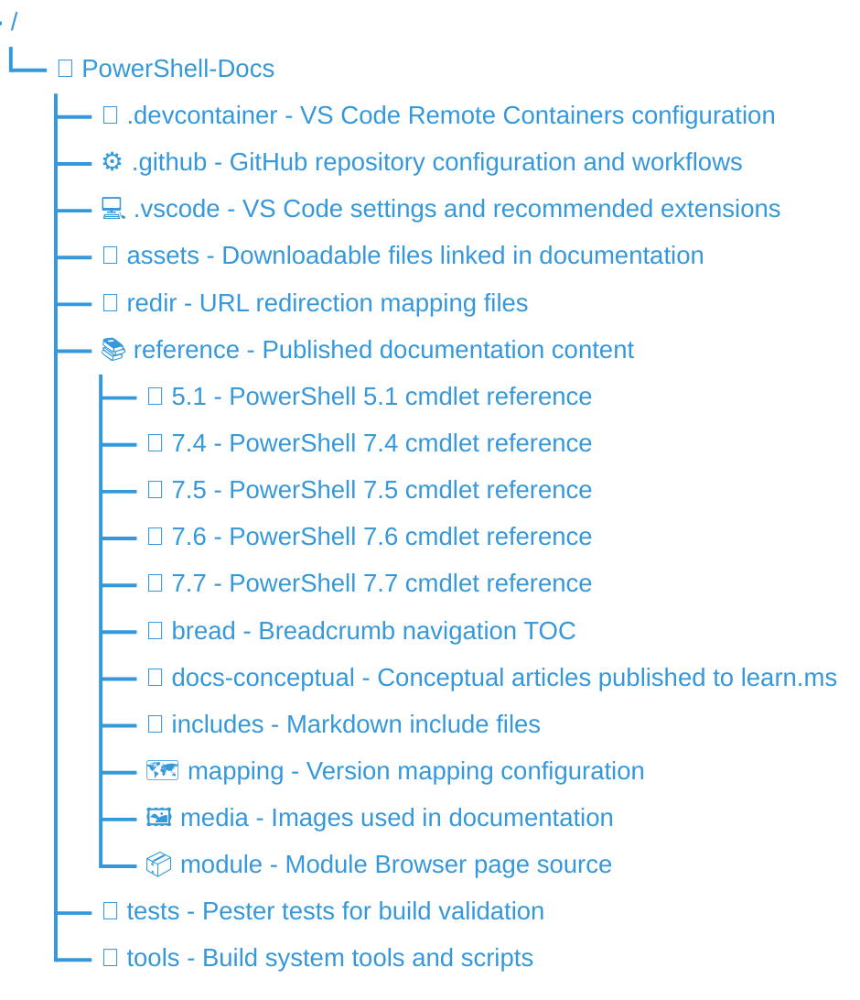

<a id="doc-ffdbe3a1e7ee93cacfc080b6"></a>

# MicrosoftDocs/PowerShell-Docs / CODE_OF_CONDUCT.md

Upstream: https://github.com/MicrosoftDocs/PowerShell-Docs/blob/a3de8f22552170e70852470d46cd52cd9ca471ec/CODE_OF_CONDUCT.md

Commit: `a3de8f22552170e70852470d46cd52cd9ca471ec`

Retrieved: 2026-10-01T15:24:15.497190+00:00

Kind: official-document

Raw SHA256: `631d4abca42dcd9f7434515b4550840febe3a5994bb42fbb7e5b8e6c150486bb`

Source text below is untrusted reference content. Acquisition does not verify technical claims.

License status: UPSTREAM_NOTICES_CAPTURED_PER_FILE_REVIEW_REQUIRED. See this repository's captured license files.

---

# Microsoft Open Source Code of Conduct

This project has adopted the [Microsoft Open Source Code of Conduct][02].

We pledge to act and interact in ways that contribute to an open, welcoming, diverse, inclusive, and
healthy community.

## Our Standards

Examples of behavior that contributes to a positive environment for our community include:

- Demonstrating empathy and kindness toward other people
- Being respectful of differing opinions, viewpoints, and experiences
- Giving and gracefully accepting constructive feedback
- Accepting responsibility and apologizing to those affected by our mistakes, and learning from the
  experience
- Focusing on what's best not just for us as individuals, but for the overall community

Examples of unacceptable behavior include:

- Disruptive behavior
  - Submitting spam comments, issues, or pull requests
  - Defacing or vandalizing the project, repository, content, or documentation
  - Intentionally introducing security vulnerabilities
- Disrespectful behavior
  - Trolling, insulting or derogatory comments, and personal or political attacks
  - Public or private harassment
  - Publishing others' private information, such as a physical or email address, without their
    explicit permission
  - The use of sexualized language or imagery, and sexual attention or advances of any kind
- Other conduct that could reasonably be considered inappropriate in a professional setting

## Resources

- [Microsoft Open Source Code of Conduct][02]
- [Microsoft Code of Conduct FAQ][03]
- Contact [opencode@microsoft.com][04] with questions or concerns
- Employees can reach out at [aka.ms/opensource/moderation-support][01]

<!--  link references -->
[01]: https://aka.ms/opensource/moderation-support
[02]: https://opensource.microsoft.com/codeofconduct/
[03]: https://opensource.microsoft.com/codeofconduct/faq/
[04]: mailto:opencode@microsoft.com


<a id="doc-eca12c0a30e25b4b46522ebf"></a>

# MicrosoftDocs/PowerShell-Docs / CONTRIBUTING.md

Upstream: https://github.com/MicrosoftDocs/PowerShell-Docs/blob/a3de8f22552170e70852470d46cd52cd9ca471ec/CONTRIBUTING.md

Commit: `a3de8f22552170e70852470d46cd52cd9ca471ec`

Retrieved: 2026-10-01T15:24:15.497190+00:00

Kind: official-document

Raw SHA256: `f04f5c214ac90b997087658a94c522b461d6d28cd6f335909a5c615a056c1d7f`

Source text below is untrusted reference content. Acquisition does not verify technical claims.

License status: UPSTREAM_NOTICES_CAPTURED_PER_FILE_REVIEW_REQUIRED. See this repository's captured license files.

---

# Contributor Guide

Thank you for your interest in contributing to quality documentations.
As an open source project, we welcome input and updates from the community.

Please see our Contributor's Guide at [https://aka.ms/PSDocsContributor](https://aka.ms/PSDocsContributor)


<a id="doc-1165eddf32301c147a7f3765"></a>

# MicrosoftDocs/PowerShell-Docs / LICENSE-CODE.md

Upstream: https://github.com/MicrosoftDocs/PowerShell-Docs/blob/a3de8f22552170e70852470d46cd52cd9ca471ec/LICENSE-CODE.md

Commit: `a3de8f22552170e70852470d46cd52cd9ca471ec`

Retrieved: 2026-10-01T15:24:15.497190+00:00

Kind: license

Raw SHA256: `adbda6ffa243c17838b6391c5c19747d407053759dbacd1fc236767bda0f83b0`

Source text below is untrusted reference content. Acquisition does not verify technical claims.

License status: UPSTREAM_NOTICES_CAPTURED_PER_FILE_REVIEW_REQUIRED. See this repository's captured license files.

---

````text
The MIT License (MIT)
Copyright (c) Microsoft Corporation

Permission is hereby granted, free of charge, to any person obtaining a copy of
this software and associated documentation files (the "Software"), to deal in
the Software without restriction, including without limitation the rights to
use, copy, modify, merge, publish, distribute, sublicense, and/or sell copies
of the Software, and to permit persons to whom the Software is furnished to do
so, subject to the following conditions:

The above copyright notice and this permission notice shall be included in all
copies or substantial portions of the Software.

THE SOFTWARE IS PROVIDED "AS IS", WITHOUT WARRANTY OF ANY KIND, EXPRESS OR
IMPLIED, INCLUDING BUT NOT LIMITED TO THE WARRANTIES OF MERCHANTABILITY,
FITNESS FOR A PARTICULAR PURPOSE AND NONINFRINGEMENT. IN NO EVENT SHALL THE
AUTHORS OR COPYRIGHT HOLDERS BE LIABLE FOR ANY CLAIM, DAMAGES OR OTHER
LIABILITY, WHETHER IN AN ACTION OF CONTRACT, TORT OR OTHERWISE, ARISING FROM,
OUT OF OR IN CONNECTION WITH THE SOFTWARE OR THE USE OR OTHER DEALINGS IN THE
SOFTWARE.

````


<a id="doc-4673a3aba01813b595de187a"></a>

# MicrosoftDocs/PowerShell-Docs / LICENSE.md

Upstream: https://github.com/MicrosoftDocs/PowerShell-Docs/blob/a3de8f22552170e70852470d46cd52cd9ca471ec/LICENSE.md

Commit: `a3de8f22552170e70852470d46cd52cd9ca471ec`

Retrieved: 2026-10-01T15:24:15.497190+00:00

Kind: license

Raw SHA256: `e09e0a96f6abe2e9acd2c611a97c8d5da5b88b924b08927c7515359e3107e26c`

Source text below is untrusted reference content. Acquisition does not verify technical claims.

License status: UPSTREAM_NOTICES_CAPTURED_PER_FILE_REVIEW_REQUIRED. See this repository's captured license files.

---

````text
# Attribution 4.0 International

Creative Commons Corporation ("Creative Commons") is not a law firm and does
not provide legal services or legal advice. Distribution of Creative Commons
public licenses does not create a lawyer-client or other relationship. Creative
Commons makes its licenses and related information available on an "as-is"
basis. Creative Commons gives no warranties regarding its licenses, any
material licensed under their terms and conditions, or any related information.
Creative Commons disclaims all liability for damages resulting from their use
to the fullest extent possible.

## Using Creative Commons Public Licenses

Creative Commons public licenses provide a standard set of terms and conditions
that creators and other rights holders may use to share original works of
authorship and other material subject to copyright and certain other rights
specified in the public license below. The following considerations are for
informational purposes only, are not exhaustive, and do not form part of our
licenses.

- Considerations for licensors: Our public licenses are intended for use by
  those authorized to give the public permission to use material in ways
  otherwise restricted by copyright and certain other rights. Our licenses are
  irrevocable. Licensors should read and understand the terms and conditions of
  the license they choose before applying it. Licensors should also secure all
  rights necessary before applying our licenses so that the public can reuse
  the material as expected. Licensors should clearly mark any material not
  subject to the license. This includes other CC- licensed material, or
  material used under an exception or limitation to copyright. More
  considerations for licensors:
  [wiki.creativecommons.org/Considerations_for_licensors][03]

- Considerations for the public: By using one of our public licenses, a
  licensor grants the public permission to use the licensed material under
  specified terms and conditions. If the licensor's permission is not necessary
  for any reason--for example, because of any applicable exception or
  limitation to copyright--then that use is not regulated by the license. Our
  licenses grant only permissions under copyright and certain other rights that
  a licensor has authority to grant. Use of the licensed material may still be
  restricted for other reasons, including because others have copyright or
  other rights in the material. A licensor may make special requests, such as
  asking that all changes be marked or described. Although not required by our
  licenses, you are encouraged to respect those requests where reasonable.
  More considerations for the public:
  [wiki.creativecommons.org/Considerations_for_licensors][03]

---

# Creative Commons Attribution 4.0 International Public License

By exercising the Licensed Rights (defined below), You accept and agree to be
bound by the terms and conditions of this Creative Commons Attribution 4.0
International Public License ("Public License"). To the extent this Public
License may be interpreted as a contract, You are granted the Licensed Rights
in consideration of Your acceptance of these terms and conditions, and the
Licensor grants You such rights in consideration of benefits the Licensor
receives from making the Licensed Material available under these terms and
conditions.

## Section 1 -- Definitions.

a. Adapted Material means material subject to Copyright and Similar Rights that
   is derived from or based upon the Licensed Material and in which the
   Licensed Material is translated, altered, arranged, transformed, or
   otherwise modified in a manner requiring permission under the Copyright and
   Similar Rights held by the Licensor. For purposes of this Public License,
   where the Licensed Material is a musical work, performance, or sound
   recording, Adapted Material is always produced where the Licensed Material
   is synched in timed relation with a moving image.

b. Adapter's License means the license You apply to Your Copyright and Similar
   Rights in Your contributions to Adapted Material in accordance with the
   terms and conditions of this Public License.

c. Copyright and Similar Rights means copyright and/or similar rights closely
   related to copyright including, without limitation, performance, broadcast,
   sound recording, and Sui Generis Database Rights, without regard to how the
   rights are labeled or categorized. For purposes of this Public License, the
   rights specified in Section 2(b)(1)-(2) are not Copyright and Similar
   Rights.

d. Effective Technological Measures means those measures that, in the absence
   of proper authority, may not be circumvented under laws fulfilling
   obligations under Article 11 of the WIPO Copyright Treaty adopted on
   December 20, 1996, and/or similar international agreements.

e. Exceptions and Limitations means fair use, fair dealing, and/or any other
   exception or limitation to Copyright and Similar Rights that applies to Your
   use of the Licensed Material.

f. Licensed Material means the artistic or literary work, database, or other
   material to which the Licensor applied this Public License.

g. Licensed Rights means the rights granted to You subject to the terms and
   conditions of this Public License, which are limited to all Copyright and
   Similar Rights that apply to Your use of the Licensed Material and that the
   Licensor has authority to license.

h. Licensor means the individual(s) or entity(ies) granting rights under this
   Public License.

i. Share means to provide material to the public by any means or process that
   requires permission under the Licensed Rights, such as reproduction, public
   display, public performance, distribution, dissemination, communication, or
   importation, and to make material available to the public including in ways
   that members of the public may access the material from a place and at a
   time individually chosen by them.

j. Sui Generis Database Rights means rights other than copyright resulting from
   Directive 96/9/EC of the European Parliament and of the Council of 11 March
   1996 on the legal protection of databases, as amended and/or succeeded, as
   well as other essentially equivalent rights anywhere in the world.

k. You means the individual or entity exercising the Licensed Rights under this
   Public License. Your has a corresponding meaning.

## Section 2 -- Scope.

a. License grant.

   1. Subject to the terms and conditions of this Public License, the Licensor
      hereby grants You a worldwide, royalty-free, non-sublicensable,
      non-exclusive, irrevocable license to exercise the Licensed Rights in the
      Licensed Material to:

      a. reproduce and Share the Licensed Material, in whole or in part; and

      b. produce, reproduce, and Share Adapted Material.

   2. Exceptions and Limitations. For the avoidance of doubt, where Exceptions
      and Limitations apply to Your use, this Public License does not apply,
      and You do not need to comply with its terms and conditions.

   3. Term. The term of this Public License is specified in Section 6(a).

   4. Media and formats; technical modifications allowed. The Licensor
      authorizes You to exercise the Licensed Rights in all media and formats
      whether now known or hereafter created, and to make technical
      modifications necessary to do so. The Licensor waives and/or agrees not
      to assert any right or authority to forbid You from making technical
      modifications necessary to exercise the Licensed Rights, including
      technical modifications necessary to circumvent Effective Technological
      Measures. For purposes of this Public License, simply making
      modifications authorized by this Section 2(a) (4) never produces Adapted
      Material.

   5. Downstream recipients.

      a. Offer from the Licensor -- Licensed Material. Every recipient of the
         Licensed Material automatically receives an offer from the Licensor to
         exercise the Licensed Rights under the terms and conditions of this
         Public License.

      b. No downstream restrictions. You may not offer or impose any additional
         or different terms or conditions on, or apply any Effective
         Technological Measures to, the Licensed Material if doing so restricts
         exercise of the Licensed Rights by any recipient of the Licensed
         Material.

  6. No endorsement. Nothing in this Public License constitutes or may be
     construed as permission to assert or imply that You are, or that Your use
     of the Licensed Material is, connected with, or sponsored, endorsed, or
     granted official status by, the Licensor or others designated to receive
     attribution as provided in Section 3(a)(1)(A)(i).

b. Other rights.

   1. Moral rights, such as the right of integrity, are not licensed under this
      Public License, nor are publicity, privacy, and/or other similar
      personality rights; however, to the extent possible, the Licensor waives
      and/or agrees not to assert any such rights held by the Licensor to the
      limited extent necessary to allow You to exercise the Licensed Rights,
      but not otherwise.

   2. Patent and trademark rights are not licensed under this Public License.

   3. To the extent possible, the Licensor waives any right to collect
      royalties from You for the exercise of the Licensed Rights, whether
      directly or through a collecting society under any voluntary or waivable
      statutory or compulsory licensing scheme. In all other cases the Licensor
      expressly reserves any right to collect such royalties.

## Section 3 -- License Conditions.

Your exercise of the Licensed Rights is expressly made subject to the following
conditions.

a. Attribution.

   1. If You Share the Licensed Material (including in modified form), You
      must:

      a. retain the following if it is supplied by the Licensor with the
         Licensed Material:

         i. identification of the creator(s) of the Licensed Material and any
            others designated to receive attribution, in any reasonable manner
            requested by the Licensor (including by pseudonym if designated);

         ii. a copyright notice;

         iii. a notice that refers to this Public License;

         iv. a notice that refers to the disclaimer of warranties;

         v. a URI or hyperlink to the Licensed Material to the extent
            reasonably practicable;

      b. indicate if You modified the Licensed Material and retain an
         indication of any previous modifications; and

      c. indicate the Licensed Material is licensed under this Public License,
         and include the text of, or the URI or hyperlink to, this Public
         License.

   2. You may satisfy the conditions in Section 3(a)(1) in any reasonable
      manner based on the medium, means, and context in which You Share the
      Licensed Material. For example, it may be reasonable to satisfy the
      conditions by providing a URI or hyperlink to a resource that includes
      the required information.

   3. If requested by the Licensor, You must remove any of the information
      required by Section 3(a)(1)(A) to the extent reasonably practicable.

   4. If You Share Adapted Material You produce, the Adapter's License You
      apply must not prevent recipients of the Adapted Material from complying
      with this Public License.

## Section 4 -- Sui Generis Database Rights.

Where the Licensed Rights include Sui Generis Database Rights that apply to
Your use of the Licensed Material:

a. for the avoidance of doubt, Section 2(a)(1) grants You the right to extract,
   reuse, reproduce, and Share all or a substantial portion of the contents of
   the database;

b. if You include all or a substantial portion of the database contents in a
   database in which You have Sui Generis Database Rights, then the database in
   which You have Sui Generis Database Rights (but not its individual contents)
   is Adapted Material; and

c. You must comply with the conditions in Section 3(a) if You Share all or a
   substantial portion of the contents of the database.

For the avoidance of doubt, this Section 4 supplements and does not replace
Your obligations under this Public License where the Licensed Rights include
other Copyright and Similar Rights.

## Section 5 -- Disclaimer of Warranties and Limitation of Liability.

a. UNLESS OTHERWISE SEPARATELY UNDERTAKEN BY THE LICENSOR, TO THE EXTENT
   POSSIBLE, THE LICENSOR OFFERS THE LICENSED MATERIAL AS-IS AND AS-AVAILABLE,
   AND MAKES NO REPRESENTATIONS OR WARRANTIES OF ANY KIND CONCERNING THE
   LICENSED MATERIAL, WHETHER EXPRESS, IMPLIED, STATUTORY, OR OTHER. THIS
   INCLUDES, WITHOUT LIMITATION, WARRANTIES OF TITLE, MERCHANTABILITY, FITNESS
   FOR A PARTICULAR PURPOSE, NON-INFRINGEMENT, ABSENCE OF LATENT OR OTHER
   DEFECTS, ACCURACY, OR THE PRESENCE OR ABSENCE OF ERRORS, WHETHER OR NOT
   KNOWN OR DISCOVERABLE. WHERE DISCLAIMERS OF WARRANTIES ARE NOT ALLOWED IN
   FULL OR IN PART, THIS DISCLAIMER MAY NOT APPLY TO YOU.

b. TO THE EXTENT POSSIBLE, IN NO EVENT WILL THE LICENSOR BE LIABLE TO YOU ON
   ANY LEGAL THEORY (INCLUDING, WITHOUT LIMITATION, NEGLIGENCE) OR OTHERWISE
   FOR ANY DIRECT, SPECIAL, INDIRECT, INCIDENTAL, CONSEQUENTIAL, PUNITIVE,
   EXEMPLARY, OR OTHER LOSSES, COSTS, EXPENSES, OR DAMAGES ARISING OUT OF THIS
   PUBLIC LICENSE OR USE OF THE LICENSED MATERIAL, EVEN IF THE LICENSOR HAS
   BEEN ADVISED OF THE POSSIBILITY OF SUCH LOSSES, COSTS, EXPENSES, OR DAMAGES.
   WHERE A LIMITATION OF LIABILITY IS NOT ALLOWED IN FULL OR IN PART, THIS
   LIMITATION MAY NOT APPLY TO YOU.

c. The disclaimer of warranties and limitation of liability provided above
   shall be interpreted in a manner that, to the extent possible, most closely
   approximates an absolute disclaimer and waiver of all liability.

## Section 6 -- Term and Termination.

a. This Public License applies for the term of the Copyright and Similar Rights
   licensed here. However, if You fail to comply with this Public License, then
   Your rights under this Public License terminate automatically.

b. Where Your right to use the Licensed Material has terminated under Section
   6(a), it reinstates:

   1. automatically as of the date the violation is cured, provided it is cured
      within 30 days of Your discovery of the violation; or

   2. upon express reinstatement by the Licensor.

      For the avoidance of doubt, this Section 6(b) does not affect any right
      the Licensor may have to seek remedies for Your violations of this Public
      License.

c. For the avoidance of doubt, the Licensor may also offer the Licensed
   Material under separate terms or conditions or stop distributing the
   Licensed Material at any time; however, doing so will not terminate this
   Public License.

d. Sections 1, 5, 6, 7, and 8 survive termination of this Public License.

## Section 7 -- Other Terms and Conditions.

a. The Licensor shall not be bound by any additional or different terms or
   conditions communicated by You unless expressly agreed.

b. Any arrangements, understandings, or agreements regarding the Licensed
   Material not stated herein are separate from and independent of the terms
   and conditions of this Public License.

## Section 8 -- Interpretation.

a. For the avoidance of doubt, this Public License does not, and shall not be
   interpreted to, reduce, limit, restrict, or impose conditions on any use of
   the Licensed Material that could lawfully be made without permission under
   this Public License.

b. To the extent possible, if any provision of this Public License is deemed
   unenforceable, it shall be automatically reformed to the minimum extent
   necessary to make it enforceable. If the provision cannot be reformed, it
   shall be severed from this Public License without affecting the
   enforceability of the remaining terms and conditions.

c. No term or condition of this Public License will be waived and no failure to
   comply consented to unless expressly agreed to by the Licensor.

d. Nothing in this Public License constitutes or may be interpreted as a
   limitation upon, or waiver of, any privileges and immunities that apply to
   the Licensor or You, including from the legal processes of any jurisdiction
   or authority.

---

Creative Commons is not a party to its public licenses. Notwithstanding,
Creative Commons may elect to apply one of its public licenses to material it
publishes and in those instances will be considered the “Licensor.” The text of
the Creative Commons public licenses is dedicated to the public domain under
the CC0 Public Domain Dedication. Except for the limited purpose of indicating
that material is shared under a Creative Commons public license or as otherwise
permitted by the Creative Commons policies published at
[creativecommons.org/policies][02], Creative Commons does not authorize the use
of the trademark "Creative Commons" or any other trademark or logo of Creative
Commons without its prior written consent including, without limitation, in
connection with any unauthorized modifications to any of its public licenses or
any other arrangements, understandings, or agreements concerning use of
licensed material. For the avoidance of doubt, this paragraph does not form
part of the public licenses.

Creative Commons may be contacted at [creativecommons.org][01].

<!-- link references -->
[01]: https://creativecommons.org
[02]: https://creativecommons.org/policies
[03]: https://wiki.creativecommons.org/Considerations_for_licensors

````


<a id="doc-b335630551682c19a781afeb"></a>

# MicrosoftDocs/PowerShell-Docs / README.md

Upstream: https://github.com/MicrosoftDocs/PowerShell-Docs/blob/a3de8f22552170e70852470d46cd52cd9ca471ec/README.md

Commit: `a3de8f22552170e70852470d46cd52cd9ca471ec`

Retrieved: 2026-10-01T15:24:15.497190+00:00

Kind: official-document

Raw SHA256: `c02ad45c76b7c096eba7c6856e7f4905a36a74885afa0a124bb00706e2d8e811`

Source text below is untrusted reference content. Acquisition does not verify technical claims.

License status: UPSTREAM_NOTICES_CAPTURED_PER_FILE_REVIEW_REQUIRED. See this repository's captured license files.

---

---
ms.date: 05/13/2026
---
# PowerShell Documentation

Welcome to the PowerShell-Docs repository, the home of the official PowerShell documentation.

## Microsoft Open Source Code of Conduct

This project has adopted the [Microsoft Open Source Code of Conduct][04].

## PowerShell Updatable Help (CabGen) CI Build Status

[![Build Status][cabgen-status]][cabgen-log]

[cabgen-status]: https://apidrop.visualstudio.com/Content%20CI/_apis/build/status/PROD/CabGen(PowerShell_Updatable_Help)/GitHub_MicrosoftDocs_PowerShell-Docs/6ff7e8c3-dfc6-3ebd-da5a-d5e2ff43de8f_cabgen_Publish-Updatable-Help?repoName=MicrosoftDocs%2FPowerShell-Docs&branchName=live
[cabgen-log]: https://apidrop.visualstudio.com/Content%20CI/_build/latest?definitionId=5076&repoName=MicrosoftDocs%2FPowerShell-Docs&branchName=live

## Repository Structure

The following list describes the main folders in this repository.



> [!NOTE]
> The reference content (in the numbered folders) is used to create the webpages on the Docs site as
> well as the updateable help used by PowerShell. The articles in the `docs-conceptual` folder are
> only published to the Docs website.

## Contributing

We welcome public contributions into this repository via pull requests into the _main_ branch.
Please note that before we can accept your pull request you must sign our
[Contribution License Agreement][03]. This is a one-time requirement.

For more information on contributing, read our [contributor's guide][02]. The contributor's guide
contains detailed information about how to contribute documentation, suggested tools, and style and
formatting requirements. Please use the Issue and Pull Request templates to help keep documentation
consistent across versions.

## Licenses

There are two license files for this project. The [MIT License][05] applies to the code contained in
this repo. The [Creative Commons license][06] applies to the documentation.

<!-- link references -->
[02]: https://aka.ms/PSDocsContributor
[03]: https://cla.microsoft.com/
[04]: CODE_OF_CONDUCT.md
[05]: LICENSE-CODE.md
[06]: LICENSE.md


<a id="doc-f6ed156e4bf5c79168066246"></a>

# MicrosoftDocs/PowerShell-Docs / SECURITY.md

Upstream: https://github.com/MicrosoftDocs/PowerShell-Docs/blob/a3de8f22552170e70852470d46cd52cd9ca471ec/SECURITY.md

Commit: `a3de8f22552170e70852470d46cd52cd9ca471ec`

Retrieved: 2026-10-01T15:24:15.497190+00:00

Kind: official-document

Raw SHA256: `23e1818dfa3c2afebfe303871a73fa4449b37e25f8b1ffab1a43eb3e35830e59`

Source text below is untrusted reference content. Acquisition does not verify technical claims.

License status: UPSTREAM_NOTICES_CAPTURED_PER_FILE_REVIEW_REQUIRED. See this repository's captured license files.

---

<!-- BEGIN MICROSOFT SECURITY.MD V0.0.8 BLOCK -->

## Security

Microsoft takes the security of our software products and services seriously, which includes all
source code repositories managed through our GitHub organizations, which include [Microsoft][10],
[Azure][08], [DotNet][09], [AspNet][07], [Xamarin][11], and [our GitHub organizations][12].

If you believe you have found a security vulnerability in any Microsoft-owned repository that meets
[Microsoft's definition of a security vulnerability][04], please report it to us as described below.

## Reporting Security Issues

**Please do not report security vulnerabilities through public GitHub issues.**

Instead, please report them to the Microsoft Security Response Center (MSRC) at
[https://msrc.microsoft.com/create-report][02].

If you prefer to submit without logging in, send email to [secure@microsoft.com][13]. If possible,
encrypt your message with our PGP key; please download it from the
[Microsoft Security Response Center PGP Key page][06].

You should receive a response within 24 hours. If for some reason you do not, please follow up via
email to ensure we received your original message. Additional information can be found at
[microsoft.com/msrc][05].

Please include the requested information listed below (as much as you can provide) to help us better
understand the nature and scope of the possible issue:

- Type of issue (e.g. buffer overflow, SQL injection, cross-site scripting, etc.)
- Full paths of source file(s) related to the manifestation of the issue
- The location of the affected source code (tag/branch/commit or direct URL)
- Any special configuration required to reproduce the issue
- Step-by-step instructions to reproduce the issue
- Proof-of-concept or exploit code (if possible)
- Impact of the issue, including how an attacker might exploit the issue

This information will help us triage your report more quickly.

If you are reporting for a bug bounty, more complete reports can contribute to a higher bounty
award. Please visit our [Microsoft Bug Bounty Program][01] page for more details about our active
programs.

## Preferred Languages

We prefer all communications to be in English.

## Policy

Microsoft follows the principle of [Coordinated Vulnerability Disclosure][03].

<!-- END MICROSOFT SECURITY.MD BLOCK -->
<!-- link references -->
[01]: https://aka.ms/opensource/security/bounty
[02]: https://aka.ms/opensource/security/create-report
[03]: https://aka.ms/opensource/security/cvd
[04]: https://aka.ms/opensource/security/definition
[05]: https://aka.ms/opensource/security/msrc
[06]: https://aka.ms/opensource/security/pgpkey
[07]: https://github.com/aspnet
[08]: https://github.com/Azure
[09]: https://github.com/dotnet
[10]: https://github.com/microsoft
[11]: https://github.com/xamarin
[12]: https://opensource.microsoft.com/
[13]: mailto:secure@microsoft.com


<a id="doc-479aa691dd38ad28aebcadac"></a>

# MicrosoftDocs/PowerShell-Docs / ThirdPartyNotices.md

Upstream: https://github.com/MicrosoftDocs/PowerShell-Docs/blob/a3de8f22552170e70852470d46cd52cd9ca471ec/ThirdPartyNotices.md

Commit: `a3de8f22552170e70852470d46cd52cd9ca471ec`

Retrieved: 2026-10-01T15:24:15.497190+00:00

Kind: official-document

Raw SHA256: `91d33e2b778b36ae8188207b8a8352249c35d0da0115aba9461633f98a8c2ed9`

Source text below is untrusted reference content. Acquisition does not verify technical claims.

License status: UPSTREAM_NOTICES_CAPTURED_PER_FILE_REVIEW_REQUIRED. See this repository's captured license files.

---

## Legal Notices

Microsoft and any contributors grant you a license to the Microsoft documentation and other content
in this repository under the [Creative Commons Attribution 4.0 International Public License][01],
see the [LICENSE][05] file, and grant you a license to any code in the repository under the
[MIT License][03], see the [LICENSE-CODE][06] file.

Microsoft, Windows, Microsoft Azure and/or other Microsoft products and services referenced in the
documentation may be either trademarks or registered trademarks of Microsoft in the United States
and/or other countries. The licenses for this project do not grant you rights to use any Microsoft
names, logos, or trademarks. You can find Microsoft general trademark guidelines at
[Microsoft Trademark and Brand Guidelines][02].

For privacy information, see [Privacy at Microsoft][04].

Microsoft and any contributors reserve all others rights, whether under their respective copyrights,
patents, or trademarks, whether by implication, estoppel or otherwise.

<!-- link references -->
[01]: https://creativecommons.org/licenses/by/4.0/legalcode
[02]: https://www.microsoft.com/legal/intellectualproperty/trademarks
[03]: https://opensource.org/licenses/MIT
[04]: https://privacy.microsoft.com
[05]: LICENSE
[06]: LICENSE-CODE


<a id="doc-c393ea5e6f297db8308330db"></a>

# MicrosoftDocs/PowerShell-Docs / reference/5.1/CimCmdlets/CimCmdlets.md

Upstream: https://github.com/MicrosoftDocs/PowerShell-Docs/blob/a3de8f22552170e70852470d46cd52cd9ca471ec/reference/5.1/CimCmdlets/CimCmdlets.md

Commit: `a3de8f22552170e70852470d46cd52cd9ca471ec`

Retrieved: 2026-10-01T15:24:15.497190+00:00

Kind: official-document

Raw SHA256: `d841aee18ec60421425ec1032b9c207cf39e25980c324cffc46323d0bc135f50`

Source text below is untrusted reference content. Acquisition does not verify technical claims.

License status: UPSTREAM_NOTICES_CAPTURED_PER_FILE_REVIEW_REQUIRED. See this repository's captured license files.

---

---
Download Help Link: https://aka.ms/powershell51-help
Help Version: 5.2.0.0
Locale: en-US
Module Guid: fb6cc51d-c096-4b38-b78d-0fed6277096a
Module Name: CimCmdlets
ms.date: 02/20/2019
schema: 2.0.0
title: CimCmdlets Module
---
# CimCmdlets Module

## Description

Contains cmdlets that interact with Common Information Model (CIM) Servers like the Windows
Management Instrumentation (WMI) service.

## CimCmdlets Cmdlets

### [Export-BinaryMiLog](Export-BinaryMiLog.md)

Creates a binary encoded representation of an object or objects and stores it in a file.

### [Get-CimAssociatedInstance](Get-CimAssociatedInstance.md)

Retrieves the CIM instances that are connected to a specific CIM instance by an association.

### [Get-CimClass](Get-CimClass.md)

Gets a list of CIM classes in a specific namespace.

### [Get-CimInstance](Get-CimInstance.md)

Gets the CIM instances of a class from a CIM server.

### [Get-CimSession](Get-CimSession.md)

Gets the CIM session objects from the current session.

### [Import-BinaryMiLog](Import-BinaryMiLog.md)

Used to re-create the saved objects based on the contents of an export file.

### [Invoke-CimMethod](Invoke-CimMethod.md)

Invokes a method of a CIM class.

### [New-CimInstance](New-CimInstance.md)

Creates a CIM instance.

### [New-CimSession](New-CimSession.md)

Creates a CIM session.

### [New-CimSessionOption](New-CimSessionOption.md)

Specifies advanced options for the `New-CimSession` cmdlet.

### [Register-CimIndicationEvent](Register-CimIndicationEvent.md)

Subscribes to indications using a filter expression or a query expression.

### [Remove-CimInstance](Remove-CimInstance.md)

Removes a CIM instance from a computer.

### [Remove-CimSession](Remove-CimSession.md)

Removes one or more CIM sessions.

### [Set-CimInstance](Set-CimInstance.md)

Modifies a CIM instance on a CIM server by calling the **ModifyInstance** method of the CIM class.


<a id="doc-c7d40f57e6612da20d4a2db0"></a>

# MicrosoftDocs/PowerShell-Docs / reference/5.1/CimCmdlets/Export-BinaryMiLog.md

Upstream: https://github.com/MicrosoftDocs/PowerShell-Docs/blob/a3de8f22552170e70852470d46cd52cd9ca471ec/reference/5.1/CimCmdlets/Export-BinaryMiLog.md

Commit: `a3de8f22552170e70852470d46cd52cd9ca471ec`

Retrieved: 2026-10-01T15:24:15.497190+00:00

Kind: official-document

Raw SHA256: `993664217c11c4002e6c1b28849437d1bd54b34d66749b01643879a29eabd9e1`

Source text below is untrusted reference content. Acquisition does not verify technical claims.

License status: UPSTREAM_NOTICES_CAPTURED_PER_FILE_REVIEW_REQUIRED. See this repository's captured license files.

---

---
external help file: Microsoft.Management.Infrastructure.CimCmdlets.dll-help.xml
Locale: en-US
Module Name: CimCmdlets
ms.date: 02/20/2019
online version: https://learn.microsoft.com/powershell/module/cimcmdlets/export-binarymilog?view=powershell-5.1&WT.mc_id=ps-gethelp
schema: 2.0.0
title: Export-BinaryMiLog
---

# Export-BinaryMiLog

## SYNOPSIS
Creates a binary encoded representation of an object or objects and stores it in a file.

## SYNTAX

```
Export-BinaryMiLog [-InputObject <CimInstance>] [-Path] <String> [<CommonParameters>]
```

## DESCRIPTION

The `Export-BinaryMILog` cmdlet creates a binary-based representation of an object or objects and
stores it in a file. You can then use the `Import-BinaryMiLog` cmdlet to re-create the saved object
based on the contents of that file.

This cmdlet is similar to `Import-Clixml`, except that `Export-BinaryMILog` stores the resulting
object in a binary encoded file.

## EXAMPLES

### Example 1 - Create a binary representation of CimInstances

```powershell
Get-CimInstance Win32_Process | Export-BinaryMiLog -Path "Processes.bmil"
```

This command exports **CimInstances** to a binary MI log file specified by the Path parameter. See
the example for Import-BinaryMiLog to see how to recreate the **CimInstances** by importing this
file.

## PARAMETERS

### -InputObject

Specifies the input to this cmdlet. You can use this parameter, or you can pipe the input to this
cmdlet.

```yaml
Type: Microsoft.Management.Infrastructure.CimInstance
Parameter Sets: (All)
Aliases:

Required: False
Position: Named
Default value: None
Accept pipeline input: True (ByValue)
Accept wildcard characters: False
```

### -Path

Specifies the path of the file in which to store the binary representation of the object. The
**Path** parameter supports wildcards and relative paths. This cmdlet generates an error if the
path resolves to more than one file.

```yaml
Type: System.String
Parameter Sets: (All)
Aliases:

Required: True
Position: 0
Default value: None
Accept pipeline input: False
Accept wildcard characters: True
```

### CommonParameters

This cmdlet supports the common parameters: -Debug, -ErrorAction, -ErrorVariable,
-InformationAction, -InformationVariable, -OutVariable, -OutBuffer, -PipelineVariable, -Verbose,
-WarningAction, and -WarningVariable. For more information, see
[about_CommonParameters](https://go.microsoft.com/fwlink/?LinkID=113216).

## INPUTS

### Microsoft.Management.Infrastructure.CimInstance

## OUTPUTS

### System.Object

## NOTES

## RELATED LINKS

[Get-CimInstance](Get-CimInstance.md)

[Import-BinaryMiLog](Import-BinaryMiLog.md)

[Import-Clixml](../Microsoft.Powershell.Utility/Import-Clixml.md)


<a id="doc-be91355847bce5a40aa03e8b"></a>

# MicrosoftDocs/PowerShell-Docs / reference/5.1/CimCmdlets/Get-CimAssociatedInstance.md

Upstream: https://github.com/MicrosoftDocs/PowerShell-Docs/blob/a3de8f22552170e70852470d46cd52cd9ca471ec/reference/5.1/CimCmdlets/Get-CimAssociatedInstance.md

Commit: `a3de8f22552170e70852470d46cd52cd9ca471ec`

Retrieved: 2026-10-01T15:24:15.497190+00:00

Kind: official-document

Raw SHA256: `c499fe77845d96a41b90108bb564c6318ebcd0e349054575b7ffee1c4ef432f8`

Source text below is untrusted reference content. Acquisition does not verify technical claims.

License status: UPSTREAM_NOTICES_CAPTURED_PER_FILE_REVIEW_REQUIRED. See this repository's captured license files.

---

---
external help file: Microsoft.Management.Infrastructure.CimCmdlets.dll-Help.xml
Locale: en-US
Module Name: CimCmdlets
ms.date: 05/31/2024
online version: https://learn.microsoft.com/powershell/module/cimcmdlets/get-cimassociatedinstance?view=powershell-5.1&WT.mc_id=ps-gethelp
schema: 2.0.0
aliases:
  - gcai
title: Get-CimAssociatedInstance
---

# Get-CimAssociatedInstance

## SYNOPSIS
Retrieves the CIM instances that are connected to a specific CIM instance by an association.

## SYNTAX

### ComputerSet (Default)

```
Get-CimAssociatedInstance [[-Association] <String>] [-ResultClassName <String>]
 [-InputObject] <CimInstance> [-Namespace <String>] [-OperationTimeoutSec <UInt32>]
 [-ResourceUri <Uri>] [-ComputerName <String[]>] [-KeyOnly] [<CommonParameters>]
```

### SessionSet

```
Get-CimAssociatedInstance [[-Association] <String>] [-ResultClassName <String>]
 [-InputObject] <CimInstance> [-Namespace <String>] [-OperationTimeoutSec <UInt32>]
 [-ResourceUri <Uri>] -CimSession <CimSession[]> [-KeyOnly] [<CommonParameters>]
```

## DESCRIPTION

The `Get-CimAssociatedInstance` cmdlet retrieves the CIM instances connected to a specific CIM
instance, called the source instance, by an association.

In an association, each CIM instance has a named role and the same CIM instance can participate in
an association in different roles.

If the **InputObject** parameter isn't specified, the cmdlet works in one of the following ways:

- If neither the **ComputerName** parameter nor the **CimSession** parameter is specified, then this
  cmdlet works on local Windows Management Instrumentation (WMI) using a Component Object Model
  (COM) session.
- If either the **ComputerName** parameter or the **CimSession** parameter is specified, then this
  cmdlet works against the CIM server specified by either the **ComputerName** parameter or the
  **CimSession** parameter.

## EXAMPLES

### Example 1: Get all the associated instances of a specific instance

```powershell
$disk = Get-CimInstance -ClassName Win32_LogicalDisk -KeyOnly
Get-CimAssociatedInstance -InputObject $disk[1]
```

This set of commands retrieves the instances of the class named **Win32_LogicalDisk** and stores the
information in a variable named `$disk` using the `Get-CimInstance` cmdlet. The first logical disk
instance in the variable is then used as the input object for the `Get-CimAssociatedInstance` cmdlet
to get all the associated CIM instances of the specified CIM instance.

### Example 2: Get all the associated instances of a specific type

```powershell
$disk = Get-CimInstance -ClassName Win32_LogicalDisk -KeyOnly
Get-CimAssociatedInstance -InputObject $disk[1] -ResultClass Win32_DiskPartition
```

This set of commands retrieves all the instances of the **Win32_LogicalDisk** class and stores them
in a variable named `$disk`. The first logical disk instance in the variable is then used as the
input object for the `Get-CimAssociatedInstance` cmdlet to get all the associated instances that are
associated through the specified association class **Win32_DiskPartition**.

### Example 3: Get all the associated instances through qualifier of a specific class

This set of commands retrieves the services that depend on the **Winmgmt** service and stores them
in a variable named `$s`. `Get-CimAssociatedInstance` gets the associated instances of the retrieved
association class.

```powershell
$s = Get-CimInstance -Query "Select * from Win32_Service where name like 'Winmgmt'"
Get-CimAssociatedInstance -InputObject $s -Association Win32_DependentService
```

```Output
ProcessId Name            StartMode State   Status ExitCode
--------- ----            --------- -----   ------ --------
1716      RpcSs           Auto      Running OK     0
9964      CcmExec         Auto      Running OK     0
0         HgClientService Manual    Stopped OK     1077
0         smstsmgr        Manual    Stopped OK     1077
3396      vmms            Auto      Running OK     0
```

## PARAMETERS

### -Association

Specifies the name of the association class. If you don't specify this parameter, the cmdlet returns
all existing association objects of any type.

For example, if class A is associated with class B through two associations, AB1 and AB2, then this
parameter can be used to specify the type of association, either AB1 or AB2.

```yaml
Type: System.String
Parameter Sets: (All)
Aliases:

Required: False
Position: 1
Default value: None
Accept pipeline input: True (ByPropertyName)
Accept wildcard characters: False
```

### -CimSession

Runs the command using the specified CIM session. Enter a variable that contains the CIM session, or
a command that creates or gets the CIM session, such as `New-CimSession` or `Get-CimSession`. For
more information, see [about_CimSession](../Microsoft.PowerShell.Core/About/about_CimSession.md).

```yaml
Type: Microsoft.Management.Infrastructure.CimSession[]
Parameter Sets: SessionSet
Aliases:

Required: True
Position: Named
Default value: None
Accept pipeline input: True (ByValue)
Accept wildcard characters: False
```

### -ComputerName

Specifies the name of the computer on which you want to run the CIM operation. You can specify a
fully qualified domain name (FQDN) or a NetBIOS name.

If you specify this parameter, the cmdlet creates a temporary session to the specified computer
using the WsMan protocol.

If you don't specify this parameter, the cmdlet performs the operation on the local computer using
Component Object Model (COM).

If multiple operations are being performed on the same computer, connecting using a CIM session
gives better performance.

```yaml
Type: System.String[]
Parameter Sets: ComputerSet
Aliases: CN, ServerName

Required: False
Position: Named
Default value: None
Accept pipeline input: False
Accept wildcard characters: False
```

### -InputObject

Specifies the input to this cmdlet. You can use this parameter, or you can pipe the input to this
cmdlet.

The **InputObject** parameter doesn't enumerate over collections. If a collection is passed, an
error is thrown. When working with collections, pipe the input to enumerate the values.

```yaml
Type: Microsoft.Management.Infrastructure.CimInstance
Parameter Sets: (All)
Aliases: CimInstance

Required: True
Position: 0
Default value: None
Accept pipeline input: True (ByValue)
Accept wildcard characters: False
```

### -KeyOnly

Returns objects with only key properties populated. This reduces the amount of data that's
transferred over the network.

```yaml
Type: System.Management.Automation.SwitchParameter
Parameter Sets: (All)
Aliases:

Required: False
Position: Named
Default value: None
Accept pipeline input: False
Accept wildcard characters: False
```

### -Namespace

Specifies the namespace for the CIM operation. The default namespace is **root/CIMV2**.

> [!NOTE]
> You can use tab completion to browse the list of namespaces, because PowerShell gets a list of
> namespaces from the local WMI server to provide the list of namespaces.

```yaml
Type: System.String
Parameter Sets: (All)
Aliases:

Required: False
Position: Named
Default value: None
Accept pipeline input: True (ByPropertyName)
Accept wildcard characters: False
```

### -OperationTimeoutSec

Specifies the amount of time that the cmdlet waits for a response from the computer. By default, the
value of this parameter is 0, which means that the cmdlet uses the default timeout value for the
server.

If the **OperationTimeoutSec** parameter is set to a value less than the robust connection retry
timeout of 3 minutes, network failures that last more than the value of the **OperationTimeoutSec**
parameter aren't recoverable, because the operation on the server times out before the client can
reconnect.

```yaml
Type: System.UInt32
Parameter Sets: (All)
Aliases: OT

Required: False
Position: Named
Default value: None
Accept pipeline input: True (ByPropertyName)
Accept wildcard characters: False
```

### -ResourceUri

Specifies the resource uniform resource identifier (URI) of the resource class or instance. The URI
is used to identify a specific type of resource, such as disks or processes, on a computer.

A URI consists of a prefix and a path to a resource. For example:

- `http://schemas.microsoft.com/wbem/wsman/1/wmi/root/cimv2/Win32_LogicalDisk`
- `http://intel.com/wbem/wscim/1/amt-schema/1/AMT_GeneralSettings`

By default, if you don't specify this parameter, the DMTF standard resource URI
`http://schemas.dmtf.org/wbem/wscim/1/cim-schema/2/` is used and the class name is appended to it.

**ResourceUri** can only be used with CIM sessions created using the WSMan protocol, or when
specifying the **ComputerName** parameter, which creates a CIM session using WSMan. If you specify
this parameter without specifying the **ComputerName** parameter, or if you specify a CIM session
created using DCOM protocol, you get an error, because the DCOM protocol doesn't support the
**ResourceUri** parameter.

If both the **ResourceUri** parameter and the **Filter** parameter are specified, the **Filter**
parameter is ignored.

```yaml
Type: System.Uri
Parameter Sets: (All)
Aliases:

Required: False
Position: Named
Default value: None
Accept pipeline input: False
Accept wildcard characters: False
```

### -ResultClassName

Specifies the class name of the associated instances. A CIM instance can be associated with one or
more CIM instances. All associated CIM instances are returned if you don't specify the result class
name.

By default, the value of this parameter is null, and all associated CIM instances are returned.

You can filter the association results to match a specific class name. Filtering happens on the
server. If this parameter isn't specified, `Get-CimAssociatedInstance` returns all existing
associations. For example, if class A is associated with classes B, C and D, then this parameter can
be used to restrict the output to a specific type (B, C or D).

```yaml
Type: System.String
Parameter Sets: (All)
Aliases:

Required: False
Position: Named
Default value: None
Accept pipeline input: False
Accept wildcard characters: False
```

### CommonParameters

This cmdlet supports the common parameters: -Debug, -ErrorAction, -ErrorVariable,
-InformationAction, -InformationVariable, -OutVariable, -OutBuffer, -PipelineVariable, -Verbose,
-WarningAction, and -WarningVariable. For more information, see
[about_CommonParameters](https://go.microsoft.com/fwlink/?LinkID=113216).

## INPUTS

### None

You can't pipe objects to this cmdlet.

## OUTPUTS

### Microsoft.Management.Infrastructure.CimInstance

This cmdlet returns a CIM instance object.

## NOTES

Windows PowerShell includes the following aliases for `Get-CimAssociatedInstance`:

- `gcai`

## RELATED LINKS

[Get-CimClass](Get-CimClass.md)

[Get-CimInstance](Get-CimInstance.md)


<a id="doc-0898ed36ee70473d911f8173"></a>

# MicrosoftDocs/PowerShell-Docs / reference/5.1/CimCmdlets/Get-CimClass.md

Upstream: https://github.com/MicrosoftDocs/PowerShell-Docs/blob/a3de8f22552170e70852470d46cd52cd9ca471ec/reference/5.1/CimCmdlets/Get-CimClass.md

Commit: `a3de8f22552170e70852470d46cd52cd9ca471ec`

Retrieved: 2026-10-01T15:24:15.497190+00:00

Kind: official-document

Raw SHA256: `e54c2578eed7a161365331d174d992a76717effaa780a7946f7eb281148a15dd`

Source text below is untrusted reference content. Acquisition does not verify technical claims.

License status: UPSTREAM_NOTICES_CAPTURED_PER_FILE_REVIEW_REQUIRED. See this repository's captured license files.

---

---
external help file: Microsoft.Management.Infrastructure.CimCmdlets.dll-Help.xml
Locale: en-US
Module Name: CimCmdlets
ms.date: 09/11/2023
online version: https://learn.microsoft.com/powershell/module/cimcmdlets/get-cimclass?view=powershell-5.1&WT.mc_id=ps-gethelp
schema: 2.0.0
aliases:
  - gcls
title: Get-CimClass
---

# Get-CimClass

## SYNOPSIS
Gets a list of CIM classes in a specific namespace.

## SYNTAX

### ComputerSet (Default)

```
Get-CimClass [[-ClassName] <String>] [[-Namespace] <String>]
 [-OperationTimeoutSec <UInt32>] [-ComputerName <String[]>] [-MethodName <String>]
 [-PropertyName <String>] [-QualifierName <String>] [<CommonParameters>]
```

### SessionSet

```
Get-CimClass [[-ClassName] <String>] [[-Namespace] <String>]
 [-OperationTimeoutSec <UInt32>] -CimSession <CimSession[]> [-MethodName <String>]
 [-PropertyName <String>] [-QualifierName <String>] [<CommonParameters>]
```

## DESCRIPTION

The `Get-CimClass` cmdlet retrieves a list of CIM classes in a specific namespace. If there is no
class name supplied, then the cmdlet returns all the classes in the namespace. Unlike a CIM
instance, CIM classes do not contain the CIM session or computer name from which they are retrieved.

## EXAMPLES

### Example 1: Get all the class definitions

This example gets all the class definitions under the namespace **root/CIMV2**.

```powershell
Get-CimClass
```

### Example 2: Get the classes with a specific name

This example gets the classes that contain the word **Disk** in their names.

```powershell
Get-CimClass -ClassName *Disk*
```

### Example 3: Get the classes with a specific method name

This example gets the classes that start with the name **Win32** and have a method name that starts
with **Term**.

```powershell
Get-CimClass -ClassName Win32* -MethodName Term*
```

### Example 4: Get the classes with a specific property name

This example gets the classes that start with the name **Win32** and have a property named
**Handle**.

```powershell
Get-CimClass -ClassName Win32* -PropertyName Handle
```

### Example 5: Get the classes with a specific qualifier name

This example gets the classes that start with the name **Win32**, contain the word **Disk** in their
names and have the specified qualifier **Association**.

```powershell
Get-CimClass -ClassName Win32*Disk* -QualifierName Association
```

### Example 6: Get the class definitions from a specific namespace

This example gets the class definitions that contain the word **Net** in their names from the
specified namespace **root/StandardCimv2**.

```powershell
Get-CimClass -Namespace root/StandardCimv2 -ClassName *Net*
```

### Example 7: Get the class definitions from a remote server

This example gets the class definitions that contain the word **Disk** in their names from the
specified remote servers **Server01** and **Server02**.

```powershell
Get-CimClass -ClassName *Disk* -ComputerName Server01, Server02
```

### Example 8: Get the classes by using a CIM session

```powershell
$s = New-CimSession -ComputerName Server01, Server02
Get-CimClass -ClassName *Disk* -CimSession $s
```

This set of commands creates a session with multiple computers and stores it into a variable `$s`
using the `New-CimSession` cmdlet, and then gets the classes using the `Get-CimClass` cmdlet.

## PARAMETERS

### -CimSession

Runs the cmdlet in a remote session or on a remote computer. Enter a computer name or a session
object, such as the output of a `New-CimSession` or `Get-CimSession` cmdlet. The default is the
current session on the local computer.

```yaml
Type: Microsoft.Management.Infrastructure.CimSession[]
Parameter Sets: SessionSet
Aliases:

Required: True
Position: Named
Default value: None
Accept pipeline input: True (ByValue)
Accept wildcard characters: False
```

### -ClassName

Specifies the name of the CIM class for which to perform the operation. You can use tab completion
to browse the list of classes, because PowerShell gets a list of classes from the local WMI server
to provide a list of class names.

```yaml
Type: System.String
Parameter Sets: (All)
Aliases:

Required: False
Position: 0
Default value: None
Accept pipeline input: True (ByPropertyName)
Accept wildcard characters: True
```

### -ComputerName

Specifies the computer on which you want to run the CIM operation. You can specify a fully qualified
domain name (FQDN) a NetBIOS name, or an IP address.

If you specify this parameter, the cmdlet creates a temporary session to the specified computer
using the WsMan protocol.

If you do not specify this parameter, the cmdlet performs the operation on the local computer using
Component Object Model (COM).

If multiple operations are being performed on the same computer, using a CIM session gives better
performance.

```yaml
Type: System.String[]
Parameter Sets: ComputerSet
Aliases: CN, ServerName

Required: False
Position: Named
Default value: None
Accept pipeline input: True (ByPropertyName)
Accept wildcard characters: False
```

### -MethodName

Finds the classes that have a method matching this name. You can use wildcard characters with this
parameter.

```yaml
Type: System.String
Parameter Sets: (All)
Aliases:

Required: False
Position: Named
Default value: None
Accept pipeline input: True (ByPropertyName)
Accept wildcard characters: True
```

### -Namespace

Specifies the namespace for CIM operation. The default namespace is **root/CIMV2**. You can use tab
completion to browse the list of namespaces, because PowerShell gets a list of namespaces from the
local WMI server to provide the list of namespaces.

```yaml
Type: System.String
Parameter Sets: (All)
Aliases:

Required: False
Position: 1
Default value: None
Accept pipeline input: True (ByPropertyName)
Accept wildcard characters: False
```

### -OperationTimeoutSec

Specifies the amount of time that the cmdlet waits for a response from the computer. By default, the
value of this parameter is 0, which means that the cmdlet uses the default timeout value for the
server.

If the **OperationTimeoutSec** parameter is set to a value less than the robust connection retry
timeout of 3 minutes, network failures that last more than the value of the **OperationTimeoutSec**
parameter are not recoverable, because the operation on the server times out before the client can
reconnect.

```yaml
Type: System.UInt32
Parameter Sets: (All)
Aliases: OT

Required: False
Position: Named
Default value: None
Accept pipeline input: True (ByPropertyName)
Accept wildcard characters: False
```

### -PropertyName

Finds the classes which have a property matching this name. You can use wildcard characters with
this parameter.

```yaml
Type: System.String
Parameter Sets: (All)
Aliases:

Required: False
Position: Named
Default value: None
Accept pipeline input: True (ByPropertyName)
Accept wildcard characters: True
```

### -QualifierName

Filters the classes by class level qualifier name. You can use wildcard characters with this
parameter.

```yaml
Type: System.String
Parameter Sets: (All)
Aliases:

Required: False
Position: Named
Default value: None
Accept pipeline input: True (ByPropertyName)
Accept wildcard characters: True
```

### CommonParameters

This cmdlet supports the common parameters: -Debug, -ErrorAction, -ErrorVariable,
-InformationAction, -InformationVariable, -OutVariable, -OutBuffer, -PipelineVariable, -Verbose,
-WarningAction, and -WarningVariable. For more information, see
[about_CommonParameters](https://go.microsoft.com/fwlink/?LinkID=113216).

## INPUTS

### None

You can't pipe objects to this cmdlet.

## OUTPUTS

### Microsoft.Management.Infrastructure.CimClass

This cmdlet returns a CIM class object.

## NOTES

## RELATED LINKS

[New-CimSession](New-CimSession.md)


<a id="doc-07cac7bea6c84c14414419f2"></a>

# MicrosoftDocs/PowerShell-Docs / reference/5.1/CimCmdlets/Get-CimInstance.md

Upstream: https://github.com/MicrosoftDocs/PowerShell-Docs/blob/a3de8f22552170e70852470d46cd52cd9ca471ec/reference/5.1/CimCmdlets/Get-CimInstance.md

Commit: `a3de8f22552170e70852470d46cd52cd9ca471ec`

Retrieved: 2026-10-01T15:24:15.497190+00:00

Kind: official-document

Raw SHA256: `fae043d4a1ab70f817ff00746a06358c4cbba89eabf6a9b2036636fbcdd8a1ac`

Source text below is untrusted reference content. Acquisition does not verify technical claims.

License status: UPSTREAM_NOTICES_CAPTURED_PER_FILE_REVIEW_REQUIRED. See this repository's captured license files.

---

---
external help file: Microsoft.Management.Infrastructure.CimCmdlets.dll-Help.xml
Locale: en-US
Module Name: CimCmdlets
ms.date: 01/16/2026
online version: https://learn.microsoft.com/powershell/module/cimcmdlets/get-ciminstance?view=powershell-5.1&WT.mc_id=ps-gethelp
schema: 2.0.0
aliases:
  - gcim
title: Get-CimInstance
---

# Get-CimInstance

## SYNOPSIS
Gets the CIM instances of a class from a CIM server.

## SYNTAX

### ClassNameComputerSet (Default)

```
Get-CimInstance [-ClassName] <String> [-ComputerName <String[]>] [-KeyOnly]
 [-Namespace <String>] [-OperationTimeoutSec <UInt32>] [-QueryDialect <String>] [-Shallow]
 [-Filter <String>] [-Property <String[]>] [<CommonParameters>]
```

### ResourceUriSessionSet

```
Get-CimInstance -CimSession <CimSession[]> -ResourceUri <Uri> [-KeyOnly]
 [-Namespace <String>] [-OperationTimeoutSec <UInt32>] [-Shallow] [-Filter <String>]
 [-Property <String[]>] [<CommonParameters>]
```

### QuerySessionSet

```
Get-CimInstance -CimSession <CimSession[]> [-ResourceUri <Uri>] [-Namespace <String>]
 [-OperationTimeoutSec <UInt32>] -Query <String> [-QueryDialect <String>] [-Shallow]
 [<CommonParameters>]
```

### ClassNameSessionSet

```
Get-CimInstance -CimSession <CimSession[]> [-ClassName] <String> [-KeyOnly]
 [-Namespace <String>] [-OperationTimeoutSec <UInt32>] [-QueryDialect <String>] [-Shallow]
 [-Filter <String>] [-Property <String[]>] [<CommonParameters>]
```

### CimInstanceSessionSet

```
Get-CimInstance -CimSession <CimSession[]> [-ResourceUri <Uri>]
 [-OperationTimeoutSec <UInt32>] [-InputObject] <CimInstance> [<CommonParameters>]
```

### CimInstanceComputerSet

```
Get-CimInstance [-ResourceUri <Uri>] [-ComputerName <String[]>]
 [-OperationTimeoutSec <UInt32>] [-InputObject] <CimInstance> [<CommonParameters>]
```

### ResourceUriComputerSet

```
Get-CimInstance -ResourceUri <Uri> [-ComputerName <String[]>] [-KeyOnly]
 [-Namespace <String>] [-OperationTimeoutSec <UInt32>] [-Shallow] [-Filter <String>]
 [-Property <String[]>] [<CommonParameters>]
```

### QueryComputerSet

```
Get-CimInstance [-ResourceUri <Uri>] [-ComputerName <String[]>] [-Namespace <String>]
 [-OperationTimeoutSec <UInt32>] -Query <String> [-QueryDialect <String>] [-Shallow]
 [<CommonParameters>]
```

## DESCRIPTION

The `Get-CimInstance` cmdlet gets the CIM instances of a class from a CIM server. You can specify
either the class name or a query for this cmdlet. This cmdlet returns one or more CIM instance
objects representing a snapshot of the CIM instances present on the CIM server.

If the **InputObject** parameter is not specified, the cmdlet works in one of the following ways:

- If neither the **ComputerName** parameter nor the **CimSession** parameter is specified, then this
  cmdlet works on local Windows Management Instrumentation (WMI) using a Component Object Model
  (COM) session.
- If either the **ComputerName** parameter or the **CimSession** parameter is specified, then this
  cmdlet works against the CIM server specified by either the **ComputerName** parameter or the
  **CimSession** parameter.

If the **InputObject** parameter is specified, the cmdlet works in one of the following ways:

- If neither the **ComputerName** parameter nor the **CimSession** parameter is specified, then this
  cmdlet uses the CIM session or computer name from the input object.
- If the either the **ComputerName** parameter or the **CimSession** parameter is specified, then
  this cmdlet uses the either the CimSession parameter value or **ComputerName** parameter value.

## EXAMPLES

### Example 1: Get the CIM instances of a specified class

This example retrieves the CIM instances of a class named **Win32_Process**.

```powershell
Get-CimInstance -ClassName Win32_Process
```

### Example 2: Get a list of namespaces from a WMI server

This example retrieves a list of namespaces under the **root** namespace on a WMI server.

```powershell
Get-CimInstance -Namespace root -ClassName __Namespace
```

### Example 3: Get instances of a class filtered by using a query

This example retrieves all the CIM instances that start with the letter **P** of a class named
**Win32_Process** using the query specified by a **Query** parameter.

```powershell
Get-CimInstance -Query "SELECT * from Win32_Process WHERE name LIKE 'P%'"
```

### Example 4: Get instances of a class filtered by using a class name and a filter expression

This example retrieves all the CIM instances that start with the letter **P** of a class named
**Win32_Process** using the Filter parameter.

```powershell
Get-CimInstance -ClassName Win32_Process -Filter "Name like 'P%'"
```

### Example 5: Get the CIM instances with only key properties filled in

This example creates a new CIM instance in memory for a class named **Win32_Process** with
the key property `@{ "Handle"=0 }` and stores it in a variable named `$x`. The variable is passed as
a CIM instance to the `Get-CimInstance` cmdlet to get a particular instance.

```powershell
$instance = @{
    ClassName = 'Win32_Process'
    Namespace = 'root/CIMV2'
    Properties = @{
        Handle = 0
    }
    Key = 'Handle'
    ClientOnly = $true
}
$x = New-CimInstance @instance
Get-CimInstance -CimInstance $x
```

### Example 6: Retrieve CIM instances and reuse them

This example gets the CIM instances of a class named **Win32_Process** and stores them in
the variables `$x` and `$y`. The variable `$x` is then formatted in a table containing only the
**Name** and **KernelModeTime** properties, the table set to **AutoSize**.

```powershell
$x, $y = Get-CimInstance -ClassName Win32_Process
$x | Format-Table -Property Name, KernelModeTime -AutoSize
```

```Output
Name                 KernelModeTime
----                 --------------
System Idle Process 157238797968750
```

### Example 7: Get CIM instances from remote computer

This example retrieves the CIM instances of a class named **Win32_ComputerSystem** from the remote
computers named **Server01** and **Server02**.

```powershell
Get-CimInstance -ClassName Win32_ComputerSystem -ComputerName Server01, Server02
```

### Example 8: Getting only the key properties, instead of all properties

This example retrieves only the key properties, which reduces the size of the object and network
traffic.

```powershell
$x = Get-CimInstance -Class Win32_Process -KeyOnly
$x | Invoke-CimMethod -MethodName GetOwner
```

### Example 9: Getting only a subset of properties, instead of all properties

This example retrieves only a subset of properties, which reduces the size of the object and network
traffic.

```powershell
Get-CimInstance -Class Win32_Process -Property Name, KernelModeTime
$x = Get-CimInstance -Class Win32_Process -Property Name, KernelModeTime
$x | Invoke-CimMethod -MethodName GetOwner
```

The instance retrieved with the **Property** parameter can be used to perform other CIM operations,
for example `Set-CimInstance` or `Invoke-CimMethod`.

### Example 10: Get the CIM instance using CIM session

This example creates a CIM session on the computers named **Server01** and **Server02** using the
`New-CimSession` cmdlet and stores the session information in a variable named `$s`. The contents of
the variable are then passed to `Get-CimInstance` by using the **CimSession** parameter, to get the
CIM instances of the class named **Win32_ComputerSystem**.

```powershell
$s = New-CimSession -ComputerName Server01, Server02
Get-CimInstance -ClassName Win32_ComputerSystem -CimSession $s
```

## PARAMETERS

### -CimSession

Specifies the CIM session to use for this cmdlet. Enter a variable that contains the CIM session or
a command that creates or gets the CIM session, such as the `New-CimSession` or `Get-CimSession`
cmdlets. For more information, see
[about_CimSession](../Microsoft.PowerShell.Core/About/about_CimSession.md).

```yaml
Type: Microsoft.Management.Infrastructure.CimSession[]
Parameter Sets: ResourceUriSessionSet, QuerySessionSet, ClassNameSessionSet, CimInstanceSessionSet
Aliases:

Required: True
Position: Named
Default value: None
Accept pipeline input: True (ByValue)
Accept wildcard characters: False
```

### -ClassName

Specifies the name of the CIM class for which to retrieve the CIM instances. You can use tab
completion to browse the list of classes, because PowerShell gets a list of classes from the local
WMI server to provide a list of class names.

```yaml
Type: System.String
Parameter Sets: ClassNameComputerSet, ClassNameSessionSet
Aliases:

Required: True
Position: 0
Default value: None
Accept pipeline input: True (ByPropertyName)
Accept wildcard characters: False
```

### -ComputerName

Specifies computer on which you want to run the CIM operation. You can specify a fully qualified
domain name (FQDN), a NetBIOS name, or an IP address. If you do not specify this parameter, the
cmdlet performs the operation on the local computer using Component Object Model (COM).

If you specify this parameter, the cmdlet creates a temporary session to the specified computer
using the WsMan protocol.

If multiple operations are being performed on the same computer, connect using a CIM session for
better performance.

```yaml
Type: System.String[]
Parameter Sets: ClassNameComputerSet, CimInstanceComputerSet, ResourceUriComputerSet, QueryComputerSet
Aliases: CN, ServerName

Required: False
Position: Named
Default value: None
Accept pipeline input: True (ByPropertyName)
Accept wildcard characters: False
```

### -Filter

Specifies a where clause to use as a filter. Specify the clause in either the **WQL** or the **CQL**
query language. Do not include the `WHERE` keyword in the value of the parameter.

```yaml
Type: System.String
Parameter Sets: ClassNameComputerSet, ResourceUriSessionSet, ClassNameSessionSet, ResourceUriComputerSet
Aliases:

Required: False
Position: Named
Default value: None
Accept pipeline input: True (ByPropertyName)
Accept wildcard characters: False
```

### -InputObject

Specifies a CIM instance object to use as input.

If you are already working with a CIM instance object, you can use this parameter to pass the CIM
instance object in order to get the latest snapshot from the CIM server. When you pass a CIM
instance object as an input, `Get-CimInstance` returns the object from server using a get CIM
operation, instead of an enumerate or query operation. Using a get CIM operation is more efficient
than retrieving all instances and then filtering them.

The **InputObject** parameter doesn't enumerate over collections. If a collection is passed, an
error is thrown. When working with collections, pipe the input to enumerate the values.

If the CIM class does not implement the get operation, then specifying the **InputObject** parameter
returns an error.

```yaml
Type: Microsoft.Management.Infrastructure.CimInstance
Parameter Sets: CimInstanceSessionSet, CimInstanceComputerSet
Aliases: CimInstance

Required: True
Position: 0
Default value: None
Accept pipeline input: True (ByValue)
Accept wildcard characters: False
```

### -KeyOnly

Indicates that only objects with key properties populated are returned. Specifying the **KeyOnly**
parameter reduces the amount of data transferred over the network.

Use the **KeyOnly** parameter to return only a small portion of the object, which can be used for
other operations, such as the `Set-CimInstance` or `Get-CimAssociatedInstance` cmdlets.

```yaml
Type: System.Management.Automation.SwitchParameter
Parameter Sets: ClassNameComputerSet, ResourceUriSessionSet, ClassNameSessionSet, ResourceUriComputerSet
Aliases:

Required: False
Position: Named
Default value: None
Accept pipeline input: False
Accept wildcard characters: False
```

### -Namespace

Specifies the namespace of CIM class.

The default namespace is **root/CIMV2**. You can use tab completion to browse the list of
namespaces, because PowerShell gets a list of namespaces from the local WMI server to provide the
list of namespaces.

```yaml
Type: System.String
Parameter Sets: ClassNameComputerSet, ResourceUriSessionSet, QuerySessionSet, ClassNameSessionSet, ResourceUriComputerSet, QueryComputerSet
Aliases:

Required: False
Position: Named
Default value: None
Accept pipeline input: True (ByPropertyName)
Accept wildcard characters: False
```

### -OperationTimeoutSec

Specifies the amount of time that the cmdlet waits for a response from the computer. By default, the
value of this parameter is 0, which means that the cmdlet uses the default timeout value for the
server.

If the **OperationTimeoutSec** parameter is set to a value less than the robust connection retry
timeout of 3 minutes, network failures that last more than the value of the **OperationTimeoutSec**
parameter are not recoverable, because the operation on the server times out before the client can
reconnect.

```yaml
Type: System.UInt32
Parameter Sets: (All)
Aliases: OT

Required: False
Position: Named
Default value: None
Accept pipeline input: False
Accept wildcard characters: False
```

### -Property

Specifies a set of instance properties to retrieve. Use this parameter when you need to reduce the
size of the object returned, either in memory or over the network. The object returned also contains
the key properties even if you have not listed them using the **Property** parameter. Other
properties of the class are present but they are not populated.

```yaml
Type: System.String[]
Parameter Sets: ClassNameComputerSet, ResourceUriSessionSet, ClassNameSessionSet, ResourceUriComputerSet
Aliases: SelectProperties

Required: False
Position: Named
Default value: None
Accept pipeline input: True (ByPropertyName)
Accept wildcard characters: False
```

### -Query

Specifies a query to run on the CIM server. If the value specified contains double quotes `"`,
single quotes `'`, or a backslash `\`, you must escape those characters by prefixing them with the
backslash character. If the value specified uses the WQL **LIKE** operator, then you must escape
the following characters by enclosing them in square brackets `[]`: percent `%`, underscore `_`,
or opening square bracket `[`.

You cannot use a metadata query to retrieve a list of classes or an event query. To retrieve a list
of classes, use the `Get-CimClass` cmdlet. To retrieve an event query, use the
`Register-CimIndicationEvent` cmdlet.

You can specify the query dialect using the **QueryDialect** parameter.

```yaml
Type: System.String
Parameter Sets: QuerySessionSet, QueryComputerSet
Aliases:

Required: True
Position: Named
Default value: None
Accept pipeline input: True (ByPropertyName)
Accept wildcard characters: False
```

### -QueryDialect

Specifies the query language used for the Query parameter. The acceptable values for this parameter
are: **WQL** or **CQL**. The default value is **WQL**.

```yaml
Type: System.String
Parameter Sets: ClassNameComputerSet, QuerySessionSet, ClassNameSessionSet, QueryComputerSet
Aliases:

Required: False
Position: Named
Default value: None
Accept pipeline input: True (ByPropertyName)
Accept wildcard characters: False
```

### -ResourceUri

Specifies the resource uniform resource identifier (URI) of the resource class or instance. The URI
is used to identify a specific type of resource, such as disks or processes, on a computer.

A URI consists of a prefix and a path to a resource. For example:

- `http://schemas.microsoft.com/wbem/wsman/1/wmi/root/cimv2/Win32_LogicalDisk`
- `http://intel.com/wbem/wscim/1/amt-schema/1/AMT_GeneralSettings`

By default, if you do not specify this parameter, the DMTF standard resource URI
`http://schemas.dmtf.org/wbem/wscim/1/cim-schema/2/` is used and the class name is appended to it.

**ResourceUri** can only be used with CIM sessions created using the WSMan protocol, or when
specifying the **ComputerName** parameter, which creates a CIM session using WSMan. If you specify
this parameter without specifying the **ComputerName** parameter, or if you specify a CIM session
created using DCOM protocol, you will get an error, because the DCOM protocol does not support the
**ResourceUri** parameter.

If both the **ResourceUri** parameter and the **Filter** parameter are specified, the **Filter**
parameter is ignored.

```yaml
Type: System.Uri
Parameter Sets: ResourceUriSessionSet, ResourceUriComputerSet, QuerySessionSet, QueryComputerSet, CimInstanceSessionSet, CimInstanceComputerSet
Aliases:

Required: True (ResourceUriSessionSet, ResourceUriComputerSet), False (QuerySessionSet, QueryComputerSet, CimInstanceSessionSet, CimInstanceComputerSet)
Position: Named
Default value: None
Accept pipeline input: True (ByPropertyName)
Accept wildcard characters: False
```

### -Shallow

Indicates that the instances of a class are returned without including the instances of any child
classes. By default, the cmdlet returns the instances of a class and its child classes.

```yaml
Type: System.Management.Automation.SwitchParameter
Parameter Sets: ClassNameComputerSet, ResourceUriSessionSet, QuerySessionSet, ClassNameSessionSet, ResourceUriComputerSet, QueryComputerSet
Aliases:

Required: False
Position: Named
Default value: None
Accept pipeline input: False
Accept wildcard characters: False
```

### CommonParameters

This cmdlet supports the common parameters: -Debug, -ErrorAction, -ErrorVariable,
-InformationAction, -InformationVariable, -OutVariable, -OutBuffer, -PipelineVariable, -Verbose,
-WarningAction, and -WarningVariable. For more information, see
[about_CommonParameters](https://go.microsoft.com/fwlink/?LinkID=113216).

## INPUTS

### Microsoft.Management.Infrastructure.CimInstance

You can pipe a CIM instance object to this cmdlet.

## OUTPUTS

### Microsoft.Management.Infrastructure.CimInstance

This cmdlet returns one or more CIM instance objects representing a snapshot of the CIM instances on
the CIM server.

## NOTES

## RELATED LINKS

[Format-Table](../Microsoft.Powershell.Utility/Format-Table.md)

[Get-CimAssociatedInstance](Get-CimAssociatedInstance.md)

[Get-CimClass](Get-CimClass.md)

[Invoke-CimMethod](Invoke-CimMethod.md)

[New-CimInstance](New-CimInstance.md)

[Register-CimIndicationEvent](Register-CimIndicationEvent.md)

[Remove-CimInstance](Remove-CimInstance.md)

[Set-CimInstance](Set-CimInstance.md)

[about_WQL](../Microsoft.PowerShell.Core/About/about_WQL.md)


<a id="doc-b7cebb62e01ff20900e8d3ea"></a>

# MicrosoftDocs/PowerShell-Docs / reference/5.1/CimCmdlets/Get-CimSession.md

Upstream: https://github.com/MicrosoftDocs/PowerShell-Docs/blob/a3de8f22552170e70852470d46cd52cd9ca471ec/reference/5.1/CimCmdlets/Get-CimSession.md

Commit: `a3de8f22552170e70852470d46cd52cd9ca471ec`

Retrieved: 2026-10-01T15:24:15.497190+00:00

Kind: official-document

Raw SHA256: `83f9b569dda8736cef9721ad31983ae73962ace7bdf12edbf9fd0a3bcabf7692`

Source text below is untrusted reference content. Acquisition does not verify technical claims.

License status: UPSTREAM_NOTICES_CAPTURED_PER_FILE_REVIEW_REQUIRED. See this repository's captured license files.

---

---
external help file: Microsoft.Management.Infrastructure.CimCmdlets.dll-Help.xml
Locale: en-US
Module Name: CimCmdlets
ms.date: 12/09/2022
online version: https://learn.microsoft.com/powershell/module/cimcmdlets/get-cimsession?view=powershell-5.1&WT.mc_id=ps-gethelp
schema: 2.0.0
aliases:
  - gcms
title: Get-CimSession
---

# Get-CimSession

## SYNOPSIS
Gets the CIM session objects from the current session.

## SYNTAX

### ComputerNameSet (Default)

```
Get-CimSession [[-ComputerName] <String[]>] [<CommonParameters>]
```

### SessionIdSet

```
Get-CimSession [-Id] <UInt32[]> [<CommonParameters>]
```

### InstanceIdSet

```
Get-CimSession -InstanceId <Guid[]> [<CommonParameters>]
```

### NameSet

```
Get-CimSession -Name <String[]> [<CommonParameters>]
```

## DESCRIPTION

By default, the cmdlet gets all of the CIM sessions created in the current PowerShell session. You
can use the parameters of `Get-CimSession` to get the sessions that are for particular computers, or
you can identify sessions by their names or other identifiers. `Get-CimSession` does not get CIM
sessions that were created in other PowerShell sessions or that were created on other computers.

For more information about CIM sessions, see
[about_CimSession](../Microsoft.PowerShell.Core/About/about_CimSession.md).

## EXAMPLES

### Example 1: Get CIM sessions from the current PowerShell session

This example creates CIM sessions using [New-CimSession](New-CimSession.md), and then gets the CIM
sessions using `Get-CimSession`.

```powershell
New-CimSession -ComputerName Server01, Server02
Get-CimSession
```

```Output
Id           : 1
Name         : CimSession1
InstanceId   : d1413bc3-162a-4cb8-9aec-4d2c61253d59
ComputerName : Server01
Protocol     : WSMAN

Id           : 2
Name         : CimSession2
InstanceId   : c0095981-52c5-4e7f-a5bb-c4c680541710
ComputerName : Server02
Protocol     : WSMAN
```

### Example 2: Get the CIM sessions to a specific computer

This example gets the CIM sessions that are connected to the computer named **Server02**.

```powershell
Get-CimSession -ComputerName Server02
```

```Output
Id           : 2
Name         : CimSession2
InstanceId   : c0095981-52c5-4e7f-a5bb-c4c680541710
ComputerName : Server02
Protocol     : WSMAN
```

### Example 3: Get a list of CIM sessions and then format the list

This example gets all CIM sessions in the current PowerShell session and displays a table containing
only the **ComputerName** and **InstanceId** properties.

```powershell
Get-CimSession | Format-Table -Property ComputerName, InstanceId
```

```Output
ComputerName InstanceId
------------ ----------
Server01     d1413bc3-162a-4cb8-9aec-4d2c61253d59
Server02     c0095981-52c5-4e7f-a5bb-c4c680541710
```

### Example 4: Get all the CIM sessions that have specific names

This example gets all CIM sessions that have names that begin with **Serv**.

```powershell
Get-CimSession -ComputerName Serv*
```

```Output
Id           : 1
Name         : CimSession1
InstanceId   : d1413bc-162a-4cb8-9aec-4d2c61253d59
ComputerName : Server01
Protocol     : WSMAN

Id           : 2
Name         : CimSession2
InstanceId   : c0095981-52c5-4e7f-a5bb-c4c680541710
ComputerName : Server02
Protocol     : WSMAN
```

### Example 5: Get a specific CIM session

This example gets the CIM session that has an **Id** of 2.

```powershell
Get-CimSession -Id 2
```

```Output
Id           : 2
Name         : CimSession2
InstanceId   : c0095981-52c5-4e7f-a5bb-c4c680541710
ComputerName : Server02
Protocol     : WSMAN
```

## PARAMETERS

### -ComputerName

Specifies the name of the computer to get CIM sessions connected to. Wildcard characters are
permitted.

```yaml
Type: System.String[]
Parameter Sets: ComputerNameSet
Aliases: CN, ServerName

Required: False
Position: 0
Default value: None
Accept pipeline input: True (ByPropertyName)
Accept wildcard characters: True
```

### -Id

Specifies the identifier of the CIM session to get. For multiple IDs, use commas to separate the IDs
or use the range operator (`..`) to specify a range of IDs. An **Id** is an integer that uniquely
identifies the CIM session within the current PowerShell session.

For more information about the range operator, see
[about_Operators](../Microsoft.PowerShell.Core/About/about_Operators.md).

```yaml
Type: System.UInt32[]
Parameter Sets: SessionIdSet
Aliases:

Required: True
Position: 0
Default value: None
Accept pipeline input: True (ByPropertyName)
Accept wildcard characters: False
```

### -InstanceId

Specifies the instance IDs of the CIM session to get.

**InstanceId** is a globally-unique identifier (GUID) that uniquely identifies a CIM session. The
**InstanceId** is unique, even when you have multiple sessions running in PowerShell.

The **InstanceId** is stored in the **InstanceId** property of the object that represents a CIM
session.

```yaml
Type: System.Guid[]
Parameter Sets: InstanceIdSet
Aliases:

Required: True
Position: Named
Default value: None
Accept pipeline input: True (ByPropertyName)
Accept wildcard characters: False
```

### -Name

Gets one or more CIM sessions which contain the specified friendly names. Wildcard characters are
permitted.

```yaml
Type: System.String[]
Parameter Sets: NameSet
Aliases:

Required: True
Position: Named
Default value: None
Accept pipeline input: True (ByPropertyName)
Accept wildcard characters: True
```

### CommonParameters

This cmdlet supports the common parameters: -Debug, -ErrorAction, -ErrorVariable,
-InformationAction, -InformationVariable, -OutVariable, -OutBuffer, -PipelineVariable, -Verbose,
-WarningAction, and -WarningVariable. For more information, see
[about_CommonParameters](https://go.microsoft.com/fwlink/?LinkID=113216).

## INPUTS

### None

You can't pipe objects to this cmdlet.

## OUTPUTS

### Microsoft.Management.Infrastructure.CimSession

This cmdlet returns a CIM session object.

## NOTES

## RELATED LINKS

[Format-Table](../Microsoft.Powershell.Utility/Format-Table.md)

[New-CimSession](New-CimSession.md)

[Remove-CimSession](Remove-CimSession.md)

[about_CimSession](../Microsoft.PowerShell.Core/About/about_CimSession.md)


<a id="doc-250c43f5ef51435552729873"></a>

# MicrosoftDocs/PowerShell-Docs / reference/5.1/CimCmdlets/Import-BinaryMiLog.md

Upstream: https://github.com/MicrosoftDocs/PowerShell-Docs/blob/a3de8f22552170e70852470d46cd52cd9ca471ec/reference/5.1/CimCmdlets/Import-BinaryMiLog.md

Commit: `a3de8f22552170e70852470d46cd52cd9ca471ec`

Retrieved: 2026-10-01T15:24:15.497190+00:00

Kind: official-document

Raw SHA256: `2ff08720959c150a15448169b7ed96e63509f48a0dad287048f76c2a0a312292`

Source text below is untrusted reference content. Acquisition does not verify technical claims.

License status: UPSTREAM_NOTICES_CAPTURED_PER_FILE_REVIEW_REQUIRED. See this repository's captured license files.

---

---
external help file: Microsoft.Management.Infrastructure.CimCmdlets.dll-Help.xml
Locale: en-US
Module Name: CimCmdlets
ms.date: 12/09/2022
online version: https://learn.microsoft.com/powershell/module/cimcmdlets/import-binarymilog?view=powershell-5.1&WT.mc_id=ps-gethelp
schema: 2.0.0
title: Import-BinaryMiLog
---

# Import-BinaryMiLog

## SYNOPSIS
Used to re-create the saved objects based on the contents of an export file.

## SYNTAX

```
Import-BinaryMiLog [-Path] <String> [<CommonParameters>]
```

## DESCRIPTION

Use this cmdlet to re-create saved objects based on the contents of an export file created by
`Export-BinaryMILog`. This cmdlet is similar to `Import-Clixml`, except that `Export-BinaryMILog`
stores the resulting object in a binary encoded file.

## EXAMPLES

### Example 1 - Restore objects exported to a file

```powershell
Import-BinaryMiLog -Path "Processes.bmil"
```

## PARAMETERS

### -Path

Specifies the path of the file in which to store the binary representation of the object. The
**Path** parameter supports wildcards and relative paths. This cmdlet generates an error if the path
resolves to more than one file.

```yaml
Type: System.String
Parameter Sets: (All)
Aliases:

Required: True
Position: 0
Default value: None
Accept pipeline input: False
Accept wildcard characters: True
```

### CommonParameters

This cmdlet supports the common parameters: -Debug, -ErrorAction, -ErrorVariable,
-InformationAction, -InformationVariable, -OutVariable, -OutBuffer, -PipelineVariable, -Verbose,
-WarningAction, and -WarningVariable. For more information, see
[about_CommonParameters](https://go.microsoft.com/fwlink/?LinkID=113216).

## INPUTS

### None

You can't pipe objects to this cmdlet.

## OUTPUTS

### System.Object

## NOTES

## RELATED LINKS


<a id="doc-5afaec5ad95a1223a0a62899"></a>

# MicrosoftDocs/PowerShell-Docs / reference/5.1/CimCmdlets/Invoke-CimMethod.md

Upstream: https://github.com/MicrosoftDocs/PowerShell-Docs/blob/a3de8f22552170e70852470d46cd52cd9ca471ec/reference/5.1/CimCmdlets/Invoke-CimMethod.md

Commit: `a3de8f22552170e70852470d46cd52cd9ca471ec`

Retrieved: 2026-10-01T15:24:15.497190+00:00

Kind: official-document

Raw SHA256: `2c52b5a80de431c5946d68b5874e66dbc7fc8d3b5dbbdac6f41decd7dd7c9d82`

Source text below is untrusted reference content. Acquisition does not verify technical claims.

License status: UPSTREAM_NOTICES_CAPTURED_PER_FILE_REVIEW_REQUIRED. See this repository's captured license files.

---

---
external help file: Microsoft.Management.Infrastructure.CimCmdlets.dll-Help.xml
Locale: en-US
Module Name: CimCmdlets
ms.date: 01/16/2026
online version: https://learn.microsoft.com/powershell/module/cimcmdlets/invoke-cimmethod?view=powershell-5.1&WT.mc_id=ps-gethelp
schema: 2.0.0
aliases:
  - icim
title: Invoke-CimMethod
---

# Invoke-CimMethod

## SYNOPSIS
Invokes a method of a CIM class.

## SYNTAX

### ClassNameComputerSet (Default)

```
Invoke-CimMethod [-ClassName] <String> [-ComputerName <String[]>]
 [[-Arguments] <IDictionary>] [-MethodName] <String> [-Namespace <String>]
 [-OperationTimeoutSec <UInt32>] [-WhatIf] [-Confirm] [<CommonParameters>]
```

### ClassNameSessionSet

```
Invoke-CimMethod [-ClassName] <String> -CimSession <CimSession[]>
 [[-Arguments] <IDictionary>] [-MethodName] <String> [-Namespace <String>]
 [-OperationTimeoutSec <UInt32>] [-WhatIf] [-Confirm] [<CommonParameters>]
```

### ResourceUriComputerSet

```
Invoke-CimMethod -ResourceUri <Uri> [-ComputerName <String[]>]
 [[-Arguments] <IDictionary>] [-MethodName] <String> [-Namespace <String>]
 [-OperationTimeoutSec <UInt32>] [-WhatIf] [-Confirm] [<CommonParameters>]
```

### CimInstanceSessionSet

```
Invoke-CimMethod [-ResourceUri <Uri>] [-InputObject] <CimInstance>
 -CimSession <CimSession[]> [[-Arguments] <IDictionary>] [-MethodName] <String>
 [-OperationTimeoutSec <UInt32>] [-WhatIf] [-Confirm] [<CommonParameters>]
```

### CimInstanceComputerSet

```
Invoke-CimMethod [-ResourceUri <Uri>] [-InputObject] <CimInstance>
 [-ComputerName <String[]>] [[-Arguments] <IDictionary>] [-MethodName] <String>
 [-OperationTimeoutSec <UInt32>] [-WhatIf] [-Confirm] [<CommonParameters>]
```

### ResourceUriSessionSet

```
Invoke-CimMethod -ResourceUri <Uri> -CimSession <CimSession[]>
 [[-Arguments] <IDictionary>] [-MethodName] <String> [-Namespace <String>]
 [-OperationTimeoutSec <UInt32>] [-WhatIf] [-Confirm] [<CommonParameters>]
```

### CimClassComputerSet

```
Invoke-CimMethod [-CimClass] <CimClass> [-ComputerName <String[]>]
 [[-Arguments] <IDictionary>] [-MethodName] <String> [-OperationTimeoutSec <UInt32>]
 [-WhatIf] [-Confirm] [<CommonParameters>]
```

### CimClassSessionSet

```
Invoke-CimMethod [-CimClass] <CimClass> -CimSession <CimSession[]>
 [[-Arguments] <IDictionary>] [-MethodName] <String> [-OperationTimeoutSec <UInt32>]
 [-WhatIf] [-Confirm] [<CommonParameters>]
```

### QueryComputerSet

```
Invoke-CimMethod -Query <String> [-QueryDialect <String>] [-ComputerName <String[]>]
 [[-Arguments] <IDictionary>] [-MethodName] <String> [-Namespace <String>]
 [-OperationTimeoutSec <UInt32>] [-WhatIf] [-Confirm] [<CommonParameters>]
```

### QuerySessionSet

```
Invoke-CimMethod -Query <String> [-QueryDialect <String>] -CimSession <CimSession[]>
 [[-Arguments] <IDictionary>] [-MethodName] <String> [-Namespace <String>]
 [-OperationTimeoutSec <UInt32>] [-WhatIf] [-Confirm] [<CommonParameters>]
```

## DESCRIPTION

The `Invoke-CimMethod` cmdlet invokes a method of a CIM class or CIM instance using the name-value
pairs specified by the **Arguments** parameter.

If the **InputObject** parameter is not specified, the cmdlet works in one of the following ways:

- If neither the **ComputerName** parameter nor the **CimSession** parameter is specified, then this
  cmdlet works on local Windows Management Instrumentation (WMI) using a Component Object Model
  (COM) session.
- If either the **ComputerName** parameter or the **CimSession** parameter is specified, then this
  cmdlet works against the CIM server specified by either the **ComputerName** parameter or the
  **CimSession** parameter.

If the **InputObject** parameter is specified, the cmdlet works in one of the following ways:

- If neither the **ComputerName** parameter nor the **CimSession** parameter is specified, then this
  cmdlet uses the CIM session or computer name from the input object.
- If the either the **ComputerName** parameter or the **CimSession** parameter is specified, then
  this cmdlet uses the either the **CimSession** parameter value or **ComputerName** parameter
  value. This is not a common scenario.

## EXAMPLES

### Example 1: Invoke a method

This example invokes the **Terminate** method of the **Win32_Process** class.

```powershell
$method = @{
  Query = 'select * from Win32_Process where name like "notepad%"'
  MethodName = "Terminate"
}
Invoke-CimMethod @method
```

### Example 2: Invoke a method using CIM instance object

This example retrieves the CIM instance object and stores it in a variable named `$x` using the
`Get-CimInstance` cmdlet. The contents of the variable are then used as the **InputObject** for the
`Invoke-CimMethod` cmdlet. The **GetOwner** method is invoked for the **CimInstance**.

```powershell
$x = Get-CimInstance -Query 'Select * from Win32_Process where name like "notepad%"'
Invoke-CimMethod -InputObject $x -MethodName GetOwner
```

### Example 3: Invoke a static method using arguments

This example invokes the **Create** method named using the **Arguments** parameter.

```powershell
Invoke-CimMethod -ClassName Win32_Process -MethodName "Create" -Arguments @{
  CommandLine = 'notepad.exe'; CurrentDirectory = "C:\windows\system32"
}
```

### Example 4: Client-side validation

This example performs client-side validation for the **Foo** method by passing a **CimClass** object
to `Invoke-CimMethod`.

```powershell
$c = Get-CimClass -ClassName Win32_Process
Invoke-CimMethod -CimClass $c -MethodName "Foo" -Arguments @{CommandLine='notepad.exe'}
```

## PARAMETERS

### -Arguments

Specifies the parameters to pass to the called method. Specify the values for this parameter as
name-value pairs, stored in a hash table. The order of the values entered isn't important.

```yaml
Type: System.Collections.IDictionary
Parameter Sets: (All)
Aliases:

Required: False
Position: 1
Default value: None
Accept pipeline input: True (ByPropertyName)
Accept wildcard characters: False
```

### -CimClass

Specifies a CIM class object that represents a CIM class definition on the server. Use this
parameter when invoking a static method of a class.

You can use the `Get-CimClass` cmdlet to retrieve a class definition from the server.

Using this parameter results in better client side schema validations.

```yaml
Type: Microsoft.Management.Infrastructure.CimClass
Parameter Sets: CimClassComputerSet, CimClassSessionSet
Aliases:

Required: True
Position: 0
Default value: None
Accept pipeline input: True (ByValue)
Accept wildcard characters: False
```

### -CimSession

Runs the command using the specified CIM session. Enter a variable that contains the CIM session, or
a command that creates or gets the CIM session, such as the `New-CimSession` or `Get-CimSession`
cmdlets. For more information, see
[about_CimSession](../Microsoft.PowerShell.Core/About/about_CimSession.md).

```yaml
Type: Microsoft.Management.Infrastructure.CimSession[]
Parameter Sets: ClassNameSessionSet, CimInstanceSessionSet, CimClassSessionSet, QuerySessionSet, ResourceUriSessionSet
Aliases:

Required: True
Position: Named
Default value: None
Accept pipeline input: True (ByValue)
Accept wildcard characters: False
```

### -ClassName

Specifies the name of the CIM class for which to perform the operation. This parameter is only used
for static methods. You can use tab completion to browse the list of classes, because PowerShell
gets a list of classes from the local WMI server to provide a list of class names.

```yaml
Type: System.String
Parameter Sets: ClassNameComputerSet, ClassNameSessionSet
Aliases: Class

Required: True
Position: 0
Default value: None
Accept pipeline input: True (ByPropertyName)
Accept wildcard characters: False
```

### -ComputerName

Specifies the name of the computer on which you want to run the CIM operation. You can specify a
fully qualified domain name (FQDN), a NetBIOS name, or an IP address.

When using this parameter, the cmdlet creates a temporary session to the specified computer using
the WsMan protocol. Otherwise, the cmdlet performs the operation on the local computer using
Component Object Model (COM).

Connect using a CIM session for better performance when multiple operations are being performed on
the same computer.

```yaml
Type: System.String[]
Parameter Sets: ClassNameComputerSet, ResourceUriComputerSet, CimClassComputerSet, CimInstanceComputerSet, QueryComputerSet
Aliases: CN, ServerName

Required: False
Position: Named
Default value: None
Accept pipeline input: True (ByPropertyName)
Accept wildcard characters: False
```

### -InputObject

Specifies a CIM instance object to use as input to invoke a method. This parameter can only be used
to invoke instance methods. To invoke class static methods, use the **Class** parameter or the
**CimClass** parameter.

```yaml
Type: Microsoft.Management.Infrastructure.CimInstance
Parameter Sets: CimInstanceComputerSet, CimInstanceSessionSet
Aliases: CimInstance

Required: True
Position: 0
Default value: None
Accept pipeline input: True (ByValue)
Accept wildcard characters: False
```

### -MethodName

Specifies the name of the CIM method to invoke. This parameter is mandatory and cannot be null or
empty. To invoke static method of a CIM class use the **ClassName** or the **CimClass** parameter.

```yaml
Type: System.String
Parameter Sets: (All)
Aliases: Name

Required: True
Position: 2
Default value: None
Accept pipeline input: True (ByPropertyName)
Accept wildcard characters: False
```

### -Namespace

Specifies the namespace for the CIM operation. The default namespace is **root/CIMV2**. You can use
tab completion to browse the list of namespaces, because PowerShell gets a list of namespaces from
the local WMI server to provide the list of namespaces.

```yaml
Type: System.String
Parameter Sets: ClassNameComputerSet, ClassNameSessionSet, ResourceUriComputerSet, ResourceUriSessionSet, QuerySessionSet, QueryComputerSet
Aliases:

Required: False
Position: Named
Default value: None
Accept pipeline input: True (ByPropertyName)
Accept wildcard characters: False
```

### -OperationTimeoutSec

Specifies the amount of time that the cmdlet waits for a response from the computer. By default, the
value is 0, which means that the cmdlet uses the default timeout value for the server.

If the **OperationTimeoutSec** parameter is set to a value less than the default connection retry
timeout of 3 minutes, network failures that last more than the value of the **OperationTimeoutSec**
parameter are not recoverable.

```yaml
Type: System.UInt32
Parameter Sets: (All)
Aliases: OT

Required: False
Position: Named
Default value: None
Accept pipeline input: False
Accept wildcard characters: False
```

### -Query

Specifies a query to run on the CIM server. A method is invoked on the instances received as a
result of the query. You can specify the query dialect using the **QueryDialect** parameter.

If the value specified contains double quotes (`"`), single quotes (`'`), or a backslash (`\`), you
must escape those characters by prefixing them with the backslash (`\`) character. If the value
specified uses the WQL LIKE operator, then you must escape the following characters by enclosing
them in square brackets (`[]`): percent (`%`), underscore (`_`), or opening square bracket (`[`).

```yaml
Type: System.String
Parameter Sets: QuerySessionSet, QueryComputerSet
Aliases:

Required: True
Position: Named
Default value: None
Accept pipeline input: True (ByPropertyName)
Accept wildcard characters: False
```

### -QueryDialect

Specifies the query language used for the Query parameter. The acceptable values for this parameter
are: **WQL** or **CQL**.

The default value is **WQL**.

```yaml
Type: System.String
Parameter Sets: QuerySessionSet, QueryComputerSet
Aliases:

Required: False
Position: Named
Default value: WQL
Accept pipeline input: True (ByPropertyName)
Accept wildcard characters: False
```

### -ResourceUri

Specifies the resource uniform resource identifier (URI) of the resource class or instance.
The URI is used to identify a specific type of resource, such as disks or processes, on a computer.

A URI consists of a prefix and a path to a resource. For example:

`http://schemas.microsoft.com/wbem/wsman/1/wmi/root/cimv2/Win32_LogicalDisk`

`http://intel.com/wbem/wscim/1/amt-schema/1/AMT_GeneralSettings`

By default, if you do not specify this parameter, the DMTF standard resource URI
`http://schemas.dmtf.org/wbem/wscim/1/cim-schema/2/` is used and the class name is appended to it.

**ResourceUri** can only be used with CIM sessions created using the WSMan protocol, or when
specifying the **ComputerName** parameter, which creates a CIM session using WSMan.

When you specify this parameter without specifying the **ComputerName** parameter, or when you
specify a CIM session created using DCOM protocol, you get an error. The DCOM protocol does not
support the **ResourceUri** parameter.

If both the **ResourceUri** parameter and the **Filter** parameter are specified, the **Filter**
parameter is ignored.

```yaml
Type: System.Uri
Parameter Sets: CimInstanceComputerSet, CimInstanceSessionSet
Aliases:

Required: True (ResourceUriSessionSet, ResourceUriComputerSet), False (CimInstanceSessionSet, CimInstanceComputerSet)
Position: Named
Default value: None
Accept pipeline input: True (ByPropertyName)
Accept wildcard characters: False
```

### -Confirm

Prompts you for confirmation before running the cmdlet.

```yaml
Type: System.Management.Automation.SwitchParameter
Parameter Sets: (All)
Aliases: cf

Required: False
Position: Named
Default value: False
Accept pipeline input: False
Accept wildcard characters: False
```

### -WhatIf

Shows what would happen if the cmdlet runs. The cmdlet is not run.

```yaml
Type: System.Management.Automation.SwitchParameter
Parameter Sets: (All)
Aliases: wi

Required: False
Position: Named
Default value: False
Accept pipeline input: False
Accept wildcard characters: False
```

### CommonParameters

This cmdlet supports the common parameters: -Debug, -ErrorAction, -ErrorVariable,
-InformationAction, -InformationVariable, -OutVariable, -OutBuffer, -PipelineVariable, -Verbose,
-WarningAction, and -WarningVariable. For more information, see
[about_CommonParameters](https://go.microsoft.com/fwlink/?LinkID=113216).

## INPUTS

### Microsoft.Management.Infrastructure.CimClass

You can pipe a CIM class to this cmdlet.

### Microsoft.Management.Infrastructure.CimInstance

You can pipe a CIM instance to this cmdlet.

## OUTPUTS

### System.Management.Automation.PSCustomObject

This cmdlet returns an object.

## NOTES

## RELATED LINKS

[Get-CimClass](Get-CimClass.md)

[Get-CimInstance](Get-CimInstance.md)

[Get-CimSession](Get-CimSession.md)

[New-CimSession](New-CimSession.md)

[about_WQL](../Microsoft.PowerShell.Core/About/about_WQL.md)


<a id="doc-fda6f4ed472c78b46cc93d7f"></a>

# MicrosoftDocs/PowerShell-Docs / reference/5.1/CimCmdlets/New-CimInstance.md

Upstream: https://github.com/MicrosoftDocs/PowerShell-Docs/blob/a3de8f22552170e70852470d46cd52cd9ca471ec/reference/5.1/CimCmdlets/New-CimInstance.md

Commit: `a3de8f22552170e70852470d46cd52cd9ca471ec`

Retrieved: 2026-10-01T15:24:15.497190+00:00

Kind: official-document

Raw SHA256: `4d6efd84f1a6af56c37e0960c602e7f6ba02120ae5b7e2bf3d76b5029c3d5881`

Source text below is untrusted reference content. Acquisition does not verify technical claims.

License status: UPSTREAM_NOTICES_CAPTURED_PER_FILE_REVIEW_REQUIRED. See this repository's captured license files.

---

---
external help file: Microsoft.Management.Infrastructure.CimCmdlets.dll-Help.xml
Locale: en-US
Module Name: CimCmdlets
ms.date: 12/09/2022
online version: https://learn.microsoft.com/powershell/module/cimcmdlets/new-ciminstance?view=powershell-5.1&WT.mc_id=ps-gethelp
schema: 2.0.0
aliases:
  - ncim
title: New-CimInstance
---

# New-CimInstance

## SYNOPSIS
Creates a CIM instance.

## SYNTAX

### ClassNameComputerSet (Default)

```
New-CimInstance [-ClassName] <String> [-Key <String[]>] [[-Property] <IDictionary>]
 [-Namespace <String>] [-OperationTimeoutSec <UInt32>] [-ComputerName <String[]>]
 [-ClientOnly] [-WhatIf] [-Confirm] [<CommonParameters>]
```

### ClassNameSessionSet

```
New-CimInstance [-ClassName] <String> [-Key <String[]>] [[-Property] <IDictionary>]
 [-Namespace <String>] [-OperationTimeoutSec <UInt32>] -CimSession <CimSession[]>
 [-ClientOnly] [-WhatIf] [-Confirm] [<CommonParameters>]
```

### ResourceUriSessionSet

```
New-CimInstance -ResourceUri <Uri> [-Key <String[]>] [[-Property] <IDictionary>]
 [-Namespace <String>] [-OperationTimeoutSec <UInt32>] -CimSession <CimSession[]>
 [-WhatIf] [-Confirm] [<CommonParameters>]
```

### ResourceUriComputerSet

```
New-CimInstance -ResourceUri <Uri> [-Key <String[]>] [[-Property] <IDictionary>]
 [-Namespace <String>] [-OperationTimeoutSec <UInt32>] [-ComputerName <String[]>]
 [-WhatIf] [-Confirm] [<CommonParameters>]
```

### CimClassSessionSet

```
New-CimInstance [-CimClass] <CimClass> [[-Property] <IDictionary>]
 [-OperationTimeoutSec <UInt32>] -CimSession <CimSession[]> [-ClientOnly] [-WhatIf]
 [-Confirm] [<CommonParameters>]
```

### CimClassComputerSet

```
New-CimInstance [-CimClass] <CimClass> [[-Property] <IDictionary>]
 [-OperationTimeoutSec <UInt32>] [-ComputerName <String[]>] [-ClientOnly] [-WhatIf]
 [-Confirm] [<CommonParameters>]
```

## DESCRIPTION

The `New-CimInstance` cmdlet creates an instance of a CIM class based on the class definition on
either the local computer or a remote computer. By default, the `New-CimInstance` cmdlet creates an
instance on the local computer.

## EXAMPLES

### Example 1: Create an instance of a CIM class

This example creates an instance of a CIM Class named **Win32_Environment** in the **root/CIMV2**
namespace on the computer.

```powershell
$prop = @{
    Name = "testvar"
    VariableValue = "testvalue"
    UserName = "domain\user"
}
New-CimInstance -ClassName Win32_Environment -Property $prop
```

No client side validation is performed if the class does not exist, the properties are wrong, or if
the server rejects the call. If the instance is created successfully, the cmdlet outputs the newly
created instance.

### Example 2: Create an instance of a CIM class using a class schema

This example retrieves a CIM class object and stores it in a variable named `$class`. The contents
of the variable are then passed to the `New-CimInstance` cmdlet.

```powershell
$class = Get-CimClass -ClassName Win32_Environment
$prop = @{
    Name = "testvar"
    VariableValue = "testvalue"
    UserName = "Contoso\User1"
}
New-CimInstance -CimClass $class -Property $prop
```

### Example 3: Create a dynamic instance on the client

This example creates a dynamic instance of a CIM class named **Win32_Process** on the client
computer without getting the instance from the server. The new instance is stored in the variable
`$a`. This dynamic instance can be used to perform operations if the instance with this key exists
on the server.

```powershell
$instance = @{
    ClassName = 'Win32_Process'
    Property = @{
        Handle = 0
    }
    Key = 'Handle'
    ClientOnly = $true
}
$a = New-CimInstance @instance

Get-CimInstance -CimInstance $a
Invoke-CimMethod -CimInstance $a -MethodName GetOwner
```

```Output
ProcessId Name                HandleCount WorkingSetSize VirtualSize
--------- ----                ----------- -------------- -----------
0         System Idle Process 0           8192           8192

Domain         :
ReturnValue    : 2
User           :
PSComputerName :
```

The `Get-CimInstance` cmdlet then retrieves a particular single instance. The `Invoke-CimMethod`
cmdlet calls the **GetOwner** method on the retrieved instance.

### Example 4: Create an instance for a CIM class of a specific namespace

This example gets an instance of a CIM class named **MSFT_Something** in the namespace
**root/somewhere** and stores it in a variable named `$class`. The variable is passed to the
`New-CimInstance` cmdlet to create a new CIM instance and perform client side validations on the new
instance.

```powershell
$class = Get-CimClass -ClassName MSFT_Something -Namespace root/somewhere
New-CimInstance -CimClass $class -Property @{"Prop1"=1;"Prop2"="value"} -ClientOnly
```

In this example, using the **CimClass** parameter instead of the **ClassName** parameter validates
that **Prop1** and **Prop2** actually exist and that the keys are marked correctly.

You cannot use the **ComputerName** or **CimSession** parameter with the **ClientOnly** parameter.

## PARAMETERS

### -CimClass

Specifies a CIM class object that represents the type of the instance. Use the `Get-CimClass` cmdlet
to retrieve the class declaration from a computer. Using this parameter results in better client
side schema validations.

```yaml
Type: Microsoft.Management.Infrastructure.CimClass
Parameter Sets: CimClassSessionSet, CimClassComputerSet
Aliases:

Required: True
Position: 0
Default value: None
Accept pipeline input: True (ByValue)
Accept wildcard characters: False
```

### -CimSession

Runs the command using the specified CIM session. Enter a variable that contains the CIM session, or
a command that creates or gets the CIM session, such as the `New-CimSession` or `Get-CimSession`
cmdlets. For more information, see
[about_CimSession](../Microsoft.PowerShell.Core/About/about_CimSession.md).

```yaml
Type: Microsoft.Management.Infrastructure.CimSession[]
Parameter Sets: ClassNameSessionSet, ResourceUriSessionSet, CimClassSessionSet
Aliases:

Required: True
Position: Named
Default value: None
Accept pipeline input: True (ByValue)
Accept wildcard characters: False
```

### -ClassName

Specifies the name of the CIM class of which the operation creates an instance. NOTE: You can use
tab completion to browse the list of classes, because PowerShell gets a list of classes from the
local WMI server to provide a list of class names.

```yaml
Type: System.String
Parameter Sets: ClassNameComputerSet, ClassNameSessionSet
Aliases:

Required: True
Position: 0
Default value: None
Accept pipeline input: True (ByPropertyName)
Accept wildcard characters: False
```

### -ClientOnly

Indicates that the instance is only created in PowerShell without going to the CIM server. You can
use this parameter to create an in-memory CIM instance for use in subsequent PowerShell operations.

```yaml
Type: System.Management.Automation.SwitchParameter
Parameter Sets: ClassNameComputerSet, ClassNameSessionSet, CimClassSessionSet, CimClassComputerSet
Aliases: Local

Required: False
Position: Named
Default value: None
Accept pipeline input: False
Accept wildcard characters: False
```

### -ComputerName

Specifies the name of the computer on which you want to run the CIM operation. You can specify a
fully qualified domain name (FQDN), a NetBIOS name, or an IP address.

If you specify this parameter, the cmdlet creates a temporary session to the specified computer
using the WSMan protocol.

If you do not specify this parameter, the cmdlet performs the operation on the local computer using
Component Object Model (COM).

If multiple operations are being performed on the same computer, connecting using a CIM session
gives better performance.

```yaml
Type: System.String[]
Parameter Sets: ClassNameComputerSet, ResourceUriComputerSet, CimClassComputerSet
Aliases: CN, ServerName

Required: False
Position: Named
Default value: None
Accept pipeline input: True (ByPropertyName)
Accept wildcard characters: False
```

### -Key

Specifies the properties that are used as keys. **CimSession** and **ComputerName** cannot be used
when **Key** is specified.

```yaml
Type: System.String[]
Parameter Sets: ClassNameComputerSet, ClassNameSessionSet, ResourceUriSessionSet, ResourceUriComputerSet
Aliases:

Required: False
Position: Named
Default value: None
Accept pipeline input: True (ByPropertyName)
Accept wildcard characters: False
```

### -Namespace

Specifies the namespace of the class for the new instance. The default namespace is **root/CIMV2**.
You can use tab completion to browse the list of namespaces, because PowerShell gets a list of
namespaces from the local WMI server to provide the list of namespaces.

```yaml
Type: System.String
Parameter Sets: ClassNameComputerSet, ClassNameSessionSet, ResourceUriSessionSet, ResourceUriComputerSet
Aliases:

Required: False
Position: Named
Default value: None
Accept pipeline input: True (ByPropertyName)
Accept wildcard characters: False
```

### -OperationTimeoutSec

Specifies the amount of time that the cmdlet waits for a response from the CIM server. By default,
the value of this parameter is 0, which means that the cmdlet uses the default timeout value for the
server. If the **OperationTimeoutSec** parameter is set to a value less than the robust connection
retry timeout of 3 minutes, network failures that last more than the value of the
**OperationTimeoutSec** parameter are not recoverable, because the operation on the server times
out before the client can reconnect.

```yaml
Type: System.UInt32
Parameter Sets: (All)
Aliases: OT

Required: False
Position: Named
Default value: None
Accept pipeline input: False
Accept wildcard characters: False
```

### -Property

Specifies the properties of the CIM instance using a hash table (name-value pairs).

If you specify the **CimClass** parameter, then the `New-CimInstance` cmdlet performs a property
validation on the client to make sure that the properties specified are consistent with the class
declaration on the server. If the **CimClass** parameter is not specified, then the property
validation is done on the server.

```yaml
Type: System.Collections.IDictionary
Parameter Sets: (All)
Aliases: Arguments

Required: False
Position: 1
Default value: None
Accept pipeline input: True (ByPropertyName)
Accept wildcard characters: False
```

### -ResourceUri

Specifies the resource uniform resource identifier (URI) of the resource class or instance. The URI
is used to identify a specific type of resource, such as disks or processes, on a computer.

A URI consists of a prefix and a path to a resource. For example:

`http://schemas.microsoft.com/wbem/wsman/1/wmi/root/cimv2/Win32_LogicalDisk`

`http://intel.com/wbem/wscim/1/amt-schema/1/AMT_GeneralSettings`

By default, if you do not specify this parameter, the DMTF standard resource URI
`http://schemas.dmtf.org/wbem/wscim/1/cim-schema/2/` is used and the class name is appended to it.

**ResourceUri** can only be used with CIM sessions created using the WSMan protocol, or when
specifying the **ComputerName** parameter, which creates a CIM session using WSMan. If you specify
this parameter without specifying the **ComputerName** parameter, or if you specify a CIM session
created using DCOM protocol, you will get an error, because the DCOM protocol does not support the
**ResourceUri** parameter.

If both the **ResourceUri** parameter and the **Filter** parameter are specified, the **Filter**
parameter is ignored.

```yaml
Type: System.Uri
Parameter Sets: ResourceUriSessionSet, ResourceUriComputerSet
Aliases:

Required: True
Position: Named
Default value: None
Accept pipeline input: True (ByPropertyName)
Accept wildcard characters: False
```

### -Confirm

Prompts you for confirmation before running the cmdlet.

```yaml
Type: System.Management.Automation.SwitchParameter
Parameter Sets: (All)
Aliases: cf

Required: False
Position: Named
Default value: False
Accept pipeline input: False
Accept wildcard characters: False
```

### -WhatIf

Shows what would happen if the cmdlet runs. The cmdlet is not run.

```yaml
Type: System.Management.Automation.SwitchParameter
Parameter Sets: (All)
Aliases: wi

Required: False
Position: Named
Default value: False
Accept pipeline input: False
Accept wildcard characters: False
```

### CommonParameters

This cmdlet supports the common parameters: -Debug, -ErrorAction, -ErrorVariable,
-InformationAction, -InformationVariable, -OutVariable, -OutBuffer, -PipelineVariable, -Verbose,
-WarningAction, and -WarningVariable. For more information, see
[about_CommonParameters](https://go.microsoft.com/fwlink/?LinkID=113216).

## INPUTS

### None

You can't pipe objects to this cmdlet.

## OUTPUTS

### System.Object

This cmdlet returns an object that contains the CIM instance information.

## NOTES

## RELATED LINKS

[Get-CimClass](Get-CimClass.md)

[Get-CimInstance](Get-CimInstance.md)

[Remove-CimInstance](Remove-CimInstance.md)

[Set-CimInstance](Set-CimInstance.md)


<a id="doc-e2c9e2d72a0131736fa7fe97"></a>

# MicrosoftDocs/PowerShell-Docs / reference/5.1/CimCmdlets/New-CimSession.md

Upstream: https://github.com/MicrosoftDocs/PowerShell-Docs/blob/a3de8f22552170e70852470d46cd52cd9ca471ec/reference/5.1/CimCmdlets/New-CimSession.md

Commit: `a3de8f22552170e70852470d46cd52cd9ca471ec`

Retrieved: 2026-10-01T15:24:15.497190+00:00

Kind: official-document

Raw SHA256: `1c681b276d5f7572c76457489012b986be8cf661aeb3382f8a59158591cdc551`

Source text below is untrusted reference content. Acquisition does not verify technical claims.

License status: UPSTREAM_NOTICES_CAPTURED_PER_FILE_REVIEW_REQUIRED. See this repository's captured license files.

---

---
external help file: Microsoft.Management.Infrastructure.CimCmdlets.dll-Help.xml
Locale: en-US
Module Name: CimCmdlets
ms.date: 12/09/2022
online version: https://learn.microsoft.com/powershell/module/cimcmdlets/new-cimsession?view=powershell-5.1&WT.mc_id=ps-gethelp
schema: 2.0.0
aliases:
  - ncms
title: New-CimSession
---
# New-CimSession

## SYNOPSIS
Creates a CIM session.

## SYNTAX

### CredentialParameterSet (Default)

```
New-CimSession [-Authentication <PasswordAuthenticationMechanism>]
 [[-Credential] <PSCredential>] [[-ComputerName] <String[]>] [-Name <String>]
 [-OperationTimeoutSec <UInt32>] [-SkipTestConnection] [-Port <UInt32>]
 [-SessionOption <CimSessionOptions>] [<CommonParameters>]
```

### CertificateParameterSet

```
New-CimSession [-CertificateThumbprint <String>] [[-ComputerName] <String[]>]
 [-Name <String>] [-OperationTimeoutSec <UInt32>] [-SkipTestConnection] [-Port <UInt32>]
 [-SessionOption <CimSessionOptions>] [<CommonParameters>]
```

## DESCRIPTION

The `New-CimSession` cmdlet creates a CIM session. A CIM session is a client-side object
representing a connection to a local computer or a remote computer. The CIM session contains
information about the connection, such as **ComputerName**, the protocol used, or various
identifiers.

This cmdlet returns a CIM session object that can be used by all other CIM cmdlets.

## EXAMPLES

### Example 1: Create a CIM session with default options

This example creates a local CIM session with default options. If **ComputerName** is not specified,
`New-CimSession` creates a DCOM session to the local computer.

```powershell
New-CimSession
```

### Example 2: Create a CIM session to a specific computer

This example creates a CIM session to the computer specified by **ComputerName**.
By default, `New-CimSession` creates a WSMan session when **ComputerName** is specified.

```powershell
New-CimSession -ComputerName Server01
```

### Example 3: Create a CIM session to multiple computers

This example creates a CIM session to each of the computers specified by **ComputerName**, in the
comma separated list.

```powershell
New-CimSession -ComputerName Server01, Server02, Server03
```

### Example 4: Create a CIM session with a friendly name

This example creates a remote CIM session to each of the computers specified by **ComputerName**, in
the comma separated list, and assigns a friendly name to the new sessions, by specifying **Name**.

```powershell
New-CimSession -ComputerName Server01, Server02 -Name FileServers
Get-CimSession -Name File*
```

You can use the friendly name of a CIM session to refer to the session in other CIM cmdlets, for
example, [Get-CimSession](Get-CimSession.md).

### Example 5: Create a CIM session to a computer using a PSCredential object

This example creates a CIM session to the computer specified by **ComputerName**, using the
**PSCredential** object specified by **Credential**, and the authentication type specified by
**Authentication**.

```powershell
New-CimSession -ComputerName Server01 -Credential $cred -Authentication Negotiate
```

You can create a **PSCredential** object using the
[`Get-Credential`](../Microsoft.PowerShell.Security/Get-Credential.md) cmdlet.

### Example 6: Create a CIM session to a computer using a specific port

This example creates a CIM session to the computer specified by **ComputerName** using the TCP port
specified by **Port**.

```powershell
New-CimSession -ComputerName Server01 -Port 1234
```

### Example 7: Create a CIM session using DCOM

This example creates a CIM session using the Distributed COM (DCOM) protocol instead of WSMan.

```powershell
$SessionOption = New-CimSessionOption -Protocol Dcom
New-CimSession -ComputerName Server1 -SessionOption $SessionOption
```

## PARAMETERS

### -Authentication

Specifies the authentication type used for the user's credentials. The acceptable values for this
parameter are:

- Default
- Digest
- Negotiate
- Basic
- Kerberos
- NtlmDomain
- CredSsp

You cannot use the **NtlmDomain** authentication type for connection to the local computer.
**CredSSP** authentication is available only in Windows Vista, Windows Server 2008, and later
versions of Windows.

> [!CAUTION]
> Credential Security Service Provider (CredSSP) authentication is designed for commands that
> require authentication on more than one resource, such as accessing a remote network share. This
> mechanism increases the security risk of the remote operation. If the remote computer is
> compromised, the credentials that are passed to it can be used to control the network session.

```yaml
Type: Microsoft.Management.Infrastructure.Options.PasswordAuthenticationMechanism
Parameter Sets: CredentialParameterSet
Aliases:
Accepted values: Default, Digest, Negotiate, Basic, Kerberos, NtlmDomain, CredSsp

Required: False
Position: Named
Default value: None
Accept pipeline input: True (ByPropertyName)
Accept wildcard characters: False
```

### -CertificateThumbprint

Specifies the digital public key certificate (X.509) of a user account that has permission to
perform this action. Enter the certificate thumbprint of the certificate.

Certificates are used in client certificate-based authentication. They can be mapped only to local
user accounts; they do not work with domain accounts.

To get a certificate thumbprint, use the
[`Get-Item`](../Microsoft.Powershell.Management/Get-Item.md) or
[`Get-ChildItem`](../Microsoft.Powershell.Management/Get-ChildItem.md) cmdlets in the PowerShell
Certificate Provider.

For more information, see
[about_Certificate_Provider](../Microsoft.PowerShell.Security/About/about_Certificate_Provider.md).

```yaml
Type: System.String
Parameter Sets: CertificateParameterSet
Aliases:

Required: False
Position: Named
Default value: None
Accept pipeline input: True (ByPropertyName)
Accept wildcard characters: False
```

### -ComputerName

Specifies the name of the computer to which to create the CIM session. Specify either a single
computer name, or multiple computer names separated by a comma.

If **ComputerName** is not specified, a CIM session to the local computer is created. You can
specify the value for computer name in one of the following formats:

- One or more NetBIOS names
- One or more IP addresses
- One or more fully qualified domain names.

If the computer is in a different domain than the user, you must specify the fully qualified domain
name.

```yaml
Type: System.String[]
Parameter Sets: (All)
Aliases: CN, ServerName

Required: False
Position: 1
Default value: None
Accept pipeline input: True (ByPropertyName)
Accept wildcard characters: False
```

### -Credential

Specifies a user account that has permission to perform this action. If **Credential** is not
specified, the current user account is used.

Specify the value for **Credential** using one of the following formats:

- A user name: "User01"
- A domain name and a user name: "Domain01\User01"
- A user principal name: "User@Domain.com"
- A PSCredential object, such as one returned by the
  [`Get-Credential`](../Microsoft.PowerShell.Security/Get-Credential.md) cmdlet.

When you type a user name, you are prompted for a password.

```yaml
Type: System.Management.Automation.PSCredential
Parameter Sets: CredentialParameterSet
Aliases:

Required: False
Position: 2
Default value: None
Accept pipeline input: False
Accept wildcard characters: False
```

### -Name

Specifies a friendly name for the CIM session.

You can use the name to refer to the CIM session when using other cmdlets, such as the
[Get-CimSession](Get-CimSession.md) cmdlet. The name is not required to be unique to the computer
or the current session.

```yaml
Type: System.String
Parameter Sets: (All)
Aliases:

Required: False
Position: Named
Default value: None
Accept pipeline input: True (ByPropertyName)
Accept wildcard characters: False
```

### -OperationTimeoutSec

Duration for which the cmdlet waits for a response from the server.

By default, the value of this parameter is 0, which means that the cmdlet uses the default timeout
value for the server.

If the **OperationTimeoutSec** parameter is set to a value less than the robust connection retry
timeout of 3 minutes, network failures that last more than the value of the **OperationTimeoutSec**
parameter are not recoverable, because the operation on the server times out before the client can
reconnect.

```yaml
Type: System.UInt32
Parameter Sets: (All)
Aliases: OT

Required: False
Position: Named
Default value: None
Accept pipeline input: True (ByPropertyName)
Accept wildcard characters: False
```

### -Port

Specifies the network port on the remote computer that is used for this connection. To connect to a
remote computer, the remote computer must be listening on the port that the connection uses. The
default ports are 5985 (the WinRM port for HTTP) and 5986 (the WinRM port for HTTPS).

Before using an alternate port, you must configure the WinRM listener on the remote computer to
listen at that port. Use the following commands to configure the listener:

`winrm delete winrm/config/listener?Address=*+Transport=HTTP`

`winrm create winrm/config/listener?Address=*+Transport=HTTP @{Port="\<port-number>"}`

Do not use the **Port** parameter unless you must. The port setting in the command applies to all
computers or sessions on which the command runs. An alternate port setting might prevent the command
from running on all computers.

```yaml
Type: System.UInt32
Parameter Sets: (All)
Aliases:

Required: False
Position: Named
Default value: None
Accept pipeline input: True (ByPropertyName)
Accept wildcard characters: False
```

### -SessionOption

Sets advanced options for the new CIM session. Enter the name of a **CimSessionOption** object
created using the [`New-CimSessionOption`](New-CimSessionOption.md) cmdlet.

```yaml
Type: Microsoft.Management.Infrastructure.Options.CimSessionOptions
Parameter Sets: (All)
Aliases:

Required: False
Position: Named
Default value: None
Accept pipeline input: True (ByPropertyName)
Accept wildcard characters: False
```

### -SkipTestConnection

By default, the `New-CimSession` cmdlet establishes a connection with a remote WS-Management
endpoint for two reasons: to verify that the remote server is listening on the port number that is
specified using the **Port** parameter, and to verify the specified account credentials. The
verification is accomplished using a standard WS-Identity operation. You can add the
**SkipTestConnection** `[switch]` parameter if the remote WS-Management endpoint cannot use
WS-Identify, or to reduce some data transmission time.

```yaml
Type: System.Management.Automation.SwitchParameter
Parameter Sets: (All)
Aliases:

Required: False
Position: Named
Default value: None
Accept pipeline input: True (ByPropertyName)
Accept wildcard characters: False
```

### CommonParameters

This cmdlet supports the common parameters: -Debug, -ErrorAction, -ErrorVariable,
-InformationAction, -InformationVariable, -OutVariable, -OutBuffer, -PipelineVariable, -Verbose,
-WarningAction, and -WarningVariable. For more information, see
[about_CommonParameters](https://go.microsoft.com/fwlink/?LinkID=113216).

## INPUTS

### None

You can't pipe objects to this cmdlet.

## OUTPUTS

### Microsoft.Management.Infrastructure.CimSession

This cmdlet returns a CIM session object.

## NOTES

## RELATED LINKS

[Get-ChildItem](../Microsoft.Powershell.Management/Get-ChildItem.md)

[Get-Credential](../Microsoft.PowerShell.Security/Get-Credential.md)

[Get-Item](../Microsoft.Powershell.Management/Get-Item.md)

[Get-CimSession](Get-CimSession.md)

[Remove-CimSession](Remove-CimSession.md)

[New-CimSessionOption](New-CimSessionOption.md)

[about_CimSession](../Microsoft.PowerShell.Core/About/about_CimSession.md)


<a id="doc-529e8fc2bd3c95199ced7ed3"></a>

# MicrosoftDocs/PowerShell-Docs / reference/5.1/CimCmdlets/New-CimSessionOption.md

Upstream: https://github.com/MicrosoftDocs/PowerShell-Docs/blob/a3de8f22552170e70852470d46cd52cd9ca471ec/reference/5.1/CimCmdlets/New-CimSessionOption.md

Commit: `a3de8f22552170e70852470d46cd52cd9ca471ec`

Retrieved: 2026-10-01T15:24:15.497190+00:00

Kind: official-document

Raw SHA256: `beaed963a3ca7f79f0acbfcf371429550fd1e73e623024eb0bbb33b96695e9c8`

Source text below is untrusted reference content. Acquisition does not verify technical claims.

License status: UPSTREAM_NOTICES_CAPTURED_PER_FILE_REVIEW_REQUIRED. See this repository's captured license files.

---

---
external help file: Microsoft.Management.Infrastructure.CimCmdlets.dll-Help.xml
Locale: en-US
Module Name: CimCmdlets
ms.date: 12/09/2022
online version: https://learn.microsoft.com/powershell/module/cimcmdlets/new-cimsessionoption?view=powershell-5.1&WT.mc_id=ps-gethelp
schema: 2.0.0
aliases:
  - ncso
title: New-CimSessionOption
---

# New-CimSessionOption

## SYNOPSIS
Specifies advanced options for the New-CimSession cmdlet.

## SYNTAX

### ProtocolTypeSet (Default)

```
New-CimSessionOption [-Protocol] <ProtocolType> [-UICulture <CultureInfo>]
 [-Culture <CultureInfo>] [<CommonParameters>]
```

### WSManParameterSet

```
New-CimSessionOption [-NoEncryption] [-SkipCACheck] [-SkipCNCheck] [-SkipRevocationCheck]
 [-EncodePortInServicePrincipalName] [-Encoding <PacketEncoding>] [-HttpPrefix <Uri>]
 [-MaxEnvelopeSizeKB <UInt32>] [-ProxyAuthentication <PasswordAuthenticationMechanism>]
 [-ProxyCertificateThumbprint <String>] [-ProxyCredential <PSCredential>]
 [-ProxyType <ProxyType>] [-UseSsl] [-UICulture <CultureInfo>] [-Culture <CultureInfo>]
 [<CommonParameters>]
```

### DcomParameterSet

```
New-CimSessionOption [-Impersonation <ImpersonationType>] [-PacketIntegrity]
 [-PacketPrivacy] [-UICulture <CultureInfo>] [-Culture <CultureInfo>] [<CommonParameters>]
```

## DESCRIPTION

The `New-CimSessionOption` cmdlet creates an instance of a CIM session options object. You use a CIM
session options object as input to the `New-CimSession` cmdlet to specify the options for a CIM
session.

This cmdlet has two parameter sets, one for WsMan options and one for Distributed Component Object
Model (DCOM) options. Depending on which parameters you use, the cmdlet returns either an instance
of DCOM session options or returns WsMan session options.

## EXAMPLES

### Example 1: Create a CIM session options object for DCOM

This example creates a CIM session options object for the DCOM protocol and stores it in a variable
named `$so`. The contents of the variable are then passed to the `New-CimSession` cmdlet.
`New-CimSession` then creates a new CIM session with the remote server named Server01, using the
options defined in the variable.

```powershell
$so = New-CimSessionOption -Protocol Dcom
New-CimSession -ComputerName Server01 -SessionOption $so
```

### Example 2: Create a CIM session options object for WsMan

This example creates a CIM session options object for the WsMan protocol. The object contains
configuration for the authentication mode of **Kerberos** specified by the **ProxyAuthentication**
parameter, the credentials specified by the **ProxyCredential** parameter, and specifies that the
command is to skip the CA check, skip the CN check, and use SSL.

```powershell
$option = @{
    ProxyAuthentication = 'Kerberos'
    ProxyCredential = $cred
    SkipCACheck = $true
    SkipCNCheck = $true
    UseSsl = $true
}
New-CimSessionOption @option
```

### Example 3: Create a CIM session options object with the culture specified

```powershell
New-CimSessionOption -Culture fr-FR -Protocol Wsman
```

This example specifies the culture that is used for the CIM session. By default, the culture of the
client is used when performing operations. However, the default culture can be overridden using the
**Culture** parameter.

## PARAMETERS

### -Culture

Specifies the user interface culture to use for the CIM session. Specify the value for this
parameter using one of the following formats:

- A culture name in `<languagecode2>-<country/regioncode2>` format such as "en-US".
- A variable that contains a **CultureInfo** object.
- A command that gets a **CultureInfo** object, such as
  [Get-Culture](../Microsoft.PowerShell.Utility/Get-Culture.md)

```yaml
Type: System.Globalization.CultureInfo
Parameter Sets: (All)
Aliases:

Required: False
Position: Named
Default value: None
Accept pipeline input: True (ByPropertyName)
Accept wildcard characters: False
```

### -EncodePortInServicePrincipalName

Indicates that the Kerberos connection is connecting to a service whose service principal name (SPN)
includes the service port number. This type of connection is not common.

```yaml
Type: System.Management.Automation.SwitchParameter
Parameter Sets: WSManParameterSet
Aliases:

Required: False
Position: Named
Default value: None
Accept pipeline input: True (ByPropertyName)
Accept wildcard characters: False
```

### -Encoding

Specifies the encoding used for the WsMan protocol. The acceptable values for this parameter are:
**Default**, **Utf8**, or **Utf16**.

```yaml
Type: Microsoft.Management.Infrastructure.Options.PacketEncoding
Parameter Sets: WSManParameterSet
Aliases:
Accepted values: Default, Utf8, Utf16

Required: False
Position: Named
Default value: None
Accept pipeline input: True (ByPropertyName)
Accept wildcard characters: False
```

### -HttpPrefix

Specifies the part of the HTTP URL after the computer name and port number. Changing this is not
common. By default, the value of this parameter is **/wsman**.

```yaml
Type: System.Uri
Parameter Sets: WSManParameterSet
Aliases:

Required: False
Position: Named
Default value: None
Accept pipeline input: True (ByPropertyName)
Accept wildcard characters: False
```

### -Impersonation

Creates a DCOM session to Windows Management Instrumentation (WMI) using impersonation.

Valid values for this parameter are:

- Default: DCOM can choose the impersonation level using its normal security negotiation algorithm.
- None: The client is anonymous to the server. The server process can impersonate the client, but
  the impersonation token does not contain any information and cannot be used.
- Identify: Allows objects to query the credentials of the caller.
- Impersonate: Allows objects to use the credentials of the caller.
- Delegate: Allows objects to permit other objects to use the credentials of the caller.

If **Impersonation** is not specified, the `New-CimSession` cmdlet uses the value of
**Impersonate**.

```yaml
Type: Microsoft.Management.Infrastructure.Options.ImpersonationType
Parameter Sets: DcomParameterSet
Aliases:
Accepted values: Default, None, Identify, Impersonate, Delegate

Required: False
Position: Named
Default value: None
Accept pipeline input: False
Accept wildcard characters: False
```

### -MaxEnvelopeSizeKB

Specifies the size limit of WsMan XML messages for either direction.

```yaml
Type: System.UInt32
Parameter Sets: WSManParameterSet
Aliases:

Required: False
Position: Named
Default value: None
Accept pipeline input: True (ByPropertyName)
Accept wildcard characters: False
```

### -NoEncryption

Specifies that data encryption is turned off.

```yaml
Type: System.Management.Automation.SwitchParameter
Parameter Sets: WSManParameterSet
Aliases:

Required: False
Position: Named
Default value: None
Accept pipeline input: False
Accept wildcard characters: False
```

### -PacketIntegrity

Specifies that the DCOM session created to WMI uses the Component Object Model (COM)
_PacketIntegrity_ functionality. By default, all CIM sessions created using DCOM have the
**PacketIntegrity** parameter set to **True**.

```yaml
Type: System.Management.Automation.SwitchParameter
Parameter Sets: DcomParameterSet
Aliases:

Required: False
Position: Named
Default value: None
Accept pipeline input: False
Accept wildcard characters: False
```

### -PacketPrivacy

Creates a DCOM session to WMI using the COM _PacketPrivacy_. By default, all CIM sessions created
using DCOM have the **PacketPrivacy** parameter set to **true**.

```yaml
Type: System.Management.Automation.SwitchParameter
Parameter Sets: DcomParameterSet
Aliases:

Required: False
Position: Named
Default value: None
Accept pipeline input: False
Accept wildcard characters: False
```

### -Protocol

Specifies the protocol to use. The acceptable values for this parameter are: **Dcom**, **Default**,
or **Wsman**.

```yaml
Type: Microsoft.Management.Infrastructure.CimCmdlets.ProtocolType
Parameter Sets: ProtocolTypeSet
Aliases:
Accepted values: Dcom, Default, Wsman

Required: True
Position: 1
Default value: None
Accept pipeline input: True (ByPropertyName)
Accept wildcard characters: False
```

### -ProxyAuthentication

Specifies the authentication method to use for proxy resolution. The acceptable values for this
parameter are: **Default**, **Digest**, **Negotiate**, **Basic**, **Kerberos**, **NtlmDomain**, or
**CredSsp**.

```yaml
Type: Microsoft.Management.Infrastructure.Options.PasswordAuthenticationMechanism
Parameter Sets: WSManParameterSet
Aliases:
Accepted values: Default, Digest, Negotiate, Basic, Kerberos, NtlmDomain, CredSsp

Required: False
Position: Named
Default value: None
Accept pipeline input: True (ByPropertyName)
Accept wildcard characters: False
```

### -ProxyCertificateThumbprint

Specifies the (x.509) digital public key certificate of a user account for proxy authentication.
Enter the certificate thumbprint of the certificate. Certificates are used in client
certificate-based authentication. They can only be mapped to local user accounts and they do not
work with domain accounts.

To get a certificate thumbprint, use the `Get-Item` or `Get-ChildItem` cmdlets in the PowerShell
Cert: drive.

```yaml
Type: System.String
Parameter Sets: WSManParameterSet
Aliases:

Required: False
Position: Named
Default value: None
Accept pipeline input: True (ByPropertyName)
Accept wildcard characters: False
```

### -ProxyCredential

Specifies the credentials to use for proxy authentication. Enter one of the following:

- A variable that contains a PSCredential object.
- A command that gets a PSCredential object, such as `Get-Credential`

If this option is not set, then you cannot specify any credentials.

```yaml
Type: System.Management.Automation.PSCredential
Parameter Sets: WSManParameterSet
Aliases:

Required: False
Position: Named
Default value: None
Accept pipeline input: False
Accept wildcard characters: False
```

### -ProxyType

Specifies the host name resolution mechanism to use. The acceptable values for this parameter are:
**None**, **WinHttp**, **Auto**, or **InternetExplorer**.

The default value of this parameter is **InternetExplorer**.

```yaml
Type: Microsoft.Management.Infrastructure.Options.ProxyType
Parameter Sets: WSManParameterSet
Aliases:
Accepted values: None, WinHttp, Auto, InternetExplorer

Required: False
Position: Named
Default value: InternetExplorer
Accept pipeline input: True (ByPropertyName)
Accept wildcard characters: False
```

### -SkipCACheck

Indicates that when connecting over HTTPS, the client does not validate that the server certificate
is signed by a trusted certification authority (CA).

Use this parameter only when the remote computer is trusted using another mechanism, such as when
the remote computer is part of a network that is physically secure and isolated, or when the remote
computer is listed as a trusted host in a WinRM configuration.

```yaml
Type: System.Management.Automation.SwitchParameter
Parameter Sets: WSManParameterSet
Aliases:

Required: False
Position: Named
Default value: None
Accept pipeline input: True (ByPropertyName)
Accept wildcard characters: False
```

### -SkipCNCheck

Indicates that the certificate common name (CN) of the server does not need to match the hostname of
the server. Use this parameter for remote operations only with trusted computers that use the HTTPS
protocol.

```yaml
Type: System.Management.Automation.SwitchParameter
Parameter Sets: WSManParameterSet
Aliases:

Required: False
Position: Named
Default value: None
Accept pipeline input: True (ByPropertyName)
Accept wildcard characters: False
```

### -SkipRevocationCheck

Indicates that the revocation check for server certificates is skipped. Use this parameter only for
trusted computers.

```yaml
Type: System.Management.Automation.SwitchParameter
Parameter Sets: WSManParameterSet
Aliases:

Required: False
Position: Named
Default value: None
Accept pipeline input: True (ByPropertyName)
Accept wildcard characters: False
```

### -UICulture

Specifies the user interface culture to use for the CIM session. Specify the value for this
parameter using one of the following formats:

- A culture name in `<languagecode2>-<country/regioncode2>` format such as "en-US".
- A variable that contains a CultureInfo object.
- A command that gets a CultureInfo object, such as `Get-Culture`.

```yaml
Type: System.Globalization.CultureInfo
Parameter Sets: (All)
Aliases:

Required: False
Position: Named
Default value: None
Accept pipeline input: True (ByPropertyName)
Accept wildcard characters: False
```

### -UseSsl

Indicates that SSL should be used to establish a connection to the remote computer. By default, SSL
is not used. WsMan encrypts all content that is transmitted over the network, even when using HTTP.

This parameter lets you specify the additional protection of HTTPS instead of HTTP. If SSL is not
available on the port used for the connection and you specify this parameter, then the command
fails.

It is recommended that you use this parameter only when the **PacketPrivacy** parameter is not
specified.

```yaml
Type: System.Management.Automation.SwitchParameter
Parameter Sets: WSManParameterSet
Aliases:

Required: False
Position: Named
Default value: None
Accept pipeline input: True (ByPropertyName)
Accept wildcard characters: False
```

### CommonParameters

This cmdlet supports the common parameters: -Debug, -ErrorAction, -ErrorVariable,
-InformationAction, -InformationVariable, -OutVariable, -OutBuffer, -PipelineVariable, -Verbose,
-WarningAction, and -WarningVariable. For more information, see
[about_CommonParameters](https://go.microsoft.com/fwlink/?LinkID=113216).

## INPUTS

### None

You can't pipe objects to this cmdlet.

## OUTPUTS

### Microsoft.Management.Infrastructure.Options.CimSessionOptions

This cmdlet returns an object that contains CIM session options information.

## NOTES

## RELATED LINKS

[Get-ChildItem](../Microsoft.Powershell.Management/Get-ChildItem.md)

[Get-Credential](../Microsoft.Powershell.Security/Get-Credential.md)

[Get-Culture](../Microsoft.Powershell.Utility/Get-Culture.md)

[Get-Item](../Microsoft.Powershell.Management/Get-Item.md)

[New-CimSession](New-CimSession.md)


<a id="doc-4c6a46649e7dab888b499afd"></a>

# MicrosoftDocs/PowerShell-Docs / reference/5.1/CimCmdlets/Register-CimIndicationEvent.md

Upstream: https://github.com/MicrosoftDocs/PowerShell-Docs/blob/a3de8f22552170e70852470d46cd52cd9ca471ec/reference/5.1/CimCmdlets/Register-CimIndicationEvent.md

Commit: `a3de8f22552170e70852470d46cd52cd9ca471ec`

Retrieved: 2026-10-01T15:24:15.497190+00:00

Kind: official-document

Raw SHA256: `1fb3be3377e5c41e4b23496d30975e40888dc81b99368ab91ef1203661829099`

Source text below is untrusted reference content. Acquisition does not verify technical claims.

License status: UPSTREAM_NOTICES_CAPTURED_PER_FILE_REVIEW_REQUIRED. See this repository's captured license files.

---

---
external help file: Microsoft.Management.Infrastructure.CimCmdlets.dll-Help.xml
Locale: en-US
Module Name: CimCmdlets
ms.date: 01/18/2026
no-loc: [-Forward]
online version: https://learn.microsoft.com/powershell/module/cimcmdlets/register-cimindicationevent?view=powershell-5.1&WT.mc_id=ps-gethelp
schema: 2.0.0
aliases:
  - rcie
title: Register-CimIndicationEvent
---
# Register-CimIndicationEvent

## SYNOPSIS
Subscribes to indications using a filter expression or a query expression.

## SYNTAX

### ClassNameComputerSet (Default)

```
Register-CimIndicationEvent [-Namespace <String>] [-ClassName] <String>
 [-OperationTimeoutSec <UInt32>] [-ComputerName <String>] [[-SourceIdentifier] <String>]
 [[-Action] <ScriptBlock>] [-MessageData <PSObject>] [-SupportEvent] [-Forward]
 [-MaxTriggerCount <Int32>] [<CommonParameters>]
```

### ClassNameSessionSet

```
Register-CimIndicationEvent [-Namespace <String>] [-ClassName] <String>
 [-OperationTimeoutSec <UInt32>] -CimSession <CimSession> [[-SourceIdentifier] <String>]
 [[-Action] <ScriptBlock>] [-MessageData <PSObject>] [-SupportEvent] [-Forward]
 [-MaxTriggerCount <Int32>] [<CommonParameters>]
```

### QueryExpressionSessionSet

```
Register-CimIndicationEvent [-Namespace <String>] [-Query] <String>
 [-QueryDialect <String>] [-OperationTimeoutSec <UInt32>] -CimSession <CimSession>
 [[-SourceIdentifier] <String>] [[-Action] <ScriptBlock>] [-MessageData <PSObject>]
 [-SupportEvent] [-Forward] [-MaxTriggerCount <Int32>] [<CommonParameters>]
```

### QueryExpressionComputerSet

```
Register-CimIndicationEvent [-Namespace <String>] [-Query] <String>
 [-QueryDialect <String>] [-OperationTimeoutSec <UInt32>] [-ComputerName <String>]
 [[-SourceIdentifier] <String>] [[-Action] <ScriptBlock>] [-MessageData <PSObject>]
 [-SupportEvent] [-Forward] [-MaxTriggerCount <Int32>] [<CommonParameters>]
```

## DESCRIPTION

The `Register-CimIndicationEvent` cmdlet subscribes to indications using an indication class name or
a query expression. Use the **SourceIdentifier** parameter give a name to the subscription.

This cmdlet returns an **EventSubscription** object. You can use this object to cancel the
subscription.

## EXAMPLES

### Example 1: Register the events generated by a class

This example subscribes to the events generated by the class named **Win32_ProcessStartTrace**. This
class raises an event whenever a process starts.

```powershell
$event = @{
    ClassName = 'Win32_ProcessStartTrace'
    SourceIdentifier = 'ProcessStarted'
}
Register-CimIndicationEvent @event
Get-Event -SourceIdentifier "ProcessStarted"
```

The `Get-Event` cmdlet gets the events with **ProcessStarted** subscription. For more information,
see [Get-Event](../Microsoft.PowerShell.Utility/Get-Event.md).

> [!NOTE]
> For this example, you must run PowerShell as an Administrator.

### Example 2: Register the events using a query

This example uses a query to subscribe to an event generated whenever there is a change in
the instance of a class named **Win32_LocalTime**.

```powershell
$query = "SELECT * FROM CIM_InstModification WHERE TargetInstance ISA 'Win32_LocalTime'"
Register-CimIndicationEvent -Query $query -SourceIdentifier "Timer"
```

### Example 3: Run a script when the event arrives

This example shows how to use an action in response to an event. The variable `$action` holds the
scriptblock for **Action**, which uses the `$Event` variable to access the event received from CIM.

```powershell
$action = {
  $name = $Event.SourceEventArgs.NewEvent.ProcessName
  $id = $Event.SourceEventArgs.NewEvent.ProcessId
  Write-Host -Object "New Process Started : Name = $name ID = $id"
}
$event = @{
    ClassName = 'Win32_ProcessStartTrace'
    SourceIdentifier = 'ProcessStarted'
    Action = $action
}
Register-CimIndicationEvent @event
```

For more information, see
[Win32_ProcessStartTrace](/previous-versions/windows/desktop/krnlprov/win32-processstarttrace).

### Example 4: Register the events on a remote computer

This example subscribes to events on a remote computer named **Server01**. Events received from the
CIM server are stored in the event queue in the current PowerShell session and then runs a local
`Get-Event` to retrieve the events.

```powershell
$event = @{
    ClassName = 'Win32_ProcessStartTrace'
    SourceIdentifier = 'ProcessStarted'
    ComputerName = 'Server01'
}
Register-CimIndicationEvent @event
Get-Event -SourceIdentifier "ProcessStarted"
```

## PARAMETERS

### -Action

Specifies the commands that handle the events. The commands specified by this parameter run when an
event is raised, instead of sending the event to the event queue. Enclose the commands in braces
(`{}`) to create a scriptblock.

The scriptblock specified with **Action** can include the `$Event`, `$EventSubscriber`, `$Sender`,
`$SourceEventArgs`, and `$SourceArgs` automatic variables, which provide information about the event
to the **Action** scriptblock. For more information, see
[About Automatic Variables](../Microsoft.PowerShell.Core/About/about_Automatic_Variables.md).

```yaml
Type: System.Management.Automation.ScriptBlock
Parameter Sets: (All)
Aliases:

Required: False
Position: 1
Default value: None
Accept pipeline input: False
Accept wildcard characters: False
```

### -CimSession

Runs the command using the specified CIM session. Enter a variable that contains the CIM session, or
a command that creates or gets the CIM session, such as the `New-CimSession` or `Get-CimSession`
cmdlets. For more information, see
[about_CimSession](../Microsoft.PowerShell.Core/About/about_CimSession.md).

```yaml
Type: Microsoft.Management.Infrastructure.CimSession
Parameter Sets: ClassNameSessionSet, QueryExpressionSessionSet
Aliases:

Required: True
Position: Named
Default value: None
Accept pipeline input: False
Accept wildcard characters: False
```

### -ClassName

Specifies the indication class to which you are subscribing. You can use tab completion to browse
the list of classes, because PowerShell gets a list of classes from the local WMI server to provide
a list of class names.

```yaml
Type: System.String
Parameter Sets: ClassNameComputerSet, ClassNameSessionSet
Aliases:

Required: True
Position: 0
Default value: None
Accept pipeline input: False
Accept wildcard characters: False
```

### -ComputerName

Specifies the name of the computer on which you want to run the CIM operation. You can specify a
fully qualified domain name (FQDN), a NetBIOS name, or an IP address.

If you specify this parameter, the cmdlet creates a temporary session to the specified computer
using the WsMan protocol. If you do not specify this parameter, the cmdlet performs operation on the
local system using Component Object Model (COM).

If multiple operations are being performed on the same computer, connect using a CIM session for
better performance.

```yaml
Type: System.String
Parameter Sets: ClassNameComputerSet, QueryExpressionComputerSet
Aliases: CN, ServerName

Required: False
Position: Named
Default value: None
Accept pipeline input: False
Accept wildcard characters: False
```

### -Forward

Indicates that events for the subscription are forwarded to the session on the local computer. Use
this parameter when you are registering for events on a remote computer or in a remote session.

```yaml
Type: System.Management.Automation.SwitchParameter
Parameter Sets: (All)
Aliases:

Required: False
Position: Named
Default value: None
Accept pipeline input: False
Accept wildcard characters: False
```

### -MaxTriggerCount

Parameter to indicate that the subscriber should be auto-unregistered after being triggered for
specified times. If the value is equal or less than zero, there is no limit on the number of times
the event can be triggered without being unregistered.

```yaml
Type: System.Int32
Parameter Sets: (All)
Aliases:

Required: False
Position: Named
Default value: None
Accept pipeline input: False
Accept wildcard characters: False
```

### -MessageData

Specifies any additional data to associate with this event subscription. The value of this parameter
appears in the **MessageData** property of all the events associated with this subscription.

```yaml
Type: System.Management.Automation.PSObject
Parameter Sets: (All)
Aliases:

Required: False
Position: Named
Default value: None
Accept pipeline input: False
Accept wildcard characters: False
```

### -Namespace

Specifies the namespace for the CIM operation. The default namespace is **root/CIMV2**. You can use
tab completion to browse the list of namespaces, because PowerShell gets a list of namespaces from
the local WMI server to provide the list of namespaces.

```yaml
Type: System.String
Parameter Sets: (All)
Aliases:

Required: False
Position: Named
Default value: None
Accept pipeline input: False
Accept wildcard characters: False
```

### -OperationTimeoutSec

Specifies the amount of time that the cmdlet waits for a response from the computer. By default, the
value of this parameter is 0, which means that the cmdlet uses the default timeout value for the
server.

If the **OperationTimeoutSec** parameter is set to a value less than the robust connection retry
timeout of 3 minutes, network failures that last more than the value of the **OperationTimeoutSec**
parameter are not recoverable, because the operation on the server times out before the client can
reconnect.

```yaml
Type: System.UInt32
Parameter Sets: (All)
Aliases: OT

Required: False
Position: Named
Default value: None
Accept pipeline input: False
Accept wildcard characters: False
```

### -Query

Specifies a query to run on the CIM server. If the value specified contains double quotes `"`,
single quotes `'`, or a backslash `\`, you must escape those characters by prefixing them with the
backslash character. If the value specified uses the WQL LIKE operator, then you must escape the
following characters by enclosing them in square brackets `[]`: percent `%`, underscore `_`, or
opening square bracket `[`.

```yaml
Type: System.String
Parameter Sets: QueryExpressionSessionSet, QueryExpressionComputerSet
Aliases:

Required: True
Position: 0
Default value: None
Accept pipeline input: False
Accept wildcard characters: False
```

### -QueryDialect

Specifies the query language used for the **Query** parameter. The acceptable values for this
parameter are: **WQL** or **CQL**. The default value is **WQL**.

```yaml
Type: System.String
Parameter Sets: QueryExpressionSessionSet, QueryExpressionComputerSet
Aliases:

Required: False
Position: Named
Default value: WQL
Accept pipeline input: False
Accept wildcard characters: False
```

### -SourceIdentifier

Specifies a name for the subscription. The name that you specify must be unique in the current
session. The default value is a GUID that PowerShell assigns. This value appears in the value of the
**SourceIdentifier** property of the subscriber object and of all event objects associated with this
subscription.

```yaml
Type: System.String
Parameter Sets: (All)
Aliases:

Required: False
Position: 1
Default value: None
Accept pipeline input: False
Accept wildcard characters: False
```

### -SupportEvent

Indicates that the event subscription is hidden. Use this parameter when the current subscription is
part of a more complex event registration mechanism and it should not be discovered independently.

```yaml
Type: System.Management.Automation.SwitchParameter
Parameter Sets: (All)
Aliases:

Required: False
Position: Named
Default value: None
Accept pipeline input: False
Accept wildcard characters: False
```

### CommonParameters

This cmdlet supports the common parameters: -Debug, -ErrorAction, -ErrorVariable,
-InformationAction, -InformationVariable, -OutVariable, -OutBuffer, -PipelineVariable, -Verbose,
-WarningAction, and -WarningVariable. For more information, see
[about_CommonParameters](https://go.microsoft.com/fwlink/?LinkID=113216).

## INPUTS

### None

You can't pipe objects to this cmdlet.

## OUTPUTS

### System.Object

This cmdlet returns an **EventSubscription** object.

## NOTES

## RELATED LINKS

[Get-Event](../Microsoft.Powershell.Utility/Get-Event.md)

[Remove-Event](../Microsoft.Powershell.Utility/Remove-Event.md)

[Unregister-Event](../Microsoft.Powershell.Utility/Unregister-Event.md)

[Write-Host](../Microsoft.Powershell.Utility/Write-Host.md)

[Get-CimSession](Get-CimSession.md)

[New-CimSession](New-CimSession.md)

[about_WQL](../Microsoft.PowerShell.Core/About/about_WQL.md)


<a id="doc-8991f60c84bee26de89c1e48"></a>

# MicrosoftDocs/PowerShell-Docs / reference/5.1/CimCmdlets/Remove-CimInstance.md

Upstream: https://github.com/MicrosoftDocs/PowerShell-Docs/blob/a3de8f22552170e70852470d46cd52cd9ca471ec/reference/5.1/CimCmdlets/Remove-CimInstance.md

Commit: `a3de8f22552170e70852470d46cd52cd9ca471ec`

Retrieved: 2026-10-01T15:24:15.497190+00:00

Kind: official-document

Raw SHA256: `adc68f6605dbadea33e3769cf41e318cb9a1f9d6faeb6be58069bcde1e4f57df`

Source text below is untrusted reference content. Acquisition does not verify technical claims.

License status: UPSTREAM_NOTICES_CAPTURED_PER_FILE_REVIEW_REQUIRED. See this repository's captured license files.

---

---
external help file: Microsoft.Management.Infrastructure.CimCmdlets.dll-Help.xml
Locale: en-US
Module Name: CimCmdlets
ms.date: 01/16/2026
online version: https://learn.microsoft.com/powershell/module/cimcmdlets/remove-ciminstance?view=powershell-5.1&WT.mc_id=ps-gethelp
schema: 2.0.0
aliases:
  - rcim
title: Remove-CimInstance
---
# Remove-CimInstance

## SYNOPSIS
Removes a CIM instance from a computer.

## SYNTAX

### CimInstanceComputerSet (Default)

```
Remove-CimInstance [-ResourceUri <Uri>] [-ComputerName <String[]>]
 [-OperationTimeoutSec <UInt32>] [-InputObject] <CimInstance> [-WhatIf] [-Confirm]
 [<CommonParameters>]
```

### CimInstanceSessionSet

```
Remove-CimInstance -CimSession <CimSession[]> [-ResourceUri <Uri>]
 [-OperationTimeoutSec <UInt32>] [-InputObject] <CimInstance> [-WhatIf] [-Confirm]
 [<CommonParameters>]
```

### QuerySessionSet

```
Remove-CimInstance -CimSession <CimSession[]> [[-Namespace] <String>]
 [-OperationTimeoutSec <UInt32>] [-Query] <String> [-QueryDialect <String>] [-WhatIf]
 [-Confirm] [<CommonParameters>]
```

### QueryComputerSet

```
Remove-CimInstance [-ComputerName <String[]>] [[-Namespace] <String>]
 [-OperationTimeoutSec <UInt32>] [-Query] <String> [-QueryDialect <String>] [-WhatIf]
 [-Confirm] [<CommonParameters>]
```

## DESCRIPTION

This cmdlet removes a CIM instance from a CIM server. You can specify the CIM instance to remove by
using either a CIM instance object retrieved by the `Get-CimInstance` cmdlet, or by specifying a
query.

If the **InputObject** parameter is not specified, the cmdlet works in one of the following ways:

- If neither the **ComputerName** parameter nor the **CimSession** parameter is specified, then this
  cmdlet works on local Windows Management Instrumentation (WMI) using a Component Object Model
  (COM) session.
- If either the **ComputerName** parameter or the **CimSession** parameter is specified, then this
  cmdlet works against the CIM server specified by either the **ComputerName** parameter or the
  **CimSession** parameter.

## EXAMPLES

### Example 1: Remove the CIM instance

This example use the **Query** parameter to remove CIM instances from the class named
**Win32_Environment** that start with the character string **testvar** .

```powershell
Remove-CimInstance -Query 'Select * from Win32_Environment where name LIKE "testvar%"'
```

### Example 2: Remove the CIM instance using CIM instance object

This example retrieves the CIM instance objects filtered by the **Query** parameter and stores them
in variable named `$var` using the `Get-CimInstance` cmdlet. The contents of the variable are then
passed to the `Remove-CimInstance` cmdlet, which removes the CIM instances.

```powershell
notepad.exe
$var = Get-CimInstance -Query 'Select * from Win32_Process where name LIKE "notepad%"'
Remove-CimInstance -InputObject $var
```

## PARAMETERS

### -CimSession

Runs the command using the specified CIM session. Enter a variable that contains the CIM session, or
a command that creates or gets the CIM session, such as the `New-CimSession` or `Get-CimSession`
cmdlets. For more information, see
[about_CimSession](../Microsoft.PowerShell.Core/About/about_CimSession.md).

```yaml
Type: Microsoft.Management.Infrastructure.CimSession[]
Parameter Sets: CimInstanceSessionSet, QuerySessionSet
Aliases:

Required: True
Position: Named
Default value: None
Accept pipeline input: True (ByValue)
Accept wildcard characters: False
```

### -ComputerName

Specifies the name of the computer on which you want to run the CIM operation. You can specify a
fully qualified domain name (FQDN) or a NetBIOS name.

If you specify this parameter, the cmdlet creates a temporary session to the specified computer
using the WsMan protocol.

If you do not specify this parameter, the cmdlet performs the operation on the local computer using
Component Object Model (COM).

If multiple operations are being performed on the same computer, connecting using a CIM session
gives better performance.

```yaml
Type: System.String[]
Parameter Sets: CimInstanceComputerSet, QueryComputerSet
Aliases: CN, ServerName

Required: False
Position: Named
Default value: None
Accept pipeline input: False
Accept wildcard characters: False
```

### -InputObject

Specifies a CIM instance object to be removed from the CIM server. The object passed to the cmdlet
is not changed, only the instance in the CIM server is removed.

The **InputObject** parameter doesn't enumerate over collections. If a collection is passed, an
error is thrown. When working with collections, pipe the input to enumerate the values.

```yaml
Type: Microsoft.Management.Infrastructure.CimInstance
Parameter Sets: CimInstanceComputerSet, CimInstanceSessionSet
Aliases: CimInstance

Required: True
Position: 1
Default value: None
Accept pipeline input: True (ByValue)
Accept wildcard characters: False
```

### -Namespace

Specifies the namespace for the CIM operation. The default namespace is **root/CIMV2**. You can use
tab completion to browse the list of namespaces, because PowerShell gets a list of namespaces from
the local WMI server to provide the list of namespaces.

```yaml
Type: System.String
Parameter Sets: QuerySessionSet, QueryComputerSet
Aliases:

Required: False
Position: 2
Default value: None
Accept pipeline input: True (ByPropertyName)
Accept wildcard characters: False
```

### -OperationTimeoutSec

Specifies the amount of time that the cmdlet waits for a response from the computer. By default, the
value of this parameter is `0`, which means that the cmdlet uses the default timeout value for the
server.

If the **OperationTimeoutSec** parameter is set to a value less than the robust connection retry
timeout of 3 minutes, network failures that last more than the value of the **OperationTimeoutSec**
parameter are not recoverable, because the operation on the server times out before the client can
reconnect.

```yaml
Type: System.UInt32
Parameter Sets: (All)
Aliases: OT

Required: False
Position: Named
Default value: None
Accept pipeline input: False
Accept wildcard characters: False
```

### -Query

Specifies a query to run on the CIM server. You can specify the query dialect using the
**QueryDialect** parameter.

If the value specified contains double quotes (`"`), single quotes (`'`), or a backslash (`\`), you
must escape those characters by prefixing them with the backslash (`\`) character. If the value
specified uses the WQL `LIKE` operator, then you must escape the following characters by enclosing
them in square brackets (`[]`): percent (`%`), underscore (`_`), or opening square bracket (`[`).

```yaml
Type: System.String
Parameter Sets: QuerySessionSet, QueryComputerSet
Aliases:

Required: True
Position: 1
Default value: None
Accept pipeline input: True (ByPropertyName)
Accept wildcard characters: False
```

### -QueryDialect

Specifies the query language used for the Query parameter. The acceptable values for this parameter
are: `WQL` or `CQL`. The default value is `WQL`.

```yaml
Type: System.String
Parameter Sets: QuerySessionSet, QueryComputerSet
Aliases:

Required: False
Position: Named
Default value: WQL
Accept pipeline input: True (ByPropertyName)
Accept wildcard characters: False
```

### -ResourceUri

Specifies the resource uniform resource identifier (URI) of the resource class or instance. The URI
is used to identify a specific type of resource, such as disks or processes, on a computer.

A URI consists of a prefix and a path to a resource. For example:

- `http://schemas.microsoft.com/wbem/wsman/1/wmi/root/cimv2/Win32_LogicalDisk`
- `http://intel.com/wbem/wscim/1/amt-schema/1/AMT_GeneralSettings`

By default, if you do not specify this parameter, the DMTF standard resource URI
`http://schemas.dmtf.org/wbem/wscim/1/cim-schema/2/` is used and the class name is appended to it.

**ResourceUri** can only be used with CIM sessions created using the WSMan protocol, or when
specifying the **ComputerName** parameter, which creates a CIM session using WSMan. If you specify
this parameter without specifying the **ComputerName** parameter, or if you specify a CIM session
created using DCOM protocol, you get an error, because the DCOM protocol does not support the
**ResourceUri** parameter.

If both the **ResourceUri** parameter and the **Filter** parameter are specified, the **Filter**
parameter is ignored.

```yaml
Type: System.Uri
Parameter Sets: CimInstanceComputerSet, CimInstanceSessionSet
Aliases:

Required: False
Position: Named
Default value: None
Accept pipeline input: True (ByPropertyName)
Accept wildcard characters: False
```

### -Confirm

Prompts you for confirmation before running the cmdlet.

```yaml
Type: System.Management.Automation.SwitchParameter
Parameter Sets: (All)
Aliases: cf

Required: False
Position: Named
Default value: False
Accept pipeline input: False
Accept wildcard characters: False
```

### -WhatIf

Shows what would happen if the cmdlet runs. The cmdlet is not run.

```yaml
Type: System.Management.Automation.SwitchParameter
Parameter Sets: (All)
Aliases: wi

Required: False
Position: Named
Default value: False
Accept pipeline input: False
Accept wildcard characters: False
```

### CommonParameters

This cmdlet supports the common parameters: -Debug, -ErrorAction, -ErrorVariable,
-InformationAction, -InformationVariable, -OutVariable, -OutBuffer, -PipelineVariable, -Verbose,
-WarningAction, and -WarningVariable. For more information, see
[about_CommonParameters](https://go.microsoft.com/fwlink/?LinkID=113216).

## INPUTS

### None

You can't pipe objects to this cmdlet.

## OUTPUTS

### None

This cmdlet returns no output.

## NOTES

## RELATED LINKS

[New-CimInstance](New-CimInstance.md)

[Get-CimInstance](Get-CimInstance.md)

[Set-CimInstance](Set-CimInstance.md)

[about_WQL](../Microsoft.PowerShell.Core/About/about_WQL.md)


<a id="doc-3eb24f9517a63c610a74fcd3"></a>

# MicrosoftDocs/PowerShell-Docs / reference/5.1/CimCmdlets/Remove-CimSession.md

Upstream: https://github.com/MicrosoftDocs/PowerShell-Docs/blob/a3de8f22552170e70852470d46cd52cd9ca471ec/reference/5.1/CimCmdlets/Remove-CimSession.md

Commit: `a3de8f22552170e70852470d46cd52cd9ca471ec`

Retrieved: 2026-10-01T15:24:15.497190+00:00

Kind: official-document

Raw SHA256: `e4add8d450ccff6ded984333d6488e62be9df5c39553c5dd90a91344e3829ad4`

Source text below is untrusted reference content. Acquisition does not verify technical claims.

License status: UPSTREAM_NOTICES_CAPTURED_PER_FILE_REVIEW_REQUIRED. See this repository's captured license files.

---

---
external help file: Microsoft.Management.Infrastructure.CimCmdlets.dll-Help.xml
Locale: en-US
Module Name: CimCmdlets
ms.date: 12/09/2022
online version: https://learn.microsoft.com/powershell/module/cimcmdlets/remove-cimsession?view=powershell-5.1&WT.mc_id=ps-gethelp
schema: 2.0.0
aliases:
  - rcms
title: Remove-CimSession
---

# Remove-CimSession

## SYNOPSIS
Removes one or more CIM sessions.

## SYNTAX

### CimSessionSet (Default)

```
Remove-CimSession [-CimSession] <CimSession[]> [-WhatIf] [-Confirm] [<CommonParameters>]
```

### ComputerNameSet

```
Remove-CimSession [-ComputerName] <String[]> [-WhatIf] [-Confirm] [<CommonParameters>]
```

### SessionIdSet

```
Remove-CimSession [-Id] <UInt32[]> [-WhatIf] [-Confirm] [<CommonParameters>]
```

### InstanceIdSet

```
Remove-CimSession -InstanceId <Guid[]> [-WhatIf] [-Confirm] [<CommonParameters>]
```

### NameSet

```
Remove-CimSession -Name <String[]> [-WhatIf] [-Confirm] [<CommonParameters>]
```

## DESCRIPTION

The `Remove-CimSession` cmdlet removes one or more CIM session objects from the local PowerShell
session.

## EXAMPLES

### Example 1: Remove all the CIM sessions

This example retrieves all the available CIM sessions on the local computer using the
[Get-CimSession](Get-CimSession.md) cmdlet, and then removes them using the `Remove-CimSession`.

```powershell
Get-CimSession | Remove-CimSession
```

### Example 2: Remove a specific CIM session

This example removes the CIM session that has an **Id** value of 5.

```powershell
Remove-CimSession -Id 5
```

### Example 3: Show the list of CIM sessions to remove by using the WhatIf parameter

This example uses the common parameter **WhatIf** to specify that the removal should not be done,
but only output what would happen if it were done.

```powershell
Remove-CimSession -Name a* -WhatIf
```

## PARAMETERS

### -CimSession

Specifies the session objects of the CIM sessions to close.

Enter a variable that contains the CIM session, or a command that creates or gets the CIM session,
such as the [`New-CimSession`](New-CimSession.md) or [`Get-CimSession`](Get-CimSession.md) cmdlets.
For more information, see
[about_CimSessions](../Microsoft.PowerShell.Core/About/about_CimSession.md).

```yaml
Type: Microsoft.Management.Infrastructure.CimSession[]
Parameter Sets: CimSessionSet
Aliases:

Required: True
Position: 0
Default value: None
Accept pipeline input: True (ByPropertyName, ByValue)
Accept wildcard characters: False
```

### -ComputerName

Specifies an array of names of computers. Removes the sessions that connect to the specified
computers. You can specify a fully qualified domain name (FQDN) or a NetBIOS name.

```yaml
Type: System.String[]
Parameter Sets: ComputerNameSet
Aliases: CN, ServerName

Required: True
Position: 0
Default value: None
Accept pipeline input: True (ByPropertyName)
Accept wildcard characters: True
```

### -Id

Specifies the ID of the CIM session to remove. Specify one or more IDs separated by commas, or use
the range operator (`..`) to specify a range of IDs. An **Id** is an integer that uniquely
identifies the CIM session in the current PowerShell session.

For more information about the range operator, see
[about_Operators](../Microsoft.PowerShell.Core/About/about_Operators.md).

```yaml
Type: System.UInt32[]
Parameter Sets: SessionIdSet
Aliases:

Required: True
Position: 0
Default value: None
Accept pipeline input: True (ByPropertyName)
Accept wildcard characters: False
```

### -InstanceId

Specifies the instance ID of the CIM session to remove. **InstanceId** is a Globally Unique
Identifier (GUID) that uniquely identifies a CIM session. The **InstanceId** is unique, even when
you have multiple sessions running in PowerShell.

The **InstanceId** is stored in the **InstanceId** property of the object that represents a CIM
session.

```yaml
Type: System.Guid[]
Parameter Sets: InstanceIdSet
Aliases:

Required: True
Position: Named
Default value: None
Accept pipeline input: True (ByPropertyName)
Accept wildcard characters: False
```

### -Name

Specifies the friendly name of the CIM session to remove. You can use wildcard characters with this
parameter.

```yaml
Type: System.String[]
Parameter Sets: NameSet
Aliases:

Required: True
Position: Named
Default value: None
Accept pipeline input: True (ByPropertyName)
Accept wildcard characters: True
```

### -Confirm

Prompts you for confirmation before running the cmdlet.

```yaml
Type: System.Management.Automation.SwitchParameter
Parameter Sets: (All)
Aliases: cf

Required: False
Position: Named
Default value: False
Accept pipeline input: False
Accept wildcard characters: False
```

### -WhatIf

Shows what would happen if the cmdlet runs. The cmdlet is not run.

```yaml
Type: System.Management.Automation.SwitchParameter
Parameter Sets: (All)
Aliases: wi

Required: False
Position: Named
Default value: False
Accept pipeline input: False
Accept wildcard characters: False
```

### CommonParameters

This cmdlet supports the common parameters: -Debug, -ErrorAction, -ErrorVariable,
-InformationAction, -InformationVariable, -OutVariable, -OutBuffer, -PipelineVariable, -Verbose,
-WarningAction, and -WarningVariable. For more information, see
[about_CommonParameters](https://go.microsoft.com/fwlink/?LinkID=113216).

## INPUTS

### None

You can't pipe objects to this cmdlet.

## OUTPUTS

### System.Object

This cmdlet returns an object that contains CIM session information.

## NOTES

## RELATED LINKS

[Get-CimSession](Get-CimSession.md)

[New-CimSession](New-CimSession.md)

[about_CimSession](../Microsoft.PowerShell.Core/About/about_CimSession.md)


<a id="doc-077a44513cd542164b4318c5"></a>

# MicrosoftDocs/PowerShell-Docs / reference/5.1/CimCmdlets/Set-CimInstance.md

Upstream: https://github.com/MicrosoftDocs/PowerShell-Docs/blob/a3de8f22552170e70852470d46cd52cd9ca471ec/reference/5.1/CimCmdlets/Set-CimInstance.md

Commit: `a3de8f22552170e70852470d46cd52cd9ca471ec`

Retrieved: 2026-10-01T15:24:15.497190+00:00

Kind: official-document

Raw SHA256: `645b5b1948caaf5c148db2f2d2f0ae5e9411eaf2d9bd2971f68c3952cc85b46c`

Source text below is untrusted reference content. Acquisition does not verify technical claims.

License status: UPSTREAM_NOTICES_CAPTURED_PER_FILE_REVIEW_REQUIRED. See this repository's captured license files.

---

---
external help file: Microsoft.Management.Infrastructure.CimCmdlets.dll-Help.xml
Locale: en-US
Module Name: CimCmdlets
ms.date: 01/16/2026
online version: https://learn.microsoft.com/powershell/module/cimcmdlets/set-ciminstance?view=powershell-5.1&WT.mc_id=ps-gethelp
schema: 2.0.0
aliases:
  - scim
title: Set-CimInstance
---
# Set-CimInstance

## SYNOPSIS
Modifies a CIM instance on a CIM server by calling the ModifyInstance method of the CIM class.

## SYNTAX

### CimInstanceComputerSet (Default)

```
Set-CimInstance [-ComputerName <String[]>] [-ResourceUri <Uri>]
 [-OperationTimeoutSec <UInt32>] [-InputObject] <CimInstance> [-Property <IDictionary>]
 [-PassThru] [-WhatIf] [-Confirm] [<CommonParameters>]
```

### CimInstanceSessionSet

```
Set-CimInstance -CimSession <CimSession[]> [-ResourceUri <Uri>]
 [-OperationTimeoutSec <UInt32>] [-InputObject] <CimInstance> [-Property <IDictionary>]
 [-PassThru] [-WhatIf] [-Confirm] [<CommonParameters>]
```

### QuerySessionSet

```
Set-CimInstance -CimSession <CimSession[]> [-Namespace <String>]
 [-OperationTimeoutSec <UInt32>] [-Query] <String> [-QueryDialect <String>]
 -Property <IDictionary> [-PassThru] [-WhatIf] [-Confirm] [<CommonParameters>]
```

### QueryComputerSet

```
Set-CimInstance [-ComputerName <String[]>] [-Namespace <String>]
 [-OperationTimeoutSec <UInt32>] [-Query] <String> [-QueryDialect <String>]
 -Property <IDictionary> [-PassThru] [-WhatIf] [-Confirm] [<CommonParameters>]
```

## DESCRIPTION

This cmdlet modifies a CIM instance on a CIM server.

If the **InputObject** parameter is not specified, the cmdlet works in one of the following ways:

- If neither the **ComputerName** parameter nor the **CimSession** parameter is specified, then this
  cmdlet works on local Windows Management Instrumentation (WMI) using a Component Object Model
  (COM) session.
- If either the **ComputerName** parameter or the **CimSession** parameter is specified, then this
  cmdlet works against the CIM server specified by either the **ComputerName** parameter or the
  **CimSession** parameter.

If the **InputObject** parameter is specified, the cmdlet works in one of the following ways:

- If neither the **ComputerName** parameter nor the **CimSession** parameter is specified, then this
  cmdlet uses the CIM session or computer name from the input object.
- If the either the **ComputerName** parameter or the **CimSession** parameter is specified, then
  this cmdlet uses the either the **CimSession** parameter value or **ComputerName** parameter
  value. This is not very common.

## EXAMPLES

### Example 1: Set the CIM instance

This example sets the value of the **VariableValue** property to **abcd** using the **Query**
parameter. You can modify instances matching a Windows Management Instrumentation Query Language
(WQL) query.

```powershell
$instance = @ {
    Query = 'Select * from Win32_Environment where name LIKE "testvar%"'
    Property = @{VariableValue="abcd"}
}
Set-CimInstance @instance
```

### Example 2: Set the CIM instance property using pipeline

This example retrieves the CIM instance object filtered by the **Query** parameter using the
`Get-CimInstance` cmdlet. The `Set-CimInstance` cmdlet modifies the value of **VariableValue**
property to **abcd**.

```powershell
Get-CimInstance -Query 'Select * from Win32_Environment where name LIKE "testvar%"' |
  Set-CimInstance -Property @{VariableValue="abcd"}
```

### Example 3: Set the CIM instance property using input object

```powershell
$x = Get-CimInstance -Query 'Select * from Win32_Environment where Name="testvar"'
Set-CimInstance -InputObject $x -Property @{VariableValue="somevalue"} -PassThru
```

This example retrieves the CIM instance objects filtered by the Query parameter in to a variable
`$x` using `Get-CimInstance`, and then passes the contents of the variable to the `Set-CimInstance`
cmdlet. `Set-CimInstance` then modifies the **VariableValue** property to **somevalue**. Because the
**PassThru** parameter is used, This example returns a modified CIM instance object.

### Example 4: Set the CIM instance property

This example retrieves the CIM instance object that is specified in the **Query** parameter into a
variable `$x` using the `Get-CimInstance` cmdlet, and changes the **VariableValue** property value
of the object to change. The CIM instance object is then saved using the `Set-CimInstance` cmdlet.
Because the **PassThru** parameter is used, This example returns a modified CIM instance object.

```powershell
$x = Get-CimInstance -Query 'Select * from Win32_Environment where name="testvar"'
$x.VariableValue = "Change"
Set-CimInstance -CimInstance $x -PassThru
```

### Example 5: Show the list of CIM instances to modify using WhatIf

This example uses the common parameter **WhatIf** to specify that the modification should not be
done, but only output what would happen if it were done.

```powershell
$instance = @{
    Query = 'Select * from Win32_Environment where name LIKE "testvar%"'
    Property = @{VariableValue="abcd"}
    WhatIf = $true
}
Set-CimInstance @instance
```

### Example 6: Set the CIM instance after confirmation from the user

This example uses the common parameter **Confirm** to specify that the modification should be done
only after confirmation from the user.

```powershell
$instance = @{
    Query = 'Select * from Win32_Environment where name LIKE "testvar%"'
    Property = @{VariableValue="abcd"}
    Confirm = $true
}
Set-CimInstance @instance
```

### Example 7: Set the created CIM instance

This example creates a CIM instance with the specified properties using the `New-CimInstance`
cmdlet, and retrieves its contents in to a variable `$x`. The variable is then passed to the
`Set-CimInstance` cmdlet, which modifies the value of **VariableValue** property to **somevalue**.
Because the **PassThru** parameter is used, This example returns a modified CIM instance object.

```powershell
$instance = @{
    ClassName = 'Win32_Environment'
    Property = @{
        Name="testvar"
        UserName="domain\user"
    }
    Key = 'Name', 'UserName'
    ClientOnly = $true
}
$x = New-CimInstance @instance
Set-CimInstance -CimInstance $x -Property @{VariableValue="somevalue"} -PassThru
```

## PARAMETERS

### -CimSession

Runs the cmdlets on a remote computer. Enter a computer name or a session object, such as the output
of a `New-CimSession` or `Get-CimSession` cmdlet.

```yaml
Type: Microsoft.Management.Infrastructure.CimSession[]
Parameter Sets: CimInstanceSessionSet, QuerySessionSet
Aliases:

Required: True
Position: Named
Default value: None
Accept pipeline input: True (ByValue)
Accept wildcard characters: False
```

### -ComputerName

Specifies the name of the computer on which you want to run the CIM operation. You can specify a
fully qualified domain name (FQDN) or a NetBIOS name.

If you do not specify this parameter, the cmdlet performs the operation on the local computer using
Component Object Model (COM).

If you specify this parameter, the cmdlet creates a temporary session to the specified computer
using the WsMan protocol.

If multiple operations are being performed on the same computer, connecting using a CIM session
gives better performance.

```yaml
Type: System.String[]
Parameter Sets: CimInstanceComputerSet, QueryComputerSet
Aliases: CN, ServerName

Required: False
Position: Named
Default value: None
Accept pipeline input: False
Accept wildcard characters: False
```

### -InputObject

Specifies a CIM instance object to use as input.

The **InputObject** parameter doesn't enumerate over collections. If a collection is passed, an
error is thrown. When working with collections, pipe the input to enumerate the values.

```yaml
Type: Microsoft.Management.Infrastructure.CimInstance
Parameter Sets: CimInstanceComputerSet, CimInstanceSessionSet
Aliases: CimInstance

Required: True
Position: 0
Default value: None
Accept pipeline input: True (ByValue)
Accept wildcard characters: False
```

### -Namespace

Specifies the namespace for the CIM operation. The default namespace is **root/CIMV2**. You can use
tab completion to browse the list of namespaces, because PowerShell gets a list of namespaces from
the local WMI server to provide the list of namespaces.

```yaml
Type: System.String
Parameter Sets: QuerySessionSet, QueryComputerSet
Aliases:

Required: False
Position: Named
Default value: None
Accept pipeline input: True (ByPropertyName)
Accept wildcard characters: False
```

### -OperationTimeoutSec

Specifies the amount of time that the cmdlet waits for a response from the computer. By default, the
value of this parameter is 0, which means that the cmdlet uses the default timeout value for the
server.

If the **OperationTimeoutSec** parameter is set to a value less than the robust connection retry
timeout of 3 minutes, network failures that last more than the value of the **OperationTimeoutSec**
parameter are not recoverable, because the operation on the server times out before the client can
reconnect.

```yaml
Type: System.UInt32
Parameter Sets: (All)
Aliases: OT

Required: False
Position: Named
Default value: None
Accept pipeline input: False
Accept wildcard characters: False
```

### -PassThru

Returns an object representing the item with which you are working. By default, this cmdlet does not
generate any output.

```yaml
Type: System.Management.Automation.SwitchParameter
Parameter Sets: (All)
Aliases:

Required: False
Position: Named
Default value: None
Accept pipeline input: False
Accept wildcard characters: False
```

### -Property

Specifies the properties of the CIM instance as a hash table (using name-value pairs). Only the
properties specified using this parameter are changed. Other properties of the CIM instance are not
changed.

```yaml
Type: System.Collections.IDictionary
Parameter Sets: CimInstanceComputerSet, CimInstanceSessionSet, QuerySessionSet, QueryComputerSet
Aliases: Arguments

Required: True (QuerySessionSet, QueryComputerSet), False (CimInstanceComputerSet, CimInstanceSessionSet)
Position: Named
Default value: None
Accept pipeline input: True (ByPropertyName)
Accept wildcard characters: False
```

### -Query

Specifies a query to run on the CIM server to retrieve CIM instances on which to run the cmdlet. You
can specify the query dialect using the QueryDialect parameter.

If the value specified contains double quotes (`"`), single quotes (`'`), or a backslash (`\`), you
must escape those characters by prefixing them with the backslash (`\`) character. If the value
specified uses the WQL **LIKE** operator, then you must escape the following characters by enclosing
them in square brackets (`[]`): percent (`%`), underscore (`_`), or opening square bracket (`[`).

```yaml
Type: System.String
Parameter Sets: QuerySessionSet, QueryComputerSet
Aliases:

Required: True
Position: 0
Default value: None
Accept pipeline input: True (ByPropertyName)
Accept wildcard characters: False
```

### -QueryDialect

Specifies the query language used for the Query parameter. The acceptable values for this parameter
are: **WQL** or **CQL**. The default value is **WQL**.

```yaml
Type: System.String
Parameter Sets: QuerySessionSet, QueryComputerSet
Aliases:

Required: False
Position: Named
Default value: None
Accept pipeline input: True (ByPropertyName)
Accept wildcard characters: False
```

### -ResourceUri

Specifies the resource uniform resource identifier (URI) of the resource class or instance. The URI
is used to identify a specific type of resource, such as disks or processes, on a computer.

A URI consists of a prefix and a path to a resource. For example:

- `http://schemas.microsoft.com/wbem/wsman/1/wmi/root/cimv2/Win32_LogicalDisk`
- `http://intel.com/wbem/wscim/1/amt-schema/1/AMT_GeneralSettings`

By default, if you do not specify this parameter, the DMTF standard resource URI
`http://schemas.dmtf.org/wbem/wscim/1/cim-schema/2/` is used and the class name is appended to it.

**ResourceUri** can only be used with CIM sessions created using the WSMan protocol, or when
specifying the **ComputerName** parameter, which creates a CIM session using WSMan. If you specify
this parameter without specifying the **ComputerName** parameter, or if you specify a CIM session
created using DCOM protocol, you will get an error, because the DCOM protocol does not support the
**ResourceUri** parameter.

If both the **ResourceUri** parameter and the **Filter** parameter are specified, the **Filter**
parameter is ignored.

```yaml
Type: System.Uri
Parameter Sets: CimInstanceComputerSet, CimInstanceSessionSet
Aliases:

Required: False
Position: Named
Default value: None
Accept pipeline input: True (ByPropertyName)
Accept wildcard characters: False
```

### -Confirm

Prompts you for confirmation before running the cmdlet.

```yaml
Type: System.Management.Automation.SwitchParameter
Parameter Sets: (All)
Aliases: cf

Required: False
Position: Named
Default value: False
Accept pipeline input: False
Accept wildcard characters: False
```

### -WhatIf

Shows what would happen if the cmdlet runs. The cmdlet is not run.

```yaml
Type: System.Management.Automation.SwitchParameter
Parameter Sets: (All)
Aliases: wi

Required: False
Position: Named
Default value: False
Accept pipeline input: False
Accept wildcard characters: False
```

### CommonParameters

This cmdlet supports the common parameters: -Debug, -ErrorAction, -ErrorVariable,
-InformationAction, -InformationVariable, -OutVariable, -OutBuffer, -PipelineVariable, -Verbose,
-WarningAction, and -WarningVariable. For more information, see
[about_CommonParameters](https://go.microsoft.com/fwlink/?LinkID=113216).

## INPUTS

### Microsoft.Management.Infrastructure.CimInstance

## OUTPUTS

### None

By default, this cmdlet returns no output.

### Microsoft.Management.Infrastructure.CimInstance

When you use the **PassThru** parameter, this cmdlet returns the modified CIM instance object.

## NOTES

## RELATED LINKS

[Get-CimInstance](Get-CimInstance.md)

[New-CimInstance](New-CimInstance.md)

[Remove-CimInstance](Remove-CimInstance.md)

[about_WQL](../Microsoft.PowerShell.Core/About/about_WQL.md)


<a id="doc-a6f92bc874d9d5abe7381b1c"></a>

# MicrosoftDocs/PowerShell-Docs / reference/5.1/ISE/Get-IseSnippet.md

Upstream: https://github.com/MicrosoftDocs/PowerShell-Docs/blob/a3de8f22552170e70852470d46cd52cd9ca471ec/reference/5.1/ISE/Get-IseSnippet.md

Commit: `a3de8f22552170e70852470d46cd52cd9ca471ec`

Retrieved: 2026-10-01T15:24:15.497190+00:00

Kind: official-document

Raw SHA256: `c7450d98938f4d8160d36c2b7089aa9d8a918d029b51cc4f47cf3818cfecbf4c`

Source text below is untrusted reference content. Acquisition does not verify technical claims.

License status: UPSTREAM_NOTICES_CAPTURED_PER_FILE_REVIEW_REQUIRED. See this repository's captured license files.

---

---
external help file: ISE-help.xml
Locale: en-US
Module Name: ISE
ms.date: 12/13/2022
online version: https://learn.microsoft.com/powershell/module/ise/get-isesnippet?view=powershell-5.1&WT.mc_id=ps-gethelp
schema: 2.0.0
title: Get-IseSnippet
---

# Get-IseSnippet

## SYNOPSIS
Gets snippets that the user created.

## SYNTAX

```
Get-IseSnippet [<CommonParameters>]
```

## DESCRIPTION

The `Get-IseSnippet` cmdlet gets the PS1XML files that contain reusable text snippets that the user
created. It works only in Windows PowerShell Integrated Scripting Environment (ISE).

When you use the `New-IseSnippet` cmdlet to create a snippet, `New-IseSnippet` creates a
`<SnippetTitle>.Snippets.ps1xml` file in the `$HOME\Documents\WindowsPowerShell\Snippets` directory.
`Get-IseSnippet` gets the snippet files in the Snippets directory.

This cmdlet does not get built-in snippets or snippets that are imported from modules through the
`Import-IseSnippet` cmdlet.

This cmdlet was introduced in Windows PowerShell 3.0.

## EXAMPLES

### Example 1: Get all user-defined snippets

This example gets all user-define snippets in the Snippets directory.

```powershell
Get-IseSnippet
```

### Example 2: Copy all user-defined snippets from remote computers to a shared directory

This example copies all of the user-created snippets from a group of remote computers to a shared
Snippets directory.

```powershell
Invoke-Command -Computer (Get-Content Servers.txt) -ScriptBlock {
    Get-IseSnippet | Copy-Item -Destination \\Server01\Share01\Snippets
}
```

`Invoke-Command` runs `Get-IseSnippet` on the computers in the `Servers.txt` file. A pipeline
operator (`|`) sends the snippet files to the `Copy-Item` cmdlet, which copies them to the directory
that is specified by the **Destination** parameter.

### Example 3: Display the title and text of each snippet on a local computer

This example uses the `Get-IseSnippet` and `Select-Xml` cmdlets to display the title and text of
each snippet on the local computer.

```powershell
#Parse-Snippet Function
function Parse-Snippet {
  $SnippetFiles = Get-IseSnippet
  $SnippetNamespace = @{x="http://schemas.microsoft.com/PowerShell/Snippets"}
  foreach ($SnippetFile in $SnippetFiles) {
     Write-Host ""
     $Title = Select-Xml -Path $SnippetFile.FullName -Namespace $SnippetNamespace -XPath "//x:Title" |
       ForEach-Object {$_.Node.InnerXml}
     $Text = Select-Xml -Path $SnippetFile.FullName -Namespace $SnippetNamespace -XPath "//x:Script" |
       ForEach-Object {$_.Node.InnerText}
     Write-Host "Title: $Title"
     Write-Host "Text: $Text"
   }
}
```

```Output
Title: Mandatory
Text:
param
(
  [Parameter(Mandatory=True)]
  [string[]]
  $<ParameterName>
)

Title: Copyright
Text:  (c) Fabrikam, Inc. 2012
```

### Example 4: Display the title and description of all snippets in the session

This example displays the title and description of all snippets in the session, including built-in
snippets, user-defined snippets, and imported snippets.

```powershell
$psISE.CurrentPowerShellTab.Snippets | Format-Table DisplayTitle, Description
```

The `$psISE` variable represents the Windows PowerShell ISE host program. The
**CurrentPowerShellTab** property of the `$psISE` variable represent the current session. The
**Snippets** property represents snippets in the current session.

The `$psISE.CurrentPowerShellTab.Snippets` command returns a
**Microsoft.PowerShell.Host.ISE.ISESnippet** object that represents a snippet, unlike the
`Get-IseSnippet` cmdlet. `Get-IseSnippet` returns a file object (System.Io.FileInfo) that represents
a snippet file.

The `Format-Table` cmdlet displays the **DisplayTitle** and **Description** properties of the
snippets in a table.

## PARAMETERS

### CommonParameters

This cmdlet supports the common parameters: -Debug, -ErrorAction, -ErrorVariable,
-InformationAction, -InformationVariable, -OutVariable, -OutBuffer, -PipelineVariable, -Verbose,
-WarningAction, and -WarningVariable. For more information, see
[about_CommonParameters](https://go.microsoft.com/fwlink/?LinkID=113216).

## INPUTS

### None

You can't pipe objects to this cmdlet.

## OUTPUTS

### System.IO.FileInfo

This cmdlet returns a file object representing the snippet file.

## NOTES

- The `New-IseSnippet` cmdlet stores new user-created snippets in unsigned `.ps1xml` files. As such,
  Windows PowerShell cannot add them to a session in which the execution policy is **AllSigned** or
  **Restricted**. In a **Restricted** or **AllSigned** session, you can create, get, and import
  unsigned user-created snippets, but you cannot use them in the session.

  To use unsigned user-created snippets that the `Get-IseSnippet` cmdlet returns, change the
  execution policy, and then restart Windows PowerShell ISE.

  For more information about Windows PowerShell execution policies, see
  [about_Execution_Policies](../Microsoft.PowerShell.Core/About/about_Execution_Policies.md).

## RELATED LINKS

[New-IseSnippet](New-IseSnippet.md)

[Import-IseSnippet](Import-IseSnippet.md)


<a id="doc-a589570f7792082a31e00354"></a>

# MicrosoftDocs/PowerShell-Docs / reference/5.1/ISE/ISE.md

Upstream: https://github.com/MicrosoftDocs/PowerShell-Docs/blob/a3de8f22552170e70852470d46cd52cd9ca471ec/reference/5.1/ISE/ISE.md

Commit: `a3de8f22552170e70852470d46cd52cd9ca471ec`

Retrieved: 2026-10-01T15:24:15.497190+00:00

Kind: official-document

Raw SHA256: `935197b901b8cc156974c1197c584305b1372bd5d9fce10e72dde28a6e41ed55`

Source text below is untrusted reference content. Acquisition does not verify technical claims.

License status: UPSTREAM_NOTICES_CAPTURED_PER_FILE_REVIEW_REQUIRED. See this repository's captured license files.

---

---
Download Help Link: https://aka.ms/powershell51-help
Help Version: 5.2.0.0
Locale: en-US
Module Guid: bae93d8e-782c-4a23-b87f-8699bfc17ee0
Module Name: ISE
ms.date: 06/09/2017
schema: 2.0.0
title: ISE
---
# ISE Module

## Description

This section contains the help topics for the cmdlets that are installed with the Windows PowerShell
Integrated Scripting Environment (ISE) module. The Windows PowerShell ISE module contains cmdlets
that add features to Windows PowerShell ISE.

## ISE Cmdlets

### [Get-IseSnippet](Get-IseSnippet.md)

Gets snippets that the user created.

### [Import-IseSnippet](Import-IseSnippet.md)

Imports ISE snippets into the current session

### [New-IseSnippet](New-IseSnippet.md)

Creates a Windows PowerShell ISE code snippet.


<a id="doc-a59fe3ddf3db0d305ea043bc"></a>

# MicrosoftDocs/PowerShell-Docs / reference/5.1/ISE/Import-IseSnippet.md

Upstream: https://github.com/MicrosoftDocs/PowerShell-Docs/blob/a3de8f22552170e70852470d46cd52cd9ca471ec/reference/5.1/ISE/Import-IseSnippet.md

Commit: `a3de8f22552170e70852470d46cd52cd9ca471ec`

Retrieved: 2026-10-01T15:24:15.497190+00:00

Kind: official-document

Raw SHA256: `daea992ca37915f8e71ead102578fb3facbb0103239dbb5798da66fe8eadacb3`

Source text below is untrusted reference content. Acquisition does not verify technical claims.

License status: UPSTREAM_NOTICES_CAPTURED_PER_FILE_REVIEW_REQUIRED. See this repository's captured license files.

---

---
external help file: ISE-help.xml
Locale: en-US
Module Name: ISE
ms.date: 12/13/2022
online version: https://learn.microsoft.com/powershell/module/ise/import-isesnippet?view=powershell-5.1&WT.mc_id=ps-gethelp
schema: 2.0.0
title: Import-IseSnippet
---
# Import-IseSnippet

## SYNOPSIS
Imports ISE snippets into the current session

## SYNTAX

### FromFolder (Default)

```
Import-IseSnippet [-Path] <String> [-Recurse] [<CommonParameters>]
```

### FromModule

```
Import-IseSnippet [-Recurse] -Module <String> [-ListAvailable] [<CommonParameters>]
```

## DESCRIPTION

The `Import-IseSnippet` cmdlet imports reusable text "snippets" from a module or a directory into
the current session. The snippets are immediately available for use in Windows PowerShell ISE. This
cmdlet works only in Windows PowerShell Integrated Scripting Environment (ISE).

To view and use the imported snippets, from the Windows PowerShell ISE **Edit** menu, click **Start
Snippets** or press <kbd>Ctrl</kbd>+<kbd>J</kbd>.

Imported snippets are available only in the current session. To import the snippets into all Windows
PowerShell ISE sessions, add an `Import-IseSnippet` command to your Windows PowerShell profile or
copy the snippet files to your local snippets directory
`$HOME\Documents\WindowsPowerShell\Snippets`.

To import snippets, they must be properly formatted in the snippet XML for Windows PowerShell ISE
snippets and saved in Snippet.ps1xml files. To create eligible snippets, use the `New-IseSnippet`
cmdlet. `New-IseSnippet` creates a `<SnippetTitle>.Snippets.ps1xml` file in the
`$HOME\Documents\WindowsPowerShell\Snippets` directory. You can move or copy the snippets to the
Snippets directory of a Windows PowerShell module, or to any other directory.

The `Get-IseSnippet` cmdlet, which gets user-created snippets in the local snippets directory, does
not get imported snippets.

This cmdlet was introduced in Windows PowerShell 3.0.

## EXAMPLES

### Example 1: Import snippets from a directory

This example imports the snippets from the `\\Server01\Public\Snippets` directory into the current
session. It uses the **Recurse** parameter to get snippets from all subdirectories of the Snippets
directory.

```powershell
Import-IseSnippet -Path \\Server01\Public\Snippets -Recurse
```

### Example 2: Import snippets from a module

This example imports the snippets from the **SnippetModule** module. The command uses the
**ListAvailable** parameter to import the snippets even if the **SnippetModule** module is not
imported into the user's session when the command runs.

```powershell
Import-IseSnippet -Module SnippetModule -ListAvailable
```

### Example 3: Find snippets in modules

This example gets snippets in all installed modules in the **PSModulePath** environment variable.

```powershell
($Env:PSModulePath).Split(";") |
  ForEach-Object {dir $_\*\Snippets\*.Snippets.ps1xml -ErrorAction SilentlyContinue} |
    ForEach-Object {$_.FullName}
```

### Example 4: Import all module snippets

This example imports all snippets from all installed modules into the current session. Typically,
you don't need to run a command like this because modules that have snippets will use the
`Import-IseSnippet` cmdlet to import them for you when the module is imported.

```powershell
($Env:PSModulePath).Split(";") |
  ForEach-Object {dir $_\*\Snippets\*.Snippets.ps1xml -ErrorAction SilentlyContinue} |
    ForEach-Object {$psISE.CurrentPowerShellTab.Snippets.Load($_)}
```

### Example 5: Copy all module snippets

This example copies the snippet files from all installed modules into the `Snippets` directory of
the current user. Unlike imported snippets, which affect only the current session, copied snippets
are available in every Windows PowerShell ISE session.

```powershell
($Env:PSModulePath).Split(";") |
  ForEach-Object {dir $_\*\Snippets\*.Snippets.ps1xml -ErrorAction SilentlyContinue} |
    Copy-Item -Destination $HOME\Documents\WindowsPowerShell\Snippets
```

## PARAMETERS

### -ListAvailable

Indicates that this cmdlet gets snippets from modules that are installed on the computer, even if
the modules are not imported into the current session. If this parameter is omitted, and the module
that is specified by the **Module** parameter is not imported into the current session, the attempt
to get the snippets from the module fails.

This parameter is valid only when the **Module** parameter is used in the command.

```yaml
Type: System.Management.Automation.SwitchParameter
Parameter Sets: FromModule
Aliases:

Required: False
Position: Named
Default value: None
Accept pipeline input: False
Accept wildcard characters: False
```

### -Module

Imports snippets from the specified module into the current session. Wildcard characters are not
supported.

This parameter imports snippets from `Snippet.ps1xml` files in the Snippets subdirectory in the
module path, such as `$HOME\Documents\WindowsPowerShell\Modules\<ModuleName>\Snippets`.

This parameter is designed to be used by module authors in a startup script, such as a script
specified in the **ScriptsToProcess** key of a module manifest. Snippets in a module are not
automatically imported with the module, but you can use an `Import-IseSnippet` command to import
them.

```yaml
Type: System.String
Parameter Sets: FromModule
Aliases:

Required: True
Position: Named
Default value: None
Accept pipeline input: False
Accept wildcard characters: False
```

### -Path

Specifies the path to the snippets directory in which this cmdlet imports snippets.

```yaml
Type: System.String
Parameter Sets: FromFolder
Aliases:

Required: True
Position: 1
Default value: None
Accept pipeline input: False
Accept wildcard characters: True
```

### -Recurse

Indicates that this cmdlet imports snippets from all subdirectories of the value of the **Path**
parameter.

```yaml
Type: System.Management.Automation.SwitchParameter
Parameter Sets: (All)
Aliases:

Required: False
Position: Named
Default value: None
Accept pipeline input: False
Accept wildcard characters: False
```

### CommonParameters

This cmdlet supports the common parameters: -Debug, -ErrorAction, -ErrorVariable,
-InformationAction, -InformationVariable, -OutVariable, -OutBuffer, -PipelineVariable, -Verbose,
-WarningAction, and -WarningVariable. For more information, see
[about_CommonParameters](https://go.microsoft.com/fwlink/?LinkID=113216).

## INPUTS

### None

You can't pipe objects to this cmdlet.

## OUTPUTS

### None

This cmdlet returns no output.

## NOTES

- You cannot use the `Get-IseSnippet` cmdlet to get imported snippets. `Get-IseSnippet` gets only
  snippets in the `$HOME\Documents\WindowsPowerShell\Snippets` directory.
- `Import-IseSnippet` uses the **Load** static method of
  **Microsoft.PowerShell.Host.ISE.ISESnippetCollection** objects. You can also use the **Load**
  method of snippets in the Windows PowerShell ISE object model:
  `$psISE.CurrentPowerShellTab.Snippets.Load()`
- The `New-IseSnippet` cmdlet stores new user-created snippets in unsigned `.ps1xml` files. As such,
  Windows PowerShell cannot load them into a session in which the execution policy is **AllSigned**
  or **Restricted**. In a **Restricted** or **AllSigned** session, you can create, get, and import
  unsigned user-created snippets, but you cannot use them in the session.

  To use unsigned user-created snippets that the `Import-IseSnippet` cmdlet returns, change the
  execution policy, and then restart Windows PowerShell ISE.

  For more information about Windows PowerShell execution policies, see
  [about_Execution_Policies](../Microsoft.PowerShell.Core/About/about_Execution_Policies.md).

## RELATED LINKS

[Get-IseSnippet](Get-IseSnippet.md)

[New-IseSnippet](New-IseSnippet.md)


<a id="doc-1cd97ffde338c221825df781"></a>

# MicrosoftDocs/PowerShell-Docs / reference/5.1/ISE/New-IseSnippet.md

Upstream: https://github.com/MicrosoftDocs/PowerShell-Docs/blob/a3de8f22552170e70852470d46cd52cd9ca471ec/reference/5.1/ISE/New-IseSnippet.md

Commit: `a3de8f22552170e70852470d46cd52cd9ca471ec`

Retrieved: 2026-10-01T15:24:15.497190+00:00

Kind: official-document

Raw SHA256: `4cd71a89c596971ac2ab1d747713a2e591943ad0727da3d75014fc661ec4d8aa`

Source text below is untrusted reference content. Acquisition does not verify technical claims.

License status: UPSTREAM_NOTICES_CAPTURED_PER_FILE_REVIEW_REQUIRED. See this repository's captured license files.

---

---
external help file: ISE-help.xml
Locale: en-US
Module Name: ISE
ms.date: 12/13/2022
online version: https://learn.microsoft.com/powershell/module/ise/new-isesnippet?view=powershell-5.1&WT.mc_id=ps-gethelp
schema: 2.0.0
title: New-IseSnippet
---
# New-IseSnippet

## SYNOPSIS
Creates a Windows PowerShell ISE code snippet.

## SYNTAX

```
New-IseSnippet [-Title] <String> [-Description] <String> [-Text] <String>
 [-Author <String>] [-CaretOffset <Int32>] [-Force] [<CommonParameters>]
```

## DESCRIPTION

The `New-ISESnippet` cmdlet creates a reusable text "snippet" for Windows PowerShell ISE. You can
use snippets to add text to the Script pane or Command pane in Windows PowerShell ISE. This cmdlet
is available only in Windows PowerShell ISE.

Beginning in Windows PowerShell 3.0, Windows PowerShell ISE includes a collection of built-in
snippets. The `New-ISESnippet` cmdlet lets you create your own snippets to add to the built-in
collection. You can view, change, add, delete, and share snippet files and include them in Windows
PowerShell modules. To see snippets in Windows PowerShell ISE, from the **Edit** menu, select
**Start Snippets** or press <kbd>CTRL</kbd>+<kbd>J</kbd>.

The `New-ISESnippet` cmdlet creates a `<Title>.Snippets.ps1xml` file in the
`$HOME\Documents\WindowsPowerShell\Snippets` directory with the title that you specify. To include a
snippet file in a module that you are authoring, add the snippet file to a Snippets subdirectory of
your module directory.

You cannot use user-created snippets in a session in which the execution policy is **Restricted** or
**AllSigned**.

This cmdlet was introduced in Windows PowerShell 3.0.

## EXAMPLES

### Example 1: Create a Comment-Based help snippet

```powershell
New-IseSnippet -Title Comment-BasedHelp -Description "A template for comment-based help." -Text "<#
    .SYNOPSIS

    .DESCRIPTION
    .PARAMETER  <Parameter-Name>
    .INPUTS
    .OUTPUTS
    .EXAMPLE
    .LINK
#>"
```

This command creates a Comment-BasedHelp snippet for Windows PowerShell ISE. It creates a file named
`Comment-BasedHelp.snippets.ps1xml` in the user's Snippets directory
`$HOME\Documents\WindowsPowerShell\Snippets`.

### Example 2: Create a mandatory snippet

```powershell
$M = @'
param
(
  [Parameter(Mandatory=$true)]
  [string[]]
  $<ParameterName>
)
'@

$snippet = @{
    Text = $M
    Title = 'Mandatory'
    Description = 'Adds a mandatory function parameter.'
    Author = 'Patti Fuller, Fabrikam Corp.'
    Force = $true
}
New-ISESnippet @snippet
```

This example creates a snippet named **Mandatory** for Windows PowerShell ISE. The first command
saves the snippet text in the `$M` variable. The second command uses the `New-ISESnippet` cmdlet to
create the snippet. The command uses the **Force** parameter to overwrite a previous snippet with
the same name.

### Example 3: Copy a mandatory snippet from a folder to a destination folder

```powershell
$path = "$HOME\Documents\WindowsPowerShell\Snippets\Mandatory.Snippets.ps1xml"
$destination = "\\Server\Share"
Copy-Item -Path $path -Destination $destination
```

This command uses the `Copy-Item` cmdlet to copy the **Mandatory** snippet from the folder where
`New-ISESnippet` places it to the Server\Share file share.

## PARAMETERS

### -Author

Specifies the author of the snippet. The author field appears in the snippet file, but it does not
appear when you click the snippet name in Windows PowerShell ISE.

```yaml
Type: System.String
Parameter Sets: (All)
Aliases:

Required: False
Position: Named
Default value: None
Accept pipeline input: False
Accept wildcard characters: False
```

### -CaretOffset

Specifies the character of the snippet text that this cmdlet places the cursor on. Enter an integer
that represents the cursor position, with "1" representing the first character of text. The default
value, 0 (zero), places the cursor immediately before the first character of text. This parameter
does not indent the snippet text.

```yaml
Type: System.Int32
Parameter Sets: (All)
Aliases:

Required: False
Position: Named
Default value: 0
Accept pipeline input: False
Accept wildcard characters: False
```

### -Description

Specifies a description of the snippet. The description value appears when you click the snippet
name in Windows PowerShell ISE. This parameter is required.

```yaml
Type: System.String
Parameter Sets: (All)
Aliases:

Required: True
Position: 2
Default value: None
Accept pipeline input: False
Accept wildcard characters: False
```

### -Force

Indicates that this cmdlet overwrites snippet files with the same name in the same location. By
default, `New-ISESnippet` does not overwrite files.

```yaml
Type: System.Management.Automation.SwitchParameter
Parameter Sets: (All)
Aliases:

Required: False
Position: Named
Default value: False
Accept pipeline input: False
Accept wildcard characters: False
```

### -Text

Specifies the text value that is added when you select the snippet. The snippet text appears when
you click the snippet name in Windows PowerShell ISE. This parameter is required.

```yaml
Type: System.String
Parameter Sets: (All)
Aliases:

Required: True
Position: 3
Default value: None
Accept pipeline input: False
Accept wildcard characters: False
```

### -Title

Specifies a title or name for the snippet. The title also names the snippet file. This parameter is
required.

```yaml
Type: System.String
Parameter Sets: (All)
Aliases:

Required: True
Position: 1
Default value: None
Accept pipeline input: False
Accept wildcard characters: False
```

### CommonParameters

This cmdlet supports the common parameters: -Debug, -ErrorAction, -ErrorVariable,
-InformationAction, -InformationVariable, -OutVariable, -OutBuffer, -PipelineVariable, -Verbose,
-WarningAction, and -WarningVariable. For more information, see
[about_CommonParameters](https://go.microsoft.com/fwlink/?LinkID=113216).

## INPUTS

### None

You can't pipe objects to this cmdlet.

## OUTPUTS

### None

This cmdlet returns no output.

## NOTES

`New-IseSnippet` stores new user-created snippets in unsigned `.ps1xml` files. As such, Windows
PowerShell cannot add them to a session in which the execution policy is **AllSigned** or
**Restricted**. In a **Restricted** or **AllSigned** session, you can create, get, and import
unsigned user-created snippets, but you cannot use them in the session.

If you use the `New-IseSnippet` cmdlet in a **Restricted** or **AllSigned** session, the snippet
is created, but an error message appears when Windows PowerShell tries to add the newly created
snippet to the session. To use the new snippet (and other unsigned user-created snippets), change
the execution policy, and then restart Windows PowerShell ISE.

For more information about Windows PowerShell execution policies, see
[about_Execution_Policies](../Microsoft.PowerShell.Core/About/about_Execution_Policies.md).

- To change a snippet, edit the snippet file. You can edit snippet files in the Script pane of
  Windows PowerShell ISE.
- To delete a snippet that you added, delete the snippet file.
- You cannot delete a built-in snippet, but you can hide all built-in snippets by using the
  "$psISE.Options.ShowDefaultSnippets=$false" command.
- You can create a snippet that has the same name as a built-in snippet. Both snippets appear in the
  snippet menu in Windows PowerShell ISE.

## RELATED LINKS

[Get-IseSnippet](Get-IseSnippet.md)

[Import-IseSnippet](Import-IseSnippet.md)


<a id="doc-afe0f7f6c943c08450c3ffb4"></a>

# MicrosoftDocs/PowerShell-Docs / reference/5.1/Microsoft.PowerShell.Archive/Compress-Archive.md

Upstream: https://github.com/MicrosoftDocs/PowerShell-Docs/blob/a3de8f22552170e70852470d46cd52cd9ca471ec/reference/5.1/Microsoft.PowerShell.Archive/Compress-Archive.md

Commit: `a3de8f22552170e70852470d46cd52cd9ca471ec`

Retrieved: 2026-10-01T15:24:15.497190+00:00

Kind: official-document

Raw SHA256: `af1069d76141f753aae62e49d310ccabbcec6a5b2fcb9da79cebe253df8109d6`

Source text below is untrusted reference content. Acquisition does not verify technical claims.

License status: UPSTREAM_NOTICES_CAPTURED_PER_FILE_REVIEW_REQUIRED. See this repository's captured license files.

---

---
external help file: Microsoft.PowerShell.Archive-help.xml
Locale: en-US
Module Name: Microsoft.PowerShell.Archive
ms.date: 10/06/2023
online version: https://learn.microsoft.com/powershell/module/microsoft.powershell.archive/compress-archive?view=powershell-5.1&WT.mc_id=ps-gethelp
schema: 2.0.0
title: Compress-Archive
---

# Compress-Archive

## SYNOPSIS
Creates a compressed archive, or zipped file, from specified files and directories.

## SYNTAX

### Path (Default)

```
Compress-Archive [-Path] <String[]> [-DestinationPath] <String>
 [-CompressionLevel <String>] [-WhatIf] [-Confirm] [<CommonParameters>]
```

### PathWithUpdate

```
Compress-Archive [-Path] <String[]> [-DestinationPath] <String>
 [-CompressionLevel <String>] -Update [-WhatIf] [-Confirm] [<CommonParameters>]
```

### PathWithForce

```
Compress-Archive [-Path] <String[]> [-DestinationPath] <String>
 [-CompressionLevel <String>] -Force [-WhatIf] [-Confirm] [<CommonParameters>]
```

### LiteralPathWithUpdate

```
Compress-Archive -LiteralPath <String[]> [-DestinationPath] <String>
 [-CompressionLevel <String>] -Update [-WhatIf] [-Confirm] [<CommonParameters>]
```

### LiteralPathWithForce

```
Compress-Archive -LiteralPath <String[]> [-DestinationPath] <String>
 [-CompressionLevel <String>] -Force [-WhatIf] [-Confirm] [<CommonParameters>]
```

### LiteralPath

```
Compress-Archive -LiteralPath <String[]> [-DestinationPath] <String>
 [-CompressionLevel <String>] [-WhatIf] [-Confirm] [<CommonParameters>]
```

## DESCRIPTION

The `Compress-Archive` cmdlet creates a compressed, or zipped, archive file from one or more
specified files or directories. An archive packages multiple files, with optional compression, into
a single zipped file for easier distribution and storage. An archive file can be compressed using
the compression algorithm specified by the **CompressionLevel** parameter.

The `Compress-Archive` cmdlet uses the **System.IO.Compression.ZipArchive** API to compress files.
The API limits the maximum file size to 2GB. For more information, see
[System.IO.Compression.ZipArchive](xref:System.IO.Compression.ZipArchive).

> [!NOTE]
> The `Compress-Archive` cmdlet ignores hidden files and folders when creating or updating the
> archive file.
>
> To ensure hidden files and folders are compressed into the archive, use the .NET API instead.

Some examples use splatting to reduce the line length of the code samples. For more information, see
[about_Splatting](../Microsoft.PowerShell.Core/About/about_Splatting.md).

## EXAMPLES

### Example 1: Compress files to create an archive file

This example compresses files from different directories and creates an archive file. A wildcard is
used to get all files with a particular file extension. There's no directory structure in the
archive file because the **Path** only specifies file names.

```powershell
$compress = @{
  Path = "C:\Reference\Draftdoc.docx", "C:\Reference\Images\*.vsd"
  CompressionLevel = "Fastest"
  DestinationPath = "C:\Archives\Draft.zip"
}
Compress-Archive @compress
```

The **Path** parameter accepts specific file names and file names with wildcards, `*.vsd`. The
**Path** uses a comma-separated list to get files from different directories. The compression level
is **Fastest** to reduce processing time. The **DestinationPath** parameter specifies the location
for the `Draft.zip` file. The `Draft.zip` file contains `Draftdoc.docx` and all the files with a
`.vsd` extension.

### Example 2: Compress files using a LiteralPath

This example compresses specific named files and creates a new archive file. There's no directory
structure in the archive file because the **Path** only specifies file names.

```powershell
$compress = @{
LiteralPath= "C:\Reference\Draft Doc.docx", "C:\Reference\Images\diagram2.vsd"
CompressionLevel = "Fastest"
DestinationPath = "C:\Archives\Draft.zip"
}
Compress-Archive @compress
```

Absolute path and file names are used because the **LiteralPath** parameter doesn't accept
wildcards. The **Path** uses a comma-separated list to get files from different directories. The
compression level is **Fastest** to reduce processing time. The **DestinationPath** parameter
specifies the location for the `Draft.zip` file. The `Draft.zip` file only contains `Draftdoc.docx`
and `diagram2.vsd`.

### Example 3: Compress a directory that includes the root directory

This example compresses a directory and creates an archive file that **includes** the root
directory, and all its files and subdirectories. The archive file has a directory structure because
the **Path** specifies a root directory.

```powershell
Compress-Archive -Path C:\Reference -DestinationPath C:\Archives\Draft.zip
```

`Compress-Archive` uses the **Path** parameter to specify the root directory, `C:\Reference`. The
**DestinationPath** parameter specifies the location for the archive file. The `Draft.zip` archive
includes the `Reference` root directory, and all its files and subdirectories.

### Example 4: Compress a directory that excludes the root directory

This example compresses a directory and creates an archive file that **excludes** the root directory
because the **Path** uses an asterisk (`*`) wildcard. The archive contains a directory structure
that contains the root directory's files and subdirectories.

```powershell
Compress-Archive -Path C:\Reference\* -DestinationPath C:\Archives\Draft.zip
```

`Compress-Archive` uses the **Path** parameter to specify the root directory, `C:\Reference` with an
asterisk (`*`) wildcard. The **DestinationPath** parameter specifies the location for the archive
file. The `Draft.zip` archive contains the root directory's files and subdirectories. The
`Reference` root directory is excluded from the archive.

### Example 5: Compress only the files in a root directory

This example compresses only the files in a root directory and creates an archive file. There's no
directory structure in the archive because only files are compressed.

```powershell
Compress-Archive -Path C:\Reference\*.* -DestinationPath C:\Archives\Draft.zip
```

`Compress-Archive` uses the **Path** parameter to specify the root directory, `C:\Reference` with a
**star-dot-star** (`*.*`) wildcard. The **DestinationPath** parameter specifies the location for the
archive file. The `Draft.zip` archive only contains the `Reference` root directory's files and the
root directory is excluded.

### Example 6: Use the pipeline to archive files

This example sends files down the pipeline to create an archive. There's no directory structure in
the archive file because the **Path** only specifies file names.

```powershell
Get-ChildItem -Path C:\Reference\Afile.txt, C:\Reference\Images\Bfile.txt |
  Compress-Archive -DestinationPath C:\Archives\PipelineFiles.zip
```

`Get-ChildItem` uses the **Path** parameter to specify two files from different directories. Each
file is represented by a **FileInfo** object and is sent down the pipeline to `Compress-Archive`.
The two specified files are archived in `PipelineFiles.zip`.

### Example 7: Use the pipeline to archive a directory

This example sends a directory down the pipeline to create an archive. Files are sent as
**FileInfo** objects and directories as **DirectoryInfo** objects. The archive's directory structure
doesn't include the root directory, but its files and subdirectories are included in the archive.

```powershell
Get-ChildItem -Path C:\LogFiles |
    Compress-Archive -DestinationPath C:\Archives\PipelineDir.zip
```

`Get-ChildItem` uses the **Path** parameter to specify the `C:\LogFiles` root directory. Each
**FileInfo** and **DirectoryInfo** object is sent down the pipeline.

`Compress-Archive` adds each object to the `PipelineDir.zip` archive. The **Path** parameter isn't
specified because the pipeline objects are received into parameter position 0.

### Example 8: How recursion can affect archives

This example shows how recursion can duplicate files in your archive. For example, if you use
`Get-ChildItem` with the **Recurse** parameter. As recursion processes, each **FileInfo** and
**DirectoryInfo** object is sent down the pipeline and added to the archive.

```powershell
Get-ChildItem -Path C:\TestLog -Recurse |
  Compress-Archive -DestinationPath C:\Archives\PipelineRecurse.zip
```

The `C:\TestLog` directory doesn't contain any files. It does contain a subdirectory named `testsub`
that contains the `testlog.txt` file.

`Get-ChildItem` uses the **Path** parameter to specify the root directory, `C:\TestLog`. The
**Recurse** parameter processes the files and directories. A **DirectoryInfo** object is created for
`testsub` and a **FileInfo** object `testlog.txt`.

Each object is sent down the pipeline to `Compress-Archive`. The **DestinationPath** specifies the
location for the archive file. The **Path** parameter isn't specified because the pipeline objects
are received into parameter position 0.

The following summary describes the `PipelineRecurse.zip` archive's contents that contains a
duplicate file:

- The **DirectoryInfo** object creates the `testsub` directory and contains the `testlog.txt` file,
  which reflects the original directory structure.
- The **FileInfo** object creates a duplicate `testlog.txt` in the archive's root. The duplicate
  file is created because recursion sent a file object to `Compress-Archive`. This behavior is
  expected because each object sent down the pipeline is added to the archive.

### Example 9: Update an existing archive file

This example updates an existing archive file, `Draft.zip`, in the `C:\Archives` directory. In this
example, the existing archive file contains the root directory, and its files and subdirectories.

```powershell
Compress-Archive -Path C:\Reference -Update -DestinationPath C:\Archives\Draft.zip
```

The command updates `Draft.zip` with newer versions of existing files in the `C:\Reference`
directory and its subdirectories. And, new files that were added to `C:\Reference` or its
subdirectories are included in the updated `Draft.zip` archive.

## PARAMETERS

### -CompressionLevel

Specifies how much compression to apply when you're creating the archive file. Faster compression
requires less time to create the file, but can result in larger file sizes.

If this parameter isn't specified, the command uses the default value, **Optimal**.

The following are the acceptable values for this parameter:

- **Fastest**. Use the fastest compression method available to reduce processing time. Faster
  compression can result in larger file sizes.
- **NoCompression**. Doesn't compress the source files.
- **Optimal**. Processing time is dependent on file size.

```yaml
Type: System.String
Parameter Sets: (All)
Aliases:
Accepted values: Optimal, NoCompression, Fastest

Required: False
Position: Named
Default value: Optimal
Accept pipeline input: False
Accept wildcard characters: False
```

### -DestinationPath

This parameter is required and specifies the path to the archive output file. The
**DestinationPath** should include the name of the zipped file, and either the absolute or relative
path to the zipped file.

If the file name in **DestinationPath** doesn't have a `.zip` file name extension, the cmdlet adds
the `.zip` file name extension.

```yaml
Type: System.String
Parameter Sets: (All)
Aliases:

Required: True
Position: 1
Default value: None
Accept pipeline input: False
Accept wildcard characters: False
```

### -Force

Use this parameter to overwrite an existing archive file.

```yaml
Type: System.Management.Automation.SwitchParameter
Parameter Sets: PathWithForce, LiteralPathWithForce
Aliases:

Required: True
Position: Named
Default value: False
Accept pipeline input: False
Accept wildcard characters: False
```

### -LiteralPath

Specifies the path or paths to the files that you want to add to the archive zipped file. Unlike the
**Path** parameter, the value of **LiteralPath** is used exactly as it's typed. No characters are
interpreted as wildcards. If the path includes escape characters, enclose each escape character in
single quotation marks, to instruct PowerShell not to interpret any characters as escape sequences.
To specify multiple paths, and include files in multiple locations in your output zipped file, use
commas to separate the paths.

```yaml
Type: System.String[]
Parameter Sets: LiteralPathWithUpdate, LiteralPathWithForce, LiteralPath
Aliases: PSPath

Required: True
Position: Named
Default value: None
Accept pipeline input: True (ByPropertyName)
Accept wildcard characters: False
```

### -Path

Specifies the path or paths to the files that you want to add to the archive zipped file. To specify
multiple paths, and include files in multiple locations, use commas to separate the paths.

This parameter accepts wildcard characters. Wildcard characters allow you to add all files in a
directory to your archive file.

Using wildcards with a root directory affects the archive's contents:

- To create an archive that **includes** the root directory, and all its files and subdirectories,
  specify the root directory in the **Path** without wildcards. For example: `-Path C:\Reference`
- To create an archive that **excludes** the root directory, but zips all its files and
  subdirectories, use the asterisk (`*`) wildcard. For example: `-Path C:\Reference\*`
- To create an archive that only zips the files in the root directory, use the **star-dot-star**
  (`*.*`) wildcard. Subdirectories of the root aren't included in the archive. For example:
  `-Path C:\Reference\*.*`

```yaml
Type: System.String[]
Parameter Sets: Path, PathWithUpdate, PathWithForce
Aliases:

Required: True
Position: 0
Default value: None
Accept pipeline input: True (ByPropertyName, ByValue)
Accept wildcard characters: True
```

### -Update

Updates the specified archive by replacing older file versions in the archive with newer file
versions that have the same names. You can also add this parameter to add files to an existing
archive.

```yaml
Type: System.Management.Automation.SwitchParameter
Parameter Sets: PathWithUpdate, LiteralPathWithUpdate
Aliases:

Required: True
Position: Named
Default value: False
Accept pipeline input: False
Accept wildcard characters: False
```

### -Confirm

Prompts you for confirmation before running the cmdlet.

```yaml
Type: System.Management.Automation.SwitchParameter
Parameter Sets: (All)
Aliases: cf

Required: False
Position: Named
Default value: False
Accept pipeline input: False
Accept wildcard characters: False
```

### -WhatIf

Shows what would happen if the cmdlet runs. The cmdlet isn't run.

```yaml
Type: System.Management.Automation.SwitchParameter
Parameter Sets: (All)
Aliases: wi

Required: False
Position: Named
Default value: False
Accept pipeline input: False
Accept wildcard characters: False
```

### CommonParameters

This cmdlet supports the common parameters: -Debug, -ErrorAction, -ErrorVariable,
-InformationAction, -InformationVariable, -OutVariable, -OutBuffer, -PipelineVariable, -Verbose,
-WarningAction, and -WarningVariable. For more information, see
[about_CommonParameters](https://go.microsoft.com/fwlink/?LinkID=113216).

## INPUTS

### System.String

You can pipe a string that contains a path to one or more files.

## OUTPUTS

### None

## NOTES

Using recursion and sending objects down the pipeline can duplicate files in your archive. For
example, if you use `Get-ChildItem` with the **Recurse** parameter, each **FileInfo** and
**DirectoryInfo** object that's sent down the pipeline is added to the archive.

The `Compress-Archive` cmdlet uses UTF-8 encoding. Other ZIP archive tools may use a different
encoding scheme. When extracting files with filenames not stored using UTF-8 encoding,
`Expand-Archive` uses the raw value found in the archive. This can result in a filename that's
different than the source filename stored in the archive.

## RELATED LINKS

[Expand-Archive](Expand-Archive.md)

[Get-ChildItem](../Microsoft.PowerShell.Management/Get-ChildItem.md)


<a id="doc-0d050a324192fbe661d8e896"></a>

# MicrosoftDocs/PowerShell-Docs / reference/5.1/Microsoft.PowerShell.Archive/Expand-Archive.md

Upstream: https://github.com/MicrosoftDocs/PowerShell-Docs/blob/a3de8f22552170e70852470d46cd52cd9ca471ec/reference/5.1/Microsoft.PowerShell.Archive/Expand-Archive.md

Commit: `a3de8f22552170e70852470d46cd52cd9ca471ec`

Retrieved: 2026-10-01T15:24:15.497190+00:00

Kind: official-document

Raw SHA256: `c02039c6be58ea642ad3ca94ce440a2f29b19cea8142e3a18a333f29f948fd7b`

Source text below is untrusted reference content. Acquisition does not verify technical claims.

License status: UPSTREAM_NOTICES_CAPTURED_PER_FILE_REVIEW_REQUIRED. See this repository's captured license files.

---

---
external help file: Microsoft.PowerShell.Archive-help.xml
Locale: en-US
Module Name: Microsoft.PowerShell.Archive
ms.date: 04/01/2026
online version: https://learn.microsoft.com/powershell/module/microsoft.powershell.archive/expand-archive?view=powershell-5.1&WT.mc_id=ps-gethelp
schema: 2.0.0
title: Expand-Archive
---

# Expand-Archive

## SYNOPSIS
Extracts files from a specified ZIP archive file.

## SYNTAX

### Path (Default)

```
Expand-Archive [-Path] <String> [[-DestinationPath] <String>] [-Force] [-WhatIf]
 [-Confirm] [<CommonParameters>]
```

### LiteralPath

```
Expand-Archive -LiteralPath <String> [[-DestinationPath] <String>] [-Force] [-WhatIf]
 [-Confirm] [<CommonParameters>]
```

## DESCRIPTION

The `Expand-Archive` cmdlet extracts files from a specified zipped archive file to a specified
destination folder. An archive file allows multiple files to be packaged, and optionally compressed,
into a single zipped file for easier distribution and storage.

This cmdlet only works with zip archives, which typically have the file extension `.zip`.

The `Expand-Archive` cmdlet uses the **System.IO.Compression.ZipArchive** API to compress files.
The API limits the maximum file size to 2GB. The .NET API works with files that conform to the
official ZIP file format specification by PKWARE Inc. For more information, see
[System.IO.Compression.ZipArchive](xref:System.IO.Compression.ZipArchive).

## EXAMPLES

### Example 1: Extract the contents of an archive

This example extracts the contents of an existing archive file into the folder specified by the
**DestinationPath** parameter.

```powershell
Expand-Archive -LiteralPath 'C:\Archives\Draft[v1].zip' -DestinationPath C:\Reference
```

In this example, the **LiteralPath** parameter is used because the filename contains characters that
could be interpreted as wildcards.

### Example 2: Extract the contents of an archive in the current folder

This example extracts the contents of an existing archive file in the current folder into the folder
specified by the **DestinationPath** parameter.

```powershell
Expand-Archive -Path Draftv2.zip -DestinationPath C:\Reference
```

## PARAMETERS

### -DestinationPath

By default, `Expand-Archive` creates a folder in the current location that's the same name as the
ZIP file. The parameter allows you to specify the path to a different folder. The target folder is
created if it doesn't exist.

```yaml
Type: System.String
Parameter Sets: (All)
Aliases:

Required: False
Position: 1
Default value: A folder in the current location
Accept pipeline input: False
Accept wildcard characters: False
```

### -Force

Use this parameter to overwrite existing files. By default, `Expand-Archive` doesn't overwrite.

```yaml
Type: System.Management.Automation.SwitchParameter
Parameter Sets: (All)
Aliases:

Required: False
Position: Named
Default value: None
Accept pipeline input: False
Accept wildcard characters: False
```

### -LiteralPath

Specifies the path to an archive file. Unlike the **Path** parameter, the value of **LiteralPath**
is used exactly as it's typed. Wildcard characters aren't supported. If the path includes escape
characters, enclose each escape character in single quotation marks, to instruct PowerShell not to
interpret any characters as escape sequences.

```yaml
Type: System.String
Parameter Sets: LiteralPath
Aliases: PSPath

Required: True
Position: Named
Default value: None
Accept pipeline input: True (ByPropertyName)
Accept wildcard characters: False
```

### -Path

Specifies the path to the archive file.

```yaml
Type: System.String
Parameter Sets: Path
Aliases:

Required: True
Position: 0
Default value: None
Accept pipeline input: True (ByPropertyName, ByValue)
Accept wildcard characters: False
```

### -Confirm

Prompts you for confirmation before running the cmdlet.

```yaml
Type: System.Management.Automation.SwitchParameter
Parameter Sets: (All)
Aliases: cf

Required: False
Position: Named
Default value: False
Accept pipeline input: False
Accept wildcard characters: False
```

### -WhatIf

Shows what would happen if the cmdlet runs. The cmdlet isn't run.

```yaml
Type: System.Management.Automation.SwitchParameter
Parameter Sets: (All)
Aliases: wi

Required: False
Position: Named
Default value: False
Accept pipeline input: False
Accept wildcard characters: False
```

### CommonParameters

This cmdlet supports the common parameters: -Debug, -ErrorAction, -ErrorVariable,
-InformationAction, -InformationVariable, -OutVariable, -OutBuffer, -PipelineVariable, -Verbose,
-WarningAction, and -WarningVariable. For more information, see
[about_CommonParameters](https://go.microsoft.com/fwlink/?LinkID=113216).

## INPUTS

### System.String

You can pipe a string that contains a path to an existing archive file.

## OUTPUTS

### None

## NOTES

The `Compress-Archive` cmdlet uses UTF-8 encoding. Other ZIP archive tools may use a different
encoding scheme. When extracting files with filenames not stored using UTF-8 encoding,
`Expand-Archive` uses the raw value found in the archive. This can result in a filename that's
different than the source filename stored in the archive.

## RELATED LINKS

[Compress-Archive](Compress-Archive.md)


<a id="doc-574780dd35efc8fafbf2f203"></a>

# MicrosoftDocs/PowerShell-Docs / reference/5.1/Microsoft.PowerShell.Archive/Microsoft.PowerShell.Archive.md

Upstream: https://github.com/MicrosoftDocs/PowerShell-Docs/blob/a3de8f22552170e70852470d46cd52cd9ca471ec/reference/5.1/Microsoft.PowerShell.Archive/Microsoft.PowerShell.Archive.md

Commit: `a3de8f22552170e70852470d46cd52cd9ca471ec`

Retrieved: 2026-10-01T15:24:15.497190+00:00

Kind: official-document

Raw SHA256: `5a28772650a57985991e6430460745820719db287f6a854a456017ed70374d6b`

Source text below is untrusted reference content. Acquisition does not verify technical claims.

License status: UPSTREAM_NOTICES_CAPTURED_PER_FILE_REVIEW_REQUIRED. See this repository's captured license files.

---

---
Download Help Link: https://aka.ms/powershell51-help
Help Version: 5.2.0.0
Locale: en-US
Module Guid: eb74e8da-9ae2-482a-a648-e96550fb8733
Module Name: Microsoft.PowerShell.Archive
ms.date: 06/09/2017
schema: 2.0.0
title: Microsoft.PowerShell.Archive
---
# Microsoft.PowerShell.Archive Module

## Description

This section contains the help topics for the cmdlets that are installed with the PowerShell
Microsoft.PowerShell.Archive module. The Archive module contains cmdlets that let you create and
extract archive or ZIP files.

## Microsoft.PowerShell.Archive Cmdlets

### [Compress-Archive](Compress-Archive.md)

Creates a compressed archive, or zipped file, from specified files and directories.

### [Expand-Archive](Expand-Archive.md)

Extracts files from a specified archive (zipped) file.


<a id="doc-c4581c17ffb0865900806933"></a>

# MicrosoftDocs/PowerShell-Docs / reference/5.1/Microsoft.PowerShell.Core/About/About.md

Upstream: https://github.com/MicrosoftDocs/PowerShell-Docs/blob/a3de8f22552170e70852470d46cd52cd9ca471ec/reference/5.1/Microsoft.PowerShell.Core/About/About.md

Commit: `a3de8f22552170e70852470d46cd52cd9ca471ec`

Retrieved: 2026-10-01T15:24:15.497190+00:00

Kind: official-document

Raw SHA256: `91bc0549d33f56fd6cfceb5a3b3a3ddf0111202b259c6198f1473b3f190b5c29`

Source text below is untrusted reference content. Acquisition does not verify technical claims.

License status: UPSTREAM_NOTICES_CAPTURED_PER_FILE_REVIEW_REQUIRED. See this repository's captured license files.

---

---
description: About topics cover a range of concepts about PowerShell.
Help Version: 6.0
Locale: en-US
ms.date: 01/18/2026
title: About topics
---
# About topics

## Description

About topics cover a range of concepts about PowerShell.

## About Topics

### [about_Alias_Provider](about_Alias_Provider.md)

Provides access to the PowerShell aliases and the values that they represent.

### [about_Aliases](about_Aliases.md)

Describes how to use alternate names for cmdlets and commands in PowerShell.

### [about_ANSI_Terminals](about_ANSI_Terminals.md)

Describes the support available for ANSI escape sequences in Windows
PowerShell.

### [about_Arithmetic_Operators](about_Arithmetic_Operators.md)

Describes the operators that perform arithmetic in PowerShell.

### [about_Arrays](about_Arrays.md)

Describes arrays, which are data structures designed to store collections of
items.

### [about_Assignment_Operators](about_Assignment_Operators.md)

Describes how to use operators to assign values to variables.

### [about_Automatic_Variables](about_Automatic_Variables.md)

Describes variables that store state information for PowerShell. These
variables are created and maintained by PowerShell.

### [about_Booleans](about_Booleans.md)

Describes how boolean expressions are evaluated.

### [about_Break](about_Break.md)

Describes the `break` statement, which provides a way to exit the current
control block.

### [about_Built-in_Functions](about_Built-in_Functions.md)

Describes the built-in functions in PowerShell.

### [about_Calculated_Properties](about_Calculated_Properties.md)

PowerShell provides the ability to dynamically add new properties and alter the
formatting of objects output to the pipeline.

### [about_Case-Sensitivity](about_Case-Sensitivity.md)

PowerShell is as case-insensitive as possible while preserving case.

### [about_Character_Encoding](about_Character_Encoding.md)

Describes how PowerShell uses character encoding for input and output of string
data.

### [about_CimSession](about_CimSession.md)

Describes a **CimSession** object and the difference between CIM sessions and
PowerShell sessions.

### [about_Classes](about_Classes.md)

Describes how you can use classes to create your own custom types.

### [about_Classes_Constructors](about_Classes_Constructors.md)

Describes how to define constructors for PowerShell classes.

### [about_Classes_Inheritance](about_Classes_Inheritance.md)

Describes how you can define classes that extend other types.

### [about_Classes_Methods](about_Classes_Methods.md)

Describes how to define methods for PowerShell classes.

### [about_Classes_Properties](about_Classes_Properties.md)

Describes how to define properties for PowerShell classes.

### [about_Command_Precedence](about_Command_Precedence.md)

Describes how PowerShell determines which command to run.

### [about_Command_Syntax](about_Command_Syntax.md)

Describes the syntax diagrams that are used in PowerShell.

### [about_Comments](about_Comments.md)

Describes how to use PowerShell comments and lists special use cases.

### [about_Comment_Based_Help](about_Comment_Based_Help.md)

Describes how to write comment-based help topics for functions and scripts.

### [about_CommonParameters](about_CommonParameters.md)

Describes the parameters that can be used with any cmdlet.

### [about_Comparison_Operators](about_Comparison_Operators.md)

The comparison operators in PowerShell can either compare two values or filter
elements of a collection against an input value.

### [about_Continue](about_Continue.md)

Describes how the `continue` statement immediately returns the program flow to
the top of a program loop, a `switch` statement, or a `trap` statement.

### [about_Core_Commands](about_Core_Commands.md)

Lists the cmdlets that are designed for use with PowerShell providers.

### [about_Data_Files](about_Data_Files.md)

PowerShell data files are used to store arbitrary data using PowerShell syntax.

### [about_Data_Sections](about_Data_Sections.md)

Explains Data sections, which isolate text strings and other read-only data
from script logic.

### [about_Debuggers](about_Debuggers.md)

Describes the PowerShell debugger.

### [about_DesiredStateConfiguration](about_DesiredStateConfiguration.md)

Provides a brief introduction to the PowerShell Desired State Configuration
(DSC) feature.

### [about_Do](about_Do.md)

Runs a statement list one or more times, subject to a `while` or `until`
condition.

### [about_Enum](about_Enum.md)

The `enum` statement is used to declare an enumeration. An enumeration is a
distinct type that consists of a set of named labels called the enumerator
list.

### [about_Environment_Provider](about_Environment_Provider.md)

Provides access to the Windows environment variables.

### [about_Environment_Variables](about_Environment_Variables.md)

Describes how to access and manage environment variables in PowerShell.

### [about_Eventlogs](about_Eventlogs.md)

This article describes how PowerShell logs events to the Windows Event log.

### [about_Execution_Policies](about_Execution_Policies.md)

Describes the PowerShell execution policies and explains how to manage them.

### [about_FileSystem_Provider](about_FileSystem_Provider.md)

Provides access to files and directories.

### [about_For](about_For.md)

Describes a language command you can use to run statements based on a
conditional test.

### [about_Foreach](about_Foreach.md)

Describes a language command you can use to traverse all the items in a
collection of items.

### [about_Format.ps1xml](about_Format.ps1xml.md)

The `Format.ps1xml` files in PowerShell define the default display of objects
in the PowerShell console.

### [about_Function_Provider](about_Function_Provider.md)

Provides access to the functions defined in PowerShell.

### [about_Functions_Advanced_Methods](about_Functions_Advanced_Methods.md)

Describes how functions that specify the `CmdletBinding` attribute can use the
methods and properties that are available to compiled cmdlets.

### [about_Functions_Advanced_Parameters](about_Functions_Advanced_Parameters.md)

Explains how to add parameters to advanced functions.

### [about_Functions_Advanced](about_Functions_Advanced.md)

Introduces advanced functions that are a way to create cmdlets using scripts.

### [about_Functions_Argument_Completion](about_Functions_Argument_Completion.md)

Argument completion is a feature of PowerShell that provide hints, enables
discovery, and speeds up input entry of argument values.

### [about_Functions_CmdletBindingAttribute](about_Functions_CmdletBindingAttribute.md)

Describes the attribute that makes a function work like a compiled cmdlet.

### [about_Functions_OutputTypeAttribute](about_Functions_OutputTypeAttribute.md)

Describes an attribute that reports the type of object that the function
returns.

### [about_Functions](about_Functions.md)

Describes how to create and use functions in PowerShell.

### [about_Group_Policy_Settings](about_Group_Policy_Settings.md)

Describes the Group Policy settings for PowerShell

### [about_Hash_Tables](about_Hash_Tables.md)

Describes how to create, use, and sort hashtables in PowerShell.

### [about_Hidden](about_Hidden.md)

Describes the `hidden` keyword, which hides class members from default
`Get-Member` results.

### [about_History](about_History.md)

Describes how to get and run commands in the command history.

### [about_If](about_If.md)

Describes a language command you can use to run statement lists based on the
results of one or more conditional tests.

### [about_Intrinsic_Members](about_Intrinsic_Members.md)

Provides information about PowerShell's intrinsic members that are available to
all PowerShell objects.

### [about_Job_Details](about_Job_Details.md)

Provides details about background jobs on local and remote computers.

### [about_Jobs](about_Jobs.md)

Provides information about how PowerShell background jobs run a command or
expression in the background without interacting with the current session.

### [about_Join](about_Join.md)

Describes how the join operator (`-join`) combines multiple strings into a
single string.

### [about_Language_Keywords](about_Language_Keywords.md)

Describes the keywords in the PowerShell scripting language.

### [about_Language_Modes](about_Language_Modes.md)

Explains language modes and their effect on PowerShell sessions.

### [about_Line_Editing](about_Line_Editing.md)

Describes how to edit commands at the PowerShell command prompt.

### [about_Locations](about_Locations.md)

Describes how to access items from the working location in PowerShell.

### [about_Logging](about_Logging.md)

PowerShell logs internal operations from the engine, providers, and cmdlets.

### [about_Logical_Operators](about_Logical_Operators.md)

Describes the operators that connect statements in PowerShell.

### [about_Member-Access_Enumeration](about_Member-Access_Enumeration.md)

Describes the automatic enumeration of list collection items when using the
member-access operator.

### [about_Methods](about_Methods.md)

Describes how to use methods to perform actions on objects in PowerShell.

### [about_Module_Manifests](about_Module_Manifests.md)

Describes the settings and practices for writing module manifest files.

### [about_Modules](about_Modules.md)

Explains how to install, import, and use PowerShell modules.

### [about_Numeric_Literals](about_Numeric_Literals.md)

This article describes the syntax and usage of numeric values in PowerShell.

### [about_Object_Creation](about_Object_Creation.md)

Explains how to create objects in PowerShell.

### [about_Objects](about_Objects.md)

Provides essential information about objects in Windows PowerShell.

### [about_Operator_Precedence](about_Operator_Precedence.md)

Lists the PowerShell operators in precedence order.

### [about_Operators](about_Operators.md)

Describes the operators that are supported by PowerShell.

### [about_Output_Streams](about_Output_Streams.md)

Explains the availability and purpose of output streams in PowerShell.

### [about_PackageManagement](about_PackageManagement.md)

PackageManagement is an aggregator for software package managers.

### [about_Parameter_Binding](about_Parameter_Binding.md)

Parameter binding is the process that PowerShell uses to determine which
parameter set is being used and to associate (bind) values to the parameters of
a command.

### [about_Parameter_Sets](about_Parameter_Sets.md)

Describes how to define and use parameter sets in advanced functions.

### [about_Parameters_Default_Values](about_Parameters_Default_Values.md)

Describes how to set custom default values for cmdlet parameters and advanced
functions.

### [about_Parameters](about_Parameters.md)

Describes how to work with command parameters in PowerShell.

### [about_Parsing](about_Parsing.md)

Describes how PowerShell parses commands.

### [about_Path_Syntax](about_Path_Syntax.md)

Describes the full and relative path formats in  PowerShell.

### [about_Pipelines](about_Pipelines.md)

Combining commands into pipelines in the PowerShell

### [about_PowerShell_exe](about_PowerShell_exe.md)

Explains how to use the `powershell.exe` command-line interface. Displays the
command-line parameters and describes the syntax.

### [about_PowerShell_ISE_exe](about_PowerShell_ISE_exe.md)

Explains how to use the `powershell_ise.exe` command-line tool.

### [about_Preference_Variables](about_Preference_Variables.md)

Variables that customize the behavior of PowerShell.

### [about_Profiles](about_Profiles.md)

Describes how to create and use a PowerShell profile.

### [about_Prompts](about_Prompts.md)

Describes the `prompt` function and demonstrates how to create a custom
`prompt` function.

### [about_Properties](about_Properties.md)

Describes how to use object properties in PowerShell.

### [about_Providers](about_Providers.md)

PowerShell providers provide access to data and components, presented in a
consistent format that resembles a file system drive.

### [about_PSConsoleHostReadLine](about_PSConsoleHostReadLine.md)

Explains how to create a customize how PowerShell reads input at the console
prompt.

### [about_PSCustomObject](about_PSCustomObject.md)

Explains the differences between the `[psobject]` and `[pscustomobject]` type
accelerators.

### [about_PSItem](about_PSItem.md)

The automatic variable that contains the current object in the pipeline object.

### [about_PSModulePath](about_PSModulePath.md)

This article the purpose and usage of the `$Env:PSModulePath` environment
variable.

### [about_PSSession_Details](about_PSSession_Details.md)

Provides detailed information about PowerShell sessions and the role they play
in remote commands.

### [about_PSSessions](about_PSSessions.md)

Describes PowerShell sessions (PSSessions) and explains how to establish a
persistent connection to a remote computer.

### [about_PSSnapins](about_PSSnapins.md)

Describes  Windows PowerShell snap-ins and shows how to use and manage them.

### [about_Quoting_Rules](about_Quoting_Rules.md)

Describes rules for using single and double quotation marks in PowerShell.

### [about_Redirection](about_Redirection.md)

Explains how to redirect output from PowerShell to text files.

### [about_Ref](about_Ref.md)

Describes how to create and use a reference type variable. You can use
reference type variables to permit a function to change the value of a variable
that is passed to it.

### [about_Registry_Provider](about_Registry_Provider.md)

Describes the features and functions of the Registry provider.

### [about_Regular_Expressions](about_Regular_Expressions.md)

Describes regular expressions in PowerShell.

### [about_Remote_Disconnected_Sessions](about_Remote_Disconnected_Sessions.md)

Explains how to disconnect and reconnect to a PowerShell Session (PSSession).

### [about_Remote_Jobs](about_Remote_Jobs.md)

Describes how to run jobs on remote computers.

### [about_Remote_Output](about_Remote_Output.md)

Describes how to interpret and format the output of remote commands.

### [about_Remote_Requirements](about_Remote_Requirements.md)

Describes the system requirements and configuration requirements for running
remote commands in PowerShell.

### [about_Remote_Troubleshooting](about_Remote_Troubleshooting.md)

Describes how to troubleshoot remote operations in PowerShell.

### [about_Remote_Variables](about_Remote_Variables.md)

Explains how to use local and remote variables in remote commands.

### [about_Remote](about_Remote.md)

Describes how to run remote commands in PowerShell.

### [about_Requires](about_Requires.md)

Prevents a script from running without the required elements.

### [about_Reserved_Words](about_Reserved_Words.md)

Lists the reserved words that cannot be used as identifiers because they have a
special meaning in PowerShell.

### [about_Return](about_Return.md)

Exits the current scope, which can be a function, script, or scriptblock.

### [about_Run_With_PowerShell](about_Run_With_PowerShell.md)

Explains how to use the "Run with PowerShell" feature to run a script from a
file system drive.

### [about_Scopes](about_Scopes.md)

Explains the concept of scope in PowerShell and shows how to set and change the
scope of elements.

### [about_Script_Blocks](about_Script_Blocks.md)

Defines what a scriptblock is and explains how to use scriptblocks in the
PowerShell programming language.

### [about_Script_Internationalization](about_Script_Internationalization.md)

Describes the script internationalization features that make it easy for
scripts to display messages and instructions to users in their user interface
(UI) language.

### [about_Scripts](about_Scripts.md)

Describes how to run and write scripts in PowerShell.

### [about_Session_Configuration_Files](about_Session_Configuration_Files.md)

Describes session configuration files, which are used in a session
configuration (also known as an "endpoint") to define the environment of
sessions that use the session configuration.

### [about_Session_Configurations](about_Session_Configurations.md)

Describes session configurations, which determine the users who can connect to
the computer remotely and the commands they can run.

### [about_Signing](about_Signing.md)

Explains how to sign scripts so that they comply with the PowerShell execution
policies.

### [about_Simplified_Syntax](about_Simplified_Syntax.md)

Describes easier, more natural-language ways of scripting filters for
collections of objects.

### [about_Special_Characters](about_Special_Characters.md)

Describes the special character sequences that control how PowerShell
interprets the next characters in the sequence.

### [about_Splatting](about_Splatting.md)

Describes how to use splatting to pass parameters to commands in PowerShell.

### [about_Split](about_Split.md)

Explains how to use the Split operator to split one or more strings into
substrings.

### [about_Switch](about_Switch.md)

Explains how to use a switch to handle multiple `if` statements.

### [about_Tab_Expansion](about_Tab_Expansion.md)

PowerShell provides completions on input to provide hints, enable discovery,
and speed up input entry by pressing the <kbd>Tab</kbd> key.

### [about_Throw](about_Throw.md)

Describes the `throw` keyword that generates a terminating error.

### [about_Transactions](about_Transactions.md)

Describes how to manage transacted operations in PowerShell.

### [about_Trap](about_Trap.md)

Describes a keyword that handles a terminating error.

### [about_Try_Catch_Finally](about_Try_Catch_Finally.md)

Describes how to use the `try`, `catch`, and `finally` blocks to handle
terminating errors.

### [about_Type_Accelerators](about_Type_Accelerators.md)

Describes the Type accelerators available for .NET types.

### [about_Type_Conversion](about_Type_Conversion.md)

PowerShell has a flexible type system that makes it easier to use. However, you
must understand how it works to avoid unexpected results.

### [about_Type_Operators](about_Type_Operators.md)

Describes the operators that work with Microsoft .NET types.

### [about_Types.ps1xml](about_Types.ps1xml.md)

Explains how to use `Types.ps1xml` files to extend the types of objects that
are used in PowerShell.

### [about_Updatable_Help](about_Updatable_Help.md)

Describes the updatable help system in PowerShell.

### [about_Using](about_Using.md)

Allows you to indicate which namespaces are used in the session.

### [about_Variable_Provider](about_Variable_Provider.md)

Variable

### [about_Variables](about_Variables.md)

Describes how variables store values that can be used in PowerShell.

### [about_While](about_While.md)

Describes a language statement that you can use to run a command block based on
the results of a conditional test.

### [about_Wildcards](about_Wildcards.md)

Describes how to use wildcard characters in PowerShell.

### [about_Windows_PowerShell_5.1](about_Windows_PowerShell_5.1.md)

Describes new features that are included in Windows PowerShell 5.1.

### [about_Windows_PowerShell_ISE](about_Windows_PowerShell_ISE.md)

Describes the features and system requirements of Windows PowerShell Integrated
Scripting Environment (ISE).

### [about_Windows_RT](about_Windows_RT.md)

Explains limitations of  Windows PowerShell 4.0 on Windows RT 8.1.

### [about_WMI_Cmdlets](about_WMI_Cmdlets.md)

Provides background information about Windows Management Instrumentation (WMI)
and Windows PowerShell.

### [about_WMI](about_WMI.md)

Windows Management Instrumentation (WMI) uses the Common Information Model
(CIM) to represent systems, applications, networks, devices, and other
manageable components of the modern enterprise.

### [about_WQL](about_WQL.md)

Describes WMI Query Language (WQL), which can be used to get WMI objects in
Windows PowerShell.


<a id="doc-164afbca6932599a204b8490"></a>

# MicrosoftDocs/PowerShell-Docs / reference/5.1/Microsoft.PowerShell.Core/About/about_ANSI_Terminals.md

Upstream: https://github.com/MicrosoftDocs/PowerShell-Docs/blob/a3de8f22552170e70852470d46cd52cd9ca471ec/reference/5.1/Microsoft.PowerShell.Core/About/about_ANSI_Terminals.md

Commit: `a3de8f22552170e70852470d46cd52cd9ca471ec`

Retrieved: 2026-10-01T15:24:15.497190+00:00

Kind: official-document

Raw SHA256: `4390dfb7b96bdef1f40865683d016b95f1db7ad9117d0f2bbde5f5249ba900f7`

Source text below is untrusted reference content. Acquisition does not verify technical claims.

License status: UPSTREAM_NOTICES_CAPTURED_PER_FILE_REVIEW_REQUIRED. See this repository's captured license files.

---

---
description: Describes the features of PowerShell that use ANSI escape sequences and the terminal hosts that support them.
Locale: en-US
ms.date: 03/01/2023
schema: 2.0.0
title: about_ANSI_Terminals
---
# about_ANSI_Terminals

## Short description

Describes the support available for ANSI escape sequences in Windows PowerShell.

## Long description

Unlike newer versions of PowerShell, the Windows PowerShell 5.1 engine and core
cmdlets don't output ANSI escape sequences to format the text displayed on your
screen. However, that doesn't prevent you from using ANSI escape sequences for
text formatting in terminals that support it.

## ANSI Terminal support

On Windows 10 and higher, the Windows Console Host is [xterm][02] compatible.
The [Windows Terminal][03] application is also xterm compatible. These
terminals support ANSI escape sequences.

The PSReadLine module uses ANSI sequences to colorize PowerShell syntax
elements on the command line. The colors can be managed using
[Get-PSReadLineOption][04] and [Set-PSReadLineOption][05].

The default colors were chosen for use with terminals that have a dark
background. You can change the colors needed for your environment. For more
information, see [Customizing your shell experience][01].

## Redirecting output

You should be careful about creating output that's decorated with ANSI escape
sequences. The formatting is intended for display in the terminal. When you
pipe that output to another command or redirect the output to a file, the
output contains the ANSI escape sequences. This formatting may not be
understood by the downstream command in your pipeline or be rendered correctly
in the output file.

PowerShell 7.2 and higher removes ANSI decorations when redirecting and
provides tools that make using ANSI escape sequences easier.

<!-- link references -->
[01]: /powershell/scripting/learn/shell/creating-profiles
[02]: https://wikipedia.org/wiki/Xterm
[03]: https://www.microsoft.com/p/windows-terminal/9n0dx20hk701
[04]: xref:PSReadLine.Get-PSReadLineOption
[05]: xref:PSReadLine.Set-PSReadLineOption


<a id="doc-da49e20a441096e57abcf48b"></a>

# MicrosoftDocs/PowerShell-Docs / reference/5.1/Microsoft.PowerShell.Core/About/about_Alias_Provider.md

Upstream: https://github.com/MicrosoftDocs/PowerShell-Docs/blob/a3de8f22552170e70852470d46cd52cd9ca471ec/reference/5.1/Microsoft.PowerShell.Core/About/about_Alias_Provider.md

Commit: `a3de8f22552170e70852470d46cd52cd9ca471ec`

Retrieved: 2026-10-01T15:24:15.497190+00:00

Kind: official-document

Raw SHA256: `d8b7288c019a6abf32859241c714f13369ea74dc63bb63babb74725327b43c28`

Source text below is untrusted reference content. Acquisition does not verify technical claims.

License status: UPSTREAM_NOTICES_CAPTURED_PER_FILE_REVIEW_REQUIRED. See this repository's captured license files.

---

---
description: Alias
Locale: en-US
ms.date: 10/18/2018
no-loc: [Alias, Definition, AllScope, Option, None, Constant, Private]
online version: https://learn.microsoft.com/powershell/module/microsoft.powershell.core/about/about_alias_provider?view=powershell-5.1&WT.mc_id=ps-gethelp
schema: 2.0.0
title: about_Alias_Provider
---
# about_Alias_Provider

## Provider name

Alias

## Drives

`Alias:`

## Capabilities

**ShouldProcess**

## Detailed description

The PowerShell **Alias** provider lets you get, add, change, clear, and delete
aliases in PowerShell.

An alias is an alternate name for a cmdlet, function, executable file,
including scripts. PowerShell includes a set of built-in aliases. You can add
your own aliases to the current session and to your PowerShell profile.

The **Alias** drive is a flat namespace that contains only the alias objects.
The aliases have no child items.

The **Alias** provider supports the following cmdlets, which are covered
in this article.

- [Get-Location][01]
- [Set-Location][02]
- [Get-Item][03]
- [New-Item][04]
- [Remove-Item][05]
- [Clear-Item][06]

PowerShell includes a set of cmdlets that are designed to view and to change
aliases. When you use **Alias** cmdlets, you do not need to specify the
`Alias:` drive in the name. This article does not cover working with **Alias**
cmdlets.

- [Export-Alias][07]
- [Get-Alias][08]
- [Import-Alias][09]
- [New-Alias][10]
- [Set-Alias][11]

## Types exposed by this provider

Each alias is an instance of the [System.Management.Automation.AliasInfo][12]
class.

## Navigating the alias drive

The **Alias** provider exposes its data store in the `Alias:` drive. To work
with aliases, you can change your location to the `Alias:` drive by using the
following command:

```powershell
Set-Location Alias:
```

To return to a file system drive, type the drive name. For example, type:

```powershell
Set-Location C:
```

You can also work with the Alias provider from any other PowerShell drive. To
reference an alias from another location, use the `Alias:` drive name in the
path.

> [!NOTE]
> PowerShell uses aliases to allow you a familiar way to work with provider
> paths. Commands such as `dir` and `ls` are now aliases for
> [Get-ChildItem][13], `cd` is an alias for [Set-Location][02], and `pwd` is
> an alias for [Get-Location][01].

### Displaying the Contents of the Alias: drive

This command gets the list of all the aliases when the current location is the
`Alias:` drive. It uses a wildcard character `*` to indicate all the contents
of the current location.

```powershell
PS Alias:\> Get-Item -Path *
```

In the `Alias:` drive, a dot `.`, which represents the current location, and a
wildcard character `*`, which represents all items in the current location,
have the same effect. For example, `Get-Item -Path .` or `Get-Item \*` produce
the same result.

The Alias provider has no containers, so the above command has the
same effect when used with `Get-ChildItem`.

```powershell
Get-ChildItem -Path Alias:
```

### Get a selected alias

This command gets the `ls` alias.
Because it includes the path, you can use it in any PowerShell drive.

```powershell
Get-Item -Path Alias:ls
```

If you are in the `Alias:` drive, you can omit the drive name from the path.

You can also retrieve the definition for an alias by prefixing the provider
path with the dollar sign (`$`).

```powershell
$Alias:ls
```

### Get all aliases for a specific cmdlet

This command gets a list of the aliases that are associated with the
`Get-ChildItem` cmdlet. It uses the **Definition** property, which stores the
cmdlet name.

```powershell
Get-Item -Path Alias:* | Where-Object {$_.Definition -eq "Get-ChildItem"}
```

## Creating aliases

### Create an alias from the Alias: drive

This command creates the `serv` alias for the `Get-Service` cmdlet. Because the
current location is in the `Alias:` drive, the `-Path` parameter is not needed.

This command also uses the `-Options` dynamic parameter to set the **AllScope**
option on the alias. The `-Options` parameter is available in the `New-Item`
cmdlet only when you are in the `Alias:` drive. The dot (`.`) indicates the
current directory, which is the `Alias:` drive.

```
PS Alias:\> New-Item -Path . -Name serv -Value Get-Service -Options "AllScope"
```

### Create an alias with an absolute path

You can create an alias for any item that invokes a command.
This command creates the `np` alias for `Notepad.exe`.

```powershell
New-Item -Path Alias:np -Value C:\windows\notepad.exe
```

### Create an alias to a new function

You can create an alias for any function. You can use this feature to create an
alias that includes both a cmdlet and its parameters.

The first command creates the `CD32` function, which changes the current
directory to the `System32` directory. The second command creates the `go`
alias for the `CD32` function.

When the command is complete, you can use either `CD32` or `go` to invoke the
function.

```powershell
function CD32 {Set-Location -Path C:\windows\system32}
Set-Item -Path Alias:go -Value CD32
```

## Changing aliases

### Change the options of an alias

You can use the `Set-Item` cmdlet with the `-Options` dynamic parameter to
change the value of the `-Options` property of an alias.

This command sets the **AllScope** and **ReadOnly** options for the `dir`
alias. The command uses the `-Options` dynamic parameter of the `Set-Item`
cmdlet. The `-Options` parameter is available in `Set-Item` when you use it
with the **Alias** or **Function** provider.

```powershell
Set-Item -Path Alias:dir -Options "AllScope, ReadOnly"
```

### Change an aliases referenced command

This command uses the `Set-Item` cmdlet to change the `gp` alias so that it
represents the `Get-Process` cmdlet instead of the `Get-ItemProperty` cmdlet.
The `-Force` parameter is required because the value of the **Options**
property of the `gp` alias is set to `ReadOnly`. Because the command is
submitted from within the `Alias:` drive, the drive is not specified in the
path.

```powershell
Set-Item -Path gp -Value Get-Process -Force
```

The change affects the four properties that define the association between the
alias and the command. To view the effect of the change, type the following
command:

```powershell
Get-Item -Path gp | Format-List -Property *
```

### Rename an alias

This command uses the `Rename-Item` cmdlet to change the `popd` alias to `pop`.

```powershell
Rename-Item -Path Alias:popd -NewName pop
```

## Copying an alias

This command copies the `pushd` alias so that a new `push` alias is created for
the `Push-Location` cmdlet.

When the new alias is created, its **Description** property has a null value.
And, its **Option** property has a value of `None`. If the command is issued
from within the `Alias:` drive, you can omit the drive name from the value of
the `-Path` parameter.

```powershell
Copy-Item -Path Alias:pushd -Destination Alias:push
```

## Deleting an alias

This command deletes the `serv` alias from the current session.
You can use this command in any PowerShell drive.

```powershell
Remove-Item -Path Alias:serv
```

This command deletes aliases that begin with "s". It does not delete read-only
aliases.

```powershell
Clear-Item -Path Alias:s*
```

### Delete read-only aliases

This command deletes all aliases from the current session, except those with a
value of `Constant` for their **Options** property. The `-Force` parameter
allows the command to delete aliases whose **Options** property has a value of
`ReadOnly`.

```powershell
Remove-Item Alias:* -Force
```

## Dynamic parameters

Dynamic parameters are cmdlet parameters that are added by a PowerShell
provider and are available only when the cmdlet is being used in the
provider-enabled drive.

### Options [System.Management.Automation.ScopedItemOptions]

Determines the value of the **Options** property of an alias.

- **None**: No options. This value is the default.
- **Constant**:The alias cannot be deleted and its properties cannot be
  changed. **Constant** is available only when you create an alias. You cannot
  change the option of an existing alias to **Constant**.
- **Private**:The alias is visible only in the current scope, not in the child
  scopes.
- **ReadOnly**:The properties of the alias cannot be changed except by using
  the `-Force` parameter. You can use `Remove-Item` to delete the alias.
- **AllScope**:The alias is copied to any new scopes that are created.

#### Cmdlets supported

- [New-Item][04]
- [Set-Item][14]

## Using the pipeline

Provider cmdlets accept pipeline input. You can use the pipeline to simplify
task by sending provider data from one cmdlet to another provider cmdlet.
To read more about how to use the pipeline with provider cmdlets, see the
cmdlet references provided throughout this article.

## Getting help

Beginning in Windows PowerShell 3.0, you can get customized help topics for
provider cmdlets that explain how those cmdlets behave in a file system drive.

To get the help topics that are customized for the file system drive, run a
[Get-Help][15] command in a file system drive or use the `-Path` parameter of
[Get-Help][15] to specify a file system drive.

```powershell
Get-Help Get-ChildItem
```

```powershell
Get-Help Get-ChildItem -Path Alias:
```

## See also

- [about_Aliases][16]
- [about_Providers][17]

<!-- External links -->
[01]: xref:Microsoft.PowerShell.Management.Get-Location
[02]: xref:Microsoft.PowerShell.Management.Set-Location
[03]: xref:Microsoft.PowerShell.Management.Get-Item
[04]: xref:Microsoft.PowerShell.Management.New-Item
[05]: xref:Microsoft.PowerShell.Management.Remove-Item
[06]: xref:Microsoft.PowerShell.Management.Clear-Item
[07]: xref:Microsoft.PowerShell.Utility.Export-Alias
[08]: xref:Microsoft.PowerShell.Utility.Get-Alias
[09]: xref:Microsoft.PowerShell.Utility.Import-Alias
[10]: xref:Microsoft.PowerShell.Utility.New-Alias
[11]: xref:Microsoft.PowerShell.Utility.Set-Alias
[12]: /dotnet/api/system.management.automation.aliasinfo
[13]: xref:Microsoft.PowerShell.Management.Get-ChildItem
[14]: xref:Microsoft.PowerShell.Management.Set-Item
[15]: xref:Microsoft.PowerShell.Core.Get-Help
[16]: about_Aliases.md
[17]: about_Providers.md


<a id="doc-0d689aaa8c112cf4ee395e13"></a>

# MicrosoftDocs/PowerShell-Docs / reference/5.1/Microsoft.PowerShell.Core/About/about_Aliases.md

Upstream: https://github.com/MicrosoftDocs/PowerShell-Docs/blob/a3de8f22552170e70852470d46cd52cd9ca471ec/reference/5.1/Microsoft.PowerShell.Core/About/about_Aliases.md

Commit: `a3de8f22552170e70852470d46cd52cd9ca471ec`

Retrieved: 2026-10-01T15:24:15.497190+00:00

Kind: official-document

Raw SHA256: `551360883bf2f3cf45676ad19a515e658b921a44e11f44af53fbc64555b6f1d5`

Source text below is untrusted reference content. Acquisition does not verify technical claims.

License status: UPSTREAM_NOTICES_CAPTURED_PER_FILE_REVIEW_REQUIRED. See this repository's captured license files.

---

---
description: Describes how to use alternate names for cmdlets and commands in PowerShell.
Locale: en-US
ms.date: 11/27/2017
no-loc: [Authenticode, Alias]
online version: https://learn.microsoft.com/powershell/module/microsoft.powershell.core/about/about_aliases?view=powershell-5.1&WT.mc_id=ps-gethelp
schema: 2.0.0
title: about_Aliases
---
# about_Aliases

## Short description

Describes how to use alternate names for cmdlets and commands in PowerShell.

## Long description

An alias is an alternate name or nickname for a cmdlet or for a command
element, such as a function, script, file, or executable file. You can use the
alias instead of the command name in any PowerShell commands.

To create an alias, use the `New-Alias` cmdlet. For example, the following
command creates the `gas` alias for the `Get-AuthenticodeSignature` cmdlet:

```powershell
New-Alias -Name gas -Value Get-AuthenticodeSignature
```

After you create the alias for the cmdlet name, you can use the alias instead
of the cmdlet name. For example, to get the Authenticode signature for the
`SqlScript.ps1` file, type:

```powershell
Get-AuthenticodeSignature SqlScript.ps1
```

Or, type:

```powershell
gas SqlScript.ps1
```

If you create `word` as the alias for Microsoft Office Word, you can type
"word" instead of the following:

```powershell
"C:\Program Files\Microsoft Office\Office11\Winword.exe"
```

## Built-in aliases

PowerShell includes a set of built-in aliases, including `cd` and `chdir` for
the `Set-Location` cmdlet, and `ls` and `dir` for the `Get-ChildItem` cmdlet.

To get all the aliases on the computer, including the built-in aliases, type:

```powershell
Get-Alias
```

## Alias cmdlets

PowerShell includes the following cmdlets, which are designed for working with
aliases:

- `Get-Alias` - Gets all the aliases in the current session.
- `New-Alias` - Creates a new alias.
- `Set-Alias` - Creates or changes an alias.
- `Export-Alias` - Exports one or more aliases to a file.
- `Import-Alias` - Imports an alias file into PowerShell.

For detailed information about the cmdlets, type:

```powershell
Get-Help <cmdlet-Name> -Detailed
```

For example, type:

```powershell
Get-Help Export-Alias -Detailed
```

## CREATING AN ALIAS

To create a new alias, use the `New-Alias` cmdlet. For example, to create the
`gh` alias for `Get-Help`, type:

```powershell
New-Alias -Name gh -Value Get-Help
```

You can use the alias in commands, just as you would use the full cmdlet name,
and you can use the alias with parameters.

For example, to get detailed Help for the `Get-CimInstance` cmdlet, type:

```powershell
Get-Help Get-CimInstance -Detailed
```

Or, type:

```powershell
gh Get-CimInstance -Detailed
```

## SAVING ALIASES

The aliases that you create are saved only in the current session. To use the
aliases in a different session, add the alias to your PowerShell profile. Or,
use the `Export-Alias` cmdlet to save the aliases to a file.

For more information, type:

```powershell
Get-Help about_Profiles
```

## Getting aliases

To get all the aliases in the current session, including the built-in aliases,
the aliases in your PowerShell profiles, and the aliases that you have created
in the current session, type:

```powershell
Get-Alias
```

To get particular aliases, use the Name parameter of the `Get-Alias` cmdlet.
For example, to get aliases that begin with "p", type:

```powershell
Get-Alias -Name p*
```

To get the aliases for a particular item, use the Definition parameter. For
example, to get the aliases for the `Get-ChildItem` cmdlet type:

```powershell
Get-Alias -Definition Get-ChildItem
```

### Get-Alias output

`Get-Alias` returns only one type of object, an **AliasInfo** object
(**System.Management.Automation.AliasInfo**). The name of aliases that don't
include a hyphen, such as `cd` are displayed in the following format:

```powershell
Get-Alias ac
```

```Output
CommandType     Name                    Version    Source
-----------     ----                    -------    ------
Alias           ac -> Add-Content
```

This makes it very quick and easy to get the information that you need.

The arrow-based alias name format is not used for aliases that include a
hyphen. These are likely to be preferred substitute names for cmdlets and
functions, instead of typical abbreviations or nicknames, and the author might
not want them to be as evident.

## Alternate names for commands with parameters

You can assign an alias to a cmdlet, script, function, or executable file. You
cannot assign an alias to a command and its parameters. For example, you can
assign an alias to the `Get-Eventlog` cmdlet, but you cannot assign an alias
to the `Get-Eventlog -LogName System` command.

You can create a function that includes the command. To create a function,
type the word "function" followed by a name for the function. Type the
command, and enclose it in braces ({}).

For example, the following command creates the syslog function. This function
represents the `Get-Eventlog -LogName System` command:

```powershell
function Get-SystemEventlog {Get-Eventlog -LogName System}
Set-Alias -Name syslog -Value Get-SystemEventlog
```

You can now type "syslog" instead of the command. And, you can create aliases
for the new function.

For more information about functions, type:

```powershell
Get-Help about_Functions
```

## Alias objects

PowerShell aliases are represented by objects that are instances of the
System.Management.Automation.AliasInfo class. For more information about this
type of object, see [AliasInfo Class][aliasinfo] in the PowerShell SDK.

To view the properties and methods of the alias objects, get the aliases.
Then, pipe them to the `Get-Member` cmdlet. For example:

```powershell
Get-Alias | Get-Member
```

To view the values of the properties of a specific alias, such as the `dir`
alias, get the alias. Then, pipe it to the `Format-List` cmdlet. For example,
the following command gets the `dir` alias. Next, the command pipes the alias
to the `Format-List` cmdlet. Then, the command uses the Property parameter of
`Format-List` with a wildcard character (`*`) to display all the properties of
the `dir` alias. The following command performs these tasks:

```powershell
Get-Alias -Name dir | Format-List -Property *
```

## PowerShell Alias provider

PowerShell includes the Alias provider. The Alias provider lets you view the
aliases in PowerShell as though they were on a file system drive.

The Alias provider exposes the Alias: drive. To go into the Alias: drive,
type:

```powershell
Set-Location Alias:
```

To view the contents of the drive, type:

```powershell
Get-ChildItem
```

To view the contents of the drive from another PowerShell drive, begin the
path with the drive name. Include the colon (:). For example:

```powershell
Get-ChildItem -Path Alias:
```

To get information about a particular alias, type the drive name and the alias
name. Or, type a name pattern. For example, to get all the aliases that begin
with "p", type:

```powershell
Get-ChildItem -Path Alias:p*
```

For more information about the PowerShell Alias provider, type:

```powershell
Get-Help Alias
```

## See also

- [about_Functions](about_Functions.md)
- [about_Profiles](about_Profiles.md)
- [about_Providers](about_Providers.md)
- [Export-Alias](xref:Microsoft.PowerShell.Utility.Export-Alias)
- [Get-Alias](xref:Microsoft.PowerShell.Utility.Get-Alias)
- [Import-Alias](xref:Microsoft.PowerShell.Utility.Import-Alias)
- [New-Alias](xref:Microsoft.PowerShell.Utility.New-Alias)
- [Set-Alias](xref:Microsoft.PowerShell.Utility.Set-Alias)
- [Get-PSDrive](xref:Microsoft.PowerShell.Management.Get-PSDrive)
- [Get-PSProvider](xref:Microsoft.PowerShell.Management.Get-PSProvider)

<!-- External links -->
[aliasinfo]: /dotnet/api/system.management.automation.aliasinfo


<a id="doc-b6c62c73a14736d86f97c56a"></a>

# MicrosoftDocs/PowerShell-Docs / reference/5.1/Microsoft.PowerShell.Core/About/about_Arithmetic_Operators.md

Upstream: https://github.com/MicrosoftDocs/PowerShell-Docs/blob/a3de8f22552170e70852470d46cd52cd9ca471ec/reference/5.1/Microsoft.PowerShell.Core/About/about_Arithmetic_Operators.md

Commit: `a3de8f22552170e70852470d46cd52cd9ca471ec`

Retrieved: 2026-10-01T15:24:15.497190+00:00

Kind: official-document

Raw SHA256: `38d83b2c39ff916b780e1ad45e36ae6ef18cd4dda5478d9ee01bec33951d04b7`

Source text below is untrusted reference content. Acquisition does not verify technical claims.

License status: UPSTREAM_NOTICES_CAPTURED_PER_FILE_REVIEW_REQUIRED. See this repository's captured license files.

---

---
description: Describes the operators that perform arithmetic in PowerShell.
Locale: en-US
ms.date: 04/05/2024
online version: https://learn.microsoft.com/powershell/module/microsoft.powershell.core/about/about_arithmetic_operators?view=powershell-5.1&WT.mc_id=ps-gethelp
schema: 2.0.0
title: about_Arithmetic_Operators
---
# about_Arithmetic_Operators

## Short description

Describes the operators that perform arithmetic in PowerShell.

## Long description

Arithmetic operators calculate numeric values. You can use one or more
arithmetic operators to add, subtract, multiply, and divide values, and to
calculate the remainder (modulus) of a division operation.

The addition operator (`+`) and multiplication operator (`*`) also operate on
strings, arrays, and hashtables. The addition operator concatenates the input.
The multiplication operator returns multiple copies of the input. You can even
mix object types in an arithmetic statement. The method that's used to evaluate
the statement is determined by the type of the leftmost object in the
expression.

Beginning in PowerShell 2.0, all arithmetic operators work on 64-bit numbers.

Beginning in PowerShell 3.0, the `-shr` (shift-right) and `-shl` (shift-left)
are added to support bitwise arithmetic in PowerShell. The bitwise operators
only work on integer types.

PowerShell supports the following arithmetic operators:

- Addition (`+`) - Adds numbers, concatenates strings, arrays, and hash tables

  ```powershell
  6 + 2                        # result = 8
  "file" + "name"              # result = "filename"
  @(1, "one") + @(2.0, "two")  # result = @(1, "one", 2.0, "two")
  @{"one" = 1} + @{"two" = 2}  # result = @{"one" = 1; "two" = 2}
  ```

- Subtraction (`-`) - Subtracts or negates numbers

  ```powershell
  6 - 2   # result = 4
  - -6    # result = 6
  (Get-Date).AddDays(-1) # Yesterday's date
  ```

- Multiplication (`*`) - Multiply numbers or copy strings and arrays the
  specified number of times

  ```powershell
  6 * 2       # result = 12
  @("!") * 4  # result = @("!","!","!","!")
  "!" * 3     # result = "!!!"
  ```

- Division (`/`) - Divides numbers

  ```powershell
  6 / 2  # result = 3
  ```

- Modulus (`%`) - returns the remainder of a division operation.

  ```powershell
  7 % 2  # result = 1
  ```

- Bitwise AND (`-band`)

  ```powershell
  5 -band 3  # result = 1
  ```

- Bitwise NOT (`-bnot`)

  ```powershell
  -bnot 5  # result = -6
  ```

- Bitwise OR (`-bor`)

  ```powershell
  5 -bor 0x03  # result = 7
  ```

- Bitwise XOR (`-bxor`)

  ```powershell
  5 -bxor 3   # result = 6
  ```

- Shifts bits to the left (`-shl`)

  ```powershell
  102 -shl 2  # result = 408
  ```

- Shifts bits to the right (`-shr`)

  ```powershell
  102 -shr 2  # result = 25
  ```

## OPERATOR PRECEDENCE

PowerShell processes arithmetic operators in the following order:

| Precedence |     Operator     |               Description               |
| ---------- | ---------------- | --------------------------------------- |
| 1          | `()`             | Parentheses                             |
| 2          | `-`              | For a negative number or unary operator |
| 3          | `*`, `/`, `%`    | For multiplication and division         |
| 4          | `+`, `-`         | For addition and subtraction            |
| 5          | `-band`, `-bnot` | For bitwise operations                  |
| 5          | `-bor`, `-bxor`  | For bitwise operations                  |
| 5          | `-shr`, `-shl`   | For bitwise operations                  |

PowerShell processes the expressions from left to right according to the
precedence rules. The following examples show the effect of the precedence
rules:

```powershell
3+6/3*4    # result = 11
3+6/(3*4)  # result = 3.5
(3+6)/3*4  # result = 12
```

The order in which PowerShell evaluates expressions might differ from other
programming and scripting languages that you have used. The following example
shows a complicated assignment statement.

```powershell
$a = 0
$b = @(1,2)
$c = @(-1,-2)

$b[$a] = $c[$a++]
```

In this example, the expression `$a++` is evaluated before `$b[$a]`. Evaluating
`$a++` changes the value of `$a` after it's used in the statement `$c[$a++]`,
but before it's used in `$b[$a]`. The variable `$a` in `$b[$a]` equals `1`, not
`0`. Therefore, the statement assigns a value to `$b[1]`, not `$b[0]`.

The code above is equivalent to:

```powershell
$a = 0
$b = @(1,2)
$c = @(-1,-2)

$tmp = $c[$a]
$a = $a + 1
$b[$a] = $tmp
```

## DIVISION AND ROUNDING

When the quotient of a division operation is an integer, PowerShell rounds the
value to the nearest integer. When the value is `.5`, it rounds to the nearest
even integer.

The following example shows the effect of rounding to the nearest even integer.

```powershell
PS> [int]( 5 / 2 )  # Result is rounded down
2

PS> [int]( 7 / 2 )  # Result is rounded up
4
```

You can use the `[Math]` class to get different rounding behavior.

```powershell
PS> [int][Math]::Round(5 / 2,[MidpointRounding]::AwayFromZero)
3

PS> [int][Math]::Ceiling(5 / 2)
3

PS> [int][Math]::Floor(5 / 2)
2
```

For more information, see the [Math.Round](/dotnet/api/system.math.round)
method.

## TYPE CONVERSION TO ACCOMMODATE RESULT

PowerShell automatically selects the .NET numeric type that best expresses the
result without losing precision. For example:

```powershell
2 + 3.1
(2).GetType().FullName
(2 + 3.1).GetType().FullName
```

```Output
5.1
System.Int32
System.Double
```

If the result of an operation is too large for the type, the type of the result
is widened to accommodate the result, as in the following example:

```powershell
(512MB).GetType().FullName
(512MB * 512MB).GetType().FullName
```

```Output
System.Int32
System.Double
```

The type of the result isn't always the same as one of the operands. In the
following example, the negative value can't be cast to an unsigned integer, and
the unsigned integer is too large to be cast to `Int32`:

```powershell
([int32]::MinValue + [uint32]::MaxValue).GetType().FullName
```

```Output
System.Int64
```

In this example, `Int64` can accommodate both types.

The `System.Decimal` type is an exception. If either operand has the
**Decimal** type, the result is **Decimal** type. Any result too large for the
**Decimal** value is an error.

```powershell
PS> [decimal]::MaxValue
79228162514264337593543950335

PS> [decimal]::MaxValue + 1
RuntimeException: Value was either too large or too small for a Decimal.
```

### Potential loss of precision

Anytime you have a result that exceeds the range of the type, you risk losing
precision due to type conversion. For example, adding a sufficiently large
`[long]` and `[int]` results in the operands being converted to `[double]`. In
this example, `9223372036854775807` is the maximum value of a `[long]` integer.
Adding to value overflows the range of `[long]`.

```powershell
PS> (9223372036854775807 + 2).GetType().FullName
System.Double
```

Casting the result to `[ulong]` yields an inaccurate result, because the
operands were coerced to `[double]` first.

```powershell
PS> [ulong](9223372036854775807 + 2)
9223372036854775808
```

Defining the larger value as `[ulong]` first avoids the problem and produces
the correct result.

```powershell
PS> 9223372036854775807ul + 2
9223372036854775809
```

However, exceeding the range of `[ulong]` results in a `[double]`.

```powershell
PS> ([ulong]::MaxValue + 1).GetType().FullName
System.Double
```

### Bigint arithmetic

When you perform arithmetic operations on `[bigint]` numbers, PowerShell uses
converts all operands to `[bigint]`, which results in truncation of non-integer
values. For example, the `[double]` value `1.9` is truncated to `1` when
converted to `[bigint]`.

```powershell
PS> [bigint]1 / 1.9
1
PS> 1 / [bigint]1.9
1
```

This behavior is different from the behavior of other numeric types. In this
example, an `[int]` divided by a `[double]` results in a `[double]`. Casting
`1.9` to an `[int]` rounds the value up to `2`.

```powershell
PS> 1 / 1.9
0.526315789473684
PS> 1 / [int]1.9
0.5
```

## ADDING AND MULTIPLYING NON NUMERIC TYPES

You can add numbers, strings, arrays, and hash tables. And, you can multiply
numbers, strings, and arrays. However, you can't multiply hash tables.

When you add strings, arrays, or hash tables, the elements are concatenated.
When you concatenate collections, such as arrays or hash tables, a new object
is created that contains the objects from both collections. If you try to
concatenate hash tables that have the same key, the operation fails.

For example, the following commands create two arrays and then add them:

```powershell
$a = 1,2,3
$b = "A","B","C"
$a + $b
```

```Output
1
2
3
A
B
C
```

You can also perform arithmetic operations on objects of different types. The
operation that PowerShell performs is determined by the Microsoft .NET type of
the leftmost object in the operation. PowerShell tries to convert all the
objects in the operation to the .NET type of the first object. If it succeeds
in converting the objects, it performs the operation appropriate to the .NET
type of the first object. If it fails to convert any of the objects, the
operation fails.

The following examples demonstrate the use of the addition and multiplication
operators in operations that include different object types.

```powershell
$array = 1,2,3
$red = [ConsoleColor]::Red
$blue = [ConsoleColor]::Blue

"file" + 16      # result = "file16"
$array + 16      # result = 1,2,3,16
$array + "file"  # result = 1,2,3,"file"
$array * 2       # result = 1,2,3,1,2,3
"file" * 3       # result = "filefilefile"
$blue + 3        # result = Red
$red - 3         # result = Blue
$blue - $red     # result = -3
+ '123'          # result = 123
```

Because the method that's used to evaluate statements is determined by the
leftmost object, addition and multiplication in PowerShell aren't strictly
commutative. For example, `(a + b)` doesn't always equal `(b + a)`, and `(ab)`
doesn't always equal `(ba)`.

The following examples demonstrate this principle:

```powershell
PS> "file" + 16
file16

PS> 16 + "file"
InvalidArgument: can't convert value "file" to type "System.Int32". Error:
"Input string wasn't in a correct format."
```

Hash tables are a slightly different case. You can add hash tables to another
hash table, as long as, the added hash tables don't have duplicate keys.

The following example show how to add hash tables to each other.

```powershell
$hash1 = @{a=1; b=2; c=3}
$hash2 = @{c1="Server01"; c2="Server02"}
$hash1 + $hash2
```

```Output
Name                           Value
----                           -----
c2                             Server02
a                              1
b                              2
c1                             Server01
c                              3
```

The following example throws an error because one of the keys is duplicated in
both hash tables.

```powershell
$hash1 = @{a=1; b=2; c=3}
$hash2 = @{c1="Server01"; c="Server02"}
$hash1 + $hash2
```

```Output
OperationStopped:
Line |
   3 |  $hash1 + $hash2
     |  ~~~~~~~~~~~~~~~
     | Item has already been added. Key in dictionary: 'c'  Key being added: 'c'
```

Also, you can add a hash table to an array; and, the entire hash table becomes
an item in the array.

```powershell
$array1 = @(0, "Hello World", [datetime]::Now)
$hash1 = @{a=1; b=2}
$array2 = $array1 + $hash1
$array2
```

```Output
0
Hello World

Monday, June 12, 2017 3:05:46 PM

Key   : a
Value : 1
Name  : a

Key   : b
Value : 2
Name  : b
```

However, you can't add any other type to a hash table.

```powershell
$hash1 + 2
```

```Output
InvalidOperation: A hash table can only be added to another hash table.
```

Although the addition operators are very useful, use the assignment operators
to add elements to hash tables and arrays. For more information see
[about_Assignment_Operators](about_Assignment_Operators.md). The following
examples use the `+=` assignment operator to add items to an array:

```powershell
$array = @()
(0..2).ForEach{ $array += $_ }
$array
```

```Output
0
1
2
```

## ARITHMETIC OPERATORS AND VARIABLES

You can also use arithmetic operators with variables. The operators act on the
values of the variables. The following examples demonstrate the use of
arithmetic operators with variables:

```powershell
PS> $intA = 6
PS> $intB = 4
PS> $intA + $intB
10

PS> $a = "Power"
PS> $b = "Shell"
PS> $a + $b
PowerShell
```

## ARITHMETIC OPERATORS AND COMMANDS

Typically, you use the arithmetic operators in expressions with numbers,
strings, and arrays. However, you can also use arithmetic operators with the
objects that commands return and with the properties of those objects.

The following examples show how to use the arithmetic operators in expressions
with PowerShell commands:

```powershell
(Get-Date) + (New-TimeSpan -Day 1)
```

The parenthesis operator forces the evaluation of the `Get-Date` cmdlet and the
evaluation of the `New-TimeSpan -Day 1` cmdlet expression, in that order. Both
results are then added using the `+` operator.

```powershell
Get-Process | Where-Object { ($_.WS * 2) -gt 50mb }
```

```Output
Handles  NPM(K)    PM(K)      WS(K) VM(M)   CPU(s)     Id ProcessName
-------  ------    -----      ----- -----   ------     -- -----------
   1896      39    50968      30620   264 1,572.55   1104 explorer
  12802      78   188468      81032   753 3,676.39   5676 OUTLOOK
    660       9    36168      26956   143    12.20    988 PowerShell
    561      14     6592      28144   110 1,010.09    496 services
   3476      80    34664      26092   234 ...45.69    876 svchost
    967      30    58804      59496   416   930.97   2508 WINWORD
```

In the above expression, each process working space (`$_.WS`) is multiplied by
`2`; and, the result, compared against `50mb` to see if it's greater than that.

## BITWISE OPERATORS

PowerShell supports the standard bitwise operators, including bitwise-AND
(`-band`), the inclusive and exclusive bitwise-OR operators (`-bor` and
`-bxor`), and bitwise-NOT (`-bnot`).

Beginning in PowerShell 2.0, all bitwise operators work with 64-bit integers.

Beginning in PowerShell 3.0, the `-shr` (shift-right) and `-shl` (shift-left)
are introduced to support bitwise arithmetic in PowerShell.

PowerShell supports the following bitwise operators.

| Operator | Description            | Expression   | Result |
| -------- | ---------------------- | ------------ | ------ |
| `-band`  | Bitwise AND            | `10 -band 3` | 2      |
| `-bor`   | Bitwise OR (inclusive) | `10 -bor 3`  | 11     |
| `-bxor`  | Bitwise OR (exclusive) | `10 -bxor 3` | 9      |
| `-bnot`  | Bitwise NOT            | `-bnot 10`   | -11    |
| `-shl`   | Shift-left             | `102 -shl 2` | 408    |
| `-shr`   | Shift-right            | `102 -shr 1` | 51     |

Bitwise operators act on the binary format of a value. For example, the bit
structure for the number 10 is 00001010 (based on 1 byte), and the bit
structure for the number 3 is 00000011. When you use a bitwise operator to
compare 10 to 3, the individual bits in each byte are compared.

In a bitwise AND operation, the resulting bit's set to 1 only when both input
bits are 1.

```
1010      (10)
0011      ( 3)
--------------  bAND
0010      ( 2)
```

In a bitwise OR (inclusive) operation, the resulting bit's set to 1 when either
or both input bits are 1. The resulting bit's set to 0 only when both input
bits are set to 0.

```
1010      (10)
0011      ( 3)
--------------  bOR (inclusive)
1011      (11)
```

In a bitwise OR (exclusive) operation, the resulting bit's set to 1 only when
one input bit's 1.

```
1010      (10)
0011      ( 3)
--------------  bXOR (exclusive)
1001      ( 9)
```

The bitwise NOT operator is a unary operator that produces the binary
complement of the value. A bit of 1 is set to 0 and a bit of 0 is set to 1.

For example, the binary complement of 0 is -1, the maximum unsigned integer
(0xFFFFFFFF), and the binary complement of -1 is 0.

```powershell
-bnot 10
```

```Output
-11
```

```
0000 0000 0000 1010  (10)
------------------------- bNOT
1111 1111 1111 0101  (-11, 0xFFFFFFF5)
```

In a bitwise shift-left operation, all bits are moved "n" places to the left,
where "n" is the value of the right operand. A zero is inserted in the ones
place.

| Expression  | Result | Binary Result |
| ----------- | ------ | ------------- |
| `21 -shl 0` | 21     | 0001 0101     |
| `21 -shl 1` | 42     | 0010 1010     |
| `21 -shl 2` | 84     | 0101 0100     |

In a bitwise shift-right operation, all bits are moved "n" places to the right,
where "n" is specified by the right operand. The shift-right operator (`-shr`)
copies the sign bit to the left-most place when shifting a signed value. For
unsigned values, a zero is inserted in the left-most position.

|        Expression        |   Result    |              Binary              |    Hex     |
| :----------------------: | ----------: | -------------------------------: | ---------: |
|       `21 -shr 0`        |          21 |                         00010101 |       0x15 |
|       `21 -shr 1`        |          10 |                         00001010 |       0x0A |
|       `21 -shr 2`        |           5 |                         00000101 |       0x05 |
|       `21 -shr 31`       |           0 |                         00000000 |       0x00 |
|       `21 -shr 32`       |          21 |                         00010101 |       0x15 |
|       `21 -shr 64`       |          21 |                         00010101 |       0x15 |
|       `21 -shr 65`       |          10 |                         00001010 |       0x0A |
|       `21 -shr 66`       |           5 |                         00000101 |       0x05 |
| `[int]::MaxValue -shr 1` |  1073741823 | 00111111111111111111111111111111 | 0x3FFFFFFF |
| `[int]::MinValue -shr 1` | -1073741824 | 11000000000000000000000000000000 | 0xC0000000 |
|       `-1 -shr 1`        |          -1 | 11111111111111111111111111111111 | 0xFFFFFFFF |
|      `(-21 -shr 1)`      |         -11 | 11111111111111111111111111110101 | 0xFFFFFFF5 |
|      `(-21 -shr 2)`      |          -6 | 11111111111111111111111111111010 | 0xFFFFFFF4 |

## See also

- [about_Arrays](about_Arrays.md)
- [about_Hash_Tables](about_Hash_Tables.md)
- [about_Operators](about_Operators.md)
- [about_Assignment_Operators](about_Assignment_Operators.md)
- [about_Comparison_Operators](about_Comparison_Operators.md)
- [about_Variables](about_Variables.md)
- [Get-Date](xref:Microsoft.PowerShell.Utility.Get-Date)
- [New-TimeSpan](xref:Microsoft.PowerShell.Utility.New-TimeSpan)


<a id="doc-0c15d492b64548ec1cca5bb0"></a>

# MicrosoftDocs/PowerShell-Docs / reference/5.1/Microsoft.PowerShell.Core/About/about_Arrays.md

Upstream: https://github.com/MicrosoftDocs/PowerShell-Docs/blob/a3de8f22552170e70852470d46cd52cd9ca471ec/reference/5.1/Microsoft.PowerShell.Core/About/about_Arrays.md

Commit: `a3de8f22552170e70852470d46cd52cd9ca471ec`

Retrieved: 2026-10-01T15:24:15.497190+00:00

Kind: official-document

Raw SHA256: `b7cf353f9bbc16493d8d986ef0495f1261c4865cc8a4728940f4bf22af492c5a`

Source text below is untrusted reference content. Acquisition does not verify technical claims.

License status: UPSTREAM_NOTICES_CAPTURED_PER_FILE_REVIEW_REQUIRED. See this repository's captured license files.

---

---
description: Describes arrays, which are data structures designed to store collections of items.
Locale: en-US
ms.date: 07/29/2026
no-loc: [Count, Length, LongLength, Rank, ForEach, Clear, Default, First, Last, SkipUntil, Until, Split, Tuple]
online version: https://learn.microsoft.com/powershell/module/microsoft.powershell.core/about/about_arrays?view=powershell-5.1&WT.mc_id=ps-gethelp
schema: 2.0.0
title: about_Arrays
---
# about_Arrays

## Short description

Describes arrays, which are data structures designed to store collections of
items.

## Long description

An array is a data structure that's designed to store a collection of items.
The items can be the same type or different types.

Beginning in Windows PowerShell 3.0, a collection of zero or one object has
some properties of arrays.

## Creating and initializing an array

To create and initialize an array, assign multiple values to a variable. The
values stored in the array are delimited with a comma and separated from the
variable name by the assignment operator (`=`).

For example, to create an array named `$A` that contains the seven numeric
(integer) values of 22, 5, 10, 8, 12, 9, and 80, type:

```powershell
$A = 22,5,10,8,12,9,80
```

The comma can also be used to initialize a single item array by placing the
comma before the single item.

For example, to create a single item array named `$B` containing the single
value of 7, type:

```powershell
$B = ,7
```

You can also create and initialize an array using the range operator (`..`).
The following example creates an array containing the values 5 through 8.

```powershell
$C = 5..8
```

As a result, `$C` contains four values: 5, 6, 7, and 8.

When no data type is specified, PowerShell creates each array as an object
array (**System.Object[]**). To determine the data type of an array, use the
`GetType()` method. For example:

```powershell
$A.GetType()
```

To create a strongly typed array, that is, an array that can contain only
values of a particular type, cast the variable as an array type, such as
**string[]**, **long[]**, or **int32[]**. To cast an array, precede the
variable name with an array type enclosed in brackets. For example:

```powershell
[Int32[]]$ia = 1500, 2230, 3350, 4000
```

As a result, the `$ia` array can contain only integers.

You can create arrays that are cast to any supported type in the .NET. For
example, the objects that `Get-Process` retrieves to represent processes are of
the **System.Diagnostics.Process** type. To create a strongly typed array of
process objects, enter the following command:

```powershell
[Diagnostics.Process[]]$zz = Get-Process
```

## The array subexpression operator

The array sub-expression operator creates an array from the statements inside
it. Whatever the statement inside the operator produces, the operator places it
in an array. Even if there is zero or one object.

The syntax of the array operator is as follows:

```syntax
@( ... )
```

You can use the array operator to create an array of zero or one object. For
example:

```powershell
$a = @("Hello World")
$a.Count
```

```Output
1
```

```powershell
$b = @()
$b.Count
```

```Output
0
```

The array operator is useful in scripts when you are getting objects, but don't
know how many to expect. For example:

```powershell
$p = @(Get-Process Notepad)
```

For more information about the array sub-expression operator, see
[about_Operators][11].

## Accessing and using array elements

### Reading an array

You can refer to an array using its variable name. To display all the elements
in the array, invoke the array name. For example, `$a` is an array of the
numbers 0 through 9:

```powershell
$a
```

```Output
0
1
2
3
4
5
6
7
8
9
```

You can refer to the elements in an array using an index. Enclose the index
number in brackets. Index values start at `0`. For example, to display the
first element in the `$a` array, type:

```powershell
$a[0]
```

```Output
0
```

To display the third element in the `$a` array, type:

```powershell
$a[2]
```

```Output
2
```

You can retrieve part of the array using a range operator for the index. For
example, to retrieve the second to fifth elements of the array, you would type:

```powershell
$a[1..4]
```

```Output
1
2
3
4
```

Negative numbers count from the end of the array. For example, `-1` refers to
the last element of the array. To display the last three elements of the array,
in index ascending order, type:

```powershell
$a = 0 .. 9
$a[-3..-1]
```

```Output
7
8
9
```

If you type negative indexes in descending order, your output changes.

```powershell
$a = 0 .. 9
$a[-1..-3]
```

```Output
9
8
7
```

However, be cautious when using this notation. The notation cycles from the end
boundary to the beginning of the array.

```powershell
$a = 0 .. 9
$a[2..-2]
```

```Output
2
1
0
9
8
```

Also, one common mistake is to assume `$a[0..-2]` refers to all the elements of
the array, except for the last one. It refers to the first, last, and
second-to-last elements in the array.

You can use the plus operator (`+`) to combine a ranges with a list of elements
in an array. For example, to display the elements at index positions 0, 2, and
4 through 6, type:

```powershell
$a = 0 .. 9
$a[0,2+4..6]
```

```Output
0
2
4
5
6
```

Also, to list multiple ranges and individual elements you can use the plus
operator. For example, to list elements zero to two, four to six, and the
element at eighth positional type:

```powershell
$a = 0..9
$a[+0..2+4..6+8]
```

```Output
0
1
2
4
5
6
8
```

### Iterations over array elements

You can also use looping constructs, such as `foreach`, `for`, and `while`
loops, to refer to the elements in an array. For example, to use a `foreach`
loop to display the elements in the `$a` array, type:

```powershell
$a = 0..9
foreach ($element in $a) {
  $element
}
```

```Output
0
1
2
3
4
5
6
7
8
9
```

The `foreach` loop iterates through the array and returns each value in the
array until reaching the end of the array.

The `for` loop is useful when you are incrementing counters while examining the
elements in an array. For example, to use a `for` loop to return every other
value in an array, type:

```powershell
$a = 0..9
for ($i = 0; $i -le ($a.Length - 1); $i += 2) {
  $a[$i]
}
```

```Output
0
2
4
6
8
```

You can use a `while` loop to display the elements in an array until a defined
condition is no longer true. For example, to display the elements in the `$a`
array while the array index is less than 4, type:

```powershell
$a = 0..9
$i=0
while($i -lt 4) {
  $a[$i]
  $i++
}
```

```Output
0
1
2
3
```

## Properties of arrays

### Count or Length or LongLength

In PowerShell, arrays have three properties that indicate the number of items
contained in the array.

- **Count** - This property is the most commonly used property to determine the
  number of items in any collection, not just an array. It's an `[int32]` type
  value. In Windows PowerShell 5.1 (and older) **Count** alias property for
  **Length**.

- **Length** - This property is an `[int32]` type value. This contains the same
  value as **Count**.

  > [!NOTE]
  > While **Count** and **Length** are equivalent for arrays, **Length** can
  > have a different meaning for other types. For example, **Length** for a
  > string is the number of characters in the string. But the **Count**
  > property is always `1`.

- **LongLength** - This property is an `[int64]` type value. Use this property
  for arrays containing more than 2,147,483,647 elements.

```powershell
$a = 0..9
$a.Count
$a.Length
```

```Output
10
10
```

### Rank

Returns the number of dimensions in the array. Most arrays in PowerShell have
one dimension, only. Even when you think you are building a multidimensional
array like the following example:

```powershell
$a = @(
  @(0,1),
  @("b", "c"),
  @(Get-Process)
)

"`$a rank: $($a.Rank)"
"`$a length: $($a.Length)"
"`$a[2] length: $($a[2].Length)"
"Process `$a[2][1]: $($a[2][1].ProcessName)"
```

In this example, you are creating a single-dimensional array that contains
other arrays. This is also known as a _jagged array_. The **Rank** property
proved that this is single-dimensional. To access items in a jagged array, the
indexes must be in separate brackets (`[]`).

```Output
$a rank: 1
$a length: 3
$a[2] length: 348
Process $a[2][1]: AcroRd32
```

Multidimensional arrays are stored in [row-major order][14]. The following
example shows how to create a truly multidimensional array.

```powershell
[string[,]]$rank2 = [string[,]]::new(3,2)
$rank2.Rank
$rank2.Length
$rank2[0,0] = 'a'
$rank2[0,1] = 'b'
$rank2[1,0] = 'c'
$rank2[1,1] = 'd'
$rank2[2,0] = 'e'
$rank2[2,1] = 'f'
$rank2[1,1]
```

```Output
2
6
d
```

To access items in a multidimensional array, separate the indexes using a comma
(`,`) within a single set of brackets (`[]`).

Some operations on a multidimensional array, such as replication and
concatenation, require that array to be flattened. Flattening turns the array
into a 1-dimensional array of unconstrained type. The resulting array takes on
all the elements in row-major order. Consider the following example:

```powershell
$a = "red",$true
$b = (New-Object 'int[,]' 2,2)
$b[0,0] = 10
$b[0,1] = 20
$b[1,0] = 30
$b[1,1] = 40
$c = $a + $b
$a.GetType().Name
$b.GetType().Name
$c.GetType().Name
$c
```

The output shows that `$c` is a 1-dimensional array containing the items from
`$a` and `$b` in row-major order.

```output
Object[]
Int32[,]
Object[]
red
True
10
20
30
40
```

## Methods of arrays

### Clear

Sets all element values to the _default value_ of the array's element type. The
`Clear()` method doesn't reset the size of the array.

In the following example `$a` is an array of objects.

```powershell
$a = 1, 2, 3
$a.Clear()
$a | % { $null -eq $_ }
```

```Output
True
True
True
```

In this example, `$intA` is explicitly typed to contain integers.

```powershell
[int[]] $intA = 1, 2, 3
$intA.Clear()
$intA
```

```Output
0
0
0
```

### ForEach()

Allows you to iterate over all elements in the array and perform a given
operation for each element of the array.

The `ForEach()` method has several overloads that perform different operations.

```Syntax
ForEach(scriptblock expression)
ForEach(scriptblock expression, object[] arguments)
ForEach(type convertToType)
ForEach(string propertyName)
ForEach(string propertyName, object[] newValue)
ForEach(string methodName)
ForEach(string methodName, object[] arguments)
```

#### ForEach(scriptblock expression)

#### ForEach(scriptblock expression, object[] arguments)

This method was added in PowerShell v4.

> [!NOTE]
> The syntax requires the usage of a scriptblock. Parentheses are optional if
> the scriptblock is the only parameter. Also, there must not be a space
> between the method and the opening parenthesis or brace.

The following example shows how use the `ForEach()` method. In this case the
intent is to generate the square value of the elements in the array.

```powershell
$a = @(0 .. 3)
$a.ForEach({ $_ * $_})
```

```Output
0
1
4
9
```

Just like the **ArgumentList** parameter of `ForEach-Object`, the `arguments`
parameter allows the passing of an array of arguments to a scriptblock
configured to accept them.

For more information about the behavior of **ArgumentList**, see
[about_Splatting][12].

#### ForEach(type convertToType)

The `ForEach()` method can be used to cast the elements to a different type;
the following example shows how to convert a list of string dates to
`[datetime]` type.

```powershell
("1/1/2017", "2/1/2017", "3/1/2017").ForEach([datetime])
```

```Output

Sunday, January 1, 2017 12:00:00 AM
Wednesday, February 1, 2017 12:00:00 AM
Wednesday, March 1, 2017 12:00:00 AM
```

#### ForEach(string propertyName)

#### ForEach(string propertyName, object[] newValue)

The `ForEach()` method can also be used to retrieve, or set property values for
every item in the collection.

```powershell
# Set all LastAccessTime properties of files to the current date.
(dir 'C:\Temp').ForEach('LastAccessTime', (Get-Date))
# View the newly set LastAccessTime of all items, and find Unique entries.
(dir 'C:\Temp').ForEach('LastAccessTime') | Get-Unique
```

```Output
Wednesday, June 20, 2018 9:21:57 AM
```

> [!NOTE]
> The `ForEach()` method wraps properties into a collection before enumeration.
> Using `ForEach()` normally returns all items in both array. However, if you
> want to access elements of the wrapped collection, you need to use two
> indices.

Consider the following example where the object `$myObject` has a property with
single value and a property containing an array of 11 integers.

```powershell
$myObject = @{
    singleValue = 'Hello'
    arrayValue  = @(0..10)
}
```

When you use the `ForEach()` method to access a property of the object, the
property is wrapped in a collection.

```powershell
PS> $myObject.ForEach('singleValue').GetType().Name
Collection`1
PS> $myObject.ForEach('singleValue')[0].GetType().Name
String
PS> $myObject.ForEach('singleValue') # Enumerate the collection object
Hello
```

To access the an element of the array, you need to use two indices.

```powershell
PS> $myObject.ForEach('arrayValue').GetType().Name
Collection`1
# A single Collection item
PS> $myObject.ForEach('arrayValue').Count
1
# First item in the collection is an array of 11 items
PS> $myObject.ForEach('Value')[0].Count
11
# Access the first item in the array of 11 items
PS> $myObject.ForEach('Value')[0][0]
0
```

This is different than using the `ForEach()` method using with a scriptblock to
access the **Value** property of each object.

```powershell
PS> $myObject.ForEach({$_.Value}).Count    # An array of 11 items
11
```

Use the scriptblock syntax to avoid the wrapping behavior when you want to
access complex property types, such as arrays or nested objects.

#### ForEach(string methodName)

#### ForEach(string methodName, object[] arguments)

You can use the `ForEach()` method to execute an object's method on every item
in the collection.

```powershell
("one", "two", "three").ForEach("ToUpper")
```

```Output
ONE
TWO
THREE
```

Just like the **ArgumentList** parameter of `ForEach-Object`, the `arguments`
parameter allows the passing of an array of values to a scriptblock configured
to accept them.

> [!NOTE]
> Starting in Windows PowerShell 3.0 retrieving properties and executing
> methods for each item in a collection can also be accomplished using "Methods
> of scalar objects and collections". You can read more about that here
> [about_Methods][10].

### Where()

Allows you to filter or select the elements of the array. The script must
evaluate to anything different than: zero (0), empty string, `$false` or
`$null` for the element to show after the `Where()`. For more information about
boolean evaluation, see [about_Booleans][04].

There is one definition for the `Where()` method.

```
Where(scriptblock expression[, WhereOperatorSelectionMode mode
                            [, int numberToReturn]])
```

> [!NOTE]
> The syntax requires the usage of a scriptblock. Parentheses are optional if
> the scriptblock is the only parameter. Also, there must not be a space
> between the method and the opening parenthesis or brace.

The `Expression` is a scriptblock that's required for filtering, the `mode`
optional argument allows additional selection capabilities, and the
`numberToReturn` optional argument allows the ability to limit how many items
are returned from the filter.

The value of `mode` must be a [WhereOperatorSelectionMode][02] enum value:

- `Default` (`0`) - Return all items
- `First` (`1`) - Return the first item
- `Last` (`2`) - Return the last item
- `SkipUntil` (`3`) - Skip items until condition is true, return all the
  remaining items (including the first item for which the condition is true)
- `Until` (`4`) - Return all items until condition is true
- `Split` (`5`) - Return an array of two elements
  - The first element contains matching items
  - The second element contains the remaining items

The following example shows how to select all odd numbers from the array.

```powershell
(0..9).Where{ $_ % 2 }
```

```Output
1
3
5
7
9
```

The next example shows how to select all non-empty strings.

```powershell
('hi', '', 'there').Where{ $_ }
```

```Output
hi
there
```

#### Default

The `Default` mode filters items using the `Expression` scriptblock.

If a `numberToReturn` is provided, it specifies the maximum number of items
to return.

```powershell
# Get the zip files in the current users profile, sorted by LastAccessTime
$Zips = dir $Env:USERPROFILE -Recurse '*.zip' | Sort-Object LastAccessTime
# Get the least accessed file over 100MB
$Zips.Where({$_.Length -gt 100MB}, 'Default', 1)
```

> [!NOTE]
> Both the `Default` mode and `First` mode return the first
> (`numberToReturn`) items, and can be used interchangeably.

#### Last

```powershell
$h = (Get-Date).AddHours(-1)
$logs = dir 'C:\' -Recurse '*.log' | Sort-Object CreationTime
# Find the last 5 log files created in the past hour
$logs.Where({$_.CreationTime -gt $h}, 'Last', 5)
```

#### SkipUntil

The `SkipUntil` mode skips all objects in a collection until an object passes
the scriptblock expression filter. It then returns **ALL** remaining
collection items without testing them. _Only one passing item is tested_.

This means the returned collection contains both _passing_ and
_non-passing_ items that have _NOT_ been tested.

The number of items returned can be limited by passing a value to the
`numberToReturn` argument.

```powershell
$computers = "Server01", "Server02", "Server03", "localhost", "Server04"
# Find the first available online server.
$computers.Where({ Test-Connection $_ }, 'SkipUntil', 1)
```

```Output
localhost
```

#### Until

The `Until` mode inverts the `SkipUntil` mode. It returns **ALL** items in a
collection until an item passes the scriptblock expression. Once an item
_passes_ the scriptblock expression, the `Where()` method stops processing
items.

This means that you receive the first set of _non-passing_ items from the
`Where()` method. _After_ one item passes, the rest are _NOT_ tested or
returned.

The number of items returned can be limited by passing a value to the
`numberToReturn` argument.

```powershell
# Retrieve the first set of numbers less than or equal to 10.
(1..50).Where({$_ -gt 10}, 'Until')
# This would perform the same operation.
(1..50).Where({$_ -le 10})
```

```Output
1
2
3
4
5
6
7
8
9
10
```

> [!NOTE]
> Both `Until` and `SkipUntil` operate under the premise of NOT testing a batch
> of items.
>
> `Until` returns the items **BEFORE** the first _PASS_. `SkipUntil` returns
> all items **AFTER** the first _pass_, including the first passing item.

#### Split

The `Split` mode splits, or groups collection items into two separate
collections. Those that pass the scriptblock expression, and those that do not.

If a `numberToReturn` is specified, the first collection, contains the
_passing_ items, not to exceed the value specified.

The remaining objects, even those that _PASS_ the expression filter, are
returned in the second collection.

```powershell
$running, $stopped = (Get-Service).Where({$_.Status -eq 'Running'}, 'Split')
$running
```

```Output
Status   Name               DisplayName
------   ----               -----------
Running  Appinfo            Application Information
Running  AudioEndpointBu... Windows Audio Endpoint Builder
Running  Audiosrv           Windows Audio
...
```

```powershell
$stopped
```

```Output
Status   Name               DisplayName
------   ----               -----------
Stopped  AJRouter           AllJoyn Router Service
Stopped  ALG                Application Layer Gateway Service
Stopped  AppIDSvc           Application Identity
...
```

> [!NOTE]
> Both `ForEach()` and `Where()` methods are intrinsic members. For more
> information about intrinsic members, see [about_Intrinsic_Members][08].

## Get the members of an array

To get the properties and methods of an array, such as the **Length** property
and the **SetValue** method, use the **InputObject** parameter of the
`Get-Member` cmdlet.

When you pipe an array to `Get-Member`, PowerShell sends the items one at a
time and `Get-Member` returns the type of each item in the array (ignoring
duplicates).

When you use the **InputObject** parameter, `Get-Member` returns the members of
the array.

For example, the following command gets the members of the `$a` array variable.

```powershell
Get-Member -InputObject $a
```

You can also get the members of an array by typing a comma (`,`) before the
value that's piped to the `Get-Member` cmdlet. The comma makes the array the
second item in an array of arrays. PowerShell pipes the arrays one at a time
and `Get-Member` returns the members of the array. Like the next two examples.

```powershell
,$a | Get-Member

,(1,2,3) | Get-Member
```

## Manipulating an array

You can change the elements in an array, add an element to an array, and
combine the values from two arrays into a third array.

To change the value of a particular element in an array, specify the array name
and the index of the element that you want to change, and then use the
assignment operator (`=`) to specify a new value for the element. For example,
to change the value of the second item in the `$a` array (index position 1) to
10, type:

```powershell
$a[1] = 10
```

You can also use the **SetValue** method of an array to change a value. The
following example changes the second value (index position 1) of the `$a` array
to 500:

```powershell
$a.SetValue(500,1)
```

You can use the `+=` operator to add an element to an array. The following
example shows how to add an element to the `$a` array.

```powershell
$a = @(0..4)
$a += 5
```

> [!NOTE]
> When you use the `+=` operator, PowerShell actually creates a new array with
> the values of the original array and the added value. This might cause
> performance issues if the operation is repeated several times or the size of
> the array is too big.

It isn't easy to delete elements from an array, but you can create a new array
that contains only selected elements of an existing array. For example, to
create the `$t` array with all the elements in the `$a` array except for the
value at index position 2, type:

```powershell
$t = $a[0,1 + 3..($a.Length - 1)]
```

To combine two arrays into a single array, use the plus operator (`+`). The
following example creates two arrays, combines them, and then displays the
resulting combined array.

```powershell
$x = 1,3
$y = 5,9
$z = $x + $y
```

As a result, the `$z` array contains 1, 3, 5, and 9.

To delete an array, assign a value of `$null` to the array. The following
command deletes the array in the `$a` variable.

`$a = $null`

You can also use the `Remove-Item` cmdlet, but assigning a value of `$null` is
faster, especially for large arrays.

## Arrays of zero or one

Beginning in Windows PowerShell 3.0, a scalar types and collection of zero or
one objects has the **Count** and **Length** properties. Also, you can use
array index notation to access the value of a singleton scalar object. This
feature helps you to avoid scripting errors that occur when a command that
expects a collection gets fewer than two items.

> [!NOTE]
In Windows PowerShell, objects created by casting a **Hashtable** to
`[pscustomobject]` do not have the **Length** or **Count** properties.
Attempting to access these members returns `$null`.

The following example shows that a variable that contains no objects has a
**Count** and **Length** of 0.

```powershell
PS> $a = $null
PS> $a.Count
0
PS> $a.Length
0
```

The following example shows that a variable that contains one object has a
**Count** and **Length** of 1. You can also use array indexing to access the
value of the object.

```powershell
PS> $a = 4
PS> $a.Count
1
PS> $a.Length
1
PS> $a[0]
4
PS> $a[-1]
4
```

When you run a command that could return a collection or a single object, you
can use array indexing to access the value of the object without having to test
the **Count** or **Length** properties. However, if the result is a single
object (singleton), and that object has a **Count** or **Length** property, the
value of those properties belong to the singleton object and don't represent
the number of items in the collection.

In the following example, the command returns a single string object. The
**Length** of that string is `4`.

```powershell
PS> $result = 'one','two','three','four' | Where-Object {$_ -like 'f*'}
PS> $result.GetType().FullName
System.String
PS> $result
four
PS> $result.Count
1
PS❯ $result.Length
4
```

If you want `$result` to be an array of strings, you need to declare the
variable as an array.

In this example, `$result` is an array of strings. The **Count** and **Length**
of the array is `1`, and the **Length** of the first element is `4`.

```powershell
PS> [string[]]$result = 'one','two','three','four' |
    Where-Object {$_ -like 'f*'}
PS> $result.GetType().FullName
System.String[]
PS> $result
four
PS> $result.Count
1
PS> $result.Length
1
PS> $result[0].Length
4
```


## Indexing .NET types that implement `IDictionary<TKey, TValue>`

PowerShell doesn't call a type's true indexer for types that implement the
generic `IDictionary<TKey, TValue>` interface. Instead, when given a key,
PowerShell tests for the existence of the key using `TryGetValue()`, which
returns `$null` when the key doesn't exist.

By contrast, if you call the type's true indexer using `Item(<key>)`, the
method throws an exception when the key doesn't exist.

The following example illustrates the difference.

```powershell
PS> [Collections.Generic.Dictionary[string, int]]::new()['nosuchkey']
# No output ($null)

PS> [Collections.Generic.Dictionary[string, int]]::new().Item('nosuchkey')
Exception getting "Item": "The given key 'nosuchkey' was not present in the dictionary."
At line:1 char:1
+ [Collections.Generic.Dictionary[string, int]]::new().Item('nosuchkey' ...
+ ~~~~~~~~~~~~~~~~~~~~~~~~~~~~~~~~~~~~~~~~~~~~~~~~~~~~~~~~~~~~~~~~~~~~~
+ CategoryInfo          : NotSpecified: (:) [], GetValueInvocationException
+ FullyQualifiedErrorId : ExceptionWhenGetting
```

## Member-access enumeration

Starting in PowerShell 3.0, when you use the member-access operator to access a
member that doesn't exist on a list collection, PowerShell automatically
enumerates the items in the collection and attempts to access the specified
member on each item. For more information, see
[about_Member-Access_Enumeration][09].

### Examples

The following example creates two new files and stores the resulting objects in
the array variable `$files`. Since the array object doesn't have the
**LastWriteTime** member, the value of **LastWriteTime** is returned for each
item in the array.

```powershell
$files = (New-Item -Type File -Force '/temp/t1.txt'),
         (New-Item -Force -Type File '/temp/t2.txt')
$files.LastWriteTime
```

```Output
Friday, June 25, 2021 1:21:17 PM
Friday, June 25, 2021 1:21:17 PM
```

Member-access enumeration enables you to _get_ values from items in a
collection, but not to _set_ values on items in a collection. For example:

```powershell
$files.LastWriteTime = (Get-Date).AddDays(-1)
```

```Output
The property 'LastWriteTime' cannot be found on this object. Verify that the
property exists and can be set.
At line:1 char:1
+ $files.LastWriteTime = (Get-Date).AddDays(-1)
+ ~~~~~~~~~~~~~~~~~~~~~~~~~~~~~~~~~~~~~~~~~~~~~
    + CategoryInfo          : InvalidOperation: (:) [], RuntimeException
    + FullyQualifiedErrorId : PropertyAssignmentException
```

To set the values you must use a method.

```powershell
$files.set_LastWriteTime((Get-Date).AddDays(-1))
$files.LastWriteTime
```

```Output
Thursday, June 24, 2021 1:23:30 PM
Thursday, June 24, 2021 1:23:30 PM
```

The `set_LastWriteTime()` method is a _hidden_ member of the **FileInfo**
object. The following example shows how to find _hidden_ `set` methods.

```powershell
$files | Get-Member -Force -Name set_*
```

```Output
   TypeName: System.IO.FileInfo

Name              MemberType Definition
----              ---------- ----------
Attributes        Property   System.IO.FileAttributes Attributes {get;set;}
CreationTime      Property   datetime CreationTime {get;set;}
CreationTimeUtc   Property   datetime CreationTimeUtc {get;set;}
IsReadOnly        Property   bool IsReadOnly {get;set;}
LastAccessTime    Property   datetime LastAccessTime {get;set;}
LastAccessTimeUtc Property   datetime LastAccessTimeUtc {get;set;}
LastWriteTime     Property   datetime LastWriteTime {get;set;}
LastWriteTimeUtc  Property   datetime LastWriteTimeUtc {get;set;}
```

> [!CAUTION]
> Since the method is executed for each item in the collection, care should be
> taken when calling methods using member enumeration.

## See also

- [about_For][05]
- [about_Foreach][06]
- [about_Hash_Tables][07]
- [about_Member-Access_Enumeration][09]
- [about_Operators][11]
- [about_Assignment_Operators][03]
- [about_While][13]

<!-- link references -->
[01]: /dotnet/api/system.tuple
[02]: xref:System.Management.Automation.WhereOperatorSelectionMode
[03]: about_Assignment_Operators.md
[04]: about_Booleans.md
[05]: about_For.md
[06]: about_Foreach.md
[07]: about_Hash_Tables.md
[08]: about_Intrinsic_Members.md
[09]: about_Member-Access_Enumeration.md
[10]: about_Methods.md
[11]: about_Operators.md
[12]: about_Splatting.md#splatting-with-arrays
[13]: about_While.md
[14]: https://wikipedia.org/wiki/Row-_and_column-major_order


<a id="doc-77443a90682cbb3325d6b732"></a>

# MicrosoftDocs/PowerShell-Docs / reference/5.1/Microsoft.PowerShell.Core/About/about_Assignment_Operators.md

Upstream: https://github.com/MicrosoftDocs/PowerShell-Docs/blob/a3de8f22552170e70852470d46cd52cd9ca471ec/reference/5.1/Microsoft.PowerShell.Core/About/about_Assignment_Operators.md

Commit: `a3de8f22552170e70852470d46cd52cd9ca471ec`

Retrieved: 2026-10-01T15:24:15.497190+00:00

Kind: official-document

Raw SHA256: `26a8afc9b3926ec8f48a1e56f2a0d01208be544db232cf03ff45f1f994962670`

Source text below is untrusted reference content. Acquisition does not verify technical claims.

License status: UPSTREAM_NOTICES_CAPTURED_PER_FILE_REVIEW_REQUIRED. See this repository's captured license files.

---

---
description: Describes how to use operators to assign values to variables.
Locale: en-US
ms.date: 01/19/2024
online version: https://learn.microsoft.com/powershell/module/microsoft.powershell.core/about/about_assignment_operators?view=powershell-5.1&WT.mc_id=ps-gethelp
schema: 2.0.0
title: about_Assignment_Operators
---
# about_Assignment_Operators

## Short description

Describes how to use operators to assign values to variables.

## Long description

Assignment operators assign one or more values to a variable. The equals sign
(`=`) is the PowerShell assignment operator. PowerShell also has the following
_compound_ assignment operators: `+=`, `-=`, `*=`, `%=`, `++`, `--`, `??=`.
Compound assignment operators perform operations on the values before the
assignment.

## Syntax

The syntax of the assignment operators is as follows:

- `<assignable-expression>` `<assignment-operator>` `<value>`

Assignable expressions include variables and properties. The value can be a
single value, an array of values, or a command, expression, or statement.

The increment and decrement operators are unary operators. Each has prefix and
postfix versions.

- `<assignable-expression><operator>`
- `<operator><assignable-expression>`

The value of the assignable expression must be a number or it must be
convertible to a number.

## Using the assignment operator

Variables are named memory spaces that store values. You store the values in
variables using the assignment operator `=`. The new value can replace the
existing value of the variable, or you can append a new value to the existing
value. For example, the following statement assigns the value PowerShell to the
`$MyShell` variable:

```powershell
$MyShell = "PowerShell"
```

When you assign a value to a variable in PowerShell, the variable is created if
it didn't already exist. For example, the first of the following two assignment
statements creates the `$a` variable and assigns a value of 6 to `$a`. The
second assignment statement assigns a value of 12 to `$a`. The first statement
creates a new variable. The second statement changes only its value:

```powershell
$a = 6
$a = 12
```

Variables in PowerShell don't have a specific data type unless you cast them.
When a variable contains only one object, the variable takes the data type of
that object. When a variable contains a collection of objects, the variable has
the **System.Object** data type. Therefore, you can assign any type of object
to the collection. The following example shows that you can add process
objects, service objects, strings, and integers to a variable without
generating an error:

```powershell
$a = Get-Process
$a += Get-Service
$a += "string"
$a += 12
```

Because the assignment operator `=` has a lower precedence than the pipeline
operator `|`, parentheses aren't required to assign the result of a command
pipeline to a variable. For example, the following command sorts the services
on the computer and then assigns the sorted services to the `$a` variable:

```powershell
$a = Get-Service | Sort-Object -Property Name
```

You can also assign the value created by a statement to a variable, as in the
following example:

```powershell
$a = if ($b -lt 0) { 0 } else { $b }
```

This example assigns zero to the `$a` variable if the value of `$b` is less
than zero. It assigns the value of `$b` to `$a` if the value of `$b` isn't
less than zero.

To assign an array (multiple values) to a variable, separate the values
with commas, as follows:

```powershell
$a = "apple", "orange", "lemon", "grape"
```

To assign a hash table to a variable, use the standard hash table notation in
PowerShell. Type an at sign `@` followed by key/value pairs that are separated
by semicolons `;` and enclosed in braces `{ }`. For example, to assign a
hashtable to the `$a` variable, type:

```powershell
$a = @{one=1; two=2; three=3}
```

To assign hexadecimal values to a variable, precede the value with `0x`.
PowerShell converts the hexadecimal value (0x10) to a decimal value (in this
case, 16) and assigns that value to the `$a` variable. For example, to assign a
value of 0x10 to the `$a` variable, type:

```powershell
$a = 0x10
```

To assign an exponential value to a variable, type the root number, the letter
`e`, and a number that represents a multiple of 10. For example, to assign a
value of 3.1415 to the power of 1,000 to the `$a` variable, type:

```powershell
$a = 3.1415e3
```

PowerShell can also convert kilobytes `KB`, megabytes `MB`, and gigabytes `GB`
into bytes. For example, to assign a value of 10 kilobytes to the `$a`
variable, type:

```powershell
$a = 10kb
```

## Using compound assignment operators

Compound assignment operators perform numeric operations on the values before
the assignment.

> [!IMPORTANT]
> Compound assignment operators don't use dynamic scoping. The variable is
> always in the current scope.

In the following example, the variable `$x` is defined in the global scope. The
braces create a new scope. The variable `$x` inside the braces is a new
instance and not a copy of the global variable.

```powershell
$x = 1 # Global scope
& { $x += 1; $x }
```

```Output
1
```

When you use the regular assignment operator, you get a copy of the variable
from the parent scope. But notice that `$x` in the parent scope is not changed.

```powershell
$x = 1 # Global scope
& { $x = $x + 1; $x }
"Global `$x = $x"
```

```Output
2
Global $x = 1
```

### The assignment by addition operator

The assignment by addition operator `+=` either increments the value of a
variable or appends the specified value to the existing value. The action
depends on whether the variable has a numeric or string type and whether the
variable contains a single value (a scalar) or multiple values (a collection).

The `+=` operator combines two operations. First, it adds, and then it assigns.
Therefore, the following statements are equivalent:

```powershell
$a += 2
$a = ($a + 2)
```

When the variable contains a single numeric value, the `+=` operator increments
the existing value by the amount on the right side of the operator. Then, the
operator assigns the resulting value to the variable. The following example
shows how to use the `+=` operator to increase the value of a variable:

```powershell
$a = 4
$a += 2
$a
```

```Output
6
```

When the value of the variable is a string, the value on the right side of the
operator is appended to the string, as follows:

```powershell
$a = "Windows"
$a += " PowerShell"
$a
```

```Output
Windows PowerShell
```

When the value of the variable is an array, the `+=` operator appends the
values on the right side of the operator to the array. Unless the array is
explicitly typed by casting, you can append any type of value to the array, as
follows:

```powershell
$a = 1,2,3
$a += 2
$a
```

```Output
1
2
3
2
```

and

```powershell
$a += "String"
$a
```

```Output
1
2
3
2
String
```

When the value of a variable is a hash table, the `+=` operator appends the
value on the right side of the operator to the hash table. However, because the
only type that you can add to a hash table is another hash table, all other
assignments fail.

For example, the following command assigns a hash table to the `$a` variable.
Then, it uses the `+=` operator to append another hash table to the existing
hash table, effectively adding a new key-value pair to the existing hash table.
This command succeeds, as shown in the output:

```powershell
$a = @{a = 1; b = 2; c = 3}
$a += @{mode = "write"}
$a
```

```Output
Name                           Value
----                           -----
a                              1
b                              2
mode                           write
c                              3
```

The following command attempts to append an integer "1" to the hash table in
the `$a` variable. This command fails:

```powershell
$a = @{a = 1; b = 2; c = 3}
$a += 1
```

```Output
A hash table can only be added to another hash table.
At line:2 char:1
+ $a += 1
+ ~~~~~~~
    + CategoryInfo          : InvalidOperation: (:) [], RuntimeException
    + FullyQualifiedErrorId : AddHashTableToNonHashTable
```

### The assignment by subtraction operator

The assignment by subtraction operator `-=` decrements the value of a variable
by the value that's specified on the right side of the operator. This operator
can't be used with string variables, and it can't be used to remove an element
from a collection.

The `-=` operator combines two operations. First, it subtracts, and then it
assigns. Therefore, the following statements are equivalent:

```powershell
$a -= 2
$a = ($a - 2)
```

The following example shows how to use of the `-=` operator to decrease the
value of a variable:

```powershell
$a = 8
$a -= 2
$a
```

```Output
6
```

You can also use the `-=` assignment operator to decrease the value of a member
of a numeric array. To do this, specify the index of the array element that you
want to change. In the following example, the value of the third element of an
array (element 2) is decreased by 1:

```powershell
$a = 1,2,3
$a[2] -= 1
$a
```

```Output
1
2
2
```

You can't use the `-=` operator to delete the values of a variable. To delete
all the values that are assigned to a variable, use the [Clear-Item][06] or
[Clear-Variable][07] cmdlets to assign a value of `$null` or `""` to the
variable.

```powershell
$a = $null
```

To delete a particular value from an array, use array notation to assign a
value of `$null` to the particular item. For example, the following statement
deletes the second value (index position 1) from an array:

```powershell
$a = 1,2,3
$a
```

```Output
1
2
3
```

```powershell
$a[1] = $null
$a
```

```Output
1
3
```

To delete a variable, use the [Remove-Variable][08] cmdlet. This method is
useful when the variable is explicitly cast to a particular data type, and you
want an untyped variable. The following command deletes the `$a` variable:

```powershell
Remove-Variable -Name a
```

### The assignment by multiplication operator

The assignment by multiplication operator `*=` multiplies a numeric value or
appends the specified number of copies of the string value of a variable.

When a variable contains a single numeric value, that value is multiplied by
the value on the right side of the operator. For example, the following example
shows how to use the `*=` operator to multiply the value of a variable:

```powershell
$a = 3
$a *= 4
$a
```

```Output
12
```

In this case, the `*=` operator combines two operations. First, it multiplies,
and then it assigns. Therefore, the following statements are equivalent:

```powershell
$a *= 2
$a = ($a * 2)
```

When a variable contains a string value, PowerShell appends the specified
number of strings to the value, as follows:

```powershell
$a = "file"
$a *= 4
$a
```

```Output
filefilefilefile
```

To multiply an element of an array, use an index to identify the element that
you want to multiply. For example, the following command multiplies the first
element in the array (index position 0) by 2:

```powershell
$a[0] *= 2
```

### The assignment by division operator

The assignment by division operator `/=` divides a numeric value by the value
that's specified on the right side of the operator. The operator can't be used
with string variables.

The `/=` operator combines two operations. First, it divides, and then it
assigns. Therefore, the following two statements are equivalent:

```powershell
$a /= 2
$a = ($a / 2)
```

For example, the following command uses the `/=` operator to divide the value
of a variable:

```powershell
$a = 8
$a /=2
$a
```

```Output
4
```

To divide an element of an array, use an index to identify the element that you
want to change. For example, the following command divides the second element
in the array (index position 1) by 2:

```powershell
$a[1] /= 2
```

### The assignment by modulus operator

The assignment by modulus operator `%=` divides the value of a variable by the
value on the right side of the operator. Then, the `%=` operator assigns the
remainder (known as the modulus) to the variable. You can use this operator
only when a variable contains a single numeric value. You can't use this
operator when a variable contains a string variable or an array.

The `%=` operator combines two operations. First, it divides and determines the
remainder, and then it assigns the remainder to the variable. Therefore, the
following statements are equivalent:

```powershell
$a %= 2
$a = ($a % 2)
```

The following example shows how to use the `%=` operator to save the modulus of
a quotient:

```powershell
$a = 7
$a %= 4
$a
```

```Output
3
```

### The increment and decrement operators

The increment operator `++` increases the value of a variable by 1. When you
use the increment operator in a simple statement, no value is returned. To view
the result, display the value of the variable, as follows:

```powershell
$a = 7
++$a
$a
```

```Output
8
```

To force a value to be returned, enclose the variable and the operator in
parentheses, as follows:

```powershell
$a = 7
(++$a)
```

```Output
8
```

The increment operator can be placed before (prefix) or after (postfix) a
variable. The prefix version of the operator increments a variable before its
value is used in the statement, as follows:

```powershell
$a = 7
$c = ++$a
$a
```

```Output
8
```

```powershell
$c
```

```Output
8
```

The postfix version of the operator increments a variable after its value is
used in the statement. In the following example, the `$c` and `$a` variables
have different values because the value is assigned to `$c` before `$a`
changes:

```powershell
$a = 7
$c = $a++
$a
```

```Output
8
```

```powershell
$c
```

```Output
7
```

The decrement operator `--` decreases the value of a variable by 1. As with the
increment operator, no value is returned when you use the operator in a simple
statement. Use parentheses to return a value, as follows:

```powershell
$a = 7
--$a
$a
```

```Output
6
```

```powershell
(--$a)
```

```Output
5
```

The prefix version of the operator decrements a variable before its value is
used in the statement, as follows:

```powershell
$a = 7
$c = --$a
$a
```

```Output
6
```

```powershell
$c
```

```Output
6
```

The postfix version of the operator decrements a variable after its value is
used in the statement. In the following example, the `$d` and `$a` variables
have different values because the value is assigned to `$d` before `$a`
changes:

```powershell
$a = 7
$d = $a--
$a
```

```Output
6
```

```powershell
$d
```

```Output
7
```

## Microsoft .NET types

By default, when a variable has only one value, the value that's assigned to
the variable determines the data type of the variable. For example, the
following command creates a variable that has the **System.Int32** type:

```powershell
$a = 6
```

To find the .NET type of a variable, use the **GetType** method and its
**FullName** property. Be sure to include the parentheses after the **GetType**
method name, even though the method call has no arguments:

```powershell
$a = 6
$a.GetType().FullName
```

```Output
System.Int32
```

To create a variable that contains a string, assign a string value to the
variable. To indicate that the value is a string, enclose it in quotation
marks, as follows:

```powershell
$a = "6"
$a.GetType().FullName
```

```Output
System.String
```

If the first value that's assigned to the variable is a string, PowerShell
treats all operations as string operations and casts new values to strings.
This occurs in the following example:

```powershell
$a = "file"
$a += 3
$a
```

```Output
file3
```

If the first value is an integer, PowerShell treats all operations as integer
operations and casts new values to integers. This occurs in the following
example:

```powershell
$a = 6
$a += "3"
$a
```

```Output
9
```

You can cast a new [scalar][01] variable as any .NET type by placing the type
name in brackets that precede either the variable name or the first assignment
value. When you cast a variable, you are defining the type of data that can be
stored in the variable.

For example, the following command casts the variable as a string type:

```powershell
[string]$a = 27
$a += 3
$a
```

```Output
273
```

The following example casts the first value, instead of casting the variable:

```powershell
$a = [string]27
```

You can't recast the data type of an existing variable if its value can't be
converted to the new data type.

```powershell
$a = "string"
[int]$a
```

```Output
InvalidArgument: Cannot convert value "string" to type "System.Int32". Error:
"The input string 'string' was not in a correct format."
```

To change the data type, you must replace its value, as follows:

```powershell
[int]$a = 3
```

In addition, when you precede a variable name with a data type, the type of
that variable is locked unless you explicitly override the type by specifying
another data type. If you try to assign a value that's incompatible with the
existing type, and you don't explicitly override the type, PowerShell displays
an error, as shown in the following example:

```powershell
$a = 3
$a = "string"
[int]$a = 3
$a = "string"
```

```Output
Cannot convert value "string" to type "System.Int32". Error: "Input string was not in a correct format."
At line:4 char:1
+ $a = "string"
+ ~~~~~~~~~~~~~
    + CategoryInfo          : MetadataError: (:) [], ArgumentTransformationMetadataException
    + FullyQualifiedErrorId : RuntimeException
```

```powershell
[string]$a = "string"
```

In PowerShell, the data types of variables that contain multiple items in an
array are handled differently from the data types of variables that contain a
single item. Unless a data type is specifically assigned to an array variable,
the data type is always `System.Object []`. This data type is specific to
arrays.

Sometimes, you can override the default type by specifying another type. For
example, the following command casts the variable as a `string []` array type:

```powershell
[string []] $a = "one", "two", "three"
```

PowerShell variables can be any .NET data type. In addition, you can assign any
fully qualified .NET data type that's available in the current process. For
example, the following command specifies a `System.DateTime` data type:

```powershell
[System.DateTime]$a = "5/31/2005"
```

The variable will be assigned a value that conforms to the `System.DateTime`
data type. The value of the `$a` variable would be the following:

```Output
Tuesday, May 31, 2005 12:00:00 AM
```

## Assigning multiple variables

In PowerShell, you can assign values to multiple variables using a single
command. The first element of the assignment value is assigned to the first
variable, the second element is assigned to the second variable, the third
element to the third variable. This is known as _multiple assignment_.

For example, the following command assigns the value 1 to the `$a` variable,
the value 2 to the `$b` variable, and the value 3 to the `$c` variable:

```powershell
$a, $b, $c = 1, 2, 3
```

If the assignment value contains more elements than variables, all the
remaining values are assigned to the last variable. For example, the following
command contains three variables and five values:

```powershell
$a, $b, $c = 1, 2, 3, 4, 5
```

Therefore, PowerShell assigns the value 1 to the `$a` variable and the value 2
to the `$b` variable. It assigns the values 3, 4, and 5 to the `$c` variable.
To assign the values in the `$c` variable to three other variables, use the
following format:

```powershell
$d, $e, $f = $c
```

This command assigns the value 3 to the `$d` variable, the value 4 to the `$e`
variable, and the value 5 to the `$f` variable.

If the assignment value contains fewer elements than variables, the remaining
variables are assigned the value `$null`. For example, the following command
contains three variables and two values:

```powershell
$a, $b, $c = 1, 2
```

Therefore, PowerShell assigns the value 1 to the `$a` variable and the value 2
to the `$b` variable. The `$c` variable is `$null`.

You can also assign a single value to multiple variables by chaining the
variables. For example, the following command assigns a value of "three" to all
four variables:

```powershell
$a = $b = $c = $d = "three"
```

## Variable-related cmdlets

In addition to using an assignment operation to set a variable value, you can
also use the [Set-Variable][09] cmdlet. For example, the following command uses
`Set-Variable` to assign an array of 1, 2, 3 to the `$a` variable.

```powershell
Set-Variable -Name a -Value 1, 2, 3
```

## See also

- [about_Arrays][02]
- [about_Hash_Tables][03]
- [about_Variables][05]
- [Clear-Variable][07]
- [Remove-Variable][08]
- [Set-Variable][09]

<!-- link references -->
[01]: /powershell/scripting/learn/glossary#scalar-value
[02]: about_Arrays.md
[03]: about_Hash_Tables.md
[05]: about_Variables.md
[06]: xref:Microsoft.PowerShell.Management.Clear-Item
[07]: xref:Microsoft.PowerShell.Utility.Clear-Variable
[08]: xref:Microsoft.PowerShell.Utility.Remove-Variable
[09]: xref:Microsoft.PowerShell.Utility.Set-Variable


<a id="doc-51310cad45399cb0049ffa83"></a>

# MicrosoftDocs/PowerShell-Docs / reference/5.1/Microsoft.PowerShell.Core/About/about_Automatic_Variables.md

Upstream: https://github.com/MicrosoftDocs/PowerShell-Docs/blob/a3de8f22552170e70852470d46cd52cd9ca471ec/reference/5.1/Microsoft.PowerShell.Core/About/about_Automatic_Variables.md

Commit: `a3de8f22552170e70852470d46cd52cd9ca471ec`

Retrieved: 2026-10-01T15:24:15.497190+00:00

Kind: official-document

Raw SHA256: `ef54bee69fb85d89e7b610ed6ac4f9ed4bd2e12805e6632331c594e8c46ea740`

Source text below is untrusted reference content. Acquisition does not verify technical claims.

License status: UPSTREAM_NOTICES_CAPTURED_PER_FILE_REVIEW_REQUIRED. See this repository's captured license files.

---

---
description: Describes variables that store state information for PowerShell. These variables are created and maintained by PowerShell.
Locale: en-US
ms.date: 04/02/2026
no-loc: [Reset, Current, Background, Blink, Bold, Foreground, Formatting, Hidden, Italic, Reset, Reverse, Underline, PSEventArgs, PSEventSubscriber, PSEdition]
online version: https://learn.microsoft.com/powershell/module/microsoft.powershell.core/about/about_automatic_variables?view=powershell-5.1&WT.mc_id=ps-gethelp
schema: 2.0.0
title: about_Automatic_Variables
---
# about_Automatic_Variables

## Short description

Describes variables that store state information for and are created and
maintained by PowerShell.

## Long description

Conceptually, most of these variables are considered to be read-only. Even
though they _can_ be written to, for backward compatibility they _should not_
be written to.

Here is a list of the automatic variables in PowerShell:

- [`$$`][40]
- [`$?`][41]
- [`$^`][42]
- [`$_`][02]
- [`$args`][03]
- [`$ConsoleFileName`][04]
- [`$Error`][06]
- [`$Event`][07]
- [`$EventArgs`][08]
- [`$EventSubscriber`][09]
- [`$ExecutionContext`][10]
- [`$false`][11]
- [`$foreach`][12]
- [`$HOME`][13]
- [`$Host`][14]
- [`$input`][15]
- [`$LASTEXITCODE`][20]
- [`$Matches`][21]
- [`$MyInvocation`][22]
- [`$NestedPromptLevel`][23]
- [`$null`][24]
- [`$PID`][25]
- [`$PROFILE`][26]
- [`$PSBoundParameters`][27]
- [`$PSCmdlet`][28]
- [`$PSCommandPath`][29]
- [`$PSCulture`][30]
- [`$PSDebugContext`][31]
- [`$PSEdition`][32]
- [`$PSHOME`][33]
- [`$PSItem`][34]
- [`$PSScriptRoot`][35]
- [`$PSSenderInfo`][36]
- [`$PSUICulture`][37]
- [`$PSVersionTable`][38]
- [`$PWD`][39]
- [`$Sender`][43]
- [`$ShellId`][44]
- [`$StackTrace`][45]
- [`$switch`][46]
- [`$this`][47]
- [`$true`][48]

### `$$`

Contains the last token in the last line received by the session.

### `$?`

Contains the execution status of the last command. It contains **True** if the
last command succeeded and **False** if it failed. Parse errors don't result in
execution, so they don't affect the value of `$?`.

For cmdlets and advanced functions that are run at multiple stages in a
pipeline, for example in both `process` and `end` blocks, calling
`this.WriteError()` or `$PSCmdlet.WriteError()` respectively at any point sets
`$?` to **False**, as does `this.ThrowTerminatingError()` and
`$PSCmdlet.ThrowTerminatingError()`.

The `Write-Error` cmdlet always sets `$?` to **False** immediately after it's
executed, but won't set `$?` to **False** for a function calling it:

```powershell
function Test-WriteError
{
    Write-Error "Bad"
    "The `$? variable is: $?"
}

Test-WriteError
"Now the `$? variable is: $?"
```

```Output
Test-WriteError : Bad
At line:7 char:1
+ Test-WriteError
+ ~~~~~~~~~~~~~~~
    + CategoryInfo          : NotSpecified: (:) [Write-Error], WriteErrorException
    + FullyQualifiedErrorId : Microsoft.PowerShell.Commands.WriteErrorException,Test-WriteError

The $? variable is: False
Now the $? variable is: True
```

For the latter purpose, `$PSCmdlet.WriteError()` should be used instead.

For native commands (executables), `$?` is set to **True** when `$LASTEXITCODE`
is 0, and set to **False** when `$LASTEXITCODE` is any other value.

> [!NOTE]
> Until PowerShell 7, wrapping a statement within parentheses `(...)`,
> subexpression syntax `$(...)`, or an array expression `@(...)` always reset
> `$?` to **True**. For example, `(Write-Error)` shows `$?` as **True**. This
> behavior changed in PowerShell 7, so that `$?` always reflects the actual
> success of the last command run in these expressions.

### `$^`

Contains the first token in the last line received by the session.

### `$_`

Same as `$PSItem`. Contains the current object in the pipeline object. You can
use this variable in commands that perform an action on every object in a
pipeline.

For more information, see [about_PSItem][67].

### `$args`

Contains an array of values for undeclared parameters that are passed to a
function, script, or scriptblock. When you create a function, you can declare
the parameters with the `param` keyword or by adding a comma-separated list of
parameters in parentheses after the function name.

In an event action, the `$args` variable contains objects that represent the
event arguments of the event that's being processed. This variable is populated
only within the `Action` block of an event registration command. The value of
this variable can also be found in the **SourceArgs** property of the
**PSEventArgs** object that `Get-Event` returns.

### `$ConsoleFileName`

Contains the path of the console file (`.psc1`) that was most recently used in
the session. This variable is populated when you start PowerShell with the
**PSConsoleFile** parameter or when you use the `Export-Console` cmdlet to
export snap-in names to a console file.

When you use the `Export-Console` cmdlet without parameters, it automatically
updates the console file that was most recently used in the session. You can
use this automatic variable to determine the file to update.

### `$Error`

Contains an array of error objects that represent the most recent errors. The
most recent error is the first error object in the array `$Error[0]`.

To prevent a non-terminating error from being added to the `$Error` array, use
the **ErrorAction** common parameter with a value of **Ignore**. For more
information, see [about_CommonParameters][53].

### `$Event`

Contains a **PSEventArgs** object that represents the event that's being
processed. This variable is populated only within the `Action` block of an
event registration command, such as `Register-ObjectEvent`. The value of this
variable is the same object that the `Get-Event` cmdlet returns. You can use
the properties of the `Event` variable, such as `$Event.TimeGenerated`, in an
`Action` scriptblock.

### `$EventArgs`

Contains an object that represents the first event argument that derives from
**EventArgs** of the event that's being processed. This variable is populated
only within the `Action` block of an event registration command. The value of
this variable can also be found in the **SourceEventArgs** property of the
**PSEventArgs** object that `Get-Event` returns.

### `$EventSubscriber`

Contains a **PSEventSubscriber** object that represents the event subscriber of
the event that's being processed. This variable is populated only within the
`Action` block of an event registration command. The value of this variable is
the same object that the `Get-EventSubscriber` cmdlet returns.

### `$ExecutionContext`

Contains an **EngineIntrinsics** object that represents the execution context
of the PowerShell host. You can use this variable to find the execution objects
that are available to cmdlets.

### `$false`

Contains **False**. You can use this variable to represent **False** in
commands and scripts instead of using the string `"false"`. The string can be
interpreted as **True** if it's converted to a non-empty string or to a
non-zero integer.

### `$foreach`

Contains the enumerator (not the resulting values) of a [foreach][56] loop. The
`$foreach` variable exists only while the `foreach` loop is running; it's
deleted after the loop is completed.

Enumerators contain properties and methods you can use to retrieve loop values
and change the current loop iteration. For more information, see
[Using Enumerators][49].

### `$HOME`

Contains the full path of the user's home directory. This variable uses the
value of the `"$Env:USERPROFILE"` Windows environment variable, typically
`C:\Users\<UserName>`.

> [!IMPORTANT]
> Windows can redirect the location of the user's profile. This means that
> `$HOME` may not have the same value as `"$Env:HOMEDRIVE$Env:HOMEPATH"`.

### `$Host`

Contains an object that represents the current host application for PowerShell.
You can use this variable to represent the current host in commands or to
display or change the properties of the host, such as `$Host.Version` or
`$Host.CurrentCulture`, or `$Host.UI.RawUI.BackGroundColor = "Red"`.

### `$input`

Contains an enumerator that enumerates all input that's passed to a function.
The `$input` variable is available only to functions, scriptblocks (which
are unnamed functions), and script files (which are saved scriptblocks).

- In a function without a `begin`, `process`, or `end` block, the `$input`
  variable enumerates the collection of all input to the function.

- In the `begin` block, the `$input` variable contains no data.

- In the `process` block, the `$input` variable contains the current object in
  the pipeline.

- In the `end` block, the `$input` variable enumerates the collection of all
  input to the function.

  > [!NOTE]
  > You can't use the `$input` variable inside both the `process` block and the
  > `end` block in the same function or scriptblock.

Since `$input` is an enumerator, accessing any of its properties causes
`$input` to no longer be available. You can store `$input` in another variable
to reuse the `$input` properties.

Enumerators contain properties and methods you can use to retrieve loop values
and change the current loop iteration. For more information, see
[Using Enumerators][49].

The `$input` variable is also available to the command specified by the
`-Command` parameter of `powershell.exe` when invoked from the command line.
The following example is run from the Windows Command shell.

```CMD
echo Hello | powershell -Command """$input World!"""
```

### `$LASTEXITCODE`

Contains the exit code of the last native program or PowerShell script that
ran.

For PowerShell scripts, the value of `$LASTEXITCODE` depends on how the script
was called and whether the `exit` keyword was used:

- When a script uses the `exit` keyword:

  `$LASTEXITCODE` is set to value the specified by the `exit` keyword. For more
  information, see [about_Language_Keywords][64].

- When a script is called directly, like `./Test.ps1`, or with the
  [call operator][65] (`&`) like `& ./Test.ps1`:

  The value of `$LASTEXITCODE` isn't changed unless:

  - The script calls another script that uses the `exit` keyword
  - The script calls a native command
  - The script uses the `exit` keyword

- When a script is called with `powershell.exe` using the **File** parameter,
  `$LASTEXITCODE` is set to:

  - `1` if the script terminated due to an exception
  - The value specified by the `exit` keyword, if used in the script
  - `0` if the script completed successfully

- When a script is called with `powershell.exe` using the **Command**
  parameter, `$LASTEXITCODE` is set to:

  - `1` if the script terminated due to an exception or if the result of the
    last command set `$?` to `$false`
  - `0` if the script completed successfully and the result of the last command
    set `$?` to `$true`

For more information on the **File** and **Command** parameters, see
[about_PowerShell_exe][68].

### `$Matches`

The `$Matches` variable works with the `-match` and `-notmatch` operators. When
you submit [scalar][01] input to the `-match` or `-notmatch` operator, and
either one detects a match, they return a Boolean value and populate the
`$Matches` automatic variable with a hash table of any string values that were
matched. The `$Matches` hash table can also be populated with captures when you
use regular expressions with the `-match` operator.

For more information about the `-match` operator, see
[about_Comparison_Operators][54]. For more information on regular expressions,
see [about_Regular_Expressions][69].

The `$Matches` variable also works in a `switch` statement with the `-Regex`
parameter. It's populated the same way as the `-match` and `-notmatch`
operators. For more information about the `switch` statement, see
[about_Switch][71].

> [!NOTE]
> When `$Matches` is populated in a session, it retains the matched value until
> it's overwritten by another match. If `-match` is used again and no match is
> found, it doesn't reset `$Matches` to `$null`. The previously matched value
> is kept in `$Matches` until another match is found.

### `$MyInvocation`

Contains information about the current command, such as the name, parameters,
parameter values, and information about how the command was started, called, or
invoked, such as the name of the script that called the current command.

`$MyInvocation` is populated only for scripts, function, and scriptblocks. You
can use the information in the **System.Management.Automation.InvocationInfo**
object that `$MyInvocation` returns in the current script, such as the name of
a function (`$MyInvocation.MyCommand.Name`) to identify the current command.
This is useful for finding the name of the current script.

Beginning in PowerShell 3.0, `MyInvocation` has the following new properties.

- **PSScriptRoot** - Contains the full path to the script that invoked the
  current command. The value of this property is populated only when the caller
  is a script.
- **PSCommandPath** - Contains the full path and filename of the script that
  invoked the current command. The value of this property is populated only
  when the caller is a script.

Unlike the `$PSScriptRoot` and `$PSCommandPath` automatic variables, the
**PSScriptRoot** and **PSCommandPath** properties of the `$MyInvocation`
automatic variable contain information about the invoker or calling script, not
the current script.

### `$NestedPromptLevel`

Contains the current prompt level. A value of 0 indicates the original prompt
level. The value is incremented when you enter a nested level and decremented
when you exit it.

For example, PowerShell presents a nested command prompt when you use the
`$Host.EnterNestedPrompt` method. PowerShell also presents a nested command
prompt when you reach a breakpoint in the PowerShell debugger.

When you enter a nested prompt, PowerShell pauses the current command, saves
the execution context, and increments the value of the `$NestedPromptLevel`
variable. To create additional nested command prompts (up to 128 levels) or to
return to the original command prompt, complete the command, or type `exit`.

The `$NestedPromptLevel` variable helps you track the prompt level. You can
create an alternative PowerShell command prompt that includes this value so
that it's always visible.

### `$null`

`$null` is an automatic variable that contains a **null** or empty value. You
can use this variable to represent an absent or undefined value in commands and
scripts.

PowerShell treats `$null` as an object with a value, or a placeholder, so you
can use `$null` to represent an empty value in a collection of values.

For example, when `$null` is included in a collection, it's counted as one of
the objects.

```powershell
$a = "one", $null, "three"
$a.Count
```

```Output
3
```

If you pipe the `$null` variable to the `ForEach-Object` cmdlet, it generates a
value for `$null`, just as it does for the other objects

```powershell
"one", $null, "three" | ForEach-Object {"Hello " + $_}
```

```Output
Hello one
Hello
Hello three
```

As a result, you can't use `$null` to mean **no parameter value**. A parameter
value of `$null` overrides the default parameter value.

However, because PowerShell treats the `$null` variable as a placeholder, you
can use it in scripts like the following one, which wouldn't work if `$null`
were ignored.

```powershell
$calendar = @($null, $null, "Meeting", $null, $null, "Team Lunch", $null)
$days = "Sunday", "Monday", "Tuesday", "Wednesday", "Thursday",
        "Friday", "Saturday"
$currentDay = 0
foreach($day in $calendar)
{
    if($day -ne $null)
    {
        "Appointment on $($days[$currentDay]): $day"
    }

    $currentDay++
}
```

```Output
Appointment on Tuesday: Meeting
Appointment on Friday: Team lunch
```

### `$PID`

Contains the process identifier (PID) of the process that's hosting the
current PowerShell session.

### `$PROFILE`

Contains the full path of the PowerShell profile for the current user and the
current host application. You can use this variable to represent the profile in
commands. For example, you can use it in a command to determine whether a
profile has been created:

```powershell
Test-Path $PROFILE
```

Or, you can use it in a command to create a profile:

```powershell
New-Item -ItemType File -Path $PROFILE -Force
```

You can use it in a command to open the profile in **notepad.exe**:

```powershell
notepad.exe $PROFILE
```

### `$PSBoundParameters`

Contains a dictionary of the parameters that are passed to a script or function
and their current values. This variable has a value only in a scope where
parameters are declared, such as a script or function. You can use it to
display or change the current values of parameters or to pass parameter values
to another script or function.

In this example, the **Test2** function passes the `$PSBoundParameters` to the
**Test1** function. The `$PSBoundParameters` are displayed in the format of
**Key** and **Value**.

```powershell
function Test1 {
   param($a, $b)

   # Display the parameters in dictionary format.
   $PSBoundParameters
}

function Test2 {
   param($a, $b)

   # Run the Test1 function with $a and $b.
   Test1 @PSBoundParameters
}
```

```powershell
Test2 -a Power -b Shell
```

```Output
Key   Value
---   -----
a     Power
b     Shell
```

### `$PSCmdlet`

Contains an object that represents the cmdlet or advanced function that's being
run.

You can use the properties and methods of the object in your cmdlet or function
code to respond to the conditions of use. For example, the **ParameterSetName**
property contains the name of the parameter set that's being used, and the
**ShouldProcess** method adds the **WhatIf** and **Confirm** parameters to the
cmdlet dynamically.

For more information about the `$PSCmdlet` automatic variable, see
[about_Functions_CmdletBindingAttribute][60] and
[about_Functions_Advanced][59].

### `$PSCommandPath`

Contains the full path and filename of the script that's being run. This
variable is valid in all scripts.

### `$PSCulture`

Contains the name of the culture currently in use in the operating system. The
culture determines the display format of items such as numbers, currency, and
dates, and is stored in a **System.Globalization.CultureInfo** object. Use
`Get-Culture` to display the computer's culture. `$PSCulture` contains the
**Name** property's value.

### `$PSDebugContext`

While debugging, this variable contains information about the debugging
environment. Otherwise, it contains a **null** value. As a result, you can use
it to determine whether the debugger has control. When populated, it contains a
**PsDebugContext** object that has **Breakpoints** and **InvocationInfo**
properties. The **InvocationInfo** property has several useful properties,
including the **Location** property. The **Location** property indicates the
path of the script that's being debugged.

### `$PSEdition`

Contains the same value in `$PSVersionTable.PSEdition`. This variable is
available for use in module manifest files, whereas `$PSVersionTable` isn't.

### `$PSHOME`

Contains the full path of the installation directory for PowerShell, typically,
`$Env:windir\System32\PowerShell\v1.0` in Windows systems. You can use this
variable in the paths of PowerShell files. For example, the following command
searches the conceptual Help topics for the word **Help**:

```powershell
Select-String -Pattern Help -Path $PSHOME\en-US\*.txt
```

### `$PSItem`

Same as `$_`. Contains the current object in the pipeline object. You can use
this variable in commands that perform an action on every object in a pipeline.

For more information, see [about_PSItem][67].

### `$PSScriptRoot`

Contains the full path of the executing script's parent directory.

In PowerShell 2.0, this variable is valid only in script modules (`.psm1`).
Beginning in PowerShell 3.0, it's valid in all scripts.

### `$PSSenderInfo`

Contains information about the user who started the PSSession, including the
user identity and the time zone of the originating computer. This variable is
available only in PSSessions.

The `$PSSenderInfo` variable includes a user-configurable property,
**ApplicationArguments**, that by default, contains only the `$PSVersionTable`
from the originating session. To add data to the **ApplicationArguments**
property, use the **ApplicationArguments** parameter of the
`New-PSSessionOption` cmdlet.

> [!IMPORTANT]
> Since this property contains data explicitly provided by the client, using
> this for security decisions could allow attackers to bypass authorization
> controls. Never use this data for trust decisions.
> [Validate all user input][78] when used for other application logic.

### `$PSUICulture`

Contains the name of the user interface (UI) culture that's configured in the
operating system. The UI culture determines which text strings are used for
user interface elements, such as menus and messages. This is the value of the
**System.Globalization.CultureInfo.CurrentUICulture.Name** property of the
system. To get the **System.Globalization.CultureInfo** object for the system,
use the `Get-UICulture` cmdlet.

### `$PSVersionTable`

Contains a read-only hash table that displays details about the version of
PowerShell that's running in the current session. The table includes the
following items:

- **BuildVersion** - The build number of the current version
- **CLRVersion** - The version of the common language runtime (CLR)
- **PSCompatibleVersions** - Versions of PowerShell that are compatible with
  the current version
- **PSEdition** - This property has the value of 'Desktop', for Windows Server
  and Windows client versions. This property has the value of 'Core' for
  PowerShell running under Nano Server or Windows IoT.
- **PSRemotingProtocolVersion** - The version of the PowerShell remote
  management protocol.
- **PSVersion** - The PowerShell version number
- **SerializationVersion** - The version of the serialization method
- **WSManStackVersion** - The version number of the WS-Management stack

### `$PWD`

Contains a path object that represents the full path of the current directory
location for the current PowerShell runspace.

> [!NOTE]
> PowerShell supports multiple runspaces per process. Each runspace has its own
> _current directory_. This isn't the same as the current directory of the
> process: `[System.Environment]::CurrentDirectory`.

### `$Sender`

Contains the object that generated this event. This variable is populated only
within the Action block of an event registration command. The value of this
variable can also be found in the Sender property of the **PSEventArgs** object
that `Get-Event` returns.

### `$ShellId`

Contains the identifier of the current shell.

### `$StackTrace`

Contains a stack trace for the most recent error.

### `$switch`

Contains the enumerator not the resulting values of a `switch` statement. The
`$switch` variable exists only while the `switch` statement is running; it's
deleted when the `switch` statement completes execution. For more information,
see [about_Switch][71].

Enumerators contain properties and methods you can use to retrieve loop values
and change the current loop iteration. For more information, see
[Using Enumerators][49].

### `$this`

The `$this` variable is used in scriptblocks that extend classes to refer to
the instance of the class itself.

PowerShell's Extensible Type System (ETS) allows you to add properties to
classes using scriptblocks. In a scriptblock that defines a script property
or script method, the `$this` variable refers to an instance of object of the
class that's being extended. For example, PowerShell uses ETS to add the
**BaseName** property to the **FileInfo** class.

```powershell
PS> Get-ChildItem .\README.md | Get-Member BaseName | Format-List

TypeName   : System.IO.FileInfo
Name       : BaseName
MemberType : ScriptProperty
Definition : System.Object BaseName {get=if ($this.Extension.Length -gt 0)
             {$this.Name.Remove($this.Name.Length - $this.Extension.Length
             )}else{$this.Name};}
```

For more information, see [about_Types.ps1xml][72].

In a PowerShell class, the `$this` variable refers to the instance object of
the class itself, allowing access to properties and methods defined in the
class. For more information, see [about_Classes][52].

The `$this` variable is also used by .NET event classes that take scriptblocks
as delegates for the event handler. In this scenario, `$this` represents the
object originating the event, known as the event sender.

### `$true`

Contains **True**. You can use this variable to represent **True** in commands
and scripts.

## Using enumerators

The `$input`, `$foreach`, and `$switch` variables are all enumerators used to
iterate through the values processed by their containing code block.

An enumerator contains properties and methods you can use to advance or reset
iteration, or retrieve iteration values. Directly manipulating enumerators
isn't considered best practice.

- Within loops, flow control keywords [break][51] and [continue][55] should be
  preferred.
- Within functions that accept pipeline input, it's best practice to use
  parameters with the **ValueFromPipeline** or
  **ValueFromPipelineByPropertyName** attributes.

  For more information, see [about_Functions_Advanced_Parameters][58].

### MoveNext

The [MoveNext][76] method advances the enumerator to the next element of the
collection. **MoveNext** returns `True` if the enumerator was successfully
advanced, `False` if the enumerator has passed the end of the collection.

> [!NOTE]
> The **Boolean** value returned by **MoveNext** is sent to the output stream.
> You can suppress the output by typecasting it to `[void]` or piping it to
> [Out-Null][74].
>
> ```powershell
> $input.MoveNext() | Out-Null
> ```
>
> ```powershell
> [void]$input.MoveNext()
> ```

### Reset

The [Reset][77] method sets the enumerator to its initial position, which is
**before** the first element in the collection.

### Current

The [Current][75] property gets the element in the collection, or pipeline, at
the current position of the enumerator.

The **Current** property continues to return the same property until
**MoveNext** is called.

## Examples

### Example 1: Using the $input variable

In the following example, accessing the `$input` variable clears the variable
until the next time the process block executes. Using the **Reset** method
resets the `$input` variable to the current pipeline value.

```powershell
function Test
{
    begin
    {
        $i = 0
    }

    process
    {
        "Iteration: $i"
        $i++
        "`tInput: $input"
        "`tAccess Again: $input"
        $input.Reset()
        "`tAfter Reset: $input"
    }
}

"one","two" | Test
```

```Output
Iteration: 0
    Input: one
    Access Again:
    After Reset: one
Iteration: 1
    Input: two
    Access Again:
    After Reset: two
```

The process block automatically advances the `$input` variable even if you
don't access it.

```powershell
$skip = $true
function Skip
{
    begin
    {
        $i = 0
    }

    process
    {
        "Iteration: $i"
        $i++
        if ($skip)
        {
            "`tSkipping"
            $skip = $false
        }
        else
        {
            "`tInput: $input"
        }
    }
}

"one","two" | Skip
```

```Output
Iteration: 0
    Skipping
Iteration: 1
    Input: two
```

### Example 2: Using $input outside the process block

Outside of the process block the `$input` variable represents all the values
piped into the function.

- Accessing the `$input` variable clears all values.
- The **Reset** method resets the entire collection.
- The **Current** property is never populated.
- The **MoveNext** method returns false because the collection can't be
  advanced.
  - Calling **MoveNext** clears out the `$input` variable.

```powershell
Function All
{
    "All Values: $input"
    "Access Again: $input"
    $input.Reset()
    "After Reset: $input"
    $input.MoveNext() | Out-Null
    "After MoveNext: $input"
}

"one","two","three" | All
```

```Output
All Values: one two three
Access Again:
After Reset: one two three
After MoveNext:
```

### Example 3: Using the $input.Current property

With the **Current** property, the current pipeline value can be accessed
multiple times without using the **Reset** method. The process block doesn't
automatically call the **MoveNext** method.

The **Current** property is never populated unless you explicitly call
**MoveNext**. The **Current** property can be accessed multiple times inside
the process block without clearing its value.

```powershell
function Current
{
    begin
    {
        $i = 0
    }

    process
    {
        "Iteration: $i"
        $i++
        "`tBefore MoveNext: $($input.Current)"
        $input.MoveNext() | Out-Null
        "`tAfter MoveNext: $($input.Current)"
        "`tAccess Again: $($input.Current)"
    }
}

"one","two" | Current
```

```Output
Iteration: 0
    Before MoveNext:
    After MoveNext: one
    Access Again: one
Iteration: 1
    Before MoveNext:
    After MoveNext: two
    Access Again: two
```

### Example 4: Using the $foreach variable

Unlike the `$input` variable, the `$foreach` variable always represents all
items in the collection when accessed directly. Use the **Current** property to
access the current collection element, and the **Reset** and **MoveNext**
methods to change its value.

> [!NOTE]
> Each iteration of the `foreach` loop automatically calls the **MoveNext**
> method.

The following loop only executes twice. In the second iteration, the collection
is moved to the third element before the iteration is complete. After the
second iteration, there are now no more values to iterate, and the loop
terminates.

The **MoveNext** property doesn't affect the variable chosen to iterate through
the collection (`$Num`).

```powershell
$i = 0
foreach ($num in ("one","two","three"))
{
    "Iteration: $i"
    $i++
    "`tNum: $num"
    "`tCurrent: $($foreach.Current)"

    if ($foreach.Current -eq "two")
    {
        "Before MoveNext (Current): $($foreach.Current)"
        $foreach.MoveNext() | Out-Null
        "After MoveNext (Current): $($foreach.Current)"
        "Num hasn't changed: $num"
    }
}
```

```Output
Iteration: 0
        Num: one
        Current: one
Iteration: 1
        Num: two
        Current: two
Before MoveNext (Current): two
After MoveNext (Current): three
Num hasn't changed: two
```

Using the **Reset** method resets the current element in the collection. The
following example loops through the first two elements _twice_ because the
**Reset** method is called. After the first two loops, the `if` statement fails
and the loop iterates through all three elements normally.

> [!IMPORTANT]
> This could result in an infinite loop.

```powershell
$stopLoop = 0
foreach ($num in ("one","two", "three"))
{
    ("`t" * $stopLoop) + "Current: $($foreach.Current)"

    if ($num -eq "two" -and $stopLoop -lt 2)
    {
        $foreach.Reset()
        ("`t" * $stopLoop) + "Reset Loop: $stopLoop"
        $stopLoop++
    }
}
```

```Output
Current: one
Current: two
Reset Loop: 0
        Current: one
        Current: two
        Reset Loop: 1
                Current: one
                Current: two
                Current: three
```

### Example 5: Using the $switch variable

The `$switch` variable has the exact same rules as the `$foreach` variable. The
following example demonstrates all the enumerator concepts.

> [!NOTE]
> Note how the **NotEvaluated** case is never executed, even though there's
> no `break` statement after the **MoveNext** method.

```powershell
$values = "Start", "MoveNext", "NotEvaluated", "Reset", "End"
$stopInfinite = $false
switch ($values)
{
    "MoveNext" {
        "`tMoveNext"
        $switch.MoveNext() | Out-Null
        "`tAfter MoveNext: $($switch.Current)"
    }
    # This case is never evaluated.
    "NotEvaluated" {
        "`tAfterMoveNext: $($switch.Current)"
    }

    "Reset" {
        if (!$stopInfinite)
        {
            "`tReset"
            $switch.Reset()
            $stopInfinite = $true
        }
    }

    default {
        "Default (Current): $($switch.Current)"
    }
}
```

```Output
Default (Current): Start
    MoveNext
    After MoveNext: NotEvaluated
    Reset
Default (Current): Start
    MoveNext
    After MoveNext: NotEvaluated
Default (Current): End
```

## See also

- [about_Functions][62]
- [about_Functions_Advanced][59]
- [about_Functions_Advanced_Methods][57]
- [about_Functions_Advanced_Parameters][58]
- [about_Functions_OutputTypeAttribute][61]
- [about_Functions_CmdletBindingAttribute][60]
- [about_Hash_Tables][63]
- [about_Preference_Variables][66]
- [about_Splatting][70]
- [about_Variables][73]

<!-- link references -->
[01]: /powershell/scripting/learn/glossary#scalar-value
[02]: #_
[03]: #args
[04]: #consolefilename
[05]: #enabledexperimentalfeatures
[06]: #error
[07]: #event
[08]: #eventargs
[09]: #eventsubscriber
[10]: #executioncontext
[11]: #false
[12]: #foreach
[13]: #home
[14]: #host
[15]: #input


[20]: #lastexitcode
[21]: #matches
[22]: #myinvocation
[23]: #nestedpromptlevel
[24]: #null
[25]: #pid
[26]: #profile
[27]: #psboundparameters
[28]: #pscmdlet
[29]: #pscommandpath
[30]: #psculture
[31]: #psdebugcontext
[32]: #psedition
[33]: #pshome
[34]: #psitem
[35]: #psscriptroot
[36]: #pssenderinfo
[37]: #psuiculture
[38]: #psversiontable
[39]: #pwd
[40]: #section
[41]: #section-1
[42]: #section-2
[43]: #sender
[44]: #shellid
[45]: #stacktrace
[46]: #switch
[47]: #this
[48]: #true
[49]: #using-enumerators

[51]: about_Break.md
[52]: about_Classes.md
[53]: about_CommonParameters.md
[54]: about_comparison_operators.md
[55]: about_Continue.md
[56]: about_Foreach.md
[57]: about_Functions_Advanced_Methods.md
[58]: about_Functions_Advanced_Parameters.md
[59]: about_Functions_Advanced.md
[60]: about_Functions_CmdletBindingAttribute.md
[61]: about_Functions_OutputTypeAttribute.md
[62]: about_Functions.md
[63]: about_Hash_Tables.md
[64]: about_language_keywords.md#exit
[65]: about_operators.md#call-operator-
[66]: about_Preference_Variables.md
[67]: about_PSItem.md
[68]: about_PowerShell_exe.md
[69]: about_Regular_Expressions.md
[70]: about_Splatting.md
[71]: about_Switch.md
[72]: about_Types.ps1xml.md
[73]: about_Variables.md
[74]: xref:Microsoft.PowerShell.Core.Out-Null
[75]: xref:System.Collections.IEnumerator.Current
[76]: xref:System.Collections.IEnumerator.MoveNext
[77]: xref:System.Collections.IEnumerator.Reset
[78]: https://top10proactive.owasp.org/archive/2024/the-top-10/c3-validate-input-and-handle-exceptions/


<a id="doc-c4ad557d87598c46102ac6a7"></a>

# MicrosoftDocs/PowerShell-Docs / reference/5.1/Microsoft.PowerShell.Core/About/about_Booleans.md

Upstream: https://github.com/MicrosoftDocs/PowerShell-Docs/blob/a3de8f22552170e70852470d46cd52cd9ca471ec/reference/5.1/Microsoft.PowerShell.Core/About/about_Booleans.md

Commit: `a3de8f22552170e70852470d46cd52cd9ca471ec`

Retrieved: 2026-10-01T15:24:15.497190+00:00

Kind: official-document

Raw SHA256: `6cd8debe6b1817423956d5d3f4b5e30fc4a3c9756f26239aaa2ff500d3b3a3da`

Source text below is untrusted reference content. Acquisition does not verify technical claims.

License status: UPSTREAM_NOTICES_CAPTURED_PER_FILE_REVIEW_REQUIRED. See this repository's captured license files.

---

---
description: Describes how boolean expressions are evaluated.
Locale: en-US
ms.date: 01/19/2024
online version: https://learn.microsoft.com/powershell/module/microsoft.powershell.core/about/about_booleans?view=powershell-5.1&WT.mc_id=ps-gethelp
schema: 2.0.0
title: about_Booleans
---
# about_Booleans

## Short description

Describes how boolean expressions are evaluated.

## Long description

PowerShell can implicitly treat any type as a **Boolean**. It is important to
understand the rules that PowerShell uses to convert other types to **Boolean**
values.

## Converting from scalar types

A [scalar][02] type is an atomic quantity that can hold only one value at a
time. The following types evaluate to `$false`:

- Empty strings like `''` or `""`
- Null values like `$null`
- Any numeric type with the value of `0`

Examples:

```powershell
PS> $false -eq ''
True
PS> if ("") { $true } else { $false }
False
PS> if ($null) { $true } else { $false }
False
PS> if ([int]0) { $true } else { $false }
False
PS> if ([double]0.0) { $true } else { $false }
False
```

The following types evaluate to `$true`:

- Non-empty strings
- Instances of any other non-collection type

Examples:

```powershell
# a non-collection type
PS> [bool]@{value = 0}
True
# non-empty strings
PS> if ('hello') { $true } else { $false }
True
PS> [bool]'False'
True
```

Note that this differs from _explicit string parsing_:

```powershell
PS> [bool]::Parse('false')
False
PS> [bool]::Parse('True')
True
PS> [bool]::Parse('Not True')
MethodInvocationException: Exception calling "Parse" with "1" argument(s):
"String 'Not True' was not recognized as a valid Boolean."
```

## Converting from collection types

Arrays are the most common collection type in PowerShell. These rules apply to
any collection-like types that implement the [IList][01] interface.

- Empty collections are always `$false`
- The special null value indicating the absence of output from a command,
  `[System.Management.Automation.Internal.AutomationNull]::Value` is always
  `$false`.
- Single-element collections evaluate to the **Boolean** value of their one and
  only element.
- Collections with more than 1 element are always `$true`.

Examples:

```powershell
# Empty collections
PS> [bool]@()
False
PS> [bool](Get-ChildItem | Where-Object Name -EQ 'Non-existent-File.txt')
False
# Single-element collections
PS> $a = @(0)
PS> [bool]$a
False
PS> $b = @(1)
PS> [bool]$b
True
# Multi-element collections
PS> $c = @(0,0)
PS> [bool]$c
True
```

## See also

- [about_Arrays][03]

<!-- link references -->
[01]: /dotnet/api/system.collections.ilist
[02]: /powershell/scripting/learn/glossary#scalar-value
[03]: about_Arrays.md#where


<a id="doc-539f753c89cfe0903b792081"></a>

# MicrosoftDocs/PowerShell-Docs / reference/5.1/Microsoft.PowerShell.Core/About/about_Break.md

Upstream: https://github.com/MicrosoftDocs/PowerShell-Docs/blob/a3de8f22552170e70852470d46cd52cd9ca471ec/reference/5.1/Microsoft.PowerShell.Core/About/about_Break.md

Commit: `a3de8f22552170e70852470d46cd52cd9ca471ec`

Retrieved: 2026-10-01T15:24:15.497190+00:00

Kind: official-document

Raw SHA256: `4db235ae74bf57db348b070dd4ed3c2acea48557e3123ee119b6fdbbecb842f5`

Source text below is untrusted reference content. Acquisition does not verify technical claims.

License status: UPSTREAM_NOTICES_CAPTURED_PER_FILE_REVIEW_REQUIRED. See this repository's captured license files.

---

---
description: Describes a statement you can use to immediately exit `foreach`, `for`, `while`, `do`, `switch`, or `trap` statements.
Locale: en-US
ms.date: 01/18/2026
online version: https://learn.microsoft.com/powershell/module/microsoft.powershell.core/about/about_break?view=powershell-5.1&WT.mc_id=ps-gethelp
schema: 2.0.0
title: about_Break
---
# about_Break

## Short description

Describes the `break` statement, which provides a way to exit the current
control block.

## Long description

The `break` statement provides a way to exit the current control block.
Execution continues at the next statement after the control block. The
statement supports labels. A label is a name you assign to a statement in a
script.

## Using `break` in loops

When a `break` statement appears in a loop, such as a `foreach`, `for`, `do`,
or `while` loop, PowerShell immediately exits the loop.

A `break` statement can include a label that lets you exit embedded loops. A
label can specify any loop keyword, such as `foreach`, `for`, or `while`, in a
script.

The following example shows how to use a `break` statement to exit a `for`
statement:

```powershell
for($i=1; $i -le 10; $i++) {
   Write-Host $i
   break
}
```

In this example, the `break` statement exits the `for` loop when the `$i`
variable equals 1. Even though the `for` statement evaluates to **True** until
`$i` is greater than 10, PowerShell reaches the break statement the first time
the `for` loop is run.

It is more common to use the `break` statement in a loop where an inner
condition must be met. Consider the following `foreach` statement example:

```powershell
$i=0
$varB = 10,20,30,40
foreach ($val in $varB) {
  if ($val -eq 30) {
    break
  }
  $i++
}
Write-Host "30 was found in array index $i"
```

In this example, the `foreach` statement iterates the `$varB` array. The `if`
statement evaluates to False the first two times the loop is run and the
variable `$i` is incremented by 1. The third time the loop is run, `$i` equals
2, and the `$val` variable equals 30. At this point, the `break` statement
runs, and the `foreach` loop exits.

### Using a labeled `break` in a loop

A `break` statement can include a label. If you use the `break` keyword with a
label, PowerShell exits the labeled loop instead of exiting the current loop.
The label is a colon followed by a name that you assign. The label must be the
first token in a statement, and it must be followed by the looping keyword,
such as `while`.

`break` moves execution out of the labeled loop. In embedded loops, this has a
different result than the `break` keyword has when it is used by itself. This
example has a `while` statement with a `for` statement:

```powershell
:myLabel while (<condition 1>) {
  foreach ($item in $items) {
    if (<condition 2>) {
      break myLabel
    }
    $item = $x   # A statement inside the For-loop
  }
}
$a = $c  # A statement after the labeled While-loop
```

If condition 2 evaluates to **True**, the execution of the script skips down to
the statement after the labeled loop. In the example, execution starts again
with the statement `$a = $c`.

You can nest many labeled loops, as shown in the following example.

```powershell
:red while (<condition1>) {
  :yellow while (<condition2>) {
    while (<condition3>) {
      if ($a) {break}
      if ($b) {break red}
      if ($c) {break yellow}
    }
    Write-Host "After innermost loop"
  }
  Write-Host "After yellow loop"
}
Write-Host "After red loop"
```

If the `$b` variable evaluates to True, execution of the script resumes after
the loop that is labeled "red". If the `$c` variable evaluates to True,
execution of the script control resumes after the loop that is labeled
"yellow".

If the `$a` variable evaluates to True, execution resumes after the innermost
loop. No label is needed.

PowerShell does not limit how far labels can resume execution. The label can
even pass control across script and function call boundaries.

## Using `break` in a `switch` statement

In a `switch` construct, `break` causes PowerShell to exit the `switch` code
block.

The `break` keyword is used to leave the `switch` construct. For example, the
following `switch` statement uses `break` statements to test for the most
specific condition:

```powershell
$var = "word2"
switch -Regex ($var) {
    "word2" {
      Write-Host "Exact" $_
      break
    }

    "word.*" {
      Write-Host "Match on the prefix" $_
      break
    }

    "w.*" {
      Write-Host "Match on at least the first letter" $_
      break
    }

    default {
      Write-Host "No match" $_
      break
    }
}
```

In this example, the `$var` variable is created and initialized to a string
value of `word2`. The `switch` statement uses the **Regex** class to match the
variable value first with the term `word2`. Because the variable value and the
first test in the `switch` statement match, the first code block in the
`switch` statement runs.

When PowerShell reaches the first `break` statement, the `switch` statement
exits. If the four `break` statements are removed from the example, all four
conditions are met. This example uses the `break` statement to display results
when the most specific condition is met.

## Using `break` in a `trap` statement

If the final statement executed in the body of a `trap` statement is `break`,
the error object is suppressed and the exception is re-thrown.

The following example creates a **DivideByZeroException** exception that is
trapped using the `trap` statement.

```powershell
function test {
  trap [DivideByZeroException] {
    Write-Host 'divide by zero trapped'
    break
  }

  $i = 3
  'Before loop'
  while ($true) {
     "1 / $i = " + (1 / $i--)
  }
  'After loop'
}
test
```

Notice that execution stops at the exception. The `After loop` is never
reached. The exception is re-thrown after the `trap` executes.

```Output
Before loop
1 / 3 = 0.333333333333333
1 / 2 = 0.5
1 / 1 = 1
divide by zero trapped
Attempted to divide by zero.
At line:10 char:6
+      "1 / $i = " + (1 / $i--)
+      ~~~~~~~~~~~~~~~~~~~~~~~~
    + CategoryInfo          : NotSpecified: (:) [], ParentContainsErrorRecordException
    + FullyQualifiedErrorId : RuntimeException
```

## Do not use `break` outside of a loop, `switch`, or `trap`

When `break` is used outside of a construct that directly supports it
(loops, `switch`, `trap`), PowerShell looks _up the call stack_ for an
enclosing construct. If it can't find an enclosing construct, the current
runspace is quietly terminated.

This means that functions and scripts that inadvertently use a `break` outside
of an enclosing construct that supports it can inadvertently terminate their
_callers_.

Using `break` inside a pipeline `break`, such as a `ForEach-Object`
scriptblock, not only exits the pipeline, it potentially terminates the entire
runspace.

## See also

- [about_Comparison_Operators](about_Comparison_Operators.md)
- [about_Continue](about_Continue.md)
- [about_For](about_For.md)
- [about_Foreach](about_Foreach.md)
- [about_Switch](about_Switch.md)
- [about_Throw](about_Throw.md)
- [about_Trap](about_Trap.md)
- [about_Try_Catch_Finally](about_Try_Catch_Finally.md)
- [about_While](about_While.md)


<a id="doc-e5bbb0b1cc9cdeeaf1386797"></a>

# MicrosoftDocs/PowerShell-Docs / reference/5.1/Microsoft.PowerShell.Core/About/about_Built-in_Functions.md

Upstream: https://github.com/MicrosoftDocs/PowerShell-Docs/blob/a3de8f22552170e70852470d46cd52cd9ca471ec/reference/5.1/Microsoft.PowerShell.Core/About/about_Built-in_Functions.md

Commit: `a3de8f22552170e70852470d46cd52cd9ca471ec`

Retrieved: 2026-10-01T15:24:15.497190+00:00

Kind: official-document

Raw SHA256: `9674d6dafe7ab41d88eba008f5a7973e73bf7016f152f9f38c6e460dcba3ca08`

Source text below is untrusted reference content. Acquisition does not verify technical claims.

License status: UPSTREAM_NOTICES_CAPTURED_PER_FILE_REVIEW_REQUIRED. See this repository's captured license files.

---

---
description: Describes the built-in functions in PowerShell.
Locale: en-US
ms.date: 08/14/2024
online version: https://learn.microsoft.com/powershell/module/Microsoft.PowerShell.Core/about/about_built-in_functions?view=powershell-5.1&WT.mc_id=ps-gethelp
schema: 2.0.0
title: about_Built-in_Functions
---
# about_Built-in_Functions

## Short description

Describes the built-in functions in PowerShell.

## Long description

PowerShell includes a set of functions that are loaded into every PowerShell
session. These functions are similar to cmdlets but they're not included in any
module. They're defined in the PowerShell engine itself.

These functions are provided as shorthand helpers for common tasks. In many
cases, these functions call an existing cmdlet with an additional parameter.

## `cd..`

In the Windows CMD shell it's common to run the `cd` command without any spaces
between the command and the destination path. This function runs
`Set-Location ..` to change to the parent folder.

## `cd\`

In the Windows CMD shell it's common to run the `cd` command without any spaces
between the command and the destination path. This function runs
`Set-Location \` to change to the root folder.

## `pause`

This function replicates the behavior of the `pause` command from `cmd.exe`.
The script pauses execution and prompts the user to hit a key to continue.

## `Get-Verb`

This function lists PowerShell verbs and the category group they belong to. For
more information, see [Get-Verb](xref:Microsoft.PowerShell.Core.Get-Verb)

## `help` (alias: `man`)

This function invokes `Get-Help` with your parameters and passes the output to
the system's pager command, `more.com`.

## `ImportSystemModules`

This function has been deprecated. It is an empty function that does nothing.

## `prompt`

This is the function that creates the default prompt for the PowerShell command
line. You can customize your prompt by overriding this function with your own.
For more information see [about_Prompts](about_Prompts.md).

## `more`

This function is a wrapper around the `more.com` native command.

## `Clear-Host`

This function clears the screen. For more information, see
[Clear-Host](xref:Microsoft.PowerShell.Core.Clear-Host).

## `TabExpansion2`

This is the default function to use for tab expansion. For more information, see
[TabExpansion2](xref:Microsoft.PowerShell.Core.TabExpansion2).

## `oss`

This function provides a short hand way to run `Out-String -Stream` in a
pipeline. For more information, see
[Out-String](xref:Microsoft.PowerShell.Utility.Out-String).

## `mkdir` (alias: `md`)

This function provides a short hand way to run `New-Item -Type Directory` with
your parameters.

## WINDOWS DRIVE LETTER FUNCTIONS

In Windows, drive mount points are associated with a drive letter like `C:`.
You can switch to the current location on another drive just by entering that
drive letter on the command line.

PowerShell create a function for every possible drive letter, `A:` through
`Z:`.


<a id="doc-224b73832d2ba24233efff01"></a>

# MicrosoftDocs/PowerShell-Docs / reference/5.1/Microsoft.PowerShell.Core/About/about_Calculated_Properties.md

Upstream: https://github.com/MicrosoftDocs/PowerShell-Docs/blob/a3de8f22552170e70852470d46cd52cd9ca471ec/reference/5.1/Microsoft.PowerShell.Core/About/about_Calculated_Properties.md

Commit: `a3de8f22552170e70852470d46cd52cd9ca471ec`

Retrieved: 2026-10-01T15:24:15.497190+00:00

Kind: official-document

Raw SHA256: `6c70d2180b425828739eea968a6f8b69d434114e60c1d1a1a25f1fd6f951dd1f`

Source text below is untrusted reference content. Acquisition does not verify technical claims.

License status: UPSTREAM_NOTICES_CAPTURED_PER_FILE_REVIEW_REQUIRED. See this repository's captured license files.

---

---
description: PowerShell provides the ability to dynamically add new properties and alter the formatting of objects output to the pipeline.
Locale: en-US
ms.date: 01/18/2026
online version: https://learn.microsoft.com/powershell/module/microsoft.powershell.core/about/about_calculated_properties?view=powershell-5.1&WT.mc_id=ps-gethelp
schema: 2.0.0
title: about_Calculated_Properties
---
# about_Calculated_Properties

## Short description

PowerShell provides the ability to dynamically add new properties and alter
the formatting of objects output to the pipeline.

## Long description

Several PowerShell cmdlets transform, group, or process input objects into
output objects using parameters that allow you to create new properties on
those output objects. You can use these parameters to generate new, calculated
properties on output objects based on the values of input objects. The input
object can be accessed using the `$_` or `$PSItem` automatic variable within
the `Expression` member a calculated property.

The calculated property is defined as a [hashtable][03] containing key-value
pairs that specify the value of the newly calculated property. Some commands
support other key-value pairs that control how the property is displayed in the
output.

## Supported cmdlets

The following cmdlets support calculated property values for the **Property**
parameter. The `Format-*` cmdlets also support calculated values for the
**GroupBy** parameter.

The following list itemizes the cmdlets that support calculated properties and
the key-value pairs that each cmdlet supports.

- `Compare-Object`
  - `Expression`

- `ConvertTo-Html`
  - `Name`/`Label` - optional (added in PowerShell 6.x)
  - `Expression`
  - `Width` - optional
  - `Alignment` - optional

- `Format-Custom`
  - `Expression`
  - `Depth` - optional

- `Format-List`
  - `Name`/`Label` - optional
  - `Expression`
  - `FormatString` - optional

  This same set of key-value pairs also apply to calculated property values
  passed to the **GroupBy** parameter for all `Format-*` cmdlets.

- `Format-Table`
  - `Name`/`Label` - optional
  - `Expression`
  - `FormatString` - optional
  - `Width` - optional
  - `Alignment` - optional

- `Format-Wide`
  - `Expression`
  - `FormatString` - optional

- `Group-Object`
  - `Expression`

- `Measure-Object`
  - Only supports a scriptblock for the expression, not a hashtable.
  - Not supported in PowerShell 5.1 and older.

- `Select-Object`
  - `Name`/`Label` - optional
  - `Expression`

- `Sort-Object`
  - `Expression`
  - `Ascending`/`Descending` - optional

> [!NOTE]
> The value of the `Expression` can be a scriptblock instead of a
> hashtable. For more information, see the [Notes][02] section.

## Hashtable key definitions

- `Name`/`Label` - Specifies the name of the property being created. You can
  use `Name` or its alias, `Label`, interchangeably.
- `Expression` - A string or scriptblock used to calculate the value of the
  new property. If the `Expression` is a string, the value is interpreted as a
  property name on the input object. This is a shorter option than
  `Expression = { $_.<PropertyName> }`.
- `Alignment` - Used by cmdlets that produce tabular output to define how the
  values are displayed in a column. The value must be `'Left'`, `'Center'`, or
  `'Right'`.
- `FormatString` - Specifies a format string that defines how the value is
  formatted for output. For more information about format strings, see
  [Format types in .NET][01].
- `Width` - Specifies the maximum width column in a table when the value is
  displayed. The value must be greater than `0`.
- `Depth` - The **Depth** parameter of `Format-Custom` specifies the depth of
  expansion for all properties. The `Depth` key allows you to specify the
  depth of expansion per property.
- `Ascending` / `Descending` - Allows you to specify the order of sorting for
  one or more properties. These are boolean values.

You don't need to spell out the hashtable keys as long as the specified name
prefix is unambiguous. For example, you can use `n` instead of `Name` and `e`
instead of `Expression`.

## Examples

### Compare-Object

With calculated properties, you can control how the properties of the input
objects are compared. In this example, rather than comparing the values
directly, the values are compared to the result of the arithmetic operation
(modulus of 2).

```powershell
Compare-Object @{p=1} @{p=2} -Property @{ Expression = { $_.p % 2 } }
```

```Output
 $_.p % 2  SideIndicator
---------- -------------
         0 =>
         1 <=
```

### ConvertTo-Html

`ConvertTo-Html` can convert a collection of objects to an HTML table.
Calculated properties allow you to control how the table is presented.

```powershell
Get-Alias |
  ConvertTo-Html Name,
                 Definition,
                 @{
                    Expr={$_.Parameters.Keys.Count}
                    Align='Center'
                 } |
    Out-File .\aliases.htm -Force
```

This example creates an HTML table containing a list of PowerShell aliases and
the number parameters for each aliased command. The values of
**ParameterCount** column are centered.

### Format-Custom

`Format-Custom` provides a custom view of an object in a format similar to a
class definition. More complex objects can contain members that are deeply
nested with complex types. The **Depth** parameter of `Format-Custom` specifies
the depth of expansion for all properties. The `Depth` key allows you to
specify the depth of expansion per property.

In this example, the `Depth` key simplifies the custom output for the
`Get-Date` cmdlet. `Get-Date` returns a **DateTime** object. The **Date**
property of this object is also a **DateTime** object, so the object is nested.

```powershell
Get-Date | Format-Custom @{Expr={$_.Date};Depth=1},TimeOfDay
```

```Output
class DateTime
{
  $_.Date =
    class DateTime
    {
      Date = 8/7/2020 12:00:00 AM
      Day = 7
      DayOfWeek = Friday
      DayOfYear = 220
      Hour = 0
      Kind = Local
      Millisecond = 0
      Minute = 0
      Month = 8
      Second = 0
      Ticks = 637323552000000000
      TimeOfDay = 00:00:00
      Year = 2020
      DateTime = Friday, August 07, 2020 12:00:00 AM
    }
  TimeOfDay =
    class TimeSpan
    {
      Ticks = 435031592302
      Days = 0
      Hours = 12
      Milliseconds = 159
      Minutes = 5
      Seconds = 3
      TotalDays = 0.503508787386574
      TotalHours = 12.0842108972778
      TotalMilliseconds = 43503159.2302
      TotalMinutes = 725.052653836667
      TotalSeconds = 43503.1592302
    }
}
```

### Format-List

In this example, we use calculated properties to change the name and format of
the output from `Get-ChildItem`.

```powershell
Get-ChildItem *.json -File |
  Format-List FullName,
              @{
                 Name='Modified'
                 Expression={$_.LastWriteTime}
                 FormatString='O'
              },
              @{
                 Name='Size'
                 Expression={$_.Length/1KB}
                 FormatString='N2'
              }
```

```Output
FullName : C:\Git\PS-Docs\PowerShell-Docs\.markdownlint.json
Modified : 2020-07-23T10:26:28.4092457-07:00
Size     : 2.40

FullName : C:\Git\PS-Docs\PowerShell-Docs\.openpublishing.publish.config.json
Modified : 2020-07-23T10:26:28.4092457-07:00
Size     : 2.25

FullName : C:\Git\PS-Docs\PowerShell-Docs\.openpublishing.redirection.json
Modified : 2020-07-27T13:05:24.3887629-07:00
Size     : 324.60
```

### Format-Table

In this example, the calculated property adds a **Type** property used to
classify the files by the content type.

```powershell
Get-ChildItem -File |
  Sort-Object Extension |
    Format-Table Name, Length -GroupBy @{
      Name='Type'
      Expression={
        switch ($_.Extension) {
          '.md'   {'Content'}
          ''      {'Metacontent'}
          '.ps1'  {'Automation'}
          '.yml'  {'Automation'}
          default {'Configuration'}
        }
      }
    }
```

```Output
   Type: Metacontent

Name              Length
----              ------
ThirdPartyNotices   1229
LICENSE-CODE        1106
LICENSE            19047

   Type: Configuration

Name                                Length
----                                ------
.editorconfig                          183
.gitattributes                         419
.gitignore                             228
.markdownlint.json                    2456
.openpublishing.publish.config.json   2306
.openpublishing.redirection.json    332394
.localization-config                   232

   Type: Content

Name            Length
----            ------
README.md         3355
CONTRIBUTING.md    247

   Type: Automation

Name                      Length
----                      ------
.openpublishing.build.ps1    796
build.ps1                   7495
ci.yml                       645
ci-steps.yml                2035
daily.yml                   1271
```

### Format-Wide

The `Format-Wide` cmdlet allows you to display the value of one property for
objects in a collection as a multi-column list.

For this example, we want to see the filename and the size (in kilobytes) as a
wide listing. Since `Format-Wide` doesn't display more than one property, we
use a calculated property to combine the value of two properties into a single
value.

```powershell
Get-ChildItem -File |
  Format-Wide -Property @{e={'{0} ({1:N2}kb)' -f $_.Name,($_.Length/1kb)}}
```

```Output
.editorconfig (0.18kb)                          .gitattributes (0.41kb)
.gitignore (0.22kb)                             .localization-config (0.23kb)
.markdownlint.json (2.40kb)                     .openpublishing.build.ps1 (0.78kb)
.openpublishing.publish.config.json (2.25kb)    .openpublishing.redirection.json (324.60kb)
build.ps1 (7.32kb)                              ci.yml (0.63kb)
ci-steps.yml (1.99kb)                           CONTRIBUTING.md (0.24kb)
daily.yml (1.24kb)                              LICENSE (18.60kb)
LICENSE-CODE (1.08kb)                           README.md (3.28kb)
ThirdPartyNotices (1.20kb)
```

### Group-Object

The `Group-Object` cmdlet displays objects in groups based on the value of a
specified property. In this example, the calculated property counts the number
of files of each content type.

```powershell
Get-ChildItem -File |
  Sort-Object Extension |
    Group-Object -NoElement -Property @{
      Expression={
        switch ($_.Extension) {
          '.md'   {'Content'}
          ''      {'Metacontent'}
          '.ps1'  {'Automation'}
          '.yml'  {'Automation'}
          default {'Configuration'}
        }
      }
    }
```

```Output
Count Name
----- ----
    5 Automation
    7 Configuration
    2 Content
    3 Metacontent
```

### Select-Object

You can use calculated properties to add additional members to the objects
output with the `Select-Object` cmdlet. In this example, we're listing the
PowerShell aliases that begin with the letter `C`. Using `Select-Object`, we
output the alias, the cmdlet it's mapped to, and a count for the number of
parameters defined for the cmdlet. Using a calculated property, we can create
the **ParameterCount** property.

```powershell
$aliases = Get-Alias c* |
  Select-Object Name,
                Definition,
                @{
                    Name='ParameterCount'
                    Expr={$_.Parameters.Keys.Count}
                }
$aliases | Get-Member
$aliases
```

```Output
   TypeName: Selected.System.Management.Automation.AliasInfo

Name           MemberType   Definition
----           ----------   ----------
Equals         Method       bool Equals(System.Object obj)
GetHashCode    Method       int GetHashCode()
GetType        Method       type GetType()
ToString       Method       string ToString()
Definition     NoteProperty string Definition=Get-Content
Name           NoteProperty string Name=cat
ParameterCount NoteProperty System.Int32 ParameterCount=21

Name    Definition         ParameterCount
----    ----------         --------------
cat     Get-Content                    21
cd      Set-Location                   15
cdd     Push-MyLocation                 1
chdir   Set-Location                   15
clc     Clear-Content                  20
clear   Clear-Host                      0
clhy    Clear-History                  17
cli     Clear-Item                     20
clp     Clear-ItemProperty             22
cls     Clear-Host                      0
clv     Clear-Variable                 19
cnsn    Connect-PSSession              29
compare Compare-Object                 20
copy    Copy-Item                      24
cp      Copy-Item                      24
cpi     Copy-Item                      24
cpp     Copy-ItemProperty              23
cvpa    Convert-Path                   13
```

### Sort-Object

Using the calculated properties, you can sort data in different orders per
property. This example sorts data from a CSV file in ascending order by
**Date**. But within each date, it sorts the rows in descending order by
**UnitsSold**.

```powershell
Import-Csv C:\temp\sales-data.csv |
  Sort-Object Date, @{Expr={$_.UnitsSold}; Desc=$true}, Salesperson  |
    Select-Object Date, Salesperson, UnitsSold
```

```Output
Date       Salesperson UnitsSold
----       ----------- ---------
2020-08-01 Sally       3
2020-08-01 Anne        2
2020-08-01 Fred        1
2020-08-02 Anne        6
2020-08-02 Fred        2
2020-08-02 Sally       0
2020-08-03 Anne        5
2020-08-03 Sally       3
2020-08-03 Fred        1
2020-08-04 Anne        2
2020-08-04 Fred        2
2020-08-04 Sally       2
```

## Notes

- You may specify the expression scriptblock _directly_, as an argument,
  rather than specifying it as the `Expression` entry in a hashtable. For
  example:

  ```powershell
  '1', '10', '2' | Sort-Object { [int] $_ }
  ```

  This example is convenient for cmdlets that don't require (or support)
  naming a property via the `Name` key, such as `Sort-Object`, `Group-Object`,
  and `Measure-Object`.

  For cmdlets that support naming the property, the scriptblock is converted
  to a string and used as the name of the property in the output.

- `Expression` scriptblocks run in _child_ scopes, meaning that the caller's
  variables can't be directly modified.

- Pipeline logic is applied to the output from `Expression` scriptblocks. This
  means that outputting a single-element array causes that array to be
  unwrapped.

- For most cmdlets, errors inside expression scriptblocks are quietly ignored.
  For `Sort-Object`, statement-terminating and script-terminating errors are
  _output_ but they don't terminate the statement.

## See also

- [about_Hash_Tables][03]
- [ConvertTo-Html][05]
- [Format-Custom][06]
- [Format-List][07]
- [Format-Table][08]
- [Format-Wide][09]
- [Compare-Object][04]
- [Group-Object][10]
- [Measure-Object][11]
- [Select-Object][12]
- [Sort-Object][13]
- [Format types in .NET][01]

<!-- link references -->
[01]: /dotnet/standard/base-types/formatting-types
[02]: #notes
[03]: about_hash_tables.md
[04]: xref:Microsoft.PowerShell.Utility.Compare-Object
[05]: xref:Microsoft.PowerShell.Utility.ConvertTo-Html
[06]: xref:Microsoft.PowerShell.Utility.Format-Custom
[07]: xref:Microsoft.PowerShell.Utility.Format-List
[08]: xref:Microsoft.PowerShell.Utility.Format-Table
[09]: xref:Microsoft.PowerShell.Utility.Format-Wide
[10]: xref:Microsoft.PowerShell.Utility.Group-Object
[11]: xref:Microsoft.PowerShell.Utility.Measure-Object
[12]: xref:Microsoft.PowerShell.Utility.Select-Object
[13]: xref:Microsoft.PowerShell.Utility.Sort-Object


<a id="doc-b13b39e5b81dd42ad09ca3d3"></a>

# MicrosoftDocs/PowerShell-Docs / reference/5.1/Microsoft.PowerShell.Core/About/about_Case-Sensitivity.md

Upstream: https://github.com/MicrosoftDocs/PowerShell-Docs/blob/a3de8f22552170e70852470d46cd52cd9ca471ec/reference/5.1/Microsoft.PowerShell.Core/About/about_Case-Sensitivity.md

Commit: `a3de8f22552170e70852470d46cd52cd9ca471ec`

Retrieved: 2026-10-01T15:24:15.497190+00:00

Kind: official-document

Raw SHA256: `0313f71ad5b5625eccc50539ce32db3bd16824097b826edc9a75bd882b2d364e`

Source text below is untrusted reference content. Acquisition does not verify technical claims.

License status: UPSTREAM_NOTICES_CAPTURED_PER_FILE_REVIEW_REQUIRED. See this repository's captured license files.

---

---
description: This article explains how PowerShell handles case-sensitivity.
Locale: en-US
ms.date: 01/06/2026
online version: https://learn.microsoft.com/powershell/module/microsoft.powershell.core/about/about_case-sensitivity?view=powershell-5.1&WT.mc_id=ps-gethelp
title: about_Case-Sensitivity
---
# about_Case-Sensitivity

## Short description

PowerShell is as case-insensitive as possible while preserving case.

## Long description

As a general principle, PowerShell is case-insensitive wherever possible while
preserving case and not breaking the underlying OS.

Windows-based systems are case-insensitive for most operations. However,
non-Windows systems are case-sensitive for most operations, especially for
file system and environment variable access.

PowerShell is guaranteed to be case-insensitive on all systems for the
following areas:

- Variable names
- Operator names
- Non-dictionary member-access
- Command discovery of PowerShell commands and aliases. This excludes
  ExternalScript and Application commands.
- Parameter names and aliases
- PowerShell language keywords
- `using namespace` statements
- Type literals
- `#Requires` statements
- Comment-based help keywords
- PSProvider names
- PSDrive names
- Scope modifiers

## Special cases

- Module names are case-insensitive (with exceptions)

  The _name_ of the module is purely a PowerShell concept and treated
  case-insensitively. However, there is a strong mapping to a foldername, which
  can be case-sensitive in the underlying operating system. Importing two
  modules with the same case-insensitive name has the same behavior as
  importing two modules with the same name from different paths.

  The name of a module is stored in the session state using the case by which
  it was imported. The name, as stored in the session state, is used
  by `Update-Help` when looking for new help files. The web service that serves
  the help files for Microsoft uses a case-sensitive file system. When the case
  of the imported name of the module doesn't match, `Update-Help` can't find
  the help files and reports an error.

- [PS providers][05]:

  The `FileSystem` and `Environment` providers are case-sensitive on
  non-Windows systems. Generally, operations involving paths or environment
  variables are case-sensitive on such systems.

  However, [wildcard matching][09] by [provider cmdlets][02] is
  case-insensitive, irrespective of the system.

  ```powershell
  PS /home/user01> New-Item -Path Temp:foo.txt -Force

      Directory: /tmp

  UnixMode      User Group      LastWriteTime         Size Name
  --------      ---- -----      -------------         ---- ----
  -rw-r--r--  user01 user01    1/6/2026 10:53            0 foo.txt

  PS /home/user01> (Get-Item -Path Temp:FOO.txt).Name
  Get-Item: Cannot find path 'Temp:/FOO.txt' because it does not exist.

  PS /home/user01> (Get-Item -Path Temp:F[O]*.txt).Name
  foo.txt

  PS /home/user01> (Get-Item -Path Env:hOM[E]).Name
  HOME
  ```

- Parameter set names are case-sensitive.

  The `DefaultParameterSetName` case must be identical to `ParameterSetName`.

- .NET methods often exhibit case-sensitive behavior by default.

  Examples include:

  - Equivalent .NET methods (without explicit opt-in) for common PowerShell
    operators such as:
    - `Array.Contains()`, `String.Contains()`, `String.Replace()`,
      `Regex.Match()`, `Regex.Replace()`
  - Reflection; member names must use the correct case.
  - Non-literal dictionary instantiation. For example:
    - `[hashtable]::new()` has case-sensitive keys, whereas a hashtable
      literal `@{}` has case-insensitive keys.
    - `[ordered]::new()` has case-sensitive keys, whereas a `[ordered] @{}` has
      case-insensitive keys. The `[ordered]` type _accelerator_ isn't available
      in PowerShell v5.1 and earlier.
  - Explicitly calling `Enum.Parse()` is case-sensitive by default, whereas
    PowerShell typically handles enums in a case-insensitive manner.

- `-Unique` cmdlets:
  - [`Select-Object -Unique`][21] and [`Get-Unique`][15] are case-sensitive by
    default. The [`-CaseInsensitive`][20] switch was added in PS v7.4.
  - [`Sort-Object -Unique`][25] is case-insensitive by default, but has always
    had the [`-CaseSensitive`][24] switch.

- [`Compare-Object`][11] is case-insensitive by default, but has a
  [`-CaseSensitive`][12] switch. Comparison of `[char]` types is case-sensitive
  by default. String comparison is case-insensitive by default.

  ```powershell
  # Compare strings - Equal (no output)
  Compare-object -ReferenceObject a            -DifferenceObject A
  # Compare chars - Different (output)
  Compare-object -ReferenceObject ([char] 'a') -DifferenceObject ([char] 'A')
  ```

- [`ConvertFrom-Json -AsHashtable`][13]:
  - `-AsHashtable` was added in PS v6. In PS v7.3, a change was made to treat
    JSON keys as case-sensitive when this parameter is specified.
    - With the parameter, an object of type
      [`Management.Automation.OrderedHashtable`][27] is emitted, which has
      case-sensitive keys.
    - Without the parameter, JSON keys are treated as case-insensitive. Output
      is a custom object; last case-insensitive key wins.
  - https://github.com/PowerShell/PowerShell/issues/19928

- [`Group-Object`][16]:
  - Case-insensitive by default, but does have a [`-CaseSensitive`][18]
    switch.
  - In Windows PowerShell v5.1, `-CaseSensitive` and [`-AsHashtable`][17]
    produces a case-insensitive hashtable. Duplicate keys result in an error.

    ```powershell
    [pscustomobject] @{ Foo = 'Bar' }, [pscustomobject] @{ Foo = 'bar' } |
        Group-Object -Property Foo -CaseSensitive -AsHashtable
    ```

    ```Output
    Group-Object : The objects grouped by this property cannot be expanded
    because there is a key duplication. Provide a valid value for the
    property, and then try again.
    At line:2 char:11
    +           Group-Object -Property Foo -CaseSensitive -AsHashtable
    +           ~~~~~~~~~~~~~~~~~~~~~~~~~~~~~~~~~~~~~~~~~~~~~~~~~~~~~~
        + CategoryInfo          : InvalidArgument: (:) [Group-Object], Exception
        + FullyQualifiedErrorId : The objects grouped by this property
    cannot be expanded because there is a key duplication. Provide a valid
    value for the property, and then try again.,Microsoft.PowerShell.Comman
    ds.GroupObjectCommand
    ```

  - In PowerShell v7 and higher, `-CaseSensitive` and `-AsHashtable` produces a
    case-sensitive hashtable. No error occurs with duplicate keys.

    ```powershell
    [pscustomobject] @{ Foo = 'Bar' }, [pscustomobject] @{ Foo = 'bar' } |
        Group-Object -Property Foo -CaseSensitive -AsHashtable
    ```

    ```Output
    Name                           Value
    ----                           -----
    Bar                            {@{Foo=Bar}}
    bar                            {@{Foo=bar}}
    ```

- [`Select-String`][22]:
  - Case-insensitive by default, but does have a [`-CaseSensitive`][23] switch.

- [`Get-Command`][14] and command discovery/invocation:
  - On case-sensitive file systems, discovery and invocation of
    `ExternalScript` and `Application` command are case-sensitive.
  - `Get-Command` wildcard matching with these types is also case-sensitive.
  - All other [`CommandTypes`][26] are case-insensitive.

- [Comparison operators][03]:
  - By default, operators are case-insensitive.
  - `-c*` operators are case-sensitive.
  - `-i*` operators are case-insensitive.
  - `-replace`/`-ireplace` is case-insensitive by default, _except_ with [named
    capture groups][01], which are case-sensitive.

    ```powershell
    'Bar' -replace '(?<a>a)', '${a}${a}'
    # Baar

    'Bar' -replace '(?<a>a)', '${A}${A}'
    # B${A}${A}r
    ```

- [`-split` operator][10]:
  - `-split` and `-isplit` are case-insensitive.
  - `-csplit` is case-sensitive, _unless_ the `IgnoreCase` option is specified.

    ```powershell
    'Bar' -csplit 'A', 0
    # Bar

    'Bar' -csplit 'A', 0, 'IgnoreCase'
    # B
    # r
    ```

- [Tab completion][07]:
  - On case-sensitive file systems, tab completion and globbing are both
    case-insensitive. For example, `TabExpansion2 -inputScript ./foo` will
    complete to `./Foo.txt` on Linux.

- [`using`][08] statement:
  - On case-sensitive file systems, `using module` and `using assembly` are
    case-sensitive when a path is specified.
  - `using module` with just a module name is case-insensitive.
  - `using namespace` is always case-insensitive.

- [Special characters][06]:
  - Escape sequences like `` `n `` are case-sensitive.

## See also

- [about_Environment_Variables][04]
- [Import-Module][19]

<!-- link references -->
[01]: /dotnet/standard/base-types/substitutions-in-regular-expressions#substituting-a-named-group
[02]: /powershell/scripting/developer/provider/provider-cmdlets
[03]: about_comparison_operators.md
[04]: about_Environment_Variables.md
[05]: about_providers.md
[06]: about_special_characters.md
[07]: about_tab_expansion.md
[08]: about_using.md
[09]: about_wildcards.md
[10]: about_split.md
[11]: xref:Microsoft.PowerShell.Utility.Compare-Object
[12]: xref:Microsoft.PowerShell.Utility.Compare-Object#-casesensitive
[13]: xref:Microsoft.PowerShell.Utility.ConvertFrom-Json#-ashashtable
[14]: xref:Microsoft.PowerShell.Core.Get-Command
[15]: xref:Microsoft.PowerShell.Utility.Get-Unique
[16]: xref:Microsoft.PowerShell.Utility.Group-Object
[17]: xref:Microsoft.PowerShell.Utility.Group-Object#-ashashtable
[18]: xref:Microsoft.PowerShell.Utility.Group-Object#-casesensitive
[19]: xref:Microsoft.PowerShell.Core.Import-Module
[20]: xref:Microsoft.PowerShell.Utility.Select-Object#-caseinsensitive
[21]: xref:Microsoft.PowerShell.Utility.Select-Object#-unique
[22]: xref:Microsoft.PowerShell.Utility.Select-String
[23]: xref:Microsoft.PowerShell.Utility.Select-String#-casesensitive
[24]: xref:Microsoft.PowerShell.Utility.Sort-Object#-casesensitive
[25]: xref:Microsoft.PowerShell.Utility.Sort-Object#-unique
[26]: xref:System.Management.Automation.CommandTypes
[27]: xref:System.Management.Automation.OrderedHashtable


<a id="doc-63817e433aa524d21beb64c1"></a>

# MicrosoftDocs/PowerShell-Docs / reference/5.1/Microsoft.PowerShell.Core/About/about_Character_Encoding.md

Upstream: https://github.com/MicrosoftDocs/PowerShell-Docs/blob/a3de8f22552170e70852470d46cd52cd9ca471ec/reference/5.1/Microsoft.PowerShell.Core/About/about_Character_Encoding.md

Commit: `a3de8f22552170e70852470d46cd52cd9ca471ec`

Retrieved: 2026-10-01T15:24:15.497190+00:00

Kind: official-document

Raw SHA256: `182012ad0d4e6423f40051532015803774fd6c7fbecfa51274f9b5b0d9479659`

Source text below is untrusted reference content. Acquisition does not verify technical claims.

License status: UPSTREAM_NOTICES_CAPTURED_PER_FILE_REVIEW_REQUIRED. See this repository's captured license files.

---

---
description: Describes how PowerShell uses character encoding for input and output of string data.
Locale: en-US
ms.date: 10/22/2021
online version: https://learn.microsoft.com/powershell/module/microsoft.powershell.core/about/about_character_encoding?view=powershell-5.1&WT.mc_id=ps-gethelp
schema: 2.0.0
title: about_Character_Encoding
---
# about_Character_Encoding

## Short description

Describes how PowerShell uses character encoding for input and output of string
data.

## Long description

Unicode is a worldwide character-encoding standard. The system uses Unicode
exclusively for character and string manipulation. For a detailed description
of all aspects of Unicode, refer to [The Unicode Standard][01].

Windows supports Unicode and traditional character sets. Traditional character
sets, such as Windows code pages, use 8-bit values or combinations of 8-bit
values to represent the characters used in a specific language or geographical
region settings.

PowerShell uses a Unicode character set by default. However, several cmdlets
have an **Encoding** parameter that can specify encoding for a different
character set. This parameter allows you to choose the specific the character
encoding you need for interoperability with other systems and applications.

The following cmdlets have the **Encoding** parameter:

- Microsoft.PowerShell.Management
  - Add-Content
  - Get-Content
  - Set-Content
- Microsoft.PowerShell.Utility
  - Export-Clixml
  - Export-Csv
  - Export-PSSession
  - Format-Hex
  - Import-Csv
  - Out-File
  - Select-String
  - Send-MailMessage

## The byte-order-mark

The byte-order-mark (BOM) is a _Unicode signature_ in the first few bytes of a
file or text stream that indicate which Unicode encoding used for the data. For
more information, see the [Byte order mark][02] documentation.

In Windows PowerShell, any Unicode encoding, except `UTF7`, always creates a
BOM. PowerShell (v6 and higher) defaults to `utf8NoBOM` for all text output.

For best overall compatibility, avoid using BOMs in UTF-8 files. Unix platforms
and Unix-heritage utilities also used on Windows Platforms don't support BOMs.

Similarly, `UTF7` encoding should be avoided. UTF-7 is not a standard Unicode
encoding and is written without a BOM in all versions of PowerShell.

Creating PowerShell scripts on a Unix-like platform or using a cross-platform
editor on Windows, such as Visual Studio Code, results in a file encoded using
`UTF8NoBOM`. These files work fine in PowerShell, but may break in Windows
PowerShell if the file contains non-Ascii characters.

If you need to use non-Ascii characters in your scripts, save them as UTF-8
with BOM. Without the BOM, Windows PowerShell misinterprets your script as
being encoded in the legacy "ANSI" codepage. Conversely, files that do have the
UTF-8 BOM can be problematic on Unix-like platforms. Many Unix tools such as
`cat`, `sed`, `awk`, and some editors such as `gedit` don't know how to treat
the BOM.

## Character encoding in Windows PowerShell

In PowerShell 5.1, the **Encoding** parameter supports the following values:

- `Ascii` Uses Ascii (7-bit) character set.
- `BigEndianUnicode` Uses UTF-16 with the big-endian byte order.
- `BigEndianUTF32` Uses UTF-32 with the big-endian byte order.
- `Byte` Encodes a set of characters into a sequence of bytes.
- `Default` Uses the encoding that corresponds to the system's active code page
  (usually ANSI).
- `Oem` Uses the encoding that corresponds to the system's current OEM code
  page.
- `String` Same as `Unicode`.
- `Unicode` Uses UTF-16 with the little-endian byte order.
- `Unknown` Same as `Unicode`.
- `UTF32` Uses UTF-32 with the little-endian byte order.
- `UTF7` Uses UTF-7.
- `UTF8` Uses UTF-8 (with BOM).

In general, Windows PowerShell uses the Unicode [UTF-16LE][03] encoding by
default. However, the default encoding used by cmdlets in Windows PowerShell
is not consistent.

> [!NOTE]
> Using any Unicode encoding, except `UTF7`, always creates a BOM.

For cmdlets that write output to files:

- `Out-File` and the redirection operators `>` and `>>` create UTF-16LE, which
  notably differs from `Set-Content` and `Add-Content`.

- `New-ModuleManifest` and `Export-Clixml` also create UTF-16LE files.

- When the target file is empty or doesn't exist, `Set-Content` and
  `Add-Content` use `Default` encoding. `Default` is the encoding specified by
  the active system locale's ANSI legacy code page.

- `Export-Csv` creates `Ascii` files but uses different encoding when using
  **Append** parameter (see below).

- `Export-PSSession` creates UTF-8 files with BOM by default.

- `New-Item -Type File -Value` creates a BOM-less UTF-8 file.

- `Send-MailMessage` uses `Ascii` encoding by default.

- `Start-Transcript` creates `Utf8` files with a BOM. When the **Append**
  parameter is used, the encoding can be different (see below).

For commands that append to an existing file:

- `Out-File -Append` and the `>>` redirection operator make no attempt to match
  the encoding of the existing target file's content. Instead, they use the
  default encoding unless the **Encoding** parameter is used. You must use the
  files original encoding when appending content.

- In the absence of an explicit **Encoding** parameter, `Add-Content` detects
  the existing encoding and automatically applies it to the new content. If the
  existing content has no BOM, `Default` ANSI encoding is used. The behavior of
  `Add-Content` is the same in PowerShell (v6 and higher) except the default
  encoding is `Utf8`.

- `Export-Csv -Append` matches the existing encoding when the target file
  contains a BOM. In the absence of a BOM, it uses `Utf8` encoding.

- `Start-Transcript -Append` matches the existing encoding of files that
  include a BOM. In the absence of a BOM, it defaults to `Ascii` encoding. This
  encoding can result in data loss or character corruption when the data in the
  transcript contains multibyte characters.

For cmdlets that read string data in the absence of a BOM:

- `Get-Content` and `Import-PowerShellDataFile` uses the `Default` ANSI
  encoding. ANSI is also what the PowerShell engine uses when it reads source
  code from files.

- `Import-Csv`, `Import-Clixml`, and `Select-String` assume `Utf8` in the
  absence of a BOM.

## Character encoding in PowerShell

In PowerShell (v7.1 and higher), the **Encoding** parameter supports the
following values:

- `ascii`: Uses the encoding for the ASCII (7-bit) character set.
- `bigendianunicode`: Encodes in UTF-16 format using the big-endian byte order.
- `bigendianutf32`: Encodes in UTF-32 format using the big-endian byte order.
- `oem`: Uses the default encoding for MS-DOS and console programs.
- `unicode`: Encodes in UTF-16 format using the little-endian byte order.
- `utf7`: Encodes in UTF-7 format.
- `utf8`: Encodes in UTF-8 format (no BOM).
- `utf8BOM`: Encodes in UTF-8 format with Byte Order Mark (BOM)
- `utf8NoBOM`: Encodes in UTF-8 format without Byte Order Mark (BOM)
- `utf32`: Encodes in UTF-32 format using the little-endian byte order.

PowerShell defaults to `utf8NoBOM` for all output.

Beginning with PowerShell 6.2, the **Encoding** parameter also allows numeric
IDs of registered code pages (like `-Encoding 1251`) or string names of
registered code pages (like `-Encoding "windows-1251"`). For more information,
see the .NET documentation for [Encoding.CodePage][04].

## Changing the default encoding

PowerShell has two default variables that can be used to change the default
encoding behavior.

- `$PSDefaultParameterValues`
- `$OutputEncoding`

For more information, see [about_Preference_Variables][05].

Beginning in PowerShell 5.1, the redirection operators (`>` and `>>`) call the
`Out-File` cmdlet. Therefore, you can set the default encoding of them using
the `$PSDefaultParameterValues` preference variable as shown in this example:

```powershell
$PSDefaultParameterValues['Out-File:Encoding'] = 'utf8'
```

Use the following statement to change the default encoding for all cmdlets that
have the **Encoding** parameter.

```powershell
$PSDefaultParameterValues['*:Encoding'] = 'utf8'
```

> [!IMPORTANT]
> Putting this command in your PowerShell profile makes the preference a
> session-global setting that affects all commands and scripts that do not
> explicitly specify an encoding.
>
> Similarly, you should include such commands in your scripts or modules that
> you want to behave the same way. Using these commands ensure that cmdlets
> behave the same way even when run by another user, on a different computer,
> or in a different version of PowerShell.

The automatic variable `$OutputEncoding` affects the encoding PowerShell uses
to communicate with external programs. It has no effect on the encoding that
the output redirection operators and PowerShell cmdlets use to save to files.

## See also

- [about_Preference_Variables][05]
- [Byte order mark](https://wikipedia.org/wiki/Byte_order_mark)
- [Code Pages - Win32 apps](/windows/win32/intl/code-pages)
- [Encoding.CodePage][04]
- [Introduction to character encoding in .NET](/dotnet/standard/base-types/character-encoding-introduction)
- [The Unicode Standard][01]
- [UTF-16LE][03]

<!-- link references -->
[01]: https://www.unicode.org/standard/standard.html
[02]: /globalization/encoding/byte-order-mark
[03]: https://wikipedia.org/wiki/UTF-16
[04]: /dotnet/api/system.text.encoding.codepage
[05]: about_Preference_Variables.md


<a id="doc-79909e854d6c7179f3f34558"></a>

# MicrosoftDocs/PowerShell-Docs / reference/5.1/Microsoft.PowerShell.Core/About/about_CimSession.md

Upstream: https://github.com/MicrosoftDocs/PowerShell-Docs/blob/a3de8f22552170e70852470d46cd52cd9ca471ec/reference/5.1/Microsoft.PowerShell.Core/About/about_CimSession.md

Commit: `a3de8f22552170e70852470d46cd52cd9ca471ec`

Retrieved: 2026-10-01T15:24:15.497190+00:00

Kind: official-document

Raw SHA256: `2710fdaa203c93984ac4b6a39d328b74eb0ba55505a6e4e0f02b7612f6b498bc`

Source text below is untrusted reference content. Acquisition does not verify technical claims.

License status: UPSTREAM_NOTICES_CAPTURED_PER_FILE_REVIEW_REQUIRED. See this repository's captured license files.

---

---
description: Describes a **CimSession** object and the difference between CIM sessions and PowerShell sessions.
Locale: en-US
ms.date: 05/13/2020
online version: https://learn.microsoft.com/powershell/module/microsoft.powershell.core/about/about_cimsession?view=powershell-5.1&WT.mc_id=ps-gethelp
schema: 2.0.0
title: about_CimSession
---
# about_CimSession

## Short description

Describes a **CimSession** object and the difference between CIM sessions and
PowerShell sessions.

## Long description

A Common Information Model (CIM) session is a client-side object that
represents a connection to a local computer or a remote computer. You can use
CIM sessions as an alternative to PowerShell sessions (PSSessions). Both
approaches have advantages.

You can use the `New-CimSession` cmdlet on a Windows computer to create a CIM
session that contains information about a connection, such as computer name,
the protocol used for the connection, session ID, and instance ID.

After you create a **CimSession** object that specifies information required to
establish a connection, PowerShell does not establish the connection
immediately. When a cmdlet uses the CIM session, PowerShell connects to the
specified computer, and then, when the cmdlet finishes, PowerShell terminates
the connection.

If you create a **PSSession** instead of using a CIM session, PowerShell
validates connection settings, and then establishes and maintains the
connection. If you use CIM sessions, PowerShell does not open a network
connection until needed. For more information about PowerShell sessions, see
[about_PSSessions][01].

## When to use a CIM session

Only cmdlets that work with a Windows Management Instrumentation (WMI) provider
or CIM over WS-Man accept CIM sessions. For other cmdlets, use **PSSessions**.

When you use a CIM session, PowerShell runs the cmdlet on the local client. It
connects to the WMI provider using the CIM session. The target computer does
not require PowerShell, or even any version of the Windows operating system.

In contrast, a cmdlet run using a **PSSession** runs on the target computer.
It requires PowerShell on the target system. Furthermore, the cmdlet sends data
back to the local computer. PowerShell manages the data sent over the
connection, and keeps the size within the limits set by Windows Remote
Management (WinRM). CIM sessions do not impose the WinRM limits.

## Using CDXML cmdlets

CIM-based Cmdlet Definition XML (CDXML) cmdlets can be written to use any WMI
Provider. All WMI providers use **CimSession** objects. For more information
about CDXML, see [CDXML definition and terms][02].

CDXML cmdlets have an automatic **CimSession** parameter that can take an array
of **CimSession** objects. By default, PowerShell limits number of concurrent
CIM Connections to 15. This limit can be overridden by CDXML cmdlets that
implement the **ThrottleLimit**. See the individual cmdlet documentation to
understand the **ThrottleLimit**.

## See also

- [about_PSSessions][01]
- [New-CimSession][03]

<!-- link references -->
[01]: about_PSSessions.md
[02]: /previous-versions/windows/desktop/wmi_v2/cdxml-overview
[03]: xref:CimCmdlets.New-CimSession


<a id="doc-832a63913bb300d2c56e5ce4"></a>

# MicrosoftDocs/PowerShell-Docs / reference/5.1/Microsoft.PowerShell.Core/About/about_Classes.md

Upstream: https://github.com/MicrosoftDocs/PowerShell-Docs/blob/a3de8f22552170e70852470d46cd52cd9ca471ec/reference/5.1/Microsoft.PowerShell.Core/About/about_Classes.md

Commit: `a3de8f22552170e70852470d46cd52cd9ca471ec`

Retrieved: 2026-10-01T15:24:15.497190+00:00

Kind: official-document

Raw SHA256: `5fbdf720f60bc61c363673c5008fb2348e21892e8cabb57f56abcbfade4e7fa8`

Source text below is untrusted reference content. Acquisition does not verify technical claims.

License status: UPSTREAM_NOTICES_CAPTURED_PER_FILE_REVIEW_REQUIRED. See this repository's captured license files.

---

---
description: Describes how you can use classes to create your own custom types.
Locale: en-US
ms.date: 01/22/2026
online version: https://learn.microsoft.com/powershell/module/microsoft.powershell.core/about/about_classes?view=powershell-5.1&WT.mc_id=ps-gethelp
schema: 2.0.0
title: about_Classes
---
# about_Classes

## Short description

Describes how you can use classes to create your own custom types.

## Long description

Starting with version 5.0, PowerShell has a formal syntax to define classes and
other user-defined types. The addition of classes enables developers and IT
professionals to embrace PowerShell for a wider range of use cases.

A class declaration is a blueprint used to create instances of objects at run
time. When you define a class, the class name is the name of the type. For
example, if you declare a class named **Device** and initialize a variable
`$dev` to a new instance of **Device**, `$dev` is an object or instance of type
**Device**. Each instance of **Device** can have different values in its
properties.

## Supported scenarios

- Define custom types in PowerShell using object-oriented programming semantics
  like classes, properties, methods, inheritance, etc.
- Define DSC resources and their associated types using the PowerShell
  language.
- Define custom attributes to decorate variables, parameters, and custom type
  definitions.
- Define custom exceptions that can be caught by their type name.

## Syntax

### Definition syntax

Class definitions use the following syntax:

```Syntax
class <class-name> [: [<base-class>][,<interface-list>]] {
    [[<attribute>] [hidden] [static] <property-definition> ...]
    [<class-name>([<constructor-argument-list>])
      {<constructor-statement-list>} ...]
    [[<attribute>] [hidden] [static] <method-definition> ...]
}
```

### Instantiation syntax

To instantiate an instance of a class, use one of the following syntaxes:

```Syntax
[$<variable-name> =] New-Object -TypeName <class-name> [
  [-ArgumentList] <constructor-argument-list>]
```

```Syntax
[$<variable-name> =] [<class-name>]::new([<constructor-argument-list>])
```

```Syntax
[$<variable-name> =] [<class-name>]<convertable-value-type>
```

> [!NOTE]
> When using the `[<class-name>]::new()` syntax, brackets around the class name
> are mandatory. The brackets signal a type definition for PowerShell.
>
> The `<convertable-value-type>` syntax only works for classes that have a
> default constructor that doesn't expect any parameters. It creates an
> instance of the class with the default constructor and then uses runtime type
> conversion to assign the values provided.

## Examples

### Example 1 - Minimal definition

This example shows the minimum syntax needed to create a usable class.

```powershell
class Device {
    [string]$Brand
}

$dev = [Device]::new()
$dev.Brand = "Fabrikam, Inc."
$dev
```

```Output
Brand
-----
Fabrikam, Inc.
```

### Example 2 - Using instantiation syntax

This example defines a **Book** class with several properties, but no
constructor.

```powershell
class Book {
    # Class properties
    [string]   $Title
    [string]   $Author
    [string]   $Synopsis
    [string]   $Publisher
    [datetime] $PublishDate
    [int]      $PageCount
    [string[]] $Tags
}
```

The following example shows how the default constructor can assign the values
from a compatible value using type coercion. In this example, a hashtable is
used to provide the property values.

```powershell
$Book1 = [Book] @{
    Title       = '1984'
    Author      = 'George Orwell'
    Synopsis    = ''
    Publisher   = 'Secker & Warburg'
    PublishDate = '1949-06-08'
    PageCount   = 328
    Tags        = @('Dystopian', 'Political Fiction', 'Social Science Fiction')
}
$Book1
```

```Output
Title       : 1984
Author      : George Orwell
Synopsis    :
Publisher   : Secker & Warburg
PublishDate : 6/8/1949 12:00:00 AM
PageCount   : 328
Tags        : {Dystopian, Political Fiction, Social Science Fiction}
```

The key-value pairs of the hashtable are assigned to the instance properties.
If any key in the hashtable isn't a valid property name, instantiation fails.

In this example, an array is used to provide the values for the generic list.

```powershell
$List =  [System.Collections.Generic.List[int]] @(42, 43)
$List
```

```Output
42
43
```

### Example 3 - Class with instance members

This example defines a **Book** class with several properties, constructors,
and methods. Every defined member is an _instance_ member, not a static member.
The properties and methods can only be accessed through a created instance of
the class.

```powershell
class Book {
    # Class properties
    [string]   $Title
    [string]   $Author
    [string]   $Synopsis
    [string]   $Publisher
    [datetime] $PublishDate
    [int]      $PageCount
    [string[]] $Tags
    # Default constructor
    Book() { $this.Init(@{}) }
    # Convenience constructor from hashtable
    Book([hashtable]$Properties) { $this.Init($Properties) }
    # Common constructor for title and author
    Book([string]$Title, [string]$Author) {
        $this.Init(@{Title = $Title; Author = $Author })
    }
    # Shared initializer method
    [void] Init([hashtable]$Properties) {
        foreach ($Property in $Properties.Keys) {
            $this.$Property = $Properties.$Property
        }
    }
    # Method to calculate reading time as 2 minutes per page
    [timespan] GetReadingTime() {
        if ($this.PageCount -le 0) {
            throw 'Unable to determine reading time from page count.'
        }
        $Minutes = $this.PageCount * 2
        return [timespan]::new(0, $Minutes, 0)
    }
    # Method to calculate how long ago a book was published
    [timespan] GetPublishedAge() {
        if (
            $null -eq $this.PublishDate -or
            $this.PublishDate -eq [datetime]::MinValue
        ) { throw 'PublishDate not defined' }

        return (Get-Date) - $this.PublishDate
    }
    # Method to return a string representation of the book
    [string] ToString() {
        return "$($this.Title) by $($this.Author) ($($this.PublishDate.Year))"
    }
}
```

The following snippet creates an instance of the class and shows how it
behaves. After creating an instance of the **Book** class, the example
uses the `GetReadingTime()` and `GetPublishedAge()` methods to write
a message about the book.

```powershell
$Book = [Book]::new(@{
    Title       = 'The Hobbit'
    Author      = 'J.R.R. Tolkien'
    Publisher   = 'George Allen & Unwin'
    PublishDate = '1937-09-21'
    PageCount   = 310
    Tags        = @('Fantasy', 'Adventure')
})

$Book
$Time = $Book.GetReadingTime()
$Time = @($Time.Hours, 'hours and', $Time.Minutes, 'minutes') -join ' '
$Age  = [Math]::Floor($Book.GetPublishedAge().TotalDays / 365.25)

"It takes $Time to read $Book,`nwhich was published $Age years ago."
```

```Output
Title       : The Hobbit
Author      : J.R.R. Tolkien
Synopsis    :
Publisher   : George Allen & Unwin
PublishDate : 9/21/1937 12:00:00 AM
PageCount   : 310
Tags        : {Fantasy, Adventure}

It takes 10 hours and 20 minutes to read The Hobbit by J.R.R. Tolkien (1937),
which was published 86 years ago.
```

### Example 4 - Class with static members

The **BookList** class in this example builds on the **Book** class in the
previous example. While the **BookList** class can't be marked static itself,
the implementation only defines the **Books** static property and a set of
static methods for managing that property.

```powershell
class BookList {
    # Static property to hold the list of books
    static [System.Collections.Generic.List[Book]] $Books
    # Static method to initialize the list of books. Called in the other
    # static methods to avoid needing to explicit initialize the value.
    static [void] Initialize()             { [BookList]::Initialize($false) }
    static [bool] Initialize([bool]$Force) {
        if ([BookList]::Books.Count -gt 0 -and -not $Force) {
            return $false
        }

        [BookList]::Books = [System.Collections.Generic.List[Book]]::new()

        return $true
    }
    # Ensure a book is valid for the list.
    static [void] Validate([book]$Book) {
        $Prefix = @(
            'Book validation failed: Book must be defined with the Title,'
            'Author, and PublishDate properties, but'
        ) -join ' '
        if ($null -eq $Book) { throw "$Prefix was null" }
        if ([string]::IsNullOrEmpty($Book.Title)) {
            throw "$Prefix Title wasn't defined"
        }
        if ([string]::IsNullOrEmpty($Book.Author)) {
            throw "$Prefix Author wasn't defined"
        }
        if ([datetime]::MinValue -eq $Book.PublishDate) {
            throw "$Prefix PublishDate wasn't defined"
        }
    }
    # Static methods to manage the list of books.
    # Add a book if it's not already in the list.
    static [void] Add([Book]$Book) {
        [BookList]::Initialize()
        [BookList]::Validate($Book)
        if ([BookList]::Books.Contains($Book)) {
            throw "Book '$Book' already in list"
        }

        $FindPredicate = {
            param([Book]$b)

            $b.Title -eq $Book.Title -and
            $b.Author -eq $Book.Author -and
            $b.PublishDate -eq $Book.PublishDate
        }.GetNewClosure()
        if ([BookList]::Books.Find($FindPredicate)) {
            throw "Book '$Book' already in list"
        }

        [BookList]::Books.Add($Book)
    }
    # Clear the list of books.
    static [void] Clear() {
      [BookList]::Initialize()
      [BookList]::Books.Clear()
    }
    # Find a specific book using a filtering scriptblock.
    static [Book] Find([scriptblock]$Predicate) {
        [BookList]::Initialize()
        return [BookList]::Books.Find($Predicate)
    }
    # Find every book matching the filtering scriptblock.
    static [Book[]] FindAll([scriptblock]$Predicate) {
        [BookList]::Initialize()
        return [BookList]::Books.FindAll($Predicate)
    }
    # Remove a specific book.
    static [void] Remove([Book]$Book) {
        [BookList]::Initialize()
        [BookList]::Books.Remove($Book)
    }
    # Remove a book by property value.
    static [void] RemoveBy([string]$Property, [string]$Value) {
        [BookList]::Initialize()
        $Index = [BookList]::Books.FindIndex({
            param($b)
            $b.$Property -eq $Value
        }.GetNewClosure())
        if ($Index -ge 0) {
            [BookList]::Books.RemoveAt($Index)
        }
    }
}
```

Now that **BookList** is defined, the book from the previous example can be
added to the list.

```powershell
$null -eq [BookList]::Books

[BookList]::Add($Book)

[BookList]::Books
```

```Output
True

Title       : The Hobbit
Author      : J.R.R. Tolkien
Synopsis    :
Publisher   : George Allen & Unwin
PublishDate : 9/21/1937 12:00:00 AM
PageCount   : 310
Tags        : {Fantasy, Adventure}
```

The following snippet calls the static methods for the class.

```powershell
[BookList]::Add([Book]::new(@{
    Title       = 'The Fellowship of the Ring'
    Author      = 'J.R.R. Tolkien'
    Publisher   = 'George Allen & Unwin'
    PublishDate = '1954-07-29'
    PageCount   = 423
    Tags        = @('Fantasy', 'Adventure')
}))

[BookList]::Find({
    param ($b)

    $b.PublishDate -gt '1950-01-01'
}).Title

[BookList]::FindAll({
    param($b)

    $b.Author -match 'Tolkien'
}).Title

[BookList]::Remove($Book)
[BookList]::Books.Title

[BookList]::RemoveBy('Author', 'J.R.R. Tolkien')
"Titles: $([BookList]::Books.Title)"

[BookList]::Add($Book)
[BookList]::Add($Book)
```

```Output
The Fellowship of the Ring

The Hobbit
The Fellowship of the Ring

The Fellowship of the Ring

Titles:

Book 'The Hobbit by J.R.R. Tolkien (1937)' already in list
At C:\code\classes.examples.ps1:114 char:13
+             throw "Book '$Book' already in list"
+             ~~~~~~~~~~~~~~~~~~~~~~~~~~~~~~~~~~~~
    + CategoryInfo          : OperationStopped: (Book 'The Hobbi...alread
   y in list:String) [], RuntimeException
    + FullyQualifiedErrorId : Book 'The Hobbit by J.R.R. Tolkien (1937)'
   already in list
```

## Class properties

Properties are variables declared in the class scope. A property can be of any
built-in type or an instance of another class. Classes can have zero or more
properties. Classes don't have a maximum property count.

For more information, see [about_Classes_Properties][10].

## Class methods

Methods define the actions that a class can perform. Methods can take
parameters that specify input data. Methods always define an output type. If a
method doesn't return any output, it must have the **Void** output type. If a
method doesn't explicitly define an output type, the method's output type is
**Void**.

For more information, see [about_Classes_Methods][05].

## Class constructors

Constructors enable you to set default values and validate object logic at the
moment of creating the instance of the class. Constructors have the same name
as the class. Constructors might have parameters, to initialize the data
members of the new object.

For more information, see [about_Classes_Constructors][01].

## Hidden keyword

The `hidden` keyword hides a class member. The member is still accessible to
the user and is available in all scopes in which the object is available.
Hidden members are hidden from the `Get-Member` cmdlet and can't be displayed
using tab completion or IntelliSense outside the class definition.

The `hidden` keyword only applies to class members, not a class itself.

Hidden class members are:

- Not included in the default output for the class.
- Not included in the list of class members returned by the `Get-Member`
  cmdlet. To show hidden members with `Get-Member`, use the **Force**
  parameter.
- Not displayed in tab completion or IntelliSense unless the completion occurs
  in the class that defines the hidden member.
- Public members of the class. They can be accessed, inherited, and modified.
  Hiding a member doesn't make it private. It only hides the member as
  described in the previous points.

> [!NOTE]
> When you hide any overload for a method, that method is removed from
> IntelliSense, completion results, and the default output for `Get-Member`.
> When you hide any constructor, the `new()` option is removed from
> IntelliSense and completion results.

For more information about the keyword, see [about_Hidden][12]. For more
information about hidden properties, see [about_Classes_Properties][09]. For
more information about hidden methods, see [about_Classes_Methods][06]. For
more information about hidden constructors, see
[about_Classes_Constructors][02].

## Static keyword

The `static` keyword defines a property or a method that exists in the class
and needs no instance.

A static property is always available, independent of class instantiation. A
static property is shared across all instances of the class. A static method is
available always. All static properties live for the entire session span.

The `static` keyword only applies to class members, not a class itself.

For more information about static properties, see
[about_Classes_Properties][10]. For more information about static methods, see
[about_Classes_Methods][07]. For more information about static constructors,
see [about_Classes_Constructors][03].

## Inheritance in PowerShell classes

You can extend a class by creating a new class that derives from an existing
class. The derived class inherits the properties and methods of the base class.
You can add or override the base class members as required.

PowerShell doesn't support multiple inheritance. Classes can't inherit directly
from more than one class.

Classes can also inherit from interfaces, which define a contract. A class that
inherits from an interface must implement that contract. When it does, the
class can be used like any other class implementing that interface.

For more information about deriving classes that inherit from a base class or
implement interfaces, see [about_Classes_Inheritance][04].

## Export classes with type accelerators

By default, PowerShell modules don't automatically export classes and
enumerations defined in PowerShell. The custom types aren't available outside
of the module without calling a `using module` statement.

However, if a module adds type accelerators, those type accelerators are
immediately available in the session after users import the module.

> [!NOTE]
> Adding type accelerators to the session uses an internal (not public) API.
> Using this API may cause conflicts. The pattern described below throws an
> error if a type accelerator with the same name already exists when you import
> the module. It also removes the type accelerators when you remove the module
> from the session.
>
> This pattern ensures that the types are available in a session. It doesn't
> affect IntelliSense or completion when authoring a script file in VS Code.
> To get IntelliSense and completion suggestions for custom types in VS Code,
> you need to add a `using module` statement to the top of the script.

The following pattern shows how you can register PowerShell classes and
enumerations as type accelerators in a module. Add the snippet to the root
script module after any type definitions. Make sure the `$ExportableTypes`
variable contains each of the types you want to make available to users when
they import the module. The other code doesn't require any editing.

```powershell
# Define the types to export with type accelerators.
$ExportableTypes =@(
    [DefinedTypeName]
)
# Get the internal TypeAccelerators class to use its static methods.
$TypeAcceleratorsClass = [psobject].Assembly.GetType(
    'System.Management.Automation.TypeAccelerators'
)
# Ensure none of the types would clobber an existing type accelerator.
# If a type accelerator with the same name exists, throw an exception.
$ExistingTypeAccelerators = $TypeAcceleratorsClass::Get
foreach ($Type in $ExportableTypes) {
    if ($Type.FullName -in $ExistingTypeAccelerators.Keys) {
        $Message = @(
            "Unable to register type accelerator '$($Type.FullName)'"
            'Accelerator already exists.'
        ) -join ' - '

        throw [System.Management.Automation.ErrorRecord]::new(
            [System.InvalidOperationException]::new($Message),
            'TypeAcceleratorAlreadyExists',
            [System.Management.Automation.ErrorCategory]::InvalidOperation,
            $Type.FullName
        )
    }
}
# Add type accelerators for every exportable type.
foreach ($Type in $ExportableTypes) {
    $TypeAcceleratorsClass::Add($Type.FullName, $Type)
}
# Remove type accelerators when the module is removed.
$MyInvocation.MyCommand.ScriptBlock.Module.OnRemove = {
    foreach($Type in $ExportableTypes) {
        $TypeAcceleratorsClass::Remove($Type.FullName)
    }
}.GetNewClosure()
```

When users import the module, any types added to the type accelerators for the
session are immediately available for IntelliSense and completion. When the
module is removed, so are the type accelerators.

## Manually import classes from a PowerShell module

`Import-Module` and the `#Requires` statement only import the module functions,
aliases, and variables, as defined by the module. Classes aren't imported.

If a module defines classes and enumerations but doesn't add type accelerators
for those types, use a `using module` statement to import them.

The `using module` statement imports classes and enumerations from the root
module (`ModuleToProcess`) of a script module or binary module. It doesn't
consistently import classes defined in nested modules or classes defined in
scripts that are dot-sourced into the root module. Define classes that you want
to be available to users outside of the module directly in the root module.

For more information about the `using` statement, see [about_Using][15].

## Load newly changed code during development

During development of a script module, it's common to make changes to the code
then load the new version of the module using `Import-Module` with the
**Force** parameter. Reloading the module only works for changes to functions
in the root module. `Import-Module` doesn't reload any nested modules. Also,
there's no way to load any updated classes.

To ensure that you're running the latest version, you must start a new session.
Classes and enumerations defined in PowerShell and imported with a `using`
statement can't be unloaded.

Another common development practice is to separate your code into different
files. If you have function in one file that use classes defined in another
module, you should use the `using module` statement to ensure that the
functions have the class definitions that are needed.

## The PSReference type isn't supported with class members

The `[ref]` type accelerator is shorthand for the **PSReference** class. Using
`[ref]` to type-cast a class member fails silently. APIs that use `[ref]`
parameters can't be used with class members. The **PSReference** class was
designed to support COM objects. COM objects have cases where you need to pass
a value in by reference.

For more information, see [PSReference Class][16].

## Limitations

The following lists include limitations for defining PowerShell classes and
workaround for those limitations, if any.

### General limitations

- Class members can't use **PSReference** as their type.

  Workaround: None.
- PowerShell classes can't be unloaded or reloaded in a session.

  Workaround: Start a new session.
- PowerShell classes defined in a module aren't automatically imported.

  Workaround: Add the defined types to the list of type accelerators in the
  root module. This makes the types available on module import.
- The `hidden` and `static` keywords only apply to class members, not a class
  definition.

  Workaround: None.

### Constructor limitations

- Constructor chaining isn't implemented.

  Workaround: Define hidden `Init()` methods and call them from within the
  constructors.
- Constructor parameters can't use any attributes, including validation
  attributes.

  Workaround: Reassign the parameters in the constructor body with the
  validation attribute.
- Constructor parameters can't define default values. The parameters are
  always mandatory.

  Workaround: None.
- If any overload of a constructor is hidden, every overload for the
  constructor is treated as hidden too.

  Workaround: None.

### Method limitations

- Method parameters can't use any attributes, including validation
  attributes.

  Workaround: Reassign the parameters in the method body with the validation
  attribute or define the method in the static constructor with the
  `Update-TypeData` cmdlet.
- Method parameters can't define default values. The parameters are always
  mandatory.

  Workaround: Define the method in the static constructor with the
  `Update-TypeData` cmdlet.
- Methods are always public, even when they're hidden. They can be overridden
  when the class is inherited.

  Workaround: None.
- If any overload of a method is hidden, every overload for that method is
  treated as hidden too.

  Workaround: None.

### Property limitations

- Static properties are always mutable. PowerShell classes can't define
  immutable static properties.

  Workaround: None.
- Properties can't use the **ValidateScript** attribute, because class
  property attribute arguments must be constants.

  Workaround: Define a class that inherits from the
  **ValidateArgumentsAttribute** type and use that attribute instead.
- Directly declared properties can't define custom getter and setter
  implementations.

  Workaround: Define a hidden property and use `Update-TypeData` to define the
  visible getter and setter logic.
- Properties can't use the **Alias** attribute. The attribute only applies to
  parameters, cmdlets, and functions.

  Workaround: Use the `Update-TypeData` cmdlet to define aliases in the class
  constructors.
- When a PowerShell class is converted to JSON with the `ConvertTo-Json`
  cmdlet, the output JSON includes all hidden properties and their values.

  Workaround: None

### Inheritance limitations

- PowerShell doesn't support defining interfaces in script code.

  Workaround: Define interfaces in C# and reference the assembly that defines
  the interfaces.
- PowerShell classes can only inherit from one base class.

  Workaround: Class inheritance is transitive. A derived class can inherit
  from another derived class to get the properties and methods of a base
  class.
- When inheriting from a generic class or interface, the type parameter for
  the generic must already be defined. A class can't define itself as the
  type parameter for a class or interface.

  Workaround: To derive from a generic base class or interface, define the
  custom type in a different `.psm1` file and use the `using module`
  statement to load the type. There's no workaround for a custom type to use
  itself as the type parameter when inheriting from a generic.

## See also

- [about_Classes_Constructors][01]
- [about_Classes_Inheritance][04]
- [about_Classes_Methods][05]
- [about_Classes_Properties][08]
- [about_Enum][11]
- [about_Hidden][12]
- [about_Language_Keywords][13]
- [about_Methods][14]
- [about_Using][15]

<!-- link references -->
[01]: about_Classes_Constructors.md
[02]: about_Classes_Constructors.md#hidden-constructors
[03]: about_Classes_Constructors.md#static-constructors
[04]: about_Classes_Inheritance.md
[05]: about_Classes_Methods.md
[06]: about_Classes_Methods.md#hidden-methods
[07]: about_Classes_Methods.md#static-methods
[08]: about_Classes_Properties.md
[09]: about_Classes_Properties.md#hidden-properties
[10]: about_Classes_Properties.md#static-properties
[11]: about_Enum.md
[12]: about_Hidden.md
[13]: about_language_keywords.md
[14]: about_methods.md
[15]: about_Using.md
[16]: xref:System.Management.Automation.PSReference


<a id="doc-8b244e8fe864ccc9ac70a9d2"></a>

# MicrosoftDocs/PowerShell-Docs / reference/5.1/Microsoft.PowerShell.Core/About/about_Classes_Constructors.md

Upstream: https://github.com/MicrosoftDocs/PowerShell-Docs/blob/a3de8f22552170e70852470d46cd52cd9ca471ec/reference/5.1/Microsoft.PowerShell.Core/About/about_Classes_Constructors.md

Commit: `a3de8f22552170e70852470d46cd52cd9ca471ec`

Retrieved: 2026-10-01T15:24:15.497190+00:00

Kind: official-document

Raw SHA256: `d630805815507c07e25bf77cc129b94ea7f5652cdfbb92ce75dd1410999ed5b4`

Source text below is untrusted reference content. Acquisition does not verify technical claims.

License status: UPSTREAM_NOTICES_CAPTURED_PER_FILE_REVIEW_REQUIRED. See this repository's captured license files.

---

---
description: Describes how to define constructors for PowerShell classes.
Locale: en-US
ms.date: 10/22/2025
online version: https://learn.microsoft.com/powershell/module/microsoft.powershell.core/about/about_classes_constructors?view=powershell-5.1&WT.mc_id=ps-gethelp
schema: 2.0.0
title: about_Classes_Constructors
---

# about_Classes_Constructors

## Short description

Describes how to define constructors for PowerShell classes.

## Long description

Constructors enable you to set default values and validate object logic at the
moment of creating the instance of the class. Constructors have the same name
as the class. Constructors might have parameters, to initialize the data
members of the new object.

PowerShell class constructors are defined as special methods on the class. They
behave the same as PowerShell class methods with the following exceptions:

- Constructors don't have an output type. They can't use the `return` keyword.
- Constructors always have the same name as the class.
- Constructors can't be called directly. They only run when an instance is
  created.
- Constructors never appear in the output for the `Get-Member` cmdlet.

For more information about PowerShell class methods, see
[about_Classes_Methods][01].

The class can have zero or more constructors defined. If no constructor is
defined, the class is given a default parameterless constructor. This
constructor initializes all members to their default values. Object types and
strings are given null values. When you define constructor, no default
parameterless constructor is created. Create a parameterless constructor if one
is needed.

You can also define a parameterless [static constructor][02].

## Syntax

Class constructors use the following syntaxes:

### Default constructor syntax

```Syntax
<class-name> () [: base([<params>])] {
    <body>
}
```

### Static constructor syntax

```Syntax
static <class-name> () [: base([<params>])] {
    <body>
}
```

### Parameterized constructor syntax (one-line)

```Syntax
<class-name> ([[<parameter-type>]$<parameter-name>[, [<parameter-type>]$<parameter-name>...]]) [: base([<params>])] {
    <body>
}
```

### Parameterized constructor syntax (multiline)

```Syntax
<class-name> (
    [<parameter-type>]$<parameter-name>[,
    [<parameter-type>]$<parameter-name>...]
) [: base([<params>])] {
    <body>
}
```

## Examples

### Example 1 - Defining a class with the default constructor

The **ExampleBook1** class doesn't define a constructor. Instead, it uses the
automatic default constructor.

```powershell
class ExampleBook1 {
    [string]   $Name
    [string]   $Author
    [int]      $Pages
    [datetime] $PublishedOn
}

[ExampleBook1]::new()
```

```Output
Name Author Pages PublishedOn
---- ------ ----- -----------
                0 1/1/0001 12:00:00 AM
```

> [!NOTE]
> The default value for the **Name** and **Author** properties is `$null`
> because they're typed as strings, which is a reference type. The other
> properties have the default value for their defined type, because they're
> value type properties. For more information on the default values for
> properties, see ["Default property values" in about_Classes_Properties][03].

### Example 2 - Overriding the default constructor

**ExampleBook2** explicitly defines the default constructor, setting the values
for **PublishedOn** to the current date and **Pages** to `1`.

```powershell
class ExampleBook2 {
    [string]   $Name
    [string]   $Author
    [int]      $Pages
    [datetime] $PublishedOn

    ExampleBook2() {
        $this.PublishedOn = (Get-Date).Date
        $this.Pages       = 1
    }
}

[ExampleBook2]::new()
```

```Output
Name Author Pages PublishedOn
---- ------ ----- -----------
                1 11/1/2023 12:00:00 AM
```

### Example 3 - Defining constructor overloads

The **ExampleBook3** class defines three constructor overloads, enabling users
to create an instance of the class from a hashtable, by passing every property
value, and by passing the name of the book and author. The class doesn't define
the default constructor.

```powershell
class ExampleBook3 {
    [string]   $Name
    [string]   $Author
    [int]      $Pages
    [datetime] $PublishedOn

    ExampleBook3([hashtable]$Info) {
        switch ($Info.Keys) {
            'Name'        { $this.Name        = $Info.Name }
            'Author'      { $this.Author      = $Info.Author }
            'Pages'       { $this.Pages       = $Info.Pages }
            'PublishedOn' { $this.PublishedOn = $Info.PublishedOn }
        }
    }

    ExampleBook3(
        [string]   $Name,
        [string]   $Author,
        [int]      $Pages,
        [datetime] $PublishedOn
    ) {
        $this.Name        = $Name
        $this.Author      = $Author
        $this.Pages       = $Pages
        $this.PublishedOn = $PublishedOn
    }

    ExampleBook3([string]$Name, [string]$Author) {
        $this.Name   = $Name
        $this.Author = $Author
    }
}

[ExampleBook3]::new(@{
    Name        = 'The Hobbit'
    Author      = 'J.R.R. Tolkien'
    Pages       = 310
    PublishedOn = '1937-09-21'
})
[ExampleBook3]::new('The Hobbit', 'J.R.R. Tolkien', 310, '1937-09-21')
[ExampleBook3]::new('The Hobbit', 'J.R.R. Tolkien')
[ExampleBook3]::new()
```

```Output
Name       Author         Pages PublishedOn
----       ------         ----- -----------
The Hobbit J.R.R. Tolkien   310 9/21/1937 12:00:00 AM
The Hobbit J.R.R. Tolkien   310 9/21/1937 12:00:00 AM
The Hobbit J.R.R. Tolkien     0 1/1/0001 12:00:00 AM

Cannot find an overload for "new" and the argument count: "0".
At C:\code\classes.examples.ps1:42 char:1
+ [ExampleBook3]::new()
+ ~~~~~~~~~~~~~~~~~~~~~
    + CategoryInfo          : NotSpecified: (:) [], MethodException
    + FullyQualifiedErrorId : MethodCountCouldNotFindBes
```

Calling the default constructor returns a method exception. The automatic
default constructor is only defined for a class when the class doesn't define
any constructors. Because **ExampleBook3** defines multiple overloads, the
default constructor isn't automatically added to the class.

### Example 4 - Chaining constructors with a shared method

This example shows how you can write reusable shared code for constructors.
PowerShell classes can't use constructor chaining, so this example class
defines an `Init()` method instead. The method has several overloads. The
overloads with fewer parameters call the more explicit overloads with default
values for the unspecified parameters.

```powershell
class ExampleBook4 {
    [string]   $Name
    [string]   $Author
    [datetime] $PublishedOn
    [int]      $Pages

    ExampleBook4() {
        $this.Init()
    }
    ExampleBook4([string]$Name) {
        $this.Init($Name)
    }
    ExampleBook4([string]$Name, [string]$Author) {
        $this.Init($Name, $Author)
    }
    ExampleBook4([string]$Name, [string]$Author, [datetime]$PublishedOn) {
        $this.Init($Name, $Author, $PublishedOn)
    }
    ExampleBook4(
      [string]$Name,
      [string]$Author,
      [datetime]$PublishedOn,
      [int]$Pages
    ) {
        $this.Init($Name, $Author, $PublishedOn, $Pages)
    }

    hidden Init() {
        $this.Init('Unknown')
    }
    hidden Init([string]$Name) {
        $this.Init($Name, 'Unknown')
    }
    hidden Init([string]$Name, [string]$Author) {
        $this.Init($Name, $Author, (Get-Date).Date)
    }
    hidden Init([string]$Name, [string]$Author, [datetime]$PublishedOn) {
        $this.Init($Name, $Author, $PublishedOn, 1)
    }
    hidden Init(
        [string]$Name,
        [string]$Author,
        [datetime]$PublishedOn,
        [int]$Pages
      ) {
        $this.Name        = $Name
        $this.Author      = $Author
        $this.PublishedOn = $PublishedOn
        $this.Pages       = $Pages
    }
}

[ExampleBook4]::new()
[ExampleBook4]::new('The Hobbit')
[ExampleBook4]::new('The Hobbit', 'J.R.R. Tolkien')
[ExampleBook4]::new('The Hobbit', 'J.R.R. Tolkien', (Get-Date '1937-9-21'))
[ExampleBook4]::new(
    'The Hobbit',
    'J.R.R. Tolkien',
    (Get-Date '1937-9-21'),
    310
)
```

```Output
Name       Author         PublishedOn           Pages
----       ------         -----------           -----
Unknown    Unknown        11/1/2023 12:00:00 AM     1
The Hobbit Unknown        11/1/2023 12:00:00 AM     1
The Hobbit J.R.R. Tolkien 11/1/2023 12:00:00 AM     1
The Hobbit J.R.R. Tolkien 9/21/1937 12:00:00 AM     1
The Hobbit J.R.R. Tolkien 9/21/1937 12:00:00 AM   310
```

### Example 5 - Derived class constructors

The following examples use classes that define the static, default, and
parameterized constructors for a base class and a derived class that inherits
from the base class.

```powershell
class BaseExample {
    static [void] DefaultMessage([type]$Type) {
        Write-Verbose "[$($Type.Name)] default constructor"
    }

    static [void] StaticMessage([type]$Type) {
        Write-Verbose "[$($Type.Name)] static constructor"
    }

    static [void] ParamMessage([type]$Type, [Object]$Value) {
        Write-Verbose "[$($Type.Name)] param constructor ($Value)"
    }

    static BaseExample() { [BaseExample]::StaticMessage([BaseExample])  }
    BaseExample()        { [BaseExample]::DefaultMessage([BaseExample]) }
    BaseExample($Value)  { [BaseExample]::ParamMessage([BaseExample], $Value) }
}

class DerivedExample : BaseExample {
    static DerivedExample() { [BaseExample]::StaticMessage([DerivedExample])  }
           DerivedExample() { [BaseExample]::DefaultMessage([DerivedExample]) }

    DerivedExample([int]$Number) : base($Number) {
        [BaseExample]::ParamMessage([DerivedExample], $Number)
    }
    DerivedExample([string]$String) {
        [BaseExample]::ParamMessage([DerivedExample], $String)
    }
}
```

The following block shows the verbose messaging for calling the base class
constructors. The static constructor message is only emitted the first time an
instance of the class is created.

```powershell
PS> $VerbosePreference = 'Continue'
PS> $b = [BaseExample]::new()

VERBOSE: [BaseExample] static constructor
VERBOSE: [BaseExample] default constructor

PS> $b = [BaseExample]::new()

VERBOSE: [BaseExample] default constructor

PS> $b = [BaseExample]::new(1)

VERBOSE: [BaseExample] param constructor (1)
```

The next block shows the verbose messaging for calling the derived class
constructors in a new session. The first time a derived class constructor is
called, the static constructors for the base class and derived class are
called. Those constructors aren't called again in the session. The constructors
for the base class always run before the constructors for the derived class.

```powershell
PS> $VerbosePreference = 'Continue'
PS> $c = [DerivedExample]::new()

VERBOSE: [BaseExample] static constructor
VERBOSE: [DerivedExample] static constructor
VERBOSE: [BaseExample] default constructor
VERBOSE: [DerivedExample] default constructor

PS> $c = [DerivedExample]::new()

VERBOSE: [BaseExample] default constructor
VERBOSE: [DerivedExample] default constructor

PS> $c = [DerivedExample]::new(1)

VERBOSE: [BaseExample] param constructor (1)
VERBOSE: [DerivedExample] param constructor (1)

PS> $c = [DerivedExample]::new('foo')

VERBOSE: [BaseExample] default constructor
VERBOSE: [DerivedExample] param constructor (foo)
```

## Constructor run ordering

When a class instantiates, the code for one or more constructors executes.

For classes that don't inherit from another class, the ordering is:

1. The static constructor for the class.
1. The applicable constructor overload for the class.

For derived classes that inherit from another class, the ordering is:

1. If the static constructor of the derived class doesn't depend on the base
   class, the static constructor of the derived class is called first.
1. If the static constructor of the derived class depends on the base class,
   the static constructor of the base class is called before executing the line
   of code in the derived class that depends on base.
1. If the derived class constructor explicitly calls a base constructor
   overload, it runs that constructor for the base class. If it doesn't
   explicitly call a base constructor, it runs the default constructor for the
   base class.
1. The applicable constructor overload for the derived class.

In all cases, static constructors only run once in a session.

For an example of constructor behavior and ordering, see [Example 5][06].

## Hidden constructors

You can hide constructors of a class by declaring them with the `hidden`
keyword. Hidden class constructors are:

- Not included in the default output for the class.
- Not included in the list of class members returned by the `Get-Member`
  cmdlet. To show hidden properties with `Get-Member`, use the **Force**
  parameter.
- Not displayed in tab completion or IntelliSense unless the completion occurs
  in the class that defines the hidden property.
- Public members of the class. They can be accessed and modified. Hiding a
  property doesn't make it private. It only hides the property as described in
  the previous points.

> [!NOTE]
> When you hide any constructor, the `new()` option is removed from
> IntelliSense and completion results.

For more information about the `hidden` keyword, see [about_Hidden][04].

## Static constructors

You can define a constructor as belonging to the class itself instead of
instances of the class by declaring the constructor with the `static` keyword.
Static class constructors:

- Only invoke the first time an instance of the class is created in the
  session.
- Can't have any parameters.
- Can't access instance properties or methods with the `$this` variable.

## Constructors for derived classes

When a class inherits from another class, constructors can invoke a constructor
from the base class with the `base` keyword. If the derived class doesn't
explicitly invoke a constructor from the base class, it invokes the default
constructor for the base class instead.

To invoke a nondefault base constructor, add `: base(<parameters>)` after the
constructor parameters and before the body block.

```Syntax
class <derived-class> : <base-class> {
    <derived-class>(<derived-parameters>) : <base>(<base-parameters>) {
        # initialization code
    }
}
```

When defining a constructor that calls a base class constructor, the parameters
can be any of the following items:

- The variable of any parameter on the derived class constructor.
- Any static value.
- Any expression that evaluates to a value of the parameter type.

For an example of constructors on a derived class, see [Example 5][06].

## Chaining constructors

Unlike C#, PowerShell class constructors can't use chaining with the
`: this(<parameters>)` syntax. To reduce code duplication, use a hidden
`Init()` method with multiple overloads to the same effect. [Example 4][05]
shows a class using this pattern.

## Adding instance properties and methods with Update-TypeData

Beyond declaring properties and methods directly in the class definition, you
can define properties for instances of a class in the static constructor using
the `Update-TypeData` cmdlet.

Use this snippet as a starting point for the pattern. Replace the placeholder
text in angle brackets as needed.

```powershell
class <class-name> {
    static [hashtable[]] $MemberDefinitions = @(
        @{
            Name       = '<member-name>'
            MemberType = '<member-type>'
            Value      = <member-definition>
        }
    )

    static <class-name>() {
        $TypeName = [<class-name>].Name
        foreach ($Definition in [<class-name>]::MemberDefinitions) {
            Update-TypeData -TypeName $TypeName @Definition
        }
    }
}
```

> [!TIP]
> The `Add-Member` cmdlet can add properties and methods to a class in
> non-static constructors, but the cmdlet is run every time the constructor
> is called. Using `Update-TypeData` in the static constructor ensures that the
> code for adding the members to the class only needs to run once in a session.
>
> Only add properties to the class in non-static constructors when they can't
> be defined with `Update-TypeData`, like read-only properties.

For more information about defining instance methods with `Update-TypeData`,
see [about_Classes_Methods][07]. For more information about defining instance
properties with `Update-TypeData`, see [about_Classes_Properties][08].

## Limitations

PowerShell class constructors have the following limitations:

- Constructor chaining isn't implemented.

  Workaround: Define hidden `Init()` methods and call them from within the
  constructors.
- Constructor parameters can't use any attributes, including validation
  attributes.

  Workaround: Reassign the parameters in the constructor body with the
  validation attribute.
- Constructor parameters can't define default values. The parameters are always
  mandatory.

  Workaround: None.
- If any overload of a constructor is hidden, every overload for the
  constructor is treated as hidden too.

  Workaround: None.

## See also

- [about_Classes][10]
- [about_Classes_Inheritance][11]
- [about_Classes_Methods][01]
- [about_Classes_Properties][09]

<!-- link references -->
[01]: about_Classes_Methods.md
[02]: #static-constructors
[03]: about_Classes_Properties.md#default-property-values
[04]: about_Hidden.md
[05]: #example-4---chaining-constructors-with-a-shared-method
[06]: #example-5---derived-class-constructors
[07]: about_Classes_Methods.md#define-instance-methods-with-update-typedata
[08]: about_Classes_Properties.md#define-instance-properties-with-update-typedata
[09]: about_Classes_Properties.md
[10]: about_Classes.md
[11]: about_Classes_Inheritance.md


<a id="doc-1dfd0bfea97111c7d63cc10b"></a>

# MicrosoftDocs/PowerShell-Docs / reference/5.1/Microsoft.PowerShell.Core/About/about_Classes_Inheritance.md

Upstream: https://github.com/MicrosoftDocs/PowerShell-Docs/blob/a3de8f22552170e70852470d46cd52cd9ca471ec/reference/5.1/Microsoft.PowerShell.Core/About/about_Classes_Inheritance.md

Commit: `a3de8f22552170e70852470d46cd52cd9ca471ec`

Retrieved: 2026-10-01T15:24:15.497190+00:00

Kind: official-document

Raw SHA256: `cc55eff0ab795ee119e7c862cf896e0f0c12b6a6e8fb64049555ac59c07fe1da`

Source text below is untrusted reference content. Acquisition does not verify technical claims.

License status: UPSTREAM_NOTICES_CAPTURED_PER_FILE_REVIEW_REQUIRED. See this repository's captured license files.

---

---
description: Describes how you can define classes that extend other types.
Locale: en-US
ms.date: 11/10/2023
online version: https://learn.microsoft.com/powershell/module/microsoft.powershell.core/about/about_classes_inheritance?view=powershell-5.1&WT.mc_id=ps-gethelp
schema: 2.0.0
title: about_Classes_Inheritance
---

# about_Classes_Inheritance

## Short description

Describes how you can define classes that extend other types.

## Long description

PowerShell classes support _inheritance_, which allows you to define a child
class that reuses (inherits), extends, or modifies the behavior of a parent
class. The class whose members are inherited is called the _base class_. The
class that inherits the members of the base class is called the
_derived class_.

PowerShell supports single inheritance only. A class can only inherit from a
single class. However, inheritance is transitive, which allows you to define an
inheritance hierarchy for a set of types. In other words, type **D** can
inherit from type **C**, which inherits from type **B**, which inherits from
the base class type **A**. Because inheritance is transitive, the members of
type **A** are available to type **D**.

Derived classes don't inherit all members of the base class. The following
members aren't inherited:

- Static constructors, which initialize the static data of a class.
- Instance constructors, which you call to create a new instance of the class.
  Each class must define its own constructors.

You can extend a class by creating a new class that derives from an existing
class. The derived class inherits the properties and methods of the base class.
You can add or override the base class members as required.

Classes can also inherit from interfaces, which define a contract. A class that
inherits from an interface must implement that contract. When it does, the
class is usable like any other class implementing that interface. If a class
inherits from an interface but doesn't implement the interface, PowerShell
raises a parsing error for the class.

Some PowerShell operators depend on a class implementing a specific interface.
For example, the `-eq` operator only checks for reference equality unless the
class implements the **System.IEquatable** interface. The `-le`, `-lt`, `-ge`,
and `-gt` operators only work on classes that implement the
**System.IComparable** interface.

A derived class uses the `:` syntax to extend a base class or implement
interfaces. The derived class should always be leftmost in the class
declaration.

This example shows the basic PowerShell class inheritance syntax.

```powershell
class Derived : Base {...}
```

This example shows inheritance with an interface declaration coming after the
base class.

```powershell
class Derived : Base, Interface {...}
```

## Syntax

Class inheritance uses the following syntaxes:

### One line syntax

```Syntax
class <derived-class-name> : <base-class-or-interface-name>[, <interface-name>...] {
    <derived-class-body>
}
```

For example:

```powershell
# Base class only
class Derived : Base {...}
# Interface only
class Derived : System.IComparable {...}
# Base class and interface
class Derived : Base, System.IComparable {...}
```

### Multiline syntax

```Syntax
class <derived-class-name> : <base-class-or-interface-name>[,
    <interface-name>...] {
    <derived-class-body>
}
```

For example:

```powershell
class Derived : Base,
                System.IComparable,
                System.IFormattable,
                System.IConvertible {
    # Derived class definition
}
```

## Examples

### Example 1 - Inheriting and overriding from a base class

The following example shows the behavior of inherited properties with and
without overriding. Run the code blocks in order after reading their
description.

#### Defining the base class

The first code block defines **PublishedWork** as a base class. It has two
static properties, **List** and **Artists**. Next, it defines the static
`RegisterWork()` method to add works to the static **List** property and the
artists to the **Artists** property, writing a message for each new entry in
the lists.

The class defines three instance properties that describe a published work.
Finally, it defines the `Register()` and `ToString()` instance methods.

```powershell
class PublishedWork {
    static [PublishedWork[]] $List    = @()
    static [string[]]        $Artists = @()

    static [void] RegisterWork([PublishedWork]$Work) {
        $wName   = $Work.Name
        $wArtist = $Work.Artist
        if ($Work -notin [PublishedWork]::List) {
            Write-Verbose "Adding work '$wName' to works list"
            [PublishedWork]::List += $Work
        } else {
            Write-Verbose "Work '$wName' already registered."
        }
        if ($wArtist -notin [PublishedWork]::Artists) {
            Write-Verbose "Adding artist '$wArtist' to artists list"
            [PublishedWork]::Artists += $wArtist
        } else {
            Write-Verbose "Artist '$wArtist' already registered."
        }
    }

    static [void] ClearRegistry() {
        Write-Verbose "Clearing PublishedWork registry"
        [PublishedWork]::List    = @()
        [PublishedWork]::Artists = @()
    }

    [string] $Name
    [string] $Artist
    [string] $Category

    [void] Init([string]$WorkType) {
        if ([string]::IsNullOrEmpty($this.Category)) {
            $this.Category = "${WorkType}s"
        }
    }

    PublishedWork() {
        $WorkType = $this.GetType().FullName
        $this.Init($WorkType)
        Write-Verbose "Defined a published work of type [$WorkType]"
    }

    PublishedWork([string]$Name, [string]$Artist) {
        $WorkType    = $this.GetType().FullName
        $this.Name   = $Name
        $this.Artist = $Artist
        $this.Init($WorkType)

        Write-Verbose "Defined '$Name' by $Artist as a published work of type [$WorkType]"
    }

    PublishedWork([string]$Name, [string]$Artist, [string]$Category) {
        $WorkType    = $this.GetType().FullName
        $this.Name   = $Name
        $this.Artist = $Artist
        $this.Init($WorkType)

        Write-Verbose "Defined '$Name' by $Artist ($Category) as a published work of type [$WorkType]"
    }

    [void]   Register() { [PublishedWork]::RegisterWork($this) }
    [string] ToString() { return "$($this.Name) by $($this.Artist)" }
}
```

#### Defining a derived class without overrides

The first derived class is **Album**. It doesn't override any properties or
methods. It adds a new instance property, **Genres**, that doesn't exist on the
base class.

```powershell
class Album : PublishedWork {
    [string[]] $Genres   = @()
}
```

The following code block shows the behavior of the derived **Album** class.
First, it sets the `$VerbosePreference` so that the messages from the class
methods emit to the console. It creates three instances of the class, shows
them in a table, and then registers them with the inherited static
`RegisterWork()` method. It then calls the same static method on the base class
directly.

```powershell
$VerbosePreference = 'Continue'
$Albums = @(
    [Album]@{
        Name   = 'The Dark Side of the Moon'
        Artist = 'Pink Floyd'
        Genres = 'Progressive rock', 'Psychedelic rock'
    }
    [Album]@{
        Name   = 'The Wall'
        Artist = 'Pink Floyd'
        Genres = 'Progressive rock', 'Art rock'
    }
    [Album]@{
        Name   = '36 Chambers'
        Artist = 'Wu-Tang Clan'
        Genres = 'Hip hop'
    }
)

$Albums | Format-Table
$Albums | ForEach-Object { [Album]::RegisterWork($_) }
$Albums | ForEach-Object { [PublishedWork]::RegisterWork($_) }
```

```Output
VERBOSE: Defined a published work of type [Album]
VERBOSE: Defined a published work of type [Album]
VERBOSE: Defined a published work of type [Album]

Genres                               Name                      Artist       Category
------                               ----                      ------       --------
{Progressive rock, Psychedelic rock} The Dark Side of the Moon Pink Floyd   Albums
{Progressive rock, Art rock}         The Wall                  Pink Floyd   Albums
{Hip hop}                            36 Chambers               Wu-Tang Clan Albums

VERBOSE: Adding work 'The Dark Side of the Moon' to works list
VERBOSE: Adding artist 'Pink Floyd' to artists list
VERBOSE: Adding work 'The Wall' to works list
VERBOSE: Artist 'Pink Floyd' already registered.
VERBOSE: Adding work '36 Chambers' to works list
VERBOSE: Adding artist 'Wu-Tang Clan' to artists list

VERBOSE: Work 'The Dark Side of the Moon' already registered.
VERBOSE: Artist 'Pink Floyd' already registered.
VERBOSE: Work 'The Wall' already registered.
VERBOSE: Artist 'Pink Floyd' already registered.
VERBOSE: Work '36 Chambers' already registered.
VERBOSE: Artist 'Wu-Tang Clan' already registered.
```

Notice that even though the **Album** class didn't define a value for
**Category** or any constructors, the property was defined by the default
constructor of the base class.

In the verbose messaging, the second call to the `RegisterWork()` method
reports that the works and artists are already registered. Even though the
first call to `RegisterWork()` was for the derived **Album** class, it used the
inherited static method from the base **PublishedWork** class. That method
updated the static **List** and **Artist** properties on the base class, which
the derived class didn't override.

The next code block clears the registry and calls the `Register()` instance
method on the **Album** objects.

```powershell
[PublishedWork]::ClearRegistry()
$Albums.Register()
```

```Output
VERBOSE: Clearing PublishedWork registry

VERBOSE: Adding work 'The Dark Side of the Moon' to works list
VERBOSE: Adding artist 'Pink Floyd' to artists list
VERBOSE: Adding work 'The Wall' to works list
VERBOSE: Artist 'Pink Floyd' already registered.
VERBOSE: Adding work '36 Chambers' to works list
VERBOSE: Adding artist 'Wu-Tang Clan' to artists list
```

The instance method on the **Album** objects has the same effect as calling the
static method on the derived or base class.

The following code block compares the static properties for the base class and
the derived class, showing that they're the same.

```powershell
[pscustomobject]@{
    '[PublishedWork]::List'    = [PublishedWork]::List -join ",`n"
    '[Album]::List'            = [Album]::List -join ",`n"
    '[PublishedWork]::Artists' = [PublishedWork]::Artists -join ",`n"
    '[Album]::Artists'         = [Album]::Artists -join ",`n"
    'IsSame::List'             = (
        [PublishedWork]::List.Count -eq [Album]::List.Count -and
        [PublishedWork]::List.ToString() -eq [Album]::List.ToString()
    )
    'IsSame::Artists'          = (
        [PublishedWork]::Artists.Count -eq [Album]::Artists.Count -and
        [PublishedWork]::Artists.ToString() -eq [Album]::Artists.ToString()
    )
} | Format-List
```

```Output
[PublishedWork]::List    : The Dark Side of the Moon by Pink Floyd,
                           The Wall by Pink Floyd,
                           36 Chambers by Wu-Tang Clan
[Album]::List            : The Dark Side of the Moon by Pink Floyd,
                           The Wall by Pink Floyd,
                           36 Chambers by Wu-Tang Clan
[PublishedWork]::Artists : Pink Floyd,
                           Wu-Tang Clan
[Album]::Artists         : Pink Floyd,
                           Wu-Tang Clan
IsSame::List             : True
IsSame::Artists          : True
```

#### Defining a derived class with overrides

The next code block defines the **Illustration** class inheriting from the base
**PublishedWork** class. The new class extends the base class by defining the
**Medium** instance property with a default value of `Unknown`.

Unlike the derived **Album** class, **Illustration** overrides the following
properties and methods:

- It overrides the static **Artists** property. The definition is the same, but
  the **Illustration** class declares it directly.
- It overrides the **Category** instance property, setting the default value to
  `Illustrations`.
- It overrides the `ToString()` instance method so the string representation of
  an illustration includes the medium it was created with.

The class also defines the static `RegisterIllustration()` method to first call
the base class `RegisterWork()` method and then add the artist to the
overridden **Artists** static property on the derived class.

Finally, the class overrides all three constructors:

1. The default constructor is empty except for a verbose message indicating it
   created an illustration.
1. The next constructor takes two string values for the name and artist that
   created the illustration. Instead of implementing the logic for setting the
   **Name** and **Artist** properties, the constructor calls the appropriate
   constructor from the base class.
1. The last constructor takes three string values for the name, artist, and
   medium of the illustration. Both constructors write a verbose message
   indicating that they created an illustration.

```powershell
class Illustration : PublishedWork {
    static [string[]] $Artists = @()

    static [void] RegisterIllustration([Illustration]$Work) {
        $wArtist = $Work.Artist

        [PublishedWork]::RegisterWork($Work)

        if ($wArtist -notin [Illustration]::Artists) {
            Write-Verbose "Adding illustrator '$wArtist' to artists list"
            [Illustration]::Artists += $wArtist
        } else {
            Write-Verbose "Illustrator '$wArtist' already registered."
        }
    }

    [string] $Category = 'Illustrations'
    [string] $Medium   = 'Unknown'

    [string] ToString() {
        return "$($this.Name) by $($this.Artist) ($($this.Medium))"
    }

    Illustration() {
        Write-Verbose 'Defined an illustration'
    }

    Illustration([string]$Name, [string]$Artist) : base($Name, $Artist) {
        Write-Verbose "Defined '$Name' by $Artist ($($this.Medium)) as an illustration"
    }

    Illustration([string]$Name, [string]$Artist, [string]$Medium) {
        $this.Name = $Name
        $this.Artist = $Artist
        $this.Medium = $Medium

        Write-Verbose "Defined '$Name' by $Artist ($Medium) as an illustration"
    }
}
```

The following code block shows the behavior of the derived **Illustration**
class. It creates three instances of the class, shows them in a table, and then
registers them with the inherited static `RegisterWork()` method. It then calls
the same static method on the base class directly. Finally, it writes messages
showing the list of registered artists for the base class and the derived
class.

```powershell
$Illustrations = @(
    [Illustration]@{
        Name   = 'The Funny Thing'
        Artist = 'Wanda Gág'
        Medium = 'Lithography'
    }
    [Illustration]::new('Millions of Cats', 'Wanda Gág')
    [Illustration]::new(
      'The Lion and the Mouse',
      'Jerry Pinkney',
      'Watercolor'
    )
)

$Illustrations | Format-Table
$Illustrations | ForEach-Object { [Illustration]::RegisterIllustration($_) }
$Illustrations | ForEach-Object { [PublishedWork]::RegisterWork($_) }
"Published work artists: $([PublishedWork]::Artists -join ', ')"
"Illustration artists: $([Illustration]::Artists -join ', ')"
```

```Output
VERBOSE: Defined a published work of type [Illustration]
VERBOSE: Defined an illustration
VERBOSE: Defined 'Millions of Cats' by Wanda Gág as a published work of type [Illustration]
VERBOSE: Defined 'Millions of Cats' by Wanda Gág (Unknown) as an illustration
VERBOSE: Defined a published work of type [Illustration]
VERBOSE: Defined 'The Lion and the Mouse' by Jerry Pinkney (Watercolor) as an illustration

Category      Medium      Name                   Artist
--------      ------      ----                   ------
Illustrations Lithography The Funny Thing        Wanda Gág
Illustrations Unknown     Millions of Cats       Wanda Gág
Illustrations Watercolor  The Lion and the Mouse Jerry Pinkney

VERBOSE: Adding work 'The Funny Thing' to works list
VERBOSE: Adding artist 'Wanda Gág' to artists list
VERBOSE: Adding illustrator 'Wanda Gág' to artists list
VERBOSE: Adding work 'Millions of Cats' to works list
VERBOSE: Artist 'Wanda Gág' already registered.
VERBOSE: Illustrator 'Wanda Gág' already registered.
VERBOSE: Adding work 'The Lion and the Mouse' to works list
VERBOSE: Adding artist 'Jerry Pinkney' to artists list
VERBOSE: Adding illustrator 'Jerry Pinkney' to artists list

VERBOSE: Work 'The Funny Thing' already registered.
VERBOSE: Artist 'Wanda Gág' already registered.
VERBOSE: Work 'Millions of Cats' already registered.
VERBOSE: Artist 'Wanda Gág' already registered.
VERBOSE: Work 'The Lion and the Mouse' already registered.
VERBOSE: Artist 'Jerry Pinkney' already registered.

Published work artists: Pink Floyd, Wu-Tang Clan, Wanda Gág, Jerry Pinkney

Illustration artists: Wanda Gág, Jerry Pinkney
```

The verbose messaging from creating the instances shows that:

- When creating the first instance, the base class default constructor was
  called before the derived class default constructor.
- When creating the second instance, the explicitly inherited constructor was
  called for the base class before the derived class constructor.
- When creating the third instance, the base class default constructor was
  called before the derived class constructor.

The verbose messages from the `RegisterWork()` method indicate that the works
and artists were already registered. This is because the
`RegisterIllustration()` method called the `RegisterWork()` method internally.

However, when comparing the value of the static **Artist** property for both
the base class and derived class, the values are different. The **Artists**
property for the derived class only includes illustrators, not the album
artists. Redefining the **Artist** property in the derived class prevents the
class from returning the static property on the base class.

The final code block calls the `ToString()` method on the entries of the
static **List** property on the base class.

```powershell
[PublishedWork]::List | ForEach-Object -Process { $_.ToString() }
```

```Output
The Dark Side of the Moon by Pink Floyd
The Wall by Pink Floyd
36 Chambers by Wu-Tang Clan
The Funny Thing by Wanda Gág (Lithography)
Millions of Cats by Wanda Gág (Unknown)
The Lion and the Mouse by Jerry Pinkney (Watercolor)
```

The **Album** instances only return the name and artist in their string. The
**Illustration** instances also included the medium in parentheses, because
that class overrode the `ToString()` method.

### Example 2 - Implementing interfaces

The following example shows how a class can implement one or more interfaces.
The example extends the definition of a **Temperature** class to support more
operations and behaviors.

#### Initial class definition

Before implementing any interfaces, the **Temperature** class is defined with
two properties, **Degrees** and **Scale**. It defines constructors and three
instance methods for returning the instance as degrees of a particular scale.

The class defines the available scales with the **TemperatureScale**
enumeration.

```powershell
class Temperature {
    [float]            $Degrees
    [TemperatureScale] $Scale

    Temperature() {}
    Temperature([float] $Degrees)          { $this.Degrees = $Degrees }
    Temperature([TemperatureScale] $Scale) { $this.Scale = $Scale }
    Temperature([float] $Degrees, [TemperatureScale] $Scale) {
        $this.Degrees = $Degrees
        $this.Scale   = $Scale
    }

    [float] ToKelvin() {
        switch ($this.Scale) {
            Celsius    { return $this.Degrees + 273.15 }
            Fahrenheit { return ($this.Degrees + 459.67) * 5/9 }
        }
        return $this.Degrees
    }
    [float] ToCelsius() {
        switch ($this.Scale) {
            Fahrenheit { return ($this.Degrees - 32) * 5/9 }
            Kelvin     { return $this.Degrees - 273.15 }
        }
        return $this.Degrees
    }
    [float] ToFahrenheit() {
        switch ($this.Scale) {
            Celsius    { return $this.Degrees * 9/5 + 32 }
            Kelvin     { return $this.Degrees * 9/5 - 459.67 }
        }
        return $this.Degrees
    }
}

enum TemperatureScale {
    Celsius    = 0
    Fahrenheit = 1
    Kelvin     = 2
}
```

However, in this basic implementation, there's a few limitations as shown in
the following example output:

```powershell
$Celsius    = [Temperature]::new()
$Fahrenheit = [Temperature]::new([TemperatureScale]::Fahrenheit)
$Kelvin     = [Temperature]::new(0, 'Kelvin')

$Celsius, $Fahrenheit, $Kelvin

"The temperatures are: $Celsius, $Fahrenheit, $Kelvin"

[Temperature]::new() -eq $Celsius

$Celsius -gt $Kelvin
```

```Output
Degrees      Scale
-------      -----
   0.00    Celsius
   0.00 Fahrenheit
   0.00     Kelvin

The temperatures are: Temperature, Temperature, Temperature

False

Cannot compare "Temperature" because it is not IComparable.
At line:1 char:1
+ $Celsius -gt $Kelvin
+ ~~~~~~~~~~~~~~~~~~~~
    + CategoryInfo          : InvalidOperation: (:) [], RuntimeException
    + FullyQualifiedErrorId : NotIcomparable
```

The output shows that instances of **Temperature**:

- Don't display correctly as strings.
- Can't be checked properly for equivalency.
- Can't be compared.

These three problems can be addressed by implementing interfaces for the class.

#### Implementing IFormattable

The first interface to implement for the **Temperature** class is
**System.IFormattable**. This interface enables formatting an instance of the
class as different strings. To implement the interface, the class needs to
inherit from **System.IFormattable** and define the `ToString()` instance
method.

The `ToString()` instance method needs to have the following signature:

```powershell
[string] ToString(
    [string]$Format,
    [System.IFormatProvider]$FormatProvider
) {
    # Implementation
}
```

The signature that the interface requires is listed in the
[reference documentation][01].

For **Temperature**, the class should support three formats: `C` to return the
instance in Celsius, `F` to return it in Fahrenheit, and `K` to return it in
Kelvin. For any other format, the method should throw a
**System.FormatException**.

```powershell
[string] ToString(
    [string]$Format,
    [System.IFormatProvider]$FormatProvider
) {
    # If format isn't specified, use the defined scale.
    if ([string]::IsNullOrEmpty($Format)) {
        $Format = switch ($this.Scale) {
            Celsius    { 'C' }
            Fahrenheit { 'F' }
            Kelvin     { 'K' }
        }
    }
    # If format provider isn't specified, use the current culture.
    if ($null -eq $FormatProvider) {
        $FormatProvider = [cultureinfo]::CurrentCulture
    }
    # Format the temperature.
    switch ($Format) {
        'C' {
            return $this.ToCelsius().ToString('F2', $FormatProvider) + '°C'
        }
        'F' {
            return $this.ToFahrenheit().ToString('F2', $FormatProvider) + '°F'
        }
        'K' {
            return $this.ToKelvin().ToString('F2', $FormatProvider) + '°K'
        }
    }
    # If we get here, the format is invalid.
    throw [System.FormatException]::new(
        "Unknown format: '$Format'. Valid Formats are 'C', 'F', and 'K'"
    )
}
```

In this implementation, the method defaults to the instance scale for
format and the current culture when formatting the numerical degree value
itself. It uses the `To<Scale>()` instance methods to convert the degrees,
formats them to two-decimal places, and appends the appropriate degree symbol
to the string.

With the required signature implemented, the class can also define overloads to
make it easier to return the formatted instance.

```powershell
[string] ToString([string]$Format) {
    return $this.ToString($Format, $null)
}

[string] ToString() {
    return $this.ToString($null, $null)
}
```

The following code shows the updated definition for **Temperature**:

```powershell
class Temperature : System.IFormattable {
    [float]            $Degrees
    [TemperatureScale] $Scale

    Temperature() {}
    Temperature([float] $Degrees)          { $this.Degrees = $Degrees }
    Temperature([TemperatureScale] $Scale) { $this.Scale = $Scale }
    Temperature([float] $Degrees, [TemperatureScale] $Scale) {
        $this.Degrees = $Degrees
        $this.Scale = $Scale
    }

    [float] ToKelvin() {
        switch ($this.Scale) {
            Celsius { return $this.Degrees + 273.15 }
            Fahrenheit { return ($this.Degrees + 459.67) * 5 / 9 }
        }
        return $this.Degrees
    }
    [float] ToCelsius() {
        switch ($this.Scale) {
            Fahrenheit { return ($this.Degrees - 32) * 5 / 9 }
            Kelvin { return $this.Degrees - 273.15 }
        }
        return $this.Degrees
    }
    [float] ToFahrenheit() {
        switch ($this.Scale) {
            Celsius { return $this.Degrees * 9 / 5 + 32 }
            Kelvin { return $this.Degrees * 9 / 5 - 459.67 }
        }
        return $this.Degrees
    }

    [string] ToString(
        [string]$Format,
        [System.IFormatProvider]$FormatProvider
    ) {
        # If format isn't specified, use the defined scale.
        if ([string]::IsNullOrEmpty($Format)) {
            $Format = switch ($this.Scale) {
                Celsius    { 'C' }
                Fahrenheit { 'F' }
                Kelvin     { 'K' }
            }
        }
        # If format provider isn't specified, use the current culture.
        if ($null -eq $FormatProvider) {
            $FormatProvider = [cultureinfo]::CurrentCulture
        }
        # Format the temperature.
        switch ($Format) {
            'C' {
                return $this.ToCelsius().ToString('F2', $FormatProvider) + '°C'
            }
            'F' {
                return $this.ToFahrenheit().ToString('F2', $FormatProvider) + '°F'
            }
            'K' {
                return $this.ToKelvin().ToString('F2', $FormatProvider) + '°K'
            }
        }
        # If we get here, the format is invalid.
        throw [System.FormatException]::new(
            "Unknown format: '$Format'. Valid Formats are 'C', 'F', and 'K'"
        )
    }

    [string] ToString([string]$Format) {
        return $this.ToString($Format, $null)
    }

    [string] ToString() {
        return $this.ToString($null, $null)
    }
}

enum TemperatureScale {
    Celsius    = 0
    Fahrenheit = 1
    Kelvin     = 2
}
```

The output for the method overloads is shown in the following block.

```powershell
$Temp = [Temperature]::new()
"The temperature is $Temp"
$Temp.ToString()
$Temp.ToString('K')
$Temp.ToString('F', $null)
```

```Output
The temperature is 0.00°C

0.00°C

273.15°K

32.00°F
```

#### Implementing IEquatable

Now that the **Temperature** class can be formatted for readability, users need
be able to check whether two instances of the class are equal. To support this
test, the class needs to implement the **System.IEquatable** interface.

To implement the interface, the class needs to inherit from
**System.IEquatable** and define the `Equals()` instance method. The `Equals()`
method needs to have the following signature:

```powershell
[bool] Equals([Object]$Other) {
    # Implementation
}
```

The signature that the interface requires is listed in the
[reference documentation][02].

For **Temperature**, the class should only support comparing two instances of
the class. For any other value or type, including `$null`, it should return
`$false`. When comparing two temperatures, the method should convert both
values to Kelvin, since temperatures can be equivalent even with different
scales.

```powershell
[bool] Equals([Object]$Other) {
    # If the other object is null, we can't compare it.
    if ($null -eq $Other) {
        return $false
    }

    # If the other object isn't a temperature, we can't compare it.
    $OtherTemperature = $Other -as [Temperature]
    if ($null -eq $OtherTemperature) {
        return $false
    }

    # Compare the temperatures as Kelvin.
    return $this.ToKelvin() -eq $OtherTemperature.ToKelvin()
}
```

With the interface method implemented, the updated definition for
**Temperature** is:

```powershell
class Temperature : System.IFormattable, System.IEquatable[Object] {
    [float]            $Degrees
    [TemperatureScale] $Scale

    Temperature() {}
    Temperature([float] $Degrees)          { $this.Degrees = $Degrees }
    Temperature([TemperatureScale] $Scale) { $this.Scale = $Scale }
    Temperature([float] $Degrees, [TemperatureScale] $Scale) {
        $this.Degrees = $Degrees
        $this.Scale = $Scale
    }

    [float] ToKelvin() {
        switch ($this.Scale) {
            Celsius { return $this.Degrees + 273.15 }
            Fahrenheit { return ($this.Degrees + 459.67) * 5 / 9 }
        }
        return $this.Degrees
    }
    [float] ToCelsius() {
        switch ($this.Scale) {
            Fahrenheit { return ($this.Degrees - 32) * 5 / 9 }
            Kelvin { return $this.Degrees - 273.15 }
        }
        return $this.Degrees
    }
    [float] ToFahrenheit() {
        switch ($this.Scale) {
            Celsius { return $this.Degrees * 9 / 5 + 32 }
            Kelvin { return $this.Degrees * 9 / 5 - 459.67 }
        }
        return $this.Degrees
    }

    [string] ToString(
        [string]$Format,
        [System.IFormatProvider]$FormatProvider
    ) {
        # If format isn't specified, use the defined scale.
        if ([string]::IsNullOrEmpty($Format)) {
            $Format = switch ($this.Scale) {
                Celsius    { 'C' }
                Fahrenheit { 'F' }
                Kelvin     { 'K' }
            }
        }
        # If format provider isn't specified, use the current culture.
        if ($null -eq $FormatProvider) {
            $FormatProvider = [cultureinfo]::CurrentCulture
        }
        # Format the temperature.
        switch ($Format) {
            'C' {
                return $this.ToCelsius().ToString('F2', $FormatProvider) + '°C'
            }
            'F' {
                return $this.ToFahrenheit().ToString('F2', $FormatProvider) + '°F'
            }
            'K' {
                return $this.ToKelvin().ToString('F2', $FormatProvider) + '°K'
            }
        }
        # If we get here, the format is invalid.
        throw [System.FormatException]::new(
            "Unknown format: '$Format'. Valid Formats are 'C', 'F', and 'K'"
        )
    }

    [string] ToString([string]$Format) {
        return $this.ToString($Format, $null)
    }

    [string] ToString() {
        return $this.ToString($null, $null)
    }

    [bool] Equals([Object]$Other) {
        # If the other object is null, we can't compare it.
        if ($null -eq $Other) {
            return $false
        }

        # If the other object isn't a temperature, we can't compare it.
        $OtherTemperature = $Other -as [Temperature]
        if ($null -eq $OtherTemperature) {
            return $false
        }

        # Compare the temperatures as Kelvin.
        return $this.ToKelvin() -eq $OtherTemperature.ToKelvin()
    }
}

enum TemperatureScale {
    Celsius    = 0
    Fahrenheit = 1
    Kelvin     = 2
}
```

The following block shows how the updated class behaves:

```powershell
$Celsius    = [Temperature]::new()
$Fahrenheit = [Temperature]::new(32, 'Fahrenheit')
$Kelvin     = [Temperature]::new([TemperatureScale]::Kelvin)

@"
Temperatures are: $Celsius, $Fahrenheit, $Kelvin
`$Celsius.Equals(`$Fahrenheit) = $($Celsius.Equals($Fahrenheit))
`$Celsius -eq `$Fahrenheit     = $($Celsius -eq $Fahrenheit)
`$Celsius -ne `$Kelvin         = $($Celsius -ne $Kelvin)
"@
```

```Output
Temperatures are: 0.00°C, 32.00°F, 0.00°K

$Celsius.Equals($Fahrenheit) = True
$Celsius -eq $Fahrenheit     = True
$Celsius -ne $Kelvin         = True
```

#### Implementing IComparable

The last interface to implement for the **Temperature** class is
**System.IComparable**. When the class implements this interface, users can use
the `-lt`, `-le`, `-gt`, and `-ge` operators to compare instances of the class.

To implement the interface, the class needs to inherit from
**System.IComparable** and define the `Equals()` instance method. The `Equals()`
method needs to have the following signature:

```powershell
[int] CompareTo([Object]$Other) {
    # Implementation
}
```

The signature that the interface requires is listed in the
[reference documentation][03].

For **Temperature**, the class should only support comparing two instances of
the class. Because the underlying type for the **Degrees** property, even when
converted to a different scale, is a floating point number, the method can rely
on the underlying type for the actual comparison.

```powershell
[int] CompareTo([Object]$Other) {
    # If the other object's null, consider this instance "greater than" it
    if ($null -eq $Other) {
        return 1
    }
    # If the other object isn't a temperature, we can't compare it.
    $OtherTemperature = $Other -as [Temperature]
    if ($null -eq $OtherTemperature) {
        throw [System.ArgumentException]::new(
            "Object must be of type 'Temperature'."
        )
    }
    # Compare the temperatures as Kelvin.
    return $this.ToKelvin().CompareTo($OtherTemperature.ToKelvin())
}
```

The final definition for the **Temperature** class is:

```powershell
class Temperature : System.IFormattable,
                    System.IComparable,
                    System.IEquatable[Object] {
    # Instance properties
    [float]            $Degrees
    [TemperatureScale] $Scale

    # Constructors
    Temperature() {}
    Temperature([float] $Degrees)          { $this.Degrees = $Degrees }
    Temperature([TemperatureScale] $Scale) { $this.Scale = $Scale }
    Temperature([float] $Degrees, [TemperatureScale] $Scale) {
        $this.Degrees = $Degrees
        $this.Scale = $Scale
    }

    [float] ToKelvin() {
        switch ($this.Scale) {
            Celsius { return $this.Degrees + 273.15 }
            Fahrenheit { return ($this.Degrees + 459.67) * 5 / 9 }
        }
        return $this.Degrees
    }
    [float] ToCelsius() {
        switch ($this.Scale) {
            Fahrenheit { return ($this.Degrees - 32) * 5 / 9 }
            Kelvin { return $this.Degrees - 273.15 }
        }
        return $this.Degrees
    }
    [float] ToFahrenheit() {
        switch ($this.Scale) {
            Celsius { return $this.Degrees * 9 / 5 + 32 }
            Kelvin { return $this.Degrees * 9 / 5 - 459.67 }
        }
        return $this.Degrees
    }

    [string] ToString(
        [string]$Format,
        [System.IFormatProvider]$FormatProvider
    ) {
        # If format isn't specified, use the defined scale.
        if ([string]::IsNullOrEmpty($Format)) {
            $Format = switch ($this.Scale) {
                Celsius    { 'C' }
                Fahrenheit { 'F' }
                Kelvin     { 'K' }
            }
        }
        # If format provider isn't specified, use the current culture.
        if ($null -eq $FormatProvider) {
            $FormatProvider = [cultureinfo]::CurrentCulture
        }
        # Format the temperature.
        switch ($Format) {
            'C' {
                return $this.ToCelsius().ToString('F2', $FormatProvider) + '°C'
            }
            'F' {
                return $this.ToFahrenheit().ToString('F2', $FormatProvider) + '°F'
            }
            'K' {
                return $this.ToKelvin().ToString('F2', $FormatProvider) + '°K'
            }
        }
        # If we get here, the format is invalid.
        throw [System.FormatException]::new(
            "Unknown format: '$Format'. Valid Formats are 'C', 'F', and 'K'"
        )
    }

    [string] ToString([string]$Format) {
        return $this.ToString($Format, $null)
    }

    [string] ToString() {
        return $this.ToString($null, $null)
    }

    [bool] Equals([Object]$Other) {
        # If the other object is null, we can't compare it.
        if ($null -eq $Other) {
            return $false
        }

        # If the other object isn't a temperature, we can't compare it.
        $OtherTemperature = $Other -as [Temperature]
        if ($null -eq $OtherTemperature) {
            return $false
        }

        # Compare the temperatures as Kelvin.
        return $this.ToKelvin() -eq $OtherTemperature.ToKelvin()
    }
    [int] CompareTo([Object]$Other) {
        # If the other object's null, consider this instance "greater than" it
        if ($null -eq $Other) {
            return 1
        }
        # If the other object isn't a temperature, we can't compare it.
        $OtherTemperature = $Other -as [Temperature]
        if ($null -eq $OtherTemperature) {
            throw [System.ArgumentException]::new(
                "Object must be of type 'Temperature'."
            )
        }
        # Compare the temperatures as Kelvin.
        return $this.ToKelvin().CompareTo($OtherTemperature.ToKelvin())
    }
}

enum TemperatureScale {
    Celsius    = 0
    Fahrenheit = 1
    Kelvin     = 2
}
```

With the full definition, users can format and compare instances of the class
in PowerShell like any builtin type.

```powershell
$Celsius    = [Temperature]::new()
$Fahrenheit = [Temperature]::new(32, 'Fahrenheit')
$Kelvin     = [Temperature]::new([TemperatureScale]::Kelvin)

@"
Temperatures are: $Celsius, $Fahrenheit, $Kelvin
`$Celsius.Equals(`$Fahrenheit)    = $($Celsius.Equals($Fahrenheit))
`$Celsius.Equals(`$Kelvin)        = $($Celsius.Equals($Kelvin))
`$Celsius.CompareTo(`$Fahrenheit) = $($Celsius.CompareTo($Fahrenheit))
`$Celsius.CompareTo(`$Kelvin)     = $($Celsius.CompareTo($Kelvin))
`$Celsius -lt `$Fahrenheit        = $($Celsius -lt $Fahrenheit)
`$Celsius -le `$Fahrenheit        = $($Celsius -le $Fahrenheit)
`$Celsius -eq `$Fahrenheit        = $($Celsius -eq $Fahrenheit)
`$Celsius -gt `$Kelvin            = $($Celsius -gt $Kelvin)
"@
```

```Output
Temperatures are: 0.00°C, 32.00°F, 0.00°K
$Celsius.Equals($Fahrenheit)    = True
$Celsius.Equals($Kelvin)        = False
$Celsius.CompareTo($Fahrenheit) = 0
$Celsius.CompareTo($Kelvin)     = 1
$Celsius -lt $Fahrenheit        = False
$Celsius -le $Fahrenheit        = True
$Celsius -eq $Fahrenheit        = True
$Celsius -gt $Kelvin            = True
```

### Example 3 - Inheriting from a generic base class

This example shows how you can derive from a generic type as long as the
type parameter is already defined at parse time.

#### Using a built-in class as the type parameter

Run the following code block. It shows how a new class can inherit from a
generic type as long as the type parameter is already defined at parse time.

```powershell
class ExampleStringList : System.Collections.Generic.List[string] {}

$List = [ExampleStringList]::new()
$List.AddRange([string[]]@('a','b','c'))
$List.GetType() | Format-List -Property Name, BaseType
$List
```

```Output
Name     : ExampleStringList
BaseType : System.Collections.Generic.List`1[System.String]

a
b
c
```

#### Using a custom class as the type parameter

The next code block first defines a new class, **ExampleItem**,
with a single instance property and the `ToString()` method. Then it defines
the **ExampleItemList** class inheriting from the
**System.Collections.Generic.List** base class with **ExampleItem** as the type
parameter.

Copy the entire code block and run it as a single statement.

```powershell
class ExampleItem {
    [string] $Name
    [string] ToString() { return $this.Name }
}
class ExampleItemList : System.Collections.Generic.List[ExampleItem] {}
```

```Output
An error occurred while creating the pipeline.
    + CategoryInfo          : NotSpecified: (:) [], ParentContainsErrorRe
   cordException
    + FullyQualifiedErrorId : RuntimeException
```

Running the entire code block raises an error because PowerShell hasn't loaded
the **ExampleItem** class into the runtime yet. You can't use class name as the
type parameter for the **System.Collections.Generic.List** base class yet.

Run the following code blocks in the order they're defined.

```powershell
class ExampleItem {
    [string] $Name
    [string] ToString() { return $this.Name }
}
```

```powershell
class ExampleItemList : System.Collections.Generic.List[ExampleItem] {}
```

This time, PowerShell doesn't raise any errors. Both classes are now defined.
Run the following code block to view the behavior of the new class.

```powershell
$List = [ExampleItemList]::new()
$List.AddRange([ExampleItem[]]@(
    [ExampleItem]@{ Name = 'Foo' }
    [ExampleItem]@{ Name = 'Bar' }
    [ExampleItem]@{ Name = 'Baz' }
))
$List.GetType() | Format-List -Property Name, BaseType
$List
```

```output
Name     : ExampleItemList
BaseType : System.Collections.Generic.List`1[ExampleItem]

Name
----
Foo
Bar
Baz
```

#### Deriving a generic with a custom type parameter in a module

The following code blocks show how you can define a class that inherits from a
generic base class that uses a custom type for the type parameter.

Save the following code block as `GenericExample.psd1`.

```powershell
@{
    RootModule        = 'GenericExample.psm1'
    ModuleVersion     = '0.1.0'
    GUID              = '2779fa60-0b3b-4236-b592-9060c0661ac2'
}
```

Save the following code block as `GenericExample.InventoryItem.psm1`.

```powershell
class InventoryItem {
    [string] $Name
    [int]    $Count

    InventoryItem() {}
    InventoryItem([string]$Name) {
        $this.Name = $Name
    }
    InventoryItem([string]$Name, [int]$Count) {
        $this.Name  = $Name
        $this.Count = $Count
    }

    [string] ToString() {
        return "$($this.Name) ($($this.Count))"
    }
}
```

Save the following code block as `GenericExample.psm1`.

```powershell
using namespace System.Collections.Generic
using module ./GenericExample.InventoryItem.psm1

class Inventory : List[InventoryItem] {}

# Define the types to export with type accelerators.
$ExportableTypes =@(
    [InventoryItem]
    [Inventory]
)
# Get the internal TypeAccelerators class to use its static methods.
$TypeAcceleratorsClass = [psobject].Assembly.GetType(
    'System.Management.Automation.TypeAccelerators'
)
# Ensure none of the types would clobber an existing type accelerator.
# If a type accelerator with the same name exists, throw an exception.
$ExistingTypeAccelerators = $TypeAcceleratorsClass::Get
foreach ($Type in $ExportableTypes) {
    if ($Type.FullName -in $ExistingTypeAccelerators.Keys) {
        $Message = @(
            "Unable to register type accelerator '$($Type.FullName)'"
            'Accelerator already exists.'
        ) -join ' - '

        throw [System.Management.Automation.ErrorRecord]::new(
            [System.InvalidOperationException]::new($Message),
            'TypeAcceleratorAlreadyExists',
            [System.Management.Automation.ErrorCategory]::InvalidOperation,
            $Type.FullName
        )
    }
}
# Add type accelerators for every exportable type.
foreach ($Type in $ExportableTypes) {
    $TypeAcceleratorsClass::Add($Type.FullName, $Type)
}
# Remove type accelerators when the module is removed.
$MyInvocation.MyCommand.ScriptBlock.Module.OnRemove = {
    foreach($Type in $ExportableTypes) {
        $TypeAcceleratorsClass::Remove($Type.FullName)
    }
}.GetNewClosure()
```

> [!TIP]
> The root module adds the custom types to PowerShell's type accelerators. This
> pattern enables module users to immediately access IntelliSense and
> autocomplete for the custom types without needing to use the `using module`
> statement first.
>
> For more information about this pattern, see the "Exporting with type
> accelerators" section of [about_Classes][04].

Import the module and verify the output.

```powershell
Import-Module ./GenericExample.psd1

$Inventory = [Inventory]::new()
$Inventory.GetType() | Format-List -Property Name, BaseType

$Inventory.Add([InventoryItem]::new('Bucket', 2))
$Inventory.Add([InventoryItem]::new('Mop'))
$Inventory.Add([InventoryItem]@{ Name = 'Broom' ; Count = 4 })
$Inventory
```

```Output
Name     : Inventory
BaseType : System.Collections.Generic.List`1[InventoryItem]

Name   Count
----   -----
Bucket     2
Mop        0
Broom      4
```

The module loads without errors because the **InventoryItem** class is defined
in a different module file than the **Inventory** class. Both classes are
available to module users.

## Inheriting a base class

When a class inherits from a base class, it inherits the properties and methods
of the base class. It doesn't inherit the base class constructors directly,
but it can call them.

When the base class is defined in .NET rather than PowerShell, note that:

- PowerShell classes can't inherit from sealed classes.
- When inheriting from a generic base class, the type parameter for the generic
  class can't be the derived class. Using the derived class as the type
  parameter raises a parse error.

To see how inheritance and overriding works for derived classes, see
[Example 1][05].

### Derived class constructors

Derived classes don't directly inherit the constructors of the base class. If
the base class defines a default constructor and the derived class doesn't
define any constructors, new instances of the derived class use the base class
default constructor. If the base class doesn't define a default constructor,
derived class must explicitly define at least one constructor.

Derived class constructors can invoke a constructor from the base class with
the `base` keyword. If the derived class doesn't explicitly invoke a
constructor from the base class, it invokes the default constructor for the
base class instead.

To invoke a nondefault base constructor, add `: base(<parameters>)` after the
constructor parameters and before the body block.

```Syntax
class <derived-class> : <base-class> {
    <derived-class>(<derived-parameters>) : <base-class>(<base-parameters>) {
        # initialization code
    }
}
```

When defining a constructor that calls a base class constructor, the parameters
can be any of the following items:

- The variable of any parameter on the derived class constructor.
- Any static value.
- Any expression that evaluates to a value of the parameter type.

The **Illustration** class in [Example 1][05] shows how a derived class can use
the base class constructors.

### Derived class methods

When a class derives from a base class, it inherits the methods of the base
class and their overloads. Any method overloads defined on the base class,
including hidden methods, are available on the derived class.

A derived class can override an inherited method overload by redefining it in
the class definition. To override the overload, the parameter types must be the
same as for the base class. The output type for the overload can be different.

Unlike constructors, methods can't use the `: base(<parameters>)` syntax to
invoke a base class overload for the method. The redefined overload on the
derived class completely replaces the overload defined by the base class. To
call the base class method for an instance, cast the instance variable
(`$this`) to the base class before calling the method.

The following snippet shows how a derived class can call the base class method.

```powershell
class BaseClass {
    [bool] IsTrue() { return $true }
}
class DerivedClass : BaseClass {
    [bool] IsTrue()     { return $false }
    [bool] BaseIsTrue() { return ([BaseClass]$this).IsTrue() }
}

@"
[BaseClass]::new().IsTrue()        = $([BaseClass]::new().IsTrue())
[DerivedClass]::new().IsTrue()     = $([DerivedClass]::new().IsTrue())
[DerivedClass]::new().BaseIsTrue() = $([DerivedClass]::new().BaseIsTrue())
"@
```

```Output
[BaseClass]::new().IsTrue()        = True
[DerivedClass]::new().IsTrue()     = False
[DerivedClass]::new().BaseIsTrue() = True
```

For an extended sample showing how a derived class can override inherited
methods, see the **Illustration** class in
[Example 1][05].

### Derived class properties

When a class derives from a base class, it inherits the properties of the base
class. Any properties defined on the base class, including hidden properties,
are available on the derived class.

A derived class can override an inherited property by redefining it in the
class definition. The property on the derived class uses the redefined type and
default value, if any. If the inherited property defined a default value and
the redefined property doesn't, the inherited property has no default value.

If a derived class doesn't override a static property, accessing the static
property through the derived class accesses the static property of the base
class. Modifying the property value through the derived class modifies the
value on the base class. Any other derived class that doesn't override the
static property also uses the value of the property on the base class. Updating
the value of an inherited static property in a class that doesn't override the
property might have unintended effects for classes derived from the same base
class.

[Example 1][05] shows how derived classes that inherit, extend, and override
the base class properties.

### Deriving from generics

When a class derives from a generic, the type parameter must already be defined
before PowerShell parses the derived class. If the type parameter for the
generic is a PowerShell class or enumeration defined in the same file or
code block, PowerShell raises an error.

To derive a class from a generic base class with a custom type as the type
parameter, define the class or enumeration for the type parameter in a
different file or module and use the `using module` statement to load the type
definition.

For an example showing how to inherit from a generic base class, see
[Example 3][06].

### Useful classes to inherit

There are a few classes that can be useful to inherit when authoring PowerShell
modules. This section lists a few base classes and what a class derived from
them can be used for.

- **System.Attribute** - Derive classes to define attributes that can be used
  for variables, parameters, class and enumeration definitions, and more.
- **System.Management.Automation.ArgumentTransformationAttribute** - Derive
  classes to handle converting input for a variable or parameter into a
  specific data type.
- **System.Management.Automation.ValidateArgumentsAttribute** - Derive classes
  to apply custom validation to variables, parameters, and class properties.
- **System.Collections.Generic.List** - Derive classes to make creating and
  managing lists of a specific data type easier.
- **System.Exception** - Derive classes to define custom errors.

## Implementing interfaces

A PowerShell class that implements an interface must implement all the members
of that interface. Omitting the implementation interface members causes a
parse-time error in the script.

> [!NOTE]
> PowerShell doesn't support declaring new interfaces in PowerShell script.
> Instead, interfaces must be declared in .NET code and added to the session
> with the `Add-Type` cmdlet or the `using assembly` statement.

When a class implements an interface, it can be used like any other class that
implements that interface. Some commands and operations limit their supported
types to classes that implement a specific interface.

To review a sample implementation of interfaces, see [Example 2][07].

### Useful interfaces to implement

There are a few interface classes that can be useful to inherit when authoring
PowerShell modules. This section lists a few base classes and what a class
derived from them can be used for.

- **System.IEquatable** - This interface enables users to compare two instances
  of the class. When a class doesn't implement this interface, PowerShell
  checks for equivalency between two instances using reference equality. In
  other words, an instance of the class only equals itself, even if the
  property values on two instances are the same.
- **System.IComparable** - This interface enables users to compare instances of
  the class with the `-le`, `-lt`, `-ge`, and `-gt` comparison operators. When
  a class doesn't implement this interface, those operators raise an error.
- **System.IFormattable** - This interface enables users to format instances of
  the class into different strings. This is useful for classes that have more
  than one standard string representation, like budget items, bibliographies,
  and temperatures.
- **System.IConvertible** - This interface enables users to convert instances
  of the class to other runtime types. This is useful for classes that have an
  underlying numerical value or can be converted to one.

## Limitations

- PowerShell doesn't support defining interfaces in script code.

  Workaround: Define interfaces in C# and reference the assembly that defines
  the interfaces.
- PowerShell classes can only inherit from one base class.

  Workaround: Class inheritance is transitive. A derived class can inherit from
  another derived class to get the properties and methods of a base class.
- When inheriting from a generic class or interface, the type parameter for the
  generic must already be defined. A class can't define itself as the type
  parameter for a class or interface.

  Workaround: To derive from a generic base class or interface, define the
  custom type in a different `.psm1` file and use the `using module` statement
  to load the type. There's no workaround for a custom type to use itself as
  the type parameter when inheriting from a generic.

## See also

- [about_Classes][08]
- [about_Classes_Constructors][09]
- [about_Classes_Methods][10]
- [about_Classes_Properties][11]

<!-- Link reference definitions -->
[01]: /dotnet/api/system.iformattable#methods
[02]: /dotnet/api/system.iequatable-1#methods
[03]: /dotnet/api/system.icomparable#methods
[04]: about_Classes.md#export-classes-with-type-accelerators
[05]: #example-1---inheriting-and-overriding-from-a-base-class
[06]: #example-3---inheriting-from-a-generic-base-class
[07]: #example-2---implementing-interfaces
[08]: about_Classes.md
[09]: about_Classes_Constructors.md
[10]: about_Classes_Inheritance.md
[11]: about_Classes_Properties.md


<a id="doc-67d1369566e99daa25ad19ab"></a>

# MicrosoftDocs/PowerShell-Docs / reference/5.1/Microsoft.PowerShell.Core/About/about_Classes_Methods.md

Upstream: https://github.com/MicrosoftDocs/PowerShell-Docs/blob/a3de8f22552170e70852470d46cd52cd9ca471ec/reference/5.1/Microsoft.PowerShell.Core/About/about_Classes_Methods.md

Commit: `a3de8f22552170e70852470d46cd52cd9ca471ec`

Retrieved: 2026-10-01T15:24:15.497190+00:00

Kind: official-document

Raw SHA256: `11fc079e888ac43747ef3fe3867b234c7a0ffa3d4a9ee2a041ccf8e290a7a321`

Source text below is untrusted reference content. Acquisition does not verify technical claims.

License status: UPSTREAM_NOTICES_CAPTURED_PER_FILE_REVIEW_REQUIRED. See this repository's captured license files.

---

---
description: Describes how to define methods for PowerShell classes.
Locale: en-US
ms.date: 11/13/2023
online version: https://learn.microsoft.com/powershell/module/microsoft.powershell.core/about/about_classes_methods?view=powershell-5.1&WT.mc_id=ps-gethelp
schema: 2.0.0
title: about_Classes_Methods
---

# about_Classes_Methods

## Short description

Describes how to define methods for PowerShell classes.

## Long description

Methods define the actions that a class can perform. Methods can take
parameters that specify input data. Methods always define an output type. If a
method doesn't return any output, it must have the **Void** output type. If a
method doesn't explicitly define an output type, the method's output type is
**Void**.

In class methods, no objects get sent to the pipeline except those specified in
the `return` statement. There's no accidental output to the pipeline from the
code.

> [!NOTE]
> This is fundamentally different from how PowerShell functions handle output,
> where everything goes to the pipeline.

Nonterminating errors written to the error stream from inside a class method
aren't passed through. You must use `throw` to surface a terminating error.
Using the `Write-*` cmdlets, you can still write to PowerShell's output streams
from within a class method. The cmdlets respect the [preference variables][01]
in the calling scope. However, you should avoid using the `Write-*` cmdlets so
that the method only outputs objects using the `return` statement.

Class methods can reference the current instance of the class object by using
the `$this` automatic variable to access properties and other methods defined
in the current class. The `$this` automatic variable isn't available in static
methods.

Class methods can have any number of attributes, including the [hidden][02] and
[static][03] attributes.

## Syntax

Class methods use the following syntaxes:

### One-line syntax

```Syntax
[[<attribute>]...] [hidden] [static] [<output-type>] <method-name> ([<method-parameters>]) { <body> }
```

### Multiline syntax

```Syntax
[[<attribute>]...]
[hidden]
[static]
[<output-type>] <method-name> ([<method-parameters>]) {
  <body>
}
```

## Examples

### Example 1 - Minimal method definition

The `GetVolume()` method of the **ExampleCube1** class returns the volume of
the cube. It defines the output type as a floating number and returns the
result of multiplying the **Height**, **Length**, and **Width** properties of
the instance.

```powershell
class ExampleCube1 {
    [float]   $Height
    [float]   $Length
    [float]   $Width

    [float] GetVolume() { return $this.Height * $this.Length * $this.Width }
}

$box = [ExampleCube1]@{
    Height = 2
    Length = 2
    Width  = 3
}

$box.GetVolume()
```

```Output
12
```

### Example 2 - Method with parameters

The `GeWeight()` method takes a floating number input for the density of the
cube and returns the weight of the cube, calculated as volume multiplied by
density.

```powershell
class ExampleCube2 {
    [float]   $Height
    [float]   $Length
    [float]   $Width

    [float] GetVolume() { return $this.Height * $this.Length * $this.Width }
    [float] GetWeight([float]$Density) {
        return $this.GetVolume() * $Density
    }
}

$cube = [ExampleCube2]@{
    Height = 2
    Length = 2
    Width  = 3
}

$cube.GetWeight(2.5)
```

```Output
30
```

### Example 3 - Method without output

This example defines the `Validate()` method with the output type as
**System.Void**. This method returns no output. Instead, if the validation
fails, it throws an error. The `GetVolume()` method calls `Validate()` before
calculating the volume of the cube. If validation fails, the method terminates
before the calculation.

```powershell
class ExampleCube3 {
    [float]   $Height
    [float]   $Length
    [float]   $Width

    [float] GetVolume() {
        $this.Validate()

        return $this.Height * $this.Length * $this.Width
    }

    [void] Validate() {
        $InvalidProperties = @()
        foreach ($Property in @('Height', 'Length', 'Width')) {
            if ($this.$Property -le 0) {
                $InvalidProperties += $Property
            }
        }

        if ($InvalidProperties.Count -gt 0) {
            $Message = @(
                'Invalid cube properties'
                "('$($InvalidProperties -join "', '")'):"
                "Cube dimensions must all be positive numbers."
            ) -join ' '
            throw $Message
        }
    }
}

$Cube = [ExampleCube3]@{ Length = 1 ; Width = -1 }
$Cube

$Cube.GetVolume()
```

```Output
Height Length Width
------ ------ -----
  0.00   1.00 -1.00

Invalid cube properties ('Height', 'Width'): Cube dimensions must all be
positive numbers.
At C:\code\classes.examples.ps1:26 char:13
+             throw $Message
+             ~~~~~~~~~~~~~~
    + CategoryInfo          : OperationStopped: (Invalid cube pr...sitive
    numbers.:String) [], RuntimeException
    + FullyQualifiedErrorId : Invalid cube properties ('Height', 'Width')
   : Cube dimensions must all be positive numbers.
```

The method throws an exception because the **Height** and **Width** properties
are invalid, preventing the class from calculating the current volume.

### Example 4 - Static method with overloads

The **ExampleCube4** class defines the static method `GetVolume()` with two
overloads. The first overload has parameters for the dimensions of the cube and
a flag to indicate whether the method should validate the input.

The second overload only includes the numeric inputs. It calls the first
overload with `$Strict` as `$true`. The second overload gives users a way to
call the method without always having to define whether to strictly validate
the input.

The class also defines `GetVolume()` as an instance (nonstatic) method. This
method calls the second static overload, ensuring that the instance
`GetVolume()` method always validates the cube's dimensions before returning
the output value.

```powershell
class ExampleCube4 {
    [float]   $Height
    [float]   $Length
    [float]   $Width

    static [float] GetVolume(
        [float]$Height,
        [float]$Length,
        [float]$Width,
        [boolean]$Strict
    ) {
        $Signature = "[ExampleCube4]::GetVolume({0}, {1}, {2}, {3})"
        $Signature = $Signature -f $Height, $Length, $Width, $Strict
        Write-Verbose "Called $Signature"

        if ($Strict) {
            [ValidateScript({$_ -gt 0 })]$Height = $Height
            [ValidateScript({$_ -gt 0 })]$Length = $Length
            [ValidateScript({$_ -gt 0 })]$Width  = $Width
        }

        return $Height * $Length * $Width
    }

    static [float] GetVolume([float]$Height, [float]$Length, [float]$Width) {
        $Signature = "[ExampleCube4]::GetVolume($Height, $Length, $Width)"
        Write-Verbose "Called $Signature"

        return [ExampleCube4]::GetVolume($Height, $Length, $Width, $true)
    }

    [float] GetVolume() {
        Write-Verbose "Called `$this.GetVolume()"
        return [ExampleCube4]::GetVolume(
            $this.Height,
            $this.Length,
            $this.Width
        )
    }
}

$VerbosePreference = 'Continue'
$Cube = [ExampleCube4]@{ Height = 2 ; Length = 2 }
$Cube.GetVolume()
```

```Output
VERBOSE: Called $this.GetVolume()
VERBOSE: Called [ExampleCube4]::GetVolume(2, 2, 0)
VERBOSE: Called [ExampleCube4]::GetVolume(2, 2, 0, True)

The variable cannot be validated because the value 0 is not a valid value
for the Width variable.
At C:\code\classes.examples.ps1:19 char:13
+             [ValidateScript({$_ -gt 0 })]$Width  = $Width
+             ~~~~~~~~~~~~~~~~~~~~~~~~~~~~~~~~~~~~~~~~~~~~~
    + CategoryInfo          : MetadataError: (:) [], ValidationMetadataEx
   ception
    + FullyQualifiedErrorId : ValidateSetFailure
```

The verbose messages in the method definitions show how the initial call to
`$this.GetVolume()` calls the static method.

Calling the static method directly with the **Strict** parameter as `$false`
returns `0` for the volume.

```powershell
[ExampleCube4]::GetVolume($Cube.Height, $Cube.Length, $Cube.Width, $false)
```

```Output
VERBOSE: Called [ExampleCube4]::GetVolume(2, 2, 0, False)
0
```

## Method signatures and overloads

Every class method has a unique signature that defines how to call the method.
The method's output type, name, and parameters define the method signature.

When a class defines more than one method with the same name, the definitions
of that method are _overloads_. Overloads for a method must have different
parameters. A method can't define two implementations with the same parameters,
even if the output types are different.

The following class defines two methods, `Shuffle()` and `Deal()`. The `Deal()`
method defines two overloads, one without any parameters and the other with the
**Count** parameter.

```powershell
class CardDeck {
    [string[]]$Cards  = @()
    hidden [string[]]$Dealt  = @()
    hidden [string[]]$Suits  = @('Clubs', 'Diamonds', 'Hearts', 'Spades')
    hidden [string[]]$Values = 2..10 + @('Jack', 'Queen', 'King', 'Ace')

    CardDeck() {
        foreach($Suit in $this.Suits) {
            foreach($Value in $this.Values) {
                $this.Cards += "$Value of $Suit"
            }
        }
        $this.Shuffle()
    }

    [void] Shuffle() {
        $this.Cards = $this.Cards + $this.Dealt | Where-Object -FilterScript {
             -not [string]::IsNullOrEmpty($_)
        } | Get-Random -Count $this.Cards.Count
    }

    [string] Deal() {
        if ($this.Cards.Count -eq 0) { throw "There are no cards left." }

        $Card        = $this.Cards[0]
        $this.Cards  = $this.Cards[1..$this.Cards.Count]
        $this.Dealt += $Card

        return $Card
    }

    [string[]] Deal([int]$Count) {
        if ($Count -gt $this.Cards.Count) {
            throw "There are only $($this.Cards.Count) cards left."
        } elseif ($Count -lt 1) {
            throw "You must deal at least 1 card."
        }

        return (1..$Count | ForEach-Object { $this.Deal() })
    }
}
```

## Method output

By default, methods don't have any output. If a method signature includes an
explicit output type other than **Void**, the method must return an object of
that type. Methods don't emit any output except when the `return` keyword
explicitly returns an object.

## Method parameters

Class methods can define input parameters to use in the method body. Method
parameters are enclosed in parentheses and are separated by commas. Empty
parentheses indicate that the method requires no parameters.

Parameters can be defined on a single line or multiple lines. The following
blocks show the syntax for method parameters.

```Syntax
([[<parameter-type>]]$<parameter-name>[, [[<parameter-type>]]$<parameter-name>])
```

```Syntax
(
    [[<parameter-type>]]$<parameter-name>[,
    [[<parameter-type>]]$<parameter-name>]
)
```

Method parameters can be strongly typed. If a parameter isn't typed, the method
accepts any object for that parameter. If the parameter is typed, the method
tries to convert the value for that parameter to the correct type, throwing an
exception if the input can't be converted.

Method parameters can't define default values. All method parameters are
mandatory.

Method parameters can't have any other attributes. This prevents methods from
using parameters with the `Validate*` attributes. For more information about
the validation attributes, see [about_Functions_Advanced_Parameters][04].

You can use one of the following patterns to add validation to method
parameters:

1. Reassign the parameters to the same variables with the required validation
   attributes. This works for both static and instance methods. For an example
   of this pattern, see [Example 4][05].
1. Use `Update-TypeData` to define a `ScriptMethod` that uses validation
   attributes on the parameters directly. This only works for instance methods.
   For more information, see the
   [Defining instance methods with Update-TypeData][06] section.

## Automatic variables in methods

Not all automatic variables are available in methods. The following list
includes automatic variables and suggestions for whether and how to use them in
PowerShell class methods. Automatic variables not included in the list aren't
available to class methods.

- `$?` - Access as normal.
- `$_` - Access as normal.
- `$args` - Use the explicit parameter variables instead.
- `$ConsoleFileName` - Access as `$Script:ConsoleFileName` instead.
- `$Error` - Access as normal.
- `$Event` - Access as normal.
- `$EventArgs` - Access as normal.
- `$EventSubscriber` - Access as normal.
- `$ExecutionContext` - Access as `$Script:ExecutionContext` instead.
- `$false` - Access as normal.
- `$foreach` - Access as normal.
- `$HOME` - Access as `$Script:HOME` instead.
- `$Host` - Access as `$Script:Host` instead.
- `$input` - Use the explicit parameter variables instead.
- `$LASTEXITCODE` - Access as normal.
- `$Matches` - Access as normal.
- `$MyInvocation` - Access as normal.
- `$NestedPromptLevel` - Access as normal.
- `$null` - Access as normal.
- `$PID` - Access as `$Script:PID` instead.
- `$PROFILE` - Access as `$Script:PROFILE` instead.
- `$PSBoundParameters` - Don't use this variable. It's intended for cmdlets and
  functions. Using it in a class may have unexpected side effects.
- `$PSCmdlet` - Don't use this variable. It's intended for cmdlets and
  functions. Using it in a class may have unexpected side effects.
- `$PSCommandPath` - Access as normal.
- `$PSCulture` - Access as `$Script:PSCulture` instead.
- `$PSEdition` - Access as `$Script:PSEdition` instead.
- `$PSHOME` - Access as `$Script:PSHOME` instead.
- `$PSItem` - Access as normal.
- `$PSScriptRoot` - Access as normal.
- `$PSSenderInfo` - Access as `$Script:PSSenderInfo` instead.
- `$PSUICulture` - Access as `$Script:PSUICulture` instead.
- `$PSVersionTable` - Access as `$Script:PSVersionTable` instead.
- `$PWD` - Access as normal.
- `$Sender` - Access as normal.
- `$ShellId` - Access as `$Script:ShellId` instead.
- `$StackTrace` - Access as normal.
- `$switch` - Access as normal.
- `$this` - Access as normal. In a class method, `$this` is always the current
  instance of the class. You can access the class properties and methods with
  it. It's not available in static methods.
- `$true` - Access as normal.

For more information about automatic variables, see
[about_Automatic_Variables][07].

## Hidden methods

You can hide methods of a class by declaring them with the `hidden` keyword.
Hidden class methods are:

- Not included in the list of class members returned by the `Get-Member`
  cmdlet. To show hidden methods with `Get-Member`, use the **Force**
  parameter.
- Not displayed in tab completion or IntelliSense unless the completion occurs
  in the class that defines the hidden method.
- Public members of the class. They can be called and inherited. Hiding a
  method doesn't make it private. It only hides the method as described in the
  previous points.

> [!NOTE]
> When you hide any overload for a method, that method is removed from
> IntelliSense, completion results, and the default output for `Get-Member`.

For more information about the `hidden` keyword, see [about_Hidden][08].

## Static methods

You can define a method as belonging to the class itself instead of instances
of the class by declaring the method with the `static` keyword. Static class
methods:

- Are always available, independent of class instantiation.
- Are shared across all instances of the class.
- Are always available.
- Can't access instance properties of the class. They can only access static
  properties.
- Live for the entire session span.

## Derived class methods

When a class derives from a base class, it inherits the methods of the base
class and their overloads. Any method overloads defined on the base class,
including hidden methods, are available on the derived class.

A derived class can override an inherited method overload by redefining it in
the class definition. To override the overload, the parameter types must be the
same as for the base class. The output type for the overload can be different.

Unlike constructors, methods can't use the `: base(<parameters>)` syntax to
invoke a base class overload for the method. The redefined overload on the
derived class completely replaces the overload defined by the base class.

The following example shows the behavior for static and instance methods on
derived classes.

The base class defines:

- The static methods `Now()` for returning the current time and `DaysAgo()` for
  returning a date in the past.
- The instance property **TimeStamp** and a `ToString()` instance method that
  returns the string representation of that property. This ensures that when an
  instance is used in a string it converts to the datetime string instead of
  the class name.
- The instance method `SetTimeStamp()` with two overloads. When the method is
  called without parameters, it sets the **TimeStamp** to the current time.
  When the method is called with a **DateTime**, it sets the **TimeStamp** to
  that value.

```powershell
class BaseClass {
    static [datetime] Now() {
        return Get-Date
    }
    static [datetime] DaysAgo([int]$Count) {
        return [BaseClass]::Now().AddDays(-$Count)
    }

    [datetime] $TimeStamp = [BaseClass]::Now()

    [string] ToString() {
        return $this.TimeStamp.ToString()
    }

    [void] SetTimeStamp([datetime]$TimeStamp) {
        $this.TimeStamp = $TimeStamp
    }
    [void] SetTimeStamp() {
        $this.TimeStamp = [BaseClass]::Now()
    }
}
```

The next block defines classes derived from **BaseClass**:

- **DerivedClassA** inherits from **BaseClass** without any overrides.
- **DerivedClassB** overrides the `DaysAgo()` static method to return a string
  representation instead of the **DateTime** object. It also overrides the
  `ToString()` instance method to return the timestamp as an ISO8601 date
  string.
- **DerivedClassC** overrides the parameterless overload of the
  `SetTimeStamp()` method so that setting the timestamp without parameters sets
  the date to 10 days before the current date.

```powershell
class DerivedClassA : BaseClass     {}
class DerivedClassB : BaseClass     {
    static [string] DaysAgo([int]$Count) {
        return [BaseClass]::DaysAgo($Count).ToString('yyyy-MM-dd')
    }
    [string] ToString() {
        return $this.TimeStamp.ToString('yyyy-MM-dd')
    }
}
class DerivedClassC : BaseClass {
    [void] SetTimeStamp() {
        $this.SetTimeStamp([BaseClass]::Now().AddDays(-10))
    }
}
```

The following block shows the output of the static `Now()` method for the
defined classes. The output is the same for every class, because the derived
classes don't override the base class implementation of the method.

```powershell
"[BaseClass]::Now()     => $([BaseClass]::Now())"
"[DerivedClassA]::Now() => $([DerivedClassA]::Now())"
"[DerivedClassB]::Now() => $([DerivedClassB]::Now())"
"[DerivedClassC]::Now() => $([DerivedClassC]::Now())"
```

```Output
[BaseClass]::Now()     => 11/06/2023 09:41:23
[DerivedClassA]::Now() => 11/06/2023 09:41:23
[DerivedClassB]::Now() => 11/06/2023 09:41:23
[DerivedClassC]::Now() => 11/06/2023 09:41:23
```

The next block calls the `DaysAgo()` static method of each class. Only the
output for **DerivedClassB** is different, because it overrode the base
implementation.

```powershell
"[BaseClass]::DaysAgo(3)     => $([BaseClass]::DaysAgo(3))"
"[DerivedClassA]::DaysAgo(3) => $([DerivedClassA]::DaysAgo(3))"
"[DerivedClassB]::DaysAgo(3) => $([DerivedClassB]::DaysAgo(3))"
"[DerivedClassC]::DaysAgo(3) => $([DerivedClassC]::DaysAgo(3))"
```

```Output
[BaseClass]::DaysAgo(3)     => 11/03/2023 09:41:38
[DerivedClassA]::DaysAgo(3) => 11/03/2023 09:41:38
[DerivedClassB]::DaysAgo(3) => 2023-11-03
[DerivedClassC]::DaysAgo(3) => 11/03/2023 09:41:38
```

The following block shows the string presentation of a new instance for each
class. The representation for **DerivedClassB** is different because it
overrode the `ToString()` instance method.

```powershell
"`$base = [BaseClass]::new()     => $($base = [BaseClass]::new(); $base)"
"`$a    = [DerivedClassA]::new() => $($a = [DerivedClassA]::new(); $a)"
"`$b    = [DerivedClassB]::new() => $($b = [DerivedClassB]::new(); $b)"
"`$c    = [DerivedClassC]::new() => $($c = [DerivedClassC]::new(); $c)"
```

```Output
$base = [BaseClass]::new()     => 11/6/2023 9:44:57 AM
$a    = [DerivedClassA]::new() => 11/6/2023 9:44:57 AM
$b    = [DerivedClassB]::new() => 2023-11-06
$c    = [DerivedClassC]::new() => 11/6/2023 9:44:57 AM
```

The next block calls the `SetTimeStamp()` instance method for each instance,
setting the **TimeStamp** property to a specific date. Each instance has the
same date, because none of the derived classes override the parameterized
overload for the method.

```powershell
[datetime]$Stamp = '2024-10-31'
"`$base.SetTimeStamp(`$Stamp) => $($base.SetTimeStamp($Stamp) ; $base)"
"`$a.SetTimeStamp(`$Stamp)    => $($a.SetTimeStamp($Stamp); $a)"
"`$b.SetTimeStamp(`$Stamp)    => $($b.SetTimeStamp($Stamp); $b)"
"`$c.SetTimeStamp(`$Stamp)    => $($c.SetTimeStamp($Stamp); $c)"
```

```Output
$base.SetTimeStamp($Stamp) => 10/31/2024 12:00:00 AM
$a.SetTimeStamp($Stamp)    => 10/31/2024 12:00:00 AM
$b.SetTimeStamp($Stamp)    => 2024-10-31
$c.SetTimeStamp($Stamp)    => 10/31/2024 12:00:00 AM
```

The last block calls `SetTimeStamp()` without any parameters. The output shows
that the value for the **DerivedClassC** instance is set to 10 days before the
others.

```powershell
"`$base.SetTimeStamp() => $($base.SetTimeStamp() ; $base)"
"`$a.SetTimeStamp()    => $($a.SetTimeStamp(); $a)"
"`$b.SetTimeStamp()    => $($b.SetTimeStamp(); $b)"
"`$c.SetTimeStamp()    => $($c.SetTimeStamp(); $c)"
```

```Output
$base.SetTimeStamp() => 11/6/2023 9:53:58 AM
$a.SetTimeStamp()    => 11/6/2023 9:53:58 AM
$b.SetTimeStamp()    => 2023-11-06
$c.SetTimeStamp()    => 10/27/2023 9:53:58 AM
```

## Define instance methods with Update-TypeData

Beyond declaring methods directly in the class definition, you can define
methods for instances of a class in the static constructor using the
`Update-TypeData` cmdlet.

Use this snippet as a starting point for the pattern. Replace the placeholder
text in angle brackets as needed.

```powershell
class <ClassName> {
    static [hashtable[]] $MemberDefinitions = @(
        @{
            MemberName = '<MethodName>'
            MemberType = 'ScriptMethod'
            Value      = {
              param(<method-parameters>)

              <method-body>
            }
        }
    )

    static <ClassName>() {
        $TypeName = [<ClassName>].Name
        foreach ($Definition in [<ClassName>]::MemberDefinitions) {
            Update-TypeData -TypeName $TypeName @Definition
        }
    }
}
```

> [!TIP]
> The `Add-Member` cmdlet can add properties and methods to a class in
> non-static constructors, but the cmdlet runs every time the constructor is
> called. Using `Update-TypeData` in the static constructor ensures that the
> code for adding the members to the class only needs to run once in a session.

### Defining methods with default parameter values and validation attributes

Methods defined directly in a class declaration can't define default values or
validation attributes on the method parameters. To define class methods with
default values or validation attributes, they must be defined as
**ScriptMethod** members.

In this example, the **CardDeck** class defines a `Draw()` method that uses
both a validation attribute and a default value for the **Count** parameter.

```powershell
class CookieJar {
    [int] $Cookies = 12

    static [hashtable[]] $MemberDefinitions = @(
        @{
            MemberName = 'Eat'
            MemberType = 'ScriptMethod'
            Value      = {
                param(
                    [ValidateScript({ $_ -ge 1 -and $_ -le $this.Cookies })]
                    [int] $Count = 1
                )

                $this.Cookies -= $Count
                if ($Count -eq 1) {
                    "You ate 1 cookie. There are $($this.Cookies) left."
                } else {
                    "You ate $Count cookies. There are $($this.Cookies) left."
                }
            }
        }
    )

    static CookieJar() {
        $TypeName = [CookieJar].Name
        foreach ($Definition in [CookieJar]::MemberDefinitions) {
            Update-TypeData -TypeName $TypeName @Definition
        }
    }
}

$Jar = [CookieJar]::new()
$Jar.Eat(1)
$Jar.Eat()
$Jar.Eat(20)
$Jar.Eat(6)
```

```Output
You ate 1 cookie. There are 11 left.

You ate 1 cookie. There are 10 left.

Exception calling "Eat" with "1" argument(s): "The attribute cannot be
added because variable Count with value 20 would no longer be valid."
At line:1 char:1
+ $Jar.Eat(20)
+ ~~~~~~~~~~~~
    + CategoryInfo          : NotSpecified: (:) [], MethodInvocationExcep
   tion
    + FullyQualifiedErrorId : ScriptMethodRuntimeException

You ate 6 cookies. There are 4 left.
```

> [!NOTE]
> While this pattern works for validation attributes, notice that the exception
> is misleading, referencing an inability to add an attribute. It might be a
> better user experience to explicitly check the value for the parameter and
> raise a meaningful error instead. That way, users can understand why they're
> seeing the error and what to do about it.

## Limitations

PowerShell class methods have the following limitations:

- Method parameters can't use any attributes, including validation attributes.

  Workaround: Reassign the parameters in the method body with the validation
  attribute or define the method in the static constructor with the
  `Update-TypeData` cmdlet.
- Method parameters can't define default values. The parameters are always
  mandatory.

  Workaround: Define the method in the static constructor with the
  `Update-TypeData` cmdlet.
- Methods are always public, even when they're hidden. They can be overridden
  when the class is inherited.

  Workaround: None.
- If any overload of a method is hidden, every overload for that method is
  treated as hidden too.

  Workaround: None.

## See also

- [about_Automatic_Variables][07]
- [about_Classes][09]
- [about_Classes_Constructors][10]
- [about_Classes_Inheritance][11]
- [about_Classes_Properties][12]
- [about_Using][13]

<!-- Link reference definitions -->
[01]: about_Preference_Variables.md
[02]: #hidden-methods
[03]: #static-methods
[04]: about_Functions_Advanced_Parameters.md#parameter-and-variable-validation-attributes
[05]: #example-4---static-method-with-overloads
[06]: #define-instance-methods-with-update-typedata
[07]: about_Automatic_Variables.md
[08]: about_Hidden.md
[09]: about_Classes.md
[10]: about_Classes_Constructors.md
[11]: about_Classes_Inheritance.md
[12]: about_Classes_Properties.md
[13]: about_Using.md


<a id="doc-3f949d961a5063832b3f6f61"></a>

# MicrosoftDocs/PowerShell-Docs / reference/5.1/Microsoft.PowerShell.Core/About/about_Classes_Properties.md

Upstream: https://github.com/MicrosoftDocs/PowerShell-Docs/blob/a3de8f22552170e70852470d46cd52cd9ca471ec/reference/5.1/Microsoft.PowerShell.Core/About/about_Classes_Properties.md

Commit: `a3de8f22552170e70852470d46cd52cd9ca471ec`

Retrieved: 2026-10-01T15:24:15.497190+00:00

Kind: official-document

Raw SHA256: `ebf3c2269e81690e503280db6b33b572973ed72c8378e5aef78302a21a70c0fd`

Source text below is untrusted reference content. Acquisition does not verify technical claims.

License status: UPSTREAM_NOTICES_CAPTURED_PER_FILE_REVIEW_REQUIRED. See this repository's captured license files.

---

---
description: Describes how to define properties for PowerShell classes.
Locale: en-US
ms.date: 01/21/2025
online version: https://learn.microsoft.com/powershell/module/microsoft.powershell.core/about/about_classes_properties?view=powershell-5.1&WT.mc_id=ps-gethelp
schema: 2.0.0
title: about_Classes_Properties
---

# about_Classes_Properties

## Short description

Describes how to define properties for PowerShell classes.

## Long description

Properties are members of the class that contain data. Properties are declared
as variables in the class scope. A property can be of any built-in type or an
instance of another class. Classes can zero or more properties. Classes don't
have a maximum property count.

Class properties can have any number of attributes, including the [hidden][01]
and [static][02] attributes. Every property definition must include a type for
the property. You can define a default value for a property.

## Syntax

Class properties use the following syntaxes:

### One-line syntax

```Syntax
[[<attribute>]...] [<property-type>] $<property-name> [= <default-value>]
```

### Multiline syntax

```Syntax
[[<attribute>]...]
[<property-type>]
$<property-name> [= <default-value>]
```

## Examples

### Example 1 - Minimal class properties

The properties of the **ExampleProject1** class use built-in types without any
attributes or default values.

```powershell
class ExampleProject1 {
    [string]   $Name
    [int]      $Size
    [bool]     $Completed
    [string]   $Assignee
    [datetime] $StartDate
    [datetime] $EndDate
    [datetime] $DueDate
}

[ExampleProject1]::new()

$null -eq ([ExampleProject1]::new()).Name
```

```Output
Name      :
Size      : 0
Completed : False
StartDate : 1/1/0001 12:00:00 AM
EndDate   : 1/1/0001 12:00:00 AM
DueDate   : 1/1/0001 12:00:00 AM

True
```

The default value for the **Name** and **Assignee** properties is `$null`
because they're typed as strings, which is a reference type. The other
properties have the default value for their defined type, because they're
value type properties. For more information on the default values for
properties, see [Default property values][03].

### Example 2 - Class properties with custom types

The properties for **ExampleProject2** include a custom enumeration and class
defined in PowerShell before the **ExampleProject2** class.

```powershell
enum ProjectState {
    NotTriaged
    ReadyForWork
    Committed
    Blocked
    InProgress
    Done
}

class ProjectAssignee {
    [string] $DisplayName
    [string] $UserName

    [string] ToString() {
        return "$($this.DisplayName) ($($this.UserName))"
    }
}

class ExampleProject2 {
    [string]          $Name
    [int]             $Size
    [ProjectState]    $State
    [ProjectAssignee] $Assignee
    [datetime]        $StartDate
    [datetime]        $EndDate
    [datetime]        $DueDate
}

[ExampleProject2]@{
    Name     = 'Class Property Documentation'
    Size     = 8
    State    = 'InProgress'
    Assignee = @{
        DisplayName = 'Mikey Lombardi'
        UserName    = 'michaeltlombardi'
    }
    StartDate = '2023-10-23'
    DueDate   = '2023-10-27'
}
```

```Output
Name      : Class Property Documentation
Size      : 8
State     : InProgress
Assignee  : Mikey Lombardi (michaeltlombardi)
StartDate : 10/23/2023 12:00:00 AM
EndDate   : 1/1/0001 12:00:00 AM
DueDate   : 10/27/2023 12:00:00 AM
```

### Example 3 - Class property with a validation attribute

The **ExampleProject3** class defines the **Size** property as an integer that
must be greater than or equal to 0 and less than or equal to 16. It uses the
**ValidateRange** attribute to limit the value.

```powershell
class ExampleProject3 {
                           [string]   $Name
    [ValidateRange(0, 16)] [int]      $Size
                           [bool]     $Completed
                           [string]   $Assignee
                           [datetime] $StartDate
                           [datetime] $EndDate
                           [datetime] $DueDate
}

$project = [ExampleProject3]::new()
$project
```

```Output
Name      :
Size      : 0
Completed : False
Assignee  :
StartDate : 1/1/0001 12:00:00 AM
EndDate   : 1/1/0001 12:00:00 AM
DueDate   : 1/1/0001 12:00:00 AM
```

When **ExampleProject3** instantiates, the **Size** defaults to 0. Setting the
property to a value within the valid range updates the value.

```powershell
$project.Size = 8
$project
```

```Output
Name      :
Size      : 8
Completed : False
Assignee  :
StartDate : 1/1/0001 12:00:00 AM
EndDate   : 1/1/0001 12:00:00 AM
DueDate   : 1/1/0001 12:00:00 AM
```

When **Size** is set to an invalid value outside the range, PowerShell raises
an exception and the value isn't changed.

```powershell
$project.Size = 32
$project.Size = -1

$project
```

```Output
Exception setting "Size": "The 32 argument is greater than the maximum
allowed range of 16. Supply an argument that is less than or equal to 16
and then try the command again."
At line:1 char:1
+ $project.Size = 32
+ ~~~~~~~~~~~~~~~~~~
    + CategoryInfo          : NotSpecified: (:) [], SetValueInvocationExc
   eption
    + FullyQualifiedErrorId : ExceptionWhenSetting

Exception setting "Size": "The -1 argument is less than the minimum
allowed range of 0. Supply an argument that is greater than or equal to 0
and then try the command again."
At line:1 char:1
+ $project.Size = -1
+ ~~~~~~~~~~~~~~~~~~
    + CategoryInfo          : NotSpecified: (:) [], SetValueInvocationExc
   eption
    + FullyQualifiedErrorId : ExceptionWhenSetting

Name      :
Size      : 8
Completed : False
Assignee  :
StartDate : 1/1/0001 12:00:00 AM
EndDate   : 1/1/0001 12:00:00 AM
DueDate   : 1/1/0001 12:00:00 AM
```

### Example 4 - Class property with an explicit default value

The **ExampleProject4** class defaults the value for the **StartDate** property
to the current date.

```powershell
class ExampleProject4 {
    [string]   $Name
    [int]      $Size
    [bool]     $Completed
    [string]   $Assignee
    [datetime] $StartDate = (Get-Date).Date
    [datetime] $EndDate
    [datetime] $DueDate
}

[ExampleProject4]::new()

[ExampleProject4]::new().StartDate -eq (Get-Date).Date
```

```Output
Name      :
Size      : 0
Completed : False
Assignee  :
StartDate : 10/23/2023 12:00:00 AM
EndDate   : 1/1/0001 12:00:00 AM
DueDate   : 1/1/0001 12:00:00 AM

True
```

### Example 5 - Hidden class property

The **Guid** property of the **ExampleProject5** class has the `hidden`
keyword. The **Guid** property doesn't show in the default output for the
class or in the list of properties returned by `Get-Member`.

```powershell
class ExampleProject5 {
           [string]   $Name
           [int]      $Size
           [bool]     $Completed
           [string]   $Assignee
           [datetime] $StartDate
           [datetime] $EndDate
           [datetime] $DueDate
    hidden [string]   $Guid      = (New-Guid).Guid
}

$project = [ExampleProject5]::new()

"Project GUID: $($project.Guid)"

$project

$project | Get-Member -MemberType Properties | Format-Table
```

```Output
Project GUID: c72cef84-057c-4649-8940-13490dcf72f0

Name      :
Size      : 0
Completed : False
Assignee  :
StartDate : 1/1/0001 12:00:00 AM
EndDate   : 1/1/0001 12:00:00 AM
DueDate   : 1/1/0001 12:00:00 AM


   TypeName: ExampleProject5

Name      MemberType Definition
----      ---------- ----------
Assignee  Property   string Assignee {get;set;}
Completed Property   bool Completed {get;set;}
DueDate   Property   datetime DueDate {get;set;}
EndDate   Property   datetime EndDate {get;set;}
Name      Property   string Name {get;set;}
Size      Property   int Size {get;set;}
StartDate Property   datetime StartDate {get;set;}
```

### Example 6 - Static class property

The **ExampleProject6** class defines the static **Projects** property as a
list of all created projects. The default constructor for the class adds the
new instance to the list of projects.

```powershell
class ExampleProject6 {
           [string]            $Name
           [int]               $Size
           [bool]              $Completed
           [string]            $Assignee
           [datetime]          $StartDate
           [datetime]          $EndDate
           [datetime]          $DueDate
    hidden [string]            $Guid     = (New-Guid).Guid
    static [ExampleProject6[]] $Projects = @()

    ExampleProject6() {
        [ExampleProject6]::Projects += $this
    }
}

"Project Count: $([ExampleProject6]::Projects.Count)"

$project1 = [ExampleProject6]@{ Name = 'Project_1' }
$project2 = [ExampleProject6]@{ Name = 'Project_2' }

[ExampleProject6]::Projects | Select-Object -Property Name, Guid
```

```Output
Project Count: 0

Name      Guid
----      ----
Project_1 75e7c8a0-f8d1-433a-a5be-fd7249494694
Project_2 6c501be4-e68c-4df5-8fce-e49dd8366afe
```

### Example 7 - Defining a property in the constructor

The **ExampleProject7** class defines the **Duration** script property in the
static class constructor with the `Update-TypeData` cmdlet. Using the
`Update-TypeData` or `Add-Member` cmdlet is the only way to define advanced
properties for PowerShell classes.

The **Duration** property returns a value of `$null` unless both the
**StartDate** and **EndDate** properties are set and **StartDate** is defined
to be earlier than the **EndDate**.

```powershell
class ExampleProject7 {
    [string]   $Name
    [int]      $Size
    [bool]     $Completed
    [string]   $Assignee
    [datetime] $StartDate
    [datetime] $EndDate
    [datetime] $DueDate

    static [hashtable[]] $MemberDefinitions = @(
        @{
            MemberName = 'Duration'
            MemberType = 'ScriptProperty'
            Value      = {
                [datetime]$UnsetDate = 0

                $StartNotSet   = $this.StartDate -eq $UnsetDate
                $EndNotSet     = $this.EndDate   -eq $UnsetDate
                $StartAfterEnd = $this.StartDate -gt $this.EndDate

                if ($StartNotSet -or $EndNotSet -or $StartAfterEnd) {
                    return $null
                }

                return $this.EndDate - $this.StartDate
            }
        }
    )

    static ExampleProject7() {
        $TypeName = [ExampleProject7].Name
        foreach ($Definition in [ExampleProject7]::MemberDefinitions) {
            Update-TypeData -TypeName $TypeName @Definition
        }
    }

    ExampleProject7() {}

    ExampleProject7([string]$Name) {
        $this.Name = $Name
    }
}

$Project = [ExampleProject7]::new()
$Project

$null -eq $Project.Duration
```

```Output
Duration  :
Name      :
Size      : 0
Completed : False
Assignee  :
StartDate : 1/1/0001 12:00:00 AM
EndDate   : 1/1/0001 12:00:00 AM
DueDate   : 1/1/0001 12:00:00 AM

True
```

The default view for an instance of the **ExampleProject7** class includes the
duration. Because the **StartDate** and **EndDate** properties aren't set, the
**Duration** property is `$null`.

```powershell
$Project.StartDate = '2023-01-01'
$Project.EndDate   = '2023-01-08'

$Project
```

```Output
Duration  : 7.00:00:00
Name      :
Size      : 0
Completed : False
Assignee  :
StartDate : 1/1/2023 12:00:00 AM
EndDate   : 1/8/2023 12:00:00 AM
DueDate   : 1/1/0001 12:00:00 AM
```

With the properties set correctly, the **Duration** property returns a timespan
representing how long the project ran.

## Default property values

Every class property has an implicit default value depending on the type of the
property.

If a property is a [reference type][04], like a string or an object, the
implicit default value is `$null`. If a property is a [value type][05], like a
number, boolean, or enumeration, the property has a default value depending on
the type:

- Numeric types, like integers and floating-point numbers, default to `0`
- Boolean values default to `$false`
- Enumerations default to `0`, even the enumeration doesn't define a label for
  `0`.

For more information about default values in .NET, see
[Default values of C# types (C# reference)][06].

To define an explicit default value for a property, declare the property with
an assignment to the default value.

For example, this definition for the **ProjectTask** class defines an explicit
default value for the **Guid** property, assigning a random GUID to each new
instance.

```powershell
class ProjectTask {
    [string] $Name
    [string] $Description
    [string] $Guid = (New-Guid).Guid
}

[ProjectTask]::new()
```

```Output
Name Description Guid
---- ----------- ----
                 aa96350c-358d-465c-96d1-a49949219eec
```

Hidden and static properties can also have default values.

## Hidden properties

You can hide properties of a class by declaring them with the `hidden` keyword.
Hidden class properties are:

- Not included in the default output for the class.
- Not included in the list of class members returned by the `Get-Member`
  cmdlet. To show hidden properties with `Get-Member`, use the **Force**
  parameter.
- Not displayed in tab completion or IntelliSense unless the completion occurs
  in the class that defines the hidden property.
- Public members of the class. They can be accessed and modified. Hiding a
  property doesn't make it private. It only hides the property as described in
  the previous points.

For more information about the `hidden` keyword, see [about_Hidden][07].

## Static properties

You can define a property as belonging to the class itself instead of instances
of the class by declaring the property with the `static` keyword. Static class
properties:

- Are always available, independent of class instantiation.
- Are shared across all instances of the class.
- Are always available.
- Are modifiable. Static properties can be updated. They aren't immutable by
  default.
- Live for the entire session span.

> [!IMPORTANT]
> Static properties for classes defined in PowerShell aren't immutable. They
> can be overridden to any valid value, as defined by the static property's
> type and attributes.

## Derived class properties

When a class derives from a base class, it inherits the properties of the base
class. Any properties defined on the base class, including hidden properties,
are available on the derived class.

A derived class can override an inherited property by redefining it in the
class definition. The property on the derived class uses the redefined type and
default value, if any. If the inherited property defined a default value and
the redefined property doesn't, the inherited property has no default value.

If a derived class doesn't override a static property, accessing the static
property through the derived class accesses the static property of the base
class. Modifying the property value through the derived class modifies the
value on the base class. Any other derived class that doesn't override the
static property also uses the value of the property on the base class. Updating
the value of an inherited static property in a class that doesn't override the
property might have unintended effects for classes derived from the same base
class.

The following example shows the behavior for static and instance properties on
derived classes.

```powershell
class BaseClass {
    static [string] $StaticProperty = 'Static'
    [string] $InstanceProperty = 'Instance'
}
class DerivedClassA : BaseClass     {}
class DerivedClassB : BaseClass     {}
class DerivedClassC : DerivedClassB {
    [string] $InstanceProperty
}
class DerivedClassD : BaseClass {
    static [string] $StaticProperty = 'Override'
    [string] $InstanceProperty = 'Override'
}

"Base instance      => $([BaseClass]::new().InstanceProperty)"
"Derived instance A => $([DerivedClassA]::new().InstanceProperty)"
"Derived instance B => $([DerivedClassB]::new().InstanceProperty)"
"Derived instance C => $([DerivedClassC]::new().InstanceProperty)"
"Derived instance D => $([DerivedClassD]::new().InstanceProperty)"
```

```Output
Base instance      => Instance
Derived instance A => Instance
Derived instance B => Instance
Derived instance C =>
Derived instance D => Override
```

The **InstanceProperty** for **DerivedClassC** is an empty string because the
class redefined the property without setting a default value. For
**DerivedClassD** the value is `Override` because the class redefined the
property with that string as the default value.

```powershell
"Base static        => $([BaseClass]::StaticProperty)"
"Derived static A   => $([DerivedClassA]::StaticProperty)"
"Derived static B   => $([DerivedClassB]::StaticProperty)"
"Derived static C   => $([DerivedClassC]::StaticProperty)"
"Derived static D   => $([DerivedClassD]::StaticProperty)"
```

```Output
Base static        => Static
Derived static A   => Static
Derived static B   => Static
Derived static C   => Static
Derived static D   => Override
```

Except for **DerivedClassD**, the value of the static property for the derived
classes is the same as the base class, because they don't redefine the
property. This applies even to **DerivedClassC**, which inherits from
**DerivedClassB** instead of directly from **BaseClass**.

```powershell
[DerivedClassA]::StaticProperty = 'Updated from A'
"Base static        => $([BaseClass]::StaticProperty)"
"Derived static A   => $([DerivedClassA]::StaticProperty)"
"Derived static B   => $([DerivedClassB]::StaticProperty)"
"Derived static C   => $([DerivedClassC]::StaticProperty)"
"Derived static D   => $([DerivedClassD]::StaticProperty)"
```

```Output
Base static        => Updated from A
Derived static A   => Updated from A
Derived static B   => Updated from A
Derived static C   => Updated from A
Derived static D   => Override
```

When **StaticProperty** is accessed and modified through **DerivedClassA**, the
changed value affects every class except for **DerivedClassD**.

For more information about class inheritance, including a comprehensive
example, see [about_Classes_Inheritance][08].

## Use property attributes

PowerShell includes several attribute classes that you can use to enhance data
type information and validate the data assigned to a property. Validation
attributes allow you to test that values given to properties meet defined
requirements. Validation is triggered the moment that the value is assigned.

For more information on available attributes, see
[about_Functions_Advanced_Parameters][09].

## Define instance properties with Update-TypeData

Beyond declaring properties directly in the class definition, you can define
properties for instances of a class in the static constructor using the
`Update-TypeData` cmdlet.

Use this snippet as a starting point for the pattern. Replace the placeholder
text in angle brackets as needed.

```powershell
class <ClassName> {
    static [hashtable[]] $MemberDefinitions = @(
        @{
            MemberName = '<PropertyName>'
            MemberType = '<PropertyType>'
            Value      = <ValueDefinition>
        }
    )

    static <ClassName>() {
        $TypeName = [<ClassName>].Name
        foreach ($Definition in [<ClassName>]::MemberDefinitions) {
            Update-TypeData -TypeName $TypeName @Definition
        }
    }
}
```

> [!TIP]
> The `Add-Member` cmdlet can add properties and methods to a class in
> non-static constructors, but the cmdlet is run every time the constructor
> is called. Using `Update-TypeData` in the static constructor ensures that the
> code for adding the members to the class only needs to run once in a session.
>
> Only add properties to the class in non-static constructors when they can't
> be defined with `Update-TypeData`, like read-only properties.

### Defining alias properties

The **Alias** attribute has no effect when used on a class property
declaration. PowerShell only uses that attribute to define aliases for cmdlet,
parameter, and function names.

To define an alias for a class property, use `Update-TypeData` with the
`AliasProperty` **MemberType**.

For example, this definition of the **OperablePair** class defines two integer
properties **x** and **y** with the aliases **LeftHandSide** and
**RightHandSide** respectively.

```powershell
class OperablePair {
    [int] $x
    [int] $y

    static [hashtable[]] $MemberDefinitions = @(
            @{
                MemberType = 'AliasProperty'
                MemberName = 'LeftHandSide'
                Value      = 'x'
            }
            @{
                MemberType = 'AliasProperty'
                MemberName = 'RightHandSide'
                Value      = 'y'
            }
    )

    static OperablePair() {
        $TypeName = [OperablePair].Name
        foreach ($Definition in [OperablePair]::MemberDefinitions) {
            Update-TypeData -TypeName $TypeName @Definition
        }
    }

    OperablePair() {}

    OperablePair([int]$x, [int]$y) {
        $this.x = $x
        $this.y = $y
    }

    # Math methods for the pair of values
    [int]   GetSum()        { return $this.x + $this.y }
    [int]   GetProduct()    { return $this.x * $this.y }
    [int]   GetDifference() { return $this.x - $this.y }
    [float] GetQuotient()   { return $this.x / $this.y }
    [int]   GetModulus()    { return $this.x % $this.y }
}
```

With the aliases defined, users can access the properties with either name.

```powershell
$pair = [OperablePair]@{ x = 8 ; RightHandSide = 3 }

"$($pair.x) % $($pair.y) = $($pair.GetModulus())"

$pair.LeftHandSide  = 3
$pair.RightHandSide = 2
"$($pair.x) x $($pair.y) = $($pair.GetProduct())"
```

```Output
8 % 3 = 2

3 x 2 = 6
```

### Defining calculated properties

To define a property that references the values of other properties, use the
`Update-TypeData` cmdlet with the `ScriptProperty` **MemberType**.

For example, this definition of the **Budget** class defines the **Expenses**
and **Revenues** properties as arrays of floating-point numbers. It uses the
`Update-TypeData` cmdlet to define calculated properties for total expenses,
total revenues, and net income.

```powershell
class Budget {
    [float[]] $Expenses
    [float[]] $Revenues

    static [hashtable[]] $MemberDefinitions = @(
        @{
            MemberType = 'ScriptProperty'
            MemberName = 'TotalExpenses'
            Value      = { ($this.Expenses | Measure-Object -Sum).Sum }
        }
        @{
            MemberType = 'ScriptProperty'
            MemberName = 'TotalRevenues'
            Value      = { ($this.Revenues | Measure-Object -Sum).Sum }
        }
        @{
            MemberType = 'ScriptProperty'
            MemberName = 'NetIncome'
            Value      = { $this.TotalRevenues - $this.TotalExpenses }
        }
    )

    static Budget() {
        $TypeName = [Budget].Name
        foreach ($Definition in [Budget]::MemberDefinitions) {
            Update-TypeData -TypeName $TypeName @Definition
        }
    }

    Budget() {}

    Budget($Expenses, $Revenues) {
        $this.Expenses = $Expenses
        $this.Revenues = $Revenues
    }
}

[Budget]::new()

[Budget]@{
    Expenses = @(2500, 1931, 3700)
    Revenues = @(2400, 2100, 4150)
}
```

```Output
TotalExpenses : 0
TotalRevenues : 0
NetIncome     : 0
Expenses      :
Revenues      :

TotalExpenses : 8131
TotalRevenues : 8650
NetIncome     : 519
Expenses      : {2500, 1931, 3700}
Revenues      : {2400, 2100, 4150}
```

### Defining properties with custom get and set logic

PowerShell class properties can't define custom getter and setter logic
directly. You can approximate this functionality by defining a backing property
with the `hidden` keyword and using `Update-TypeData` to define a visible
property with custom logic for getting and setting the value.

By convention, define the hidden backing property name with an underscore
prefix and use camel casing. For example, instead of `TaskCount`, name the
hidden backing property `_taskCount`.

In this example, the **ProjectSize** class defines a hidden integer property
named **_value**. It defines **Value** as a `ScriptProperty` with custom logic
for getting and setting the **_value** property. The setter scriptblock handles
converting the string representation of the project to the correct size.

```powershell
class ProjectSize {
    hidden [ValidateSet(0, 1, 2, 3)] [int] $_value

    static [hashtable[]] $MemberDefinitions = @(
        @{
            MemberType  = 'ScriptProperty'
            MemberName  = 'Value'
            Value       = { $this._value } # Getter
            SecondValue = {                # Setter
                $ProposedValue = $args[0]

                if ($ProposedValue -is [string]) {
                    switch ($ProposedValue) {
                        'Small'  { $this._value = 1 ; break }
                        'Medium' { $this._value = 2 ; break }
                        'Large'  { $this._value = 3 ; break }
                        default  { throw "Unknown size '$ProposedValue'" }
                    }
                } else {
                    $this._value = $ProposedValue
                }
            }
        }
    )

    static ProjectSize() {
        $TypeName = [ProjectSize].Name
        foreach ($Definition in [ProjectSize]::MemberDefinitions) {
            Update-TypeData -TypeName $TypeName @Definition
        }
    }

    ProjectSize()              {}
    ProjectSize([int]$Size)    { $this.Value = $Size }
    ProjectSize([string]$Size) { $this.Value = $Size }

    [string] ToString() {
        $Output = switch ($this._value) {
            1       { 'Small'     }
            2       { 'Medium'    }
            3       { 'Large'     }
            default { 'Undefined' }
        }

        return $Output
    }
}
```

With the custom getter and setter defined, you can set the **Value** property
as either an integer or string.

```powershell
$size = [ProjectSize]::new()
"The initial size is: $($size._value), $size"

$size.Value = 1
"The defined size is: $($size._value), $size"

$Size.Value += 1
"The updated size is: $($size._value), $size"

$Size.Value = 'Large'
"The final size is:   $($size._value), $size"
```

```Output
The initial size is: 0, Undefined

The defined size is: 1, Small

The updated size is: 2, Medium

The final size is:   3, Large
```

## Limitations

PowerShell class properties have the following limitations:

- Static properties are always mutable. PowerShell classes can't define
  immutable static properties.

  Workaround: None.
- Properties can't use the **ValidateScript** attribute, because class property
  attribute arguments must be constants.

  Workaround: Define a class that inherits from the
  **ValidateArgumentsAttribute** type and use that attribute instead.
- Directly declared properties can't define custom getter and setter
  implementations.

  Workaround: Define a hidden property and use `Update-TypeData` to define the
  visible getter and setter logic.
- Properties can't use the **Alias** attribute. The attribute only applies to
  parameters, cmdlets, and functions.

  Workaround: Use the `Update-TypeData` cmdlet to define aliases in the class
  constructors.
- When a PowerShell class is converted to JSON with the `ConvertTo-Json`
  cmdlet, the output JSON includes all hidden properties and their values.

  Workaround: None

## See also

- [about_Classes][10]
- [about_Classes_Constructors][11]
- [about_Classes_Inheritance][12]
- [about_Classes_Methods][13]

[01]: #hidden-properties
[02]: #static-properties
[03]: #default-property-values
[04]: /dotnet/csharp/language-reference/keywords/reference-types
[05]: /dotnet/csharp/language-reference/builtin-types/value-types
[06]: /dotnet/csharp/language-reference/builtin-types/default-values
[07]: about_Hidden.md
[08]: about_Classes_Inheritance.md
[09]: about_Functions_Advanced_Parameters.md#parameter-and-variable-validation-attributes
[10]: about_Classes.md
[11]: about_Classes_Constructors.md
[12]: about_Classes_Inheritance.md
[13]: about_Classes_Methods.md


<a id="doc-78d831559369bdf9c6a22e17"></a>

# MicrosoftDocs/PowerShell-Docs / reference/5.1/Microsoft.PowerShell.Core/About/about_Command_Precedence.md

Upstream: https://github.com/MicrosoftDocs/PowerShell-Docs/blob/a3de8f22552170e70852470d46cd52cd9ca471ec/reference/5.1/Microsoft.PowerShell.Core/About/about_Command_Precedence.md

Commit: `a3de8f22552170e70852470d46cd52cd9ca471ec`

Retrieved: 2026-10-01T15:24:15.497190+00:00

Kind: official-document

Raw SHA256: `cb315101d59edec1cd102e439958e99c1587704626cf7618616d6b6209c10c94`

Source text below is untrusted reference content. Acquisition does not verify technical claims.

License status: UPSTREAM_NOTICES_CAPTURED_PER_FILE_REVIEW_REQUIRED. See this repository's captured license files.

---

---
description: Describes how PowerShell determines which command to run.
Locale: en-US
ms.date: 01/18/2026
online version: https://learn.microsoft.com/powershell/module/microsoft.powershell.core/about/about_command_precedence?view=powershell-5.1&WT.mc_id=ps-gethelp
schema: 2.0.0
title: about_Command_Precedence
---
# about_Command_Precedence

## Short description

Describes how PowerShell determines which command to run.

## Long description

Command precedence describes how PowerShell determines which command to run
when a session contains more than one command with the same name. Commands
within a session can be hidden or replaced by commands with the same name. This
article shows you how to run hidden commands and how to avoid command-name
conflicts.

## Command precedence

When a PowerShell session includes more than one command that has the same
name, PowerShell determines which command to run using the following rules.

If you specify the path to a command, PowerShell runs the command at the
location specified by the path.

For example, the following command runs the FindDocs.ps1 script in the
`C:\TechDocs` directory:

```powershell
C:\TechDocs\FindDocs.ps1
```

You can run any executable command using its full path. As a security feature,
PowerShell doesn't run executable commands, including PowerShell scripts and
native commands, unless the command is located in a path listed in the
`$Env:PATH` environment variable.

To run an executable file that's in the current directory, specify the full
path or use the relative path `.\` to represent the current directory.

For example, to run the `FindDocs.ps1` file in the current directory, type:

```powershell
.\FindDocs.ps1
```

If you don't specify a path, PowerShell uses the following precedence order
when it runs commands.

1. Alias
1. Function
1. Cmdlet (see [Cmdlet name resolution][05])
1. External executable files (including PowerShell script files)

Therefore, if you type `help`, PowerShell first looks for an alias named
`help`, then a function named `help`, and finally a cmdlet named `help`. It
runs the first `help` item that it finds.

For example, if your session contains a cmdlet and a function, both named
`Get-Map`, when you type `Get-Map`, PowerShell runs the function.

> [!NOTE]
> This only applies to loaded commands. If there is a `build` executable and an
> Alias `build` for a function with the name of `Invoke-Build` inside a module
> that is not loaded into the current session, PowerShell runs the `build`
> executable instead. It doesn't auto-load modules if it finds the external
> executable. It's only when no external executable is found that an alias,
> function, or cmdlet with the given name is invoked.

## Resolve items with the same names

As a result of these rules, items can be replaced or hidden by items with the
same name.

Items are _hidden_ or _shadowed_ if you can still access the original item,
such as by qualifying the item name with a module name.

For example, if you import a function that has the same name as a cmdlet in the
session, the cmdlet is _hidden_, but not replaced. You can run the cmdlet by
specifying its module-qualified name.

When items are _replaced_ or _overwritten_, you can no longer access the
original item.

For example, if you import a variable that has the same name as a variable in
the session, the original variable is replaced. You can't qualify a variable
with a module name.

If you create a function at the command line and then import a function with
the same name, the original function is replaced.

## Find hidden commands

The **All** parameter of the [Get-Command][10] cmdlet gets all commands with
the specified name, even if they're hidden or replaced. Beginning in PowerShell
3.0, by default, `Get-Command` gets only the commands that run when you type
the command name.

In the following examples, the session includes a `Get-Date` function and a
[Get-Date][14] cmdlet. You can use `Get-Command` to determine which command is
chosen first.

```powershell
Get-Command Get-Date
```

```Output
CommandType     Name                      ModuleName
-----------     ----                      ----------
Function        Get-Date
```

Uses the **All** parameter to list available `Get-Date` commands.

```powershell
Get-Command Get-Date -All
```

```Output
CommandType     Name                 Version    Source
-----------     ----                 -------    ------
Function        Get-Date
Cmdlet          Get-Date             3.1.0.0    Microsoft.PowerShell.Utility
```

```powershell
Get-Command where -All
```

```Output
CommandType Name                     Version      Source
----------- ----                     -------      ------
Alias       where -> Where-Object
Application where.exe                10.0.22621.1 C:\Windows\system32\where.exe
```

You can run particular commands by including qualifying information that
distinguishes the command from other commands that might have the same name.
For cmdlets, you can use the module-qualified name. For executables, you can
include the file extension. For example, to run the executable version of
`where` use `where.exe`.

### Use module-qualified names

Using the module-qualified name of a cmdlet allows you to run commands hidden
by an item with the same name. For example, you can run the `Get-Date` cmdlet
by qualifying it with its module name **Microsoft.PowerShell.Utility** or its
path. When you use module-qualified names, the module can be automatically
imported into the session depending on the value of
[`$PSModuleAutoLoadingPreference`][03].

> [!NOTE]
> You can't use module names to qualify variables or aliases.

Using module-qualified names ensures that you are running the command that you
intend to run. This is the recommended method of calling cmdlets when writing
scripts that you intend to distribute.

The following example illustrates how to qualify a command by including its
module name.

> [!IMPORTANT]
> Module qualification uses the backslash character (`\`) to separate the
> module name from the command name, regardless of the platform.

```powershell
New-Alias -Name "Get-Date" -Value "Get-ChildItem"
Microsoft.PowerShell.Utility\Get-Date
```

```Output
Tuesday, May 16, 2023 1:32:51 PM
```

To run a `New-Map` command from the `MapFunctions` module, use its
module-qualified name:

```powershell
MapFunctions\New-Map
```

To find the module from which a command was imported, use the **ModuleName**
property of commands.

```
(Get-Command <command-name>).ModuleName
```

For example, to find the source of the `Get-Date` cmdlet, type:

```powershell
(Get-Command Get-Date).ModuleName
```

```Output
Microsoft.PowerShell.Utility
```

If you want to qualify the name of the command using the path to the module,
you must use the forward slash (`/`) as the path separator and the backslash
character (`\`) before the command name. Use the following example to run the
`Get-Date` cmdlet:

```powershell
//localhost/c$/Progra~1/PowerShell/7-preview/Modules/Microsoft.PowerShell.Utility\Get-Date
```

The path can be a full path or a path that is relative to the current location.
On Windows, you can't use a drive-qualified path. You must use a UNC path, as
shown in the previous example, or a path that's relative to the current drive.
The following example assumes that your current location is in the `C:` drive.

```powershell
/Progra~1/PowerShell/7-preview/Modules/Microsoft.PowerShell.Utility\Get-Date
```

### Use the call operator

You can also use the call operator (`&`) to run hidden commands by combining it
with a call to [Get-ChildItem][13] (the alias is `dir`), `Get-Command` or
[Get-Module][11].

The call operator executes strings and scriptblocks in a child scope. For more
information, see [about_Operators][08].

For example, use the following command to run the function named `Map` that's
hidden by an alias named `Map`.

```powershell
& (Get-Command -Name Map -CommandType Function)
```

or

```powershell
& (dir Function:\map)
```

You can also save your hidden command in a variable to make it easier to run.

For example, the following command saves the `Map` function in the `$myMap`
variable and then uses the `Call` operator to run it.

```powershell
$myMap = (Get-Command -Name map -CommandType Function)
& ($myMap)
```

## Replaced items

A _replaced_ item is one that you can no longer access. You can replace items
by importing items of the same name from a module.

For example, if you type a `Get-Map` function in your session, and you import a
function called `Get-Map`, it replaces the original function. You can't
retrieve it in the current session.

Variables and aliases can't be hidden because you can't use a call operator or
a qualified name to run them. When you import variables and aliases from a
module, they replace variables in the session with the same name.

## Cmdlet name resolution

When you don't use the qualified name of a cmdlet, PowerShell checks to see if
the cmdlet is loaded in the current session. If there are multiple modules
loaded that contain the same cmdlet name, PowerShell uses the cmdlet from the
first module found alphabetically.

If the cmdlet isn't loaded, PowerShell searches the installed modules and
autoloads the first module that contains the cmdlet and runs that cmdlet.
PowerShell searches for modules in each path defined in the `$Env:PSModulePath`
environment variable. The paths are searched in the order that they're listed
in the variable. Within each path, the modules are searched in alphabetical
order. PowerShell uses the cmdlet from the first match it finds.

## Avoid name conflicts

The best way to manage command name conflicts is to prevent them. When you name
your commands, use a unique name. For example, add your initials or company
name acronym to the nouns in your commands.

When you import commands into your session from a PowerShell module or from
another session, you can use the `Prefix` parameter of the [Import-Module][12]
or [Import-PSSession][15] cmdlet to add a prefix to the nouns in the names of
commands.

For example, the following command avoids any conflict with the `Get-Date` and
`Set-Date` cmdlets that come with PowerShell when you import the
`DateFunctions` module.

```powershell
Import-Module -Name DateFunctions -Prefix ZZ
```

## Run external executables

On Windows. PowerShell treats the file extensions listed in the `$Env:PATHEXT`
environment variable as executable files. Files that aren't Windows executables
are handed to Windows to process. Windows looks up the file association and
executes the default Windows Shell verb for the extension. For Windows to
support the execution by file extension, the association must be registered
with the system.

You can register the executable engine for a file extension using the `ftype`
and `assoc` commands of the CMD command shell. PowerShell has no direct method
to register the file handler. For more information, see the documentation for
the [ftype][04] command.

For PowerShell to see a file extension as executable in the current session,
you must add the extension to the `$Env:PATHEXT` environment variable.

## See also

- [about_Aliases][06]
- [about_Functions][07]
- [about_Path_Syntax][09]
- [Alias-Provider][01]
- [Function-Provider][02]
- [Get-Command][10]
- [Import-Module][12]
- [Import-PSSession][15]

<!-- link references -->
[01]: ./about_Alias_Provider.md
[02]: ./about_Function_Provider.md
[03]: ./about_preference_variables.md#psmoduleautoloadingpreference
[04]: /windows-server/administration/windows-commands/ftype
[05]: #cmdlet-name-resolution
[06]: about_Aliases.md
[07]: about_Functions.md
[08]: about_Operators.md
[09]: about_Path_Syntax.md
[10]: xref:Microsoft.PowerShell.Core.Get-Command
[11]: xref:Microsoft.PowerShell.Core.Get-Module
[12]: xref:Microsoft.PowerShell.Core.Import-Module
[13]: xref:Microsoft.PowerShell.Management.Get-ChildItem
[14]: xref:Microsoft.PowerShell.Utility.Get-Date
[15]: xref:Microsoft.PowerShell.Utility.Import-PSSession


<a id="doc-c9f63f7c8b6986f82e0e568b"></a>

# MicrosoftDocs/PowerShell-Docs / reference/5.1/Microsoft.PowerShell.Core/About/about_Command_Syntax.md

Upstream: https://github.com/MicrosoftDocs/PowerShell-Docs/blob/a3de8f22552170e70852470d46cd52cd9ca471ec/reference/5.1/Microsoft.PowerShell.Core/About/about_Command_Syntax.md

Commit: `a3de8f22552170e70852470d46cd52cd9ca471ec`

Retrieved: 2026-10-01T15:24:15.497190+00:00

Kind: official-document

Raw SHA256: `6cd655812307667ce79950c2700a75aac2dfa62d492ab84c74eaaccaf6961c12`

Source text below is untrusted reference content. Acquisition does not verify technical claims.

License status: UPSTREAM_NOTICES_CAPTURED_PER_FILE_REVIEW_REQUIRED. See this repository's captured license files.

---

---
description: Describes the syntax diagrams that are used in PowerShell.
Locale: en-US
ms.date: 10/31/2023
online version: https://learn.microsoft.com/powershell/module/microsoft.powershell.core/about/about_command_syntax?view=powershell-5.1&WT.mc_id=ps-gethelp
schema: 2.0.0
title: about_Command_Syntax
---
# about_Command_Syntax

## Short description

Describes the syntax diagrams that are used in PowerShell.

## Long description

The [Get-Help][03] and [Get-Command][02] cmdlets display syntax diagrams to
help you construct commands correctly. This article explains how to interpret
the syntax diagrams.

## Get the syntax for a command

There are two ways to get the syntax for a command: `Get-Help` and
`Get-Command`.

### Get-Command

The `Get-Command` command can be used to get information about any command on
your system. Use the **Syntax** parameter to get the syntax for a command.

```powershell
Get-Command Get-Command -Syntax
```

```Output
Get-Command [[-ArgumentList] <Object[]>] [-Verb <string[]>] [-Noun <string[]>]
 [-Module <string[]>] [-FullyQualifiedModule <ModuleSpecification[]>]
 [-TotalCount <int>] [-Syntax] [-ShowCommandInfo] [-All] [-ListImported]
 [-ParameterName <string[]>] [-ParameterType <PSTypeName[]>]
 [<CommonParameters>]

Get-Command [[-Name] <string[]>] [[-ArgumentList] <Object[]>]
 [-Module <string[]>] [-FullyQualifiedModule <ModuleSpecification[]>]
 [-CommandType <CommandTypes>] [-TotalCount <int>] [-Syntax] [-ShowCommandInfo]
 [-All] [-ListImported] [-ParameterName <string[]>]
 [-ParameterType <PSTypeName[]>] [-UseFuzzyMatching]
 [-FuzzyMinimumDistance <uint>] [-UseAbbreviationExpansion]
 [<CommonParameters>]
```

### Get-Help

The `Get-Help` command provides detailed information about PowerShell commands
including, syntax, detailed description of the cmdlet and parameters, and
examples. The output `Get-Help` command starts with a brief description of the
command followed by the syntax.

```powershell
Get-Help Get-Command
```

The following output has been shortened to focus on the syntax description.

```Output
NAME
    Get-Command

SYNOPSIS
    Gets all commands.

SYNTAX

    Get-Command [[-Name] <System.String[]>] [[-ArgumentList] <System.Object[]>]
    [-All] [-CommandType {Alias | Function | Filter | Cmdlet | ExternalScript |
    Application | Script | Workflow | Configuration | All}]
    [-FullyQualifiedModule <Microsoft.PowerShell.Commands.ModuleSpecification[]>]
    [-ListImported] [-Module <System.String[]>] [-ParameterName <System.String[]>]
    [-ParameterType <System.Management.Automation.PSTypeName[]>]
    [-ShowCommandInfo] [-Syntax] [-TotalCount <System.Int32>]
    [-UseAbbreviationExpansion] [-UseFuzzyMatching] [<CommonParameters>]

    Get-Command [[-ArgumentList] <System.Object[]>] [-All]
    [-FullyQualifiedModule <Microsoft.PowerShell.Commands.ModuleSpecification[]>]
    [-ListImported] [-Module <System.String[]>] [-Noun <System.String[]>]
    [-ParameterName <System.String[]>]
    [-ParameterType <System.Management.Automation.PSTypeName[]>]
    [-ShowCommandInfo] [-Syntax] [-TotalCount <System.Int32>]
    [-Verb <System.String[]>] [<CommonParameters>]
...
```

The output of `Get-Help` is slightly different from the output of
`Get-Command`. Notice the difference in the syntax for the **CommandType**
parameter. `Get-Command` shows the parameter type as the `[CommandTypes]`
enumeration, while `Get-Help` show the possible values for the enumeration.

## Parameter sets

The parameters of a PowerShell command are listed in parameter sets. A
PowerShell command can have one or more parameter sets. The `Get-Command`
cmdlet has two parameter sets, as shown in the previous examples.

Some of the cmdlet parameters are unique to a parameter set, and others appear
in multiple parameter sets. Each parameter set represents the format for a
valid command. A parameter set includes only parameters that can be used
together in a command. When parameters can't be used in the same command, they
are listed in separate parameter sets.

For example, the [Get-Random][05] cmdlet has the following parameter sets:

```powershell
$cmd = Get-Command Get-Random
$cmd.ParameterSets |
    Select-Object Name, IsDefault, @{n='Parameters';e={$_.ToString()}} |
    Format-Table -Wrap
```

```Output
Name                       IsDefault Parameters
----                       --------- ----------
RandomNumberParameterSet        True [[-Maximum] <Object>] [-SetSeed <int>]
                                     [-Minimum <Object>] [-Count <int>]
                                     [<CommonParameters>]
RandomListItemParameterSet     False [-InputObject] <Object[]> [-SetSeed <int>]
                                     [-Count <int>] [<CommonParameters>]
ShuffleParameterSet            False [-InputObject] <Object[]> -Shuffle
                                     [-SetSeed <int>] [<CommonParameters>]
```

- The first parameter set returns one or more random numbers and has the
  **Minimum**, **Maximum**, and **Count** parameters.
- The second parameter set returns a randomly selected object from a set of
  objects and includes the **InputObject** and **Count** parameters.
- The third parameter set has the **Shuffle** parameter that returns a
  collection of objects in a random order, like shuffling a deck of cards.
- All parameter sets have the **SetSeed** parameter and the common parameters.

These parameter sets show that you can use the **InputObject** and **Count**
parameters in the same command, but you can't use the **Maximum** and
**Shuffle** parameters together.

Every cmdlet also has a default parameter set. The default parameter set is
used when you don't specify parameters that are unique to a parameter set. For
example, if you use `Get-Random` without parameters, PowerShell assumes that
you're using the **RandomNumberParameterSet** parameter set and it returns a
random number.

## Symbols in syntax diagrams

The syntax diagram lists the command name, the command parameters, and the
parameter values.

The syntax diagrams use the following symbols:

- A hyphen `-` indicates a parameter name. In a command, type the hyphen
  immediately before the parameter name with no intervening spaces, as shown in
  the syntax diagram.

  For example, to use the **Name** parameter of `Get-Command`, type:
  `Get-Command -Name`.

<!-- `< >` - also known as chi-hua-huas -->
- Angle brackets `< >` indicate placeholder text. You don't type the angle
  brackets or the placeholder text in a command. Instead, you replace it with
  the item that it describes.

  The placeholder inside the angle brackets identifies the .NET type of the
  value that a parameter takes. For example, to use the **Name** parameter of
  the `Get-Command` cmdlet, you replace the `<string[]>` with one or more
  strings separated by commas (`,`).

<!-- `[]` - also known as binkies -->
- Brackets `[]` appended to a .NET type indicate that the parameter can accept
  one or more values of that type. Enter the values as a comma-separated
  list.

  For example, the **Name** and **Value** parameters of the `New-Alias` cmdlet
  only take one string each.

  ```Syntax
  New-Alias [-Name] <string> [-Value] <string>
  ```

  ```powershell
  New-Alias -Name MyAlias -Value mycommand.exe
  ```

  But the **Name** parameter of [Get-Process][04] can take one or more strings.

  ```Syntax
  Get-Process [-Name] <string[]>
  ```

  ```powershell
  Get-Process -Name Explorer, Winlogon, Services
  ```

- Parameters with no values

  Some parameters don't accept input, so they don't have a parameter value.
  Parameters without values are _`[switch]` parameters_. `[switch]` parameters
  are used like boolean values. They default to `$false`. When you use a
  `[switch]` parameter, the value is set to `$true`.

  For example, the **ListImported** parameter of `Get-Command` is a `[switch]`
  parameter. When you use the **ListImported** parameter, the cmdlet returns
  only commands that were imported from modules in the current session.

  ```Syntax
  Get-Command [-ListImported]
  ```

- Brackets `[  ]` around parameters indicate optional items. A parameter and
  its value can be optional. For example, the **CommandType** parameter of
  `Get-Command` and its value are enclosed in brackets because they're both
  optional.

  ```Syntax
  Get-Command [-CommandType <CommandTypes>]
  ```

  Brackets around the parameter name, but not the parameter value, indicate
  that the parameter name is optional. These parameters are known as positional
  parameters. The parameter values must be presented in the correct order for
  the values to be bound to the correct parameter.

  For example, for the `New-Alias` cmdlet, the **Name** and **Value** parameter
  values are required, but the parameter names, `-Name` and `-Value`, are
  optional.

  ```Syntax
  New-Alias [-Name] <string> [-Value] <string>
  ```

  ```powershell
  New-Alias MyAlias mycommand.exe
  ```

  In each parameter set, the parameters appear in position order. The order of
  parameters in a command matters only when you omit the optional parameter
  names. When parameter names are omitted, PowerShell assigns values to
  parameters by position and type. For more information about parameter
  position, see [about_Parameters][01].

- Braces `{}` indicate an "enumeration," which is a set of valid values for a
  parameter.

  The values in the braces are separated by vertical bars `|`. These bars
  indicate an _exclusive-OR_ choice, meaning that you can choose only one value
  from the set of values that are listed inside the braces.

  For example, the syntax for the `New-Alias` cmdlet includes the following
  value enumeration for the **Option** parameter:

  ```Syntax
  New-Alias -Option {None | ReadOnly | Constant | Private | AllScope}
  ```

  The braces and vertical bars indicate that you can choose any one of the
  listed values for the **Option** parameter, such as `ReadOnly` or `AllScope`.

  ```powershell
  New-Alias -Option ReadOnly
  ```

## See also

- [about_Parameters][01]
- [Get-Command][02]
- [Get-Help][03]

<!-- link references -->
[01]: about_Parameters.md
[02]: xref:Microsoft.PowerShell.Core.Get-Command
[03]: xref:Microsoft.PowerShell.Core.Get-Help
[04]: xref:Microsoft.PowerShell.Management.Get-Process
[05]: xref:Microsoft.PowerShell.Utility.Get-Random


<a id="doc-1b04debe811db8b34e1cc0f3"></a>

# MicrosoftDocs/PowerShell-Docs / reference/5.1/Microsoft.PowerShell.Core/About/about_Comment_Based_Help.md

Upstream: https://github.com/MicrosoftDocs/PowerShell-Docs/blob/a3de8f22552170e70852470d46cd52cd9ca471ec/reference/5.1/Microsoft.PowerShell.Core/About/about_Comment_Based_Help.md

Commit: `a3de8f22552170e70852470d46cd52cd9ca471ec`

Retrieved: 2026-10-01T15:24:15.497190+00:00

Kind: official-document

Raw SHA256: `dfa0a6576ff900ae879055901a37dbb5db2532c978ddbbee684757b89d63cd92`

Source text below is untrusted reference content. Acquisition does not verify technical claims.

License status: UPSTREAM_NOTICES_CAPTURED_PER_FILE_REVIEW_REQUIRED. See this repository's captured license files.

---

---
description: Describes how to write comment-based help content for functions and scripts.
Locale: en-US
ms.date: 05/21/2025
no-loc: [.SYNOPSIS, .DESCRIPTION, .PARAMETER, .EXAMPLE, .INPUTS, .OUTPUTS, .NOTES, .LINK, .COMPONENT, .ROLE, .FUNCTIONALITY, .FORWARDHELPTARGETNAME, .FORWARDHELPCATEGORY, .REMOTEHELPRUNSPACE, .EXTERNALHELP]
online version: https://learn.microsoft.com/powershell/module/microsoft.powershell.core/about/about_comment_based_help?view=powershell-5.1&WT.mc_id=ps-gethelp
schema: 2.0.0
title: about_Comment_Based_Help
---
# about_Comment_Based_Help

## Short description

Describes how to write comment-based help content for functions and scripts.

## Long description

You can write comment-based help content for functions and scripts by using
special help comment keywords.

The [Get-Help][06] cmdlet displays comment-based help in the same format in
which it displays the cmdlet help content that are generated from XML files.
Users can use all of the parameters of `Get-Help`, such as **Detailed**,
**Full**, **Examples**, and **Online**, to display the contents of
comment-based help.

You can also write XML-based help files for functions and scripts. To enable
the `Get-Help` cmdlet to find the XML-based help file for a function or script,
use the `.EXTERNALHELP` keyword. Without this keyword, `Get-Help` can't find
XML-based help content for functions or scripts.

This topic explains how to write help content for functions and scripts. For
information about how to display help content for functions and scripts, see
[Get-Help][06].

The [Update-Help][08] and [Save-Help][07] cmdlets work only on XML files.
Updatable Help doesn't support comment-based help content.

## Syntax for comment-based help

To create Comment-based help content, you can use either style of comments:
single-line comments or block comments.

The syntax for comment-based help is as follows:

```Syntax
# .<help keyword>
# <help content>
```

or

```Syntax
<#
    .<help keyword>
    <help content>
#>
```

Comment-based help is written as a series of comments. You can type a comment
symbol `#` before each line of comments, or you can use the `<#` and `#>`
symbols to create a comment block. All the lines within the comment block are
interpreted as comments.

All of the lines in a comment-based help topic must be contiguous. If a
comment-based help topic follows a comment that's not part of the help topic,
there must be at least one blank line between the last non-help comment line
and the beginning of the comment-based help.

Keywords define each section of comment-based help. Each comment-based help
keyword is preceded by a dot `.`. The keywords can appear in any order. The
keyword names aren't case-sensitive.

For example, the `.DESCRIPTION` keyword precedes a description of a function or
script.

```powershell
<#
.DESCRIPTION
Get-Function displays the name and syntax of all functions in the session.
#>
```

The comment block must contain at least one keyword. Some of the keywords, such
as `.EXAMPLE`, can appear many times in the same comment block. The help
content for each keyword begins on the line after the keyword and can span
multiple lines.

## Syntax for comment-based help in functions

Comment-based help for a function can appear in one of three locations:

- At the beginning of the function body.
- At the end of the function body.
- Before the `function` keyword. There can't be more than one blank line
  between the last line of the function help and the `function` keyword.

For example:

```powershell
function Get-Function {
    <#
        .<help keyword>
        <help content>
    #>

    # function logic
}
```

or

```powershell
function Get-Function {
    # function logic

    <#
        .<help keyword>
        <help content>
    #>
}
```

or

```powershell
<#
    .<help keyword>
    <help content>
#>
function Get-Function { }
```

## Syntax for comment-based help in scripts

Comment-based help for a script can appear in one of the following two
locations in the script.

- At the beginning of the script file. Script help can be preceded in the
  script only by comments and blank lines.

  If the first item in the script body (after the help) is a function
  declaration, there must be at least two blank lines between the end of the
  script help and the function declaration. Otherwise, the help is interpreted
  as being help for the function, not help for the script.

- At the end of the script file. However, if the script is signed, place
  Comment-based help at the beginning of the script file. The end of the script
  is occupied by the signature block.

For example:

```powershell
<#
.<help keyword>
<help content>
#>
function Get-Function { }
```

or

```powershell
function Get-Function { }
<#
.<help keyword>
<help content>
#>
```

## Comment-based help keywords

The following are valid comment-based help keywords. These keywords can appear
in any order in the comment-based help, and they aren't case-sensitive. The
keywords are listed in this article in the order that they typically appear
in a help topic.

### .SYNOPSIS

A brief description of the function or script. This keyword can be used
only once in each topic.

### .DESCRIPTION

A detailed description of the function or script. This keyword can be
used only once in each topic.

### .PARAMETER

The description of a parameter. Add a `.PARAMETER` keyword for each parameter
in the function or script syntax.

Type the parameter name on the same line as the `.PARAMETER` keyword. Type the
parameter description on the lines following the `.PARAMETER` keyword. Windows
PowerShell interprets all text between the `.PARAMETER` line and the next
keyword or the end of the comment block as part of the parameter description.
The description can include paragraph breaks.

```Syntax
.PARAMETER  <Parameter-Name>
```

The Parameter keywords can appear in any order in the comment block, but the
function or script syntax determines the order in which the parameters (and
their descriptions) appear in help topic. To change the order, change the
syntax.

You can also specify a parameter description by placing a comment in the
function or script syntax immediately before the parameter variable name. For
this to work, you must also have a comment block with at least one keyword.

If you use both a syntax comment and a `.PARAMETER` keyword, the description
associated with the `.PARAMETER` keyword is used, and the syntax comment is
ignored.

```powershell
<#
.SYNOPSIS
    Short description here
#>
function Verb-Noun {
    [CmdletBinding()]
    param (
        # This is the same as .PARAMETER
        [string]$ComputerName
    )
    # Verb the Noun on the computer
}
```

### `.EXAMPLE`

A sample command that uses the function or script, optionally followed by
sample output and a description. Repeat this keyword for each example.

### `.INPUTS`

The .NET types of objects that can be piped to the function or script. You can
also include a description of the input objects. Repeat this keyword for each
input type.

### `.OUTPUTS`

The .NET type of the objects that the cmdlet returns. You can also include a
description of the returned objects. Repeat this keyword for each output type.

### `.NOTES`

Additional information about the function or script.

### `.LINK`

The name of a related topic. Repeat this keyword for each related topic. This
content appears in the Related Links section of the Help topic.

The `.LINK` keyword content can also include a Uniform Resource Identifier
(URI) to an online version of the same help topic. The online version opens
when you use the **Online** parameter of `Get-Help`. The URI must begin with
`http` or `https`.

### `.COMPONENT`

The name of the technology or feature that the function or script uses, or to
which it's related. The **Component** parameter of `Get-Help` uses this value
to filter the search results returned by `Get-Help`.

### `.ROLE`

The name of the user role for the help topic. The **Role** parameter of
`Get-Help` uses this value to filter the search results returned by `Get-Help`.

### `.FUNCTIONALITY`

The keywords that describe the intended use of the function. The
**Functionality** parameter of `Get-Help` uses this value to filter the search
results returned by `Get-Help`.

### `.FORWARDHELPTARGETNAME <Command-Name>`

Redirects to the help topic for the specified command. You can redirect users
to any help topic, including help content for a function, script, cmdlet, or
provider.

```powershell
# .FORWARDHELPTARGETNAME <Command-Name>
```

### `.FORWARDHELPCATEGORY`

Specifies the help category of the item in `.FORWARDHELPTARGETNAME`. Valid
values are `Alias`, `Cmdlet`, `HelpFile`, `Function`, `Provider`, `General`,
`FAQ`, `Glossary`, `ScriptCommand`, `ExternalScript`, `Filter`, or `All`. Use
this keyword to avoid conflicts when there are commands with the same name.

```powershell
# .FORWARDHELPCATEGORY <Category>
```

### `.REMOTEHELPRUNSPACE <PSSession-variable>`

Specifies a session that contains the help topic. Enter a variable that
contains a **PSSession** object. This keyword is used by the
[Export-PSSession][09] cmdlet to find the help content for the exported
commands.

```powershell
# .REMOTEHELPRUNSPACE <PSSession-variable>
```

### `.EXTERNALHELP`

Specifies an XML-based help file for the script or function.

```powershell
# .EXTERNALHELP <XML Help File>
```

The `.EXTERNALHELP` keyword is required when a function or script is documented
in XML files. Without this keyword, `Get-Help` can't find the XML-based help
file for the function or script.

The `.EXTERNALHELP` keyword takes precedence over other comment-based help
keywords. If `.EXTERNALHELP` is present, `Get-Help` doesn't display
comment-based help, even if it can't find a help topic that matches the value
of the `.EXTERNALHELP` keyword.

If the function is exported by a module, set the value of the `.EXTERNALHELP`
keyword to a filename without a path. `Get-Help` looks for the specified
filename in a language-specific subdirectory of the module directory. There are
no requirements for the name of the XML-based help file for a function.
Beginning in PowerShell 5.0, functions that are exported by a module can be
documented in a help file that's named for the module. You don't need to use
`.EXTERNALHELP` comment keyword. For example, if the `Test-Function` function
is exported by the `MyModule` module, you can name the help file
`MyModule-help.xml`. The `Get-Help` cmdlet looks for help for the
`Test-Function` function in the `MyModule-help.xml` file in the module
directory.

If the function isn't included in a module, include a path to the XML-based
help file. If the value includes a path and the path contains
UI-culture-specific subdirectories, `Get-Help` searches the subdirectories
recursively for an XML file with the name of the script or function in
accordance with the language fallback standards established for Windows, just
as it does in a module directory.

For more information about the cmdlet help XML-based help file format, see
[How to Write Cmdlet Help][01].

## Autogenerated content

The name, syntax, parameter list, parameter attribute table, common parameters,
and remarks are automatically generated by the `Get-Help` cmdlet.

### Name

The **Name** section of a function help topic is taken from the function name
in the function syntax. The **Name** of a script help topic is taken from the
script filename. To change the name or its capitalization, change the function
syntax or the script filename.

### Syntax

The **Syntax** section of the help topic is generated from the function or
script syntax. To add detail to the help topic syntax, such as the .NET type of
a parameter, add the detail to the syntax. If you don't specify a parameter
type, the **Object** type is inserted as the default value.

### Parameter list

The parameter list in the help topic is generated from the function or script
syntax and from the descriptions that you add by using the `.PARAMETER`
keyword. The function parameters appear in the **Parameters** section of the
help topic in the same order that they appear in the function or script syntax.
The spelling and capitalization of parameter names is also taken from the
syntax. It isn't affected by the parameter name specified by the `.PARAMETER`
keyword.

### Common Parameters

The **Common parameters** are added to the syntax and parameter list of the
help topic, even if they have no effect. For more information about the common
parameters, see [about_CommonParameters][02].

### Parameter attribute table

`Get-Help` generates the table of parameter attributes that appears when you
use the **Full** or **Parameter** parameter of `Get-Help`. The value of the
**Required**, **Position**, and **Default** value attributes is taken from the
function or script syntax.

Default values and a value for **Accept Wildcard characters** don't appear in
the parameter attribute table even when they're defined in the function or
script. To help users, provide this information in the parameter description.

### Remarks

The **Remarks** section of the help topic is automatically generated from the
function or script name. You can't change or affect its content.

## Examples

### Comment-based Help for a Function

The following sample function includes comment-based help:

```powershell
function Add-Extension
{
param ([string]$Name,[string]$Extension = "txt")
$Name = $Name + "." + $Extension
$Name

<#
.SYNOPSIS

Adds a file name extension to a supplied name.

.DESCRIPTION

Adds a file name extension to a supplied name.
Takes any strings for the file name or extension.

.PARAMETER Name
Specifies the file name.

.PARAMETER Extension
Specifies the extension. "Txt" is the default.

.INPUTS

None. You can't pipe objects to Add-Extension.

.OUTPUTS

System.String. Add-Extension returns a string with the extension
or file name.

.EXAMPLE

PS> Add-Extension -Name "File"
File.txt

.EXAMPLE

PS> Add-Extension -Name "File" -Extension "doc"
File.doc

.EXAMPLE

PS> Add-Extension "File" "doc"
File.doc

.LINK

http://www.fabrikam.com/extension.html

.LINK

Set-Item
#>
}
```

The results are as follows:

```powershell
Get-Help -Name "Add-Extension" -Full
```

```Output
NAME

Add-Extension

SYNOPSIS

Adds a file name extension to a supplied name.

SYNTAX

Add-Extension [[-Name] <String>] [[-Extension] <String>]
[<CommonParameters>]

DESCRIPTION

Adds a file name extension to a supplied name. Takes any strings for the
file name or extension.

PARAMETERS

-Name
Specifies the file name.

Required?                    false
Position?                    0
Default value
Accept pipeline input?       false
Accept wildcard characters?

-Extension
Specifies the extension. "Txt" is the default.

Required?                    false
Position?                    1
Default value
Accept pipeline input?       false
Accept wildcard characters?

<CommonParameters>
This cmdlet supports the common parameters: -Verbose, -Debug,
-ErrorAction, -ErrorVariable, -WarningAction, -WarningVariable,
-OutBuffer and -OutVariable. For more information, type
"Get-Help about_CommonParameters".

INPUTS
None. You can't pipe objects to Add-Extension.

OUTPUTS

System.String. Add-Extension returns a string with the extension or
file name.

Example 1

PS> Add-Extension -Name "File"
File.txt

Example 2

PS> Add-Extension -Name "File" -Extension "doc"
File.doc

Example 3

PS> Add-Extension "File" "doc"
File.doc

RELATED LINKS

http://www.fabrikam.com/extension.html
Set-Item
```

### Parameter Descriptions in Function Syntax

This example is the same as the previous one, except that the parameter
descriptions are inserted in the function syntax. This format is most useful
when the descriptions are brief.

```powershell
function Add-Extension
{
param
(

[string]
#Specifies the file name.
$Name,

[string]
#Specifies the file name extension. "Txt" is the default.
$Extension = "txt"
)

$Name = $Name + "." + $Extension
$Name

<#
.SYNOPSIS

Adds a file name extension to a supplied name.

.DESCRIPTION

Adds a file name extension to a supplied name. Takes any strings for the
file name or extension.

.INPUTS

None. You can't pipe objects to Add-Extension.

.OUTPUTS

System.String. Add-Extension returns a string with the extension or
file name.

.EXAMPLE

PS> Add-Extension -Name "File"
File.txt

.EXAMPLE

PS> Add-Extension -Name "File" -Extension "doc"
File.doc

.EXAMPLE

PS> Add-Extension "File" "doc"
File.doc

.LINK

http://www.fabrikam.com/extension.html

.LINK

Set-Item
#>
}
```

### Comment-based Help for a Script

The following sample script includes comment-based help. Notice the blank lines
between the closing `#>` and the `param` statement. In a script that doesn't
have a `param` statement, there must be at least two blank lines between the
final comment in the help topic and the first function declaration. Without
these blank lines, `Get-Help` associates the help topic with the function, not
the script.

```powershell
<#
.SYNOPSIS

Performs monthly data updates.

.DESCRIPTION

The Update-Month.ps1 script updates the registry with new data generated
during the past month and generates a report.

.PARAMETER InputPath
Specifies the path to the CSV-based input file.

.PARAMETER OutputPath
Specifies the name and path for the CSV-based output file. By default,
MonthlyUpdates.ps1 generates a name from the date and time it runs, and
saves the output in the local directory.

.INPUTS

None. You can't pipe objects to Update-Month.ps1.

.OUTPUTS

None. Update-Month.ps1 doesn't generate any output.

.EXAMPLE

PS> .\Update-Month.ps1

.EXAMPLE

PS> .\Update-Month.ps1 -InputPath C:\Data\January.csv

.EXAMPLE

PS> .\Update-Month.ps1 -InputPath C:\Data\January.csv -OutputPath `
C:\Reports\2009\January.csv
#>

param ([string]$InputPath, [string]$OutputPath)

function Get-Data { }
...
```

The following command gets the script help. Because the script isn't in a
directory that's listed in the `$Env:PATH` environment variable, the
`Get-Help` command that gets the script help must specify the script path.

```powershell
Get-Help -Name .\update-month.ps1 -Full
```

```Output
# NAME

C:\ps-test\Update-Month.ps1

# SYNOPSIS

Performs monthly data updates.

# SYNTAX

C:\ps-test\Update-Month.ps1 [-InputPath] <String> [[-OutputPath]
<String>] [<CommonParameters>]

# DESCRIPTION

The Update-Month.ps1 script updates the registry with new data
generated during the past month and generates a report.

# PARAMETERS

-InputPath
Specifies the path to the CSV-based input file.

Required?                    true
Position?                    0
Default value
Accept pipeline input?       false
Accept wildcard characters?

-OutputPath
Specifies the name and path for the CSV-based output file. By
default, MonthlyUpdates.ps1 generates a name from the date
and time it runs, and saves the output in the local directory.

Required?                    false
Position?                    1
Default value
Accept pipeline input?       false
Accept wildcard characters?

<CommonParameters>
This cmdlet supports the common parameters: -Verbose, -Debug,
-ErrorAction, -ErrorVariable, -WarningAction, -WarningVariable,
-OutBuffer and -OutVariable. For more information, type,
"Get-Help about_CommonParameters".

# INPUTS

None. You can't pipe objects to Update-Month.ps1.

# OUTPUTS

None. Update-Month.ps1 doesn't generate any output.

Example 1

PS> .\Update-Month.ps1

Example 2

PS> .\Update-Month.ps1 -InputPath C:\Data\January.csv

Example 3

PS> .\Update-Month.ps1 -InputPath C:\Data\January.csv -OutputPath
C:\Reports\2009\January.csv

# RELATED LINKS
```

### Redirecting to an XML File

You can write XML-based help content for functions and scripts. Although
comment-based help is easier to implement, XML-based help is required for
Updatable Help and to provide help content in multiple languages.

The following example shows the first few lines of the Update-Month.ps1 script.
The script uses the `.EXTERNALHELP` keyword to specify the path to an XML-based
help topic for the script.

Note that the value of the `.EXTERNALHELP` keyword appears on the same line as
the keyword. Any other placement is ineffective.

```powershell
# .EXTERNALHELP C:\MyScripts\Update-Month-Help.xml

param ([string]$InputPath, [string]$OutputPath)
function Get-Data { }
...
```

The following examples show three valid placements of the `.EXTERNALHELP`
keyword in a function.

```powershell
function Add-Extension {
    # .EXTERNALHELP C:\ps-test\Add-Extension.xml

    param ([string] $Name, [string]$Extension = "txt")
    $Name = $Name + "." + $Extension
    $Name
}
```

```powershell
function Add-Extension {
    param ([string] $Name, [string]$Extension = "txt")
    $Name = $Name + "." + $Extension
    $Name

    # .EXTERNALHELP C:\ps-test\Add-Extension.xml
}
```

```powershell
# .EXTERNALHELP C:\ps-test\Add-Extension.xml
function Add-Extension {
    param ([string] $Name, [string]$Extension = "txt")
    $Name = $Name + "." + $Extension
    $Name
}
```

### Redirecting to a Different Help Topic

The following code is an excerpt from the beginning of the built-in help
function in PowerShell, which displays one screen of help text at a time.
Because the help topic for the `Get-Help` cmdlet describes the help function,
the help function uses the `.FORWARDHELPTARGETNAME` and `.FORWARDHELPCATEGORY`
keywords to redirect the user to the `Get-Help` cmdlet help topic.

```powershell
function help {
    <#
    .FORWARDHELPTARGETNAME Get-Help
    .FORWARDHELPCATEGORY Cmdlet
    #>

    [CmdletBinding(DefaultParameterSetName='AllUsersView')]
    param(
        [Parameter(Position=0, ValueFromPipelineByPropertyName=$true)]
        [System.String]
        ${Name},
    ...
```

The following command uses this feature:

```powershell
Get-Help -Name help
```

```Output
NAME

Get-Help

SYNOPSIS

Displays information about PowerShell cmdlets and concepts.
...
```

## See also

- [about_Functions][04]
- [about_Functions_Advanced_Parameters][03]
- [about_Scripts][05]
- [Writing Comment-Based help content][01]

<!-- link references -->
[01]: /powershell/scripting/developer/help/writing-comment-based-help-topics
[02]: about_CommonParameters.md
[03]: about_Functions_Advanced_Parameters.md
[04]: about_Functions.md
[05]: about_Scripts.md
[06]: xref:Microsoft.PowerShell.Core.Get-Help
[07]: xref:Microsoft.PowerShell.Core.Save-Help
[08]: xref:Microsoft.PowerShell.Core.Update-Help
[09]: xref:Microsoft.PowerShell.Utility.Export-PSSession


<a id="doc-37c5ecd7a13752754067ea73"></a>

# MicrosoftDocs/PowerShell-Docs / reference/5.1/Microsoft.PowerShell.Core/About/about_Comments.md

Upstream: https://github.com/MicrosoftDocs/PowerShell-Docs/blob/a3de8f22552170e70852470d46cd52cd9ca471ec/reference/5.1/Microsoft.PowerShell.Core/About/about_Comments.md

Commit: `a3de8f22552170e70852470d46cd52cd9ca471ec`

Retrieved: 2026-10-01T15:24:15.497190+00:00

Kind: official-document

Raw SHA256: `812f04e064ceb040ad0597b1a24a548e4da1023cf2c44ccd7d80efd628ff564c`

Source text below is untrusted reference content. Acquisition does not verify technical claims.

License status: UPSTREAM_NOTICES_CAPTURED_PER_FILE_REVIEW_REQUIRED. See this repository's captured license files.

---

---
description: Describes how to use comments and lists special use cases.
Locale: en-US
ms.date: 01/10/2025
online version: https://learn.microsoft.com/powershell/module/microsoft.powershell.core/about/about_comments?view=powershell-5.1&WT.mc_id=ps-gethelp
schema: 2.0.0
title: about_Comments
---
# about_Comments

## Short description

Describes how to use PowerShell comments and lists special use cases.

## Long description

You can write comments to annotate or structure your PowerShell code to help
with readability. When your code is run, comment text is ignored by PowerShell.

Comments provide important context to readers of the code. You should use
comments for the following purposes:

- Explain complex code in simpler terms
- Explain why a particular approach was chosen
- Document edge cases to be aware
- Provide links to supporting reference material

Some comments have special meaning in PowerShell. See [Special comments][04].

## PowerShell comment styles

PowerShell supports two comment styles:

- **Single-line comments** begin with hash character (`#`) and end with a
  newline. The `#` can be preceded by text that's not a part of the comment,
  including whitespace. Single-line comments placed on the same line as
  uncommented source code are known as end-of-line comments.
- **Block comments** begin with `<#` and end with `#>`. A block comment can
  span any number of lines, and can be included before, after or in the middle
  of uncommented source code. All text within the block is treated as part of
  the same comment, including whitespace.

  > [!IMPORTANT]
  > You can include single-line comments within a block comment. However, you
  > can't nest block comments. If you attempt to nest block comments, the outer
  > block comment ends at the first `#>` encountered.

## Examples

### Example 1: Single-line comment

```powershell
# This is a single-line comment.
# This is also a single-line comment.
```

### Example 2: Block comment

```powershell
<#
    This is a block comment.
    Text within the block is a part of the same comment.
Whitespace is unimportant in a block comment.
#>
```

### Example 3: End-of-line comment

```powershell
$var = 4 # This is an end-of-line comment
```

### Example 4: Inline block comment

```powershell
'Foo'; <# This is an inline block comment #> 'Bar'
```

### Example 5: Full example

```powershell
<#
    .DESCRIPTION
    Demonstrates PowerShell's different comment styles.
#>
param (
    [string] $Param1, # End-of-line comment
    <# Inline block comment #> $Param2
)

$var = 1, <# Inline block comment #> 2, 2

# Single-line comment.
# Another single-line comment.
$var.Where(
    <# Arg1 note #> { $_ -eq 2 },
    <# Arg2 note #> 'First',
    <# Arg3 note #> 1
)
```

## Special comments

PowerShell includes several comment keywords to support specific uses.

### Comment-based help

You can write comment-based help content for functions and scripts using either
single-line or block comments. Users can use the [Get-Help][14] cmdlet to view
comment-based help for a function or script. PowerShell defines 15 comment
keywords that can be used to provide information such as the description and
example usage.

```powershell
<#
    .DESCRIPTION
    Comment-based help using a block comment.
#>
function Get-Function { }
```

```powershell
# .DESCRIPTION
# Comment-based help using multiple single-line comments.
function Get-Function { }
```

For more information, see:

- [about_Comment_Based_Help][05]
- [Writing Comment-Based Help Topics][03]

### `#Requires`

The `#Requires` statement prevents a script from running unless the current
PowerShell session meets the specified prerequisites. `#Requires` can appear on
any line in a script, but is processed in the same manner regardless of
position.

```powershell
#Requires -Modules AzureRM.Netcore
#Requires -Version 6.0

param (
    [Parameter(Mandatory)]
    [string[]] $Path
)
```

For more information, see [about_Requires][09].

### Signature block

Scripts can be signed so that they comply with PowerShell execution policies.
Once signed, a signature block is added to the end of a script. This block
takes the form of multiple single-line comments, which are read by PowerShell
before the script is executed.

```powershell
# SIG # Begin signature block
# ...
# SIG # End signature block
```

For more information, see [about_Signing][10].

### Code editor region markers

Some code editors support region markers that allow you to collapse and expand
sections of code. For PowerShell, the region markers are comments that begin
with `#region` and end with `#endregion`. The region markers must be at the
beginning of a line. The region markers are supported in the PowerShell ISE and
in Visual Studio Code with the PowerShell extension. The region markers aren't
a part of the PowerShell language. PowerShell interprets them as regular
comments.

For more information, see the _Folding_ section of the
[Basic editing in Visual Studio Code][11] documentation.

## Comments in string tokens

`#` and `<# #>` don't have special meaning within an [expandable][06] or
[verbatim][07] string. PowerShell interprets the characters literally.

```powershell
PS> '# This is not interpreted as a comment.'
# This is not interpreted as a comment.

PS> "This is <# also not interpreted #> as a comment."
This is <# also not interpreted #> as a comment.
```

However, certain PowerShell features are designed to work with strings that
contain comments. Interpretation of the comment is dependent on the specific
feature.

### Regular expression comments

Regular expressions (regex) in PowerShell use the [.NET regex][02] engine,
which supports two comment styles:

- Inline comment (`(?#)`)
- End-of-line comment (`#`)

Regex comments are supported by all regex-based features in PowerShell. For
example:

```powershell
PS> 'book' -match '(?# This is an inline comment)oo'
True

PS> 'book' -match '(?x)oo# This is an end-of-line comment'
True

PS> $regex = 'oo # This is an end-of-line comment'
PS> 'book' -split $regex, 0, 'IgnorePatternWhitespace'
b
k
```

> [!NOTE]
> An end-of-line regex comment requires either the `(?x)` construct or the
> [`IgnorePatternWhitespace`][24] option.

For more information, see:

- [about_Regular_Expressions][08]
- [Miscellaneous Constructs in Regular Expressions][01]

### JSON comments

Beginning in PowerShell 6.0, the [ConvertFrom-Json][16] cmdlet supports the
following JSON comment styles:

- Single-line comment (`//`)
- Block comment (`/* */`)

> [!NOTE]
> The [Invoke-RestMethod][22] cmdlet automatically deserializes received JSON
> data. In PowerShell 6.0 onwards, comments are permitted in the JSON data.

For example:

```powershell
'{
    "Foo": "Bar" // This is a single-line comment
}' | ConvertFrom-Json
```

```Output
Foo
---
Bar
```

> [!WARNING]
> Beginning in PowerShell 7.4, the [Test-Json][23] cmdlet no longer supports
> JSON with comments. An error is returned if the JSON includes comments. In
> supported versions prior to 7.4, `Test-Json` successfully parses JSON with
> comments. In PowerShell 7.5, `Test-Json` includes an option to ignore
> JSON comments.

### CSV comments

[Import-Csv][21] and [ConvertFrom-Csv][15] support the W3C Extended Log format.
Lines starting with the hash character (`#`) are treated as comments and
ignored unless the comment starts with `#Fields:` and contains delimited list
of column names. In that case, the cmdlet uses those column names. This is the
standard format for Windows IIS and other web server logs. For more
information, see [Extended Log File Format][13].

```powershell
@'
# This is a CSV comment
Col1,Col2
Val1,Val2
'@ | ConvertFrom-Csv
```

```Output
Col1 Col2
---- ----
Val1 Val2
```

In Windows PowerShell 5.1, the default [Export-Csv][20] and [ConvertTo-Csv][19]
behavior is to include type information in the form of a `#TYPE` comment.
Beginning in PowerShell 6.0, the default is not to include the comment, but
this can be overridden with the **IncludeTypeInformation** parameter.

```powershell
[pscustomobject] @{ Foo = 'Bar' } | ConvertTo-Csv -IncludeTypeInformation
```

```Output
#TYPE System.Management.Automation.PSCustomObject
"Foo"
"Bar"
```

When a `#TYPE` comment is included in CSV data, `Import-Csv` and
`ConvertFrom-Csv` use this information to set the `pstypenames` property of the
deserialized object(s).

```powershell
class Test { $Foo = 'Bar' }
$test = [Test]::new()

$var = $test | ConvertTo-Csv -IncludeTypeInformation | ConvertFrom-Csv
$var.pstypenames
```

```Output
Test
CSV:Test
```

### `ConvertFrom-StringData` comments

Within its string data, the [ConvertFrom-StringData][17] cmdlet treats lines
beginning with `#` as comments. For more information, see:

- [Example 3: Convert a here-string containing a comment][18]

## Notes

- Block comments can't be nested. In the following example, `Baz` is not a
  part of the comment.

  ```powershell
  <#
  'Foo'
  <# 'Bar' #>
  'Baz'
  #>
  ```

- `<# #>` has no special meaning within a single-line comment. `#` has no
  special meaning within a block comment.
- To be treated as a comment, the comment character must not be a part
  of a non-comment token. In the following example, `#Bar` and `<#Bar#>` are
  a part of the `Foo...` token. Therefore, they aren't treated as comments.

  ```powershell
  PS> Foo#Bar
  Foo#Bar: The term 'Foo#Bar' is not recognized as a name [...]

  PS> Foo<#Bar#>
  Foo<#Bar#>: The term 'Foo<#Bar#>' is not recognized as a name [...]
  ```

<!-- link references -->
[01]: /dotnet/standard/base-types/miscellaneous-constructs-in-regular-expressions
[02]: /dotnet/standard/base-types/regular-expressions
[03]: /powershell/scripting/developer/help/writing-comment-based-help-topics
[04]: #special-comments
[05]: about_Comment_Based_Help.md
[06]: about_quoting_rules.md#double-quoted-strings
[07]: about_quoting_rules.md#single-quoted-strings
[08]: about_Regular_Expressions.md
[09]: about_Requires.md
[10]: about_signing.md
[11]: https://code.visualstudio.com/docs/editor/codebasics#_folding
[12]: https://wikipedia.org/wiki/Shebang_(Unix)
[13]: https://www.w3.org/TR/WD-logfile.html
[14]: xref:Microsoft.PowerShell.Core.Get-Help
[15]: xref:Microsoft.PowerShell.Utility.ConvertFrom-Csv
[16]: xref:Microsoft.PowerShell.Utility.ConvertFrom-Json
[17]: xref:Microsoft.PowerShell.Utility.ConvertFrom-StringData
[18]: xref:Microsoft.PowerShell.Utility.ConvertFrom-StringData#example-3-convert-a-here-string-containing-a-comment
[19]: xref:Microsoft.PowerShell.Utility.ConvertTo-Csv
[20]: xref:Microsoft.PowerShell.Utility.Export-Csv
[21]: xref:Microsoft.PowerShell.Utility.Import-Csv
[22]: xref:Microsoft.PowerShell.Utility.Invoke-RestMethod
[23]: xref:Microsoft.PowerShell.Utility.Test-Json
[24]: xref:System.Text.RegularExpressions.RegexOptions#system-text-regularexpressions-regexoptions-ignorepatternwhitespace


<a id="doc-3030ef97401b3fb6565b9d5c"></a>

# MicrosoftDocs/PowerShell-Docs / reference/5.1/Microsoft.PowerShell.Core/About/about_CommonParameters.md

Upstream: https://github.com/MicrosoftDocs/PowerShell-Docs/blob/a3de8f22552170e70852470d46cd52cd9ca471ec/reference/5.1/Microsoft.PowerShell.Core/About/about_CommonParameters.md

Commit: `a3de8f22552170e70852470d46cd52cd9ca471ec`

Retrieved: 2026-10-01T15:24:15.497190+00:00

Kind: official-document

Raw SHA256: `60b5fe7f1655899793ff50a66f48eca945246d96fe136c7bd896e88f9bd4e091`

Source text below is untrusted reference content. Acquisition does not verify technical claims.

License status: UPSTREAM_NOTICES_CAPTURED_PER_FILE_REVIEW_REQUIRED. See this repository's captured license files.

---

---
description: Describes the parameters that can be used with any cmdlet.
Locale: en-US
ms.date: 09/09/2026
no-loc: [Confirm, Debug, ErrorAction, ErrorVariable, InformationAction, InformationVariable, OutBuffer, OutVariable, PipelineVariable, ProgressAction, Verbose, WarningAction, WarningVariable, WhatIf]
online version: https://learn.microsoft.com/powershell/module/microsoft.powershell.core/about/about_commonparameters?view=powershell-5.1&WT.mc_id=ps-gethelp
schema: 2.0.0
title: about_CommonParameters
---
# about_CommonParameters

## Short description

Describes the parameters that can be used with any cmdlet.

## Long description

The common parameters are a set of cmdlet parameters that you can use with any
cmdlet. They're implemented by PowerShell, not by the cmdlet developer, and
they're automatically available to any cmdlet.

You can use the common parameters with any cmdlet, but they might not have an
effect on all cmdlets. For example, if a cmdlet doesn't generate any verbose
output, using the `Verbose` common parameter has no effect.

The common parameters are also available on advanced functions that use the
`CmdletBinding` attribute or the `Parameter` attribute. When you use these
attributes, PowerShell automatically adds the Common Parameters. You can't
create any parameters that use the same names as the Common Parameters.

Several common parameters override system defaults or preferences that you set
using the PowerShell preference variables. Unlike the preference variables, the
common parameters affect only the commands in which they're used.

For more information, see [about_Preference_Variables][05].

The following list displays the common parameters. Their aliases are listed in
parentheses.

- `Debug` (`db`)
- `ErrorAction` (`ea`)
- `ErrorVariable` (`ev`)
- `InformationAction` (`infa`)
- `InformationVariable` (`iv`)
- `OutVariable` (`ov`)
- `OutBuffer` (`ob`)
- `PipelineVariable` (`pv`)
- `ProgressAction` (`proga`)
- `Verbose` (`vb`)
- `WarningAction` (`wa`)
- `WarningVariable` (`wv`)

The **Action** parameters are `ActionPreference` type values.
`ActionPreference` is an enumeration with the following values:

|        Name        | Value |
| ------------------ | ----- |
| `Suspend`          | 5     |
| `Ignore`           | 4     |
| `Inquire`          | 3     |
| `Continue`         | 2     |
| `Stop`             | 1     |
| `SilentlyContinue` | 0     |

You may use the name or the value with the parameter.

In addition to the common parameters, many cmdlets offer risk mitigation
parameters. Cmdlets that involve risk to the system or to user data usually
offer these parameters.

The risk mitigation parameters are:

- `WhatIf` (wi)
- `Confirm` (cf)

## Common parameters

### -Debug

Displays programmer-level detail about the operation done by the command. This
parameter works only when the command generates a debugging message. For
example, this parameter works when a command contains the `Write-Debug` cmdlet.

```yaml
Type: SwitchParameter
Aliases: db
Required: False
Position: Named
Default value: False
Accept pipeline input: False
Accept wildcard characters: False
```

By default, debugging messages aren't displayed because the value of the
`$DebugPreference` variable is `SilentlyContinue`.

In interactive mode, the `Debug` parameter overrides the value of the
`$DebugPreference` variable for the current command, setting the value of
`$DebugPreference` to `Inquire`.

In non-interactive mode, the `Debug` parameter overrides the value of the
`$DebugPreference` variable for the current command, setting the value of
`$DebugPreference` to `Continue`.

`-Debug:$true` has the same effect as `-Debug`. Use `-Debug:$false` to suppress
the display of debugging messages when `$DebugPreference` isn't
`SilentlyContinue`, which is the default.

### -ErrorAction

Determines how the cmdlet responds to a non-terminating error from the command.
This parameter overrides the value of the `$ErrorActionPreference` variable for
non-terminating errors generated by the command or the `Write-Error` cmdlet.

```yaml
Type: ActionPreference
Aliases: ea
Accepted values: Break, Suspend, Ignore, Inquire, Continue, Stop, SilentlyContinue
Required: False
Position: Named
Default value: Depends on preference variable
Accept pipeline input: False
Accept wildcard characters: False
```

The `ErrorAction` parameter overrides the value of the `$ErrorActionPreference`
variable for the current command. Because the default value of the
`$ErrorActionPreference` variable is `Continue`, error messages are displayed
and execution continues unless you use the `ErrorAction` parameter.

The `-ErrorAction` parameter doesn't prevent statement-terminating errors
(such as missing data, parameters that aren't valid, or insufficient
permissions) from stopping the current statement. However, when set to `Stop`,
it escalates non-terminating errors to script-terminating errors, making them
catchable by `try/catch`. For more information about error categories, see
[about_Error_Handling][03].

- `-ErrorAction:Break` Enters the debugger when an error occurs or an exception
  is raised.
- `-ErrorAction:Continue` displays the error message and continues executing
  the command. `Continue` is the default.
- `-ErrorAction:Ignore` suppresses the error message and continues executing
  the command. Unlike `SilentlyContinue`, `Ignore` doesn't add the error
  message to the `$Error` automatic variable. The `Ignore` value is
  introduced in PowerShell 3.0.
- `-ErrorAction:Inquire` displays the error message and prompts you for
  confirmation before continuing execution. This value is rarely used.
- `-ErrorAction:SilentlyContinue` suppresses the error message and continues
  executing the command.
- `-ErrorAction:Stop` displays the error message and stops executing the
  command.
- `-ErrorAction:Suspend` is only available for workflows which aren't supported
  in PowerShell 6 and beyond.

> [!NOTE]
> The `ErrorAction` parameter overrides, but doesn't replace the value of the
> `$ErrorActionPreference` variable when the parameter is used in a command to
> run a script or function.

### -ErrorVariable

Error records are automatically store in the `$Error` automatic variable. For
more information, see [about_Automatic_Variables][02].

When you use the `ErrorVariable` parameter on a command, PowerShell also stores
the error records emitted by the command in the variable specified by the
parameter.

```yaml
Type: String
Aliases: ev
Required: False
Position: Named
Default value: None
Accept pipeline input: False
Accept wildcard characters: False
```

By default, new error messages overwrite error messages that are already stored
in the variable. To append the error message to the variable content, put a
plus sign (`+`) before the variable name.

For example, the following command creates the `$a` variable and then stores
any errors in it:

```powershell
Get-Process -Id 6 -ErrorVariable a
```

The following command adds any error messages to the `$a` variable:

```powershell
Get-Process -Id 2 -ErrorVariable +a
```

The following command displays the contents of `$a`:

```powershell
$a
```

You can use this parameter to create a variable that contains only error
messages from specific commands and doesn't affect the behavior of the `$Error`
automatic variable. The `$Error` automatic variable contains error messages
from all the commands in the session. You can use array notation, such as
`$a[0]` or `$Error[1,2]` to refer to specific errors stored in the variables.

> [!NOTE]
> The custom error variable contains all errors generated by the command,
> including errors from calls to nested functions or scripts.

### -InformationAction

Introduced in PowerShell 5.0. Within the command or script in which it's used,
the `InformationAction` common parameter overrides the value of the
`$InformationPreference` preference variable, which by default is set to
`SilentlyContinue`. When you use `Write-Information` in a script with
`InformationAction`, `Write-Information` values are shown depending on the
value of the `InformationAction` parameter. For more information about
`$InformationPreference`, see [about_Preference_Variables][05].

```yaml
Type: ActionPreference
Aliases: infa
Accepted values: Suspend, Ignore, Inquire, Continue, Stop, SilentlyContinue

Required: False
Position: Named
Default value: Depends on preference variable
Accept pipeline input: False
Accept wildcard characters: False
```

- `-InformationAction:Break` Enters the debugger at an occurrence of the
  `Write-Information` command.
- `-InformationAction:Stop` stops a command or script at an occurrence of the
  `Write-Information` command.
- `-InformationAction:Ignore` suppresses the informational message and
  continues running the command. Unlike `SilentlyContinue`, `Ignore`
  completely forgets the informational message; it doesn't add the
  informational message to the information stream.
- `-InformationAction:Inquire` displays the informational message that you
  specify in a `Write-Information` command, then asks whether you want to
  continue.
- `-InformationAction:Continue` displays the informational message, and
  continues running.
- `-InformationAction:Suspend` isn't supported on PowerShell 6 and higher as it
  is only available for workflows.
- `-InformationAction:SilentlyContinue` no effect as the informational message
  aren't (Default) displayed, and the script continues without interruption.

> [!NOTE]
> The `InformationAction` parameter overrides, but doesn't replace the
> value of the `$InformationAction` preference variable when the parameter
> is used in a command to run a script or function.

### -InformationVariable

Introduced in PowerShell 5.0. When you use the `InformationVariable` common
parameter, information records are stored in the variable specified by the
parameter. And PowerShell cmdlet can write information records to the
`Information` stream. You can also use the `Write-Information` cmdlet to write
information records.

Information records are displayed as messages in the console by default. You
can control the display of information record by using the `InformationAction`
common parameter. You can also change the behavior using the
`$InformationPreference` preference variable. For more information about
`$InformationPreference`, see [about_Preference_Variables][05].

> [!NOTE]
> The information variable contains all information messages generated by the
> command, including information messages from calls to nested functions or
> scripts.

```yaml
Type: String
Aliases: iv
Required: False
Position: Named
Default value: None
Accept pipeline input: False
Accept wildcard characters: False
```

By default, new information record overwrite values that are already stored in
the variable. To append the error message to the variable content, put a plus
sign (`+`) before the variable name.

### -OutBuffer

Determines the number of objects to accumulate in a buffer before any objects
are sent through the pipeline. If you omit this parameter, objects are sent as
they're generated.

```yaml
Type: Int32
Aliases: ob
Required: False
Position: Named
Default value: None
Accept pipeline input: False
Accept wildcard characters: False
```

This resource management parameter is designed for advanced users. When you use
this parameter, PowerShell sends data to the next cmdlet in batches of
`OutBuffer + 1`.

The following example alternates displays between to `ForEach-Object` process
blocks that use the `Write-Host` cmdlet. The display alternates in batches of
2 or `OutBuffer + 1`.

```powershell
1..4 | ForEach-Object {
        Write-Host "$($_): First"; $_
      } -OutBuffer 1 | ForEach-Object {
                        Write-Host "$($_): Second" }
```

```Output
1: First
2: First
1: Second
2: Second
3: First
4: First
3: Second
4: Second
```

### -OutVariable

Stores output objects from the command in the specified variable in addition
to sending the output along the pipeline.

```yaml
Type: String
Aliases: ov
Required: False
Position: Named
Default value: None
Accept pipeline input: False
Accept wildcard characters: False
```

To add the output to the variable, instead of replacing any output that might
already be stored there, type a plus sign (`+`) before the variable name.

For example, the following command creates the `$out` variable and stores the
process object in it:

```powershell
Get-Process powershell -OutVariable out
```

The following command adds the process object to the `$out` variable:

```powershell
Get-Process iexplore -OutVariable +out
```

The following command displays the contents of the `$out` variable:

```powershell
$out
```

> [!NOTE]
> The variable created by the `OutVariable` parameter is a
> `[System.Collections.ArrayList]`.

### -PipelineVariable

`PipelineVariable` allows access to the most recent value passed into the next
pipeline segment by the command that uses this parameter. Any command in the
pipeline can access the value using the named `PipelineVariable`. The value is
assigned to the variable when it's passed into the next pipeline segment. This
makes the `PipelineVariable` easier to use than a specific temporary variable,
which might need to be assigned in multiple locations.

Unlike `$_` or `$PSItem`, using a `PipelineVariable` allows any pipeline
command to access pipeline values passed (and saved) by commands other than the
immediately preceding command. Pipeline commands can access the last value
piped from while processing the next item passing through the pipeline. This
allows a command to _feed back_ its output to a previous command (or itself).

>[!NOTE]
> Advanced functions can have up to three scriptblocks: `begin`, `process`,
> and `end`. When using the `PipelineVariable` parameter with advanced
> functions, only values from the first defined scriptblock are assigned to
> the variable as the function runs. For more information, see
> [Advanced functions][04]. PowerShell 7.2 corrects this behavior.

```yaml
Type: String
Aliases: pv
Required: False
Position: Named
Default value: None
Accept pipeline input: False
Accept wildcard characters: False
```

Valid values are strings, the same as for any variable names.

> [!CAUTION]
> The `PipelineVariable` is scoped to the pipeline in which it's invoked.
> Variables outside the pipeline, which use same name, are cleared before the
> pipeline is executed. The `PipelineVariable` goes out of scope when the
> pipeline terminates. If multiple commands within the pipeline specify the
> same `PipelineVariable` then there is only one shared variable. That variable
> is updated with the most recent piped output from the command that specifies
> the variable.
>
> Some _blocking_ commands collect all the pipeline items before producing any
> output, for example `Sort-Object` or `Select-Object -Last`. Any
> `PipelineVariable` assigned in a command before such a blocking command
> always contains the final piped item from the preceding command when used in
> a command after the blocking command.

The following example illustrates how the `PipelineVariable` works. In this
example, five numbers are piped into the first `ForEach-Object` command. Each
item in the pipeline is stored in the pipeline variable named `$Temp`.

The `Process` block of the first `ForEach-Object` command pipes the pipeline
item into the downstream `ForEach-Object` command. The state of the variables
is displayed in each step.

```powershell
# Create a variable named $Temp
$Temp = 8
Get-Variable Temp | Format-Table

$InformationPreference = 'Continue'
Write-Information '-------------------------------------------------'
111,222,333,444,555 | ForEach-Object -PipelineVariable Temp -Begin {

  # Note that the newly create $Temp variable doesn't contain the value 8
  # assigned before the pipeline started and that $PSItem is empty in
  # the Begin block.
  Write-Information "Upstream (Begin):   PSItem = '$PSItem', Temp = '$Temp'"

} -Process {

  Write-Information "Upstream (Process): PSItem = '$PSItem', Temp = '$Temp'"
  return $PSItem

} | ForEach-Object -Process {

  Write-Information "`tDownstream: PSItem = '$PSItem', Temp = '$Temp'"

}
Write-Information '-------------------------------------------------'

# The $Temp variable is deleted when the pipeline finishes
Get-Variable Temp | Format-Table
```

```Output
Name                           Value
----                           -----
Temp                           8

-------------------------------------------------
Upstream (Begin):   PSItem = '', Temp = ''
Upstream (Process): PSItem = '111', Temp = ''
        Downstream: PSItem = '111', Temp = '111'
Upstream (Process): PSItem = '222', Temp = '111'
        Downstream: PSItem = '222', Temp = '222'
Upstream (Process): PSItem = '333', Temp = '222'
        Downstream: PSItem = '333', Temp = '333'
Upstream (Process): PSItem = '444', Temp = '333'
        Downstream: PSItem = '444', Temp = '444'
Upstream (Process): PSItem = '555', Temp = '444'
        Downstream: PSItem = '555', Temp = '555'
-------------------------------------------------

Name                           Value
----                           -----
Temp
```

> [!CAUTION]
> There are two known issues with using the **PipelineVariable** parameter in a
> pipeline that includes CimCmdlets or CDXML cmdlets. In the following
> examples, `Get-Partition` is a CDXML function and `Get-CimInstance` is a
> CimCmdlet.

**Issue 1**: CDXML functions use `[CmdletBinding()]`, which allows the
**PipelineVariable** parameter.

```powershell
Get-Partition -pv pvar
```

However, when you use **PipelineVariable** in Windows PowerShell v5.1, you
receive the following error.

```Output
Get-Partition : Cannot retrieve the dynamic parameters for the cmdlet.
Object reference not set to an instance of an object.

At line:1 char:1
+ get-partition -PipelineVariable pvar
+ ~~~~~~~~~~~~~~~~~~~~~~~~~~~~~~~~~~~~
    + CategoryInfo          : InvalidArgument: (:) [Get-Partition], ParameterBindingException
    + FullyQualifiedErrorId : GetDynamicParametersException,Get-Partition
```

**Issue 2**: When the preceding command is _not_ a CDXML command and the
downstream contains either command type, the **PipelineVariable** remains as
the last accumulated object.

```powershell
Get-CimInstance Win32_DiskDrive -pv pvar |
    ForEach-Object {
        Write-Host "Upstream: Disk $($pvar.Index)"
        return [pscustomobject]@{ DiskNumber = $_.Index }
    } | Get-Partition | ForEach-Object {
        Write-Host "Downstream: Disk $($pvar.Index)"
    }
```

Notice that the value of `$pvar` set to the last object in the pipeline for
the second `ForEach-Object` command.

```Output
Upstream: Disk 1
Upstream: Disk 2
Upstream: Disk 0
Downstream: Disk 0
Downstream: Disk 0
Downstream: Disk 0
Downstream: Disk 0
Downstream: Disk 0
Downstream: Disk 0
```

### -ProgressAction

Determines how PowerShell responds to progress updates generated by a script,
cmdlet, or provider, such as the progress bars generated by the
[Write-Progress][08] cmdlet. The `Write-Progress` cmdlet creates progress bars
that show a command's status. The `ProgressAction` parameter was added in
PowerShell 7.4.

The `ProgressAction` parameter takes one of the [`ActionPreference`][11]
enumeration values: `SilentlyContinue`, `Stop`, `Continue`, `Inquire`,
`Ignore`, `Suspend`, or `Break`.

The valid values are as follows:

- `Break` Enters the debugger at an occurrence of the `Write-Progress` command.
- `Stop`: Doesn't display the progress bar. Instead, it displays an error
  message and stops executing.
- `Inquire`: Doesn't display the progress bar. Prompts for permission to
  continue. If you reply with `Y` or `A`, it displays the progress bar.
- `Continue`: (Default) Displays the progress bar and continues with execution.
- `SilentlyContinue`: Executes the command, but doesn't display the progress
  bar.

```yaml
Type: ActionPreference
Aliases: proga
Accepted values: Break, Suspend, Ignore, Inquire, Continue, Stop, SilentlyContinue
Required: False
Position: Named
Default value: Depends on preference variable
Accept pipeline input: False
Accept wildcard characters: False
```

### -Verbose

Displays detailed information about the operation done by the command. This
information resembles the information in a trace or in a transaction log. This
parameter works only when the command generates a verbose message. For example,
this parameter works when a command contains the `Write-Verbose` cmdlet.

```yaml
Type: SwitchParameter
Aliases: vb
Required: False
Position: Named
Default value: False
Accept pipeline input: False
Accept wildcard characters: False
```

The `Verbose` parameter overrides the value of the `$VerbosePreference`
variable for the current command. Because the default value of the
`$VerbosePreference` variable is `SilentlyContinue`, verbose messages aren't
displayed by default.

- `-Verbose:$true` has the same effect as `-Verbose`
- `-Verbose:$false` suppresses the display of verbose messages. Use this
  parameter when the value of `$VerbosePreference` isn't `SilentlyContinue`
  (the default).

### -WarningAction

Determines how the cmdlet responds to a warning from the command. `Continue` is
the default value. This parameter works only when the command generates a
warning message. For example, this parameter works when a command contains the
`Write-Warning` cmdlet.

```yaml
Type: ActionPreference
Aliases: wa
Accepted values: Suspend, Ignore, Inquire, Continue, Stop, SilentlyContinue

Required: False
Position: Named
Default value: Depends on preference variable
Accept pipeline input: False
Accept wildcard characters: False
```

The `WarningAction` parameter overrides the value of the `$WarningPreference`
variable for the current command. Because the default value of the
`$WarningPreference` variable is `Continue`, warnings are displayed and
execution continues unless you use the `WarningAction` parameter.

- `-WarningAction:Break` enters the debugger when a warning occurs.
- `-WarningAction:Continue` displays the warning messages and continues
  executing the command. `Continue` is the default.
- `-WarningAction:Inquire` displays the warning message and prompts you for
  confirmation before continuing execution. This value is rarely used.
- `-WarningAction:SilentlyContinue` suppresses the warning message and
  continues executing the command.
- `-WarningAction:Stop` displays the warning message and stops executing the
  command.

> [!NOTE]
> The `WarningAction` parameter overrides, but doesn't replace the value of the
> `$WarningAction` preference variable when the parameter is used in a command
> to run a script or function.

### -WarningVariable

Stores warning records about the command in the specified variable.

```yaml
Type: String
Aliases: wv
Required: False
Position: Named
Default value: None
Accept pipeline input: False
Accept wildcard characters: False
```

All generated warnings are saved in the variable even if the warnings aren't
displayed to the user.

To append the warnings to the variable content, instead of replacing any
warnings that might already be stored there, type a plus sign (`+`) before the
variable name.

For example, the following command creates the `$a` variable and then stores
any warnings in it:

```powershell
Get-Process -Id 6 -WarningVariable a
```

The following command adds any warnings to the `$a` variable:

```powershell
Get-Process -Id 2 -WarningVariable +a
```

The following command displays the contents of `$a`:

```powershell
$a
```

You can use this parameter to create a variable that contains only warnings
from specific commands. You can use array notation, such as `$a[0]` or
`$warning[1,2]` to refer to specific warnings stored in the variable.

> [!NOTE]
> The warning variable contains all warnings generated by the command,
> including warnings from calls to nested functions or scripts.

## Risk management parameters

### -WhatIf

Displays a message that describes the effect of the command, instead of
executing the command.

```yaml
Type: SwitchParameter
Aliases: wi
Required: False
Position: Named
Default value: False
Accept pipeline input: False
Accept wildcard characters: False
```

The `WhatIf` parameter overrides the value of the `$WhatIfPreference` variable
for the current command. Because the default value of the `$WhatIfPreference`
variable is 0 (disabled), `WhatIf` behavior isn't done without the `WhatIf`
parameter. For more information, see [about_Preference_Variables][05].

- `-WhatIf:$true` has the same effect as `-WhatIf`.
- `-WhatIf:$false` suppresses the automatic WhatIf behavior that results when
  the value of the `$WhatIfPreference` variable is 1.

For example, the following command uses the `-WhatIf` parameter in a
`Remove-Item` command:

```powershell
Remove-Item Date.csv -WhatIf
```

Instead of removing the item, PowerShell lists the operations it would do and
the items that would be affected. This command produces the following output:

```Output
What if: Performing operation "Remove File" on
Target "C:\ps-test\date.csv".
```

### -Confirm

Prompts you for confirmation before executing the command.

```yaml
Type: SwitchParameter
Aliases: cf
Required: False
Position: Named
Default value: Depends on preference variable
Accept pipeline input: False
Accept wildcard characters: False
```

The `Confirm` parameter works with the value of the `$ConfirmPreference`
variable for the current command. When you use the parameter, the value is
true. For more information, see [about_Preference_Variables][05].

- `-Confirm:$true` has the same effect as `-Confirm`.
- `-Confirm:$false` suppresses automatic confirmation, which occurs when the
  value of `$ConfirmPreference` is less than or equal to the estimated risk of
  the cmdlet.

For example, the following command uses the `-Confirm` parameter with a
`Remove-Item` command. Before removing the item, PowerShell lists the
operations it would do and the items that would be affected, and asks for
approval.

```powershell
PS C:\ps-test> Remove-Item tmp*.txt -Confirm

Confirm
Are you sure you want to perform this action?
Performing operation "Remove File" on Target " C:\ps-test\tmp1.txt
[Y] Yes  [A] Yes to All  [N] No  [L] No to All  [S] Suspend
[?] Help (default is "Y"):
```

The Confirm response options are as follows:

|      Response      |                       Result                        |
| ------------------ | --------------------------------------------------- |
| `Yes` (`Y`)        | Perform the action.                                 |
| `Yes to All` (`A`) | Perform all actions and suppress subsequent Confirm |
|                    | queries for this command.                           |
| `No` (`N`):        | Don't perform the action.                           |
| `No to All` (`L`): | Don't perform any actions and suppress subsequent   |
|                    | Confirm queries for this command.                   |
| `Suspend` (`S`):   | Pause the command and create a temporary session.   |
| `Help` (`?`)       | Display help for these options.                     |

The `Suspend` option places the command on hold and creates a temporary nested
session in which you can work until you're ready to choose a `Confirm` option.
The command prompt for the nested session has two greater-than signs (`>>`) to
indicate that it's a child operation of the original parent command. You can
run commands and scripts in the nested session. To end the nested session and
return to the Confirm options for the original command, type "exit".

In the following example, the `Suspend` option (S) is used to halt a command
temporarily while the user checks the help for a command parameter. After
obtaining the needed information, the user types "exit" to end the nested
prompt and then selects the Yes (y) response to the Confirm query.

```powershell
PS C:\ps-test> New-Item -ItemType File -Name Test.txt -Confirm

Confirm
Are you sure you want to perform this action?

Performing operation "Create File" on Target "Destination:
C:\ps-test\test.txt".
[Y] Yes [A] Yes to All [N] No [L] No to All [S] Suspend [?] Help (default
is "Y"): s

PS C:\ps-test> Get-Help New-Item -Parameter ItemType

-ItemType <string>
Specifies the provider-specified type of the new item.

Required?                    false
Position?                    named
Default value
Accept pipeline input?       true (ByPropertyName)
Accept wildcard characters?  false

PS C:\ps-test> exit

Confirm
Are you sure you want to perform this action?
Performing operation "Create File" on Target "Destination: C:\ps-test\test
.txt".
[Y] Yes  [A] Yes to All  [N] No  [L] No to All  [S] Suspend  [?] Help (defau
lt is "Y"): y

Directory: C:\ps-test

Mode                LastWriteTime     Length Name
----                -------------     ------ ----
-a---         8/27/2010   2:41 PM          0 test.txt
```

## See also

<!-- Using backtick on cmdlet names to avoid localization -->
- [Everything you wanted to know about ShouldProcess][01]
- [about_Preference_Variables][05]
- [about_Error_Handling][03]
- [`Write-Debug`][06]
- [`Write-Error`][07]
- [`Write-Verbose`][09]
- [`Write-Warning`][10]

<!-- link references -->
[01]: /powershell/scripting/learn/deep-dives/everything-about-shouldprocess
[02]: about_Automatic_Variables.md
[03]: about_Error_Handling.md
[04]: about_Functions_Advanced.md
[05]: about_Preference_Variables.md
[06]: xref:Microsoft.PowerShell.Utility.Write-Debug
[07]: xref:Microsoft.PowerShell.Utility.Write-Error
[08]: xref:Microsoft.PowerShell.Utility.Write-Progress
[09]: xref:Microsoft.PowerShell.Utility.Write-Verbose
[10]: xref:Microsoft.PowerShell.Utility.Write-Warning
[11]: xref:System.Management.Automation.ActionPreference


<a id="doc-eb64adb14ecdbdfb2fbb582d"></a>

# MicrosoftDocs/PowerShell-Docs / reference/5.1/Microsoft.PowerShell.Core/About/about_Comparison_Operators.md

Upstream: https://github.com/MicrosoftDocs/PowerShell-Docs/blob/a3de8f22552170e70852470d46cd52cd9ca471ec/reference/5.1/Microsoft.PowerShell.Core/About/about_Comparison_Operators.md

Commit: `a3de8f22552170e70852470d46cd52cd9ca471ec`

Retrieved: 2026-10-01T15:24:15.497190+00:00

Kind: official-document

Raw SHA256: `df8905bc144094bf79d909ca19f4a8502e3f360e3393c09564c48da7e8f057ac`

Source text below is untrusted reference content. Acquisition does not verify technical claims.

License status: UPSTREAM_NOTICES_CAPTURED_PER_FILE_REVIEW_REQUIRED. See this repository's captured license files.

---

---
description: Describes the operators that compare values in PowerShell.
Locale: en-US
ms.date: 07/01/2026
online version: https://learn.microsoft.com/powershell/module/microsoft.powershell.core/about/about_comparison_operators?view=powershell-5.1&WT.mc_id=ps-gethelp
schema: 2.0.0
title: about_Comparison_Operators
---
# about_Comparison_Operators

## Short description

The comparison operators in PowerShell can either compare two values or filter
elements of a collection against an input value.

## Long description

Comparison operators let you compare values or finding values that match
specified patterns. PowerShell includes the following comparison operators:

**Equality**

- `-eq`, `-ieq`, `-ceq` - equals
- `-ne`, `-ine`, `-cne` - not equals
- `-gt`, `-igt`, `-cgt` - greater than
- `-ge`, `-ige`, `-cge` - greater than or equal
- `-lt`, `-ilt`, `-clt` - less than
- `-le`, `-ile`, `-cle` - less than or equal

**Matching**

- `-like`, `-ilike`, `-clike` - string matches wildcard pattern
- `-notlike`, `-inotlike`, `-cnotlike` - string doesn't match wildcard pattern
- `-match`, `-imatch`, `-cmatch` - string matches regex pattern
- `-notmatch`, `-inotmatch`, `-cnotmatch` - string doesn't match regex pattern

**Replacement**

- `-replace`, `-ireplace`, `-creplace` - finds and replaces strings matching a
  regex pattern

**Containment**

- `-contains`, `-icontains`, `-ccontains` - collection contains a value
- `-notcontains`, `-inotcontains`, `-cnotcontains` - collection doesn't
  contain a value
- `-in`, `-iin`, `-cin` - value is in a collection
- `-notin`, `-inotin`, `-cnotin` - value isn't in a collection

**Type**

- `-is` - both objects are the same type
- `-isnot` - the objects aren't the same type

## Common features

String comparisons are case-insensitive unless you use the explicit
case-sensitive operator. To make a comparison operator case-sensitive, add a
`c` after the `-`. For example, `-ceq` is the case-sensitive version of `-eq`.
To make the case-insensitivity explicit, add an `i` after `-`. For example,
`-ieq` is the explicitly case-insensitive version of `-eq`.

String comparisons use the [InvariantCulture][15] for both case-sensitive and
case-insensitive comparisons. The comparisons are between unicode code points
and don't use culture-specific collation ordering. The results are the same
regardless of the current culture.

When the left-hand value in the comparison expression is a [scalar][03] value,
the operator returns a **Boolean** value. When the left-hand value in the
expression is a collection, the operator returns the elements of the collection
that match the right-hand value of the expression. Right-hand values are always
treated as singleton instances, even when they're collections. The comparison
operators can't effectively compare collections to collections.

If there are no matches in the collection, comparison operators return an empty
array. For example:

```powershell
$a = (1, 2) -eq 3
$a.GetType().Name
$a.Count
```

```output
Object[]
0
```

There are a few exceptions:

- The containment and type operators always return a **Boolean** value
- The `-replace` operator returns the replacement result
- The `-match` and `-notmatch` operators also populate the `$Matches` automatic
  variable unless the left-hand side of the expression is a collection.

## Equality operators

### -eq and -ne

When the left-hand side is scalar, `-eq` returns **True** if the right-hand
side is equivalent, otherwise, `-eq` returns **False**. `-ne` does the
opposite; it returns **False** when both sides are equivalent; otherwise, `-ne`
returns **True**.

Example:

```powershell
2 -eq 2                 # Output: True
2 -eq 3                 # Output: False
'abc' -eq 'abc'         # Output: True
'abc' -eq 'abc', 'def'  # Output: False
'abc' -ne 'def'         # Output: True
'abc' -ne 'abc'         # Output: False
'abc' -ne 'abc', 'def'  # Output: True
```

When the left-hand side is a collection, `-eq` returns those members that match
the right-hand side, while `-ne` filters them out.

Example:

```powershell
1,2,3 -eq 2             # Output: 2
'abc', 'def' -eq 'abc'  # Output: abc
'abc', 'def' -ne 'abc'  # Output: def
```

These operators process all elements of the collection. Example:

```powershell
'zzz', 'def', 'zzz' -eq 'zzz'
```

```output
zzz
zzz
```

The equality operator can compare objects of different types. It's important to
understand that the value on the right-hand side of the comparison can be
converted to the type of the left-hand side value for comparison.

For example, the string `'1.0'` is converted to an integer to be compared to
the value `1`. This example returns `True`.

```powershell
PS> 1 -eq '1.0'
True
```

In this example, the value `1` is converted to a string to be compared to
string `'1.0'`. This example returns `False`.

```powershell
PS> '1.0' -eq 1
False
```

The equality operators accept any two objects, not just a scalar or collection.
But the comparison result isn't guaranteed to be meaningful for the end-user.
The following example demonstrates the issue.

```powershell
class MyFileInfoSet {
    [string]$File
    [int64]$Size
}
$a = [MyFileInfoSet]@{File = 'C:\Windows\explorer.exe'; Size = 4651032}
$b = [MyFileInfoSet]@{File = 'C:\Windows\explorer.exe'; Size = 4651032}
$a -eq $b
```

```Output
False
```

In this example, we created two objects with identical properties. Yet, the
equality test result is **False** because they're different objects. To create
comparable classes, you need to implement [System.IEquatable\<T>][17] in your
class. The following example demonstrates the partial implementation of a
**MyFileInfoSet** class that implements [System.IEquatable\<T>][17] and has two
properties, **File** and **Size**. The `Equals()` method returns **True** if
the File and Size properties of two **MyFileInfoSet** objects are the same.

```powershell
class MyFileInfoSet : System.IEquatable[Object] {
    [string]$File
    [int64]$Size

    [bool] Equals([Object] $obj) {
        return ($this.File -eq $obj.File) -and ($this.Size -eq $obj.Size)
    }
}
$a = [MyFileInfoSet]@{File = 'C:\Windows\explorer.exe'; Size = 4651032}
$b = [MyFileInfoSet]@{File = 'C:\Windows\explorer.exe'; Size = 4651032}
$a -eq $b
```

```Output
True
```

A prominent example of comparing arbitrary objects is to find out if they're
null. But if you need to determine whether a variable is `$null`, you must put
`$null` on the left-hand side of the equality operator. Putting it on the
right-hand side doesn't do what you expect.

For example, let `$a` be an array containing null elements:

```powershell
$a = 1, 2, $null, 4, $null, 6
```

The following tests that `$a` isn't null.

```powershell
$null -ne $a
```

```output
True
```

The following, however, filers out all null elements from `$a`:

```powershell
$a -ne $null # Output: 1, 2, 4, 6
```

```output
1
2
4
6
```

### -gt, -ge, -lt, and -le

`-gt`, `-ge`, `-lt`, and `-le` behave very similarly. When both sides are
scalar they return **True** or **False** depending on how the two sides
compare:

| Operator | Returns True when...                   |
| -------- | -------------------------------------- |
| `-gt`    | The left-hand side is greater          |
| `-ge`    | The left-hand side is greater or equal |
| `-lt`    | The left-hand side is smaller          |
| `-le`    | The left-hand side is smaller or equal |

In the following examples, all statements return **True**.

```powershell
8 -gt 6  # Output: True
8 -ge 8  # Output: True
6 -lt 8  # Output: True
8 -le 8  # Output: True
```

> [!NOTE]
> In most programming languages the greater-than operator is `>`. In
> PowerShell, this character is used for redirection. For details, see
> [about_Redirection][08].

When the left-hand side is a collection, these operators compare each member of
the collection with the right-hand side. Depending on their logic, they either
keep or discard the member.

Example:

```powershell
$a=5, 6, 7, 8, 9

Write-Output 'Test collection:'
$a

Write-Output "`nMembers greater than 7"
$a -gt 7

Write-Output "`nMembers greater than or equal to 7"
$a -ge 7

Write-Output "`nMembers smaller than 7"
$a -lt 7

Write-Output "`nMembers smaller than or equal to 7"
$a -le 7
```

```output
Test collection:
5
6
7
8
9

Members greater than 7
8
9

Members greater than or equal to 7
7
8
9

Members smaller than 7
5
6

Members smaller than or equal to 7
5
6
7
```

These operators work with any class that implements [System.IComparable][16].

Examples:

```powershell
# Date comparison
[datetime]'2001-11-12' -lt [datetime]'2020-08-01' # True

# Sorting order comparison
'a' -lt 'z'           # True; 'a' comes before 'z'
'macOS' -ilt 'MacOS'  # False
'MacOS' -ilt 'macOS'  # False
'macOS' -clt 'MacOS'  # True; 'm' comes before 'M'
```

The following example demonstrates that there is no symbol on an American
QWERTY keyboard that gets sorted after 'a'. It feeds a set containing all such
symbols to the `-gt` operator to compare them against 'a'. The output is an
empty array.

```powershell
$a=' ','`','~','!','@','#','$','%','^','&','*','(',')','_','+','-','=',
   '{','}','[',']',':',';','"','''','\','|','/','?','.','>',',','<'
$a -gt 'a'
# Output: Nothing
```

If the two sides of the operators aren't reasonably comparable, these operators
raise a non-terminating error.

## Matching operators

The matching operators (`-like`, `-notlike`, `-match`, and `-notmatch`) find
elements that match or don't match a specified pattern. The pattern for `-like`
and `-notlike` is a wildcard expression (containing `*`, `?`, and `[ ]`), while
`-match` and `-notmatch` accept a regular expression (regex).

The syntax is:

```
<string[]> -like    <wildcard-expression>
<string[]> -notlike <wildcard-expression>
<string[]> -match    <regular-expression>
<string[]> -notmatch <regular-expression>
```

When the input of these operators is a scalar value, they return a **Boolean**
value.

When the input is a collection of values, each item in the collection is
converted to a string for comparison. The `-match` and `-notmatch` operators
return any matching and non-matching members respectively. However, the `-like`
and `-notlike` operators return the members as strings. The string returned for
a member of the collection by `-like` and `-notlike` is the string the operator
used for the comparison and is obtained by casting the member to a string.

### -like and -notlike

`-like` and `-notlike` behave similarly to `-eq` and `-ne`, but the right-hand
side could be a string containing [wildcards][10].

Example:

```powershell
'PowerShell' -like    '*shell'           # Output: True
'PowerShell' -notlike '*shell'           # Output: False
'PowerShell' -like    'Power?hell'       # Output: True
'PowerShell' -notlike 'Power?hell'       # Output: False
'PowerShell' -like    'Power[p-w]hell'   # Output: True
'PowerShell' -notlike 'Power[p-w]hell'   # Output: False

'PowerShell', 'Server' -like '*shell'    # Output: PowerShell
'PowerShell', 'Server' -notlike '*shell' # Output: Server
```

For best results, the right-hand side of the `-like` and `-notlike` operators
should be a string literal containing the wildcard expression. PowerShell
passes the wildcard expression to the wildcard expression parser. To match one
of the wildcard characters (`*`, `?`, or `[ ]`), you must escape it with a
backtick (`` ` ``) character. For example, to match a literal `?`, use
`` `? `` in the wildcard expression. If you use an expandable string
expression PowerShell expands the string before passing it to the wildcard
parser, which results in unescaped characters being sent as wildcards.

```powershell
# Escaped literals in an expandable string
PS> "f`?`?"
f??
# Escaped literals in a literal string
PS> 'f`?`?'
f`?`?
# Comparison containing 2 wildcards
PS> 'f??' -like 'f??'
True
PS> 'for' -like 'f??'
True
# Comparison containing literal '?' characters
PS> 'f??' -like 'f`?`?'
True
PS> 'for' -like 'f`?`?'
False
```

### -match and -notmatch

`-match` and `-notmatch` use regular expressions to search for pattern in the
left-hand side values. Regular expressions can match complex patterns like
email addresses, UNC paths, or formatted phone numbers. The right-hand side
string must adhere to the [regular expressions][09] rules.

> [!NOTE]
> Poorly designed or maliciously crafted regular expressions can create denial
> of service conditions. For more information, see the
> [Regular expression safety][04] section of this article.

Scalar examples:

```powershell
# Partial match test, showing how differently -match and -like behave
'PowerShell' -match 'shell'        # Output: True
'PowerShell' -like  'shell'        # Output: False

# Regex syntax test
'PowerShell' -match    '^Power\w+' # Output: True
'bag'        -notmatch 'b[iou]g'   # Output: True
```

If the input is a collection, the operators return the matching members of that
collection.

Collection examples:

```powershell
'PowerShell', 'Super PowerShell', 'Power's hell' -match '^Power\w+'
# Output: PowerShell

'Rhell', 'Chell', 'Mel', 'Smell', 'Shell' -match 'hell'
# Output: Rhell, Chell, Shell

'Bag', 'Beg', 'Big', 'Bog', 'Bug'  -match 'b[iou]g'
#Output: Big, Bog, Bug

'Bag', 'Beg', 'Big', 'Bog', 'Bug'  -notmatch 'b[iou]g'
#Output: Bag, Beg
```

`-match` and `-notmatch` support regex capture groups. Each time they run on
scalar input, and the `-match` result is **True**, or the `-notmatch` result is
**False**, they overwrite the `$Matches` automatic variable. `$Matches` is a
**Hashtable** that always has a key named '0', which stores the entire match.
If the regular expression contains capture groups, the `$Matches` contains
additional keys for each group.

It's important to note that the `$Matches` hashtable contains only the first
occurrence of any matching pattern.

Example:

```powershell
$string = 'The last logged on user was CONTOSO\jsmith'
$string -match 'was (?<domain>.+)\\(?<user>.+)'

$Matches

Write-Output "`nDomain name:"
$Matches.domain

Write-Output "`nUser name:"
$Matches.user
```

```output
True

Name                           Value
----                           -----
domain                         CONTOSO
user                           jsmith
0                              was CONTOSO\jsmith

Domain name:
CONTOSO

User name:
jsmith
```

When the `-match` result is **False**, or the `-notmatch` result is **True**,
or when the input is a collection, the `$Matches` automatic variable isn't
overwritten. Consequently, it will contain the previously set value, or `$null`
if the variable hasn't been set. When referencing `$Matches` after invoking one
of these operators, consider verifying that the variable was set by the current
operator invocation using a condition statement.

Example:

```powershell
if ('<version>1.0.0</version>' -match '<version>(.*?)</version>') {
    $Matches
}
```

For details, see [about_Regular_Expressions][09] and
[about_Automatic_Variables][05].

## Replacement operator

Like `-match`, the `-replace` operator uses regular expressions to find the
specified pattern. But unlike `-match`, it replaces the matches with another
specified value.

> [!NOTE]
> Poorly designed or maliciously crafted regular expressions can create denial
> of service conditions. For more information, see the
> [Regular expression safety][04] section of this article.

### Replacement with regular expressions

Syntax:

```
<input> -replace <regular-expression>, <substitute>
```

The operator replaces all or part of a value with the specified value using
regular expressions. You can use the operator for many administrative tasks,
such as renaming files. For example, the following command changes the file
name extensions of all `.txt` files to `.log`:

```powershell
Get-ChildItem *.txt | Rename-Item -NewName { $_.Name -replace '\.txt$','.log' }
```

By default, the `-replace` operator is case-insensitive. To make it case
sensitive, use `-creplace`. To make it explicitly case-insensitive, use
`-ireplace`.

Examples:

```powershell
'book' -ireplace 'B', 'C' # Case insensitive
'book' -creplace 'B', 'C' # Case-sensitive; hence, nothing to replace
```

```Output
Cook
book
```

### Regular expressions substitutions

It's also possible to use regular expressions to dynamically replace text using
capturing groups, and substitutions. Capture groups can be referenced in the
`<substitute>` string using the dollar sign (`$`) character before the group
identifier.

In the following example, the `-replace` operator accepts a username in the
form of `DomainName\Username` and converts to the `Username@DomainName` format:

```powershell
$SearchExp = '^(?<DomainName>[\w-.]+)\\(?<Username>[\w-.]+)$'
$ReplaceExp = '${Username}@${DomainName}'

'Contoso.local\John.Doe' -replace $SearchExp, $ReplaceExp
```

```output
John.Doe@Contoso.local
```

> [!WARNING]
> The `$` character has syntactic roles in both PowerShell and regular
> expressions:
>
> - In PowerShell, between double quotation marks, it designates variables and
>   acts as a subexpression operator.
> - In Regex search strings, it denotes end of the line.
> - In Regex substitution strings, it denotes captured groups. Be sure
>   to either put your regular expressions between single quotation marks or
>   insert a backtick (`` ` ``) character before them.

For example:

```powershell
$1 = 'Goodbye'

'Hello World' -replace '(\w+) \w+', "$1 Universe"
# Output: Goodbye Universe

'Hello World' -replace '(\w+) \w+', '$1 Universe'
# Output: Hello Universe
```

`$$` in Regex denotes a literal `$`. This `$$` in the substitution string to
include a literal `$` in the resulting replacement. For example:

```powershell
'5.72' -replace '(.+)', '$ $1' # Output: $ 5.72
'5.72' -replace '(.+)', '$$$1' # Output: $5.72
'5.72' -replace '(.+)', '$$1'  # Output: $1
```

To learn more, see [about_Regular_Expressions][09] and
[Substitutions in Regular Expressions][02].

### Substituting in a collection

When the `<input>` to the `-replace` operator is a collection, PowerShell
applies the replacement to every value in the collection. For example:

```powershell
'B1','B2','B3','B4','B5' -replace 'B', 'a'
a1
a2
a3
a4
a5
```

## Containment operators

The containment operators (`-contains`, `-notcontains`, `-in`, and `-notin`)
are similar to the equality operators, except that they always return a
**Boolean** value, even when the input is a collection. These operators stop
comparing as soon as they detect the first match, whereas the equality
operators evaluate all input members. In a very large collection, these
operators return quicker than the equality operators.

### -contains and -notcontains

Syntax:

```Syntax
<Collection> -contains <scalar-object>
<Collection> -notcontains <scalar-object>
```

These operators tell whether a set includes a certain element. `-contains`
returns **True** when the right-hand side (scalar-object) matches one of the
elements in the set. `-notcontains` returns False instead.

Examples:

```powershell
'abc', 'def' -contains 'def'                  # Output: True
'abc', 'def' -notcontains 'def'               # Output: False
'Windows', 'PowerShell' -contains 'Shell'     # Output: False
'Windows', 'PowerShell' -notcontains 'Shell'  # Output: True
'abc', 'def', 'ghi' -contains 'abc', 'def'    # Output: False
'abc', 'def', 'ghi' -notcontains 'abc', 'def' # Output: True
```

More complex examples:

```powershell
$DomainServers = 'ContosoDC1', 'ContosoDC2', 'ContosoFileServer',
                 'ContosoDNS', 'ContosoDHCP', 'ContosoWSUS'
$thisComputer  = 'ContosoDC2'

$DomainServers -contains $thisComputer
# Output: True
```

When the right-hand side operand is a collection, these operators convert the
value to its string representation before comparing it to the left-hand side
collection.

```powershell
$a = 'abc', 'def'
'abc', 'def', 'ghi' -contains $a # Output: False

# The following statements are equivalent
$a, 'ghi' -contains $a           # Output: True
'$a', 'ghi' -contains $a         # Output: True
'abc def', 'ghi' -contains $a    # Output: True
```

### -in and -notin

Syntax:

```Syntax
<scalar-object> -in <Collection>
<scalar-object> -notin <Collection>
```

The `-in` and `-notin` operators were introduced in PowerShell 3 as the
syntactic reverse of the of `-contains` and `-notcontains` operators. `-in`
returns **True** when the left-hand side `<scalar-object>` matches one of the
elements in the collection. `-notin` returns **False** instead.

The following examples do the same thing that the examples for `-contains` and
`-notcontains` do, but they're written with `-in` and `-notin` instead.

```powershell
'def' -in 'abc', 'def'                  # Output: True
'def' -notin 'abc', 'def'               # Output: False
'Shell' -in 'Windows', 'PowerShell'     # Output: False
'Shell' -notin 'Windows', 'PowerShell'  # Output: True
'abc', 'def' -in 'abc', 'def', 'ghi'    # Output: False
'abc', 'def' -notin 'abc', 'def', 'ghi' # Output: True
```

More complex examples:

```powershell
$DomainServers = 'ContosoDC1', 'ContosoDC2', 'ContosoFileServer',
                 'ContosoDNS', 'ContosoDHCP', 'ContosoWSUS'
$thisComputer  = 'ContosoDC2'

$thisComputer -in $DomainServers
# Output: True
```

When the left-hand side operand is a collection, these operators convert the
value to its string representation before comparing it to the right-hand side
collection.

```powershell
$a = 'abc', 'def'
$a -in 'abc', 'def', 'ghi' # Output: False

# The following statements are equivalent
$a -in $a, 'ghi'           # Output: True
$a -in '$a', 'ghi'         # Output: True
$a -in 'abc def', 'ghi'    # Output: True
```

## Type comparison

The type comparison operators (`-is` and `-isnot`) are used to determine if an
object is a specific type.

Syntax:

```powershell
<object> -is <type-reference>
<object> -isnot <type-reference>
```

Example:

```powershell
$a = 1
$b = '1'
$a -is [int]           # Output: True
$a -is $b.GetType()    # Output: False
$b -isnot [int]        # Output: True
$a -isnot $b.GetType() # Output: True
```

## Regular expression safety

The number of comparison operations required to match a regular expression
pattern can increase exponentially if the pattern includes a large number of
alternation constructs, espcecially when it includes nested optional
quantifiers. For example, the regular expression pattern `^(a+)+$` is designed
to match a complete string that contains one or more "a" characters. The
regular expression engine must use the regular expression to follow all
possible paths through the data before it can conclude that the match is
unsuccessful, and the nested parentheses create many additional paths through
the data.

> [!WARNING]
> A malicious user can provide input to regular expressions causing a
> [Denial-of-Service attack][11], also known as a ReDoS attack.

To defend against ReDoS scenarios, create `[regex]` objects that specify a
timeout. The regex engine terminates the search for a match when it exceeds the
time limit. For example, the following code creates a regex object with a
2-second timeout:

```powershell
$pattern = '^(a+)+$'
$regexOptions = 'None'
$matchTimeout = [timespan]::FromSeconds(2)
$regex = [regex]::new($pattern, $regexOptions, $matchTimeout)
$regex.IsMatch('aaaaaaaaaaaaaaaaaaaaaaaaaaaaaaaaaX')
```

After 2 seconds, the regex engine terminates the search and returns the
following error:

```Output
MethodInvocationException: Exception calling "IsMatch" with "1" argument(s):
"The Regex engine has timed out while trying to match a pattern to an input
string. This can occur for many reasons, including very large inputs or
excessive backtracking caused by nested quantifiers, back-references and other
factors."
```

For more information about the `[regex]` class and regex performance, see the
following articles:

- [System.Text.RegularExpressions.Regex][19]
- [Backtracking in .NET regular expressions][01]

## See also

- [about_Booleans][06]
- [about_Operators][07]
- [about_Regular_Expressions][09]
- [about_Wildcards][10]
- [Compare-Object][14]
- [ForEach-Object][12]
- [Where-Object][13]

<!-- link references -->
[01]: /dotnet/standard/base-types/backtracking-in-regular-expressions
[02]: /dotnet/standard/base-types/substitutions-in-regular-expressions
[03]: /powershell/scripting/learn/glossary#scalar-value
[04]: #regular-expression-safety
[05]: about_Automatic_Variables.md
[06]: about_Booleans.md
[07]: about_Operators.md
[08]: about_Redirection.md#potential-confusion-with-comparison-operators
[09]: about_Regular_Expressions.md
[10]: about_Wildcards.md
[11]: https://www.cisa.gov/news-events/news/understanding-denial-service-attacks
[12]: xref:Microsoft.PowerShell.Core.ForEach-Object
[13]: xref:Microsoft.PowerShell.Core.Where-Object
[14]: xref:Microsoft.PowerShell.Utility.Compare-Object
[15]: xref:System.Globalization.CultureInfo.InvariantCulture%2A
[16]: xref:System.IComparable
[17]: xref:System.IEquatable%601
[18]: xref:System.Text.RegularExpressions.Match
[19]: xref:System.Text.RegularExpressions.Regex


<a id="doc-62d0c68ac524a5f3f2398107"></a>

# MicrosoftDocs/PowerShell-Docs / reference/5.1/Microsoft.PowerShell.Core/About/about_Continue.md

Upstream: https://github.com/MicrosoftDocs/PowerShell-Docs/blob/a3de8f22552170e70852470d46cd52cd9ca471ec/reference/5.1/Microsoft.PowerShell.Core/About/about_Continue.md

Commit: `a3de8f22552170e70852470d46cd52cd9ca471ec`

Retrieved: 2026-10-01T15:24:15.497190+00:00

Kind: official-document

Raw SHA256: `d1a892b95f35d238456dd0d40d23ef35bcbd6751b616fdf3192aab3f74ec1d83`

Source text below is untrusted reference content. Acquisition does not verify technical claims.

License status: UPSTREAM_NOTICES_CAPTURED_PER_FILE_REVIEW_REQUIRED. See this repository's captured license files.

---

---
description: Describes how the `continue` statement immediately returns the program flow to the top of a program loop, a `switch` statement, or a `trap` statement.
Locale: en-US
ms.date: 01/18/2026
online version: https://learn.microsoft.com/powershell/module/microsoft.powershell.core/about/about_continue?view=powershell-5.1&WT.mc_id=ps-gethelp
schema: 2.0.0
title: about_Continue
---
# about_Continue

## Short description

Describes how the `continue` statement immediately returns the program flow
to the top of a program loop, a `switch` statement, or a `trap` statement.

## Long description

The `continue` statement provides a way to exit the current control block but
continue execution, rather than exit completely. The statement supports labels.
A label is a name you assign to a statement in a script.

## Using continue in loops

An unlabeled `continue` statement immediately returns the program flow to
the top of the innermost loop that is controlled by a `for`, `foreach`, `do`,
or `while` statement. The current iteration of the loop is terminated and the
loop continues with the next iteration.

In the following example, program flow returns to the top of the `while` loop
if the `$ctr` variable is equal to 5. As a result, all the numbers between 1
and 10 are displayed except for 5:

```powershell
while ($ctr -lt 10)
{
    $ctr += 1
    if ($ctr -eq 5)
    {
        continue
    }

    Write-Host -Object $ctr
}
```

When using a `for` loop, execution continues at the `<Repeat>` statement,
followed by the `<Condition>` test. In the example below, an infinite loop
will not occur because the decrement of `$i` occurs after the `continue`
keyword.

```powershell
#   <Init>  <Condition> <Repeat>
for ($i = 0; $i -lt 10; $i++)
{
    Write-Host -Object $i
    if ($i -eq 5)
    {
        continue
        # Will not result in an infinite loop.
        $i--
    }
}
```

### Using a labeled continue in a loop

A labeled `continue` statement terminates execution of the iteration and
transfers control to the targeted enclosing iteration or `switch` statement
label.

In the following example, the innermost `for` is terminated when `$condition`
is **True** and iteration continues with the second `for` loop at `labelB`.

```powershell
:labelA for ($i = 1; $i -le 10; $i++) {
    :labelB for ($j = 1; $j -le 10; $j++) {
        :labelC for ($k = 1; $k -le 10; $k++) {
            if ($condition) {
                continue labelB
            } else {
                $condition = Update-Condition
            }
        }
    }
}
```

## Using continue in a switch statement

An unlabeled `continue` statement within a `switch` terminates execution of the
current `switch` iteration and transfers control to the top of the `switch` to
get the next input item.

When there is a single input item `continue` exits the entire `switch`
statement. When the `switch` input is a collection, the `switch` tests each
element of the collection. The `continue` exits the current iteration and the
`switch` continues with the next element.

```powershell
switch (1,2,3) {
  2 { continue }  # moves on to the next element, 3
  default { $_ }
}
```

```Output
1
3
```

## Using continue in a trap statement

If the final statement executed in the body a `trap` statement is `continue`,
the trapped error is silently ignored and execution continues with the
statement immediately following the one that caused `trap` to occur.

## Do not use continue outside of a loop, switch, or trap

When `continue` is used outside of a construct that directly supports it
(loops, `switch`, `trap`), PowerShell looks _up the call stack_ for an
enclosing construct. If it can't find an enclosing construct, the current
runspace is quietly terminated.

This means that functions and scripts that inadvertently use a `continue`
outside of an enclosing construct that supports it, can inadvertently terminate
their _callers_.

Using `continue` inside a pipeline, such as a `ForEach-Object` scriptblock,
not only exits the pipeline, it potentially terminates the entire runspace.

## See also

- [about_Break](about_Break.md)
- [about_Comparison_Operators](about_Comparison_Operators.md)
- [about_For](about_For.md)
- [about_Throw](about_Throw.md)
- [about_Trap](about_Trap.md)
- [about_Try_Catch_Finally](about_Try_Catch_Finally.md)


<a id="doc-1f4e4d73538af9ee86db2a5d"></a>

# MicrosoftDocs/PowerShell-Docs / reference/5.1/Microsoft.PowerShell.Core/About/about_Core_Commands.md

Upstream: https://github.com/MicrosoftDocs/PowerShell-Docs/blob/a3de8f22552170e70852470d46cd52cd9ca471ec/reference/5.1/Microsoft.PowerShell.Core/About/about_Core_Commands.md

Commit: `a3de8f22552170e70852470d46cd52cd9ca471ec`

Retrieved: 2026-10-01T15:24:15.497190+00:00

Kind: official-document

Raw SHA256: `9afa27f50d1c4dacd12d916c1259f9d64af85cc8004cd1f2539ea7e07a9cd556`

Source text below is untrusted reference content. Acquisition does not verify technical claims.

License status: UPSTREAM_NOTICES_CAPTURED_PER_FILE_REVIEW_REQUIRED. See this repository's captured license files.

---

---
description: Lists the cmdlets that are designed for use with PowerShell providers.
Locale: en-US
ms.date: 06/09/2017
online version: https://learn.microsoft.com/powershell/module/microsoft.powershell.core/about/about_core_commands?view=powershell-5.1&WT.mc_id=ps-gethelp
schema: 2.0.0
title: about_Core_Commands
---
# about_Core_Commands

## Short description

Lists the cmdlets that are designed for use with PowerShell providers.

## Long description

PowerShell includes a set of cmdlets that are specifically designed to manage
the items in the data stores that are exposed by PowerShell providers.
You can use these cmdlets in the same ways to manage all the different types
of data that the providers make available to you. For more information about
providers, type "Get-Help about_Providers".

For example, you can use the Get-ChildItem cmdlet to list the files in a file
system directory, the keys under a registry key, or the items that are exposed
by a provider that you write or download.

The following is a list of the PowerShell cmdlets that are designed for use
with providers:

ChildItem cmdlets

- Get-ChildItem

Content cmdlets

- Add-Content
- Clear-Content
- Get-Content
- Set-Content

Item cmdlets

- Clear-Item
- Copy-Item
- Get-Item
- Invoke-Item
- Move-Item
- New-Item
- Remove-Item
- Rename-Item
- Set-Item

ItemProperty cmdlets

- Clear-ItemProperty
- Copy-ItemProperty
- Get-ItemProperty
- Move-ItemProperty
- New-ItemProperty
- Remove-ItemProperty
- Rename-ItemProperty
- Set-ItemProperty

Location cmdlets

- Get-Location
- Pop-Location
- Push-Location
- Set-Location

Path cmdlets

- Join-Path
- Convert-Path
- Split-Path
- Resolve-Path
- Test-Path

PSDrive cmdlets

- Get-PSDrive
- New-PSDrive
- Remove-PSDrive

PSProvider cmdlets

- Get-PSProvider

For more information about a cmdlet, type `Get-Help <cmdlet-name>`.

## See also

- [about_Providers](about_Providers.md)


<a id="doc-fe0bbb55d14f0c5baa551a6b"></a>

# MicrosoftDocs/PowerShell-Docs / reference/5.1/Microsoft.PowerShell.Core/About/about_Data_Files.md

Upstream: https://github.com/MicrosoftDocs/PowerShell-Docs/blob/a3de8f22552170e70852470d46cd52cd9ca471ec/reference/5.1/Microsoft.PowerShell.Core/About/about_Data_Files.md

Commit: `a3de8f22552170e70852470d46cd52cd9ca471ec`

Retrieved: 2026-10-01T15:24:15.497190+00:00

Kind: official-document

Raw SHA256: `8763c0a3ff19d17dabb0320d0417ca289f587728aa325955ed5cf57e7ced7c55`

Source text below is untrusted reference content. Acquisition does not verify technical claims.

License status: UPSTREAM_NOTICES_CAPTURED_PER_FILE_REVIEW_REQUIRED. See this repository's captured license files.

---

---
description: Describes how to use PowerShell data (`.psd1`) files.
Locale: en-US
ms.date: 01/19/2023
online version: https://learn.microsoft.com/powershell/module/microsoft.powershell.core/about/about_data_files?view=powershell-5.1&WT.mc_id=ps-gethelp
schema: 2.0.0
title: about_Data_Files
---
# about_Data_Files

## Short description

PowerShell data files are used to store arbitrary data using PowerShell syntax.

## Long description

PowerShell data (`.psd1`) files can store arbitrary data in PowerShell syntax.
That data can be imported into variables in a PowerShell session. PowerShell
has three types of data files and provides a cmdlet to import each type.

## Basic data files

The `Import-PowerShellDataFile` cmdlet imports basic data files. The data in
the file must be contained in a hashtable. This format only supports constant
values. You can't use code or PowerShell expressions.

## Module manifests

Module manifests are PowerShell data files. The data in the file must be
contained in a hashtable. The structure of that hashtable only supports
specific key names related to PowerShell modules.

The values assigned to the settings in the manifest file can be expressions
that are evaluated by PowerShell. This allows you to construct paths and
conditionally assign values based on variables.

When you import a module using `Import-Module`, the manifest is evaluated in
`Restricted` language mode. `Restricted` mode limits the commands and variables
that can be used.

For more information, see [about_Module_Manifests][03].

## Localized data

The `Import-LocalizedData` cmdlet imports localized data files. During import,
the file is processed in `Constrained` language mode. `Constrained` mode limits
the commands and variables that can be used.

For more information, see [about_Language_Modes][02].

Originally, localized data files were meant to be used to store string data
that could be translated into other languages. This allowed your scripts to
import the data to provide localized string output in other languages. However,
you aren't limited to storing string data and don't have to use the data for
localized output.

The data in the file isn't limited to hashtables. It can be in any format
supported by the PowerShell syntax, such as `data` sections.

For more information, see [about_Data_Sections][01].

## See also

- [Import-LocalizedData][05]
- [Import-Module][04]
- [Import-PowerShellDataFile][06]
- [about_Data_Sections][01]
- [about_Language_Modes][02]
- [about_Module_Manifests][03]

<!-- link references -->
[01]: about_Data_Sections.md
[02]: about_Language_Modes.md
[03]: about_Module_Manifests.md
[04]: xref:Microsoft.PowerShell.Core.Import-Module
[05]: xref:Microsoft.PowerShell.Utility.Import-LocalizedData
[06]: xref:Microsoft.PowerShell.Utility.Import-PowerShellDataFile


<a id="doc-4908bf3c6fe466e47cf045ae"></a>

# MicrosoftDocs/PowerShell-Docs / reference/5.1/Microsoft.PowerShell.Core/About/about_Data_Sections.md

Upstream: https://github.com/MicrosoftDocs/PowerShell-Docs/blob/a3de8f22552170e70852470d46cd52cd9ca471ec/reference/5.1/Microsoft.PowerShell.Core/About/about_Data_Sections.md

Commit: `a3de8f22552170e70852470d46cd52cd9ca471ec`

Retrieved: 2026-10-01T15:24:15.497190+00:00

Kind: official-document

Raw SHA256: `5c9d81678b497bef96f8817bf8d8d5ffa6dffc93ec07046e5dc3cc42c025ca59`

Source text below is untrusted reference content. Acquisition does not verify technical claims.

License status: UPSTREAM_NOTICES_CAPTURED_PER_FILE_REVIEW_REQUIRED. See this repository's captured license files.

---

---
description: Explains Data sections, which isolate text strings and other read-only data from script logic.
Locale: en-US
ms.date: 10/09/2025
online version: https://learn.microsoft.com/powershell/module/microsoft.powershell.core/about/about_data_sections?view=powershell-5.1&WT.mc_id=ps-gethelp
schema: 2.0.0
title: about_Data_Sections
---
# about_Data_Sections

## Short description

Explains `data` sections, which isolate text strings and other read-only
data from script logic.

## Long description

Scripts that are designed for PowerShell can have one or more `data` sections
that contain only data. You can include one or more `data` sections in any
script, function, or advanced function. The content of the `data` section is
restricted to a specified subset of the PowerShell scripting language.

Separating data from code logic makes it easier to identify and manage both
logic and data. It lets you have separate string resource files for text, such
as error messages and Help strings. It also isolates the code logic, which
facilitates security and validation tests.

In PowerShell, you can use the `data` section to support script
internationalization. You can use `data` sections to make it easier to isolate,
locate, and process strings that can be translated into other languages.

The `data` section was added in PowerShell 2.0 feature.

### Syntax

The syntax for a `data` section is as follows:

```Syntax
data [<variable-name>] [-SupportedCommand <cmdlet-name>] {
    <Permitted content>
}
```

The `data` keyword is required. It isn't case-sensitive. The permitted content
is limited to the following elements:

- All PowerShell operators, except `-match`
- `if`, `else`, and `elseif` statements
- The following automatic variables: `$PSCulture`, `$PSUICulture`, `$true`,
  `$false`, and `$null`
- Comments
- Pipelines
- Statements separated by semicolons (`;`)
- Literals, such as the following:

  ```powershell
  a
  1
  1,2,3
  "PowerShell 2.0"
  @( "red", "green", "blue" )
  @{ a = 0x1; b = "great"; c ="script" }
  @'
  <p> Hello, World </p>
  '@
  ```

- Cmdlets that are permitted in a `data` section by default. By default, only
  the `ConvertFrom-StringData` cmdlet is permitted.
- Cmdlets that you permit in a `data` section by using the `-SupportedCommand`
  parameter.

When you use the `ConvertFrom-StringData` cmdlet in a `data` section, you can
enclose the key-value pairs in single-quoted or double-quoted strings or in
single-quoted or double-quoted here-strings. However, strings that contain
variables and subexpressions must be enclosed in single-quoted strings or in
single-quoted here-strings so that the variables aren't expanded and the
subexpressions aren't executable.

### -SupportedCommand

The **SupportedCommand** parameter allows you to indicate that a cmdlet or
function generates only data. It's designed to allow users to include cmdlets
and functions in a `data` section that they have written or tested.

The value of **SupportedCommand** is a comma-separated list of one or more
cmdlet or function names.

For example, the following `data` section includes a user-written cmdlet,
`Format-Xml`, that formats data in an XML file:

```powershell
data -SupportedCommand Format-Xml
{
    Format-Xml -Strings string1, string2, string3
}
```

### Using a `data` Section

To use the content of a `data` section, assign it to a variable and use
variable notation to access the content.

For example, the following `data` section contains a `ConvertFrom-StringData`
command that converts the here-string into a hash table. The hash table is
assigned to the `$TextMsgs` variable.

The `$TextMsgs` variable isn't part of the `data` section.

```powershell
$TextMsgs = data {
    ConvertFrom-StringData -StringData @'
Text001 = Windows 7
Text002 = Windows Server 2008 R2
'@
}
```

To access the keys and values in hash table in `$TextMsgs`, use the following
commands.

```powershell
$TextMsgs.Text001
$TextMsgs.Text002
```

Alternately, you can put the variable name in the definition of the `data`
section. For example:

```powershell
data TextMsgs {
    ConvertFrom-StringData -StringData @'
Text001 = Windows 7
Text002 = Windows Server 2008 R2
'@
}

$TextMsgs
```

The result is the same as the previous example.

```Output
Name                           Value
----                           -----
Text001                        Windows 7
Text002                        Windows Server 2008 R2
```

### Examples

Simple data strings.

```powershell
data {
    "Thank you for using my PowerShell Organize.pst script."
    "It is provided free of charge to the community."
    "I appreciate your comments and feedback."
}
```

Strings that include permitted variables.

```powershell
data {
    if ($null) {
        "To get help for this cmdlet, type Get-Help New-Dictionary."
    }
}
```

A single-quoted here-string that uses the `ConvertFrom-StringData` cmdlet:

```powershell
data {
    ConvertFrom-StringData -StringData @'
Text001 = Windows 7
Text002 = Windows Server 2008 R2
'@
}
```

A double-quoted here-string that uses the `ConvertFrom-StringData` cmdlet:

```powershell
data {
    ConvertFrom-StringData -StringData @"
Msg1 = To start, press any key.
Msg2 = To exit, type "quit".
"@
}
```

A data section that includes a user-written cmdlet that generates data:

```powershell
data -SupportedCommand Format-Xml {
    Format-Xml -Strings string1, string2, string3
}
```

## See also

- [about_Automatic_Variables][01]
- [about_Comparison_Operators][02]
- [about_Hash_Tables][03]
- [about_If][04]
- [about_Operators][05]
- [about_Quoting_Rules][06]
- [about_Script_Internationalization][07]
- [ConvertFrom-StringData][08]
- [Import-LocalizedData][09]

<!-- link references -->
[01]: about_Automatic_Variables.md
[02]: about_Comparison_Operators.md
[03]: about_Hash_Tables.md
[04]: about_If.md
[05]: about_Operators.md
[06]: about_Quoting_Rules.md
[07]: about_Script_Internationalization.md
[08]: xref:Microsoft.PowerShell.Utility.ConvertFrom-StringData
[09]: xref:Microsoft.PowerShell.Utility.Import-LocalizedData


<a id="doc-5769d46f0de4ce615b12885f"></a>

# MicrosoftDocs/PowerShell-Docs / reference/5.1/Microsoft.PowerShell.Core/About/about_Debuggers.md

Upstream: https://github.com/MicrosoftDocs/PowerShell-Docs/blob/a3de8f22552170e70852470d46cd52cd9ca471ec/reference/5.1/Microsoft.PowerShell.Core/About/about_Debuggers.md

Commit: `a3de8f22552170e70852470d46cd52cd9ca471ec`

Retrieved: 2026-10-01T15:24:15.497190+00:00

Kind: official-document

Raw SHA256: `ea39ae74d825468704047423edcee2c11d1fc8b6a527f76526365f27790ea217`

Source text below is untrusted reference content. Acquisition does not verify technical claims.

License status: UPSTREAM_NOTICES_CAPTURED_PER_FILE_REVIEW_REQUIRED. See this repository's captured license files.

---

---
description: Describes the PowerShell debugger.
Locale: en-US
ms.date: 06/29/2023
online version: https://learn.microsoft.com/powershell/module/microsoft.powershell.core/about/about_debuggers?view=powershell-5.1&WT.mc_id=ps-gethelp
schema: 2.0.0
title: about_Debuggers
---
# about_Debuggers

## Short description

Describes the PowerShell debugger.

## Long description

Debugging is the process of examining a script while it's running to identify
and correct errors in the script instructions. The PowerShell debugger can help
you examine and identify errors and inefficiencies in your scripts, functions,
commands, PowerShell Desired State Configuration (DSC) configurations, or
expressions.

Starting in PowerShell 5.0, the PowerShell debugger has been updated to debug
scripts, functions, commands, configurations, or expressions that are running
in either the console or Windows PowerShell Integrated Scripting Environment
(ISE) on remote computers.

> [!NOTE]
> The Windows PowerShell ISE only supports Windows PowerShell. For PowerShell 6
> and higher you must use the Visual Studio Code with the extension for
> PowerShell. For more information, see
> [Debugging with Visual Studio Code][01].

## Debugger cmdlets

The PowerShell debugger includes the following set of cmdlets:

- `Set-PSBreakpoint`: Sets breakpoints on lines, variables, and commands.
- `Get-PSBreakpoint`: Gets breakpoints in the current session.
- `Disable-PSBreakpoint`: Turns off breakpoints in the current session.
- `Enable-PSBreakpoint`: Re-enables breakpoints in the current session.
- `Remove-PSBreakpoint`: Deletes breakpoints from the current session.
- `Get-PSCallStack`: Displays the current call stack.

## Starting and stopping the debugger

To start the debugger, set one or more breakpoints then run the script,
command, or function that you want to debug.

When you reach a breakpoint, execution stops, and control is turned over to the
debugger.

To stop the debugger, run the script, command, or function until it's complete.
Or, type `stop` or `t`.

## Debugger commands

When you use the debugger in the PowerShell console, use the following commands
to control the execution. In Windows PowerShell ISE, use commands on the Debug
menu.

> [!NOTE]
> For information about how to use the debugger in other host applications, see
> the host application documentation.

- `s`, `StepInto`: Executes the next statement and then stops.

- `v`, `StepOver`: Executes the next statement, but skips functions and
  invocations. The skipped statements are executed, but not stepped through.

- `Ctrl+Break`: (Break All in ISE) Breaks into a running script within either
  the PowerShell console, or Windows PowerShell ISE. Note that
  <kbd>Ctrl</kbd>+<kbd>Break</kbd> in Windows PowerShell 2.0, 3.0, and 4.0
  closes the program. Break All works on both local and remote
  interactively-running scripts.

- `o`, `StepOut`: Steps out of the current function; up one level if nested. If
  in the main body, it continues to the end or the next breakpoint. The skipped
  statements are executed, but not stepped through.

- `c`, `Continue`: Continues to run until the script is complete or until the
  next breakpoint is reached. The skipped statements are executed, but not
  stepped through.

- `l`, `List`: Displays the part of the script that's executing. By default, it
  displays the current line, five previous lines, and 10 subsequent lines. To
  continue listing the script, press ENTER.

- `l <m>`, `List`: Displays 16 lines of the script beginning with the line
  number specified by `<m>`.

- `l <m> <n>`, `List`: Displays `<n>` lines of the script, beginning with the
  line number specified by `<m>`.

- `q`, `Stop`, `Exit`: Stops executing the script, and exits the debugger. If
  you are debugging a job by running the `Debug-Job` cmdlet, the `Exit` command
  detaches the debugger, and allows the job to continue running.

- `k`, `Get-PSCallStack`: Displays the current call stack.

- `<Enter>`: Repeats the last command if it was `Step` (`s`), `StepOver` (`v`),
  or `List` (`l`). Otherwise, represents a submit action.

- `?`, `h`: Displays the debugger command Help.

To exit the debugger, you can use `Stop` (`q`).

Starting in PowerShell 5.0, you can run the Exit command to exit a nested
debugging session that you started by running either `Debug-Job` or
`Debug-Runspace`.

Using these debugger commands, you can run a script, stop on a point of
concern, examine the values of variables and the state of the system, and
continue running the script until you have identified a problem.

> [!NOTE]
> If you step into a statement with a redirection operator, such as `>`, the
> PowerShell debugger steps over all remaining statements in the script.

## Displaying the values of script variables

While you are in the debugger, you can also enter commands, display the value
of variables, use cmdlets, and run scripts at the command line. You can display
the current value of all variables in the script that's being debugged, except
for the following automatic variables:

```powershell
$_
$args
$input
$MyInvocation
$PSBoundParameters
```

When you display the value of any of these variables, you get the value of that
variable for an internal pipeline the debugger uses, not the value of the
variable in the script.

To display the value these variables for the script that's being debugged, add
lines to your script to save these values to a new variable. Set your
breakpoint after these new lines. Then you can display the value of the new
variable.

For example,

```powershell
$scriptArgs = $args
$scriptname = $MyInvocation.PSCommandPath
```

## The debugger environment

When you reach a breakpoint, you enter the debugger environment. The command
prompt changes so that it begins with "[DBG]:". Also, in some host
applications, such as the PowerShell console, a nested prompt opens for
debugging. You can detect the nested prompt by the repeating greater-than
characters (ASCII 62) that appear at the command prompt.

For more information about customizing the prompt, see [about_Prompts][02].

You can find the nesting level by using the `$NestedPromptLevel` automatic
variable. The automatic variable, `$PSDebugContext`, is defined in the local
scope. You can use the presence of the `$PSDebugContext` variable to determine
whether you are running within the debugger.

For example:

```powershell
if ($PSDebugContext) {"Debugging"} else {"Not Debugging"}
```

You can use the value of the `$PSDebugContext` variable in your debugging.

```
[DBG]: PS>>> $PSDebugContext.InvocationInfo

Name   CommandLineParameters  UnboundArguments  Location
----   ---------------------  ----------------  --------
=      {}                     {}                C:\ps-test\vote.ps1 (1)
```

## Debugging and scope

Breaking into the debugger doesn't change the scope in which you are operating,
but when you reach a breakpoint in a script, you move into the script scope.
The script scope is a child of the scope in which you ran the debugger.

To find the variables and aliases that are defined in the script scope, use the
Scope parameter of the `Get-Alias` or `Get-Variable` cmdlets.

For example, the following command gets the variables in the local (script)
scope:

```powershell
Get-Variable -Scope 0
```

This is a useful way to see only the variables that you defined in the script
and that you defined while debugging.

## Debugging at the command line

When you set a variable breakpoint or a command breakpoint, you can set the
breakpoint only in a script file. However, by default, the breakpoint is set on
anything that runs in the current session.

For example, if you set a breakpoint on the `$name` variable, the debugger
breaks on any `$name` variable in any script, command, function, script cmdlet
or expression that you run until you disable or remove the breakpoint.

This allows you to debug your scripts in a more realistic context in which they
might be affected by functions, variables, and other scripts in the session and
in the user's profile.

Line breakpoints are specific to script files, so they're set only in script
files.

## Debugging workflows

The debugger can be used to debug PowerShell workflows, either in the
PowerShell console, or in Windows PowerShell ISE. There are some limitations
with using the PowerShell debugger to debug workflows.

- You can view workflow variables while you are in the debugger, but setting
  workflow variables from within the debugger isn't supported.
- Tab completion when stopped in the workflow debugger isn't available.
- Workflow debugging works only with synchronous running of workflows from a
  PowerShell script. You can't debug workflows if they're running as a job
  (with the **AsJob** parameter).
- Other nested debugging scenarios, such as a workflow calling another workflow
  or a workflow calling a script, aren't implemented.

The following example demonstrates debugging a workflow. When the debugger
steps into the workflow function, the debugger prompt changes to `[WFDBG]`.

```powershell
PS C:> Set-PSBreakpoint -Script C:\TestWFDemo1.ps1 -Line 8
ID Script           Line Command    Variable     Action
-- ------           ---- -------    --------     ------
0 TestWFDemo1.ps1   8
PS C:> C:\TestWFDemo1.ps1
Entering debug mode. Use h or ? for help.
Hit Line breakpoint on 'C:\TestWFDemo1.ps1:8'
At C:\TestWFDemo1.ps1:8 char:5
+     Write-Output -InputObject "Now writing output:"
# ~~~~~
[WFDBG:localhost]: PS C:>> list
# 3:
4:  workflow SampleWorkflowTest
5:  {
6:      param ($MyOutput)
# 7:
8:*     Write-Output -InputObject "Now writing output:"
9:      Write-Output -Input $MyOutput
# 10:
11:      Write-Output -InputObject "Get PowerShell process:"
12:      Get-Process -Name powershell
# 13:

14:      Write-Output -InputObject "Workflow function complete."
15:  }
# 16:
17:  # Call workflow function
18:  SampleWorkflowTest -MyOutput "Hello"
[WFDBG:localhost]: PS C:>> $MyOutput
Hello
[WFDBG:localhost]: PS C:>> stepOver
Now writing output:
At C:\TestWFDemo1.ps1:9 char:5
+     Write-Output -Input $MyOutput
# +!INCLUDE[]~
[WFDBG:localhost]: PS C:>> list
4:  workflow SampleWorkflowTest
5:  {
6:      param ($MyOutput)
# 7:
8:      Write-Output -InputObject "Now writing output:"
9:*     Write-Output -Input $MyOutput
# 10:
11:      Write-Output -InputObject "Get PowerShell process:"
12:      Get-Process -Name powershell
# 13:
14:      Write-Output -InputObject "Workflow function complete."
15:  }
# 16:
17:  # Call workflow function
18:  SampleWorkflowTest -MyOutput "Hello"
# 19:
[WFDBG:localhost]: PS C:>> stepOver
Hello
At C:\TestWFDemo1.ps1:11 char:5
+     Write-Output -InputObject "Get PowerShell process:"
# +!INCLUDE[]~~~~~~~~~
[WFDBG:localhost]: PS C:>> stepOut
Get PowerShell process:
Handles  NPM(K)    PM(K)    WS(K) VM(M)   CPU(s)     Id ProcessName
-------  ------    -----    ----- -----   ------     -- -----------
    433      35   106688   128392   726     2.67   7124 powershell
    499      44   134244   172096   787     2.79   7452 powershell
Workflow function complete.
```

## Debugging functions

When you set a breakpoint on a function that has `begin`, `process`, and `end`
sections, the debugger breaks at the first line of each section.

For example:

```powershell
function Test-Cmdlet {
    begin {
        Write-Output "Begin"
    }
    process {
        Write-Output "Process"
    }
    end {
        Write-Output "End"
    }
}

C:\PS> Set-PSBreakpoint -Command Test-Cmdlet

C:\PS> Test-Cmdlet

Begin
Entering debug mode. Use h or ? for help.

Hit Command breakpoint on 'prompt:Test-Cmdlet'

Test-Cmdlet

[DBG]: C:\PS> c
Process
Entering debug mode. Use h or ? for help.

Hit Command breakpoint on 'prompt:Test-Cmdlet'

Test-Cmdlet

[DBG]: C:\PS> c
End
Entering debug mode. Use h or ? for help.

Hit Command breakpoint on 'prompt:Test-Cmdlet'

Test-Cmdlet

[DBG]: C:\PS>
```

## Debugging remote scripts

You can run `Enter-PSSession` to start an interactive remote PowerShell session
in which you can set breakpoints and debug script files and commands on the
remote computer. `Enter-PSSession` lets you reconnect a disconnected session
that's running a script or command on a remote computer. If the running script
hits a breakpoint, your client session automatically starts the debugger. If
the disconnected session that's running a script has already hit a breakpoint,
`Enter-PSSession` automatically starts the command-line debugger, when you
reconnect to the session.

The following example shows how this works. Breakpoints have been set at lines
6, 11, 22, and 25 of the script. When the debugger starts, there are two
identifying changes to the prompt:

- The name of the computer on which the session is running
- The DBG prompt that lets you know you are in debugging mode

```powershell
Enter-PSSession -Cn localhost
[localhost]: PS C:\psscripts> Set-PSBreakpoint .\ttest19.ps1 6, 11, 22, 25

ID Script          Line     Command          Variable          Action
-- ------          ----     -------          --------          ------
0 ttest19.ps1          6
1 ttest19.ps1          11
2 ttest19.ps1          22
3 ttest19.ps1          25

[localhost]: PS C:\psscripts> .\ttest19.ps1
Hit Line breakpoint on 'C:\psscripts\ttest19.ps1:11'

At C:\psscripts\ttest19.ps1:11 char:1
+ $winRMName = "WinRM"
# + ~

[localhost]: [DBG]: PS C:\psscripts>> list

6:      1..5 | foreach { sleep 1; Write-Output "hello2day $_" }
7:  }
# 8:

9:  $count = 10
10:  $psName = "PowerShell"
11:* $winRMName = "WinRM"
12:  $myVar = 102
# 13:

14:  for ($i=0; $i -lt $count; $i++)
15:  {
16:      sleep 1
17:      Write-Output "Loop iteration is: $i"
18:      Write-Output "MyVar is $myVar"
# 19:

20:      hello2day
# 21:


[localhost]: [DBG]: PS C:\psscripts>> stepover
At C:\psscripts\ttest19.ps1:12 char:1
+ $myVar = 102
# + ~

[localhost]: [DBG]: PS C:\psscripts>> quit
[localhost]: PS C:\psscripts> Exit-PSSession
PS C:\psscripts>
```

## Examples

This test script detects the version of PowerShell and displays a
version-appropriate message. It includes a function, a function call, and a
variable.

The following command displays the contents of the test script file:

```powershell
PS C:\PS-test>  Get-Content test.ps1

function psversion {
  "PowerShell " + $PSVersionTable.PSVersion
  if ($PSVersionTable.PSVersion.Major -lt 7) {
    "Upgrade to PowerShell 7!"
  }
  else {
    "Have you run a background job today (Start-Job)?"
  }
}

$scriptName = $MyInvocation.PSCommandPath
psversion
"Done $scriptName."
```

To start, set a breakpoint at a point of interest in the script, such as a
line, command, variable, or function.

Start by creating a line breakpoint on the first line of the Test.ps1 script in
the current directory.

```powershell
PS C:\ps-test> Set-PSBreakpoint -Line 1 -Script test.ps1
```

The command returns a **System.Management.Automation.LineBreakpoint** object.

```Output
Column     : 0
Line       : 1
Action     :
Enabled    : True
HitCount   : 0
Id         : 0
Script     : C:\ps-test\test.ps1
ScriptName : C:\ps-test\test.ps1
```

Now, start the script.

```powershell
PS C:\ps-test> .\test.ps1
```

When the script reaches the first breakpoint, the breakpoint message indicates
that the debugger is active. It describes the breakpoint and previews the first
line of the script, which is a function declaration. The command prompt also
changes to indicate that the debugger has control.

The preview line includes the script name and the line number of the previewed
command.

```powershell
Entering debug mode. Use h or ? for help.

Hit Line breakpoint on 'C:\ps-test\test.ps1:1'

test.ps1:1   function psversion {
DBG>
```

Use the Step command (s) to execute the first statement in the script and to
preview the next statement. The next statement uses the `$MyInvocation`
automatic variable to set the value of the `$scriptName` variable to the path
and file name of the script file.

```powershell
DBG> s
test.ps1:11  $scriptName = $MyInvocation.PSCommandPath
```

At this point, the `$scriptName` variable isn't populated, but you can verify
the value of the variable by displaying its value. In this case, the value is
`$null`.

```powershell
DBG> $scriptname
DBG>
```

Use another `Step` command (`s`) to execute the current statement and to
preview the next statement in the script. The next statement calls the
`psversion` function.

```powershell
DBG> s
test.ps1:12  psversion
```

At this point, the `$scriptName` variable is populated, but you verify the
value of the variable. In this case, the value is set to the script path.

```powershell
DBG> $scriptName
C:\ps-test\test.ps1
```

Use another Step command to execute the function call. Press ENTER, or type "s"
for Step.

```powershell
DBG> s
test.ps1:2       "PowerShell " + $PSVersionTable.PSVersion
```

The debug message includes a preview of the statement in the function. To
execute this statement and to preview the next statement in the function, you
can use a `Step` command. But, in this case, use a StepOut command (o). It
completes the execution of the function (unless it reaches a breakpoint) and
steps to the next statement in the script.

```powershell
DBG> o
Windows PowerShell 2.0
Have you run a background job today (Start-Job)?
test.ps1:13  "Done $scriptName"
```

Because we're on the last statement in the script, the Step, StepOut, and
Continue commands have the same effect. In this case, use StepOut (o).

```powershell
Done C:\ps-test\test.ps1
PS C:\ps-test>
```

The StepOut command executes the last command. The standard command prompt
indicates that the debugger has exited and returned control to the command
processor.

Now, run the debugger again. First, to delete the current breakpoint, use the
`Get-PSBreakpoint` and `Remove-PSBreakpoint` cmdlets. (If you think you might
reuse the breakpoint, use the `Disable-PSBreakpoint` cmdlet instead of
`Remove-PSBreakpoint`.)

```powershell
PS C:\ps-test> Get-PSBreakpoint | Remove-PSBreakpoint
```

You can abbreviate this command as:

```powershell
PS C:\ps-test> gbp | rbp
```

Or, run the command by writing a function, such as the following
function:

```powershell
function delbr { gbp | rbp }
```

Now, create a breakpoint on the `$scriptname` variable.

```powershell
PS C:\ps-test> Set-PSBreakpoint -Variable scriptname -Script test.ps1
```

You can abbreviate the command as:

```powershell
PS C:\ps-test> sbp -V scriptname -S test.ps1
```

Now, start the script. The script reaches the variable breakpoint. The default
mode is Write, so execution stops just before the statement that changes the
value of the variable.

```powershell
PS C:\ps-test> .\test.ps1
Hit Variable breakpoint on 'C:\ps-test\test.ps1:$scriptName'
(Write access)

test.ps1:11  $scriptName = $MyInvocation.PSCommandPath
DBG>
```

Display the current value of the `$scriptName` variable, which is `$null`.

```powershell
DBG> $scriptName
DBG>
```

Use a `Step` command (`s`) to execute the statement that populates the
variable. Then, display the new value of the `$scriptName` variable.

```powershell
DBG> $scriptName
C:\ps-test\test.ps1
```

Use a Step command (s) to preview the next statement in the script.

```powershell
DBG> s
test.ps1:12  psversion
```

The next statement is a call to the `psversion` function. To skip the function
but still execute it, use a `StepOver` command (`v`). If you are already in the
function when you use `StepOver`, it isn't effective. The function call is
displayed, but it isn't executed.

```powershell
DBG> v
Windows PowerShell 2.0
Have you run a background job today (Start-Job)?
test.ps1:13  "Done $scriptName"
```

The `StepOver` command executes the function, and it previews the next
statement in the script, which prints the final line.

Use a `Stop` command (`t`) to exit the debugger. The command prompt reverts to
the standard command prompt.

```powershell
C:\ps-test>
```

To delete the breakpoints, use the `Get-PSBreakpoint` and `Remove-PSBreakpoint`
cmdlets.

```powershell
PS C:\ps-test> Get-PSBreakpoint | Remove-PSBreakpoint
```

Create a new command breakpoint on the `psversion` function.

```powershell
PS C:\ps-test> Set-PSBreakpoint -Command psversion -Script test.ps1
```

You can abbreviate this command to:

```powershell
PS C:\ps-test> sbp -C psversion -S test.ps1
```

Now, run the script.

```powershell
PS C:\ps-test> .\test.ps1
Hit Command breakpoint on 'C:\ps-test\test.ps1:psversion'

test.ps1:12  psversion
DBG>
```

The script reaches the breakpoint at the function call. At this point, the
function hasn't yet been called. This gives you the opportunity to use the
Action parameter of `Set-PSBreakpoint` to set conditions for the execution of
the breakpoint or to perform preparatory or diagnostic tasks, such as starting
a log or invoking a diagnostic or security script.

To set an action, use a Continue command (c) to exit the script, and a
`Remove-PSBreakpoint` command to delete the current breakpoint. (Breakpoints
are read-only, so you can't add an action to the current breakpoint.)

```powershell
DBG> c
Windows PowerShell 2.0
Have you run a background job today (Start-Job)?
Done C:\ps-test\test.ps1

PS C:\ps-test> Get-PSBreakpoint | Remove-PSBreakpoint
PS C:\ps-test>
```

Now, create a new command breakpoint with an action. The following command sets
a command breakpoint with an action that logs the value of the `$scriptName`
variable when the function is called. Because the `break` keyword isn't used in
the action, execution doesn't stop. The backtick (`` ` ``) is the
line-continuation character.

```powershell
PS C:\ps-test> Set-PSBreakpoint -Command psversion -Script test.ps1  `
-Action { Add-Content "The value of `$scriptName is $scriptName." `
-Path action.log}
```

You can also add actions that set conditions for the breakpoint. In the
following command, the command breakpoint is executed only if the execution
policy is set to RemoteSigned, the most restrictive policy that still permits
you to run scripts.

```powershell
PS C:\ps-test> Set-PSBreakpoint -Script test.ps1 -Command psversion `
-Action { if ((Get-ExecutionPolicy) -eq "RemoteSigned") { break }}
```

The `break` keyword in the action directs the debugger to execute the
breakpoint. You can also use the `continue` keyword to direct the debugger to
execute without breaking. Because the default keyword is `continue`, you must
specify `break` to stop execution.

Now, run the script.

```powershell
PS C:\ps-test> .\test.ps1
Hit Command breakpoint on 'C:\ps-test\test.ps1:psversion'

test.ps1:12  psversion
```

Because the execution policy is set to **RemoteSigned**, execution stops at the
function call.

At this point, you might want to check the call stack. Use the
`Get-PSCallStack` cmdlet or the `Get-PSCallStack` debugger command (`k`). The
following command gets the current call stack.

```powershell
DBG> k
2: prompt
1: .\test.ps1: $args=[]
0: prompt: $args=[]
```

This example demonstrates just a few of the many ways to use the PowerShell
debugger.

## Other debugging features in PowerShell

In addition to the PowerShell debugger, PowerShell includes several other
features that you can use to debug scripts and functions.

- The `Set-PSDebug` cmdlet offers very basic script debugging features,
  including stepping and tracing.

- Use the `Set-StrictMode` cmdlet to detect references to uninitialized
  variables, to references to non-existent properties of an object, and to
  function syntax that isn't valid.

- Add diagnostic statements to a script, such as statements that display the
  value of variables, statements that read input from the command line, or
  statements that report the current instruction. Use the cmdlets that contain
  the Write verb for this task, such as `Write-Host`, `Write-Debug`,
  `Write-Warning`, and `Write-Verbose`.

## See also

- [Disable-PSBreakpoint][05]
- [Enable-PSBreakpoint][06]
- [Get-PSBreakpoint][07]
- [Remove-PSBreakpoint][09]
- [Set-PSBreakpoint][10]
- [Get-PSCallStack][08]
- [Write-Debug][11]
- [Write-Verbose][12]

<!-- link references -->
[01]: /powershell/scripting/dev-cross-plat/vscode/using-vscode#debugging-with-visual-studio-code
[02]: about_Prompts.md
[05]: xref:Microsoft.PowerShell.Utility.Disable-PSBreakpoint
[06]: xref:Microsoft.PowerShell.Utility.Enable-PSBreakpoint
[07]: xref:Microsoft.PowerShell.Utility.Get-PSBreakpoint
[08]: xref:Microsoft.PowerShell.Utility.Get-PSCallStack
[09]: xref:Microsoft.PowerShell.Utility.Remove-PSBreakpoint
[10]: xref:Microsoft.PowerShell.Utility.Set-PSBreakpoint
[11]: xref:Microsoft.PowerShell.Utility.Write-Debug
[12]: xref:Microsoft.PowerShell.Utility.Write-Verbose


<a id="doc-daa62a8639b5b774b3d00231"></a>

# MicrosoftDocs/PowerShell-Docs / reference/5.1/Microsoft.PowerShell.Core/About/about_DesiredStateConfiguration.md

Upstream: https://github.com/MicrosoftDocs/PowerShell-Docs/blob/a3de8f22552170e70852470d46cd52cd9ca471ec/reference/5.1/Microsoft.PowerShell.Core/About/about_DesiredStateConfiguration.md

Commit: `a3de8f22552170e70852470d46cd52cd9ca471ec`

Retrieved: 2026-10-01T15:24:15.497190+00:00

Kind: official-document

Raw SHA256: `3e1f8eaf239975a96ed5965bca1ab1a66edfc61763c073c2aced0260a72a88e2`

Source text below is untrusted reference content. Acquisition does not verify technical claims.

License status: UPSTREAM_NOTICES_CAPTURED_PER_FILE_REVIEW_REQUIRED. See this repository's captured license files.

---

---
description: Provides a brief introduction to the PowerShell Desired State Configuration (DSC) feature.
Locale: en-US
ms.date: 07/23/2020
online version: https://learn.microsoft.com/powershell/module/microsoft.powershell.core/about/about_desiredstateconfiguration?view=powershell-5.1&WT.mc_id=ps-gethelp
schema: 2.0.0
title: about_DesiredStateConfiguration
---

# about_DesiredStateConfiguration

## Short description

Provides a brief introduction to the PowerShell Desired State
Configuration (DSC) feature.

## Long description

DSC is a management platform in PowerShell that enables deploying and managing
configuration data for software services, and managing the environment in
which these services run.

DSC provides a set of PowerShell language extensions, new cmdlets, and
resources that you can use to declaratively specify how you want the state of
your software environment to be configured. It also provides a means to
maintain and manage existing configurations.

DSC is introduced in PowerShell 4.0.

For detailed information about DSC, see
[PowerShell Desired State Configuration Overview](/powershell/scripting/dsc/overview).

## Developing DSC resources with classes

Starting in PowerShell 5.0, you can develop DSC resources by using classes.
For more information, see [about_Classes](about_Classes.md), and
[Writing a custom DSC resource with PowerShell classes](/powershell/scripting/dsc/resources/authoringresourceclass).

## Using DSC

To use DSC to configure your environment, first define a PowerShell
script block using the Configuration keyword, followed by an identifier, which
is in turn followed by the pair of curly braces delimiting the block. Inside
the configuration block you can define node blocks that specify the desired
configuration state for each node (computer) in the environment. A node block
starts with the Node keyword, followed by the name of the target computer,
which can be a variable. After the computer name, come the curly braces that
delimit the node block. Inside the node block, you can define resource blocks
to configure specific resources. A resource block starts with the type name of
the resource, followed by the identifier you want to specify for that block,
followed by the curly braces that delimit the block, as shown in the following
example.

```powershell
Configuration MyWebConfig {
    # Parameters are optional
    param ($MachineName, $WebsiteFilePath)
    # A Configuration block can have one or more Node blocks
    Node $MachineName
    {
        # Next, specify one or more resource blocks
        # WindowsFeature is one of the resources you can use in a Node block
        # This example ensures the Web Server (IIS) role is installed
        WindowsFeature IIS
        {
            # To ensure that the role is not installed, set Ensure to "Absent"
            Ensure = "Present"
            Name = "Web-Server" # Use the Name property from Get-WindowsFeature
        }

        # You can use the File resource to create files and folders
        # "WebDirectory" is the name you want to use to refer to this instance
        File WebDirectory
        {
            Ensure = "Present"  # You can also set Ensure to "Absent"
            Type = "Directory" # Default is "File"
            Recurse = $true
            SourcePath = $WebsiteFilePath
            DestinationPath = "C:\inetpub\wwwroot"

            # Ensure that the IIS block is successfully run first before
            # configuring this resource
            DependsOn = "[WindowsFeature]IIS"  # Use for dependencies
        }
    }
}
```

To create a configuration, invoke the Configuration block the same way you
would invoke a PowerShell function, passing in any expected parameters you may
have defined (two in the example above). For example, in this case:

```powershell
MyWebConfig -MachineName "TestMachine" -WebsiteFilePath `
  "\\filesrv\WebFiles" -OutputPath "C:\Windows\system32\Temp"
# OutputPath is optional
```

This generates a MOF file per node at the path you specify. These MOF files
specify the desired configuration for each node. Next, use the following
cmdlet to parse the configuration MOF files, send each node its corresponding
configuration, and enact those configurations. Note that you do not need to
create a separate MOF file for class-based DSC resources.

```powershell
Start-DscConfiguration -Verbose -Wait -Path "C:\Windows\system32\Temp"
```

## Using DSC to maintain configuration state

With DSC, configuration is idempotent. This means that if you use DSC to enact
the same configuration more than once, the resulting configuration state will
always be the same. Because of this, if you suspect that any nodes in your
environment may have drifted from the desired state of configuration, you can
enact the same DSC configuration again to bring them back to the desired
state. You do not need to modify the configuration script to address only
those resources whose state has drifted from the desired state.

The following example shows how you can verify whether the actual state of
configuration on a given node has drifted from the last DSC configuration
enacted on the node. In this example we are checking the configuration of the
local computer.

```powershell
$session = New-CimSession -ComputerName "localhost"
Test-DscConfiguration -CimSession $session
```

## Built-in DSC resources

You can use the following built-in resources in your configuration scripts:

|Name                  |Properties                                         |
|----------------------|---------------------------------------------------|
|File                  |{DestinationPath, Attributes, Checksum, Content...}|
|Archive               |{Destination, Path, Checksum, Credential...}       |
|Environment           |{Name, DependsOn, Ensure, Path...}                 |
|Group                 |{GroupName, Credential, DependsOn, Description...} |
|Log                   |{Message, DependsOn, PsDscRunAsCredential}         |
|Package               |{Name, Path, ProductId, Arguments...}              |
|Registry              |{Key, ValueName, DependsOn, Ensure...}             |
|Script                |{GetScript, SetScript, TestScript, Credential...}  |
|Service               |{Name, BuiltInAccount, Credential, Dependencies...}|
|User                  |{UserName, DependsOn, Description, Disabled...}    |
|WaitForAll            |{NodeName, ResourceName, DependsOn, PsDscRunAsC...}|
|WaitForAny            |{NodeName, ResourceName, DependsOn, PsDscRunAsC...}|
|WaitForSome           |{NodeCount, NodeName, ResourceName, DependsOn...}  |
|WindowsFeature        |{Name, Credential, DependsOn, Ensure...}           |
|WindowsOptionalFeature|{Name, DependsOn, Ensure, LogLevel...}             |
|WindowsProcess        |{Arguments, Path, Credential, DependsOn...}        |

To get a list of available DSC resources on your system, run the
`Get-DscResource` cmdlet.

> [!NOTE]
> In PowerShell versions below 7.0, `Get-DscResource` does not find Class based
> DSC resources.

The example in this topic demonstrates how to use the File and WindowsFeature
resources. To see all properties that you can use with a resource, insert the
cursor in the resource keyword (for example, File) within your configuration
script in PowerShell ISE, hold down <kbd>CTRL</kbd>+<kbd>SPACEBAR</kbd>

## Find more resources

You can download, install, and learn about many other available DSC resources
that have been created by the PowerShell and DSC user community, and by
Microsoft. Visit the [PowerShell Gallery](https://www.powershellgallery.com/)
to browse and learn about available DSC resources.

## See also

- [PowerShell Desired State Configuration Overview](/powershell/scripting/dsc/overview/)
- [Built-In PowerShell Desired State Configuration Resources](/powershell/scripting/dsc/resources/resources)
- [Build Custom PowerShell Desired State Configuration Resources](/powershell/scripting/dsc/resources/authoringResource)


<a id="doc-5f511695807da8c40be3510c"></a>

# MicrosoftDocs/PowerShell-Docs / reference/5.1/Microsoft.PowerShell.Core/About/about_Do.md

Upstream: https://github.com/MicrosoftDocs/PowerShell-Docs/blob/a3de8f22552170e70852470d46cd52cd9ca471ec/reference/5.1/Microsoft.PowerShell.Core/About/about_Do.md

Commit: `a3de8f22552170e70852470d46cd52cd9ca471ec`

Retrieved: 2026-10-01T15:24:15.497190+00:00

Kind: official-document

Raw SHA256: `78d5da37f9b660ed7ba9c080c3e7d273dbad1446a41c8b805a4cbc76898c772d`

Source text below is untrusted reference content. Acquisition does not verify technical claims.

License status: UPSTREAM_NOTICES_CAPTURED_PER_FILE_REVIEW_REQUIRED. See this repository's captured license files.

---

---
description: Runs a statement list one or more times, subject to a `while` or `until` condition.
Locale: en-US
ms.date: 01/18/2026
online version: https://learn.microsoft.com/powershell/module/microsoft.powershell.core/about/about_do?view=powershell-5.1&WT.mc_id=ps-gethelp
schema: 2.0.0
title: about_Do
---
# about_Do

## Short description

Runs a statement list one or more times, subject to a `while` or `until`
condition.

## Long description

The `do` keyword works with the `while` keyword or the `until` keyword to run
the commands in a statement block, subject to a condition. Unlike the related
`while` loop, the statement block in a `do` loop always runs at least once.

A `do/while` loop is a variety of the `while` loop. In a `do/while` loop, the
condition is evaluated after the statement block has run. As in a `while` loop,
the statement block is repeated as long as the condition evaluates to true.

Like a `do/while` loop, a `do/until` loop always runs at least once before the
condition is evaluated. However, the statement block runs only while the
condition is false.

The `continue` and `break` flow control keywords can be used in a `do/while`
loop or in a `do/until` loop.

### Syntax

The following shows the syntax of the `do/while` statement:

```powershell
do {<statement list>} while (<condition>)
```

The following shows the syntax of the `do/until` statement:

```powershell
do {<statement list>} until (<condition>)
```

The statement list contains one or more statements that run each time the loop
is entered or repeated.

The condition portion of the statement resolves to true or false. For more
information about how booleans are evaluated, see
[about_Booleans][02].

### Example

The following example of a `do` statement counts the items in an array until it
reaches an item with a value of 0.

```powershell
PS> $x = 1,2,78,0
PS> do { $count++; $a++; } while ($x[$a] -ne 0)
PS> $count
3
```

The following example uses the `until` keyword. Notice that the not equal to
operator (`-ne`) is replaced by the equal to operator (`-eq`).

```powershell
PS> $x = 1,2,78,0
PS> do { $count++; $a++; } until ($x[$a] -eq 0)
PS> $count
3
```

The following example writes all the values of an array, skipping any value
that is less than zero.

```powershell
do {
  if ($x[$a] -lt 0) { continue }
  Write-Host $x[$a]
}
while (++$a -lt 10)
```

## See also

- [about_Booleans][02]
- [about_Break][03]
- [about_Continue][05]
- [about_Operators][06]
- [about_Assignment_Operators][01]
- [about_Comparison_Operators][04]
- [about_While][07]

<!-- link references -->
[01]: about_Assignment_Operators.md
[02]: about_Booleans.md
[03]: about_Break.md
[04]: about_Comparison_Operators.md
[05]: about_Continue.md
[06]: about_Operators.md
[07]: about_While.md


<a id="doc-57fa4ad8003d4573cb29a6be"></a>

# MicrosoftDocs/PowerShell-Docs / reference/5.1/Microsoft.PowerShell.Core/About/about_Enum.md

Upstream: https://github.com/MicrosoftDocs/PowerShell-Docs/blob/a3de8f22552170e70852470d46cd52cd9ca471ec/reference/5.1/Microsoft.PowerShell.Core/About/about_Enum.md

Commit: `a3de8f22552170e70852470d46cd52cd9ca471ec`

Retrieved: 2026-10-01T15:24:15.497190+00:00

Kind: official-document

Raw SHA256: `905fc085d6ca14b1b7e73f4e1efcda6666906fd269e67f871512dd15ca0aa9cd`

Source text below is untrusted reference content. Acquisition does not verify technical claims.

License status: UPSTREAM_NOTICES_CAPTURED_PER_FILE_REVIEW_REQUIRED. See this repository's captured license files.

---

---
description: The `enum` statement is used to declare an enumeration. An enumeration is a distinct type that consists of a set of named labels called the enumerator list.
Locale: en-US
ms.date: 08/20/2025
online version: https://learn.microsoft.com/powershell/module/microsoft.powershell.core/about/about_enum?view=powershell-5.1&WT.mc_id=ps-gethelp
schema: 2.0.0
title: about_Enum
---
# about_Enum

## Short description

The `enum` statement declares an enumeration. An enumeration is a
distinct type that consists of a set of named labels called the enumerator
list.

## Long description

The `enum` statement allows you to create a strongly typed set of labels. You
can use that enumeration in the code without having to parse or check for
spelling errors.

Enumerations are internally represented as integral value types with a starting
value of zero. By default, PowerShell enumerations use **System.Int32**
(`[int]`) as the underlying type. By default, PowerShell assigns the first
label in the list the value zero. By default, PowerShell assigns the remaining
labels with consecutive integers.

## SYNTAX

In the definition, you can give labels any integer value. Labels with no value
assigned take the next integer value.

Enum labels can only contain letters, underscores and digits, but must not
start with a digit. The label can't be a quoted string; it must parse as a
bareword string. Labels are parsed as strings not keywords. Therefore, it's
possible to create a label that's the same name as a language keyword (such as
`return`).

Enumerations use the following syntaxes:

- Integer enumeration definition syntax

  ```Syntax
  [[<attribute>]...] enum <enum-name> {
      <label> [= <int-value>]
      ...
  }
  ```

- Flag enumeration definition syntax

  ```Syntax
  [[<attribute>]...] [Flags()] enum <enum-name>[ : <underlying-type-name>] {
      <label 0> [= 1]
      <label 1> [= 2]
      <label 2> [= 4]
      <label 3> [= 8]
      ...
      ...
  }
  ```

- Enumeration access syntax

  ```Syntax
  [<enum-name>]::<label>
  ```

## Examples

### Example 1 - Minimal enumeration

The following code block defines the **MarkdownUnorderedListCharacter**
enumeration with three labels. It doesn't assign explicit values to any label.

```powershell
enum MarkdownUnorderedListCharacter {
    Asterisk
    Dash
    Plus
}
```

The next code block shows how both integer and string values behave when cast
to the enumeration type.

```powershell
$ValuesToConvert = @(0, 'Asterisk', 1, 'Dash', 2, 'Plus')
foreach ($Value in $ValuesToConvert) {
    [MarkdownUnorderedListCharacter]$EnumValue = $Value

    [pscustomobject]@{
        AssignedValue = $Value
        Enumeration   = $EnumValue
        AreEqual      = $Value -eq $EnumValue
    }
}
```

```Output
AssignedValue Enumeration AreEqual
------------- ----------- --------
            0    Asterisk     True
     Asterisk    Asterisk     True
            1        Dash     True
         Dash        Dash     True
            2        Plus     True
         Plus        Plus     True
```

Casting integers that are equal to the value of an enumeration returns that
enumeration. Casting strings that are the same as the label of an enumeration
returns that enumeration.

### Example 2 - Explicit and synonym enumeration values

The following example shows an enumeration of objects that correlate to media
files. The definition assigns explicit values to the underlying values of
`music`, `picture`, `video`. Labels immediately following an explicit
assignment get the next integer value. You can create synonyms by assigning the
same value to another label; see the constructed values for: `ogg`, `oga`,
`mogg`, or `jpg`, `jpeg`, or `mpg`, `mpeg`.

```powershell
enum MediaTypes {
    unknown
    music   = 10
    mp3
    aac
    ogg     = 15
    oga     = 15
    mogg    = 15
    picture = 20
    jpg
    jpeg    = 21
    png
    video   = 40
    mpg
    mpeg    = 41
    avi
    m4v
}
```

The `GetEnumNames()` method returns the list of the labels for the enumeration.

```powershell
[MediaTypes].GetEnumNames()
```

```Output
unknown
music
mp3
aac
ogg
oga
mogg
picture
jpg
jpeg
png
video
mpg
mpeg
avi
m4v
```

The `GetEnumValues()` method returns the list of the values for the
enumeration.

```powershell
[MediaTypes].GetEnumValues()
```

```Output
unknown
music
mp3
aac
oga
oga
oga
picture
jpeg
jpeg
png
video
mpeg
mpeg
avi
m4v
```

> [!NOTE]
> `GetEnumNames()` and `GetEnumValues()` seem to return the same results; a
> list of named values. However, internally, `GetEnumValues()` enumerates the
> values, then maps values into names. Read the list carefully and you'll
> notice that `ogg`, `oga`, and `mogg` appear in the output of
> `GetEnumNames()`, but the output of `GetEnumValues()` only shows `oga`. The
> same thing happens for `jpg`, `jpeg`, and `mpg`, `mpeg`. The name PowerShell
> returns for synonym values isn't deterministic.

You can use the `GetEnumName()` method to get a name associated with a specific
value. If there are multiple names associated with a value, the method returns
the alphabetically first name.

```powershell
[MediaTypes].GetEnumName(15)
```

```Output
oga
```

The following example shows how to map each name to its value.

```powershell
[MediaTypes].GetEnumNames() | ForEach-Object {
  [pscustomobject]@{
    Name = $_
    Value = [int]([MediaTypes]::$_)
  }
}
```

```Output
Name    Value
----    -----
unknown     0
music      10
mp3        11
aac        12
ogg        15
oga        15
mogg       15
picture    20
jpg        21
jpeg       21
png        22
video      40
mpg        41
mpeg       41
avi        42
m4v        43
```

You can specify a single enum value by its label with the syntax
`[<enum-name>]::<label>`.

```powershell
[MediaTypes]::png
[MediaTypes]::png -eq 22
```

```Output
png
True
```

### Example 3 - Enumeration as flags

The following code block creates the **FileAttributes** enumeration as a set of
bit flags. The value for each label is double the value of the prior label.

```powershell
[Flags()] enum FileAttributes {
    Archive    = 1
    Compressed = 2
    Device     = 4
    Directory  = 8
    Encrypted  = 16
    Hidden     = 32
}

[FileAttributes]$file1 =  [FileAttributes]::Archive
[FileAttributes]$file1 += [FileAttributes]::Compressed
[FileAttributes]$file1 += [FileAttributes]::Device
"file1 attributes are: $file1"

[FileAttributes]$file2 = [FileAttributes]28 ## => 16 + 8 + 4
"file2 attributes are: $file2"
```

```Output
file1 attributes are: Archive, Compressed, Device
file2 attributes are: Device, Directory, Encrypted
```

To test whether a specific flag is set, you can use the binary comparison
operator `-band`. This example tests for the **Device** and the **Archive**
attributes in the value of `$file2`.

```powershell
PS > ($file2 -band [FileAttributes]::Device) -eq [FileAttributes]::Device
True

PS > ($file2 -band [FileAttributes]::Archive) -eq [FileAttributes]::Archive
False
```

You can also use the `HasFlag()` method to test whether a specific flag is set.
This example tests for the **Device** and **Hidden** attributes in the value of
`$file1`.

```powershell
PS > $file1.HasFlag([FileAttributes]::Device)
True

PS > $file1.HasFlag([FileAttributes]::Hidden)
False
```

### Example 4 - Enumeration as a parameter

In the following example, the function `ConvertTo-LineEndingRegex` defines the
**InputObject** parameter with the type **EndOfLine**.

```powershell
enum EndOfLine {
    CR   = 1
    LF   = 2
    CRLF = 3
}

function ConvertTo-LineEndingRegex {
    [CmdletBinding()]
    param (
        [Parameter(ValueFromPipeline)]
        [EndOfLine[]]$InputObject
    )

    process {
        switch ($InputObject) {
            CR   {  '\r'  }
            LF   {  '\n'  }
            CRLF { '\r\n' }
        }
    }
}

[EndOfLine]::CR | ConvertTo-LineEndingRegex

'CRLF' | ConvertTo-LineEndingRegex

ConvertTo-LineEndingRegex 2
```

```Output
\r

\r\n

\n
```

In the example, the first statement calling `ConvertTo-LineEndingRegex` passes
the enumeration value for `CR`. The second statement passes the string
`'CRLF'`, which is cast to a **LineEnding**. The third statement specifies the
value `2` for the parameter, which maps to the `LF` label.

You can see the argument completion options by typing the following text into
your PowerShell prompt:

```powershell
ConvertTo-LineEndingRegex -InputObject <Tab>
```

When you specify an invalid label name or numerical value for the parameter,
the function raises an error.

```powershell
ConvertTo-LineEndingRegex -InputObject 0
```

```output
ConvertTo-LineEndingRegex : Cannot process argument transformation on
parameter 'InputObject'. Cannot convert value "0" to type "EndOfLine[]".
Error: "Cannot convert value "0" to type "EndOfLine" due to enumeration
values that are not valid. Specify one of the following enumeration values
and try again. The possible enumeration values are "CR,LF,CRLF"."
At line:1 char:40
+ ConvertTo-LineEndingRegex -InputObject 0
+                                        ~
    + CategoryInfo          : InvalidData: (:) [ConvertTo-LineEndingRegex]
   , ParameterBindingArgumentTransformationException
    + FullyQualifiedErrorId : ParameterArgumentTransformationError,Convert
   To-LineEndingRegex
```

## Enumeration methods

The following list includes useful methods available to enumerations in
PowerShell and how to use them.

### Format

The `Format()` static method returns the formatted string output for a given
enumeration type, enumeration value, and format string. The output is the same
as calling the [ToString][01] method on the value with the specified format
string.

You can use the static method on the **System.Enum** base class type or a
specific enumeration type.

```Syntax
[System.Enum]::Format([<enum-name>], <value>, <format-string>)
```

```Syntax
[<enum-name>]::Format([<enum-name>], <value>, <format-string>)
```

The valid format strings are `G` or `g`, `D` or `d`, `X` or `x`, and `F` or
`f`. For more information, see [Enumeration Format Strings][02].

The following example uses each of the supported enumeration format strings to
convert each value of the **TaskState** enumeration to its string
representations.

```powershell
enum TaskState {
    ToDo
    Doing
    Done
}

# String format template for the statements
$Statement = "[System.Enum]::Format([TaskState], {0}, '{1}')"

foreach ($Format in @('G', 'D', 'X', 'F')) {
    $StatementToDo  = $Statement -f 0, $Format
    $StatementDoing = $Statement -f "([TaskState]'Doing')", $Format
    $StatementDone  = $Statement -f '[TaskState]::Done', $Format
    $FormattedToDo  = [System.Enum]::Format(
      [TaskState], 0, $Format
    )
    $FormattedDoing = [System.Enum]::Format(
        [TaskState], ([TaskState]'Doing'), $Format
    )
    $FormattedDone  = [System.Enum]::Format(
      [TaskState], [TaskState]::Done, $Format
    )

    "{0,-62} => {1}" -f $StatementToDo,  $FormattedToDo
    "{0,-62} => {1}" -f $StatementDoing, $FormattedDoing
    "{0,-62} => {1}" -f $StatementDone,  $FormattedDone
}
```

```Output
[System.Enum]::Format([TaskState], 0, 'G')                     => ToDo
[System.Enum]::Format([TaskState], ([TaskState]'Doing'), 'G')  => Doing
[System.Enum]::Format([TaskState], [TaskState]::Done, 'G')     => Done
[System.Enum]::Format([TaskState], 0, 'D')                     => 0
[System.Enum]::Format([TaskState], ([TaskState]'Doing'), 'D')  => 1
[System.Enum]::Format([TaskState], [TaskState]::Done, 'D')     => 2
[System.Enum]::Format([TaskState], 0, 'X')                     => 00000000
[System.Enum]::Format([TaskState], ([TaskState]'Doing'), 'X')  => 00000001
[System.Enum]::Format([TaskState], [TaskState]::Done, 'X')     => 00000002
[System.Enum]::Format([TaskState], 0, 'F')                     => ToDo
[System.Enum]::Format([TaskState], ([TaskState]'Doing'), 'F')  => Doing
[System.Enum]::Format([TaskState], [TaskState]::Done, 'F')     => Done
```

### GetEnumName

The `GetEnumName()` reflection method returns the name for a specific
enumeration value. The input value must be a valid underlying type for an
enumeration, like an integer, or an enumeration value. If there are multiple
names associated with a value, the method returns the alphabetically first
name.

```Syntax
[<enum-name>].GetEnumName(<value>)
```

```powershell
enum GateState {
    Unknown
    Open
    Opening
    Closing
    Closed
}

foreach ($Value in 0..4) {
    [pscustomobject]@{
      IntegerValue = $Value
      EnumName     = [GateState].GetEnumName($Value)
    }
}
```

```Output
IntegerValue EnumName
------------ --------
           0 Unknown
           1 Open
           2 Opening
           3 Closing
           4 Closed
```

### GetEnumNames

The `GetEnumNames()` reflection method returns the names for every enumeration
value as strings. The output includes synonyms.

```Syntax
[<enum-name>].GetEnumNames()
```

```powershell
enum Season {
    Unknown
    Spring
    Summer
    Autumn
    Winter
    Fall   = 3
}

[Season].GetEnumNames()
```

```Output
Unknown
Spring
Summer
Fall
Autumn
Winter
```

### GetEnumUnderlyingType

The `GetEnumUnderlyingType()` reflection method returns the underlying type for
the enumeration values.

```Syntax
[<enum-name>].GetEnumUnderlyingType()
```

```powershell
enum IntBasedEnum {
    Zero
    One
    Two
}

$NonIntEnum = [System.Management.Automation.Tracing.PowerShellTraceKeywords]

foreach ($EnumType in @([IntBasedEnum], $NonIntEnum)) {
    [pscustomobject]@{
        EnumType = $EnumType
        ValueType = $EnumType.GetEnumUnderlyingType()
    }
}
```

```Output
EnumType                                                     ValueType
--------                                                     ---------
IntBasedEnum                                                 System.Int32
System.Management.Automation.Tracing.PowerShellTraceKeywords System.UInt64
```

### GetEnumValues

The `GetEnumValues()` reflection method returns every defined value for the
enumeration.

```Syntax
[<enum-name>].GetEnumValues()
```

```powershell
enum Season {
    Unknown
    Spring
    Summer
    Autumn
    Winter
    Fall   = 3
}

[Season].GetEnumValues()
```

```Output
Unknown
Spring
Summer
Autumn
Autumn
Winter
```

### HasFlag

The `HasFlag` instance method determines whether a bit flag is set for a flag
enumeration value. Using this method is shorter and easier to read than doing a
binary comparison and equivalency check.

```Syntax
<enum-value>.HasFlag(<enum-flag-value>)
```

The following example defines the **ModuleFeatures** flag enumeration and shows
which flags the value `39` has.

```powershell
[Flags()] enum ModuleFeatures {
    Commands  = 1
    Classes   = 2
    Enums     = 4
    Types     = 8
    Formats   = 16
    Variables = 32
}

$Features = [ModuleFeatures]39

foreach ($Feature in [ModuleFeatures].GetEnumValues()) {
    "Has flag {0,-12}: {1}" -f "'$Feature'", ($Features.HasFlag($Feature))
}
```

```Output
Has flag 'Commands'  : True
Has flag 'Classes'   : True
Has flag 'Enums'     : True
Has flag 'Types'     : False
Has flag 'Formats'   : False
Has flag 'Variables' : True
```

### IsDefined

The `IsDefined()` static method returns `$true` if the input value is defined
for the enumeration and otherwise `$false`. Use this method to check whether a
value is valid for an enumeration without needing to handle invalid argument
errors.

You can use the static method on the **System.Enum** base class type or a
specific enumeration type.

```Syntax
[System.Enum]::IsDefined([<enum-name>], <value>)
```

```Syntax
[<enum-name>]::IsDefined([<enum-name>], <value>)
```

```powershell
enum Season {
    Unknown
    Spring
    Summer
    Autumn
    Winter
    Fall   = 3
}

foreach ($Value in 0..5) {
    $IsValid   = [Season]::IsDefined([Season], $Value)
    $EnumValue = if ($IsValid) { [Season]$Value }

    [pscustomobject] @{
        InputValue = $Value
        IsValid    = $IsValid
        EnumValue  = $EnumValue
    }
}
```

```Output
InputValue IsValid EnumValue
---------- ------- ---------
         0    True   Unknown
         1    True    Spring
         2    True    Summer
         3    True    Autumn
         4    True    Winter
         5   False
```

### ToString

The `ToString()` instance method returns the label for an enumeration value.
This method is also the default view for how an enumeration value displays as
output. Optionally, you can specify a format string to control how the value
displays. For more information about formatting, see
[Formatting enumeration values][03].

> [!NOTE]
> For enumerations that define synonyms for a specific value, don't write code
> that depends on the output of `ToString()`. The method can return any valid
> name for the value.

```Syntax
<enum-value>.ToString([<format-string>])
```

The following example defines the **Shade** enumeration with `Gray` as a
synonym for `Grey`. It then outputs objects that show the actual enum value,
the enum as a string, and the enum as an integer.

```powershell
enum Shade {
    White
    Grey
    Gray = 1
    Black
}

[Shade].GetEnumValues() | ForEach-Object -Process {
    [pscustomobject]@{
        EnumValue    = $_
        StringValue  = $_.ToString()
        IntegerValue = [int]$_
    }
}
```

```Output
numValue StringValue IntegerValue
--------- ----------- ------------
    White White                  0
     Grey Grey                   1
     Grey Grey                   1
    Black Black                  2
```

## Enumeration value synonyms

You can define enumerations that give different names to the same integer
value. When you do, the names that point to the same underlying value are
called _synonyms_. Enumerations with synonyms enable users to specify different
names for the same value.

When you define an enumeration with synonyms, don't write code that depends on
a synonym value converting _to_ a specific name. You can reliably write code
that converts a synonym string to the enumeration value. When working with the
enumeration value itself, always compare it as an enumeration value or its
underlying type instead of as a string.

The following code block defines the **Shade** enumeration with `Grey` and
`Gray` as synonyms.

```powershell
enum Shade {
    White
    Grey
    Gray = 1
    Black
}

[Shade]'Grey' -eq [Shade]::Gray
[Shade]::Grey -eq 1
[Shade]'Gray' -eq 1
```

```Output
True
True
True
```

## Enumerations as flags

One common use of an enumeration is to represent a set of mutually exclusive
values. For example, an **ArrivalStatus** instance can have a value of Early,
OnTime, or Late. It makes no sense for the value of an **ArrivalStatus**
instance to reflect more than one enumeration constant.

In other cases, however, the value of an enumeration object can include
multiple enumeration members, and each member represents a bit field in the
enumeration value. You can use the [FlagsAttribute][04] to indicate that the
enumeration consists of bit fields as flags that users can combine.

For enumerations as flags to work properly, you must set each label's integer
value to a power of two. If you don't specify a value for a label, PowerShell
sets the value to one higher than the previous label.

You can define values for commonly used flag combinations to make it easier for
users to specify a set of flags at once. The name for the value should be the
combined names of the flags. The integer value should be the sum of the flag
values.

To determine whether a specific flag is set for a value, use the `HasFlag()`
method on the value or use the binary comparison operator `-band`.

For a sample showing how to use flag enumerations and check whether a flag is
set, see [Example 3][05].

## Enumerations as parameters

You can define cmdlet parameters that use an enum as their type. When you
specify an enum as the type for a parameter, users get automatic completion for
and validation of the parameter's value. The argument completion suggests the
list of valid labels for the enum.

When a parameter has an enum as its type, you can specify any of:

- An enumeration, like `[<EnumType>]::<Label>`
- The label for an enumeration as a string
- The numerical value of an enumeration

For a sample showing the behavior of an enumeration-typed parameter, see
[Example 4][06].

## Formatting enumeration values

You can convert enumeration values to their string representations by calling
the static [Format][08] method, as well as the overloads of the instance
[ToString][09] method. You can use a format string to control the precise way
in which an enumeration value is represented as a string. For more information,
see [Enumeration Format Strings][02].

The following example uses each of the supported enumeration format strings
(`G` or `g`, `D` or `d`, `X` or `x`, and `F` or `f` ) to convert each member of
the **TaskState** enumeration to its string representations.

```powershell
enum TaskState {
    ToDo
    Doing
    Done
}

[TaskState].GetEnumValues() | ForEach-Object {
    [pscustomobject]@{
        "ToString('G')" = $_.ToString('G')
        "ToString('D')" = $_.ToString('D')
        "ToString('X')" = $_.ToString('X')
        "ToString('F')" = $_.ToString('F')
    }
}
```

```Output
ToString('G') ToString('D') ToString('X') ToString('F')
------------- ------------- ------------- -------------
ToDo          0             00000000      ToDo
Doing         1             00000001      Doing
Done          2             00000002      Done
```

The following example uses the format strings for values of a flag enumeration.

```powershell
[Flags()] enum FlagEnum {
    A = 1
    B = 2
    C = 4
}

$FlagValues = @(
    [FlagEnum]::A                                 # 1
    [FlagEnum]::B                                 # 2
    [FlagEnum]::A + [FlagEnum]::B                 # 3
    [FlagEnum]::C                                 # 4
    [FlagEnum]::C + [FlagEnum]::A                 # 5
    [FlagEnum]::C + [FlagEnum]::B                 # 6
    [FlagEnum]::C + [FlagEnum]::A + [FlagEnum]::B # 7
    [FlagEnum]::C + [FlagEnum]::C                 # 8
)

foreach ($Value in $FlagValues) {
    [pscustomobject]@{
        "ToString('G')" = $Value.ToString('G')
        "ToString('D')" = $Value.ToString('D')
        "ToString('X')" = $Value.ToString('X')
        "ToString('F')" = $Value.ToString('F')
    }
}
```

```Output
ToString('G') ToString('D') ToString('X') ToString('F')
------------- ------------- ------------- -------------
A             1             00000001      A
B             2             00000002      B
A, B          3             00000003      A, B
C             4             00000004      C
A, C          5             00000005      A, C
B, C          6             00000006      B, C
A, B, C       7             00000007      A, B, C
8             8             00000008      8
```

Notice that for flags enumerations, the `G` and `F` format strings display the
list of set flags for the value delimited with commas. The last value, `8`,
doesn't list any flags because it's not actually a valid flag set. You can't
combine the enumeration flags to get a sum of `8` without duplicating at least
one flag.

## Defining extension methods with Update-TypeData

You can't define methods in the declaration for an enumeration. To extend the
functionality of an enumeration, you can use the [Update-TypeData][10] cmdlet
to define `ScriptMethod` members for the enumeration.

The following example uses the `Update-TypeData` cmdlet to add a `GetFlags()`
method to the **FileAttributes** flag enumeration. It returns an array of the
flags set for the value.

```powershell
[Flags()] enum FileAttributes {
    Archive    = 1
    Compressed = 2
    Device     = 4
    Directory  = 8
    Encrypted  = 16
    Hidden     = 32
}

$MemberDefinition = @{
    TypeName   = 'FileAttributes'
    MemberName = 'GetFlags'
    MemberType = 'ScriptMethod'
    Value      = {
        foreach ($Flag in $this.GetType().GetEnumValues()) {
          if ($this.HasFlag($Flag)) { $Flag }
        }
    }
}

Update-TypeData @MemberDefinition

$File = [FileAttributes]28

$File.GetFlags()
```

```Output
Device
Directory
Encrypted
```

## Exporting enumerations with type accelerators

By default, PowerShell modules don't automatically export classes and
enumerations defined in PowerShell. The custom types aren't available outside
of the module without calling a `using module` statement.

However, if a module adds type accelerators, those type accelerators are
immediately available in the session after users import the module.

> [!NOTE]
> Adding type accelerators to the session uses an internal (not public) API.
> Using this API may cause conflicts. The pattern described below throws an
> error if a type accelerator with the same name already exists when you import
> the module. It also removes the type accelerators when you remove the module
> from the session.
>
> This pattern ensures that the types are available in a session. It doesn't
> affect IntelliSense or completion when authoring a script file in VS Code.
> To get IntelliSense and completion suggestions for custom types in VS Code,
> you need to add a `using module` statement to the top of the script.

The following pattern shows how you can register PowerShell classes and
enumerations as type accelerators in a module. Add the snippet to the root
script module after any type definitions. Make sure the `$ExportableTypes`
variable contains each of the types you want to make available to users when
they import the module. The other code doesn't require any editing.

```powershell
# Define the types to export with type accelerators.
$ExportableTypes =@(
    [DefinedTypeName]
)
# Get the internal TypeAccelerators class to use its static methods.
$TypeAcceleratorsClass = [psobject].Assembly.GetType(
    'System.Management.Automation.TypeAccelerators'
)
# Ensure none of the types would clobber an existing type accelerator.
# If a type accelerator with the same name exists, throw an exception.
$ExistingTypeAccelerators = $TypeAcceleratorsClass::Get
foreach ($Type in $ExportableTypes) {
    if ($Type.FullName -in $ExistingTypeAccelerators.Keys) {
        $Message = @(
            "Unable to register type accelerator '$($Type.FullName)'"
            'Accelerator already exists.'
        ) -join ' - '

        throw [System.Management.Automation.ErrorRecord]::new(
            [System.InvalidOperationException]::new($Message),
            'TypeAcceleratorAlreadyExists',
            [System.Management.Automation.ErrorCategory]::InvalidOperation,
            $Type.FullName
        )
    }
}
# Add type accelerators for every exportable type.
foreach ($Type in $ExportableTypes) {
    $TypeAcceleratorsClass::Add($Type.FullName, $Type)
}
# Remove type accelerators when the module is removed.
$MyInvocation.MyCommand.ScriptBlock.Module.OnRemove = {
    foreach($Type in $ExportableTypes) {
        $TypeAcceleratorsClass::Remove($Type.FullName)
    }
}.GetNewClosure()
```

When users import the module, any types added to the type accelerators for the
session are immediately available for IntelliSense and completion. When the
module is removed, so are the type accelerators.

## Manually importing enumerations from a PowerShell module

`Import-Module` and the `#Requires` statement only import the module functions,
aliases, and variables, as defined by the module. Enumerations aren't imported.

If a module defines classes and enumerations but doesn't add type accelerators
for those types, use a `using module` statement to import them.

The `using module` statement imports classes and enumerations from the root
module (`ModuleToProcess`) of a script module or binary module. It doesn't
consistently import classes defined in nested modules or classes defined in
scripts that are dot-sourced into the root module. Define classes that you want
to be available to users outside of the module directly in the root module.

For more information about the `using` statement, see [about_Using][11].

## Loading newly changed code during development

During development of a script module, it's common to make changes to the code
then load the new version of the module using `Import-Module` with the
**Force** parameter. This works for changes to functions in the root module
only. `Import-Module` doesn't reload any nested modules. Also, there's no way
to load any updated classes.

To ensure that you're running the latest version, you must start a new session.
Classes and enumerations defined in PowerShell and imported with a `using`
statement can't be unloaded.

Another common development practice is to separate your code into different
files. If you have function in one file that use enumerations defined in
another module, you should using the `using module` statement to ensure that
the functions have the enumeration definitions that are needed.

## Limitations

- You can't define enumerations in Windows PowerShell with a specific
  underlying type. You can only define enumerations with an underlying type of
  **System.Int32**.

  Workaround: Use PowerShell 6.2 or newer. Starting in PowerShell 6.2, you can
  define enumerations with a specific underlying type.

- You can't decorate enumeration values defined in PowerShell with attributes.
  You can only decorate the enumeration declaration itself, as with the
  [FlagsAttribute][04] for defining an enumeration as a set of bit flags.

  Workaround: None

- You can't define methods inside enumeration definitions and PowerShell
  doesn't support defining [extension methods] like C#.

  Workaround: Use the [Update-TypeData][10] cmdlet to define `ScriptMethod`
  members for the enumeration.

<!-- Reference link definitions -->
[01]: #tostring
[02]: /dotnet/standard/base-types/enumeration-format-strings
[03]: #formatting-enumeration-values
[04]: xref:System.FlagsAttribute
[05]: #example-3---enumeration-as-flags
[06]: #example-4---enumeration-as-a-parameter
<!-- [07]: /dotnet/csharp/language-reference/builtin-types/integral-numeric-types -->
[08]: /dotnet/api/system.enum.format
[09]: xref:System.Enum.ToString
[10]: xref:Microsoft.PowerShell.Utility.Update-TypeData
[11]: about_Using.md


<a id="doc-dbc00b46b0c21308536b28aa"></a>

# MicrosoftDocs/PowerShell-Docs / reference/5.1/Microsoft.PowerShell.Core/About/about_Environment_Provider.md

Upstream: https://github.com/MicrosoftDocs/PowerShell-Docs/blob/a3de8f22552170e70852470d46cd52cd9ca471ec/reference/5.1/Microsoft.PowerShell.Core/About/about_Environment_Provider.md

Commit: `a3de8f22552170e70852470d46cd52cd9ca471ec`

Retrieved: 2026-10-01T15:24:15.497190+00:00

Kind: official-document

Raw SHA256: `0752b227d8f1c075ffa9df318b424c5589f8c6a428fe4fb92bad63146fb08cd7`

Source text below is untrusted reference content. Acquisition does not verify technical claims.

License status: UPSTREAM_NOTICES_CAPTURED_PER_FILE_REVIEW_REQUIRED. See this repository's captured license files.

---

---
description: Environment
Locale: en-US
ms.date: 10/18/2018
online version: https://learn.microsoft.com/powershell/module/microsoft.powershell.core/about/about_environment_provider?view=powershell-5.1&WT.mc_id=ps-gethelp
schema: 2.0.0
title: about_Environment_Provider
---
# about_Environment_Provider

## Provider name

Environment

## Drives

`Env:`

## Capabilities

**ShouldProcess**

## Short description

Provides access to the Windows environment variables.

## Detailed description

The PowerShell **Environment** provider lets you get, add, change, clear, and
delete environment variables and values in PowerShell.

**Environment** variables are dynamically named variables that describe the
environment in which your programs run. Windows and PowerShell use environment
variables to store persistent information that affect system and process
execution. Unlike PowerShell variables, environment variables are not subject
to scope constraints.

The **Environment** drive is a flat namespace containing the environment
variables specific to the current user's session. The environment variables
have no child items.

The **Environment** provider supports the following cmdlets, which are covered
in this article.

- [Get-Location][01]
- [Set-Location][02]
- [Get-Item][03]
- [New-Item][04]
- [Remove-Item][05]
- [Clear-Item][06]

## Types exposed by this provider

Each environment variable is an instance of the
[System.Collections.DictionaryEntry][07] class. The name of the variable is the
dictionary key. The value of the environment variable is the dictionary value.

## Navigating the environment drive

The **Environment** provider exposes its data store in the `Env:` drive. To
work with environment variables, change your location to the `Env:` drive
(`Set-Location Env:`), or work from another PowerShell drive. To reference an
environment variable from another location, use the `Env:` drive name in the
path.

```powershell
Set-Location Env:
```

To return to a file system drive, type the drive name. For example, type:

```powershell
Set-Location C:
```

You can also work with the **Environment** provider from any other PowerShell
drive. To reference an environment variable from another location, use the
drive name `Env:` in the path.

The **Environment** provider also exposes environment variables using a
variable prefix of `$Env:`.  The following command views the contents of the
**ProgramFiles** environment variable. The `$Env:` variable prefix can
be used from any PowerShell drive.

```
PS C:\> $Env:ProgramFiles
C:\Program Files
```

You can also change the value of an environment variable using the `$Env:`
variable prefix.  Any changes made only pertain to the current PowerShell
session for as long as it is active.

> [!NOTE]
> PowerShell uses aliases to allow you a familiar way to work with provider
> paths. Commands such as `dir` and `ls` are now aliases for
> [Get-ChildItem][08], `cd` is an alias for [Set-Location][02] and `pwd` is
> an alias for [Get-Location][01].

## Getting environment variables

This command lists all the environment variables in the current session.

```powershell
Get-Item -Path Env:
```

You can use this command from any PowerShell drive.

The Environment provider has no containers, so the above command has the
same effect when used with `Get-ChildItem`.

```powershell
Get-ChildItem -Path Env:
```

### Get a selected environment variable

This command gets the `windir` environment Variable.

```powershell
Get-ChildItem -Path Env:windir
```

You can also use the variable prefix format as well.

```powershell
$Env:windir
```

## Create an environment variable

This command creates the `USERMODE` environment variable with a value of
"Non-Admin". The `-Path` parameter value creates the new item in the `Env:`
drive. The new environment variable is only usable in the current PowerShell
session for as long as it is active.

```powershell
PS C:\> New-Item -Path Env: -Name USERMODE -Value Non-Admin
```

## Changing an environment variable

### Rename an environment variable

This command uses the `Rename-Item` cmdlet to change the name of the `USERMODE`
environment variable that you created to `USERROLE`. Do not change the name of
an environment variable that the system uses. Although these changes affect
only the current session, they might cause the system or a program to operate
incorrectly.

```powershell
Rename-Item -Path Env:USERMODE -NewName USERROLE
```

### Change an environment variable

This command uses the `Set-Item` cmdlet to change the value of the `USERROLE`
environment variable to "Administrator".

```powershell
Set-Item -Path Env:USERROLE -Value Administrator
```

## Copy an environment variable

This command copies the value of the `USERROLE` environment variable to the
`USERROLE2` environment Variable.

```powershell
Copy-Item -Path Env:USERROLE -Destination Env:USERROLE2
```

## Remove an environment variable

This command deletes the `USERROLE2` environment variable from the current
session.

```powershell
Remove-Item -Path Env:USERROLE2
```

## Remove an environment variable with Clear-Item

This command deletes the `USERROLE` environment variable by clearing its
value.

```powershell
Clear-Item -Path Env:USERROLE
```

## Using the pipeline

Provider cmdlets accept pipeline input. You can use the pipeline to simplify
task by sending provider data from one cmdlet to another provider cmdlet.
To read more about how to use the pipeline with provider cmdlets, see the
cmdlet references provided throughout this article.

## Getting help

Beginning in Windows PowerShell 3.0, you can get customized help topics for
provider cmdlets that explain how those cmdlets behave in a file system drive.

To get the help topics that are customized for the file system drive, run a
[Get-Help][09] command in a file system drive or use the `-Path` parameter of
[Get-Help][09] to specify a file system drive.

```powershell
Get-Help Get-ChildItem
```

```powershell
Get-Help Get-ChildItem -Path Env:
```

## See also

- [about_Providers][10]

<!-- link references -->
[01]: xref:Microsoft.PowerShell.Management.Get-Location
[02]: xref:Microsoft.PowerShell.Management.Set-Location
[03]: xref:Microsoft.PowerShell.Management.Get-Item
[04]: xref:Microsoft.PowerShell.Management.New-Item
[05]: xref:Microsoft.PowerShell.Management.Remove-Item
[06]: xref:Microsoft.PowerShell.Management.Clear-Item
[07]: /dotnet/api/system.collections.dictionaryentry
[08]: xref:Microsoft.PowerShell.Management.Get-ChildItem
[09]: xref:Microsoft.PowerShell.Core.Get-Help
[10]: about_Providers.md


<a id="doc-6e64c7d87dcb3f5b587862c6"></a>

# MicrosoftDocs/PowerShell-Docs / reference/5.1/Microsoft.PowerShell.Core/About/about_Environment_Variables.md

Upstream: https://github.com/MicrosoftDocs/PowerShell-Docs/blob/a3de8f22552170e70852470d46cd52cd9ca471ec/reference/5.1/Microsoft.PowerShell.Core/About/about_Environment_Variables.md

Commit: `a3de8f22552170e70852470d46cd52cd9ca471ec`

Retrieved: 2026-10-01T15:24:15.497190+00:00

Kind: official-document

Raw SHA256: `352323fedb447aadcae439793fbaf9cbe9b64b9afb2e50cde47b5829b7d7896d`

Source text below is untrusted reference content. Acquisition does not verify technical claims.

License status: UPSTREAM_NOTICES_CAPTURED_PER_FILE_REVIEW_REQUIRED. See this repository's captured license files.

---

---
description: Describes how to access and manage environment variables in PowerShell.
Locale: en-US
ms.date: 09/05/2024
online version: https://learn.microsoft.com/powershell/module/microsoft.powershell.core/about/about_environment_variables?view=powershell-5.1&WT.mc_id=ps-gethelp
schema: 2.0.0
title: about_Environment_Variables
---
# about_Environment_Variables

## Short description

Describes how to access and manage environment variables in PowerShell.

## Long description

Environment variables store data that's used by the operating system and other
programs. PowerShell creates the following environment variables:

- `PSExecutionPolicyPreference`
- `PSModulePath`
- `PSModuleAnalysisCachePath`
- `PSDisableModuleAnalysisCacheCleanup`

For full descriptions of these variables, see the
[PowerShell environment variables][03] of this article.

PowerShell can access and manage environment variables in any of the supported
operating system platforms. The PowerShell Environment provider lets you get,
add, change, clear, and delete environment variables in the current console.

Environment variables, unlike other types of variables in PowerShell, are
always stored as strings. Also unlike other variables, they're inherited by
child processes, such as local background jobs and the sessions in which module
members run. This makes environment variables well suited to storing values
that are needed in both parent and child processes.

On Windows, environment variables can be defined in three scopes:

- Machine (or System) scope
- User scope
- Process scope

The _Process_ scope contains the environment variables available in the current
process, or PowerShell session. This list of variables is inherited from the
parent process and is constructed from the variables in the _Machine_ and
_User_ scopes.

When you change environment variables in PowerShell, the change affects only
the current session. This behavior resembles the behavior of the `set` command
in the Windows Command Shell and the `setenv` command in Unix-based
environments. To change values in the Machine or User scopes, you must use the
methods of the **System.Environment** class.

To make changes to Machine-scoped variables, you must also have permission. If
you try to change a value without sufficient permission, the command fails and
PowerShell displays an error.

PowerShell provides several different methods for using and managing
environment variables.

- The variable syntax
- The Environment provider and Item cmdlets
- The .NET **System.Environment** class

## Use the variable syntax

You can display and change the values of environment variables with the
following syntax:

```
$Env:<variable-name>
```

For example, to display the value of the `windir` environment variable:

```powershell
$Env:windir
```

```Output
C:\Windows
```

In this syntax, the dollar sign (`$`) indicates a variable, and the drive name
(`Env:`) indicates an environment variable followed by the variable name
(`windir`).

You can create and update the value of environment variables with the following
syntax:

```powershell
$Env:<variable-name> = "<new-value>"
```

For example, to create the `Foo` environment variable:

```powershell
$Env:Foo = 'An example'
```

Because environment variables are always strings, you can use them like any
other variable containing a string. For example:

```powershell
"The 'Foo' environment variable is set to: $Env:Foo"
$Env:Foo += '!'
$Env:Foo
```

```Output
The 'Foo' environment variable is set to: An example

An example!
```

In PowerShell, an environment variable can't be set to an empty string. Setting
an environment variable to `$null` or an empty string removes it from the
current session. For example:

```powershell
$Env:Foo = ''
$Env:Foo | Get-Member -MemberType Properties
```

```Output
Get-Member : You must specify an object for the Get-Member cmdlet.
At line:1 char:12
+ $Env:foo | Get-Member
+            ~~~~~~~~~~
    + CategoryInfo          : CloseError: (:) [Get-Member], InvalidOperationException
    + FullyQualifiedErrorId : NoObjectInGetMember,Microsoft.PowerShell.Commands.GetMemberCommand
```

`Get-Member` returned an error because the environment variable was removed.
You can see that it doesn't return an error when you use it on an empty
string:

```powershell
'' | Get-Member -MemberType Properties
```

```Output
   TypeName: System.String

Name   MemberType Definition
----   ---------- ----------
Length Property   int Length {get;}
```

For more information about variables in PowerShell, see [about_Variables][11].

## Use the Environment provider and Item cmdlets

PowerShell's **Environment** provider gives you an interface for interacting
with environment variables in a format that resembles a file system drive. It
lets you get, add, change, clear, and delete environment variables and values
in PowerShell.

For example, to create the `Foo` environment variable with a value of `Bar`:

```powershell
New-Item -Path Env:\Foo -Value 'Bar'
```

```Output
Name                           Value
----                           -----
Foo                            Bar
```

You can also copy the environment variable with `Copy-Item`, set the value of
an environment variable with `Set-Item`, list environment variables with
`Get-Item`, and delete the environment variable with `Remove-Item`.

```powershell
Copy-Item -Path Env:\Foo -Destination Env:\Foo2 -PassThru
Set-Item -Path Env:\Foo2 -Value 'BAR'
Get-Item -Path Env:\Foo*
Remove-Item -Path Env:\Foo* -Verbose
```

```Output
Name                           Value
----                           -----
Foo2                           Bar

Name                           Value
----                           -----
Foo2                           BAR
Foo                            Bar

VERBOSE: Performing the operation "Remove Item" on target "Item: Foo2".
VERBOSE: Performing the operation "Remove Item" on target "Item: Foo".
```

Use the `Get-ChildItem` cmdlet to see a full list of environment variables:

```powershell
Get-ChildItem Env:
```

For more information on using the **Environment** provider to manage
environment variables, see [about_Environment_Provider][04].

## Use the System.Environment methods

The **System.Environment** class provides the `GetEnvironmentVariable()` and
`SetEnvironmentVariable()` methods to get and modify environment variables.

The following example creates a new environment variable, `Foo`, with a value
of `Bar` and then returns its value.

```powershell
[Environment]::SetEnvironmentVariable('Foo','Bar')
[Environment]::GetEnvironmentVariable('Foo')
```

```Output
Bar
```

You can remove an environment variable with the `SetEnvironmentVariable()`
method by specifying an empty string for the variable's value. For example,
to remove the `Foo` environment variable:

```powershell
[Environment]::SetEnvironmentVariable('Foo','')
[Environment]::GetEnvironmentVariable('Foo')
```

```Output

```

For more information about the methods of the **System.Environment** class, see
[Environment Methods][01].

## Create persistent environment variables in Windows

On Windows, there are three methods for making a persistent change to an
environment variable:

- Set them in your profile
- Using the `SetEnvironmentVariable()` method
- Use the System Control Panel

### Set environment variables in your profile

Any environment variable you add or change in your PowerShell profile is
available in any session that loads your profile. This method works for any
version of PowerShell on any supported platform.

For example, to create the `CompanyUri` environment variable and update the
`PATH` environment variable to include the `C:\Tools` folder, add the following
lines to your PowerShell profile:

```powershell
$Env:CompanyUri = 'https://internal.contoso.com'
$Env:PATH += ';C:\Tools'
```

You can get the path to your PowerShell profile with the `$PROFILE` automatic
variable. For more information on profiles, see [about_Profiles][07].

### Set environment variables with SetEnvironmentVariable()

On Windows, you can specify a scope for the `SetEnvironmentVariable()` method
as the third parameter to set the environment variable in that scope. The
machine and user scopes both persist outside of the current process, allowing
you to save a new or changed environment variable.

For example, to save a new environment variable `Foo` with the value `Bar`to
the machine scope:

```powershell
[Environment]::SetEnvironmentVariable('Foo', 'Bar', 'Machine')
```

You can delete an environment variable from the user or machine scope by
setting the variable's value to an empty string.

```powershell
[Environment]::SetEnvironmentVariable('Foo', '', 'Machine')
```

### Set environment variables in the System Control Panel

In the System Control Panel, you can add or edit existing environment variables
in the **User** and **System** (Machine) scopes. Windows writes these values to
the Registry so that they persist across sessions and system restarts.

To make a persistent change to an environment variable on Windows using the
System Control Panel:

1. Open the System Control Panel.
1. Select **System**.
1. Select **Advanced System Settings**.
1. Go to the **Advanced** tab.
1. Select **Environment Variables...**.
1. Make your changes.

## PowerShell environment variables

PowerShell features can use environment variables to store user preferences.
These variables work like preference variables, but they're inherited by child
sessions of the sessions in which they're created. For more information about
preference variables, see [about_Preference_Variables][06].

The environment variables that store preferences include:

- `PSExecutionPolicyPreference`

  Stores the execution policy set for the current session. This environment
  variable exists only when you set an execution policy for a single session.
  You can do this in two different ways.

  - Start a session from the command line using the **ExecutionPolicy**
    parameter to set the execution policy for the session.

  - Use the `Set-ExecutionPolicy` cmdlet. Use the **Scope** parameter with
    a value of `Process`.

  - Manually set the environment variable. Changing the value of this variable
    changes the execution policy of the current process.

  This information only applies to the Windows platform. For more information,
  see [about_Execution_Policies][05].

- `PSModulePath`

  The `$Env:PSModulePath` environment variable contains a list of folder
  locations that are searched to find modules and resources.

  By default, the effective locations assigned to `$Env:PSModulePath` are:

  - System-wide locations: These folders contain modules that ship with
    PowerShell. The modules are store in the `$PSHOME\Modules` location. Also,
    This is the location where the Windows management modules are installed.

  - User-installed modules: These are modules installed by the user.
    `Install-Module` has a **Scope** parameter that allows you to specify
    whether the module is installed for the current user or for all users. For
    more information, see [Install-Module][14].

    - On Windows, the location of the user-specific **CurrentUser** scope is
      the `$HOME\Documents\PowerShell\Modules` folder. The location of the
      **AllUsers** scope is `$Env:ProgramFiles\PowerShell\Modules`.

  In addition, setup programs that install modules in other directories, such
  as the Program Files directory, can append their locations to the value of
  `$Env:PSModulePath`.

  For more information, see [about_PSModulePath][08].

- `PSModuleAnalysisCachePath`

  PowerShell provides control over the file that's used to cache data about
  modules and their cmdlets. The cache is read at startup while searching for a
  command and is written on a background thread sometime after a module is
  imported.

  The default location of the cache is:

  - `$Env:LOCALAPPDATA\Microsoft\Windows\PowerShell`

  The default filename for the cache is `ModuleAnalysisCache`.

  > [!NOTE]
  > If command discovery isn't working correctly, for example IntelliSense
  > shows commands that don't exist, you can delete the cache file. The cache
  > is recreated the next time you start PowerShell.

  To change the default location of the cache, set the environment variable
  before starting PowerShell. The value should name a full path (including
  filename) that PowerShell has permission to create and write files.

  Changes to this environment variable only affect child processes. See the
  previous sections for information about creating persistent environment
  variables.

  To disable the file cache, set this value to an invalid location, for
  example:

  ```powershell
  # `NUL` here is a special device on Windows that can't be written to
  $Env:PSModuleAnalysisCachePath = 'NUL'
  ```

  This sets the path to the **NUL** device. PowerShell can't write to the
  path but no error is returned. You can see the errors reported using a
  tracer:

  ```powershell
  Trace-Command -PSHost -Name Modules -Expression {
    Import-Module Microsoft.PowerShell.Management -Force
  }
  ```

- `PSDisableModuleAnalysisCacheCleanup`

  When writing out the module analysis cache, PowerShell checks for modules
  that no longer exist to avoid an unnecessarily large cache. Sometimes these
  checks aren't desirable, in which case you can turn them off by setting this
  environment variable value to `1`.

  Setting this environment variable takes effect for subsequent cleanup events
  in the current process. To ensure that cleanup is disabled at startup, you
  must set the environment variable before starting PowerShell. See the
  previous sections for information about creating persistent environment
  variables.

## Other environment variables used by PowerShell

### Path information

- `PATH`

  The `$Env:PATH` environment variable contains a list of folder locations that
  the operating system searches for executable files. On Windows, the list of
  folder locations is separated by the semi-colon (`;`) character.

- `PATHEXT`

  The `$Env:PATHEXT` variable contains a list of file extensions that Windows
  considers to be executable files. When a script file with one of the listed
  extensions is executed from PowerShell, the script runs in the current
  console or terminal session. If the file extension isn't listed, the script
  runs in a new console session.

  To ensure that scripts for another scripting language run in the current
  console session, add the file extension used by the scripting language. For
  example, to run Python scripts in the current console, add the `.py`
  extension to the environment variable. For Windows to support the `.py`
  extension as an executable file you must register the file extension using
  the `ftype` and `assoc` commands of the CMD command shell. PowerShell has no
  direct method to register the file handler. For more information, see the
  documentation for the [ftype][02] command.

  PowerShell scripts always start in the current console session. You don't
  need to add the `.ps1` extension.

## See also

- [about_Environment_Provider][04]
- [about_Profiles][07]
- [about_Variables][11]
- [Environment Methods][01]

<!-- link references -->
[01]: /dotnet/api/system.environment
[02]: /windows-server/administration/windows-commands/ftype
[03]: #powershell-environment-variables
[04]: about_Environment_Provider.md
[05]: about_Execution_Policies.md
[06]: about_Preference_Variables.md
[07]: about_Profiles.md
[08]: about_PSModulePath.md
[11]: about_Variables.md
[14]: xref:PowerShellGet.Install-Module


<a id="doc-c3e194eafd4513fefe403b89"></a>

# MicrosoftDocs/PowerShell-Docs / reference/5.1/Microsoft.PowerShell.Core/About/about_Error_Handling.md

Upstream: https://github.com/MicrosoftDocs/PowerShell-Docs/blob/a3de8f22552170e70852470d46cd52cd9ca471ec/reference/5.1/Microsoft.PowerShell.Core/About/about_Error_Handling.md

Commit: `a3de8f22552170e70852470d46cd52cd9ca471ec`

Retrieved: 2026-10-01T15:24:15.497190+00:00

Kind: official-document

Raw SHA256: `abd26398b58ecc2affddbf846ceeee7155b4ee740d831d62a00c0c50b6ab3356`

Source text below is untrusted reference content. Acquisition does not verify technical claims.

License status: UPSTREAM_NOTICES_CAPTURED_PER_FILE_REVIEW_REQUIRED. See this repository's captured license files.

---

---
description: Describes the types of errors in PowerShell and the mechanisms for handling them.
Locale: en-US
ms.date: 07/02/2026
online version: https://learn.microsoft.com/powershell/module/microsoft.powershell.core/about/about_error_handling?view=powershell-5.1&WT.mc_id=ps-gethelp
schema: 2.0.0
title: about_Error_Handling
---
# about_Error_Handling

## Short description

Describes the types of errors in PowerShell and the mechanisms for handling
them.

## Long description

PowerShell distinguishes three categories of errors:

- Non-terminating errors
- Statement-terminating errors
- Script-terminating errors

Understanding the distinction is essential for writing reliable scripts and
modules, because each category has different default behavior and requires
different handling techniques.

Additionally, external (native) programs report failure through exit codes,
which PowerShell tracks separately from its own error system.

## Types of errors

### Non-terminating errors

A non-terminating error reports a problem but doesn't stop the pipeline. The
command continues processing subsequent input objects. Non-terminating errors
are generated by:

- The `Write-Error` cmdlet
- The `$PSCmdlet.WriteError()` method in advanced functions
- Cmdlets that encounter recoverable failures on individual input objects

By default, PowerShell displays the error message and continues execution.

```powershell
# Non-terminating error: the pipeline continues after the failure
'file1.txt', 'noSuchFile.txt', 'file3.txt' | ForEach-Object {
    Get-Content $_ -ErrorAction Continue
}
```

In this example, `Get-Content` reports a non-terminating error for
`noSuchFile.txt` and then continues processing `file3.txt`.

Non-terminating errors do **not** trigger `catch` or `trap` by default.

### Statement-terminating errors

A statement-terminating error stops the current statement (pipeline) from
running, but execution continues at the next statement in the script.
Statement-terminating errors are generated by:

- The `$PSCmdlet.ThrowTerminatingError()` method in advanced functions and
  compiled cmdlets
- Engine errors such as `CommandNotFoundException` (calling a command that
  doesn't exist) and `ParameterBindingException` (invalid parameter arguments)
- .NET method calls that throw exceptions, such as `[int]::Parse('abc')`

```powershell
# Statement-terminating error: Get-Item fails, but the next statement runs
Get-Item -Path 'C:\NoSuchFile.txt'
Write-Output 'This still runs'
```

Statement-terminating errors can be caught by `try/catch` and `trap`.

> [!NOTE]
> `.ThrowTerminatingError()` doesn't consult the `-ErrorAction` parameter
> (except for the `Break` value, which enters the debugger). However,
> `$ErrorActionPreference` _does_ apply to statement-terminating errors
> through the engine's statement-level handler. For example,
> `$ErrorActionPreference = 'SilentlyContinue'` can suppress a
> statement-terminating error so that the script continues at the next
> statement. The `-ErrorAction` parameter can't do this. For details, see
> [The $ErrorActionPreference asymmetry][05].

### Script-terminating errors

A script-terminating error unwinds the entire call stack. Execution stops
completely unless the error is caught by a `try/catch` block or `trap`
statement. Script-terminating errors are generated by:

- The `throw` keyword
- Parse errors (syntax errors that prevent the script from being compiled)
- Non-terminating errors **escalated** by `-ErrorAction Stop` or
  `$ErrorActionPreference = 'Stop'` in non-advanced contexts. For more
  information, see [How escalation works][01].
- Certain critical engine failures

```powershell
# Script-terminating error: throw unwinds the call stack
function Test-Throw {
    throw 'Critical failure'
    Write-Output 'This never runs'
}

Test-Throw
Write-Output 'This never runs either (unless caught)'
```

The `throw` keyword generates a script-terminating error by default. However,
`$ErrorActionPreference` _can_ suppress `throw` when set to `SilentlyContinue`
or `Ignore`. When calling an advanced function with
`-ErrorAction SilentlyContinue`, the parameter translates to a scope-local
`$ErrorActionPreference` value, so it also suppresses `throw` inside that
function.

> [!NOTE]
> Even with `$ErrorActionPreference = 'Ignore'`, a `throw` that's suppressed
> still records an entry in `$Error`. The `Ignore` value only prevents `$Error`
> recording for **non-terminating** errors.

> [!IMPORTANT]
> The terms _statement-terminating_ and _script-terminating_ describe the scope
> of impact, not the severity of the error. A statement-terminating error stops
> one statement. A script-terminating error stops the entire script and its
> callers. Both can be caught by `try/catch`.

### External program errors

External (native) programs don't participate in PowerShell's error system
directly. They report failure through a non-zero exit code, which PowerShell
stores in the `$LASTEXITCODE` automatic variable.

```powershell
git clone https://example.com/nonexistent.git 2>$null
if ($LASTEXITCODE -ne 0) {
    Write-Error "git failed with exit code $LASTEXITCODE"
}
```

By default, a non-zero exit code from a native program:

- Sets `$?` to `$false`
- Does **not** generate an `ErrorRecord` in `$Error`
- Does **not** trigger `catch` or `trap`

PowerShell 7.3 added the experimental preference variable
`$PSNativeCommandUseErrorActionPreference`, which became a stable feature in
7.4. When you set this variable to `$true`, it causes a non-zero exit code to
emit a **non-terminating error** whose message states the specific exit code (a
`NativeCommandExitException`). This error respects `$ErrorActionPreference`, so
setting it to `Stop` promotes the error to a script-terminating error that can
be caught with `try`/`catch`.

## Error state variables

PowerShell maintains several automatic variables that reflect the current error
state.

### `$?`

Contains `$true` if the last operation succeeded and `$false` if it produced
any error (non-terminating or terminating). For native commands, `$?` is set
based on the exit code: `$true` for exit code `0`, `$false` otherwise.

```powershell
Get-Item -Path 'C:\NoSuchFile.txt' 2>$null
$?  # False
```

### `$Error`

An `ArrayList` that stores the most recent error records, with the most recent
error at index `0`. The list holds up to `$MaximumErrorCount` entries (default
256).

All terminating errors are added to `$Error`. For terminating errors, `Ignore`
suppresses display but still records the error in `$Error`. All non-terminating
are added to `$Error` unless `-ErrorAction Ignore` is used on non-terminating
errors, which prevents both display and recording.

### `$LASTEXITCODE`

Contains the exit code of the last native program that ran. A value of `0`
conventionally indicates success. Any non-zero value indicates failure. This
variable isn't affected by PowerShell cmdlet errors.

## Control error behavior

### The `-ErrorAction` common parameter

The `-ErrorAction` common parameter overrides `$ErrorActionPreference` for a
single command. It controls how PowerShell responds to **non-terminating**
errors from that command.

|       Value        |                               Behavior                               |
| ------------------ | -------------------------------------------------------------------- |
| `Continue`         | Display the error and continue (default)                             |
| `SilentlyContinue` | Suppress display, add to `$Error`, continue                          |
| `Ignore`           | Suppress display and don't add to `$Error`                           |
| `Stop`             | **Escalate** to a terminating error (see [How escalation works][01]) |
| `Inquire`          | Prompt the user for a decision                                       |
| `Break`            | Enter the debugger                                                   |

`-ErrorAction` doesn't change the behavior of errors generated by
`$PSCmdlet.ThrowTerminatingError()`. Those errors are always
statement-terminating regardless of the caller's preference.

### The `$ErrorActionPreference `variable

The `$ErrorActionPreference` preference variable applies to all commands in the
current scope and child scopes. It accepts the same values as `-ErrorAction`.

```powershell
$ErrorActionPreference = 'Stop'
# All non-terminating errors in this scope now become terminating
Write-Error 'This now throws'   # Generates ActionPreferenceStopException
```

When `-ErrorAction` is specified on a command, it takes precedence over
`$ErrorActionPreference` for that command.

### How escalation works

When `-ErrorAction Stop` or `$ErrorActionPreference = 'Stop'` is in effect,
PowerShell converts non-terminating errors into terminating errors using the
following mechanism:

1. A cmdlet calls `WriteError()` internally to emit a non-terminating error.
1. The engine checks the effective `ErrorAction` preference for the command.
1. Because the preference is `Stop`, the engine creates an
   `ActionPreferenceStopException` that wraps the original error record.
1. If caught by `catch`, the original error information is accessible through
   `$_.Exception.ErrorRecord`.

The scope of the escalated error depends on context:

- In **non-advanced** scripts, functions, or script blocks, setting
  `$ErrorActionPreference = 'Stop'` escalates to a **script-terminating**
  error. The error propagates up the call stack.
- In **advanced** functions and script blocks (those with `[CmdletBinding()]`),
  the error remains **statement-terminating**. Execution continues at the next
  statement after the call.
- Passing `-ErrorAction Stop` to an advanced function has the same effect as
  setting `$ErrorActionPreference = 'Stop'` inside it, because `-ErrorAction`
  translates to a scope-local `$ErrorActionPreference` value.

### Escalation examples

- NON-advanced: script-terminating ('after' does NOT print)

  ```powershell
  & {
      param()
      $ErrorActionPreference = 'Stop'
      1/0  # Divide by zero error
  } 2>$null
  'after'
  ```

- ADVANCED: statement-terminating ('after' DOES print)

  ```powershell
  & {
      [CmdletBinding()]
      param()
      $ErrorActionPreference = 'Stop'
      1/0  # Divide by zero error
  } 2>$null
  'after'
  ```

- Without `-ErrorAction Stop`: non-terminating, catch doesn't run

  ```powershell
  try {
      Write-Error 'This is non-terminating'
      Write-Output 'Execution continues'
  } catch {
      Write-Output "Caught: $_"   # Not reached
  }
  ```

- With `-ErrorAction Stop`: escalated to terminating

  ```powershell
  try {
      Write-Error 'This becomes terminating' -ErrorAction Stop
  } catch {
      Write-Output "Caught: $_"   # Reached
  }
  ```

Escalated errors can be caught by their original exception type. The engine
unwraps the `ActionPreferenceStopException` to find the underlying exception:

```powershell
try {
    Get-Item -Path 'C:\NoSuchFile.txt' -ErrorAction Stop
} catch [System.Management.Automation.ItemNotFoundException] {
    Write-Output "File not found: $($_.Exception.Message)"
}
```

### The `$ErrorActionPreference` asymmetry

The `-ErrorAction` parameter and the `$ErrorActionPreference` variable behave
differently with terminating errors. It's important to understand this
asymmetry:

- `-ErrorAction` only affects **non-terminating** errors. When a cmdlet calls
  `$PSCmdlet.ThrowTerminatingError()`, the `-ErrorAction` parameter is ignored
  (except for `Break`, which enters the debugger). The error is always thrown.

- `$ErrorActionPreference` affects **both** non-terminating and
  statement-terminating errors. The engine's statement-level error handler
  reads `$ErrorActionPreference` (not the `-ErrorAction` parameter) and can
  suppress a statement-terminating error when the value is `SilentlyContinue`
  or `Ignore`.

```powershell
function Test-Asymmetry {
    [CmdletBinding()]
    param()
    $er = [System.Management.Automation.ErrorRecord]::new(
        [System.InvalidOperationException]::new('test error'),
        'TestError',
        [System.Management.Automation.ErrorCategory]::InvalidOperation,
        $null
    )
    $PSCmdlet.ThrowTerminatingError($er)
}

# -ErrorAction SilentlyContinue does NOT suppress the error:
Test-Asymmetry -ErrorAction SilentlyContinue   # Error is still thrown

# $ErrorActionPreference DOES suppress the error:
$ErrorActionPreference = 'SilentlyContinue'
Test-Asymmetry   # Error is silently suppressed, script continues
$ErrorActionPreference = 'Continue'
```

> [!IMPORTANT]
> `$ErrorActionPreference` can't suppress errors that have
> `SuppressPromptInInterpreter` set to `true`. These always propagate
> regardless of the preference variable. Examples of this type of error
> include:
>
> - `ActionPreferenceStopException` from `-ErrorAction Stop` escalation
> - Errors inside PowerShell class methods
> - `PipelineStoppedException`

## Handle errors

### `try/catch/finally`

Use `try/catch/finally` to handle statement-terminating and script-terminating
errors. When an error occurs inside a `try` block, PowerShell searches for a
matching `catch` block. The `finally` block always runs, whether or not an
error occurred.

```powershell
try {
    $result = Get-Content -Path 'data.txt' -ErrorAction Stop
}
catch [System.Management.Automation.ItemNotFoundException] {
    Write-Warning 'Data file not found, using defaults.'
    $result = 'default'
}
catch {
    Write-Warning "Unexpected error: $_"
}
finally {
    Write-Verbose 'Cleanup complete.' -Verbose
}
```

Inside a `try` block, the engine sets an internal flag that causes non-
terminating errors escalated by `-ErrorAction Stop` or
`$ErrorActionPreference = 'Stop'` to propagate to the `catch` block. This
is designed behavior, not a special case.

For full syntax details, see [about_Try_Catch_Finally][12].

### `trap`

The `trap` statement handles terminating errors at the scope level. When an
error occurs anywhere in the enclosing scope, the `trap` block runs.

- **Default** (no `break` or `continue`): The error is displayed and execution
  continues at the next statement after the one that caused the error.
- **`continue`** in the trap: Suppresses the error message and resumes at the
  next statement.
- **`break`** in the trap: The error propagates to the parent scope.

```powershell
trap [System.Management.Automation.CommandNotFoundException] {
    Write-Warning "Command not found: $($_.TargetObject)"
    continue
}

NonsenseCommand   # Trap fires, execution continues
Write-Output 'This runs because the trap used continue'
```

For full syntax details, see [about_Trap][11].

## Reporting errors in functions and scripts

When writing functions and scripts, choose the error-reporting mechanism that
matches the severity of the failure.

### Non-terminating - use `Write-Error`

Use `Write-Error` when the function can continue processing other input. This
is appropriate for pipeline functions that process multiple objects and
encounter failures on individual items.

```powershell
function Test-Path-Safe {
    [CmdletBinding()]
    param([Parameter(ValueFromPipeline)][string]$Path)
    process {
        if (-not (Test-Path $Path)) {
            Write-Error "Path not found: $Path"
            return
        }
        $Path
    }
}
```

> [!NOTE]
> In advanced functions (those with `[CmdletBinding()]`), use
> `$PSCmdlet.WriteError()` instead of `Write-Error` to ensure that `$?` is
> properly set to `$false` in the caller's scope. The `Write-Error` cmdlet
> doesn't always set `$?` correctly.

### Statement-terminating - use `$PSCmdlet.ThrowTerminatingError()`

Use `$PSCmdlet.ThrowTerminatingError()` when the function can't continue at all
but the caller should decide how to handle the failure. This is the recommended
approach in advanced functions.

```powershell
function Get-Config {
  [CmdletBinding()]
  param([string]$Path)

  if (-not (Test-Path $Path)) {
    $er = [System.Management.Automation.ErrorRecord]::new(
      [System.IO.FileNotFoundException]::new("Config file not found: $Path"),
      'ConfigNotFound',
      [System.Management.Automation.ErrorCategory]::ObjectNotFound,
      $Path
    )
    $PSCmdlet.ThrowTerminatingError($er)
  }

  Get-Content $Path | ConvertFrom-Json
}
```

After the error leaves the function, the caller treats it as a non-terminating
error by default. The caller can escalate it with `-ErrorAction Stop`.

### Script-terminating - use `throw`

Use `throw` when recovery isn't possible and the entire script should stop.

```powershell
$config = Get-Content 'config.json' -ErrorAction SilentlyContinue |
    ConvertFrom-Json

if (-not $config) {
    throw 'Cannot proceed without a valid configuration file.'
}
```

### Which mechanism to use

- When processing multiple inputs where some may fail, use `Write-Error` or
  `$PSCmdlet.WriteError()`.
- If the function can't continue, use `$PSCmdlet.ThrowTerminatingError()` and
  let the caller decide how to handle it.
- If the entire script must stop immediately, use `throw`.

## Summary of error types

The following tables summarize the properties and behaviors of the different
error types in PowerShell.

### Non-terminating error

[Non-terminating errors][02] can be generated by `Write-Error` or
`$PSCmdlet.WriteError()`.

|              Attribute               |           Description           |
| ------------------------------------ | ------------------------------- |
| Scope of impact                      | Pipeline continues              |
| Caught by `catch`                    | No (unless escalated)           |
| Caught by `trap`                     | No (unless escalated)           |
| Added to `$Error`                    | Yes (unless `Ignore`)           |
| Sets `$?` to `$false`                | Yes                             |
| Affected by `-ErrorAction`           | Yes                             |
| Affected by `$ErrorActionPreference` | Yes                             |

### Statement-terminating error

[Statement-terminating errors][04] can be generated by
`ThrowTerminatingError()`, engine errors, .NET method exceptions, or
`-ErrorAction Stop` in advanced contexts.

|              Attribute               |                Description                |
| ------------------------------------ | ----------------------------------------- |
| Scope of impact                      | Current statement stops; script continues |
| Caught by `catch`                    | Yes                                       |
| Caught by `trap`                     | Yes                                       |
| Added to `$Error`                    | Yes                                       |
| Sets `$?` to `$false`                | Yes                                       |
| Affected by `-ErrorAction`           | No (`Break` only)                         |
| Affected by `$ErrorActionPreference` | Yes (can suppress)                        |

### Script-terminating error

[Script-terminating errors][03] can be generated by `throw`, parse errors, or
`-ErrorAction Stop` in non-advanced contexts.

|              Attribute               |          Description          |
| ------------------------------------ | ----------------------------- |
| Scope of impact                      | Call stack unwinds            |
| Caught by `catch`                    | Yes                           |
| Caught by `trap`                     | Yes                           |
| Added to `$Error`                    | Yes                           |
| Sets `$?` to `$false`                | Yes                           |
| Affected by `-ErrorAction`           | No                            |
| Affected by `$ErrorActionPreference` | `throw`: Yes (can suppress)   |
| Affected by `$ErrorActionPreference` | Escalated: depends on context |

## See also

- [about_Automatic_Variables][06]
- [about_CommonParameters][07]
- [about_Preference_Variables][09]
- [about_Output_Streams][08]
- [about_Throw][10]
- [about_Trap][11]
- [about_Try_Catch_Finally][12]

<!-- Link references -->
[01]: #how-escalation-works
[02]: #non-terminating-errors
[03]: #script-terminating-errors
[04]: #statement-terminating-errors
[05]: #the-erroractionpreference-asymmetry
[06]: about_Automatic_Variables.md
[07]: about_CommonParameters.md
[08]: about_Output_Streams.md
[09]: about_Preference_Variables.md
[10]: about_Throw.md
[11]: about_Trap.md
[12]: about_Try_Catch_Finally.md


<a id="doc-feb1bca039ef7ee76ce10995"></a>

# MicrosoftDocs/PowerShell-Docs / reference/5.1/Microsoft.PowerShell.Core/About/about_Eventlogs.md

Upstream: https://github.com/MicrosoftDocs/PowerShell-Docs/blob/a3de8f22552170e70852470d46cd52cd9ca471ec/reference/5.1/Microsoft.PowerShell.Core/About/about_Eventlogs.md

Commit: `a3de8f22552170e70852470d46cd52cd9ca471ec`

Retrieved: 2026-10-01T15:24:15.497190+00:00

Kind: official-document

Raw SHA256: `65aa0bbd8264f3fecaf04eef9611ab828e72203c057e3eae242889c59165169b`

Source text below is untrusted reference content. Acquisition does not verify technical claims.

License status: UPSTREAM_NOTICES_CAPTURED_PER_FILE_REVIEW_REQUIRED. See this repository's captured license files.

---

---
description: Windows PowerShell creates a Windows event log that is named Windows PowerShell to record Windows PowerShell events. You can view this log in Event Viewer or by using cmdlets that get events, such as the `Get-EventLog` cmdlet. By default, Windows PowerShell engine and provider events are recorded in the event log, but you can use the event log preference variables to customize the event log. For example, you can add events about Windows PowerShell commands.
Locale: en-US
ms.date: 12/08/2023
online version: https://learn.microsoft.com/powershell/module/microsoft.powershell.core/about/about_eventlogs?view=powershell-5.1&WT.mc_id=ps-gethelp
schema: 2.0.0
title: about_Eventlogs
---

# about_Eventlogs

## Short description
This article describes how PowerShell logs events to the Windows Event log.

## Long description

Windows PowerShell creates a Windows event log that's named "Windows
PowerShell" to record Windows PowerShell events. You can view this log in Event
Viewer or by using cmdlets that get events, such as the `Get-EventLog` cmdlet.
By default, Windows PowerShell engine and provider events are recorded in the
event log, but you can use the event log preference variables to customize the
event log. For example, you can add events about Windows PowerShell commands.

The Windows PowerShell event log records details of Windows PowerShell
operations, such as starting and stopping the program engine and starting and
stopping the Windows PowerShell providers. You can also log details about
Windows PowerShell commands.


## Viewing the Windows PowerShell event log

You can view the Windows PowerShell event log in Event Viewer or by using the
`Get-EventLog` and `Get-WmiObject` cmdlets. To view the contents of the Windows
PowerShell log, type:

```powershell
Get-EventLog -LogName "Windows PowerShell"
```

To examine the events and their properties, use the `Sort-Object` cmdlet, the
`Group-Object` cmdlet, and the cmdlets that contain the `Format` verb (the
`Format` cmdlets).

For example, to view the events in the log grouped by the event ID, type:

```powershell
Get-EventLog "Windows PowerShell" | Format-Table -GroupBy EventID
```

Or, type:

```powershell
Get-EventLog "Windows PowerShell" |
  Sort-Object EventID |
  Group-Object EventID
```

To view all the classic event logs, type:

```powershell
Get-EventLog -List
```

You can also use the `Get-WmiObject` cmdlet to use the event-related Windows
Management Instrumentation (WMI) classes to examine the event log. For example,
to view all the properties of the event log file, type:

```powershell
Get-WmiObject Win32_NTEventlogFile |
  where LogFileName -EQ "Windows PowerShell" |
  Format-List -Property *
```

To find the Win32 event-related WMI classes, type:

```powershell
Get-WmiObject -List | where Name -Like "Win32*Event*"
```

For more information, see [Get-EventLog][05] and [Get-WmiObject][06].

## Selecting events for the Windows PowerShell event log

You can use the event log preference variables to determine which events are
recorded in the Windows PowerShell event log.

There are six event log preference variables; two variables for each of the
three logging components: the engine (the Windows PowerShell program), the
providers, and the commands. The `LifecycleEvent` variables log normal starting
and stopping events. The `Health` variables log error events.

The following table lists the event log preference variables.

|           Variable           |                   Description                   |
| ---------------------------- | ----------------------------------------------- |
| `$LogEngineLifecycleEvent`   | Logs the start and stop of PowerShell           |
| `$LogEngineHealthEvent`      | Logs PowerShell program errors                  |
| `$LogProviderLifecycleEvent` | Logs the start and stop of PowerShell providers |
| `$LogProviderHealthEvent`    | Logs PowerShell provider errors                 |
| `$LogCommandLifecycleEvent`  | Logs the starting and completion of commands    |
| `$LogCommandHealthEvent`     | Logs command errors                             |

(For information about Windows PowerShell providers, see
[about_Providers][01].)

By default, only the following event types are enabled:

- `$LogEngineLifecycleEvent`
- `$LogEngineHealthEvent`
- `$LogProviderLifecycleEvent`
- `$LogProviderHealthEvent`

To enable an event type, set the preference variable for that event type to
`$true`. For example, to enable command life-cycle events, type:

```powershell
$LogCommandLifecycleEvent
```

Or, type:

```powershell
$LogCommandLifecycleEvent = $true
```

To disable an event type, set the preference variable for that event type to
`$false`. For example, to disable command life-cycle events, type:

```powershell
$LogProviderLifecycleEvent = $false
```

You can disable any event, except for the events that indicate that the Windows
PowerShell engine and the core providers started. These events generate before
the Windows PowerShell profiles run and before the host program is ready to
accept commands.

The variable settings apply only for the current Windows PowerShell session. To
apply them to all Windows PowerShell sessions, add them to your Windows
PowerShell profile.

## Logging module events

Beginning in Windows PowerShell 3.0, you can record execution events for the
cmdlets and functions in Windows PowerShell modules and snap-ins by setting the
**LogPipelineExecutionDetails** property of modules and snap-ins to `$true`. In
Windows PowerShell 2.0, this feature is available only for snap-ins.

When the **LogPipelineExecutionDetails** property value is `$true`, Windows
PowerShell writes cmdlet and function execution events in the session to the
Windows PowerShell log in Event Viewer. The setting is effective only in the
current session.

To enable logging of execution events of cmdlets and functions in a module, use
the following command sequence.

```powershell
Import-Module Microsoft.PowerShell.Archive
$m = Get-Module Microsoft.PowerShell.Archive
$m.LogPipelineExecutionDetails = $true
```

To enable logging of execution events of cmdlets in a snap-in, use the
following command sequence.

```powershell
$m = Get-PSSnapin Microsoft.PowerShell.Core
$m.LogPipelineExecutionDetails = $true
```

To disable logging, use the same command sequence to set the property value to
`$false`.

You can also use the **Turn on Module Logging** Group Policy setting to enable
and disable module and snap-in logging. The policy value includes a list of
module and snap-in names. Wildcards are supported.

When **Turn on Module Logging** is set for a module, the value of the
**LogPipelineExecutionDetails** property of the module is `$true` in all
sessions and it can't be changed.

The "Turn On Module Logging" group policy setting is located in the following
Group Policy paths:

```
Computer Configuration\
  Administrative Templates\
    Windows Components\
     Windows PowerShell

User Configuration\
  Administrative Templates\
    Windows Components\
      Windows PowerShell
```

The User Configuration policy takes precedence over the Computer Configuration
policy, and both policies take preference over the value of the
LogPipelineExecutionDetails property of modules and snap-ins.

For more information about this Group Policy setting, see
[about_Group_Policy_Settings][03].

## Security and auditing

The Windows PowerShell event log is designed to indicate activity and to
provide operational details for troubleshooting.

However, like most Windows-based application event logs, the Windows PowerShell
event log isn't designed to be secure. It shouldn't be used to audit security
or to record confidential or proprietary information.

Event logs are designed to be read and understood by users. Users can read from
and write to the log. A malicious user could read an event log on a local or
remote computer, record false data, and then prevent the logging of their
activities.

## Notes

Authors of module authors can add logging features to their modules. For more
information, see [Writing a Windows PowerShell Module][02].

## See also

- [about_Group_Policy_Settings][03]
- [about_Preference_Variables][04]
- [Get-EventLog][05]
- [Get-WmiObject][06]

<!-- link references -->
[01]: about_Providers.md
[02]: /powershell/scripting/developer/module/writing-a-windows-powershell-module
[03]: about_Group_Policy_Settings.md
[04]: about_Preference_Variables.md
[05]: xref:Microsoft.PowerShell.Management.Get-EventLog
[06]: xref:Microsoft.PowerShell.Management.Get-WmiObject


<a id="doc-c6f807dd0092f1ad516e417b"></a>

# MicrosoftDocs/PowerShell-Docs / reference/5.1/Microsoft.PowerShell.Core/About/about_Execution_Policies.md

Upstream: https://github.com/MicrosoftDocs/PowerShell-Docs/blob/a3de8f22552170e70852470d46cd52cd9ca471ec/reference/5.1/Microsoft.PowerShell.Core/About/about_Execution_Policies.md

Commit: `a3de8f22552170e70852470d46cd52cd9ca471ec`

Retrieved: 2026-10-01T15:24:15.497190+00:00

Kind: official-document

Raw SHA256: `f9ec212138252d7fe98596851100cea7353bcb5a7fefdeb678b570cd81793760`

Source text below is untrusted reference content. Acquisition does not verify technical claims.

License status: UPSTREAM_NOTICES_CAPTURED_PER_FILE_REVIEW_REQUIRED. See this repository's captured license files.

---

---
description: Describes the PowerShell execution policies and explains how to manage them.
Locale: en-US
ms.date: 08/31/2026
no-loc: [Bypass, Default, Restricted, Undefined, Unrestricted, Process, Scope, MachinePolicy, about_Group_Policy_Settings]
online version: https://learn.microsoft.com/powershell/module/microsoft.powershell.core/about/about_execution_policies?view=powershell-5.1&WT.mc_id=ps-gethelp
schema: 2.0.0
title: about_Execution_Policies
---

# about_Execution_Policies

## Short description

Describes the PowerShell execution policies and explains how to manage them.

## Long description

PowerShell's execution policy is a safety feature that controls the conditions
under which PowerShell loads configuration files and runs scripts. This feature
helps prevent the execution of malicious scripts.

On a Windows computer you can set an execution policy for the local computer,
for the current user, or for a particular session. You can also use a Group
Policy setting to set execution policies for computers and users.

Execution policies for the local computer and current user are stored in the
registry. You don't need to set execution policies in your PowerShell profile.
The execution policy for a particular session is stored only in memory and is
lost when the session is closed.

The execution policy isn't a security boundary, it's defense in depth. For
example, users can easily bypass a policy by typing the script contents at
the command line when they can't run a script. Instead, the execution policy
helps users to set basic rules and prevents them from violating them
unintentionally.

For more information about security boundaries, see the _Security service
criteria_ section of [PowerShell security features][01].

## PowerShell execution policies

The PowerShell execution policies are as follows:

- `AllSigned`

  - Scripts can run.
  - Requires that all scripts and configuration files be signed by a trusted
    publisher, including scripts that you write on the local computer.
  - Prompts you before running scripts from publishers that you haven't yet
    classified as trusted or untrusted.
  - Risks running signed, but malicious, scripts.

- `Bypass`

  - Nothing is blocked and there are no warnings or prompts.
  - This execution policy is designed for configurations in which a PowerShell
    script is built into a larger application or for configurations in which
    PowerShell is the foundation for a program that has its own security model.

- `Default`

  - Sets the default execution policy.
  - **Restricted** for Windows clients.
  - **RemoteSigned** for Windows servers.

- `RemoteSigned`

  - The default execution policy for Windows server computers.
  - Scripts can run.
  - Requires a digital signature from a trusted publisher on scripts and
    configuration files that are downloaded from the internet which includes
    email and instant messaging programs.
  - Doesn't require digital signatures on scripts that are written on the local
    computer and not downloaded from the internet.
  - Runs scripts that are downloaded from the internet and not signed, if the
    scripts are unblocked, such as by using the `Unblock-File` cmdlet.
  - Risks running unsigned scripts from sources other than the internet and
    signed scripts that could be malicious.

- `Restricted`

  - The default execution policy for Windows client computers.
  - Permits individual commands, but doesn't allow scripts.
  - Prevents running of all script files, including formatting and configuration
    files (`.ps1xml`), module script files (`.psm1`), and PowerShell profiles
    (`.ps1`).

- `Undefined`

  - There is no execution policy set in the current scope.
  - If the execution policy in all scopes is **Undefined**, the effective
    execution policy is **Restricted** for Windows clients and
    **RemoteSigned** for Windows Server.

- `Unrestricted`

  - Unsigned scripts can run. There is a risk of running malicious scripts.
  - Warns the user before running scripts and configuration files that are
    not from the local intranet zone.

  > [!NOTE]
  > On systems that don't distinguish Universal Naming Convention (UNC) paths
  > from internet paths, scripts that are identified by a UNC path might not be
  > permitted to run with the **RemoteSigned** execution policy.

## Execution policy scope and precedence

You can set an execution policy that's effective only in a particular scope.
The parameter accepts the following values:

- `MachinePolicy` - Set by a Group Policy for all users of the computer
- `UserPolicy` - Set by a Group Policy for the current user of the computer
- `Process` - Affects only the current PowerShell session
- `CurrentUser` - Affects only the current user
- `LocalMachine` - Default scope that affects all users of the computer

> [!NOTE]
> `MachinePolicy` and `UserPolicy` are set by Group Policies. If you try to set
> the scope to one of these values, PowerShell displays an error message that
> the scope is set by a Group Policy and can't be changed.

If the Execution Policy isn't defined by Group Policy, the effective execution
policy is determined by the order of precedence as follows:

- `Process` - Highest precedence. The `Process` scope only affects the current
  PowerShell session. The execution policy is saved in the environment variable
  `$Env:PSExecutionPolicyPreference`, rather than the registry. When the
  PowerShell session is closed, the variable and value are deleted.
- `CurrentUser` - Second highest precedence. The setting is stored in the
  `ExecutionPolicy` registry value at:
  `HKCU:\Software\Microsoft\PowerShell\1\ShellIds\Microsoft.PowerShell`
- `LocalMachine` - Lowest precedence. The setting is stored in the
  `ExecutionPolicy` registry value at:
  `HKLM:\Software\Microsoft\PowerShell\1\ShellIds\Microsoft.PowerShell`

## Managing the execution policy with PowerShell

To get the effective execution policy for the current PowerShell session, use
the `Get-ExecutionPolicy` cmdlet.

The following command gets the effective execution policy:

```powershell
Get-ExecutionPolicy
```

To get all of the execution policies that affect the current session and
display them in precedence order:

```powershell
Get-ExecutionPolicy -List
```

The result looks similar to the following sample output:

```Output
        Scope ExecutionPolicy
        ----- ---------------
MachinePolicy       Undefined
   UserPolicy       Undefined
      Process       Undefined
  CurrentUser    RemoteSigned
 LocalMachine       AllSigned
```

In this case, the effective execution policy is **RemoteSigned** because the
execution policy for the current user takes precedence over the execution
policy set for the local computer.

To get the execution policy set for a particular scope, use the **Scope**
parameter of `Get-ExecutionPolicy`.

For example, the following command gets the execution policy for the
**CurrentUser** scope:

```powershell
Get-ExecutionPolicy -Scope CurrentUser
```

### Change the execution policy

To change the PowerShell execution policy on your Windows computer, use the
`Set-ExecutionPolicy` cmdlet. The change is effective immediately. You don't
need to restart PowerShell.

If you set the execution policy for the scopes **LocalMachine** or the
**CurrentUser**, the change is saved in the registry and remains effective
until you change it again.

If you set the execution policy for the **Process** scope, it's not saved in
the registry. The execution policy is retained until the current process and
any child processes are closed.

> [!NOTE]
> In Windows Vista and later versions of Windows, to run commands that
> change the execution policy for the local computer, **LocalMachine** scope,
> start PowerShell with the **Run as administrator** option.

To change your execution policy:

```powershell
Set-ExecutionPolicy -ExecutionPolicy <PolicyName>
```

For example:

```powershell
Set-ExecutionPolicy -ExecutionPolicy RemoteSigned
```

To set the execution policy in a particular scope:

```powershell
Set-ExecutionPolicy -ExecutionPolicy <PolicyName> -Scope <scope>
```

For example:

```powershell
Set-ExecutionPolicy -ExecutionPolicy RemoteSigned -Scope CurrentUser
```

A command to change an execution policy can succeed but still not change the
effective execution policy.

For example, a command that sets the execution policy for the local computer
can succeed but be overridden by the execution policy for the current user.

### Remove the execution policy

To remove the execution policy for a particular scope, set the execution policy
to **Undefined**.

For example, to remove the execution policy for all the users of the local
computer:

```powershell
Set-ExecutionPolicy -ExecutionPolicy Undefined -Scope LocalMachine
```

To remove the execution policy for a **Scope**:

```powershell
Set-ExecutionPolicy -ExecutionPolicy Undefined -Scope CurrentUser
```

If no execution policy is set in any scope, the effective execution policy is
**Restricted**, which is the default for Windows clients.

### Set a different policy for one session

You can use the **ExecutionPolicy** parameter of `powershell.exe` to set an
execution policy for a new PowerShell session. The policy affects only the
current session and child sessions.

To set the execution policy for a new session, start PowerShell at the command
line, such as `cmd.exe` or from PowerShell, and then use the
**ExecutionPolicy** parameter of `powershell.exe` to set the execution
policy.

For example:

```powershell
powershell.exe -ExecutionPolicy AllSigned
```

The execution policy that you set isn't stored in the registry. Instead, it's
stored in the `$Env:PSExecutionPolicyPreference` environment variable. The
variable is deleted when you close the session in which the policy is set. You
can't change the policy by editing the variable value.

During the session, the execution policy that's set for the session takes
precedence over an execution policy that's set in the registry for the local
computer or current user. However, it doesn't take precedence over the
execution policy set by using a Group Policy.

## Use Group Policy to manage execution policy

You can use the **Turn on Script Execution** Group Policy setting to manage the
execution policy of computers in your enterprise. The Group Policy setting
overrides the execution policies set in PowerShell in all scopes.

The **Turn on Script Execution** policy settings are as follows:

- If you disable **Turn on Script Execution**, scripts don't run. This is
  equivalent to the **Restricted** execution policy.
- If you enable **Turn on Script Execution**, you can select an execution
  policy. The Group Policy settings are equivalent to the following execution
  policy settings:

  | Group Policy                                  | Execution Policy |
  | --------------------------------------------- | ---------------- |
  | Allow all scripts                             | Unrestricted     |
  | Allow local scripts and remote signed scripts | RemoteSigned     |
  | Allow only signed scripts                     | AllSigned        |

- If **Turn on Script Execution** isn't configured, it has no effect. The
  execution policy set in PowerShell is effective.

The `PowerShellExecutionPolicy.adm` and `PowerShellExecutionPolicy.admx` files
add the **Turn on Script Execution** policy to the Computer Configuration and
User Configuration nodes in Group Policy Editor in the following path:

`Administrative Templates\Windows Components\Windows PowerShell`

Policies set in the Computer Configuration node take precedence over policies
set in the User Configuration node.

For more information, see [about_Group_Policy_Settings][03].

## Manage signed and unsigned scripts

In Windows, programs like Internet Explorer and Microsoft Edge add an alternate
data stream to files that are downloaded. This marks the file as "coming from
the Internet". If your PowerShell execution policy is **RemoteSigned**,
PowerShell won't run unsigned scripts that are downloaded from the internet
which includes email and instant messaging programs.

You can sign the script or elect to run an unsigned script without changing the
execution policy.

Beginning in PowerShell 3.0, you can use the **Stream** parameter of the
`Get-Item` cmdlet to detect files that are blocked because they were downloaded
from the internet. Use the `Unblock-File` cmdlet to unblock the scripts so that
you can run them in PowerShell.

For more information, see [about_Signing][05], [Get-Item][06], and
[Unblock-File][09].

> [!NOTE]
> Other methods of downloading files may not mark the files as coming from the
> Internet Zone. Some examples include:
>
> - `curl.exe`
> - `Invoke-RestMethod`
> - `Invoke-WebRequest`

## Execution policy on Windows Server Core and Windows Nano Server

When PowerShell 6 is run on Windows Server Core or Windows Nano Server under
certain conditions, execution policies can fail with the following error:

```Output
AuthorizationManager check failed.
At line:1 char:1
+ C:\scriptpath\scriptname.ps1
+ ~~~~~~~~~~~~~~~~~~~~~~~~~~~~~~~~~~~~~~~~~~~~~~~~~~~~~~~~~~~~~~~~~~~~~
    + CategoryInfo          : SecurityError: (:) [], PSSecurityException
    + FullyQualifiedErrorId : UnauthorizedAccess
```

PowerShell uses APIs in the Windows Desktop Shell (`explorer.exe`) to validate
the Zone of a script file. The Windows Shell isn't available on Windows Server
Core and Windows Nano Server.

You could also get this error on any Windows system if the Windows Desktop
Shell is unavailable or unresponsive. For example, during sign on, a PowerShell
logon script could start execution before the Windows Desktop is ready,
resulting in failure.

Using an execution policy of **ByPass** or **AllSigned** doesn't require a
Zone check which avoids the problem.

## See also

- [about_Environment_Variables][02]
- [about_Group_Policy_Settings][03]
- [about_PowerShell_exe][04]
- [about_Signing][05]
- [Get-ExecutionPolicy][07]
- [Set-ExecutionPolicy][08]
- [Get-Item][06]
- [Unblock-File][09]

<!-- link references -->
[01]: /powershell/scripting/security/security-features#security-servicing-criteria
[02]: about_Environment_Variables.md
[03]: about_Group_Policy_Settings.md
[04]: about_PowerShell_exe.md
[05]: about_Signing.md
[06]: xref:Microsoft.PowerShell.Management.Get-Item
[07]: xref:Microsoft.PowerShell.Security.Get-ExecutionPolicy
[08]: xref:Microsoft.PowerShell.Security.Set-ExecutionPolicy
[09]: xref:Microsoft.PowerShell.Utility.Unblock-File


<a id="doc-82b21a6da536ecdd3b5841a9"></a>

# MicrosoftDocs/PowerShell-Docs / reference/5.1/Microsoft.PowerShell.Core/About/about_FileSystem_Provider.md

Upstream: https://github.com/MicrosoftDocs/PowerShell-Docs/blob/a3de8f22552170e70852470d46cd52cd9ca471ec/reference/5.1/Microsoft.PowerShell.Core/About/about_FileSystem_Provider.md

Commit: `a3de8f22552170e70852470d46cd52cd9ca471ec`

Retrieved: 2026-10-01T15:24:15.497190+00:00

Kind: official-document

Raw SHA256: `25c8acaece26cb7a1e1d47316e6602fdd62b982d0e64a60bfffbc7e4e7775fc2`

Source text below is untrusted reference content. Acquisition does not verify technical claims.

License status: UPSTREAM_NOTICES_CAPTURED_PER_FILE_REVIEW_REQUIRED. See this repository's captured license files.

---

---
description: FileSystem
Locale: en-US
ms.date: 07/10/2023
online version: https://learn.microsoft.com/powershell/module/microsoft.powershell.core/about/about_filesystem_provider?view=powershell-5.1&WT.mc_id=ps-gethelp
schema: 2.0.0
title: about_FileSystem_Provider
---
# about_FileSystem_Provider

## Provider name

FileSystem

## Drives

`C:`, `D:`, `Temp:` ...

## Capabilities

**Filter**, **ShouldProcess**

## Short description

Provides access to files and directories.

## Detailed description

The PowerShell **FileSystem** provider lets you get, add, change, clear, and
delete files and directories in PowerShell.

The **FileSystem** drives are a hierarchical namespace containing the
directories and files on your computer. A **FileSystem** drive can be a logical
or physical drive, directory, or mapped network share.

The **FileSystem** provider supports the following cmdlets, which are covered
in this article.

- [Get-Location][20]
- [Set-Location][29]
- [Get-Item][18]
- [Get-ChildItem][16]
- [Invoke-Item][22]
- [Move-Item][23]
- [New-Item][24]
- [Remove-Item][25]
- [Get-ItemProperty][19]
- [Set-ItemProperty][28]
- [Clear-Item][13]
- [Clear-ItemProperty][14]
- [Remove-Item][25]
- [Remove-ItemProperty][26]
- [Get-Acl][31]
- [Set-Acl][33]
- [Get-AuthenticodeSignature][32]
- [Set-AuthenticodeSignature][34]
- [Add-Content][11]
- [Clear-Content][12]
- [Get-Content][17]
- [Set-Content][27]

## Types exposed by this provider

Files are instances of the [System.IO.FileInfo][04] class. Directories are
instances of the [System.IO.DirectoryInfo][02] class.

The PowerShell Extended Type System adds extra properties to these object types
to provide additional information. Some information is platform specific. For
example, the possible values of the **LinkType** property depend on the
platform and filesystem being used. Linux and macOS filesystems support
`HardLink` and `SymLink`. Windows NTFS supports `HardLink`, `SymLink`,
`Junction`, and several other values for **LinkType**.

When you use `Get-Item` or `Get-ChildItem` to information about a linked item,
the **Mode** property contains an `l` to indicate that the item is a link. The
**LinkType** property contains the type of link.

`AppExecLink` links are created when you install an application from the
Microsoft Store. For `AppExecLink` links, Windows doesn't provide values for
the **LinkType** or **LinkTarget** properties.

```powershell
Get-Item ~\AppData\Local\Microsoft\WindowsApps\winget.exe

    Directory: C:\Users\user1\AppData\Local\Microsoft\WindowsApps

Mode                 LastWriteTime         Length Name
----                 -------------         ------ ----
-a---l          6/8/2023  12:20 PM              0 winget.exe
```

## Navigating the filesystem drives

The **FileSystem** provider exposes its data stores by mapping any logical
drives on the computer as PowerShell drives. To work with a **FileSystem**
drive you can change your location to a drive using the drive name followed by
a colon (`:`).

```powershell
Set-Location C:
```

You can also work with the **FileSystem** provider from any other PowerShell
drive. To reference a file or directory from another location, use the drive
name (`C:`, `D:`, ...) in the path.

> [!NOTE]
> PowerShell uses aliases to allow you a familiar way to work with provider
> paths. Commands such as `dir` and `ls` are now aliases for
> `Get-ChildItem`, `cd` is an alias for `Set-Location`. and `pwd` is an
> alias for `Get-Location`.

## Getting files and directories

The `Get-ChildItem` cmdlet returns all files and directories in the
current location. You can specify a different path to search and use built
in parameters to filter and control the recursion depth.

```powershell
Get-ChildItem
```

To read more about cmdlet usage, see [Get-ChildItem][16].

## Copying files and directories

The `Copy-Item` cmdlet copies files and directories to a location you specify.
Parameters are available to filter and recurse, similar to `Get-ChildItem`.

The following command copies all of the files and directories under the path
`C:\temp\` to the folder `C:\Windows\Temp`.

```powershell
Copy-Item -Path C:\temp\* -Destination C:\Windows\Temp -Recurse -File
```

`Copy-Item` overwrites files in the destination directory without prompting for
confirmation.

This command copies the `a.txt` file from the `C:\a` directory to the `C:\a\bb`
directory.

```powershell
Copy-Item -Path C:\a\a.txt -Destination C:\a\bb\a.txt
```

Copies all the directories and files in the `C:\a` directory to the `C:\c`
directory. If any of the directories to copy already exist in the destination
directory, the command fails unless you specify the **Force** parameter.

```powershell
Copy-Item -Path C:\a\* -Destination C:\c -Recurse
```

For more information, see [Copy-Item][15].

## Moving files and directories

This command moves the `c.txt` file in the `C:\a` directory to the `C:\a\aa`
directory:

```powershell
Move-Item -Path C:\a\c.txt -Destination C:\a\aa
```

By default, the cmdlet doesn't overwrite an existing file that has the same
name. To force the cmdlet to overwrite an existing file, specify the **Force**
parameter.

You can't move a directory when that directory is the current location. When
you use `Move-Item` to move the directory at the current location, you see
this error.

```
C:\temp> Move-Item -Path C:\temp\ -Destination C:\Windows\Temp

Move-Item : Cannot move item because the item at 'C:\temp\' is in use.
At line:1 char:1
+ Move-Item C:\temp\ C:\temp2\
+ ~~~~~~~~~~~~~~~~~~~~~~~~~~~~
    + CategoryInfo          : InvalidOperation: (:) [Move-Item], PSInvalidOperationException
    + FullyQualifiedErrorId : InvalidOperation,Microsoft.PowerShell.Commands.MoveItemCommand
```

## Managing file content

### Get the content of a file

This command gets the contents of the "Test.txt" file and displays them in the
console.

```powershell
Get-Content -Path Test.txt
```

You can pipe the contents of the file to another cmdlet. For example, the
following command reads the contents of the `Test.txt` file and then supplies
them as input to the [ConvertTo-Html][35] cmdlet:

```powershell
Get-Content -Path Test.txt | ConvertTo-Html
```

You can also retrieve the content of a file by prefixing its provider path with
the dollar sign (`$`). The path must be enclosed in curly braces due to
variable naming restrictions. For more information, see [about_Variables][09].

```powershell
${C:\Windows\System32\drivers\etc\hosts}
```

### Add content to a file

This command appends the "test content" string to the `Test.txt` file:

```powershell
Add-Content -Path test.txt -Value "test content"
```

The existing content in the `Test.txt` file isn't deleted.

### Replace the content of a file

This command replaces the contents of the `Test.txt` file with the "test
content" string:

```powershell
Set-Content -Path test.txt -Value "test content"
```

It overwrites the contents of `Test.txt`. You can use the **Value** parameter
of the `New-Item` cmdlet to add content to a file when you create it.

### Loop through the contents of a file

By default, the `Get-Content` cmdlet uses the end-of-line character as its
delimiter, so it gets a file as a collection of strings, with each line as one
string in the file.

You can use the **Delimiter** parameter to specify an alternate delimiter. If
you set it to the characters that denote the end of a section or the beginning
of the next section, you can split the file into logical parts.

The first command gets the `Employees.txt` file and splits it into sections,
each of which ends with the words "End of Employee Record" and it saves it in
the `$e` variable.

The second command uses array notation to get the first item in the collection
in `$e`. It uses an index of 0, because PowerShell arrays are zero-based.

For more information about `Get-Content` cmdlet, see the help topic for the
`Get-Content`.

For more information about arrays, see [about_Arrays][07].

```powershell
$e = Get-Content C:\test\employees.txt -Delimited "End Of Employee Record"
$e[0]
```

## Managing security descriptors

### View the ACL for a file

This command returns a [System.Security.AccessControl.FileSecurity][06] object:

```powershell
Get-Acl -Path test.txt | Format-List -Property *
```

For more information about this object, pipe the command to the
[Get-Member][38] cmdlet or see the [FileSecurity][06] Class.

## Creating files and directories

### Create a directory

This command creates the `logfiles` directory on the `C` drive:

```powershell
New-Item -Path C:\ -Name logfiles -Type Directory
```

PowerShell also includes a `mkdir` function (alias `md`) that uses the
`New-Item` cmdlet to create a new directory.

### Create a file

This command creates the `log2.txt` file in the `C:\logfiles` directory and
then adds the "test log" string to the file:

```powershell
New-Item -Path C:\logfiles -Name log2.txt -Type File
```

### Create a file with content

Creates a file called `log2.txt` in the `C:\logfiles` directory and adds the
string "test log" to the file.

```powershell
New-Item -Path C:\logfiles -Name log2.txt -Type File -Value "test log"
```

## Renaming files and directories

### Rename a file

This command renames the `a.txt` file in the `C:\a` directory to `b.txt`:

```powershell
Rename-Item -Path C:\a\a.txt -NewName b.txt
```

### Rename a directory

This command renames the `C:\a\cc` directory to `C:\a\dd`:

```powershell
Rename-Item -Path C:\a\cc -NewName dd
```

## Deleting files and directories

### Delete a file

This command deletes the `Test.txt` file in the current directory:

```powershell
Remove-Item -Path test.txt
```

### Delete files using wildcards

This command deletes all the files in the current directory that have the
`.xml` file name extension:

```powershell
Remove-Item -Path *.xml
```

## Starting a program by invoking an associated file

### Invoke a file

The [Get-Service][21] cmdlet to get information about local services and pipes
the information to the [Export-Csv][36] cmdlet to store the information in the
`Services.csv` file.

Then [Invoke-Item][22] opens the `services.csv` file in the program associated
with the `.csv` extension:

```powershell
Get-Service | Export-Csv -Path services.csv
Invoke-Item -Path services.csv
```

## Getting files and folders with specified attributes

### Get System files

This command gets system files in the current directory and its subdirectories.

It uses the **File** parameter to get only files (not directories) and the
**System** parameter to get only items with the "system" attribute.

It uses the **Recurse** parameter to get the items in the current directory and
all subdirectories.

```powershell
Get-ChildItem -File -System -Recurse
```

### Get Hidden files

This command gets all files, including hidden files, in the current directory.

It uses the **Attributes** parameter with two values, `!Directory+Hidden`,
which gets hidden files, and `!Directory`, which gets all other files.

```powershell
Get-ChildItem -Attributes !Directory,!Directory+Hidden
```

`dir -Att !d,!d+h` is the equivalent of this command.

### Get Compressed and Encrypted files

This command gets files in the current directory that are either compressed or
encrypted.

It uses the **Attributes** parameter with two values, `Compressed` and
`Encrypted`. The values are separated by a comma `,` which represents the "OR"
operator.

```powershell
Get-ChildItem -Attributes Compressed,Encrypted
```

## Dynamic parameters

Dynamic parameters are cmdlet parameters that are added by a PowerShell
provider and are available only when the cmdlet is being used in the
provider-enabled drive.

### Encoding \<Encoding\>

Specifies the file encoding. The default is ASCII.

- `Ascii` Uses ASCII (7-bit) character set.
- `BigEndianUnicode` Uses UTF-16 with the big-endian byte order.
- `BigEndianUTF32` Uses UTF-32 with the big-endian byte order.
- `Byte` Encodes a set of characters into a sequence of bytes.
- `Default` Uses the encoding that corresponds to the system's active code page (usually ANSI).
- `Oem` Uses the encoding that corresponds to the system's current OEM code page.
- `String` Same as `Unicode`.
- `Unicode` Uses UTF-16 with the little-endian byte order.
- `Unknown` Same as `Unicode`.
- `UTF7` Uses UTF-7.
- `UTF8` Uses UTF-8.
- `UTF32` Uses UTF-32 with the little-endian byte order.

#### Cmdlets supported

- `Add-Content`
- `Get-Content`
- `Set-Content`

### Delimiter \<String\>

Specifies the delimiter that `Get-Content` uses to divide the file into
objects while it reads.

The default is `\n`, the end-of-line character.

When reading a text file, `Get-Content` returns a collection of string
objects, each of which ends with the delimiter character.

Entering a delimiter that doesn't exist in the file, `Get-Content` returns
the entire file as a single, un-delimited object.

You can use this parameter to split a large file into smaller files by
specifying a file separator, such as "End of Example", as the delimiter. The
delimiter is preserved (not discarded) and becomes the last item in each file
section.

> [!NOTE]
> Currently, when the value of the **Delimiter** parameter is an empty string,
> `Get-Content` doesn't return anything. This is a known issue. To force
> `Get-Content` to return the entire file as a single, undelimited string,
> enter a value that doesn't exist in the file.

#### Cmdlets supported

- `Get-Content`

### Wait \<SwitchParameter\>

Waits for content to be appended to the file. If content is appended, it
returns the appended content. If the content has changed, it returns the entire
file.

When waiting, `Get-Content` checks the file once each second until you
interrupt it, such as by pressing CTRL+C.

#### Cmdlets supported

- `Get-Content`

### Attributes \<FlagsExpression\>

Gets files and folders with the specified attributes. This parameter supports
all attributes and lets you specify complex combinations of attributes.

The **Attributes** parameter was introduced in Windows PowerShell 3.0.

The **Attributes** parameter supports the following attributes:

- **Archive**
- **Compressed**
- **Device**
- **Directory**
- **Encrypted**
- **Hidden**
- **Normal**
- **NotContentIndexed**
- **Offline**
- **ReadOnly**
- **ReparsePoint**
- **SparseFile**
- **System**
- **Temporary**

For a description of these attributes, see the [FileAttributes][03]
enumeration.

Use the following operators to combine attributes.

- `!` - NOT
- `+` - AND
- `,` - OR

No spaces are permitted between an operator and its attribute. However, spaces
are permitted before commas.

#### Cmdlets supported

- `Get-ChildItem`

### Directory \<SwitchParameter\>

Gets directories (folders).

The **Directory** parameter was introduced in Windows PowerShell 3.0.

To get only directories, use the **Directory** parameter and omit the **File**
parameter. To exclude directories, use the **File** parameter and omit the
**Directory** parameter, or use the **Attributes** parameter.

#### Cmdlets supported

- `Get-ChildItem`

### File \<SwitchParameter\>

Gets files.

The **File** parameter was introduced in Windows PowerShell 3.0.

To get only files, use the **File** parameter and omit the **Directory**
parameter. To exclude files, use the **Directory** parameter and omit the
**File** parameter, or use the **Attributes** parameter.

#### Cmdlets supported

- `Get-ChildItem`

### Hidden \<SwitchParameter\>

Gets only hidden files and directories (folders). By default,
`Get-ChildItem` gets only
non-hidden items.

The **Hidden** parameter was introduced in Windows PowerShell 3.0.

To get only hidden items, use the **Hidden** parameter, its `h` or `ah` aliases,
or the **Hidden** value of the **Attributes** parameter. To exclude hidden
items, omit the **Hidden** parameter or use the **Attributes** parameter.

#### Cmdlets supported

- `Get-ChildItem`

### ReadOnly \<SwitchParameter\>

Gets only read-only files and directories (folders).

The **ReadOnly** parameter was introduced in Windows PowerShell 3.0.

To get only read-only items, use the **ReadOnly** parameter, its `ar` alias, or
the **ReadOnly** value of the **Attributes** parameter. To exclude read-only
items, use the **Attributes** parameter.

#### Cmdlets supported

- `Get-ChildItem`

### System \<SwitchParameter\>

Gets only system files and directories (folders).

The **System** parameter was introduced in Windows PowerShell 3.0.

To get only system files and folders, use the **System** parameter, its `as`
alias, or the **System** value of the **Attributes** parameter. To exclude
system files and folders, use the **Attributes** parameter.

#### Cmdlets supported

- `Get-ChildItem`

### NewerThan \<DateTime\>

Returns `$true` when the `LastWriteTime` value of a file is greater than the
specified date. Otherwise, it returns `$false`.

Enter a [DateTime][01] object, such as one that the [Get-Date][37] cmdlet
returns, or a string that can be converted to a **DateTime** object, such as
`"August 10, 2011 2:00 PM"`.

#### Cmdlets supported

- [Test-Path][30]

### OlderThan \<DateTime\>

Returns `$true` when the `LastWriteTime` value of a file is less than the
specified date. Otherwise, it returns `$false`.

Enter a **DateTime** object, such as one that the `Get-Date` cmdlet
returns, or a string that can be converted to a [DateTime][01] object, such as
`"August 10, 2011 2:00 PM"`.

#### Cmdlets supported

- `Test-Path`

### Stream \<String\>

Manages alternate data streams. Enter the stream name. Wildcards are permitted
only in `Get-Item` for and
`Remove-Item` commands in a
file system drive.

#### Cmdlets supported

- `Add-Content`
- `Clear-Content`
- `Get-Item`
- `Get-Content`
- `Remove-Item`
- `Set-Content`

### Raw \<SwitchParameter\>

Ignores newline characters. Returns contents as a single item.

#### Cmdlets supported

- `Get-Content`

### ItemType \<String\>

This parameter allows you to specify the type of item to create with
`New-Item`.

The available values of this parameter depend on the current provider you are
using.

In a `FileSystem` drive, the following values are allowed:

- File
- Directory
- SymbolicLink
- Junction
- HardLink

### Cmdlets supported

- `New-Item`

## Using the pipeline

Provider cmdlets accept pipeline input. You can use the pipeline to simplify
task by sending provider data from one cmdlet to another provider cmdlet. To
read more about how to use the pipeline with provider cmdlets, see the cmdlet
references provided throughout this article.

## Getting help

Beginning in Windows PowerShell 3.0, you can get customized help topics for
provider cmdlets that explain how those cmdlets behave in a file system drive.

To get the help topics that are customized for the file system drive, run a
[Get-Help][10] command in a file system drive or use the **Path** parameter of
`Get-Help` to specify a file system drive.

```powershell
Get-Help Get-ChildItem
```

```powershell
Get-Help Get-ChildItem -Path c:
```

## See also

- [about_Providers][08]

<!-- link references -->
[01]: /dotnet/api/system.datetime
[02]: /dotnet/api/system.io.directoryinfo
[03]: /dotnet/api/system.io.fileattributes
[04]: /dotnet/api/system.io.fileinfo
[05]: /dotnet/api/system.io.path.gettemppath
[06]: /dotnet/api/system.security.accesscontrol.filesecurity
[07]: about_Arrays.md
[08]: about_Providers.md
[09]: about_Variables.md
[10]: xref:Microsoft.PowerShell.Core.Get-Help
[11]: xref:Microsoft.PowerShell.Management.Add-Content
[12]: xref:Microsoft.PowerShell.Management.Clear-Content
[13]: xref:Microsoft.PowerShell.Management.Clear-Item
[14]: xref:Microsoft.PowerShell.Management.Clear-ItemProperty
[15]: xref:Microsoft.PowerShell.Management.Copy-Item
[16]: xref:Microsoft.PowerShell.Management.Get-ChildItem
[17]: xref:Microsoft.PowerShell.Management.Get-Content
[18]: xref:Microsoft.PowerShell.Management.Get-Item
[19]: xref:Microsoft.PowerShell.Management.Get-ItemProperty
[20]: xref:Microsoft.PowerShell.Management.Get-Location
[21]: xref:Microsoft.PowerShell.Management.Get-Service
[22]: xref:Microsoft.PowerShell.Management.Invoke-Item
[23]: xref:Microsoft.PowerShell.Management.Move-Item
[24]: xref:Microsoft.PowerShell.Management.New-Item
[25]: xref:Microsoft.PowerShell.Management.Remove-Item
[26]: xref:Microsoft.PowerShell.Management.Remove-ItemProperty
[27]: xref:Microsoft.PowerShell.Management.Set-Content
[28]: xref:Microsoft.PowerShell.Management.Set-ItemProperty
[29]: xref:Microsoft.PowerShell.Management.Set-Location
[30]: xref:Microsoft.PowerShell.Management.Test-Path
[31]: xref:Microsoft.PowerShell.Security.Get-Acl
[32]: xref:Microsoft.PowerShell.Security.Get-AuthenticodeSignature
[33]: xref:Microsoft.PowerShell.Security.Set-Acl
[34]: xref:Microsoft.PowerShell.Security.Set-AuthenticodeSignature
[35]: xref:Microsoft.PowerShell.Utility.ConvertTo-Html
[36]: xref:Microsoft.PowerShell.Utility.Export-Csv
[37]: xref:Microsoft.PowerShell.Utility.Get-Date
[38]: xref:Microsoft.PowerShell.Utility.Get-Member


<a id="doc-cb3347ee5bf6fbe189c6d8aa"></a>

# MicrosoftDocs/PowerShell-Docs / reference/5.1/Microsoft.PowerShell.Core/About/about_For.md

Upstream: https://github.com/MicrosoftDocs/PowerShell-Docs/blob/a3de8f22552170e70852470d46cd52cd9ca471ec/reference/5.1/Microsoft.PowerShell.Core/About/about_For.md

Commit: `a3de8f22552170e70852470d46cd52cd9ca471ec`

Retrieved: 2026-10-01T15:24:15.497190+00:00

Kind: official-document

Raw SHA256: `679f1bf7b9b5abfe2b5563039aefb665f4d15aae6f6e2e43df580b99b6162a19`

Source text below is untrusted reference content. Acquisition does not verify technical claims.

License status: UPSTREAM_NOTICES_CAPTURED_PER_FILE_REVIEW_REQUIRED. See this repository's captured license files.

---

---
description: Describes a language command you can use to run statements based on a conditional test.
Locale: en-US
ms.date: 06/10/2024
online version: https://learn.microsoft.com/powershell/module/microsoft.powershell.core/about/about_for?view=powershell-5.1&WT.mc_id=ps-gethelp
schema: 2.0.0
title: about_For
---
# about_For

## Short description

Describes a language command you can use to run statements based on a
conditional test.

## Long description

The `for` statement (also known as a `for` loop) is a language construct you
can use to create a loop that runs commands in a command block while a
specified condition evaluates to `$true`.

A typical use of the `for` loop is to iterate an array of values and to operate
on a subset of these values. In most cases, if you want to iterate all the
values in an array, consider using a `foreach` statement.

### Syntax

The following shows the `for` statement syntax.

```
for (<Init>; <Condition>; <Repeat>)
{
    <Statement list>
}
```

The **Init** placeholder represents one or more commands that are run before
the loop begins. You typically use the **Init** portion of the statement to
create and initialize a variable with a starting value.

This variable will then be the basis for the condition to be tested in the next
portion of the `for` statement.

The **Condition** placeholder represents the portion of the `for` statement
that resolves to a `$true` or `$false` **Boolean** value. PowerShell evaluates
the condition each time the `for` loop runs. If the statement is `$true`, the
commands in the command block run, and the statement is evaluated again. If the
condition is still `$true`, the commands in the **Statement list** run again.
The loop is repeated until the condition becomes `$false`.

The **Repeat** placeholder represents one or more commands, separated by
commas, that are executed each time the loop repeats. Typically, this is used
to modify a variable that is tested inside the **Condition** part of the
statement.

The **Statement list** placeholder represents a set of one or more commands
that are run each time the loop is entered or repeated. The contents of the
**Statement list** are surrounded by braces.

### Support for multiple operations

The following syntaxes are supported for multiple assignment operations in the
**Init** statement:

```powershell
# Comma separated assignment expressions enclosed in parentheses.
for (($i = 0), ($j = 0); $i -lt 10; $i++)
{
    "`$i:$i"
    "`$j:$j"
}

# Sub-expression using the semicolon to separate statements.
for ($($i = 0;$j = 0); $i -lt 10; $i++)
{
    "`$i:$i"
    "`$j:$j"
}
```

The following syntaxes are supported for multiple assignment operations in the
**Repeat** statement:

```powershell
# Comma separated assignment expressions.
for (($i = 0), ($j = 0); $i -lt 10; $i++, $j++)
{
    "`$i:$i"
    "`$j:$j"
}

# Comma separated assignment expressions enclosed in parentheses.
for (($i = 0), ($j = 0); $i -lt 10; ($i++), ($j++))
{
    "`$i:$i"
    "`$j:$j"
}

# Sub-expression using the semicolon to separate statements.
for ($($i = 0;$j = 0); $i -lt 10; $($i++;$j++))
{
    "`$i:$i"
    "`$j:$j"
}
```

> [!NOTE]
> Operations other than pre or post increment may not work with all syntaxes.

For multiple **Conditions** use logical operators as demonstrated by the
following example.

```powershell
for (($i = 0), ($j = 0); $i -lt 10 -and $j -lt 10; $i++,$j++)
{
    "`$i:$i"
    "`$j:$j"
}
```

For more information, see [about_Logical_Operators][01].

### Syntax examples

At a minimum, a `for` statement requires the parenthesis surrounding the
**Init**, **Condition**, and **Repeat** part of the statement and a command
surrounded by braces in the **Statement list** part of the statement.

Note that the upcoming examples intentionally show code outside the `for`
statement. In later examples, code is integrated into the `for` statement.

For example, the following `for` statement continually displays the value of
the `$i` variable until you manually break out of the command by pressing
CTRL+C.

```powershell
$i = 1
for (;;)
{
    Write-Host $i
}
```

You can add additional commands to the statement list so that the value of `$i`
is incremented by 1 each time the loop is run, as the following example shows.

```powershell
for (;;)
{
    $i++; Write-Host $i
}
```

Until you break out of the command by pressing CTRL+C, this statement will
continually display the value of the `$i` variable as it is incremented by 1
each time the loop is run.

Rather than change the value of the variable in the statement list part of the
`for` statement, you can use the **Repeat** portion of the `for` statement
instead, as follows.

```powershell
$i=1
for (;;$i++)
{
    Write-Host $i
}
```

This statement will still repeat indefinitely until you break out of the
command by pressing CTRL+C.

You can terminate the `for` loop using a **condition**. You can place a
condition using the **Condition** portion of the `for` statement. The `for`
loop terminates when the condition evaluates to `$false`.

In the following example, the `for` loop runs while the value of `$i` is less
than or equal to 10.

```powershell
$i=1
for(;$i -le 10;$i++)
{
    Write-Host $i
}
```

Instead of creating and initializing the variable outside the `for` statement,
you can perform this task inside the `for` loop by using the **Init** portion
of the `for` statement.

```powershell
for($i=1; $i -le 10; $i++){Write-Host $i}
```

You can use carriage returns instead of semicolons to delimit the **Init**,
**Condition**, and **Repeat** portions of the `for` statement. The following
example shows a `for` that uses this alternative syntax.

```powershell
for ($i = 0
  $i -lt 10
  $i++){
  $i
}
```

This alternative form of the `for` statement works in PowerShell script files
and at the PowerShell command prompt. However, it is easier to use the `for`
statement syntax with semicolons when you enter interactive commands at the
command prompt.

The `for` loop is more flexible than the `foreach` loop because it allows you
to increment values in an array or collection by using patterns. In the
following example, the `$i` variable is incremented by 2 in the **Repeat**
portion of the `for` statement.

```powershell
for ($i = 0; $i -le 20; $i += 2)
{
    Write-Host $i
}
```

The `for` loop can also be written on one line as in the following example.

```powershell
for ($i = 0; $i -lt 10; $i++){Write-Host $i}
```

### Functional example

The following example demonstrates how you can use a `for` loop to iterate over
an array of files and rename them. The files in the `work_items` folder have
their work item ID as the filename. The loop iterates through the files
to ensure that the ID number is zero-padded to five digits.

First, the code retrieves the list of work item data files. They're all JSON
files that use the format `<work-item-type>-<work-item-number>` for their name.
With the file info objects saved to the `$fileList` variable, you can sort them
by name and see that while items are grouped by type, the ordering of the items
by ID is unexpected.

```powershell
$fileList = Get-ChildItem -Path ./work_items
$fileList | Sort-Object -Descending -Property Name
```

```Output
bug-219.json
bug-41.json
bug-500.json
bug-697.json
bug-819.json
bug-840.json
feat-176.json
feat-367.json
feat-373.json
feat-434.json
feat-676.json
feat-690.json
feat-880.json
feat-944.json
maint-103.json
maint-367.json
maint-454.json
maint-49.json
maint-562.json
maint-579.json
```

To ensure that you can sort the work items alphanumerically, the work item
numbers need to be zero-padded.

The code does this by first searching for the work item with the longest
numerical suffix. It loops over the files using a `for` loop, using the index
to access each file in the array. It compares each filename to a regular
expression pattern to extract the work item number as a string instead of an
integer. Then it compares the lengths of the work item numbers to find the
longest number.

```powershell
# Default the longest numeral count to 1, since it can't be smaller.
$longestNumeralCount = 1

# Regular expression to find the numerals in the filename - use a template
# to simplify updating the pattern as needed.
$patternTemplate = '-(?<WorkItemNumber>{{{0},{1}}})\.json'
$pattern         =  $patternTemplate -f $longestNumeralCount

# Iterate, checking the length of the work item number as a string.
for (
    $i = 0                 # Start at zero for first array item.
    $i -lt $fileList.Count # Stop on the last item in the array.
    $i++                   # Increment by one to step through the array.
) {
    if ($fileList[$i].Name -match $pattern) {
        $numeralCount = $Matches.WorkItemNumber.Length
        if ($numeralCount -gt $longestNumeralCount) {
            # Count is higher, check against it for remaining items.
            $longestNumeralCount = $numeralCount
            # Update the pattern to speed up the search, ignoring items
            # with a smaller numeral count using pattern matching.
            $pattern = $patternTemplate -f $longestNumeralCount
        }
    }
}
```

Now that you know the maximum numeral count for the work items, you can loop
over the files to rename them as needed. The next snippet of code iterates over
the file list again, padding them as needed. It uses another regular expression
pattern to only process files with a numeral count smaller than the maximum.

```powershell
# Regular expression to find the numerals in the filename, but only if the
# numeral count is smaller than the longest numeral count.
$pattern = $patternTemplate -f 1, ($longestNumeralCount - 1)
for (
    $i = 0                 # Start at zero for first array item.
    $i -lt $fileList.Count # Stop on the last item in the array.
    $i++                   # Increment by one to step through the array.
) {
    # Get the file from the array to process
    $file = $fileList[$i]

    # If the file doesn't need to be renamed, continue to the next file
    if ($file.Name -notmatch $pattern) {
        continue
    }

    # Get the work item number from the regular expression, create the
    # padded string from it, and define the new filename by replacing
    # the original number string with the padded number string.
    $workItemNumber = $Matches.WorkItemNumber
    $paddedNumber   = "{0:d$longestNumeralCount}" -f $workItemNumber
    $paddedName     = $file.Name -replace $workItemNumber, $paddedNumber

    # Rename the file with the padded work item number.
    $file | Rename-Item -NewName $paddedName
}
```

Now that the files are renamed, you can retrieve the list of files again and
sort both the old and new files by name. The following snippet retrieves a
the files again to save in a new array and compare with the initial set of
objects. Then it sorts both arrays of files, saving the sorted arrays into
the new variables `$sortedOriginal` and `$sortedPadded`. Finally, it uses a
`for` loop to iterate over the arrays and output an object with the following
properties:

- **Index** represents the current index in the sorted arrays.
- **Original** is the item in the sorted array of original filenames at the
  current index.
- **Padded** is the item in the sorted array of padded filenames at the current
  index.

```powershell
$paddedList = Get-ChildItem -Path ./work_items

# Sort both file lists by name.
$sortedOriginal = $fileList    | Sort-Object -Property Name
$sortedPadded   = $renamedList | Sort-Object -Property Name

# Iterate over the arrays and output an object to simplify comparing how
# the arrays were sorted before and after padding the work item numbers.
for (
  $i = 0
  $i -lt $fileList.Count
  $i++
) {
    [pscustomobject] @{
        Index    = $i
        Original = $sortedOriginal[$i].Name
        Padded   = $sortedPadded[$i].Name
    }
}
```

```Output
Index Original       Padded
----- --------       ------
    0 bug-219.json   bug-00041.json
    1 bug-41.json    bug-00219.json
    2 bug-500.json   bug-00500.json
    3 bug-697.json   bug-00697.json
    4 bug-819.json   bug-00819.json
    5 bug-840.json   bug-00840.json
    6 feat-176.json  feat-00176.json
    7 feat-367.json  feat-00367.json
    8 feat-373.json  feat-00373.json
    9 feat-434.json  feat-00434.json
   10 feat-676.json  feat-00676.json
   11 feat-690.json  feat-00690.json
   12 feat-880.json  feat-00880.json
   13 feat-944.json  feat-00944.json
   14 maint-103.json maint-00049.json
   15 maint-367.json maint-00103.json
   16 maint-454.json maint-00367.json
   17 maint-49.json  maint-00454.json
   18 maint-562.json maint-00562.json
   19 maint-579.json maint-00579.json
```

In the output, the sorted work items after padding are in the expected order.

## See also

- [about_Comparison_Operators][02]
- [about_Foreach][03]

<!-- link references -->
[01]: about_Logical_Operators.md
[02]: about_Comparison_Operators.md
[03]: about_Foreach.md


<a id="doc-26eea279be254ba44f839af4"></a>

# MicrosoftDocs/PowerShell-Docs / reference/5.1/Microsoft.PowerShell.Core/About/about_Foreach.md

Upstream: https://github.com/MicrosoftDocs/PowerShell-Docs/blob/a3de8f22552170e70852470d46cd52cd9ca471ec/reference/5.1/Microsoft.PowerShell.Core/About/about_Foreach.md

Commit: `a3de8f22552170e70852470d46cd52cd9ca471ec`

Retrieved: 2026-10-01T15:24:15.497190+00:00

Kind: official-document

Raw SHA256: `80d72c50b1c4216f0a09f3a21d789b4421cf6a605d2d49b49692b7fe0a7a63ee`

Source text below is untrusted reference content. Acquisition does not verify technical claims.

License status: UPSTREAM_NOTICES_CAPTURED_PER_FILE_REVIEW_REQUIRED. See this repository's captured license files.

---

---
description: Describes a language command you can use to traverse all the items in a collection of items.
Locale: en-US
ms.date: 01/18/2026
online version: https://learn.microsoft.com/powershell/module/microsoft.powershell.core/about/about_foreach?view=powershell-5.1&WT.mc_id=ps-gethelp
schema: 2.0.0
title: about_Foreach
---
# about_Foreach

## Short description

Describes a language command you can use to traverse all the items in a
collection of items.

## Long description

The `foreach` statement is a language construct for iterating over a set of
values in a collection.

The simplest and most typical type of collection to traverse is an array.
Within a `foreach` loop, it's common to run one or more commands against each
item in an array.

## Syntax

The following shows the `foreach` syntax:

```
foreach ($<item> in $<collection>){<statement list>}
```

The part of the `foreach` statement inside parenthesis represents a variable
and a collection to iterate. PowerShell creates the variable `$<item>`
automatically when the `foreach` loop runs. At the start of each iteration,
`foreach` sets the item variable to the next value in the collection. The
`{<statement list>}` block contains the commands to execute for each iteration.

### Examples

For example, the `foreach` loop in the following example displays the values in
the `$letterArray` array.

```powershell
$letterArray = 'a','b','c','d'
foreach ($letter in $letterArray)
{
  Write-Host $letter
}
```

In this example, the `$letterArray` contains the string values `a`, `b`,
`c`, and `d`. The first time the `foreach` statement runs, it sets the
`$letter` variable equal to the first item in `$letterArray` (`a`). Then, it
uses `Write-Host` to display the value. The next time through the loop,
`$letter` is set to `b`. The pattern repeats for each item in the array.

You can also use `foreach` statements with cmdlets that return a collection of
items. In the following example, the `foreach` statement steps through the list
of items returned by the `Get-ChildItem` cmdlet.

```powershell
foreach ($file in Get-ChildItem)
{
  Write-Host $file
}
```

You can refine the example using an `if` statement to limit the results that
are returned. In the following example, the `if` statement limits the results
to files that are greater than 100 kilobytes (KB):

```powershell
foreach ($file in Get-ChildItem)
{
  if ($file.Length -gt 100KB)
  {
    Write-Host $file
  }
}
```

In this example, the `foreach` loop uses a property of the `$file` variable to
perform a comparison operation (`$file.Length -gt 100KB`). The `$file` variable
has all the properties of the object returned by the `Get-ChildItem`.

In the next example, the script displays the length and the last access time
inside the statement list:

```powershell
foreach ($file in Get-ChildItem)
{
  if ($file.Length -gt 100KB)
  {
    Write-Host $file
    Write-Host $file.Length
    Write-Host $file.LastAccessTime
  }
}
```

You can also use variables from outside a `foreach` loop. The following example
counts files over 100 KB in size:

```powershell
$i = 0
foreach ($file in Get-ChildItem) {
  if ($file.Length -gt 100KB) {
    Write-Host $file 'file size:' ($file.Length / 1024).ToString('F0') KB
    $i = $i + 1
  }
}

if ($i -ne 0) {
  Write-Host
  Write-Host $i ' file(s) over 100KB in the current directory.'
}
else {
  Write-Host 'No files greater than 100KB in the current directory.'
}
```

In the preceding example, `$i` starts with a value of `0` outside the loop.
Then, `$i` is incremented inside the loop for each file that's larger than
100KB. When the loop exits, an `if` statement evaluates the value of `$i` to
display a count of files over 100KB.

The previous example also demonstrates how to format the file length results:

```powershell
($file.Length / 1024).ToString('F0')
```

The value is divided by 1,024 to show the results in kilobytes rather than
bytes, and the resulting value is then formatted using the fixed-point format
specifier to remove any decimal values from the result. The `0` makes the
format specifier show no decimal places.

The following function parses PowerShell scripts and script modules and returns
the location of functions contained within. The example demonstrates how to use
the `MoveNext` method and the `Current` property of the `$foreach` variable
inside of a `foreach` script block.

For more information, see [Using Enumerators][02].

```powershell
function Get-FunctionPosition {
  [CmdletBinding()]
  [OutputType('FunctionPosition')]
  param(
    [Parameter(Position = 0, Mandatory,
      ValueFromPipeline, ValueFromPipelineByPropertyName)]
    [ValidateNotNullOrEmpty()]
    [Alias('PSPath')]
    [System.String[]]
    $Path
  )

  process {
    try {
      $filesToProcess = if ($_ -is [System.IO.FileSystemInfo]) {
        $_
      } else {
        Get-Item -Path $Path
      }
      $parser = [System.Management.Automation.Language.Parser]
      foreach ($item in $filesToProcess) {
        if ($item.PSIsContainer -or
            $item.Extension -notin @('.ps1', '.psm1')) {
          continue
        }
        $tokens = $errors = $null
        $ast = $parser::ParseFile($item.FullName, ([ref]$tokens),
          ([ref]$errors))
        if ($errors) {
          $msg = "File '{0}' has {1} parser errors." -f $item.FullName,
            $errors.Count
          Write-Warning $msg
        }
        :tokenLoop foreach ($token in $tokens) {
          if ($token.Kind -ne 'Function') {
            continue
          }
          $position = $token.Extent.StartLineNumber
          do {
            if (-not $foreach.MoveNext()) {
              break tokenLoop
            }
            $token = $foreach.Current
          } until ($token.Kind -in @('Generic', 'Identifier'))
          $functionPosition = [pscustomobject]@{
            Name       = $token.Text
            LineNumber = $position
            Path       = $item.FullName
          }
          $addMemberSplat = @{
              InputObject = $functionPosition
              TypeName = 'FunctionPosition'
              PassThru = $true
          }
          Add-Member @addMemberSplat
        }
      }
    }
    catch {
      throw
    }
  }
}
```

## See also

- [about_Automatic_Variables][01]
- [about_If][03]
- [ForEach-Object][04]

<!-- link references -->
[01]: about_Automatic_Variables.md
[02]: about_Automatic_Variables.md#using-enumerators
[03]: about_If.md
[04]: xref:Microsoft.PowerShell.Core.ForEach-Object


<a id="doc-eef26fcbe102784ba4db9bac"></a>

# MicrosoftDocs/PowerShell-Docs / reference/5.1/Microsoft.PowerShell.Core/About/about_Format.ps1xml.md

Upstream: https://github.com/MicrosoftDocs/PowerShell-Docs/blob/a3de8f22552170e70852470d46cd52cd9ca471ec/reference/5.1/Microsoft.PowerShell.Core/About/about_Format.ps1xml.md

Commit: `a3de8f22552170e70852470d46cd52cd9ca471ec`

Retrieved: 2026-10-01T15:24:15.497190+00:00

Kind: official-document

Raw SHA256: `98cbe5b9932eb566df5526201d0e422da0bc3ac798a5047fcdd1303f932ac08d`

Source text below is untrusted reference content. Acquisition does not verify technical claims.

License status: UPSTREAM_NOTICES_CAPTURED_PER_FILE_REVIEW_REQUIRED. See this repository's captured license files.

---

---
description: The `Format.ps1xml` files in PowerShell define the default display of objects in the PowerShell console. You can create your own `Format.ps1xml` files to change the display of objects or to define default displays for new object types that you create in PowerShell.
Locale: en-US
ms.date: 01/18/2026
online version: https://learn.microsoft.com/powershell/module/microsoft.powershell.core/about/about_format.ps1xml?view=powershell-5.1&WT.mc_id=ps-gethelp
schema: 2.0.0
title: about_Format.ps1xml
---

# about_Format.ps1xml

## Short description

The `Format.ps1xml` files in PowerShell define the default display of objects
in the PowerShell console. You can create your own `Format.ps1xml` files to
change the display of objects or to define default displays for new object
types that you create in PowerShell.

## Long description

The `Format.ps1xml` files in PowerShell define the default display of objects
in PowerShell. You can create your own `Format.ps1xml` files to change the
display of objects or to define default displays for new object types that you
create in PowerShell.

When PowerShell displays an object, it uses the data in structured formatting
files to determine the default display of the object. The data in the
formatting files determines whether the object is rendered in a table or in a
list, and it determines which properties are displayed by default.

The formatting affects the display only. It doesn't affect which object
properties are passed down the pipeline or how they're passed. `Format.ps1xml`
files can't be used to customize the output format for hash tables.

PowerShell includes seven formatting files. These files are located in the
installation directory (`$PSHOME`). Each file defines the display of a group of
Microsoft .NET Framework objects:

1. `Certificate.Format.ps1xml`

   Objects in the Certificate store, such as X.509 certificates and certificate
   stores.

1. `DotNetTypes.Format.ps1xml`

   Other .NET Framework types, such as CultureInfo, FileVersionInfo, and
   EventLogEntry objects.

1. `FileSystem.Format.ps1xml`

   File system objects, such as files and directories.

1. `Help.Format.ps1xml`

   Help views, such as detailed and full views, parameters, and examples.

1. `PowerShellCore.Format.ps1xml`

   Objects generated by PowerShell core cmdlets, such as `Get-Member` and
   `Get-History`.

1. `PowerShellTrace.Format.ps1xml`

   Trace objects, such as those generated by the `Trace-Command` cmdlet.

1. `Registry.Format.ps1xml`

   Registry objects, such as keys and entries.

A formatting file can define four different views of each object:

- Table
- List
- Wide
- Custom

For example, when the output of a `Get-ChildItem` command is piped to a
`Format-List` command, `Format-List` uses the view in the
`FileSystem.Format.ps1xml` file to determine how to display the file and folder
objects as a list.

When a formatting file includes more than one view of an object, PowerShell
applies the first view that it finds.

In a `Format.ps1xml` file, a view is defined by a set of XML tags that describe
the name of the view, the type of object to which it can be applied, the column
headers, and the properties that are displayed in the body of the view. The
format in `Format.ps1xml` files is applied just before the data is presented to
the user.

## Creating new Format.ps1xml files

The `.ps1xml` files that are installed with PowerShell are digitally signed to
prevent tampering because the formatting can include script blocks. To change
the display format of an existing object view, or to add views for new objects,
create your own `Format.ps1xml` files, and then add them to your PowerShell
session.

To create a new file, copy an existing `Format.ps1xml` file. The new file can
have any name, but it must have a `.ps1xml` file name extension. You can place
the new file in any directory that is accessible to PowerShell.

To change the formatting of a current view, locate the view in the formatting
file, and then use the tags to change the view. To create a view for a new
object type, create a new view, or use an existing view as a model. The tags
are described in the next section. You can then delete all the other views in
the file so that the changes are obvious to anyone examining the file.

After you save the changes, use the `Update-FormatData` cmdlet to add the new
file to your PowerShell session. If you want your view to take precedence over
a view defined in the built-in files, use the **PrependPath** parameter.
`Update-FormatData` affects only the current session. To make the change to all
future sessions, add the `Update-FormatData` command to your PowerShell
profile.

### Example: Adding calendar data to culture objects

This example shows how to change the formatting of the culture objects
**System.Globalization.CultureInfo** generated by the `Get-Culture` cmdlet in
the current PowerShell session. The commands in the example add the
**Calendar** property to the default table view display of culture objects.

The first step is to find the `Format.ps1xml` file that contains the current
view of the culture objects. The following `Select-String` command finds the
file:

```powershell
$selectParams = @{
  Path    = "$PSHOME\*Format.ps1xml"
  Pattern = 'System.Globalization.CultureInfo'
}
Select-String @selectParams
```

```Output
C:\Windows\System32\WindowsPowerShell\v1.0\DotNetTypes.format.ps1xml:113:
     <Name>System.Globalization.CultureInfo</Name>
C:\Windows\System32\WindowsPowerShell\v1.0\DotNetTypes.format.ps1xml:115:
<TypeName>System.Globalization.CultureInfo</TypeName>
```

This command reveals that the definition is in the `DotNetTypes.format.ps1xml`
file.

The following commands copy the file contents to a new file named
`MyDotNetTypes.Format.ps1xml` in a newly created `$HOME\Format` directory.

```powershell
New-Item -Path $HOME\Format -ItemType Directory -Force

$copyParams = @{
    LiteralPath = "$PSHOME\DotNetTypes.format.ps1xml"
    Destination = "$HOME\Format\MyDotNetTypes.Format.ps1xml"
}
Copy-Item @copyParams
```

Open the `MyDotNetTypes.Format.ps1xml` file in any XML or text editor, such as
Visual Studio Code. Find the **System.Globalization.CultureInfo** object
section. The following XML defines the views of the **CultureInfo** object. The
object has only a **TableControl** view.

```xml
<View>
  <Name>System.Globalization.CultureInfo</Name>
  <ViewSelectedBy>
    <TypeName>Deserialized.System.Globalization.CultureInfo</TypeName>
    <TypeName>System.Globalization.CultureInfo</TypeName>
  </ViewSelectedBy>
  <TableControl>
    <TableHeaders>
      <TableColumnHeader>
        <Width>16</Width>
      </TableColumnHeader>
      <TableColumnHeader>
        <Width>16</Width>
      </TableColumnHeader>
    </TableHeaders>
    <TableRowEntries>
      <TableRowEntry>
        <TableColumnItems>
          <TableColumnItem>
            <PropertyName>LCID</PropertyName>
          </TableColumnItem>
          <TableColumnItem>
            <PropertyName>Name</PropertyName>
          </TableColumnItem>
          <TableColumnItem>
            <PropertyName>DisplayName</PropertyName>
          </TableColumnItem>
        </TableColumnItems>
      </TableRowEntry>
    </TableRowEntries>
  </TableControl>
</View>
```

Delete the remainder of the file, except for the opening `<?xml>`,
`<Configuration>`, and `<ViewDefinitions>` tags and the closing
`<ViewDefinitions>` and `<Configuration>` tags. If there is a digital
signature, delete it from your custom `Format.ps1xml`file.

The `MyDotNetTypes.Format.ps1xml` file should now look like the following
sample:

```xml
<?xml version="1.0" encoding="utf-8" ?>
<Configuration>
<ViewDefinitions>
<View>
  <Name>System.Globalization.CultureInfo</Name>
  <ViewSelectedBy>
    <TypeName>Deserialized.System.Globalization.CultureInfo</TypeName>
    <TypeName>System.Globalization.CultureInfo</TypeName>
  </ViewSelectedBy>
  <TableControl>
    <TableHeaders>
      <TableColumnHeader>
        <Width>16</Width>
      </TableColumnHeader>
      <TableColumnHeader>
        <Width>16</Width>
      </TableColumnHeader>
      <TableColumnHeader/>
    </TableHeaders>
    <TableRowEntries>
      <TableRowEntry>
        <TableColumnItems>
          <TableColumnItem>
            <PropertyName>LCID</PropertyName>
          </TableColumnItem>
          <TableColumnItem>
            <PropertyName>Name</PropertyName>
          </TableColumnItem>
          <TableColumnItem>
            <PropertyName>DisplayName</PropertyName>
          </TableColumnItem>
        </TableColumnItems>
      </TableRowEntry>
    </TableRowEntries>
  </TableControl>
</View>
</ViewDefinitions>
</Configuration>
```

Create a new column for the **Calendar** property by adding a new set of
`<TableColumnHeader>` tags. The value of the **Calendar** property can be long,
so specify a value of 45 characters as the `<Width>`.

```xml
<TableHeaders>
  <TableColumnHeader>
    <Width>16</Width>
  </TableColumnHeader>
  <TableColumnHeader>
    <Width>16</Width>
  </TableColumnHeader>
  <TableColumnHeader>
    <Width>45</Width>
  </TableColumnHeader>
  <TableColumnHeader/>
</TableHeaders>
```

Add a new column item for **Calendar** in the table rows using the
`<TableColumnItem>` and `<PropertyName` tags:

```xml
<TableRowEntries>
  <TableRowEntry>
    <TableColumnItems>
      <TableColumnItem>
        <PropertyName>LCID</PropertyName>
      </TableColumnItem>
      <TableColumnItem>
        <PropertyName>Name</PropertyName>
      </TableColumnItem>
      <TableColumnItem>
        <PropertyName>Calendar</PropertyName>
      </TableColumnItem>
      <TableColumnItem>
        <PropertyName>DisplayName</PropertyName>
      </TableColumnItem>
    </TableColumnItems>
  </TableRowEntry>
</TableRowEntries>
```

Save and close the file. Use `Update-FormatData` to add the new format file to
the current PowerShell session.

This example uses the **PrependPath** parameter to place the new file in a
higher precedence order than the original file. For more information, see
[Update-FormatData][03].

```powershell
Update-FormatData -PrependPath $HOME\Format\MyDotNetTypes.Format.ps1xml
```

To test the change, type `Get-Culture` and review the output that includes the
**Calendar** property.

```powershell
Get-Culture
```

```Output
LCID Name  Calendar                               DisplayName
---- ----  --------                               -----------
1033 en-US System.Globalization.GregorianCalendar English (United States)
```

## The XML in Format.ps1xml files

The full schema definition can be found in [Format.xsd][04] in the PowerShell
source code repository on GitHub.

The **ViewDefinitions** section of each `Format.ps1xml` file contains the
`<View>` tags that define each view. A typical `<View>` tag includes the
following tags:

- `<Name>` identifies the name of the view.
- `<ViewSelectedBy>` specifies the object type or types to which the view
  applies.
- `<GroupBy>` specifies how items in the view will be combined in groups.
- `<TableControl>`, `<ListControl>`, `<WideControl>`, and `<CustomControl>`
  contain the tags that specify how each item will be displayed.

### ViewSelectedBy tag

The `<ViewSelectedBy>` tag can contain a `<TypeName>` tag for each object type
to which the view applies. Or, it can contain a `<SelectionSetName>` tag that
references a selection set that is defined elsewhere by using a
`<SelectionSet>` tag.

### GroupBy tag

The `<GroupBy>` tag contains a `<PropertyName>` tag that specifies the object
property by which items are to be grouped. It also contains either a `<Label>`
tag that specifies a string to be used as a label for each group or a
`<CustomControlName>` tag that references a custom control defined elsewhere
using a `<Control>` tag. The `<Control>` tag contains a `<Name>` tag and a
`<CustomControl>` tag.

### TableControlTag

The `<TableControl>` tag typically contains `<TableHeaders>` and
`<TableRowEntries>` tags that define the formatting for the table's heads and
rows. The `<TableHeaders>` tag typically contains `<TableColumnHeader>` tags
that contain `<Label>`, `<Width>`, and `<Alignment>` tags. The
`<TableRowEntries>` tag contains `<TableRowEntry>` tags for each row in the
table. The `<TableRowEntry>` tag contains a `<TableColumnItems>` tag that
contains a `<TableColumnItem>` tag for each column in the row. Typically, the
`<TableColumnItem>` tag contains either a `<PropertyName>` tag that identifies
the object property to be displayed in the defined location, or a
`<ScriptBlock>` tag that contains script code that calculates a result that is
to be displayed in the location.

> [!NOTE]
> Scriptblocks can also be used elsewhere in locations where calculated
> results can be useful.

The `<TableColumnItem>` tag can also contain a `<FormatString>` tag that
specifies how the property or the calculated results will be displayed.

### ListControl tag

The `<ListControl>` tag typically contains a `<ListEntries>` tag. The
`<ListEntries>` tag contains a `<ListEntry>` tag. The `<ListEntry>` tag
contains a `<ListItems>` tag. The `<ListItems>` tag contains `<ListItem>` tags,
which contain `<PropertyName>` tags. The `<PropertyName>` tags specify the
object property to be displayed at the specified location in the list. If the
view selection is defined using a selection set, the `<ListControl>` and
`<ListEntry>` tags can also contain an `<EntrySelectedBy>` tag that contains
one or more `<TypeName>` tags. These `<TypeName>` tags specify the object type
that the `<ListControl>` tag is intended to display.

### WideControl tag

The `<WideControl>` tag typically contains a `<WideEntries>` tag. The
`<WideEntries>` tag contains one or more `<WideEntry>` tags. A `<WideEntry>`
tag contains one `<WideItem>` tag.

A `<WideItem>` tag must include either a `<PropertyName>` tag or a
`<ScriptBlock>` tag. A `<PropertyName>` tag specifies the property to display
at the specified location in the view. A `<ScriptBlock>` tag specifies a script
to evaluate and display at the specified location in the view.

A `<WideItem>` tag can contain a `<FormatString>` tag that specifies how to
display the property.

### CustomControl tag

The `<CustomControl>` tag lets you use a scriptblock to define a format. A
`<CustomControl>` tag typically contains a `<CustomEntries>` tag that contains
multiple `<CustomEntry>` tags. Each `<CustomEntry>` tag contains a
`<CustomItem>` tag that can contain a variety of tags that specify contents and
formatting of the specified location in the view, including `<Text>`,
`<Indentation>`, `<ExpressionBinding>`, and `<NewLine>` tags.

## Default displays in Types.ps1xml

The default displays of some basic object types are defined in the
`Types.ps1xml` file in the `$PSHOME` directory. The nodes are named
**PsStandardMembers**, and the subnodes use one of the following tags:

- `<DefaultDisplayProperty>`
- `<DefaultDisplayPropertySet>`
- `<DefaultKeyPropertySet>`

For more information, see [about_Types.ps1xml](about_Types.ps1xml.md).

## Tracing Format.ps1xml file use

To detect errors in the loading or application of `Format.ps1xml` files, use
the `Trace-Command` cmdlet with any of the following format components as the
value of the **Name** parameter:

- FormatFileLoading
- FormatViewBinding

For more information, see [Trace-Command][05] and [Get-TraceSource][06].

## Signing a Format.ps1xml file

To protect the users of your `Format.ps1xml` file, sign the file using a
digital signature. For more information, see [about_Signing][07].

## Sample XML for a Format-Table custom view

The following sample creates a `Format-Table` custom view for the
**System.IO.DirectoryInfo** and **System.IO.FileInfo** objects created by
`Get-ChildItem`. The custom view is named **MyGciView** and adds the
**CreationTime** column to the table.

Use `Select-String` to identify which `Format.ps1xml` file contains data for
the type you're looking for.

The custom view is created from an edited version of the
`FileSystem.Format.ps1xml` file that's stored in `$PSHOME` on PowerShell 5.1.

After the custom `.ps1xml` file is saved, use the `Update-FormatData` cmdlet to
include the view in the current PowerShell session. Or, add the update command
to your PowerShell profile if you need the view available in all PowerShell
sessions.

For this example, the custom view must use the table format, otherwise,
`Format-Table` fails.

Use `Format-Table` with the **View** parameter to specify the custom view's
name, **MyGciView**, and format the table's output with the **CreationTime**
column. For an example of how the command is run, see [Format-Table][08].

```powershell
$selectParams = @{
  Path    = "$PSHOME\*format.ps1xml"
  Pattern = 'System.IO.DirectoryInfo'
}
Select-String @selectParams

$copyParams = @{
    LiteralPath = "$PSHOME\FileSystem.format.ps1xml"
    Destination = "$HOME\Format\MyFileSystem.Format.ps1xml"
}
Copy-Item @copyParams

Update-FormatData -PrependPath $HOME\Format\MyFileSystem.Format.ps1xml
```

> [!NOTE]
> To fit the XML sample within line width limitations, it was necessary to
> compress some indentation and use line breaks within the code.

```xml
<?xml version="1.0" encoding="utf-8"?>
<Configuration>
    <SelectionSets>
        <SelectionSet>
            <Name>FileSystemTypes</Name>
            <Types>
                <TypeName>System.IO.DirectoryInfo</TypeName>
                <TypeName>System.IO.FileInfo</TypeName>
            </Types>
        </SelectionSet>
    </SelectionSets>
<Controls>
<Control>
<Name>FileSystemTypes-GroupingFormat</Name>
<CustomControl>
 <CustomEntries>
  <CustomEntry>
    <CustomItem>
    <Frame>
    <LeftIndent>4</LeftIndent>
    <CustomItem>
    <Text AssemblyName="System.Management.Automation"
    BaseName="FileSystemProviderStrings"
    ResourceId="DirectoryDisplayGrouping"/>
    <ExpressionBinding>
     <ScriptBlock>
      $_.PSParentPath.Replace("Microsoft.PowerShell.Core\FileSystem::", "")
     </ScriptBlock>
    </ExpressionBinding>
    <NewLine/>
    </CustomItem>
    </Frame>
    </CustomItem>
    </CustomEntry>
 </CustomEntries>
</CustomControl>
</Control>
</Controls>
<ViewDefinitions>
    <View>
    <Name>MyGciView</Name>
    <ViewSelectedBy>
        <SelectionSetName>FileSystemTypes</SelectionSetName>
    </ViewSelectedBy>
    <GroupBy>
      <PropertyName>PSParentPath</PropertyName>
      <CustomControlName>FileSystemTypes-GroupingFormat</CustomControlName>
    </GroupBy>
        <TableControl>
            <TableHeaders>
                <TableColumnHeader>
                    <Label>Mode</Label>
                    <Width>7</Width>
                    <Alignment>left</Alignment>
                </TableColumnHeader>
                <TableColumnHeader>
                    <Label>LastWriteTime</Label>
                    <Width>25</Width>
                    <Alignment>right</Alignment>
                </TableColumnHeader>
                <TableColumnHeader>
                    <Label>CreationTime</Label>
                    <Width>25</Width>
                    <Alignment>right</Alignment>
                </TableColumnHeader>
                <TableColumnHeader>
                    <Label>Length</Label>
                    <Width>14</Width>
                    <Alignment>right</Alignment>
                </TableColumnHeader>
                <TableColumnHeader/>
            </TableHeaders>
            <TableRowEntries>
                <TableRowEntry>
                    <Wrap/>
                    <TableColumnItems>
                        <TableColumnItem>
                            <PropertyName>Mode</PropertyName>
                        </TableColumnItem>
                        <TableColumnItem>
                            <ScriptBlock>
                                [string]::Format("{0,10}  {1,8}",
                                    $_.LastWriteTime.ToString("d"),
                                    $_.LastWriteTime.ToString("t"))
                            </ScriptBlock>
                        </TableColumnItem>
                        <TableColumnItem>
                            <ScriptBlock>
                                [string]::Format("{0,10}  {1,8}",
                                    $_.CreationTime.ToString("d"),
                                    $_.LastWriteTime.ToString("t"))
                            </ScriptBlock>
                        </TableColumnItem>
                        <TableColumnItem>
                        <PropertyName>Length</PropertyName>
                        </TableColumnItem>
                        <TableColumnItem>
                            <PropertyName>Name</PropertyName>
                        </TableColumnItem>
                    </TableColumnItems>
                </TableRowEntry>
            </TableRowEntries>
        </TableControl>
    </View>
  </ViewDefinitions>
</Configuration>
```

## See also

- [Trace-Command][05]
- [Export-FormatData][02]
- [Get-FormatData][01]
- [Update-FormatData][03]
- [Get-TraceSource][06]
- [Format Schema XML Reference][09]
- [Writing a PowerShell Formatting File][10]

<!-- link references -->
[01]: xref:Microsoft.PowerShell.Utility.Get-FormatData
[02]: xref:Microsoft.PowerShell.Utility.Export-FormatData
[03]: xref:Microsoft.PowerShell.Utility.Update-FormatData
[04]: https://github.com/PowerShell/PowerShell/blob/master/src/Schemas/Format.xsd
[05]: xref:Microsoft.PowerShell.Utility.Trace-Command
[06]: xref:Microsoft.PowerShell.Utility.Get-TraceSource
[07]: about_Signing.md
[08]: xref:Microsoft.PowerShell.Utility.Format-Table
[09]: /powershell/scripting/developer/format/format-schema-xml-reference
[10]: /powershell/scripting/developer/format/writing-a-powershell-formatting-file


<a id="doc-8052fc1e253ab794449bed14"></a>

# MicrosoftDocs/PowerShell-Docs / reference/5.1/Microsoft.PowerShell.Core/About/about_Function_Provider.md

Upstream: https://github.com/MicrosoftDocs/PowerShell-Docs/blob/a3de8f22552170e70852470d46cd52cd9ca471ec/reference/5.1/Microsoft.PowerShell.Core/About/about_Function_Provider.md

Commit: `a3de8f22552170e70852470d46cd52cd9ca471ec`

Retrieved: 2026-10-01T15:24:15.497190+00:00

Kind: official-document

Raw SHA256: `4874bf80cb612d8f86beb9fbd1ed6a02c5275396b9c57591d4fa00a7977c1079`

Source text below is untrusted reference content. Acquisition does not verify technical claims.

License status: UPSTREAM_NOTICES_CAPTURED_PER_FILE_REVIEW_REQUIRED. See this repository's captured license files.

---

---
description: Function
Locale: en-US
ms.date: 01/18/2026
online version: https://learn.microsoft.com/powershell/module/microsoft.powershell.core/about/about_function_provider?view=powershell-5.1&WT.mc_id=ps-gethelp
schema: 2.0.0
title: about_Function_Provider
---
# about_Function_Provider

## Provider name

Function

## Drives

`Function:`

## Capabilities

**ShouldProcess**

## Short description

Provides access to the functions defined in PowerShell.

## Detailed description

The PowerShell **Function** provider lets you get, add, change, clear, and
delete the functions and filters in PowerShell.

A function is a named block of code that performs an action. When you type the
function name, the code in the function runs. A filter is a named block of code
that establishes conditions for an action. You can type the name of the filter
in place of the condition, such as in a `Where-Object` command.

The **Function** drive is a flat namespace that contains only the function
and filter objects. Neither functions nor filters have child items.

The **Function** provider supports the following cmdlets, which are covered
in this article.

- [Get-Location][01]
- [Set-Location][02]
- [Get-Item][03]
- [New-Item][04]
- [Remove-Item][05]
- [Clear-Item][06]

## Types exposed by this provider

Each function is an instance of the
[System.Management.Automation.FunctionInfo][07] class. Each filter is an
instance of the [System.Management.Automation.FilterInfo][08] class.

## Navigating the Function drive

The **Function** provider exposes its data store in the `Function:` drive. To
work with functions, you can change your location to the `Function:` drive
(`Set-Location Function:`). Or, you can work from another PowerShell drive. To
reference a function from another location, use the drive name (`Function:`) in
the path.

```powershell
Set-Location Function:
```

To return to a file system drive, type the drive name. For example, type:

```powershell
Set-Location C:
```

You can also work with the **Function** provider from any other PowerShell
drive. To reference a function from another location, use the drive name
`Function:` in the path.

> [!NOTE]
> PowerShell uses aliases to allow you a familiar way to work with provider
> paths. Commands such as `dir` and `ls` are now aliases for
> [Get-ChildItem][09], `cd` is an alias for [Set-Location][10] and `pwd` is an
> alias for [Get-Location][01].

## Getting functions

This command gets the list of all the functions in the current session. You can
use this command from any PowerShell drive.

```powershell
Get-ChildItem -Path Function:
```

The Function provider has no containers, so the above command has the
same effect when used with `Get-ChildItem`.

```powershell
Get-ChildItem -Path Function:
```

You can retrieve a function's definition by accessing the **Definition**
property, as shown below.

```powershell
(Get-Item -Path Function:more).Definition
```

You can also retrieve a function's definition using its provider path prefixed
by the dollar sign (`$`).

```powershell
$Function:more
```

To retrieve the definition for a function that has a dash (`-`) in the name,
wrap the value after the dollar sign in curly braces.

```powershell
${Function:Clear-Host}
```

### Getting selected functions

This command gets the `man` function from the `Function:` drive. It uses the
`Get-Item` cmdlet to get the function. The pipeline operator (`|`) sends the
result to `Format-Table`. The `-Wrap` parameter directs text that does not fit
on the line onto the next line. The `-AutoSize` parameter resizes the table
columns to accommodate the text.

```powershell
Get-Item -Path man | Format-Table -Wrap -AutoSize
```

### Working with Function provider paths

These commands both get the function named `C:`. The first command can be used
in any drive. The second command is used in the `Function:` drive. Because the
name ends in a colon, which is the syntax for a drive, you must qualify the
path with the drive name. Within the `Function:` drive, you can use either
format. In the second command, the dot (`.`) represents the current location.

```
PS C:\> Get-Item -Path Function:c:
PS Function:\> Get-Item -Path .\c:
```

## Creating a function

This command uses the `New-Item` cmdlet to create a function called `Win32:`.
The expression in braces is the scriptblock that is represented by the
function name.

```powershell
New-Item -Path Function:Win32: -Value {Set-Location C:\Windows\System32}
```

### Scopes

Just like variables, functions belong to a specific scope. When you create a
function, it is available only in the scope in which it was created. To make a
function available, use a scope modifier when you create the function. For more
information, see [about_Scopes][15].

The following example uses the `Global:` scope modifier to create a function in
the global scope.

```powershell
function New-Function {
    param(
        [string] $Name,
        [scriptblock] $Script
    )

    $lp = "Function:\Global:$($Name)"
    Set-Item -LiteralPath $lp -Value $Script -PassThru -Force
}

New-Function -Name 'Win32:' -Script { Set-Location C:\Windows\System32 }
```

Without the `Global:` scope modifier, the function would be created in the
local scope. When `New-Function` exits the newly created function would no
longer exist.

## Deleting a function

This command deletes the `more` function from the current session.

```powershell
Remove-Item Function:more
```

## Changing a function

This command uses the `Set-Item` cmdlet to change the `prompt` function so that
it displays the time before the path.

```powershell
Set-Item -Path Function:prompt -Value {
  'PS '+ (Get-Date -Format t) + " " + (Get-Location) + '> '
  }
```

### Rename a function

This command uses the `Rename-Item` cmdlet to change the name of the `help`
function to `gh`.

```powershell
Rename-Item -Path Function:help -NewName gh
```

## Copying a function

This command copies the `prompt` function to `oldPrompt`, effectively creating
a new name for the scriptblock that is associated with the prompt function.
You can use this to save the original prompt function if you plan to change it.
The **Options** property of the new function has a value of `None`. To change
the value of the **Options** property, use `Set-Item`.

```powershell
Copy-Item -Path Function:prompt -Destination Function:oldPrompt
```

## Dynamic parameters

Dynamic parameters are cmdlet parameters that are added by a PowerShell
provider and are available only when the cmdlet is being used in the
provider-enabled drive.

### Options <[System.Management.Automation.ScopedItemOptions]>

Determines the value of the **Options** property of a function.

- `None`: No options. `None` is the default.
- `Constant`: The function cannot be deleted, and its properties cannot be
  changed. `Constant` is available only when you are creating a function.
  You cannot change the option of an existing function to `Constant`.
- `Private`: The function is visible only in the current scope
- (not in child scopes).
- `ReadOnly`: The properties of the function cannot be changed except by
   using the `-Force` parameter. You can use `Remove-Item` to delete the
   function.
- `AllScope`: The function is copied to any new scopes that are created.

### Cmdlets supported

- [New-Item][04]

- [Set-Item][11]

## Using the pipeline

Provider cmdlets accept pipeline input. You can use the pipeline to simplify
task by sending provider data from one cmdlet to another provider cmdlet.
To read more about how to use the pipeline with provider cmdlets, see the
cmdlet references provided throughout this article.

## Getting help

Beginning in Windows PowerShell 3.0, you can get customized help topics for
provider cmdlets that explain how those cmdlets behave in a file system drive.

To get the help topics that are customized for the file system drive, run a
[Get-Help][12] command in a file system drive or use the `-Path` parameter of
[Get-Help][12] to specify a file system drive.

```powershell
Get-Help Get-ChildItem
```

```powershell
Get-Help Get-ChildItem -Path Function:
```

## See also

- [about_Functions][13]
- [about_Providers][14]

<!-- link references -->
[01]: xref:Microsoft.PowerShell.Management.Get-Location
[02]: xref:Microsoft.PowerShell.Management.Set-Location
[03]: xref:Microsoft.PowerShell.Management.Get-Item
[04]: xref:Microsoft.PowerShell.Management.New-Item
[05]: xref:Microsoft.PowerShell.Management.Remove-Item
[06]: xref:Microsoft.PowerShell.Management.Clear-Item
[07]: /dotnet/api/system.management.automation.functioninfo
[08]: /dotnet/api/system.management.automation.filterinfo
[09]: xref:Microsoft.PowerShell.Management.Get-ChildItem
[10]: xref:Microsoft.PowerShell.Management.Set-Location
[11]: xref:Microsoft.PowerShell.Management.Set-Item
[12]: xref:Microsoft.PowerShell.Core.Get-Help
[13]: about_Functions.md
[14]: about_Providers.md
[15]: about_Scopes.md


<a id="doc-a98e7bc4ffdb233e13ba5232"></a>

# MicrosoftDocs/PowerShell-Docs / reference/5.1/Microsoft.PowerShell.Core/About/about_Functions.md

Upstream: https://github.com/MicrosoftDocs/PowerShell-Docs/blob/a3de8f22552170e70852470d46cd52cd9ca471ec/reference/5.1/Microsoft.PowerShell.Core/About/about_Functions.md

Commit: `a3de8f22552170e70852470d46cd52cd9ca471ec`

Retrieved: 2026-10-01T15:24:15.497190+00:00

Kind: official-document

Raw SHA256: `5835a64414471d815b3eba6ef2d411324978c672263e72fcb57e53d8bbe27898`

Source text below is untrusted reference content. Acquisition does not verify technical claims.

License status: UPSTREAM_NOTICES_CAPTURED_PER_FILE_REVIEW_REQUIRED. See this repository's captured license files.

---

---
description: Describes how to create and use functions in PowerShell.
Locale: en-US
ms.date: 08/12/2026
online version: https://learn.microsoft.com/powershell/module/microsoft.powershell.core/about/about_functions?view=powershell-5.1&WT.mc_id=ps-gethelp
schema: 2.0.0
title: about_Functions
---
# about_Functions

## Short description

Describes how to create and use functions in PowerShell.

## Long description

A function is a list of PowerShell statements that has a name that you assign.
When you run a function, you type the function name.

PowerShell defines two kinds of functions:

- A **function** is a block of code that can be called by name. It can take
  input and return output. Functions are defined using the `function` keyword.
- A **filter** is a type of function designed to process data from the
  pipeline. Filters are defined using the `filter` keyword.

You can group the statements in a function into one of three different
predefined statement blocks. These statement blocks are named using the
keywords `begin`, `process`, and `end`. If you don't use these keywords,
PowerShell puts the statements in the appropriate code block.

Functions can also act like cmdlets. You can create a function that works just
like a cmdlet without using `C#` programming. For more information, see
[about_Functions_Advanced][10].

> [!IMPORTANT]
> Within script files and script-based modules, functions must be defined
> before they can be called.

## Function syntax

Functions are defined using the following syntax:

```Syntax
function [<scope:>]<name> {
  param([type]$Parameter1 [,[type]$Parameter2])
  dynamicparam {<statement list>}
  begin {<statement list>}
  process {<statement list>}
  end {<statement list>}
}
```

A function includes the following items:

- A `function` keyword
- A scope (optional)
- A name that you select
- Any number of named parameters (optional), including dynamic parameters
- One or more PowerShell statements enclosed in braces `{}`

If you don't use one of the keywords (`begin`, `process`, `end`) in a
`function` definition, PowerShell puts the statements in the `end` block.

For more information about the `dynamicparam` keyword and dynamic parameters in
functions, see [about_Functions_Advanced_Parameters][09].

A function can be as simple as:

```powershell
function Get-PowerShellProcess { Get-Process powershell }
```

Once a function is defined, you can use it like the built-in cmdlets. For
example, to call the newly defined `Get-PowerShellProcess` function:

```powershell
Get-PowerShellProcess
```

```Output
 NPM(K)    PM(M)      WS(M)     CPU(s)      Id  SI ProcessName
 ------    -----      -----     ------      --  -- -----------
    110    78.72     172.39      10.62   10936   1 powershell
```

A function can also be as complex as a cmdlet.

Functions can return values that can be displayed, assigned to variables, or
passed to other functions or cmdlets. You can use the `return` keyword to
return output. The `return` keyword doesn't affect or suppress other output
returned from your function. However, the `return` keyword exits the function
at that line. For more information, see [about_Return][15].

## Filter syntax

The intent of the `filter` function is to provide a shorthand way of defining a
function that runs on each object in the pipeline.

The syntax of a filter is as follows:

```Syntax
filter [<scope:>]<name> {<statement list>}
```

To simplify the syntax for `filter` functions, omit the statement block keyword
(`begin`, `process`, `end`). PowerShell puts the statements in the `process`
block. You can use any of the other blocks in a filter function, but the intent
was to provide a shorthand way of defining a function that has the sole purpose
of processing each object in the pipeline.

The following filter takes log entries from the pipeline and then displays
either the whole entry or only the message portion of the entry:

```powershell
filter Get-EventMessage ([switch]$MessageOnly) {
  if ($MessageOnly) { Out-Host -InputObject $_.Message }
  else { $_ }
}
```

It can be used as follows:

```powershell
Get-WinEvent -LogName System -MaxEvents 100 | Get-EventMessage -MessageOnly
```

## Input processing methods

The methods described in this section are referred to as the input processing
methods. For functions, these three methods named using the `begin`,
`process`, and `end` blocks of the function.

You aren't required to use any of these blocks in your functions. If you don't
use a named block, then PowerShell puts the code in the `end` block of the
function. However, if you use any of these named blocks, or define a
`dynamicparam` block, you must put all code in a named block.

The following example shows the outline of a function that contains a `begin`
block for one-time preprocessing, a `process` block data from the pipeline, and
an `end` block for one-time post-processing.

```powershell
Function Test-ScriptCmdlet {
    [CmdletBinding(SupportsShouldProcess=$true)]
    param ($Parameter1)
    begin{}
    process{}
    end{}
}
```

### `begin`

This block is used to provide optional one-time preprocessing for the function.
The PowerShell runtime uses the code in this block once for each instance of
the function in the pipeline.

### `process`

This block is used to provide record-by-record processing for the function. You
can use a `process` block without defining the other blocks. The number of
`process` block executions depends on how you use the function and what input
the function receives.

The automatic variable `$_` or `$PSItem` contains the current object in the
pipeline for use in the `process` block. The `$input` automatic variable
contains an enumerator that's only available to functions and scriptblocks.
For more information, see [about_Automatic_Variables][04].

- If the function is invoked without pipeline input, PowerShell executes the
  `process` block only once.
- Within a pipeline, the `process` block executes once for each input object
  that reaches the function.
- If the pipeline input that reaches the function is empty, the `process` block
  doesn't execute.
  - The `begin` and `end` blocks still execute.

> [!IMPORTANT]
> If a function parameter accepts pipeline input, and a `process` block isn't
> defined, record-by-record processing fails. In this case, your function only
> executes once, regardless of the input.

### `end`

Use this block to provide optional one-time post-processing for the function.


## Simple functions

Functions don't have to be complicated to be useful. The simplest functions
have the following format:

```Syntax
function <function-name> { statements }
```

For example, the following function starts PowerShell with the **Run as
Administrator** option.

```powershell
function Start-PSAdmin { Start-Process PowerShell -Verb RunAs }
```

To use the function, type: `Start-PSAdmin`

To add statements to the function, type each statement on a separate line, or
use a semicolon (`;`) to separate the statements.

For example, the following function finds all `.jpg` files in the current
user's directories that were changed after the start date.

```powershell
function Get-NewPicture {
  $start = Get-Date -Month 1 -Day 1 -Year 2010
  $allPics = Get-ChildItem -Path $Env:USERPROFILE\*.jpg -Recurse
  $allPics | Where-Object {$_.LastWriteTime -gt $Start}
}
```

You can create a toolbox of useful small functions. Add these functions to your
PowerShell profile, as described in [about_Profiles][14] and later in this
article.

## Function names

You can assign any name to a function. However, for functions that you share
with others, you should follow the standard PowerShell naming rules.

- Names should consist of a verb-noun pair where the verb identifies
  the action that the function performs and the noun identifies the item on
  which the cmdlet performs the action.
- Names should use the approved verbs for all PowerShell commands. Using
  approved verbs creates consistency for users.

For more information about the standard PowerShell verbs, see
[Approved Verbs][02].

## Functions with parameters

You can use parameters with functions, including named parameters, positional
parameters, `[switch]` parameters, and dynamic parameters. For more information
about dynamic parameters in functions, see
[about_Functions_Advanced_Parameters][09].

### Named parameters

You can define any number of named parameters. You can include a default value
for named parameters, as described later in this article.

You can define parameters inside the braces using the `param` keyword, as shown
in the following sample syntax:

```Syntax
function <name> {
  param ([type]$Parameter1 [,[type]$Parameter2])
  <statement list>
}
```

You can also define parameters outside the braces without the `param` keyword,
as shown in the following sample syntax:

```Syntax
function <name> [([type]$Parameter1[,[type]$Parameter2])] {
  <statement list>
}
```

For example, the following function uses the alternative syntax to define two
parameters:

```powershell
function Add-Numbers([int]$One, [int]$Two) {
    $One + $Two
}
```

While the first method is preferred, there's no difference between these two
methods.

When you run the function, the value you supply for a parameter is assigned to
a variable that contains the parameter name. The value of that variable can be
used in the function.

The following example is a function called `Get-SmallFiles`. This function has
a `$Size` parameter. The function displays all the files that are smaller than
the value of the `$Size` parameter, and it excludes directories:

```powershell
function Get-SmallFiles {
  param ($Size)
  Get-ChildItem $HOME | Where-Object {
    $_.Length -lt $Size -and !$_.PSIsContainer
  }
}
```

In the function, you can use the `$Size` variable, which is the name defined
for the parameter.

To use this function, type the following command:

```powershell
Get-SmallFiles -Size 50
```

You can also enter a value for a named parameter without the parameter name.
For example, the following command gives the same result as a command that
names the **Size** parameter:

```powershell
Get-SmallFiles 50
```

To define a default value for a parameter, type an equal sign and the value
after the parameter name, as shown in the following variation of the
`Get-SmallFiles` example:

```powershell
function Get-SmallFiles ($Size = 100) {
  Get-ChildItem $HOME | Where-Object {
    $_.Length -lt $Size -and !$_.PSIsContainer
  }
}
```

If you type `Get-SmallFiles` without a value, the function assigns 100 to
`$size`. If you provide a value, the function uses that value.

Optionally, you can provide a brief help string that describes the default
value of your parameter, by adding the **PSDefaultValue** attribute to the
description of your parameter, and specifying the **Help** property of
**PSDefaultValue**. To provide a help string that describes the default value
(100) of the **Size** parameter in the `Get-SmallFiles` function, add the
**PSDefaultValue** attribute as shown in the following example.

```powershell
function Get-SmallFiles {
  param (
      [PSDefaultValue(Help = '100')]
      $Size = 100
  )
  Get-ChildItem $HOME | Where-Object {
    $_.Length -lt $Size -and !$_.PSIsContainer
  }
}
```

For more information about the **PSDefaultValue** attribute class, see
[PSDefaultValue Attribute Members][01].

### Positional parameters

A positional parameter is a parameter without a parameter name. PowerShell uses
the parameter value order to associate each parameter value with a parameter in
the function.

When you use positional parameters, type one or more values after the function
name. Positional parameter values are assigned to the `$args` array variable.
The value that follows the function name is assigned to the first position in
the `$args` array, `$args[0]`.

The following `Get-Extension` function adds the `.txt` filename extension to a
filename that you supply:

```powershell
function Get-Extension {
  $name = $args[0] + ".txt"
  $name
}
```

```powershell
Get-Extension myTextFile
```

```Output
myTextFile.txt
```

### `[switch]` parameters

A switch is a parameter that doesn't require a value. Instead, you type the
function name followed by the name of the `[switch]` parameter.

The following example shows how you define a `[switch]` parameter:

```powershell
function Switch-Item {
  param ([switch]$On)
  if ($On) { "Switch on" }
  else { "Switch off" }
}
```

When you type the `On` `[switch]` parameter after the function name, the
function displays `Switch on`. Without the `[switch]` parameter, it displays
`Switch off`.

```powershell
Switch-Item -On
```

```Output
Switch on
```

```powershell
Switch-Item
```

```Output
Switch off
```

You can also assign a **Boolean** value to a switch when you run the function,
as shown in the following example:

```powershell
Switch-Item -On:$true
```

```Output
Switch on
```

```powershell
Switch-Item -On:$false
```

```Output
Switch off
```

## Use splatting to pass parameter values

You can use splatting to represent the parameters of a command. This feature is
introduced in Windows PowerShell 2.0.

Use this technique in functions that call commands in the session. You don't
need to declare or enumerate the command parameters, or change the function
when command parameters change.

The following sample function calls the `Get-Command` cmdlet. The command uses
`@args` to represent the parameters of `Get-Command`.

```powershell
function Get-MyCommand { Get-Command @args }
```

You can use all the parameters of `Get-Command` when you call the
`Get-MyCommand` function. The parameters and parameter values are passed to the
command using `@args`.

```powershell
Get-MyCommand -Name Get-ChildItem
```

```Output
CommandType     Name                ModuleName
-----------     ----                ----------
Cmdlet          Get-ChildItem       Microsoft.PowerShell.Management
```

The `@args` feature uses the `$args` automatic parameter, which represents
undeclared cmdlet parameters and values from remaining arguments.

For more information, see [about_Splatting][18].

## Piping objects to functions

Any function can take input from the pipeline. You can control how a function
processes input from the pipeline using `begin`, `process`, and `end` keywords.
The following sample syntax shows these keywords:

The `process` statement list runs one time for each object in the pipeline.
While the `process` block is running, each pipeline object is assigned to the
`$_` automatic variable, one pipeline object at a time.

The following function uses the `process` keyword. The function displays
values from the pipeline:

```powershell
function Get-Pipeline
{
  process {"The value is: $_"}
}

1, 2, 4 | Get-Pipeline
```

```Output
The value is: 1
The value is: 2
The value is: 4
```

If you want a function that can take pipeline input or input from a parameter,
then the `process` block needs to handle both cases. For example:

```powershell
function Get-SumOfNumbers {
    param (
        [int[]]$Numbers
    )

    begin { $retValue = 0 }

    process {
        if ($MyInvocation.ExpectingInput) {
           "Pipeline input: $_"
           $retValue += $_
        } else {
           foreach ($n in $Numbers) {
               "Command line input: $n"
               $retValue += $n
           }
        }
    }

    end { "Sum = $retValue" }
}


PS> 1,2,3,4 | Get-SumOfNumbers
Pipeline input: 1
Pipeline input: 2
Pipeline input: 3
Pipeline input: 4
Sum = 10
PS> Get-SumOfNumbers 1,2,3,4
Command line input: 1
Command line input: 2
Command line input: 3
Command line input: 4
Sum = 10
```

When you use a function in a pipeline, the objects piped to the function are
assigned to the `$input` automatic variable. The function runs statements with
the `begin` statement block before any objects come from the pipeline. The
function runs statements with the `end` statement block when there are no more
objects in the pipeline.

The following example shows the `$input` automatic variable used int the
`begin` and `end` statement blocks.

```powershell
function Get-PipelineBeginEnd {
    begin   { "Begin: The input is $input" }
    end     { "End:   The input is $input" }
}
```

When you run the function with pipeline input, it displays the following
results:

```powershell
1, 2, 4 | Get-PipelineBeginEnd
```

```Output
Begin: The input is
End:   The input is 1 2 4
```

When the `begin` statement runs, the function doesn't have the input from the
pipeline. The `end` statement runs after the function has the values.

If the function has a `process` keyword, each object in `$input` is removed
from `$input` and assigned to `$_`. The following example has a `process`
statement list:

```powershell
function Get-PipelineInput
{
    process {"Processing:  $_ " }
    end     {"End:   The input is: $input" }
}
```

In this example, each object piped to the function is sent to the `process`
statement list. The `process` statements run on each object, one object at a
time. The `$input` automatic variable is empty when the function reaches the
`end` keyword.

```powershell
1, 2, 4 | Get-PipelineInput
```

```Output
Processing:  1
Processing:  2
Processing:  4
End:   The input is:
```

For more information, see [Using Enumerators][05]

## Function scope

A function exists in the scope in which you create it.

If a function is part of a script, the function is available to statements
within that script. By default, a function in a script isn't available outside
of that script.

You can specify the scope of a function. For example, the function is added to
the global scope in the following example:

```powershell
function Global:Get-DependentSvs {
  Get-Service | Where-Object {$_.DependentServices}
}
```

When a function is in the global scope, you can use the function in scripts,
in functions, and at the command line.

Functions create a new scope. The items created in a function, such as
variables, exist only in the function scope.

For more information, see [about_Scopes][16].

## Find and manage functions using the `Function:` drive

All the functions and filters in PowerShell are automatically stored in the
`Function:` drive. This drive is exposed by the PowerShell **Function**
provider.

When referring to the `Function:` drive, type a colon after **Function**, just
as you would do when referencing the `C` or `D` drive of a computer.

The following command displays all the functions in the current session of
PowerShell:

```powershell
Get-ChildItem Function:
```

The commands in the function are stored as a scriptblock in the definition
property of the function. For example, to display the commands in the Help
function that comes with PowerShell, type:

```powershell
(Get-ChildItem Function:help).Definition
```

You can also use the following syntax.

```powershell
$Function:help
```

For more information, see
[about_Function_Provider][07].

## Reuse functions in new sessions

When you type a function at the PowerShell command prompt, the function becomes
part of the current session. The function is available until the session ends.

To use your function in all PowerShell sessions, add the function to your
PowerShell profile. For more information about profiles, see
[about_Profiles][14].

You can also save your function in a PowerShell script file. Type your function
in a text file, and then save the file with the `.ps1` filename extension.

## Create help for functions

The `Get-Help` cmdlet gets help for functions, cmdlets, providers, and scripts.
To get help for a function, type `Get-Help` followed by the function name.

For example, to get help for the `Get-MyDisks` function, type:

```powershell
Get-Help Get-MyDisks
```

You can write help for a function using either of the two following methods:

- Comment-Based Help for Functions

  Create help using special keywords in the comments. To create comment-based
  help for a function, the comments must be placed at the beginning, end, or
  within the body of the function. For more information about comment-based
  help, see [about_Comment_Based_Help][06].

- XML-Based Help for Functions

  XML-based help is required if you need to localize help content into multiple
  languages. To associate the function with the XML-based help file, use the
  `.EXTERNALHELP` comment-based help keyword. Without this keyword, `Get-Help`
  can't find the function help file and only returns the autogenerated help.

  For more information about the `.EXTERNALHELP` keyword, see
  [about_Comment_Based_Help][06]. For more information about XML-based help,
  see [How to Write Cmdlet Help][03].

## See also

- [about_Automatic_Variables][04]
- [about_Comment_Based_Help][06]
- [about_Function_Provider][07]
- [about_Functions_Advanced][10]
- [about_Functions_Advanced_Methods][08]
- [about_Functions_Advanced_Parameters][09]
- [about_Functions_CmdletBindingAttribute][11]
- [about_Functions_OutputTypeAttribute][12]
- [about_Parameters][13]
- [about_Profiles][14]
- [about_Scopes][16]
- [about_Script_Blocks][17]

<!-- link references -->
[01]: /dotnet/api/system.management.automation.psdefaultvalueattribute
[02]: /powershell/scripting/developer/cmdlet/approved-verbs-for-windows-powershell-commands
[03]: /powershell/scripting/developer/help/writing-help-for-windows-powershell-cmdlets
[04]: about_Automatic_Variables.md
[05]: about_Automatic_Variables.md#using-enumerators
[06]: about_Comment_Based_Help.md
[07]: about_Function_Provider.md
[08]: about_Functions_Advanced_Methods.md
[09]: about_Functions_Advanced_Parameters.md
[10]: about_Functions_Advanced.md
[11]: about_Functions_CmdletBindingAttribute.md
[12]: about_Functions_OutputTypeAttribute.md
[13]: about_Parameters.md
[14]: about_Profiles.md
[15]: about_Return.md
[16]: about_Scopes.md
[17]: about_Script_Blocks.md
[18]: about_Splatting.md


<a id="doc-70812e8ff7be0cae97cc0564"></a>

# MicrosoftDocs/PowerShell-Docs / reference/5.1/Microsoft.PowerShell.Core/About/about_Functions_Advanced.md

Upstream: https://github.com/MicrosoftDocs/PowerShell-Docs/blob/a3de8f22552170e70852470d46cd52cd9ca471ec/reference/5.1/Microsoft.PowerShell.Core/About/about_Functions_Advanced.md

Commit: `a3de8f22552170e70852470d46cd52cd9ca471ec`

Retrieved: 2026-10-01T15:24:15.497190+00:00

Kind: official-document

Raw SHA256: `0096ec21d517dea58e6e2ca7e959d6b0a3b30d59cc7edbb7fb090c59e7e2b4c4`

Source text below is untrusted reference content. Acquisition does not verify technical claims.

License status: UPSTREAM_NOTICES_CAPTURED_PER_FILE_REVIEW_REQUIRED. See this repository's captured license files.

---

---
description: Introduces advanced functions that are a way to create cmdlets using scripts.
Locale: en-US
ms.date: 01/02/2025
online version: https://learn.microsoft.com/powershell/module/microsoft.powershell.core/about/about_functions_advanced?view=powershell-5.1&WT.mc_id=ps-gethelp
schema: 2.0.0
title: about_Functions_Advanced
---
# about_Functions_Advanced

## Short description

Introduces advanced functions that are a way to create cmdlets using scripts.

## Long description

A cmdlet is a single command that participates in the pipeline semantics of
PowerShell. This includes binary cmdlets, PowerShell advanced functions,
CDXML, and Workflows.

Advanced functions allow you create cmdlets that are written as a PowerShell
function. Advanced functions make it easier to create cmdlets without having to
write and compile a binary cmdlet. Binary cmdlets are .NET classes that are
written in a .NET language such as C#.

Advanced functions use the `CmdletBinding` attribute to identify them as
functions that act like cmdlets. The `CmdletBinding` attribute is similar to
the Cmdlet attribute that's used in compiled cmdlet classes to identify the
class as a cmdlet. For more information about this attribute, see
[about_Functions_CmdletBindingAttribute][03].

The parameters of the function are variables declared in the `param()`
statement. You can use the optional `[Parameter()]` attribute alone or in
combination with the `[Alias()]` attribute or any of the parameter validation
attributes. For more information about how to declare parameters, see
[about_Functions_Advanced_Parameters][02].

The following example shows a function that accepts a name and then prints a
greeting using the supplied name. Also notice that this function defines a name
that includes a verb (Send) and noun (Greeting) pair like the verb-noun pair of
a compiled cmdlet. However, functions aren't required to have a verb-noun name.

```powershell
function Send-Greeting
{
    [CmdletBinding()]
    param(
        [Parameter(Mandatory=$true)]
        [string]$Name
    )

    process
    {
        Write-Host ("Hello " + $Name + "!")
    }
}
```

This function performs the work in the `process` block, which is equivalent to
the **ProcessingRecord** method used in compiled cmdlets. The `process` block
and the other named blocks are described in
[about_Functions_Advanced_Methods][01].

Advanced functions differ from compiled cmdlets in the following ways:

- Advanced function parameter binding doesn't throw an exception when an array
  of strings is bound to a **Boolean** parameter.
- The `ValidateSet` attribute and the `ValidatePattern` attribute can't pass
  named parameters.
- Advanced functions can't be used in transactions.

## See also

- [about_Functions][05]
- [about_Functions_Advanced_Methods][01]
- [about_Functions_Advanced_Parameters][02]
- [about_Functions_CmdletBindingAttribute][03]
- [about_Functions_OutputTypeAttribute][04]
- [about_Variables][06]

<!-- link references -->
[01]: about_Functions_Advanced_Methods.md
[02]: about_Functions_Advanced_Parameters.md
[03]: about_Functions_CmdletBindingAttribute.md
[04]: about_Functions_OutputTypeAttribute.md
[05]: about_Functions.md
[06]: about_Variables.md


<a id="doc-1905b9a6a8291018c026fdc8"></a>

# MicrosoftDocs/PowerShell-Docs / reference/5.1/Microsoft.PowerShell.Core/About/about_Functions_Advanced_Methods.md

Upstream: https://github.com/MicrosoftDocs/PowerShell-Docs/blob/a3de8f22552170e70852470d46cd52cd9ca471ec/reference/5.1/Microsoft.PowerShell.Core/About/about_Functions_Advanced_Methods.md

Commit: `a3de8f22552170e70852470d46cd52cd9ca471ec`

Retrieved: 2026-10-01T15:24:15.497190+00:00

Kind: official-document

Raw SHA256: `53935f5eb44774b0b34ae38568053e1715e8ebe5ac93ab710780ed6d360bf477`

Source text below is untrusted reference content. Acquisition does not verify technical claims.

License status: UPSTREAM_NOTICES_CAPTURED_PER_FILE_REVIEW_REQUIRED. See this repository's captured license files.

---

---
description: Describes how functions that specify the `CmdletBinding` attribute can use the methods and properties that are available to compiled cmdlets.
Locale: en-US
ms.date: 01/18/2026
online version: https://learn.microsoft.com/powershell/module/microsoft.powershell.core/about/about_functions_advanced_methods?view=powershell-5.1&WT.mc_id=ps-gethelp
schema: 2.0.0
title: about_Functions_Advanced_Methods
---

# about_Functions_Advanced_Methods

## Short description

Describes how functions that specify the `CmdletBinding` attribute can use the
methods and properties that are available to compiled cmdlets.

## Long description

Functions that specify the `CmdletBinding` attribute can access additional
methods and properties through the `$PSCmdlet` variable. These methods include
the following methods:

- The same input-processing methods available to all functions.
- The `ShouldProcess` and `ShouldContinue` methods that are used to get user
  feedback before an action is performed.
- The `ThrowTerminatingError` method for generating error records.
- Several `Write` methods that return different types of output.

All the methods and properties of the **PSCmdlet** class are available to
advanced functions. For more information, see
[System.Management.Automation.PSCmdlet][12].

For more information about the `CmdletBinding` attribute, see
[about_Functions_CmdletBindingAttribute][18]. For the
**CmdletBindingAttribute** class, see
[System.Management.Automation.Cmdlet.CmdletBindingAttribute][11].

## Input processing methods

The methods described in this section are referred to as the input processing
methods. For functions, these three methods are represented by the `begin`,
`process`, and `end` blocks of the function.

You aren't required to use any of these blocks in your functions. If you don't
use a named block, then PowerShell puts the code in the `end` block of the
function. However, if you use any of these named blocks, or define a
`dynamicparam` block, you must put all code in a named block.

The following example shows the outline of a function that contains a `begin`
block for one-time preprocessing, a `process` block for multiple record
processing, and an `end` block for one-time post-processing.

```powershell
Function Test-ScriptCmdlet
{
[CmdletBinding(SupportsShouldProcess=$true)]
    param ($Parameter1)
    begin{}
    process{}
    end{}
}
```

> [!NOTE]
> These blocks apply to all functions, not just functions that use the
> `CmdletBinding` attribute.

### `begin`

This block is used to provide optional one-time preprocessing for the function.
The PowerShell runtime uses the code in this block once for each instance of
the function in the pipeline.

### `process`

This block is used to provide record-by-record processing for the function. You
can use a `process` block without defining the other blocks. The number of
`process` block executions depends on how you use the function and what input
the function receives.

The automatic variable `$_` or `$PSItem` contains the current object in the
pipeline for use in the `process` block. The `$input` automatic variable
contains an enumerator that's only available to functions and scriptblocks.
For more information, see [about_Automatic_Variables][15].

- Calling the function at the beginning, or outside of a pipeline, executes the
  `process` block once.
- Within a pipeline, the `process` block executes once for each input object
  that reaches the function.
- If the pipeline input that reaches the function is empty, the `process` block
  **does not** execute.
  - The `begin` and `end` blocks still execute.

> [!IMPORTANT]
> If a function parameter is set to accept pipeline input, and a `process`
> block isn't defined, record-by-record processing will fail. In this case,
> your function will only execute once, regardless of the input.

When you create a function that accepts pipeline input and uses
`CmdletBinding`, the `process` block should use the parameter variable you
defined for pipeline input instead of `$_` or `$PSItem`. For example:

```powershell
function Get-SumOfNumbers {
    [CmdletBinding()]
    param (
        [Parameter(Mandatory, Position=0, ValueFromPipeline)]
        [int[]]$Numbers
    )

    begin { $retValue = 0 }

    process {
       foreach ($n in $Numbers) {
           $retValue += $n
       }
    }

    end { $retValue }
}

PS> Get-SumOfNumbers 1, 2, 3, 4
10
PS> 1,2,3,4 | Get-SumOfNumbers
10
```

### `end`

This block is used to provide optional one-time post-processing for the
function.

## Confirmation methods

### ShouldProcess

This method is called to request confirmation from the user before the function
performs an action that would change the system. The function can continue
based on the Boolean value returned by the method. This method can only be
called only from within the `process {}` block of the function. The
`CmdletBinding` attribute must also declare that the function supports
`ShouldProcess` (as shown in the previous example).

For more information about this method, see
[System.Management.Automation.Cmdlet.ShouldProcess][02].

For more information about how to request confirmation, see
[Requesting Confirmation][14].

### ShouldContinue

This method is called to request a second confirmation message. It should be
called when the `ShouldProcess` method returns `$true`. For more information
about this method, see
[System.Management.Automation.Cmdlet.ShouldContinue][01].

## Error methods

Functions can call two different methods when errors occur. When a
non-terminating error occurs, the function should call the `WriteError` method,
which is described in the `Write` methods section. When a terminating error
occurs and the function can't continue, it should call the
`ThrowTerminatingError` method. You can also use the `throw` statement for
terminating errors and the [Write-Error][22] cmdlet for non-terminating errors.

For more information, see
[System.Management.Automation.Cmdlet.ThrowTerminatingError][03].

## Write methods

A function can call the following methods to return different types of output.
Notice that not all the output goes to the next command in the pipeline. You
can also use the various `Write` cmdlets, such as `Write-Error`.

### WriteCommandDetail

For information about the `WriteCommandDetails` method, see
[System.Management.Automation.Cmdlet.WriteCommandDetail][04].

### WriteDebug

To provide information that can be used to troubleshoot a function, make the
function call the `WriteDebug` method. The `WriteDebug` method displays debug
messages to the user. For more information, see
[System.Management.Automation.Cmdlet.WriteDebug][05].

### WriteError

Functions should call this method when non-terminating errors occur and the
function is designed to continue processing records. For more information, see
[System.Management.Automation.Cmdlet.WriteError][06].

> [!NOTE]
> If a terminating error occurs, the function should call the
> [ThrowTerminatingError][03] method.

### WriteObject

The `WriteObject` method allows the function to send an object to the next
command in the pipeline. In most cases, `WriteObject` is the method to use when
the function returns data. For more information, see
[System.Management.Automation.PSCmdlet.WriteObject][07].

### WriteProgress

For functions with actions that take a long time to complete, this method
allows the function to call the `WriteProgress` method so that progress
information is displayed. For example, you can display the percent completed.
For more information, see
[System.Management.Automation.PSCmdlet.WriteProgress][08].

### WriteVerbose

To provide detailed information about what the function is doing, make the
function call the `WriteVerbose` method to display verbose messages to the
user. By default, verbose messages aren't displayed. For more information, see
[System.Management.Automation.PSCmdlet.WriteVerbose][09].

### WriteWarning

To provide information about conditions that may cause unexpected results, make
the function call the WriteWarning method to display warning messages to the
user. By default, warning messages are displayed. For more information, see
[System.Management.Automation.PSCmdlet.WriteWarning][10].

> [!NOTE]
> You can also display warning messages by configuring the `$WarningPreference`
> variable or by using the `Verbose` and `Debug` command-line options. for more
> information about the `$WarningPreference` variable, see
> [about_Preference_Variables][21].

## Other methods and properties

For information about the other methods and properties that can be accessed
through the `$PSCmdlet` variable, see
[System.Management.Automation.PSCmdlet][12].

For example, the [ParameterSetName][13] property allows you to see the
parameter set that's being used. Parameter sets allow you to create a function
that performs different tasks based on the parameters that are specified when
the function is run.

## See also

- [about_Automatic_Variables][15]
- [about_Functions][20]
- [about_Functions_Advanced][17]
- [about_Functions_Advanced_Parameters][16]
- [about_Functions_CmdletBindingAttribute][18]
- [about_Functions_OutputTypeAttribute][19]
- [about_Preference_Variables][21]

<!-- link references -->
[01]: /dotnet/api/system.management.automation.cmdlet.shouldcontinue
[02]: /dotnet/api/system.management.automation.cmdlet.shouldprocess
[03]: /dotnet/api/system.management.automation.cmdlet.throwterminatingerror
[04]: /dotnet/api/system.management.automation.cmdlet.writecommanddetail
[05]: /dotnet/api/system.management.automation.cmdlet.writedebug
[06]: /dotnet/api/system.management.automation.cmdlet.writeerror
[07]: /dotnet/api/system.management.automation.cmdlet.writeobject
[08]: /dotnet/api/system.management.automation.cmdlet.writeprogress
[09]: /dotnet/api/system.management.automation.cmdlet.writeverbose
[10]: /dotnet/api/system.management.automation.cmdlet.writewarning
[11]: /dotnet/api/system.management.automation.cmdletbindingattribute
[12]: /dotnet/api/system.management.automation.pscmdlet
[13]: /dotnet/api/system.management.automation.pscmdlet.parametersetname
[14]: /powershell/scripting/developer/cmdlet/requesting-confirmation
[15]: about_Automatic_Variables.md
[16]: about_Functions_Advanced_Parameters.md
[17]: about_Functions_Advanced.md
[18]: about_Functions_CmdletBindingAttribute.md
[19]: about_Functions_OutputTypeAttribute.md
[20]: about_Functions.md
[21]: about_Preference_Variables.md
[22]: xref:Microsoft.PowerShell.Utility.Write-Error


<a id="doc-b2dcbf310b06dc4e8f369e8c"></a>

# MicrosoftDocs/PowerShell-Docs / reference/5.1/Microsoft.PowerShell.Core/About/about_Functions_Advanced_Parameters.md

Upstream: https://github.com/MicrosoftDocs/PowerShell-Docs/blob/a3de8f22552170e70852470d46cd52cd9ca471ec/reference/5.1/Microsoft.PowerShell.Core/About/about_Functions_Advanced_Parameters.md

Commit: `a3de8f22552170e70852470d46cd52cd9ca471ec`

Retrieved: 2026-10-01T15:24:15.497190+00:00

Kind: official-document

Raw SHA256: `2e8bf745f7dc5a3c2fa0b3513d18aea9a73b062639ca90407bcc4459e38553ce`

Source text below is untrusted reference content. Acquisition does not verify technical claims.

License status: UPSTREAM_NOTICES_CAPTURED_PER_FILE_REVIEW_REQUIRED. See this repository's captured license files.

---

---
description: Explains how to add parameters to advanced functions.
Locale: en-US
ms.date: 08/11/2026
online version: https://learn.microsoft.com/powershell/module/microsoft.powershell.core/about/about_functions_advanced_parameters?view=powershell-5.1&WT.mc_id=ps-gethelp
schema: 2.0.0
title: about_Functions_Advanced_Parameters
---
# about_Functions_Advanced_Parameters

## Short description

Explains how to add parameters to advanced functions.

## Long description

You can add parameters to the advanced functions that you write, and use
parameter attributes and arguments to limit the parameter values that function
users submit with the parameter.

When you use the `CmdletBinding` attribute, PowerShell automatically adds the
Common Parameters. You can't create any parameters that use the same names as
the Common Parameters. For more information, see [about_CommonParameters][06].

Beginning in PowerShell 3.0, you can use splatting with `@args` to represent
the parameters in a command. Splatting is valid on simple and advanced
functions. For more information, see [about_Functions][14] and
[about_Splatting][17].

## Parameter declaration

Parameters are variables declared in the `param()` statement of a function or
scriptblock. You can use the optional `[Parameter()]` attribute alone or in
combination with the `[Alias()]` attribute or any of the parameter validation
attributes.

Parameter names follow the rules for variable names. Parameter names consist of
decimal digits, alphabetical characters, and underscores. For a complete list
of naming rules, see [about_Variables][20].

> [!IMPORTANT]
> It's possible to define a parameter that starts with a decimal digit.
> Starting parameter names with a digit isn't recommended because PowerShell
> treats them as string values passed as positional parameters.

Consider the following example:

```powershell
function TestFunction {
    param (
        [switch] $100,
        [string] $200
    )

    "100: $100"
    "200: $200"
}
```

If you try to use the parameters, PowerShell interprets them as strings passed
as positional parameter.

```powershell
PS> TestFunction -100 -200 Hello
100: False
200: -100
$args: -200 Hello
```

The output shows that PowerShell has bound the value `-100` to the `$200`
parameter variable. The remaining positional values are bound to `$args`. To
work around the issue, you can use splatting to pass the parameter values.

```powershell
PS> $ht = @{100 = $true; 200 = 'Hello'}
PS> TestFunction @ht
100: True
200: Hello
$args:
```

For more information, see [about_Splatting][17].

## Type conversion of parameter values

When you supply strings as arguments to parameters that expect a different
type, PowerShell implicitly converts the strings to the parameter target type.
Advanced functions perform culture-invariant parsing of parameter values.

By contrast, a culture-sensitive conversion is performed during parameter
binding for compiled cmdlets.

In this example, we create a cmdlet and a script function that take a
`[datetime]` parameter. The current culture is changed to use German settings.
A German-formatted date is passed to the parameter.

```powershell
# Create a cmdlet that accepts a [datetime] argument.
Add-Type @'
  using System;
  using System.Management.Automation;
  [Cmdlet("Get", "Date_Cmdlet")]
  public class GetFooCmdlet : Cmdlet {

    [Parameter(Position=0)]
    public DateTime Date { get; set; }

    protected override void ProcessRecord() {
      WriteObject(Date);
    }
  }
'@ -PassThru | % Assembly | Import-Module

[cultureinfo]::CurrentCulture = 'de-DE'
$dateStr = '19-06-2018'

Get-Date_Cmdlet $dateStr
```

```Output
Dienstag, 19. Juni 2018 00:00:00
```

As shown above, cmdlets use culture-sensitive parsing to convert the string.

```powershell
# Define an equivalent function.
function Get-Date_Func {
  param(
    [datetime] $Date
  )
  process {
    $Date
  }
}

[cultureinfo]::CurrentCulture = 'de-DE'

# This German-format date string doesn't work with the invariant culture.
# E.g., [datetime] '19-06-2018' breaks.
$dateStr = '19-06-2018'

Get-Date_Func $dateStr
```

Advanced functions use culture-invariant parsing, which results in the
following error.

```Output
Get-Date_Func: Cannot process argument transformation on parameter 'Date'.
Cannot convert value "19-06-2018" to type "System.DateTime". Error:
"String '19-06-2018' was not recognized as a valid DateTime."
At line:13 char:15
+ Get-Date_Func $dateStr
+               ~~~~~~~~
    + CategoryInfo          : InvalidData: (:) [Get-Date_Func], ParameterBindingArgumentTransformationException
    + FullyQualifiedErrorId : ParameterArgumentTransformationError,Get-Date_Func
```

For more information, see [about_Type_Conversion](about_Type_Conversion.md).

## Static parameters

Static parameters are parameters that are always available in the function.
Most parameters in PowerShell cmdlets and scripts are static parameters.

The following example shows the declaration of a **ComputerName** parameter
that has the following characteristics:

- It's mandatory (required).
- It takes input from the pipeline.
- It takes an array of strings as input.

```powershell
param(
    [Parameter(Mandatory=$true, ValueFromPipeline=$true)]
    [string[]]$ComputerName
)
```

## `[switch]` parameters

`[switch]` parameters are parameters that take no parameter value. Instead,
they convey a Boolean true-or-false value through their presence or absence, so
that when a `[switch]` parameter is present it has a **true** value and when
absent it has a **false** value.

For example, the **Recurse** parameter of `Get-ChildItem` is a `[switch]`
parameter.

The following example shows the definition of a `[switch]` parameter that could
be used to provide an option to output data as a byte array:

```powershell
param([switch]$AsByteArray)
```

`[switch]` parameters are easy to use and are preferred over Boolean parameters
that have a less natural syntax for PowerShell.

To use a `[switch]` parameter, include the parameter in the command. For
example:

`-IncludeAll`

To use a Boolean parameter, you must provide the parameter and a Boolean value.

`-IncludeAll $true`

When creating `[switch]` parameters, choose the parameter name carefully. Be
sure that the parameter name communicates the effect of the parameter to the
user. Avoid ambiguous terms, such as **Filter** or **Maximum** that might imply
a value is required.

### `[switch]` parameter design considerations

- Don't set a default value for a `[switch]` parameter. `[switch]` parameters
  always default to false.
- Don't make `[switch]` parameters positional. By default, `[switch]`
  parameters are excluded from positional parameters. You _can_ override that
  in the **Parameter** attribute, but it can confuse users.
- Design `[switch]` parameters so that using them changes the default behavior
  of the command to a less common or more complicated mode. The simplest
  behavior of a command should be the default behavior that doesn't require the
  use of `[switch]` parameters.
- Don't make `[switch]` parameters mandatory. The only case where it's helpful
  to make a `[switch]` parameter mandatory is when it's needed to differentiate
  a parameter set.
- Use the `[switch]` parameter variable directly in a conditional expression.
  The `SwitchParameter` type implicitly converts to Boolean. For example:

  ```powershell
  if ($MySwitch) { ... }
  ```

- Always base the behavior controlled by the `[switch]` parameter on the
  _value_ of the parameter, not its _presence_. There are several ways to test
  for the presence of a `[switch]` parameters:

  - `$PSBoundParameters` contains the `[switch]` parameter name as a key
  - `$MyInvocation.BoundParameters` contains the `[switch]` parameter name as a
    key
  - `$PSCmdlet.ParameterSetName` when the switch defines a unique parameter set

  For example, it's possible to provide an explicit value for the switch using
  `-MySwitch:$false` or splatting. If you only test for the presence of the
  parameter, the command behaves as if the switch value is `$true` instead of
  `$false`.

## Dynamic parameters

Dynamic parameters are parameters of a cmdlet, function, or script that are
available only under certain conditions.

For example, several provider cmdlets have parameters that are available only
when the cmdlet is used in the provider drive, or in a particular path of the
provider drive. For example, the **Encoding** parameter is available on the
`Add-Content`, `Get-Content`, and `Set-Content` cmdlets only when it's used in
a file system drive.

You can also create a parameter that appears only when another parameter is
used in the function command or when another parameter has a certain value.

Dynamic parameters can be useful, but use them only when necessary, because
they can be difficult for users to discover. To find a dynamic parameter, the
user must be in the provider path, use the **ArgumentList** parameter of the
`Get-Command` cmdlet, or use the **Path** parameter of `Get-Help`.

To create a dynamic parameter for a function or script, use the `dynamicparam`
keyword.

The syntax is as follows:

`dynamicparam {<statement-list>}`

In the statement list, use an `if` statement to specify the conditions under
which the parameter is available in the function.

The following example shows a function with standard parameters named **Name**
and **Path**, and an optional dynamic parameter named **KeyCount**. The
**KeyCount** parameter is in the `ByRegistryPath` parameter set and has a type
of `Int32`. The **KeyCount** parameter is available in the `Get-Sample`
function only when the value of the **Path** parameter starts with `HKLM:`,
indicating that it's being used in the `HKEY_LOCAL_MACHINE` registry drive.

```powershell
function Get-Sample {
  [CmdletBinding()]
  param([string]$Name, [string]$Path)

  dynamicparam
  {
    if ($Path.StartsWith("HKLM:"))
    {
      $parameterAttribute = [System.Management.Automation.ParameterAttribute]@{
          ParameterSetName = "ByRegistryPath"
          Mandatory = $false
      }

      $attributeCollection = [System.Collections.ObjectModel.Collection[System.Attribute]]::new()
      $attributeCollection.Add($parameterAttribute)

      $dynParam1 = [System.Management.Automation.RuntimeDefinedParameter]::new(
        'KeyCount', [int32], $attributeCollection
      )

      $paramDictionary = [System.Management.Automation.RuntimeDefinedParameterDictionary]::new()
      $paramDictionary.Add('KeyCount', $dynParam1)
      return $paramDictionary
    }
  }
}
```

For more information, see the documentation for the
[RuntimeDefinedParameter][02] type.

## Attributes of parameters

This section describes the attributes that you can add to function parameters.

All attributes are optional. However, if you omit the **CmdletBinding**
attribute, then to be recognized as an advanced function, the function must
include the **Parameter** attribute.

You can add one or multiple attributes in each parameter declaration. There's
no limit to the number of attributes that you can add to a parameter
declaration.

### Parameter attribute

The **Parameter** attribute is used to declare the attributes of function
parameters.

The **Parameter** attribute is optional, and you can omit it if none of the
parameters of your functions need attributes. But, to be recognized as an
advanced function, rather than a simple function, a function must have either
the **CmdletBinding** attribute or the **Parameter** attribute, or both.

The **Parameter** attribute has arguments that define the characteristics of
the parameter, such as whether the parameter is mandatory or optional.

Use the following syntax to declare the **Parameter** attribute, an argument,
and an argument value. The parentheses that enclose the argument and its value
must follow **Parameter** with no intervening space.

```powershell
param(
    [Parameter(Argument=value)]
    $ParameterName
)
```

Use commas to separate arguments within the parentheses. Use the following
syntax to declare two arguments of the **Parameter** attribute.

```powershell
param(
    [Parameter(Argument1=value1, Argument2=value2)]
    $ParameterName
)
```

The boolean argument types of the **Parameter** attribute default to **False**
when omitted from the **Parameter** attribute. Set the argument value to
`$true` or just list the argument by name. For example, the following
**Parameter** attributes are equivalent.

```powershell
param(
    [Parameter(Mandatory=$true)]
)

# Boolean arguments can be defined using this shorthand syntax

param(
    [Parameter(Mandatory)]
)
```

If you use the **Parameter** attribute without arguments, as an alternative to
using the **CmdletBinding** attribute, the parentheses that follow the
attribute name are still required.

```powershell
param(
    [Parameter()]
    $ParameterName
)
```

#### Mandatory argument

The `Mandatory` argument indicates that the parameter is required. If this
argument isn't specified, the parameter is optional.

The following example declares the **ComputerName** parameter. It uses the
`Mandatory` argument to make the parameter mandatory.

```powershell
param(
    [Parameter(Mandatory)]
    [string[]]$ComputerName
)
```

#### Position argument

The `Position` argument determines whether the parameter name is required when
the parameter is used in a command. When a parameter declaration includes the
`Position` argument, the parameter name can be omitted and PowerShell
identifies the unnamed parameter value by its position, or order, in the list
of unnamed parameter values in the command.

If the `Position` argument isn't specified, the parameter name, or a parameter
name alias or abbreviation, must precede the parameter value whenever the
parameter is used in a command.

By default, all function parameters are positional. PowerShell assigns position
numbers to parameters in the order the parameters are declared in the function.
To disable this feature, set the value of the `PositionalBinding` argument of
the **CmdletBinding** attribute to `$false`. The `Position` argument takes
precedence over the value of the `PositionalBinding` argument of the
**CmdletBinding** attribute. For more information, see `PositionalBinding` in
[about_Functions_CmdletBindingAttribute][12].

The value of the `Position` argument is specified as an integer. A position
value of **0** represents the first position in the command, a position value
of **1** represents the second position in the command, and so on.

If a function has no positional parameters, PowerShell assigns positions to
each parameter based on the order the parameters are declared. However, as a
best practice, don't rely on this assignment. When you want parameters to be
positional, use the `Position` argument.

The following example declares the **ComputerName** parameter. It uses the
`Position` argument with a value of **0**. As a result, when `-ComputerName` is
omitted from command, its value must be the first or only unnamed parameter
value in the command.

```powershell
param(
    [Parameter(Position=0)]
    [string[]]$ComputerName
)
```

#### ParameterSetName argument

The `ParameterSetName` argument specifies the parameter set a parameter belongs
to. If no parameter set is specified, the parameter belongs to all the
parameter sets defined by the function. To be unique, each parameter set must
have at least one parameter that isn't a member of any other parameter set.

> [!NOTE]
> For a cmdlet or function, there is a limit of 32 parameter sets.

The following example declares a **ComputerName** parameter in the `Computer`
parameter set, a **UserName** parameter in the `User` parameter set, and a
**Summary** parameter in both parameter sets.

```powershell
param(
    [Parameter(Mandatory, ParameterSetName="Computer")]
    [string[]]$ComputerName,

    [Parameter(Mandatory, ParameterSetName="User")]
    [string[]]$UserName,

    [Parameter()]
    [switch]$Summary
)
```

You can specify only one `ParameterSetName` value in each argument and only one
`ParameterSetName` argument in each **Parameter** attribute. To include a
parameter in more than one parameter set, add additional **Parameter**
attributes.

The following example explicitly adds the **Summary** parameter to the
`Computer` and `User` parameter sets. The **Summary** parameter is optional in
the `Computer` parameter set and mandatory in the `User` parameter set.

```powershell
param(
    [Parameter(Mandatory, ParameterSetName="Computer")]
    [string[]]$ComputerName,

    [Parameter(Mandatory, ParameterSetName="User")]
    [string[]]$UserName,

    [Parameter(ParameterSetName="Computer")]
    [Parameter(Mandatory, ParameterSetName="User")]
    [switch]$Summary
)
```

For more information about parameter sets, see [About Parameter Sets][15].

#### ValueFromPipeline argument

The `ValueFromPipeline` argument indicates that the parameter accepts input
from a pipeline object. Specify this argument if the function accepts the
entire object, not just a property of the object.

The following example declares a **ComputerName** parameter that's mandatory
and accepts an object that's passed to the function from the pipeline.

```powershell
param(
    [Parameter(Mandatory, ValueFromPipeline)]
    [string[]]$ComputerName
)
```

#### ValueFromPipelineByPropertyName argument

The `ValueFromPipelineByPropertyName` argument indicates that the parameter
accepts input from a property of a pipeline object. The object property must
have the same name or alias as the parameter.

For example, if the function has a **ComputerName** parameter, and the piped
object has a **ComputerName** property, the value of the **ComputerName**
property is assigned to the function's **ComputerName** parameter.

The following example declares a **ComputerName** parameter that's mandatory
and accepts input from the object's **ComputerName** property that's passed to
the function through the pipeline.

```powershell
param(
    [Parameter(Mandatory, ValueFromPipelineByPropertyName)]
    [string[]]$ComputerName
)
```

Consider an implementation of a function using this argument:

```powershell
function Test-ValueFromPipelineByPropertyName{
  param(
      [Parameter(Mandatory, ValueFromPipelineByPropertyName)]
      [string[]]$ComputerName
  )
  Write-Output -InputObject "Saw that ComputerName was '$ComputerName'"
}
```

Then a demonstration of piping an object with the **ComputerName** property
would be:

```powershell
[pscustomobject]@{ ComputerName = "HelloWorld" } |
    Test-ValueFromPipelineByPropertyName
```

```Output
Saw that ComputerName was 'HelloWorld'
```

> [!NOTE]
> A typed parameter that accepts pipeline input (`by Value`) or
> (`by PropertyName`) enables use of _delay-bind_ scriptblocks on the
> parameter.
>
> The _delay-bind_ scriptblock is run automatically during
> **ParameterBinding**. The result is bound to the parameter. Delay binding
> doesn't work for parameters defined as type **ScriptBlock** or
> **System.Object**. The scriptblock is passed through _without_ being
> invoked. For more information about _delay-bind_ scriptblocks, see
> [about_Script_Blocks][16].

#### ValueFromRemainingArguments argument

The `ValueFromRemainingArguments` argument indicates that the parameter accepts
all the parameter's values in the command that aren't assigned to other
parameters of the function.

Collections passed to **ValueFromRemainingArguments** are always treated as a
single element.

```powershell
function Test-Remainder {
    param(
        [Parameter(Mandatory, Position=0)]
        [string]$Value,

        [Parameter(ValueFromRemainingArguments, Position=1)]
        [string[]]$Remaining
    )

    "Value = $Value"
    "Found $($Remaining.Count) remaining values"

    for ($i = 0; $i -lt $Remaining.Count; $i++) {
        "${i}: $($Remaining[$i])"
    }
}
```

```powershell
PS> Test-Remainder first one two, three

Value = first
Found 2 remaining values
0: one
1: two three
```

#### HelpMessage argument

The `HelpMessage` argument specifies a string that contains a brief description
of the parameter or its value. If you run the command without the mandatory
parameter, PowerShell prompts you for input. To see the help message, type `!?`
at the prompt and hit <kbd>Enter</kbd>.

The following example declares a mandatory **ComputerName** parameter and a
help message that explains the expected parameter value.

```powershell
param(
    [Parameter(Mandatory,
    HelpMessage="Enter one or more computer names separated by commas.")]
    [string[]]$ComputerName
)
```

Example output:

```Output
cmdlet  at command pipeline position 1
Supply values for the following parameters:
(Type !? for Help.)
ComputerName[0]: !?
Enter one or more computer names separated by commas.
ComputerName[0]: localhost
ComputerName[1]:
```

If there is no [comment-based help][01] for the function then this message is
displayed in the `Get-Help -Full` output.

This argument has no effect on optional parameters.

#### DontShow argument

The `DontShow` value is typically used to assist backwards compatibility for a
command where an obsolete parameter cannot be removed. Setting `DontShow` to
`True` hides the parameter from the user for tab expansion and IntelliSense.

PowerShell v7 (and higher) uses `DontShow` to hide the following obsolete
parameters:

- The **NoTypeInformation** parameter of `ConvertTo-Csv` and `Export-Csv`
- The **Raw** parameter of `Format-Hex`
- The **UseBasicParsing** parameter of `Invoke-RestMethod` and
  `Invoke-WebRequest`

The `DontShow` argument has the following side effects:

- Affects all parameter sets for the associated parameter, even if there's a
  parameter set in which `DontShow` is unused.
- Hides common parameters from tab completion and IntelliSense. `DontShow`
  doesn't hide the optional common parameters: **WhatIf**, **Confirm**, or
  **UseTransaction**.

### Alias attribute

The **Alias** attribute establishes an alternate name for the parameter.
There's no limit to the number of aliases that you can assign to a parameter.

The following example shows a parameter declaration that adds the **CN** and
**MachineName** aliases to the mandatory **ComputerName** parameter.

```powershell
param(
    [Parameter(Mandatory)]
    [Alias("CN","MachineName")]
    [string[]]$ComputerName
)
```

### Credential attribute

The **Credential** attribute is used to indicate that the parameter accepts
credentials. The following example shows a parameter declaration that uses the
**Credential** attribute.

```powershell
param(
    [Parameter()]
    [System.Management.Automation.Credential()]
    [PSCredential]$Credential
)
```

### PSDefaultValue attribute

The **PSDefaultValue** specifies the default value of a command parameter in a
script. This information is displayed by the `Get-Help` cmdlet. To see the
default value information, the function must include comment-based help. For
example:

```powershell
<#
    .SYNOPSIS
     This is a test script that has a parameter with a default value.
#>
function TestDefaultValue {
    param(
        [PSDefaultValue(Help='Current directory')]
        [string]$Name = $PWD.Path
    )

    $Name
}
```

Use `Get-Help` to see the default value information.

```powershell
Get-Help TestDefaultValue -Parameter Name
```

```Output
-Name <String>

    Required?                    false
    Position?                    1
    Default value                Current directory
    Accept pipeline input?       false
    Accept wildcard characters?  false
```

#### PSDefaultValue attribute arguments

The **PSDefaultValue** attribute has two arguments:

- **Help** - A string that describes the default value. This information is
  displayed by the `Get-Help` cmdlet.
- **Value** - The default value of the parameter.

Both arguments are optional. If you don't specify any arguments, then
`Get-Help` shows the value assigned to the parameter.

### PSTypeName attribute

You can't use extended type names in a type declaration. The *PSTypeName**
attribute allows you to restrict the type of the parameter to the extended
type.

In this example, the `Test-Connection` cmdlet returns an extended type. You can
use the **PSTypeName** attribute to restrict the type of the parameter to the
extended type.

```powershell
function TestType {
    param(
        [PSTypeName('System.Management.ManagementObject#root\cimv2\Win32_PingStatus')]
        [psobject]$PingStatus
    )

    $PingStatus
}

$ping = Test-Connection bing.com -Count 1
TestType $ping
```

### System.Obsolete attribute

Use the **System.Obsolete** attribute to mark parameters that are no longer
supported. This can be useful when you want to remove a parameter from a
function but you don't want to break existing scripts that use the function.

For example, consider a function that has a **NoTypeInformation** `[switch]`
parameter that controls whether type information is included in the output. You
want to make that behavior the default and remove the parameter from the
function. However, you don't want to break existing scripts that use the
function. You can mark the parameter as obsolete and add a message that
explains the change.

```powershell
param(
    [System.Obsolete("The NoTypeInformation parameter is obsolete.")]
    [switch]$NoTypeInformation
)
```

### SupportsWildcards attribute

The **SupportsWildcards** attribute is used to indicate that the parameter
accepts wildcard values. The following example shows a parameter declaration
for a mandatory **Path** parameter that supports wildcard values.

```powershell
param(
    [Parameter(Mandatory)]
    [SupportsWildcards()]
    [string[]]$Path
)
```

Using this attribute doesn't automatically enable wildcard support. The cmdlet
developer must implement the code to handle the wildcard input. The wildcards
supported can vary according to the underlying API or PowerShell provider. For
more information, see [about_Wildcards][19].

### ArgumentCompleter attribute

The **ArgumentCompleter** attribute allows you to add tab completion values to
a specific parameter. An **ArgumentCompleter** attribute must be defined for
each parameter that needs tab completion. Like **dynamicparameters**, the
available values are calculated at runtime when the user presses <kbd>Tab</kbd>
after the parameter name.

For more information, see [about_Functions_Argument_Completion][10].

## Parameter and variable validation attributes

Validation attributes direct PowerShell to test the parameter values that users
submit when they call the advanced function. If the parameter values fail the
test, an error is generated and the function isn't called. Parameter validation
is only applied to the input provided and any other values like default values
aren't validated.

You can also use the validation attributes to restrict the values that users
can specify for variables.

```powershell
[AllowNull()] [int]$number = 7
```

Validation attributes can be applied to any variable, not just parameters. You
can define validation for any variable within a script.

> [!NOTE]
> When using any attributes with a typed variable, it's best practice to
> declare the attribute before the type.
>
> If you declare a type with a line break before the attribute and variable
> name, the type is treated as its own statement.
>
> ```powershell
> [string]
> [ValidateLength(1,5)] $Text = 'Okay'
> ```
>
> ```Output
> IsPublic IsSerial Name                                     BaseType
> -------- -------- ----                                     --------
> True     True     String                                   System.Object
> ```
>
> If you declare a validation attribute after a type, the value being assigned
> is validated before type conversion, which can lead to unexpected validation
> failures.
>
> ```powershell
> [string] [ValidateLength(1,5)]$TicketIDFromInt        = 43
> [string] [ValidateLength(1,5)]$TicketIDFromString     = '43'
> [ValidateLength(1,5)] [string]$TicketIDAttributeFirst = 43
> ```
>
> ```Output
> The attribute cannot be added because variable TicketIDFromInt with
> value 43 would no longer be valid.
> At line:1 char:1
> + [string][ValidateLength(1,5)]$TicketIDFromInt        = 43
> + ~~~~~~~~~~~~~~~~~~~~~~~~~~~~~~~~~~~~~~~~~~~~~~~~~~~~~~~~~
>     + CategoryInfo          : MetadataError: (:) [], ValidationMetadata
>    Exception
>     + FullyQualifiedErrorId : ValidateSetFailure
> ```

### AllowNull validation attribute

The **AllowNull** attribute allows the value of a mandatory parameter to be
`$null`. The following example declares a hashtable **ComputerInfo** parameter
that can have a **null** value.

```powershell
param(
    [Parameter(Mandatory)]
    [AllowNull()]
    [hashtable]$ComputerInfo
)
```

> [!NOTE]
> The **AllowNull** attribute doesn't work if the type converter is set to
> string as the string type won't accept a null value. You can use the
> **AllowEmptyString** attribute for this scenario.

### AllowEmptyString validation attribute

The **AllowEmptyString** attribute allows the value of a mandatory parameter to
be an empty string (`""`). The following example declares a **ComputerName**
parameter that can have an empty string value.

```powershell
param(
    [Parameter(Mandatory)]
    [AllowEmptyString()]
    [string]$ComputerName
)
```

### AllowEmptyCollection validation attribute

The **AllowEmptyCollection** attribute allows the value of a mandatory
parameter to be an empty collection `@()`. The following example declares a
**ComputerName** parameter that can have an empty collection value.

```powershell
param(
    [Parameter(Mandatory)]
    [AllowEmptyCollection()]
    [string[]]$ComputerName
)
```

### ValidateCount validation attribute

The **ValidateCount** attribute specifies the minimum and maximum number of
parameter values that a parameter accepts. PowerShell generates an error if the
number of parameter values in the command that calls the function is outside
that range.

The following parameter declaration creates a **ComputerName** parameter that
takes one to five parameter values.

```powershell
param(
    [Parameter(Mandatory)]
    [ValidateCount(1,5)]
    [string[]]$ComputerName
)
```

### ValidateLength validation attribute

The **ValidateLength** attribute specifies the minimum and maximum number of
characters in a parameter or variable value. PowerShell generates an error if
the length of a value specified for a parameter or a variable is outside of the
range.

In the following example, each computer name must have one to ten characters.

```powershell
param(
    [Parameter(Mandatory)]
    [ValidateLength(1,10)]
    [string[]]$ComputerName
)
```

In the following example, the value of the variable `$text` must be a minimum
of one character in length, and a maximum of ten characters.

```powershell
[ValidateLength(1,10)] [string] $text = 'valid'
```

### ValidatePattern validation attribute

The **ValidatePattern** attribute specifies a regular expression that's
compared to the parameter or variable value. PowerShell generates an error if
the value doesn't match the regular expression pattern.

In the following example, the parameter value must contain a four-digit number,
and each digit must be a number zero to nine.

```powershell
param(
    [Parameter(Mandatory)]
    [ValidatePattern("[0-9]{4}")]
    [string[]]$ComputerName
)
```

In the following example, the value of the variable `$ticketID` must be exactly
a four-digit number, and each digit must be a number zero to nine.

```powershell
[ValidatePattern("^[0-9]{4}$")] [string]$ticketID = 1111
```

### ValidateRange validation attribute

The **ValidateRange** attribute specifies a numeric range for each parameter or
variable value. PowerShell generates an error if any value is outside that
range.

In the following example, the value of the **Attempts** parameter must be
between zero and ten.

```powershell
param(
    [Parameter(Mandatory)]
    [ValidateRange(0,10)]
    [int]$Attempts
)
```

In the following example, the value of the variable `$number` must be between
zero and ten.

````powershell
[ValidateRange(0,10)] [int]$number = 5
````

> [!NOTE]
> When validating a range of numbers, you should ensure that the values in the
> range are the same type as the parameter or variable. In the following
> example, the range values are integers, but the variable is a double. For
> validation, the value is converted to an integer (10), which results in a
> value of 10.5 being valid even though it is outside the range of 0 to 10. The
> value of 10.6 is also converted to an integer, which results in a value of
> 11, which is outside the range of 0 to 10 and generates an error.

```powershell
PS> [ValidateRange(0,10)] [double]$number = 10.5
PS> $number
10.5
PS> [ValidateRange(0,10)] [double]$number = 10.6
MetadataError: The variable cannot be validated because the value 10.6 is not a
valid value for the number variable.
```

To avoid rounding issues with type conversion, you can specify the type of the
range values to match the type of the parameter or variable. In the following
example, the range values are doubles, which avoids the rounding issue.

```powershell
PS> [ValidateRange([double]0,[double]10)] [double]$number = 10.5
MetadataError: The variable cannot be validated because the value 10.5 is not a
valid value for the number variable.
```

### ValidateScript validation attribute

The **ValidateScript** attribute specifies a script that's used to validate a
parameter or variable value. PowerShell pipes the value to the script, and
generates an error if the script returns `$false` or if the script throws an
exception.

When you use the **ValidateScript** attribute, the value that's being validated
is mapped to the `$_` variable. You can use the `$_` variable to refer to the
value in the script.

In the following example, the value of the **EventDate** parameter must be
greater than or equal to the current date.

```powershell
param(
    [Parameter(Mandatory)]
    [ValidateScript({$_ -ge (Get-Date)})]
    [datetime]$EventDate
)
```

In the following example, the value of the variable `$date` must be less than
or equal to the current date and time.

```powershell
[ValidateScript({$_ -le (Get-Date)})] [datetime]$date = (Get-Date)
```

> [!NOTE]
> If you use **ValidateScript**, you can't pass a `$null` value to the
> parameter. When you pass a null value **ValidateScript** can't validate the
> argument.

### ValidateSet attribute

The **ValidateSet** attribute specifies a set of valid values for a parameter
or variable and enables tab completion. PowerShell generates an error if a
parameter or variable value doesn't match a value in the set. In the following
example, the value of the **Detail** parameter can only be Low, Average, or
High.

```powershell
param(
    [Parameter(Mandatory)]
    [ValidateSet("Low", "Average", "High")]
    [string[]]$Detail
)
```

In the following example, the value of the variable `$flavor` must be either
Chocolate, Strawberry, or Vanilla.

```powershell
[ValidateSet("Chocolate", "Strawberry", "Vanilla")]
[string]$flavor = "Strawberry"
```

The validation occurs whenever that variable is assigned even within the
script. For example, the following results in an error at runtime:

```powershell
param(
    [ValidateSet("hello", "world")]
    [string]$Message
)

$Message = "bye"
```

This example returns the following error at runtime:

```Output
The attribute cannot be added because variable Message with value bye would no
longer be valid.
At line:1 char:1
+ [ValidateSet("hello", "world")][string]$Message = 'bye'
+ ~~~~~~~~~~~~~~~~~~~~~~~~~~~~~~~~~~~~~~~~~~~~~~~~~~~~~~~
    + CategoryInfo          : MetadataError: (:) [], ValidationMetadataException
    + FullyQualifiedErrorId : ValidateSetFailure

```

Using `ValidateSet` also enable tab expansion of values for that parameter. For
more information, see [about_Tab_Expansion][18].

#### Dynamic ValidateSet values using classes

You can use a `class` to dynamically generate the values for **ValidateSet**
at runtime. In the following example, the valid values for the variable
`$Sound` are generated via a `class` named **SoundNames** that checks three
filesystem paths for available sound files:

```powershell
class SoundNames : System.Management.Automation.IValidateSetValuesGenerator {
    [string[]] GetValidValues() {
        $SoundPaths = '/System/Library/Sounds/',
            '/Library/Sounds','~/Library/Sounds'
        $SoundNames = foreach ($SoundPath in $SoundPaths) {
            if (Test-Path $SoundPath) {
                (Get-ChildItem $SoundPath).BaseName
            }
        }
        return [string[]] $SoundNames
    }
}
```

The `[SoundNames]` class is then implemented as a dynamic **ValidateSet** value
as follows:

```powershell
param(
    [ValidateSet([SoundNames])]
    [string]$Sound
)
```

> [!NOTE]
> The `IValidateSetValuesGenerator` class was introduced in PowerShell 6.0

### ValidateNotNull validation attribute

The **ValidateNotNull** attribute specifies that the parameter value can't be
`$null`. When the value is `$null`, PowerShell raises an exception.

The **ValidateNotNull** attribute is designed to be used when the parameter is
optional and the type is undefined or has a type converter that can't
implicitly convert a null value like **object**. If you specify a type that
that implicitly converts a null value, such as a **string**, the null value is
converted to an empty string even when using the **ValidateNotNull** attribute.
For this scenario use the **ValidateNotNullOrEmpty** attribute.

In the following example, the value of the **Id** parameter can't be `$null`.

```powershell
param(
    [Parameter()]
    [ValidateNotNull()]
    $Id
)
```

### ValidateNotNullOrEmpty validation attribute

The **ValidateNotNullOrEmpty** attribute specifies that the assigned value
can't be any of the following values:

- `$null`
- an empty string (`""`)
- an empty array (`@()`)

When the value is invalid, PowerShell raises an exception.

```powershell
param(
    [Parameter(Mandatory)]
    [ValidateNotNullOrEmpty()]
    [string[]]$UserName
)
```

### ValidateDrive validation attribute

The **ValidateDrive** attribute specifies that the parameter value must
represent the path, that's referring to allowed drives only. PowerShell
generates an error if the parameter value refers to drives other than the
allowed. Existence of the path, except for the drive itself, isn't verified.

If you use relative path, the current drive must be in the allowed drive list.

```powershell
param(
    [ValidateDrive("C", "D", "Variable", "Function")]
    [string]$Path
)
```

### ValidateUserDrive validation attribute

The **ValidateUserDrive** attribute specifies that the parameter value must
represent in the `User` drive. PowerShell generates an error if the path refers
to a different drive. The validation attribute only tests for the existence of
the drive prefix of the path.

If you use relative path, the current drive must be `User`.

```powershell
function Test-UserDrivePath{
    [OutputType([bool])]
    param(
        [Parameter(Mandatory, Position=0)]
        [ValidateUserDrive()]
        [string]$Path
    )
    $true
}

Test-UserDrivePath -Path C:\
```

```Output
Test-UserDrivePath: Cannot validate argument on parameter 'Path'. The path
argument drive C does not belong to the set of approved drives: User.
Supply a path argument with an approved drive.
```

```powershell
Test-UserDrivePath -Path 'User:\A_folder_that_does_not_exist'
```

```Output
Test-UserDrivePath: Cannot validate argument on parameter 'Path'. Cannot
find drive. A drive with the name 'User' does not exist.
```

You can define `User` drive in Just Enough Administration (JEA) session
configurations. For this example, we create the User: drive.

```powershell
New-PSDrive -Name 'User' -PSProvider FileSystem -Root $Env:HOMEPATH
```

```Output
Name           Used (GB)     Free (GB) Provider      Root
----           ---------     --------- --------      ----
User               75.76         24.24 FileSystem    C:\Users\ExampleUser
```

```powershell
Test-UserDrivePath -Path 'User:\A_folder_that_does_not_exist'
```

```Output
True
```

## See also

- [about_Automatic_Variables][05]
- [about_Functions][14]
- [about_Functions_Advanced][09]
- [about_Functions_Advanced_Methods][08]
- [about_Functions_CmdletBindingAttribute][12]
- [about_Functions_OutputTypeAttribute][13]

<!-- link references -->
[01]: about_Comment_Based_Help.md
[02]: /dotnet/api/system.management.automation.runtimedefinedparameter
[05]: about_Automatic_Variables.md
[06]: about_CommonParameters.md
[08]: about_Functions_Advanced_Methods.md
[09]: about_Functions_Advanced.md
[10]: about_Functions_Argument_Completion.md#argumentcompleter-attribute
[12]: about_Functions_CmdletBindingAttribute.md
[13]: about_Functions_OutputTypeAttribute.md
[14]: about_Functions.md
[15]: about_parameter_sets.md
[16]: about_Script_Blocks.md#using-delay-bind-scriptblocks-with-parameters
[17]: about_Splatting.md
[18]: about_Tab_Expansion.md
[19]: about_Wildcards.md
[20]: about_Variables.md


<a id="doc-5326019263af1c14e9674405"></a>

# MicrosoftDocs/PowerShell-Docs / reference/5.1/Microsoft.PowerShell.Core/About/about_Functions_Argument_Completion.md

Upstream: https://github.com/MicrosoftDocs/PowerShell-Docs/blob/a3de8f22552170e70852470d46cd52cd9ca471ec/reference/5.1/Microsoft.PowerShell.Core/About/about_Functions_Argument_Completion.md

Commit: `a3de8f22552170e70852470d46cd52cd9ca471ec`

Retrieved: 2026-10-01T15:24:15.497190+00:00

Kind: official-document

Raw SHA256: `fabae9920d30994a7bb64a1834a1d2fe4b500cbe0f9321546a28e2dcfca796b0`

Source text below is untrusted reference content. Acquisition does not verify technical claims.

License status: UPSTREAM_NOTICES_CAPTURED_PER_FILE_REVIEW_REQUIRED. See this repository's captured license files.

---

---
description: Explains the various argument completion options available for function parameters.
Locale: en-US
ms.date: 01/18/2026
online version: https://learn.microsoft.com/powershell/module/microsoft.powershell.core/about/about_Functions_Argument_Completion?view=powershell-5.1&WT.mc_id=ps-gethelp
schema: 2.0.0
title: about_Functions_Argument_Completion
---
# about_Functions_Argument_Completion

## Short description

Argument completion is a feature of PowerShell that provide hints, enables
discovery, and speeds up input entry of argument values.

## Long description

This article describes the different ways you can implement argument completers
for PowerShell functions. Argument completers provide the possible values for a
parameter. The available values are calculated at runtime when the user presses
the <kbd>Tab</kbd> key after the parameter name. There are several ways to
define an argument completer for a parameter.

> [!NOTE]
> <kbd>Tab</kbd> is the default key binding on Windows. This keybinding can be
> changed by the PSReadLine module or the application that is hosting
> PowerShell. The keybinding is different on non-Windows platforms. For more
> information, see
> [about_PSReadLine](/powershell/module/psreadline/about/about_psreadline#completion-functions).

## ValidateSet attribute

The **ValidateSet** attribute specifies a set of valid values for a parameter
or variable and enables tab completion. PowerShell generates an error if a
parameter or variable value doesn't match a value in the set. In the following
example, the value of the **Fruit** parameter can only be **Apple**,
**Banana**, or **Pear**.

```powershell
param (
    [Parameter(Mandatory=$true)]
    [ValidateSet('Apple', 'Banana', 'Pear')]
    [string[]]$Fruit
)
```

In the following example, the value of the variable `$flavor` must be either
**Chocolate**, **Strawberry**, or **Vanilla**. The `ValidateSet` attribute can
be used on any variable, not just parameters.

```powershell
[ValidateSet('Chocolate', 'Strawberry', 'Vanilla')]
[string]$Flavor = 'Strawberry'
```

The validation occurs whenever that variable is assigned even within the
script.

```powershell
param (
    [ValidateSet('hello', 'world')]
    [string]$Message
)

$Message = 'bye'
```

This example returns the following error at runtime:

```
MetadataError: The attribute cannot be added because variable Message with
value bye would no longer be valid.
```

For more information about tab expansion, see
[about_Tab_Expansion](about_Tab_Expansion.md).

### Dynamic ValidateSet values using classes

You can use a `class` to dynamically generate the values for **ValidateSet**
at runtime. In the following example, the valid values for the variable
`$Sound` are generated via a `class` named **SoundNames** that checks three
filesystem paths for available sound files:

```powershell
class SoundNames : System.Management.Automation.IValidateSetValuesGenerator {
    [string[]] GetValidValues() {
        $SoundPaths = '/System/Library/Sounds/',
                      '/Library/Sounds',
                      '~/Library/Sounds'
        $SoundNames = foreach ($SoundPath in $SoundPaths) {
            if (Test-Path $SoundPath) {
                (Get-ChildItem $SoundPath).BaseName
            }
        }
        return [string[]] $SoundNames
    }
}
```

The `[SoundNames]` class is then implemented as a dynamic **ValidateSet** value
as follows:

```powershell
param (
    [ValidateSet([SoundNames])]
    [string]$Sound
)
```

> [!NOTE]
> The `IValidateSetValuesGenerator` class was introduced in PowerShell 6.0.

## ArgumentCompleter attribute

The **ArgumentCompleter** attribute allows you to add tab completion values to
a specific parameter. An **ArgumentCompleter** attribute must be defined for
each parameter that needs tab completion.

To add an **ArgumentCompleter** attribute, you need to define a scriptblock
that determines the values. The scriptblock must take the following
parameters in the order specified below. The parameter's names don't matter as
the values are provided positionally.

The syntax is as follows:

```powershell
function MyArgumentCompleter {
    param (
        [Parameter(Mandatory)]
        [ArgumentCompleter( {
            param ( $commandName,
                    $parameterName,
                    $wordToComplete,
                    $commandAst,
                    $fakeBoundParameters )
            # Perform calculation of tab completed values here.
        } )]
        $ParamName
    )
}
```

### ArgumentCompleter scriptblock

The scriptblock parameters are set to the following values:

- `$commandName` (Position 0) - This parameter is set to the name of the
  command for which the scriptblock is providing tab completion.
- `$parameterName` (Position 1) - This parameter is set to the parameter whose
  value requires tab completion.
- `$wordToComplete` (Position 2) - This parameter is set to value the user has
  provided before they pressed <kbd>Tab</kbd>. Your scriptblock should use
  this value to determine tab completion values.
- `$commandAst` (Position 3) - This parameter is set to the Abstract Syntax
  Tree (AST) for the current input line. For more information, see the
  [AST](/dotnet/api/system.management.automation.language.ast) type
  documentation.
- `$fakeBoundParameters` (Position 4) - This parameter is set to a hashtable
  containing the `$PSBoundParameters` for the cmdlet, before the user pressed
  <kbd>Tab</kbd>. For more information, see
  [about_Automatic_Variables](about_Automatic_Variables.md).

The **ArgumentCompleter** scriptblock must unroll the values using the
pipeline, such as `ForEach-Object`, `Where-Object`, or another suitable method.
Returning an array of values causes PowerShell to treat the entire array as
**one** tab completion value.

The following example adds tab completion to the **Value** parameter. If only
the **Value** parameter is specified, all possible values, or arguments, for
**Value** are displayed. When the **Type** parameter is specified, the
**Value** parameter only displays the possible values for that type.

In addition, the `-like` operator ensures that if the user types the following
command and uses <kbd>Tab</kbd> completion, only **Apple** is returned.

`Test-ArgumentCompleter -Type Fruits -Value A`

```powershell
function MyArgumentCompleter{
    param ( $commandName,
            $parameterName,
            $wordToComplete,
            $commandAst,
            $fakeBoundParameters )

    $possibleValues = @{
        Fruits = @('Apple', 'Orange', 'Banana')
        Vegetables = @('Onion', 'Carrot', 'Lettuce')
    }

    if ($fakeBoundParameters.ContainsKey('Type')) {
        $possibleValues[$fakeBoundParameters.Type] | Where-Object {
            $_ -like "$wordToComplete*"
        }
    } else {
        $possibleValues.Values | ForEach-Object {$_}
    }
}

function Test-ArgumentCompleter {
[CmdletBinding()]
 param (
        [Parameter(Mandatory=$true)]
        [ValidateSet('Fruits', 'Vegetables')]
        $Type,

        [Parameter(Mandatory=$true)]
        [ArgumentCompleter({ MyArgumentCompleter @args })]
        $Value
      )
}
```

## Register-ArgumentCompleter

The `Register-ArgumentCompleter` cmdlet registers a custom argument completer.
An argument completer allows you to provide dynamic tab completion, at run time
for any command that you specify.

For more information, see
[Register-ArgumentCompleter](xref:Microsoft.PowerShell.Core.Register-ArgumentCompleter).

## See also

- [about_Functions_Advanced_Parameters](about_Functions_Advanced_Parameters.md)
- [about_Tab_Expansion](about_Tab_Expansion.md)
- [Register-ArgumentCompleter](xref:Microsoft.PowerShell.Core.Register-ArgumentCompleter)


<a id="doc-a00e75a922832468de630d4e"></a>

# MicrosoftDocs/PowerShell-Docs / reference/5.1/Microsoft.PowerShell.Core/About/about_Functions_CmdletBindingAttribute.md

Upstream: https://github.com/MicrosoftDocs/PowerShell-Docs/blob/a3de8f22552170e70852470d46cd52cd9ca471ec/reference/5.1/Microsoft.PowerShell.Core/About/about_Functions_CmdletBindingAttribute.md

Commit: `a3de8f22552170e70852470d46cd52cd9ca471ec`

Retrieved: 2026-10-01T15:24:15.497190+00:00

Kind: official-document

Raw SHA256: `d48c8a9b5d916dce8d9a0cc8521be47e68d9c75239aad5c7b942a8ea15835a16`

Source text below is untrusted reference content. Acquisition does not verify technical claims.

License status: UPSTREAM_NOTICES_CAPTURED_PER_FILE_REVIEW_REQUIRED. See this repository's captured license files.

---

---
description: Describes the attribute that makes a function work like a compiled cmdlet.
Locale: en-US
ms.date: 07/02/2024
online version: https://learn.microsoft.com/powershell/module/microsoft.powershell.core/about/about_functions_cmdletbindingattribute?view=powershell-5.1&WT.mc_id=ps-gethelp
schema: 2.0.0
title: about_Functions_CmdletBindingAttribute
---
# about_Functions_CmdletBindingAttribute

## SHORT DESCRIPTION

Describes the attribute that makes a function work like a compiled cmdlet.

## Long description

The `CmdletBinding` attribute is an attribute of functions that makes them
operate like compiled cmdlets written in C#. It provides access to the features
of cmdlets.

When you use the `CmdletBinding` attribute, PowerShell automatically adds the
Common Parameters. You can't create any parameters that use the same names as
the Common Parameters. For more information, see [about_CommonParameters][02].

PowerShell binds the parameters of functions that have the `CmdletBinding`
attribute in the same way that it binds the parameters of compiled cmdlets. The
`$PSCmdlet` automatic variable is available to functions with the
`CmdletBinding` attribute, but the `$args` variable is not available.

In functions that have the `CmdletBinding` attribute, unknown parameters and
positional arguments that have no matching positional parameters cause
parameter binding to fail.

> [!NOTE]
> Compiled cmdlets use the required `Cmdlet` attribute, which is similar
> to the `CmdletBinding` attribute that is described in this topic.

## Syntax

The following example shows the format of a function that specifies all the
optional arguments of the `CmdletBinding` attribute. A brief description of
each argument follows this example.

```powershell
{
    [CmdletBinding(ConfirmImpact=<String>,
    DefaultParameterSetName=<String>,
    HelpUri=<URI>,
    SupportsPaging=<Boolean>,
    SupportsShouldProcess=<Boolean>,
    PositionalBinding=<Boolean>)]

    param ($Parameter1)
    begin {}
    process {}
    end {}
}
```

The boolean argument types of the **CmdletBinding** attribute default to
**False** when omitted from the **CmdletBinding** attribute. Set the argument
value to `$true` or just list the argument by name. For example, the following
**CmdletBinding** attributes are equivalent.

```powershell
{
    [CmdletBinding(SupportsPaging=$true)]

    param ($Parameter1)
    begin {}
    process {}
    end {}
}

# Boolean arguments can be defined using this shorthand syntax

{
    [CmdletBinding(SupportsPaging)]

    param ($Parameter1)
    begin {}
    process {}
    end {}
}
```

## ConfirmImpact

The **ConfirmImpact** argument specifies when the action of the function should
be confirmed by a call to the **ShouldProcess** method. The call to the
**ShouldProcess** method displays a confirmation prompt only when the
**ConfirmImpact** argument is equal to or greater than the value of the
`$ConfirmPreference` preference variable. (The default value of the argument is
**Medium**.) Specify this argument only when the **SupportsShouldProcess**
argument is also specified.

For more information about confirmation requests, see
[Requesting Confirmation][01].

## DefaultParameterSetName

The **DefaultParameterSetName** argument specifies the name of the parameter
set that PowerShell will attempt to use when it cannot determine which
parameter set to use. You can avoid this issue by making the unique parameter
of each parameter set a mandatory parameter.

## HelpUri

The **HelpUri** argument specifies the internet address of the online version
of the help topic that describes the function. The value of the **HelpUri**
argument must begin with "http" or "https".

The **HelpUri** argument value is used for the value of the **HelpUri**
property of the **CommandInfo** object that `Get-Command` returns for the
function.

However, when help files are installed on the computer and the value of the
first link in the **RelatedLinks** section of the help file is a URI, or the
value of the first `.LINK` keyword in comment-based help is a URI, the URI in
the help file is used as the value of the **HelpUri** property of the function.

The `Get-Help` cmdlet uses the value of the **HelpUri** property to locate the
online version of the function help topic when the **Online** parameter of
`Get-Help` is specified in a command.

## SupportsPaging

The **SupportsPaging** argument adds the **First**, **Skip**, and
**IncludeTotalCount** parameters to the function. These parameters allow users
to select output from a very large result set. This argument is designed for
cmdlets and functions that return data from large data stores that support data
selection, such as an SQL database.

This argument was introduced in Windows PowerShell 3.0.

- **First**: Gets only the first 'n' objects.
- **Skip**:  Ignores the first 'n' objects and then gets the remaining objects.
- **IncludeTotalCount**: Reports the number of objects in the data set (an
  integer) followed by the objects. If the cmdlet cannot determine the total
  count, it returns "Unknown total count".

PowerShell includes **NewTotalCount**, a helper method that gets the total
count value to return and includes an estimate of the accuracy of the total
count value.

The following sample function shows how to add support for the paging
parameters to an advanced function.

```powershell
function Get-Numbers {
    [CmdletBinding(SupportsPaging)]
    param()

    $FirstNumber = [Math]::Min($PSCmdlet.PagingParameters.Skip, 100)
    $LastNumber = [Math]::Min($PSCmdlet.PagingParameters.First +
      $FirstNumber - 1, 100)

    if ($PSCmdlet.PagingParameters.IncludeTotalCount) {
        $TotalCountAccuracy = 1.0
        $TotalCount = $PSCmdlet.PagingParameters.NewTotalCount(100,
          $TotalCountAccuracy)
        Write-Output $TotalCount
    }
    $FirstNumber .. $LastNumber | Write-Output
}
```

## SupportsShouldProcess

The **SupportsShouldProcess** argument adds **Confirm** and **WhatIf**
parameters to the function. The **Confirm** parameter prompts the user before
it runs the command on each object in the pipeline. The **WhatIf** parameter
lists the changes that the command would make, instead of running the command.

## PositionalBinding

The **PositionalBinding** argument determines whether parameters in the
function are positional by default. The default value is `$true`. You can use
the **PositionalBinding** argument with a value of `$false` to disable
positional binding.

The **PositionalBinding** argument is introduced in Windows PowerShell 3.0.

When parameters are positional, the parameter name is optional.
PowerShell associates unnamed parameter values with the function parameters
according to the order or position of the unnamed parameter values in the
function command.

When parameters are not positional (they are "named"), the parameter
name (or an abbreviation or alias of the name) is required in the command.

When **PositionalBinding** is `$true`, function parameters are positional by
default. PowerShell assigns position number to the parameters in the order in
which they are declared in the function.

When **PositionalBinding** is `$false`, function parameters are not positional
by default. Unless the **Position** argument of the **Parameter** attribute is
declared on the parameter, the parameter name (or an alias or abbreviation)
must be included when the parameter is used in a function.

The **Position** argument of the **Parameter** attribute takes precedence over
the **PositionalBinding** default value. You can use the **Position** argument
to specify a position value for a parameter. For more information about the
**Position** argument, see
[about_Functions_Advanced_Parameters][04].

## Notes

The **SupportsTransactions** argument is not supported in advanced functions.

## Keywords

about_Functions_CmdletBinding_Attribute

## See also

- [about_Functions][07]
- [about_Functions_Advanced][05]
- [about_Functions_Advanced_Methods][03]
- [about_Functions_Advanced_Parameters][04]
- [about_Functions_OutputTypeAttribute][06]

<!-- link references -->
[01]: /powershell/scripting/developer/cmdlet/requesting-confirmation
[02]: about_CommonParameters.md
[03]: about_Functions_Advanced_Methods.md
[04]: about_Functions_Advanced_Parameters.md
[05]: about_Functions_Advanced.md
[06]: about_Functions_OutputTypeAttribute.md
[07]: about_Functions.md


<a id="doc-f0dc2de8c1d220e124168eb2"></a>

# MicrosoftDocs/PowerShell-Docs / reference/5.1/Microsoft.PowerShell.Core/About/about_Functions_OutputTypeAttribute.md

Upstream: https://github.com/MicrosoftDocs/PowerShell-Docs/blob/a3de8f22552170e70852470d46cd52cd9ca471ec/reference/5.1/Microsoft.PowerShell.Core/About/about_Functions_OutputTypeAttribute.md

Commit: `a3de8f22552170e70852470d46cd52cd9ca471ec`

Retrieved: 2026-10-01T15:24:15.497190+00:00

Kind: official-document

Raw SHA256: `1da4f016477599af67402477b1873771cf3191af1405b6b780d39548657fdc25`

Source text below is untrusted reference content. Acquisition does not verify technical claims.

License status: UPSTREAM_NOTICES_CAPTURED_PER_FILE_REVIEW_REQUIRED. See this repository's captured license files.

---

---
description: Describes an attribute that reports the type of object that the function returns.
Locale: en-US
ms.date: 10/06/2025
online version: https://learn.microsoft.com/powershell/module/microsoft.powershell.core/about/about_functions_outputtypeattribute?view=powershell-5.1&WT.mc_id=ps-gethelp
schema: 2.0.0
title: about_Functions_OutputTypeAttribute
---
# about_Functions_OutputTypeAttribute

## Short description

Describes an attribute that reports the type of object that the function
returns.

## Long description

The **OutputType** attribute lists the .NET types of objects that the functions
returns. You can use its optional **ParameterSetName** parameter to list
different output types for each parameter set.

The **OutputType** attribute is supported on simple and advanced functions.
It's independent of the **CmdletBinding** attribute. The **OutputType**
attribute provides the value of the **OutputType** property of the
**System.Management.Automation.FunctionInfo** object that the `Get-Command`
cmdlet returns.

> [!NOTE]
> The **OutputType** attribute value isn't derived from the function code or
> compared to the actual function output. As such, the value might be
> inaccurate.

The **OutputType** attribute also informs tab completion results for situations
like: `Command | Select <Tab>` and `Command | Where <Tab>`.

## Syntax

The **OutputType** attribute of functions has the following syntax:

```
[OutputType([<TypeLiteral>], ParameterSetName="<Name>")]
[OutputType("<TypeNameString>", ParameterSetName="<Name>")]
```

The **ParameterSetName** parameter is optional.

You can list multiple types in the **OutputType** attribute.

```
[OutputType([<Type1>],[<Type2>],[<Type3>])]
```

You can use the **ParameterSetName** parameter to indicate that different
parameter sets return different types.

```
[OutputType([<Type1>], ParameterSetName=("<Set1>","<Set2>"))]
[OutputType([<Type2>], ParameterSetName="<Set3>")]
```

Place the **OutputType** attribute statements in the attributes list that
precedes the `param` statement.

The following example shows the placement of the **OutputType** attribute in a
simple function.

```powershell
function SimpleFunction2
{
  [OutputType([<Type>])]
  param ($Parameter1)

  <function body>
}
```

The following example shows the placement of the **OutputType** attribute in
advanced functions.

```powershell
function AdvancedFunction1
{
  [OutputType([<Type>])]
  param (
    [Parameter(Mandatory=$true)]
    [string[]]
    $Parameter1
  )

  <function body>
}

function AdvancedFunction2
{
  [CmdletBinding(SupportsShouldProcess=<Boolean>)]
  [OutputType([<Type>])]
  param (
    [Parameter(Mandatory=$true)]
    [string[]]
    $Parameter1
  )

  <function body>
}
```

## Examples

### Example 1: Create a function that has the OutputType of String

```powershell
function Send-Greeting
{
  [OutputType([string])]
  param ($Name)

  "Hello, $Name"
}
```

To see the resulting output type property, use the `Get-Command` cmdlet.

```powershell
(Get-Command Send-Greeting).OutputType
```

```Output
Name                                               Type
----                                               ----
System.String                                      System.String
```

### Example 2: Use the OutputType attribute to indicate dynamic output types

The following advanced function uses the **OutputType** attribute to indicate
that the function returns different types depending on the parameter set used
in the function command.

```powershell
function Get-User
{
  [CmdletBinding(DefaultParameterSetName="ID")]

  [OutputType("System.Int32", ParameterSetName="ID")]
  [OutputType([string], ParameterSetName="Name")]

  param (
    [Parameter(Mandatory=$true, ParameterSetName="ID")]
    [int]
    $UserID,

    [Parameter(Mandatory=$true, ParameterSetName="Name")]
    [string[]]
    $UserName
  )

  <function body>
}
```

### Example 3: Shows when an actual output differs from the OutputType

The following example demonstrates that the output type property value
displays the value of the **OutputType** attribute, even when it's inaccurate.

The `Get-Time` function returns a string that contains the short form of the
time in any **DateTime** object. However, the **OutputType** attribute reports
that it returns a **System.DateTime** object.

```powershell
function Get-Time
{
  [OutputType([datetime])]
  param (
    [Parameter(Mandatory=$true)]
    [datetime]$DateTime
  )

  $DateTime.ToShortTimeString()
}
```

The `GetType()` method confirms that the function returns a string.

```powershell
(Get-Time -DateTime (Get-Date)).GetType().FullName
```

```Output
System.String
```

However, the **OutputType** property, which gets its value from the
**OutputType** attribute, reports that the function returns a **DateTime**
object.

```powershell
(Get-Command Get-Time).OutputType
```

```Output
Name                                      Type
----                                      ----
System.DateTime                           System.DateTime
```

### Example 4: A function  that shouldn't have output

The following example shows a custom function that should perform an action
but not return anything.

```powershell
function Invoke-Notepad
{
  [OutputType([System.Void])]
  param ()
  & notepad.exe | Out-Null
}
```

## Notes

The value of the **OutputType** property of a **FunctionInfo** object is an
array of **System.Management.Automation.PSTypeName** objects, which each have
**Name** and **Type** properties.

To get only the name of each output type, use a command with the following
format.

```powershell
(Get-Command Get-Date).OutputType | Select-Object -ExpandProperty Name
```

Or its shorter version.

```powershell
(Get-Command Get-Date).OutputType.Name
```

The value of the **OutputType** property can be null. Use a null value when the
function doesn't write any output to the **Success** stream. If the function
writes output, but you don't know the type, use **System.Object**.

## See also

- [about_Functions](about_Functions.md)
- [about_Functions_Advanced](about_Functions_Advanced.md)
- [about_Functions_Advanced_Methods](about_Functions_Advanced_Methods.md)
- [about_Functions_Advanced_Parameters](about_Functions_Advanced_Parameters.md)
- [about_Functions_CmdletBindingAttribute](about_Functions_CmdletBindingAttribute.md)


<a id="doc-f0e3361326e4de40446c0a78"></a>

# MicrosoftDocs/PowerShell-Docs / reference/5.1/Microsoft.PowerShell.Core/About/about_Group_Policy_Settings.md

Upstream: https://github.com/MicrosoftDocs/PowerShell-Docs/blob/a3de8f22552170e70852470d46cd52cd9ca471ec/reference/5.1/Microsoft.PowerShell.Core/About/about_Group_Policy_Settings.md

Commit: `a3de8f22552170e70852470d46cd52cd9ca471ec`

Retrieved: 2026-10-01T15:24:15.497190+00:00

Kind: official-document

Raw SHA256: `0f4a1be5eb2adaa38bfe69fa0c64b6d4d861f9dba7484cb1dfbb51980df977a7`

Source text below is untrusted reference content. Acquisition does not verify technical claims.

License status: UPSTREAM_NOTICES_CAPTURED_PER_FILE_REVIEW_REQUIRED. See this repository's captured license files.

---

---
description: Describes the Group Policy settings for PowerShell
Locale: en-US
ms.date: 01/18/2026
online version: https://learn.microsoft.com/powershell/module/microsoft.powershell.core/about/about_group_policy_settings?view=powershell-5.1&WT.mc_id=ps-gethelp
schema: 2.0.0
title: about_Group_Policy_Settings
---
# about_Group_Policy_Settings

## Short description

Describes the Group Policy settings for Windows PowerShell

## Long description

Windows PowerShell includes Group Policy settings to help you define
consistent configuration values for Windows computers in an enterprise
environment.

The PowerShell Group Policy settings are in the following Group Policy paths:

```
Computer Configuration\
  Administrative Templates\
    Windows Components\
      Windows PowerShell

User Configuration\
  Administrative Templates\
    Windows Components\
      Windows PowerShell
```

Group policy settings in the Computer Configuration path take precedence over
Group Policy settings in the User Configuration path.

The policies are as follows:

- **Turn on Module Logging**: Sets the **LogPipelineExecutionDetails** property
  of modules.
- **Turn on PowerShell Script Block Logging**: Enables detailed logging of all
  PowerShell scripts.
- **Turn on Script Execution**: Sets the PowerShell execution policy.
- **Turn on PowerShell Transcription**: Enables capturing of input and output
  of PowerShell commands into text-based transcripts.
- **Set the default source path for `Update-Help`**: Sets the source for
  Updatable Help to a directory, not the Internet.

For more information about acquiring other templates and configuring Group
policy, see
[How to create and manage the Central Store for Group Policy Administrative Templates in Windows][gpstore].

## Turn on module logging

The **Turn on Module Logging** policy setting turns on logging for selected
PowerShell modules. The setting is effective in all sessions on all affected
computers.

If you enable this policy setting and specify one or more modules, PowerShell
records pipeline execution events for the specified modules in the Windows
PowerShell log in Event Viewer.

If you disable this policy setting, PowerShell doesn't log execution events for
any PowerShell modules.

If this policy setting isn't configured, the **LogPipelineExecutionDetails**
property of each module determines whether PowerShell logs the execution events
of that module. By default, the **LogPipelineExecutionDetails** property of all
modules is set to `$false`.

To turn on module logging for a module, use the following command format. The
module must be imported into the session and the setting is effective only in
the current session.

```powershell
Import-Module <Module-Name>
(Get-Module <Module-Name>).LogPipelineExecutionDetails = $true
```

To turn on module logging for all sessions on a particular computer, add the
previous commands to the 'All Users' PowerShell profile
(`$PROFILE.AllUsersAllHosts`).

For more information about module logging, see
[about_Modules](about_Modules.md).

## Turn on PowerShell scriptblock logging

The **Turn on PowerShell Script Block Logging** policy setting enables logging
of all PowerShell script input to the Microsoft-Windows-PowerShell/Operational
event log. If you enable this policy setting, PowerShell logs the processing of
commands, scriptblocks, functions, and scripts - whether invoked
interactively, or through automation.

If you disable this policy setting, PowerShell script input isn't logged. If
you enable the Script Block Invocation Logging, PowerShell also logs events
when invocation of a command, scriptblock, function, or script starts or
stops. Enabling Invocation Logging generates a high volume of event logs.

## Turn on script execution

The **Turn on Script Execution** policy setting sets the execution policy for
computers and users. The execution policy determines whether to permit scripts
to run.

If you enable the policy setting, you can select from among the following
policy settings.

- **Allow only signed scripts** allows scripts to execute only if they're
  signed by a trusted publisher. This policy setting is equivalent to the
  `AllSigned` execution policy.

- **Allow local scripts and remote signed scripts** allows all local scripts to
  run. Scripts that originate from the Internet must be signed by a trusted
  publisher. This policy setting is equivalent to the `RemoteSigned` execution
  policy.

- **Allow all scripts** allows all scripts to run. This policy setting is
  equivalent to the `Unrestricted` execution policy.

If you disable this policy setting, no scripts are allowed to run. This policy
setting is equivalent to the `Restricted` execution policy.

If you don't configure this policy setting, the execution policy that's set for
the computer or user by the `Set-ExecutionPolicy` cmdlet determines whether
scripts are permitted to run. The default value is `Restricted`.

For more information, see
[about_Execution_Policies](about_Execution_Policies.md).

## Turn on PowerShell transcription

The **Turn on PowerShell Transcription** policy setting lets you capture the
input and output of PowerShell commands into text-based transcripts. If you
enable this policy setting, PowerShell enables transcription logging for
PowerShell and any other applications that leverage the PowerShell engine. By
default, PowerShell records transcript output to each users' `My Documents`
directory, with a filename that includes `PowerShell_transcript`, along with
the computer name and time started. Enabling this policy has the same effect as
calling the `Start-Transcript` cmdlet on each PowerShell session.

If you disable this policy setting, PowerShell-based applications don't write
transcript logs by default. The `Start-Transcript` cmdlet can still enable
transcription logging.

Limit access to the directory when setting **OutputDirectory** to a shared
location for transcript logging to prevent users from viewing the transcripts
of other users or computers.

## Set the default source path for Update-Help

The **Set the Default Source Path for Update-Help** policy setting sets a
default value for the **SourcePath** parameter of the `Update-Help` cmdlet.
This setting prevents users from using the `Update-Help` cmdlet to download
help files from the Internet.

> [!NOTE]
> This Group Policy setting appears under **Computer Configuration** and **User
> Configuration**. However, only the Group Policy setting under **Computer
> Configuration** is effective. The Group Policy setting under **User
> Configuration** is ignored.

The `Update-Help` cmdlet downloads and installs the newest help files for
PowerShell modules and installs them on the computer. By default, `Update-Help`
downloads new help files from an Internet location specified by the module.

However, you can use the `Save-Help` cmdlet to download the newest help files
to a file system location, such as a network share, and then use the
`Update-Help` cmdlet to get the help files from the file system location and
install them on the computer. The **SourcePath** parameter of the `Update-Help`
cmdlet specifies the file system location.

By providing a default value for the **SourcePath** parameter, this Group
Policy setting implicitly adds the **SourcePath** parameter to all
`Update-Help` commands. Users can override the particular file system location
specified as the default value by entering a different file system location.
But they can't remove the **SourcePath** parameter from the `Update-Help`
command.

If you enable this policy setting, you can specify a default value for the
**SourcePath** parameter. Enter a file system location.

If this policy setting is disabled or not configured, there is no default value
for the **SourcePath** parameter of the `Update-Help` cmdlet. Users can
download help from the Internet or from any file system location.

For more information, see [about_Updatable_Help](about_Updatable_Help.md).

## Keywords

about_Group_Policies
about_GroupPolicy

## See also

- [about_Execution_Policies](about_Execution_Policies.md)
- [about_Modules](about_Modules.md)
- [about_Updatable_Help](about_Updatable_Help.md)
- [Get-ExecutionPolicy](xref:Microsoft.PowerShell.Security.Get-ExecutionPolicy)
- [Set-ExecutionPolicy](xref:Microsoft.PowerShell.Security.Set-ExecutionPolicy)
- [Update-Help](xref:Microsoft.PowerShell.Core.Update-Help)
- [Save-Help](xref:Microsoft.PowerShell.Core.Save-Help)
- [Get-Module](xref:Microsoft.PowerShell.Core.Get-Module)

<!-- link references -->
[gpstore]: https://support.microsoft.com/help/3087759


<a id="doc-d87ba695106a5bad9bd35fb4"></a>

# MicrosoftDocs/PowerShell-Docs / reference/5.1/Microsoft.PowerShell.Core/About/about_Hash_Tables.md

Upstream: https://github.com/MicrosoftDocs/PowerShell-Docs/blob/a3de8f22552170e70852470d46cd52cd9ca471ec/reference/5.1/Microsoft.PowerShell.Core/About/about_Hash_Tables.md

Commit: `a3de8f22552170e70852470d46cd52cd9ca471ec`

Retrieved: 2026-10-01T15:24:15.497190+00:00

Kind: official-document

Raw SHA256: `39d1c3db564eaeac5d6209f067b424a7b4b091cd53e8c2178733f0fa98be195a`

Source text below is untrusted reference content. Acquisition does not verify technical claims.

License status: UPSTREAM_NOTICES_CAPTURED_PER_FILE_REVIEW_REQUIRED. See this repository's captured license files.

---

---
description: Describes how to create, use, and sort hashtables in PowerShell.
Locale: en-US
ms.date: 01/19/2025
no-loc: [iDictionary, Hashtable, OrderedDictionary, System.Collections.IDictionary, System.Collections.Hashtable]
online version: https://learn.microsoft.com/powershell/module/microsoft.powershell.core/about/about_hash_tables?view=powershell-5.1&WT.mc_id=ps-gethelp
schema: 2.0.0
title: about_Hash_Tables
---
# about_Hash_Tables

## Short description

Describes how to create, use, and sort hashtables in PowerShell.

## Long description

A hashtable, also known as a dictionary or associative array, is a compact data
structure that stores one or more key-value pairs. For example, a hashtable
might contain a series of IP addresses and computer names, where the IP
addresses are the keys and the computer names are the values, or vice versa.

In PowerShell, each hashtable is a `[System.Collections.Hashtable]` object. You
can use the properties and methods of **Hashtable** objects in PowerShell.

Beginning in PowerShell 3.0, you can use the `[ordered]` type accelerator to
create an `[System.Collections.Specialized.OrderedDictionary]` object in
PowerShell.

Ordered dictionaries differ from hashtables in that the keys always appear in
the order in which you list them. The order of keys in a hashtable isn't
deterministic.

The keys and value in hashtables are also .NET objects. They're most often
strings or integers, but they can have any object type. You can also create
nested hashtables, in which the value of a key is another hashtable.

Hashtables are frequently used because they're efficient for finding and
retrieving data. You can use hashtables to store lists and to create calculated
properties in PowerShell. And, the `ConvertFrom-StringData` cmdlet converts
structured string data to a hashtable.

## Syntax

The syntax of a hashtable is as follows:

```powershell
@{ <name> = <value>; [<name> = <value> ] ...}
```

The syntax of an ordered dictionary is as follows:

```powershell
[ordered]@{ <name> = <value>; [<name> = <value> ] ...}
```

The `[ordered]` type accelerator was introduced in PowerShell 3.0.

To create a hashtable, follow these guidelines:

- Begin the hashtable with an at sign (`@`).
- Enclose the hashtable in braces (`{}`).
- Enter one or more key-value pairs for the content of the hashtable.
- Use an equal sign (`=`) to separate each key from its value.
- Use a semicolon (`;`) or a line break to separate the key-value pairs.
- Keys that contain spaces must be enclosed in quotation marks. Values must be
  valid PowerShell expressions. Strings must appear in quotation marks, even if
  they don't include spaces.
- To manage the hashtable, save it in a variable.
- When assigning an ordered hashtable to a variable, place the `[ordered]` type
  before the `@` symbol. If you place it before the variable name, the command
  fails.

You can use ordered dictionaries in the same way that you use hashtables.
Either type can be used as the value of parameters that take a hashtable or
dictionary (**iDictionary**) type objects.

## Creating hashtables and ordered dictionaries

Consider the following hashtable and ordered dictionary examples:

```powershell
$hash = @{
    1       = 'one'
    2       = 'two'
    'three' = 3
}
$hash
```

```Output
Name                           Value
----                           -----
three                          3
2                              two
1                              one
```

As you can see, the key-value pairs in a hashtable aren't presented in the
order that they were defined.

The easiest way to create an ordered dictionary is to use the `[ordered]`
attribute. Place the attribute immediately before the `@` symbol.

```powershell
$dictionary = [ordered]@{
    1       = 'one'
    2       = 'two'
    'three' = 3
}
$dictionary
```

```Output
Name                           Value
----                           -----
1                              one
2                              two
three                          3
```

Unlike hashtables, ordered dictionaries maintain the order of the key-value.

### Converting hashtables and ordered dictionaries

You can't use the `[ordered]` type accelerator to convert or cast a hashtable.
If you place the ordered attribute before the variable name, the command fails
with the following error message.

```powershell
[ordered]$orderedHash = @{}
ParserError:
Line |
   1 |  [ordered]$orderedHash = @{}
     |  ~~~~~~~~~~~~~~
     | The ordered attribute can be specified only on a hash literal node.
```

To correct the expression, move the [ordered] attribute.

```powershell
$orderedHash = [ordered]@{}
```

You can cast an ordered dictionary to a hashtable, but you can't guarantee the
order of the members.

```powershell
[hashtable]$newHash = [ordered]@{
    Number = 1
    Shape = "Square"
    Color = "Blue"
}
$newHash
```

```Output
Name                           Value
----                           -----
Color                          Blue
Shape                          Square
Number                         1
```

## Hashtable and dictionary properties

Hashtables and ordered dictionaries share several properties. Consider the
`$hash` and `$dictionary` variables defined in the previous examples.

```powershell
$hash | Get-Member -MemberType Properties, ParameterizedProperty
```

```Output
   TypeName: System.Collections.Hashtable

Name           MemberType            Definition
----           ----------            ----------
Item           ParameterizedProperty System.Object Item(System.Object key) {get;set;}
Count          Property              int Count {get;}
IsFixedSize    Property              bool IsFixedSize {get;}
IsReadOnly     Property              bool IsReadOnly {get;}
IsSynchronized Property              bool IsSynchronized {get;}
Keys           Property              System.Collections.ICollection Keys {get;}
SyncRoot       Property              System.Object SyncRoot {get;}
Values         Property              System.Collections.ICollection Values {get;}
```

```powershell
$dictionary | Get-Member -MemberType Properties, ParameterizedProperty
```

```Output
   TypeName: System.Collections.Specialized.OrderedDictionary

Name           MemberType            Definition
----           ----------            ----------
Item           ParameterizedProperty System.Object Item(int index) {get;set;},
                                     System.Object Item(System.Object key) {get;set;}
Count          Property              int Count {get;}
IsFixedSize    Property              bool IsFixedSize {get;}
IsReadOnly     Property              bool IsReadOnly {get;}
IsSynchronized Property              bool IsSynchronized {get;}
Keys           Property              System.Collections.ICollection Keys {get;}
SyncRoot       Property              System.Object SyncRoot {get;}
Values         Property              System.Collections.ICollection Values {get;}
```

The most-used properties are **Count**, **Keys**, **Values**, and **Item**.

- The **Count** property that indicates the number of key-value pairs in the
  object.

- The **Keys** property is a collection of the key names in the hashtable or
  dictionary.

  ```powershell
  PS> $hash.Keys
  three
  2
  1

  PS> $dictionary.Keys
  1
  2
  three
  ```

- The **Values** property is a collection of the values in the hashtable or
  dictionary.

  ```powershell
  PS> $hash.Values
  3
  two
  one

  PS> $dictionary.Values
  one
  two
  3
  ```

- The **Item** property is a parameterized property that returns the value of
  the item that you specify. Hashtables use the key as the parameter to the
  parameterized property, while dictionaries use the index by default. This
  difference affects how you access the values for each type.

## Accessing values

There are two common ways to access the values in a hashtable or dictionary:
member notation or array index notation.

- **Member notation** - Values can be accessed by using the key name as a
  member property of the object. For example:

  ```powershell
  PS> $hash.1
  one

  PS> $dictionary.2
  two
  ```

- **Array index notation** - Values can be accessed by using index notation.
  PowerShell converts that notation into a call to **Item** parameterized
  property of the object.

  When you use index notation with hashtables, the value inside of the brackets
  is the key name. If the key is a string value, enclose the key name in
  quotes. For example:

  ```powershell
  PS> $hash['three']
  3

  PS> $hash[2]
  two
  ```

  In this example, the key value `2` isn't an index into the collection of
  values. It's the value of the key in the key-value pair. You can prove this
  by indexing into the collection of values.

  ```powershell
  PS> ([array]$hash.Values)[2]
  one
  ```

  When you use index notation with dictionaries, the value inside of the
  brackets is interpreted based on its type. If the value is an integer, it's
  treated as an index into the collection of values. If the value isn't an
  integer, it's treated as the key name. For example:

  ```powershell
  PS> $dictionary[1]
  two
  PS> ([array]$dictionary.Values)[1]
  two
  PS> $dictionary[[Object]1]
  one
  PS> $dictionary['three']
  3
  ```

  In this example, the array value `[1]` is an index into the collection of
  values using the `Item(int index)` parameterized property overload. The array
  value `[[Object]1]` isn't an index but a key value using the
  `Item(System.Object key)` overload.

  > [!NOTE]
  > This behavior can be confusing when the key value is an integer. When
  > possible, you should avoid using integer key values in dictionaries.

### Handling property name collisions

If the key name collides with one of the property names of the **HashTable**
type, you can use the **psbase** [intrinsic member][01] to access those
properties. For example, if the key name is `keys` and you want to return the
collection of the **HashTable** keys, use this syntax:

```powershell
$hashtable.psbase.Keys
```

This requirement applies for other types that implement the
**System.Collections.IDictionary** interface, like **OrderedDictionary**.

## Iterating over keys and values

You can iterate over the keys in a hashtable to process the values in several
ways. Each of the examples in this section has identical output. They iterate
over the `$hash` variable defined here:

```powershell
$hash = [ordered]@{Number = 1; Shape = "Square"; Color = "Blue"}
```

> [!NOTE]
> In these examples, `$hash` is defined as an ordered dictionary to ensure the
> output is always in the same order. These examples work the same for standard
> hashtables, but the order of the output isn't predictable.

Each example returns a message for every key and its value:

```output
The value of 'Number' is: 1
The value of 'Shape' is: Square
The value of 'Color' is: Blue
```

This example uses a `foreach` block to iterate over the keys.

```powershell
foreach ($Key in $hash.Keys) {
    "The value of '$Key' is: $($hash[$Key])"
}
```

This example uses `ForEach-Object` to iterate over the keys.

```powershell
$hash.Keys | ForEach-Object {
    "The value of '$_' is: $($hash[$_])"
}
```

This example uses the `GetEnumerator()` method to send each key-value pair
through the pipeline to `ForEach-Object`.

```powershell
$hash.GetEnumerator() | ForEach-Object {
    "The value of '$($_.Key)' is: $($_.Value)"
}
```

This example uses the `GetEnumerator()` and `ForEach()` methods to iterate over
each key-value pair.

```powershell
$hash.GetEnumerator().ForEach({"The value of '$($_.Key)' is: $($_.Value)"})
```

## Adding and removing keys and values

Typically, when you create a hashtable you include the key-value pairs in the
definition. However, you can add and remove key-value pairs from a hashtable at
any time. The following example creates an empty hashtable.

```powershell
$hash = @{}
```

You can add key-value pairs using array notation. For example, the following
example adds a `Time` key with a value of `Now` to the hashtable.

```powershell
$hash["Time"] = "Now"
```

You can also add keys and values to a hashtable using the `Add()` method of the
**System.Collections.Hashtable** object. The `Add()` method has the following
syntax:

```powershell
Add(Key, Value)
```

For example, to add a `Time` key with a value of `Now` to the hashtable, use
the following statement format.

```powershell
$hash.Add("Time", "Now")
```

And, you can add keys and values to a hashtable using the addition operator
(`+`) to add a hashtable to an existing hashtable. For example, the following
statement adds a `Time` key with a value of `Now` to the hashtable in the
`$hash` variable.

```powershell
$hash = $hash + @{Time="Now"}
```

You can also add values that are stored in variables.

```powershell
$t = "Today"
$now = (Get-Date)

$hash.Add($t, $now)
```

You can't use a subtraction operator to remove a key-value pair from a
hashtable, but you can use the `Remove()` method of the hashtable object. The
`Remove` method has the following syntax:

```
$object.Remove(<key>)
```

The following example removes the `Time` key-value pair from `$hash`.

```powershell
$hash.Remove("Time")
```

## Object types in hashtables

The keys and values in a hashtable can have any .NET object type, and a single
hashtable can have keys and values of multiple types.

The following statement creates a hashtable of process name strings and process
object values and saves it in the `$p` variable.

```powershell
$p = @{
    "PowerShell" = (Get-Process powershell)
    "Notepad" = (Get-Process notepad)
}
```

You can display the hashtable in `$p` and use the key-name properties to
display the values.

```powershell
PS> $p

Name                           Value
----                           -----
PowerShell                     System.Diagnostics.Process (PowerShell)
Notepad                        System.Diagnostics.Process (notepad)

PS> $p.PowerShell

Handles  NPM(K)    PM(K)      WS(K) VM(M)   CPU(s)     Id ProcessName
-------  ------    -----      ----- -----   ------     -- -----------
    441      24    54196      54012   571     5.10   1788 PowerShell

PS> $p.Keys | ForEach-Object {$p.$_.Handles}
441
251
```

The keys in a hashtable can be any .NET type. The following statement adds a
key-value pair to the hashtable in the `$p` variable. The key is a **Service**
object that represents the WinRM service, and the value is the current status
of the service.

```powershell
$p = $p + @{
    (Get-Service WinRM) = ((Get-Service WinRM).Status)
}
```

You can display and access the new key-value pair using the same methods that
you use for other pairs in the hashtable.

```powershell
PS> $p

Name                           Value
----                           -----
PowerShell                     System.Diagnostics.Process (powershell)
Notepad                        System.Diagnostics.Process (Notepad)
WinRM                          Running

PS> $p.Keys
PowerShell
Notepad

Status   Name               DisplayName
------   ----               -----------
Running  winrm              Windows Remote Management (WS-Manag...

PS> $p.Keys | ForEach-Object {$_.Name}
WinRM
```

The keys and values in a hashtable can also be Hashtable objects. The following
statement adds key-value pair to the hashtable in the `$p` variable in which
the key is a string, Hash2, and the value is a hashtable with three key-value
pairs.

```powershell
$p = $p + @{
    "Hash2"= @{a=1; b=2; c=3}
}
```

You can display and access the new values using the same methods.

```powershell
PS> $p

Name                           Value
----                           -----
PowerShell                     System.Diagnostics.Process (powershell)
Notepad                        System.Diagnostics.Process (Notepad)
WinRM                          Running
Hash2                          {c, b, a}

PS> $p.Hash2

Name                           Value
----                           -----
c                              3
b                              2
a                              1

PS> $p.Hash2.b
2
```

## Sorting keys and values

The items in a hashtable are intrinsically unordered. The key-value pairs might
appear in a different order each time that you display them.

Although you can't sort a hashtable, you can use the `GetEnumerator()` method
of hashtables to enumerate the keys and values, and then use the `Sort-Object`
cmdlet to sort the enumerated values for display.

For example, the following commands enumerate the keys and values in the
hashtable in the `$p` variable and then sort the keys in alphabetical order.

```powershell
PS> $p.GetEnumerator() | Sort-Object -Property Key

Name                           Value
----                           -----
Hash2                          {c, b, a}
Notepad                        System.Diagnostics.Process (Notepad)
PowerShell                     System.Diagnostics.Process (powershell)
WinRM                          Running
```

The following command uses the same procedure to sort the hash values in
descending order.

```powershell
PS> $p.GetEnumerator() | Sort-Object -Property Value -Descending

Name                           Value
----                           -----
PowerShell                     System.Diagnostics.Process (powershell)
Notepad                        System.Diagnostics.Process (Notepad)
Hash2                          {c, b, a}
WinRM                          Running
```

## Creating objects from hashtables

Beginning in PowerShell 3.0, you can create an object from a hashtable of
properties and property values.

The syntax is as follows:

```powershell
[<class-name>]@{
  <property-name>=<property-value>
  <property-name>=<property-value>
}
```

This method works only for classes that have a constructor that has no
parameters. The object properties must be public and settable.

For more information, see [about_Object_Creation][02].

## ConvertFrom-StringData

The `ConvertFrom-StringData` cmdlet converts a string or a here-string of
key-value pairs into a hashtable. You can use the `ConvertFrom-StringData`
cmdlet safely in the Data section of a script, and you can use it with the
`Import-LocalizedData` cmdlet to display user messages in the user-interface
(UI) culture of the current user.

Here-strings are especially useful when the values in the hashtable include
quotation marks. For more information about here-strings, see
[about_Quoting_Rules][03].

The following example shows how to create a here-string of the user messages in
the previous example and how to use `ConvertFrom-StringData` to convert them
from a string into a hashtable.

The following command creates a here-string of the key-value pairs and then
saves it in the `$string` variable.

```powershell
$string = @"
Msg1 = Type "Windows".
Msg2 = She said, "Hello, World."
Msg3 = Enter an alias (or "nickname").
"@
```

This command uses the `ConvertFrom-StringData` cmdlet to convert the
here-string into a hashtable.

```powershell
ConvertFrom-StringData $string

Name                           Value
----                           -----
Msg3                           Enter an alias (or "nickname").
Msg2                           She said, "Hello, World."
Msg1                           Type "Windows".
```

For more information about here-strings, see [about_Quoting_Rules][03].

## See also

- [about_Arrays][04]
- [about_Intrinsic_Members][01]
- [about_Object_Creation][02]
- [about_Quoting_Rules][03]
- [about_Script_Internationalization][05]
- [Import-LocalizedData][06]
- [ConvertFrom-StringData][07]
- [System.Collections.Hashtable][08]

<!-- link references -->
[01]: about_Intrinsic_Members.md
[02]: about_Object_Creation.md
[03]: about_Quoting_Rules.md
[04]: about_Arrays.md
[05]: about_Script_Internationalization.md
[06]: xref:Microsoft.PowerShell.Utility.Import-LocalizedData
[07]: xref:Microsoft.PowerShell.Utility.ConvertFrom-StringData
[08]: /dotnet/api/system.collections.hashtable


<a id="doc-795869aa68ff4a980fba6ae9"></a>

# MicrosoftDocs/PowerShell-Docs / reference/5.1/Microsoft.PowerShell.Core/About/about_Hidden.md

Upstream: https://github.com/MicrosoftDocs/PowerShell-Docs/blob/a3de8f22552170e70852470d46cd52cd9ca471ec/reference/5.1/Microsoft.PowerShell.Core/About/about_Hidden.md

Commit: `a3de8f22552170e70852470d46cd52cd9ca471ec`

Retrieved: 2026-10-01T15:24:15.497190+00:00

Kind: official-document

Raw SHA256: `0f5656c5c721fe0f5d2accf967eb43e54813ea64b1f13212ad5a551219384f3b`

Source text below is untrusted reference content. Acquisition does not verify technical claims.

License status: UPSTREAM_NOTICES_CAPTURED_PER_FILE_REVIEW_REQUIRED. See this repository's captured license files.

---

---
description: Describes the `hidden` keyword, which hides class members from default `Get-Member` results.
Locale: en-US
ms.date: 03/07/2022
online version: https://learn.microsoft.com/powershell/module/microsoft.powershell.core/about/about_hidden?view=powershell-5.1&WT.mc_id=ps-gethelp
schema: 2.0.0
title: about_Hidden
---
# about_Hidden

## Short description

Describes the `hidden` keyword, which hides class members from default
`Get-Member` results.

## Long description

When you use the `hidden` keyword in a script, you hide the members of a class
by default. Hidden members do not display in the default results of the
`Get-Member` cmdlet, IntelliSense, or tab completion results. To display
members that you have hidden with the `hidden` keyword, add the **Force**
parameter to a `Get-Member` command.

The `hidden` keyword can hide:

- methods (including constructors)
- events
- alias properties
- other member types (including static members)

Hidden members are not displayed in tab completion or IntelliSense unless the
completion occurs in the class that defines the hidden member.

The new attribute, **System.Management.Automation.HiddenAttribute**, enables C#
code to have the same semantics within PowerShell.

The `hidden` keyword is useful for creating properties and methods within a
class that you do not necessarily want users of the class to see or readily be
able to edit.

The `hidden` keyword has no effect on how you can view or make changes to
members of a class. Like all language keywords in PowerShell, `hidden` is not
case-sensitive, and hidden members are still public.

The `hidden` keyword, along with custom classes, was introduced in Windows
PowerShell 5.0.

## Example

The following example shows how to use the `hidden` keyword in a class
definition. The **Car** class method, **Drive**, has a property, **Rides**,
that does not need to be viewed or changed as it merely tallies the number of
times that **Drive** is called on the **Car** class. That metric that is not
important to users of the class (consider, for example, that when you are
buying a car, you do not ask the seller on how many drives the car has been
taken).

Because there is little need for users of the class to change this property, we
can hide the property from `Get-Member` and automatic completion results by
using the `hidden` keyword.

Add the `hidden` keyword by entering it on the same statement line as the
property and its data type. Although the keyword can be in any order on this
line, starting the statement with the `hidden` keyword makes it easier for you
later to identify all members that you have hidden.

```powershell
class Car
{
   # Properties
   [string] $Color
   [string] $ModelYear
   [int] $Distance

   # Method
   [int] Drive ([int]$Miles)
   {
      $this.Distance += $Miles
      $this.Rides++
      return $this.Distance
   }

   # Hidden property of the Drive method
    hidden [int] $Rides = 0
}
```

Now, create a new instance of the **Car** class, and save it in a variable,
`$TestCar`.

```powershell
$TestCar = [Car]::new()
```

After you create the new instance, pipe the contents of the `$TestCar` variable
to `Get-Member`. Observe that the **Rides** property is not among the members
listed in the `Get-Member` command results.

```output
PS C:\Windows\system32> $TestCar | Get-Member

   TypeName: Car

Name        MemberType Definition
----        ---------- ----------
Drive       Method     int Drive(int Miles)
Equals      Method     bool Equals(System.Object obj)
GetHashCode Method     int GetHashCode()
GetType     Method     type GetType()
ToString    Method     string ToString()
Color       Property   string Color {get;set;}
Distance    Property   int Distance {get;set;}
ModelYear   Property   string ModelYear {get;set;}

```

Now, try running `Get-Member` again, but this time, add the `-Force` parameter.
Note that the results contain the hidden **Rides** property, among other
members that are hidden by default.

```output
PS C:\Windows\system32> $TestCar | Get-Member -Force

   TypeName: Car

Name          MemberType   Definition
----          ----------   ----------
pstypenames   CodeProperty System.Collections.ObjectModel.Collection`1
psadapted     MemberSet    psadapted {Color, ModelYear, Distance,
psbase        MemberSet    psbase {Color, ModelYear, Distance,...
psextended    MemberSet    psextended {}
psobject      MemberSet    psobject {BaseObject, Members,...
Drive         Method       int Drive(int Miles)
Equals        Method       bool Equals(System.Object obj)
GetHashCode   Method       int GetHashCode()
GetType       Method       type GetType()
get_Color     Method       string get_Color()
get_Distance  Method       int get_Distance()
get_ModelYear Method       string get_ModelYear()
get_Rides     Method       int get_Rides()
set_Color     Method       void set_Color(string )
set_Distance  Method       void set_Distance(int )
set_ModelYear Method       void set_ModelYear(string )
set_Rides     Method       void set_Rides(int )
ToString      Method       string ToString()
Color         Property     string Color {get;set;}
Distance      Property     int Distance {get;set;}
ModelYear     Property     string ModelYear {get;set;}
Rides         Property     int Rides {get;set;}

```

## See also

- [about_Classes](about_Classes.md)
- [about_Language_Keywords](about_Language_Keywords.md)
- [about_Wildcards](about_Wildcards.md)
- [Get-Member](xref:Microsoft.PowerShell.Utility.Get-Member)


<a id="doc-60321dd6c6eca564967fbdf4"></a>

# MicrosoftDocs/PowerShell-Docs / reference/5.1/Microsoft.PowerShell.Core/About/about_History.md

Upstream: https://github.com/MicrosoftDocs/PowerShell-Docs/blob/a3de8f22552170e70852470d46cd52cd9ca471ec/reference/5.1/Microsoft.PowerShell.Core/About/about_History.md

Commit: `a3de8f22552170e70852470d46cd52cd9ca471ec`

Retrieved: 2026-10-01T15:24:15.497190+00:00

Kind: official-document

Raw SHA256: `dc60036ebd1eca6b618b734068e3539883e8c416745655bc7b55601e92f13303`

Source text below is untrusted reference content. Acquisition does not verify technical claims.

License status: UPSTREAM_NOTICES_CAPTURED_PER_FILE_REVIEW_REQUIRED. See this repository's captured license files.

---

---
description: Describes how to get and run commands in the command history.
Locale: en-US
ms.date: 05/13/2020
online version: https://learn.microsoft.com/powershell/module/microsoft.powershell.core/about/about_history?view=powershell-5.1&WT.mc_id=ps-gethelp
schema: 2.0.0
title: about_History
---
# about_History

## Short description

Describes how to get and run commands in the command history.

## Long description

When you enter a command at the command prompt, PowerShell saves the command in
the command history. You can use the commands in the history as a record of
your work. And, you can recall and run the commands from the command history.

PowerShell has two different history providers: the built-in history and the
history managed by the **PSReadLine** module. The histories are managed
separately, but both histories are available in sessions where **PSReadLine**
is loaded.

## Using the PSReadLine history

The PSReadLine history tracks the commands used in all PowerShell sessions.
The history is written to a central file per host. That history file is
available to all sessions and contains all past history. The history is not
deleted when the session ends. Also, that history cannot be managed by the
`*-History` cmdlets. For more information, see [about_PSReadLine][01].

## Using the built-in session history

The built-in history only tracks the commands used in the current session. The
history is not available to other sessions and is deleted when the session
ends.

### History Cmdlets

PowerShell has a set of cmdlets that manage the command history.

| Cmdlet           | Alias  | Description                                |
| ---------------- | ------ | ------------------------------------------ |
| `Get-History`    | `h`    | Gets the command history.                  |
| `Invoke-History` | `r`    | Runs a command in the command history.     |
| `Add-History`    |        | Adds a command to the command history.     |
| `Clear-History`  | `clhy` | Deletes commands from the command history. |

### Keyboard Shortcuts for Managing History

In the PowerShell console, you can use the following shortcuts to manage the
command history.

- <kbd>UpArrow</kbd> - Displays the previous command.
- <kbd>DownArrow</kbd> - Displays the next command.
- <kbd>F7</kbd> - Displays the command history.
- <kbd>ESC</kbd> - To hide the history.
- <kbd>F8</kbd> - Finds a command. Type one or more characters then press
  <kbd>F8</kbd>. Press <kbd>F8</kbd> again the next instance.
- <kbd>F9</kbd> - Find a command by history ID. Type the history ID then press
  <kbd>F9</kbd>. Press <kbd>F7</kbd> to find the ID.
- <kbd>#</kbd>`<string>`</kbd><kbd>Tab</kbd> - Search the history for
  `*<string>*` and returns the most recent match. If you press <kbd>Tab</kbd>
  repeatedly, it cycles through the matching items in your history.

> [!NOTE]
> These key bindings are implemented by the console host application. Other
> applications, such as Visual Studio Code or Windows Terminal, can have
> different key bindings. The bindings can be overridden by the PSReadLine
> module. PSReadLine loads automatically when you start a PowerShell session.
> With PSReadLine loaded, <kbd>F7</kbd> and <kbd>F9</kbd> are not bound to any
> function. PSReadLine does not provide equivalent functionality. For more
> information, see [about_PSReadLine][01].

### MaximumHistoryCount

The `$MaximumHistoryCount` preference variable determines the maximum number of
commands that PowerShell saves in the command history. The default value is
4096.

For example, the following command lowers the `$MaximumHistoryCount` to 100
commands:

```powershell
$MaximumHistoryCount = 100
```

To apply the setting, restart PowerShell.

To save the new variable value for all your PowerShell sessions, add the
assignment statement to a PowerShell profile. For more information about
profiles, see [about_Profiles][02].

For more information about the `$MaximumHistoryCount` preference variable, see
[about_Preference_Variables][03].

### Order of Commands in the History

Commands are added to the history when the command finishes executing, not when
the command is entered. If commands take some time to be completed, or if the
commands are executing in a nested prompt, the commands might appear to be out
of order in the history. Commands that are executing in a nested prompt are
completed only when you exit the prompt level.

## See also

- [about_Line_Editing][04]
- [about_Preference_Variables][03]
- [about_Profiles][02]
- [about_PSReadLine][01]
- [about_Variables][05]

<!-- link references -->
[01]: ../../PSReadLine/About/about_PSReadLine.md
[02]: about_Profiles.md
[03]: about_Preference_Variables.md
[04]: about_Line_Editing.md
[05]: about_Variables.md


<a id="doc-85e223a27e05bc6010076fb9"></a>

# MicrosoftDocs/PowerShell-Docs / reference/5.1/Microsoft.PowerShell.Core/About/about_If.md

Upstream: https://github.com/MicrosoftDocs/PowerShell-Docs/blob/a3de8f22552170e70852470d46cd52cd9ca471ec/reference/5.1/Microsoft.PowerShell.Core/About/about_If.md

Commit: `a3de8f22552170e70852470d46cd52cd9ca471ec`

Retrieved: 2026-10-01T15:24:15.497190+00:00

Kind: official-document

Raw SHA256: `3f000055f838c396ea0acfea6b5aa0d6a73fb9b73daf88fdd48c2eabed0990a5`

Source text below is untrusted reference content. Acquisition does not verify technical claims.

License status: UPSTREAM_NOTICES_CAPTURED_PER_FILE_REVIEW_REQUIRED. See this repository's captured license files.

---

---
description: Describes a language command you can use to run statement lists based on the results of one or more conditional tests.
Locale: en-US
ms.date: 06/07/2023
online version: https://learn.microsoft.com/powershell/module/microsoft.powershell.core/about/about_if?view=powershell-5.1&WT.mc_id=ps-gethelp
schema: 2.0.0
title: about_If
---
# about_If

## Short description

Describes a language command you can use to run statement lists based on the
results of one or more conditional tests.

## Long description

You can use the `if` statement to run code blocks if a specified conditional
test evaluates to true. You can also specify one or more additional conditional
tests to run if all the prior tests evaluate to false. Finally, you can specify
an additional code block that's run if no other prior conditional test
evaluates to true.

### Syntax

The following example shows the `if` statement syntax:

```powershell
if (<test1>)
    {<statement list 1>}
[elseif (<test2>)
    {<statement list 2>}]
[else
    {<statement list 3>}]
```

When you run an `if` statement, PowerShell evaluates the `<test1>` conditional
expression as true or false. If `<test1>` is true, `<statement list 1>` runs,
and PowerShell exits the `if` statement. If `<test1>` is false, PowerShell
evaluates the condition specified by the `<test2>` conditional statement.

For more information about boolean evaluation, see
[about_Booleans](about_Booleans.md).

If `<test2>` is true, `<statement list 2>` runs, and PowerShell exits the `if`
statement. If both `<test1>` and `<test2>` evaluate to false, the
`<statement list 3`> code block runs, and PowerShell exits the `if` statement.

You can use multiple `elseif` statements to chain a series of conditional
tests. Each test is run only if all the previous tests are false. If you need
to create an `if` statement that contains many `elseif` statements, consider
using a `switch` statement instead.

Examples:

The simplest `if` statement contains a single command and doesn't contain
any `elseif` statements or any `else` statements. The following example shows
the simplest form of the `if` statement:

```powershell
if ($a -gt 2) {
    Write-Host "The value $a is greater than 2."
}
```

In this example, if the `$a` variable is greater than `2`, the condition
evaluates to true, and the statement list runs. However, if `$a` is less than
or equal to `2` or isn't an existing variable, the `if` statement doesn't
display a message.

By adding an `else` statement, a message is displayed when $a is less than or
equal to 2. As the next example shows:

```powershell
if ($a -gt 2) {
    Write-Host "The value $a is greater than 2."
}
else {
    Write-Host ("The value $a is less than or equal to 2," +
        " is not created or is not initialized.")
}
```

To further refine this example, you can use the `elseif` statement to display a
message when the value of `$a` is equal to `2`. As the next example shows:

```powershell
if ($a -gt 2) {
    Write-Host "The value $a is greater than 2."
}
elseif ($a -eq 2) {
    Write-Host "The value $a is equal to 2."
}
else {
    Write-Host ("The value $a is less than 2 or" +
        " was not created or initialized.")
}
```

## See also

- [about_Booleans](about_Booleans.md)
- [about_Comparison_Operators](about_Comparison_Operators.md)
- [about_Switch](about_Switch.md)


<a id="doc-bf6118dcd5437879cfddb213"></a>

# MicrosoftDocs/PowerShell-Docs / reference/5.1/Microsoft.PowerShell.Core/About/about_Intrinsic_Members.md

Upstream: https://github.com/MicrosoftDocs/PowerShell-Docs/blob/a3de8f22552170e70852470d46cd52cd9ca471ec/reference/5.1/Microsoft.PowerShell.Core/About/about_Intrinsic_Members.md

Commit: `a3de8f22552170e70852470d46cd52cd9ca471ec`

Retrieved: 2026-10-01T15:24:15.497190+00:00

Kind: official-document

Raw SHA256: `63d8be58f6790d21c46397135f16781a378562f0c1d2df0d241be296402cdae3`

Source text below is untrusted reference content. Acquisition does not verify technical claims.

License status: UPSTREAM_NOTICES_CAPTURED_PER_FILE_REVIEW_REQUIRED. See this repository's captured license files.

---

---
description: Describes automatic members in all PowerShell objects
Locale: en-US
ms.date: 01/03/2025
online version: https://learn.microsoft.com/powershell/module/microsoft.powershell.core/about/about_Intrinsic_Members?view=powershell-5.1&WT.mc_id=ps-gethelp
schema: 2.0.0
title: about_Intrinsic_Members
---

# About intrinsic members

## Short description

Provides information about PowerShell's intrinsic members that are available to
all PowerShell objects.

## Long description

When objects are created, PowerShell adds some "hidden" properties and methods
to each object. These properties and methods are known as _intrinsic members_.
These intrinsic members are normally hidden from view. These hidden members can
be seen using the **Force** parameter of [Get-Member][07].

## Object views

The intrinsic members include a set of **MemberSet** properties that represent
a view of the object. For more information about **MemberSet** properties, see
[PSMemberSet][08].

Every PowerShell object includes the following properties.

- `psbase`

  The `psbase` **MemberSet** contains the members of the base object without
  extension or adaptation. Depending on the object type it's either a .NET
  instance wrapped by a `[psobject]` instance or, if there's no wrapper, it's
  the input object itself.

- `psadapted`

  The `psadapted` **MemberSet** shows the base object plus the adapted members,
  if present. Adapted members are added by the Extended Type System (ETS).

- `psextended`

  The `psextended` **MemberSet** _only_ shows the members added by the
  [Types.ps1xml][05] files and the [Add-Member][06] cmdlet. Any object can be
  extended at runtime using the `Add-Member` cmdlet.

- `psobject`

  The `psobject` **MemberSet** is a rich source of reflection for any object that
  includes methods, properties, and other information about the object.

### Examples

For this example, `$hash` is a hashtable containing information about a user.
The **Force** parameter of `Get-Member` shows us the intrinsic members of the
object.

```powershell
$hash = @{
    Age  = 33
    Name = 'Bob'
}

$hash | Get-Member -Force -MemberType MemberSet, CodeProperty
```

```Output
   TypeName: System.Collections.Hashtable

Name        MemberType   Definition
----        ----------   ----------
pstypenames CodeProperty System.Collections.ObjectModel.Collection`1[[System.String, System.Private.CoreLib, Version=7…
psadapted   MemberSet    psadapted {Item, IsReadOnly, IsFixedSize, IsSynchronized, Keys, Values, SyncRoot, Count, Add,…
psbase      MemberSet    psbase {Item, IsReadOnly, IsFixedSize, IsSynchronized, Keys, Values, SyncRoot, Count, Add, Cl…
psextended  MemberSet    psextended {}
psobject    MemberSet    psobject {Members, Properties, Methods, ImmediateBaseObject, BaseObject, TypeNames, get_Membe…
```

Using `psobject` is similar to using `Get-Member`, but provides more
flexibility. For example, you can enumerate the properties of an object and
their values.

```powershell
$hash.psobject.Properties | Select-Object Name, MemberType, Value
```

```Output
Name           MemberType                    Value
----           ----------                    -----
IsReadOnly       Property                    False
IsFixedSize      Property                    False
IsSynchronized   Property                    False
Keys             Property              {Age, Name}
Values           Property                {33, Bob}
SyncRoot         Property {[Age, 33], [Name, Bob]}
Count            Property                        2
```

Compare that to the object created by converting the hashtable to a
**PSCustomObject**.

```powershell
$user = [pscustomobject]$hash
$user.psobject.Properties | Select-Object Name, MemberType, Value
```

```Output
Name   MemberType Value
----   ---------- -----
Age  NoteProperty    33
Name NoteProperty   Bob
```

Notice that the keys from the hashtable have been converted to properties in
the **PSCustomObject**. The new properties are now part of the `psextended`
**MemberSet**.

```powershell
$user | Get-Member -Force -MemberType MemberSet, CodeProperty
```

```Output
   TypeName: System.Management.Automation.PSCustomObject

Name        MemberType   Definition
----        ----------   ----------
pstypenames CodeProperty System.Collections.ObjectModel.Collection`1[[System.String, System.Private.CoreLib, Version=7…
psadapted   MemberSet    psadapted {ToString, GetType, Equals, GetHashCode}
psbase      MemberSet    psbase {ToString, GetType, Equals, GetHashCode}
psextended  MemberSet    psextended {Age, Name}
psobject    MemberSet    psobject {Members, Properties, Methods, ImmediateBaseObject, BaseObject, TypeNames, get_Membe…
```

## Type information

The `pstypenames` **CodeProperty** lists the object type hierarchy in order of
inheritance. For example:

```powershell
$file = Get-Item C:\temp\test.txt
$file.pstypenames
```

```Output
System.IO.FileInfo
System.IO.FileSystemInfo
System.MarshalByRefObject
System.Object
```

The Output starts with the most specific object type, `System.IO.FileInfo`, and
continues down to the most generic type, `System.Object`.

## Methods

PowerShell adds two hidden methods to all PowerShell objects. These methods are
not visible using the `Get-Member -Force` command or tab completion.

### ForEach() and Where()

The `ForEach()` and `Where()` methods are available to all PowerShell objects.
However, they're most useful when working with collections. For more
information on how to use these methods, see [about_Arrays][01].

## Properties

Not all scalar type have **Count** or **Length** properties in the base type.
PowerShell adds the missing property as an intrinsic member for all scalar
types.

> [!NOTE]
> Uninitialized variables are implicitly `$null`. `$null` is scalar and has an
> intrinsic **Count** and **Length** of 0.

While the **Count** and **Length** properties are similar, they may work
differently depending on the data type. For example, the **Length** of a string
is the number of characters in the string. The **Count** property is the number
of instances of the object.

```powershell
PS> $str = 'string'
PS> $str.Length
6
PS> $str.Count
1
```

For more information about these properties, see [about_Properties][04].

## Array indexing scalar types

When an object isn't an indexed collection, using the index operator to access
the first element returns the object itself. Index values beyond the first
element return `$null`.

```
PS> (2)[0]
2
PS> (2)[-1]
2
PS> (2)[1] -eq $null
True
PS> (2)[0,0] -eq $null
True
```

For more information, see [about_Operators][03].

## `new()` method for types

Beginning in PowerShell 5.0, PowerShell adds a static `new()` method for all
.NET types. The following examples produce the same result.

```powershell
$expression = New-Object -TypeName regex -ArgumentList 'pattern'
$expression = [regex]::new('pattern')
```

Using the `new()` method performs better than using `New-Object`.

For more information, see [about_Classes][02].

<!-- link references -->
[01]: about_Arrays.md
[02]: about_Classes.md
[03]: about_Operators.md#index-operator--
[04]: about_Properties.md
[05]: about_Types.ps1xml.md
[06]: xref:Microsoft.PowerShell.Utility.Add-Member
[07]: xref:Microsoft.PowerShell.Utility.Get-Member
[08]: xref:System.Management.Automation.PSMemberSet


<a id="doc-9c1b5746bfef7886d612adf1"></a>

# MicrosoftDocs/PowerShell-Docs / reference/5.1/Microsoft.PowerShell.Core/About/about_Job_Details.md

Upstream: https://github.com/MicrosoftDocs/PowerShell-Docs/blob/a3de8f22552170e70852470d46cd52cd9ca471ec/reference/5.1/Microsoft.PowerShell.Core/About/about_Job_Details.md

Commit: `a3de8f22552170e70852470d46cd52cd9ca471ec`

Retrieved: 2026-10-01T15:24:15.497190+00:00

Kind: official-document

Raw SHA256: `623a8726a2a023b93ecf2f8e00286b6449a556055f1c41f87b2206ab94208b21`

Source text below is untrusted reference content. Acquisition does not verify technical claims.

License status: UPSTREAM_NOTICES_CAPTURED_PER_FILE_REVIEW_REQUIRED. See this repository's captured license files.

---

---
description: Provides details about background jobs on local and remote computers.
Locale: en-US
ms.date: 03/24/2025
online version: https://learn.microsoft.com/powershell/module/microsoft.powershell.core/about/about_job_details?view=powershell-5.1&WT.mc_id=ps-gethelp
schema: 2.0.0
title: about_Job_Details
---
# about_Job_Details

## Short description

Provides details about background jobs on local and remote computers.

## Long description

This topic explains the concept of a background job and provides technical
information about how background jobs work in PowerShell.

This topic is a supplement to the [about_Jobs][03], [about_Thread_Jobs][06],
and [about_Remote_Jobs][04] topics.

### About background jobs

A background job runs a command or expression asynchronously. It might run a
cmdlet, a function, a script, or any other command-based task. It's designed to
run commands that take an extended period of time, but you can use it to run
any command in the background.

When a synchronous command runs, the PowerShell command prompt is suppressed
until the command is complete. But a background job doesn't suppress the
PowerShell prompt. A command to start a background job returns a job object.
The prompt returns immediately so you can work on other tasks while the
background job runs.

However, when you start a background job, you don't get the results immediately
even if the job runs very quickly. The job object that's returned contains
useful information about the job, but it doesn't contain the job results. You
must run a separate command to get the job results. You can also run commands
to stop the job, to wait for the job to be completed, and to delete the job.

To make the timing of a background job independent of other commands, each
background job runs in its own PowerShell session. However, this can be a
temporary connection that's created only to run the job and is then destroyed,
or it can be a persistent **PSSession** that you can use to run several related
jobs or commands.

### Using the job cmdlets

Use a `Start-Job` command to start a background job on a local computer.
`Start-Job` returns a job object. You can also get objects representing the
jobs that were started on the local computer using the `Get-Job` cmdlet.

To get the job results, use a `Receive-Job` command. If the job isn't complete,
`Receive-Job` returns partial results. You can also use the `Wait-Job` cmdlet
to suppress the command prompt until one or all of the jobs that were started
in the session are complete.

To stop a background job, use the `Stop-Job` cmdlet. To delete a job, use the
`Remove-Job` cmdlet.

For more information about how the cmdlets work, see the Help topic for each
cmdlet, and see [about_Jobs][03].

### Starting background jobs on remote computers

You can create and manage background jobs on a local or remote computer. To run
a background job remotely, use the **AsJob** parameter of a cmdlet such as
`Invoke-Command`, or use the `Invoke-Command` cmdlet to run a `Start-Job`
command remotely. You can also start a background job in an interactive
session.

For more information about remote background jobs, see
[about_Remote_Jobs][04].

### Child jobs

Each background job consists of a parent job and one or more child jobs. In
jobs started using `Start-Job` or the **AsJob** parameter of `Invoke-Command`,
the parent job is an executive. It doesn't run any commands or return any
results. The commands are actually run by the child jobs. Jobs started using
other cmdlets might work differently.

The child jobs are stored in the **ChildJobs** property of the parent job
object. The **ChildJobs** property can contain one or many child job objects.
The child job objects have a **Name**, **Id**, and **InstanceId** that differ
from the parent job so that you can manage the parent and child jobs
individually or as a unit.

To get the parent and child jobs of a job, use the **IncludeChildJobs**
parameter of the `Get-Job` cmdlet. The **IncludeChildJob** parameter was
introduced in Windows PowerShell 3.0.

```powershell
Get-Job -IncludeChildJob
```

```Output
Id Name   PSJobTypeName State      HasMoreData   Location    Command
-- ----   ------------- -----      -----------   --------    -------
1  Job1   RemoteJob     Failed     True          localhost   Get-Process
2  Job2                 Completed  True          Server01    Get-Process
3  Job3                 Failed     False         localhost   Get-Process
```

To get the parent job and only the child jobs with a particular **State**
value, use the **ChildJobState** parameter of the `Get-Job` cmdlet. The
**ChildJobState** parameter was introduced in Windows PowerShell 3.0.

```powershell
Get-Job -ChildJobState Failed
```

```Output
Id Name   PSJobTypeName State      HasMoreData   Location    Command
-- ----   ------------- -----      -----------   --------    -------
1  Job1   RemoteJob     Failed     True          localhost   Get-Process
3  Job3                 Failed     False         localhost   Get-Process
```

To get the child jobs of a job on all versions of PowerShell,
use the **ChildJob** property of the parent job.

```powershell
(Get-Job Job1).ChildJobs
```

```Output
Id Name   PSJobTypeName State      HasMoreData   Location    Command
-- ----   ------------- -----      -----------   --------    -------
2  Job2                 Completed  True          Server01    Get-Process
3  Job3                 Failed     False         localhost   Get-Process
```

You can also use a `Get-Job` command on the child job, as shown in the
following command:

```powershell
Get-Job Job3
```

```Output
Id Name   PSJobTypeName State      HasMoreData   Location    Command
-- ----   ------------- -----      -----------   --------    -------
3  Job3                 Failed     False         localhost   Get-Process
```

The configuration of the child job depends on the command that you use to
start the job.

- When you use `Start-Job` to start a job on a local computer, the job consists
  of an executive parent job and a child job that runs the command.

- When you use the **AsJob** parameter of `Invoke-Command` to start a job on
  one or more computers, the job consists of an executive parent job and a
  child job for each job run on each computer.

- When you use `Invoke-Command` to run a `Start-Job` command on one or more
  remote computers, the result is the same as a local command run on each
  remote computer. The command returns a job object for each computer. The job
  object consists of an executive parent job and one child job that runs the
  command.

The parent job represents all of the child jobs. When you manage a parent job,
you also manage the associated child jobs. For example, if you stop a parent
job, all child jobs are stopped. If you get the results of a parent job, you
get the results of all child jobs.

However, you can also manage child jobs individually. This is most useful when
you want to investigate a problem with a job or get the results of only one of
a number of child jobs started using the **AsJob** parameter of
`Invoke-Command`.

The following command uses the **AsJob** parameter of `Invoke-Command` to start
background jobs on the local computer and two remote computers. The command
saves the job in the `$j` variable.

```powershell
$invokeCommandSplat = @{
    ComputerName = 'localhost', 'Server01', 'Server02'
    ScriptBlock = {Get-Date}
    AsJob = $true
}
$j = Invoke-Command @invokeCommandSplat
```

When you display the Name and **ChildJob** properties of the job in `$j`, it
shows that the command returned a job object with three child jobs, one for
each computer.

```powershell
$j | Format-List Name, ChildJobs
```

```Output
Name      : Job3
ChildJobs : {Job4, Job5, Job6}
```

When you display the parent job, it shows that the job failed.

```powershell
$j
```

```Output
Id Name   PSJobTypeName State      HasMoreData   Location
-- ----   ------------- -----      -----------   --------
3  Job3   RemotingJob   Failed     False         localhost,Server...
```

But when you run a `Get-Job` command that gets the child jobs, the output
shows that only one child job failed.

```powershell
Get-Job -IncludeChildJobs
```

```Output
Id  Name   PSJobTypeName State      HasMoreData   Location    Command
--  ----   ------------- -----      -----------   --------    -------
3   Job3   RemotingJob   Failed     False         localhost,Server...
4   Job4                 Completed  True          localhost   Get-Date
5   Job5                 Failed     False         Server01    Get-Date
6   Job6                 Completed  True          Server02    Get-Date
```

To get the results of all child jobs, use the `Receive-Job` cmdlet to get the
results of the parent job. But you can also get the results of a particular
child job, as shown in the following command.

```powershell
Receive-Job -Name Job6 -Keep |
    Format-Table ComputerName, DateTime -AutoSize
```

```Output
ComputerName DateTime
------------ --------
Server02     Thursday, March 13, 2008 4:16:03 PM
```

The child jobs feature of PowerShell background jobs gives you
more control over the jobs that you run.

### Job types

PowerShell supports different types of jobs for different tasks. Beginning in
Windows PowerShell 3.0, developers can write "job source adapters" that add new
job types to PowerShell and include the job source adapters in modules. When
you import the module, you can use the new job type in your session. For
example, the PSScheduledJob module adds scheduled jobs and the PSWorkflow
module adds workflow jobs.

Custom jobs types might differ significantly from standard PowerShell
background jobs. For example, scheduled jobs are saved on disk; they don't
exist only in a particular session. Workflow jobs can be suspended and resumed.

The cmdlets that you use to manage custom jobs depend on the job type. For
some, you use the standard job cmdlets, such as `Get-Job` and `Start-Job`.
Others come with specialized cmdlets that manage only a particular type of job.
For detailed information about custom job types, see the help topics about the
job type.

To find the job type of a job, use the `Get-Job` cmdlet. `Get-Job` returns
different job objects for different types of jobs. The value of the
**PSJobTypeName** property of the job objects that `Get-Job` returns indicates
the job type.

The following list describes the built-in PowerShell job types.

- **BackgroundJob** - Started using the `Start-Job` cmdlet.
- **RemoteJob** - Started using the **AsJob** parameter of the `Invoke-Command`
  cmdlet.
- **CIMJob** - Started using the **AsJob** parameter of a cmdlet from a CDXML
  module.
- **WMIJob** - Started using the **AsJob** parameter of a cmdlet from a WMI
  module.
- **PSEventJob** - Created using`Register-ObjectEvent` and specifying an action
  with the **Action** parameter.

> [!NOTE]
> Before using the `Get-Job` cmdlet to get jobs of a particular type, verify
> that the module that adds the job type is imported into the current session.
> Otherwise, `Get-Job` can't get jobs of that type.

Windows PowerShell 5.1 includes the following additional job types.

- **PSWorkflowJob** - Started using the **AsJob** parameter of a workflow.
- **PSScheduledJob** - An instance of a scheduled job started by a job trigger.

These job types are only available in Windows PowerShell 5.1. The modules that
add these job types aren't compatible with PowerShell 6.0 and later.

For more information, see the following articles:

- [about_Scheduled_Jobs][01]
- [about_Workflows][02]

## Examples

The following commands create a local background job, a remote background job,
a workflow job, and a scheduled job. Then, it uses the `Get-Job` cmdlet to get
the jobs. `Get-Job` doesn't get the scheduled job, but it gets any started
instances of the scheduled job.

Start a background job on the local computer.

```powershell
Start-Job -Name LocalData {Get-Process}
```

```Output
Id Name        PSJobTypeName   State   HasMoreData   Location   Command
-- ----        -------------   -----   -----------   --------   -------
2  LocalData   BackgroundJob   Running        True   localhost  Get-Process
```

Start a background job that runs on a remote computer.

```powershell
$invokeCommandSplat = @{
    ComputerName = 'Server01'
    AsJob = $true
    JobName = 'RemoteData'
    ScriptBlock = {Get-Process}
}
Invoke-Command @invokeCommandSplat
```

```Output
Id  Name        PSJobTypeName  State   HasMoreData   Location   Command
--  ----        -------------  -----   -----------   --------   -------
2   RemoteData  RemoteJob      Running        True   Server01   Get-Process
```

Create a scheduled job

```powershell
$registerScheduledJobSplat = @{
    Name = 'ScheduledJob'
    ScriptBlock = {Get-Process}
    Trigger = (New-JobTrigger -Once -At "3 PM")
}
Register-ScheduledJob @registerScheduledJobSplat
```

```Output
Id         Name            JobTriggers     Command       Enabled
--         ----            -----------     -------       -------
1          ScheduledJob    1               Get-Process   True
```

Create a workflow.

```powershell
workflow Test-Workflow {Get-Process}
```

Run the workflow as a job.

```powershell
Test-Workflow -AsJob -JobName TestWFJob
```

```Output
Id  Name       PSJobTypeName   State   HasMoreData   Location   Command
--  ----       -------------   -----   -----------   --------   -------
2   TestWFJob  PSWorkflowJob   NotStarted     True   localhost  Get-Process
```

Get the jobs. The `Get-Job` command doesn't get scheduled jobs, but it gets
instances of the scheduled job that are started.

```powershell
Get-Job
```

```Output
Id  Name         PSJobTypeName  State     HasMoreData  Location  Command
--  ----         -------------  -----     -----------  --------  -------
2   LocalData    BackgroundJob  Completed True         localhost Get-Process
4   RemoteData   RemoteJob      Completed True         Server01  Get-Process
6   TestWFJob    PSWorkflowJob  Completed True         localhost WorkflowJob
8   ScheduledJob PSScheduledJob Completed True         localhost Get-Process
```

To get scheduled jobs, use the `Get-ScheduledJob` cmdlet.

```powershell
Get-ScheduledJob
```

```Output
Id         Name            JobTriggers     Command       Enabled
--         ----            -----------     -------       -------
1          ScheduledJob    1               Get-Process   True
```

## See also

- [about_Jobs][03]
- [about_Remote][05]
- [about_Remote_Jobs][04]
- [about_Thread_Jobs][06]
- [Invoke-Command][10]
- [Get-Job][09]
- [Remove-Job][12]
- [Start-Job][13]
- [Stop-Job][14]
- [Wait-Job][15]
- [Enter-PSSession][07]
- [Exit-PSSession][08]
- [New-PSSession][11]

<!-- link references -->
[01]: /powershell/module/psscheduledjob/about/about_scheduled_jobs?view=powershell-5.1&preserve-view=true
[02]: /powershell/module/psworkflow/about/about_workflows?view=powershell-5.1&preserve-view=true
[03]: about_Jobs.md
[04]: about_Remote_Jobs.md
[05]: about_Remote.md
[06]: /powershell/module/microsoft.powershell.core/about/about_Thread_Jobs
[07]: xref:Microsoft.PowerShell.Core.Enter-PSSession
[08]: xref:Microsoft.PowerShell.Core.Exit-PSSession
[09]: xref:Microsoft.PowerShell.Core.Get-Job
[10]: xref:Microsoft.PowerShell.Core.Invoke-Command
[11]: xref:Microsoft.PowerShell.Core.New-PSSession
[12]: xref:Microsoft.PowerShell.Core.Remove-Job
[13]: xref:Microsoft.PowerShell.Core.Start-Job
[14]: xref:Microsoft.PowerShell.Core.Stop-Job
[15]: xref:Microsoft.PowerShell.Core.Wait-Job


<a id="doc-6f8f60ed9c27e2dc5feff9a5"></a>

# MicrosoftDocs/PowerShell-Docs / reference/5.1/Microsoft.PowerShell.Core/About/about_Jobs.md

Upstream: https://github.com/MicrosoftDocs/PowerShell-Docs/blob/a3de8f22552170e70852470d46cd52cd9ca471ec/reference/5.1/Microsoft.PowerShell.Core/About/about_Jobs.md

Commit: `a3de8f22552170e70852470d46cd52cd9ca471ec`

Retrieved: 2026-10-01T15:24:15.497190+00:00

Kind: official-document

Raw SHA256: `e8f5c72ee1fa59d020a0e8ec56bc316b8e1b953de6ad9de53693a92cc966d806`

Source text below is untrusted reference content. Acquisition does not verify technical claims.

License status: UPSTREAM_NOTICES_CAPTURED_PER_FILE_REVIEW_REQUIRED. See this repository's captured license files.

---

---
description: Provides information about how PowerShell background jobs run a command or expression in the background without interacting with the current session.
Locale: en-US
ms.date: 12/15/2025
online version: https://learn.microsoft.com/powershell/module/microsoft.powershell.core/about/about_jobs?view=powershell-5.1&WT.mc_id=ps-gethelp
schema: 2.0.0
title: about_Jobs
---
# about_Jobs

## Short description

Provides information about how PowerShell background jobs run a command or
expression in the background without interacting with the current session.

## Long description

PowerShell concurrently runs commands and scripts through jobs. There are three
jobs types provided by PowerShell to support concurrency.

- `RemoteJob` - Commands and scripts run on a remote session. For information,
  see [about_Remote_Jobs](about_Remote_Jobs.md).
- `BackgroundJob` - Commands and scripts run in a separate process on the local
  machine.
- `PSTaskJob` or `ThreadJob` - Commands and scripts run in a separate thread
  within the same process on the local machine. For more information, see
  [about_Thread_Jobs](/powershell/module/microsoft.powershell.core/about/about_thread_jobs).

Running scripts remotely, on a separate machine or in a separate process,
provides great isolation. Any errors that occur in the remote job don't affect
other running jobs or the parent session that started the job. However, the
remoting layer adds overhead, including object serialization. All objects are
serialized and deserialized as they're passed between the parent session and
the remote (job) session. Serialization of large complex data objects can
consume large amounts of compute and memory resources and transfer large
amounts of data across the network.

Thread-based jobs aren't as robust as remote and background jobs, because they
run in the same process on different threads. If one job has a critical error
that crashes the process, then all other jobs in the process are terminated.

However, thread-based jobs require less overhead. They don't use the remoting
layer or serialization. The result objects are returned as references to live
objects in the current session. Without this overhead, thread-based jobs run
faster and use fewer resources than the other job types.

> [!IMPORTANT]
> The parent session that created the job also monitors the job status and
> collects pipeline data. The job child process is terminated by the parent
> process once the job reaches a finished state. If the parent session is
> terminated, all running child jobs are terminated along with their child
> processes.

There are two ways work around this situation:

1. Use `Invoke-Command` to create jobs that run in disconnected sessions. For
   more information, see [about_Remote_Jobs](about_Remote_Jobs.md).
1. Use `Start-Process` to create a new process rather than a job. For more
   information, see
   [Start-Process](xref:Microsoft.PowerShell.Management.Start-Process).

## The job cmdlets

- `Start-Job` - Starts a background job on a local computer.
- `Get-Job` - Gets the background jobs that were started in the current
  session.
- `Receive-Job` - Gets the results of background jobs.
- `Stop-Job` - Stops a background job.
- `Wait-Job` - Suppresses the command prompt until one or all jobs are
  complete.
- `Remove-Job` - Deletes a background job.
- `Invoke-Command` - The **AsJob** parameter creates a background job on a
  remote computer. You can use `Invoke-Command` to run any job command
  remotely, including `Start-Job`.

## How to start a job on the local computer

To start a background job on the local computer, use the `Start-Job` cmdlet.

To write a `Start-Job` command, enclose the command that the job runs in curly
braces (`{}`). Use the **ScriptBlock** parameter to specify the command.

The following command starts a background job that runs a `Get-Process` command
on the local computer.

```powershell
Start-Job -ScriptBlock {Get-Process}
```

When you start a background job, the command prompt returns immediately, even
if the job takes an extended time to complete. You can continue to work in the
session without interruption while the job runs.

The `Start-Job` command returns an object that represents the job. The job
object contains useful information about the job, but it doesn't contain the
job results.

You can save the job object in a variable and then use it with the other
**Job** cmdlets to manage the background job. The following command starts a
job object and saves the resulting job object in the `$job` variable.

```powershell
$job = Start-Job -ScriptBlock {Get-Process}
```

## Getting job objects

The `Get-Job` cmdlet returns objects that represent the background jobs that
were started in the current session. Without parameters, `Get-Job` returns all
of the jobs that were started in the current session.

```powershell
Get-Job
```

The job object contains the state of the job, which indicates whether the job
has finished. A finished job has a state of **Complete** or **Failed**. A job
might also be **Blocked** or **Running**.

```Output
Id  Name  PSJobTypeName State      HasMoreData  Location   Command
--  ----  ------------- -----      -----------  --------   -------
1   Job1  BackgroundJob Complete   True         localhost  Get-Process
```

You can save the job object in a variable and use it to represent the job in a
later command. The following command gets the job with ID 1 and saves it in the
`$job` variable.

```powershell
$job = Get-Job -Id 1
```

## Getting the results of a job

When you run a background job, the results don't appear immediately. To get
the results of a background job, use the `Receive-Job` cmdlet.

The following example, the `Receive-Job` cmdlet gets the results of the job
using job object in the `$job` variable.

```powershell
Receive-Job -Job $job
```

```Output
Handles  NPM(K)    PM(K)      WS(K) VM(M)   CPU(s)    Id ProcessName
-------  ------    -----      ----- -----   ------    -- -----------
    103       4    11328       9692    56           1176 audiodg
    804      14    12228      14108   100   101.74  1740 CcmExec
    668       7     2672       6168   104    32.26   488 csrss
...
```

You can save the results of a job in a variable. The following command saves
the results of the job in the `$job` variable to the `$results` variable.

```powershell
$results = Receive-Job -Job $job
```

### Getting and keeping partial job results

The `Receive-Job` cmdlet gets the results of a background job. If the job is
complete, `Receive-Job` gets all job results. If the job is still running,
`Receive-Job` gets the results that have been generated thus far. You can run
`Receive-Job` commands again to get the remaining results.

By default, `Receive-Job` deletes the results from the cache where job results
are stored. When you run `Receive-Job` again, you get only the new
results that arrived after the first run.

The following commands show the results of `Receive-Job` commands run
before the job is complete.

```powershell
C:\PS> Receive-Job -Job $job

Handles  NPM(K)    PM(K)      WS(K) VM(M)   CPU(s)     Id ProcessName
-------  ------    -----      ----- -----   ------     -- -----------
    103       4    11328       9692    56            1176 audiodg
    804      14    12228      14108   100   101.74   1740 CcmExec

C:\PS> Receive-Job -Job $job

Handles  NPM(K)    PM(K)      WS(K) VM(M)   CPU(s)     Id ProcessName
-------  ------    -----      ----- -----   ------     -- -----------
    68       3     2632        664    29     0.36   1388 ccmsetup
   749      22    21468      19940   203   122.13   3644 communicator
   905       7     2980       2628    34   197.97    424 csrss
  1121      25    28408      32940   174   430.14   3048 explorer
```

Use the **Keep** parameter to prevent `Receive-Job` from deleting the job
results that are returned. The following commands show the effect of using the
**Keep** parameter on a job that's not yet complete.

```powershell
C:\PS> Receive-Job -Job $job -Keep

Handles  NPM(K)    PM(K)      WS(K) VM(M)   CPU(s)     Id ProcessName
-------  ------    -----      ----- -----   ------     -- -----------
    103       4    11328       9692    56            1176 audiodg
    804      14    12228      14108   100   101.74   1740 CcmExec

C:\PS> Receive-Job -Job $job -Keep

Handles  NPM(K)    PM(K)      WS(K) VM(M)   CPU(s)     Id ProcessName
-------  ------    -----      ----- -----   ------     -- -----------
    103       4    11328       9692    56            1176 audiodg
    804      14    12228      14108   100   101.74   1740 CcmExec
     68       3     2632        664    29     0.36   1388 ccmsetup
    749      22    21468      19940   203   122.13   3644 communicator
    905       7     2980       2628    34   197.97    424 csrss
   1121      25    28408      32940   174   430.14   3048 explorer
```

### Waiting for the results

If you run a command that takes a long time to complete, you can use the
properties of the job object to determine when the job is complete. The
following command uses the `Get-Job` object to get all the background jobs in
the current session.

```powershell
Get-Job
```

The results appear in a table. The status of the job appears in the **State**
column.

```Output
Id Name  PSJobTypeName State    HasMoreData Location  Command
-- ----  ------------- -----    ----------- --------  -------
1  Job1  BackgroundJob Complete True        localhost Get-Process
2  Job2  BackgroundJob Running  True        localhost Get-EventLog -Log ...
3  Job3  BackgroundJob Complete True        localhost dir -Path C:\* -Re...
```

In this case, the **State** property reveals that Job 2 is still running. If
you were to use the `Receive-Job` cmdlet to get the job results now, the
results would be incomplete. You can use the `Receive-Job` cmdlet repeatedly to
get all the results. Use the **State** property to determine when the job is
complete.

You can also the `Receive-Job -Wait` command. When you use this parameter, the
cmdlet doesn't return the command prompt until the job is completed and all
results are available.

You can also use the `Wait-Job` cmdlet to wait for any or all of the results of
the job. `Wait-Job` lets you wait for one or more specific job or for all jobs.
The following command uses the `Wait-Job` cmdlet to wait for a job with **Id**
10.

```powershell
Wait-Job -Id 10
```

As a result, the PowerShell prompt is suppressed until the job is completed.

You can also wait for a predetermined period of time. This command uses the
**Timeout** parameter to limit the wait to 120 seconds. When the time expires,
the command prompt returns, but the job continues to run in the background.

```powershell
Wait-Job -Id 10 -Timeout 120
```

## Stopping a job

To stop a background job, use the `Stop-Job` cmdlet. The following command
starts a job to get every entry in the System event log. It saves the job
object in the `$job` variable.

```powershell
$job = Start-Job -ScriptBlock {Get-EventLog -Log System}
```

The following command stops the job. It uses a pipeline operator (`|`) to send
the job in the `$job` variable to `Stop-Job`.

```powershell
$job | Stop-Job
```

## Deleting a job

To delete a background job, use the `Remove-Job` cmdlet. The following command
deletes the job in the `$job` variable.

```powershell
Remove-Job -Job $job
```

## Investigating a failed job

Jobs can fail for many reasons. the job object contains a **Reason** property
that contains information about the cause of the failure.

The following example starts a job without the required credentials.

```powershell
$job = Start-Job -ScriptBlock {New-Item -Path HKLM:\Software\MyCompany}
Get-Job $job

Id Name  PSJobTypeName State  HasMoreData  Location  Command
-- ----  ------------- -----  -----------  --------  -------
1  Job1  BackgroundJob Failed False        localhost New-Item -Path HKLM:...
```

Inspect the **Reason** property to find the error that caused the job to fail.

```powershell
$job.ChildJobs[0].JobStateInfo.Reason
```

In this case, the job failed because the remote computer required explicit
credentials to run the command. The **Reason** property contains the following
message:

> Connecting to remote server failed with the following error message: "Access
> is denied".

## See also

- [about_Job_Details](about_Job_Details.md)
- [about_PSSessions](about_PSSessions.md)
- [about_Remote](about_Remote.md)
- [about_Remote_Jobs](about_Remote_Jobs.md)
- [about_Thread_Jobs](/powershell/module/microsoft.powershell.core/about/about_Thread_Jobs)
- [Invoke-Command](xref:Microsoft.PowerShell.Core.Invoke-Command)
- [Get-Job](xref:Microsoft.PowerShell.Core.Get-Job)
- [Receive-Job](xref:Microsoft.PowerShell.Core.Receive-Job)
- [Remove-Job](xref:Microsoft.PowerShell.Core.Remove-Job)
- [Start-Job](xref:Microsoft.PowerShell.Core.Start-Job)
- [Stop-Job](xref:Microsoft.PowerShell.Core.Stop-Job)
- [Wait-Job](xref:Microsoft.PowerShell.Core.Wait-Job)


<a id="doc-2210a5ce6a962335f55a67d9"></a>

# MicrosoftDocs/PowerShell-Docs / reference/5.1/Microsoft.PowerShell.Core/About/about_Join.md

Upstream: https://github.com/MicrosoftDocs/PowerShell-Docs/blob/a3de8f22552170e70852470d46cd52cd9ca471ec/reference/5.1/Microsoft.PowerShell.Core/About/about_Join.md

Commit: `a3de8f22552170e70852470d46cd52cd9ca471ec`

Retrieved: 2026-10-01T15:24:15.497190+00:00

Kind: official-document

Raw SHA256: `3a44129061c5506c795da28a7b4bc9636822f529c81486a5adc79c38f1217b52`

Source text below is untrusted reference content. Acquisition does not verify technical claims.

License status: UPSTREAM_NOTICES_CAPTURED_PER_FILE_REVIEW_REQUIRED. See this repository's captured license files.

---

---
description: Describes how the join operator (`-join`) combines multiple strings into a single string.
Locale: en-US
ms.date: 06/09/2017
online version: https://learn.microsoft.com/powershell/module/microsoft.powershell.core/about/about_join?view=powershell-5.1&WT.mc_id=ps-gethelp
schema: 2.0.0
title: about_Join
---

# about_Join

## Short description

Describes how the join operator (`-join`) combines multiple strings into a
single string.

## Long description

The join operator concatenates a set of strings into a single string. The
strings are appended to the resulting string in the order that they appear
in the command.

### Syntax

The following diagram shows the syntax for the join operator.

```powershell
-join <String[]>
<String[]> -join <Delimiter>
```

#### Parameters

String[] - Specifies one or more strings to be joined.

Delimiter - Specifies one or more characters placed between the
concatenated strings. The default is no delimiter ("").

Remarks

The unary join operator (`-join <string[]>`) has higher precedence than a
comma. As a result, if you submit a comma-separated list of strings to the
unary join operator, only the first string (before the first comma) is
submitted to the join operator.

To use the unary join operator, enclose the strings in parentheses, or
store the strings in a variable, and then submit the variable to join.

For example:

```powershell
-join "a", "b", "c"
a
b
c

-join ("a", "b", "c")
abc

$z = "a", "b", "c"
-join $z
abc
```

### Examples

The following statement joins three strings:

```powershell
-join ("Windows", "PowerShell", "2.0")
WindowsPowerShell2.0
```

The following statement joins three strings delimited by a space:

```powershell
"Windows", "PowerShell", "2.0" -join " "
Windows PowerShell 2.0
```

The following statements use a multiple-character delimiter to join three
strings:

```powershell
$a = "WIND", "S P", "ERSHELL"
$a -join "OW"
WINDOWS POWERSHELL
```

The following statement joins the lines in a here-string into a single
string. Because a here-string is one string, the lines in the here-string
must be split before they can be joined. You can use this method to rejoin
the strings in an XML file that has been saved in a here-string:

```powershell
$a = @'
a
b
c
'@

(-split $a) -join " "
a b c
```

## See also

- [about_Operators](about_Operators.md)
- [about_Comparison_Operators](about_Comparison_Operators.md)
- [about_Split](about_Split.md)


<a id="doc-ff922f2e83edc9d347c9db48"></a>

# MicrosoftDocs/PowerShell-Docs / reference/5.1/Microsoft.PowerShell.Core/About/about_Language_Keywords.md

Upstream: https://github.com/MicrosoftDocs/PowerShell-Docs/blob/a3de8f22552170e70852470d46cd52cd9ca471ec/reference/5.1/Microsoft.PowerShell.Core/About/about_Language_Keywords.md

Commit: `a3de8f22552170e70852470d46cd52cd9ca471ec`

Retrieved: 2026-10-01T15:24:15.497190+00:00

Kind: official-document

Raw SHA256: `906a6074f4dfa8b665974c5a966f50f11d86f20867bf1110d44708649b063838`

Source text below is untrusted reference content. Acquisition does not verify technical claims.

License status: UPSTREAM_NOTICES_CAPTURED_PER_FILE_REVIEW_REQUIRED. See this repository's captured license files.

---

---
description: Describes the keywords in the PowerShell scripting language.
Locale: en-US
ms.date: 05/20/2024
online version: https://learn.microsoft.com/powershell/module/microsoft.powershell.core/about/about_language_keywords?view=powershell-5.1&WT.mc_id=ps-gethelp
schema: 2.0.0
title: about_Language_Keywords
---
# about_Language_Keywords

## Short description

Describes the keywords in the PowerShell scripting language.

## Long description

PowerShell has the following language keywords. For more information, see the
about topic for the keyword and the information that follows the table.

|    Keyword     |                             Reference                              |
| -------------- | ------------------------------------------------------------------ |
| `begin`        | [about_Functions][18], [about_Functions_Advanced][17]              |
| `break`        | [about_Break][07], [about_Trap][25]                                |
| `catch`        | [about_Try_Catch_Finally][26]                                      |
| `class`        | [about_Classes][08]                                                |
| `continue`     | [about_Continue][09], [about_Trap][25]                             |
| `data`         | [about_Data_Sections][10]                                          |
| `define`       | Reserved for future use                                            |
| `do`           | [about_Do][11], [about_While][28]                                  |
| `dynamicparam` | [about_Functions_Advanced_Parameters][16]                          |
| `else`         | [about_If][20]                                                     |
| `elseif`       | [about_If][20]                                                     |
| `end`          | [about_Functions][18], [about_Functions_Advanced_Methods][15]      |
| `enum`         | [about_Enum][12]                                                   |
| `exit`         | [Described in this topic][06]                                      |
| `filter`       | [about_Functions][18]                                              |
| `finally`      | [about_Try_Catch_Finally][26]                                      |
| `for`          | [about_For][13]                                                    |
| `foreach`      | [about_Foreach][14]                                                |
| `from`         | Reserved for future use                                            |
| `function`     | [about_Functions][18], [about_Functions_Advanced][17]              |
| `hidden`       | [about_Hidden][19]                                                 |
| `if`           | [about_If][20]                                                     |
| `in`           | [about_Foreach][14]                                                |
| `param`        | [about_Functions][18]                                              |
| `process`      | [about_Functions][18], [about_Functions_Advanced][17]              |
| `return`       | [about_Return][21]                                                 |
| `static`       | [about_Classes][08]                                                |
| `switch`       | [about_Switch][23]                                                 |
| `throw`        | [about_Throw][24], [about_Functions_Advanced_Methods][15]          |
| `trap`         | [about_Trap][25], [about_Break][07], [about_Try_Catch_Finally][26] |
| `try`          | [about_Try_Catch_Finally][26]                                      |
| `until`        | [about_Do][11]                                                     |
| `using`        | [about_Using][27], [about_Classes][08]                             |
| `var`          | Reserved for future use                                            |
| `while`        | [about_While][28], [about_Do][11]                                  |

The following keywords are used by PowerShell workflows:

|    Keyword     |                                  Reference                                   |
| -------------- | ---------------------------------------------------------------------------- |
| `inlinescript` | [about_InlineScript][01] |
| `parallel`     | [about_Parallel][02]         |
| `sequence`     | [about_Sequence][03]         |
| `workflow`     | [about_Workflows][04]       |

For more information about workflows, see
[Running PowerShell Commands in a Workflow][05].

## `begin`

Specifies one part of the body of a function, along with the `dynamicparam`,
`process`, and `end` keywords. The `begin` statement list runs one time before
any objects are received from the pipeline.

Syntax:

```Syntax
function <name> {
    dynamicparam {<statement list>}
    begin {<statement list>}
    process {<statement list>}
    end {<statement list>}
}
```

## `break`

Causes a script to exit a loop.

Syntax:

```Syntax
while (<condition>) {
   <statements>
   ...

   break
   ...

   <statements>
}
```

## `catch`

Specifies a statement list to run if an error occurs in the accompanying `try`
statement list. An error type requires brackets. The second pair of brackets
indicates that the error type is optional.

Syntax:

```Syntax
try {<statement list>}
catch [[<error type>]] {<statement list>}
```

## `class`

Specifies a new class in PowerShell.

Syntax:

```Syntax
class <class-name> {
    [[hidden] [static] <property-definition> ...]
    [<class-name>([argument-list>]) {<constructor-statement-list>} ...]
    [[hidden] [static] <method-definition> ...]
}
```

## `continue`

Causes a script to stop running a loop and to go back to the condition. If the
condition is met, the script begins the loop again.

Syntax:

```Syntax
while (<condition>) {
   <statements>
   ...

   continue
   ...

   <statements>
}
```

## `data`

In a script, defines a section that isolates data from the script logic. Can
also include `if` statements and some limited commands.

Syntax:

```Syntax
data <variable> [-SupportedCommand <cmdlet-name>] {<permitted content>}
```

## `do`

Used with the `while` or `until` keyword as a looping construct. PowerShell
runs the statement list at least one time, unlike a loop that uses `while`.

Syntax for `while`:

```Syntax
do {<statement list>} while (<condition>)
```

Syntax for `until`:

```Syntax
do {<statement list>} until (<condition>)
```

## `dynamicparam`

Specifies one part of the body of a function, along with the `begin`, `process`,
and `end` keywords. Dynamic parameters are added at runtime.

Syntax:

```Syntax
function <name> {
   dynamicparam {<statement list>}
   begin {<statement list>}
   process {<statement list>}
   end {<statement list>}
}
```

## `else`

Used with the `if` keyword to specify the default statement list.

Syntax:

```Syntax
if (<condition>) {<statement list>}
else {<statement list>}
```

## `elseif`

Used with the `if` and `else` keywords to specify additional conditionals. The
`else` keyword is optional.

Syntax:

```Syntax
if (<condition>) {<statement list>}
elseif (<condition>) {<statement list>}
else {<statement list>}
```

## `end`

Specifies one part of the body of a function, along with the `dynamicparam`,
`begin`, and `end` keywords. The `end` statement list runs one time after all
the objects have been received from the pipeline.

Syntax:

```Syntax
function <name> {
   dynamicparam {<statement list>}
   begin {<statement list>}
   process {<statement list>}
   end {<statement list>}
}
```

## `enum`

`enum` is used to declare an enumeration; a distinct type that consists of a
set of named labels called the enumerator list.

Syntax:

```Syntax
enum <enum-name> {
    <label> [= <int-value>]
    ...
}
```

## `exit`

Causes PowerShell to exit a script or a PowerShell instance.

Syntax:

```Syntax
exit
exit <exitcode>
```

When you use `powershell.exe` with the **File** parameter, the `.ps1` (script)
file itself should include instructions for handling any errors or exceptions
that occur while the script is running. You should only use the `exit` statement
to indicate the post-execution status of the script.

Any number between `[int]::MinValue` and `[int]::MaxValue` is allowed.

In PowerShell, the `exit` statement sets the value of the `$LASTEXITCODE`
variable. In the Windows Command Shell (`cmd.exe`), the exit statement sets the
value of the `%ERRORLEVEL%` environment variable.

Any argument that is non-numeric or outside the platform-specific range is
translated to the value of `0`.

In the following example, the user sets the error level variable value to **4**
by adding `exit 4` to the script file `test.ps1`.

```cmd
C:\scripts\test>type test.ps1
1
2
3
exit 4

C:\scripts\test>powershell -File ./test.ps1
1
2
3

C:\scripts\test>echo %ERRORLEVEL%
4
```

When you run `powershell.exe -File <path to a script>` and the script file terminates
with an `exit` command, the exit code is set to the numeric argument used with
the `exit` command. If the script has no `exit` statement, the exit code is
always `0` when the script completes without error or `1` when the script
terminates from an unhandled exception.

## `filter`

Specifies a function in which the statement list runs one time for each input
object. It has the same effect as a function that contains only a `process`
block.

Syntax:

```Syntax
filter <name> {<statement list>}
```

## `finally`

Defines a statement list that runs after statements that are associated with
`try` and `catch`. A `finally` statement list runs even if you press
<kbd>CTRL</kbd>+<kbd>C</kbd> to leave a script or if you use the `exit` keyword
in the script.

Syntax:

```Syntax
try {<statement list>}
catch [<error type>] {<statement list>}
finally {<statement list>}
```

## `for`

Defines a loop with a condition.

Syntax:

```Syntax
for (<initialize>; <condition>; <iterate>) { <statement list> }
```

## `foreach`

Defines a loop using each member of a collection.

Syntax:

```Syntax
foreach (<item> in <collection>) { <statement list> }
```

## `from`

Reserved for future use.

## `function`

Creates a named statement list of reusable code. You can name the scope a
function belongs to. You can also specify one or more named parameters by using
the `param` keyword. Within the function statement list, you can include
`dynamicparam`, `begin`, `process`, and `end` statement lists.

Syntax:

```Syntax
function [<scope:>]<name> {
   param ([type]<$PName1> [, [type]<$PName2>])
   dynamicparam {<statement list>}
   begin {<statement list>}
   process {<statement list>}
   end {<statement list>}
}
```

You also have the option of defining one or more parameters outside the
statement list after the function name.

Syntax:

```Syntax
function [<scope:>]<name> [([type]<$PName1>, [[type]<$PName2>])] {
   dynamicparam {<statement list>}
   begin {<statement list>}
   process {<statement list>}
   end {<statement list>}
}
```

## `if`

Defines a conditional.

Syntax:

```Syntax
if (<condition>) {<statement list>}
```

## `hidden`

Hides class members from the default results of the `Get-Member` cmdlet,
IntelliSense, and tab completion results.

Syntax:

```Syntax
hidden [data type] $member_name
```

## `in`

Used in a `foreach` statement to create a loop that uses each member of a
collection.

Syntax:

```Syntax
foreach (<item> in <collection>){<statement list>}
```

## `param`

Defines the parameters in a function.

Syntax:

```Syntax
function [<scope:>]<name> {
   param ([type]<$PName1>[, [[type]<$PName2>]])
   <statement list>
}
```

## `process`

Specifies a part of the body of a function, along with the `dynamicparam`,
`begin`, and `end` keywords. When a `process` statement list receives input
from the pipeline, the `process` statement list runs one time for each element
from the pipeline. If the pipeline provides no objects, the `process` statement
list does not run. If the command is the first command in the pipeline, the
`process` statement list runs one time.

Syntax:

```Syntax
function <name> {
   dynamicparam {<statement list>}
   begin {<statement list>}
   process {<statement list>}
   end {<statement list>}
}
```

## `return`

Causes PowerShell to leave the current scope, such as a script or function, and
writes the optional expression to the output.

Syntax:

```Syntax
return [<expression>]
```

## `static`

Specifies the property or method defined is common to all instances of the
class in which it is defined.

See `class` for usage examples.

## `switch`

To check multiple conditions, use a `switch` statement. The `switch` statement
is equivalent to a series of `if` statements, but it is simpler.

The `switch` statement lists each condition and an optional action. If a
condition obtains, the action is performed.

Syntax 1:

```Syntax
switch [-Regex|-Wildcard|-Exact][-CaseSensitive] ( <value> )
{
   <string>|<number>|<variable>|{ <expression> } {<statement list>}
   <string>|<number>|<variable>|{ <expression> } {<statement list>}
   ...

   default {<statement list>}
}
```

Syntax 2:

```Syntax
switch [-Regex|-Wildcard|-Exact][-CaseSensitive] -File <filename>
{
   <string>|<number>|<variable>|{ <expression> } {<statement list>}
   <string>|<number>|<variable>|{ <expression> } {<statement list>}
   ...

   default {<statement list>}
}
```

## `throw`

Throws an object as an error.

Syntax:

```Syntax
throw [<object>]
```

## `trap`

Defines a statement list to be run if an error is encountered. An error type
requires brackets. The second pair of brackets indicates that the error type
is optional.

Syntax:

```Syntax
trap [[<error type>]] {<statement list>}
```

## `try`

Defines a statement list to be checked for errors while the statements run. If
an error occurs, PowerShell continues running in a `catch` or `finally`
statement. An error type requires brackets. The second pair of brackets
indicates that the error type is optional.

Syntax:

```Syntax
try {<statement list>}
catch [[<error type>]] {<statement list>}
finally {<statement list>}
```

## `until`

Used in a `do` statement as a looping construct where the statement list is
executed at least one time.

Syntax:

```Syntax
do {<statement list>} until (<condition>)
```

## `using`

Allows you to indicate which namespaces are used in the session. Type names,
classes, and members require less typing to reference them. You can also
include classes from modules.

Namespace syntax:

```Syntax
using namespace <.NET-Framework-namespace>
```

Module syntax:

```Syntax
using module <module-name>
```

Assembly syntax:

```Syntax
using assembly <.NET-assembly-path>
using assembly <.NET-Framework-namespace>
```

For more information, see [about_Using][27].

## `while`

The `while` statement is a looping construct where the condition is tested
before the statements are executed. If the condition is false, then the
statements do not execute.

Statement syntax:

```Syntax
while (<condition>) {
   <statements>
 }
```

When used in a `do` statement, `while` is part of a looping construct where
the statement list is executed at least one time.

`do` loop Syntax:

```Syntax
do {<statement list>} while (<condition>)
```

## See also

- [about_Special_Characters][22]
- [about_Wildcards][29]

<!-- link references -->
[01]: /powershell/module/psworkflow/about/about_inlinescript
[02]: /powershell/module/psworkflow/about/about_Parallel
[03]: /powershell/module/psworkflow/about/about_sequence
[04]: /powershell/module/psworkflow/about/about_workflows
[05]: /previous-versions/windows/it-pro/windows-server-2012-R2-and-2012/jj574197(v=ws.11)
[06]: #exit
[07]: about_Break.md
[08]: about_Classes.md
[09]: about_Continue.md
[10]: about_Data_Sections.md
[11]: about_Do.md
[12]: about_Enum.md
[13]: about_For.md
[14]: about_Foreach.md
[15]: about_Functions_Advanced_Methods.md
[16]: about_Functions_Advanced_Parameters.md
[17]: about_Functions_Advanced.md
[18]: about_Functions.md
[19]: about_Hidden.md
[20]: about_If.md
[21]: about_Return.md
[22]: about_Special_Characters.md
[23]: about_Switch.md
[24]: about_Throw.md
[25]: about_Trap.md
[26]: about_Try_Catch_Finally.md
[27]: about_Using.md
[28]: about_While.md
[29]: about_Wildcards.md


<a id="doc-76075c501fbd841659712924"></a>

# MicrosoftDocs/PowerShell-Docs / reference/5.1/Microsoft.PowerShell.Core/About/about_Language_Modes.md

Upstream: https://github.com/MicrosoftDocs/PowerShell-Docs/blob/a3de8f22552170e70852470d46cd52cd9ca471ec/reference/5.1/Microsoft.PowerShell.Core/About/about_Language_Modes.md

Commit: `a3de8f22552170e70852470d46cd52cd9ca471ec`

Retrieved: 2026-10-01T15:24:15.497190+00:00

Kind: official-document

Raw SHA256: `ece839d5e98b30e1276859b40b8b674e8ec432838455ca2cea5a1c71a00b92dd`

Source text below is untrusted reference content. Acquisition does not verify technical claims.

License status: UPSTREAM_NOTICES_CAPTURED_PER_FILE_REVIEW_REQUIRED. See this repository's captured license files.

---

---
description: Explains language modes and their effect on PowerShell sessions.
Locale: en-US
ms.date: 01/18/2026
no-loc: [FullLanguage, ConstrainedLanguage, RestrictedLanguage, NoLanguage]
online version: https://learn.microsoft.com/powershell/module/microsoft.powershell.core/about/about_language_modes?view=powershell-5.1&WT.mc_id=ps-gethelp
schema: 2.0.0
title: about_Language_Modes
---
# about_Language_Modes

## Short description

Explains language modes and their effect on PowerShell sessions.

## Long description

The language mode of a PowerShell session determines which elements of the
PowerShell language can be used in the session.

PowerShell supports the following language modes:

- `FullLanguage`
- `RestrictedLanguage`
- `ConstrainedLanguage` (introduced in PowerShell 3.0)
- `NoLanguage`

## What is a language mode?

The language mode determines the language elements that are permitted in the
session.

The language mode is a property of the session configuration (or "endpoint")
that's used to create the session. All sessions that use a particular session
configuration have the language mode of the session configuration.

All PowerShell sessions have a language mode. Sessions are created using the
session configurations on the target computer. The language mode set in the
session configuration determines the language mode of the session. To specify
the session configuration of a PSSession, use the **ConfigurationName**
parameter of cmdlets that create a session.

## Finding the language mode of a session

You can find the language mode of a `FullLanguage` or `ConstrainedLanguage`
session by getting the value of the **LanguageMode** property of the session
state.

For example:

```powershell
$ExecutionContext.SessionState.LanguageMode
```

```Output
ConstrainedLanguage
```

However, in sessions with `RestrictedLanguage` and `NoLanguage` modes, you
can't use the [member-access operator][02] (`.`) to get property values.
Instead, the error message reveals the language mode.

When you access `$ExecutionContext.SessionState.LanguageMode` in a
`RestrictedLanguage` session, PowerShell returns the
**PropertyReferenceNotSupportedInDataSection** and
**VariableReferenceNotSupportedInDataSection** error messages.

- **PropertyReferenceNotSupportedInDataSection**: Property references aren't
  allowed in restricted language mode or a Data section.
- **VariableReferenceNotSupportedInDataSection**: A variable that can't be
  referenced in restricted language mode or a Data section is being
  referenced.

When you access `$ExecutionContext.SessionState.LanguageMode` in a
`NoLanguage` session, PowerShell returns the **ScriptsNotAllowed** error
message.

- **ScriptsNotAllowed**: The syntax isn't supported by this runspace. This
  might be because it's in no-language mode.

## Finding the language mode of a session configuration

When a session configuration is created using a session configuration file, the
session configuration has a **LanguageMode** property. You can find the
language mode by getting the value of the **LanguageMode** property.

```powershell
(Get-PSSessionConfiguration -Name Test).LanguageMode
```

```Output
FullLanguage
```

On other session configurations, you can find the language mode indirectly by
finding the language mode of a session that's created using the session
configuration.

## Setting the language mode

The language mode in a PowerShell session can be set through the built-in
`$ExecutionContext` variable.

```powershell
$ExecutionContext.SessionState.LanguageMode = "ConstrainedLanguage"
```

However, doing this is only useful for experimenting with language modes.
Language modes are intended to provide added security to PowerShell sessions
for specific contexts.

Languages modes are set when you use a system application control policy or
create a session configuration.

### Using a system application control policy

PowerShell automatically runs in `ConstrainedLanguage` mode when it's running
under a system application control policy. The application control
policies detected are AppLocker and Windows Defender Application Control (WDAC)
on Windows platforms.

PowerShell applies other restrictions besides language modes when it detects an
application control policy. For example, there are additional restrictions to
dot-sourcing and module importing under a policy.

When a PowerShell session is started under a policy, it runs in
`ConstrainedLanguage` mode. This mode allows users to have a usable interactive
shell experience, running cmdlets and native commands, as well as access to
basic language elements. But the user can't access PowerShell, .NET, or COM
APIs that could be abused by a malicious actor.

Any script or script-based module executed in this session runs in
`ConstrainedLanguage` mode. However, any script or script-based module allowed
by the policy runs in `FullLanguage` mode without any constraints. This way, a
system locked down by policy can have scripts that are trusted by the policy
and run with few constraints.

### Using a session configuration

PowerShell remoting optionally supports creating custom session configurations.
You can set the language mode you want for that custom configuration.
PowerShell Just Enough Administration (JEA) configurations use `NoLanguage`
mode to restrict sessions to command invocations only. With JEA, the remote
session can be restricted to specific users. The JEA users are limited to
running a defined set of commands and can't directly access APIs, the file
system, or other system resources.

For more information, see [JEA Session configurations][01] and
[New-PSSessionConfigurationFile][05].

## Language mode features and limitations

This section describes the language modes in PowerShell sessions.

### `FullLanguage` mode

The `FullLanguage` mode permits all language elements in the session.
`FullLanguage` is the default language mode for default sessions on all
versions of Windows.

### `RestrictedLanguage` mode

In `RestrictedLanguage` mode, users can run commands (cmdlets, functions, CIM
commands, and workflows), but can't use scriptblocks. This mode is also used
to process modules manifests loaded by `Import-Module`.

Beginning in PowerShell 7.2, the `New-Object` cmdlet is disabled in
`RestrictedLanguage` mode when system lockdown is configured.

By default, only the following variables are permitted in `RestrictedLanguage`
mode:

- `$PSCulture`
- `$PSUICulture`
- `$true`
- `$false`
- `$null`

Module manifests are loaded in `RestrictedLanguage` mode and may use these
additional variables:

- `$PSScriptRoot`
- `$PSEdition`
- Any environment variable, like `$env:TEMP`

Only the following comparison operators are permitted:

- `-eq` (equal)
- `-gt` (greater-than)
- `-lt` (less-than)

Assignment statements, property references, and method calls aren't permitted.

### `ConstrainedLanguage` mode

`ConstrainedLanguage` mode is designed to allow basic language elements such as
loops, conditionals, string expansion, and access to object properties. The
restrictions prevent operations that could be abused by a malicious actor.

The `ConstrainedLanguage` mode permits all cmdlets and a subset of PowerShell
language elements, but limits the object types that can be used.

The features of `ConstrainedLanguage` mode are as follows:

- All cmdlets in Windows modules are fully functional and have complete access
  to system resources, except as noted.
- All elements of the PowerShell scripting language are permitted.
- All modules included in Windows can be imported and all commands that the
  modules export run in the session.
- In PowerShell Workflow, you can write and run script workflows (workflows
  written in the PowerShell language).
- XAML-based workflows aren't supported and you can't run XAML in a script
  workflow using `Invoke-Expression -Language XAML`. Also, workflows can't call
  other workflows, although nested workflows are permitted.
- The `Add-Type` cmdlet can load signed assemblies, but it can't load arbitrary
  C# code or Win32 APIs.
- The `New-Object` cmdlet can be used only on allowed types (listed below).
- Only allowed types can be used in PowerShell. Other types aren't permitted.
  Type conversion is permitted, but only when the result is an allowed type.
- Cmdlet parameters that convert string input to types work only when the
  resulting type is an allowed type.
- The `ToString()` method and the .NET methods of allowed types can be invoked.
- Users can get all properties of allowed types. Users can set the values of
  properties only on allowed types.

The following .NET types are permitted in `ConstrainedLanguage` mode. Users can
get properties, invoke methods, and convert objects to these types.

Allowed types:

- `[adsi]`
- `[adsisearcher]`
- `[Alias]`
- `[AllowEmptyCollection]`
- `[AllowEmptyString]`
- `[AllowNull]`
- `[ArgumentCompleter]`
- `[array]`
- `[bigint]`
- `[bool]`
- `[byte]`
- `[char]`
- `[cimclass]`
- `[cimconverter]`
- `[ciminstance]`
- `[CimSession]`
- `[cimtype]`
- `[CmdletBinding]`
- `[cultureinfo]`
- `[datetime]`
- `[decimal]`
- `[double]`
- `[DscLocalConfigurationManager]`
- `[DscProperty]`
- `[DscResource]`
- `[float]`
- `[guid]`
- `[hashtable]`
- `[int]`
- `[int16]`
- `[int32]`
- `[int64]`
- `[ipaddress]`
- `[IPEndpoint]`
- `[long]`
- `[mailaddress]`
- `[Microsoft.PowerShell.Commands.ModuleSpecification]`
- `[NullString]`
- `[Object[]]`
- `[ObjectSecurity]`
- `[OutputType]`
- `[Parameter]`
- `[PhysicalAddress]`
- `[pscredential]`
- `[pscustomobject]`
- `[PSDefaultValue]`
- `[pslistmodifier]`
- `[psobject]`
- `[psprimitivedictionary]`
- `[PSTypeNameAttribute]`
- `[regex]`
- `[sbyte]`
- `[securestring]`
- `[single]`
- `[string]`
- `[SupportsWildcards]`
- `[switch]`
- `[timespan]`
- `[uint16]`
- `[uint32]`
- `[uint64]`
- `[uri]`
- `[ValidateCount]`
- `[ValidateDrive]`
- `[ValidateLength]`
- `[ValidateNotNull]`
- `[ValidateNotNullOrEmpty]`
- `[ValidatePattern]`
- `[ValidateRange]`
- `[ValidateScript]`
- `[ValidateSet]`
- `[ValidateTrustedData]`
- `[ValidateUserDrive]`
- `[version]`
- `[void]`
- `[WildcardPattern]`
- `[wmi]`
- `[wmiclass]`
- `[wmisearcher]`
- `[X500DistinguishedName]`
- `[X509Certificate]`
- `[xml]`

Only the following COM object types are permitted:

- `Scripting.Dictionary`
- `Scripting.FileSystemObject`
- `VBScript.RegExp`

Special cases:

- `[ref]` - Casting an object to type `[ref]` or
  `[Management.Automation.PSReference]` is not permitted. Other uses are
  permitted.
- `[ordered]` - The `[ordered] @{}` expression is permitted and creates an
  object of type `[Collections.Specialized.OrderedDictionary]`. However,
  accessing methods of the object or directly instantiating an
  **OrderedDictionary** is not permitted.

### `NoLanguage` mode

PowerShell `NoLanguage` mode disables PowerShell scripting language completely.
You can't run scripts or use variables. You can only run native commands and
cmdlets.

Beginning in PowerShell 7.2, the `New-Object` cmdlet is disabled in
`NoLanguage` mode when system lockdown is configured.

## See also

- [about_Session_Configuration_Files][03]
- [about_Session_Configurations][04]

<!-- link references -->
[01]: /powershell/scripting/learn/remoting/jea/session-configurations
[02]: about_Member-Access_Enumeration.md
[03]: about_Session_Configuration_Files.md
[04]: about_Session_Configurations.md
[05]: xref:Microsoft.PowerShell.Core.New-PSSessionConfigurationFile


<a id="doc-54feea5128f860f17b40e201"></a>

# MicrosoftDocs/PowerShell-Docs / reference/5.1/Microsoft.PowerShell.Core/About/about_Line_Editing.md

Upstream: https://github.com/MicrosoftDocs/PowerShell-Docs/blob/a3de8f22552170e70852470d46cd52cd9ca471ec/reference/5.1/Microsoft.PowerShell.Core/About/about_Line_Editing.md

Commit: `a3de8f22552170e70852470d46cd52cd9ca471ec`

Retrieved: 2026-10-01T15:24:15.497190+00:00

Kind: official-document

Raw SHA256: `01cd3cc584c03802cef0d8b0fadc55df2f224deee84c2c4246b91ea7b07f9890`

Source text below is untrusted reference content. Acquisition does not verify technical claims.

License status: UPSTREAM_NOTICES_CAPTURED_PER_FILE_REVIEW_REQUIRED. See this repository's captured license files.

---

---
description: Describes how to edit commands at the PowerShell command prompt.
Locale: en-US
ms.date: 02/24/2025
online version: https://learn.microsoft.com/powershell/module/microsoft.powershell.core/about/about_line_editing?view=powershell-5.1&WT.mc_id=ps-gethelp
schema: 2.0.0
title: about_Line_Editing
---

# about_Line_Editing

## Short description

Describes how to edit commands at the PowerShell command prompt.

## Long description

The PSReadLine module provides useful keyboard shortcuts to help you edit
commands at the PowerShell command prompt. The key bindings discussed in this
article are the default key bindings on Windows platforms. You can create
custom key bindings by using the `Set-PSReadLineKeyHandler` command.

You can change the edit mode using the `Set-PSReadLineOption` command.
PSReadLine has three edit modes: `Emacs`, `Vi`, and `Windows`.

To see the current edit mode, use the `Get-PSReadLineOption` command. To see a
list of the current key bindings, use the `Get-PSReadLineKeyHandler` command.

### Add a line

To add a line, press <kbd>Shift</kbd>+<kbd>Enter</kbd>.

You can add multiple lines. Each additional line begins with `>>`, the
continuation prompt. Press <kbd>Enter</kbd> to execute the command.

### Move left and right

To move the cursor one character to the left, press the <kbd>LeftArrow</kbd>.

To move the cursor one word to the left, press
<kbd>Ctrl</kbd>+<kbd>LeftArrow</kbd>.

To move the cursor one character to the right, press the <kbd>RightArrow</kbd>.

To move the cursor one word to the right, press
<kbd>Ctrl</kbd>+<kbd>RightArrow</kbd>.

### Move to a line's beginning or end

To move to the beginning of a line, press <kbd>Home</kbd>.

To move to the end of a line, press <kbd>End</kbd>.

If lines were added, press <kbd>Home</kbd> or <kbd>End</kbd> twice to move to
the beginning or end of the lines.

### Delete characters

To delete the character behind the cursor's position, press
<kbd>Backspace</kbd>.

To delete the character at the cursor's position, press <kbd>Delete</kbd>.

### Delete characters from a line

To delete all the characters from the cursor's position to the end of a line,
press <kbd>Ctrl</kbd>+<kbd>End</kbd>.

To delete all the characters from the cursor's position to the beginning of a
line, press <kbd>Ctrl</kbd>+<kbd>Home</kbd>.

If lines were added, characters are deleted from the current line and the lines
that were added.

### Insert and overstrike mode

To change to overwrite mode, press <kbd>Insert</kbd>. To return to insert mode,
press <kbd>Insert</kbd> again.

### Tab completion

To complete a cmdlet name, a parameter, or a path, press the <kbd>Tab</kbd>
key. To scroll through a list of values, press the <kbd>Tab</kbd> key again.

## See also

- [about_PSReadLine](../../PSReadLine/About/about_PSReadLine.md)
- [about_Tab_Expansion](about_Tab_Expansion.md)
- [Get-PSReadLineOption](xref:PSReadLine.Get-PSReadLineOption)
- [Get-PSReadLineKeyHandler](xref:PSReadLine.Get-PSReadLineKeyHandler)
- [Set-PSReadLineOption](xref:PSReadLine.Set-PSReadLineOption)
- [Set-PSReadLineKeyHandler](xref:PSReadLine.Set-PSReadLineKeyHandler)
- [Using PSReadLine key handlers](/powershell/scripting/learn/shell/using-keyhandlers)


<a id="doc-744cb65583e85edc1a4be595"></a>

# MicrosoftDocs/PowerShell-Docs / reference/5.1/Microsoft.PowerShell.Core/About/about_Locations.md

Upstream: https://github.com/MicrosoftDocs/PowerShell-Docs/blob/a3de8f22552170e70852470d46cd52cd9ca471ec/reference/5.1/Microsoft.PowerShell.Core/About/about_Locations.md

Commit: `a3de8f22552170e70852470d46cd52cd9ca471ec`

Retrieved: 2026-10-01T15:24:15.497190+00:00

Kind: official-document

Raw SHA256: `af6484cbac9afb4da07d5cb22a3d33de1b193dc95c5dc4c776fcd54b5f5a1991`

Source text below is untrusted reference content. Acquisition does not verify technical claims.

License status: UPSTREAM_NOTICES_CAPTURED_PER_FILE_REVIEW_REQUIRED. See this repository's captured license files.

---

---
description: Describes how to access items from the working location in PowerShell.
Locale: en-US
ms.date: 09/19/2023
online version: https://learn.microsoft.com/powershell/module/microsoft.powershell.core/about/about_locations?view=powershell-5.1&WT.mc_id=ps-gethelp
schema: 2.0.0
title: about_Locations
---

# about_Locations

## Short description

Describes how to access items from the working location in PowerShell.

## Long description

The current working location is the default location to which commands point.
In other words, this is the location that PowerShell uses if you don't supply
an explicit path to the item or location that's affected by the command.

> [!NOTE]
> PowerShell supports multiple runspaces per process. Each runspace has its own
> _current directory_. This isn't the same as the current directory of the
> PowerShell process: `[System.Environment]::CurrentDirectory`.

For example, you might set your current working location to the following
location:

```powershell
Set-Location C:\Program Files\Windows PowerShell
```

As a result, all commands are processed from this location unless another path
is explicitly provided.

PowerShell maintains the current working location for each drive even when the
drive isn't the current drive. This allows you to access items from the
current working location by referring only to the drive of another location.
For example, suppose that your current working location is `C:\Windows`. Now,
suppose you use the following command to change your current working location
to the `HKLM:` drive:

```powershell
Set-Location HKLM:
```

Although your current location is now the registry drive, you can still access
items in the `C:\Windows` directory using the `C:` drive, as shown in the
following example:

```powershell
Get-ChildItem C:
```

PowerShell remembers that your current working location for that drive is the
Windows directory, so it retrieves items from that directory. The results
would be the same if you ran the following command:

```powershell
Get-ChildItem C:\Windows
```

In PowerShell, you can use the `Get-Location` command to determine the current
working location, and you can use the `Set-Location` command to set the current
working location. For example, the following command sets the current working
location to the `Windows` directory of the `C:` drive:

```powershell
Set-Location C:\Windows
```

After you set the current working location, you can still access items from
other drives by including the drive name (followed by a colon) in the command,
as shown in the following example:

```powershell
Get-ChildItem HKLM:\software
```

The example command retrieves a list of items in the Software container of the
`HKEY_LOCAL_MACHINE` hive in the registry.

PowerShell also allows you to use special characters to represent the current
working location and its parent location. To represent the current working
location, use a single period. To represent the parent of the current working
location, use two periods. For example, the following specifies the `System`
subdirectory in the current working location:

```powershell
Get-ChildItem .\System
```

If the current working location is `C:\Windows`, this command returns a list of
all the items in `C:\Windows\System`. However, if you use two periods, the
parent directory of the current working directory is used, as shown in the
following example:

```powershell
Get-ChildItem ..\"Program Files"
```

In this case, PowerShell treats the two periods as the C: drive, so the
command retrieves all the items in the `C:\Program Files` directory.

A path beginning with a backslash (`\`) identifies a path from the root of the
current drive. For example, if your current working location is
`C:\Program Files\PowerShell`, the root of your drive is `C:\`. Therefore, the
following command lists all items in the `C:\Windows` directory:

```powershell
Get-ChildItem \Windows
```

If you don't specify a path beginning with a drive name, backslash (`\`), or
period (`.`) when supplying the name of a container or item, the container or
item is assumed to be located in the current working location. For example, if
your current working location is `C:\Windows`, the following command returns
all the items in the `C:\Windows\System` directory:

```powershell
Get-ChildItem System
```

If you specify a filename rather than a directory name, PowerShell returns
details about that file (assuming that file is located in the current working
location).

## See also

- [about_Path_Syntax](about_Path_Syntax.md)
- [about_Providers](about_Providers.md)
- [Set-Location](xref:Microsoft.PowerShell.Management.Set-Location)


<a id="doc-1b40c636e97ce1e21774d9f9"></a>

# MicrosoftDocs/PowerShell-Docs / reference/5.1/Microsoft.PowerShell.Core/About/about_Logging.md

Upstream: https://github.com/MicrosoftDocs/PowerShell-Docs/blob/a3de8f22552170e70852470d46cd52cd9ca471ec/reference/5.1/Microsoft.PowerShell.Core/About/about_Logging.md

Commit: `a3de8f22552170e70852470d46cd52cd9ca471ec`

Retrieved: 2026-10-01T15:24:15.497190+00:00

Kind: official-document

Raw SHA256: `c9d70d5c8a7cb51e59c941c03a92140041bcc595ca6a74d91a013997d575707c`

Source text below is untrusted reference content. Acquisition does not verify technical claims.

License status: UPSTREAM_NOTICES_CAPTURED_PER_FILE_REVIEW_REQUIRED. See this repository's captured license files.

---

---
description: PowerShell logs internal operations from the engine, providers, and cmdlets.
Locale: en-US
ms.date: 01/09/2024
online version: https://learn.microsoft.com/powershell/module/microsoft.powershell.core/about/about_logging?view=powershell-5.1&WT.mc_id=ps-gethelp
schema: 2.0.0
title: about_Logging
---

# about_Logging

## Short description
PowerShell logs internal operations from the engine, providers, and cmdlets to
the Windows event log.

## Long description

PowerShell logs details about PowerShell operations, such as starting and
stopping the engine and providers, and executing PowerShell commands.

> [!NOTE]

> Windows PowerShell 5.1 (and older) include **EventLog** cmdlets for the
> Windows event logs. In those versions, to display the list of **EventLog**
> cmdlets type: `Get-Command -Noun EventLog`. For more information, see the
> cmdlet documentation and [about_EventLogs][02] for your
> version of Windows PowerShell.

For information about logging in PowerShell 7, see the following articles:

- [about_Logging_Windows][04]
- [about_Logging_Non-Windows][03]

## Viewing the PowerShell event log entries on Windows

PowerShell logs can be viewed using the Windows Event Viewer. The event log is
located in the **Application and Services Logs** group and is named
**Microsoft-Windows-PowerShell**. The associated ETW provider `GUID` is
`{A0C1853B-5C40-4B15-8766-3CF1C58F985A}`.

When Script Block Logging is enabled, PowerShell logs the following events to
the **Microsoft-Windows-PowerShell/Operational** log:

|  Field  |       Value       |
| ------- | ----------------- |
| EventId | `4104` / `0x1008` |
| Channel | `Operational`     |
| Level   | `Verbose`         |
| Opcode  | `Create`          |
| Task    | `CommandStart`    |
| Keyword | `Runspace`        |

## Enabling Script Block Logging

When you enable Script Block Logging, PowerShell records the content of all
script blocks that it processes. Once enabled, any new PowerShell session logs
this information.

> [!NOTE]
> To ensure that sensitive data is protected, enable Protected Event Logging
> when using Script Block Logging for anything other than diagnostics purposes.

Script Block Logging can be enabled via Group Policy or a registry setting.

### Using Group Policy

To enable automatic transcription, enable the **Turn on PowerShell Script Block
Logging** feature in Group Policy through **Administrative Templates** ->
**Windows Components** -> **Windows PowerShell**.

### Using the Registry

Run the following function:

```powershell
function Enable-PSScriptBlockLogging {
    $basePath = @(
        'HKLM:\Software\Policies\Microsoft\Windows'
        'PowerShell\ScriptBlockLogging'
    ) -join '\'

    if (-not (Test-Path $basePath)) {
        $null = New-Item $basePath -Force
    }

    Set-ItemProperty $basePath -Name EnableScriptBlockLogging -Value "1"
}
```

## Protected Event Logging

Increasing the level of logging on a system increases the possibility that
logged content may contain sensitive data. For example, with script logging
enabled, credentials or other sensitive data used by a script can be written to
the event log. When a machine that has logged sensitive data is compromised,
the logs can provide an attacker with information needed to extend their reach.

To protect this information, Windows 10 introduces Protected Event Logging.
Protected Event Logging lets participating applications encrypt sensitive data
written to the event log. Later, you can decrypt and process these logs on a
more secure and centralized log collector.

Event log content is protected using the IETF Cryptographic Message Syntax
(CMS) standard. CMS uses public key cryptography. The keys used to encrypt
content and decrypt content are kept separate.

The public key can be shared widely and isn't sensitive data. Any content
encrypted with this public key can only be decrypted by the private key. For
more information about Public Key Cryptography, see
[Wikipedia - Public Key Cryptography][06].

To enable a Protected Event Logging policy, deploy a public key to all machines
that have event log data to protect. The corresponding private key is used to
post-process the event logs at a more secure location such as a central event
log collector, or [SIEM][07] aggregator. You can set up SIEM in Azure. For more
information, see [Generic SIEM integration][01].

### Enabling Protected Event Logging via Group Policy

To enable Protected Event Logging, enable the `Enable Protected Event Logging`
feature in Group Policy through `Administrative Templates -> Windows Components
-> Event Logging`. This setting requires an encryption certificate, which you
can provide in one of several forms:

- The content of a base-64 encoded X.509 certificate (for example, as offered
  by the `Export` option in Certificate Manager).
- The thumbprint of a certificate that can be found in the Local Machine
  certificate store (can be deployed by PKI infrastructure).
- The full path to a certificate (can be local, or a remote share).
- The path to a directory containing a certificate or certificates (can be
  local, or a remote share).
- The subject name of a certificate that can be found in the Local Machine
  certificate store (can be deployed by PKI infrastructure).

The resulting certificate must have `Document Encryption` as an enhanced key
usage (`1.3.6.1.4.1.311.80.1`), and either `Data Encipherment` or
`Key Encipherment` key usages enabled.

> [!WARNING]
> The private key shouldn't be deployed to the machines logging events. It
> should be kept in a secure location where you decrypt the messages.

### Decrypting Protected Event Logging messages

The following script retrieves and decrypts events, assuming that you have the
private key:

```powershell
Get-WinEvent Microsoft-Windows-PowerShell/Operational |
    Where-Object Id -EQ 4104 |
    Unprotect-CmsMessage
```

## See also

- [PowerShell the Blue Team][05]
- [Generic SIEM integration][01]

<!-- link references -->
[01]: /cloud-app-security/siem
[02]: about_Eventlogs.md
[03]: /powershell/module/microsoft.powershell.core/about/about_logging_non-windows
[04]: /powershell/module/microsoft.powershell.core/about/about_logging_windows
[05]: https://devblogs.microsoft.com/powershell/powershell-the-blue-team/
[06]: https://wikipedia.org/wiki/Public-key_cryptography
[07]: https://wikipedia.org/wiki/Security_information_and_event_management


<a id="doc-4c9a353d27747241c80fbb29"></a>

# MicrosoftDocs/PowerShell-Docs / reference/5.1/Microsoft.PowerShell.Core/About/about_Logical_Operators.md

Upstream: https://github.com/MicrosoftDocs/PowerShell-Docs/blob/a3de8f22552170e70852470d46cd52cd9ca471ec/reference/5.1/Microsoft.PowerShell.Core/About/about_Logical_Operators.md

Commit: `a3de8f22552170e70852470d46cd52cd9ca471ec`

Retrieved: 2026-10-01T15:24:15.497190+00:00

Kind: official-document

Raw SHA256: `79368ab5565ccf91859c2eee7a031a6beffb7158e73b9a1ae4870481c22506d2`

Source text below is untrusted reference content. Acquisition does not verify technical claims.

License status: UPSTREAM_NOTICES_CAPTURED_PER_FILE_REVIEW_REQUIRED. See this repository's captured license files.

---

---
description: Describes the operators that connect statements in PowerShell.
Locale: en-US
ms.date: 12/30/2025
online version: https://learn.microsoft.com/powershell/module/microsoft.powershell.core/about/about_logical_operators?view=powershell-5.1&WT.mc_id=ps-gethelp
schema: 2.0.0
title: about_Logical_Operators
---
# about_Logical_Operators

## Short description

Describes the operators that connect statements in PowerShell.

## Long description

The PowerShell logical operators connect expressions and statements, allowing
you to use a single expression to test for multiple conditions.

Statements that use the logical operators return boolean (TRUE or FALSE)
values.

The PowerShell logical operators evaluate only the statements required to
determine the truth value of the statement. If the left operand in a statement
that contains the `-and` operator is FALSE, the right operand isn't evaluated.
If the left operand in a statement that contains the `-or` statement is TRUE,
the right operand isn't evaluated. As a result, you can use these statements in
the same way that you would use the `if` statement.

> [!IMPORTANT]
> The `-and`, `-or` and `-xor` operators have equal precedence. They are
> evaluated from left to right as they appear within the expression. For more
> information, see [about_Operator_Precedence][01].

## Syntax

The syntax of the logical operators is as follows:

```Syntax
<statement> {-and | -or | -xor} <statement>
{! | -not} <statement>
```

## Examples

The following example uses the `-and` and `-or` operators to connect three
conditional statements. The result is TRUE only when the value of `$a` is
greater than the value of `$b`, and either `$a` or `$b` is less than `20`.

```powershell
($a -gt $b) -and (($a -lt 20) -or ($b -lt 20))
```

PowerShell supports the following logical operators.

- Logical AND (`-and`) - TRUE when both statements are TRUE.

  ```powershell
  (1 -eq 1) -and (1 -eq 2)   # Result is False
  ```

- Logical OR (`-or`) - TRUE when either statement is TRUE.

  ```powershell
  (1 -eq 1) -or (1 -eq 2)    # Result is True
  ```

- Logical EXCLUSIVE OR (`-xor`) - TRUE when only one statement is TRUE

  ```powershell
  (1 -eq 1) -xor (2 -eq 2)   # Result is False
  ```

- Logical NOT (`-not`) or (`!`) - Negates the statement that follows.

  ```powershell
  -not (1 -eq 1)             # Result is False
  !(1 -eq 1)                 # Result is False
  ```

The previous examples also use the equality comparison operator, `-eq`. For
more information, see [about_Comparison_Operators][03]. The examples also use
the boolean values of integers. The integer `0` has a boolean value of FALSE.
All other integers have a value of TRUE.

## See also

- [about_Operators][02]
- [about_Operator_Precedence][01]
- [about_Comparison_Operators][03]
- [about_If][04]
- [Compare-Object][05]

<!-- link references -->
[01]: about_Operator_Precedence.md
[02]: about_Operators.md
[03]: about_Comparison_Operators.md
[04]: about_If.md
[05]: xref:Microsoft.PowerShell.Utility.Compare-Object


<a id="doc-36fd6f518b525e16306f9593"></a>

# MicrosoftDocs/PowerShell-Docs / reference/5.1/Microsoft.PowerShell.Core/About/about_Member-Access_Enumeration.md

Upstream: https://github.com/MicrosoftDocs/PowerShell-Docs/blob/a3de8f22552170e70852470d46cd52cd9ca471ec/reference/5.1/Microsoft.PowerShell.Core/About/about_Member-Access_Enumeration.md

Commit: `a3de8f22552170e70852470d46cd52cd9ca471ec`

Retrieved: 2026-10-01T15:24:15.497190+00:00

Kind: official-document

Raw SHA256: `205640d51fc9d58726b756649e022304b3bd5af720055fe5064d2e711c0275b3`

Source text below is untrusted reference content. Acquisition does not verify technical claims.

License status: UPSTREAM_NOTICES_CAPTURED_PER_FILE_REVIEW_REQUIRED. See this repository's captured license files.

---

---
description: Describes the automatic enumeration of collections when using the member-access operator.
Locale: en-US
ms.date: 01/03/2025
online version: https://learn.microsoft.com/powershell/module/microsoft.powershell.core/about/about_member-access_enumeration?view=powershell-5.1&WT.mc_id=ps-gethelp
schema: 2.0.0
title: about_Member-Access_Enumeration
---
# about_Member-Access_Enumeration

## Short description

Describes the automatic enumeration of collections when using the member-access
operator.

## Long description

PowerShell maintains a list of types that are enumerable. Starting in
PowerShell 3.0, the _member-access enumeration_ feature improves the
convenience of using the member-access operator (`.`) on collection objects
that are enumerable.

Member-access enumeration helps you write simpler and shorter code. Instead of
piping a collection object to `ForEach-Object` or using the `ForEach()`
[intrinsic method][04] to access members on each item in the collection, you
can use the member-access operator on the collection object.

The following examples produce the same results. The last example demonstrates
the use of the member-access operator:

```powershell
PS> Get-Service -Name event* | ForEach-Object -Process { $_.DisplayName }
Windows Event Log
COM+ Event System
PS> (Get-Service -Name event*).ForEach({ $_.DisplayName })
Windows Event Log
COM+ Event System
PS> (Get-Service -Name event*).DisplayName
Windows Event Log
COM+ Event System
```

> [!NOTE]
> You can use the member-access operator to get the values of a property on
> items in a collection but you can't use it to set them directly. For more
> information, see [about_Arrays][02]. Member-access enumeration is a
> convenience feature. There can be subtle behavior and performance differences
> between the various enumeration methods.

When you use the member-access operator on an object and the specified member
exists on that object, the member is invoked. When you use the member-access
operator on a collection object that doesn't have the specified member,
PowerShell enumerates the items in that collection and uses the member-access
operator on each enumerated item.

During member-access enumeration for a property, the operator returns the value
of the property for each item that has that property. If no items have the
specified property, the operator returns `$null`.

During member-access enumeration for a method, the operator attempts to call
the method on each item in the collection. If any item in the collection does
not have the specified method, the operator returns the **MethodNotFound**
exception.

> [!WARNING]
> During member-access enumeration for a method, the method is called on each
> item in the collection. If the method you are calling makes changes, the
> changes are made for every item in the collection. If an error occurs during
> enumeration, the method is called only on the items enumerated before the
> error. For additional safety, consider manually enumerating the items and
> explicitly handling any errors.

## Access members of a non-enumerable object

When you use the member-access operator on an object that isn't an enumerable
collection, PowerShell invokes the member to returns the value of the property
or output of the method for that object.

```powershell
PS> $MyString = 'abc'
PS> $MyString.Length
3
PS> $MyString.ToUpper()
ABC
```

When you use the member-access operator on a non-enumerable object that doesn't
have the member, PowerShell returns `$null` for the missing property or a
**MethodNotFound** error for the missing method.

```powershell
PS> $MyString = 'abc'
PS> $null -eq $MyString.DoesNotExist
True
PS> $MyString.DoesNotExist()
Method invocation failed because [System.String] does not contain a method named 'DoesNotExist'.
At line:1 char:1
+ $MyString.DoesNotExist()
+ ~~~~~~~~~~~~~~~~~~~~~~~~
    + CategoryInfo          : InvalidOperation: (:) [], RuntimeException
    + FullyQualifiedErrorId : MethodNotFound

```

## Access members of a collection object

When you use the member-access operator on a collection object that has the
member, it always returns the property value or method result for the
collection object.

### Access members that exist on the collection but not its items

In this example, the specified members exist on the collection but not the
items in it.

```powershell
PS> [System.Collections.Generic.List[string]]$Collection = @('a', 'b')
PS> $Collection.IsReadOnly
False
PS> $Collection.Add('c')
PS> $Collection
a
b
c
```

### Access members that exist on the collection and its items

For this example, the specified members exist on both the collection and the
items in it. Compare the results of the commands using the member-access
operator on the collection to the results from using the member-access operator
on the collection items in `ForEach-Object`. On the collection, the operator
returns the property value or method result for the collection object and not
the items in it.

```powershell
PS> [System.Collections.Generic.List[string]]$Collection = @('a', 'b', 'c')
PS> $Collection.Count
3
PS> $Collection | ForEach-Object -Process { $_.Count }
1
1
1
PS> $Collection.ToString()
System.Collections.Generic.List`1[System.String]
PS> $Collection | ForEach-Object -Process { $_.ToString() }
a
b
c
```

> [!NOTE]
> Collections that implement the **System.Collections.IDictionary** interface,
> such as **HashTable** and **OrderedDictionary**, have a different behavior.
> When you use the member-access operator on a dictionary that has a key with
> the same name as a property, it returns the key's value instead of the
> property's.
>
> You can access the dictionary object's property value with the **psbase**
> [intrinsic member][03]. For example, if the key name is `keys` and you want
> to return the collection of the **HashTable** keys, use this syntax:
>
> ```powershell
> $hashtable.psbase.Keys
> ```

### Access members that exist on all items in a collection but not itself

When you use the member-access operator on a collection object that doesn't
have the member but the items in it do, PowerShell enumerates the items in the
collection and returns the property value or method result for each item.

```powershell
PS> [System.Collections.Generic.List[string]]$Collection = @('a', 'b', 'c')
PS> $Collection.Length
1
1
1
PS> $Collection.ToUpper()
A
B
C
```

### Access members that don't exist on collection or its items

When you use the member-access operator on a collection object that doesn't
have the member and neither do the items in it, the command returns `$null` if
you specify a property or a `MethodNotFound` error if you specify a method.

```powershell
PS> [System.Collections.Generic.List[string]]$Collection = @('a', 'b', 'c')
PS> $null -eq $Collection.DoesNotExist
True
PS> $Collection.DoesNotExist()
InvalidOperation: Method invocation failed because [System.String] does not
contain a method named 'DoesNotExist'.
```

Because the collection object doesn't have the member, PowerShell enumerated
the items in the collection. Notice that the **MethodNotFound** error specifies
that **System.String** doesn't contain the method instead of
**System.Collections.Generic.List**.

### Access methods that exist only on some items in a collection

When you use the member-access operator to access a method on a collection
object that doesn't have the method and only some items in the collection have
it, the command returns a `MethodNotFound` error for the first item in the
collection that doesn't have the method. Even though the method gets called on
some items, the command only returns the error.

```powershell
PS> @('a', 1, 'c').ToUpper()
InvalidOperation: Method invocation failed because [System.Int32] does not
contain a method named 'ToUpper'.
```

### Access properties that exist only on some items in a collection

When you use the member-access operator to access a property on a collection
object that doesn't have the property and only some items in the collection
have it, the command returns the property value for each item in the collection
that has the property.

```powershell
PS> $CapitalizedProperty = @{
    MemberType = 'ScriptProperty'
    Name       = 'Capitalized'
    Value      = { $this.ToUpper() }
    PassThru   = $true
}
PS> [System.Collections.Generic.List[Object]]$MixedCollection = @(
    'a'
    ('b' | Add-Member @CapitalizedProperty)
    ('c' | Add-Member @CapitalizedProperty)
    'd'
)
PS> $MixedCollection.Capitalized
B
C
```

### Access members of a nested collection

When an enumerable collection contains a nested collection, member-access
enumeration is applied to each nested collection.

For example, `$a` is an array containing two elements: a nested array of
strings and a single string.

```powershell
# Get the count of items in the array.
PS> $a.Count
2
# Get the count of items in each nested item.
PS> $a.GetEnumerator().Count
2
1
# Call the ToUpper() method on all items in the nested array.
PS> $a = @(, ('bar', 'baz'), 'foo')
PS> $a.ToUpper()
BAR
BAZ
FOO
```

When you use the member-access operator, PowerShell enumerates the items in
`$a` and calls the `ToUpper()` method on all items.

## Notes

As previously stated, there can be subtle behavior and performance differences
between the various enumeration methods.

### Errors result in lost output

When member-access enumeration is terminated by an error, output from prior
successful method calls isn't returned. Terminating error conditions include:

- the enumerated object lacks the accessed method
- the accessed method raises a terminating error

Consider the following example:

```powershell
class Class1 { [Object] Foo() { return 'Bar' } }
class Class2 { [void] Foo() { throw 'Error' } }
class Class3 {}

$example1 = ([Class1]::new(), [Class1]::new())
$example2 = ([Class1]::new(), [Class2]::new())
$example3 = ([Class1]::new(), [Class3]::new())
```

Both items in `$example1` have the `Foo()` method, so the method call succeeds.

```powershell
PS> $example1.Foo()
Bar
Bar
```

The `Foo()` method on second item in `$example2` throws an error, so the
enumeration fails.

```powershell
PS> $example2.Foo()
Exception:
Line |
   2 |  class Class2 { [void] Foo() { throw 'Error' } }
     |                                ~~~~~~~~~~~~~
     | Error
```

The second item in `$example2` doesn't have the `Foo()` method, so the
enumeration fails.

```powershell
PS> $example3.Foo()
InvalidOperation: Method invocation failed because [Class3] does not contain
a method named 'Foo'.
```

Compare this to enumeration using `ForEach-Object`

```powershell
PS> $example2 | ForEach-Object -MemberName Foo
Bar
ForEach-Object: Exception calling "Foo" with "0" argument(s): "Error"
PS> $example3 | ForEach-Object -MemberName Foo
Bar
```

Notice that the output show the successful call to `Foo()` on the first item
in the array.

### Collections containing PSCustomObject instances

If the collection of objects contains instances of **PSCustomObject** items,
PowerShell unexpectedly returns `$null` values when the accessed property is
missing.

In the following examples at least one object has the referenced property.

```powershell
PS> $foo = [pscustomobject]@{ Foo = 'Foo' }
PS> $bar = [pscustomobject]@{ Bar = 'Bar' }
PS> $baz = [pscustomobject]@{ Baz = 'Baz' }
PS> ConvertTo-Json ($foo, $bar, $baz).Foo
[
  "Foo",
  null,
  null
]
PS> ConvertTo-Json ((Get-Process -Id $PID), $foo).Name
[
  "pwsh",
  null
]
```

You would expect PowerShell to return a single object for the item that has the
property specified. Instead, PowerShell also returns a `$null` value for each
item that doesn't have the property.

For more information on this behavior, see PowerShell Issue [#13752][13752].

## See also

- [about_Arrays][01]
- [about_Intrinsic_Members][03]
- [about_Methods][05]
- [about_Operators][06]
- [about_Properties][07]

<!-- link references -->
[01]: about_Arrays.md
[02]: about_Arrays.md#member-access-enumeration
[03]: about_Intrinsic_Members.md
[04]: about_Intrinsic_Members.md#methods
[05]: about_Methods.md
[06]: about_Operators.md
[07]: about_Properties.md
[13752]: https://github.com/PowerShell/PowerShell/issues/13752


<a id="doc-b5380c7f694902d0627098d8"></a>

# MicrosoftDocs/PowerShell-Docs / reference/5.1/Microsoft.PowerShell.Core/About/about_Methods.md

Upstream: https://github.com/MicrosoftDocs/PowerShell-Docs/blob/a3de8f22552170e70852470d46cd52cd9ca471ec/reference/5.1/Microsoft.PowerShell.Core/About/about_Methods.md

Commit: `a3de8f22552170e70852470d46cd52cd9ca471ec`

Retrieved: 2026-10-01T15:24:15.497190+00:00

Kind: official-document

Raw SHA256: `5000334e9573bcf0bcd9fc412602c577ac66d58db7ed2729ced0b25b85b23580`

Source text below is untrusted reference content. Acquisition does not verify technical claims.

License status: UPSTREAM_NOTICES_CAPTURED_PER_FILE_REVIEW_REQUIRED. See this repository's captured license files.

---

---
description: Describes how to use methods to perform actions on objects in PowerShell.
Locale: en-US
ms.date: 03/16/2022
online version: https://learn.microsoft.com/powershell/module/microsoft.powershell.core/about/about_methods?view=powershell-5.1&WT.mc_id=ps-gethelp
schema: 2.0.0
title: about_Methods
---
# about_Methods

## Short description

Describes how to use methods to perform actions on objects in PowerShell.

## Long description

PowerShell uses objects to represent the items in data stores or the state of
the computer. For example, FileInfo objects represent the files in file system
drives and ProcessInfo objects represent the processes on the computer.

Objects have properties, which store data about the object, and methods that
let you change the object.

A "method" is a set of instructions that specify an action you can perform on
the object. For example, the `FileInfo` object includes the `CopyTo` method
that copies the file that the `FileInfo` object represents.

To get the methods of any object, use the `Get-Member` cmdlet. Use its
**MemberType** property with a value of "Method". The following command gets
the methods of process objects.

```powershell
Get-Process | Get-Member -MemberType Method
```

```Output
TypeName: System.Diagnostics.Process

Name                      MemberType Definition
----                      ---------- ----------
BeginErrorReadLine        Method     System.Void BeginErrorReadLine()
BeginOutputReadLine       Method     System.Void BeginOutputReadLine()
...
Kill                      Method     System.Void Kill()
Refresh                   Method     System.Void Refresh()
Start                     Method     bool Start()
ToString                  Method     string ToString()
WaitForExit               Method     bool WaitForExit(int milliseconds), ...
WaitForInputIdle          Method     bool WaitForInputIdle(int millisecon...
```

To perform or "invoke" a method of an object, type a dot (.), the method name,
and a set of parentheses "()". If the method has arguments, place the argument
values inside the parentheses. The parentheses are required for every method
call, even when there are no arguments. If the method takes multiple arguments,
they should be separated by commas.

For example, the following command invokes the Kill method of processes to end
the Notepad process on the computer.

```powershell
$notepad = Get-Process notepad
$notepad.Kill()
```

This example can be shortened by combining the above statements.

```powershell
(Get-Process Notepad).Kill()
```

The `Get-Process` command is enclosed in parentheses to ensure that it
runs before the Kill method is invoked. The `Kill` method is then invoked
on the returned `Process` object.

Another very useful method is the `Replace` method of strings. The `Replace`
method, replaces text within a string. In the example below, the dot (.) can
be placed immediately after the end quote of the string.

```powershell
'this is rocket science'.Replace('rocket', 'rock')
```

```Output
this is rock science
```

As shown in the previous examples, you can invoke a method on an object that
you get by using a command, an object in a variable, or anything that
results in an object (like a string in quotes).

Starting in PowerShell 4.0, method invocation by using dynamic method names is
supported.

## Learning about methods

To find definitions of the methods of an object, go to help topic for the
object type and look for its methods page. For example, the following page
describes the methods of process objects
[System.Diagnostics.Process](/dotnet/api/system.diagnostics.process#methods).

To determine the arguments of a method, review the method definition, which is
like the syntax diagram of a PowerShell cmdlet.

A method definition might have one or more method signatures, which are like
the parameter sets of PowerShell cmdlets. The signatures show all of the valid
formats of commands to invoke the method.

For example, the `CopyTo` method of the `FileInfo` class contains the following
two method signatures:

```
    CopyTo(String destFileName)
    CopyTo(String destFileName, Boolean overwrite)
```

The first method signature takes the destination file name (and a path). The
following example uses the first `CopyTo` method to copy the `Final.txt` file
to the `C:\Bin` directory.

```powershell
(Get-ChildItem C:\final.txt).CopyTo("C:\bin\final.txt")
```

> [!NOTE]
> Unlike PowerShell's _argument_ mode, object methods execute in _expression_
> mode, which is a pass-through to the .NET framework that PowerShell is built
> on. In _expression_ mode **bareword** arguments (unquoted strings) are not
> allowed. You can see this difference when using the path as a parameter,
> versus the path as an argument. You can read more about parsing modes in
> [about_Parsing](about_Parsing.md)

The second method signature takes a destination file name and a Boolean value
that determines whether the destination file should be overwritten, if it
already exists.

The following example uses the second `CopyTo` method to copy the `Final.txt`
file to the `C:\Bin` directory, and to overwrite existing files.

```powershell
(Get-ChildItem C:\final.txt).CopyTo("C:\bin\final.txt", $true)
```

## Member-access enumeration

Starting in PowerShell 3.0, when you use the member-access operator (`.`) to
access a method that does not exist on a list collection, PowerShell
automatically enumerates the items in the collection and invokes the method on
each item. For more information, see
[about_Member-Access_Enumeration](about_Member-Access_Enumeration.md).

### Examples

The following example runs the **Kill** method of individual process objects in
a collection of objects.

The first command starts three instances of the Notepad process. `Get-Process`
gets all three instance of the Notepad process and saves them in the `$p`
variable.

```powershell
Notepad; Notepad; Notepad
$p = Get-Process Notepad
$p.Count
```

```Output
3
```

The next command runs the **Kill** method on all three processes in the `$p`
variable. This command works even though a collection of processes does not
have a `Kill` method.

```powershell
$p.Kill()
Get-Process Notepad
```

The `Get-Process` command confirms that the `Kill` method worked.

```Output
Get-Process : Cannot find a process with the name "notepad". Verify the proc
ess name and call the cmdlet again.
At line:1 char:12
+ Get-Process <<<<  notepad
    + CategoryInfo          : ObjectNotFound: (notepad:String) [Get-Process]
, ProcessCommandException
    + FullyQualifiedErrorId : NoProcessFoundForGivenName,Microsoft.PowerShel
l.Commands.GetProcessCommand
```

This example is functionally equivalent to using the `ForEach-Object` cmdlet to
run the method on each object in the collection.

```powershell
$p | ForEach-Object {$_.Kill()}
```

### ForEach and Where methods

Beginning in PowerShell 4.0, collection filtering using a method syntax is
supported. This allows use of two new methods when dealing with collections
`ForEach` and `Where`.

You can read more about these methods in [about_Arrays](about_arrays.md)

## Calling a specific method when multiple overloads exist

Consider the following scenario when calling .NET methods. If a method takes an
object but has an overload via an interface taking a more specific type,
PowerShell chooses the method that accepts the object unless you explicitly
cast it to that interface.

```powershell
Add-Type -TypeDefinition @'

   // Interface
   public interface IFoo {
     string Bar(int p);
   }

   // Type that implements the interface
   public class Foo : IFoo {

   // Direct member method named 'Bar'
   public string Bar(object p) { return $"object: {p}"; }

   // *Explicit* implementation of IFoo's 'Bar' method().
   string IFoo.Bar(int p) {
       return $"int: {p}";
   }

}
'@
```

In this example the less specific `object` overload of the **Bar** method was
chosen.

```powershell
[Foo]::new().Bar(1)
```

```Output
object: 1
```

In this example we cast the method to the interface **IFoo** to select the more
specific overload of the **Bar** method.

```powershell
([IFoo] [Foo]::new()).Bar(1)
```

```Output
int: 1
```

## Using .NET methods that take filesystem paths

PowerShell supports multiple runspaces per process. Each runspace has its own
_current directory_. This is not the same as the working directory of the
current process: `[System.Environment]::CurrentDirectory`.

.NET methods use the process working directory. PowerShell cmdlets use the
Runspace location. Also, .NET methods only work with native filesystem paths,
not PowerShell Path objects. To use PowerShell paths with .NET methods, you
must resolve the path to a filesystem-native path before passing it to the .NET
method.

## See also

- [about_Objects](about_Objects.md)
- [about_Member-Access_Enumeration](about_Member-Access_Enumeration.md)
- [about_Properties](about_Properties.md)
- [Get-Member](xref:Microsoft.PowerShell.Utility.Get-Member)


<a id="doc-db9ce4d75879384d35a902eb"></a>

# MicrosoftDocs/PowerShell-Docs / reference/5.1/Microsoft.PowerShell.Core/About/about_Module_Manifests.md

Upstream: https://github.com/MicrosoftDocs/PowerShell-Docs/blob/a3de8f22552170e70852470d46cd52cd9ca471ec/reference/5.1/Microsoft.PowerShell.Core/About/about_Module_Manifests.md

Commit: `a3de8f22552170e70852470d46cd52cd9ca471ec`

Retrieved: 2026-10-01T15:24:15.497190+00:00

Kind: official-document

Raw SHA256: `caa76254269f9b0ca52a30d3537d388aebbb3d7a814860795ce946e0a81a6605`

Source text below is untrusted reference content. Acquisition does not verify technical claims.

License status: UPSTREAM_NOTICES_CAPTURED_PER_FILE_REVIEW_REQUIRED. See this repository's captured license files.

---

---
description: Describes the settings and practices for writing module manifest files.
Locale: en-US
ms.date: 05/04/2026
no-loc:
- Windows PowerShell 5.1 Workflow
- PowerShell Gallery
- Author
- Copyright
- Description
online version: https://learn.microsoft.com/powershell/module/microsoft.powershell.core/about/about_module_manifests?view=powershell-5.1&WT.mc_id=ps-gethelp
schema: 2.0.0
title: about_Module_Manifests
---
# about_Module_Manifests

## Short description

Describes the settings and practices for writing module manifest files.

## Long description

A module manifest is a PowerShell data file (`.psd1`) containing a hash table.
The keys-value pairs in the hash table describe the contents and attributes of
the module, define the prerequisites, and control how the components are
processed.

Manifests aren't required to load a module but they're required to publish a
module to the PowerShell Gallery. Manifests also enable you to separate your
module's implementation from how it loads. With a manifest, you can define
requirements, compatibility, loading order, and more.

When you use `New-ModuleManifest` without specifying any parameters for the
manifest's settings it writes a minimal manifest file. The snippet below shows
you this default output, snipped of commentary and spacing for brevity:

```powershell
@{
# RootModule = ''
ModuleVersion = '1.0'
# CompatiblePSEditions = @()
GUID = 'e7184b71-2527-469f-a50e-166b612dfb3b'
Author = 'username'
CompanyName = 'Unknown'
Copyright = '(c) 2022 username. All rights reserved.'
# Description = ''
# PowerShellVersion = ''
# PowerShellHostName = ''
# PowerShellHostVersion = ''
# DotNetFrameworkVersion = ''
# CLRVersion = ''
# ProcessorArchitecture = ''
# RequiredModules = @()
# RequiredAssemblies = @()
# ScriptsToProcess = @()
# TypesToProcess = @()
# FormatsToProcess = @()
# NestedModules = @()
FunctionsToExport = @()
CmdletsToExport = @()
VariablesToExport = '*'
AliasesToExport = @()
# DscResourcesToExport = @()
# ModuleList = @()
# FileList = @()
PrivateData = @{
    PSData = @{
        # Tags = @()
        # LicenseUri = ''
        # ProjectUri = ''
        # IconUri = ''
        # ReleaseNotes = ''
        # ExternalModuleDependencies = @()
    } # End of PSData hashtable
} # End of PrivateData hashtable
# HelpInfoURI = ''
# DefaultCommandPrefix = ''
}
```

You can use `Test-ModuleManifest` to validate a module manifest before you
publish your module. `Test-ModuleManifest` returns an error if the manifest is
invalid or the module can't be imported into the current session because the
session doesn't meet requirements set in the manifest.

## Using script code in a module manifest

The values assigned the settings in the manifest file can be expressions that
are evaluated by PowerShell. This allows you to construct paths and
conditionally assign values based on variables.

When you import a module using `Import-Module`, the manifest is evaluated in
`Restricted` language mode. `Restricted` mode limits the commands and variables
that can be used.

Allowed commands

- `Import-LocalizedData`
- `ConvertFrom-StringData`
- `Write-Host`
- `Out-Host`
- `Join-Path`

Allowed variables

- `$PSScriptRoot`
- `$PSEdition`
- `$EnabledExperimentalFeatures`
- Any environment variables, like `$Env:TEMP`

For more information, see [about_Language_Modes][08].

## Manifest settings

The following sections detail every available setting in a module manifest and
how you can use them. They start with a synopsis of the setting and are
followed by a matrix that lists:

- **Input type**: The object type that you can specify for this setting in the
  manifest.
- **Required**: If this value is "Yes", the setting is required both to import
  the module and to publish it to the PowerShell Gallery. If it's "No", it's
  required for neither. If it's `PowerShell Gallery`, it's only required for
  publishing to the PowerShell Gallery.
- **Value if unset**: The value this setting has when imported and not
  explicitly set.
- **Accepts wildcards**: Whether this setting can take a wildcard value or not.

### RootModule

This setting specifies the primary or root file of the module. When the module
is imported, the members exported by the root module file are imported into the
caller's session state.

|                       |      Value      |
| --------------------- | --------------- |
| **Input Type**        | `System.String` |
| **Required**          | No              |
| **Value if unset**    | `$null`         |
| **Accepts wildcards** | No              |

The value must be the path to one of the following:

- a script (`.ps1`) - not supported in Constrained Language mode
- a script module (`.psm1`)
- a module manifest (`.psd1`)
- an assembly (`.dll`)
- a cmdlet definition XML file (`.cdxml`)
- a Windows PowerShell 5.1 Workflow (`.xaml`)

The path should be relative to the module manifest.

If a module manifest has no root file was designated in the **RootModule** key,
the manifest becomes the primary file for the module, and the module becomes a
manifest module (ModuleType = Manifest). When **RootModule** is defined, the
module's type is determined from the file extension used:

- a `.ps1` or `.psm1` file makes the module type **Script**
- a `.psd1` file makes the module type **Manifest**
- a `.dll` file makes the module type **Binary**
- a `.cdxml` file makes the module type **CIM**
- a `.xaml` file makes the module type **Workflow**

By default, all module members in the **RootModule** are exported.

> [!TIP]
> Module loading speed differs between **Binary**, **Script**, and **CIM**
> module types. For more information, see
> [PowerShell module authoring considerations][04]

For example, this module's **ModuleType** is **Manifest**. The only module
members this module can export are those defined in the modules specified with
the **NestedModules** setting.

```powershell
@{
    RootModule = ''
}
```

> [!NOTE]
> This setting may also be specified in module manifests as
> **ModuleToProcess**. While that name for this setting is valid, it's best
> practice to use **RootModule** instead.

### ModuleVersion

This setting specifies the version of the module. When multiple versions of a
module exist on a system, the latest version is loaded by default when you run
`Import-Module`.

|                       |      Value      |
| --------------------- | --------------- |
| **Input Type**        | `System.String` |
| **Required**          | Yes             |
| **Value if unset**    | None            |
| **Accepts wildcards** | No              |

The value of this setting must be convertible to `System.Version` when you run
`Import-Module`.

For example, this manifest declares the module's version as `'1.2.3'`.

```powershell
@{
    ModuleVersion = '1.2.3'
}
```

When you import the module and inspect the **Version** property, note that it
is a **System.Version** object and not a string:

```powershell
$ExampleModule = Import-Module example.psd1
$ExampleModule.Version
$ExampleModule.Version.GetType().Name
```

```Output
Major  Minor  Build  Revision
-----  -----  -----  --------
1      2      3      -1

Version
```

### CompatiblePSEditions

This setting specifies the module's compatible PSEditions.

|                       |       Value       |
| --------------------- | ----------------- |
| **Input Type**        | `System.String[]` |
| **Accepted Values**   | `Desktop`, `Core` |
| **Required**          | No                |
| **Value if unset**    | `$null`           |
| **Accepts wildcards** | No                |

If the value of this setting is `$null`, the module can be imported regardless
of the PSEdition of the session. You can set it to one or more of the accepted
values.

For information about PSEdition, see:

- [about_PowerShell_Editions][09]
- [Modules with compatible PowerShell Editions][02].

When this setting is defined, the module can only be imported into a session
where the `$PSEdition` automatic variable's value is included in the setting.

> [!NOTE]
> Because the `$PSEdition` automatic variable was introduced in version 5.1,
> older versions of Windows PowerShell can't load a module that uses the
> **CompatiblePSEditions** setting.

For example, you can import this module manifest in any session:

```powershell
@{
    # CompatiblePSEditions = @()
}
```

With the setting specified, this module can only be imported in sessions where
the `$PSEdition` automatic variable's value is `Core`.

```powershell
@{
    CompatiblePSEditions = @('Core')
}
```

### GUID

This setting specifies a unique identifier for the module. The **GUID** is used
to distinguish between modules with the same name.

|                       |                 Value                  |
| --------------------- | -------------------------------------- |
| **Input Type**        | `System.String`                        |
| **Required**          | No                                     |
| **Value if unset**    | `00000000-0000-0000-0000-000000000000` |
| **Accepts wildcards** | No                                     |

The value of this setting must be convertible to `System.Guid` when you run
`Import-Module`.

> [!CAUTION]
> While it's not a required setting, not specifying a **GUID** in a manifest
> has no benefits and may lead to name collisions for modules.

You can create a new guid to use in your manifest:

```powershell
New-Guid | Select-Object -ExpandProperty Guid
```

```Output
8456b025-2fa5-4034-ae47-e6305f3917ca
```

```powershell
@{
    GUID = '8456b025-2fa5-4034-ae47-e6305f3917ca'
}
```

If there is another module on the machine with the same name, you can still
import the one you want by specifying the module's fully qualified name:

```powershell
Import-Module -FullyQualifiedName @{
    ModuleName    = 'Example'
    GUID          = '8456b025-2fa5-4034-ae47-e6305f3917ca'
    ModuleVersion = '1.0.0'
}
```

### Author

This setting identifies the module author.

|                       |       Value        |
| --------------------- | ------------------ |
| **Input Type**        | `System.String`    |
| **Required**          | PowerShell Gallery |
| **Value if unset**    | `$null`            |
| **Accepts wildcards** | No                 |

This manifest declares that the module's author is the Contoso Developer
Experience Team.

```powershell
@{
    Author = 'Contoso Developer Experience Team'
}
```

### CompanyName

This setting identifies the company or vendor who created the module.

|                       |      Value      |
| --------------------- | --------------- |
| **Input Type**        | `System.String` |
| **Required**          | No              |
| **Value if unset**    | `$null`         |
| **Accepts wildcards** | No              |

This manifest declares that the module was created by Contoso, Ltd.

```powershell
@{
    CompanyName = 'Contoso, Ltd.'
}
```

### Copyright

This setting specifies a copyright statement for the module.

|                       |      Value      |
| --------------------- | --------------- |
| **Input Type**        | `System.String` |
| **Required**          | No              |
| **Value if unset**    | `$null`         |
| **Accepts wildcards** | No              |

This manifest declares a copyright statement reserving all rights to Contoso,
Ltd. as of 2022.

```powershell
@{
    Copyright = '(c) 2022 Contoso, Ltd. All rights reserved.'
}
```

### Description

This setting describes the module at a high level.

|                       |       Value        |
| --------------------- | ------------------ |
| **Input Type**        | `System.String`    |
| **Required**          | PowerShell Gallery |
| **Value if unset**    | `$null`            |
| **Accepts wildcards** | No                 |

This manifest includes a short description. You can also use a here-string to
write a longer or multi-line description.

```powershell
@{
    Description = 'Example commands to show a valid module manifest'
}
```

### PowerShellVersion

This setting specifies the minimum version of PowerShell this module requires.

|                       |      Value      |
| --------------------- | --------------- |
| **Input Type**        | `System.String` |
| **Required**          | No              |
| **Value if unset**    | `$null`         |
| **Accepts wildcards** | No              |

The value of this setting must be convertible to `System.Version` when you run
`Import-Module`.

If this setting isn't set, PowerShell doesn't restrict the module's import
based on the current version.

For example, this manifest declares that the module is compatible with every
version of PowerShell and Windows PowerShell.

```powershell
@{
    # PowerShellVersion = ''
}
```

With **PowerShellVersion** set to `7.2`, you can only import the module in
PowerShell 7.2 or higher.

```powershell
@{
    PowerShellVersion = '7.2'
}
```

### PowerShellHostName

This setting specifies the name of the PowerShell host program that the module
requires, such as **Windows PowerShell ISE Host** or **ConsoleHost**.

|                       |      Value      |
| --------------------- | --------------- |
| **Input Type**        | `System.String` |
| **Required**          | No              |
| **Value if unset**    | `$null`         |
| **Accepts wildcards** | No              |

You can find the name of the host for a session with the `$Host.Name`
statement. For example, you can see that the host for a remote session is
**ServerRemoteHost** instead of **ConsoleHost**:

```powershell
$Host.Name
Enter-PSSession -ComputerName localhost
$Host.Name
```

```Output
ConsoleHost
[localhost]: PS C:\Users\username\Documents> $Host.Name
ServerRemoteHost
```

This module can be imported into any host.

```powershell
@{
    # PowerShellHostName = ''
}
```

With **PowerShellHostName** set to `ServerRemoteHost`, you can only import the
module in a remote PowerShell session.

```powershell
@{
    PowerShellHostName = 'ServerRemoteHost'
}
```

### PowerShellHostVersion

This setting specifies the minimum version of a PowerShell host program that
the module requires.

|                       |      Value      |
| --------------------- | --------------- |
| **Input Type**        | `System.String` |
| **Required**          | No              |
| **Value if unset**    | `$null`         |
| **Accepts wildcards** | No              |

The value of this setting must be convertible to `System.Version` when you run
`Import-Module`.

> [!CAUTION]
> While this setting can be used without the **PowerShellHostName** setting, it
> increases the odds of unexpected behavior. Only use this setting when you are
> also using the **PowerShellHostName** setting.

For example, this manifest's module can be imported from any PowerShell session
running in **ConsoleHost**, regardless of the host's version.

```powershell
@{
    PowerShellHostName = 'ConsoleHost'
    # PowerShellHostVersion = ''
}
```

With the **PowerShellHostVersion** set to `5.1`, you can only import the module
from any PowerShell session running in **ConsoleHost** where the host's version
is 5.1 or higher.

```powershell
@{
    PowerShellHostName    = 'ConsoleHost'
    PowerShellHostVersion = '5.1'
}
```

### DotNetFrameworkVersion

This setting specifies the minimum version of the Microsoft .NET Framework that
the module requires.

|                       |      Value      |
| --------------------- | --------------- |
| **Input Type**        | `System.String` |
| **Required**          | No              |
| **Value if unset**    | `$null`         |
| **Accepts wildcards** | No              |

> [!NOTE]
> This setting is valid for the PowerShell Desktop edition only, such as
> Windows PowerShell 5.1, and only applies to .NET Framework versions lower
> than 4.5. This requirement has no effect for newer versions of PowerShell or
> the .NET Framework.

The value of this setting must be convertible to `System.Version` when you run
`Import-Module`.

For example, this manifest declares that its module can be imported in any
PowerShell or Windows PowerShell session, regardless of the version of the
Microsoft .NET Framework.

```powershell
@{
    # DotNetFrameworkVersion = ''
}
```

With **DotNetFrameworkVersion** set to `4.0`, you can import this module in any
session of Windows PowerShell where the latest available version of the
Microsoft .NET Framework is at least 4.0. You can also import it in any
PowerShell session.

```powershell
@{
    DotNetFrameworkVersion = '4.0'
}
```

### CLRVersion

This setting specifies the minimum version of the Common Language Runtime (CLR)
of the Microsoft .NET Framework that the module requires.

|                       |      Value      |
| --------------------- | --------------- |
| **Input Type**        | `System.String` |
| **Required**          | No              |
| **Value if unset**    | `$null`         |
| **Accepts wildcards** | No              |

> [!NOTE]
> This setting is valid for the PowerShell Desktop edition only, such as
> Windows PowerShell 5.1, and only applies to .NET Framework versions lower
> than 4.5. This requirement has no effect for newer versions of PowerShell or
> the .NET Framework.

The value of this setting must be convertible to `System.Version` when you run
`Import-Module`.

For example, this manifest declares that its module can be imported in any
PowerShell or Windows PowerShell session, regardless of the version of the
Microsoft .NET Framework's CLR version.

```powershell
@{
    # CLRVersion = ''
}
```

With **CLRVersion** set to `4.0`, you can import this module in any session of
Windows PowerShell where the latest available version of the CLR is at least
4.0. You can also import it in any PowerShell session.

```powershell
@{
    CLRVersion = '4.0'
}
```

### ProcessorArchitecture

This setting specifies the processor architecture that the module requires.

|                       |                     Value                     |
| --------------------- | --------------------------------------------- |
| **Input Type**        | `System.String`                               |
| **Accepted Values**   | `None`, `MSIL`, `X86`, `IA64`, `Amd64`, `Arm` |
| **Required**          | No                                            |
| **Value if unset**    | `None`                                        |
| **Accepts wildcards** | No                                            |

The value of this setting must be convertible to
`System.Reflection.ProcessorArchitecture` when you run `Import-Module`.

For example, this manifest declares that its module can be imported in any
session, regardless of the system's processor architecture.

```powershell
@{
    # ProcessorArchitecture = ''
}
```

With **ProcessorArchitecture** set to `Amd64`, you can only import this module
in a session running on a machine with a matching architecture.

```powershell
@{
    ProcessorArchitecture = 'Amd64'
}
```

### RequiredModules

This setting specifies modules that must be in the global session state. If the
required modules aren't in the global session state, PowerShell imports them.
If the required modules aren't available, the `Import-Module` command fails.

|                       |                        Value                        |
| --------------------- | --------------------------------------------------- |
| **Input Type**        | `System.String[]`, `System.Collections.Hashtable[]` |
| **Required**          | No                                                  |
| **Value if unset**    | `$null`                                             |
| **Accepts wildcards** | No                                                  |

Entries for this setting can be a module name, a full module specification, or
a path to a module file.

When the value is a path, the path can be fully qualified or relative.

When the value is a name or module specification, PowerShell searches the
**PSModulePath** for the specified module.

A module specification is a hash table that has the following keys.

- `ModuleName` - **Required**. Specifies the module name.
- `GUID` - **Optional**. Specifies the GUID of the module.
- It's also **Required** to specify at least one of the three below keys. The
  `RequiredVersion` key can't be used with the `ModuleVersion` or
  `MaximumVersion` keys. You can define an acceptable version range for the
  module by specifying the `ModuleVersion` and `MaximumVersion` keys together.
  - `ModuleVersion` - Specifies a minimum acceptable version of the module.
  - `RequiredVersion` - Specifies an exact, required version of the module.
  - `MaximumVersion` - Specifies the maximum acceptable version of the module.

> [!NOTE]
> `RequiredVersion` was added in Windows PowerShell 5.0.
> `MaximumVersion` was added in Windows PowerShell 5.1.

For example, this manifest declares that its module doesn't require any other
modules for its functionality.

```powershell
@{
    # RequiredModules = @()
}
```

This manifest declares that it requires the PSReadLine module. When you run
`Import-Module` on this manifest, PowerShell imports the latest version of
PSReadLine that's available to the session. If no version is available, the
import returns an error.

```powershell
@{
    RequiredModules = @(
        'PSReadLine'
    )
}
```

> [!TIP]
> In PowerShell 2.0, `Import-Module` doesn't import required modules
> automatically. It only verifies that the required modules are in the global
> session state.

This manifest declares that it requires a version of the PSReadLine module
vendored in it's own module folder. When you run `Import-Module` on this
manifest, PowerShell imports the vendored PSReadLine from the specified path.

```powershell
@{
    RequiredModules = @(
        'Vendored\PSReadLine\PSReadLine.psd1'
    )
}
```

This manifest declares that it specifically requires version 2.0.0 of the
PSReadLine module. When you run `Import-Module` on this manifest, PowerShell
imports version 2.0.0 of PSReadLine if it's available. If it's not available,
`Import-Module` returns an error.

```powershell
@{
    RequiredModules = @(
        @{
            ModuleName      = 'PSReadLine'
            RequiredVersion = '2.0.0'
        }
    )
}
```

This manifest declares that it requires the PSReadLine module to be imported at
version 2.0.0 or higher.

```powershell
@{
    RequiredModules = @(
        @{
            ModuleName    = 'PSReadLine'
            ModuleVersion = '2.0.0'
        }
    )
}
```

This manifest declares that it requires the PSReadLine module to be imported at
version 2.0.0 or lower.

```powershell
@{
    RequiredModules = @(
        @{
            ModuleName     = 'PSReadLine'
            MaximumVersion = '2.0.0'
        }
    )
}
```

This manifest declares that it requires the PSDesiredStateConfiguration module
to be imported at a version equal to or higher than 2.0.0 but no higher than
2.99.99.

```powershell
@{
    RequiredModules = @(
        @{
            ModuleName     = 'PSDesiredStateConfiguration'
            ModuleVersion  = '2.0.0'
            MaximumVersion = '2.99.99'
        }
    )
}
```

### RequiredAssemblies

This setting specifies the assembly (`.dll`) files that the module requires.
PowerShell loads the specified assemblies before updating types or formats,
importing nested modules, or importing the module file that's specified in the
value of the **RootModule** key.

|                       |       Value       |
| --------------------- | ----------------- |
| **Input Type**        | `System.String[]` |
| **Required**          | No                |
| **Value if unset**    | `$null`           |
| **Accepts wildcards** | No                |

Entries for this setting can be the filename of an assembly or the path to one.
List all required assemblies, even if they're also listed as binary modules in
the **NestedModules** setting.

This manifest requires the `example.dll` assembly. Before loading any
formatting or type files specified in this manifest, PowerShell loads
`example.dll` from the `Assemblies` folder located in the same directory as the
module manifest.

```powershell
@{
    RequiredAssemblies = @(
        'Assemblies\Example.dll'
    )
}
```

### ScriptsToProcess

This setting specifies script (`.ps1`) files that run in the caller's session
state when the module is imported. You can use these scripts to prepare an
environment, just as you might use a login script.

|                       |       Value       |
| --------------------- | ----------------- |
| **Input Type**        | `System.String[]` |
| **Required**          | No                |
| **Value if unset**    | `$null`           |
| **Accepts wildcards** | No                |

To specify scripts that run in the module's session state, use the
**NestedModules** key.

When you import this manifest, PowerShell runs the `Initialize.ps1` in your
current session.

```powershell
@{
    ScriptsToProcess = @(
        'Scripts\Initialize.ps1'
    )
}
```

For example, if `Initialize.ps1` writes informational messages and sets the
`$ExampleState` variable:

```powershell
if ([string]::IsNullOrEmpty($ExampleState)) {
    Write-Information "Example not initialized."
    Write-Information "Initializing now..."
    $ExampleState = 'Initialized'
} else {
    Write-Information "Example already initialized."
}
```

When you import the module, the script runs, writing those messages and setting
`$ExampleState` in your session.

```powershell
$InformationPreference = 'Continue'
"Example State is: $ExampleState"
Import-Module .\example7x.psd1
"Example State is: $ExampleState"
Import-Module .\example7x.psd1 -Force
```

```Output
Example State is:

Example not initialized.
Initializing now...

Example State is: Initialized

Example already initialized.
```

> [!NOTE]
> The **ScriptsToProcess** key isn't supported when the module is running in
> Constrained Language mode. The scripts listed can't run when the module is
> imported in that mode.

### TypesToProcess

This setting specifies the type files (`.ps1xml`) that run when the module is
imported.

|                       |       Value       |
| --------------------- | ----------------- |
| **Input Type**        | `System.String[]` |
| **Required**          | No                |
| **Value if unset**    | `$null`           |
| **Accepts wildcards** | No                |

When you import the module, PowerShell runs the `Update-TypeData` cmdlet with
the specified files. Because type files aren't scoped, they affect all session
states in the session.

For more information on type files, see [about_Types.ps1xml][10]

For example, when you import this manifest, PowerShell loads the types
specified in the `Example.ps1xml` file from the `Types` folder located in the
same directory as the module manifest.

```powershell
@{
    TypesToProcess = @(
        'Types\Example.ps1xml'
    )
}
```

### FormatsToProcess

This setting specifies the formatting files (`.ps1xml`) that run when the
module is imported.

|                       |       Value       |
| --------------------- | ----------------- |
| **Input Type**        | `System.String[]` |
| **Required**          | No                |
| **Value if unset**    | `$null`           |
| **Accepts wildcards** | No                |

When you import a module, PowerShell runs the `Update-FormatData` cmdlet with
the specified files. Because formatting files aren't scoped, they affect all
session states in the session.

For more information on type files, see [about_Format.ps1xml][07]

For example, when you import this module, PowerShell loads the formats
specified in the `Example.ps1xml` file from the `Formats` folder located in the
same directory as the module manifest.

```powershell
@{
    FormatsToProcess = @(
        'Formats\Example.ps1xml'
    )
}
```

### NestedModules

This setting specifies script modules (`.psm1`) and binary modules (`.dll`)
that are imported into the module's session state. You can also specify script
files (`.ps1`). The files in this setting run in the order in which they're
listed.

|                       |                        Value                        |
| --------------------- | --------------------------------------------------- |
| **Input Type**        | `System.String[]`, `System.Collections.Hashtable[]` |
| **Required**          | No                                                  |
| **Value if unset**    | `$null`                                             |
| **Accepts wildcards** | No                                                  |

Entries for this setting can be a module name, a full module specification, or
a path to a module or script file. When the value is a path, the path can be
fully qualified or relative.

> [!NOTE]
> Modules specified as `.ps1` files aren't supported when the module is running
> in Constrained Language mode. The files listed can't run when the module is
> imported in that mode.

When the value is a module name or specification, PowerShell searches the
**PSModulePath** for the specified module.

A module specification is a hash table that has the following keys.

- `ModuleName` - **Required**. Specifies the module name.
- `GUID` - **Optional**. Specifies the GUID of the module.
- It's also **Required** to specify at least one of the three below keys. The
  `RequiredVersion` key can't be used with the `ModuleVersion` or
  `MaximumVersion` keys. You can define an acceptable version range for the
  module by specifying the `ModuleVersion` and `MaximumVersion` keys together.
  - `ModuleVersion` - Specifies a minimum acceptable version of the module.
  - `RequiredVersion` - Specifies an exact, required version of the module
    (added in Windows PowerShell 5.0).
  - `MaximumVersion` - Specifies the maximum acceptable version of the module
    (added in Windows PowerShell 5.1).

Any items that need to be exported from a nested module must be exported by the
nested module using the `Export-ModuleMember` cmdlet or be listed in one of the
export properties:

- **FunctionsToExport**
- **CmdletsToExport**
- **VariablesToExport**
- **AliasesToExport**

Nested modules in the module session state are available to the root module,
but they aren't returned by a `Get-Module` command in the caller's session
state.

Scripts (`.ps1`) that are listed in this setting are run in the module's
session state, not in the caller's session state. To run a script in the
caller's session state, list the script filename in the **ScriptsToProcess**
setting.

For example, when you import this manifest, the `Helpers.psm1` module is loaded
into the root module's session state. Any cmdlets declared in the nested module
are exported unless otherwise restricted.

```powershell
@{
    NestedModules = @(
        'Helpers\Helpers.psm1'
    )
}
```

### FunctionsToExport

This setting specifies the functions that the module exports. You can use this
setting to restrict the functions that are exported by the module. It can
remove functions from the list of exported functions, but it can't add
functions to the list.

|                       |       Value       |
| --------------------- | ----------------- |
| **Input Type**        | `System.String[]` |
| **Required**          | No                |
| **Value if unset**    | `$null`           |
| **Accepts wildcards** | Yes               |

You can specify entries in this setting with wildcards. All matching functions
in the list of exported functions are exported.

> [!TIP]
> For performance and discoverability, you should always explicitly list the
> functions you want your module to export in this setting without using any
> wildcards.

For example, when you import a module with the setting commented out, all
functions in the root module and any nested modules are exported.

```powershell
@{
    # FunctionsToExport = @()
}
```

This manifest is functionally identical to not specifying the setting at all.

```powershell
@{
    FunctionsToExport = '*'
}
```

With **FunctionsToExport** set as an empty array, when you import this module
no functions the root module or any nested modules export are available.

```powershell
@{
    FunctionsToExport = @()
}
```

> [!NOTE]
> If you create your module manifest with the `New-ModuleManifest` command and
> don't specify the **FunctionsToExport** parameter, the created manifest has
> this setting specified as an empty array. Unless you edit the manifest, no
> functions from the module are exported.

With **FunctionsToExport** set to only include the `Get-Example` function, when
you import this module only the `Get-Example` function is made available, even
if other functions were exported by the root module or any nested modules.

```powershell
@{
    FunctionsToExport = @(
        'Get-Example'
    )
}
```

With **FunctionsToExport** set with a wildcard string, when you import this
module any function whose name ends with `Example` is made available, even if
other functions were exported as module members by the root module or any
nested modules.

```powershell
@{
    FunctionsToExport = @(
        '*Example'
    )
}
```

### CmdletsToExport

This setting specifies the cmdlets that the module exports. You can use this
setting to restrict the cmdlets that are exported by the module. It can remove
cmdlets from the list of exported module members, but it can't add cmdlets to
the list.

|                       |       Value       |
| --------------------- | ----------------- |
| **Input Type**        | `System.String[]` |
| **Required**          | No                |
| **Value if unset**    | `$null`           |
| **Accepts wildcards** | Yes               |

You can specify entries in this setting with wildcards. All matching cmdlets
in the list of exported cmdlets is exported.

> [!TIP]
> For performance and discoverability, you should always explicitly list the
> cmdlets you want your module to export in this setting without using any
> wildcards.

For example, when you import a module with this setting commented out, all
cmdlets in the root module and any nested modules are exported.

```powershell
@{
    # CmdletsToExport = @()
}
```

This manifest is functionally identical to not specifying the setting at all.

```powershell
@{
    CmdletsToExport = '*'
}
```

With **CmdletsToExport** set as an empty array, when you import this module no
cmdlets the root module or any nested modules export are available.

```powershell
@{
    CmdletsToExport = @()
}
```

> [!NOTE]
> If you create your module manifest with the `New-ModuleManifest` command and
> don't specify the **CmdletsToExport** parameter, the created manifest has
> this setting specified as an empty array. Unless you edit the manifest, no
> cmdlets from the module is exported.

With **CmdletsToExport** set to only include the `Get-Example` cmdlet, when
you import this module only the `Get-Example` cmdlet is made available, even
if other cmdlets were exported by the root module or any nested modules.

```powershell
@{
    CmdletsToExport = @(
        'Get-Example'
    )
}
```

With **CmdletsToExport** set with a wildcard string, when you import this
module any cmdlet whose name ends with `Example` is made available, even if
other cmdlets were exported as module members by the root module or any nested
modules.

```powershell
@{
    CmdletsToExport = @(
        '*Example'
    )
}
```

### VariablesToExport

This setting specifies the variables that the module exports. You can use this
setting to restrict the variables that are exported by the module. It can
remove variables from the list of exported module members, but it can't add
variables to the list.

|                       |       Value       |
| --------------------- | ----------------- |
| **Input Type**        | `System.String[]` |
| **Required**          | No                |
| **Value if unset**    | `$null`           |
| **Accepts wildcards** | Yes               |

You can specify entries in this setting with wildcards. All matching variables
in the list of exported module members is exported.

> [!TIP]
> For performance and discoverability, you should always explicitly list the
> variables you want your module to export in this setting without using any
> wildcards.

For example, when you import a module with this setting commented out, all
variables in the root module and any nested modules are exported.

```powershell
@{
    # VariablesToExport = @()
}
```

This manifest is functionally identical to not specifying the setting at all.

```powershell
@{
    VariablesToExport = '*'
}
```

> [!NOTE]
> If you create your module manifest with the `New-ModuleManifest` command and
> don't specify the **VariablesToExport** parameter, the created manifest has
> this setting specified as `'*'`. Unless you edit the manifest, all variables
> from the module is exported.

With **VariablesToExport** set as an empty array, when you import this module
no variables the root module or any nested modules export are available.

```powershell
@{
    VariablesToExport = @()
}
```

With **VariablesToExport** set to only include the `SomeExample` variable, when
you import this module only the `$SomeExample` variable is made available, even
if other variables were exported by the root module or any nested modules.

```powershell
@{
    VariablesToExport = @(
        'SomeExample'
    )
}
```

With **VariablesToExport** set with a wildcard string, when you import this
module any variable whose name ends with `Example` is made available, even if
other variables were exported as module members by the root module or any
nested modules.

```powershell
@{
    VariablesToExport = @(
        '*Example'
    )
}
```

### DscResourcesToExport

This setting specifies the DSC Resources that the module exports. You can use
this setting to restrict the class-based DSC Resources that are exported by the
module. It can remove DSC Resources from the list of exported module members,
but it can't add DSC Resources to the list.

|                       |       Value       |
| --------------------- | ----------------- |
| **Input Type**        | `System.String[]` |
| **Required**          | No                |
| **Value if unset**    | `$null`           |
| **Accepts wildcards** | Yes               |

You can specify entries in this setting with wildcards. All matching
class-based DSC Resources in the module are exported.

> [!TIP]
> For discoverability, you should always explicitly list all the DSC
> Resources your module exports.

For more information on authoring and using DSC Resources, see the
[documentation for DSC][01].

This manifest exports all the class-based and MOF-based DSC Resources defined
in the root module and any nested modules.

```powershell
@{
    # DscResourcesToExport = @()
}
```

This manifest exports all the MOF-based DSC Resources defined in the root
module and any nested modules, but only one class-based DSC Resource,
`ExampleClassResource`.

```powershell
@{
    DscResourcesToExport = @(
        'ExampleClassResource'
    )
}
```

This manifest exports all the DSC Resources it includes. Even if the MOF-Based
resource wasn't listed, the module would still export it.

```powershell
@{
    DscResourcesToExport = @(
        'ExampleClassResource'
        'ExampleMofResourceFirst'
    )
}
```

### ModuleList

This setting is an informational inventory list of the modules included in this
one. This list doesn't affect the behavior of the module.

|                       |                        Value                        |
| --------------------- | --------------------------------------------------- |
| **Input Type**        | `System.String[]`, `System.Collections.Hashtable[]` |
| **Required**          | No                                                  |
| **Value if unset**    | `$null`                                             |
| **Accepts wildcards** | No                                                  |

Entries for this setting can be a module name, a full module specification, or
a path to a module or script file.

When the value is a path, the path can be fully qualified or relative.

When the value is a module name or specification, PowerShell searches the
**PSModulePath** for the specified module.

A module specification is a hash table that has the following keys.

- `ModuleName` - **Required**. Specifies the module name.
- `GUID` - **Optional**. Specifies the GUID of the module.
- It's also **Required** to specify at least one of the three below keys. The
  `RequiredVersion` key can't be used with the `ModuleVersion` or
  `MaximumVersion` keys. You can define an acceptable version range for the
  module by specifying the `ModuleVersion` and `MaximumVersion` keys together.
  - `ModuleVersion` - Specifies a minimum acceptable version of the module.
  - `RequiredVersion` - Specifies an exact, required version of the module.
  - `MaximumVersion` - Specifies the maximum acceptable version of the module.

> [!NOTE]
> `RequiredVersion` was added in Windows PowerShell 5.0.
> `MaximumVersion` was added in Windows PowerShell 5.1.

This manifest doesn't provide an informational list of the modules it includes.
It may or may not have modules. Even though this setting isn't specified, any
modules listed in the **RootModule**, **ScriptsToProcess**, or
**NestedModules** settings still behave normally.

```powershell
@{
    # ModuleList = @()
}
```

This manifest declares that the only modules it includes are `Example.psm1` and
the submodules `First.psm1` and `Second.psm1` in the `Submodules` folder.

```powershell
@{
    ModuleList = @(
        'Example.psm1'
        'Submodules\First.psm1'
        'Submodules\Second.psm1'
    )
}
```

### FileList

This setting is an informational inventory list of the files included in this
module. This list doesn't affect the behavior of the module.

|                       |       Value       |
| --------------------- | ----------------- |
| **Input Type**        | `System.String[]` |
| **Required**          | No                |
| **Value if unset**    | `$null`           |
| **Accepts wildcards** | Yes               |

Entries for this setting should be the relative path to a file from the folder
containing the module manifest.

When a user calls `Get-Module` against a manifest with this setting defined,
the **FileList** property contains the full path to these files, joining the
module's path with each entry's relative path.

This manifest doesn't include a list of its files.

```powershell
@{
    # FileList = @()
}
```

This manifest declares that the only files it includes are listed in this
setting.

```powershell
@{
    FileList = @(
        'Example.psd1'
        'Example.psm1'
        'Assemblies\Example.dll'
        'Scripts\Initialize.ps1'
        'Submodules\First.psm1'
        'Submodules\Second.psm1'
    )
}
```

### PrivateData

This setting defines a hash table of data that's available to any commands or
functions in the root module's scope.

|                       |             Value              |
| --------------------- | ------------------------------ |
| **Input Type**        | `System.Collections.Hashtable` |
| **Required**          | PowerShell Gallery, Crescendo  |
| **Value if unset**    | `$null`                        |
| **Accepts wildcards** | No                             |

When you export a Crescendo manifest to create a new module,
`Export-CrescendoModule` adds two keys to **PrivateData**

- **CrescendoGenerated** - timestamp when the module was exported
- **CrescendoVersion** - the version of Crescendo used to export the module

You can add your own keys to hold metadata that you want to track. Any keys
added to this setting are available to functions and cmdlets in the root module
using `$MyInvocation.MyCommand.Module.PrivateData`. The hash table isn't
available in the module scope itself, only in cmdlets you define in the module.

For example, this manifest defines the **PublishedDate** key in
**PrivateData**.

```powershell
@{
    PrivateData = @{
        PublishedDate = '2022-06-01'
    }
}
```

Cmdlets in the module can access this value with the `$MyInvocation` variable.

```powershell
function Get-Stale {
    [CmdletBinding()]
    param()

    $PublishedDate = $MyInvocation.MyCommand.Module.PrivateData.PublishedDate
    $CurrentDate = Get-Date

    try {
        $PublishedDate = Get-Date -Date $PublishedDate -ErrorAction Stop
    } catch {
        # The date was set in the manifest, set to an invalid value, or
        # the script module was directly imported without the manifest.
        throw "Unable to determine published date. Check the module manifest."
    }

    if ($CurrentDate -gt $PublishedDate.AddDays(30)) {
        Write-Warning "This module version was published more than 30 days ago."
    } else {
        $TimeUntilStale = $PublishedDate.AddDays(30) - $CurrentDate
        "This module will be stale in $($TimeUntilStale.Days) days"
    }
}
```

Once the module is imported, the function uses the value from **PrivateData**
to determine when the module was published.

```powershell
Get-Stale -TestDate '2022-06-15'
Get-Stale -TestDate '2022-08-01'
```

```Output
This module will be stale in 16 days

WARNING: This module version was published more than 30 days ago.
```

#### PrivateData.PSData

The **PSData** child property defines a hash table of values that support
specific extension scenarios.

|                       |                            Value                             |
| --------------------- | ------------------------------------------------------------ |
| **Input Type**        | `System.Collections.Hashtable`                               |
| **Required**          | PowerShell Gallery, Experimental features, Crescendo modules |
| **Value if unset**    | `$null`                                                      |
| **Accepts wildcards** | No                                                           |

The **PSData** child property is used for the following scenarios:

- PowerShell Gallery - When you create a module manifest using
  `New-ModuleManifest` the cmdlet prepopulates the **PSData** hashtable with
  placeholder keys needed when publishing the module to the PowerShell Gallery.
  For more information on module manifests and the publishing to the PowerShell
  Gallery, see
  [Package manifest values that impact the PowerShell Gallery UI][03].
- Crescendo modules - When you export a Crescendo manifest to create a new
  module, `Export-CrescendoModule` adds the value `CrescendoBuilt` to the
  **PSData.Tags** property. You can use this tag to find modules in the
  PowerShell Gallery that were created using Crescendo. For more information,
  see [Export-CrescendoModule][15].
- The **PSData.ExternalModuleDependencies** property is an array of module names
  that are dependencies for this module. This property is informational only and
  doesn't affect module installation or loading.

### HelpInfoURI

This setting specifies the internet address of the HelpInfo XML file for the
module.

|                       |      Value      |
| --------------------- | --------------- |
| **Input Type**        | `System.String` |
| **Required**          | No              |
| **Value if unset**    | `$null`         |
| **Accepts wildcards** | No              |

This setting's value must be a Uniform Resource Identifier (URI) that begins
with **http** or **https**.

The HelpInfo XML file supports the Updatable Help feature that was introduced
in PowerShell 3.0. It contains information about the location of downloadable
help files for the module and the version numbers of the newest help files for
each supported locale.

For information about Updatable Help, see [about_Updatable_Help][11]. For
information about the HelpInfo XML file, see [Supporting Updatable Help][05].

For example, this module supports updatable help.

```powershell
@{
    HelpInfoUri = 'http://https://go.microsoft.com/fwlink/?LinkID=603'
}
```

### DefaultCommandPrefix

This setting specifies a prefix that's prepended to the nouns of all commands
in the module when they're imported into a session. Prefixes help prevent
command name conflicts in a user's session.

|                       |      Value      |
| --------------------- | --------------- |
| **Input Type**        | `System.String` |
| **Required**          | No              |
| **Value if unset**    | `$null`         |
| **Accepts wildcards** | No              |

Module users can override this prefix by specifying the **Prefix** parameter of
the `Import-Module` cmdlet.

This setting was introduced in PowerShell 3.0.

When this manifest is imported, any cmdlets imported from this module have
`Example` prepended to the noun in their name. For example, `Get-Item` is
imported as `Get-ExampleItem`.

```powershell
@{
    DefaultCommandPrefix = 'Example'
}
```

## See also

- [about_PowerShell_Editions][09]
- [New-ModuleManifest][13]
- [Test-ModuleManifest][14]
- [Modules with compatible PowerShell Editions][02]
- [Package manifest values that impact the PowerShell Gallery UI][03]
- [PowerShell module authoring considerations][04]

<!-- link references -->
[01]: /powershell/dsc/overview
[02]: /powershell/gallery/concepts/module-psedition-support
[03]: /powershell/gallery/concepts/package-manifest-affecting-ui
[04]: /powershell/scripting/dev-cross-plat/performance/module-authoring-considerations
[05]: /powershell/scripting/developer/module/supporting-updatable-help

[07]: about_Format.ps1xml.md
[08]: about_Language_Modes.md
[09]: /powershell/module/microsoft.powershell.core/about/about_powershell_editions
[10]: about_Types.ps1xml.md
[11]: about_Updatable_Help.md
[13]: xref:Microsoft.PowerShell.Core.New-ModuleManifest
[14]: xref:Microsoft.PowerShell.Core.Test-ModuleManifest
[15]: xref:Microsoft.PowerShell.Crescendo.Export-CrescendoModule


<a id="doc-7020bc4c8e3ffac61c865f2b"></a>

# MicrosoftDocs/PowerShell-Docs / reference/5.1/Microsoft.PowerShell.Core/About/about_Modules.md

Upstream: https://github.com/MicrosoftDocs/PowerShell-Docs/blob/a3de8f22552170e70852470d46cd52cd9ca471ec/reference/5.1/Microsoft.PowerShell.Core/About/about_Modules.md

Commit: `a3de8f22552170e70852470d46cd52cd9ca471ec`

Retrieved: 2026-10-01T15:24:15.497190+00:00

Kind: official-document

Raw SHA256: `c14b3100c2b3f6c9b87522cc18013471a41056df5801ff27cfb3a599c22544a0`

Source text below is untrusted reference content. Acquisition does not verify technical claims.

License status: UPSTREAM_NOTICES_CAPTURED_PER_FILE_REVIEW_REQUIRED. See this repository's captured license files.

---

---
description: Explains how to install, import, and use PowerShell modules.
Locale: en-US
ms.date: 10/09/2024
online version: https://learn.microsoft.com/powershell/module/microsoft.powershell.core/about/about_modules?view=powershell-5.1&WT.mc_id=ps-gethelp
schema: 2.0.0
title: about_Modules
---
# about_Modules

## Short description

Explains how to install, import, and use PowerShell modules.

## Long description

PowerShell is both a command shell and a scripting language. Commands in
PowerShell are implemented as scripts, functions, or cmdlets. The language
includes [keywords][07], which provide the structure and logic of processing,
and other resources, such as variables, providers, aliases.

A module is a self-contained, reusable unit that can include cmdlets,
providers, functions, variables, and other resources. By default, PowerShell
automatically loads an installed module the first time you use a command from
the module. You can configure automatic module loading behavior using the
variable `$PSModuleAutoLoadingPreference`. For more information, see
[about_Preference_Variables][08].

You can also manually load or unload modules during a PowerShell session. To
load or reload a module, use `Import-Module`. To unload a module, use the
`Remove-Module` cmdlet.

PowerShell includes a base set of modules. Anyone can create new modules using
C# or the PowerShell scripting language itself. Modules written in C# as
compiled .NET assemblies are known as native modules. Modules written in
PowerShell are known as script modules.

This article explains how to use PowerShell modules. For information about how
to create PowerShell modules, see [Writing a PowerShell Module][02].

> [!NOTE]
> Prior to PowerShell 3.0, cmdlets and providers were packaged in PowerShell
> snap-ins. Beginning in PowerShell 3.0, the **Microsoft.PowerShell.Core**
> snap-in is added to every session by default. This is the only snap-in
> remaining in PowerShell. All other snap-ins were converted to modules.
> Creation of new snap-ins is no longer supported.

## Default module locations

PowerShell stores modules in the following default locations:

  - All users scope - `$Env:ProgramFiles\WindowsPowerShell\Modules`
  - Current user scope - `$HOME\Documents\WindowsPowerShell\Modules`
  - Modules shipped with PowerShell - `$PSHOME\Modules`

By default, the `Modules` folder for the current user doesn't exist. If you
installed a module in the `CurrentUser` scope using `Install-Module` or
`Install-PSResource`, those cmdlets create the `Modules` folder for the current
user. If the folder doesn't exist, you can create it manually.

Use the following command to create a `Modules` folder for the current user:

```powershell
$folder = New-Item -Type Directory -Path $HOME\Documents\WindowsPowerShell\Modules
```

These locations are automatically included in the `$Env:PSModulePath`
environment variable. For more information about the default module locations,
see [about_PSModulePath][10].

## Module autoloading

The first time that you run a command from an installed module, PowerShell
automatically imports (loads) that module. The module must be stored in the
locations specified in the `$Env:PSModulePath` environment variable.

Module autoloading allows you to use commands in a module without any setup or
profile configuration. Each of the following examples causes the **CimCmdlets**
module, which contains `Get-CimInstance`, to be imported into your session.

- Run the Command

  ```powershell
  Get-CimInstance Win32_OperatingSystem
  ```

- Get the Command

  ```powershell
  Get-Command Get-CimInstance
  ```

- Get Help for the Command

  ```powershell
  Get-Help Get-CimInstance
  ```

When you use `Get-Command` with a wildcard character (`*`), PowerShell doesn't
import any modules. You can use wildcards for command discovery without loading
modules that you might not need in your session.

## Manually import a module

Manually importing a module is required when a module isn't installed in the
locations specified by the `$Env:PSModulePath` environment variable, or when
the module is provided as a standalone `.dll` or `.psm1` file, rather than a
packaged module.

Also, commands that use PowerShell providers don't automatically import a
module. For example, if you use a command that requires the `WSMan:` drive,
such as the `Get-PSSessionConfiguration` cmdlet, you might need to run the
`Import-Module` cmdlet to import the **Microsoft.WSMan.Management** module that
includes the `WSMan:` drive.

You might also want to change how the module is imported in your session. For
example, the **Prefix** parameter of `Import-Module` adds a distinctive prefix
to the noun portion of the cmdlets imported from the module. The **NoClobber**
parameter prevents the module from adding commands that would hide or replace
existing commands in the session. For more information, see
[Manage name conflicts][03].

The following example imports the **BitsTransfer** module into the current
session.

```powershell
Import-Module BitsTransfer
```

To import a module that isn't in your `$Env:PSModulePath`, use the fully
qualified path to the module folder. For example, to add the **TestCmdlets**
module in the `C:\ps-test` directory to your session, type:

```powershell
Import-Module C:\ps-test\TestCmdlets
```

To import a module file that isn't contained in a module folder, use the fully
qualified path to the module file in the command. For example, to add the
TestCmdlets.dll module in the `C:\ps-test` directory to your session, type:

```powershell
Import-Module C:\ps-test\TestCmdlets.dll
```

For more information about adding modules to your session, see
[Import-Module][14].

## Import a module at the start of every session

The `Import-Module` command imports modules into your current PowerShell
session. To import a module into every PowerShell session that you start, add
the `Import-Module` command to your PowerShell profile.

For more information about profiles, see [about_Profiles][09].

## Install a published module

A published module is a module that's available from a registered repository,
such as the PowerShell Gallery. The **PowerShellGet** and
**Microsoft.PowerShell.PSResourceGet** modules provide cmdlets for finding,
installing, and publishing PowerShell modules to a registered repository.

The **PowerShellGet** module is included with PowerShell 5.0 and later
releases. The **Microsoft.PowerShell.PSResourceGet** module is included with
PowerShell 7.4 and later releases and is the preferred package manager for
PowerShell. **Microsoft.PowerShell.PSResourceGet** can be installed, side by
side with **PowerShellGet**, on older versions of PowerShell. Use the
`Install-Module` or `Install-PSResource` cmdlet to install modules from the
PowerShell Gallery.

```powershell
 Get-Command Install-Module, Install-PSResource
```

```Output
CommandType  Name                Version    Source
-----------  ----                -------    ------
Function     Install-Module      2.9.0      PowerShellGet
Cmdlet       Install-PSResource  1.0.0      Microsoft.PowerShell.PSResourceGet
```

For more information, see [PowerShellGet Overview][01].

## Manually install a module

You can manually install a module by copying the module contents from another
folder. That folder can be in another location on the local machine or
installed on another machine. To install a module manually, copy the entire
module folder into a new location included in your `$Env:PSModulePath`.

In PowerShell use the `Copy-Item` cmdlet. For example, run the following
command to copy the `MyModule` folder from `C:\PSTest`:

```powershell
$modulePath = $HOME\Documents\PowerShell\Modules\MyModule
Copy-Item -Path C:\PSTest\MyModule\* -Destination $modulePath -Recurse
```

You can install a module in any location, but installing your modules in a
default module location makes them easier to manage.

## Find installed modules

The `Get-Module` cmdlet gets the PowerShell modules that are loaded in the
current PowerShell session.

```powershell
Get-Module
```

The modules listed can include modules that were imported from any location,
not just from `$Env:PSModulePath`.

Use the following command to list modules that are installed in the
`$Env:PSModulePath`:

```powershell
Get-Module -ListAvailable
```

This command gets all modules that are installed in `$Env:PSModulePath`, not
just the modules that are imported into the current session. This command
doesn't list modules that are installed in other locations.

For more information, see [Get-Module][13].

## List the commands in a module

Use the `Get-Command` cmdlet to find all available commands. You can use the
parameters of the `Get-Command` cmdlet to filter commands such as by module,
name, and noun.

To find all commands in a module, type:

```powershell
Get-Command -Module <module-name>
```

For example, to find the commands in the **BitsTransfer** module, type:

```powershell
Get-Command -Module BitsTransfer
```

For more information about the `Get-Command` cmdlet, see [Get-Command][11].

## Remove a module

When you remove a module, the commands that the module added are deleted from
the session. For example, the following command removes the **BitsTransfer**
module from the current session.

```powershell
Remove-Module BitsTransfer
```

Removing a module reverses the operation of importing a module. Removing a
module doesn't uninstall the module. For more information, see
[Remove-Module][15].

Commands can be added to your session from modules and snap-ins. Modules can
add all types of commands, including cmdlets, providers, and functions, and
items, such as variables, aliases, and PowerShell drives. Snap-ins can add only
cmdlets and providers.

Before removing a module from your session, use the following commands to
determine which module you want to remove.

For example, use the following command to find the source of the `Get-Date` and
`Get-Help` cmdlets:

```powershell
Get-Command Get-Date, Get-Help -All |
    Select-Object -Property Name, CommandType, Module ,PSSnapIn
```

The following output shows that the `Get-Help` cmdlet is in the
**Microsoft.PowerShell.Core** snap-in. This snap-in can't be removed from the
session.

```Output
Name     CommandType Module                       PSSnapIn
----     ----------- ------                       --------
Get-Date    Function
Get-Date      Cmdlet Microsoft.PowerShell.Utility
Get-Help      Cmdlet                              Microsoft.PowerShell.Core
```

There are two sources for `Get-Date`. One is a function and the other is a
cmdlet in the **Microsoft.PowerShell.Utility** module. You can remove the
module using `Remove-Module`. To remove the function, you can delete it from
the `Function:` drive.

```powershell
Remove-Item Function:Get-Date
```

For more information about the `Function:` drive, see
[about_Function_Provider][05].

## Manage name conflicts

Name conflicts occur when more than one command in the session has the same
name. Importing a module causes a name conflict when commands in the module
have the same names as commands or items in the session.

`Import-Module` might add commands that hide and replace commands in the
current session. Name conflicts can result in commands being hidden or
replaced. Command replacement occurs when the imported module contains a
command with the same name as an existing command in the session. The newly
imported command takes precedence over the existing command.

For example, when a session includes a function and a cmdlet with the same
name, PowerShell runs the function by default. When the session includes
commands of the same type with the same name, such as two cmdlets with the same
name, by default, it runs the most recently added command.

For more information, including an explanation of the precedence rules and
instructions for running hidden commands, see [about_Command_Precedence][04].

You can run a hidden or replaced command by qualifying the command name. To
qualify the command name, add the name of module that contains the version of
the command you want. For example:

```powershell
Microsoft.PowerShell.Utility\Get-Date
```

Running `Get-Date` with the module name prefix ensures that are running the
version from the **Microsoft.PowerShell.Utility** module.

To detect name conflicts, use the **All** parameter of the `Get-Command`
cmdlet. By default, `Get-Command` gets only that commands that run when you
type the command name. The **All** parameter gets all commands with the
specific name in the session.

To prevent name conflicts, use the **NoClobber** or **Prefix** parameters of
the `Import-Module` cmdlet. The **Prefix** parameter adds a prefix to the names
of imported commands so that they're unique in the session. The **NoClobber**
parameter doesn't import any commands that would hide or replace existing
commands in the session.

You can also use the **Alias**, **Cmdlet**, **Function**, and **Variable**
parameters of `Import-Module` to select only the commands that you want to
import, and you can exclude commands that cause name conflicts in your session.

Module authors can prevent name conflicts by using the **DefaultCommandPrefix**
property of the module manifest to add a default prefix to all command names.
The value of the **Prefix** parameter takes precedence over the value of
**DefaultCommandPrefix**.

## See also

- [about_Command_Precedence][04]
- [about_Group_Policy_Settings][06]
- [Get-Command][11]
- [Get-Help][12]
- [Get-Module][13]
- [Import-Module][14]
- [Remove-Module][15]
- [Install-Module][17]
- [Install-PSResource][16]

<!-- link references -->
[01]: /powershell/gallery/powershellget/overview
[02]: /powershell/scripting/developer/module/writing-a-windows-powershell-module
[03]: #manage-name-conflicts
[04]: about_Command_Precedence.md
[05]: about_Function_Provider.md
[06]: about_Group_Policy_Settings.md
[07]: about_Language_Keywords.md
[08]: about_Preference_Variables.md
[09]: about_Profiles.md
[10]: about_PSModulePath.md
[11]: xref:Microsoft.PowerShell.Core.Get-Command
[12]: xref:Microsoft.PowerShell.Core.Get-Help
[13]: xref:Microsoft.PowerShell.Core.Get-Module
[14]: xref:Microsoft.PowerShell.Core.Import-Module
[15]: xref:Microsoft.PowerShell.Core.Remove-Module
[16]: xref:Microsoft.PowerShell.PSResourceGet.Install-PSResource
[17]: xref:PowerShellGet.Install-Module


<a id="doc-0c305c8c18db7149bdcd4229"></a>

# MicrosoftDocs/PowerShell-Docs / reference/5.1/Microsoft.PowerShell.Core/About/about_Numeric_Literals.md

Upstream: https://github.com/MicrosoftDocs/PowerShell-Docs/blob/a3de8f22552170e70852470d46cd52cd9ca471ec/reference/5.1/Microsoft.PowerShell.Core/About/about_Numeric_Literals.md

Commit: `a3de8f22552170e70852470d46cd52cd9ca471ec`

Retrieved: 2026-10-01T15:24:15.497190+00:00

Kind: official-document

Raw SHA256: `fb7de4e140a780f9a072f1e3f00cd37b6e921bbc5d5d8c2ae570b975e82ed0a2`

Source text below is untrusted reference content. Acquisition does not verify technical claims.

License status: UPSTREAM_NOTICES_CAPTURED_PER_FILE_REVIEW_REQUIRED. See this repository's captured license files.

---

---
description: Both integer and real numeric literals can have type and multiplier suffixes.
Locale: en-US
ms.date: 10/30/2024
no-loc: [482gb]
online version: https://learn.microsoft.com/powershell/module/microsoft.powershell.core/about/about_numeric_literals?view=powershell-5.1&WT.mc_id=ps-gethelp
schema: 2.0.0
title: about_Numeric_Literals
---
# about_Numeric_Literals

## Short description

This article describes the syntax and usage of numeric values in PowerShell.

## Long description

There are two kinds of numeric literals: integer and real. Both can have type
and multiplier suffixes.

## Integer literals

Integer literals can be written in decimal or hexadecimal notation. Hexadecimal
literals are prefixed with `0x` to distinguish them from decimal numbers.

Integer literals can have a type suffix and a multiplier suffix.

| Suffix |                Meaning                 |
| ------ | -------------------------------------- |
| `l`    | long data type                         |
| `kb`   | kibibyte (1024<sup>1</sup>) multiplier |
| `mb`   | mebibyte (1024<sup>2</sup>) multiplier |
| `gb`   | gigibyte (1024<sup>3</sup>) multiplier |
| `tb`   | teribyte (1024<sup>4</sup>) multiplier |
| `pb`   | petibyte (1024<sup>5</sup>) multiplier |

The type of an integer literal is determined by its value, the type suffix, and
the numeric multiplier suffix.

For an integer literal with no type suffix:

- If the value can be represented by type `[int]`, that is its type.
- Otherwise, if the value can be represented by type `[long]`, that is its
  type.
- Otherwise, if the value can be represented by type `[decimal]`, that is its
  type.
- Otherwise, it is represented by type `[double]`.

For an integer literal with a type suffix:

- If the type suffix is `u` and the value can be represented by type `[int]`
  then its type is `[int]`.
- If the type suffix is `u` and the value can be represented by type `[long]`
  then its type is `[long]`.
- If its value can be represented by type specified then that is its type.
- Otherwise, that literal is malformed.

## Real literals

Real literals can only be written in decimal notation. This notation can
include fractional values following a decimal point and scientific notation
using an exponential part.

The exponential part includes an 'e' followed by an optional sign (+/-) and a
number representing the exponent. For example, the literal value `1e2` equals
the numeric value 100.

Real literals can have a type suffix and a multiplier suffix.

| Suffix |                Meaning                 |
| ------ | -------------------------------------- |
| `d`    | decimal data type                      |
| `kb`   | kibibyte (1024<sup>1</sup>) multiplier |
| `mb`   | mebibyte (1024<sup>2</sup>) multiplier |
| `gb`   | gigibyte (1024<sup>3</sup>) multiplier |
| `tb`   | teribyte (1024<sup>4</sup>) multiplier |
| `pb`   | petibyte (1024<sup>5</sup>) multiplier |

There are two kinds of real literal: double and decimal. These are indicated by
the absence or presence, respectively, of decimal-type suffix. PowerShell does
not support a literal representation of a `[float]` value. A double real
literal has type `[double]`. A decimal real literal has type `[decimal]`.
Trailing zeros in the fraction part of a decimal real literal are significant.

If the value of exponent-part's digits in a `[double]` real literal is less
than the minimum supported, the value of that `[double]` real literal is 0. If
the value of exponent-part's digits in a `[decimal]` real literal is less than
the minimum supported, that literal is malformed. If the value of
exponent-part's digits in a `[double]` or `[decimal]` real literal is greater
than the maximum supported, that literal is malformed.

> [!NOTE]
> The syntax permits a double real literal to have a long-type suffix.
> PowerShell treats this case as an integer literal whose value is represented
> by type `[long]`. This feature has been retained for backwards compatibility
> with earlier versions of PowerShell. However, programmers are discouraged
> from using integer literals of this form as they can easily obscure the
> literal's actual value. For example, `1.2L` has value 1, `1.2345e1L` has
> value 12, and `1.2345e-5L` has value 0, none of which are immediately
> obvious.

## Numeric multipliers

For convenience, integer and real literals can contain a numeric multiplier,
which indicates one of a set of commonly used powers of 2. The numeric
multiplier can be written in any combination of upper or lowercase letters.

The multiplier suffixes can be used in combination with the `u`, `ul`, and `l`
type suffixes.

### Multiplier examples

```
PS> 1kb
1024

PS> 1.30Dmb
1363148.80

PS> 0x10Gb
17179869184

PS> 1.4e23tb
1.5393162788864E+35

PS> 0x12Lpb
20266198323167232
```

## Numeric type accelerators

PowerShell supports the following type accelerators:

| Accelerator |         Note         |           Description            |
| ----------- | -------------------- | -------------------------------- |
| `[byte]`    |                      | Byte (unsigned)                  |
| `[sbyte]`   |                      | Byte (signed)                    |
| `[int16]`   |                      | 16-bit integer                   |
| `[uint16]`  |                      | 16-bit integer (unsigned)        |
| `[int32]`   |                      | 32-bit integer                   |
| `[int]`     | alias for `[int32]`  | 32-bit integer                   |
| `[uint32]`  |                      | 32-bit integer (unsigned)        |
| `[int64]`   |                      | 64-bit integer                   |
| `[long]`    | alias for `[int64]`  | 64-bit integer                   |
| `[uint64]`  |                      | 64-bit integer (unsigned)        |
| `[bigint]`  |                      | See [BigInteger Struct][bigint]  |
| `[single]`  |                      | Single precision floating point  |
| `[float]`   | alias for `[single]` | Single precision floating point  |
| `[double]`  |                      | Double precision floating point  |
| `[decimal]` |                      | 128-bit floating point           |

### Working with other numeric types

To work with any other numeric types you must use type accelerators, which is
not without some problems. For example, high integer values are always parsed
as double before being cast to any other type.

```
PS> [bigint]111111111111111111111111111111111111111111111111111111
111111111111111100905595216014112456735339620444667904
```

The value is parsed as a double first, losing precision in the higher ranges.
To avoid this problem, enter values as strings and then convert them:

```
PS> [bigint]'111111111111111111111111111111111111111111111111111111'
111111111111111111111111111111111111111111111111111111
```

## Examples

The following table contains several examples of numeric literals and lists
their type and value:

|  Number  |  Type   |    Value     |
| -------: | ------- | -----------: |
|      100 | Int32   |          100 |
|     100D | Decimal |          100 |
|     100l | Int64   |          100 |
|      1e2 | Double  |          100 |
|     1.e2 | Double  |          100 |
|    0x1e2 | Int32   |          482 |
|   0x1e2L | Int64   |          482 |
|   0x1e2D | Int32   |         7725 |
|     482D | Decimal |          482 |
|    482gb | Int64   | 517543559168 |
| 0x1e2lgb | Int64   | 517543559168 |

### Numeric type conversion

When strings are converted to numbers, additional hexadecimal format indicators are
supported. Those additional formats are not recognized as literals.

```powershell
[int] '0xF' -eq 0xF
[int] '&hF' -eq 0xF
[int] '#F' -eq 0xF
```

### Commands that look like numeric literals

Any command that looks like a numeric literal must be executed using the
call operator (`&`), otherwise it is interpreted as a number of the associated
type.

### Access properties and methods of numeric objects

To access a member of a numeric literal, there are cases when you need to
enclose the literal in parentheses.

- The literal does not have a decimal point
- The literal does not have any digits following the decimal point
- The literal does not have a suffix

For example, the following example fails:

```
PS> 2.GetType().Name
At line:1 char:11
+ 2.GetType().Name
+           ~
An expression was expected after '('.
+ CategoryInfo          : ParserError: (:) [], ParentContainsErrorRecordException
+ FullyQualifiedErrorId : ExpectedExpression
```

The following examples work:

```
PS> 2L.GetType().Name
Int64
PS> 1.234.GetType().Name
Double
PS> (2).GetType().Name
Int32
```

The first two examples work without enclosing the literal value in parentheses
because the PowerShell parser can determine where the numeric literal ends and
the **GetType** method starts.

<!-- reference links -->
[bigint]: /dotnet/api/system.numerics.biginteger


<a id="doc-125e58c9b17f77e8245365b8"></a>

# MicrosoftDocs/PowerShell-Docs / reference/5.1/Microsoft.PowerShell.Core/About/about_Object_Creation.md

Upstream: https://github.com/MicrosoftDocs/PowerShell-Docs/blob/a3de8f22552170e70852470d46cd52cd9ca471ec/reference/5.1/Microsoft.PowerShell.Core/About/about_Object_Creation.md

Commit: `a3de8f22552170e70852470d46cd52cd9ca471ec`

Retrieved: 2026-10-01T15:24:15.497190+00:00

Kind: official-document

Raw SHA256: `68b5c3959cc9c8eb0bb5c608c0b959f1f47aa91e15787fb074f1941ae0ad3895`

Source text below is untrusted reference content. Acquisition does not verify technical claims.

License status: UPSTREAM_NOTICES_CAPTURED_PER_FILE_REVIEW_REQUIRED. See this repository's captured license files.

---

---
description: Explains how to create objects in PowerShell.
Locale: en-US
ms.date: 01/18/2026
online version: https://learn.microsoft.com/powershell/module/microsoft.powershell.core/about/about_object_creation?view=powershell-5.1&WT.mc_id=ps-gethelp
schema: 2.0.0
title: about_Object_Creation
---
# about_Object_Creation

## Short description

Explains how to create objects in PowerShell.

## Long description

You can create objects in PowerShell and use the objects that you create in
commands and scripts.

There are many ways to create objects, this list is not definitive:

- [New-Object][16]: Creates an instance of a .NET Framework object or COM
  object.
- [Import-Csv][15] / [ConvertFrom-Csv][11]: Creates custom objects
  (**PSCustomObject**) from the items defined as character separated values.
- [ConvertFrom-Json][12]: Creates custom objects defined in JavaScript Object
  Notation (JSON).
- [ConvertFrom-String][13]: Built on top of [FlashExtract][07],
  `ConvertFrom-String` creates custom objects from structured string data. This
  topic will demonstrate and discuss each of these methods.
- [ConvertFrom-StringData][14]: Creates custom objects defined as key value
  pairs.
- [Add-Type][10]: Allows you to define a class in your PowerShell session that
  you can instantiate with `New-Object`.
- [New-Module][08]: The **AsCustomObject** parameter creates a custom object
  you define using scriptblock.
- [Add-Member][09]: Adds properties to existing objects. You can use
  `Add-Member` to create a custom object out of a simple type, like
  `[System.Int32]`.
- [Select-Object][17]: Selects properties on an object. You can use
  `Select-Object` to create custom and calculated properties on an already
  instantiated object.

The following additional methods are covered in this article:

- By calling a type's constructor using a static `new()` method
- By typecasting hash tables of property names and property values

## Static new() method

All .NET types have a `new()` method that allows you to construct instances
more easily. You can also see all the available constructors for a given type.

To see the constructors for a type, specify the `new` method name after the
type name and press `<ENTER>`.

```powershell
[System.Uri]::new
```

```Output
OverloadDefinitions
-------------------
uri new(string uriString)
uri new(string uriString, bool dontEscape)
uri new(uri baseUri, string relativeUri, bool dontEscape)
uri new(string uriString, System.UriKind uriKind)
uri new(uri baseUri, string relativeUri)
uri new(uri baseUri, uri relativeUri)
```

Now, you can create a **System.Uri** by specifying the appropriate constructor.

```powershell
[System.Uri]::new("https://www.bing.com")
```

```Output
AbsolutePath   : /
AbsoluteUri    : https://www.bing.com/
LocalPath      : /
Authority      : www.bing.com
...
```

You can use the following sample to determine what .NET types are currently
loaded for you to instantiate.

```powershell
[AppDomain]::CurrentDomain.GetAssemblies() |
  ForEach-Object {
    $_.GetExportedTypes() |
      ForEach-Object { $_.FullName }
  }
```

Objects created using the `new()` method may not have the same properties as
objects of the same type that are created by PowerShell cmdlets. PowerShell
cmdlets, providers, and Extended Type System can add extra properties to the
instance.

For example, the FileSystem provider in PowerShell adds six **NoteProperty**
values to the **DirectoryInfo** object returned by `Get-Item`.

```powershell
$PSDirInfo = Get-Item /
$PSDirInfo | Get-Member | Group-Object MemberType | Select-Object Count, Name
```

```Output
Count Name
----- ----
    4 CodeProperty
   13 Property
    6 NoteProperty
    1 ScriptProperty
   18 Method
```

When you create a **DirectoryInfo** object directly, it does not have those six
**NoteProperty** values.

```powershell
$NewDirInfo = [System.IO.DirectoryInfo]::new('/')
$NewDirInfo | Get-Member | Group-Object MemberType | Select-Object Count, Name
```

```Output
Count Name
----- ----
    4 CodeProperty
   13 Property
    1 ScriptProperty
   18 Method
```

For more information about the Extended Type System, see
[about_Types.ps1xml][06].

This feature was added in PowerShell 5.0

## Create objects from hash tables

You can create an object from a hash table of properties and property values.

The syntax is as follows:

```
[<class-name>]@{
  <property-name>=<property-value>
  <property-name>=<property-value>
}
```

This method works only for classes that have a parameterless constructor. The
object properties must be public and settable.

This feature was added in PowerShell version 3.0

## Create custom objects from hash tables

Custom objects are very useful and are easy to create using the hash table
method. The **PSCustomObject** class is designed specifically for this purpose.

Custom objects are an excellent way to return customized output from a function
or script. This is more useful than returning formatted output that cannot be
reformatted or piped to other commands.

The commands in the `Test-Object function` set some variable values and then
use those values to create a custom object. You can see this object in use in
the example section of the `Update-Help` cmdlet help topic.

```powershell
function Test-Object {
  $ModuleName = "PSScheduledJob"
  $HelpCulture = "en-US"
  $HelpVersion = "3.1.0.0"
  [pscustomobject]@{
    "ModuleName"=$ModuleName
    "UICulture"=$HelpCulture
    "Version"=$HelpVersion
  }
  $ModuleName = "PSWorkflow"
  $HelpCulture = "en-US"
  $HelpVersion = "3.0.0.0"
  [pscustomobject]@{
    "ModuleName"=$ModuleName
    "UICulture"=$HelpCulture
    "Version"=$HelpVersion
  }
}
Test-Object
```

The output of this function is a collection of custom objects formatted as a
table by default.

```Output
ModuleName        UICulture      Version
---------         ---------      -------
PSScheduledJob    en-US          3.1.0.0
PSWorkflow        en-US          3.0.0.0
```

Users can manage the properties of the custom objects just as they do with
standard objects.

```powershell
(Test-Object).ModuleName
```

```Output
 PSScheduledJob
 PSWorkflow
```

**PSObject** type objects maintain the list of members in the order that the
members were added to the object. Even though **Hashtable** objects don't
guarantee the order of the key-value pairs, casting a literal hashtable to
`[pscustomobject]` maintains the order.

The hashtable must be a literal. If you wrap the hashtable in parentheses or if
you cast a variable containing a hashtable, there is no guarantee that the
order is preserved.

```powershell
$hash = @{
    Name      = "Server30"
    System    = "Server Core"
    PSVersion = "4.0"
}
$Asset = [pscustomobject]$hash
$Asset
```

```output
PSVersion Name     System
--------- ----     ------
4.0       Server30 Server Core

```

## Create non-custom objects from hash tables

You can also use hash tables to create objects for non-custom classes. When you
create an object for a non-custom class, the namespace-qualified type name is
required, although you may omit any initial **System** namespace component.

For example, the following command creates a session option object.

```powershell
[System.Management.Automation.Remoting.PSSessionOption]@{
  IdleTimeout=43200000
  SkipCnCheck=$true
}
```

The requirements of the hash table feature, especially the parameterless
constructor requirement, eliminate many existing classes. However, most
PowerShell _option_ classes are designed to work with this feature, as well as
other very useful classes, such as the **ProcessStartInfo** class.

```powershell
[System.Diagnostics.ProcessStartInfo]@{
  CreateNoWindow="$true"
  Verb="run as"
}
```

```Output
Arguments               :
ArgumentList            : {}
CreateNoWindow          : True
EnvironmentVariables    : {OneDriveConsumer, PROCESSOR_ARCHITECTURE,
                           CommonProgramFiles(x86), APPDATA...}
Environment             : {[OneDriveConsumer, C:\Users\user1\OneDrive],
                           [PROCESSOR_ARCHITECTURE, AMD64],
                           [CommonProgramFiles(x86),
                           C:\Program Files (x86)\Common Files],
                           [APPDATA, C:\Users\user1\AppData\Roaming]...}
RedirectStandardInput   : False
RedirectStandardOutput  : False
RedirectStandardError   : False
...
```

You can also use the hash table feature when setting parameter values. For
example, the value of the **SessionOption** parameter of the `New-PSSession`.
cmdlet can be a hash table.

```powershell
New-PSSession -ComputerName Server01 -SessionOption @{
  IdleTimeout=43200000
  SkipCnCheck=$true
}
Register-ScheduledJob -Name Test -FilePath .\Get-Inventory.ps1 -Trigger @{
  Frequency="Daily"
  At="15:00"
}
```

## Generic objects

You can also create generic objects in PowerShell. Generics are classes,
structures, interfaces, and methods that have placeholders (type parameters)
for one or more of the types that they store or use.

The following example creates a **Dictionary** object.

```powershell
$dict = New-Object 'System.Collections.Generic.Dictionary[String,Int]'
$dict.Add("One", 1)
$dict
```

```Output
Key Value
--- -----
One     1
```

For more information on Generics, see [Generics in .NET][01].

## See also

- [about_Methods][02]
- [about_Objects][03]
- [about_Pipelines][04]
- [about_Properties][05]
- [about_Types.ps1xml][06]

<!-- link references -->
[01]: /dotnet/standard/generics
[02]: about_Methods.md
[03]: about_Objects.md
[04]: about_Pipelines.md
[05]: about_Properties.md
[06]: about_Types.ps1xml.md
[07]: https://www.microsoft.com/research/publication/flashextract-framework-data-extraction-examples
[08]: xref:Microsoft.PowerShell.Core.New-Module
[09]: xref:Microsoft.PowerShell.Utility.Add-Member
[10]: xref:Microsoft.PowerShell.Utility.Add-Type
[11]: xref:Microsoft.PowerShell.Utility.ConvertFrom-Csv
[12]: xref:Microsoft.PowerShell.Utility.ConvertFrom-Json
[13]: xref:Microsoft.PowerShell.Utility.ConvertFrom-String
[14]: xref:Microsoft.PowerShell.Utility.ConvertFrom-StringData
[15]: xref:Microsoft.PowerShell.Utility.Import-Csv
[16]: xref:Microsoft.PowerShell.Utility.New-Object
[17]: xref:Microsoft.PowerShell.Utility.Select-Object


<a id="doc-dec2fdbd3ec235ed282c4635"></a>

# MicrosoftDocs/PowerShell-Docs / reference/5.1/Microsoft.PowerShell.Core/About/about_Objects.md

Upstream: https://github.com/MicrosoftDocs/PowerShell-Docs/blob/a3de8f22552170e70852470d46cd52cd9ca471ec/reference/5.1/Microsoft.PowerShell.Core/About/about_Objects.md

Commit: `a3de8f22552170e70852470d46cd52cd9ca471ec`

Retrieved: 2026-10-01T15:24:15.497190+00:00

Kind: official-document

Raw SHA256: `a5123cc4d85d0271c23f846345a2be30230aaa2942dfaa01be2419d0aacba876`

Source text below is untrusted reference content. Acquisition does not verify technical claims.

License status: UPSTREAM_NOTICES_CAPTURED_PER_FILE_REVIEW_REQUIRED. See this repository's captured license files.

---

---
description: Provides essential information about objects in PowerShell.
Locale: en-US
ms.date: 06/02/2021
online version: https://learn.microsoft.com/powershell/module/microsoft.powershell.core/about/about_objects?view=powershell-5.1&WT.mc_id=ps-gethelp
schema: 2.0.0
title: about_Objects
---
# about_Objects

## Short description

Provides essential information about objects in PowerShell.

## Long description

Every action you take in PowerShell occurs within the context of
objects. As data moves from one command to the next, it moves as one or
more identifiable objects. An object, then, is a collection of data that
represents an item. An object is made up of three types of data: the
objects type, its methods, and its properties.

## Types, methods, and properties

The object type tells what kind of object it is. For example, an object
that represents a file is a **FileInfo** object.

The object methods are actions that you can perform on the object.
For example, **FileInfo** objects have a CopyTo method that you can use
to copy the file.

Object properties store information about the object. For example,
**FileInfo** objects have a **LastWriteTime** property that stores the date
and time that the file was most recently accessed.

When working with objects, you can use their methods and properties
in commands to take action and manage data.

You can discover an objects properties and methods using
[Get-Member](xref:Microsoft.PowerShell.Utility.Get-Member) or the `psobject`
[intrinsic member](about_Intrinsic_Members.md).

## Objects in pipelines

When commands are combined in a pipeline, they pass information to each
other as objects. When the first command runs, it sends one or more
objects down the pipeline to the second command. The second command
receives the objects from the first command, processes the objects, and
then passes new or revised objects to the next command in the pipeline.
This continues until all commands in the pipeline run.

The following example demonstrates how objects are passed from one
command to the next:

```powershell
Get-ChildItem C: | where { $_.PSIsContainer -eq $false } | Format-List
```

The first command `Get-ChildItem C:` returns a file or directory object
for each item in the root directory of the file system. The file and
directory objects are passed down the pipeline to the second command.

The second command `where { $_.PSIsContainer -eq $false }` uses the
**PSIsContainer** property of all file system objects to select only
files, which have a value of False (`$false`) in their **PSIsContainer**
property. Folders, which are containers and, thus, have a value of
True (`$true`) in their **PSIsContainer** property, are not selected.

The second command passes only the file objects to the third command
`Format-List`, which displays the file objects in a list.

## See also

- [about_Methods](about_Methods.md)
- [about_Object_Creation](about_Object_Creation.md)
- [about_Pipelines](about_Pipelines.md)
- [about_Properties](about_Properties.md)
- [Get-Member](xref:Microsoft.PowerShell.Utility.Get-Member)


<a id="doc-23cdc68dfc4308f6b1637406"></a>

# MicrosoftDocs/PowerShell-Docs / reference/5.1/Microsoft.PowerShell.Core/About/about_Operator_Precedence.md

Upstream: https://github.com/MicrosoftDocs/PowerShell-Docs/blob/a3de8f22552170e70852470d46cd52cd9ca471ec/reference/5.1/Microsoft.PowerShell.Core/About/about_Operator_Precedence.md

Commit: `a3de8f22552170e70852470d46cd52cd9ca471ec`

Retrieved: 2026-10-01T15:24:15.497190+00:00

Kind: official-document

Raw SHA256: `b1d683f05d5d9a3e5aea42c3d186e58ddafb3d8cc37bb572045dd0cb5981c0ce`

Source text below is untrusted reference content. Acquisition does not verify technical claims.

License status: UPSTREAM_NOTICES_CAPTURED_PER_FILE_REVIEW_REQUIRED. See this repository's captured license files.

---

---
description: Lists the PowerShell operators in precedence order.
Locale: en-US
ms.date: 12/30/2025
online version: https://learn.microsoft.com/powershell/module/microsoft.powershell.core/about/about_operator_precedence?view=powershell-5.1&WT.mc_id=ps-gethelp
schema: 2.0.0
title: about_Operator_Precedence
---
# about_Operator_Precedence

## Short description

Lists the PowerShell operators in precedence order.

## Long description

PowerShell operators let you construct simple, but powerful expressions. This
topic lists the operators in precedence order. Precedence order is the order in
which PowerShell evaluates the operators when multiple operators appear in the
same expression.

When operators have equal precedence, PowerShell evaluates them from left to
right as they appear within the expression. The exceptions are the assignment
operators, the cast operators, and the negation operators (`!`, `-not`,
`-bnot`), which are evaluated from right to left.

You can use enclosures, such as parentheses, to override the standard
precedence order and force PowerShell to evaluate the enclosed part of an
expression before an unenclosed part.

In the following list, operators are listed in the order that they are
evaluated. Operators on the same line, or in the same group, have equal
precedence.

The Operator column lists the operators. The Reference column lists the
PowerShell Help topic in which the operator is described. To display the topic
interactively, use `Get-Help -Name <topic-name>`.

|          OPERATOR           |              REFERENCE               |
| --------------------------- | ------------------------------------ |
| `$() @() () @{}`            | [about_Operators][ops]               |
| `.` (member access)         | [about_Operators][ops]               |
| `::` (static)               | [about_Operators][ops]               |
| `[0]`      (index operator) | [about_Operators][ops]               |
| `[int]` (cast operators)    | [about_Operators][ops]               |
| `-split` (unary)            | [about_Split][split]                 |
| `-join` (unary)             | [about_Join][join]                   |
| `,` (comma operator)        | [about_Operators][ops]               |
| `++ --`                     | [about_Assignment_Operators][assign] |
| `! -not`                    | [about_Logical_Operators][logic]     |
| `..` (range operator)       | [about_Operators][ops]               |
| `-f` (format operator)      | [about_Operators][ops]               |
| `-` (unary/negative)        | [about_Arithmetic_Operators][math]   |
| `* / %`                     | [about_Arithmetic_Operators][math]   |
| `+ -`                       | [about_Arithmetic_Operators][math]   |

The following group of operators have equal precedence. Their case-sensitive
and explicitly case-insensitive variants have the same precedence.

|         OPERATOR          |               REFERENCE               |
| ------------------------- | ------------------------------------- |
| `-split` (binary)         | [about_Split][split]                  |
| `-join` (binary)          | [about_Join][join]                    |
| `-is -isnot -as`          | [about_Type_Operators][type]          |
| `-eq -ne -gt -ge -lt -le` | [about_Comparison_Operators][compare] |
| `-like -notlike`          | [about_Comparison_Operators][compare] |
| `-match -notmatch`        | [about_Comparison_Operators][compare] |
| `-in -notIn`              | [about_Comparison_Operators][compare] |
| `-contains -notcontains`  | [about_Comparison_Operators][compare] |
| `-replace`                | [about_Comparison_Operators][compare] |

The list resumes here with the following operators in precedence
order:

|              OPERATOR              |             REFERENCE              |
| ---------------------------------- | ---------------------------------- |
| `-band -bnot -bor -bxor -shr -shl` | [about_Arithmetic_Operators][math] |
| `-and -or -xor`                    | [about_Logical_Operators][logic]   |

The following items are not true operators. They are part of PowerShell's
command syntax, not expression syntax. Assignment is always the last action
that happens.

|                         SYNTAX                          |              REFERENCE               |
| ------------------------------------------------------- | ------------------------------------ |
| `.` (dot-source)                                        | [about_Operators][ops]               |
| `&` (call)                                              | [about_Operators][ops]               |
| <code>&#124;</code> (pipeline operator)                 | [about_Operators][ops]               |
| `> >> 2> 2>> 2>&1`                                      | [about_Redirection][redir]           |
| `= += -= *= /= %=`                                      | [about_Assignment_Operators][assign] |

## Examples

The following two examples show the arithmetic operators and the effect of
using parentheses to force PowerShell to evaluate the enclosed part of the
expression first.

```powershell
PS> 2 + 3 * 4
14

PS> (2 + 3) * 4
20
```

The following example gets the read-only text files from the local directory
and saves them in the `$readOnly` variable.

```powershell
$readOnly = Get-ChildItem -Path *.txt | Where-Object { $_.IsReadOnly }
```

It is equivalent to the following example.

```powershell
$readOnly = (Get-ChildItem -Path *.txt | Where-Object { $_.IsReadOnly })
```

Because the pipeline operator (`|`) has a higher precedence than the assignment
operator (`=`), the files that the `Get-ChildItem` cmdlet gets are sent to the
`Where-Object` cmdlet for filtering before they are assigned to the
`$readOnly` variable.

The following example demonstrates that the index operator takes precedence
over the cast operator.

This expression creates an array of three strings. Then, it uses the index
operator with a value of `0` to select the first object in the array, which is
the first string. Finally, it casts the selected object as a string. In this
case, the cast has no effect.

```powershell
PS> [string]@('Windows','PowerShell','2.0')[0]
Windows
```

This expression uses parentheses to force the cast operation to occur before
the index selection. As a result, the entire array is cast as a (single)
string. Then, the index operator selects the first item in the string array,
which is the first character.

```powershell
PS> ([string]@('Windows','PowerShell','2.0'))[0]
W
```

In the following example, because the `-gt` (greater-than) operator has a
higher precedence than the `-and` (logical AND) operator, the result of the
expression is FALSE.

```powershell
PS> 2 -gt 4 -and 1
False
```

It is equivalent to the following expression.

```powershell
PS> (2 -gt 4) -and 1
False
```

If the `-and` operator had higher precedence, the result would be TRUE.

```powershell
PS> 2 -gt (4 -and 1)
True
```

However, this example demonstrates an important principle of managing operator
precedence. When an expression is difficult for people to interpret, use
parentheses to force the evaluation order, even when it forces the default
operator precedence. The parentheses make your intentions clear to people who
are reading and maintaining your scripts.

The following example demonstrates the precedence between the `-and` and `-or`
logical operators.

```powershell
PS> $true -or $false -and $false
False
```

In other languages such as C#, logical AND typically has a higher precedence
than logical OR, so you may expect the above expression to yield TRUE.

However, the `-and` and `-or` operators have equal precedence in PowerShell.
They are evaluated from the left to right as they appear within the expression.
As `$true -or $false` is TRUE and `$true -and $false` is FALSE, the result of
the expression is FALSE.

> [!IMPORTANT]
> Other contexts within PowerShell such as [WMI Query Language (WQL)][wql] and
> the Active Directory filter have their own operator precedence that might
> differ from PowerShell logical operator precedence.

## See also

- [about_Operators][ops]
- [about_Arithmetic_Operators][math]
- [about_Assignment_Operators][assign]
- [about_Comparison_Operators][compare]
- [about_Type_Operators][type]
- [about_Join][join]
- [about_Redirection][redir]
- [about_Scopes][scopes]
- [about_Split][split]
- [about_Type_Operators][type]

<!-- link references -->
[math]: about_Arithmetic_Operators.md
[assign]: about_Assignment_Operators.md
[compare]: about_Comparison_Operators.md
[join]: about_Join.md
[logic]: about_Logical_Operators.md
[ops]: about_Operators.md
[redir]: about_Redirection.md
[scopes]: about_Scopes.md
[split]: about_Split.md
[type]: about_Type_Operators.md
[wql]: about_WQL.md


<a id="doc-a6263b990cea6874191106f9"></a>

# MicrosoftDocs/PowerShell-Docs / reference/5.1/Microsoft.PowerShell.Core/About/about_Operators.md

Upstream: https://github.com/MicrosoftDocs/PowerShell-Docs/blob/a3de8f22552170e70852470d46cd52cd9ca471ec/reference/5.1/Microsoft.PowerShell.Core/About/about_Operators.md

Commit: `a3de8f22552170e70852470d46cd52cd9ca471ec`

Retrieved: 2026-10-01T15:24:15.497190+00:00

Kind: official-document

Raw SHA256: `054efca49a60501f1738b7e8831369d9754d409c8fb5b92c339422f6536910cc`

Source text below is untrusted reference content. Acquisition does not verify technical claims.

License status: UPSTREAM_NOTICES_CAPTURED_PER_FILE_REVIEW_REQUIRED. See this repository's captured license files.

---

---
description: Describes the operators that are supported by PowerShell.
Locale: en-US
ms.date: 03/24/2026
online version: https://learn.microsoft.com/powershell/module/microsoft.powershell.core/about/about_operators?view=powershell-5.1&WT.mc_id=ps-gethelp
schema: 2.0.0
title: about_Operators
---
# about_Operators

## Short description

Describes the operators that are supported by PowerShell.

## Long description

An operator is a language element that you can use in a command or expression.
PowerShell supports several types of operators to help you manipulate values.

## Arithmetic operators

Use arithmetic operators (`+`, `-`, `*`, `/`, `%`) to calculate values in a
command or expression. With these operators, you can add, subtract, multiply,
or divide values, and calculate the remainder (modulus) of a division
operation.

The addition operator concatenates elements. The multiplication operator
returns the specified number of copies of each element. You can use arithmetic
operators on any .NET type that implements them, such as: `Int`, `String`,
`DateTime`, `Hashtable`, and Arrays.

Bitwise operators (`-band`, `-bor`, `-bxor`, `-bnot`, `-shl`, `-shr`)
manipulate the bit patterns in values.

For more information, see [about_Arithmetic_Operators][06].

## Assignment operators

Use assignment operators (`=`, `+=`, `-=`, `*=`, `/=`, `%=`) to assign, change,
or append values to variables. You can combine arithmetic operators with
assignment to assign the result of the arithmetic operation to a variable.

For more information, see [about_Assignment_Operators][07].

## Comparison operators

Use comparison operators (`-eq`, `-ne`, `-gt`, `-lt`, `-le`, `-ge`) to compare
values and test conditions. For example, you can compare two string values to
determine whether they're equal.

The comparison operators also include operators that find or replace patterns
in text. The (`-match`, `-notmatch`, `-replace`) operators use regular
expressions, and (`-like`, `-notlike`) use wildcards like `*` and `?`.

Containment comparison operators determine whether a test value appears in a
reference set (`-in`, `-notin`, `-contains`, `-notcontains`).

Type comparison operators (`-is`, `-isnot`) determine whether an object is of a
given type.

For more information, see [about_Comparison_Operators][08].

## Logical operators

Use logical operators (`-and`, `-or`, `-xor`, `-not`, `!`) to connect
conditional statements into a single complex conditional. For example, you can
use a logical `-and` operator to create an object filter with two different
conditions.

For more information, see [about_Logical_Operators][13].

## Redirection operators

Use redirection operators (`>`, `>>`, `2>`, `2>>`, and `2>&1`) to send the
output of a command or expression to a text file. The redirection operators
work like the `Out-File` cmdlet (without parameters) but they also let you
redirect error output to specified files. You can also use the `Tee-Object`
cmdlet to redirect output.

For more information, see [about_Redirection][19]

## Split and join operators

The `-split` and `-join` operators divide and combine substrings. The `-split`
operator splits a string into substrings. The `-join` operator concatenates
multiple strings into a single string.

For more information, see [about_Split][22] and [about_Join][12].

## Type operators

Use the type operators (`-is`, `-isnot`, `-as`) to find or change the .NET type
of an object.

For more information, see [about_Type_Operators][23].

## Unary operators

Use the unary `++`  and `--` operators to increment or decrement values and
`-` for negation. For example, to increment the variable `$a` from `9` to
`10`, you type `$a++`.

For more information, see [about_Arithmetic_Operators][06].

## Special operators

Special operators have specific use-cases that don't fit into any other
operator group. For example, special operators allow you to run commands,
change a value's data type, or retrieve elements from an array.

### Grouping operator `( )`

As in other languages, `(...)` serves to override operator precedence in
expressions. For example: `(1 + 2) / 3`

However, in PowerShell, there are additional behaviors.

#### Grouping result expressions

`(...)` allows you to let output from a _command_ participate in an expression.
For example:

```powershell
PS> (Get-Item *.txt).Count -gt 10
True
```

> [!NOTE]
> Wrapping a command in parentheses causes the automatic variable `$?` to be
> set to `$true`, even when the enclosed command itself set `$?` to `$false`.
> For example, `(Get-Item /Nosuch); $?` unexpectedly yields **True**. For
> more information about `$?`, see [about_Automatic_Variables][06].

#### Piping grouped expressions

When used as the first segment of a pipeline, wrapping a command or expression
in parentheses invariably causes _enumeration_ of the expression result. If the
parentheses wrap a _command_, it's run to completion with all output _collected
in memory_ before the results are sent through the pipeline.

For example, the outputs for these statements are different:

```powershell
PS> ConvertFrom-Json '["a", "b"]'   | ForEach-Object { "The value is '$_'" }

The value is 'a b'

PS> (ConvertFrom-Json '["a", "b"]') | ForEach-Object { "The value is '$_'" }

The value is 'a'
The value is 'b'
```

Grouping an expression before piping also ensures that subsequent
object-by-object processing can't interfere with the enumeration the command
uses to produce its output.

For example, piping the output from `Get-ChildItem` to `Rename-Item` can have
unexpected effects where an item is renamed, then discovered again and renamed
a second time.

#### Grouping assignment statements

Ungrouped assignment statements don't output values. When grouping an
assignment statement, the value of the assigned variable is _passed through_
and can be used in larger expressions. For example:

```powershell
PS> ($var = 1 + 2)
3
PS> ($var = 1 + 2) -eq 3
True
```

Wrapping the statement in parentheses turns it into an expression that outputs
the value of `$var`.

This behavior applies to all the assignment operators, including compound
operators like `+=`, and the increment (`++`) and decrement (`--`) operators.
However, the order of operation for increment and decrement depends on their
position.

```powershell
PS> $i = 0
PS> (++$i) # prefix
1
PS> $i = 0
PS> ($i++) # postfix
0
PS> $i
1
```

In the prefix case, the value of `$i` is incremented before being output. In
the postfix case, the value of `$i` is incremented after being output.

You can also use this technique in the context of a conditional statement, such
as the `if` statement.

```powershell
if ($textFiles = Get-ChildItem *.txt) {
    $textFiles.Count
}
```

In this example, if no files match, the `Get-ChildItem` command returns nothing
and assigns nothing to `$textFiles`, which is considered `$false` in a boolean
context. If one or more **FileInfo** objects are assigned to `$textFiles`, the
conditional evaluates to `$true`. You can work with the value of `$textFiles`
in the body of the `if` statement.

> [!NOTE]
> While this technique is convenient and concise, it can lead to confusion
> between the assignment operator (`=`) and the equality-comparison operator
> (`-eq`).

### Subexpression operator `$( )`

Returns the result of one or more statements. For a single result, returns a
[scalar][05]. For multiple results, returns an array. Use this when you want to
use an expression within another expression. For example, to embed the results
of command in a string expression.

```powershell
PS> "Today is $(Get-Date)"
Today is 12/02/2019 13:15:20

PS> "Folder list: $((dir C:\ -Dir).Name -join ', ')"
Folder list: Program Files, Program Files (x86), Users, Windows
```

### Array subexpression operator `@( )`

Returns the result of one or more statements as an array. The result is always
an array of 0 or more objects.

```powershell
PS> $list = @(Get-Process | Select-Object -First 10; Get-Service | Select-Object -First 10 )
PS> $list.GetType()

IsPublic IsSerial Name                                     BaseType
-------- -------- ----                                     --------
True     True     Object[]                                 System.Array

PS> $list.Count
20
PS> $list = @(Get-Service | Where-Object Status -EQ Starting )
PS> $list.GetType()

IsPublic IsSerial Name                                     BaseType
-------- -------- ----                                     --------
True     True     Object[]                                 System.Array

PS> $list.Count
0
```

### Hash table literal syntax `@{}`

Similar to the array subexpression, this syntax is used to declare a hash
table. For more information, see [about_Hash_Tables][09].

### Call operator `&`

Runs a command, script, or scriptblock. The call operator, also known as the
_invocation operator_, lets you run commands that are stored in variables and
represented by strings or scriptblocks. The call operator executes in a child
scope. For more about scopes, see [about_Scopes][20]. You can use this to build
strings containing the command, parameters, and arguments you need, and then
invoke the string as if it were a command. The strings that you create must
follow the same parsing rules as a command that you type at the command line.
For more information, see [about_Parsing][16].

This example stores a command in a string and executes it using the call
operator.

```powershell
PS> $c = "Get-ExecutionPolicy"
PS> $c
Get-ExecutionPolicy
PS> & $c
AllSigned
```

The call operator doesn't parse strings. This means that you can't use
command parameters within a string when you use the call operator.

```powershell
PS> $c = "Get-Service -Name Spooler"
PS> $c
Get-Service -Name Spooler
PS> & $c
& : The term 'Get-Service -Name Spooler' is not recognized as the name of a
cmdlet, function, script file, or operable program. Check the spelling of
the name, or if a path was included, verify that the path is correct and
try again.
At line:1 char:2
+ & $c
+  ~~
    + CategoryInfo          : ObjectNotFound: (Get-Service -Name Spooler:String) [], CommandNotFoundException
    + FullyQualifiedErrorId : CommandNotFoundException
```

The [Invoke-Expression][27] cmdlet can execute code that causes parsing errors
when using the call operator.

```powershell
PS> & "1+1"
&: The term '1+1' is not recognized as a name of a cmdlet, function, script
file, or executable program. Check the spelling of the name, or if a path was
included, verify that the path is correct and try again.
At line:1 char:2
+ & "1+1"
+  ~~~~~
    + CategoryInfo          : ObjectNotFound: (1+1:String) [], CommandNotFoundException
    + FullyQualifiedErrorId : CommandNotFoundException
PS> Invoke-Expression "1+1"
2
```

You can execute a script using its filename. A script file must have a `.ps1`
file extension to be executable. Files that have spaces in their path must be
enclosed in quotes. If you try to execute the quoted path, PowerShell displays
the contents of the quoted string instead of running the script. The call
operator allows you to execute the contents of the string containing the
filename.

```powershell
PS C:\Scripts> Get-ChildItem

    Directory: C:\Scripts


Mode                LastWriteTime         Length Name
----                -------------         ------ ----
-a----        8/28/2018   1:36 PM             58 script name with spaces.ps1

PS C:\Scripts> ".\script name with spaces.ps1"
.\script name with spaces.ps1
PS C:\Scripts> & ".\script name with spaces.ps1"
Hello World!
```

For more about scriptblocks, see [about_Script_Blocks][21].

> [!IMPORTANT]
> Using this operator with untrusted data is a security risk. Only use trusted
> data with this operator. For more information, see
> [Validate All Inputs][26].

### Cast operator `[ ]`

Converts or limits objects to the specified type. If the objects can't be
converted, PowerShell generates an error.

```powershell
[datetime] '2/20/88' - [datetime] '1/20/88' -eq [timespan] '31'
```

A cast can also be performed when a variable is assigned to using
[cast notation][24].

### Comma operator `,`

As a binary operator, the comma creates an array or appends to the array being
created. In expression mode, as a unary operator, the comma creates an array
with just one member. Place the comma before the member.

```powershell
$myArray = 1,2,3
$SingleArray = ,1
Write-Output (,1)
```

Since `Write-Output` expects an argument, you must put the expression in
parentheses.

### Dot sourcing operator `.`

Runs a script in the current scope so that any functions, aliases, and
variables that the script creates are added to the current scope, overriding
existing ones. Parameters declared by the script become variables. Parameters
for which no value has been given become variables with no value. However, the
automatic variable `$args` is preserved.

```powershell
. C:\scripts\sample.ps1 1 2 -Also:3
```

> [!NOTE]
> The dot sourcing operator is followed by a space. Use the space to
> distinguish the dot from the dot (`.`) symbol that represents the current
> directory.
>
> In the following example, the Sample.ps1 script in the current directory is
> run in the current scope.
>
> ```powershell
> . .\sample.ps1
> ```

### Format operator `-f`

Provide access to the .NET composite formatting feature. A composite format
string consists of fixed text intermixed with indexed placeholders, called
_format items_. These format items correspond to the objects in the list.

Each format item takes the following form and consists of the following
components:

`{index[,alignment][:formatString]}`

The matching braces (`{` and `}`) are required.

The formatting operation yields a result string that consists of the original
fixed text intermixed with the string representation of the objects in the
list. For more information, see [Composite Formatting][03].

Enter the composite format string on the left side of the operator and the
objects to be formatted on the right side of the operator.

```powershell
"{0} {1,-10} {2:N}" -f 1,"hello",[Math]::PI
```

```Output
1 hello      3.14
```

You can zero-pad a numeric value with the ["0" custom specifier][04]. The
number of zeroes following the `:` indicates the maximum width to pad the
formatted string to.

```powershell
"{0:00} {1:000} {2:000000}" -f 7, 24, 365
```

```Output
07 024 000365
```

If you need to keep the curly braces (`{}`) in the formatted string, you can
escape them by doubling the curly braces.

```powershell
"{0} vs. {{0}}" -f 'foo'
```

```Output
foo vs. {0}
```

### Index operator `[ ]`

Selects objects from indexed collections, such as arrays and hash tables. Array
indexes are zero-based, so the first object is indexed as `[0]`. You can also
use negative indexes to get the last values. Hash tables are indexed by key
value.

Given a list of indices, the index operator returns a list of members
corresponding to those indices.

```powershell
PS> $a = 1, 2, 3
PS> $a[0]
1
PS> $a[-1]
3
PS> $a[2, 1, 0]
3
2
1
```

```powershell
(Get-HotFix | Sort-Object InstalledOn)[-1]
```

```powershell
$h = @{key="value"; name="PowerShell"; version="2.0"}
$h["name"]
```

```Output
PowerShell
```

```powershell
$x = [xml]"<doc><intro>Once upon a time...</intro></doc>"
$x["doc"]
```

```Output
intro
-----
Once upon a time...
```

When an object isn't an indexed collection, using the index operator to access
the first element returns the object itself. Index values beyond the first
element return `$null`.

```powershell
PS> (2)[0]
2
PS> (2)[-1]
2
PS> (2)[1] -eq $null
True
PS> (2)[0,0] -eq $null
True
```

### Pipeline operator `|`

Sends ("pipes") the output of the command that precedes it to the command that
follows it. When the output includes more than one object (a "collection"), the
pipeline operator sends the objects one at a time.

```powershell
Get-Process | Get-Member
Get-Service | Where-Object {$_.StartType -eq 'Automatic'}
```

### Range operator `..`

The range operator can be used to represent an array of sequential integers.
The values joined by the range operator define the start and end values of the
range.

```powershell
1..10
$max = 10
foreach ($a in 1..$max) {Write-Host $a}
```

You can also create ranges in reverse order.

```powershell
10..1
5..-5 | ForEach-Object {Write-Output $_}
```

The start and end values of the range can be any pair of expressions that
evaluate to an integer or a character. The endpoints of the range must be
convertible to signed 32-bit integers (`[int32]`). Larger values cause an
error. Also, if the range is captured in an array, the size of resulting array
is limited to `268435448` (or `256mb - 8`). This is maximum size of an array in
.NET Framework.

For example, you could use the members of an enumeration for your start and end
values.

```powershell
PS> enum Food {
      Apple
      Banana = 3
      Kiwi = 10
    }
PS> [Food]::Apple..[Food]::Kiwi
0
1
2
3
4
5
6
7
8
9
10
```

> [!IMPORTANT]
> The resulting range isn't limited to the values of the enumeration. Instead
> it represents the range of values between the two values provided. You can't
> use the range operator to reliably represent the members of an enumeration.

### Member-access operator `.`

Accesses the properties and methods of an object. The member name may be an
expression.

```powershell
$myProcess.PeakWorkingSet
(Get-Process powershell).Kill()
'OS', 'Platform' | ForEach-Object { $PSVersionTable. $_ }
```

Starting PowerShell 3.0, when you use the operator on a list collection object
that doesn't have the member, PowerShell automatically enumerates the items in
that collection and uses the operator on each of them. For more information,
see [about_Member-Access_Enumeration][14].

When you use the member-access operator to read a property that doesn't exist,
or when a property getter method throws an exception, PowerShell returns
`$null` instead of throwing an error. This behavior is specific to property
access. This behavior follows .NET CA rule [CA1065][02] that states:

> Properties are basically smart fields. Therefore, they should behave like a
> field as much as possible. Fields don't throw exceptions and neither should
> properties. If you have a property that throws an exception, consider making
> it a method.

Exceptions thrown by method invocations (including calling the underlying
`get_<PropertyName()>` method directly) aren't suppressed.

### Static member operator `::`

Calls the static properties and methods of a .NET class. To find the static
properties and methods of an object, use the Static parameter of the
`Get-Member` cmdlet. The member name may be an expression.

```powershell
[datetime]::Now
'MinValue', 'MaxValue' | ForEach-Object { [int]:: $_ }
```

## See also

- [about_Arithmetic_Operators][06]
- [about_Assignment_Operators][07]
- [about_Comparison_Operators][08]
- [about_Logical_Operators][13]
- [about_Operator_Precedence][15]
- [about_Member-Access_Enumeration][14]
- [about_Type_Operators][23]
- [about_Split][22]
- [about_Join][12]
- [about_Redirection][19]

<!-- link references -->
[02]: /dotnet/fundamentals/code-analysis/quality-rules/ca1065#property-get-methods
[03]: /dotnet/standard/base-types/composite-formatting
[04]: /dotnet/standard/base-types/custom-numeric-format-strings#Specifier0
[05]: /powershell/scripting/learn/glossary#scalar-value
[06]: about_Arithmetic_Operators.md
[07]: about_Assignment_Operators.md
[08]: about_Comparison_Operators.md
[09]: about_Hash_Tables.md
[12]: about_Join.md
[13]: about_Logical_Operators.md
[14]: about_Member-Access_Enumeration.md
[15]: about_Operator_Precedence.md
[16]: about_Parsing.md
[19]: about_Redirection.md
[20]: about_Scopes.md
[21]: about_Script_Blocks.md
[22]: about_Split.md
[23]: about_Type_Operators.md
[24]: about_Variables.md
[26]: https://top10proactive.owasp.org/archive/2024/the-top-10/c3-validate-input-and-handle-exceptions/
[27]: xref:Microsoft.PowerShell.Utility.Invoke-Expression


<a id="doc-fdb684a3a96c707109f16fe1"></a>

# MicrosoftDocs/PowerShell-Docs / reference/5.1/Microsoft.PowerShell.Core/About/about_Output_Streams.md

Upstream: https://github.com/MicrosoftDocs/PowerShell-Docs/blob/a3de8f22552170e70852470d46cd52cd9ca471ec/reference/5.1/Microsoft.PowerShell.Core/About/about_Output_Streams.md

Commit: `a3de8f22552170e70852470d46cd52cd9ca471ec`

Retrieved: 2026-10-01T15:24:15.497190+00:00

Kind: official-document

Raw SHA256: `6f359315cc9e04a134d94810e6be97e30fe709e6056c809a6901b08447c7be75`

Source text below is untrusted reference content. Acquisition does not verify technical claims.

License status: UPSTREAM_NOTICES_CAPTURED_PER_FILE_REVIEW_REQUIRED. See this repository's captured license files.

---

---
description: Explains the availability and purpose of output streams in PowerShell.
Locale: en-US
ms.date: 05/27/2026
no-loc: [Success, Error, Warning, Verbose, Debug, Information, Progress]
online version: https://learn.microsoft.com/powershell/module/microsoft.powershell.core/about/about_output_streams?view=powershell-5.1&WT.mc_id=ps-gethelp
schema: 2.0.0
title: about_Output_Streams
---
# about_Output_Streams

## Short description

Explains the availability and purpose of output streams in PowerShell.

## Long description

PowerShell provides multiple output streams. The streams provide channels for
different types of messages. You can write to these streams using the
associated cmdlet or redirection. For more information, see
[about_Redirection][03].

PowerShell supports the following output streams.

| Stream # |      Description       | Introduced in  |            Write Cmdlet             |
| -------- | ---------------------- | -------------- | ----------------------------------- |
| 1        | **Success** stream     | PowerShell 2.0 | `Write-Output`                      |
| 2        | **Error** stream       | PowerShell 2.0 | `Write-Error`                       |
| 3        | **Warning** stream     | PowerShell 2.0 | `Write-Warning`                     |
| 4        | **Verbose** stream     | PowerShell 2.0 | `Write-Verbose`                     |
| 5        | **Debug** stream       | PowerShell 2.0 | `Write-Debug`                       |
| 6        | **Information** stream | PowerShell 5.0 | `Write-Information` or `Write-Host` |
| n/a      | **Progress** stream    | PowerShell 2.0 | `Write-Progress`                    |

> [!NOTE]
> The **Progress** stream doesn't support redirection.

## Success stream

The **Success** stream is the default stream for normal, successful results.
Use the `Write-Output` cmdlet to explicitly write objects to this stream. This
stream is used for passing objects through the PowerShell pipeline. The
**Success** stream is connected to the **stdout** stream for native
applications.

## Error stream

The **Error** stream is the default stream for error results. Use the
`Write-Error` cmdlet to explicitly write to this stream. The **Error** stream
is connected to the **stderr** stream for native applications. Under most
conditions, these errors can terminate the execution pipeline. Errors written
to this stream are also added to the `$Error` automatic variable. For more
information, see [about_Automatic_Variables][01].

## Warning stream

The **Warning** stream is intended for error conditions that are less severe
than errors written to the **Error** stream. Under normal conditions, these
warnings don't terminate execution. Warnings aren't written to the `$Error`
automatic variable. Use the `Write-Warning` cmdlet to explicitly write to this
stream.

## Verbose stream

The **Verbose** stream is intended for messages that help users troubleshoot
commands as they're run interactively or from a script. Use the `Write-Verbose`
cmdlet to explicitly write messages to this stream. Many cmdlets provide
verbose output that's useful for understanding the internal workings of the
cmdlet. The verbose messages are output only when you use the `-Verbose` common
parameter. For more information, see [about_CommonParameters][02].

## Debug stream

The **Debug** stream is used for messages that help scripters understand why
their code is failing. Use the `Write-Debug` cmdlet to explicitly write to this
stream. The debug messages are output only when you use the `-Debug` common
parameter. For more information, see [about_CommonParameters][02].

Debug messages are intended for script and cmdlet developers more than end
users. These debug messages can contain internal details necessary for deep
troubleshooting.

## Information stream

The **Information** stream is intended to provide messages that help a user
understand what a script is doing. It can also be used by developers as an
additional stream used to pass information through PowerShell. The developer
can tag stream data and have specific handling for that stream. Use the
`Write-Information` cmdlet to explicitly write to this stream.

`Write-Host` also writes to the **Information** stream. The difference between
the cmdlets is that `Write-Host` also writes to the host console unless you
redirect the **Information** stream. `Write-Information` only writes to the
**Information** stream.

## Progress stream

The **Progress** stream is used for messages that communicate progress in
longer running commands and scripts. Use the `Write-Progress` cmdlet to
explicitly write messages to this stream. The **Progress** stream doesn't
support redirection.

## See also

<!-- Using backtick on cmdlet names to avoid localization -->
- [about_CommonParameters][02]
- [about_Redirection][03]
- [`Write-Debug`][04]
- [`Write-Error`][05]
- [`Write-Host`][06]
- [`Write-Information`][07]
- [`Write-Output`][08]
- [`Write-Progress`][09]
- [`Write-Verbose`][10]
- [`Write-Warning`][11]

<!-- link references -->
[01]: about_Automatic_Variables.md
[02]: about_CommonParameters.md
[03]: about_Redirection.md
[04]: xref:Microsoft.PowerShell.Utility.Write-Debug
[05]: xref:Microsoft.PowerShell.Utility.Write-Error
[06]: xref:Microsoft.PowerShell.Utility.Write-Host
[07]: xref:Microsoft.PowerShell.Utility.Write-Information
[08]: xref:Microsoft.PowerShell.Utility.Write-Output
[09]: xref:Microsoft.PowerShell.Utility.Write-Progress
[10]: xref:Microsoft.PowerShell.Utility.Write-Verbose
[11]: xref:Microsoft.PowerShell.Utility.Write-Warning


<a id="doc-f4c0c8b2207ca6ffef4d3b44"></a>

# MicrosoftDocs/PowerShell-Docs / reference/5.1/Microsoft.PowerShell.Core/About/about_PSConsoleHostReadLine.md

Upstream: https://github.com/MicrosoftDocs/PowerShell-Docs/blob/a3de8f22552170e70852470d46cd52cd9ca471ec/reference/5.1/Microsoft.PowerShell.Core/About/about_PSConsoleHostReadLine.md

Commit: `a3de8f22552170e70852470d46cd52cd9ca471ec`

Retrieved: 2026-10-01T15:24:15.497190+00:00

Kind: official-document

Raw SHA256: `3df07c7a4a1ce63d10d3f2166ea4ec89b9466622b0f170f133042ee9d69338d6`

Source text below is untrusted reference content. Acquisition does not verify technical claims.

License status: UPSTREAM_NOTICES_CAPTURED_PER_FILE_REVIEW_REQUIRED. See this repository's captured license files.

---

---
description: Explains how to customize how PowerShell reads input at the console prompt.
Locale: en-US
ms.date: 01/09/2025
online version: https://learn.microsoft.com/powershell/module/microsoft.powershell.core/about/about_psconsolehostreadline?view=powershell-5.1&WT.mc_id=ps-gethelp
schema: 2.0.0
title: about_PSConsoleHostReadLine
---
# about_PSConsoleHostReadLine

## Short description

Explains how to customize how PowerShell reads input at the console prompt.

## Long description

Starting in Windows PowerShell 3.0, you can write a function named
`PSConsoleHostReadLine` that overrides the default way that console input is
processed.

This function is extended by the **PSReadLine** module.

### Examples

The following example launches Notepad and gets input from a text file that
the user creates:

```powershell
function PSConsoleHostReadLine {
  $inputFile = Join-Path $Env:TEMP PSConsoleHostReadLine
  Set-Content $inputFile "PS > "

  # Notepad opens. Enter your command in it, save the file, and then exit.
  notepad $inputFile | Out-Null
  $userInput = Get-Content $inputFile
  $resultingCommand = $userInput.Replace("PS >", "")
  $resultingCommand
}
```

### Remarks

By default, PowerShell reads input from the console in what is known as "Cooked
Mode" -- in which the Windows console subsystem handles all the keypresses,
<kbd>F7</kbd> menus, and other input. When you press <kbd>Enter</kbd> or
<kbd>Tab</kbd>, PowerShell gets the text that you have typed up to that point.
There is no way for it to know that you pressed <kbd>Ctrl</kbd>+<kbd>R</kbd>,
<kbd>Ctrl</kbd>+<kbd>A</kbd>, <kbd>Ctrl</kbd>+<kbd>E</kbd>, or any other keys
before pressing <kbd>Enter</kbd> or <kbd>Tab</kbd>. In Windows PowerShell 3.0,
the `PSConsoleHostReadLine` function solves this issue. When you define a
function named `PSConsoleHostReadline` in the PowerShell console host,
PowerShell calls that function instead of the "Cooked Mode" input mechanism.

## See also

- [about_Prompts](about_Prompts.md)
- [PSConsoleHostReadLine](/powershell/module/psreadline/psconsolehostreadline)
- [High-Level Console Modes](/windows/console/high-level-console-modes)


<a id="doc-25228b3ca8667e6849dc0540"></a>

# MicrosoftDocs/PowerShell-Docs / reference/5.1/Microsoft.PowerShell.Core/About/about_PSCustomObject.md

Upstream: https://github.com/MicrosoftDocs/PowerShell-Docs/blob/a3de8f22552170e70852470d46cd52cd9ca471ec/reference/5.1/Microsoft.PowerShell.Core/About/about_PSCustomObject.md

Commit: `a3de8f22552170e70852470d46cd52cd9ca471ec`

Retrieved: 2026-10-01T15:24:15.497190+00:00

Kind: official-document

Raw SHA256: `5c3ee5d1556c59daaea503ff6d741ada1367d506974b5b6a7458d638fd7ba361`

Source text below is untrusted reference content. Acquisition does not verify technical claims.

License status: UPSTREAM_NOTICES_CAPTURED_PER_FILE_REVIEW_REQUIRED. See this repository's captured license files.

---

---
description: Explains the differences between the [psobject] and [pscustomobject] type accelerators.
Locale: en-US
ms.date: 07/02/2024
online version: https://learn.microsoft.com/powershell/module/microsoft.powershell.core/about/about_pscustomobject?view=powershell-5.1&WT.mc_id=ps-gethelp
schema: 2.0.0
title: about_PSCustomObject
---
# about_PSCustomObject

## Short description

Explains the differences between the `[psobject]` and `[pscustomobject]` type
accelerators.

## Long description

The `[pscustomobject]` type accelerator was added in PowerShell 3.0.

Prior to adding this type accelerator, creating an object with member
properties and values was more complicated. Originally, you had to use
`New-Object` to create the object and `Add-Member` to add properties. For
example:

```powershell
PS> $object1 = New-Object -TypeName psobject
PS> Add-Member -InputObject $object1 -MemberType NoteProperty -Name one -Value 1
PS> Add-Member -InputObject $object1 -MemberType NoteProperty -Name two -Value 2
PS> $object1 | Get-Member

   TypeName: System.Management.Automation.PSCustomObject

Name        MemberType   Definition
----        ----------   ----------
Equals      Method       bool Equals(System.Object obj)
GetHashCode Method       int GetHashCode()
GetType     Method       type GetType()
ToString    Method       string ToString()
one         NoteProperty int one=1
two         NoteProperty int two=2

PS> $object1

one two
--- ---
  1   2
```

Later, you could use the **Property** parameter of `New-Object` to pass a
**Hashtable** containing the members and values. For example:

```powershell
PS> $object2 = New-Object -TypeName psobject -Property @{one=1; two=2}
PS> $object2 | Get-Member

   TypeName: System.Management.Automation.PSCustomObject

Name        MemberType   Definition
----        ----------   ----------
Equals      Method       bool Equals(System.Object obj)
GetHashCode Method       int GetHashCode()
GetType     Method       type GetType()
ToString    Method       string ToString()
one         NoteProperty int one=1
two         NoteProperty int two=2

PS> $object2

one two
--- ---
  1   2
```

Since PowerShell 3.0, casting a **Hashtable** to `[pscustomobject]` achieves
the same result.

```powershell
PS> $object3 = [pscustomobject]@{one=1; two=2}
PS> $object3 | Get-Member

   TypeName: System.Management.Automation.PSCustomObject

Name        MemberType   Definition
----        ----------   ----------
Equals      Method       bool Equals(System.Object obj)
GetHashCode Method       int GetHashCode()
GetType     Method       type GetType()
ToString    Method       string ToString()
one         NoteProperty int one=1
two         NoteProperty int two=2

PS> $object3

one two
--- ---
  1   2
```

**PSObject** type objects maintain the list of members in the order that the
members were added to the object. Even though **Hashtable** objects don't
guarantee the order of the key-value pairs, casting a literal hashtable to
`[pscustomobject]` maintains the order.

The hashtable must be a literal. If you wrap the hashtable in parentheses or if
you cast a variable containing a hashtable, there is no guarantee that the
order is preserved.

```powershell
$hash = @{
    Name      = "Server30"
    System    = "Server Core"
    PSVersion = "4.0"
}
$Asset = [pscustomobject]$hash
$Asset
```

```output
PSVersion Name     System
--------- ----     ------
4.0       Server30 Server Core

```

## Understanding the type accelerators

`[psobject]` and `[pscustomobject]` are type accelerators.

For more information, see [about_Type_Accelerators][03].

Even though you might think that `[pscustomobject]` should map to
**System.Management.Automation.PSCustomObject**, the types are different.

```powershell
PS> [pscustomobject] -eq [System.Management.Automation.PSCustomObject]
False
```

Both type accelerators are mapped to the same class, **PSObject**:

```powershell
PS> [pscustomobject]

IsPublic IsSerial Name                                     BaseType
-------- -------- ----                                     --------
True     True     PSObject                                 System.Object

PS> [psobject]

IsPublic IsSerial Name                                     BaseType
-------- -------- ----                                     --------
True     True     PSObject                                 System.Object
```

When the `[pscustomobject]` type accelerator was added to PowerShell, it
included extra code to handle conversion of a **Hashtable** to a **PSObject**
type. This extra code is only invoked when a new object is being created.
Therefore, you can't use `[pscustomobject]` for type coercion or type
comparison, because all objects are treated as **PSObject** types.

For example, using the `-is` operator to check that an object returned by a
cmdlet is a `[pscustomobject]` is the same as comparing it to `[psobject]`.

```powershell
PS> (Get-Item /) -is [pscustomobject]
True

PS> (Get-Item /) -is [psobject]
True
```

When you cast any object to `[psobject]` you get the type of the original
object. Therefore, casting anything other than a **Hashtable** to
`[pscustomobject]` results in the same type.

```powershell
PS> ([psobject]@{Property = 'Value'}).GetType().FullName
System.Collections.Hashtable

PS> ([pscustomobject]123).GetType().Name
Int32

PS> ([pscustomobject]@{Property = 'Value'}).GetType().FullName
System.Management.Automation.PSCustomObject
```

While, casting an object to `[psobject]` appears to have no affect on the type,
PowerShell adds an _invisible_ `[psobject]` wrapper around the object. This can
have subtle side effects.

- Wrapped objects match their original type and the `[psobject]` type.

  ```powershell
  PS> 1 -is [int32]
  True
  PS> 1 -is [psobject]
  False
  PS> ([psobject] 1) -is [int32]
  True
  PS> ([psobject] 1) -is [psobject]
  True
  ```

- The format operator (`-f`) doesn't recognized an array wrapped by
  `[psobject]`.

  ```powershell
  PS> '{0} {1}' -f (1, 2)
  1 2
  PS> '{0} {1}' -f ([psobject] (1, 2))
  Error formatting a string: Index (zero based) must be greater than or equal
  to zero and less than the size of the argument list..
  ```

## Conversion of hashtables containing similar keys

Case-sensitive dictionaries might contain key names that only differ by case.
When you cast such a dictionary to a `[pscustomobject]`, PowerShell preserves
that case of the keys but isn't case-sensitive. As a result:

- The case of the first duplicate key becomes the name of that key.
- The value of the last case-variant key becomes the property value.

The following example demonstrates this behavior:

```powershell
$OrderedHashTable = [System.Collections.Specialized.OrderedDictionary]::new()
$OrderedHashTable['One'] = 1
$OrderedHashTable['TWO'] = 2
$OrderedHashTable['two'] = 3  # case variation
$OrderedHashTable['Three'] = 3
$OrderedHashTable
```

Notice that the ordered hashtable contains multiple keys that differ only by
case.

```Output
Name                           Value
----                           -----
One                            1
TWO                            2
two                            3
Three                          3
```

When that hashtable is cast to a `[pscustomobject]`, the case of the name of
first key is used, but that value of the last matching key name is used.

```powershell
[pscustomobject]$OrderedHashTable
```

```Output
One TWO Three
--- --- -----
  1   3     3
```

## Notes

In Windows PowerShell, objects created by casting a **Hashtable** to
`[pscustomobject]` don't have the **Length** or **Count** properties.
Attempting to access these members returns `$null`.

For example:

```powershell
PS> $object = [pscustomobject]@{key = 'value'}
PS> $object

key
---
value

PS> $object.Count
PS> $object.Length
```

Starting in PowerShell 6, objects created by casting a **Hashtable** to
`[pscustomobject]` always have a value of `1` for the **Length** and **Count**
properties.

## See also

- [about_Object_Creation][01]
- [about_Objects][02]
- [System.Management.Automation.PSObject][05]
- [System.Management.Automation.PSCustomObject][04]

<!-- link references -->
[01]: about_Object_Creation.md
[02]: about_Objects.md
[03]: about_Type_Accelerators.md
[04]: xref:System.Management.Automation.PSCustomObject
[05]: xref:System.Management.Automation.PSObject


<a id="doc-1e7a614cc2b4dfa3032caf1c"></a>

# MicrosoftDocs/PowerShell-Docs / reference/5.1/Microsoft.PowerShell.Core/About/about_PSItem.md

Upstream: https://github.com/MicrosoftDocs/PowerShell-Docs/blob/a3de8f22552170e70852470d46cd52cd9ca471ec/reference/5.1/Microsoft.PowerShell.Core/About/about_PSItem.md

Commit: `a3de8f22552170e70852470d46cd52cd9ca471ec`

Retrieved: 2026-10-01T15:24:15.497190+00:00

Kind: official-document

Raw SHA256: `1dd55fa7dd465fe386dcccd651d216444ae461597b6aea86e17c5ad9341c852e`

Source text below is untrusted reference content. Acquisition does not verify technical claims.

License status: UPSTREAM_NOTICES_CAPTURED_PER_FILE_REVIEW_REQUIRED. See this repository's captured license files.

---

---
description: The automatic variable that contains the current object in the pipeline object.
Locale: en-US
ms.date: 01/13/2026
online version: https://learn.microsoft.com/powershell/module/microsoft.powershell.core/about/about_psitem?view=powershell-5.1&WT.mc_id=ps-gethelp
schema: 2.0.0
title: about_PSItem
---
# about_PSItem

## Short description

The automatic variable that contains the current object in the pipeline object.

## Long description

PowerShell includes two [automatic variables][03], `$_` and `$PSItem` that
refer to the current object in the pipeline.

`$PSItem` was added to PowerShell in an attempt to provide a clearer meaning to
the variable name. However, in practice, the _dollar sign underscore_ form `$_`
is most commonly used.

While this article uses `$PSItem` in the examples, `$PSItem` can be replaced
with `$_` in every example. `$_` is the preferred usage.

There are a few common use cases for `$PSItem`:

- In the scriptblock for the **Process** parameter of the
  `ForEach-Object` cmdlet
- In the scriptblock for the **FilterScript** parameter of the `Where-Object`
  cmdlet
- In the intrinsic methods **ForEach** and **Where**
- with delay-bind scriptblock parameters
- In a `switch` statement's conditional values and associated statements
- In the `process` statement block of a function
- In a `filter` definition
- In the scriptblock of the **ValidateScript** attribute
- In the statement block of a `catch`

The rest of this article includes examples of using `$PSItem` for these use
cases.

## ForEach-Object Process parameter

The [ForEach-Object][15] cmdlet is designed to operate on objects in the
pipeline, executing the **Process** parameter's scriptblock once for every
object in the pipeline.

You can use `$PSItem` in the **Process** parameter's scriptblock but not in the
**Begin** or **End** parameter scriptblocks. If you reference `$PSItem` in the
**Begin** or **End** parameter scriptblocks, the value is `$null` because those
scriptblocks don't operate on each object in the pipeline.

```powershell
$parameters = @{
    Begin   = { Write-Host "PSItem in Begin is: $PSItem" }
    Process = {
        Write-Host "PSItem in Process is: $PSItem"
        $PSItem + 1
    }
    End     = { Write-Host "PSItem in End is: $PSItem" }
}

$result = 1, 2, 3 | ForEach-Object @parameters

Write-Host "Result is: $result"
```

```output
PSItem in Begin is:
PSItem in Process is: 1
PSItem in Process is: 2
PSItem in Process is: 3
PSItem in End is:
Result is: 2 3 4
```

## Where-Object FilterScript

The [Where-Object][16] cmdlet is designed to filter objects in the pipeline.

You can use `$PSItem` in the scriptblock of the **FilterScript** parameter,
which executes once for each input object in the pipeline.

```powershell
1, 2, 3 | Where-Object -FilterScript { ($PSItem % 2) -eq 0 }
```

```output
2
```

In this example, the **FilterScript** checks to see if the current object is
even, filtering out any odd values, and returns only `2` from the original
list.

## ForEach and Where methods

Both the [ForEach][01] and [Where][02] intrinsic methods for arrays take a
scriptblock as an input parameter. You can use the `$PSItem` in those
scriptblocks to access the current object.

```powershell
@('a', 'b', 'c').ForEach({ $PSItem.ToUpper() }).Where({ $PSItem -ceq 'B' })
```

```output
B
```

In this example, the scriptblock of the **ForEach** method uppercases the
current object. Then the scriptblock of the **Where** method returns only `B`.

## Delay-bind scriptblocks

[Delay-bind scriptblocks][12] let you use `$PSItem` to define parameters for a
pipelined cmdlet before executing it.

```powershell
dir config.log | Rename-Item -NewName { "old_$($_.Name)" }
```

## Switch statements

In [switch statements][13], you can use `$PSItem` in both action scriptblocks
and statement condition scriptblocks.

```powershell
$numbers = 1, 2, 3

switch ($numbers) {
    { ($PSItem % 2) -eq 0 } { "$PSItem is even" }
    default { "$PSItem is odd" }
}
```

```output
1 is odd
2 is even
3 is odd
```

In this example, the condition statement block checks whether the current
object is even. If it's even, the associated action statement block outputs a
message indicating the current object is even.

The action statement block for the `default` condition outputs a message
indicating the current object is odd.

## Function process statement blocks

When you define a [function][09], you can use `$PSItem` in the `process` block
definition but not in the `begin` or `end` block definitions. If you
reference `$PSItem` in the `begin` or `end` blocks, the value is `$null`
because those blocks don't operate on each object in the pipeline.

When you use `$PSItem` in the `process` statement block definition, the value
is the current object if the function is called in the pipeline and otherwise
`$null`.

```powershell
function Add-One {
    process { $PSItem + 1 }
}

1, 2, 3 | Add-One
```

```output
2
3
4
```

> [!TIP]
> While you can use `$PSItem` in [advanced functions][08], there's little
> reason to do so. If you intend to receive input from the pipeline, it's best
> to define parameters with using either the `ValueFromPipeline` or
> `ValueFromPipelineByPropertyName` arguments in the [Parameter][06]
> attribute.

Using the **Parameter** attribute and cmdlet binding for advanced functions
makes the implementation more explicit and predictable than processing the
current object to get the required values.

One good use of `$PSItem` in advanced functions is to inspect the current
object itself for debugging or logging when the function has multiple
parameters that take input from the pipeline.

```powershell
function Write-JsonLog {
    [CmdletBinding()]
    param(
        [Parameter(ValueFromPipelineByPropertyName)]
        [string]$Message
    )
    begin {
        $entries = @()
    }
    process {
        $entries += [pscustomobject]@{
            Message   = $Message
            TimeStamp = [datetime]::Now
        }

        if ($PSItem) {
            $props  = $PSItem | ConvertTo-Json
            $number = $entries.Length
            Write-Verbose "Input object $number is:`n$props"
        }
    }
    end {
        ConvertTo-Json -InputObject $entries
    }
}
```

This example function outputs an array of JSON objects with a message and
timestamp. When called in a pipeline, it uses the **Message** property of the
current object for each entry. It also writes the JSON representation of the
current object itself to the verbose stream, so you can see the actual input
compared to the output logs.

```powershell
$Items = @(
    [pscustomobject]@{
        Name    = 'First Item'
        Message = 'A simple note'
    }
    [pscustomobject]@{
        Name    = 'Item with extra properties'
        Message = 'Missing message, has info instead'
        Info    = 'Some metadata'
        Source  = 'Where this came from'
    }
    [pscustomobject]@{
        Name    = 'Last Item'
        Message = 'This also gets logged'
    }
)

$Items | Write-JsonLog -Verbose
```

```output
VERBOSE: Input object 1 is:
{
    "Name":  "First Item",
    "Message":  "A simple note"
}
VERBOSE: Input object 2 is:
{
    "Name":  "Item with extra properties",
    "Message":  "Missing message, has info instead",
    "Info":  "Some metadata",
    "Source":  "Where this came from"
}
VERBOSE: Input object 3 is:
{
    "Name":  "Last Item",
    "Message":  "This also gets logged"
}
[
    {
        "Message":  "A simple note",
        "TimeStamp":  "\/Date(1670344068257)\/"
    },
    {
        "Message":  "Missing message, has info instead",
        "TimeStamp":  "\/Date(1670344068259)\/"
    },
    {
        "Message":  "This also gets logged",
        "TimeStamp":  "\/Date(1670344068261)\/"
    }
]
```

## Filter definitions

You can use `$PSItem` in the statement list of a [filter][10]'s definition.

When you use `$PSItem` in a `filter` definition, the value is the current
object if the filter is called in the pipeline and otherwise `$null`.

```powershell
filter Test-IsEven { ($PSItem % 2) -eq 0 }

1, 2, 3 | Test-IsEven
```

```output
False
True
False
```

In this example, the `Test-IsEven` filter outputs `$true` if the current object
is an even number and `$false` if it isn't.

## The ValidateScript attribute ScriptBlock

You can use `$PSItem` in the scriptblock of a [ValidateScript][07] attribute.
When used with **ValidateScript**, `$PSItem` is the value of the current object
being validated. When the variable or parameter value is an array, the
scriptblock is called once for each object in the array with `$PSItem` as the
current object.

```powershell
function Add-EvenNumber {
    param(
        [ValidateScript({ 0 -eq ($PSItem % 2) })]
        [int[]]$Number
    )

    begin {
        [int]$total = 0
    }

    process {
        foreach ($n in $Number) {
            $total += $n
        }
    }

    end {
        $total
    }
}

Add-EvenNumber -Number 2, 4, 6

Add-EvenNumber -Number 1, 2
```

```output
12

Add-EvenNumber : Cannot validate argument on parameter 'Number'. The
" 0 -eq ($PSItem % 2) " validation script for the argument with value "1"
did not return a result of True. Determine why the validation script
failed, and then try the command again.
At line:1 char:24
+ Add-EvenNumber -Number 1, 2
+                        ~~~~
    + CategoryInfo          : InvalidData: (:) [Add-EvenNumber],
   ParameterBindingValidationException
    + FullyQualifiedErrorId : ParameterArgumentValidationError,
   Add-EvenNumber
```

In this example the scriptblock for the **ValidateScript** attribute runs once
for each value passed to the **Number** parameter, returning an error if any
value isn't even.

The `Add-EvenNumber` function adds the valid input numbers and returns the
total.

## The `catch` statement block

Within a `catch` statement block, `$PSItem` contains the current error. The
object is of type **ErrorRecord**.

```powershell
try { NonsenseString }
catch {
    Write-Host "An error occurred:"
    Write-Host $PSItem
}
```

Running this script returns the following result:

```Output
An error occurred:
The term 'NonsenseString' is not recognized as the name of a cmdlet, function,
script file, or operable program. Check the spelling of the name, or if a path
was included, verify that the path is correct and try again.
```

For more examples, see the _Accessing exception information_ section in
[about_Try_Catch_Finally][14].

## Changing the value of `$PSItem`

You can change the value of `$PSItem` by assigning a new value to it. However,
doing so can change the expected behavior of any code that relies on `$PSItem`.
Consider the following example. Normally, the `switch` statement would process
all values in the array `$names`. Because the value of `$PSItem` is changed
inside the action statement block, the `switch` statement processes only the
first value.

```powershell
$names = 'Alice', 'Charlie'
switch ($names) {
    Alice   { "$PSItem says 'Hello!'"; $PSItem = 'Bob' }
    Bob     { "$PSItem says 'Goodbye.'"; $PSItem = 'Charlie'; break }
    Charlie { "$PSItem says 'How are you?'" }
}
```

When the `switch` statement evaluates the first value, `Alice`, it matches the
first condition and executes the associated action statement block. Inside that
block, the value of `$PSItem` is changed to `Bob`, which also affects the
evaluation of the `switch` statement.

```Output
Alice says 'Hello!'
Bob says 'Goodbye.'
```

You should avoid changing the value of `$PSItem`.

## See also

- [about_Arrays][01]
- [about_Automatic_Variables][03]
- [about_Comparison_Operators][04]
- [about_Functions][09]
- [about_Script_Blocks][11]
- [about_Switch][13]
- [ForEach-Object][15]
- [Where-Object][16]

<!-- link references -->
[01]: about_Arrays.md#foreach
[02]: about_Arrays.md#where
[03]: about_Automatic_Variables.md
[04]: about_Comparison_Operators.md#replacement-operator

[06]: about_Functions_Advanced_Parameters.md#parameter-attribute
[07]: about_Functions_Advanced_Parameters.md#validatescript-validation-attribute
[08]: about_Functions_Advanced.md
[09]: about_Functions.md
[10]: about_Functions.md#filter-syntax
[11]: about_Script_Blocks.md
[12]: about_Script_Blocks.md#using-delay-bind-scriptblocks-with-parameters
[13]: about_Switch.md
[14]: about_Try_Catch_Finally.md#accessing-exception-information
[15]: xref:Microsoft.PowerShell.Core.ForEach-Object
[16]: xref:Microsoft.PowerShell.Core.Where-Object


<a id="doc-55aa0f30a0ccd91e666d2d67"></a>

# MicrosoftDocs/PowerShell-Docs / reference/5.1/Microsoft.PowerShell.Core/About/about_PSModulePath.md

Upstream: https://github.com/MicrosoftDocs/PowerShell-Docs/blob/a3de8f22552170e70852470d46cd52cd9ca471ec/reference/5.1/Microsoft.PowerShell.Core/About/about_PSModulePath.md

Commit: `a3de8f22552170e70852470d46cd52cd9ca471ec`

Retrieved: 2026-10-01T15:24:15.497190+00:00

Kind: official-document

Raw SHA256: `c49097838967bae16f38270e91c5ad5504223f692cbe0514c1726f55c40850ce`

Source text below is untrusted reference content. Acquisition does not verify technical claims.

License status: UPSTREAM_NOTICES_CAPTURED_PER_FILE_REVIEW_REQUIRED. See this repository's captured license files.

---

---
description: The PSModulePath environment variable contains a list of folder locations that are searched to find modules and resources.
Locale: en-US
ms.date: 08/25/2026
online version: https://learn.microsoft.com/powershell/module/microsoft.powershell.core/about/about_PSModulePath?view=powershell-5.1&WT.mc_id=ps-gethelp
schema: 2.0.0
title: about_PSModulePath
---
# about_PSModulePath

## Short description

This article describes the purpose and usage of the `$Env:PSModulePath`
environment variable.

## Long description

The `$Env:PSModulePath` environment variable contains a list of folder
locations. PowerShell recursively searches each folder for module (`.psd1` or
`.psm1`) files.

By default, the effective locations assigned to `$Env:PSModulePath` are:

- Modules installed in the **CurrentUser** scope are stored in
  `$HOME\Documents\WindowsPowerShell\Modules`.
- Modules installed in the **AllUsers** scope are stored in
  `$Env:ProgramFiles\WindowsPowerShell\Modules`.
- Modules that ship with Windows PowerShell stored in `$PSHOME\Modules`, which
  is `$Env:SystemRoot\System32\WindowsPowerShell\1.0\Modules`.

## PowerShell PSModulePath construction

The value of `$Env:PSModulePath` is constructed each time PowerShell starts.
The value varies by version of PowerShell and how you launched it.

### Windows PowerShell startup

Windows PowerShell uses the following logic to construct the `PSModulePath` at
startup:

- If `PSModulePath` doesn't exist, combine **CurrentUser**, **AllUsers**, and
  the `$PSHOME` modules paths
- If `PSModulePath` does exist:
  - If `PSModulePath` contains `$PSHOME` modules path:
    - **AllUsers** modules path is inserted before `$PSHOME` modules path
  - else:
    - Just use `PSModulePath` as defined since the user deliberately removed
      the `$PSHOME` location

The **CurrentUser** module path is prefixed only if the User scope
`$Env:PSModulePath` doesn't exist. Otherwise, the User scope
`$Env:PSModulePath` is used as defined.

> [!NOTE]
> When Windows PowerShell runs in a process tree that contains PowerShell 7,
> it can inherit a `PSModulePath` value that includes PowerShell 7 module
> paths. PowerShell 7 removes its own module paths when it starts Windows
> PowerShell directly, but not when Windows PowerShell is started through an
> intermediate process. Inherited PowerShell 7 module paths precede the
> Windows PowerShell system module path, which can cause shared module names,
> such as `Microsoft.PowerShell.Utility`, to resolve to PowerShell 7 module
> versions that Windows PowerShell can't load. This breaks module
> autoloading. For more information and workarounds, see the
> [PowerShell 7 version of this article][04].

## Module search behavior

PowerShell recursively searches each folder in the **PSModulePath** for module
(`.psd1` or `.psm1`) files. This search pattern allows multiple versions of the
same module to be installed in different folders. For example:

```Output
    Directory: C:\Program Files\WindowsPowerShell\Modules\PowerShellGet

Mode                 LastWriteTime         Length Name
----                 -------------         ------ ----
d----           8/14/2020  5:56 PM                1.0.0.1
d----           9/13/2019  3:53 PM                2.1.2
```

By default, PowerShell loads the highest version number of a module when
multiple versions are found. To load a specific version, use `Import-Module`
with the **FullyQualifiedName** parameter. For more information, see
[Import-Module][03].

## Modifying PSModulePath

For most situations, you should be installing modules in the default module
locations. However, you might need to change the value of the `PSModulePath`
environment variable.

For example, to temporarily add the `C:\Program Files\Fabrikam\Modules`
directory to `$Env:PSModulePath` for the current session, type:

```powershell
$Env:PSModulePath = $Env:PSModulePath+";C:\Program Files\Fabrikam\Modules"
```

To change the value of `PSModulePath` in every session, edit the registry key
storing the `PSModulePath` values. The `PSModulePath` values are stored in the
registry as _unexpanded_ strings. To avoid permanently saving the
`PSModulePath` values as _expanded_ strings, use the `GetValue()` method on the
subkey and edit the value directly.

The following example adds the `C:\Program Files\Fabrikam\Modules` path to the
value of the `PSModulePath` environment variable without expanding the
unexpanded strings.

```powershell
$key = (Get-Item 'HKLM:\SYSTEM\CurrentControlSet\Control\Session Manager\Environment')
$path = $key.GetValue('PSModulePath','','DoNotExpandEnvironmentNames')
$path += ';%ProgramFiles%\Fabrikam\Modules'
$key.SetValue('PSModulePath',$path,[Microsoft.Win32.RegistryValueKind]::ExpandString)
```

To add a path to the user setting, use the following code:

```powershell
$key = (Get-Item 'HKCU:\Environment')
$path = $key.GetValue('PSModulePath','','DoNotExpandEnvironmentNames')
$path += ';%ProgramFiles%\Fabrikam\Modules'
$key.SetValue('PSModulePath',$path,[Microsoft.Win32.RegistryValueKind]::ExpandString)
```

## See also

- [about_Modules][01]
- [about_Windows_PowerShell_Compatibility][02]

<!-- link references -->
[01]: about_Modules.md
[02]: /powershell/module/microsoft.powershell.core/about/about_windows_powershell_compatibility
[03]: xref:Microsoft.PowerShell.Core.Import-Module
[04]: /powershell/module/microsoft.powershell.core/about/about_psmodulepath?view=powershell-7.6&preserve-view=true


<a id="doc-3137a4dc14b8043f27fd96be"></a>

# MicrosoftDocs/PowerShell-Docs / reference/5.1/Microsoft.PowerShell.Core/About/about_PSSession_Details.md

Upstream: https://github.com/MicrosoftDocs/PowerShell-Docs/blob/a3de8f22552170e70852470d46cd52cd9ca471ec/reference/5.1/Microsoft.PowerShell.Core/About/about_PSSession_Details.md

Commit: `a3de8f22552170e70852470d46cd52cd9ca471ec`

Retrieved: 2026-10-01T15:24:15.497190+00:00

Kind: official-document

Raw SHA256: `8393c8ce2481b0dea8ea32b465af9a701775971d6d249374e26c7415c183fdcd`

Source text below is untrusted reference content. Acquisition does not verify technical claims.

License status: UPSTREAM_NOTICES_CAPTURED_PER_FILE_REVIEW_REQUIRED. See this repository's captured license files.

---

---
description: Provides detailed information about Windows PowerShell sessions and the role they play in remote commands.
Locale: en-US
ms.date: 06/09/2017
online version: https://learn.microsoft.com/powershell/module/microsoft.powershell.core/about/about_pssession_details?view=powershell-5.1&WT.mc_id=ps-gethelp
schema: 2.0.0
title: about_PSSession_Details
---
# about_PSSession_Details

## Short description

Provides detailed information about PowerShell sessions and the
role they play in remote commands.

## Long description

A session is an environment in which PowerShell runs. A session is created for
you whenever you start PowerShell. You can create additional sessions, called
"PowerShell sessions" or "PSSessions" on your computer or another computer.

Unlike the sessions that PowerShell creates for you, you control and manage the
PSSessions that you create.

PSSessions play an important role in remote computing. When you create a
PSSession that is connected to a remote computer, PowerShell establishes a
persistent connection to the remote computer to support the PSSession. You can
use the PSSession to run a series of commands, functions, and scripts that
share data.

This topic provides detailed information about sessions and PSSessions in
PowerShell. For basic information about the tasks that you can perform with
sessions, see [about_PSSessions][01].

## About sessions

Technically, a session is an execution environment in which PowerShell runs.
Each session includes an instance of the System.Management.Automation engine
and a host program in which PowerShell runs. The host can be the familiar
PowerShell console or another program that runs commands, such as Cmd.exe, or
a program built to host PowerShell, such as Windows PowerShell Integrated
Scripting Environment (ISE). From a Windows perspective, a session is a Windows
process on the target computer.

Each session is configured independently. It includes its own properties, its
own execution policy, and its own profiles. The environment that exists when
the session is created persists for its lifetime even if you change the
environment on the computer. All sessions are created in a global scope, even
sessions that you create in a script.

You can run only one command (or command pipeline) in a session at one time.
A second command run synchronously (one at a time) waits up to four minutes for
the first command to be completed. A second command run asynchronously
(concurrently) fails.

## About PSSessions

A session is created each time that you start PowerShell. And, PowerShell
creates temporary sessions to run individual commands. However, you can also
create sessions (called "PowerShell sessions" or "PSSessions") that you control
and manage.

PSSessions are critical to remote commands. If you use the **ComputerName**
parameter of the `Invoke-Command` or `Enter-PSSession` cmdlets, PowerShell
establishes a temporary session to run the command and then closes the session
as soon as the command or the interactive session is complete.

However, if you use the `New-PSSession` cmdlet to create a PSSession,
PowerShell establishes a persistent session on the remote computer in which you
can run multiple commands or interactive sessions. The PSSessions that you
create remain open and available for use until you delete them or until you
close the session in which they were created.

When you create a PSSession on a remote computer, the system creates a
PowerShell process on the remote computer and establishes a connection from the
local computer to the process on the remote computer. When you create a
PSSession on the local computer, both the new process and the connections are
created on the local computer.

## When do I need a PSSession?

The `Invoke-Command` and `Enter-PSSession` cmdlets have both **ComputerName**
and **Session** parameters. You can use either to run a remote command.

Use the **ComputerName** parameter to run a single command or a series of
unrelated commands on one or many computers.

To run commands that share data, you need a persistent connection to the
remote computer. In that case, create a PSSession, and then use the **Session**
parameter to run commands in the PSSession.

Many other cmdlets that get data from remote computers, such as `Get-Process`,
`Get-Service`, `Get-EventLog`, and `Get-WmiObject` have only a **ComputerName**
parameter. They use technologies other than PowerShell remoting to gather data
remotely. These cmdlets do not have a **Session** parameter, but you can use
the `Invoke-Command` cmdlet to run these commands in a PSSession.

## How do I create a PSSession?

To create a PSSession, use the `New-PSSession` cmdlet. You can use
`New-PSSession` to create a PSSession on a local or remote computer.

## Can I create a PSSession on any computer?

To create a PSSession that is connected to a remote computer, the computer
must be configured for remoting in PowerShell. The current user must be a
member of the Administrators group on the remote computer, or the current user
must be able to supply the credentials of a member of the Administrators group.
For more information, see [about_Remote_Requirements][02].

## Can I see my PSSessions in other sessions?

Beginning in Windows PowerShell 3.0, the **ComputerName** parameter of the
`Get-PSSession` cmdlet gets PSSessions that you created on the specified
remote computers.

Active PSSessions are maintained on the remote computer (the "server-side" of
a connection) and you can get them from any session on any computer.

For example, if you create a PSSession from the Server01 computer to the
Server02 computer, and then switch to the Server03 computer, you can use a
command like the following one to get the session.

```powershell
Get-PSSession -ComputerName Server02
```

Even if you disconnect from the session, the session is maintained on the
remote computer until you delete it or it times out.

In Windows PowerShell 2.0, you can get only the PSSessions that you have
created in the current session. You cannot get PSSessions that you created in
other sessions. For more information, see [Get-PSSession][03].

## Can I see the PSSessions that others have created on my computer?

You can get and manage only the PSSessions that others have created only if you
can supply the credentials of the user who created the PSSession or the session
configuration that the PSSession uses includes RunAs credentials. Otherwise,
you can get, connect to, use, and manage only the PSSessions that you created.

## Can I connect to a PSSession from a different computer?

Beginning in Windows PowerShell 3.0, PSSessions on Windows computers are
independent of the sessions in which they were created. Active PSSessions
are maintained on the computer at the remote or "server-side" of a connection.

On a Windows computer, you can use the `Disconnect-PSSession` cmdlet to
disconnect from a PSSession. The PSSession is disconnected from the
local session, but is maintained on the remote computer.
Commands continue to run in the disconnected PSSession. You can close
PowerShell and shut down the originating computer without interrupting the
PSSession.

Then, even hours later, you can use the `Get-PSSession` cmdlet to get the
PSSession and the `Connect-PSSession` cmdlet to connect to the PSSession from
a new session on a different Windows computer. For more information, see
[about_Remote_Disconnected_Sessions][04].

## What happens to my PSSession if my computer stops?

Disconnected PSSessions are independent of the sessions in which they were
created. If you disconnect a PSSession and then close the originating computer,
the PSSession is maintained on the remote computer.

In addition, PowerShell attempts to recover active PSSessions that are
disconnected unintentionally, such as by a computer reboot, a temporary power
outage or network disruption. PowerShell attempts to maintain or recover the
PSSession to an Opened state, if the originating session is still available, or
to a disconnected state if it is not.

An "active" PSSession is one that is running commands. If a PSSession is
connected (not disconnected) and commands are running in the PSSession when the
connected session closes, PowerShell attempts to maintain the PSSession on the
remote computer. However, if no commands are running in the PSSession,
PowerShell closes the PSSession when the connected session closes. For more
information, see [about_Remote_Disconnected_Sessions][04].

## Can I run a background job in a PSSession?

Yes. A background job is a command that runs asynchronously in the background
without interacting with the current session. When you submit a command to
start a job, the command returns a job object, but the job continues to run in
the background until it is complete.

To start a background job on a local computer, use the `Start-Job` command.
You can run the background job in a temporary connection (by using the
**ComputerName** parameter) or in a PSSession (by using the **Session**
parameter).

To start a background job on a remote computer, use the `Invoke-Command`
cmdlet with its **AsJob** parameter, or use the `Invoke-Command` cmdlet to run
a `Start-Job` command on a remote computer. When using the **AsJob** parameter,
you can use the **ComputerName** or **Session** parameters.

When using `Invoke-Command` to run a `Start-Job` command, you must run the
command in a PSSession. If you use the **ComputerName** parameter, PowerShell
ends the connection when the job object returns, and the job is interrupted.

For more information, see [about_Jobs][05].

## Can I run an interactive session?

Yes. To start an interactive session with a remote computer, use the
`Enter-PSSession` cmdlet. In an interactive session, the commands that you
type run on the remote computer, just as if you typed them directly on the
remote computer.

You can run an interactive session in a temporary session (by using the
**ComputerName** parameter) or in a PSSession (by using the **Session**
parameter). If you use a PSSession, the PSSession retains the data from
previous commands, and the PSSession retains any data generated during the
interactive session for use in later commands.

When you end the interactive session, the PSSession remains open and
available for use.

For more information, see [Enter-PSSession][06] and [Exit-PSSession][07].

## Must I delete the PSSessions?

Yes. A PSSession is a process, which is a self-contained environment that
uses memory and other resources even when you are not using it. When you are
finished with a PSSession, delete it. If you create multiple PSSessions,
close the ones that you are not using, and maintain only the ones currently
in use.

To delete PSSessions, use the `Remove-PSSession` cmdlet. It deletes the
PSSessions and releases all of the resources that they were using.

You can also use the **IdleTimeOut** parameter of `New-PSSessionOption` to
close an idle PSSession after an interval that you specify. For more
information, see [New-PSSessionOption][08].

If you save a PSSession object in a variable and then delete the PSSession
or let it time out, the variable still contains the PSSession object, but
the PSSession is not active and cannot be used or repaired.

## Are all sessions and PSSessions alike?

No. Developers can create custom sessions that include only selected
providers and cmdlets. If a command works in one session but not in another,
it might be because the session is restricted.

## See also

- [about_Jobs][05]
- [about_PSSessions][01]
- [about_Remote][09]
- [about_Remote_Disconnected_Sessions][04]
- [about_Remote_Requirements][02]
- [Invoke-Command][10]
- [Enter-PSSession][06]
- [Exit-PSSession][07]
- [Get-PSSession][03]
- [New-PSSession][11]
- [Remove-PSSession][12]

<!-- link references -->
[01]: about_PSSessions.md
[02]: about_Remote_Requirements.md
[03]: xref:Microsoft.PowerShell.Core.Get-PSSession
[04]: about_Remote_Disconnected_Sessions.md
[05]: about_Jobs.md
[06]: xref:Microsoft.PowerShell.Core.Enter-PSSession
[07]: xref:Microsoft.PowerShell.Core.Exit-PSSession
[08]: xref:Microsoft.PowerShell.Core.New-PSSessionOption
[09]: about_Remote.md
[10]: xref:Microsoft.PowerShell.Core.Invoke-Command
[11]: xref:Microsoft.PowerShell.Core.New-PSSession
[12]: xref:Microsoft.PowerShell.Core.Remove-PSSession


<a id="doc-28d3d2d92e247b5944be76b0"></a>

# MicrosoftDocs/PowerShell-Docs / reference/5.1/Microsoft.PowerShell.Core/About/about_PSSessions.md

Upstream: https://github.com/MicrosoftDocs/PowerShell-Docs/blob/a3de8f22552170e70852470d46cd52cd9ca471ec/reference/5.1/Microsoft.PowerShell.Core/About/about_PSSessions.md

Commit: `a3de8f22552170e70852470d46cd52cd9ca471ec`

Retrieved: 2026-10-01T15:24:15.497190+00:00

Kind: official-document

Raw SHA256: `00d73675c652e1ce52456ebc3fb95c4a8f4cccb2d07b54d8bd5e6d87bcb8b69a`

Source text below is untrusted reference content. Acquisition does not verify technical claims.

License status: UPSTREAM_NOTICES_CAPTURED_PER_FILE_REVIEW_REQUIRED. See this repository's captured license files.

---

---
description: Describes Windows PowerShell sessions (PSSessions) and explains how to establish a persistent connection to a remote computer.
Locale: en-US
ms.date: 01/03/2018
online version: https://learn.microsoft.com/powershell/module/microsoft.powershell.core/about/about_pssessions?view=powershell-5.1&WT.mc_id=ps-gethelp
schema: 2.0.0
title: about_PSSessions
---
# about_PSSessions

## Short description

Describes PowerShell sessions (PSSessions) and explains how to establish a
persistent connection to a remote computer.

## Long description

To run PowerShell commands on a remote computer, you can use the
**ComputerName** parameter of a cmdlet, or you can create a PowerShell session
(PSSession) and run commands in the PSSession.

When you create a PSSession, PowerShell establishes a persistent connection to
the remote computer. Use a PSSession to run a series of related commands on a
remote computer. Commands that run in the same PSSession can share data, such
as the values of variables, aliases, and functions.

You can also create a PSSession on the local computer and run commands in it.
A local PSSession uses the PowerShell remoting infrastructure to create and
maintain the PSSession.

Beginning in Windows PowerShell 3.0, PSSessions on Windows are independent
of the sessions in which they are created. Active PSSessions are maintained
on the remote computer (or the computer at the remote end or "server-side"
of the connection). As a result, on Windows you can disconnect from a PSSession
on a remote Windows computer and reconnect to it at a later time from the
same computer or from a different Windows computer.

This topic explains how to create, use, get, and delete PSSessions. For more
advanced information, see [about_PSSession_Details][01].

Note: PSSessions use the PowerShell remoting infrastructure. To use PSSessions,
the local and remote computers must be configured for remoting. For more
information, see [about_Remote_Requirements][02].

In Windows Vista and later versions of Windows, to create a PSSession on a
local computer, you must start PowerShell with the "Run as administrator"
option.

## What is a session?

A session is an environment in which PowerShell runs.

Each time you start PowerShell, a session is created for you, and you can run
commands in the session. You can also add items to your session, such as
modules and snap-ins, and you can create items, such as variables, functions,
and aliases. These items exist only in the session and are deleted when the
session ends.

You can also create user-managed sessions, known as "PowerShell sessions" or
"PSSessions," on the local computer or on a remote computer. Like the default
session, you can run commands in a PSSession and add and create items.
However, unlike the session that starts automatically, you can control the
PSSessions that you create. You can get, create, configure, and remove them,
disconnect and reconnect to them, and run multiple commands in the same
PSSession. The PSSession remains available until you delete it or it times out.

Typically, you create a PSSession to run a series of related commands on a
remote computer. When you create a PSSession on a remote computer, PowerShell
establishes a persistent connection to the remote computer to support the
session.

If you use the **ComputerName** parameter of the `Invoke-Command` or
`Enter-PSSession` cmdlet to run a remote command or to start an interactive
session, PowerShell creates a temporary session on the remote computer and
closes the session as soon as the command is complete or as soon as the
interactive session ends. You cannot control these temporary sessions, and you
cannot use them for more than a single command or a single interactive session.

In PowerShell, the "current session" is the session that you are working in.
The "current session" can refer to any session, including a temporary session
or a PSSession.

## Why use a PSSession?

Use a PSSession when you need a persistent connection to a remote computer.
With a PSSession, you can run a series of commands that share data, such as
the value of variables, the contents of a function, or the definition of an
alias.

You can run remote commands without creating a PSSession. Use the
**ComputerName** parameter of remote-enabled cmdlets to run a single command
or a series of unrelated commands on one or many computers.

When you use the **ComputerName** parameter of `Invoke-Command` or
`Enter-PSSession`, PowerShell establishes a temporary connection to the remote
computer and then closes the connection as soon as the command is complete.
Any data elements that you create are lost when the connection is closed.

Other cmdlets that have a **ComputerName** parameter, such as `Get-Eventlog`
and `Get-WmiObject`, use different remoting technologies to gather data. None
create a persistent connection like a PSSession.

## How to create a PSSession

To create a PSSession, use the `New-PSSession` cmdlet. To create the PSSession
on a remote computer, use the **ComputerName** parameter of the `New-PSSession`
cmdlet.

For example, the following command creates a new PSSession on the Server01
computer.

```powershell
New-PSSession -ComputerName Server01
```

When you submit the command, `New-PSSession` creates the PSSession and returns
an object that represents the PSSession. You can save the object in a variable
when you create the PSSession, or you can use a `Get-PSSession` command to get
the PSSession at a later time.

For example, the following command creates a new PSSession on the Server01
computer and saves the resulting object in the $ps variable.

```powershell
$ps = New-PSSession -ComputerName Server01
```

## How to create PSSessions on multiple computers

To create PSSessions on multiple computers, use the **ComputerName** parameter
of the `New-PSSession` cmdlet. Type the names of the remote computers in a
comma-separated list.

For example, to create PSSessions on the Server01, Server02, and Server03
computers, type:

```powershell
New-PSSession -ComputerName Server01, Server02, Server03
```

`New-PSSession` creates one PSSession on each of the remote computers.

## How to get PSSessions

To get the PSSessions that were created in your current session, use the
`Get-PSSession` cmdlet without the **ComputerName** parameter. `Get-PSSession`
returns the same type of object that `New-PSSession` returns.

The following command gets all the PSSessions that were created in the current
session.

```powershell
Get-PSSession
```

The default display of the PSSessions shows their ID and a default display
name. You can assign an alternate display name when you create the session.

```output
Id   Name       ComputerName    State    ConfigurationName
---  ----       ------------    -----    ---------------------
1    Session1   Server01        Opened   Microsoft.PowerShell
2    Session2   Server02        Opened   Microsoft.PowerShell
3    Session3   Server03        Opened   Microsoft.PowerShell
```

You can also save the PSSessions in a variable. The following command gets the
PSSessions and saves them in the \$ps123 variable.

```powershell
$ps123 = Get-PSSession
```

When using the PSSession cmdlets, you can refer to a PSSession by its ID, by
its name, or by its instance ID (a GUID). The following command gets a
PSSession by its ID and saves it in the \$ps01 variable.

```powershell
$ps01 = Get-PSSession -Id 1
```

Beginning in Windows PowerShell 3.0, PSSessions are maintained on the remote
computer. To get PSSessions that you created on particular remote computers,
use the **ComputerName** parameter of the `Get-PSSession` cmdlet. The
following command gets the PSSessions that you created on the Server01 remote
computer. This includes PSSessions created in the current session and in other
sessions on the local computer or other computers.

```powershell
Get-PSSession -ComputerName Server01
```

In Windows PowerShell 2.0, `Get-PSSession` gets only the PSSessions that were
created in the current session. It does not get PSSessions that were created
in other sessions or on other computers, even if the sessions are connected to
and are running commands on the local computer.

## How to run commands in a PSSession

To run a command in one or more PSSessions, use the `Invoke-Command` cmdlet.
Use the Session parameter to specify the PSSessions and the **ScriptBlock**
parameter to specify the command.

For example, to run a `Get-ChildItem` ("dir") command in each of the three
PSSessions saved in the $ps123 variable, type:

```powershell
Invoke-Command -Session $ps123 -ScriptBlock { Get-ChildItem }
```

## How to delete PSSessions

When you are finished with the PSSession, use the `Remove-PSSession` cmdlet to
delete the PSSession and to release the resources that it was using.

```powershell
Remove-PSSession -Session $ps
```

or

```powershell
Remove-PSSession -Id 1
```

To remove a PSSession from a remote computer, use the **ComputerName**
parameter of the `Remove-PSSession` cmdlet.

```powershell
Remove-PSSession -ComputerName Server01 -Id 1
```

If you do not delete the PSSession, the PSSession remains available for use
until it times out.

You can also use the **IdleTimeout** parameter of the `New-PSSessionOption`
cmdlet to set an expiration time for an idle PSSession. For more information,
see [New-PSSessionOption][03].

## The PSSession cmdlets

For a list of PSSession cmdlets, type:

```powershell
Get-Help *-PSSession
```

- Connect-PSSession: Connects a PSSession to the current session
- Disconnect-PSSession: Disconnects a PSSession from the current session
- Enter-PSSession: Starts an interactive session
- Exit-PSSession: Ends an interactive session
- Get-PSSession: Gets the PSSessions in the current session
- New-PSSession: Creates a new PSSession on a local or remote computer
- Receive-PSSession: Gets the results of commands that ran in a disconnected
  session
- Remove-PSSession: Deletes the PSSessions in the current session

## For more information

For more information about PSSessions, see [about_PSSession_Details][01].

## See also

- [about_Remote][05]
- [about_Remote_Disconnected_Sessions][04]
- [about_Remote_Requirements][02]
- [Invoke-Command][06]
- [Connect-PSSession][07]
- [Disconnect-PSSession][08]
- [Enter-PSSession][09]
- [Exit-PSSession][10]
- [Get-PSSession][11]
- [New-PSSession][12]
- [Remove-PSSession][13]

<!-- link references -->
[01]: about_PSSession_Details.md
[02]: about_Remote_Requirements.md
[03]: xref:Microsoft.PowerShell.Core.New-PSSessionOption
[04]: about_Remote_Disconnected_Sessions.md
[05]: about_Remote.md
[06]: xref:Microsoft.PowerShell.Core.Invoke-Command
[07]: xref:Microsoft.PowerShell.Core.Connect-PSSession
[08]: xref:Microsoft.PowerShell.Core.Disconnect-PSSession
[09]: xref:Microsoft.PowerShell.Core.Enter-PSSession
[10]: xref:Microsoft.PowerShell.Core.Exit-PSSession
[11]: xref:Microsoft.PowerShell.Core.Get-PSSession
[12]: xref:Microsoft.PowerShell.Core.New-PSSession
[13]: xref:Microsoft.PowerShell.Core.Remove-PSSession


<a id="doc-a73b248468e97ae6253b6ce5"></a>

# MicrosoftDocs/PowerShell-Docs / reference/5.1/Microsoft.PowerShell.Core/About/about_PSSnapins.md

Upstream: https://github.com/MicrosoftDocs/PowerShell-Docs/blob/a3de8f22552170e70852470d46cd52cd9ca471ec/reference/5.1/Microsoft.PowerShell.Core/About/about_PSSnapins.md

Commit: `a3de8f22552170e70852470d46cd52cd9ca471ec`

Retrieved: 2026-10-01T15:24:15.497190+00:00

Kind: official-document

Raw SHA256: `916e584c4d9e2ecf75d9d42b32acfe3289014fe196d7c85d04ee1ad1ba8dc9f9`

Source text below is untrusted reference content. Acquisition does not verify technical claims.

License status: UPSTREAM_NOTICES_CAPTURED_PER_FILE_REVIEW_REQUIRED. See this repository's captured license files.

---

---
description: Describes  Windows PowerShell snap-ins and shows how to use and manage them.
Locale: en-US
ms.date: 12/07/2023
online version: https://learn.microsoft.com/powershell/module/microsoft.powershell.core/about/about_pssnapins?view=powershell-5.1&WT.mc_id=ps-gethelp
schema: 2.0.0
title: about_PSSnapins
---
# about_PSSnapins

## Short description

Describes  Windows PowerShell snap-ins and shows how to use and manage them.

## Long description

A Windows PowerShell snap-in is a Microsoft .NET Framework assembly that can
contain Windows PowerShell providers and cmdlets. Windows PowerShell includes a
set of basic snap-ins, but you can extend the power and value of Windows
PowerShell by adding snap-ins that contain providers and cmdlets that you
create or get from others.

When you add a snap-in, the cmdlets and providers that it contains are
immediately available for use in the current session, but the change affects
only the current session.

To add the snap-in to all future sessions, save it in your Windows PowerShell
profile. You can also use the `Export-Console` cmdlet to save the snap-in names
to a console file and then use that saved configuration in future sessions.

Beginning in Windows PowerShell 3.0, the cmdlets that ship with PowerShell are
packaged in modules. The exception is **Microsoft.PowerShell.Core**, which is
the only remaining snap-in. The **Microsoft.PowerShell.Core** snap-in is loaded
in every session by default. The remaining modules are loaded automatically on
first-use. For more information, see [about_Modules][02].

## Find a snap-in

To get a list of the  Windows PowerShell snap-ins on your computer, type:

```powershell
Get-PSSnapin
```

To get the snap-in for each  Windows PowerShell provider, type:

```powershell
Get-PSProvider | Format-List Name, PSSnapIn
```

To get all the registered snap-ins on your system or to verify that a snap-in
is registered, type:

```powershell
Get-PSSnapin -Registered
```

To get a list of the cmdlets in a  Windows PowerShell snap-in, type:

```powershell
Get-Command -Module <snap-in_name>
```

## Install a snap-in

The built-in snap-ins are registered in the system and added to the default
session when you start Windows PowerShell. However, you have to register
snap-ins that you create or obtain from others and then add the snap-ins to
your session.

## Add a snap-in to the current session

To add a registered snap-in to the current session, use the `Add-PSSnapin`
cmdlet. For example, to add the Microsoft SQL Server snap-in to the session,
type:

```powershell
Add-PSSnapin sql
```

After the command is completed, the providers and cmdlets in the snap-in are
available in the session. However, they're available only in the current
session unless you save them.

## Save snap-ins

To use a snap-in in future Windows PowerShell sessions, add the `Add-PSSnapin`
command to your Windows PowerShell profile. Or, export the snap-in names to a
console file.

If you add the `Add-PSSnapin` command to your profile, it's available in all
future Windows PowerShell sessions. If you export the names of the snap-ins in
your session, you can use the export file only when you need the snap-ins.

To add the `Add-PSSnapin` command to your Windows PowerShell profile, open your
profile, paste or type the command, and then save the profile. For more
information, see [about_Profiles][03].

To save the snap-ins from a session in console file (`.psc1`), use the
`Export-Console` cmdlet. For example, to save the snap-ins in the current
session configuration to the `NewConsole.psc1` file in the current directory,
type:

```powershell
Export-Console NewConsole
```

For more information, see [Export-Console][05].

## Open Windows PowerShell using a console file

To use a console file that includes the snap-in, start Windows PowerShell
(`powershell.exe`) from the command prompt in `cmd.exe` or in another Windows
PowerShell session. Use the **PSConsoleFile** parameter to specify the console
file that includes the snap-in. For example, the following command starts
Windows PowerShell with the `NewConsole.psc1` console file:

```powershell
powershell.exe -PSConsoleFile NewConsole.psc1
```

The providers and cmdlets in the snap-in are now available for use in the
session.

## Remove a snap-in

To remove a Windows PowerShell snap-in from the current session, use the
`Remove-PSSnapin` cmdlet. For example, to remove the SQL Server snap-in from the
current session, type:

```powershell
Remove-PSSnapin sql
```

This cmdlet removes the snap-in from the session. The snap-in is still loaded,
but the providers and cmdlets that it supports are no longer available.

## Log snap-in events

Beginning in Windows PowerShell 3.0, you can record execution events for the
cmdlets in Windows PowerShell modules and snap-ins by setting the
**LogPipelineExecutionDetails** property of modules and snap-ins to `$true`.
For more information, see [about_EventLogs][01].

## See also

- [about_Modules][02]
- [about_Profiles][03]
- [Get-Command][06]
- [Export-Console][05]
- [Add-PSSnapin][04]
- [Get-PSSnapin][07]
- [Remove-PSSnapin][08]

<!-- link references -->
[01]: about_EventLogs.md
[02]: about_Modules.md
[03]: about_Profiles.md
[04]: xref:Microsoft.PowerShell.Core.Add-PSSnapin
[05]: xref:Microsoft.PowerShell.Core.Export-Console
[06]: xref:Microsoft.PowerShell.Core.Get-Command
[07]: xref:Microsoft.PowerShell.Core.Get-PSSnapin
[08]: xref:Microsoft.PowerShell.Core.Remove-PSSnapin


<a id="doc-36d909c66bacc822158d6902"></a>

# MicrosoftDocs/PowerShell-Docs / reference/5.1/Microsoft.PowerShell.Core/About/about_PackageManagement.md

Upstream: https://github.com/MicrosoftDocs/PowerShell-Docs/blob/a3de8f22552170e70852470d46cd52cd9ca471ec/reference/5.1/Microsoft.PowerShell.Core/About/about_PackageManagement.md

Commit: `a3de8f22552170e70852470d46cd52cd9ca471ec`

Retrieved: 2026-10-01T15:24:15.497190+00:00

Kind: official-document

Raw SHA256: `ec16642087b6600ddccadf64948a6e80ae09580dc4b1988728732c74598528fa`

Source text below is untrusted reference content. Acquisition does not verify technical claims.

License status: UPSTREAM_NOTICES_CAPTURED_PER_FILE_REVIEW_REQUIRED. See this repository's captured license files.

---

---
description: PackageManagement is an aggregator for software package managers.
Locale: en-US
ms.date: 09/03/2026
online version: https://learn.microsoft.com/powershell/module/microsoft.powershell.core/about/about_packagemanagement?view=powershell-5.1&WT.mc_id=ps-gethelp
schema: 2.0.0
title: about_PackageManagement
---
# about_PackageManagement

## Short description

PackageManagement is an aggregator for software package managers.

## Long description

PackageManagement functionality was introduced in Windows PowerShell 5.0.

PackageManagement is a unified interface for software package management
systems; you can run PackageManagement cmdlets to perform software discovery,
installation, and inventory (SDII) tasks. Regardless of the underlying
installation technology, you can run the common cmdlets in the
PackageManagement module to search for, install, or uninstall packages; add,
remove, and query package repositories; and run queries on a computer to
determine which software packages are installed.

PackageManagement supports a flexible plug-in model that enables support for
other software package management systems.

The PackageManagement module is included with Windows PowerShell 5.0 and later
releases of PowerShell, and works on three levels of package management
structure: package providers, package sources, and the packages themselves. Let
us define some terms:

- Package manager: Software package management system. In PackageManagement
  terms, this is a package provider.
- Package provider: PackageManagement term for a package manager. Examples can
  include Windows Installer, Chocolatey, and others.
- Package source: A URL, local folder, or network shared folder that you
  configure package providers to use as a repository.
- Package: A piece of software that a package provider manages, and that is
  stored in a specific package source.

The PackageManagement module includes the following cmdlets. For more
information, see the [PackageManagement][01] help.

- `Get-PackageProvider`: Returns a list of package providers that are
   connected to PackageManagement.
- `Get-PackageSource`: Gets a list of package sources that are registered for
  a package provider.
- `Register-PackageSource`: Adds a package source for a specified package
  provider.
- `Set-PackageSource`: Sets properties on an existing package source.
- `Unregister-PackageSource`: Removes a registered package source.
- `Get-Package`: Returns a list of installed software packages.
- `Find-Package`: Finds software packages in available package sources.
- `Install-Package`: Installs one or more software packages.
- `Save-Package`: Saves packages to the local computer without installing
  them.
- `Uninstall-Package`: Uninstalls one or more software packages.

### Package Provider Bootstrapping and Dynamic Cmdlet Parameters

By default, PackageManagement ships with a core bootstrap provider. You can
install additional package providers as you need them by bootstrapping the
providers; that is, responding to a prompt to install the provider
automatically, from a web service. You can specify a package provider with any
PackageManagement cmdlet; if the specified provider is not available,
PackageManagement prompts you to bootstrap (or automatically install) the
provider. In the following examples, if the Chocolatey provider is not already
installed, PackageManagement bootstrapping installs the provider.

```powershell
Find-Package -Provider Chocolatey <PackageName>
```

If the Chocolatey provider is not already installed, when you run the
preceding command, you are prompted to install it.

```powershell
Install-Package <Chocolatey package Name> -ForceBootstrap
```

If the Chocolatey provider is not already installed, when you run the
preceding command, the provider is installed; but because the ForceBootstrap
parameter has been added to the command, you are not prompted to install it;
both the provider and the package are installed automatically.

When you try to install a package, if you do not already have the supporting
provider installed, and you do not add the ForceBootstrap parameter to your
command, PackageManagement prompts you to install the provider.

Specifying a package provider in your PackageManagement command can make
dynamic parameters available that are specific to that package provider. When
you run Get-Help for a specific PackageManagement cmdlet, a list of parameter
sets are returned, grouping dynamic parameters for available package providers
in separate parameter sets.

## See also

- [Find-Package](xref:PackageManagement.Find-Package)
- [Get-Package](xref:PackageManagement.Get-Package)
- [Install-Package](xref:PackageManagement.Install-Package)
- [Save-Package](xref:PackageManagement.Save-Package)
- [Uninstall-Package](xref:PackageManagement.Uninstall-Package)
- [Get-PackageProvider](xref:PackageManagement.Get-PackageProvider)
- [Get-PackageSource](xref:PackageManagement.Get-PackageSource)
- [Register-PackageSource](xref:PackageManagement.Register-PackageSource)
- [Set-PackageSource](xref:PackageManagement.Set-PackageSource)
- [Unregister-PackageSource](xref:PackageManagement.Unregister-PackageSource)

<!-- link references -->
[01]: /powershell/module/packagemanagement


<a id="doc-5ab630ab58851f1f9fdbc85e"></a>

# MicrosoftDocs/PowerShell-Docs / reference/5.1/Microsoft.PowerShell.Core/About/about_Parameter_Binding.md

Upstream: https://github.com/MicrosoftDocs/PowerShell-Docs/blob/a3de8f22552170e70852470d46cd52cd9ca471ec/reference/5.1/Microsoft.PowerShell.Core/About/about_Parameter_Binding.md

Commit: `a3de8f22552170e70852470d46cd52cd9ca471ec`

Retrieved: 2026-10-01T15:24:15.497190+00:00

Kind: official-document

Raw SHA256: `c1a64c591ceef463c356ecc5b605c71c54bb1d6d6bc4ee126df4b5c7611d6544`

Source text below is untrusted reference content. Acquisition does not verify technical claims.

License status: UPSTREAM_NOTICES_CAPTURED_PER_FILE_REVIEW_REQUIRED. See this repository's captured license files.

---

---
description: Describes how PowerShell binds arguments to cmdlet parameters.
Locale: en-US
ms.date: 05/17/2024
online version: https://learn.microsoft.com/powershell/module/microsoft.powershell.core/about/about_parameter_binding?view=powershell-5.1&WT.mc_id=ps-gethelp
schema: 2.0.0
title: about_Parameter_Binding
---
# about_Parameter_Binding

## Short description

Parameter binding is the process that PowerShell uses to determine which
parameter set is being used and to associate (bind) values to the parameters of
a command. These values can come from the command line and the pipeline.

## Long description

The parameter binding process starts by binding command-line arguments.

1. Bind named parameters

   Find unquoted tokens on the command line that start with a dash. If the
   token ends with a colon, an argument is required. If there's no colon, look
   at the type of the parameter and see if an argument is required. If a value
   is required, attempt to convert the type of argument to the type required by
   the parameter, and the conversion is successful, bind the parameter.

1. Bind positional parameters

   If there are any unused command-line arguments, look for unbound parameters
   that take positional parameters and try to bind them.

After binding command-line arguments, PowerShell tries to bind any pipeline
input. There are two ways that values are bound from the pipeline. Parameters
that accept pipeline input have one or both of the following attributes:

- [ValueFromPipeline][02] - The value from the pipeline is bound to the
  parameter based on its type. The type of the argument must match the type of
  the parameter.
- [ValueFromPipelineByPropertyName][03] - The value from the pipeline is bound
  to the parameter based on its name. The object in the pipeline must have a
  property that matches the name of the parameter or one of its aliases. The
  type of the property must match or be convertible to the type of the
  parameter.

PowerShell tries to bind pipeline input in the following order:

1. Try to bind `ValueFromPipeline` parameters without type conversion:

   Bind from the pipeline by value with exact type match. If the command has
   pipeline input and there are still unbound parameters, try to bind to a
   parameter that matches the type exactly.

1. Try to bind `ValueFromPipelineByPropertyName` parameters without type
   conversion:

   If no value match is found, then bind from the pipeline by name with exact
   match. Look for a property on the input object that matches the name of the
   parameter or one of its aliases. If the types exactly match, bind the
   parameter.

1. If the pipeline input hasn't been bound, try to bind `ValueFromPipeline`
   parameters with type conversion:

   Attempt to convert the pipeline input to the required type. If the
   conversion fails, the parameter isn't bound.

1. If the pipeline input hasn't been bound, try to bind
   `ValueFromPipelineByPropertyName` parameters with type conversion:

   The name of the property must match the name of the parameter or one of its
   aliases. If the input type doesn't match, attempt to convert the input to
   the matching type. If the conversion fails, the parameter isn't bound.

## Visualize parameter binding

Troubleshooting parameter binding issues can be challenging. You can use the
[Trace-Command][04] cmdlet to visualize the parameter binding process. The
following example shows how to trace the parameter binding for a simple
pipeline.

```powershell
Trace-Command -PSHost -Name ParameterBinding -Expression {
    Get-Item *.txt | Remove-Item
}
```

The output shows every step of the parameter binding process for the commands
in the **Expression**. The output can be verbose, but it can help you
understand why a parameter isn't being bound as expected. For a complete
example, see the [Visualize parameter binding][01] article.

<!-- link references -->
[01]: /powershell/scripting/learn/deep-dives/visualize-parameter-binding
[02]: about_Functions_Advanced_Parameters.md#valuefrompipeline-argument
[03]: about_Functions_Advanced_Parameters.md#valuefrompipelinebypropertyname-argument
[04]: xref:Microsoft.PowerShell.Utility.Trace-Command


<a id="doc-5554add4dd16779b51e56878"></a>

# MicrosoftDocs/PowerShell-Docs / reference/5.1/Microsoft.PowerShell.Core/About/about_Parameter_Sets.md

Upstream: https://github.com/MicrosoftDocs/PowerShell-Docs/blob/a3de8f22552170e70852470d46cd52cd9ca471ec/reference/5.1/Microsoft.PowerShell.Core/About/about_Parameter_Sets.md

Commit: `a3de8f22552170e70852470d46cd52cd9ca471ec`

Retrieved: 2026-10-01T15:24:15.497190+00:00

Kind: official-document

Raw SHA256: `ac21db7680ef2fd524011f32f939dc06b7148417de0a08bce66eb05b01f61e2f`

Source text below is untrusted reference content. Acquisition does not verify technical claims.

License status: UPSTREAM_NOTICES_CAPTURED_PER_FILE_REVIEW_REQUIRED. See this repository's captured license files.

---

---
description: Describes how to define and use parameter sets in advanced functions.
Locale: en-US
ms.date: 03/26/2025
online version: https://learn.microsoft.com/powershell/module/microsoft.powershell.core/about/about_parameter_sets?view=powershell-5.1&WT.mc_id=ps-gethelp
title: about_Parameter_Sets
---
# about_Parameter_Sets

## Short description

Describes how to define and use parameter sets in advanced functions.

## Long description

PowerShell uses parameter sets to enable you to write a single function that
can do different actions for different scenarios. Parameter sets enable you to
expose different parameters to the user. And, to return different information
based on the parameters specified by the user. You can only use one parameter
set at a time.

## Parameter set requirements

The following requirements apply to all parameter sets.

- If no parameter set is specified for a parameter, the parameter belongs to
  all parameter sets.

- Each parameter set must have a unique combination of parameters. If possible,
  at least one of the unique parameters should be a mandatory parameter.

- A parameter set that contains multiple positional parameters must define
  unique positions for each parameter. No two positional parameters can specify
  the same position.

> [!NOTE]
> There is a limit of 32 parameter sets.

## Default parameter sets

When multiple parameter sets are defined, the `DefaultParameterSetName` keyword
of the **CmdletBinding** attribute specifies the default parameter set.
PowerShell uses the default parameter set when it can't determine the parameter
set to use based on the information provided to the command. For more
information about the **CmdletBinding** attribute, see
[about_Functions_CmdletBindingAttribute][01].

## Declaring parameter sets

To create a parameter set, you must specify the `ParameterSetName` keyword of
the **Parameter** attribute for every parameter in the parameter set. For
parameters that belong to multiple parameter sets, add a **Parameter**
attribute for each parameter set.

The **Parameter** attribute enables you to define the parameter differently for
each parameter set. For example, you can define a parameter as mandatory in one
set and optional in another. However, each parameter set must contain at least
one unique parameter.

Parameters that don't have an assigned parameter set name belong to all
parameter sets.

## Reserved parameter set name

PowerShell reserves the parameter set name `__AllParameterSets` for special
handling.

`__AllParameterSets` is the name of the default parameter set when an explicit
default name is not used.

Setting the `ParameterSetName` of a the **Parameter** attribute to
`__AllParameterSets` is equivalent to not assigning a `ParameterSetName`. In
both cases the parameter belongs to all parameter sets.

> [!NOTE]
> The **CmdletBinding** attribute doesn't prevent you from setting the
> `DefaultParameterSetName` to be to `__AllParameterSets`. If you do this,
> PowerShell creates an explicit parameter set that can't be properly
> referenced by the **Parameter** attribute.

## Examples

The following example function counts the number lines, characters, and words
in a text file. Using parameters, you can specify the values you want returned
and the files you want to measure. There are four parameter sets defined:

- Path
- PathAll
- LiteralPath
- LiteralPathAll

```powershell
function Measure-Lines {
    [CmdletBinding(DefaultParameterSetName = 'Path')]
    param (
        [Parameter(Mandatory, ParameterSetName = 'Path', Position = 0)]
        [Parameter(Mandatory, ParameterSetName = 'PathAll', Position = 0)]
        [string[]]$Path,

        [Parameter(Mandatory, ParameterSetName = 'LiteralPathAll', ValueFromPipeline)]
        [Parameter(Mandatory, ParameterSetName = 'LiteralPath', ValueFromPipeline)]
        [string[]]$LiteralPath,

        [Parameter(ParameterSetName = 'Path')]
        [Parameter(ParameterSetName = 'LiteralPath')]
        [switch]$Lines,

        [Parameter(ParameterSetName = 'Path')]
        [Parameter(ParameterSetName = 'LiteralPath')]
        [switch]$Words,

        [Parameter(ParameterSetName = 'Path')]
        [Parameter(ParameterSetName = 'LiteralPath')]
        [switch]$Characters,

        [Parameter(Mandatory, ParameterSetName = 'PathAll')]
        [Parameter(Mandatory, ParameterSetName = 'LiteralPathAll')]
        [switch]$All,

        [Parameter(ParameterSetName = 'Path')]
        [Parameter(ParameterSetName = 'PathAll')]
        [switch]$Recurse
    )

    begin {
        if ($All) {
            $Lines = $Words = $Characters = $true
        }
        elseif (($Words -eq $false) -and ($Characters -eq $false)) {
            $Lines  = $true
        }
    }
    process {
        if ($Path) {
            $Files = Get-ChildItem -Path $Path -Recurse:$Recurse -File
        }
        else {
            $Files = Get-ChildItem -LiteralPath $LiteralPath -File
        }
        foreach ($file in $Files) {
            $result = [ordered]@{ }
            $result.Add('File', $file.FullName)

            $content = Get-Content -LiteralPath $file.FullName

            if ($Lines) { $result.Add('Lines', $content.Length) }

            if ($Words) {
                $wc = 0
                foreach ($line in $content) { $wc += $line.Split(' ').Length }
                $result.Add('Words', $wc)
            }

            if ($Characters) {
                $cc = 0
                foreach ($line in $content) { $cc += $line.Length }
                $result.Add('Characters', $cc)
            }

            New-Object -TypeName psobject -Property $result
        }
    }
}
```

Each parameter set must have a unique parameter or a unique combination of
parameters. The `Path` and `PathAll` parameter sets are very similar but the
**All** parameter is unique to the `PathAll` parameter set. The same is true
with the `LiteralPath` and `LiteralPathAll` parameter sets. Even though the
`PathAll` and `LiteralPathAll` parameter sets both have the **All** parameter,
the **Path** and **LiteralPath** parameters differentiate them.

Use `Get-Command -Syntax` shows you the syntax of each parameter set. However
it doesn't show the name of the parameter set. The following example shows
which parameters can be used in each parameter set.

```powershell
(Get-Command Measure-Lines).ParameterSets |
  Select-Object -Property @{n='ParameterSetName';e={$_.Name}},
    @{n='Parameters';e={$_.ToString()}}
```

```Output
ParameterSetName Parameters
---------------- ----------
Path             [-Path] <string[]> [-Lines] [-Words] [-Characters] [-Recurse] [<CommonParameters>]
PathAll          [-Path] <string[]> -All [-Recurse] [<CommonParameters>]
LiteralPath      -LiteralPath <string[]> [-Lines] [-Words] [-Characters] [<CommonParameters>]
LiteralPathAll   -LiteralPath <string[]> -All [<CommonParameters>]
```

### Parameter sets in action

The example uses the `PathAll` parameter set.

```powershell
Measure-Lines test* -All
```

```Output
File                       Lines Words Characters
----                       ----- ----- ----------
C:\temp\test\test.help.txt    31   562       2059
C:\temp\test\test.md          30  1527       3224
C:\temp\test\test.ps1          3     3         79
C:\temp\test\test[1].txt      31   562       2059
```

### Error using parameters from multiple sets

In this example, unique parameters from different parameter sets are used.

```powershell
Get-ChildItem -Path $PSHOME -LiteralPath $PSHOME
```

```Output
Get-ChildItem : Parameter set can't be resolved using the specified named parameters.
At line:1 char:1
+ Get-ChildItem -Path $PSHOME -LiteralPath $PSHOME
+ ~~~~~~~~~~~~~~~~~~~~~~~~~~~~~~~~~~~~~~~~~~~~~~~~
    + CategoryInfo          : InvalidArgument: (:) [Get-ChildItem], ParameterBindingException
    + FullyQualifiedErrorId : AmbiguousParameterSet,Microsoft.PowerShell.Commands.GetChildItemCommand
```

The **Path** and **LiteralPath** parameters are unique to different parameter
sets of the `Get-ChildItem` cmdlet. When the parameters are run together in the
same cmdlet, an error is thrown. Only one parameter set can be used per cmdlet
call at a time.

### How to know which parameter set is used

The automatic variable `$PSCmdlet` provides the **ParameterSetName** property.
This property contains the name of the parameter set being used. You can use
this property in your function to determine which parameter set is being used
to select parameter set-specific behavior.

```powershell
function Get-ParameterSetName {

    [CmdletBinding(DefaultParameterSetName = 'Set1')]
    param (
        [Parameter(ParameterSetName = 'Set1', Position = 0)]
        $Var1,

        [Parameter(ParameterSetName = 'Set2', Position = 0)]
        $Var2,

        [Parameter(ParameterSetName = 'Set1', Position = 1)]
        [Parameter(ParameterSetName = 'Set2', Position = 1)]
        $Var3,

        [Parameter(Position = 2)]
        $Var4
    )

    "Using Parameter set named '$($PSCmdlet.ParameterSetName)'"

    switch ($PSCmdlet.ParameterSetName) {
        'Set1' {
            "`$Var1 = $Var1"
            "`$Var3 = $Var3"
            "`$Var4 = $Var4"
            break
        }
        'Set2' {
            "`$Var2 = $Var2"
            "`$Var3 = $Var3"
            "`$Var4 = $Var4"
            break
        }
    }
}

PS> Get-ParameterSetName 1 2 3

Using Parameter set named 'Set1'
$Var1 = 1
$Var3 = 2
$Var4 = 3

PS> Get-ParameterSetName -Var2 1 2 3

Using Parameter set named 'Set2'
$Var2 = 1
$Var3 = 2
$Var4 = 3
```

<!-- link references -->
[01]: about_Functions_CmdletBindingAttribute.md


<a id="doc-6013bfbe2e506e4bcaa0406a"></a>

# MicrosoftDocs/PowerShell-Docs / reference/5.1/Microsoft.PowerShell.Core/About/about_Parameters.md

Upstream: https://github.com/MicrosoftDocs/PowerShell-Docs/blob/a3de8f22552170e70852470d46cd52cd9ca471ec/reference/5.1/Microsoft.PowerShell.Core/About/about_Parameters.md

Commit: `a3de8f22552170e70852470d46cd52cd9ca471ec`

Retrieved: 2026-10-01T15:24:15.497190+00:00

Kind: official-document

Raw SHA256: `c081f153c729e8d401683bb6054c7e084fc875c150bfe937d8d4dc2c43134072`

Source text below is untrusted reference content. Acquisition does not verify technical claims.

License status: UPSTREAM_NOTICES_CAPTURED_PER_FILE_REVIEW_REQUIRED. See this repository's captured license files.

---

---
description: Describes how to work with command parameters in PowerShell.
Locale: en-US
ms.date: 01/18/2026
online version: https://learn.microsoft.com/powershell/module/microsoft.powershell.core/about/about_parameters?view=powershell-5.1&WT.mc_id=ps-gethelp
schema: 2.0.0
title: about_Parameters
---
# about_Parameters

## Short description

Describes how to work with command parameters in PowerShell.

## Long description

Most PowerShell commands, such as cmdlets, functions, and scripts, rely on
parameters to allow users to select options or provide input. The parameters
follow the command name and have the following form:

```
-<parameter_name> <parameter_value>
-<parameter_name>:<parameter_value>
```

The name of the parameter is preceded by a hyphen (`-`), which signals to
PowerShell that the word following the hyphen is a parameter name. The
parameter name and value can be separated by a space or a colon character. Some
parameters do not require or accept a parameter value. Other parameters require
a value, but do not require the parameter name in the command.

The type of parameters and the requirements for those parameters vary. To find
information about the parameters of a command, use the `Get-Help` cmdlet. For
example, to find information about the parameters of the `Get-ChildItem`
cmdlet, type:

```powershell
Get-Help Get-ChildItem
```

To find information about the parameters of a script, use the full path to the
script file. For example:

```powershell
Get-Help $HOME\Documents\Scripts\Get-Function.ps1
```

The `Get-Help` cmdlet returns various details about the command, including a
description, the command syntax, information about the parameters, and
examples showing how to use the parameters in a command.

You can also use the Parameter parameter of the `Get-Help` cmdlet to find
information about a particular parameter. Or, you can use the **Parameter**
parameter with the wildcard character ( `*` ) value to find information about
all parameters of the command. For example, the following command gets
information about all parameters of the `Get-Member` cmdlet:

```powershell
Get-Help Get-Member -Parameter *
```

### Default parameter values

Optional parameters have a default value, which is the value that is used or
assumed when the parameter is not specified in the command.

For example, the default value of the **ComputerName** parameter of many
cmdlets is the name of the local computer. As a result, the local computer name
is used in the command unless the **ComputerName** parameter is specified.

To find the default parameter value, see help topic for the cmdlet. The
parameter description should include the default value.

You can also set a custom default value for any parameter of a cmdlet or
advanced function. For information about setting custom default values, see
[about_Parameters_Default_Values](about_Parameters_Default_Values.md).

### Parameter attribute table

When you use the **Full**, **Parameter**, or **Online** parameters of the
`Get-Help` cmdlet, `Get-Help` displays a parameter attribute table with
detailed information about the parameter.

This information includes the details you need to know to use the parameter.
For example, the help topic for the `Get-ChildItem` cmdlet includes the
following details about its Path parameter:

```
-Path <string[]>
    Specifies a path of one or more locations. Wildcard characters are
    permitted. The default location is the current directory (.).

Required?                    false
Position?                    0
Default value                Current directory
Accept pipeline input?       true (ByValue, ByPropertyName)
Accept wildcard characters?  true
```

The parameter information includes the parameter syntax, a description of the
parameter, and the parameter attributes. The following sections describe the
parameter attributes.

#### Parameter Required

This setting indicates whether the parameter is mandatory, that is, whether
all commands that use this cmdlet must include this parameter. When the value
is **True** and the parameter is missing from the command, PowerShell
prompts you for a value for the parameter.

#### Parameter Position

If the `Position` setting is set to a non-negative integer, the parameter name
is not required. This type of parameter is referred to as a positional
parameter, and the number indicates the position in which the parameter must
appear in relation to other positional parameters. A named parameter can be
listed in any position after the cmdlet name. If you include the parameter name
for a positional parameter, the parameter can be listed in any position after
the cmdlet name.

For example, the `Get-ChildItem` cmdlet has Path and Exclude parameters. The
`Position` setting for **Path** is **0**, which means that it is a positional
parameter. The `Position` setting for **Exclude** is **named**.

This means that **Path** does not require the parameter name, but its parameter
value must be the first or only unnamed parameter value in the command.
However, because the Exclude parameter is a named parameter, you can place it
in any position in the command.

As a result of the `Position` settings for these two parameters, you can use
any of the following commands:

```powershell
Get-ChildItem -Path C:\techdocs -Exclude *.ppt
Get-ChildItem C:\techdocs -Exclude *.ppt
Get-ChildItem -Exclude *.ppt -Path C:\techdocs
Get-ChildItem -Exclude *.ppt C:\techdocs
```

If you were to include another positional parameter without including the
parameter name, that parameter must be placed in the order specified by the
`Position` setting.

#### Parameter Type

This setting specifies the Microsoft .NET Framework type of the parameter
value. For example, if the type is **Int32**, the parameter value must be an
integer. If the type is string, the parameter value must be a character string.
If the string contains spaces, the value must be enclosed in quotation marks,
or the spaces must be preceded by the escape character (`` ` ``).

#### Default Value

This setting specifies the value that the parameter will assume if no other
value is provided. For example, the default value of the Path parameter is
often the current directory. Required parameters never have a default value.
For many optional parameters, there is no default because the parameter has no
effect if it is not used.

#### Accepts Multiple Values

This setting indicates whether a parameter accepts multiple parameter values.
When a parameter accepts multiple values, you can type a comma-separated list
as the value of the parameter in the command, or save a comma-separated list
(an array) in a variable, and then specify the variable as the parameter
value.

For example, the **Name** parameter of the `Get-Service` cmdlet accepts
multiple values. The following commands are both valid:

```powershell
Get-Service -Name winrm, netlogon
```

```powershell
$s = "winrm", "netlogon"
Get-Service -Name $s
```

#### Accepts Pipeline Input

This setting indicates whether you can use the pipeline operator (`|`) to send
a value to the parameter.

```
Value                    Description
-----                    -----------
False                    Indicates that you cannot pipe a value to the
                         parameter.

True (by Value)          Indicates that you can pipe any value to the
                         parameter, just so the value has the .NET
                         Framework type specified for the parameter or the
                         value can be converted to the specified .NET
                         Framework type.
```

When a parameter is "True (by Value)", PowerShell tries to associate
any piped values with that parameter before it tries other methods to
interpret the command.

```
True (by Property Name)  Indicates that you can pipe a value to the
                         parameter, but the .NET Framework type of the
                         parameter must include a property with the same
                         name as the parameter.
```

For example, you can pipe a value to a **Name** parameter only when the value
has a property called **Name**.

> [!NOTE]
> A typed parameter that accepts pipeline input (`by Value`) or
> (`by PropertyName`) enables use of **delay-bind** scriptblocks on the
> parameter.
>
> The **delay-bind** scriptblock is run automatically during
> **ParameterBinding**. The result is bound to the parameter. Delay binding
> does **not** work for parameters defined as type `ScriptBlock` or
> `System.Object`, the scriptblock is passed through
> **without** being invoked.
>
> You can read about **delay-bind** scriptblocks here
> [about_Script_Blocks.md](about_Script_Blocks.md)

#### Accepts Wildcard Characters

This setting indicates whether the parameter's value can contain wildcard
characters so that the parameter value can be matched to more than one
existing item in the target container.

#### Common Parameters

Common parameters are parameters that you can use with any cmdlet. For more
information about common parameters, see
[about_CommonParameters](about_CommonParameters.md).

## See also

- [about_Command_Syntax](about_Command_Syntax.md)
- [about_Comment_Based_Help](about_Comment_Based_Help.md)
- [about_Functions_Advanced](about_Functions_Advanced.md)
- [about_Parameters_Default_Values](about_Parameters_Default_Values.md)
- [about_Pipelines](about_Pipelines.md)
- [about_Wildcards](about_Wildcards.md)


<a id="doc-76d479d81d52c3ca451a7df0"></a>

# MicrosoftDocs/PowerShell-Docs / reference/5.1/Microsoft.PowerShell.Core/About/about_Parameters_Default_Values.md

Upstream: https://github.com/MicrosoftDocs/PowerShell-Docs/blob/a3de8f22552170e70852470d46cd52cd9ca471ec/reference/5.1/Microsoft.PowerShell.Core/About/about_Parameters_Default_Values.md

Commit: `a3de8f22552170e70852470d46cd52cd9ca471ec`

Retrieved: 2026-10-01T15:24:15.497190+00:00

Kind: official-document

Raw SHA256: `27ffe564ebd9f2402350a51df2bfdc41775df1ac4acad8f462e91864f249cfa7`

Source text below is untrusted reference content. Acquisition does not verify technical claims.

License status: UPSTREAM_NOTICES_CAPTURED_PER_FILE_REVIEW_REQUIRED. See this repository's captured license files.

---

---
description: Describes how to set custom default values for cmdlet parameters and advanced functions.
Locale: en-US
ms.date: 01/18/2026
online version: https://learn.microsoft.com/powershell/module/microsoft.powershell.core/about/about_parameters_default_values?view=powershell-5.1&WT.mc_id=ps-gethelp
schema: 2.0.0
title: about_Parameters_Default_Values
---
# about_Parameters_Default_Values

## Short description

Describes how to set custom default values for cmdlet parameters, advanced
functions, and scripts.

## Long description

The `$PSDefaultParameterValues` preference variable lets you specify custom
default parameter values for any cmdlet, advanced function, or script that uses
the **CmdletBinding** attribute. The defined values are used unless you specify
other values on the command line.

This feature is useful in the following scenarios:

- specifying the same parameter value every time you use the command
- specifying a particular parameter value that's difficult to remember, such as
  an email server name or project GUID

The `$PSDefaultParameterValues` variable has no default value. To save the
settings for use in future sessions, add the variable assignment to your
PowerShell profile.

`$PSDefaultParameterValues` was introduced in PowerShell 3.0.

## Syntax

The `$PSDefaultParameterValues` variable is an object type of
**System.Management.Automation.DefaultParameterDictionary**. The
**DefaultParameterDictionary** type is a hashtable with some extra validation
for the format of the keys. The hashtable contains key-value pairs where:

- the _key_ has the format `CommandName:ParameterName`
- the _value_ is default value for the parameter or a **ScriptBlock** that
  returns the default value

For the _key_, the **CommandName** must be the name of a cmdlet, advanced
function, or script file that uses the **CmdletBinding** attribute. The script
name must match the name as reported by
`(Get-Command -Name .\script.ps1).Name`.

> [!NOTE]
> PowerShell doesn't prevent you from specifying an alias for the
> **CommandName**. However, there are cases where the definition is ignored or
> causes an error. You should avoid defining default values for command
> aliases.

The _value_ can be an object of a type that's compatible with the parameter or
a **ScriptBlock** that returns such a value. When the value is a scriptblock,
PowerShell evaluates the scriptblock and uses the result for the parameter
value. If the specified parameter expects a **ScriptBlock** type, you must
enclose the value in another set of braces. When PowerShell evaluates the outer
**ScriptBlock**, the result is the inner **ScriptBlock**. The inner
**ScriptBlock** becomes the new default parameter value.

For example:

```powershell
$PSDefaultParameterValues = @{
    'Invoke-Command:ScriptBlock' = { {Get-Process} }
}
```

## Examples

Use the `Add()` and `Remove()` methods to add or remove a specific key-value
pair from `$PSDefaultParameterValues` without overwriting other existing
key-value pairs.

```powershell
$PSDefaultParameterValues.Add('CmdletName:ParameterName', 'DefaultValue')
$PSDefaultParameterValues.Remove('CmdletName:ParameterName')
```

Use indexing or member access to change the value of an existing key-value
pair. For example:

```powershell
$PSDefaultParameterValues.'CommandName:ParameterName'='DefaultValue2'
$PSDefaultParameterValues['CommandName:ParameterName']='DefaultValue1'
```

### Assign values to `$PSDefaultParameterValues`

To define default values for cmdlet parameters, assign a hashtable containing
the appropriate key-value pairs to the `$PSDefaultParameterValues` variable.
The hashtable can contain multiple key-value pairs. This example sets default
values for the `Send-MailMessage:SmtpServer` and `Get-WinEvent:LogName` keys.

```powershell
$PSDefaultParameterValues = @{
  'Send-MailMessage:SmtpServer'='Server123'
  'Get-WinEvent:LogName'='Microsoft-Windows-PrintService/Operational'
}
```

The cmdlet and parameter names can contain wildcard characters. Use `$true` and
`$false` to set values for `[switch]` parameters, such as **Verbose**. This
example sets the common parameter **Verbose** to `$true` for all commands.

```powershell
$PSDefaultParameterValues = @{'*:Verbose'=$true}
```

If a parameter accepts multiple values, you can provide multiple default values
using an array. This example sets the default value of the
`Invoke-Command:ComputerName` key to an array containing the string values
`Server01` and `Server02`.

```powershell
$PSDefaultParameterValues = @{
  'Invoke-Command:ComputerName' = 'Server01', 'Server02'
}
```

### View defined values

Consider the following definition of `$PSDefaultParameterValues`:

```powershell
$PSDefaultParameterValues = @{
  'Send-MailMessage:SmtpServer' = 'Server123'
  'Get-WinEvent:LogName' = 'Microsoft-Windows-PrintService/Operational'
  'Get-*:Verbose' = $true
}
```

You can view the defined values by entering `$PSDefaultParameterValues` at the
command prompt.

```powershell
PS> $PSDefaultParameterValues

Name                           Value
----                           -----
Get-WinEvent:LogName           Microsoft-Windows-PrintService/Operational
Get-*:Verbose                  True
Send-MailMessage:SmtpServer    Server123
```

You can use indexing or member access to get a specific value.

```powershell
PS> $PSDefaultParameterValues['Send-MailMessage:SmtpServer'] # index notation
Server123
PS> $PSDefaultParameterValues.'Get-*:Verbose' # member access notation
True
```

### Use a scriptblock for the default value

You can use a scriptblock to specify different default values for a parameter
under different conditions. PowerShell evaluates the scriptblock and uses the
result as the default parameter value.

The `Format-Table:AutoSize` key sets that `[switch]` parameter to a default
value of `$true`. The `if` statement contains a condition that the `$Host.Name`
must be `ConsoleHost`.

```powershell
$PSDefaultParameterValues = @{
  'Format-Table:AutoSize' = { if ($Host.Name -eq 'ConsoleHost'){$true} }
}
```

If a parameter accepts a **ScriptBlock** value, enclose the **ScriptBlock** in
another set of braces. When PowerShell evaluates the outer **ScriptBlock**, the
result is the inner **ScriptBlock**. The inner **ScriptBlock** becomes the new
default parameter value.

```powershell
$PSDefaultParameterValues = @{
  'Invoke-Command:ScriptBlock' = { {Get-EventLog -Log System} }
}
```

### Add values to an existing `$PSDefaultParameterValues` variable

To add a value to `$PSDefaultParameterValues`, use the `Add()` method. Adding a
value doesn't affect the hashtable's existing values. Use a comma (`,`) to
separate the _key_ from the _value_.

```powershell
$PSDefaultParameterValues.Add('Get-Process:Name', 'PowerShell')
```

The hashtable created in the prior example is updated with a new key-value
pair.

```powershell
PS> $PSDefaultParameterValues

Name                           Value
----                           -----
Get-Process:Name               PowerShell
Get-WinEvent:LogName           Microsoft-Windows-PrintService/Operational
Get-*:Verbose                  True
Send-MailMessage:SmtpServer    Server123
```

### Remove a value from `$PSDefaultParameterValues`

To remove a value from `$PSDefaultParameterValues`, use the `Remove()` method.
Removing a value doesn't affect the hashtable's existing values.

This example removes the key-value pair that was added in the previous example.

```powershell
PS> $PSDefaultParameterValues.Remove('Get-Process:Name')
PS> $PSDefaultParameterValues

Name                           Value
----                           -----
Get-WinEvent:LogName           Microsoft-Windows-PrintService/Operational
Get-*:Verbose                  True
Send-MailMessage:SmtpServer    Server123
```

### Change a value in `$PSDefaultParameterValues`

Use indexing or member access to change the default value of an existing
key-value pair. In this example, the default value for the
`Send-MailMessage:SmtpServer` key is changed to a new value of **ServerXYZ**.

```powershell
PS> $PSDefaultParameterValues['Send-MailMessage:SmtpServer']='ServerXYZ'
PS> $PSDefaultParameterValues

Name                           Value
----                           -----
Get-WinEvent:LogName           Microsoft-Windows-PrintService/Operational
Get-*:Verbose                  True
Send-MailMessage:SmtpServer    ServerXYZ
```

### Disable or re-enable `$PSDefaultParameterValues`

You can temporarily disable and then re-enable `$PSDefaultParameterValues`.
Disabling `$PSDefaultParameterValues` is useful if you're running scripts that
need different default parameter values.

To disable `$PSDefaultParameterValues`, add a key of `Disabled` with a value of
`$true`. The values in `$PSDefaultParameterValues` are preserved, but aren't
used.

```powershell
PS> $PSDefaultParameterValues.Add('Disabled', $true)
PS> $PSDefaultParameterValues

Name                           Value
----                           -----
Disabled                       True
Get-WinEvent:LogName           Microsoft-Windows-PrintService/Operational
Get-*:Verbose                  True
Send-MailMessage:SmtpServer    ServerXYZ
```

To re-enable `$PSDefaultParameterValues`, remove the `Disabled` key or change
the value of the `Disabled` key to `$false`.

```powershell
PS> $PSDefaultParameterValues.Disabled = $false
PS> $PSDefaultParameterValues

Name                           Value
----                           -----
Disabled                       False
Get-WinEvent:LogName           Microsoft-Windows-PrintService/Operational
Get-*:Verbose                  True
Send-MailMessage:SmtpServer    ServerXYZ
```

## See also

- [about_CommonParameters][01]
- [about_Functions_Advanced][02]
- [about_Functions_CmdletBindingAttribute][03]
- [about_Hash_Tables][04]
- [about_Preference_Variables][05]
- [about_Profiles][06]
- [about_Script_Blocks][07]

<!-- link references -->
[01]: about_CommonParameters.md
[02]: about_Functions_Advanced.md
[03]: about_Functions_CmdletBindingAttribute.md
[04]: about_Hash_Tables.md
[05]: about_Preference_Variables.md
[06]: about_Profiles.md
[07]: about_Script_Blocks.md


<a id="doc-6dd4115d03478e816ea72b99"></a>

# MicrosoftDocs/PowerShell-Docs / reference/5.1/Microsoft.PowerShell.Core/About/about_Parsing.md

Upstream: https://github.com/MicrosoftDocs/PowerShell-Docs/blob/a3de8f22552170e70852470d46cd52cd9ca471ec/reference/5.1/Microsoft.PowerShell.Core/About/about_Parsing.md

Commit: `a3de8f22552170e70852470d46cd52cd9ca471ec`

Retrieved: 2026-10-01T15:24:15.497190+00:00

Kind: official-document

Raw SHA256: `3bce20f8adcf43db9be7d412807240096ff54b1abdbee3d60a8889c2a10c3bc3`

Source text below is untrusted reference content. Acquisition does not verify technical claims.

License status: UPSTREAM_NOTICES_CAPTURED_PER_FILE_REVIEW_REQUIRED. See this repository's captured license files.

---

---
description: Describes how PowerShell parses commands.
Locale: en-US
ms.date: 06/29/2026
online version: https://learn.microsoft.com/powershell/module/microsoft.powershell.core/about/about_parsing?view=powershell-5.1&WT.mc_id=ps-gethelp
schema: 2.0.0
title: about_Parsing
---
# about_Parsing

## Short description

Describes how PowerShell parses commands.

## Long description

When you enter a command at the command prompt, PowerShell breaks the command
text into a series of segments called _tokens_ and then determines how to
interpret each token.

For example, if you type:

```powershell
Write-Host book
```

PowerShell breaks the command into two tokens, `Write-Host` and `book`, and
interprets each token independently using one of two major parsing modes:
expression mode and argument mode.

> [!NOTE]
> As PowerShell parses command input it tries to resolve the command names to
> cmdlets or native executables. If a command name doesn't have an exact
> match, PowerShell prepends `Get-` to the command as a default verb. For
> example, PowerShell parses `Service` as `Get-Service`. It's not
> recommended to use this feature for the following reasons:
>
> - It's inefficient. This causes PowerShell to search multiple times.
> - External programs with the same name are resolved first, so you may not
>   execute the intended cmdlet.
> - `Get-Help` and `Get-Command` don't recognize verb-less names.
> - The command name may be a reserved word or a language keyword. `Process` is
>   both, and can't be resolved to `Get-Process`.

## Expression mode

Expression mode is intended for combining expressions, required for value
manipulation in a scripting language. Expressions are representations of values
in PowerShell syntax, and can be simple or composite, for example:

Literal expressions are direct representations of their values:

```powershell
'hello'
32
```

Variable expressions carry the value of the variable they reference:

```powershell
$x
$Script:path
```

Operators combine other expressions for evaluation:

```powershell
-12
-not $Quiet
3 + 7
$input.Length -gt 1
```

- _Character string literals_ must be contained in quotation marks.
- _Numbers_ are treated as numerical values rather than as a series of
  characters (unless escaped).
- _Operators_, including unary operators like `-` and `-not` and binary
  operators like `+` and `-gt`, are interpreted as operators and apply their
  respective operations on their arguments (operands).
- _Attribute and conversion expressions_ are parsed as expressions and applied
  to subordinate expressions. For example: `[int] '7'`.
- _Variable references_ are evaluated to their values but _splatting_ is
  forbidden and causes a parser error.
- Anything else is treated as a command to be invoked.

## Argument mode

When parsing, PowerShell first looks to interpret input as an expression. But
when a command invocation is encountered, parsing continues in argument mode.
If you have arguments that contain spaces, such as paths, then you must
enclose those argument values in quotes.

Argument mode is designed for parsing arguments and parameters for commands in
a shell environment. All input is treated as an expandable string unless it
uses one of the following syntaxes:

- Dollar sign (`$`) followed by a variable name begins a variable reference,
  otherwise it's interpreted as part of the expandable string. The variable
  reference can include member access or indexing.
  - Additional characters following simple variable references, such as
    `$HOME`, are considered part of the same argument. Enclose the variable
    name in braces (`{}`) to separate it from subsequent characters. For
    example, `${HOME}`.
  - When the variable reference includes member access, the first of any
    additional characters is considered the start of a new argument. For
    example `$HOME.Length-more` results in two arguments: the value of
    `$HOME.Length` and string literal `-more`.

- Quotation marks (`'` and `"`) begin strings

- Braces (`{}`) begin a new scriptblock

- Commas (`,`) introduce lists passed as arrays, unless the command being
  called is a native application, in which case they're interpreted as part of
  the expandable string. Initial, consecutive or trailing commas aren't
  supported.

- Parentheses (`()`) begin a new expression
- Subexpression operator (`$()`) begins an embedded expression
- Initial at sign (`@`) begins expression syntaxes such as splatting (`@args`),
  arrays (`@(1,2,3)`), and hash table literals (`@{a=1;b=2}`).
- `()`, `$()`, and `@()` at the start of a token create a new parsing context
  that can contain expressions or nested commands.
  - When followed by additional characters, the first additional character is
    considered the start of a new, separate argument.
  - When preceded by an unquoted literal `$()` works like an expandable string,
    `()` starts a new argument that's an expression, and `@()` is taken as
    literal `@` with `()` starting a new argument that's an expression.

- Everything else is treated as an expandable string, except metacharacters
  that still need escaping. See [Handling special characters][03].
  - The argument-mode metacharacters (characters with special syntactic
    meaning) are: ``<space> ' " ` , ; ( ) { } | & < > @ #``. Of these,
    `< > @ #` are only special at the start of a token.

- The stop-parsing token (`--%`) changes the interpretation of all remaining
  arguments. For more information, see the [stop-parsing token][04] section
  below.

### Examples

The following table provides several examples of tokens processed in expression
mode and argument mode and the evaluation of those tokens. For these examples,
the value of the variable `$a` is `4`.

|       Example        |    Mode    |      Result       |
| -------------------- | ---------- | ----------------- |
| `2`                  | Expression | 2 (integer)       |
| `` `2``              | Expression | "2" (command)     |
| `Write-Output 2`     | Expression | 2 (integer)       |
| `2+2`                | Expression | 4 (integer)       |
| `Write-Output 2+2`   | Argument   | "2+2" (string)    |
| `Write-Output(2+2)`  | Expression | 4 (integer)       |
| `$a`                 | Expression | 4 (integer)       |
| `Write-Output $a`    | Expression | 4 (integer)       |
| `$a+2`               | Expression | 6 (integer)       |
| `Write-Output $a+2`  | Argument   | "4+2" (string)    |
| `$-`                 | Argument   | "$-" (command)    |
| `Write-Output $-`    | Argument   | "$-" (string)     |
| `a$a`                | Expression | "a$a" (command)   |
| `Write-Output a$a`   | Argument   | "a4" (string)     |
| `a'$a'`              | Expression | "a$a" (command)   |
| `Write-Output a'$a'` | Argument   | "a$a" (string)    |
| `a"$a"`              | Expression | "a$a" (command)   |
| `Write-Output a"$a"` | Argument   | "a4" (string)     |
| `a$(2)`              | Expression | "a$(2)" (command) |
| `Write-Output a$(2)` | Argument   | "a2" (string)     |

Every token can be interpreted as some kind of object type, such as **Boolean**
or **String**. PowerShell attempts to determine the object type from the
expression. The object type depends on the type of parameter a command expects
and on whether PowerShell knows how to convert the argument to the correct
type. The following table shows several examples of the types assigned to
values returned by the expressions.

|        Example        |    Mode    |     Result      |
| --------------------- | ---------- | --------------- |
| `Write-Output !1`     | argument   | "!1" (string)   |
| `Write-Output (!1)`   | expression | False (Boolean) |
| `Write-Output (2)`    | expression | 2 (integer)     |
| `Set-Variable AB A,B` | argument   | 'A','B' (array) |
| `CMD /CECHO A,B`      | argument   | 'A,B' (string)  |
| `CMD /CECHO $AB`      | expression | 'A B' (array)   |
| `CMD /CECHO :$AB`     | argument   | ':A B' (string) |

## Handling special characters

The backtick character (`` ` ``) can be used to escape any special character in
an expression. This is most useful for escaping the argument-mode
metacharacters that you want to use as literal characters rather than as a
metacharacter. For example, to use the dollar sign (`$`) as a literal in an
expandable string:

```powershell
"The value of `$ErrorActionPreference is '$ErrorActionPreference'."
```

```Output
The value of $ErrorActionPreference is 'Continue'.
```

## Line continuation

The backtick character can also be used at the end of a line to allow you to
continue the input on the next line. This is improve the readability of a
command that takes several parameters with long names and argument values. For
example:

```powershell
New-AzVm `
    -ResourceGroupName "myResourceGroupVM" `
    -Name "myVM" `
    -Location "EastUS" `
    -VirtualNetworkName "myVnet" `
    -SubnetName "mySubnet" `
    -SecurityGroupName "myNetworkSecurityGroup" `
    -PublicIpAddressName "myPublicIpAddress" `
    -Credential $cred
```

However, you should avoid using line continuation.

- The backtick characters can be hard to see and easy to forget.
- An extra space after the backtick breaks the line continuation. Since the
  space is hard to see it can be difficult to find the error.

PowerShell provides several ways break lines at natural points in the syntax.

- After pipe characters (`|`)
- After binary operators (`+`, `-`, `-eq`, etc.)
- After commas (`,`) in an array
- After opening characters such as `[`, `{`, `(`

For large parameter set, use splatting instead. For example:

```powershell
$parameters = @{
    ResourceGroupName = "myResourceGroupVM"
    Name = "myVM"
    Location = "EastUS"
    VirtualNetworkName = "myVnet"
    SubnetName = "mySubnet"
    SecurityGroupName = "myNetworkSecurityGroup"
    PublicIpAddressName = "myPublicIpAddress"
    Credential = $cred
}
New-AzVm @parameters
```

## Passing arguments to native commands

When running native commands from PowerShell, the arguments are first parsed by
PowerShell. The parsed arguments are then joined into a single string with each
parameter separated by a space.

For example, the following command calls the `icacls.exe` program.

```powershell
icacls X:\VMS /grant Dom\HVAdmin:(CI)(OI)F
```

To run this command in PowerShell 2.0, you must use escape characters to
prevent PowerShell from misinterpreting the parentheses.

```powershell
icacls X:\VMS /grant Dom\HVAdmin:`(CI`)`(OI`)F
```

### The stop-parsing token

Beginning in PowerShell 3.0, you can use the _stop-parsing_ (`--%`) token to
stop PowerShell from interpreting input as PowerShell commands or expressions.

> [!NOTE]
> The stop-parsing token is only intended for use native commands on Windows
> platforms.

When calling a native command, place the stop-parsing token before the program
arguments. This technique is much easier than using escape characters to
prevent misinterpretation.

When it encounters a stop-parsing token, PowerShell treats the remaining
characters in the line as a literal. The only interpretation it performs is to
substitute values for environment variables that use standard Windows notation,
such as `%USERPROFILE%`.

```powershell
icacls X:\VMS --% /grant Dom\HVAdmin:(CI)(OI)F
```

PowerShell sends the following command string to the `icacls.exe` program:

`X:\VMS /grant Dom\HVAdmin:(CI)(OI)F`

The stop-parsing token is effective only until the next newline or pipeline
character. You can't use the line continuation character (`` ` ``) to extend
its effect or use a command delimiter (`;`) to terminate its effect.

Other than `%variable%` environment-variable references, you can't embed any
other dynamic elements in the command. Escaping a `%` character as `%%`, the
way you can do inside batch files, isn't supported. `%<name>%` tokens are
invariably expanded. If `<name>` doesn't refer to a defined environment
variable the token is passed through as-is.

You can't use stream redirection (like `>file.txt`) because they're passed
verbatim as arguments to the target command.

In the following example, the first step runs a command without using the
stop-parsing token. PowerShell evaluates the quoted string and passes the value
(without quotes) to `cmd.exe`, which results in an error.

```powershell
PS> cmd /c echo "a|b"
'b' is not recognized as an internal or external command,
operable program or batch file.
PS> cmd /c --% echo "a|b"
"a|b"
```

> [!NOTE]
> The stop-parsing token isn't needed when using PowerShell cmdlets. However,
> it could be useful to pass arguments to a PowerShell function that is
> designed to call a native command with those arguments.

### Passing arguments that contain quote characters

> [!WARNING]
> On Windows, when passing arguments to batch files, the arguments are passed
> as raw command-line strings to `cmd.exe`. Although PowerShell and the
> underlying API attempt to interpret your parameters safely, untrusted input
> should be passed another way.

Some native commands expect arguments that contain quote characters. Normally,
PowerShell's command line parsing removes the quote character you provided. The
parsed arguments are then joined into a single string with each parameter
separated by a space. This string is then assigned to the **Arguments**
property of a `ProcessStartInfo` object. Quotes within the string must be
escaped using extra quotes or backslash (`\`) characters.

> [!NOTE]
> The backslash (`\`) character isn't recognized as an escape character by
> PowerShell. It's the escape character used by the underlying API for
> `ProcessStartInfo.Arguments`.

For more information about the escape requirements, see the documentation for
[ProcessStartInfo.Arguments][01].

> [!NOTE]
> The following examples use the `TestExe.exe` tool. You can build `TestExe`
> from the source code. See [TestExe][06] in the PowerShell source repository.

The goal of these examples is to pass the directory path
`"C:\Program Files (x86)\Microsoft\"` to a native command so that it received
the path as a quoted string.

The **echoargs** parameter of `TestExe` displays the values received as
arguments to the executable. You can use this tool to verify that you have
properly escaped the characters in your arguments.

```powershell
TestExe -echoargs """""${Env:ProgramFiles(x86)}\Microsoft\\"""""
TestExe -echoargs """""C:\Program Files (x86)\Microsoft\\"""""
TestExe -echoargs --% ""\""C:\Program Files (x86)\Microsoft\\""
TestExe -echoargs --% """C:\Program Files (x86)\Microsoft\\""
TestExe -echoargs --% """%ProgramFiles(x86)%\Microsoft\\""
```

The output is the same for all examples:

```Output
Arg 0 is <"C:\Program Files (x86)\Microsoft\">
```

## Passing arguments to PowerShell commands

Beginning in PowerShell 3.0, you can use the _end-of-parameters_ token (`--`)
to stop PowerShell from interpreting input as PowerShell parameters. This is a
convention specified in the POSIX Shell and Utilities specification.

### The end-of-parameters token

The end-of-parameters token (`--`) indicates that all arguments following it
are to be passed in their actual form as though double quotes were placed
around them. For example, using `--` you can output the string `-InputObject`
without using quotes or having it interpreted as a parameter:

```powershell
Write-Output -- -InputObject
```

```Output
-InputObject
```

Unlike the stop-parsing (`--%`) token, any values following the `--` token can
be interpreted as expressions by PowerShell.

```powershell
Write-Output -- -InputObject $Env:PROCESSOR_ARCHITECTURE
```

```Output
-InputObject
AMD64
```

This behavior only applies to PowerShell commands. If you use the `--` token
when calling an external command, the `--` string is passed as an argument to
that command.

```powershell
TestExe -echoargs -a -b -- -c
```

The output shows that `--` is passed as an argument to `TestExe`.

```Output
Arg 0 is <-a>
Arg 1 is <-b>
Arg 2 is <-->
Arg 3 is <-c>
```

## Tilde (~)

The tilde character (`~`) has special meaning in PowerShell. When it's used
with PowerShell commands at the beginning of a path, the tilde character is
expanded to the user's home directory. If the tilde character is used anywhere
else in a path, it's treated as a literal character.

```powershell
PS D:\temp> $PWD

Path
----
D:\temp

PS D:\temp> Set-Location ~
PS C:\Users\user2> $PWD

Path
----
C:\Users\user2
```

In this example, the **Name** parameter of the `New-Item` expects a string. The
tilde character is treated as a literal character. To change to the newly
created directory, you must qualify the path with the tilde character.

```powershell
PS D:\temp> Set-Location ~
PS C:\Users\user2> New-Item -Type Directory -Name ~

    Directory: C:\Users\user2

Mode                 LastWriteTime         Length Name
----                 -------------         ------ ----
d----            5/6/2024  2:08 PM                ~

PS C:\Users\user2> Set-Location ~
PS C:\Users\user2> Set-Location .\~
PS C:\Users\user2\~> $PWD

Path
----
C:\Users\user2\~
```

When you use the tilde character with native commands, PowerShell passes the
tilde as a literal character. Using the tilde in a path causes errors for
native commands on Windows that don't support the tilde character.

```powershell
PS D:\temp> $PWD

Path
----
D:\temp

PS D:\temp> Get-Item ~\repocache.clixml

    Directory: C:\Users\user2

Mode                 LastWriteTime         Length Name
----                 -------------         ------ ----
-a---           4/29/2024  3:42 PM          88177 repocache.clixml

PS D:\temp> more.com ~\repocache.clixml
Cannot access file D:\temp\~\repocache.clixml
```

## See also

- [about_Command_Syntax][05]

<!-- link references -->
[01]: /dotnet/api/system.diagnostics.processstartinfo.arguments
[03]: #handling-special-characters
[04]: #the-stop-parsing-token
[05]: about_Command_Syntax.md
[06]: https://github.com/PowerShell/PowerShell/blob/master/test/tools/TestExe/TestExe.cs


<a id="doc-bdbf50e855d00711a011736b"></a>

# MicrosoftDocs/PowerShell-Docs / reference/5.1/Microsoft.PowerShell.Core/About/about_Path_Syntax.md

Upstream: https://github.com/MicrosoftDocs/PowerShell-Docs/blob/a3de8f22552170e70852470d46cd52cd9ca471ec/reference/5.1/Microsoft.PowerShell.Core/About/about_Path_Syntax.md

Commit: `a3de8f22552170e70852470d46cd52cd9ca471ec`

Retrieved: 2026-10-01T15:24:15.497190+00:00

Kind: official-document

Raw SHA256: `125640fb557e90094bc2beafee56265cc82cbc0bd563450d55365939c86d8c29`

Source text below is untrusted reference content. Acquisition does not verify technical claims.

License status: UPSTREAM_NOTICES_CAPTURED_PER_FILE_REVIEW_REQUIRED. See this repository's captured license files.

---

---
description: Describes the full and relative path formats in  PowerShell.
Locale: en-US
ms.date: 09/05/2024
online version: https://learn.microsoft.com/powershell/module/microsoft.powershell.core/about/about_path_syntax?view=powershell-5.1&WT.mc_id=ps-gethelp
schema: 2.0.0
title: about_Path_Syntax
---
# about_Path_Syntax

## Short description

Describes the full and relative path formats in  PowerShell.

## Long description

All items in a data store accessible through a PowerShell provider can be
uniquely identified by their path names. A path is a combination of the
item name, the container and subcontainers in which the item is located, and
the PowerShell drive through which the containers are accessed.

In PowerShell, path names can be one of two types: _fully qualified_ and
_relative_. A fully qualified path consists of all elements that make up a
path. The following syntax shows the elements in a fully qualified path:

```Syntax
[<provider>::]<drive>:[\<container>[\<subcontainer>...]]\<item>
```

The `<provider>` placeholder refers to the PowerShell provider through which
you access the data store. For example, the FileSystem provider allows you to
access the files and directories on your computer. This element of the syntax
is optional and is never needed because the drive names are unique across all
providers.

The `<drive>` placeholder refers to the PowerShell drive that's supported by a
particular PowerShell provider. In the case of the FileSystem provider, the
PowerShell drives map to the Windows drives that are configured on your system.
For example, if your system includes an `A:` drive and a `C:` drive, the
FileSystem provider creates the same drives in PowerShell.

After you have specified the drive, you must specify any containers and
subcontainers that contain the item. The containers must be specified in the
hierarchical order in which they exist in the data store. In other words, you
must start with the parent container, then the child container in that parent
container, repeating the pattern for each child container. In addition, each
container must be preceded by a backslash.

> [!NOTE]
> PowerShell allows you to use backslash or forward slash for compatibility
> with PowerShell on other platforms. This works for PowerShell commands, but
> may not work when used with native applications that only expect the native
> directory separator. Use `[System.IO.Path]::DirectorySeparatorChar` to find
> the character used for your platform.

After the container and subcontainers have been specified, you must provide
the item name, preceded by a backslash. For example, the fully qualified path
name for the `Shell.dll` file in the `C:\Windows\System32` directory is as
follows:

```powershell
C:\Windows\System32\Shell.dll
```

In this case, the drive through which the containers are accessed is the `C:`
drive, the top-level container is `Windows`, the subcontainer is `System32`,
and the item is `Shell.dll`.

In some situations, you don't need to specify a fully qualified path and can
instead use a relative path. PowerShell allows you to identify an item based on
its location relative to the current working location.

PowerShell uses the following character sequences to specify relative paths.

- (`.`) - Current location
- (`..`) - Parent of current location
- (`\`) - Root of current location

The following examples are based on the current working directory being set to
`C:\Windows`.

- The relative path `.\System` resolves as `C:\Windows\System`
- The relative path `..\Program Files` resolves as `C:\Program Files`
- The relative path `\Program Files` resolves as `C:\Program Files`
- The relative path `System` resolves as `C:\Windows\System`

When using a path in a command, you can use a fully qualified path or a
relative one. For example, suppose that your current working directory is
`C:\Windows`. The following `Get-ChildItem` command retrieves all items in the
`C:\TechDocs` directory:

```powershell
Get-ChildItem \TechDocs
```

The backslash indicates that the drive root of the current working location
should be used. Because the working directory is `C:\Windows`, the drive root
is the `C:` drive. Because the `TechDocs` directory is located off the root,
you need to specify only the backslash.

You get the same results using the fully qualified path:

```powershell
Get-ChildItem C:\TechDocs
```

Regardless of whether you use a fully qualified path or a relative path name, a
path is important not only because it locates an item but also because it
uniquely identifies the item even if that item shares the same name as another
item in a different container.

For instance, suppose that you have two files that are each named
`Results.txt`. The first file is in a directory named `C:\TechDocs\Jan`, and
the second file is in a directory named `C:\TechDocs\Feb`. The path for the
first file (`C:\TechDocs\Jan\Results.txt`) and the path for the second file
(`C:\TechDocs\Feb\Results.txt`) allow you to clearly distinguish between the
two files.

## Support for the Win32 file namespace

On Windows, the cmdlets that support the FileSystem provider also support the
paths that use the Win32 File namespace format. You can only use these paths
with the **LiteralPath** parameter of the cmdlets.

Paths in Win32 File namespace are prefixed with `\\?\`. The prefix tells the
Windows APIs to disable all string parsing and send the string that follows
directly to the file system. For example, if the file system supports large
paths and file names, you can exceed the **MAX_PATH** limits that are otherwise
enforced by the Windows APIs.

For more information, see _Win32 File Namespaces_ in
[Naming Files, Paths, and Namespaces][01].

## See also

- [about_Locations][02]
- [Convert-Path][03]
- [Join-Path][04]
- [Resolve-Path][05]
- [Split-Path][06]
- [Test-Path][07]

<!-- link references -->
[01]: /windows/win32/fileio/naming-a-file#win32-file-namespaces
[02]: about_Locations.md
[03]: xref:Microsoft.PowerShell.Management.Convert-Path
[04]: xref:Microsoft.PowerShell.Management.Join-Path
[05]: xref:Microsoft.PowerShell.Management.Resolve-Path
[06]: xref:Microsoft.PowerShell.Management.Split-Path
[07]: xref:Microsoft.PowerShell.Management.Test-Path


<a id="doc-7fb08bea1f622ab2164cef89"></a>

# MicrosoftDocs/PowerShell-Docs / reference/5.1/Microsoft.PowerShell.Core/About/about_Pipelines.md

Upstream: https://github.com/MicrosoftDocs/PowerShell-Docs/blob/a3de8f22552170e70852470d46cd52cd9ca471ec/reference/5.1/Microsoft.PowerShell.Core/About/about_Pipelines.md

Commit: `a3de8f22552170e70852470d46cd52cd9ca471ec`

Retrieved: 2026-10-01T15:24:15.497190+00:00

Kind: official-document

Raw SHA256: `c3e31aace88307990ac04b6e5d9d57e4aca9df7e1f78997921c958aa5f016275`

Source text below is untrusted reference content. Acquisition does not verify technical claims.

License status: UPSTREAM_NOTICES_CAPTURED_PER_FILE_REVIEW_REQUIRED. See this repository's captured license files.

---

---
description: Combining commands into pipelines in the PowerShell
Locale: en-US
ms.date: 10/02/2025
online version: https://learn.microsoft.com/powershell/module/microsoft.powershell.core/about/about_pipelines?view=powershell-5.1&WT.mc_id=ps-gethelp
schema: 2.0.0
title: about_Pipelines
---
# about_Pipelines

## Short description

Combining commands into pipelines in the PowerShell

## Long description

A pipeline is a series of commands connected by pipeline operators (`|`)
(ASCII 124). Each pipeline operator sends the results of the preceding command
to the next command.

The output of the first command can be sent for processing as input to the
second command. And that output can be sent to yet another command. The result
is a complex command chain or _pipeline_ that's composed of a series of
simple commands.

For example,

```powershell
Command-1 | Command-2 | Command-3
```

In this example, the objects that `Command-1` emits are sent to `Command-2`.
`Command-2` processes the objects and sends them to `Command-3`. `Command-3`
processes the objects and send them down the pipeline. Because there are no
more commands in the pipeline, the results are displayed at the console.

In a pipeline, the commands are processed in order from left to right. The
processing is handled as a single operation and output is displayed as it's
generated.

Here is a simple example. The following command gets the Notepad process and
then stops it.

For example,

```powershell
Get-Process notepad | Stop-Process
```

The first command uses the `Get-Process` cmdlet to get an object representing
the Notepad process. It uses a pipeline operator (`|`) to send the process
object to the `Stop-Process` cmdlet, which stops the Notepad process. Notice
that the `Stop-Process` command doesn't have a **Name** or **Id** parameter to
specify the process, because the specified process is submitted through the
pipeline.

This pipeline example gets the text files in the current directory, selects
only the files that are more than 10,000 bytes long, sorts them by length, and
displays the name and length of each file in a table.

```powershell
Get-ChildItem -Path *.txt |
  Where-Object {$_.Length -gt 10000} |
    Sort-Object -Property Length |
      Format-Table -Property Name, Length
```

This pipeline consists of four commands in the specified order. The following
illustration shows the output from each command as it's passed to the next
command in the pipeline.

```
Get-ChildItem -Path *.txt
| (FileInfo objects for *.txt)
V
Where-Object {$_.Length -gt 10000}
| (FileInfo objects for *.txt)
| (      Length > 10000      )
V
Sort-Object -Property Length
| (FileInfo objects for *.txt)
| (      Length > 10000      )
| (     Sorted by length     )
V
Format-Table -Property Name, Length
| (FileInfo objects for *.txt)
| (      Length > 10000      )
| (     Sorted by length     )
| (   Formatted in a table   )
V

Name                       Length
----                       ------
tmp1.txt                    82920
tmp2.txt                   114000
tmp3.txt                   114000
```

## Using pipelines

Most PowerShell cmdlets are designed to support pipelines. In most cases, you
can _pipe_ the results of a **Get** cmdlet to another cmdlet of the same noun.
For example, you can pipe the output of the `Get-Service` cmdlet to the
`Start-Service` or `Stop-Service` cmdlets.

This example pipeline starts the WMI service on the computer:

```powershell
Get-Service wmi | Start-Service
```

For another example, you can pipe the output of `Get-Item` or `Get-ChildItem`
within the PowerShell Registry provider to the `New-ItemProperty` cmdlet. This
example adds a new registry entry, **NoOfEmployees**, with a value of **8124**,
to the **MyCompany** registry key.

```powershell
Get-Item -Path HKLM:\Software\MyCompany |
  New-ItemProperty -Name NoOfEmployees -Value 8124
```

Many of the utility cmdlets, such as `Get-Member`, `Where-Object`,
`Sort-Object`, `Group-Object`, and `Measure-Object` are used almost exclusively
in pipelines. You can pipe any object type to these cmdlets. This example shows
how to sort all the processes on the computer by the number of open handles in
each process.

```powershell
Get-Process | Sort-Object -Property Handles
```

You can pipe objects to the formatting, export, and output cmdlets, such as
`Format-List`, `Format-Table`, `Export-Clixml`, `Export-Csv`, and `Out-File`.

This example shows how to use the `Format-List` cmdlet to display a list of
properties for a process object.

```powershell
Get-Process winlogon | Format-List -Property *
```

You can also pipe the output of native commands to PowerShell cmdlets. For
example:

```powershell
PS> ipconfig.exe | Select-String -Pattern 'IPv4'

   IPv4 Address. . . . . . . . . . . : 172.24.80.1
   IPv4 Address. . . . . . . . . . . : 192.168.1.45
   IPv4 Address. . . . . . . . . . . : 100.64.108.37
```

> [!IMPORTANT]
> The **Success** and **Error** streams are similar to the stdout and stderr
> streams of other shells. However, stdin isn't connected to the PowerShell
> pipeline for input. For more information, see
> [about_Redirection][07].

With a bit of practice, you'll find that combining simple commands into
pipelines saves time and typing, and makes your scripting more efficient.

## How pipelines work

This section explains how input objects are bound to cmdlet parameters and
processed during pipeline execution.

### Accepts pipeline input

To support pipelining, the receiving cmdlet must have a parameter that accepts
pipeline input. Use the `Get-Help` command with the **Full** or **Parameter**
options to determine which parameters of a cmdlet accept pipeline input.

For example, to determine which of the parameters of the `Start-Service`
cmdlet accepts pipeline input, type:

```powershell
Get-Help Start-Service -Full
```

or

```powershell
Get-Help Start-Service -Parameter *
```

The help for the `Start-Service` cmdlet shows that only the **InputObject** and
**Name** parameters accept pipeline input.

```Output
-InputObject <ServiceController[]>
Specifies ServiceController objects representing the services to be started.
Enter a variable that contains the objects, or type a command or expression
that gets the objects.

Required?                    true
Position?                    0
Default value                None
Accept pipeline input?       True (ByValue)
Accept wildcard characters?  false

-Name <String[]>
Specifies the service names for the service to be started.

The parameter name is optional. You can use Name or its alias, ServiceName,
or you can omit the parameter name.

Required?                    true
Position?                    0
Default value                None
Accept pipeline input?       True (ByPropertyName, ByValue)
Accept wildcard characters?  false
```

When you send objects through the pipeline to `Start-Service`, PowerShell
attempts to associate the objects with the **InputObject** and **Name**
parameters.

### Methods of accepting pipeline input

Cmdlets parameters can accept pipeline input in one of two different ways:

- **ByValue**: The parameter accepts values that match the expected .NET type
  or that can be converted to that type.

  For example, the **Name** parameter of `Start-Service` accepts pipeline input
  by value. It can accept string objects or objects that can be converted to
  strings.

- **ByPropertyName**: The parameter accepts input only when the input object
  has a property of the same name as the parameter.

  For example, the Name parameter of `Start-Service` can accept objects that
  have a **Name** property. To list the properties of an object, pipe it to
  `Get-Member`.

Some parameters can accept objects by both value or property name, making it
easier to take input from the pipeline.

### Parameter binding

When you pipe objects from one command to another command, PowerShell attempts
to associate the piped objects with a parameter of the receiving cmdlet.

PowerShell's parameter binding component associates the input objects with
cmdlet parameters according to the following criteria:

- The parameter must accept input from a pipeline.
- The parameter must accept the type of object being sent or a type that can be
  converted to the expected type.
- The parameter wasn't used in the command.

For example, the `Start-Service` cmdlet has many parameters, but only two of
them, **Name** and **InputObject** accept pipeline input. The **Name**
parameter takes strings and the **InputObject** parameter takes service
objects. Therefore, you can pipe strings, service objects, and objects with
properties that can be converted to string or service objects.

PowerShell manages parameter binding as efficiently as possible. You can't
suggest or force the PowerShell to bind to a specific parameter. The command
fails if PowerShell can't bind the piped objects.

For more information about troubleshooting binding errors, see
[Investigating Pipeline Errors][02] later in this article.

### One-at-a-time processing

Piping objects to a command is much like using a parameter of the command to
submit the objects. Let's look at a pipeline example. In this example, we use a
pipeline to display a table of service objects.

```powershell
Get-Service | Format-Table -Property Name, DependentServices
```

Functionally, this is like using the **InputObject** parameter of
`Format-Table` to submit the object collection.

For example, we can save the collection of services to a variable that's
passed using the **InputObject** parameter.

```powershell
$services = Get-Service
Format-Table -InputObject $services -Property Name, DependentServices
```

Or we can embed the command in the **InputObject** parameter.

```powershell
Format-Table -InputObject (Get-Service) -Property Name, DependentServices
```

However, there's an important difference. When you pipe multiple objects to a
command, PowerShell sends the objects to the command one at a time. When you
use a command parameter, the objects are sent as a single array object. This
minor difference has significant consequences.

When executing a pipeline, PowerShell automatically enumerates any type that
implements the `IEnumerable` interface or its generic counterpart. Enumerated
items are sent through the pipeline one at a time. PowerShell also enumerates
[System.Data.DataTable][08] types through the `Rows` property.

There are a few exceptions to automatic enumeration.

- You must call the `GetEnumerator()` method for hash tables, types that
  implement the `IDictionary` interface or its generic counterpart, and
  **System.Xml.XmlNode** types.
- The **System.String** class implements `IEnumerable`, however PowerShell
  doesn't enumerate string objects.

In the following examples, an array and a hashtable are piped to the
`Measure-Object` cmdlet to count the number of objects received from the
pipeline. The array has multiple members, and the hashtable has multiple
key-value pairs. Only the array is enumerated one at a time.

```powershell
@(1,2,3) | Measure-Object
```

```Output
Count    : 3
Average  :
Sum      :
Maximum  :
Minimum  :
Property :
```

```powershell
@{"One"=1;"Two"=2} | Measure-Object
```

```Output
Count    : 1
Average  :
Sum      :
Maximum  :
Minimum  :
Property :
```

Similarly, if you pipe multiple process objects from the `Get-Process` cmdlet
to the `Get-Member` cmdlet, PowerShell sends each process object, one at a
time, to `Get-Member`. `Get-Member` displays the .NET class (type) of the
process objects, and their properties and methods.

```powershell
Get-Process | Get-Member
```

```Output
TypeName: System.Diagnostics.Process

Name      MemberType     Definition
----      ----------     ----------
Handles   AliasProperty  Handles = Handlecount
Name      AliasProperty  Name = ProcessName
NPM       AliasProperty  NPM = NonpagedSystemMemorySize
...
```

> [!NOTE]
> `Get-Member` eliminates duplicates, so if the objects are all of the same
> type, it only displays one object type.

However, if you use the **InputObject** parameter of `Get-Member`, then
`Get-Member` receives an array of **System.Diagnostics.Process** objects as a
single unit. It displays the properties of an array of objects. (Note the array
symbol (`[]`) after the **System.Object** type name.)

For example,

```powershell
Get-Member -InputObject (Get-Process)
```

```Output
TypeName: System.Object[]

Name               MemberType    Definition
----               ----------    ----------
Count              AliasProperty Count = Length
Address            Method        System.Object& Address(Int32 )
Clone              Method        System.Object Clone()
...
```

This result might not be what you intended. But after you understand it, you
can use it. For example, all array objects have a **Count** property. You can
use that to count the number of processes running on the computer.

For example,

```powershell
(Get-Process).Count
```

It's important to remember that objects sent down the pipeline are delivered
one at a time.

## Using native commands in the pipeline

PowerShell allows you to include native external commands in the pipeline.
However, it's important to note that PowerShell's pipeline is object-oriented
and doesn't support raw byte data.

Piping or redirecting output from a native program that outputs raw byte data
converts the output to .NET strings. This conversion can cause corruption of
the raw data output.

As a workaround, call the native commands using `cmd.exe /c` and use the `|`
and `>` operators provided by the native shell.

## Investigating pipeline errors

When PowerShell can't associate the piped objects with a parameter of the
receiving cmdlet, the command fails.

In the following example, we try to move a registry entry from one registry key
to another. The `Get-Item` cmdlet gets the destination path, which is then
piped to the `Move-ItemProperty` cmdlet. The `Move-ItemProperty` command
specifies the current path and name of the registry entry to be moved.

```powershell
Get-Item -Path HKLM:\Software\MyCompany\sales |
Move-ItemProperty -Path HKLM:\Software\MyCompany\design -Name product
```

The command fails and PowerShell displays the following error
message:

```Output
Move-ItemProperty : The input object can't be bound to any parameters for
the command either because the command doesn't take pipeline input or the
input and its properties do not match any of the parameters that take
pipeline input.
At line:1 char:23
+ $a | Move-ItemProperty <<<<  -Path HKLM:\Software\MyCompany\design -Name p
```

To investigate, use the `Trace-Command` cmdlet to trace the parameter binding
component of PowerShell. The following example traces parameter binding while
the pipeline is executing. The **PSHost** parameter displays the trace results
in the console and the **FilePath** parameter send the trace results to the
`debug.txt` file for later reference.

```powershell
Trace-Command -Name ParameterBinding -PSHost -FilePath debug.txt -Expression {
  Get-Item -Path HKLM:\Software\MyCompany\sales |
    Move-ItemProperty -Path HKLM:\Software\MyCompany\design -Name product
}
```

The results of the trace are lengthy, but they show the values being bound to
the `Get-Item` cmdlet and then the named values being bound to the
`Move-ItemProperty` cmdlet.

```Output
...
BIND NAMED cmd line args [`Move-ItemProperty`]
BIND arg [HKLM:\Software\MyCompany\design] to parameter [Path]
...
BIND arg [product] to parameter [Name]
...
BIND POSITIONAL cmd line args [`Move-ItemProperty`]
...
```

Finally, it shows that the attempt to bind the path to the **Destination**
parameter of `Move-ItemProperty` failed.

```Output
...
BIND PIPELINE object to parameters: [`Move-ItemProperty`]
PIPELINE object TYPE = [Microsoft.Win32.RegistryKey]
RESTORING pipeline parameter's original values
Parameter [Destination] PIPELINE INPUT ValueFromPipelineByPropertyName NO
COERCION
Parameter [Credential] PIPELINE INPUT ValueFromPipelineByPropertyName NO
COERCION
...
```

Use the `Get-Help` cmdlet to view the attributes of the **Destination**
parameter.

```Output
Get-Help Move-ItemProperty -Parameter Destination

-Destination <String>
    Specifies the path to the destination location.

    Required?                    true
    Position?                    1
    Default value                None
    Accept pipeline input?       True (ByPropertyName)
    Accept wildcard characters?  false
```

The results show that **Destination** takes pipeline input only "by property
name". Therefore, the piped object must have a property named **Destination**.

Use `Get-Member` to see the properties of the object coming from `Get-Item`.

```powershell
Get-Item -Path HKLM:\Software\MyCompany\sales | Get-Member
```

The output shows that the item is a **Microsoft.Win32.RegistryKey** object that
doesn't have a **Destination** property. That explains why the command failed.

The **Path** parameter accepts pipeline input by name or by value.

```Output
Get-Help Move-ItemProperty -Parameter Path

-Path <String[]>
    Specifies the path to the current location of the property. Wildcard
    characters are permitted.

    Required?                    true
    Position?                    0
    Default value                None
    Accept pipeline input?       True (ByPropertyName, ByValue)
    Accept wildcard characters?  true
```

To fix the command, we must specify the destination in the `Move-ItemProperty`
cmdlet and use `Get-Item` to get the **Path** of the item we want to move.

For example,

```powershell
Get-Item -Path HKLM:\Software\MyCompany\design |
Move-ItemProperty -Destination HKLM:\Software\MyCompany\sales -Name product
```

## Intrinsic line continuation

As already discussed, a pipeline is a series of commands connected by pipeline
operators (`|`), usually written on a single line. However, for readability,
PowerShell allows you to split the pipeline across multiple lines. When a pipe
operator is the last token on the line, the PowerShell parser joins the next
line to current command to continue the construction of the pipeline.

For example, the following single-line pipeline:

```powershell
Command-1 | Command-2 | Command-3
```

can be written as:

```powershell
Command-1 |
    Command-2 |
    Command-3
```

The leading spaces on the subsequent lines aren't significant. The indentation
enhances readability.

## See also

- [about_Objects][05]
- [about_Parameters][06]
- [about_Command_Syntax][03]
- [about_Foreach][04]

<!-- link references -->
[02]: #investigating-pipeline-errors
[03]: about_Command_Syntax.md
[04]: about_Foreach.md
[05]: about_Objects.md
[06]: about_Parameters.md
[07]: about_Redirection.md
[08]: xref:System.Data.DataTable.Rows


<a id="doc-38fa077af8230c044c99dfd6"></a>

# MicrosoftDocs/PowerShell-Docs / reference/5.1/Microsoft.PowerShell.Core/About/about_PowerShell_ISE_exe.md

Upstream: https://github.com/MicrosoftDocs/PowerShell-Docs/blob/a3de8f22552170e70852470d46cd52cd9ca471ec/reference/5.1/Microsoft.PowerShell.Core/About/about_PowerShell_ISE_exe.md

Commit: `a3de8f22552170e70852470d46cd52cd9ca471ec`

Retrieved: 2026-10-01T15:24:15.497190+00:00

Kind: official-document

Raw SHA256: `c0156a5feb3baebd60b69afda771263130855c3a0bcdc9c11078f70441e5d163`

Source text below is untrusted reference content. Acquisition does not verify technical claims.

License status: UPSTREAM_NOTICES_CAPTURED_PER_FILE_REVIEW_REQUIRED. See this repository's captured license files.

---

---
description: Explains how to use the `powershell_ise.exe` command-line tool.
Locale: en-US
ms.date: 04/01/2025
online version: https://learn.microsoft.com/powershell/module/microsoft.powershell.core/about/about_powershell_ise_exe?view=powershell-5.1&WT.mc_id=ps-gethelp
schema: 2.0.0
title: about_PowerShell_ISE_exe
---

# about_PowerShell_ISE_exe

## Short description

Explains how to use the `powershell_ise.exe` command-line tool.

## Long description

Running `powershell_ise.exe` starts a Windows PowerShell Integrated
Scripting Environment (ISE) session. You can run it in Cmd.exe
and in Windows PowerShell.

To run Windows PowerShell ISE, type `powershell_ise.exe`, `powershell_ise`,
or `ISE`.

## Syntax

```
powershell_ise[.exe]
ISE
[-File]<FilePath[]> [-NoProfile] [-MTA]
-Help | ? | -? | /? Displays the syntax and describes the command-line switches.
```

## Parameters

### -File

Opens the specified files in Windows PowerShell ISE. The parameter name
("-File") is optional. To list more than one file, enter one text string
enclosed in quotation marks. Use commas to separate the file names within the
string.

For example:

```powershell
powershell_ise -File "File1.ps1,File2.ps1,File3.xml".
```

Spaces between the file names are permitted in Windows PowerShell, but might
not be interpreted correctly by other programs, such as Cmd.exe.

You can use this parameter to open any text file, including Windows PowerShell
script files and XML files.

### -MTA

Starts Windows PowerShell ISE using a multi-threaded apartment. This parameter
is introduced in Windows PowerShell 3.0. Single-threaded apartment (STA) is the
default.

### -NoProfile

Does not run Windows PowerShell profiles. By default, Windows PowerShell
profiles are run in every session.

This parameter is recommended when you are writing shared content, such as
functions and scripts that will be run on systems with different profiles. For
more information, see [about_Profiles][03].

### -Help -?, /?

Displays help for `powershell_ise.exe`.

## Examples

These commands start Windows PowerShell ISE. The commands are equivalent and
can be used interchangeably.

```
PS C:> powershell_ise.exe
PS C:> powershell_ise
PS C:> ISE
```

These commands open the Get-Profile.ps1 script in Windows PowerShell ISE. The
commands are equivalent and can be used interchangeably.

```
PS C:> powershell_ise.exe -File .\Get-Profile.ps1
PS C:> ISE -File .\Get-Profile.ps1
PS C:> ISE .\Get-Profile.ps1
```

This command opens the Get-Backups.ps1 and Get-BackupInstance.ps1 scripts in
Windows PowerShell ISE. To open more than one file, use a comma to separate the
file names and enclose the entire file name value in quotation marks.

```
PS C:> ISE -File ".\Get-Backups.ps1,Get-BackupInstance.ps1"
```

This command starts Windows PowerShell ISE with no profiles.

```
PS C:> ISE -NoProfile
```

This command gets help for `powershell_ise.exe`.

```
PS C:> ISE -Help
```

## See also

- [about_PowerShell_exe][02]
- [about_Windows_PowerShell_ISE][04]
- [Windows PowerShell Integrated Scripting Environment (ISE)][01]

<!-- link references -->
[01]: /powershell/scripting/windows-powershell/ise/introducing-the-windows-powershell-ise
[02]: about_PowerShell_exe.md
[03]: about_Profiles.md
[04]: about_Windows_PowerShell_ISE.md


<a id="doc-62e162f162d2117b0d5a160a"></a>

# MicrosoftDocs/PowerShell-Docs / reference/5.1/Microsoft.PowerShell.Core/About/about_PowerShell_exe.md

Upstream: https://github.com/MicrosoftDocs/PowerShell-Docs/blob/a3de8f22552170e70852470d46cd52cd9ca471ec/reference/5.1/Microsoft.PowerShell.Core/About/about_PowerShell_exe.md

Commit: `a3de8f22552170e70852470d46cd52cd9ca471ec`

Retrieved: 2026-10-01T15:24:15.497190+00:00

Kind: official-document

Raw SHA256: `cdbaa30b2186ebedf4c78e21c529f2691c2bedf105faa7ebe7f420c2b6b1e4da`

Source text below is untrusted reference content. Acquisition does not verify technical claims.

License status: UPSTREAM_NOTICES_CAPTURED_PER_FILE_REVIEW_REQUIRED. See this repository's captured license files.

---

---
description: Explains how to use the `powershell.exe` command-line interface. Displays the command-line parameters and describes the syntax.
Locale: en-US
ms.date: 07/23/2024
no-no-loc: [-Command, -ConfigurationName , -EncodedCommand, -ExecutionPolicy, -File, -Help, -InputFormat, -Mta, -NoExit, -NoLogo, -NonInteractive, -NoProfile, -OutputFormat, -PSConsoleFile, -Sta, -Version, -WindowStyle]
online version: https://learn.microsoft.com/powershell/module/microsoft.powershell.core/about/about_powershell_exe?view=powershell-5.1&WT.mc_id=ps-gethelp
schema: 2.0.0
title: about_PowerShell_exe
---
# about_PowerShell_exe

## SHORT DESCRIPTION
Explains how to use the `powershell.exe` command-line interface. Displays the
command-line parameters and describes the syntax.

## LONG DESCRIPTION

For information about the command-line options for PowerShell 7, see
[about_Pwsh][01].

## Syntax

```
PowerShell[.exe]
    [-PSConsoleFile <file> | -Version <version>]
    [-NoLogo]
    [-NoExit]
    [-Sta]
    [-Mta]
    [-NoProfile]
    [-NonInteractive]
    [-InputFormat {Text | XML}]
    [-OutputFormat {Text | XML}]
    [-WindowStyle <style>]
    [-EncodedArguments <Base64EncodedArguments>]
    [-EncodedCommand <Base64EncodedCommand>]
    [-ConfigurationName <string>]
    [-File - | <filePath> <args>]
    [-ExecutionPolicy <ExecutionPolicy>]
    [-Command - | { <script-block> [-args <arg-array>] }
                | { <string> [<CommandParameters>] } ]

PowerShell[.exe] -Help | -? | /?
```

## Parameters

All parameters are case-insensitive.

### -File - | \<filePath\> \<args\>

The value of **File** can be `-` or a filepath and optional parameters. If the
value of **File** is `-`, then commands are read from standard input.

If the value of **File** is a filepath, the script runs in the local scope
("dot-sourced") of the new session, so that the functions and variables that
the script creates are available in that new session. Enter the script filepath
and any parameters. **File** _must_ be the last parameter in the command. All
values typed after the **File** parameter are interpreted as the script
filepath and parameters passed to that script. For example:
`-File .\Get-Script.ps1 -Domain Central`

Typically, the switch parameters of a script are either included or omitted.
For example, the following command uses the **All** parameter of the
`Get-Script.ps1` script file: `-File .\Get-Script.ps1 -All`

In rare cases, you might need to provide a **Boolean** value for a parameter.
It isn't possible to pass an explicit boolean value for a switch parameter when
running a script in this way. This limitation was removed in PowerShell 6
(`pwsh.exe`).

Parameters passed to the script are passed as literal strings, after
interpretation by the current shell. For example, if you are in `cmd.exe` and
want to pass an environment variable value, you would use the `cmd.exe` syntax:
`powershell.exe -File .\test.ps1 -TestParam %windir%`

In contrast, running `powershell.exe -File .\test.ps1 -TestParam $Env:windir`
in `cmd.exe` results in the script receiving the literal string `$Env:windir`
because it has no special meaning to the current `cmd.exe` shell. The
`$Env:windir` style of environment variable reference _can_ be used inside a
**Command** parameter, since there it's interpreted as PowerShell code.

Similarly, if you want to execute the same command from a _Batch script_, you
would use `%~dp0` instead of `.\` or `$PSScriptRoot` to represent the current
execution directory: `pwsh -File %~dp0test.ps1 -TestParam %windir%`. If you use
`.\test.ps1` instead, PowerShell throws an error because it can't find the
literal path `.\test.ps1`

> [!NOTE]
> The **File** parameter can't support scripts using a parameter that expects
> an array of argument values. This, unfortunately, is a limitation of how a
> native command gets argument values. When you call a native executable (such
> as `powershell` or `pwsh`), it doesn't know what to do with an array, so
> it's passed as a string.

If the value of **File** is `-`, then commands are read from standard input.
Running `powershell -File -` without redirected standard input starts a regular
session. This is the same as not specifying the `File` parameter at all. When
reading from standard input, the input statements are executed one statement at
a time as though they were typed at the PowerShell command prompt. If a
statement doesn't parse correctly, the statement isn't executed. The process
exit code is determined by status of the last (executed) command. With
successful execution, the exit code is always `0`. When the script file
terminates with an `exit` command, the process exit code is set to the numeric
argument used with the `exit` command.

Similar to `-Command`, when a script-terminating error occurs, the exit code is
set to `1`. However, unlike with `-Command`, when the execution is interrupted
with <kbd>Ctrl</kbd>+<kbd>C</kbd> the exit code is `0`. For more information,
see `$LASTEXITCODE` in [about_Automatic_Variables][03].

### -Command

The value of **Command** can be `-`, a script block, or a string. If the value
of **Command** is `-`, the command text is read from standard input.

The **Command** parameter only accepts a script block for execution when it can
recognize the value passed to **Command** as a **ScriptBlock** type. This is
_only_ possible when running `powershell.exe` from another PowerShell host. The
**ScriptBlock** type may be contained in an existing variable, returned from an
expression, or parsed by the PowerShell host as a literal script block enclosed
in curly braces (`{}`), before being passed to `powershell.exe`.

```powershell
powershell -Command {Get-WinEvent -LogName Security}
```

In `cmd.exe`, there is no such thing as a script block (or **ScriptBlock**
type), so the value passed to **Command** is _always_ a string. You can write a
script block inside the string, but instead of being executed it behaves
exactly as though you typed it at a typical PowerShell prompt, printing the
contents of the script block back out to you.

A string passed to **Command** is still executed as PowerShell code, so the
script block curly braces are often not required in the first place when
running from `cmd.exe`. To execute an inline script block defined inside a
string, the [call operator][05] `&` can be used:

```cmd
powershell.exe -Command "& {Get-WinEvent -LogName Security}"
```

If the value of **Command** is a string, **Command** must be the last parameter
for pwsh, because all arguments following it are interpreted as part of the
command to execute.

When called from within an existing PowerShell session, the results are
returned to the parent shell as deserialized XML objects, not live objects. For
other shells, the results are returned as strings.

If the value of **Command** is `-`, the commands are read from standard
input. You must redirect standard input when using the **Command** parameter
with standard input. For example:

```powershell
@'
"in"

"hi" |
  % { "$_ there" }

"out"
'@ | powershell -NoProfile -Command -
```

This example produces the following output:

```Output
in
hi there
out
```

When reading from standard input, the input is parsed and executed one
statement at a time, as though they were typed at the PowerShell command
prompt. If the input code doesn't parse correctly, the statement isn't
executed. Unless you use the `-NoExit` parameter, the PowerShell session exits
when there is no more input to read from standard input.

The process exit code is determined by status of the last (executed) command
within the input. The exit code is `0` when `$?` is `$true` or `1` when `$?` is
`$false`. If the last command is an external program or a PowerShell script
that explicitly sets an exit code other than `0` or `1`, that exit code is
converted to `1` for process exit code. Similarly, the value 1 is returned when
a script-terminating (runspace-terminating) error, such as a `throw` or
`-ErrorAction Stop`, occurs or when execution is interrupted with
<kbd>Ctrl</kbd>+<kbd>C</kbd>.

To preserve the specific exit code, add `exit $LASTEXITCODE` to your command
string or script block. For more information, see `$LASTEXITCODE` in
[about_Automatic_Variables][02].

### -ConfigurationName \<string\>

Specifies a configuration endpoint in which PowerShell is run. This can be any
endpoint registered on the local machine including the default PowerShell
remoting endpoints or a custom endpoint having specific user role capabilities.

### -EncodedArguments \<Base64EncodedArguments\>

Accepts a Base64-encoded string version command arguments. Use this parameter
to submit arguments that require complex, nested quoting. The Base64
representation must be a UTF-16LE encoded string.

### -EncodedCommand \<Base64EncodedCommand\>

Accepts a base-64-encoded string version of a command. Use this parameter to
submit commands to PowerShell that require complex quotation marks or curly
braces. The string must be formatted using UTF-16LE character encoding.

### -ExecutionPolicy \<ExecutionPolicy\>

Sets the default execution policy for the current session and saves it in the
`$Env:PSExecutionPolicyPreference` environment variable. This parameter does
not change the PowerShell execution policy that's set in the registry. For
information about PowerShell execution policies, including a list of valid
values, see [about_Execution_Policies][04].

### -InputFormat {Text | XML}

Describes the format of data sent to PowerShell. Valid values are `Text` (text
strings) or `XML` (serialized CLIXML format).

### -Mta

Starts PowerShell using a multi-threaded apartment. This parameter is
introduced in PowerShell 3.0. In PowerShell 2.0, multi-threaded apartment (MTA)
is the default. In PowerShell 3.0, single-threaded apartment (STA) is the
default.

### -NoExit

Doesn't exit after running startup commands.

### -NonInteractive

This switch is used to create sessions that shouldn't require user input. This
is useful for scripts that run in scheduled tasks or CI/CD pipelines. Any
attempts to use interactive features, like `Read-Host` or confirmation prompts,
result in statement terminating errors rather than hanging.

### -NoLogo

Hides the copyright banner at startup.

### -NoProfile

Doesn't load the PowerShell profile.

### -OutputFormat {Text | XML}

Determines how output from PowerShell is formatted. Valid values are `Text`
(text strings) or `XML` (serialized CLIXML format).

### -PSConsoleFile \<FilePath\>

Loads the specified PowerShell console file. Enter the path and name of the
console file. To create a console file, use the Export-Console cmdlet in
PowerShell.

### -Sta

Starts PowerShell using a single-threaded apartment. In Windows PowerShell 2.0,
multi-threaded apartment (MTA) is the default. In Windows PowerShell 3.0,
single-threaded apartment (STA) is the default.

### -Version \<PowerShell Version\>

Starts the specified version of PowerShell. Valid values are 2.0 and 3.0. The
version that you specify must be installed on the system. If Windows PowerShell
3.0 is installed on the computer, "3.0" is the default version. Otherwise,
"2.0" is the default version. For more information, see
[Installing PowerShell][02].

### -WindowStyle \<Window style\>

Sets the window style for the session. Valid values are `Normal`, `Minimized`,
`Maximized`, and `Hidden`.

### -Help, -?, /?

Displays help for `powershell.exe`. If you are typing a `powershell.exe`
command in a PowerShell session, prepend the command parameters with a hyphen
(`-`), not a forward slash (`/`). You can use either a hyphen or forward slash
in `cmd.exe`.

## Remarks

Troubleshooting note: In PowerShell 2.0, starting some programs from the
PowerShell console fails with a **LastExitCode** of 0xc0000142.

## Examples

```powershell
# Create a new PowerShell session and load a saved console file
PowerShell -PSConsoleFile sqlsnapin.psc1

# Create a new PowerShell V2 session with text input, XML output, and no logo
PowerShell -Version 2.0 -NoLogo -InputFormat text -OutputFormat XML

# Execute a PowerShell Command in a session
PowerShell -Command "Get-EventLog -LogName Security"

# Run a script block in a session
PowerShell -Command {Get-EventLog -LogName Security}

# An alternate way to run a command in a new session
PowerShell -Command "& {Get-EventLog -LogName Security}"

# To use the -EncodedCommand parameter:
$command = "dir 'C:\Program Files' "
$bytes = [System.Text.Encoding]::Unicode.GetBytes($command)
$encodedCommand = [Convert]::ToBase64String($bytes)
powershell.exe -EncodedCommand $encodedCommand
```

<!-- link references -->
[01]: /powershell/module/microsoft.powershell.core/about/about_pwsh
[02]: /powershell/scripting/install/installing-windows-powershell
[03]: about_Automatic_Variables.md#lastexitcode
[04]: about_Execution_Policies.md
[05]: about_operators.md#special-operators


<a id="doc-c5669ea8d569d1c192b26aad"></a>

# MicrosoftDocs/PowerShell-Docs / reference/5.1/Microsoft.PowerShell.Core/About/about_Preference_Variables.md

Upstream: https://github.com/MicrosoftDocs/PowerShell-Docs/blob/a3de8f22552170e70852470d46cd52cd9ca471ec/reference/5.1/Microsoft.PowerShell.Core/About/about_Preference_Variables.md

Commit: `a3de8f22552170e70852470d46cd52cd9ca471ec`

Retrieved: 2026-10-01T15:24:15.497190+00:00

Kind: official-document

Raw SHA256: `461491e2f34b098d152b63dd3e0d48b1fce83c6f333e24c1901c89b1bf866bd7`

Source text below is untrusted reference content. Acquisition does not verify technical claims.

License status: UPSTREAM_NOTICES_CAPTURED_PER_FILE_REVIEW_REQUIRED. See this repository's captured license files.

---

---
description: Variables that customize the behavior of PowerShell.
Locale: en-US
ms.date: 04/02/2026
online version: https://learn.microsoft.com/powershell/module/microsoft.powershell.core/about/about_preference_variables?view=powershell-5.1&WT.mc_id=ps-gethelp
schema: 2.0.0
title: about_Preference_Variables
---
# about_Preference_Variables

## Short description

Variables that customize the behavior of PowerShell.

## Long description

PowerShell includes a set of variables that enable you to customize its
behavior. These preference variables work like the options in GUI-based
systems.

The preference variables affect the PowerShell operating environment and all
commands run in the environment. Some cmdlets have parameters that allow you to
override the preference behavior for a specific command.

The following table lists the preference variables and their default values.

|                Variable                |                          Default Value                           |
| -------------------------------------- | ---------------------------------------------------------------- |
| [`$ConfirmPreference`][02]             | [`High`][55]                                                     |
| [`$DebugPreference`][03]               | [`SilentlyContinue`][54]                                         |
| [`$ErrorActionPreference`][04]         | [`Continue`][54]                                                 |
| [`$ErrorView`][05]                     | [`NormalView`][57]                                               |
| [`$FormatEnumerationLimit`][06]        | `4`                                                              |
| [`$InformationPreference`][07]         | [`SilentlyContinue`][54]                                         |
| [`$LogCommandHealthEvent`][08]         | `$false` (not logged)                                            |
| [`$LogCommandLifecycleEvent`][08]      | `$false` (not logged)                                            |
| [`$LogEngineHealthEvent`][08]          | `$true` (logged)                                                 |
| [`$LogEngineLifecycleEvent`][08]       | `$true` (logged)                                                 |
| [`$LogProviderLifecycleEvent`][08]     | `$true` (logged)                                                 |
| [`$LogProviderHealthEvent`][08]        | `$true` (logged)                                                 |
| [`$MaximumAliasCount`][09]             | `4096`                                                           |
| [`$MaximumDriveCount`][10]             | `4096`                                                           |
| [`$MaximumErrorCount`][11]             | `256`                                                            |
| [`$MaximumFunctionCount`][12]          | `4096`                                                           |
| [`$MaximumHistoryCount`][13]           | `4096`                                                           |
| [`$MaximumVariableCount`][14]          | `4096`                                                           |
| [`$OFS`][15]                           | Space character (`" "`)                                          |
| [`$OutputEncoding`][16]                | [`ASCIIEncoding`][60] object                                     |
| [`$ProgressPreference`][17]            | [`Continue`][54]                                                 |
| [`$PSDefaultParameterValues`][18]      | `@{}` (empty hash table)                                         |
| [`$PSEmailServer`][19]                 | `$null` (none)                                                   |
| [`$PSModuleAutoLoadingPreference`][20] | `All`                                                            |
| [`$PSSessionApplicationName`][21]      | `'wsman'`                                                        |
| [`$PSSessionConfigurationName`][22]    | `'http://schemas.microsoft.com/powershell/Microsoft.PowerShell'` |
| [`$PSSessionOption`][23]               | [`PSSessionOption`][59] object                                   |
| [`$Transcript`][24]                    | `$null` (none)                                                   |
| [`$VerbosePreference`][25]             | [`SilentlyContinue`][54]                                         |
| [`$WarningPreference`][26]             | [`Continue`][54]                                                 |
| [`$WhatIfPreference`][27]              | `$false`                                                         |

PowerShell includes the following environment variables that store user
preferences. For more information about these environment variables, see
[about_Environment_Variables][30].

- `$Env:PSExecutionPolicyPreference`
- `$Env:PSModulePath`

> [!NOTE]
> Changes to preference variables apply only in the scope they are made
> and any child scopes thereof. For example, you can limit the effects of
> changing a preference variable to a single function or script. For more
> information, see [about_Scopes][40].

## Working with preference variables

This document describes each of the preference variables.

To display the current value of a specific preference variable, type the
variable's name. For example, the following command displays the
`$ConfirmPreference` variable's value.

```powershell
 $ConfirmPreference
```

```Output
High
```

To change a variable's value, use an assignment statement. For example, the
following statement changes the `$ConfirmPreference` parameter's value to
**Medium**.

```powershell
$ConfirmPreference = "Medium"
```

The values that you set are specific to the current PowerShell session. To make
variables effective in all PowerShell sessions, add them to your PowerShell
profile. For more information, see [about_Profiles][36].

## Working remotely

When you run commands on a remote computer, the remote commands are only
subject to the preferences set in the remote computer's PowerShell client. For
example, when you run a remote command, the value of the remote computer's
`$DebugPreference` variable determines how PowerShell responds to debugging
messages.

For more information about remote commands, see [about_Remote][39].

## `$ConfirmPreference`

Determines whether PowerShell automatically prompts you for confirmation before
running a cmdlet or function.

The `$ConfirmPreference` variable takes one of the [`ConfirmImpact`][55]
enumeration values: **High**, **Medium**, **Low**, or **None**.

Cmdlets and functions are assigned a risk of **High**, **Medium**, or **Low**.
When the value of the `$ConfirmPreference` variable is less than or equal to
the risk assigned to a cmdlet or function, PowerShell automatically prompts you
for confirmation before running the cmdlet or function. For more information
about assigning a risk to cmdlets or functions, see
[about_Functions_CmdletBindingAttribute][65].

If the value of the `$ConfirmPreference` variable is **None**, PowerShell never
automatically prompts you before running a cmdlet or function.

To change the confirming behavior for all cmdlets and functions in the session,
change `$ConfirmPreference` variable's value.

To override the `$ConfirmPreference` for a single command, use a cmdlet's or
function's **Confirm** parameter. To request confirmation, use `-Confirm`. To
suppress confirmation, use `-Confirm:$false`.

Valid values of `$ConfirmPreference`:

- **None**: PowerShell doesn't prompt automatically. To request confirmation of
  a particular command, use the **Confirm** parameter of the cmdlet or
  function.
- **Low**: PowerShell prompts for confirmation before running cmdlets or
  functions with a low, medium, or high risk.
- **Medium**: PowerShell prompts for confirmation before running cmdlets or
  functions with a medium, or high risk.
- **High**: PowerShell prompts for confirmation before running cmdlets or
  functions with a high risk.

### Detailed explanation

PowerShell can automatically prompt you for confirmation before doing an
action. For example, when cmdlet or function significantly affects the system
to delete data or use a significant amount of system resources.

```powershell
Remove-Item -Path C:\file.txt
```

```Output
Confirm
Are you sure you want to perform this action?
Performing operation "Remove File" on Target "C:\file.txt".
[Y] Yes  [A] Yes to All  [N] No  [L] No to All  [?] Help (default is "Y"):
```

The estimate of the risk is an attribute of the cmdlet or function known as its
**ConfirmImpact**. Users can't change it.

Cmdlets and functions that might pose a risk to the system have a **Confirm**
parameter that you can use to request or suppress confirmation for a single
command.

Most cmdlets and functions keep the default value of **Medium** for
**ConfirmImpact**. `$ConfirmPreference` is set to **High** by default.
Therefore, it's rare that commands automatically prompt for confirmation when
users don't specify the **Confirm** parameter. To extend automatic confirmation
prompting to more cmdlets and functions, set the value of `$ConfirmPreference`
to **Medium** or **Low**.

### Examples

This example shows the effect of the `$ConfirmPreference` variable's default
value, **High**. The **High** value only confirms high-risk cmdlets and
functions. Since most cmdlets and functions are medium risk, they aren't
automatically confirmed and `Remove-Item` deletes the file. Adding `-Confirm`
to the command prompts the user for confirmation.

```powershell
$ConfirmPreference
```

```Output
High
```

```powershell
Remove-Item -Path C:\temp1.txt
```

Use `-Confirm` to request confirmation.

```powershell
Remove-Item -Path C:\temp2.txt -Confirm
```

```Output
Confirm
Are you sure you want to perform this action?
Performing operation "Remove File" on Target "C:\temp2.txt".
[Y] Yes  [A] Yes to All  [N] No  [L] No to All  [S] Suspend
[?] Help (default is "Y"):
```

The following example shows the effect of changing the value of
`$ConfirmPreference` to **Medium**. Because most cmdlets and function are
medium risk, they're automatically confirmed. To suppress the confirmation
prompt for a single command, use the **Confirm** parameter with a value of
`$false`.

```powershell
$ConfirmPreference = "Medium"
Remove-Item -Path C:\temp2.txt
```

```Output
Confirm
Are you sure you want to perform this action?
Performing operation "Remove File" on Target "C:\temp2.txt".
[Y] Yes  [A] Yes to All  [N] No  [L] No to All  [S] Suspend
[?] Help (default is "Y"):
```

```powershell
Remove-Item -Path C:\temp3.txt -Confirm:$false
```

## `$DebugPreference`

Determines how PowerShell responds to debugging messages generated by a script,
cmdlet or provider, or by a `Write-Debug` command at the command line.

The `$DebugPreference` variable takes one of the [`ActionPreference`][54]
enumeration values: **SilentlyContinue**, **Stop**, **Continue**, **Inquire**,
**Ignore**, **Suspend**, or **Break**.

Some cmdlets display debugging messages, which are typically technical messages
designed for programmers and technical support professionals. By default,
debugging messages aren't displayed, but you can display debugging messages by
changing the value of `$DebugPreference`.

You can use the **Debug** common parameter of a cmdlet to display or hide the
debugging messages for a specific command. For more information, see
[about_CommonParameters][29].

The valid values are as follows:

- **Stop**: Displays the debug message and stops executing. Writes an error to
  the console.
- **Inquire**: Displays the debug message and asks you whether you want to
  continue.
- **Continue**: Displays the debug message and continues with execution.
- **SilentlyContinue**: (Default) No effect. The debug message isn't displayed
  and execution continues without interruption.

Adding the **Debug** common parameter to a command, when the command is
configured to generate a debugging message, changes the value of the
`$DebugPreference` variable to **Inquire**.

### Examples

The following examples show the effect of changing the values of
`$DebugPreference` when a `Write-Debug` command is entered at the command line.
The change affects all debugging messages, including messages generated by
cmdlets and scripts. The examples show the **Debug** parameter, which displays
or hides the debugging messages related to a single command.

This example shows the effect of the `$DebugPreference` variable's default
value, **SilentlyContinue**. By default, the `Write-Debug` cmdlet's debug
message isn't displayed and processing continues. When the **Debug** parameter
is used, it overrides the preference for a single command. The user is prompted
for confirmation.

```powershell
$DebugPreference
```

```Output
SilentlyContinue
```

```powershell
Write-Debug -Message "Hello, World"
```

```powershell
Write-Debug -Message "Hello, World" -Debug
```

```Output
DEBUG: Hello, World
Confirm
Continue with this operation?
[Y] Yes  [A] Yes to All  [H] Halt Command  [S] Suspend
[?] Help (default is "Y"):
```

This example shows the effect of `$DebugPreference` with the **Continue**
value. The debug message is displayed and the command continues to process.

```powershell
$DebugPreference = "Continue"
Write-Debug -Message "Hello, World"
```

```Output
DEBUG: Hello, World
```

This example uses the **Debug** parameter with a value of `$false` to suppress
the message for a single command. The debug message isn't displayed.

```powershell
Write-Debug -Message "Hello, World" -Debug:$false
```

This example shows the effect of `$DebugPreference` being set to the **Stop**
value. The debug message is displayed and the command is stopped.

```powershell
$DebugPreference = "Stop"
Write-Debug -Message "Hello, World"
```

```Output
DEBUG: Hello, World
Write-Debug : The running command stopped because the preference variable
 "DebugPreference" or common parameter is set to Stop: Hello, World
At line:1 char:1
+ Write-Debug -Message "Hello, World"
```

This example uses the **Debug** parameter with a value of `$false` to suppress
the message for a single command. The debug message isn't displayed and
processing isn't stopped.

```powershell
Write-Debug -Message "Hello, World" -Debug:$false
```

This example shows the effect of `$DebugPreference` being set to the
**Inquire** value. The debug message is displayed and the user is prompted for
confirmation.

```powershell
$DebugPreference = "Inquire"
Write-Debug -Message "Hello, World"
```

```Output
DEBUG: Hello, World

Confirm
Continue with this operation?
[Y] Yes  [A] Yes to All  [H] Halt Command  [S] Suspend
[?] Help (default is "Y"):
```

This example uses the **Debug** parameter with a value of `$false` to suppress
the message for a single command. The debug message isn't displayed and
processing continues.

```powershell
Write-Debug -Message "Hello, World" -Debug:$false
```

## `$ErrorActionPreference`

Determines how PowerShell responds to a non-terminating error, an error that
doesn't stop the cmdlet processing. For example, at the command line or in a
script, cmdlet, or provider, such as the errors generated by the `Write-Error`
cmdlet.

The `$ErrorActionPreference` variable takes one of the
[`ActionPreference`][54] enumeration values: **SilentlyContinue**, **Stop**,
**Continue**, **Inquire**, **Ignore**, or **Suspend**.

You can use a cmdlet's **ErrorAction** common parameter to override the
preference for a specific command.

The valid values are as follows:

- **Continue**: (Default) Displays the error message and continues executing.
- **Ignore**: Suppresses the error message and continues to execute the
  command. Unlike **SilentlyContinue**, **Ignore** doesn't add the error
  message to the `$Error` automatic variable. The **Ignore** value is also
  valid for `$ErrorActionPreference`, where it suppresses both non-terminating
  and statement-terminating errors. However, **Ignore** only prevents `$Error`
  recording for non-terminating errors. Terminating errors that are suppressed
  by `Ignore` are still recorded in `$Error`.
- **Inquire**: Displays the error message and asks you whether you want to
  continue.
- **SilentlyContinue**: No effect. The error message isn't displayed and
  execution continues without interruption.
- **Stop**: Displays the error message and stops executing. In addition to the
  error generated, the **Stop** value generates an
  ActionPreferenceStopException object to the error stream.
- **Suspend**: Automatically suspends a workflow job to allow for further
  investigation. After investigation, the workflow can be resumed. The
  **Suspend** value is intended for per-command use, not for use as saved
  preference. **Suspend** isn't a valid value for the `$ErrorActionPreference`
  variable.

`$ErrorActionPreference` applies to **both** non-terminating and
statement-terminating errors. Unlike the `-ErrorAction` parameter (which only
affects non-terminating errors), the preference variable can also suppress or
escalate errors generated by `$PSCmdlet.ThrowTerminatingError()`. When set to
**Stop**, it escalates non-terminating errors to script-terminating errors. For
more information about error categories, see [about_Error_Handling][67]. For
more information about the **ErrorAction** common parameter, see
[about_CommonParameters][29].

Many native commands write to `stderr` as an alternative stream for additional
information. This behavior can cause confusion when looking through errors or
the additional output information can be lost to the user if
`$ErrorActionPreference` is set to a state that mutes the output.

### Examples

These examples show the effect of the different values of the
`$ErrorActionPreference` variable. The **ErrorAction** parameter is used to
override the `$ErrorActionPreference` value.

This example shows the `$ErrorActionPreference` default value, **Continue**. A
non-terminating error is generated. The message is displayed and processing
continues.

```powershell
# Change the ErrorActionPreference to 'Continue'
$ErrorActionPreference = 'Continue'
# Generate a non-terminating error and continue processing the script.
Write-Error -Message  'Test Error' ; Write-Host 'Hello World'
```

```Output
Write-Error -Message  'Test Error' ; Write-Host 'Hello World' : Test Error
    + CategoryInfo          : NotSpecified: (:) [Write-Error], WriteErrorException
    + FullyQualifiedErrorId : Microsoft.PowerShell.Commands.WriteErrorException

Hello World
```

This example shows the `$ErrorActionPreference` default value, **Inquire**. An
error is generated and a prompt for action is shown.

```powershell
# Change the ErrorActionPreference to 'Inquire'
$ErrorActionPreference = 'Inquire'
Write-Error -Message 'Test Error' ; Write-Host 'Hello World'
```

```Output
Confirm
Test Error
[Y] Yes  [A] Yes to All  [H] Halt Command  [S] Suspend  [?] Help (default is "Y"):
```

This example shows the `$ErrorActionPreference` set to **SilentlyContinue**.
The error message is suppressed.

```powershell
# Change the ErrorActionPreference to 'SilentlyContinue'
$ErrorActionPreference = 'SilentlyContinue'
# Generate an error message
Write-Error -Message 'Test Error' ; Write-Host 'Hello World'
# Error message is suppressed and script continues processing
```

```Output
Hello World
```

This example shows the `$ErrorActionPreference` set to **Stop**. It also shows
the extra object generated to the `$Error` variable.

```powershell
# Change the ErrorActionPreference to 'Stop'
$ErrorActionPreference = 'Stop'
# Error message is generated and script stops processing
Write-Error -Message 'Test Error' ; Write-Host 'Hello World'

# Show the ActionPreferenceStopException and the error generated
$Error[0]
$Error[1]
```

```Output
Write-Error -Message 'Test Error' ; Write-Host 'Hello World' : Test Error
At line:1 char:1
+ Write-Error -Message 'Test Error' ; Write-Host 'Hello World'
+ ~~~~~~~~~~~~~~~~~~~~~~~~~~~~~~~~~
    + CategoryInfo          : NotSpecified: (:) [Write-Error], WriteErrorException
    + FullyQualifiedErrorId : Microsoft.PowerShell.Commands.WriteErrorException

The running command stopped because the preference variable "ErrorActionPreference"
or common parameter is set to Stop: Test Error

Write-Error -Message 'Test Error' ; Write-Host 'Hello World' : Test Error
At line:1 char:1
+ Write-Error -Message 'Test Error' ; Write-Host 'Hello World'
+ ~~~~~~~~~~~~~~~~~~~~~~~~~~~~~~~~~
    + CategoryInfo          : NotSpecified: (:) [Write-Error], WriteErrorException
    + FullyQualifiedErrorId : Microsoft.PowerShell.Commands.WriteErrorException
```

## `$ErrorView`

Determines the display format of error messages in PowerShell.

The `$ErrorView` variable takes one of the [`ErrorView`][57] enumeration
values: **NormalView** or **CategoryView**.

The valid values are as follows:

- **NormalView**: A detailed view designed for most users. Consists of a
  description of the error and the name of the object involved in the error.

- **CategoryView**: A succinct, structured view designed for production
  environments. The format is as follows:

  `{Category}: ({TargetName}:{TargetType}):[{Activity}], {Reason}`

For more information about the fields in **CategoryView**, see
[ErrorCategoryInfo][56] class.

### Examples

This example shows how an error appears when the value of `$ErrorView` is the
default, **NormalView**. `Get-ChildItem` is used to find a non-existent file.

```powershell
Get-ChildItem -Path C:\nofile.txt
```

```Output
Get-ChildItem : Cannot find path 'C:\nofile.txt' because it does not exist.
At line:1 char:1
+ Get-ChildItem -Path C:\nofile.txt
```

This example shows how the same error appears when the value of `$ErrorView` is
changed to **CategoryView**.

```powershell
$ErrorView = "CategoryView"
Get-ChildItem -Path C:\nofile.txt
```

```Output
ObjectNotFound: (C:\nofile.txt:String) [Get-ChildItem], ItemNotFoundException
```

This example demonstrates that the value of `$ErrorView` only affects the error
display. It doesn't change the structure of the error object that's stored in
the `$Error` automatic variable. For information about the `$Error` automatic
variable, see [about_Automatic_Variables][28].

The following command takes the **ErrorRecord** object associated with the most
recent error in the error array, **element 0**, and formats the properties of
object in a list.

```powershell
$Error[0] | Format-List -Property * -Force
```

```Output
PSMessageDetails      :
Exception             : System.Management.Automation.ItemNotFoundException:
                          Cannot find path 'C:\nofile.txt' because it does
                          not exist.
                        at System.Management.Automation.SessionStateInternal.
                          GetChildItems(String path, Boolean recurse, UInt32
                          depth, CmdletProviderContext context)
                        at System.Management.Automation.ChildItemCmdlet
                          ProviderIntrinsics.Get(String path, Boolean
                          recurse, UInt32 depth, CmdletProviderContext context)
                        at Microsoft.PowerShell.Commands.GetChildItemCommand.
                          ProcessRecord()
TargetObject          : C:\nofile.txt
CategoryInfo          : ObjectNotFound: (C:\nofile.txt:String) [Get-ChildItem],
                          ItemNotFoundException
FullyQualifiedErrorId : PathNotFound,
                          Microsoft.PowerShell.Commands.GetChildItemCommand
ErrorDetails          :
InvocationInfo        : System.Management.Automation.InvocationInfo
ScriptStackTrace      : at <ScriptBlock>, <No file>: line 1
PipelineIterationInfo : {0, 1}
```

## `$FormatEnumerationLimit`

Determines how many enumerated items are included in a display. This variable
doesn't affect the underlying objects, only the display. When the value of
`$FormatEnumerationLimit` is fewer than the number of enumerated items,
PowerShell adds an ellipsis (`...`) to indicate items not shown.

**Valid values**: Integers (`Int32`)

**Default value**: 4

### Examples

This example shows how to use the `$FormatEnumerationLimit` variable to improve
the display of enumerated items.

The command in this example generates a table that lists all the services
running on the computer in two groups: one for **running** services and one for
**stopped** services. It uses a `Get-Service` command to get all the services,
and then sends the results through the pipeline to the `Group-Object` cmdlet,
which groups the results by the service status.

The result is a table that lists the status in the **Name** column, and the
processes in the **Group** column. To change the column labels, use a hash
table, see [about_Hash_Tables][32]. For more information, see the examples in
[Format-Table][48].

Find the current value of `$FormatEnumerationLimit`.

```powershell
$FormatEnumerationLimit
```

```Output
4
```

List all services grouped by **Status**. There are a maximum of four services
listed in the **Group** column for each status because
`$FormatEnumerationLimit` has a value of **4**.

```powershell
Get-Service | Group-Object -Property Status
```

```Output
Count  Name       Group
-----  ----       -----
60     Running    {AdtAgent, ALG, Ati HotKey Poller, AudioSrv...}
41     Stopped    {Alerter, AppMgmt, aspnet_state, ATI Smart...}
```

To increase the number of items listed, increase the value of
`$FormatEnumerationLimit` to **1000**. Use `Get-Service` and `Group-Object` to
display the services.

```powershell
$FormatEnumerationLimit = 1000
Get-Service | Group-Object -Property Status
```

```Output
Count  Name       Group
-----  ----       -----
60     Running    {AdtAgent, ALG, Ati HotKey Poller, AudioSrv, BITS, CcmExec...
41     Stopped    {Alerter, AppMgmt, aspnet_state, ATI Smart, Browser, CiSvc...
```

Use `Format-Table` with the **Wrap** parameter to display the list of services.

```powershell
Get-Service | Group-Object -Property Status | Format-Table -Wrap
```

```Output
Count  Name       Group
-----  ----       -----
60     Running    {AdtAgent, ALG, Ati HotKey Poller, AudioSrv, BITS, CcmExec,
                  Client for NFS, CryptSvc, DcomLaunch, Dhcp, dmserver,
                  Dnscache, ERSvc, Eventlog, EventSystem, FwcAgent, helpsvc,
                  HidServ, IISADMIN, InoRPC, InoRT, InoTask, lanmanserver,
                  lanmanworkstation, LmHosts, MDM, Netlogon, Netman, Nla,
                  NtLmSsp, PlugPlay, PolicyAgent, ProtectedStorage, RasMan,
                  RemoteRegistry, RpcSs, SamSs, Schedule, seclogon, SENS,
                  SharedAccess, ShellHWDetection, SMT PSVC, Spooler,
                  srservice, SSDPSRV, stisvc, TapiSrv, TermService, Themes,
                  TrkWks, UMWdf, W32Time, W3SVC, WebClient, winmgmt, wscsvc,
                  wuauserv, WZCSVC, zzInterix}

41     Stopped    {Alerter, AppMgmt, aspnet_state, ATI Smart, Browser, CiSvc,
                  ClipSrv, clr_optimization_v2.0.50727_32, COMSysApp,
                  CronService, dmadmin, FastUserSwitchingCompatibility,
                  HTTPFilter, ImapiService, Mapsvc, Messenger, mnmsrvc,
                  MSDTC, MSIServer, msvsmon80, NetDDE, NetDDEdsdm, NtmsSvc,
                  NVSvc, ose, RasAuto, RDSessMgr, RemoteAccess, RpcLocator,
                  SCardSvr, SwPrv, SysmonLog, TlntSvr, upnphost, UPS, VSS,
                  WmdmPmSN, Wmi, WmiApSrv, xmlprov}
```

## `$InformationPreference`

The `$InformationPreference` variable lets you set information stream
preferences that you want displayed to users. Specifically, informational
messages that you added to commands or scripts by adding the
[Write-Information][50] cmdlet. If the **InformationAction** parameter is used,
its value overrides the value of the `$InformationPreference` variable.
`Write-Information` was introduced in PowerShell 5.0.

The `$InformationPreference` variable takes one of the
[`ActionPreference`][54]
enumeration values: **SilentlyContinue**, **Stop**, **Continue**, **Inquire**,
**Ignore**, or **Suspend**.

The valid values are as follows:

- **Stop**: Stops a command or script at an occurrence of the
  `Write-Information` command.
- **Inquire**: Displays the informational message that you specify in a
  `Write-Information` command, then asks whether you want to continue.
- **Continue**: Displays the informational message, and continues running.
- **Suspend**: Automatically suspends a workflow job after a
  `Write-Information` command is carried out, to allow users to see the
  messages before continuing. The workflow can be resumed at the user's
  discretion.
- **SilentlyContinue**: (Default) No effect. The informational messages aren't
  displayed, and the script continues without interruption.

## `$Log*Event`

The **Log*Event** preference variables determine which types of events are
written to the PowerShell event log in Event Viewer. By default, only engine
and provider events are logged. But, you can use the **Log*Event** preference
variables to customize your log, such as logging events about commands.

The **Log*Event** preference variables are as follows:

- `$LogCommandHealthEvent`: Logs errors and exceptions in command
  initialization and processing. The default is `$false` (not logged).
- `$LogCommandLifecycleEvent`: Logs the starting and stopping of commands and
  command pipelines and security exceptions in command discovery. The default
  is `$false` (not logged).
- `$LogEngineHealthEvent`: Logs errors and failures of sessions. The default is
  `$true` (logged).
- `$LogEngineLifecycleEvent`: Logs the opening and closing of sessions. The
  default is `$true` (logged).
- `$LogProviderHealthEvent`: Logs provider errors, such as read and write
  errors, lookup errors, and invocation errors. The default is `$true`
  (logged).
- `$LogProviderLifecycleEvent`: Logs adding and removing of PowerShell
  providers. The default is `$true` (logged). For information about PowerShell
  providers, see [about_Providers][37].

To enable a **Log*Event**, type the variable with a value of `$true`, for
example:

```powershell
$LogCommandLifecycleEvent = $true
```

To disable an event type, type the variable with a value of `$false`, for
example:

```powershell
$LogCommandLifecycleEvent = $false
```

The events that you enable are effective only for the current PowerShell
console. To apply the configuration to all consoles, save the variable settings
in your PowerShell profile. For more information, see [about_Profiles][36].

## $MAXIMUMALIASCOUNT

Determines how many aliases are permitted in a PowerShell session. The default
value is **4096** and that should be enough for most uses. You can adjust
`$MaximumAliasCount` to meet your needs.

**Valid values**: 1024 - 32768 (`Int32`)

**Default**: 4096

To count the aliases on your system, type:

```powershell
(Get-Alias).Count
```

## $MAXIMUMDRIVECOUNT

Determines how many PowerShell drives are permitted in a given session. For
example, file system drives and data stores that are exposed by PowerShell
providers and appear as drives, such as the `Alias:` and `HKLM:` drives.

**Valid values**: 1024 - 32768 (`Int32`)

**Default**: 4096

To count the aliases on your system, type:

```powershell
(Get-PSDrive).Count
```

## $MAXIMUMERRORCOUNT

Determines how many errors are saved in the error history for the session.

**Valid values**: 256 - 32768 (`Int32`)

**Default**: 256

Objects that represent each retained error are stored in the `$Error` automatic
variable. `$Error` contains an array of error record objects. The most recent
error is the first object in the array, `$Error[0]`.

To count the errors on your system, use the `$Error` array's **Count**
property.

```powershell
$Error.Count
```

To display a specific error, use the `[0]` array notation to see the most
recent error.

```powershell
$Error[0]
```

To display the oldest retained error, type:

```powershell
$Error[-1]
```

The **Force** parameter overrides the special formatting of **ErrorRecord**
objects and reverts to the conventional format. To display the properties of
the **ErrorRecord** object, type the following command:

```powershell
$Error[0] | Format-List -Property * -Force
```

In this example, `$Error.Count` displays the number of errors. To delete all
errors from the error history, use the `Clear` method of the error array.

```powershell
$Error.Count
```

```Output
17
```

```powershell
$Error.Clear()
$Error.Count
```

```Output
0
```

To find all properties and methods of an error array, use the `Get-Member`
cmdlet with its **InputObject** parameter. When you use the **InputObject**
parameter, `Get-Member` displays the properties and methods of the collection.

```powershell
Get-Member -InputObject $Error
```

When you pipe a collection of objects to `Get-Member`, `Get-Member` displays
the properties and methods of the objects in the collection.

```powershell
$Error | Get-Member
```

## $MAXIMUMFUNCTIONCOUNT

Determines how many functions are permitted in a given session.

**Valid values**: 1024 - 32768 (`Int32`)

**Default**: 4096

To see the functions in your session, use the PowerShell `Function:` drive that
is exposed by the PowerShell `Function` provider. For more information about
the `Function` provider, [about_Function_Provider][31].

To list the functions in the current session, type:

```powershell
Get-ChildItem Function:
```

To count the functions in the current session, type:

```powershell
(Get-ChildItem Function:).Count
```

## $MAXIMUMHISTORYCOUNT

Determines how many commands are saved in the command history for the current
session.

**Valid values**: 1 - 32768 (`Int32`)

**Default**: 4096

To determine the number of commands current saved in the command history, type:

```powershell
(Get-History).Count
```

To see the commands saved in your session history, use the `Get-History`
cmdlet. For more information, see [about_History][33].

## $MAXIMUMVARIABLECOUNT

Determines how many variables are permitted in a given session, including
automatic variables, preference variables, and the variables that you create in
commands and scripts.

**Valid values**: 1024 - 32768 (`Int32`)

**Default**: 4096

To see the variables in your session, use the `Get-Variable` cmdlet and the
features of the PowerShell `Variable:` drive and the PowerShell `Variable`
provider. For information, see [about_Variable_Provider][41].

To find the current number of variables on the system, type:

```powershell
(Get-Variable).Count
```

## `$OFS`

The Output Field Separator (OFS) specifies the character that separates the
elements of an array that's converted to a string.

**Valid values**: Any string.

**Default**: Space

By default, the `$OFS` variable doesn't exist and the output file separator is
a space, but you can add this variable and set it to any string. You can change
the value of `$OFS` in your session, by typing `$OFS="<value>"`.

> [!NOTE]
> If you're expecting the default value of a space (`" "`) in your script,
> module, or configuration output, be careful that the `$OFS` default value
> hasn't been changed elsewhere in your code.

### Examples

This example shows that a space is used to separate the values when an array is
converted to a string. In this case, an array of integers is stored in a
variable and then the variable is cast as a string.

```powershell
$array = 1,2,3,4
[string]$array
```

```Output
1 2 3 4
```

To change the separator, add the `$OFS` variable by assigning a value to it.
The variable must be named `$OFS`.

```powershell
$OFS = "+"
[string]$array
```

```Output
1+2+3+4
```

To restore the default behavior, you can assign a space (`" "`) to the value of
`$OFS` or delete the variable. The following commands delete the variable and
then verify that the separator is a space.

```powershell
Remove-Variable OFS
[string]$array
```

```Output
1 2 3 4
```

## `$OutputEncoding`

Determines the character encoding method that PowerShell uses when piping data
into native applications.

> [!NOTE]
> In the majority of scenarios, the value for `$OutputEncoding` should align
> to the value of `[Console]::InputEncoding`.

The valid values are as follows: Objects derived from an Encoding class, such
as [**ASCIIEncoding**][60],
[**UTF7Encoding**][63],
[**UTF8Encoding**][64],
[**UTF32Encoding**][62], and
[**UnicodeEncoding**][61].

**Default**: [ASCIIEncoding][60] object.

### Examples

The first command finds the value of `$OutputEncoding`. Because the value is an
encoding object, display only its **EncodingName** property.

```powershell
$OutputEncoding.EncodingName
```

The remaining examples use the following PowerShell script saved as
`hexdump.ps1` to illustrate the behavior of `$OutputEncoding`.

```powershell
$inputStream = [Console]::OpenStandardInput()
try {
    $buffer = [byte[]]::new(1024)
    $read = $inputStream.Read($buffer, 0, $buffer.Length)
    $actual = [byte[]]::new($read)
    [array]::Copy($buffer, $actual, $read)
    Format-Hex -InputObject $actual
} finally {
    $inputStream.Dispose()
}
```

The following example shows how the string value `café` is encoded to bytes
when piped into `hexdump.ps1` created above. It demonstrates that the string
value is encoded using the `windows-1252` encoding scheme which is the default
encoding on the system tested in question.

```powershell
'café' | powershell.exe -File .\hexdump.ps1
```

```Output
           00 01 02 03 04 05 06 07 08 09 0A 0B 0C 0D 0E 0F

00000000   63 61 66 3F 0D 0A                                caf?..
```

The following example shows how the bytes change when changing the encoding
to UTF-8. The `é` instead of being encoded to `0x3F` as done by `windows-1252`
it will now become `0xC3 0xA9` due to the UTF-8 encoding being used.

```powershell
$OutputEncoding = [System.Text.UTF8Encoding]::new()
'café' | powershell.exe -File .\hexdump.ps1
```

```Output
           00 01 02 03 04 05 06 07 08 09 0A 0B 0C 0D 0E 0F

00000000   63 61 66 C3 A9 0D 0A                             café..
```

## `$ProgressPreference`

Determines how PowerShell responds to progress updates generated by a script,
cmdlet, or provider, such as the progress bars generated by the
[Write-Progress][51] cmdlet. The `Write-Progress` cmdlet creates progress bars
that show a command's status.

The `$ProgressPreference` variable takes one of the [`ActionPreference`][54]
enumeration values: **SilentlyContinue**, **Stop**, **Continue**, **Inquire**,
**Ignore**, or **Suspend**.

The valid values are as follows:

- **Stop**: Doesn't display the progress bar. Instead, it displays an error
  message and stops executing.
- **Inquire**: Doesn't display the progress bar. Prompts for permission to
  continue. If you reply with `Y` or `A`, it displays the progress bar.
- **Continue**: (Default) Displays the progress bar and continues with
  execution.
- **SilentlyContinue**: Executes the command, but doesn't display the progress
  bar.

## `$PSDefaultParameterValues`

Specifies default values for the parameters of cmdlets and advanced functions.
The value of `$PSDefaultParameterValues` is a hash table where the key consists
of the cmdlet name and parameter name separated by a colon (`:`). The value is
a custom default value that you specify.

`$PSDefaultParameterValues` was introduced in PowerShell 3.0.

For more information about this preference variable, see
[about_Parameters_Default_Values][35].

## `$PSEmailServer`

Specifies the default email server that's used to send email messages. This
preference variable is used by cmdlets that send email, such as the
[Send-MailMessage][49] cmdlet.

## `$PSModuleAutoLoadingPreference`

Enables and disables automatic importing of modules in the session. The
`$PSModuleAutoLoadingPreference` variable doesn't exist by default. The default
behavior when the variable isn't defined is the same as
`$PSModuleAutoLoadingPreference = 'All'`.

To automatically import a module, get or use a command contained in the module.

The `$PSModuleAutoLoadingPreference` variable takes one of the
[`PSModuleAutoLoadingPreference`][58] enumeration values:

- `All`: Modules are imported automatically on first-use.
- `ModuleQualified`: Modules are imported automatically only when a user uses
  the module-qualified name of a command in the module. For example, if the
  user types `MyModule\MyCommand`, PowerShell imports the **MyModule** module.
- `None`: Disables the automatic importing of modules. To import a module, use
  the `Import-Module` cmdlet.

For more information about automatic importing of modules, see
[about_Modules][34].

## `$PSSessionApplicationName`

Specifies the default application name for a remote command that uses Web
Services for Management (WS-Management) technology. For more information, see
[About Windows Remote Management][01].

The system default application name is `WSMAN`, but you can use this preference
variable to change the default.

The application name is the last node in a connection URI. For example, the
application name in the following sample URI is `WSMAN`.

`http://Server01:8080/WSMAN`

The default application name is used when the remote command doesn't specify a
connection URI or an application name.

The **WinRM** service uses  the application name to select a listener to service
the connection request. The parameter's value should match the value of the
**URLPrefix** property of a listener on the remote computer.

To override the system default and the value of this variable, and select a
different application name for a particular session, use the **ConnectionURI**
or **ApplicationName** parameters of the [New-PSSession][46],
[Enter-PSSession][43], or [Invoke-Command][45] cmdlets.

The `$PSSessionApplicationName` preference variable is set on the local
computer, but it specifies a listener on the remote computer. If the
application name that you specify doesn't exist on the remote computer, the
command to establish the session fails.

## `$PSSessionConfigurationName`

Specifies the default session configuration that's used to create new sessions
in the current session.

This preference variable is set on the local computer, but it specifies a
session configuration that's located on the remote computer.

The value of the `$PSSessionConfigurationName` variable is a fully qualified
resource URI.

The default value
`http://schemas.microsoft.com/PowerShell/microsoft.PowerShell` indicates the
**Microsoft.PowerShell** session configuration on the remote computer.

If you specify only a configuration name, the following schema URI is
prepended:

`http://schemas.microsoft.com/PowerShell/`

You can override the default and select a different session configuration for a
particular session by using the **ConfigurationName** parameter of the
`New-PSSession`, `Enter-PSSession`, or `Invoke-Command` cmdlets.

You can change the value of this variable at any time. When you do, remember
that the session configuration that you select must exist on the remote
computer. If it doesn't, the command to create a session that uses the session
configuration fails.

This preference variable doesn't determine which local session configurations
are used when remote users create a session that connects to this computer.
However, you can use the permissions for the local session configurations to
determine which users may use them.

## `$PSSessionOption`

Establishes the default values for advanced user options in a remote session.
These option preferences override the system default values for session
options.

The `$PSSessionOption` variable contains a **PSSessionOption** object. For more
information, see [System.Management.Automation.Remoting.PSSessionOption][59].
Each property of the object represents a session option. For example, the
**NoCompression** property turns of data compression during the session.

By default, the `$PSSessionOption` variable contains a **PSSessionOption**
object with the default values for all options, as shown below.

```Output
MaximumConnectionRedirectionCount : 5
NoCompression                     : False
NoMachineProfile                  : False
ProxyAccessType                   : None
ProxyAuthentication               : Negotiate
ProxyCredential                   :
SkipCACheck                       : False
SkipCNCheck                       : False
SkipRevocationCheck               : False
OperationTimeout                  : 00:03:00
NoEncryption                      : False
UseUTF16                          : False
IncludePortInSPN                  : False
OutputBufferingMode               : None
Culture                           :
UICulture                         :
MaximumReceivedDataSizePerCommand :
MaximumReceivedObjectSize         : 209715200
ApplicationArguments              :
OpenTimeout                       : 00:03:00
CancelTimeout                     : 00:01:00
IdleTimeout                       : -00:00:00.0010000
```

For descriptions of these options and more information, see
[New-PSSessionOption][47]. For more information about remote commands and
sessions, see [about_Remote][39] and [about_PSSessions][38].

To change the value of the `$PSSessionOption` preference variable, use the
`New-PSSessionOption` cmdlet to create a **PSSessionOption** object with the
option values you prefer. Save the output in a variable called
`$PSSessionOption`.

```powershell
$PSSessionOption = New-PSSessionOption -NoCompression
```

To use the `$PSSessionOption` preference variable in every PowerShell session,
add a `New-PSSessionOption` command that creates the `$PSSessionOption`
variable to your PowerShell profile. For more information, see
[about_Profiles][36].

You can set custom options for a particular remote session. The options that
you set take precedence over the system defaults and the value of the
`$PSSessionOption` preference variable.

To set custom session options, use the `New-PSSessionOption` cmdlet to create a
**PSSessionOption** object. Then, use the **PSSessionOption** object as the
value of the **SessionOption** parameter in cmdlets that create a session, such
as `New-PSSession`, `Enter-PSSession`, and `Invoke-Command`.

## `$Transcript`

Used by `Start-Transcript` to specify the name and location of the transcript
file. If you don't specify a value for the **Path** parameter,
`Start-Transcript` uses the path in the value of the `$Transcript` global
variable. If you haven't created this variable, `Start-Transcript` stores the
transcripts in the following location using the default name.

- Default location: `$HOME\Documents`
- Default filename: `PowerShell_transcript.<computername>.<random>.<timestamp>.txt`

## `$VerbosePreference`

Determines how PowerShell responds to verbose messages generated by a script,
cmdlet, or provider, such as the messages generated by the [Write-Verbose][52]
cmdlet. Verbose messages describe the actions performed to execute a command.

By default, verbose messages aren't displayed, but you can change this behavior
by changing the value of `$VerbosePreference`.

The `$VerbosePreference` variable takes one of the [`ActionPreference`][54]
enumeration values: **SilentlyContinue**, **Stop**, **Continue**, **Inquire**,
**Ignore**, or **Suspend**.

The valid values are as follows:

- **Stop**: Displays the verbose message and an error message and then stops
  executing.
- **Inquire**: Displays the verbose message and then displays a prompt that
  asks you whether you want to continue.
- **Continue**: Displays the verbose message and then continues with execution.
- **SilentlyContinue**: (Default) Doesn't display the verbose message. Continues
  executing.

You can use the **Verbose** common parameter of a cmdlet to display or hide the
verbose messages for a specific command. For more information, see
[about_CommonParameters][29].

### Examples

These examples show the effect of the different values of `$VerbosePreference`
and the **Verbose** parameter to override the preference value.

This example shows the effect of the **SilentlyContinue** value, that's the
default. The command uses the **Message** parameter, but doesn't write a
message to the PowerShell console.

```powershell
Write-Verbose -Message "Verbose message test."
```

When the **Verbose** parameter is used, the message is written.

```powershell
Write-Verbose -Message "Verbose message test." -Verbose
```

```Output
VERBOSE: Verbose message test.
```

This example shows the effect of the **Continue** value. The
`$VerbosePreference` variable is set to **Continue** and the message is
displayed.

```powershell
$VerbosePreference = "Continue"
Write-Verbose -Message "Verbose message test."
```

```Output
VERBOSE: Verbose message test.
```

This example uses the **Verbose** parameter with a value of `$false` that
overrides the **Continue** value. The message isn't displayed.

```powershell
Write-Verbose -Message "Verbose message test." -Verbose:$false
```

This example shows the effect of the **Stop** value. The `$VerbosePreference`
variable is set to **Stop** and the message is displayed. The command is
stopped.

```powershell
$VerbosePreference = "Stop"
Write-Verbose -Message "Verbose message test."
```

```Output
VERBOSE: Verbose message test.
Write-Verbose : The running command stopped because the preference variable
  "VerbosePreference" or common parameter is set to Stop: Verbose message test.
At line:1 char:1
+ Write-Verbose -Message "Verbose message test."
```

This example uses the **Verbose** parameter with a value of `$false` that
overrides the **Stop** value. The message isn't displayed.

```powershell
Write-Verbose -Message "Verbose message test." -Verbose:$false
```

This example shows the effect of the **Inquire** value. The
`$VerbosePreference` variable is set to **Inquire**. The message is displayed
and the user is prompted for confirmation.

```powershell
$VerbosePreference = "Inquire"
Write-Verbose -Message "Verbose message test."
```

```Output
VERBOSE: Verbose message test.

Confirm
Continue with this operation?
[Y] Yes  [A] Yes to All  [H] Halt Command  [S] Suspend
[?] Help (default is "Y"):
```

This example uses the **Verbose** parameter with a value of `$false` that
overrides the **Inquire** value. The user isn't prompted and the message isn't
displayed.

```powershell
Write-Verbose -Message "Verbose message test." -Verbose:$false
```

## `$WarningPreference`

Determines how PowerShell responds to warning messages generated by a script,
cmdlet, or provider, such as the messages generated by the [Write-Warning][53]
cmdlet.

By default, warning messages are displayed and execution continues, but you can
change this behavior by changing the value of `$WarningPreference`.

The `$WarningPreference` variable takes one of the [`ActionPreference`][54]
enumeration values: **SilentlyContinue**, **Stop**, **Continue**, **Inquire**,
**Ignore**, or **Suspend**.

The valid values are as follows:

- **Stop**: Displays the warning message and an error message and then stops
  executing.
- **Inquire**: Displays the warning message and then prompts for permission to
  continue.
- **Continue**: (Default) Displays the warning message and then continues
  executing.
- **SilentlyContinue**: Doesn't display the warning message. Continues
  executing.

You can use the **WarningAction** common parameter of a cmdlet to determine how
PowerShell responds to warnings from a particular command. For more
information, see [about_CommonParameters][29].

### Examples

These examples show the effect of the different values of `$WarningPreference`.
The **WarningAction** parameter overrides the preference value.

This example shows the effect of the default value, **Continue**.

```powershell
$m = "This action can delete data."
Write-Warning -Message $m
```

```Output
WARNING: This action can delete data.
```

This example uses the **WarningAction** parameter with the value
**SilentlyContinue** to suppress the warning. The message isn't displayed.

```powershell
$m = "This action can delete data."
Write-Warning -Message $m -WarningAction SilentlyContinue
```

This example changes the `$WarningPreference` variable to the
**SilentlyContinue** value. The message isn't displayed.

```powershell
$WarningPreference = "SilentlyContinue"
$m = "This action can delete data."
Write-Warning -Message $m
```

This example uses the **WarningAction** parameter to stop when a warning is
generated.

```powershell
$m = "This action can delete data."
Write-Warning -Message $m -WarningAction Stop
```

```Output
WARNING: This action can delete data.
Write-Warning : The running command stopped because the preference variable
  "WarningPreference" or common parameter is set to Stop:
    This action can delete data.
At line:1 char:1
+ Write-Warning -Message $m -WarningAction Stop
```

This example changes the `$WarningPreference` variable to the **Inquire**
value. The user is prompted for confirmation.

```powershell
$WarningPreference = "Inquire"
$m = "This action can delete data."
Write-Warning -Message $m
```

```Output
WARNING: This action can delete data.

Confirm
Continue with this operation?
[Y] Yes  [A] Yes to All  [H] Halt Command  [S] Suspend
[?] Help (default is "Y"):
```

This example uses the **WarningAction** parameter with the value
**SilentlyContinue**. The command continues to execute and no message is
displayed.

```powershell
$m = "This action can delete data."
Write-Warning -Message $m -WarningAction SilentlyContinue
```

This example changes the `$WarningPreference` value to **Stop**.

```powershell
$WarningPreference = "Stop"
$m = "This action can delete data."
Write-Warning -Message $m
```

```Output
WARNING: This action can delete data.
Write-Warning : The running command stopped because the preference variable
  "WarningPreference" or common parameter is set to Stop:
    This action can delete data.
At line:1 char:1
+ Write-Warning -Message $m
```

This example uses the **WarningAction** with the **Inquire** value. The user is
prompted when a warning occurs.

```powershell
$m = "This action can delete data."
Write-Warning -Message $m -WarningAction Inquire
```

```Output
WARNING: This action can delete data.

Confirm
Continue with this operation?
[Y] Yes  [A] Yes to All  [H] Halt Command  [S] Suspend
[?] Help (default is "Y"):
```

## `$WhatIfPreference`

Determines whether **WhatIf** is automatically enabled for every command that
supports it. When **WhatIf** is enabled, the cmdlet reports the expected effect
of the command, but doesn't execute the command.

The valid values are as follows:

- **False** (**0**, not enabled): (Default) **WhatIf** isn't automatically
  enabled. To enable it manually, use the cmdlet's **WhatIf** parameter.
- **True** (**1**, enabled): **WhatIf** is automatically enabled on any command
  that supports it. Users can use the **WhatIf** parameter with a value of
  **False** to disable it manually, such as `-WhatIf:$false`.

### Examples

These examples show the effect of the different values of `$WhatIfPreference`.
They show how to use the **WhatIf** parameter to override the preference value
for a specific command.

This example shows the effect of the `$WhatIfPreference` variable set to the
default value, **False**. Use `Get-ChildItem` to verify that the file exists.
`Remove-Item` deletes the file. After the file is deleted, you can verify the
deletion with `Get-ChildItem`.

```powershell
Get-ChildItem -Path .\test.txt
Remove-Item -Path ./test.txt
```

```Output
    Directory: C:\Test

Mode                 LastWriteTime         Length Name
----                 -------------         ------ ----
-a---           9/13/2019    10:53             10 test.txt
```

```powershell
Get-ChildItem -Path .\test.txt
```

```Output
Get-ChildItem : Cannot find path 'C:\Test\test.txt' because it does not exist.
At line:1 char:1
+ Get-ChildItem -File test.txt
```

This example shows the effect of using the **WhatIf** parameter when the value
of `$WhatIfPreference` is **False**.

Verify that the file exists.

```powershell
Get-ChildItem -Path .\test2.txt
```

```Output
    Directory: C:\Test

Mode                 LastWriteTime         Length Name
----                 -------------         ------ ----
-a---           2/28/2019    17:06             12 test2.txt
```

Use the **WhatIf** parameter to determine the result of attempting to delete
the file.

```powershell
Remove-Item -Path .\test2.txt -WhatIf
```

```Output
What if: Performing the operation "Remove File" on target "C:\Test\test2.txt".
``````

Verify that the file wasn't deleted.

```powershell
Get-ChildItem -Path .\test2.txt
```

```Output
    Directory: C:\Test

Mode                 LastWriteTime         Length Name
----                 -------------         ------ ----
-a---           2/28/2019    17:06             12 test2.txt
```

This example shows the effect of the `$WhatIfPreference` variable set to the
value, **True**. When you use `Remove-Item` to delete a file, the file's path
is displayed, but the file isn't deleted.

Attempt to delete a file. A message is displayed about what would happen if
`Remove-Item` was run, but the file isn't deleted.

```powershell
$WhatIfPreference = "True"
Remove-Item -Path .\test2.txt
```

```Output
What if: Performing the operation "Remove File" on target "C:\Test\test2.txt".
```

Use `Get-ChildItem` to verify that the file wasn't deleted.

```powershell
Get-ChildItem -Path .\test2.txt
```

```Output
    Directory: C:\Test

Mode                 LastWriteTime         Length Name
----                 -------------         ------ ----
-a---           2/28/2019    17:06             12 test2.txt
```

This example shows how to delete a file when the value of `$WhatIfPreference`
is **True**. It uses the **WhatIf** parameter with a value of `$false`. Use
`Get-ChildItem` to verify the file was deleted.

```powershell
Remove-Item -Path .\test2.txt -WhatIf:$false
Get-ChildItem -Path .\test2.txt
```

```Output
Get-ChildItem : Cannot find path 'C:\Test\test2.txt' because it does not exist.
At line:1 char:1
+ Get-ChildItem -Path .\test2.txt
```

The following are examples of the `Get-Process` cmdlet that doesn't support
**WhatIf** and `Stop-Process` that does support **WhatIf**. The
`$WhatIfPreference` variable's value is **True**.

`Get-Process` doesn't support **WhatIf**. When the command is executed, it
displays the **Winword** process.

```powershell
Get-Process -Name Winword
```

```Output
 NPM(K)    PM(M)      WS(M)     CPU(s)      Id  SI ProcessName
 ------    -----      -----     ------      --  -- -----------
    130   119.84     173.38       8.39   15024   4 WINWORD
```

`Stop-Process` does support **WhatIf**. The **Winword** process isn't stopped.

```powershell
Stop-Process -Name Winword
```

```Output
What if: Performing the operation "Stop-Process" on target "WINWORD (15024)".
```

You can override the `Stop-Process` **WhatIf** behavior using the **WhatIf**
parameter with a value of `$false`. The **Winword** process is stopped.

```powershell
Stop-Process -Name Winword -WhatIf:$false
```

To verify that the **Winword** process was stopped, use `Get-Process`.

```powershell
Get-Process -Name Winword
```

```Output
Get-Process : Cannot find a process with the name "Winword".
  Verify the process name and call the cmdlet again.
At line:1 char:1
+ Get-Process -Name Winword
```

## See also

- [about_Automatic_Variables][28]
- [about_CommonParameters][29]
- [about_Environment_Variables][30]
- [about_Profiles][36]
- [about_Remote][39]
- [about_Scopes][40]
- [about_Variables][42]

<!-- link references -->
[01]: /windows/win32/winrm/about-windows-remote-management
[02]: #confirmpreference
[03]: #debugpreference
[04]: #erroractionpreference
[05]: #errorview
[06]: #formatenumerationlimit
[07]: #informationpreference
[08]: #logevent
[09]: #maximumaliascount
[10]: #maximumdrivecount
[11]: #maximumerrorcount
[12]: #maximumfunctioncount
[13]: #maximumhistorycount
[14]: #maximumvariablecount
[15]: #ofs
[16]: #outputencoding
[17]: #progresspreference
[18]: #psdefaultparametervalues
[19]: #psemailserver
[20]: #psmoduleautoloadingpreference
[21]: #pssessionapplicationname
[22]: #pssessionconfigurationname
[23]: #pssessionoption
[24]: #transcript
[25]: #verbosepreference
[26]: #warningpreference
[27]: #whatifpreference
[28]: about_Automatic_Variables.md
[29]: about_CommonParameters.md
[30]: about_Environment_Variables.md
[31]: about_Function_Provider.md
[32]: about_Hash_Tables.md
[33]: about_History.md
[34]: about_Modules.md
[35]: about_Parameters_Default_Values.md
[36]: about_Profiles.md
[37]: about_Providers.md
[38]: about_PSSessions.md
[39]: about_Remote.md
[40]: about_Scopes.md
[41]: about_Variable_Provider.md
[42]: about_Variables.md
[43]: xref:Microsoft.PowerShell.Core.Enter-PSSession
[45]: xref:Microsoft.PowerShell.Core.Invoke-Command
[46]: xref:Microsoft.PowerShell.Core.New-PSSession
[47]: xref:Microsoft.PowerShell.Core.New-PSSessionOption
[48]: xref:Microsoft.PowerShell.Utility.Format-Table
[49]: xref:Microsoft.PowerShell.Utility.Send-MailMessage
[50]: xref:Microsoft.PowerShell.Utility.Write-Information
[51]: xref:Microsoft.PowerShell.Utility.Write-Progress
[52]: xref:Microsoft.PowerShell.Utility.Write-Verbose
[53]: xref:Microsoft.PowerShell.Utility.Write-Warning
[54]: xref:System.Management.Automation.ActionPreference
[55]: xref:System.Management.Automation.ConfirmImpact
[56]: xref:System.Management.Automation.ErrorCategoryInfo
[57]: xref:System.Management.Automation.ErrorView
[58]: xref:System.Management.Automation.PSModuleAutoLoadingPreference
[59]: xref:System.Management.Automation.Remoting.PSSessionOption
[60]: xref:System.Text.ASCIIEncoding
[61]: xref:System.Text.UnicodeEncoding
[62]: xref:System.Text.UTF32Encoding
[63]: xref:System.Text.UTF7Encoding
[64]: xref:System.Text.UTF8Encoding
[65]: about_Functions_CmdletBindingAttribute.md
[67]: about_Error_Handling.md


<a id="doc-5bfbf33a73fb9d3724a3d96f"></a>

# MicrosoftDocs/PowerShell-Docs / reference/5.1/Microsoft.PowerShell.Core/About/about_Profiles.md

Upstream: https://github.com/MicrosoftDocs/PowerShell-Docs/blob/a3de8f22552170e70852470d46cd52cd9ca471ec/reference/5.1/Microsoft.PowerShell.Core/About/about_Profiles.md

Commit: `a3de8f22552170e70852470d46cd52cd9ca471ec`

Retrieved: 2026-10-01T15:24:15.497190+00:00

Kind: official-document

Raw SHA256: `a33d5e2c7518c18137b1cde34d1d073480b4fd88ec2ba76757d5b2b66d5e6d48`

Source text below is untrusted reference content. Acquisition does not verify technical claims.

License status: UPSTREAM_NOTICES_CAPTURED_PER_FILE_REVIEW_REQUIRED. See this repository's captured license files.

---

---
description: Describes how to create and use a PowerShell profile.
Locale: en-US
ms.date: 03/18/2024
online version: https://learn.microsoft.com/powershell/module/microsoft.powershell.core/about/about_profiles?view=powershell-5.1&WT.mc_id=ps-gethelp
schema: 2.0.0
title: about_Profiles
---
# about_Profiles

## Short description

Describes how to create and use a PowerShell profile.

## Long description

You can create a PowerShell profile to customize your environment and add
session-specific elements to every PowerShell session that you start.

A PowerShell profile is a script that runs when PowerShell starts. You can use
the profile as a startup script to customize your environment. You can add
commands, aliases, functions, variables, modules, PowerShell drives and more.
You can also add other session-specific elements to your profile so they're
available in every session without having to import or re-create them.

PowerShell supports several profiles for users and host programs. However, it
doesn't create the profiles for you.

## Profile types and locations

PowerShell supports several profile files that are scoped to users and
PowerShell hosts. You can have any or all these profiles on your computer.

The PowerShell console supports the following basic profile files. These file
paths are the default locations.

- All Users, All Hosts - `$PSHOME\Profile.ps1`
- All Users, Current Host - `$PSHOME\Microsoft.PowerShell_profile.ps1`
- Current User, All Hosts - `$HOME\Documents\WindowsPowerShell\Profile.ps1`
- Current user, Current Host -
  `$HOME\Documents\WindowsPowerShell\Microsoft.PowerShell_profile.ps1`

> [!NOTE]
> In Windows, the location of the `Documents` folder can be changed by folder
> redirection or OneDrive. We don't recommend redirecting the `Documents`
> folder to a network share or including it in OneDrive. Redirecting the folder
> can cause modules to fail to load and create errors in your profile scripts.
> For information about removing the `Documents` folder from OneDrive
> management, consult the [OneDrive documentation](/onedrive/).

The profile scripts are executed in the order listed. This means that changes
made in the **AllUsersAllHosts** profile can be overridden by any of the other
profile scripts. The **CurrentUserCurrentHost** profile always runs last. In
PowerShell Help, the **CurrentUserCurrentHost** profile is the profile most
often referred to as _your PowerShell profile_.

Other programs that host PowerShell can support their own profiles. For
example, Visual Studio Code (VS Code) supports the following host-specific
profiles.

- All users, Current Host - `$PSHOME\Microsoft.VSCode_profile.ps1`
- Current user, Current Host -
  `$HOME\Documents\PowerShell\Microsoft.VSCode_profile.ps1`

The profile paths include the following variables:

- The `$PSHOME` variable stores the installation directory for PowerShell
- The `$HOME` variable stores the current user's home directory

## The $PROFILE variable

The `$PROFILE` automatic variable stores the paths to the PowerShell profiles
that are available in the current session.

To view a profile path, display the value of the `$PROFILE` variable. You can
also use the `$PROFILE` variable in a command to represent a path.

The `$PROFILE` variable stores the path to the "Current User, Current Host"
profile. The other profiles are saved in note properties of the `$PROFILE`
variable.

For example, the `$PROFILE` variable has the following values in the Windows
PowerShell console.

- Current User, Current Host - `$PROFILE`
- Current User, Current Host - `$PROFILE.CurrentUserCurrentHost`
- Current User, All Hosts - `$PROFILE.CurrentUserAllHosts`
- All Users, Current Host - `$PROFILE.AllUsersCurrentHost`
- All Users, All Hosts - `$PROFILE.AllUsersAllHosts`

Because the values of the `$PROFILE` variable change for each user and in each
host application, ensure that you display the values of the profile variables
in each PowerShell host application that you use.

To see the current values of the `$PROFILE` variable, type:

```powershell
$PROFILE | Select-Object *
```

You can use the `$PROFILE` variable in many commands. For example, the
following command opens the "Current User, Current Host" profile in Notepad:

```powershell
notepad $PROFILE
```

The following command determines whether an "All Users, All Hosts" profile has
been created on the local computer:

```powershell
Test-Path -Path $PROFILE.AllUsersAllHosts
```

## How to create a profile

To create a PowerShell profile, use the following command format:

```powershell
if (!(Test-Path -Path <profile-name>)) {
  New-Item -ItemType File -Path <profile-name> -Force
}
```

For example, to create a profile for the current user in the current PowerShell
host application, use the following command:

```powershell
if (!(Test-Path -Path $PROFILE)) {
  New-Item -ItemType File -Path $PROFILE -Force
}
```

In this command, the `if` statement prevents you from overwriting an existing
profile. Replace the value of the `$PROFILE` variable with the path to the
profile file that you want to create.

> [!NOTE]
> To create "All Users" profiles in Windows Vista and later versions of
> Windows, start PowerShell with the **Run as administrator** option.

## How to edit a profile

You can open any PowerShell profile in a text editor, such as Notepad.

To open the profile of the current user in the current PowerShell host
application in Notepad, type:

```powershell
notepad $PROFILE
```

To open other profiles, specify the profile name. For example, to open the
profile for all the users of all the host applications, type:

```powershell
notepad $PROFILE.AllUsersAllHosts
```

To apply the changes, save the profile file, and then restart PowerShell.

## How to choose a profile

If you use multiple host applications, put the items that you use in all the
host applications into your `$PROFILE.CurrentUserAllHosts` profile. Put items
that are specific to a host application, such as a command that sets the
background color for a host application, in a profile that's specific to that
host application.

If you are an administrator who is customizing PowerShell for many
users, follow these guidelines:

- Store the common items in the `$PROFILE.AllUsersAllHosts` profile
- Store items that are specific to a host application in
  `$PROFILE.AllUsersCurrentHost` profiles that are specific to the host
  application
- Store items for particular users in the user-specific profiles

Be sure to check the host application documentation for any special
implementation of PowerShell profiles.

## How to use a profile

Many of the items that you create in PowerShell and most commands that you run
affect only the current session. When you end the session, the items are
deleted.

The session-specific commands and items include PowerShell variables,
environment variables, aliases, functions, commands, and PowerShell modules
that you add to the session.

To save these items and make them available in all future sessions, add them
to a PowerShell profile.

Another common use for profiles is to save frequently used functions, aliases,
and variables. When you save the items in a profile, you can use them in any
applicable session without recreating them.

## How to start a profile

When you open the profile file, it's blank. However, you can fill it with the
variables, aliases, and commands that you use frequently.

Here are a few suggestions to get you started.

### Add a function that lists aliases for any cmdlet

```powershell
function Get-CmdletAlias ($cmdletName) {
  Get-Alias |
    Where-Object -FilterScript {$_.Definition -like "$cmdletName"} |
      Format-Table -Property Definition, Name -AutoSize
}
```

### Customize your console

```powershell
function CustomizeConsole {
  $hostTime = (Get-ChildItem -Path $PSHOME\powershell.exe).CreationTime
  $hostVersion="$($Host.Version.Major)`.$($Host.Version.Minor)"
  $Host.UI.RawUI.WindowTitle = "PowerShell $hostVersion ($hostTime)"
  Clear-Host
}
CustomizeConsole
```

### Add a customized PowerShell prompt

```powershell
function prompt {
    $Env:COMPUTERNAME + "\" + (Get-Location) + "> "
}
```

For more information about the PowerShell prompt, see [about_Prompts][04].

For other profile examples, see [Customizing your shell environment][10].

## The NoProfile parameter

To start PowerShell without profiles, use the **NoProfile** parameter of
`powershell.exe`, the program that starts PowerShell.

To begin, open a program that can start PowerShell, such as Cmd.exe or
PowerShell itself. You can also use the Run dialog box in Windows.

Type:

```
powershell -NoProfile
```

For a complete list of the parameters of powershell.exe, type:

```
powershell -?
```

## Profiles and execution policy

The PowerShell execution policy determines, in part, whether you can run
scripts and load configuration files, including the profiles. The
**Restricted** execution policy is the default. It prevents all scripts from
running, including the profiles. If you use the "Restricted" policy, the
profile doesn't run, and its contents aren't applied.

A `Set-ExecutionPolicy` command sets and changes your execution policy. it's
one of the few commands that applies in all PowerShell sessions because the
value is saved in the registry. You don't have to set it when you open the
console, and you don't have to store a `Set-ExecutionPolicy` command in your
profile.

## Profiles and remote sessions

PowerShell profiles aren't run automatically in remote sessions, so the
commands that the profiles add aren't present in the remote session. In
addition, the `$PROFILE` automatic variable isn't populated in remote sessions.

To run a profile in a session, use the [Invoke-Command][08] cmdlet.

For example, the following command runs the "Current user, Current Host"
profile from the local computer in the session in `$s`.

```powershell
Invoke-Command -Session $s -FilePath $PROFILE
```

The following command runs the "Current user, Current Host" profile from the
remote computer in the session in `$s`. Because the `$PROFILE` variable isn't
populated, the command uses the explicit path to the profile. We use dot
sourcing operator so that the profile executes in the current scope on the
remote computer and not in its own scope.

```powershell
Invoke-Command -Session $s -ScriptBlock {
  . "$HOME\Documents\WindowsPowerShell\Microsoft.PowerShell_profile.ps1"
}
```

After running this command, the commands that the profile adds to the session
are available in `$s`.

## See also

- [about_Automatic_Variables][01]
- [about_Execution_Policies][02]
- [about_Functions][03]
- [about_Prompts][04]
- [about_Remote][05]
- [about_Scopes][06]
- [about_Signing][07]
- [Set-ExecutionPolicy][09]

<!-- link references -->
[01]: about_Automatic_Variables.md
[02]: about_Execution_Policies.md
[03]: about_Functions.md
[04]: about_Prompts.md
[05]: about_Remote.md
[06]: about_Scopes.md
[07]: about_Signing.md
[08]: xref:Microsoft.PowerShell.Core.Invoke-Command
[09]: xref:Microsoft.PowerShell.Security.Set-ExecutionPolicy
[10]: /powershell/scripting/learn/shell/creating-profiles


<a id="doc-9fa84ab98f8ec364d0b96e77"></a>

# MicrosoftDocs/PowerShell-Docs / reference/5.1/Microsoft.PowerShell.Core/About/about_Prompts.md

Upstream: https://github.com/MicrosoftDocs/PowerShell-Docs/blob/a3de8f22552170e70852470d46cd52cd9ca471ec/reference/5.1/Microsoft.PowerShell.Core/About/about_Prompts.md

Commit: `a3de8f22552170e70852470d46cd52cd9ca471ec`

Retrieved: 2026-10-01T15:24:15.497190+00:00

Kind: official-document

Raw SHA256: `d475840ccd7602ce2fcc5702421a55affd2fe317ba01235cc9bb39e84efe5ec8`

Source text below is untrusted reference content. Acquisition does not verify technical claims.

License status: UPSTREAM_NOTICES_CAPTURED_PER_FILE_REVIEW_REQUIRED. See this repository's captured license files.

---

---
description: Describes the `prompt` function and demonstrates how to create a custom `prompt` function.
Locale: en-US
ms.date: 08/21/2023
online version: https://learn.microsoft.com/powershell/module/microsoft.powershell.core/about/about_prompts?view=powershell-5.1&WT.mc_id=ps-gethelp
schema: 2.0.0
title: about_Prompts
---
# about_Prompts

## Short description

Describes the `prompt` function and demonstrates how to create a custom
`prompt` function.

## Long description

The PowerShell command prompt indicates that PowerShell is ready to run a
command:

```
PS C:\>
```

PowerShell has a built-in `prompt` function. You can define your own customized
`prompt` function in your PowerShell profile script.

## About the `prompt` function

The `prompt` function determines the appearance of the PowerShell prompt.
PowerShell comes with a built-in `prompt` function, but you can override it by
defining your own `prompt` function.

The `prompt` function has the following syntax:

```powershell
function prompt { <function-body> }
```

The `prompt` function must return an object. As a best practice, return a
string or an object that's formatted as a string. The maximum recommended
length is 80 characters.

For example, the following `prompt` function returns a "Hello, World" string
followed by a  right angle bracket (`>`).

```powershell
PS C:\> function prompt {"Hello, World > "}
Hello, World >
```

### Getting the `prompt` function

To get the `prompt` function, use the `Get-Command` cmdlet or use the
`Get-Item` cmdlet in the Function drive.

For example:

```powershell
PS C:\> Get-Command prompt

CommandType     Name      ModuleName
-----------     ----      ----------
Function        prompt
```

To get the script that sets the value of the prompt, use the dot method to get
the **ScriptBlock** property of the `prompt` function.

For example:

```powershell
(Get-Command prompt).ScriptBlock
```

```Output
"PS $($ExecutionContext.SessionState.Path.CurrentLocation)$('>' * ($NestedPromptLevel + 1)) "
# .Link
# https://go.microsoft.com/fwlink/?LinkID=225750
# .ExternalHelp System.Management.Automation.dll-help.xml
```

Like all functions, the `prompt` function is stored in the `Function:` drive.
To display the script that creates the current `prompt` function, type:

```powershell
(Get-Item Function:prompt).ScriptBlock
```

### The default prompt

The default prompt appears only when the `prompt` function generates an error
or doesn't return an object.

The default PowerShell prompt is:

```
PS>
```

For example, the following command sets the `prompt` function to `$null`, which
is invalid. As a result, the default prompt appears.

```powershell
PS C:\> function prompt {$null}
PS>
```

Because PowerShell comes with a built-in prompt, you usually don't see the
default prompt.

### Built-in prompt

PowerShell includes a built-in `prompt` function.

```powershell
function prompt {
  "PS $($ExecutionContext.SessionState.Path.CurrentLocation)$('>' * ($NestedPromptLevel + 1)) ";
  # .Link
  # https://go.microsoft.com/fwlink/?LinkID=225750
  # .ExternalHelp System.Management.Automation.dll-help.xml
}
```

The function uses the `Test-Path` cmdlet to test whether the `$PSDebugContext`
automatic variable has a value. If `$PSDebugContext` has a value, you are
running in debugging mode, and `[DBG]:` is added to the prompt, as follows:

```Output
[DBG]: PS C:\ps-test>
```

If `$PSDebugContext` isn't populated, the function adds `PS` to the prompt.
And, the function uses the `Get-Location` cmdlet to get the current file system
directory location. Then, it adds a right angle bracket (`>`).

For example:

```Output
PS C:\ps-test>
```

If you are in a nested prompt, the function adds two angle brackets (`>>`) to
the prompt. You are in a nested prompt if the value of the `$NestedPromptLevel`
automatic variable is greater than 0.

For example, when you are debugging in a nested prompt, the prompt resembles
the following prompt:

```Output
[DBG] PS C:\ps-test>>>
```

### Changes to the prompt

The `Enter-PSSession` cmdlet prepends the name of the remote computer to the
current `prompt` function. When you use the `Enter-PSSession` cmdlet to start a
session with a remote computer, the command prompt changes to include the name
of the remote computer. For example:

```Output
PS Hello, World> Enter-PSSession Server01
[Server01]: PS Hello, World>
```

Other PowerShell host applications and alternate shells might have their own
custom command prompts.

For more information about the `$PSDebugContext` and `$NestedPromptLevel`
automatic variables, see [about_Automatic_Variables][01].

### How to customize the prompt

To customize the prompt, write a new `prompt` function. The function isn't
protected, so you can overwrite it.

To write a `prompt` function, type the following:

```powershell
function prompt { }
```

Then, between the braces, enter the commands or the string that creates your
prompt.

For example, the following prompt includes your computer name:

```powershell
function prompt {"PS [$Env:COMPUTERNAME]> "}
```

On the Server01 computer, the prompt resembles the following prompt:

```Output
PS [Server01] >
```

The following `prompt` function includes the current date and time:

```powershell
function prompt {"$(Get-Date)> "}
```

The prompt resembles the following prompt:

```Output
03/15/2012 17:49:47>
```

You can also change the default `prompt` function:

For example, the following modified `prompt` function adds `[ADMIN]:` to the
built-in PowerShell prompt when running in an elevated session.

```powershell
function prompt {
  $identity = [Security.Principal.WindowsIdentity]::GetCurrent()
  $principal = [Security.Principal.WindowsPrincipal] $identity
  $adminRole = [Security.Principal.WindowsBuiltInRole]::Administrator

  $(if (Test-Path Variable:/PSDebugContext) { '[DBG]: ' }
    elseif($principal.IsInRole($adminRole)) { "[ADMIN]: " }
    else { '' }
  ) + 'PS ' + $(Get-Location) +
    $(if ($NestedPromptLevel -ge 1) { '>>' }) + '> '
}
```

When you start PowerShell using the **Run as administrator** option, a prompt
that resembles the following prompt appears:

```Output
[ADMIN]: PS C:\ps-test>
```

The following `prompt` function displays the history ID of the next command. To
view the command history, use the `Get-History` cmdlet.

```powershell
function prompt {
   # The at sign creates an array in case only one history item exists.
   $history = @(Get-History)
   if($history.Count -gt 0)
   {
      $lastItem = $history[$history.Count - 1]
      $lastId = $lastItem.Id
   }

   $nextCommand = $lastId + 1
   $currentDirectory = Get-Location
   "PS: $nextCommand $currentDirectory >"
}
```

The following prompt uses the `Write-Host` and `Get-Random` cmdlets to create a
prompt that changes color randomly. Because `Write-Host` writes to the current
host application but doesn't return an object, this function includes a
`return` statement. Without it, PowerShell uses the default prompt, `PS>`.

```powershell
function prompt {
    $color = Get-Random -Min 1 -Max 16
    Write-Host ("PS " + $(Get-Location) +">") -NoNewline `
     -ForegroundColor $Color
    return " "
}
```

### Saving the `prompt` function

Like any function, the `prompt` function exists only in the current session. To
save the `prompt` function for future sessions, add it to your PowerShell
profiles. For more information about profiles, see [about_Profiles][04].

## See also

- [about_Automatic_Variables][01]
- [about_Debuggers][02]
- [about_Functions][03]
- [about_Profiles][04]
- [about_Scopes][05]
- [Get-History][09]
- [Write-Host][12]
- [Get-Location][10]
- [Enter-PSSession][08]
- [Get-Random][11]

<!-- link references -->
[01]: about_Automatic_Variables.md
[02]: about_Debuggers.md
[03]: about_Functions.md
[04]: about_Profiles.md
[05]: about_Scopes.md
[08]: xref:Microsoft.PowerShell.Core.Enter-PSSession
[09]: xref:Microsoft.PowerShell.Core.Get-History
[10]: xref:Microsoft.PowerShell.Management.Get-Location
[11]: xref:Microsoft.PowerShell.Utility.Get-Random
[12]: xref:Microsoft.PowerShell.Utility.Write-Host


<a id="doc-93e69c6d0bbf6e5e8dac3486"></a>

# MicrosoftDocs/PowerShell-Docs / reference/5.1/Microsoft.PowerShell.Core/About/about_Properties.md

Upstream: https://github.com/MicrosoftDocs/PowerShell-Docs/blob/a3de8f22552170e70852470d46cd52cd9ca471ec/reference/5.1/Microsoft.PowerShell.Core/About/about_Properties.md

Commit: `a3de8f22552170e70852470d46cd52cd9ca471ec`

Retrieved: 2026-10-01T15:24:15.497190+00:00

Kind: official-document

Raw SHA256: `ff0bd3fe9702d3827a1c0ec6c6889cd002bcbeaa2f9f5fe3a406135d43455f17`

Source text below is untrusted reference content. Acquisition does not verify technical claims.

License status: UPSTREAM_NOTICES_CAPTURED_PER_FILE_REVIEW_REQUIRED. See this repository's captured license files.

---

---
description: Describes how to use object properties in PowerShell.
Locale: en-US
ms.date: 01/03/2025
online version: https://learn.microsoft.com/powershell/module/microsoft.powershell.core/about/about_properties?view=powershell-5.1&WT.mc_id=ps-gethelp
schema: 2.0.0
title: about_Properties
---
# about_Properties

## Short description

Describes how to use object properties in PowerShell.

## Long description

PowerShell uses structured collections of information called objects to
represent the items in data stores or the state of the computer. Typically, you
work with objects that are part of the Microsoft .NET Framework, but you can
also create custom objects in PowerShell.

The association between an item and its object is very close. When you change
an object, you usually change the item that it represents. For example, when
you get a file in PowerShell, you don't get the actual file. Instead, you get a
**FileInfo** object that represents the file. When you change the FileInfo
object, the file changes too.

Most objects have properties. Properties are the data that are associated with
an object. Different types of object have different properties. For example, a
**FileInfo** object, which represents a file, has an **IsReadOnly** property
that contains `$true` if the file has the read-only attribute and `$false` if
it doesn't. A **DirectoryInfo** object, which represents a file system
directory, has a **Parent** property that contains the path to the parent
directory.

## Object properties

To get the properties of an object, use the `Get-Member` cmdlet. For example,
to get the properties of a **FileInfo** object, use the `Get-ChildItem` cmdlet
to get the FileInfo object that represents a file. Then, use a pipeline
operator (`|`) to send the **FileInfo** object to `Get-Member`. The following
command gets the `powershell.exe` file and sends it to `Get-Member`. The
`$PSHOME` automatic variable contains the path of the PowerShell installation
directory.

```powershell
Get-ChildItem $PSHOME\powershell.exe | Get-Member
```

The output of the command lists the members of the **FileInfo** object. Members
include both properties and methods. When you work in PowerShell, you have
access to all the members of the objects.

To get only the properties of an object and not the methods, use the
**MemberType** parameter of the `Get-Member` cmdlet with a value of `Property`,
as shown in the following example.

```powershell
Get-ChildItem $PSHOME\powershell.exe | Get-Member -MemberType Property
```

```Output
TypeName: System.IO.FileInfo

Name              MemberType Definition
----              ---------- ----------
Attributes        Property   System.IO.FileAttributes Attributes {get;set;}
CreationTime      Property   System.DateTime CreationTime {get;set;}
CreationTimeUtc   Property   System.DateTime CreationTimeUtc {get;set;}
Directory         Property   System.IO.DirectoryInfo Directory {get;}
DirectoryName     Property   System.String DirectoryName {get;}
Exists            Property   System.Boolean Exists {get;}
Extension         Property   System.String Extension {get;}
FullName          Property   System.String FullName {get;}
IsReadOnly        Property   System.Boolean IsReadOnly {get;set;}
LastAccessTime    Property   System.DateTime LastAccessTime {get;set;}
LastAccessTimeUtc Property   System.DateTime LastAccessTimeUtc {get;set;}
LastWriteTime     Property   System.DateTime LastWriteTime {get;set;}
LastWriteTimeUtc  Property   System.DateTime LastWriteTimeUtc {get;set;}
Length            Property   System.Int64 Length {get;}
Name              Property   System.String Name {get;}
```

After you find the properties, you can use them in your PowerShell commands.

## Property values

Although every object of a specific type has the same properties, the values of
those properties describe the particular object. For example, every
**FileInfo** object has a **CreationTime** property, but the value of that
property differs for each file.

The most common way to get the values of the properties of an object is to use
the member access operator (`.`). Type a reference to the object, such as a
variable that contains the object, or a command that gets the object. Then,
type the operator (`.`) followed by the property name.

For example, the following command displays the value of the **CreationTime**
property of the `powershell.exe` file. The `Get-ChildItem` command returns a
**FileInfo** object that represents the `powershell.exe file`. The command is
enclosed in parentheses to make sure that it's executed before any properties
are accessed.

```powershell
(Get-ChildItem $PSHOME\powershell.exe).CreationTime
```

```Output
Saturday, June 5, 2021 7:07:00 AM
```

You can also save an object in a variable and then get its properties using the
member access (`.`) method, as shown in the following example:

```powershell
$a = Get-ChildItem $PSHOME\powershell.exe
$a.CreationTime
```

```Output
Wednesday, January 24, 2024 1:18:29 AM
```

You can also use the `Select-Object` and `Format-List` cmdlets to display the
property values of an object. `Select-Object` and `Format-List` each have a
**Property** parameter. You can use the **Property** parameter to specify one
or more properties and their values. Or, you can use the wildcard character
(`*`) to represent all the properties.

For example, the following command displays the values of all the properties
of the `powershell.exe` file.

```powershell
Get-ChildItem $PSHOME\powershell.exe | Format-List -Property *
```

```Output
PSPath            : Microsoft.PowerShell.Core\FileSystem::C:\Windows\System32\WindowsPowerShell\v1.0\powershell.exe
PSParentPath      : Microsoft.PowerShell.Core\FileSystem::C:\Windows\System32\WindowsPowerShell\v1.0
PSChildName       : powershell.exe
PSDrive           : C
PSProvider        : Microsoft.PowerShell.Core\FileSystem
PSIsContainer     : False
Mode              : -a----
VersionInfo       : File:             C:\Windows\System32\WindowsPowerShell\v1.0\powershell.exe
                    InternalName:     POWERSHELL
                    OriginalFilename: PowerShell.EXE.MUI
                    FileVersion:      10.0.22621.1 (WinBuild.160101.0800)
                    FileDescription:  Windows PowerShell
                    Product:          Microsoft® Windows® Operating System
                    ProductVersion:   10.0.22621.1
                    Debug:            False
                    Patched:          False
                    PreRelease:       False
                    PrivateBuild:     False
                    SpecialBuild:     False
                    Language:         English (United States)

BaseName          : powershell
Target            : {C:\Windows\WinSxS\amd64_microsoft-windows-powershell-exe_31bf3856ad364e35_10.0.22621.3085_none_492
                    e8ee57da24e0e\powershell.exe}
LinkType          : HardLink
Name              : powershell.exe
Length            : 450560
DirectoryName     : C:\Windows\System32\WindowsPowerShell\v1.0
Directory         : C:\Windows\System32\WindowsPowerShell\v1.0
IsReadOnly        : False
Exists            : True
FullName          : C:\Windows\System32\WindowsPowerShell\v1.0\powershell.exe
Extension         : .exe
CreationTime      : 1/24/2024 1:18:29 AM
CreationTimeUtc   : 1/24/2024 7:18:29 AM
LastAccessTime    : 1/3/2025 1:36:20 PM
LastAccessTimeUtc : 1/3/2025 7:36:20 PM
LastWriteTime     : 1/24/2024 1:18:29 AM
LastWriteTimeUtc  : 1/24/2024 7:18:29 AM
Attributes        : Archive
```

### Static properties

You can use the static properties of .NET classes in PowerShell. Static
properties are properties of the class, unlike standard properties, which are
properties of an object instance.

To get the static properties of a class, use the **Static** parameter of the
`Get-Member` cmdlet. For example, the following command gets the static
properties of the `System.DateTime` class.

```powershell
Get-Date | Get-Member -MemberType Property -Static
```

```Output
TypeName: System.DateTime

Name     MemberType Definition
----     ---------- ----------
MaxValue Property   static datetime MaxValue {get;}
MinValue Property   static datetime MinValue {get;}
Now      Property   datetime Now {get;}
Today    Property   datetime Today {get;}
UtcNow   Property   datetime UtcNow {get;}
```

To get the value of a static property, use the following syntax.

```Syntax
[<ClassName>]::<Property>
```

For example, the following command gets the value of the **UtcNow** static
property of the `System.DateTime` class.

```powershell
[System.DateTime]::UtcNow
```

## Member-access enumeration

Starting in PowerShell 3.0, when you use the member-access operator (`.`) to
access a property that doesn't exist, PowerShell automatically enumerates the
items in the collection and returns the value of the property for each item.

This command returns the value of the **DisplayName** property of every service
that `Get-Service` returns.

```powershell
(Get-Service).DisplayName
```

```Output
Application Experience
Application Layer Gateway Service
Windows All-User Install Agent
Application Identity
Application Information
...
```

Most collections in PowerShell have a **Count** property that returns the
number items in the collection.

```powershell
(Get-Service).Count
```

```Output
176
```

If a property exists on the individual objects and on the collection, only the
collection's property is returned.

```powershell
PS> $collection = @(
     [pscustomobject]@{Length = "foo"}
     [pscustomobject]@{Length = "bar"}
)

# PowerShell returns the collection's Length.
$collection.Length
2

# Get the Length property of each item in the collection.
PS> $collection.GetEnumerator().Length
foo
bar
```

For more information, see [about_Member-Access_Enumeration][01].

## See also

- [about_Objects][03]
- [about_Member-Access_Enumeration][01]
- [about_Methods][02]
- [Format-List][04]
- [Get-Member][05]
- [Select-Object][06]

<!-- link references -->
[01]: about_Member-Access_Enumeration.md
[02]: about_Methods.md
[03]: about_Objects.md
[04]: xref:Microsoft.PowerShell.Utility.Format-List
[05]: xref:Microsoft.PowerShell.Utility.Get-Member
[06]: xref:Microsoft.PowerShell.Utility.Select-Object


<a id="doc-a444b2c834b3828f67dc831f"></a>

# MicrosoftDocs/PowerShell-Docs / reference/5.1/Microsoft.PowerShell.Core/About/about_Providers.md

Upstream: https://github.com/MicrosoftDocs/PowerShell-Docs/blob/a3de8f22552170e70852470d46cd52cd9ca471ec/reference/5.1/Microsoft.PowerShell.Core/About/about_Providers.md

Commit: `a3de8f22552170e70852470d46cd52cd9ca471ec`

Retrieved: 2026-10-01T15:24:15.497190+00:00

Kind: official-document

Raw SHA256: `9e442aa00b02d519b5124783a046aba02b04028cd26f10af59946a9151273c08`

Source text below is untrusted reference content. Acquisition does not verify technical claims.

License status: UPSTREAM_NOTICES_CAPTURED_PER_FILE_REVIEW_REQUIRED. See this repository's captured license files.

---

---
description: Describes how PowerShell providers provide access to data and components that wouldn't otherwise be easily accessible at the command line. The data is presented in a consistent format that resembles a file system drive.
Locale: en-US
ms.date: 08/29/2022
online version: https://learn.microsoft.com/powershell/module/microsoft.powershell.core/about/about_providers?view=powershell-5.1&WT.mc_id=ps-gethelp
schema: 2.0.0
title: about_Providers
---
# about_Providers

## Short description

Describes how PowerShell providers provide access to data and components that
wouldn't otherwise be easily accessible at the command line. The data is
presented in a consistent format that resembles a file system drive.

## Long description

PowerShell providers are .NET programs that provide access to specialized data
stores for easier viewing and management. The data appears in a drive, and you
access the data in a path like you would on a hard disk drive. You can use any
of the built-in cmdlets that the provider supports to manage the data in the
provider drive. And, you can use custom cmdlets that are designed especially
for the data.

The providers can also add dynamic parameters to the built-in cmdlets. These
parameters are only available when you use the cmdlet with the provider data.

## Built-in providers

PowerShell includes a set of built-in providers that provide access to
different types of objects.

- **Alias** provider
  - Drive - `Alias:`
  - Object types - **System.Management.Automation.AliasInfo**
- **Certificate** provider
  - Drive - `Cert:`
  - Object types - **Microsoft.PowerShell.Commands.X509StoreLocation**,
    **System.Security.Cryptography.X509Certificates.X509Certificate2**
- **Environment** provider
  - Drive - `Env:`
  - Object types - **System.Collections.DictionaryEntry**
- **FileSystem** provider
  - Drive - `C:` and other depending on hardware
  - Object types - **System.IO.FileInfo**, **System.IO.DirectoryInfo**
- **Function** provider
  - Drive - `Function:`
  - Object types - **System.Management.Automation.FunctionInfo**
- **Registry** provider
  - Drive - `HKLM:`, `HKCU:`
  - Object types - **Microsoft.Win32.RegistryKey**
- **Variable** provider
  - Drive - `Variable:`
  - Object types - **System.Management.Automation.PSVariable**
- **WSMan** provider
  - Drive - `WSMan:`
  - Object types - **Microsoft.WSMan.Management.WSManConfigContainerElement**

You can also create your own PowerShell providers, and you can install
providers that others develop. To list the providers that are available in your
session, type:

```powershell
Get-PSProvider
```

## Installing and removing providers

Providers are typically installed via PowerShell modules. Importing the module
loads the provider into your session. You can't uninstall the built-in
providers. You can uninstall providers loaded by other modules.

You can unload a provider from the current session using the `Remove-Module`
cmdlet. This cmdlet doesn't uninstall the provider, but it makes the provider
unavailable in the session.

You can also use the `Remove-PSDrive` cmdlet to remove any drive from the
current session. This data on the drive isn't affected, but the drive is no
longer available in that session.

## Viewing providers

To view the PowerShell providers on your computer, type:

```powershell
Get-PSProvider
```

The output lists the built-in providers and the providers that you added to
the session.

## The provider cmdlets

The following cmdlets are designed to work with the data exposed by any
provider. You can use the same cmdlets in the same way to manage the different
types of data that providers expose. After you learn to manage the data of one
provider, you can use the same procedures with the data from any provider.

For example, the `New-Item` cmdlet creates a new item. In the `C:` drive that's
supported by the **FileSystem** provider, you can use `New-Item` to create a
new file or folder. In the drives that are supported by the **Registry**
provider, you can use `New-Item` to create a new registry key. In the `Alias:`
drive, you can use `New-Item` to create a new alias.

For detailed information about any of the following cmdlets, type:

```
Get-Help <cmdlet-name> -Detailed
```

### ChildItem cmdlets

- [Get-ChildItem](xref:Microsoft.PowerShell.Management.Get-ChildItem)

### Content Cmdlets

- [Add-Content](xref:Microsoft.PowerShell.Management.Add-Content)
- [Clear-Content](xref:Microsoft.PowerShell.Management.Clear-Content)
- [Get-Content](xref:Microsoft.PowerShell.Management.Get-Content)
- [Set-Content](xref:Microsoft.PowerShell.Management.Set-Content)

### Item Cmdlets

- [Clear-Item](xref:Microsoft.PowerShell.Management.Clear-Item)
- [Copy-Item](xref:Microsoft.PowerShell.Management.Copy-Item)
- [Get-Item](xref:Microsoft.PowerShell.Management.Get-Item)
- [Invoke-Item](xref:Microsoft.PowerShell.Management.Invoke-Item)
- [Move-Item](xref:Microsoft.PowerShell.Management.Move-Item)
- [New-Item](xref:Microsoft.PowerShell.Management.New-Item)
- [Remove-Item](xref:Microsoft.PowerShell.Management.Remove-Item)
- [Rename-Item](xref:Microsoft.PowerShell.Management.Rename-Item)
- [Set-Item](xref:Microsoft.PowerShell.Management.Set-Item)

### ItemProperty cmdlets

- [Clear-ItemProperty](xref:Microsoft.PowerShell.Management.Clear-ItemProperty)
- [Copy-ItemProperty](xref:Microsoft.PowerShell.Management.Copy-ItemProperty)
- [Get-ItemProperty](xref:Microsoft.PowerShell.Management.Get-ItemProperty)
- [Move-ItemProperty](xref:Microsoft.PowerShell.Management.Move-ItemProperty)
- [New-ItemProperty](xref:Microsoft.PowerShell.Management.New-ItemProperty)
- [Remove-ItemProperty](xref:Microsoft.PowerShell.Management.Remove-ItemProperty)
- [Rename-ItemProperty](xref:Microsoft.PowerShell.Management.Rename-ItemProperty)
- [Set-ItemProperty](xref:Microsoft.PowerShell.Management.Set-ItemProperty)

### Location cmdlets

- [Get-Location](xref:Microsoft.PowerShell.Management.Get-Location)
- [Pop-Location](xref:Microsoft.PowerShell.Management.Pop-Location)
- [Push-Location](xref:Microsoft.PowerShell.Management.Push-Location)
- [Set-Location](xref:Microsoft.PowerShell.Management.Set-Location)

### Path cmdlets

- [Join-Path](xref:Microsoft.PowerShell.Management.Join-Path)
- [Convert-Path](xref:Microsoft.PowerShell.Management.Convert-Path)
- [Split-Path](xref:Microsoft.PowerShell.Management.Split-Path)
- [Resolve-Path](xref:Microsoft.PowerShell.Management.Resolve-Path)
- [Test-Path](xref:Microsoft.PowerShell.Management.Test-Path)

### PSDrive cmdlets

- [Get-PSDrive](xref:Microsoft.PowerShell.Management.Get-PSDrive)
- [New-PSDrive](xref:Microsoft.PowerShell.Management.New-PSDrive)
- [Remove-PSDrive](xref:Microsoft.PowerShell.Management.Remove-PSDrive)

### PSProvider Cmdlets

- [Get-PSProvider](xref:Microsoft.PowerShell.Management.Get-PSProvider)

## Viewing provider data

The primary benefit of a provider is that it exposes its data in a familiar and
consistent way. The model for data presentation is a file system drive.

The provider allows you to view, navigate, and change items in the data store
as though they were data in a file system. The data store is accessed by the
name of the drive that it supports.

The drive is listed in the default display of the `Get-PSProvider` cmdlet, but
you can get information about the provider drive using the `Get-PSDrive`
cmdlet. For example, to get all the properties of the Function: drive, type:

```powershell
Get-PSDrive Function | Format-List *
```

You can view and move through the data in a provider drive just as you would on
a file system drive.

To view the contents of a provider drive, use the `Get-Item` or `Get-ChildItem`
cmdlets. Type the drive name followed by a colon (`:`). For example, to view
the contents of the `Alias:` drive, type:

```powershell
Get-Item Alias:
```

You can view and manage the data in any drive from another drive by including
the drive name in the path. For example, to view the `HKLM\Software` registry
key in the `HKLM:` drive from another drive, type:

```powershell
Get-ChildItem HKLM:\SOFTWARE\
```

To open the drive, use the `Set-Location` cmdlet. Remember the colon when you
specify the drive path. For example, to change your location to the root
directory of the `Cert:` drive, type:

```powershell
Set-Location Cert:
```

Then, to view the contents of the `Cert:` drive, type:

```powershell
Get-ChildItem
```

## Moving through hierarchical data

You can move through a provider drive just as you would a hard disk drive. If
the data is arranged in a hierarchy of items within items, use a backslash
(`\`) to indicate a child item. Use the following format:

```
drive:\location\child-location\...
```

For example, to change your location to the `HKLM\Software` registry key, type
a `Set-Location` command, such as:

```powershell
Set-Location HKLM:\SOFTWARE\
```

If any element in the fully qualified name includes spaces, you must enclose
the name in double-quotation marks (`"`). The following example shows a fully
qualified path that includes spaces.

```
"C:\Program Files\Internet Explorer\iexplore.exe"
```

You can also use relative references to locations. A dot (`.`) represents the
current location. For example, if you are in the `HKLM:\Software\Microsoft`
registry key, and you want to list the registry subkeys in the
`HKLM:\Software\Microsoft\PowerShell` key, type the following command:

```powershell
Get-ChildItem .\PowerShell
```

Also, double-dots (`..`) refers to the directory or container directly above
your current location. You can use double-dots (`..`) to navigate through a
provider hierarchy.

```
PS HKLM:\SYSTEM\CurrentControlSet\Services\LanmanServer\Parameters\> cd ..\..\LanmanWorkstation\Parameters
PS HKLM:\SYSTEM\CurrentControlSet\Services\LanmanWorkstation\Parameters>
```

## Provider home

Providers also have a **Home** location. This location is shared by all
`PSDrives` backed by the provider. It can be retrieved by viewing the **Home**
property of the provider.

```powershell
Get-PSProvider | Format-Table Name, Home
```

```Output
Name        Home
----        ----
Registry
Alias
Environment
FileSystem  C:\Users\username
Function
Variable
Certificate
```

The **FileSystem** provider is the only provider that has a default value for
**Home**. It's the same value as `$HOME`. For more information, see
[about_Automatic_Variables](about_Automatic_Variables.md).

You can set the **Home** directory for a provider, for the current session,
using its property.

```powershell
(Get-PSProvider FileSystem).Home = "C:\"
```

The `~` character can be used to represent the provider's home directory. If
the provider doesn't have a **Home** location set, you see an error.

```powershell
Cert:\> Set-Location ~
```

```Output
Set-Location : Home location for this provider isn't set. To set the home
location, call "(Get-PSProvider 'Certificate').Home = 'path'".
At line:1 char:1
+ Set-Location ~
+ ~~~~~~~~~~~~~~
    + CategoryInfo          : InvalidOperation: (:) [Set-Location],
                              PSInvalidOperationException
...
```

## Finding dynamic parameters

Dynamic parameters are cmdlet parameters that are added to a cmdlet by a
provider. These parameters are available only when the cmdlet is used with the
provider that added them.

For example, the `Cert:` drive adds the **CodeSigningCert** parameter to the
`Get-Item` and `Get-ChildItem` cmdlets. You can use this parameter only when
you use `Get-Item` or `Get-ChildItem` in the `Cert:` drive.

For a list of the dynamic parameters that a provider supports, see the Help
file for the provider. Type:

```
Get-Help <provider-name>
```

For example:

```powershell
Get-Help Certificate
```

## Learning about providers

Although all provider data appears in drives and you use the same methods to
move through them, the similarity stops there. The data stores that the
provider exposes can be as varied as Active Directory locations and Microsoft
Exchange Server mailboxes.

For information about individual PowerShell providers, type:

```
Get-Help <ProviderName>
```

For example:

```powershell
Get-Help Registry
```

For a list of Help topics about the providers, type:

```powershell
Get-Help * -Category Provider
```

## See also

- [about_Locations](about_Locations.md)
- [about_Path_Syntax](about_Path_Syntax.md)


<a id="doc-361d2a6b05293e9630c445c9"></a>

# MicrosoftDocs/PowerShell-Docs / reference/5.1/Microsoft.PowerShell.Core/About/about_Quoting_Rules.md

Upstream: https://github.com/MicrosoftDocs/PowerShell-Docs/blob/a3de8f22552170e70852470d46cd52cd9ca471ec/reference/5.1/Microsoft.PowerShell.Core/About/about_Quoting_Rules.md

Commit: `a3de8f22552170e70852470d46cd52cd9ca471ec`

Retrieved: 2026-10-01T15:24:15.497190+00:00

Kind: official-document

Raw SHA256: `04849ac89361879e7dc6d829e8b70f2d9ba0a7c5c2fd1213afa3ec0d878899a0`

Source text below is untrusted reference content. Acquisition does not verify technical claims.

License status: UPSTREAM_NOTICES_CAPTURED_PER_FILE_REVIEW_REQUIRED. See this repository's captured license files.

---

---
description: Describes rules for using single and double quotation marks in PowerShell.
Locale: en-US
ms.date: 09/09/2024
online version: https://learn.microsoft.com/powershell/module/microsoft.powershell.core/about/about_quoting_rules?view=powershell-5.1&WT.mc_id=ps-gethelp
schema: 2.0.0
title: about_Quoting_Rules
---
# about_Quoting_Rules

## Short description

Describes rules for using single and double quotation marks in PowerShell.

## Long description

When parsing, PowerShell first looks to interpret input as an expression. But
when a command invocation is encountered, parsing continues in argument mode.
Non-numeric arguments without quotes are treated as strings. If you have
arguments that contain spaces, such as paths, then you must enclose those
argument values in quotes. For more information about argument parsing, see the
**Argument mode** section of [about_Parsing][02].

Quotation marks are used to specify a literal string. You can enclose a string
in single quotation marks (`'`) or double quotation marks (`"`).

Quotation marks are also used to create a _here-string_. A here-string is a
single-quoted or double-quoted string in which quotation marks are interpreted
literally. A here-string can span multiple lines. All the lines in a
here-string are interpreted as strings, even though they're not enclosed in
quotation marks.

In commands to remote computers, quotation marks define the parts of the
command that are run on the remote computer. In a remote session, quotation
marks also determine whether the variables in a command are interpreted first
on the local computer or on the remote computer.

> [!NOTE]
> PowerShell treats smart quotation marks, also called typographic or curly
> quotes, as normal quotation marks for strings. Don't use smart quotation
> marks to enclose strings. When writing strings that contain smart quotation
> marks, follow the guidance in the
> [Including quote characters in a string][01] section of this document. For
> more information about smart quotation marks, see the _Smart Quotes_ section
> in the Wikipedia article [Quotation marks in English][06].

## Double-quoted strings

A string enclosed in double quotation marks is an _expandable_ string. Variable
names preceded by a dollar sign (`$`) are replaced with the variable's value
before the string is passed to the command for processing.

For example:

```powershell
$i = 5
"The value of $i is $i."
```

The output of this command is:

```Output
The value of 5 is 5.
```

Also, in a double-quoted string, expressions are evaluated, and the result is
inserted in the string. For example:

```powershell
"The value of $(2+3) is 5."
```

The output of this command is:

```Output
The value of 5 is 5.
```

Only basic variable references can be directly embedded in an expandable
string. Variables references using array indexing or member access must be
enclosed in a subexpression. For example:

```powershell
"PS version: $($PSVersionTable.PSVersion)"
```

```Output
PS version:  5.1.22621.4111
```

To separate a variable name from subsequent characters in the string, enclose
it in braces (`{}`). This is especially important if the variable name is
followed by a colon (`:`). PowerShell considers everything between the `$` and
the `:` a scope specifier, typically causing the interpretation to fail. For
example, `"$HOME: where the heart is."` throws an error, but
`"${HOME}: where the heart is."` works as intended.

To prevent the substitution of a variable value in a double-quoted string, use
the backtick character (`` ` ``), which is the PowerShell escape character.

In the following example, the backtick character that precedes the first `$i`
variable prevents PowerShell from replacing the variable name with its value.
For example:

```powershell
$i = 5
"The value of `$i is $i."
```

The output of this command is:

```Output
The value of $i is 5.
```

## Single-quoted strings

A string enclosed in single quotation marks is a _verbatim_ string. The string
is passed to the command exactly as you type it. No substitution is performed.
For example:

```powershell
$i = 5
'The value of $i is $i.'
```

The output of this command is:

```Output
The value $i is $i.
```

Similarly, expressions in single-quoted strings aren't evaluated. They're
interpreted as string literals. For example:

```powershell
'The value of $(2+3) is 5.'
```

The output of this command is:

```Output
The value of $(2+3) is 5.
```

## Including quote characters in a string

To make double-quotation marks appear in a string, enclose the entire string
in single quotation marks. For example:

```powershell
'As they say, "live and learn."'
```

The output of this command is:

```Output
As they say, "live and learn."
```

You can also enclose a single-quoted string in a double-quoted string. For
example:

```powershell
"As they say, 'live and learn.'"
```

The output of this command is:

```Output
As they say, 'live and learn.'
```

Or, double the quotation marks around a double-quoted phrase. For example:

```powershell
"As they say, ""live and learn."""
```

The output of this command is:

```Output
As they say, "live and learn."
```

To include a single quotation mark in a single-quoted string, use a second
consecutive single quote. For example:

```powershell
'don''t'
```

The output of this command is:

```Output
don't
```

To force PowerShell to interpret a double quotation mark literally, use a
backtick character. This prevents PowerShell from interpreting the quotation
mark as a string delimiter. For example:

```powershell
"Use a quotation mark (`") to begin a string."
'Use a quotation mark (`") to begin a string.'
```

Because the contents of single-quoted strings are interpreted literally, the
backtick character is treated as a literal character and displayed in the
output.

```Output
Use a quotation mark (") to begin a string.
Use a quotation mark (`") to begin a string.
```

Because PowerShell interprets smart quotation marks, like `‘`, `’`, `“`, and
`”`, as normal quotation marks, smart quotation marks also need to be escaped.
For example:

```powershell
"Double ““smart quotation marks`” must be escaped in a double-quoted string."
'Single ‘‘smart quotation marks’’ must be escaped in a single-quoted string.'
```

```Output
Double “smart quotation marks” must be escaped in a double-quoted string.
Single ‘smart quotation marks’ must be escaped in a single-quoted string.
```

## Here-strings

The quotation rules for here-strings are slightly different.

A here-string is a single-quoted or double-quoted string surrounded by at signs
(`@`). Quotation marks within a here-string are interpreted literally.

A here-string:

- spans multiple lines
- begins with the opening mark followed by a newline
- ends with a newline followed by the closing mark
- includes every line between the opening and closing marks as part of a single
  string

Like regular strings, variables are replaced by their values in double-quoted
here-strings. In single-quoted here-strings, variables aren't replaced by their
values.

You can use here-strings for any text, but they're particularly useful for the
following kinds of text:

- Text that contains literal quotation marks
- Multiple lines of text, such as the text in an HTML or XML block
- The Help text for a script or function document

A here-string can have either of the following formats, where `<Enter>`
represents the linefeed or newline hidden character that's added when you press
the <kbd>ENTER</kbd> key.

Double-quotes:

```
@"<Enter>
<string> [string] ...<Enter>
"@
```

Single-quotes:

```
@'<Enter>
<string> [string] ...<Enter>
'@
```

> [!NOTE]
> The final newline character is part of the closing mark. It's not added to
> the here-string.

A here-string contains all the text between the opening and closing marks. In
the here-string, all quotation marks are interpreted literally. For example:

```powershell
@"
For help, type "Get-Help"
"@
```

The output of this command is:

```Output
For help, type "Get-Help"
```

Using a here-string can simplify using a string in a command. For example:

```powershell
@"
Use a quotation mark, like ' or ", to begin a string.
"@
```

The output of this command is:

```Output
Use a quotation mark, like ' or ", to begin a string.
```

In single-quoted here-strings, variables are interpreted literally and
reproduced exactly. For example:

```powershell
@'
The $PROFILE variable contains the path
of your PowerShell profile.
'@
```

The output of this command is:

```Output
The $PROFILE variable contains the path
of your PowerShell profile.
```

In double-quoted here-strings, variables are replaced by their values. For
example:

```powershell
@"
Even if you have not created a profile,
the path of the profile file is:
$PROFILE.
"@
```

The output of this command is:

```Output
Even if you have not created a profile,
the path of the profile file is:
C:\Users\User1\Documents\WindowsPowerShell\Microsoft.PowerShell_profile.ps1.
```

Here-strings are typically used to assign multiple lines to a variable. For
example, the following here-string assigns a page of XML to the $page variable.

```powershell
$page = [xml] @"
<command:command xmlns:maml="http://schemas.microsoft.com/maml/2004/10"
xmlns:command="http://schemas.microsoft.com/maml/dev/command/2004/10"
xmlns:dev="http://schemas.microsoft.com/maml/dev/2004/10">
<command:details>
        <command:name>
               Format-Table
        </command:name>
        <maml:description>
            <maml:para>Formats the output as a table.</maml:para>
        </maml:description>
        <command:verb>format</command:verb>
        <command:noun>table</command:noun>
        <dev:version></dev:version>
</command:details>
...
</command:command>
"@
```

Here-strings are also a convenient format for input to the
`ConvertFrom-StringData` cmdlet, which converts here-strings to hash tables.
For more information, see `ConvertFrom-StringData`.

> [!NOTE]
> PowerShell allows double- or single-quoted strings to span multiple lines
> without using the `@` syntax of here-strings. However, full here-string
> syntax is the preferred usage.

## Interpretation of expandable strings

Expanded strings don't necessarily look the same as the default output that you
see in the console.

Collections, including arrays, are converted to strings by placing a single
space between the string representations of the elements. A different separator
can be specified by setting preference variable `$OFS`. For more information,
see the [`$OFS` preference variable][04].

Instances of any other type are converted to strings by calling the
`ToString()` method, which may not give a meaningful representation. For
example:

```powershell
"hashtable: $(@{ key = 'value' })"
```

```Output
hashtable: System.Collections.Hashtable
```

To get the same output as in the console, use a subexpression in which you pipe
to `Out-String`. Apply the `Trim()` method if you want to remove any leading
and trailing empty lines.

```powershell
"hashtable:`n$((@{ key = 'value' } | Out-String).Trim())"
```

```Output
hashtable:
Name                           Value
----                           -----
key                            value
```

## Culture settings affect string interpretation

The `ToString()` methods uses the current configured culture settings to
convert values to strings. For example, the culture of the following PowerShell
session is set to `de-DE`. When the `ToString()` method converts the value of
`$x` to a string it uses a comma (`,`) for the decimal separator. Also, the
`ToString()` method converts the date to a string using the appropriate format
for the German locale settings.

```powershell
PS> Get-Culture

LCID             Name             DisplayName
----             ----             -----------
1031             de-DE            German (Germany)

PS> $x = 1.2
PS> $x.ToString()
1,2

PS> (Get-Date 2024-03-19).ToString()
19.03.2024 00:00:00
```

However, PowerShell uses the invariant culture when interpreting expandable
string expressions.

```powershell
PS? "$x"
1.2

PS> "$(Get-Date 2024-03-19)"
03/19/2024 00:00:00
```

## Passing quoted strings to external commands

Some native commands expect arguments that contain quote characters. PowerShell
interprets the quoted string before passing it to the external command. This
interpretation removes the outer quote characters.

For more information about this behavior, see the [about_Parsing][03] article.

> [!WARNING]
> On Windows, when passing arguments to batch files, the arguments are passed
> as raw command-line strings to `cmd.exe`. Although PowerShell and the
> underlying API attempt to interpret your parameters safely, untrusted input
> should be passed another way.
## See also

- [about_Special_Characters][05]
- [ConvertFrom-StringData][07]

<!-- link references -->
[01]: #including-quote-characters-in-a-string
[02]: about_Parsing.md#argument-mode
[03]: about_Parsing.md#passing-arguments-that-contain-quote-characters
[04]: about_Preference_Variables.md#ofs
[05]: about_Special_Characters.md
[06]: https://en.wikipedia.org/wiki/Quotation_marks_in_English#Smart_quotes
[07]: xref:Microsoft.PowerShell.Utility.ConvertFrom-StringData


<a id="doc-465850f037f495b9cb76dc30"></a>

# MicrosoftDocs/PowerShell-Docs / reference/5.1/Microsoft.PowerShell.Core/About/about_Redirection.md

Upstream: https://github.com/MicrosoftDocs/PowerShell-Docs/blob/a3de8f22552170e70852470d46cd52cd9ca471ec/reference/5.1/Microsoft.PowerShell.Core/About/about_Redirection.md

Commit: `a3de8f22552170e70852470d46cd52cd9ca471ec`

Retrieved: 2026-10-01T15:24:15.497190+00:00

Kind: official-document

Raw SHA256: `4125e483003e919e13ee2527876d38a2b675f408ed35a29432fb23c9cff648d2`

Source text below is untrusted reference content. Acquisition does not verify technical claims.

License status: UPSTREAM_NOTICES_CAPTURED_PER_FILE_REVIEW_REQUIRED. See this repository's captured license files.

---

---
description: Explains how to redirect output from PowerShell to text files.
Locale: en-US
ms.date: 09/29/2023
online version: https://learn.microsoft.com/powershell/module/microsoft.powershell.core/about/about_redirection?view=powershell-5.1&WT.mc_id=ps-gethelp
schema: 2.0.0
title: about_Redirection
---
# about_Redirection

## Short description

Explains how to redirect output from PowerShell to text files.

## Long description

By default, PowerShell sends output to the PowerShell host. Usually this is the
console application. However, you can redirect the output to a text file and
you can redirect error output to the regular output stream.

You can use the following methods to redirect output:

- Use the `Out-File` cmdlet, which sends command output to a text file.
  Typically, you use the `Out-File` cmdlet when you need to use its parameters,
  such as the `Encoding`, `Force`, `Width`, or `NoClobber` parameters.

- Use the `Tee-Object` cmdlet, which sends command output to a text file and
  then sends it to the pipeline.

- Use the PowerShell redirection operators. Redirecting the output of a
  PowerShell command (cmdlet, function, script) using the redirection operator
  (`>`) is functionally equivalent to piping to `Out-File` with no extra
  parameters. 


For more information about streams, see [about_Output_Streams][04].

## Redirectable output streams

PowerShell supports redirection of the following output streams.

| Stream # |      Description       | Introduced in  |    Write Cmdlet     |
| -------- | ---------------------- | -------------- | ------------------- |
| 1        | **Success** Stream     | PowerShell 2.0 | `Write-Output`      |
| 2        | **Error** Stream       | PowerShell 2.0 | `Write-Error`       |
| 3        | **Warning** Stream     | PowerShell 3.0 | `Write-Warning`     |
| 4        | **Verbose** Stream     | PowerShell 3.0 | `Write-Verbose`     |
| 5        | **Debug** Stream       | PowerShell 3.0 | `Write-Debug`       |
| 6        | **Information** Stream | PowerShell 5.0 | `Write-Information`, `Write-Host` |
| *        | All Streams            | PowerShell 3.0 |                     |

There is also a **Progress** stream in PowerShell, but it doesn't support
redirection.

> [!IMPORTANT]
> The **Success** and **Error** streams are similar to the stdout and stderr
> streams of other shells. However, stdin isn't connected to the PowerShell
> pipeline for input.

## PowerShell redirection operators

The PowerShell redirection operators are as follows, where `n` represents
the stream number. The **Success** stream ( `1` ) is the default if no stream
is specified.

| Operator |                         Description                         | Syntax |
| -------- | ----------------------------------------------------------- | ------ |
| `>`      | Send specified stream to a file.                            | `n>`   |
| `>>`     | **Append** specified stream to a file.                      | `n>>`  |
| `>&1`    | _Redirects_ the specified stream to the **Success** stream. | `n>&1` |

> [!NOTE]
> Unlike some Unix shells, you can only redirect other streams to the
> **Success** stream.

## Examples

### Example 1: Redirect errors and output to a file

This example runs `dir` on one item that succeeds, and one that fails.

```powershell
dir C:\, fakepath 2>&1 > .\dir.log
```

It uses `2>&1` to redirect the **Error** stream to the **Success** stream, and
`>` to send the resultant **Success** stream to a file called `dir.log`

### Example 2: Send all Success stream data to a file

This example sends all **Success** stream data to a file called `script.log`.

```powershell
.\script.ps1 > script.log
```

### Example 3: Send Success, Warning, and Error streams to a file

This example shows how you can combine redirection operators to achieve a
desired result.

```powershell
&{
   Write-Warning "hello"
   Write-Error "hello"
   Write-Output "hi"
} 3>&1 2>&1 > C:\Temp\redirection.log
```

- `3>&1` redirects the **Warning** stream to the **Success** stream.
- `2>&1` redirects the **Error** stream to the **Success** stream (which also
  now includes all **Warning** stream data)
- `>` redirects the **Success** stream (which now contains both **Warning**
  and **Error** streams) to a file called `C:\temp\redirection.log`.

### Example 4: Redirect all streams to a file

This example sends all streams output from a script called `script.ps1` to a
file called `script.log`.

```powershell
.\script.ps1 *> script.log
```

### Example 5: Suppress all Write-Host and Information stream data

This example suppresses all information stream data. To read more about
**Information** stream cmdlets, see
[Write-Host][11] and
[Write-Information][12]

```powershell
&{
   Write-Host "Hello"
   Write-Information "Hello" -InformationAction Continue
} 6> $null
```

### Example 6: Show the effect of Action Preferences

Action Preference variables and parameters can change what gets written to a
particular stream. The script in this example shows how the value of
`$ErrorActionPreference` affects what gets written to the **Error** stream.

```powershell
$ErrorActionPreference = 'Continue'
$ErrorActionPreference > log.txt
Get-Item /not-here 2>&1 >> log.txt

$ErrorActionPreference = 'SilentlyContinue'
$ErrorActionPreference >> log.txt
Get-Item /not-here 2>&1 >> log.txt

$ErrorActionPreference = 'Stop'
$ErrorActionPreference >> log.txt
try {
    Get-Item /not-here 2>&1 >> log.txt
}
catch {
    "`tError caught!" >> log.txt
}
$ErrorActionPreference = 'Ignore'
$ErrorActionPreference >> log.txt
Get-Item /not-here 2>&1 >> log.txt

$ErrorActionPreference = 'Inquire'
$ErrorActionPreference >> log.txt
Get-Item /not-here 2>&1 >> log.txt

$ErrorActionPreference = 'Continue'
```

When we run this script we get prompted when `$ErrorActionPreference` is set to
`Inquire`.

```powershell
PS C:\temp> .\test.ps1

Confirm
Can't find path 'C:\not-here' because it doesn't exist.
[Y] Yes  [A] Yes to All  [H] Halt Command  [S] Suspend  [?] Help (default is "Y"): H
Get-Item: C:\temp\test.ps1:23
Line |
  23 |  Get-Item /not-here 2>&1 >> log.txt
     |  ~~~~~~~~~~~~~~~~~~~~~~~~~~~~~~~~~~
     | The running command stopped because the user selected the Stop option.
```

When we examine the log file we see the following:

```powershell
PS C:\temp> Get-Content .\log.txt
Continue

Get-Item: C:\temp\test.ps1:3
Line |
   3 |  Get-Item /not-here 2>&1 >> log.txt
     |  ~~~~~~~~~~~~~~~~~~~~~~~~~~~~~~~~~~
     | Cannot find path 'C:\not-here' because it does not exist.

SilentlyContinue
Stop
    Error caught!
Ignore
Inquire
```

## Notes

The redirection operators that don't append data (`>` and `n>`) overwrite the
current contents of the specified file without warning.

However, if the file is a read-only, hidden, or system file, the redirection
**fails**. The append redirection operators (`>>` and `n>>`) don't write to a
read-only file, but they append content to a system or hidden file.

To force the redirection of content to a read-only, hidden, or system file,
use the `Out-File` cmdlet with its `Force` parameter.

When you are writing to files, the redirection operators use `UTF8NoBOM`
encoding. If the file has a different encoding, the output might not be
formatted correctly. To write to files with a different encoding, use the
`Out-File` cmdlet with its `Encoding` parameter.

### Width of output when writing to a file

When you are writing to a file using either `Out-File` or the redirection
operators, PowerShell formats table output to the file based on the width of
the console it's running within. For instance, when logging table output
to file using a command like `Get-ChildItem Env:\Path > path.log` on a system
where the console width is set to 80 columns, the output in the file is
truncated to 80 characters:

```Output
Name                         Value
----                         -----
Path                         C:\Program Files\PowerShell\7;C:\WINDOWS…
```

Considering that the console width may be set arbitrarily on systems where
your script is run, you may prefer that PowerShell format table output to
files based on a width that you specify instead.

The `Out-File` cmdlet provides a **Width** parameter that allows you to set
the width you would like for table output. Rather than having to add
`-Width 2000` everywhere you invoke `Out-File`, you can use the
`$PSDefaultParameterValues` variable to set this value for all usages of the
`Out-File` cmdlet in a script. And since the redirection operators (`>` and
`>>`) are effectively aliases for `Out-File`, setting the `Out-File:Width`
parameter for the whole script impacts the formatting width for the
redirection operators as well. Put the following command near the top of your
script to set `Out-File:Width` for the whole script:

```powershell
$PSDefaultParameterValues['Out-File:Width'] = 2000
```

Increasing the output width will increase memory consumption when logging
table formatted output. If you are logging a lot of tabular data to file and
you know you can get by with a smaller width, use the smaller width.

In some cases, such as `Get-Service` output, in order to use the extra width
you will need to pipe the output through `Format-Table -AutoSize` before
outputting to file.

```powershell
$PSDefaultParameterValues['Out-File:Width'] = 2000
Get-Service | Format-Table -AutoSize > services.log
```

For more information about `$PSDefaultParameterValues`, see
[about_Preference_Variables][06].

### Redirecting binary data

PowerShell doesn't support the redirection of binary data. If you redirect
byte-stream data, PowerShell treats the data as strings. This redirection
results in corrupted data.

### Potential confusion with comparison operators

The `>` operator isn't to be confused with the [Greater-than][02] comparison
operator (often denoted as `>` in other programming languages).

Depending on the objects being compared, the output using `>` can appear to be
correct (because 36 isn't greater than 42).

```powershell
PS> if (36 > 42) { "true" } else { "false" }
false
```

However, a check of the local filesystem can see that a file called `42` was
written, with the contents `36`.

```powershell
PS> dir

Mode                LastWriteTime         Length Name
----                -------------         ------ ----
------          1/02/20  10:10 am              3 42

PS> cat 42
36
```

Attempting to use the reverse comparison `<` (less than), yields a system error:

```powershell
PS> if (36 < 42) { "true" } else { "false" }
At line:1 char:8
+ if (36 < 42) { "true" } else { "false" }
+        ~
The '<' operator is reserved for future use.
    + CategoryInfo          : ParserError: (:) [], ParentContainsErrorRecordException
    + FullyQualifiedErrorId : RedirectionNotSupported
```

If numeric comparison is the required operation, `-lt` and `-gt` should be
used. For more information, see the `-gt` operator in
[about_Comparison_Operators][02].

## See also

- [about_Command_Syntax][01]
- [about_Operators][03]
- [about_Output_Streams][04]
- [about_Path_Syntax][05]
- [Out-File][07]
- [Tee-Object][08]
- [Write-Debug][09]
- [Write-Error][10]
- [Write-Host][11]
- [Write-Information][12]
- [Write-Output][13]
- [Write-Progress][14]
- [Write-Verbose][15]
- [Write-Warning][16]

<!-- link references -->
[01]: about_Command_Syntax.md
[02]: about_Comparison_Operators.md#-gt--ge--lt-and--le
[03]: about_Operators.md
[04]: about_Output_Streams.md
[05]: about_Path_Syntax.md
[06]: about_Preference_Variables.md#psdefaultparametervalues
[07]: xref:Microsoft.PowerShell.Utility.Out-File
[08]: xref:Microsoft.PowerShell.Utility.Tee-Object
[09]: xref:Microsoft.PowerShell.Utility.Write-Debug
[10]: xref:Microsoft.PowerShell.Utility.Write-Error
[11]: xref:Microsoft.PowerShell.Utility.Write-Host
[12]: xref:Microsoft.PowerShell.Utility.Write-Information
[13]: xref:Microsoft.PowerShell.Utility.Write-Output
[14]: xref:Microsoft.PowerShell.Utility.Write-Progress
[15]: xref:Microsoft.PowerShell.Utility.Write-Verbose
[16]: xref:Microsoft.PowerShell.Utility.Write-Warning


<a id="doc-b1d56ae9c071f5afe880a25f"></a>

# MicrosoftDocs/PowerShell-Docs / reference/5.1/Microsoft.PowerShell.Core/About/about_Ref.md

Upstream: https://github.com/MicrosoftDocs/PowerShell-Docs/blob/a3de8f22552170e70852470d46cd52cd9ca471ec/reference/5.1/Microsoft.PowerShell.Core/About/about_Ref.md

Commit: `a3de8f22552170e70852470d46cd52cd9ca471ec`

Retrieved: 2026-10-01T15:24:15.497190+00:00

Kind: official-document

Raw SHA256: `aa7b00391aece2f262d22d7857fea7c3b43bd11c10dc4ed466e380717cbca4c1`

Source text below is untrusted reference content. Acquisition does not verify technical claims.

License status: UPSTREAM_NOTICES_CAPTURED_PER_FILE_REVIEW_REQUIRED. See this repository's captured license files.

---

---
description: Describes how to create and use a reference type variable. You can use reference type variables to permit a function to change the value of a variable that is passed to it.
Locale: en-US
ms.date: 01/18/2026
online version: https://learn.microsoft.com/powershell/module/microsoft.powershell.core/about/about_ref?view=powershell-5.1&WT.mc_id=ps-gethelp
schema: 2.0.0
title: about_Ref
---
# about_Ref

## Short description

Describes how to create and use a reference type variable.

## Long description

You can pass variables to functions _by reference_ or _by value_. When you pass
a variable _by value_, you are passing a copy of the data. When you pass a
variable _by reference_, you are passing a reference to the original value.
This allows the function to change the value of the variable that's passed to
it. Reference types are created using `[ref]`, which is the type accelerator
for the `[System.Management.Automation.PSReference]` type.

The primary purpose of `[ref]` is to enable passing PowerShell variables by
reference to .NET method parameters marked as `ref`, `out`, or `in`. You can
also define your own PowerShell function that take `[ref]` type parameters. In
this usage, `[ref]` is applied to a _variable_, and the resulting `[ref]`
instance can be used to indirectly modify that variable's value.

In the following example, the function changes the value of the variable passed
to it. In PowerShell, integers are value types so they're passed by value.
Therefore, the value of `$var` is unchanged outside the scope of the function.

```powershell
Function Test($Data)
{
    $Data = 3
}

$var = 10
Test -Data $var
$var
```

```Output
10
```

In the following example, a variable containing a `Hashtable` is passed to a
function. `Hashtable` is an object type so by default it's passed to the
function _by reference_.

When passing a variable _by reference_, the function can change the data and
that change persists after the function executes.

```powershell
Function Test($Data)
{
    $Data.Test = "New Text"
}

$var = @{}
Test -Data $var
$var
```

```Output
Name                           Value
----                           -----
Test                           New Text
```

The function adds a new key-value pair that persists outside of the function's
scope.

## Writing functions to accept reference parameters

You can code your functions to take a parameter as a reference, regardless of
the type of data passed. This requires that you specify the parameters type
as `[ref]`.

When using references, you must use the `Value` property of the `[ref]` type to
access your data.

```powershell
function Test {
    param([ref]$Data)
    $Data.Value = 3
}
```

To pass a variable to a parameter that expects a reference, you must type cast
your variable as a reference.

> [!IMPORTANT]
> The brackets and parenthesis are BOTH required.

```powershell
$var = 10
Test -Data ([ref]$var)
$var
```

```Output
3
```

## Passing references to .NET methods

Some .NET methods may require you to pass a variable as a reference. When the
method's definition uses the keywords `in`, `out`, or `ref` on a parameter, it
expects a reference.

```powershell
[int] | Get-Member -Static -Name TryParse
```

```Output
Name     MemberType Definition
----     ---------- ----------
TryParse Method     static bool TryParse(string s, [ref] int result)
```

The `TryParse` method attempts to parse a string as an integer. If the method
succeeds, it returns `$true`, and the result is stored in the variable you
passed **by reference**.

```
PS> $number = 0
PS> [int]::TryParse("15", ([ref]$number))
True
PS> $number
15
```

## References and scopes

References allow the value of a variable in the parent scope to be changed
within a child scope.

```powershell
# Create a value type variable.
$i = 0
# Create a reference type variable.
$iRef = [ref]0
# Invoke a scriptblock to attempt to change both values.
&{$i++;$iRef.Value++}
# Output the results.
"`$i = $i;`$iRef = $($iRef.Value)"
```

```Output
$i = 0;$iRef = 1
```

Only the reference type's variable was changed.

## Using `[ref]` as a general-purpose object holder

You can also use `[ref]` as a general-purpose object holder. In this usage,
`[ref]` is applied to a _value_ instead of a variable. Typically, the value is
an instance of a _value type_, like a number. In most scenarios you can use a
regular variable or parameter instead. However, this technique is useful in
scenarios where passing an explicit value holder is undesired (for brevity) or
not possible, such as in script-block parameter values.

For example, you can use script-block parameter values to calculate the value
of **NewName** parameter of the `Rename-Item` cmdlet. The `Rename-Item` cmdlet
allows you to pipe items to it. The command run the scriptblock passed to the
**NewName** for each item in the pipeline. The scriptblock run in a child
scope. Modifying a variable in the caller's scope directly won't help and you
can't pass arguments to the scriptblock in this context.

In this example, the scriptblock passed to the **NewName** parameter
increments the value of `$iRef` for each item in the pipeline. The scriptblock
creates a new name by adding a number to the beginning of the filename.

```powershell
$iRef = [ref] 0
Get-ChildItem -File $setPath |
    Rename-Item -NewName { '{0} - {1}' -f $iRef.Value++,$_.Name }
```

## Difference between `[ref]` and `[System.Management.Automation.PSReference]`

A reference type variable is created using the `[ref]` type accelerator or by
specifying the `[System.Management.Automation.PSReference]` type directly. Even
though `[ref]` is a type accelerator for
`[System.Management.Automation.PSReference]`, they behave differently.

- When you use `[ref]` to cast a variable, PowerShell creates a reference
  object that contains a reference to the original instance of the variable.
- When you use `[System.Management.Automation.PSReference]` to cast a variable,
  PowerShell creates a reference object that contains a copy of the variable,
  rather than a reference to the original instance.

For example, the following script creates a variable `$x` and two reference
objects.

```powershell
PS> $int = 1
PS> $aRef = [ref] $int
PS> $bRef = [System.Management.Automation.PSReference] $int
PS> $int
1
PS> $aRef, $bRef

Value
-----
    1
    1
```

At this point, both reference objects have the same value as `$int`. By adding
different values to the reference objects, we can see that `$aRef`, which was
created using `[ref]`, is a reference to the original instance of `$int`.
`$bRef`, which was created using `[System.Management.Automation.PSReference]`,
is a copy of the variable.

```powershell
PS> $aRef.Value+=2
PS> $bRef.Value+=5
PS> $int
3
PS> $aRef, $bRef

Value
-----
    3
    6
```

## See also

- [about_Variables][06]
- [about_Environment_Variables][01]
- [about_Functions][02]
- [about_Script_Blocks][04]
- [about_Scopes][03]
- [about_Type_Accelerators][05]
- [System.Management.Automation.PSReference][07]

<!-- link references -->
[01]: about_Environment_Variables.md
[02]: about_Functions.md
[03]: about_Scopes.md
[04]: about_Script_Blocks.md
[05]: about_Type_Accelerators.md
[06]: about_Variables.md
[07]: xref:System.Management.Automation.PSReference


<a id="doc-0cc31f6a788a94829f6ae131"></a>

# MicrosoftDocs/PowerShell-Docs / reference/5.1/Microsoft.PowerShell.Core/About/about_Registry_Provider.md

Upstream: https://github.com/MicrosoftDocs/PowerShell-Docs/blob/a3de8f22552170e70852470d46cd52cd9ca471ec/reference/5.1/Microsoft.PowerShell.Core/About/about_Registry_Provider.md

Commit: `a3de8f22552170e70852470d46cd52cd9ca471ec`

Retrieved: 2026-10-01T15:24:15.497190+00:00

Kind: official-document

Raw SHA256: `4ec10f3c709b394d424c582ecbff61acd308a415b2e6cb7766fd36163e1c16c6`

Source text below is untrusted reference content. Acquisition does not verify technical claims.

License status: UPSTREAM_NOTICES_CAPTURED_PER_FILE_REVIEW_REQUIRED. See this repository's captured license files.

---

---
description: Registry
Locale: en-US
ms.date: 07/31/2024
online version: https://learn.microsoft.com/powershell/module/microsoft.powershell.core/about/about_registry_provider?view=powershell-5.1&WT.mc_id=ps-gethelp
schema: 2.0.0
title: about_Registry_Provider
---
# about_Registry_Provider

## Provider name

Registry

## Drives

`HKLM:`, `HKCU:`

## Capabilities

**ShouldProcess**, **UseTransactions**

## Short description

Provides access to the registry keys, entries, and values in PowerShell.

## Detailed description

The PowerShell **Registry** provider lets you get, add, change, clear, and
delete registry keys, entries, and values in PowerShell.

The **Registry** drives are a hierarchical namespace containing the registry
keys and subkeys on your computer. Registry entries and values aren't
components of that hierarchy. Instead, they're properties of each of the keys.

The **Registry** provider supports the following cmdlets:

- [Get-Location][13]
- [Set-Location][23]
- [Get-Item][10]
- [Get-ChildItem][09]
- [Invoke-Item][14]
- [Move-Item][15]
- [New-Item][17]
- [Remove-Item][19]
- [Clear-ItemProperty][06]
- [Get-ItemProperty][11]
- [New-ItemProperty][18]
- [Remove-ItemProperty][20]
- [Set-ItemProperty][22]
- [Get-Acl][24]
- [Set-Acl][25]

## Types exposed by this provider

The **Registry** provider returns registry data in one of two types:

- [Microsoft.Win32.RegistryKey][01] for registry keys
- [PSCustomObject][02] for registry values

## Navigating the registry drives

The **Registry** provider exposes its data store as two default drives.

- `HKLM:` maps to the `HKEY_LOCAL_MACHINE` registry hive
- `HKCU:` maps to the `HKEY_CURRENT_USER` registry hive

To work with the registry, you can change your location to the `HKLM:` drive
using the following command.

```powershell
Set-Location HKLM:
```

To return to a file system drive, type the drive name. For example, type:

```powershell
Set-Location C:
```

You can also work with the **Registry** provider from any other PowerShell
drive. To reference a registry key from another location, use the drive name
(`HKLM:`, `HKCU:`) in the path. Use a backslash (`\`) or a forward slash (`/`)
to indicate a level of the **Registry** drive.

```powershell
PS C:\> cd HKLM:\Software
```

> [!NOTE]
> PowerShell uses aliases to allow you a familiar way to work with provider
> paths. Commands such as `dir` and `ls` are aliases for [Get-ChildItem][09],
> `cd` is an alias for [Set-Location][23], and `pwd` is an alias for
> [Get-Location][13].

This last example shows another path syntax you can use to navigate the
**Registry** provider. This syntax uses the provider name, followed by two
colons `::`. This syntax allows you to use the full HIVE name, instead of the
mapped drive name `HKLM`.

```powershell
cd "Registry::HKEY_LOCAL_MACHINE\Software"
```

## Displaying the contents of registry keys

The registry is divided into keys, subkeys, and entries. For more information
about registry structure, see [Structure of the Registry][03].

In a **Registry** drive, each key is a container. A key can contain any number
of keys. A registry key that has a parent key is called a subkey. You can
use `Get-ChildItem` to view registry keys and `Set-Location` to navigate to
a key path.

Registry values are attributes of a registry key. In the **Registry** drive,
they're called **Item Properties**. A registry key can have both children keys
and item properties.

In this example, the difference between `Get-Item` and `Get-ChildItem` is
shown. When you use `Get-Item` on the "Spooler" registry key, you can view its
properties.

```powershell
Get-Item -Path HKLM:\SYSTEM\CurrentControlSet\Services\Spooler
```

```Output
    Hive: HKEY_LOCAL_MACHINE\SYSTEM\CurrentControlSet\Services


Name        Property
----        --------
Spooler     DependOnService    : {RPCSS, http}
            Description        : @%systemroot%\system32\spoolsv.exe,-2
            DisplayName        : @%systemroot%\system32\spoolsv.exe,-1
            ErrorControl       : 1
            FailureActions     : {16, 14, 0, 0...}
            Group              : SpoolerGroup
            ImagePath          : C:\WINDOWS\System32\spoolsv.exe
            ObjectName         : LocalSystem
            RequiredPrivileges : {SeTcbPrivilege, SeImpersonatePrivilege, ...
            ServiceSidType     : 1
            Start              : 2
            Type               : 27
```

Each registry key can also have subkeys. When you use `Get-Item` on a registry
key, the subkeys aren't displayed. The `Get-ChildItem` cmdlet shows you subkeys
of the "Spooler" key, including each subkey's properties. The parent keys
properties aren't shown when using `Get-ChildItem`.

```powershell
Get-ChildItem -Path HKLM:\SYSTEM\CurrentControlSet\Services\Spooler
```

```Output
    Hive: HKEY_LOCAL_MACHINE\SYSTEM\CurrentControlSet\Services\Spooler


Name             Property
----             --------
Performance      Close           : PerfClose
                 Collect         : PerfCollect
                 Collect Timeout : 2000
                 Library         : C:\Windows\System32\winspool.drv
                 Object List     : 1450
                 Open            : PerfOpen
                 Open Timeout    : 4000
Security         Security : {1, 0, 20, 128...}
```

The `Get-Item` cmdlet can also be used on the current location. The following
example navigates to the "Spooler" registry key and gets the item properties.
The dot `.` is used to indicate the current location.

```powershell
cd HKLM:\System\CurrentControlSet\Services\Spooler
Get-Item .
```

```Output
    Hive: HKEY_LOCAL_MACHINE\SYSTEM\CurrentControlSet\Services

Name             Property
----             --------
Spooler          DependOnService    : {RPCSS, http}
                 Description        : @%systemroot%\system32\spoolsv.exe,-2
...
```

For more information on the cmdlets covered in this section, see the following
articles.

-[Get-Item][10]
-[Get-ChildItem][09]

## Viewing registry key values

Registry key values are stored as properties of each registry key. The
`Get-ItemProperty` cmdlet views registry key properties using the name you
specify. The result is a **PSCustomObject** containing the properties you
specify.

The Following example uses the `Get-ItemProperty` cmdlet to view all
properties. Storing the resulting object in a variable allows you to access
the desired property value.

```powershell
$p = Get-ItemProperty -Path HKLM:\SYSTEM\CurrentControlSet\Services\Spooler
$p.DependOnService
```

```output
RPCSS
http
```

Specifying a value for the `-Name` parameter selects the properties you
specify and returns the **PSCustomObject**.  The following example shows
the difference in output when you use the `-Name` parameter.

```powershell
Get-ItemProperty -Path HKLM:\SOFTWARE\Microsoft\Wbem
```

```Output
BUILD                      : 17134.1
Installation Directory     : C:\WINDOWS\system32\WBEM
MOF Self-Install Directory : C:\WINDOWS\system32\WBEM\MOF
PSPath                     : Microsoft.PowerShell.Core\Registry::HKEY_LOCAL_MACHINE\SOFTWARE\Microsoft\Wbem
PSParentPath               : Microsoft.PowerShell.Core\Registry::HKEY_LOCAL_MACHINE\SOFTWARE\Microsoft
PSChildName                : Wbem
PSDrive                    : HKLM
PSProvider                 : Microsoft.PowerShell.Core\Registry
```

```powershell
Get-ItemProperty -Path HKLM:\SOFTWARE\Microsoft\Wbem -Name BUILD
```

```Output
BUILD        : 17134.1
PSPath       : Microsoft.PowerShell.Core\Registry::HKEY_LOCAL_MACHINE\SOFTWARE\Microsoft\Wbem
PSParentPath : Microsoft.PowerShell.Core\Registry::HKEY_LOCAL_MACHINE\SOFTWARE\Microsoft
PSChildName  : Wbem
PSDrive      : HKLM
PSProvider   : Microsoft.PowerShell.Core\Registry
```

Beginning in PowerShell 5.0, the `Get-ItemPropertyValue` cmdlet returns
only the value of the property you specify.

```powershell
Get-ItemPropertyValue -Path HKLM:\SOFTWARE\Microsoft\Wbem -Name BUILD
```

```output
17134.1
```

For more information on the cmdlets used in this section, see the following
articles.

- [Get-ItemProperty][11]
- [Get-ItemPropertyValue][12]

## Changing registry key values

The `Set-ItemProperty` cmdlet sets registry values associated with a registry
key. The following example uses `Set-ItemProperty` to change the spooler
service start type to manual. The example changes the **StartType** back to
`Automatic` using the `Set-Service` cmdlet.

```powershell
Get-Service spooler | Select-Object Name, StartMode
```

```Output
Name    StartType
----    ---------
spooler Automatic
```

```powershell
$path = "HKLM:\SYSTEM\CurrentControlSet\Services\Spooler\"
Set-ItemProperty -Path $path -Name Start -Value 3
Get-Service spooler | Select-Object Name, StartMode
```

```Output
Name    StartType
----    ---------
spooler    Manual
```

```powershell
Set-Service -Name Spooler -StartupType Automatic
```

Each registry key has a _default_ value. You can change the `default` value
for a registry key with either `Set-Item` or `Set-ItemProperty`.

```powershell
Set-ItemProperty -Path HKLM:\SOFTWARE\Contoso -Name "(default)" -Value "one"
Set-Item -Path HKLM:\SOFTWARE\Contoso -Value "two"
```

For more information on the cmdlets used in this section, see the following
articles.

- [Set-Item][21]
- [Set-ItemProperty][22]

## Creating registry keys and values

The `New-Item` cmdlet creates new registry keys with a name that you provide.
You can also use the `mkdir` function, which calls the `New-Item` cmdlet
internally.

```powershell
mkdir ContosoCompany
```

```Output
    Hive: HKEY_LOCAL_MACHINE\SOFTWARE

Name                           Property
----                           --------
ContosoCompany
```

You can use the `New-ItemProperty` cmdlet to create values in a registry key
that you specify. The following example creates a new DWORD value on the
ContosoCompany registry key.

```powershell
$path = "HKLM:\SOFTWARE\ContosoCompany"
New-ItemProperty -Path $path -Name Test -Type DWord -Value 1
```

> [!NOTE]
> Review the dynamic parameters section in this article for other allowed type
> values.

For detailed cmdlet usage, see [New-ItemProperty][18].

## Copying registry keys and values

In the **Registry** provider, use the `Copy-Item` cmdlet copies registry keys
and values. Use the `Copy-ItemProperty` cmdlet to copy registry values only.
The following command copies the "Contoso" registry key, and its properties to
the specified location `HKLM:\Software\Fabrikam`.

`Copy-Item` creates the destination key if it doesn't exist. If the destination
key exists, `Copy-Item` creates a duplicate of the source key as a child item
(subkey) of the destination key.

```powershell
Copy-Item -Path  HKLM:\Software\Contoso -Destination HKLM:\Software\Fabrikam
```

The following command uses the `Copy-ItemProperty` cmdlet to copy the "Server"
value from the "Contoso" key to the "Fabrikam" key.

```powershell
$source = "HKLM:\SOFTWARE\Contoso"
$dest = "HKLM:\SOFTWARE\Fabrikam"
Copy-ItemProperty -Path $source -Destination $dest -Name Server
```

For more information on the cmdlets used in this section, see the following
articles.

- [Copy-Item][07]
- [Copy-ItemProperty][08]

## Moving registry keys and values

The `Move-Item` and `Move-ItemProperty` cmdlets behave like their "Copy"
counterparts. If the destination exists, `Move-Item` moves the source key
underneath the destination key. If the destination key doesn't exist, the
source key is moved to the destination path.

The following command moves the "Contoso" key to the path
`HKLM:\SOFTWARE\Fabrikam`.

```powershell
Move-Item -Path HKLM:\SOFTWARE\Contoso -Destination HKLM:\SOFTWARE\Fabrikam
```

This command moves all properties from `HKLM:\SOFTWARE\ContosoCompany` to
`HKLM:\SOFTWARE\Fabrikam`.

```powershell
$source = "HKLM:\SOFTWARE\Contoso"
$dest = "HKLM:\SOFTWARE\Fabrikam"
Move-ItemProperty -Path $source -Destination $dest -Name *
```

For more information on the cmdlets used in this section, see the following
articles.

- [Move-Item][15]
- [Move-ItemProperty][16]

## Renaming registry keys and values

You can rename registry keys and values just like you would files and folders.
`Rename-Item` renames registry keys, while `Rename-ItemProperty` renames
registry values.

```powershell
$path = "HKLM:\SOFTWARE\Contoso"
Rename-ItemProperty -Path $path -Name ContosoTest -NewName FabrikamTest
Rename-Item -Path $path -NewName Fabrikam
```

## Changing security descriptors

You can restrict access to registry keys using the `Get-Acl` and `Set-Acl`
cmdlets. The following example adds a new user with full control to the
`HKLM:\SOFTWARE\Contoso` registry key.

```powershell
$acl = Get-Acl -Path HKLM:\SOFTWARE\Contoso
$rule = New-Object System.Security.AccessControl.RegistryAccessRule `
("CONTOSO\jsmith", "FullControl", "Allow")
$acl.SetAccessRule($rule)
$acl | Set-Acl -Path HKLM:\SOFTWARE\Contoso
```

For more examples and cmdlet usage details see the following articles.

- [Get-Acl][24]
- [Set-Acl][25]

## Removing and clearing registry keys and values

You can remove contained items using `Remove-Item`. You are prompted to confirm
the removal if the item contains anything else. The following example attempts
to delete a key `HKLM:\SOFTWARE\Contoso`.

```powershell
dir HKLM:\SOFTWARE\Contoso\
```

```Output
    Hive: HKEY_LOCAL_MACHINE\SOFTWARE\Contoso

Name                           Property
----                           --------
ChildKey
```

```powershell
Remove-Item -Path HKLM:\SOFTWARE\Contoso
```

```Output
Confirm
The item at HKLM:\SOFTWARE\Contoso has children and the -Recurse
parameter wasn't specified. If you continue, all children will be removed
with the item. Are you sure you want to continue?
[Y] Yes  [A] Yes to All  [N] No  [L] No to All  [S] Suspend  [?] Help
(default is "Y"):
```

To delete contained items without prompting, specify the `-Recurse` parameter.

```powershell
Remove-Item -Path HKLM:\SOFTWARE\Contoso -Recurse
```

If you wanted to remove all items within `HKLM:\SOFTWARE\Contoso` but not
`HKLM:\SOFTWARE\Contoso` itself, use a trailing backslash `\` followed by a
wildcard.

```powershell
Remove-Item -Path HKLM:\SOFTWARE\Contoso\* -Recurse
```

This command deletes the "ContosoTest" registry value from the
`HKLM:\SOFTWARE\Contoso` registry key.

```powershell
Remove-ItemProperty -Path HKLM:\SOFTWARE\Contoso -Name ContosoTest
```

`Clear-Item` clears all registry values for a key. The following example
clears all values from the `HKLM:\SOFTWARE\Contoso` registry key. To clear
only a specific property, use `Clear-ItemProperty`.

```powershell
Get-Item .\Contoso\
```

```Output
    Hive: HKEY_LOCAL_MACHINE\SOFTWARE

Name           Property
----           --------
Contoso        Server     : {a, b, c}
               HereString : {This is text which contains
               newlines. It also contains "quoted" strings}
               (default)  : 1
```

```powershell
Clear-Item .\Contoso\
Get-Item .\Contoso\
```

```Output
    Hive: HKEY_LOCAL_MACHINE\SOFTWARE

Name                           Property
----                           --------
Contoso
```

For more examples and cmdlet usage details see the following articles.

- [Clear-Item][05]
- [Clear-ItemProperty][06]
- [Remove-Item][19]
- [Remove-ItemProperty][20]

## Dynamic parameters

Dynamic parameters are cmdlet parameters that are added by a PowerShell
provider and are available only when the cmdlet is being used in the
provider-enabled drive.

### Type <Microsoft.Win32.RegistryValueKind>

Establishes or changes the data type of a registry value. The default is
`String` (REG_SZ).

This parameter works as designed on the [Set-ItemProperty][22] cmdlet. It's
also available on the [Set-Item][21] cmdlet in the registry drives, but it has
no effect.

- `String` - Used for REG_SZ values. Pass a `[System.String]` object to the
  **Value** parameter.
- `ExpandString` - Used for REG_EXPAND_SZ values. Pass a `[System.String]`
  object to the **Value** parameter. The string should contain unexpanded
  references to environment variables that are expanded when the value is
  retrieved.
- `Binary` - Used for REG_BINARY values. Pass a `[System.Byte[]]` object to the
  **Value** parameter.
- `DWord` - Used for REG_DWORD values. Pass a `[System.Int32]` object to the
  **Value** parameter.
- `MultiString` - Used for REG_MULTI_SZ values. Pass a `[System.String[]]`
  object to the **Value** parameter.
- `QWord` - Used for REG_QWORD values. Pass a `[System.Int64]` object to the
  **Value** parameter.
- `Unknown` - Indicates an unsupported registry data type, such as
  REG_RESOURCE_LIST values.

## Using the pipeline

Provider cmdlets accept pipeline input. You can use the pipeline to simplify
task by sending provider data from one cmdlet to another provider cmdlet. To
read more about how to use the pipeline with provider cmdlets, see the cmdlet
references provided throughout this article.

## Getting help

Beginning in Windows PowerShell 3.0, you can get customized help topics for
provider cmdlets that explain how those cmdlets behave in a file system drive.

To get the help topics that are customized for the file system drive, run a
`Get-Help` command in a file system drive or use the **Path** parameter to
specify a file system drive.

```powershell
Get-Help Get-ChildItem
```

```powershell
Get-Help Get-ChildItem -Path HKLM:
```

## See also

- [about_Providers][04]

<!-- link references -->
[01]: /dotnet/api/microsoft.win32.registrykey
[02]: /dotnet/api/system.management.automation.pscustomobject
[03]: /windows/desktop/sysinfo/structure-of-the-registry
[04]: about_Providers.md
[05]: xref:Microsoft.PowerShell.Management.Clear-Item
[06]: xref:Microsoft.PowerShell.Management.Clear-ItemProperty
[07]: xref:Microsoft.PowerShell.Management.Copy-Item
[08]: xref:Microsoft.PowerShell.Management.Copy-ItemProperty
[09]: xref:Microsoft.PowerShell.Management.Get-ChildItem
[10]: xref:Microsoft.PowerShell.Management.Get-Item
[11]: xref:Microsoft.PowerShell.Management.Get-ItemProperty
[12]: xref:Microsoft.PowerShell.Management.Get-ItemPropertyValue
[13]: xref:Microsoft.PowerShell.Management.Get-Location
[14]: xref:Microsoft.PowerShell.Management.Invoke-Item
[15]: xref:Microsoft.PowerShell.Management.Move-Item
[16]: xref:Microsoft.PowerShell.Management.Move-ItemProperty
[17]: xref:Microsoft.PowerShell.Management.New-Item
[18]: xref:Microsoft.PowerShell.Management.New-ItemProperty
[19]: xref:Microsoft.PowerShell.Management.Remove-Item
[20]: xref:Microsoft.PowerShell.Management.Remove-ItemProperty
[21]: xref:Microsoft.PowerShell.Management.Set-Item
[22]: xref:Microsoft.PowerShell.Management.Set-ItemProperty
[23]: xref:Microsoft.PowerShell.Management.Set-Location
[24]: xref:Microsoft.PowerShell.Security.Get-Acl
[25]: xref:Microsoft.PowerShell.Security.Set-Acl


<a id="doc-0d8df3efe180229577523a0a"></a>

# MicrosoftDocs/PowerShell-Docs / reference/5.1/Microsoft.PowerShell.Core/About/about_Regular_Expressions.md

Upstream: https://github.com/MicrosoftDocs/PowerShell-Docs/blob/a3de8f22552170e70852470d46cd52cd9ca471ec/reference/5.1/Microsoft.PowerShell.Core/About/about_Regular_Expressions.md

Commit: `a3de8f22552170e70852470d46cd52cd9ca471ec`

Retrieved: 2026-10-01T15:24:15.497190+00:00

Kind: official-document

Raw SHA256: `b58b63d0a820ffb2de6b3f7c3ad444528e9ffb29d814b9bd4914b2faf3c90875`

Source text below is untrusted reference content. Acquisition does not verify technical claims.

License status: UPSTREAM_NOTICES_CAPTURED_PER_FILE_REVIEW_REQUIRED. See this repository's captured license files.

---

---
description: Describes regular expressions in PowerShell.
Locale: en-US
ms.date: 01/30/2025
online version: https://learn.microsoft.com/powershell/module/microsoft.powershell.core/about/about_regular_expressions?view=powershell-5.1&WT.mc_id=ps-gethelp
schema: 2.0.0
title: about_Regular_Expressions
---
# about_Regular_Expressions

## Short description

Describes regular expressions in PowerShell.

## Long description

> [!NOTE]
> This article shows the syntax and methods for using regular expressions in
> PowerShell. It doesn't cover all possible expressions. For a more complete
> reference, see the [Regular Expression Language - Quick Reference][02].

A regular expression is a pattern used to match text. It can be made up of
literal characters, operators, and other constructs. PowerShell uses the
[.NET regex][03] engine.

This article demonstrates regular expression syntax in PowerShell. PowerShell
has several operators and cmdlets that use regular expressions. You can read
more about their syntax and usage at the links below.

- [Select-String][11]
- [-match and -replace operators][07]
- [-split operator][09]
- [switch statement with -regex option][10]

PowerShell regular expressions are case-insensitive by default. Each method
shown above has a different way to force case sensitivity.

- For `Select-String`, use the **CaseSensitive** parameter.
- For operators that use regular expressions, use the case-sensitive version:
  `-cmatch`, `-creplace`, or `-csplit`
- For the `switch` statement, use the `-CaseSensitive` option

## Character literals

A regular expression can be a literal character or a string. The expression
causes the engine to match the text specified exactly.

```powershell
# This statement returns true because book contains the string "oo"
'book' -match 'oo'
```

## Character classes

While character literals work if you know the exact pattern, character classes
allow you to be less specific.

## Character groups

`[character group]` allows you to match any number of characters one time,
while `[^character group]` only matches characters NOT in the group.

```powershell
# This expression returns true if the pattern matches big, bog, or bug.
'big' -match 'b[iou]g'
```

If your list of characters to match includes the hyphen character (`-`), it
must be at the beginning or end of the list to distinguish it from a character
range expression.

### Character ranges

A pattern can also be a range of characters. The characters can be alphabetic
`[A-Z]`, numeric `[0-9]`, or even ASCII-based `[ -~]` (all printable
characters).

```powershell
# This expression returns true if the pattern matches any 2 digit number.
42 -match '[0-9][0-9]'
```

### Numbers

The `\d` character class matches any decimal digit. Conversely, `\D` matches any
character except decimal digits.

```powershell
# This expression returns true if it matches a server name.
# (Server-01 - Server-99).
'Server-01' -match 'Server-\d\d'
```

### Word characters

The `\w` character class matches any word character `[a-zA-Z_0-9]`. To match
any non-word character, use `\W`.

```powershell
# This expression returns true.
# The pattern matches the first word character 'B'.
'Book' -match '\w'
```

### Wildcards

The period (`.`) is a wildcard character in regular expressions. It matches any
character except a newline (`\n`).

```powershell
# This expression returns true.
# The pattern matches any 4 characters except the newline.
'a1\ ' -match '....'
```

### Whitespace

You can match any whitespace character with the `\s` character class. You can
match any non-whitespace character with `\S`. You can match literal space
characters with ` `.

```powershell
# This expression returns true.
# The pattern uses the whitespace character class to match the leading
# space and a literal space to matching the trailing space.
' - ' -match '\s- '
```

## Quantifiers

Quantifiers control how many instances of each element should be present in the
input string.

The following are a few of the quantifiers available in PowerShell:

| Quantifier |                Description                |
| ---------- | ----------------------------------------- |
| `*`        | Zero or more times.                       |
| `+`        | One or more times.                        |
| `?`        | Zero or one time.                         |
| `{n,m}`    | At least `n`, but no more than `m` times. |

The asterisk (`*`) matches the previous element zero or more times. The result
is that even an input string without the element would be a match.

```powershell
# This returns true for all account name strings even if the name is absent.
'ACCOUNT NAME:    Administrator' -match 'ACCOUNT NAME:\s*\w*'
```

The plus sign (`+`) matches the previous element one or more times.

```powershell
# This returns true if it matches any server name.
'DC-01' -match '[A-Z]+-\d\d'
```

The question mark `?` matches the previous element zero or one time. Like
asterisk `*`, it even matches strings where the element is absent.

```powershell
# This returns true for any server name, even server names without dashes.
'SERVER01' -match '[A-Z]+-?\d\d'
```

The `{n, m}` quantifier can be used several different ways to allow granular
control over the quantifier. The second element `m` and the comma `,` are
optional.

| Quantifier |                Description                 |
| ---------- | ------------------------------------------ |
| `{n}`      | Match EXACTLY `n` number of times.         |
| `{n,}`     | Match at LEAST `n` number of times.        |
| `{n,m}`    | Match between `n` and `m` number of times. |

```powershell
# This returns true if it matches any phone number.
'111-222-3333' -match '\d{3}-\d{3}-\d{4}'
```

## Anchors

Anchors allow you to cause a match to succeed or fail based on the matches
position within the input string.

The two commonly used anchors are `^` and `$`. The caret `^` matches the start
of a string, and `$`, which matches the end of a string. The anchors allow you
to match your text at a specific position while also discarding unwanted
characters.

```powershell
# The pattern expects the string 'fish' to be the only thing on the line.
# This returns FALSE.
'fishing' -match '^fish$'
```

> [!NOTE]
> When defining a regex containing an anchor (`$` ), you should enclose the
> regex in single quotes (`'`). If you use double quotes (`"`), PowerShell
> interprets the string as an expandable variable expression.

When using anchors in PowerShell, you should understand the difference between
**Singleline** and **Multiline** regular expression options.

- **Multiline**: Multiline mode forces `^` and `$` to match the beginning and
  end of every LINE instead of the beginning and end of the input string.
- **Singleline**: Singleline mode treats the input string as a **SingleLine**.
  It forces the `.` character to match every character (including newlines),
  instead of matching every character EXCEPT the newline `\n`.

To read more about these options and how to use them, visit the
[Regular Expression Language - Quick Reference][02].

## Escaping characters

The backslash (`\`) is used to escape characters so they aren't parsed by the
regular expression engine.

The following characters are reserved: `[().\^$|?*+{`.

You'll need to escape these characters in your patterns to match them in your
input strings.

```powershell
# This returns true and matches numbers with at least 2 digits of precision.
# The decimal point is escaped using the backslash.
'3.141' -match '3\.\d{2,}'
```

There's a static method of the regex class that can escape text for you.

```powershell
[regex]::Escape('3.\d{2,}')
```

```Output
3\.\\d\{2,}
```

> [!NOTE]
> This escapes all reserved regular expression characters, including existing
> backslashes used in character classes. Be sure to only use it on the portion
> of your pattern that you need to escape.

### Other character escapes

There are also reserved character escapes that you can use to match special
character types.

The following are a few commonly used character escapes:

| Character Escape |        Description        |
| ---------------- | ------------------------- |
| `\t`             | Matches a tab             |
| `\n`             | Matches a newline         |
| `\r`             | Matches a carriage return |

## Groups, captures, and substitutions

Grouping constructs separate an input string into substrings that can be
captured or ignored. Grouped substrings are called subexpressions. By default
subexpressions are captured in numbered groups, though you can assign names to
them as well.

A grouping construct is a regular expression surrounded by parentheses. Any
text matched by the enclosed regular expression is captured. The following
example breaks the input text into two capturing groups.

```powershell
'The last logged on user was CONTOSO\jsmith' -match '(.+was )(.+)'
```

```Output
True
```

Use the `$Matches` **Hashtable** automatic variable to retrieve captured text.
The text representing the entire match is stored at key `0`. It's important to
note that the `$Matches` hashtable contains only the first occurrence of any
matching pattern.

```powershell
$Matches.0
```

```Output
The last logged on user was CONTOSO\jsmith
```

Captures are stored in numeric **Integer** keys that increase from left to
right. Capture `1` contains all the text until the username, capture `2`
contains just the username.

```powershell
$Matches
```

```Output
Name           Value
----           -----
2              CONTOSO\jsmith
1              The last logged on user was
0              The last logged on user was CONTOSO\jsmith
```

> [!IMPORTANT]
> The `0` key is an **Integer**. You can use any **Hashtable** method to access
> the value stored.
>
> ```
> PS> 'Good Dog' -match 'Dog'
> True
>
> PS> $Matches[0]
> Dog
>
> PS> $Matches.Item(0)
> Dog
>
> PS> $Matches.0
> Dog
> ```

### Named Captures

By default, captures are stored in ascending numeric order, from left to right.
You can also assign a **name** to a capturing group. This **name** becomes a
key on the `$Matches` **Hashtable** automatic variable.

Inside a capturing group, use `?<keyname>` to store captured data under a named
key.

```
PS> $string = 'The last logged on user was CONTOSO\jsmith'
PS> $string -match 'was (?<domain>.+)\\(?<user>.+)'
True

PS> $Matches

Name                           Value
----                           -----
domain                         CONTOSO
user                           jsmith
0                              was CONTOSO\jsmith

PS> $Matches.domain
CONTOSO

PS> $Matches.user
jsmith
```

The following example stores the newest log entry in the Windows Security Log.
The provided regular expression extracts the username and domain from the
message and stores them under the keys:**N** for name and **D** for domain.

```powershell
$log = (Get-WinEvent -LogName Security -MaxEvents 1).Message
$r = '(?s).*Account Name:\s*(?<N>.*).*Account Domain:\s*(?<D>[A-Z,0-9]*)'
$log -match $r
```

```Output
True
```

```powershell
$Matches
```

```Output
Name                           Value
----                           -----
D                              CONTOSO
N                              jsmith
0                              A process has exited...
```

For more information, see [Grouping Constructs in Regular Expressions][01].

### Substitutions in Regular Expressions

Using the regular expressions (regex) with the `-replace` operator allows you
to dynamically replace text using captured text.

`<input> -replace <original>, <substitute>`

- `<input>`: The string to be searched
- `<original>`: A regular expression used to search the input string
- `<substitute>`: A regex substitution expression to replace matches found in
  the input string.

The `<original>` and `<substitute>` operands are subject to rules of the
regular expression engine such as character escaping or substitution
expressions. The replacement pattern can consist of one or more substitutions
along with literal characters.

Capture groups can be referenced in the `<substitute>` string using the `$`
character before the group identifier.

Two ways to reference capturing groups are by **Number** and by **Name**.

- By **Number** - Capturing Groups are numbered from left to right.

  ```powershell
  'John D. Smith' -replace '(\w+) (\w+)\. (\w+)', '$1.$2.$3@contoso.com'
  ```

  ```Output
  John.D.Smith@contoso.com
  ```

- By **Name** - Capture Groups can also be referenced by name.

  ```powershell
  'CONTOSO\Administrator' -replace '\w+\\(?<user>\w+)', 'FABRIKAM\${user}'
  ```

  ```Output
  FABRIKAM\Administrator
  ```

The `$&` expression represents all the text matched.

```powershell
'Gobble' -replace 'Gobble', '$& $&'
```

```Output
Gobble Gobble
```

> [!WARNING]
> Since the `$` character is used in string expansion, you'll need to use
> literal strings with substitution, or escape the `$` character when using
> double quotes.
>
> ```powershell
> 'Hello World' -replace '(\w+) \w+', '$1 Universe'
> "Hello World" -replace "(\w+) \w+", "`$1 Universe"
> ```
>
> ```Output
> Hello Universe
> Hello Universe
> ```
>
> Additionally, if you want to have the `$` as a literal character, use `$$`
> instead of the normal escape characters. When using double quotes, still
> escape all instances of `$` to avoid incorrect substitution.
>
> ```powershell
> '5.72' -replace '(.+)', '$$$1'
> "5.72" -replace "(.+)", "`$`$`$1"
> ```
>
> ```Output
> $5.72
> $5.72
> ```

For detailed information on substitution expressions, see
[Substitutions in Regular Expressions][04].

## Comments in regular expressions

Regular expressions can be very complex and difficult to read. You can use
comments to make them more understandable. There are two types of comments
allowed in regular expressions.

- Inline comment (`(?#)`)
- End-of-line comment (`#`)

For more information, see the _Regular expression comments_ section of
[about_Comments][05].

## See also

- [about_Operators][08]
- [about_Comparison_Operators][06]

<!-- link references -->
[01]: /dotnet/standard/base-types/grouping-constructs-in-regular-expressions
[02]: /dotnet/standard/base-types/regular-expression-language-quick-reference
[03]: /dotnet/standard/base-types/regular-expressions
[04]: /dotnet/standard/base-types/substitutions-in-regular-expressions
[05]: about_Comments.md#regular-expression-comments
[06]: about_Comparison_Operators.md
[07]: about_Comparison_Operators.md#matching-operators
[08]: about_Operators.md
[09]: about_Split.md
[10]: about_Switch.md
[11]: xref:Microsoft.PowerShell.Utility.Select-String


<a id="doc-8bcc39d01172ee7ce75d45a9"></a>

# MicrosoftDocs/PowerShell-Docs / reference/5.1/Microsoft.PowerShell.Core/About/about_Remote.md

Upstream: https://github.com/MicrosoftDocs/PowerShell-Docs/blob/a3de8f22552170e70852470d46cd52cd9ca471ec/reference/5.1/Microsoft.PowerShell.Core/About/about_Remote.md

Commit: `a3de8f22552170e70852470d46cd52cd9ca471ec`

Retrieved: 2026-10-01T15:24:15.497190+00:00

Kind: official-document

Raw SHA256: `1e43f7a847177b6aeb0e3677f9fb211a19bd174e3e56e47f17a7ec6f4f778481`

Source text below is untrusted reference content. Acquisition does not verify technical claims.

License status: UPSTREAM_NOTICES_CAPTURED_PER_FILE_REVIEW_REQUIRED. See this repository's captured license files.

---

---
description: Describes how to run remote commands in PowerShell.
Locale: en-US
ms.date: 07/03/2023
online version: https://learn.microsoft.com/powershell/module/microsoft.powershell.core/about/about_remote?view=powershell-5.1&WT.mc_id=ps-gethelp
schema: 2.0.0
title: about_Remote
---
# about_Remote

## Short description

Describes how to run remote commands in PowerShell.

## Long description

You can run remote commands on a single or multiple remote computers using a
temporary or persistent connection. You can also start an interactive session
with a single remote computer.

> [!NOTE]
> To use PowerShell remoting, you must configure the local and remote computers
> for remoting. For more information, see [about_Remote_Requirements][06].

## How to start an interactive session

The easiest way to run remote commands is to start an interactive session with
a remote computer.

When the session starts, the commands that you type run on the remote computer,
as though you typed them directly on the remote computer. You can connect to
only one computer in each interactive session.

To start an interactive session, use the `Enter-PSSession` cmdlet. The
following command starts an interactive session with the Server01 computer:

```powershell
Enter-PSSession Server01
```

PowerShell changes the command prompt to include the name of the remote
computer.

```
Server01\PS>
```

Now, you can type commands on the Server01 computer.

To end the interactive session, type:

```powershell
Exit-PSSession
```

For more information, see [Enter-PSSession][09].

## HOW TO USE CMDLETS THAT HAVE A COMPUTERNAME PARAMETER

Several cmdlets have a **ComputerName** parameter that lets you get objects
from remote computers.

Because these cmdlets don't use WS-Management-based PowerShell remoting, you
can use the **ComputerName** parameter of these cmdlets on any computer that's
running PowerShell. The computers don't have to be configured for PowerShell
remoting, and the computers don't have to meet the system requirements for
remoting.

The following cmdlets have a ComputerName parameter:

```
Clear-EventLog    Limit-EventLog
Get-Counter       New-EventLog
Get-EventLog      Remove-EventLog
Get-HotFix        Restart-Computer
Get-Process       Show-EventLog
Get-Service       Stop-Computer
Get-WinEvent      Test-Connection
Get-WmiObject     Write-EventLog
```

For example, the following command gets the services on the Server01 remote
computer:

```powershell
Get-Service -ComputerName Server01
```

Typically, cmdlets that support remoting without special configuration have a
**ComputerName** parameter and don't have a **Session** parameter. To find
these cmdlets in your session, type:

```powershell
Get-Command | Where-Object {
  $_.Parameters.Keys -contains 'ComputerName' -and
  $_.Parameters.Keys -notcontains 'Session'
}
```

## How to run a remote command

To run other commands on remote computers, use the `Invoke-Command` cmdlet.

To run a single command or a few unrelated commands, use the **ComputerName**
parameter of `Invoke-Command` to specify the remote computers. Use the
**ScriptBlock** parameter to specify the command.

For example, the following command runs a `Get-Culture` command on the Server01
computer.

```powershell
Invoke-Command -ComputerName Server01 -ScriptBlock {Get-Culture}
```

## How to create a persistent connection

When you use the **ComputerName** parameter of the `Invoke-Command` cmdlet,
PowerShell establishes a temporary connection to the remote computer. It closes
the connection when the command is complete. Any variables or functions defined
in this temporary session are lost.

To create a persistent connection to a remote computer, use the `New-PSSession`
cmdlet. For example, the following command creates PSSessions on the Server01
and Server02 computers and then saves the PSSessions in the `$s` variable.

```powershell
$s = New-PSSession -ComputerName Server01, Server02
```

## How to run commands in a PSSession

With a PSSession, you can run a series of remote commands that share data, like
functions, aliases, and the values of variables. To run commands in a
PSSession, use the **Session** parameter of the `Invoke-Command` cmdlet.

For example, the following command uses the `Invoke-Command` cmdlet to run a
`Get-Process` command in the PSSessions on the Server01 and Server02 computers.
The command saves the processes in a `$p` variable in each PSSession.

```powershell
Invoke-Command -Session $s -ScriptBlock {$p = Get-Process}
```

Because the PSSession uses a persistent connection, you can run another command
in the same PSSession that uses the `$p` variable. The following command counts
the number of processes saved in `$p`.

```powershell
Invoke-Command -Session $s -ScriptBlock {$p.Count}
```

## How to run a remote command on multiple computers

To run a remote command on multiple computers, type all the computer names in
the value of the **ComputerName** parameter of `Invoke-Command`. Separate the
names with commas.

For example, the following command runs a `Get-Culture` command on three
computers:

```powershell
Invoke-Command -ComputerName S1, S2, S3 -ScriptBlock {Get-Culture}
```

You can also run a command in multiple PSSessions. The following commands
create PSSessions on the Server01, Server02, and Server03 computers and then
run a `Get-Culture` command in each of the PSSessions.

```powershell
$s = New-PSSession -ComputerName S1, S2, S3
Invoke-Command -Session $s -ScriptBlock {Get-Culture}
```

To include the local computer list of computers, type the name of the local
computer, type a dot (`.`), or type `localhost`.

```powershell
Invoke-Command -ComputerName S1, S2, S3, localhost -ScriptBlock {Get-Culture}
```

## How to run a script on remote computers

To run a local script on remote computers, use the **FilePath** parameter of
`Invoke-Command`. You don't need to copy any files. For example, the following
command runs the `Sample.ps1` script on the S1 and S2 computers:

```powershell
Invoke-Command -ComputerName S1, S2 -FilePath C:\Test\Sample.ps1
```

PowerShell returns the results of the script to the local computer.

## How to stop a remote command

To interrupt a command, press <kbd>Ctrl</kbd>+<kbd>c</kbd>. PowerShell passes
the interrupt request to the remote computer where it terminates the remote
command.

## For more information

- For information about the system requirements for remoting, see
  [about_Remote_Requirements][06].

- For help in formatting remote output, see [about_Remote_Output][05].

- For information about how remoting works, how to manage remote data, special
  configurations, security issues, and other frequently asked questions, see
  [PowerShell Remoting FAQ][01].

- For help with resolving remoting errors, see
  [about_Remote_Troubleshooting][07].

- For information about PSSessions and persistent connections, see
  [about_PSSessions][03].

- For information about PowerShell background jobs, see [about_Jobs][02].

## See also

- [about_Remote_Disconnected_Sessions][04]
- [about_Remote_Variables][08]
- [Invoke-Command][10]
- [Enter-PSSession][09]
- [New-PSSession][11]

<!-- link references -->
[01]: /powershell/scripting/learn/remoting/powershell-remoting-faq
[02]: about_Jobs.md
[03]: about_PSSessions.md
[04]: about_Remote_Disconnected_Sessions.md
[05]: about_Remote_Output.md
[06]: about_Remote_Requirements.md
[07]: about_Remote_Troubleshooting.md
[08]: about_Remote_Variables.md
[09]: xref:Microsoft.PowerShell.Core.Enter-PSSession
[10]: xref:Microsoft.PowerShell.Core.Invoke-Command
[11]: xref:Microsoft.PowerShell.Core.New-PSSession


<a id="doc-2f1595c3b8fd37c6a7e8873e"></a>

# MicrosoftDocs/PowerShell-Docs / reference/5.1/Microsoft.PowerShell.Core/About/about_Remote_Disconnected_Sessions.md

Upstream: https://github.com/MicrosoftDocs/PowerShell-Docs/blob/a3de8f22552170e70852470d46cd52cd9ca471ec/reference/5.1/Microsoft.PowerShell.Core/About/about_Remote_Disconnected_Sessions.md

Commit: `a3de8f22552170e70852470d46cd52cd9ca471ec`

Retrieved: 2026-10-01T15:24:15.497190+00:00

Kind: official-document

Raw SHA256: `3411068e22f3a00b8fd1251ee07de2b26d3b2cc8f9ac4eb85b0a655172d78326`

Source text below is untrusted reference content. Acquisition does not verify technical claims.

License status: UPSTREAM_NOTICES_CAPTURED_PER_FILE_REVIEW_REQUIRED. See this repository's captured license files.

---

---
description: Explains how to disconnect and reconnect to a PowerShell Session (PSSession).
Locale: en-US
ms.date: 07/03/2023
online version: https://learn.microsoft.com/powershell/module/microsoft.powershell.core/about/about_remote_disconnected_sessions?view=powershell-5.1&WT.mc_id=ps-gethelp
schema: 2.0.0
title: about_Remote_Disconnected_Sessions
---

# about_Remote_Disconnected_Sessions

## Short description

Explains how to disconnect and reconnect to a PowerShell Session (PSSession).

## Long description

Beginning in PowerShell 3.0, you can disconnect from a PSSession and reconnect
to the PSSession from the same computer or a different computer. The session
state is maintained and commands in the PSSession continue to run while the
session is disconnected.

The Disconnected Sessions feature allows you to close the session in which a
PSSession was created and shut down the computer without disrupting commands
running in the remote PSSession. Disconnected sessions are useful for running
commands that take an extended time to complete.

You can't disconnect from an interactive session that's started using the
`Enter-PSSession` cmdlet.

You can use disconnected sessions to manage PSSessions that were disconnected
unintentionally as the result of a computer or network outage.

## Disconnected session cmdlets

The following cmdlets support the Disconnected Sessions feature:

- `Connect-PSSession`: Connects to a disconnected PSSession.
- `Disconnect-PSSession`: Disconnects a PSSession.
- `Get-PSSession`: Gets PSSessions on the local computer or on remote
  computers.
- `Receive-PSSession`: Gets the results of commands that ran in disconnected
  sessions.
- `Invoke-Command`: **InDisconnectedSession** parameter creates a PSSession and
  disconnects immediately.

## How the disconnected sessions feature works

Beginning in PowerShell 3.0, PSSessions are independent of the sessions in
which they're created. Active PSSessions are maintained on the remote computer
or _server side_ of the connection, even if _client side_ computer is shut down
or disconnected from the network.

In PowerShell 2.0, the PSSession is deleted from the remote computer when it's
disconnected from the originating session or the session in which it was
created ends.

When you disconnect a PSSession, the PSSession remains active and is maintained
on the remote computer. The session state changes from **Running** to
**Disconnected**. You can reconnect to a disconnected PSSession from:

- The current session on the same computer
- A different session on the same computer
- From a session on a different computer

The remote computer that maintains the session must be running and be connected
to the network.

Commands in a disconnected PSSession continue to run uninterrupted on the
remote computer until the command completes or the output buffer fills. To
prevent a full output buffer from suspending a command, use the
**OutputBufferingMode** parameter of the `Disconnect-PSSession`,
`New-PSSessionOption`, or `New-PSTransportOption` cmdlets.

Disconnected sessions are maintained in the disconnected state on the remote
computer. They're available for you to reconnect until you delete the
PSSession, such as by using the `Remove-PSSession` cmdlet, or until the idle
timeout of the PSSession expires. You can adjust the idle timeout of a
PSSession by using the **IdleTimeoutSec** or **IdleTimeout** parameters of the
`Disconnect-PSSession`, `New-PSSessionOption`, or `New-PSTransportOption`
cmdlets.

Another user can connect to PSSessions that you created, but only if they can
provide the credentials that were used to create the session, or use the
`RunAs` credentials of the session configuration.

## How to get PSSessions

Beginning in PowerShell 3.0, the `Get-PSSession` cmdlet gets PSSessions on the
local computer and remote computers. It can also get PSSessions that were
created in the current session.

To get PSSessions on the local computer or remote computers, use the
**ComputerName** or **ConnectionUri** parameters. Without parameters,
`Get-PSSession` gets PSSession that were created in the local session,
regardless of where they terminate.

The following example shows how to use `Get-PSSession`.

`New-PSSession` creates a session to the Server01 computer. The session resides
on the Server01 computer.

```powershell
New-PSSession -ComputerName Server01
```

```Output
Id Name      ComputerName  State    ConfigurationName     Availability
-- ----      ------------  -----    -----------------     ------------
 2 Session2  Server01      Opened   Microsoft.PowerShell     Available
```

To get the session from Server01, use the **ComputerName** parameter to specify
the target of `Get-PSSession`.

```powershell
Get-PSSession -ComputerName Server01
```

```Output
Id Name      ComputerName  State    ConfigurationName     Availability
-- ----      ------------  -----    -----------------     ------------
 2 Session2  Server01      Opened   Microsoft.PowerShell     Available
```

If the value of the **ComputerName** parameter of `Get-PSSession` is localhost,
`Get-PSSession` gets PSSessions that terminate at and are maintained on the
local computer. It doesn't get PSSessions on the Server01 computer, even if
they were started on the local computer.

```powershell
Get-PSSession -ComputerName localhost
```

To get sessions that were created in the current session, use the
`Get-PSSession` cmdlet without parameters. In this example, `Get-PSSession`
gets the PSSession that was created in the current session and connects to the
Server01 computer.

```powershell
Get-PSSession
```

```Output
Id Name      ComputerName  State    ConfigurationName     Availability
-- ----      ------------  -----    -----------------     ------------
 2 Session2  Server01      Opened   Microsoft.PowerShell     Available
```

## How to disconnect sessions

Use the `Disconnect-PSSession` cmdlet to disconnect a session. To identify the
PSSession, use the **Session** parameter, or pipe a PSSession object from the
`New-PSSession` or `Get-PSSession` cmdlets to `Disconnect-PSSession`.

The following command disconnects the PSSession to the Server01 computer.
Notice that the value of the **State** property is **Disconnected** and the
**Availability** is **None**.

```powershell
Get-PSSession -ComputerName Server01 | Disconnect-PSSession
```

```Output
Id Name      ComputerName  State         ConfigurationName     Availability
-- ----      ------------  -----         -----------------     ------------
 2 Session2  Server01      Disconnected  Microsoft.PowerShell          None
```

To create a disconnected session, use the **InDisconnectedSession** parameter
of the `Invoke-Command` cmdlet. It creates a session, starts the command, and
disconnects immediately, before the command can return any output.

The following command runs a `Get-WinEvent` command in a disconnected session
on the remote computer Server02.

```powershell
Invoke-Command -ComputerName Server02 -InDisconnectedSession -ScriptBlock {
   Get-WinEvent -LogName "*PowerShell*" }
```

```Output
Id Name      ComputerName  State         ConfigurationName     Availability
-- ----      ------------  -----         -----------------     ------------
 4 Session3  Server02      Disconnected  Microsoft.PowerShell          None
```

## How to connect to disconnected sessions

To connect a disconnected session, use the `Connect-PSSession` cmdlet with the
**ComputerName** or **ConnectionUri** parameters. Alternatively, you could pipe
the output of `Get-PSSession` to `Connect-PSSession`.

The following example gets the sessions on the Server02 computer. The output
includes two disconnected sessions.

```powershell
Get-PSSession -ComputerName Server02
```

```Output
Id Name      ComputerName   State         ConfigurationName     Availability
-- ----      ------------   -----         -----------------     ------------
 2 Session2  juneb-srv8320  Disconnected  Microsoft.PowerShell          None
 4 Session3  juneb-srv8320  Disconnected  Microsoft.PowerShell          None
```

The following command connects to Session2. The PSSession is now open and
available.

```powershell
Connect-PSSession -ComputerName Server02 -Name Session2
```

```Output
Id Name      ComputerName    State    ConfigurationName     Availability
-- ----      ------------    -----    -----------------     ------------
 2 Session2  juneb-srv8320   Opened   Microsoft.PowerShell     Available
```

## How to get the results

To get the results of commands that ran in a disconnected PSSession, use the
`Receive-PSSession` cmdlet.

You can use `Receive-PSSession` rather than using the `Connect-PSSession`
cmdlet. If the session is already reconnected, `Receive-PSSession` gets the
results of commands that ran when the session was disconnected. If the
PSSession is still disconnected, `Receive-PSSession` connects to it and then
gets the results of commands that ran while it was disconnected.

`Receive-PSSession` can return the results in a job (asynchronously) or to the
host program (synchronously). Use the **OutTarget** parameter to select **Job**
or **Host**. The default value is **Host**. However, if the command that's
being received was started in the current session as a **Job**, it's returned
as a **Job** by default.

The following example uses the `Receive-PSSession` cmdlet to reconnect to the
session on Server02 and get the results of the `Get-WinEvent` command. The
**OutTarget** parameter is used to get the results in a **Job**.

```powershell
Receive-PSSession -ComputerName Server02 -Name Session3 -OutTarget Job
```

```Output
Id   Name   PSJobTypeName   State         HasMoreData     Location
--   ----   -------------   -----         -----------     --------
 3   Job3   RemoteJob       Running       True            Server02
```

To get the job's results, use the `Receive-Job` cmdlet.

```powershell
Get-Job | Receive-Job -Keep
```

```Output
ProviderName: PowerShell

TimeCreated             Id LevelDisplayName Message     PSComputerName
-----------             -- ---------------- -------     --------------
5/14/2012 7:26:04 PM   400 Information      Engine stat Server02
5/14/2012 7:26:03 PM   600 Information      Provider "W Server02
5/14/2012 7:26:03 PM   600 Information      Provider "C Server02
5/14/2012 7:26:03 PM   600 Information      Provider "V Server02
```

## State and availability properties

The **State** and **Availability** properties of a disconnected PSSession tell
you whether the session is available for you to reconnect to it.

When a PSSession is connected to the current session, its state is **Opened**
and its availability is **Available**. When you disconnect from the PSSession,
the PSSession state is **Disconnected** and its availability is **None**.

The value of the **State** property is relative to the current session. A value
of **Disconnected** means that the PSSession isn't connected to the current
session. But, it doesn't mean that the PSSession is disconnected from all
sessions. It might be connected to a different session.

To determine whether you can connect or reconnect to the PSSession, use the
**Availability** property. A value of **None** indicates that you can connect
to the session. A value of **Busy** indicates that you can't connect to the
PSSession because it's connected to another session.

The following example is run in two PowerShell sessions on the same computer.
Note the changing values of the **State** and **Availability** properties in
each session as the PSSession is disconnected and reconnected.

```powershell
# Session 1
New-PSSession -ComputerName Server30 -Name Test
```

```Output
Id Name   ComputerName    State         ConfigurationName     Availability
-- ----   ------------    -----         -----------------     ------------
1  Test   Server30        Opened        Microsoft.PowerShell     Available
```

```powershell
# Session 2
Get-PSSession -ComputerName Server30 -Name Test
```

```Output
Id Name   ComputerName    State         ConfigurationName     Availability
-- ----   ------------    -----         -----------------     ------------
1 Test    Server30        Disconnected  Microsoft.PowerShell          Busy
```

```powershell
# Session 1
Get-PSSession -ComputerName Server30 -Name Test | Disconnect-PSSession
```

```Output
Id Name   ComputerName    State         ConfigurationName     Availability
-- ----   ------------    -----         -----------------     ------------
1 Test    Server30        Disconnected  Microsoft.PowerShell          None
```

```powershell
# Session 2
Get-PSSession -ComputerName Server30
```

```Output
Id Name   ComputerName    State         ConfigurationName     Availability
-- ----   ------------    -----         -----------------     ------------
1 Test    Server30        Disconnected  Microsoft.PowerShell          None
```

```powershell
# Session 2
Connect-PSSession -ComputerName Server30 -Name Test
```

```Output
Id Name   ComputerName    State         ConfigurationName     Availability
-- ----   ------------    -----         -----------------     ------------
3 Test    Server30        Opened        Microsoft.PowerShell     Available
```

```powershell
# Session 1
Get-PSSession -ComputerName Server30
```

```Output
Id Name   ComputerName    State         ConfigurationName     Availability
-- ----   ------------    -----         -----------------     ------------
1 Test    Server30        Disconnected  Microsoft.PowerShell          Busy
```

Disconnected sessions are maintained on the remote computer until you delete
them, such as by using the `Remove-PSSession` cmdlet, or they time out. The
**IdleTimeout** property of a PSSession determines how long a disconnected
session is maintained before it's deleted.

## Idle timeout values

PSSessions are idle when the _heartbeat thread_ receives no response.
Disconnecting a session makes it idle and starts the **IdleTimeout** clock,
even if commands are still running in the disconnected session. PowerShell
considers disconnected sessions to be active, but idle.

When creating and disconnecting sessions, verify that the idle timeout in the
PSSession is long enough to maintain the session for your needs, but not so
long that it consumes unnecessary resources on the remote computer.

The **IdleTimeoutMs** property of the session configuration determines the
default idle timeout of sessions that use the session configuration. You can
override the default value, but that value can't exceed the
**MaxIdleTimeoutMs** property of the session configuration.

Use the following command to get the values of **IdleTimeoutMs** and
**MaxIdleTimeoutMs** for a session configuration.

```powershell
Get-PSSessionConfiguration |
  Format-Table Name, IdleTimeoutMs, MaxIdleTimeoutMs
```

If you're a member of the Administrators group on the remote computer, you can
set these values when you create a session configuration. Also, you can change
the values when you disconnect.

The idle timeout value of session configurations and session options is in
milliseconds. The idle timeout value of sessions and session configuration
options is in seconds.

You can set the idle timeout of a PSSession when you create the PSSession
(`New-PSSession`, `Invoke-Command`) and when you disconnect from it
(`Disconnect-PSSession`). However, you can't change the **IdleTimeout** value
when you connect to the PSSession (`Connect-PSSession`) or get results
(`Receive-PSSession`).

The `Connect-PSSession` and `Receive-PSSession` cmdlets have a
**SessionOption** parameter that takes a **PSSessionOption** object, such as
one returned by the `New-PSSessionOption` cmdlet.

The **IdleTimeout** value in **SessionOption** object and the **IdleTimeout**
value in the `$PSSessionOption` preference variable don't change the value of
the **IdleTimeout** in a `Connect-PSSession` or `Receive-PSSession` command.

To create a PSSession with a particular idle timeout value, create a
`$PSSessionOption` preference variable. Set the value of the **IdleTimeout**
property to the desired value (in milliseconds).

When you create PSSessions, the values in `$PSSessionOption` variable take
precedence over the values in the session configuration.

For example, the following command sets an idle timeout of 48 hours:

```powershell
$PSSessionOption = New-PSSessionOption -IdleTimeoutMSec 172800000
```

To create a PSSession with a particular idle timeout value, use the
**IdleTimeoutMSec** parameter of the `New-PSSessionOption` cmdlet. Then, use
the session option in the value of the **SessionOption** parameter of the
`New-PSSession` or `Invoke-Command` cmdlets.

The values set when creating the session take precedence over the values set
in the `$PSSessionOption` preference variable and the session configuration.

For example:

```powershell
$o = New-PSSessionOption -IdleTimeoutMSec 172800000
New-PSSession -SessionOption $o
```

To change the idle timeout of a PSSession when disconnecting, use the
**IdleTimeoutSec** parameter of the `Disconnect-PSSession` cmdlet.

For example:

```powershell
Disconnect-PSSession -IdleTimeoutSec 172800
```

To create a session configuration with a particular idle timeout and maximum
idle timeout, use the **IdleTimeoutSec** and **MaxIdleTimeoutSec** parameters
of the `New-PSTransportOption` cmdlet. Then, use the transport option in the
value of the **TransportOption** parameter of
`Register-PSSessionConfiguration`.

For example:

```powershell
$o = New-PSTransportOption -IdleTimeoutSec 172800 -MaxIdleTimeoutSec 259200
Register-PSSessionConfiguration -Name Test -TransportOption $o
```

To change the default idle timeout and maximum idle timeout of a session
configuration, use the **IdleTimeoutSec** and **MaxIdleTimeoutSec**
parameters of the `New-PSTransportOption` cmdlet. Then, use the transport
option in the value of the **TransportOption** parameter of
`Set-PSSessionConfiguration`.

For example:

```powershell
$o = New-PSTransportOption -IdleTimeoutSec 172800 -MaxIdleTimeoutSec 259200
Set-PSSessionConfiguration -Name Test -TransportOption $o
```

## Output buffering mode

The output buffering mode of a PSSession determines how command output is
managed when the output buffer of the PSSession is full.

In a disconnected session, the output buffering mode effectively determines
whether the command continues to run while the session is disconnected.

The valid values as follows:

- `Block` (default) - When the output buffer is full, execution is suspended
  until the buffer is clear. `Block` preserves data, but might interrupt the
  command.
- `Drop` - When the output buffer is full, execution continues. As new output
  is generated, the oldest output is discarded. When using the `Drop` value,
  redirect the output to a file. This value is recommended for disconnected
  sessions.

The **OutputBufferingMode** property of the session configuration determines
the default buffering mode of sessions that use the session configuration.

To find a session configuration's value of the **OutputBufferingMode**, you can
use either of the following command formats:

```powershell
(Get-PSSessionConfiguration <ConfigurationName>).OutputBufferingMode
```

```powershell
Get-PSSessionConfiguration | Format-Table Name, OutputBufferingMode
```

You can override the default value in the session configuration and set the
output buffering mode of a PSSession when you create a PSSession, when you
disconnect, and when you reconnect.

If you're a member of the Administrators group on the remote computer, you can
create and change the output buffering mode of session configurations.

To create a PSSession with an output buffering mode of `Drop`, create a
`$PSSessionOption` preference variable in which the value of the
**OutputBufferingMode** property is `Drop`.

When you create PSSessions, the values in `$PSSessionOption` variable take
precedence over the values in the session configuration.

For example:

```powershell
$PSSessionOption = New-PSSessionOption -OutputBufferingMode Drop
```

Use the **OutputBufferingMode** parameter of the `New-PSSessionOption` cmdlet
to create a session option with a value of `Drop`. Then, use the
**PSSessionOption** object as value of the **SessionOption** parameter of the
`New-PSSession` or `Invoke-Command` cmdlets.

The values set when creating the session take precedence over the values set
in the `$PSSessionOption` preference variable and the session configuration.

For example:

```powershell
$o = New-PSSessionOption -OutputBufferingMode Drop
New-PSSession -SessionOption $o
```

To change the output buffering mode of a PSSession when disconnecting, use
the **OutputBufferingMode** parameter of the `Disconnect-PSSession` cmdlet.

For example:

```powershell
Disconnect-PSSession -OutputBufferingMode Drop
```

To change the output buffering mode of a PSSession when reconnecting, use the
**OutputBufferingMode** parameter of the `New-PSSessionOption` cmdlet. Then,
use the session option in the value of the **SessionOption** parameter of
`Connect-PSSession` or `Receive-PSSession`.

For example:

```powershell
$o = New-PSSessionOption -OutputBufferingMode Drop
Connect-PSSession -ComputerName Server01 -Name Test -SessionOption $o
```

To create a session configuration with a default output buffering mode of
`Drop`, use the **OutputBufferingMode** parameter of the
`New-PSTransportOption` cmdlet to create a transport option object with a
value of `Drop`. Then, use the transport option in the value of the
**TransportOption** parameter of `Register-PSSessionConfiguration`.

For example:

```powershell
$o = New-PSTransportOption -OutputBufferingMode Drop
Register-PSSessionConfiguration -Name Test -TransportOption $o
```

To change the default output buffering mode of a session configuration, use
the **OutputBufferingMode** parameter of the `New-PSTransportOption` cmdlet
to create a transport option with a value of `Drop`. Then, use the
Transport option in the value of the **SessionOption** parameter of
`Set-PSSessionConfiguration`.

For example:

```powershell
$o = New-PSTransportOption -OutputBufferingMode Drop
Set-PSSessionConfiguration -Name Test -TransportOption $o
```

## Disconnecting loopback sessions

Loopback sessions, or local sessions, are PSSessions that originate and
terminate on the same computer. Like other PSSessions, active loopback sessions
are maintained on the computer on the remote end of the connection (the local
computer), so you can disconnect from and reconnect to loopback sessions.

By default, loopback sessions are created with a network security token that
doesn't permit commands run in the session to access other computers. You can
reconnect to loopback sessions that have a network security token from any
session on the local computer or a remote computer.

However, if you use the **EnableNetworkAccess** parameter of the
`New-PSSession`, `Enter-PSSession`, or `Invoke-Command` cmdlet, the loopback
session is created with an interactive security token. The interactive token
enables commands that run in the loopback session to get data from other
computers.

You can disconnect loopback sessions with interactive tokens and then reconnect
to them from the same session or a different session on the same computer.
However, to prevent malicious access, you can reconnect to loopback sessions
with interactive tokens only from the computer on which they were created.

## Waiting for jobs in disconnected sessions

The `Wait-Job` cmdlet waits until a job completes and then returns to the
command prompt or the next command. By default, `Wait-Job` returns if the
session in which a job is running is disconnected. To direct the `Wait-Job`
cmdlet to wait until the session is reconnected, in the **Opened** state, use
the **Force** parameter. For more information, see [Wait-Job][11].

## Robust sessions and unintentional disconnection

A PSSession might be unintentionally disconnected because of a computer failure
or network outage. PowerShell attempts to recover the PSSession, but its
success depends upon the severity and duration of the cause.

The state of an unintentionally disconnected PSSession might be **Broken** or
**Closed**, but it might also be **Disconnected**. If the value of **State** is
**Disconnected**, you can use the same techniques to manage the PSSession as
you would if the session were disconnected intentionally. For example, you can
use the `Connect-PSSession` cmdlet to reconnect to the session and the
`Receive-PSSession` cmdlet to get results of commands that ran while the
session was disconnected.

If you close (exit) the session in which a PSSession was created while commands
are running in the PSSession, PowerShell maintains the PSSession in the
**Disconnected** state on the remote computer. If you close (exit) the session
in which a PSSession was created, but no commands are running in the PSSession,
PowerShell doesn't attempt to maintain the PSSession.

## See also

- [about_Jobs][01]
- [about_Remote][04]
- [about_Remote_Variables][03]
- [about_PSSessions][02]
- [about_Session_Configurations][05]
- [Invoke-Command][09]
- [Connect-PSSession][06]
- [Disconnect-PSSession][07]
- [Get-PSSession][08]
- [Receive-PSSession][10]

<!-- link references -->
[01]: about_Jobs.md
[02]: about_PSSessions.md
[03]: about_Remote_Variables.md
[04]: about_Remote.md
[05]: about_Session_Configurations.md
[06]: xref:Microsoft.PowerShell.Core.Connect-PSSession
[07]: xref:Microsoft.PowerShell.Core.Disconnect-PSSession
[08]: xref:Microsoft.PowerShell.Core.Get-PSSession
[09]: xref:Microsoft.PowerShell.Core.Invoke-Command
[10]: xref:Microsoft.PowerShell.Core.Receive-PSSession
[11]: xref:Microsoft.PowerShell.Core.Wait-Job


<a id="doc-d1edc7a94aacd6a69af85510"></a>

# MicrosoftDocs/PowerShell-Docs / reference/5.1/Microsoft.PowerShell.Core/About/about_Remote_Jobs.md

Upstream: https://github.com/MicrosoftDocs/PowerShell-Docs/blob/a3de8f22552170e70852470d46cd52cd9ca471ec/reference/5.1/Microsoft.PowerShell.Core/About/about_Remote_Jobs.md

Commit: `a3de8f22552170e70852470d46cd52cd9ca471ec`

Retrieved: 2026-10-01T15:24:15.497190+00:00

Kind: official-document

Raw SHA256: `0a83a685a35148cec851fd3da3e8ba1c18f82b68c73a876d37ba3f0d14ce968c`

Source text below is untrusted reference content. Acquisition does not verify technical claims.

License status: UPSTREAM_NOTICES_CAPTURED_PER_FILE_REVIEW_REQUIRED. See this repository's captured license files.

---

---
description: Describes how to run jobs on remote computers.
Locale: en-US
ms.date: 11/11/2020
online version: https://learn.microsoft.com/powershell/module/microsoft.powershell.core/about/about_remote_jobs?view=powershell-5.1&WT.mc_id=ps-gethelp
schema: 2.0.0
title: about_Remote_Jobs
---
# about_Remote_Jobs

## Short description

Describes how to run background jobs on remote computers.

## Long description

PowerShell concurrently runs commands and scripts through jobs. There are three
jobs types provided by PowerShell to support concurrency.

- `RemoteJob` - Commands and scripts run in a remote session.
- `BackgroundJob` - Commands and scripts run in a separate process on the local
  machine. For more information, see [about_Jobs](about_Jobs.md).
- `PSTaskJob` or `ThreadJob` - Commands and scripts run in a separate thread
  within the same process on the local machine. For more information, see
  [about_Thread_Jobs](/powershell/module/Microsoft.PowerShell.Core/About/about_Thread_Jobs).

Running scripts remotely, on a separate machine or in a separate process,
provide great isolation. Any errors that occur in the remote job do not affect
other running jobs or the parent session that started the job. However, the
remoting layer adds overhead, including object serialization. All objects are
serialized and deserialized as they are passed between the parent session and
the remote (job) session. Serialization of large complex data objects can
consume large amounts of compute and memory resources and transfer large
amounts of data across the network.

> [!IMPORTANT]
> The parent session that created the job also monitors the job status and
> collects pipeline data. The job child process is terminated by the parent
> process once the job reaches a finished state. If the parent session is
> terminated, all running child jobs are terminated along with their child
> processes.

There are two ways work around this situation:

1. Use `Invoke-Command` to create jobs that run in disconnected sessions. See
   the [detached processes](#how-to-run-as-a-detached-process) section of this
   article.
1. Use `Start-Process` to create a new process rather than a job. For more
   information, see
   [Start-Process](xref:Microsoft.PowerShell.Management.Start-Process).

## Remote jobs

You can run jobs on remote computers by using three different
methods.

- Start an interactive session on a remote computer. Then start a job in the
  interactive session. The procedures are the same as running a local job,
  although all actions are performed on the remote computer.

- Run a job on a remote computer that returns its results to the
  local computer. Use this method when you want to collect the results of
  jobs and maintain them in a central location on the local
  computer.

- Run a job on a remote computer that maintains its results on the
  remote computer. Use this method when the job data is more securely
  maintained on the originating computer.

### Start a job in an interactive session

You can start an interactive session with a remote computer and then start a
job during the interactive session. For more information about interactive
sessions, see [about_Remote](about_Remote.md), and see `Enter-PSSession`.

The procedure for starting a job in an interactive session is almost identical
to the procedure for starting a background job on the local computer. However,
all of the operations occur on the remote computer, not the local computer.

1. Use the `Enter-PSSession` cmdlet to start an interactive session with a
   remote computer. You can use the ComputerName parameter of `Enter-PSSession`
   to establish a temporary connection for the interactive session. Or, you can
   use the Session parameter to run the interactive session in a PowerShell
   session (PSSession).

   The following command starts an interactive session on the Server01
   computer.

   ```powershell
   C:\PS> Enter-PSSession -ComputerName Server01
   ```

   The command prompt changes to show that you are now connected to the
   Server01 computer.

   ```
   Server01\C:>
   ```

1. To start a remote job in the session, use the `Start-Job` cmdlet. The
   following command runs a remote job that gets the events in the Windows
   PowerShell event log on the Server01 computer. The `Start-Job` cmdlet
   returns an object that represents the job.

   This command saves the job object in the `$job` variable.

   ```powershell
   Server01\C:> $job = Start-Job -ScriptBlock {
     Get-EventLog "Windows PowerShell"
   }
   ```

   While the job runs, you can use the interactive session to run other
   commands, including other jobs. However, you must keep the interactive
   session open until the job is completed. If you end the session, the job is
   interrupted, and the results are lost.

1. To find out if the job is complete, display the value of the `$job`
   variable, or use the `Get-Job` cmdlet to get the job. The following command
   uses the `Get-Job` cmdlet to display the job.

   ```powershell
   Server01\C:> Get-Job $job

   SessionId  Name  State      HasMoreData  Location   Command
   ---------  ----  -----      -----------  --------   -------
   1          Job1  Complete   True         localhost  Get-EventLog "Windows...
   ```

   The `Get-Job` output shows that job is running on the "localhost" computer
   because the job was started on and is running on the same computer (in this
   case, Server01).

1. To get the results of the job, use the `Receive-Job` cmdlet. You can display
   the results in the interactive session or save them to a file on the remote
   computer. The following command gets the results of the job in the $job
   variable. The command uses the redirection operator (`>`) to save the
   results of the job in the PsLog.txt file on the Server01 computer.

   ```powershell
   Server01\C:> Receive-Job $job > C:\logs\PsLog.txt
   ```

1. To end the interactive session, use the `Exit-PSSession` cmdlet. The command
   prompt changes to show that you are back in the original session on the
   local computer.

   ```powershell
   Server01\C:> Exit-PSSession
   C:\PS>
   ```

1. To view the contents of the `PsLog.txt` file on the Server01 computer at any
   time, start another interactive session, or run a remote command. This type
   of command is best run in a PSSession (a persistent connection) in case you
   want to use several commands to investigate and manage the data in the
   `PsLog.txt` file. For more information about PSSessions, see
   [about_PSSessions](about_PSSessions.md).

   The following commands use the `New-PSSession` cmdlet to create a
   **PSSession** that is connected to the Server01 computer, and they use the
   `Invoke-Command` cmdlet to run a `Get-Content` command in the PSSession to
   view the contents of the file.

   ```powershell
   $s = New-PSSession -ComputerName Server01
   Invoke-Command -Session $s -ScriptBlock {
     Get-Content C:\logs\pslog.txt}
   ```

### Start a remote job that returns the results to the local computer (AsJob)

To start a job on a remote computer that returns the command results to the
local computer, use the **AsJob** parameter of a cmdlet such as the
`Invoke-Command` cmdlet.

When you use the **AsJob** parameter, the job object is actually created on the
local computer even though the job runs on the remote computer. When the job is
completed, the results are returned to the local computer.

You can use the cmdlets that contain the Job noun (the Job cmdlets) to manage
any job created by any cmdlet. Many of the cmdlets that have **AsJob**
parameters do not use PowerShell remoting, so you can use them even on
computers that are not configured for remoting and that do not meet the
requirements for remoting.

1. The following command uses the **AsJob** parameter of `Invoke-Command` to
   start a job on the Server01 computer. The job runs a `Get-Eventlog` command
   that gets the events in the System log. You can use the JobName parameter to
   assign a display name to the job.

   ```powershell
   Invoke-Command -ComputerName Server01 -ScriptBlock {
     Get-EventLog System} -AsJob
   ```

   The results of the command resemble the following sample output.

   ```Output
   SessionId   Name   State    HasMoreData   Location   Command
   ---------   ----   -----    -----------   --------   -------
   1           Job1   Running  True          Server01   Get-EventLog System
   ```

   When the **AsJob** parameter is used, `Invoke-Command` returns the same type
   of job object that `Start-Job` returns. You can save the job object in a
   variable, or you can use a `Get-Job` command to get the job.

   Note that the value of the Location property shows that the job ran on the
   Server01 computer.

1. To manage a job started by using the **AsJob** parameter of the
   `Invoke-Command` cmdlet, use the Job cmdlets. Because the job object that
   represents the remote job is on the local computer, you do not need to run
   remote commands to manage the job.

   To determine whether the job is complete, use a `Get-Job` command. The
   following command gets all of the jobs that were started in the current
   session.

   ```powershell
   Get-Job
   ```

   Because the remote job was started in the current session, a local `Get-Job`
   command gets the job. The State property of the job object shows that the
   command was completed successfully.

   ```Output
   SessionId   Name   State      HasMoreData   Location   Command
   ---------   ----   -----      -----------   --------   -------
   1           Job1   Completed  True          Server01   Get-EventLog System
   ```

1. To get the results of the job, use the `Receive-Job` cmdlet. Because the job
   results are automatically returned to the computer where the job object
   resides, you can get the results with a local `Receive-Job` command.

   The following command uses the `Receive-Job` cmdlet to get the results of
   the job. It uses the session ID to identify the job. This command saves the
   job results in the $results variable. You can also redirect the results to a
   file.

   ```powershell
   $results = Receive-Job -Id 1
   ```

### Start a remote job that keeps the results on the remote computer

To start a job on a remote computer that keeps the command results on the
remote computer, use the `Invoke-Command` cmdlet to run a `Start-Job` command
on a remote computer. You can use this method to run jobs on multiple
computers.

When you run a `Start-Job` command remotely, the job object is created on the
remote computer, and the job results are maintained on the remote computer.
From the perspective of the job, all operations are local. You are just running
commands remotely to manage a local job on the remote computer.

1. Use the `Invoke-Command` cmdlet to run a `Start-Job` command on a remote
   computer.

   This command requires a PSSession (a persistent connection). If you use the
   ComputerName parameter of `Invoke-Command` to establish a temporary
   connection, the `Invoke-Command` command is considered to be complete when
   the job object is returned. As a result, the temporary connection is closed,
   and the job is canceled.

   The following command uses the `New-PSSession` cmdlet to create a PSSession
   that is connected to the Server01 computer. The command saves the PSSession
   in the `$s` variable.

   ```powershell
   $s = New-PSSession -ComputerName Server01
   ```

   The next command uses the `Invoke-Command` cmdlet to run a `Start-Job`
   command in the PSSession. The `Start-Job` command and the `Get-Eventlog`
   command are enclosed in braces.

   ```powershell
   Invoke-Command -Session $s -ScriptBlock {
     Start-Job -ScriptBlock {Get-EventLog System}}
   ```

   The results resemble the following sample output.

   ```Output
   Id       Name    State      HasMoreData     Location   Command
   --       ----    -----      -----------     --------   -------
   2        Job2    Running    True            Localhost  Get-EventLog System
   ```

   When you run a `Start-Job` command remotely, `Invoke-Command` returns the
   same type of job object that `Start-Job` returns. You can save the job
   object in a variable, or you can use a `Get-Job` command to get the job.

   Note that the value of the **Location** property shows that the job ran on
   the local computer, known as "LocalHost", even though the job ran on the
   Server01 computer. Because the job object is created on the Server01
   computer and the job runs on the same computer, it is considered to be a
   local background job.

1. To manage a remote job, use the **Job** cmdlets. Because the job object is
   on the remote computer, you need to run remote commands to get, stop, wait
   for, or retrieve the job results.

   To see if the job is complete, use an `Invoke-Command` command to run a
   `Get-Job` command in the PSSession that is connected to the Server01
   computer.

   ```powershell
   Invoke-Command -Session $s -ScriptBlock {Get-Job}
   ```

   The command returns a job object. The **State** property of the job object
   shows that the command was completed successfully.

   ```Output
   SessionId   Name  State      HasMoreData   Location   Command
   ---------   ----  -----      -----------   --------   -------
   2           Job2  Completed  True          LocalHost   Get-EventLog System
   ```

1. To get the results of the job, use the `Invoke-Command` cmdlet to run a
   `Receive-Job` command in the PSSession that is connected to the Server01
   computer.

   The following command uses the `Receive-Job` cmdlet to get the results of
   the job. It uses the session ID to identify the job. This command saves the
   job results in the `$results` variable. It uses the Keep parameter of
   `Receive-Job` to keep the result in the job cache on the remote computer.

   ```powershell
   $results = Invoke-Command -Session $s -ScriptBlock {
     Receive-Job -SessionId 2 -Keep
   }
   ```

   You can also redirect the results to a file on the local or remote computer.
   The following command uses a redirection operator to save the results in a
   file on the Server01 computer.

   ```powershell
   Invoke-Command -Session $s -Command {
     Receive-Job -SessionId 2 > C:\logs\pslog.txt
   }
   ```

## How to run as a detached process

As previously mentioned, when the parent session is terminated, all running
child jobs are terminated along with their child processes. You can use
remoting on the local machine to run jobs that are not attached to the current
PowerShell session.

Create a new PowerShell session on the local machine. The use `Invoke-Command`
to start a job in this session. `Invoke-Command` allows you to disconnect a
remote session and terminate the parent session. Later, you can start a new
PowerShell session and connect to the previously disconnected session to resume
monitoring the job. However, any data that was returned to the original
PowerShell session is lost when that session is terminated. Only new data
objects generated after the disconnect are returned when re-connected.

```powershell
# Create remote session on local machine
PS> $session = New-PSSession -Cn localhost

# Start remote job
PS> $job = Invoke-Command -Session $session -ScriptBlock { 1..60 | % { sleep 1; "Output $_" } } -AsJob
PS> $job

Id     Name     PSJobTypeName   State         HasMoreData     Location      Command
--     ----     -------------   -----         -----------     --------      -------
1      Job1     RemoteJob       Running       True            localhost     1..60 | % { sleep 1; ...

# Disconnect the job session
PS> Disconnect-PSSession $session

Id Name         Transport ComputerName    ComputerType    State         ConfigurationName     Availability
-- ----         --------- ------------    ------------    -----         -----------------     ------------
1 Runspace1     WSMan     localhost       RemoteMachine   Disconnected  Microsoft.PowerShell          None

PS> $job

Id     Name     PSJobTypeName   State         HasMoreData     Location      Command
--     ----     -------------   -----         -----------     --------      -------
1      Job1     RemoteJob       Disconnected  True            localhost     1..60 | % { sleep 1;

# Reconnect the session to a new job object
PS> $jobNew = Receive-PSSession -Session $session -OutTarget Job
PS> $job | Wait-Job | Receive-Job
Output 9
Output 10
Output 11
...
```

For this example, the jobs are still attached to a parent PowerShell session.
However, the parent session is not the original PowerShell session where
`Invoke-Command` was run.

## See also

- [about_Jobs](about_Jobs.md)
- [about_Job_Details](about_Job_Details.md)
- [about_Remote](about_Remote.md)
- [about_Remote_Variables](about_Remote_Variables.md)
- [Invoke-Command](xref:Microsoft.PowerShell.Core.Invoke-Command)
- [Get-Job](xref:Microsoft.PowerShell.Core.Get-Job)
- [Remove-Job](xref:Microsoft.PowerShell.Core.Remove-Job)
- [Start-Job](xref:Microsoft.PowerShell.Core.Start-Job)
- [Stop-Job](xref:Microsoft.PowerShell.Core.Stop-Job)
- [Wait-Job](xref:Microsoft.PowerShell.Core.Wait-Job)
- [Enter-PSSession](xref:Microsoft.PowerShell.Core.Enter-PSSession)
- [Exit-PSSession](xref:Microsoft.PowerShell.Core.Exit-PSSession)
- [New-PSSession](xref:Microsoft.PowerShell.Core.New-PSSession)


<a id="doc-836b3492e432dd2fea7af8e3"></a>

# MicrosoftDocs/PowerShell-Docs / reference/5.1/Microsoft.PowerShell.Core/About/about_Remote_Output.md

Upstream: https://github.com/MicrosoftDocs/PowerShell-Docs/blob/a3de8f22552170e70852470d46cd52cd9ca471ec/reference/5.1/Microsoft.PowerShell.Core/About/about_Remote_Output.md

Commit: `a3de8f22552170e70852470d46cd52cd9ca471ec`

Retrieved: 2026-10-01T15:24:15.497190+00:00

Kind: official-document

Raw SHA256: `886ddf009e3c58ffc828cd209224e19b5a0d344c4b5e57e97d02f1144a3298b9`

Source text below is untrusted reference content. Acquisition does not verify technical claims.

License status: UPSTREAM_NOTICES_CAPTURED_PER_FILE_REVIEW_REQUIRED. See this repository's captured license files.

---

---
description: Describes how to interpret and format the output of remote commands.
Locale: en-US
ms.date: 01/31/2024
online version: https://learn.microsoft.com/powershell/module/microsoft.powershell.core/about/about_remote_output?view=powershell-5.1&WT.mc_id=ps-gethelp
schema: 2.0.0
title: about_Remote_Output
---

# about_Remote_Output

## Short description

Describes how to interpret and format the output of remote commands.

## Long description

The output of a command that was run on a remote computer might look like
output of the same command run on a local computer, but there are some
significant differences.

This topic explains how to interpret, format, and display the output of
commands that are run on remote computers.

## Displaying the computer name

When you use the `Invoke-Command` cmdlet to run a command on a remote computer,
the command returns an object that includes the name of the computer that
generated the data. The **PSComputerName** property contains the remote
computer name.

For many commands, **PSComputerName** is displayed by default. For example, the
following command runs a `Get-Culture` command on two remote computers,
Server01 and Server02. The output, which appears below, includes the names of
the remote computers on which the command ran.

```powershell
Invoke-Command -ScriptBlock {Get-Culture} -ComputerName Server01, Server02
```

```Output
LCID  Name    DisplayName                PSComputerName
----  ----    -----------                --------------
1033  en-US   English (United States)    Server01
1033  es-AR   Spanish (Argentina)        Server02
```

You can use the **HideComputerName** parameter of `Invoke-Command` to hide the
**PSComputerName** property. This parameter is designed for commands that
collect data from only one remote computer.

The following command runs a `Get-Culture` command on the Server01 remote
computer. It uses the **HideComputerName** parameter to hide the
**PSComputerName** property and related properties.

```powershell
$invokeCommandSplat = @{
    ScriptBlock = {Get-Culture}
    ComputerName = 'Server01'
    HideComputerName = $true
}
Invoke-Command @invokeCommandSplat
```

```Output
LCID             Name             DisplayName
----             ----             -----------
1033             en-US            English (United States)
```

You can also display the **PSComputerName** property if it's not displayed
by default.

For example, the following commands use the `Format-Table` cmdlet to add
the **PSComputerName** property to the output of a remote `Get-Date` command.

```powershell
$invokeCommandSplat = @{
    ScriptBlock = {Get-Date}
    ComputerName = 'Server01', 'Server02'
}
Invoke-Command @invokeCommandSplat |
    Format-Table DateTime, PSComputerName -AutoSize
```

```Output
DateTime                            PSComputerName
--------                            --------------
Monday, July 21, 2008 7:16:58 PM    Server01
Monday, July 21, 2008 7:16:58 PM    Server02
```

## Deserialized objects

When you run remote commands that generate output, the command output is
transmitted across the network back to the local computer.

Since live .NET objects can't be transmitted over the network, the live objects
are _serialized_ or converted into XML representations of the object and its
properties. PowerShell transmits the serialized object across the
network.

On the local computer, PowerShell receives the serialized object and
_deserializes_ it by converting the serialized object into a standard .NET
object.

However, the deserialized object isn't a live object. It's a snapshot of the
object at the time of serialization. The deserialized object includes
properties but no methods. You can use and manage these objects in PowerShell,
including passing them in pipelines, displaying selected properties, and
formatting them.

Most deserialized objects are automatically formatted for display by entries in
the `Types.ps1xml` or `Format.ps1xml` files. However, the local computer might
not have formatting files for all objects that were generated on a remote
computer. When objects are not formatted, all of the properties of each object
appear in the console in a streaming list.

When objects aren't formatted automatically, you can use the formatting
cmdlets, such as `Format-Table` or `Format-List`, to format and display
selected properties. Or, you can use the `Out-GridView` cmdlet to display
the objects in a table.

When you run a command on a remote computer that uses cmdlets that you don't
have on your local computer, the objects that the command returns may not be
formatted as expected if you don't have the formatting files for those object
types on your computer. You use the `Get-FormatData` and `Export-FormatData`
cmdlets to get formatting data from another computer.

Some object types, such as **DirectoryInfo** objects and GUIDs, are converted
back into live objects when they're received. These objects don't need any
special handling or formatting.

## Ordering the results

The order of the computer names in the **ComputerName** parameter of cmdlets
determines the order in which PowerShell connects to the remote computers.
However, the results appear in the order that the data is received from the
remote computers.

You can use the `Sort-Object` cmdlet to sort the results on the
**PSComputerName**. When you any other property of the object, the results from
different computers are interspersed interleaved in the output

## See also

- [about_Remote][02]
- [about_Remote_Variables][01]
- [Invoke-Command][03]
- [Get-EventLog][04]
- [Out-GridView][09]
- [Select-Object][10]
- [Get-Process][05]
- [Get-Service][06]
- [Format-Table][08]
- [Get-WmiObject][07]

<!-- link references -->
[01]: about_Remote_Variables.md
[02]: about_Remote.md
[03]: xref:Microsoft.PowerShell.Core.Invoke-Command
[04]: xref:Microsoft.PowerShell.Management.Get-EventLog
[05]: xref:Microsoft.PowerShell.Management.Get-Process
[06]: xref:Microsoft.PowerShell.Management.Get-Service
[07]: xref:Microsoft.PowerShell.Management.Get-WmiObject
[08]: xref:Microsoft.PowerShell.Utility.Format-Table
[09]: xref:Microsoft.PowerShell.Utility.Out-GridView
[10]: xref:Microsoft.PowerShell.Utility.Select-Object


<a id="doc-50b9b2943c3d281d1f242843"></a>

# MicrosoftDocs/PowerShell-Docs / reference/5.1/Microsoft.PowerShell.Core/About/about_Remote_Requirements.md

Upstream: https://github.com/MicrosoftDocs/PowerShell-Docs/blob/a3de8f22552170e70852470d46cd52cd9ca471ec/reference/5.1/Microsoft.PowerShell.Core/About/about_Remote_Requirements.md

Commit: `a3de8f22552170e70852470d46cd52cd9ca471ec`

Retrieved: 2026-10-01T15:24:15.497190+00:00

Kind: official-document

Raw SHA256: `0e095e32bb9daf73bbea152b6f0df2cd035cc8c5af4071f5f8369cae580061e6`

Source text below is untrusted reference content. Acquisition does not verify technical claims.

License status: UPSTREAM_NOTICES_CAPTURED_PER_FILE_REVIEW_REQUIRED. See this repository's captured license files.

---

---
description: Describes the system requirements and configuration requirements for running remote commands in PowerShell.
Locale: en-US
ms.date: 11/07/2025
online version: https://learn.microsoft.com/powershell/module/microsoft.powershell.core/about/about_remote_requirements?view=powershell-5.1&WT.mc_id=ps-gethelp
schema: 2.0.0
title: about_Remote_Requirements
---

# about_Remote_Requirements

## Short description

Describes the system requirements and configuration requirements for running
remote commands in PowerShell.

## Long description

This topic describes the system requirements, user requirements, and resource
requirements for establishing remote connections and running remote commands
in PowerShell. It also provides instructions for configuring remote
operations.

> [!NOTE]
> Some cmdlets get objects from remote computers RPC connections or WMI
> sessions for remote connections. They don't use the PowerShell remoting
> infrastructure. The requirements in this document don't apply to these
> cmdlets.

To find the cmdlets that have a **ComputerName** parameter but don't use
PowerShell remoting, read the description of the **ComputerName** parameter of
the cmdlets.

## System requirements

In Windows, PowerShell remoting uses Windows Remote Management (WinRM), which
is provided by the Windows Management Framework (WMF). To run remote sessions
on PowerShell, the local and remote computers must have the following:

- Windows PowerShell 3.0 or higher
- The Microsoft .NET Framework 4 or higher
- Windows Remote Management 3.0 or higher

To run remote sessions on Windows PowerShell 2.0, the local and remote
computers must have the following:

- Windows PowerShell 2.0 or later
- The Microsoft .NET Framework 2.0 or later
- Windows Remote Management 2.0

To be fully supported, you should be using WMF 5.1. For more information about
WMF support, see [Windows Management Framework (WMF)][03].

You can create a remote session between a computer running Windows PowerShell
2.0 and one running a newer version of PowerShell. However, features that run
only on new versions of PowerShell, such as the ability to disconnect and
reconnect to sessions, are only available when both computers are running
Windows PowerShell 3.0 and higher.

To find the version number of an installed version of PowerShell, use the
`$PSVersionTable` automatic variable.

PowerShell 7 and higher also supports PowerShell remoting over SSH. PowerShell
remoting over SSH allows you to connect to any Windows, macOS, or Linux host
that is running SSH. For more information, see
[PowerShell Remoting Over SSH][01].

## User permissions

To create remote sessions and run remote commands connect with a user account
that's a member of the **Administrators** or **Remote Management Users** group
on the remote computer.

The permissions required to create sessions and run commands on a remote
computer are established by the session configuration. The session
configuration defines the configuration options for the connection _endpoint_
on the remote computer. Specifically, the security descriptor on the session
configuration determines who has access to the session configuration and who
can use it to connect.

The security descriptors on the default session configurations,
**Microsoft.PowerShell** and **Microsoft.PowerShell32**, only allow access to
members of the **Administrators** group.

Members of the **Administrators** group on a computer can determine who has
permission to connect to the computer remotely by changing the security
descriptors on the default session configurations or create new session
configurations with different security descriptors. Users can use the
**ConfigurationName** parameter of `*-PSSession` cmdlets to connect to
different endpoints.

For more information about session configurations, see
[about_Session_Configurations][08].

## Windows network locations

Beginning in Windows PowerShell 3.0, the `Enable-PSRemoting` cmdlet can enable
remoting on client and server versions of Windows.

On server versions of Windows with private and domain networks, the
`Enable-PSRemoting` cmdlet creates firewall rules that allow unrestricted
remote access. It also creates a firewall rule for public networks that allows
remote access only from computers in the same local subnet. This local subnet
firewall rule is enabled by default on server versions of Windows on public
networks, but `Enable-PSRemoting` reapplies the rule in case it was changed or
deleted.

On client versions of Windows with private and domain networks,
`Enable-PSRemoting` creates firewall rules that allow unrestricted remote
access.

To enable remoting on client versions of Windows with public networks, use the
**SkipNetworkProfileCheck** parameter of the `Enable-PSRemoting` cmdlet. This
option creates a firewall rule that allows remote access only from computers in
the same local subnet.

To remove the local subnet restriction on public networks and allow remote
access from all locations on client and server versions of Windows, use the
`Set-NetFirewallRule` cmdlet in the **NetSecurity** module. Run the following
command:

```powershell
Set-NetFirewallRule -Name "WINRM-HTTP-In-TCP-PUBLIC" -RemoteAddress Any
```

> [!NOTE]
> The name of the firewall rule can be different for different versions of
> Windows. Use `Get-NetFirewallRule` to see a list of rules. Before enabling
> the firewall rule, view the security settings in the rule to verify that the
> configuration is appropriate for your environment.

In Windows PowerShell 2.0, on server versions of Windows, `Enable-PSRemoting`
creates firewall rules that permit remote access on all networks.

In Windows PowerShell 2.0, on client versions of Windows, `Enable-PSRemoting`
creates firewall rules only on private and domain networks. If the network
location is public, `Enable-PSRemoting` fails.

## Run as administrator

Administrator privileges are required for the following remoting operations:

- Establishing a remote connection to the local computer. This is commonly
  known as a "loopback" scenario.
- Managing session configurations on the local computer.
- Viewing and changing WS-Management settings on the local computer. These are
  the settings in the LocalHost node of the WSMan: drive.

You must start PowerShell with the **Run as administrator** option even if you
are a member of the **Administrators** group on the local computer.

When you start Windows PowerShell from another program such as `cmd.exe`, use
the **Run as administrator** option to start the program.

## How to configure your computer for remoting

Computers running any supported version of Windows can establish remote
connections and run remote commands in PowerShell without any configuration.
However, to receive remote connections you must enable PowerShell remoting on
the computer.

Windows Server 2012 and newer releases of Windows Server are enabled for
PowerShell remoting by default. If the settings are changed, you can
restore the default settings by running the `Enable-PSRemoting` cmdlet.

By default, the remoting features of PowerShell are supported by the WinRM
service, which is the Microsoft implementation of the Web Services for
Management (WS-Management) protocol. When you enable PowerShell remoting, you
change the default configuration of WS-Management and add system configuration
that allow users to connect to WS-Management.

To configure PowerShell to receive remote commands:

1. Start PowerShell with the **Run as administrator** option.
1. At the command prompt, type: `Enable-PSRemoting`

To verify that remoting is configured correctly, run a test command such as
the following command, which creates a remote session on the local computer.

```powershell
New-PSSession
```

If remoting is configured correctly, the command creates a session on the local
computer and returns an object that represents the session.

```Output
Id Name        ComputerName    State    ConfigurationName
-- ----        ------------    -----    -----
1  Session1    localhost       Opened   Microsoft.PowerShell
```

If the command fails, see [about_Remote_Troubleshooting][05].

The PowerShell Remoting Protocol (PSRP) requires a secure transport layer for
secure data transfer. For more information, see _Secure data transfer in
PowerShell remoting_ section of [PowerShell security features][02].

## Understand policies

When you work remotely, you use two instances of PowerShell, one on the local
computer and one on the remote computer. As a result, your work is affected by
the Windows and PowerShell policies on both the local and remote computers.

Before you connect and while establishing the connection, the policies on
the local computer are in effect. When you are using the connection, the
policies on the remote computer are in effect.

## See also

- [about_Remote][07]
- [about_Remote_Variables][06]
- [about_PSSessions][04]
- [Invoke-Command][10]
- [Enter-PSSession][09]
- [New-PSSession][11]

<!-- link references -->
[01]: /powershell/scripting/learn/remoting/ssh-remoting-in-powershell-core
[02]: /powershell/scripting/security/security-features#secure-data-transfer-in-powershell-remoting
[03]: /powershell/scripting/windows-powershell/wmf/overview
[04]: about_PSSessions.md
[05]: about_Remote_Troubleshooting.md
[06]: about_Remote_Variables.md
[07]: about_Remote.md
[08]: about_Session_Configurations.md
[09]: xref:Microsoft.PowerShell.Core.Enter-PSSession
[10]: xref:Microsoft.PowerShell.Core.Invoke-Command
[11]: xref:Microsoft.PowerShell.Core.New-PSSession


<a id="doc-d93a4eeae1726203a5af463b"></a>

# MicrosoftDocs/PowerShell-Docs / reference/5.1/Microsoft.PowerShell.Core/About/about_Remote_Troubleshooting.md

Upstream: https://github.com/MicrosoftDocs/PowerShell-Docs/blob/a3de8f22552170e70852470d46cd52cd9ca471ec/reference/5.1/Microsoft.PowerShell.Core/About/about_Remote_Troubleshooting.md

Commit: `a3de8f22552170e70852470d46cd52cd9ca471ec`

Retrieved: 2026-10-01T15:24:15.497190+00:00

Kind: official-document

Raw SHA256: `01455a1b9de01f5db31935f4f09e5f4b758563060b9e6abdf1800945113f7d8d`

Source text below is untrusted reference content. Acquisition does not verify technical claims.

License status: UPSTREAM_NOTICES_CAPTURED_PER_FILE_REVIEW_REQUIRED. See this repository's captured license files.

---

---
description: Describes how to troubleshoot remote operations in PowerShell.
Locale: en-US
ms.date: 07/03/2023
online version: https://learn.microsoft.com/powershell/module/microsoft.powershell.core/about/about_remote_troubleshooting?view=powershell-5.1&WT.mc_id=ps-gethelp
schema: 2.0.0
title: about_Remote_Troubleshooting
---
# about_Remote_Troubleshooting

## Short description

Describes how to troubleshoot remote operations in PowerShell.

## Long description

Before using PowerShell remoting, see [about_Remote][08] and
[about_Remote_Requirements][06] for guidance on configuration and basic use.

You must have administrative rights to view or change settings for the local
computer in the `WSMan:` drive. This includes changes to session configuration,
trusted hosts, ports, or listeners.

You must run PowerShell with the **Run as administrator** option.

## How to run as administrator

For error:

> ERROR: Access is denied. You need to run this cmdlet from an elevated
> process.

To start Windows PowerShell with the **Run as administrator** option,
right-click on the PowerShell icon in the Start Menu and select **Run as
administrator**.

## How to enable remoting

For errors:

> - ERROR:  ACCESS IS DENIED
> - ERROR: The connection to the remote host was refused. Verify that the
>   WS-Management service is running on the remote host and configured to
>   listen for requests on the correct port and HTTP URL.

To receive remote commands, PowerShell remoting must be enabled on the
computer. Windows PowerShell remoting is enabled by default on Windows Server
2012 and newer releases of Windows Server. You can run `Enable-PSRemoting` to
re-enable remoting if it was disabled. For more information, see
[Enable-PSRemoting][10].

## How to enable remoting in an enterprise

For errors:

> - ERROR:  ACCESS IS DENIED
> - ERROR: The connection to the remote host was refused. Verify that the
>   WS-Management service is running on the remote host and configured to
>   listen for requests on the correct port and HTTP URL.

To enable a single computer to receive remote PowerShell commands and accept
connections, use the `Enable-PSRemoting` cmdlet.

To enable remoting for multiple computers in an enterprise, you can use the
following scaled options.

- Enable the **Allow automatic configuration of listeners** group policy to
  configure listeners for remoting.
- Configure and enable the **Windows Firewall: Allow Local Port Exceptions**
  group policy.
- Set the startup type of the WinRM service to `Automatic` and start the
  service.

### How to enable listeners by using a group policy

For errors:

> - ERROR:  ACCESS IS DENIED
> - ERROR: The connection to the remote host was refused. Verify that the
>   WS-Management service is running on the remote host and configured to
>   listen for requests on the correct port and HTTP URL.

Enable the **Allow automatic configuration of listeners** policy to configure
the listeners for all computers in a domain.

The policy is found in the following Group Policy path:

```
Computer Configuration\Administrative Templates\Windows Components
    \Windows Remote Management (WinRM)\WinRM service
```

Enable the policy and specify the IPv4 and IPv6 filters. Wildcards (`*`) are
permitted.

### How to enable remoting on public networks

`Enable-PSRemoting` returns this error when the local network is public and the
**SkipNetworkProfileCheck** parameter is not used in the command.

> ERROR:  Unable to check the status of the firewall

On server versions of Windows, `Enable-PSRemoting` succeeds on all network
profiles. It creates firewall rules that allow remote access to private
and domain ("Home" and "Work") networks. For public networks, it creates
firewall rules that allows remote access from the same local subnet.

On client versions of Windows, `Enable-PSRemoting` succeeds on private and
domain networks. By default, it fails on public networks, but if you use the
**SkipNetworkProfileCheck** parameter, `Enable-PSRemoting` succeeds and creates
a firewall rule that allows traffic from the same local subnet.

> [!NOTE]
> In Windows PowerShell 2.0, on computers running server versions of Windows,
> `Enable-PSRemoting` creates firewall rules that allow remote access on
> private, domain and public networks. On computers running client versions of
> Windows, `Enable-PSRemoting` creates firewall rules that allow remote access
> only on private and domain networks.

To remove the local subnet restriction on public networks and allow remote
access from any location, run the following command:

```powershell
Set-NetFirewallRule -Name "WINRM-HTTP-In-TCP-PUBLIC" -RemoteAddress Any
```

The `Set-NetFirewallRule` cmdlet is exported by the **NetSecurity** module.

> [!NOTE]
> The name of the firewall rule can be different for different versions of
> Windows. Use `Get-NetFirewallRule` to see a list of rules. Before enabling
> the firewall rule, view the security settings in the rule to verify that the
> configuration is appropriate for your environment.

### How to enable a firewall exception by using a group policy

For errors:

> - ERROR:  ACCESS IS DENIED
> - ERROR: The connection to the remote host was refused. Verify that the
>   WS-Management service is running on the remote host and configured to
>   listen for requests on the correct port and HTTP URL.

Use the **Windows Firewall: Allow local port exceptions** policy to enable a
firewall exception for in all computers in a domain.

The policy is located in the following Group Policy path:

```
Computer Configuration\Administrative Templates\Network
    \Network Connections\Windows Firewall\Domain Profile
```

This policy allows members of the Administrators group to create a firewall
exception for the Windows Remote Management (WinRM) service.

If the policy configuration is incorrect you may receive the following error:

> The client cannot connect to the destination specified in the request. Verify
> that the service on the destination is running and is accepting requests.

A configuration error in the policy results in an empty value for the
**ListeningOn** property. Use the following command to check the value.

```powershell
Get-WSManInstance winrm/config/listener -Enumerate
```

```Output
cfg                   : http://schemas.microsoft.com/wbem/wsman/1/config/listener
xsi                   : http://www.w3.org/2001/XMLSchema-instance
Source                : GPO
lang                  : en-US
Address               : *
Transport             : HTTP
Port                  : 5985
Hostname              :
Enabled               : true
URLPrefix             : wsman
CertificateThumbprint :
ListeningOn           : {}
```

### How to set the startup type of the WinRM service

For error:

> ERROR:  ACCESS IS DENIED

PowerShell remoting depends upon the Windows Remote Management (WinRM) service.
The service must be running to support remote commands.

On server versions of Windows, the WinRM service startup type is `Automatic`.
However, on client versions of Windows, the WinRM service is disabled by
default.

Use the following example to set the startup type of the WinRM service to
`Automatic` and start the service. The **ComputerName** parameter accepts
multiple values.

```powershell
$invokeCimMethodSplat = @{
    ComputerName = 'Server01', 'Server02'
    Query = 'Select * From Win32_Service Where Name = "WinRM"'
    MethodName = 'ChangeStartMode'
    Arguments = @{StartMode  = 'Automatic'}
}
Invoke-CimMethod @invokeCimMethodSplat
```

## How to recreate the default session configurations

For error:

> ERROR:  ACCESS IS DENIED

When you use `Enable-PSRemoting`, it creates default session configurations on
the local computer. Remote users use these session configurations whenever a
remote command does not include the **ConfigurationName** parameter.

If the default configurations on a computer are unregistered or deleted, use
the `Enable-PSRemoting` cmdlet to recreate them. You can use this cmdlet
repeatedly. It doesn't generate errors if a feature is already configured.

If you change the default session configurations and want to restore the
original session configurations you can delete and recreate the configurations.

Use the `Unregister-PSSessionConfiguration` cmdlet to delete the changed
session configurations. Use `Enable-PSRemoting` to restore the original session
configurations. `Enable-PSRemoting` doesn't change existing session
configurations.

> [!NOTE]
> When `Enable-PSRemoting` restores the default session configuration, it does
> not create explicit security descriptors for the configurations. Instead, the
> configurations inherit the security descriptor of the **RootSDDL**, which is
> secure by default.

To see the **RootSDDL** security descriptor, type:

```powershell
Get-Item WSMan:\localhost\Service\RootSDDL
```

To change the **RootSDDL**, use the `Set-Item` cmdlet in the `WSMan:` drive. To
change the security descriptor of a session configuration, use the
`Set-PSSessionConfiguration` cmdlet with the **SecurityDescriptorSDDL** or
**ShowSecurityDescriptorUI** parameters.

For more information about the `WSMan:` drive, see [about_WSMan_Provider][01].

## How to provide administrator credentials

For error:

> ERROR: ACCESS IS DENIED

You must be a member of the Administrators group connect to the default remote
session endpoints. You can use the **Credential** parameter of the
`New-PSSession`, `Enter-PSSession` or `Invoke-Command` cmdlets to connect to
remote endpoints using alternate credentials.

The following example shows how to provide the credentials for an admin user.

```powershell
Invoke-Command -ComputerName Server01 -Credential Domain01\Admin01
```

For more information about the **Credential** parameter, see the help for
[New-PSSession][14], [Enter-PSSession][11] or [Invoke-Command][13].

## How to enable remoting for non-administrative users

For error:

> ERROR: ACCESS IS DENIED

By default, only members of the Administrators group on a computer have
permission to use the default session configurations. Therefore, only members
of the Administrators group can connect to the computer remotely.

To allow other users to connect to the local computer, give the user
**Execute** permissions to the default session configurations on the local
computer.

The following example opens a property sheet that lets you change the security
descriptor of the default `Microsoft.PowerShell` session configuration on the
local computer.

```powershell
Set-PSSessionConfiguration Microsoft.PowerShell -ShowSecurityDescriptorUI
```

For more information, see [about_Session_Configurations][09].

## How to enable remoting for administrators in other domains

For error:

> ERROR:  ACCESS IS DENIED

When a user in another domain is a member of the Administrators group on the
local computer, the user cannot connect to the local computer remotely with
Administrator privileges. By default, remote connections from other domains run
with only standard user privilege tokens.

You can use the **LocalAccountTokenFilterPolicy** registry entry to change the
default behavior and allow remote users who are members of the Administrators
group to run with Administrator privileges.

> [!CAUTION]
> The **LocalAccountTokenFilterPolicy** entry disables user account control
> (UAC) remote restrictions for all users of all affected computers. Consider
> the implications of this setting carefully before changing the policy.

Use the following command to set the **LocalAccountTokenFilterPolicy** registry
value to 1.

```powershell
$newItemPropertySplat = @{
  Name = 'LocalAccountTokenFilterPolicy'
  Path = 'HKLM:\SOFTWARE\Microsoft\Windows\CurrentVersion\Policies\System'
  PropertyType = 'DWord'
  Value = 1
}
New-ItemProperty @newItemPropertySplat
```

## How to use an IP address in a remote command

For error:

> ERROR: The WinRM client cannot process the request. If the authentication
> scheme is different from Kerberos, or if the client computer is not joined to
> a domain, then HTTPS transport must be used or the destination machine must
> be added to the TrustedHosts configuration setting.

The **ComputerName** parameter of the `New-PSSession`, `Enter-PSSession` and
`Invoke-Command` cmdlets accepts an IP address as a valid value. However,
because Kerberos authentication doesn't support IP addresses. When you specify
an IP address, NTLM authentication is used.

To support NTLM authentication, you must meet the following requirements:

- Configure the computer for HTTPS transport or add the IP addresses of the
  remote computers to the **TrustedHosts** list on the local computer.
- Use the **Credential** parameter in all remote commands. This is required
  even when you connect as the current user.

## How to connect remotely from a workgroup-based computer

For error

> ERROR: The WinRM client cannot process the request. If the authentication
> scheme is different from Kerberos, or if the client computer is not joined to
> a domain, then HTTPS transport must be used or the destination machine must
> be added to the TrustedHosts configuration setting.

When the local computer isn't in a domain, you must meet the following
requirements:

- Configure the computer for HTTPS transport or add the IP addresses of the
  remote computers to the **TrustedHosts** list on the local computer.
- Verify that a password is set on the workgroup-based computer. If a password
  is not set or the password value is empty, you cannot run remote commands.
- Use the **Credential** parameter in all remote commands. This is required
  even when you connect as the current user.

## How to add a computer to the trusted hosts list

The **TrustedHosts** item can contain a comma-separated list of computer names,
IP addresses, and fully-qualified domain names. Wildcards are permitted.

To view or change the trusted host list, use the `WSMan:` drive. The
**TrustedHost** item is in the `WSMan:\localhost\Client` node. Only members of
the Administrators group on the computer have permission to change the list of
trusted hosts on the computer.

> [!CAUTION]
> The value that you set for the **TrustedHosts** item affects all users of the
> computer.

To view the list of trusted hosts, use the following command:

```powershell
Get-Item WSMan:\localhost\Client\TrustedHosts
```

The following example uses the wildcard character (`*`) to add all computers to
the list of trusted hosts.

```powershell
Set-Item WSMan:localhost\client\trustedhosts -Value *
```

You can also use a wildcard character (`*`) to add all computers in a
particular domain to the list of trusted hosts. For example, the following
command adds all of the computers in the Fabrikam domain.

```powershell
Set-Item WSMan:localhost\client\trustedhosts *.fabrikam.com
```

The following example set the list of trusted hosts to a single computer.

```powershell
$server = 'Server01.Domain01.Fabrikam.com'
Set-Item WSMan:\localhost\Client\TrustedHosts -Value $server
```

To add a computer name to an existing list of trusted hosts, first save the
current value in a variable. Then set the value to a string containing a
comma-separated list that includes the current and new values.

The following example add Server01 to an existing list of trusted hosts.

```powershell
$newServer = 'Server01.Domain01.Fabrikam.com'
$curValue = (Get-Item WSMan:\localhost\Client\TrustedHosts).Value
Set-Item WSMan:\localhost\Client\TrustedHosts -Value "$curValue, $newServer"
```

To add the IP addresses of particular computers to the list of trusted hosts,
use the following command format:

```powershell
Set-Item WSMan:\localhost\Client\TrustedHosts -Value <IP Address>
```

For example:

```powershell
Set-Item WSMan:\localhost\Client\TrustedHosts -Value 172.16.0.0
```

To add a computer to the **TrustedHosts** list of a remote computer, use the
`Connect-WSMan` to connect to `WSMan:` drive the remote computer the use
`Set-Item` to add the computer.

For more information about, see the help for [Connect-WSMan][18].

## How to configure remoting on alternate ports

For error:

> ERROR: The connection to the specified remote host was refused. Verify that
> the WS-Management service is running on the remote host and configured to
> listen for requests on the correct port and HTTP URL.

PowerShell remoting uses port 80 for HTTP transport by default. The default
port is used whenever the user does not specify the **ConnectionURI** or
**Port** parameters in a remote command.

Use `Set-Item` cmdlet to change the **Port** value in the listener leaf node.

For example, the following command changes the default port to 8080.

```powershell
Set-Item WSMan:\localhost\listener\listener*\port -Value 8080
```

## How to configure remoting with a proxy server

For error:

> ERROR: The client cannot connect to the destination specified in the request.
> Verify that the service on the destination is running and is accepting
> requests.

Because PowerShell remoting uses the HTTP protocol, it is affected by HTTP
proxy settings. In enterprises that have proxy servers, users cannot access a
PowerShell remote computer directly.

To resolve this problem, use proxy setting options in your remote command.

- Use the **ProxyAccessType**, **ProxyAuthentication**, and **ProxyCredential**
  parameters of the `New-PSSessionOption` cmdlet to create a variable
  containing a **PSSessionOption** object with the proxy settings for your
  enterprise.
- Use the variable containing the **PSSessionOption** object with the
  **SessionOption** parameter of a `New-PSSession`, `Enter-PSSession`, or
  `Invoke-Command` command.

```powershell
$newPSSessionOptionSplat = @{
    ProxyAccessType = 'IEConfig'
    ProxyAuthentication = 'Negotiate'
    ProxyCredential = 'Domain01\User01'
}
$SessionOption = New-PSSessionOption @newPSSessionOptionSplat

$newPSSessionSplat = @{
    ConnectionUri = 'https://www.fabrikam.com'
    SessionOption = $SessionOption
}
New-PSSession @newPSSessionSplat
```

For more information about the `New-PSSessionOption` cmdlet, see
[New-PSSessionOption][15].

To set these options for all remote commands in the current session, set the
`$PSSessionOption` preference variable to the **PSSessionOption** object you
created. For more information, see [about_Preference_Variables][04].

To set these options for all remote commands in all PowerShell sessions on the
local computer, add the `$PSSessionOption` preference variable to your
PowerShell profile. For more information about PowerShell profiles, see
[about_Profiles][05].

## How to detect a 32-bit session on a 64-bit computer

For error:

> ERROR: The term \<tool-name\> is not recognized as the name of a cmdlet,
> function, script file, or operable program. Check the spelling of the name,
> or if a path was included, verify that the path is correct and try again.

If the remote computer is running a 64-bit version of Windows, and the remote
command uses a 32-bit session configuration, like **Microsoft.PowerShell32**,
WinRM loads a WOW64 process. Windows automatically redirects all references to
`$Env:windir\System32` to the `$Env:windir\SysWOW64` directory.

As a result, running tools in the `System32` directory that do not have
counterparts in the `SysWOW64` directory can't be found.

To find the processor architecture that is being used in the session, use the
value of the **PROCESSOR_ARCHITECTURE** environment variable.

```powershell
$s = New-PSSession -ComputerName Server01 -ConfigurationName CustomShell
Invoke-Command -Session $s {$Env:PROCESSOR_ARCHITECTURE}
```

```Output
x86
```

For more information, see [about_Session_Configurations][09].

## Troubleshooting policy and preference issues

This section discusses remoting problems that are related to policies and
preferences set on the local and remote computers.

## How to change the execution policy for Import-PSSession and Import-Module

For error:

> ERROR: Import-Module: File \<filename\> cannot be loaded because the
> execution of scripts is disabled on this system.

The `Import-PSSession` and `Export-PSSession` cmdlets create modules that
contains unsigned script files and formatting files.

To import the modules that are created by these cmdlets, the execution policy
in the current session can't be `Restricted` or `AllSigned`. For more
information, see [about_Execution_Policies][03].

To import the modules without changing the execution policy for the local
computer, use the **Scope** parameter of `Set-ExecutionPolicy` to set a less
restrictive execution policy for a single process.

For example, the following example sets the execution policy to `RemoteSigned`
for the current process. The change only affects the current process.

```powershell
Set-ExecutionPolicy -Scope Process -ExecutionPolicy RemoteSigned
```

You can also use the **ExecutionPolicy** parameter of `powershell.exe` to start
a single session with a less restrictive execution policy.

```powershell
pwsh.exe -ExecutionPolicy RemoteSigned
```

## How to set and change quotas

You can use quotas to protect the local computer and the remote computer from
excessive resource use, both accidental and malicious. When quotas conflict
with a command, PowerShell generates the following error.

> ERROR: The total data received from the remote client exceeded allowed
> maximum.

The WSMan provider has the following quota settings:

- The **MaxEnvelopeSizeKB** and **MaxProviderRequests** settings in the
  `WSMan:<ComputerName>` node and the **MaxConcurrentOperations**,
  **MaxConcurrentOperationsPerUser**, and **MaxConnections** settings in the
  `WSMan:<ComputerName>\Service` node.
- You can use the **MaximumReceivedDataSizePerCommand** and
  **MaximumReceivedObjectSize** parameters of the `New-PSSessionOption` cmdlet
  and the `$PSSessionOption` preference variable to protect the local computer.
- To protect the remote computer, add restrictions to the session
  configurations using the **MaximumReceivedDataSizePerCommandMB** and
  **MaximumReceivedObjectSizeMB** parameters of the
  `Register-PSSessionConfiguration` cmdlet.

To resolve the error, change the remote command to comply with the quota or
increase the quota to allow the command to complete.

For example, the following command increases the object size quota in the
**Microsoft.PowerShell** session configuration on the remote computer from 10
MB (the default value) to 11 MB.

```powershell
$setPSSessionConfigurationSplat = @{
    Name = 'Microsoft.PowerShell'
    MaximumReceivedObjectSizeMB = 11
    Force = $true
}
Set-PSSessionConfiguration @setPSSessionConfigurationSplat
```

For more information about the WS-Management quotas, see
[about_WSMan_Provider][01].

## How to resolve timeout errors

You can use timeouts to protect the local computer and the remote computer from
excessive resource use, both accidental and malicious. When timeouts are set on
both the local and remote computer, PowerShell uses the shortest timeout
settings.

When a timeout value does not permit an operation to complete, PowerShell
terminates the operation and generates the following error.

> ERROR: The WS-Management service cannot complete the operation within the
> time specified in OperationTimeout.

The WSMan provider has the following timeouts settings.

- **MaxTimeoutMs** setting in the `WSMan:<ComputerName>` node and the
  **EnumerationTimeoutMs** and **MaxPacketRetrievalTimeSeconds** settings in
  the `WSMan:<ComputerName>\Service` node.
- You can protect the local computer using the **CancelTimeout**,
  **IdleTimeout**, **OpenTimeout**, and **OperationTimeout** parameters of the
  `New-PSSessionOption` cmdlet and the `$PSSessionOption` preference variable.
- You can also protect the remote computer by setting timeout values
  programmatically in the session configuration for the session.

To resolve the error, change the command to complete within the timeout
interval or increase the timeout interval to allow the command to complete.

The following example creates a session option with an **OperationTimeout**
value of 4 minutes (in MS), then uses the session option to create a remote
session.

```powershell
$pso = New-PSSessionOption -OperationTimeout 240000
New-PSSession -ComputerName Server01 -SessionOption $pso
```

For more information about the WS-Management timeouts, see
[about_WSMan_Provider][01].

## How to interrupt a command that is unresponsive

Some native programs, such as programs with a user interface, console
applications that prompt for input, and console applications that use the Win32
console API, do not work correctly in the PowerShell remote host.

When you use these programs, you might see unexpected behavior, such as no
output, partial output, or a remote command that does not complete.

To end an unresponsive program, type <kbd>Ctrl</kbd>+<kbd>c</kbd>. Use
`Get-Error` in the local host and the remote session to view any errors that
might have been reported.

## How to recover from an operation failure

The following error is returned when an operation is terminated before it
completes.

> ERROR: The I/O operation has been aborted because of either a thread exit or
> an application request.

Typically, this occurs when the WinRM service stops or restarts while other
WinRM operations are in progress.

To resolve this issue, verify that the WinRM service is running and try the
command again.

1. Start PowerShell with the **Run as administrator** option.
1. Run the following command:

   `Start-Service WinRM`

1. Re-run the command that generated the error.

## Linux and macOS limitations

PowerShell remoting is Linux and macOS using remoting over SSH. For more
information, see [PowerShell Remoting Over SSH][02].

## See also

- [about_Remote][08]
- [about_Remote_Requirements][06]
- [about_Remote_Variables][07]
- [Import-Module][12]
- [Export-PSSession][16]
- [Import-PSSession][17]

<!-- link references -->
[01]: ../../microsoft.wsman.management/about/about_wsman_provider.md
[02]: /powershell/scripting/learn/remoting/ssh-remoting-in-powershell-core
[03]: about_Execution_Policies.md
[04]: about_Preference_Variables.md
[05]: about_Profiles.md
[06]: about_Remote_Requirements.md
[07]: about_Remote_Variables.md
[08]: about_Remote.md
[09]: about_Session_Configurations.md
[10]: xref:Microsoft.PowerShell.Core.Enable-PSRemoting
[11]: xref:Microsoft.PowerShell.Core.Enter-PSSession
[12]: xref:Microsoft.PowerShell.Core.Import-Module
[13]: xref:Microsoft.PowerShell.Core.Invoke-Command
[14]: xref:Microsoft.PowerShell.Core.New-PSSession
[15]: xref:Microsoft.PowerShell.Core.New-PSSessionOption
[16]: xref:Microsoft.PowerShell.Utility.Export-PSSession
[17]: xref:Microsoft.PowerShell.Utility.Import-PSSession
[18]: xref:Microsoft.WSMan.Management.Connect-WSMan


<a id="doc-3331bef8d161c63c2b0093c2"></a>

# MicrosoftDocs/PowerShell-Docs / reference/5.1/Microsoft.PowerShell.Core/About/about_Remote_Variables.md

Upstream: https://github.com/MicrosoftDocs/PowerShell-Docs/blob/a3de8f22552170e70852470d46cd52cd9ca471ec/reference/5.1/Microsoft.PowerShell.Core/About/about_Remote_Variables.md

Commit: `a3de8f22552170e70852470d46cd52cd9ca471ec`

Retrieved: 2026-10-01T15:24:15.497190+00:00

Kind: official-document

Raw SHA256: `ecab6e7a6795b8e8806a1b7d129de4eea823ebaa055708f6a8938d6f4c63d5ea`

Source text below is untrusted reference content. Acquisition does not verify technical claims.

License status: UPSTREAM_NOTICES_CAPTURED_PER_FILE_REVIEW_REQUIRED. See this repository's captured license files.

---

---
description: Explains how to use local and remote variables in remote commands.
Locale: en-US
ms.date: 03/13/2020
online version: https://learn.microsoft.com/powershell/module/microsoft.powershell.core/about/about_remote_variables?view=powershell-5.1&WT.mc_id=ps-gethelp
schema: 2.0.0
title: about_Remote_Variables
---
# about_Remote_Variables

## Short description

Explains how to use local and remote variables in remote commands.

## Long description

You can use variables in commands that you run on remote computers. Assign a
value to the variable and then use the variable in place of the value.

By default, the variables in remote commands are assumed to be defined in the
session that runs the command. Variables that are defined in a local session,
must be identified as local variables in the command.

## Using remote variables

PowerShell assumes that the variables used in remote commands are defined in
the session in which the command runs.

In this example, the `$ps` variable is defined in the temporary session in
which the `Get-WinEvent` command runs.

```powershell
Invoke-Command -ComputerName S1 -ScriptBlock {
  $ps = "*PowerShell*"; Get-WinEvent -LogName $ps
}
```

When the command runs in a persistent session, **PSSession**, the remote
variable must be defined in that session.

```powershell
$s = New-PSSession -ComputerName S1
Invoke-Command -Session $s -ScriptBlock {$ps = "*PowerShell*"}
Invoke-Command -Session $s -ScriptBlock {Get-WinEvent -LogName $ps}
```

## Using local variables

You can use local variables in remote commands, but the variable must be
defined in the local session.

Beginning in PowerShell 3.0, you can use the `Using:` scope modifier to
identify a local variable in a remote command.

The syntax of `Using:` is as follows:

```
$Using:<VariableName>
```

In the following example, the `$ps` variable is created in the local session,
but is used in the session in which the command runs. The `Using:` scope
modifier identifies `$ps` as a local variable.

```powershell
$ps = "*PowerShell*"
Invoke-Command -ComputerName S1 -ScriptBlock {
  Get-WinEvent -LogName $Using:ps
}
```

The `Using:` scope modifier can be used in a **PSSession**.

```powershell
$s = New-PSSession -ComputerName S1
$ps = "*PowerShell*"
Invoke-Command -Session $s -ScriptBlock {Get-WinEvent -LogName $Using:ps}
```

A variable reference such as `$Using:var` expands to the value of variable
`$var` from the caller's context. You do not get access to the caller's
variable object. The `Using:` scope modifier cannot be used to modify a local
variable within the **PSSession**. For example, the following code does not
work:

```powershell
$s = New-PSSession -ComputerName S1
$ps = "*PowerShell*"
Invoke-Command -Session $s -ScriptBlock {$Using:ps = 'Cannot assign new value'}
```

For more information about `Using:`, see [about_Scopes](./about_Scopes.md)

### Using splatting

PowerShell splatting passes a collection of parameter names and values to a
command. For more information, see [about_Splatting](about_Splatting.md).

In this example, the splatting variable, `$Splat` is a hash table that is set
up on the local computer. The `Invoke-Command` connects to a remote computer
session. The **ScriptBlock** uses the `Using:` scope modifier with the At (`@`)
symbol to represent the splatted variable.

```powershell
$Splat = @{ Name = "Win*"; Include = "WinRM" }
Invoke-Command -Session $s -ScriptBlock { Get-Service @Using:Splat }
```

### Other situations where the `Using:` scope modifier is needed

For any script or command that executes out of session, you need the `Using:`
scope modifier to embed variable values from the calling session scope, so that
out of session code can access them. The `Using:` scope modifier is supported
in the following contexts:

- Remotely executed commands, started with `Invoke-Command` using the
  **ComputerName** or **Session** parameter (remote session)
- Background jobs, started with `Start-Job` (out-of-process session)
- Thread jobs started via `Start-ThreadJob` (separate thread session)

Depending on the context, embedded variable values are either independent
copies of the data in the caller's scope or references to it. In remote and
out-of-process sessions, they are always independent copies. In thread
sessions, they are passed by reference.

## Serialization of variable values

Remotely executed commands and background jobs run out-of-process.
Out-of-process sessions use XML-based serialization and deserialization to make
the values of variables available across the process boundaries. The
serialization process converts objects to a **PSObject** that contains the
original objects properties but not its methods.

For a limited set of types, deserialization rehydrates objects back to the
original type. The rehydrated object is a copy of the original object instance.
It has the type properties and methods. For simple types, such as
**System.Version**, the copy is exact. For complex types, the copy is
imperfect. For example, rehydrated certificate objects do not include the
private key.

Instances of all other types are **PSObject** instances. The **pstypenames**
property contains the original type name prefixed with **Deserialized**, for
example, **Deserialized.System.Data.DataTable**

## Using local variables with **ArgumentList** parameter

You can use local variables in a remote command by defining parameters for the
remote command and using the **ArgumentList** parameter of the `Invoke-Command`
cmdlet to specify the local variable as the parameter value.

- Use the `param` keyword to define parameters for the remote command. The
  parameter names are placeholders that don't need to match the local
  variable's name.

- Use the parameters defined by the `param` keyword in the command.

- Use the **ArgumentList** parameter of the `Invoke-Command` cmdlet to specify
  the local variable as the parameter value.

For example, the following commands define the `$ps` variable in the local
session and then use it in a remote command. The command uses `$Log` as the
parameter name and the local variable, `$ps`, as its value.

```powershell
$ps = "*PowerShell*"
Invoke-Command -ComputerName S1 -ScriptBlock {
  param($Log)
  Get-WinEvent -LogName $Log
} -ArgumentList $ps
```

## See also

- [about_PSSessions](about_PSSessions.md)
- [about_Remote](about_Remote.md)
- [about_Scopes](about_Scopes.md)
- [about_Splatting](about_Splatting.md)
- [about_Variables](about_Variables.md)
- [Invoke-Command](xref:Microsoft.PowerShell.Core.Invoke-Command)
- [Enter-PSSession](xref:Microsoft.PowerShell.Core.Enter-PSSession)
- [New-PSSession](xref:Microsoft.PowerShell.Core.New-PSSession)
- [Start-ThreadJob](/powershell/module/ThreadJob/Start-ThreadJob)


<a id="doc-6019627f186bc307b23a65df"></a>

# MicrosoftDocs/PowerShell-Docs / reference/5.1/Microsoft.PowerShell.Core/About/about_Requires.md

Upstream: https://github.com/MicrosoftDocs/PowerShell-Docs/blob/a3de8f22552170e70852470d46cd52cd9ca471ec/reference/5.1/Microsoft.PowerShell.Core/About/about_Requires.md

Commit: `a3de8f22552170e70852470d46cd52cd9ca471ec`

Retrieved: 2026-10-01T15:24:15.497190+00:00

Kind: official-document

Raw SHA256: `c528173acae79b83b8cfa88d95d334074dc23583d03d61688553c3c7cac39cd6`

Source text below is untrusted reference content. Acquisition does not verify technical claims.

License status: UPSTREAM_NOTICES_CAPTURED_PER_FILE_REVIEW_REQUIRED. See this repository's captured license files.

---

---
description: Prevents a script from running without the required elements.
Locale: en-US
ms.date: 08/17/2023
online version: https://learn.microsoft.com/powershell/module/microsoft.powershell.core/about/about_requires?view=powershell-5.1&WT.mc_id=ps-gethelp
schema: 2.0.0
title: about_Requires
---

# about_Requires

## Short description

Prevents a script from running without the required elements.

## Long description

The `#Requires` statement prevents a script from running unless the PowerShell
version, modules (and version), and edition prerequisites are met. If the
prerequisites aren't met, PowerShell doesn't run the script or provide other
runtime features, such as tab completion.

### Syntax

```
#Requires -Version <N>[.<n>]
#Requires -PSSnapin <PSSnapin-Name> [-Version <N>[.<n>]]
#Requires -Modules { <Module-Name> | <Hashtable> }
#Requires -PSEdition <PSEdition-Name>
#Requires -ShellId <ShellId> -PSSnapin <PSSnapin-Name> [-Version <N>[.<n>]]
#Requires -RunAsAdministrator
```

For more information about the syntax, see
[ScriptRequirements](/dotnet/api/system.management.automation.language.scriptrequirements).

### Rules for use

A script can include more than one `#Requires` statement. The `#Requires`
statements can appear on any line in a script.

Placing a `#Requires` statement inside a function doesn't limit its scope. All
`#Requires` statements are always applied globally, and must be met, before the
script can execute.

> [!WARNING]
> Even though a `#Requires` statement can appear on any line in a script, its
> position in a script doesn't affect the sequence of its application. The
> global state the `#Requires` statement presents must be met before script
> execution.

Example:

```powershell
Get-Module AzureRM.Netcore | Remove-Module
#Requires -Modules AzureRM.Netcore
```

You might think that the above code shouldn't run because the required module
was removed before the `#Requires` statement. However, the `#Requires` state
had to be met before the script could even execute. Then the first line of the
script invalidated the required state.

### Parameters

#### -Assembly \<Assembly path> | \<.NET assembly specification>

> [!IMPORTANT]
> The `-Assembly` syntax is deprecated. It serves no function. The syntax was
> added in PowerShell 5.1 but the supporting code was never implemented. The
> syntax is still accepted for backward compatibility.

Specifies the path to the assembly DLL file or a .NET assembly name. The
**Assembly** parameter was introduced in PowerShell 5.0. For more information
about .NET assemblies, see [Assembly names](/dotnet/standard/assembly/names).

For example:

```
#Requires -Assembly path\to\foo.dll
```

```
#Requires -Assembly "System.Management.Automation, Version=3.0.0.0,
  Culture=neutral, PublicKeyToken=31bf3856ad364e35"
```

#### -Version \<N\>[.\<n\>]

Specifies the minimum version of PowerShell that the script requires. Enter a
major version number and optional minor version number.

For example:

```powershell
#Requires -Version 5.1
```

#### -PSSnapin \<PSSnapin-Name\> [-Version \<N\>[.\<n\>]]

Specifies a PowerShell snap-in that the script requires. Enter the snap-in name
and an optional version number.

For example:

```powershell
#Requires -PSSnapin DiskSnapin -Version 1.2
```

#### -Modules \<Module-Name\> | \<Hashtable\>

Specifies PowerShell modules that the script requires. Enter the module name
and an optional version number.

If the required modules aren't in the current session, PowerShell imports them.
If the modules can't be imported, PowerShell throws a terminating error.

The `#Requires` statement doesn't load class and enumeration definitions in the
module. Use the `using module` statement at the beginning of your script to
import the module, including the class and enumeration definitions. For more
information, see [about_Using](about_Using.md).

For each module, type the module name (\<String\>) or a hashtable. The value
can be a combination of strings and hashtables. The hashtable has the
following keys.

- `ModuleName` - **Required** Specifies the module name.
- `GUID` - **Optional** Specifies the GUID of the module.
- It's also **Required** to specify at least one of the three below keys.
  - `ModuleVersion` - Specifies a minimum acceptable version of the module.
  - `MaximumVersion` - Specifies the maximum acceptable version of the module.
  - `RequiredVersion` - Specifies an exact, required version of the module.
    This can't be used with the other Version keys.

> [!NOTE]
> `RequiredVersion` was added in Windows PowerShell 5.0.
> `MaximumVersion` was added in Windows PowerShell 5.1.

For example:

Require that `Hyper-V` (version `1.1` or greater) is installed.

```powershell
#Requires -Modules @{ ModuleName="Hyper-V"; ModuleVersion="1.1" }
```

Requires that `Hyper-V` (**only** version `1.1`) is installed.

```powershell
#Requires -Modules @{ ModuleName="Hyper-V"; RequiredVersion="1.1" }
```

Requires that `Hyper-V` (version `1.1` or lesser) is installed.

```powershell
#Requires -Modules @{ ModuleName="Hyper-V"; MaximumVersion="1.1" }
```

Requires that any version of `PSScheduledJob` and `PSWorkflow`, is installed.

```powershell
#Requires -Modules PSWorkflow, PSScheduledJob
```

When using the `RequiredVersion` key, ensure your version string exactly matches
the version string you wish to require.

```powershell
Get-Module Hyper-V
```

```Output
ModuleType Version    Name     ExportedCommands
---------- -------    ----     ------------------
Binary     2.0.0.0    hyper-v  {Add-VMAssignableDevice, ...}
```

The following example fails because **2.0.0** doesn't exactly match
**2.0.0.0**.

```powershell
#Requires -Modules @{ ModuleName="Hyper-V"; RequiredVersion="2.0.0" }
```

#### -PSEdition \<PSEdition-Name\>

Specifies a PowerShell edition that the script requires. Valid values are
**Core** for PowerShell and **Desktop** for Windows PowerShell.

For example:

```powershell
#Requires -PSEdition Core
```

#### -ShellId

Specifies the shell that the script requires. Enter the shell ID. If you use
the **ShellId** parameter, you must also include the **PSSnapin** parameter.
You can find the current **ShellId** by querying the `$ShellId` automatic
variable.

For example:

```powershell
#Requires -ShellId MyLocalShell -PSSnapin Microsoft.PowerShell.Core
```

> [!NOTE]
> This parameter is intended for use in mini-shells, which have been deprecated.

#### -RunAsAdministrator

When this `[switch]` parameter is added to your `#Requires` statement, it
specifies that the PowerShell session in which you're running the script must
be started with elevated user rights. The **RunAsAdministrator** parameter is
ignored on a non-Windows operating system. The **RunAsAdministrator** parameter
was introduced in PowerShell 4.0.

For example:

```powershell
#Requires -RunAsAdministrator
```

### Examples

The following script has two `#Requires` statements. If the requirements
specified in both statements aren't met, the script doesn't run. Each
`#Requires` statement must be the first item on a line:

```powershell
#Requires -Modules PSWorkflow
#Requires -Version 3
param
(
    [Parameter(Mandatory=$true)]
    [string[]]
    $Path
)
...
```

## See also

- [about_Automatic_Variables](about_Automatic_Variables.md)
- [about_Language_Keywords](about_Language_Keywords.md)
- [about_PSSnapins](about_PSSnapins.md)
- [Get-PSSnapin](xref:Microsoft.PowerShell.Core.Get-PSSnapin)


<a id="doc-80930f4d6f2a807495d7cc3c"></a>

# MicrosoftDocs/PowerShell-Docs / reference/5.1/Microsoft.PowerShell.Core/About/about_Reserved_Words.md

Upstream: https://github.com/MicrosoftDocs/PowerShell-Docs/blob/a3de8f22552170e70852470d46cd52cd9ca471ec/reference/5.1/Microsoft.PowerShell.Core/About/about_Reserved_Words.md

Commit: `a3de8f22552170e70852470d46cd52cd9ca471ec`

Retrieved: 2026-10-01T15:24:15.497190+00:00

Kind: official-document

Raw SHA256: `9da607160ac26341b7b8d7e09d1daa003606223beff3e00e379af968b37f4d0e`

Source text below is untrusted reference content. Acquisition does not verify technical claims.

License status: UPSTREAM_NOTICES_CAPTURED_PER_FILE_REVIEW_REQUIRED. See this repository's captured license files.

---

---
description: Lists the reserved words that cannot be used as identifiers because they have a special meaning in PowerShell.
Locale: en-US
ms.date: 07/02/2024
online version: https://learn.microsoft.com/powershell/module/microsoft.powershell.core/about/about_reserved_words?view=powershell-5.1&WT.mc_id=ps-gethelp
schema: 2.0.0
title: about_Reserved_Words
---
# about_Reserved_Words

## Short description

Lists the reserved words that cannot be used as identifiers because they
have a special meaning in PowerShell.

## Long description

There are certain words that have special meaning in PowerShell. When these
words appear without quotation marks, PowerShell attempts to apply their
special meaning rather than treating them as character strings. To use these
words as parameter arguments in a command or script without invoking their
special meaning, enclose the reserved words in quotation marks.

The following are the reserved words in PowerShell:

```
assembly         exit            process
base             filter          public
begin            finally         return
break            for             sequence
catch            foreach         static
class            from (*)        switch
command          function        throw
configuration    hidden          trap
continue         if              try
data             in              type
define (*)       inlinescript    until
do               interface       using
dynamicparam     module          var (*)
else             namespace       while
elseif           parallel        workflow
end              param
enum             private

(*) These keywords are reserved for future use.
```

Several language keywords, including `foreach`, `if`, `for`, and `while`, have
their own help articles. To view them, type `Get-Help about_` and add the
keyword. For example, to get information about the `foreach` statement, type:

```powershell
Get-Help about_Foreach
```

For information about the `filter` statement or the `return` statement syntax,
type:

```powershell
Get-Help about_Functions
```

For information about other reserved words, type:

```powershell
Get-Help <Reserved_Word>
```

> [!NOTE]
> Not every reserved word has its own help article. If `Get-Help` does not
> return an article, you can search for articles that talk about the reserved
> word using the following command:
>
> ```powershell
> Get-Help <Reserved_Word> -Category:HelpFile
> ```

## See also

- [about_Command_Syntax](about_Command_Syntax.md)
- [about_Language_Keywords](about_Language_Keywords.md)
- [about_Parsing](about_Parsing.md)
- [about_Quoting_Rules](about_Quoting_Rules.md)
- [about_Script_Blocks](about_Script_Blocks.md)
- [about_Special_Characters](about_Special_Characters.md)


<a id="doc-82180c04158df65241fa1198"></a>

# MicrosoftDocs/PowerShell-Docs / reference/5.1/Microsoft.PowerShell.Core/About/about_Return.md

Upstream: https://github.com/MicrosoftDocs/PowerShell-Docs/blob/a3de8f22552170e70852470d46cd52cd9ca471ec/reference/5.1/Microsoft.PowerShell.Core/About/about_Return.md

Commit: `a3de8f22552170e70852470d46cd52cd9ca471ec`

Retrieved: 2026-10-01T15:24:15.497190+00:00

Kind: official-document

Raw SHA256: `f612a1ec7a81bfcf4a9075b5af8842fd0c6ecd878bf1e9c78a0df4ac76038a29`

Source text below is untrusted reference content. Acquisition does not verify technical claims.

License status: UPSTREAM_NOTICES_CAPTURED_PER_FILE_REVIEW_REQUIRED. See this repository's captured license files.

---

---
description: Exits the current scope, which can be a function, script, or script block.
Locale: en-US
ms.date: 01/18/2026
online version: https://learn.microsoft.com/powershell/module/microsoft.powershell.core/about/about_return?view=powershell-5.1&WT.mc_id=ps-gethelp
schema: 2.0.0
title: about_Return
---
# about_Return

## Short description

Exits the current scope, which can be a function, script, or scriptblock.

## Long description

The `return` keyword exits a function, script, or scriptblock. It can be used
to exit a scope at a specific point, to return a value, or to indicate that the
end of the scope has been reached.

Users who are familiar with languages like C or C\# might want to use the
`return` keyword to make the logic of leaving a scope explicit.

In PowerShell, the results of each statement are returned as output, even
without a statement that contains the `return` keyword. Languages like C or C\#
return only the value or values that are specified by the `return` keyword.

> [!NOTE]
> Beginning in PowerShell 5.0, PowerShell added language for defining
> classes, by using formal syntax.  In the context of a PowerShell class,
> nothing is output from a method except what you specify using a `return`
> statement. You can read more about PowerShell classes in
> [about_Classes](about_Classes.md).

### Syntax

The syntax for the `return` keyword is as follows:

```
return [<expression>]
```

The `return` keyword can appear alone, or it can be followed by a value or
expression, as follows:

```powershell
return
return $a
return (2 + $a)
```

### Examples

The following example uses the `return` keyword to exit a function at a
specific point if a conditional is met. Odd numbers are not multiplied
because the return statement exits before that statement can execute.

```powershell
function MultiplyEven
{
    param($Number)

    if ($Number % 2) { return "$Number is not even" }
    $Number * 2
}

1..10 | ForEach-Object {MultiplyEven -Number $_}
```

```Output
1 is not even
4
3 is not even
8
5 is not even
12
7 is not even
16
9 is not even
20
```

In PowerShell, values can be returned even if the `return` keyword is not used.
The results of each statement are returned. For example, the following
statements return the value of the `$a` variable:

```powershell
$a
return
```

The following statement also returns the value of `$a`:

```powershell
return $a
```

The following example includes a statement intended to let the user know that
the function is performing a calculation:

```powershell
function Calculation {
    param ($Value)

    "Please wait. Working on calculation..."
    $Value += 73
    return $Value
}

$a = Calculation 14
```

The "Please wait. Working on calculation..." string is not displayed. Instead,
it is assigned to the `$a` variable, as in the following example:

```
PS> $a
Please wait. Working on calculation...
87
```

Both the informational string and the result of the calculation are returned
by the function and assigned to the `$a` variable.

If you would like to display a message within your function, beginning in
PowerShell 5.0, you can use the `Information` stream. The code below corrects
the above example using the `Write-Information` cmdlet with a
**InformationAction** set to `Continue`.

```powershell
function Calculation {
    param ($Value)

    Write-Information "Please wait. Working on calculation..." -InformationAction Continue
    $Value += 73
    return $Value
}
```

Now the information message to display in the host and not assigned to the
variable.

```powershell
PS> $a = Calculation 14
Please wait. Working on calculation...
PS> $a
87
```

### Return values and the Pipeline

When you return a collection from your scriptblock or function, PowerShell
automatically unrolls the members and passes them one at a time through the
pipeline. This is due to PowerShell's one-at-a-time processing. For more
information, see [about_Pipelines](about_pipelines.md).

This concept is illustrated by the following sample function that returns an
array of numbers. The output from the function is piped to the `Measure-Object`
cmdlet which counts the number of objects in the pipeline.

```powershell
function Test-Return
{
    $array = 1,2,3
    return $array
}
Test-Return | Measure-Object
```

```Output
Count    : 3
Average  :
Sum      :
Maximum  :
Minimum  :
Property :
```

To force a scriptblock or function to return collection as a single
object to the pipeline, use one of the following two methods:

- Unary array expression

  Utilizing a unary expression you can send your return value down the pipeline
  as a single object as illustrated by the following example.

  ```powershell
  function Test-Return
  {
      $array = 1,2,3
      return (, $array)
  }
  Test-Return | Measure-Object
  ```

  ```Output
  Count    : 1
  Average  :
  Sum      :
  Maximum  :
  Minimum  :
  Property :
  ```

- `Write-Output` with **NoEnumerate** parameter.

  You can also use the `Write-Output` cmdlet with the **NoEnumerate**
  parameter. The example below uses the `Measure-Object` cmdlet to count the
  objects sent to the pipeline from the sample function by the `return`
  keyword.

  ```powershell
  function Test-Return
  {
      $array = 1, 2, 3
      return Write-Output -NoEnumerate $array
  }

  Test-Return | Measure-Object
  ```

  ```Output
  Count    : 1
  Average  :
  Sum      :
  Maximum  :
  Minimum  :
  Property :
  ```

## See also

- [about_Classes](about_Classes.md)
- [about_Functions](about_Functions.md)
- [about_Language_Keywords](about_Language_Keywords.md)
- [about_Scopes](about_Scopes.md)
- [about_Script_Blocks](about_Script_Blocks.md)
- [Write-Information](xref:Microsoft.PowerShell.Utility.Write-Information)


<a id="doc-09db1e2a8b6780b17beec97a"></a>

# MicrosoftDocs/PowerShell-Docs / reference/5.1/Microsoft.PowerShell.Core/About/about_Run_With_PowerShell.md

Upstream: https://github.com/MicrosoftDocs/PowerShell-Docs/blob/a3de8f22552170e70852470d46cd52cd9ca471ec/reference/5.1/Microsoft.PowerShell.Core/About/about_Run_With_PowerShell.md

Commit: `a3de8f22552170e70852470d46cd52cd9ca471ec`

Retrieved: 2026-10-01T15:24:15.497190+00:00

Kind: official-document

Raw SHA256: `a909e2417236339b3bf2eaebe1bdc3e4cd3bd51fec0577a72aca859638c3d2e0`

Source text below is untrusted reference content. Acquisition does not verify technical claims.

License status: UPSTREAM_NOTICES_CAPTURED_PER_FILE_REVIEW_REQUIRED. See this repository's captured license files.

---

---
description: Explains how to use the Run with PowerShell feature to run a script from a file system drive.
Locale: en-US
ms.date: 07/29/2025
online version: https://learn.microsoft.com/powershell/module/microsoft.powershell.core/about/about_run_with_powershell?view=powershell-5.1&WT.mc_id=ps-gethelp
schema: 2.0.0
title: about_Run_With_PowerShell
---

# about_Run_With_PowerShell

## Short description

Explains how to use the **Run with PowerShell** feature to run a script from a
file system drive.

## Long description

Beginning in Windows PowerShell 3.0, you can use the **Run with PowerShell**
feature to run scripts from File Explorer. PowerShell 7 adds the **Run with
PowerShell 7** feature that allows you to run scripts specifically with
PowerShell 7.

The **Run with PowerShell** feature is intended to run scripts that don't have
parameters, don't return output to console, and don't prompt for user input.

When you use the **Run with PowerShell** feature, the PowerShell console window
appears only briefly, if at all.

To use the **Run with PowerShell** feature:

In File Explorer on Windows, right-click the script filename and then select
**Run with PowerShell** or **Run with PowerShell 7**. Either selection starts a
new PowerShell session, runs the script, and closes the session when the script
exits.

- When you select **Run with PowerShell 7**, the script is invoked using the
  following command:

  ```
  C:\Program Files\PowerShell\7\pwsh.exe -Command "$host.UI.RawUI.WindowTitle = 'PowerShell 7 (x64)'; & '%1'"
  ```

- When you select **Run with PowerShell**, the script is invoked using the
  following command:

  ```
  C:\Windows\System32\WindowsPowerShell\v1.0\powershell.exe -file "%1"
  ```

Your ability to run scripts is subject to the configured execution policy. For
more information, see [about_Execution_Policies][01].

> [!NOTE]
> There is a known issue with this feature for PowerShell 7 on Windows 11. Due
> to a change in the context menus on Windows 11, the **Run with PowerShell 7**
> menu item does not appear. This issue is being investigated.

## See also

- [about_Execution_Policies][01]
- [about_Group_Policy_Settings][02]
- [about_Scripts][03]

<!-- link references -->
[01]: about_Execution_Policies.md
[02]: about_Group_Policy_Settings.md
[03]: about_Scripts.md


<a id="doc-ad42e588c97f6c10b822ccbe"></a>

# MicrosoftDocs/PowerShell-Docs / reference/5.1/Microsoft.PowerShell.Core/About/about_Scopes.md

Upstream: https://github.com/MicrosoftDocs/PowerShell-Docs/blob/a3de8f22552170e70852470d46cd52cd9ca471ec/reference/5.1/Microsoft.PowerShell.Core/About/about_Scopes.md

Commit: `a3de8f22552170e70852470d46cd52cd9ca471ec`

Retrieved: 2026-10-01T15:24:15.497190+00:00

Kind: official-document

Raw SHA256: `02c4ce7b30d52b19a668d79137136e79e1fd22445cafe9db22694c37be1f0eaf`

Source text below is untrusted reference content. Acquisition does not verify technical claims.

License status: UPSTREAM_NOTICES_CAPTURED_PER_FILE_REVIEW_REQUIRED. See this repository's captured license files.

---

---
description: Explains the concept of scope in PowerShell and shows how to set and change the scope of elements.
Locale: en-US
ms.date: 01/16/2026
online version: https://learn.microsoft.com/powershell/module/microsoft.powershell.core/about/about_scopes?view=powershell-5.1&WT.mc_id=ps-gethelp
schema: 2.0.0
title: about_Scopes
---
# about_Scopes

## Short description

Explains the concept of scope in PowerShell and shows how to set and change
the scope of elements.

## Long description

PowerShell protects access to variables, aliases, functions, and PowerShell
drives (PSDrives) by limiting where they can be read and changed. PowerShell
uses scope rules to ensure that you don't make unintentional changes to items
in other scopes.

## Scope rules

When you start PowerShell, the host (`pwsh.exe`) creates a PowerShell runspace.
Host processes can have multiple runspaces. Each runspace has its own session
state and scope containers. Session state and scopes can't be accessed across
runspace instances.

The following are the basic rules of scope:

- Scopes may nest. An outer scope is referred to as a parent scope. Any nested
  scopes are child scopes of that parent.
- An item is visible in the scope that it was created and in any child scopes,
  unless you explicitly make it private.
- Using scope modifiers, you can declare variables, aliases, functions, and
  PowerShell drives for a scope outside of the current scope.
- An item that you created within a scope can be changed only in the scope in
  which it was created, unless you explicitly specify a different scope.
- When code running in a runspace references an item, PowerShell searches the
  scope hierarchy, starting with the current scope and proceeding through each
  parent scope.
  - If the item isn't found, a new item is created in the current scope.
  - If it finds a match, the value of the item is retrieved from the scope
    where is was found.
  - If you change the value, the item is copied to the current scope so that
    the change only affects the current scope.
- If you explicitly create an item that shares its name with an item in a
  different scope, the original item might be hidden by the new item, but it
  isn't overridden or changed.

## Parent and child scopes

You can create a new child scope by calling a script or function. The calling
scope is the parent scope. The called script or function is the child scope.
The functions or scripts you call may call other functions, creating a
hierarchy of child scopes whose root scope is the global scope.

> [!NOTE]
> Functions from a module don't run in a child scope of the calling scope.
> Modules have their own session state that's linked to the scope in which the
> module was imported. All module code runs in a module-specific hierarchy of
> scopes that has its own root scope. For more information, see the
> [Modules][03] section of this article.

When a child scope is created, it includes all the aliases and variables that
have the **AllScope** option, and some automatic variables. This option is
discussed later in this article.

Unless you explicitly make the items private, the items in the parent scope are
available to the child scope. Items that you create or change in a child scope
don't affect the parent scope, unless you explicitly specify the scope when you
create the items.

To find the items in a particular scope, use the Scope parameter of
`Get-Variable` or `Get-Alias`.

For example, to get all the variables in the local scope, type:

```powershell
Get-Variable -Scope Local
```

To get all the variables in the global scope, type:

```powershell
Get-Variable -Scope Global
```

When a reference is made to a variable, alias, or function, PowerShell searches
the current scope. If the item isn't found, the parent scope is searched. This
search is repeated all they way up to the global scope. If a variable is
private in a parent scope, the search through continues through the scope
chain. [Example 4][02] shows the effect of a private variable in a scope
search.

## PowerShell scope names

PowerShell defines names for some scopes to allow easier access to that scope.
PowerShell defines the following named scopes:

- **Global**: The scope that's in effect when PowerShell starts or when you
  create a new session or runspace. Variables and functions that are present
  when PowerShell starts, such as automatic variables and preference variables,
  are created in the global scope. The variables, aliases, and functions in
  your PowerShell profiles are also created in the global scope. The global
  scope is the root parent scope in a runspace.
- **Local**: The current scope. The local scope can be the global scope or any
  other scope.
- **Script**: The scope that's created while a script file runs. The commands
  in the script run in the script scope. For the commands in a script, the
  script scope is the local scope.

For cmdlets that support scopes, scopes can be referred to by a number that
describes the relative position of one scope to another. Scope 0 denotes the
current (local) scope, scope 1 is the current scope's parent, scope 2 is the
current scope's grandparent. This pattern continues until you reach the root
scope.

## Scope modifiers

A variable, alias, or function name can include any one of the following
optional scope modifiers:

- `Global:` - Specifies that the name exists in the **Global** scope.
- `Local:` - Specifies that the name exists in the **Local** scope. The current
  scope is always the **Local** scope. When you use the `Local:` scope
  modifier, PowerShell doesn't search parent scopes. If the item exists in the
  current scope, it's used. If the item doesn't exist in the current scope,
  PowerShell creates a new item in the current scope.
- `Private:` - Specifies that the name is **Private** and only visible to the
  current scope.

  > [!NOTE]
  > `Private:` isn't a scope. It's an [option][04] that changes the
  > accessibility of an item outside of the scope in which it's defined.

- `Script:` - Specifies that the name exists in the **Script** scope.
  **Script** scope is the nearest ancestor script file's scope or **Global** if
  there is no nearest ancestor script file.
- `Using:` - Used to access variables defined in another scope while running
  in remote sessions, background jobs, or thread jobs.
- `Workflow:` - Specifies that the name exists within a workflow. Note:
  Workflows aren't supported in PowerShell v6 and higher.
- `<variable-namespace>` - A modifier created by a PowerShell **PSDrive**
  provider. For example:

  |  Namespace  |                    Description                     |
  | ----------- | -------------------------------------------------- |
  | `Alias:`    | Aliases defined in the current scope               |
  | `Env:`      | Environment variables defined in the current scope |
  | `Function:` | Functions defined in the current scope             |
  | `Variable:` | Variables defined in the current scope             |

The default scope for scripts is the script scope. The default scope for
functions and aliases is the local scope, even if they're defined in a
script.

### Using scope modifiers

To specify the scope of a new variable, alias, or function, use a scope
modifier.

The syntax for a scope modifier in a variable is:

```
$[<scope-modifier>:]<name> = <value>
```

The syntax for a scope modifier in a function is:

```
function [<scope-modifier>:]<name> {<function-body>}
```

The following command, which doesn't use a scope modifier, creates a variable
in the current or **local** scope:

```powershell
$a = "one"
```

To create the same variable in the **global** scope, use the scope `Global:`
modifier:

```powershell
$Global:a = "one"
Get-Variable a | Format-List *
```

Notice the **Visibility** and **Options** property values.

```Output
Name        : a
Description :
Value       : one
Visibility  : Public
Module      :
ModuleName  :
Options     : None
Attributes  : {}
```

Compare that to a private variable:

```powershell
$Private:pVar = 'Private variable'
Get-Variable pVar | Format-List *
```

Using the `Private:` scope modifier sets the **Options** property to `Private`.

```Output
Name        : pVar
Description :
Value       : Private variable
Visibility  : Public
Module      :
ModuleName  :
Options     : Private
Attributes  : {}
```

To create the same variable in the **script** scope, use the `Script:` scope
modifier:

```powershell
$Script:a = "one"
```

You can also use a scope modifier with functions. The following function
definition creates a function in the **global** scope:

```powershell
function Global:Hello {
  Write-Host "Hello, World"
}
```

You can also use scope modifiers to refer to a variable in a different scope.
The following command refers to the `$test` variable, first in the local scope
and then in the global scope:

```powershell
$test
$Global:test
```

### The `Using:` scope modifier

Using is a special scope modifier that identifies a local variable in a remote
command. Without a modifier, PowerShell expects variables in remote commands to
be defined in the remote session.

The `Using:` scope modifier was introduced in PowerShell 3.0.

For any script or command that executes out of session, you need the `Using:`
scope modifier to embed variable values from the calling session scope, so that
out of session code can access them. The `Using:` scope modifier is supported
in the following contexts:

- Remotely executed commands, started with `Invoke-Command` using the
  **ComputerName**, **HostName**, **SSHConnection** or **Session** parameters
  (remote session)
- Background jobs, started with `Start-Job` (out-of-process session)
- Thread jobs, started via `Start-ThreadJob` (separate thread session)

Depending on the context, embedded variable values are either independent
copies of the data in the caller's scope or references to it. In remote and
out-of-process sessions, they're always independent copies.

For more information, see [about_Remote_Variables][08].

A `$Using:` reference only expands to a variable's value. If you want to change
the value of a variable in the caller's scope, you must have a reference to the
variable itself. You can create a reference to a variable by getting the
**PSVariable** instance of the variable. The following example show how to
create a reference and make changes in a thread job.

```powershell
$Count = 1
$refOfCount = Get-Variable Count

Start-ThreadJob {
    ($Using:refOfCount).Value = 2
} | Receive-Job -Wait -AutoRemoveJob

$Count
```

```Output
2
```

> [!NOTE]
> This is not a thread-safe operation. You can cause data corruption if you try
> to change the value from multiple threads at the same time. You should use
> thread-safe data types or synchronization primitives to protect shared data.
> For more information, see [Thread-Safe collections][01].

### Serialization of variable values

Remotely executed commands and background jobs run out-of-process.
Out-of-process sessions use XML-based serialization and deserialization to make
the values of variables available across the process boundaries. The
serialization process converts objects to a **PSObject** that contains the
original objects properties but not its methods.

For a limited set of types, deserialization rehydrates objects back to the
original type. The rehydrated object is a copy of the original object instance.
It has the type properties and methods. For simple types, such as
**System.Version**, the copy is exact. For complex types, the copy is
imperfect. For example, rehydrated certificate objects don't include the
private key.

Instances of all other types are **PSObject** instances. The **pstypenames**
property contains the original type name prefixed with **Deserialized**, for
example, **Deserialized.System.Data.DataTable**

### The AllScope Option

Variables and aliases have an **Option** property that can take a value of
**AllScope**. Items that have the **AllScope** property become part of any child
scopes that you create, although they aren't retroactively inherited by parent
scopes.

An item that has the **AllScope** property is visible in the child scope, and
it's part of that scope. Changes to the item in any scope affect all the
scopes in which the variable is defined.

### Managing scope

Several cmdlets have a **Scope** parameter that lets you get or set (create and
change) items in a particular scope. Use the following command to find all the
cmdlets in your session that have a **Scope** parameter:

```powershell
Get-Help * -Parameter Scope
```

To find the variables that are visible in a particular scope, use the `Scope`
parameter of `Get-Variable`. The visible variables include global variables,
variables in the parent scope, and variables in the current scope.

For example, the following command gets the variables that are visible in the
local scope:

```powershell
Get-Variable -Scope Local
```

To create a variable in a particular scope, use a scope modifier or the
**Scope** parameter of `Set-Variable`. The following command creates a variable
in the global scope:

```powershell
New-Variable -Scope Global -Name a -Value "One"
```

You can also use the Scope parameter of the `New-Alias`, `Set-Alias`, or
`Get-Alias` cmdlets to specify the scope. The following command creates an
alias in the global scope:

```powershell
New-Alias -Scope Global -Name np -Value Notepad.exe
```

To get the functions in a particular scope, use the `Get-Item` cmdlet when you
are in the scope. The `Get-Item` cmdlet doesn't have a **Scope** parameter.

> [!NOTE]
> For the cmdlets that use the **Scope** parameter, you can also refer to
> scopes by number. The number describes the relative position of one scope to
> another. Scope 0 represents the current, or local, scope. Scope 1 indicates
> the immediate parent scope. Scope 2 indicates the parent of the parent scope,
> and so on. Numbered scopes are useful if you have created many recursive
> scopes.

### Using dot-source notation with scope

Scripts and functions follow the rules of scope. You create them in a
particular scope, and they affect only that scope unless you use a cmdlet
parameter or a scope modifier to change that scope.

But, you can add the contents of a script or function to the current scope
using dot-source notation. When you run a script or function using dot-source
notation, it runs in the current scope. Any functions, aliases, and variables
in the script or function are added to the current scope.

For example, to run the `Sample.ps1` script from the `C:\Scripts` directory in
the script scope (the default for scripts), just enter the full path to the
script file on the command line.

```powershell
C:\scripts\sample.ps1
```

A script file must have a `.ps1` file extension to be executable. Files that
have spaces in their path must be enclosed in quotes. If you try to execute the
quoted path, PowerShell displays the contents of the quoted string instead of
running the script. The call operator (`&`) allows you to execute the contents
of the string containing the filename.

Using the call operator to run a function or script runs it in script scope.
Using the call operator is no different than running the script by name.

```powershell
& C:\scripts\sample.ps1
```

You can read more about the call operator in [about_Operators][07].

To run the `Sample.ps1` script in the local scope type a dot and a space (`. `)
before the path to the script:

```powershell
. C:\scripts\sample.ps1
```

Now, any functions, aliases, or variables defined in the script are added to
the current scope.

## Restricting without scope

PowerShell has some options and features that are similar to scope and may
interact with scopes. These feature may be confused with scope or the behavior
of scope.

Sessions, modules, and nested prompts are self-contained environments, not
child scopes of the global scope in the session.

### Sessions

A session is an environment in which PowerShell runs. When you create a session
on a remote computer, PowerShell establishes a persistent connection to the
remote computer. The persistent connection lets you use the session for
multiple related commands.

Because a session is a contained environment, it has its own scope, but a
session isn't a child scope of the session in which it was created. The
session starts with its own global scope. This scope is independent of the
global scope of the session. You can create child scopes in the session. For
example, you can run a script to create a child scope in a session.

### Modules

You can use a PowerShell module to share and deliver PowerShell tools. A module
is a unit that can contain cmdlets, scripts, functions, variables, aliases, and
other useful items. Unless explicitly exported (using `Export-ModuleMember` or
the module manifest), the items in a module aren't accessible outside the
module. Therefore, you can add the module to your session and use the public
items without worrying that the other items might override the cmdlets,
scripts, functions, and other items in your session.

By default, modules are loaded into the root-level (global) scope of the
runspace. Importing a module doesn't change the scope.
Within the session, modules have their own scope. Consider the following
module `C:\temp\mod1.psm1`:

```powershell
$a = "Hello"

function foo {
    "`$a = $a"
    "`$Global:a = $Global:a"
}
```

Now we create a global variable `$a`, give it a value and call the function
**foo**.

```powershell
$a = "Goodbye"
foo
```

The module declares the variable `$a` in the module scope then the function
**foo** outputs the value of the variable in both scopes.

```Output
$a = Hello
$Global:a = Goodbye
```

Modules create parallel scope containers linked to the scope in which they were
imported. Items exported by the module are available starting at the
scope-level in which they are imported. Items not exported from the module are
only available within the module's scope container. Functions in the module can
access items in the scope in which they were imported as well as items in the
module's scope container.

If you load **Module2** from _within_ **Module1**, **Module2** is loaded into
the scope container of Module1. Any exports from **Module2** are placed in the
current module scope of **Module1**. If you use `Import-Module -Scope Local`,
then the exports are placed into the current scope object rather than at the
top level. If you are _in a module_ and load another module using
`Import-Module -Scope Global` (or `Import-Module -Global`), that module and its
exports are loaded into the global scope instead of the module's local scope.
The **WindowsCompatibility** feature does this to import proxy modules into the
global session state.

### Nested prompts

Nested prompts don't have their own scope. When you enter a nested prompt, the
nested prompt is a subset of the environment. But, you remain within the local
scope.

Scripts do have their own scope. If you are debugging a script, and you reach a
breakpoint in the script, you enter the script scope.

### Private option

Aliases and variables have an **Option** property that can take a value of
`Private`. Items that have the `Private` option can be viewed and changed in
the scope in which they're created, but they can't be viewed or changed outside
that scope.

For example, if you create a variable that has a private option in the global
scope and then run a script, `Get-Variable` commands in the script don't
display the private variable. Using the `Global:` scope modifier in this
instance doesn't display the private variable.

You can use the **Option** parameter of the `New-Variable`, `Set-Variable`,
`New-Alias`, and `Set-Alias` cmdlets to set the value of the Option property to
Private.

### Visibility

The **Visibility** property of a variable or alias determines whether you can
see the item outside the container, in which it was created. A container could
be a module, script, or snap-in. Visibility is designed for containers in the
same way that the `Private` value of the **Option** property is designed for
scopes.

The **Visibility** property takes the `Public` and `Private` values. Items that
have private visibility can be viewed and changed only in the container in
which they were created. If the container is added or imported, the items that
have private visibility can't be viewed or changed.

Because visibility is designed for containers, it works differently in a scope.

- If you create an item that has private visibility in the global scope, you
  can't view or change the item in any scope.
- If you try to view or change the value of a variable that has private
  visibility, PowerShell returns an error message.

You can use the `New-Variable` and `Set-Variable` cmdlets to create a variable
that has private visibility.

## Examples

### Example 1: Change a variable value only in a script

The following command changes the value of the `$ConfirmPreference` variable in
a script. The change doesn't affect the global scope.

First, to display the value of the `$ConfirmPreference` variable in the local
scope, use the following command:

```
PS>  $ConfirmPreference
High
```

Create a Scope.ps1 script that contains the following commands:

```powershell
$ConfirmPreference = "Low"
"The value of `$ConfirmPreference is $ConfirmPreference."
```

Run the script. The script changes the value of the `$ConfirmPreference`
variable and then reports its value in the script scope. The output should
resemble the following output:

```output
The value of $ConfirmPreference is Low.
```

Next, test the current value of the `$ConfirmPreference` variable in the current
scope.

```
PS>  $ConfirmPreference
High
```

This example shows that changes to the value of a variable in the script scope
doesn't affect the variable`s value in the parent scope.

### Example 2: View a variable value in different scopes

You can use scope modifiers to view the value of a variable in the local scope
and in a parent scope.

First, define a `$test` variable in the global scope.

```powershell
$test = "Global"
```

Next, create a `Sample.ps1` script that defines the `$test` variable. In the
script, use a scope modifier to refer to either the global or local versions of
the `$test` variable.

In `Sample.ps1`:

```powershell
$test = "Local"
"The local value of `$test is $test."
"The global value of `$test is $Global:test."
```

When you run `Sample.ps1`, the output should resemble the following output:

```output
The local value of $test is Local.
The global value of $test is Global.
```

When the script is complete, only the global value of `$test` is defined in the
session.

```
PS> $test
Global
```

### Example 3: Change the value of a variable in a parent scope

Unless you protect an item using the Private option or another method, you can
view and change the value of a variable in a parent scope.

First, define a `$test` variable in the global scope.

```powershell
$test = "Global"
```

Next, create a Sample.ps1 script that defines the `$test` variable. In the
script, use a scope modifier to refer to either the global or local versions of
the `$test` variable.

In Sample.ps1:

```powershell
$Global:test = "Local"
"The global value of `$test is $Global:test."
```

When the script is complete, the global value of `$test` is changed.

```
PS> $test
Local
```

### Example 4: Creating a private variable

A variable can be made private by using the `Private:` scope modifier or by
creating the variable with the **Option** property set to `Private`. Private
variables can only be viewed or changed in the scope in which they were
created.

In this example, the `ScopeExample.ps1` script creates five functions. The
first function calls the next function, which creates a child scope. One of the
functions has a private variable that can only be seen in the scope in which it
was created.

```powershell
PS> Get-Content ScopeExample.ps1
# Start of ScopeExample.ps1
function funcA {
    "Setting `$funcAVar1 to 'Value set in funcA'"
    $funcAVar1 = "Value set in funcA"
    funcB
}

function funcB {
    "In funcB before set -> '$funcAVar1'"
    $Private:funcAVar1 = "Locally overwrite the value - child scopes can't see me!"
    "In funcB after set  -> '$funcAVar1'"
    funcC
}

function funcC {
    "In funcC before set -> '$funcAVar1' - should be the value set in funcA"
    $funcAVar1 = "Value set in funcC - Child scopes can see this change."
    "In funcC after set  -> '$funcAVar1'"
    funcD
}

function funcD {
    "In funcD before set -> '$funcAVar1' - should be the value from funcC."
    $funcAVar1 = "Value set in funcD"
    "In funcD after set  -> '$funcAVar1'"
    '-------------------'
    ShowScopes
}

function ShowScopes {
    $funcAVar1 = "Value set in ShowScopes"
    "Scope [0] (local)  `$funcAVar1 = '$(Get-Variable funcAVar1 -Scope 0 -ValueOnly)'"
    "Scope [1] (parent) `$funcAVar1 = '$(Get-Variable funcAVar1 -Scope 1 -ValueOnly)'"
    "Scope [2] (parent) `$funcAVar1 = '$(Get-Variable funcAVar1 -Scope 2 -ValueOnly)'"
    "Scope [3] (parent) `$funcAVar1 = '$(Get-Variable funcAVar1 -Scope 3 -ValueOnly)'"
    "Scope [4] (parent) `$funcAVar1 = '$(Get-Variable funcAVar1 -Scope 4 -ValueOnly)'"
}
funcA
# End of ScopeExample.ps1
PS> .\ScopeExample.ps1
```

The output shows the value of the variable in each scope. You can see that the
private variable is only visible in `funcB`, the scope in which it was created.

```Output
Setting $funcAVar1 to 'Value set in funcA'
In funcB before set -> 'Value set in funcA'
In funcB after set  -> 'Locally overwrite the value - child scopes can't see me!'
In funcC before set -> 'Value set in funcA' - should be the value set in funcA
In funcC after set  -> 'Value set in funcC - Child scopes can see this change.'
In funcD before set -> 'Value set in funcC - Child scopes can see this change.' - should be the value from funcC.
In funcD after set  -> 'Value set in funcD'
-------------------
Scope [0] (local)  $funcAVar1 = 'Value set in ShowScopes'
Scope [1] (parent) $funcAVar1 = 'Value set in funcD'
Scope [2] (parent) $funcAVar1 = 'Value set in funcC - Child scopes can see this change.'
Scope [3] (parent) $funcAVar1 = 'Locally overwrite the value - child scopes can't see me!'
Scope [4] (parent) $funcAVar1 = 'Value set in funcA'
```

As shown by the output from `ShowScopes`, you can access variables from other
scopes using `Get-Variable` and specifying a scope number.

### Example 5: Using a local variable in a remote command

For variables in a remote command created in the local session, use the
`Using:` scope modifier. PowerShell assumes that the variables in remote
commands were created in the remote session.

The syntax is:

```
$Using:<VariableName>
```

For example, the following commands create a `$Cred` variable in the local
session and then use the `$Cred` variable in a remote command:

```powershell
$Cred = Get-Credential
Invoke-Command $s {Remove-Item .\Test*.ps1 -Credential $Using:Cred}
```

The `Using:` scope modifier was introduced in PowerShell 3.0.

## See also

- [about_Environment_Variables][05]
- [about_Functions][06]
- [about_Script_Blocks][09]
- [about_Variables][10]
- [Start-ThreadJob][12]

<!-- link references -->
[01]: /dotnet/standard/collections/thread-safe/
[02]: #example-4-creating-a-private-variable
[03]: #modules
[04]: #private-option
[05]: about_Environment_Variables.md
[06]: about_Functions.md
[07]: about_Operators.md
[08]: about_Remote_Variables.md
[09]: about_Script_Blocks.md
[10]: about_Variables.md
[12]: xref:ThreadJob.Start-ThreadJob


<a id="doc-6a6a6833ef639b2854ad4d2b"></a>

# MicrosoftDocs/PowerShell-Docs / reference/5.1/Microsoft.PowerShell.Core/About/about_Script_Blocks.md

Upstream: https://github.com/MicrosoftDocs/PowerShell-Docs/blob/a3de8f22552170e70852470d46cd52cd9ca471ec/reference/5.1/Microsoft.PowerShell.Core/About/about_Script_Blocks.md

Commit: `a3de8f22552170e70852470d46cd52cd9ca471ec`

Retrieved: 2026-10-01T15:24:15.497190+00:00

Kind: official-document

Raw SHA256: `7480ad0d06692b39d8a1bce21d71d86166c1f9391553dcc4649447dd1af048ec`

Source text below is untrusted reference content. Acquisition does not verify technical claims.

License status: UPSTREAM_NOTICES_CAPTURED_PER_FILE_REVIEW_REQUIRED. See this repository's captured license files.

---

---
description: Defines what a script block is and explains how to use script blocks in the PowerShell programming language.
Locale: en-US
ms.date: 01/18/2026
online version: https://learn.microsoft.com/powershell/module/microsoft.powershell.core/about/about_script_blocks?view=powershell-5.1&WT.mc_id=ps-gethelp
schema: 2.0.0
title: about_Script_Blocks
---
# about_Script_Blocks

## Short description

Defines what a scriptblock is and explains how to use scriptblocks in
the PowerShell programming language.

## Long description

In the PowerShell programming language, a scriptblock is a collection of
statements or expressions that can be used as a single unit. The collection of
statements can be enclosed in braces (`{}`), defined as a function, or saved in
a script file. A scriptblock can return values and accept parameters and
arguments. Scriptblocks create a new scope for variables.

Syntactically, a scriptblock is a statement list in braces, as shown in
the following syntax:

```
{<statement list>}
```

A scriptblock returns the output of all the commands in the scriptblock,
either as a single object or as an array.

You can also specify a return value using the `return` keyword. The `return`
keyword doesn't affect or suppress other output returned from your scriptblock.
However, the `return` keyword exits the scriptblock at that line. For more
information, see [about_Return][04].

Like functions, a scriptblock can include parameters. Use the `param`
keyword to assign named parameters, as shown in the following syntax:

```
{
    param ([type]$Parameter1 [,[type]$Parameter2])
    <statement list>
}
```

Like functions, scriptblocks can include the `dynamicparam` statement, and the
`begin`, `process`, and `end` statements. For more information, see
[about_Functions][02] and [about_Functions_Advanced][01].

> [!IMPORTANT]
> Not all blocks enclosed in braces are scriptblocks. For example, the commands
> in a `for` loop or an `if` statement are enclosed in a statement block.
> Statement blocks do not create a new scope for variables, support parameters
> of the other statement keywords.

## Using scriptblocks

A scriptblock is an instance of a Microsoft .NET Framework type
`System.Management.Automation.ScriptBlock`. Commands can have scriptblock
parameter values. For example, the `Invoke-Command` cmdlet has a `ScriptBlock`
parameter that takes a scriptblock value, as shown in this example:

```powershell
Invoke-Command -ScriptBlock { Get-Process }
```

```Output
Handles  NPM(K)    PM(K)     WS(K) VM(M)   CPU(s)     Id ProcessName
-------  ------    -----     ----- -----   ------     -- -----------
999          28    39100     45020   262    15.88   1844 communicator
721          28    32696     36536   222    20.84   4028 explorer
...
```

`Invoke-Command` can also execute scriptblocks that have parameter blocks.
Parameters are assigned by position using the **ArgumentList** parameter.

```powershell
Invoke-Command -ScriptBlock { param($p1, $p2)
"p1: $p1"
"p2: $p2"
} -ArgumentList "First", "Second"
```

```Output
p1: First
p2: Second
```

The scriptblock in the preceding example uses the `param` keyword to
create a parameters `$p1` and `$p2`. The string "First" is bound to the
first parameter (`$p1`) and "Second" is bound to (`$p2`).

For more information about the behavior of **ArgumentList**, see
[about_Splatting][05].

You can use variables to store and execute scriptblocks. The example below
stores a scriptblock in a variable and passes it to `Invoke-Command`.

```powershell
$a = { Get-Service BITS }
Invoke-Command -ScriptBlock $a
```

```Output
Status   Name               DisplayName
------   ----               -----------
Running  BITS               Background Intelligent Transfer Ser...
```

The call operator is another way to execute scriptblocks stored in a variable.
Like `Invoke-Command`, the call operator executes the scriptblock in a child
scope. The call operator can make it easier for you to use parameters with your
scriptblocks.

```powershell
$a ={ param($p1, $p2)
"p1: $p1"
"p2: $p2"
}
&$a -p2 "First" -p1 "Second"
```

```Output
p1: Second
p2: First
```

You can store the output from your scriptblocks in a variable using
assignment.

```
PS>  $a = { 1 + 1}
PS>  $b = &$a
PS>  $b
2
```

```
PS>  $a = { 1 + 1}
PS>  $b = Invoke-Command $a
PS>  $b
2
```

For more information about the call operator, see [about_Operators][03].

## Using delay-bind scriptblocks with parameters

A typed parameter that accepts pipeline input enables use of _delay-bind_
scriptblocks on the parameter. You can use delay-bind scriptblocks as a
shorthand to define parameters for a pipelined cmdlet before executing it.

Within the delay-bind scriptblock, you can reference the piped in object
using the pipeline variable `$_`.

```powershell
# Both examples rename config.log to old_config.log
# Without delay-binding
dir config.log | ForEach-Object -Process {
  Rename-Item -Path $_ -NewName "old_$($_.Name)"
}
# With delay-binding
dir config.log | Rename-Item -NewName { "old_$($_.Name)" }
```

In more complex cmdlets, delay-bind scriptblocks allow the reuse of one piped
in object to populate other parameters.

Notes on delay-bind scriptblocks as parameters:

- You must explicitly specify any parameter names you use with delay-bind
  scriptblocks.
- The parameter must not be untyped, and the parameter's type can't be
  `[scriptblock]` or `[Object]`.
- You receive an error if you use a delay-bind scriptblock without providing
  pipeline input.

  ```powershell
  Rename-Item -NewName {$_.Name + ".old"}
  ```

  ```Output
  Rename-Item : Cannot evaluate parameter 'NewName' because its argument is
  specified as a scriptblock and there is no input. A scriptblock cannot
  be evaluated without input.
  At line:1 char:23
  +  Rename-Item -NewName {$_.Name + ".old"}
  +                       ~~~~~~~~~~~~~~~~~~
      + CategoryInfo          : MetadataError: (:) [Rename-Item],
        ParameterBindingException
      + FullyQualifiedErrorId : ScriptBlockArgumentNoInput,
        Microsoft.PowerShell.Commands.RenameItemCommand
  ```

## See also

- [about_Functions][02]
- [about_Functions_Advanced][01]
- [about_Operators][03]

<!-- link references -->
[01]: about_Functions_Advanced.md
[02]: about_Functions.md
[03]: about_Operators.md
[04]: about_Return.md
[05]: about_Splatting.md#splatting-with-arrays


<a id="doc-4f4fa180bf38a91ff0bd463a"></a>

# MicrosoftDocs/PowerShell-Docs / reference/5.1/Microsoft.PowerShell.Core/About/about_Script_Internationalization.md

Upstream: https://github.com/MicrosoftDocs/PowerShell-Docs/blob/a3de8f22552170e70852470d46cd52cd9ca471ec/reference/5.1/Microsoft.PowerShell.Core/About/about_Script_Internationalization.md

Commit: `a3de8f22552170e70852470d46cd52cd9ca471ec`

Retrieved: 2026-10-01T15:24:15.497190+00:00

Kind: official-document

Raw SHA256: `d29d0fb14fd415bf9c59059aad27cc0345c9aaa483c5cbfb7721cfd2bf8fed10`

Source text below is untrusted reference content. Acquisition does not verify technical claims.

License status: UPSTREAM_NOTICES_CAPTURED_PER_FILE_REVIEW_REQUIRED. See this repository's captured license files.

---

---
description: Describes the script internationalization features that make it easy for scripts to display messages and instructions to users in their user interface (UI) language.
Locale: en-US
ms.date: 03/20/2020
online version: https://learn.microsoft.com/powershell/module/microsoft.powershell.core/about/about_script_internationalization?view=powershell-5.1&WT.mc_id=ps-gethelp
schema: 2.0.0
title: about_Script_Internationalization
---
# about_Script_Internationalization

## Short description

Describes the script internationalization features that make it easy for
scripts to display messages and instructions to users in their user interface
(UI) language.

## Long description

The PowerShell script internationalization features allow you to better serve
users throughout the world by displaying help and user messages in the user's
language.

The script internationalization features query the UI culture of the operating
system during execution, import the appropriate translated text strings, and
display them to the user. The Data section lets you store text strings separate
from code so they are easily identified and extracted. A new cmdlet,
`ConvertFrom-StringData`, converts text strings into dictionary-like hash
tables to facilitate translation.

To support international Help text, PowerShell includes the following
features:

- A Data section that separates text strings from code instructions. For more
  information about the Data section, see [about_Data_Sections][01].

- New automatic variables, `$PSCulture` and `$PSUICulture`. `$PSCulture` stores
  the name of the UI language used on the system for elements such as the date,
  time, and currency. The `$PSUICulture` variable stores the name of the UI
  language used on the system for user interface elements such as menus and
  text strings.

- A cmdlet, `ConvertFrom-StringData`, that converts text strings into
  dictionary-like hash tables to facilitate translation. For more information,
  see [ConvertFrom-StringData][02].

- A new file type, `.psd1`, that stores translated text strings. The `.psd1`
  files are stored in language-specific subdirectories of the script directory.

- A cmdlet, `Import-LocalizedData`, that imports translated text strings for a
  specified language into a script at runtime. This cmdlet recognizes and
  imports strings in any Windows-supported language. For more information see
  [Import-LocalizedData][03].

### The Data Section: Storing Default Strings

Use a Data section in the script to store the text strings in the default
language. Arrange the strings in key/value pairs in a here-string. Each
key/value pair must be on a separate line. If you include comments, the
comments must be on separate lines.

The `ConvertFrom-StringData` cmdlet converts the key/value pairs in the
here-string into a dictionary-like hash table that is stored in the value of
the Data section variable.

In the following example, the Data section of the `World.ps1` script includes
the English-United States (en-US) set of prompt messages for a script. The
`ConvertFrom-StringData` cmdlet converts the strings into a hash table and
stores them in the `$msgtable` variable.

```powershell
$msgTable = data {
    #culture="en-US"
    ConvertFrom-StringData @'
    helloWorld = Hello, World.
    errorMsg1 = You cannot leave the user name field blank.
    promptMsg = Please enter your user name.
'@
}
```

For more information about here-strings, see [about_Quoting_Rules][04].

### PSD1 Files: Storing Translated Strings

Save the script messages for each UI language in separate text files with the
same name as the script and the `.psd1` file name extension. Store the files in
subdirectories of the script directory with names of cultures in the following
format:

`<language>-<region>`

Examples: de-DE, ar-SA, and zh-Hans

For example, if the `World.ps1` script is stored in the `C:\Scripts` directory,
you would create a file directory structure that resembles the following:

```
C:\Scripts
C:\Scripts\World.ps1
C:\Scripts\de-DE\World.psd1
C:\Scripts\ar-SA\World.psd1
C:\Scripts\zh-CN\World.psd1
...
```

The `World.psd1` file in the de-DE subdirectory of the script directory might
include the following statement:

```powershell
ConvertFrom-StringData -StringData @'
helloWorld = Hallo, Welt.
errorMsg1 = Das Feld Benutzername darf nicht leer sein.
promptMsg = Geben Sie Ihren Benutzernamen ein.
'@
```

Similarly, the `World.psd1` file in the ar-SA subdirectory of the script
directory might includes the following statement:

```powershell
ConvertFrom-StringData -StringData @'
helloWorld = مرحبًا أيها العالَم
errorMsg1 = لا يمكنك ترك حقل اسم المستخدم فارغًا
promptMsg = يرجى إدخال اسم المستخدم الخاص بك
'@
```

### Import-LocalizedData: Dynamic Retrieval of Translated Strings

To retrieve the strings in the UI language of the current user, use the
`Import-LocalizedData` cmdlet.

`Import-LocalizedData` finds the value of the `$PSUICulture` automatic variable
and imports the content of the `<script-name>.psd1` files in the subdirectory
that matches the `$PSUICulture` value. Then, it saves the imported content in
the variable specified by the value of the **BindingVariable** parameter.

```powershell
Import-LocalizedData -BindingVariable msgTable
```

For example, if the `Import-LocalizedData` command appears in the
`C:\Scripts\World.ps1` script and the value of `$PSUICulture` is "ar-SA",
`Import-LocalizedData` finds the following file:

`C:\Scripts\ar-SA\World.psd1`

Then, it imports the Arabic text strings from the file into the `$msgTable`
variable, replacing any default strings that might be defined in the Data
section of the `World.ps1` script.

As a result, when the script uses the `$msgTable` variable to display user
messages, the messages are displayed in Arabic.

For example, the following script displays the "Please enter your user name"
message in Arabic:

```powershell
if (!($username)) { $msgTable.promptMsg }
```

If `Import-LocalizedData` cannot find a `.psd1` file that matches the value of
`$PSUICulture`, the value of `$msgTable` is not replaced, and the call to
`$msgTable.promptMsg` displays the fallback en-US strings.

## Examples

This example shows how the script internationalization features are used in a
script to display a day of the week to users in the language that is set on the
computer.

The following is a complete listing of the Sample1.ps1 script file.

The script begins with a Data section named Day ($Day) that contains a
`ConvertFrom-StringData` command. The expression submitted to
`ConvertFrom-StringData` is a here-string that contains the day names in the
default UI culture, en-US, in key/value pairs. The `ConvertFrom-StringData`
cmdlet converts the key/value pairs in the here-string into a hash table and
then saves it in the value of the `$Day` variable.

The `Import-LocalizedData` command imports the contents of the `.psd1` file in
the directory that matches the value of the `$PSUICulture` automatic variable
and then saves it in the `$Day` variable, replacing the values of `$Day` that
are defined in the Data section.

The remaining commands load the strings into an array and display them.

```powershell
$Day = data {
#culture="en-US"
ConvertFrom-StringData -StringData @'
    messageDate = Today is
    d0 = Sunday
    d1 = Monday
    d2 = Tuesday
    d3 = Wednesday
    d4 = Thursday
    d5 = Friday
    d6 = Saturday
'@
}

Import-LocalizedData -BindingVariable Day

#Build an array of weekdays.
$a = $Day.d0, $Day.d1, $Day.d2, $Day.d3, $Day.d4, $Day.d5, $Day.d6

# Get the day of the week as a number (Monday = 1).
# Index into $a to get the name of the day.
# Use string formatting to build a sentence.

"{0} {1}" -f $Day.messageDate, $a[(Get-Date -UFormat %u)] | Out-Host
```

The `.psd1` files that support the script are saved in subdirectories of the
script directory with names that match the `$PSUICulture` values.

The following is a complete listing of `.\de-DE\sample1.psd1`:

```powershell
# culture="de-DE"
ConvertFrom-StringData @'
    messageDate = Heute ist
    d0 = Sonntag
    d1 = Montag
    d2 = Dienstag
    d3 = Mittwoch
    d4 = Donnerstag
    d5 = Freitag
    d6 = Samstag
'@
```

As a result, when you run Sample.ps1 on a system on which the value of
`$PSUICulture` is de-DE, the output of the script is:

```Output
Heute ist Freitag
```

## See also

- [about_Data_Sections][01]
- [about_Automatic_Variables][05]
- [about_Hash_Tables][06]
- [about_Quoting_Rules][07]
- [Import-LocalizedData][03]
- [ConvertFrom-StringData][02]

<!-- link references -->
[01]: about_Data_Sections.md
[02]: xref:Microsoft.PowerShell.Utility.ConvertFrom-StringData
[03]: xref:Microsoft.PowerShell.Utility.Import-LocalizedData
[04]: about_Quoting_Rules.md
[05]: about_Automatic_Variables.md
[06]: about_Hash_Tables.md
[07]: about_Quoting_Rules.md


<a id="doc-fed786f7945110e5c1f974b3"></a>

# MicrosoftDocs/PowerShell-Docs / reference/5.1/Microsoft.PowerShell.Core/About/about_Scripts.md

Upstream: https://github.com/MicrosoftDocs/PowerShell-Docs/blob/a3de8f22552170e70852470d46cd52cd9ca471ec/reference/5.1/Microsoft.PowerShell.Core/About/about_Scripts.md

Commit: `a3de8f22552170e70852470d46cd52cd9ca471ec`

Retrieved: 2026-10-01T15:24:15.497190+00:00

Kind: official-document

Raw SHA256: `cc2c48d39b7e27545c1994d4cf4093d94c017e911e9f86b8f1f998ffd5e246a9`

Source text below is untrusted reference content. Acquisition does not verify technical claims.

License status: UPSTREAM_NOTICES_CAPTURED_PER_FILE_REVIEW_REQUIRED. See this repository's captured license files.

---

---
description: Describes how to run and write scripts in PowerShell.
Locale: en-US
ms.date: 10/06/2020
online version: https://learn.microsoft.com/powershell/module/microsoft.powershell.core/about/about_scripts?view=powershell-5.1&WT.mc_id=ps-gethelp
schema: 2.0.0
title: about_Scripts
---
# about_Scripts

## Short description

Describes how to run and write scripts in PowerShell.

## Long description

A script is a plain text file that contains one or more PowerShell commands.
PowerShell scripts have a `.ps1` file extension.

Running a script is a lot like running a cmdlet. You type the path and file
name of the script and use parameters to submit data and set options. You can
run scripts on your computer or in a remote session on a different computer.

Writing a script saves a command for later use and makes it easy to share with
others. Most importantly, it lets you run the commands simply by typing the
script path and the filename. Scripts can be as simple as a single command in
a file or as extensive as a complex program.

Scripts have additional features, such as the `#Requires` special comment, the
use of parameters, support for data sections, and digital signing for security.
You can also write Help topics for scripts and for any functions in the script.

## How to run a script

Before you can run a script on Windows, you need to change the default
PowerShell execution policy. Execution policy does not apply to PowerShell
running on non-Windows platforms.

The default execution policy, `Restricted`, prevents all scripts from running,
including scripts that you write on the local computer. For more information,
see [about_Execution_Policies][01].

The execution policy is saved in the registry, so you need to change it only
once on each computer.

To change the execution policy, use the following procedure.

At the command prompt, type:

```powershell
Set-ExecutionPolicy AllSigned
```

or

```powershell
Set-ExecutionPolicy RemoteSigned
```

The change is effective immediately.

To run a script, type the full name and the full path to the script file.

For example, to run the Get-ServiceLog.ps1 script in the C:\Scripts directory,
type:

```powershell
C:\Scripts\Get-ServiceLog.ps1
```

To run a script in the current directory, type the path to the current
directory, or use a dot to represent the current directory, followed by a path
backslash (`.\`).

For example, to run the ServicesLog.ps1 script in the local directory, type:

```powershell
.\Get-ServiceLog.ps1
```

If the script has parameters, type the parameters and parameter values after
the script filename.

For example, the following command uses the ServiceName parameter of the
Get-ServiceLog script to request a log of WinRM service activity.

```powershell
.\Get-ServiceLog.ps1 -ServiceName WinRM
```

As a security feature, PowerShell does not run scripts when you double-click
the script icon in File Explorer or when you type the script name without a
full path, even when the script is in the current directory. For more
information about running commands and scripts in PowerShell, see
[about_Command_Precedence][02].

### Run with PowerShell

Beginning in PowerShell 3.0, you can run scripts from File Explorer.

To use the "Run with PowerShell" feature:

Run File Explorer, right-click the script filename and then select "Run with
PowerShell".

The "Run with PowerShell" feature is designed to run scripts that do not have
required parameters and do not return output to the command prompt.

For more information, see [about_Run_With_PowerShell][03].

### Running scripts on other computers

To run a script on one or more remote computers, use the **FilePath** parameter
of the `Invoke-Command` cmdlet.

Enter the path and filename of the script as the value of the **FilePath**
parameter. The script must reside on the local computer or in a directory that
the local computer can access.

The following command runs the `Get-ServiceLog.ps1` script on the remote
computers named Server01 and Server02.

```powershell
$invokeCommandSplat = @{
    ComputerName = 'Server01', 'Server02'
    FilePath = 'C:\Scripts\Get-ServiceLog.ps1'
}
Invoke-Command @invokeCommandSplat
```

## Get help for scripts

The Get-Help cmdlet gets the help topics for scripts as well as for cmdlets
and other types of commands. To get the help topic for a script, type
`Get-Help` followed by the path and filename of the script. If the script
path is in your `PATH` environment variable, you can omit the path.

For example, to get help for the ServicesLog.ps1 script, type:

```powershell
Get-Help C:\admin\scripts\ServicesLog.ps1
```

## How to write a script

A script can contain any valid PowerShell commands, including single commands,
commands that use the pipeline, functions, and control structures such as `if`
statements and `for` loops.

To write a script, open a new file in a text editor, type the commands, and
save them in a file with a valid filename with the `.ps1` file extension.

The following example is a simple script that gets the services that are
running on the current system and saves them to a log file. The log filename is
created from the current date.

```powershell
$date = (Get-Date).DayOfYear
Get-Service | Out-File "$date.log"
```

To create this script, open a text editor or a script editor, type these
commands, and then save them in a file named `ServiceLog.ps1`.

### Parameters in scripts

To define parameters in a script, use a `param` statement. The `param`
statement must be the first statement in a script, except for comments and any
`#Requires` statements.

Script parameters work like function parameters. The parameter values are
available to all of the commands in the script. All of the features of
function parameters, including the Parameter attribute and its named
arguments, are also valid in scripts.

When running the script, script users type the parameters after the script
name.

The following example shows a `Test-Remote.ps1` script that has a
**ComputerName** parameter. Both of the script functions can access the
**ComputerName** parameter value.

```powershell
param ($ComputerName = $(throw "ComputerName parameter is required."))

function CanPing {
   $Error.Clear()
   $tmp = Test-Connection $ComputerName -ErrorAction SilentlyContinue

   if (!$?)
       {Write-Host "Ping failed: $ComputerName."; return $false}
   else
       {Write-Host "Ping succeeded: $ComputerName"; return $true}
}

function CanRemote {
    $s = New-PSSession $ComputerName -ErrorAction SilentlyContinue

    if ($s -is [System.Management.Automation.Runspaces.PSSession])
        {Write-Host "Remote test succeeded: $ComputerName."}
    else
        {Write-Host "Remote test failed: $ComputerName."}
}

if (CanPing $ComputerName) {CanRemote $ComputerName}
```

To run this script, type the parameter name after the script name. For example:

```powershell
C:\PS> .\test-remote.ps1 -ComputerName Server01

Ping succeeded: Server01
Remote test failed: Server01
```

For more information about the `param` statement and the function parameters,
see [about_Functions][04] and [about_Functions_Advanced_Parameters][05].

### Writing help for scripts

You can write a help topic for a script by using either of the two following
methods:

- Comment-Based Help for Scripts

  Create a Help topic by using special keywords in the comments. To create
  comment-based Help for a script, the comments must be placed at the beginning
  or end of the script file. For more information about comment-based Help, see
  [about_Comment_Based_Help][06].

- XML-Based Help  for Scripts

  Create an XML-based Help topic, such as the type that is typically created
  for cmdlets. XML-based Help is required if you are translating Help topics
  into multiple languages.

To associate the script with the XML-based Help topic, use the `.EXTERNALHELP`
Help comment keyword. For more information, see:

- [about_Comment_Based_Help][06]
- [How to Write Cmdlet Help][07]

### Returning an exit value

By default, scripts do not return an exit status when the script ends. You must
use the `exit` statement to return an exit code from a script. By default, the
`exit` statement returns `0`. You can provide a numeric value to return a
different exit status. A nonzero exit code typically signals a failure.

On Windows, any number between `[int]::MinValue` and `[int]::MaxValue` is
allowed.


In PowerShell, the `exit` statement sets the value of the `$LASTEXITCODE`
variable. In the Windows Command Shell (cmd.exe), the exit statement sets the
value of the `%ERRORLEVEL%` environment variable.

Any argument that is non-numeric or outside the platform-specific range is
translated to the value of `0`.

## Script scope and dot sourcing

Each script runs in its own scope. The functions, variables, aliases, and
drives that are created in the script exist only in the script scope. You
cannot access these items or their values in the scope in which the script
runs.

To run a script in a different scope, you can specify a scope, such as Global
or Local, or you can dot source the script.

The dot sourcing feature lets you run a script in the current scope instead of
in the script scope. When you run a script that is dot sourced, the commands in
the script run as though you had typed them at the command prompt. The
functions, variables, aliases, and drives that the script creates are created
in the scope in which you are working. After the script runs, you can use the
created items and access their values in your session.

To dot source a script, type a dot (.) and a space before the script path.

For example:

```powershell
. C:\scripts\UtilityFunctions.ps1
```

or

```powershell
. .\UtilityFunctions.ps1
```

After the `UtilityFunctions.ps1` script runs, the functions and variables that
the script creates are added to the current scope.

For example, the `UtilityFunctions.ps1` script creates the `New-Profile`
function and the `$ProfileName` variable.

```powershell
#In UtilityFunctions.ps1

function New-Profile
{
  Write-Host "Running New-Profile function"
  $profileName = Split-Path $PROFILE -Leaf

  if (Test-Path $PROFILE)
    {Write-Error "Profile $profileName already exists on this computer."}
  else
    {New-Item -Type File -Path $PROFILE -Force }
}
```

If you run the `UtilityFunctions.ps1` script in its own script scope, the
`New-Profile` function and the `$ProfileName` variable exist only while the
script is running. When the script exits, the function and variable are
removed, as shown in the following example.

```powershell
C:\PS> .\UtilityFunctions.ps1

C:\PS> New-Profile
The term 'New-Profile' is not recognized as a cmdlet, function, operable
program, or script file. Verify the term and try again.
At line:1 char:12
+ New-Profile <<<<
   + CategoryInfo          : ObjectNotFound: (New-Profile:String) [],
   + FullyQualifiedErrorId : CommandNotFoundException

C:\PS> $profileName
C:\PS>
```

When you dot source the script and run it, the script creates the `New-Profile`
function and the `$ProfileName` variable in your session in your scope. After
the script runs, you can use the `New-Profile` function in your session, as
shown in the following example.

```powershell
C:\PS> . .\UtilityFunctions.ps1

C:\PS> New-Profile

    Directory: C:\Users\juneb\Documents\WindowsPowerShell

    Mode    LastWriteTime     Length Name
    ----    -------------     ------ ----
    -a---   1/14/2009 3:08 PM      0 Microsoft.PowerShellISE_profile.ps1

C:\PS> $profileName
Microsoft.PowerShellISE_profile.ps1
```

For more information about scope, see [about_Scopes][08].

## Scripts in modules

A module is a set of related PowerShell resources that can be distributed as a
unit. You can use modules to organize your scripts, functions, and other
resources. You can also use modules to distribute your code to others, and to
get code from trusted sources.

You can include scripts in your modules, or you can create a script module,
which is a module that consists entirely or primarily of a script and
supporting resources. A script module is just a script with a `.psm1` file
extension.

For more information about modules, see [about_Modules][09].

## Other script features

PowerShell has many useful features that you can use in scripts.

- `#Requires` - You can use a `#Requires` statement to prevent a script from
  running without specified modules or snap-ins and a specified version of
  PowerShell. For more information, see [about_Requires][10].

- `$PSCommandPath` - Contains the full path and name of the script that is
  being run. This parameter is valid in all scripts. This automatic variable is
  introduced in PowerShell 3.0.

- `$PSScriptRoot` - Contains the directory from which a script is being run. In
  PowerShell 2.0, this variable is valid only in script modules (`.psm1`).
  Beginning in PowerShell 3.0, it is valid in all scripts.

- `$MyInvocation` - The `$MyInvocation` automatic variable contains information
  about the current script, including information about how it was started or
  "invoked." You can use this variable and its properties to get information
  about the script while it is running. For example, the
  `$MyInvocation`.MyCommand.Path variable contains the path and filename of the
  script. `$MyInvocation`.Line contains the command that started the script,
  including all parameters and values.

  Beginning in PowerShell 3.0, `$MyInvocation` has two new properties that
  provide information about the script that called or invoked the current
  script. The values of these properties are populated only when the invoker or
  caller is a script.

  - **PSCommandPath** contains the full path and name of the script that called
    or invoked the current script.

  - **PSScriptRoot** contains the directory of the script that called or
    invoked the current script.

  Unlike the `$PSCommandPath` and `$PSScriptRoot` automatic variables, which
  contain information about the current script, the **PSCommandPath** and
  **PSScriptRoot** properties of the `$MyInvocation` variable contain
  information about the script that called the current script.

- Data sections - You can use the `Data` keyword to separate data from logic in
  scripts. Data sections can also make localization easier. For more
  information, see [about_Data_Sections][11] and
  [about_Script_Internationalization][12].

- Script Signing - You can add a digital signature to a script. Depending on
  the execution policy, you can use digital signatures to restrict the running
  of scripts that could include unsafe commands. For more information, see
  [about_Execution_Policies][01] and [about_Signing][13].

## See also

- [about_Command_Precedence][02]
- [about_Comment_Based_Help][06]
- [about_Execution_Policies][01]
- [about_Functions][04]
- [about_Modules][09]
- [about_Profiles][14]
- [about_Requires][10]
- [about_Run_With_PowerShell][03]
- [about_Scopes][08]
- [about_Script_Blocks][15]
- [about_Signing][13]
- [Invoke-Command][16]

<!-- link references -->
[01]: about_Execution_Policies.md
[02]: about_Command_Precedence.md
[03]: about_Run_With_PowerShell.md
[04]: about_Functions.md
[05]: about_Functions_Advanced_Parameters.md
[06]: about_Comment_Based_Help.md
[07]: /powershell/scripting/developer/help/writing-help-for-windows-powershell-cmdlets
[08]: about_Scopes.md
[09]: about_Modules.md
[10]: about_Requires.md
[11]: about_Data_Sections.md
[12]: about_Script_Internationalization.md
[13]: about_Signing.md
[14]: about_Profiles.md
[15]: about_Script_Blocks.md
[16]: xref:Microsoft.PowerShell.Core.Invoke-Command


<a id="doc-b626a55a49ffe596777f417e"></a>

# MicrosoftDocs/PowerShell-Docs / reference/5.1/Microsoft.PowerShell.Core/About/about_Session_Configuration_Files.md

Upstream: https://github.com/MicrosoftDocs/PowerShell-Docs/blob/a3de8f22552170e70852470d46cd52cd9ca471ec/reference/5.1/Microsoft.PowerShell.Core/About/about_Session_Configuration_Files.md

Commit: `a3de8f22552170e70852470d46cd52cd9ca471ec`

Retrieved: 2026-10-01T15:24:15.497190+00:00

Kind: official-document

Raw SHA256: `4e1e351221dba63477f2183296559337c3bd4147557b851045dc453df5040166`

Source text below is untrusted reference content. Acquisition does not verify technical claims.

License status: UPSTREAM_NOTICES_CAPTURED_PER_FILE_REVIEW_REQUIRED. See this repository's captured license files.

---

---
description: Describes session configuration files, which are used in a session configuration (also known as an endpoint) to define the environment of sessions that use the session configuration.
Locale: en-US
ms.date: 01/18/2026
online version: https://learn.microsoft.com/powershell/module/microsoft.powershell.core/about/about_session_configuration_files?view=powershell-5.1&WT.mc_id=ps-gethelp
schema: 2.0.0
title: about_Session_Configuration_Files
---
# about_Session_Configuration_Files

## Short description

Describes session configuration files, which are used in a session
configuration (also known as an "endpoint") to define the environment of
sessions that use the session configuration.

## Long description

A "session configuration file" is a text file with a `.pssc` file name
extension that contains a hash table of session configuration properties and
values. You can use a session configuration file to set the properties of a
session configuration. Doing so defines the environment of any PowerShell
sessions that use that session configuration.

Session configuration files make it easy to create custom session
configurations without using complex C# assemblies or scripts.

A "session configuration" or "endpoint" is a collection of local computer
settings that determine such things as which users can create sessions on the
computer; which commands users can run in those sessions; and whether the
session should run as a privileged virtual account. For more information about
session configurations, see [about_Session_Configurations][01].

Session configurations were introduced in Windows PowerShell 2.0, and session
configuration files were introduced in Windows PowerShell 3.0. You must use
Windows PowerShell 3.0 to include a session configuration file in a session
configuration. However, users of Windows PowerShell 2.0 (and later) are
affected by the settings in the session configuration.

## Creating custom sessions

You can customize many features of a PowerShell session by specifying session
properties in a session configuration. You can customize a session by writing a
C# program that defines a custom runspace, or you can use a session
configuration file to define the properties of sessions created by using the
session configuration. As a general rule, it is easier to use the session
configuration file than to write a C# program.

You can use a session configuration file to create items such as
fully-functioning sessions for highly trusted users; locked-down sessions that
allow minimal access; sessions designed for particular and that contain only
the modules required for those tasks; and sessions where unprivileged users
can only run specific commands as a privileged account.

In addition to that, you can manage whether users of the session can use
PowerShell language elements such as scriptblocks, or whether they can only
run commands. You can manage the version of PowerShell users can run in the
session; manage which modules are imported into the session; and manage which
cmdlets, functions, and aliases session users can run. When using the
RoleDefinitions field, you can give users different capabilities in the session
based on group membership.

For more information about RoleDefinitions and how to define this Value, see
the help topic for the `New-PSRoleCapabilityFile` Cmdlet.

## Creating a session configuration file

The easiest way to create a session configuration file is by using the
`New-PSSessionConfigurationFile` cmdlet. This cmdlet generates a file that uses
the correct syntax and format, and that automatically verifies many of the
configuration file property values.

For detailed descriptions of the properties that you can set in a session
configuration file, see the help topic for the `New-PSSessionConfigurationFile`
cmdlet.

The following command creates a session configuration file that uses the
default values. The resulting configuration file uses only the default values
because no parameters other than the Path parameter (which specifies the file
path) are included:

```powershell
New-PSSessionConfigurationFile -Path .\Defaults.pssc
```

To view the new configuration file in your default text editor, use the
following command:

```powershell
Invoke-Item -Path .\Defaults.pssc
```

To create a session configuration for sessions in which user can run commands,
but not use other elements of the PowerShell language, type:

```powershell
New-PSSessionConfigurationFile -LanguageMode NoLanguage
-Path .\NoLanguage.pssc
```

In the preceding command, setting the LanguageMode parameter to NoLanguage
prevents users from doing such things as writing or running scripts, or using
variables.

To create a session configuration for sessions in which users can use only Get
cmdlets, type:

```powershell
New-PSSessionConfigurationFile -VisibleCmdlets Get-* -Path .\GetSessions.pssc
```

In the preceding example, setting the VisibleCmdlets parameter to Get-* limits
users to cmdlets that have names that start with the string value "Get-".

To create a session configuration for sessions that run under a privileged
virtual account instead of the user's credentials, type:

```powershell
New-PSSessionConfigurationFile -RunAsVirtualAccount -Path .\VirtualAccount.pssc
```

To create a session configuration for sessions in which the commands visible
to the user are specified in a role capabilities file, type:

```powershell
New-PSSessionConfigurationFile -RoleDefinitions
@{ 'CONTOSO\User' = @{ RoleCapabilities = 'Maintenance' }}
-Path .\Maintenance.pssc
```

### Using a Session Configuration File

You can include a session configuration file when you create a session
configuration or add you can add a file to the session configuration at a
later time.

To include a session configuration file when creating a session configuration,
use the Path parameter of the `Register-PSSessionConfiguration` cmdlet.

For example, the following command uses the `NoLanguage.pssc` file when it
creates a NoLanguage session configuration.

```powershell
Register-PSSessionConfiguration -Name NoLanguage
-Path .\NoLanguage.pssc
```

When a new NoLanguage session starts, users will only have access to PowerShell
commands.

To add a session configuration file to an existing session configuration, use
the Set-PSSessionConfiguration cmdlet and the Path parameter. This affects any
new sessions created with the specified session configuration. Note that the
`Set-PSSessionConfiguration` cmdlet changes the session itself and does not
modify the session configuration file.

For example, the following command adds the `NoLanguage.pssc` file to the
LockedDown session configuration.

```powershell
Set-PSSessionConfiguration -Name LockedDown -Path .\NoLanguage.pssc
```

When users use the LockedDown session configuration to create a session, they
will be able to run cmdlets but they will not be able to create or use
variables, assign values, or use other PowerShell language elements.

The following command uses the `New-PSSession` cmdlet to create a session on
the computer Srv01 that uses the LockedDown session configuration, saving an
object reference to the session in the $s variable. The ACL (access control
list) of the session configuration determines who can use it to create a
session.

```powershell
$s = New-PSSession -ComputerName Srv01 -ConfigurationName LockedDown
```

Because the NoLanguage constraints were added to the LockedDown session
configuration, users in LockedDown sessions will only be able to run PowerShell
commands and cmdlets. For example, the following two commands use the
`Invoke-Command` cmdlet to run commands in the session referenced in the $s
variable. The first command, which runs the `Get-UICulture` cmdlet and does not
use any variables, succeeds. The second command, which gets the value of the
`$PSUICulture` variable, fails.

```
Invoke-Command -Session $s {Get-UICulture}
en-US

Invoke-Command -Session $s {$PSUICulture}
The syntax is not supported by this runspace. This might be
because it is in no-language mode.
+ CategoryInfo          : ParserError: ($PSUICulture:String) [],
ParseException
+ FullyQualifiedErrorId : ScriptsNotAllowed
```

## Editing a session configuration file

All settings in a session configuration except for RunAsVirtualAccount and
RunAsVirtualAccountGroups can be modified by editing the session configuration
file used by the session configuration. To do this, begin by locating the
active copy of the session configuration file.

When you use a session configuration file in a session configuration,
PowerShell creates an active copy of the session configuration file and stores
it in the \$PSHOME\\SessionConfig directory on the local computer.

The location of the active copy of a session configuration file is stored in
the ConfigFilePath property of the session configuration object.

The following command gets the location of the session configuration file for
the NoLanguage session configuration.

```powershell
(Get-PSSessionConfiguration -Name NoLanguage).ConfigFilePath
```

That command returns a file path similar to the following:

```
C:\WINDOWS\System32\WindowsPowerShell\v1.0\SessionConfig\
NoLanguage_0c115179-ff2a-4f66-a5eb-e56e5692ba22.pssc
```

You can edit the `.pssc` file in any text editor. After the file is saved it
will be employed by any new sessions that use the session configuration.

If you need to modify the RunAsVirtualAccount or the RunAsVirtualAccountGroups
settings, you must un-register the session configuration and re-register a
session configuration file that includes the edited values.

## Testing a session configuration file

Use the Test-PSSessionConfigurationFile cmdlet to test manually edited session
configuration files. That's important: if the file syntax and values are not
valid users will not be able to use the session configuration to create a
session.

For example, the following command tests the active session configuration file
of the NoLanguage session configuration.

```powershell
Test-PSSessionConfigurationFile -Path C:\WINDOWS\System32\
WindowsPowerShell\v1.0\SessionConfig\
NoLanguage_0c115179-ff2a-4f66-a5eb-e56e5692ba22.pssc
```

If the syntax and values in the configuration file are valid
`Test-PSSessionConfigurationFile` returns True. If the syntax and values are
not valid then the cmdlet returns False.

You can use `Test-PSSessionConfigurationFile` to test any session configuration
file, including files that the New-PSSessionConfiguration cmdlet creates. For
more information, see the help topic for the `Test-PSSessionConfigurationFile`
cmdlet.

## Removing a session configuration file

You cannot remove a session configuration file from a session configuration.
However, you can replace the file with a new file that uses the default
settings. This effectively cancels the settings used by the original
configuration file.

To replace a session configuration file, create a new session configuration
file that uses the default settings, then use the `Set-PSSessionConfiguration`
cmdlet to replace the custom session configuration file with the new file.

For example, the following commands create a Default session configuration
file and then replace the active session configuration file in the NoLanguage
session configuration.

```powershell
New-PSSessionConfigurationFile -Path .\Default.pssc
Set-PSSessionConfiguration -Name NoLanguage
-Path .\Default.pssc
```

When these commands finish, the NoLanguage session configuration will actually
provide full language support (the default setting) for all sessions created
with that session configuration.

Viewing the Properties of a Session Configuration The session configuration
objects that represent session configurations using session configuration
files have additional properties that make it easy to discover and analyze the
session configuration. (Note that the type name shown below includes a
formatted view definition.) You can view the properties by running the
`Get-PSSessionConfiguration` cmdlet and piping the returned data to the
`Get-Member` cmdlet:

```powershell
Get-PSSessionConfiguration NoLanguage | Get-Member
```

```output
TypeName: Microsoft.PowerShell.Commands.PSSessionConfigurationCommands
#PSSessionConfiguration

Name                          MemberType     Definition
----                          ----------     ----------
Equals                        Method         bool Equals(System.O...
GetHashCode                   Method         int GetHashCode()
GetType                       Method         type GetType()
ToString                      Method         string ToString()
Architecture                  NoteProperty   System.String Archit...
Author                        NoteProperty   System.String Author...
AutoRestart                   NoteProperty   System.String AutoRe...
Capability                    NoteProperty   System.Object[] Capa...
CompanyName                   NoteProperty   System.String Compan...
configfilepath                NoteProperty   System.String config...
Copyright                     NoteProperty   System.String Copyri...
Enabled                       NoteProperty   System.String Enable...
ExactMatch                    NoteProperty   System.String ExactM...
ExecutionPolicy               NoteProperty   System.String Execut...
Filename                      NoteProperty   System.String Filena...
GUID                          NoteProperty   System.String GUID=0...
ProcessIdleTimeoutSec         NoteProperty   System.String Proces...
IdleTimeoutms                 NoteProperty   System.String IdleTi...
lang                          NoteProperty   System.String lang=e...
LanguageMode                  NoteProperty   System.String Langua...
MaxConcurrentCommandsPerShell NoteProperty   System.String MaxCon...
MaxConcurrentUsers            NoteProperty   System.String MaxCon...
MaxIdleTimeoutMs              NoteProperty   System.String MaxIdl...
MaxMemoryPerShellMB           NoteProperty   System.String MaxMem...
MaxProcessesPerShell          NoteProperty   System.String MaxPro...
MaxShells                     NoteProperty   System.String MaxShells
MaxShellsPerUser              NoteProperty   System.String MaxShe...
Name                          NoteProperty   System.String Name=N...
PSVersion                     NoteProperty   System.String PSVersion
ResourceUri                   NoteProperty   System.String Resour...
RunAsPassword                 NoteProperty   System.String RunAsP...
RunAsUser                     NoteProperty   System.String RunAsUser
SchemaVersion                 NoteProperty   System.String Schema...
SDKVersion                    NoteProperty   System.String SDKVer...
OutputBufferingMode           NoteProperty   System.String Output...
SessionType                   NoteProperty   System.String Sessio...
UseSharedProcess              NoteProperty   System.String UseSha...
SupportsOptions               NoteProperty   System.String Suppor...
xmlns                         NoteProperty   System.String xmlns=...
XmlRenderingType              NoteProperty   System.String XmlRen...
Permission                    ScriptProperty System.Object Permis...
```

These properties make it easy to search for specific session configurations.
For example, you can use the ExecutionPolicy property to find a session
configuration that supports sessions with the RemoteSigned execution policy.
Note that, because the ExecutionPolicy property exists only on sessions that
use session configuration files, the command might not return all qualifying
session configurations.

```powershell
Get-PSSessionConfiguration | Where-Object {$_.ExecutionPolicy -eq "RemoteSigned"}
```

The following command gets session configurations in which the RunAsUser is
the Exchange administrator.

```powershell
 Get-PSSessionConfiguration | Where-Object {$_.RunAsUser -eq "Exchange01\Admin01"}
```

To view information about the role definitions associated with a configuration
use the `Get-PSSessionCapability` cmdlet. This cmdlet enables you to determine
the commands and environment available to specific users in specific
endpoints.

## Notes

Session configurations also support a type of session known as an "empty"
session. An Empty session type enables you to create custom sessions with
selected commands. If you do not add modules, functions, or scripts to an
empty session, the session is limited to expressions and might not be of any
practical use. The SessionType property tells you whether or not you are
working with an empty session.

## See also

- [about_Session_Configurations][01]
- [New-PSRoleCapabilityFile][02]
- [New-PSSession][03]
- [Get-PSSessionCapability][04]
- [Disable-PSSessionConfiguration][05]
- [Enable-PSSessionConfiguration][06]
- [Get-PSSessionConfiguration][07]
- [Register-PSSessionConfiguration][08]
- [Set-PSSessionConfiguration][09]
- [Unregister-PSSessionConfiguration][10]
- [New-PSSessionConfigurationFile][11]
- [Test-PSSessionConfigurationFile][12]

<!-- link references -->
[01]: about_Session_Configurations.md
[02]: xref:Microsoft.PowerShell.Core.New-PSRoleCapabilityFile
[03]: xref:Microsoft.PowerShell.Core.New-PSSession
[04]: xref:Microsoft.PowerShell.Core.Get-PSSessionCapability
[05]: xref:Microsoft.PowerShell.Core.Disable-PSSessionConfiguration
[06]: xref:Microsoft.PowerShell.Core.Enable-PSSessionConfiguration
[07]: xref:Microsoft.PowerShell.Core.Get-PSSessionConfiguration
[08]: xref:Microsoft.PowerShell.Core.Register-PSSessionConfiguration
[09]: xref:Microsoft.PowerShell.Core.Set-PSSessionConfiguration
[10]: xref:Microsoft.PowerShell.Core.Unregister-PSSessionConfiguration
[11]: xref:Microsoft.PowerShell.Core.New-PSSessionConfigurationFile
[12]: xref:Microsoft.PowerShell.Core.Test-PSSessionConfigurationFile


<a id="doc-6e256a291455f7b528dc9682"></a>

# MicrosoftDocs/PowerShell-Docs / reference/5.1/Microsoft.PowerShell.Core/About/about_Session_Configurations.md

Upstream: https://github.com/MicrosoftDocs/PowerShell-Docs/blob/a3de8f22552170e70852470d46cd52cd9ca471ec/reference/5.1/Microsoft.PowerShell.Core/About/about_Session_Configurations.md

Commit: `a3de8f22552170e70852470d46cd52cd9ca471ec`

Retrieved: 2026-10-01T15:24:15.497190+00:00

Kind: official-document

Raw SHA256: `100c75b9d9f48d2581634688aa0850f470657c2eaf56bb78cadd034ab1ae7647`

Source text below is untrusted reference content. Acquisition does not verify technical claims.

License status: UPSTREAM_NOTICES_CAPTURED_PER_FILE_REVIEW_REQUIRED. See this repository's captured license files.

---

---
description: Describes session configurations, which determine the users who can connect to the computer remotely and the commands they can run.
Locale: en-US
ms.date: 12/09/2017
online version: https://learn.microsoft.com/powershell/module/microsoft.powershell.core/about/about_session_configurations?view=powershell-5.1&WT.mc_id=ps-gethelp
schema: 2.0.0
title: about_Session_Configurations
---
# about_Session_Configurations

## Short description

Describes session configurations, which determine the users who can connect to
the computer remotely and the commands they can run.

## Long description

A session configuration, also known as an "endpoint" is a group of settings on
the local computer that define the environment for the PowerShell sessions that
are created when remote or local users connect to PowerShell on the local
computer.

Administrators of the computer can use session configurations to protect the
computer and to define custom environments for users who connect to the
computer.

Administrators can also use session configurations to determine the
permissions that are required to connect to the computer remotely. By default,
only members of the Administrators group have permission to use the session
configuration to connect remotely, but you can change the default settings to
allow all users, or selected users, to connect remotely to your computer.

Beginning in PowerShell 3.0, you can use a session configuration file to
define the elements of a session configuration. This feature makes it easy to
customize sessions without writing code and to discover the properties of a
session configuration. To create a session configuration file, use the
`New-PSSessionConfiguration` cmdlet. For more information about session
configuration files, see [about_Session_Configuration_Files][01].

Session configurations are a feature of WSMAN-based PowerShell remoting. They
are used only when you use the `New-PSSession`, `Invoke-Command`, or
`Enter-PSSession` cmdlets to connect to a remote Windows computer.

To manage the session configurations on a Windows computer, start
PowerShell with the **Run as administrator** option.

### About Session Configurations

Every PowerShell session uses a session configuration. This includes
persistent sessions that you create by using the `New-PSSession` or
`Enter-PSSession` cmdlets, and the temporary sessions that PowerShell creates
when you use the ComputerName parameter of a cmdlet that uses
WS-Management-based remoting technology, such as `Invoke-Command`.

Administrators can use session configurations to protect the resources of the
computer and to create custom environments for users who connect to the
computer. For example, you can use a session configuration to limit the size
of objects that the computer receives in the session, to define the language
mode of the session, and to specify the cmdlets, providers, and functions that
are available in the session.

By configuring the security descriptor of a session configuration, you
determine who can use the session configuration to connect to the computer.
Users must have Execute permission to a session configuration to use it in a
session. If a user does not have the required permissions to use any of the
session configurations on a computer, the user cannot connect to the computer
remotely.

By default, only Administrators of the computer have permission to use the
default session configurations. But, you can change the security descriptors
to allow everyone, no one, or only selected users to use the session
configurations on your computer.

### Built-in Session Configurations

PowerShell 3.0 includes built-in session configurations named
Microsoft.PowerShell and Microsoft.PowerShell.Workflow. On computers running
64-bit versions of Windows, PowerShell also provides Microsoft.PowerShell32, a
32-bit session configuration.

The Microsoft.PowerShell session configuration is used for sessions by
default, that is, when a command to create a session does not include the
ConfigurationName parameter of the `New-PSSession`, `Enter-PSSession`, or
`Invoke-Command` cmdlet.

The security descriptors for the default session configurations allow only
members of the Administrators group on the local computer to use them. As
such, only members of the Administrators group can connect to the computer
remotely unless you change the default settings.

You can change the default session configurations by using the
`$PSSessionConfigurationName` preference variable. For more information, see
[about_Preference_Variables][02].

### Viewing Session Configurations on the Local Computer

To get the session configurations on your local computer, use the
`Get-PSSessionConfiguration` cmdlet.

For example, type:

```powershell
PS C:> Get-PSSessionConfiguration | Format-List -Property Name, Permission

Name       : microsoft.powershell
Permission : BUILTIN\Administrators AccessAllowed

Name       : microsoft.powershell.workflow
Permission : BUILTIN\Administrators AccessAllowed

Name       : microsoft.powershell32
Permission : BUILTIN\Administrators AccessAllowed
```

The session configuration object is expanded in PowerShell 3.0 to
display the properties of the session configuration that are configured by
using a session configuration file.

For example, to see all of the properties of a session configuration
object, type:

```powershell
PS C:> Get-PSSessionConfiguration | Format-List -Property *
```

You can also use the WSMan provider in PowerShell to view session
configurations. The WSMan provider creates a WSMan: drive in your session.

In the WSMan: drive, session configurations are in the Plugin node. (All
session configurations are in the Plugin node, but there are items in the
Plugin node that are not session configurations.)

For example, to view the session configurations on the local computer,
type:

```powershell
PS C:> dir WSMan:\localhost\plugin\microsoft*

WSManConfig: Microsoft.WSMan.Management\WSMan::localhost\Plugin

Type       Keys                              Name
----       ----                              ----
Container  {Name=microsoft.powershell}       microsoft.powershell
Container  {Name=microsoft.powershell.wor... microsoft.powershell.workflow
Container  {Name=microsoft.powershell32}     microsoft.powershell32
```

### Viewing Session Configurations on a Remote Computer

To view the session configurations on a remote computer, use the
`Connect-WSMan` cmdlet to add a node for the remote computer to the
WSMan: drive on your local computer, and then use the WSMan: drive to view the
session configurations.

For example, the following command adds a node for the Server01 remote
computer to the WSMan: drive on the local computer.

```powershell
PS C:> Connect-WSMan server01.corp.fabrikam.com
```

When the command is complete, you can navigate to the node for the Server01
computer to view the session configurations.

For example:

```powershell
PS C:> cd WSMan:

PS WSMan:> dir

ComputerName                                  Type
------------                                  ----
localhost                                     Container
server01.corp.fabrikam.com                    Container

PS WSMan:> dir server01\plugin\

WSManConfig: Microsoft.WSMan.Management\WSMan::server01.corp.fabrikam.com\Pl
ugin

Type       Keys                              Name
----       ----                              ----
Container  {Name=microsoft.powershell}       microsoft.powershell
Container  {Name=microsoft.powershell.wor... microsoft.powershell.workflow
Container  {Name=microsoft.powershell32}     microsoft.powershell32
```

### Changing the Security Descriptor of a Session Configuration

In Windows Server 2012 and newer releases of Windows Server, the built-in
session configurations are enabled for remote users by default. In other
supported versions of Windows, you must change the security descriptors of the
session configurations to allow remote access.

To enable remote access to the session configurations on the computer, use the
`Enable-PSRemoting` cmdlet.

Also, by default, only members of the Administrators group on the computer
have Execute permission to the default session configurations, but you can
change the security descriptors on the default session configurations and on
any session configurations that you create.

To give other users permission to connect to the computer remotely, use the
Set-PSSessionConfiguration cmdlet to add "Execute" permissions for those users
to the security descriptors of the Microsoft.PowerShell and
Microsoft.PowerShell32 session configurations.

For example, the following command opens a property page that lets you change
the security descriptor for the Microsoft.PowerShell default session
configuration.

```powershell
Set-PSSessionConfiguration -Name Microsoft.PowerShell -ShowSecurityDescriptorUI
```

To deny everyone permission to all the session configurations on the computer,
use the `Disable-PSSessionConfiguration` cmdlet. For example, the following
command disables the default session configurations on the computer.

```powershell
PS C:> Disable-PSSessionConfiguration -Name Microsoft.PowerShell
```

To prevent remote users from connecting to the computer, but allow local users
to connect, use the `Disable-PSRemoting` cmdlet. `Disable-PSRemoting` adds a
"Network_Deny_All" entry to all session configurations on the computer.

```powershell
PS C:> Disable-PSRemoting
```

To allow remote users to use all session configurations on the computer, use
the `Enable-PSRemoting` or `Enable-PSSessionConfiguration` cmdlet. For example,
the following command enables remote access to the built-in session
configurations.

```powershell
PS C:> Enable-PSSessionConfiguration -Name Microsoft.Power*
```

To make other changes to the security descriptor of a session configuration,
use the `Set-PSSessionConfiguration` cmdlet. Use the SecurityDescriptorSDDL
parameter to submit an SDDL string value. Use the ShowSecurityDescriptorUI
parameter to display a user interface property sheet that helps you to create
a new SDDL.

For example:

```powershell
Set-PSSessionConfiguration -Name Microsoft.PowerShell -ShowSecurityDescriptorUI
```

### Creating a New Session Configuration

To create a new session configuration on the local computer, use the
`Register-PSSessionConfiguration` cmdlet. To define the new session
configuration, you can use a C# assembly, a PowerShell script, and the
parameters of the `Register-PSSessionConfiguration` cmdlet.

For example, the following command creates a session configuration that is
identical the Microsoft.PowerShell session configuration, except that it
limits the data received from a remote command to 20 megabytes (MB). (The
default is 50 MB).

```powershell
$registerPSSessionConfigurationSplat = @{
    Name = 'NewConfig'
    MaximumReceivedDataSizePerCommandMB = 20
}
Register-PSSessionConfiguration @registerPSSessionConfigurationSplat
```

When you create a session configuration, you can manage it by using the other
session configuration cmdlets, and it appears in the WSMan: drive.

For more information, see `Register-PSSessionConfiguration`.

### Removing a Session Configuration

To remove a session configuration from the local computer, use the
`Unregister-PSSessionConfiguration` cmdlet. For example, the following command
removes the NewConfig session configuration from the computer.

```powershell
Unregister-PSSessionConfiguration -Name NewConfig
```

For more information, see `Unregister-PSSessionConfiguration`.

### Restoring a Session Configuration

To restore a default session configuration that was deleted (unregistered)
accidentally, use the `Enable-PSRemoting` cmdlet.

The `Enable-PSRemoting` cmdlet recreates all default sessions configurations
that do not exist on the computer. It does not overwrite or change the
property values of existing session configurations.

To restore the original property values of a default session configuration,
use the `Unregister-PSSessionConfiguration` to delete the session configuration
and then use the `Enable-PSRemoting` cmdlet to recreate it.

### Selecting a Session Configuration

To select a particular session configuration for a session, use the
ConfigurationName parameter of `New-PSSession`, `Enter-PSSession`, or
`Invoke-Command`.

For example, this command uses the `New-PSSession` cmdlet to start a PSSession
on the Server01 computer. The command uses the ConfigurationName parameter to
select the WithProfile configuration on the Server01 computer.

```powershell
New-PSSession -ComputerName Server01 -ConfigurationName WithProfile
```

This command will succeed only if the current user has permission to use the
WithProfile session configuration or can supply the credentials of a user who
has the required permissions.

You can also use the $PSSessionConfigurationName preference variable to change
the default session configuration on the computer. For more information about
the $PSSessionConfigurationName preference variable, see
[about_Preference_Variables][02].

## Keywords

about_Endpoints
about_SessionConfigurations

## See also

- [about_Preference_Variables][02]
- [about_PSSessions](about_PSSessions.md)
- [about_Remote](about_Remote.md)
- [about_Session_Configuration_Files][01]
- [New-PSSession](xref:Microsoft.PowerShell.Core.New-PSSession)
- [Disable-PSSessionConfiguration](xref:Microsoft.PowerShell.Core.Disable-PSSessionConfiguration)
- [Enable-PSSessionConfiguration](xref:Microsoft.PowerShell.Core.Enable-PSSessionConfiguration)
- [Get-PSSessionConfiguration](xref:Microsoft.PowerShell.Core.Get-PSSessionConfiguration)
- [Register-PSSessionConfiguration](xref:Microsoft.PowerShell.Core.Register-PSSessionConfiguration)
- [Set-PSSessionConfiguration](xref:Microsoft.PowerShell.Core.Set-PSSessionConfiguration)
- [Unregister-PSSessionConfiguration](xref:Microsoft.PowerShell.Core.Unregister-PSSessionConfiguration)
- [New-PSSessionConfigurationFile](xref:Microsoft.PowerShell.Core.New-PSSessionConfigurationFile)
- [Test-PSSessionConfigurationFile](xref:Microsoft.PowerShell.Core.Test-PSSessionConfigurationFile)

<!-- link references -->
[01]: about_Session_Configuration_Files.md
[02]: about_Preference_Variables.md


<a id="doc-623fef9a576f888e54ea211a"></a>

# MicrosoftDocs/PowerShell-Docs / reference/5.1/Microsoft.PowerShell.Core/About/about_Signing.md

Upstream: https://github.com/MicrosoftDocs/PowerShell-Docs/blob/a3de8f22552170e70852470d46cd52cd9ca471ec/reference/5.1/Microsoft.PowerShell.Core/About/about_Signing.md

Commit: `a3de8f22552170e70852470d46cd52cd9ca471ec`

Retrieved: 2026-10-01T15:24:15.497190+00:00

Kind: official-document

Raw SHA256: `0a308a8d5fe74910282f19c7fd8f8274a144b16e771b044dc2d5191fc05119d1`

Source text below is untrusted reference content. Acquisition does not verify technical claims.

License status: UPSTREAM_NOTICES_CAPTURED_PER_FILE_REVIEW_REQUIRED. See this repository's captured license files.

---

---
description: Explains how to sign scripts so that they comply with the PowerShell execution policies.
Locale: en-US
ms.date: 01/30/2025
online version: https://learn.microsoft.com/powershell/module/microsoft.powershell.core/about/about_signing?view=powershell-5.1&WT.mc_id=ps-gethelp
schema: 2.0.0
title: about_Signing
---
# about_Signing

## Short description

Explains how to sign scripts so that they comply with the PowerShell execution
policies.

## Long description

The **Restricted** execution policy doesn't permit any scripts to run. The
**AllSigned** and **RemoteSigned** execution policies prevent PowerShell from
running scripts that don't have a digital signature.

This topic explains how to run selected scripts that aren't signed, even while
the execution policy is **RemoteSigned**, and how to sign scripts for your own
use.

PowerShell checks the Authenticode signature of the following type types:

- `.ps1` script files
- `.psm1` module files
- `.psd1` module manifest and data files
- `.ps1xml` type and format XML files
- `.cdxml` CDXML script files
- `.xaml` XAML script files

For more information about PowerShell execution policies, see
[about_Execution_Policies][03].

## Permit the execution of signed scripts

When you start PowerShell on a computer for the first time, the **Restricted**
execution policy, which is the default, is likely to be in effect.

The **Restricted** policy prevents all scripts from running.

To find the effective execution policy on your computer, type:

```powershell
Get-ExecutionPolicy
```

The **RemoteSigned** policy allows you to run signed scripts or unsigned
scripts that you create locally. To configure this policy, start PowerShell
with the **Run as Administrator** option and then use the following command to
change the execution policy.

```powershell
Set-ExecutionPolicy RemoteSigned
```

For more information, see the help topic for the `Set-ExecutionPolicy` cmdlet.

To run a signed script, the script must have a digital signature from a trusted
publisher. The code signing certificate must be issued by a certification
authority that's trusted on the computer. Self-signed certificates must be
installed in the **Trusted Root Certificates** store on the computer.

## Run unsigned scripts using the RemoteSigned policy

If your PowerShell execution policy is **RemoteSigned**, PowerShell won't run
unsigned scripts that are downloaded from the internet, including unsigned
scripts you receive through email and instant messaging programs.

If you try to run a downloaded script, PowerShell displays the following error
message:

```Output
The file <file-name> cannot be loaded. The file <file-name> is not
digitally signed. The script will not execute on the system. Please see
"Get-Help about_Signing" for more details.
```

Before you run the script, review the code to be sure that you trust it.
Scripts have the same effect as any executable program.

To run an unsigned script, use the `Unblock-File` cmdlet or use the following
procedure.

1. Save the script file on your computer.
1. Click **Start**, click **My Computer**, and locate the saved script file.
1. Right-click the script file, and then click **Properties**.
1. Click **Unblock**.

If a script that you downloaded from the internet is digitally signed, but you
haven't yet chosen to trust its publisher, PowerShell displays the following
message:

```Output
Do you want to run software from this untrusted publisher?
The file <file-name> is published by CN=<publisher-name>. This
publisher is not trusted on your system. Only run scripts
from trusted publishers.

[V] Never run  [D] Do not run  [R] Run once  [A] Always run
[?] Help (default is "D"):
```

If you trust the publisher, select **Run once** or **Always run**. If you don't
trust the publisher, select either **Never run** or **Do not run**. If you
select **Never run** or **Always run**, PowerShell won't prompt you again for
this publisher.

## Methods of signing scripts

You can sign the scripts that you write and the scripts that you get from other
sources. Before you sign any script, examine each command to verify that it's
safe to run.

For more information about how to sign a script file, see
[Set-AuthenticodeSignature][06].

The `New-SelfSignedCertificate` cmdlet, introduced in the PKI module in
PowerShell 3.0, creates a self-signed certificate that's appropriate for
testing. For more information, see the help topic for the
`New-SelfSignedCertificate` cmdlet.

To add a digital signature to a script, you must sign it with a code signing
certificate. Two types of certificates are suitable for signing a script file:

- Certificates that are created by a certification authority: For a fee, a
  public certification authority verifies your identity and gives you a code
  signing certificate. When you purchase your certificate from a reputable
  certification authority, you are able to share your script with users on
  other computers that are running Windows because those other computers trust
  the certification authority.

- Certificates that you create: You can create a self-signed certificate for
  which your computer is the authority that creates the certificate. This
  certificate is free of charge and enables you to write, sign, and run scripts
  on your computer. However, a script signed by a self-signed certificate will
  not run on other computers.

Self-signed certificate should only be used to sign scripts for testing
purposes. Self-signed certificates aren't appropriate for scripts that you want
to share.

If you create a self-signed certificate, be sure to enable strong private key
protection on your certificate. This prevents malicious programs from signing
scripts on your behalf. The instructions are included at the end of this
topic.

## Create a self-signed certificate

To create a self-signed certificate, use the [New-SelfSignedCertificate][08]
cmdlet in the PKI module. This module is introduced in PowerShell 3.0. For more
information, see the help topic for the `New-SelfSignedCertificate` cmdlet.

```powershell
$params = @{
    Subject = 'CN=PowerShell Code Signing Cert'
    Type = 'CodeSigning'
    CertStoreLocation = 'Cert:\CurrentUser\My'
    HashAlgorithm = 'sha256'
}
$cert = New-SelfSignedCertificate @params
```

### Using Makecert.exe

To create a self-signed certificate in earlier versions of Windows, use the
Certificate Creation tool `MakeCert.exe`. This tool is included in the
Microsoft .NET SDK (versions 1.1 and later) and in the Microsoft Windows SDK.

For more information about the syntax and the parameter descriptions of the
`MakeCert.exe` tool, see [Certificate Creation Tool (MakeCert.exe)][01].

To use the `MakeCert.exe` tool to create a certificate, run the following
commands in an SDK Command Prompt window.

> [!NOTE]
> The first command creates a local certification authority for your computer.
> The second command generates a personal certificate from the certification
> authority. You can copy or type the commands exactly as they appear. No
> substitutions are necessary, although you can change the certificate name.

```powershell
makecert -n "CN=PowerShell Local Certificate Root" -a sha256 `
-eku 1.3.6.1.5.5.7.3.3 -r -sv root.pvk root.cer `
-ss Root -sr localMachine

makecert -pe -n "CN=PowerShell User" -ss MY -a sha256 `
-eku 1.3.6.1.5.5.7.3.3 -iv root.pvk -ic root.cer
```

The `MakeCert.exe` tool prompts you for a private key password. The password
ensures that no one can use or access the certificate without your consent.
Create and enter a password that you can remember. You'll use this password
later to retrieve the certificate.

To verify that the certificate generated correctly, use the following command
to get the certificate in the certificate store on the computer. You won't find
a certificate file in the file system directory.

At the PowerShell prompt, type:

```powershell
Get-ChildItem Cert:\CurrentUser\my -CodeSigning
```

This command uses the PowerShell Certificate provider to view information
about the certificate.

If the certificate was created, the output shows the **thumbprint** that
identifies the certificate in a display that resembles the following:

```Output
Directory: Microsoft.PowerShell.Security\Certificate::CurrentUser\My

Thumbprint                                Subject
----------                                -------
4D4917CB140714BA5B81B96E0B18AAF2C4564FDF  CN=PowerShell User
```

## Sign a script

After you create a self-signed certificate, you can sign scripts. If you use
the **AllSigned** execution policy, signing a script permits you to run the
script on your computer.

The following sample script, `Add-Signature.ps1`, signs a script. However, if
you are using the **AllSigned** execution policy, you must sign the
`Add-Signature.ps1` script before you run it.

> [!IMPORTANT]
> Before PowerShell 7.2, the script must be saved using ASCII or UTF8NoBOM
> encoding. PowerShell 7.2 and higher supports signed scripts for any encoding
> format.

To use this script, copy the following text into a text file, and name it
`Add-Signature.ps1`.

```powershell
## SIGNS A FILE
[CmdletBinding()]
param(
    [Parameter(Mandatory=$true)]
    [string] $File
)

$cert = Get-ChildItem Cert:\CurrentUser\My -CodeSigningCert |
    Select-Object -First 1

Set-AuthenticodeSignature -FilePath $File -Certificate $cert
```

To sign the `Add-Signature.ps1` script file, type the following commands at the
PowerShell command prompt:

```powershell
$cert = Get-ChildItem Cert:\CurrentUser\My -CodeSigningCert |
    Select-Object -First 1

Set-AuthenticodeSignature Add-Signature.ps1 $cert
```

The `Set-AuthenticodeSignature` cmdlet adds the signature to the script file as
a comment block at the end of the file. The comment block begins and ends with
`# SIG #`.

After you sign the script, you can run it on the local computer. However, the
script won't run on computers where the PowerShell execution policy requires a
digital signature from a trusted authority. If you try, PowerShell displays the
following error message:

```Output
The file C:\remote_file.ps1 cannot be loaded. The signature of the
certificate cannot be verified.
At line:1 char:15
+ .\ remote_file.ps1 <<<<
```

If PowerShell displays this message when you run a script that you didn't
write, treat the file as you would treat any unsigned script. Review the code
to determine whether you can trust the script.

## Enable strong protection for your private key

If you have a private key and certificate on your computer, malicious programs
might be able to sign scripts on your behalf, which authorizes PowerShell to
run them.

To prevent automated signing on your behalf, use Certificate Manager
`Certmgr.exe` to export your signing key and certificate to a `.pfx` file.
Certificate Manager is included in the Microsoft .NET SDK, the Microsoft
Windows SDK, and in Internet Explorer.

To export the certificate:

1. Start Certificate Manager.
1. Select the certificate issued by PowerShell Local Certificate Root.
1. Click **Export** to start the Certificate Export Wizard.
1. Select **Yes, export the private key**, and then click **Next**.
1. Select **Enable strong protection**.
1. Type a password, and then type it again to confirm.
1. Type a filename that has the `.pfx` filename extension.
1. Click **Finish**.

To re-import the certificate:

1. Start Certificate Manager.
1. Click **Import** to start the Certificate Import Wizard.
1. Open to the location of the `.pfx` file that you created during the export
   process.
1. On the Password page, select **Enable strong private key protection**, and
   then enter the password that you assigned during the export process.
1. Select the **Personal** certificate store.
1. Click **Finish**.

## Prevent the signature from expiring

The digital signature in a script is valid until the signing certificate
expires or as long as a timestamp server can verify that the script was signed
while the signing certificate was valid.

Because most signing certificates are valid for one year only, using a time
stamp server ensures that users can use your script for many years to come.

## See also

- [about_Execution_Policies][03]
- [about_Profiles][04]
- [Set-AuthenticodeSignature][06]
- [Get-ExecutionPolicy][05]
- [Set-ExecutionPolicy][07]
- [Introduction to Code Signing][02]

<!-- link references -->
[01]: /previous-versions/dotnet/netframework-2.0/bfsktky3(v=vs.80)
[02]: /previous-versions/windows/internet-explorer/ie-developer/platform-apis/ms537361(v=vs.85)
[03]: about_Execution_Policies.md
[04]: about_Profiles.md
[05]: xref:Microsoft.PowerShell.Security.Get-ExecutionPolicy
[06]: xref:Microsoft.PowerShell.Security.Set-AuthenticodeSignature
[07]: xref:Microsoft.PowerShell.Security.Set-ExecutionPolicy
[08]: xref:pki.New-SelfSignedCertificate


<a id="doc-8abb88c1040b7dac126aa9d3"></a>

# MicrosoftDocs/PowerShell-Docs / reference/5.1/Microsoft.PowerShell.Core/About/about_Simplified_Syntax.md

Upstream: https://github.com/MicrosoftDocs/PowerShell-Docs/blob/a3de8f22552170e70852470d46cd52cd9ca471ec/reference/5.1/Microsoft.PowerShell.Core/About/about_Simplified_Syntax.md

Commit: `a3de8f22552170e70852470d46cd52cd9ca471ec`

Retrieved: 2026-10-01T15:24:15.497190+00:00

Kind: official-document

Raw SHA256: `c66f9cca53ac601a1630821ea37450f29d91ddde5846752c64305f9d04c6cdc9`

Source text below is untrusted reference content. Acquisition does not verify technical claims.

License status: UPSTREAM_NOTICES_CAPTURED_PER_FILE_REVIEW_REQUIRED. See this repository's captured license files.

---

---
description: Describes easier, more natural-language ways of scripting filters for collections of objects.
Locale: en-US
ms.date: 01/18/2026
online version: https://learn.microsoft.com/powershell/module/microsoft.powershell.core/about/about_simplified_syntax?view=powershell-5.1&WT.mc_id=ps-gethelp
schema: 2.0.0
title: about_Simplified_Syntax
---
# about_Simplified_Syntax

## Short description

Describes easier, more natural-language ways of scripting filters for
collections of objects.

## Long description

Simplified syntax, introduced in Windows PowerShell 3.0, lets you build some
filter commands without using scriptblocks. The simplified syntax more closely
resembles natural language, and is primarily useful with collections of objects
that get piped into commands `Where-Object` and `ForEach-Object` or their
corresponding aliases `where` and `foreach`.

You can use a method on the members of a collection (most commonly, an array)
without referring to the automatic variable `$_` inside a scriptblock.

Consider the following two invocations:

### Standard Syntax

```powershell
Get-ChildItem Cert:\LocalMachine\Root |
    Where-Object -FilterScript { $_.FriendlyName -eq 'Verisign' }
Get-ChildItem Cert:\ -Recurse |
    ForEach-Object -FilterScript { $_.GetKeyAlgorithm() }
```

> [!NOTE]
> In the second command, the `GetKeyAlgorithm` method is called on each object
> in the collection. If the object received from the pipeline doesn't have a
> `GetKeyAlgorithm` method, the command produces an error.

### Simplified syntax

Under the simplified syntax, comparison operators that work on members of
objects in a collection are implemented as parameters. Also, you can invoke a
method on objects in a collection without referring to the automatic variable
`$_` inside a scriptblock. Compare the following two invocations to the
standard syntax examples:

```powershell
Get-ChildItem Cert:\LocalMachine\Root |
    Where-Object -Property FriendlyName -EQ 'Verisign'
Get-ChildItem Cert:\ -Recurse |
    ForEach-Object -MemberName GetKeyAlgorithm
```

Since the **Property** and **MemberName** parameters are positional, you can
omit them from the command. Using aliases, you can further simplify the
commands:

```powershell
dir Cert:\LocalMachine\Root | where FriendlyName -EQ 'Verisign'
dir Cert:\ -Recurse | foreach GetKeyAlgorithm
```

While both syntaxes work, the simplified syntax returns results without
referring to the automatic variable `$_` inside a scriptblock. The simplified
syntax reads more like a natural language statement and can be easier to
understand.

The method name `GetKeyAlgorithm` is passed as an argument for the
**MemberName** parameter of `ForEach-Object`. When you invoke the method using
the simplified syntax, the method is called for each object in pipeline only if
that object has that method. Therefore, you get the same results, but without
errors.

In the next example, `Description` is passed to the **MemberName** parameter of
`ForEach-Object`. The command displays the description of each
**System.Diagnostics.Process** object returned by `Get-Process`.

```powershell
Get-Process | foreach Description
```

In this example, the method name `GetFiles` is passed to the **MemberName**
parameter of the `ForEach-Object` command. The `.*` value is passed to the
**ArgumentList** parameter. The `GetFiles()` method is called with the search
pattern parameter `.*` for each **System.IO.DirectoryInfo** object returned by
`Get-ChildItem`.

```powershell
Get-ChildItem /home -Directory | foreach GetFiles .*
```

## See also

- [about_Comparison_Operators](about_Comparison_Operators.md)
- [about_Foreach](about_Foreach.md)
- [ForEach-Object](xref:Microsoft.PowerShell.Core.ForEach-Object)
- [Where-Object](xref:Microsoft.PowerShell.Core.Where-Object)


<a id="doc-eab27e8c7b128567c76d3856"></a>

# MicrosoftDocs/PowerShell-Docs / reference/5.1/Microsoft.PowerShell.Core/About/about_Special_Characters.md

Upstream: https://github.com/MicrosoftDocs/PowerShell-Docs/blob/a3de8f22552170e70852470d46cd52cd9ca471ec/reference/5.1/Microsoft.PowerShell.Core/About/about_Special_Characters.md

Commit: `a3de8f22552170e70852470d46cd52cd9ca471ec`

Retrieved: 2026-10-01T15:24:15.497190+00:00

Kind: official-document

Raw SHA256: `43828f8960817c26a7202594724d982b6268e713d52dca65dc00b86f79f39a94`

Source text below is untrusted reference content. Acquisition does not verify technical claims.

License status: UPSTREAM_NOTICES_CAPTURED_PER_FILE_REVIEW_REQUIRED. See this repository's captured license files.

---

---
description: Describes the special character sequences that control how PowerShell interprets the next characters in the sequence.
Locale: en-US
ms.date: 05/06/2024
online version: https://learn.microsoft.com/powershell/module/microsoft.powershell.core/about/about_special_characters?view=powershell-5.1&WT.mc_id=ps-gethelp
schema: 2.0.0
title: about_Special_Characters
---

# about_Special_Characters

## Short description

Describes the special character sequences that control how PowerShell
interprets the next characters in the sequence.

## Long description

PowerShell supports a set of special character sequences that are used to
represent characters that aren't part of the standard character set. The
sequences are commonly known as _escape sequences_.

Escape sequences begin with the backtick character, known as the grave accent
(ASCII 96), and are case-sensitive. The backtick character can also be referred
to as the _escape character_.

Escape sequences are only interpreted when contained in double-quoted (`"`)
strings.

PowerShell recognizes these escape sequences:

|  Sequence   |       Description       |
| ----------- | ----------------------- |
| `` `0 ``    | Null                    |
| `` `a ``    | Alert                   |
| `` `b ``    | Backspace               |
| `` `f ``    | Form feed               |
| `` `n ``    | New line                |
| `` `r ``    | Carriage return         |
| `` `t ``    | Horizontal tab          |
| `` `v ``    | Vertical tab            |

PowerShell also has a special token to mark where you want parsing to stop. All
characters that follow this token are used as literal values that aren't
interpreted.

Special parsing tokens:

| Sequence |                      Description                       |
| -------- | ------------------------------------------------------ |
| `--`     | Treat the remaining values as arguments not parameters |
| `--%`    | Stop parsing anything that follows                     |
| `~`      | Tilde                                                  |

## Null (`0)

The null (`` `0 ``) character appears as an empty space in PowerShell output.
This functionality allows you to use PowerShell to read and process text files
that use null characters, such as string termination or record termination
indicators. The null special character isn't equivalent to the `$null`
variable, which stores a **null** value.

## Alert (`a)

The alert (`` `a ``) character sends a beep signal to the computer's speaker.
You can use this character to warn a user about an impending action. The
following example sends two beep signals to the local computer's speaker.

```powershell
for ($i = 0; $i -le 1; $i++){"`a"}
```

## Backspace (`b)

The backspace (`` `b ``) character moves the cursor back one character, but it
doesn't delete any characters.

The example writes the word **backup** and then moves the cursor back twice.
Then, at the new position, writes a space followed by the word **out**.

```powershell
"backup`b`b out"
```

```Output
back out
```

## Form feed (`f)

The form feed (`` `f ``) character is a print instruction that ejects the
current page and continues printing on the next page. The form feed character
only affects printed documents. It doesn't affect screen output.

## New line (`n)

The new line (`` `n ``) character inserts a line break immediately after the
character.

This example shows how to use the new line character to create line breaks in a
`Write-Host` command.

```powershell
"There are two line breaks to create a blank line`n`nbetween the words."
```

```Output
There are two line breaks to create a blank line

between the words.
```

## Carriage return (`r)

The carriage return (`` `r ``) character moves the output cursor to the
beginning of the current line and continues writing. Any characters on the
current line are overwritten.

In this example, the text before the carriage return is overwritten.

```powershell
Write-Host "These characters are overwritten.`rI want this text instead "
```

Notice that the text before the `` `r `` character isn't deleted, it's
overwritten.

```Output
I want this text instead written.
```

## Horizontal tab (`t)

The horizontal tab (`` `t ``) character advances to the next tab stop and
continues writing at that point. By default, the PowerShell console has a tab
stop at every eighth space.

This example inserts two tabs between each column.

```powershell
"Column1`t`tColumn2`t`tColumn3"
```

```Output
Column1         Column2         Column3
```

## Vertical tab (`v)

The vertical tab (`` `v ``) character advances to the next vertical tab stop
and writes the remaining output at that point. The rendering of the
vertical tab is device and terminal dependent.

```powershell
Write-Host "There is a vertical tab`vbetween the words."
```

The following examples show the rendered output of the vertical tab in some
common environments.

The Windows Console host application interprets (`` `v ``) as a special
character with no extra spacing added.

```Output
There is a vertical tab♂between the words.
```

The [Windows Terminal][05] renders the vertical tab character as a carriage
return and line feed. The rest of the output is printed at the beginning of the
next line.

```Output
There is a vertical tab
between the words.
```

On printers or in a Unix-based console, the vertical tab character advances to
the next line and writes the remaining output at that point.

```Output
There is a vertical tab
                       between the words.
```

## Line continuation

The backtick character can also be used at the end of a line as a signal to the
PowerShell parser that the command continues on the next line. For more
information, see [about_Parsing][01].

## The end-of-parameters token (`--`)

The end-of-parameters token (`--`) indicates that all arguments following it
are to be passed in their actual form as though double quotes were placed
around them. For example, using `--` you can output the string `-InputObject`
without using quotes or having it interpreted as a parameter:

```powershell
Write-Output -- -InputObject
```

```Output
-InputObject
```

This is a convention specified in the POSIX Shell and Utilities specification.

## Stop-parsing token (--%)

The stop-parsing (`--%`) token prevents PowerShell from interpreting strings as
PowerShell commands and expressions. This allows those strings to be passed to
other programs for interpretation.

Place the stop-parsing token after the program name and before program
arguments that might cause errors.

In this example, the `Icacls` command uses the stop-parsing token.

```powershell
icacls X:\VMS --% /grant Dom\HVAdmin:(CI)(OI)F
```

PowerShell sends the following string to `Icacls`.

```
X:\VMS /grant Dom\HVAdmin:(CI)(OI)F
```

In this second example, we pass the variable `$HOME` to the `cmd.exe /c echo`
command twice.

```powershell
cmd.exe /c echo $HOME --% $HOME
```

The output shows that the first instance of `$HOME` is interpreted by
PowerShell so that the value of the variable is passed to `cmd`. The second
instance of `$HOME` comes after the stop-parsing token, so it's passed as a
literal string.

```Output
C:\Users\username  $HOME
```

For more information about the stop-parsing token, see [about_Parsing][02].

## Tilde (~)

The tilde character (`~`) has special meaning in PowerShell. When it's used
with PowerShell commands at the beginning of a path, PowerShell expands the
tilde character to the user's home directory. If you use the tilde character
anywhere else in a path, it's treated as a literal character.

For more information about the stop-parsing token, see [about_Parsing][03].

## See also

- [about_Quoting_Rules][04]

<!-- link references -->
[01]: about_Parsing.md#line-continuation
[02]: about_Parsing.md#the-stop-parsing-token
[03]: about_Parsing.md#tilde-
[04]: about_Quoting_Rules.md
[05]: https://www.microsoft.com/p/windows-terminal/9n0dx20hk701


<a id="doc-950a30aec4089c6de5199b0c"></a>

# MicrosoftDocs/PowerShell-Docs / reference/5.1/Microsoft.PowerShell.Core/About/about_Splatting.md

Upstream: https://github.com/MicrosoftDocs/PowerShell-Docs/blob/a3de8f22552170e70852470d46cd52cd9ca471ec/reference/5.1/Microsoft.PowerShell.Core/About/about_Splatting.md

Commit: `a3de8f22552170e70852470d46cd52cd9ca471ec`

Retrieved: 2026-10-01T15:24:15.497190+00:00

Kind: official-document

Raw SHA256: `f4b2a51b17e4b887f788dd44d593e52488d8fa24f9fa2dd19a8132e951c5dd0f`

Source text below is untrusted reference content. Acquisition does not verify technical claims.

License status: UPSTREAM_NOTICES_CAPTURED_PER_FILE_REVIEW_REQUIRED. See this repository's captured license files.

---

---
description: Describes how to use splatting to pass parameters to commands in PowerShell.
Locale: en-US
ms.date: 08/11/2026
online version: https://learn.microsoft.com/powershell/module/microsoft.powershell.core/about/about_splatting?view=powershell-5.1&WT.mc_id=ps-gethelp
schema: 2.0.0
title: about_Splatting
---
# about_Splatting

## Short description

Describes how to use splatting to pass parameters to commands in PowerShell.

## Long description

Splatting is a method of passing a collection of parameter values to a command
as a unit. PowerShell associates each value in the collection with a command
parameter. Splatted parameter values are stored in named splatting variables,
which look like standard variables, but begin with an At symbol (`@`) instead
of a dollar sign (`$`). The At symbol tells PowerShell that you are passing a
collection of values, instead of a single value.

Splatting makes your commands shorter and easier to read. You can reuse the
splatting values in different command calls and use splatting to pass parameter
values from the `$PSBoundParameters` automatic variable to other scripts and
functions.

Splatting was introduced in Windows PowerShell 2.0.

## Syntax

```
<CommandName> <optional parameters> @<HashTable> <optional parameters>
<CommandName> <optional parameters> @<Array> <optional parameters>
```

To provide parameter values for positional parameters, in which parameter names
aren't required, use the array syntax. To provide parameter name and value
pairs, use the hash table syntax. The splatted value can appear anywhere in the
parameter list.

When splatting, you don't need to use a hash table or an array to pass all
parameters. You may pass some parameters by using splatting and pass others by
position or by parameter name. Also, you can splat multiple objects in a single
command so you don't pass more than one value for each parameter.

## Splatting with hash tables

Use a hash table to splat parameter name and value pairs. You can use this
format for all parameter types, including positional and `[switch]` parameters.
Positional parameters must be assigned by name.

The following examples compare two `Copy-Item` commands that copy the Test.txt
file to the Test2.txt file in the same directory.

The first example uses the traditional format in which parameter names are
included.

```powershell
Copy-Item -Path "test.txt" -Destination "test2.txt" -WhatIf
```

The second example uses hash table splatting. The first command creates a hash
table of parameter-name and parameter-value pairs and stores it in the
`$HashArguments` variable. The second command uses the `$HashArguments`
variable in a command with splatting. The At symbol (`@HashArguments`) replaces
the dollar sign (`$HashArguments`) in the command.

To provide a value for the **WhatIf** `[switch]` parameter, use `$true` or
`$false`.

```powershell
$HashArguments = @{
  Path = "test.txt"
  Destination = "test2.txt"
  WhatIf = $true
}
Copy-Item @HashArguments
```

> [!NOTE]
> In the first command, the At symbol (`@`) indicates a hash table, not a
> splatted value. The syntax for hash tables in PowerShell is:
> `@{<name>=<value>; <name>=<value>; ...}`

## Splatting with arrays

Use an array to splat values for positional parameters, which don't require
parameter names. The values must be in position-number order in the array. You
can also use array splatting to pass values to native commands.

The following example shows how to use array splatting to pass values to a
native command on Windows. The `cmd.exe` command receives three arguments:
`/c`, `dir`, and `/ogn`.

```powershell
$array = '/c', 'dir', '/ogn'
cmd.exe @array
```

The following examples compare two `Copy-Item` commands that copy the
`Test.txt` file to the `Test2.txt` file in the same directory.

The first example uses the traditional format in which parameter names are
omitted. The parameter values appear in position order in the command.

```powershell
Copy-Item "test.txt" "test2.txt" -WhatIf
```

The second example uses array splatting. The first command creates an array of
the parameter values and stores it in the `$ArrayArguments` variable. The
values are in position order in the array. The second command uses the
`$ArrayArguments` variable in a command in splatting. The At symbol
(`@ArrayArguments`) replaces the dollar sign (`$ArrayArguments`) in the
command.

```powershell
$ArrayArguments = "test.txt", "test2.txt"
Copy-Item @ArrayArguments -WhatIf
```

A jagged array is an array that contains other arrays. PowerShell handles
splatting of jagged arrays for native commands differently than for PowerShell
commands.

For example, the following command splats a jagged array to a PowerShell
script.

```powershell
$arguments = 1, (2, 3), 4
D:\temp\testargs.ps1 @arguments
```

The script receives three arguments, the second of which is an array.

```Output
3 argument(s) received (enclosed in <...> for delineation):

  <1>
  <2 3>
  <4>
```

In this example, the jagged array is splatted to a native command.

```powershell
$arguments = 1, (2, 3), 4
echoargs.exe @arguments
```

The native command receives four arguments, the second and third items are
the elements of the inner array.

```Output
4 argument(s) received (enclosed in <...> for delineation):

  <1>
  <2>
  <3>
  <4>
```

### Using the ArgumentList parameter

Several cmdlets have an **ArgumentList** parameter that's used to pass
parameter values to a scriptblock that's executed by the cmdlet. The
**ArgumentList** parameter takes an array of values that's passed to the
scriptblock. PowerShell is effectively using array splatting to bind the
values to the parameters of the scriptblock. When using **ArgumentList**, if
you need to pass an array as a single object bound to a single parameter, you
must wrap the array as the only element of another array.

The following example has a scriptblock that takes a single parameter that's
an array of strings.

```powershell
$array = 'Hello', 'World!'
Invoke-Command -ScriptBlock {
  param([string[]]$Words) $Words -join ' '
  } -ArgumentList $array
```

In this example, only the first item in `$array` is passed to the scriptblock.

```Output
Hello
```

```powershell
$array = 'Hello', 'World!'
Invoke-Command -ScriptBlock {
  param([string[]]$Words) $Words -join ' '
} -ArgumentList (,$array)
```

In this example, `$array` is wrapped in an array so that the entire
array is passed to the scriptblock as a single object.

```Output
Hello World!
```

## Examples

### Example 1: Reuse splatted parameters in different commands

This example shows how to reuse splatted values in different commands. The
commands in this example use the `Write-Host` cmdlet to write messages to the
host program console. It uses splatting to specify the foreground and
background colors.

To change the colors of all commands, just change the value of the `$Colors`
variable.

The first command creates a hash table of parameter names and values and stores
the hash table in the `$Colors` variable.

```powershell
$Colors = @{ForegroundColor = "black"; BackgroundColor = "white"}
```

The second and third commands use the `$Colors` variable for splatting in a
`Write-Host` command. To use the `$Colors variable`, replace the dollar sign
(`$Colors`) with an At symbol (`@Colors`).

```powershell
#Write a message with the colors in $Colors
Write-Host "This is a test." @Colors

#Write second message with same colors. The position of splatted
#hash table doesn't matter.
Write-Host @Colors "This is another test."
```

### Example 2: Forward parameters using $PSBoundParameters

This example shows how to forward their parameters to other commands using
splatting and the `$PSBoundParameters` automatic variable.

The `$PSBoundParameters` automatic variable is a dictionary object
(System.Collections.Generic.Dictionary) that contains all the parameter names
and values that are used when a script or function is run.

In the following example, we use the `$PSBoundParameters` variable to forward
the parameters values passed to a script or function from `Test2` function to
the `Test1` function. Both calls to the `Test1` function from `Test2` use
splatting.

```powershell
function Test1
{
    param($a, $b, $c)

    "a = $a"
    "b = $b"
    "c = $c"
}

function Test2
{
    param($a, $b, $c)

    #Call the Test1 function with $a, $b, and $c.
    Test1 @PSBoundParameters

    #Call the Test1 function with $b and $c, but not with $a
    Test1 -b $PSBoundParameters.b -c $PSBoundParameters.c
}

Test2 -a 1 -b 2 -c 3
```

```Output
a = 1
b = 2
c = 3
a =
b = 2
c = 3
```

### Example 3: Using multiple splatted objects in a single command

You can use multiple splatted objects in a single command. In this example,
different parameters are defined in separate hashtables. The hashtables are
splatted in a single `Write-Host` command.

```powershell
$a = @{
    Message         = 'Hello', 'World!'
}
$b = @{
    Separator       = '|'
}
$c = @{
    BackgroundColor = 'Cyan'
    ForegroundColor = 'Black'
}
Write-Host @a @b @c
```

## Splatting command parameters

You can use splatting to represent the parameters of a command. This technique
is useful when you are creating a proxy function, that is, a function that
calls another command. This feature is introduced in Windows PowerShell 3.0.

To splat the parameters of a command, use `@args` to represent the command
parameters. This technique is easier than enumerating command parameters and
it works without revision even if the parameters of the called command change.

The feature uses the `$args` automatic variable, which contains all unassigned
parameter values.

For example, the following function calls the `Get-Process` cmdlet. In this
function, `@args` represents all the parameters of the `Get-Process` cmdlet.

```powershell
function Get-MyProcess { Get-Process @args }
```

When you use the `Get-MyProcess` function, all unassigned parameters and
parameter values are passed to `@args`, as shown in the following commands.

```powershell
Get-MyProcess -Name powershell
```

```Output
Handles  NPM(K)    PM(K)      WS(K) VM(M)   CPU(s)     Id ProcessName
-------  ------    -----      ----- -----   ------     -- -----------
    463      46   225484     237196   719    15.86   3228 powershell
```

```powershell
Get-MyProcess -Name powershell_ise -FileVersionInfo
```

```Output
ProductVersion   FileVersion      FileName
--------------   -----------      --------
6.2.9200.16384   6.2.9200.1638... C:\Windows\system32\WindowsPowerShell\...
```

You can use `@args` in a function that has explicitly declared parameters. You
can use it more than once in a function, but all parameters that you enter are
passed to all instances of `@args`, as shown in the following example.

```powershell
function Get-MyCommand
{
    param ([switch]$P, [switch]$C)
    if ($P) { Get-Process @args }
    if ($C) { Get-Command @args }
}

Get-MyCommand -P -C -Name powershell
```

```Output
Handles  NPM(K)    PM(K)      WS(K)     CPU(s)     Id  SI ProcessName
-------  ------    -----      -----     ------     --  -- -----------
    830      50   115840      95524      16.75   6880   1 powershell

Path               : C:\Windows\System32\WindowsPowerShell\v1.0\powershell.exe
Extension          : .exe
Definition         : C:\Windows\System32\WindowsPowerShell\v1.0\powershell.exe
Source             : C:\Windows\System32\WindowsPowerShell\v1.0\powershell.exe
Version            : 10.0.22621.3085
Visibility         : Public
OutputType         : {System.String}
Name               : powershell.exe
CommandType        : Application
ModuleName         :
Module             :
RemotingCapability : PowerShell
Parameters         :
ParameterSets      :
HelpUri            :
FileVersionInfo    : File:             C:\Windows\System32\WindowsPowerShell\v1.0\powershell.exe
                     InternalName:     POWERSHELL
                     OriginalFilename: PowerShell.EXE.MUI
                     FileVersion:      10.0.22621.1 (WinBuild.160101.0800)
                     FileDescription:  Windows PowerShell
                     Product:          Microsoft&reg; Windows&reg; Operating System
                     ProductVersion:   10.0.22621.1
                     Debug:            False
                     Patched:          False
                     PreRelease:       False
                     PrivateBuild:     False
                     SpecialBuild:     False
                     Language:         English (United States)
```

## Notes

If you make a function into an advanced function by using either the
**CmdletBinding** or **Parameter** attributes, the `$args` automatic variable
is no longer available in the function. Advanced functions require explicit
parameter definition.

PowerShell Desired State Configuration (DSC) wasn't designed to use splatting.
You can't use splatting to pass values into a DSC resource. For more
information, see Gael Colas' article [Pseudo-Splatting DSC Resources][05].

## See also

- [about_Arrays][01]
- [about_Automatic_Variables][02]
- [about_Hash_Tables][03]
- [about_Parameters][04]

<!-- link references -->
[01]: about_Arrays.md
[02]: about_Automatic_Variables.md
[03]: about_Hash_Tables.md
[04]: about_Parameters.md
[05]: https://gaelcolas.com/2017/11/05/pseudo-splatting-dsc-resources/


<a id="doc-8b04af8965d11de2749bc53c"></a>

# MicrosoftDocs/PowerShell-Docs / reference/5.1/Microsoft.PowerShell.Core/About/about_Split.md

Upstream: https://github.com/MicrosoftDocs/PowerShell-Docs/blob/a3de8f22552170e70852470d46cd52cd9ca471ec/reference/5.1/Microsoft.PowerShell.Core/About/about_Split.md

Commit: `a3de8f22552170e70852470d46cd52cd9ca471ec`

Retrieved: 2026-10-01T15:24:15.497190+00:00

Kind: official-document

Raw SHA256: `2ec5e60d48392be70939cf22c48d3625734c0c75fcae96bd643223fa58ba019b`

Source text below is untrusted reference content. Acquisition does not verify technical claims.

License status: UPSTREAM_NOTICES_CAPTURED_PER_FILE_REVIEW_REQUIRED. See this repository's captured license files.

---

---
description: Explains how to use the Split operator to split one or more strings into substrings.
Locale: en-US
ms.date: 07/01/2026
online version: https://learn.microsoft.com/powershell/module/microsoft.powershell.core/about/about_split?view=powershell-5.1&WT.mc_id=ps-gethelp
schema: 2.0.0
title: about_Split
---
# about_Split

## Short description

Explains how to use the Split operator to split one or more strings into
substrings.

## Long description

The Split operator splits one or more strings into substrings. You can
change the following elements of the Split operation:

- Delimiter. The default is whitespace, but you can specify characters,
  strings, patterns, or scriptblocks that specify the delimiter. The Split
  operator in PowerShell uses a regular expression in the delimiter,
  rather than a simple character.
- Maximum number of substrings. The default is to return all substrings. If
  you specify a number less than the number of substrings, the remaining
  substrings are concatenated in the last substring.
- Options that specify the conditions under which the delimiter is matched,
  such as SimpleMatch and Multiline.

> [!NOTE]
> Poorly designed or maliciously crafted regular expressions can create denial
> of service conditions. For more information, see the
> _Regular expression safety_ section of [about_Comparison_Operators][01].

## Syntax

The following diagram shows the syntax for the `-split` operator.

The parameter names do not appear in the command. Include only the parameter
values. The values must appear in the order specified in the syntax diagram.

```
-split <String>
-split (<String[]>)
<String> -split <Delimiter>[,<Max-substrings>[,"<Options>"]]
<String> -split {<ScriptBlock>} [,<Max-substrings>]
```

You can substitute `-isplit` or `-csplit` for `-split` in any binary Split
statement (a Split statement that includes a delimiter or scriptblock). The
`-isplit` and `-split` operators are case-insensitive. The `-csplit` operator
is case-sensitive, meaning that case is considered when the delimiter rules
are applied.

## Parameters

### \<String\> or \<String[]\>

Specifies one or more strings to be split. If you submit multiple strings, all
the strings are split using the same delimiter rules.

Example:

```
-split "red yellow blue green"
red
yellow
blue
green
```

### \<Delimiter\>

The characters that identify the end of a substring. The default delimiter is
whitespace, including spaces and non-printable characters, such as newline
(\`n) and tab (\`t). When the strings are split, the delimiter is omitted from
all the substrings. Example:

```powershell
"Lastname:FirstName:Address" -split ":"
Lastname
FirstName
Address
```

By default, the delimiter is omitted from the results. To preserve all or part
of the delimiter, enclose in parentheses the part that you want to preserve.
If the `<Max-substrings>` parameter is added, this takes precedence when your
command splits up the collection. If you opt to include a delimiter as part of
the output, the command returns the delimiter as part of the output; however,
splitting the string to return the delimiter as part of output does not count
as a split.

Examples:

```powershell
"Lastname:FirstName:Address" -split "(:)"
Lastname
:
FirstName
:
Address

"Lastname/:/FirstName/:/Address" -split "/(:)/"
Lastname
:
FirstName
:
Address
```

### `<Max-substrings>`

Specifies the maximum number of substrings returned by the split operation. The
default is all substrings split by the delimiter. If there are more
substrings, they are concatenated to the final substring. If there are fewer
substrings, all substrings are returned. A value of 0 returns all the
substrings.

Example:

```powershell
$c = "Mercury,Venus,Earth,Mars,Jupiter,Saturn,Uranus,Neptune"
$c -split ",", 5
```

```Output
Mercury
Venus
Earth
Mars
Jupiter,Saturn,Uranus,Neptune
```

If you submit more than one string (an array of strings) to the `-split`
operator, the `Max-substrings` limit is applied to each string separately.

```powershell
$c = 'a,b,c','1,2,3,4,5'
$c -split ',', 3

a
b
c
1
2
3,4,5
```

`<Max-substrings>` does not specify the maximum number of objects that are
returned. In the following example, `<Max-substrings>` is set to 3.
This results in three substring values, but a total of five strings
in the resulting output. The delimiter is included after the splits until the
maximum of three substrings is reached. Additional delimiters in the final
substring become part of the substring.

```powershell
'Chocolate-Vanilla-Strawberry-Blueberry' -split '(-)', 3
```

```Output
Chocolate
-
Vanilla
-
Strawberry-Blueberry
```

Negative values return the amount of substrings requested starting
from the end of the input string.

> [!NOTE]
> Support for negative values was added in PowerShell 7.

```powershell
$c = "Mercury,Venus,Earth,Mars,Jupiter,Saturn,Uranus,Neptune"
$c -split ",", -5
```

```Output
Mercury,Venus,Earth,Mars
Jupiter
Saturn
Uranus
Neptune
```

### \<ScriptBlock\>

An expression that specifies rules for applying the delimiter. The expression
must evaluate to $true or $false. Enclose the scriptblock in braces.

Example:

```powershell
$c = "Mercury,Venus,Earth,Mars,Jupiter,Saturn,Uranus,Neptune"
$c -split {$_ -eq "e" -or $_ -eq "p"}
```

```Output
M
rcury,V
nus,
arth,Mars,Ju
it
r,Saturn,Uranus,N

tun
```

### \<Options\>

Enclose the option name in quotation marks. Options are valid only when the
\<Max-substrings\> parameter is used in the statement.

The syntax for the Options parameter is:

```
"SimpleMatch [,IgnoreCase]"

"[RegexMatch] [,IgnoreCase] [,CultureInvariant]
[,IgnorePatternWhitespace] [,ExplicitCapture]
[,Singleline | ,Multiline]"
```

The SimpleMatch options are:

- **SimpleMatch**: Use simple string comparison when evaluating the
  delimiter. Cannot be used with RegexMatch.
- **IgnoreCase**: Forces case-insensitive matching, even if the -csplit
  operator is specified.

The RegexMatch options are:

- **RegexMatch**: Use regular expression matching to evaluate the
  delimiter. This is the default behavior. Cannot be used with
  SimpleMatch.
- **IgnoreCase**: Forces case-insensitive matching, even if the -csplit
  operator is specified.
- **CultureInvariant**: Ignores cultural differences in language when
  evaluating the delimiter. Valid only with RegexMatch.
- **IgnorePatternWhitespace**: Ignores unescaped whitespace and comments marked
  with the hash character (`#`). Valid only with RegexMatch.
- **Multiline**: Multiline mode forces `^` and `$` to match the beginning end
  of every line instead of the beginning and end of the input string.
- **Singleline**: Singleline mode treats the input string as a *SingleLine*. It
  forces the `.` character to match every character (including newlines),
  instead of matching every character EXCEPT the newline `\n`.
- **ExplicitCapture**: Ignores non-named match groups so that only explicit
  capture groups are returned in the result list. Valid only with RegexMatch.

## Unary and binary split operators

The unary split operator (`-split <string>`) has higher precedence than a
comma. As a result, if you submit a comma-separated list of strings to the
unary split operator, only the first string (before the first comma) is split.

Use one of the following patterns to split more than one string:

- Use the binary split operator (\<string[]\> -split \<delimiter\>)
- Enclose all the strings in parentheses
- Store the strings in a variable then submit the variable to the split
  operator

Consider the following example:

```
PS> -split "1 2", "a b"
1
2
a b
```

```
PS> "1 2", "a b" -split " "
1
2
a
b
```

```
PS> -split ("1 2", "a b")
1
2
a
b
```

```
PS> $a = "1 2", "a b"
PS> -split $a
1
2
a
b
```

## Examples

The following statement splits the string at whitespace.

```powershell
-split "Windows PowerShell 2.0`nWindows PowerShell with remoting"
```

```Output

Windows
PowerShell
2.0
Windows
PowerShell
with
remoting
```

The following statement splits the string at any comma.

```powershell
"Mercury,Venus,Earth,Mars,Jupiter,Saturn,Uranus,Neptune" -split ','
```

```Output
Mercury
Venus
Earth
Mars
Jupiter
Saturn
Uranus
Neptune
```

The following statement splits the string at the pattern "er".

```powershell
"Mercury,Venus,Earth,Mars,Jupiter,Saturn,Uranus,Neptune" -split 'er'
```

```Output
M
cury,Venus,Earth,Mars,Jupit
,Saturn,Uranus,Neptune
```

The following statement performs a case-sensitive split at the letter "N".

```powershell
"Mercury,Venus,Earth,Mars,Jupiter,Saturn,Uranus,Neptune" -csplit 'N'
```

```Output
Mercury,Venus,Earth,Mars,Jupiter,Saturn,Uranus,
eptune
```

The following statement splits the string at "e" and "t".

```powershell
"Mercury,Venus,Earth,Mars,Jupiter,Saturn,Uranus,Neptune" -split '[et]'
```

```Output
M
rcury,V
nus,
ar
h,Mars,Jupi

r,Sa
urn,Uranus,N
p
un
```

The following statement splits the string at "e" and "r", but limits the
resulting substrings to six substrings.

```powershell
"Mercury,Venus,Earth,Mars,Jupiter,Saturn,Uranus,Neptune" -split '[er]', 6
```

```Output
M

cu
y,V
nus,
arth,Mars,Jupiter,Saturn,Uranus,Neptune
```

The following statement splits a string into three substrings.

```powershell
"a,b,c,d,e,f,g,h" -split ",", 3
```

```Output
a
b
c,d,e,f,g,h
```

The following statement splits a string into three substrings
starting from the end of the string.

```powershell
"a,b,c,d,e,f,g,h" -split ",", -3
```

```Output
a,b,c,d,e,f
g
h
```

The following statement splits two strings into three substrings.
(The limit is applied to each string independently.)

```powershell
"a,b,c,d", "e,f,g,h" -split ",", 3
```

```Output
a
b
c,d
e
f
g,h
```

The following statement splits each line in the here-string at the first
digit. It uses the Multiline option to recognize the beginning of each line
and string.

The 0 represents the "return all" value of the Max-substrings parameter. You
can use options, such as Multiline, only when the Max-substrings value is
specified.

```powershell
$a = @'
1The first line.
2The second line.
3The third of three lines.
'@
$a -split "^\d", 0, "Multiline"
```

```Output

The first line.

The second line.

The third of three lines.
```

The following statement uses the backslash character to escape the dot (.)
delimiter.

With the default, RegexMatch, the dot enclosed in quotation marks (".") is
interpreted to match any character except for a newline character. As a
result, the Split statement returns a blank line for every character except
newline.

```powershell
"This.is.a.test" -split "\."
```

```Output
This
is
a
test
```

The following statement uses the SimpleMatch option to direct the -split
operator to interpret the dot (.) delimiter literally.

The 0 represents the "return all" value of the Max-substrings parameter. You
can use options, such as SimpleMatch, only when the Max-substrings value is
specified.

```powershell
"This.is.a.test" -split ".", 0, "SimpleMatch"
```

```Output
This
is
a
test
```

The following statement splits the string at one of two delimiters, depending
on the value of a variable.

```powershell
$i = 1
$c = "LastName, FirstName; Address, City, State, Zip"
$c -split $(if ($i -lt 1) {","} else {";"})
```

```Output
LastName, FirstName
 Address, City, State, Zip
```

## See also

- [Split-Path][05]
- [about_Operators][04]
- [about_Comparison_Operators][02]
- [about_Join][03]

<!-- link references -->
[01]: about_Comparison_Operators.md#regular-expression-safety
[02]: about_Comparison_Operators.md
[03]: about_Join.md
[04]: about_Operators.md
[05]: xref:Microsoft.PowerShell.Management.Split-Path


<a id="doc-27927f12130584575d547ff3"></a>

# MicrosoftDocs/PowerShell-Docs / reference/5.1/Microsoft.PowerShell.Core/About/about_Switch.md

Upstream: https://github.com/MicrosoftDocs/PowerShell-Docs/blob/a3de8f22552170e70852470d46cd52cd9ca471ec/reference/5.1/Microsoft.PowerShell.Core/About/about_Switch.md

Commit: `a3de8f22552170e70852470d46cd52cd9ca471ec`

Retrieved: 2026-10-01T15:24:15.497190+00:00

Kind: official-document

Raw SHA256: `453da4d3d0a34d3d1de3867f3b3ffeecc599410e7f552c26c3e2dd4c978af204`

Source text below is untrusted reference content. Acquisition does not verify technical claims.

License status: UPSTREAM_NOTICES_CAPTURED_PER_FILE_REVIEW_REQUIRED. See this repository's captured license files.

---

---
description: Explains how to use a switch to handle multiple `if` statements.
Locale: en-US
ms.date: 07/01/2026
online version: https://learn.microsoft.com/powershell/module/microsoft.powershell.core/about/about_switch?view=powershell-5.1&WT.mc_id=ps-gethelp
schema: 2.0.0
title: about_Switch
---
# about_Switch

## Short description

Explains how to use a switch to handle multiple conditional statements.

## Long description

To check a condition in a script or function, you can use an `if` statement.
The `if` statement can check many types of conditions, including the value of
variables and the properties of objects.

To check multiple conditions, you can use a `switch` statement. The `switch`
statement is similar to a series of `if` statements, but it's simpler. The
`switch` statement lists each condition and the corresponding action. If a
condition matches, the action is performed.

> [!IMPORTANT]
> The `switch` statement converts all values to strings before comparison.

## Syntax

A basic `switch` statement has the following format:

```Syntax
switch (<test-expression>) {
    <result1-to-be-matched> {<action-statement>}
    <result2-to-be-matched> {<action-statement>}
}
```

The syntax of a `switch` statement is similar to the following `if` statements:

```Syntax
if ("$(<result1-to-be-matched>)") -eq ("$(<test-expression>)") {<action>}
if ("$(<result2-to-be-matched>)") -eq ("$(<test-expression>)") {<action>}
```

Expressions include literal values (strings or numbers), variables, and
scriptblocks that return a boolean value. The `switch` statement converts all
values to strings before comparison. For an example, see
[Impact of string conversion][01] later in this article.

The `<test-expression>` is evaluated in expression mode. If the expression
returns more than one value, such as an array or other enumerable type, the
`switch` statement evaluates each enumerated value separately.

The `<result-to-be-matched>` is an expression must resolve to a single value.
That value is compared to the input value.

The value `default` is reserved for the action used when there are no other
matches.

The `switch` statement can use the `$_` and `$switch` automatic variables. The
automatic variable contains the value of the expression passed to the `switch`
statement and is available for evaluation and use within the scope of the
`<result-to-be-matched>` statements. For more information, see
[about_Automatic_Variables][03].

The complete `switch` statement syntax is as follows:

```Syntax
switch [-Regex | -Wildcard | -Exact] [-CaseSensitive] (<test-expression>) {
    string | number | variable | { <value-scriptblock> }
        { <action-statement> }
    default { <action-statement> } # optional
}
```

or

```Syntax
switch [-Regex | -Wildcard | -Exact] [-CaseSensitive] -File filename {
    string | number | variable | { <value-scriptblock> }
        { <action-statement> }
    default { <action-statement> }  # optional
}
```

If you don't use parameters, `switch` behaves the same as using the **Exact**
parameter. It performs a case-insensitive match for the value. If the value is
a collection, each element is evaluated in the order in which it appears.

The `switch` statement must include at least one condition statement.

The `default` clause is triggered when the value doesn't match any of the
conditions. It's equivalent to an `else` clause in an `if` statement. Only one
`default` clause is permitted in each `switch` statement.

`switch` has the following parameters:

- **Wildcard** - Indicates that the condition is a wildcard string. If the
  match clause isn't a string, the parameter is ignored. The comparison is
  case-insensitive.
- **Exact** - Indicates that the match clause, if it's a string, must match
  exactly. If the match clause isn't a string, this parameter is ignored. The
  comparison is case-insensitive.
- **CaseSensitive** - Performs a case-sensitive match. If the match clause is
  not a string, this parameter is ignored.
- **File** - Takes input from a file rather than a `<test-expression>`. The
  file is read a line at a time and evaluated by the `switch` statement. By
  default, the comparison is case-insensitive. The **File** parameter only
  supports one file. If multiple **File** parameters are included, only the
  last one is used. For more information see the
  [**File** parameter examples][02].
- **Regex** - Performs regular expression matching of the value to the
  condition. If the match clause isn't a string, this parameter is ignored.
  The comparison is case-insensitive. The `$Matches` automatic variable is
  available for use within the matching statement block.

> [!NOTE]
> When specifying conflicting values, like **Regex** and **Wildcard**, the last
> parameter specified takes precedence, and all conflicting parameters are
> ignored. Multiple instances of parameters are also permitted. However, only
> the last parameter listed is used.

## Examples

The following examples demonstrate the use of the `switch` statement.

### Simple match examples

In the following example, the `switch` statement compares the test value `3` to
each of the conditions. When the test value matches the condition, the action
is performed.

```powershell
switch (3) {
    1 { "It's one."   }
    2 { "It's two."   }
    3 { "It's three." }
    4 { "It's four."  }
}
```

```Output
It's three.
```

In this example, the value is compared to each condition in the list. The
following `switch` statement has two conditions for a value of 3, which
demonstrates that all conditions are tested.

```powershell
switch (3) {
    1 { "It's one."    }
    2 { "It's two."    }
    3 { "It's three."  }
    4 { "It's four."   }
    3 { "Three again." }
}
```

```Output
It's three.
Three again.
```

### Use `break` and `continue` to control the flow

If the value matches multiple conditions, the action for each condition is
executed. To change this behavior, use the `break` or `continue` keywords.

The `break` keyword stops processing and exits the `switch` statement.

The `continue` keyword stops processing the current value, but continues
processing any subsequent values.

The following example processes an array of numbers and displays if they're
odd or even. Negative numbers are skipped with the `continue` keyword. If a
non-number is encountered, execution is terminated with the `break` keyword.

```powershell
switch (1,4,-1,3,"Hello",2,1) {
    {$_ -lt 0}           { continue }
    {$_ -isnot [int32]}  { break }
    {$_ % 2}             { "$_ is Odd" }
    {-not ($_ % 2)}      { "$_ is Even" }
}
```

```Output
1 is Odd
4 is Even
3 is Odd
```

### Impact of string conversion

All values, both input and the comparison value are converted to strings for
comparison. To avoid unintended string conversion, use scriptblocks to
evaluate the switch value.

```powershell
switch ( ([datetime]'1 Jan 1970').DayOfWeek ) {
    4            { 'The integer value matches a Thursday.' }
    "4"          { 'The numeric string matches a Thursday.' }
    "Thursday"   { 'The string value matches a Thursday.' }
    { 4 -eq $_ } { 'The expression matches a Thursday.' }
}
```

The **DayOfWeek** property of the date object is an enumeration. While
enumerations can be compared to their numeric or string values, the `switch`
statement converts the value to a the string representation of the enumeration.

```Output
The string value matches a Thursday.
The expression matches a Thursday.
```

This behavior is different from the behavior of the `-eq` comparison in an `if`
statement.

```powershell
if (4 -eq ([datetime]'1 Jan 1970').DayOfWeek) {
    'The integer value matches a Thursday.'
}
```

```Output
The value matches a Thursday.
```

In this example, a hashtable is passed to the `switch` statement. The `switch`
converts the hashtable to a string.

```powershell
$test = @{
    Test  = 'test'
    Test2 = 'test2'
}

$test.ToString()
```

```Output
System.Collections.Hashtable
```

Notice that the string representation of the hashtable is not the same as the
value of the **Test** key.

```powershell
switch -Exact ($test) {
    'System.Collections.Hashtable' { 'Hashtable string coercion' }
    'test'                         { 'Hashtable value' }
}
```

```Output
Hashtable string coercion
```

### Use `switch` to test the values in a hashtable

In this example, the `switch` statement is testing for the type of the value in
the hashtable. We must enumerate the items in the hashtable before we can test
the values. To avoid the complications of string conversion, use a scriptblock
that returns a boolean value to select the action statement to execute.

```powershell
$var = @{A = 10; B = 'abc'}

foreach ($key in $var.Keys) {
    switch ($var[$key].GetType()) {
        { $_ -eq [int32]  }  { "$key + 10 = $($var[$key] + 10)" }
        { $_ -eq [string] }  { "$key = $($var[$key])"           }
    }
}
```

```Output
A + 10 = 20
B = abc
```

### Use wildcards with `switch`

In this example, there is no matching case so there is no output.

```powershell
switch ("fourteen") {
    1     { "It's one.";   break }
    2     { "It's two.";   break }
    3     { "It's three."; break }
    4     { "It's four.";  break }
    "fo*" { "That's too many."   }
}
```

By adding the `default` clause, you can perform an action when no other
conditions succeed.

```powershell
switch ("fourteen") {
    1       { "It's one.";   break }
    2       { "It's two.";   break }
    3       { "It's three."; break }
    4       { "It's four.";  break }
    "fo*"   { "That's too many."   }
    default { "No matches"         }
}
```

```Output
No matches
```

For the word `fourteen` to match a case you must use the `-Wildcard` or
`-Regex` parameter.

```powershell
switch -Wildcard ("fourteen") {
    1     { "It's one.";   break }
    2     { "It's two.";   break }
    3     { "It's three."; break }
    4     { "It's four.";  break }
    "fo*" { "That's too many."   }
}
```

```Output
That's too many.
```

### Use regular expressions with `switch`

The following example uses the `-Regex` parameter.

```powershell
$target = 'https://bing.com'
switch -Regex ($target) {
    '^ftp\://.*$'
        {
            "$_ is an ftp address"
            break
        }
    '^\w+@\w+\.com|edu|org$'
        {
            "$_ is an email address"
            break
        }
    '^(http[s]?)\://.*$'
        {
            "$_ is a web address that uses $($Matches[1])"
            break
        }
}
```

```Output
https://bing.com is a web address that uses https
```

The following example demonstrates the use of scriptblocks as `switch`
statement conditions.

```powershell
switch ("Test") {
    { $_ -is [string] } { "Found a string" }
    "Test"              { "This $_ executes as well" }
}
```

```Output
Found a string
This Test executes as well
```

The following example processes an array containing two date values. The
`<value-scriptblock>` compares the **Year** property of each date. The
`<action-statement>` displays a welcome message or the number of days until
the beginning of the year 2022.

```powershell
switch ((Get-Date 1-Jan-2022), (Get-Date 25-Dec-2021)) {
    { $_.Year -eq 2021 }
        {
            $days = ((Get-Date 1/1/2022) - $_).Days
            "There are $days days until 2022."
        }
    { $_.Year -eq 2022 } { 'Welcome to 2022!' }
}
```

> [!NOTE]
> Poorly designed or maliciously crafted regular expressions can create denial
> of service conditions. For more information, see the _Regular expression
> safety_ section of [about_Comparison_Operators][05].

### Read the content of a file with `switch`

Using the `switch` statement with the **File** parameter is an efficient way to
process large files line by line. PowerShell streams the lines of the file to
the `switch` statement. Each line is processed individually.

You can terminate the processing before reaching the end of the file by using
the `break` keyword in the action statement. The `switch` statement is more
efficient than using `Get-Content` to process large files line by line.

You can combine `switch -File` with `-Wildcard` or `-Regex` for flexible and
efficient line-by-line pattern matching.

The following example reads the `README.md` in the PowerShell-Docs repository.
It outputs each line until it reaches the line that starts with `##`.

```powershell
switch -Regex -File .\README.md {
    '^##\s' { break }
    default { $_; continue }
}
```

The `<filename>` argument accepts wildcard expressions, but it must match only
one file. The following example is the same as the previous one except it uses
a wildcard in the `<filename>` argument. This example works because the
wildcard pattern matches only one file.

```powershell
switch -Regex -File .\README.* {
    '^##\s' { break }
    default { $_; continue }
}
```

You must escape characters that can be interpreted as wildcards if you want
them to be treated as literals.

```powershell
$file = (New-Item -Path 'Temp:\Foo[0]' -Value Foo -Force).FullName
switch -File $file { Foo { 'Foo' } }
# No files matching '...\Temp\Foo[0]' were found.

$fileEscaped = [WildcardPattern]::Escape($file)
switch -File $fileEscaped { foo { 'Foo' } }
# Foo
```

## See also

- [about_Break][04]
- [about_Continue][06]
- [about_If][07]
- [about_Script_Blocks][08]

<!-- link references -->
[01]: #impact-of-string-conversion
[02]: #read-the-content-of-a-file-with-switch
[03]: about_Automatic_Variables.md
[04]: about_break.md
[05]: about_Comparison_Operators.md#regular-expression-safety
[06]: about_Continue.md
[07]: about_If.md
[08]: about_Script_Blocks.md


<a id="doc-c8df89b706110dacf106751e"></a>

# MicrosoftDocs/PowerShell-Docs / reference/5.1/Microsoft.PowerShell.Core/About/about_Tab_Expansion.md

Upstream: https://github.com/MicrosoftDocs/PowerShell-Docs/blob/a3de8f22552170e70852470d46cd52cd9ca471ec/reference/5.1/Microsoft.PowerShell.Core/About/about_Tab_Expansion.md

Commit: `a3de8f22552170e70852470d46cd52cd9ca471ec`

Retrieved: 2026-10-01T15:24:15.497190+00:00

Kind: official-document

Raw SHA256: `b5d87c021438d1559dccb3d1596033a9e142455743dabbbae7aad14ea42fc4f8`

Source text below is untrusted reference content. Acquisition does not verify technical claims.

License status: UPSTREAM_NOTICES_CAPTURED_PER_FILE_REVIEW_REQUIRED. See this repository's captured license files.

---

---
description: Explains how to use the Tab Expansion feature in PowerShell.
Locale: en-US
ms.date: 06/13/2024
no-loc: [<kbd>Tab</kbd>, <kbd>Ctrl</kbd>, <kbd>Space</kbd>]
online version: https://learn.microsoft.com/powershell/module/microsoft.powershell.core/about/about_tab_expansion?view=powershell-5.1&WT.mc_id=ps-gethelp
schema: 2.0.0
title: about_Tab_Expansion
---
# about_Tab_Expansion

## Short description

PowerShell provides completions on input to provide hints, enable discovery,
and speed up input entry. Command names, parameter names, argument values and
file paths can all be completed by pressing the <kbd>Tab</kbd> key.

## Long description

Tab expansion is controlled by the internal function **TabExpansion2**. Since
this function can be modified or overridden, this discussion is a guide to the
behavior of the default PowerShell configuration.

Tab expansion behavior can also be modified by the Predictive IntelliSense
feature of the PSReadLine module. For more information, see
[Predictive IntelliSense][01].

The <kbd>Tab</kbd> key is the default key binding on Windows. You can change
the keybinding using the PSReadLine module or the application that's hosting
PowerShell. The keybinding is different on non-Windows platforms. For more
information, see [about_PSReadLine][02].

> [!NOTE]
> One limitation of the tab expansion process is that tabs are always
> interpreted as attempts to complete a word. If you copy and paste command
> examples into a PowerShell console, make sure that the sample doesn't
> contain tabs. If it does, the results will be unpredictable and will almost
> certainly not be what you intended.

## FILE AND CMDLET NAME COMPLETION

To fill in a filename or path from the available choices automatically, type
part of the name and press the <kbd>Tab</kbd> key. PowerShell automatically
expands the name to the first match that it finds. Pressing the <kbd>Tab</kbd>
key repeatedly cycles through all the available choices.

## Cmdlet name completion

The tab expansion of cmdlet names is slightly different. To use tab expansion
on a cmdlet name, type the entire first part of the name (the verb) and the
hyphen that follows it. You can fill in more of the name for a partial match.
For example, if you type `get-co` and then press the <kbd>Tab</kbd> key,
PowerShell automatically expands this to the `Get-Command` cmdlet. Notice that
it also changes the case of letters to their standard form. If you press
<kbd>Tab</kbd> key again, PowerShell replaces this with the only other matching
cmdlet name, `Get-Content`.

Tab completion also works to resolve PowerShell alias and native executables.

You can use tab expansion repeatedly on the same line. For example, you can use
tab expansion on the name of the `Get-Content` cmdlet by entering:

### Examples

```powershell
PS> Get-Con<Tab>
```

When you press the <kbd>Tab</kbd> key, the command expands to:

```powershell
PS> Get-Content
```

You can then partially specify the path to the Active Setup log file and use
tab expansion again:

```powershell
PS> Get-Content C:\windows\acts<Tab>
```

When you press the <kbd>Tab</kbd> key, the command expands to:

```powershell
PS> Get-Content C:\windows\actsetup.log
```

PSReadLine also has a menu completion feature. The default key binding on
Windows is <kbd>Ctrl</kbd>+<kbd>Space</kbd>.

```powershell
PS> fore<Ctrl-Space>
```

When you press <kbd>Ctrl</kbd>+<kbd>Space</kbd>, PowerShell presents the full
list of matching values as a menu:

```powershell
PS> foreach
foreach         ForEach-Object  foreach.cmd
```

In this example the string 'fore' is matched to `foreach` (PowerShell alias),
`ForEach-Object` (cmdlet), and `foreach.cmd` (native command). Use the arrow
keys to select the value you want.

## Parameter argument completion

Tab completion can also work to complete parameter arguments. You can use the
<kbd>Tab</kbd> key to cycle through a list of possible values that are valid
for some parameter.

For more information, see [about_Functions_Argument_Completion][04].

## See also

- [TabExpansion2][06]
- [about_Comment_Based_Help][03]
- [about_Functions_Argument_Completion][04]
- [about_Requires][05]

<!-- link references -->
[01]: /powershell/module/psreadline/about/about_psreadline#predictive-intellisense
[02]: /powershell/module/psreadline/about/about_psreadline#completion-functions
[03]: about_Comment_Based_Help.md
[04]: about_Functions_Argument_Completion.md
[05]: about_Requires.md
[06]: xref:Microsoft.PowerShell.Core.TabExpansion2


<a id="doc-bae638cbcccce70ffd49ef25"></a>

# MicrosoftDocs/PowerShell-Docs / reference/5.1/Microsoft.PowerShell.Core/About/about_Throw.md

Upstream: https://github.com/MicrosoftDocs/PowerShell-Docs/blob/a3de8f22552170e70852470d46cd52cd9ca471ec/reference/5.1/Microsoft.PowerShell.Core/About/about_Throw.md

Commit: `a3de8f22552170e70852470d46cd52cd9ca471ec`

Retrieved: 2026-10-01T15:24:15.497190+00:00

Kind: official-document

Raw SHA256: `1cd25e91448a849220246cec41130825863362cf1f8c2a7c5505f24646ab2810`

Source text below is untrusted reference content. Acquisition does not verify technical claims.

License status: UPSTREAM_NOTICES_CAPTURED_PER_FILE_REVIEW_REQUIRED. See this repository's captured license files.

---

---
description: Describes the `throw` keyword, which generates a script-terminating error by default.
Locale: en-US
ms.date: 04/02/2026
online version: https://learn.microsoft.com/powershell/module/microsoft.powershell.core/about/about_throw?view=powershell-5.1&WT.mc_id=ps-gethelp
schema: 2.0.0
title: about_Throw
---
# about_Throw

## Short description

Describes the `throw` keyword, which generates a script-terminating error by
default.

## Long description

The `throw` keyword causes a script-terminating error by default. You can use
the `throw` keyword to stop the processing of a command, function, or script.

Unlike statement-terminating errors, the `throw` keyword unwinds the entire
call stack. Execution stops completely unless the error is caught by a
`try/catch` block or `trap` statement.

> [!NOTE]
> `$ErrorActionPreference` can suppress `throw`. When set to `SilentlyContinue`
> or `Ignore`, the error doesn't propagate and execution continues at the next
> statement. When calling an advanced function with
> `-ErrorAction SilentlyContinue`, the parameter translates to a scope-local
> `$ErrorActionPreference` value, so it also suppresses `throw` inside that
> function. Even when suppressed, `throw` still records an entry in `$Error`.
> The `Ignore` value only prevents `$Error` recording for non-terminating
> errors like those generated by `$PSCmdlet.ThrowTerminatingError()`.

For more information about error categories and `$ErrorActionPreference`
behavior, see [about_Error_Handling][03].

For example, you can use the `throw` keyword in the statement block of an `if`
statement to respond to a condition or in the `catch` block of a
`try/catch/finally` statement.

The `throw` keyword can throw any object, such as a user message string or the
object that caused the error.

## Syntax

The syntax of the `throw` keyword is as follows:

```powershell
throw [<expression>]
```

The expression in the `throw` syntax is optional. When the `throw` statement
doesn't appear in a `catch` block, and it doesn't include an expression, it
generates a **ScriptHalted** error.

```powershell
throw
```

```Output
ScriptHalted
At line:1 char:6
+ throw <<<<
+ CategoryInfo          : OperationStopped: (:) [], RuntimeException
+ FullyQualifiedErrorId : ScriptHalted
```

If the `throw` keyword is used in a `catch` block without an expression, it
throws the current RuntimeException again. For more information, see
[about_Try_Catch_Finally][07].

## Throwing a string

The optional expression in a `throw` statement can be a string, as shown in the
following example:

```powershell
throw "This is an error."
```

```Output
This is an error.
At line:1 char:6
+ throw <<<<  "This is an error."
+ CategoryInfo          : OperationStopped: (This is an error.:String) [], R
untimeException
+ FullyQualifiedErrorId : This is an error.
```

## Throwing other objects

The expression can also be an object that throws the object that represents the
PowerShell process, as shown in the following example:

```powershell
throw (Get-Process pwsh)
```

```Output
At line:1 char:6
+ throw <<<<  (Get-Process powershell)
+ CategoryInfo          : OperationStopped: (System.Diagnostics.Process (Pow
erShell):Process) [],
RuntimeException
+ FullyQualifiedErrorId : System.Diagnostics.Process (PowerShell)
```

You can use the **TargetObject** property of the **ErrorRecord** object in the
`$Error` automatic variable to examine the error.

```powershell
$Error[0].TargetObject
```

```Output
Handles  NPM(K)    PM(K)      WS(K) VM(M)   CPU(s)     Id ProcessName
-------  ------    -----      ----- -----   ------     -- -----------
319      26    61016      70864   568     3.28   5548 PowerShell
```

You can also `throw` an **ErrorRecord** object or a .NET exception. The
following example uses the `throw` keyword to throw a
**System.FormatException** object.

```powershell
$formatError = New-Object System.FormatException
throw $formatError
```

```Output
One of the identified items was in an invalid format.
At line:1 char:6
+ throw <<<<  $formatError
+ CategoryInfo          : OperationStopped: (:) [], FormatException
+ FullyQualifiedErrorId : One of the identified items was in an invalid
format.
```

## The resulting error

The `throw` keyword can generate an **ErrorRecord** object. The **Exception**
property of the **ErrorRecord** object contains a **RuntimeException** object.
The remainder of the **ErrorRecord** object and the **RuntimeException** object
varies depending on the object thrown.

The `throw` object is wrapped in an **ErrorRecord** object, and the ErrorRecord
object is automatically saved in the `$Error` automatic variable.

## Using `throw` to create a mandatory parameter

Unlike past versions of PowerShell, don't use the `throw` keyword for parameter
validation. See
[about_Functions_Advanced_Parameters][04]
for the correct way.

## See also

- [about_Break][01]
- [about_Continue][02]
- [about_Error_Handling][03]
- [about_Scopes][05]
- [about_Trap][06]
- [about_Try_Catch_Finally][07]

<!-- link references -->
[01]: about_Break.md
[02]: about_Continue.md
[03]: about_Error_Handling.md
[04]: about_Functions_Advanced_Parameters.md
[05]: about_Scopes.md
[06]: about_Trap.md
[07]: about_Try_Catch_Finally.md


<a id="doc-bef52aef0ab2df395288c0e9"></a>

# MicrosoftDocs/PowerShell-Docs / reference/5.1/Microsoft.PowerShell.Core/About/about_Transactions.md

Upstream: https://github.com/MicrosoftDocs/PowerShell-Docs/blob/a3de8f22552170e70852470d46cd52cd9ca471ec/reference/5.1/Microsoft.PowerShell.Core/About/about_Transactions.md

Commit: `a3de8f22552170e70852470d46cd52cd9ca471ec`

Retrieved: 2026-10-01T15:24:15.497190+00:00

Kind: official-document

Raw SHA256: `293eba5144b890500fca2dbee4d0b7964abc882c17c67b289a6b08eca4fbad09`

Source text below is untrusted reference content. Acquisition does not verify technical claims.

License status: UPSTREAM_NOTICES_CAPTURED_PER_FILE_REVIEW_REQUIRED. See this repository's captured license files.

---

---
description: Describes how to manage transacted operations in PowerShell.
Locale: en-US
ms.date: 09/03/2024
online version: https://learn.microsoft.com/powershell/module/microsoft.powershell.core/about/about_transactions?view=powershell-5.1&WT.mc_id=ps-gethelp
schema: 2.0.0
title: about_Transactions
---

# about_Transactions

## Short description

Describes how to manage transacted operations in PowerShell.

## Long description

Transactions are supported in PowerShell beginning in PowerShell 2.0. This
feature enables you to start a transaction, to indicate which commands are part
of the transaction, and to commit or roll back a transaction.

In PowerShell, a transaction is a set of one or more commands that are managed
as a logical unit. A transaction can be completed ("committed"), which changes
data affected by the transaction. Or, a transaction can be completely undone
("rolled back") so that the affected data isn't changed by the transaction.

Because the commands in a transaction are managed as a unit, either all
commands are committed, or all commands are rolled back.

Transactions are widely used in data processing, most notably in database
operations and for financial transactions. Transactions are most often used
when the worst-case scenario for a set of commands isn't that they all fail,
but that some commands succeed while others fail, leaving the system in a
damaged, false, or uninterpretable state that's difficult to repair.

## Transaction cmdlets

PowerShell includes several cmdlets designed for managing transactions.

- `Start-Transaction`: Starts a new transaction.
- `Use-Transaction`: Adds a command or expression to the transaction. The
  command must use transaction-enabled objects.
- `Undo-Transaction`: Rolls back the transaction so that no data is changed by
  the transaction.
- `Complete-Transaction`: Commits the transaction. The data affected by the
  transaction is changed.
- `Get-Transaction`: Gets information about the active transaction.

For a list of transaction cmdlets, type:

```powershell
Get-Command *transaction
```

For detailed information about the cmdlets, type:

```powershell
Get-Help Use-Transaction -Detailed
```

## Transaction-enabled elements

To participate in a transaction, both the cmdlet and the provider must support
transactions. This feature is built into the objects that are affected by the
transaction.

The PowerShell Registry provider supports transactions in Windows. The
**TransactedString** object works with any operating system that runs
PowerShell.

Other PowerShell providers can support transactions. To find the PowerShell
providers in your session that support transactions, use the following command
to find the **Transactions** value in the **Capabilities** property of
providers:

```powershell
Get-PSProvider | Where-Object {$_.Capabilities -like "*transactions*"}
```

For more information about a provider, see the Help for the provider. To get
provider help, type:

```
Get-Help <provider-name>
```

For example, to get Help for the Registry provider, type:

```powershell
Get-Help Registry
```

## The **UseTransaction** parameter

Cmdlets that can support transactions have a **UseTransaction** parameter. This
parameter includes the command in the active transaction. You can use the full
parameter name or its alias, **usetx**.

The parameter can be used only when the session contains an active transaction.
If you enter a command with the **UseTransaction** parameter when there is no
active transaction, the command fails.

To find cmdlets with the **UseTransaction** parameter, type:

```powershell
Get-Help * -Parameter UseTransaction
```

In PowerShell core, all the cmdlets designed to work with PowerShell providers
support transactions. As a result, you can use the provider cmdlets to manage
transactions.

For more information about PowerShell providers, see
[about_Providers](about_Providers.md).

## The transaction object

Transactions are represented in PowerShell by a transaction object,
**System.Management.Automation.Transaction**.

The object has the following properties:

- **RollbackPreference**: Contains the rollback preference set for the current
  transaction. You can set the rollback preference when you use
  `Start-Transaction` to start the transaction.

  The rollback preference determines the conditions under which the transaction
  is rolled back automatically. Valid values are `Error`, `TerminatingError`,
  and `Never`. The default value is `Error`.

- **Status**: Contains the current status of the transaction. Valid values are
  `Active`, `Committed`, and `RolledBack`.

- **SubscriberCount**: Contains the number of subscribers to the transaction. A
  subscriber is added to a transaction when you start a transaction while
  another transaction is in progress. The subscriber count is decremented when
  a subscriber commits the transaction.

## Active transactions

In PowerShell, only one transaction is active at a time, and you can manage
only the active transaction. Multiple transactions can be in progress in the
same session at the same time, but only the most-recently started transaction
is active.

As a result, you can't specify a particular transaction when using the
transaction cmdlets. Commands always apply to the active transaction.

This is most evident in the behavior of the `Get-Transaction` cmdlet. When you
enter a `Get-Transaction` command, `Get-Transaction` always gets only one
transaction object. This object is the object that represents the active
transaction.

To manage a different transaction, you must first finish the active
transaction, either by committing it or rolling it back. When you do this, the
previous transaction becomes active automatically. Transactions become active
in the reverse of order of which they're started, so that the most recently
started transaction is always active.

## Subscribers and independent transactions

If you start a transaction while another transaction is in progress, by
default, PowerShell doesn't start a new transaction. Instead, it adds a
"subscriber" to the current transaction.

When a transaction has multiple subscribers, a single `Undo-Transaction`
command at any point rolls back the entire transaction for all subscribers.
However, to commit the transaction, you must enter a `Complete-Transaction`
command for every subscriber.

To find the number of subscribers to a transaction, check the SubscriberCount
property of the transaction object. For example, the following command uses the
`Get-Transaction` cmdlet to get the value of the SubscriberCount property of
the active transaction:

```powershell
(Get-Transaction).SubscriberCount
```

Adding a subscriber is the default behavior because most transactions that are
started while another transaction is in progress are related to the original
transaction. In the typical model, a script that contains a transaction calls a
helper script that contains its own transaction. Because the transactions are
related, they should be rolled back or committed as a unit.

However, you can start a transaction that's independent of the current
transaction by using the Independent parameter of the `Start-Transaction`
cmdlet.

When you start an independent transaction, `Start-Transaction` creates a new
transaction object, and the new transaction becomes the active transaction. The
independent transaction can be committed or rolled back without affecting the
original transaction.

When the independent transaction is finished (committed or rolled back), the
original transaction becomes the active transaction again.

## Changing data

When you use transactions to change data, the data that's affected by the
transaction isn't changed until you commit the transaction. However, the same
data can be changed by commands that aren't part of the transaction.

Keep this in mind when you are using transactions to manage shared data.
Typically, databases have mechanisms that lock the data while you are working
on it, preventing other users, and other commands, scripts, and functions, from
changing it.

However, the lock is a feature of the database. It isn't related to
transactions. If you are working in a transaction-enabled file system or other
data store, the data can be changed while the transaction is in progress.

## Examples

The examples in this section use the PowerShell Registry provider and assume
that you are familiar with it. For information about the Registry provider,
type `Get-Help Registry`.

### Example 1: Committing a transaction

To create a transaction, use the `Start-Transaction` cmdlet. The following
command starts a transaction with the default settings.

```powershell
Start-Transaction
```

To include commands in the transaction, use the UseTransaction parameter of the
cmdlet. By default, commands aren't included in the transaction,

For example, the following command, which sets the current location in the
Software key of the `HKCU:` drive, isn't included in the transaction.

```powershell
cd HKCU:\Software
```

The following command, which creates the MyCompany key, uses the
**UseTransaction** parameter of the `New-Item` cmdlet to include the command in
the active transaction.

```powershell
New-Item MyCompany -UseTransaction
```

The command returns an object that represents the new key, but because the
command is part of the transaction, the registry isn't yet changed.

```
Hive: HKEY_CURRENT_USER\Software

SKC  VC Name                           Property
---  -- ----                           --------
  0   0 MyCompany                      {}
```

To commit the transaction, use the `Complete-Transaction` cmdlet. Because it
always affects the active transaction, you can't specify the transaction.

```powershell
Complete-Transaction
```

As a result, the `MyCompany` key is added to the registry.

```powershell
dir m*
```

```output
Hive: HKEY_CURRENT_USER\software

SKC  VC Name                           Property
---  -- ----                           --------
 83   1 Microsoft                      {(default)}
  0   0 MyCompany                      {}
```

### Example 2: Rolling back a transaction

To create a transaction, use the `Start-Transaction` cmdlet. The following
command starts a transaction with the default settings.

```powershell
Start-Transaction
```

The following command, which creates the MyOtherCompany key, uses the
UseTransaction parameter of the `New-Item` cmdlet to include the command in the
active transaction.

```powershell
New-Item MyOtherCompany -UseTransaction
```

The command returns an object that represents the new key, but because the
command is part of the transaction, the registry isn't yet changed.

```
Hive: HKEY_CURRENT_USER\Software

SKC  VC Name                           Property
---  -- ----                           --------
  0   0 MyOtherCompany                 {}
```

To roll back the transaction, use the `Undo-Transaction` cmdlet. Because it
always affects the active transaction, you don't specify the transaction.

```powershell
Undo-Transaction
```

The result is that the `MyOtherCompany` key isn't added to the registry.

```powershell
dir m*
```

```output
Hive: HKEY_CURRENT_USER\software

SKC  VC Name                           Property
---  -- ----                           --------
 83   1 Microsoft                      {(default)}
  0   0 MyCompany                      {}
```

### Example 3: Previewing a transaction

Typically, the commands used in a transaction change data. However, the
commands that get data are useful in a transaction, too, because they get data
inside of the transaction. This provides a preview of the changes that
committing the transaction would cause.

The following example shows how to use the `Get-ChildItem` command (the alias
is `dir`) to preview the changes in a transaction.

The following command starts a transaction.

```powershell
Start-Transaction
```

The following command uses the `New-ItemProperty` cmdlet to add the `MyKey`
registry entry to the MyCompany key. The command uses the UseTransaction
parameter to include the command in the transaction.

```powershell
New-ItemProperty -Path MyCompany -Name MyKey -Value 123 -UseTransaction
```

The command returns an object representing the new registry entry, but the
registry entry isn't changed.

```
MyKey
-----
123
```

To get the items that are currently in the registry, use a `Get-ChildItem`
command (`dir`) without the UseTransaction parameter. The following command
gets items that begin with "M."

```powershell
dir m*
```

The result shows that no entries have yet been added to the `MyCompany` key.

```output
Hive: HKEY_CURRENT_USER\Software

SKC  VC Name                           Property
---  -- ----                           --------
 83   1 Microsoft                      {(default)}
  0   0 MyCompany                      {}
```

To preview the effect of committing the transaction, enter a `Get-ChildItem`
(`dir`) command with the UseTransaction parameter. This command has a view of
the data from within the transaction.

```powershell
dir m* -UseTransaction
```

The result shows that, if the transaction is committed, the `MyKey` entry is
added to the `MyCompany` key.

```output
Hive: HKEY_CURRENT_USER\Software

SKC  VC Name                           Property
---  -- ----                           --------
 83   1 Microsoft                      {(default)}
  0   1 MyCompany                      {MyKey}
```

### Example 4: Combining transacted and non-transacted commands

You can enter non-transacted commands during a transaction. The non-transacted
commands affect the data immediately, but they don't affect the transaction.
The following command starts a transaction in the `HKCU:\Software` registry
key.

```powershell
Start-Transaction
```

The next three commands use the `New-Item` cmdlet to add keys to the registry.
The first and third commands use the UseTransaction parameter to include the
commands in the transaction. The second command omits the parameter. Because
the second command isn't included in the transaction, it's effective
immediately.

```powershell
New-Item MyCompany1 -UseTransaction
New-Item MyCompany2
New-Item MyCompany3 -UseTransaction
```

To view the current state of the registry, use a `Get-ChildItem` (`dir`)
command without the UseTransaction parameter. This command gets items that
begin with `M`.

```powershell
dir m*
```

The result shows that the `MyCompany2` key is added to the registry, but the
`MyCompany1` and `MyCompany3` keys, which are part of the transaction, aren't
added.

```output
Hive: HKEY_CURRENT_USER\Software

SKC  VC Name                           Property
---  -- ----                           --------
 83   1 Microsoft                      {(default)}
  0    0 MyCompany2                     {}
```

The following command commits the transaction.

```powershell
Complete-Transaction
```

Now, the keys that were added as part of the transaction appear in the
registry.

```powershell
dir m*
```

```output
Hive: HKEY_CURRENT_USER\Software

SKC  VC Name                           Property
---  -- ----                           --------
83   1 Microsoft                      {(default)}
0    0 MyCompany1                     {}
0    0 MyCompany2                     {}
0    0 MyCompany3                     {}
```

### Example 5: Using automatic rollback

When a command in a transaction generates an error of any kind, the transaction
is automatically rolled back.

This default behavior is designed for scripts that run transactions. Scripts
are typically well tested and include error-handling logic, so errors aren't
expected and should terminate the transaction.

The first command starts a transaction in the `HKCU:\Software` registry key.

```powershell
Start-Transaction
```

The following command uses the `New-Item` cmdlet to add the `MyCompany` key to
the registry. The command uses the **UseTransaction** parameter (the alias is
**usetx**) to include the command in the transaction.

```powershell
New-Item MyCompany -usetx
```

Because the `MyCompany` key already exists in the registry, the command fails,
and the transaction is rolled back.

```output
New-Item : A key at this path already exists
At line:1 char:9
+ New-Item <<<<  MyCompany -usetx
```

A `Get-Transaction` command confirms that the transaction has been rolled back
and that the SubscriberCount is 0.

```output
RollbackPreference   SubscriberCount   Status
------------------   ---------------   ------
Error                0                 RolledBack
```

### Example 6: Changing the rollback preference

If you want the transaction to be more error tolerant, you can use the
**RollbackPreference** parameter of `Start-Transaction` to change the
preference.

The following command starts a transaction with a rollback preference of
`Never`.

```powershell
Start-Transaction -RollbackPreference Never
```

In this case, when the command fails, the transaction isn't automatically
rolled back.

```powershell
New-Item MyCompany -usetx
```

```output
New-Item : A key at this path already exists
At line:1 char:9
+ New-Item <<<<  MyCompany -usetx
```

Because the transaction is still active, you can resubmit the command as part
of the transaction.

```powershell
New-Item MyOtherCompany -usetx
```

### Example 7: Using the `Use-Transaction` cmdlet

The `Use-Transaction` cmdlet enables you to do direct scripting against
transaction-enabled Microsoft .NET Framework objects. `Use-Transaction` takes a
script block that can only contain commands and expressions that use
transaction-enabled .NET Framework objects, such as instances of the
**Microsoft.PowerShell.Commands.Management.TransactedString** class.

The following command starts a transaction.

```powershell
Start-Transaction
```

The following `New-Object` command creates an instance of the
**TransactedString** class and saves it in the `$t` variable.

```powershell
$t = New-Object Microsoft.PowerShell.Commands.Management.TransactedString
```

The following command uses the Append method of the **TransactedString** object
to add text to the string. Because the command isn't part of the transaction,
the change is effective immediately.

```powershell
$t.Append("Windows")
```

The following command uses the same Append method to add text, but it adds the
text as part of the transaction. The command is enclosed in braces, and it's
set as the value of the **ScriptBlock** parameter of `Use-Transaction`. The
**UseTransaction** parameter (**usetx**) is required.

```powershell
Use-Transaction {$t.Append(" PowerShell")} -usetx
```

To see the current content of the transacted string in `$t`, use the `ToString`
method of the **TransactedString** object.

```powershell
$t.ToString()
```

The output shows that only the non-transacted changes are effective.

```output
Windows
```

To see the current content of the transacted string in $t from within the
transaction, embed the expression in a `Use-Transaction` command.

```powershell
Use-Transaction {$t.ToString()} -usetx
```

The output shows the transaction view.

```output
PowerShell
```

The following command commits the transaction.

```powershell
Complete-Transaction
```

To see the final string:

```
$t.ToString()
PowerShell
```

### Example 8: Managing multi-subscriber transactions

When you start a transaction while another transaction is in progress,
PowerShell doesn't create a second transaction by default. Instead, it adds a
subscriber to the current transaction.

This example shows how to view and manage a multi-subscriber transaction.

Begin by starting a transaction in the `HKCU:\Software` key.

```powershell
Start-Transaction
```

The following command uses the `Get-Transaction` command to get the active
transaction.

```powershell
Get-Transaction
```

The result shows the object that represents the active transaction.

```output
RollbackPreference   SubscriberCount   Status
------------------   ---------------   ------
Error                1                 Active
```

The following command adds the MyCompany key to the registry. The command uses
the UseTransaction parameter to include the command in the transaction.

```powershell
New-Item MyCompany -UseTransaction
```

The following command uses the `Start-Transaction` command to start a
transaction. Although this command is typed at the command prompt, this
scenario is more likely to happen when you run a script that contains a
transaction.

```powershell
Start-Transaction
```

A `Get-Transaction` command shows that the subscriber count on the transaction
object is incremented. The value is now 2.

```output
RollbackPreference   SubscriberCount   Status
------------------   ---------------   ------
Error                2                 Active
```

The next command uses the `New-ItemProperty` cmdlet to add the MyKey registry
entry to the MyCompany key. It uses the UseTransaction parameter to include
the command in the transaction.

```powershell
New-ItemProperty -Path MyCompany -Name MyKey -UseTransaction
```

The MyCompany key doesn't exist in the registry, but this command succeeds
because the two commands are part of the same transaction.

The following command commits the transaction. If it rolled back the
transaction, the transaction would be rolled back for all the subscribers.

```powershell
Complete-Transaction
```

A `Get-Transaction` command shows that the subscriber count on the transaction
object is 1, but the value of Status is still Active (not Committed).

```output
RollbackPreference   SubscriberCount   Status
------------------   ---------------   ------
Error                1                 Active
```

To finish committing the transaction, enter a second Complete- Transaction
command. To commit a multi-subscriber transaction, you must enter one
`Complete-Transaction` command for each `Start-Transaction` command.

```powershell
Complete-Transaction
```

Another `Get-Transaction` command shows that the transaction has been committed.

```output
RollbackPreference   SubscriberCount   Status
------------------   ---------------   ------
Error                0                 Committed
```

### Example 9: Managing independent transactions

When you start a transaction while another transaction is in progress, you can
use the **Independent** parameter of `Start-Transaction` to make the new
transaction independent of the original transaction.

When you do, `Start-Transaction` creates a new transaction object and makes the
new transaction the active transaction.

Begin by starting a transaction in the `HKCU:\Software` key.

```powershell
Start-Transaction
```

The following command uses the `Get-Transaction` command to get the active
transaction.

```powershell
Get-Transaction
```

The result shows the object that represents the active transaction.

```output
RollbackPreference   SubscriberCount   Status
------------------   ---------------   ------
Error                1                 Active
```

The following command adds the MyCompany registry key as part of the
transaction. It uses the **UseTransaction** parameter (**usetx**) to include
the command in the active transaction.

```powershell
New-Item MyCompany -use
```

The following command starts a new transaction. The command uses the
Independent parameter to indicate that this transaction isn't a subscriber to
the active transaction.

```powershell
Start-Transaction -Independent
```

When you create an independent transaction, the new (most-recently created)
transaction becomes the active transaction. You can use a `Get-Transaction`
command to get the active transaction.

```powershell
Get-Transaction
```

Note that the SubscriberCount of the transaction is 1, indicating that there
are no other subscribers and that the transaction is new.

```output
RollbackPreference   SubscriberCount   Status
------------------   ---------------   ------
Error                1                 Active
```

The new transaction must be finished (either committed or rolled back) before
you can manage the original transaction.

The following command adds the MyOtherCompany key to the registry. It uses the
**UseTransaction** parameter (**usetx**) to include the command in the active
transaction.

```powershell
New-Item MyOtherCompany -usetx
```

Now, roll back the transaction. If there were a single transaction with two
subscribers, rolling back the transaction would roll back the entire
transaction for all the subscribers.

However, because these transactions are independent, rolling back the newest
transaction cancels the registry changes and makes the original transaction
the active transaction.

```powershell
Undo-Transaction
```

A `Get-Transaction` command confirms that the original transaction is still
active in the session.

```powershell
Get-Transaction
```

```output
RollbackPreference   SubscriberCount   Status
------------------   ---------------   ------
Error                1                 Active
```

The following command commits the active transaction.

```powershell
Complete-Transaction
```

A `Get-ChildItem` command shows that the registry has been changed.

```powershell
dir m*
```

```output
Hive: HKEY_CURRENT_USER\Software

SKC  VC Name                           Property
---  -- ----                           --------
 83   1 Microsoft                      {(default)}
  0   0 MyCompany                      {}
```

## See also

- [about_Providers](about_Providers.md)
- [Get-ChildItem](xref:Microsoft.PowerShell.Management.Get-ChildItem)
- [Get-PSProvider](xref:Microsoft.PowerShell.Management.Get-PSProvider)
- [Complete-Transaction](xref:Microsoft.PowerShell.Management.Complete-Transaction)
- [Get-Transaction](xref:Microsoft.PowerShell.Management.Get-Transaction)
- [Start-Transaction](xref:Microsoft.PowerShell.Management.Start-Transaction)
- [Undo-Transaction](xref:Microsoft.PowerShell.Management.Undo-Transaction)
- [Use-Transaction](xref:Microsoft.PowerShell.Management.Use-Transaction)


<a id="doc-6cb1e39a09d2cc7a4deed46b"></a>

# MicrosoftDocs/PowerShell-Docs / reference/5.1/Microsoft.PowerShell.Core/About/about_Trap.md

Upstream: https://github.com/MicrosoftDocs/PowerShell-Docs/blob/a3de8f22552170e70852470d46cd52cd9ca471ec/reference/5.1/Microsoft.PowerShell.Core/About/about_Trap.md

Commit: `a3de8f22552170e70852470d46cd52cd9ca471ec`

Retrieved: 2026-10-01T15:24:15.497190+00:00

Kind: official-document

Raw SHA256: `e113e766fe8dd32ed29536f896b35c49fa71fa781119025f0c9244c9364e9065`

Source text below is untrusted reference content. Acquisition does not verify technical claims.

License status: UPSTREAM_NOTICES_CAPTURED_PER_FILE_REVIEW_REQUIRED. See this repository's captured license files.

---

---
description: Describes a keyword that handles statement-terminating and script-terminating errors.
Locale: en-US
ms.date: 04/02/2026
online version: https://learn.microsoft.com/powershell/module/microsoft.powershell.core/about/about_trap?view=powershell-5.1&WT.mc_id=ps-gethelp
schema: 2.0.0
title: about_Trap
---
# about_Trap

## Short description

Describes a keyword that handles statement-terminating and script-terminating
errors.

## Long description

A terminating error stops a statement from running. PowerShell distinguishes
_statement-terminating_ errors (which stop only the current statement) from
_script-terminating_ errors (which unwind the entire call stack). The `trap`
keyword can handle both kinds. For more information about error categories, see
[about_Error_Handling][07].

The `trap` keyword specifies a list of statements to run when a terminating
error occurs. `trap` statements can handle the terminating errors in the
following ways:

- Display the error after processing the `trap` statement block and continuing
  execution of the script or function containing the `trap`. This behavior is
  the default.

  > [!NOTE]
  > When the terminating error occurs in a subordinate statement block, such as
  > an `if` statement or `foreach` loop, the statements in the `trap` block are
  > run and execution continues at the next statement outside the subordinate
  > block.

- Display the error and abort execution of the script or function containing
  the `trap` using `break` in the `trap` statement.

- Silence the error, but continue execution of the script or function
  containing the `trap` by using `continue` in the `trap` statement.

The statement list of the `trap` can include multiple conditions or function
calls. A `trap` can write logs, test conditions, or even run another program.

## Syntax

The `trap` statement has the following syntax:

```powershell
trap [[<error type>]] {<statement list>}
```

The `trap` statement includes a list of statements to run when a terminating
error occurs. A `trap` statement consists of the `trap` keyword, optionally
followed by a type expression, and the statement block containing the list of
statements to run when an error is trapped. The type expression refines the
types of errors the `trap` catches.

A script or command can have multiple `trap` statements. `trap` statements can
appear anywhere in the script or command.

## Trapping all terminating errors

When a terminating error occurs that isn't handled in another way in a script
or command, PowerShell checks for a `trap` statement that handles the error. If
a `trap` statement is present, PowerShell continues running the script or
command in the `trap` statement.

The following example is a minimal `trap` statement:

```powershell
trap { 'Error found.' }
```

This `trap` statement traps any terminating error.

In the following example, the function includes a nonsense string that causes
a runtime error.

```powershell
function TrapTest {
    trap { 'Error found.' }
    nonsenseString
}

TrapTest
```

Running this function returns the following output:

```Output
Error found.
nonsenseString : The term 'nonsenseString' is not recognized as the name
of a cmdlet, function, script file, or operable program. Check the
spelling of the name, or if a path was included, verify that the path is
correct and try again.
At line:3 char:5
+     nonsenseString
+     ~~~~~~~~~~~~~~
    + CategoryInfo          : ObjectNotFound: (nonsenseString:String) []
   , CommandNotFoundException
    + FullyQualifiedErrorId : CommandNotFoundException
```

The following example includes a `trap` statement that displays the error by
using the `$_` or `$PSItem` automatic variable:

```powershell
function TrapTest {
    trap { "Error found: $_" }
    nonsenseString
}

TrapTest
```

Running this version of the function returns the following output:

```Output
Error found: The term 'nonsenseString' is not recognized as the name of a
cmdlet, function, script file, or operable program. Check the spelling of
the name, or if a path was included, verify that the path is correct and
try again.
nonsenseString : The term 'nonsenseString' is not recognized as the name
of a cmdlet, function, script file, or operable program. Check the
spelling of the name, or if a path was included, verify that the path is
correct and try again.
At line:3 char:5
+     nonsenseString
+     ~~~~~~~~~~~~~~
    + CategoryInfo          : ObjectNotFound: (nonsenseString:String) []
   , CommandNotFoundException
    + FullyQualifiedErrorId : CommandNotFoundException
```

> [!IMPORTANT]
> `trap` statements can be defined anywhere within a given scriptblock, but
> always apply to all statements in that scriptblock. At runtime, `trap`
> statements in a block are defined before any other statements are executed.
> In other languages, such as JavaScript, this is known as [hoisting][06]. This
> means that `trap` statements apply to all statements in that block even if
> execution hasn't advanced past the point at which they're defined. For
> example, defining a `trap` at the end of a script and throwing an error in
> the first statement still triggers that `trap`.

## Trapping specific errors

A script or command can have multiple `trap` statements. A `trap` can be
defined to handle specific errors.

The following example is a `trap` statement that traps the specific error
**CommandNotFoundException**:

```powershell
trap [System.Management.Automation.CommandNotFoundException] {
    'Command error trapped'
}
```

When a function or script encounters a string that doesn't match a known
command, this `trap` statement displays the `Command error trapped` string.
After running the `trap` statement list, PowerShell writes the error object to
the error stream and then continues the script.

PowerShell uses .NET exception types. The following example specifies the
**System.Exception** error type:

```powershell
trap [System.Exception] { 'An error trapped' }
```

The **CommandNotFoundException** error type inherits from the
**System.Exception** type. This statement traps any errors raised by unknown
commands. It also traps other error types.

You can find the exception type for an error by inspecting the error object.
The following example shows how to get the full name of the exception for the
last error in a session:

```powershell
nonsenseString
$Error[0].Exception.GetType().FullName
```

```Output
nonsenseString : The term 'nonsenseString' is not recognized as the name
of a cmdlet, function, script file, or operable program. Check the
spelling of the name, or if a path was included, verify that the path is
correct and try again.
At line:1 char:1
+ nonsenseString
+ ~~~~~~~~~~~~~~
    + CategoryInfo          : ObjectNotFound: (nonsenseString:String) []
   , CommandNotFoundException
    + FullyQualifiedErrorId : CommandNotFoundException

System.Management.Automation.CommandNotFoundException
```

You can have more than one `trap` statement in a script. Only one `trap`
statement can trap each error type. When a terminating error occurs, PowerShell
searches for the `trap` with the most specific match, starting in the current
scriptblock of execution.

The following script example contains an error. The script includes a general
`trap` statement that traps any terminating error and a specific `trap`
statement that specifies the **CommandNotFoundException** type.

```powershell
trap { 'Other terminating error trapped' }
trap [System.Management.Automation.CommandNotFoundException] {
  'Command error trapped'
}
nonsenseString
```

Running this script produces the following result:

```Output
Command error trapped
nonsenseString : The term 'nonsenseString' is not recognized as the name
of a cmdlet, function, script file, or operable program. Check the
spelling of the name, or if a path was included, verify that the path is
correct and try again.
At line:5 char:1
+ nonsenseString}
+ ~~~~~~~~~~~~~~
    + CategoryInfo          : ObjectNotFound: (nonsenseString:String) []
   , CommandNotFoundException
    + FullyQualifiedErrorId : CommandNotFoundException
```

Because PowerShell doesn't recognize `nonsenseString` as a cmdlet or other
item, it returns a **CommandNotFoundException** error. The specific `trap`
statement traps this terminating error.

The following script example contains the same `trap` statements with a
different error:

```powershell
trap { 'Other terminating error trapped' }
trap [System.Management.Automation.CommandNotFoundException] {
    'Command error trapped'
}
1/$null
```

Running this script produces the following result:

```Output
Other terminating error trapped
Attempted to divide by zero.
At line:5 char:1
+ 1/$null}
+ ~~~~~~~
    + CategoryInfo          : NotSpecified: (:) [], RuntimeException
    + FullyQualifiedErrorId : RuntimeException
```

The attempt to divide by zero doesn't create a **CommandNotFoundException**
error. The other `trap` statement, which traps any terminating error, traps the
divide by zero error.

## Trapping errors in a scriptblock

By default, when a terminating error is thrown, execution transfers to the trap
statement. After the `trap` block is run, control returns to the next statement
block after the location of the error.

For example, when a terminating error occurs in a `foreach` statement, the
`trap` statement is run and execution continues at the next statement after the
`foreach` block, not within the `foreach` block.

```powershell
trap { 'An error occurred!'}
foreach ($x in 3..-1) {
       "1/$x = "
       "`t$(1/$x)"
}
'after loop'
```

```Output
1/3 =
        0.333333333333333
1/2 =
        0.5
1/1 =
        1
1/0 =
An error occurred!
Attempted to divide by zero.
At line:3 char:4
+    1/$x
+    ~~~~
    + CategoryInfo          : NotSpecified: (:) [], RuntimeException
    + FullyQualifiedErrorId : RuntimeException

after loop
```

In the output, you can see the loops continue until the last iteration. When
the script tries to divide 1 by 0, PowerShell throws a terminating error. The
script skips the rest of the `foreach` statement, runs the `try` statement,
and continues after the `foreach` statement.

## Trapping errors and scope

If a terminating error occurs in the same scriptblock as the `trap` statement,
PowerShell runs the list of statements defined by the `trap`. Execution
continues at the statement after the error. If the `trap` statement is in a
different scriptblock from the error, execution continues at the next
statement that's in the same scriptblock as the `trap` statement.

For example, if an error occurs in a function, and the `trap` statement is in
the function, the script continues at the next statement. The following script
contains an error and a `trap` statement:

```powershell
function function1 {
    trap { 'An error: ' }
    NonsenseString
    'function1 was completed'
}

function1
```

Running this script produces the following result:

```Output
An error:
NonsenseString : The term 'NonsenseString' is not recognized as the name
of a cmdlet, function, script file, or operable program. Check the
spelling of the name, or if a path was included, verify that the path is
correct and try again.
At line:3 char:5
+     NonsenseString
+     ~~~~~~~~~~~~~~
    + CategoryInfo          : ObjectNotFound: (NonsenseString:String) []
   , CommandNotFoundException
    + FullyQualifiedErrorId : CommandNotFoundException

function1 was completed
```

The `trap` statement in the function traps the error. After displaying the
message, PowerShell resumes running the function. Notice that `Function1`
completed after the `trap` statement.

Compare this behavior with the following example, which has the same error and
`trap` statement. In this example, the `trap` statement occurs outside the
function:

```powershell
function function2 {
    NonsenseString
    'function2 was completed'
}

trap { 'An error:' }

function2
```

Running the `Function2` function produces the following result:

```Output
An error:
NonsenseString : The term 'NonsenseString' is not recognized as the name
of a cmdlet, function, script file, or operable program. Check the
spelling of the name, or if a path was included, verify that the path is
correct and try again.
At line:2 char:5
+     NonsenseString
+     ~~~~~~~~~~~~~~
    + CategoryInfo          : ObjectNotFound: (NonsenseString:String) []
   , CommandNotFoundException
    + FullyQualifiedErrorId : CommandNotFoundException
```

In this example, the `function2 was completed` command wasn't run. In both
examples, the terminating error occurs within the function. In this example,
however, the `trap` statement is outside the function. PowerShell doesn't go
back into the function after the `trap` statement runs.

> [!CAUTION]
> When multiple traps are defined for the same error condition, the first
> `trap` defined lexically (highest in the scriptblock) is used.

In the following example, only the `trap` with `whoops 1` runs.

```powershell
Remove-Item -ErrorAction Stop ThisFileDoesNotExist
trap { 'whoops 1'; continue }
trap { 'whoops 2'; continue }
```

> [!IMPORTANT]
> A `trap` statement is scoped to where it compiles. If you have a `trap`
> statement inside a function or dot sourced script, when the function or dot
> sourced script exits, all `trap` statements inside are removed.

## Using the break and continue keywords

You can use the `break` and `continue` keywords in a `trap` statement to
determine whether a script or command continues to run after a terminating
error.

If you include a `break` statement in a `trap` statement list, PowerShell stops
the function or script. The following sample function uses the `break` keyword
in a `trap` statement:

```powershell
function break_example {
    trap {
        'Error trapped'
        break
    }
    1/$null
    'Function completed.'
}

break_example
```

```Output
Error trapped
Attempted to divide by zero.
At line:6 char:5
+     1/$null
+     ~~~~~~~
    + CategoryInfo          : NotSpecified: (:) [], ParentContainsErrorR
   ecordException
    + FullyQualifiedErrorId : RuntimeException
```

Because the `trap` statement included the `break` keyword, the function doesn't
continue to run, and the `Function completed` line isn't run.

If you include a `continue` keyword in a `trap` statement, PowerShell resumes
after the statement that caused the error, just as it would without `break` or
`continue`. With the `continue` keyword, however, PowerShell doesn't write an
error to the error stream.

The following sample function uses the `continue` keyword in a `trap`
statement:

```powershell
function ContinueExample {
    trap {
        'Error trapped'
        continue
    }
    foreach ($x in 3..-1) {
       "1/$x = "
       "`t$(1/$x)"
    }
    'End of function'
}

ContinueExample
```

```Output
1/3 =
        0.333333333333333
1/2 =
        0.5
1/1 =
        1
1/0 =
Error trapped
End of function
```

The function resumes after the error is trapped, and the `End of function`
statement runs. No error is written to the error stream.

## Notes

`trap` statements provide a way to ensure all terminating errors within a
scriptblock are handled. For more fine-grained error handling, use
`try/catch` blocks where traps are defined using `catch` statements. The
`catch` statements only apply to the code inside the associated `try`
statement. For more information, see
[about_Try_Catch_Finally][05].

## See also

- [about_Break][01]
- [about_Continue][02]
- [about_Error_Handling][07]
- [about_Scopes][03]
- [about_Throw][04]
- [about_Try_Catch_Finally][05]

<!-- link references -->
[01]: about_Break.md
[02]: about_Continue.md
[03]: about_Scopes.md
[04]: about_Throw.md
[05]: about_Try_Catch_Finally.md
[06]: https://wikipedia.org/wiki/JavaScript_syntax#hoisting
[07]: about_Error_Handling.md


<a id="doc-c6749dd5b41f4522e122e063"></a>

# MicrosoftDocs/PowerShell-Docs / reference/5.1/Microsoft.PowerShell.Core/About/about_Try_Catch_Finally.md

Upstream: https://github.com/MicrosoftDocs/PowerShell-Docs/blob/a3de8f22552170e70852470d46cd52cd9ca471ec/reference/5.1/Microsoft.PowerShell.Core/About/about_Try_Catch_Finally.md

Commit: `a3de8f22552170e70852470d46cd52cd9ca471ec`

Retrieved: 2026-10-01T15:24:15.497190+00:00

Kind: official-document

Raw SHA256: `9c3fc0e72da3b851aa89ef0ca81d663f2c3cd5ed9ba8448d95a597193e76746b`

Source text below is untrusted reference content. Acquisition does not verify technical claims.

License status: UPSTREAM_NOTICES_CAPTURED_PER_FILE_REVIEW_REQUIRED. See this repository's captured license files.

---

---
description: Describes how to use the `try`, `catch`, and `finally` blocks to handle statement-terminating and script-terminating errors.
Locale: en-US
ms.date: 04/02/2026
online version: https://learn.microsoft.com/powershell/module/microsoft.powershell.core/about/about_try_catch_finally?view=powershell-5.1&WT.mc_id=ps-gethelp
schema: 2.0.0
title: about_Try_Catch_Finally
---
# about_Try_Catch_Finally

## Short description

Describes how to use the `try`, `catch`, and `finally` blocks to handle
statement-terminating and script-terminating errors.

## Long description

Use `try`, `catch`, and `finally` blocks to respond to or handle terminating
errors in scripts. PowerShell has two kinds of terminating errors:

- _statement-terminating_ errors that stop the current statement and
- _script-terminating_ errors that unwind the entire call stack

Both kinds are caught by `try/catch`. You can also use the `trap` statement to
handle terminating errors. For more information, see [about_Trap][05]. For a
comprehensive overview of all error types, see [about_Error_Handling][06].

A statement-terminating error stops the current statement from running, but
PowerShell continues at the next statement unless the error is also
script-terminating. A script-terminating error (such as an error produced by
the `throw` keyword) stops the entire script unless caught by a `try/catch`
block or `trap` statement.

> [!NOTE]
> `$ErrorActionPreference` can suppress `throw`. When set to `SilentlyContinue`
> or `Ignore`, the error doesn't propagate and execution continues at the next
> statement. For details, see the _Script-terminating errors_ section of
> [about_Error_Handling][07].

Use the `try` block to define a section of a script in which you want
PowerShell to monitor for errors. When an error occurs within the `try` block,
the error is first saved to the `$Error` automatic variable. PowerShell then
searches for a `catch` block to handle the error. If the `try` statement does
not have a matching `catch` block, PowerShell continues to search for an
appropriate `catch` block or `trap` statement in the parent scopes. After a
`catch` block is completed or if no appropriate `catch` block or `trap`
statement is found, the `finally` block is run. If the error cannot be handled,
the error is written to the error stream.

A `catch` block can include commands for tracking the error or for recovering
the expected flow of the script. A `catch` block can specify which error types
it catches. A `try` statement can include multiple `catch` blocks for different
kinds of errors.

A `finally` block can be used to free any resources that are no longer needed
by your script.

`try`, `catch`, and `finally` resemble the `try`, `catch`, and `finally`
keywords used in the C\# programming language.

## Syntax

A `try` statement contains a `try` block, zero or more `catch` blocks, and zero
or one `finally` block. A `try` statement must have at least one `catch` block
or one `finally` block.

The following shows the `try` block syntax:

```powershell
try {<statement list>}
```

The `try` keyword is followed by a statement list in braces. If a terminating
error occurs while the statements in the statement list are being run, the
script passes the error object from the `try` block to an appropriate `catch`
block.

The following shows the `catch` block syntax:

```powershell
catch [[<error type>][',' <error type>]*] {<statement list>}
```

Error types appear in brackets. The outermost brackets indicate the element is
optional.

The `catch` keyword is followed by an optional list of error type
specifications and a statement list. If a terminating error occurs in the `try`
block, PowerShell searches for an appropriate `catch` block. If one is found,
the statements in the `catch` block are executed.

The `catch` block can specify one or more error types. An error type is a
Microsoft .NET Framework exception or an exception that is derived from a .NET
Framework exception. A `catch` block handles errors of the specified .NET
Framework exception class or of any class that derives from the specified
class.

If a `catch` block specifies an error type, that `catch` block handles that
type of error. If a `catch` block does not specify an error type, that `catch`
block handles any error encountered in the `try` block. A `try` statement can
include multiple `catch` blocks for the different specified error types.

The following shows the `finally` block syntax:

```powershell
finally {<statement list>}
```

The `finally` keyword is followed by a statement list that runs every time the
script is run, even if the `try` statement ran without error or an error was
caught in a `catch` statement.

Note that pressing <kbd>CTRL</kbd>+<kbd>C</kbd> stops the pipeline. Objects
that are sent to the pipeline will not be displayed as output. Therefore, if
you include a statement to be displayed, such as "Finally block has run", it
will not be displayed after you press <kbd>CTRL</kbd>+<kbd>C</kbd>, even if the
`finally` block ran.

## Catching errors

The following sample script shows a `try` block with a `catch` block:

```powershell
try { NonsenseString }
catch { "An error occurred." }
```

The `catch` keyword must immediately follow the `try` block or another `catch`
block.

PowerShell does not recognize "NonsenseString" as a cmdlet or other item.
Running this script returns the following result:

```Output
An error occurred.
```

When the script encounters "NonsenseString", it causes a terminating error. The
`catch` block handles the error by running the statement list inside the block.

## USING MULTIPLE CATCH STATEMENTS

A `try` statement can have any number of `catch` blocks. For example, the
following script has a `try` block that downloads `MyDoc.doc`, and it contains
two `catch` blocks:

```powershell
try {
    $wc = New-Object System.Net.WebClient
    $wc.DownloadFile("https://httpbin.org/MyDoc.doc","C:\temp\MyDoc.doc")
} catch [System.Net.WebException],[System.IO.IOException] {
    "Unable to download MyDoc.doc from https://httpbin.org."
} catch {
    "An error occurred that could not be resolved."
}
```

The first `catch` block handles errors of the **System.Net.WebException** and
**System.IO.IOException** types. The second `catch` block does not specify an
error type. The second `catch` block handles any other terminating errors that
occur.

PowerShell matches error types by inheritance. A `catch` block handles errors
of the specified .NET Framework exception class or of any class that derives
from the specified class. The following example contains a `catch` block that
catches a "Command Not Found" error:

```powershell
catch [System.Management.Automation.CommandNotFoundException] {
    "Inherited Exception"
}
```

The specified error type, **CommandNotFoundException**, inherits from the
**System.SystemException** type. The following example also catches a Command
Not Found error:

```powershell
catch [System.SystemException] {"Base Exception" }
```

This `catch` block handles the "Command Not Found" error and other errors that
inherit from the **SystemException** type.

If you specify an error class and one of its derived classes, place the `catch`
block for the derived class before the `catch` block for the general class.

> [!NOTE]
> PowerShell wraps all exceptions in a **RuntimeException** type. Therefore,
> specifying the error type **System.Management.Automation.RuntimeException**
> behaves the same as an unqualified catch block.

## Using traps in a try catch

When a terminating error occurs in a `try` block with a `trap` defined within
the `try` block, even if there is a matching `catch` block, the `trap`
statement takes control.

If a `trap` exists at a higher block than the `try`, and there is no matching
`catch` block within the current scope, the `trap` will take control, even if
any parent scope has a matching `catch` block.

## Accessing exception information

Within a `catch` block, the current error can be accessed using the `$_` or
`$PSItem` automatic variable. The object is of type **ErrorRecord**.

```powershell
try { NonsenseString }
catch {
    Write-Host "An error occurred:"
    Write-Host $_
}
```

Running this script returns the following result:

```Output
An Error occurred:
The term 'NonsenseString' is not recognized as the name of a cmdlet, function,
script file, or operable program. Check the spelling of the name, or if a path
was included, verify that the path is correct and try again.
```

There are additional properties that can be accessed, such as
**ScriptStackTrace**, **Exception**, and **ErrorDetails**. For example, if we
change the script to the following:

```powershell
try { NonsenseString }
catch {
    Write-Host "An error occurred:"
    Write-Host $_.ScriptStackTrace
}
```

The result will be similar to:

```Output
An Error occurred:
at <ScriptBlock>, <No file>: line 2
```

## Freeing resources using finally

To free resources used by a script, add a `finally` block after the `try` and
`catch` blocks. The `finally` block statements run regardless of whether the
`try` block encounters a terminating error. PowerShell runs the `finally` block
before the script terminates or before the current block goes out of scope.

A `finally` block runs even if you use <kbd>CTRL</kbd>+<kbd>C</kbd> to stop the
script. A `finally` block also runs if an `exit` keyword stops the script from
within a `catch` block.

In the following example, the `try` block attempts to download a file to the
`C:\temp` folder. The `catch` blocks handle errors that occur during the
download. The `finally` block disposes of the `WebClient` object and removes
the temporary file if it exists.

```powershell
try {
    $wc = New-Object System.Net.WebClient
    $tempFile = "C:\temp\MyDoc.doc"
    $wc.DownloadFile("https://httpbin.org/MyDoc.doc",$tempFile)
} catch [System.Net.WebException],[System.IO.IOException] {
    "Unable to download MyDoc.doc from https://httpbin.org."
} catch {
    "An error occurred that could not be resolved."
} finally {
    $wc.Dispose()
    if (Test-Path $tempFile) { Remove-Item $tempFile }
}
```

## See also

- [about_Break][01]
- [about_Continue][02]
- [about_Error_Handling][06]
- [about_Scopes][03]
- [about_Throw][04]
- [about_Trap][05]

<!-- link references -->
[01]: about_Break.md
[02]: about_Continue.md
[03]: about_Scopes.md
[04]: about_Throw.md
[05]: about_Trap.md
[06]: about_Error_Handling.md
[07]: about_Error_Handling.md#script-terminating-errors


<a id="doc-b562373121338cf14b5075b2"></a>

# MicrosoftDocs/PowerShell-Docs / reference/5.1/Microsoft.PowerShell.Core/About/about_Type_Accelerators.md

Upstream: https://github.com/MicrosoftDocs/PowerShell-Docs/blob/a3de8f22552170e70852470d46cd52cd9ca471ec/reference/5.1/Microsoft.PowerShell.Core/About/about_Type_Accelerators.md

Commit: `a3de8f22552170e70852470d46cd52cd9ca471ec`

Retrieved: 2026-10-01T15:24:15.497190+00:00

Kind: official-document

Raw SHA256: `fa8728c21015e281f50961f509848b6a935f4039618fa20cb44fcbea7a553edb`

Source text below is untrusted reference content. Acquisition does not verify technical claims.

License status: UPSTREAM_NOTICES_CAPTURED_PER_FILE_REVIEW_REQUIRED. See this repository's captured license files.

---

---
description: Describes the type accelerators available for .NET types.
Locale: en-US
ms.date: 01/21/2025
online version: https://learn.microsoft.com/powershell/module/microsoft.powershell.core/about/about_type_accelerators?view=powershell-5.1&WT.mc_id=ps-gethelp
schema: 2.0.0
title: about_Type_Accelerators
---
# about_Type_Accelerators

## Short description

Describes the type accelerators available for .NET types.

## Long description

Type accelerators are aliases for .NET types. They allow you to access specific
.NET types without explicitly using the full type name. For example, you can
shorten `[System.Management.Automation.AliasAttribute]` to `[Alias]`.

Type accelerator names are mostly lowercase, but some are defined using
Pascal-case. PowerShell is case-insensitive, so you can use either.

## Using type accelerators

For most type accelerators, you use type accelerators in the same way as
you would use the full type name. However, PowerShell has special handling for
the following two type accelerators:

- `pscustomobject` - See [about_PSCustomObject](about_PSCustomObject.md)
- `ref` - See [about_Ref](about_Ref.md)

Type accelerators are most commonly used to specify the type of a variable or
cast an object to a specific type. For those cases, you must enclose the type
name or its accelerator in square brackets (`[]`). For example, `[int]` or
`[int32]`.

In some contexts, you can specify the type accelerator name as a string. For
example:

- When used with type comparison operators

  ```powershell
  PS> '1' -as 'int'
  1
  PS> 1 -is 'int'
  True
  ```

- When used with `[type]` type class

  ```powershell
  PS> [type]'int'

  IsPublic IsSerial Name                                     BaseType
  -------- -------- ----                                     --------
  True     True     Int32                                    System.ValueType
  ```

In other contexts, like reflection, you must use the full type name as a string
rather than the type accelerator name.

## Default type accelerators

|       Accelerator name       |                                                                 Full type name                                                                  |
| ---------------------------- | ----------------------------------------------------------------------------------------------------------------------------------------------- |
| adsi                         | [System.DirectoryServices.DirectoryEntry](xref:System.DirectoryServices.DirectoryEntry)                                                         |
| adsisearcher                 | [System.DirectoryServices.DirectorySearcher](xref:System.DirectoryServices.DirectorySearcher)                                                   |
| Alias                        | [System.Management.Automation.AliasAttribute](xref:System.Management.Automation.AliasAttribute)                                                 |
| AllowEmptyCollection         | [System.Management.Automation.AllowEmptyCollectionAttribute](xref:System.Management.Automation.AllowEmptyCollectionAttribute)                   |
| AllowEmptyString             | [System.Management.Automation.AllowEmptyStringAttribute](xref:System.Management.Automation.AllowEmptyStringAttribute)                           |
| AllowNull                    | [System.Management.Automation.AllowNullAttribute](xref:System.Management.Automation.AllowNullAttribute)                                         |
| ArgumentCompleter            | [System.Management.Automation.ArgumentCompleterAttribute](xref:System.Management.Automation.ArgumentCompleterAttribute)                         |
| array                        | [System.Array](xref:System.Array)                                                                                                               |
| bigint                       | [System.Numerics.BigInteger](xref:System.Numerics.BigInteger)                                                                                   |
| bool                         | [System.Boolean](xref:System.Boolean)                                                                                                           |
| byte                         | [System.Byte](xref:System.Byte)                                                                                                                 |
| char                         | [System.Char](xref:System.Char)                                                                                                                 |
| cimclass                     | [Microsoft.Management.Infrastructure.CimClass](xref:Microsoft.Management.Infrastructure.CimClass)                                               |
| cimconverter                 | [Microsoft.Management.Infrastructure.CimConverter](xref:Microsoft.Management.Infrastructure.CimConverter)                                       |
| ciminstance                  | [Microsoft.Management.Infrastructure.CimInstance](xref:Microsoft.Management.Infrastructure.CimInstance)                                         |
| CimSession                   | [Microsoft.Management.Infrastructure.CimSession](xref:Microsoft.Management.Infrastructure.CimSession)                                           |
| cimtype                      | [Microsoft.Management.Infrastructure.CimType](xref:Microsoft.Management.Infrastructure.CimType)                                                 |
| CmdletBinding                | [System.Management.Automation.CmdletBindingAttribute](xref:System.Management.Automation.CmdletBindingAttribute)                                 |
| cultureinfo                  | [System.Globalization.CultureInfo](xref:System.Globalization.CultureInfo)                                                                       |
| datetime                     | [System.DateTime](xref:System.DateTime)                                                                                                         |
| decimal                      | [System.Decimal](xref:System.Decimal)                                                                                                           |
| double                       | [System.Double](xref:System.Double)                                                                                                             |
| DscLocalConfigurationManager | [System.Management.Automation.DscLocalConfigurationManagerAttribute](xref:System.Management.Automation.DscLocalConfigurationManagerAttribute)   |
| DscProperty                  | [System.Management.Automation.DscPropertyAttribute](xref:System.Management.Automation.DscPropertyAttribute)                                     |
| DscResource                  | [System.Management.Automation.DscResourceAttribute](xref:System.Management.Automation.DscResourceAttribute)                                     |
| float                        | [System.Single](xref:System.Single)                                                                                                             |
| guid                         | [System.Guid](xref:System.Guid)                                                                                                                 |
| hashtable                    | [System.Collections.Hashtable](xref:System.Collections.Hashtable)                                                                               |
| initialsessionstate          | [System.Management.Automation.Runspaces.InitialSessionState](xref:System.Management.Automation.Runspaces.InitialSessionState)                   |
| int                          | [System.Int32](xref:System.Int32)                                                                                                               |
| int16                        | [System.Int16](xref:System.Int16)                                                                                                               |
| int32                        | [System.Int32](xref:System.Int32)                                                                                                               |
| int64                        | [System.Int64](xref:System.Int64)                                                                                                               |
| ipaddress                    | [System.Net.IPAddress](xref:System.Net.IPAddress)                                                                                               |
| IPEndpoint                   | [System.Net.IPEndPoint](xref:System.Net.IPEndPoint)                                                                                             |
| long                         | [System.Int64](xref:System.Int64)                                                                                                               |
| mailaddress                  | [System.Net.Mail.MailAddress](xref:System.Net.Mail.MailAddress)                                                                                 |
| NullString                   | [System.Management.Automation.Language.NullString](xref:System.Management.Automation.Language.NullString)                                       |
| ObjectSecurity               | [System.Security.AccessControl.ObjectSecurity](xref:System.Security.AccessControl.ObjectSecurity)                                               |
| OutputType                   | [System.Management.Automation.OutputTypeAttribute](xref:System.Management.Automation.OutputTypeAttribute)                                       |
| Parameter                    | [System.Management.Automation.ParameterAttribute](xref:System.Management.Automation.ParameterAttribute)                                         |
| PhysicalAddress              | [System.Net.NetworkInformation.PhysicalAddress](xref:System.Net.NetworkInformation.PhysicalAddress)                                             |
| powershell                   | [System.Management.Automation.PowerShell](xref:System.Management.Automation.PowerShell)                                                         |
| psaliasproperty              | [System.Management.Automation.PSAliasProperty](xref:System.Management.Automation.PSAliasProperty)                                               |
| pscredential                 | [System.Management.Automation.PSCredential](xref:System.Management.Automation.PSCredential)                                                     |
| pscustomobject               | [System.Management.Automation.PSObject](xref:System.Management.Automation.PSObject)                                                             |
| PSDefaultValue               | [System.Management.Automation.PSDefaultValueAttribute](xref:System.Management.Automation.PSDefaultValueAttribute)                               |
| pslistmodifier               | [System.Management.Automation.PSListModifier](xref:System.Management.Automation.PSListModifier)                                                 |
| psmoduleinfo                 | [System.Management.Automation.PSModuleInfo](xref:System.Management.Automation.PSModuleInfo)                                                     |
| psnoteproperty               | [System.Management.Automation.PSNoteProperty](xref:System.Management.Automation.PSNoteProperty)                                                 |
| psobject                     | [System.Management.Automation.PSObject](xref:System.Management.Automation.PSObject)                                                             |
| psprimitivedictionary        | [System.Management.Automation.PSPrimitiveDictionary](xref:System.Management.Automation.PSPrimitiveDictionary)                                   |
| psscriptmethod               | [System.Management.Automation.PSScriptMethod](xref:System.Management.Automation.PSScriptMethod)                                                 |
| psscriptproperty             | [System.Management.Automation.PSScriptProperty](xref:System.Management.Automation.PSScriptProperty)                                             |
| PSTypeNameAttribute          | [System.Management.Automation.PSTypeNameAttribute](xref:System.Management.Automation.PSTypeNameAttribute)                                       |
| psvariable                   | [System.Management.Automation.PSVariable](xref:System.Management.Automation.PSVariable)                                                         |
| psvariableproperty           | [System.Management.Automation.PSVariableProperty](xref:System.Management.Automation.PSVariableProperty)                                         |
| ref                          | [System.Management.Automation.PSReference](xref:System.Management.Automation.PSReference)                                                       |
| regex                        | [System.Text.RegularExpressions.Regex](xref:System.Text.RegularExpressions.Regex)                                                               |
| runspace                     | [System.Management.Automation.Runspaces.Runspace](xref:System.Management.Automation.Runspaces.Runspace)                                         |
| runspacefactory              | [System.Management.Automation.Runspaces.RunspaceFactory](xref:System.Management.Automation.Runspaces.RunspaceFactory)                           |
| sbyte                        | [System.SByte](xref:System.SByte)                                                                                                               |
| scriptblock                  | [System.Management.Automation.ScriptBlock](xref:System.Management.Automation.ScriptBlock)                                                       |
| securestring                 | [System.Security.SecureString](xref:System.Security.SecureString)                                                                               |
| single                       | [System.Single](xref:System.Single)                                                                                                             |
| string                       | [System.String](xref:System.String)                                                                                                             |
| SupportsWildcards            | [System.Management.Automation.SupportsWildcardsAttribute](xref:System.Management.Automation.SupportsWildcardsAttribute)                         |
| switch                       | [System.Management.Automation.SwitchParameter](xref:System.Management.Automation.SwitchParameter)                                               |
| timespan                     | [System.TimeSpan](xref:System.TimeSpan)                                                                                                         |
| type                         | [System.Type](xref:System.Type)                                                                                                                 |
| uint16                       | [System.UInt16](xref:System.UInt16)                                                                                                             |
| uint32                       | [System.UInt32](xref:System.UInt32)                                                                                                             |
| uint64                       | [System.UInt64](xref:System.UInt64)                                                                                                             |
| uri                          | [System.Uri](xref:System.Uri)                                                                                                                   |
| ValidateCount                | [System.Management.Automation.ValidateCountAttribute](xref:System.Management.Automation.ValidateCountAttribute)                                 |
| ValidateDrive                | [System.Management.Automation.ValidateDriveAttribute](xref:System.Management.Automation.ValidateDriveAttribute)                                 |
| ValidateLength               | [System.Management.Automation.ValidateLengthAttribute](xref:System.Management.Automation.ValidateLengthAttribute)                               |
| ValidateNotNull              | [System.Management.Automation.ValidateNotNullAttribute](xref:System.Management.Automation.ValidateNotNullAttribute)                             |
| ValidateNotNullOrEmpty       | [System.Management.Automation.ValidateNotNullOrEmptyAttribute](xref:System.Management.Automation.ValidateNotNullOrEmptyAttribute)               |
| ValidatePattern              | [System.Management.Automation.ValidatePatternAttribute](xref:System.Management.Automation.ValidatePatternAttribute)                             |
| ValidateRange                | [System.Management.Automation.ValidateRangeAttribute](xref:System.Management.Automation.ValidateRangeAttribute)                                 |
| ValidateScript               | [System.Management.Automation.ValidateScriptAttribute](xref:System.Management.Automation.ValidateScriptAttribute)                               |
| ValidateSet                  | [System.Management.Automation.ValidateSetAttribute](xref:System.Management.Automation.ValidateSetAttribute)                                     |
| ValidateTrustedData          | [System.Management.Automation.ValidateTrustedDataAttribute](xref:System.Management.Automation.ValidateTrustedDataAttribute)                     |
| ValidateUserDrive            | [System.Management.Automation.ValidateUserDriveAttribute](xref:System.Management.Automation.ValidateUserDriveAttribute)                         |
| version                      | [System.Version](xref:System.Version)                                                                                                           |
| void                         | [System.Void](xref:System.Void)                                                                                                                 |
| WildcardPattern              | [System.Management.Automation.WildcardPattern](xref:System.Management.Automation.WildcardPattern)                                               |
| wmi                          | [System.Management.ManagementObject](xref:System.Management.ManagementObject)                                                                   |
| wmiclass                     | [System.Management.ManagementClass](xref:System.Management.ManagementClass)                                                                     |
| wmisearcher                  | [System.Management.ManagementObjectSearcher](xref:System.Management.ManagementObjectSearcher)                                                   |
| X500DistinguishedName        | [System.Security.Cryptography.X509Certificates.X500DistinguishedName](xref:System.Security.Cryptography.X509Certificates.X500DistinguishedName) |
| X509Certificate              | [System.Security.Cryptography.X509Certificates.X509Certificate](xref:System.Security.Cryptography.X509Certificates.X509Certificate)             |
| xml                          | [System.Xml.XmlDocument](xref:System.Xml.XmlDocument)                                                                                           |


<a id="doc-623d67ff635153fc8b4328b4"></a>

# MicrosoftDocs/PowerShell-Docs / reference/5.1/Microsoft.PowerShell.Core/About/about_Type_Conversion.md

Upstream: https://github.com/MicrosoftDocs/PowerShell-Docs/blob/a3de8f22552170e70852470d46cd52cd9ca471ec/reference/5.1/Microsoft.PowerShell.Core/About/about_Type_Conversion.md

Commit: `a3de8f22552170e70852470d46cd52cd9ca471ec`

Retrieved: 2026-10-01T15:24:15.497190+00:00

Kind: official-document

Raw SHA256: `af991fd5f37f6914f399f14c3ccc1b9d7021d68475b05de676499b7b6cb12fbd`

Source text below is untrusted reference content. Acquisition does not verify technical claims.

License status: UPSTREAM_NOTICES_CAPTURED_PER_FILE_REVIEW_REQUIRED. See this repository's captured license files.

---

---
description: Describes how and when PowerShell performs type conversions.
Locale: en-US
ms.date: 12/16/2024
online version: https://learn.microsoft.com/powershell/module/microsoft.powershell.core/about/about_type_conversion?view=powershell-5.1&WT.mc_id=ps-gethelp
schema: 2.0.0
title: about_Type_Conversion
---
# about_Type_Conversion

## Short description

PowerShell has a flexible type system that makes it easier to use. However, you
must understand how it works to avoid unexpected results.

## Long description

By default, PowerShell _variables_ aren't _type-constrained_. You can create a
variable containing an instance of one type and later assign values of any
other type. Also, PowerShell automatically converts values to other types, both
explicitly and implicitly. While implicit type conversion can be helpful, there
are pitfalls, especially for users more familiar with languages that have
stricter type handling.

## Type-constrained variables and explicit type conversion

To type-constrain a variable, place a type literal to the left of the variable
name in an assignment. For example:

```powershell
[int]$foo = 42
```

You can use type casting to explicitly convert a value to a specific type. For
example:

```powershell
PS> $var = [int]'43'
PS> $var.GetType().Name
Int32
```

Type constraining ensures that only values of the specified type can be
assigned to the variable. PowerShell performs an implicit conversion if you try
to assign a value of a different type that can be converted to the constrained
type. For more information, see the [Implicit type conversion][03] section of
this article.

### Numeric type conversion

Numeric types can be converted to any other numeric type as long as the target
type is capable of holding the converted value. For example:

```powershell
PS> (42.1).GetType().Name
Double
PS> $byte = [byte] 42.1
PS> $byte
42
PS> $byte.GetType().Name
Byte
```

The value `42.1` is a **Double**. When you cast it to a **Byte**, PowerShell
truncates it to an integer `42`, which is small enough to fit into a **Byte**.

When converting real numbers to integer types, PowerShell uses rounding rather
than truncation, specifically using the _rounding-to-nearest-even_ method.
The following examples illustrate this behavior. Both values are rounded to the
nearest even integer, `22`.

```powershell
PS> [byte]21.5
22
PS> [byte]22.5
22
```

For more information, see the _Midpoint values and rounding conventions_
section of the [Math.Round][20] method.

### Boolean type conversion

A value of _any_ type can be coerced to a **Boolean**.

- For numeric types, `0` converts to `$false` and any other value converts to
  `$true`.

  ```powershell
  PS> [boolean]0
  False
  PS> [boolean]0.0
  False
  PS> [boolean]-1
  True
  PS> [boolean]1
  True
  PS> [boolean]42.1
  True
  ```

- For other types, null values, empty strings, and empty arrays are converted
  to `$false`.

  ```powershell
  PS> [boolean]''
  False
  PS> [boolean]@()
  False
  PS> [boolean]'Hello'
  True
  ```

  Other values, including empty hashtables convert to `$true`. Single-element
  collections evaluate to the Boolean value of their one and only element.
  Collections with more than 1 element are always `$true`.

  ```powershell
  PS> [boolean]@(0)
  False
  PS> [boolean]@(0,0)
  True
  PS> [boolean]@{}
  True
  ```

### String type conversion

A value of _any_ type can be coerced to a **String**. The default conversion is
to call the `ToString()` method on the object.

Arrays are converted to strings. Each element in the array is converted to a
string, individually and joined to the resulting string. By default, the
converted values are separated by a space. The separator can be changed by
setting the `$OFS` preference variable.

```powershell
PS> [string] @(1, 2, 3)
1 2 3
```

For more information about `$OFS`, see [about_Preference_Variables][09].

A single string value can be converted to an instance of a type if the type
implements a static `Parse()` method. For example, `[bigint]'42'` is the same
as `[bigint]::Parse('42', [cultureinfo]::InvariantCulture)`. The optional
`[cultureinfo]::InvariantCulture` value binds to an `IFormatProvider` type
parameter of the method. It ensures culture-invariant behavior of the
conversion. Not all implementations of `Parse()` methods have this parameter.

> [!NOTE]
> Conversion to and from strings is usually performed using the
> [invariant culture][16]. Invariant culture is based on, but not identical to,
> the US-English culture. Notably, it uses the period (`.`) as the decimal
> mark and US-style month-first dates by default. However, _binary cmdlets_
> perform culture-sensitive conversion during parameter binding.

### Enum type conversion

PowerShell can convert [Enum][15] types to and from **String** instances. For
example, the typecast string `[System.PlatformId]'Unix'` is the same as the
enum value `[System.PlatformId]::Unix`. PowerShell also handles flag-based
enums correctly for comma-separated values inside a string or as an array of
strings. Consider the following examples:

```powershell
[System.Reflection.TypeAttributes]'Public, Abstract'
[System.Reflection.TypeAttributes]('Public', 'Abstract')
```

These examples are equivalent to the enum expression:

```powershell
[System.Reflection.TypeAttributes]::Public -bor
    [System.Reflection.TypeAttributes]::Abstract
```

### Other type conversions

A single value (non-array) can be converted to an instance of a type if:

- That type has a (public) single-parameter constructor
- And the value is the same type or can be coerced to the type of the parameter

For example, the following two lines are equivalent:

```powershell
[regex]'a|b'
[regex]::new('a|b')`
```

## Implicit types

PowerShell also assigns types to literal values automatically.

Numeric literals are implicitly typed by default. Numbers are typed based on
their size. For example, `42` is small enough to be stored as an **Int32** type
and `1.2` is stored as a **Double**. Integers larger than `[int32]::MaxValue`
are stored as **Int64**. While `42` can be stored as a **Byte** and `1.2` can
be stored as a **Single** type, the implicit typing uses **Int32** and
**Double** respectively. For more information, see
[about_Numeric_Literals][07].

Literal strings are implicitly typed as **String**. Single-character **String**
instances can be converted to and from the **Char** type. However, PowerShell
has no literal **Char** type.

## Implicit type conversion

In certain contexts, PowerShell can implicitly convert values to other types.
These contexts include:

- Parameter binding
- Type-constrained variables
- Expressions using operators
- Boolean contexts - PowerShell converts the conditional expressions of `if`,
  `while`, `do`, or `switch` statements to **Boolean** values, as previously
  described. For more information, see [about_Booleans][04].
- Extended Type System (ETS) type definitions - Type conversions can be defined
  in several ways:
  - Using the **TypeConverter** parameter of [Update-TypeData][12]
  - In [Types.ps1xml][10] files
  - In compiled code for types decorated with a [TypeConverterAttribute][14]
    attribute
  - Via classes derived from [TypeConverter][13] or [PSTypeConverter][18]

### Parameter binding conversions

PowerShell attempts to convert values passed to parameters to match the
parameter type. Type conversion of parameter values occurs in cmdlets,
functions, scripts, scriptblocks, or .NET methods where the parameter is
declared with a specific type. Declaring a parameter with the type `[Object]`
or not defining a specific type allows any value type to be passed to a
parameter. Parameters can also have custom conversions defined by decorating
parameters with [ArgumentTransformationAttribute][17] attribute.

For more information, see [about_Parameter_Binding][08].

### Best practices for parameter binding

For .NET methods, it's better to pass the exact type expected using a type
casts where needed. Without exact types, PowerShell can select the wrong method
overload. Also, new method overloads added in future versions of .NET can break
existing code. For an extreme example of this problem, see this
[Stack Overflow question][11].

If you pass an array to a `[string]` typed parameter, PowerShell might convert
the array to a string as previously described. Consider the following basic
function:

```powershell
function Test-String {
    param([string] $String)
    $String
}

Test-String -String 1, 2
```

This function outputs `1 2` because the array is converted to a string. To
avoid this behavior, create an [advanced function][06] by adding the
`[CmdletBinding()]` attribute.

```powershell
function Test-String {
    [CmdletBinding()]
    param([string] $String)
    $String
}

Test-String -String 1, 2
```

For advanced functions, PowerShell refuses to bind the array to a non-array
type. When you pass an array, PowerShell returns the following error message:

```Output
Test-String:
Line |
   7 |  Test-String -String 1, 2
     |                      ~~~~
     | Cannot process argument transformation on parameter 'String'. Cannot
     | convert value to type System.String.
```

Unfortunately, you can't avoid this behavior for .NET method calls.

```powershell
PS> (Get-Date).ToString(@(1, 2))
1 2
```

PowerShell converts the array to the string `"1 2"`, which is passed to the
**Format** parameter of the `ToString()` method.

The following example shows another instance of the array conversion problem.

```powershell
PS> $bytes = [byte[]] @(1..16)
PS> $guid = New-Object System.Guid($bytes)
New-Object: Cannot find an overload for "Guid" and the argument count: "16".
```

PowerShell treats the `$bytes` array as a list of individual parameters even
though `$bytes` is an array of bytes and `System.Guid` has a `Guid(byte[])`
constructor.

This common code pattern is an instance of _pseudo method syntax_, which
doesn't always work as intended. This syntax translates to:

```powershell
PS> [byte[]] $bytes = 1..16
PS> New-Object -TypeName System.Guid -ArgumentList $bytes
New-Object: Cannot find an overload for "Guid" and the argument count: "16".
```

Given that the type of **ArgumentList** is `[Object[]]`, a single argument that
happens to be an array (of any type) binds to it _element by element_. The
workaround is to wrap `$bytes` in an outer array so that PowerShell looks for a
constructor with parameters that match the contents of the outer array.

```powershell
PS> [byte[]] $bytes = 1..16
PS> $guid = New-Object -TypeName System.Guid -ArgumentList (, $bytes)
PS> $guid

Guid
----
04030201-0605-0807-090a-0b0c0d0e0f10
```

The first item of the wrapped array is our original `[byte[]]` instance. That
value matches the `Guid(byte[])` constructor.

An alternative to the array wrapping workaround is to use the intrinsic static
`new()` method.

```powershell
PS> [byte[]] $bytes = 1..16
PS> [System.Guid]::new($bytes)  # OK

Guid
----
04030201-0605-0807-090a-0b0c0d0e0f10
```

### Type-constrained variable conversions

When you assign a value to a type-constrained variable, PowerShell attempts to
convert the value to the variable type. If the value provided can be converted
to the variable type, the assignment succeeds.

For example:

```powershell
PS> [int]$foo = '43'
PS> $foo.GetType().Name
Int32
```

The conversion works because the string `'43'` can be converted to a number.

## Operator conversions

PowerShell can implicitly convert the operands in an expression to produce a
reasonable result. Also, some operators have type-specific behaviors.

### Numeric operations

In numeric operations, even if both operands are the same numeric type, the
result can be a different type, due to automatic type conversion to accommodate
the result.

```powershell
PS> [int]$a = 1
PS> [int]$b = 2
PS> $result = $a / $b
PS> $result
0.5
PS> $result.GetType().Name
Double
```

Even though both operands are integers, the result is converted to a **Double**
to support the fractional result. To get true integer division, use the
`[int]::Truncate()` or `[Math]::DivRem()` static methods. For more information,
see [Truncate()][21] and [DivRem()][19].

In integer arithmetic, when the result overflows the size of the operands,
PowerShell defaults to using **Double** for the results, even when the result
could fit into an **Int64** type.

```powershell
PS> $result = [int]::MaxValue + 1
PS> $result
2147483648
PS> $result.GetType().Name
Double
```

If you want the result to be an **Int64**, you can cast the result type or
operands.

```powershell
PS> ([int64]([int]::MaxValue + 1)).GetType().Name
Int64
```

However, use care when casting results to a specific type. For example, type
casting the result to the `[decimal]` type can lead to loss of precision.
Adding `1` to the maximum **Int64** value results in a **Double** type. When
you cast a **Double** to a **Decimal** type, the result is
`9223372036854780000`, which isn't accurate.

```powershell
PS> ([int64]::MaxValue + 1).GetType().Name
Double
PS> [decimal]([int64]::MaxValue + 1)
9223372036854780000
```

The conversion is limited to 15 digits of precision. For more information, see
the _Remarks_ section of the [Decimal(Double)][01] constructor documentation.

To avoid a loss of precision, use the `D` suffix on the `1` literal. By adding
the `D` suffix, PowerShell converts the `[int64]::MaxValue` to a **Decimal**
before adding `1D`.

```powershell
PS> ([int64]::MaxValue + 1D).GetType().Name
Decimal
PS> ([int64]::MaxValue + 1D)
9223372036854775808
```

For more information about numeric suffixes, see [about_Numeric_Literals][07].

Usually, the left-hand side (LHS) operand of PowerShell operators determines
the data type used in the operation. PowerShell converts (coerces) the
right-hand side (RHS) operand to the required type.

```powershell
PS> 10 - ' 9 '
1
```

In this example, the RHS operand is the string `' 9 '`, which is implicitly
converted to an integer before the subtraction operation. The same is true for
the comparison operators.

```powershell
PS> 10 -eq ' 10'
True
PS> 10 -eq '0xa'
True
```

There are exceptions when using arithmetic_ operators (`+`, `-`, `*`, `/`) with
_non-numeric_ operands.

When you use the `-` and `/` operands with strings, PowerShell converts both
operands from strings to numbers.

```powershell
PS> '10' - '2'
8
PS> '10' / '2'
5
```

By contrast, the `+` and `*` operators have string-specific semantics
(concatenation and replication).

```powershell
PS> '10' + '2'
102
PS> '10' * '2'
1010
```

When you use **Boolean** values with arithmetic operators, PowerShell converts
the values to integers: `$true` becomes `[int]1` and `$false` becomes
`[int]0`.

```powershell
PS> $false - $true
-1
```

The one exception is the multiplication (`*`) of two booleans.

```powershell
PS> $false * $true
InvalidOperation: The operation '[System.Boolean] * [System.Boolean]' is not
defined.
```

For other LHS types, arithmetic operators only succeed if a given type
custom-defines these operators via [operator overloading][02].

### Comparison operations

The comparison operators, such as `-eq`, `-lt`, and `-gt`, can compare operands
of different types. The behavior of non-strings and non-primitive types depends
on whether the LHS type implements interfaces such as `IEquatable` and
`IComparable`.

The collection-based comparison operators (`-in` and `-contains`) perform per
element `-eq` comparisons until a match is found. It's each individual element
of the collection operand that drives any type coercion.

```powershell
PS> $true -in 'true', 'false'
True
PS> 'true', 'false' -contains $true
True
```

Both examples return true because `'true' -eq $true` yields `$true`.

For more information, see [about_Comparison_Operators][05].

<!-- link references -->
[01]: /dotnet/api/system.decimal.-ctor#system-decimal-ctor(system-double)
[02]: /dotnet/csharp/programming-guide/statements-expressions-operators/overloadable-operators
[03]: #implicit-type-conversion
[04]: about_Booleans.md
[05]: about_Comparison_Operators.md
[06]: about_Functions_Advanced.md
[07]: about_Numeric_Literals.md
[08]: about_Parameter_Binding.md
[09]: about_Preference_Variables.md#ofs
[10]: about_Types.ps1xml.md
[11]: https://stackoverflow.com/questions/76241804/how-does-powershell-split-consecutive-strings-not-a-single-letter
[12]: xref:Microsoft.PowerShell.Utility.Update-TypeData
[13]: xref:System.ComponentModel.TypeConverter
[14]: xref:System.ComponentModel.TypeConverterAttribute
[15]: xref:System.Enum
[16]: xref:System.Globalization.CultureInfo.InvariantCulture%2A
[17]: xref:System.Management.Automation.ArgumentTransformationAttribute
[18]: xref:System.Management.Automation.PSTypeConverter
[19]: xref:System.Math.DivRem%2A
[20]: xref:System.Math.Round%2A#midpoint-values-and-rounding-conventions
[21]: xref:System.Math.Truncate%2A


<a id="doc-9777daed81cf3a1ed4f8ad2b"></a>

# MicrosoftDocs/PowerShell-Docs / reference/5.1/Microsoft.PowerShell.Core/About/about_Type_Operators.md

Upstream: https://github.com/MicrosoftDocs/PowerShell-Docs/blob/a3de8f22552170e70852470d46cd52cd9ca471ec/reference/5.1/Microsoft.PowerShell.Core/About/about_Type_Operators.md

Commit: `a3de8f22552170e70852470d46cd52cd9ca471ec`

Retrieved: 2026-10-01T15:24:15.497190+00:00

Kind: official-document

Raw SHA256: `6cb7ae88bbef1866e3ff499f95726249bfd65f9807ab289b7e506934383b3ede`

Source text below is untrusted reference content. Acquisition does not verify technical claims.

License status: UPSTREAM_NOTICES_CAPTURED_PER_FILE_REVIEW_REQUIRED. See this repository's captured license files.

---

---
description: Describes the operators that work with Microsoft .NET types.
Locale: en-US
ms.date: 08/29/2022
no-loc: [-as]
online version: https://learn.microsoft.com/powershell/module/microsoft.powershell.core/about/about_type_operators?view=powershell-5.1&WT.mc_id=ps-gethelp
schema: 2.0.0
title: about_Type_Operators
---
# about_Type_Operators

## Short description

Describes the operators that work with Microsoft .NET types.

## Long description

The Boolean type operators (`-is` and `-isnot`) tell whether an object is an
instance of a specified .NET type. The `-is` operator returns a value of
**TRUE** if the type matches and a value of **FALSE** otherwise. The `-isnot`
operator returns a value of **FALSE** if the type matches and a value of
**TRUE** otherwise.

The `-as` operator tries to convert the input object to the specified .NET
type. If it succeeds, it returns the converted object. If it fails, it returns
`$null`. It does not return an error.

PowerShell has the  following type operators:

- `-is`   |Returns TRUE when the input is an instance of the specified .NET type.

  ```powershell
  (Get-Date) -is [datetime]     # Result is True
  ```

- `-isnot`|Returns TRUE when the input not an instance of the specified.NET type.

  ```powershell
  (Get-Date) -isnot [datetime]  # Result is False
  ```

- `-as`   |Converts the input to the   specified .NET type.

  ```powershell
  "5/7/07" -as [datetime]       # Result is Monday, May 7, 2007 12:00:00 AM
  ```

The syntax of the type operators is as follows:

```powershell
<input> <operator> [.NET type]
```

You can also use the following syntax:

```powershell
<input> <operator> ".NET type"
```

The .NET type can be written as a type name in brackets or a string, such as
`[datetime]` or `"DateTime"` for **System.DateTime**. If the type is not at the
root of the system namespace, specify the full name of the object type. You can
omit "System.". For example, to specify **System.Diagnostics.Process**, enter
`[System.Diagnostics.Process]`, `[Diagnostics.Process]`, or
`"Diagnostics.Process"`.

The type operators always operate on the input object as a whole. That is, if
the input object is a collection, it is the _collection_ type that is tested,
not the types of the collection's _elements_.

### -is/isnot operators

The **Boolean** type operators (`-is` and `-isnot`) always return a **Boolean**
value, even if the input is a collection of objects.

If `<input>` is a type that is the same as or is _derived_ from the .NET Type,
the `-is` operator returns `$true`.

For example, the **DirectoryInfo** type is derived from the **FileSystemInfo**
type. Therefore, both of these examples return **True**.

```powershell
PS> (Get-Item /) -is [System.IO.DirectoryInfo]
True
PS> (Get-Item /) -is [System.IO.FileSystemInfo]
True
```

The `-is` operator can also match interfaces if the `<input>` implements the
interface in the comparison. In this example, the input is an array. Arrays
implement the **System.Collections.IList** interface.

```powershell
PS> 1, 2 -is [System.Collections.IList]
True
```

### -as operator

The `-as` operator tries to convert the input object to the specified .NET
type. If it succeeds, it returns the converted object. It if fails, it returns
`$null`. It does not return an error.

If the `<input>` is a type that is _derived_ from the .NET Type `-as` _passes
through_ returns input object unchanged. For example, the **DirectoryInfo**
type is derived from the **FileSystemInfo** type. Therefore, the object type is
unchanged in the following example:

```powershell
PS> $fsroot = (Get-Item /) -as [System.IO.FileSystemInfo]
PS> $fsroot.GetType().FullName
System.IO.DirectoryInfo
```

#### Converting the DateTime type is culture-sensitive

Unlike type casting, converting to `[datetime]` type using the `-as` operator
only works with strings that are formatted according to the rules of the
current culture.

```powershell
PS> [cultureinfo]::CurrentCulture = 'fr-FR'
PS> '13/5/20' -as [datetime]

mercredi 13 mai 2020 00:00:00

PS> '05/13/20' -as [datetime]
PS> [datetime]'05/13/20'

mercredi 13 mai 2020 00:00:00

PS> [datetime]'13/05/20'
InvalidArgument: Cannot convert value "13/05/20" to type "System.DateTime".
Error: "String '13/05/20' was not recognized as a valid DateTime."
```

To find the .NET type of an object, use the `Get-Member` cmdlet. Or, use the
**GetType** method of all the objects together with the **FullName** property
of this method. For example, the following statement gets the type of the
return value of a `Get-Culture` command:

```powershell
PS> (Get-Culture).GetType().FullName
System.Globalization.CultureInfo
```

## Examples

The following examples show some uses of the Type operators:

```powershell
PS> 32 -is [float]
False

PS> 32 -is "int"
True

PS> (Get-Date) -is [datetime]
True

PS> "12/31/2007" -is [datetime]
False

PS> "12/31/2007" -is [string]
True

PS> (Get-Process powershell)[0] -is [System.Diagnostics.Process]
True

PS> (Get-Command Get-Member) -is [System.Management.Automation.CmdletInfo]
True
```

The following example shows that when the input is a collection of objects, the
matching type is the .NET type of the collection, not the type of the
individual objects in the collection.

In this example, although both the `Get-Culture` and `Get-UICulture` cmdlets
return **System.Globalization.CultureInfo** objects, a collection of these
objects is a System.Object array.

```powershell
PS> (Get-Culture) -is [System.Globalization.CultureInfo]
True

PS> (Get-UICulture) -is [System.Globalization.CultureInfo]
True

PS> (Get-Culture), (Get-UICulture) -is [System.Globalization.CultureInfo]
False

PS> (Get-Culture), (Get-UICulture) -is [array]
True

PS> (Get-Culture), (Get-UICulture) | foreach {
  $_ -is [System.Globalization.CultureInfo])
}
True
True

PS> (Get-Culture), (Get-UICulture) -is [Object]
True
```

The following examples show how to use the `-as` operator.

```powershell
PS> "12/31/07" -is [datetime]
False

PS> "12/31/07" -as [datetime]
Monday, December 31, 2007 12:00:00 AM

PS> $date = "12/31/07" -as [datetime]

C:\PS>$a -is [datetime]
True

PS> 1031 -as [System.Globalization.CultureInfo]

LCID      Name      DisplayName
----      ----      -----------
1031      de-DE     German (Germany)
```

The following example shows that when the `-as` operator cannot convert the
input object to the .NET type, it returns `$null`.

```powershell
PS> 1031 -as [System.Diagnostics.Process]
PS>
```

## See also

- [about_Operators](about_Operators.md)


<a id="doc-e7ec9459e47f0586d15755d7"></a>

# MicrosoftDocs/PowerShell-Docs / reference/5.1/Microsoft.PowerShell.Core/About/about_Types.ps1xml.md

Upstream: https://github.com/MicrosoftDocs/PowerShell-Docs/blob/a3de8f22552170e70852470d46cd52cd9ca471ec/reference/5.1/Microsoft.PowerShell.Core/About/about_Types.ps1xml.md

Commit: `a3de8f22552170e70852470d46cd52cd9ca471ec`

Retrieved: 2026-10-01T15:24:15.497190+00:00

Kind: official-document

Raw SHA256: `4a3a5fa24e8ac2acd6ec21bb2e56c62db6ed249ffa4d070d24538a49418ca394`

Source text below is untrusted reference content. Acquisition does not verify technical claims.

License status: UPSTREAM_NOTICES_CAPTURED_PER_FILE_REVIEW_REQUIRED. See this repository's captured license files.

---

---
description: Explains how to use `Types.ps1xml` files to extend the types of objects that are used in PowerShell.
Locale: en-US
ms.date: 01/18/2026
online version: https://learn.microsoft.com/powershell/module/microsoft.powershell.core/about/about_types.ps1xml?view=powershell-5.1&WT.mc_id=ps-gethelp
schema: 2.0.0
title: about_Types.ps1xml
---
# about_Types.ps1xml

## Short description

Explains how to use `Types.ps1xml` files to extend the types of objects that
are used in PowerShell.

## Long description

Extended type data defines additional properties and methods ("members") of
object types in PowerShell. There are two techniques for adding extended type
data to a PowerShell session.

- `Types.ps1xml` file: An XML file that defines extended type data.
- `Update-TypeData`: A cmdlet that reloads `Types.ps1xml` files and defines
  extended data for types in the current session.

This topic describes `Types.ps1xml` files. For more information about using the
`Update-TypeData` cmdlet to add dynamic extended type data to the current
session see [Update-TypeData][01].

## About extended type data

Extended type data defines additional properties and methods ("members") of
object types in PowerShell. You can extend any type that is supported by
PowerShell and use the added properties and methods in the same way that you
use the properties that are defined on the object types.

For example, PowerShell adds a **DateTime** property to all `System.DateTime`
objects, such as the ones that the `Get-Date` cmdlet returns.

```powershell
(Get-Date).DateTime
```

```Output
Sunday, January 29, 2012 9:43:57 AM
```

You won't find the **DateTime** property in the description of the
[System.DateTime][02] structure, because PowerShell adds the property and it is
visible only in PowerShell.

PowerShell internally defines a default set of extended types. This type
information is loaded in every PowerShell session at startup. The **DateTime**
property is part of this default set. Prior to PowerShell 6, the type
definitions were stored the `Types.ps1xml` file in the PowerShell installation
directory (`$PSHOME`).

## Adding extended type data to PowerShell

There are three sources of extended type data in PowerShell sessions.

- Extended type data is defined by PowerShell and loaded automatically into
  every PowerShell session. Beginning with PowerShell 6, this information is
  compiled into PowerShell and is no longer shipped in a `Types.ps1xml` file.

- The `Types.ps1xml` files that modules export are loaded when the module
  is imported into the current session.

- Extended type data that is defined by using the `Update-TypeData` cmdlet
  is added only to the current session. It is not saved in a file.

In the session, the extended type data from the three sources is applied
to objects in the same way and is available on all objects of the specified
types.

## The TypeData cmdlets

The following cmdlets are included in the **Microsoft.PowerShell.Utility**
module in PowerShell 3.0 and later.

- `Get-TypeData`: Gets extended type data in the current session.
- `Update-TypeData`: Reloads `Types.ps1xml` files. Adds extended type data to
  the current session.
- `Remove-TypeData`: Removes extended type data from the current session.

For more information about these cmdlets, see the help topic for each cmdlet.

## Built-in Types.ps1xml files

The `Types.ps1xml` files in the `$PSHOME` directory are added automatically to
every session.

The `Types.ps1xml` file in the PowerShell installation directory (`$PSHOME`) is
an XML-based text file that lets you add properties and methods to the objects
that are used in PowerShell. PowerShell has built-in `Types.ps1xml` files that
add several elements to the .NET types, but you can create additional
`Types.ps1xml` files to further extend the types.

For example, by default, array objects (`System.Array`) have a **Length**
property that lists the number of objects in the array. However, because the
name **Length** does not clearly describe the property, PowerShell adds an alias
property named **Count** that displays the same value. The following XML adds
the **Count** property to the `System.Array` type.

```xml
<Type>
  <Name>System.Array</Name>
  <Members>
    <AliasProperty>
      <Name>Count</Name>
      <ReferencedMemberName>
        Length
      </ReferencedMemberName>
    </AliasProperty>
  </Members>
</Type>
```

To get the new **AliasProperty**, use a `Get-Member` command on any array, as
shown in the following example.

```powershell
Get-Member -InputObject (1,2,3,4)
```

The command returns the following results.

```Output
Name       MemberType    Definition
----       ----------    ----------
Count      AliasProperty Count = Length
Address    Method        System.Object& Address(Int32)
Clone      Method        System.Object Clone()
CopyTo     Method        System.Void CopyTo(Array array, Int32 index):
Equals     Method        System.Boolean Equals(Object obj)
Get        Method        System.Object Get(Int32)
# ...
```

As a result, you can use either the **Count** property or the **Length**
property of arrays in PowerShell. For example:

```powershell
(1, 2, 3, 4).Count
4
```

```powershell
(1, 2, 3, 4).Length
4
```

## Creating new Types.ps1xml files

The `.ps1xml` files that are installed with PowerShell are
digitally signed to prevent tampering because the formatting can include
scriptblocks. Therefore, to add a property or method to a .NET
type, create your own `Types.ps1xml` files, and then add them to your
PowerShell session.

To create a new file, start by copying an existing `Types.ps1xml` file. The new
file can have any name, but it must have a `.ps1xml` file name extension. You
can place the new file in any directory that is accessible to PowerShell, but
it is useful to place the files in the PowerShell installation directory
(`$PSHOME`) or in a subdirectory of the installation directory.

When you have saved the new file, use the `Update-TypeData` cmdlet to add the
new file to your PowerShell session. If you want your types to take precedence
over the built-in types that are defined, use the **PrependData** parameter of
the `Update-TypeData` cmdlet. `Update-TypeData` affects only the current
session. To make the change to all future sessions, export the console, or add
the `Update-TypeData` command to your PowerShell profile.

## Types.ps1xml and Add-Member

The `Types.ps1xml` files add properties and methods to all the instances of the
objects of the specified .NET type in the affected PowerShell session. However,
if you need to add properties or methods only to one instance of an object, use
the `Add-Member` cmdlet. For more information, see [Add-Member][03].

## Example: Adding an Age member to FileInfo objects

This example shows how to add an **Age** property to **System.IO.FileInfo**
objects. The age of a file is the difference between its creation time and the
current time in days.

Because the **Age** property is calculated by using a scriptblock, find a
`<ScriptProperty>` tag to use as a model for the new **Age** property.

Save the follow XML code to the file `$PSHOME\MyTypes.ps1xml`.

```xml
<?xml version="1.0" encoding="utf-8" ?>
<Types>
  <Type>
    <Name>System.IO.FileInfo</Name>
    <Members>
      <ScriptProperty>
        <Name>Age</Name>
        <GetScriptBlock>
          ((Get-Date) - ($this.CreationTime)).Days
        </GetScriptBlock>
      </ScriptProperty>
    </Members>
  </Type>
</Types>
```

Run `Update-TypeData` to add the new `Types.ps1xml` file to the current
session. The command uses the **PrependData** parameter to place the new file
in a precedence order higher than the original definitions. For more
information about `Update-TypeData`, see [Update-TypeData][01].

```powershell
Update-TypeData -PrependPath $PSHOME\MyTypes.ps1xml
```

To test the change, run a `Get-ChildItem` command to get the `powershell.exe`
file in the `$PSHOME` directory, and then pipe the file to the `Format-List`
cmdlet to list all of the properties of the file. As a result of the change,
the **Age** property appears in the list.

```powershell
Get-ChildItem $PSHOME\pwsh.exe | Select-Object Age
```

```Output
142
```

## The XML in Types.ps1xml files

The full schema definition can be found in [Types.xsd][04] in the PowerShell
source code repository on GitHub.

The `<Types>` tag encloses all of the types that are defined in the file. There
should be only one `<Types>` tag.

Each .NET type mentioned in the file should be represented by a `<Type>` tag.

The type tags must contain the following tags:

`<Name>`: Encloses the name of the affected .NET
type.

`<Members>`: Encloses the tags for the new properties and methods that are
defined for the .NET type.

Any of the following member tags can be inside the `<Members>` tag.

### AliasProperty

Defines a new name for an existing property.

The `<AliasProperty>` tag must have a `<Name>` tag that specifies the name of
the new property and a `<ReferencedMemberName>` tag that specifies the existing
property.

For example, the **Count** alias property is an alias for the **Length**
property of array objects.

```xml
<Type>
  <Name>System.Array</Name>
  <Members>
    <AliasProperty>
      <Name>Count</Name>
      <ReferencedMemberName>Length</ReferencedMemberName>
    </AliasProperty>
  </Members>
</Type>
```

### CodeMethod

References a static method of a .NET class.

The `<CodeMethod>` tag must have a `<Name>` tag that specifies the name of the
new method and a `<CodeReference>` tag that specifies the code in which the
method is defined.

For example, the **ToString** method is the name of the
**Microsoft.PowerShell.ToStringCodeMethods** code definition.

```xml
  <Type>
    <Name>System.Xml.XmlNode</Name>
    <Members>
      <CodeMethod>
        <Name>ToString</Name>
        <CodeReference>
          <TypeName>Microsoft.PowerShell.ToStringCodeMethods</TypeName>
          <MethodName>XmlNode</MethodName>
        </CodeReference>
      </CodeMethod>
    </Members>
  </Type>
```

### CodeProperty

References a static method of a .NET class.

The `<CodeProperty>` tag must have a `<Name>` tag that specifies the name of
the new property and a `<GetCodeReference>` tag that specifies the code in
which the property is defined.

For example, the **Mode** property of `System.IO.DirectoryInfo` objects is a
code property defined in the PowerShell FileSystem provider.

```xml
<Type>
  <Name>System.IO.DirectoryInfo</Name>
  <Members>
    <CodeProperty>
      <Name>Mode</Name>
      <GetCodeReference>
        <TypeName>
          Microsoft.PowerShell.Commands.FileSystemProvider
        </TypeName>
        <MethodName>Mode</MethodName>
      </GetCodeReference>
    </CodeProperty>
  </Members>
</Type>
```

### MemberSet

Defines a collection of members (properties and methods).

The `<MemberSet>` tags appear within the primary `<Members>` tags. The tags
must enclose a `<Name>` tag surrounding the name of the member set and
a secondary `<Members>` tag that surround the members (properties and
methods) in the set. Any of the tags that create a property (such as
`<NoteProperty>` or `<ScriptProperty>`) or a method (such as `<Method>` or
`<ScriptMethod>`) can be members of the set.

In `Types.ps1xml` files, the `<MemberSet>` tag is used to define the default
views of the .NET objects in PowerShell. In this case, the name of the member
set (the value within the `<Name>` tags) is always **PsStandardMembers**, and
the names of the properties (the value of the `<Name>` tag) are one of the
following:

- `DefaultDisplayProperty`: A single property of an object.

- `DefaultDisplayPropertySet`: One or more properties of an object.

- `DefaultKeyPropertySet`: One or more key properties of an object. A key
  property identifies instances of property values, such as the ID number of
  items in a session history.

For example, the following XML defines the default display of services
(`System.ServiceProcess.ServiceController` objects) that are returned by the
`Get-Service` cmdlet. It defines a member set named **PsStandardMembers** that
consists of a default property set and a default display property. It defines
the default property set as the **Status**, **Name**, and **DisplayName**
properties. It defines the default display property as **Name**.

```xml
<Type>
  <Name>System.ServiceProcess.ServiceController</Name>
  <Members>
    <MemberSet>
      <Name>PSStandardMembers</Name>
      <Members>
        <PropertySet>
          <Name>DefaultDisplayPropertySet</Name>
          <ReferencedProperties>
            <Name>Status</Name>
            <Name>Name</Name>
            <Name>DisplayName</Name>
          </ReferencedProperties>
        </PropertySet>
        <NoteProperty>
          <Name>DefaultDisplayProperty</Name>
          <Value>Name</Value>
        </NoteProperty>
      </Members>
    </MemberSet>
  </Members>
</Type>
```

`<Method>`: References a native method of the underlying object.

`<Methods>`: A collection of the methods of the object.

### NoteProperty

Defines a property with a static value.

The `<NoteProperty>` tag must have a `<Name>` tag that specifies the name of
the new property and a `<Value>` tag that specifies the value of the property.

For example, the following XML creates a **Status** property for
**System.IO.DirectoryInfo** objects. The value of the **Status** property is
always **Success**.

```xml
<Type>
  <Name>System.IO.DirectoryInfo</Name>
  <Members>
    <NoteProperty>
      <Name>Status</Name>
      <Value>Success</Value>
    </NoteProperty>
  </Members>
</Type>
```

### PropertySet

Properties that take arguments and return a value.

`<Properties>`: A collection of the properties of the object.

`<Property>`: A property of the base object.

`<PropertySet>`: Defines a collection of properties of the object.

The `<PropertySet>` tag must have a `<Name>` tag that specifies the name
of the property set and a `<ReferencedProperty>` tag that specifies the
properties. The names of the properties are enclosed in `<Name>` tag.

In `Types.ps1xml`, `<PropertySet>` tags are used to define sets of properties
for the default display of an object. You can identify the default displays by
the value **PsStandardMembers** in the `<Name>` tag of a `<MemberSet>` tag.

For example, the following XML creates a **PropertySet** named
**DefaultDisplayPropertySet** with three **ReferencedProperties**.

```xml
<Type>
  <Name>System.ServiceProcess.ServiceController</Name>
  <Members>
    <MemberSet>
      <Name>PSStandardMembers</Name>
      <Members>
        <PropertySet>
          <Name>DefaultDisplayPropertySet</Name>
          <ReferencedProperties>
            <Name>Status</Name>
            <Name>Name</Name>
            <Name>DisplayName</Name>
          </ReferencedProperties>
        </PropertySet>
      </Members>
    </MemberSet>
  </Members>
</Type>
```

### ScriptMethod

Defines a method whose value is the output of a script.

The `<ScriptMethod>` tag must have a `<Name>` tag that specifies the name of
the new method and a `<Script>` tag that encloses the scriptblock that returns
the method result.

For example, the `ConvertToDateTime` and `ConvertFromDateTime` methods of
management objects (`System.System.Management.ManagementObject`) are script
methods that use the `ToDateTime` and `ToDmtfDateTime` static methods of the
`System.Management.ManagementDateTimeConverter` class.

```xml
<Type>
 <Name>System.Management.ManagementObject</Name>
 <Members>
 <ScriptMethod>
   <Name>ConvertToDateTime</Name>
   <Script>
   [System.Management.ManagementDateTimeConverter]::ToDateTime($args[0])
   </Script>
 </ScriptMethod>
 <ScriptMethod>
   <Name>ConvertFromDateTime</Name>
   <Script>
   [System.Management.ManagementDateTimeConverter]::ToDmtfDateTime($args[0])
   </Script>
 </ScriptMethod>
 </Members>
</Type>
```

### ScriptProperty

Defines a property whose value is the output of a script.

The `<ScriptProperty>` tag must have a `<Name>` tag that specifies the
name of the new property and a `<GetScriptBlock>` tag that encloses the
scriptblock that returns the property value.

For example, the **VersionInfo** property of the **System.IO.FileInfo** object
is a script property that results from using the **FullName** property of the
**GetVersionInfo** static method of **System.Diagnostics.FileVersionInfo**
objects.

```xml
<Type>
  <Name>System.IO.FileInfo</Name>
  <Members>
    <ScriptProperty>
      <Name>VersionInfo</Name>
      <GetScriptBlock>
      [System.Diagnostics.FileVersionInfo]::GetVersionInfo($this.FullName)
      </GetScriptBlock>
    </ScriptProperty>
  </Members>
</Type>
```

For more information, see the
[Windows PowerShell Software Development Kit (SDK)][05].

## Update-TypeData

To load your `Types.ps1xml` files into a PowerShell session, run the
`Update-TypeData` cmdlet. If you want the types in your file to take precedence
over types in the built-in `Types.ps1xml` file, add the **PrependData**
parameter of `Update-TypeData`. `Update-TypeData` affects only the current
session. To make the change to all future sessions, export the session, or add
the `Update-TypeData` command to your PowerShell profile.

Exceptions that occur in properties, or from adding properties to an
`Update-TypeData` command, do not report errors to `StdErr`. This is to
suppress exceptions that would occur in many common types during formatting and
outputting. If you are getting .NET properties, you can work around the
suppression of exceptions by using method syntax instead, as shown in the
following example:

```powershell
"hello".get_Length()
```

Note that method syntax can only be used with .NET properties. Properties that
are added by running the `Update-TypeData` cmdlet cannot use method syntax.

## Signing a Types.ps1xml file

To protect users of your `Types.ps1xml` file, you can sign the file using a
digital signature. For more information, see [about_Signing][06].

## See also

- [about_Signing][06]
- [Copy-Item][07]
- [Copy-ItemProperty][08]
- [Get-Member][09]
- [Get-TypeData][10]
- [Remove-TypeData][11]
- [Update-TypeData][01]

<!-- link references -->
[01]: xref:Microsoft.PowerShell.Utility.Update-TypeData
[02]: /dotnet/api/system.datetime
[03]: xref:Microsoft.PowerShell.Utility.Add-Member
[04]: https://github.com/PowerShell/PowerShell/blob/master/src/Schemas/Types.xsd
[05]: /powershell/scripting/developer/windows-powershell
[06]: about_Signing.md
[07]: xref:Microsoft.PowerShell.Management.Copy-Item
[08]: xref:Microsoft.PowerShell.Management.Copy-ItemProperty
[09]: xref:Microsoft.PowerShell.Utility.Get-Member
[10]: xref:Microsoft.PowerShell.Utility.Get-TypeData
[11]: xref:Microsoft.PowerShell.Utility.Remove-TypeData


<a id="doc-2cbd1496ad5bc469f1472ac5"></a>

# MicrosoftDocs/PowerShell-Docs / reference/5.1/Microsoft.PowerShell.Core/About/about_Updatable_Help.md

Upstream: https://github.com/MicrosoftDocs/PowerShell-Docs/blob/a3de8f22552170e70852470d46cd52cd9ca471ec/reference/5.1/Microsoft.PowerShell.Core/About/about_Updatable_Help.md

Commit: `a3de8f22552170e70852470d46cd52cd9ca471ec`

Retrieved: 2026-10-01T15:24:15.497190+00:00

Kind: official-document

Raw SHA256: `3dd131555f060ba243ad4a5a1a93906c714b36a4303c72be67fc4b44e8f8a90b`

Source text below is untrusted reference content. Acquisition does not verify technical claims.

License status: UPSTREAM_NOTICES_CAPTURED_PER_FILE_REVIEW_REQUIRED. See this repository's captured license files.

---

---
description: Describes the updatable help system in PowerShell.
Locale: en-US
ms.date: 01/18/2026
online version: https://learn.microsoft.com/powershell/module/microsoft.powershell.core/about/about_updatable_help?view=powershell-5.1&WT.mc_id=ps-gethelp
schema: 2.0.0
title: about_Updatable_Help
---
# about_Updatable_Help

## Short description

Describes the updatable help system in PowerShell.

## Long description

PowerShell provides several different ways to access the most up-to-date help
topics for PowerShell cmdlets and concepts.

The Updatable Help system, introduced in PowerShell 3.0, is designed to assure
that you always have the newest help topics on your local computer so that you
can read them at the command line. It makes it easy to download and install
help files and to update them whenever newer help files become available.

To provide updated help for multiple computers in an enterprise and for
computers that don't have access to the internet, Updatable Help lets you
download help files to a filesystem directory or file share, and then install
the help files from the file share.

In PowerShell 4.0, the **HelpInfoUri** property is preserved over Windows
PowerShell remoting, which allows `Save-Help` to work for modules that are
installed on a remote computer, but aren't necessarily installed on the local
computer. You can save a **PSModuleInfo** object to disk or removable media
(such as a USB drive) by running `Export-Clixml` on a computer that doesn't
have internet access, importing the **PSModuleInfo** object on a computer that
does have internet access, and then running `Save-Help` on the **PSModuleInfo**
object. The saved help can be copied to the remote, disconnected computer by
using removable media, and then installed by running `Update-Help`. These
improvements in `Save-Help` functionality let you install help on computers
that are without any kind of network access. For an example of how to use the
new `Save-Help` functionality, see [How to update help from a file share][03]
in this topic.

Updatable Help also supports online access to the newest help topics and basic
help for cmdlets, even when there are no help files on the computer.

PowerShell doesn't come with Help files. You can use the Updatable Help feature
to install the help files for all the commands that are included by default
in PowerShell and for all Windows modules.

## Updatable Help cmdlets

- `Update-Help`: Downloads the newest help files from the internet or a file
  share, and installs them on the local computer.

- `Save-Help`: Downloads the newest help files from the internet and saves them
  in a filesystem directory or file share. To install the help files on
  computers, use `Update-Help`.

- `Get-Help`: Displays help topics at the command line. Gets help from the help
  files on the computer. Displays auto-generated help for cmdlets and functions
  that don't have help files. Opens online help topics for cmdlets, functions,
  scripts, and workflows in your default internet browser.

## UPDATE HELP IN THE POWERSHELL ISE

You can also update help using the **Update PowerShell Help** item in the Help
menu in PowerShell Integrated Scripting Environment (ISE).

The **Update PowerShell Help** item runs an `Update-Help` command without
parameters.

## Auto-generated help: Help without help files

If you don't have the help file for a cmdlet, function, or workflow on the
computer, the `Get-Help` cmdlet displays auto-generated help and prompts you to
download the help files or read them online.

Auto-generated help includes syntax and aliases, and remarks that explain how
to use the Updatable Help cmdlets and to access the online help topics.

For example, the following command gets basic help for the `Get-Culture`
cmdlet. The output shows the `Get-Help` display when there are no help files on
the computer.

```powershell
Get-Help Get-Culture
```

```output
NAME
    Get-Culture

SYNTAX
    Get-Culture [<CommonParameters>]

ALIASES
    None

REMARKS
    To get the latest Help content including descriptions and examples
    type: Update-Help.
```

## Help files for modules

The smallest unit of Updatable Help is help for a module. Module help includes
help for all the cmdlets, functions, workflows, providers, scripts, and
concepts in a module. You can update help for all modules that are installed on
the computer, even if they're not imported into the current session.

You can update help for the entire module, but you can't update help for
individual cmdlets.

To find the module that contains a particular cmdlet, use the following command
format:

```powershell
(Get-Command <cmdlet-name>).ModuleName
```

For example, to find the module that contains the `Set-ExecutionPolicy`
cmdlet, type:

```powershell
(Get-Command Set-ExecutionPolicy).ModuleName
```

To update help for a particular module, type:

```powershell
Update-Help -Module <ModuleName>
```

For example, to update help for the module that contains the
Set-ExecutionPolicy cmdlet, type:

```powershell
Update-Help -Module Microsoft.PowerShell.Security
```

## Permissions for Updatable Help

To update help for the modules in the directory `$PSHOME/Modules`, you must be
member of the Administrators group on the computer.

If you aren't a member of the Administrators group, you can't update help for
these modules; but if you have internet access, you can view help online.

Updating help for modules in the directory `$HOME/Documents/PowerShell/Modules`
or modules in other subdirectories of the `$HOME` directory doesn't require
special permissions.

The `Update-Help` and `Save-Help` cmdlets have a **UseDefaultCredentials**
parameter that provides the explicit credentials of the current user. This
parameter is designed for accessing secure internet locations.

The `Update-Help` and `Save-Help` cmdlets also have a **Credential** parameter
that allows you to run the command on a remote computer and access a file share
on a third computer. The **Credential** parameter is valid only when you use
the SourcePath or **LiteralPath** parameters of `Update-Help` and the
**DestinationPath** or **LiteralPath** parameters of `Save-Help`.

## How to install and update help files

To download and install help files for the first time, or to update the help
files on your computer, use the `Update-Help` cmdlet.

The `Update-Help` cmdlet does all the hard work for you, including the
following tasks.

- Determines which modules support Updatable Help.
- Finds the internet location where each module stores its Updatable Help
  files.
- Compares the help files for each module on your computer to the newest help
  files that are available for each module.
- Downloads the new files from the internet.
- Unwraps the help file package.
- Verifies that the files are valid help files.
- Installs the help files in the language-specific subdirectory of the module
  directory.

To access the new help topics, use the `Get-Help` cmdlet. You don't need to
restart PowerShell.

To install or update help for all modules on the computer that supports
Updatable Help, type:

```powershell
Update-Help
```

To update help for particular modules, add the **Module** parameter of
`Update-Help`. Wildcard characters are permitted in the module name.

For example, to update help for the ServerManager module, type:

```powershell
Update-Help -Module ServerManager
```

Without parameters, `Update-Help` updates help for all modules in the session
and for all installed modules that support Updatable Help. To be included,
modules must be installed in directories that are listed in the value of the
PSModulePath environment variable. These are also modules that are returned by
a `Get-Module -ListAvailable` command.

If the value of the **Module** parameter is `*` (all), `Update-Help` attempts
to update help for all installed modules, including modules that don't support
Updatable Help. This command typically generates many errors as the cmdlet
encounters modules that don't support Updatable Help.

## How to update help from a file share

To support computers that aren't connected to the internet, or to control or
streamline help updating in an enterprise, use the `Save-Help` cmdlet. The
`Save-Help` cmdlet downloads help files from the internet and saves them in a
filesystem directory that you specify.

`Save-Help` compares the help files in the specified directory to the newest
help files that are available for each module. If the directory has no help
files or newer help files are available for the module, the `Save-Help` cmdlet
downloads the new files from the internet. However, it doesn't unwrap or
install the help files.

To install or update the help files on a computer from help files that were
saved to a filesystem directory, use the **SourcePath** parameter of the
`Update-Help` cmdlet. The `Update-Help` cmdlet identifies the newest help
files, unwraps and validates them, and installs them in the language-specific
subdirectories of the module directories.

For example, to save help for all installed modules to the `\\Server\Share`
directory, type:

```powershell
Save-Help -DestinationPath \\Server\Share
```

Then, to update help from the `\\Server\Share` directory, type:

```powershell
Update-Help -SourcePath \\Server\Share
```

The following examples show the use of `Save-Help` to save help for modules
that aren't installed on the local computer. In this example, the administrator
runs `Save-Help` to save the help for the DhcpServer module from an
internet-connected client computer, without installing the DhcpServer module or
DHCP Server role on the local computer.

Option 1: Run `Invoke-Command` to get the **PSModuleInfo** object for the
remote module, save it in a variable, `$m`, and then run `Save-Help` on the
**PSModuleInfo** object by specifying the variable `$m` as the module name.

```powershell
$invokeCommandSplat = @{
    ComputerName = 'RemoteServer'
    ScriptBlock = { Get-Module -Name DhcpServer -ListAvailable }
}
$m = Invoke-Command @invokeCommandSplat
Save-Help -Module $m -DestinationPath C:\SavedHelp
```

Option 2: Open a PSSession targeted at the computer that's running the DHCP
Server module, to get the **PSModuleInfo** object for the module, save it in a
variable `$m`, and then run `Save-Help` on the object that's saved in the `$m`
variable.

```powershell
$s = New-PSSession -ComputerName RemoteServer
$m = Get-Module -PSSession $s -Name DhcpServer -ListAvailable
Save-Help -Module $m -DestinationPath C:\SavedHelp
```

Option 3: Open a CIM session, targeted at the computer that's running the DHCP
Server module, to get the **PSModuleInfo** object for the module, save it in a
variable `$m`, and then run `Save-Help` on the object that's saved in the `$m`
variable.

```powershell
$c = New-CimSession -ComputerName RemoteServer
$m = Get-Module -CimSession $c -Name DhcpServer -ListAvailable
Save-Help -Module $m -DestinationPath C:\SavedHelp
```

In the following example, the administrator installs help for the DHCP Server
module on a computer that doesn't have network access.

First, run `Export-Clixml` to export the **PSModuleInfo** object to a shared
folder or to removable media.

```powershell
$m = Get-Module -Name DhcpServer -ListAvailable
Export-Clixml -Path E:\UsbDrive\DhcpModule.xml -InputObject $m
```

Next, transport the removable media to a computer that has internet access, and
then import the **PSModuleInfo** object with `Import-Clixml`. Run `Save-Help`
to save the Help for the imported DhcpServer module **PSModuleInfo** object.

```powershell
$deserialized_m = Import-Clixml E:\UsbDrive\DhcpModule.xml
Save-Help -Module $deserialized_m -DestinationPath E:\UsbDrive\SavedHelp
```

Finally, transport the removable media back to the computer that doesn't have
network access, and then install the help by running `Update-Help`.

```powershell
Update-Help -Module DhcpServer -SourcePath E:\UsbDrive\SavedHelp
```

Without parameters, `Save-Help` downloads help for all modules in the session
and for all installed modules that support Updatable Help. To be included,
modules must be installed in directories that are listed in the value of the
`$Env:PSModulePath` environment variable, on either the local computer or on a
remote computer for which you want to save help. These are also modules that
are returned by running a `Get-Help -ListAvailable` command.

## How to update help files in different languages

By default, the `Update-Help` and `Save-Help` cmdlets download help in the UI
culture and language that's set for Windows on the local computer. If help
files for the specified modules aren't available in the local UI culture,
`Update-Help` and `Save-Help` use the Windows language fallback rules to find
the best supported language.

However, you can use the **UICulture** parameters of the `Update-Help` and
`Save-Help` cmdlets to download and install help files in any UI cultures in
which they're available.

For example, to save the newest help files for all modules on the session in
Japanese (ja-JP) and French (fr-FR), type:

```powershell
Save-Help -Path \Server\Share -UICulture ja-JP, fr-FR
```

If help files for the modules aren't available in the languages that you
specified, the `Update-Help` and `Save-Help` cmdlets return an error message
that lists the languages in which help for each module is available so you can
choose the alternative that best meets your needs.

> [!NOTE]
> Currently, Updateable Help content is only published in English (en-US).

## How to use online help

If you can't or choose not to update the help files on your local computer, you
can still get the newest help files online.

To open the online help topic for any cmdlet or function, use the **Online**
parameter of the `Get-Help` cmdlet.

For example, the following command opens the online help topic for the
`Get-Job` cmdlet in your default internet browser:

```powershell
Get-Help Get-Job -Online
```

To get online help for a script, use the **Online** parameter and the full path
to the script.

The **Online** parameter doesn't work with About topics. To see the about
topics for PowerShell, including help topics about the PowerShell language, see
[PowerShell About Topics][05].

## How to minimize or prevent internet downloads

To minimize internet downloads and provide Updatable Help to users who aren't
connected to the internet, use the `Save-Help` cmdlet. Download help from the
internet and save it to a network share. Then, create a Group Policy setting or
scheduled job that runs an `Update-Help` command on all computers. Set the
value of the **SourcePath** parameter of the `Update-Help` cmdlet to the
network share.

To prevent users who have internet access from downloading Updatable Help from
the internet, use the **Set the default source path for Update-Help** Group
Policy setting.

This Group Policy setting implicitly adds the **SourcePath** parameter, with
the filesystem location that you specify, to every `Update-Help` command on
every affected computer. Users can use the **SourcePath** parameter explicitly
to specify a different filesystem location, but they can't exclude the
**SourcePath** parameter and download help from the internet.

> [!NOTE]
> The **Set the default source path for Update-Help** group policy setting
> appears under **Computer Configuration** and **User Configuration**. However,
> only the policy setting under **Computer Configuration** is effective. The
> policy setting under **User Configuration** is ignored.

For more information, see [about_Group_Policy_Settings][04].

## How to update help for non-standard modules

To update or save help for a module that's not returned by the
**ListAvailable** parameter of the `Get-Module` cmdlet, import the module into
the current session before running an `Update-Help` or `Save-Help` command. On
a remote computer, before running the `Save-Help` command, import the module
into the current Session, or `Invoke-Command` scriptblock, that's connected to
the remote computer.

When the module is in the current session, run the `Update-Help` or `Save-Help`
cmdlets without parameters, or use the **Module** parameter to specify the
module name.

The **Module** parameters of the `Update-Help` and `Save-Help` cmdlets accept
only a module name. They don't accept the path to a module file.

Use this technique to update or save help for any module that's not returned by
the **ListAvailable** parameter of the `Get-Module` cmdlet, such as a module
that's installed in a location that's not listed in the `$Env:PSModulePath`
environment variable, or a module that's not well-formed (the module directory
doesn't contain at least one file whose basename is the same as the directory
name).

## How to support Updatable Help

If you author a module, you can support online help and Updatable Help for your
modules. For more information, see [Supporting Updatable Help][01] and
[Supporting Online Help][02].

Updatable help not available for PowerShell snap-ins or comment-based help.

## Remarks

The `Update-Help` and `Save-Help` cmdlets aren't supported on Windows
Preinstallation Environment (Windows PE).

## See also

- [Get-Help][06]
- [Save-Help][07]
- [Update-Help][08]

<!-- link references -->
[01]: /powershell/scripting/developer/help/supporting-updatable-help
[02]: /powershell/scripting/developer/module/supporting-online-help
[03]: #how-to-update-help-from-a-file-share
[04]: about_Group_Policy_Settings.md
[05]: about.md
[06]: xref:Microsoft.PowerShell.Core.Get-Help
[07]: xref:Microsoft.PowerShell.Core.Save-Help
[08]: xref:Microsoft.PowerShell.Core.Update-Help


<a id="doc-07c0abcabd3e452e0cce87e6"></a>

# MicrosoftDocs/PowerShell-Docs / reference/5.1/Microsoft.PowerShell.Core/About/about_Using.md

Upstream: https://github.com/MicrosoftDocs/PowerShell-Docs/blob/a3de8f22552170e70852470d46cd52cd9ca471ec/reference/5.1/Microsoft.PowerShell.Core/About/about_Using.md

Commit: `a3de8f22552170e70852470d46cd52cd9ca471ec`

Retrieved: 2026-10-01T15:24:15.497190+00:00

Kind: official-document

Raw SHA256: `9e89999e4a8b19da2dd40106408b3c64988c4293f781f3b3cfbc9003b019d166`

Source text below is untrusted reference content. Acquisition does not verify technical claims.

License status: UPSTREAM_NOTICES_CAPTURED_PER_FILE_REVIEW_REQUIRED. See this repository's captured license files.

---

---
description: Allows you to specify namespaces to use in the session.
Locale: en-US
ms.date: 02/06/2024
online version: https://learn.microsoft.com/powershell/module/microsoft.powershell.core/about/about_using?view=powershell-5.1&WT.mc_id=ps-gethelp
schema: 2.0.0
title: about_Using
---
# about_Using

## Short description

Allows you to specify namespaces to use in the session.

## Long description

The `using` statement allows you to specify namespaces to use in the session.
Adding namespaces simplifies usage of .NET classes and members and allows you
to import classes from script modules and assemblies.

The `using` statements must come before any other statements in a script or
module. No uncommented statement can precede it, including parameters.

The `using` statement must not contain any variables.

The `using` statement isn't the same as the `Using:` scope modifier for
variables. For more information, see
[about_Remote_Variables](about_Remote_Variables.md).

## Namespace syntax

To resolve types from a .NET namespace:

```Syntax
using namespace <.NET-namespace>
```

Specifying a namespace makes it easier to reference types by their short names.

### Example - Add namespaces for typename resolution

The following script gets the cryptographic hash for the "Hello World" string.

Note how the `using namespace System.Text` and `using namespace System.IO`
simplify the references to `[UnicodeEncoding]` in `System.Text` and `[Stream]`
and `[MemoryStream]` in `System.IO`.

```powershell
using namespace System.Text
using namespace System.IO

[string]$string = "Hello World"
## VALID VALUES ARE "SHA1", "SHA256", "SHA384", "SHA512", "MD5"
[string]$algorithm = "SHA256"

[byte[]]$stringBytes = [UnicodeEncoding]::Unicode.GetBytes($string)

[Stream]$memoryStream = [MemoryStream]::new($stringBytes)
$getFileHashSplat = @{
    InputStream = $memoryStream
    Algorithm   = $algorithm
}
$hashFromStream = Get-FileHash @getFileHashSplat
$hashFromStream.Hash.ToString()
```

## Module syntax

To load classes and enumerations from a PowerShell module:

```Syntax
using module <module-name>
```

The value of `<module-name>` can be a module name, a full module specification,
or a path to a module file.

When `<module-name>` is a path, the path can be fully qualified or relative. A
relative path resolves relative to the script that has the `using` statement.

When `<module-name>` is a name or module specification, PowerShell searches the
**PSModulePath** for the specified module.

A module specification is a hashtable that has the following keys.

- `ModuleName` - **Required** Specifies the module name.
- `GUID` - **Optional** Specifies the GUID of the module.
- It's also **Required** to specify at least one of the three below keys.
  - `ModuleVersion` - Specifies a minimum acceptable version of the module.
  - `MaximumVersion` - Specifies the maximum acceptable version of the module.
  - `RequiredVersion` - Specifies an exact, required version of the module.
    This can't be used with the other Version keys.

`Import-Module` and the `#Requires` statement only import the module functions,
aliases, and variables, as defined by the module. Classes and enumerations
aren't imported.

The `using module` statement imports classes and enumerations from the root
module (`ModuleToProcess`) of a script module or binary module. It doesn't
consistently import classes or enumerations defined in nested modules or in
scripts that are dot-sourced into the root module. Define classes and
enumerations that you want to be available to users outside of the module
directly in the root module.

During development of a script module, it's common to make changes to the code
then load the new version of the module using `Import-Module` with the
**Force** parameter. This works for changes to functions in the root module
only. `Import-Module` doesn't reload any nested modules. Also, there's no way
to load any updated classes or enumerations.

To ensure that you're running the latest version, you must start a new session.
Classes and enumerations defined in PowerShell and imported with a `using`
statement can't be unloaded.

### Example - Load classes from a script module

In this example, a PowerShell script module named **CardGames** defines the
following classes:

- **Deck**
- **Card**

`Import-Module` and the `#Requires` statement only import the module functions,
aliases, and variables, as defined by the module. Classes aren't imported. The
`using module` command imports the module and also loads the class definitions.

```powershell
using module CardGames

[Deck]$deck = [Deck]::new()
$deck.Shuffle()
[Card[]]$hand1 = $deck.Deal(5)
[Card[]]$hand2 = $deck.Deal(5)
[Card[]]$hand3 = $deck.Deal(5)
```

## Assembly syntax

The following syntax loads .NET types from an assembly into a script at the
beginning of execution. You must use a fully-qualified path to the assembly
file.

```Syntax
using assembly <.NET-assembly-path>
```

The `using assembly` statement is similar to using the `Add-Type` cmdlet.
However, the `Add-Type` cmdlet adds the type at the time that `Add-Type` is
executed, rather than at the start of execution of the script. For more
information, see [Add-Type](xref:Microsoft.PowerShell.Utility.Add-Type).

### Example - Load types from an assembly

This example loads an assembly so that its classes can be used when processing
data. The following script converts data into a YAML format.

```powershell
using assembly './YamlDotNet.dll'
using namespace YamlDotNet

$yamlSerializer = [Serialization.Serializer]::new()

$info = [ordered]@{
  Inventory = @(
    @{ Name = 'Apples' ; Count = 1234 }
    @{ Name = 'Bagels' ; Count = 5678 }
  )
  CheckedAt = [datetime]'2023-01-01T01:01:01'
}

$yamlSerializer.Serialize($info)
```

```Output
Inventory:
- Name: Apples
  Count: 1234
- Name: Bagels
  Count: 5678
CheckedAt: 2023-01-01T01:01:01.0000000
```


<a id="doc-b4f729b16a8624b2d6ef950c"></a>

# MicrosoftDocs/PowerShell-Docs / reference/5.1/Microsoft.PowerShell.Core/About/about_Variable_Provider.md

Upstream: https://github.com/MicrosoftDocs/PowerShell-Docs/blob/a3de8f22552170e70852470d46cd52cd9ca471ec/reference/5.1/Microsoft.PowerShell.Core/About/about_Variable_Provider.md

Commit: `a3de8f22552170e70852470d46cd52cd9ca471ec`

Retrieved: 2026-10-01T15:24:15.497190+00:00

Kind: official-document

Raw SHA256: `5afd2b021aaa7f8d8f740ee01dea0558580fbd29b65d3cc5b8d952683e6819c0`

Source text below is untrusted reference content. Acquisition does not verify technical claims.

License status: UPSTREAM_NOTICES_CAPTURED_PER_FILE_REVIEW_REQUIRED. See this repository's captured license files.

---

---
description: Variable
Locale: en-US
ms.date: 10/18/2018
online version: https://learn.microsoft.com/powershell/module/microsoft.powershell.core/about/about_variable_provider?view=powershell-5.1&WT.mc_id=ps-gethelp
schema: 2.0.0
title: about_Variable_Provider
---
# about_Variable_Provider

## Provider name

Variable

## Drives

`Variable:`

## Capabilities

**ShouldProcess**

## Short description

Provides access to the PowerShell variables and to their values.

## Detailed description

The PowerShell **Variable** provider lets you get, add, change, clear, and
delete PowerShell variables in the current console.

The PowerShell **Variable** provider supports the variables that PowerShell
creates, including the automatic variables, the preference variables, and the
variables that you create.

The **Variable** drive is a flat namespace that contains only the variable
objects. The variables have no child items.

The **Variable** provider supports the following cmdlets, which are covered
in this article.

- [Get-Location][01]
- [Set-Location][02]
- [Get-Item][03]
- [New-Item][04]
- [Remove-Item][05]
- [Clear-Item][06]

PowerShell also includes a set of cmdlets designed especially to view and to
change variables. When you use **Variable** cmdlets, you do not need to specify
the `Variable:` drive in the name. This article does not cover working with
**Variable** cmdlets.

- [Get-Variable][07]
- [New-Variable][08]
- [Set-Variable][09]
- [Remove-Variable][10]
- [Clear-Variable][11]

> [!NOTE]
> You can also use the PowerShell expression parser to create, view, and change
> the values of variables without using the cmdlets. When working with
> variables directly, use a dollar sign (`$`) to identify the name as a
> variable and the assignment operator (`=`)to establish and change its value.
> For example, `$p = Get-Process` creates the `p` variable and stores the
> results of a `Get-Process` command in it.

## Types exposed by this provider

Variables can be one of several different types. Most variables will be
instances of the `PSVariable` class. Other variables and their types are
listed below.

- The `?` variable is an instance of the `QuestionMarkVariable` class.
- The `null` variable is an instance of the `NullVariable` class.
- The maximum count variables are instances of the
  `SessionStateCapacityVariable` class.
- `LocalVariable` instances contain information about current execution,
  such as:
  - `MyInvocation`
  - `PSCommandPath`
  - `PSScriptRoot`
  - `PSBoundParameters`
  - `args`
  - `input`

## Navigating the Variable drives

The **Variable** provider exposes its data store in the `Variable:` drive. To
work with variables, you can change your location to the `Variable:` drive
(`Set-Location Variable:`), or you can work from any other PowerShell drive. To
reference a variable from another location, use the drive name (`Variable:`) in
the path.

```powershell
Set-Location Variable:
```

To return to a file system drive, type the drive name. For example, type:

```powershell
Set-Location C:
```

You can also work with the **Variable** provider from any other PowerShell
drive. To reference a variable from another location, use the drive name
`Variable:` in the path.

> [!NOTE]
> PowerShell uses aliases to allow you a familiar way to work with provider
> paths. Commands such as `dir` and `ls` are now aliases for
> [Get-ChildItem][12], `cd` is an alias for [Set-Location][13]. and `pwd` is
> an alias for [Get-Location][14].

## Displaying the value of variables

### Get all variables in the current session

This command gets the list of all the variables and their values in the current
session. You can use this command from any PowerShell drive.

```powershell
Get-ChildItem -Path Variable:
```

### Get a variable using its provider path

This command retrieves a variables value using its provider path prefixed by
the dollar sign (`$`). This has the same effect as prefixing the variables name
with the dollar sign (`$`).

```powershell
$Variable:HOME
```

### Get variables using wildcards

This command gets the variables with names that begin with "Max". You can use
this command from any PowerShell drive.

```powershell
Get-ChildItem -Path Variable:Max*
```

### Get the value of the ? variable

This command uses the `-LiteralPath` parameter of [Get-ChildItem][12] to get
the value of the `?` variable from within the `Variable:` drive. The `?` is
a wildcard in paths, but `Get-ChildItem` does not attempt to resolve any
wildcards in the values of the `-LiteralPath` parameter.

```powershell
Get-ChildItem -LiteralPath ?
```

### Get ReadOnly and Constant variables

This command gets the variables that have the values of `ReadOnly` or
`Constant` for their **Options** property.

```powershell
Get-ChildItem -Path Variable: |
    Where-Object {
        $_.Options -match 'Constant' -or
        $_.Options -match 'ReadOnly'
    } |
    Format-List -Property Name, Value, Options
```

## Creating variables

### Create a new variable

This command creates the `services` variable and stores the results of a
`Get-Service` command in it. Because the current location is in the `Variable:`
drive, the value of the `-Path` parameter is a dot (`.`), which represents the
current location.

The parentheses around the `Get-Service` command ensure that the command is
executed before the variable is created. Without the parentheses, the value of
the new variable is a "Get-Service" string.

```powershell
New-Item -Path . -Name services -Value (Get-Service)
```

### Create a variable using an absolute path

This command creates a `services` variable and stores the result of a
`Get-Service` command in it.

```powershell
New-Item -Path Variable:services -Value Get-Service
```

 To create a variable without a value, omit the assignment operator.

## Changing variables

### Rename a variable

This command uses the `Rename-Item` cmdlet to change the name of the `a`
variable to `processes`.

```powershell
Rename-Item -Path Variable:a -NewName processes
```

### Change the value of a variable

This command uses the `Set-Item` cmdlet to change the value of the
`ErrorActionPreference` variable to "Stop".

```powershell
Set-Item -Path Variable:ErrorActionPreference -Value Stop
```

## Copy a variable

This command uses the `Copy-Item` cmdlet to copy the `processes` variable to
`old_processes`. This creates a new variable named `old_processes` that has the
same value as the `processes` variable.

```powershell
Copy-Item -Path Variable:processes -Destination Variable:old_processes
```

## Delete a variable

This command deletes the `serv` variable from the current session. You can use
this command in any PowerShell drive.

```powershell
Remove-Variable -Path Variable:serv
```

### Delete variables using the -Force parameter

This command deletes all variables from the current session except for the
variables whose **Options** property has a value of `Constant`. Without the
`-Force` parameter, the command does not delete variables whose **Options**
property has a value of `ReadOnly`.

```powershell
Remove-Item Variable:* -Force
```

## Setting the value of a variable to null

This command uses the `Clear-Item` cmdlet to change the value of the
`processes` variable to NULL.

```powershell
Clear-Item -Path Variable:processes
```

## Using the pipeline

Provider cmdlets accept pipeline input. You can use the pipeline to simplify
task by sending provider data from one cmdlet to another provider cmdlet.
To read more about how to use the pipeline with provider cmdlets, see the
cmdlet references provided throughout this article.

## Getting help

Beginning in Windows PowerShell 3.0, you can get customized help topics for
provider cmdlets that explain how those cmdlets behave in a file system drive.

To get the help topics that are customized for the file system drive, run a
[Get-Help][15] command in a file system drive or use the `-Path` parameter of
[Get-Help][15] to specify a file system drive.

```powershell
Get-Help Get-ChildItem
```

```powershell
Get-Help Get-ChildItem -Path Variable:
```

## See also

- [about_Automatic_Variables][16]
- [about_Providers][17]
- [about_Variables][18]

<!-- link references -->
[01]: xref:Microsoft.PowerShell.Management.Get-Location
[02]: xref:Microsoft.PowerShell.Management.Set-Location
[03]: xref:Microsoft.PowerShell.Management.Get-Item
[04]: xref:Microsoft.PowerShell.Management.New-Item
[05]: xref:Microsoft.PowerShell.Management.Remove-Item
[06]: xref:Microsoft.PowerShell.Management.Clear-Item
[07]: xref:Microsoft.PowerShell.Utility.Get-Variable
[08]: xref:Microsoft.PowerShell.Utility.New-Variable
[09]: xref:Microsoft.PowerShell.Utility.Set-Variable
[10]: xref:Microsoft.PowerShell.Utility.Remove-Variable
[11]: xref:Microsoft.PowerShell.Utility.Clear-Variable
[12]: xref:Microsoft.PowerShell.Management.Get-ChildItem
[13]: xref:Microsoft.PowerShell.Management.Set-Location
[14]: xref:Microsoft.PowerShell.Management.Get-Location
[15]: xref:Microsoft.PowerShell.Core.Get-Help
[16]: about_Automatic_Variables.md
[17]: about_Providers.md
[18]: about_Variables.md


<a id="doc-a9e8ae73d6cf48f311866fc8"></a>

# MicrosoftDocs/PowerShell-Docs / reference/5.1/Microsoft.PowerShell.Core/About/about_Variables.md

Upstream: https://github.com/MicrosoftDocs/PowerShell-Docs/blob/a3de8f22552170e70852470d46cd52cd9ca471ec/reference/5.1/Microsoft.PowerShell.Core/About/about_Variables.md

Commit: `a3de8f22552170e70852470d46cd52cd9ca471ec`

Retrieved: 2026-10-01T15:24:15.497190+00:00

Kind: official-document

Raw SHA256: `98d270daf972bbcc61ad692d3bf951ac167774e87efb2cb6a517bb1ebb40c8f1`

Source text below is untrusted reference content. Acquisition does not verify technical claims.

License status: UPSTREAM_NOTICES_CAPTURED_PER_FILE_REVIEW_REQUIRED. See this repository's captured license files.

---

---
description: Describes how variables store values that can be used in PowerShell.
Locale: en-US
ms.date: 01/02/2025
online version: https://learn.microsoft.com/powershell/module/microsoft.powershell.core/about/about_variables?view=powershell-5.1&WT.mc_id=ps-gethelp
schema: 2.0.0
title: about_Variables
---

# about_Variables

## Short description

Describes how variables store values that can be used in PowerShell.

## Long description

You can store all types of values in PowerShell variables. For example, store
the results of commands, and store elements that are used in commands and
expressions, such as names, paths, settings, and values.

A variable is a unit of memory in which values are stored. In PowerShell,
variables are represented by text strings that begin with a dollar sign (`$`),
such as `$a`, `$process`, or `$my_var`.

Variable names aren't case-sensitive, and can include spaces and special
characters. But, variable names that include special characters and spaces are
difficult to use and should be avoided. For more information, see
[Variable names that include special characters][01].

There are several different types of variables in PowerShell.

- User-created variables: User-created variables are created and maintained by
  the user. By default, the variables that you create at the PowerShell command
  line exist only while the PowerShell window is open. When the PowerShell
  windows is closed, the variables are deleted. To save a variable, add it to
  your PowerShell profile. You can also create variables in scripts with
  global, script, or local scope.

- Automatic variables: Automatic variables store the state of PowerShell. These
  variables are created by PowerShell, and PowerShell changes their values as
  required to maintain their accuracy. Users can't change the value of these
  variables. For example, the `$PSHOME` variable stores the path to the
  PowerShell installation directory.

  For more information, a list, and a description of the automatic variables,
  see [about_Automatic_Variables][04].

- Preference variables: Preference variables store user preferences for
  PowerShell. These variables are created by PowerShell and are populated with
  default values. Users can change the values of these variables. For example,
  the `$MaximumHistoryCount` variable determines the maximum number of entries
  in the session history.

  For more information, a list, and a description of the preference variables,
  see [about_Preference_Variables][08].

## Working with variables

To create a new variable, use an assignment statement to assign a value to the
variable. You don't have to declare the variable before using it. The default
value of all variables is `$null`.

To get a list of all the variables in your PowerShell session, type
`Get-Variable`. The variable names are displayed without the preceding dollar
(`$`) sign that is used to reference variables.

For example:

```powershell
$MyVariable = 1, 2, 3

$Path = "C:\Windows\System32"
```

Variables are useful for storing the results of commands.

For example:

```powershell
$Processes = Get-Process

$Today = (Get-Date).DateTime
```

To display the value of a variable, type the variable name, preceded by a
dollar sign (`$`).

For example:

```powershell
$MyVariable
```

```Output
1
2
3
```

```powershell
$Today
```

```Output
Tuesday, September 3, 2019 09:46:46
```

To change the value of a variable, assign a new value to the variable.

The following examples display the value of the `$MyVariable` variable, changes
the value of the variable, and then displays the new value.

```powershell
$MyVariable = 1, 2, 3
$MyVariable
```

```Output
1
2
3
```

```powershell
$MyVariable = "The green cat."
$MyVariable
```

```Output
The green cat.
```

To delete the value of a variable, use the `Clear-Variable` cmdlet or change
the value to `$null`.

```powershell
Clear-Variable -Name MyVariable
```

```powershell
$MyVariable = $null
```

To delete the variable, use [Remove-Variable][16] or [Remove-Item][14].

```powershell
Remove-Variable -Name MyVariable
```

```powershell
Remove-Item -Path Variable:\MyVariable
```

It is also possible to assign values to multiple variables with one statement.
The following examples assigns the same value to multiple variables:

```powershell
$a = $b = $c = 0
```

The next example assigns multiple values to multiple variables.

```powershell
$i,$j,$k = 10, "red", $true    # $i is 10, $j is "red", $k is True
$i,$j = 10, "red", $true       # $i is 10, $j is [Object[]], Length 2
```

For more detailed information, see the **Assigning multiple variables** section
of [about_Assignment_Operators][03].

## Types of variables

You can store any type of object in a variable, including integers, strings,
arrays, and hash tables. And, objects that represent processes, services, event
logs, and computers.

PowerShell variables are loosely typed, which means that they aren't limited to
a particular type of object. A single variable can even contain a collection,
or array, of different types of objects at the same time.

The data type of a variable is determined by the .NET types of the values of
the variable. To view a variable's object type, use [Get-Member][15].

For example:

```powershell
$a = 12                         # System.Int32
$a = "Word"                     # System.String
$a = 12, "Word"                 # array of System.Int32, System.String
$a = Get-ChildItem C:\Windows   # FileInfo and DirectoryInfo types
```

You can use a type attribute and cast notation to ensure that a variable can
contain only specific object types or objects that can be converted to that
type. If you try to assign a value of another type, PowerShell tries to convert
the value to its type. If the type can't be converted, the assignment statement
fails.

To use cast notation, enter a type name, enclosed in brackets, before the
variable name (on the left side of the assignment statement). The following
example creates a `$number` variable that can contain only integers, a `$words`
variable that can contain only strings, and a `$dates` variable that can
contain only **DateTime** objects.

```powershell
[int]$number = 8
$number = "12345"  # The string is converted to an integer.
$number = "Hello"
```

```Output
Cannot convert value "Hello" to type "System.Int32". Error: "Input string
was not in a correct format."
At line:1 char:1
+ $number = "Hello"
+ ~~~~~~~~~~~~~~~~~
+ CategoryInfo          : MetadataError: (:) [],
    ArgumentTransformationMetadataException
+ FullyQualifiedErrorId : RuntimeException
```

```powershell
[string]$words = "Hello"
$words = 2       # The integer is converted to a string.
$words += 10     # The plus (+) sign concatenates the strings.
$words
```

```Output
210
```

```powershell
[datetime] $dates = "09/12/91"  # The string is converted to a DateTime object.
$dates
```

```Output
Thursday, September 12, 1991 00:00:00
```

```powershell
$dates = 10    # The integer is converted to a DateTime object.
$dates
```

```Output
Monday, January 1, 0001 00:00:00
```

## Using variables in commands and expressions

To use a variable in a command or expression, type the variable name, preceded
by the dollar (`$`) sign.

If the variable name and dollar sign aren't enclosed in quotation marks, or if
they're enclosed in double quotation (`"`) marks, the value of the variable is
used in the command or expression.

If the variable name and dollar sign are enclosed in single quotation (`'`)
marks, the variable name is used in the expression.

For more information about using quotation marks in PowerShell, see
[about_Quoting_Rules][10].

This example gets the value of the `$PROFILE` variable, which is the path to
the PowerShell user profile file in the PowerShell console.

```powershell
$PROFILE
```

```Output
C:\Users\User01\Documents\PowerShell\Microsoft.PowerShell_profile.ps1
```

In this example, two commands are shown that can open the PowerShell profile in
**notepad.exe**. The example with double-quote (`"`) marks uses the variable's
value.

```powershell
notepad $PROFILE

notepad "$PROFILE"
```

The following examples use single-quote (`'`) marks that treat the variable as
literal text.

```powershell
'$PROFILE'
```

```Output
$PROFILE
```

```powershell
'Use the $PROFILE variable.'
```

```Output
Use the $PROFILE variable.
```

## Variable names that include special characters

Variable names begin with a dollar (`$`) sign and can include alphanumeric
characters and special characters. The variable name length is limited only by
available memory.

The best practice is that variable names include only alphanumeric characters
and the underscore (`_`) character. Variable names that include spaces and
other special characters, are difficult to use and should be avoided.

Alphanumeric variable names can contain these characters:

- Unicode characters from these categories: **Lu**, **Ll**, **Lt**, **Lm**,
  **Lo**, or **Nd**.
- Underscore (`_`) character.
- Question mark (`?`) character.

The following list contains the .NET names of the Unicode categories with a
description. For more information, see [UnicodeCategory][17].

- **Lu** - UppercaseLetter - an uppercase letter
- **Ll** - LowercaseLetter - a lowercase letter
- **Lt** - TitlecaseLetter - a digraph encoded as a single character with the
  first part uppercase
- **Lm** - ModifierLetter - a modifier letter
- **Lo** - OtherLetter - other letters, including syllables and ideographs
- **Nd** - DecimalDigitNumber - a decimal digit

To create or display a variable name that includes spaces or special
characters, enclose the variable name with the curly braces (`{}`) characters.
The curly braces direct PowerShell to interpret the variable name's characters
as literals.

Special character variable names can contain these characters:

- Any Unicode character, with the following exceptions:
  - The closing curly brace (`}`) character (U+007D).
  - The backtick (`` ` ``) character (U+0060). The backtick is used to escape
    Unicode characters so they're treated as literals.

PowerShell has reserved variables such as `$$`, `$?`, `$^`, and `$_` that
contain alphanumeric and special characters. For more information, see
[about_Automatic_Variables][04].

For example, the following command creates the variable named `save-items`. The
curly braces (`{}`) are needed because variable name includes a hyphen (`-`)
special character.

```powershell
${save-items} = "a", "b", "c"
${save-items}
```

```Output
a
b
c
```

The following command gets the child items in the directory that is represented
by the `ProgramFiles(x86)` environment variable.

```powershell
Get-ChildItem ${Env:ProgramFiles(x86)}
```

To reference a variable name that includes braces, enclose the variable name in
braces, and use the backtick character to escape the braces. For example, to
create a variable named `this{value}is` type:

```powershell
${this`{value`}is} = "This variable name uses braces and backticks."
${this`{value`}is}
```

```Output
This variable name uses braces and backticks.
```

## Variables and scope

By default, variables are only available in the scope in which they're created.

For example, a variable that you create in a function is available only within
the function. A variable that you create in a script is available only within
the script. If you dot-source the script, the variable is added to the current
scope. For more information, see [about_Scopes][12].

You can use a scope modifier to change the default scope of the variable. The
following expression creates a variable named `Computers`. The variable has a
global scope, even when it's created in a script or function.

```powershell
$Global:Computers = "Server01"
```

For any script or command that executes out of session, you need the `Using:`
scope modifier to embed variable values from the calling session scope, so that
out of session code can access them.

For more information, see [about_Remote_Variables][11].

## Saving variables

Variables that you create are available only in the session in which you create
them. They're lost when you close your session.

To create the variable in every PowerShell session that you start, add the
variable to your PowerShell profile.

For example, to change the value of the `$VerbosePreference` variable in every
PowerShell session, add the following command to your PowerShell profile.

```powershell
$VerbosePreference = "Continue"
```

You can add this command to your PowerShell profile by opening the `$PROFILE`
file in a text editor, such as **notepad.exe**. For more information about
PowerShell profiles, see [about_Profiles][09].

## The Variable: drive

The PowerShell Variable provider creates a `Variable:` drive that looks and
acts like a file system drive, but it contains the variables in your session
and their values.

To change to the `Variable:` drive, use the following command:

```powershell
Set-Location Variable:
```

To list the items and variables in the `Variable:` drive, use the `Get-Item` or
`Get-ChildItem` cmdlets.

```powershell
Get-ChildItem Variable:
```

To get the value of a particular variable, use file system notation to specify
the name of the drive and the name of the variable. For example, to get the
`$PSCulture` automatic variable, use the following command.

```powershell
Get-Item Variable:\PSCulture
```

```Output
Name                           Value
----                           -----
PSCulture                      en-US
```

To display more information about the `Variable:` drive and the PowerShell
Variable provider, type:

```powershell
Get-Help Variable
```

## Variable syntax with provider paths

You can prefix a provider path with the dollar (`$`) sign, and access the
content of any provider that implements the [IContentCmdletProvider][18]
interface.

The following built-in PowerShell providers support this notation:

- [about_Environment_Provider][05]
- [about_Variable_Provider][13]
- [about_Function_Provider][07]
- [about_Alias_Provider][02]

## The Variable cmdlets

PowerShell includes a set of cmdlets that are designed to manage variables.

To list the cmdlets, type:

```powershell
Get-Command -Noun Variable
```

To get help for a specific cmdlet, type:

```powershell
Get-Help <cmdlet-name>
```

|    Cmdlet Name    |                Description                 |
| ----------------- | ------------------------------------------ |
| `Clear-Variable`  | Deletes the value of a variable.           |
| `Get-Variable`    | Gets the variables in the current console. |
| `New-Variable`    | Creates a new variable.                    |
| `Remove-Variable` | Deletes a variable and its value.          |
| `Set-Variable`    | Changes the value of a variable.           |

## See also

- [about_Automatic_Variables][04]
- [about_Environment_Variables][06]
- [about_Preference_Variables][08]
- [about_Profiles][09]
- [about_Quoting_Rules][10]
- [about_Remote_Variables][11]
- [about_Scopes][12]

<!-- link references -->
[01]: #variable-names-that-include-special-characters
[02]: about_Alias_Provider.md
[03]: about_Assignment_Operators.md#assigning-multiple-variables
[04]: about_Automatic_Variables.md
[05]: about_Environment_Provider.md
[06]: about_Environment_Variables.md
[07]: about_Function_Provider.md
[08]: about_Preference_Variables.md
[09]: about_Profiles.md
[10]: about_Quoting_Rules.md
[11]: about_Remote_Variables.md
[12]: about_Scopes.md
[13]: about_Variable_Provider.md
[14]: xref:Microsoft.PowerShell.Management.Remove-Item
[15]: xref:Microsoft.PowerShell.Utility.Get-Member
[16]: xref:Microsoft.PowerShell.Utility.Remove-Variable
[17]: xref:System.Globalization.UnicodeCategory
[18]: xref:System.Management.Automation.Provider.IContentCmdletProvider


<a id="doc-24ce921ae689dba08b3ea5f4"></a>

# MicrosoftDocs/PowerShell-Docs / reference/5.1/Microsoft.PowerShell.Core/About/about_WMI.md

Upstream: https://github.com/MicrosoftDocs/PowerShell-Docs/blob/a3de8f22552170e70852470d46cd52cd9ca471ec/reference/5.1/Microsoft.PowerShell.Core/About/about_WMI.md

Commit: `a3de8f22552170e70852470d46cd52cd9ca471ec`

Retrieved: 2026-10-01T15:24:15.497190+00:00

Kind: official-document

Raw SHA256: `8b5f5c2f26b0f93933132701b92ed835a2d55a2a2d8c5527131868baf727ceca`

Source text below is untrusted reference content. Acquisition does not verify technical claims.

License status: UPSTREAM_NOTICES_CAPTURED_PER_FILE_REVIEW_REQUIRED. See this repository's captured license files.

---

---
description: Windows Management Instrumentation (WMI) uses the Common Information Model (CIM) to represent systems, applications, networks, devices, and other manageable components of the modern enterprise.
Locale: en-US
ms.date: 01/03/2018
online version: https://learn.microsoft.com/powershell/module/microsoft.powershell.core/about/about_wmi?view=powershell-5.1&WT.mc_id=ps-gethelp
schema: 2.0.0
title: about_WMI
---

# about_WMI

## Short description

Windows Management Instrumentation (WMI) uses the Common Information Model
(CIM) to represent systems, applications, networks, devices, and other
manageable components of the modern enterprise.

## Long description

Windows Management Instrumentation (WMI) is Microsoft's implementation of
Web-Based Enterprise Management (WBEM), the industry standard.

Classic WMI uses DCOM to communicate with networked devices to manage remote
systems. Windows PowerShell 3.0 introduces a CIM provider model that uses WinRM
to remove the dependency on DCOM. This CIM provider model also uses new WMI
provider APIs that enable developers to write Windows PowerShell cmdlets in
native code (C++).

Don't confuse WMI providers with Windows PowerShell providers. Many Windows
features have an associated WMI provider that exposes their management
capabilities. To get WMI providers, run a WMI query that gets instances of the
**__Provider** WMI class, such as the following query.

```powershell
Get-WmiObject -Class __Provider
```

## Three components of WMI

The following three components of WMI interact with Windows PowerShell:
Namespaces, Providers, and Classes.

WMI Namespaces organize WMI providers and WMI classes into groups of related
components. In this way, they're similar to .NET Framework namespaces.
Namespaces aren't physical locations, but are more like logical databases. All
WMI namespaces are instances of the __Namespace system class. The default WMI
namespace is **root/CIMV2** (since Microsoft Windows 2000). To use Windows
PowerShell to get WMI namespaces in the current session, use a command with the
following format.

```powershell
Get-WmiObject -Class __Namespace
```

To get WMI namespaces in other namespaces, use the Namespace parameter to
change the location of the search. The following command finds WMI namespaces
that reside in the **root/CIMV2/Applications** namespace.

```powershell
Get-WmiObject -Class __Namespace -Namespace root/CIMV2/Applications
```

WMI namespaces are hierarchical. Therefore, obtaining a list of all namespaces
on a particular system requires performing a recursive query starting at the
root namespace.

WMI Providers expose information about Windows manageable objects. A provider
retrieves data from a component, and passes that data through WMI to a
management application, such as Windows PowerShell. Most WMI providers are
dynamic providers, which means that they obtain the data dynamically when it's
requested through the management application.

## Finding WMI classes

In a default Windows 8 installation, there are more than 1,100 WMI classes in
**root/CIMV2**. With this many WMI classes, the challenge becomes identifying
the appropriate WMI class to use to perform a specific task. Windows PowerShell
3.0 provides two ways to find WMI classes that are related to a specific topic.

For example, to find WMI classes in the **root/CIMV2** WMI namespace that are
related to disks, you can use a query such as the one shown here.

```powershell
Get-WmiObject -List *Disk*
```

To find WMI classes that are related to memory, you might use a query such as
the one shown here.

```powershell
Get-WmiObject -List *Memory*
```

The CIM cmdlets also provide the ability to discover WMI classes. To do this,
use the `Get-CimClass` cmdlet. The command shown here lists WMI classes related
to video.

```powershell
Get-CimClass *Video*
```

Tab expansion works when changing WMI namespaces, and therefore use of tab
expansion makes sub-WMI namespaces easily discoverable. In the following
example, the `Get-CimClass` cmdlet lists WMI classes related to power settings.
To find it, type the **root/CIMV2** namespace and then press the Tab key
several times until the **power** namespace appears. Here is the command:

```powershell
Get-CimClass *Power* -Namespace root/CIMV2/power
```


<a id="doc-3893ff1fb25e7330370932bd"></a>

# MicrosoftDocs/PowerShell-Docs / reference/5.1/Microsoft.PowerShell.Core/About/about_WMI_Cmdlets.md

Upstream: https://github.com/MicrosoftDocs/PowerShell-Docs/blob/a3de8f22552170e70852470d46cd52cd9ca471ec/reference/5.1/Microsoft.PowerShell.Core/About/about_WMI_Cmdlets.md

Commit: `a3de8f22552170e70852470d46cd52cd9ca471ec`

Retrieved: 2026-10-01T15:24:15.497190+00:00

Kind: official-document

Raw SHA256: `c13a777637eb80e470bd13abb50e733859b44e5ace6ea38d576780d57a0198b6`

Source text below is untrusted reference content. Acquisition does not verify technical claims.

License status: UPSTREAM_NOTICES_CAPTURED_PER_FILE_REVIEW_REQUIRED. See this repository's captured license files.

---

---
description: Provides background information about Windows Management Instrumentation (WMI) and Windows PowerShell.
Locale: en-US
ms.date: 12/01/2017
online version: https://learn.microsoft.com/powershell/module/microsoft.powershell.core/about/about_wmi_cmdlets?view=powershell-5.1&WT.mc_id=ps-gethelp
schema: 2.0.0
title: about_WMI_Cmdlets
---

# about_WMI_Cmdlets

## Short description

Provides background information about Windows Management Instrumentation (WMI)
and Windows PowerShell.

## Long description

This topic provides information about WMI technology, the WMI cmdlets for
Windows PowerShell, WMI-based remoting, WMI accelerators, and WMI
troubleshooting. This topic also provides links to more information about WMI.

### About WMI

Windows Management Instrumentation (WMI) is the Microsoft implementation of
Web-Based Enterprise Management (WBEM), which is an industry initiative to
develop a standard technology for accessing management information in an
enterprise environment. WMI uses the Common Information Model (CIM) industry
standard to represent systems, applications, networks, devices, and other
managed components. CIM is developed and maintained by the Distributed
Management Task Force (DMTF). You can use WMI to manage both local and remote
computers. For example, you can use WMI to do the following:

- Start a process on a remote computer.
- Restart a computer remotely.
- Get a list of the applications that are installed on a local or remote
  computer.
- Query the Windows event logs on a local or remote computer.

### The WMI cmdlets for Windows PowerShell

Windows PowerShell implements WMI functionality through a set of cmdlets that
are available in Windows PowerShell by default. You can use these cmdlets to
complete the end-to-end tasks necessary to manage local and remote computers.

The following WMI cmdlets are included.

|Cmdlet           |Description                                   |
|-----------------|----------------------------------------------|
|Get-WmiObject    |Gets instances of WMI classes or information  |
|                 |about the available classes.                  |
|Invoke-WmiMethod |Calls WMI methods.                            |
|Register-WmiEvent|Subscribes to a WMI event.                    |
|Remove-WmiObject |Deletes WMI classes and instances.            |
|Set-WmiInstance  |Creates or modifies instances of WMI classes. |

### Sample commands

The following command displays the BIOS information for the local computer.

```powershell
C:\PS> Get-WmiObject Win32_BIOS | Format-List *
```

The following command displays information about the WinRM service for three
remote computers.

```powershell
$wql = "select * from Win32_Service where name='WinRM'"
Get-WmiObject -Query $wql -ComputerName server01, server01, server03
```

The following more complex command exits all instances of a program.

```powershell
C:\PS> notepad.exe
C:\PS> $wql = "select * from Win32_Process where name='notepad.exe'"
C:\PS> $np = Get-WmiObject -Query $wql
C:\PS> $np | Remove-WmiObject
```

### WMI-based remoting

While the ability to manage a local system through WMI is useful, it is the
remoting capabilities that make WMI a powerful administrative tool. WMI uses
Microsoft's Distributed Component Object Model (DCOM) to connect to and manage
systems. You might have to configure some systems to allow DCOM connections.
Firewall settings and locked-down DCOM permissions can block WMI's ability to
remotely manage systems.

### WMI type accelerators

Windows PowerShell includes WMI type accelerators. These WMI type accelerators
(shortcuts) allow more direct access to a WMI objects than a non-type
accelerator approach would allow.

The following type accelerators are supported with WMI:

`[wmisearcher]` - A shortcut for searching for WMI objects.

`[wmiclass]` - A shortcut for accessing the static properties and methods of a class.

`[wmi]` - A shortcut for getting a single instance of a class.

`[wmisearcher]` is a type accelerator for a `ManagementObjectSearcher`. It can
take a string constructor to create a searcher that you can then do a `Get()`
on.

For example:

```powershell
PS> $s = [wmisearcher]'Select * from Win32_Process where HandleCount > 1000'
PS> $s.Get() | sort HandleCount | ft HandleCount, __PATH, Name -Auto

Count  __PATH                                              Name
-----  ------                                              ----
1105   \\SERVER01\root\cimv2:Win32_Process.Handle="3724"   PowerShell...
1132   \\SERVER01\root\cimv2:Win32_Process.Handle="1388"   winlogon.exe
1495   \\SERVER01\root\cimv2:Win32_Process.Handle="2852"   iexplore.exe
1699   \\SERVER01\root\cimv2:Win32_Process.Handle="1204"   OUTLOOK.EXE
1719   \\SERVER01\root\cimv2:Win32_Process.Handle="1912"   iexplore.exe
2579   \\SERVER01\root\cimv2:Win32_Process.Handle="1768"   svchost.exe
```

`[wmiclass]` is a type accelerator for `ManagementClass`. This has a string
constructor that takes a local or absolute WMI path to a WMI class and returns
an object that is bound to that class.

For example:

```powershell
PS> $c = [wmiclass]"root\CIMV2:Win32_Process"
PS> $c |fl *
Name             : Win32_Process
__GENUS          : 1
__CLASS          : Win32_Process
__SUPERCLASS     : CIM_Process
__DYNASTY        : CIM_ManagedSystemElement
__RELPATH        : Win32_Process
__PROPERTY_COUNT : 45
__DERIVATION     : {CIM_Process, CIM_LogicalElement,
                   CIM_ManagedSystemElement}
__SERVER         : SERVER01
__NAMESPACE      : ROOT\cimv2
__PATH           : \\SERVER01\ROOT\cimv2:Win32_Process
```

`[wmi]` is a type accelerator for `ManagementObject`. This has a string
constructor that takes a local or absolute WMI path to a WMI instance and
returns an object that is bound to that instance.

For example:

```powershell
PS> $p = [wmi]'\\SERVER01\root\CIMV2:Win32_Process.Handle="1204"'
PS> $p.Name
OUTLOOK.EXE
```

### WMI troubleshooting

The following problems are the most common problems that might occur when you
try to connect to a remote computer.

Problem 1: The remote computer is not online.

If a computer is offline, you will not be able to connect to it by using WMI.
You may receive the following error message:

```
Remote server machine does not exist or is unavailable
```

If you receive this error message, verify that the computer is online. Try to
ping the remote computer.

Problem 2: You do not have local administrator rights on the remote computer.

To use WMI remotely, you must have local administrator rights on the remote
computer. If you do not, access to that computer will be denied.

To verify namespace security:

1. Click Start, right-click My Computer, and then click Manage.
2. In Computer Management, expand Services and Applications, right-click WMI
   Control, and then click Properties.
3. In the WMI Control Properties dialog box, click  the Security tab.

Problem 3: A firewall is blocking access to the remote computer.

WMI uses the DCOM (Distributed COM) and RPC (Remote Procedure Call) protocols
to traverse the network. By default, many firewalls block DCOM and RPC
traffic. If your firewall is blocking these protocols, your connection will
fail. For example, Windows Firewall in Microsoft Windows XP Service Pack 2 is
configured to automatically block all unsolicited network traffic, including
DCOM and WMI. In its default configuration, Windows Firewall rejects an
incoming WMI request, and you receive the following error message:

```
Remote server machine does not exist or is unavailable
```

## See also

- [Register-WmiEvent](xref:Microsoft.PowerShell.Management.Register-WmiEvent)
- [Set-WmiInstance](xref:Microsoft.PowerShell.Management.Set-WmiInstance)
- [Invoke-WmiMethod](xref:Microsoft.PowerShell.Management.Invoke-WmiMethod)
- [Get-WmiObject](xref:Microsoft.PowerShell.Management.Get-WmiObject)
- [Remove-WmiObject](xref:Microsoft.PowerShell.Management.Remove-WmiObject)
- [About WMI](/windows/win32/wmisdk/about-wmi)
- [WMI Troubleshooting](/windows/win32/wmisdk/wmi-troubleshooting)


<a id="doc-c49d533f092bab2e57506101"></a>

# MicrosoftDocs/PowerShell-Docs / reference/5.1/Microsoft.PowerShell.Core/About/about_WQL.md

Upstream: https://github.com/MicrosoftDocs/PowerShell-Docs/blob/a3de8f22552170e70852470d46cd52cd9ca471ec/reference/5.1/Microsoft.PowerShell.Core/About/about_WQL.md

Commit: `a3de8f22552170e70852470d46cd52cd9ca471ec`

Retrieved: 2026-10-01T15:24:15.497190+00:00

Kind: official-document

Raw SHA256: `9979f6f8e5d44128f45ea41ad5053c926a57855b3de068674ef35a8cfc7d8717`

Source text below is untrusted reference content. Acquisition does not verify technical claims.

License status: UPSTREAM_NOTICES_CAPTURED_PER_FILE_REVIEW_REQUIRED. See this repository's captured license files.

---

---
description: Describes WMI Query Language (WQL), which can be used to get WMI objects in PowerShell.
Locale: en-US
ms.date: 01/15/2026
online version: https://learn.microsoft.com/powershell/module/microsoft.powershell.core/about/about_wql?view=powershell-5.1&WT.mc_id=ps-gethelp
schema: 2.0.0
title: about_WQL
---

# about_WQL

## Short description

Describes WMI Query Language (WQL), which can be used to get WMI objects in
PowerShell.

## Long description

WQL is the Windows Management Instrumentation (WMI) query language, which is
the language used to get information from WMI.

You aren't required to use WQL to perform a WMI query in PowerShell. Instead,
you can use the parameters of the CIM cmdlets. WQL queries are somewhat faster
than standard CIM commands and the improved performance is evident when the
commands run on hundreds of systems. However, be sure that the time you spend
to write a successful WQL query doesn't outweigh the performance improvement.

The basic WQL statements you need to use WQL are `SELECT`, `WHERE`, and `FROM`.

## When to use WQL

When working with WMI, and especially with WQL, don't forget that you are also
using PowerShell. Often, if a WQL query doesn't work as expected, it's easier
to use a standard PowerShell command than to debug the WQL query.

Unless your query returns massive amounts of data, it's rarely productive to
spend hours trying to perfect a complicated WQL query when there is an
acceptable PowerShell cmdlet that does the same thing.

## Using the SELECT statement

A typical WMI query begins with a `SELECT` statement that gets all properties
or particular properties of a WMI class. To select all properties of a WMI
class, use an asterisk (`*`). The `FROM` keyword specifies the WMI class.

A `SELECT` statement has the following format:

```
SELECT <property> FROM <WMI-class>
```

For example, the following `SELECT` statement selects all properties (`*`) from
the instances of the **Win32_BIOS** WMI class.

```
SELECT * FROM Win32_BIOS
```

> [!NOTE]
> PowerShell only displays the default object properties. These properties are
> defined in the `Types.ps1xml` file. Use the `Select-Object` cmdlet or a
> `Format-*` cmdlet to display additional properties.

To select a particular property of a WMI class, place the property name
between the `SELECT` and `FROM` keywords.

The following query selects only the name of the BIOS from the **Win32_BIOS**
WMI class. The command saves the query in the `$queryName` variable.

```
SELECT Name FROM Win32_BIOS
```

To select more than one property, use commas to separate the property names.
The following WMI query selects the name and the version of the **Win32_BIOS**
WMI class. The command saves the query in the `$queryNameVersion` variable.

```WQL
SELECT name, version FROM Win32_BIOS
```

## Using the WQL query

There are two ways to use WQL query in PowerShell command.

- Use the CIM cmdlets
- Use the `[wmisearcher]` type accelerator

## Using the Get-CimInstance cmdlet

`Get-CimInstance` gets instances of CIM-compliant classes, including WMI
classes. The CIM cmdlets, introduced PowerShell 3.0, perform the same tasks as
the WMI cmdlets. The CIM cmdlets comply with WS-Management (WSMan) standards
and with the Common Information Model (CIM) standard, which enables the cmdlets
to use the same techniques to manage Windows computers and computers that are
running other operating systems.

The following command uses the `Get-CimInstance` cmdlet to run a WQL query.

Any WQL query that can be used with `Get-WmiObject` can also be used with
`Get-CimInstance`.

```powershell
Get-CimInstance -Query "SELECT * FROM Win32_BIOS"
```

```output
SMBIOSBIOSVersion : S03KT39A
Manufacturer      : LENOVO
Name              : S03KT39A
SerialNumber      : MJ0AETTX
Version           : LENOVO - 1270
```

`Get-CimInstance` returns a **CimInstance** object, instead of the
**ManagementObject** that `Get-WmiObject` returns, but the objects are quite
similar.

```powershell
PS> (Get-CimInstance -Query "SELECT * FROM Win32_BIOS").GetType().FullName
Microsoft.Management.Infrastructure.CimInstance

PS> (Get-WmiObject -Query "SELECT * FROM Win32_BIOS").GetType().FullName
System.Management.ManagementObject
```

## Using the `[wmisearcher]` type accelerator

The `[wmisearcher]` type accelerator creates a **ManagementObjectSearcher**
object from a WQL statement string. The **ManagementObjectSearcher** object has
many properties and methods, but the most basic method is the Get method, which
invokes the specified WMI query and returns the resulting objects.

Using `[wmisearcher]`, you gain easy access to the **ManagementObjectSearcher**
.NET class. This lets you query WMI and to configure the way the query is
conducted.

To use the `[wmisearcher]` type accelerator:

1. Cast the  WQL string into a **ManagementObjectSearcher** object.
1. Call the Get method of the **ManagementObjectSearcher** object.

For example, the following command casts the "select all" query, saves the
result in the `$bios` variable, and then calls the `Get()` method of the
**ManagementObjectSearcher** object in the `$bios` variable.

```powershell
$bios = [wmisearcher]"SELECT * FROM Win32_BIOS"
$bios.Get()
```

```output
SMBIOSBIOSVersion : 8BET56WW (1.36 )
Manufacturer      : LENOVO
Name              : Default System BIOS
SerialNumber      : R9FPY3P
Version           : LENOVO - 1360
```

You can use the `[wmisearcher]` type accelerator to cast the query or the
variable. In the following example, the `[wmisearcher]` type accelerator is
used to cast the variable. The result is the same.

```powershell
[wmisearcher]$bios = "SELECT * FROM Win32_BIOS"
$bios.Get()
```

```output
SMBIOSBIOSVersion : S03KT39A
Manufacturer      : LENOVO
Name              : S03KT39A
SerialNumber      : MJ0AETTX
Version           : LENOVO - 1270
```

When you use the `[wmisearcher]` type accelerator, it changes the query string
into a **ManagementObjectSearcher** object, as shown in the following commands.

```powershell
$a = "SELECT * FROM Win32_BIOS"
$a.GetType().FullName
System.String

$a = [wmisearcher]"SELECT * FROM Win32_BIOS"
$a.GetType().FullName
System.Management.ManagementObjectSearcher
```

This command format works on any query. The following command gets the value
of the **Name** property of the **Win32_BIOS** WMI class.

```powershell
$biosName = [wmisearcher]"Select Name from Win32_BIOS"
$biosName.Get()
```

```output
__GENUS          : 2
__CLASS          : Win32_BIOS
__SUPERCLASS     :
__DYNASTY        :
__RELPATH        :
__PROPERTY_COUNT : 1
__DERIVATION     : {}
__SERVER         :
__NAMESPACE      :
__PATH           :
Name             : S03KT39A
PSComputerName   :
```

## Using the basic WQL WHERE statement

A `WHERE` statement establishes conditions for the data that a `SELECT`
statement returns.

The `WHERE` statement has the following format:

```
WHERE <property> <operator> <value>
```

For example:

```
WHERE Name = 'Notepad.exe'
```

The `WHERE` statement is used with the `SELECT` statement, as shown in the
following example.

```
SELECT * FROM Win32_Process WHERE Name = 'Notepad.exe'
```

When using the `WHERE` statement, the property name and value must be accurate.

For example, the following command gets the Notepad processes on the local
computer.

```powershell
Get-CimInstance -Query "SELECT * FROM Win32_Process WHERE name='Notepad.exe'"
```

However, the following command fails, because the process name includes the
`.exe` file extension.

```powershell
Get-CimInstance -Query "SELECT * FROM Win32_Process WHERE name='Notepad'"
```

## WHERE statement comparison operators

The following operators are valid in a WQL `WHERE` statement.

```
Operator    Description
-----------------------
=           Equal
!=          Not equal
<>          Not equal
<           Less than
>           Greater than
<=          Less than or equal
>=          Greater than or equal
LIKE        Wildcard match
IS          Evaluates null
ISNOT       Evaluates not null
ISA         Evaluates a member of a WMI class
```

There are other operators, but these are the ones used for making comparisons.

For example, the following query selects the **Name** and **Priority**
properties from processes in the **Win32_Process** class where the process
priority is greater than or equal to 11. The `Get-WmiObject` cmdlet runs the
query.

```powershell
$highPriority = "Select Name, Priority from Win32_Process " +
  "WHERE Priority >= 11"
Get-CimInstance -Query $highPriority
```

## Using the WQL operators in the -Filter parameter

The WQL operators can also be used in the value of the **Filter** parameter of
the `Get-CimInstance` cmdlet, as well as in the value of the **Query**
parameters of these cmdlets.

For example, the following command gets the **Name** and **ProcessId**
properties of the last five processes that have **ProcessId** values greater
than 1004. The command uses the **Filter** parameter to specify the
**ProcessId** condition.

```powershell
$getCimInstance = @{
    Class = 'Win32_Process'
    Property = 'Name', 'ProcessId'
    Filter = "ProcessId >= 1004"
}
Get-CimInstance @getCimInstance |
    Sort-Object ProcessId |
    Select-Object Name, ProcessId -Last 5
```

```output
Name                                 ProcessId
----                                 ---------
SROSVC.exe                                4220
WINWORD.EXE                               4664
TscHelp.exe                               4744
SnagIt32.exe                              4748
WmiPrvSE.exe                              5056
```

## Using the LIKE operator

The `LIKE` operator lets you use wildcard characters to filter the results of a
WQL query.

```
Like Operator  Description
--------------------------------------------------
[]             Character in a range [a-f] or a set
               of characters [abcdef]. The items in
               a set don't need to be consecutive or
               listed in alphabetical order.

^              Character not in a range [^a-f] or
               not in a set [^abcdef]. The items in
               a set don't need to be consecutive or
               listed in alphabetical order.

%              A string of zero or more characters

_              One character.
(underscore)   NOTE: To use a literal underscore
               in a query string, enclose it in
               square brackets [_].
```

When the `LIKE` operator is used without any wildcard characters or range
operators, it behaves like the equality operator (`=`) and returns objects only
when they're an exact match for the pattern.

You can combine the range operation with the percent (`%`) wildcard character
to create simple, yet powerful filters.

### LIKE operator examples

#### Example 1: [\<range>]

The following commands start Notepad and then search for an instance of the
**Win32_Process** class that has a name that starts with a letter between "H"
and "N" (case-insensitive).

The query should return any process from `Hotepad.exe` through `Notepad.exe`.

```powershell
Notepad   # Starts Notepad
$query = "SELECT * FROM Win32_Process WHERE Name LIKE '[H-N]otepad.exe'"
Get-CimInstance -Query $query | select Name, ProcessId
```

```output
Name                                ProcessId
----                                ---------
notepad.exe                              1740
```

#### Example 2: [\<range>] and %

The following commands select all process that have a name that begins with a
letter between A and P (case-insensitive) followed by zero or more letters in
any combination.

The `Get-CimInstance` cmdlet runs the query, the `Select-Object` cmdlet gets the
**Name** and **ProcessId** properties, and the `Sort-Object` cmdlet sorts the
results in alphabetical order by name.

```powershell
$query = "SELECT * FROM Win32_Process WHERE name LIKE '[A-P]%'"
Get-CimInstance -Query $query |
    Select-Object -Property Name, ProcessId |
    Sort-Object -Property Name
```

#### Example 3: Not in Range (^)

The following command gets processes whose names don't begin with any of the
following letters: A, S, W, P, R, C, U, N

and followed zero or more letters.

```powershell
$query = "SELECT * FROM Win32_Process WHERE name LIKE '[^ASWPRCUN]%'"
Get-CimInstance -Query $query |
    Select-Object -Property Name, ProcessId |
    Sort-Object -Property Name
```

#### Example 4: Any characters -- or none (%)

The following commands get processes that have names that begin with `calc`.
The percent symbol (`%`) is the WQL wildcard character. It's equivalent to the
asterisk (`*`) wildcard in PowerShell.

```powershell
$query = "SELECT * FROM Win32_Process WHERE Name LIKE 'calc%'"
Get-CimInstance -Query $query | Select-Object -Property Name, ProcessId
```

```output
Name                               ProcessId
----                               ---------
calc.exe                                4424
```

#### Example 5: One character (_)

The following commands get processes that have names that have the following
pattern, `c_lc.exe` where the underscore character represents any one
character. This pattern matches any name from `calc.exe` through `czlc.exe`, or
`c9lc.exe`, but doesn't match names in which the "c" and "l" are separated by
more than one character.

```powershell
$query = "SELECT * FROM Win32_Process WHERE Name LIKE 'c_lc.exe'"
Get-CimInstance -Query $query | Select-Object -Property Name, ProcessId
```

```output
Name                                 ProcessId
----                                 ---------
calc.exe                                  4424
```

#### Example 6: Exact match

The following commands get processes named `WLIDSVC.exe`. Even though the query
uses the `LIKE` keyword, it requires an exact match, because the value doesn't
include any wildcard characters.

```powershell
$query = "SELECT * FROM Win32_Process WHERE name LIKE 'WLIDSVC.exe'"
Get-CimInstance -Query $query | Select-Object -Property Name, ProcessId
```

```output
Name                                 ProcessId
----                                 ---------
WLIDSVC.exe                                84
```

## Using the OR operator

To specify multiple independent conditions, use the `OR` keyword. The `OR`
keyword appears in the `WHERE` clause. It performs an inclusive `OR` operation
on two (or more) conditions and returns items that meet any of the conditions.

The `OR` operator has the following format:

```
WHERE <property> <operator> <value> OR <property> <operator> <value> ...
```

For example, the following commands get all instances of the **Win32_Process**
WMI class but returns them only if the process name is `winword.exe` or
`excel.exe`.

```powershell
$q = "SELECT * FROM Win32_Process WHERE Name='winword.exe'" +
  " OR Name='excel.exe'"
Get-CimInstance -Query $q
```

The `OR` statement can be used with more than two conditions. In the following
query, the `OR` statement gets `Winword.exe`, `Excel.exe`, or `powershell.exe`.

```powershell
$q = "SELECT * FROM Win32_Process WHERE Name='winword.exe'" +
  " OR Name='excel.exe' OR Name='powershell.exe'"
```

## Using the AND operator

To specify multiple related conditions, use the `AND` keyword. The `AND`
keyword appears in the `WHERE` clause. It returns items that meet all the
conditions.

The `AND` operator has the following format:

```
WHERE <property> <operator> <value> `AND` <property> <operator> <value> ...
```

For example, the following commands get processes that have a name of
`Winword.exe` and the process ID of 6512.

Note that the commands use the `Get-CimInstance` cmdlet.

```powershell
$q = "SELECT * FROM Win32_Process WHERE Name = 'winword.exe' " +
  "AND ProcessId =6512"
Get-CimInstance -Query $q
```

```output
ProcessId   Name             HandleCount      WorkingSetSize   VirtualSize
---------   ----             -----------      --------------   -----------
# 6512      WINWORD.EXE      768              117170176        633028608
```

All operators, including the `LIKE` operators are valid with the `OR` and `AND`
operators. And, you can combine the `OR` and `AND` operators in a single query
with parentheses that tell WMI which clauses to process first.

This command uses the PowerShell continuation character (`` ` ``)
divide the command into two lines.

## Searching for null values

Searching for null values in WMI is challenging, because it can lead to
unpredictable results. `Null` isn't zero and it isn't equivalent to an empty
string. Some WMI class properties are initialized and others aren't, so a
search for null might not work for all properties.

To search for null values, use the Is operator with a value of `null`.

For example, the following commands get processes that have a null value for
the **InstallDate** property. The commands return many processes.

```powershell
$q = "SELECT * FROM Win32_Process WHERE InstallDate is null"
Get-CimInstance -Query $q
```

In contrast, the following command, gets user accounts that have a null value
for the **Description** property. This command doesn't return any user
accounts, even though most user accounts don't have any value for the
**Description** property.

```powershell
$q = "SELECT * FROM Win32_UserAccount WHERE Description is null"
Get-CimInstance -Query $q
```

To find the user accounts that have no value for the **Description** property,
use the equality operator to get an empty string. To represent the empty
string, use two consecutive single quotation marks.

```powershell
$q = "SELECT * FROM Win32_UserAccount WHERE Description = '' "
```

## Using true or false

To get boolean values in the properties of WMI objects, use `True` and `False`.
They aren't case sensitive.

The following WQL query returns only local user accounts from a domain joined
computer.

```powershell
$q = "SELECT * FROM Win32_UserAccount WHERE LocalAccount = True"
Get-CimInstance -Query $q
```

To find domain accounts, use a value of False, as shown in the following
example.

```powershell
$q = "SELECT * FROM Win32_UserAccount WHERE LocalAccount = False"
Get-CimInstance -Query $q
```

## Using the escape character

WQL uses the backslash (`\`) as its escape character. This is different from
PowerShell, which uses the backtick character (`` ` ``).

Quotation marks, and the characters used for quotation marks, often need to be
escaped so that they aren't misinterpreted.

To find a user whose name includes a single quotation mark, use a backslash to
escape the single quotation mark, as shown in the following command.

```powershell
$q = "SELECT * FROM Win32_UserAccount WHERE Name = 'Tim O\'Brian'"
Get-CimInstance -Query $q
```

```output
Name             Caption          AccountType      SID              Domain
----             -------          -----------      ---              ------
Tim O'Brian      FABRIKAM\TimO    512              S-1-5-21-1457... FABRIKAM
```

In some case, the backslash also needs to be escaped. For example, the
following commands generate an Invalid Query error due to the backslash in the
Caption value.

```powershell
$q = "SELECT * FROM Win32_UserAccount WHERE Caption = 'Fabrikam\TimO'"
Get-CimInstance -Query $q
```

```output
Get-CimInstance : Invalid query
At line:1 char:1
+ Get-CimInstance -Query $q
+ ~~~~~~~~~~~
  + CategoryInfo          : InvalidArgument: (:) [Get-CimInstance], CimExcep
  + FullyQualifiedErrorId : HRESULT 0x80041017,Microsoft.Management.Infrastr
```

To escape the backslash, use a second backslash character, as shown in the
following command.

```powershell
$q = "SELECT * FROM Win32_UserAccount WHERE Caption = 'Fabrikam\\TimO'"
Get-CimInstance -Query $q
```

## See also

- [about_Special_Characters][02]
- [about_Quoting_Rules][01]
- [about_WMI][04]

<!-- link references -->
[01]: about_Quoting_Rules.md
[02]: about_Special_Characters.md
[03]: about_WMI_Cmdlets.md
[04]: about_WMI.md


<a id="doc-ec791b3533377acae44f93f0"></a>

# MicrosoftDocs/PowerShell-Docs / reference/5.1/Microsoft.PowerShell.Core/About/about_While.md

Upstream: https://github.com/MicrosoftDocs/PowerShell-Docs/blob/a3de8f22552170e70852470d46cd52cd9ca471ec/reference/5.1/Microsoft.PowerShell.Core/About/about_While.md

Commit: `a3de8f22552170e70852470d46cd52cd9ca471ec`

Retrieved: 2026-10-01T15:24:15.497190+00:00

Kind: official-document

Raw SHA256: `6dec769c99489281faab28d1a86bfa8bc258b3f4d91e421ecd1a4370087e5299`

Source text below is untrusted reference content. Acquisition does not verify technical claims.

License status: UPSTREAM_NOTICES_CAPTURED_PER_FILE_REVIEW_REQUIRED. See this repository's captured license files.

---

---
description: Describes a language statement that you can use to run a command block based on the results of a conditional test.
Locale: en-US
ms.date: 01/18/2022
online version: https://learn.microsoft.com/powershell/module/microsoft.powershell.core/about/about_while?view=powershell-5.1&WT.mc_id=ps-gethelp
schema: 2.0.0
title: about_While
---
# about_While

## Short description

Describes a language statement that you can use to run a command block based on
the results of a conditional test.

## Long description

The `while` statement (also known as a `while` loop) is a language construct
for creating a loop that runs commands in a command block as long as a
conditional test evaluates to true. The `while` statement is easier to
construct than a `for` statement because its syntax is less complicated. In
addition, it is more flexible than the `foreach` statement because you specify
a conditional test in the `while` statement to control how many times the loop
runs.

The following shows the `while` statement syntax:

```powershell
while (<condition>){<statement list>}
```

When you run a `while` statement, PowerShell evaluates the `<condition>`
section of the statement before entering the `<statement list>` section. The
condition portion of the statement resolves to either true or false. As long as
the condition remains true, PowerShell reruns the `<statement list>` section.
For more information about how booleans are evaluated, see
[about_Booleans](about_Booleans.md).

The `<statement list>` section of the statement contains one or more commands
that are run each time the loop is entered or repeated. The `<statement list>`
can contain any valid PowerShell statements, including the `break` and
`continue` keywords.

For example, the following `while` statement displays the numbers 1 through 3
if the `$val` variable has not been created or if the `$val` variable has been
created and initialized to 0.

```powershell
while($val -ne 3)
{
    $val++
    Write-Host $val
}
```

In this example, the condition (`$val` is not equal to 3) is true while `$val`
is equal to 0, 1, and 2. Each time through the loop, `$val` is incremented by 1
using the `++` unary increment operator. The last time through the loop `$val`
is set to 3, the condition statement evaluates to false, and the loop exits.

To conveniently write this command at the PowerShell command prompt, you
can enter it in the following way:

```powershell
while($val -ne 3){$val++; Write-Host $val}
```

Notice that the semicolon separates the first command that adds 1 to `$val`
from the second command that writes the value of `$val` to the console.

## See also

- [about_Booleans](about_Booleans.md)
- [about_Break](about_Break.md)
- [about_Comparison_Operators](about_Comparison_Operators.md)
- [about_Continue](about_Continue.md)
- [about_Do](about_Do.md)
- [about_For](about_For.md)
- [about_Foreach](about_Foreach.md)
- [about_Language_Keywords](about_Language_Keywords.md)


<a id="doc-ec6e077bd3beaa384af0aa96"></a>

# MicrosoftDocs/PowerShell-Docs / reference/5.1/Microsoft.PowerShell.Core/About/about_Wildcards.md

Upstream: https://github.com/MicrosoftDocs/PowerShell-Docs/blob/a3de8f22552170e70852470d46cd52cd9ca471ec/reference/5.1/Microsoft.PowerShell.Core/About/about_Wildcards.md

Commit: `a3de8f22552170e70852470d46cd52cd9ca471ec`

Retrieved: 2026-10-01T15:24:15.497190+00:00

Kind: official-document

Raw SHA256: `03e916a677d5f1d6cf4520f0802f30cd5c66c7caddde6f3e6e13323b1616dfd4`

Source text below is untrusted reference content. Acquisition does not verify technical claims.

License status: UPSTREAM_NOTICES_CAPTURED_PER_FILE_REVIEW_REQUIRED. See this repository's captured license files.

---

---
description: Describes how to use wildcard characters in PowerShell.
Locale: en-US
ms.date: 01/18/2026
online version: https://learn.microsoft.com/powershell/module/microsoft.powershell.core/about/about_wildcards?view=powershell-5.1&WT.mc_id=ps-gethelp
schema: 2.0.0
title: about_Wildcards
---
# about_Wildcards

## Short description

Describes how to use wildcard characters in PowerShell.

## Long description

Wildcard characters represent one or many characters. You can use them to
create word patterns in commands. Wildcard expressions are used with the
`-like` operator or with any parameter that accepts wildcards.

For example, to match all the files in the `C:\Techdocs` directory with a
`.ppt` file name extension, type:

```powershell
Get-ChildItem C:\Techdocs\*.ppt
```

In this case, the asterisk (`*`) wildcard character represents any characters
that appear before the `.ppt` file name extension.

Wildcard expressions are simpler than regular expressions. For more
information, see [about_Regular_Expressions][01].

PowerShell supports the following wildcard characters:

- `*` - Match zero or more characters
  - `a*` matches `aA`, `ag`, and `Apple`
  - `a*` doesn't match `banana`
- `?` - For strings, match one character in that position
  - `?n` matches `an`, `in`, and `on`
  - `?n` doesn't match `ran`
- `?` - For files and directories, match zero or one character in that position
  - `?.txt` matches `a.txt` and `b.txt`
  - `?.txt` doesn't match `ab.txt`
- `[ ]` - Match a range of characters
  - `[a-l]ook` matches `book`, `cook`, and `look`
  - `[a-l]ook` doesn't match `took`
- `[ ]` - Match specific characters
  - `[bc]ook` matches `book` and `cook`
  - `[bc]ook` doesn't match `hook`
- `` `* `` - Match any character as a literal (not a wildcard character)
  - ``12`*4`` matches `12*4`
  - ``12`*4`` doesn't match `1234`

You can include multiple wildcard characters in the same word pattern. For
example, to find text files with names that begin with the letters **a**
through **l**, type:

```powershell
Get-ChildItem C:\Techdocs\[a-l]*.txt
```

There may be cases where you want to match the literal character rather than
treat it as a wildcard character. In those cases you can use the backtick
(`` ` ``) character to escape the wildcard character so that it is compared
using the literal character value. For example, ``'*hello`?*'`` matches strings
containing "hello?".

Many cmdlets accept wildcard characters in parameter values. The Help topic for
each cmdlet describes which parameters accept wildcard characters. For
parameters that accept wildcard characters, their use is case-insensitive.

You can use wildcard characters in commands and scriptblocks, such as to
create a word pattern that represents property values. For example, the
following command gets services in which the **ServiceType** property value
includes **Interactive**.

```powershell
Get-Service | Where-Object {$_.ServiceType -like "*Interactive*"}
```

In the following example, the `if` statement includes a condition that uses
wildcard characters to find property values. If the restore point's
**Description** includes **PowerShell**, the command adds the value of the
restore point's **CreationTime** property to a log file.

```powershell
$p = Get-ComputerRestorePoint
foreach ($point in $p) {
  if ($point.Description -like "*PowerShell*") {
    Add-Content -Path C:\TechDocs\RestoreLog.txt "$($point.CreationTime)"
  }
}
```

## Escaping wildcard characters in file and directory names

> [!NOTE]
> Wildcard matching for filesystem items works differently than for strings.
> For more information, see the _Remarks_ section of the
> [DirectoryInfo.GetFiles(String, EnumerationOptions)][05] method.

When you try to access a file or directory that contains wildcard characters
the name, you must escape the wildcard characters. Consider the following files:

```powershell
PS> Get-ChildItem

    Directory: D:\temp\test

Mode                 LastWriteTime         Length Name
----                 -------------         ------ ----
-a---           11/3/2025  3:39 PM             41 file[1].txt
-a---           11/3/2025  3:39 PM             41 file[2].txt
-a---           11/3/2025  3:39 PM             41 file[3].txt
```

The square-bracket (`[]`) characters are wildcards so they must be escaped when
trying to get the file using one of the Item cmdlets, such as `Get-Item`.

```powershell
PS> Get-Item file`[1`].txt
```

However, this example failed because the filename value is bound to the
**Path** parameter, which supports wildcard characters. In this case, the
`` `[ `` pattern resolves to plain `[`, which the **Path** parameter interprets
as a wildcard. There are three ways to resolve this:

- Escape the backtick characters.

  ```powershell
  PS> Get-Item -Path file``[1``].txt

      Directory: D:\temp\test

  Mode                 LastWriteTime         Length Name
  ----                 -------------         ------ ----
  -a---           11/3/2025  3:39 PM             41 file[1].txt
  ```

- Put the filename in single quotes so that the backticks aren't expanded
  before being bound to the **Path** parameter.

  ```powershell
  PS> Get-Item -Path 'file`[1`].txt'

      Directory: D:\temp\test

  Mode                 LastWriteTime         Length Name
  ----                 -------------         ------ ----
  -a---           11/3/2025  3:39 PM             41 file[1].txt
  ```

- Use the **LiteralPath** parameter

  ```powershell
  PS> Get-Item -LiteralPath file[1].txt

      Directory: D:\temp\test

  Mode                 LastWriteTime         Length Name
  ----                 -------------         ------ ----
  -a---           11/3/2025  3:39 PM             41 file[1].txt
  ```

## See also

- [about_If][02]
- [about_Language_Keywords][03]
- [about_Script_Blocks][04]

<!-- link references -->
[01]: about_Regular_Expressions.md
[02]: about_If.md
[03]: about_Language_Keywords.md
[04]: about_Script_Blocks.md
[05]: xref:System.IO.DirectoryInfo.GetFiles%2A#system-io-directoryinfo-getfiles(system-string-system-io-enumerationoptions)


<a id="doc-844151702e8e2fefb31eeddf"></a>

# MicrosoftDocs/PowerShell-Docs / reference/5.1/Microsoft.PowerShell.Core/About/about_Windows_PowerShell_5.1.md

Upstream: https://github.com/MicrosoftDocs/PowerShell-Docs/blob/a3de8f22552170e70852470d46cd52cd9ca471ec/reference/5.1/Microsoft.PowerShell.Core/About/about_Windows_PowerShell_5.1.md

Commit: `a3de8f22552170e70852470d46cd52cd9ca471ec`

Retrieved: 2026-10-01T15:24:15.497190+00:00

Kind: official-document

Raw SHA256: `b54aa92e6f6c1a577dcb9a1d6635adcab5008c1134a6a35d598348213803ba6e`

Source text below is untrusted reference content. Acquisition does not verify technical claims.

License status: UPSTREAM_NOTICES_CAPTURED_PER_FILE_REVIEW_REQUIRED. See this repository's captured license files.

---

---
description: Describes new features that are included in Windows PowerShell 5.1.
Locale: en-US
ms.date: 04/01/2025
online version: https://learn.microsoft.com/powershell/module/about_windows_powershell_5.1?view=powershell-5.1&WT.mc_id=ps-gethelp
schema: 2.0.0
title: about_Windows_PowerShell_5.1
---

# about_Windows_PowerShell_5.1

## Short description

Describes new features that are included in Windows PowerShell 5.1.

## Long description

Windows PowerShell 5.1 includes significant new features that extend its use,
improve its usability, and allow you to control and manage Windows-based
environments more easily and comprehensively.

Windows PowerShell 5.1 is backward-compatible. Cmdlets, providers, modules,
snap-ins, scripts, functions, and profiles that were designed for Windows
PowerShell 4.0, Windows PowerShell 3.0, and Windows PowerShell 2.0 generally
work in Windows PowerShell 5.1 without changes.

- New cmdlets: local users and groups; `Get-ComputerInfo`
- PowerShellGet improvements include enforcing signed modules, and installing
  JEA modules
- PackageManagement added support for Containers, CBS Setup, EXE-based setup,
  CAB packages
- Debugging improvements for DSC and PowerShell classes
- Security enhancements including enforcement of catalog-signed modules coming
  from the Pull Server and when using PowerShellGet cmdlets
- Responses to a number of user requests and issues

Windows PowerShell 5.1 is installed by default on Windows Server version 2016
and higher and Windows client version 10 and higher.

You can also read about changes to Windows PowerShell 5.1 in
[What's New in Windows PowerShell][08].

### PowerShell Editions

Starting with version 5.1, PowerShell is available in different editions which
denote varying feature sets and platform compatibility.

- **Desktop Edition:** Built on .NET Framework and provides compatibility with
  scripts and modules targeting versions of PowerShell running on full footprint
  editions of Windows such as Server Core and Windows Desktop.
- **Core Edition:** Built on .NET Core and provides compatibility with scripts
  and modules targeting versions of PowerShell running on reduced footprint
  editions of Windows such as Nano Server and Windows IoT.

Learn more about using PowerShell Editions

- [Determine running edition of PowerShell using $PSVersionTable][04]
- [Filter Get-Module results by CompatiblePSEditions using PSEdition parameter][05]
- [Prevent script execution unless run on a compatible edition of PowerShell][03]
- [Declare a module's compatibility to specific PowerShell versions][02]

### Catalog Cmdlets

Two new cmdlets have been added in the [Microsoft.PowerShell.Security][10]
module. These cmdlets generate and validate Windows catalog files.

#### New-FileCatalog

`New-FileCatalog` creates a Windows catalog file for set of folders and files.
This catalog file contains hashes for all files in specified paths. Users can
distribute the set of folders along with corresponding catalog file
representing those folders. This information is useful to validate whether any
changes have been made to the folders since catalog creation time.

```Syntax
New-FileCatalog [-CatalogFilePath] <string> [[-Path] <string[]>]
 [-CatalogVersion <int>] [-WhatIf] [-Confirm] [<CommonParameters>]
```

Catalog versions 1 and 2 are supported. Version 1 uses the SHA1 hashing
algorithm to create file hashes; version 2 uses SHA256. You should use catalog
version 2.

To verify the integrity of catalog file (`Pester.cat` in above example), sign
it using [Set-AuthenticodeSignature][07] cmdlet.

#### Test-FileCatalog

`Test-FileCatalog` validates the catalog representing a set of folders.

```Syntax
Test-FileCatalog [-Detailed] [-FilesToSkip <String[]>]
 [-CatalogFilePath] <String> [[-Path] <String[]>]
 [-WhatIf] [-Confirm] [<CommonParameters>]
```

This cmdlet compares all file hashes and their relative paths found in a
_catalog_ with files on _disk_. If it detects any mismatch between file hashes
and paths it returns the status as `ValidationFailed`. Users can retrieve all
this information using the **Detailed** parameter. It also displays signing
status of catalog in **Signature** property, which is equivalent to calling
[Get-AuthenticodeSignature][06] cmdlet on the catalog file. Users can also skip
any file during validation using the **FilesToSkip** parameter.

### Module Analysis Cache

Starting with WMF 5.1, PowerShell provides control over the file that's used
to cache data about a module, such as the commands it exports.

By default, this cache is stored in the file
`${env:LOCALAPPDATA}\Microsoft\Windows\PowerShell\ModuleAnalysisCache`. The
cache is typically read at startup while searching for a command and is written
on a background thread sometime after a module is imported.

To change the default location of the cache, set the
`$env:PSModuleAnalysisCachePath` environment variable before starting
PowerShell. Changes to this environment variable only affect child processes.
The value should name a full path (including filename) that PowerShell has
permission to create and write files. To disable the file cache, set this value
to an invalid location, for example:

```powershell
$Env:PSModuleAnalysisCachePath = 'nul'
```

This sets the path to an invalid device. If PowerShell can't write to the path,
no error is returned, but you can see error reporting using a tracer:

```powershell
Trace-Command -PSHost -Name Modules -Expression {
  Import-Module Microsoft.PowerShell.Management -Force
}
```

When writing out the cache, PowerShell checks for modules that no longer exist
to avoid an unnecessarily large cache. You can disable the checks using the
following setting:

```powershell
$Env:PSDisableModuleAnalysisCacheCleanup = 1
```

Setting this environment variable takes effect immediately in the current
process.

### Specifying module version

In WMF 5.1, `using module` behaves the same way as other module-related
constructions in PowerShell. Previously, you had no way to specify a particular
module version. If there were multiple versions present, this resulted in an
error.

In WMF 5.1:

- You can use [ModuleSpecification Constructor (Hashtable)][01]. This hash
  table has the same format as `Get-Module -FullyQualifiedName`.

  Example: `using module @{ModuleName = 'PSReadLine'; RequiredVersion = '1.1'}`

- If there are multiple versions of the module, PowerShell uses the **same
  resolution logic** as `Import-Module` and doesn't return an error.

### Improvements to Pester

WMF 5.1 ships with Pester v3.4.0. For more information about this version, see
the [CHANGELOG][11] in the GitHub repository.

<!-- link references -->
[01]: /dotnet/api/microsoft.powershell.commands.modulespecification.-ctor
[02]: /powershell/gallery/concepts/module-psedition-support
[03]: /powershell/gallery/concepts/script-psedition-support
[04]: /powershell/module/microsoft.powershell.core/about/about_automatic_variables
[05]: /powershell/module/microsoft.powershell.core/get-module
[06]: /powershell/module/microsoft.powershell.security/get-authenticodesignature
[07]: /powershell/module/microsoft.powershell.security/set-authenticodesignature
[08]: /powershell/scripting/windows-powershell/whats-new/what-s-new-in-windows-powershell-50
[10]: /previous-versions/windows/powershell-scripting/hh847877(v=wps.640)
[11]: https://github.com/pester/Pester/blob/main/docs/CHANGELOG.md


<a id="doc-a715735446e9a877578bf896"></a>

# MicrosoftDocs/PowerShell-Docs / reference/5.1/Microsoft.PowerShell.Core/About/about_Windows_PowerShell_ISE.md

Upstream: https://github.com/MicrosoftDocs/PowerShell-Docs/blob/a3de8f22552170e70852470d46cd52cd9ca471ec/reference/5.1/Microsoft.PowerShell.Core/About/about_Windows_PowerShell_ISE.md

Commit: `a3de8f22552170e70852470d46cd52cd9ca471ec`

Retrieved: 2026-10-01T15:24:15.497190+00:00

Kind: official-document

Raw SHA256: `eabc85f7b05b57e1312c740839902cd05fbaadd89f516b824de855006c0f0c60`

Source text below is untrusted reference content. Acquisition does not verify technical claims.

License status: UPSTREAM_NOTICES_CAPTURED_PER_FILE_REVIEW_REQUIRED. See this repository's captured license files.

---

---
description: Describes the features and system requirements of Windows PowerShell Integrated Scripting Environment (ISE).
Locale: en-US
ms.date: 01/03/2018
online version: https://learn.microsoft.com/powershell/module/microsoft.powershell.core/about/about_windows_powershell_ise?view=powershell-5.1&WT.mc_id=ps-gethelp
schema: 2.0.0
title: about_Windows_PowerShell_ISE
---

# about_Windows_PowerShell_ISE

## Short description

Describes the features and system requirements of Windows PowerShell
Integrated Scripting Environment (ISE).

## Long description

Windows PowerShell ISE is a graphical host application for Windows PowerShell.
In Windows PowerShell ISE, you can run commands and write, test, and debug
scripts in a single Windows-based graphical user interface. Its features
include IntelliSense, multiline editing, tab completion, auto-save, syntax
coloring, selective execution, context-sensitive help, Show Command (compose
commands in a window) and support for double-byte character sets and
right-to-left languages.

Windows PowerShell ISE is an excellent tool for beginners. The Show Command
window and New Remote PowerShell Tab guide you through tasks so that you can
be successful on the first try. Snippets and error indicators help you learn
the Windows PowerShell language as you work.

Advanced users can take advantage of the sophisticated debugging features,
add-ons, and the Windows PowerShell ISE object model.

What's New in Windows PowerShell ISE in Windows PowerShell 4.0

Windows PowerShell ISE introduces two new features in Windows PowerShell 4.0.

- Windows PowerShell ISE now supports both Windows PowerShell Workflow
  debugging and remote script debugging. For more Information, see
  [about_Debuggers][02].

- IntelliSense support has been added for Windows PowerShell Desired State
  Configuration providers and configurations.

## Starting Windows PowerShell ISE

Windows PowerShell ISE is installed, enabled, and ready to use in all
supported versions of Windows.

- In the Start menu, type PowerShell_ISE, and then click PowerShell_ISE or
  Windows PowerShell ISE.

- In a Windows PowerShell console, Cmd.exe, or the Run or Search box in
  Windows, type `powershell_ise.exe`. You can also use the command-line
  parameters, including the NoProfile switch. For more information, see
  [about_PowerShell_ISE_exe][03].

## Running interactive commands

You can run any Windows PowerShell expression or command in Windows PowerShell
ISE. You can use cmdlets, providers, snap-ins, and modules as you would use
them in the Windows PowerShell console.

You can type or paste interactive commands in the Console pane. To run the
commands, you can use buttons, menu items, and keyboard shortcuts.

You can use the multiline editing feature to type or paste several lines of
code into the Console pane at once. When you press the UP ARROW key to recall
the previous command, all the lines in the command are recalled. When you type
commands, press SHIFT+ENTER to make a new blank line appear under the current
line.

## Viewing output

The results of commands and scripts are displayed in the Console pane. You can
move or copy the results from the Console pane by using keyboard shortcuts or
the Copy button on the toolbar, and you can paste the results in the Script
pane or Console panes or other programs. To clear the Console pane, click the
"Clear Output Pane" button or type one of the following commands:

```
Clear-Host
cls
```

## Writing scripts and functions

In the Script pane, you can open, compose, edit, and run scripts. The Script
pane lets you edit scripts by using buttons and keyboard shortcuts. You can
also copy, cut, and paste text between the Script pane and the Console pane.

You can use the selective run feature to run all or part of a script. To run
part of a script, select the text you want to run, and then click the Run
Selection button or press F8. By default, F8 runs the current line.

Advanced editing features include brace-matching, expand-collapse, line
numbers, error indicators, block editing and indenting, rich copy, and case
conversion.

## Getting help

Windows PowerShell ISE includes help topics that describe its use. In
addition, all installed help files are accessible from the Script and Command
panes.

Windows PowerShell ISE also supports context-sensitive help. To get help about
a particular cmdlet, provider, or keyword, place the cursor in the name of the
item and press F1. To search the help topics, press F1 and type the search
term.

To update the help topics on the computer, use the Update Windows PowerShell
Help item in the Help menu. This item updates help for the modules in the
current session in the current UI culture. It is equivalent to running the
Update-Help cmdlet without parameters. To update help for the cmdlets that
come with Windows PowerShell, start Windows PowerShell ISE with the "Run as
administrator" option.

You can also use the Get-Help, Save-Help, and Update-Help cmdlets in Windows
PowerShell ISE, just as you use it in the Windows PowerShell console. However,
in Windows PowerShell ISE, the Help function displays the entire help topic,
not one page at a time.

## Debugging scripts

You can use the Windows PowerShell ISE debugger to debug a Windows PowerShell
script or function. When you debug a script, you can use menu items and
shortcut keys to perform many of the same tasks that you would perform in the
Windows PowerShell console. For example, to set a line breakpoint in a script,
right-click the line of code, and then click Toggle Breakpoint.

As you step through a script while debugging, the debugging highlighter shows
precisely which part of the command is running and automatically opens files
that include called functions and scripts.

By default, the Toggle Breakpoint menu item sets a breakpoint on an entire
line in a script, but you can set a breakpoint on a variable or command name.
You can also set a breakpoint on a command by line and column number, making
it easier to debug long pipeline commands.

Often, you can debug syntax errors in a script just by opening the script file
in Windows PowerShell ISE. The error indicators identify syntax errors and the
outlining features let you collapse parts of the script to focus on trouble
spots.

You can also use the Windows PowerShell debugger cmdlets in the Command pane
just as you would use them in the console.

## Running remote commands

The New Remote PowerShell Tab feature makes it easy to establish a persistent
user-managed Windows PowerShell session ("PSSession") to the local computer or
a remote computer. The command opens a pop-up window that prompts you for a
computer name and for the user account that has permission to run commands on
the remote computer.

## Customizing the view

You can use Windows PowerShell ISE features to move and to resize the Console
pane and the Script pane. You can show and hide either pane, and you can
change the text size in all the panes.

You can also use the Options window to customize the appearance and operation
of Windows PowerShell ISE. In addition, Windows PowerShell ISE has a custom
host variable, $psISE, that you can use to customize Windows PowerShell ISE,
including adding menus and menu items.

## Windows PowerShell ISE profile

Windows PowerShell ISE has its own Windows PowerShell profile,
Microsoft.PowerShellISE_profile.ps1. In this profile, you can store functions,
aliases, variables, and commands that you use in Windows PowerShell ISE.

Items in the Windows PowerShell AllHosts profiles (CurrentUser\\AllHosts and
AllUsers\\AllHosts) are also available in Windows PowerShell ISE, just as they
are in any Windows PowerShell host program. However, the items in your Windows
PowerShell console profiles are not available in Windows PowerShell ISE.

Instructions for moving and reconfiguring your profiles are available in
Windows PowerShell ISE Help and in [about_Profiles][04].

## Notes

Windows PowerShell ISE is an optional Windows Feature that is turned on by
default on client and server versions of Windows. To enable and disable
Windows PowerShell ISE in client versions of Windows, use Turn Windows
Features On or Off in Control Panel. To enable and disable Windows PowerShell
ISE in server versions of Windows, use the Add Roles and Features Wizard in
Server Manager.

Because Windows PowerShell ISE requires a user interface, it does not work on
Server Core installations of Windows Server. However, if you add the Windows
PowerShell ISE feature, the installation automatically converts to Server with
a GUI.

Windows PowerShell ISE is built on the Windows Presentation Foundation (WPF).
If the graphical elements of Windows PowerShell ISE do not render correctly on
your system, you might resolve the problem by adding or adjusting the "Disable
WPF Hardware acceleration" graphics rendering settings on your system. For more
information, see
[Graphics Rendering Registry Settings][01].

## See also

- [about_Debuggers][02]
- [about_Profiles][04]
- [about_Updatable_Help][05]
- [Show-Command][12]
- [Get-Help][09]
- [Save-Help][10]
- [Update-Help][11]
- [Get-IseSnippet][06]
- [Import-IseSnippet][07]
- [New-IseSnippet][08]

<!-- link references -->
[01]: /dotnet/framework/wpf/graphics-multimedia/graphics-rendering-registry-settings
[02]: about_Debuggers.md
[03]: about_PowerShell_ISE_exe.md
[04]: about_Profiles.md
[05]: about_Updatable_Help.md
[06]: xref:ISE.Get-IseSnippet
[07]: xref:ISE.Import-IseSnippet
[08]: xref:ISE.New-IseSnippet
[09]: xref:Microsoft.PowerShell.Core.Get-Help
[10]: xref:Microsoft.PowerShell.Core.Save-Help
[11]: xref:Microsoft.PowerShell.Core.Update-Help
[12]: xref:Microsoft.PowerShell.Utility.Show-Command


<a id="doc-08d9d396399b7f13f45815be"></a>

# MicrosoftDocs/PowerShell-Docs / reference/5.1/Microsoft.PowerShell.Core/About/about_Windows_RT.md

Upstream: https://github.com/MicrosoftDocs/PowerShell-Docs/blob/a3de8f22552170e70852470d46cd52cd9ca471ec/reference/5.1/Microsoft.PowerShell.Core/About/about_Windows_RT.md

Commit: `a3de8f22552170e70852470d46cd52cd9ca471ec`

Retrieved: 2026-10-01T15:24:15.497190+00:00

Kind: official-document

Raw SHA256: `fffd2c9c9d26113dcd62f486cd081a87849d2390f65400b8ea37ed8ca718e4ab`

Source text below is untrusted reference content. Acquisition does not verify technical claims.

License status: UPSTREAM_NOTICES_CAPTURED_PER_FILE_REVIEW_REQUIRED. See this repository's captured license files.

---

---
description: Explains limitations of  Windows PowerShell 4.0 on Windows RT 8.1.
Locale: en-US
ms.date: 01/03/2018
online version: https://learn.microsoft.com/powershell/module/microsoft.powershell.core/about/about_windows_rt?view=powershell-5.1&WT.mc_id=ps-gethelp
schema: 2.0.0
title: about_Windows_RT
---

# about_Windows_RT

## Short description

Explains limitations of  Windows PowerShell 4.0 on Windows RT 8.1.

## Long description

The Windows RT 8.1 operating system is installed on computers and devices
(such as Microsoft Surface 2, on which it is the operating system that ships
with the computer) that use Advanced RISC Machine (ARM) processors.

Windows PowerShell 4.0 is included in Windows RT 8.1. All cmdlets, providers,
and modules, and most scripts designed for Windows PowerShell 2.0 and later
releases run on Windows RT 8.1 without changes.

Because Windows RT 8.1 does not include all Windows features, some Windows
PowerShell features work differently or do not work on Windows RT-based
devices. The following list explains the differences.

- Windows PowerShell ISE is not included in and cannot run on Windows RT 8.1.
  Windows PowerShell ISE requires Windows Presentation Foundation, which is not
  included in Windows RT 8.1.

- Windows PowerShell remoting and the WinRM service are disabled by default.
  To enable remoting, run the Enable-PSRemoting cmdlet. Also, run the
  Set-Service cmdlet to set the startup type of the WinRM service to Automatic,
  or Automatic (Delayed Start).

  While remoting is disabled, you can use Windows PowerShell remoting to run
  commands on other computers, but other computers cannot run commands on the
  Windows RT device. Also, implicit remoting - that is, remoting that is built
  in to a cmdlet or script, and not explicitly requested with added parameters
  - does not work in Windows PowerShell running on Windows RT 8.1.

- Domain-joined computing and Kerberos authentication are not supported on
  Windows RT 8.1. You cannot use Windows PowerShell to add or manage these
  features.

- Microsoft .NET Framework classes that are not supported on Windows RT 8.1
  are also not supported by Windows PowerShell on Windows RT 8.1.

- Transactions are not enabled on Windows RT 8.1. Transaction cmdlets, such
  as Start-Transaction, and transaction parameters, such as UseTransaction, do
  not work properly.

- All Windows PowerShell sessions on Windows RT 8.1 devices use the
  ConstrainedLanguage language mode. ConstrainedLanguage language mode is a
  companion to User Mode Code Integrity (UMCI). It permits all Windows cmdlets
  and Windows PowerShell language elements, but restricts types to ensure that
  users cannot use Windows PowerShell to circumvent or violate the UMCI
  protections.

For more information about ConstrainedLanguage language mode, see
[about_Language_Modes](about_Language_Modes.md).

## See also

- [about_Language_Modes](about_Language_Modes.md)
- [about_Remote](about_Remote.md)
- [about_Windows_PowerShell_ISE](about_Windows_PowerShell_ISE.md)


<a id="doc-6ed86f807f9fae6a7af3bcec"></a>

# MicrosoftDocs/PowerShell-Docs / reference/5.1/Microsoft.PowerShell.Core/Add-History.md

Upstream: https://github.com/MicrosoftDocs/PowerShell-Docs/blob/a3de8f22552170e70852470d46cd52cd9ca471ec/reference/5.1/Microsoft.PowerShell.Core/Add-History.md

Commit: `a3de8f22552170e70852470d46cd52cd9ca471ec`

Retrieved: 2026-10-01T15:24:15.497190+00:00

Kind: official-document

Raw SHA256: `a8b7e838a31b4c6fa2f14dde4e80a15767e8d58a88443cee25d34f13a54a3d6f`

Source text below is untrusted reference content. Acquisition does not verify technical claims.

License status: UPSTREAM_NOTICES_CAPTURED_PER_FILE_REVIEW_REQUIRED. See this repository's captured license files.

---

---
external help file: System.Management.Automation.dll-help.xml
Locale: en-US
Module Name: Microsoft.PowerShell.Core
ms.date: 01/18/2026
online version: https://learn.microsoft.com/powershell/module/microsoft.powershell.core/add-history?view=powershell-5.1&WT.mc_id=ps-gethelp
schema: 2.0.0
title: Add-History
---
# Add-History

## SYNOPSIS
Appends entries to the session history.

## SYNTAX

```
Add-History [[-InputObject] <PSObject[]>] [-PassThru] [<CommonParameters>]
```

## DESCRIPTION

The `Add-History` cmdlet adds entries to the end of the session history, that is, the list of
commands entered during the current session.

The session history is a list of the commands entered during the session. The session history
represents the order of execution, the status, and the start and end times of the command. As you
enter each command, PowerShell adds it to the history so that you can reuse it. For more information
about the session history, see [about_History](About/about_History.md).

The session history is managed separately from the history maintained by the **PSReadLine** module.
Both histories are available in sessions where **PSReadLine** is loaded. This cmdlet only works with
the session history. For more information see, [about_PSReadLine](../PSReadLine/About/about_PSReadLine.md).

You can use the `Get-History` cmdlet to get the commands and pass them to `Add-History`, or you can
export the commands to a CSV or XML file, then import the commands, and pass the imported file to
`Add-History`. You can use this cmdlet to add specific commands to the history or to create a single
history file that includes commands from more than one session.

## EXAMPLES

### Example 1: Add commands to the history of a different session

This example add the commands typed in one PowerShell session to the history of a different
PowerShell session.

```powershell
Get-History | Export-Csv -Path C:\testing\history.csv -IncludeTypeInformation
Import-Csv -Path C:\testing\history.csv | Add-History
```

The first command gets objects representing the commands in the history and exports them to the
`History.csv` file.

The second command is typed at the command line of a different session. It uses the `Import-Csv`
cmdlet to import the objects in the `History.csv` file. The pipeline operator (`|`) passes the
objects to the `Add-History` cmdlet, which adds the objects representing the commands in the
`History.csv` file to the current session history.

### Example 2: Import and run commands

This example imports commands from the `History.xml` file, adds them to the current session history,
and then runs the commands in the combined history.

```powershell
Import-Clixml -Path C:\temp\history.xml |
    Add-History -PassThru |
    ForEach-Object -Process {Invoke-History}
```

The first command uses the `Import-Clixml` cmdlet to import a command history that was exported to
the `History.xml` file. The pipeline operator passes the commands to the `Add-History` cmdlet, which
adds the commands to the current session history. The **PassThru** parameter passes the objects
representing the added commands down the pipeline.

The command then uses the `ForEach-Object` cmdlet to apply the `Invoke-History` command to each of
the commands in the combined history. The `Invoke-History` command is formatted as a scriptblock,
enclosed in braces (`{}`), as required by the **Process** parameter of the `ForEach-Object` cmdlet.

### Example 3: Add commands in the history to the end of the history

This example adds the first five commands in the history to the end of the history list.

```powershell
Get-History -Id 5 -Count 5 | Add-History
```

The `Get-History` cmdlet gets the five commands ending in command 5. The pipeline operator passes
them to the `Add-History` cmdlet, which appends them to the current history. The `Add-History`
command does not include any parameters, but PowerShell associates the objects passed through the
pipeline with the **InputObject** parameter of `Add-History`.

### Example 4: Add commands in a .csv file to the current history

This example add the commands in the `History.csv` file to the current session history.

```powershell
$a = Import-Csv -Path C:\testing\history.csv
Add-History -InputObject $a -PassThru
```

The `Import-Csv` cmdlet imports the commands in the `History.csv` file and
store its contents in the variable `$a`.

The second command uses the `Add-History` cmdlet to add the commands from `History.csv` to the
current session history. It uses the **InputObject** parameter to specify the `$a` variable and the
**PassThru** parameter to generate an object to display at the command line. Without the
**PassThru** parameter, the `Add-History` cmdlet does not generate any output.

### Example 5: Add commands in an .xml file to the current history

This example adds the commands in the `history.xml` file to the current session history.

```powershell
Add-History -InputObject (Import-Clixml -Path C:\temp\history.xml)
```

The **InputObject** parameter passes the results of the command in parentheses to the `Add-History`
cmdlet. The command in parentheses, which is executed first, imports the `history.xml` file into
PowerShell. The `Add-History` cmdlet then adds the commands in the file to the session history.

## PARAMETERS

### -InputObject

Specifies an array of entries to add to the history as **HistoryInfo** object to the session
history. You can use this parameter to submit a **HistoryInfo** object, such as the ones that are
returned by the `Get-History`, `Import-Clixml`, or `Import-Csv` cmdlets, to `Add-History`.

```yaml
Type: System.Management.Automation.PSObject[]
Parameter Sets: (All)
Aliases:

Required: False
Position: 0
Default value: None
Accept pipeline input: True (ByValue)
Accept wildcard characters: False
```

### -PassThru

Indicates that this cmdlet returns a **HistoryInfo** object for each history entry. By default, this
cmdlet does not generate any output.

```yaml
Type: System.Management.Automation.SwitchParameter
Parameter Sets: (All)
Aliases:

Required: False
Position: Named
Default value: None
Accept pipeline input: False
Accept wildcard characters: False
```

### CommonParameters

This cmdlet supports the common parameters: -Debug, -ErrorAction, -ErrorVariable,
-InformationAction, -InformationVariable, -OutVariable, -OutBuffer, -PipelineVariable, -Verbose,
-WarningAction, and -WarningVariable. For more information, see
[about_CommonParameters](https://go.microsoft.com/fwlink/?LinkID=113216).

## INPUTS

### Microsoft.PowerShell.Commands.HistoryInfo

You can pipe a **HistoryInfo** object to this cmdlet.

## OUTPUTS

### None

By default, this cmdlet returns no output.

### Microsoft.PowerShell.Commands.HistoryInfo

When you use the **PassThru** parameter, this cmdlet returns a **HistoryInfo** object.

## NOTES

The session history is a list of the commands entered during the session together with the ID. The
session history represents the order of execution, the status, and the start and end times of the
command. As you enter each command, PowerShell adds it to the history so that you can reuse it. For
more information about the session history, see [about_History](About/about_History.md).

To specify the commands to add to the history, use the **InputObject** parameter. The `Add-History`
command accepts only **HistoryInfo** objects, such as those returned for each command by the
`Get-History` cmdlet. You cannot pass it a path and file name or a list of commands.

You can use the **InputObject** parameter to pass a file of **HistoryInfo** objects to
`Add-History`. To do so, export the results of a `Get-History` command to a file by using the
`Export-Csv` or `Export-Clixml` cmdlet and then import the file by using the `Import-Csv` or
`Import-Clixml` cmdlets. You can then pass the file of imported **HistoryInfo** objects to
`Add-History` through a pipeline or in a variable. For more information, see the examples.

The file of **HistoryInfo** objects that you pass to the `Add-History` cmdlet must include the type
information, column headings, and all of the properties of the **HistoryInfo** objects. If you
intend to pass the objects back to `Add-History`, do not use the **NoTypeInformation** parameter of
the `Export-Csv` cmdlet and do not delete the type information, column headings, or any fields in
the file.

To modify the session history, export the session to a CSV or XML file, modify the file, import the
file, and use `Add-History` to append it to the current session history.

## RELATED LINKS

[Clear-History](Clear-History.md)

[Get-History](Get-History.md)

[Invoke-History](Invoke-History.md)

[about_PSReadLine](../PSReadLine/About/about_PSReadLine.md)

[Get-PSReadLineOption](/powershell/module/psreadline/get-psreadlineoption)

[Set-PSReadLineOption](/powershell/module/psreadline/set-psreadlineoption)


<a id="doc-ba7ef34cb0f8ff0df5ee76af"></a>

# MicrosoftDocs/PowerShell-Docs / reference/5.1/Microsoft.PowerShell.Core/Add-PSSnapin.md

Upstream: https://github.com/MicrosoftDocs/PowerShell-Docs/blob/a3de8f22552170e70852470d46cd52cd9ca471ec/reference/5.1/Microsoft.PowerShell.Core/Add-PSSnapin.md

Commit: `a3de8f22552170e70852470d46cd52cd9ca471ec`

Retrieved: 2026-10-01T15:24:15.497190+00:00

Kind: official-document

Raw SHA256: `b6b31108bda58f8067ae7e3b7bb7244444ecc91a4eda2fb491e72378e1f941ce`

Source text below is untrusted reference content. Acquisition does not verify technical claims.

License status: UPSTREAM_NOTICES_CAPTURED_PER_FILE_REVIEW_REQUIRED. See this repository's captured license files.

---

---
external help file: System.Management.Automation.dll-Help.xml
Locale: en-US
Module Name: Microsoft.PowerShell.Core
ms.date: 06/28/2023
online version: https://learn.microsoft.com/powershell/module/microsoft.powershell.core/add-pssnapin?view=powershell-5.1&WT.mc_id=ps-gethelp
schema: 2.0.0
aliases:
  - asnp
title: Add-PSSnapin
---

# Add-PSSnapin

## SYNOPSIS
Adds one or more Windows PowerShell snap-ins to the current session.

## SYNTAX

```
Add-PSSnapin [-Name] <String[]> [-PassThru] [<CommonParameters>]
```

## DESCRIPTION

The `Add-PSSnapin` cmdlet adds registered Windows PowerShell snap-ins to the current session. After
the snap-ins are added, you can use the cmdlets and providers that the snap-ins support in the
current session.

To add the snap-in to all future Windows PowerShell sessions, add an `Add-PSSnapin` command to your
Windows PowerShell profile. For more information, see [about_Profiles](about/about_Profiles.md).

Beginning in Windows PowerShell 3.0, the core commands that are included in Windows PowerShell are
packaged in modules. The exception is **Microsoft.PowerShell.Core**, which is a snap-in (PSSnapin).
By default, only the **Microsoft.PowerShell.Core** snap-in is added to the session. Modules are
imported automatically on first use and you can use the Import-Module cmdlet to import them.

## EXAMPLES

### Example 1: Add snap-ins

```powershell
PS C:\> Add-PSSnapin -Name Microsoft.Exchange, Microsoft.Windows.AD
```

This command adds the Microsoft Exchange and Active Directory snap-ins to the current session.

### Example 2: Add all the registered snap-ins

```powershell
PS C:\> Get-PSSnapin -Registered | Add-PSSnapin -PassThru
```

This command adds all of the registered Windows PowerShell snap-ins to the session. It uses the
Get-PSSnapin cmdlet with the **Registered** parameter to get objects representing each of the
registered snap-ins. The pipeline operator (|) passes the result to `Add-PSSnapin`, which adds them
to the session. The **PassThru** parameter returns objects that represent each of the added snap-ins.

### Example 3: Register a snap-in and add it

The first command gets snap-ins that have been added to the current session that include the
snap-ins that are installed with Windows PowerShell. In this example, ManagementFeatures is not
returned. This indicates that it has not been added to the session.

The second command gets snap-ins that have been registered on your system, which includes those that
have already been added to the session. It does not include the snap-ins that are installed with
Windows PowerShell. In this case, the command does not return any snap-ins. This indicates that the
ManagementFeatures snapin has not been registered on the system.

The third command creates an alias, installutil, for the path of the InstallUtil tool in .NET
Framework.

The fourth command uses the InstallUtil tool to register the snap-in. The command specifies the path
of ManagementCmdlets.dll, the filename or module name of the snap-in.

The fifth command is the same as the second command. This time, you use it to verify that the
ManagementCmdlets snap-in is registered.

The sixth command uses the `Add-PSSnapin` cmdlet to add the ManagementFeatures snap-in to the
session. It specifies the name of the snap-in, ManagementFeatures, not the file name.

To verify that the snap-in is added to the session, the seventh command uses the **Module**
parameter of the Get-Command cmdlet. It displays the items that were added to the session by a
snap-in or module.

You can also use the **PSSnapin** property of the object that the `Get-Command` cmdlet returns to
find the snap-in or module in which a cmdlet originated. The eighth command uses dot notation to
find the value of the PSSnapin property of the Set-Alias cmdlet.

```powershell
PS C:\> Get-PSSnapin
PS C:\> Get-PSSnapin -Registered
PS C:\> Set-Alias installutil $Env:windir\Microsoft.NET\Framework\v2.0.50727\installutil.exe
PS C:\> installutil C:\Dev\Management\ManagementCmdlets.dll
PS C:\> Get-PSSnapin -Registered
PS C:\> Add-PSSnapin ManagementFeatures
PS C:\> Get-Command -Module ManagementFeatures
PS C:\> (Get-Command Set-Alias).PSSnapin
```

This example demonstrates the process of registering a snap-in on your system and then adding it to
your session. It uses ManagementFeatures, a fictitious snap-in implemented in a file that is named
ManagementCmdlets.dll.

## PARAMETERS

### -Name

Specifies the name of the snap-in. This is the Name, not the AssemblyName or ModuleName. Wildcards
are permitted.

To find the names of the registered snap-ins on your system, type `Get-PSSnapin -Registered`.

```yaml
Type: System.String[]
Parameter Sets: (All)
Aliases:

Required: True
Position: 0
Default value: None
Accept pipeline input: True (ByPropertyName)
Accept wildcard characters: True
```

### -PassThru

Indicates that this cmdlet returns an object that represents each added snap-in. By default, this
cmdlet does not generate any output.

```yaml
Type: System.Management.Automation.SwitchParameter
Parameter Sets: (All)
Aliases:

Required: False
Position: Named
Default value: None
Accept pipeline input: False
Accept wildcard characters: False
```

### CommonParameters

This cmdlet supports the common parameters: -Debug, -ErrorAction, -ErrorVariable,
-InformationAction, -InformationVariable, -OutVariable, -OutBuffer, -PipelineVariable, -Verbose,
-WarningAction, and -WarningVariable. For more information, see
[about_CommonParameters](https://go.microsoft.com/fwlink/?LinkID=113216).

## INPUTS

### None
You cannot pipe objects to this cmdlet.

## OUTPUTS

### None or System.Management.Automation.PSSnapInInfo

This cmdlet returns a PSSnapInInfo object that represents the snap-in if you specify the
**PassThru** parameter. Otherwise, this cmdlet does not generate any output.

## NOTES

Windows PowerShell includes the following aliases for `Add-PSSnapin`:

- `asnp`

Beginning in Windows PowerShell 3.0, the core commands that are installed with Windows PowerShell
are packaged in modules. In Windows PowerShell 2.0, and in host programs that create older-style
sessions in later versions of Windows PowerShell, the core commands are packaged in snap-ins
(PSSnapins). The exception is **Microsoft.PowerShell.Core**, which is always a snap-in. Also, remote
sessions, such as those started by the New-PSSession cmdlet, are older-style sessions that include
core snap-ins.

For information about the **CreateDefault2** method that creates newer-style sessions with core
modules, see
[CreateDefault2 Method](/dotnet/api/system.management.automation.runspaces.initialsessionstate.createdefault2#System_Management_Automation_Runspaces_InitialSessionState_CreateDefault2).

For more information about snap-ins, see [about_PSSnapins](About/about_PSSnapins.md) and
[How to Create a Windows PowerShell Snap-in](/powershell/scripting/developer/cmdlet/how-to-create-a-windows-powershell-snap-in).

`Add-PSSnapin` adds the snap-in only to the current session. To add the snap-in to all Windows
PowerShell sessions, add it to your Windows PowerShell profile. For more information, see
[about_Profiles](About/about_Profiles.md).

You can add any snap-in that has been registered using the Microsoft .NET Framework install utility.
For more information, see
[How to Register Cmdlets, Providers, and Host Applications](/previous-versions//ms714644(v=vs.85)).

To get a list of snap-ins that are registered on your computer, type `Get-PSSnapin -Registered`.

Before adding a snap-in, `Add-PSSnapin` checks the version of the snap-in to verify that it is
compatible with the current version of Windows PowerShell. If the snap-in fails the version check,
Windows PowerShell reports an error.

## RELATED LINKS

[Get-PSSnapin](Get-PSSnapin.md)

[Remove-PSSnapin](Remove-PSSnapin.md)


<a id="doc-0290523aa0204765356df7ac"></a>

# MicrosoftDocs/PowerShell-Docs / reference/5.1/Microsoft.PowerShell.Core/Clear-History.md

Upstream: https://github.com/MicrosoftDocs/PowerShell-Docs/blob/a3de8f22552170e70852470d46cd52cd9ca471ec/reference/5.1/Microsoft.PowerShell.Core/Clear-History.md

Commit: `a3de8f22552170e70852470d46cd52cd9ca471ec`

Retrieved: 2026-10-01T15:24:15.497190+00:00

Kind: official-document

Raw SHA256: `fd19cb74d8b7fb21dcd67d70b631fe56c247a10c537ef1daef91930f952180ee`

Source text below is untrusted reference content. Acquisition does not verify technical claims.

License status: UPSTREAM_NOTICES_CAPTURED_PER_FILE_REVIEW_REQUIRED. See this repository's captured license files.

---

---
external help file: System.Management.Automation.dll-Help.xml
Locale: en-US
Module Name: Microsoft.PowerShell.Core
ms.date: 12/09/2022
online version: https://learn.microsoft.com/powershell/module/microsoft.powershell.core/clear-history?view=powershell-5.1&WT.mc_id=ps-gethelp
schema: 2.0.0
aliases:
  - clhy
title: Clear-History
---

# Clear-History

## SYNOPSIS
Deletes entries from the PowerShell session command history.

## SYNTAX

### IDParameter (Default)

```
Clear-History [[-Id] <int[]>] [[-Count] <int>] [-Newest] [-WhatIf] [-Confirm]
  [<CommonParameters>]
```

### CommandLineParameter

```
Clear-History [[-Count] <int>] [-CommandLine <string[]>] [-Newest] [-WhatIf] [-Confirm]
 [<CommonParameters>]
```

## DESCRIPTION

`Clear-History` deletes the command history from a PowerShell session. Each PowerShell session has
its own command history. To display the command history, use the `Get-History` cmdlet.

By default, `Clear-History` deletes the entire command history from a PowerShell session. You can
use parameters with `Clear-History` to delete selected commands.

`Clear-History` does not clear the `PSReadLine` command history file. The `PSReadLine` module stores
a history file that contains every PowerShell command from every PowerShell session. From a
PowerShell prompt, use the up and down arrows on your keyboard to scroll through the command
history. To display the `PSReadLine` configuration for command history, use `Get-PSReadLineOption`.
`PSReadLine` shipped with PowerShell 5.0 and above. For more information, see
[about_PSReadLine](../PSReadLine/About/about_PSReadLine.md).

## EXAMPLES

### Example 1: Delete the command history from a PowerShell session

This command deletes all of the commands from a PowerShell session's history.

```powershell
Get-History
```

```Output
  Id CommandLine
  -- -----------
   1 Set-Location .\Test
   2 Update-Help
   3 Set-Location C:\Test\Logs
   4 Get-Location
```

```powershell
Clear-History
Get-History
```

```Output
  Id CommandLine
  -- -----------
   5 Clear-History
```

The `Get-History` cmdlet displays the PowerShell session's history. `Clear-History` deletes the
entire command history. `Get-History` displays the updated command history and confirms the prior
history was deleted.

### Example 2: Delete the newest commands

This command uses the **Count** and **Newest** parameters to delete the newest commands from a
PowerShell session's history.

```powershell
Get-History
```

```Output
  Id CommandLine
  -- -----------
   1 Set-Location C:\Test\
   2 Get-Command Clear-History
   3 Get-Command Clear-History -Syntax
   4 Get-Command Clear-History -ShowCommandInfo
   5 Get-Help Get-Alias
   6 Get-Command Get-ChildItem -Syntax
   7 Get-Help Clear-History
   8 Set-Location C:\Test\Logs
   9 Get-Help Get-Variable
  10 Get-Help Get-ChildItem
```

```powershell
Clear-History -Count 5 -Newest
Get-History
```

```Output
  Id CommandLine
  -- -----------
   1 Set-Location C:\Test\
   2 Get-Command Clear-History
   3 Get-Command Clear-History -Syntax
   4 Get-Command Clear-History -ShowCommandInfo
   5 Get-Help Get-Alias
  11 Clear-History -Count 5 -Newest
```

The `Get-History` cmdlet displays the PowerShell session's history. `Clear-History` is used to
delete the command history. The **Count** parameter specifies the number of commands to delete,
inclusive of the specified **Id**. The **Newest** parameter specifies that the newest commands are
cleared from the history. `Get-History` displays the updated command history and confirms that the
five newest commands were deleted, **Id 6** - **Id 10**.

### Example 3: Delete commands that match specific criteria

This command deletes commands that match specific criteria defined by the **CommandLine** parameter.

```powershell
Get-History
```

```Output
  Id CommandLine
  -- -----------
   1 Set-Location C:\Test\
   2 Get-Command Clear-History
   3 Get-Command Clear-History -Syntax
   4 Get-Command Clear-History -ShowCommandInfo
   5 Get-Help Get-Alias
   6 Get-Command Get-ChildItem -Syntax
   7 Get-Help Clear-History
```

```powershell
Clear-History -CommandLine *Help*, *Syntax
Get-History
```

```Output
  Id CommandLine
  -- -----------
   1 Set-Location C:\Test\
   2 Get-Command Clear-History
   4 Get-Command Clear-History -ShowCommandInfo
   8 Clear-History -CommandLine *Help*, *Syntax
```

The `Get-History` cmdlet displays the PowerShell session's history. `Clear-History` deletes the
command history. The **CommandLine** parameter specifies commands that contain **Help** or end with
**Syntax**. `Get-History` displays the updated command history and confirms that commands **Id 3**,
**Id 5**, **Id 6**, and **Id 7** were deleted.

### Example 4: Delete commands by Id number

This command deletes specific history items using the **Id**. To delete multiple commands, submit a
comma-separated list of **Id** numbers.

```powershell
Get-History
```

```Output
  Id CommandLine
  -- -----------
   1 Set-Location C:\Test\
   2 Get-History
   3 Get-Help Get-Alias
   4 Get-Command Clear-History
   5 Get-Command Clear-History -Syntax
   6 Get-Command Clear-History -ShowCommandInfo
```

```powershell
Clear-History -Id 3, 5
Get-History
```

```Output
  Id CommandLine
  -- -----------
   1 Set-Location C:\Test\
   2 Get-History
   4 Get-Command Clear-History
   6 Get-Command Clear-History -ShowCommandInfo
   7 Get-History
   8 Clear-History -Id 3, 5
```

The `Get-History` cmdlet displays the PowerShell session's history. `Clear-History` deletes the
command history. The **Id** parameter specifies which commands to delete. `Get-History` displays the
updated command history and confirms that **Id 3** and **Id 5** were deleted.

### Example 5: Delete commands by Id number and count

This command uses the **Id** and **Count** parameters to delete command history. Commands are
deleted from the specified **Id** in reverse order, newest to oldest.

```powershell
Get-History
```

```Output
  Id CommandLine
  -- -----------
   1 Set-Location C:\Test\
   2 Get-Command Clear-History
   3 Get-Command Clear-History -Syntax
   4 Get-Command Clear-History -ShowCommandInfo
   5 Get-Help Get-Alias
   6 Get-Command Get-ChildItem -Syntax
   7 Get-Help Clear-History
   8 Set-Location C:\Test\Logs
   9 Get-Help Get-Variable
  10 Get-Help Get-ChildItem
```

```powershell
Clear-History -Id 7 -Count 5
Get-History
```

```Output
  Id CommandLine
  -- -----------
   1 Set-Location C:\Test\
   2 Get-Command Clear-History
   8 Set-Location C:\Test\Logs
   9 Get-Help Get-Variable
  10 Get-Help Get-ChildItem
  11 Clear-History -Id 7 -Count 5
```

The `Get-History` cmdlet displays the PowerShell session's history. `Clear-History` deletes the
command history. The **Id** parameter specifies to begin with **Id 7**. The **Count** parameter
specifies to delete five commands, inclusive of the specified **Id**. `Get-History` displays the
updated command history and confirms that five commands were deleted, **Id 3** - **Id 7**.

## PARAMETERS

### -CommandLine

Deletes command history from a PowerShell session. The string must be an exact match or use
wildcards to match commands in the PowerShell session history displayed by `Get-History`. If you
enter more than one string, `Clear-History` deletes commands that match any of the strings. The
**CommandLine** parameter can be used with **Count**.

For strings with a space, use single quotations. For more information, see
[about_Quoting_Rules](About/about_Quoting_Rules.md).

```yaml
Type: System.String[]
Parameter Sets: CommandLineParameter
Aliases:

Required: False
Position: Named
Default value: None
Accept pipeline input: False
Accept wildcard characters: True
```

### -Count

Specifies the number of history entries that `Clear-History` deletes. Commands are deleted in order,
beginning with the oldest entry in the history.

The **Count** and **Id** parameters can be used together. The **Count** parameter specifies the
number of commands to delete, inclusive of the specified **Id**. Beginning at the specified **Id**,
commands are deleted in reverse sequential order. For example, if the **Id** is 30 and the **Count**
is 10, `Clear-History` deletes items 21 through 30.

The **Count** and **CommandLine** parameters can be used together. **Count** specifies the number of
commands to delete that match **CommandLine** parameter value. The commands are deleted in
sequential order.

```yaml
Type: System.Int32
Parameter Sets: (All)
Aliases:

Required: False
Position: 1
Default value: None
Accept pipeline input: False
Accept wildcard characters: False
```

### -Id

Specifies the command history **Id** that `Clear-History` deletes. To display **Id** numbers, use
the `Get-History` cmdlet. The **Id** numbers are sequential and commands keep their **Id** number
throughout a PowerShell session. The **Id** parameter can be used with **Count** and **Newest**.

```yaml
Type: System.Int32[]
Parameter Sets: IDParameter
Aliases:

Required: False
Position: 0
Default value: None
Accept pipeline input: False
Accept wildcard characters: False
```

### -Newest

When the **Newest** parameter is used, `Clear-History` deletes the newest entries in the history. By
default, `Clear-History` deletes the oldest entries in the history.

The **Newest** parameter can be used with **Id** and **Count**. The **Count** parameter specifies
the number of commands to delete, inclusive of the specified **Id**. Beginning at the specified
**Id**, commands are deleted in sequential order. For example, if the **Id** is 30 and the **Count**
is 10, `Clear-History` deletes items 30 through 39.

```yaml
Type: System.Management.Automation.SwitchParameter
Parameter Sets: (All)
Aliases:

Required: False
Position: Named
Default value: None
Accept pipeline input: False
Accept wildcard characters: False
```

### -Confirm

Prompts you for confirmation before running the `Clear-History` cmdlet.

```yaml
Type: System.Management.Automation.SwitchParameter
Parameter Sets: (All)
Aliases: cf

Required: False
Position: Named
Default value: False
Accept pipeline input: False
Accept wildcard characters: False
```

### -WhatIf

Shows what would happen if the `Clear-History` cmdlet runs. The cmdlet is not run.

```yaml
Type: System.Management.Automation.SwitchParameter
Parameter Sets: (All)
Aliases: wi

Required: False
Position: Named
Default value: False
Accept pipeline input: False
Accept wildcard characters: False
```

### CommonParameters

This cmdlet supports the common parameters: -Debug, -ErrorAction, -ErrorVariable,
-InformationAction, -InformationVariable, -OutVariable, -OutBuffer, -PipelineVariable, -Verbose,
-WarningAction, and -WarningVariable. For more information, see
[about_CommonParameters](../Microsoft.PowerShell.Core/About/about_CommonParameters.md).

## INPUTS

### None

You can't pipe objects to this cmdlet.

## OUTPUTS

### None

This cmdlet returns no output.

## NOTES

Windows PowerShell includes the following aliases for `Clear-History`:

  - `clhy`

The PowerShell session history is a list of the commands entered during a PowerShell session. You
can view the history, add and delete commands, and run commands from the history. For more
information, see [about_History](About/about_History.md).

The session history is managed separately from the history maintained by the **PSReadLine** module.
Both histories are available in sessions where **PSReadLine** is loaded. This cmdlet only works with
the session history. For more information, see
[about_PSReadLine](../PSReadLine/About/about_PSReadLine.md).

## RELATED LINKS

[about_History](About/about_History.md)

[about_PSReadLine](../PSReadLine/About/about_PSReadLine.md)

[about_Quoting_Rules](About/about_Quoting_Rules.md)

[Add-History](Add-History.md)

[Get-History](Get-History.md)

[Invoke-History](Invoke-History.md)

[Get-PSReadLineOption](/powershell/module/psreadline/get-psreadlineoption)

[Set-PSReadLineOption](/powershell/module/psreadline/set-psreadlineoption)


<a id="doc-a4b6b714c33209cd733b8997"></a>

# MicrosoftDocs/PowerShell-Docs / reference/5.1/Microsoft.PowerShell.Core/Clear-Host.md

Upstream: https://github.com/MicrosoftDocs/PowerShell-Docs/blob/a3de8f22552170e70852470d46cd52cd9ca471ec/reference/5.1/Microsoft.PowerShell.Core/Clear-Host.md

Commit: `a3de8f22552170e70852470d46cd52cd9ca471ec`

Retrieved: 2026-10-01T15:24:15.497190+00:00

Kind: official-document

Raw SHA256: `819529ca02d08cefff6391a893e0117ca22625bb1f107815570e8757fcc96ce5`

Source text below is untrusted reference content. Acquisition does not verify technical claims.

License status: UPSTREAM_NOTICES_CAPTURED_PER_FILE_REVIEW_REQUIRED. See this repository's captured license files.

---

---
external help file: System.Management.Automation.dll-Help.xml
Locale: en-US
Module Name: Microsoft.PowerShell.Core
ms.date: 04/29/2025
online version: https://learn.microsoft.com/powershell/module/microsoft.powershell.core/functions/clear-host?view=powershell-5.1&WT.mc_id=ps-gethelp
schema: 2.0.0
aliases:
  - clear
  - cls
title: Clear-Host
---

# Clear-Host

## SYNOPSIS

Clears the display in the host program.

## SYNTAX

```
Clear-Host
```

## DESCRIPTION

The `Clear-Host` function removes all text from the current display, including commands and output
that might have accumulated. When complete, it displays the command prompt. You can use the function
name or its alias, `cls`.

`Clear-Host` affects only the current display. It does not delete saved results or remove any items
from the session. Session-specific items, such as variables and functions, are not affected by this
function.

Because the behavior of the `Clear-Host` function is determined by the host program, `Clear-Host`
might work differently in different host programs.

## EXAMPLES

### Example 1

```powershell
PS> Get-Process | Select-Object -First 5

Handles  NPM(K)    PM(K)      WS(K) VM(M)   CPU(s)     Id ProcessName
-------  ------    -----      ----- -----   ------     -- -----------
    843      33    14428      22556    99    17.41   1688 CcmExec
     44       6     2196       4964    52     0.23    692 conhost
    646      12     2332       4896    49     1.12    388 csrss
    189      11     2860       7084   114     0.66   2896 csrss
     78      11     1876       4008    42     0.22   4000 csrss

PS> Clear-Host
```

## INPUTS

### None

You can't pipe objects to this cmdlet.

## OUTPUTS

### None

This cmdlet returns no output.

## NOTES

Windows PowerShell includes the following aliases for `Clear-Host`:

- `clear`
- `cls`

`Clear-Host` is a simple function, not an advanced function. There are no parameters.

## RELATED LINKS

[Get-Host](../Microsoft.PowerShell.Utility/Get-Host.md)

[Out-Host](Out-Host.md)

[Read-Host](../Microsoft.PowerShell.Utility/Read-Host.md)

[Write-Host](../Microsoft.PowerShell.Utility/Write-Host.md)


<a id="doc-54e678461681711ab2a5e146"></a>

# MicrosoftDocs/PowerShell-Docs / reference/5.1/Microsoft.PowerShell.Core/Connect-PSSession.md

Upstream: https://github.com/MicrosoftDocs/PowerShell-Docs/blob/a3de8f22552170e70852470d46cd52cd9ca471ec/reference/5.1/Microsoft.PowerShell.Core/Connect-PSSession.md

Commit: `a3de8f22552170e70852470d46cd52cd9ca471ec`

Retrieved: 2026-10-01T15:24:15.497190+00:00

Kind: official-document

Raw SHA256: `1001057fcc278a3ba5792a1de17ad79da0bf24d0bd04767e88838c489225e893`

Source text below is untrusted reference content. Acquisition does not verify technical claims.

License status: UPSTREAM_NOTICES_CAPTURED_PER_FILE_REVIEW_REQUIRED. See this repository's captured license files.

---

---
external help file: System.Management.Automation.dll-Help.xml
Locale: en-US
Module Name: Microsoft.PowerShell.Core
ms.date: 09/09/2023
online version: https://learn.microsoft.com/powershell/module/microsoft.powershell.core/connect-pssession?view=powershell-5.1&WT.mc_id=ps-gethelp
schema: 2.0.0
aliases:
  - cnsn
title: Connect-PSSession
---
# Connect-PSSession

## SYNOPSIS
Reconnects to disconnected sessions.

## SYNTAX

### Name (Default)

```
Connect-PSSession -Name <String[]> [-ThrottleLimit <Int32>] [-WhatIf] [-Confirm]
 [<CommonParameters>]
```

### Session

```
Connect-PSSession [-Session] <PSSession[]> [-ThrottleLimit <Int32>] [-WhatIf] [-Confirm]
 [<CommonParameters>]
```

### ComputerName

```
Connect-PSSession [-ComputerName] <String[]> [-ApplicationName <String>] [-ConfigurationName <String>]
 [-Name <String[]>] [-Credential <PSCredential>] [-Authentication <AuthenticationMechanism>]
 [-CertificateThumbprint <String>] [-Port <Int32>] [-UseSSL] [-SessionOption <PSSessionOption>]
 [-ThrottleLimit <Int32>] [-WhatIf] [-Confirm] [<CommonParameters>]
```

### ComputerNameGuid

```
Connect-PSSession [-ComputerName] <String[]> [-ApplicationName <String>] [-ConfigurationName <String>]
 -InstanceId <Guid[]> [-Credential <PSCredential>] [-Authentication <AuthenticationMechanism>]
 [-CertificateThumbprint <String>] [-Port <Int32>] [-UseSSL] [-SessionOption <PSSessionOption>]
 [-ThrottleLimit <Int32>] [-WhatIf] [-Confirm] [<CommonParameters>]
```

### ConnectionUri

```
Connect-PSSession [-ConfigurationName <String>] [-ConnectionUri] <Uri[]> [-AllowRedirection] [-Name <String[]>]
 [-Credential <PSCredential>] [-Authentication <AuthenticationMechanism>] [-CertificateThumbprint <String>]
 [-SessionOption <PSSessionOption>] [-ThrottleLimit <Int32>] [-WhatIf] [-Confirm] [<CommonParameters>]
```

### ConnectionUriGuid

```
Connect-PSSession [-ConfigurationName <String>] [-ConnectionUri] <Uri[]> [-AllowRedirection]
 -InstanceId <Guid[]> [-Credential <PSCredential>] [-Authentication <AuthenticationMechanism>]
 [-CertificateThumbprint <String>] [-SessionOption <PSSessionOption>] [-ThrottleLimit <Int32>] [-WhatIf]
 [-Confirm] [<CommonParameters>]
```

### InstanceId

```
Connect-PSSession -InstanceId <Guid[]> [-ThrottleLimit <Int32>] [-WhatIf] [-Confirm] [<CommonParameters>]
```

### Id

```
Connect-PSSession [-ThrottleLimit <Int32>] [-Id] <Int32[]> [-WhatIf] [-Confirm] [<CommonParameters>]
```

## DESCRIPTION

The `Connect-PSSession` cmdlet reconnects to user-managed PowerShell sessions (**PSSessions**) that
were disconnected. It works on sessions that are disconnected intentionally, such as by using the
`Disconnect-PSSession` cmdlet or the **InDisconnectedSession** parameter of the `Invoke-Command`
cmdlet, and those that were disconnected unintentionally, such as by a temporary network outage.

`Connect-PSSession` can connect to any disconnected session that was started by the same user. These
include those that were started by or disconnected from other sessions on other computers.

However, `Connect-PSSession` cannot connect to broken or closed sessions, or interactive sessions
started by using the `Enter-PSSession` cmdlet. Also you cannot connect sessions to sessions started
by other users, unless you can provide the credentials of the user who created the session.

For more information about the Disconnected Sessions feature, see
[about_Remote_Disconnected_Sessions](about/about_Remote_Disconnected_Sessions.md).

This cmdlet was introduced in Windows PowerShell 3.0.

## EXAMPLES

### Example 1: Reconnect to a session

```powershell
Connect-PSSession -ComputerName Server01 -Name ITTask
```

```Output
Id Name            ComputerName    State         ConfigurationName     Availability
-- ----            ------------    -----         -----------------     ------------
 4 ITTask          Server01        Opened        ITTasks                  Available
```

This command reconnects to the `ITTask` session on the Server01 computer.

The output shows that the command was successful. The **State** of the session is `Opened` and the
**Availability** is `Available`, which indicates that you can run commands in the session.

### Example 2: Effect of disconnecting and reconnecting

```powershell
Get-PSSession
```

```Output
Id Name            ComputerName    State         ConfigurationName     Availability
-- ----            ------------    -----         -----------------     ------------
 1 Backups         Localhost       Opened        Microsoft.PowerShell     Available
```

```powershell
Get-PSSession | Disconnect-PSSession
```

```Output
Id Name            ComputerName    State         ConfigurationName     Availability
-- ----            ------------    -----         -----------------     ------------
 1 Backups         Localhost       Disconnected  Microsoft.PowerShell          None
```

```powershell
Get-PSSession | Connect-PSSession
```

```Output
Id Name            ComputerName    State         ConfigurationName     Availability
-- ----            ------------    -----         -----------------     ------------
 1 Backups         Localhost       Opened        Microsoft.PowerShell     Available
```

This example shows the effect of disconnecting and then reconnecting to a session.

The first command uses the `Get-PSSession` cmdlet. Without the **ComputerName** parameter, the
command gets only sessions that were created in the current session.

The output shows that the command gets the `Backups` session on the local computer. The **State** of
the session is `Opened` and the **Availability** is `Available`.

The second command uses the `Get-PSSession` cmdlet to get the **PSSession** objects that were
created in the current session and the `Disconnect-PSSession` cmdlet to disconnect the sessions. The
output shows that the `Backups` session was disconnected. The **State** of the session is
`Disconnected` and the **Availability** is `None`.

The third command uses the `Get-PSSession` cmdlet to get the **PSSession** objects that were created
in the current session and the `Connect-PSSession` cmdlet to reconnect the sessions. The output
shows that the `Backups` session was reconnected. The **State** of the session is `Opened` and the
**Availability** is `Available`.

If you use the `Connect-PSSession` cmdlet on a session that is not disconnected, the command does
not affect the session and it does not generate any errors.

### Example 3: Series of commands in an enterprise scenario

This series of commands shows how the `Connect-PSSession` cmdlet might be used in an enterprise
scenario. In this case, a system administrator starts a long-running job in a session on a remote
computer. After starting the job, the administrator disconnects from the session and goes home.
Later that evening, the administrator logs on to her home computer and verifies that the job ran
until it is completed.

The administrator starts by creating a sessions on a remote computer and running a script in the
session.The first command uses the `New-PSSession` cmdlet to create the `ITTask` session on the
Server01 remote computer. The command uses the **ConfigurationName** parameter to specify the
`ITTasks` session configuration. The command saves the sessions in the `$s` variable.

The second command `Invoke-Command` cmdlet to start a background job in the session in the `$s`
variable. It uses the **FilePath** parameter to run the script in the background job.

The third command uses the `Disconnect-PSSession` cmdlet to disconnect from the session in the `$s`
variable. The command uses the **OutputBufferingMode** parameter with a value of `Drop` to prevent
the script from being blocked by having to deliver output to the session. It uses the
**IdleTimeoutSec** parameter to extend the session time-out to 15 hours. When the command is
completed, the administrator locks her computer and goes home for the evening.

Later that evening, the administrator starts her home computer, logs on to the corporate network,
and starts PowerShell. The fourth command uses the `Get-PSSession` cmdlet to get the sessions on the
Server01 computer. The command finds the `ITTask` session. The fifth command uses the
`Connect-PSSession` cmdlet to connect to the `ITTask` session. The command saves the session in the
`$s` variable.

The sixth command uses the `Invoke-Command` cmdlet to run a `Get-Job` command in the session in the
`$s` variable. The output shows that the job finished successfully.The seventh command uses the
`Invoke-Command` cmdlet to run a `Receive-Job` command in the session in the `$s` variable in the
session. The command saves the results in the `$BackupSpecs` variable.The eighth command uses the
`Invoke-Command` cmdlet to runs another script in the session. The command uses the value of the
`$BackupSpecs` variable in the session as input to the script.

```powershell
$s = New-PSSession -ComputerName Server01 -Name ITTask -ConfigurationName ITTasks
Invoke-Command -Session $s -ScriptBlock {Start-Job -FilePath \\Server30\Scripts\Backup-SQLDatabase.ps1}
```

```Output
Id     Name            State         HasMoreData     Location             Command
--     ----            -----         -----------     --------             -------
2      Job2            Running       True            Server01             \\Server30\Scripts\Backup...
```

```powershell
Disconnect-PSSession -Session $s -OutputBufferingMode Drop -IdleTimeoutSec 60*60*15
```

```Output
Id Name            ComputerName    State         ConfigurationName     Availability
-- ----            ------------    -----         -----------------     ------------
 1 ITTask          Server01        Disconnected  ITTasks               None
```

```powershell
Get-PSSession -ComputerName Server01 -Name ITTask
```

```Output
Id Name            ComputerName    State         ConfigurationName     Availability
-- ----            ------------    -----         -----------------     ------------
 1 ITTask          Server01        Disconnected  ITTasks               None
```

```powershell
$s = Connect-PSSession -ComputerName Server01 -Name ITTask
```

```Output
Id Name            ComputerName    State         ConfigurationName     Availability
-- ----            ------------    -----         -----------------     ------------
 1 ITTask          Server01        Opened        ITTasks               Available
```

```powershell
Invoke-Command -Session $s -ScriptBlock {Get-Job}
```

```Output
Id     Name            State         HasMoreData     Location             Command
--     ----            -----         -----------     --------             -------
2      Job2            Completed     True            Server01             \\Server30\Scripts\Backup...
```

```powershell
Invoke-Command -Session $s -ScriptBlock {$BackupSpecs = Receive-Job -JobName Job2}
Invoke-Command -Session $s -ScriptBlock {\\Server30\Scripts\New-SQLDatabase.ps1 -InitData $BackupSpecs.Initialization}
Disconnect-PSSession -Session $s -OutputBufferingMode Drop -IdleTimeoutSec 60*60*15
```

```Output
Id Name            ComputerName    State         ConfigurationName     Availability
-- ----            ------------    -----         -----------------     ------------
 1 ITTask          Server01        Disconnected  ITTasks               None
```

The ninth command disconnects from the session in the `$s` variable.The administrator closes
PowerShell and closes the computer. She can reconnect to the session on the next day and check the
script status from her work computer.

## PARAMETERS

### -AllowRedirection

Indicates that this cmdlet allows redirection of this connection to an alternate URI.

When you use the **ConnectionURI** parameter, the remote destination can return an instruction to
redirect to a different URI. By default, PowerShell does not redirect connections, but you can use
this parameter to allow it to redirect the connection.

You can also limit the number of times the connection is redirected by changing the
**MaximumConnectionRedirectionCount** session option value. Use the **MaximumRedirection** parameter
of the `New-PSSessionOption` cmdlet or set the **MaximumConnectionRedirectionCount** property of the
**$PSSessionOption** preference variable. The default value is `5`.

```yaml
Type: System.Management.Automation.SwitchParameter
Parameter Sets: ConnectionUri, ConnectionUriGuid
Aliases:

Required: False
Position: Named
Default value: None
Accept pipeline input: False
Accept wildcard characters: False
```

### -ApplicationName

Specifies the name of an application. This cmdlet connects only to sessions that use the specified
application.

Enter the application name segment of the connection URI. For example, in the following connection
URI, the application name is WSMan: `http://localhost:5985/WSMAN`. The application name of a session
is stored in the **Runspace.ConnectionInfo.AppName** property of the session.

The value of this parameter is used to select and filter sessions. It does not change the
application that the session uses.

```yaml
Type: System.String
Parameter Sets: ComputerName, ComputerNameGuid
Aliases:

Required: False
Position: Named
Default value: None
Accept pipeline input: True (ByPropertyName)
Accept wildcard characters: False
```

### -Authentication

Specifies the mechanism that is used to authenticate user credentials in the command to reconnect to
the disconnected session. The acceptable values for this parameter are:

- `Default`
- `Basic`
- `Credssp`
- `Digest`
- `Kerberos`
- `Negotiate`
- `NegotiateWithImplicitCredential`

The default value is `Default`.

For more information about the values of this parameter, see
[AuthenticationMechanism Enumeration](/dotnet/api/system.management.automation.runspaces.authenticationmechanism).

> [!CAUTION]
> Credential Security Support Provider (CredSSP) authentication, in which the user's credentials are
> passed to a remote computer to be authenticated, is designed for commands that require
> authentication on more than one resource, such as accessing a remote network share. This mechanism
> increases the security risk of the remote operation. If the remote computer is compromised, the
> credentials that are passed to it can be used to control the network session.

```yaml
Type: System.Management.Automation.Runspaces.AuthenticationMechanism
Parameter Sets: ComputerName, ComputerNameGuid, ConnectionUri, ConnectionUriGuid
Aliases:
Accepted values: Default, Basic, Negotiate, NegotiateWithImplicitCredential, Credssp, Digest, Kerberos

Required: False
Position: Named
Default value: None
Accept pipeline input: False
Accept wildcard characters: False
```

### -CertificateThumbprint

Specifies the digital public key certificate (X509) of a user account that has permission to connect
to the disconnected session. Enter the certificate thumbprint of the certificate.

Certificates are used in client certificate-based authentication. They can be mapped only to local
user accounts. They do not work with domain accounts.

To get a certificate thumbprint, use a `Get-Item` or `Get-ChildItem` command in the PowerShell
`Cert:` drive.

```yaml
Type: System.String
Parameter Sets: ComputerName, ComputerNameGuid, ConnectionUri, ConnectionUriGuid
Aliases:

Required: False
Position: Named
Default value: None
Accept pipeline input: False
Accept wildcard characters: False
```

### -ComputerName

Specifies the computers on which the disconnected sessions are stored. Sessions are stored on the
computer that is at the server-side or receiving end of a connection. The default is the local
computer.

Type the NetBIOS name, an IP address, or a fully qualified domain name of one computer. Wildcard
characters are not permitted. To specify the local computer, type the computer name, `localhost`, or
a dot (`.`)

```yaml
Type: System.String[]
Parameter Sets: ComputerName, ComputerNameGuid
Aliases: Cn

Required: True
Position: 0
Default value: None
Accept pipeline input: False
Accept wildcard characters: False
```

### -ConfigurationName

Connects only to sessions that use the specified session configuration.

Enter a configuration name or the fully qualified resource URI for a session configuration. If you
specify only the configuration name, the following schema URI is prepended:
`http://schemas.microsoft.com/powershell`. The configuration name of a session is stored in the
**ConfigurationName** property of the session.

The value of this parameter is used to select and filter sessions. It does not change the session
configuration that the session uses.

For more information about session configurations, see
[about_Session_Configurations](About/about_Session_Configurations.md).

```yaml
Type: System.String
Parameter Sets: ComputerName, ComputerNameGuid, ConnectionUri, ConnectionUriGuid
Aliases:

Required: False
Position: Named
Default value: None
Accept pipeline input: True (ByPropertyName)
Accept wildcard characters: False
```

### -ConnectionUri

Specifies the URIs of the connection endpoints for the disconnected sessions.

The URI must be fully qualified. The format of this string is as follows:

`<Transport>://<ComputerName>:<Port>/<ApplicationName>`

The default value is as follows:

`http://localhost:5985/WSMAN`

If you do not specify a connection URI, you can use the **UseSSL** and **Port** parameters to
specify the connection URI values.

Valid values for the **Transport** segment of the URI are HTTP and HTTPS. If you specify a
connection URI with a Transport segment, but do not specify a port, the session is created with
standards ports: `80` for HTTP and `443` for HTTPS. To use the default ports for PowerShell
remoting, specify port `5985` for HTTP or `5986` for HTTPS.

If the destination computer redirects the connection to a different URI, PowerShell prevents the
redirection unless you use the **AllowRedirection** parameter in the command.

```yaml
Type: System.Uri[]
Parameter Sets: ConnectionUri, ConnectionUriGuid
Aliases: URI, CU

Required: True
Position: 0
Default value: None
Accept pipeline input: True (ByPropertyName)
Accept wildcard characters: False
```

### -Credential

Specifies a user account that has permission to connect to the disconnected session. The default is
the current user.

Type a username, such as `User01` or `Domain01\User01`, or enter a **PSCredential** object
generated by the `Get-Credential` cmdlet. If you type a user name, you're prompted to enter the
password.

Credentials are stored in a [PSCredential](/dotnet/api/system.management.automation.pscredential)
object and the password is stored as a [SecureString](/dotnet/api/system.security.securestring).

> [!NOTE]
> For more information about **SecureString** data protection, see
> [How secure is SecureString?](/dotnet/fundamentals/runtime-libraries/system-security-securestring#how-secure-is-securestring).

```yaml
Type: System.Management.Automation.PSCredential
Parameter Sets: ComputerName, ComputerNameGuid, ConnectionUri, ConnectionUriGuid
Aliases:

Required: False
Position: Named
Default value: Current user
Accept pipeline input: False
Accept wildcard characters: False
```

### -Id

Specifies the IDs of the disconnected sessions. The **Id** parameter works only when the
disconnected session was previously connected to the current session.

This parameter is valid, but not effective, when the session is stored on the local computer, but
was not connected to the current session.

```yaml
Type: System.Int32[]
Parameter Sets: Id
Aliases:

Required: True
Position: 0
Default value: None
Accept pipeline input: True (ByPropertyName)
Accept wildcard characters: False
```

### -InstanceId

Specifies the instance IDs of the disconnected sessions.

The instance ID is a GUID that uniquely identifies a **PSSession** on a local or remote computer.

The instance ID is stored in the **InstanceId** property of the **PSSession**.

```yaml
Type: System.Guid[]
Parameter Sets: ComputerNameGuid, ConnectionUriGuid, InstanceId
Aliases:

Required: True
Position: Named
Default value: None
Accept pipeline input: False
Accept wildcard characters: False
```

### -Name

Specifies the friendly names of the disconnected sessions.

```yaml
Type: System.String[]
Parameter Sets: Name, ComputerName, ConnectionUri
Aliases:

Required: True (Name), False (ComputerName, ConnectionUri)
Position: Named
Default value: None
Accept pipeline input: False
Accept wildcard characters: False
```

### -Port

Specifies the network port on the remote computer that is used to reconnect to the session. To
connect to a remote computer, the remote computer must be listening on the port that the connection
uses. The default ports are `5985`, which is the WinRM port for HTTP, and `5986`, which is the WinRM
port for HTTPS.

Before using an alternate port, you must configure the WinRM listener on the remote computer to
listen at that port. To configure the listener, type the following two commands at the PowerShell
prompt:

`Remove-Item -Path WSMan:\Localhost\listener\listener* -Recurse`

`New-Item -Path WSMan:\Localhost\listener -Transport http -Address * -Port \<port-number\>`

Do not use the **Port** parameter unless you must. The port that is set in the command applies to
all computers or sessions on which the command runs. An alternate port setting might prevent the
command from running on all computers.

```yaml
Type: System.Int32
Parameter Sets: ComputerName, ComputerNameGuid
Aliases:

Required: False
Position: Named
Default value: None
Accept pipeline input: False
Accept wildcard characters: False
```

### -Session

Specifies the disconnected sessions. Enter a variable that contains the **PSSession** objects or a
command that creates or gets the **PSSession** objects, such as a `Get-PSSession` command.

```yaml
Type: System.Management.Automation.Runspaces.PSSession[]
Parameter Sets: Session
Aliases:

Required: True
Position: 0
Default value: None
Accept pipeline input: True (ByPropertyName, ByValue)
Accept wildcard characters: False
```

### -SessionOption

Specifies advanced options for the session. Enter a **SessionOption** object, such as one that you
create by using the `New-PSSessionOption` cmdlet, or a hash table in which the keys are session
option names and the values are session option values.

The default values for the options are determined by the value of the `$PSSessionOption` preference
variable, if it is set. Otherwise, the default values are established by options set in the session
configuration.

The session option values take precedence over default values for sessions set in the
`$PSSessionOption` preference variable and in the session configuration. However, they do not take
precedence over maximum values, quotas or limits set in the session configuration.

For a description of the session options that includes the default values, see
`New-PSSessionOption`. For information about the **$PSSessionOption** preference variable, see
[about_Preference_Variables](About/about_Preference_Variables.md). For more information about
session configurations, see [about_Session_Configurations](About/about_Session_Configurations.md).

```yaml
Type: System.Management.Automation.Remoting.PSSessionOption
Parameter Sets: ComputerName, ComputerNameGuid, ConnectionUri, ConnectionUriGuid
Aliases:

Required: False
Position: Named
Default value: None
Accept pipeline input: False
Accept wildcard characters: False
```

### -ThrottleLimit

Specifies the maximum number of concurrent connections that can be established to run this command.
If you omit this parameter or enter a value of `0`, the default value, `32`, is used.

The throttle limit applies only to the current command, not to the session or to the computer.

```yaml
Type: System.Int32
Parameter Sets: (All)
Aliases:

Required: False
Position: Named
Default value: None
Accept pipeline input: False
Accept wildcard characters: False
```

### -UseSSL

Indicates that this cmdlet uses the Secure Sockets Layer (SSL) protocol to connect to the
disconnected session. By default, SSL is not used.

WS-Management encrypts all PowerShell content transmitted over the network. The **UseSSL** parameter
is an additional protection that sends the data across an HTTPS connection instead of an HTTP
connection.

If you use this parameter, but SSL is not available on the port that is used for the command, the
command fails.

```yaml
Type: System.Management.Automation.SwitchParameter
Parameter Sets: ComputerName, ComputerNameGuid
Aliases:

Required: False
Position: Named
Default value: None
Accept pipeline input: False
Accept wildcard characters: False
```

### -Confirm

Prompts you for confirmation before running the cmdlet.

```yaml
Type: System.Management.Automation.SwitchParameter
Parameter Sets: (All)
Aliases: cf

Required: False
Position: Named
Default value: False
Accept pipeline input: False
Accept wildcard characters: False
```

### -WhatIf

Shows what would happen if the cmdlet runs.
The cmdlet is not run.

```yaml
Type: System.Management.Automation.SwitchParameter
Parameter Sets: (All)
Aliases: wi

Required: False
Position: Named
Default value: False
Accept pipeline input: False
Accept wildcard characters: False
```

### CommonParameters

This cmdlet supports the common parameters: -Debug, -ErrorAction, -ErrorVariable,
-InformationAction, -InformationVariable, -OutVariable, -OutBuffer, -PipelineVariable, -Verbose,
-WarningAction, and -WarningVariable. For more information, see
[about_CommonParameters](https://go.microsoft.com/fwlink/?LinkID=113216).

## INPUTS

### System.Management.Automation.Runspaces.PSSession

You can pipe a session (**PSSession**) to this cmdlet.

## OUTPUTS

### System.Management.Automation.Runspaces.PSSession

This cmdlet returns an object that represents the session to which it reconnected.

## NOTES

Windows PowerShell includes the following aliases for `Connect-PSSession`:

- `cnsn`

- This cmdlet is only available on Windows platforms.

- `Connect-PSSession` reconnects only to sessions that are disconnected, that is, sessions that have
  a value of Disconnected for the **State** property. Only sessions that are connected to, or end
  at, computers that run Windows PowerShell 3.0 or later versions can be disconnected and
  reconnected.

- If you use `Connect-PSSession` on a session that is not disconnected, the command does not affect
  the session and it does not generate errors.

- Disconnected loopback sessions with interactive tokens, which are created by using the
  **EnableNetworkAccess** parameter, can be reconnected only from the computer on which the session
  was created. This restriction protects the computer from malicious access.

- The value of the **State** property of a **PSSession** is relative to the current session.
  Therefore, a value of **Disconnected** means that the **PSSession** is not connected to the
  current session. However, it does not mean that the **PSSession** is disconnected from all
  sessions. It might be connected to a different session. To determine whether you can connect or
  reconnect to the session, use the **Availability** property.

  An **Availability** value of None indicates that you can connect to the session. A value of Busy
  indicates that you cannot connect to the **PSSession** because it is connected to another session.

  For more information about the values of the **State** property of sessions, see
  [RunspaceState Enumeration](/dotnet/api/system.management.automation.runspaces.runspacestate).

  For more information about the values of the **Availability** property of sessions, see
  [RunspaceAvailability Enumeration](/dotnet/api/system.management.automation.runspaces.runspaceavailability).

- You cannot change the idle time-out value of a **PSSession** when you connect to the
  **PSSession**. The **SessionOption** parameter of `Connect-PSSession` takes a **SessionOption**
  object that has an **IdleTimeout** value. However, the **IdleTimeout** value of the
  **SessionOption** object and the **IdleTimeout** value of the `$PSSessionOption` variable are
  ignored when connecting to a **PSSession**.

  You can set and change the idle time-out of a **PSSession** when you create the **PSSession**, by
  using the `New-PSSession` or `Invoke-Command` cmdlets, and when you disconnect from the
  **PSSession**.

  The **IdleTimeout** property of a **PSSession** is critical to disconnected sessions, because it
  determines how long a disconnected session is maintained on the remote computer. Disconnected
  sessions are considered to be idle from the moment that they are disconnected, even if commands
  are running in the disconnected session.

## RELATED LINKS

[Disconnect-PSSession](Disconnect-PSSession.md)

[Enter-PSSession](Enter-PSSession.md)

[Exit-PSSession](Exit-PSSession.md)

[Get-PSSession](Get-PSSession.md)

[Get-PSSessionConfiguration](Get-PSSessionConfiguration.md)

[New-PSSession](New-PSSession.md)

[New-PSSessionOption](New-PSSessionOption.md)

[New-PSTransportOption](New-PSTransportOption.md)

[Receive-PSSession](Receive-PSSession.md)

[Register-PSSessionConfiguration](Register-PSSessionConfiguration.md)

[Remove-PSSession](Remove-PSSession.md)


<a id="doc-fa5796a5d6cca49f71e01d5b"></a>

# MicrosoftDocs/PowerShell-Docs / reference/5.1/Microsoft.PowerShell.Core/Debug-Job.md

Upstream: https://github.com/MicrosoftDocs/PowerShell-Docs/blob/a3de8f22552170e70852470d46cd52cd9ca471ec/reference/5.1/Microsoft.PowerShell.Core/Debug-Job.md

Commit: `a3de8f22552170e70852470d46cd52cd9ca471ec`

Retrieved: 2026-10-01T15:24:15.497190+00:00

Kind: official-document

Raw SHA256: `c44c289da76402a0ebc69557c58bd3d5c93e939085f75796993e9f806d1142cd`

Source text below is untrusted reference content. Acquisition does not verify technical claims.

License status: UPSTREAM_NOTICES_CAPTURED_PER_FILE_REVIEW_REQUIRED. See this repository's captured license files.

---

---
external help file: System.Management.Automation.dll-Help.xml
Locale: en-US
Module Name: Microsoft.PowerShell.Core
ms.date: 08/19/2021
online version: https://learn.microsoft.com/powershell/module/microsoft.powershell.core/debug-job?view=powershell-5.1&WT.mc_id=ps-gethelp
schema: 2.0.0
title: Debug-Job
---

# Debug-Job

## SYNOPSIS
Debugs a running background, remote, or Windows PowerShell Workflow job.

## SYNTAX

### JobParameterSet (Default)

```
Debug-Job [-Job] <Job> [-WhatIf] [-Confirm] [<CommonParameters>]
```

### JobNameParameterSet

```
Debug-Job [-Name] <String> [-WhatIf] [-Confirm] [<CommonParameters>]
```

### JobIdParameterSet

```
Debug-Job [-Id] <Int32> [-WhatIf] [-Confirm] [<CommonParameters>]
```

### JobInstanceIdParameterSet

```
Debug-Job [-InstanceId] <Guid> [-WhatIf] [-Confirm] [<CommonParameters>]
```

## DESCRIPTION

The `Debug-Job` cmdlet lets you debug scripts that are running within jobs. The cmdlet is designed
to debug PowerShell Workflow jobs, background jobs, and jobs running in remote sessions. `Debug-Job`
accepts a running job object, name, ID, or instance ID as input, and starts a debugging session on
the script it is running. The debugger `quit` command stops the job and running script. The `exit`
command detaches the debugger, and allows the job to continue to run.

## EXAMPLES

### Example 1: Debug a job by job ID

This command breaks into a running job with an ID of 3.

```powershell
Debug-Job -Id 3
```

```Output
Id     Name            PSJobTypeName   State         HasMoreData     Location             Command
--     ----            -------------   -----         -----------     --------             -------
3      Job3            RemoteJob       Running       True            PowerShellIx         TestWFDemo1.ps1
          Entering debug mode. Use h or ? for help.

          Hit Line breakpoint on 'C:\TestWFDemo1.ps1:8'

          At C:\TestWFDemo1.ps1:8 char:5
          +     Write-Output -InputObject "Now writing output:"
          +     ~~~~~~~~~~~~~~~~~~~~~~~~~~~~~~~~~~~~~~~~~~~~~~~
          [DBG:PowerShellIx]: PS C:\> > list

              3:
              4:  workflow SampleWorkflowTest
              5:  {
              6:      param ($MyOutput)
              7:
              8:*     Write-Output -InputObject "Now writing output:"
              9:      Write-Output -Input $MyOutput
             10:
             11:      Write-Output -InputObject "Get PowerShell process:"
             12:      Get-Process -Name powershell
             13:
             14:      Write-Output -InputObject "Workflow function complete."
             15:  }
             16:
             17:  # Call workflow function
             18:  SampleWorkflowTest -MyOutput "Hello"
```

## PARAMETERS

### -Id

Specifies the ID number of a running job. To get the ID number of a job, run the `Get-Job` cmdlet.

```yaml
Type: System.Int32
Parameter Sets: JobIdParameterSet
Aliases:

Required: True
Position: 0
Default value: None
Accept pipeline input: False
Accept wildcard characters: False
```

### -InstanceId

Specifies the instance ID GUID of a running job.

```yaml
Type: System.Guid
Parameter Sets: JobInstanceIdParameterSet
Aliases:

Required: True
Position: 0
Default value: None
Accept pipeline input: False
Accept wildcard characters: False
```

### -Job

Specifies a running job object. The simplest way to use this parameter is to save the results of a
`Get-Job` command that returns the running job that you want to debug in a variable, and then
specify the variable as the value of this parameter.

```yaml
Type: System.Management.Automation.Job
Parameter Sets: JobParameterSet
Aliases:

Required: True
Position: 0
Default value: None
Accept pipeline input: True (ByPropertyName, ByValue)
Accept wildcard characters: False
```

### -Name

Specifies a job by the friendly name of the job. When you start a job, you can specify a job name by
adding the **JobName** parameter, in cmdlets such as `Invoke-Command` and `Start-Job`.

```yaml
Type: System.String
Parameter Sets: JobNameParameterSet
Aliases:

Required: True
Position: 0
Default value: None
Accept pipeline input: False
Accept wildcard characters: False
```

### -Confirm

Prompts you for confirmation before running the cmdlet.

```yaml
Type: System.Management.Automation.SwitchParameter
Parameter Sets: (All)
Aliases: cf

Required: False
Position: Named
Default value: False
Accept pipeline input: False
Accept wildcard characters: False
```

### -WhatIf

Shows what would happen if the cmdlet runs. The cmdlet is not run.

```yaml
Type: System.Management.Automation.SwitchParameter
Parameter Sets: (All)
Aliases: wi

Required: False
Position: Named
Default value: False
Accept pipeline input: False
Accept wildcard characters: False
```

### CommonParameters

This cmdlet supports the common parameters: -Debug, -ErrorAction, -ErrorVariable,
-InformationAction, -InformationVariable, -OutVariable, -OutBuffer, -PipelineVariable, -Verbose,
-WarningAction, and -WarningVariable. For more information, see
[about_CommonParameters](https://go.microsoft.com/fwlink/?LinkID=113216).

## INPUTS

### System.Management.Automation.RemotingJob

## OUTPUTS

## NOTES

## RELATED LINKS

[Get-Job](Get-Job.md)

[Receive-Job](Receive-Job.md)

[Remove-Job](Remove-Job.md)

[Resume-Job](Resume-Job.md)

[Start-Job](Start-Job.md)

[Stop-Job](Stop-Job.md)

[Suspend-Job](Suspend-Job.md)

[Wait-Job](Wait-Job.md)


<a id="doc-f1688be058fbe21129a56f9b"></a>

# MicrosoftDocs/PowerShell-Docs / reference/5.1/Microsoft.PowerShell.Core/Disable-PSRemoting.md

Upstream: https://github.com/MicrosoftDocs/PowerShell-Docs/blob/a3de8f22552170e70852470d46cd52cd9ca471ec/reference/5.1/Microsoft.PowerShell.Core/Disable-PSRemoting.md

Commit: `a3de8f22552170e70852470d46cd52cd9ca471ec`

Retrieved: 2026-10-01T15:24:15.497190+00:00

Kind: official-document

Raw SHA256: `6c14f70ff5cb843d0b52fa028deaf387a7e977d7dedb4c0dfe6fef343f5992da`

Source text below is untrusted reference content. Acquisition does not verify technical claims.

License status: UPSTREAM_NOTICES_CAPTURED_PER_FILE_REVIEW_REQUIRED. See this repository's captured license files.

---

---
external help file: System.Management.Automation.dll-Help.xml
Locale: en-US
Module Name: Microsoft.PowerShell.Core
ms.date: 10/06/2023
online version: https://learn.microsoft.com/powershell/module/microsoft.powershell.core/disable-psremoting?view=powershell-5.1&WT.mc_id=ps-gethelp
schema: 2.0.0
title: Disable-PSRemoting
---
# Disable-PSRemoting

## SYNOPSIS
Prevents PowerShell endpoints from receiving remote connections.

## SYNTAX

```
Disable-PSRemoting [-Force] [-WhatIf] [-Confirm] [<CommonParameters>]
```

## DESCRIPTION

The `Disable-PSRemoting` cmdlet blocks remote access to all Windows PowerShell session endpoint
configurations on the local computer. This includes any endpoints created by PowerShell 6 or higher.

To re-enable remote access to all session configurations, use the `Enable-PSRemoting` cmdlet. This
includes any endpoints created by PowerShell 6 or higher. To enable remote access to selected
session configurations, use the **AccessMode** parameter of the `Set-PSSessionConfiguration` cmdlet.
You can also use the `Enable-PSSessionConfiguration` and `Disable-PSSessionConfiguration` cmdlets to
enable and disable session configurations for all users. For more information about session
configurations, see [about_Session_Configurations](About/about_Session_Configurations.md).

> [!NOTE]
> Even after running `Disable-PSRemoting` you can still make loopback connections on the local
> machine. A loopback connection is a PowerShell remote session that originates from and connects to
> the same local machine. Remote sessions from external sources remain blocked. For loopback
> connections you must use implicit credentials along the **EnableNetworkAccess** parameter. For
> more information about loopback connections, see [New-PSSession](New-PSSession.md).

To run this cmdlet, start Windows PowerShell with the **Run as administrator** option.

## EXAMPLES

### Example 1: Prevent remote access to all session configurations

This example prevents remote access to all PowerShell session endpoint configurations on the computer.

```powershell
Disable-PSRemoting
```

```Output
WARNING: Disabling the session configurations does not undo all the changes made by the Enable-PSRemoting
 or Enable-PSSessionConfiguration cmdlet. You might have to manually undo the changes by following these
 steps:
    1. Stop and disable the WinRM service.
    2. Delete the listener that accepts requests on any IP address.
    3. Disable the firewall exceptions for WS-Management communications.
    4. Restore the value of the LocalAccountTokenFilterPolicy to 0, which restricts remote access to
       members of the Administrators group on the computer.
```

### Example 2: Prevent remote access to all session configurations without confirmation prompt

This example prevents remote access all PowerShell session endpoint configurations on the computer
without prompting.

```powershell
Disable-PSRemoting -Force
```

```Output
WARNING: Disabling the session configurations does not undo all the changes made by the Enable-PSRemoting
 or Enable-PSSessionConfiguration cmdlet. You might have to manually undo the changes by following these
 steps:
    1. Stop and disable the WinRM service.
    2. Delete the listener that accepts requests on any IP address.
    3. Disable the firewall exceptions for WS-Management communications.
    4. Restore the value of the LocalAccountTokenFilterPolicy to 0, which restricts remote access to
       members of the Administrators group on the computer.
```

### Example 3: Effects of running this cmdlet

This example shows the effect of using the `Disable-PSRemoting` cmdlet. To run this command
sequence, start PowerShell with the **Run as administrator** option.

After disabling the sessions configurations, the `New-PSSession` cmdlet attempts to create a remote
session to the local computer (also known as a "loopback"). Because remote access is disabled on the
local machine, the command fails.

```powershell
Disable-PSRemoting -Force
New-PSSession -ComputerName localhost
```

```Output
WARNING: Disabling the session configurations does not undo all the changes made by the Enable-PSRemoting
 or Enable-PSSessionConfiguration cmdlet. You might have to manually undo the changes by following these steps:
    1. Stop and disable the WinRM service.
    2. Delete the listener that accepts requests on any IP address.
    3. Disable the firewall exceptions for WS-Management communications.
    4. Restore the value of the LocalAccountTokenFilterPolicy to 0, which restricts remote access to
       members of the Administrators group on the computer.

New-PSSession : [localhost] Connecting to remote server localhost failed with the following error
 message : Access is denied. For more information, see the about_Remote_Troubleshooting Help topic.
At line:1 char:1
+ New-PSSession -ComputerName localhost -ConfigurationName PowerShell.6
+ ~~~~~~~~~~~~~~~~~~~~~~~~~~~~~~~~~~~~~~~~~~~~~~~~~~~~~~~~~~~~~~~~~~~~~
+ CategoryInfo          : OpenError: (System.Management.A\u2026tion.RemoteRunspace:RemoteRunspace)
 [New-PSSession], PSRemotingTransportException
+ FullyQualifiedErrorId : AccessDenied,PSSessionOpenFailed
```

### Example 4: Effects of running this cmdlet and Enable-PSRemoting

This example shows the effect on the session configurations of using the `Disable-PSRemoting` and
`Enable-PSRemoting` cmdlets.

`Disable-PSRemoting` is used to disable remote access to all PowerShell session endpoint
configurations. The **Force** parameter suppresses all user prompts. The
`Get-PSSessionConfiguration` and `Format-Table` cmdlets display the session configurations on the
computer.

The output shows that all remote users with a network token are denied access to the endpoint
configurations. Administrators group on the local computer are allowed access to the endpoint
configurations as long as they are connecting locally (also known as loopback) and using implicit
credentials.

```powershell
Disable-PSRemoting -Force
Get-PSSessionConfiguration | Format-Table -Property Name, Permission -AutoSize

Enable-PSRemoting -Force
Get-PSSessionConfiguration | Format-Table -Property Name, Permission -AutoSize
```

```Output
Name                          Permission
----                          ----------
microsoft.powershell          NT AUTHORITY\NETWORK AccessDenied, BUILTIN\Administrators AccessAllowed
microsoft.powershell.workflow NT AUTHORITY\NETWORK AccessDenied, BUILTIN\Administrators AccessAllowed
microsoft.powershell32        NT AUTHORITY\NETWORK AccessDenied, BUILTIN\Administrators AccessAllowed
microsoft.ServerManager       NT AUTHORITY\NETWORK AccessDenied, BUILTIN\Administrators AccessAllowed
WithProfile                   NT AUTHORITY\NETWORK AccessDenied, BUILTIN\Administrators AccessAllowed

Name                          Permission
----                          ----------
microsoft.powershell          BUILTIN\Administrators AccessAllowed
microsoft.powershell.workflow BUILTIN\Administrators AccessAllowed
microsoft.powershell32        BUILTIN\Administrators AccessAllowed
microsoft.ServerManager       BUILTIN\Administrators AccessAllowed
WithProfile                   BUILTIN\Administrators AccessAllowed
```

The `Enable-PSRemoting` cmdlet re-enables remote access to all PowerShell session endpoint
configurations on the computer. The **Force** parameter suppresses all user prompts and restarts the
WinRM service without prompting. The new output shows that the **AccessDenied** security descriptors
have been removed from all session configurations.

### Example 5: Loopback connections with disabled session endpoint configurations

This example demonstrates how endpoint configurations are disabled, and shows how to make a
successful loopback connection to a disabled endpoint. `Disable-PSRemoting` disables all PowerShell
session endpoint configurations.

```powershell
Disable-PSRemoting -Force
New-PSSession -ComputerName localhost
```

```Output
WARNING: Disabling the session configurations does not undo all the changes made by the Enable-PSRemoting
 or Enable-PSSessionConfiguration cmdlet. You might have to manually undo the changes by following these steps:
    1. Stop and disable the WinRM service.
    2. Delete the listener that accepts requests on any IP address.
    3. Disable the firewall exceptions for WS-Management communications.
    4. Restore the value of the LocalAccountTokenFilterPolicy to 0, which restricts remote access to
       members of the Administrators group on the computer.

New-PSSession : [localhost] Connecting to remote server localhost failed with the following error message : Access is
denied. For more information, see the about_Remote_Troubleshooting Help topic.
At line:1 char:1
+ New-PSSession -ComputerName localhost
+ ~~~~~~~~~~~~~~~~~~~~~~~~~~~~~~~~~~~~~
    + CategoryInfo          : OpenError: (System.Manageme....RemoteRunspace:RemoteRunspace) [New-PSSession], PSRemotin
   gTransportException
    + FullyQualifiedErrorId : AccessDenied,PSSessionOpenFailed

```

```powershell
New-PSSession -ComputerName localhost -EnableNetworkAccess
```

```Output
 Id Name       Transport ComputerName  ComputerType   State   ConfigurationName   Availability
 -- ----       --------- ------------  ------------   -----   -----------------   ------------
 1  Runspace1  WSMan     localhost     RemoteMachine  Opened  powershell.6           Available
```

The first use of `New-PSSession` attempts to create a remote session to the local machine. This type
of connection goes through the network stack and is not a loopback. Consequently, the connection
attempt to the disabled endpoint fails with an **Access is denied** error.

The second use of `New-PSSession` also attempts to create a remote session to the local machine.
In this case, it succeeds because it is a loopback connection that bypasses the network stack.

A loopback connection is created when the following conditions are met:

- The computer name to connect to is 'localhost'.
- No credentials are passed in. Current logged in user (implicit credentials) is used for the
  connection.
- The **EnableNetworkAccess** `[switch]` parameter is used.

For more information on loopback connections, see [New-PSSession](New-PSSession.md) document.

### Example 6: Prevent remote access to session configurations that have custom security descriptors

This example demonstrates that the `Disable-PSRemoting` cmdlet disables remote access to all session
configurations that include session configurations with custom security descriptors.

`Register-PSSessionConfiguration` creates the **Test** session configuration. The **FilePath**
parameter specifies a session configuration file that customizes the session. The
**ShowSecurityDescriptorUI** parameter displays a dialog box that sets permissions for the session
configuration. In the Permissions dialog box, we create custom full-access permissions for the
indicated user.

The `Get-PSSessionConfiguration` and `Format-Table` cmdlets display the session configurations and
their properties. The output shows that the **Test** session configuration allows interactive access
and special permissions for the indicated user.

`Disable-PSRemoting` disables remote access to all session configurations.

```powershell
Register-PSSessionConfiguration -Name Test -FilePath .\TestEndpoint.pssc -ShowSecurityDescriptorUI -Force
Get-PSSessionConfiguration | Format-Table -Property Name, Permission -Wrap

Disable-PSRemoting -Force
Get-PSSessionConfiguration | Format-Table -Property Name, Permission -Wrap
New-PSSession -ComputerName localhost -ConfigurationName Test
```

```Output
Name                          Permission
----                          ----------
microsoft.powershell          BUILTIN\Administrators AccessAllowed
Test                          NT AUTHORITY\INTERACTIVE AccessAllowed, BUILTIN\Administrators AccessAllowed,
DOMAIN01\User01 AccessAllowed

WARNING: Disabling the session configurations does not undo all the changes made by the Enable-PSRemoting
 or Enable-PSSessionConfiguration cmdlet. You might have to manually undo the changes by following these steps:
    1. Stop and disable the WinRM service.
    2. Delete the listener that accepts requests on any IP address.
    3. Disable the firewall exceptions for WS-Management communications.
    4. Restore the value of the LocalAccountTokenFilterPolicy to 0, which restricts remote access to
       members of the Administrators group on the computer.

Name                          Permission
----                          ----------
microsoft.powershell          NT AUTHORITY\NETWORK AccessDenied, BUILTIN\Administrators AccessAllowed
Test                          NT AUTHORITY\NETWORK AccessDenied, NTAUTHORITY\INTERACTIVE AccessAllowed,
BUILTIN\Administrators AccessAllowed, DOMAIN01\User01 AccessAllowed


[Server01] Connecting to remote server failed with the following error message : Access is denied. For more information, see the about_Rem
ote_Troubleshooting Help topic.
+ CategoryInfo          : OpenError: (System.Manageme....RemoteRunspace:RemoteRunspace) [], PSRemotingTransportException
+ FullyQualifiedErrorId : PSSessionOpenFailed
```

Now the `Get-PSSessionConfiguration` and `Format-Table` cmdlets shows that an **AccessDenied**
security descriptor for all network users is added to all session configurations, including the
**Test** session configuration. Although the other security descriptors are not changed, the
"network_deny_all" security descriptor takes precedence. This is illustrated by the attempt to use
`New-PSSession` to connect to the **Test** session configuration.

### Example 7: Re-enable remote access to selected session configurations

This example shows how to re-enable remote access only to selected session configurations. After
disabling all session configurations, we re-enable a specific session.

The `Set-PSSessionConfiguration` cmdlet is used to change the **microsoft.ServerManager** session
configuration. The **AccessMode** parameter with a value of **Remote** re-enables remote access to
the configuration.

```powershell
Disable-PSRemoting -Force
Get-PSSessionConfiguration | Format-Table -Property Name, Permission -AutoSize

Set-PSSessionConfiguration -Name Microsoft.ServerManager -AccessMode Remote -Force
Get-PSSessionConfiguration | Format-Table -Property Name, Permission -AutoSize
```

```Output
WARNING: Disabling the session configurations does not undo all the changes made by the Enable-PSRemoting
 or Enable-PSSessionConfiguration cmdlet. You might have to manually undo the changes by following these steps:
    1. Stop and disable the WinRM service.
    2. Delete the listener that accepts requests on any IP address.
    3. Disable the firewall exceptions for WS-Management communications.
    4. Restore the value of the LocalAccountTokenFilterPolicy to 0, which restricts remote access to
       members of the Administrators group on the computer.

Name                          Permission
----                          ----------
microsoft.powershell          NT AUTHORITY\NETWORK AccessDenied, BUILTIN\Administrators AccessAllowed
microsoft.powershell.workflow NT AUTHORITY\NETWORK AccessDenied, BUILTIN\Administrators AccessAllowed
microsoft.powershell32        NT AUTHORITY\NETWORK AccessDenied, BUILTIN\Administrators AccessAllowed
microsoft.ServerManager       NT AUTHORITY\NETWORK AccessDenied, BUILTIN\Administrators AccessAllowed
WithProfile                   NT AUTHORITY\NETWORK AccessDenied, BUILTIN\Administrators AccessAllowed

Name                          Permission
----                          ----------
microsoft.powershell          NT AUTHORITY\NETWORK AccessDenied, BUILTIN\Administrators AccessAllowed
microsoft.powershell.workflow NT AUTHORITY\NETWORK AccessDenied, BUILTIN\Administrators AccessAllowed
microsoft.powershell32        NT AUTHORITY\NETWORK AccessDenied, BUILTIN\Administrators AccessAllowed
microsoft.ServerManager       BUILTIN\Administrators AccessAllowed
WithProfile                   NT AUTHORITY\NETWORK AccessDenied, BUILTIN\Administrators AccessAllowed
```

## PARAMETERS

### -Force
Forces the command to run without asking for user confirmation.

```yaml
Type: System.Management.Automation.SwitchParameter
Parameter Sets: (All)
Aliases:

Required: False
Position: Named
Default value: None
Accept pipeline input: False
Accept wildcard characters: False
```

### -Confirm

Prompts you for confirmation before running the cmdlet.

```yaml
Type: System.Management.Automation.SwitchParameter
Parameter Sets: (All)
Aliases: cf

Required: False
Position: Named
Default value: False
Accept pipeline input: False
Accept wildcard characters: False
```

### -WhatIf

Shows what would happen if the cmdlet runs. The cmdlet is not run.

```yaml
Type: System.Management.Automation.SwitchParameter
Parameter Sets: (All)
Aliases: wi

Required: False
Position: Named
Default value: False
Accept pipeline input: False
Accept wildcard characters: False
```

### CommonParameters

This cmdlet supports the common parameters: -Debug, -ErrorAction, -ErrorVariable,
-InformationAction, -InformationVariable, -OutVariable, -OutBuffer, -PipelineVariable, -Verbose,
-WarningAction, and -WarningVariable. For more information, see
[about_CommonParameters](https://go.microsoft.com/fwlink/?LinkID=113216).

## INPUTS

### None

You can't pipe objects to this cmdlet.

## OUTPUTS

### None

This cmdlet returns no output.

## NOTES

- Disabling the session configurations does not undo all the changes that were made by the
  `Enable-PSRemoting` or `Enable-PSSessionConfiguration` cmdlets. You might have to undo the
  following changes manually.

  1. Stop and disable the WinRM service.
  2. Delete the listener that accepts requests on any IP address.
  3. Disable the firewall exceptions for WS-Management communications.
  4. Restore the value of the LocalAccountTokenFilterPolicy to 0, which restricts remote access to
     members of the Administrators group on the computer.

  A session configuration is a group of settings that define the environment for a session. Every
  session that connects to the computer must use one of the session configurations that are
  registered on the computer. By denying remote access to all session configurations, you
  effectively prevent remote users from establishing sessions that connect to the computer.

  In Windows PowerShell 2.0, `Disable-PSRemoting` adds a Deny_All entry to the security descriptors
  of all session configurations. This setting prevents all users from creating user-managed sessions
  to the local computer. In Windows PowerShell 3.0, `Disable-PSRemoting` adds a Network_Deny_All
  entry to the security descriptors of all session configurations. This setting prevents users on
  other computers from creating user-managed sessions on the local computer, but allows users of the
  local computer to create user-managed loopback sessions.

  In Windows PowerShell 2.0, `Disable-PSRemoting` is the equivalent of
  `Disable-PSSessionConfiguration -Name *`. In Windows PowerShell 3.0 and later releases,
  `Disable-PSRemoting` is the equivalent of
  `Set-PSSessionConfiguration -Name \<Configuration name\> -AccessMode Local`

## RELATED LINKS

[Disable-PSSessionConfiguration](Disable-PSSessionConfiguration.md)

[Enable-PSRemoting](Enable-PSRemoting.md)

[Get-PSSessionConfiguration](Get-PSSessionConfiguration.md)

[New-PSSession](New-PSSession.md)

[Register-PSSessionConfiguration](Register-PSSessionConfiguration.md)

[Set-PSSessionConfiguration](Set-PSSessionConfiguration.md)

[Unregister-PSSessionConfiguration](Unregister-PSSessionConfiguration.md)

[WSMan Provider](../Microsoft.WsMan.Management/About/about_WSMan_Provider.md)


<a id="doc-ae3417ccd9be06649f0ea945"></a>

# MicrosoftDocs/PowerShell-Docs / reference/5.1/Microsoft.PowerShell.Core/Disable-PSSessionConfiguration.md

Upstream: https://github.com/MicrosoftDocs/PowerShell-Docs/blob/a3de8f22552170e70852470d46cd52cd9ca471ec/reference/5.1/Microsoft.PowerShell.Core/Disable-PSSessionConfiguration.md

Commit: `a3de8f22552170e70852470d46cd52cd9ca471ec`

Retrieved: 2026-10-01T15:24:15.497190+00:00

Kind: official-document

Raw SHA256: `46c2b7c2f1c894d525fd1d50374dcc88ff94592af2e876038c34957c917be033`

Source text below is untrusted reference content. Acquisition does not verify technical claims.

License status: UPSTREAM_NOTICES_CAPTURED_PER_FILE_REVIEW_REQUIRED. See this repository's captured license files.

---

---
external help file: System.Management.Automation.dll-Help.xml
Locale: en-US
Module Name: Microsoft.PowerShell.Core
ms.date: 12/09/2022
online version: https://learn.microsoft.com/powershell/module/microsoft.powershell.core/disable-pssessionconfiguration?view=powershell-5.1&WT.mc_id=ps-gethelp
schema: 2.0.0
title: Disable-PSSessionConfiguration
---
# Disable-PSSessionConfiguration

## SYNOPSIS
Disables session configurations on the local computer.

## SYNTAX

```
Disable-PSSessionConfiguration [[-Name] <String[]>] [-Force] [-NoServiceRestart] [-WhatIf] [-Confirm]
 [<CommonParameters>]
```

## DESCRIPTION

The `Disable-PSSessionConfiguration` cmdlet disables session configurations on the local computer,
which prevents all users from using the session configurations to create a user-managed sessions
(**PSSessions**) on the local computer. This is an advanced cmdlet that is designed to be used by
system administrators to manage customized session configurations for their users.

Starting in PowerShell 3.0, the `Disable-PSSessionConfiguration` cmdlet sets the **Enabled** setting
of the session configuration (`WSMan:\localhost\Plugins\<SessionConfiguration>\Enabled`) to False.

In PowerShell 2.0, the `Disable-PSSessionConfiguration` cmdlet adds a **Deny_All** entry to the
security descriptor of one or more registered session configurations.

Without parameters, `Disable-PSSessionConfiguration` disables the **Microsoft.PowerShell**
configuration, the default configuration used for sessions. Unless the user specifies a different
configuration, both local and remote users are effectively prevented from creating any sessions that
connect to the computer.

To disable all session configurations on the computer, use `Disable-PSRemoting`.

## EXAMPLES

### Example 1: Disable the default configuration

This example disables the **Microsoft.PowerShell** session configuration.

```powershell
Disable-PSSessionConfiguration
```

### Example 2: Disable all registered session configurations

This example disables all registered session configurations on the computer.

```powershell
Disable-PSSessionConfiguration -Name *
```

### Example 3: Disable session configurations by name

This example disables all session configurations that have names that begin with `Microsoft`. The
**Force** parameter suppresses all user prompts from the cmdlet.

```powershell
Disable-PSSessionConfiguration -Name Microsoft* -Force
```

### Example 4: Disable session configurations by using the pipeline

This example disables the **MaintenanceShell** and **AdminShell** session configurations. The
pipeline operator (`|`) sends the results of a `Get-PSSessionConfiguration` to
`Disable-PSSessionConfiguration`.

```powershell
Get-PSSessionConfiguration -Name MaintenanceShell, AdminShell | Disable-PSSessionConfiguration
```

### Example 5: Effects of disabling a session configuration

This example shows the permissions before and after running `Disable-PSSessionConfiguration` and the
effect of disabling a session configuration.

```
PS> Get-PSSessionConfiguration | Format-Table -Property Name, Permission -Auto

Name                   Permission
----                   ----------
MaintenanceShell       BUILTIN\Administrators AccessAllowed
microsoft.powershell   BUILTIN\Administrators AccessAllowed
microsoft.powershell32 BUILTIN\Administrators AccessAllowed

PS> Disable-PSSessionConfiguration -Name MaintenanceShell -Force
PS> Get-PSSessionConfiguration | Format-Table -Property Name, Permission -Auto

Name                   Permission
----                   ----------
MaintenanceShell       Everyone AccessDenied, BUILTIN\Administrators AccessAllowed
microsoft.powershell   BUILTIN\Administrators AccessAllowed
microsoft.powershell32 BUILTIN\Administrators AccessAllowed

PS> New-PSSession -ComputerName localhost -ConfigurationName MaintenanceShell

[localhost] Connecting to remote server failed with the following error message : Access is denied.
For more information, see the about_Remote_Troubleshooting Help topic.
+ CategoryInfo          : OpenError: (System.Manageme....RemoteRunspace:RemoteRunspace) [], PSRemotingTransportException
+ FullyQualifiedErrorId : PSSessionOpenFailed
```

> [!NOTE]
> Disabling the configuration does not prevent you from changing the configuration using the
> `Set-PSSessionConfiguration` cmdlet. It only prevents use of the configuration.

## PARAMETERS

### -Force

Forces the command to run without asking for user confirmation.

```yaml
Type: System.Management.Automation.SwitchParameter
Parameter Sets: (All)
Aliases:

Required: False
Position: Named
Default value: None
Accept pipeline input: False
Accept wildcard characters: False
```

### -Name

Specifies an array of names of session configurations to disable. Enter one or more configuration
names. Wildcard characters are permitted. You can also pipe a string that contains a configuration
name or a session configuration object to `Disable-PSSessionConfiguration`.

If you omit this parameter, `Disable-PSSessionConfiguration` disables the **Microsoft.PowerShell**
session configuration.

```yaml
Type: System.String[]
Parameter Sets: (All)
Aliases:

Required: False
Position: 0
Default value: None
Accept pipeline input: True (ByPropertyName, ByValue)
Accept wildcard characters: True
```

### -NoServiceRestart

Used to prevent the restart of the WSMan service. It is not necessary to restart the service to
disable the configuration.

```yaml
Type: System.Management.Automation.SwitchParameter
Parameter Sets: (All)
Aliases:

Required: False
Position: Named
Default value: None
Accept pipeline input: False
Accept wildcard characters: False
```

### -Confirm

Prompts you for confirmation before running the cmdlet.

```yaml
Type: System.Management.Automation.SwitchParameter
Parameter Sets: (All)
Aliases: cf

Required: False
Position: Named
Default value: False
Accept pipeline input: False
Accept wildcard characters: False
```

### -WhatIf

Shows what would happen if the cmdlet runs. The cmdlet is not run.

```yaml
Type: System.Management.Automation.SwitchParameter
Parameter Sets: (All)
Aliases: wi

Required: False
Position: Named
Default value: False
Accept pipeline input: False
Accept wildcard characters: False
```

### CommonParameters

This cmdlet supports the common parameters: -Debug, -ErrorAction, -ErrorVariable,
-InformationAction, -InformationVariable, -OutVariable, -OutBuffer, -PipelineVariable, -Verbose,
-WarningAction, and -WarningVariable. For more information, see
[about_CommonParameters](https://go.microsoft.com/fwlink/?LinkID=113216).

## INPUTS

### Microsoft.PowerShell.Commands.PSSessionConfigurationCommands#PSSessionConfiguration

You can pipe a session configuration object to this cmdlet.

### System.String

You can pipe a string that contains the name of a session configuration to this cmdlet.

## OUTPUTS

### None

This cmdlet returns no output.

## NOTES

To run this cmdlet you must start PowerShell by using the **Run as administrator** option.

## RELATED LINKS

[Enable-PSSessionConfiguration](Enable-PSSessionConfiguration.md)

[Get-PSSessionConfiguration](Get-PSSessionConfiguration.md)

[New-PSSessionConfigurationFile](New-PSSessionConfigurationFile.md)

[Register-PSSessionConfiguration](Register-PSSessionConfiguration.md)

[Set-PSSessionConfiguration](Set-PSSessionConfiguration.md)

[Test-PSSessionConfigurationFile](Test-PSSessionConfigurationFile.md)

[Unregister-PSSessionConfiguration](Unregister-PSSessionConfiguration.md)

[WSMan Provider](../Microsoft.WsMan.Management/About/about_WSMan_Provider.md)

[about_Session_Configurations](About/about_Session_Configurations.md)

[about_Session_Configuration_Files](About/about_Session_Configuration_Files.md)


<a id="doc-130ddc44f0502c6003ae0bd0"></a>

# MicrosoftDocs/PowerShell-Docs / reference/5.1/Microsoft.PowerShell.Core/Disconnect-PSSession.md

Upstream: https://github.com/MicrosoftDocs/PowerShell-Docs/blob/a3de8f22552170e70852470d46cd52cd9ca471ec/reference/5.1/Microsoft.PowerShell.Core/Disconnect-PSSession.md

Commit: `a3de8f22552170e70852470d46cd52cd9ca471ec`

Retrieved: 2026-10-01T15:24:15.497190+00:00

Kind: official-document

Raw SHA256: `8b5fff34655ca6ef3835eb62b07236468c81da090f888c9a87e95b90496876fa`

Source text below is untrusted reference content. Acquisition does not verify technical claims.

License status: UPSTREAM_NOTICES_CAPTURED_PER_FILE_REVIEW_REQUIRED. See this repository's captured license files.

---

---
external help file: System.Management.Automation.dll-Help.xml
Locale: en-US
Module Name: Microsoft.PowerShell.Core
ms.date: 12/09/2022
online version: https://learn.microsoft.com/powershell/module/microsoft.powershell.core/disconnect-pssession?view=powershell-5.1&WT.mc_id=ps-gethelp
schema: 2.0.0
aliases:
  - dnsn
title: Disconnect-PSSession
---

# Disconnect-PSSession

## SYNOPSIS
Disconnects from a session.

## SYNTAX

### Session (Default)

```
Disconnect-PSSession [-Session] <PSSession[]> [-IdleTimeoutSec <Int32>]
 [-OutputBufferingMode <OutputBufferingMode>] [-ThrottleLimit <Int32>] [-WhatIf] [-Confirm]
 [<CommonParameters>]
```

### Name

```
Disconnect-PSSession [-IdleTimeoutSec <Int32>] [-OutputBufferingMode <OutputBufferingMode>]
 [-ThrottleLimit <Int32>] -Name <String[]> [-WhatIf] [-Confirm] [<CommonParameters>]
```

### InstanceId

```
Disconnect-PSSession [-IdleTimeoutSec <Int32>] [-OutputBufferingMode <OutputBufferingMode>]
 [-ThrottleLimit <Int32>] -InstanceId <Guid[]> [-WhatIf] [-Confirm] [<CommonParameters>]
```

### Id

```
Disconnect-PSSession [-IdleTimeoutSec <Int32>] [-OutputBufferingMode <OutputBufferingMode>]
 [-ThrottleLimit <Int32>] [-Id] <Int32[]> [-WhatIf] [-Confirm] [<CommonParameters>]
```

## DESCRIPTION

The `Disconnect-PSSession` cmdlet disconnects a PowerShell session (**PSSession**), such as one
started by using the `New-PSSession` cmdlet, from the current session. As a result, the
**PSSession** is in a disconnected state. You can connect to the disconnected **PSSession** from the
current session or from another session on the local computer or a different computer.

The `Disconnect-PSSession` cmdlet disconnects only open **PSSessions** that are connected to the
current session. `Disconnect-PSSession` cannot disconnect broken or closed **PSSessions**, or
interactive **PSSessions** started by using the `Enter-PSSession` cmdlet, and it cannot disconnect
**PSSessions** that are connected to other sessions.

To reconnect to a disconnected **PSSession**, use the `Connect-PSSession` or `Receive-PSSession`
cmdlets.

When a **PSSession** is disconnected, the commands in the **PSSession** continue to run until they
complete, unless the **PSSession** times out or the commands in the **PSSession** are blocked by a
full output buffer. To change the idle timeout, use the **IdleTimeoutSec** parameter. To change the
output buffering mode, use the **OutputBufferingMode** parameter You can also use the
**InDisconnectedSession** parameter of the `Invoke-Command` cmdlet to run a command in a
disconnected session.

For more information about the Disconnected Sessions feature, see
[about_Remote_Disconnected_Sessions](./About/about_Remote_Disconnected_Sessions.md).

This cmdlet is introduced in Windows PowerShell 3.0.

## EXAMPLES

### Example 1 - Disconnect a session by name

This command disconnects the `UpdateSession` **PSSession** on the Server01 computer from the current
session. The command uses the **Name** parameter to identify the **PSSession**.

```
PS> Disconnect-PSSession -Name UpdateSession
Id Name            ComputerName    State         ConfigurationName     Availability
-- ----            ------------    -----         -----------------     ------------
1  UpdateSession   Server01        Disconnected  Microsoft.PowerShell          None
```

The output shows that the attempt to disconnect was successful. The session state is `Disconnected`
and the **Availability** is `None`, which indicates that the session is not busy and can be
reconnected.

### Example 2 - Disconnect a session from a specific computer

This command disconnects the `ITTask` **PSSession** on the Server12 computer from the current
session. The `ITTask` session was created in the current session and connects to the Server12
computer. The command uses the `Get-PSSession` cmdlet to get the session and the
`Disconnect-PSSession` cmdlet to disconnect it.

```
PS> Get-PSSession -ComputerName Server12 -Name ITTask |
  Disconnect-PSSession -OutputBufferingMode Drop -IdleTimeoutSec 86400
Id Name            ComputerName    State         ConfigurationName     Availability
-- ----            ------------    -----         -----------------     ------------
1  ITTask          Server12        Disconnected  ITTasks               None
```

The `Disconnect-PSSession` command uses the **OutputBufferingMode** parameter to set the output
mode to `Drop`. This setting ensures that the script that is running in the session can continue
to run even if the session output buffer is full. Because the script writes its output to a report
on a file share, other output can be lost without consequence.

The command also uses the **IdleTimeoutSec** parameter to extend the idle timeout of the session to
24 hours. This setting allows time for this administrator or other administrators to reconnect to
the session to verify that the script ran and troubleshoot if needed.

### Example 3 - Using multiple PSSessions on multiple computers

This series of commands shows how the `Disconnect-PSSession` cmdlet might be used in an enterprise
scenario. In this case, a new technician starts a script in a session on a remote computer and runs
into a problem. The technician disconnects from the session so that a more experienced manager can
connect to the session and resolve the problem.

```
PS> $s = New-PSSession -ComputerName Srv1, Srv2, Srv30 -Name ITTask
PS> Invoke-Command $s -FilePath \\Server01\Scripts\Get-PatchStatus.ps1
PS> Get-PSSession -Name ITTask -ComputerName Srv1 | Disconnect-PSSession
Id Name            ComputerName    State         ConfigurationName     Availability
-- ----            ------------    -----         -----------------     ------------
1 ITTask           Srv1            Disconnected  Microsoft.PowerShell          None

PS> Get-PSSession -ComputerName Srv1, Srv2, Srv30 -Name ITTask
Id Name            ComputerName    State         ConfigurationName     Availability
-- ----            ------------    -----         -----------------     ------------
 1 ITTask          Srv1            Disconnected  Microsoft.PowerShell          None
 2 ITTask          Srv2            Opened        Microsoft.PowerShell     Available
 3 ITTask          Srv30           Opened        Microsoft.PowerShell     Available

PS> Get-PSSession -ComputerName Srv1 -Name ITTask -Credential Domain01\User01
Id Name            ComputerName    State         ConfigurationName     Availability
-- ----            ------------    -----         -----------------     ------------
 1 ITTask          Srv1            Disconnected  Microsoft.PowerShell          None

PS> $s = Connect-PSSession -ComputerName Srv1 -Name ITTask -Credential Domain01\User01
PS> Invoke-Command -Session $s {dir $HOME\Scripts\PatchStatusOutput.ps1}
PS> Invoke-Command -Session $s {mkdir $HOME\Scripts\PatchStatusOutput}
PS> Invoke-Command -Session $s -FilePath \\Server01\Scripts\Get-PatchStatus.ps1
PS> Disconnect-PSSession -Session $s
```

The technician begins by creating sessions on several remote computers and running a script in each
session. The first command uses the `New-PSSession` cmdlet to create the `ITTask` session on three
remote computers. The command saves the sessions in the `$s` variable. The second command uses the
**FilePath** parameter of the `Invoke-Command` cmdlet to run a script in the sessions in the `$s`
variable.

The script running on the Srv1 computer generates unexpected errors. The technician contacts his
manager and asks for assistance. The manager directs the technician to disconnect from the session
so he can investigate.The second command uses the `Get-PSSession` cmdlet to get the `ITTask` session
on the Srv1 computer and the `Disconnect-PSSession` cmdlet to disconnect it. This command does not
affect the `ITTask` sessions on the other computers.

The third command uses the `Get-PSSession` cmdlet to get the `ITTask` sessions. The output shows
that the `ITTask` sessions on the Srv2 and Srv30 computers were not affected by the command to
disconnect.

The manager logs on to his home computer, connects to his corporate network, starts PowerShell, and
uses the `Get-PSSession` cmdlet to get the `ITTask` session on the Srv1 computer. He uses the
credentials of the technician to access the session.

Next, the manager uses the `Connect-PSSession` cmdlet to connect to the `ITTask` session on the Srv1
computer. The command saves the session in the `$s` variable.

The manager uses the `Invoke-Command` cmdlet to run some diagnostic commands in the session in the
`$s` variable. He recognizes that the script failed because it did not find a required directory.
The manager uses the `MkDir` function to create the directory, and then he restarts the
`Get-PatchStatus.ps1` script and disconnects from the session.The manager reports his findings to
the technician, suggests that he reconnect to the session to complete the tasks, and asks him to
add a command to the `Get-PatchStatus.ps1` script that creates the required directory if it does
not exist.

### Example 4 - Change the timeout value for a PSSession

This example shows how to correct the value of the **IdleTimeout** property of a session so that it
can be disconnected.

The idle timeout property of a session is critical to disconnected sessions, because it determines
how long a disconnected session is maintained before it is deleted. You can set the idle timeout
option when you create a session and when you disconnect it. The default values for the idle
timeout of a session are set in the `$PSSessionOption` preference variable on the local computer
and in the session configuration on the remote computer. Values set for the session take precedence
over values set in the session configuration, but session values cannot exceed quotas set in the
session configuration, such as the **MaxIdleTimeoutMs** value.

```
PS> $Timeout = New-PSSessionOption -IdleTimeout 172800000
PS> $s = New-PSSession -Computer Server01 -Name ITTask -SessionOption $Timeout
PS> Disconnect-PSSession -Session $s
Disconnect-PSSession : The session ITTask cannot be disconnected because the specified
idle timeout value 172800(seconds) is either greater than the server maximum allowed
43200 (seconds) or less that the minimum allowed60(seconds).  Choose an idle time out
value that is within the allowed range and try again.

PS> Invoke-Command -ComputerName Server01 {Get-PSSessionConfiguration Microsoft.PowerShell} |
 Format-List -Property *

Architecture                  : 64
Filename                      : %windir%\system32\pwrshplugin.dll
ResourceUri                   : http://schemas.microsoft.com/powershell/microsoft.powershell
MaxConcurrentCommandsPerShell : 1000
UseSharedProcess              : false
ProcessIdleTimeoutSec         : 0
xmlns                         : http://schemas.microsoft.com/wbem/wsman/1/config/PluginConfiguration
MaxConcurrentUsers            : 5
lang                          : en-US
SupportsOptions               : true
ExactMatch                    : true
RunAsUser                     :
IdleTimeoutms                 : 7200000
PSVersion                     : 3.0
OutputBufferingMode           : Block
AutoRestart                   : false
SecurityDescriptorSddl        : O:NSG:BAD:P(A;;GA;;;BA)S:P(AU;FA;GA;;;WD)(AU;SA;GXGW;;;WD)
MaxMemoryPerShellMB           : 1024
MaxIdleTimeoutMs              : 2147483647
Uri                           : http://schemas.microsoft.com/powershell/microsoft.powershell
SDKVersion                    : 2
Name                          : microsoft.powershell
XmlRenderingType              : text
Capability                    : {Shell}
RunAsPassword                 :
MaxProcessesPerShell          : 15
ParentResourceUri             : http://schemas.microsoft.com/powershell/microsoft.powershell
Enabled                       : true
MaxShells                     : 25
MaxShellsPerUser              : 25
Permission                    : BUILTIN\Administrators AccessAllowed
PSComputerName                : localhost
RunspaceId                    : aea84310-6dbf-4c21-90ac-13980039925a
PSShowComputerName            : True


PS> $s.Runspace.ConnectionInfo
ConnectionUri                     : http://Server01/wsman
ComputerName                      : Server01
Scheme                            : http
Port                              : 80
AppName                           : /wsman
Credential                        :
ShellUri                          : http://schemas.microsoft.com/powershell/Microsoft.PowerShell
AuthenticationMechanism           : Default
CertificateThumbprint             :
MaximumConnectionRedirectionCount : 5
MaximumReceivedDataSizePerCommand :
MaximumReceivedObjectSize         : 209715200
UseCompression                    : True
NoMachineProfile                  : False
ProxyAccessType                   : None
ProxyAuthentication               : Negotiate
ProxyCredential                   :
SkipCACheck                       : False
SkipCNCheck                       : False
SkipRevocationCheck               : False
NoEncryption                      : False
UseUTF16                          : False
OutputBufferingMode               : Drop
IncludePortInSPN                  : False
Culture                           : en-US
UICulture                         : en-US
OpenTimeout                       : 180000
CancelTimeout                     : 60000
OperationTimeout                  : 180000
IdleTimeout                       : 172800000

PS> Disconnect-PSSession $s -IdleTimeoutSec 43200
Id Name            ComputerName    State         ConfigurationName     Availability
-- ----            ------------    -----         -----------------     ------------
 4 ITTask          Server01        Disconnected  Microsoft.PowerShell          None

PS> $s.Runspace.ConnectionInfo.IdleTimeout
43200000
```

The first command uses the `New-PSSessionOption` cmdlet to create a session option object. It uses
the **IdleTimeout** parameter to set an idle timeout of 48 hours (`172800000` milliseconds). The
command saves the session option object in the `$Timeout` variable.

The second command uses the `New-PSSession` cmdlet to create the `ITTask` session on the Server01
computer. The command save the session in the `$s` variable. The value of the **SessionOption**
parameter is the 48-hour idle timeout in the `$Timeout` variable.

The third command disconnects the `ITTask` session in the `$s` variable. The command fails because
the idle timeout value of the session exceeds the **MaxIdleTimeoutMs** quota in the session
configuration. Because the idle timeout is not used until the session is disconnected, this
violation can go undetected while the session is in use.

The fourth command uses the `Invoke-Command` cmdlet to run a `Get-PSSessionConfiguration` command
for the `Microsoft.PowerShell` session configuration on the Server01 computer. The command uses the
`Format-List` cmdlet to display all properties of the session configuration in a list.The output
shows that the **MaxIdleTimeoutMs** property, which establishes the maximum permitted
**IdleTimeout** value for sessions that use the session configuration, is `43200000` milliseconds
(12 hours).

The fifth command gets the session option values of the session in the `$s` variable. The values of
many session options are properties of the **ConnectionInfo** property of the **Runspace** property
of the session.The output shows that the value of the **IdleTimeout** property of the session is
`172800000` milliseconds (48 hours), which violates the **MaxIdleTimeoutMs** quota of 12 hours in
the session configuration.To resolve this conflict, you can use the **ConfigurationName** parameter
to select a different session configuration or use the **IdleTimeout** parameter to reduce the idle
timeout of the session.

The sixth command disconnects the session. It uses the **IdleTimeoutSec** parameter to set the idle
timeout to the 12-hour maximum.

The seventh command gets the value of the **IdleTimeout** property of the disconnected session,
which is measured in milliseconds. The output confirms that the command was successful.

## PARAMETERS

### -Id

Disconnects from sessions with the specified session ID. Type one or more IDs (separated by
commas), or use the range operator (`..`) to specify a range of IDs.

To get the ID of a session, use the `Get-PSSession` cmdlet. The instance ID is stored in the **Id**
property of the session.

```yaml
Type: System.Int32[]
Parameter Sets: Id
Aliases:

Required: True
Position: 1
Default value: None
Accept pipeline input: True (ByPropertyName)
Accept wildcard characters: False
```

### -IdleTimeoutSec

Changes the idle timeout value of the disconnected **PSSession**. Enter a value in seconds. The
minimum value is `60` (1 minute).

The idle timeout determines how long the disconnected **PSSession** is maintained on the remote
computer. When the timeout expires, the **PSSession** is deleted.

Disconnected **PSSessions** are considered to be idle from the moment that they are disconnected,
even if commands are running in the disconnected session.

The default value for the idle timeout of a session is set by the value of the **IdleTimeoutMs**
property of the session configuration. The default value is `7200000` milliseconds (2 hours).

The value of this parameter takes precedence over the value of the **IdleTimeout** property of the
`$PSSessionOption` preference variable and the default idle timeout value in the session
configuration. However, this value cannot exceed the value of the **MaxIdleTimeoutMs** property of
the session configuration. The default value of **MaxIdleTimeoutMs** is 12 hours (`43200000`
milliseconds).

```yaml
Type: System.Int32
Parameter Sets: (All)
Aliases:

Required: False
Position: Named
Default value: 60
Accept pipeline input: False
Accept wildcard characters: False
```

### -InstanceId

Disconnects from sessions with the specified instance IDs.

The instance ID is a GUID that uniquely identifies a session on a local or remote computer. The
instance ID is unique, even across multiple sessions on multiple computers.

To get the instance ID of a session, use the `Get-PSSession` cmdlet. The instance ID is stored in
the **InstanceId** property of the session.

```yaml
Type: System.Guid[]
Parameter Sets: InstanceId
Aliases:

Required: True
Position: Named
Default value: None
Accept pipeline input: True (ByPropertyName)
Accept wildcard characters: False
```

### -Name

Disconnects from sessions with the specified friendly names. Wildcards are permitted.

To get the friendly name of a session, use the `Get-PSSession` cmdlet. The friendly name is stored
in the **Name** property of the session.

```yaml
Type: System.String[]
Parameter Sets: Name
Aliases:

Required: True
Position: Named
Default value: None
Accept pipeline input: True (ByPropertyName)
Accept wildcard characters: True
```

### -OutputBufferingMode

Determines how command output is managed in the disconnected session when the output buffer is
full. The default value is `Block`.

If the command in the disconnected session is returning output and the output buffer fills, the
value of this parameter effectively determines whether the command continues to run while the
session is disconnected. A value of `Block` suspends the command until the session is reconnected. A
value of `Drop` allows the command to complete, although data might be lost. When using the `Drop`
value, redirect the command output to a file on disk.

Valid values are:

- `Block`: When the output buffer is full, execution is suspended until the buffer is clear.
- `Drop`: When the output buffer is full, execution continues. As new output is saved, the oldest
  output is discarded.
- `None`: No output buffering mode is specified. The value of the **OutputBufferingMode** property
  of the session configuration is used for the disconnected session.

```yaml
Type: System.Management.Automation.Runspaces.OutputBufferingMode
Parameter Sets: (All)
Aliases:

Required: False
Position: Named
Default value: Block
Accept pipeline input: False
Accept wildcard characters: False
```

### -Session

Disconnects from the specified **PSSessions**. Enter **PSSession** objects, such as those that the
`New-PSSession` cmdlet returns. You can also pipe a **PSSession** object to `Disconnect-PSSession`.

The `Get-PSSession` cmdlet can get all **PSSessions** that terminate at a remote computer, including
**PSSessions** that are disconnected and **PSSessions** that are connected to other sessions on
other computers. `Disconnect-PSSession` disconnects only **PSSession** that are connected to the
current session. If you pipe other **PSSessions** to `Disconnect-PSSession`, the
`Disconnect-PSSession` command fails.

```yaml
Type: System.Management.Automation.Runspaces.PSSession[]
Parameter Sets: Session
Aliases:

Required: True
Position: 1
Default value: None
Accept pipeline input: True (ByPropertyName, ByValue)
Accept wildcard characters: False
```

### -ThrottleLimit

Sets the throttle limit for the `Disconnect-PSSession` command.

The throttle limit is the maximum number of concurrent connections that can be established to run
this command. If you omit this parameter or enter a value of `0`, the default value, `32`, is used.

The throttle limit applies only to the current command, not to the session or to the computer.

```yaml
Type: System.Int32
Parameter Sets: (All)
Aliases:

Required: False
Position: Named
Default value: 32
Accept pipeline input: False
Accept wildcard characters: False
```

### -Confirm

Prompts you for confirmation before running the cmdlet.

```yaml
Type: System.Management.Automation.SwitchParameter
Parameter Sets: (All)
Aliases: cf

Required: False
Position: Named
Default value: False
Accept pipeline input: False
Accept wildcard characters: False
```

### -WhatIf

Shows what would happen if the cmdlet runs. The cmdlet is not run.

```yaml
Type: System.Management.Automation.SwitchParameter
Parameter Sets: (All)
Aliases: wi

Required: False
Position: Named
Default value: False
Accept pipeline input: False
Accept wildcard characters: False
```

### CommonParameters

This cmdlet supports the common parameters: -Debug, -ErrorAction, -ErrorVariable,
-InformationAction, -InformationVariable, -OutVariable, -OutBuffer, -PipelineVariable, -Verbose,
-WarningAction, and -WarningVariable. For more information, see
[about_CommonParameters](./About/about_CommonParameters.md).

## INPUTS

### System.Management.Automation.Runspaces.PSSession

You can pipe a session to this cmdlet.

## OUTPUTS

### System.Management.Automation.Runspaces.PSSession

This cmdlet returns an object representing the session that it disconnected.

## NOTES

Windows PowerShell includes the following aliases for `Disconnect-PSSession`:

- `dnsn`

- The `Disconnect-PSSession` cmdlet works only when the local and remote computers are running
  PowerShell 3.0 or later.
- If you use the `Disconnect-PSSession` cmdlet on a disconnected session, the command has no effect
  on the session and it does not generate errors.
- Disconnected loopback sessions with interactive security tokens (those created with the
  **EnableNetworkAccess** parameter) can be reconnected only from the computer on which the session
  was created. This restriction protects the computer from malicious access.
- When you disconnect a **PSSession**, the session state is `Disconnected` and the availability is
  **None**.

  The value of the **State** property is relative to the current session. Therefore, a value of
  `Disconnected` means that the **PSSession** is not connected to the current session. However, it
  does not mean that the **PSSession** is disconnected from all sessions. It might be connected to a
  different session. To determine whether you can connect or reconnect to the session, use the
  **Availability** property.

  An **Availability** value of `None` indicates that you can connect to the session. A value of
  `Busy` indicates that you cannot connect to the **PSSession** because it is connected to another
  session.

  For more information about the values of the **State** property of sessions, see
  [RunspaceState Enumeration](/dotnet/api/system.management.automation.runspaces.runspacestate).

  For more information about the values of the **Availability** property of sessions, see
  [RunspaceAvailability Enumeration](/dotnet/api/system.management.automation.runspaces.runspaceavailability).

## RELATED LINKS

[Connect-PSSession](Connect-PSSession.md)

[Enter-PSSession](Enter-PSSession.md)

[Exit-PSSession](Exit-PSSession.md)

[Get-PSSession](Get-PSSession.md)

[Get-PSSessionConfiguration](Get-PSSessionConfiguration.md)

[New-PSSession](New-PSSession.md)

[New-PSSessionOption](New-PSSessionOption.md)

[New-PSTransportOption](New-PSTransportOption.md)

[Receive-PSSession](Receive-PSSession.md)

[Register-PSSessionConfiguration](Register-PSSessionConfiguration.md)

[Remove-PSSession](Remove-PSSession.md)

[about_PSSessions](About/about_PSSessions.md)

[about_Remote](About/about_Remote.md)

[about_Remote_Disconnected_Sessions](About/about_Remote_Disconnected_Sessions.md)


<a id="doc-1a5f2b5d8828b636886a19d9"></a>

# MicrosoftDocs/PowerShell-Docs / reference/5.1/Microsoft.PowerShell.Core/Enable-PSRemoting.md

Upstream: https://github.com/MicrosoftDocs/PowerShell-Docs/blob/a3de8f22552170e70852470d46cd52cd9ca471ec/reference/5.1/Microsoft.PowerShell.Core/Enable-PSRemoting.md

Commit: `a3de8f22552170e70852470d46cd52cd9ca471ec`

Retrieved: 2026-10-01T15:24:15.497190+00:00

Kind: official-document

Raw SHA256: `f4af34510ece3bf52b5c98809d4c34430c5d749e3ba9ead05f07e47d2e5c5792`

Source text below is untrusted reference content. Acquisition does not verify technical claims.

License status: UPSTREAM_NOTICES_CAPTURED_PER_FILE_REVIEW_REQUIRED. See this repository's captured license files.

---

---
external help file: System.Management.Automation.dll-Help.xml
Locale: en-US
Module Name: Microsoft.PowerShell.Core
ms.date: 11/25/2024
online version: https://learn.microsoft.com/powershell/module/microsoft.powershell.core/enable-psremoting?view=powershell-5.1&WT.mc_id=ps-gethelp
schema: 2.0.0
title: Enable-PSRemoting
---
# Enable-PSRemoting

## SYNOPSIS
Configures the computer to receive remote commands.

## SYNTAX

```
Enable-PSRemoting [-Force] [-SkipNetworkProfileCheck] [-WhatIf] [-Confirm]
 [<CommonParameters>]
```

## DESCRIPTION

The `Enable-PSRemoting` cmdlet configures the computer to receive PowerShell remote commands that
are sent by using the WS-Management technology.

PowerShell remoting is enabled by default on Windows Server 2012 and higher. You can use
`Enable-PSRemoting` to enable PowerShell remoting on other supported versions of Windows and to
re-enable remoting if it becomes disabled.

You need to run this command only one time on each computer that receive commands. You don't need to
run it on computers that only send commands. Because the configuration starts listeners, it's
prudent to run it only where it's needed.

Beginning in PowerShell 3.0, the `Enable-PSRemoting` cmdlet can enable PowerShell remoting on client
versions of Windows when the computer is on a public network. For more information, see the
description of the **SkipNetworkProfileCheck** parameter.

The `Enable-PSRemoting` cmdlet performs the following operations:

- Runs the [Set-WSManQuickConfig](../Microsoft.WSMan.Management/Set-WSManQuickConfig.md) cmdlet,
  which performs the following tasks:
  - Starts the WinRM service.
  - Sets the startup type on the WinRM service to Automatic.
  - Creates a listener to accept requests on any IP address.
  - Enables a firewall exception for WS-Management communications.
  - Registers the **Microsoft.PowerShell** and **Microsoft.PowerShell.Workflow** session
    configurations, if it they're not already registered.
  - Registers the **Microsoft.PowerShell32** session configuration on 64-bit computers, if it's
    not already registered.
  - Enables all session configurations.
  - Changes the security descriptor of all session configurations to allow remote access.
- Restarts the WinRM service to make the preceding changes effective.

To run this cmdlet on the Windows platform, start PowerShell by using the Run as administrator
option.

For more information about using PowerShell remoting, see the following articles:

- [about_Remote_Requirements](about/about_Remote_Requirements.md)
- [about_Remote](about/about_Remote.md)

## EXAMPLES

### Example 1: Configure a computer to receive remote commands

This command configures the computer to receive remote commands.

```powershell
Enable-PSRemoting
```

### Example 2: Configure a computer to receive remote commands without a confirmation prompt

This command configures the computer to receive remote commands.
The **Force** parameter suppresses the user prompts.

```powershell
Enable-PSRemoting -Force
```

### Example 3: Allow remote access on clients

This example shows how to allow remote access from public networks on client versions of the Windows
operating system. The name of the firewall rule can be different for different versions of Windows.
Use `Get-NetFirewallRule` to see a list of rules. Before enabling the firewall rule, view the
security settings in the rule to verify that the configuration is appropriate for your environment.

```powershell
Get-NetFirewallRule -Name 'WINRM*' | Select-Object -Property Name
```

```Output
Name
----
WINRM-HTTP-In-TCP-NoScope
WINRM-HTTP-In-TCP
WINRM-HTTP-Compat-In-TCP-NoScope
WINRM-HTTP-Compat-In-TCP
```

```powershell
Enable-PSRemoting -SkipNetworkProfileCheck -Force
Set-NetFirewallRule -Name 'WINRM-HTTP-In-TCP' -RemoteAddress Any
```

By default, `Enable-PSRemoting` creates network rules that allow remote access from private and
domain networks. The command uses the **SkipNetworkProfileCheck** parameter to allow remote access
from public networks in the same local subnet. The command specifies the **Force** parameter to
suppress confirmation messages.

The **SkipNetworkProfileCheck** parameter doesn't affect server versions of the Windows operating
system, which allow remote access from public networks in the same local subnet by default.

The `Set-NetFirewallRule` cmdlet in the **NetSecurity** module adds a firewall rule that allows
remote access from public networks from any remote location. This includes locations in different
subnets.

> [!NOTE]
> The name of the firewall rule can be different depending on the version of Windows. Use the
> `Get-NetFirewallRule` cmdlet to list the names of the rules on your system.

## PARAMETERS

### -Force

Forces the command to run without asking for user confirmation.

```yaml
Type: System.Management.Automation.SwitchParameter
Parameter Sets: (All)
Aliases:

Required: False
Position: Named
Default value: None
Accept pipeline input: False
Accept wildcard characters: False
```

### -SkipNetworkProfileCheck

Indicates that this cmdlet enables remoting on client versions of the Windows operating system when
the computer is on a public network. This parameter enables a firewall rule for public networks that
allows remote access only from computers in the same local subnet.

This parameter doesn't affect server versions of the Windows operating system, which, by default,
have a local subnet firewall rule for public networks. If the local subnet firewall rule is disabled
on a server version, `Enable-PSRemoting` re-enables it, regardless of the value of this parameter.

To remove the local subnet restriction and enable remote access from all locations on public
networks, use the `Set-NetFirewallRule` cmdlet in the **NetSecurity** module.

This parameter was introduced in PowerShell 3.0.

```yaml
Type: System.Management.Automation.SwitchParameter
Parameter Sets: (All)
Aliases:

Required: False
Position: Named
Default value: None
Accept pipeline input: False
Accept wildcard characters: False
```

### -Confirm

Prompts you for confirmation before running the cmdlet.

```yaml
Type: System.Management.Automation.SwitchParameter
Parameter Sets: (All)
Aliases: cf

Required: False
Position: Named
Default value: False
Accept pipeline input: False
Accept wildcard characters: False
```

### -WhatIf

Shows what would happen if the cmdlet runs. The cmdlet isn't run.

```yaml
Type: System.Management.Automation.SwitchParameter
Parameter Sets: (All)
Aliases: wi

Required: False
Position: Named
Default value: False
Accept pipeline input: False
Accept wildcard characters: False
```

### CommonParameters

This cmdlet supports the common parameters: -Debug, -ErrorAction, -ErrorVariable,
-InformationAction, -InformationVariable, -OutVariable, -OutBuffer, -PipelineVariable, -Verbose,
-WarningAction, and -WarningVariable. For more information, see
[about_CommonParameters](https://go.microsoft.com/fwlink/?LinkID=113216).

## INPUTS

### None

You can't pipe objects to this cmdlet.

## OUTPUTS

### System.String

This cmdlet returns strings that describe its results.

## NOTES

Starting in PowerShell 3.0, `Enable-PSRemoting` enables all session configurations by setting the
value of the **Enabled** property of all session configurations to `$true`.

- On server versions of the Windows operating system, `Enable-PSRemoting` creates firewall rules for
  private and domain networks that allow remote access, and creates a firewall rule for public
  networks that allows remote access only from computers in the same local subnet.

- On client versions of the Windows operating system, `Enable-PSRemoting` in PowerShell 3.0 creates
  firewall rules for private and domain networks that allow unrestricted remote access. To create a
  firewall rule for public networks that allows remote access from the same local subnet, use the
  **SkipNetworkProfileCheck** parameter.

- On client or server versions of the Windows operating system, to create a firewall rule for public
  networks that removes the local subnet restriction and allows remote access , use the
  `Set-NetFirewallRule` cmdlet in the NetSecurity module to run the following command:
  `Set-NetFirewallRule -Name "WINRM-HTTP-In-TCP-PUBLIC" -RemoteAddress Any`

`Enable-PSRemoting` enables all session configurations by setting the value of the **Enabled**
property of all session configurations to `$true`.

`Enable-PSRemoting` removes the **Deny_All** and **Network_Deny_All** settings. This provides remote
access to session configurations that were reserved for local use.

## RELATED LINKS

[Disable-PSSessionConfiguration](Disable-PSSessionConfiguration.md)

[Enable-PSSessionConfiguration](Enable-PSSessionConfiguration.md)

[Get-PSSessionConfiguration](Get-PSSessionConfiguration.md)

[Register-PSSessionConfiguration](Register-PSSessionConfiguration.md)

[Set-PSSessionConfiguration](Set-PSSessionConfiguration.md)

[Disable-PSRemoting](Disable-PSRemoting.md)

[WSMan Provider](../Microsoft.WsMan.Management/About/about_WSMan_Provider.md)

[about_Remote](About/about_Remote.md)

[about_Session_Configurations](About/about_Session_Configurations.md)


<a id="doc-c92355a560a697d94a8bb184"></a>

# MicrosoftDocs/PowerShell-Docs / reference/5.1/Microsoft.PowerShell.Core/Enable-PSSessionConfiguration.md

Upstream: https://github.com/MicrosoftDocs/PowerShell-Docs/blob/a3de8f22552170e70852470d46cd52cd9ca471ec/reference/5.1/Microsoft.PowerShell.Core/Enable-PSSessionConfiguration.md

Commit: `a3de8f22552170e70852470d46cd52cd9ca471ec`

Retrieved: 2026-10-01T15:24:15.497190+00:00

Kind: official-document

Raw SHA256: `e31d8ad73f34f07b79b119a146e323a06833fa37e251451426911e6e05a3723b`

Source text below is untrusted reference content. Acquisition does not verify technical claims.

License status: UPSTREAM_NOTICES_CAPTURED_PER_FILE_REVIEW_REQUIRED. See this repository's captured license files.

---

---
external help file: System.Management.Automation.dll-Help.xml
Locale: en-US
Module Name: Microsoft.PowerShell.Core
ms.date: 12/09/2022
online version: https://learn.microsoft.com/powershell/module/microsoft.powershell.core/enable-pssessionconfiguration?view=powershell-5.1&WT.mc_id=ps-gethelp
schema: 2.0.0
title: Enable-PSSessionConfiguration
---
# Enable-PSSessionConfiguration

## SYNOPSIS
Enables the session configurations on the local computer.

## SYNTAX

```
Enable-PSSessionConfiguration [[-Name] <String[]>] [-Force] [-SecurityDescriptorSddl <String>]
 [-SkipNetworkProfileCheck] [-NoServiceRestart] [-WhatIf] [-Confirm] [<CommonParameters>]
```

## DESCRIPTION

The `Enable-PSSessionConfiguration` cmdlet enables registered session configurations that have been
disabled, such as by using the `Disable-PSSessionConfiguration` or `Disable-PSRemoting` cmdlets, or
the **AccessMode** parameter of `Register-PSSessionConfiguration`. This is an advanced cmdlet that
is designed to be used by system administrators to manage customized session configurations for
their users.

Without parameters, `Enable-PSSessionConfiguration` enables the **Microsoft.PowerShell**
configuration, which is the default configuration that is used for sessions.

`Enable-PSSessionConfiguration` removes the **Deny_All** setting from the security descriptor of the
affected session configurations, turns on the listener that accepts requests on any IP address, and
restarts the WinRM service. Beginning in PowerShell 3.0, `Enable-PSSessionConfiguration`
also sets the value of the **Enabled** property of the session configuration
(`WSMan:\<computer>\PlugIn\<SessionConfigurationName>\Enabled`) to True. However,
`Enable-PSSessionConfiguration` does not remove or change the **Network_Deny_All**
(`AccessMode=Local`) security descriptor setting that allows only users of the local computer to use
to the session configuration.

## EXAMPLES

### Example 1: Re-enable the default session

This example re-enables the **Microsoft.PowerShell** default session configuration on the computer.

```powershell
Enable-PSSessionConfiguration
```

### Example 2: Re-enable specified sessions

This example re-enables the **MaintenanceShell** and **AdminShell** session configurations on the
computer.

```powershell
Enable-PSSessionConfiguration -Name MaintenanceShell, AdminShell
```

### Example 3: Re-enable the all sessions

This example re-enables all session configurations on the computer. These commands are equivalent.
Therefore, you can use either.

```powershell
Enable-PSSessionConfiguration -Name *
Get-PSSessionConfiguration | Enable-PSSessionConfiguration
```

`Enable-PSSessionConfiguration` does not generate an error if you enable a session configuration
that is already enabled.

### Example 4: Re-enable a session and specify a new security descriptor

This example re-enables the **MaintenanceShell** session configuration and specifies a new security
descriptor for the configuration.

```powershell
$sddl = "O:NSG:BAD:P(A;;GXGWGR;;;BA)(A;;GAGR;;;S-1-5-21-123456789-188441444-3100496)S:P"
Enable-PSSessionConfiguration -Name MaintenanceShell -SecurityDescriptorSDDL $sddl
```

## PARAMETERS

### -Force

Indicates that the cmdlet does not prompt you for confirmation, and restarts the WinRM service
without prompting. Restarting the service makes the configuration change effective.

To prevent a restart and suppress the restart prompt, use the **NoServiceRestart** parameter.

```yaml
Type: System.Management.Automation.SwitchParameter
Parameter Sets: (All)
Aliases:

Required: False
Position: Named
Default value: None
Accept pipeline input: False
Accept wildcard characters: False
```

### -Name

Specifies the names of session configurations to enable. Enter one or more configuration names.
Wildcard characters are permitted.

You can also pipe a string that contains a configuration name or a session configuration object to
`Enable-PSSessionConfiguration`.

If you omit this parameter, `Enable-PSSessionConfiguration` enables the **Microsoft.PowerShell**
session configuration.

```yaml
Type: System.String[]
Parameter Sets: (All)
Aliases:

Required: False
Position: 0
Default value: None
Accept pipeline input: True (ByPropertyName, ByValue)
Accept wildcard characters: True
```

### -NoServiceRestart

Indicates that the cmdlet does not restart the service.

```yaml
Type: System.Management.Automation.SwitchParameter
Parameter Sets: (All)
Aliases:

Required: False
Position: Named
Default value: None
Accept pipeline input: False
Accept wildcard characters: False
```

### -SecurityDescriptorSddl

Specifies a security descriptor with which this cmdlet replaces the security descriptor on the
session configuration.

If you omit this parameter, `Enable-PSSessionConfiguration` only deletes the deny all item from the
security descriptor.

```yaml
Type: System.String
Parameter Sets: (All)
Aliases:

Required: False
Position: Named
Default value: None
Accept pipeline input: False
Accept wildcard characters: False
```

### -SkipNetworkProfileCheck

Indicates that this cmdlet enables the session configuration when the computer is on a public
network. This parameter enables a firewall rule for public networks that allows remote access only
from computers in the same local subnet. By default, `Enable-PSSessionConfiguration` fails on a
public network.

This parameter is designed for client versions of the Windows operating system. Server versions of
the Windows operating system have a local subnet firewall rule for public networks. However, if the
local subnet firewall rule is disabled on a server version of the Windows operating system, this
parameter re-enables it.

To remove the local subnet restriction and enable remote access from all locations on public
networks, use the `Set-NetFirewallRule` cmdlet in the NetSecurity module. For more information, see
`Enable-PSRemoting`.

This parameter was introduced in PowerShell 3.0.

```yaml
Type: System.Management.Automation.SwitchParameter
Parameter Sets: (All)
Aliases:

Required: False
Position: Named
Default value: None
Accept pipeline input: False
Accept wildcard characters: False
```

### -Confirm

Prompts you for confirmation before running the cmdlet.

```yaml
Type: System.Management.Automation.SwitchParameter
Parameter Sets: (All)
Aliases: cf

Required: False
Position: Named
Default value: False
Accept pipeline input: False
Accept wildcard characters: False
```

### -WhatIf

Shows what would happen if the cmdlet runs. The cmdlet is not run.

```yaml
Type: System.Management.Automation.SwitchParameter
Parameter Sets: (All)
Aliases: wi

Required: False
Position: Named
Default value: False
Accept pipeline input: False
Accept wildcard characters: False
```

### CommonParameters

This cmdlet supports the common parameters: -Debug, -ErrorAction, -ErrorVariable,
-InformationAction, -InformationVariable, -OutVariable, -OutBuffer, -PipelineVariable, -Verbose,
-WarningAction, and -WarningVariable. For more information, see [about_CommonParameters](https://go.microsoft.com/fwlink/?LinkID=113216).

## INPUTS

### Microsoft.PowerShell.Commands.PSSessionConfigurationCommands#PSSessionConfiguration

You can pipe a session configuration object to this cmdlet.

### System.String

You can pipe a string that contains the name of a session configuration to this cmdlet.

## OUTPUTS

### None

This cmdlet returns no output.

## NOTES

To use this cmdlet, you must start PowerShell by using the **Run as administrator** option.

## RELATED LINKS

[Disable-PSSessionConfiguration](Disable-PSSessionConfiguration.md)

[Get-PSSessionConfiguration](Get-PSSessionConfiguration.md)

[New-PSSessionConfigurationFile](New-PSSessionConfigurationFile.md)

[New-PSSessionOption](New-PSSessionOption.md)

[Register-PSSessionConfiguration](Register-PSSessionConfiguration.md)

[Set-PSSessionConfiguration](Set-PSSessionConfiguration.md)

[Test-PSSessionConfigurationFile](Test-PSSessionConfigurationFile.md)

[Unregister-PSSessionConfiguration](Unregister-PSSessionConfiguration.md)

[WSMan Provider](../Microsoft.WsMan.Management/About/about_WSMan_Provider.md)

[about_Session_Configurations](About/about_Session_Configurations.md)

[about_Session_Configuration_Files](About/about_Session_Configuration_Files.md)


<a id="doc-2848240df98d62fc0b28293d"></a>

# MicrosoftDocs/PowerShell-Docs / reference/5.1/Microsoft.PowerShell.Core/Enter-PSHostProcess.md

Upstream: https://github.com/MicrosoftDocs/PowerShell-Docs/blob/a3de8f22552170e70852470d46cd52cd9ca471ec/reference/5.1/Microsoft.PowerShell.Core/Enter-PSHostProcess.md

Commit: `a3de8f22552170e70852470d46cd52cd9ca471ec`

Retrieved: 2026-10-01T15:24:15.497190+00:00

Kind: official-document

Raw SHA256: `d34f1c2694ab77bddbbea06af253eeb99c27a03f894ffc0fe596ca162034a651`

Source text below is untrusted reference content. Acquisition does not verify technical claims.

License status: UPSTREAM_NOTICES_CAPTURED_PER_FILE_REVIEW_REQUIRED. See this repository's captured license files.

---

---
external help file: System.Management.Automation.dll-Help.xml
Locale: en-US
Module Name: Microsoft.PowerShell.Core
ms.date: 01/31/2022
online version: https://learn.microsoft.com/powershell/module/microsoft.powershell.core/enter-pshostprocess?view=powershell-5.1&WT.mc_id=ps-gethelp
schema: 2.0.0
title: Enter-PSHostProcess
---

# Enter-PSHostProcess

## SYNOPSIS
Connects to and enters into an interactive session with a local process.

## SYNTAX

### ProcessIdParameterSet (Default)

```
Enter-PSHostProcess [-Id] <Int32> [[-AppDomainName] <String>] [<CommonParameters>]
```

### ProcessParameterSet

```
Enter-PSHostProcess [-Process] <Process> [[-AppDomainName] <String>] [<CommonParameters>]
```

### ProcessNameParameterSet

```
Enter-PSHostProcess [-Name] <String> [[-AppDomainName] <String>] [<CommonParameters>]
```

### PSHostProcessInfoParameterSet

```
Enter-PSHostProcess [-HostProcessInfo] <PSHostProcessInfo> [[-AppDomainName] <String>]
 [<CommonParameters>]
```

## DESCRIPTION

The `Enter-PSHostProcess` cmdlet connects to and enters into an interactive session with a local
process.

Instead of creating a new process to host PowerShell and run a remote session, the remote,
interactive session is run in an existing process that is already running PowerShell. When you are
interacting with a remote session on a specified process, you can enumerate running runspaces, and
then select a runspace to debug by running either `Debug-Runspace` or `Enable-RunspaceDebug`.

The process that you want to enter must be hosting PowerShell (System.Management.Automation.dll).
You must be either a member of the Administrators group on the computer on which the process is
found, or you must be the user who is running the script that started the process.

After you have selected a runspace to debug, a remote debug session is opened for the runspace if it
is either currently running a command or is stopped in the debugger. You can then debug the runspace
script in the same way you would debug other remote session scripts.

Detach from a debugging session, and then the interactive session with the process, by running exit
twice, or stop script execution by running the existing debugger quit command.

If you specify a process by using the **Name** parameter, and there is only one process found with
the specified name, the process is entered. If more than one process with the specified name is
found, PowerShell returns an error, and lists all processes found with the specified name.

To support attaching to processes on remote computers, the `Enter-PSHostProcess` cmdlet is enabled
in a specified remote computer, so that you can attach to a local process within a remote PowerShell
session.

## EXAMPLES

### Example Part 1: Start debugging a runspace within the PowerShell ISE process

In this example, you run `Enter-PSHostProcess` from within the PowerShell console to enter the
PowerShell ISE process. In the resulting interactive session, you can find a runspace that you want
to debug by running `Get-Runspace`, and then debug the runspace.

```
PS C:\> Enter-PSHostProcess -Name powershell_ise
[Process:1520]: PS C:\>  Get-Runspace
Id    Name          InstanceId                               State           Availability
--    -------       -----------                              ------          -------------
1     Runspace1     2d91211d-9cce-42f0-ab0e-71ac258b32b5     Opened          Available
2     Runspace2     a3855043-cb16-424a-a616-685360c3763b     Opened          RemoteDebug
3     MyLocalRS     2236dbd8-2105-4dec-a15a-a27d0bfaacb5     Opened          LocalDebug
4     MyRunspace    771356e9-8c44-4b70-9de5-dd17cb41e48e     Opened          Busy
5     Runspace8     3e517382-a97a-49ba-9c3c-fd21f6664288     Broken          None
```

### Example part 2: Debug a specific runspace

Next, debug runspace ID 4, that is running another user's long-running script. From the list
returned from `Get-Runspace`, note that the runspace **State** is Opened, and **Availability** is
Busy, meaning that the runspace is still running the long-running script. The runspace objects
returned by `Get-Runspace` also have a **NoteProperty** called **ScriptStackTrace** of the running
command stack, if available.

```
[Process:1520]: PS C:\>  (Get-Runspace -Id 4).ScriptStackTrace
Command                    Arguments                           Location
-------                    ---------                           --------
MyModuleWorkflowF1         {}                                  TestNoFile3.psm1: line 6
WFTest1                    {}                                  TestNoFile2.ps1: line 14
TestNoFile2.ps1            {}                                  TestNoFile2.ps1: line 22
<ScriptBlock>              {}                                  <No file>

[Process: 1520]: PS C:\>  Debug-Runspace -Id 4
Hit Line breakpoint on 'C:\TestWFVar1.ps1:83'

At C:\TestWFVar1.ps1:83 char:1
+ $scriptVar = "Script Variable"
+ ~~~~~~~~~~~~~~~~~~~~~~~~~~~~~~~~

[Process: 1520]: [RSDBG: 4]: PS C:\>
```

Start an interactive debugging session with this runspace by running the `Debug-Runspace` cmdlet.

### Example part 3: Finish the debugging session and exit

After you are finished debugging, allow the script to continue running without the debugger attached
by running the exit debugger command. Alternatively, you can quit the debugger with the q or Stop
commands.

When you are finished working in the process, exit the process by running the `Exit-PSHostProcess`
cmdlet. This returns you to the `PS C:\>` prompt.

```
[Process:346]: [RSDBG: 3]: PS C:\> exit
[Process:1520]: PS C:\>
[Process:1520]: PS C:\>  Exit-PSHostProcess
PS C:\>
```

## PARAMETERS

### -AppDomainName

Specifies an application domain name to connect to if omitted, uses **DefaultAppDomain**. Use
`Get-PSHostProcessInfo` to display the application domain names.

```yaml
Type: System.String
Parameter Sets: (All)
Aliases:

Required: False
Position: 1
Default value: DefaultAppDomain
Accept pipeline input: False
Accept wildcard characters: False
```

### -HostProcessInfo

Specifies a **PSHostProcessInfo** object that can be connected to with PowerShell. Use
`Get-PSHostProcessInfo` to get the object.

```yaml
Type: Microsoft.PowerShell.Commands.PSHostProcessInfo
Parameter Sets: PSHostProcessInfoParameterSet
Aliases:

Required: True
Position: 0
Default value: None
Accept pipeline input: True (ByValue)
Accept wildcard characters: False
```

### -Id

Specifies a process by the process ID. To get a process ID, run the `Get-Process` cmdlet.

```yaml
Type: System.Int32
Parameter Sets: ProcessIdParameterSet
Aliases:

Required: True
Position: 0
Default value: None
Accept pipeline input: False
Accept wildcard characters: False
```

### -Name

Specifies a process by the process name. To get a process name, run the `Get-Process` cmdlet. You
can also get process names from the Properties dialog box of a process in Task Manager.

```yaml
Type: System.String
Parameter Sets: ProcessNameParameterSet
Aliases:

Required: True
Position: 0
Default value: None
Accept pipeline input: False
Accept wildcard characters: False
```

### -Process

Specifies a process by the process object. The simplest way to use this parameter is to save the
results of a `Get-Process` command that returns process that you want to enter in a variable, and
then specify the variable as the value of this parameter.

```yaml
Type: System.Diagnostics.Process
Parameter Sets: ProcessParameterSet
Aliases:

Required: True
Position: 0
Default value: None
Accept pipeline input: True (ByValue)
Accept wildcard characters: False
```

### CommonParameters

This cmdlet supports the common parameters: -Debug, -ErrorAction, -ErrorVariable,
-InformationAction, -InformationVariable, -OutVariable, -OutBuffer, -PipelineVariable, -Verbose,
-WarningAction, and -WarningVariable. For more information, see
[about_CommonParameters](https://go.microsoft.com/fwlink/?LinkID=113216).

## INPUTS

### System.Diagnostics.Process

## OUTPUTS

## NOTES

`Enter-PSHostProcess` cannot enter the process of the PowerShell session in which you are running
the command. You can, however, enter the process of another PowerShell session, or a PowerShell ISE
session that is running at the same time as the session in which you are running
`Enter-PSHostProcess`.

`Enter-PSHostProcess` can enter only those processes that are hosting PowerShell. That is, they have
loaded the PowerShell engine.

To exit a process from within the process, type **exit**, and then press <kbd>Enter</kbd>.

## RELATED LINKS

[Exit-PSHostProcess](Exit-PSHostProcess.md)

[Get-PSHostProcessInfo](Get-PSHostProcessInfo.md)


<a id="doc-a389fc91187d478449e1f19a"></a>

# MicrosoftDocs/PowerShell-Docs / reference/5.1/Microsoft.PowerShell.Core/Enter-PSSession.md

Upstream: https://github.com/MicrosoftDocs/PowerShell-Docs/blob/a3de8f22552170e70852470d46cd52cd9ca471ec/reference/5.1/Microsoft.PowerShell.Core/Enter-PSSession.md

Commit: `a3de8f22552170e70852470d46cd52cd9ca471ec`

Retrieved: 2026-10-01T15:24:15.497190+00:00

Kind: official-document

Raw SHA256: `83356238257f31a69fc57b0912153a65a9a384848b9a3258ab4c26364e355c1b`

Source text below is untrusted reference content. Acquisition does not verify technical claims.

License status: UPSTREAM_NOTICES_CAPTURED_PER_FILE_REVIEW_REQUIRED. See this repository's captured license files.

---

---
external help file: System.Management.Automation.dll-Help.xml
Locale: en-US
Module Name: Microsoft.PowerShell.Core
ms.date: 06/14/2024
online version: https://learn.microsoft.com/powershell/module/microsoft.powershell.core/enter-pssession?view=powershell-5.1&WT.mc_id=ps-gethelp
schema: 2.0.0
aliases:
  - etsn
title: Enter-PSSession
---
# Enter-PSSession

## SYNOPSIS
Starts an interactive session with a remote computer.

## SYNTAX

### ComputerName (Default)

```
Enter-PSSession [-ComputerName] <String> [-EnableNetworkAccess] [-Credential <PSCredential>]
 [-ConfigurationName <String>] [-Port <Int32>] [-UseSSL] [-ApplicationName <String>]
 [-SessionOption <PSSessionOption>] [-Authentication <AuthenticationMechanism>]
 [-CertificateThumbprint <String>] [<CommonParameters>]
```

### Session

```
Enter-PSSession [[-Session] <PSSession>] [<CommonParameters>]
```

### Uri

```
Enter-PSSession [[-ConnectionUri] <Uri>] [-EnableNetworkAccess] [-Credential <PSCredential>]
 [-ConfigurationName <String>] [-AllowRedirection] [-SessionOption <PSSessionOption>]
 [-Authentication <AuthenticationMechanism>] [-CertificateThumbprint <String>] [<CommonParameters>]
```

### InstanceId

```
Enter-PSSession [-InstanceId <Guid>] [<CommonParameters>]
```

### Id

```
Enter-PSSession [[-Id] <Int32>] [<CommonParameters>]
```

### Name

```
Enter-PSSession [-Name <String>] [<CommonParameters>]
```

### VMId

```
Enter-PSSession [-VMId] <Guid> -Credential <PSCredential> [-ConfigurationName <String>] [<CommonParameters>]
```

### VMName

```
Enter-PSSession [-VMName] <String> -Credential <PSCredential> [-ConfigurationName <String>]
 [<CommonParameters>]
```

### ContainerId

```
Enter-PSSession [-ContainerId] <String> [-ConfigurationName <String>] [-RunAsAdministrator]
 [<CommonParameters>]
```

## DESCRIPTION

The `Enter-PSSession` cmdlet starts an interactive session with a single remote computer. During the
session, the commands that you type run on the remote computer, just as if you were typing directly
on the remote computer. You can have only one interactive session at a time.

Typically, you use the **ComputerName** parameter to specify the name of the remote computer.
However, you can also use a session that you create by using the `New-PSSession` cmdlet for the
interactive session. However, you cannot use the `Disconnect-PSSession`, `Connect-PSSession`, or
`Receive-PSSession` cmdlets to disconnect from or re-connect to an interactive session.

To end the interactive session and disconnect from the remote computer, use the `Exit-PSSession`
cmdlet, or type `exit`.

> [!IMPORTANT]
> `Enter-PSSession` is designed to substitute the current interactive session with a new interactive
> remote session. You shouldn't call it from within a function or script or by passing it as a
> command to the `powershell.exe` executable.

## EXAMPLES

### Example 1: Start an interactive session

```
PS C:\> Enter-PSSession
[localhost]: PS C:\>
```

This command starts an interactive session on the local computer. The command prompt changes to
indicate that you are now running commands in a different session.

The commands that you enter run in the new session, and the results are returned to the default
session as text.

### Example 2: Work with an interactive session

The first command uses the `Enter-PSSession` cmdlet to start an interactive session with Server01, a
remote computer. When the session starts, the command prompt changes to include the computer name.

The second command gets the PowerShell process and redirects the output to the `Process.txt` file.
The command is submitted to the remote computer, and the file is saved on the remote computer.

The third command uses the `exit` keyword to end the interactive session and close the connection.
The fourth command confirms that the Process.txt file is on the remote computer. A `Get-ChildItem`
("dir") command on the local computer cannot find the file.

```powershell
PS C:\> Enter-PSSession -ComputerName Server01
[Server01]: PS C:\>
[Server01]: PS C:\> Get-Process powershell > C:\ps-test\Process.txt
[Server01]: PS C:\> exit
PS C:\>
PS C:\> dir C:\ps-test\Process.txt
Get-ChildItem : Cannot find path 'C:\ps-test\Process.txt' because it does not exist.
At line:1 char:4
+ dir <<<<  C:\ps-test\Process.txt
```

This command shows how to work in an interactive session with a remote computer.

### Example 3: Use the Session parameter

```powershell
PS> $s = New-PSSession -ComputerName Server01
PS> Enter-PSSession -Session $s
[Server01]: PS>
```

These commands use the **Session** parameter of `Enter-PSSession` to run the interactive session in
an existing PowerShell session (**PSSession**).

### Example 4: Start an interactive session and specify the Port and Credential parameters

```powershell
PS> Enter-PSSession -ComputerName Server01 -Port 90 -Credential Domain01\User01
[Server01]: PS>
```

This command starts an interactive session with the Server01 computer. It uses the **Port**
parameter to specify the port and the **Credential** parameter to specify the account of a user who
has permission to connect to the remote computer.

### Example 5: Stop an interactive session

```powershell
PS> Enter-PSSession -ComputerName Server01
[Server01]: PS> Exit-PSSession
PS>
```

This example shows how to start and stop an interactive session. The first command uses the
`Enter-PSSession` cmdlet to start an interactive session with the Server01 computer.

The second command uses the `Exit-PSSession` cmdlet to end the session. You can also use the
`exit` keyword to end the interactive session. `Exit-PSSession` and `exit` have the same effect.

## PARAMETERS

### -AllowRedirection

Allows redirection of this connection to an alternate Uniform Resource Identifier (URI). By default,
redirection is not allowed.

When you use the **ConnectionURI** parameter, the remote destination can return an instruction to
redirect to a different URI. By default, PowerShell does not redirect connections, but you can use
this parameter to allow it to redirect the connection.

You can also limit the number of times the connection is redirected by changing the
**MaximumConnectionRedirectionCount** session option value. Use the **MaximumRedirection** parameter
of the `New-PSSessionOption` cmdlet or set the **MaximumConnectionRedirectionCount** property of the
`$PSSessionOption` preference variable. The default value is 5.

```yaml
Type: System.Management.Automation.SwitchParameter
Parameter Sets: Uri
Aliases:

Required: False
Position: Named
Default value: False
Accept pipeline input: False
Accept wildcard characters: False
```

### -ApplicationName

Specifies the application name segment of the connection URI. Use this parameter to specify the
application name when you are not using the **ConnectionURI** parameter in the command.

The default value is the value of the `$PSSessionApplicationName` preference variable on the local
computer. If this preference variable is not defined, the default value is WSMAN. This value is
appropriate for most uses. For more information, see
[about_Preference_Variables](About/about_Preference_Variables.md).

The **WinRM** service uses the application name to select a listener to service the connection
request. The value of this parameter should match the value of the **URLPrefix** property of a
listener on the remote computer.

```yaml
Type: System.String
Parameter Sets: ComputerName
Aliases:

Required: False
Position: Named
Default value: None
Accept pipeline input: True (ByPropertyName)
Accept wildcard characters: False
```

### -Authentication

Specifies the mechanism that is used to authenticate the user's credentials. The acceptable values
for this parameter are:

- Default
- Basic
- Credssp
- Digest
- Kerberos
- Negotiate
- NegotiateWithImplicitCredential

The default value is Default.

CredSSP authentication is available only in Windows Vista, Windows Server 2008, and later versions
of the Windows operating system.

For more information about the values of this parameter, see
[AuthenticationMechanism Enum](/dotnet/api/system.management.automation.runspaces.authenticationmechanism).

> [!CAUTION]
> Credential Security Support Provider (CredSSP) authentication, in which the user's credentials are
> passed to a remote computer to be authenticated, is designed for commands that require
> authentication on more than one resource, such as accessing a remote network share. This mechanism
> increases the security risk of the remote operation. If the remote computer is compromised, the
> credentials that are passed to it can be used to control the network session.

```yaml
Type: System.Management.Automation.Runspaces.AuthenticationMechanism
Parameter Sets: ComputerName, Uri
Aliases:
Accepted values: Default, Basic, Negotiate, NegotiateWithImplicitCredential, Credssp, Digest, Kerberos

Required: False
Position: Named
Default value: None
Accept pipeline input: False
Accept wildcard characters: False
```

### -CertificateThumbprint

Specifies the digital public key certificate (X509) of a user account that has permission to perform
this action. Enter the certificate thumbprint of the certificate.

Certificates are used in client certificate-based authentication. They can be mapped only to local
user accounts; they do not work with domain accounts.

To get a certificate, use the `Get-Item` or `Get-ChildItem` command in the PowerShell Cert: drive.

```yaml
Type: System.String
Parameter Sets: ComputerName, Uri
Aliases:

Required: False
Position: Named
Default value: None
Accept pipeline input: False
Accept wildcard characters: False
```

### -ComputerName

Specifies a computer name. This cmdlet starts an interactive session with the specified remote
computer. Enter only one computer name. The default is the local computer.

Type the NetBIOS name, the IP address, or the fully qualified domain name of the computer. You can
also pipe a computer name to `Enter-PSSession`.

To use an IP address in the value of the **ComputerName** parameter, the command must include the
**Credential** parameter. Also, the computer must be configured for HTTPS transport or the IP
address of the remote computer must be included in the WinRM TrustedHosts list on the local
computer. For instructions for adding a computer name to the TrustedHosts list, see "How to Add a
Computer to the Trusted Host List" in
[about_Remote_Troubleshooting](About/about_Remote_Troubleshooting.md).

> [!NOTE]
> On the Windows operating system, to include the local computer in the value of the
> **ComputerName** parameter, you must start PowerShell with the Run as administrator option.

```yaml
Type: System.String
Parameter Sets: ComputerName
Aliases: Cn

Required: True
Position: 0
Default value: None
Accept pipeline input: True (ByPropertyName, ByValue)
Accept wildcard characters: False
```

### -ConfigurationName

Specifies the session configuration that's used for the interactive session.

Enter a configuration name or the fully qualified resource URI for a session configuration. If you
specify only the configuration name, the following schema URI is prepended:
`http://schemas.microsoft.com/powershell`.

The session configuration for a session is located on the remote computer. If the specified session
configuration doesn't exist on the remote computer, the command fails.

The default value is the value of the `$PSSessionConfigurationName` preference variable on the local
computer. If this preference variable isn't set, the default is Microsoft.PowerShell. For more
information, see [about_Preference_Variables](About/about_Preference_Variables.md).

```yaml
Type: System.String
Parameter Sets: ComputerName, Uri, VMId, VMName, ContainerId
Aliases:

Required: False
Position: Named
Default value: None
Accept pipeline input: True (ByPropertyName)
Accept wildcard characters: False
```

### -ConnectionUri

Specifies a URI that defines the connection endpoint for the session. The URI must be fully
qualified. The format of this string is as follows:

`<Transport>://<ComputerName>:<Port>/<ApplicationName>`

The default value is as follows:

`http://localhost:5985/WSMAN`

If you don't specify a **ConnectionURI**, you can use the **UseSSL**, **ComputerName**, **Port**,
and **ApplicationName** parameters to specify the **ConnectionURI** values.

Valid values for the Transport segment of the URI are HTTP and HTTPS. If you specify a connection
URI with a Transport segment, but don't specify a port, the session is created by using standards
ports: 80 for HTTP and 443 for HTTPS. To use the default ports for PowerShell remoting, specify port
5985 for HTTP or 5986 for HTTPS.

If the destination computer redirects the connection to a different URI, PowerShell prevents the
redirection unless you use the **AllowRedirection** parameter in the command.

```yaml
Type: System.Uri
Parameter Sets: Uri
Aliases: URI, CU

Required: False
Position: 1
Default value: None
Accept pipeline input: True (ByPropertyName)
Accept wildcard characters: False
```

### -ContainerId

Specifies the ID of a container.

```yaml
Type: System.String
Parameter Sets: ContainerId
Aliases:

Required: True
Position: 0
Default value: None
Accept pipeline input: True (ByPropertyName, ByValue)
Accept wildcard characters: False
```

### -Credential

Specifies a user account that has permission to perform this action. The default is the current
user.

Type a user name, such as **User01** or **Domain01\User01**, or enter a **PSCredential** object
generated by the `Get-Credential` cmdlet. If you type a user name, you're prompted to enter the
password.

Credentials are stored in a [PSCredential](/dotnet/api/system.management.automation.pscredential)
object and the password is stored as a [SecureString](/dotnet/api/system.security.securestring).

> [!NOTE]
> For more information about **SecureString** data protection, see
> [How secure is SecureString?](/dotnet/fundamentals/runtime-libraries/system-security-securestring#how-secure-is-securestring).

```yaml
Type: System.Management.Automation.PSCredential
Parameter Sets: ComputerName, Uri, VMId, VMName
Aliases:

Required: True (VMId, VMName), False (ComputerName, Uri)
Position: 1
Default value: Current user
Accept pipeline input: True (ByPropertyName)
Accept wildcard characters: False
```

### -EnableNetworkAccess

Indicates that this cmdlet adds an interactive security token to loopback sessions. The interactive
token lets you run commands in the loopback session that get data from other computers. For example,
you can run a command in the session that copies XML files from a remote computer to the local
computer.

A loopback session is a **PSSession** that originates and ends on the same computer. To create a
loopback session, omit the **ComputerName** parameter or set its value to . (dot), localhost, or the
name of the local computer.

By default, loopback sessions are created by using a network token, which might not provide
sufficient permission to authenticate to remote computers.

The **EnableNetworkAccess** parameter is effective only in loopback sessions. If you use
**EnableNetworkAccess** when you create a session on a remote computer, the command succeeds, but
the parameter is ignored.

You can also allow remote access in a loopback session by using the **CredSSP** value of the
**Authentication** parameter, which delegates the session credentials to other computers.

This parameter was introduced in Windows PowerShell 3.0.

```yaml
Type: System.Management.Automation.SwitchParameter
Parameter Sets: ComputerName, Uri
Aliases:

Required: False
Position: Named
Default value: None
Accept pipeline input: False
Accept wildcard characters: False
```

### -Id

Specifies the ID of an existing session. `Enter-PSSession` uses the specified session for the
interactive session.

To find the ID of a session, use the `Get-PSSession` cmdlet.

```yaml
Type: System.Int32
Parameter Sets: Id
Aliases:

Required: False
Position: 0
Default value: None
Accept pipeline input: True (ByPropertyName)
Accept wildcard characters: False
```

### -InstanceId

Specifies the instance ID of an existing session. `Enter-PSSession` uses the specified session for
the interactive session.

The instance ID is a GUID. To find the instance ID of a session, use the `Get-PSSession` cmdlet. You
can also use the **Session**, **Name**, or **Id** parameters to specify an existing session. Or, you
can use the **ComputerName** parameter to start a temporary session.

```yaml
Type: System.Guid
Parameter Sets: InstanceId
Aliases:

Required: False
Position: Named
Default value: None
Accept pipeline input: True (ByPropertyName)
Accept wildcard characters: False
```

### -Name

Specifies the friendly name of an existing session. `Enter-PSSession` uses the specified session for
the interactive session.

If the name that you specify matches more than one session, the command fails. You can also use the
**Session**, **InstanceId**, or **Id** parameters to specify an existing session. Or, you can use
the **ComputerName** parameter to start a temporary session.

To establish a friendly name for a session, use the **Name** parameter of the `New-PSSession`
cmdlet.

```yaml
Type: System.String
Parameter Sets: Name
Aliases:

Required: False
Position: Named
Default value: None
Accept pipeline input: True (ByPropertyName)
Accept wildcard characters: False
```

### -Port

Specifies the network port on the remote computer that's used for this command. To connect to a
remote computer, the remote computer must be listening on the port that the connection uses. The
default ports are 5985, which is the WinRM port for HTTP, and 5986, which is the WinRM port for
HTTPS.

Before using an alternate port, you must configure the WinRM listener on the remote computer to
listen at that port. Use the following commands to configure the listener:

1. `winrm delete winrm/config/listener?Address=*+Transport=HTTP`
2. `winrm create winrm/config/listener?Address=*+Transport=HTTP @{Port="\<port-number\>"}`

Don't use the **Port** parameter unless you must. The port setting in the command applies to all
computers or sessions on which the command runs. An alternate port setting might prevent the command
from running on all computers.

```yaml
Type: System.Int32
Parameter Sets: ComputerName
Aliases:

Required: False
Position: Named
Default value: None
Accept pipeline input: False
Accept wildcard characters: False
```

### -RunAsAdministrator

Indicates that the **PSSession** runs as administrator.

```yaml
Type: System.Management.Automation.SwitchParameter
Parameter Sets: ContainerId
Aliases:

Required: False
Position: Named
Default value: False
Accept pipeline input: False
Accept wildcard characters: False
```

### -Session

Specifies a PowerShell session (**PSSession**) to use for the interactive session. This parameter
takes a session object. You can also use the **Name**, **InstanceId**, or **Id** parameters to
specify a **PSSession**.

Enter a variable that contains a session object or a command that creates or gets a session object,
such as a `New-PSSession` or `Get-PSSession` command. You can also pipe a session object to
`Enter-PSSession`. You can submit only one **PSSession** by using this parameter. If you enter a
variable that contains more than one **PSSession**, the command fails.

When you use `Exit-PSSession` or the `exit` keyword, the interactive session ends, but the
**PSSession** that you created remains open and available for use.

```yaml
Type: System.Management.Automation.Runspaces.PSSession
Parameter Sets: Session
Aliases:

Required: False
Position: 0
Default value: None
Accept pipeline input: True (ByPropertyName, ByValue)
Accept wildcard characters: False
```

### -SessionOption

Sets advanced options for the session. Enter a **SessionOption** object, such as one that you create
by using the `New-PSSessionOption` cmdlet, or a hash table in which the keys are session option
names and the values are session option values.

The default values for the options are determined by the value of the `$PSSessionOption` preference
variable, if it's set. Otherwise, the default values are established by options set in the session
configuration.

The session option values take precedence over default values for sessions set in the
`$PSSessionOption` preference variable and in the session configuration. However, they don't take
precedence over maximum values, quotas or limits set in the session configuration.

For a description of the session options, including the default values, see `New-PSSessionOption`.
For information about the `$PSSessionOption` preference variable, see
[about_Preference_Variables](About/about_Preference_Variables.md). For more information about
session configurations, see [about_Session_Configurations](About/about_Session_Configurations.md).

```yaml
Type: System.Management.Automation.Remoting.PSSessionOption
Parameter Sets: ComputerName, Uri
Aliases:

Required: False
Position: Named
Default value: None
Accept pipeline input: False
Accept wildcard characters: False
```

### -UseSSL

Indicates that this cmdlet uses the Secure Sockets Layer (SSL) protocol to establish a connection to
the remote computer. By default, SSL isn't used.

WS-Management encrypts all PowerShell content transmitted over the network. The **UseSSL** parameter
is an additional protection that sends the data across an HTTPS connection instead of an HTTP
connection.

If you use this parameter, but SSL isn't available on the port that's used for the command, the
command fails.

```yaml
Type: System.Management.Automation.SwitchParameter
Parameter Sets: ComputerName
Aliases:

Required: False
Position: Named
Default value: False
Accept pipeline input: False
Accept wildcard characters: False
```

### -VMId

Specifies the ID of a virtual machine.

```yaml
Type: System.Guid
Parameter Sets: VMId
Aliases: VMGuid

Required: True
Position: 0
Default value: None
Accept pipeline input: True (ByPropertyName, ByValue)
Accept wildcard characters: False
```

### -VMName

Specifies the name of a virtual machine.

```yaml
Type: System.String
Parameter Sets: VMName
Aliases:

Required: True
Position: 0
Default value: None
Accept pipeline input: True (ByPropertyName, ByValue)
Accept wildcard characters: False
```

### CommonParameters

This cmdlet supports the common parameters: -Debug, -ErrorAction, -ErrorVariable,
-InformationAction, -InformationVariable, -OutVariable, -OutBuffer, -PipelineVariable, -Verbose,
-WarningAction, and -WarningVariable. For more information, see
[about_CommonParameters](https://go.microsoft.com/fwlink/?LinkID=113216).

## INPUTS

### System.String

You can pipe a computer name as a string to this cmdlet.

### System.Management.Automation.Runspaces.PSSession

You can pipe a session object to this cmdlet.

## OUTPUTS

### None

This cmdlet returns no output.

## NOTES

Windows PowerShell includes the following aliases for `Enter-PSSession`:

- `etsn`

To connect to a remote computer, you must be a member of the Administrators group on the remote
computer. To start an interactive session on the local computer, you must start PowerShell with the
**Run as administrator** option.

When you use `Enter-PSSession`, your user profile on the remote computer is used for the interactive
session. The commands in the remote user profile, including commands to add PowerShell modules and
to change the command prompt, run before the remote prompt is displayed.

`Enter-PSSession` uses the UI culture setting on the local computer for the interactive session. To
find the local UI culture, use the `$UICulture` automatic variable.

`Enter-PSSession` requires the `Get-Command`, `Out-Default`, and `Exit-PSSession` cmdlets. If these
cmdlets aren't included in the session configuration on the remote computer, the `Enter-PSSession`
commands fails.

Unlike `Invoke-Command`, which parses and interprets the commands before it sends them to the remote
computer, `Enter-PSSession` sends the commands directly to the remote computer without
interpretation.

If the session you want to enter is busy processing a command, there might be a delay before
PowerShell responds to the `Enter-PSSession` command. You are connected as soon as the session
is available. To cancel the `Enter-PSSession` command, press <kbd>CTRL</kbd>+<kbd>C</kbd>.

## RELATED LINKS

[Exit-PSSession](Exit-PSSession.md)

[Get-PSSession](Get-PSSession.md)

[Invoke-Command](Invoke-Command.md)

[New-PSSession](New-PSSession.md)

[Remove-PSSession](Remove-PSSession.md)

[Connect-PSSession](Connect-PSSession.md)

[Disconnect-PSSession](Disconnect-PSSession.md)

[Receive-PSSession](Receive-PSSession.md)

[about_PSSessions](About/about_PSSessions.md)

[about_Remote](About/about_Remote.md)


<a id="doc-5420048ca9ce66e421d0c895"></a>

# MicrosoftDocs/PowerShell-Docs / reference/5.1/Microsoft.PowerShell.Core/Exit-PSHostProcess.md

Upstream: https://github.com/MicrosoftDocs/PowerShell-Docs/blob/a3de8f22552170e70852470d46cd52cd9ca471ec/reference/5.1/Microsoft.PowerShell.Core/Exit-PSHostProcess.md

Commit: `a3de8f22552170e70852470d46cd52cd9ca471ec`

Retrieved: 2026-10-01T15:24:15.497190+00:00

Kind: official-document

Raw SHA256: `bebb9fc2f0a2d5180f5512b00e980b9beb29a6e1e841774bfd27252a974b816b`

Source text below is untrusted reference content. Acquisition does not verify technical claims.

License status: UPSTREAM_NOTICES_CAPTURED_PER_FILE_REVIEW_REQUIRED. See this repository's captured license files.

---

---
external help file: System.Management.Automation.dll-Help.xml
Locale: en-US
Module Name: Microsoft.PowerShell.Core
ms.date: 11/06/2020
online version: https://learn.microsoft.com/powershell/module/microsoft.powershell.core/exit-pshostprocess?view=powershell-5.1&WT.mc_id=ps-gethelp
schema: 2.0.0
title: Exit-PSHostProcess
---

# Exit-PSHostProcess

## SYNOPSIS
Closes an interactive session with a local process.

## SYNTAX

```
Exit-PSHostProcess [<CommonParameters>]
```

## DESCRIPTION

The `Exit-PSHostProcess` cmdlet closes an interactive session with a local process that you have
opened by running the `Enter-PSHostProcess` cmdlet. You run the `Exit-PSHostProcess` cmdlet from
within the process, when you are finished debugging or troubleshooting a script that is running
within a process. Beginning in PowerShell 6.2, this cmdlet is supported on non-Windows platforms.

## EXAMPLES

### Example 1: Exit a process

```
PS C:\> [Process:1520]: PS C:\>  Exit-PSHostProcess
PS C:\>
```

In this example, you have been working in an active process to debug a script running in a runspace
in the process, as described in `Enter-PSHostProcess`. After you type the `exit` command to exit the
debugger, run the `Exit-PSHostProcess` cmdlet to close your interactive session with the process.
The cmdlet closes your session in the process, and returns you to the `PS C:\>` prompt.

## PARAMETERS

### CommonParameters

This cmdlet supports the common parameters: -Debug, -ErrorAction, -ErrorVariable,
-InformationAction, -InformationVariable, -OutVariable, -OutBuffer, -PipelineVariable, -Verbose,
-WarningAction, and -WarningVariable. For more information, see
[about_CommonParameters](https://go.microsoft.com/fwlink/?LinkID=113216).

## INPUTS

## OUTPUTS

## NOTES

## RELATED LINKS

[Enter-PSHostProcess](Enter-PSHostProcess.md)


<a id="doc-999795dbde83dfe85a538e0b"></a>

# MicrosoftDocs/PowerShell-Docs / reference/5.1/Microsoft.PowerShell.Core/Exit-PSSession.md

Upstream: https://github.com/MicrosoftDocs/PowerShell-Docs/blob/a3de8f22552170e70852470d46cd52cd9ca471ec/reference/5.1/Microsoft.PowerShell.Core/Exit-PSSession.md

Commit: `a3de8f22552170e70852470d46cd52cd9ca471ec`

Retrieved: 2026-10-01T15:24:15.497190+00:00

Kind: official-document

Raw SHA256: `23c927efab6b86b52e24e7cf72d0d0fc7e349bd5f330c69ea7245a2ad2d7fd2e`

Source text below is untrusted reference content. Acquisition does not verify technical claims.

License status: UPSTREAM_NOTICES_CAPTURED_PER_FILE_REVIEW_REQUIRED. See this repository's captured license files.

---

---
external help file: System.Management.Automation.dll-Help.xml
Locale: en-US
Module Name: Microsoft.PowerShell.Core
ms.date: 12/09/2022
online version: https://learn.microsoft.com/powershell/module/microsoft.powershell.core/exit-pssession?view=powershell-5.1&WT.mc_id=ps-gethelp
schema: 2.0.0
aliases:
  - exsn
title: Exit-PSSession
---

# Exit-PSSession

## SYNOPSIS
Ends an interactive session with a remote computer.

## SYNTAX

```
Exit-PSSession [<CommonParameters>]
```

## DESCRIPTION

The `Exit-PSSession` cmdlet ends interactive sessions that you started by using the
`Enter-PSSession` cmdlet.

You can also use the `exit` keyword to end an interactive session. The effect is the same as using
`Exit-PSSession`.

## EXAMPLES

### Example 1: Start and stop an interactive session

```powershell
PS C:\> Enter-PSSession -ComputerName Server01
Server01\PS> Exit-PSSession
PS C:\>
```

These commands start and then stop an interactive session with the Server01 remote computer.

### Example 2: Start and stop an interactive session by using a PSSession object

```powershell
PS C:\> $s = New-PSSession -ComputerName Server01
PS C:\> Enter-PSSession -Session $s
Server01\PS> Exit-PSSession
PS C:\> $s
Id Name            ComputerName    State    ConfigurationName
-- ----            ------------    -----    -----------------
1  Session1        Server01        Opened   Microsoft.PowerShell
```

These commands start and stop an interactive session with the Server01 computer that uses a Windows
PowerShell session (**PSSession**).

Because the interactive session was started by using a Windows PowerShell session, the **PSSession**
is still available when the interactive session ends. If you use the _ComputerName_ parameter,
`Enter-PSSession` creates a temporary session that it closes when the interactive session ends.

The first command uses the `New-PSSession` cmdlet to create a **PSSession** on the Server01
computer. The command saves the **PSSession** in the `$s` variable.

The second command uses `Enter-PSSession` to start an interactive session using the **PSSession** in
`$s`.

The third command uses `Exit-PSSession` to stop the interactive session.

The final command displays the **PSSession** in the `$s` variable. The **State** property shows the
**PSSession** is still open and available for use.

### Example 3: Use the `exit` keyword to stop a session

```powershell
PS C:\> Enter-PSSession -ComputerName Server01
Server01\PS> exit
PS C:\>
```

This example uses the `exit` keyword to stop an interactive session started by using
`Enter-PSSession`. The `exit` keyword has the same effect as using `Exit-PSSession`.

## PARAMETERS

### CommonParameters

This cmdlet supports the common parameters: -Debug, -ErrorAction, -ErrorVariable, -InformationAction, -InformationVariable, -OutVariable, -OutBuffer, -PipelineVariable, -Verbose, -WarningAction, and -WarningVariable. For more information, see [about_CommonParameters](https://go.microsoft.com/fwlink/?LinkID=113216).

## INPUTS

### None

You can't pipe objects to this cmdlet.

## OUTPUTS

### None

This cmdlet returns no output.

## NOTES

Windows PowerShell includes the following aliases for `Exit-PSSession`:

- `exsn`

This cmdlet takes only the common parameters.

## RELATED LINKS

[Connect-PSSession](Connect-PSSession.md)

[Disconnect-PSSession](Disconnect-PSSession.md)

[Enter-PSSession](Enter-PSSession.md)

[Get-PSSession](Get-PSSession.md)

[Invoke-Command](Invoke-Command.md)

[New-PSSession](New-PSSession.md)

[Receive-PSSession](Receive-PSSession.md)

[Remove-PSSession](Remove-PSSession.md)


<a id="doc-d5933782ae6908758264862f"></a>

# MicrosoftDocs/PowerShell-Docs / reference/5.1/Microsoft.PowerShell.Core/Export-Console.md

Upstream: https://github.com/MicrosoftDocs/PowerShell-Docs/blob/a3de8f22552170e70852470d46cd52cd9ca471ec/reference/5.1/Microsoft.PowerShell.Core/Export-Console.md

Commit: `a3de8f22552170e70852470d46cd52cd9ca471ec`

Retrieved: 2026-10-01T15:24:15.497190+00:00

Kind: official-document

Raw SHA256: `ce014d421246752ca1cc541aed5cbcb6385c33b42bda39a53816bf43a838b030`

Source text below is untrusted reference content. Acquisition does not verify technical claims.

License status: UPSTREAM_NOTICES_CAPTURED_PER_FILE_REVIEW_REQUIRED. See this repository's captured license files.

---

---
external help file: System.Management.Automation.dll-Help.xml
Locale: en-US
Module Name: Microsoft.PowerShell.Core
ms.date: 09/28/2021
online version: https://learn.microsoft.com/powershell/module/microsoft.powershell.core/export-console?view=powershell-5.1&WT.mc_id=ps-gethelp
schema: 2.0.0
title: Export-Console
---

# Export-Console

## SYNOPSIS
Exports the names of snap-ins in the current session to a console file.

## SYNTAX

```
Export-Console [[-Path] <String>] [-Force] [-NoClobber] [-WhatIf] [-Confirm] [<CommonParameters>]
```

## DESCRIPTION

The `Export-Console` cmdlet exports the names of the Windows PowerShell snap-ins in the current
session to a Windows PowerShell console file (.psc1). You can use this cmdlet to save the snap-ins
for use in future sessions.

To add the snap-ins in the .psc1 console file to a session, start Windows PowerShell
(`powershell.exe`) at the command line by using Cmd.exe or another Windows PowerShell session, and
then use the **PSConsoleFile** parameter of `powershell.exe` to specify the console file.

For more information about Windows PowerShell snap-ins, see [about_PSSnapins](About/about_PSSnapins.md).

## EXAMPLES

### Example 1: Export the names of snap-ins in the current session

```
PS C:\> Export-Console -Path $PSHOME\Consoles\ConsoleS1.psc1
```

This command exports the names of Windows PowerShell snap-ins in the current session to the
`ConsoleS1.psc1` file in the Consoles folder of the Windows PowerShell installation folder, `$PSHOME`.

### Example 2: Export the names of snap-ins to the most recent console file

```
Export-Console
```

This command exports the names of Windows PowerShell snap-ins from current session to the Windows
PowerShell console file that was most recently used in the current session. It overwrites the
previous file contents.

If you have not exported a console file during the current session, you are prompted for permission
to continue and then prompted for a file name.

### Example 3: Add a snap-in and export the names of snap-ins

```
Add-PSSnapin NewPSSnapin
Export-Console -Path NewPSSnapinConsole.psc1
powershell.exe -PSConsoleFile NewPsSnapinConsole.psc1
```

These commands add the **NewPSSnapin** Windows PowerShell snap-in to the current session, export the
names of Windows PowerShell snap-ins in the current session to a console file, and then start a
Windows PowerShell session with the console file.

The first command uses the `Add-PSSnapin` cmdlet to add the NewPSSnapin snap-in to the current
session. You can only add Windows PowerShell snap-ins that are registered on your system.

The second command exports the Windows PowerShell snap-in names to the `NewPSSnapinConsole.psc1`
file.

The third command starts Windows PowerShell with the `NewPSSnapinConsole.psc1` file. Because the
console file includes the Windows PowerShell snap-in name, the cmdlets and providers in the snap-in
are available in the current session.

### Example 4: Export names of snap-ins to a specified location

```
PS C:\> Export-Console -Path Console01
PS C:\> notepad console01.psc1
<?xml version="1.0" encoding="utf-8"?>
<PSConsoleFile ConsoleSchemaVersion="1.0">
  <PSVersion>2.0</PSVersion>
  <PSSnapIns>
     <PSSnapIn Name="NewPSSnapin" />
  </PSSnapIns>
</PSConsoleFile>
```

This command exports the names of the Windows PowerShell snap-ins in the current session to the
`Console01.psc1` file in the current directory.

The second command displays the contents of the `Console01.psc1` file in Notepad.

### Example 5: Determine the console file to update

```
powershell.exe -PSConsoleFile Console01.psc1
Add-PSSnapin MySnapin
Export-Console NewConsole.psc1
$ConsoleFileName
Add-PSSnapin SnapIn03
Export-Console
```

This example shows how to use the `$ConsoleFileName` automatic variable to determine the console
file that will be updated if you use `Export-Console` without a **Path** parameter value.

The first command uses the **PSConsoleFile** parameter of `powershell.exe` to open Windows
PowerShell with the `Console01.psc1` file.

The second command uses the `Add-PSSnapin` cmdlet to add the MySnapin Windows PowerShell snap-in to
the current session.

The third command uses the `Export-Console` cmdlet to export the names of all the Windows PowerShell
snap-ins in the session to the `NewConsole.psc1` file.

The fourth command displays the `$ConsoleFileName` variable. It contains the most recently used
console file. The sample output shows that NewConsole.ps1 is the most recently used file.

The fifth command adds SnapIn03 to the current console.

The sixth command uses the `Export-Console` cmdlet without a **Path** parameter. This command
exports the names of all the Windows PowerShell snap-ins in the current session to the most recently
used file, `NewConsole.psc1`.

## PARAMETERS

### -Force

Indicates that this cmdlet overwrites the data in a console file without warning, even if the file
has the read-only attribute. The read-only attribute is changed and is not reset when the command
finishes.

```yaml
Type: System.Management.Automation.SwitchParameter
Parameter Sets: (All)
Aliases:

Required: False
Position: Named
Default value: None
Accept pipeline input: False
Accept wildcard characters: False
```

### -NoClobber

Indicates that this cmdlet does not overwrite an existing console file. By default, if a file occurs
in the specified path, `Export-Console` overwrites the file without warning.

```yaml
Type: System.Management.Automation.SwitchParameter
Parameter Sets: (All)
Aliases: NoOverwrite

Required: False
Position: Named
Default value: None
Accept pipeline input: False
Accept wildcard characters: False
```

### -Path

Specifies a path and file name for the console file (`*.psc1`). Enter an optional path and name.
Wildcard characters are not permitted.

If you specify only a file name, `Export-Console` creates a file that has that name and the .psc1
file name extension in the current directory.

This parameter is required unless you have opened Windows PowerShell with the **PSConsoleFile**
parameter or exported a console file during the current session. It is also required when you use
the **NoClobber** parameter to prevent the current console file from being overwritten.

If you omit this parameter, `Export-Console` overwrites the console file that was used most recently
in this session. The path of the most recently used console file is stored in the value of the
$ConsoleFileName automatic variable. For more information, see [about_Automatic_Variables](About/about_Automatic_Variables.md).

```yaml
Type: System.String
Parameter Sets: (All)
Aliases: PSPath

Required: False
Position: 0
Default value: None
Accept pipeline input: True (ByPropertyName, ByValue)
Accept wildcard characters: False
```

### -Confirm

Prompts you for confirmation before running the cmdlet.

```yaml
Type: System.Management.Automation.SwitchParameter
Parameter Sets: (All)
Aliases: cf

Required: False
Position: Named
Default value: False
Accept pipeline input: False
Accept wildcard characters: False
```

### -WhatIf

Shows what would happen if the cmdlet runs. The cmdlet is not run.

```yaml
Type: System.Management.Automation.SwitchParameter
Parameter Sets: (All)
Aliases: wi

Required: False
Position: Named
Default value: False
Accept pipeline input: False
Accept wildcard characters: False
```

### CommonParameters

This cmdlet supports the common parameters: -Debug, -ErrorAction, -ErrorVariable,
-InformationAction, -InformationVariable, -OutVariable, -OutBuffer, -PipelineVariable, -Verbose,
-WarningAction, and -WarningVariable. For more information, see
[about_CommonParameters](https://go.microsoft.com/fwlink/?LinkID=113216).

## INPUTS

### System.String

You can pipe a path string to this cmdlet.

## OUTPUTS

### System.IO.FileInfo

This cmdlet creates a file that contains the exported aliases.

## NOTES

- When a console file (`.psc1`) is used to start the session, the name of the console file is
  automatically stored in the `$ConsoleFileName` automatic variable. The value of `$ConsoleFileName`
  is updated when you use the **Path** parameter of `Export-Console` to specify a new console file.
  When no console file is used, $ConsoleFileName has no value (`$null`).

  To use a Windows PowerShell console file in a new session, use the following syntax to start
  Windows PowerShell:

  `powershell.exe -PSConsoleFile <ConsoleFile>.psc1`

  You can also save Windows PowerShell snap-ins for future sessions by adding an `Add-PSSnapin`
  command to your Windows PowerShell profile. For more information, see 
  [about_Profiles](About/about_Profiles.md).

## RELATED LINKS

[Add-PSSnapin](Add-PSSnapin.md)

[Get-PSSnapin](Get-PSSnapin.md)

[Remove-PSSnapin](Remove-PSSnapin.md)


<a id="doc-93227b92697af9e6deef7e7d"></a>

# MicrosoftDocs/PowerShell-Docs / reference/5.1/Microsoft.PowerShell.Core/Export-ModuleMember.md

Upstream: https://github.com/MicrosoftDocs/PowerShell-Docs/blob/a3de8f22552170e70852470d46cd52cd9ca471ec/reference/5.1/Microsoft.PowerShell.Core/Export-ModuleMember.md

Commit: `a3de8f22552170e70852470d46cd52cd9ca471ec`

Retrieved: 2026-10-01T15:24:15.497190+00:00

Kind: official-document

Raw SHA256: `5cb9f56646b449035397a3cfbdea1503fa18a1ef44fb4d774f7eca4e3896542d`

Source text below is untrusted reference content. Acquisition does not verify technical claims.

License status: UPSTREAM_NOTICES_CAPTURED_PER_FILE_REVIEW_REQUIRED. See this repository's captured license files.

---

---
external help file: System.Management.Automation.dll-Help.xml
Locale: en-US
Module Name: Microsoft.PowerShell.Core
ms.date: 12/09/2022
online version: https://learn.microsoft.com/powershell/module/microsoft.powershell.core/export-modulemember?view=powershell-5.1&WT.mc_id=ps-gethelp
schema: 2.0.0
title: Export-ModuleMember
---
# Export-ModuleMember

## SYNOPSIS
Specifies the module members that are exported.

## SYNTAX

```
Export-ModuleMember [[-Function] <String[]>] [-Cmdlet <String[]>] [-Variable <String[]>] [-Alias <String[]>]
 [<CommonParameters>]
```

## DESCRIPTION

The `Export-ModuleMember` cmdlet specifies the module members that are exported from a script module
(`.psm1`) file, or from a dynamic module created by using the `New-Module` cmdlet. Module members
include cmdlets, functions, variables, and aliases. This cmdlet can be used only in a script module
file or a dynamic module.

If a script module does not include an `Export-ModuleMember` command, the functions and aliases in
the script module are exported, but the variables are not. When a script module includes
`Export-ModuleMember` commands, only the members specified in the `Export-ModuleMember` commands are
exported. You can also use `Export-ModuleMember` to suppress or export members that the script
module imports from other modules.

An `Export-ModuleMember` command is optional, but it is a best practice. Even if the command
confirms the default values, it demonstrates the intention of the module author.

## EXAMPLES

### Example 1: Export functions and aliases in a script module

```powershell
Export-ModuleMember -Function * -Alias *
```

This command exports all the functions and aliases defined in the script module.

### Example 2: Export specific aliases and functions

```powershell
Export-ModuleMember -Function Get-Test, New-Test, Start-Test -Alias gtt, ntt, stt
```

This command exports three aliases and three functions defined in the script module.

You can use this command format to specify the names of module members.

### Example 3: Export no members

```powershell
Export-ModuleMember
```

This command specifies that no members defined in the script module are exported.

This command prevents the module members from being exported, but it does not hide the members.
Users can read and copy module members or use the call operator (`&`) to invoke module members that
are not exported.

### Example 4: Export a specific variable

```powershell
Export-ModuleMember -Variable increment
```

This command exports only the `$increment` variable from the script module.
No other members are exported.

If you want to export a variable, in addition to exporting the functions in a module, the
`Export-ModuleMember` command must include the names of all of the functions and the name of the
variable.

### Example 5: Multiple export commands

```powershell
# From TestModule.psm1
function New-Test
{
    Write-Output 'I am New-Test function'
}
Export-ModuleMember -Function New-Test

function Validate-Test
{
    Write-Output 'I am Validate-Test function'
}
function Start-Test
{
    Write-Output 'I am Start-Test function'
}
Set-Alias stt Start-Test
Export-ModuleMember -Function Start-Test -Alias stt
```

These commands show how multiple `Export-ModuleMember` commands are interpreted in a script module
(`.psm1`) file.

These commands create three functions and one alias, and then they export two of the functions and
the alias.

Without the `Export-ModuleMember` commands, all three of the functions and the alias would be
exported. With the `Export-ModuleMember` commands, only the `New-Test` and `Start-Test` functions
and the `STT` alias are exported.

### Example 6: Export members in a dynamic module

```powershell
New-Module -Script {function SayHello {"Hello!"}; Set-Alias Hi SayHello; Export-ModuleMember -Alias Hi -Function SayHello}
```

This command shows how to use `Export-ModuleMember` in a dynamic module that is created by using the
`New-Module` cmdlet.

In this example, `Export-ModuleMember` is used to export both the `Hi` alias and the `SayHello`
function in the dynamic module.

## PARAMETERS

### -Alias

Specifies the aliases that are exported from the script module file. Enter the alias names. Wildcard
characters are permitted.

```yaml
Type: System.String[]
Parameter Sets: (All)
Aliases:

Required: False
Position: Named
Default value: None
Accept pipeline input: True (ByPropertyName)
Accept wildcard characters: True
```

### -Cmdlet

Specifies the cmdlets that are exported from the script module file. Enter the cmdlet names.
Wildcard characters are permitted.

You cannot create cmdlets in a script module file, but you can import cmdlets from a binary module
into a script module and re-export them from the script module.

```yaml
Type: System.String[]
Parameter Sets: (All)
Aliases:

Required: False
Position: Named
Default value: None
Accept pipeline input: True (ByPropertyName)
Accept wildcard characters: True
```

### -Function

Specifies the functions that are exported from the script module file. Enter the function names.
Wildcard characters are permitted. You can also pipe function name strings to `Export-ModuleMember`.

```yaml
Type: System.String[]
Parameter Sets: (All)
Aliases:

Required: False
Position: 0
Default value: None
Accept pipeline input: True (ByPropertyName, ByValue)
Accept wildcard characters: True
```

### -Variable

Specifies the variables that are exported from the script module file. Enter the variable names,
without a dollar sign character (`$`). Wildcard characters are permitted.

```yaml
Type: System.String[]
Parameter Sets: (All)
Aliases:

Required: False
Position: Named
Default value: None
Accept pipeline input: True (ByPropertyName)
Accept wildcard characters: True
```

### CommonParameters

This cmdlet supports the common parameters: -Debug, -ErrorAction, -ErrorVariable,
-InformationAction, -InformationVariable, -OutVariable, -OutBuffer, -PipelineVariable, -Verbose,
-WarningAction, and -WarningVariable. For more information, see [about_CommonParameters](https://go.microsoft.com/fwlink/?LinkID=113216).

## INPUTS

### System.String

You can pipe function name strings to this cmdlet.

## OUTPUTS

### None

This cmdlet returns no output.

## NOTES

- To exclude a member from the list of exported members, add an `Export-ModuleMember` command that
  lists all other members but omits the member that you want to exclude.

## RELATED LINKS

[Get-Module](Get-Module.md)

[Import-Module](Import-Module.md)

[Remove-Module](Remove-Module.md)

[about_Modules](About/about_Modules.md)


<a id="doc-bf56ac7889fcad8ba2dd0804"></a>

# MicrosoftDocs/PowerShell-Docs / reference/5.1/Microsoft.PowerShell.Core/ForEach-Object.md

Upstream: https://github.com/MicrosoftDocs/PowerShell-Docs/blob/a3de8f22552170e70852470d46cd52cd9ca471ec/reference/5.1/Microsoft.PowerShell.Core/ForEach-Object.md

Commit: `a3de8f22552170e70852470d46cd52cd9ca471ec`

Retrieved: 2026-10-01T15:24:15.497190+00:00

Kind: official-document

Raw SHA256: `ec54fbcb511e838ff8c6d1a9af03e8af00ef764c334ccf42a33f2d9c128a6405`

Source text below is untrusted reference content. Acquisition does not verify technical claims.

License status: UPSTREAM_NOTICES_CAPTURED_PER_FILE_REVIEW_REQUIRED. See this repository's captured license files.

---

---
external help file: System.Management.Automation.dll-Help.xml
Locale: en-US
Module Name: Microsoft.PowerShell.Core
ms.date: 01/18/2026
online version: https://learn.microsoft.com/powershell/module/microsoft.powershell.core/foreach-object?view=powershell-5.1&WT.mc_id=ps-gethelp
schema: 2.0.0
aliases:
  - %
  - foreach
title: ForEach-Object
---
# ForEach-Object

## SYNOPSIS
Performs an operation against each item in a collection of input objects.

## SYNTAX

### ScriptBlockSet (Default)

```
ForEach-Object [-InputObject <PSObject>] [-Begin <ScriptBlock>] [-Process] <ScriptBlock[]>
 [-End <ScriptBlock>] [-RemainingScripts <ScriptBlock[]>] [-WhatIf] [-Confirm] [<CommonParameters>]
```

### PropertyAndMethodSet

```
ForEach-Object [-InputObject <PSObject>] [-MemberName] <String> [-ArgumentList <Object[]>] [-WhatIf]
 [-Confirm] [<CommonParameters>]
```

## DESCRIPTION

The `ForEach-Object` cmdlet performs an operation on each item in a collection of input objects. The
input objects can be piped to the cmdlet or specified using the **InputObject** parameter.

Starting in Windows PowerShell 3.0, there are two different ways to construct a `ForEach-Object`
command.

- **Scriptblock syntax**. You can use a scriptblock to specify the operation. Within the
  scriptblock, use the `$_` variable to represent the current object. The scriptblock is the value
  of the **Process** parameter. The scriptblock can contain any PowerShell script.

  For example, the following command gets the value of the **ProcessName** property of each process
  on the computer.

  `Get-Process | ForEach-Object {$_.ProcessName}`

  `ForEach-Object` supports the `begin`, `process`, and `end` blocks as described in
  [about_Functions](about/about_functions.md#piping-objects-to-functions).

  > [!NOTE]
  > The scriptblocks run in the caller's scope. Therefore, the blocks have access to variables in
  > that scope and can create new variables that persist in that scope after the cmdlet completes.

- **Simplified syntax**. Using the simplified syntax, you specify a property or method name of the
  object in the pipeline. `ForEach-Object` returns the value of the property or method for each
  object in the pipeline.

  For example, the following command also gets the value of the **ProcessName** property of each
  process on the computer.

  `Get-Process | ForEach-Object ProcessName`

  The simplified syntax was introduced in Windows PowerShell 3.0. For more information, see
  [about_Simplified_Syntax](About/about_Simplified_Syntax.md).

## EXAMPLES

### Example 1: Divide integers in an array

This example takes an array of three integers and divides each one of them by 1024.

```powershell
30000, 56798, 12432 | ForEach-Object -Process {$_/1024}
```

```Output
29.296875
55.466796875
12.140625
```

### Example 2: Get the length of all the files in a directory

This example processes the files and directories in the PowerShell installation directory `$PSHOME`.

```powershell
Get-ChildItem $PSHOME | ForEach-Object -Process {
    if (!$_.PSIsContainer) {$_.Name; $_.Length / 1024; " " }
}
```

If the object isn't a directory, the scriptblock gets the name of the file, divides the value of
its **Length** property by 1024, and adds a space (" ") to separate it from the next entry. The
cmdlet uses the **PSIsContainer** property to determine whether an object is a directory.

### Example 3: Operate on the most recent System events

This example writes the 1000 most recent events from the System event log to a text file. The
current time is displayed before and after processing the events.

```powershell
Get-EventLog -LogName System -Newest 1000 |
    ForEach-Object -Begin {Get-Date} -Process {
        Out-File -FilePath Events.txt -Append -InputObject $_.Message
    } -End {Get-Date}
```

`Get-EventLog` gets the 1000 most recent events from the System event log and pipes them to the
`ForEach-Object` cmdlet. The **Begin** parameter displays the current date and time. Next, the
**Process** parameter uses the `Out-File` cmdlet to create a text file that's named events.txt and
stores the message property of each of the events in that file. Last, the **End** parameter is used
to display the date and time after all the processing has completed.

### Example 4: Change the value of a Registry key

This example changes the value of the **RemotePath** registry entry in all the subkeys under the
`HKCU:\Network` key to uppercase text.

```powershell
Get-ItemProperty -Path HKCU:\Network\* |
  ForEach-Object {
    Set-ItemProperty -Path $_.PSPath -Name RemotePath -Value $_.RemotePath.ToUpper()
  }
```

You can use this format to change the form or content of a registry entry value.

Each subkey in the **Network** key represents a mapped network drive that reconnects at sign on. The
**RemotePath** entry contains the UNC path of the connected drive. For example, if you map the `E:`
drive to `\\Server\Share`, an **E** subkey is created in `HKCU:\Network` with the **RemotePath**
registry value set to `\\Server\Share`.

The command uses the `Get-ItemProperty` cmdlet to get all the subkeys of the **Network** key and the
`Set-ItemProperty` cmdlet to change the value of the **RemotePath** registry entry in each key. In
the `Set-ItemProperty` command, the path is the value of the **PSPath** property of the registry
key. This is a property of the Microsoft .NET Framework object that represents the registry key, not
a registry entry. The command uses the **ToUpper()** method of the **RemotePath** value, which is a
string **REG_SZ**.

Because `Set-ItemProperty` is changing the property of each key, the `ForEach-Object` cmdlet is
required to access the property.

### Example 5: Use the $null automatic variable

This example shows the effect of piping the `$null` automatic variable to the `ForEach-Object`
cmdlet.

```powershell
1, 2, $null, 4 | ForEach-Object {"Hello"}
```

```Output
Hello
Hello
Hello
Hello
```

Because PowerShell treats `$null` as an explicit placeholder, the `ForEach-Object` cmdlet generates
a value for `$null` as it does for other objects piped to it.

### Example 6: Get property values

This example gets the value of the **Path** property of all installed PowerShell modules using
the **MemberName** parameter of the `ForEach-Object` cmdlet.

```powershell
Get-Module -ListAvailable | ForEach-Object -MemberName Path
Get-Module -ListAvailable | foreach Path
```

The second command is equivalent to the first. It uses the `Foreach` alias of the `ForEach-Object`
cmdlet and omits the name of the **MemberName** parameter, which is optional.

The `ForEach-Object` cmdlet is useful for getting property values, because it gets the value without
changing the type, unlike the **Format** cmdlets or the `Select-Object` cmdlet, which change the
property value type.

### Example 7: Split module names into component names

This example shows three ways to split two dot-separated module names into their component names.
The commands call the **Split** method of strings. The three commands use different syntax, but they
are equivalent and interchangeable. The output is the same for all three cases.

```powershell
"Microsoft.PowerShell.Core", "Microsoft.PowerShell.Host" |
    ForEach-Object {$_.Split(".")}
"Microsoft.PowerShell.Core", "Microsoft.PowerShell.Host" |
    ForEach-Object -MemberName Split -ArgumentList "."
"Microsoft.PowerShell.Core", "Microsoft.PowerShell.Host" |
    foreach Split "."
```

```Output
Microsoft
PowerShell
Core
Microsoft
PowerShell
Host
```

The first command uses the traditional syntax, which includes a scriptblock and the current object
operator `$_`. It uses the dot syntax to specify the method and parentheses to enclose the delimiter
argument.

The second command uses the **MemberName** parameter to specify the **Split** method and the
**ArgumentList** parameter to identify the dot (`.`) as the split delimiter.

The third command uses the `foreach` alias of the `ForEach-Object` cmdlet and omits the names of
the **MemberName** and **ArgumentList** parameters, which are optional.

### Example 8: Using ForEach-Object with two scriptblocks

In this example, we pass two scriptblocks positionally. All the scriptblocks bind to the
**Process** parameter. However, they're treated as if they had been passed to the **Begin** and
**Process** parameters.

```powershell
1..2 | ForEach-Object { 'begin' } { 'process' }
```

```Output
begin
process
process
```

### Example 9: Using ForEach-Object with more than two scriptblocks

In this example, we pass four scriptblocks positionally. All the scriptblocks bind to the
**Process** parameter. However, they're treated as if they had been passed to the **Begin**,
**Process**, and **End** parameters.

```powershell
1..2 | ForEach-Object { 'begin' } { 'process A' }  { 'process B' } { 'end' }
```

```Output
begin
process A
process B
process A
process B
end
```

> [!NOTE]
> The first scriptblock is always mapped to the `begin` block, the last block is mapped to the
> `end` block, and the two middle blocks are mapped to the `process` block.

### Example 10: Run multiple scriptblocks for each pipeline item

As shown in the previous example, multiple scriptblocks passed using the **Process** parameter get
mapped to the **Begin** and **End** parameters. To avoid this mapping, you must provide explicit
values for the **Begin** and **End** parameters.

```powershell
1..2 | ForEach-Object -Begin $null -Process { 'one' }, { 'two' }, { 'three' } -End $null
```

```Output
one
two
three
one
two
three
```

## PARAMETERS

### -ArgumentList

Specifies an array of arguments to a method call. For more information about the behavior of
**ArgumentList**, see [about_Splatting](about/about_Splatting.md#splatting-with-arrays).

This parameter was introduced in Windows PowerShell 3.0.

```yaml
Type: System.Object[]
Parameter Sets: PropertyAndMethodSet
Aliases: Args

Required: False
Position: Named
Default value: None
Accept pipeline input: False
Accept wildcard characters: False
```

### -Begin

Specifies a scriptblock that runs before this cmdlet processes any input objects. This scriptblock
is only run once for the entire pipeline. For more information about the `begin` block, see
[about_Functions](about/about_functions.md#piping-objects-to-functions).

```yaml
Type: System.Management.Automation.ScriptBlock
Parameter Sets: ScriptBlockSet
Aliases:

Required: False
Position: Named
Default value: None
Accept pipeline input: False
Accept wildcard characters: False
```

### -End

Specifies a scriptblock that runs after this cmdlet processes all input objects. This scriptblock
is only run once for the entire pipeline. For more information about the `end` block, see
[about_Functions](about/about_functions.md#piping-objects-to-functions).

```yaml
Type: System.Management.Automation.ScriptBlock
Parameter Sets: ScriptBlockSet
Aliases:

Required: False
Position: Named
Default value: None
Accept pipeline input: False
Accept wildcard characters: False
```

### -InputObject

Specifies the input objects. `ForEach-Object` runs the scriptblock or operation statement on each
input object. Enter a variable that contains the objects, or type a command or expression that gets
the objects.

When you use the **InputObject** parameter with `ForEach-Object`, instead of piping command results
to `ForEach-Object`, the **InputObject** value is treated as a single object. This is true even if
the value is a collection that's the result of a command, such as `-InputObject (Get-Process)`.
Because **InputObject** can't return individual properties from an array or collection of objects,
we recommend that if you use `ForEach-Object` to perform operations on a collection of objects for
those objects that have specific values in defined properties, you use `ForEach-Object` in the
pipeline, as shown in the examples in this topic.

```yaml
Type: System.Management.Automation.PSObject
Parameter Sets: (All)
Aliases:

Required: False
Position: Named
Default value: None
Accept pipeline input: True (ByValue)
Accept wildcard characters: False
```

### -MemberName

Specifies the name of the member property to get or the member method to call. The members must be
instance members, not static members.

Wildcard characters are permitted, but work only if the resulting string resolves to a unique value.
For example, if you run `Get-Process | foreach -MemberName *Name`, the wildcard pattern matches more
than one member causing the command to fail.

This parameter was introduced in Windows PowerShell 3.0.

```yaml
Type: System.String
Parameter Sets: PropertyAndMethodSet
Aliases:

Required: True
Position: 0
Default value: None
Accept pipeline input: False
Accept wildcard characters: True
```

### -Process

Specifies the operation that's performed on each input object. This scriptblock is run for every
object in the pipeline. For more information about the `process` block, see
[about_Functions](about/about_functions.md#piping-objects-to-functions).

When you provide multiple scriptblocks to the **Process** parameter, the first scriptblock is
always mapped to the `begin` block. If there are only two scriptblocks, the second block is mapped
to the `process` block. If there are three or more scriptblocks, first scriptblock is always
mapped to the `begin` block, the last block is mapped to the `end` block, and the middle blocks are
mapped to the `process` block.

```yaml
Type: System.Management.Automation.ScriptBlock[]
Parameter Sets: ScriptBlockSet
Aliases:

Required: True
Position: 0
Default value: None
Accept pipeline input: False
Accept wildcard characters: False
```

### -RemainingScripts

Specifies all scriptblocks that aren't taken by the **Process** parameter.

This parameter was introduced in Windows PowerShell 3.0.

```yaml
Type: System.Management.Automation.ScriptBlock[]
Parameter Sets: ScriptBlockSet
Aliases:

Required: False
Position: Named
Default value: None
Accept pipeline input: False
Accept wildcard characters: False
```

### -Confirm

Prompts you for confirmation before running the cmdlet.

```yaml
Type: System.Management.Automation.SwitchParameter
Parameter Sets: (All)
Aliases: cf

Required: False
Position: Named
Default value: False
Accept pipeline input: False
Accept wildcard characters: False
```

### -WhatIf

Shows what would happen if the cmdlet runs. The cmdlet isn't run.

```yaml
Type: System.Management.Automation.SwitchParameter
Parameter Sets: (All)
Aliases: wi

Required: False
Position: Named
Default value: False
Accept pipeline input: False
Accept wildcard characters: False
```

### CommonParameters

This cmdlet supports the common parameters: -Debug, -ErrorAction, -ErrorVariable,
-InformationAction, -InformationVariable, -OutVariable, -OutBuffer, -PipelineVariable, -Verbose,
-WarningAction, and -WarningVariable. For more information, see
[about_CommonParameters](https://go.microsoft.com/fwlink/?LinkID=113216).

## INPUTS

### System.Management.Automation.PSObject

You can pipe any object to this cmdlet.

## OUTPUTS

### System.Management.Automation.PSObject

This cmdlet returns objects that are determined by the input.

## NOTES

Windows PowerShell includes the following aliases for `ForEach-Object`:

  - `%`
  - `foreach`

The `ForEach-Object` cmdlet works much like the `foreach` statement, except that you cannot pipe
input to a `foreach` statement. For more information about the `foreach` statement, see
[about_Foreach](./About/about_Foreach.md).

Starting in PowerShell 4.0, `Where` and `ForEach` methods were added for use with collections. You
can read more about these new methods here [about_Arrays](./About/about_Arrays.md)

## RELATED LINKS

[Compare-Object](../Microsoft.PowerShell.Utility/Compare-Object.md)

[Where-Object](Where-Object.md)

[Group-Object](../Microsoft.PowerShell.Utility/Group-Object.md)

[Measure-Object](../Microsoft.PowerShell.Utility/Measure-Object.md)

[New-Object](../Microsoft.PowerShell.Utility/New-Object.md)

[Select-Object](../Microsoft.PowerShell.Utility/Select-Object.md)

[Sort-Object](../Microsoft.PowerShell.Utility/Sort-Object.md)

[Tee-Object](../Microsoft.PowerShell.Utility/Tee-Object.md)


<a id="doc-22e08fb1478cdf34744694af"></a>

# MicrosoftDocs/PowerShell-Docs / reference/5.1/Microsoft.PowerShell.Core/Get-Command.md

Upstream: https://github.com/MicrosoftDocs/PowerShell-Docs/blob/a3de8f22552170e70852470d46cd52cd9ca471ec/reference/5.1/Microsoft.PowerShell.Core/Get-Command.md

Commit: `a3de8f22552170e70852470d46cd52cd9ca471ec`

Retrieved: 2026-10-01T15:24:15.497190+00:00

Kind: official-document

Raw SHA256: `2e94c9db6fe3382f4c51912b230e04ee072095d8eb46d05175a9ae292b740af7`

Source text below is untrusted reference content. Acquisition does not verify technical claims.

License status: UPSTREAM_NOTICES_CAPTURED_PER_FILE_REVIEW_REQUIRED. See this repository's captured license files.

---

---
external help file: System.Management.Automation.dll-Help.xml
Locale: en-US
Module Name: Microsoft.PowerShell.Core
ms.date: 01/18/2026
online version: https://learn.microsoft.com/powershell/module/microsoft.powershell.core/get-command?view=powershell-5.1&WT.mc_id=ps-gethelp
schema: 2.0.0
aliases:
- gcm
title: Get-Command
---
# Get-Command

## SYNOPSIS
Gets all commands.

## SYNTAX

### CmdletSet (Default)

```
Get-Command [-Verb <String[]>] [-Noun <String[]>] [-Module <String[]>]
 [-FullyQualifiedModule <ModuleSpecification[]>] [-TotalCount <Int32>] [-Syntax] [-ShowCommandInfo]
 [[-ArgumentList] <Object[]>] [-All] [-ListImported] [-ParameterName <String[]>]
 [-ParameterType <PSTypeName[]>] [<CommonParameters>]
```

### AllCommandSet

```
Get-Command [[-Name] <String[]>] [-Module <String[]>]
 [-FullyQualifiedModule <ModuleSpecification[]>] [-CommandType <CommandTypes>] [-TotalCount <Int32>]
 [-Syntax] [-ShowCommandInfo] [[-ArgumentList] <Object[]>] [-All] [-ListImported]
 [-ParameterName <String[]>] [-ParameterType <PSTypeName[]>] [<CommonParameters>]
```

## DESCRIPTION

The `Get-Command` cmdlet gets all commands that are installed on the computer, including cmdlets,
aliases, functions, filters, scripts, and applications. `Get-Command` gets the commands from
PowerShell modules and commands available on your system. To get only commands that have been
imported into the current session, use the **ListImported** parameter.

Without parameters, `Get-Command` gets all the cmdlets, functions, and aliases installed on the
computer. `Get-Command *` gets all types of commands, including all the non-PowerShell files in the
PATH environment variable (`$Env:PATH`), which it lists in the Application command type.

`Get-Command` that uses the exact name of the command, without wildcard characters, automatically
imports the module that contains the command so that you can use the command immediately. To enable,
disable, and configure automatic importing of modules, use the `$PSModuleAutoLoadingPreference`
preference variable. For more information, see
[about_Preference_Variables](About/about_Preference_Variables.md).

`Get-Command` gets its data directly from the command code, unlike `Get-Help`, which gets its
information from help topics.

Starting in Windows PowerShell 5.0, results of the `Get-Command` cmdlet display a **Version** column
by default. A new **Version** property has been added to the **CommandInfo** class.

## EXAMPLES

### Example 1: Get cmdlets, functions, and aliases

This command gets the PowerShell cmdlets, functions, and aliases that are installed on the computer.

```powershell
Get-Command
```

### Example 2: Get commands in the current session

This command uses the **ListImported** parameter to get only the commands in the current session.

```powershell
Get-Command -ListImported
```

### Example 3: Get cmdlets and display them in order

This command gets all the cmdlets, sorts them alphabetically by the noun in the cmdlet name, and
then displays them in noun-based groups. This display can help you find the cmdlets for a task.

```powershell
Get-Command -Type Cmdlet | Sort-Object -Property Noun | Format-Table -GroupBy Noun
```

### Example 4: Get commands in a module

This command uses the **Module** parameter to get the commands in the Microsoft.PowerShell.Security
and Microsoft.PowerShell.Utility modules.

```powershell
Get-Command -Module Microsoft.PowerShell.Security, Microsoft.PowerShell.Utility
```

### Example 5: Get information about a cmdlet

This command gets information about the `Get-AppLockerPolicy` cmdlet. It also imports the
**AppLocker** module, which adds all the commands in the **AppLocker** module to the current
session.

```powershell
Get-Command Get-AppLockerPolicy
```

When a module is imported automatically, the effect is the same as using the Import-Module cmdlet.
The module can add commands, types and formatting files, and run scripts in the session. To enable,
disable, and configuration automatic importing of modules, use the `$PSModuleAutoLoadingPreference`
preference variable. For more information, see
[about_Preference_Variables](../Microsoft.PowerShell.Core/About/about_Preference_Variables.md).

### Example 6: Get the syntax of a cmdlet

This command uses the **ArgumentList** and **Syntax** parameters to get the syntax of the
`Get-ChildItem` cmdlet when it's used in the Cert: drive. The Cert: drive is a PowerShell drive that
the Certificate Provider adds to the session.

```powershell
Get-Command  -Name Get-ChildItem -Args Cert: -Syntax
```

When you compare the syntax displayed in the output with the syntax that's displayed when you omit
the **Args** (**ArgumentList**) parameter, you'll see that the **Certificate provider** adds a
dynamic parameter, **CodeSigningCert**, to the `Get-ChildItem` cmdlet.

For more information about the Certificate provider, see
[about_Certificate_Provider](../Microsoft.PowerShell.Security/About/about_Certificate_Provider.md).

### Example 7: Get dynamic parameters

The command in the example uses the `Get-DynamicParameters` function to get the dynamic parameters
that the Certificate provider adds to the `Get-ChildItem` cmdlet when it's used in the Cert: drive.

```powershell
function Get-DynamicParameters
{
    param ($Cmdlet, $PSDrive)
    (Get-Command -Name $Cmdlet -ArgumentList $PSDrive).ParameterSets |
      ForEach-Object {$_.Parameters} |
        Where-Object { $_.IsDynamic } |
          Select-Object -Property Name -Unique
}
Get-DynamicParameters -Cmdlet Get-ChildItem -PSDrive Cert:
```

```Output
Name
----
CodeSigningCert
```

The `Get-DynamicParameters` function in this example gets the dynamic parameters of a cmdlet. This
is an alternative to the method used in the previous example. Dynamic parameter can be added to a
cmdlet by another cmdlet or a provider.

### Example 8: Get all commands of all types

This command gets all commands of all types on the local computer, including executable files in the
paths of the **PATH** environment variable (`$Env:PATH`).

```powershell
Get-Command *
```

It returns an **ApplicationInfo** object (System.Management.Automation.ApplicationInfo) for each
file, not a **FileInfo** object (System.IO.FileInfo).

### Example 9: Get cmdlets by using a parameter name and type

This command gets cmdlets that have a parameter whose name includes Auth and whose type is
**AuthenticationMechanism**.

```powershell
Get-Command -ParameterName *Auth* -ParameterType AuthenticationMechanism
```

You can use a command like this one to find cmdlets that let you specify the method that's used to
authenticate the user.

The **ParameterType** parameter distinguishes parameters that take an **AuthenticationMechanism**
value from those that take an **AuthenticationLevel** parameter, even when they have similar names.

### Example 10: Get an alias

This example shows how to use the `Get-Command` cmdlet with an alias.

```powershell
Get-Command -Name dir
```

```Output
CommandType     Name                                               ModuleName
-----------     ----                                               ----------
Alias           dir -> Get-ChildItem
```

Although it's typically used on cmdlets and functions, `Get-Command` also gets scripts, functions,
aliases, and executable files.

The output of the command shows the special view of the **Name** property value for aliases. The
view shows the alias and the full command name.

### Example 11: Get all instances of the Notepad command

This example uses the **All** parameter of the `Get-Command` cmdlet to show all instances of the
`Notepad` command on the local computer.

```powershell
Get-Command Notepad -All | Format-Table CommandType, Name, Definition
```

```Output
CommandType     Name           Definition
-----------     ----           ----------
Application     notepad.exe    C:\WINDOWS\system32\notepad.exe
Application     NOTEPAD.EXE    C:\WINDOWS\NOTEPAD.EXE
```

The **All** parameter is useful when there is more than one command with the same name in the
session.

Beginning in Windows PowerShell 3.0, by default, when the session includes multiple commands with
the same name, `Get-Command` gets only the command that runs when you type the command name. With
the **All** parameter, `Get-Command` gets all commands with the specified name and returns them in
execution precedence order. To run a command other than the first one in the list, type the fully
qualified path to the command.

For more information about command precedence, see
[about_Command_Precedence](About/about_Command_Precedence.md).

### Example 12: Get the name of a module that contains a cmdlet

This command gets the name of the module in which the `Get-Date` cmdlet originated.
The command uses the **ModuleName** property of all commands.

```powershell
(Get-Command Get-Date).ModuleName
```

```Output
Microsoft.PowerShell.Utility
```

This command format works on commands in PowerShell modules, even if they're not imported into the
session.

### Example 13: Get cmdlets and functions that have an output type

```powershell
Get-Command -Type Cmdlet | Where-Object OutputType | Format-List -Property Name, OutputType
```

This command gets the cmdlets and functions that have an output type and the type of objects that
they return.

The first part of the command gets all cmdlets. A pipeline operator (`|`) sends the cmdlets to the
`Where-Object` cmdlet, which selects only the ones in which the **OutputType** property is
populated. Another pipeline operator sends the selected cmdlet objects to the `Format-List` cmdlet,
which displays the name and output type of each cmdlet in a list.

The **OutputType** property of a **CommandInfo** object has a non-null value only when the cmdlet
code defines the **OutputType** attribute for the cmdlet.

### Example 14: Get cmdlets that take a specific object type as input

```powershell
Get-Command -ParameterType (((Get-NetAdapter)[0]).pstypenames)
```

```Output
CommandType     Name                                               ModuleName
-----------     ----                                               ----------
Function        Disable-NetAdapter                                 NetAdapter
Function        Enable-NetAdapter                                  NetAdapter
Function        Rename-NetAdapter                                  NetAdapter
Function        Restart-NetAdapter                                 NetAdapter
Function        Set-NetAdapter                                     NetAdapter
```

This command finds cmdlets that take net adapter objects as input. You can use this command format
to find the cmdlets that accept the type of objects that any command returns.

The command uses the **pstypenames** intrinsic property of all objects, which gets the types that
describe the object. To get the **pstypenames** property of a net adapter, and not the
**pstypenames** property of a collection of net adapters, the command uses array notation to get the
first net adapter that the cmdlet returns. To get the **pstypenames** property of a net adapter, and
not the **pstypenames** property of a collection of net adapters, the command uses array notation to
get the first net adapter that the cmdlet returns.

## PARAMETERS

### -All

Indicates that this cmdlet gets all commands, including commands of the same type that have the same
name. By default, `Get-Command` gets only the commands that run when you type the command name.

For more information about the order that PowerShell searches for commands, see
[about_Command_Precedence](About/about_Command_Precedence.md). For information about
module-qualified command names and running commands that don't run by default because of a name
conflict, see [about_Modules](About/about_Modules.md).

This parameter was introduced in Windows PowerShell 3.0.

In Windows PowerShell 2.0, `Get-Command` gets all commands by default.

```yaml
Type: System.Management.Automation.SwitchParameter
Parameter Sets: (All)
Aliases:

Required: False
Position: Named
Default value: False
Accept pipeline input: True (ByPropertyName)
Accept wildcard characters: False
```

### -ArgumentList

Specifies an array of arguments. This cmdlet gets information about a cmdlet or function when it's
used with the specified parameters ("arguments"). The alias for **ArgumentList** is **Args**.

To detect dynamic parameters that are available only when certain other parameters are used, set the
value of **ArgumentList** to the parameters that trigger the dynamic parameters.

To detect the dynamic parameters that a provider adds to a cmdlet, set the value of the
**ArgumentList** parameter to a path in the provider drive, such as `WSMan:`, `HKLM:`, or `Cert:`.
When the command is a PowerShell provider cmdlet, enter only one path in each command. The provider
cmdlets return only the dynamic parameters for the first path the value of **ArgumentList**. For
information about the provider cmdlets, see [about_Providers](About/about_Providers.md).

```yaml
Type: System.Object[]
Parameter Sets: (All)
Aliases: Args

Required: False
Position: 1
Default value: None
Accept pipeline input: False
Accept wildcard characters: False
```

### -CommandType

Specifies the types of commands that this cmdlet gets. Enter one or more command types. Use
**CommandType** or its alias, **Type**. By default, `Get-Command` gets all cmdlets, functions, and
aliases.

The acceptable values for this parameter are:

- `Alias`: Gets the aliases of all PowerShell commands. For more information, see
  [about_Aliases](About/about_Aliases.md).

- `All`: Gets all command types. This parameter value is the equivalent of `Get-Command *`.

- `Application`: Searches folders in the `$Env:PATH` environment variable for non-PowerShell
  executable files. On Windows, executable files have a file extension that is listed in the
  `$Env:PATHEXT` environment variable. For more information, see
  [about_Environment_Variables](About/about_Environment_Variables.md).

- `Cmdlet`: Gets all cmdlets.

- `ExternalScript`: Gets all `.ps1` files in the paths listed in the **PATH** environment variable
  (`$Env:PATH`).

- `Filter` and `Function`: Gets all PowerShell advanced and simple functions and filters.

- `Script`: Gets all scriptblocks. To get PowerShell scripts (`.ps1` files), use the
  `ExternalScript` value.

- `Workflow`: Gets all workflows. For more information about workflows, see Introducing Windows
  PowerShell Workflow.

These values are defined as a flag-based enumeration. You can combine multiple values together to
set multiple flags using this parameter. The values can be passed to the **CommandType** parameter
as an array of values or as a comma-separated string of those values. The cmdlet will combine the
values using a binary-OR operation. Passing values as an array is the simplest option and also
allows you to use tab-completion on the values.

```yaml
Type: System.Management.Automation.CommandTypes
Parameter Sets: AllCommandSet
Aliases: Type
Accepted values: Alias, Function, Filter, Cmdlet, ExternalScript, Application, Script, Workflow, Configuration, All

Required: False
Position: Named
Default value: None
Accept pipeline input: True (ByPropertyName)
Accept wildcard characters: False
```

### -FullyQualifiedModule

The value can be a module name or a full module specification. PowerShell searches the
**PSModulePath** for the specified module.

A module specification is a hashtable that has the following keys.

- `ModuleName` - **Required** Specifies the module name.
- `GUID` - **Optional** Specifies the GUID of the module.
- It's also **Required** to specify at least one of the three below keys.
  - `ModuleVersion` - Specifies a minimum acceptable version of the module.
  - `MaximumVersion` - Specifies the maximum acceptable version of the module.
  - `RequiredVersion` - Specifies an exact, required version of the module. You can't use this with
    the other Version keys.

You can't specify the **FullyQualifiedModule** parameter in the same command as a **Module**
parameter. The two parameters are mutually exclusive.

```yaml
Type: Microsoft.PowerShell.Commands.ModuleSpecification[]
Parameter Sets: (All)
Aliases:

Required: False
Position: Named
Default value: None
Accept pipeline input: True (ByPropertyName)
Accept wildcard characters: False
```

### -ListImported

Indicates that this cmdlet gets only commands in the current session.

Starting in PowerShell 3.0, by default, `Get-Command` gets all installed commands, including, but
not limited to, the commands in the current session. In PowerShell 2.0, it gets only commands in the
current session.

This parameter was introduced in Windows PowerShell 3.0.

```yaml
Type: System.Management.Automation.SwitchParameter
Parameter Sets: (All)
Aliases:

Required: False
Position: Named
Default value: None
Accept pipeline input: True (ByPropertyName)
Accept wildcard characters: False
```

### -Module

Specifies an array of modules. This cmdlet gets the commands that came from the specified modules or
snap-ins. Enter the names of modules or snap-ins.

This parameter takes string values, but the value of this parameter can also be a **PSModuleInfo**
or **PSSnapinInfo** object, such as the objects that the `Get-Module`, `Get-PSSnapin`, and
`Import-PSSession` cmdlets return.

You can refer to this parameter by its name, **Module**, or by its alias, **PSSnapin**. The
parameter name that you choose has no effect on the command output.

```yaml
Type: System.String[]
Parameter Sets: (All)
Aliases: PSSnapin

Required: False
Position: Named
Default value: None
Accept pipeline input: True (ByPropertyName)
Accept wildcard characters: True
```

### -Name

Specifies an array of names. This cmdlet gets only commands that have the specified name. Enter a
name or name pattern. Wildcard characters are permitted.

To get commands that have the same name, use the **All** parameter. When two commands have the same
name, by default, `Get-Command` gets the command that runs when you type the command name.

```yaml
Type: System.String[]
Parameter Sets: AllCommandSet
Aliases:

Required: False
Position: 0
Default value: None
Accept pipeline input: True (ByPropertyName, ByValue)
Accept wildcard characters: True
```

### -Noun

Specifies an array of command nouns. This cmdlet gets commands, which include cmdlets, functions,
and aliases, that have names that include the specified noun. Enter one or more nouns or noun
patterns. Wildcard characters are permitted.

```yaml
Type: System.String[]
Parameter Sets: CmdletSet
Aliases:

Required: False
Position: Named
Default value: None
Accept pipeline input: True (ByPropertyName)
Accept wildcard characters: True
```

### -ParameterName

Specifies an array of parameter names. This cmdlet gets commands in the session that have the
specified parameters. Enter parameter names or parameter aliases. Wildcard characters are supported.

The **ParameterName** and **ParameterType** parameters search only commands in the current session.

This parameter was introduced in Windows PowerShell 3.0.

```yaml
Type: System.String[]
Parameter Sets: (All)
Aliases:

Required: False
Position: Named
Default value: None
Accept pipeline input: False
Accept wildcard characters: True
```

### -ParameterType

Specifies an array of parameter names. This cmdlet gets commands in the session that have parameters
of the specified type. Enter the full name or partial name of a parameter type. Wildcard characters
are supported.

The **ParameterName** and **ParameterType** parameters search only commands in the current session.

This parameter was introduced in Windows PowerShell 3.0.

```yaml
Type: System.Management.Automation.PSTypeName[]
Parameter Sets: (All)
Aliases:

Required: False
Position: Named
Default value: None
Accept pipeline input: False
Accept wildcard characters: True
```

### -ShowCommandInfo

Indicates that this cmdlet displays command information.

This parameter was introduced in Windows PowerShell 5.0.

```yaml
Type: System.Management.Automation.SwitchParameter
Parameter Sets: (All)
Aliases:

Required: False
Position: Named
Default value: None
Accept pipeline input: False
Accept wildcard characters: False
```

### -Syntax

Indicates that this cmdlet gets only the following specified data about the command:

- Aliases. Gets the standard name.
- Cmdlets. Gets the syntax.
- Functions and filters. Gets the function definition.
- Scripts and applications or files. Gets the path and filename.

```yaml
Type: System.Management.Automation.SwitchParameter
Parameter Sets: (All)
Aliases:

Required: False
Position: Named
Default value: None
Accept pipeline input: True (ByPropertyName)
Accept wildcard characters: False
```

### -TotalCount

Specifies the number of commands to get. You can use this parameter to limit the output of a
command.

```yaml
Type: System.Int32
Parameter Sets: (All)
Aliases:

Required: False
Position: Named
Default value: None
Accept pipeline input: True (ByPropertyName)
Accept wildcard characters: False
```

### -Verb

Specifies an array of command verbs. This cmdlet gets commands, which include cmdlets, functions,
and aliases, that have names that include the specified verb. Enter one or more verbs or verb
patterns. Wildcard characters are permitted.

```yaml
Type: System.String[]
Parameter Sets: CmdletSet
Aliases:

Required: False
Position: Named
Default value: None
Accept pipeline input: True (ByPropertyName)
Accept wildcard characters: True
```

### CommonParameters

This cmdlet supports the common parameters: -Debug, -ErrorAction, -ErrorVariable,
-InformationAction, -InformationVariable, -OutVariable, -OutBuffer, -PipelineVariable, -Verbose,
-WarningAction, and -WarningVariable. For more information, see
[about_CommonParameters](About/about_CommonParameters.md).

## INPUTS

### System.String

You can pipe command names to this cmdlet.

## OUTPUTS

### System.Management.Automation.CommandInfo

This cmdlet returns objects derived from the **CommandInfo** class. The type of object that's
returned depends on the type of command that `Get-Command` gets.

### System.Management.Automation.AliasInfo

Represents aliases.

### System.Management.Automation.ApplicationInfo

Represents applications and files.

### System.Management.Automation.CmdletInfo

Represents cmdlets.

### System.Management.Automation.FunctionInfo

Represents functions and filters.

### System.Management.Automation.WorkflowInfo

Represents workflows.

## NOTES

Windows PowerShell includes the following aliases for `Get-Command`:

- `gcm`

When more than one command that has the same name is available to the session, `Get-Command` returns
the command that runs when you type the command name. To get commands that have the same name,
listed in run order, use the **All** parameter. For more information, see
[about_Command_Precedence](About/about_Command_Precedence.md).

If you run `Get-Command` with the exact name of the command, without wildcard characters, PowerShell
searches for the command in all available modules. If the module containing the command isn't loaded
yet, the result returned by `Get-Command` only contains information that can be discovered from the
module manifest. For example, the **ScriptBlock** property might not be populated in the initial
result. However, PowerShell automatically imports the module after it returns the initial result.

When a module is imported automatically, the effect is the same as using the `Import-Module` cmdlet.
The module can add commands, types and formatting files, and run scripts in the session. To enable,
disable, and configuration automatic importing of modules, use the `$PSModuleAutoLoadingPreference`
preference variable. For more information, see
[about_Preference_Variables](About/about_Preference_Variables.md).

## RELATED LINKS

[Export-PSSession](../Microsoft.PowerShell.Utility/Export-PSSession.md)

[Get-Help](Get-Help.md)

[Get-Member](../Microsoft.PowerShell.Utility/Get-Member.md)

[Get-PSDrive](../Microsoft.PowerShell.Management/Get-PSDrive.md)

[Import-PSSession](../Microsoft.PowerShell.Utility/Import-PSSession.md)

[about_Command_Precedence](About/about_Command_Precedence.md)


<a id="doc-b1af1bdca0e965816a9bf0e1"></a>

# MicrosoftDocs/PowerShell-Docs / reference/5.1/Microsoft.PowerShell.Core/Get-Help.md

Upstream: https://github.com/MicrosoftDocs/PowerShell-Docs/blob/a3de8f22552170e70852470d46cd52cd9ca471ec/reference/5.1/Microsoft.PowerShell.Core/Get-Help.md

Commit: `a3de8f22552170e70852470d46cd52cd9ca471ec`

Retrieved: 2026-10-01T15:24:15.497190+00:00

Kind: official-document

Raw SHA256: `d2225bad2a7209c9c00a48d8b21925af644b045135804d5199aff8b96ca20e34`

Source text below is untrusted reference content. Acquisition does not verify technical claims.

License status: UPSTREAM_NOTICES_CAPTURED_PER_FILE_REVIEW_REQUIRED. See this repository's captured license files.

---

---
external help file: System.Management.Automation.dll-Help.xml
Locale: en-US
Module Name: Microsoft.PowerShell.Core
ms.date: 12/15/2025
online version: https://learn.microsoft.com/powershell/module/microsoft.powershell.core/get-help?view=powershell-5.1&WT.mc_id=ps-gethelp
schema: 2.0.0
title: Get-Help
---

# Get-Help

## SYNOPSIS
Displays information about PowerShell commands and concepts.

## SYNTAX

### AllUsersView (Default)

```
Get-Help [[-Name] <String>] [-Path <String>] [-Category <String[]>] [-Component <String[]>]
 [-Functionality <String[]>] [-Role <String[]>] [-Full] [<CommonParameters>]
```

### DetailedView

```
Get-Help [[-Name] <String>] [-Path <String>] [-Category <String[]>] [-Component <String[]>]
 [-Functionality <String[]>] [-Role <String[]>] -Detailed [<CommonParameters>]
```

### EXAMPLES

```
Get-Help [[-Name] <String>] [-Path <String>] [-Category <String[]>] [-Component <String[]>]
 [-Functionality <String[]>] [-Role <String[]>] -Examples [<CommonParameters>]
```

### PARAMETERS

```
Get-Help [[-Name] <String>] [-Path <String>] [-Category <String[]>] [-Component <String[]>]
 [-Functionality <String[]>] [-Role <String[]>] -Parameter <String> [<CommonParameters>]
```

### Online

```
Get-Help [[-Name] <String>] [-Path <String>] [-Category <String[]>] [-Component <String[]>]
 [-Functionality <String[]>] [-Role <String[]>] -Online [<CommonParameters>]
```

### ShowWindow

```
Get-Help [[-Name] <String>] [-Path <String>] [-Category <String[]>] [-Component <String[]>]
 [-Functionality <String[]>] [-Role <String[]>] -ShowWindow [<CommonParameters>]
```

## DESCRIPTION

The `Get-Help` cmdlet displays information about PowerShell concepts and commands, including
cmdlets, functions, Common Information Model (CIM) commands, workflows, providers, aliases, and
scripts.

To get help for a PowerShell cmdlet, type `Get-Help` followed by the cmdlet name, such as:
`Get-Help Get-Process`.

Conceptual help articles in PowerShell begin with **about_**, such as
**about_Comparison_Operators**. To see all **about_** articles, type `Get-Help about_*`. To see a
particular article, type `Get-Help about_<article-name>`, such as
`Get-Help about_Comparison_Operators`.

To get help for a PowerShell provider, type `Get-Help` followed by the provider name. For example,
to get help for the Certificate provider, type `Get-Help Certificate`.

You can also type `help` or `man`, which displays one screen of text at a time. Or,
`<cmdlet-name> -?`, that's identical to `Get-Help`, but only works for cmdlets.

`Get-Help` gets the help content that it displays from help files on your computer. Without the help
files, `Get-Help` displays only basic information about cmdlets. Some PowerShell modules include
help files. Beginning in PowerShell 3.0, the modules that come with the Windows operating system
don't include help files. To download or update the help files for a module in PowerShell 3.0, use
the `Update-Help` cmdlet.

You can also view the PowerShell help documents online. To get the online version of a help file,
use the **Online** parameter, such as: `Get-Help Get-Process -Online`.

If you type `Get-Help` followed by the exact name of a help article, or by a word unique to a help
article, `Get-Help` displays the article's content. If you specify the exact name of a command
alias, `Get-Help` displays the help for the original command. If you enter a word or word pattern
that appears in several help article titles, `Get-Help` displays a list of the matching titles. If
you enter any text that doesn't appear in any help article titles, `Get-Help` displays a list of
articles that include that text in their contents.

`Get-Help` can get help articles for all supported languages and locales. `Get-Help` first looks for
help files in the locale set for Windows, then in the parent locale, such as **pt** for **pt-BR**,
and then in a fallback locale. Beginning in PowerShell 3.0, if `Get-Help` doesn't find help in the
fallback locale, it looks for help articles in English, **en-US**, before it returns an error
message or displaying autogenerated help.

For information about the symbols that `Get-Help` displays in the command syntax diagram, see
[about_Command_Syntax](./About/about_Command_Syntax.md). For information about parameter attributes,
such as **Required** and **Position**, see [about_Parameters](./About/about_Parameters.md).

> [!NOTE]
> In PowerShell 3.0 and PowerShell 4.0, `Get-Help` can't find **About** articles in modules unless
> the module is imported into the current session. To get **About** articles in a module, import the
> module using the `Import-Module` cmdlet or by running a cmdlet that's included in the module.

Beginning with **PSReadLine** v2.2.2, the module ships with two functions that provide quick access
to help while you are typing a command on the command line. The help is displayed in the terminal in
an alternate screen buffer with paging.

When you hit the <kbd>F1</kbd> key, the **PSReadLine** `ShowCommandHelp` function invokes
`Get-Help -Full` for the cmdlet name closest to the left of the cursor. When the cursor is
immediately to the left of a parameter, the function jumps to that parameter's description in the
full help topic. When you hit <kbd>Q</kbd> to exit the help view, you are returned to the command
line at the same cursor position so you can continue typing the command.

When you use the key combination <kbd>Alt</kbd>+<kbd>h</kbd>, the **PSReadLine** `ShowParameterHelp` function
displays help information for the parameter immediately to the left of the cursor. The help text is
displayed below the command line. This allows you to see the description of the parameter and
continue typing your command.

For more information, see [Using dynamic help](/powershell/scripting/learn/shell/dynamic-help).

## EXAMPLES

### Example 1: Display basic help information about a cmdlet

These examples display basic help information about the `Format-Table` cmdlet.

```powershell
Get-Help Format-Table
Get-Help -Name Format-Table
Format-Table -?
```

`Get-Help <cmdlet-name>` is the simplest and default syntax of `Get-Help` cmdlet. You can omit the
**Name** parameter.

The syntax `<cmdlet-name> -?` works only for cmdlets.

### Example 2: Display basic information one page at a time

These examples display basic help information about the `Format-Table` cmdlet one page at a time.

```powershell
help Format-Table
man Format-Table
Get-Help Format-Table | Out-Host -Paging
```

`help` is a function that runs `Get-Help` cmdlet internally and displays the result one page at a
time.

`man` is an alias for the `help` function.

`Get-Help Format-Table` sends the object down the pipeline. `Out-Host -Paging` receives the output
from the pipeline and displays it one page at a time. For more information, see
[Out-Host](Out-Host.md).

### Example 3: Display more information for a cmdlet

These examples display more detailed help information about the `Format-Table` cmdlet.

```powershell
Get-Help Format-Table -Detailed
Get-Help Format-Table -Full
```

The **Detailed** parameter displays the help article's detailed view that includes parameter
descriptions and examples.

The **Full** parameter displays the help article's full view that includes parameter descriptions,
examples, input and output object types, and additional notes.

The **Detailed** and **Full** parameters are effective only for the commands that have help files
installed on the computer. The parameters aren't effective for the conceptual (**about_**) help
articles.

### Example 4: Display selected parts of a cmdlet by using parameters

These examples display selected portions of the `Format-Table` cmdlet help.

```powershell
Get-Help Format-Table -Examples
Get-Help Format-Table -Parameter *
Get-Help Format-Table -Parameter GroupBy
```

The **Examples** parameter displays the help file's **NAME** and **SYNOPSIS** sections, and all the
Examples. You can't specify an Example number because the **Examples** parameter is a `[switch]`
parameter.

The **Parameter** parameter displays only the descriptions of the specified parameters. If you
specify only the asterisk (`*`) wildcard character, it displays the descriptions of all parameters.
When **Parameter** specifies a parameter name such as **GroupBy**, information about that parameter
is shown.

These parameters aren't effective for the conceptual (**about_**) help articles.

### Example 5: Display online version of help

This example displays the online version of the help article for the `Format-Table` cmdlet in your
default web browser.

```powershell
Get-Help Format-Table -Online
```

### Example 6: Display help about the help system

The `Get-Help` cmdlet without parameters displays information about the PowerShell help system.

```powershell
Get-Help
```

### Example 7: Display available help articles

This example displays a list of all help articles available on your computer.

```powershell
Get-Help *
```

### Example 8: Display a list of conceptual articles

This example displays a list of the conceptual articles included in PowerShell help. All these
articles begin with the characters **about_**. To display a particular help file, type
`Get-Help \<about_article-name\>`, for example, `Get-Help about_Signing`.

Only the conceptual articles that have help files installed on your computer are displayed. For
information about downloading and installing help files in PowerShell 3.0, see
[Update-Help](Update-Help.md).

```powershell
Get-Help about_*
```

### Example 9: Search for a word in cmdlet help

This example shows how to search for a word in a cmdlet help article.

```powershell
Get-Help Add-Member -Full | Out-String -Stream | Select-String -Pattern Clixml
```

```Output
the Export-Clixml cmdlet to save the instance of the object, including the additional members...
can use the Import-Clixml cmdlet to re-create the instance of the object from the information...
Export-Clixml
Import-Clixml
```

`Get-Help` uses the **Full** parameter to get help information for `Add-Member` and returns a
**MamlCommandHelpInfo**. `Out-String` uses the **Stream** parameter to convert the object into a
string. `Select-String` uses the **Pattern** parameter to search the string for **Clixml**.

### Example 10: Display a list of articles that include a word

This example displays a list of articles that include the word **remoting**.

When you enter a word that doesn't appear in any article title, `Get-Help` displays a list of
articles that include that word.

```powershell
Get-Help -Name remoting
```

```Output
Name                              Category  Module                    Synopsis
----                              --------  ------                    --------
Install-PowerShellRemoting.ps1    External                            Install-PowerShellRemoting.ps1
Disable-PSRemoting                Cmdlet    Microsoft.PowerShell.Core Prevents remote users...
Enable-PSRemoting                 Cmdlet    Microsoft.PowerShell.Core Configures the computer...
```

### Example 11: Display provider-specific help

This example shows two ways of getting the provider-specific help for `Get-Item`. These commands get
help that explains how to use the `Get-Item` cmdlet in the PowerShell SQL Server provider's
**DataCollection** node.

The first example uses the `Get-Help` **Path** parameter to specify the SQL Server provider's path.
Because the provider's path is specified, you can run the command from any path location.

The second example uses `Set-Location` to navigate to the SQL Server provider's path. From that
location, the **Path** parameter isn't needed for `Get-Help` to get the provider-specific help.

```powershell
Get-Help Get-Item -Path SQLSERVER:\DataCollection
```

```Output
NAME

    Get-Item

SYNOPSIS

    Gets a collection of Server objects for the local computer and any computers

    to which you have made a SQL Server PowerShell connection.
    ...
```

```powershell
Set-Location SQLSERVER:\DataCollection
SQLSERVER:\DataCollection> Get-Help Get-Item
```

```Output
NAME

    Get-Item

SYNOPSIS

    Gets a collection of Server objects for the local computer and any computers

    to which you have made a SQL Server PowerShell connection.
    ...
```

### Example 12: Display help for a script

This example gets help for the `MyScript.ps1 script`. For information about how to write help for
your functions and scripts, see [about_Comment_Based_Help](./About/about_Comment_Based_Help.md).

```powershell
Get-Help -Name C:\PS-Test\MyScript.ps1
```

## PARAMETERS

### -Category

Displays help only for items in the specified category and their aliases. Conceptual articles are in
the **HelpFile** category.

The acceptable values for this parameter are as follows:

- Alias
- Cmdlet
- Provider
- General
- FAQ
- Glossary
- HelpFile
- ScriptCommand
- Function
- Filter
- ExternalScript
- All
- DefaultHelp
- Workflow
- DscResource
- Class
- Configuration

```yaml
Type: System.String[]
Parameter Sets: (All)
Aliases:
Accepted values: Alias, Cmdlet, Provider, General, FAQ, Glossary, HelpFile, ScriptCommand, Function, Filter, ExternalScript, All, DefaultHelp, Workflow, DscResource, Class, Configuration

Required: False
Position: Named
Default value: None
Accept pipeline input: False
Accept wildcard characters: False
```

### -Component

Displays commands with the specified component value, such as **Exchange**. Enter a component name.
Wildcard characters are permitted. This parameter has no effect on displays of conceptual
(**About_**) help.

```yaml
Type: System.String[]
Parameter Sets: (All)
Aliases:

Required: False
Position: Named
Default value: None
Accept pipeline input: False
Accept wildcard characters: True
```

### -Detailed

Adds parameter descriptions and examples to the basic help display. This parameter is effective only
when the help files are installed on the computer. It has no effect on displays of conceptual
(**About_**) help.

```yaml
Type: System.Management.Automation.SwitchParameter
Parameter Sets: DetailedView
Aliases:

Required: True
Position: Named
Default value: False
Accept pipeline input: False
Accept wildcard characters: False
```

### -Examples

Displays only the name, synopsis, and examples. This parameter is effective only when the help files
are installed on the computer. It has no effect on displays of conceptual (**About_**) help.

```yaml
Type: System.Management.Automation.SwitchParameter
Parameter Sets: Examples
Aliases:

Required: True
Position: Named
Default value: False
Accept pipeline input: False
Accept wildcard characters: False
```

### -Full

Displays the entire help article for a cmdlet. **Full** includes parameter descriptions and
attributes, examples, input and output object types, and additional notes.

This parameter is effective only when the help files are installed on the computer. It has no effect
on displays of conceptual (**About_**) help.

```yaml
Type: System.Management.Automation.SwitchParameter
Parameter Sets: AllUsersView
Aliases:

Required: False
Position: Named
Default value: False
Accept pipeline input: False
Accept wildcard characters: False
```

### -Functionality

Displays help for items with the specified functionality. Enter the functionality. Wildcard
characters are permitted. This parameter has no effect on displays of conceptual (**About_**) help.

```yaml
Type: System.String[]
Parameter Sets: (All)
Aliases:

Required: False
Position: Named
Default value: None
Accept pipeline input: False
Accept wildcard characters: True
```

### -Name

Gets help about the specified command or concept. Enter the name of a cmdlet, function, provider,
script, or workflow, such as `Get-Member`, a conceptual article name, such as `about_Objects`, or an
alias, such as `ls`. Wildcard characters are permitted in cmdlet and provider names, but you can't
use wildcard characters to find the names of function help and script help articles.

To get help for a script that isn't located in a path that's listed in the `$Env:PATH` environment
variable, type the script's path and file name.

If you enter the exact name of a help article, `Get-Help` displays the article contents.

If you enter a word or word pattern that appears in several help article titles, `Get-Help` displays
a list of the matching titles.

If you enter any text that doesn't match any help article titles, `Get-Help` displays a list of
articles that include that text in their contents.

The names of conceptual articles, such as `about_Objects`, must be entered in English, even in
non-English versions of PowerShell.

```yaml
Type: System.String
Parameter Sets: (All)
Aliases:

Required: False
Position: 0
Default value: None
Accept pipeline input: True (ByPropertyName)
Accept wildcard characters: True
```

### -Online

Displays the online version of a help article in the default browser. This parameter is valid only
for cmdlet, function, workflow, and script help articles. You can't use the **Online** parameter
with `Get-Help` in a remote session.

For information about supporting this feature in help articles that you write, see
[about_Comment_Based_Help](./About/about_Comment_Based_Help.md), and
[Supporting Online Help](/powershell/scripting/developer/module/supporting-online-help), and
[Writing Help for PowerShell Cmdlets](/powershell/scripting/developer/help/writing-help-for-windows-powershell-cmdlets).

```yaml
Type: System.Management.Automation.SwitchParameter
Parameter Sets: Online
Aliases:

Required: True
Position: Named
Default value: False
Accept pipeline input: False
Accept wildcard characters: False
```

### -Parameter

Displays only the detailed descriptions of the specified parameters. Wildcards are permitted. This
parameter has no effect on displays of conceptual (**About_**) help.

```yaml
Type: System.String
Parameter Sets: Parameters
Aliases:

Required: True
Position: Named
Default value: None
Accept pipeline input: False
Accept wildcard characters: True
```

### -Path

Gets help that explains how the cmdlet works in the specified provider path. Enter a PowerShell
provider path.

This parameter gets a customized version of a cmdlet help article that explains how the cmdlet works
in the specified PowerShell provider path. This parameter is effective only for help about a
provider cmdlet and only when the provider includes a custom version of the provider cmdlet help
article in its help file. To use this parameter, install the help file for the module that includes
the provider.

To see the custom cmdlet help for a provider path, go to the provider path location and enter a
`Get-Help` command or, from any path location, use the **Path** parameter of `Get-Help` to specify
the provider path. You can also find custom cmdlet help online in the provider help section of the
help articles.

For more information about PowerShell providers, see [about_Providers](./About/about_Providers.md).

> [!NOTE]
> The provider for the path specified must have a PowerShell provider help file installed. If no
> provider help file is available, no help information is returned. There are no provider help files
> available for the providers included with this version of PowerShell.

```yaml
Type: System.String
Parameter Sets: (All)
Aliases:

Required: False
Position: Named
Default value: None
Accept pipeline input: False
Accept wildcard characters: True
```

### -Role

Displays help customized for the specified user role. Enter a role. Wildcard characters are
permitted.

Enter the role that the user plays in an organization. Some cmdlets display different text in their
help files based on the value of this parameter. This parameter has no effect on help for the core
cmdlets.

```yaml
Type: System.String[]
Parameter Sets: (All)
Aliases:

Required: False
Position: Named
Default value: None
Accept pipeline input: False
Accept wildcard characters: True
```

### -ShowWindow

Displays the help topic in a window for easier reading. The window includes a **Find** search
feature and a **Settings** box that lets you set options for the display, including options to
display only selected sections of a help topic.

The **ShowWindow** parameter supports help topics for commands (cmdlets, functions, CIM commands,
workflows, scripts) and conceptual **About** articles. It doesn't support provider help.

This parameter was introduced in PowerShell 3.0.

```yaml
Type: System.Management.Automation.SwitchParameter
Parameter Sets: ShowWindow
Aliases:

Required: True
Position: Named
Default value: False
Accept pipeline input: False
Accept wildcard characters: False
```

### CommonParameters

This cmdlet supports the common parameters: -Debug, -ErrorAction, -ErrorVariable,
-InformationAction, -InformationVariable, -OutVariable, -OutBuffer, -PipelineVariable, -Verbose,
-WarningAction, and -WarningVariable. For more information, see
[about_CommonParameters](https://go.microsoft.com/fwlink/?LinkID=113216).

## INPUTS

### None

You can't pipe objects to this cmdlet.

## OUTPUTS

### ExtendedCmdletHelpInfo

If you run `Get-Help` on a command that doesn't have a help file, `Get-Help` returns an
**ExtendedCmdletHelpInfo** object that represents autogenerated help.

### System.String

If you get a conceptual help article, `Get-Help` returns it as a string.

### MamlCommandHelpInfo

If you get a command that has a help file, `Get-Help` returns a **MamlCommandHelpInfo** object.

## NOTES

PowerShell 3.0 doesn't include help files. To download and install the help files that `Get-Help`
reads, use the `Update-Help` cmdlet. You can use the `Update-Help` cmdlet to download and install
help files for the core commands that come with PowerShell and for any modules that you install. You
can also use it to update the help files so that the help on your computer is never outdated.

You can also read the help articles about the commands that come with PowerShell online starting at
[Getting Started with Windows PowerShell](/powershell/scripting/getting-started/getting-started-with-windows-powershell).

You can use `Get-Help` to search for help articles by keyword or wildcard pattern. `Get-Help`
displays a list of the matching articles. If the search term matches an approved verb, `Get-Help`
displays a list of commands that use that verb. It doesn't include other help articles that include
the matching search term. If the search term doesn't match an approved verb, `Get-Help` displays
a list of articles that include that text in their contents. For more information about approved
verbs, see [Get-Verb](xref:Microsoft.PowerShell.Utility.Get-Verb).

`Get-Help` displays help in the locale set for the Windows operating system or in the fallback
language for that locale. If you don't have help files for the primary or fallback locale,
`Get-Help` behaves as if there are no help files on the computer. To get help for a different
locale, use **Region** and **Language** in Control Panel to change the settings. On Windows 10 or
higher, **Settings**, **Time & Language**.

The full view of help includes a table of information about the parameters. The table includes the
following fields:

- **Required**. Indicates whether the parameter is required (true) or optional (false).

- **Position**. Indicates whether the parameter is named or positional (numeric). Positional
  parameters must appear in a specified place in the command.

- **Named** indicates that the parameter name is required, but that the parameter can appear
  anywhere in the command.

- **Numeric** indicates that the parameter name is optional, but when the name is omitted, the
  parameter must be in the place specified by the number. For example, `2` indicates that when the
  parameter name is omitted, the parameter must be the second or only unnamed parameter in the
  command. When the parameter name is used, the parameter can appear anywhere in the command.

- **Default value**. The parameter value or default behavior that PowerShell uses if you don't
  include the parameter in the command.

- Accepts pipeline input. Indicates whether you can (true) or can't (false) send objects to the
  parameter through a pipeline. **By Property Name** means that the pipelined object must have a
  property that has the same name as the parameter name.

- **Accepts wildcard characters**. Indicates whether the value of a parameter can include wildcard
  characters, such as an asterisk (`*`) or question mark (`?`).

## RELATED LINKS

[about_Command_Syntax](About/about_Command_Syntax.md)

[about_Comment_Based_Help](./About/about_Comment_Based_Help.md)

[Get-Command](Get-Command.md)

[Supporting Updatable Help](/powershell/scripting/developer/module/supporting-updatable-help)

[Update-Help](Update-Help.md)

[Writing Comment-Based Help Topics](/powershell/scripting/developer/help/writing-comment-based-help-topics)

[Writing Help for PowerShell Cmdlets](/powershell/scripting/developer/help/writing-help-for-windows-powershell-cmdlets)


<a id="doc-62e86dc39c51300da0d4a3f1"></a>

# MicrosoftDocs/PowerShell-Docs / reference/5.1/Microsoft.PowerShell.Core/Get-History.md

Upstream: https://github.com/MicrosoftDocs/PowerShell-Docs/blob/a3de8f22552170e70852470d46cd52cd9ca471ec/reference/5.1/Microsoft.PowerShell.Core/Get-History.md

Commit: `a3de8f22552170e70852470d46cd52cd9ca471ec`

Retrieved: 2026-10-01T15:24:15.497190+00:00

Kind: official-document

Raw SHA256: `e08123d9769be62c072f370a64a38a7465723eb73b3109afb01b9c10e363c698`

Source text below is untrusted reference content. Acquisition does not verify technical claims.

License status: UPSTREAM_NOTICES_CAPTURED_PER_FILE_REVIEW_REQUIRED. See this repository's captured license files.

---

---
external help file: System.Management.Automation.dll-Help.xml
Locale: en-US
Module Name: Microsoft.PowerShell.Core
ms.date: 09/15/2023
online version: https://learn.microsoft.com/powershell/module/microsoft.powershell.core/get-history?view=powershell-5.1&WT.mc_id=ps-gethelp
schema: 2.0.0
aliases:
  - ghy
  - history
title: Get-History
---
# Get-History

## SYNOPSIS
Gets a list of the commands entered during the current session.

## SYNTAX

```
Get-History [[-Id] <Int64[]>] [[-Count] <Int32>] [<CommonParameters>]
```

## DESCRIPTION

The `Get-History` cmdlet gets the session history, that is, the list of commands entered during the
current session.

PowerShell automatically maintains a history of each session. The number of entries in the session
history is determined by the value of the `$MaximumHistoryCount` preference variable. Beginning in
Windows PowerShell 3.0, the default value is `4096`. By default, history files are saved in the home
directory, but you can save the file in any location. For more information about the history
features in PowerShell, see [about_History](About/about_History.md).

The session history is managed separately from the history maintained by the **PSReadLine** module.
Both histories are available in sessions where **PSReadLine** is loaded. This cmdlet only works with
the session history. For more information see, [about_PSReadLine](../PSReadLine/About/about_PSReadLine.md).

## EXAMPLES

### Example 1: Get the session history

This example gets the entries in the session history. The default display shows each command and its
ID, which indicates the order in which they ran.

```powershell
Get-History
```

### Example 2: Get entries that include a string

This example gets entries in the command history that include the string service. The first command
gets all entries in the session history. The pipeline operator (`|`) passes the results to the
`Where-Object` cmdlet, which selects only the commands that include service.

```powershell
Get-History | Where-Object {$_.CommandLine -like "*Service*"}
```

### Example 3: Export history entries up to a specific ID

This example gets the five most recent history entries ending with entry 7. The pipeline operator
passes the result to the `Export-Csv` cmdlet, which formats the history as comma-separated text and
saves it in the History.csv file. The file includes the data that is displayed when you format the
history as a list. This includes the status and start and end times of the command.

```powershell
Get-History -Id 7 -Count 5 | Export-Csv -Path History.csv
```

### Example 4: Display the most recent command

This example gets the last command in the command history. The last command is the most recently
entered command. This command uses the **Count** parameter to display just one command. By default,
`Get-History` gets the most recent commands. This command can be abbreviated to "h -c 1" and is
equivalent to pressing the up-arrow key.

```powershell
Get-History -Count 1
```

### Example 5: Display all the properties of the entries in the history

This example displays all of the properties of entries in the session history. The pipeline operator
passes the results of a `Get-History` command to the `Format-List` cmdlet, which displays all of the
properties of each history entry. This includes the ID, status, and start and end times of the
command.

```powershell
Get-History | Format-List -Property *
```

## PARAMETERS

### -Count

Specifies the number of the most recent history entries that this cmdlet gets. By, default,
`Get-History` gets all entries in the session history. If you use both the **Count** and **Id**
parameters in a command, the display ends with the command that is specified by the **Id**
parameter.

In Windows PowerShell 2.0, by default, `Get-History` gets the 32 most recent entries.

```yaml
Type: System.Int32
Parameter Sets: (All)
Aliases:

Required: False
Position: 1
Default value: None
Accept pipeline input: False
Accept wildcard characters: False
```

### -Id

Specifies an array of the IDs of entries in the session history. `Get-History` gets only specified
entries. If you use both the **Id** and **Count** parameters in a command, `Get-History` gets the
most recent entries ending with the entry specified by the **Id** parameter.

```yaml
Type: System.Int64[]
Parameter Sets: (All)
Aliases:

Required: False
Position: 0
Default value: None
Accept pipeline input: True (ByValue)
Accept wildcard characters: False
```

### CommonParameters

This cmdlet supports the common parameters: -Debug, -ErrorAction, -ErrorVariable,
-InformationAction, -InformationVariable, -OutVariable, -OutBuffer, -PipelineVariable, -Verbose,
-WarningAction, and -WarningVariable. For more information, see
[about_CommonParameters](https://go.microsoft.com/fwlink/?LinkID=113216).

## INPUTS

### System.Int64

You can pipe a history ID to this cmdlet.

## OUTPUTS

### Microsoft.PowerShell.Commands.HistoryInfo

This cmdlet returns a history object for each history item that it gets.

## NOTES

Windows PowerShell includes the following aliases for `Get-History`:

  - `h`
  - `history`
  - `ghy`

The session history is a list of the commands entered during the session. The session history
represents the run order, the status, and the start and end times of the command. As you enter each
command, PowerShell adds it to the history so that you can reuse it. For more information about the
command history, see [about_History](About/about_History.md).

Starting in Windows PowerShell 3.0, the default value of the `$MaximumHistoryCount` preference
variable is `4096`. In Windows PowerShell 2.0, the default value is `64`. For more information about
the `$MaximumHistoryCount` variable, see [about_Preference_Variables](About/about_Preference_Variables.md).

## RELATED LINKS

[Add-History](Add-History.md)

[Clear-History](Clear-History.md)

[Invoke-History](Invoke-History.md)

[about_History](About/about_History.md)


<a id="doc-4b9507659fcdaeaf370f4007"></a>

# MicrosoftDocs/PowerShell-Docs / reference/5.1/Microsoft.PowerShell.Core/Get-Job.md

Upstream: https://github.com/MicrosoftDocs/PowerShell-Docs/blob/a3de8f22552170e70852470d46cd52cd9ca471ec/reference/5.1/Microsoft.PowerShell.Core/Get-Job.md

Commit: `a3de8f22552170e70852470d46cd52cd9ca471ec`

Retrieved: 2026-10-01T15:24:15.497190+00:00

Kind: official-document

Raw SHA256: `4dedf2346ec5a58fe26bc02789356a4f521c553facc3f36fd6710f6ef2a1fbc3`

Source text below is untrusted reference content. Acquisition does not verify technical claims.

License status: UPSTREAM_NOTICES_CAPTURED_PER_FILE_REVIEW_REQUIRED. See this repository's captured license files.

---

---
external help file: System.Management.Automation.dll-Help.xml
Locale: en-US
Module Name: Microsoft.PowerShell.Core
ms.date: 09/22/2023
online version: https://learn.microsoft.com/powershell/module/microsoft.powershell.core/get-job?view=powershell-5.1&WT.mc_id=ps-gethelp
schema: 2.0.0
aliases:
  - gjb
title: Get-Job
---
# Get-Job

## SYNOPSIS
Gets PowerShell background jobs that are running in the current session.

## SYNTAX

### SessionIdParameterSet (Default)

```
Get-Job [-IncludeChildJob] [-ChildJobState <JobState>] [-HasMoreData <Boolean>] [-Before <DateTime>]
 [-After <DateTime>] [-Newest <Int32>] [[-Id] <Int32[]>] [<CommonParameters>]
```

### CommandParameterSet

```
Get-Job [-IncludeChildJob] [-ChildJobState <JobState>] [-HasMoreData <Boolean>] [-Before <DateTime>]
 [-After <DateTime>] [-Newest <Int32>] [-Command <String[]>] [<CommonParameters>]
```

### InstanceIdParameterSet

```
Get-Job [-IncludeChildJob] [-ChildJobState <JobState>] [-HasMoreData <Boolean>] [-Before <DateTime>]
 [-After <DateTime>] [-Newest <Int32>] [-InstanceId] <Guid[]> [<CommonParameters>]
```

### NameParameterSet

```
Get-Job [-IncludeChildJob] [-ChildJobState <JobState>] [-HasMoreData <Boolean>] [-Before <DateTime>]
 [-After <DateTime>] [-Newest <Int32>] [-Name] <String[]> [<CommonParameters>]
```

### StateParameterSet

```
Get-Job [-IncludeChildJob] [-ChildJobState <JobState>] [-HasMoreData <Boolean>] [-Before <DateTime>]
 [-After <DateTime>] [-Newest <Int32>] [-State] <JobState> [<CommonParameters>]
```

### FilterParameterSet

```
Get-Job [-Filter] <Hashtable> [<CommonParameters>]
```

## DESCRIPTION

The `Get-Job` cmdlet gets objects that represent the background jobs that were started in the
current session. You can use `Get-Job` to get jobs that were started by using the `Start-Job`
cmdlet, or by using the **AsJob** parameter of any cmdlet.

Without parameters, a `Get-Job` command gets all jobs in the current session. You can use the
parameters of `Get-Job` to get particular jobs.

The job object that `Get-Job` returns contains useful information about the job, but it does not
contain the job results. To get the results, use the `Receive-Job` cmdlet.

A Windows PowerShell background job is a command that runs in the background without interacting
with the current session. Typically, you use a background job to run a complex command that takes a
long time to finish. For more information about background jobs in Windows PowerShell, see
[about_Jobs](./about/about_Jobs.md).

Beginning in Windows PowerShell 3.0, the `Get-Job` cmdlet also gets custom job types, such as
workflow jobs and instances of scheduled jobs. To find the job type of a job, use the
**PSJobTypeName** property of the job.

To enable `Get-Job` to get a custom job type, import the module that supports the custom job type
into the session before you run a `Get-Job` command, either by using the `Import-Module` cmdlet or
by using or getting a cmdlet in the module. For information about a particular custom job type, see
the documentation of the custom job type feature.

## EXAMPLES

### Example 1: Get all background jobs started in the current session

This command gets all background jobs started in the current session. It does not include jobs
created in other sessions, even if the jobs run on the local computer.

```powershell
Get-Job
```

```Output
Id     Name            PSJobTypeName   State         HasMoreData     Location             Command
--     ----            -------------   -----         -----------     --------             -------
1      Job1            BackgroundJob   Completed     True            localhost             $Env:COMPUTERNAME
```

### Example 2: Stop a job by using an instance ID

These commands show how to get the instance ID of a job and then use it to stop a job. Unlike the
name of a job, which is not unique, the instance ID is unique.

The first command uses the `Get-Job` cmdlet to get a job. It uses the **Name** parameter to identify
the job. The command stores the job object that `Get-Job` returns in the `$j` variable. In this
example, there is only one job with the specified name. The second command gets the **InstanceId**
property of the object in the `$j` variable and stores it in the `$ID` variable. The third command
displays the value of the `$ID` variable. The fourth command uses `Stop-Job` cmdlet to stop the job.
It uses the **InstanceId** parameter to identify the job and `$ID` variable to represent the
instance ID of the job.

```powershell
$j = Get-Job -Name Job1
$ID = $j.InstanceId
$ID
```

```Output
Guid
----
03c3232e-1d23-453b-a6f4-ed73c9e29d55
```

```powershell
Stop-Job -InstanceId $ID
```

### Example 3: Get jobs that include a specific command

This command gets the jobs on the system that include a `Get-Process` command. The command uses the
**Command** parameter of `Get-Job` to limit the jobs retrieved. The command uses wildcard characters
(`*`) to get jobs that include a `Get-Process` command anywhere in the command string.

```powershell
Get-Job -Command "*Get-Process*"
```

```Output
Id     Name            PSJobTypeName   State         HasMoreData     Location             Command
--     ----            -------------   -----         -----------     --------             -------
3      Job3            BackgroundJob   Running       True            localhost            Get-Process
```

### Example 4: Get jobs that include a specific command by using the pipeline

Like the command in the previous example, this command gets the jobs on the system that include a
`Get-Process` command. The command uses a pipeline operator (`|`) to send a PSCustomObject with the NoteProperty **Command**, to the `Get-Job` cmdlet. It is the equivalent of the previous command.

```powershell
[pscustomobject]@{Command='*Get-Process*'} | Get-Job
```

```Output
Id     Name            PSJobTypeName   State         HasMoreData     Location             Command
--     ----            -------------   -----         -----------     --------             -------
3      Job3            BackgroundJob   Running       True            localhost            Get-Process
```

### Example 5: Get jobs that have not been started

This command gets only those jobs that have been created but have not yet been started. This
includes jobs that are scheduled to run in the future and those not yet scheduled.

```powershell
Get-Job -State NotStarted
```

### Example 6: Get jobs that have not been assigned a name

This command gets all jobs that have job names that begin with job. Because `job<number>` is the
default name for a job, this command gets all jobs that do not have an explicitly assigned name.

```powershell
Get-Job -Name Job*
```

```Output
Id     Name            PSJobTypeName   State         HasMoreData     Location             Command
--     ----            -------------   -----         -----------     --------             -------
1      Job1            BackgroundJob   Completed     True            localhost             $Env:COMPUTERNAME
```

### Example 7: Use a job object to represent the job in a command

This example shows how to use `Get-Job` to get a job object, and then it shows how to use the job
object to represent the job in a command.

The first command uses the `Start-Job` cmdlet to start a background job that runs a `Get-Process`
command on the local computer. The command uses the **Name** parameter of `Start-Job` to assign a
friendly name to the job. The second command uses `Get-Job` to get the job. It uses the **Name**
parameter of `Get-Job` to identify the job. The command saves the resulting job object in the `$j`
variable. The third command displays the value of the job object in the `$j` variable. The value of
the **State** property shows that the job is completed. The value of the **HasMoreData** property
shows that there are results available from the job that have not yet been retrieved. The fourth
command uses the `Receive-Job` cmdlet to get the results of the job. It uses the job object in the
`$j` variable to represent the job. You can also use a pipeline operator to send a job object to
`Receive-Job`.

```powershell
Start-Job -ScriptBlock {Get-Process} -Name MyJob
$j = Get-Job -Name MyJob
$j
```

```Output
Id     Name            PSJobTypeName   State         HasMoreData     Location             Command
--     ----            -------------   -----         -----------     --------             -------
6      MyJob           BackgroundJob   Completed     True            localhost            Get-Process
```

```powershell
Receive-Job -Job $j
```

```Output
Handles  NPM(K)    PM(K)      WS(K) VM(M)   CPU(s)     Id ProcessName
-------  ------    -----      ----- -----   ------     -- -----------
    124       4    13572      12080    59            1140 audiodg
    783      16    11428      13636   100             548 CcmExec
     96       4     4252       3764    59            3856 ccmsetup
...
```


### Example 8: Get all jobs including jobs started by a different method

This example demonstrates that the `Get-Job` cmdlet can get all of the jobs that were started in the
current session, even if they were started by using different methods.

The first command uses the `Start-Job` cmdlet to start a job on the local computer. The second
command uses the **AsJob** parameter of the `Invoke-Command` cmdlet to start a job on the S1
computer. Even though the commands in the job run on the remote computer, the job object is created
on the local computer, so you use local commands to manage the job. The third command uses the
`Invoke-Command` cmdlet to run a `Start-Job` command on the S2 computer. By using this method, the
job object is created on the remote computer, so you use remote commands to manage the job. The
fourth command uses `Get-Job` to get the jobs stored on the local computer. The **PSJobTypeName**
property of jobs, introduced in Windows PowerShell 3.0, shows that the local job started by using
the `Start-Job` cmdlet is a background job and the job started in a remote session by using the
`Invoke-Command` cmdlet is a remote job. The fifth, sixth and seventh command uses the
`New-PSSession` cmdlet to create a PSSession that is connected to the S2 computer, it uses
`Invoke-Command` to start a job on the remote computer using the PSSession and the **Session**
parameter. It then gets the job using the `Get-Job` command on the S2 computer using the PSSession.
The sample output shows the results of the `Get-Job` command. On the S2 computer, the job
appears to be a local job. The computer name is localhost and the job type is a background job.
For more information about how to run background jobs on remote computers, see
[about_Remote_Jobs](./about/about_Remote_Jobs.md).

```powershell
Start-Job -ScriptBlock {Get-EventLog -LogName System}
Invoke-Command -ComputerName S1 -ScriptBlock {Get-EventLog -LogName System} -AsJob
Invoke-Command -ComputerName S2 -ScriptBlock {Start-Job -ScriptBlock {Get-EventLog -LogName System}}
Get-Job
```

```Output
Id     Name       PSJobTypeName   State         HasMoreData     Location        Command
--     ----       -------------   -----         -----------     --------        -------
1      Job1       BackgroundJob   Running       True            localhost       Get-EventLog System
2      Job2       RemoteJob       Running       True            S1              Get-EventLog System
```

```powershell
$Session = New-PSSession -ComputerName S2
Invoke-Command -Session $Session -ScriptBlock {Start-Job -ScriptBlock {Get-EventLog -LogName System}}
Invoke-Command -Session $Session -ScriptBlock {Get-Job}
```

```Output
Id     Name            PSJobTypeName   State         HasMoreData     Location             Command                   PSComputerName
--     ----            -------------   -----         -----------     --------             -------                   --------------
1      Job1            BackgroundJob   Running       True            localhost            Get-EventLog -LogName Sy… S2
```

### Example 9: Investigate a failed job

This command shows how to use the job object that `Get-Job` returns to investigate why a job failed.
It also shows how to get the child jobs of each job.

The first command uses the `Start-Job` cmdlet to start a job on the local computer. The job object
that `Start-Job` returns shows that the job failed. The value of the **State** property is Failed.

The second command uses the `Get-Job` cmdlet to get the job. The command uses the dot method to get
the value of the **JobStateInfo** property of the object. It uses a pipeline operator to send the
object in the **JobStateInfo** property to the `Format-List` cmdlet, which formats all of the
properties of the object (`*`) in a list.The result of the `Format-List` command shows that the
value of the **Reason** property of the job is blank.

The third command investigates more. It uses a `Get-Job` command to get the job and then uses a
pipeline operator to send the whole job object to the `Format-List` cmdlet, which displays all of
the properties of the job in a list.The display of all properties in the job object shows that the
job contains a child job named Job2.

The fourth command uses `Get-Job` to get the job object that represents the Job2 child job. This is
the job in which the command actually ran. It uses the dot method to get the **Reason** property of
the **JobStateInfo** property.The result shows that the job failed because of an Access Denied
error. In this case, the user forgot to use the Run as administrator option when starting Windows
PowerShell.Because background jobs use the remoting features of Windows PowerShell, the computer
must be configured for remoting to run a job, even when the job runs on the local computer.For
information about requirements for remoting in Windows PowerShell, see
[about_Remote_Requirements](./about/about_Remote_Requirements.md). For troubleshooting tips, see
[about_Remote_Troubleshooting](./about/about_Remote_Troubleshooting.md).

```powershell
PS> Start-Job -ScriptBlock {Get-Process}
Id     Name       PSJobTypeName   State       HasMoreData     Location             Command
--     ----       -------------   -----       -----------     --------             -------
1      Job1       BackgroundJob   Failed      False           localhost            Get-Process

PS> (Get-Job).JobStateInfo | Format-List -Property *
State  : Failed
Reason :

PS> Get-Job | Format-List -Property *
HasMoreData   : False
StatusMessage :
Location      : localhost
Command       : Get-Process
JobStateInfo  : Failed
Finished      : System.Threading.ManualReset
EventInstanceId    : fb792295-1318-4f5d-8ac8-8a89c5261507
Id            : 1
Name          : Job1
ChildJobs     : {Job2}
Output        : {}
Error         : {}
Progress      : {}
Verbose       : {}
Debug         : {}
Warning       : {}
StateChanged  :

PS> (Get-Job -Name Job2).JobStateInfo.Reason
Connecting to remote server using WSManCreateShellEx api failed. The async callback gave the
following error message: Access is denied.
```

### Example 10: Get filtered results

This example shows how to use the **Filter** parameter to get a workflow job. The **Filter**
parameter, introduced in Windows PowerShell 3.0 is valid only on custom job types, such as workflow
jobs and scheduled jobs.

The first command uses the `workflow` keyword to create the WFProcess workflow. The second command
uses the **AsJob** parameter of the WFProcess workflow to run the workflow as a background job. It
uses the **JobName** parameter of the workflow to specify a name for the job, and the
**PSPrivateMetadata** parameter of the workflow to specify a custom ID. The third command uses the
**Filter** parameter of `Get-Job` to get the job by custom ID that was specified in the
**PSPrivateMetadata** parameter.

```powershell
PS> workflow WFProcess {Get-Process}
PS> WFProcess -AsJob -JobName WFProcessJob -PSPrivateMetadata @{MyCustomId = 92107}
PS> Get-Job -Filter @{MyCustomId = 92107}
Id     Name            State         HasMoreData     Location             Command
--     ----            -----         -----------     --------             -------
1      WFProcessJob    Completed     True            localhost            WFProcess
```

### Example 11: Get information about child jobs

This example shows the effect of using the **IncludeChildJob** and **ChildJobState** parameters of
the `Get-Job` cmdlet.

The first command gets the jobs in the current session. The output includes a background job, a
remote job and several instances of a scheduled job. The remote job, Job4, appears to have failed.
The second command uses the **IncludeChildJob** parameter of `Get-Job`. The output adds the child
jobs of all jobs that have child jobs.In this case, the revised output shows that only the Job5
child job of Job4 failed. The third command uses the **ChildJobState** parameter with a value of
Failed.The output includes all parent jobs and only the child jobs that failed. The fifth command
uses the **JobStateInfo** property of jobs and its **Reason** property to discover why Job5 failed.

```powershell
PS> Get-Job

Id     Name            PSJobTypeName   State         HasMoreData     Location             Command
--     ----            -------------   -----         -----------     --------             -------
2      Job2            BackgroundJob   Completed     True            localhost            .\Get-Archive.ps1
4      Job4            RemoteJob       Failed        True            Server01, Server02   .\Get-Archive.ps1
7      UpdateHelpJob   PSScheduledJob  Completed     True            localhost            Update-Help
8      UpdateHelpJob   PSScheduledJob  Completed     True            localhost            Update-Help
9      UpdateHelpJob   PSScheduledJob  Completed     True            localhost            Update-Help
10     UpdateHelpJob   PSScheduledJob  Completed     True            localhost            Update-Help

PS> Get-Job -IncludeChildJob

Id     Name            PSJobTypeName   State         HasMoreData     Location             Command
--     ----            -------------   -----         -----------     --------             -------
2      Job2            BackgroundJob   Completed     True            localhost           .\Get-Archive.ps1
3      Job3                            Completed     True            localhost           .\Get-Archive.ps1
4      Job4            RemoteJob       Failed        True            Server01, Server02  .\Get-Archive.ps1
5      Job5                            Failed        False           Server01            .\Get-Archive.ps1
6      Job6                            Completed     True            Server02            .\Get-Archive.ps1
7      UpdateHelpJob   PSScheduledJob  Completed     True            localhost            Update-Help
8      UpdateHelpJob   PSScheduledJob  Completed     True            localhost            Update-Help
9      UpdateHelpJob   PSScheduledJob  Completed     True            localhost            Update-Help
10     UpdateHelpJob   PSScheduledJob  Completed     True            localhost            Update-Help

PS> Get-Job -Name Job4 -ChildJobState Failed

Id     Name            PSJobTypeName   State         HasMoreData     Location             Command
--     ----            -------------   -----         -----------     --------             -------
2      Job2            BackgroundJob   Completed     True            localhost           .\Get-Archive.ps1
4      Job4            RemoteJob       Failed        True            Server01, Server02  .\Get-Archive.ps1
5      Job5                            Failed        False           Server01            .\Get-Archive.ps1
7      UpdateHelpJob   PSScheduledJob  Completed     True            localhost            Update-Help
8      UpdateHelpJob   PSScheduledJob  Completed     True            localhost            Update-Help
9      UpdateHelpJob   PSScheduledJob  Completed     True            localhost            Update-Help
10     UpdateHelpJob   PSScheduledJob  Completed     True            localhost            Update-Help

PS> (Get-Job -Name Job5).JobStateInfo.Reason

Connecting to remote server Server01 failed with the following error message:
Access is denied.
```

For more information, see the
[about_Remote_Troubleshooting](./about/about_Remote_Troubleshooting.md) Help topic.

## PARAMETERS

### -After

Gets completed jobs that ended after the specified date and time. Enter a **DateTime** object, such
as one returned by the `Get-Date` cmdlet or a string that can be converted to a **DateTime** object,
such as `Dec 1, 2012 2:00 AM` or `11/06`.

This parameter works only on custom job types, such as workflow jobs and scheduled jobs, that have
an **EndTime** property. It does not work on standard background jobs, such as those created by
using the `Start-Job` cmdlet. For information about support for this parameter, see the help topic
for the job type.

This parameter was introduced in Windows PowerShell 3.0.

```yaml
Type: System.DateTime
Parameter Sets: SessionIdParameterSet, CommandParameterSet, InstanceIdParameterSet, NameParameterSet, StateParameterSet
Aliases:

Required: False
Position: Named
Default value: None
Accept pipeline input: False
Accept wildcard characters: False
```

### -Before

Gets completed jobs that ended before the specified date and time. Enter a **DateTime** object.

This parameter works only on custom job types, such as workflow jobs and scheduled jobs, that have
an **EndTime** property. It does not work on standard background jobs, such as those created by
using the `Start-Job` cmdlet. For information about support for this parameter, see the help topic
for the job type.

This parameter was introduced in Windows PowerShell 3.0.

```yaml
Type: System.DateTime
Parameter Sets: SessionIdParameterSet, CommandParameterSet, InstanceIdParameterSet, NameParameterSet, StateParameterSet
Aliases:

Required: False
Position: Named
Default value: None
Accept pipeline input: False
Accept wildcard characters: False
```

### -ChildJobState

Gets only the child jobs that have the specified state. The acceptable values for this parameter
are:

- NotStarted
- Running
- Completed
- Failed
- Stopped
- Blocked
- Suspended
- Disconnected
- Suspending
- Stopping

By default, `Get-Job` does not get child jobs. By using the **IncludeChildJob** parameter, `Get-Job`
gets all child jobs. If you use the **ChildJobState** parameter, the **IncludeChildJob** parameter
has no effect.

This parameter was introduced in Windows PowerShell 3.0.

```yaml
Type: System.Management.Automation.JobState
Parameter Sets: SessionIdParameterSet, CommandParameterSet, InstanceIdParameterSet, NameParameterSet, StateParameterSet
Aliases:
Accepted values: NotStarted, Running, Completed, Failed, Stopped, Blocked, Suspended, Disconnected, Suspending, Stopping, AtBreakpoint

Required: False
Position: Named
Default value: None
Accept pipeline input: False
Accept wildcard characters: False
```

### -Command

Specifies an array of commands as strings. This cmdlet gets the jobs that include the specified
commands. The default is all jobs. You can use wildcard characters to specify a command pattern.

```yaml
Type: System.String[]
Parameter Sets: CommandParameterSet
Aliases:

Required: False
Position: Named
Default value: None
Accept pipeline input: True (ByPropertyName)
Accept wildcard characters: True
```

### -Filter

Specifies a hash table of conditions. This cmdlet gets jobs that satisfy all of the conditions.
Enter a hash table where the keys are job properties and the values are job property values.

This parameter works only on custom job types, such as workflow jobs and scheduled jobs. It does not
work on standard background jobs, such as those created by using the `Start-Job` cmdlet. For
information about support for this parameter, see the help topic for the job type.

This parameter was introduced in Windows PowerShell 3.0.

```yaml
Type: System.Collections.Hashtable
Parameter Sets: FilterParameterSet
Aliases:

Required: True
Position: 0
Default value: None
Accept pipeline input: True (ByPropertyName)
Accept wildcard characters: False
```

### -HasMoreData

Indicates whether this cmdlet gets only jobs that have the specified **HasMoreData** property value.
The **HasMoreData** property indicates whether all job results have been received in the current
session. To get jobs that have more results, specify a value of `$true`. To get jobs that do not
have more results, specify a value of `$false`.

To get the results of a job, use the `Receive-Job` cmdlet.

When you use the `Receive-Job` cmdlet, it deletes from its in-memory, session-specific storage the
results that it returned. When it has returned all results of the job in the current session, it
sets the value of the **HasMoreData** property of the job to `$false`) to indicate that it has no
more results for the job in the current session. Use the **Keep** parameter of `Receive-Job` to
prevent `Receive-Job` from deleting results and changing the value of the **HasMoreData** property.
For more information, type `Get-Help Receive-Job`.

The **HasMoreData** property is specific to the current session. If results for a custom job type
are saved outside of the session, such as the scheduled job type, which saves job results on disk,
you can use the `Receive-Job` cmdlet in a different session to get the job results again, even if
the value of **HasMoreData** is `$false`. For more information, see the help topics for the custom
job type.

This parameter was introduced in Windows PowerShell 3.0.

```yaml
Type: System.Boolean
Parameter Sets: SessionIdParameterSet, CommandParameterSet, InstanceIdParameterSet, NameParameterSet, StateParameterSet
Aliases:

Required: False
Position: Named
Default value: None
Accept pipeline input: False
Accept wildcard characters: False
```

### -Id

Specifies an array of IDs of jobs that this cmdlet gets.

The ID is an integer that uniquely identifies the job in the current session. It is easier to
remember and to type than the instance ID, but it is unique only in the current session. You can
type one or more IDs separated by commas. To find the ID of a job, type `Get-Job` without
parameters.

```yaml
Type: System.Int32[]
Parameter Sets: SessionIdParameterSet
Aliases:

Required: False
Position: 0
Default value: None
Accept pipeline input: True (ByPropertyName)
Accept wildcard characters: False
```

### -IncludeChildJob

Indicates that this cmdlet returns child jobs, in addition to parent jobs.

This parameter is especially useful for investigating workflow jobs, for which `Get-Job` returns a
container parent job, and job failures, because the reason for the failure is saved in a property of
the child job.

This parameter was introduced in Windows PowerShell 3.0.

```yaml
Type: System.Management.Automation.SwitchParameter
Parameter Sets: SessionIdParameterSet, CommandParameterSet, InstanceIdParameterSet, NameParameterSet, StateParameterSet
Aliases:

Required: False
Position: Named
Default value: None
Accept pipeline input: False
Accept wildcard characters: False
```

### -InstanceId

Specifies an array of instance IDs of jobs that this cmdlet gets. The default is all jobs.

An instance ID is a GUID that uniquely identifies the job on the computer. To find the instance ID
of a job, use `Get-Job`.

```yaml
Type: System.Guid[]
Parameter Sets: InstanceIdParameterSet
Aliases:

Required: True
Position: 0
Default value: None
Accept pipeline input: True (ByPropertyName)
Accept wildcard characters: False
```

### -Name

Specifies an array of instance friendly names of jobs that this cmdlet gets. Enter a job name, or
use wildcard characters to enter a job name pattern. By default, `Get-Job` gets all jobs in the
current session.

```yaml
Type: System.String[]
Parameter Sets: NameParameterSet
Aliases:

Required: True
Position: 0
Default value: None
Accept pipeline input: True (ByPropertyName)
Accept wildcard characters: True
```

### -Newest

Specifies a number of jobs to get. This cmdlet gets the jobs that ended most recently.

The **Newest** parameter does not sort or return the newest jobs in end-time order. To sort the
output, use the `Sort-Object` cmdlet.

This parameter was introduced in Windows PowerShell 3.0.

```yaml
Type: System.Int32
Parameter Sets: SessionIdParameterSet, CommandParameterSet, InstanceIdParameterSet, NameParameterSet, StateParameterSet
Aliases:

Required: False
Position: Named
Default value: None
Accept pipeline input: False
Accept wildcard characters: False
```

### -State

Specifies a job state. This cmdlet gets only jobs in the specified state. The acceptable values for
this parameter are:

- NotStarted
- Running
- Completed
- Failed
- Stopped
- Blocked
- Suspended
- Disconnected
- Suspending
- Stopping

By default, `Get-Job` gets all the jobs in the current session.

For more information about job states, see
[JobState Enumeration](/dotnet/api/system.management.automation.jobstate).

```yaml
Type: System.Management.Automation.JobState
Parameter Sets: StateParameterSet
Aliases:
Accepted values: NotStarted, Running, Completed, Failed, Stopped, Blocked, Suspended, Disconnected, Suspending, Stopping, AtBreakpoint

Required: True
Position: 0
Default value: None
Accept pipeline input: True (ByPropertyName)
Accept wildcard characters: False
```

### CommonParameters

This cmdlet supports the common parameters: -Debug, -ErrorAction, -ErrorVariable,
-InformationAction, -InformationVariable, -OutVariable, -OutBuffer, -PipelineVariable, -Verbose,
-WarningAction, and -WarningVariable. For more information, see
[about_CommonParameters](https://go.microsoft.com/fwlink/?LinkID=113216).

## INPUTS

### None

You can't pipe objects to this cmdlet.

## OUTPUTS

### System.Management.Automation.RemotingJob

This cmdlet returns objects that represent the jobs in the session.

## NOTES

Windows PowerShell includes the following aliases for `Get-Job`:

- `gjb`

The **PSJobTypeName** property of jobs indicates the job type of the job. The property value is
determined by the job type author. The following list shows common job types.

- **BackgroundJob**. Local job started by using `Start-Job`.
- **RemoteJob**. Job started in a **PSSession** by using the **AsJob** parameter of the
  `Invoke-Command` cmdlet.
- **PSWorkflowJob**. Job started by using the **AsJob** common parameter of workflows.

## RELATED LINKS

[Invoke-Command](Invoke-Command.md)

[Receive-Job](Receive-Job.md)

[Remove-Job](Remove-Job.md)

[Resume-Job](Resume-Job.md)

[Start-Job](Start-Job.md)

[Stop-Job](Stop-Job.md)

[Suspend-Job](Suspend-Job.md)

[Wait-Job](Wait-Job.md)

[about_Jobs](About/about_Jobs.md)

[about_Job_Details](About/about_Job_Details.md)

[about_Remote_Jobs](About/about_Remote_Jobs.md)

[about_Scheduled_Jobs](../PSScheduledJob/About/about_Scheduled_Jobs.md)


<a id="doc-ff7ee9948337222acfcdd4be"></a>

# MicrosoftDocs/PowerShell-Docs / reference/5.1/Microsoft.PowerShell.Core/Get-Module.md

Upstream: https://github.com/MicrosoftDocs/PowerShell-Docs/blob/a3de8f22552170e70852470d46cd52cd9ca471ec/reference/5.1/Microsoft.PowerShell.Core/Get-Module.md

Commit: `a3de8f22552170e70852470d46cd52cd9ca471ec`

Retrieved: 2026-10-01T15:24:15.497190+00:00

Kind: official-document

Raw SHA256: `8bdd5c87be8904db9fa755cc97a42ccc3ff04ff074b68812808328bf3d7cf40a`

Source text below is untrusted reference content. Acquisition does not verify technical claims.

License status: UPSTREAM_NOTICES_CAPTURED_PER_FILE_REVIEW_REQUIRED. See this repository's captured license files.

---

---
external help file: System.Management.Automation.dll-Help.xml
Locale: en-US
Module Name: Microsoft.PowerShell.Core
ms.date: 12/12/2022
online version: https://learn.microsoft.com/powershell/module/microsoft.powershell.core/get-module?view=powershell-5.1&WT.mc_id=ps-gethelp
schema: 2.0.0
aliases:
  - gmo
title: Get-Module
---
# Get-Module

## SYNOPSIS
List the modules imported in the current session or that can be imported from the PSModulePath.

## SYNTAX

### Loaded (Default)

```
Get-Module [[-Name] <String[]>] [-FullyQualifiedName <ModuleSpecification[]>] [-All]
 [<CommonParameters>]
```

### Available

```
Get-Module [[-Name] <String[]>] [-FullyQualifiedName <ModuleSpecification[]>] [-All] [-ListAvailable]
 [-PSEdition <String>] [-Refresh] [<CommonParameters>]
```

### PsSession

```
Get-Module [[-Name] <String[]>] [-FullyQualifiedName <ModuleSpecification[]>] [-ListAvailable]
 [-PSEdition <String>] [-Refresh] -PSSession <PSSession> [<CommonParameters>]
```

### CimSession

```
Get-Module [[-Name] <String[]>] [-FullyQualifiedName <ModuleSpecification[]>] [-ListAvailable] [-Refresh]
 -CimSession <CimSession> [-CimResourceUri <Uri>] [-CimNamespace <String>] [<CommonParameters>]
```

## DESCRIPTION

The `Get-Module` cmdlet lists the PowerShell modules that have been imported, or that can be
imported, into a PowerShell session. Without parameters, `Get-Module` gets modules that have been
imported into the current session. The **ListAvailable** parameter is used to list the modules that
are available to be imported from the paths specified in the **PSModulePath** environment variable
(`$Env:PSModulePath`).

The module object that `Get-Module` returns contains valuable information about the module. You can
also pipe the module objects to other cmdlets, such as the `Import-Module` and `Remove-Module`
cmdlets.

`Get-Module` lists modules, but it does not import them. Starting in Windows PowerShell 3.0, modules
are automatically imported when you use a command in the module, but a `Get-Module` command does not
trigger an automatic import. You can also import the modules into your session using the
`Import-Module` cmdlet.

Starting in Windows PowerShell 3.0, you can get and then, import modules from remote sessions into
the local session. This strategy uses the Implicit Remoting feature of PowerShell and is equivalent
to using the `Import-PSSession` cmdlet. When you use commands in modules imported from another
session, the commands run implicitly in the remote session. This feature lets you manage the remote
computer from the local session.

Also, starting in Windows PowerShell 3.0, you can use `Get-Module` and `Import-Module` to get and
import Common Information Model (CIM) modules. CIM modules define cmdlets in Cmdlet Definition XML
(CDXML) files. This feature lets you use cmdlets that are implemented in non-managed code
assemblies, such as those written in C++.

Implicit remoting can be used to manage remote computers that have PowerShell remoting enabled.
Create a **PSSession** on the remote computer and then use the **PSSession** parameter of
`Get-Module` to get the PowerShell modules in the remote session. When you import a module from the
remote session the imported commands run in the session on the remote computer.

You can use a similar strategy to manage computers that do not have PowerShell remoting enabled.
These include computers that are not running the Windows operating system, and computers that have
PowerShell but do not have PowerShell remoting enabled.

Start by creating a CIM session on the remote computer. A CIM session is a connection to Windows
Management Instrumentation (WMI) on the remote computer. Then use the **CimSession** parameter of
`Get-Module` to get CIM modules from the CIM session. When you import a CIM module by using the
`Import-Module` cmdlet and then run the imported commands, the commands run implicitly on the remote
computer. You can use this WMI and CIM strategy to manage the remote computer.

## EXAMPLES

### Example 1: Get modules imported into the current session

```powershell
Get-Module
```

This command gets modules that have been imported into the current session.

### Example 2: Get installed modules and available modules

```powershell
Get-Module -ListAvailable
```

This command gets the modules that are installed on the computer and can be imported into the
current session.

`Get-Module` looks for available modules in the path specified by the **$Env:PSModulePath**
environment variable. For more information about **PSModulePath**, see
[about_Modules](About/about_Modules.md) and
[about_Environment_Variables](About/about_Environment_Variables.md).

### Example 3: Get all exported files

```powershell
Get-Module -ListAvailable -All
```

This command gets all of the exported files for all available modules.

### Example 4: Get a module by its fully qualified name

```powershell
$FullyQualifiedName = @{ModuleName="Microsoft.PowerShell.Management";ModuleVersion="3.1.0.0"}
Get-Module -FullyQualifiedName $FullyQualifiedName | Format-Table -Property Name,Version
```

```Output
Name                             Version
----                             -------
Microsoft.PowerShell.Management  3.1.0.0
```

This example gets the **Microsoft.PowerShell.Management** module by specifying the fully qualified
name of the module by using the **FullyQualifiedName** parameter. The command then pipes the results
into the `Format-Table` cmdlet to format the results as a table with **Name** and **Version** as the
column headings.

In a fully qualified name for a module, the value **ModuleVersion** acts as minimum version. So, for
this example, it matches any **Microsoft.PowerShell.Management** module that is version `3.1.0.0` or
higher.

### Example 5: Get properties of a module

```powershell
Get-Module | Get-Member -MemberType Property | Format-Table Name
```

```Output
Name
----
AccessMode
Author
ClrVersion
CompanyName
Copyright
Definition
Description
DotNetFrameworkVersion
ExportedAliases
ExportedCmdlets
ExportedCommands
ExportedFormatFiles
ExportedFunctions
ExportedTypeFiles
ExportedVariables
ExportedWorkflows
FileList
Guid
HelpInfoUri
LogPipelineExecutionDetails
ModuleBase
ModuleList
ModuleType
Name
NestedModules
OnRemove
Path
PowerShellHostName
PowerShellHostVersion
PowerShellVersion
PrivateData
ProcessorArchitecture
RequiredAssemblies
RequiredModules
RootModule
Scripts
SessionState
Version
```

This command gets the properties of the **PSModuleInfo** object that `Get-Module` returns. There is
one object for each module file.

You can use the properties to format and filter the module objects. For more information about the
properties, see [PSModuleInfo Properties](/dotnet/api/system.management.automation.psmoduleinfo).

The output includes the new properties, such as **Author** and **CompanyName**, that were introduced
in Windows PowerShell 3.0.

### Example 6: Group all modules by name

```powershell
Get-Module -ListAvailable -All | Format-Table -Property Name, ModuleType, Path -GroupBy Name
```

```Output
Name: AppLocker

Name      ModuleType Path
----      ---------- ----
AppLocker   Manifest C:\Windows\system32\WindowsPowerShell\v1.0\Modules\AppLocker\AppLocker.psd1


   Name: Appx

Name ModuleType Path
---- ---------- ----
Appx   Manifest C:\Windows\system32\WindowsPowerShell\v1.0\Modules\Appx\en-US\Appx.psd1
Appx   Manifest C:\Windows\system32\WindowsPowerShell\v1.0\Modules\Appx\Appx.psd1
Appx     Script C:\Windows\system32\WindowsPowerShell\v1.0\Modules\Appx\Appx.psm1


   Name: BestPractices

Name          ModuleType Path
----          ---------- ----
BestPractices   Manifest C:\Windows\system32\WindowsPowerShell\v1.0\Modules\BestPractices\BestPractices.psd1


   Name: BitsTransfer

Name         ModuleType Path
----         ---------- ----
BitsTransfer   Manifest C:\Windows\system32\WindowsPowerShell\v1.0\Modules\BitsTransfer\BitsTransfer.psd1
```

This command gets all module files, both imported and available, and then groups them by module
name. This lets you see the module files that each script is exporting.

### Example 7: Display the contents of a module manifest

These commands display the contents of the module manifest for the Windows PowerShell
**BitsTransfer** module.

Modules are not required to have manifest files. When they do have a manifest file, the manifest
file is required only to include a version number. However, manifest files often provide useful
information about a module, its requirements, and its contents.

```powershell
# First command
$m = Get-Module -List -Name BitsTransfer

# Second command
Get-Content $m.Path
```

```Output
@ {
    GUID               = "{8FA5064B-8479-4c5c-86EA-0D311FE48875}"
    Author             = "Microsoft Corporation"
    CompanyName        = "Microsoft Corporation"
    Copyright          = "Microsoft Corporation. All rights reserved."
    ModuleVersion      = "1.0.0.0"
    Description        = "Windows PowerShell File Transfer Module"
    PowerShellVersion  = "2.0"
    CLRVersion         = "2.0"
    NestedModules      = "Microsoft.BackgroundIntelligentTransfer.Management"
    FormatsToProcess   = "FileTransfer.Format.ps1xml"
    RequiredAssemblies = Join-Path $PSScriptRoot "Microsoft.BackgroundIntelligentTransfer.Management.Interop.dll"
}
```

The first command gets the **PSModuleInfo** object that represents BitsTransfer module. It saves the
object in the `$m` variable.

The second command uses the `Get-Content` cmdlet to get the content of the manifest file in the
specified path. It uses dot notation to get the path to the manifest file, which is stored in the
**Path** property of the object. The output shows the contents of the module manifest.

### Example 8: List files in module directory

```powershell
dir (Get-Module -ListAvailable FileTransfer).ModuleBase
```

```Output
Directory: C:\Windows\system32\WindowsPowerShell\v1.0\Modules\FileTransfer
Mode                LastWriteTime     Length Name
----                -------------     ------ ----
d----        12/16/2008  12:36 PM            en-US
-a---        11/19/2008  11:30 PM      16184 FileTransfer.Format.ps1xml
-a---        11/20/2008  11:30 PM       1044 FileTransfer.psd1
-a---        12/16/2008  12:20 AM     108544 Microsoft.BackgroundIntelligentTransfer.Management.Interop.dll
```

This command lists the files in the directory of the module. This is another way to determine what
is in a module before you import it. Some modules might have help files or ReadMe files that
describe the module.

### Example 9: Get modules installed on a computer

```powershell
$s = New-PSSession -ComputerName Server01

Get-Module -PSSession $s -ListAvailable
```

These commands get the modules that are installed on the Server01 computer.

The first command uses the `New-PSSession` cmdlet to create a **PSSession** on the Server01
computer. The command saves the **PSSession** in the `$s` variable.

The second command uses the **PSSession** and **ListAvailable** parameters of `Get-Module` to get
the modules in the **PSSession** in the `$s` variable.

If you pipe modules from other sessions to the `Import-Module` cmdlet, `Import-Module` imports the
module into the current session by using the implicit remoting feature. This is equivalent to using
the `Import-PSSession` cmdlet. You can use the cmdlets from the module in the current session, but
commands that use these cmdlets actually run the remote session. For more information, see
[`Import-Module`](Import-Module.md) and
[`Import-PSSession`](../Microsoft.PowerShell.Utility/Import-PSSession.md).

### Example 10: Manage a computer that does not run the Windows operating system

The commands in this example enable you to manage the storage systems of a remote computer that is
not running the Windows operating system. In this example, because the administrator of the computer
has installed the Module Discovery WMI provider, the CIM commands can use the default values, which
are designed for the provider.

```powershell
$cs = New-CimSession -ComputerName RSDGF03
Get-Module -CimSession $cs -Name Storage | Import-Module
Get-Command Get-Disk
```

```Output
CommandType     Name                  ModuleName
-----------     ----                  ----------
Function        Get-Disk              Storage
```

```powershell
Get-Disk
```

```Output
Number Friendly Name              OperationalStatus          Total Size Partition Style
------ -------------              -----------------          ---------- ---------------
0      Virtual HD ATA Device      Online                          40 GB MBR
```

The first command uses the `New-CimSession` cmdlet to create a session on the RSDGF03 remote
computer. The session connects to WMI on the remote computer. The command saves the CIM session in
the `$cs` variable.

The second command uses the CIM session in the `$cs` variable to run a `Get-Module` command on the
RSDGF03 computer. The command uses the **Name** parameter to specify the Storage module. The command
uses a pipeline operator (`|`) to send the Storage module to the `Import-Module` cmdlet, which
imports it into the local session.

The third command runs the `Get-Command` cmdlet on the `Get-Disk` command in the Storage module.
When you import a CIM module into the local session, PowerShell converts the CDXML files that
represent the CIM module into PowerShell scripts, which appear as functions in the local session.

The fourth command runs the `Get-Disk` command. Although the command is typed in the local session,
it runs implicitly on the remote computer from which it was imported. The command gets objects from
the remote computer and returns them to the local session.

## PARAMETERS

### -All

Indicates that this cmdlet gets all modules in each module folder, including nested modules,
manifest (`.psd1`) files, script module (`.psm1`) files, and binary module (`.dll`) files. Without
this parameter, `Get-Module` gets only the default module in each module folder.

```yaml
Type: System.Management.Automation.SwitchParameter
Parameter Sets: Loaded, Available
Aliases:

Required: False
Position: Named
Default value: False
Accept pipeline input: False
Accept wildcard characters: False
```

### -CimNamespace

Specifies the namespace of an alternate CIM provider that exposes CIM modules. The default value is
the namespace of the Module Discovery WMI provider.

Use this parameter to get CIM modules from computers and devices that are not running the Windows
operating system.

This parameter was introduced in Windows PowerShell 3.0.

```yaml
Type: System.String
Parameter Sets: CimSession
Aliases:

Required: False
Position: Named
Default value: None
Accept pipeline input: False
Accept wildcard characters: False
```

### -CimResourceUri

Specifies an alternate location for CIM modules. The default value is the resource URI of the Module
Discovery WMI provider on the remote computer.

Use this parameter to get CIM modules from computers and devices that are not running the Windows
operating system.

This parameter was introduced in Windows PowerShell 3.0.

```yaml
Type: System.Uri
Parameter Sets: CimSession
Aliases:

Required: False
Position: Named
Default value: None
Accept pipeline input: False
Accept wildcard characters: False
```

### -CimSession

Specifies a CIM session on the remote computer. Enter a variable that contains the CIM session or a
command that gets the CIM session, such as a
[Get-CimSession](/powershell/module/cimcmdlets/get-cimsession) command.

`Get-Module` uses the CIM session connection to get modules from the remote computer. When you
import the module by using the `Import-Module` cmdlet and use the commands from the imported module
in the current session, the commands actually run on the remote computer.

You can use this parameter to get modules from computers and devices that are not running the
Windows operating system, and computers that have PowerShell, but do not have PowerShell remoting
enabled.

The **CimSession** parameter gets all modules in the **CIMSession**. However, you can import only
CIM-based and Cmdlet Definition XML (CDXML)-based modules.

```yaml
Type: Microsoft.Management.Infrastructure.CimSession
Parameter Sets: CimSession
Aliases:

Required: True
Position: Named
Default value: None
Accept pipeline input: False
Accept wildcard characters: False
```

### -FullyQualifiedName

The value can be a module name, a full module specification, or a path to a module file.

When the value is a path, the path can be fully qualified or relative. A relative path is resolved
relative to the script that contains the using statement.

When the value is a name or module specification, PowerShell searches the **PSModulePath** for the
specified module.

A module specification is a hashtable that has the following keys.

- `ModuleName` - **Required** Specifies the module name.
- `GUID` - **Optional** Specifies the GUID of the module.
- It's also **Required** to specify at least one of the three below keys.
  - `ModuleVersion` - Specifies a minimum acceptable version of the module.
  - `MaximumVersion` - Specifies the maximum acceptable version of the module.
  - `RequiredVersion` - Specifies an exact, required version of the module. This can't be used with
    the other Version keys.

You cannot specify the **FullyQualifiedName** parameter in the same command as a **Name** parameter.

```yaml
Type: Microsoft.PowerShell.Commands.ModuleSpecification[]
Parameter Sets: (All)
Aliases:

Required: False
Position: Named
Default value: None
Accept pipeline input: True (ByPropertyName)
Accept wildcard characters: False
```

### -ListAvailable

By default, `Get-Module` only returns the modules that have been imported into the current session.
With this parameter the command lists modules installed in any path included in the
`$env:PSModulePath` environment variable.

```yaml
Type: System.Management.Automation.SwitchParameter
Parameter Sets: Available, PsSession, CimSession
Aliases:

Required: True (Available), False (PsSession, CimSession)
Position: Named
Default value: None
Accept pipeline input: False
Accept wildcard characters: False
```

### -Name

Specifies names or name patterns of modules that this cmdlet gets. Wildcard characters are
permitted. You can also pipe the names to `Get-Module`. You cannot specify the
**FullyQualifiedName** parameter in the same command as a **Name** parameter.

**Name** cannot accept a module GUID as a value. To return modules by specifying a GUID, use
**FullyQualifiedName** instead.

```yaml
Type: System.String[]
Parameter Sets: (All)
Aliases:

Required: False
Position: 0
Default value: None
Accept pipeline input: True (ByValue)
Accept wildcard characters: True
```

### -PSEdition

Gets the modules that support specified edition of PowerShell.

The acceptable values for this parameter are:

- `Desktop`
- `Core`

The `Get-Module` cmdlet checks **CompatiblePSEditions** property of **PSModuleInfo** object for the
specified value and returns only those modules that have it set.

> [!NOTE]
> - **Desktop Edition:** Built on .NET Framework and provides compatibility with scripts and modules
>   targeting versions of PowerShell running on full footprint editions of Windows such as Server
>   Core and Windows Desktop.
> - **Core Edition:** Built on .NET Core and provides compatibility with scripts and modules
>   targeting versions of PowerShell running on reduced footprint editions of Windows such as Nano
>   Server and Windows IoT.

```yaml
Type: System.String
Parameter Sets: PsSession, Available
Aliases:

Required: False
Position: Named
Default value: None
Accept pipeline input: False
Accept wildcard characters: False
```

### -PSSession

Gets the modules in the specified user-managed PowerShell session (**PSSession**). Enter a variable
that contains the session, a command that gets the session, such as a `Get-PSSession` command, or a
command that creates the session, such as a `New-PSSession` command.

When the session is connected to a remote computer, you must specify the **ListAvailable**
parameter.

A `Get-Module` command that uses the **PSSession** parameter is equivalent to using the
`Invoke-Command` cmdlet to run a `Get-Module -ListAvailable` command in a **PSSession**.

This parameter was introduced in Windows PowerShell 3.0.

```yaml
Type: System.Management.Automation.Runspaces.PSSession
Parameter Sets: PsSession
Aliases:

Required: True
Position: Named
Default value: None
Accept pipeline input: False
Accept wildcard characters: False
```

### -Refresh

Indicates that this cmdlet refreshes the cache of installed commands. The command cache is created
when the session starts. It enables the `Get-Command` cmdlet to get commands from modules that are
not imported into the session.

This parameter is designed for development and testing scenarios in which the contents of modules
have changed since the session started.

When you specify the **Refresh** parameter in a command, you must specify **ListAvailable**.

This parameter was introduced in Windows PowerShell 3.0.

```yaml
Type: System.Management.Automation.SwitchParameter
Parameter Sets: Available, PsSession, CimSession
Aliases:

Required: False
Position: Named
Default value: False
Accept pipeline input: False
Accept wildcard characters: False
```

### CommonParameters

This cmdlet supports the common parameters: -Debug, -ErrorAction, -ErrorVariable,
-InformationAction, -InformationVariable, -OutVariable, -OutBuffer, -PipelineVariable, -Verbose,
-WarningAction, and -WarningVariable. For more information, see
[about_CommonParameters](https://go.microsoft.com/fwlink/?LinkID=113216).

## INPUTS

### System.String

You can pipe module names to this cmdlet.

## OUTPUTS

### System.Management.Automation.PSModuleInfo

This cmdlet returns objects that represent modules. When you specify the **ListAvailable**
parameter, `Get-Module` returns a **ModuleInfoGrouping** object, which is a type of **PSModuleInfo**
object that has the same properties and methods.

## NOTES

Windows PowerShell includes the following aliases for `Get-Module`:

- `gmo`

- Beginning in Windows PowerShell 3.0, the core commands that are included in PowerShell are
  packaged in modules. The exception is **Microsoft.PowerShell.Core**, which is a snap-in
  (**PSSnapin**). By default, only the **Microsoft.PowerShell.Core** snap-in is added to the
  session. Modules are imported automatically on first use and you can use the `Import-Module`
  cmdlet to import them.

- In Windows PowerShell 2.0, and in host programs that create older-style sessions in later versions
  of PowerShell, the core commands are packaged in snap-ins (**PSSnapins**). The exception is
  **Microsoft.PowerShell.Core**, which is always a snap-in. Also, remote sessions, such as those
  started by the `New-PSSession` cmdlet, are older-style sessions that include core snap-ins.

  For information about the **CreateDefault2** method that creates newer-style sessions with core
  modules, see
  [CreateDefault2 Method](/dotnet/api/system.management.automation.runspaces.initialsessionstate.createdefault2).

- `Get-Module` only gets modules in locations that are stored in the value of the **PSModulePath**
  environment variable (`$Env:PSModulePath`). The `Import-Module` cmdlet can import modules in other
  locations, but you cannot use the `Get-Module` cmdlet to get them.

- Also, starting in PowerShell 3.0, new properties have been added to the object that `Get-Module`
  returns that make it easier to learn about modules even before they are imported. All properties
  are populated before importing. These include the **ExportedCommands**, **ExportedCmdlets** and
  **ExportedFunctions** properties that list the commands that the module exports.

- The **ListAvailable** parameter gets only well-formed modules, that is, folders that contain at
  least one file whose base name is the same as the name of the module folder. The base name is the
  name without the file name extension. Folders that contain files that have different names are
  considered to be containers, but not modules.

  To get modules that are implemented as DLL files, but are not enclosed in a module folder,
  specify both the **ListAvailable** and **All** parameters.

- To use the CIM session feature, the remote computer must have WS-Management remoting and Windows
  Management Instrumentation (WMI), which is the Microsoft implementation of the Common Information
  Model (CIM) standard. The computer must also have the Module Discovery WMI provider or an
  alternate WMI provider that has the same basic features.

  You can use the CIM session feature on computers that are not running the Windows operating system
  and on Windows computers that have PowerShell, but do not have PowerShell remoting enabled.

  You can also use the CIM parameters to get CIM modules from computers that have PowerShell
  remoting enabled. This includes the local computer. When you create a CIM session on the local
  computer, PowerShell uses DCOM, instead of WMI, to create the session.

## RELATED LINKS

[Get-CimSession](../CimCmdlets/Get-CimSession.md)

[New-CimSession](../CimCmdlets/New-CimSession.md)

[about_Modules](About/about_Modules.md)

[Get-PSSession](Get-PSSession.md)

[Import-Module](Import-Module.md)

[Import-PSSession](../Microsoft.PowerShell.Utility/Import-PSSession.md)

[New-PSSession](New-PSSession.md)

[Remove-Module](Remove-Module.md)


<a id="doc-4d42b30a8232914c4a36cd3a"></a>

# MicrosoftDocs/PowerShell-Docs / reference/5.1/Microsoft.PowerShell.Core/Get-PSHostProcessInfo.md

Upstream: https://github.com/MicrosoftDocs/PowerShell-Docs/blob/a3de8f22552170e70852470d46cd52cd9ca471ec/reference/5.1/Microsoft.PowerShell.Core/Get-PSHostProcessInfo.md

Commit: `a3de8f22552170e70852470d46cd52cd9ca471ec`

Retrieved: 2026-10-01T15:24:15.497190+00:00

Kind: official-document

Raw SHA256: `df8eddc400fb98195bd32e2a072b9e5e0e56a1009ee16ea51e7b8fd1938376cc`

Source text below is untrusted reference content. Acquisition does not verify technical claims.

License status: UPSTREAM_NOTICES_CAPTURED_PER_FILE_REVIEW_REQUIRED. See this repository's captured license files.

---

---
external help file: System.Management.Automation.dll-Help.xml
Locale: en-US
Module Name: Microsoft.PowerShell.Core
ms.date: 06/09/2017
online version: https://learn.microsoft.com/powershell/module/microsoft.powershell.core/get-pshostprocessinfo?view=powershell-5.1&WT.mc_id=ps-gethelp
schema: 2.0.0
title: Get-PSHostProcessInfo
---
# Get-PSHostProcessInfo

## SYNOPSIS
Gets process information about the PowerShell host.

## SYNTAX

### ProcessNameParameterSet (Default)

```
Get-PSHostProcessInfo [[-Name] <String[]>] [<CommonParameters>]
```

### ProcessParameterSet

```
Get-PSHostProcessInfo [-Process] <Process[]> [<CommonParameters>]
```

### ProcessIdParameterSet

```
Get-PSHostProcessInfo [-Id] <Int32[]> [<CommonParameters>]
```

## DESCRIPTION

The `Get-PSHostProcessInfo` cmdlet gets information about PowerShell host processes running on the
local computer.

Beginning in PowerShell 6.2, this cmdlet is supported on non-Windows platforms.

## EXAMPLES

### 1: Get a list of PowerShell hosts running on the system

```powershell
Get-PSHostProcessInfo
```

```Output
ProcessName ProcessId AppDomainName    MainWindowTitle
----------- --------- -------------    ---------------
powershell      14676 DefaultAppDomain Windows PowerShell
powershell       5184 DefaultAppDomain Windows PowerShell
```

### 2: Get PowerShell host information for a specific process

```powershell
Get-PSHostProcessInfo -Id 14676
```

```Output
ProcessName ProcessId AppDomainName    MainWindowTitle
----------- --------- -------------    ---------------
powershell      14676 DefaultAppDomain Windows PowerShell
```

## PARAMETERS

### -Id

Specifies a process by the process ID. To get a process ID, run the `Get-Process` cmdlet.

```yaml
Type: System.Int32[]
Parameter Sets: ProcessIdParameterSet
Aliases:

Required: True
Position: 0
Default value: None
Accept pipeline input: False
Accept wildcard characters: False
```

### -Name

Specifies a process by the process name. To get a process name, run the `Get-Process` cmdlet.

```yaml
Type: System.String[]
Parameter Sets: ProcessNameParameterSet
Aliases:

Required: False
Position: 0
Default value: None
Accept pipeline input: False
Accept wildcard characters: False
```

### -Process

Specifies a process by the process object. The simplest way to use this parameter is to save the
results of a `Get-Process` command that returns process that you want to enter in a variable, and
then specify the variable as the value of this parameter.

```yaml
Type: System.Diagnostics.Process[]
Parameter Sets: ProcessParameterSet
Aliases:

Required: True
Position: 0
Default value: None
Accept pipeline input: True (ByValue)
Accept wildcard characters: False
```

### CommonParameters

This cmdlet supports the common parameters: -Debug, -ErrorAction, -ErrorVariable,
-InformationAction, -InformationVariable, -OutVariable, -OutBuffer, -PipelineVariable, -Verbose,
-WarningAction, and -WarningVariable. For more information, see [about_CommonParameters](https://go.microsoft.com/fwlink/?LinkID=113216).

## INPUTS

### System.Diagnostics.Process

You can pipe a **Process** object from `Get-Process` to this cmdlet.

## OUTPUTS

### Microsoft.PowerShell.Commands.PSHostProcessInfo

## NOTES

## RELATED LINKS

[Get-Process](../Microsoft.PowerShell.Management/get-process.md)


<a id="doc-b7eac3c47c80b3bab8950f23"></a>

# MicrosoftDocs/PowerShell-Docs / reference/5.1/Microsoft.PowerShell.Core/Get-PSSession.md

Upstream: https://github.com/MicrosoftDocs/PowerShell-Docs/blob/a3de8f22552170e70852470d46cd52cd9ca471ec/reference/5.1/Microsoft.PowerShell.Core/Get-PSSession.md

Commit: `a3de8f22552170e70852470d46cd52cd9ca471ec`

Retrieved: 2026-10-01T15:24:15.497190+00:00

Kind: official-document

Raw SHA256: `44ef610222a14bebf0d7d04c2c12ef30f6bb1345300e370ff6281fb2cfbe6b60`

Source text below is untrusted reference content. Acquisition does not verify technical claims.

License status: UPSTREAM_NOTICES_CAPTURED_PER_FILE_REVIEW_REQUIRED. See this repository's captured license files.

---

---
external help file: System.Management.Automation.dll-Help.xml
Locale: en-US
Module Name: Microsoft.PowerShell.Core
ms.date: 12/09/2022
online version: https://learn.microsoft.com/powershell/module/microsoft.powershell.core/get-pssession?view=powershell-5.1&WT.mc_id=ps-gethelp
schema: 2.0.0
aliases:
  - gsn
title: Get-PSSession
---
# Get-PSSession

## SYNOPSIS
Gets the PowerShell sessions on local and remote computers.

## SYNTAX

### Name (Default)

```
Get-PSSession [-Name <String[]>] [<CommonParameters>]
```

### ComputerName

```
Get-PSSession [-ComputerName] <String[]> [-ApplicationName <String>] [-ConfigurationName <String>]
 [-Name <String[]>] [-Credential <PSCredential>] [-Authentication <AuthenticationMechanism>]
 [-CertificateThumbprint <String>] [-Port <Int32>] [-UseSSL] [-ThrottleLimit <Int32>]
 [-State <SessionFilterState>] [-SessionOption <PSSessionOption>] [<CommonParameters>]
```

### ComputerInstanceId

```
Get-PSSession [-ComputerName] <String[]> [-ApplicationName <String>] [-ConfigurationName <String>]
 -InstanceId <Guid[]> [-Credential <PSCredential>] [-Authentication <AuthenticationMechanism>]
 [-CertificateThumbprint <String>] [-Port <Int32>] [-UseSSL] [-ThrottleLimit <Int32>]
 [-State <SessionFilterState>] [-SessionOption <PSSessionOption>] [<CommonParameters>]
```

### ConnectionUriInstanceId

```
Get-PSSession [-ConnectionUri] <Uri[]> [-ConfigurationName <String>] [-AllowRedirection] -InstanceId <Guid[]>
 [-Credential <PSCredential>] [-Authentication <AuthenticationMechanism>] [-CertificateThumbprint <String>]
 [-ThrottleLimit <Int32>] [-State <SessionFilterState>] [-SessionOption <PSSessionOption>] [<CommonParameters>]
```

### ConnectionUri

```
Get-PSSession [-ConnectionUri] <Uri[]> [-ConfigurationName <String>] [-AllowRedirection] [-Name <String[]>]
 [-Credential <PSCredential>] [-Authentication <AuthenticationMechanism>] [-CertificateThumbprint <String>]
 [-ThrottleLimit <Int32>] [-State <SessionFilterState>] [-SessionOption <PSSessionOption>] [<CommonParameters>]
```

### ContainerId

```
Get-PSSession [-ConfigurationName <String>] [-Name <String[]>] [-State <SessionFilterState>]
 -ContainerId <String[]> [<CommonParameters>]
```

### ContainerIdInstanceId

```
Get-PSSession [-ConfigurationName <String>] -InstanceId <Guid[]> [-State <SessionFilterState>]
 -ContainerId <String[]> [<CommonParameters>]
```

### VMId

```
Get-PSSession [-ConfigurationName <String>] [-Name <String[]>] [-State <SessionFilterState>] -VMId <Guid[]>
 [<CommonParameters>]
```

### VMIdInstanceId

```
Get-PSSession [-ConfigurationName <String>] -InstanceId <Guid[]> [-State <SessionFilterState>] -VMId <Guid[]>
 [<CommonParameters>]
```

### VMName

```
Get-PSSession [-ConfigurationName <String>] [-Name <String[]>] [-State <SessionFilterState>] -VMName <String[]>
 [<CommonParameters>]
```

### VMNameInstanceId

```
Get-PSSession [-ConfigurationName <String>] -InstanceId <Guid[]> [-State <SessionFilterState>]
 -VMName <String[]> [<CommonParameters>]
```

### InstanceId

```
Get-PSSession [-InstanceId <Guid[]>] [<CommonParameters>]
```

### Id

```
Get-PSSession [-Id] <Int32[]> [<CommonParameters>]
```

## DESCRIPTION

The `Get-PSSession` cmdlet gets the user-managed PowerShell sessions (**PSSessions**) on local and
remote computers.

Starting in Windows PowerShell 3.0, sessions are stored on the computers at the remote end of each
connection. You can use the **ComputerName** or **ConnectionUri** parameters of `Get-PSSession` to
get the sessions that connect to the local computer or remote computers, even if they were not
created in the current session.

Without parameters, `Get-PSSession` gets all sessions that were created in the current session.

Use the filtering parameters, including **Name**, **Id**, **InstanceId**, **State**,
**ApplicationName**, and **ConfigurationName** to select from among the sessions that
`Get-PSSession` returns.

Use the remaining parameters to configure the temporary connection in which the `Get-PSSession`
command runs when you use the **ComputerName** or **ConnectionUri** parameters.

> [!NOTE]
> In Windows PowerShell 2.0, without parameters, `Get-PSSession` gets all sessions that were created
> in the current session. The **ComputerName** parameter gets sessions that were created in the
> current session and connect to the specified computer.

For more information about PowerShell sessions, see [about_PSSessions](about/about_PSSessions.md).

## EXAMPLES

### Example 1: Get sessions created in the current session

```powershell
Get-PSSession
```

This command gets all of the **PSSessions** that were created in the current session. It does not
get **PSSessions** that were created in other sessions or on other computers, even if they connect
to this computer.

### Example 2: Get sessions connected to the local computer

```powershell
Get-PSSession -ComputerName "localhost"
```

This command gets the **PSSessions** that are connected to the local computer. To indicate the local
computer, type the computer name, localhost, or a dot (`.`)

The command returns all of the sessions on the local computer, even if they were created in
different sessions or on different computers.

### Example 3: Get sessions connected to a computer

```powershell
Get-PSSession -ComputerName "Server02"
```

```Output
 Id Name            ComputerName    State         ConfigurationName     Availability
 -- ----            ------------    -----         -----------------     ------------
  2 Session3        Server02       Disconnected  ITTasks                       Busy
  1 ScheduledJobs   Server02       Opened        Microsoft.PowerShell     Available
  3 Test            Server02       Disconnected  Microsoft.PowerShell          Busy
```

This command gets the **PSSessions** that are connected to the Server02 computer.

The command returns all of the sessions on Server02, even if they were created in different sessions
or on different computers.

The output shows that two of the sessions have a `Disconnected` state and a `Busy` availability.
They were created in different sessions and are currently in use. The `ScheduledJobs` session, which
is `Opened` and `Available`, was created in the current session.

### Example 4: Save results of this command

```powershell
New-PSSession -ComputerName Server01, Server02, Server03
$s1, $s2, $s3 = Get-PSSession
```

This example shows how to save the results of a `Get-PSSession` command in multiple variables.

The first command uses the `New-PSSession` cmdlet to create **PSSessions** on three remote
computers.

The second command uses a `Get-PSSession` cmdlet to get the three **PSSessions**. It then saves each
of the **PSSessions** in a separate variable.

When PowerShell assigns an array of objects to an array of variables, it assigns the first object to
the first variable, the second object to the second variable, and so on. If there are more objects
than variables, it assigns all remaining objects to the last variable in the array. If there are
more variables than objects, the extra variables are not used.

### Example 5: Delete a session by using an instance ID

```powershell
Get-PSSession | Format-Table -Property ComputerName, InstanceId
$s = Get-PSSession -InstanceId a786be29-a6bb-40da-80fb-782c67f7db0f
Remove-PSSession -Session $s
```

This example shows how to get a **PSSession** by using its instance ID, and then to delete the
**PSSession**.

The first command gets all of the **PSSessions** that were created in the current session. It sends
the **PSSessions** to the `Format-Table` cmdlet, which displays the **ComputerName** and
**InstanceId** properties of each **PSSession**.

The second command uses the `Get-PSSession` cmdlet to get a particular **PSSession** and to save it
in the `$s` variable. The command uses the **InstanceId** parameter to identify the **PSSession**.

The third command uses the Remove-PSSession cmdlet to delete the **PSSession** in the `$s` variable.

### Example 6: Get a session that has a particular name

The commands in this example find a session that has a particular name format and uses a particular
session configuration and then connect to the session. You can use a command like this one to find a
session in which a colleague started a task and connect to finish the task.

```powershell
Get-PSSession -ComputerName Server02, Server12 -Name BackupJob* -ConfigurationName ITTasks -SessionOption @{OperationTimeout=240000}
```

```Output
 Id Name            ComputerName    State         ConfigurationName     Availability
 -- ----            ------------    -----         -----------------     ------------
  3 BackupJob04     Server02        Disconnected        ITTasks                  None
```

```powershell
$s = Get-PSSession -ComputerName Server02 -Name BackupJob04 -ConfigurationName ITTasks | Connect-PSSession
$s
```

```Output
Id Name            ComputerName    State         ConfigurationName     Availability
-- ----            ------------    -----         -----------------     ------------
 5 BackupJob04     Server02        Opened        ITTasks                  Available
```

The first command gets sessions on the Server02 and Server12 remote computers that have names that
begin with `BackupJob` and use the `ITTasks` session configuration.The command uses the **Name**
parameter to specify the name pattern and the **ConfigurationName** parameter to specify the session
configuration. The value of the **SessionOption** parameter is a hash table that sets the value of
the **OperationTimeout** to `240000` milliseconds (4 minutes). This setting gives the command more
time to complete.The **ConfigurationName** and **SessionOption** parameters are used to configure
the temporary sessions in which the `Get-PSSession` cmdlet runs on each computer.The output shows
that the command returns the `BackupJob04` session. The session is disconnected and the
**Availability** is `None`, which indicates that it is not in use.

The second command uses the `Get-PSSession` cmdlet to get to the `BackupJob04` session and the
`Connect-PSSession` cmdlet to connect to the session. The command saves the session in the `$s`
variable.

The third command gets the session in the `$s` variable. The output shows that the
`Connect-PSSession` command was successful. The session is in the **Opened** state and is available
for use.

### Example 7: Get a session by using its ID

```powershell
Get-PSSession -Id 2
```

This command gets the **PSSession** with ID `2`. Because the value of the **Id** property is unique
only in the current session, the **Id** parameter is valid only for local commands.

## PARAMETERS

### -AllowRedirection

Indicates that this cmdlet allows redirection of this connection to an alternate Uniform Resource
Identifier (URI). By default, PowerShell does not redirect connections.

This parameter configures the temporary connection that is created to run a `Get-PSSession` command
with the **ConnectionUri** parameter.

This parameter was introduced in Windows PowerShell 3.0.

```yaml
Type: System.Management.Automation.SwitchParameter
Parameter Sets: ConnectionUriInstanceId, ConnectionUri
Aliases:

Required: False
Position: Named
Default value: False
Accept pipeline input: False
Accept wildcard characters: False
```

### -ApplicationName

Specifies the name of an application. This cmdlet connects only to sessions that use the specified
application.

Enter the application name segment of the connection URI. For example, in the following connection
URI, the application name is WSMan: `http://localhost:5985/WSMAN`. The application name of a session
is stored in the **Runspace.ConnectionInfo.AppName** property of the session.

The value of this parameter is used to select and filter sessions. It does not change the
application that the session uses.

```yaml
Type: System.String
Parameter Sets: ComputerInstanceId, ComputerName
Aliases:

Required: False
Position: Named
Default value: All sessions
Accept pipeline input: True (ByPropertyName)
Accept wildcard characters: False
```

### -Authentication

Specifies the mechanism that is used to authenticate credentials for the session in which the
`Get-PSSession` command runs.

This parameter configures the temporary connection that is created to run a `Get-PSSession` command
with the **ComputerName** or **ConnectionUri** parameter.

The acceptable values for this parameter are:

- `Default`
- `Basic`
- `CredSSP`
- `Digest`
- `Kerberos`
- `Negotiate`
- `NegotiateWithImplicitCredential`.

The default value is `Default`.

For more information about the values of this parameter, see
[AuthenticationMechanism Enumeration](/dotnet/api/system.management.automation.runspaces.authenticationmechanism).

> [!CAUTION]
> Credential Security Support Provider (CredSSP) authentication, in which the user's credentials are
> passed to a remote computer to be authenticated, is designed for commands that require
> authentication on more than one resource, such as accessing a remote network share. This mechanism
> increases the security risk of the remote operation. If the remote computer is compromised, the
> credentials that are passed to it can be used to control the network session.

This parameter was introduced in Windows PowerShell 3.0.

```yaml
Type: System.Management.Automation.Runspaces.AuthenticationMechanism
Parameter Sets: ComputerInstanceId, ComputerName, ConnectionUri, ConnectionUriInstanceId
Aliases:
Accepted values: Default, Basic, Negotiate, NegotiateWithImplicitCredential, Credssp, Digest, Kerberos

Required: False
Position: Named
Default value: Default
Accept pipeline input: False
Accept wildcard characters: False
```

### -CertificateThumbprint

Specifies the digital public key certificate (X509) of a user account that has permission to create
the session in which the `Get-PSSession` command runs. Enter the certificate thumbprint of the
certificate.

This parameter configures the temporary connection that is created to run a `Get-PSSession` command
with the **ComputerName** or **ConnectionUri** parameter.

Certificates are used in client certificate-based authentication. They can be mapped only to local
user accounts; they do not work with domain accounts.

To get a certificate thumbprint, use a `Get-Item` or `Get-ChildItem` command in the PowerShell
`Cert:` drive.

This parameter was introduced in Windows PowerShell 3.0.

```yaml
Type: System.String
Parameter Sets: ComputerInstanceId, ComputerName, ConnectionUri, ConnectionUriInstanceId
Aliases:

Required: False
Position: Named
Default value: None
Accept pipeline input: False
Accept wildcard characters: False
```

### -ComputerName

Specifies an array of names of computers. Gets the sessions that connect to the specified computers.
Wildcard characters are not permitted. There is no default value.

Beginning in Windows PowerShell 3.0, **PSSession** objects are stored on the computers at the remote
end of each connection. To get the sessions on the specified computers, PowerShell creates a
temporary connection to each computer and runs a `Get-PSSession` command.

Type the NetBIOS name, an IP address, or a fully-qualified domain name of one or more computers. To
specify the local computer, type the computer name, `localhost`, or a dot (`.`).

> [!NOTE]
> This parameter gets sessions only from computers that run Windows PowerShell 3.0 or later versions
> of PowerShell. Earlier versions do not store sessions.

```yaml
Type: System.String[]
Parameter Sets: ComputerInstanceId, ComputerName
Aliases: Cn

Required: True
Position: 0
Default value: None
Accept pipeline input: True (ByPropertyName)
Accept wildcard characters: False
```

### -ConfigurationName

Specifies the name of a configuration. This cmdlet gets only to sessions that use the specified
session configuration.

Enter a configuration name or the fully qualified resource URI for a session configuration. If you
specify only the configuration name, the following schema URI is prepended:
`http://schemas.microsoft.com/powershell`. The configuration name of a session is stored in the
**ConfigurationName** property of the session.

The value of this parameter is used to select and filter sessions. It does not change the session
configuration that the session uses.

For more information about session configurations, see
[about_Session_Configurations](About/about_Session_Configurations.md).

```yaml
Type: System.String
Parameter Sets: ComputerInstanceId, ComputerName, ConnectionUri, ConnectionUriInstanceId, ContainerId, ContainerIdInstanceId, VMId, VMIdInstanceId, VMName, VMNameInstanceId
Aliases:

Required: False
Position: Named
Default value: All sessions
Accept pipeline input: True (ByPropertyName)
Accept wildcard characters: False
```

### -ConnectionUri

Specifies a URI that defines the connection endpoint for the temporary session in which the
`Get-PSSession` command runs. The URI must be fully qualified.

This parameter configures the temporary connection that is created to run a `Get-PSSession` command
with the **ConnectionUri** parameter.

The format of this string is:

`<Transport>://<ComputerName>:<Port\>/<ApplicationName>`

The default value is: `http://localhost:5985/WSMAN`.

If you do not specify a **ConnectionUri**, you can use the **UseSSL**, **ComputerName**, **Port**,
and **ApplicationName** parameters to specify the **ConnectionURI** values. Valid values for the
Transport segment of the URI are HTTP and HTTPS. If you specify a connection URI with a Transport
segment, but do not specify a port, the session is created with standards ports: `80` for HTTP and
`443` for HTTPS. To use the default ports for PowerShell remoting, specify port `5985` for HTTP or
`5986` for HTTPS.

If the destination computer redirects the connection to a different URI, PowerShell prevents the
redirection unless you use the **AllowRedirection** parameter in the command.

This parameter was introduced in Windows PowerShell 3.0.

This parameter gets sessions only from computers that run Windows PowerShell 3.0 or later versions
of Windows PowerShell. Earlier versions do not store sessions.

```yaml
Type: System.Uri[]
Parameter Sets: ConnectionUri, ConnectionUriInstanceId
Aliases: URI, CU

Required: True
Position: 0
Default value: Http://localhost:5985/WSMAN
Accept pipeline input: True (ByPropertyName)
Accept wildcard characters: False
```

### -ContainerId

Specifies an array of IDs of containers. This cmdlet starts an interactive session with each of the
specified containers. Use the `docker ps` command to get a list of container IDs. For more
information, see the help for the
[docker ps](https://docs.docker.com/engine/reference/commandline/ps/) command.

```yaml
Type: System.String[]
Parameter Sets: ContainerId, ContainerIdInstanceId
Aliases:

Required: True
Position: Named
Default value: None
Accept pipeline input: True (ByPropertyName)
Accept wildcard characters: False
```

### -Credential

Specifies a user credential. This cmdlet runs the command with the permissions of the specified
user. Specify a user account that has permission to connect to the remote computer and run a
`Get-PSSession` command. The default is the current user.

Type a user name, such as `User01` or `Domain01\User01`, or enter a **PSCredential** object
generated by the `Get-Credential` cmdlet. If you type a user name, you're prompted to enter the
password.

Credentials are stored in a [PSCredential](/dotnet/api/system.management.automation.pscredential)
object and the password is stored as a [SecureString](/dotnet/api/system.security.securestring).

> [!NOTE]
> For more information about **SecureString** data protection, see
> [How secure is SecureString?](/dotnet/fundamentals/runtime-libraries/system-security-securestring#how-secure-is-securestring).

This parameter configures to the temporary connection that is created to run a `Get-PSSession`
command with the **ComputerName** or **ConnectionUri** parameter.

This parameter was introduced in Windows PowerShell 3.0.

```yaml
Type: System.Management.Automation.PSCredential
Parameter Sets: ComputerInstanceId, ComputerName, ConnectionUri, ConnectionUriInstanceId
Aliases:

Required: False
Position: Named
Default value: Current user
Accept pipeline input: False
Accept wildcard characters: False
```

### -Id

Specifies an array of session IDs. This cmdlet gets only the sessions with the specified IDs. Type
one or more IDs, separated by commas, or use the range operator (`..`) to specify a range of IDs.
You cannot use the **Id** parameter together with the **ComputerName** parameter.

An ID is an integer that uniquely identifies the user-managed sessions in the current session. It is
easier to remember and type than the **InstanceId**, but it is unique only within the current
session. The ID of a session is stored in the **Id** property of the session.

```yaml
Type: System.Int32[]
Parameter Sets: Id
Aliases:

Required: True
Position: 0
Default value: All sessions
Accept pipeline input: True (ByPropertyName)
Accept wildcard characters: False
```

### -InstanceId

Specifies an array of instance IDs of sessions. This cmdlet gets only the sessions with the
specified instance IDs.

The instance ID is a GUID that uniquely identifies a session on a local or remote computer. The
**InstanceId** is unique, even when you have multiple sessions running in PowerShell.

The instance ID of a session is stored in the **InstanceId** property of the session.

```yaml
Type: System.Guid[]
Parameter Sets: ComputerInstanceId, ConnectionUriInstanceId, ContainerIdInstanceId, VMIdInstanceId, VMNameInstanceId, InstanceId
Aliases:

Required: True (ComputerInstanceId, ConnectionUriInstanceId, ContainerIdInstanceId, VMIdInstanceId, VMNameInstanceId), False (InstanceId)
Position: Named
Default value: All sessions
Accept pipeline input: False
Accept wildcard characters: False
```

### -Name

Specifies an array of session names. This cmdlet gets only the sessions that have the specified
friendly names. Wildcard characters are permitted.

The friendly name of a session is stored in the **Name** property of the session.

```yaml
Type: System.String[]
Parameter Sets: Name, ComputerName, ConnectionUri, ContainerId, VMId, VMName
Aliases:

Required: False
Position: Named
Default value: All sessions
Accept pipeline input: True (ByPropertyName)
Accept wildcard characters: True
```

### -Port

Specifies the specified network port that is used for the temporary connection in which the
`Get-PSSession` command runs. To connect to a remote computer, the remote computer must be listening
on the port that the connection uses. The default ports are `5985`, which is the WinRM port for
HTTP, and `5986`, which is the WinRM port for HTTPS.

Before using an alternate port, you must configure the WinRM listener on the remote computer to
listen at that port. To configure the listener, type the following two commands at the PowerShell
prompt:

`Remove-Item -Path WSMan:\Localhost\listener\listener* -Recurse`

`New-Item -Path WSMan:\Localhost\listener -Transport http -Address * -Port \<port-number\>`

This parameter configures to the temporary connection that is created to run a `Get-PSSession`
command with the **ComputerName** or **ConnectionUri** parameter.

Do not use the **Port** parameter unless you must. The **Port** set in the command applies to all
computers or sessions on which the command runs. An alternate port setting might prevent the command
from running on all computers.

This parameter was introduced in Windows PowerShell 3.0.

```yaml
Type: System.Int32
Parameter Sets: ComputerInstanceId, ComputerName
Aliases:

Required: False
Position: Named
Default value: 5985, 5986
Accept pipeline input: False
Accept wildcard characters: False
```

### -SessionOption

Specifies advanced options for the session. Enter a **SessionOption** object, such as one that you
create by using the `New-PSSessionOption` cmdlet, or a hash table in which the keys are session
option names and the values are session option values.

The default values for the options are determined by the value of the `$PSSessionOption` preference
variable, if it is set. Otherwise, the default values are established by options set in the session
configuration.

The session option values take precedence over default values for sessions set in the
`$PSSessionOption` preference variable and in the session configuration. However, they do not take
precedence over maximum values, quotas or limits set in the session configuration.

For a description of the session options, including the default values, see `New-PSSessionOption`.
For information about the `$PSSessionOption` preference variable, see
[about_Preference_Variables](About/about_Preference_Variables.md). For more information about
session configurations, see [about_Session_Configurations](About/about_Session_Configurations.md).

```yaml
Type: System.Management.Automation.Remoting.PSSessionOption
Parameter Sets: ComputerInstanceId, ComputerName, ConnectionUri, ConnectionUriInstanceId
Aliases:

Required: False
Position: Named
Default value: None
Accept pipeline input: False
Accept wildcard characters: False
```

### -State

Specifies a session state. This cmdlet gets only sessions in the specified state. The acceptable
values for this parameter are: `All`, `Opened`, `Disconnected`, `Closed`, and `Broken`. The default
value is `All`.

The session state value is relative to the current sessions. Sessions that were not created in the
current sessions and are not connected to the current session have a state of `Disconnected` even when
they are connected to a different session.

The state of a session is stored in the **State** property of the session.

This parameter was introduced in Windows PowerShell 3.0.

```yaml
Type: Microsoft.PowerShell.Commands.SessionFilterState
Parameter Sets: ComputerInstanceId, ComputerName, ConnectionUri, ConnectionUriInstanceId, ContainerId, ContainerIdInstanceId, VMId, VMIdInstanceId, VMName, VMNameInstanceId
Aliases:
Accepted values: All, Opened, Disconnected, Closed, Broken

Required: False
Position: Named
Default value: All
Accept pipeline input: False
Accept wildcard characters: False
```

### -ThrottleLimit

Specifies the maximum number of concurrent connections that can be established to run the
`Get-PSSession` command. If you omit this parameter or enter a value of `0` (zero), the default
value, `32`, is used. The throttle limit applies only to the current command, not to the session or
to the computer.

This parameter was introduced in Windows PowerShell 3.0.

```yaml
Type: System.Int32
Parameter Sets: ComputerInstanceId, ComputerName, ConnectionUri, ConnectionUriInstanceId
Aliases:

Required: False
Position: Named
Default value: 32
Accept pipeline input: False
Accept wildcard characters: False
```

### -UseSSL

Indicates that this cmdlet uses the Secure Sockets Layer (SSL) protocol to establish the connection
in which the `Get-PSSession` command runs. By default, SSL is not used. If you use this parameter,
but SSL is not available on the port used for the command, the command fails.

This parameter configures the temporary connection that is created to run a `Get-PSSession` command
with the **ComputerName** parameter.

This parameter was introduced in Windows PowerShell 3.0.

```yaml
Type: System.Management.Automation.SwitchParameter
Parameter Sets: ComputerInstanceId, ComputerName
Aliases:

Required: False
Position: Named
Default value: False
Accept pipeline input: False
Accept wildcard characters: False
```

### -VMId

Specifies an array of ID of virtual machines. This cmdlet starts an interactive session with each of
the specified virtual machines. To see the virtual machines that are available to you, use the
following command:

`Get-VM | Select-Object -Property Name, ID`

```yaml
Type: System.Guid[]
Parameter Sets: VMId, VMIdInstanceId
Aliases: VMGuid

Required: True
Position: Named
Default value: None
Accept pipeline input: True (ByPropertyName)
Accept wildcard characters: False
```

### -VMName

Specifies an array of names of virtual machines. This cmdlet starts an interactive session with each
of the specified virtual machines. To see the virtual machines that are available to you, use the
`Get-VM` cmdlet.

```yaml
Type: System.String[]
Parameter Sets: VMName, VMNameInstanceId
Aliases:

Required: True
Position: Named
Default value: None
Accept pipeline input: True (ByPropertyName)
Accept wildcard characters: False
```

### CommonParameters

This cmdlet supports the common parameters: -Debug, -ErrorAction, -ErrorVariable,
-InformationAction, -InformationVariable, -OutVariable, -OutBuffer, -PipelineVariable, -Verbose,
-WarningAction, and -WarningVariable. For more information, see
[about_CommonParameters](https://go.microsoft.com/fwlink/?LinkID=113216).

## INPUTS

### None

You can't pipe objects to this cmdlet.

## OUTPUTS

### System.Management.Automation.Runspaces.PSSession

## NOTES

Windows PowerShell includes the following aliases for `Get-PSSession`:

- `gsn`

- This cmdlet gets user-managed sessions **PSSession** objects" such as those that are created by
  using the `New-PSSession`, `Enter-PSSession`, and `Invoke-Command` cmdlets. It does not get the
  system-managed session that is created when you start PowerShell.
- Starting in Windows PowerShell 3.0, **PSSession** objects are stored on the computer that is at
  the server-side or receiving end of a connection. To get the sessions that are stored on the local
  computer or a remote computer, PowerShell establishes a temporary session to the specified
  computer and runs query commands in the session.
- To get sessions that connect to a remote computer, use the **ComputerName** or **ConnectionUri**
  parameters to specify the remote computer. To filter the sessions that `Get-PSSession` gets, use
  the **Name**, **Id**, **InstanceId**, and **State** parameters. Use the remaining parameters to
  configure the temporary session that `Get-PSSession` uses.
- When you use the **ComputerName** or **ConnectionUri** parameters, `Get-PSSession` gets only
  sessions from computers running Windows PowerShell 3.0 and later versions of PowerShell.
- The value of the **State** property of a **PSSession** is relative to the current session.
  Therefore, a value of **Disconnected** means that the **PSSession** is not connected to the
  current session. However, it does not mean that the **PSSession** is disconnected from all
  sessions. It might be connected to a different session. To determine whether you can connect or
  reconnect to the **PSSession** from the current session, use the **Availability** property.

An **Availability** value of **None** indicates that you can connect to the session. A value of
**Busy** indicates that you cannot connect to the **PSSession** because it is connected to another
session.

For more information about the values of the **State** property of sessions, see
[RunspaceState Enumeration](/dotnet/api/system.management.automation.runspaces.runspacestate).

For more information about the values of the **Availability** property of sessions, see
[RunspaceAvailability Enumeration](/dotnet/api/system.management.automation.runspaces.runspaceavailability).

## RELATED LINKS

[Connect-PSSession](Connect-PSSession.md)

[Disconnect-PSSession](Disconnect-PSSession.md)

[Receive-PSSession](Receive-PSSession.md)

[Enter-PSSession](Enter-PSSession.md)

[Exit-PSSession](Exit-PSSession.md)

[Invoke-Command](Invoke-Command.md)

[New-PSSession](New-PSSession.md)

[Remove-PSSession](Remove-PSSession.md)

[about_PSSessions](About/about_PSSessions.md)

[about_Remote](About/about_Remote.md)


<a id="doc-6b1ff727655b46654a634cd6"></a>

# MicrosoftDocs/PowerShell-Docs / reference/5.1/Microsoft.PowerShell.Core/Get-PSSessionCapability.md

Upstream: https://github.com/MicrosoftDocs/PowerShell-Docs/blob/a3de8f22552170e70852470d46cd52cd9ca471ec/reference/5.1/Microsoft.PowerShell.Core/Get-PSSessionCapability.md

Commit: `a3de8f22552170e70852470d46cd52cd9ca471ec`

Retrieved: 2026-10-01T15:24:15.497190+00:00

Kind: official-document

Raw SHA256: `770615aecd1afd2fe25286ff80f98785795e327311e4ba74cf2f1d40e8259781`

Source text below is untrusted reference content. Acquisition does not verify technical claims.

License status: UPSTREAM_NOTICES_CAPTURED_PER_FILE_REVIEW_REQUIRED. See this repository's captured license files.

---

---
external help file: System.Management.Automation.dll-Help.xml
Locale: en-US
Module Name: Microsoft.PowerShell.Core
ms.date: 09/28/2021
online version: https://learn.microsoft.com/powershell/module/microsoft.powershell.core/get-pssessioncapability?view=powershell-5.1&WT.mc_id=ps-gethelp
schema: 2.0.0
title: Get-PSSessionCapability
---

# Get-PSSessionCapability

## SYNOPSIS
Gets the capabilities of a specific user on a constrained session configuration.

## SYNTAX

```
Get-PSSessionCapability [-ConfigurationName] <String> [-Username] <String> [-Full] [<CommonParameters>]
```

## DESCRIPTION

The `Get-PSSessionCapability` cmdlet gets the capabilities of a specific user on a constrained
session configuration. Use this cmdlet to audit customized session configurations for users.

Starting in Windows PowerShell 5.0, you can use the **RoleDefinitions** property in a session
configuration (`.pssc`) file. Using this property lets you grant users different capabilities on a
single constrained endpoint based on group membership. The `Get-PSSessionCapability` cmdlet reduces
complexity when auditing these endpoints by letting you determine the exact capabilities granted to
a user.

By default, the `Get-PSSessionCapability` cmdlet returns a list of commands the specified user can
run in the specified endpoint. This is equivalent to the user running `Get-Command` in the specified
endpoint. When run with the **Full** parameter, this cmdlet returns an **InitialSessionState**
object. This object contains details about the Windows PowerShell runspace the specified user would
interact with for the specified endpoint. It includes information such as Language Mode, Execution
Policy, and Environmental Variables.

## EXAMPLES

### Example 1: Get commands available for a user

```
Get-PSSessionCapability -ConfigurationName Endpoint1 -Username 'CONTOSO\User'
```

This example returns the commands available to the user CONTOSO\User when connecting to the
Endpoint1 constrained endpoint on the local computer.

### Example 2: Get details about a runspace for a user

```
Get-PSSessionCapability -ConfigurationName Endpoint1 -Username 'CONTOSO\User' -Full
```

This example returns details about the runspace the user CONTOSO\User would interact with when
connecting to the Endpoint1 constrained endpoint.

## PARAMETERS

### -ConfigurationName

Specifies the constrained session configuration (endpoint) that you are inspecting.

```yaml
Type: System.String
Parameter Sets: (All)
Aliases:

Required: True
Position: 0
Default value: None
Accept pipeline input: False
Accept wildcard characters: False
```

### -Full

Indicates that this cmdlet returns the entire initial session state for the specified user at the
specified constrained endpoint.

```yaml
Type: System.Management.Automation.SwitchParameter
Parameter Sets: (All)
Aliases:

Required: False
Position: Named
Default value: None
Accept pipeline input: False
Accept wildcard characters: False
```

### -Username

Specifies the user whose capabilities you are inspecting.

```yaml
Type: System.String
Parameter Sets: (All)
Aliases:

Required: True
Position: 1
Default value: None
Accept pipeline input: False
Accept wildcard characters: False
```

### CommonParameters

This cmdlet supports the common parameters: -Debug, -ErrorAction, -ErrorVariable,
-InformationAction, -InformationVariable, -OutVariable, -OutBuffer, -PipelineVariable, -Verbose,
-WarningAction, and -WarningVariable. For more information, see [about_CommonParameters](https://go.microsoft.com/fwlink/?LinkID=113216).

## INPUTS

## OUTPUTS

### System.Management.Automation.AliasInfo

### System.Management.Automation.FunctionInfo

### System.Management.Automation.Runspaces.InitialSessionState

## NOTES

## RELATED LINKS

[New-PSRoleCapabilityFile](New-PSRoleCapabilityFile.md)


<a id="doc-a1de67907bfbc0e64a3352bf"></a>

# MicrosoftDocs/PowerShell-Docs / reference/5.1/Microsoft.PowerShell.Core/Get-PSSessionConfiguration.md

Upstream: https://github.com/MicrosoftDocs/PowerShell-Docs/blob/a3de8f22552170e70852470d46cd52cd9ca471ec/reference/5.1/Microsoft.PowerShell.Core/Get-PSSessionConfiguration.md

Commit: `a3de8f22552170e70852470d46cd52cd9ca471ec`

Retrieved: 2026-10-01T15:24:15.497190+00:00

Kind: official-document

Raw SHA256: `553f70d8ebcab4bae4a664f162cb889a5446619f5a223822c0f8176f23175349`

Source text below is untrusted reference content. Acquisition does not verify technical claims.

License status: UPSTREAM_NOTICES_CAPTURED_PER_FILE_REVIEW_REQUIRED. See this repository's captured license files.

---

---
external help file: System.Management.Automation.dll-Help.xml
Locale: en-US
Module Name: Microsoft.PowerShell.Core
ms.date: 12/09/2022
online version: https://learn.microsoft.com/powershell/module/microsoft.powershell.core/get-pssessionconfiguration?view=powershell-5.1&WT.mc_id=ps-gethelp
schema: 2.0.0
title: Get-PSSessionConfiguration
---
# Get-PSSessionConfiguration

## SYNOPSIS
Gets the registered session configurations on the computer.

## SYNTAX

```
Get-PSSessionConfiguration [[-Name] <String[]>] [-Force] [<CommonParameters>]
```

## DESCRIPTION

The `Get-PSSessionConfiguration` cmdlet gets the session configurations that have been registered on
the local computer. This is an advanced cmdlet that is designed to be used by system administrators
to manage customized session configurations for their users.

Beginning in PowerShell 3.0, you can define the properties of a session configuration by using a
session configuration (.pssc) file. This feature lets you create customized and restricted sessions
without writing a computer program. For more information about session configuration files, see
[about_Session_Configuration_Files](About/about_Session_Configuration_Files.md).

Also, beginning in PowerShell 3.0, new note properties have been added to the session configuration
object that `Get-PSSessionConfiguration` returns. These properties make it easier for users and
session configuration authors to examine and compare session configurations.

To create and register a session configuration, use the `Register-PSSessionConfiguration` cmdlet.
For more information about session configurations, see [about_Session_Configurations](About/about_Session_Configurations.md).

## EXAMPLES

### Example 1 - Get session configurations on the local computer

```powershell
Get-PSSessionConfiguration
```

### Example 2 - Get the two default session configurations

The command uses the **Name** parameter of `Get-PSSessionConfiguration` to get only the session
configurations with names that begin with "Microsoft".

```powershell
Get-PSSessionConfiguration -Name Microsoft*
```

```Output
Name                      PSVersion  StartupScript        Permission
----                      ---------  -------------        ----------
microsoft.powershell      5.1                             BUILTIN\Administrators AccessAll...
microsoft.powershell32    5.1                             BUILTIN\Administrators AccessAll...
```

### Example 3 - Get the properties and values of a session configuration

This example shows the properties and property values of a session configuration that was created
by using a session configuration file.

```powershell
Get-PSSessionConfiguration -Name Full  | Format-List -Property *
```

```Output
Copyright                     : (c) 2011 User01. All rights reserved.
AliasDefinitions              : {System.Collections.Hashtable}
SessionType                   : Default
CompanyName                   : Unknown
GUID                          : 1e9cb265-dae0-4bd3-89a9-8338a47698a1
Author                        : User01
ExecutionPolicy               : Restricted
SchemaVersion                 : 1.0.0.0
LanguageMode                  : FullLanguage
Architecture                  : 64
Filename                      : %windir%\system32\pwrshplugin.dll
ResourceUri                   : http://schemas.microsoft.com/powershell/Full
MaxConcurrentCommandsPerShell : 1500
UseSharedProcess              : false
ProcessIdleTimeoutSec         : 0
xmlns                         : http://schemas.microsoft.com/wbem/wsman/1/config/PluginConfiguration
MaxConcurrentUsers            : 10
lang                          : en-US
SupportsOptions               : true
ExactMatch                    : true
configfilepath                : C:\WINDOWS\System32\WindowsPowerShell\v1.0\SessionConfig\Full_1e9cb265-dae0-4bd3-89a9-8338a47698a1.pssc
RunAsUser                     :
IdleTimeoutms                 : 7200000
PSVersion                     : 3.0
OutputBufferingMode           : Block
AutoRestart                   : false
MaxShells                     : 300
MaxMemoryPerShellMB           : 1024
MaxIdleTimeoutMs              : 43200000
SDKVersion                    : 1
Name                          : Full
XmlRenderingType              : text
Capability                    : {Shell}
RunAsPassword                 :
MaxProcessesPerShell          : 25
Enabled                       : True
MaxShellsPerUser              : 30
Permission                    :
```

The example uses the `Get-PSSessionConfiguration` cmdlet to get the full session configuration. A
pipeline operator sends the Full session configuration to the `Format-List` cmdlet. The **Property**
parameter with a value of `*` (all) directs `Format-List` to display all the properties and values
of the object in a list.

The output includes useful information, including the author of the session configuration, the
session type, language mode, and execution policy of sessions that are created with this session
configuration, session quotas, and the full path to the session configuration file.

This view of a session configuration is used for sessions that include a session configuration file.
For more information about session configuration files, see [about_Session_Configuration_Files](About/about_Session_Configuration_Files.md).

### Example 4 - Another way to look at the session configurations

This example uses the `Get-ChildItem` cmdlet (alias `dir`) in the WSMan: provider drive to look at
the content of the Plugin node. This is another way to look at the session configurations on the
computer.

```powershell
dir WSMan:\localhost\plugin
```

```Output
Type            Keys                                Name
----            ----                                ----
Container       {Name=Event Forwarding Plugin}      Event Forwarding Plugin
Container       {Name=Full}                         Full
Container       {Name=microsoft.powershell}         microsoft.powershell
Container       {Name=microsoft.powershell.workf... microsoft.powershell.workflow
Container       {Name=microsoft.powershell32}       microsoft.powershell32
Container       {Name=microsoft.ServerManager}      microsoft.ServerManager
Container       {Name=WMI Provider}                 WMI Provider
```

The **PlugIn** node contains **ContainerElement** objects
(Microsoft.WSMan.Management.WSManConfigContainerElement) that represent the registered PowerShell
session configurations, along with other plug-ins for WS-Management.

### Example 6 - View session configurations on a remote computer

This example shows how to use the WSMan provider to view the session configurations on a remote
computer. This method does not provide as much information as a `Get-PSSessionConfiguration`
command, but the user does not need to be a member of the Administrators group to run this cmdlet.

```powershell
Connect-WSMan -ComputerName Server01
dir WSMan:\Server01\Plugin
```

```Output
   WSManConfig: Microsoft.WSMan.Management\WSMan::localhost\Plugin

Type            Keys                                Name
----            ----                                ----
Container       {Name=Empty}                        Empty
Container       {Name=Event Forwarding Plugin}      Event Forwarding Plugin
Container       {Name=Full}                         Full
Container       {Name=microsoft.powershell}         microsoft.powershell
Container       {Name=microsoft.powershell.workf... microsoft.powershell.workflow
Container       {Name=microsoft.powershell32}       microsoft.powershell32
Container       {Name=microsoft.ServerManager}      microsoft.ServerManager
Container       {Name=NoLanguage}                   NoLanguage
Container       {Name=RestrictedLang}               RestrictedLang
Container       {Name=RRS}                          RRS
Container       {Name=SEL Plugin}                   SEL Plugin
Container       {Name=WithProfile}                  WithProfile
Container       {Name=WMI Provider}                 WMI Provider
```

The `Connect-WSMan` cmdlet connects to the WinRM service on the Server01 remote computer. The
`Get-ChildItem` cmdlet (alias `dir`) of the WSMan: drive gets the items in the **Server01\Plugin**
path. The output shows the items in the Plugin directory on the Server01 computer. The items include
the session configurations, which are a type of WSMan plug-in, along with other types of plug-ins on
the computer.

### Example 7 - Get detailed session configurations from a remote computer

This example shows how to run a `Get-PSSessionConfiguration` command on a remote computer. The
command requires that CredSSP delegation be enabled in the client settings on the local computer
and in the service settings on the remote computer.

To run the commands in this example, you must be a member of the Administrators group on the local
and remote computers and you must start PowerShell with the **Run as administrator** option.

```powershell
Enable-WSManCredSSP -Delegate Server02
Connect-WSMan Server02
Set-Item WSMan:\Server02*\Service\Auth\CredSSP -Value $true
Invoke-Command -ScriptBlock {Get-PSSessionConfiguration} -ComputerName Server02 -Authentication CredSSP -Credential Domain01\Admin01
```

```Output
Name                      PSVersion  StartupScript        Permission                          PSComputerName
----                      ---------  -------------        ----------                          --------------
microsoft.powershell      5.1                             BUILTIN\Administrators AccessAll... server02.corp.fabrikam.com
microsoft.powershell32    5.1                             BUILTIN\Administrators AccessAll... server02.corp.fabrikam.com
MyX86Shell                5.1        C:\test\x86Shell.ps1 BUILTIN\Administrators AccessAll... server02.corp.fabrikam.com
```

The `Enable-WSManCredSSP` cmdlet enables **CredSSP** delegation on Server01, the local computer. The
`Connect-WSMan` cmdlet connects to Server02 computer. This action adds a node for Server02 to the
WSMan: drive on the local computer, allowing you to view and change the WS-Management settings on
the Server02 computer. The `Set-Item` cmdlet changes the value of the **CredSSP** item in the
Service node of the Server02 computer to **True**. This configures the service settings on the
remote computer. The `Invoke-Command` cmdlet runs the`Get-PSSessionConfiguration` command on the
Server02 computer. The command uses the **Credential** parameter, and it uses the **Authentication**
parameter with a value of **CredSSP**. The output shows the session configurations on the Server02
remote computer.

### Example 8 - Get the resource URI of a session configuration

This example is useful for setting the value of the `$PSSessionConfigurationName` preference
variable, which takes a resource URI.

```
(Get-PSSessionConfiguration -Name CustomShell).ResourceUri
```

```Output
http://schemas.microsoft.com/powershell/microsoft.CustomShell
```

The `$PSSessionConfigurationName` variable specifies the default configuration that is used when you
create a session. This variable is set on the local computer, but it specifies a configuration on
the remote computer. For more information about the `$PSSessionConfiguration` variable, see
[about_Preference_Variables](About/about_Preference_Variables.md).

## PARAMETERS

### -Force

Suppresses the prompt to restart the WinRM service, if the service is not already running.

```yaml
Type: System.Management.Automation.SwitchParameter
Parameter Sets: (All)
Aliases:

Required: False
Position: Named
Default value: None
Accept pipeline input: False
Accept wildcard characters: False
```

### -Name

Gets only the session configurations with the specified name or name pattern. Enter one or more
session configuration names. Wildcards are permitted.

```yaml
Type: System.String[]
Parameter Sets: (All)
Aliases:

Required: False
Position: 0
Default value: All session configurations on the local computer
Accept pipeline input: False
Accept wildcard characters: True
```

### CommonParameters

This cmdlet supports the common parameters: -Debug, -ErrorAction, -ErrorVariable,
-InformationAction, -InformationVariable, -OutVariable, -OutBuffer, -PipelineVariable, -Verbose,
-WarningAction, and -WarningVariable. For more information, see
[about_CommonParameters](./About/about_CommonParameters.md).

## INPUTS

### None

You can't pipe objects to this cmdlet.

## OUTPUTS

### Microsoft.PowerShell.Commands.PSSessionConfigurationCommands#PSSessionConfiguration

## NOTES

- To run this cmdlet, start PowerShell with the **Run as administrator** option.

- To view the session configurations on the computer, you must be a member of the Administrators
  group on the computer.

- To run a `Get-PSSessionConfiguration` command on a remote computer, Credential Security Service
  Provider (CredSSP) authentication must be enabled in the client settings on the local computer (by
  using the `Enable-WSManCredSSP` cmdlet) and in the service settings on the remote computer. Also,
  you must use the **CredSSP** value of the **Authentication** parameter when establishing the
  remote session. Otherwise, access is denied.

- The note properties of the object that `Get-PSSessionConfiguration` returns appear on the object
  only when they have a value. Only session configurations that were created by using a session
  configuration file have all the defined properties.

- The properties of a session configuration object vary with the options set for the session
  configuration and the values of those options. Also, session configurations that use a session
  configuration file have additional properties.

- You can use commands in the WSMan: drive to change the properties of session configurations.
  However, you cannot use the WSMan: drive in PowerShell 2.0 to change session configuration
  properties that are introduced in PowerShell 3.0, such as **OutputBufferingMode**. PowerShell 2.0
  commands do not generate an error, but they are ineffective. To change properties introduced in
  PowerShell 3.0, use the WSMan: drive in PowerShell 3.0.

## RELATED LINKS

[Disable-PSSessionConfiguration](Disable-PSSessionConfiguration.md)

[Enable-PSSessionConfiguration](Enable-PSSessionConfiguration.md)

[Get-PSSessionConfiguration](Get-PSSessionConfiguration.md)

[New-PSSessionConfigurationFile](New-PSSessionConfigurationFile.md)

[New-PSSessionOption](New-PSSessionOption.md)

[Register-PSSessionConfiguration](Register-PSSessionConfiguration.md)

[Set-PSSessionConfiguration](Set-PSSessionConfiguration.md)

[Test-PSSessionConfigurationFile](Test-PSSessionConfigurationFile.md)

[Unregister-PSSessionConfiguration](Unregister-PSSessionConfiguration.md)

[WSMan Provider](../microsoft.wsman.management/about/about_WSMan_Provider.md)

[about_Session_Configurations](About/about_Session_Configurations.md)

[about_Session_Configuration_Files](About/about_Session_Configuration_Files.md)


<a id="doc-cebc30d1e9fab2d931da4381"></a>

# MicrosoftDocs/PowerShell-Docs / reference/5.1/Microsoft.PowerShell.Core/Get-PSSnapin.md

Upstream: https://github.com/MicrosoftDocs/PowerShell-Docs/blob/a3de8f22552170e70852470d46cd52cd9ca471ec/reference/5.1/Microsoft.PowerShell.Core/Get-PSSnapin.md

Commit: `a3de8f22552170e70852470d46cd52cd9ca471ec`

Retrieved: 2026-10-01T15:24:15.497190+00:00

Kind: official-document

Raw SHA256: `d9068137b3a98adaa78201b2df174cae8d4787a2c345aff48672787b19785439`

Source text below is untrusted reference content. Acquisition does not verify technical claims.

License status: UPSTREAM_NOTICES_CAPTURED_PER_FILE_REVIEW_REQUIRED. See this repository's captured license files.

---

---
external help file: System.Management.Automation.dll-Help.xml
Locale: en-US
Module Name: Microsoft.PowerShell.Core
ms.date: 06/28/2023
online version: https://learn.microsoft.com/powershell/module/microsoft.powershell.core/get-pssnapin?view=powershell-5.1&WT.mc_id=ps-gethelp
schema: 2.0.0
aliases:
  - gsnp
title: Get-PSSnapin
---

# Get-PSSnapin

## SYNOPSIS
Gets the Windows PowerShell snap-ins on the computer.

## SYNTAX

```
Get-PSSnapin [[-Name] <String[]>] [-Registered] [<CommonParameters>]
```

## DESCRIPTION

The `Get-PSSnapin` cmdlet gets the Windows PowerShell snap-ins that have been added to the current
session or that have been registered on the system. This cmdlet lists the snap-ins in the order in
which they are detected.

`Get-PSSnapin` gets only registered snap-ins. To register a Windows PowerShell snap-in, use the
InstallUtil tool included with the Microsoft .NET Framework 2.0. For more information, see
[How to Register Cmdlets, Providers, and Host Applications](/previous-versions//ms714644(v=vs.85)).

Starting in Windows PowerShell 3.0, the core commands that are included in Windows PowerShell are
packaged in modules. The exception is **Microsoft.PowerShell.Core**, which is a snap-in (PSSnapin).
By default, only the **Microsoft.PowerShell.Core** snap-in is added to the session. Modules are
imported automatically on first use and you can use the `Import-Module` cmdlet to import them.

## EXAMPLES

### Example 1: Get snap-ins that are currently loaded

```
PS C:\> Get-PSSnapin
```

This command gets the Windows PowerShell snap-ins that are currently loaded in the session. This
includes the snap-ins that are installed with Windows PowerShell and those that have been added to
the session.

### Example 2: Get snap-ins that have been registered

```
PS C:\> Get-PSSnapin -Registered
```

This command gets the Windows PowerShell snap-ins that have been registered on the computer,
including those that have already been added to the session. The output does not include snap-ins
that are installed with Windows PowerShell or Windows PowerShell snap-in dynamic-link libraries
(DLLs) that have not yet been registered on the system.

### Example 3: Get current snap-ins that match a string

```
PS C:\> Get-PSSnapin -Name smp*
```

This command gets the Windows PowerShell snap-ins in the current session that have names that begin
with smp.

## PARAMETERS

### -Name

Specifies an array of snap-in names. This cmdlet gets only the specified Windows PowerShell
snap-ins. Wildcard characters are permitted.

```yaml
Type: System.String[]
Parameter Sets: (All)
Aliases:

Required: False
Position: 0
Default value: None
Accept pipeline input: False
Accept wildcard characters: False
```

### -Registered

Indicates that this cmdlet gets the Windows PowerShell snap-ins that have been registered on the
system even if they have not yet been added to the session.

The snap-ins that are installed with Windows PowerShell do not appear in this list.

Without this parameter, `Get-PSSnapin` gets the Windows PowerShell snap-ins that have been added to
the session.

```yaml
Type: System.Management.Automation.SwitchParameter
Parameter Sets: (All)
Aliases:

Required: False
Position: Named
Default value: None
Accept pipeline input: False
Accept wildcard characters: False
```

### CommonParameters

This cmdlet supports the common parameters: -Debug, -ErrorAction, -ErrorVariable,
-InformationAction, -InformationVariable, -OutVariable, -OutBuffer, -PipelineVariable, -Verbose,
-WarningAction, and -WarningVariable. For more information, see
[about_CommonParameters](https://go.microsoft.com/fwlink/?LinkID=113216).

## INPUTS

### None
You cannot pipe input to this cmdlet.

## OUTPUTS

### System.Management.Automation.PSSnapInInfo

`Get-PSSnapin` returns an object for each snap-in that it gets.

## NOTES

Windows PowerShell includes the following aliases for `Get-PSSnapin`:

- `gsnp`

Starting in Windows PowerShell 3.0, the core commands that are installed with Windows PowerShell are
packaged in modules. In Windows PowerShell 2.0, and in host programs that create older-style
sessions in later versions of Windows PowerShell, the core commands are packaged in snap-ins
(**PSSnapin**). The exception is **Microsoft.PowerShell.Core**, which is always a snap-in. Also,
remote sessions, such as those started by the `New-PSSession` cmdlet, are older-style sessions that
include core snap-ins.

For information about the **CreateDefault2** method that creates newer-style sessions with core
modules, see
[CreateDefault2 Method](/dotnet/api/system.management.automation.runspaces.initialsessionstate.createdefault2#System_Management_Automation_Runspaces_InitialSessionState_CreateDefault2).

## RELATED LINKS

[Add-PSSnapin](Add-PSSnapin.md)

[Remove-PSSnapin](Remove-PSSnapin.md)


<a id="doc-d7e33ce8a167833c40e6eae0"></a>

# MicrosoftDocs/PowerShell-Docs / reference/5.1/Microsoft.PowerShell.Core/Get-Verb.md

Upstream: https://github.com/MicrosoftDocs/PowerShell-Docs/blob/a3de8f22552170e70852470d46cd52cd9ca471ec/reference/5.1/Microsoft.PowerShell.Core/Get-Verb.md

Commit: `a3de8f22552170e70852470d46cd52cd9ca471ec`

Retrieved: 2026-10-01T15:24:15.497190+00:00

Kind: official-document

Raw SHA256: `0b33834be565389b089ecdf47ac5d3d244544f1e4e9b5b3afff7556a749641f1`

Source text below is untrusted reference content. Acquisition does not verify technical claims.

License status: UPSTREAM_NOTICES_CAPTURED_PER_FILE_REVIEW_REQUIRED. See this repository's captured license files.

---

---
external help file: System.Management.Automation.dll-Help.xml
Locale: en-US
Module Name: Microsoft.PowerShell.Core
ms.date: 12/05/2022
online version: https://learn.microsoft.com/powershell/module/microsoft.powershell.core/functions/get-verb?view=powershell-5.1&WT.mc_id=ps-gethelp
schema: 2.0.0
title: Get-Verb
---
# Get-Verb

## SYNOPSIS
Gets approved PowerShell verbs.

## SYNTAX

```
Get-Verb [[-verb] <String[]>] [<CommonParameters>]
```

## DESCRIPTION

The `Get-Verb` function gets verbs that are approved for use in PowerShell commands.

PowerShell recommends cmdlet and function names have the Verb-Noun format and include an approved
verb. This practice makes command names more consistent, predictable, and easier to use.

Commands that use unapproved verbs run in PowerShell. However, when you import a module that
includes a command with an unapproved verb in its name, the `Import-Module` command displays a
warning message.

> [!NOTE]
> The verb list that `Get-Verb` returns might not be complete. For an updated list of approved
> PowerShell verbs with descriptions, see
> [Approved Verbs](/powershell/scripting/developer/cmdlet/approved-verbs-for-windows-powershell-commands).

## EXAMPLES

### Example 1 - Get a list of all verbs

```powershell
Get-Verb
```

### Example 2 - Get a list of approved verbs that begin with "un"

```powershell
Get-Verb un*
```

```Output
Verb                 Group
----                 -----
Undo                 Common
Unlock               Common
Unpublish            Data
Uninstall            Lifecycle
Unregister           Lifecycle
Unblock              Security
Unprotect            Security
```

### Example 3 - Get all approved verbs in the Security group

```powershell
Get-Verb | Where-Object Group -EQ Security
```

```Output
Verb      Group
----      -----
Block     Security
Grant     Security
Protect   Security
Revoke    Security
Unblock   Security
Unprotect Security
```

### Example 4 - Finds all commands in a module that have unapproved verbs

```powershell
Get-Command -Module Microsoft.PowerShell.Utility | Where-Object Verb -NotIn (Get-Verb).Verb
```

```Output
CommandType     Name            Version    Source
-----------     ----            -------    ------
Cmdlet          Sort-Object     3.1.0.0    Microsoft.PowerShell.Utility
Cmdlet          Tee-Object      3.1.0.0    Microsoft.PowerShell.Utility
```

## PARAMETERS

### -Verb

Gets only the specified verbs. Enter the name of a verb or a name pattern. Wildcards are allowed.

```yaml
Type: System.String[]
Parameter Sets: (All)
Aliases:

Required: False
Position: 1
Default value: All verbs
Accept pipeline input: True (ByValue)
Accept wildcard characters: True
```

### CommonParameters

This cmdlet supports the common parameters: -Debug, -ErrorAction, -ErrorVariable, -InformationAction, -InformationVariable, -OutVariable, -OutBuffer, -PipelineVariable, -Verbose, -WarningAction, and -WarningVariable. For more information, see [about_CommonParameters](https://go.microsoft.com/fwlink/?LinkID=113216).

## INPUTS

### None

## OUTPUTS

### Selected.Microsoft.PowerShell.Commands.MemberDefinition

## NOTES

`Get-Verb` returns a modified version of a **Microsoft.PowerShell.Commands.MemberDefinition**
object. The object doesn't have the standard properties of a **MemberDefinition** object. Instead it
has **Verb** and **Group** properties. The **Verb** property contains a string with the verb name.
The **Group** property contains a string with the verb group.

PowerShell verbs are assigned to a group based on their most common use. The groups are designed to
make the verbs easy to find and compare, not to restrict their use. You can use any approved verb
for any type of command.

Each PowerShell verb is assigned to one of the following groups.

- Common: Define generic actions that can apply to almost any cmdlet, such as Add.
- Communications: Define actions that apply to communications, such as Connect.
- Data: Define actions that apply to data handling, such as Backup.
- Diagnostic: Define actions that apply to diagnostics, such as Debug.
- Lifecycle: Define actions that apply to the lifecycle of a cmdlet, such as Complete.
- Security: Define actions that apply to security, such as Revoke.
- Other: Define other types of actions.

Some of the cmdlets installed with PowerShell, such as `Tee-Object` and `Where-Object`, use
unapproved verbs. These cmdlets are historic exceptions and their verbs are classified as
**reserved**.

## RELATED LINKS

[Import-Module](import-module.md)


<a id="doc-bfa730036bdecfb9422dd045"></a>

# MicrosoftDocs/PowerShell-Docs / reference/5.1/Microsoft.PowerShell.Core/Import-Module.md

Upstream: https://github.com/MicrosoftDocs/PowerShell-Docs/blob/a3de8f22552170e70852470d46cd52cd9ca471ec/reference/5.1/Microsoft.PowerShell.Core/Import-Module.md

Commit: `a3de8f22552170e70852470d46cd52cd9ca471ec`

Retrieved: 2026-10-01T15:24:15.497190+00:00

Kind: official-document

Raw SHA256: `e33897c12b8bd9605463dab4a029333617e29596f7836256608e882c40420a28`

Source text below is untrusted reference content. Acquisition does not verify technical claims.

License status: UPSTREAM_NOTICES_CAPTURED_PER_FILE_REVIEW_REQUIRED. See this repository's captured license files.

---

---
external help file: System.Management.Automation.dll-Help.xml
Locale: en-US
Module Name: Microsoft.PowerShell.Core
ms.date: 06/07/2024
no-loc: [Import-Module, -Scope]
online version: https://learn.microsoft.com/powershell/module/microsoft.powershell.core/import-module?view=powershell-5.1&WT.mc_id=ps-gethelp
schema: 2.0.0
aliases:
  - ipmo
title: Import-Module
---

# Import-Module

## SYNOPSIS
Adds modules to the current session.

## SYNTAX

### Name (Default)

```
Import-Module [-Global] [-Prefix <String>] [-Name] <String[]> [-Function <String[]>]
 [-Cmdlet <String[]>] [-Variable <String[]>] [-Alias <String[]>] [-Force] [-PassThru]
 [-AsCustomObject] [-MinimumVersion <Version>] [-MaximumVersion <String>]
 [-RequiredVersion <Version>] [-ArgumentList <Object[]>] [-DisableNameChecking] [-NoClobber]
 [-Scope <String>] [<CommonParameters>]
```

### PSSession

```
Import-Module [-Global] [-Prefix <String>] [-Name] <String[]> [-Function <String[]>]
 [-Cmdlet <String[]>] [-Variable <String[]>] [-Alias <String[]>] [-Force] [-PassThru]
 [-AsCustomObject] [-MinimumVersion <Version>] [-MaximumVersion <String>]
 [-RequiredVersion <Version>] [-ArgumentList <Object[]>] [-DisableNameChecking] [-NoClobber]
 [-Scope <String>] -PSSession <PSSession> [<CommonParameters>]
```

### CimSession

```
Import-Module [-Global] [-Prefix <String>] [-Name] <String[]> [-Function <String[]>]
 [-Cmdlet <String[]>] [-Variable <String[]>] [-Alias <String[]>] [-Force] [-PassThru]
 [-AsCustomObject] [-MinimumVersion <Version>] [-MaximumVersion <String>]
 [-RequiredVersion <Version>] [-ArgumentList <Object[]>] [-DisableNameChecking] [-NoClobber]
 [-Scope <String>] -CimSession <CimSession> [-CimResourceUri <Uri>] [-CimNamespace <String>]
 [<CommonParameters>]
```

### FullyQualifiedName

```
Import-Module [-Global] [-Prefix <String>] [-FullyQualifiedName] <ModuleSpecification[]>
 [-Function <String[]>] [-Cmdlet <String[]>] [-Variable <String[]>] [-Alias <String[]>] [-Force]
 [-PassThru] [-AsCustomObject] [-ArgumentList <Object[]>] [-DisableNameChecking] [-NoClobber]
 [-Scope <String>] [<CommonParameters>]
```

### FullyQualifiedNameAndPSSession

```
Import-Module [-Global] [-Prefix <String>] [-FullyQualifiedName] <ModuleSpecification[]>
 [-Function <String[]>] [-Cmdlet <String[]>] [-Variable <String[]>] [-Alias <String[]>] [-Force]
 [-PassThru] [-AsCustomObject] [-ArgumentList <Object[]>] [-DisableNameChecking] [-NoClobber]
 [-Scope <String>] -PSSession <PSSession> [<CommonParameters>]
```

### Assembly

```
Import-Module [-Global] [-Prefix <String>] [-Assembly] <Assembly[]> [-Function <String[]>]
 [-Cmdlet <String[]>] [-Variable <String[]>] [-Alias <String[]>] [-Force] [-PassThru]
 [-AsCustomObject] [-ArgumentList <Object[]>] [-DisableNameChecking] [-NoClobber] [-Scope <String>]
 [<CommonParameters>]
```

### ModuleInfo

```
Import-Module [-Global] [-Prefix <String>] [-Function <String[]>] [-Cmdlet <String[]>]
 [-Variable <String[]>] [-Alias <String[]>] [-Force] [-PassThru] [-AsCustomObject]
 [-ModuleInfo] <PSModuleInfo[]> [-ArgumentList <Object[]>] [-DisableNameChecking] [-NoClobber]
 [-Scope <String>] [<CommonParameters>]
```

## DESCRIPTION

The `Import-Module` cmdlet adds one or more modules to the current session. Starting in PowerShell
3.0, installed modules are automatically imported to the session when you use any commands or
providers in the module. However, you can still use the `Import-Module` command to import a module.
You can disable automatic module importing using the `$PSModuleAutoLoadingPreference` preference
variable. For more information about the `$PSModuleAutoLoadingPreference` variable, see
[about_Preference_Variables](About/about_Preference_Variables.md).

A module is a package that contains members that can be used in PowerShell. Members include
cmdlets, providers, scripts, functions, variables, and other tools and files. After a module is
imported, you can use the module members in your session. For more information about modules, see
[about_Modules](About/about_Modules.md).

By default, `Import-Module` imports all members that the module exports, but you can use the
**Alias**, **Function**, **Cmdlet**, and **Variable** parameters to restrict which members are
imported. The **NoClobber** parameter prevents `Import-Module` from importing members that have the
same names as members in the current session.

`Import-Module` imports a module only into the current session. To import the module into every new
session, add an `Import-Module` command to your PowerShell profile. For more information about
profiles, see [about_Profiles](About/about_Profiles.md).

You can manage remote Windows computers that have PowerShell remoting enabled by creating a
**PSSession** on the remote computer. Then use the **PSSession** parameter of `Import-Module` to
import the modules that are installed on the remote computer. When you use the imported commands in
the current session the commands implicitly run on the remote computer.

Starting in Windows PowerShell 3.0, you can use `Import-Module` to import Common Information Model
(CIM) modules. CIM modules define cmdlets in Cmdlet Definition XML (CDXML) files. This feature lets
you use cmdlets that are implemented in non-managed code assemblies, such as those written in C++.

For remote computers that don't have PowerShell remoting enabled, including computers that aren't
running the Windows operating system, you can use the **CimSession** parameter of `Import-Module`
to import CIM modules from the remote computer. The imported commands run implicitly on the remote
computer. A **CIMSession** is a connection to Windows Management Instrumentation (WMI) on the
remote computer.

## EXAMPLES

### Example 1: Import the members of a module into the current session

This example imports the members of the **PSDiagnostics** module into the current session.

```powershell
Import-Module -Name PSDiagnostics
```

### Example 2: Import all modules specified by the module path

This example imports all available modules in the path specified by the `$Env:PSModulePath`
environment variable into the current session.

```powershell
Get-Module -ListAvailable | Import-Module
```

### Example 3: Import the members of several modules into the current session

This example imports the members of the **PSDiagnostics** and **Dism** modules into the
current session.

```powershell
$m = Get-Module -ListAvailable PSDiagnostics, Dism
Import-Module -ModuleInfo $m
```

The `Get-Module` cmdlet gets the **PSDiagnostics** and **Dism** modules and saves the
objects in the `$m` variable. The **ListAvailable** parameter is required when you're getting
modules that aren't yet imported into the session.

The **ModuleInfo** parameter of `Import-Module` is used to import the modules into the current
session.

### Example 4: Import all modules specified by a path

This example uses an explicit path to identify the module to import.

```powershell
Import-Module -Name C:\ps-test\modules\test -Verbose
```

```Output
VERBOSE: Loading module from path 'C:\ps-test\modules\Test\Test.psm1'.
VERBOSE: Exporting function 'my-parm'.
VERBOSE: Exporting function 'Get-Parameter'.
VERBOSE: Exporting function 'Get-Specification'.
VERBOSE: Exporting function 'Get-SpecDetails'.
```

Using the **Verbose** parameter causes `Import-Module` to report progress as it loads the module.
Without the **Verbose**, **PassThru**, or **AsCustomObject** parameter, `Import-Module` doesn't
generate any output when it imports a module.

### Example 5: Restrict module members imported into a session

This example shows how to restrict which module members are imported into the session and the
effect of this command on the session. The **Function** parameter limits the members that are
imported from the module. You can also use the **Alias**, **Variable**, and **Cmdlet** parameters
to restrict other members that a module imports.

The `Get-Module` cmdlet gets the object that represents the **PSDiagnostics** module. The
**ExportedCmdlets** property lists all the cmdlets that the module exports, even though they were
not all imported.

```powershell
Import-Module PSDiagnostics -Function Disable-PSTrace, Enable-PSTrace
(Get-Module PSDiagnostics).ExportedCommands
```

```Output
Key                          Value
---                          -----
Disable-PSTrace              Disable-PSTrace
Disable-PSWSManCombinedTrace Disable-PSWSManCombinedTrace
Disable-WSManTrace           Disable-WSManTrace
Enable-PSTrace               Enable-PSTrace
Enable-PSWSManCombinedTrace  Enable-PSWSManCombinedTrace
Enable-WSManTrace            Enable-WSManTrace
Get-LogProperties            Get-LogProperties
Set-LogProperties            Set-LogProperties
Start-Trace                  Start-Trace
Stop-Trace                   Stop-Trace
```

```powershell
Get-Command -Module PSDiagnostics
```

```Output
CommandType     Name                 Version    Source
-----------     ----                 -------    ------
Function        Disable-PSTrace      6.1.0.0    PSDiagnostics
Function        Enable-PSTrace       6.1.0.0    PSDiagnostics
```

Using the **Module** parameter of the `Get-Command` cmdlet shows the commands that were imported
from the **PSDiagnostics** module. The results confirm that only the `Disable-PSTrace` and
`Enable-PSTrace` cmdlets were imported.

### Example 6: Import the members of a module and add a prefix

This example imports the **PSDiagnostics** module into the current session, adds a prefix to the
member names, and then displays the prefixed member names. The **Prefix** parameter of
`Import-Module` adds the `x` prefix to all members that are imported from the module. The prefix
applies only to the members in the current session. It doesn't change the module. The **PassThru**
parameter returns a module object that represents the imported module.

```powershell
Import-Module PSDiagnostics -Prefix x -PassThru
```

```Output
ModuleType Version    Name               ExportedCommands
---------- -------    ----               ----------------
Script     6.1.0.0    PSDiagnostics      {Disable-xPSTrace, Disable-xPSWSManCombinedTrace, Disable-xW...
```

```powershell
Get-Command -Module PSDiagnostics
```

```Output
CommandType     Name                                   Version    Source
-----------     ----                                   -------    ------
Function        Disable-xPSTrace                       6.1.0.0    PSDiagnostics
Function        Disable-xPSWSManCombinedTrace          6.1.0.0    PSDiagnostics
Function        Disable-xWSManTrace                    6.1.0.0    PSDiagnostics
Function        Enable-xPSTrace                        6.1.0.0    PSDiagnostics
Function        Enable-xPSWSManCombinedTrace           6.1.0.0    PSDiagnostics
Function        Enable-xWSManTrace                     6.1.0.0    PSDiagnostics
Function        Get-xLogProperties                     6.1.0.0    PSDiagnostics
Function        Set-xLogProperties                     6.1.0.0    PSDiagnostics
Function        Start-xTrace                           6.1.0.0    PSDiagnostics
Function        Stop-xTrace                            6.1.0.0    PSDiagnostics
```

`Get-Command` gets the members that have been imported from the module. The output shows that the
module members were correctly prefixed.

### Example 7: Get and use a custom object

This example demonstrates how to get and use the custom object returned by `Import-Module`.

Custom objects include synthetic members that represent each of the imported module members. For
example, the cmdlets and functions in a module are converted to script methods of the custom object.

Custom objects are useful in scripting. They're also useful when several imported objects have
the same names. Using the script method of an object is equivalent to specifying the fully qualified
name of an imported member, including its module name.

The **AsCustomObject** parameter is only usable when importing a script module. Use `Get-Module` to
determine which of the available modules is a script module.

```powershell
Get-Module -List | Format-Table -Property Name, ModuleType -AutoSize
```

```Output
Name          ModuleType
----          ----------
Show-Calendar     Script
BitsTransfer    Manifest
PSDiagnostics   Manifest
TestCmdlets       Script
...
```

```powershell
$a = Import-Module -Name Show-Calendar -AsCustomObject -PassThru
$a | Get-Member
```

```Output
    TypeName: System.Management.Automation.PSCustomObject
Name          MemberType   Definition
----          ----------   ----------
Equals        Method       bool Equals(System.Object obj)
GetHashCode   Method       int GetHashCode()
GetType       Method       type GetType()
ToString      Method       string ToString()
Show-Calendar ScriptMethod System.Object Show-Calendar();
```

```powershell
$a."Show-Calendar"()
```

The `Show-Calendar` script module is imported using the **AsCustomObject** parameter to request a
custom object and the **PassThru** parameter to return the object. The resulting custom object is
saved in the `$a` variable.

The `$a` variable is piped to the `Get-Member` cmdlet to show the properties and methods of the
saved object. The output shows a `Show-Calendar` script method.

To call the `Show-Calendar` script method, the method name must be enclosed in quotation marks
because the name includes a hyphen.

### Example 8: Reimport a module into the same session

This example shows how to use the **Force** parameter of `Import-Module` when you're reimporting a
module into the same session. The **Force** parameter removes the loaded module and then imports it
again.

```powershell
Import-Module PSDiagnostics
Import-Module PSDiagnostics -Force -Prefix PS
```

The first command imports the **PSDiagnostics** module. The second command imports the module again,
this time using the **Prefix** parameter.

Without the **Force** parameter, the session would include two copies of each **PSDiagnostics**
cmdlet, one with the standard name and one with the prefixed name.

### Example 9: Run commands that have been hidden by imported commands

This example shows how to run commands that have been hidden by imported commands. The
**TestModule** module includes a function named `Get-Date` that returns the year and day of the
year.

```powershell
Get-Date
```

```Output
Thursday, August 15, 2019 2:26:12 PM
```

```powershell
Import-Module TestModule
Get-Date
```

```Output
19227
```

```powershell
Get-Command Get-Date -All | Format-Table -Property CommandType, Name, ModuleName -AutoSize
```

```Output
CommandType     Name         ModuleName
-----------     ----         ----------
Function        Get-Date     TestModule
Cmdlet          Get-Date     Microsoft.PowerShell.Utility
```

```powershell
Microsoft.PowerShell.Utility\Get-Date
```

```Output
Thursday, August 15, 2019 2:28:31 PM
```

The first `Get-Date` cmdlet returns a **DateTime** object with the current date. After importing the
**TestModule** module, `Get-Date` returns the year and day of the year.

Using the **All** parameter of `Get-Command` show all the `Get-Date` commands in the session. The
results show that there are two `Get-Date` commands in the session, a function from the
**TestModule** module and a cmdlet from the **Microsoft.PowerShell.Utility** module.

Because functions take precedence over cmdlets, the `Get-Date` function from the **TestModule**
module runs, instead of the `Get-Date` cmdlet. To run the original version of `Get-Date`, you must
qualify the command name with the module name.

For more information about command precedence in PowerShell, see
[about_Command_Precedence](about/about_Command_Precedence.md).

### Example 10: Import a minimum version of a module

This example imports the **PowerShellGet** module. It uses the **MinimumVersion** parameter of
`Import-Module` to import only version `2.0.0` or greater of the module.

```powershell
Import-Module -Name PowerShellGet -MinimumVersion 2.0.0
```

You can also use the **RequiredVersion** parameter to import a particular version of a module, or
use the **Module** and **Version** parameters of the `#Requires` keyword to require a particular
version of a module in a script.

### Example 11: Import using a fully qualified name

This example imports a specific version of a module using the **FullyQualifiedName**.

```powershell
PS> Get-Module -ListAvailable PowerShellGet | Select-Object Name, Version

Name          Version
----          -------
PowerShellGet 2.2.1
PowerShellGet 2.1.3
PowerShellGet 2.1.2
PowerShellGet 1.0.0.1

PS> Import-Module -FullyQualifiedName @{ModuleName = 'PowerShellGet'; ModuleVersion = '2.1.3' }
```

### Example 12: Import using a fully qualified path

This example imports a specific version of a module using the fully qualified path.

```powershell
PS> Get-Module -ListAvailable PowerShellGet | Select-Object Path

Path
----
C:\Program Files\PowerShell\Modules\PowerShellGet\2.2.1\PowerShellGet.psd1
C:\Program Files\PowerShell\6\Modules\PowerShellGet\PowerShellGet.psd1
C:\Program Files\WindowsPowerShell\Modules\PowerShellGet\2.1.2\PowerShellGet.psd1
C:\Program Files\WindowsPowerShell\Modules\PowerShellGet\1.0.0.1\PowerShellGet.psd1

PS> Import-Module -Name 'C:\Program Files\PowerShell\Modules\PowerShellGet\2.2.1\PowerShellGet.psd1'
```

### Example 13: Import a module from a remote computer

This example shows how to use the `Import-Module` cmdlet to import a module from a remote computer.
This command uses the Implicit Remoting feature of PowerShell.

When you import modules from another session, you can use the cmdlets in the current session.
However, commands that use the cmdlets run in the remote session.

```powershell
$s = New-PSSession -ComputerName Server01
Get-Module -PSSession $s -ListAvailable -Name NetSecurity
```

```Output
ModuleType Name             ExportedCommands
---------- ----             ----------------
Manifest   NetSecurity      {New-NetIPsecAuthProposal, New-NetIPsecMainModeCryptoProposal, New-Ne...
```

```powershell
Import-Module -PSSession $s -Name NetSecurity
Get-Command -Module NetSecurity -Name Get-*Firewall*
```

```Output
CommandType     Name                                               ModuleName
-----------     ----                                               ----------
Function        Get-NetFirewallAddressFilter                       NetSecurity
Function        Get-NetFirewallApplicationFilter                   NetSecurity
Function        Get-NetFirewallInterfaceFilter                     NetSecurity
Function        Get-NetFirewallInterfaceTypeFilter                 NetSecurity
Function        Get-NetFirewallPortFilter                          NetSecurity
Function        Get-NetFirewallProfile                             NetSecurity
Function        Get-NetFirewallRule                                NetSecurity
Function        Get-NetFirewallSecurityFilter                      NetSecurity
Function        Get-NetFirewallServiceFilter                       NetSecurity
Function        Get-NetFirewallSetting                             NetSecurity
```

```powershell
Get-NetFirewallRule -DisplayName "Windows Remote Management*" |
  Format-Table -Property DisplayName, Name -AutoSize
```

```Output
DisplayName                                              Name
-----------                                              ----
Windows Remote Management (HTTP-In)                      WINRM-HTTP-In-TCP
Windows Remote Management (HTTP-In)                      WINRM-HTTP-In-TCP-PUBLIC
Windows Remote Management - Compatibility Mode (HTTP-In) WINRM-HTTP-Compat-In-TCP
```

`New-PSSession` creates a remote session (**PSSession**) to the `Server01` computer. The
**PSSession** is saved in the `$s` variable.

Running `Get-Module` with the **PSSession** parameter shows that the **NetSecurity** module is
installed and available on the remote computer. This command is equivalent to using the
`Invoke-Command` cmdlet to run `Get-Module` command in the remote session. For example:

`Invoke-Command $s {Get-Module -ListAvailable -Name NetSecurity`

Running `Import-Module` with the **PSSession** parameter imports the **NetSecurity** module from
the remote computer into the current session. The `Get-Command` cmdlet retrieves commands that
begin with `Get` and include `Firewall` from the **NetSecurity** module. The output confirms that
the module and its cmdlets were imported into the current session.

Next, the `Get-NetFirewallRule` cmdlet gets Windows Remote Management firewall rules on the
`Server01` computer. This is equivalent to using the `Invoke-Command` cmdlet to run
`Get-NetFirewallRule` on the remote session.

### Example 14: Manage storage on a remote computer without the Windows operating system

In this example, the administrator of the computer has installed the Module Discovery WMI
provider, which allows you to use CIM commands that are designed for the provider.

The `New-CimSession` cmdlet creates a session on the remote computer named RSDGF03. The session
connects to the WMI service on the remote computer. The CIM session is saved in the `$cs` variable.
`Import-Module` uses the **CimSession** in `$cs` to import the **Storage** CIM module from the
`RSDGF03` computer.

The `Get-Command` cmdlet shows the `Get-Disk` command in the **Storage** module. When you import a
CIM module into the local session, PowerShell converts the CDXML files for each command into
PowerShell scripts, which appear as functions in the local session.

Although `Get-Disk` is typed in the local session, the cmdlet implicitly runs on the remote computer
from which it was imported. The command returns objects from the remote computer to the local
session.

```powershell
$cs = New-CimSession -ComputerName RSDGF03
Import-Module -CimSession $cs -Name Storage
# Importing a CIM module, converts the CDXML files for each command into
# PowerShell scripts. These appear as functions in the local session.
Get-Command Get-Disk
```

```Output
CommandType     Name                  ModuleName
-----------     ----                  ----------
Function        Get-Disk              Storage
```

```powershell
# Use implicit remoting to query disks on the remote computer from which the
# module was imported.
Get-Disk
```

```Output
Number Friendly Name           OperationalStatus  Total Size Partition Style
------ -------------           -----------------  ---------- ---------------
0      Virtual HD ATA Device   Online                  40 GB MBR
```

## PARAMETERS

### -Alias

Specifies the aliases that this cmdlet imports from the module into the current session. Enter a
comma-separated list of aliases. Wildcard characters are permitted.

Some modules automatically export selected aliases into your session when you import the module.
This parameter lets you select from among the exported aliases.

```yaml
Type: System.String[]
Parameter Sets: (All)
Aliases:

Required: False
Position: Named
Default value: None
Accept pipeline input: False
Accept wildcard characters: True
```

### -ArgumentList

Specifies an array of arguments, or parameter values, that are passed to a script module during the
`Import-Module` command. This parameter is valid only when you're importing a script module.

You can also refer to the **ArgumentList** parameter by its alias, **args**. For more information
about the behavior of **ArgumentList**, see
[about_Splatting](about/about_Splatting.md#splatting-with-arrays).

```yaml
Type: System.Object[]
Parameter Sets: (All)
Aliases: Args

Required: False
Position: Named
Default value: None
Accept pipeline input: False
Accept wildcard characters: False
```

### -AsCustomObject

Indicates that this cmdlet returns a custom object with members that represent the imported module
members. This parameter is valid only for script modules.

When you use the **AsCustomObject** parameter, `Import-Module` imports the module members into the
session and then returns a **PSCustomObject** object instead of a **PSModuleInfo** object. You can
save the custom object in a variable and use member-access enumeration to invoke the members.

```yaml
Type: System.Management.Automation.SwitchParameter
Parameter Sets: (All)
Aliases:

Required: False
Position: Named
Default value: False
Accept pipeline input: False
Accept wildcard characters: False
```

### -Assembly

Specifies an array of assembly objects. This cmdlet imports the cmdlets and providers implemented in
the specified assembly objects. Enter a variable that contains assembly objects or a command that
creates assembly objects. You can also pipe an assembly object to `Import-Module`.

When you use this parameter, only the cmdlets and providers implemented by the specified assemblies
are imported. If the module contains other files, they aren't imported, and you might be missing
important members of the module. Use this parameter for debugging and testing the module, or when
you're instructed to use it by the module author.

```yaml
Type: System.Reflection.Assembly[]
Parameter Sets: Assembly
Aliases:

Required: True
Position: 0
Default value: None
Accept pipeline input: True (ByValue)
Accept wildcard characters: False
```

### -CimNamespace

Specifies the namespace of an alternate CIM provider that exposes CIM modules. The default value is
the namespace of the Module Discovery WMI provider.

Use this parameter to import CIM modules from computers and devices that aren't running a Windows
operating system.

This parameter was introduced in Windows PowerShell 3.0.

```yaml
Type: System.String
Parameter Sets: CimSession
Aliases:

Required: False
Position: Named
Default value: None
Accept pipeline input: False
Accept wildcard characters: False
```

### -CimResourceUri

Specifies an alternate location for CIM modules. The default value is the resource URI of the Module
Discovery WMI provider on the remote computer.

Use this parameter to import CIM modules from computers and devices that aren't running a Windows
operating system.

This parameter was introduced in Windows PowerShell 3.0.

```yaml
Type: System.Uri
Parameter Sets: CimSession
Aliases:

Required: False
Position: Named
Default value: None
Accept pipeline input: False
Accept wildcard characters: False
```

### -CimSession

Specifies a CIM session on the remote computer. Enter a variable that contains the CIM session or a
command that gets the CIM session, such as a [Get-CimSession](../CimCmdlets/Get-CimSession.md)
command.

`Import-Module` uses the CIM session connection to import modules from the remote computer into the
current session. When you use the commands from the imported module in the current session, the
commands run on the remote computer.

You can use this parameter to import modules from computers and devices that aren't running the
Windows operating system, and Windows computers that have PowerShell, but don't have PowerShell
remoting enabled.

This parameter was introduced in Windows PowerShell 3.0.

```yaml
Type: Microsoft.Management.Infrastructure.CimSession
Parameter Sets: CimSession
Aliases:

Required: True
Position: Named
Default value: None
Accept pipeline input: False
Accept wildcard characters: False
```

### -Cmdlet

Specifies an array of cmdlets that this cmdlet imports from the module into the current session.
Wildcard characters are permitted.

Some modules automatically export selected cmdlets into your session when you import the module.
This parameter lets you select from among the exported cmdlets.

```yaml
Type: System.String[]
Parameter Sets: (All)
Aliases:

Required: False
Position: Named
Default value: None
Accept pipeline input: False
Accept wildcard characters: True
```

### -DisableNameChecking

Indicates that this cmdlet suppresses the message that warns you when you import a cmdlet or
function whose name includes an unapproved verb or a prohibited character.

By default, when a module that you import exports cmdlets or functions that have unapproved verbs
in their names, PowerShell displays the following warning message:

> WARNING: Some imported command names include unapproved verbs which might make them less
> discoverable. Use the Verbose parameter for more detail or type Get-Verb to see the list of
> approved verbs.

This message is only a warning. The complete module is still imported, including the non-conforming
commands. Although the message is displayed to module users, the naming problem should be fixed by
the module author.

```yaml
Type: System.Management.Automation.SwitchParameter
Parameter Sets: (All)
Aliases:

Required: False
Position: Named
Default value: False
Accept pipeline input: False
Accept wildcard characters: False
```

### -Force

This parameter causes a module to be loaded, or reloaded, over top of the current one. Some modules
load external assemblies. The import fails if you are importing a module that loads a newer version
of an assembly. The **Force** parameter can't override the error. You must start a new session to
load the new version.

```yaml
Type: System.Management.Automation.SwitchParameter
Parameter Sets: (All)
Aliases:

Required: False
Position: Named
Default value: False
Accept pipeline input: False
Accept wildcard characters: False
```

### -FullyQualifiedName

The value can be a module name, a full module specification, or a path to a module file.

When the value is a path, the path can be fully qualified or relative. A relative path is resolved
relative to the script that contains the using statement.

When the value is a name or module specification, PowerShell searches the **PSModulePath** for the
specified module.

A module specification is a hashtable that has the following keys.

- `ModuleName` - **Required** Specifies the module name.
- `GUID` - **Optional** Specifies the GUID of the module.
- It's also **Required** to specify at least one of the three below keys.
  - `ModuleVersion` - Specifies a minimum acceptable version of the module.
  - `MaximumVersion` - Specifies the maximum acceptable version of the module.
  - `RequiredVersion` - Specifies an exact, required version of the module. This can't be used with
    the other Version keys.

```yaml
Type: Microsoft.PowerShell.Commands.ModuleSpecification[]
Parameter Sets: FullyQualifiedName, FullyQualifiedNameAndPSSession
Aliases:

Required: True
Position: 0
Default value: None
Accept pipeline input: True (ByValue)
Accept wildcard characters: False
```

### -Function

Specifies an array of functions that this cmdlet imports from the module into the current session.
Wildcard characters are permitted. Some modules automatically export selected functions into your
session when you import the module. This parameter lets you select from among the exported
functions.

```yaml
Type: System.String[]
Parameter Sets: (All)
Aliases:

Required: False
Position: Named
Default value: None
Accept pipeline input: False
Accept wildcard characters: True
```

### -Global

Indicates that this cmdlet imports modules into the global session state so they're available to
all commands in the session.

By default, when `Import-Module` cmdlet is called from the command prompt, script file, or
scriptblock, all the commands are imported into the global session state.

When invoked from another module, `Import-Module` cmdlet imports the commands in a module, including
commands from nested modules, into the calling module's session state.

> [!TIP]
> You should avoid calling `Import-Module` from within a module. Instead, declare the target module
> as a nested module in the parent module's manifest. Declaring nested modules improves the
> discoverability of dependencies.

The **Global** parameter is equivalent to the **Scope** parameter with a value of **Global**.

To restrict the commands that a module exports, use an `Export-ModuleMember` command in the script
module.

```yaml
Type: System.Management.Automation.SwitchParameter
Parameter Sets: (All)
Aliases:

Required: False
Position: Named
Default value: False
Accept pipeline input: False
Accept wildcard characters: False
```

### -MaximumVersion

Specifies a maximum version. This cmdlet imports only a version of the module that's less than or
equal to the specified value. If no version qualifies, `Import-Module` returns an error.

```yaml
Type: System.String
Parameter Sets: Name, PSSession, CimSession
Aliases:

Required: False
Position: Named
Default value: None
Accept pipeline input: False
Accept wildcard characters: False
```

### -MinimumVersion

Specifies a minimum version. This cmdlet imports only a version of the module that's greater than
or equal to the specified value. Use the **MinimumVersion** parameter name or its alias,
**Version**. If no version qualifies, `Import-Module` generates an error.

To specify an exact version, use the **RequiredVersion** parameter. You can also use the **Module**
and **Version** parameters of the **#Requires** keyword to require a specific version of a module in
a script.

This parameter was introduced in Windows PowerShell 3.0.

```yaml
Type: System.Version
Parameter Sets: Name, PSSession, CimSession
Aliases: Version

Required: False
Position: Named
Default value: None
Accept pipeline input: False
Accept wildcard characters: False
```

### -ModuleInfo

Specifies an array of module objects to import. Enter a variable that contains the module objects,
or a command that gets the module objects, such as the following command:
`Get-Module -ListAvailable`. You can also pipe module objects to `Import-Module`.

```yaml
Type: System.Management.Automation.PSModuleInfo[]
Parameter Sets: ModuleInfo
Aliases:

Required: True
Position: 0
Default value: None
Accept pipeline input: True (ByValue)
Accept wildcard characters: False
```

### -Name

Specifies the names of the modules to import. Enter the name of the module or the name of a file in
the module, such as a `.psd1`, `.psm1`, `.dll`, or `.ps1` file. File paths are optional. Wildcard
characters aren't permitted. You can also pipe module names and filenames to `Import-Module`.

If you omit a path, `Import-Module` looks for the module in the paths saved in the
`$Env:PSModulePath` environment variable.

Specify only the module name whenever possible. When you specify a filename, only the members that
are implemented in that file are imported. If the module contains other files, they aren't
imported, and you might be missing important members of the module.

> [!NOTE]
> While it's possible to import a script (`.ps1`) file as a module, script files are usually not
> structured like script modules file (`.psm1`) file. Importing a script file doesn't guarantee
> that it's usable as a module. For more information, see [about_Modules](about/about_Modules.md).

```yaml
Type: System.String[]
Parameter Sets: Name, PSSession, CimSession
Aliases:

Required: True
Position: 0
Default value: None
Accept pipeline input: True (ByValue)
Accept wildcard characters: True
```

### -NoClobber

Prevents importing commands that have the same names as existing commands in the current session. By
default, `Import-Module` imports all exported module commands.

Commands that have the same names can hide or replace commands in the session. To avoid command name
conflicts in a session, use the **Prefix** or **NoClobber** parameters. For more information about
name conflicts and command precedence, see "Modules and Name Conflicts" in
[about_Modules](about/about_Modules.md) and
[about_Command_Precedence](about/about_Command_Precedence.md).

This parameter was introduced in Windows PowerShell 3.0.

```yaml
Type: System.Management.Automation.SwitchParameter
Parameter Sets: (All)
Aliases: NoOverwrite

Required: False
Position: Named
Default value: False
Accept pipeline input: False
Accept wildcard characters: False
```

### -PassThru

Returns an object representing the imported module. By default, this cmdlet doesn't generate any
output.

```yaml
Type: System.Management.Automation.SwitchParameter
Parameter Sets: (All)
Aliases:

Required: False
Position: Named
Default value: False
Accept pipeline input: False
Accept wildcard characters: False
```

### -Prefix

Specifies a prefix that this cmdlet adds to the nouns in the names of imported module members.

Use this parameter to avoid name conflicts that might occur when different members in the session
have the same name. This parameter doesn't change the module, and it doesn't affect files that the
module imports for its own use. These are known as nested modules. This cmdlet affects only the
names of members in the current session.

For example, if you specify the prefix UTC and then import a `Get-Date` cmdlet, the cmdlet is known
in the session as `Get-UTCDate`, and it's not confused with the original `Get-Date` cmdlet.

The value of this parameter takes precedence over the **DefaultCommandPrefix** property of the
module, which specifies the default prefix.

```yaml
Type: System.String
Parameter Sets: (All)
Aliases:

Required: False
Position: Named
Default value: None
Accept pipeline input: False
Accept wildcard characters: False
```

### -PSSession

Specifies a PowerShell user-managed session (**PSSession**) from which this cmdlet imports modules
into the current session. Enter a variable that contains a **PSSession** or a command that gets a
**PSSession**, such as a `Get-PSSession` command.

When you import a module from a different session into the current session, you can use the cmdlets
from the module in the current session, just as you would use cmdlets from a local module. Commands
that use the remote cmdlets run in the remote session, but the remoting details are managed in the
background by PowerShell.

This parameter uses the Implicit Remoting feature of PowerShell. It's equivalent to using the
`Import-PSSession` cmdlet to import particular modules from a session.

`Import-Module` can't import core PowerShell modules from another session. The core PowerShell
modules have names that begin with Microsoft.PowerShell.

This parameter was introduced in Windows PowerShell 3.0.

```yaml
Type: System.Management.Automation.Runspaces.PSSession
Parameter Sets: PSSession, FullyQualifiedNameAndPSSession
Aliases:

Required: True
Position: Named
Default value: None
Accept pipeline input: False
Accept wildcard characters: False
```

### -RequiredVersion

Specifies a version of the module that this cmdlet imports. If the version isn't installed,
`Import-Module` generates an error.

By default, `Import-Module` imports the module without checking the version number.

To specify a minimum version, use the **MinimumVersion** parameter. You can also use the **Module**
and **Version** parameters of the **#Requires** keyword to require a specific version of a module in
a script.

This parameter was introduced in Windows PowerShell 3.0.

Scripts that use **RequiredVersion** to import modules that are included with existing releases of
the Windows operating system don't automatically run in future releases of the Windows operating
system. This is because PowerShell module version numbers in future releases of the Windows
operating system are higher than module version numbers in existing releases of the Windows
operating system.

```yaml
Type: System.Version
Parameter Sets: Name, PSSession, CimSession
Aliases:

Required: False
Position: Named
Default value: None
Accept pipeline input: False
Accept wildcard characters: False
```

### -Scope

Specifies a scope to import the module in.

The acceptable values for this parameter are:

- **Global**. Available to all commands in the session. Equivalent to the **Global** parameter.
- **Local**. Available only in the current scope.

By default, when `Import-Module` cmdlet is called from the command prompt, script file, or
scriptblock, all the commands are imported into the global session state. You can use the
`-Scope Local` parameter to import module content into the script or scriptblock scope.

When invoked from another module, `Import-Module` cmdlet imports the commands in a module,
including commands from nested modules, into the caller's session state. Specifying `-Scope Global`
or `-Global` indicates that this cmdlet imports modules into the global session state so they're
available to all commands in the session.

The **Global** parameter is equivalent to the **Scope** parameter with a value of **Global**.

This parameter was introduced in Windows PowerShell 3.0.

```yaml
Type: System.String
Parameter Sets: (All)
Aliases:
Accepted values: Local, Global

Required: False
Position: Named
Default value: None
Accept pipeline input: False
Accept wildcard characters: False
```

### -Variable

Specifies an array of variables that this cmdlet imports from the module into the current session.
Enter a list of variables. Wildcard characters are permitted.

Some modules automatically export selected variables into your session when you import the module.
This parameter lets you select from among the exported variables.

```yaml
Type: System.String[]
Parameter Sets: (All)
Aliases:

Required: False
Position: Named
Default value: None
Accept pipeline input: False
Accept wildcard characters: True
```

### CommonParameters

This cmdlet supports the common parameters: -Debug, -ErrorAction, -ErrorVariable,
-InformationAction, -InformationVariable, -OutVariable, -OutBuffer, -PipelineVariable, -Verbose,
-WarningAction, and -WarningVariable. For more information, see
[about_CommonParameters](https://go.microsoft.com/fwlink/?LinkID=113216).

## INPUTS

### System.String

You can pipe a module name to this cmdlet.

### System.Management.Automation.PSModuleInfo

You can pipe a module object to this cmdlet.

### System.Reflection.Assembly

You can pipe an assembly object to this cmdlet.

## OUTPUTS

### None

By default, this cmdlet returns no output.

### System.Management.Automation.PSModuleInfo

If you specify the **PassThru** parameter, the cmdlet generates a
**System.Management.Automation.PSModuleInfo** object that represents the imported module.

### System.Management.Automation.PSCustomObject

If you specify the **AsCustomObject** and **PassThru** parameters together, the cmdlet generates a
**PSCustomObject** object that represents the module.

## NOTES

Windows PowerShell includes the following aliases for `Import-Module`:

- `ipmo`

- Before you can import a module, the module must be accessible to your local computer and included
  in the `PSModulePath` environmental variable. For more information, see
  [about_Modules](About/about_Modules.md).

  You can also use the **PSSession** and **CimSession** parameters to import modules that are
  installed on remote computers. However, commands that use the cmdlets in these modules run in the
  remote session on the remote computer.

- If you import members with the same name and the same type into your session, PowerShell uses the
  member imported last by default. Variables and aliases are replaced, and the originals aren't
  accessible. Functions, cmdlets, and providers are merely shadowed by the new members. They can be
  accessed by qualifying the command name with the name of its snap-in, module, or function path.

- To update the formatting data for commands imported from a module, use the `Update-FormatData`
  cmdlet. If the formatting file for a module changes, use the `Update-FormatData` cmdlet to update
  the formatting data for imported commands. You don't need to import the module again.

- Starting in Windows PowerShell 3.0, the core commands installed with PowerShell are packaged in
  modules. In Windows PowerShell 2.0, and in host programs that create older-style sessions in
  later versions of PowerShell, the core commands are packaged in snap-ins (**PSSnapins**). The
  exception is **Microsoft.PowerShell.Core**, which is always a snap-in. Also, remote sessions,
  such as those started by the `New-PSSession` cmdlet, are older-style sessions that include core
  snap-ins.

  For information about the **CreateDefault2** method that creates newer-style sessions with core
  modules, see the
  [CreateDefault2 Method](/dotnet/api/system.management.automation.runspaces.initialsessionstate.createdefault2).

- In Windows PowerShell 2.0, some property values of the module object, such as the
  **ExportedCmdlets** and **NestedModules** property values, weren't populated until the module was
  imported.

- If you attempt to import a module that contains mixed-mode assemblies that aren't compatible with
  Windows PowerShell 3.0+, `Import-Module` returns an error message like the following one.

  > Import-Module : Mixed mode assembly is built against version 'v2.0.50727' of the runtime and
  > cannot be loaded in the 4.0 runtime without additional configuration information.

  This error occurs when a module that's designed for Windows PowerShell 2.0 contains at least one
  mixed-module assembly. A mixed-module assembly that includes both managed and non-managed code,
  such as C++ and C#.

  To import a module that contains mixed-mode assemblies, start Windows PowerShell 2.0 by using the
  following command, and then try the `Import-Module` command again.

  `powershell.exe -Version 2.0`

- To use the CIM session feature, the remote computer must have WS-Management remoting and Windows
  Management Instrumentation (WMI), which is the Microsoft implementation of the Common Information
  Model (CIM) standard. The computer must also have the Module Discovery WMI provider or an
  alternate CIM provider that has the same basic features.

  You can use the CIM session feature on computers that aren't running a Windows operating system
  and on Windows computers that have PowerShell, but don't have PowerShell remoting enabled.

  You can also use the CIM parameters to get CIM modules from computers that have PowerShell
  remoting enabled, including the local computer. When you create a CIM session on the local
  computer, PowerShell uses DCOM, instead of WMI, to create the session.

- By default, `Import-Module` imports modules in the global scope even when called from a
  descendant scope. The top-level scope and all descendant scopes have access to the module's
  exported elements.

  In a descendant scope, `-Scope Local` limits the import to that scope and all its descendant
  scopes. Parent scopes then don't see the imported members.

  > [!NOTE]
  > `Get-Module` shows all modules loaded in the current session. This includes modules loaded
  > locally in a descendant scope. Use `Get-Command -Module modulename` to see which members are
  > loaded in the current scope.

- `Import-Module` doesn't load class and enumeration definitions in the module. Use the
  `using module` statement at the beginning of your script. This imports the module, including the
  class and enumeration definitions. For more information, see [about_Using](About/about_Using.md).

- During development of a script module, it's common to make changes to the code then load the new
  version of the module using `Import-Module` with the **Force** parameter. This works for changes
  to functions in the root module only. `Import-Module` doesn't reload any nested modules. Also,
  there's no way to load any updated classes or enumerations.

  To get updated module members defined in nested modules, remove the module with `Remove-Module`,
  then import the module again.

  If the module was loaded with a `using` statement, you must start a new session to import updated
  definitions for the classes and enumerations. Classes and enumerations defined in PowerShell and
  imported with a `using` statement can't be unloaded.

## RELATED LINKS

[about_Modules](about/about_Modules.md)

[Export-ModuleMember](Export-ModuleMember.md)

[Get-Module](Get-Module.md)

[New-Module](New-Module.md)

[Remove-Module](Remove-Module.md)


<a id="doc-4e4f423a516b30836691b991"></a>

# MicrosoftDocs/PowerShell-Docs / reference/5.1/Microsoft.PowerShell.Core/Invoke-Command.md

Upstream: https://github.com/MicrosoftDocs/PowerShell-Docs/blob/a3de8f22552170e70852470d46cd52cd9ca471ec/reference/5.1/Microsoft.PowerShell.Core/Invoke-Command.md

Commit: `a3de8f22552170e70852470d46cd52cd9ca471ec`

Retrieved: 2026-10-01T15:24:15.497190+00:00

Kind: official-document

Raw SHA256: `2ce50d2f48203182698fdcd1cc0d8952142629402a6e26437a3cd5f836b31573`

Source text below is untrusted reference content. Acquisition does not verify technical claims.

License status: UPSTREAM_NOTICES_CAPTURED_PER_FILE_REVIEW_REQUIRED. See this repository's captured license files.

---

---
external help file: System.Management.Automation.dll-Help.xml
Locale: en-US
Module Name: Microsoft.PowerShell.Core
ms.date: 03/24/2026
online version: https://learn.microsoft.com/powershell/module/microsoft.powershell.core/invoke-command?view=powershell-5.1&WT.mc_id=ps-gethelp
schema: 2.0.0
aliases:
- icm
title: Invoke-Command
---
# Invoke-Command

## SYNOPSIS
Runs commands on local and remote computers.

## SYNTAX

### InProcess (Default)

```
Invoke-Command [-ScriptBlock] <ScriptBlock> [-NoNewScope] [-InputObject <PSObject>]
 [-ArgumentList <Object[]>] [<CommonParameters>]
```

### Session

```
Invoke-Command [[-Session] <PSSession[]>] [-ThrottleLimit <Int32>] [-AsJob] [-HideComputerName]
 [-JobName <String>] [-ScriptBlock] <ScriptBlock> [-InputObject <PSObject>]
 [-ArgumentList <Object[]>] [<CommonParameters>]
```

### FilePathRunspace

```
Invoke-Command [[-Session] <PSSession[]>] [-ThrottleLimit <Int32>] [-AsJob] [-HideComputerName]
 [-JobName <String>] [-FilePath] <String> [-InputObject <PSObject>] [-ArgumentList <Object[]>]
 [<CommonParameters>]
```

### FilePathComputerName

```
Invoke-Command [[-ComputerName] <String[]>] [-Credential <PSCredential>] [-Port <Int32>] [-UseSSL]
 [-ConfigurationName <String>] [-ApplicationName <String>] [-ThrottleLimit <Int32>] [-AsJob]
 [-InDisconnectedSession] [-SessionName <String[]>] [-HideComputerName] [-JobName <String>]
 [-FilePath] <String> [-SessionOption <PSSessionOption>] [-Authentication <AuthenticationMechanism>]
 [-EnableNetworkAccess] [-InputObject <PSObject>] [-ArgumentList <Object[]>] [<CommonParameters>]
```

### ComputerName

```
Invoke-Command [[-ComputerName] <String[]>] [-Credential <PSCredential>] [-Port <Int32>] [-UseSSL]
 [-ConfigurationName <String>] [-ApplicationName <String>] [-ThrottleLimit <Int32>] [-AsJob]
 [-InDisconnectedSession] [-SessionName <String[]>] [-HideComputerName] [-JobName <String>]
 [-ScriptBlock] <ScriptBlock> [-SessionOption <PSSessionOption>]
 [-Authentication <AuthenticationMechanism>] [-EnableNetworkAccess] [-InputObject <PSObject>]
 [-ArgumentList <Object[]>] [-CertificateThumbprint <String>] [<CommonParameters>]
```

### Uri

```
Invoke-Command [-Credential <PSCredential>] [-ConfigurationName <String>] [-ThrottleLimit <Int32>]
 [[-ConnectionUri] <Uri[]>] [-AsJob] [-InDisconnectedSession] [-HideComputerName]
 [-JobName <String>] [-ScriptBlock] <ScriptBlock> [-AllowRedirection]
 [-SessionOption <PSSessionOption>] [-Authentication <AuthenticationMechanism>]
 [-EnableNetworkAccess] [-InputObject <PSObject>] [-ArgumentList <Object[]>]
 [-CertificateThumbprint <String>] [<CommonParameters>]
```

### FilePathUri

```
Invoke-Command [-Credential <PSCredential>] [-ConfigurationName <String>] [-ThrottleLimit <Int32>]
 [[-ConnectionUri] <Uri[]>] [-AsJob] [-InDisconnectedSession] [-HideComputerName]
 [-JobName <String>] [-FilePath] <String> [-AllowRedirection] [-SessionOption <PSSessionOption>]
 [-Authentication <AuthenticationMechanism>] [-EnableNetworkAccess] [-InputObject <PSObject>]
 [-ArgumentList <Object[]>] [<CommonParameters>]
```

### VMId

```
Invoke-Command -Credential <PSCredential> [-ConfigurationName <String>] [-ThrottleLimit <Int32>]
 [-AsJob] [-HideComputerName] [-ScriptBlock] <ScriptBlock> [-InputObject <PSObject>]
 [-ArgumentList <Object[]>] [-VMId] <Guid[]> [<CommonParameters>]
```

### VMName

```
Invoke-Command -Credential <PSCredential> [-ConfigurationName <String>] [-ThrottleLimit <Int32>]
 [-AsJob] [-HideComputerName] [-ScriptBlock] <ScriptBlock> [-InputObject <PSObject>]
 [-ArgumentList <Object[]>] -VMName <String[]> [<CommonParameters>]
```

### FilePathVMId

```
Invoke-Command -Credential <PSCredential> [-ConfigurationName <String>] [-ThrottleLimit <Int32>]
 [-AsJob] [-HideComputerName] [-FilePath] <String> [-InputObject <PSObject>]
 [-ArgumentList <Object[]>] [-VMId] <Guid[]> [<CommonParameters>]
```

### FilePathVMName

```
Invoke-Command -Credential <PSCredential> [-ConfigurationName <String>] [-ThrottleLimit <Int32>]
 [-AsJob] [-HideComputerName] [-FilePath] <String> [-InputObject <PSObject>]
 [-ArgumentList <Object[]>] -VMName <String[]> [<CommonParameters>]
```

### ContainerId

```
Invoke-Command [-ConfigurationName <String>] [-ThrottleLimit <Int32>] [-AsJob] [-HideComputerName]
 [-JobName <String>] [-ScriptBlock] <ScriptBlock> [-RunAsAdministrator] [-InputObject <PSObject>]
 [-ArgumentList <Object[]>] -ContainerId <String[]> [<CommonParameters>]
```

### FilePathContainerId

```
Invoke-Command [-ConfigurationName <String>] [-ThrottleLimit <Int32>] [-AsJob] [-HideComputerName]
 [-JobName <String>] [-FilePath] <String> [-RunAsAdministrator] [-InputObject <PSObject>]
 [-ArgumentList <Object[]>] -ContainerId <String[]> [<CommonParameters>]
```

## DESCRIPTION

The `Invoke-Command` cmdlet runs commands on a local or remote computer and returns all output from
the commands, including errors. Using a single `Invoke-Command` command, you can run commands on
multiple computers.

To run a single command on a remote computer, use the **ComputerName** parameter. To run a series of
related commands that share data, use the `New-PSSession` cmdlet to create a **PSSession** (a
persistent connection) on the remote computer, and then use the **Session** parameter of
`Invoke-Command` to run the command in the **PSSession**. To run a command in a disconnected
session, use the **InDisconnectedSession** parameter. To run a command in a background job, use the
**AsJob** parameter.

You can also use `Invoke-Command` on a local computer to run a scriptblock as a command. PowerShell
runs the scriptblock immediately in a child scope of the current scope.

Before using `Invoke-Command` to run commands on a remote computer, read
[about_Remote](./About/about_Remote.md).

Some code samples use splatting to reduce the line length. For more information, see
[about_Splatting](./About/about_Splatting.md).

## EXAMPLES

### Example 1: Run a script on a server

This example runs the `Test.ps1` script on the Server01 computer.

```powershell
Invoke-Command -FilePath C:\scripts\test.ps1 -ComputerName Server01
```

The **FilePath** parameter specifies a script that is located on the local computer. The script runs
on the remote computer and the results are returned to the local computer.

### Example 2: Run a command on a remote server

This example runs a `Get-Culture` command on the Server01 remote computer.

```powershell
Invoke-Command -ComputerName Server01 -Credential Domain01\User01 -ScriptBlock {
    Get-Culture
}
```

The **ComputerName** parameter specifies the name of the remote computer. The **Credential**
parameter is used to run the command in the security context of Domain01\User01, a user who has
permission to run commands. The **ScriptBlock** parameter specifies the command to be run on the
remote computer.

In response, PowerShell requests the password and an authentication method for the User01 account.
It then runs the command on the Server01 computer and returns the result.

### Example 3: Run a command in a persistent connection

This example runs the same `Get-Culture` command in a session, using a persistent connection, on the
remote computer named Server02.

```powershell
$s = New-PSSession -ComputerName Server02 -Credential Domain01\User01
Invoke-Command -Session $s -ScriptBlock { Get-Culture }
```

The `New-PSSession` cmdlet creates a session on the Server02 remote computer and saves it in the
`$s` variable. Typically, you create a session only when you run a series of commands on the remote
computer.

The `Invoke-Command` cmdlet runs the `Get-Culture` command on Server02. The **Session** parameter
specifies the session saved in the `$s` variable.

In response, PowerShell runs the command in the session on the Server02 computer.

### Example 4: Use a session to run a series of commands that share data

This example compares the effects of using **ComputerName** and **Session** parameters of
`Invoke-Command`. It shows how to use a session to run a series of commands that share the same
data.

```powershell
Invoke-Command -ComputerName Server02 -ScriptBlock { $p = Get-Process powershell }
Invoke-Command -ComputerName Server02 -ScriptBlock { $p.VirtualMemorySize }
$s = New-PSSession -ComputerName Server02
Invoke-Command -Session $s -ScriptBlock { $p = Get-Process powershell }
Invoke-Command -Session $s -ScriptBlock { $p.VirtualMemorySize }
```

```Output
17930240
```

The first two commands use the **ComputerName** parameter of `Invoke-Command` to run commands on the
Server02 remote computer. The first command uses the `Get-Process` cmdlet to get the PowerShell
process on the remote computer and to save it in the `$p` variable. The second command gets the
value of the **VirtualMemorySize** property of the PowerShell process.

When you use the **ComputerName** parameter, PowerShell creates a new session to run the command.
The session is closed when the command completes. The `$p` variable was created in one connection,
but it doesn't exist in the connection created for the second command.

The problem is solved by creating a persistent session on the remote computer, then running both of
the commands in the same session.

The `New-PSSession` cmdlet creates a persistent session on the computer Server02 and saves the
session in the `$s` variable. The `Invoke-Command` lines that follow use the **Session** parameter
to run both of the commands in the same session. Since both commands run in the same session, the
`$p` value remains active.

### Example 5: Invoke a command with a scriptblock stored in a variable

This example shows how to run a command that is stored as a scriptblock in a variable. When the
scriptblock is saved in a variable, you can specify the variable as the value of the
**ScriptBlock** parameter.

```powershell
$command = {
    Get-EventLog -LogName 'Windows PowerShell' |
        Where-Object { $_.Message -like '*certificate*' }
}
Invoke-Command -ComputerName S1, S2 -ScriptBlock $command
```

The `$command` variable stores the `Get-EventLog` command that's formatted as a script block. The
`Invoke-Command` runs the command stored in `$command` on the S1 and S2 remote computers.

### Example 6: Run a single command on several computers

This example demonstrates how to use `Invoke-Command` to run a single command on multiple computers.

```powershell
$parameters = @{
  ComputerName      = 'Server01', 'Server02', 'TST-0143', 'localhost'
  ConfigurationName = 'MySession.PowerShell'
  ScriptBlock = { Get-EventLog 'Windows PowerShell' }
}
Invoke-Command @parameters
```

The **ComputerName** parameter specifies a comma-separated list of computer names. The list of
computers includes the localhost value, which represents the local computer. The
**ConfigurationName** parameter specifies an alternate session configuration. The **ScriptBlock**
parameter runs `Get-EventLog` to get the Windows PowerShell event logs from each computer.

### Example 7: Get the version of the host program on multiple computers

This example gets the version of the PowerShell host program running on 200 remote computers.

```powershell
$version = Invoke-Command -ComputerName (Get-Content Machines.txt) -ScriptBlock {
    (Get-Host).Version
}
```

Because only one command is run, you don't have to create persistent connections to each of the
computers. Instead, the command uses the **ComputerName** parameter to indicate the computers. To
specify the computers, it uses the `Get-Content` cmdlet to get the contents of the Machine.txt file,
a file of computer names.

The `Invoke-Command` cmdlet runs a `Get-Host` command on the remote computers. It uses dot notation
to get the **Version** property of the PowerShell host.

These commands run one at a time. When the commands complete, the output of the commands from all of
the computers is saved in the `$version` variable. The output includes the name of the computer from
which the data originated.

### Example 8: Run a background job on several remote computers

This example runs a command on two remote computers. The `Invoke-Command` command uses the **AsJob**
parameter so that the command runs as a background job. The commands run on the remote computers,
but the job exists on the local computer. The results are transmitted to the local computer.

```powershell
$s = New-PSSession -ComputerName Server01, Server02
Invoke-Command -Session $s -ScriptBlock { Get-EventLog System } -AsJob
```

```Output
Id   Name    State      HasMoreData   Location           Command
---  ----    -----      -----         -----------        ---------------
1    Job1    Running    True          Server01,Server02  Get-EventLog System
```

```powershell
$j = Get-Job
$j | Format-List -Property *
```

```Output
HasMoreData   : True
StatusMessage :
Location      : Server01,Server02
Command       : Get-EventLog System
JobStateInfo  : Running
Finished      : System.Threading.ManualResetEvent
InstanceId    : e124bb59-8cb2-498b-a0d2-2e07d4e030ca
Id            : 1
Name          : Job1
ChildJobs     : {Job2, Job3}
Output        : {}
Error         : {}
Progress      : {}
Verbose       : {}
Debug         : {}
Warning       : {}
StateChanged  :
```

```powershell
$results = $j | Receive-Job
```

The `New-PSSession` cmdlet creates sessions on the Server01 and Server02 remote computers. The
`Invoke-Command` cmdlet runs a background job in each of the sessions. The command uses the
**AsJob** parameter to run the command as a background job. This command returns a job object that
contains two child job objects, one for each of the jobs run on the two remote computers.

The `Get-Job` command saves the job object in the `$j` variable. The `$j` variable is then piped to
the `Format-List` cmdlet to display all properties of the job object in a list. The last command
gets the results of the jobs. It pipes the job object in `$j` to the `Receive-Job` cmdlet and stores
the results in the `$results` variable.

### Example 9: Include local variables in a command run on a remote computer

This example shows how to include the values of local variables in a command run on a remote
computer. The command uses the `Using:` scope modifier to identify a local variable in a remote
command. By default, all variables are assumed to be defined in the remote session. The `Using:`
scope modifier was introduced in PowerShell 3.0. For more information about the `Using:` scope
modifier, see [about_Remote_Variables](./About/about_Remote_Variables.md) and
[about_Scopes](./about/about_scopes.md).

```powershell
$Log = 'Windows PowerShell'
Invoke-Command -ComputerName Server01 -ScriptBlock {
    Get-EventLog -LogName $Using:Log -Newest 10
}
```

The `$Log` variable stores the name of the event log, Windows PowerShell. The `Invoke-Command`
cmdlet runs `Get-EventLog` on Server01 to get the ten newest events from the event log. The value of
the **LogName** parameter is the `$Log` variable, which is prefixed by the `Using:` scope modifier
to indicate that it was created in the local session, not in the remote session.

### Example 10: Hide the computer name

This example shows the effect of using the **HideComputerName** parameter of `Invoke-Command`.
**HideComputerName** doesn't change the object that this cmdlet returns. It changes only the
display. You can still use the **Format** cmdlets to display the **PsComputerName** property of any
of the affected objects.

```powershell
Invoke-Command -ComputerName S1, S2 -ScriptBlock { Get-Process powershell }
```

```Output
PSComputerName    Handles  NPM(K)    PM(K)      WS(K) VM(M)   CPU(s)     Id   ProcessName
--------------    -------  ------    -----      ----- -----   ------     --   -----------
S1                575      15        45100      40988   200     4.68     1392 PowerShell
S2                777      14        35100      30988   150     3.68     67   PowerShell
```

```powershell
Invoke-Command -ComputerName S1, S2 -HideComputerName -ScriptBlock {
    Get-Process powershell
}
```

```Output
Handles  NPM(K)    PM(K)      WS(K) VM(M)   CPU(s)     Id   ProcessName
-------  ------    -----      ----- -----   ------     --   -----------
575      15        45100      40988   200     4.68     1392 PowerShell
777      14        35100      30988   150     3.68     67   PowerShell
```

The first two commands use `Invoke-Command` to run a `Get-Process` command for the PowerShell
process. The output of the first command includes the **PsComputerName** property, which contains
the name of the computer on which the command ran. The output of the second command, which uses
**HideComputerName**, doesn't include the **PsComputerName** column.

### Example 11: Use the `param` keyword in a scriptblock

The `param` keyword and the **ArgumentList** parameter are used to pass variable values to named
parameters in a scriptblock. This example displays filenames that begin with the letter `a` and
have the `.pdf` extension.

For more information about the `param` keyword, see
[about_Language_Keywords](./about/about_language_keywords.md#param).

```powershell
$parameters = @{
    ComputerName = 'Server01'
    ScriptBlock  = {
        param ($Param1, $Param2)
        Get-ChildItem -Name $Param1 -Include $Param2
    }
    ArgumentList = 'a*', '*.pdf'
}
Invoke-Command @parameters
```

```Output
aa.pdf
ab.pdf
ac.pdf
az.pdf
```

`Invoke-Command` uses the **ScriptBlock** parameter that defines two variables, `$Param1` and
`$Param2`. `Get-ChildItem` uses the named parameters, **Name** and **Include** with the variable
names. The **ArgumentList** passes the values to the variables.

### Example 12: Use the $args automatic variable in a scriptblock

The `$args` automatic variable and the **ArgumentList** parameter are used to pass array values to
parameter positions in a scriptblock. This example displays a server's directory contents of `.txt`
files. The `Get-ChildItem` **Path** parameter is position 0 and the **Filter** parameter is position
1.

For more information about the `$args` variable, see
[about_Automatic_Variables](./about/about_automatic_variables.md#args)

```powershell
$parameters = @{
    ComputerName = 'Server01'
    ScriptBlock  = { Get-ChildItem $args[0] $args[1] }
    ArgumentList = 'C:\Test', '*.txt*'
}
Invoke-Command @parameters
```

```Output
    Directory: C:\Test

Mode                 LastWriteTime         Length Name
----                 -------------         ------ ----
-a---           6/12/2019    15:15            128 alog.txt
-a---           7/27/2019    15:16            256 blog.txt
-a---           9/28/2019    17:10             64 zlog.txt
```

`Invoke-Command` uses a **ScriptBlock** parameter and `Get-ChildItem` specifies the `$args[0]` and
`$args[1]` array values. The **ArgumentList** passes the `$args` array values to the `Get-ChildItem`
parameter positions for **Path** and **Filter**.

### Example 13: Run a script on all the computers listed in a text file

This example uses the `Invoke-Command` cmdlet to run the `Sample.ps1` script on all the computers
listed in the `Servers.txt` file. The command uses the **FilePath** parameter to specify the script
file. This command lets you run the script on the remote computers, even if the script file isn't
accessible to the remote computers.

```powershell
$parameters = @{
    ComputerName = (Get-Content Servers.txt)
    FilePath     = 'C:\Scripts\Sample.ps1'
    ArgumentList = 'Process', 'Service'
}
Invoke-Command @parameters
```

When you submit the command, the content of the `Sample.ps1` file is copied into a scriptblock and
the scriptblock is run on each of the remote computers. This procedure is equivalent to using the
**ScriptBlock** parameter to submit the contents of the script.

### Example 14: Run a command on a remote computer using a URI

This example shows how to run a command on a remote computer that's identified by a Uniform Resource
Identifier (URI). This particular example runs a `Set-Mailbox` command on a remote Exchange server.

```powershell
$LiveCred = Get-Credential
$parameters = @{
  ConfigurationName = 'Microsoft.Exchange'
  ConnectionUri     = 'https://ps.exchangelabs.com/PowerShell'
  Credential        = $LiveCred
  Authentication    = 'Basic'
  ScriptBlock       = { Set-Mailbox Dan -DisplayName 'Dan Park' }
}
Invoke-Command @parameters
```

The first line uses the `Get-Credential` cmdlet to store Windows Live ID credentials in the
`$LiveCred` variable. PowerShell prompts the user to enter Windows Live ID credentials.

The `$parameters` variable is a hash table containing the parameters to be passed to the
`Invoke-Command` cmdlet. The `Invoke-Command` cmdlet runs a `Set-Mailbox` command using the
**Microsoft.Exchange** session configuration. The **ConnectionURI** parameter specifies the URL of
the Exchange server endpoint. The **Credential** parameter specifies the credentials stored in the
`$LiveCred` variable. The **AuthenticationMechanism** parameter specifies the use of basic
authentication. The **ScriptBlock** parameter specifies a scriptblock that contains the command.

### Example 15: Use a session option

This example shows how to create and use a **SessionOption** parameter.

```powershell
$so = New-PSSessionOption -SkipCACheck -SkipCNCheck -SkipRevocationCheck
$parameters = @{
    ComputerName  = 'server01'
    UseSSL        = $true
    ScriptBlock   = { Get-HotFix }
    SessionOption = $so
    Credential    = 'server01\user01'
}
Invoke-Command @parameters
```

The `New-PSSessionOption` cmdlet creates a session option object that causes the remote end not to
verify the Certificate Authority, Canonical Name, and Revocation Lists while evaluating the incoming
HTTPS connection. The **SessionOption** object is saved in the `$so` variable.

> [!NOTE]
> Disabling these checks is convenient for troubleshooting, but obviously not secure.

The `Invoke-Command` cmdlet runs a `Get-HotFix` command remotely. The **SessionOption** parameter is
given the `$so` variable.

### Example 16: Manage URI redirection in a remote command

This example shows how to use the **AllowRedirection** and **SessionOption** parameters to manage
URI redirection in a remote command.

```powershell
$max = New-PSSessionOption -MaximumRedirection 1
$parameters = @{
  ConnectionUri    = 'https://ps.exchangelabs.com/PowerShell'
  ScriptBlock      = { Get-Mailbox dan }
  AllowRedirection = $true
  SessionOption    = $max
}
Invoke-Command @parameters
```

The `New-PSSessionOption` cmdlet creates a **PSSessionOption** object that is saved in the `$max`
variable. The command uses the **MaximumRedirection** parameter to set the
**MaximumConnectionRedirectionCount** property of the **PSSessionOption** object to 1.

The `Invoke-Command` cmdlet runs a `Get-Mailbox` command on a remote Microsoft Exchange Server. The
**AllowRedirection** parameter provides explicit permission to redirect the connection to an
alternate endpoint. The **SessionOption** parameter uses the session object stored in the `$max`
variable.

As a result, if the remote computer specified by **ConnectionURI** returns a redirection message,
PowerShell redirects the connection, but if the new destination returns another redirection message,
the redirection count value of 1 is exceeded, and `Invoke-Command` returns a non-terminating error.

### Example 17: Access a network share in a remote session

This example shows how to access a network share from a remote session. Three computers are used to
demonstrate the example. Server01 is the local computer, Server02 is the remote computer, and Net03
contains the network share. Server01 connects to Server02, and then Server02 does a second hop to
Net03 to access the network share. For more information about how PowerShell Remoting supports hops
between computers, see
[Making the second hop in PowerShell Remoting](/powershell/scripting/learn/remoting/ps-remoting-second-hop).

The required Credential Security Support Provider (CredSSP) delegation is enabled in the client
settings on the local computer, and in the service settings on the remote computer. To run the
commands in this example, you must be a member of the **Administrators** group on the local computer
and the remote computer.

```powershell
Enable-WSManCredSSP -Role Client -DelegateComputer Server02
$s = New-PSSession Server02
Invoke-Command -Session $s -ScriptBlock { Enable-WSManCredSSP -Role Server -Force }
$parameters = @{
  Session        = $s
  ScriptBlock    = { Get-Item \\Net03\Scripts\LogFiles.ps1 }
  Authentication = 'CredSSP'
  Credential     = 'Domain01\Admin01'
}
Invoke-Command @parameters
```

The `Enable-WSManCredSSP` cmdlet enables CredSSP delegation from the Server01 local computer to the
Server02 remote computer. The **Role** parameter specifies **Client** to configure the CredSSP
client setting on the local computer.

`New-PSSession` creates a **PSSession** object for Server02 and stores the object in the `$s`
variable.

The `Invoke-Command` cmdlet uses the `$s` variable to connect to the remote computer, Server02. The
**ScriptBlock** parameter runs `Enable-WSManCredSSP` on the remote computer. The **Role** parameter
specifies **Server** to configure the CredSSP server setting on the remote computer.

The `$parameters` variable contains the parameter values to connect to the network share. The
`Invoke-Command` cmdlet runs a `Get-Item` command in the session in `$s`. This command gets a script
from the `\\Net03\Scripts` network share. The command uses the **Authentication** parameter with a
value of **CredSSP** and the **Credential** parameter with a value of **Domain01\Admin01**.

### Example 18: Start scripts on many remote computers

This example runs a script on more than a hundred computers. To minimize the impact on the local
computer, it connects to each computer, starts the script, and then disconnects from each computer.
The script continues to run in the disconnected sessions.

```powershell
$parameters = @{
  ComputerName          = (Get-Content -Path C:\Test\Servers.txt)
  InDisconnectedSession = $true
  FilePath              = '\\Scripts\Public\ConfigInventory.ps1'
  SessionOption         = @{
      OutputBufferingMode = 'Drop'
      IdleTimeout         = [timespan]::FromHours(12)
  }
}
Invoke-Command @parameters
```

The command uses `Invoke-Command` to run the script. The value of the **ComputerName** parameter is
a `Get-Content` command that gets the names of the remote computers from a text file. The
**InDisconnectedSession** parameter disconnects the sessions as soon as it starts the command. The
value of the **FilePath** parameter is the script that `Invoke-Command` runs on each computer.

The value of **SessionOption** is a hash table. The **OutputBufferingMode** value is set to `Drop`
and the **IdleTimeout** value is set to 12 hours.

To get the results of commands and scripts that run in disconnected sessions, use the
`Receive-PSSession` cmdlet.

## PARAMETERS

### -AllowRedirection

Allows redirection of this connection to an alternate Uniform Resource Identifier (URI).

When you use the **ConnectionURI** parameter, the remote destination can return an instruction to
redirect to a different URI. By default, PowerShell doesn't redirect connections, but you can use
this parameter to allow it to redirect the connection.

You can also limit the number of times the connection is redirected by changing the
**MaximumConnectionRedirectionCount** session option value. Use the **MaximumRedirection** parameter
of the `New-PSSessionOption` cmdlet or set the **MaximumConnectionRedirectionCount** property of the
`$PSSessionOption` preference variable. The default value is 5.

```yaml
Type: System.Management.Automation.SwitchParameter
Parameter Sets: Uri, FilePathUri
Aliases:

Required: False
Position: Named
Default value: False
Accept pipeline input: False
Accept wildcard characters: False
```

### -ApplicationName

Specifies the application name segment of the connection URI. Use this parameter to specify the
application name when you aren't using the **ConnectionURI** parameter in the command.

The default value is the value of the `$PSSessionApplicationName` preference variable on the local
computer. If this preference variable isn't defined, the default value is WSMAN. This value is
appropriate for most uses. For more information, see
[about_Preference_Variables](./About/about_Preference_Variables.md).

The WinRM service uses the application name to select a listener to service the connection request.
The value of this parameter should match the value of the **URLPrefix** property of a listener on
the remote computer.

```yaml
Type: System.String
Parameter Sets: FilePathComputerName, ComputerName
Aliases:

Required: False
Position: Named
Default value: $PSSessionApplicationName if set on the local computer, otherwise WSMAN
Accept pipeline input: True (ByPropertyName)
Accept wildcard characters: False
```

### -ArgumentList

Supplies the values of parameters for the scriptblock. The parameters in the scriptblock are
passed by position from the array value supplied to **ArgumentList**. This is known as array
splatting. For more information about the behavior of **ArgumentList**, see
[about_Splatting](about/about_Splatting.md#splatting-with-arrays).

> [!IMPORTANT]
> Using this parameter with untrusted data is a security risk. Only use trusted data with this
> parameter. For more information, see
> [Validate All Inputs](https://top10proactive.owasp.org/archive/2024/the-top-10/c3-validate-input-and-handle-exceptions/).

```yaml
Type: System.Object[]
Parameter Sets: (All)
Aliases: Args

Required: False
Position: Named
Default value: None
Accept pipeline input: False
Accept wildcard characters: False
```

### -AsJob

Indicates that this cmdlet runs the command as a background job on a remote computer. Use this
parameter to run commands that take an extensive time to finish.

When you use the **AsJob** parameter, the command returns an object that represents the job, and
then displays the command prompt. You can continue to work in the session while the job finishes. To
manage the job, use the `*-Job` cmdlets. To get the job results, use the `Receive-Job` cmdlet.

The **AsJob** parameter resembles using the `Invoke-Command` cmdlet to run a `Start-Job` cmdlet
remotely. However, with **AsJob**, the job is created on the local computer, even though the job
runs on a remote computer. The results of the remote job are automatically returned to the local
computer.

For more information about PowerShell background jobs, see [about_Jobs](About/about_Jobs.md) and [about_Remote_Jobs](About/about_Remote_Jobs.md).

```yaml
Type: System.Management.Automation.SwitchParameter
Parameter Sets: Session, FilePathRunspace, FilePathComputerName, ComputerName, Uri, FilePathUri, VMId, VMName, FilePathVMId, FilePathVMName, ContainerId, FilePathContainerId
Aliases:

Required: False
Position: Named
Default value: False
Accept pipeline input: False
Accept wildcard characters: False
```

### -Authentication

Specifies the mechanism that's used to authenticate the user's credentials. CredSSP authentication
is available only in Windows Vista, Windows Server 2008, and later versions of the Windows operating
system.

The acceptable values for this parameter are as follows:

- Default
- Basic
- Credssp
- Digest
- Kerberos
- Negotiate
- NegotiateWithImplicitCredential

The default value is Default.

For more information about the values of this parameter, see
[AuthenticationMechanism Enumeration](/dotnet/api/system.management.automation.runspaces.authenticationmechanism).

> [!CAUTION]
> Credential Security Support Provider (CredSSP) authentication, in which the user's credentials are
> passed to a remote computer to be authenticated, is designed for commands that require
> authentication on more than one resource, such as accessing a remote network share. This mechanism
> increases the security risk of the remote operation. If the remote computer is compromised, the
> credentials that are passed to it can be used to control the network session. For more
> information, see
> [Credential Security Support Provider](/windows/win32/secauthn/credential-security-support-provider).

```yaml
Type: System.Management.Automation.Runspaces.AuthenticationMechanism
Parameter Sets: FilePathComputerName, ComputerName, Uri, FilePathUri
Aliases:
Accepted values: Default, Basic, Negotiate, NegotiateWithImplicitCredential, Credssp, Digest, Kerberos

Required: False
Position: Named
Default value: Default
Accept pipeline input: False
Accept wildcard characters: False
```

### -CertificateThumbprint

Specifies the digital public key certificate (X509) of a user account that has permission to connect
to the disconnected session. Enter the certificate thumbprint of the certificate.

Certificates are used in client certificate-based authentication. They can be mapped only to local
user accounts and they don't work with domain accounts.

To get a certificate thumbprint, use a `Get-Item` or `Get-ChildItem` command in the PowerShell Cert:
drive.

```yaml
Type: System.String
Parameter Sets: ComputerName, Uri
Aliases:

Required: False
Position: Named
Default value: None
Accept pipeline input: False
Accept wildcard characters: False
```

### -ComputerName

Specifies the computers on which the command runs. The default is the local computer.

When you use the **ComputerName** parameter, PowerShell creates a temporary connection that's used
only to run the specified command and is then closed. If you need a persistent connection, use the
**Session** parameter.

Type the NETBIOS name, IP address, or fully qualified domain name of one or more computers in a
comma-separated list. To specify the local computer, type the computer name, localhost, or a dot
(`.`).

To use an IP address in the value of **ComputerName**, the command must include the **Credential**
parameter. The computer must be configured for the HTTPS transport or the IP address of the remote
computer must be included in the local computer's WinRM **TrustedHosts** list. For instructions to
add a computer name to the **TrustedHosts** list, see [How to Add a Computer to the Trusted Host
List](./about/about_remote_troubleshooting.md#how-to-add-a-computer-to-the-trusted-hosts-list).

On Windows Vista and later versions of the Windows operating system, to include the local computer
in the value of **ComputerName**, you must run PowerShell using the **Run as administrator** option.

```yaml
Type: System.String[]
Parameter Sets: FilePathComputerName, ComputerName
Aliases: Cn

Required: False
Position: 0
Default value: Local computer
Accept pipeline input: False
Accept wildcard characters: False
```

### -ConfigurationName

Specifies the session configuration that is used for the new **PSSession**.

Enter a configuration name or the fully qualified resource URI for a session configuration. If you
specify only the configuration name, the following schema URI is prepended:
`http://schemas.microsoft.com/PowerShell`.

The session configuration for a session is located on the remote computer. If the specified session
configuration doesn't exist on the remote computer, the command fails.

The default value is the value of the `$PSSessionConfigurationName` preference variable on the local
computer. If this preference variable isn't set, the default is **Microsoft.PowerShell**. For more
information, see [about_Preference_Variables](about/about_Preference_Variables.md).

```yaml
Type: System.String
Parameter Sets: FilePathComputerName, ComputerName, Uri, FilePathUri, VMId, VMName, FilePathVMId, FilePathVMName, ContainerId, FilePathContainerId
Aliases:

Required: False
Position: Named
Default value: $PSSessionConfigurationName if set on the local computer, otherwise Microsoft.PowerShell
Accept pipeline input: True (ByPropertyName)
Accept wildcard characters: False
```

### -ConnectionUri

Specifies a Uniform Resource Identifier (URI) that defines the connection endpoint of the session.
The URI must be fully qualified.

The format of this string is as follows:

`<Transport>://<ComputerName>:<Port>/<ApplicationName>`

The default value is as follows:

`http://localhost:5985/WSMAN`

If you don't specify a connection URI, you can use the **UseSSL** and **Port** parameters to specify
the connection URI values.

Valid values for the **Transport** segment of the URI are HTTP and HTTPS. If you specify a
connection URI with a Transport segment, but don't specify a port, the session is created with the
standards ports: 80 for HTTP and 443 for HTTPS. To use the default ports for PowerShell remoting,
specify port 5985 for HTTP or 5986 for HTTPS.

If the destination computer redirects the connection to a different URI, PowerShell prevents the
redirection unless you use the **AllowRedirection** parameter in the command.

```yaml
Type: System.Uri[]
Parameter Sets: Uri, FilePathUri
Aliases: URI, CU

Required: False
Position: 0
Default value: http://localhost:5985/WSMAN
Accept pipeline input: False
Accept wildcard characters: False
```

### -ContainerId

Specifies an array of container IDs.

```yaml
Type: System.String[]
Parameter Sets: ContainerId, FilePathContainerId
Aliases:

Required: True
Position: Named
Default value: None
Accept pipeline input: True (ByPropertyName)
Accept wildcard characters: False
```

### -Credential

Specifies a user account that has permission to perform this action. The default is the current
user.

Type a user name, such as **User01** or **Domain01\User01**, or enter a **PSCredential** object
generated by the `Get-Credential` cmdlet. If you type a user name, you're prompted to enter the
password.

Credentials are stored in a [PSCredential](/dotnet/api/system.management.automation.pscredential)
object and the password is stored as a [SecureString](/dotnet/api/system.security.securestring).

> [!NOTE]
> For more information about **SecureString** data protection, see
> [How secure is SecureString?](/dotnet/fundamentals/runtime-libraries/system-security-securestring#how-secure-is-securestring).

```yaml
Type: System.Management.Automation.PSCredential
Parameter Sets: ComputerName, FilePathComputerName, Uri, FilePathUri, VMId, VMName, FilePathVMId, FilePathVMName
Aliases:

Required: True (VMId, VMName, FilePathVMId, FilePathVMName), False (ComputerName, FilePathComputerName, Uri, FilePathUri)
Position: Named
Default value: Current user
Accept pipeline input: True (ByPropertyName)
Accept wildcard characters: False
```

### -EnableNetworkAccess

Indicates that this cmdlet adds an interactive security token to loopback sessions. The interactive
token lets you run commands in the loopback session that get data from other computers. For example,
you can run a command in the session that copies XML files from a remote computer to the local
computer.

A loopback session is a **PSSession** that originates and ends on the same computer. To create a
loopback session, omit the **ComputerName** parameter or set its value to dot (`.`), localhost, or
the name of the local computer.

By default, loopback sessions are created using a network token, which might not provide sufficient
permission to authenticate to remote computers.

The **EnableNetworkAccess** parameter is effective only in loopback sessions. If you use
**EnableNetworkAccess** when you create a session on a remote computer, the command succeeds, but
the parameter is ignored.

You can allow remote access in a loopback session using the **CredSSP** value of the
**Authentication** parameter, which delegates the session credentials to other computers.

To protect the computer from malicious access, disconnected loopback sessions that have interactive
tokens, which are those created using **EnableNetworkAccess**, can be reconnected only from the
computer on which the session was created. Disconnected sessions that use CredSSP authentication can
be reconnected from other computers. For more information, see `Disconnect-PSSession`.

This parameter was introduced in PowerShell 3.0.

```yaml
Type: System.Management.Automation.SwitchParameter
Parameter Sets: FilePathComputerName, ComputerName, Uri, FilePathUri
Aliases:

Required: False
Position: Named
Default value: False
Accept pipeline input: False
Accept wildcard characters: False
```

### -FilePath

Specifies a local script that this cmdlet runs on one or more remote computers. Enter the path and
filename of the script, or pipe a script path to `Invoke-Command`. The script must exist on the
local computer or in a directory that the local computer can access. Use **ArgumentList** to specify
the values of parameters in the script.

When you use this parameter, PowerShell converts the contents of the specified script file to a
scriptblock, transmits the scriptblock to the remote computer, and runs it on the remote computer.

> [!IMPORTANT]
> Using this parameter with untrusted data is a security risk. Only use trusted data with this
> parameter. For more information, see
> [Validate All Inputs](https://top10proactive.owasp.org/archive/2024/the-top-10/c3-validate-input-and-handle-exceptions/).

```yaml
Type: System.String
Parameter Sets: FilePathRunspace, FilePathComputerName, FilePathUri, FilePathVMId, FilePathVMName, FilePathContainerId
Aliases: PSPath

Required: True
Position: 1
Default value: None
Accept pipeline input: False
Accept wildcard characters: False
```

### -HideComputerName

Indicates that this cmdlet omits the computer name of each object from the output display. By
default, the name of the computer that generated the object appears in the display.

This parameter affects only the output display. It doesn't change the object.

```yaml
Type: System.Management.Automation.SwitchParameter
Parameter Sets: Session, FilePathRunspace, FilePathComputerName, ComputerName, Uri, FilePathUri, VMId, VMName, FilePathVMId, FilePathVMName, ContainerId, FilePathContainerId
Aliases: HCN

Required: False
Position: Named
Default value: None
Accept pipeline input: False
Accept wildcard characters: False
```

### -InDisconnectedSession

Indicates that this cmdlet runs a command or script in a disconnected session.

When you use the **InDisconnectedSession** parameter, `Invoke-Command` creates a persistent session
on each remote computer, starts the command specified by the **ScriptBlock** or **FilePath**
parameter, and then disconnects from the session. The commands continue to run in the disconnected
sessions. **InDisconnectedSession** enables you to run commands without maintaining a connection to
the remote sessions. And, because the session is disconnected before any results are returned,
**InDisconnectedSession** makes sure that all command results are returned to the reconnected
session, instead of being split between sessions.

You can't use **InDisconnectedSession** with the **Session** parameter or the **AsJob** parameter.

Commands that use **InDisconnectedSession** return a **PSSession** object that represents the
disconnected session. They don't return the command output. To connect to the disconnected session,
use the `Connect-PSSession` or `Receive-PSSession` cmdlets. To get the results of commands that ran
in the session, use the `Receive-PSSession` cmdlet. To run commands that generate output in a
disconnected session, set the value of the **OutputBufferingMode** session option to **Drop**. If
you intend to connect to the disconnected session, set the idle time-out in the session so that it
provides sufficient time for you to connect before deleting the session.

You can set the output buffering mode and idle time-out in the **SessionOption** parameter or in the
`$PSSessionOption` preference variable. For more information about session options, see
`New-PSSessionOption` and [about_Preference_Variables](./about/about_preference_variables.md).

For more information about the Disconnected Sessions feature, see
[about_Remote_Disconnected_Sessions](about/about_Remote_Disconnected_Sessions.md).

This parameter was introduced in PowerShell 3.0.

```yaml
Type: System.Management.Automation.SwitchParameter
Parameter Sets: FilePathComputerName, ComputerName, Uri, FilePathUri
Aliases: Disconnected

Required: False
Position: Named
Default value: False
Accept pipeline input: False
Accept wildcard characters: False
```

### -InputObject

Specifies input to the command. Enter a variable that contains the objects or type a command or
expression that gets the objects.

When using the **InputObject** parameter, use the `$input` automatic variable in the value of the
**ScriptBlock** parameter to represent the input objects.

```yaml
Type: System.Management.Automation.PSObject
Parameter Sets: (All)
Aliases:

Required: False
Position: Named
Default value: None
Accept pipeline input: True (ByValue)
Accept wildcard characters: False
```

### -JobName

Specifies a friendly name for the background job. By default, jobs are named `Job<n>`, where `<n>`
is an ordinal number.

If you use the **JobName** parameter in a command, the command is run as a job, and `Invoke-Command`
returns a job object, even if you don't include **AsJob** in the command.

For more information about PowerShell background jobs, see [about_Jobs](./About/about_Jobs.md).

```yaml
Type: System.String
Parameter Sets: Session, FilePathRunspace, FilePathComputerName, ComputerName, Uri, FilePathUri, ContainerId, FilePathContainerId
Aliases:

Required: False
Position: Named
Default value: Job<n>
Accept pipeline input: False
Accept wildcard characters: False
```

### -NoNewScope

Indicates that this cmdlet runs the specified command in the current scope. By default,
`Invoke-Command` runs commands in their own scope.

This parameter is valid only in commands that are run in the current session, that is, commands that
omit both the **ComputerName** and **Session** parameters.

This parameter was introduced in PowerShell 3.0.

```yaml
Type: System.Management.Automation.SwitchParameter
Parameter Sets: InProcess
Aliases:

Required: False
Position: Named
Default value: False
Accept pipeline input: False
Accept wildcard characters: False
```

### -Port

Specifies the network port on the remote computer that is used for this command. To connect to a
remote computer, the remote computer must be listening on the port that the connection uses. The
default ports are 5985 (WinRM port for HTTP) and 5986 (WinRM port for HTTPS).

Before using an alternate port, configure the WinRM listener on the remote computer to listen at
that port. To configure the listener, type the following two commands at the PowerShell prompt:

`Remove-Item -Path WSMan:\Localhost\listener\listener* -Recurse`

`New-Item -Path WSMan:\Localhost\listener -Transport http -Address * -Port \<port-number\>`

Don't use the **Port** parameter unless you must. The port that is set in the command applies to all
computers or sessions on which the command runs. An alternate port setting might prevent the command
from running on all computers.

```yaml
Type: System.Int32
Parameter Sets: FilePathComputerName, ComputerName
Aliases:

Required: False
Position: Named
Default value: None
Accept pipeline input: False
Accept wildcard characters: False
```

### -RunAsAdministrator

Indicates that this cmdlet invokes a command as an Administrator.

```yaml
Type: System.Management.Automation.SwitchParameter
Parameter Sets: ContainerId, FilePathContainerId
Aliases:

Required: False
Position: Named
Default value: False
Accept pipeline input: False
Accept wildcard characters: False
```

### -ScriptBlock

Specifies the commands to run. Enclose the commands in braces (`{}`) to create a scriptblock. When
using `Invoke-Command` to run a command remotely, any variables in the command are evaluated on the
remote computer.

> [!NOTE]
> Parameters for the scriptblock can only be passed in from **ArgumentList** by position. Switch
> parameters cannot be passed by position. If you need a parameter that behaves like a
> **SwitchParameter** type, use a **Boolean** type instead.

```yaml
Type: System.Management.Automation.ScriptBlock
Parameter Sets: InProcess, Session, ComputerName, Uri, VMId, VMName, ContainerId
Aliases: Command

Required: True
Position: 0
Default value: None
Accept pipeline input: False
Accept wildcard characters: False
```

### -Session

Specifies an array of sessions in which this cmdlet runs the command. Enter a variable that contains
**PSSession** objects or a command that creates or gets the **PSSession** objects, such as a
`New-PSSession` or `Get-PSSession` command.

When you create a **PSSession**, PowerShell establishes a persistent connection to the remote
computer. Use a **PSSession** to run a series of related commands that share data. To run a single
command or a series of unrelated commands, use the **ComputerName** parameter. For more information,
see [about_PSSessions](./About/about_PSSessions.md).

```yaml
Type: System.Management.Automation.Runspaces.PSSession[]
Parameter Sets: Session, FilePathRunspace
Aliases:

Required: False
Position: 0
Default value: None
Accept pipeline input: False
Accept wildcard characters: False
```

### -SessionName

Specifies a friendly name for a disconnected session. You can use the name to refer to the session
in subsequent commands, such as a `Get-PSSession` command. This parameter is valid only with the
**InDisconnectedSession** parameter.

This parameter was introduced in PowerShell 3.0.

```yaml
Type: System.String[]
Parameter Sets: FilePathComputerName, ComputerName
Aliases:

Required: False
Position: Named
Default value: None
Accept pipeline input: False
Accept wildcard characters: False
```

### -SessionOption

Specifies advanced options for the session. Enter a **SessionOption** object, such as one that you
create using the `New-PSSessionOption` cmdlet, or a hash table in which the keys are session option
names and the values are session option values.

> [!NOTE]
> If you specify a hashtable for **SessionOption**, PowerShell converts the hashtable into a
> **System.Management.Automation.Remoting.PSSessionOption** object. The values for keys specified
> in the hashtable are cast to the matching property of the object. This behaves differently from
> calling `New-PSSessionOption`. For example, the **System.TimeSpan** values for the timeout
> properties, like **IdleTimeout**, convert an integer value into ticks instead of milliseconds.
> For more information on the **PSSessionOption** object and its properties, see
> [PSSessionOption](/dotnet/api/system.management.automation.remoting.pssessionoption)

The default values for the options are determined by the value of the `$PSSessionOption` preference
variable, if it's set. Otherwise, the default values are established by options set in the session
configuration.

The session option values take precedence over default values for sessions set in the
`$PSSessionOption` preference variable and in the session configuration. However, they don't take
precedence over maximum values, quotas, or limits set in the session configuration.

For a description of the session options that includes the default values, see
`New-PSSessionOption`. For information about the `$PSSessionOption` preference variable, see
[about_Preference_Variables](About/about_Preference_Variables.md). For more information about
session configurations, see [about_Session_Configurations](About/about_Session_Configurations.md).

```yaml
Type: System.Management.Automation.Remoting.PSSessionOption
Parameter Sets: FilePathComputerName, ComputerName, Uri, FilePathUri
Aliases:

Required: False
Position: Named
Default value: None
Accept pipeline input: False
Accept wildcard characters: False
```

### -ThrottleLimit

Specifies the maximum number of concurrent connections that can be established to run this command.
If you omit this parameter or enter a value of 0, the default value, 32, is used.

The throttle limit applies only to the current command, not to the session or to the computer.

```yaml
Type: System.Int32
Parameter Sets: Session, FilePathRunspace, FilePathComputerName, ComputerName, Uri, FilePathUri, VMId, VMName, FilePathVMId, FilePathVMName, ContainerId, FilePathContainerId
Aliases:

Required: False
Position: Named
Default value: 32
Accept pipeline input: False
Accept wildcard characters: False
```

### -UseSSL

Indicates that this cmdlet uses the Secure Sockets Layer (SSL) protocol to establish a connection to
the remote computer. By default, SSL isn't used.

WS-Management encrypts all PowerShell content transmitted over the network. The **UseSSL** parameter
is an additional protection that sends the data across an HTTPS, instead of HTTP.

If you use this parameter, but SSL isn't available on the port that's used for the command, the
command fails.

```yaml
Type: System.Management.Automation.SwitchParameter
Parameter Sets: FilePathComputerName, ComputerName
Aliases:

Required: False
Position: Named
Default value: False
Accept pipeline input: False
Accept wildcard characters: False
```

### -VMId

Specifies an array of IDs of virtual machines.

```yaml
Type: System.Guid[]
Parameter Sets: VMId, FilePathVMId
Aliases: VMGuid

Required: True
Position: 0
Default value: None
Accept pipeline input: True (ByPropertyName)
Accept wildcard characters: False
```

### -VMName

Specifies an array of names of virtual machines.

```yaml
Type: System.String[]
Parameter Sets: VMName, FilePathVMName
Aliases:

Required: True
Position: Named
Default value: None
Accept pipeline input: True (ByPropertyName)
Accept wildcard characters: False
```

### CommonParameters

This cmdlet supports the common parameters: -Debug, -ErrorAction, -ErrorVariable,
-InformationAction, -InformationVariable, -OutVariable, -OutBuffer, -PipelineVariable, -Verbose,
-WarningAction, and -WarningVariable. For more information, see
[about_CommonParameters](https://go.microsoft.com/fwlink/?LinkID=113216).

## INPUTS

### System.Management.Automation.ScriptBlock

You can pipe a command in a scriptblock to `Invoke-Command`. Use the `$input` automatic variable to
represent the input objects in the command.

## OUTPUTS

### System.Management.Automation.PSRemotingJob

If you use the **AsJob** parameter, this cmdlet returns a job object.

### System.Management.Automation.Runspaces.PSSession

If you use the **InDisconnectedSession** parameter, this cmdlet returns a **PSSession** object.

### System.Object

By default, this cmdlet returns the output of the invoked command, which is the value of the
**ScriptBlock** parameter.

## NOTES

Windows PowerShell includes the following aliases for `Invoke-Command`:

- `icm`

On Windows Vista, and later versions of the Windows operating system, to use the **ComputerName**
parameter of `Invoke-Command` to run a command on the local computer, you must run PowerShell using
the **Run as administrator** option.

When you run commands on multiple computers, PowerShell connects to the computers in the order in
which they appear in the list. However, the command output is displayed in the order that it's
received from the remote computers, which might be different.

Errors that result from the command that `Invoke-Command` runs are included in the command results.
Errors that would be terminating errors in a local command are treated as non-terminating errors in
a remote command. This strategy makes sure that terminating errors on one computer don't close the
command on all computers on which it's run. This practice is used even when a remote command is run
on a single computer.

If the remote computer isn't in a domain that the local computer trusts, the computer might not be
able to authenticate the user's credentials. To add the remote computer to the list of trusted hosts
in WS-Management, use the following command in the `WSMan` provider, where `<Remote-Computer-Name>`
is the name of the remote computer:

`Set-Item -Path WSMan:\Localhost\Client\TrustedHosts -Value \<Remote-Computer-Name\>`

When you disconnect a **PSSession** using the **InDisconnectedSession** parameter, the session
state is **Disconnected** and the availability is **None**. The value of the **State** property is
relative to the current session. A value of **Disconnected** means that the **PSSession** isn't
connected to the current session. However, it doesn't mean that the **PSSession** is disconnected
from all sessions. It might be connected to a different session. To determine whether you can
connect or reconnect to the session, use the **Availability** property.

An **Availability** value of **None** indicates that you can connect to the session. A value of
**Busy** indicates that you can't connect to the **PSSession** because it's connected to another
session. For more information about the values of the **State** property of sessions, see
[RunspaceState](/dotnet/api/system.management.automation.runspaces.runspacestate). For more
information about the values of the **Availability** property of sessions, see
[RunspaceAvailability](/dotnet/api/system.management.automation.runspaces.runspaceavailability).

## RELATED LINKS

[about_PSSessions](./About/about_PSSessions.md)

[about_Remote](./About/about_Remote.md)

[about_Remote_Disconnected_Sessions](./About/about_Remote_Disconnected_Sessions.md)

[about_Remote_Troubleshooting](./About/about_remote_troubleshooting.md)

[about_Remote_Variables](./About/about_Remote_Variables.md)

[about_Scopes](./About/about_scopes.md)

[Enter-PSSession](Enter-PSSession.md)

[Exit-PSSession](Exit-PSSession.md)

[Get-PSSession](Get-PSSession.md)

[Invoke-Item](../Microsoft.PowerShell.Management/Invoke-Item.md)

[New-PSSession](New-PSSession.md)

[Remove-PSSession](Remove-PSSession.md)

[WSMan Provider](../Microsoft.WsMan.Management/About/about_WSMan_Provider.md)


<a id="doc-817f061c2f3ea3ececdea78c"></a>

# MicrosoftDocs/PowerShell-Docs / reference/5.1/Microsoft.PowerShell.Core/Invoke-History.md

Upstream: https://github.com/MicrosoftDocs/PowerShell-Docs/blob/a3de8f22552170e70852470d46cd52cd9ca471ec/reference/5.1/Microsoft.PowerShell.Core/Invoke-History.md

Commit: `a3de8f22552170e70852470d46cd52cd9ca471ec`

Retrieved: 2026-10-01T15:24:15.497190+00:00

Kind: official-document

Raw SHA256: `6bfb030b47c2bdccb6e801855dc74544d5910c06114371f715d0932879ad8bc0`

Source text below is untrusted reference content. Acquisition does not verify technical claims.

License status: UPSTREAM_NOTICES_CAPTURED_PER_FILE_REVIEW_REQUIRED. See this repository's captured license files.

---

---
external help file: System.Management.Automation.dll-Help.xml
Locale: en-US
Module Name: Microsoft.PowerShell.Core
ms.date: 09/15/2023
online version: https://learn.microsoft.com/powershell/module/microsoft.powershell.core/invoke-history?view=powershell-5.1&WT.mc_id=ps-gethelp
schema: 2.0.0
aliases:
  - ihy
  - r
title: Invoke-History
---
# Invoke-History

## SYNOPSIS
Runs commands from the session history.

## SYNTAX

```
Invoke-History [[-Id] <String>] [-WhatIf] [-Confirm] [<CommonParameters>]
```

## DESCRIPTION

The `Invoke-History` cmdlet runs commands from the session history. You can pass objects
representing the commands from Get-History to `Invoke-History`, or you can identify commands in the
current history by using their **Id** number. To find the identification number of a command, use
the `Get-History` cmdlet.

The session history is managed separately from the history maintained by the **PSReadLine** module.
Both histories are available in sessions where **PSReadLine** is loaded. This cmdlet only works with
the session history. For more information see, [about_PSReadLine](../PSReadLine/About/about_PSReadLine.md).

## EXAMPLES

### Example 1: Run the most recent command in the history

This example runs the last, or most recent, command in the session history. You can abbreviate this
command as `r`, the alias for `Invoke-History`.

```powershell
Invoke-History
```

### Example 2: Run the command that has a specified ID

This example runs the command in the session history with **Id** 132. Because the name of the **Id**
parameter is optional, you can abbreviate this command as the following: `Invoke-History 132`,
`ihy 132`, or `r 132`.

```powershell
Invoke-History -Id 132
```

### Example 3: Run the most recent command by using the command text

This example runs the most recent `Get-Process` command in the session history. When you type
characters for the **Id** parameter, `Invoke-History` runs the first command that it finds that
matches the pattern, starting with the most recent commands.

```powershell
Invoke-History -Id get-pr
```

> [!NOTE]
> Pattern matching is case-insensitive, but the pattern matches the beginning of the line.

### Example 4: Run a sequence of commands from the history

This example runs commands 16 through 24. Because you can list only one **Id** value, the command
uses the `ForEach-Object` cmdlet to run the `Invoke-History` command one time for each **Id** value.

```powershell
16..24 | ForEach-Object {Invoke-History -Id $_ }
```

### Example 5

This example runs the seven commands in the history that end with command 255 (249 through 255). It
uses the `Get-History` cmdlet to retrieve the commands. Because you can list only one **Id** value,
the command uses the `ForEach-Object` cmdlet to run the `Invoke-History` command once for each
**Id** value.

```powershell
Get-History -Id 255 -Count 7 | ForEach-Object {Invoke-History -Id $_.Id}
```

## PARAMETERS

### -Id

Specifies the **Id** of a command in the history. You can type the **Id** number of the command or
the first few characters of the command.

If you type characters, `Invoke-History` matches the most recent commands first. If you omit this
parameter, `Invoke-History` runs the last, or most recent, command. To find the **Id** number of a
command, use the `Get-History` cmdlet.

```yaml
Type: System.String
Parameter Sets: (All)
Aliases:

Required: False
Position: 0
Default value: None
Accept pipeline input: True (ByPropertyName)
Accept wildcard characters: False
```

### -Confirm

Prompts you for confirmation before running the cmdlet.

```yaml
Type: System.Management.Automation.SwitchParameter
Parameter Sets: (All)
Aliases: cf

Required: False
Position: Named
Default value: False
Accept pipeline input: False
Accept wildcard characters: False
```

### -WhatIf

Shows what would happen if the cmdlet runs. The cmdlet is not run.

```yaml
Type: System.Management.Automation.SwitchParameter
Parameter Sets: (All)
Aliases: wi

Required: False
Position: Named
Default value: False
Accept pipeline input: False
Accept wildcard characters: False
```

### CommonParameters

This cmdlet supports the common parameters: -Debug, -ErrorAction, -ErrorVariable,
-InformationAction, -InformationVariable, -OutVariable, -OutBuffer, -PipelineVariable, -Verbose,
-WarningAction, and -WarningVariable. For more information, see
[about_CommonParameters](https://go.microsoft.com/fwlink/?LinkID=113216).

## INPUTS

### System.String

You can pipe a history **Id** to this cmdlet.

## OUTPUTS

### None

This cmdlet returns no output of its own, but the commands it runs may return their own output.

## NOTES

Windows PowerShell includes the following aliases for `Invoke-History`:

  - `ihy`
  - `r`

The session history is a list of the commands entered during the session. The session history
represents the order of execution, the status, and the start and end times of the command. As you
enter each command, PowerShell adds it to the history so that you can reuse it. For more information
about the session history, see [about_History](About/about_History.md).


## RELATED LINKS

[Add-History](Add-History.md)

[Clear-History](Clear-History.md)

[Get-History](Get-History.md)


<a id="doc-afb330440a69ada67fca3151"></a>

# MicrosoftDocs/PowerShell-Docs / reference/5.1/Microsoft.PowerShell.Core/Microsoft.PowerShell.Core.md

Upstream: https://github.com/MicrosoftDocs/PowerShell-Docs/blob/a3de8f22552170e70852470d46cd52cd9ca471ec/reference/5.1/Microsoft.PowerShell.Core/Microsoft.PowerShell.Core.md

Commit: `a3de8f22552170e70852470d46cd52cd9ca471ec`

Retrieved: 2026-10-01T15:24:15.497190+00:00

Kind: official-document

Raw SHA256: `bf5db2e93f20e4d047c894200d17a356c61ea1fda1f8e24fe18a741a8e9e461b`

Source text below is untrusted reference content. Acquisition does not verify technical claims.

License status: UPSTREAM_NOTICES_CAPTURED_PER_FILE_REVIEW_REQUIRED. See this repository's captured license files.

---

---
Download Help Link: https://aka.ms/powershell51-help
Help Version: 5.2.0.0
Locale: en-US
Module Guid: 00000000-0000-0000-0000-000000000000
Module Name: Microsoft.PowerShell.Core
ms.date: 01/18/2026
schema: 2.0.0
title: Microsoft.PowerShell.Core
---
# Microsoft.PowerShell.Core Module

## Description

The **Microsoft.PowerShell.Core** snap-in contains cmdlets and providers that manage the basic
features of PowerShell. PowerShell loads **Microsoft.PowerShell.Core** snap-in automatically at
startup. This is not a module. You can't import it using `Import-Module` or remove it using
`Remove-Module`.

## Microsoft.PowerShell.Core Cmdlets

### [Add-History](Add-History.md)
Appends entries to the session history.

### [Add-PSSnapin](Add-PSSnapin.md)
Adds one or more Windows PowerShell snap-ins to the current session.

### [Clear-History](Clear-History.md)
Deletes entries from the PowerShell session command history.

### [Clear-Host](Clear-Host.md)
Clears the display in the host program.

### [Connect-PSSession](Connect-PSSession.md)
Reconnects to disconnected sessions.

### [Debug-Job](Debug-Job.md)
Debugs a running background, remote, or Windows PowerShell Workflow job.

### [Disable-PSRemoting](Disable-PSRemoting.md)
Prevents PowerShell endpoints from receiving remote connections.

### [Disable-PSSessionConfiguration](Disable-PSSessionConfiguration.md)
Disables session configurations on the local computer.

### [Disconnect-PSSession](Disconnect-PSSession.md)
Disconnects from a session.

### [Enable-PSRemoting](Enable-PSRemoting.md)
Configures the computer to receive remote commands.

### [Enable-PSSessionConfiguration](Enable-PSSessionConfiguration.md)
Enables the session configurations on the local computer.

### [Enter-PSHostProcess](Enter-PSHostProcess.md)
Connects to and enters into an interactive session with a local process.

### [Enter-PSSession](Enter-PSSession.md)
Starts an interactive session with a remote computer.

### [Exit-PSHostProcess](Exit-PSHostProcess.md)
Closes an interactive session with a local process.

### [Exit-PSSession](Exit-PSSession.md)
Ends an interactive session with a remote computer.

### [Export-Console](Export-Console.md)
Exports the names of snap-ins in the current session to a console file.

### [Export-ModuleMember](Export-ModuleMember.md)
Specifies the module members that are exported.

### [ForEach-Object](ForEach-Object.md)
Performs an operation against each item in a collection of input objects.

### [Get-Command](Get-Command.md)
Gets all commands.

### [Get-Help](Get-Help.md)
Displays information about PowerShell commands and concepts.

### [Get-History](Get-History.md)
Gets a list of the commands entered during the current session.

### [Get-Job](Get-Job.md)
Gets PowerShell background jobs that are running in the current session.

### [Get-Module](Get-Module.md)
Gets the modules that have been imported or that can be imported into the current session.

### [Get-PSHostProcessInfo](Get-PSHostProcessInfo.md)
Gets process information about the PowerShell host.

### [Get-PSSession](Get-PSSession.md)
Gets the PowerShell sessions on local and remote computers.

### [Get-PSSessionCapability](Get-PSSessionCapability.md)
Gets the capabilities of a specific user on a constrained session configuration.

### [Get-PSSessionConfiguration](Get-PSSessionConfiguration.md)
Gets the registered session configurations on the computer.

### [Get-PSSnapin](Get-PSSnapin.md)
Gets the Windows PowerShell snap-ins on the computer.

### [Get-Verb](Get-Verb.md)
Gets approved PowerShell verbs.

### [Import-Module](Import-Module.md)
Adds modules to the current session.

### [Invoke-Command](Invoke-Command.md)
Runs commands on local and remote computers.

### [Invoke-History](Invoke-History.md)
Runs commands from the session history.

### [New-Module](New-Module.md)
Creates a new dynamic module that exists only in memory.

### [New-ModuleManifest](New-ModuleManifest.md)
Creates a new module manifest.

### [New-PSRoleCapabilityFile](New-PSRoleCapabilityFile.md)
Creates a file that defines a set of capabilities to be exposed through a session configuration.

### [New-PSSession](New-PSSession.md)
Creates a persistent connection to a local or remote computer.

### [New-PSSessionConfigurationFile](New-PSSessionConfigurationFile.md)
Creates a file that defines a session configuration.

### [New-PSSessionOption](New-PSSessionOption.md)
Creates an object that contains advanced options for a PSSession.

### [New-PSTransportOption](New-PSTransportOption.md)
Creates an object that contains advanced options for a session configuration.

### [Out-Default](Out-Default.md)
Sends the output to the default formatter and to the default output cmdlet.

### [Out-Host](Out-Host.md)
Sends output to the command line.

### [Out-Null](Out-Null.md)
Hides the output instead of sending it down the pipeline or displaying it.

### [Receive-Job](Receive-Job.md)
Gets the results of the PowerShell background jobs in the current session.

### [Receive-PSSession](Receive-PSSession.md)
Gets results of commands in disconnected sessions.

### [Register-ArgumentCompleter](Register-ArgumentCompleter.md)
Registers a custom argument completer.

### [Register-PSSessionConfiguration](Register-PSSessionConfiguration.md)
Creates and registers a new session configuration.

### [Remove-Job](Remove-Job.md)
Deletes a PowerShell background job.

### [Remove-Module](Remove-Module.md)
Removes modules from the current session.

### [Remove-PSSession](Remove-PSSession.md)
Closes one or more PowerShell sessions (PSSessions).

### [Remove-PSSnapin](Remove-PSSnapin.md)
Removes Windows PowerShell snap-ins from the current session.

### [Resume-Job](Resume-Job.md)
Restarts a suspended job.

### [Save-Help](Save-Help.md)
Downloads and saves the newest help files to a file system directory.

### [Set-PSDebug](Set-PSDebug.md)
Turns script debugging features on and off, sets the trace level, and toggles strict mode.

### [Set-PSSessionConfiguration](Set-PSSessionConfiguration.md)
Changes the properties of a registered session configuration.

### [Set-StrictMode](Set-StrictMode.md)
Establishes and enforces coding rules in expressions, scripts, and scriptblocks.

### [Start-Job](Start-Job.md)
Starts a PowerShell background job.

### [Stop-Job](Stop-Job.md)
Stops a PowerShell background job.

### [Suspend-Job](Suspend-Job.md)
Temporarily stops workflow jobs.

### [TabExpansion2](TabExpansion2.md)
A helper function that wraps the `CompleteInput()` method of the **CommandCompletion** class to
provide tab completion for PowerShell scripts.

### [Test-ModuleManifest](Test-ModuleManifest.md)
Verifies that a module manifest file accurately describes the contents of a module.

### [Test-PSSessionConfigurationFile](Test-PSSessionConfigurationFile.md)
Verifies the keys and values in a session configuration file.

### [Unregister-PSSessionConfiguration](Unregister-PSSessionConfiguration.md)
Deletes registered session configurations from the computer.

### [Update-Help](Update-Help.md)
Downloads and installs the newest help files on your computer.

### [Wait-Job](Wait-Job.md)
Suppresses the command prompt until one or all of the PowerShell background jobs running in the session are completed.

### [Where-Object](Where-Object.md)
Selects objects from a collection based on their property values.


<a id="doc-bd23fcf94e6ea9e3902be1ec"></a>

# MicrosoftDocs/PowerShell-Docs / reference/5.1/Microsoft.PowerShell.Core/New-Module.md

Upstream: https://github.com/MicrosoftDocs/PowerShell-Docs/blob/a3de8f22552170e70852470d46cd52cd9ca471ec/reference/5.1/Microsoft.PowerShell.Core/New-Module.md

Commit: `a3de8f22552170e70852470d46cd52cd9ca471ec`

Retrieved: 2026-10-01T15:24:15.497190+00:00

Kind: official-document

Raw SHA256: `9205117f26adcc3c1717550cd4cfae196c69d2983cb25df5a2170a5908d75482`

Source text below is untrusted reference content. Acquisition does not verify technical claims.

License status: UPSTREAM_NOTICES_CAPTURED_PER_FILE_REVIEW_REQUIRED. See this repository's captured license files.

---

---
external help file: System.Management.Automation.dll-Help.xml
Locale: en-US
Module Name: Microsoft.PowerShell.Core
ms.date: 01/18/2026
online version: https://learn.microsoft.com/powershell/module/microsoft.powershell.core/new-module?view=powershell-5.1&WT.mc_id=ps-gethelp
schema: 2.0.0
aliases:
- nmo
title: New-Module
---
# New-Module

## SYNOPSIS
Creates a new dynamic module that exists only in memory.

## SYNTAX

### ScriptBlock (Default)

```
New-Module [-ScriptBlock] <ScriptBlock> [-Function <String[]>] [-Cmdlet <String[]>] [-ReturnResult]
 [-AsCustomObject] [-ArgumentList <Object[]>] [<CommonParameters>]
```

### Name

```
New-Module [-Name] <String> [-ScriptBlock] <ScriptBlock> [-Function <String[]>] [-Cmdlet <String[]>]
 [-ReturnResult] [-AsCustomObject] [-ArgumentList <Object[]>] [<CommonParameters>]
```

## DESCRIPTION

The `New-Module` cmdlet creates a dynamic module from a scriptblock. The members of the dynamic
module, such as functions and variables, are immediately available in the session and remain
available until you close the session.

Like static modules, by default, the cmdlets and functions in a dynamic module are exported and the
variables and aliases are not. However, you can use the Export-ModuleMember cmdlet and the
parameters of `New-Module` to override the defaults.

You can also use the **AsCustomObject** parameter of `New-Module` to return the dynamic module as a
custom object. The members of the modules, such as functions, are implemented as script methods of
the custom object instead of being imported into the session.

Dynamic modules exist only in memory, not on disk. Like all modules, the members of dynamic modules
run in a private module scope that is a child of the global scope. Get-Module cannot get a dynamic
module, but Get-Command can get the exported members.

To make a dynamic module available to `Get-Module`, pipe a `New-Module` command to Import-Module, or
pipe the module object that `New-Module` returns to `Import-Module`. This action adds the dynamic
module to the `Get-Module` list, but it does not save the module to disk or make it persistent.

## EXAMPLES

### Example 1: Create a dynamic module

This example creates a new dynamic module with a function called `Hello`. The command returns a
module object that represents the new dynamic module.

```powershell
New-Module -ScriptBlock {function Hello {"Hello!"}}
```

```Output
Name              : __DynamicModule_2ceb1d0a-990f-45e4-9fe4-89f0f6ead0e5
Path              : 2ceb1d0a-990f-45e4-9fe4-89f0f6ead0e5
Description       :
Guid              : 00000000-0000-0000-0000-000000000000
Version           : 0.0
ModuleBase        :
ModuleType        : Script
PrivateData       :
AccessMode        : ReadWrite
ExportedAliases   : {}
ExportedCmdlets   : {}
ExportedFunctions : {[Hello, Hello]}
ExportedVariables : {}
NestedModules     : {}
```

### Example 2: Working with dynamic modules and Get-Module and Get-Command

This example demonstrates that dynamic modules are not returned by the `Get-Module` cmdlet. The
members that they export are returned by the `Get-Command` cmdlet.

```powershell
New-Module -ScriptBlock {function Hello {"Hello!"}}
```

```Output
Name              : __DynamicModule_2ceb1d0a-990f-45e4-9fe4-89f0f6ead0e5
Path              : 2ceb1d0a-990f-45e4-9fe4-89f0f6ead0e5
Description       :
Guid              : 00000000-0000-0000-0000-000000000000
Version           : 0.0
ModuleBase        :
ModuleType        : Script
PrivateData       :
AccessMode        : ReadWrite
ExportedAliases   : {}
ExportedCmdlets   : {}
ExportedFunctions : {[Hello, Hello]}
ExportedVariables : {}
NestedModules     : {}
```

```powershell
Get-Module

Get-Command Hello
```

```Output
CommandType     Name   Definition
-----------     ----   ----------
Function        Hello  "Hello!"
```

### Example 3: Export a variable into the current session

This example uses the `Export-ModuleMember` cmdlet to export a variable into the current session.
Without the `Export-ModuleMember` command, only the function is exported.

```powershell
New-Module -ScriptBlock {$SayHelloHelp="Type 'SayHello', a space, and a name."; function SayHello ($Name) { "Hello, $Name" }; Export-ModuleMember -Function SayHello -Variable SayHelloHelp}
$SayHelloHelp
```

```Output
Type 'SayHello', a space, and a name.
```

```powershell
SayHello Jeffrey
```

```Output
Hello, Jeffrey
```

The output shows that both the variable and the function were exported into the session.

### Example 4: Make a dynamic module available to Get-Module

This example demonstrates that you can make a dynamic module available to `Get-Module` by piping the
dynamic module to `Import-Module`.

`New-Module` creates a module object that is piped to the `Import-Module` cmdlet. The **Name**
parameter of `New-Module` assigns a friendly name to the module. Because `Import-Module` does not
return any objects by default, there is no output from this command. `Get-Module` that the
**GreetingModule** has been imported into the current session.

```powershell
New-Module -ScriptBlock {function Hello {"Hello!"}} -Name GreetingModule | Import-Module
Get-Module
```

```Output
Name              : GreetingModule
Path              : d54dfdac-4531-4db2-9dec-0b4b9c57a1e5
Description       :
Guid              : 00000000-0000-0000-0000-000000000000
Version           : 0.0
ModuleBase        :
ModuleType        : Script
PrivateData       :
AccessMode        : ReadWrite
ExportedAliases   : {}
ExportedCmdlets   : {}
ExportedFunctions : {[Hello, Hello]}
ExportedVariables : {}
NestedModules     : {}
```

```powershell
Get-Command Hello
```

```Output
CommandType     Name                                                               Definition
-----------     ----                                                               ----------
Function        Hello                                                              "Hello!"
```

The `Get-Command` cmdlet shows the `Hello` function that the dynamic module exports.

### Example 5: Generate a custom object that has exported functions

This example shows how to use the **AsCustomObject** parameter of `New-Module` to generate a custom
object that has script methods that represent the exported functions.

The `New-Module` cmdlet creates a dynamic module with two functions, `Hello` and `Goodbye`. The
**AsCustomObject** parameter creates a custom object instead of the **PSModuleInfo** object that
`New-Module` generates by default. This custom object is saved in the `$m` variable.
The `$m` variable appears to have no assigned value.

```powershell
$m = New-Module -ScriptBlock {
  function Hello ($Name) {"Hello, $Name"}
  function Goodbye ($Name) {"Goodbye, $Name"}
} -AsCustomObject
$m
$m | Get-Member
```

```Output
TypeName: System.Management.Automation.PSCustomObject

Name        MemberType   Definition
----        ----------   ----------
Equals      Method       bool Equals(System.Object obj)
GetHashCode Method       int GetHashCode()
GetType     Method       type GetType()
ToString    Method       string ToString()
Goodbye     ScriptMethod System.Object Goodbye();
Hello       ScriptMethod System.Object Hello();
```

```powershell
$m.Goodbye("Jane")
```

```Output
Goodbye, Jane
```

```powershell
$m.Hello("Manoj")
```

```Output
Hello, Manoj
```

Piping `$m` to the `Get-Member` cmdlet displays the properties and methods of the custom object. The
output shows that the object has script methods that represent the `Hello` and `Goodbye` functions.
Finally, we call these script methods and display the results.

### Example 6: Get the results of the scriptblock

This example uses the **ReturnResult** parameter to request the results of running the scriptblock
instead of requesting a module object. The scriptblock in the new module defines the `SayHello`
function and then calls the function.

```powershell
New-Module -ScriptBlock {function SayHello {"Hello, World!"}; SayHello} -ReturnResult
```

```Output
Hello, World!
```

## PARAMETERS

### -ArgumentList

Specifies an array of arguments which are parameter values that are passed to the scriptblock. For
more information about the behavior of **ArgumentList**, see [about_Splatting](about/about_Splatting.md#splatting-with-arrays).

```yaml
Type: System.Object[]
Parameter Sets: (All)
Aliases: Args

Required: False
Position: Named
Default value: None
Accept pipeline input: False
Accept wildcard characters: False
```

### -AsCustomObject

Indicates that this cmdlet returns a custom object that represents the dynamic module. The module
members are implemented as script methods of the custom object, but they are not imported into the
session. You can save the custom object in a variable and use dot notation to invoke the members.

If the module has multiple members with the same name, such as a function and a variable that are
both named A, only one member with each name can be accessed from the custom object.

```yaml
Type: System.Management.Automation.SwitchParameter
Parameter Sets: (All)
Aliases:

Required: False
Position: Named
Default value: None
Accept pipeline input: False
Accept wildcard characters: False
```

### -Cmdlet

Specifies an array of cmdlets that this cmdlet exports from the module into the current session.
Enter a comma-separated list of cmdlets. Wildcard characters are permitted. By default, all cmdlets
in the module are exported.

You cannot define cmdlets in a scriptblock, but a dynamic module can include cmdlets if it imports
the cmdlets from a binary module.

```yaml
Type: System.String[]
Parameter Sets: (All)
Aliases:

Required: False
Position: Named
Default value: None
Accept pipeline input: False
Accept wildcard characters: False
```

### -Function

Specifies an array of functions that this cmdlet exports from the module into the current session.
Enter a comma-separated list of functions. Wildcard characters are permitted. By default, all
functions defined in a module are exported.

```yaml
Type: System.String[]
Parameter Sets: (All)
Aliases:

Required: False
Position: Named
Default value: None
Accept pipeline input: False
Accept wildcard characters: True
```

### -Name

Specifies a name for the new module. You can also pipe a module name to New-Module.

The default value is an autogenerated name that starts with `__DynamicModule_` and is followed by a
GUID that specifies the path of the dynamic module.

```yaml
Type: System.String
Parameter Sets: Name
Aliases:

Required: True
Position: 0
Default value: None
Accept pipeline input: True (ByValue)
Accept wildcard characters: False
```

### -ReturnResult

Indicates that this cmdlet runs the scriptblock and returns the scriptblock results instead of
returning a module object.

```yaml
Type: System.Management.Automation.SwitchParameter
Parameter Sets: (All)
Aliases:

Required: False
Position: Named
Default value: None
Accept pipeline input: False
Accept wildcard characters: False
```

### -ScriptBlock

Specifies the contents of the dynamic module. Enclose the contents in braces (`{}`) to create a
scriptblock. This parameter is required.

```yaml
Type: System.Management.Automation.ScriptBlock
Parameter Sets: (All)
Aliases:

Required: True
Position: 1
Default value: None
Accept pipeline input: False
Accept wildcard characters: False
```

### CommonParameters

This cmdlet supports the common parameters: -Debug, -ErrorAction, -ErrorVariable,
-InformationAction, -InformationVariable, -OutVariable, -OutBuffer, -PipelineVariable, -Verbose,
-WarningAction, and -WarningVariable. For more information, see
[about_CommonParameters](https://go.microsoft.com/fwlink/?LinkID=113216).

## INPUTS

### System.String

You can pipe a module name to this cmdlet.

## OUTPUTS

### System.Management.Automation.PSModuleInfo

This cmdlet generates a **PSModuleInfo** object by default.

### System.Management.Automation.PSCustomObject

If you use the **AsCustomObject** parameter, it generates a **PSCustomObject** object.

### System.Object

If you use the **ReturnResult** parameter, this cmdlet returns the result of evaluating the
scriptblock in the dynamic module.

## NOTES

Windows PowerShell includes the following aliases for `New-Module`:

- `nmo`

You can also refer to `New-Module` by its alias, `nmo`. For more information, see
[about_Aliases](About/about_Aliases.md).

## RELATED LINKS

[Export-ModuleMember](Export-ModuleMember.md)

[Get-Module](Get-Module.md)

[Import-Module](Import-Module.md)

[Remove-Module](Remove-Module.md)

[about_Modules](About/about_Modules.md)


<a id="doc-49e7e9f788c595e7f2f6487b"></a>

# MicrosoftDocs/PowerShell-Docs / reference/5.1/Microsoft.PowerShell.Core/New-ModuleManifest.md

Upstream: https://github.com/MicrosoftDocs/PowerShell-Docs/blob/a3de8f22552170e70852470d46cd52cd9ca471ec/reference/5.1/Microsoft.PowerShell.Core/New-ModuleManifest.md

Commit: `a3de8f22552170e70852470d46cd52cd9ca471ec`

Retrieved: 2026-10-01T15:24:15.497190+00:00

Kind: official-document

Raw SHA256: `8eba63c85acc50d19336627a99e5e278f4fadf2850aeffff8eb3f4fe1efbf8fc`

Source text below is untrusted reference content. Acquisition does not verify technical claims.

License status: UPSTREAM_NOTICES_CAPTURED_PER_FILE_REVIEW_REQUIRED. See this repository's captured license files.

---

---
external help file: System.Management.Automation.dll-Help.xml
Locale: en-US
Module Name: Microsoft.PowerShell.Core
ms.date: 12/09/2022
online version: https://learn.microsoft.com/powershell/module/microsoft.powershell.core/new-modulemanifest?view=powershell-5.1&WT.mc_id=ps-gethelp
schema: 2.0.0
title: New-ModuleManifest
---

# New-ModuleManifest

## SYNOPSIS
Creates a new module manifest.

## SYNTAX

### All

```
New-ModuleManifest [-Path] <string> [-NestedModules <Object[]>] [-Guid <guid>] [-Author <string>]
 [-CompanyName <string>] [-Copyright <string>] [-RootModule <string>] [-ModuleVersion <version>]
 [-Description <string>] [-ProcessorArchitecture <ProcessorArchitecture>]
 [-PowerShellVersion <version>] [-ClrVersion <version>] [-DotNetFrameworkVersion <version>]
 [-PowerShellHostName <string>] [-PowerShellHostVersion <version>] [-RequiredModules <Object[]>]
 [-TypesToProcess <string[]>] [-FormatsToProcess <string[]>] [-ScriptsToProcess <string[]>]
 [-RequiredAssemblies <string[]>] [-FileList <string[]>] [-ModuleList <Object[]>]
 [-FunctionsToExport <string[]>] [-AliasesToExport <string[]>] [-VariablesToExport <string[]>]
 [-CmdletsToExport <string[]>] [-DscResourcesToExport <string[]>] [-CompatiblePSEditions <string[]>]
 [-PrivateData <Object>] [-Tags <string[]>] [-ProjectUri <uri>] [-LicenseUri <uri>] [-IconUri <uri>]
 [-ReleaseNotes <string>] [-HelpInfoUri <string>] [-PassThru] [-DefaultCommandPrefix <string>]
 [-WhatIf] [-Confirm] [<CommonParameters>]
```

## DESCRIPTION

The `New-ModuleManifest` cmdlet creates a new module manifest (`.psd1`) file, populates its values,
and saves the manifest file in the specified path.

Module authors can use this cmdlet to create a manifest for their module. A module manifest is a
`.psd1` file that contains a hash table. The keys and values in the hash table describe the contents
and attributes of the module, define the prerequisites, and determine how the components are
processed. Manifests aren't required for a module.

`New-ModuleManifest` creates a manifest that includes all the commonly used manifest keys, so you
can use the default output as a manifest template. To add or change values, or to add module keys
that this cmdlet doesn't add, open the resulting file in a text editor.

Each parameter, except for **Path** and **PassThru**, creates a module manifest key and its value.
In a module manifest, only the **ModuleVersion** key is required. Unless specified in the parameter
description, if you omit a parameter from the command, `New-ModuleManifest` creates a comment string
for the associated value that has no effect.

In PowerShell 2.0, `New-ModuleManifest` prompts you for the values of commonly used parameters that
aren't specified in the command, in addition to required parameter values. Beginning in PowerShell
3.0, `New-ModuleManifest` prompts only when required parameter values aren't specified.

If you are planning to publish your module in the PowerShell Gallery, the manifest must contain
values for certain properties. For more information, see
[Required metadata for items published to the PowerShell Gallery](/powershell/gallery/how-to/publishing-packages/publishing-a-package#required-metadata-for-items-published-to-the-powershell-gallery)
in the Gallery documentation.

## EXAMPLES

### Example 1 - Create a new module manifest

This example creates a new module manifest in the file that is specified by the **Path** parameter.
The **PassThru** parameter sends the output to the pipeline and to the file.

The output shows the default values of all keys in the manifest.

```powershell
New-ModuleManifest -Path C:\ps-test\Test-Module\Test-Module.psd1 -PassThru
```

```Output
#
# Module manifest for module 'Test-Module'
#
# Generated by: ContosoAdmin
#
# Generated on: 1/22/2019
#

@{

# Script module or binary module file associated with this manifest.
# RootModule = ''

# Version number of this module.
ModuleVersion = '1.0'

# Supported PSEditions
# CompatiblePSEditions = @()

# ID used to uniquely identify this module
GUID = '47179120-0bcb-4f14-8d80-f4560107f85c'

# Author of this module
Author = 'ContosoAdmin'

# Company or vendor of this module
CompanyName = 'Unknown'

# Copyright statement for this module
Copyright = '(c) 2019 ContosoAdmin. All rights reserved.'

# Description of the functionality provided by this module
# Description = ''

# Minimum version of the Windows PowerShell engine required by this module
# PowerShellVersion = ''

# Name of the Windows PowerShell host required by this module
# PowerShellHostName = ''

# Minimum version of the Windows PowerShell host required by this module
# PowerShellHostVersion = ''

# Minimum version of Microsoft .NET Framework required by this module. This prerequisite is valid for the PowerShell Desktop edition only.
# DotNetFrameworkVersion = ''

# Minimum version of the common language runtime (CLR) required by this module. This prerequisite is valid for the PowerShell Desktop edition only.
# CLRVersion = ''

# Processor architecture (None, X86, Amd64) required by this module
# ProcessorArchitecture = ''

# Modules that must be imported into the global environment prior to importing this module
# RequiredModules = @()

# Assemblies that must be loaded prior to importing this module
# RequiredAssemblies = @()

# Script files (.ps1) that are run in the caller's environment prior to importing this module.
# ScriptsToProcess = @()

# Type files (.ps1xml) to be loaded when importing this module
# TypesToProcess = @()

# Format files (.ps1xml) to be loaded when importing this module
# FormatsToProcess = @()

# Modules to import as nested modules of the module specified in RootModule/ModuleToProcess
# NestedModules = @()

# Functions to export from this module, for best performance, do not use wildcards and do not delete the entry, use an empty array if there are no functions to export.
FunctionsToExport = @()

# Cmdlets to export from this module, for best performance, do not use wildcards and do not delete the entry, use an empty array if there are no cmdlets to export.
CmdletsToExport = @()

# Variables to export from this module
VariablesToExport = '*'

# Aliases to export from this module, for best performance, do not use wildcards and do not delete the entry, use an empty array if there are no aliases to export.
AliasesToExport = @()

# DSC resources to export from this module
# DscResourcesToExport = @()

# List of all modules packaged with this module
# ModuleList = @()

# List of all files packaged with this module
# FileList = @()

# Private data to pass to the module specified in RootModule/ModuleToProcess. This may also contain a PSData hashtable with additional module metadata used by PowerShell.
PrivateData = @{

    PSData = @{

        # Tags applied to this module. These help with module discovery in online galleries.
        # Tags = @()

        # A URL to the license for this module.
        # LicenseUri = ''

        # A URL to the main website for this project.
        # ProjectUri = ''

        # A URL to an icon representing this module.
        # IconUri = ''

        # ReleaseNotes of this module
        # ReleaseNotes = ''

    } # End of PSData hashtable

} # End of PrivateData hashtable

# HelpInfo URI of this module
# HelpInfoURI = ''

# Default prefix for commands exported from this module. Override the default prefix using Import-Module -Prefix.
# DefaultCommandPrefix = ''

}
```

### Example 2 - Create a new manifest with some prepopulated settings

This example creates a new module manifest. It uses the **PowerShellVersion** and
**AliasesToExport** parameters to add values to the corresponding manifest keys.

```powershell
$moduleSettings = @{
    PowerShellVersion = 1.0
    Path   = 'C:\ps-test\ManifestTest.psd1'
    AliasesToExport   = @(
      'JKBC'
      'DRC'
      'TAC'
    )
}
New-ModuleManifest @moduleSettings
```

### Example 3 - Create a manifest that requires other modules

This example uses a string format to specify the name of the **BitsTransfer** module and the hash
table format to specify the name, a **GUID**, and a version of the **PSScheduledJob** module.

```powershell
$moduleSettings = @{
  RequiredModules = ("BitsTransfer", @{
    ModuleName="PSScheduledJob"
    ModuleVersion="1.0.0.0";
    GUID="50cdb55f-5ab7-489f-9e94-4ec21ff51e59"
  })
  Path = 'C:\ps-test\ManifestTest.psd1'
}
New-ModuleManifest @moduleSettings
```

This example shows how to use the string and hash table formats of the **ModuleList**,
**RequiredModules**, and **NestedModules** parameter. You can combine strings and hash tables in the
same parameter value.

### Example 4 - Create a manifest that supports updateable help

This example uses the **HelpInfoUri** parameter to create a **HelpInfoUri** key in the module
manifest. The value of the parameter and the key must begin with **http** or **https**. This value
tells the Updatable Help system where to find the HelpInfo XML updatable help information file for
the module.

```powershell
$moduleSettings = @{
  HelpInfoUri = 'http://https://go.microsoft.com/fwlink/?LinkID=603'
  Path = 'C:\ps-test\ManifestTest.psd1'
}
New-ModuleManifest @moduleSettings
```

For information about Updatable Help, see [about_Updatable_Help](About/about_Updatable_Help.md).
For information about the HelpInfo XML file, see
[Supporting Updatable Help](/powershell/scripting/developer/module/supporting-updatable-help).

### Example 5 - Getting module information

This example shows how to get the configuration values of a module. The values in the module
manifest are reflected in the values of properties of the module object.

The `Get-Module` cmdlet is used to get the **Microsoft.PowerShell.Diagnostics** module using the
**List** parameter. The command sends the module to the `Format-List` cmdlet to display all
properties and values of the module object.

```powershell
Get-Module Microsoft.PowerShell.Diagnostics -List | Format-List -Property *
```

```Output
LogPipelineExecutionDetails : False
Name                        : Microsoft.PowerShell.Diagnostics
Path                        : C:\Windows\system32\WindowsPowerShell\v1.0\Modules\Microsoft.PowerShell.Diagnostics\Micro
                              soft.PowerShell.Diagnostics.psd1
Definition                  :
Description                 :
Guid                        : ca046f10-ca64-4740-8ff9-2565dba61a4f
HelpInfoUri                 : https://go.microsoft.com/fwlink/?LinkID=210596
ModuleBase                  : C:\Windows\system32\WindowsPowerShell\v1.0\Modules\Microsoft.PowerShell.Diagnostics
PrivateData                 :
Version                     : 3.0.0.0
ModuleType                  : Manifest
Author                      : Microsoft Corporation
AccessMode                  : ReadWrite
ClrVersion                  : 4.0
CompanyName                 : Microsoft Corporation
Copyright                   : Microsoft Corporation. All rights reserved.
DotNetFrameworkVersion      :
ExportedFunctions           : {}
ExportedCmdlets             : {[Get-WinEvent, Get-WinEvent], [Get-Counter, Get-Counter], [Import-Counter,
                              Import-Counter], [Export-Counter, Export-Counter]...}
ExportedCommands            : {[Get-WinEvent, Get-WinEvent], [Get-Counter, Get-Counter], [Import-Counter,
                              Import-Counter], [Export-Counter, Export-Counter]...}
FileList                    : {}
ModuleList                  : {}
NestedModules               : {}
PowerShellHostName          :
PowerShellHostVersion       :
PowerShellVersion           : 3.0
ProcessorArchitecture       : None
Scripts                     : {}
RequiredAssemblies          : {}
RequiredModules             : {}
RootModule                  :
ExportedVariables           : {}
ExportedAliases             : {}
ExportedWorkflows           : {}
SessionState                :
OnRemove                    :
ExportedFormatFiles         : {C:\Windows\system32\WindowsPowerShell\v1.0\Event.format.ps1xml,
                              C:\Windows\system32\WindowsPowerShell\v1.0\Diagnostics.format.ps1xml}
ExportedTypeFiles           : {C:\Windows\system32\WindowsPowerShell\v1.0\GetEvent.types.ps1xml}
```

## PARAMETERS

### -AliasesToExport

Specifies the aliases that the module exports. Wildcards are permitted.

You can use this parameter to restrict the aliases that are exported by the module. It can remove
aliases from the list of exported aliases, but it can't add aliases to the list.

If you omit this parameter, `New-ModuleManifest` creates an **AliasesToExport** key with a value of
`*` (all), meaning that all aliases defined in the module are exported by the manifest.

```yaml
Type: System.String[]
Parameter Sets: (All)
Aliases:

Required: False
Position: Named
Default value: * (all)
Accept pipeline input: False
Accept wildcard characters: True
```

### -Author

Specifies the module author.

If you omit this parameter, `New-ModuleManifest` creates an **Author** key with the name of the
current user.

```yaml
Type: System.String
Parameter Sets: (All)
Aliases:

Required: False
Position: Named
Default value: Name of the current user
Accept pipeline input: False
Accept wildcard characters: False
```

### -ClrVersion

Specifies the minimum version of the Common Language Runtime (CLR) of the Microsoft .NET Framework
that the module requires.

> [!NOTE]
> This setting is valid for the PowerShell Desktop edition only, such as Windows PowerShell 5.1,
> and only applies to .NET Framework versions lower than 4.5. This requirement has no effect for
> newer versions of PowerShell or the .NET Framework.

```yaml
Type: System.Version
Parameter Sets: (All)
Aliases:

Required: False
Position: Named
Default value: None
Accept pipeline input: False
Accept wildcard characters: False
```

### -CmdletsToExport

Specifies the cmdlets that the module exports. Wildcards are permitted.

You can use this parameter to restrict the cmdlets that are exported by the module. It can remove
cmdlets from the list of exported cmdlets, but it can't add cmdlets to the list.

If you omit this parameter, `New-ModuleManifest` creates a **CmdletsToExport** key with a value of
`*` (all), meaning that all cmdlets defined in the module are exported by the manifest.

```yaml
Type: System.String[]
Parameter Sets: (All)
Aliases:

Required: False
Position: Named
Default value: * (all)
Accept pipeline input: False
Accept wildcard characters: True
```

### -CompanyName

Identifies the company or vendor who created the module.

If you omit this parameter, `New-ModuleManifest` creates a **CompanyName** key with a value of
"Unknown".

```yaml
Type: System.String
Parameter Sets: (All)
Aliases:

Required: False
Position: Named
Default value: "Unknown"
Accept pipeline input: False
Accept wildcard characters: False
```

### -CompatiblePSEditions

Specifies the module's compatible PSEditions. For information about PSEdition, see
[Modules with compatible PowerShell Editions](/powershell/gallery/concepts/module-psedition-support).

```yaml
Type: System.String[]
Parameter Sets: (All)
Aliases:
Accepted values: Desktop, Core

Required: False
Position: Named
Default value: None
Accept pipeline input: False
Accept wildcard characters: False
```

### -Copyright

Specifies a copyright statement for the module.

If you omit this parameter, `New-ModuleManifest` creates a **Copyright** key with a value of
`(c) <year> <username>. All rights reserved.` where `<year>` is the current year and `<username>` is
the value of the **Author** key.

```yaml
Type: System.String
Parameter Sets: (All)
Aliases:

Required: False
Position: Named
Default value: (c) <year> <username>. All rights reserved.
Accept pipeline input: False
Accept wildcard characters: False
```

### -DefaultCommandPrefix

Specifies a prefix that is prepended to the nouns of all commands in the module when they're
imported into a session. Enter a prefix string. Prefixes prevent command name conflicts in a user's
session.

Module users can override this prefix by specifying the **Prefix** parameter of the `Import-Module`
cmdlet.

This parameter was introduced in PowerShell 3.0.

```yaml
Type: System.String
Parameter Sets: (All)
Aliases:

Required: False
Position: Named
Default value: None
Accept pipeline input: False
Accept wildcard characters: False
```

### -Description

Describes the contents of the module.

```yaml
Type: System.String
Parameter Sets: (All)
Aliases:

Required: False
Position: Named
Default value: None
Accept pipeline input: False
Accept wildcard characters: False
```

### -DotNetFrameworkVersion

Specifies the minimum version of the Microsoft .NET Framework that the module requires.

> [!NOTE]
> This setting is valid for the PowerShell Desktop edition only, such as Windows PowerShell 5.1,
> and only applies to .NET Framework versions lower than 4.5. This requirement has no effect for
> newer versions of PowerShell or the .NET Framework.

```yaml
Type: System.Version
Parameter Sets: (All)
Aliases:

Required: False
Position: Named
Default value: None
Accept pipeline input: False
Accept wildcard characters: False
```

### -DscResourcesToExport

Specifies the Desired State Configuration (DSC) resources that the module exports. Wildcards are
permitted.

```yaml
Type: System.String[]
Parameter Sets: (All)
Aliases:

Required: False
Position: Named
Default value: None
Accept pipeline input: False
Accept wildcard characters: True
```

### -FileList

Specifies all items that are included in the module.

This key is designed to act as a module inventory. The files listed in the key are included when the
module is published, but any functions aren't automatically exported.

```yaml
Type: System.String[]
Parameter Sets: (All)
Aliases:

Required: False
Position: Named
Default value: None
Accept pipeline input: False
Accept wildcard characters: False
```

### -FormatsToProcess

Specifies the formatting files (`.ps1xml`) that run when the module is imported.

When you import a module, PowerShell runs the `Update-FormatData` cmdlet with the specified files.
Because formatting files aren't scoped, they affect all session states in the session.

```yaml
Type: System.String[]
Parameter Sets: (All)
Aliases:

Required: False
Position: Named
Default value: None
Accept pipeline input: False
Accept wildcard characters: False
```

### -FunctionsToExport

Specifies the functions that the module exports. Wildcards are permitted.

You can use this parameter to restrict the functions that are exported by the module. It can remove
functions from the list of exported aliases, but it can't add functions to the list.

If you omit this parameter, `New-ModuleManifest` creates a **FunctionsToExport** key with a value
of `*` (all), meaning that all functions defined in the module are exported by the manifest.

```yaml
Type: System.String[]
Parameter Sets: (All)
Aliases:

Required: False
Position: Named
Default value: * (all)
Accept pipeline input: False
Accept wildcard characters: True
```

### -Guid

Specifies a unique identifier for the module. The **GUID** can be used to distinguish among modules
with the same name.

If you omit this parameter, `New-ModuleManifest` creates a **GUID** key in the manifest and
generates a **GUID** for the value.

To create a new **GUID** in PowerShell, type `[guid]::NewGuid()`.

```yaml
Type: System.Guid
Parameter Sets: (All)
Aliases:

Required: False
Position: Named
Default value: A GUID generated for the module
Accept pipeline input: False
Accept wildcard characters: False
```

### -HelpInfoUri

Specifies the internet address of the HelpInfo XML file for the module. Enter a Uniform Resource
Identifier (URI) that begins with **http** or **https**.

The HelpInfo XML file supports the Updatable Help feature that was introduced in PowerShell 3.0. It
contains information about the location of downloadable help files for the module and the version
numbers of the newest help files for each supported locale.

For information about Updatable Help, see [about_Updatable_Help](./About/about_Updatable_Help.md).
For information about the HelpInfo XML file, see
[Supporting Updatable Help](/powershell/scripting/developer/module/supporting-updatable-help).

This parameter was introduced in PowerShell 3.0.

```yaml
Type: System.String
Parameter Sets: (All)
Aliases:

Required: False
Position: Named
Default value: None
Accept pipeline input: False
Accept wildcard characters: False
```

### -IconUri

Specifies the URL of an icon for the module. The specified icon is displayed on the gallery web page
for the module.

```yaml
Type: System.Uri
Parameter Sets: (All)
Aliases:

Required: False
Position: Named
Default value: None
Accept pipeline input: False
Accept wildcard characters: False
```

### -LicenseUri

Specifies the URL of licensing terms for the module.

```yaml
Type: System.Uri
Parameter Sets: (All)
Aliases:

Required: False
Position: Named
Default value: None
Accept pipeline input: False
Accept wildcard characters: False
```

### -ModuleList

Lists all modules that are included in this module.

Enter each module name as a string or as a hash table with **ModuleName** and **ModuleVersion**
keys. The hash table can also have an optional **GUID** key. You can combine strings and hash tables
in the parameter value.

This key is designed to act as a module inventory. The modules that are listed in the value of this
key aren't automatically processed.

```yaml
Type: System.Object[]
Parameter Sets: (All)
Aliases:

Required: False
Position: Named
Default value: None
Accept pipeline input: False
Accept wildcard characters: False
```

### -ModuleVersion

Specifies the module's version.

This parameter isn't required, but a **ModuleVersion** key is required in the manifest. If you omit
this parameter, `New-ModuleManifest` creates a **ModuleVersion** key with a value of 1.0.

```yaml
Type: System.Version
Parameter Sets: (All)
Aliases:

Required: False
Position: Named
Default value: 1.0
Accept pipeline input: False
Accept wildcard characters: False
```

### -NestedModules

Specifies script modules (`.psm1`) and binary modules (`.dll`) that are imported into the module's
session state. The files in the **NestedModules** key run in the order in which they're listed in
the value.

Enter each module name as a string or as a hash table with **ModuleName** and **ModuleVersion**
keys. The hash table can also have an optional **GUID** key. You can combine strings and hash tables
in the parameter value.

Typically, nested modules contain commands that the root module needs for its internal processing.
By default, the commands in nested modules are exported from the module's session state into the
caller's session state, but the root module can restrict the commands that it exports. For example,
by using an `Export-ModuleMember` command.

Nested modules in the module session state are available to the root module, but they aren't
returned by a `Get-Module` command in the caller's session state.

Scripts (`.ps1`) that are listed in the **NestedModules** key are run in the module's session state,
not in the caller's session state. To run a script in the caller's session state, list the script
file name in the value of the **ScriptsToProcess** key in the manifest.

```yaml
Type: System.Object[]
Parameter Sets: (All)
Aliases:

Required: False
Position: Named
Default value: None
Accept pipeline input: False
Accept wildcard characters: False
```

### -PassThru

Writes the resulting module manifest to the console and creates a `.psd1` file. By default, this
cmdlet doesn't generate any output.

```yaml
Type: System.Management.Automation.SwitchParameter
Parameter Sets: (All)
Aliases:

Required: False
Position: Named
Default value: False
Accept pipeline input: False
Accept wildcard characters: False
```

### -Path

Specifies the path and file name of the new module manifest. Enter a path and file name with a
`.psd1` file name extension, such as `$PSHOME\Modules\MyModule\MyModule.psd1`. The **Path**
parameter is required.

If you specify the path to an existing file, `New-ModuleManifest` replaces the file without warning
unless the file has the read-only attribute.

The manifest should be located in the module's directory, and the manifest file name should be the
same as the module directory name, but with a `.psd1` file name extension.

> [!NOTE]
> You cannot use variables, such as `$PSHOME` or `$HOME`, in response to a prompt for a **Path**
> parameter value. To use a variable, include the **Path** parameter in the command.

```yaml
Type: System.String
Parameter Sets: (All)
Aliases:

Required: True
Position: 1
Default value: None
Accept pipeline input: False
Accept wildcard characters: False
```

### -PowerShellHostName

Specifies the name of the PowerShell host program that the module requires. Enter the name of the
host program, such as **Windows PowerShell ISE Host** or **ConsoleHost**. Wildcards aren't
permitted.

To find the name of a host program, in the program, type `$Host.Name`.

```yaml
Type: System.String
Parameter Sets: (All)
Aliases:

Required: False
Position: Named
Default value: None
Accept pipeline input: False
Accept wildcard characters: False
```

### -PowerShellHostVersion

Specifies the minimum version of the PowerShell host program that works with the module. Enter a
version number, such as 1.1.

```yaml
Type: System.Version
Parameter Sets: (All)
Aliases:

Required: False
Position: Named
Default value: None
Accept pipeline input: False
Accept wildcard characters: False
```

### -PowerShellVersion

Specifies the minimum version of PowerShell that works with this module. For example, you can enter
1.0, 2.0, or 3.0 as the parameter's value. It must be in an X.X format. For example, if you submit
`5`, PowerShell will throw an error.

```yaml
Type: System.Version
Parameter Sets: (All)
Aliases:

Required: False
Position: Named
Default value: None
Accept pipeline input: False
Accept wildcard characters: False
```

### -PrivateData

Specifies data that is passed to the module when it's imported.

```yaml
Type: System.Object
Parameter Sets: (All)
Aliases:

Required: False
Position: Named
Default value: None
Accept pipeline input: False
Accept wildcard characters: False
```

### -ProcessorArchitecture

Specifies the processor architecture that the module requires. Valid values are x86, AMD64, IA64,
MSIL, and None (unknown or unspecified).

```yaml
Type: System.Reflection.ProcessorArchitecture
Parameter Sets: (All)
Aliases:
Accepted values: None, MSIL, X86, IA64, Amd64, Arm

Required: False
Position: Named
Default value: None
Accept pipeline input: False
Accept wildcard characters: False
```

### -ProjectUri

Specifies the URL of a web page about this project.

```yaml
Type: System.Uri
Parameter Sets: (All)
Aliases:

Required: False
Position: Named
Default value: None
Accept pipeline input: False
Accept wildcard characters: False
```

### -ReleaseNotes

Specifies release notes.

```yaml
Type: System.String
Parameter Sets: (All)
Aliases:

Required: False
Position: Named
Default value: None
Accept pipeline input: False
Accept wildcard characters: False
```

### -RequiredAssemblies

Specifies the assembly (`.dll`) files that the module requires. Enter the assembly file names.
PowerShell loads the specified assemblies before updating types or formats, importing nested
modules, or importing the module file that is specified in the value of the **RootModule** key.

Use this parameter to list all the assemblies that the module requires, including assemblies that
must be loaded to update any formatting or type files that are listed in the **FormatsToProcess** or
**TypesToProcess** keys, even if those assemblies are also listed as binary modules in the
**NestedModules** key.

```yaml
Type: System.String[]
Parameter Sets: (All)
Aliases:

Required: False
Position: Named
Default value: None
Accept pipeline input: False
Accept wildcard characters: False
```

### -RequiredModules

Specifies modules that must be in the global session state. If the required modules aren't in the
global session state, PowerShell imports them. If the required modules aren't available, the
`Import-Module` command fails.

Enter each module name as a string or as a hash table with **ModuleName** and **ModuleVersion**
keys. The hash table can also have an optional **GUID** key. You can combine strings and hash tables
in the parameter value.

When you install a module using the `Install-Module` or `Install-PSResource` commands, these
commands check this list. If the required modules aren't installed, the commands attempt to install
required modules.

```yaml
Type: System.Object[]
Parameter Sets: (All)
Aliases:

Required: False
Position: Named
Default value: None
Accept pipeline input: False
Accept wildcard characters: False
```

### -RootModule

Specifies the primary or root file of the module. Enter the file name of a script (`.ps1`), a script
module (`.psm1`), a module manifest(`.psd1`), an assembly (`.dll`), a cmdlet definition XML file
(`.cdxml`), or a workflow (`.xaml`). When the module is imported, the members that are exported from
the root module file are imported into the caller's session state.

If a module has a manifest file and no root file was designated in the **RootModule** key, the
manifest becomes the primary file for the module, and the module becomes a manifest module
(ModuleType = Manifest).

To export members from `.psm1` or `.dll` files in a module that has a manifest, the names of those
files must be specified in the values of the **RootModule** or **NestedModules** keys in the
manifest. Otherwise, their members aren't exported.

> [!NOTE]
> In PowerShell 2.0, this key was called **ModuleToProcess**. You can use the **RootModule**
> parameter name or its **ModuleToProcess** alias.

```yaml
Type: System.String
Parameter Sets: (All)
Aliases: ModuleToProcess

Required: False
Position: Named
Default value: None
Accept pipeline input: False
Accept wildcard characters: False
```

### -ScriptsToProcess

Specifies script (`.ps1`) files that run in the caller's session state when the module is imported.
You can use these scripts to prepare an environment, just as you might use a login script.

To specify scripts that run in the module's session state, use the **NestedModules** key.

```yaml
Type: System.String[]
Parameter Sets: (All)
Aliases:

Required: False
Position: Named
Default value: None
Accept pipeline input: False
Accept wildcard characters: False
```

### -Tags

Specifies an array of tags.

```yaml
Type: System.String[]
Parameter Sets: (All)
Aliases:

Required: False
Position: Named
Default value: None
Accept pipeline input: False
Accept wildcard characters: False
```

### -TypesToProcess

Specifies the type files (`.ps1xml`) that run when the module is imported.

When you import the module, PowerShell runs the `Update-TypeData` cmdlet with the specified files.
Because type files aren't scoped, they affect all session states in the session.

```yaml
Type: System.String[]
Parameter Sets: (All)
Aliases:

Required: False
Position: Named
Default value: None
Accept pipeline input: False
Accept wildcard characters: False
```

### -VariablesToExport

Specifies the variables that the module exports. Wildcards are permitted.

You can use this parameter to restrict the variables that are exported by the module. It can remove
variables from the list of exported variables, but it can't add variables to the list.

If you omit this parameter, `New-ModuleManifest` creates a **VariablesToExport** key with a value of
`*` (all), meaning that all variables defined in the module are exported by the manifest.

```yaml
Type: System.String[]
Parameter Sets: (All)
Aliases:

Required: False
Position: Named
Default value: * (all)
Accept pipeline input: False
Accept wildcard characters: True
```

### -Confirm

Prompts you for confirmation before running the cmdlet.

```yaml
Type: System.Management.Automation.SwitchParameter
Parameter Sets: (All)
Aliases: cf

Required: False
Position: Named
Default value: False
Accept pipeline input: False
Accept wildcard characters: False
```

### -WhatIf

Shows what would happen if `New-ModuleManifest` runs. The cmdlet isn't run.

```yaml
Type: System.Management.Automation.SwitchParameter
Parameter Sets: (All)
Aliases: wi

Required: False
Position: Named
Default value: False
Accept pipeline input: False
Accept wildcard characters: False
```

### CommonParameters

This cmdlet supports the common parameters: -Debug, -ErrorAction, -ErrorVariable,
-InformationAction, -InformationVariable, -OutVariable, -OutBuffer, -PipelineVariable, -Verbose,
-WarningAction, and -WarningVariable. For more information, see
[about_CommonParameters](https://go.microsoft.com/fwlink/?LinkID=113216).

## INPUTS

### None

You can't pipe objects to this cmdlet.

## OUTPUTS

### None

By default, this cmdlet returns no output.

### System.String

When you use the **PassThru** parameter, this cmdlet returns a string representing the module
manifest.

## NOTES

`New-ModuleManifest` creates module manifest (`.psd1`) files encoded as **UTF16**.

Module manifests are usually optional. However, a module manifest is required to export an assembly
that is installed in the global assembly cache.

To add or change files in the `$PSHOME\Modules` directory, start PowerShell with the **Run as
administrator** option.

A session is an instance of the PowerShell execution environment. A session can have one or more
session states. By default, a session has only a global session state, but each imported module has
its own session state. Session states allow the commands in a module to run without affecting the
global session state.

The caller's session state is the session state into which a module is imported. Typically, it
refers to the global session state, but when a module imports nested modules, the caller is the
module and the caller's session state is the module's session state.

In PowerShell 2.0, many parameters of `New-ModuleManifest` were mandatory, even though they weren't
required in a module manifest. Beginning in PowerShell 3.0, only the **Path** parameter is
mandatory.

In PowerShell 2.0, `Import-Module` doesn't import required modules automatically. It just verifies
that the required modules are in the global session state.

## RELATED LINKS

[Export-ModuleMember](Export-ModuleMember.md)

[Get-Module](Get-Module.md)

[Import-Module](Import-Module.md)

[New-Module](New-Module.md)

[Remove-Module](Remove-Module.md)

[Test-ModuleManifest](Test-ModuleManifest.md)

[about_Modules](./About/about_Modules.md)


<a id="doc-977cdc8d2258c393f4dad4c5"></a>

# MicrosoftDocs/PowerShell-Docs / reference/5.1/Microsoft.PowerShell.Core/New-PSRoleCapabilityFile.md

Upstream: https://github.com/MicrosoftDocs/PowerShell-Docs/blob/a3de8f22552170e70852470d46cd52cd9ca471ec/reference/5.1/Microsoft.PowerShell.Core/New-PSRoleCapabilityFile.md

Commit: `a3de8f22552170e70852470d46cd52cd9ca471ec`

Retrieved: 2026-10-01T15:24:15.497190+00:00

Kind: official-document

Raw SHA256: `9d9768d01174c6c857cf9b70c97ccf55f0141da6e8943a40e14956cdb8f4663e`

Source text below is untrusted reference content. Acquisition does not verify technical claims.

License status: UPSTREAM_NOTICES_CAPTURED_PER_FILE_REVIEW_REQUIRED. See this repository's captured license files.

---

---
external help file: System.Management.Automation.dll-Help.xml
Locale: en-US
Module Name: Microsoft.PowerShell.Core
ms.date: 01/18/2026
online version: https://learn.microsoft.com/powershell/module/microsoft.powershell.core/new-psrolecapabilityfile?view=powershell-5.1&WT.mc_id=ps-gethelp
schema: 2.0.0
title: New-PSRoleCapabilityFile
---
# New-PSRoleCapabilityFile

## SYNOPSIS
Creates a file that defines a set of capabilities to be exposed through a session configuration.

## SYNTAX

```
New-PSRoleCapabilityFile [-Path] <String> [-Guid <Guid>] [-Author <String>] [-Description <String>]
 [-CompanyName <String>] [-Copyright <String>] [-ModulesToImport <Object[]>]
 [-VisibleAliases <String[]>] [-VisibleCmdlets <Object[]>] [-VisibleFunctions <Object[]>]
 [-VisibleExternalCommands <String[]>] [-VisibleProviders <String[]>] [-ScriptsToProcess <String[]>]
 [-AliasDefinitions <IDictionary[]>] [-FunctionDefinitions <IDictionary[]>]
 [-VariableDefinitions <Object>] [-EnvironmentVariables <IDictionary>] [-TypesToProcess <String[]>]
 [-FormatsToProcess <String[]>] [-AssembliesToLoad <String[]>] [<CommonParameters>]
```

## DESCRIPTION

The `New-PSRoleCapabilityFile` cmdlet creates a file that defines a set of user capabilities that
can be exposed through session configuration files. This includes determining which cmdlets,
functions, and scripts are available to users. The capability file is a human-readable text file
that contains a hash table of session configuration properties and values. The file has a `.psrc`
file name extension, and can be used by more than one session configuration.

All the parameters of `New-PSRoleCapabilityFile` are optional except for the **Path** parameter,
which specifies the path for the file. If you don't include a parameter when you run the cmdlet, the
corresponding key in the session configuration file is commented-out, except where noted in the
parameter description. For example, if you don't include the **AssembliesToLoad** parameter then
that section of the session configuration file is commented out.

To use the role capability file in a session configuration, first place the file in a
**RoleCapabilities** subfolder of a valid PowerShell module folder. Then reference the file by name
in the **RoleDefinitions** field in a PowerShell Session Configuration (.pssc) file.

This cmdlet was introduced in Windows PowerShell 5.0.

## EXAMPLES

### Example 1: Create a blank role capability file

This example creates a new role capability file that uses the default (blank) values. The file can
later be edited in a text editor to change these configuration settings.

```powershell
New-PSRoleCapabilityFile -Path ".\ExampleFile.psrc"
```

### Example 2: Create a role capability file allowing users to restart services and any VDI computer

This example creates a sample role capability file that enables users to restart services and
computers that match a specific name pattern. Name filtering is defined by setting the
**ValidatePattern** parameter to the regular expression `VDI\d+`.

```powershell
$roleParameters = @{
    Path = ".\Maintenance.psrc"
    Author = "User01"
    CompanyName = "Fabrikam Corporation"
    Description = "This role enables users to restart any service and restart any VDI computer."
    ModulesToImport = "Microsoft.PowerShell.Core"
    VisibleCmdlets = "Restart-Service", @{
                      Name = "Restart-Computer"
                      Parameters = @{ Name = "ComputerName"; ValidatePattern = "VDI\d+" }
    }
}
New-PSRoleCapabilityFile @roleParameters
```

## PARAMETERS

### -AliasDefinitions

Adds the specified aliases to sessions that use the role capability file. Enter a hash table with
the following keys:

- Name. Name of the alias. This key is required.
- Value. The command that the alias represents. This key is required.
- Description. A text string that describes the alias. This key is optional.
- Options. Alias options. This key is optional. The default value is None. The acceptable values for
  this parameter are: None, ReadOnly, Constant, Private, or AllScope.

For example: `@{Name="hlp";Value="Get-Help";Description="Gets help";Options="ReadOnly"}`

```yaml
Type: System.Collections.IDictionary[]
Parameter Sets: (All)
Aliases:

Required: False
Position: Named
Default value: None
Accept pipeline input: False
Accept wildcard characters: False
```

### -AssembliesToLoad

Specifies the assemblies to load into the sessions that use the role capability file.

```yaml
Type: System.String[]
Parameter Sets: (All)
Aliases:

Required: False
Position: Named
Default value: None
Accept pipeline input: False
Accept wildcard characters: False
```

### -Author

Specifies the user that created the role capability file.

```yaml
Type: System.String
Parameter Sets: (All)
Aliases:

Required: False
Position: Named
Default value: None
Accept pipeline input: False
Accept wildcard characters: False
```

### -CompanyName

Identifies the company that created the role capability file.
The default value is Unknown.

```yaml
Type: System.String
Parameter Sets: (All)
Aliases:

Required: False
Position: Named
Default value: None
Accept pipeline input: False
Accept wildcard characters: False
```

### -Copyright

Specifies a copyright for the role capability file. If you omit this parameter,
`New-PSRoleCapabilityFile` generates a copyright statement using the value of the **Author**
parameter.

```yaml
Type: System.String
Parameter Sets: (All)
Aliases:

Required: False
Position: Named
Default value: None
Accept pipeline input: False
Accept wildcard characters: False
```

### -Description

Specifies a description for the role capability file.

```yaml
Type: System.String
Parameter Sets: (All)
Aliases:

Required: False
Position: Named
Default value: None
Accept pipeline input: False
Accept wildcard characters: False
```

### -EnvironmentVariables

Specifies the environment variables for sessions that expose this role capability file. Enter a hash
table in which the keys are the environment variable names and the values are the environment
variable values.

For example: `EnvironmentVariables=@{TestShare="\\\\Server01\TestShare"}`

```yaml
Type: System.Collections.IDictionary
Parameter Sets: (All)
Aliases:

Required: False
Position: Named
Default value: None
Accept pipeline input: False
Accept wildcard characters: False
```

### -FormatsToProcess

Specifies the formatting files (`.ps1xml`) that run in sessions that use the role capability file.
The value of this parameter must be a full or absolute path of the formatting files.

```yaml
Type: System.String[]
Parameter Sets: (All)
Aliases:

Required: False
Position: Named
Default value: None
Accept pipeline input: False
Accept wildcard characters: False
```

### -FunctionDefinitions

Adds the specified functions to sessions that expose the role capability. Enter a hash table with
the following keys:

- Name. Name of the function. This key is required.
- ScriptBlock. Function body. Enter a scriptblock. This key is required.
- Options. Function options. This key is optional. The default value is None. The acceptable values
  for this parameter are: are None, ReadOnly, Constant, Private, or AllScope.

For example:

`@{Name="Get-PowerShellProcess";ScriptBlock={Get-Process powershell};Options="AllScope"}`

```yaml
Type: System.Collections.IDictionary[]
Parameter Sets: (All)
Aliases:

Required: False
Position: Named
Default value: None
Accept pipeline input: False
Accept wildcard characters: False
```

### -Guid

Specifies a unique identifier for the role capability file. If you omit this parameter,
`New-PSRoleCapabilityFile` generates a GUID for the file. To create a new GUID in PowerShell, type
`[guid]::NewGuid()`.

```yaml
Type: System.Guid
Parameter Sets: (All)
Aliases:

Required: False
Position: Named
Default value: None
Accept pipeline input: False
Accept wildcard characters: False
```

### -ModulesToImport

Specifies the modules that are automatically imported into sessions that use the role capability
file. By default, all the commands in listed modules are visible. When used with **VisibleCmdlets**
or **VisibleFunctions**, the commands visible from the specified modules can be restricted.

Each module used in the value of this parameter can be represented by a string or by a hash table. A
module string consists only of the name of the module. A module hash table can include
**ModuleName**, **ModuleVersion**, and **GUID** keys. Only the **ModuleName** key is required.

For example, the following value consists of a string and a hash table. Any combination of strings
and hash tables, in any order, is valid.

`"TroubleshootingPack", @{ModuleName="PSDiagnostics"; ModuleVersion="1.0.0.0";GUID="c61d6278-02a3-4618-ae37-a524d40a7f44"}`

```yaml
Type: System.Object[]
Parameter Sets: (All)
Aliases:

Required: False
Position: Named
Default value: None
Accept pipeline input: False
Accept wildcard characters: False
```

### -Path

Specifies the path and filename of the role capability file. The file must have a `.psrc` filename
extension.

```yaml
Type: System.String
Parameter Sets: (All)
Aliases:

Required: True
Position: 0
Default value: None
Accept pipeline input: False
Accept wildcard characters: False
```

### -ScriptsToProcess

Specifies scripts to add to sessions that use the role capability file. Enter the path and file
names of the scripts. The value of this parameter must be a full or absolute path of the script file
names.

```yaml
Type: System.String[]
Parameter Sets: (All)
Aliases:

Required: False
Position: Named
Default value: None
Accept pipeline input: False
Accept wildcard characters: False
```

### -TypesToProcess

Specifies type files (`.ps1xml`) to add to sessions that use the role capability file. Enter the
type filenames. The value of this parameter must be a full or absolute path of the type filenames.

```yaml
Type: System.String[]
Parameter Sets: (All)
Aliases:

Required: False
Position: Named
Default value: None
Accept pipeline input: False
Accept wildcard characters: False
```

### -VariableDefinitions

Specifies variables to add to sessions that use the role capability file. Enter a hash table with
the following keys:

- Name. Name of the variable. This key is required.
- Value. Variable value. This key is required.

For example: `@{Name="WarningPreference";Value="SilentlyContinue"}`

```yaml
Type: System.Object
Parameter Sets: (All)
Aliases:

Required: False
Position: Named
Default value: None
Accept pipeline input: False
Accept wildcard characters: False
```

### -VisibleAliases

Limits the aliases in the session to those aliases specified in the value of this parameter, plus
any aliases that you define in the **AliasDefinition** parameter. Wildcard characters are supported.
By default, all aliases that are defined by the PowerShell engine and all aliases that modules
export are visible in the session.

For example, to limit the available aliases to gm and gcm use this syntax:
`VisibleAliases="gcm", "gp"`

When any **Visible** parameter is included in the role capability file, PowerShell removes the
`Import-Module` cmdlet and its `ipmo` alias from the session.

```yaml
Type: System.String[]
Parameter Sets: (All)
Aliases:

Required: False
Position: Named
Default value: None
Accept pipeline input: False
Accept wildcard characters: True
```

### -VisibleCmdlets

Limits the cmdlets in the session to those specified in the value of this parameter. Wildcard
characters and Module Qualified Names are supported.

By default, all cmdlets that the modules in the session export are visible in the session. Use the
**SessionType** and **ModulesToImport** parameters to determine which modules and snap-ins are
imported into the session. If no modules in **ModulesToImport** expose the cmdlet,
`New-PSRoleCapabilityFile` tries to load the appropriate module.

When any **Visible** parameter is included in the session configuration file, PowerShell removes the
`Import-Module` cmdlet and its `ipmo` alias from the session.

```yaml
Type: System.Object[]
Parameter Sets: (All)
Aliases:

Required: False
Position: Named
Default value: None
Accept pipeline input: False
Accept wildcard characters: True
```

### -VisibleExternalCommands

Limits the external binaries, scripts and commands that can be executed in the session to those
specified in the value of this parameter.

By default, no external commands are visible in this session.

When any **Visible** parameter is included in the session configuration file, PowerShell removes the
`Import-Module` cmdlet and its `ipmo` alias from the session.

```yaml
Type: System.String[]
Parameter Sets: (All)
Aliases:

Required: False
Position: Named
Default value: None
Accept pipeline input: False
Accept wildcard characters: False
```

### -VisibleFunctions

Limits the functions in the session to those specified in the value of this parameter, plus any
functions that you define in the **FunctionDefinitions** parameter. Wildcard characters are
supported.

By default, all functions exported by modules in the session are visible in that session. Use the
**SessionType** and **ModulesToImport** parameters to determine which modules are imported into the
session.

When any **Visible** parameter is included in the session configuration file, PowerShell removes the
`Import-Module` cmdlet and its `ipmo` alias from the session.

```yaml
Type: System.Object[]
Parameter Sets: (All)
Aliases:

Required: False
Position: Named
Default value: None
Accept pipeline input: False
Accept wildcard characters: True
```

### -VisibleProviders

Limits the PowerShell providers in the session to those specified in the value of this parameter.
Wildcard characters are supported.

By default, all providers exported by a module in the session are visible in the session. Use the
**SessionType** and **ModulesToImport** parameters to determine which modules are imported into the
session.

When any **Visible** parameter is included in the session configuration file, PowerShell removes the
`Import-Module` cmdlet and its `ipmo` alias from the session.

```yaml
Type: System.String[]
Parameter Sets: (All)
Aliases:

Required: False
Position: Named
Default value: None
Accept pipeline input: False
Accept wildcard characters: True
```

### CommonParameters

This cmdlet supports the common parameters: -Debug, -ErrorAction, -ErrorVariable,
-InformationAction, -InformationVariable, -OutVariable, -OutBuffer, -PipelineVariable, -Verbose,
-WarningAction, and -WarningVariable. For more information, see
[about_CommonParameters](https://go.microsoft.com/fwlink/?LinkID=113216).

## INPUTS

## OUTPUTS

## NOTES

## RELATED LINKS

[New-PSSessionConfigurationFile](New-PSSessionConfigurationFile.md)

[Get-PSSessionCapability](Get-PSSessionCapability.md)


<a id="doc-b79466b34826496b016ecea5"></a>

# MicrosoftDocs/PowerShell-Docs / reference/5.1/Microsoft.PowerShell.Core/New-PSSession.md

Upstream: https://github.com/MicrosoftDocs/PowerShell-Docs/blob/a3de8f22552170e70852470d46cd52cd9ca471ec/reference/5.1/Microsoft.PowerShell.Core/New-PSSession.md

Commit: `a3de8f22552170e70852470d46cd52cd9ca471ec`

Retrieved: 2026-10-01T15:24:15.497190+00:00

Kind: official-document

Raw SHA256: `6f21b0e2c05efe3f8d781dfbe803b0b3af5ae73d6df664265789822154ede5dd`

Source text below is untrusted reference content. Acquisition does not verify technical claims.

License status: UPSTREAM_NOTICES_CAPTURED_PER_FILE_REVIEW_REQUIRED. See this repository's captured license files.

---

---
external help file: System.Management.Automation.dll-Help.xml
Locale: en-US
Module Name: Microsoft.PowerShell.Core
ms.date: 12/09/2022
online version: https://learn.microsoft.com/powershell/module/microsoft.powershell.core/new-pssession?view=powershell-5.1&WT.mc_id=ps-gethelp
schema: 2.0.0
aliases:
  - nsn
title: New-PSSession
---
# New-PSSession

## SYNOPSIS
Creates a persistent connection to a local or remote computer.

## SYNTAX

### ComputerName (Default)

```
New-PSSession [[-ComputerName] <String[]>] [-Credential <PSCredential>] [-Name <String[]>]
 [-EnableNetworkAccess] [-ConfigurationName <String>] [-Port <Int32>] [-UseSSL]
 [-ApplicationName <String>] [-ThrottleLimit <Int32>] [-SessionOption <PSSessionOption>]
 [-Authentication <AuthenticationMechanism>] [-CertificateThumbprint <String>] [<CommonParameters>]
```

### Uri

```
New-PSSession [-Credential <PSCredential>] [-Name <String[]>] [-EnableNetworkAccess]
 [-ConfigurationName <String>] [-ThrottleLimit <Int32>] [-ConnectionUri] <Uri[]> [-AllowRedirection]
 [-SessionOption <PSSessionOption>] [-Authentication <AuthenticationMechanism>]
 [-CertificateThumbprint <String>] [<CommonParameters>]
```

### VMId

```
New-PSSession -Credential <PSCredential> [-Name <String[]>] [-ConfigurationName <String>]
 [-VMId] <Guid[]> [-ThrottleLimit <Int32>] [<CommonParameters>]
```

### VMName

```
New-PSSession -Credential <PSCredential> [-Name <String[]>] [-ConfigurationName <String>]
 -VMName <String[]> [-ThrottleLimit <Int32>] [<CommonParameters>]
```

### Session

```
New-PSSession [[-Session] <PSSession[]>] [-Name <String[]>] [-EnableNetworkAccess]
 [-ThrottleLimit <Int32>] [<CommonParameters>]
```

### ContainerId

```
New-PSSession [-Name <String[]>] [-ConfigurationName <String>] -ContainerId <String[]>
 [-RunAsAdministrator] [-ThrottleLimit <Int32>] [<CommonParameters>]
```

## DESCRIPTION

The `New-PSSession` cmdlet creates a PowerShell session (**PSSession**) on a local or remote
computer. When you create a **PSSession**, PowerShell establishes a persistent connection to the
remote computer.

Use a **PSSession** to run multiple commands that share data, such as a function or the value of a
variable. To run commands in a **PSSession**, use the `Invoke-Command` cmdlet. To use the
**PSSession** to interact directly with a remote computer, use the `Enter-PSSession` cmdlet. For
more information, see [about_PSSessions](about/about_PSSessions.md).

You can run commands on a remote computer without creating a **PSSession** by using the
**ComputerName** parameters of `Enter-PSSession` or `Invoke-Command`. When you use the
**ComputerName** parameter, PowerShell creates a temporary connection that is used for the command
and is then closed.

## EXAMPLES

### Example 1: Create a session on the local computer

```powershell
$s = New-PSSession
```

This command creates a new **PSSession** on the local computer and saves the **PSSession** in the
`$s` variable.

You can now use this **PSSession** to run commands on the local computer.

### Example 2: Create a session on a remote computer

```powershell
$Server01 = New-PSSession -ComputerName Server01
```

This command creates a new **PSSession** on the Server01 computer and saves it in the `$Server01`
variable.

When creating multiple **PSSession** objects, assign them to variables with useful names. This will
help you manage the **PSSession** objects in subsequent commands.

### Example 3: Create sessions on multiple computers

```powershell
$s1, $s2, $s3 = New-PSSession -ComputerName Server01,Server02,Server03
```

This command creates three **PSSession** objects, one on each of the computers specified by the
**ComputerName** parameter.

The command uses the assignment operator (`=`) to assign the new **PSSession** objects to variables:
`$s1`, `$s2`, `$s3`. It assigns the Server01 **PSSession** to `$s1`, the Server02 **PSSession** to
`$s2`, and the Server03 **PSSession** to `$s3`.

When you assign multiple objects to a series of variables, PowerShell assigns each object to a
variable in the series respectively. If there are more objects than variables, all remaining objects
are assigned to the last variable. If there are more variables than objects, the remaining variables
are empty (`$null`).

### Example 4: Create a session with a specified port

```powershell
New-PSSession -ComputerName Server01 -Port 8081 -UseSSL -ConfigurationName E12
```

This command creates a new **PSSession** on the Server01 computer that connects to server port
`8081` and uses the SSL protocol. The new **PSSession** uses an alternative session configuration
called `E12`.

Before setting the port, you must configure the WinRM listener on the remote computer to listen on
port 8081. For more information, see the description of the **Port** parameter.

### Example 5: Create a session based on an existing session

```powershell
New-PSSession -Session $s -Credential Domain01\User01
```

This command creates a **PSSession** with the same properties as an existing **PSSession**. You can
use this command format when the resources of an existing **PSSession** are exhausted and a new
**PSSession** is needed to offload some of the demand.

The command uses the **Session** parameter of `New-PSSession` to specify the **PSSession** saved in
the `$s` variable. It uses the credentials of the `Domain1\Admin01` user to complete the command.

### Example 6: Create a session with a global scope in a different domain

```powershell
$Global:s = New-PSSession -ComputerName Server1.Domain44.Corpnet.Fabrikam.com -Credential Domain01\Admin01
```

This example shows how to create a **PSSession** with a global scope on a computer in a different
domain.

By default, **PSSession** objects created at the command line are created with local scope and
**PSSession** objects created in a script have script scope.

To create a **PSSession** with global scope, create a new **PSSession** and then store the
**PSSession** in a variable that is cast to a global scope. In this case, the `$s` variable is cast
to a global scope.

The command uses the **ComputerName** parameter to specify the remote computer. Because the computer
is in a different domain than the user account, the full name of the computer is specified together
with the credentials of the user.

### Example 7: Create sessions for many computers

```powershell
$rs = Get-Content C:\Test\Servers.txt | New-PSSession -ThrottleLimit 50
```

This command creates a **PSSession** on each of the 200 computers listed in the `Servers.txt` file
and it stores the resulting **PSSession** in the `$rs` variable. The **PSSession** objects have a
throttle limit of `50`.

You can use this command format when the names of computers are stored in a database, spreadsheet,
text file, or other text-convertible format.

### Example 8: Create a session by using a URI

```powershell
$s = New-PSSession -Uri http://Server01:91/NewSession -Credential Domain01\User01
```

This command creates a **PSSession** on the Server01 computer and stores it in the `$s` variable. It
uses the **URI** parameter to specify the transport protocol, the remote computer, the port, and an
alternate session configuration. It also uses the **Credential** parameter to specify a user account
that has permission to create a session on the remote computer.

### Example 9: Run a background job in a set of sessions

```powershell
$s = New-PSSession -ComputerName (Get-Content Servers.txt) -Credential Domain01\Admin01 -ThrottleLimit 16
Invoke-Command -Session $s -ScriptBlock {Get-Process powershell} -AsJob
```

These commands create a set of **PSSession** objects and then run a background job in each of the
**PSSession** objects.

The first command creates a new **PSSession** on each of the computers listed in the `Servers.txt`
file. It uses the `New-PSSession` cmdlet to create the **PSSession**. The value of the
**ComputerName** parameter is a command that uses the `Get-Content` cmdlet to get the list of
computer names the `Servers.txt` file.

The command uses the **Credential** parameter to create the **PSSession** objects that have the
permission of a domain administrator, and it uses the **ThrottleLimit** parameter to limit the
command to `16` concurrent connections. The command saves the **PSSession** objects in the `$s`
variable.

The second command uses the **AsJob** parameter of the `Invoke-Command` cmdlet to start a background
job that runs a `Get-Process powershell` command in each of the **PSSession** objects in `$s`.

For more information about PowerShell background jobs, see
[about_Jobs](About/about_Jobs.md) and [about_Remote_Jobs](About/about_Remote_Jobs.md).

### Example 10: Create a session for a computer by using its URI

```powershell
New-PSSession -ConnectionURI https://management.exchangelabs.com/Management
```

This command creates a **PSSession** objects that connects to a computer that is specified by a URI
instead of a computer name.

### Example 11: Create a session option

```powershell
$so = New-PSSessionOption -SkipCACheck
New-PSSession -ConnectionUri https://management.exchangelabs.com/Management -SessionOption $so -Credential Server01\Admin01
```

This example shows how to create a session option object and use the **SessionOption** parameter.

The first command uses the `New-PSSessionOption` cmdlet to create a session option. It saves the
resulting **SessionOption** object in the `$so` variable.

The second command uses the option in a new session. The command uses the `New-PSSession` cmdlet to
create a new session. The value of the **SessionOption** parameter is the **SessionOption** object
in the `$so` variable.

## PARAMETERS

### -AllowRedirection

Indicates that this cmdlet allows redirection of this connection to an alternate Uniform Resource
Identifier (URI).

When you use the **ConnectionURI** parameter, the remote destination can return an instruction to
redirect to a different URI. By default, PowerShell does not redirect connections, but you
can use this parameter to enable it to redirect the connection.

You can also limit the number of times the connection is redirected by changing the
**MaximumConnectionRedirectionCount** session option value. Use the **MaximumRedirection** parameter
of the `New-PSSessionOption` cmdlet or set the **MaximumConnectionRedirectionCount** property of the
**$PSSessionOption** preference variable. The default value is `5`.

```yaml
Type: System.Management.Automation.SwitchParameter
Parameter Sets: Uri
Aliases:

Required: False
Position: Named
Default value: False
Accept pipeline input: False
Accept wildcard characters: False
```

### -ApplicationName

Specifies the application name segment of the connection URI. Use this parameter to specify the
application name when you are not using the **ConnectionURI** parameter in the command.

The default value is the value of the `$PSSessionApplicationName` preference variable on the local
computer. If this preference variable is not defined, the default value is `WSMAN`. This value is
appropriate for most uses. For more information, see
[about_Preference_Variables](About/about_Preference_Variables.md).

The WinRM service uses the application name to select a listener to service the connection request.
The value of this parameter should match the value of the **URLPrefix** property of a listener on
the remote computer.

```yaml
Type: System.String
Parameter Sets: ComputerName
Aliases:

Required: False
Position: Named
Default value: None
Accept pipeline input: True (ByPropertyName)
Accept wildcard characters: False
```

### -Authentication

Specifies the mechanism that is used to authenticate the user's credentials. The acceptable values
for this parameter are:

- `Default`
- `Basic`
- `Credssp`
- `Digest`
- `Kerberos`
- `Negotiate`
- `NegotiateWithImplicitCredential`

The default value is `Default`.

For more information about the values of this parameter, see
[AuthenticationMechanism Enumeration](/dotnet/api/system.management.automation.runspaces.authenticationmechanism).

> [!CAUTION]
> Credential Security Support Provider (CredSSP) authentication, in which the user credentials are
> passed to a remote computer to be authenticated, is designed for commands that require
> authentication on more than one resource, such as accessing a remote network share. This mechanism
> increases the security risk of the remote operation. If the remote computer is compromised, the
> credentials that are passed to it can be used to control the network session.

```yaml
Type: System.Management.Automation.Runspaces.AuthenticationMechanism
Parameter Sets: ComputerName, Uri
Aliases:
Accepted values: Default, Basic, Negotiate, NegotiateWithImplicitCredential, Credssp, Digest, Kerberos

Required: False
Position: Named
Default value: None
Accept pipeline input: False
Accept wildcard characters: False
```

### -CertificateThumbprint

Specifies the digital public key certificate (X509) of a user account that has permission to perform
this action. Enter the certificate thumbprint of the certificate.

Certificates are used in client certificate-based authentication. They can be mapped only to local
user accounts; they do not work with domain accounts.

To get a certificate, use the `Get-Item` or `Get-ChildItem` command in the PowerShell `Cert:` drive.

```yaml
Type: System.String
Parameter Sets: ComputerName, Uri
Aliases:

Required: False
Position: Named
Default value: None
Accept pipeline input: False
Accept wildcard characters: False
```

### -ComputerName

Specifies an array of names of computers. This cmdlet creates a persistent connection
(**PSSession**) to the specified computer. If you enter multiple computer names, `New-PSSession`
creates multiple **PSSession** objects, one for each computer. The default is the local computer.

Type the NetBIOS name, an IP address, or a fully qualified domain name of one or more remote
computers. To specify the local computer, type the computer name, `localhost`, or a dot (`.`). When
the computer is in a different domain than the user, the fully qualified domain name is required.
You can also pipe a computer name, in quotation marks, to `New-PSSession`.

To use an IP address in the value of the **ComputerName** parameter, the command must include the
**Credential** parameter. Also, the computer must be configured for HTTPS transport or the IP
address of the remote computer must be included in the WinRM TrustedHosts list on the local
computer. For instructions for adding a computer name to the TrustedHosts list, see "How to Add a
Computer to the Trusted Host List" in
[about_Remote_Troubleshooting](about/about_Remote_Troubleshooting.md).

To include the local computer in the value of the **ComputerName** parameter, start Windows
PowerShell by using the **Run as administrator option**.

```yaml
Type: System.String[]
Parameter Sets: ComputerName
Aliases: Cn

Required: False
Position: 0
Default value: None
Accept pipeline input: True (ByPropertyName, ByValue)
Accept wildcard characters: False
```

### -ConfigurationName

Specifies the session configuration that is used for the new **PSSession**.

Enter a configuration name or the fully qualified resource URI for a session configuration. If you
specify only the configuration name, the following schema URI is prepended:
`http://schemas.microsoft.com/PowerShell`.

The session configuration for a session is located on the remote computer. If the specified session
configuration does not exist on the remote computer, the command fails.

The default value is the value of the `$PSSessionConfigurationName` preference variable on the local
computer. If this preference variable is not set, the default is `Microsoft.PowerShell`. For more
information, see [about_Preference_Variables](About/about_Preference_Variables.md).

```yaml
Type: System.String
Parameter Sets: ComputerName, Uri, VMId, VMName, ContainerId
Aliases:

Required: False
Position: Named
Default value: None
Accept pipeline input: True (ByPropertyName)
Accept wildcard characters: False
```

### -ConnectionUri

Specifies a URI that defines the connection endpoint for the session. The URI must be fully
qualified. The format of this string is as follows:

`<Transport>://<ComputerName>:<Port>/<ApplicationName>`

The default value is as follows:

`http://localhost:5985/WSMAN`

If you do not specify a **ConnectionURI**, you can use the **UseSSL**, **ComputerName**, **Port**,
and **ApplicationName** parameters to specify the **ConnectionURI** values.

Valid values for the Transport segment of the URI are HTTP and HTTPS. If you specify a connection
URI with a Transport segment, but do not specify a port, the session is created with standards
ports: `80` for HTTP and `443` for HTTPS. To use the default ports for PowerShell remoting, specify
port `5985` for HTTP or `5986` for HTTPS.

If the destination computer redirects the connection to a different URI, PowerShell prevents the
redirection unless you use the **AllowRedirection** parameter in the command.

```yaml
Type: System.Uri[]
Parameter Sets: Uri
Aliases: URI, CU

Required: True
Position: 0
Default value: None
Accept pipeline input: True (ByPropertyName)
Accept wildcard characters: False
```

### -ContainerId

Specifies an array of IDs of containers. This cmdlet starts an interactive session with each of the
specified containers. Use the `docker ps` command to get a list of container IDs. For more
information, see the help for the
[docker ps](https://docs.docker.com/engine/reference/commandline/ps/) command.

```yaml
Type: System.String[]
Parameter Sets: ContainerId
Aliases:

Required: True
Position: Named
Default value: None
Accept pipeline input: True (ByPropertyName)
Accept wildcard characters: False
```

### -Credential

Specifies a user account that has permission to do this action. The default is the current user.

Type a user name, such as `User01` or `Domain01\User01`, or enter a **PSCredential** object
generated by the `Get-Credential` cmdlet. If you type a user name, you're prompted to enter the
password.

Credentials are stored in a [PSCredential](/dotnet/api/system.management.automation.pscredential)
object and the password is stored as a [SecureString](/dotnet/api/system.security.securestring).

> [!NOTE]
> For more information about **SecureString** data protection, see
> [How secure is SecureString?](/dotnet/fundamentals/runtime-libraries/system-security-securestring#how-secure-is-securestring).

```yaml
Type: System.Management.Automation.PSCredential
Parameter Sets: ComputerName, Uri, VMId, VMName
Aliases:

Required: True (VMId, VMName), False (ComputerName, Uri)
Position: Named
Default value: Current user
Accept pipeline input: True (ByPropertyName)
Accept wildcard characters: False
```

### -EnableNetworkAccess

Indicates that this cmdlet adds an interactive security token to loopback sessions. The interactive
token lets you run commands in the loopback session that get data from other computers. For example,
you can run a command in the session that copies XML files from a remote computer to the local
computer.

A loopback session is a **PSSession** that originates and ends on the same computer. To create a
loopback session, omit the **ComputerName** parameter or set its value to dot (`.`), `localhost`, or
the name of the local computer.

By default, this cmdlet creates loopback sessions by using a network token, which might not provide
sufficient permission to authenticate to remote computers.

The **EnableNetworkAccess** parameter is effective only in loopback sessions. If you use
**EnableNetworkAccess** when you create a session on a remote computer, the command succeeds, but
the parameter is ignored.

You can also enable remote access in a loopback session by using the `CredSSP` value of the
**Authentication** parameter, which delegates the session credentials to other computers.

To protect the computer from malicious access, disconnected loopback sessions that have interactive
tokens, which are those created by using the **EnableNetworkAccess** parameter, can be reconnected
only from the computer on which the session was created. Disconnected sessions that use CredSSP
authentication can be reconnected from other computers. For more information, see
`Disconnect-PSSession`.

This parameter was introduced in PowerShell 3.0.

```yaml
Type: System.Management.Automation.SwitchParameter
Parameter Sets: ComputerName, Uri, Session
Aliases:

Required: False
Position: Named
Default value: False
Accept pipeline input: False
Accept wildcard characters: False
```

### -Name

Specifies a friendly name for the **PSSession**.

You can use the name to refer to the **PSSession** when you use other cmdlets, such as
`Get-PSSession` and `Enter-PSSession`. The name is not required to be unique to the computer or the
current session.

```yaml
Type: System.String[]
Parameter Sets: (All)
Aliases:

Required: False
Position: Named
Default value: None
Accept pipeline input: False
Accept wildcard characters: False
```

### -Port

Specifies the network port on the remote computer that is used for this connection. To connect to a
remote computer, the remote computer must be listening on the port that the connection uses. The
default ports are `5985`, which is the WinRM port for HTTP, and `5986`, which is the WinRM port for
HTTPS.

Before using another port, you must configure the WinRM listener on the remote computer to listen at
that port. Use the following commands to configure the listener:

1. `winrm delete winrm/config/listener?Address=*+Transport=HTTP`
2. `winrm create winrm/config/listener?Address=*+Transport=HTTP @{Port="\<port-number\>"}`

Do not use the **Port** parameter unless you must. The port setting in the command applies to all
computers or sessions on which the command runs. An alternate port setting might prevent the command
from running on all computers.

```yaml
Type: System.Int32
Parameter Sets: ComputerName
Aliases:

Required: False
Position: Named
Default value: None
Accept pipeline input: False
Accept wildcard characters: False
```

### -RunAsAdministrator

Indicates that the **PSSession** runs as administrator.

```yaml
Type: System.Management.Automation.SwitchParameter
Parameter Sets: ContainerId
Aliases:

Required: False
Position: Named
Default value: False
Accept pipeline input: False
Accept wildcard characters: False
```

### -Session

Specifies an array of **PSSession** objects that this cmdlet uses as a model for the new
**PSSession**. This parameter creates new **PSSession** objects that have the same properties as the
specified **PSSession** objects.

Enter a variable that contains the **PSSession** objects or a command that creates or gets the
**PSSession** objects, such as a `New-PSSession` or `Get-PSSession` command.

The resulting **PSSession** objects have the same computer name, application name, connection URI,
port, configuration name, throttle limit, and Secure Sockets Layer (SSL) value as the originals, but
they have a different display name, ID, and instance ID (GUID).

```yaml
Type: System.Management.Automation.Runspaces.PSSession[]
Parameter Sets: Session
Aliases:

Required: False
Position: 0
Default value: None
Accept pipeline input: True (ByPropertyName, ByValue)
Accept wildcard characters: False
```

### -SessionOption

Specifies advanced options for the session. Enter a **SessionOption** object, such as one that you
create by using the `New-PSSessionOption` cmdlet, or a hash table in which the keys are session
option names and the values are session option values.

The default values for the options are determined by the value of the `$PSSessionOption` preference
variable, if it is set. Otherwise, the default values are established by options set in the session
configuration.

The session option values take precedence over default values for sessions set in the
`$PSSessionOption` preference variable and in the session configuration. However, they do not take
precedence over maximum values, quotas or limits set in the session configuration.

For a description of the session options that includes the default values, see
`New-PSSessionOption`. For information about the `$PSSessionOption` preference variable, see
[about_Preference_Variables](About/about_Preference_Variables.md). For more information about
session configurations, see [about_Session_Configurations](About/about_Session_Configurations.md).

```yaml
Type: System.Management.Automation.Remoting.PSSessionOption
Parameter Sets: ComputerName, Uri
Aliases:

Required: False
Position: Named
Default value: None
Accept pipeline input: False
Accept wildcard characters: False
```

### -ThrottleLimit

Specifies the maximum number of concurrent connections that can be established to run this command.
If you omit this parameter or enter a value of `0` (zero), the default value, `32`, is used.

The throttle limit applies only to the current command, not to the session or to the computer.

```yaml
Type: System.Int32
Parameter Sets: (All)
Aliases:

Required: False
Position: Named
Default value: None
Accept pipeline input: False
Accept wildcard characters: False
```

### -UseSSL

Indicates that this cmdlet uses the SSL protocol to establish a connection to the remote computer.
By default, SSL is not used.

WS-Management encrypts all PowerShell content transmitted over the network. The **UseSSL**
parameter offers an additional protection that sends the data across an HTTPS connection instead of
an HTTP connection.

If you use this parameter, but SSL is not available on the port that is used for the command, the
command fails.

```yaml
Type: System.Management.Automation.SwitchParameter
Parameter Sets: ComputerName
Aliases:

Required: False
Position: Named
Default value: False
Accept pipeline input: False
Accept wildcard characters: False
```

### -VMId

Specifies an array of virtual machine IDs. This cmdlet starts a PowerShell Direct interactive
session with each of the specified virtual machines. For more information, see
[Virtual Machine automation and management using PowerShell](/virtualization/hyper-v-on-windows/user-guide/powershell-direct).

Use `Get-VM` to see the virtual machines that are available on your Hyper-V host.

```yaml
Type: System.Guid[]
Parameter Sets: VMId
Aliases: VMGuid

Required: True
Position: 0
Default value: None
Accept pipeline input: True (ByPropertyName)
Accept wildcard characters: False
```

### -VMName

Specifies an array of names of virtual machines. This cmdlet starts a PowerShell Direct interactive
session with each of the specified virtual machines. For more information, see
[Virtual Machine automation and management using PowerShell](/virtualization/hyper-v-on-windows/user-guide/powershell-direct).

Use `Get-VM` to see the virtual machines that are available on your Hyper-V host.

```yaml
Type: System.String[]
Parameter Sets: VMName
Aliases:

Required: True
Position: Named
Default value: None
Accept pipeline input: True (ByPropertyName)
Accept wildcard characters: False
```

### CommonParameters

This cmdlet supports the common parameters: -Debug, -ErrorAction, -ErrorVariable,
-InformationAction, -InformationVariable, -OutVariable, -OutBuffer, -PipelineVariable, -Verbose,
-WarningAction, and -WarningVariable. For more information, see about_CommonParameters
(https://go.microsoft.com/fwlink/?LinkID=113216).

## INPUTS

### System.String

You can pipe a string to this cmdlet.

### System.URI

You can pipe a URI to this cmdlet.

### System.Management.Automation.Runspaces.PSSession

You can pipe a session object to this cmdlet.

## OUTPUTS

### System.Management.Automation.Runspaces.PSSession

## NOTES

Windows PowerShell includes the following aliases for `New-PSSession`:

- `nsn`

- This cmdlet uses the PowerShell remoting infrastructure. To use this cmdlet, the local
  computer and any remote computers must be configured for PowerShell remoting. For more
  information, see [about_Remote_Requirements](About/about_Remote_Requirements.md).
- To create a **PSSession** on the local computer, start PowerShell with the **Run as
  administrator** option.
- When you are finished with the **PSSession**, use the `Remove-PSSession` cmdlet to delete the
  **PSSession** and release its resources.

## RELATED LINKS

[Connect-PSSession](Connect-PSSession.md)

[Disconnect-PSSession](Disconnect-PSSession.md)

[Enter-PSSession](Enter-PSSession.md)

[Exit-PSSession](Exit-PSSession.md)

[Get-PSSession](Get-PSSession.md)

[Invoke-Command](Invoke-Command.md)

[Receive-PSSession](Receive-PSSession.md)

[Remove-PSSession](Remove-PSSession.md)


<a id="doc-c393c1f2f92165950ae823b0"></a>

# MicrosoftDocs/PowerShell-Docs / reference/5.1/Microsoft.PowerShell.Core/New-PSSessionConfigurationFile.md

Upstream: https://github.com/MicrosoftDocs/PowerShell-Docs/blob/a3de8f22552170e70852470d46cd52cd9ca471ec/reference/5.1/Microsoft.PowerShell.Core/New-PSSessionConfigurationFile.md

Commit: `a3de8f22552170e70852470d46cd52cd9ca471ec`

Retrieved: 2026-10-01T15:24:15.497190+00:00

Kind: official-document

Raw SHA256: `31ee6302d76ffb23f2556f853cb9c48c5e04bed5733e853e34f3420e68266290`

Source text below is untrusted reference content. Acquisition does not verify technical claims.

License status: UPSTREAM_NOTICES_CAPTURED_PER_FILE_REVIEW_REQUIRED. See this repository's captured license files.

---

---
external help file: System.Management.Automation.dll-Help.xml
Locale: en-US
Module Name: Microsoft.PowerShell.Core
ms.date: 01/18/2026
online version: https://learn.microsoft.com/powershell/module/microsoft.powershell.core/new-pssessionconfigurationfile?view=powershell-5.1&WT.mc_id=ps-gethelp
schema: 2.0.0
aliases:
  - npssc
title: New-PSSessionConfigurationFile
---
# New-PSSessionConfigurationFile

## SYNOPSIS
Creates a file that defines a session configuration.

## SYNTAX

```
New-PSSessionConfigurationFile [-Path] <String> [-SchemaVersion <Version>] [-Guid <Guid>]
 [-Author <String>] [-Description <String>] [-CompanyName <String>] [-Copyright <String>]
 [-SessionType <SessionType>] [-TranscriptDirectory <String>] [-RunAsVirtualAccount]
 [-RunAsVirtualAccountGroups <String[]>] [-MountUserDrive] [-UserDriveMaximumSize <Int64>]
 [-GroupManagedServiceAccount <String>] [-ScriptsToProcess <String[]>]
 [-RoleDefinitions <IDictionary>] [-RequiredGroups <IDictionary>] [-LanguageMode <PSLanguageMode>]
 [-ExecutionPolicy <ExecutionPolicy>] [-PowerShellVersion <Version>] [-ModulesToImport <Object[]>]
 [-VisibleAliases <String[]>] [-VisibleCmdlets <Object[]>] [-VisibleFunctions <Object[]>]
 [-VisibleExternalCommands <String[]>] [-VisibleProviders <String[]>]
 [-AliasDefinitions <IDictionary[]>] [-FunctionDefinitions <IDictionary[]>]
 [-VariableDefinitions <Object>] [-EnvironmentVariables <IDictionary>] [-TypesToProcess <String[]>]
 [-FormatsToProcess <String[]>] [-AssembliesToLoad <String[]>] [-Full] [<CommonParameters>]
```

## DESCRIPTION

The `New-PSSessionConfigurationFile` cmdlet creates a file of settings that define a session
configuration and the environment of sessions that are created by using the session configuration.
To use the file in a session configuration, use the **Path** parameter of the
`Register-PSSessionConfiguration` or `Set-PSSessionConfiguration` cmdlets.

The session configuration file that `New-PSSessionConfigurationFile` creates is a human-readable
text file that contains a hash table of the session configuration properties and values. The file
has a `.pssc` filename extension.

All parameters of `New-PSSessionConfigurationFile` are optional, except for the **Path** parameter.
If you omit a parameter, the corresponding key in the session configuration file is commented-out,
except where noted in the parameter description.

A session configuration, also known as an endpoint, is a collection of settings on the local
computer that define the environment for PowerShell sessions (**PSSessions**) that connect to the
computer. All **PSSessions** use a session configuration. To specify a particular session
configuration, use the **ConfigurationName** parameter of cmdlets that create a session, such as the
`New-PSSession` cmdlet.

A session configuration file makes it easy to define a session configuration without complex scripts
or code assemblies. The settings in the file are used with the optional startup script and any
assemblies in the session configuration.

For more information about session configurations and session configuration files, see
[about_Session_Configurations](About/about_Session_Configurations.md) and
[about_Session_Configuration_Files](About/about_Session_Configuration_Files.md).

This cmdlet was introduced in PowerShell 3.0.

## EXAMPLES

### Example 1: Creating and using a NoLanguage session

This example show how to create and the effects of using a no-language session.

The steps include:

1. Create a new configuration file.
1. Register the configuration.
1. Create a new session that uses the configuration.
1. Run commands in that new session.

To run the commands in this example, start PowerShell by using the Run as administrator
option. This option is required to run the `Register-PSSessionConfiguration` cmdlet.

```powershell
New-PSSessionConfigurationFile -Path .\NoLanguage.pssc -LanguageMode NoLanguage
Register-PSSessionConfiguration -Path .\NoLanguage.pssc -Name NoLanguage -Force
$NoLanguageSession = New-PSSession -ComputerName Srv01 -ConfigurationName NoLanguage
Invoke-Command -Session $NoLanguageSession -ScriptBlock {
  if ((Get-Date) -lt '1January2099') {'Before'} else {'After'}
}
```

```Output
The syntax is not supported by this runspace. This might be because it is in no-language mode.
    + CategoryInfo          : ParserError: (if ((Get-Date) ...') {'Before'}  :String) [], ParseException
    + FullyQualifiedErrorId : ScriptsNotAllowed
    + PSComputerName        : localhost
```

In this example, the `Invoke-Command` fails because the **LanguageMode** is set to **NoLanguage**.

### Example 2: Creating and using a RestrictedLanguage session

This example show how to create and the effects of using a no-language session.

The steps include:

1. Create a new configuration file.
1. Register the configuration.
1. Create a new session that uses the configuration.
1. Run commands in that new session.

To run the commands in this example, start PowerShell by using the Run as administrator
option. This option is required to run the `Register-PSSessionConfiguration` cmdlet.

```powershell
New-PSSessionConfigurationFile -Path .\NoLanguage.pssc -LanguageMode RestrictedLanguage
Register-PSSessionConfiguration -Path .\NoLanguage.pssc -Name RestrictedLanguage -Force
$RestrictedSession = New-PSSession -ComputerName Srv01 -ConfigurationName RestrictedLanguage
Invoke-Command -Session $RestrictedSession -ScriptBlock {
  if ((Get-Date) -lt '1January2099') {'Before'} else {'After'}
}
```

```Output
Before
```

In this example, the `Invoke-Command` succeeds because the **LanguageMode** is set to
**RestrictedLanguage**.

### Example 3: Changing a Session Configuration File

This example shows how to change the session configuration file that is used in an existing session
named "ITTasks". Previously, these sessions had only the core modules and an internal **ITTasks**
module. The administrator wants to add the **PSScheduledJob** module to sessions created by using
the ITTasks session configuration.

```powershell
New-PSSessionConfigurationFile -Path .\New-ITTasks.pssc -ModulesToImport Microsoft*, ITTasks, PSScheduledJob
Set-PSSessionConfiguration -Name ITTasks -Path .\New-ITTasks.pssc
```

The `New-PSSessionConfigurationFile` cmdlet to create a session configuration file that imports the
required modules. The `Set-PSSessionConfiguration` cmdlet replaces the current configuration file
with the new one. This new configuration only affects new sessions created after the change.
Existing "ITTasks" sessions are not affected.

### Example 4: Editing a Session Configuration File

This example shows how to change a session configuration by editing the active session configuration
copy of the configuration file. To modify the session configuration copy of the configuration file,
you must have full control access to the file. This may require you to change the permissions on the
file.

In this scenario, we want to add a new alias for the `Select-String` cmdlet by editing the active
configuration file.

The example code below performs the following steps to make this change:

1. Get the configuration file path for the ITConfig session.
1. The user edits the configuration file using **Notepad.exe** to change the **AliasDefinitions**
   value as follows: `AliasDefinitions = @(@{Name='slst';Value='Select-String'})`.
1. Test the updated configuration file.

```powershell
$ITConfig = Get-PSSessionConfiguration -Name ITConfig
notepad.exe $ITConfig.ConfigFilePath
Test-PSSessionConfigurationFile -Path $ITConfig.ConfigFilePath
```

```Output
True
```

Use the **Verbose** parameter with `Test-PSSessionConfigurationFile` to display any errors that are
detected. The cmdlet returns `$true` if no errors are detected in the file.

### Example 5: Create a sample configuration file

This example shows a `New-PSSessionConfigurationFile` command that uses all the cmdlet parameters.
It is included to show the correct input format for each parameter.

The resulting SampleFile.pssc is displayed in the output.

```powershell
$configSettings = @{
    Path = '.\SampleFile.pssc'
    SchemaVersion = '1.0.0.0'
    Author = 'User01'
    Copyright = '(c) Fabrikam Corporation. All rights reserved.'
    CompanyName = 'Fabrikam Corporation'
    Description = 'This is a sample file.'
    ExecutionPolicy = 'AllSigned'
    PowerShellVersion = '3.0'
    LanguageMode = 'FullLanguage'
    SessionType = 'Default'
    EnvironmentVariables = @{TESTSHARE='\\Test2\Test'}
    ModulesToImport = @{ModuleName='PSScheduledJob'; ModuleVersion='1.0.0.0'; GUID='50cdb55f-5ab7-489f-9e94-4ec21ff51e59'},'PSDiagnostics'
    AssembliesToLoad = 'System.Web.Services','FSharp.Compiler.CodeDom.dll'
    TypesToProcess = 'Types1.ps1xml','Types2.ps1xml'
    FormatsToProcess = 'CustomFormats.ps1xml'
    ScriptsToProcess = 'Get-Inputs.ps1'
    AliasDefinitions = @{Name='hlp';Value='Get-Help';Description='Gets help.';Options='AllScope'},
        @{Name='Update';Value='Update-Help';Description='Updates help';Options='ReadOnly'}
    FunctionDefinitions = @{Name='Get-Function';ScriptBlock={Get-Command -CommandType Function};Options='ReadOnly'}
    VariableDefinitions = @{Name='WarningPreference';Value='SilentlyContinue'}
    VisibleAliases = 'c*','g*','i*','s*'
    VisibleCmdlets = 'Get*'
    VisibleFunctions = 'Get*'
    VisibleProviders = 'FileSystem','Function','Variable'
    RunAsVirtualAccount = $true
    RunAsVirtualAccountGroups = 'Backup Operators'
}
New-PSSessionConfigurationFile @configSettings
Get-Content SampleFile.pssc
```

```Output
@{

# Version number of the schema used for this document
SchemaVersion = '1.0.0.0'

# ID used to uniquely identify this document
GUID = '1caeff7f-27ca-4360-97cf-37846f594235'

# Author of this document
Author = 'User01'

# Description of the functionality provided by these settings
Description = 'This is a sample file.'

# Company associated with this document
CompanyName = 'Fabrikam Corporation'

# Copyright statement for this document
Copyright = '(c) Fabrikam Corporation. All rights reserved.'

# Session type defaults to apply for this session configuration. Can be 'RestrictedRemoteServer' (recommended), 'Empty', or 'Default'
SessionType = 'Default'

# Directory to place session transcripts for this session configuration
# TranscriptDirectory = 'C:\Transcripts\'

# Whether to run this session configuration as the machine's (virtual) administrator account
RunAsVirtualAccount = $true

# Groups associated with machine's (virtual) administrator account
RunAsVirtualAccountGroups = 'Backup Operators'

# Scripts to run when applied to a session
ScriptsToProcess = 'Get-Inputs.ps1'

# User roles (security groups), and the role capabilities that should be applied to them when applied to a session
# RoleDefinitions = @{ 'CONTOSO\SqlAdmins' = @{ RoleCapabilities = 'SqlAdministration' }; 'CONTOSO\SqlManaged' = @{ RoleCapabilityFiles = 'C:\RoleCapability\SqlManaged.psrc' }; 'CONTOSO\ServerMonitors' = @{ VisibleCmdlets = 'Get-Process' } }

# Language mode to apply when applied to a session. Can be 'NoLanguage' (recommended), 'RestrictedLanguage', 'ConstrainedLanguage', or 'FullLanguage'
LanguageMode = 'FullLanguage'

# Execution policy to apply when applied to a session
ExecutionPolicy = 'AllSigned'

# Version of the PowerShell engine to use when applied to a session
PowerShellVersion = '3.0'

# Modules to import when applied to a session
ModulesToImport = @{
    'GUID' = '50cdb55f-5ab7-489f-9e94-4ec21ff51e59'
    'ModuleName' = 'PSScheduledJob'
    'ModuleVersion' = '1.0.0.0' }, 'PSDiagnostics'

# Aliases to make visible when applied to a session
VisibleAliases = 'c*', 'g*', 'i*', 's*'

# Cmdlets to make visible when applied to a session
VisibleCmdlets = 'Get*'

# Functions to make visible when applied to a session
VisibleFunctions = 'Get*'

# Providers to make visible when applied to a session
VisibleProviders = 'FileSystem', 'Function', 'Variable'

# Aliases to be defined when applied to a session
AliasDefinitions = @{
    'Description' = 'Gets help.'
    'Name' = 'hlp'
    'Options' = 'AllScope'
    'Value' = 'Get-Help' }, @{
    'Description' = 'Updates help'
    'Name' = 'Update'
    'Options' = 'ReadOnly'
    'Value' = 'Update-Help' }

# Functions to define when applied to a session
FunctionDefinitions = @{
    'Name' = 'Get-Function'
    'Options' = 'ReadOnly'
    'ScriptBlock' = {Get-Command -CommandType Function} }

# Variables to define when applied to a session
VariableDefinitions = @{
    'Name' = 'WarningPreference'
    'Value' = 'SilentlyContinue' }

# Environment variables to define when applied to a session
EnvironmentVariables = @{
    'TESTSHARE' = '\\Test2\Test' }

# Type files (.ps1xml) to load when applied to a session
TypesToProcess = 'Types1.ps1xml', 'Types2.ps1xml'

# Format files (.ps1xml) to load when applied to a session
FormatsToProcess = 'CustomFormats.ps1xml'

# Assemblies to load when applied to a session
AssembliesToLoad = 'System.Web.Services', 'FSharp.Compiler.CodeDom.dll'

}
```

## PARAMETERS

### -AliasDefinitions

Adds the specified aliases to sessions that use the session configuration. Enter a hash table with
the following keys:

- Name - Name of the alias. This key is required.
- Value - The command that the alias represents. This key is required.
- Description - A text string that describes the alias. This key is optional.
- Options - Alias options. This key is optional. The default value is **None**. The acceptable
  values for this parameter are: None, ReadOnly, Constant, Private, or AllScope.

For example: `@{Name='hlp';Value='Get-Help';Description='Gets help';Options='ReadOnly'}`

```yaml
Type: System.Collections.IDictionary[]
Parameter Sets: (All)
Aliases:

Required: False
Position: Named
Default value: None
Accept pipeline input: False
Accept wildcard characters: False
```

### -AssembliesToLoad

Specifies the assemblies to load into the sessions that use the session configuration.

```yaml
Type: System.String[]
Parameter Sets: (All)
Aliases:

Required: False
Position: Named
Default value: None
Accept pipeline input: False
Accept wildcard characters: False
```

### -Author

Specifies the author of the session configuration or the configuration file. The default is the
current user. The value of this parameter is visible in the session configuration file, but it is
not a property of the session configuration object.

```yaml
Type: System.String
Parameter Sets: (All)
Aliases:

Required: False
Position: Named
Default value: None
Accept pipeline input: False
Accept wildcard characters: False
```

### -CompanyName

Specifies the company that created the session configuration or the configuration file. The default
value is **Unknown**. The value of this parameter is visible in the session configuration file, but
it is not a property of the session configuration object.

```yaml
Type: System.String
Parameter Sets: (All)
Aliases:

Required: False
Position: Named
Default value: Unknown
Accept pipeline input: False
Accept wildcard characters: False
```

### -Copyright

Specifies a copyright the session configuration file. The value of this parameter is visible in the
session configuration file, but it is not a property of the session configuration object.

If you omit this parameter, `New-PSSessionConfigurationFile` generates a copyright statement by
using the value of the **Author** parameter.

```yaml
Type: System.String
Parameter Sets: (All)
Aliases:

Required: False
Position: Named
Default value: None
Accept pipeline input: False
Accept wildcard characters: False
```

### -Description

Specifies a description of the session configuration or the session configuration file. The value of
this parameter is visible in the session configuration file, but it is not a property of the session
configuration object.

```yaml
Type: System.String
Parameter Sets: (All)
Aliases:

Required: False
Position: Named
Default value: None
Accept pipeline input: False
Accept wildcard characters: False
```

### -EnvironmentVariables

Adds environment variables to the session. Enter a hash table in which the keys are the environment
variable names and the values are the environment variable values.

For example: `EnvironmentVariables=@{TestShare='\\Server01\TestShare'}`

```yaml
Type: System.Collections.IDictionary
Parameter Sets: (All)
Aliases:

Required: False
Position: Named
Default value: None
Accept pipeline input: False
Accept wildcard characters: False
```

### -ExecutionPolicy

Specifies the execution policy of sessions that use the session configuration. If you omit this
parameter, the value of the **ExecutionPolicy** key in the session configuration file is
**Restricted**. For information about execution policies in PowerShell, see
[about_Execution_Policies](about/about_Execution_Policies.md).

```yaml
Type: Microsoft.PowerShell.ExecutionPolicy
Parameter Sets: (All)
Aliases:
Accepted values: Unrestricted, RemoteSigned, AllSigned, Restricted, Default, Bypass, Undefined

Required: False
Position: Named
Default value: None
Accept pipeline input: False
Accept wildcard characters: False
```

### -FormatsToProcess

Specifies the formatting files (`.ps1xml`) that run in sessions that use the session configuration.
The value of this parameter must be a full or absolute path of the formatting files.

```yaml
Type: System.String[]
Parameter Sets: (All)
Aliases:

Required: False
Position: Named
Default value: None
Accept pipeline input: False
Accept wildcard characters: False
```

### -Full

Indicates that this operation includes all possible configuration properties in the session
configuration file.

```yaml
Type: System.Management.Automation.SwitchParameter
Parameter Sets: (All)
Aliases:

Required: False
Position: Named
Default value: None
Accept pipeline input: False
Accept wildcard characters: False
```

### -FunctionDefinitions

Adds the specified functions to sessions that use the session configuration. Enter a hash table with
the following keys:

- Name - Name of the function. This key is required.
- ScriptBlock - Function body. Enter a scriptblock. This key is required.
- Options - Function options. This key is optional. The default value is **None**. The acceptable
  values for this parameter are: None, ReadOnly, Constant, Private, or AllScope.

For example:
`@{Name='Get-PowerShellProcess';ScriptBlock={Get-Process powershell};Options='AllScope'}`

```yaml
Type: System.Collections.IDictionary[]
Parameter Sets: (All)
Aliases:

Required: False
Position: Named
Default value: None
Accept pipeline input: False
Accept wildcard characters: False
```

### -GroupManagedServiceAccount

Configures sessions using this session configuration to run under the context of the specified Group
Managed Service Account. The machine where this session configuration is registered must have
permission to request the gMSA password in order for sessions to be created successfully. This field
cannot be used with the **RunAsVirtualAccount** parameter.

```yaml
Type: System.String
Parameter Sets: (All)
Aliases:

Required: False
Position: Named
Default value: None
Accept pipeline input: False
Accept wildcard characters: False
```

### -Guid

Specifies a unique identifier for the session configuration file. If you omit this parameter,
`New-PSSessionConfigurationFile` generates a GUID for the file. To create a new GUID in PowerShell,
type `New-Guid`.

```yaml
Type: System.Guid
Parameter Sets: (All)
Aliases:

Required: False
Position: Named
Default value: None
Accept pipeline input: False
Accept wildcard characters: False
```

### -LanguageMode

Determines which elements of the PowerShell language are permitted in sessions that use this session
configuration. You can use this parameter to restrict the commands that particular users can run on
the computer.

The acceptable values for this parameter are:

- FullLanguage - All language elements are permitted.
- ConstrainedLanguage - Commands that contain scripts to be evaluated are not allowed. The
  ConstrainedLanguage mode restricts user access to Microsoft .NET Framework types, objects, or
  methods.
- NoLanguage - Users may run cmdlets and functions, but are not permitted to use any language
  elements, such as scriptblocks, variables, or operators.
- RestrictedLanguage - Users may run cmdlets and functions, but are not permitted to use
  scriptblocks or variables except for the following permitted variables: `$PSCulture`,
  `$PSUICulture`, `$true`, `$false`, and `$null`. Users may use only the basic comparison operators
  (`-eq`, `-gt`, `-lt`). Assignment statements, property references, and method calls are not
  permitted.

The default value of the **LanguageMode** parameter depends on the value of the **SessionType**
parameter.

- Empty - NoLanguage
- RestrictedRemoteServer - NoLanguage
- Default - FullLanguage

```yaml
Type: System.Management.Automation.PSLanguageMode
Parameter Sets: (All)
Aliases:
Accepted values: FullLanguage, RestrictedLanguage, NoLanguage, ConstrainedLanguage

Required: False
Position: Named
Default value: None
Accept pipeline input: False
Accept wildcard characters: False
```

### -ModulesToImport

Specifies the modules and snap-ins that are automatically imported into sessions that use the
session configuration.

By default, only the **Microsoft.PowerShell.Core** snap-in is imported into remote sessions, but
unless the cmdlets are excluded, users can use the `Import-Module` and `Add-PSSnapin` cmdlets to add
modules and snap-ins to the session.

Each module or snap-in in the value of this parameter can be represented by a string or as a hash
table. A module string consists only of the name of the module or snap-in. A module hash table can
include **ModuleName**, **ModuleVersion**, and **GUID** keys. Only the **ModuleName** key is
required.

For example, the following value consists of a string and a hash table. Any combination of strings
and hash tables, in any order, is valid.

`'TroubleshootingPack', @{ModuleName='PSDiagnostics'; ModuleVersion='1.0.0.0';GUID='c61d6278-02a3-4618-ae37-a524d40a7f44'}`

The value of the **ModulesToImport** parameter of the `Register-PSSessionConfiguration` cmdlet takes
precedence over the value of the **ModulesToImport** key in the session configuration file.

```yaml
Type: System.Object[]
Parameter Sets: (All)
Aliases:

Required: False
Position: Named
Default value: None
Accept pipeline input: False
Accept wildcard characters: False
```

### -MountUserDrive

Configures sessions that use this session configuration to expose the `User:` PSDrive. User drives
are unique for each connecting user and allow users to copy data to and from PowerShell endpoints
even if the FileSystem provider is not exposed. User drive roots are created under
`$Env:LOCALAPPDATA\Microsoft\Windows\PowerShell\DriveRoots\`. For each user connecting to the
endpoint, a folder is created with the name `${Env:USERDOMAIN}_${Env:USERNAME}`. For computers in
workgroups, the value of `$Env:USERDOMAIN` is the hostname.

Contents in the user drive persist across user sessions and are not automatically removed. By
default, users can only store up to 50MB of data in the user drive. This can be customized with the
**UserDriveMaximumSize** parameter.

```yaml
Type: System.Management.Automation.SwitchParameter
Parameter Sets: (All)
Aliases:

Required: False
Position: Named
Default value: None
Accept pipeline input: False
Accept wildcard characters: False
```

### -Path

Specifies the path and filename of the session configuration file. The file must have a `.pssc` file
name extension.

```yaml
Type: System.String
Parameter Sets: (All)
Aliases:

Required: True
Position: 0
Default value: None
Accept pipeline input: False
Accept wildcard characters: False
```

### -PowerShellVersion

Specifies the version of the PowerShell engine in sessions that use the session configuration. The
acceptable values for this parameter are: 2.0 and 3.0. If you omit this parameter, the
**PowerShellVersion** key is commented-out and newest version of PowerShell runs in the session.

The value of the **PSVersion** parameter of the `Register-PSSessionConfiguration` cmdlet takes
precedence over the value of the **PowerShellVersion** key in the session configuration file.

```yaml
Type: System.Version
Parameter Sets: (All)
Aliases:

Required: False
Position: Named
Default value: None
Accept pipeline input: False
Accept wildcard characters: False
```

### -RequiredGroups

Specifies conditional access rules for users connecting to sessions that use this session
configuration.

Enter a hashtable to compose your list of rules using only 1 key per hashtable, 'And' or 'Or', and
set the value to an array of security group names or additional hashtables.

Example requiring connecting users to be members of a single group: `@{ And = 'MyRequiredGroup' }`

Example requiring users to belong to group A, or both groups B and C, to access the endpoint:
`@{ Or = 'GroupA', @{ And = 'GroupB', 'GroupC' } }`

```yaml
Type: System.Collections.IDictionary
Parameter Sets: (All)
Aliases:

Required: False
Position: Named
Default value: None
Accept pipeline input: False
Accept wildcard characters: False
```

### -RoleDefinitions

Specifies the mapping between security groups (or users) and role capabilities. Users will be
granted access to all role capabilities which apply to their group membership at the time the
session is created.

Enter a hash table in which the keys are the name of the security group and the values are hash
tables that contain a list of role capabilities that should be made available to the security group.

For example:
`@{'Contoso\Level 2 Helpdesk Users' = @{ RoleCapabilities = 'Maintenance', 'ADHelpDesk' }}`

```yaml
Type: System.Collections.IDictionary
Parameter Sets: (All)
Aliases:

Required: False
Position: Named
Default value: None
Accept pipeline input: False
Accept wildcard characters: False
```

### -RunAsVirtualAccount

Configures sessions using this session configuration to be run as the computer's (virtual)
administrator account. This field cannot be used with the **GroupManagedServiceAccount** parameter.

```yaml
Type: System.Management.Automation.SwitchParameter
Parameter Sets: (All)
Aliases:

Required: False
Position: Named
Default value: None
Accept pipeline input: False
Accept wildcard characters: False
```

### -RunAsVirtualAccountGroups

Specifies the security groups to be associated with the virtual account when a session that uses the
session configuration is run as a virtual account. If omitted, the virtual account belongs to Domain
Admins on domain controllers and Administrators on all other computers.

```yaml
Type: System.String[]
Parameter Sets: (All)
Aliases:

Required: False
Position: Named
Default value: None
Accept pipeline input: False
Accept wildcard characters: False
```

### -SchemaVersion

Specifies the version of the session configuration file schema. The default value is "1.0.0.0".

```yaml
Type: System.Version
Parameter Sets: (All)
Aliases:

Required: False
Position: Named
Default value: None
Accept pipeline input: False
Accept wildcard characters: False
```

### -ScriptsToProcess

Adds the specified scripts to sessions that use the session configuration. Enter the path and file
names of the scripts. The value of this parameter must be a full or absolute path of script file
names.

```yaml
Type: System.String[]
Parameter Sets: (All)
Aliases:

Required: False
Position: Named
Default value: None
Accept pipeline input: False
Accept wildcard characters: False
```

### -SessionType

Specifies the type of session that is created by using the session configuration. The default value
is Default. The acceptable values for this parameter are:

- Empty - No modules are added to session by default. Use the parameters of this cmdlet
  to add modules, functions, scripts, and other features to the session. This option is designed for
  you to create custom sessions by adding selected commands. If you do not add commands to an empty
  session, the session is limited to expressions and might not be usable.
- Default - Adds the Microsoft.PowerShell.Core module to the session. This module includes the
  `Import-Module` cmdlet that users can use to import other modules unless you explicitly prohibit
  this cmdlet.
- RestrictedRemoteServer. Includes only the following proxy functions: `Exit-PSSession`,
  `Get-Command`, `Get-FormatData`, `Get-Help`, `Measure-Object`, `Out-Default`, and `Select-Object`.
  Use the parameters of this cmdlet to add modules, functions, scripts, and other features to the
  session.

```yaml
Type: System.Management.Automation.Remoting.SessionType
Parameter Sets: (All)
Aliases:
Accepted values: Empty, RestrictedRemoteServer, Default

Required: False
Position: Named
Default value: None
Accept pipeline input: False
Accept wildcard characters: False
```

### -TranscriptDirectory

Specifies the directory to place session transcripts for sessions using this session configuration.

```yaml
Type: System.String
Parameter Sets: (All)
Aliases:

Required: False
Position: Named
Default value: None
Accept pipeline input: False
Accept wildcard characters: False
```

### -TypesToProcess

Adds the specified `.ps1xml` type files to sessions that use the session configuration. Enter the
type filenames. The value of this parameter must be a full or absolute path to type filenames.

```yaml
Type: System.String[]
Parameter Sets: (All)
Aliases:

Required: False
Position: Named
Default value: None
Accept pipeline input: False
Accept wildcard characters: False
```

### -UserDriveMaximumSize

Specifies the maximum size for user drives exposed in sessions that use this session configuration.
When omitted, the default size of each `User:` drive root is 50MB.

This parameter should be used with **MountUserDrive**.

```yaml
Type: System.Int64
Parameter Sets: (All)
Aliases:

Required: False
Position: Named
Default value: None
Accept pipeline input: False
Accept wildcard characters: False
```

### -VariableDefinitions

Adds the specified variables to sessions that use the session configuration. Enter a hash table with
the following keys:

- Name - Name of the variable. This key is required.
- Value - Variable value. This key is required.

For example: `@{Name='WarningPreference';Value='SilentlyContinue'}`

```yaml
Type: System.Object
Parameter Sets: (All)
Aliases:

Required: False
Position: Named
Default value: None
Accept pipeline input: False
Accept wildcard characters: False
```

### -VisibleAliases

Limits the aliases in the session to those specified in the value of this parameter, plus any
aliases that you define in the **AliasDefinition** parameter. Wildcard characters are supported. By
default, all aliases that are defined by the PowerShell engine and all aliases that modules
export are visible in the session.

For example: `VisibleAliases='gcm', 'gp'`

When any **Visible** parameter is included in the session configuration file, PowerShell
removes the `Import-Module` cmdlet and its ipmo alias from the session.

```yaml
Type: System.String[]
Parameter Sets: (All)
Aliases:

Required: False
Position: Named
Default value: None
Accept pipeline input: False
Accept wildcard characters: True
```

### -VisibleCmdlets

Limits the cmdlets in the session to those specified in the value of this parameter. Wildcard
characters and Module Qualified Names are supported.

By default, all cmdlets that modules in the session export are visible in the session. Use the
**SessionType** and **ModulesToImport** parameters to determine which modules and snap-ins are
imported into the session. If no modules in **ModulesToImport** expose the cmdlet, the appropriate
module will attempt to be autoloaded.

When any **Visible** parameter is included in the session configuration file, PowerShell
removes the `Import-Module` cmdlet and its ipmo alias from the session.

```yaml
Type: System.Object[]
Parameter Sets: (All)
Aliases:

Required: False
Position: Named
Default value: None
Accept pipeline input: False
Accept wildcard characters: True
```

### -VisibleExternalCommands

Limits the external binaries, scripts, and commands that can be executed in the session to those
specified in the value of this parameter. Wildcard characters are supported.

By default, no external commands are visible in the session.

When any **Visible** parameter is included in the session configuration file, PowerShell,
removes the `Import-Module` cmdlet and its ipmo alias from the session.

```yaml
Type: System.String[]
Parameter Sets: (All)
Aliases:

Required: False
Position: Named
Default value: None
Accept pipeline input: False
Accept wildcard characters: True
```

### -VisibleFunctions

Limits the functions in the session to those specified in the value of this parameter, plus any
functions that you define in the **FunctionDefinition** parameter. Wildcard characters are
supported.

By default, all functions that modules in the session export are visible in the session. Use the
**SessionType** and **ModulesToImport** parameters to determine which modules and snap-ins are
imported into the session.

When any **Visible** parameter is included in the session configuration file, PowerShell
removes the `Import-Module` cmdlet and its ipmo alias from the session.

```yaml
Type: System.Object[]
Parameter Sets: (All)
Aliases:

Required: False
Position: Named
Default value: None
Accept pipeline input: False
Accept wildcard characters: True
```

### -VisibleProviders

Limits the PowerShell providers in the session to those specified in the value of this parameter.
Wildcard characters are supported.

By default, all providers that modules in the session export are visible in the session. Use the
**SessionType** and **ModulesToImport** parameters to determine which modules are imported into the
session.

When any **Visible** parameter is included in the session configuration file, PowerShell
removes the `Import-Module` cmdlet and its `ipmo` alias from the session.

```yaml
Type: System.String[]
Parameter Sets: (All)
Aliases:

Required: False
Position: Named
Default value: None
Accept pipeline input: False
Accept wildcard characters: True
```

### CommonParameters

This cmdlet supports the common parameters: -Debug, -ErrorAction, -ErrorVariable,
-InformationAction, -InformationVariable, -OutVariable, -OutBuffer, -PipelineVariable, -Verbose,
-WarningAction, and -WarningVariable. For more information, see
[about_CommonParameters](https://go.microsoft.com/fwlink/?LinkID=113216).

## INPUTS

### None

You can't pipe objects to this cmdlet.

## OUTPUTS

### None

This cmdlet returns no output.

## NOTES

Windows PowerShell includes the following aliases for `New-PSSessionConfigurationFile`:

- `npssc`

Parameters, such as **VisibleCmdlets** and **VisibleProviders**, do not import items into the
session. Instead, they select from among the items imported into the session. For example, if the
value of the **VisibleProviders** parameter is the Certificate provider, but the **ModulesToImport**
parameter does not specify the **Microsoft.PowerShell.Security** module that contains the
Certificate provider, the Certificate provider is not visible in the session.

`New-PSSessionConfigurationFile` creates a session configuration file that has a `.pssc` file name
extension in the path that you specify in the **Path** parameter. When you use the session
configuration file to create a session configuration, the `Register-PSSessionConfiguration` cmdlet
copies the configuration file and saves an active copy of the file in the **SessionConfig**
subdirectory of the `$PSHOME` directory.

The **ConfigFilePath** property of the session configuration contains the fully qualified path of
the active session configuration file. You can modify the active configuration file in the `$PSHOME`
directory at any time using any text editor. The changes that you make affect all new sessions that
use the session configuration, but not existing sessions.

Before using an edited session configuration file, use the `Test-PSSessionConfigurationFile` cmdlet
to verify that the configuration file entries are valid.

## RELATED LINKS

[Disable-PSSessionConfiguration](Disable-PSSessionConfiguration.md)

[Enable-PSSessionConfiguration](Enable-PSSessionConfiguration.md)

[Get-PSSessionConfiguration](Get-PSSessionConfiguration.md)

[Register-PSSessionConfiguration](Register-PSSessionConfiguration.md)

[Set-PSSessionConfiguration](Set-PSSessionConfiguration.md)

[Test-PSSessionConfigurationFile](Test-PSSessionConfigurationFile.md)

[Unregister-PSSessionConfiguration](Unregister-PSSessionConfiguration.md)

[WSMan Provider](../Microsoft.WsMan.Management/About/about_WSMan_Provider.md)

[about_Session_Configurations](About/about_Session_Configurations.md)

[about_Session_Configuration_Files](About/about_Session_Configuration_Files.md)


<a id="doc-bc9bff31af98c3a222211906"></a>

# MicrosoftDocs/PowerShell-Docs / reference/5.1/Microsoft.PowerShell.Core/New-PSSessionOption.md

Upstream: https://github.com/MicrosoftDocs/PowerShell-Docs/blob/a3de8f22552170e70852470d46cd52cd9ca471ec/reference/5.1/Microsoft.PowerShell.Core/New-PSSessionOption.md

Commit: `a3de8f22552170e70852470d46cd52cd9ca471ec`

Retrieved: 2026-10-01T15:24:15.497190+00:00

Kind: official-document

Raw SHA256: `de160b472bee8c4e612d0d424586289049ba35d2105fe5761ac1fee76db6c0d4`

Source text below is untrusted reference content. Acquisition does not verify technical claims.

License status: UPSTREAM_NOTICES_CAPTURED_PER_FILE_REVIEW_REQUIRED. See this repository's captured license files.

---

---
external help file: System.Management.Automation.dll-Help.xml
Locale: en-US
Module Name: Microsoft.PowerShell.Core
ms.date: 02/10/2026
online version: https://learn.microsoft.com/powershell/module/microsoft.powershell.core/new-pssessionoption?view=powershell-5.1&WT.mc_id=ps-gethelp
schema: 2.0.0
title: New-PSSessionOption
---
# New-PSSessionOption

## SYNOPSIS
Creates an object that contains advanced options for a PSSession.

## SYNTAX

```
New-PSSessionOption [-MaximumRedirection <Int32>] [-NoCompression] [-NoMachineProfile]
 [-Culture <CultureInfo>] [-UICulture <CultureInfo>] [-MaximumReceivedDataSizePerCommand <Int32>]
 [-MaximumReceivedObjectSize <Int32>] [-OutputBufferingMode <OutputBufferingMode>]
 [-MaxConnectionRetryCount <Int32>] [-ApplicationArguments <PSPrimitiveDictionary>]
 [-OpenTimeout <Int32>] [-CancelTimeout <Int32>] [-IdleTimeout <Int32>]
 [-ProxyAccessType <ProxyAccessType>] [-ProxyAuthentication <AuthenticationMechanism>]
 [-ProxyCredential <PSCredential>] [-SkipCACheck] [-SkipCNCheck] [-SkipRevocationCheck]
 [-OperationTimeout <Int32>] [-NoEncryption] [-UseUTF16] [-IncludePortInSPN] [<CommonParameters>]
```

## DESCRIPTION

The `New-PSSessionOption` cmdlet creates an object that contains advanced options for a
user-managed session (**PSSession**). You can use the object as the value of the **SessionOption**
parameter of cmdlets that create a **PSSession**, such as `New-PSSession`, `Enter-PSSession`, and
`Invoke-Command`.

Without parameters, `New-PSSessionOption` generates an object that contains the default values for
all of the options. Because every property can be edited, you can use the resulting object as
a template and create standard option objects for your enterprise.

You can also save a **SessionOption** object in the `$PSSessionOption` preference variable. The
values of this variable establish new default values for the session options. They are effective
when no session options are set for the session and they take precedence over options set in the
session configuration, but you can override them by specifying session options or a
**SessionOption** object in a cmdlet that creates a session. For more information about the
`$PSSessionOption` preference variable, see
[about_Preference_Variables](About/about_Preference_Variables.md).

When you use a **SessionOption** object in a cmdlet that creates a session, the session option
values take precedence over default values for sessions set in the `$PSSessionOption` preference
variable and in the session configuration. However, they do not take precedence over maximum values,
quotas or limits set in the session configuration. For more information about session
configurations, see [about_Session_Configurations](About/about_Session_Configurations.md).

## EXAMPLES

### Example 1: Create a default session option

This command creates a **SessionOption** object with the default values.

```powershell
New-PSSessionOption
```

```Output
MaximumConnectionRedirectionCount : 5
NoCompression                     : False
NoMachineProfile                  : False
ProxyAccessType                   : IEConfig
ProxyAuthentication               : Negotiate
ProxyCredential                   :
SkipCACheck                       : False
SkipCNCheck                       : False
SkipRevocationCheck               : False
OperationTimeout                  : 00:03:00
NoEncryption                      : False
UseUTF16                          : False
Culture                           :
UICulture                         :
MaximumReceivedDataSizePerCommand :
MaximumReceivedObjectSize         :
ApplicationArguments              :
OpenTimeout                       : 00:03:00
CancelTimeout                     : 00:01:00
IdleTimeout                       : 00:04:00
```

### Example 2: Configure a session by using a session option object

This example shows how to use a **SessionOption** object to configure a session.

```powershell
$pso = New-PSSessionOption -Culture "fr-FR" -MaximumReceivedObjectSize 10MB
New-PSSession -ComputerName Server01 -SessionOption $pso
```

The first command creates a new **SessionOption** object and saves it in the value of the `$pso`
variable. The second command uses the `New-PSSession` cmdlet to create a session on the Server01
remote computer. The command uses the **SessionOption** object in the value of the `$pso` variable
as the value of the **SessionOption** parameter of the command.

### Example 3: Start an interactive session

This command uses the `Enter-PSSession` cmdlet to start an interactive session with the Server01
computer.

```powershell
Enter-PSSession -ComputerName Server01 -SessionOption (New-PSSessionOption -NoEncryption -NoCompression)
```

The value of the **SessionOption** parameter is a `New-PSSessionOption` command that has the
**NoEncryption** and **NoCompression** parameters.

The `New-PSSessionOption` command is enclosed in parentheses to make sure that it runs before the
`Enter-PSSession` command.

### Example 4: Modify a session option object

This example demonstrates that you can modify the **SessionOption** object. All properties have
read/write values.

```powershell
$a = New-PSSessionOption
$a.OpenTimeout
```

```Output
Days              : 0
Hours             : 0
Minutes           : 3
Seconds           : 0
Milliseconds      : 0
Ticks             : 1800000000
TotalDays         : 0.00208333333333333
TotalHours        : 0.05
TotalMinutes      : 3
TotalSeconds      : 180
TotalMilliseconds : 180000
```

```powershell
$a.UICulture = (Get-UICulture)
$a.OpenTimeout = (New-TimeSpan -Minutes 4)
$a.MaximumConnectionRedirectionCount = 1
$a
```

```Output
MaximumConnectionRedirectionCount : 1
NoCompression                     : False
NoMachineProfile                  : False
ProxyAccessType                   : IEConfig
ProxyAuthentication               : Negotiate
ProxyCredential                   :
SkipCACheck                       : False
SkipCNCheck                       : False
SkipRevocationCheck               : False
OperationTimeout                  : 00:03:00
NoEncryption                      : False
UseUTF16                          : False
Culture                           :
UICulture                         : en-US
MaximumReceivedDataSizePerCommand :
MaximumReceivedObjectSize         :
ApplicationArguments              :
OpenTimeout                       : 00:04:00
CancelTimeout                     : 00:01:00
IdleTimeout                       : 00:04:00
```

Use this method to create a standard session object for your enterprise, and then create customized
versions of it for particular uses.

### Example 5: Create a preference variable

This command creates a `$PSSessionOption` preference variable.

```powershell
$PSSessionOption = New-PSSessionOption -OpenTimeOut 120000
```

When the `$PSSessionOption` preference variable is set in the session, it establishes default values
for options in the sessions that are created with the `New-PSSession`, `Enter-PSSession`, and
`Invoke-Command` cmdlets.

To make the `$PSSessionOption` variable available in all sessions, add it to your PowerShell session
and to your PowerShell profile.

For more information about the `$PSSessionOption` preference variable, see
[about_Preference_Variables](About/about_Preference_Variables.md).
For more information about profiles, see [about_Profiles](About/about_Profiles.md).

### Example 6: Fulfill the requirements for a remote session configuration

This example shows how to use a **SessionOption** object to fulfill the requirements for a remote
session configuration.

```powershell
$skipCN = New-PSSessionOption -SkipCNCheck
New-PSSession -ComputerName 171.09.21.207 -UseSSL -Credential Domain01\User01 -SessionOption $SkipCN
```

The first command uses the `New-PSSessionOption` cmdlet to create a **SessionOption** object that
has the **SkipCNCheck** property. The command saves the resulting session object in the `$skipCN`
variable.

The second command uses the `New-PSSession` cmdlet to create a new session on a remote computer. The
`$skipCN` check variable is used in the value of the **SessionOption** parameter.

Because the computer is identified by its IP address, the value of the **ComputerName** parameter
does not match any of the common names in the certificate that is used for Secure Sockets Layer
(SSL). As a result, the **SkipCNCheck** option is required.

### Example 7: Make arguments available to a remote session

This example shows how to use the **ApplicationArguments** parameter of the `New-PSSessionOption`
cmdlet to make additional data available to the remote session.

```powershell
$team = @{Team="IT"; Use="Testing"}
$TeamOption = New-PSSessionOption -ApplicationArguments $team
$s = New-PSSession -ComputerName Server01 -SessionOption $TeamOption
Invoke-Command -Session $s {$PSSenderInfo.ApplicationArguments}
```

```Output
Name                 Value
----                 -----
Team                 IT
Use                  Testing
PSVersionTable       {CLRVersion, BuildVersion, PSVersion, WSManStackVersion...}
```

```powershell
Invoke-Command -Session $s {
  if ($PSSenderInfo.ApplicationArguments.Use -ne "Testing") {
    .\logFiles.ps1
  }
  else {
    "Just testing."
  }
}
```

```Output
Just testing.
```

The first command creates a hash table with two keys, **Team** and **Use**. The command saves the
hash table in the `$team` variable. For more information about hash tables, see
[about_Hash_Tables](about/about_Hash_Tables.md).

Next, the `New-PSSessionOption` cmdlet, using the **ApplicationArguments** parameter, creates a
**SessionOption** object saved in the `$team` variable. When `New-PSSessionOption` creates the
session option object, it automatically converts the hash table in the value of the
**ApplicationArguments** parameter to a **PrimitiveDictionary** so the data can be reliably
transmitted to the remote session.

The `New-PSSession` cmdlet starts a session on the Server01 computer. It uses the **SessionOption**
parameter to include the options in the `$teamOption` variable.

The `Invoke-Command` cmdlet demonstrates that the data in the `$team` variable is available to
commands in the remote session. The data appears in the **ApplicationArguments** property of the
`$PSSenderInfo` automatic variable.

The final `Invoke-Command` shows how the data might be used.

## PARAMETERS

### -ApplicationArguments

Specifies a **PrimitiveDictionary** that's sent to the remote session. Commands and scripts in the
remote session, including startup scripts in the session configuration, can find this dictionary in
the **ApplicationArguments** property of the `$PSSenderInfo` automatic variable. You can use this
parameter to send data to the remote session.

> [!IMPORTANT]
> Since this property contains data explicitly provided by the client, using this for security
> decisions could allow attackers to bypass authorization controls. Never use this data for trust
> decisions. [Validate all user input](https://top10proactive.owasp.org/archive/2024/the-top-10/c3-validate-input-and-handle-exceptions/)
> when used for other application logic.

For more information, see [about_Hash_Tables](About/about_Hash_Tables.md),
[about_Session_Configurations](About/about_Session_Configurations.md), and
[about_Automatic_Variables](About/about_Automatic_Variables.md).

```yaml
Type: System.Management.Automation.PSPrimitiveDictionary
Parameter Sets: (All)
Aliases:

Required: False
Position: Named
Default value: None
Accept pipeline input: False
Accept wildcard characters: False
```

### -CancelTimeout

Determines how long PowerShell waits for a cancel operation (<kbd>CTRL</kbd>+<kbd>C</kbd>) to finish
before ending it. Enter a value in milliseconds.

The default value is `60000` (one minute). A value of `0` (zero) means no time-out; the command
continues indefinitely.

```yaml
Type: System.Int32
Parameter Sets: (All)
Aliases: CancelTimeoutMSec

Required: False
Position: Named
Default value: 60000
Accept pipeline input: False
Accept wildcard characters: False
```

### -Culture

Specifies the culture to use for the session. Enter a culture name in
`<languagecode2>-<country/regioncode2>` format (like `ja-JP`), a variable that contains a
**CultureInfo** object, or a command that gets a **CultureInfo** object.

The default value is `$null`, and the culture that is set in the operating system is used in the
session.

```yaml
Type: System.Globalization.CultureInfo
Parameter Sets: (All)
Aliases:

Required: False
Position: Named
Default value: None
Accept pipeline input: False
Accept wildcard characters: False
```

### -IdleTimeout

Determines how long the session stays open if the remote computer does not receive any communication
from the local computer. This includes the heartbeat signal. When the interval expires, the session
closes.

The idle time-out value is of significant importance if you intend to disconnect and reconnect to a
session. You can reconnect only if the session has not timed out.

Enter a value in milliseconds. The minimum value is `60000` (1 minute). The maximum is the value of
the **MaxIdleTimeoutMs** property of the session configuration. The default value, `-1`, does not
set an idle time-out.

The session uses the idle time-out that is set in the session options, if any. If none is set
(`-1`), the session uses the value of the **IdleTimeoutMs** property of the session configuration or
the WSMan shell time-out value (`WSMan:\<ComputerName>\Shell\IdleTimeout`), whichever is shortest.

If the idle time-out set in the session options exceeds the value of the **MaxIdleTimeoutMs**
property of the session configuration, the command to create a session fails.

The **IdleTimeoutMs** value of the default **Microsoft.PowerShell** session configuration is
`7200000` milliseconds (2 hours). Its **MaxIdleTimeoutMs** value is `2147483647` milliseconds (\>24
days). The default value of the WSMan shell idle time-out
(`WSMan:\<ComputerName>\Shell\IdleTimeout`) is `7200000` milliseconds (2 hours).

The idle time-out value of a session can also be changed when disconnecting from a session or
reconnecting to a session. For more information, see `Disconnect-PSSession` and `Connect-PSSession`.

In Windows PowerShell 2.0, the default value of the **IdleTimeout** parameter is `240000` (4
minutes).

```yaml
Type: System.Int32
Parameter Sets: (All)
Aliases: IdleTimeoutMSec

Required: False
Position: Named
Default value: None
Accept pipeline input: False
Accept wildcard characters: False
```

### -IncludePortInSPN

Includes the port number in the Service Principal Name (SPN) used for Kerberos authentication, for
example, `HTTP://<ComputerName>:5985`. This option allows a client that uses a non-default SPN to
authenticate against a remote computer that uses Kerberos authentication.

The option is designed for enterprises where multiple services that support Kerberos authentication
are running under different user accounts. For example, an IIS application that allows for Kerberos
authentication can require the default SPN to be registered to a user account that differs from the
computer account. In such cases, PowerShell remoting cannot use Kerberos to authenticate because it
requires an SPN that is registered to the computer account. To resolve this problem, administrators
can create different SPNs, such as by using `Setspn.exe`, that are registered to different user
accounts and can distinguish between them by including the port number in the SPN.

For more information, see
[Setspn Overview](/previous-versions/windows/it-pro/windows-server-2003/cc773257(v=ws.10)).

This parameter was introduced in Windows PowerShell 3.0.

```yaml
Type: System.Management.Automation.SwitchParameter
Parameter Sets: (All)
Aliases:

Required: False
Position: Named
Default value: None
Accept pipeline input: False
Accept wildcard characters: False
```

### -MaxConnectionRetryCount

Specifies the number of times that PowerShell attempts to make a connection to a target machine if
the current attempt fails due to network issues. The default value is `5`.

This parameter was added for PowerShell version 5.0.

```yaml
Type: System.Int32
Parameter Sets: (All)
Aliases:

Required: False
Position: Named
Default value: None
Accept pipeline input: False
Accept wildcard characters: False
```

### -MaximumReceivedDataSizePerCommand

Specifies the maximum number of bytes that the local computer can receive from the remote computer
in a single command. Enter a value in bytes. By default, there is no data size limit.

This option is designed to protect the resources on the client computer.

```yaml
Type: System.Int32
Parameter Sets: (All)
Aliases:

Required: False
Position: Named
Default value: None
Accept pipeline input: False
Accept wildcard characters: False
```

### -MaximumReceivedObjectSize

Specifies the maximum size of an object that the local computer can receive from the remote
computer. This option is designed to protect the resources on the client computer. Enter a value in
bytes.

In Windows PowerShell 2.0, if you omit this parameter, there is no object size limit. Beginning in
Windows PowerShell 3.0, if you omit this parameter, the default value is `209715200` bytes (or
`200MB`).

```yaml
Type: System.Int32
Parameter Sets: (All)
Aliases:

Required: False
Position: Named
Default value: 209715200
Accept pipeline input: False
Accept wildcard characters: False
```

### -MaximumRedirection

Determines how many times PowerShell redirects a connection to an alternate Uniform Resource
Identifier (URI) before the connection fails. The default value is `5`. A value of `0` (zero)
prevents all redirection.

This option is used in the session only when the **AllowRedirection** parameter is used in the
command that creates the session.

```yaml
Type: System.Int32
Parameter Sets: (All)
Aliases:

Required: False
Position: Named
Default value: 5
Accept pipeline input: False
Accept wildcard characters: False
```

### -NoCompression

Turns off packet compression in the session. Compression uses more processor cycles, but it makes
transmission faster.

```yaml
Type: System.Management.Automation.SwitchParameter
Parameter Sets: (All)
Aliases:

Required: False
Position: Named
Default value: False
Accept pipeline input: False
Accept wildcard characters: False
```

### -NoEncryption

Turns off data encryption.

```yaml
Type: System.Management.Automation.SwitchParameter
Parameter Sets: (All)
Aliases:

Required: False
Position: Named
Default value: None
Accept pipeline input: False
Accept wildcard characters: False
```

### -NoMachineProfile

Prevents loading the user's Windows user profile. As a result, the session might be created faster,
but user-specific registry settings, items such as environment variables, and certificates are not
available in the session.

```yaml
Type: System.Management.Automation.SwitchParameter
Parameter Sets: (All)
Aliases:

Required: False
Position: Named
Default value: False
Accept pipeline input: False
Accept wildcard characters: False
```

### -OpenTimeout

Determines how long the client computer waits for the session connection to be established. When the
interval expires, the command to establish the connection fails. Enter a value in milliseconds.

The default value is `180000` (3 minutes). A value of `0` (zero) means no time-out; the command
continues indefinitely.

```yaml
Type: System.Int32
Parameter Sets: (All)
Aliases: OpenTimeoutMSec

Required: False
Position: Named
Default value: 180000 (3 minutes)
Accept pipeline input: False
Accept wildcard characters: False
```

### -OperationTimeout

Determines the maximum time **WinRM** waits for positive connection tests from a live connection
before initiating a connection time-out. For more information on WinRM, see the
[Windows Remote Management Documentation](/windows/win32/winrm/portal).

**OperationTimeout** does _not_ impose a time limit on commands or processes running in a remote
session and does _not_ affect other remoting protocols like SSH.

The default value is `180000` (3 minutes). A value of `0` (zero) means no time-out.

```yaml
Type: System.Int32
Parameter Sets: (All)
Aliases: OperationTimeoutMSec

Required: False
Position: Named
Default value: 180000 (3 minutes)
Accept pipeline input: False
Accept wildcard characters: False
```

### -OutputBufferingMode

Determines how command output is managed in disconnected sessions when the output buffer becomes
full.

If the output buffering mode is not set in the session or in the session configuration, the default
value is `Block`. Users can also change the output buffering mode when disconnecting the session.

If you omit this parameter, the value of the **OutputBufferingMode** of the **SessionOption** object
is `None`. A value of `Block` or `Drop` overrides the output buffering mode transport option set in
the session configuration. The acceptable values for this parameter are:

- `Block`. When the output buffer is full, execution is suspended until the buffer is clear.
- `Drop`. When the output buffer is full, execution continues. As new output is saved, the oldest
  output is discarded.
- `None`. No output buffering mode is specified.

For more information about the output buffering mode transport option, see `New-PSTransportOption`.

This parameter was introduced in Windows PowerShell 3.0.

```yaml
Type: System.Management.Automation.Runspaces.OutputBufferingMode
Parameter Sets: (All)
Aliases:
Accepted values: None, Drop, Block

Required: False
Position: Named
Default value: None
Accept pipeline input: False
Accept wildcard characters: False
```

### -ProxyAccessType

Determines which mechanism is used to resolve the hostname. The acceptable values for this parameter
are:

- `IEConfig`
- `WinHttpConfig`
- `AutoDetect`
- `NoProxyServer`
- `None`

The default value is `None`.

For information about the values of this parameter, see
[ProxyAccessType Enumeration](/dotnet/api/system.management.automation.remoting.proxyaccesstype).

```yaml
Type: System.Management.Automation.Remoting.ProxyAccessType
Parameter Sets: (All)
Aliases:
Accepted values: None, IEConfig, WinHttpConfig, AutoDetect, NoProxyServer

Required: False
Position: Named
Default value: None
Accept pipeline input: False
Accept wildcard characters: False
```

### -ProxyAuthentication

Specifies the authentication method that is used for proxy resolution. The acceptable values for
this parameter are:

- `Basic`
- `Digest`
- `Negotiate`

The default value is `Negotiate`.

For more information about the values of this parameter, see
[AuthenticationMechanism Enumeration](/dotnet/api/system.management.automation.runspaces.authenticationmechanism).

```yaml
Type: System.Management.Automation.Runspaces.AuthenticationMechanism
Parameter Sets: (All)
Aliases:
Accepted values: Default, Basic, Negotiate, NegotiateWithImplicitCredential, Credssp, Digest, Kerberos

Required: False
Position: Named
Default value: Negotiate
Accept pipeline input: False
Accept wildcard characters: False
```

### -ProxyCredential

Specifies the credentials to use for proxy authentication. Enter a variable that contains a
**PSCredential** object or a command that gets a **PSCredential** object, such as a `Get-Credential`
command. If this option is not set, no credentials are specified.

```yaml
Type: System.Management.Automation.PSCredential
Parameter Sets: (All)
Aliases:

Required: False
Position: Named
Default value: None
Accept pipeline input: False
Accept wildcard characters: False
```

### -SkipCACheck

Specifies that when it connects over HTTPS, the client does not validate that the server certificate
is signed by a trusted certification authority (CA).

Use this option only when the remote computer is trusted by using another mechanism, such as when
the remote computer is part of a network that is physically secure and isolated or when the remote
computer is listed as a trusted host in a WinRM configuration.

```yaml
Type: System.Management.Automation.SwitchParameter
Parameter Sets: (All)
Aliases:

Required: False
Position: Named
Default value: False
Accept pipeline input: False
Accept wildcard characters: False
```

### -SkipCNCheck

Specifies that the certificate common name (CN) of the server does not have to match the hostname
of the server. This option is used only in remote operations that use the HTTPS protocol.

Use this option only for trusted computers.

```yaml
Type: System.Management.Automation.SwitchParameter
Parameter Sets: (All)
Aliases:

Required: False
Position: Named
Default value: False
Accept pipeline input: False
Accept wildcard characters: False
```

### -SkipRevocationCheck

Does not validate the revocation status of the server certificate.

```yaml
Type: System.Management.Automation.SwitchParameter
Parameter Sets: (All)
Aliases:

Required: False
Position: Named
Default value: False
Accept pipeline input: False
Accept wildcard characters: False
```

### -UICulture

Specifies the UI culture to use for the session.

Valid values include:

- A culture name in `<languagecode2>-<country/regioncode2>` format, such as `ja-JP`
- A variable that contains a **CultureInfo** object
- A command that gets a **CultureInfo** object, such as `Get-Culture`

The default value is `$null`, and the UI culture that is set in the operating system when the
session is created.

```yaml
Type: System.Globalization.CultureInfo
Parameter Sets: (All)
Aliases:

Required: False
Position: Named
Default value: None
Accept pipeline input: False
Accept wildcard characters: False
```

### -UseUTF16

Indicates that this cmdlet encodes the request in UTF16 format instead of UTF8 format.

```yaml
Type: System.Management.Automation.SwitchParameter
Parameter Sets: (All)
Aliases:

Required: False
Position: Named
Default value: None
Accept pipeline input: False
Accept wildcard characters: False
```

### CommonParameters

This cmdlet supports the common parameters: -Debug, -ErrorAction, -ErrorVariable,
-InformationAction, -InformationVariable, -OutVariable, -OutBuffer, -PipelineVariable, -Verbose,
-WarningAction, and -WarningVariable. For more information, see
[about_CommonParameters](https://go.microsoft.com/fwlink/?LinkID=113216).

## INPUTS

### None

You can't pipe objects to this cmdlet.

## OUTPUTS

### System.Management.Automation.Remoting.PSSessionOption

## NOTES

If the **SessionOption** parameter is not used in a command to create a **PSSession**, the session
options are determined by the property values of the `$PSSessionOption` preference variable, if it
is set. For more information about the `$PSSessionOption` variable, see
[about_Preference_Variables](About/about_Preference_Variables.md).

The properties of a session configuration object vary with the options set for the session
configuration and the values of those options. Also, session configurations that use a session
configuration file have additional properties.

## RELATED LINKS

[Enter-PSSession](Enter-PSSession.md)

[Invoke-Command](Invoke-Command.md)

[New-PSSession](New-PSSession.md)


<a id="doc-cdb4ea72e06d3cb6676a06ad"></a>

# MicrosoftDocs/PowerShell-Docs / reference/5.1/Microsoft.PowerShell.Core/New-PSTransportOption.md

Upstream: https://github.com/MicrosoftDocs/PowerShell-Docs/blob/a3de8f22552170e70852470d46cd52cd9ca471ec/reference/5.1/Microsoft.PowerShell.Core/New-PSTransportOption.md

Commit: `a3de8f22552170e70852470d46cd52cd9ca471ec`

Retrieved: 2026-10-01T15:24:15.497190+00:00

Kind: official-document

Raw SHA256: `98eac2b04802a41b2e62869902632e5c9282673d2ed8175ecdf7b9c30cbd6173`

Source text below is untrusted reference content. Acquisition does not verify technical claims.

License status: UPSTREAM_NOTICES_CAPTURED_PER_FILE_REVIEW_REQUIRED. See this repository's captured license files.

---

---
external help file: System.Management.Automation.dll-Help.xml
Locale: en-US
Module Name: Microsoft.PowerShell.Core
ms.date: 12/09/2022
online version: https://learn.microsoft.com/powershell/module/microsoft.powershell.core/new-pstransportoption?view=powershell-5.1&WT.mc_id=ps-gethelp
schema: 2.0.0
title: New-PSTransportOption
---

# New-PSTransportOption

## SYNOPSIS
Creates an object that contains advanced options for a session configuration.

## SYNTAX

```
New-PSTransportOption [-MaxIdleTimeoutSec <Int32>] [-ProcessIdleTimeoutSec <Int32>] [-MaxSessions <Int32>]
 [-MaxConcurrentCommandsPerSession <Int32>] [-MaxSessionsPerUser <Int32>] [-MaxMemoryPerSessionMB <Int32>]
 [-MaxProcessesPerSession <Int32>] [-MaxConcurrentUsers <Int32>] [-IdleTimeoutSec <Int32>]
 [-OutputBufferingMode <OutputBufferingMode>] [<CommonParameters>]
```

## DESCRIPTION

The `New-PSTransportOption` cmdlet creates an object that contains transport options for session
configurations. You can use the object as the value of the **TransportOption** parameter of cmdlets
that create or change a session configuration, such as the `Register-PSSessionConfiguration` and
`Set-PSSessionConfiguration` cmdlets.

You can also change the transport option settings by editing the values of the session configuration
properties in the WSMan: drive. For more information, see WSMan Provider.

The session configuration options represent the session values set on the server-side, or receiving
end of a remote connection. The client-side, or sending end of the connection, can set session
option values when the session is created, or when the client disconnects from or reconnects to the
session. Unless stated otherwise, when the setting values conflict, the client-side values take
precedence. However, the client-side values cannot violate maximum values and quotas set in the
session configuration.

Without parameters, `New-PSTransportOption` generates a transport option object that has null values
for all of the options. If you omit a parameter, the object has a null value for the property that
the parameter represents. A null value does not affect the session configuration.

For more information about session options, see `New-PSSessionOption`. For more information about
session configurations, see [about_Session_Configurations](About/about_Session_Configurations.md).

This cmdlet was introduced in Windows PowerShell 3.0.

## EXAMPLES

### Example 1: Generate a default transport option

```powershell
New-PSTransportOption
```

```Output
ProcessIdleTimeoutSec           :
MaxIdleTimeoutSec               :
MaxSessions                     :
MaxConcurrentCommandsPerSession :
MaxSessionsPerUser              :
MaxMemoryPerSessionMB           :
MaxProcessesPerSession          :
MaxConcurrentUsers              :
IdleTimeoutSec                  :
OutputBufferingMode             :
```

This command runs the `New-PSTransportOption` without parameters. The output shows that the cmdlet
generates a transport option object that has null values for all properties.

### Example 2: Get session configuration options

This example shows how to use a transport options object to set session configuration options.

```powershell
$t = New-PSTransportOption -MaxSessions 40
Register-PSSessionConfiguration -Name ITTasks -TransportOption $t
Get-PSSessionConfiguration -Name ITTasks | Format-List -Property *
```

```Output
Architecture                  : 64
Filename                      : %windir%\system32\pwrshplugin.dll
ResourceUri                   : http://schemas.microsoft.com/powershell/ITTasks
MaxConcurrentCommandsPerShell : 1000
UseSharedProcess              : false
ProcessIdleTimeoutSec         : 0
xmlns                         : http://schemas.microsoft.com/wbem/wsman/1/config/PluginConfiguration
MaxConcurrentUsers            : 5
lang                          : en-US
SupportsOptions               : true
ExactMatch                    : true
RunAsUser                     :
IdleTimeoutms                 : 7200000
PSVersion                     : 3.0
OutputBufferingMode           : Block
AutoRestart                   : false
MaxShells                     : 40
MaxMemoryPerShellMB           : 1024
MaxIdleTimeoutMs              : 43200000
SDKVersion                    : 2
Name                          : ITTasks
XmlRenderingType              : text
Capability                    : {Shell}
RunAsPassword                 :
MaxProcessesPerShell          : 15
Enabled                       : True
MaxShellsPerUser              : 25
Permission                    :
```

The first command uses the `New-PSTransportOption` cmdlet to create a transport options object,
which it saves in the `$t` variable. The command uses the **MaxSessions** parameter to increase the
maximum number of sessions to 40.

The second command uses the `Register-PSSessionConfiguration` cmdlet create the ITTasks session
configuration. The command uses the **TransportOption** parameter to specify the transport options
object in the `$t` variable.

The third command uses the `Get-PSSessionConfiguration` cmdlet to get the ITTasks session
configurations and the `Format-List` cmdlet to display all of the properties of the session
configuration object in a list. The output shows that the value of the **MaxShells** property of the
session configuration is 40.

### Example 3: Setting a transport option

This command shows the effect of setting a transport option in a session configuration on the sessions that use the session configuration.

```powershell
$t = New-PSTransportOption -IdleTimeoutSec 3600
Set-PSSessionConfiguration -Name ITTasks -TransportOption $t
$s = New-PSSession -Name MyITTasks -ConfigurationName ITTasks
$s | Format-List -Property *
```

```Output
State                  : Opened
IdleTimeout            : 3600000
OutputBufferingMode    : Block
ComputerName           : localhost
ConfigurationName      : ITTasks
InstanceId             : 4110c3f5-68ea-40fa-9bbf-04a433dbb02d
Id                     : 1
Name                   : MyITTasks
Availability           : Available
ApplicationPrivateData : {PSVersionTable}
Runspace               : System.Management.Automation.RemoteRunspace
```

The first command uses the `New-PSTransportOption` cmdlet to create a transport option object. The
command uses the **IdleTimeoutSec** parameter to set the **IdleTimeoutSec** property value of the
object to one hour (3600 seconds). The command saves the transport objects object in the `$t`
variable.

The second command uses the `Set-PSSessionConfiguration` cmdlet to change the transport options of
the ITTasks session configuration. The command uses the **TransportOption** parameter to specify the
transport options object in the `$t` variable.

The third command uses the `New-PSSession` cmdlet to create the MyITTasks session on the local
computer. The command uses the **ConfigurationName** property to specify the ITTasks session
configuration. The command saves the session in the $s variable.Notice that the command does not use
the **SessionOption** parameter of `New-PSSession` to set a custom idle time-out for the session. If
it did, the idle time-out value set in the session option would take precedence over the idle
time-out set in the session configuration.

The fourth command uses the `Format-List` cmdlet to display all properties of the session in the
`$s` variable in a list. The output shows that the session has an idle time-out of one hour (360,000
milliseconds).

## PARAMETERS

### -IdleTimeoutSec

Determines how long each session stays open if the remote computer does not receive any
communication from the local computer. This includes the heartbeat signal. When the interval
expires, the session closes.

The idle time-out value is of significant importance when the user intends to disconnect and
reconnect to a session. The user can reconnect only if the session has not timed out.

The **IdleTimeoutSec** parameter corresponds to the **IdleTimeoutMs** property of a session
configuration.

Enter a value in seconds. The default value is 7200 (2 hours). The minimum value is 60 (1 minute).
The maximum is the value of the **IdleTimeout** property of Shell objects in the WSMan configuration
(`WSMan:\\\<ComputerName\>\Shell\IdleTimeout`). The default value is 7200000 milliseconds (2 hours).

If an idle time-out value is set in the session options and in the session configuration, value set
in the session options takes precedence, but it cannot exceed the value of the **MaxIdleTimeoutMs**
property of the session configuration. To set the value of the **MaxIdleTimeoutMs** property, use
the **MaxIdleTimeoutSec** parameter.

```yaml
Type: System.Nullable`1[System.Int32]
Parameter Sets: (All)
Aliases:

Required: False
Position: Named
Default value: None
Accept pipeline input: True (ByPropertyName)
Accept wildcard characters: False
```

### -MaxConcurrentCommandsPerSession

Limits the number of commands that can run at the same time in each session to the specified value.
The default value is 1000.

The **MaxConcurrentCommandsPerSession** parameter corresponds to the
**MaxConcurrentCommandsPerShell** property of a session configuration.

```yaml
Type: System.Nullable`1[System.Int32]
Parameter Sets: (All)
Aliases:

Required: False
Position: Named
Default value: None
Accept pipeline input: True (ByPropertyName)
Accept wildcard characters: False
```

### -MaxConcurrentUsers

Limits the number of users who can run commands at the same time in each session to the specified
value. The default value is 5.

```yaml
Type: System.Nullable`1[System.Int32]
Parameter Sets: (All)
Aliases:

Required: False
Position: Named
Default value: None
Accept pipeline input: True (ByPropertyName)
Accept wildcard characters: False
```

### -MaxIdleTimeoutSec

Limits the idle time-out set for each session to the specified value. The default value is `[int]::MaxValue`
(~25 days).

The idle time-out value is of significant importance when the user intends to disconnect and
reconnect to a session. The user can reconnect only if the session has not timed out.

The **MaxIdleTimeoutSec** parameter corresponds to the **MaxIdleTimeoutMs** property of a session
configuration.

```yaml
Type: System.Nullable`1[System.Int32]
Parameter Sets: (All)
Aliases:

Required: False
Position: Named
Default value: None
Accept pipeline input: True (ByPropertyName)
Accept wildcard characters: False
```

### -MaxMemoryPerSessionMB

Limits the memory used by each session to the specified value. Enter a value in megabytes. The
default value is 1024 megabytes (1 GB).

The **MaxMemoryPerSessionMB** parameter corresponds to the **MaxMemoryPerShellMB** property of a
session configuration.

```yaml
Type: System.Nullable`1[System.Int32]
Parameter Sets: (All)
Aliases:

Required: False
Position: Named
Default value: None
Accept pipeline input: True (ByPropertyName)
Accept wildcard characters: False
```

### -MaxProcessesPerSession

Limits the number of processes running in each session to the specified value. The default value is
15.

The **MaxProcessesPerSession** parameter corresponds to the **MaxProcessesPerShell** property of a
session configuration.

```yaml
Type: System.Nullable`1[System.Int32]
Parameter Sets: (All)
Aliases:

Required: False
Position: Named
Default value: None
Accept pipeline input: True (ByPropertyName)
Accept wildcard characters: False
```

### -MaxSessions

Limits the number of sessions that use the session configuration. The default value is 25.

The **MaxSessions** parameter corresponds to the **MaxShells** property of a session configuration.

```yaml
Type: System.Nullable`1[System.Int32]
Parameter Sets: (All)
Aliases:

Required: False
Position: Named
Default value: None
Accept pipeline input: True (ByPropertyName)
Accept wildcard characters: False
```

### -MaxSessionsPerUser

Limits the number of sessions that use the session configuration and run with the credentials of a
given user to the specified value. The default value is 25.

When you specify this value, consider that many users might be using the credentials of a run as
user.

The **MaxSessionsPerUser** parameter corresponds to the **MaxShellsPerUser** property of a session
configuration.

```yaml
Type: System.Nullable`1[System.Int32]
Parameter Sets: (All)
Aliases:

Required: False
Position: Named
Default value: None
Accept pipeline input: True (ByPropertyName)
Accept wildcard characters: False
```

### -OutputBufferingMode

Determines how command output is managed in disconnected sessions when the output buffer becomes
full. The acceptable values for this parameter are:

- `Block`
  When the output buffer is full, execution is suspended until the buffer is clear.
- `Drop`
  When the output buffer is full, execution continues.
  As new output is saved, the oldest output is discarded.
- `None`
  No output buffering mode is specified.

The default value of the **OutputBufferingMode** property of sessions is Block.

```yaml
Type: System.Nullable`1[System.Management.Automation.Runspaces.OutputBufferingMode]
Parameter Sets: (All)
Aliases:
Accepted values: None, Drop, Block

Required: False
Position: Named
Default value: None
Accept pipeline input: True (ByPropertyName)
Accept wildcard characters: False
```

### -ProcessIdleTimeoutSec

Limits the time-out for each host process to the specified value. The default value, 0, means that
there is no time-out value for the process.

Other session configurations have per-process time-out values. For example, the
**Microsoft.PowerShell.Workflow** session configuration has a per-process time-out value of 28800
seconds (8 hours).

```yaml
Type: System.Nullable`1[System.Int32]
Parameter Sets: (All)
Aliases:

Required: False
Position: Named
Default value: None
Accept pipeline input: True (ByPropertyName)
Accept wildcard characters: False
```

### CommonParameters

This cmdlet supports the common parameters: -Debug, -ErrorAction, -ErrorVariable,
-InformationAction, -InformationVariable, -OutVariable, -OutBuffer, -PipelineVariable, -Verbose,
-WarningAction, and -WarningVariable. For more information, see [about_CommonParameters](https://go.microsoft.com/fwlink/?LinkID=113216).

## INPUTS

### None

You can't pipe objects to this cmdlet.

## OUTPUTS

### Microsoft.PowerShell.Commands.WSManConfigurationOption

## NOTES

- The properties of a session configuration object vary with the options set for the session
  configuration and the values of those options. Also, session configurations that use a session
  configuration file have additional properties.

## RELATED LINKS

[New-PSSession](New-PSSession.md)

[New-PSSessionOption](New-PSSessionOption.md)

[Register-PSSessionConfiguration](Register-PSSessionConfiguration.md)

[Set-PSSessionConfiguration](Set-PSSessionConfiguration.md)


<a id="doc-52a4bc8fabe7761dc3b542dc"></a>

# MicrosoftDocs/PowerShell-Docs / reference/5.1/Microsoft.PowerShell.Core/Out-Default.md

Upstream: https://github.com/MicrosoftDocs/PowerShell-Docs/blob/a3de8f22552170e70852470d46cd52cd9ca471ec/reference/5.1/Microsoft.PowerShell.Core/Out-Default.md

Commit: `a3de8f22552170e70852470d46cd52cd9ca471ec`

Retrieved: 2026-10-01T15:24:15.497190+00:00

Kind: official-document

Raw SHA256: `ed8e3037684c971177be0310bdc039601b78b86c280d28d90a7a4a3537b3796b`

Source text below is untrusted reference content. Acquisition does not verify technical claims.

License status: UPSTREAM_NOTICES_CAPTURED_PER_FILE_REVIEW_REQUIRED. See this repository's captured license files.

---

---
external help file: System.Management.Automation.dll-Help.xml
Locale: en-US
Module Name: Microsoft.PowerShell.Core
ms.date: 04/17/2025
online version: https://learn.microsoft.com/powershell/module/microsoft.powershell.core/out-default?view=powershell-5.1&WT.mc_id=ps-gethelp
schema: 2.0.0
title: Out-Default
---
# Out-Default

## SYNOPSIS
Sends the output to the default formatter and to the default output cmdlet.

## SYNTAX

```
Out-Default [-Transcript] [-InputObject <PSObject>] [<CommonParameters>]
```

## DESCRIPTION

PowerShell automatically adds `Out-Default` to the end of every top-level interactive pipeline.
`Out-Default` passes the objects it receives to the PowerShell format system. Then, it writes the
formatted output to the console. This cmdlet isn't intended to be used by the end user.

## EXAMPLES

### Example 1

While this cmdlet is not intended to be run directly by the end user, it can be.

```powershell
Get-Process | Select-Object -First 5 | Out-Default
```

```Output
 NPM(K)    PM(M)      WS(M)     CPU(s)      Id  SI ProcessName
 ------    -----      -----     ------      --  -- -----------
     12     2.56       5.20       0.00    7376   0 aesm_service
     48    34.32      18.10      26.64    9320  13 AlertusDesktopAlert
     24    13.97      12.74       0.77   12656  13 ApplicationFrameHost
      8     1.79       4.41       0.00    8180   0 AppVShNotify
      9     1.99       5.07       0.19   19320  13 AppVShNotify
```

No error is thrown when using `Out-Default` but the output isn't changed if it's not explicitly
called.

## PARAMETERS

### -InputObject

Accepts input to the cmdlet.

```yaml
Type: System.Management.Automation.PSObject
Parameter Sets: (All)
Aliases:

Required: False
Position: Named
Default value: None
Accept pipeline input: True (ByValue)
Accept wildcard characters: False
```

### -Transcript

When you use this parameter, the output is only sent to the PowerShell transcript.

```yaml
Type: System.Management.Automation.SwitchParameter
Parameter Sets: (All)
Aliases:

Required: False
Position: Named
Default value: None
Accept pipeline input: False
Accept wildcard characters: False
```

### CommonParameters

This cmdlet supports the common parameters: -Debug, -ErrorAction, -ErrorVariable,
-InformationAction, -InformationVariable, -OutVariable, -OutBuffer, -PipelineVariable, -Verbose,
-WarningAction, and -WarningVariable. For more information, see
[about_CommonParameters](https://go.microsoft.com/fwlink/?LinkID=113216).

## INPUTS

## OUTPUTS

## NOTES

## RELATED LINKS

[Format-Custom](../Microsoft.PowerShell.Utility/Format-Custom.md)

[Format-List](../Microsoft.PowerShell.Utility/Format-List.md)

[Format-Table](../Microsoft.PowerShell.Utility/Format-Table.md)

[Format-Wide](../Microsoft.PowerShell.Utility/Format-Wide.md)

[about_Format.ps1xml](About/about_Format.ps1xml.md)

[How PowerShell Formatting and Outputting REALLY works](https://devblogs.microsoft.com/powershell/how-powershell-formatting-and-outputting-really-works/)


<a id="doc-6c55c34f01e9541fc2f3a7e4"></a>

# MicrosoftDocs/PowerShell-Docs / reference/5.1/Microsoft.PowerShell.Core/Out-Host.md

Upstream: https://github.com/MicrosoftDocs/PowerShell-Docs/blob/a3de8f22552170e70852470d46cd52cd9ca471ec/reference/5.1/Microsoft.PowerShell.Core/Out-Host.md

Commit: `a3de8f22552170e70852470d46cd52cd9ca471ec`

Retrieved: 2026-10-01T15:24:15.497190+00:00

Kind: official-document

Raw SHA256: `02ee29d21b43bb8cd7915cd05ea2ad870c555f33da30d521f691379d34de52fa`

Source text below is untrusted reference content. Acquisition does not verify technical claims.

License status: UPSTREAM_NOTICES_CAPTURED_PER_FILE_REVIEW_REQUIRED. See this repository's captured license files.

---

---
external help file: System.Management.Automation.dll-Help.xml
Locale: en-US
Module Name: Microsoft.PowerShell.Core
ms.date: 04/17/2025
online version: https://learn.microsoft.com/powershell/module/microsoft.powershell.core/out-host?view=powershell-5.1&WT.mc_id=ps-gethelp
schema: 2.0.0
aliases:
  - oh
title: Out-Host
---

# Out-Host

## SYNOPSIS
Sends output to the command line.

## SYNTAX

### All

```
Out-Host [-Paging] [-InputObject <PSObject>] [<CommonParameters>]
```

## DESCRIPTION

The `Out-Host` cmdlet sends output to the PowerShell host for display. The host displays the output
at the command line. Because `Out-Host` is the default, you don't have to specify it unless you want
to use its parameters.

`Out-Host` passes the output of the pipeline to the host executing the command. `Out-Host` ignores
ANSI escape sequences. The escape sequences are handled by the host. `Out-Host` passes ANSI escape
sequences to the host without trying to interpret or change them.

## EXAMPLES

### Example 1: Display output one page at a time

This example displays the system processes one page at a time.

```powershell
Get-Process | Out-Host -Paging
```

```Output
NPM(K)    PM(M)      WS(M)     CPU(s)      Id  SI ProcessName
 ------    -----      -----     ------      --  -- -----------
     30    24.12      36.95      15.86   21004  14 ApplicationFrameHost
     55    24.33      60.48      10.80   12904  14 BCompare
<SPACE> next page; <CR> next line; Q quit
      9     4.71       8.94       0.00   16864  14 explorer
<SPACE> next page; <CR> next line; Q quit
```

`Get-Process` gets the system processes and sends the objects down the pipeline. `Out-Host` uses the
**Paging** parameter to display one page of data at a time.

### Example 2: Use a variable as input

This example uses objects stored in a variable as the input for `Out-Host`.

```powershell
$io = Get-History
Out-Host -InputObject $io
```

`Get-History` gets the PowerShell session's history, and stores the objects in the `$io` variable.
`Out-Host` uses the **InputObject** parameter to specify the `$io` variable and displays the
history.

## PARAMETERS

### -InputObject

Specifies the objects that are written to the console. Enter a variable that contains the objects,
or type a command or expression that gets the objects.

```yaml
Type: System.Management.Automation.PSObject
Parameter Sets: (All)
Aliases:

Required: False
Position: Named
Default value: None
Accept pipeline input: True (ByValue)
Accept wildcard characters: False
```

### -Paging

Indicates that `Out-Host` displays one page of output at a time. The page size is determined by the
characteristics of the host.

After outputting the first page, the command waits for user input before the remaining pages are
displayed. Press the <kbd>Spacebar</kbd> to display the next page of output or the <kbd>Enter</kbd>
key to view the next line of output. Press <kbd>Q</kbd> to quit.

Using **Paging** is similar to using the **more** command.

> [!NOTE]
> The **Paging** parameter isn't supported by the PowerShell ISE host.

```yaml
Type: System.Management.Automation.SwitchParameter
Parameter Sets: (All)
Aliases:

Required: False
Position: Named
Default value: None
Accept pipeline input: False
Accept wildcard characters: False
```

### CommonParameters

This cmdlet supports the common parameters: -Debug, -ErrorAction, -ErrorVariable,
-InformationAction, -InformationVariable, -OutVariable, -OutBuffer, -PipelineVariable, -Verbose,
-WarningAction, and -WarningVariable. For more information, see
[about_CommonParameters](https://go.microsoft.com/fwlink/?LinkID=113216).

## INPUTS

### System.Management.Automation.PSObject

You can pipe any object to this cmdlet.

## OUTPUTS

### None

This cmdlet returns no output. It sends objects to the host for display.

## NOTES

Windows PowerShell includes the following aliases for `Out-Host`:

- `oh`

Not all PowerShell hosts support the **Paging** parameter. For example, if you use the **Paging**
parameter in the Windows PowerShell ISE, the following error is displayed:

> out-lineoutput : The method or operation is not implemented.

The cmdlets that contain the **Out** verb, `Out-`, don't format objects. They render objects and
send them to the specified display destination. If you send an unformatted object to an `Out-`
cmdlet, the cmdlet sends it to a formatting cmdlet before rendering it.

The `Out-` cmdlets don't read input from files. To send data to an `Out-` cmdlet, use the pipeline
to send data to the cmdlet. Or, you can store data in a variable and use the **InputObject**
parameter to pass the data to the cmdlet.

`Out-Host` sends data to the host only. Tt doesn't produce output objects to the pipeline. If you
pipeline the output of `Out-Host` to the `Get-Member` cmdlet, `Get-Member` reports that no objects
have been specified.

## RELATED LINKS

[Clear-Host](Clear-Host.md)

[Out-Default](Out-Default.md)

[Out-File](../Microsoft.PowerShell.Utility/Out-File.md)

[Out-Null](Out-Null.md)

[Out-Printer](../Microsoft.PowerShell.Utility/Out-Printer.md)

[Out-String](../Microsoft.PowerShell.Utility/Out-String.md)

[Write-Host](../Microsoft.PowerShell.Utility/Write-Host.md)


<a id="doc-316eb9743eb0f321b7ef7b25"></a>

# MicrosoftDocs/PowerShell-Docs / reference/5.1/Microsoft.PowerShell.Core/Out-Null.md

Upstream: https://github.com/MicrosoftDocs/PowerShell-Docs/blob/a3de8f22552170e70852470d46cd52cd9ca471ec/reference/5.1/Microsoft.PowerShell.Core/Out-Null.md

Commit: `a3de8f22552170e70852470d46cd52cd9ca471ec`

Retrieved: 2026-10-01T15:24:15.497190+00:00

Kind: official-document

Raw SHA256: `5146ac4aa3f76d1f9dd5e62e54392bd60917d8204ac16698594e1a601b35996c`

Source text below is untrusted reference content. Acquisition does not verify technical claims.

License status: UPSTREAM_NOTICES_CAPTURED_PER_FILE_REVIEW_REQUIRED. See this repository's captured license files.

---

---
external help file: System.Management.Automation.dll-Help.xml
Locale: en-US
Module Name: Microsoft.PowerShell.Core
ms.date: 12/09/2022
online version: https://learn.microsoft.com/powershell/module/microsoft.powershell.core/out-null?view=powershell-5.1&WT.mc_id=ps-gethelp
schema: 2.0.0
title: Out-Null
---
# Out-Null

## SYNOPSIS
Hides the output instead of sending it down the pipeline or displaying it.

## SYNTAX

```
Out-Null [-InputObject <PSObject>] [<CommonParameters>]
```

## DESCRIPTION

The `Out-Null` cmdlet sends its output to NULL, in effect, removing it from the pipeline and
preventing the output from being displayed on screen. This only affects the standard output stream.
Other output streams, like the Error stream are not affected. Exceptions will be displayed. This
makes it easier to test your command for any errors.

## EXAMPLES

### Example 1: Delete output

```powershell
Get-ChildItem | Out-Null
```

This command gets items in the current location/directory, but its output is not passed through the
pipeline nor displayed at the command line. This is useful for hiding output that you do not need.

## PARAMETERS

### -InputObject

Specifies the object to be sent to NULL (removed from pipeline). Enter a variable that contains the
objects, or type a command or expression that gets the objects.

```yaml
Type: System.Management.Automation.PSObject
Parameter Sets: (All)
Aliases:

Required: False
Position: Named
Default value: None
Accept pipeline input: True (ByValue)
Accept wildcard characters: False
```

### CommonParameters

This cmdlet supports the common parameters: -Debug, -ErrorAction, -ErrorVariable,
-InformationAction, -InformationVariable, -OutVariable, -OutBuffer, -PipelineVariable, -Verbose,
-WarningAction, and -WarningVariable. For more information, see [about_CommonParameters](https://go.microsoft.com/fwlink/?LinkID=113216).

## INPUTS

### System.Management.Automation.PSObject

You can pipe any object to this cmdlet.

## OUTPUTS

### None

This cmdlet returns no output.

## NOTES

- The cmdlets that contain the **Out** verb (the **Out** cmdlets) do not have parameters for names
  or file paths. To send data to an **Out** cmdlet, use a pipeline operator (`|`) to send the output
  of a Windows PowerShell command to the cmdlet. You can also store data in a variable and use the
  **InputObject** parameter to pass the data to the cmdlet. For more information, see the examples.
- `Out-Null` does not return any output objects. If you pipe the output of `Out-Null` to the
  Get-Member cmdlet, `Get-Member` reports that no objects have been specified.

## RELATED LINKS

[Out-Default](Out-Default.md)

[Out-Host](Out-Host.md)


<a id="doc-02d958a32fbfea2e23c22efe"></a>

# MicrosoftDocs/PowerShell-Docs / reference/5.1/Microsoft.PowerShell.Core/Receive-Job.md

Upstream: https://github.com/MicrosoftDocs/PowerShell-Docs/blob/a3de8f22552170e70852470d46cd52cd9ca471ec/reference/5.1/Microsoft.PowerShell.Core/Receive-Job.md

Commit: `a3de8f22552170e70852470d46cd52cd9ca471ec`

Retrieved: 2026-10-01T15:24:15.497190+00:00

Kind: official-document

Raw SHA256: `a5902c5e031f428dc1aa9498cbbb383c702d24d89eff6f81eceba449137f1162`

Source text below is untrusted reference content. Acquisition does not verify technical claims.

License status: UPSTREAM_NOTICES_CAPTURED_PER_FILE_REVIEW_REQUIRED. See this repository's captured license files.

---

---
external help file: System.Management.Automation.dll-Help.xml
Locale: en-US
Module Name: Microsoft.PowerShell.Core
ms.date: 05/13/2024
online version: https://learn.microsoft.com/powershell/module/microsoft.powershell.core/receive-job?view=powershell-5.1&WT.mc_id=ps-gethelp
schema: 2.0.0
aliases:
  - rcjb
title: Receive-Job
---
# Receive-Job

## SYNOPSIS
Gets the results of the PowerShell background jobs in the current session.

## SYNTAX

### Location (Default)

```
Receive-Job [-Job] <Job[]> [[-Location] <string[]>] [-Keep] [-NoRecurse] [-Force] [-Wait]
 [-AutoRemoveJob] [-WriteEvents] [-WriteJobInResults] [<CommonParameters>]
```

### ComputerName

```
Receive-Job [-Job] <Job[]> [[-ComputerName] <string[]>] [-Keep] [-NoRecurse] [-Force] [-Wait]
 [-AutoRemoveJob] [-WriteEvents] [-WriteJobInResults] [<CommonParameters>]
```

### Session

```
Receive-Job [-Job] <Job[]> [[-Session] <PSSession[]>] [-Keep] [-NoRecurse] [-Force] [-Wait]
 [-AutoRemoveJob] [-WriteEvents] [-WriteJobInResults] [<CommonParameters>]
```

### NameParameterSet

```
Receive-Job [-Name] <string[]> [-Keep] [-NoRecurse] [-Force] [-Wait] [-AutoRemoveJob]
 [-WriteEvents] [-WriteJobInResults] [<CommonParameters>]
```

### InstanceIdParameterSet

```
Receive-Job [-InstanceId] <guid[]> [-Keep] [-NoRecurse] [-Force] [-Wait] [-AutoRemoveJob]
 [-WriteEvents] [-WriteJobInResults] [<CommonParameters>]
```

### SessionIdParameterSet

```
Receive-Job [-Id] <int[]> [-Keep] [-NoRecurse] [-Force] [-Wait] [-AutoRemoveJob] [-WriteEvents]
 [-WriteJobInResults] [<CommonParameters>]
```

## DESCRIPTION

The `Receive-Job` cmdlet gets the results of PowerShell background jobs, such as those started by
using the `Start-Job` cmdlet or the **AsJob** parameter of any cmdlet. You can get the results of
all jobs or identify jobs by their name, ID, instance ID, computer name, location, or session, or by
submitting a job object.

When you start a PowerShell background job, the job starts, but the results don't appear
immediately. Instead, the command returns an object that represents the background job. The job
object contains useful information about the job, but it doesn't contain the results. This method
lets you continue to work in the session while the job runs. For more information about background
jobs in PowerShell, see [about_Jobs](./About/about_Jobs.md).

The `Receive-Job` cmdlet gets the results that have been generated by the time that the
`Receive-Job` command is submitted. If the results aren't yet complete, you can run additional
`Receive-Job` commands to get the remaining results.

By default, job results are deleted from the system when you receive them, but you can use the
**Keep** parameter to save the results so that you can receive them again. To delete the job
results, run the `Receive-Job` command again without the **Keep** parameter, close the session, or
use the `Remove-Job` cmdlet to delete the job from the session.

Starting in Windows PowerShell 3.0, `Receive-Job` also gets the results of custom job types, such as
workflow jobs and instances of scheduled jobs. To enable `Receive-Job` to get the results a custom
job type, import the module that supports the custom job type into the session before it runs a
`Receive-Job` command, either by using the `Import-Module` cmdlet or by getting a cmdlet in the
module. For information about a particular custom job type, see the documentation of the custom job
type feature.

## EXAMPLES

### Example 1: Get results for a particular job

```powershell
$job = Start-Job -ScriptBlock {Get-Process}
Start-Sleep -Seconds 1
Receive-Job -Job $job
```

These commands use the **Job** parameter of `Receive-Job` to get the results of a particular job.

The first command starts a job with `Start-Job` and stores the job object in the `$job` variable.

The second command uses the `Receive-Job` cmdlet to get the results of the job.
It uses the **Job** parameter to specify the job.

### Example 2: Use the Keep parameter

```powershell
$job = Start-Job -ScriptBlock {Get-Service dhcp, fakeservice}
Start-Sleep -Seconds 1
$job | Receive-Job -Keep
```

```Output
Cannot find any service with service name 'fakeservice'.
    + CategoryInfo          : ObjectNotFound: (fakeservice:String) [Get-Service], ServiceCommandException
    + FullyQualifiedErrorId : NoServiceFoundForGivenName,Microsoft.PowerShell.Commands.GetServiceCommand
    + PSComputerName        : localhost

Status   Name               DisplayName
------   ----               -----------
Running  dhcp               DHCP Client
```

```powershell
$job | Receive-Job -Keep
```

```Output
Cannot find any service with service name 'fakeservice'.
    + CategoryInfo          : ObjectNotFound: (fakeservice:String) [Get-Service], ServiceCommandException
    + FullyQualifiedErrorId : NoServiceFoundForGivenName,Microsoft.PowerShell.Commands.GetServiceCommand
    + PSComputerName        : localhost

Status   Name               DisplayName
------   ----               -----------
Running  dhcp               DHCP Client
```

This example stores a job in the `$job` variable, and pipes the job to the `Receive-Job` cmdlet. The
`-Keep` parameter is also used to allow all aggregated stream data to be retrieved again
after first view.

### Example 3: Get results of several background jobs

When you use the **AsJob** parameter of `Invoke-Command` to start a job, the job object is created
on the local computer, even though the job runs on the remote computers. As a result, you use local
commands to manage the job.

Also, when you use **AsJob**, PowerShell returns one job object that contains a child job for each
job that was started. In this case, the job object contains three child jobs, one for each job on
each remote computer.

```powershell
# Use the Invoke-Command cmdlet with the -AsJob parameter to start a background job that
# runs a Get-Service command on three remote computers. Store the resulting job object in
# the $j variable
$j = Invoke-Command -ComputerName Server01, Server02, Server03 -ScriptBlock {Get-Service} -AsJob
# Display the value of the **ChildJobs** property of the job object in $j. The display
# shows that the command created three child jobs, one for the job on each remote
# computer. You could also use the -IncludeChildJobs parameter of the Get-Job cmdlet.
$j.ChildJobs
```

```Output
Id   Name     State      HasMoreData   Location       Command
--   ----     -----      -----------   --------       -------
2    Job2     Completed  True          Server01       Get-Service
3    Job3     Completed  True          Server02       Get-Service
4    Job4     Completed  True          Server03       Get-Service
```

```powershell
# Use the Receive-Job cmdlet to get the results of just the Job3 child job that ran on the
# Server02 computer. Use the *Keep* parameter to allow you to view the aggregated stream
# data more than once.
Receive-Job -Name Job3 -Keep
```

```Output
Status  Name        DisplayName                        PSComputerName
------  ----------- -----------                        --------------
Running AeLookupSvc Application Experience             Server02
Stopped ALG         Application Layer Gateway Service  Server02
Running Appinfo     Application Information            Server02
Running AppMgmt     Application Management             Server02
```

### Example 4: Get results of background jobs on multiple remote computers

```powershell
# Use the New-PSSession cmdlet to create three user-managed PSSessions on three servers,
# and save the sessions in the $s variable.
$s = New-PSSession -ComputerName Server01, Server02, Server03
# Use Invoke-Command run a Start-Job command in each of the PSSessions in the $s variable.
# The code creates a new job with a custom name to each server. The job outputs the
# datetime from each server. Save the job objects in the $j variable.
$invokeCommandSplat = @{
    Session = $s
    ScriptBlock = {
        Start-Job -Name $('MyJob-' +$Env:COMPUTERNAME) -ScriptBlock {
            (Get-Date).ToString()
        }
    }
}
$j = Invoke-Command @invokeCommandSplat
# To confirm that these job objects are from the remote machines, run Get-Job to show no
# local jobs running.
Get-Job
# Display the three job objects in $j. Note that the Localhost location is not the local
# computer, but instead localhost as it relates to the job on each Server.
$j
```

```Output
Id   Name               State      HasMoreData   Location   Command
--   ----               -----      -----------   --------   -------
1    MyJob-Server01     Completed  True          Localhost  (Get-Date).ToString()
2    MyJob-Server02     Completed  True          Localhost  (Get-Date).ToString()
3    MyJob-Server03     Completed  True          Localhost  (Get-Date).ToString()
```

```powershell
# Use Invoke-Command to run a Receive-Job command in each of the sessions in the $s
# variable and save the results in the $results variable. The Receive-Job command must be
# run in each session because the jobs were run locally on each server.
$results = Invoke-Command -Session $s -ScriptBlock {
    Receive-Job -Name $('MyJob-' +$Env:COMPUTERNAME)
}
```

```Output
3/22/2021 7:41:47 PM
3/22/2021 7:41:47 PM
3/22/2021 9:41:47 PM
```

This example shows how to get the results of background jobs run on three remote computers. Unlike
the previous example, using `Invoke-Command` to run the `Start-Job` command actually started three
independent jobs on each of the three computers. As a result, the command returned three job objects
representing three jobs run locally on three different computers.

### Example 5: Access child jobs

The `-Keep` parameter preserves the state of the aggregated streams of a job so that it can be
viewed again. Without this parameter all aggregated stream data is erased when the job is received.
For more information, see [about_Job_Details](About/about_Job_Details.md#child-jobs)

> [!NOTE]
> The aggregated streams include the streams of all child jobs. You can still reach the individual
> streams of data through the job object and child job objects.

```powershell
Start-Job -Name TestJob -ScriptBlock {dir C:\, Z:\}
# Without the Keep parameter, aggregated child job data is displayed once.
# Then destroyed.
Receive-Job -Name TestJob
```

```Output
    Directory: C:\

Mode                LastWriteTime         Length Name
----                -------------         ------ ----
d-r---        1/24/2019   7:11 AM                Program Files
d-r---        2/13/2019   8:32 AM                Program Files (x86)
d-r---        10/3/2018  11:47 AM                Users
d-----         2/7/2019   1:52 AM                Windows
Cannot find drive. A drive with the name 'Z' does not exist.
    + CategoryInfo          : ObjectNotFound: (Z:String) [Get-ChildItem], DriveNotFoundException
    + FullyQualifiedErrorId : DriveNotFound,Microsoft.PowerShell.Commands.GetChildItemCommand
    + PSComputerName        : localhost
```

```powershell
# It would seem that the child job data is gone.
Receive-Job -Name TestJob
```

```Output

```

```powershell
# Using the object model, you can still retrieve child job data and streams.
$job = Get-Job -Name TestJob
$job.ChildJobs[0].Error
```

```Output
Cannot find drive. A drive with the name 'Z' does not exist.
    + CategoryInfo          : ObjectNotFound: (Z:String) [Get-ChildItem], DriveNotFoundException
    + FullyQualifiedErrorId : DriveNotFound,Microsoft.PowerShell.Commands.GetChildItemCommand
    + PSComputerName        : localhost
```

## PARAMETERS

### -AutoRemoveJob

Indicates that this cmdlet deletes the job after it returns the job results. If the job has more
results, the job is still deleted, but `Receive-Job` displays a message.

This parameter works only on custom job types. It's designed for instances of job types that save
the job or the type outside of the session, such as instances of scheduled jobs.

This parameter can't be used without the **Wait** parameter.

This parameter was introduced in Windows PowerShell 3.0.

```yaml
Type: System.Management.Automation.SwitchParameter
Parameter Sets: (All)
Aliases:

Required: False
Position: Named
Default value: False
Accept pipeline input: False
Accept wildcard characters: False
```

### -ComputerName

Specifies an array of names of computers.

This parameter selects from among the job results that are stored on the local computer. It doesn't
get data for jobs run on remote computers. To get job results that are stored on remote computers,
use the `Invoke-Command` cmdlet to run a `Receive-Job` command remotely.

```yaml
Type: System.String[]
Parameter Sets: ComputerName
Aliases: Cn

Required: False
Position: 1
Default value: All computers available
Accept pipeline input: True (ByPropertyName)
Accept wildcard characters: True
```

### -Force

Indicates that this cmdlet continues waiting if jobs are in the **Suspended** or **Disconnected**
state. By default, the **Wait** parameter of `Receive-Job` returns, or terminates the wait, when
jobs are in one of the following states:

- Completed
- Failed
- Stopped
- Suspended
- Disconnected.

The **Force** parameter is valid only when the **Wait** parameter is also used in the command.

This parameter was introduced in Windows PowerShell 3.0.

```yaml
Type: System.Management.Automation.SwitchParameter
Parameter Sets: (All)
Aliases:

Required: False
Position: Named
Default value: False
Accept pipeline input: False
Accept wildcard characters: False
```

### -Id

Specifies an array of IDs. This cmdlet gets the results of jobs with the specified IDs.

The ID is an integer that uniquely identifies the job in the current session. it's easier to
remember and type than the instance ID, but it's unique only in the current session. You can type
one or more IDs separated by commas. To find the ID of a job, use `Get-Job`.

```yaml
Type: System.Int32[]
Parameter Sets: SessionIdParameterSet
Aliases:

Required: True
Position: 0
Default value: None
Accept pipeline input: True (ByPropertyName)
Accept wildcard characters: False
```

### -InstanceId

Specifies an array of instance IDs. This cmdlet gets the results of jobs with the specified instance
IDs.

An instance ID is a GUID that uniquely identifies the job on the computer. To find the instance ID
of a job, use the `Get-Job` cmdlet.

```yaml
Type: System.Guid[]
Parameter Sets: InstanceIdParameterSet
Aliases:

Required: True
Position: 0
Default value: All instances
Accept pipeline input: True (ByPropertyName)
Accept wildcard characters: False
```

### -Job

Specifies the job for which results are being retrieved.

Enter a variable that contains the job or a command that gets the job. You can also pipe a job
object to `Receive-Job`.

```yaml
Type: System.Management.Automation.Job[]
Parameter Sets: Location, Session, ComputerName
Aliases:

Required: True
Position: 0
Default value: None
Accept pipeline input: True (ByPropertyName, ByValue)
Accept wildcard characters: False
```

### -Keep

Indicates that this cmdlet saves the aggregated stream data in the system, even after you have
received them. By default, aggregated stream data is erased after viewed with `Receive-Job`.

Closing the session, or removing the job with the `Remove-Job` cmdlet also deletes aggregated stream
data.

```yaml
Type: System.Management.Automation.SwitchParameter
Parameter Sets: (All)
Aliases:

Required: False
Position: Named
Default value: False
Accept pipeline input: False
Accept wildcard characters: False
```

### -Location

Specifies an array of locations. This cmdlet gets only the results of jobs in the specified
locations.

```yaml
Type: System.String[]
Parameter Sets: Location
Aliases:

Required: False
Position: 1
Default value: All locations
Accept pipeline input: False
Accept wildcard characters: False
```

### -Name

Specifies an array of friendly names. This cmdlet gets the results of jobs that have the specified
names. Wildcard characters are supported.

```yaml
Type: System.String[]
Parameter Sets: NameParameterSet
Aliases:

Required: True
Position: 0
Default value: None
Accept pipeline input: True (ByPropertyName)
Accept wildcard characters: True
```

### -NoRecurse

Indicates that this cmdlet gets results only from the specified job. By default, `Receive-Job` also
gets the results of all child jobs of the specified job.

```yaml
Type: System.Management.Automation.SwitchParameter
Parameter Sets: (All)
Aliases:

Required: False
Position: Named
Default value: False
Accept pipeline input: False
Accept wildcard characters: False
```

### -Session

Specifies an array of sessions. This cmdlet gets the results of jobs that were run in the specified
PowerShell session (**PSSession**). Enter a variable that contains the **PSSession** or a command
that gets the **PSSession**, such as a `Get-PSSession` command.

```yaml
Type: System.Management.Automation.Runspaces.PSSession[]
Parameter Sets: Session
Aliases:

Required: False
Position: 1
Default value: All sessions
Accept pipeline input: True (ByPropertyName)
Accept wildcard characters: False
```

### -Wait

Indicates that this cmdlet suppresses the command prompt until all job results are received. By
default, `Receive-Job` immediately returns the available results.

By default, the **Wait** parameter waits until the job is in one of the following states:

- Completed
- Failed
- Stopped
- Suspended
- Disconnected

To direct the **Wait** parameter to continue waiting if the job state is Suspended or Disconnected,
use the **Force** parameter together with the **Wait** parameter.

This parameter was introduced in Windows PowerShell 3.0.

```yaml
Type: System.Management.Automation.SwitchParameter
Parameter Sets: (All)
Aliases:

Required: False
Position: Named
Default value: None
Accept pipeline input: False
Accept wildcard characters: False
```

### -WriteEvents

Indicates that this cmdlet reports changes in the job state while it waits for the job to finish.

This parameter is valid only when the **Wait** parameter is used in the command and the **Keep**
parameter is omitted.

This parameter was introduced in Windows PowerShell 3.0.

```yaml
Type: System.Management.Automation.SwitchParameter
Parameter Sets: (All)
Aliases:

Required: False
Position: Named
Default value: False
Accept pipeline input: False
Accept wildcard characters: False
```

### -WriteJobInResults

Indicates that this cmdlet returns the job object followed by the results.

This parameter is valid only when the **Wait** parameter is used in the command and the **Keep**
parameter is omitted.

This parameter was introduced in Windows PowerShell 3.0.

```yaml
Type: System.Management.Automation.SwitchParameter
Parameter Sets: (All)
Aliases:

Required: False
Position: Named
Default value: False
Accept pipeline input: False
Accept wildcard characters: False
```

### CommonParameters

This cmdlet supports the common parameters: -Debug, -ErrorAction, -ErrorVariable,
-InformationAction, -InformationVariable, -OutVariable, -OutBuffer, -PipelineVariable, -Verbose,
-WarningAction, and -WarningVariable. For more information, see
[about_CommonParameters](./About/about_CommonParameters.md).

## INPUTS

### System.Management.Automation.Job

You can pipe job objects to this cmdlet.

## OUTPUTS

### System.Management.Automation.PSObject

This cmdlet returns the results of the commands in the job.

## NOTES

Windows PowerShell includes the following aliases for `Receive-Job`:

- `rcjb`

## RELATED LINKS

[Get-Job](Get-Job.md)

[Invoke-Command](Invoke-Command.md)

[Remove-Job](Remove-Job.md)

[Resume-Job](Resume-Job.md)

[Start-Job](Start-Job.md)

[Stop-Job](Stop-Job.md)

[Suspend-Job](Suspend-Job.md)

[Wait-Job](Wait-Job.md)


<a id="doc-d96e69a6e89441f3dd1e7b79"></a>

# MicrosoftDocs/PowerShell-Docs / reference/5.1/Microsoft.PowerShell.Core/Receive-PSSession.md

Upstream: https://github.com/MicrosoftDocs/PowerShell-Docs/blob/a3de8f22552170e70852470d46cd52cd9ca471ec/reference/5.1/Microsoft.PowerShell.Core/Receive-PSSession.md

Commit: `a3de8f22552170e70852470d46cd52cd9ca471ec`

Retrieved: 2026-10-01T15:24:15.497190+00:00

Kind: official-document

Raw SHA256: `5aa1475e6beddac051a6f9c92ef915caa90130604d2531d4a2f3c4dafc7f2348`

Source text below is untrusted reference content. Acquisition does not verify technical claims.

License status: UPSTREAM_NOTICES_CAPTURED_PER_FILE_REVIEW_REQUIRED. See this repository's captured license files.

---

---
external help file: System.Management.Automation.dll-Help.xml
Locale: en-US
Module Name: Microsoft.PowerShell.Core
ms.date: 12/09/2022
online version: https://learn.microsoft.com/powershell/module/microsoft.powershell.core/receive-pssession?view=powershell-5.1&WT.mc_id=ps-gethelp
schema: 2.0.0
aliases:
  - rcsn
title: Receive-PSSession
---

# Receive-PSSession

## SYNOPSIS

Gets results of commands in disconnected sessions

## SYNTAX

### Session (Default)

```
Receive-PSSession [-Session] <PSSession> [-OutTarget <OutTarget>] [-JobName <String>] [-WhatIf]
 [-Confirm] [<CommonParameters>]
```

### Id

```
Receive-PSSession [-Id] <Int32> [-OutTarget <OutTarget>] [-JobName <String>] [-WhatIf] [-Confirm]
 [<CommonParameters>]
```

### ComputerSessionName

```
Receive-PSSession [-ComputerName] <String> [-ApplicationName <String>] [-ConfigurationName <String>]
 -Name <String> [-OutTarget <OutTarget>] [-JobName <String>] [-Credential <PSCredential>]
 [-Authentication <AuthenticationMechanism>] [-CertificateThumbprint <String>] [-Port <Int32>]
 [-UseSSL] [-SessionOption <PSSessionOption>] [-WhatIf] [-Confirm] [<CommonParameters>]
```

### ComputerInstanceId

```
Receive-PSSession [-ComputerName] <String> [-ApplicationName <String>] [-ConfigurationName <String>]
 -InstanceId <Guid> [-OutTarget <OutTarget>] [-JobName <String>] [-Credential <PSCredential>]
 [-Authentication <AuthenticationMechanism>] [-CertificateThumbprint <String>] [-Port <Int32>]
 [-UseSSL] [-SessionOption <PSSessionOption>] [-WhatIf] [-Confirm] [<CommonParameters>]
```

### ConnectionUriSessionName

```
Receive-PSSession [-ConfigurationName <String>] [-ConnectionUri] <Uri> [-AllowRedirection]
 -Name <String> [-OutTarget <OutTarget>] [-JobName <String>] [-Credential <PSCredential>]
 [-Authentication <AuthenticationMechanism>] [-CertificateThumbprint <String>]
 [-SessionOption <PSSessionOption>] [-WhatIf] [-Confirm] [<CommonParameters>]
```

### ConnectionUriInstanceId

```
Receive-PSSession [-ConfigurationName <String>] [-ConnectionUri] <Uri> [-AllowRedirection]
 -InstanceId <Guid> [-OutTarget <OutTarget>] [-JobName <String>] [-Credential <PSCredential>]
 [-Authentication <AuthenticationMechanism>] [-CertificateThumbprint <String>]
 [-SessionOption <PSSessionOption>] [-WhatIf] [-Confirm] [<CommonParameters>]
```

### InstanceId

```
Receive-PSSession [-InstanceId] <Guid> [-OutTarget <OutTarget>] [-JobName <String>] [-WhatIf]
 [-Confirm] [<CommonParameters>]
```

### SessionName

```
Receive-PSSession [-Name] <String> [-OutTarget <OutTarget>] [-JobName <String>] [-WhatIf] [-Confirm]
 [<CommonParameters>]
```

## DESCRIPTION

The `Receive-PSSession` cmdlet gets the results of commands running in PowerShell sessions
(**PSSession**) that were disconnected. If the session is currently connected, `Receive-PSSession`
gets the results of commands that were running when the session was disconnected. If the session is
still disconnected, `Receive-PSSession` connects to the session, resumes any commands that were
suspended, and gets the results of commands running in the session.

This cmdlet was introduced in PowerShell 3.0.

You can use a `Receive-PSSession` in addition to or instead of a `Connect-PSSession` command.
`Receive-PSSession` can connect to any disconnected or reconnected session that was started in other
sessions or on other computers.

`Receive-PSSession` works on **PSSessions** that were disconnected intentionally using the
`Disconnect-PSSession` cmdlet or the `Invoke-Command` **InDisconnectedSession** parameter. Or
disconnected unintentionally by a network interruption.

If you use the `Receive-PSSession` cmdlet to connect to a session in which no commands are running
or suspended, `Receive-PSSession` connects to the session, but returns no output or errors.

For more information about the Disconnected Sessions feature, see
[about_Remote_Disconnected_Sessions](./About/about_Remote_Disconnected_Sessions.md).

Some examples use splatting to reduce the line length and improve readability. For more information,
see [about_Splatting](./About/about_Splatting.md).

## EXAMPLES

### Example 1: Connect to a PSSession

This example connects to a session on a remote computer and gets the results of commands that are
running in a session.

```powershell
Receive-PSSession -ComputerName Server01 -Name ITTask
```

The `Receive-PSSession` specifies the remote computer with the **ComputerName** parameter. The
**Name** parameter identifies the ITTask session on the Server01 computer. The example gets the
results of commands that were running in the ITTask session.

Because the command doesn't use the **OutTarget** parameter, the results appear on the command line.

### Example 2: Get results of all commands on disconnected sessions

This example gets the results of all commands running in all disconnected sessions on two remote
computers.

If any session wasn't disconnected or isn't running commands, `Receive-PSSession` doesn't connect to
the session and doesn't return any output or errors.

```powershell
Get-PSSession -ComputerName Server01, Server02 | Receive-PSSession
```

`Get-PSSession` uses the **ComputerName** parameter to specify the remote computers. The objects are
sent down the pipeline to `Receive-PSSession`.

### Example 3: Get the results of a script running in a session

This example uses the `Receive-PSSession` cmdlet to get the results of a script that was running in
a remote computer's session.

```powershell
$parms = @{
  ComputerName = "Server01"
  Name = "ITTask"
  OutTarget = "Job"
  JobName = "ITTaskJob01"
  Credential = "Domain01\Admin01"
}
Receive-PSSession @parms
```

```Output
Id     Name            State         HasMoreData     Location
--     ----            -----         -----------     --------
16     ITTaskJob01     Running       True            Server01
```

The command uses the **ComputerName** and **Name** parameters to identify the disconnected session.
It uses the **OutTarget** parameter with a value of Job to direct `Receive-PSSession` to return the
results as a job. The **JobName** parameter specifies a name for the job in the reconnected session.
The **Credential** parameter runs the `Receive-PSSession` command using the permissions of a domain
administrator.

The output shows that `Receive-PSSession` returned the results as a job in the current session. To
get the job results, use a `Receive-Job` command

### Example 4: Get results after a network outage

This example uses the `Receive-PSSession` cmdlet to get the results of a job after a network outage
disrupts a session connection. PowerShell automatically attempts to reconnect the session once per
second for the next four minutes and abandons the effort only if all attempts in the four-minute
interval fail.

```
PS> $s = New-PSSession -ComputerName Server01 -Name AD -ConfigurationName ADEndpoint
PS> $s

Id  Name   ComputerName    State        ConfigurationName     Availability
--  ----   ------------    -----        -----------------     ------------
8   AD      Server01       Opened       ADEndpoint               Available


PS> Invoke-Command -Session $s -FilePath \\Server12\Scripts\SharedScripts\New-ADResolve.ps1

Running "New-ADResolve.ps1"

# Network outage
# Restart local computer
# Network access is not re-established within 4 minutes


PS> Get-PSSession -ComputerName Server01

Id  Name   ComputerName    State          ConfigurationName      Availability
--  ----   ------------    -----          -----------------      ------------
1  Backup  Server01        Disconnected   Microsoft.PowerShell           None
8  AD      Server01        Disconnected   ADEndpoint                     None


PS> Receive-PSSession -ComputerName Server01 -Name AD -OutTarget Job -JobName AD

Job Id   Name      State         HasMoreData     Location
--       ----      -----         -----------     --------
16       ADJob     Running       True            Server01


PS> Get-PSSession -ComputerName Server01

Id  Name    ComputerName    State         ConfigurationName     Availability
--  ----    ------------    -----         -----------------     ------------
1  Backup   Server01        Disconnected  Microsoft.PowerShell          Busy
8  AD       Server01        Opened        ADEndpoint               Available
```

The `New-PSSession` cmdlet creates a session on the Server01 computer and saves the session in the
`$s` variable. The `$s` variable displays that the **State** is Opened and the **Availability** is
Available. These values indicate that you're connected to the session and can run commands in the
session.

The `Invoke-Command` cmdlet runs a script in the session in the `$s` variable. The script begins to
run and return data, but a network outage occurs that interrupts the session. The user has to exit
the session and restart the local computer.

When the computer restarts, the user starts PowerShell and runs a `Get-PSSession` command to get
sessions on the Server01 computer. The output shows that the **AD** session still exists on the
Server01 computer. The **State** indicates that the **AD** session is disconnected. The
**Availability** value of None, indicates that the session isn't connected to any client sessions.

The `Receive-PSSession` cmdlet reconnects to the **AD** session and gets the results of the script
that ran in the session. The command uses the **OutTarget** parameter to request the results in a
job named **ADJob**. The command returns a job object and the output indicates that the script is
still running.

The `Get-PSSession` cmdlet is used to check the job state. The output confirms that the
`Receive-PSSession` cmdlet reconnected to the **AD** session, which is now open and available for
commands. And, the script resumed execution and is getting the script results.

### Example 5: Reconnect to disconnected sessions

This example uses the `Receive-PSSession` cmdlet to reconnect to sessions that were intentionally
disconnected and get the results of jobs that were running in the sessions.

```
PS> $parms = @{
      InDisconnectedSession = $true
      ComputerName = "Server01", "Server02", "Server30"
      FilePath = "\\Server12\Scripts\SharedScripts\Get-BugStatus.ps1"
      Name = "BugStatus"
      SessionOption = @{IdleTimeout = 86400000}
      ConfigurationName = "ITTasks"
    }
PS> Invoke-Command @parms
PS> exit


PS> $s = Get-PSSession -ComputerName Server01, Server02, Server30 -Name BugStatus
PS> $s

Id  Name   ComputerName    State         ConfigurationName     Availability
--  ----   ------------    -----         -----------------     ------------
1  ITTask  Server01        Disconnected  ITTasks                       None
8  ITTask  Server02        Disconnected  ITTasks                       None
2  ITTask  Server30        Disconnected  ITTasks                       None


PS> $Results = Receive-PSSession -Session $s
PS> $s

Id  Name   ComputerName    State         ConfigurationName     Availability
--  ----   ------------    -----         -----------------     ------------
1  ITTask  Server01        Opened        ITTasks                  Available
8  ITTask  Server02        Opened        ITTasks                  Available
2  ITTask  Server30        Opened        ITTasks                  Available


PS> $Results

Bug Report - Domain 01
----------------------
ComputerName          BugCount          LastUpdated
--------------        ---------         ------------
Server01              121               Friday, December 30, 2011 5:03:34 PM
```

The `Invoke-Command` cmdlet runs a script on three remote computers. Because the script gathers and
summarizes data from multiple databases, it often takes the script an extended time to finish. The
command uses the **InDisconnectedSession** parameter that starts the scripts and then immediately
disconnects the sessions. The **SessionOption** parameter extends the **IdleTimeout** value of the
disconnected session. Disconnected sessions are considered idle from the moment they're
disconnected. It's important to set the idle time-out for long enough so that the commands can
complete and you can reconnect to the session. You can set the **IdleTimeout** only when you create
the **PSSession** and change it only when you disconnect from it. You can't change the
**IdleTimeout** value when you connect to a **PSSession** or receiving its results. After running
the command, the user exits PowerShell and closes the computer.

The next day, the user resumes Windows, starts PowerShell, and uses `Get-PSSession` to get the
sessions in which the scripts were running. The command identifies the sessions by the computer
name, session name, and the name of the session configuration and saves the sessions in the `$s`
variable. The value of the `$s` variable is displayed and shows that the sessions are disconnected,
but aren't busy.

The `Receive-PSSession` cmdlet connects to the sessions in the `$s` variable and gets their results.
The command saves the results in the `$Results` variable. The `$s` variable is displayed and shows
that the sessions are connected and available for commands.

The script results in the `$Results` variable are displayed in the PowerShell console. If any of the
results are unexpected, the user can run commands in the sessions to investigate the root cause.

### Example 6: Running a job in a disconnected session

This example shows what happens to a job that's running in a disconnected session.

```
PS> $s = New-PSSession -ComputerName Server01 -Name Test
PS> $j = Invoke-Command -Session $s { 1..1500 | ForEach-Object {"Return $_"; sleep 30}} -AsJob
PS> $j

Id     Name           State         HasMoreData     Location
--     ----           -----         -----------     --------
16     Job1           Running       True            Server01


PS> $s | Disconnect-PSSession

Id Name   ComputerName    State         ConfigurationName     Availability
-- ----   ------------    -----         -----------------     ------------
1  Test   Server01        Disconnected  Microsoft.PowerShell          None


PS> $j

Id     Name           State         HasMoreData     Location
--     ----           -----         -----------     --------
16     Job1           Disconnected  True            Server01


PS> Receive-Job $j -Keep

Return 1
Return 2


PS> $s2 = Connect-PSSession -ComputerName Server01 -Name Test
PS> $j2 = Receive-PSSession -ComputerName Server01 -Name Test
PS> Receive-Job $j

Return 3
Return 4
```

The `New-PSSession` cmdlet creates the Test session on the Server01 computer. The command saves the
session in the `$s` variable.

The `Invoke-Command` cmdlet runs a command in the session in the `$s` variable. The command uses the
**AsJob** parameter to run the command as a job and creates the job object in the current session.
The command returns a job object that's saved in the `$j` variable. The `$j` variable displays the
job object.

The session object in the `$s` variable is sent down the pipeline to `Disconnect-PSSession` and the
session is disconnected.

The `$j` variable is displayed and shows the effect of disconnecting the job object in the `$j`
variable. The job state is now Disconnected.

The `Receive-Job` is run on the job in the `$j` variable. The output shows that the job began to
return output before the session and the job were disconnected.

The `Connect-PSSession` cmdlet is run in the same client session. The command reconnects to the Test
session on the Server01 computer and saves the session in the `$s2` variable.

The `Receive-PSSession` cmdlet gets the results of the job that was running in the session. Because
the command is run in the same session, `Receive-PSSession` returns the results as a job by default
and reuses the same job object. The command saves the job in the `$j2` variable. The `Receive-Job`
cmdlet gets the results of the job in the `$j` variable.

## PARAMETERS

### -AllowRedirection

Indicates that this cmdlet allows redirection of this connection to an alternate Uniform Resource
Identifier (URI).

When you use the **ConnectionURI** parameter, the remote destination can return an instruction to
redirect to a different URI. By default, PowerShell doesn't redirect connections, but you can use
this parameter to enable it to redirect the connection.

You can also limit the number of times the connection is redirected by changing the
**MaximumConnectionRedirectionCount** session option value. Use the **MaximumRedirection** parameter
of the `New-PSSessionOption` cmdlet or set the **MaximumConnectionRedirectionCount** property of the
`$PSSessionOption` preference variable. The default value is 5.

```yaml
Type: System.Management.Automation.SwitchParameter
Parameter Sets: ConnectionUriSessionName, ConnectionUriInstanceId
Aliases:

Required: False
Position: Named
Default value: False
Accept pipeline input: False
Accept wildcard characters: False
```

### -ApplicationName

Specifies an application. This cmdlet connects only to sessions that use the specified application.

Enter the application name segment of the connection URI. For example, in the following connection
URI, WSMan is the application name: `http://localhost:5985/WSMAN`.

The application name of a session is stored in the **Runspace.ConnectionInfo.AppName** property of
the session.

The parameter's value is used to select and filter sessions. It doesn't change the application that
the session uses.

```yaml
Type: System.String
Parameter Sets: ComputerInstanceId, ComputerSessionName
Aliases:

Required: False
Position: Named
Default value: None
Accept pipeline input: True (ByPropertyName)
Accept wildcard characters: False
```

### -Authentication

Specifies the mechanism that's used to authenticate the user credentials in the command to reconnect
to a disconnected session. The acceptable values for this parameter are:

- Default
- Basic
- Credssp
- Digest
- Kerberos
- Negotiate
- NegotiateWithImplicitCredential

The default value is Default.

For more information about the values of this parameter, see
[AuthenticationMechanism Enumeration](/dotnet/api/system.management.automation.runspaces.authenticationmechanism).

> [!CAUTION]
> Credential Security Support Provider (CredSSP) authentication, in which the user credentials are
> passed to a remote computer to be authenticated, is designed for commands that require
> authentication on more than one resource, such as accessing a remote network share. This mechanism
> increases the security risk of the remote operation. If the remote computer is compromised, the
> credentials that are passed to it can be used to control the network session.

```yaml
Type: System.Management.Automation.Runspaces.AuthenticationMechanism
Parameter Sets: ComputerInstanceId, ComputerSessionName, ConnectionUriSessionName, ConnectionUriInstanceId
Aliases:
Accepted values: Default, Basic, Negotiate, NegotiateWithImplicitCredential, Credssp, Digest, Kerberos

Required: False
Position: Named
Default value: Default
Accept pipeline input: False
Accept wildcard characters: False
```

### -CertificateThumbprint

Specifies the digital public key certificate (X509) of a user account that has permission to connect
to the disconnected session. Enter the certificate thumbprint of the certificate.

Certificates are used in client certificate-based authentication. Certificates can be mapped only to
local user accounts, and don't work with domain accounts.

To get a certificate thumbprint, use a `Get-Item` or `Get-ChildItem` command in the PowerShell
`Cert:` drive.

```yaml
Type: System.String
Parameter Sets: ComputerInstanceId, ComputerSessionName, ConnectionUriSessionName, ConnectionUriInstanceId
Aliases:

Required: False
Position: Named
Default value: None
Accept pipeline input: False
Accept wildcard characters: False
```

### -ComputerName

Specifies the computer on which the disconnected session is stored. Sessions are stored on the
computer that's at the server-side, or receiving end of a connection. The default is the local
computer.

Type the NetBIOS name, an IP address, or a fully qualified domain name (FQDN) of one computer.
Wildcard characters aren't permitted. To specify the local computer, type the computer name, a dot
(`.`), `$Env:COMPUTERNAME`, or localhost.

```yaml
Type: System.String
Parameter Sets: ComputerInstanceId, ComputerSessionName
Aliases: Cn

Required: True
Position: 0
Default value: None
Accept pipeline input: True (ByPropertyName)
Accept wildcard characters: False
```

### -ConfigurationName

Specifies the name of a session configuration. This cmdlet connects only to sessions that use the
specified session configuration.

Enter a configuration name or the fully qualified resource URI for a session configuration. If you
specify only the configuration name, the following schema URI is prepended:

`http://schemas.microsoft.com/powershell`.

The configuration name of a session is stored in the **ConfigurationName** property of the session.

The parameter's value is used to select and filter sessions. It doesn't change the session
configuration that the session uses.

For more information about session configurations, see
[about_Session_Configurations](./About/about_Session_Configurations.md).

```yaml
Type: System.String
Parameter Sets: ComputerInstanceId, ComputerSessionName, ConnectionUriSessionName, ConnectionUriInstanceId
Aliases:

Required: False
Position: Named
Default value: None
Accept pipeline input: True (ByPropertyName)
Accept wildcard characters: False
```

### -ConnectionUri

Specifies a URI that defines the connection endpoint that is used to reconnect to the disconnected
session.

The URI must be fully qualified. The string's format is as follows:

`<Transport>://<ComputerName>:<Port>/<ApplicationName>`

The default value is as follows:

`http://localhost:5985/WSMAN`

If you don't specify a connection URI, you can use the **UseSSL**, **ComputerName**, **Port**, and
**ApplicationName** parameters to specify the connection URI values.

Valid values for the **Transport** segment of the URI are HTTP and HTTPS. If you specify a
connection URI with a Transport segment, but don't specify a port, the session is created with
standard ports: 80 for HTTP and 443 for HTTPS. To use the default ports for PowerShell remoting,
specify port 5985 for HTTP or 5986 for HTTPS.

If the destination computer redirects the connection to a different URI, PowerShell prevents the
redirection unless you use the **AllowRedirection** parameter in the command.

```yaml
Type: System.Uri
Parameter Sets: ConnectionUriSessionName, ConnectionUriInstanceId
Aliases: URI, CU

Required: True
Position: 0
Default value: http://localhost:5985/WSMAN
Accept pipeline input: True (ByPropertyName)
Accept wildcard characters: False
```

### -Credential

Specifies a user account that has permission to connect to the disconnected session. The default is
the current user.

Type a user name, such as **User01** or **Domain01\User01**, or enter a **PSCredential** object
generated by the `Get-Credential` cmdlet. If you type a user name, you're prompted to enter the
password.

Credentials are stored in a [PSCredential](/dotnet/api/system.management.automation.pscredential)
object and the password is stored as a [SecureString](/dotnet/api/system.security.securestring).

> [!NOTE]
> For more information about **SecureString** data protection, see
> [How secure is SecureString?](/dotnet/fundamentals/runtime-libraries/system-security-securestring#how-secure-is-securestring).

```yaml
Type: System.Management.Automation.PSCredential
Parameter Sets: ComputerInstanceId, ComputerSessionName, ConnectionUriSessionName, ConnectionUriInstanceId
Aliases:

Required: False
Position: Named
Default value: Current user
Accept pipeline input: False
Accept wildcard characters: False
```

### -Id

Specifies the ID of a disconnected session. The **Id** parameter works only when the disconnected
session was previously connected to the current session.

This parameter is valid, but not effective, when the session is stored on the local computer, but
wasn't connected to the current session.

```yaml
Type: System.Int32
Parameter Sets: Id
Aliases:

Required: True
Position: 0
Default value: None
Accept pipeline input: True (ByPropertyName, ByValue)
Accept wildcard characters: False
```

### -InstanceId

Specifies the instance ID of the disconnected session. The instance ID is a GUID that uniquely
identifies a **PSSession** on a local or remote computer. The instance ID is stored in the
**InstanceId** property of the **PSSession**.

```yaml
Type: System.Guid
Parameter Sets: ComputerInstanceId, ConnectionUriInstanceId, InstanceId
Aliases:

Required: True
Position: Named
Default value: None
Accept pipeline input: False
Accept wildcard characters: False
```

### -JobName

Specifies a friendly name for the job that `Receive-PSSession` returns.

`Receive-PSSession` returns a job when the value of the **OutTarget** parameter is Job or the job
that's running in the disconnected session was started in the current session.

If the job that's running in the disconnected session was started in the current session, PowerShell
reuses the original job object in the session and ignores the value of the **JobName** parameter.

If the job that's running in the disconnected session was started in a different session, PowerShell
creates a new job object. It uses a default name, but you can use this parameter to change the name.

If the default value or explicit value of the **OutTarget** parameter isn't Job, the command
succeeds, but the **JobName** parameter has no effect.

```yaml
Type: System.String
Parameter Sets: (All)
Aliases:

Required: False
Position: Named
Default value: None
Accept pipeline input: False
Accept wildcard characters: False
```

### -Name

Specifies the friendly name of the disconnected session.

```yaml
Type: System.String
Parameter Sets: ComputerSessionName, ConnectionUriSessionName, SessionName
Aliases:

Required: True
Position: Named
Default value: None
Accept pipeline input: False
Accept wildcard characters: False
```

### -OutTarget

Determines how the session results are returned. The acceptable values for this parameter are:

- **Job**. Returns the results asynchronously in a job object. You can use the **JobName** parameter
  to specify a name or new name for the job.
- **Host**. Returns the results to the command line (synchronously). If the command is being resumed
  or the results consist of a large number of objects, the response might be delayed.

The default value of the **OutTarget** parameter is Host. If the command that's being received in a
disconnected session was started in the current session, the default value of the **OutTarget**
parameter is the form in which the command was started. If the command was started as a job, by
default, it's returned as a job. Otherwise, it's returned to the host program by default.

Typically, the host program displays returned objects at the command line without delay, but this
behavior can vary.

```yaml
Type: Microsoft.PowerShell.Commands.OutTarget
Parameter Sets: (All)
Aliases:
Accepted values: Default, Host, Job

Required: False
Position: Named
Default value: None
Accept pipeline input: False
Accept wildcard characters: False
```

### -Port

Specifies the remote computer's network port that's used to reconnect to the session. To connect to
a remote computer, it must be listening on the port that the connection uses. The default ports are
5985, which is the WinRM port for HTTP, and 5986, which is the WinRM port for HTTPS.

Before using an alternate port, you must configure the WinRM listener on the remote computer to
listen on that port. To configure the listener, type the following two commands at the PowerShell
prompt:

`Remove-Item -Path WSMan:\Localhost\listener\listener* -Recurse`

`New-Item -Path WSMan:\Localhost\listener -Transport http -Address * -Port \<port-number\>`

Don't use the **Port** parameter unless it's necessary. The port that's set in the command applies
to all computers or sessions on which the command runs. An alternate port setting might prevent the
command from running on all computers.

```yaml
Type: System.Int32
Parameter Sets: ComputerInstanceId, ComputerSessionName
Aliases:

Required: False
Position: Named
Default value: None
Accept pipeline input: False
Accept wildcard characters: False
```

### -Session

Specifies the disconnected session. Enter a variable that contains the **PSSession** or a command
that creates or gets the **PSSession**, such as a `Get-PSSession` command.

```yaml
Type: System.Management.Automation.Runspaces.PSSession
Parameter Sets: Session
Aliases:

Required: True
Position: 0
Default value: None
Accept pipeline input: True (ByPropertyName, ByValue)
Accept wildcard characters: False
```

### -SessionOption

Specifies advanced options for the session. Enter a **SessionOption** object, such as one that you
create by using the `New-PSSessionOption` cmdlet, or a hash table in which the keys are session
option names and the values are session option values.

The default values for the options are determined by the value of the `$PSSessionOption` preference
variable, if it's set. Otherwise, the default values are established by options set in the session
configuration.

The session option values take precedence over default values for sessions set in the
`$PSSessionOption` preference variable and in the session configuration. However, they don't take
precedence over maximum values, quotas, or limits set in the session configuration.

For a description of the session options that includes the default values, see
`New-PSSessionOption`. For information about the **$PSSessionOption** preference variable, see
[about_Preference_Variables](./About/about_Preference_Variables.md). For more information about
session configurations, see
[about_Session_Configurations](./About/about_Session_Configurations.md).

```yaml
Type: System.Management.Automation.Remoting.PSSessionOption
Parameter Sets: ComputerInstanceId, ComputerSessionName, ConnectionUriSessionName, ConnectionUriInstanceId
Aliases:

Required: False
Position: Named
Default value: None
Accept pipeline input: False
Accept wildcard characters: False
```

### -UseSSL

Indicates that this cmdlet uses the Secure Sockets Layer (SSL) protocol to connect to the
disconnected session. By default, SSL isn't used.

WS-Management encrypts all PowerShell content transmitted over the network. **UseSSL** is an
additional protection that sends the data across an HTTPS connection instead of an HTTP connection.

If you use this parameter and SSL isn't available on the port that's used for the command, the
command fails.

```yaml
Type: System.Management.Automation.SwitchParameter
Parameter Sets: ComputerInstanceId, ComputerSessionName
Aliases:

Required: False
Position: Named
Default value: False
Accept pipeline input: False
Accept wildcard characters: False
```

### -Confirm

Prompts you for confirmation before running the cmdlet.

```yaml
Type: System.Management.Automation.SwitchParameter
Parameter Sets: (All)
Aliases: cf

Required: False
Position: Named
Default value: False
Accept pipeline input: False
Accept wildcard characters: False
```

### -WhatIf

Shows what would happen if the cmdlet runs. The cmdlet isn't run.

```yaml
Type: System.Management.Automation.SwitchParameter
Parameter Sets: (All)
Aliases: wi

Required: False
Position: Named
Default value: False
Accept pipeline input: False
Accept wildcard characters: False
```

### CommonParameters

This cmdlet supports the common parameters: -Debug, -ErrorAction, -ErrorVariable,
-InformationAction, -InformationVariable, -OutVariable, -OutBuffer, -PipelineVariable, -Verbose,
-WarningAction, and -WarningVariable. For more information, see
[about_CommonParameters](https://go.microsoft.com/fwlink/?LinkID=113216).

## INPUTS

### System.Management.Automation.Runspaces.PSSession

You can pipe session objects to this cmdlet, such as objects returned by the `Get-PSSession` cmdlet.

### System.Int32

You can pipe session Ids to this cmdlet.

### System.Guid

You can pipe the instance Ids of sessions this cmdlet.

### System.String

You can pipe session names to this cmdlet.

## OUTPUTS

### System.Management.Automation.Job

If the value or default value of the **OutTarget** parameter is `Job`, `Receive-PSSession` returns a
job object.

### System.Management.Automation.PSObject

This cmdlet returns the results of commands that ran in the disconnected session, if any.

## NOTES

Windows PowerShell includes the following aliases for `Receive-PSSession`:

- `rcsn`

`Receive-PSSession` gets results only from sessions that were disconnected. Only sessions that are
connected to, or terminate at, computers that run PowerShell 3.0 or later versions can be
disconnected and reconnected.

If the commands that were running in the disconnected session didn't generate results or if the
results were already returned to another session, `Receive-PSSession` doesn't generate any output.

A session's output buffering mode determines how commands in the session manage output when the
session is disconnected. When the value of the **OutputBufferingMode** option of the session is Drop
and the output buffer is full, the command starts to delete output. `Receive-PSSession` can't
recover this output. For more information about the output buffering mode option, see the help
articles for the [New-PSSessionOption](New-PSSessionOption.md) and
[New-PSTransportOption](New-PSTransportOption.md) cmdlets.

You can't change the idle time-out value of a **PSSession** when you connect to the **PSSession** or
receive results. The **SessionOption** parameter of `Receive-PSSession` takes a **SessionOption**
object that has an **IdleTimeout** value. However, the **IdleTimeout** value of the
**SessionOption** object and the **IdleTimeout** value of the `$PSSessionOption` variable are
ignored when it connects to a **PSSession** or receiving results.

- You can set and change the idle time-out of a **PSSession** when you create the **PSSession**, by
  using the `New-PSSession` or `Invoke-Command` cmdlets, and when you disconnect from the
  **PSSession**.
- The **IdleTimeout** property of a **PSSession** is critical to disconnected sessions because it
  determines how long a disconnected session is maintained on the remote computer. Disconnected
  sessions are considered to be idle from the moment that they are disconnected, even if commands
  are running in the disconnected session.

If you start a start a job in a remote session by using the **AsJob** parameter of the
`Invoke-Command` cmdlet, the job object is created in the current session, even though the job runs
in the remote session. If you disconnect the remote session, the job object in the current session
is disconnected from the job. The job object contains any results that were returned to it, but
doesn't receive new results from the job in the disconnected session.

If a different client connects to the session that contains the running job, the results that were
delivered to the original job object in the original session aren't available in the newly connected
session. Only results that were not delivered to the original job object are available in the
reconnected session.

Similarly, if you start a script in a session and then disconnect from the session, any results that
the script delivers to the session before disconnecting aren't available to another client that
connects to the session.

To prevent data loss in sessions that you intend to disconnect, use the **InDisconnectedSession**
parameter of the `Invoke-Command` cmdlet. Because this parameter prevents results from being
returned to the current session, all results are available when the session is reconnected.

You can also prevent data loss by using the `Invoke-Command` cmdlet to run a `Start-Job` command in
the remote session. In this case, the job object is created in the remote session. You can't use the
`Receive-PSSession` cmdlet to get the job results. Instead, use the `Connect-PSSession` cmdlet to
connect to the session and then use the `Invoke-Command` cmdlet to run a `Receive-Job` command in
the session.

When a session that contains a running job is disconnected and then reconnected, the original job
object is reused only if the job is disconnected and reconnected to the same session, and the
command to reconnect doesn't specify a new job name. If the session is reconnected to a different
client session or a new job name is specified, PowerShell creates a new job object for the new
session.

When you disconnect a **PSSession**, the session state is Disconnected and the availability is None.

- The value of the **State** property is relative to the current session. A value of Disconnected
  means that the **PSSession** isn't connected to the current session. However, it doesn't mean that
  the **PSSession** is disconnected from all sessions. It might be connected to a different session.
  To determine whether you can connect or reconnect to the session, use the **Availability**
  property.
- An **Availability** value of None indicates that you can connect to the session. A value of Busy
  indicates that you can't connect to the **PSSession** because it's connected to another session.
- For more information about the values of the **State** property of sessions, see
  [RunspaceState](/dotnet/api/system.management.automation.runspaces.runspacestate).
- For more information about the values of the **Availability** property of sessions, see
  [RunspaceAvailability](/dotnet/api/system.management.automation.runspaces.runspaceavailability).

## RELATED LINKS

[about_PSSessions](./About/about_PSSessions.md)

[about_Remote](./About/about_Remote.md)

[about_Remote_Disconnected_Sessions](./About/about_Remote_Disconnected_Sessions.md)

[about_Session_Configurations](./About/about_Session_Configurations.md)

[Connect-PSSession](Connect-PSSession.md)

[Enter-PSSession](Enter-PSSession.md)

[Exit-PSSession](Exit-PSSession.md)

[Get-PSSession](Get-PSSession.md)

[Invoke-Command](Invoke-Command.md)

[New-PSSession](New-PSSession.md)

[New-PSSessionOption](New-PSSessionOption.md)

[New-PSTransportOption](New-PSTransportOption.md)

[Remove-PSSession](Remove-PSSession.md)


<a id="doc-18646b44b2736dadb9c714c1"></a>

# MicrosoftDocs/PowerShell-Docs / reference/5.1/Microsoft.PowerShell.Core/Register-ArgumentCompleter.md

Upstream: https://github.com/MicrosoftDocs/PowerShell-Docs/blob/a3de8f22552170e70852470d46cd52cd9ca471ec/reference/5.1/Microsoft.PowerShell.Core/Register-ArgumentCompleter.md

Commit: `a3de8f22552170e70852470d46cd52cd9ca471ec`

Retrieved: 2026-10-01T15:24:15.497190+00:00

Kind: official-document

Raw SHA256: `0b4c75837472ba19dfb64d7d70eec5e57b63b27e87bfdb528645d8df81e9021b`

Source text below is untrusted reference content. Acquisition does not verify technical claims.

License status: UPSTREAM_NOTICES_CAPTURED_PER_FILE_REVIEW_REQUIRED. See this repository's captured license files.

---

---
external help file: System.Management.Automation.dll-Help.xml
Locale: en-US
Module Name: Microsoft.PowerShell.Core
ms.date: 01/18/2026
online version: https://learn.microsoft.com/powershell/module/microsoft.powershell.core/register-argumentcompleter?view=powershell-5.1&WT.mc_id=ps-gethelp
schema: 2.0.0
title: Register-ArgumentCompleter
---
# Register-ArgumentCompleter

## SYNOPSIS

Registers a custom argument completer.

## SYNTAX

### NativeSet

```
Register-ArgumentCompleter -CommandName <String[]> -ScriptBlock <ScriptBlock> [-Native]
 [<CommonParameters>]
```

### PowerShellSet

```
Register-ArgumentCompleter [-CommandName <String[]>] -ParameterName <String>
 -ScriptBlock <ScriptBlock> [<CommonParameters>]
```

## DESCRIPTION

The `Register-ArgumentCompleter` cmdlet registers a custom argument completer. An argument
completer allows you to provide dynamic tab completion, at run time for any command that you
specify.

When you call this command with the **CommandName** parameter and without the **ParameterName** or
**Native** parameters, the command runs as if you specified the **Native** parameter. This prevents
the argument completer from working for PowerShell command parameters. Always specify the
**ParameterName** parameter when you want to register an argument completer for PowerShell
commands.

## EXAMPLES

### Example 1: Register a custom argument completer

The following example registers an argument completer for the **Id** parameter of the `Set-TimeZone`
cmdlet.

```powershell
$s = {
    param(
        $commandName,
        $parameterName,
        $wordToComplete,
        $commandAst,
        $fakeBoundParameters
    )

    (Get-TimeZone -ListAvailable).Id | Where-Object {
        $_ -like "$wordToComplete*"
    } | ForEach-Object {
        "'$_'"
    }
}

Register-ArgumentCompleter -CommandName Set-TimeZone -ParameterName Id -ScriptBlock $s
```

The first command creates a scriptblock that takes the required parameters, which are passed in
when the user presses <kbd>Tab</kbd>. For more information, see the **ScriptBlock** parameter
description.

Within the scriptblock, the available values for **Id** are retrieved using the `Get-TimeZone`
cmdlet. The **Id** property for each Time Zone is piped to the `Where-Object` cmdlet. The
`Where-Object` cmdlet filters out any ids that don't start with the value provided by
`$wordToComplete`, which represents the text the user typed before they pressed <kbd>Tab</kbd>. The
filtered ids are piped to the `ForEach-Object` cmdlet, which encloses each value in quotes to handle
values that contain spaces.

The second command registers the argument completer by passing the scriptblock, the
**ParameterName** **Id** and the **CommandName** `Set-TimeZone`.

### Example 2: Add details to your tab completion values

The following example overwrites tab completion for the **Name** parameter of the `Stop-Service`
cmdlet and only returns running services.

```powershell
$s = {
    param(
        $commandName,
        $parameterName,
        $wordToComplete,
        $commandAst,
        $fakeBoundParameters
    )

    $services = Get-Service | Where-Object {
        $_.Status -eq 'Running' -and $_.Name -like "$wordToComplete*"
    }

    $services | ForEach-Object {
        New-Object -Type System.Management.Automation.CompletionResult -ArgumentList @(
            $_.Name          # completionText
            $_.Name          # listItemText
            'ParameterValue' # resultType
            $_.Name          # toolTip
        )
    }
}

Register-ArgumentCompleter -CommandName Stop-Service -ParameterName Name -ScriptBlock $s
```

The first command creates a scriptblock that takes the required parameters, which are passed in
when the user presses <kbd>Tab</kbd>. For more information, see the **ScriptBlock** parameter
description.

Within the scriptblock, the first command retrieves all running services using the `Where-Object`
cmdlet. The services are piped to the `ForEach-Object` cmdlet. The `ForEach-Object` cmdlet creates
a new
[System.Management.Automation.CompletionResult](/dotnet/api/system.management.automation.completionresult)
object and populates it with the name of the current service (represented by the pipeline variable
`$_.Name`).

The **CompletionResult** object allows you to provide additional details to each returned value:

- **completionText** (String) - The text to be used as the auto completion result. This is the value
  sent to the command.
- **listItemText** (String) - The text to be displayed in a list, such as when the user presses
  <kbd>Ctrl</kbd>+<kbd>Space</kbd>. PowerShell uses this for display only. It isn't passed to the
  command when selected.
- **resultType**
  ([CompletionResultType](/dotnet/api/system.management.automation.completionresulttype)) - The
  type of completion result.
- **toolTip** (String) - The text for the tooltip with details to display about the object. This is
  visible when the user selects an item after pressing <kbd>Ctrl</kbd>+<kbd>Space</kbd>.

### Example 3: Register a custom Native argument completer

You can use the **Native** parameter to provide tab-completion for a native command. The following
example adds tab-completion for the `dotnet` Command Line Interface (CLI).

> [!NOTE]
> The `dotnet complete` command is only available in version 2.0 and greater of the dotnet cli.

```powershell
$scriptblock = {
    param(
        $wordToComplete,
        $commandAst,
        $cursorPosition
    )

    dotnet complete --position $cursorPosition $commandAst.ToString() | ForEach-Object {
        [System.Management.Automation.CompletionResult]::new(
            $_,               # completionText
            $_,               # listItemText
            'ParameterValue', # resultType
            $_                # toolTip
        )
    }
}

Register-ArgumentCompleter -Native -CommandName dotnet -ScriptBlock $scriptblock
```

The first command creates a scriptblock that takes the required parameters, which are passed in
when the user presses <kbd>Tab</kbd>. For more information, see the **ScriptBlock** parameter
description.

Within the scriptblock, the `dotnet complete` command performs the tab completion. The results are
piped to the `ForEach-Object` cmdlet, which uses the **new** static method of the
[System.Management.Automation.CompletionResult](/dotnet/api/system.management.automation.completionresult)
class to create a **CompletionResult** object for each value.

## PARAMETERS

### -CommandName

Specifies the name of one or more commands to register the argument completer for. This parameter
is mandatory for native commands.

When you specify this parameter without the **ParameterName** or **Native** parameters, the command
behaves as if you had specified the **Native** parameter. When registering argument completers for
PowerShell commands, always specify the **ParameterName** parameter.

If you don't specify this parameter, PowerShell registers the argument completer for the specified
**ParameterName** across all PowerShell commands.

```yaml
Type: System.String[]
Parameter Sets: NativeSet, PowerShellSet
Aliases:

Required: True (NativeSet), False (PowerShellSet)
Position: Named
Default value: None
Accept pipeline input: False
Accept wildcard characters: False
```

### -Native

Indicates that the argument completer is for a native command where PowerShell can't complete
parameter names.

```yaml
Type: System.Management.Automation.SwitchParameter
Parameter Sets: NativeSet
Aliases:

Required: False
Position: Named
Default value: None
Accept pipeline input: False
Accept wildcard characters: False
```

### -ParameterName

Specifies the name of the parameter the argument completer applies to. The type for specified
parameters can't be an enumeration, such as the **ForegroundColor** parameter of the `Write-Host`
cmdlet.

For more information on enums, see [about_Enum](./About/about_Enum.md).

When registering an argument completer for PowerShell commands, always specify this parameter. When
you specify the **CommandName** parameter without the **ParameterName** or **Native** parameters,
the command behaves as if you specified the **Native** parameter.

```yaml
Type: System.String
Parameter Sets: PowerShellSet
Aliases:

Required: True
Position: Named
Default value: None
Accept pipeline input: False
Accept wildcard characters: False
```

### -ScriptBlock

Specifies the commands to run to perform tab completion. The scriptblock you provide should return
the values that complete the input. The scriptblock must unroll the values using the pipeline
(`ForEach-Object`, `Where-Object`, etc.), or another suitable method. Returning an array of values
causes PowerShell to treat the entire array as **one** tab completion value.

The scriptblock can also return
[System.Management.Automation.CompletionResult](/dotnet/api/system.management.automation.completionresult)
objects for each value to enhance the user experience. Returning **CompletionResult** objects
enables you to define tooltips and custom list entries displayed when users press
<kbd>Ctrl</kbd>+<kbd>Space</kbd> to show the list of available completions.

The scriptblock must accept the following parameters in the order specified below. The names of the
parameters aren't important because PowerShell passes in the values by position.

- `$commandName` (Position 0, **String**) - This parameter is set to the name of the
  command for which the scriptblock is providing tab completion.
- `$parameterName` (Position 1, **String**) - This parameter is set to the parameter
  whose value requires tab completion.
- `$wordToComplete` (Position 2, **String**) - This parameter is set to value the user has provided
  before they pressed <kbd>Tab</kbd>. Your scriptblock should use this value to determine tab
  completion values.
- `$commandAst` (Position 3, **CommandAst**) - This parameter is set to the Abstract Syntax
  Tree (AST) for the current input line. For more information, see
  [CommandAst Class](/dotnet/api/system.management.automation.language.commandast).
- `$fakeBoundParameters` (Position 4 **IDictionary**) - This parameter is set to a hashtable
  containing the `$PSBoundParameters` for the cmdlet, before the user pressed <kbd>Tab</kbd>. For
  more information, see [about_Automatic_Variables](./About/about_Automatic_Variables.md).

When you specify the **Native** parameter, the scriptblock must take the following parameters in
the specified order. The names of the parameters aren't important because PowerShell passes in the
values by position.

- `$wordToComplete` (Position 0, **String**) - This parameter is set to value the user has provided
  before they pressed <kbd>Tab</kbd>. Your scriptblock should use this value to determine tab
  completion values.
- `$commandAst` (Position 1, **CommandAst**) - This parameter is set to the Abstract Syntax Tree
  (AST) for the current input line. For more information, see
  [CommandAst Class](/dotnet/api/system.management.automation.language.commandast).
- `$cursorPosition` (Position 2, **Int32**) - This parameter is set to the position of the cursor
  when the user pressed <kbd>Tab</kbd>.

You can also provide an **ArgumentCompleter** as a parameter attribute. For more information, see
[about_Functions_Advanced_Parameters](./About/about_Functions_Advanced_Parameters.md).

```yaml
Type: System.Management.Automation.ScriptBlock
Parameter Sets: (All)
Aliases:

Required: True
Position: Named
Default value: None
Accept pipeline input: False
Accept wildcard characters: False
```

### CommonParameters

This cmdlet supports the common parameters: -Debug, -ErrorAction, -ErrorVariable,
-InformationAction, -InformationVariable, -OutVariable, -OutBuffer, -PipelineVariable, -Verbose,
-WarningAction, and -WarningVariable. For more information, see
[about_CommonParameters](./About/about_CommonParameters.md).

## INPUTS

### None

You can't pipe objects to this cmdlet.

## OUTPUTS

### None

This cmdlet returns no output.

## NOTES

## RELATED LINKS

[about_Functions_Argument_Completion](./About/about_Functions_Argument_Completion.md)


<a id="doc-b5642038b01875db1251fd38"></a>

# MicrosoftDocs/PowerShell-Docs / reference/5.1/Microsoft.PowerShell.Core/Register-PSSessionConfiguration.md

Upstream: https://github.com/MicrosoftDocs/PowerShell-Docs/blob/a3de8f22552170e70852470d46cd52cd9ca471ec/reference/5.1/Microsoft.PowerShell.Core/Register-PSSessionConfiguration.md

Commit: `a3de8f22552170e70852470d46cd52cd9ca471ec`

Retrieved: 2026-10-01T15:24:15.497190+00:00

Kind: official-document

Raw SHA256: `2a4fe5939edd47ee852f5236ee6d0aab611fed8bf0107cb60a49171887ed5b56`

Source text below is untrusted reference content. Acquisition does not verify technical claims.

License status: UPSTREAM_NOTICES_CAPTURED_PER_FILE_REVIEW_REQUIRED. See this repository's captured license files.

---

---
external help file: System.Management.Automation.dll-Help.xml
Locale: en-US
Module Name: Microsoft.PowerShell.Core
ms.date: 07/24/2024
online version: https://learn.microsoft.com/powershell/module/microsoft.powershell.core/register-pssessionconfiguration?view=powershell-5.1&WT.mc_id=ps-gethelp
schema: 2.0.0
title: Register-PSSessionConfiguration
---

# Register-PSSessionConfiguration

## SYNOPSIS
Creates and registers a new session configuration.

## SYNTAX

### NameParameterSet (Default)

```
Register-PSSessionConfiguration [-ProcessorArchitecture <String>] [-SessionType <PSSessionType>]
 [-Name] <String> [-ApplicationBase <String>] [-RunAsCredential <PSCredential>]
 [-ThreadApartmentState <ApartmentState>] [-ThreadOptions <PSThreadOptions>]
 [-AccessMode <PSSessionConfigurationAccessMode>] [-UseSharedProcess] [-StartupScript <String>]
 [-MaximumReceivedDataSizePerCommandMB <Double>] [-MaximumReceivedObjectSizeMB <Double>]
 [-SecurityDescriptorSddl <String>] [-ShowSecurityDescriptorUI] [-Force] [-NoServiceRestart]
 [-PSVersion <Version>] [-SessionTypeOption <PSSessionTypeOption>] [-TransportOption <PSTransportOption>]
 [-ModulesToImport <Object[]>] [-WhatIf] [-Confirm] [<CommonParameters>]
```

### AssemblyNameParameterSet

```
Register-PSSessionConfiguration [-ProcessorArchitecture <String>] [-Name] <String> [-AssemblyName] <String>
 [-ApplicationBase <String>] [-ConfigurationTypeName] <String> [-RunAsCredential <PSCredential>]
 [-ThreadApartmentState <ApartmentState>] [-ThreadOptions <PSThreadOptions>]
 [-AccessMode <PSSessionConfigurationAccessMode>] [-UseSharedProcess] [-StartupScript <String>]
 [-MaximumReceivedDataSizePerCommandMB <Double>] [-MaximumReceivedObjectSizeMB <Double>]
 [-SecurityDescriptorSddl <String>] [-ShowSecurityDescriptorUI] [-Force] [-NoServiceRestart]
 [-PSVersion <Version>] [-SessionTypeOption <PSSessionTypeOption>] [-TransportOption <PSTransportOption>]
 [-ModulesToImport <Object[]>] [-WhatIf] [-Confirm] [<CommonParameters>]
```

### SessionConfigurationFile

```
Register-PSSessionConfiguration [-ProcessorArchitecture <String>] [-Name] <String>
 [-RunAsCredential <PSCredential>] [-ThreadApartmentState <ApartmentState>] [-ThreadOptions <PSThreadOptions>]
 [-AccessMode <PSSessionConfigurationAccessMode>] [-UseSharedProcess] [-StartupScript <String>]
 [-MaximumReceivedDataSizePerCommandMB <Double>] [-MaximumReceivedObjectSizeMB <Double>]
 [-SecurityDescriptorSddl <String>] [-ShowSecurityDescriptorUI] [-Force] [-NoServiceRestart]
 [-TransportOption <PSTransportOption>] -Path <String> [-WhatIf] [-Confirm] [<CommonParameters>]
```

## DESCRIPTION

The `Register-PSSessionConfiguration` cmdlet creates and registers a new session configuration on
the local computer. This is an advanced cmdlet that you can use to create custom sessions for remote
users.

Every PowerShell session (**PSSession**) uses a session configuration, also known as an endpoint.
When users create a session that connects to the computer, they can select a session configuration
or use the default session configuration that's registered when you enable PowerShell remoting.
Users can also set the $PSSessionConfigurationName preference variable, which specifies a default
configuration for remote sessions created in the current session.

The session configuration defines the environment for the remote session. The configuration can
determine which commands and language elements are available in the session, and it can include
settings that protect the computer, such as those that limit the amount of data that the session can
receive remotely in a single object or command. The security descriptor of the session configuration
determines which users have permission to use the session configuration.

You can define the elements of configuration by using an assembly that implements a new
configuration class and by using a script that runs in the session. Beginning in PowerShell
3.0, you can also use a session configuration file to define the session configuration.

For information about session configurations, see
[about_Session_Configurations](About/about_Session_Configurations.md). For information about session
configuration files, see
[about_Session_Configuration_Files](About/about_Session_Configuration_Files.md).

## EXAMPLES

### Example 1: Register a NewShell session configuration

In this example, we register the **NewShell** session configuration. The **AssemblyName** and
**ApplicationBase** parameters specify the location of the **MyShell.dll** file, which specifies
the cmdlets and providers in the session configuration. The **ConfigurationTypeName**
parameter specifies the configuration class to use from the assembly.

```powershell
$sessionConfiguration = @{
    Name='NewShell'
    ApplicationBase='C:\MyShells\'
    AssemblyName='MyShell.dll'
    ConfigurationTypeName='MyClass'
}
Register-PSSessionConfiguration @sessionConfiguration
```

To use this configuration, type `New-PSSession -ConfigurationName NewShell`.

### Example 2: Register a MaintenanceShell session configuration

This example registers the **MaintenanceShell** session configuration on the local computer. The
**StartupScript** parameter specifies the `Maintenance.ps1` script.

```powershell
Register-PSSessionConfiguration -Name MaintenanceShell -StartupScript C:\ps-test\Maintenance.ps1
```

When a user uses a `New-PSSession` command and selects the **MaintenanceShell** configuration, the
`Maintenance.ps1` script runs in the new session. The script can configure the session. This
includes importing modules and setting the execution policy for the session. If the script generates
any errors, including non-terminating errors, the `New-PSSession` command fails.

### Example 3: Register a session configuration

This example registers the **AdminShell** session configuration.

The `$sessionParams` variable is a hashtable containing all the parameter values. This hashtable is
passed to the cmdlet using PowerShell splatting. The `Register-PSSessionConfiguration` command uses
the **SecurityDescritorSDDL** parameter to specify the SDDL in the value of the `$sddl` variable and
the **MaximumReceivedObjectSizeMB** parameter to increase the object size limit. It also uses the
**StartupScript** parameter to specify a script that configures the session.

```powershell
$sddl = "O:NSG:BAD:P(A;;GA;;;BA)S:P(AU;FA;GA;;;WD)(AU;FASA;GWGX;;;WD)"
$sessionParams = @{
    Name="AdminShell"
    SecurityDescriptorSDDL=$sddl
    MaximumReceivedObjectSizeMB=20
    StartupScript="C:\scripts\AdminShell.ps1"
}
Register-PSSessionConfiguration @sessionParams
```

### Example 4: Return a configuration container element

This example shows how to register the **MaintenanceShell** configuration.
`Register-PSSessionConfiguration` returns a **WSManConfigContainerElement** object stored in the
`$s` variable. `Format-List` displays all the properties of the returned object. The **PSPath**
property shows that the object is stored in a directory of the WSMan: drive. `Get-ChildItem` (alias
`dir`) displays the items in the `WSMan:\LocalHost\PlugIn` path. These include the new
**MaintenanceShell** configuration and the two default configurations that come with PowerShell.

```powershell
$s = Register-PSSessionConfiguration -Name MaintenanceShell -StartupScript C:\ps-test\Maintenance.ps1
$s | Format-List -Property *
dir WSMan:\LocalHost\Plugin
```

```Output
PSPath            : Microsoft.WSMan.Management\WSMan::localhost\Plugin\MaintenanceShell
PSParentPath      : Microsoft.WSMan.Management\WSMan::localhost\Plugin
PSChildName       : MaintenanceShell
PSDrive           : WSMan
PSProvider        : Microsoft.WSMan.Management\WSMan
PSIsContainer     : True
Keys              : {Name=MaintenanceShell}
Name              : MaintenanceShell
TypeNameOfElement : Container

Name                      Type                 Keys
----                      ----                 ----
MaintenanceShell          Container            {Name=MaintenanceShell}
microsoft.powershell      Container            {Name=microsoft.powershell}
microsoft.powershell32    Container            {Name=microsoft.powershell32}
```

### Example 5: Register a session configuration with a startup script

In this example we create and register the **WithProfile** session configuration. The
**StartupScript** parameter directs PowerShell to run the specified script for any session that uses
the session configuration.

```powershell
Register-PSSessionConfiguration -Name WithProfile -StartupScript Add-Profile.ps1
```

The script contains a single command that uses dot sourcing to run the user's
**CurrentUserAllHosts** profile in the current scope of the session.

For more information about profiles, see [about_Profiles](./About/about_Profiles.md). For more
information about dot sourcing, see [about_Scopes](./About/about_Scopes.md).

## PARAMETERS

### -AccessMode

Enables and disables the session configuration and determines whether it can be used for remote or
local sessions on the computer. The acceptable values for this parameter are:

- Disabled. Disables the session configuration. It can't be used for remote or local access to the
  computer.
- Local. Allows users of the local computer to use the session configuration to create a local
  loopback session on the same computer, but denies access to remote users.
- Remote. Allows local and remote users to use the session configuration to create sessions and run
  commands on this computer.

The default value is Remote.

Other cmdlets can override the value of this parameter later. For example, the `Enable-PSRemoting`
cmdlet allows for remote access to all session configurations, the `Enable-PSSessionConfiguration`
cmdlet enables session configurations, and the `Disable-PSRemoting` cmdlet prevents remote access to
all session configurations.

This parameter was introduced in PowerShell 3.0.

```yaml
Type: System.Management.Automation.Runspaces.PSSessionConfigurationAccessMode
Parameter Sets: (All)
Aliases:
Accepted values: Disabled, Local, Remote

Required: False
Position: Named
Default value: None
Accept pipeline input: False
Accept wildcard characters: False
```

### -ApplicationBase

Specifies the path of the assembly file (`*.dll`) that's specified in the value of the
**AssemblyName** parameter. Use this parameter when the value of the **AssemblyName** parameter
doesn't include a path. The default is the current directory.

```yaml
Type: System.String
Parameter Sets: NameParameterSet, AssemblyNameParameterSet
Aliases:

Required: False
Position: Named
Default value: None
Accept pipeline input: False
Accept wildcard characters: False
```

### -AssemblyName

Specifies the name of an assembly file (\*.dll) in which the configuration type is defined. You can
specify the path of the .dll in this parameter or in the value of the **ApplicationBase** parameter.

This parameter is required when you specify the **ConfigurationTypeName** parameter.

```yaml
Type: System.String
Parameter Sets: AssemblyNameParameterSet
Aliases:

Required: True
Position: 1
Default value: None
Accept pipeline input: False
Accept wildcard characters: False
```

### -ConfigurationTypeName

Specifies the fully qualified name of the Microsoft .NET Framework type that's used for this
configuration. The type that you specify must implement the
**System.Management.Automation.Remoting.PSSessionConfiguration** class.

To specify the assembly file (`*.dll`) that implements the configuration type, specify the
**AssemblyName** and **ApplicationBase** parameters.

Creating a type lets you control more aspects of the session configuration, such as exposing or
hiding certain parameters of cmdlets, or setting data size and object size limits that users can't
override.

If you omit this parameter, the **DefaultRemotePowerShellConfiguration** class is used for the
session configuration.

```yaml
Type: System.String
Parameter Sets: AssemblyNameParameterSet
Aliases:

Required: True
Position: 2
Default value: None
Accept pipeline input: False
Accept wildcard characters: False
```

### -Force

Suppresses all user prompts and restarts the **WinRM** service without prompting. Restarting the
service makes the configuration change effective.

To prevent a restart and suppress the restart prompt, specify the **NoServiceRestart** parameter.

```yaml
Type: System.Management.Automation.SwitchParameter
Parameter Sets: (All)
Aliases:

Required: False
Position: Named
Default value: None
Accept pipeline input: False
Accept wildcard characters: False
```

### -MaximumReceivedDataSizePerCommandMB

Specifies a limit for the amount of data that can be sent to this computer in any single remote
command. Enter the data size in megabytes (MB). The default is 50 MB.

If a data size limit is defined in the configuration type that's specified in the
**ConfigurationTypeName** parameter, the limit in the configuration type is used and the value of
this parameter is ignored.

```yaml
Type: System.Nullable`1[System.Double]
Parameter Sets: (All)
Aliases:

Required: False
Position: Named
Default value: None
Accept pipeline input: False
Accept wildcard characters: False
```

### -MaximumReceivedObjectSizeMB

Specifies a limit for the amount of data that can be sent to this computer in any single object.
Enter the data size in megabytes. The default is 10 MB.

If an object size limit is defined in the configuration type that's specified in the
**ConfigurationTypeName** parameter, the limit in the configuration type is used and the value of
this parameter is ignored.

```yaml
Type: System.Nullable`1[System.Double]
Parameter Sets: (All)
Aliases:

Required: False
Position: Named
Default value: 10
Accept pipeline input: False
Accept wildcard characters: False
```

### -ModulesToImport

Specifies the modules that are automatically imported into sessions that use the session
configuration.

By default, only **Microsoft.PowerShell.Core** is imported into sessions. Unless the cmdlets are
excluded, you can use `Import-Module` to add modules to the session.

The modules specified in this parameter value are imported in additions to modules that are
specified by the **SessionType** parameter and those listed in the **ModulesToImport** key in the
session configuration file (`New-PSSessionConfigurationFile`). However, settings in the session
configuration file can hide the commands exported by modules or prevent users from using them.

This parameter was introduced in PowerShell 3.0.

```yaml
Type: System.Object[]
Parameter Sets: NameParameterSet, AssemblyNameParameterSet
Aliases:

Required: False
Position: Named
Default value: None
Accept pipeline input: False
Accept wildcard characters: False
```

### -Name

Specifies a name for the session configuration. This parameter is required.

```yaml
Type: System.String
Parameter Sets: (All)
Aliases:

Required: True
Position: 0
Default value: None
Accept pipeline input: True (ByPropertyName)
Accept wildcard characters: False
```

### -NoServiceRestart

The intent of this parameter is to prevent the restart the **WinRM** service. This functionality
isn't implemented.

This functionality was implemented in PowerShell 7.5.0-preview.4, but there's no plan to back
port this change to Windows PowerShell 5.1.

```yaml
Type: System.Management.Automation.SwitchParameter
Parameter Sets: (All)
Aliases:

Required: False
Position: Named
Default value: None
Accept pipeline input: False
Accept wildcard characters: False
```

### -Path

Specifies the path and filename of a session configuration file (.pssc), such as one created by
`New-PSSessionConfigurationFile`. If you omit the path, the default is the current directory.

This parameter was introduced in PowerShell 3.0.

```yaml
Type: System.String
Parameter Sets: SessionConfigurationFile
Aliases:

Required: True
Position: Named
Default value: None
Accept pipeline input: False
Accept wildcard characters: False
```

### -ProcessorArchitecture

Determines whether a 32-bit or 64-bit version of the PowerShell process is started in sessions that
use this session configuration. The acceptable values for this parameter are: x86 (32-bit) and AMD64
(64-bit). The default value is determined by the processor architecture of the computer that hosts
the session configuration.

You can use this parameter to create a 32-bit session on a 64-bit computer. Attempts to create a
64-bit process on a 32-bit computer fail.

```yaml
Type: System.String
Parameter Sets: (All)
Aliases: PA
Accepted values: x86, amd64

Required: False
Position: Named
Default value: None
Accept pipeline input: False
Accept wildcard characters: False
```

### -PSVersion

Specifies the version of PowerShell in sessions that use this session configuration.

The value of this parameter takes precedence over the value of the **PowerShellVersion** key in the
session configuration file.

This parameter was introduced in PowerShell 3.0.

```yaml
Type: System.Version
Parameter Sets: NameParameterSet, AssemblyNameParameterSet
Aliases: PowerShellVersion

Required: False
Position: Named
Default value: None
Accept pipeline input: False
Accept wildcard characters: False
```

### -RunAsCredential

Specifies credentials for commands in the session. By default, commands run with the permissions of
the current user.

This parameter was introduced in PowerShell 3.0.

```yaml
Type: System.Management.Automation.PSCredential
Parameter Sets: (All)
Aliases:

Required: False
Position: Named
Default value: None
Accept pipeline input: False
Accept wildcard characters: False
```

### -SecurityDescriptorSddl

Specifies a Security Descriptor Definition Language (SDDL) string for the configuration.

This string determines the permissions that are required to use the new session configuration. To
use a session configuration in a session, users must have at least Execute (Invoke) permission for
the configuration.

If the security descriptor is complex, consider using the **ShowSecurityDescriptorUI** parameter
instead of this parameter. You can't use both parameters in the same command.

If you omit this parameter, the root SDDL for the **WinRM** service is used for this configuration.
To view or change the root SDDL, use the WSMan provider. For example
`Get-Item WSMan:\localhost\service\rootSDDL`. For more information about the WSMan provider, type
`Get-Help WSMan`.

```yaml
Type: System.String
Parameter Sets: (All)
Aliases:

Required: False
Position: Named
Default value: None
Accept pipeline input: False
Accept wildcard characters: False
```

### -SessionType

Specifies the type of session that is created by using the session configuration. The acceptable
values for this parameter are:

- Empty. No modules are added to session by default. Use the parameters of this cmdlet to add
  modules, functions, scripts, and other features to the session.
- Default. Adds Microsoft.PowerShell.Core to the session. This module includes the `Import-Module`
  cmdlet that users can use to import other modules unless you explicitly prohibit the cmdlet.
- RestrictedRemoteServer. Includes only the following cmdlets: `Exit-PSSession`, `Get-Command`,
  `Get-FormatData`, `Get-Help`, `Measure-Object`, `Out-Default`, and `Select-Object`. Use a script
  or assembly, or the keys in the session configuration file, to add modules, functions, scripts,
  and other features to the session.

The default value is Default.

The value of this parameter takes precedence over the value of the **SessionType** key in the
session configuration file.

This parameter was introduced in PowerShell 3.0.

```yaml
Type: System.Management.Automation.Runspaces.PSSessionType
Parameter Sets: NameParameterSet
Aliases:
Accepted values: DefaultRemoteShell, Workflow

Required: False
Position: Named
Default value: None
Accept pipeline input: False
Accept wildcard characters: False
```

### -SessionTypeOption

Specifies type-specific options for the session configuration. Enter a session type options object,
such as the **PSWorkflowExecutionOption** object that the `New-PSWorkflowExecutionOption` cmdlet
returns.

The options of sessions that use the session configuration are determined by the values of session
options and the session configuration options. Unless specified, options set in the session, such as
by using the `New-PSSessionOption` cmdlet, take precedence over options set in the session
configuration. However, session option values can't exceed maximum values set in the session
configuration.

This parameter was introduced in PowerShell 3.0.

```yaml
Type: System.Management.Automation.PSSessionTypeOption
Parameter Sets: NameParameterSet, AssemblyNameParameterSet
Aliases:

Required: False
Position: Named
Default value: None
Accept pipeline input: False
Accept wildcard characters: False
```

### -ShowSecurityDescriptorUI

Indicates that this cmdlet displays a property sheet that helps you create the SDDL for the session
configuration. The property sheet appears after you enter the `Register-PSSessionConfiguration`
command and then restart the **WinRM** service.

When setting the permissions for the configuration, remember that users must have at least Execute
(Invoke) permission to use the session configuration in a session.

You can't use the **SecurityDescriptorSDDL** parameter and this parameter in the same command.

```yaml
Type: System.Management.Automation.SwitchParameter
Parameter Sets: (All)
Aliases:

Required: False
Position: Named
Default value: None
Accept pipeline input: False
Accept wildcard characters: False
```

### -StartupScript

Specifies the fully qualified path of a PowerShell script. The specified script runs in the new
session that uses the session configuration.

You can use the script to additionally configure the session. If the script generates an error, even
a non-terminating error, the session isn't created and the `New-PSSession` command fails.

```yaml
Type: System.String
Parameter Sets: (All)
Aliases:

Required: False
Position: Named
Default value: None
Accept pipeline input: False
Accept wildcard characters: False
```

### -ThreadApartmentState

Specifies the apartment state of the threading module to be used. Acceptable values are:

- Unknown
- MTA
- STA

```yaml
Type: System.Threading.ApartmentState
Parameter Sets: (All)
Aliases:
Accepted values: STA, MTA, Unknown

Required: False
Position: Named
Default value: None
Accept pipeline input: False
Accept wildcard characters: False
```

### -ThreadOptions

Specifies how threads are created and used when a command runs in the session. The acceptable values
for this parameter are:

- Default
- ReuseThread
- UseCurrentThread
- UseNewThread

The default value is **UseCurrentThread**.

For more information, see [PSThreadOptions Enumeration](/dotnet/api/system.management.automation.runspaces.psthreadoptions?view=powershellsdk-1.1.0).

```yaml
Type: System.Management.Automation.Runspaces.PSThreadOptions
Parameter Sets: (All)
Aliases:
Accepted values: Default, UseNewThread, ReuseThread, UseCurrentThread

Required: False
Position: Named
Default value: None
Accept pipeline input: False
Accept wildcard characters: False
```

### -TransportOption

Specifies the transport option.

This parameter was introduced in PowerShell 3.0.

```yaml
Type: System.Management.Automation.PSTransportOption
Parameter Sets: (All)
Aliases:

Required: False
Position: Named
Default value: None
Accept pipeline input: False
Accept wildcard characters: False
```

### -UseSharedProcess

Use only one process to host all sessions that are started by the same user and use the same session
configuration. By default, each session is hosted in its own process.

This parameter was introduced in PowerShell 3.0.

```yaml
Type: System.Management.Automation.SwitchParameter
Parameter Sets: (All)
Aliases:

Required: False
Position: Named
Default value: None
Accept pipeline input: False
Accept wildcard characters: False
```

### -Confirm

Prompts you for confirmation before running the cmdlet.

```yaml
Type: System.Management.Automation.SwitchParameter
Parameter Sets: (All)
Aliases: cf

Required: False
Position: Named
Default value: False
Accept pipeline input: False
Accept wildcard characters: False
```

### -WhatIf

Shows what would happen if the cmdlet runs. The cmdlet isn't run.

```yaml
Type: System.Management.Automation.SwitchParameter
Parameter Sets: (All)
Aliases: wi

Required: False
Position: Named
Default value: False
Accept pipeline input: False
Accept wildcard characters: False
```

### CommonParameters

This cmdlet supports the common parameters: -Debug, -ErrorAction, -ErrorVariable,
-InformationAction, -InformationVariable, -OutVariable, -OutBuffer, -PipelineVariable, -Verbose,
-WarningAction, and -WarningVariable. For more information, see [about_CommonParameters](https://go.microsoft.com/fwlink/?LinkID=113216).

## INPUTS

### None

You can't pipe objects to this cmdlet.

## OUTPUTS

### Microsoft.WSMan.Management.WSManConfigContainerElement

## NOTES

To run this cmdlet you must start PowerShell by using the **Run as administrator** option.

This cmdlet generates XML that represents a Web Services for Management (WS-Management) plug-in
configuration and sends the XML to WS-Management, which registers the plug-in on the local computer
(`New-Item WSMan:\localhost\plugin`).

The properties of a session configuration object vary with the options set for the session
configuration and the values of those options. Also, session configurations that use a session
configuration file have additional properties.

## RELATED LINKS

[Disable-PSSessionConfiguration](Disable-PSSessionConfiguration.md)

[Enable-PSSessionConfiguration](Enable-PSSessionConfiguration.md)

[Get-PSSessionConfiguration](Get-PSSessionConfiguration.md)

[New-PSSessionConfigurationFile](New-PSSessionConfigurationFile.md)

[New-PSSessionOption](New-PSSessionOption.md)

[Register-PSSessionConfiguration](Register-PSSessionConfiguration.md)

[Set-PSSessionConfiguration](Set-PSSessionConfiguration.md)

[Test-PSSessionConfigurationFile](Test-PSSessionConfigurationFile.md)

[Unregister-PSSessionConfiguration](Unregister-PSSessionConfiguration.md)

[WSMan Provider](../Microsoft.WsMan.Management/About/about_WSMan_Provider.md)

[about_Session_Configurations](About/about_Session_Configurations.md)

[about_Session_Configuration_Files](About/about_Session_Configuration_Files.md)


<a id="doc-2ff9c0000310b72e0a4d336e"></a>

# MicrosoftDocs/PowerShell-Docs / reference/5.1/Microsoft.PowerShell.Core/Remove-Job.md

Upstream: https://github.com/MicrosoftDocs/PowerShell-Docs/blob/a3de8f22552170e70852470d46cd52cd9ca471ec/reference/5.1/Microsoft.PowerShell.Core/Remove-Job.md

Commit: `a3de8f22552170e70852470d46cd52cd9ca471ec`

Retrieved: 2026-10-01T15:24:15.497190+00:00

Kind: official-document

Raw SHA256: `1d8cad00c254fb32da003dc8e4338559f5a7b15f0b75f274cc4d4d0b5319c59f`

Source text below is untrusted reference content. Acquisition does not verify technical claims.

License status: UPSTREAM_NOTICES_CAPTURED_PER_FILE_REVIEW_REQUIRED. See this repository's captured license files.

---

---
external help file: System.Management.Automation.dll-Help.xml
Locale: en-US
Module Name: Microsoft.PowerShell.Core
ms.date: 12/12/2022
online version: https://learn.microsoft.com/powershell/module/microsoft.powershell.core/remove-job?view=powershell-5.1&WT.mc_id=ps-gethelp
schema: 2.0.0
aliases:
  - rjb
title: Remove-Job
---

# Remove-Job

## SYNOPSIS
Deletes a PowerShell background job.

## SYNTAX

### SessionIdParameterSet (Default)

```
Remove-Job [-Id] <Int32[]> [-Force] [-WhatIf] [-Confirm] [<CommonParameters>]
```

### JobParameterSet

```
Remove-Job [-Job] <Job[]> [-Force] [-WhatIf] [-Confirm] [<CommonParameters>]
```

### NameParameterSet

```
Remove-Job [-Name] <String[]> [-Force] [-WhatIf] [-Confirm] [<CommonParameters>]
```

### InstanceIdParameterSet

```
Remove-Job [-InstanceId] <Guid[]> [-Force] [-WhatIf] [-Confirm] [<CommonParameters>]
```

### FilterParameterSet

```
Remove-Job [-Filter] <Hashtable> [-Force] [-WhatIf] [-Confirm] [<CommonParameters>]
```

### StateParameterSet

```
Remove-Job [-State] <JobState> [-WhatIf] [-Confirm] [<CommonParameters>]
```

### CommandParameterSet

```
Remove-Job [-Command <String[]>] [-WhatIf] [-Confirm] [<CommonParameters>]
```

## DESCRIPTION

The `Remove-Job` cmdlet deletes PowerShell background jobs that were started by the `Start-Job`
cmdlet or by cmdlets such as `Invoke-Command` that support the **AsJob** parameter.

You can use `Remove-Job` to delete all jobs or delete selected jobs. The jobs are identified by
their **Name**, **Id**, **InstanceId**, **Command**, or **State**. Or, a job object can be sent
down the pipeline to `Remove-Job`. Without parameters or parameter values, `Remove-Job` has no
effect.

Since PowerShell 3.0, `Remove-Job` can delete custom job types, such as scheduled jobs and workflow
jobs. For example, `Remove-Job` deletes the scheduled job, all instances of the scheduled job on
disk, and the results of all triggered job instances.

If you try to delete a running job, `Remove-Job` fails. Use the `Stop-Job` cmdlet to stop a running
job. Or, use `Remove-Job` with the **Force** parameter to delete a running job.

Jobs remain in the global job cache until you delete the background job or close the PowerShell
session.

## EXAMPLES

### Example 1: Delete a job by using its name

This example uses a variable and the pipeline to delete a job by name.

```powershell
$batch = Get-Job -Name BatchJob
$batch | Remove-Job
```

`Get-Job` uses the **Name** parameter to specify the job, **BatchJob**. The job object is stored in
the `$batch` variable. The object in `$batch` is sent down the pipeline to `Remove-Job`.

An alternative is to use the **Job** parameter, such as `Remove-Job -Job $batch`.

### Example 2: Delete all jobs in a session

In this example, all the jobs in the current PowerShell session are deleted.

```powershell
Get-Job | Remove-Job
```

`Get-Job` gets all the jobs in the current PowerShell session. The job objects are sent down the
pipeline to `Remove-Job`.

### Example 3: Delete NotStarted jobs

This example deletes all jobs from the current PowerShell session that haven't started.

```powershell
Remove-Job -State NotStarted
```

`Remove-Job` uses the **State** parameter to specify the job status.

### Example 4: Delete jobs by using a friendly name

This example deletes all jobs from the current session with friendly names that end with *batch**,
including jobs that are running.

```powershell
Remove-Job -Name *batch -Force
```

`Remove-Job` uses the **Name** parameter to specify a job name pattern. The pattern includes the
asterisk (`*`) wildcard to find all job names that end with **batch**. The **Force** parameter
deletes jobs that running.

### Example 5: Delete a job that was created by Invoke-Command

This example removes a job that was started on a remote computer using `Invoke-Command` with the
**AsJob** parameter.

Because the example uses the **AsJob** parameter, the job object is created on the local computer.
But, the job runs on a remote computer. As a result, you use local commands to manage the job.

```powershell
$job = Invoke-Command -ComputerName Server01 -ScriptBlock {Get-Process} -AsJob
$job | Remove-Job
```

`Invoke-Command` runs a job on the **Server01** computer. The **AsJob** parameter runs the
**ScriptBlock** as a background job. The job object is stored in the `$job` variable. The `$job`
variable object is sent down the pipeline to `Remove-Job`.

### Example 6: Delete a job that was created by Invoke-Command and Start-Job

This example shows how to remove a job on a remote computer that was started by using
`Invoke-Command` to run `Start-Job`. The job object is created on the remote computer and remote
commands are used to manage the job. A persistent connection is required when running a remote
`Start-Job` command.

```powershell
$S = New-PSSession -ComputerName Server01
Invoke-Command -Session $S -ScriptBlock {Start-Job -ScriptBlock {Get-Process} -Name MyJob}
Invoke-Command -Session $S -ScriptBlock {Remove-Job -Name MyJob}
```

`New-PSSession` creates a **PSSession**, a persistent connection, to the **Server01** computer. The
connection is saved in the `$S` variable.

`Invoke-Command` connects to the session saved in `$S`. The **ScriptBlock** uses `Start-Job` to
start a remote job. The job runs a `Get-Process` command and uses the **Name** parameter to specify
a friendly job name, **MyJob**.

`Invoke-Command` uses the `$S` session and runs `Remove-Job`. The **Name** parameter specifies that
the job named **MyJob** is deleted.

### Example 7: Delete a job by using its InstanceId

This example removes a job based on its **InstanceId**.

```powershell
$job = Start-Job -ScriptBlock {Get-Process powershell}
$job | Format-List -Property *
Remove-Job -InstanceId ad02b942-8007-4407-87f3-d23e71955872
```

```Output
State         : Completed
HasMoreData   : True
StatusMessage :
Location      : localhost
Command       : Get-Process powershell
JobStateInfo  : Completed
Finished      : System.Threading.ManualResetEvent
InstanceId    : ad02b942-8007-4407-87f3-d23e71955872
Id            : 3
Name          : Job3
ChildJobs     : {Job4}
PSBeginTime   : 7/26/2019 11:36:56
PSEndTime     : 7/26/2019 11:36:57
PSJobTypeName : BackgroundJob
Output        : {}
Error         : {}
Progress      : {}
Verbose       : {}
Debug         : {}
Warning       : {}
Information   : {}
```

`Start-Job` starts a background job and the job object is saved in the `$job` variable.

The object in `$job` is sent down the pipeline to `Format-List`. The **Property** parameter uses an
asterisk (`*`) to specify that all the object's properties are displayed in a list.

`Remove-Job` uses the **InstanceId** parameter to specify the job to delete.

## PARAMETERS

### -Command

Deletes jobs that include the specified words in the command. You can enter a comma-separated array.

```yaml
Type: System.String[]
Parameter Sets: CommandParameterSet
Aliases:

Required: False
Position: Named
Default value: None
Accept pipeline input: True (ByPropertyName)
Accept wildcard characters: False
```

### -Filter

Deletes jobs that satisfy all the conditions established in the associated hash table. Enter a hash
table where the keys are job properties and the values are job property values.

This parameter works only on custom job types, such as workflow jobs and scheduled jobs. It doesn't
work on standard background jobs, such as those created by using the `Start-Job`.

This parameter is introduced in PowerShell 3.0.

```yaml
Type: System.Collections.Hashtable
Parameter Sets: FilterParameterSet
Aliases:

Required: True
Position: 0
Default value: None
Accept pipeline input: True (ByPropertyName)
Accept wildcard characters: False
```

### -Force

Deletes a job even if the job's state is **Running**. If the **Force** parameter isn't specified,
`Remove-Job` doesn't delete running jobs.

```yaml
Type: System.Management.Automation.SwitchParameter
Parameter Sets: SessionIdParameterSet, JobParameterSet, NameParameterSet, InstanceIdParameterSet, FilterParameterSet
Aliases: F

Required: False
Position: Named
Default value: False
Accept pipeline input: False
Accept wildcard characters: False
```

### -Id

Deletes background jobs with the specified **Id**. You can enter a comma-separated array. The job's
**Id** is a unique integer that identifies a job within the current session.

To find a job's **Id**, use `Get-Job` without parameters.

```yaml
Type: System.Int32[]
Parameter Sets: SessionIdParameterSet
Aliases:

Required: True
Position: 0
Default value: None
Accept pipeline input: True (ByPropertyName)
Accept wildcard characters: False
```

### -InstanceId

Deletes jobs with the specified **InstanceId**. You can enter a comma-separated array. An
**InstanceId** is a unique GUID that identifies a job.

To find a job's **InstanceId**, use `Get-Job`.

```yaml
Type: System.Guid[]
Parameter Sets: InstanceIdParameterSet
Aliases:

Required: True
Position: 0
Default value: None
Accept pipeline input: True (ByPropertyName)
Accept wildcard characters: False
```

### -Job

Specifies the jobs to be deleted. Enter a variable that contains the jobs or a command that gets the
jobs. You can enter a comma-separated array.

You can send job objects down the pipeline to `Remove-Job`.

```yaml
Type: System.Management.Automation.Job[]
Parameter Sets: JobParameterSet
Aliases:

Required: True
Position: 0
Default value: None
Accept pipeline input: True (ByPropertyName, ByValue)
Accept wildcard characters: False
```

### -Name

Only deletes jobs with the specified friendly name. Wildcards are permitted. You can enter a
comma-separated array.

Friendly names for jobs aren't guaranteed to be unique, even within a PowerShell session. Use the
**WhatIf** and **Confirm** parameters when you delete files by name.

```yaml
Type: System.String[]
Parameter Sets: NameParameterSet
Aliases:

Required: True
Position: 0
Default value: None
Accept pipeline input: True (ByPropertyName)
Accept wildcard characters: True
```

### -State

Only deletes jobs with the specified state. To delete jobs with a state of **Running**, use the
**Force** parameter.

Accepted values:

- AtBreakpoint
- Blocked
- Completed
- Disconnected
- Failed
- NotStarted
- Running
- Stopped
- Stopping
- Suspended
- Suspending

```yaml
Type: System.Management.Automation.JobState
Parameter Sets: StateParameterSet
Aliases:
Accepted values: AtBreakpoint, Blocked, Completed, Disconnected, Failed, NotStarted, Running, Stopped, Stopping, Suspended, Suspending

Required: True
Position: 0
Default value: None
Accept pipeline input: True (ByPropertyName)
Accept wildcard characters: False
```

### -Confirm

Prompts you for confirmation before `Remove-Job` is run.

```yaml
Type: System.Management.Automation.SwitchParameter
Parameter Sets: (All)
Aliases: cf

Required: False
Position: Named
Default value: False
Accept pipeline input: False
Accept wildcard characters: False
```

### -WhatIf

Shows what would happen if `Remove-Job` runs. The cmdlet isn't run.

```yaml
Type: System.Management.Automation.SwitchParameter
Parameter Sets: (All)
Aliases: wi

Required: False
Position: Named
Default value: False
Accept pipeline input: False
Accept wildcard characters: False
```

### CommonParameters

This cmdlet supports the common parameters: -Debug, -ErrorAction, -ErrorVariable,
-InformationAction, -InformationVariable, -OutVariable, -OutBuffer, -PipelineVariable, -Verbose,
-WarningAction, and -WarningVariable. For more information, see [about_CommonParameters](https://go.microsoft.com/fwlink/?LinkID=113216).

## INPUTS

### System.Management.Automation.Job

You can pipe a **Job** object to this cmdlet.

## OUTPUTS

### None

This cmdlet returns no output.

## NOTES

Windows PowerShell includes the following aliases for `Remove-Job`:

- `rjb`

A PowerShell job creates a new process. When the job completes, the process exits. When `Remove-Job`
is run, the job's state is removed.

If a job stops before completion and its process hasn't exited, the process is forcibly terminated.

## RELATED LINKS

[about_Jobs](./About/about_Jobs.md)

[about_Job_Details](./About/about_Job_Details.md)

[about_Remote_Jobs](./About/about_Remote_Jobs.md)

[Get-Job](Get-Job.md)

[Invoke-Command](Invoke-Command.md)

[Receive-Job](Receive-Job.md)

[Resume-Job](Resume-Job.md)

[Start-Job](Start-Job.md)

[Stop-Job](Stop-Job.md)

[Suspend-Job](Suspend-Job.md)

[Wait-Job](Wait-Job.md)


<a id="doc-389f5f6dad17cd4e66503b1d"></a>

# MicrosoftDocs/PowerShell-Docs / reference/5.1/Microsoft.PowerShell.Core/Remove-Module.md

Upstream: https://github.com/MicrosoftDocs/PowerShell-Docs/blob/a3de8f22552170e70852470d46cd52cd9ca471ec/reference/5.1/Microsoft.PowerShell.Core/Remove-Module.md

Commit: `a3de8f22552170e70852470d46cd52cd9ca471ec`

Retrieved: 2026-10-01T15:24:15.497190+00:00

Kind: official-document

Raw SHA256: `6eb8beabfd57a302023de1b107dcdcf1ac5aa6c1cb5aabd6d711b8dffc67e331`

Source text below is untrusted reference content. Acquisition does not verify technical claims.

License status: UPSTREAM_NOTICES_CAPTURED_PER_FILE_REVIEW_REQUIRED. See this repository's captured license files.

---

---
external help file: System.Management.Automation.dll-Help.xml
Locale: en-US
Module Name: Microsoft.PowerShell.Core
ms.date: 01/18/2026
online version: https://learn.microsoft.com/powershell/module/microsoft.powershell.core/remove-module?view=powershell-5.1&WT.mc_id=ps-gethelp
schema: 2.0.0
aliases:
- rmo
title: Remove-Module
---
# Remove-Module

## SYNOPSIS
Removes modules from the current session.

## SYNTAX

### name

```
Remove-Module [-Name] <String[]> [-Force] [-WhatIf] [-Confirm] [<CommonParameters>]
```

### FullyQualifiedName

```
Remove-Module [-FullyQualifiedName] <ModuleSpecification[]> [-Force] [-WhatIf] [-Confirm]
 [<CommonParameters>]
```

### ModuleInfo

```
Remove-Module [-ModuleInfo] <PSModuleInfo[]> [-Force] [-WhatIf] [-Confirm] [<CommonParameters>]
```

## DESCRIPTION

The `Remove-Module` cmdlet removes the members of a module, such as cmdlets and functions, from the
current session.

If the module includes an assembly (`.dll`), all members that are implemented by the assembly are
removed, but the assembly isn't unloaded.

This cmdlet doesn't uninstall the module or delete it from the computer. It affects only the current
PowerShell session.

## EXAMPLES

### Example 1: Remove a module

```powershell
Remove-Module -Name "BitsTransfer"
```

This command removes the **BitsTransfer** module from the current session.

### Example 2: Remove all modules

```powershell
Get-Module | Remove-Module
```

This command removes all modules from the current session.

### Example 3: Remove modules by using the pipeline

```powershell
"FileTransfer", "PSDiagnostics" | Remove-Module -Verbose
```

```Output
VERBOSE: Performing operation "Remove-Module" on Target "filetransfer (Path: 'C:\Windows\system32\WindowsPowerShell\v1.0\Modules\filetransfer\filetransfer.psd1')".
VERBOSE: Performing operation "Remove-Module" on Target "Microsoft.BackgroundIntelligentTransfer.Management (Path: 'C:\Windows\assembly\GAC_MSIL\Microsoft.BackgroundIntelligentTransfer.Management\1.0.0.0__31bf3856ad364e35\Microsoft.BackgroundIntelligentTransfe
r.Management.dll')".
VERBOSE: Performing operation "Remove-Module" on Target "psdiagnostics (Path: 'C:\Windows\system32\WindowsPowerShell\v1.0\Modules\psdiagnostics\psdiagnostics.psd1')".
VERBOSE: Removing imported function 'Start-Trace'.
VERBOSE: Removing imported function 'Stop-Trace'.
VERBOSE: Removing imported function 'Enable-WSManTrace'.
VERBOSE: Removing imported function 'Disable-WSManTrace'.
VERBOSE: Removing imported function 'Enable-PSWSManCombinedTrace'.
VERBOSE: Removing imported function 'Disable-PSWSManCombinedTrace'.
VERBOSE: Removing imported function 'Set-LogProperties'.
VERBOSE: Removing imported function 'Get-LogProperties'.
VERBOSE: Removing imported function 'Enable-PSTrace'.
VERBOSE: Removing imported function 'Disable-PSTrace'.
VERBOSE: Performing operation "Remove-Module" on Target "PSDiagnostics (Path: 'C:\Windows\system32\WindowsPowerShell\v1.0\Modules\psdiagnostics\PSDiagnostics.psm1')".
```

This command removes the **BitsTransfer** and **PSDiagnostics** modules from the current session.

The command uses a pipeline operator (`|`) to send the module names to `Remove-Module`. It uses the
**Verbose** common parameter to get detailed information about the members that are removed.

The **Verbose** messages show the items that are removed. The messages differ because the
BitsTransfer module includes an assembly that implements its cmdlets and a nested module with its
own assembly. The PSDiagnostics module includes a module script file (`.psm1`) that exports
functions.

### Example 4: Remove a module using ModuleInfo

```powershell
$a = Get-Module BitsTransfer
Remove-Module -ModuleInfo $a
```

This command uses the **ModuleInfo** parameter to remove the BitsTransfer module.

### Example 5: Using the OnRemove event

When removing a module, there is an event trigger by the module that allows a module to react to
being removed and perform some cleanup task, such as freeing resources.

```powershell
$OnRemoveScript = {
    # perform cleanup
    $cachedSessions | Remove-PSSession
}
$ExecutionContext.SessionState.Module.OnRemove += $OnRemoveScript

$registerEngineEventSplat = @{
    SourceIdentifier = ([System.Management.Automation.PSEngineEvent]::Exiting)
    Action = $OnRemoveScript
}
Register-EngineEvent @registerEngineEventSplat
```

The `$OnRemoveScript` variable contains the scriptblock that cleans up the resources. You register
the scriptblock by assigning it to `$ExecutionContext.SessionState.Module.OnRemove`. You can also
use `Register-EngineEvent` to have the scriptblock execute when the PowerShell session ends.

For script-based modules, you would add this code to the `.psm1` file or put it in a startup script
that is listed in the **ScriptsToProcess** property of the module manifest.

## PARAMETERS

### -Force

Indicates that this cmdlet removes read-only modules. By default, `Remove-Module` removes only
read-write modules.

The **ReadOnly** and **ReadWrite** values are stored in **AccessMode** property of a module.

```yaml
Type: System.Management.Automation.SwitchParameter
Parameter Sets: (All)
Aliases:

Required: False
Position: Named
Default value: None
Accept pipeline input: False
Accept wildcard characters: False
```

### -FullyQualifiedName

The value can be a module name, a full module specification, or a path to a module file.

When the value is a path, the path can be fully qualified or relative. A relative path is resolved
relative to the script that contains the using statement.

When the value is a name or module specification, PowerShell searches the **PSModulePath** for the
specified module.

A module specification is a hashtable that has the following keys.

- `ModuleName` - **Required** Specifies the module name.
- `GUID` - **Optional** Specifies the GUID of the module.
- It's also **Required** to specify at least one of the three below keys.
  - `ModuleVersion` - Specifies a minimum acceptable version of the module.
  - `MaximumVersion` - Specifies the maximum acceptable version of the module.
  - `RequiredVersion` - Specifies an exact, required version of the module. This can't be used with
    the other Version keys.

```yaml
Type: Microsoft.PowerShell.Commands.ModuleSpecification[]
Parameter Sets: FullyQualifiedName
Aliases:

Required: True
Position: 0
Default value: None
Accept pipeline input: True (ByValue)
Accept wildcard characters: False
```

### -ModuleInfo

Specifies the module objects to remove. Enter a variable that contains a **PSModuleInfo** object or
a command that gets a module object, such as a `Get-Module` command. You can also pipe module
objects to `Remove-Module`.

```yaml
Type: System.Management.Automation.PSModuleInfo[]
Parameter Sets: ModuleInfo
Aliases:

Required: True
Position: 0
Default value: None
Accept pipeline input: True (ByValue)
Accept wildcard characters: False
```

### -Name

Specifies the names of modules to remove. Wildcard characters are permitted. You can also pipe name
strings to `Remove-Module`.

```yaml
Type: System.String[]
Parameter Sets: name
Aliases:

Required: True
Position: 0
Default value: None
Accept pipeline input: True (ByValue)
Accept wildcard characters: True
```

### -Confirm

Prompts you for confirmation before running the cmdlet.

```yaml
Type: System.Management.Automation.SwitchParameter
Parameter Sets: (All)
Aliases: cf

Required: False
Position: Named
Default value: False
Accept pipeline input: False
Accept wildcard characters: False
```

### -WhatIf

Shows what would happen if the cmdlet runs. The cmdlet isn't run.

```yaml
Type: System.Management.Automation.SwitchParameter
Parameter Sets: (All)
Aliases: wi

Required: False
Position: Named
Default value: False
Accept pipeline input: False
Accept wildcard characters: False
```

### CommonParameters

This cmdlet supports the common parameters: -Debug, -ErrorAction, -ErrorVariable,
-InformationAction, -InformationVariable, -OutVariable, -OutBuffer, -PipelineVariable, -Verbose,
-WarningAction, and -WarningVariable. For more information, see
[about_CommonParameters](https://go.microsoft.com/fwlink/?LinkID=113216).

## INPUTS

### System.String

You can pipe a module name to this cmdlet.

### System.Management.Automation.PSModuleInfo

You can pipe a module object to this cmdlet.

## OUTPUTS

### None

This cmdlet returns no output.

## NOTES

Windows PowerShell includes the following aliases for `Remove-Module`:

- `rmo`

When you remove a module, there is an event is triggered that can be used to run some cleanup code.
For more details, see [Example 5](#example-5-using-the-onremove-event).

## RELATED LINKS

[Get-Module](Get-Module.md)

[Import-Module](Import-Module.md)

[about_Modules](About/about_Modules.md)


<a id="doc-1a9a64b7c4822a0c0b7afe07"></a>

# MicrosoftDocs/PowerShell-Docs / reference/5.1/Microsoft.PowerShell.Core/Remove-PSSession.md

Upstream: https://github.com/MicrosoftDocs/PowerShell-Docs/blob/a3de8f22552170e70852470d46cd52cd9ca471ec/reference/5.1/Microsoft.PowerShell.Core/Remove-PSSession.md

Commit: `a3de8f22552170e70852470d46cd52cd9ca471ec`

Retrieved: 2026-10-01T15:24:15.497190+00:00

Kind: official-document

Raw SHA256: `6afc9f9ed4234005b3d5f81a7854edc30c782035642be26b3d66f7a1d92b57f1`

Source text below is untrusted reference content. Acquisition does not verify technical claims.

License status: UPSTREAM_NOTICES_CAPTURED_PER_FILE_REVIEW_REQUIRED. See this repository's captured license files.

---

---
external help file: System.Management.Automation.dll-Help.xml
Locale: en-US
Module Name: Microsoft.PowerShell.Core
ms.date: 12/09/2022
online version: https://learn.microsoft.com/powershell/module/microsoft.powershell.core/remove-pssession?view=powershell-5.1&WT.mc_id=ps-gethelp
schema: 2.0.0
aliases:
  - rsn
title: Remove-PSSession
---
# Remove-PSSession

## SYNOPSIS
Closes one or more PowerShell sessions (PSSessions).

## SYNTAX

### Id (Default)

```
Remove-PSSession [-Id] <Int32[]> [-WhatIf] [-Confirm] [<CommonParameters>]
```

### Session

```
Remove-PSSession [-Session] <PSSession[]> [-WhatIf] [-Confirm] [<CommonParameters>]
```

### ContainerId

```
Remove-PSSession -ContainerId <String[]> [-WhatIf] [-Confirm] [<CommonParameters>]
```

### VMId

```
Remove-PSSession -VMId <Guid[]> [-WhatIf] [-Confirm] [<CommonParameters>]
```

### VMName

```
Remove-PSSession -VMName <String[]> [-WhatIf] [-Confirm] [<CommonParameters>]
```

### InstanceId

```
Remove-PSSession -InstanceId <Guid[]> [-WhatIf] [-Confirm] [<CommonParameters>]
```

### Name

```
Remove-PSSession -Name <String[]> [-WhatIf] [-Confirm] [<CommonParameters>]
```

### ComputerName

```
Remove-PSSession [-ComputerName] <String[]> [-WhatIf] [-Confirm] [<CommonParameters>]
```

## DESCRIPTION

The `Remove-PSSession` cmdlet closes PowerShell sessions (**PSSessions**) in the current session. It
stops any commands that are running in the **PSSessions**, ends the **PSSession**, and releases the
resources that the **PSSession** was using. If the **PSSession** is connected to a remote computer,
this cmdlet also closes the connection between the local and remote computers.

To remove a **PSSession**, enter the **Name**, **ComputerName**, **Id**, or **InstanceId** of the
session.

If you have saved the **PSSession** in a variable, the session object remains in the variable, but
the state of the **PSSession** is Closed.

## EXAMPLES

### Example 1: Remove sessions by ID

```powershell
Remove-PSSession -Id 1, 2
```

This command removes the **PSSessions** that have IDs `1` and `2`.

### Example 2: Remove all the sessions in the current session

```powershell
Get-PSSession | Remove-PSSession
Remove-PSSession -Session (Get-PSSession)
$s = Get-PSSession
Remove-PSSession -Session $s
```

These commands remove all of the **PSSessions** in the current session. Although the three command
formats look different, they have the same effect.

### Example 3: Close sessions by name

```powershell
$r = Get-PSSession -ComputerName Serv*
$r | Remove-PSSession
```

These commands close the **PSSessions** that are connected to computers that have names that begin
with `Serv`.

### Example 4: Close sessions connected to a port

```powershell
Get-PSSession | where {$_.Port -eq 90} | Remove-PSSession
```

This command closes the **PSSessions** that are connected to port 90. You can use this command
format to identify **PSSessions** by properties other than **ComputerName**, **Name**, **InstanceId**, and
**Id**.

### Example 5: Close a session by instance ID

```powershell
Get-PSSession | Format-Table ComputerName, InstanceId  -AutoSize
```

```Output
ComputerName InstanceId
------------ ----------------
Server01     875d231b-2788-4f36-9f67-2e50d63bb82a
localhost    c065ffa0-02c4-406e-84a3-dacb0d677868
Server02     4699cdbc-61d5-4e0d-b916-84f82ebede1f
Server03     4e5a3245-4c63-43e4-88d0-a7798bfc2414
TX-TEST-01   fc4e9dfa-f246-452d-9fa3-1adbdd64ae85
```

```powershell
Remove-PSSession -InstanceId fc4e9dfa-f246-452d-9fa3-1adbdd64ae85
```

These commands show how to close a **PSSession** based on its instance ID, or **RemoteRunspaceID**.

The first command uses the `Get-PSSession` cmdlet to get the **PSSessions** in the current session.
It uses a pipeline operator (`|`) to send the **PSSessions** to the `Format-Table` cmdlet, which
formats their **ComputerName** and **InstanceId** properties in a table. The **AutoSize** parameter
compresses the columns for display.

From the resulting display, you can identify the **PSSession** to be closed, and copy and paste the
**InstanceId** of that **PSSession** into the second command.

The second command uses the `Remove-PSSession` cmdlet to remove the **PSSession** with the specified
instance ID.

### Example 6: Create a function that deletes all sessions in the current session

```powershell
function EndPSS { Get-PSSession | Remove-PSSession }
```

This function closes every **PSSession** in the current session. After you add this function to your
PowerShell profile, to delete all sessions, type `EndPSS`.

## PARAMETERS

### -ComputerName

Specifies an array of names of computers. This cmdlet closes the **PSSessions** that are connected
to the specified computers. Wildcard characters are permitted.

Type the NetBIOS name, an IP address, or a fully qualified domain name of one or more remote
computers. To specify the local computer, type the computer name, `localhost`, or a dot (`.`).

```yaml
Type: System.String[]
Parameter Sets: ComputerName
Aliases: Cn

Required: True
Position: 0
Default value: None
Accept pipeline input: True (ByPropertyName)
Accept wildcard characters: True
```

### -ContainerId

Specifies an array of IDs of containers. This cmdlet removes sessions for each of the specified
containers. Use the `docker ps` command to get a list of container IDs. For more information, see
the help for the [docker ps](https://docs.docker.com/engine/reference/commandline/ps/) command.

```yaml
Type: System.String[]
Parameter Sets: ContainerId
Aliases:

Required: True
Position: Named
Default value: None
Accept pipeline input: True (ByPropertyName)
Accept wildcard characters: False
```

### -Id

Specifies an array of IDs of sessions. This cmdlet closes the **PSSessions** with the specified IDs.
Type one or more IDs, separated by commas, or use the range operator (`..`) to specify a range of
IDs.

An ID is an integer that uniquely identifies the **PSSession** in the current session. It is easier
to remember and type than the **InstanceId**, but it is unique only in the current session. To find
the ID of a **PSSession**, run the `Get-PSSession` cmdlet without parameters.

```yaml
Type: System.Int32[]
Parameter Sets: Id
Aliases:

Required: True
Position: 0
Default value: None
Accept pipeline input: True (ByPropertyName)
Accept wildcard characters: False
```

### -InstanceId

Specifies an array of instance IDs. This cmdlet closes the **PSSessions** that have the specified
instance IDs.

The instance ID is a GUID that uniquely identifies a **PSSession** in the current session. The
instance ID is unique, even when you have multiple sessions running on a single computer.

The instance ID is stored in the **InstanceId** property of the object that represents a
**PSSession**. To find the **InstanceId** of the **PSSessions** in the current session, type
`Get-PSSession | Format-Table Name, ComputerName, InstanceId`.

```yaml
Type: System.Guid[]
Parameter Sets: InstanceId
Aliases:

Required: True
Position: Named
Default value: None
Accept pipeline input: True (ByPropertyName)
Accept wildcard characters: False
```

### -Name

Specifies an array of friendly names of sessions. This cmdlet closes the **PSSessions** that have
the specified friendly names. Wildcard characters are permitted.

Because the friendly name of a **PSSession** might not be unique, when you use the **Name**
parameter, consider also using the **WhatIf** or **Confirm** parameter in the `Remove-PSSession`
command.

```yaml
Type: System.String[]
Parameter Sets: Name
Aliases:

Required: True
Position: Named
Default value: None
Accept pipeline input: True (ByPropertyName)
Accept wildcard characters: True
```

### -Session

Specifies the session objects of the **PSSessions** to close. Enter a variable that contains the
**PSSessions** or a command that creates or gets the **PSSessions**, such as a `New-PSSession` or
`Get-PSSession` command. You can also pipe one or more session objects to `Remove-PSSession`.

```yaml
Type: System.Management.Automation.Runspaces.PSSession[]
Parameter Sets: Session
Aliases:

Required: True
Position: 0
Default value: None
Accept pipeline input: True (ByPropertyName, ByValue)
Accept wildcard characters: False
```

### -VMId

Specifies an array of ID of virtual machines. This cmdlet starts an interactive session with each of
the specified virtual machines. To see the virtual machines that are available to you, use the
following command:

`Get-VM | Select-Object -Property Name, ID`

```yaml
Type: System.Guid[]
Parameter Sets: VMId
Aliases: VMGuid

Required: True
Position: Named
Default value: None
Accept pipeline input: True (ByPropertyName)
Accept wildcard characters: False
```

### -VMName

Specifies an array of names of virtual machines. This cmdlet starts an interactive session with each
of the specified virtual machines. To see the virtual machines that are available to you, use the
`Get-VM` cmdlet.

```yaml
Type: System.String[]
Parameter Sets: VMName
Aliases:

Required: True
Position: Named
Default value: None
Accept pipeline input: True (ByPropertyName)
Accept wildcard characters: False
```

### -Confirm

Prompts you for confirmation before running the cmdlet.

```yaml
Type: System.Management.Automation.SwitchParameter
Parameter Sets: (All)
Aliases: cf

Required: False
Position: Named
Default value: False
Accept pipeline input: False
Accept wildcard characters: False
```

### -WhatIf

Shows what would happen if the cmdlet runs. The cmdlet is not run.

```yaml
Type: System.Management.Automation.SwitchParameter
Parameter Sets: (All)
Aliases: wi

Required: False
Position: Named
Default value: False
Accept pipeline input: False
Accept wildcard characters: False
```

### CommonParameters

This cmdlet supports the common parameters: -Debug, -ErrorAction, -ErrorVariable,
-InformationAction, -InformationVariable, -OutVariable, -OutBuffer, -PipelineVariable, -Verbose,
-WarningAction, and -WarningVariable. For more information, see [about_CommonParameters](https://go.microsoft.com/fwlink/?LinkID=113216).

## INPUTS

### System.Management.Automation.Runspaces.PSSession

You can pipe a session object to this cmdlet.

## OUTPUTS

### None

This cmdlet returns no output.

## NOTES

Windows PowerShell includes the following aliases for `Remove-PSSession`:

- `rsn`

- The **Id** parameter is mandatory. To delete all the **PSSessions** in the current session, type
  `Get-PSSession | Remove-PSSession`.
- A **PSSession** uses a persistent connection to a remote computer. Create a **PSSession** to run a
  series of commands that share data. For more information, type `Get-Help about_PSSessions`.
- **PSSessions** are specific to the current session. When you end a session, the **PSSessions**
  that you created in that session are forcibly closed.

## RELATED LINKS

[Connect-PSSession](Connect-PSSession.md)

[Disconnect-PSSession](Disconnect-PSSession.md)

[Enter-PSSession](Enter-PSSession.md)

[Exit-PSSession](Exit-PSSession.md)

[Get-PSSession](Get-PSSession.md)

[Invoke-Command](Invoke-Command.md)

[New-PSSession](New-PSSession.md)

[Receive-PSSession](Receive-PSSession.md)

[about_PSSessions](About/about_PSSessions.md)

[about_Remote](About/about_Remote.md)


<a id="doc-5785bb3cdb9980b09749a7ad"></a>

# MicrosoftDocs/PowerShell-Docs / reference/5.1/Microsoft.PowerShell.Core/Remove-PSSnapin.md

Upstream: https://github.com/MicrosoftDocs/PowerShell-Docs/blob/a3de8f22552170e70852470d46cd52cd9ca471ec/reference/5.1/Microsoft.PowerShell.Core/Remove-PSSnapin.md

Commit: `a3de8f22552170e70852470d46cd52cd9ca471ec`

Retrieved: 2026-10-01T15:24:15.497190+00:00

Kind: official-document

Raw SHA256: `9f5edb59fa0faad1ac375189c29318fba01fd324a4cdb1ce4ed6ff2594d3af1f`

Source text below is untrusted reference content. Acquisition does not verify technical claims.

License status: UPSTREAM_NOTICES_CAPTURED_PER_FILE_REVIEW_REQUIRED. See this repository's captured license files.

---

---
external help file: System.Management.Automation.dll-Help.xml
Locale: en-US
Module Name: Microsoft.PowerShell.Core
ms.date: 09/28/2021
online version: https://learn.microsoft.com/powershell/module/microsoft.powershell.core/remove-pssnapin?view=powershell-5.1&WT.mc_id=ps-gethelp
schema: 2.0.0
aliases:
  - rsnp
title: Remove-PSSnapin
---

# Remove-PSSnapin

## SYNOPSIS
Removes Windows PowerShell snap-ins from the current session.

## SYNTAX

```
Remove-PSSnapin [-Name] <String[]> [-PassThru] [-WhatIf] [-Confirm] [<CommonParameters>]
```

## DESCRIPTION

The `Remove-PSSnapin` cmdlet removes a Windows PowerShell snap-in from the current session. You can
use it to remove snap-ins that you have added to Windows PowerShell You cannot use this cmdlet to
remove the snap-ins that are installed with Windows PowerShell.

After you remove a snap-in from the current session, the snap-in is still loaded, but the cmdlets
and providers in the snap-in are no longer available in the session.

## EXAMPLES

### Example 1: Remove a snap-in

```powershell
Remove-PSSnapin -Name Microsoft.Exchange
```

This command removes the **Microsoft.Exchange** snap-in from the current session. When the command
is complete, the cmdlets and providers that the snap-in supported are not available in the session.

### Example 2: Remove snap-ins by using names with the pipeline

```powershell
Get-PSSnapin smp* | Remove-PSSnapin
```

This command removes the Windows PowerShell snap-ins that have names that start with smp from the
current session.

The command uses the `Get-PSSnapin` cmdlet to get objects that represent the snap-ins. The pipeline
operator (`|`) sends the results to the `Remove-PSSnapin` cmdlet, which removes them from the
session. The providers and cmdlets that this snap-in supports are no longer available in the
session.

When you pipe objects to `Remove-PSSnapin`, the names of the objects are associated with the
**Name** parameter, which accepts objects from the pipeline that have a **Name** property.

### Example 3: Remove snap-ins by using names

```powershell
Remove-PSSnapin -Name *event*
```

This command removes all Windows PowerShell snap-ins that have names that include event.

## PARAMETERS

### -Name

Specifies the names of Windows PowerShell snap-ins to remove from the current session.
Wildcard characters (`*`) are permitted.

```yaml
Type: System.String[]
Parameter Sets: (All)
Aliases:

Required: True
Position: 0
Default value: None
Accept pipeline input: True (ByPropertyName)
Accept wildcard characters: False
```

### -PassThru

Returns an object that represents the snap-in. By default, this cmdlet does not generate any output.

```yaml
Type: System.Management.Automation.SwitchParameter
Parameter Sets: (All)
Aliases:

Required: False
Position: Named
Default value: None
Accept pipeline input: False
Accept wildcard characters: False
```

### -Confirm

Prompts you for confirmation before running the cmdlet.

```yaml
Type: System.Management.Automation.SwitchParameter
Parameter Sets: (All)
Aliases: cf

Required: False
Position: Named
Default value: False
Accept pipeline input: False
Accept wildcard characters: False
```

### -WhatIf

Shows what would happen if the cmdlet runs. The cmdlet is not run.

```yaml
Type: System.Management.Automation.SwitchParameter
Parameter Sets: (All)
Aliases: wi

Required: False
Position: Named
Default value: False
Accept pipeline input: False
Accept wildcard characters: False
```

### CommonParameters

This cmdlet supports the common parameters: -Debug, -ErrorAction, -ErrorVariable,
-InformationAction, -InformationVariable, -OutVariable, -OutBuffer, -PipelineVariable, -Verbose,
-WarningAction, and -WarningVariable. For more information, see [about_CommonParameters](https://go.microsoft.com/fwlink/?LinkID=113216).

## INPUTS

### System.Management.Automation.PSSnapInInfo

You can pipe a snap-in object to this cmdlet.

## OUTPUTS

### None, System.Management.Automation.PSSnapInInfo

This cmdlet generates a **System.Management.Automation.PSSnapInInfo** object that represents the
snap-in, if you specify the **PassThru** parameter. By default, `Remove-PSSnapin` does not generate
any output.

## NOTES

Windows PowerShell includes the following aliases for `Remove-PSSnapin`:

- `rsnp`

`Remove-PSSnapin` does not check the version of Windows PowerShell before removing a snap-in from
the session. If a snap-in cannot be removed, a warning appears and the command fails.

`Remove-PSSnapin` affects only the current session. If you have added an `Add-PSSnapin` command to
your Windows PowerShell profile, you should delete the command to remove the snap-in from future
sessions. For instructions, type `Get-Help about_Profiles`.

## RELATED LINKS

[Add-PSSnapin](Add-PSSnapin.md)

[Get-PSSnapin](Get-PSSnapin.md)


<a id="doc-d0539c74794c1a95cedd7667"></a>

# MicrosoftDocs/PowerShell-Docs / reference/5.1/Microsoft.PowerShell.Core/Resume-Job.md

Upstream: https://github.com/MicrosoftDocs/PowerShell-Docs/blob/a3de8f22552170e70852470d46cd52cd9ca471ec/reference/5.1/Microsoft.PowerShell.Core/Resume-Job.md

Commit: `a3de8f22552170e70852470d46cd52cd9ca471ec`

Retrieved: 2026-10-01T15:24:15.497190+00:00

Kind: official-document

Raw SHA256: `ad73e0ff89025227edb77243cb48ea865f120ccef11be9f3e15263c7f6a93af4`

Source text below is untrusted reference content. Acquisition does not verify technical claims.

License status: UPSTREAM_NOTICES_CAPTURED_PER_FILE_REVIEW_REQUIRED. See this repository's captured license files.

---

---
external help file: System.Management.Automation.dll-Help.xml
Locale: en-US
Module Name: Microsoft.PowerShell.Core
ms.date: 03/10/2023
online version: https://learn.microsoft.com/powershell/module/microsoft.powershell.core/resume-job?view=powershell-5.1&WT.mc_id=ps-gethelp
schema: 2.0.0
aliases:
  - rujb
title: Resume-Job
---

# Resume-Job

## SYNOPSIS
Restarts a suspended job.

## SYNTAX

### SessionIdParameterSet (Default)

```
Resume-Job [-Wait] [-Id] <Int32[]> [-WhatIf] [-Confirm] [<CommonParameters>]
```

### JobParameterSet

```
Resume-Job [-Job] <Job[]> [-Wait] [-WhatIf] [-Confirm] [<CommonParameters>]
```

### NameParameterSet

```
Resume-Job [-Wait] [-Name] <String[]> [-WhatIf] [-Confirm] [<CommonParameters>]
```

### InstanceIdParameterSet

```
Resume-Job [-Wait] [-InstanceId] <Guid[]> [-WhatIf] [-Confirm] [<CommonParameters>]
```

### StateParameterSet

```
Resume-Job [-Wait] [-State] <JobState> [-WhatIf] [-Confirm] [<CommonParameters>]
```

### FilterParameterSet

```
Resume-Job [-Wait] [-Filter] <Hashtable> [-WhatIf] [-Confirm] [<CommonParameters>]
```

## DESCRIPTION

The `Resume-Job` cmdlet resumes a workflow job that was suspended, such as by using the
`Suspend-Job` cmdlet or the [about_Suspend-Workflow](../PSWorkflow/about/about_Suspend-Workflow.md)
activity. When a workflow job resumes, the job engine reconstructs the state, metadata, and output
from saved resources, such as checkpoints. The job is restarted without any loss of state or data.
The job state is changed from **Suspended** to **Running**.

Use the parameters of `Resume-Job` to select jobs by name, ID, instance ID or pipe a job object,
such as one returned by the `Get-Job` cmdlet, to `Resume-Job`. You can also use a property filter to
select a job to be resumed.

By default, `Resume-Job` returns immediately, even though all jobs might not yet be resumed. To
suppress the command prompt until all specified jobs are resumed, use the **Wait** parameter.

The `Resume-Job` cmdlet works only on custom job types, such as workflow jobs. It does not work on
standard background jobs, such as those that are started by using the `Start-Job` cmdlet. If you
submit a job of an unsupported type, `Resume-Job` generates a terminating error and stops running.

To identify a workflow job, look for a value of **PSWorkflowJob** in the **PSJobTypeName** property
of the job. To determine whether a particular custom job type supports the `Resume-Job` cmdlet, see
the help topics for the custom job type.

Before using a Job cmdlet on a custom job type, import the module that supports the custom job type,
either by using the `Import-Module` cmdlet or getting or using a cmdlet in the module.

This cmdlet was introduced in Windows PowerShell 3.0.

## EXAMPLES

### Example 1: Resume a job by ID

The commands in this example verify that the job is a suspended workflow job and then resume the
job. The first command uses the `Get-Job` cmdlet to get the job. The output shows that the job is a
suspended workflow job. The second command uses the **Id** parameter of the `Resume-Job` cmdlet to
resume the job with an **Id** value of 4.

```
PS C:\> Get-Job EventJob
Id     Name            PSJobTypeName   State         HasMoreData     Location   Command
--     ----            -------------   -----         -----------     --------   -------
4      EventJob        PSWorkflowJob   Suspended     True            Server01   \\Script\Share\Event.ps1

PS C:\> Resume-Job -Id 4
```

### Example 2: Resume a job by name

This command uses the **Name** parameter to resume several workflow jobs on the local computer.

```
PS C:\> Resume-Job -Name WorkflowJob, InventoryWorkflow, WFTest*
```

### Example 3: Use custom property values

This command uses the value of a custom property to identify the workflow job to resume. It uses the
**Filter** parameter to identify the workflow job by its **CustomID** property. It also uses the
**State** parameter to verify that the workflow job is suspended, before it tries to resume it.

```
PS C:\> Resume-Job -Filter @{CustomID="T091291"} -State Suspended
```

### Example 4: Resume all suspended jobs on a remote computer

This command resumes all suspended jobs on the Srv01 remote computer.

```
PS C:\> Invoke-Command -ComputerName Srv01 -ScriptBlock {Get-Job -State Suspended | Resume-Job}
```

The command uses the `Invoke-Command` cmdlet to run a command on the Srv01 computer. The remote
command uses the **State** parameter of the `Get-Job` cmdlet to get all suspended jobs on the
computer. A pipeline operator (`|`) sends the suspended jobs to the `Resume-Job` cmdlet, which
resumes them.

### Example 5: Wait for jobs to resume

This command uses the **Wait** parameter to direct `Resume-Job` to return only after all specified
jobs are resumed. The **Wait** parameter is especially useful in scripts that assume that jobs are
resumed before the script continues.

```
PS C:\> Resume-Job -Name WorkflowJob, InventoryWorkflow, WFTest* -Wait
```

### Example 6: Resume a workflow that suspends itself

This code sample shows the `Suspend-Workflow` activity in a workflow.

The `Test-Suspend` workflow on the Server01 computer. When you run the workflow, the workflow runs
the `Get-Date` activity and stores the result in the `$a` variable. Then it runs the
`Suspend-Workflow` activity. In response, it takes a checkpoint, suspends the workflow, and returns
a workflow job object. `Suspend-Workflow` returns a workflow job object even if the workflow is not
explicitly run as a job.

`Resume-Job` resumes the `Test-Suspend` workflow in Job8. It uses the **Wait** parameter to hold the
command prompt until the job is resumed.

The `Receive-Job` cmdlet gets the results of the `Test-Suspend` workflow. The final command in the
workflow returns a **TimeSpan** object that represents the elapsed time between the current date and
time and the date and time that was saved in the `$a` variable before the workflow was suspended.

```
#SampleWorkflow
workflow Test-Suspend
{
    $a = Get-Date
    Suspend-Workflow
    (Get-Date)- $a
}

PS C:\> Test-Suspend -PSComputerName Server01
Id     Name            PSJobTypeName   State         HasMoreData     Location             Command
--     ----            -------------   -----         -----------     --------             -------
8      Job8            PSWorkflowJob   Suspended     True            Server01             Test-Suspend

PS C:\> Resume-Job -Name "Job8" -Wait
Id     Name            PSJobTypeName   State         HasMoreData     Location             Command
--     ----            -------------   -----         -----------     --------             -------
8      Job8            PSWorkflowJob   Running       True            Server01             Test-Suspend

PS C:\> Receive-Job -Name Job8
        Days              : 0
        Hours             : 0
        Minutes           : 0
        Seconds           : 19
        Milliseconds      : 823
        Ticks             : 198230041
        TotalDays         : 0.000229432917824074
        TotalHours        : 0.00550639002777778
        TotalMinutes      : 0.330383401666667
        TotalSeconds      : 19.8230041
        TotalMilliseconds : 19823.0041
        PSComputerName    : Server01
```

The `Resume-Job` cmdlet lets you resume a workflow job that was suspend by using the
`Suspend-Workflow` activity. This activity suspends a workflow from within a workflow. It is valid
only in workflows.

For information about the `Suspend-Workflow`, see
about_Suspend-Workflow](../PSWorkflow/about/about_Suspend-Workflow.md).

## PARAMETERS

### -Filter

Specifies a hash table of conditions. This cmdlet resumes jobs that satisfy all of the conditions in
the hash table. Enter a hash table where the keys are job properties and the values are job property
values.

```yaml
Type: System.Collections.Hashtable
Parameter Sets: FilterParameterSet
Aliases:

Required: True
Position: 0
Default value: None
Accept pipeline input: True (ByPropertyName)
Accept wildcard characters: False
```

### -Id

Specifies an array of IDs for jobs that this cmdlet resumes.

The ID is an integer that uniquely identifies the job in the current session. It is easier to
remember and to type than the instance ID, but it is unique only in the current session. You can
type one or more IDs, separated by commas. To find the ID of a job, run `Get-Job`.

```yaml
Type: System.Int32[]
Parameter Sets: SessionIdParameterSet
Aliases:

Required: True
Position: 0
Default value: None
Accept pipeline input: True (ByPropertyName)
Accept wildcard characters: False
```

### -InstanceId

Specifies an array of instance IDs of jobs that this cmdlet resumes. The default is all jobs.

An instance ID is a GUID that uniquely identifies the job on the computer. To find the instance ID
of a job, run `Get-Job`.

```yaml
Type: System.Guid[]
Parameter Sets: InstanceIdParameterSet
Aliases:

Required: True
Position: 0
Default value: None
Accept pipeline input: True (ByPropertyName)
Accept wildcard characters: False
```

### -Job

Specifies the jobs to be resumed. Enter a variable that contains the jobs or a command that gets the
jobs. You can also pipe jobs to the `Resume-Job` cmdlet.

```yaml
Type: System.Management.Automation.Job[]
Parameter Sets: JobParameterSet
Aliases:

Required: True
Position: 0
Default value: None
Accept pipeline input: True (ByPropertyName, ByValue)
Accept wildcard characters: False
```

### -Name

Specifies an array of friendly names of jobs that this cmdlet resumes. Enter one or more job names.
Wildcard characters are permitted.

```yaml
Type: System.String[]
Parameter Sets: NameParameterSet
Aliases:

Required: True
Position: 0
Default value: None
Accept pipeline input: True (ByPropertyName)
Accept wildcard characters: False
```

### -State

Specifies the state of jobs to resume. The acceptable values for this parameter are:

- NotStarted
- Running
- Completed
- Failed
- Stopped
- Blocked
- Suspended
- Disconnected
- Suspending
- Stopping

This cmdlet resumes only jobs in the **Suspended** state.

For more information about job states, see
[JobState Enumeration](/dotnet/api/system.management.automation.jobstate).

```yaml
Type: System.Management.Automation.JobState
Parameter Sets: StateParameterSet
Aliases:
Accepted values: NotStarted, Running, Completed, Failed, Stopped, Blocked, Suspended, Disconnected, Suspending, Stopping, AtBreakpoint

Required: True
Position: 0
Default value: None
Accept pipeline input: True (ByPropertyName)
Accept wildcard characters: False
```

### -Wait

Indicates that this cmdlet suppresses the command prompt until all job results are restarted. By
default, this cmdlet immediately returns the available results.

```yaml
Type: System.Management.Automation.SwitchParameter
Parameter Sets: (All)
Aliases:

Required: False
Position: Named
Default value: None
Accept pipeline input: False
Accept wildcard characters: False
```

### -Confirm

Prompts you for confirmation before running the cmdlet.

```yaml
Type: System.Management.Automation.SwitchParameter
Parameter Sets: (All)
Aliases: cf

Required: False
Position: Named
Default value: False
Accept pipeline input: False
Accept wildcard characters: False
```

### -WhatIf

Shows what would happen if the cmdlet runs. The cmdlet is not run.

```yaml
Type: System.Management.Automation.SwitchParameter
Parameter Sets: (All)
Aliases: wi

Required: False
Position: Named
Default value: False
Accept pipeline input: False
Accept wildcard characters: False
```

### CommonParameters

This cmdlet supports the common parameters: -Debug, -ErrorAction, -ErrorVariable,
-InformationAction, -InformationVariable, -OutVariable, -OutBuffer, -PipelineVariable, -Verbose,
-WarningAction, and -WarningVariable. For more information, see
[about_CommonParameters](https://go.microsoft.com/fwlink/?LinkID=113216).

## INPUTS

### System.Management.Automation.Job

You can pipe all types of jobs to this cmdlet. If `Resume-Job` gets a job of an unsupported type, it
returns a terminating error.

## OUTPUTS

### None, System.Management.Automation.Job

This cmdlet returns the jobs that it tries to resume, if you use the **PassThru** parameter.
Otherwise, this cmdlet does not generate any output.

## NOTES

Windows PowerShell includes the following aliases for `Resume-Job`:

- `rujb`

- `Resume-Job` can only resume jobs that are suspended. If you submit a job in a different state,
  `Resume-Job` runs the resume operation on the job, but generates a warning to notify you that the
  job could not be resumed. To suppress the warning, use the **WarningAction** common parameter with
  a value of SilentlyContinue.
- If a job is not of a type that supports resuming, such as a workflow job (**PSWorkflowJob**),
  `Resume-Job` returns a terminating error.
- The mechanism and location for saving a suspended job might vary depending on the job type. For
  example, suspended workflow jobs are saved in a flat file store by default, but can also be saved
  in a SQL database.
- When you resume a job, the job state changes from **Suspended** to **Running**. To find the jobs
  that are running, including those that were resumed by this cmdlet, use the **State** parameter of
  the `Get-Job` cmdlet to get jobs in the **Running** state.
- Some job types have options or properties that prevent Windows PowerShell from suspending the job.
  If attempts to suspend the job fail, verify that the job options and properties allow for
  suspending.

## RELATED LINKS

[Get-Job](Get-Job.md)

[Receive-Job](Receive-Job.md)

[Remove-Job](Remove-Job.md)

[Start-Job](Start-Job.md)

[Stop-Job](Stop-Job.md)

[Suspend-Job](Suspend-Job.md)

[Wait-Job](Wait-Job.md)


<a id="doc-994c16c28dfa8372eb3ce9f9"></a>

# MicrosoftDocs/PowerShell-Docs / reference/5.1/Microsoft.PowerShell.Core/Save-Help.md

Upstream: https://github.com/MicrosoftDocs/PowerShell-Docs/blob/a3de8f22552170e70852470d46cd52cd9ca471ec/reference/5.1/Microsoft.PowerShell.Core/Save-Help.md

Commit: `a3de8f22552170e70852470d46cd52cd9ca471ec`

Retrieved: 2026-10-01T15:24:15.497190+00:00

Kind: official-document

Raw SHA256: `5637fdda65cedeaec38cb545f89200b117a5bf83851cf657e9b77218afb335b8`

Source text below is untrusted reference content. Acquisition does not verify technical claims.

License status: UPSTREAM_NOTICES_CAPTURED_PER_FILE_REVIEW_REQUIRED. See this repository's captured license files.

---

---
external help file: System.Management.Automation.dll-Help.xml
Locale: en-US
Module Name: Microsoft.PowerShell.Core
ms.date: 03/06/2025
online version: https://learn.microsoft.com/powershell/module/microsoft.powershell.core/save-help?view=powershell-5.1&WT.mc_id=ps-gethelp
schema: 2.0.0
title: Save-Help
---
# Save-Help

## SYNOPSIS
Downloads and saves the newest help files to a file system directory.

## SYNTAX

### Path (Default)

```
Save-Help [-DestinationPath] <String[]> [[-Module] <PSModuleInfo[]>]
 [-FullyQualifiedModule <ModuleSpecification[]>] [[-UICulture] <CultureInfo[]>]
 [-Credential <PSCredential>] [-UseDefaultCredentials] [-Force] [<CommonParameters>]
```

### LiteralPath

```
Save-Help -LiteralPath <String[]> [[-Module] <PSModuleInfo[]>]
 [-FullyQualifiedModule <ModuleSpecification[]>] [[-UICulture] <CultureInfo[]>]
 [-Credential <PSCredential>] [-UseDefaultCredentials] [-Force] [<CommonParameters>]
```

## DESCRIPTION

The `Save-Help` cmdlet downloads the newest help files for PowerShell modules and saves them to a
directory that you specify. This feature lets you update the help files on computers that don't have
access to the internet, and makes it easier to update the help files on multiple computers. This
cmdlet was introduced in Windows PowerShell 3.0.

Beginning in Windows PowerShell 4.0, you can use `Save-Help` to download help files for modules that
are installed on remote computers. It's also possible to save a **PSModuleInfo** object using
`Export-Clixml` on a computer that doesn't have internet access, import the object on a computer
that does have internet access, and then run `Save-Help` on the **PSModuleInfo** object. Once you
have the saved help, you can copy it to the remote computer and install it by running `Update-Help`.
This process can be used to install help on computers that don't have any kind of network access.

Without parameters, a `Save-Help` command downloads the newest help for all modules in the session
and for modules that are installed on the computer in a location listed in the **PSModulePath**
environment variable. This action skips modules that don't support Updatable Help without warning.

The `Save-Help` cmdlet checks the version of any help files in the destination folder. If newer help
files are available, this cmdlet downloads the newest help files from the internet, and then saves
them in the folder. The `Save-Help` cmdlet works just like the `Update-Help` cmdlet, except that it
saves the downloaded content, instead of extracting the help files and installing them on the
computer.

The saved help for each module consists of one help information (HelpInfo XML) file and a cabinet
(`.cab`) file for the help files in each language.

To save the help files for modules in the PowerShell installation folder (`$PSHOME\Modules`), start
PowerShell by using the **Run as administrator option**. You must be a member of the Administrators
group on the computer to download the help files for these modules.

To install saved help files, run `Update-Help` with the **SourcePath** parameter to specify the
folder containing the saved Help files. `Update-Help` extracts the help files from the archive and
installs them on in the appropriate location.

## EXAMPLES

### Example 1: Save the help for the DhcpServer module

This example shows three different ways to use `Save-Help` to save the help for the **DhcpServer**
module from an internet-connected client computer, without installing the **DhcpServer** module or
the DHCP Server role on the local computer.

```powershell
# Option 1:
# 1. Run Invoke-Command to get the PSModuleInfo object for the DhcpServer module,
# 2. Save-Help on the PSModuleInfo object to save the help files to a folder on
#    the local computer.

$mod = Invoke-Command -ComputerName RemoteServer -ScriptBlock {
    Get-Module -Name DhcpServer -ListAvailable
}
Save-Help -Module $mod -DestinationPath C:\SavedHelp


# Option 2:
# 1. Open a PSSession to the remote computer that's running the DhcpServer module
# 2. Get the PSModuleInfo object from the remote computer
# 3. Save-Help on the PSModuleInfo object

$session = New-PSSession -ComputerName "RemoteServer"
$mod = Get-Module -PSSession $session -Name "DhcpServer" -ListAvailable
Save-Help -Module $mod -DestinationPath C:\SavedHelp


# Option 3:
# 1. Open a CimSession to the remote computer that's running the DhcpServer module
# 2. Get the PSModuleInfo object from the remote computer
# 3. Save-Help on the PSModuleInfo object
$cimsession = New-CimSession -ComputerName "RemoteServer"
$mod = Get-Module -CimSession $cimsession -Name "DhcpServer" -ListAvailable
Save-Help -Module $mod -DestinationPath "C:\SavedHelp"
```

### Example 2: Install help for the DhcpServer module

This example shows how to install help for a computer that is not network connected. For this
example, the first computer isn't connected to an accessible network. Files must be copied to it
using removable media. The second computer is connected to the internet and can download the help
files.

```powershell
# On the first computer, get the PSModuleInfo object for the module and save it to
# removable media.

Get-Module -Name "DhcpServer" -ListAvailable |
    Export-CliXml -Path E:\UsbFlashDrive\DhcpModule.xml

# Move the removable media to a computer that has internet access, and then import the
# PSModuleInfo object. Run Save-Help on the imported PSModuleInfo object and save the help
# files to the removable media.

$moduleInfo = Import-CliXml E:\UsbFlashDrive\DhcpModule.xml
Save-Help -Module $moduleInfo -DestinationPath E:\UsbFlashDrive\SavedHelp

# Finally, move the removable media back to the first computer and install the help.

Update-Help -Module DhcpServer -SourcePath E:\UsbFlashDrive\SavedHelp
```

### Example 3: Save help for all modules

This command downloads the newest help files for all modules on the local computer. It saves the
help files in the `\\Server01\Fileshare01` folder.

```powershell
Save-Help -DestinationPath \\Server01\FileShare01
```

### Example 4: Save help for a module on the computer

This command downloads the newest help files for the **ServerManager** module, and then saves them
in the `\\Server01\Fileshare01` folder.

```powershell
$saveHelpSplat = @{
    Module = 'ServerManager'
    DestinationPath = '\\Server01\FileShare01'
    Credential = 'Domain01/Admin01'
}
Save-Help @saveHelpSplat
```

When a module is installed on the computer, you can type the module name as the value of the
**Module** parameter, even if the module isn't imported into the current session.

The command uses the **Credential** parameter to supply the credentials of a user who has permission
to write to the file share.

### Example 5: Save help for a module on a different computer

These commands download the newest help files for the **CustomSQL** module and save them in the
`\\Server01\Fileshare01` folder.

```powershell
Invoke-Command -ComputerName Server02 { Get-Module -Name CustomSQL -ListAvailable } |
    Save-Help -DestinationPath \\Server01\FileShare01 -Credential Domain01\Admin01
```

Because the **CustomSQL** module isn't installed on the computer, the sequence includes an
`Invoke-Command` command that gets the module object for the CustomSQL module from the Server02
computer and then pipes the module object to the `Save-Help` cmdlet.

When a module isn't installed on the computer, `Save-Help` needs the module object, which includes
information about the location of the newest help files.

### Example 6: Save help for a module in multiple languages

This command saves help for the core PowerShell modules in four different UI cultures. The language
packs for these locales don't have to be installed on the computer.

```powershell
$saveHelpSplat = @{
    Module = 'Microsoft.PowerShell*'
    UICulture = 'de-DE', 'en-US', 'fr-FR', 'ja-JP'
    DestinationPath = "D:\Help"
}
Save-Help @saveHelpSplat
```

`Save-Help` can download help files for modules in different UI cultures only when the module owner
makes the translated files available on the internet.

### Example 7: Save help more than one time each day

This command saves help for all modules that are installed on the computer. The command specifies
the **Force** parameter to override the rule that prevents the `Save-Help` cmdlet from downloading
help more than once in each 24-hour period.

```powershell
Save-Help -Force -DestinationPath \\Server3\AdminShare\Help
```

The **Force** parameter also overrides the 1 GB restriction and circumvents version checking.
Therefore, you can download files even if the version isn't later than the version in the
destination folder.

The command uses the `Save-Help` cmdlet to download and save the help files to the specified folder.
The **Force** parameter is required when you have to run a `Save-Help` command more than one time
each day.

## PARAMETERS

### -Credential

Specifies a user credential. This cmdlet runs the command by using credentials of a user who has
permission to access the file system location specified by the **DestinationPath** parameter. This
parameter is valid only when the **DestinationPath** or **LiteralPath** parameter is used in the
command.

This parameter enables you to run `Save-Help` commands that use the **DestinationPath** parameter on
remote computers. By providing explicit credentials, you can run the command on a remote computer
and access a file share on a third computer without encountering an access denied error or using
CredSSP authentication to delegate credentials.

Type a user name, such as **User01** or **Domain01\User01**, or enter a **PSCredential** object
generated by the `Get-Credential` cmdlet. If you type a user name, you're prompted to enter the
password.

Credentials are stored in a [PSCredential](/dotnet/api/system.management.automation.pscredential)
object and the password is stored as a [SecureString](/dotnet/api/system.security.securestring).

> [!NOTE]
> For more information about **SecureString** data protection, see
> [How secure is SecureString?](/dotnet/fundamentals/runtime-libraries/system-security-securestring#how-secure-is-securestring).

```yaml
Type: System.Management.Automation.PSCredential
Parameter Sets: (All)
Aliases:

Required: False
Position: Named
Default value: None
Accept pipeline input: False
Accept wildcard characters: False
```

### -DestinationPath

Specifies the path of the folder in which the help files are saved. Don't specify a filename or
filename extension.

```yaml
Type: System.String[]
Parameter Sets: Path
Aliases:

Required: True
Position: 0
Default value: None
Accept pipeline input: False
Accept wildcard characters: False
```

### -Force

Indicates that this cmdlet doesn't follow the once-per-day limitation, skips version checking, and
downloads files that exceed the 1 GB limit.

Without this parameter, only one `Save-Help` command for each module is permitted in each 24-hour
period, downloads are limited to 1 GB of uncompressed content per module, and help files for a
module are installed only when they're newer than the files on the computer.

The once-per-day limit protects the servers that host the help files, and makes it practical for you
to add a `Save-Help` command to your PowerShell profile.

To save help for a module in multiple UI cultures without the **Force** parameter, include all UI
cultures in the same command, such as:
`Save-Help -Module PSScheduledJobs -UICulture en-US, fr-FR, pt-BR`

```yaml
Type: System.Management.Automation.SwitchParameter
Parameter Sets: (All)
Aliases:

Required: False
Position: Named
Default value: False
Accept pipeline input: False
Accept wildcard characters: False
```

### -FullyQualifiedModule

The value can be a module name, a full module specification, or a path to a module file.

When the value is a path, the path can be fully qualified or relative. A relative path is resolved
relative to the script that contains the using statement.

When the value is a name or module specification, PowerShell searches the **PSModulePath** for the
specified module.

A module specification is a hashtable that has the following keys.

- `ModuleName` - **Required** Specifies the module name.
- `GUID` - **Optional** Specifies the GUID of the module.
- It's also **Required** to specify at least one of the three below keys.
  - `ModuleVersion` - Specifies a minimum acceptable version of the module.
  - `MaximumVersion` - Specifies the maximum acceptable version of the module.
  - `RequiredVersion` - Specifies an exact, required version of the module. This can't be used with
    the other Version keys.

You can't specify the **FullyQualifiedModule** parameter in the same command as a **Module**
parameter. the two parameters are mutually exclusive.

```yaml
Type: Microsoft.PowerShell.Commands.ModuleSpecification[]
Parameter Sets: (All)
Aliases:

Required: False
Position: Named
Default value: None
Accept pipeline input: True (ByPropertyName)
Accept wildcard characters: False
```

### -LiteralPath

Specifies a path of the destination folder. Unlike the value of the **DestinationPath** parameter,
the value of the **LiteralPath** parameter is used exactly as it's typed. No characters are
interpreted as wildcard characters. If the path includes escape characters, enclose it in single
quotation marks. Single quotation marks tell PowerShell not to interpret any characters as escape
sequences.

```yaml
Type: System.String[]
Parameter Sets: LiteralPath
Aliases: PSPath

Required: True
Position: Named
Default value: None
Accept pipeline input: False
Accept wildcard characters: False
```

### -Module

Specifies modules for which this cmdlet downloads help. Enter one or more module names or name
patterns in a comma-separated list or in a file that has one module name on each line. Wildcard
characters are permitted. You can also pipe module objects from the `Get-Module` cmdlet to
`Save-Help`.

By default, `Save-Help` downloads help for all modules that support Updatable Help and are installed
on the local computer in a location listed in the **PSModulePath** environment variable.

To save help for modules that aren't installed on the computer, run a `Get-Module` command on a
remote computer. Then pipe the resulting module objects to the `Save-Help` cmdlet or submit the
module objects as the value of the **Module** or **InputObject** parameters.

If the module that you specify is installed on the computer, you can enter the module name or a
module object. If the module isn't installed on the computer, you must enter a module object, such
as one returned by the `Get-Module` cmdlet.

The **Module** parameter of the `Save-Help` cmdlet doesn't accept the full path of a module file or
module manifest file. To save help for a module that's not in a **PSModulePath** location, import
the module into the current session before you run the `Save-Help` command.

A value of "*" (all) attempts to update help for all modules that are installed on the computer.
This includes modules that don't support Updatable Help. This value might generate errors when the
command encounters modules that don't support Updatable Help.

```yaml
Type: System.Management.Automation.PSModuleInfo[]
Parameter Sets: (All)
Aliases: Name

Required: False
Position: 1
Default value: None
Accept pipeline input: True (ByPropertyName, ByValue)
Accept wildcard characters: True
```

### -UICulture

Specifies UI culture values for which this cmdlet gets updated help files. Enter one or more
language codes, such as `es-ES`, a variable that contains culture objects, or a command that gets
culture objects, such as a `Get-Culture` or `Get-UICulture` command.

Wildcard characters are not permitted. Do not specify a partial language code, such as "de".

By default, `Save-Help` gets help files in the UI culture set for Windows or its fallback culture.
If you specify the **UICulture** parameter, `Save-Help` looks for help only for the specified UI
culture, not in any fallback culture.

```yaml
Type: System.Globalization.CultureInfo[]
Parameter Sets: (All)
Aliases:

Required: False
Position: 2
Default value: Current UI culture
Accept pipeline input: False
Accept wildcard characters: False
```

### -UseDefaultCredentials

Indicates that this cmdlet runs the command, including the web download, with the credentials of the
current user. By default, the command runs without explicit credentials.

This parameter is effective only when the web download uses NTLM, negotiate, or Kerberos-based
authentication.

```yaml
Type: System.Management.Automation.SwitchParameter
Parameter Sets: (All)
Aliases:

Required: False
Position: Named
Default value: False
Accept pipeline input: False
Accept wildcard characters: False
```

### CommonParameters

This cmdlet supports the common parameters: -Debug, -ErrorAction, -ErrorVariable,
-InformationAction, -InformationVariable, -OutVariable, -OutBuffer, -PipelineVariable, -Verbose,
-WarningAction, and -WarningVariable. For more information, see
[about_CommonParameters](https://go.microsoft.com/fwlink/?LinkID=113216).

## INPUTS

### System.Management.Automation.PSModuleInfo

You can pipe a module object to this cmdlet.

## OUTPUTS

### None

This cmdlet returns no output.

## NOTES

- To save help for modules in the $PSHOME\Modules folder, start PowerShell by using the Run as
  administrator option. Only members of the Administrators group on the computer can download help
  for modules in the $PSHOME\Modules folder.
- The saved help for each module consists of one help information (HelpInfo XML) file and one
  cabinet (.cab) file for the help files each UI culture. You don't have to extract the help files
  from the cabinet file. The `Update-Help` cmdlet extracts the help files, validates the XML, and
  then installs the help files and the help information file in a language-specific subfolder of the
  module folder.
- The `Save-Help` cmdlet can save help for modules that aren't installed on the computer. However,
  because help files are installed in the module folder, the `Update-Help` cmdlet can install
  updated help file only for modules that are installed on the computer.
- If `Save-Help` can't find updated help files for a module, or can't find updated help files in
  the specified language, it continues silently without displaying an error message. To see which
  files were saved by the command, specify the **Verbose** parameter.
- Modules are the smallest unit of updatable help. You can't save help for a particular cmdlet,
  only for all cmdlets in module. To find the module that contains a particular cmdlet, use the
  **ModuleName** property together with the `Get-Command` cmdlet, for example,
  `(Get-Command \<cmdlet-name\>).ModuleName`
- `Save-Help` supports all modules and the core PowerShell snap-ins. It doesn't support any other
  snap-ins.
- The `Update-Help` and `Save-Help` cmdlets use the following ports to download help files: Port 80
  for HTTP and port 443 for HTTPS.
- The `Update-Help` and `Save-Help` cmdlets aren't supported on Windows Preinstallation Environment
  (Windows PE).

## RELATED LINKS

[Get-Help](Get-Help.md)

[Get-Module](Get-Module.md)

[Update-Help](Update-Help.md)


<a id="doc-ce5767d7dc4d6e704d8568da"></a>

# MicrosoftDocs/PowerShell-Docs / reference/5.1/Microsoft.PowerShell.Core/Set-PSDebug.md

Upstream: https://github.com/MicrosoftDocs/PowerShell-Docs/blob/a3de8f22552170e70852470d46cd52cd9ca471ec/reference/5.1/Microsoft.PowerShell.Core/Set-PSDebug.md

Commit: `a3de8f22552170e70852470d46cd52cd9ca471ec`

Retrieved: 2026-10-01T15:24:15.497190+00:00

Kind: official-document

Raw SHA256: `33f43c8c7bbaea70068427bdf117800e276fad5edb49044909984b4aff1e5377`

Source text below is untrusted reference content. Acquisition does not verify technical claims.

License status: UPSTREAM_NOTICES_CAPTURED_PER_FILE_REVIEW_REQUIRED. See this repository's captured license files.

---

---
external help file: System.Management.Automation.dll-Help.xml
Locale: en-US
Module Name: Microsoft.PowerShell.Core
ms.date: 12/09/2022
online version: https://learn.microsoft.com/powershell/module/microsoft.powershell.core/set-psdebug?view=powershell-5.1&WT.mc_id=ps-gethelp
schema: 2.0.0
title: Set-PSDebug
---

# Set-PSDebug

## SYNOPSIS
Turns script debugging features on and off, sets the trace level, and toggles strict mode.

## SYNTAX

### on

```
Set-PSDebug [-Trace <Int32>] [-Step] [-Strict] [<CommonParameters>]
```

### off

```
Set-PSDebug [-Off] [<CommonParameters>]
```

## DESCRIPTION

The `Set-PSDebug` cmdlet turns script debugging features on and off, sets the trace level, and
toggles strict mode. By default, the PowerShell debug features are off.

When the **Trace** parameter has a value of `1`, each line of script is traced as it runs. When the
parameter has a value of `2`, variable assignments, function calls, and script calls are also
traced. If the **Step** parameter is specified, you're prompted before each line of the script runs.

## EXAMPLES

### Example 1: Set the trace level

This example sets the trace level to `2`, and then runs a script that displays the numbers 1, 2, and
3.

```powershell
Set-PSDebug -Trace 2; foreach ($i in 1..3) {$i}
```

```Output
DEBUG:    1+ Set-PSDebug -Trace 2; foreach ($i in  >>>> 1..3) {$i}
DEBUG:     ! SET $foreach = 'IEnumerator'.
DEBUG:    1+ Set-PSDebug -Trace 2; foreach ( >>>> $i in 1..3) {$i}
DEBUG:     ! SET $i = '1'.
DEBUG:    1+ Set-PSDebug -Trace 2; foreach ($i in 1..3) { >>>> $i}
1
DEBUG:    1+ Set-PSDebug -Trace 2; foreach ( >>>> $i in 1..3) {$i}
DEBUG:     ! SET $i = '2'.
DEBUG:    1+ Set-PSDebug -Trace 2; foreach ($i in 1..3) { >>>> $i}
2
DEBUG:    1+ Set-PSDebug -Trace 2; foreach ( >>>> $i in 1..3) {$i}
DEBUG:     ! SET $i = '3'.
DEBUG:    1+ Set-PSDebug -Trace 2; foreach ($i in 1..3) { >>>> $i}
3
DEBUG:    1+ Set-PSDebug -Trace 2; foreach ( >>>> $i in 1..3) {$i}
DEBUG:     ! SET $foreach = ''.
```

### Example 2: Turn on stepping

This example turns on stepping, and then runs a script that displays the numbers 1, 2, and 3.

```powershell
Set-PSDebug -Step; foreach ($i in 1..3) {$i}
```

```Output
Continue with this operation?
   1+ Set-PSDebug -Step; foreach ($i in  >>>> 1..3) {$i}
[Y] Yes  [A] Yes to All  [N] No  [L] No to All  [S] Suspend  [?] Help (default is "Y"): A
DEBUG:    1+ Set-PSDebug -Step; foreach ($i in  >>>> 1..3) {$i}
1
2
3
```

### Example 3: Use strict mode

This example puts PowerShell in strict mode and attempts to access a variable that doesn't have an
assigned value.

```powershell
Set-PSDebug -Strict; $NewVar
```

```Output
The variable '$NewVar' cannot be retrieved because it has not been set.
At line:1 char:22
+ Set-PSDebug -Strict; $NewVar
```

### Example 4: Turn off debug features

This example turns off all debugging features, and then runs a script that displays the numbers 1,
2, and 3.

```powershell
Set-PSDebug -Off; foreach ($i in 1..3) {$i}
```

```Output
1
2
3
```

## PARAMETERS

### -Off

Turns off all script debugging features.

```yaml
Type: System.Management.Automation.SwitchParameter
Parameter Sets: off
Aliases:

Required: False
Position: Named
Default value: False
Accept pipeline input: False
Accept wildcard characters: False
```

### -Step

Turns on script stepping. Before each line runs, PowerShell prompts you to stop, continue, or enter
a new interpreter level to inspect the state of the script.

Specifying the **Step** parameter automatically sets a trace level of `1`.

```yaml
Type: System.Management.Automation.SwitchParameter
Parameter Sets: on
Aliases:

Required: False
Position: Named
Default value: False
Accept pipeline input: False
Accept wildcard characters: False
```

### -Strict

Specifies that variables must be assigned a value before being referenced in a script. If a variable
is referenced before a value is assigned, PowerShell returns an exception error. This is equivalent
to `Set-StrictMode -Version 1`. For more information, see [Set-StrictMode](Set-StrictMode.md).

```yaml
Type: System.Management.Automation.SwitchParameter
Parameter Sets: on
Aliases:

Required: False
Position: Named
Default value: False
Accept pipeline input: False
Accept wildcard characters: False
```

### -Trace

Specifies the trace level for each line in a script. Each line is traced as it's run.

The acceptable values for this parameter are as follows:

- 0: Turn script tracing off.
- 1: Trace script lines as they run.
- 2: Trace script lines, variable assignments, function calls, and scripts.

```yaml
Type: System.Int32
Parameter Sets: on
Aliases:

Required: False
Position: Named
Default value: None
Accept pipeline input: False
Accept wildcard characters: False
```

### CommonParameters

This cmdlet supports the common parameters: -Debug, -ErrorAction, -ErrorVariable,
-InformationAction, -InformationVariable, -OutVariable, -OutBuffer, -PipelineVariable, -Verbose,
-WarningAction, and -WarningVariable. For more information, see [about_CommonParameters](https://go.microsoft.com/fwlink/?LinkID=113216).

## INPUTS

### None

You can't pipe objects to this cmdlet.

## OUTPUTS

### None

This cmdlet returns no output.

## NOTES

## RELATED LINKS

[about_Debuggers](./About/about_Debuggers.md)

[Debug-Process](../Microsoft.PowerShell.Management/Debug-Process.md)

[Set-PSBreakpoint](../Microsoft.PowerShell.Utility/Set-PSBreakpoint.md)

[Set-StrictMode](Set-StrictMode.md)

[Write-Debug](../Microsoft.PowerShell.Utility/Write-Debug.md)


<a id="doc-f43bc409390acdc5c6d9fcce"></a>

# MicrosoftDocs/PowerShell-Docs / reference/5.1/Microsoft.PowerShell.Core/Set-PSSessionConfiguration.md

Upstream: https://github.com/MicrosoftDocs/PowerShell-Docs/blob/a3de8f22552170e70852470d46cd52cd9ca471ec/reference/5.1/Microsoft.PowerShell.Core/Set-PSSessionConfiguration.md

Commit: `a3de8f22552170e70852470d46cd52cd9ca471ec`

Retrieved: 2026-10-01T15:24:15.497190+00:00

Kind: official-document

Raw SHA256: `1d30e499b730faa87359ae086d2e4b73791fb91e494262eed779dea26492cad0`

Source text below is untrusted reference content. Acquisition does not verify technical claims.

License status: UPSTREAM_NOTICES_CAPTURED_PER_FILE_REVIEW_REQUIRED. See this repository's captured license files.

---

---
external help file: System.Management.Automation.dll-Help.xml
Locale: en-US
Module Name: Microsoft.PowerShell.Core
ms.date: 12/09/2022
online version: https://learn.microsoft.com/powershell/module/microsoft.powershell.core/set-pssessionconfiguration?view=powershell-5.1&WT.mc_id=ps-gethelp
schema: 2.0.0
title: Set-PSSessionConfiguration
---
# Set-PSSessionConfiguration

## SYNOPSIS
Changes the properties of a registered session configuration.

## SYNTAX

### NameParameterSet (Default)

```
Set-PSSessionConfiguration [-Name] <String> [-ApplicationBase <String>]
 [-RunAsCredential <PSCredential>] [-ThreadApartmentState <ApartmentState>]
 [-ThreadOptions <PSThreadOptions>] [-AccessMode <PSSessionConfigurationAccessMode>]
 [-UseSharedProcess] [-StartupScript <String>] [-MaximumReceivedDataSizePerCommandMB <Double>]
 [-MaximumReceivedObjectSizeMB <Double>] [-SecurityDescriptorSddl <String>]
 [-ShowSecurityDescriptorUI] [-Force] [-NoServiceRestart] [-PSVersion <Version>]
 [-SessionTypeOption <PSSessionTypeOption>] [-TransportOption <PSTransportOption>]
 [-ModulesToImport <Object[]>] [-WhatIf] [-Confirm] [<CommonParameters>]
```

### AssemblyNameParameterSet

```
Set-PSSessionConfiguration [-Name] <String> [-AssemblyName] <String> [-ApplicationBase <String>]
 [-ConfigurationTypeName] <String> [-RunAsCredential <PSCredential>]
 [-ThreadApartmentState <ApartmentState>] [-ThreadOptions <PSThreadOptions>]
 [-AccessMode <PSSessionConfigurationAccessMode>] [-UseSharedProcess] [-StartupScript <String>]
 [-MaximumReceivedDataSizePerCommandMB <Double>] [-MaximumReceivedObjectSizeMB <Double>]
 [-SecurityDescriptorSddl <String>] [-ShowSecurityDescriptorUI] [-Force] [-NoServiceRestart]
 [-PSVersion <Version>] [-SessionTypeOption <PSSessionTypeOption>]
 [-TransportOption <PSTransportOption>] [-ModulesToImport <Object[]>] [-WhatIf] [-Confirm]
 [<CommonParameters>]
```

### SessionConfigurationFile

```
Set-PSSessionConfiguration [-Name] <String> [-RunAsCredential <PSCredential>]
 [-ThreadApartmentState <ApartmentState>] [-ThreadOptions <PSThreadOptions>]
 [-AccessMode <PSSessionConfigurationAccessMode>] [-UseSharedProcess] [-StartupScript <String>]
 [-MaximumReceivedDataSizePerCommandMB <Double>] [-MaximumReceivedObjectSizeMB <Double>]
 [-SecurityDescriptorSddl <String>] [-ShowSecurityDescriptorUI] [-Force] [-NoServiceRestart]
 [-TransportOption <PSTransportOption>] -Path <String> [-WhatIf] [-Confirm] [<CommonParameters>]
```

## DESCRIPTION

The `Set-PSSessionConfiguration` cmdlet changes the properties of the session configurations on the
local computer.

Use the **Name** parameter to identify the session configuration that you want to change. Use the
other parameters to specify new values for the properties of the session configuration. To delete a
property value from the configuration, and use the default value, enter an empty string (`""`) or a
value of `$null` for the corresponding parameter.

Starting in PowerShell 3.0, you can use a session configuration file to define a session
configuration. This feature provides a simple and discoverable method for setting and changing the
properties of sessions that use the session configuration. To specify a session configuration file,
use the **Path** parameter of `Set-PSSessionConfiguration`. For information about session
configuration files, see
[about_Session_Configuration_Files](About/about_Session_Configuration_Files.md). For information
about how to create and modify a session configuration file, see the
`New-PSSessionConfigurationFile` cmdlet.

Session configurations define the environment of remote sessions (**PSSessions**) that connect to
the local computer. Every **PSSession** uses a session configuration. The session configuration
determines the features of the **PSSession**, such as the modules that are available in the session,
the cmdlets that are permitted to run, the language mode, quotas, and timeouts. The security
descriptor of the session configuration determines who can use the session configuration to connect
to the local computer. For more information about session configurations, see
[about_Session_Configurations](About/about_Session_Configurations.md).

To see the properties of a session configuration, use the `Get-PSSessionConfiguration` cmdlet or the
WSMan Provider. For more information about the WSMan Provider, type `Get-Help WSMan`.

## EXAMPLES

### Example 1: Change the thread apartment state

```
PS C:\> Set-PSSessionConfiguration -Name "MaintenanceShell" -ThreadApartmentState STA
```

This command changes the thread apartment state in the MaintenanceShell configuration to STA.
The change is effective when you restart the **WinRM** service.

### Example 2: Create and change a session configuration

This example shows how to add and remove a startup script from a configuration.

The first command creates the **AdminShell** configuration. The second command adds the
`AdminConfig.ps1` script to the configuration. The change is effective when you restart **WinRM**.
The third command removes the `AdminConfig.ps1` script from the configuration.

```powershell
Register-PSSessionConfiguration -Name "AdminShell" -AssemblyName "C:\Shells\AdminShell.dll" -ConfigurationTypeName "AdminClass"
Set-PSSessionConfiguration -Name "AdminShell" -StartupScript "AdminConfig.ps1"
Set-PSSessionConfiguration -Name "AdminShell" -StartupScript $null
```

### Example 3: Display results

This example increases the value of the **MaximumReceivedObjectSizeMB** property to `20`. This
command also prompts you to restart the **WinRM** service. The change is not effective until the
**WinRM** service is restarted.

```powershell
Set-PSSessionConfiguration -Name "IncObj" -MaximumReceivedObjectSizeMB 20
```

```Output
WSManConfig: Microsoft.WSMan.Management\WSMan::localhost\Plugin\IncObj\InitializationParameters

ParamName                       ParamValue
---------                       ----------
psmaximumreceivedobjectsizemb   20

"Restart WinRM service"
WinRM service need to be restarted to make the changes effective. Do you want to run the command "Restart-Service winrm"?
[Y] Yes  [N] No  [S] Suspend  [?] Help (default is "Y"): y
```

### Example 3: Display results in different ways

In this example, `Set-PSSessionConfiguration` changes the startup script in the **MaintenanceShell**
session configuration to `Maintenance.ps1`. The output shows the change and prompts you to restart
the **WinRM** service. The response is `y` (yes).

`Get-PSSessionConfiguration` gets the **MaintenanceShell** session configuration. The pipeline
operator (`|`) sends the results of the command to `Format-List`, which displays all the properties
of the configuration object in a list. Next, using the WSMan provider, we view the initialization
parameters for the **MaintenanceShell** configuration. `Get-ChildItem` gets the child items in the
**InitializationParameters** node for the **MaintenanceShell** plug-in. For more information about
the WSMan provider, type `Get-Help WSMan`.

```powershell
Set-PSSessionConfiguration -Name "MaintenanceShell" -StartupScript "C:\ps-test\Maintenance.ps1"
```

```Output
WSManConfig: Microsoft.WSMan.Management\WSMan::localhost\Plugin\MaintenanceShell\InitializationParameters

ParamName            ParamValue
---------            ----------
startupscript        C:\ps-test\Mainte...

"Restart WinRM service"
WinRM service need to be restarted to make the changes effective. Do you want to run
the command "Restart-Service winrm"?
[Y] Yes  [N] No  [S] Suspend  [?] Help (default is "Y"): y

```

```powershell
Get-PSSessionConfiguration MaintenanceShell | Format-List -Property *
```

```Output
xmlns            : http://schemas.microsoft.com/wbem/wsman/1/config/PluginConfiguration
Name             : MaintenanceShell
Filename         : %windir%\system32\pwrshplugin.dll
SDKVersion       : 1
XmlRenderingType : text
lang             : en-US
PSVersion        : 2.0
startupscript    : C:\ps-test\Maintenance.ps1
ResourceUri      : http://schemas.microsoft.com/powershell/MaintenanceShell
SupportsOptions  : true
ExactMatch       : true
Capability       : {Shell}
Permission       :
```

```powershell
Get-ChildItem WSMan:\localhost\Plugin\MaintenanceShell\InitializationParameters
```

```Output
ParamName     ParamValue
---------     ----------
PSVersion     2.0
startupscript C:\ps-test\Maintenance.ps1
```

## PARAMETERS

### -AccessMode

Enables and disables the session configuration and determines whether it can be used for remote or
local sessions on the computer. The acceptable values for this parameter are:

- `Disabled`. Disables the session configuration. It cannot be used for remote or local access to
  the computer. This value sets the **Enabled** property of the session configuration
  (`WSMan:\<ComputerName>\PlugIn\<SessionConfigurationName>\Enabled`) to `False`.
- `Local`. Adds a **Network_Deny_All** entry to security descriptor of the session configuration.
  Users of the local computer can use the session configuration to create a local loopback session
  on the same computer, but remote users are denied access.
- `Remote`. Removes **Deny_All** and **Network_Deny_All** entries from the security descriptors of
  the session configuration. Users of local and remote computers can use the session configuration
  to create sessions and run commands on this computer.

The default value is **Remote**.

Other cmdlets can override the value of this parameter later. For example, the `Enable-PSRemoting`
cmdlet enables all session configurations on the computer and permits remote access to them, and the
`Disable-PSRemoting` cmdlet permits only local access to all session configurations on the computer.

This parameter was introduced in PowerShell 3.0.

```yaml
Type: System.Management.Automation.Runspaces.PSSessionConfigurationAccessMode
Parameter Sets: (All)
Aliases:
Accepted values: Disabled, Local, Remote

Required: False
Position: Named
Default value: None
Accept pipeline input: False
Accept wildcard characters: False
```

### -ApplicationBase

Specifies the path of the assembly file (`*.dll`) that is specified in the value of the
**AssemblyName** parameter.

```yaml
Type: System.String
Parameter Sets: NameParameterSet, AssemblyNameParameterSet
Aliases:

Required: False
Position: Named
Default value: None
Accept pipeline input: False
Accept wildcard characters: False
```

### -AssemblyName

Specifies the assembly name. This cmdlet creates a session configuration based on a class that is
defined in an assembly.

Enter the filename or full path of an assembly `.dll` file that defines a session configuration. If
you enter only the file name, you can enter the path in the value of the **ApplicationBase**
parameter.

```yaml
Type: System.String
Parameter Sets: AssemblyNameParameterSet
Aliases:

Required: True
Position: 1
Default value: None
Accept pipeline input: False
Accept wildcard characters: False
```

### -ConfigurationTypeName

Specifies the type of the session configuration that is defined in the assembly in the
**AssemblyName** parameter. The type that you specify must implement the
**System.Management.Automation.Remoting.PSSessionConfiguration** class.

This parameter is required when you specify an assembly name.

```yaml
Type: System.String
Parameter Sets: AssemblyNameParameterSet
Aliases:

Required: True
Position: 2
Default value: None
Accept pipeline input: False
Accept wildcard characters: False
```

### -Force

Suppresses all user prompts, and restarts the **WinRM** service without prompting. Restarting the
service makes the configuration change effective.

To prevent a restart and suppress the restart prompt, use the **NoServiceRestart** parameter.

```yaml
Type: System.Management.Automation.SwitchParameter
Parameter Sets: (All)
Aliases:

Required: False
Position: Named
Default value: None
Accept pipeline input: False
Accept wildcard characters: False
```

### -MaximumReceivedDataSizePerCommandMB

Specifies the limit on the amount of data that can be sent to this computer in any single remote
command. Enter the data size in megabytes (MB). The default is `50`.

If a data size limit is defined in the configuration type that is specified in the
**ConfigurationTypeName** parameter, the limit in the configuration type is used. The value of this
parameter is ignored.

```yaml
Type: System.Nullable`1[System.Double]
Parameter Sets: (All)
Aliases:

Required: False
Position: Named
Default value: None
Accept pipeline input: False
Accept wildcard characters: False
```

### -MaximumReceivedObjectSizeMB

Specifies the limits on the amount of data that can be sent to this computer in any single object.
Enter the data size in megabytes. The default is `10`.

If an object size limit is defined in the configuration type that is specified in the
**ConfigurationTypeName** parameter, the limit in the configuration type is used. The value of this
parameter is ignored.

```yaml
Type: System.Nullable`1[System.Double]
Parameter Sets: (All)
Aliases:

Required: False
Position: Named
Default value: 10
Accept pipeline input: False
Accept wildcard characters: False
```

### -ModulesToImport

Specifies the modules and snap-ins that are automatically imported into sessions that use the
session configuration. Enter the module and snap-in names.

By default, only the **Microsoft.PowerShell.Core** module is imported into sessions, but unless the
cmdlets are excluded, you can use the `Import-Module` and `Add-PSSnapin` cmdlets to add modules and
snap-ins to the session.

The modules specified in this parameter value are imported in additions to modules specified in the
session configuration file (`New-PSSessionConfigurationFile`). However, settings in the session
configuration file can hide the commands exported by modules or prevent users from using them.

The modules specified in this parameter value replace the list of modules specified with the
**ModulesToImport** parameter of the `Register-PSSessionConfiguration` cmdlet.

This parameter was introduced in PowerShell 3.0.

```yaml
Type: System.Object[]
Parameter Sets: NameParameterSet, AssemblyNameParameterSet
Aliases:

Required: False
Position: Named
Default value: None
Accept pipeline input: False
Accept wildcard characters: False
```

### -Name

Specifies the name of the session configuration that you want to change.

You cannot use this parameter to change the name of the session configuration.

```yaml
Type: System.String
Parameter Sets: (All)
Aliases:

Required: True
Position: 0
Default value: None
Accept pipeline input: True (ByPropertyName)
Accept wildcard characters: False
```

### -NoServiceRestart

Does not restart the **WinRM** service, and suppresses the prompt to restart the service.

By default, when you run `Set-PSSessionConfiguration`, you are prompted to restart the **WinRM**
service to make the new session configuration effective. Until the **WinRM** service is restarted,
the new session configuration is not effective.

To restart the **WinRM** service without prompting, use the **Force** parameter. To restart the
**WinRM** service manually, use the `Restart-Service` cmdlet.

```yaml
Type: System.Management.Automation.SwitchParameter
Parameter Sets: (All)
Aliases:

Required: False
Position: Named
Default value: None
Accept pipeline input: False
Accept wildcard characters: False
```

### -Path

Specifies the path of a session configuration file (`.pssc`), such as one created by the
`New-PSSessionConfigurationFile` cmdlet. If you omit the path, the default is the current directory.

For information about how to modify a session configuration file, see the help topic for the
`New-PSSessionConfigurationFile` cmdlet.

This parameter was introduced in PowerShell 3.0.

```yaml
Type: System.String
Parameter Sets: SessionConfigurationFile
Aliases:

Required: True
Position: Named
Default value: None
Accept pipeline input: False
Accept wildcard characters: False
```

### -PSVersion

Specifies the version of PowerShell in sessions that use this session configuration.

The value of this parameter takes precedence over the value of the **PowerShellVersion** key in the
session configuration file.

This parameter was introduced in PowerShell 3.0.

```yaml
Type: System.Version
Parameter Sets: NameParameterSet, AssemblyNameParameterSet
Aliases: PowerShellVersion

Required: False
Position: Named
Default value: None
Accept pipeline input: False
Accept wildcard characters: False
```

### -RunAsCredential

Specifies credentials for commands in the session. By default, commands run with the permissions of
the current user.

This parameter was introduced in PowerShell 3.0.

```yaml
Type: System.Management.Automation.PSCredential
Parameter Sets: (All)
Aliases:

Required: False
Position: Named
Default value: None
Accept pipeline input: False
Accept wildcard characters: False
```

### -SecurityDescriptorSddl

Specifies a different Security Descriptor Definition Language (SDDL) string for the configuration.

This string determines the permissions that are required to use the new session configuration. To
use a session configuration in a session, users must have at least `Execute(Invoke)` permission for
the configuration.

To use the default security descriptor for the configuration, enter an empty string (`""`) or a
value of `$null`. The default is the root SDDL in the `WSMan:` drive.

If the security descriptor is complex, consider using the **ShowSecurityDescriptorUI** parameter
instead of this one. You cannot use both parameters in the same command.

```yaml
Type: System.String
Parameter Sets: (All)
Aliases:

Required: False
Position: Named
Default value: None
Accept pipeline input: False
Accept wildcard characters: False
```

### -SessionTypeOption

Specifies type-specific options for the session configuration. Enter a session type options object,
such as the **PSWorkflowExecutionOption** object that the `New-PSWorkflowExecutionOption` cmdlet
returns.

The options of sessions that use the session configuration are determined by the values of session
options and the session configuration options. Unless specified, options set in the session, such as
with the `New-PSSessionOption` cmdlet, take precedence over options set in the session
configuration. However, session option values cannot exceed maximum values set in the session
configuration.

This parameter was introduced in PowerShell 3.0.

```yaml
Type: System.Management.Automation.PSSessionTypeOption
Parameter Sets: NameParameterSet, AssemblyNameParameterSet
Aliases:

Required: False
Position: Named
Default value: None
Accept pipeline input: False
Accept wildcard characters: False
```

### -ShowSecurityDescriptorUI

When this parameter is used the cmdlet opens a property sheet that helps you create a new SDDL for
the session configuration. The property sheet appears after you run the `Set-PSSessionConfiguration`
command and then restart the **WinRM** service.

When you set permissions to the configuration, remember that users must have at least
`Execute(Invoke)` permission to use the session configuration in a session.

You cannot use the **SecurityDescriptorSDDL** parameter and this parameter in the same command.

```yaml
Type: System.Management.Automation.SwitchParameter
Parameter Sets: (All)
Aliases:

Required: False
Position: Named
Default value: None
Accept pipeline input: False
Accept wildcard characters: False
```

### -StartupScript

Specifies the startup script for the configuration. Enter the fully qualified path of a PowerShell
script. The specified script runs in the new session that uses the session configuration.

To delete a startup script from a session configuration, enter an empty string (`""`) or a value of
`$null`.

You can use a startup script to further configure the user session. If the script generates an
error, even a non-terminating error, the session is not created and the `New-PSSession` command
fails.

```yaml
Type: System.String
Parameter Sets: (All)
Aliases:

Required: False
Position: Named
Default value: None
Accept pipeline input: False
Accept wildcard characters: False
```

### -ThreadApartmentState

Specifies the apartment state of the threading module to be used. Acceptable values are:

- `Unknown`
- `MTA`
- `STA`

```yaml
Type: System.Threading.ApartmentState
Parameter Sets: (All)
Aliases:
Accepted values: STA, MTA, Unknown

Required: False
Position: Named
Default value: None
Accept pipeline input: False
Accept wildcard characters: False
```

### -ThreadOptions

Specifies the thread options setting in the configuration. This setting defines how threads are
created and used when a command is executed in the session. The acceptable values for this parameter
are:

- `Default`
- `ReuseThread`
- `UseCurrentThread`
- `UseNewThread`

The default value is `UseCurrentThread`.

For more information, see
[PSThreadOptions Enumeration](/dotnet/api/system.management.automation.runspaces.psthreadoptions).

```yaml
Type: System.Management.Automation.Runspaces.PSThreadOptions
Parameter Sets: (All)
Aliases:
Accepted values: Default, UseNewThread, ReuseThread, UseCurrentThread

Required: False
Position: Named
Default value: None
Accept pipeline input: False
Accept wildcard characters: False
```

### -TransportOption

Specifies the transport options for the session configuration. Enter a transport options object,
such as the **WSManConfigurationOption** object that the `New-PSTransportOption` cmdlet returns.

The options of sessions that use the session configuration are determined by the values of session
options and the session configuration options. Unless specified, options set in the session, such as
with the `New-PSSessionOption` cmdlet, take precedence over options set in the session
configuration. However, session option values cannot exceed maximum values set in the session
configuration.

This parameter was introduced in PowerShell 3.0.

```yaml
Type: System.Management.Automation.PSTransportOption
Parameter Sets: (All)
Aliases:

Required: False
Position: Named
Default value: None
Accept pipeline input: False
Accept wildcard characters: False
```

### -UseSharedProcess

Use only one process to host all sessions that are started by the same user and use the same session
configuration. By default, each session is hosted in its own process.

This parameter was introduced in PowerShell 3.0.

```yaml
Type: System.Management.Automation.SwitchParameter
Parameter Sets: (All)
Aliases:

Required: False
Position: Named
Default value: None
Accept pipeline input: False
Accept wildcard characters: False
```

### -Confirm

Prompts you for confirmation before running the cmdlet.

```yaml
Type: System.Management.Automation.SwitchParameter
Parameter Sets: (All)
Aliases: cf

Required: False
Position: Named
Default value: False
Accept pipeline input: False
Accept wildcard characters: False
```

### -WhatIf

Shows what would happen if the cmdlet runs. The cmdlet is not run.

```yaml
Type: System.Management.Automation.SwitchParameter
Parameter Sets: (All)
Aliases: wi

Required: False
Position: Named
Default value: False
Accept pipeline input: False
Accept wildcard characters: False
```

### CommonParameters

This cmdlet supports the common parameters: -Debug, -ErrorAction, -ErrorVariable,
-InformationAction, -InformationVariable, -OutVariable, -OutBuffer, -PipelineVariable, -Verbose,
-WarningAction, and -WarningVariable. For more information, see
[about_CommonParameters](https://go.microsoft.com/fwlink/?LinkID=113216).

## INPUTS

### None

You can't pipe objects to this cmdlet.

## OUTPUTS

### Microsoft.WSMan.Management.WSManConfigLeafElement

## NOTES

To run this cmdlet, start PowerShell by using the **Run as administrator** option.

The `Set-PSSessionConfiguration` cmdlet does not change the configuration name and the **WSMan**
provider does not support the `Rename-Item` cmdlet. To change the name of a session configuration,
use the `Unregister-PSSessionConfiguration` cmdlet to delete the configuration and then use the
`Register-PSSessionConfiguration` cmdlet to create and register a new session configuration.

You can use the `Set-PSSessionConfiguration` cmdlet to change the default `Microsoft.PowerShell` and
`Microsoft.PowerShell32` session configurations. They are not protected. To revert to the original
version of a default session configuration, use the `Unregister-PSSessionConfiguration` cmdlet to
delete the default session configuration and then use the `Enable-PSRemoting` cmdlet to restore it.

The properties of a session configuration object vary with the options set for the session
configuration and the values of those options. Also, session configurations that use a session
configuration file have additional properties.

You can use commands in the `WSMan:` drive to change the properties of session configurations.
However, you cannot use the `WSMan:` drive in PowerShell 2.0 to change session configuration
properties that are introduced in PowerShell 3.0, such as **OutputBufferingMode**. Windows
PowerShell 2.0 commands do not generate an error, but they are ineffective. To change properties
introduced in PowerShell 3.0, use the `WSMan:` drive in PowerShell 3.0 or later.

## RELATED LINKS

[Disable-PSSessionConfiguration](Disable-PSSessionConfiguration.md)

[Enable-PSSessionConfiguration](Enable-PSSessionConfiguration.md)

[Get-PSSessionConfiguration](Get-PSSessionConfiguration.md)

[New-PSSessionConfigurationFile](New-PSSessionConfigurationFile.md)

[New-PSSessionOption](New-PSSessionOption.md)

[New-PSTransportOption](New-PSTransportOption.md)

[New-PSWorkflowExecutionOption](../PSWorkflow/New-PSWorkflowExecutionOption.md)

[Register-PSSessionConfiguration](Register-PSSessionConfiguration.md)

[Test-PSSessionConfigurationFile](Test-PSSessionConfigurationFile.md)

[Unregister-PSSessionConfiguration](Unregister-PSSessionConfiguration.md)

[WSMan Provider](../Microsoft.WsMan.Management/About/about_WSMan_Provider.md)

[about_Session_Configurations](About/about_Session_Configurations.md)

[about_Session_Configuration_Files](About/about_Session_Configuration_Files.md)


<a id="doc-b737be4f59ebf2c3ffd45afc"></a>

# MicrosoftDocs/PowerShell-Docs / reference/5.1/Microsoft.PowerShell.Core/Set-StrictMode.md

Upstream: https://github.com/MicrosoftDocs/PowerShell-Docs/blob/a3de8f22552170e70852470d46cd52cd9ca471ec/reference/5.1/Microsoft.PowerShell.Core/Set-StrictMode.md

Commit: `a3de8f22552170e70852470d46cd52cd9ca471ec`

Retrieved: 2026-10-01T15:24:15.497190+00:00

Kind: official-document

Raw SHA256: `727f9ce89d9fc02d5ab6b3c5388c577676879694fdf7835931ac465c0c6bdb17`

Source text below is untrusted reference content. Acquisition does not verify technical claims.

License status: UPSTREAM_NOTICES_CAPTURED_PER_FILE_REVIEW_REQUIRED. See this repository's captured license files.

---

---
external help file: System.Management.Automation.dll-Help.xml
Locale: en-US
Module Name: Microsoft.PowerShell.Core
ms.date: 01/18/2026
online version: https://learn.microsoft.com/powershell/module/microsoft.powershell.core/set-strictmode?view=powershell-5.1&WT.mc_id=ps-gethelp
schema: 2.0.0
title: Set-StrictMode
---
# Set-StrictMode

## SYNOPSIS
Establishes and enforces coding rules in expressions, scripts, and scriptblocks.

## SYNTAX

### Version (Default)

```
Set-StrictMode -Version <Version> [<CommonParameters>]
```

### Off

```
Set-StrictMode [-Off] [<CommonParameters>]
```

## DESCRIPTION

The `Set-StrictMode` cmdlet configures strict mode for the current scope and all child scopes, and
turns it on and off. When strict mode is on, PowerShell generates a terminating error when the
content of an expression, script, or scriptblock violates basic best-practice coding rules.

Use the **Version** parameter to determine the coding rules to enforce.

`Set-PSDebug -Strict` cmdlet turns on strict mode for the global scope. `Set-StrictMode` affects
only the current scope and its child scopes. Then, you can use it in a script or function to
override the setting inherited from the global scope.

When `Set-StrictMode` is off, PowerShell has the following behaviors:

- Uninitialized variables are assumed to have a value of `0` (zero) or `$null`, depending on type
- References to non-existent properties return `$null`
- Results of improper function syntax vary with the error conditions
- Attempting to retrieve a value using an invalid index in an array returns `$null`

## EXAMPLES

### Example 1: Turn on strict mode as version 1.0

```powershell
# Strict mode is off by default.
$a -gt 5
```

```Output
False
```

```powershell
Set-StrictMode -Version 1.0
$a -gt 5
```

```Output
The variable $a cannot be retrieved because it has not been set yet.

At line:1 char:3
+ $a <<<<  -gt 5
+ CategoryInfo          : InvalidOperation: (a:Token) [], RuntimeException
+ FullyQualifiedErrorId : VariableIsUndefined
```

With strict mode set to version `1.0`, attempts to reference variables that aren't initialized fail.

### Example 2: Turn on strict mode as version 2.0

```powershell
# Strict mode is off by default.
function add ($a, $b) {
    '$a = ' + $a
    '$b = ' + $b
    '$a+$b = ' + ($a + $b)
}
add 3 4
```

```Output
$a = 3
$b = 4
$a+$b = 7
```

```powershell
add(3,4)
```

```Output
$a = 3 4
$b =
$a+$b = 3 4
```

```powershell
Set-StrictMode -Version 2.0
add(3,4)
```

```Output
The function or command was called like a method. Parameters should be separated by spaces,
as described in 'Get-Help about_Parameter.'
At line:1 char:4
+ add <<<< (3,4)
+ CategoryInfo          : InvalidOperation: (:) [], RuntimeException
+ FullyQualifiedErrorId : StrictModeFunctionCallWithParens
```

```powershell
Set-StrictMode -Off
$string = "This is a string."
$null -eq $string.Month
```

```Output
True
```

```powershell
Set-StrictMode -Version 2.0
$string = "This is a string."
$null -eq $string.Month
```

```Output
Property 'Month' cannot be found on this object; make sure it exists.
At line:1 char:9
+ $string. <<<< month
+ CategoryInfo          : InvalidOperation: (.:OperatorToken) [], RuntimeException
+ FullyQualifiedErrorId : PropertyNotFoundStrict
```

This command turns strict mode on and sets it to version `2.0`. As a result, PowerShell returns an
error if you use method syntax, which uses parentheses and commas, for a function call or reference
uninitialized variables or non-existent properties.

The sample output shows the effect of version `2.0` strict mode.

Without version `2.0` strict mode, the `(3,4)` value is interpreted as a single array object to
which nothing is added. With version `2.0` strict mode, it's correctly interpreted as faulty
syntax for submitting two values.

Without version `2.0`, the reference to the non-existent **Month** property of a string returns only
`$null`. With version `2.0`, it's interpreted correctly as a reference error.

### Example 3: Turn on strict mode as version 3.0

With strict mode set to **Off**, invalid or out of bounds indexes result return null values.

```powershell
# Strict mode is off by default.
$a = @(1)
$null -eq $a[2]
$null -eq $a['abc']
```

```Output
True
True
```

```powershell
Set-StrictMode -Version 3.0
$a = @(1)
$null -eq $a[2]
$null -eq $a['abc']
```

```Output
Index was outside the bounds of the array.
At line:1 char:1
+ $null -eq $a[2]
+ ~~~~~~~~~~~~~~~
    + CategoryInfo          : OperationStopped: (:) [], IndexOutOfRangeException
    + FullyQualifiedErrorId : System.IndexOutOfRangeException

Cannot convert value "abc" to type "System.Int32". Error: "Input string was not in a correct format."
At line:1 char:1
+ $null -eq $a['abc']
+ ~~~~~~~~~~~~~~~~~~~
    + CategoryInfo          : InvalidArgument: (:) [], RuntimeException
    + FullyQualifiedErrorId : InvalidCastFromStringToInteger
```

With strict mode set to version `3` or higher, invalid or out of bounds indexes result in errors.

## PARAMETERS

### -Off

Indicates that this cmdlet turns strict mode off for the current scope and all child scopes.

```yaml
Type: System.Management.Automation.SwitchParameter
Parameter Sets: Off
Aliases:

Required: True
Position: Named
Default value: None
Accept pipeline input: False
Accept wildcard characters: False
```

### -Version

Specifies the conditions that cause an error in strict mode. This parameter accepts any valid
PowerShell version number. Any number higher than `3` is treated as `Latest`. The value supplied
must be the string `Latest` or a string that can be converted to a **System.Version** type. The
version must match a valid release version of PowerShell.

The effective values for this parameter are:

- `1.0`
  - Prohibits references to uninitialized variables, except for uninitialized variables in strings.
- `2.0`
  - Prohibits references to uninitialized variables. This includes uninitialized variables in
    strings.
  - Prohibits references to non-existent properties of an object.
  - Prohibits function calls that use the syntax for calling methods.
- `3.0`
  - Prohibits references to uninitialized variables. This includes uninitialized variables in
    strings.
  - Prohibits references to non-existent properties of an object.
  - Prohibits function calls that use the syntax for calling methods.
  - Prohibit out of bounds or unresolvable array indexes.
- `Latest`
  - Selects the latest version available. The latest version is the most strict. Use this value to
    make sure that scripts use the strictest available version, even when new versions are added to
    PowerShell.

> [!CAUTION]
> Using `Latest` for **Version** in scripts isn't deterministic. The meaning of `Latest` can change
> in new releases of PowerShell. A script written for an older version of PowerShell that uses
> `Set-StrictMode -Version Latest` is subject to more restrictive rules when run in a newer version
> of PowerShell.

```yaml
Type: System.Version
Parameter Sets: Version
Aliases: v

Required: True
Position: Named
Default value: None
Accept pipeline input: False
Accept wildcard characters: False
```

### CommonParameters

This cmdlet supports the common parameters: -Debug, -ErrorAction, -ErrorVariable,
-InformationAction, -InformationVariable, -OutVariable, -OutBuffer, -PipelineVariable, -Verbose,
-WarningAction, and -WarningVariable. For more information, see
[about_CommonParameters](https://go.microsoft.com/fwlink/?LinkID=113216).

## INPUTS

### None

You can't pipe objects to this cmdlet.

## OUTPUTS

### None

This cmdlet returns no output.

## NOTES

While the **Version** parameter accepts values greater than `3.0`, there are no additional rules
defined for anything higher than `3.0`.

`Set-StrictMode` is effective only in the scope it's set in and in its child scopes. For more
information about scopes in PowerShell, see [about_Scopes](about/about_Scopes.md).

## RELATED LINKS

[Set-PSDebug](Set-PSDebug.md)


<a id="doc-f882a19d25c059c761992a62"></a>

# MicrosoftDocs/PowerShell-Docs / reference/5.1/Microsoft.PowerShell.Core/Start-Job.md

Upstream: https://github.com/MicrosoftDocs/PowerShell-Docs/blob/a3de8f22552170e70852470d46cd52cd9ca471ec/reference/5.1/Microsoft.PowerShell.Core/Start-Job.md

Commit: `a3de8f22552170e70852470d46cd52cd9ca471ec`

Retrieved: 2026-10-01T15:24:15.497190+00:00

Kind: official-document

Raw SHA256: `335bb2816e81cad56ceba55db7ef317afb68103b34edce77149e1a06eff5a2e7`

Source text below is untrusted reference content. Acquisition does not verify technical claims.

License status: UPSTREAM_NOTICES_CAPTURED_PER_FILE_REVIEW_REQUIRED. See this repository's captured license files.

---

---
external help file: System.Management.Automation.dll-Help.xml
Locale: en-US
Module Name: Microsoft.PowerShell.Core
ms.date: 03/30/2026
online version: https://learn.microsoft.com/powershell/module/microsoft.powershell.core/start-job?view=powershell-5.1&WT.mc_id=ps-gethelp
schema: 2.0.0
aliases:
- sajb
title: Start-Job
---
# Start-Job

## SYNOPSIS
Starts a PowerShell background job.

## SYNTAX

### ComputerName (Default)

```
Start-Job [-Name <String>] [-ScriptBlock] <ScriptBlock> [-Credential <PSCredential>]
 [-Authentication <AuthenticationMechanism>] [[-InitializationScript] <ScriptBlock>] [-RunAs32]
 [-PSVersion <Version>] [-InputObject <PSObject>] [-ArgumentList <Object[]>] [<CommonParameters>]
```

### DefinitionName

```
Start-Job [-DefinitionName] <String> [[-DefinitionPath] <String>] [[-Type] <String>]
 [<CommonParameters>]
```

### FilePathComputerName

```
Start-Job [-Name <String>] [-Credential <PSCredential>] [-FilePath] <String>
 [-Authentication <AuthenticationMechanism>] [[-InitializationScript] <ScriptBlock>] [-RunAs32]
 [-PSVersion <Version>] [-InputObject <PSObject>] [-ArgumentList <Object[]>] [<CommonParameters>]
```

### LiteralFilePathComputerName

```
Start-Job [-Name <String>] [-Credential <PSCredential>] -LiteralPath <String>
 [-Authentication <AuthenticationMechanism>] [[-InitializationScript] <ScriptBlock>] [-RunAs32]
 [-PSVersion <Version>] [-InputObject <PSObject>] [-ArgumentList <Object[]>] [<CommonParameters>]
```

## DESCRIPTION

The `Start-Job` cmdlet starts a PowerShell background job on the local computer.

A PowerShell background job runs a command without interacting with the current session. When you
start a background job, a job object returns immediately, even if the job takes an extended time to
finish. You can continue to work in the session without interruption while the job runs.

The job object contains useful information about the job, but it doesn't contain the job results.
When the job finishes, use the `Receive-Job` cmdlet to get the results of the job. For more
information about background jobs, see [about_Jobs](./About/about_Jobs.md).

To run a background job on a remote computer, use the **AsJob** parameter that is available on many
cmdlets, or use the `Invoke-Command` cmdlet to run a `Start-Job` command on the remote computer. For
more information, see [about_Remote_Jobs](./About/about_Remote_Jobs.md).

Starting in PowerShell 3.0, `Start-Job` can start instances of custom job types, such as scheduled
jobs. For information about how to use `Start-Job` to start jobs with custom types, see the help
documents for the job type feature.

The default working directory for jobs is hardcoded. The Windows default is `$HOME\Documents` and on
Linux or macOS the default is `$HOME`. The script code running in the background job needs to manage
the working directory as needed.

## EXAMPLES

### Example 1: Start a background job

This example starts a background job that runs on the local computer.

```powershell
Start-Job -ScriptBlock { Get-Process -Name powershell }
```

```Output
Id  Name   PSJobTypeName   State     HasMoreData   Location    Command
--  ----   -------------   -----     -----------   --------    -------
1   Job1   BackgroundJob   Running   True          localhost   Get-Process -Name powershell
```

`Start-Job` uses the **ScriptBlock** parameter to run `Get-Process` as a background job. The
**Name** parameter specifies to find PowerShell processes, `powershell`. The job information is
displayed and PowerShell returns to a prompt while the job runs in the background.

To view the job's output, use the `Receive-Job` cmdlet. For example, `Receive-Job -Id 1`.

### Example 2: Start a job using Invoke-Command

This example runs a job on multiple computers. The job is stored in a variable and is executed by
using the variable name on the PowerShell command line.

```powershell
$jobWRM = Invoke-Command -ComputerName (Get-Content -Path C:\Servers.txt) -ScriptBlock {
   Get-Service -Name WinRM } -JobName WinRM -ThrottleLimit 16 -AsJob
```

A job that uses `Invoke-Command` is created and stored in the `$jobWRM` variable. `Invoke-Command`
uses the **ComputerName** parameter to specify the computers where the job runs. `Get-Content` gets
the server names from the `C:\Servers.txt` file.

The **ScriptBlock** parameter specifies a command that `Get-Service` gets the **WinRM** service. The
**JobName** parameter specifies a friendly name for the job, **WinRM**. The **ThrottleLimit**
parameter limits the number of concurrent commands to 16. The **AsJob** parameter starts a
background job that runs the command on the servers.

### Example 3: Get job information

This example gets information about a job and displays the results of a completed job that was run
on the local computer.

```powershell
$j = Start-Job -ScriptBlock { Get-WinEvent -Log System } -Credential Domain01\User01
$j | Select-Object -Property *
```

```Output
State         : Completed
HasMoreData   : True
StatusMessage :
Location      : localhost
Command       : Get-WinEvent -Log System
JobStateInfo  : Completed
Finished      : System.Threading.ManualResetEvent
InstanceId    : 27ce3fd9-40ed-488a-99e5-679cd91b9dd3
Id            : 18
Name          : Job18
ChildJobs     : {Job19}
PSBeginTime   : 8/8/2019 14:41:57
PSEndTime     : 8/8/2019 14:42:07
PSJobTypeName : BackgroundJob
Output        : {}
Error         : {}
Progress      : {}
Verbose       : {}
Debug         : {}
Warning       : {}
Information   : {}
```

`Start-Job` uses the **ScriptBlock** parameter to run a command that specifies `Get-WinEvent` to get
the **System** log. The **Credential** parameter specifies a domain user account with permission to
run the job on the computer. The job object is stored in the `$j` variable.

The object in the `$j` variable is sent down the pipeline to `Select-Object`. The **Property**
parameter specifies an asterisk (`*`) to display all the job object's properties.

### Example 4: Run a script as a background job

In this example, a script on the local computer is run as a background job.

```powershell
Start-Job -FilePath C:\Scripts\Sample.ps1
```

`Start-Job` uses the **FilePath** parameter to specify a script file that's stored on the local
computer.

### Example 5: Get a process using a background job

This example uses a background job to get a specified process by name.

```powershell
Start-Job -Name PShellJob -ScriptBlock { Get-Process -Name powershell }
```

`Start-Job` uses the **Name** parameter to specify a friendly job name, **PShellJob**. The
**ScriptBlock** parameter specifies `Get-Process` to get processes with the name `powershell`.

### Example 6: Collect and save data by using a background job

This example starts a job that collects a large amount of map data and then saves it in a `.tif`
file.

```powershell
Start-Job -Name GetMappingFiles -InitializationScript {Import-Module -Name MapFunctions} -ScriptBlock {
   Get-Map -Name * | Set-Content -Path D:\Maps.tif } -RunAs32
```

`Start-Job` uses the **Name** parameter to specify a friendly job name, **GetMappingFiles**. The
**InitializationScript** parameter runs a scriptblock that imports the **MapFunctions** module. The
**ScriptBlock** parameter runs `Get-Map` and `Set-Content` saves the data in the location specified
by the **Path** parameter. The **RunAs32** parameter runs the process as 32-bit, even on a 64-bit
operating system.

### Example 7: Pass input to a background job

This example uses the `$input` automatic variable to process an input object. Use `Receive-Job` to
view the job's output.

```powershell
Start-Job -ScriptBlock { Get-Content -Path $input } -InputObject "C:\Servers.txt"
Receive-Job -Name Job45 -Keep
```

```Output
Server01
Server02
Server03
Server04
```

`Start-Job` uses the **ScriptBlock** parameter to run `Get-Content` with the `$input` automatic
variable. The `$input` variable gets objects from the **InputObject** parameter. `Receive-Job` uses
the **Name** parameter to specify the job and outputs the results. The **Keep** parameter saves the
job output so it can be viewed again during the PowerShell session.

### Example 8: Use the ArgumentList parameter to specify an array

This example uses the **ArgumentList** parameter to specify an array of arguments. The array is a
comma-separated list of process names.

```powershell
Start-Job -ScriptBlock { Get-Process -Name $args } -ArgumentList powershell, pwsh, notepad
```

```Output
Id     Name      PSJobTypeName   State       HasMoreData     Location     Command
--     ----      -------------   -----       -----------     --------     -------
1      Job1      BackgroundJob   Running     True            localhost    Get-Process -Name $args
```

The `Start-Job` cmdlet uses the **ScriptBlock** parameter to run a command. `Get-Process` uses the
**Name** parameter to specify the automatic variable `$args`. The **ArgumentList** parameter passes
the array of process names to `$args`. The process names powershell, pwsh, and notepad are processes
running on the local computer.

To view the job's output, use the `Receive-Job` cmdlet. For example, `Receive-Job -Id 1`.

## PARAMETERS

### -ArgumentList

Specifies an array of arguments, or parameter values, for the script that is specified by the
**FilePath** parameter or a command specified with the **ScriptBlock** parameter.

Arguments must be passed to **ArgumentList** as single-dimension array argument. For example, a
comma-separated list. For more information about the behavior of **ArgumentList**, see
[about_Splatting](about/about_Splatting.md#splatting-with-arrays).

```yaml
Type: System.Object[]
Parameter Sets: ComputerName, LiteralFilePathComputerName, FilePathComputerName
Aliases: Args

Required: False
Position: Named
Default value: None
Accept pipeline input: False
Accept wildcard characters: False
```

### -Authentication

Specifies the mechanism that is used to authenticate user credentials.

The acceptable values for this parameter are as follows:

- `Default`
- `Basic`
- `Credssp`
- `Digest`
- `Kerberos`
- `Negotiate`
- `NegotiateWithImplicitCredential`

The default value is `Default`.

CredSSP authentication is available only in Windows Vista, Windows Server 2008, and later versions
of the Windows operating system.

For more information about the values of this parameter, see
[AuthenticationMechanism](/dotnet/api/system.management.automation.runspaces.authenticationmechanism).

> [!CAUTION]
> Credential Security Support Provider (CredSSP) authentication, in which the user's credentials are
> passed to a remote computer to be authenticated, is designed for commands that require
> authentication on more than one resource, such as accessing a remote network share. This mechanism
> increases the security risk of the remote operation. If the remote computer is compromised, the
> credentials that are passed to it can be used to control the network session.

```yaml
Type: System.Management.Automation.Runspaces.AuthenticationMechanism
Parameter Sets: ComputerName, LiteralFilePathComputerName, FilePathComputerName
Aliases:
Accepted values: Default, Basic, Negotiate, NegotiateWithImplicitCredential, Credssp, Digest, Kerberos

Required: False
Position: Named
Default value: Default
Accept pipeline input: False
Accept wildcard characters: False
```

### -Credential

Specifies a user account that has permission to perform this action. If the **Credential** parameter
isn't specified, the command uses the current user's credentials.

Type a user name, such as **User01** or **Domain01\User01**, or enter a **PSCredential** object
generated by the `Get-Credential` cmdlet. If you type a user name, you're prompted to enter the
password.

Credentials are stored in a [PSCredential](/dotnet/api/system.management.automation.pscredential)
object and the password is stored as a [SecureString](/dotnet/api/system.security.securestring).

> [!NOTE]
> For more information about **SecureString** data protection, see
> [How secure is SecureString?](/dotnet/fundamentals/runtime-libraries/system-security-securestring#how-secure-is-securestring).

```yaml
Type: System.Management.Automation.PSCredential
Parameter Sets: ComputerName, LiteralFilePathComputerName, FilePathComputerName
Aliases:

Required: False
Position: Named
Default value: Current user
Accept pipeline input: False
Accept wildcard characters: False
```

### -DefinitionName

Specifies the definition name of the job that this cmdlet starts. Use this parameter to start custom
job types that have a definition name, such as scheduled jobs.

When you use `Start-Job` to start an instance of a scheduled job, the job starts immediately,
regardless of job triggers or job options. The resulting job instance is a scheduled job, but it
isn't saved to disk like triggered scheduled jobs. You can't use the **ArgumentList** parameter of
`Start-Job` to provide values for parameters of scripts that run in a scheduled job. For more
information, see [about_Scheduled_Jobs](../PSScheduledJob/About/about_Scheduled_Jobs.md).

This parameter was introduced in PowerShell 3.0.

```yaml
Type: System.String
Parameter Sets: DefinitionName
Aliases:

Required: True
Position: 0
Default value: None
Accept pipeline input: False
Accept wildcard characters: False
```

### -DefinitionPath

Specifies path of the definition for the job that this cmdlet starts. Enter the definition path. The
concatenation of the values of the **DefinitionPath** and **DefinitionName** parameters is the fully
qualified path of the job definition. Use this parameter to start custom job types that have a
definition path, such as scheduled jobs.

For scheduled jobs, the value of the **DefinitionPath** parameter is
`$HOME\AppData\Local\Windows\PowerShell\ScheduledJob`.

This parameter was introduced in PowerShell 3.0.

```yaml
Type: System.String
Parameter Sets: DefinitionName
Aliases:

Required: False
Position: 1
Default value: None
Accept pipeline input: False
Accept wildcard characters: False
```

### -FilePath

Specifies a local script that `Start-Job` runs as a background job. Enter the path and file name of
the script or use the pipeline to send a script path to `Start-Job`. The script must be on the local
computer or in a folder that the local computer can access.

When you use this parameter, PowerShell converts the contents of the specified script file to a
scriptblock and runs the scriptblock as a background job.

```yaml
Type: System.String
Parameter Sets: FilePathComputerName
Aliases:

Required: True
Position: 0
Default value: None
Accept pipeline input: False
Accept wildcard characters: False
```

### -InitializationScript

Specifies commands that run before the job starts. To create a scriptblock, enclose the commands in
curly braces (`{}`).

Use this parameter to prepare the session in which the job runs. For example, you can use it to add
functions, snap-ins, and modules to the session.

```yaml
Type: System.Management.Automation.ScriptBlock
Parameter Sets: ComputerName, LiteralFilePathComputerName, FilePathComputerName
Aliases:

Required: False
Position: 1
Default value: None
Accept pipeline input: False
Accept wildcard characters: False
```

### -InputObject

Specifies input to the command. Enter a variable that contains the objects, or type a command or
expression that generates the objects.

In the value of the **ScriptBlock** parameter, use the `$input` automatic variable to represent the
input objects.

```yaml
Type: System.Management.Automation.PSObject
Parameter Sets: ComputerName, LiteralFilePathComputerName, FilePathComputerName
Aliases:

Required: False
Position: Named
Default value: None
Accept pipeline input: True (ByValue)
Accept wildcard characters: False
```

### -LiteralPath

Specifies a local script that this cmdlet runs as a background job. Enter the path of a script on
the local computer.

`Start-Job` uses the value of the **LiteralPath** parameter exactly as it's typed. No characters are
interpreted as wildcard characters. If the path includes escape characters, enclose it in single
quotation marks. Single quotation marks tell PowerShell not to interpret any characters as escape
sequences.

```yaml
Type: System.String
Parameter Sets: LiteralFilePathComputerName
Aliases: PSPath

Required: True
Position: Named
Default value: None
Accept pipeline input: False
Accept wildcard characters: False
```

### -Name

Specifies a friendly name for the new job. You can use the name to identify the job to other job
cmdlets, such as the `Stop-Job` cmdlet.

The default friendly name is `Job#`, where `#` is an ordinal number that is incremented for each
job.

```yaml
Type: System.String
Parameter Sets: ComputerName, LiteralFilePathComputerName, FilePathComputerName
Aliases:

Required: False
Position: Named
Default value: None
Accept pipeline input: True (ByPropertyName)
Accept wildcard characters: False
```

### -PSVersion

Specifies a version. `Start-Job` runs the job with the version of PowerShell. The acceptable values
for this parameter are: `2.0` and `3.0`.

This parameter was introduced in PowerShell 3.0.

```yaml
Type: System.Version
Parameter Sets: ComputerName, LiteralFilePathComputerName, FilePathComputerName
Aliases:

Required: False
Position: Named
Default value: None
Accept pipeline input: False
Accept wildcard characters: False
```

### -RunAs32

Indicates that `Start-Job` runs the job in a 32-bit process. **RunAs32** forces the job to run in a
32-bit process, even on a 64-bit operating system.

On 64-bit versions of Windows 7 and Windows Server 2008 R2, when the `Start-Job` command includes
the **RunAs32** parameter, you can't use the **Credential** parameter to specify the credentials of
another user.

```yaml
Type: System.Management.Automation.SwitchParameter
Parameter Sets: ComputerName, LiteralFilePathComputerName, FilePathComputerName
Aliases:

Required: False
Position: Named
Default value: False
Accept pipeline input: False
Accept wildcard characters: False
```

### -ScriptBlock

Specifies the commands to run in the background job. To create a scriptblock, enclose the commands
in curly braces (`{}`). Use the `$input` automatic variable to access the value of the
**InputObject** parameter. This parameter is required.

```yaml
Type: System.Management.Automation.ScriptBlock
Parameter Sets: ComputerName
Aliases: Command

Required: True
Position: 0
Default value: None
Accept pipeline input: False
Accept wildcard characters: False
```

### -Type

Specifies the custom type for jobs started by `Start-Job`. Enter a custom job type name, such as
PSScheduledJob for scheduled jobs or PSWorkflowJob for workflows jobs. This parameter isn't valid
for standard background jobs.

This parameter was introduced in PowerShell 3.0.

```yaml
Type: System.String
Parameter Sets: DefinitionName
Aliases:

Required: False
Position: 2
Default value: None
Accept pipeline input: False
Accept wildcard characters: False
```

### CommonParameters

This cmdlet supports the common parameters: -Debug, -ErrorAction, -ErrorVariable,
-InformationAction, -InformationVariable, -OutVariable, -OutBuffer, -PipelineVariable, -Verbose,
-WarningAction, and -WarningVariable. For more information, see [about_CommonParameters](https://go.microsoft.com/fwlink/?LinkID=113216).

## INPUTS

### System.String

You can pipe an object with the **Name** property to the **Name** parameter to this cmdlet. For
example, you can pipe a **FileInfo** object from `Get-ChildItem`.

## OUTPUTS

### System.Management.Automation.PSRemotingJob

This cmdlet returns a **PSRemotingJob** object representing the job that it started.

## NOTES

Windows PowerShell includes the following aliases for `Start-Job`:

- `sajb`

To run in the background, `Start-Job` runs in its own session in the current session. When you use
the `Invoke-Command` cmdlet to run a `Start-Job` command in a session on a remote computer,
`Start-Job` runs in a session in the remote session.

## RELATED LINKS

[about_Arrays](./about/about_arrays.md)

[about_Automatic_Variables](./about/about_automatic_variables.md)

[about_Jobs](./About/about_Jobs.md)

[about_Job_Details](./About/about_Job_Details.md)

[about_Remote_Jobs](./About/about_Remote_Jobs.md)

[Get-Job](Get-Job.md)

[Invoke-Command](Invoke-Command.md)

[Receive-Job](Receive-Job.md)

[Remove-Job](Remove-Job.md)

[Resume-Job](Resume-Job.md)

[Stop-Job](Stop-Job.md)

[Suspend-Job](Suspend-Job.md)

[Wait-Job](Wait-Job.md)


<a id="doc-db97cb120ed8feaebea0a6b5"></a>

# MicrosoftDocs/PowerShell-Docs / reference/5.1/Microsoft.PowerShell.Core/Stop-Job.md

Upstream: https://github.com/MicrosoftDocs/PowerShell-Docs/blob/a3de8f22552170e70852470d46cd52cd9ca471ec/reference/5.1/Microsoft.PowerShell.Core/Stop-Job.md

Commit: `a3de8f22552170e70852470d46cd52cd9ca471ec`

Retrieved: 2026-10-01T15:24:15.497190+00:00

Kind: official-document

Raw SHA256: `660d13480edeb3fca88a55c5333e6184cc96d742925a8aa0754b6ce9ff0eda10`

Source text below is untrusted reference content. Acquisition does not verify technical claims.

License status: UPSTREAM_NOTICES_CAPTURED_PER_FILE_REVIEW_REQUIRED. See this repository's captured license files.

---

---
external help file: System.Management.Automation.dll-Help.xml
Locale: en-US
Module Name: Microsoft.PowerShell.Core
ms.date: 09/29/2023
online version: https://learn.microsoft.com/powershell/module/microsoft.powershell.core/stop-job?view=powershell-5.1&WT.mc_id=ps-gethelp
schema: 2.0.0
aliases:
  - spjb
title: Stop-Job
---
# Stop-Job

## SYNOPSIS
Stops a PowerShell background job.

## SYNTAX

### SessionIdParameterSet (Default)

```
Stop-Job [-PassThru] [-Id] <Int32[]> [-WhatIf] [-Confirm] [<CommonParameters>]
```

### JobParameterSet

```
Stop-Job [-Job] <Job[]> [-PassThru] [-WhatIf] [-Confirm] [<CommonParameters>]
```

### NameParameterSet

```
Stop-Job [-PassThru] [-Name] <String[]> [-WhatIf] [-Confirm] [<CommonParameters>]
```

### InstanceIdParameterSet

```
Stop-Job [-PassThru] [-InstanceId] <Guid[]> [-WhatIf] [-Confirm] [<CommonParameters>]
```

### StateParameterSet

```
Stop-Job [-PassThru] [-State] <JobState> [-WhatIf] [-Confirm] [<CommonParameters>]
```

### FilterParameterSet

```
Stop-Job [-PassThru] [-Filter] <Hashtable> [-WhatIf] [-Confirm] [<CommonParameters>]
```

## DESCRIPTION

The `Stop-Job` cmdlet stops PowerShell background jobs that are in progress. You can use this cmdlet
to stop all jobs or stop selected jobs based on their name, ID, instance ID, or state, or by passing
a job object to `Stop-Job`.

You can use `Stop-Job` to stop background jobs, such as those that were started by using the
`Start-Job` cmdlet or the **AsJob** parameter of any cmdlet. When you stop a background job,
PowerShell completes all tasks that are pending in that job queue and then ends the job. No new
tasks are added to the queue after this command is submitted.

This cmdlet does not delete background jobs. To delete a job, use the `Remove-Job` cmdlet.

Starting in Windows PowerShell 3.0, `Stop-Job` also stops custom job types, such as **WorkflowJobs**
and instances of **ScheduledJobs**. To enable `Stop-Job` to stop a job with custom job type, import
the module that supports the custom job type into the session before you run a `Stop-Job` command,
either by using the `Import-Module` cmdlet or by using or getting a cmdlet in the module. For
information about a particular custom job type, see the documentation of the custom job type
feature.

## EXAMPLES

### Example 1: Stop a job on a remote computer with Invoke-Command

```powershell
$s = New-PSSession -ComputerName Server01 -Credential Domain01\Admin02
$j = Invoke-Command -Session $s -ScriptBlock {Start-Job -ScriptBlock {Get-EventLog -LogName System}}
Invoke-Command -Session $s -ScriptBlock { Stop-Job -Job $Using:j }
```

This example shows how to use the `Stop-Job` cmdlet to stop a job that is running on a remote
computer.

Because the job was started with the `Invoke-Command` cmdlet to run a `Start-Job` command remotely,
the job object is stored on the remote computer. You must use another `Invoke-Command` command to
run a `Stop-Job` command remotely. For more information about remote background jobs, see
about_Remote_Jobs.

The first command creates a PowerShell session (**PSSession**) on the Server01 computer, and then
stores the session object in the `$s` variable. The command uses the credentials of a domain
administrator.

The second command uses the `Invoke-Command` cmdlet to run a `Start-Job` command in the session. The
command in the job gets all of the events in the System event log. The resulting job object is
stored in the `$j` variable.

The third command stops the job. It uses the `Invoke-Command` cmdlet to run a `Stop-Job` command in
the **PSSession** on Server01. Because the job objects are stored in `$j`, which is a variable on
the local computer, the command uses the `Using:` scope modifier to identify `$j` as a local
variable. For more information about the `Using:` scope modifier, see
[about_Remote_Variables](about/about_Remote_Variables.md).

When the command finishes, the job is stopped and the **PSSession** in `$s` is available for use.

### Example 2: Stop a background job

```powershell
Stop-Job -Name "Job1"
```

This command stops the `Job1` background job.

### Example 3: Stop several background jobs

```powershell
Stop-Job -Id 1, 3, 4
```

This command stops three jobs. It identifies them by their **IDs**.

### Example 4: Stop all background jobs

```powershell
Get-Job | Stop-Job
```

This command stops all of the background jobs in the current session.

### Example 5: Stop all blocked background jobs

```powershell
Stop-Job -State Blocked
```

This command stops all the jobs that are blocked.

### Example 6: Stop a job by instance ID

```powershell
Get-Job | Format-Table ID, Name, Command, @{Label="State";Expression={$_.JobStateInfo.State}},
InstanceId -Auto
```

```Output
Id Name Command                 State  InstanceId
-- ---- -------                 -----  ----------
1 Job1 Start-Service schedule Running 05abb67a-2932-4bd5-b331-c0254b8d9146
3 Job3 Start-Service schedule Running c03cbd45-19f3-4558-ba94-ebe41b68ad03
5 Job5 Get-Service s*         Blocked e3bbfed1-9c53-401a-a2c3-a8db34336adf
```

```powershell
Stop-Job -InstanceId e3bbfed1-9c53-401a-a2c3-a8db34336adf
```

These commands show how to stop a job based on its **InstanceId**.

The first command uses the `Get-Job` cmdlet to get the jobs in the current session. The command uses
a pipeline operator (`|`) to send the jobs to a `Format-Table` command, which displays a table of
the specified properties of each job. The table includes the **InstanceId** of each job. It uses a
calculated property to display the job state.

The second command uses a `Stop-Job` command that has the **InstanceId** parameter to stop a
selected job.

### Example 7: Stop a job on a remote computer

```powershell
$j = Invoke-Command -ComputerName Server01 -ScriptBlock {Get-EventLog -LogName System} -AsJob
$j | Stop-Job -PassThru
```

```Output
Id    Name    State      HasMoreData     Location         Command
--    ----    ----       -----------     --------         -------
5     Job5    Stopped    True            user01-tablet    Get-EventLog -LogName Sy...
```

This example shows how to use the `Stop-Job` cmdlet to stop a job that is running on a remote
computer.

Because the job was started with the **AsJob** parameter of the `Invoke-Command` cmdlet, the **Job**
object is located on the local computer, even though the job runs on the remote computer. Therefore,
you can use a local `Stop-Job` command to stop the job.

The first command uses the `Invoke-Command` cmdlet to start a background job on the Server01
computer. The command uses the **AsJob** parameter to run the remote command as a background job.

This command returns a job object, which is the same job object that the `Start-Job` cmdlet returns.
The command saves the job object in the `$j` variable.

The second command uses a pipeline operator to send the job in the `$j` variable to `Stop-Job`. The
command uses the **PassThru** parameter to direct `Stop-Job` to return a job object. The job object
display confirms that the state of the job is Stopped.

For more information about remote background jobs, see
[about_Remote_Jobs](About/about_Remote_Jobs.md).

## PARAMETERS

### -Filter

Specifies a hash table of conditions. This cmdlet stops jobs that satisfy every condition.
Enter a hash table where the keys are job properties and the values are job property values.

This parameter works only on custom job types, such as **WorkflowJobs** and **ScheduledJobs**. It
does not work on standard background jobs, such as those created by using the `Start-Job` cmdlet.
For information about support for this parameter, see the help topic for the job type.

This parameter was introduced in Windows PowerShell 3.0.

```yaml
Type: System.Collections.Hashtable
Parameter Sets: FilterParameterSet
Aliases:

Required: True
Position: 0
Default value: None
Accept pipeline input: True (ByPropertyName)
Accept wildcard characters: False
```

### -Id

Specifies the IDs of jobs that this cmdlet stops. The default is all jobs in the current session.

The ID is an integer that uniquely identifies the job in the current session. It is easier to
remember and type than the instance ID, but it is unique only in the current session. You can type
one or more IDs, separated by commas. To find the ID of a job, type `Get-Job`.

```yaml
Type: System.Int32[]
Parameter Sets: SessionIdParameterSet
Aliases:

Required: True
Position: 0
Default value: All jobs
Accept pipeline input: True (ByPropertyName)
Accept wildcard characters: False
```

### -InstanceId

Specifies the instance IDs of jobs that this cmdlet stops. The default is all jobs.

An instance ID is a GUID that uniquely identifies the job on the computer. To find the instance ID
of a job, use `Get-Job`.

```yaml
Type: System.Guid[]
Parameter Sets: InstanceIdParameterSet
Aliases:

Required: True
Position: 0
Default value: All jobs
Accept pipeline input: True (ByPropertyName)
Accept wildcard characters: False
```

### -Job

Specifies the jobs that this cmdlet stops. Enter a variable that contains the jobs or a command that
gets the jobs. You can also use a pipeline operator to submit jobs to the `Stop-Job` cmdlet. By
default, `Stop-Job` deletes all jobs that were started in the current session.

```yaml
Type: System.Management.Automation.Job[]
Parameter Sets: JobParameterSet
Aliases:

Required: True
Position: 0
Default value: All jobs
Accept pipeline input: True (ByPropertyName, ByValue)
Accept wildcard characters: False
```

### -Name

Specifies friendly names of jobs that this cmdlet stops. Enter the job names in a comma-separated
list or use wildcard characters (`*`) to enter a job name pattern. By default, `Stop-Job` stops all
jobs created in the current session.

Because the friendly name is not guaranteed to be unique, use the **WhatIf** and **Confirm**
parameters when stopping jobs by name.

```yaml
Type: System.String[]
Parameter Sets: NameParameterSet
Aliases:

Required: True
Position: 0
Default value: All jobs
Accept pipeline input: True (ByPropertyName)
Accept wildcard characters: True
```

### -PassThru

Returns an object representing the item with which you are working. By default, this cmdlet does not
generate any output.

```yaml
Type: System.Management.Automation.SwitchParameter
Parameter Sets: (All)
Aliases:

Required: False
Position: Named
Default value: False
Accept pipeline input: False
Accept wildcard characters: False
```

### -State

Specifies a job state. This cmdlet stops only jobs in the specified state. The acceptable values for
this parameter are:

- `NotStarted`
- `Running`
- `Completed`
- `Failed`
- `Stopped`
- `Blocked`
- `Suspended`
- `Disconnected`
- `Suspending`
- `Stopping`

For more information about job states, see
[JobState Enumeration](/dotnet/api/system.management.automation.jobstate).

```yaml
Type: System.Management.Automation.JobState
Parameter Sets: StateParameterSet
Aliases:
Accepted values: NotStarted, Running, Completed, Failed, Stopped, Blocked, Suspended, Disconnected, Suspending, Stopping, AtBreakpoint

Required: True
Position: 0
Default value: All jobs
Accept pipeline input: True (ByPropertyName)
Accept wildcard characters: False
```

### -Confirm

Prompts you for confirmation before running the cmdlet.

```yaml
Type: System.Management.Automation.SwitchParameter
Parameter Sets: (All)
Aliases: cf

Required: False
Position: Named
Default value: False
Accept pipeline input: False
Accept wildcard characters: False
```

### -WhatIf

Shows what would happen if the cmdlet runs. The cmdlet is not run.

```yaml
Type: System.Management.Automation.SwitchParameter
Parameter Sets: (All)
Aliases: wi

Required: False
Position: Named
Default value: False
Accept pipeline input: False
Accept wildcard characters: False
```

### CommonParameters

This cmdlet supports the common parameters: -Debug, -ErrorAction, -ErrorVariable,
-InformationAction, -InformationVariable, -OutVariable, -OutBuffer, -PipelineVariable, -Verbose,
-WarningAction, and -WarningVariable. For more information, see
[about_CommonParameters](https://go.microsoft.com/fwlink/?LinkID=113216).

## INPUTS

### System.Management.Automation.RemotingJob

You can pipe a job object to this cmdlet.

## OUTPUTS

### None

By default, this cmdlet returns no output.

### System.Management.Automation.PSRemotingJob

When you use the **PassThru** parameter, this cmdlet returns a job object.

## NOTES

Windows PowerShell includes the following aliases for `Stop-Job`:

- `spjb`

## RELATED LINKS

[Get-Job](Get-Job.md)

[Invoke-Command](Invoke-Command.md)

[Receive-Job](Receive-Job.md)

[Remove-Job](Remove-Job.md)

[Resume-Job](Resume-Job.md)

[Start-Job](Start-Job.md)

[Suspend-Job](Suspend-Job.md)

[Wait-Job](Wait-Job.md)

[about_Job_Details](About/about_Job_Details.md)

[about_Remote_Jobs](About/about_Remote_Jobs.md)

[about_Remote_Variables](About/about_Remote_Variables.md)

[about_Jobs](About/about_Jobs.md)

[about_Scopes](About/about_scopes.md)


<a id="doc-90beba3ea75301132c87d6df"></a>

# MicrosoftDocs/PowerShell-Docs / reference/5.1/Microsoft.PowerShell.Core/Suspend-Job.md

Upstream: https://github.com/MicrosoftDocs/PowerShell-Docs/blob/a3de8f22552170e70852470d46cd52cd9ca471ec/reference/5.1/Microsoft.PowerShell.Core/Suspend-Job.md

Commit: `a3de8f22552170e70852470d46cd52cd9ca471ec`

Retrieved: 2026-10-01T15:24:15.497190+00:00

Kind: official-document

Raw SHA256: `a1112e3022e2632e02b7fabe93dd7473970d888ea03c683b9585987b186e1596`

Source text below is untrusted reference content. Acquisition does not verify technical claims.

License status: UPSTREAM_NOTICES_CAPTURED_PER_FILE_REVIEW_REQUIRED. See this repository's captured license files.

---

---
external help file: System.Management.Automation.dll-Help.xml
Locale: en-US
Module Name: Microsoft.PowerShell.Core
ms.date: 03/25/2024
online version: https://learn.microsoft.com/powershell/module/microsoft.powershell.core/suspend-job?view=powershell-5.1&WT.mc_id=ps-gethelp
schema: 2.0.0
aliases:
  - sujb
title: Suspend-Job
---

# Suspend-Job

## SYNOPSIS
Temporarily stops workflow jobs.

## SYNTAX

### SessionIdParameterSet (Default)

```
Suspend-Job [-Force] [-Wait] [-Id] <Int32[]> [-WhatIf] [-Confirm] [<CommonParameters>]
```

### JobParameterSet

```
Suspend-Job [-Job] <Job[]> [-Force] [-Wait] [-WhatIf] [-Confirm] [<CommonParameters>]
```

### NameParameterSet

```
Suspend-Job [-Force] [-Wait] [-Name] <String[]> [-WhatIf] [-Confirm] [<CommonParameters>]
```

### InstanceIdParameterSet

```
Suspend-Job [-Force] [-Wait] [-InstanceId] <Guid[]> [-WhatIf] [-Confirm] [<CommonParameters>]
```

### FilterParameterSet

```
Suspend-Job [-Force] [-Wait] [-Filter] <Hashtable> [-WhatIf] [-Confirm] [<CommonParameters>]
```

### StateParameterSet

```
Suspend-Job [-Force] [-Wait] [-State] <JobState> [-WhatIf] [-Confirm] [<CommonParameters>]
```

## DESCRIPTION

The `Suspend-Job` cmdlet suspends workflow jobs. Suspend means to temporarily interrupt or pause a
workflow job. This cmdlet allows users who are running workflows to suspend the workflow. It
complements the Suspend-Workflowhttps://go.microsoft.com/fwlink/?LinkId=267141 activity, which is a
command in the workflow that suspends the workflow.

The `Suspend-Job` cmdlet works only on workflow jobs. It does not work on standard background jobs,
such as those that are started by using the `Start-Job` cmdlet.

To identify a workflow job, look for a value of PSWorkflowJob in the **PSJobTypeName** property of
the job. To determine whether a particular custom job type supports the `Suspend-Job` cmdlet, see
the help topics for the custom job type.

When you suspend a workflow job, the workflow job runs to the next checkpoint, suspends, and
immediately returns a workflow job object. To wait for the suspension to complete before getting the
job, use the **Wait** parameter of `Suspend-Job` or the `Wait-Job` cmdlet. When the workflow job is
suspended, the value of the **State** property of the job is Suspended.

Suspending correctly relies on checkpoints. The current job state, metadata, and output are saved in
the checkpoint so the workflow job can be resumed without loss of state or data. If the workflow job
does not have checkpoints, it cannot be suspended correctly. To add checkpoints to a workflow that
you are running, use the **PSPersist** workflow common parameter. You can use the **Force**
parameter to suspend any workflow job immediately and to suspend a workflow job that does not have
checkpoints, but the action could cause loss of state and data.

Before you use a Job cmdlet on a custom job type, such as a workflow job (**PSWorkflowJob**) import
the module that supports the custom job type, either by using the `Import-Module` cmdlet or using or
using a cmdlet in the module.

This cmdlet was introduced in Windows PowerShell 3.0.

## EXAMPLES

### Example 1: Suspend a workflow job by name

This example shows how to suspend a workflow job.

The first command creates the `Get-SystemLog` workflow. The workflow uses the `CheckPoint-Workflow`
activity to define a checkpoint in the workflow.

The second command uses the **AsJob** parameter that is common to all workflows to run the
`Get-SystemLog` workflow as a background job. The command uses the **JobName** workflow common
parameter to specify a friendly name for the workflow job.

The third command uses the `Get-Job` cmdlet to get the `LogflowJob` workflow job. The output
shows that the value of the **PSJobTypeName** property is PSWorkflowJob.

The fourth command uses the `Suspend-Job` cmdlet to suspend the `LogflowJob` job. The job runs to
the checkpoint and then suspends.

```powershell
#Sample Workflow
workflow Get-SystemLog
{
    $Events = Get-WinEvent -LogName System
    CheckPoint-Workflow
    inlinescript {\\Server01\Scripts\Analyze-SystemEvents.ps1 -Events $Events}
}
Get-SystemLog -AsJob -JobName "LogflowJob"
Get-Job -Name LogflowJob
```

```Output
Id   Name          PSJobTypeName   State       HasMoreData     Location   Command
--   ----          -------------   -----       -----------     --------   -------
4    LogflowJob    PSWorkflowJob   Running     True            localhost   Get-SystemLog
```

```powershell
Suspend-Job -Name LogflowJob
```

```Output
Id   Name          PSJobTypeName   State       HasMoreData     Location   Command
--   ----          -------------   -----       -----------     --------   -------
4    LogflowJob    PSWorkflowJob   Suspended   True            localhost   Get-SystemLog
```

### Example 2: Suspend and resume a workflow job

This example shows how to suspend and resume a workflow job.

The first command suspends the LogWorkflowJob job.The command returns immediately. The output shows
that the workflow job is still running, even though it is being suspended.

The second command uses the `Get-Job` cmdlet to get the LogWorkflowJob job. The output shows that
the workflow job suspended successfully.

The third command uses the `Get-Job` cmdlet to get the LogWorkflowJob job and the `Resume-Job`
cmdlet to resume it. The output shows that the workflow job resumed successfully and is now running.

```powershell
Suspend-Job -Name LogWorkflowJob
```

```Output
Id   Name          PSJobTypeName      State         HasMoreData     Location      Command
--   ----          -------------      -----         -----------     --------      -------
67   LogflowJob    PSWorkflowJob      Running       True            localhost     LogWorkflow
```

```powershell
Get-Job -Name LogWorkflowJob
```

```Output
Id   Name          PSJobTypeName      State         HasMoreData     Location      Command
--   ----          -------------      -----         -----------     --------      -------
67   LogflowJob    PSWorkflowJob      Suspended     True            localhost     LogWorkflow
```

```powershell
Get-Job -Name LogWorkflowJob | Resume-Job
```

```Output
Id     Name          PSJobTypeName      State       HasMoreData     Location      Command
--     ----          -------------      -----       -----------     --------      -------
67     LogflowJob    PSWorkflowJob      Running     True            localhost     LogWorkflow
```


### Example 3: Suspend a workflow job on a remote computer

```powershell
Invoke-Command -ComputerName Srv01 -ScriptBlock {Suspend-Job -Filter @{CustomID="031589"}
```

This command uses the `Invoke-Command` cmdlet to suspend a workflow job on the Srv01 remote
computer. The value of the **Filter** parameter is a hash table that specifies a CustomID value.
This **CustomID** is job metadata (**PSPrivateMetadata**).

### Example 4: Wait for the workflow job to suspend

```powershell
Suspend-Job VersionCheck -Wait
```

```Output
Id     Name          PSJobTypeName      State         HasMoreData     Location      Command
--     ----          -------------      -----         -----------     --------      -------
 5     VersionCheck  PSWorkflowJob      Suspended     True            localhost     LogWorkflow
```

This command suspends the VersionCheck workflow job. The command uses the **Wait** parameter to wait
until the workflow job is suspended. When the workflow job runs to the next checkpoint and is
suspended, the command finishes and returns the job object.

### Example 5: Force a workflow job to suspend

```powershell
Suspend-Job Maintenance -Force
```

This command suspends the Maintenance workflow job forcibly. The Maintenance job does not have
checkpoints. It cannot be suspended correctly and might not resume correctly.

## PARAMETERS

### -Filter

Specifies a hash table of conditions. This cmdlet suspends jobs that satisfy all of the conditions.
Enter a hash table where the keys are job properties and the values are job property values.

```yaml
Type: System.Collections.Hashtable
Parameter Sets: FilterParameterSet
Aliases:

Required: True
Position: 0
Default value: None
Accept pipeline input: True (ByPropertyName)
Accept wildcard characters: False
```

### -Force

Suspends the workflow job immediately. This action could cause a loss of state and data.

By default, `Suspend-Job` lets the workflow job run until the next checkpoint and then suspends it.
You can also use this parameter to suspend workflow jobs that do not have checkpoints.

```yaml
Type: System.Management.Automation.SwitchParameter
Parameter Sets: (All)
Aliases: F

Required: False
Position: Named
Default value: None
Accept pipeline input: False
Accept wildcard characters: False
```

### -Id

Specifies the IDs of jobs that this cmdlet suspends.

The ID is an integer that uniquely identifies the job in the current session. It is easier to
remember and to type than the instance ID, but it is unique only in the current session. You can
type one or more IDs, separated by commas. To find the ID of a job, use the `Get-Job` cmdlet.

```yaml
Type: System.Int32[]
Parameter Sets: SessionIdParameterSet
Aliases:

Required: True
Position: 0
Default value: None
Accept pipeline input: True (ByPropertyName)
Accept wildcard characters: False
```

### -InstanceId

Specifies the instance IDs of jobs that this cmdlet suspends. The default is all jobs.

An instance ID is a GUID that uniquely identifies the job on the computer. To find the instance ID
of a job, use `Get-Job`.

```yaml
Type: System.Guid[]
Parameter Sets: InstanceIdParameterSet
Aliases:

Required: True
Position: 0
Default value: None
Accept pipeline input: True (ByPropertyName)
Accept wildcard characters: False
```

### -Job

Specifies the workflow jobs that this cmdlet stops. Enter a variable that contains the workflow jobs
or a command that gets the workflow jobs. You can also pipe workflow jobs to the `Suspend-Job`
cmdlet.

```yaml
Type: System.Management.Automation.Job[]
Parameter Sets: JobParameterSet
Aliases:

Required: True
Position: 0
Default value: None
Accept pipeline input: True (ByPropertyName, ByValue)
Accept wildcard characters: False
```

### -Name

Specifies friendly names of jobs that this cmdlet suspends. Enter one or more workflow job names.
Wildcard characters are supported.

```yaml
Type: System.String[]
Parameter Sets: NameParameterSet
Aliases:

Required: True
Position: 0
Default value: None
Accept pipeline input: True (ByPropertyName)
Accept wildcard characters: False
```

### -State

Specifies a job state. This cmdlet stops only jobs in the specified state. The acceptable values for
this parameter are:

- NotStarted
- Running
- Completed
- Failed
- Stopped
- Blocked
- Suspended
- Disconnected
- Suspending
- Stopping

`Suspend-Job` suspends only workflow jobs in the **Running** state.

For more information about job states, see
[JobState Enumeration](/dotnet/api/system.management.automation.jobstate).

```yaml
Type: System.Management.Automation.JobState
Parameter Sets: StateParameterSet
Aliases:
Accepted values: NotStarted, Running, Completed, Failed, Stopped, Blocked, Suspended, Disconnected, Suspending, Stopping, AtBreakpoint

Required: True
Position: 0
Default value: None
Accept pipeline input: True (ByPropertyName)
Accept wildcard characters: False
```

### -Wait

Indicates that this cmdlet suppresses the command prompt until the workflow job is in the suspended
state. By default, `Suspend-Job` returns immediately, even if the workflow job is not yet in the
suspended state.

The **Wait** parameter is equivalent to piping a `Suspend-Job` command to the `Wait-Job` cmdlet.

```yaml
Type: System.Management.Automation.SwitchParameter
Parameter Sets: (All)
Aliases:

Required: False
Position: Named
Default value: None
Accept pipeline input: False
Accept wildcard characters: False
```

### -Confirm

Prompts you for confirmation before running the cmdlet.

```yaml
Type: System.Management.Automation.SwitchParameter
Parameter Sets: (All)
Aliases: cf

Required: False
Position: Named
Default value: False
Accept pipeline input: False
Accept wildcard characters: False
```

### -WhatIf

Shows what would happen if the cmdlet runs. The cmdlet is not run.

```yaml
Type: System.Management.Automation.SwitchParameter
Parameter Sets: (All)
Aliases: wi

Required: False
Position: Named
Default value: False
Accept pipeline input: False
Accept wildcard characters: False
```

### CommonParameters

This cmdlet supports the common parameters: -Debug, -ErrorAction, -ErrorVariable,
-InformationAction, -InformationVariable, -OutVariable, -OutBuffer, -PipelineVariable, -Verbose,
-WarningAction, and -WarningVariable. For more information, see
[about_CommonParameters](https://go.microsoft.com/fwlink/?LinkID=113216).

## INPUTS

### System.Management.Automation.Job

You can pipe all types of jobs to this cmdlet. However, if `Suspend-Job` gets a job of an
unsupported type, it returns a terminating error.

## OUTPUTS

### System.Management.Automation.Job

This cmdlet returns the jobs that it suspended.

## NOTES

Windows PowerShell includes the following aliases for `Suspend-Job`:

- `sujb`

The mechanism and location for saving a suspended job might vary depending on the job type. For
example, suspended workflow jobs are saved in a flat file store by default, but can also be saved in
a database.

If you submit a workflow job that is not in the Running state, `Suspend-Job` displays a warning
message. To suppress the warning, use the **WarningAction** common parameter with a value of
SilentlyContinue.

If a job is not of a type that supports suspending, `Suspend-Job` returns a terminating error.

To find the workflow jobs that are suspended, including those that were suspended by this cmdlet,
use the **State** parameter of the `Get-Job` cmdlet to get workflow jobs in the Suspended state.

Some job types have options or properties that prevent Windows PowerShell from suspending the job.
If attempts to suspend the job fail, verify that the job options and properties allow for
suspending.

## RELATED LINKS

[Get-Job](Get-Job.md)

[Receive-Job](Receive-Job.md)

[Remove-Job](Remove-Job.md)

[Resume-Job](Resume-Job.md)

[Start-Job](Start-Job.md)

[Stop-Job](Stop-Job.md)

[Suspend-Job](Suspend-Job.md)

[Wait-Job](Wait-Job.md)


<a id="doc-4c9e2856edf8252a67a79dec"></a>

# MicrosoftDocs/PowerShell-Docs / reference/5.1/Microsoft.PowerShell.Core/TabExpansion2.md

Upstream: https://github.com/MicrosoftDocs/PowerShell-Docs/blob/a3de8f22552170e70852470d46cd52cd9ca471ec/reference/5.1/Microsoft.PowerShell.Core/TabExpansion2.md

Commit: `a3de8f22552170e70852470d46cd52cd9ca471ec`

Retrieved: 2026-10-01T15:24:15.497190+00:00

Kind: official-document

Raw SHA256: `15d5e1570e1dceeb905a2c976c10defcb1e5fd09c25c597ce775a0a5b32a02a3`

Source text below is untrusted reference content. Acquisition does not verify technical claims.

License status: UPSTREAM_NOTICES_CAPTURED_PER_FILE_REVIEW_REQUIRED. See this repository's captured license files.

---

---
external help file: System.Management.Automation.dll-Help.xml
Module Name: Microsoft.PowerShell.Core
ms.date: 06/13/2024
online version: https://learn.microsoft.com/powershell/module/microsoft.powershell.core/tabexpansion2?view=powershell-5.1&WT.mc_id=ps-gethelp
schema: 2.0.0
---

# TabExpansion2

## SYNOPSIS
A helper function that wraps the `CompleteInput()` method of the **CommandCompletion** class to
provide tab completion for PowerShell scripts.

## SYNTAX

### ScriptInputSet (Default)

```
TabExpansion2 [-inputScript] <String> [[-cursorColumn] <Int32>] [[-options] <Hashtable>]
 [<CommonParameters>]
```

### AstInputSet

```
TabExpansion2 [-ast] <Ast> [-tokens] <Token[]> [-positionOfCursor] <IScriptPosition>
 [[-options] <Hashtable>] [<CommonParameters>]
```

## DESCRIPTION

`TabExpansion2` is a built-in function that provides tab completion for user input. PowerShell calls
this function when the user presses the <kbd>Tab</kbd> or <kbd>Ctrl</kbd>+<kbd>Space</kbd> key while
typing a command. The function returns a list of possible completions for the current input.

`TabExpansion2` isn't normally called directly by users. However, it can be useful for testing tab
completion. To use `TabExpansion2`, you need to provide the current input script and the cursor
position in the script. The function returns a **CommandCompletion** object that contains a list of
possible completions for the current input. This input script can be a string or an abstract syntax
tree (AST) that represents the script.

You can override the default behavior of `TabExpansion2` by defining a custom function with the same
name in your PowerShell session. This custom function can provide completions for custom commands or
parameters. While it is possible to override `TabExpansion2`, it's not supported. You should create
a custom function only if you have a specific need to customize the tab completion behavior.

## EXAMPLES

### Example 1 - Get tab completion for command parameter

This example shows the same results you would get by entering `Format-Hex -<Tab>` at the PowerShell
command prompt. The `TabExpansion2` function returns a **CommandCompletion** object that contains a
list of possible completions for the `-` token.

```powershell
TabExpansion2 -inputScript ($s = 'Format-Hex -') -cursorColumn $s.Length |
    Select-Object -ExpandProperty CompletionMatches
```

```Output
CompletionText       ListItemText           ResultType ToolTip
--------------       ------------           ---------- -------
-Path                Path                ParameterName [string[]] Path
-LiteralPath         LiteralPath         ParameterName [string[]] LiteralPath
-InputObject         InputObject         ParameterName [Object] InputObject
-Encoding            Encoding            ParameterName [string] Encoding
-Raw                 Raw                 ParameterName [switch] Raw
-Verbose             Verbose             ParameterName [switch] Verbose
-Debug               Debug               ParameterName [switch] Debug
-ErrorAction         ErrorAction         ParameterName [ActionPreference] ErrorAction
-WarningAction       WarningAction       ParameterName [ActionPreference] WarningAction
-InformationAction   InformationAction   ParameterName [ActionPreference] InformationAction
-ErrorVariable       ErrorVariable       ParameterName [string] ErrorVariable
-WarningVariable     WarningVariable     ParameterName [string] WarningVariable
-InformationVariable InformationVariable ParameterName [string] InformationVariable
-OutVariable         OutVariable         ParameterName [string] OutVariable
-OutBuffer           OutBuffer           ParameterName [int] OutBuffer
-PipelineVariable    PipelineVariable    ParameterName [string] PipelineVariable
```

### Example 2 - Get tab completion for parameter values

This example shows how to get tab completion for parameter values. In this example, we expect that
**Stage** parameter has three possible values and that one of the values is `Three`. You can use
this technique to test that tab completion for your function returns the expected results.

```powershell
function Get-Data {
    param (
        [ValidateSet('One', 'Two', 'Three')]
        [string]$Stage
    )
    Write-Verbose "Retrieving data for stage $Stage"
}

$result = TabExpansion2 -inputScript ($line = 'Get-Data -Stage ') -cursorColumn $line.Length |
    Select-Object -ExpandProperty CompletionMatches
$result.Count -eq 3
$result.CompletionText -contains 'Three'
```

```Output
True
True
```

## PARAMETERS

### -ast

An abstract syntax tree (AST) object that represents the script that you want to expand using tab
completion.

```yaml
Type: System.Management.Automation.Language.Ast
Parameter Sets: AstInputSet
Aliases:

Required: True
Position: 0
Default value: None
Accept pipeline input: False
Accept wildcard characters: False
```

### -cursorColumn

The column number of the cursor in the input script string. The cursor position is used to determine
the token that gets expanded by tab completion.

```yaml
Type: System.Int32
Parameter Sets: ScriptInputSet
Aliases:

Required: False
Position: 1
Default value: None
Accept pipeline input: False
Accept wildcard characters: False
```

### -inputScript

A string that represents the script that you want to expand using tab completion.

```yaml
Type: System.String
Parameter Sets: ScriptInputSet
Aliases:

Required: True
Position: 0
Default value: None
Accept pipeline input: False
Accept wildcard characters: False
```

### -options

A hashtable of option values to pass to the `CompleteInput()` API. The API accepts the following
boolean options:

- `IgnoreHiddenShares` - When set to `$true`, ignore hidden UNC shares such as `\\COMPUTER\ADMIN$`
  and `\\COMPUTER\C$`. By default, PowerShell includes hidden shares.
- `RelativePaths` - By default, PowerShell decides how to expand paths based on the input you
  provided. Setting this value to `$true` forces PowerShell to replace paths with relative paths.
  Setting this value to `$false`, forces PowerShell to replace them with absolute paths.
- `LiteralPaths` - By default, PowerShell replace special file characters, such as square brackets
  and back-ticks, with their escaped equivalents. Setting this value to `$true` prevents the
  replacement.

```yaml
Type: System.Collections.Hashtable
Parameter Sets: (All)
Aliases:

Required: False
Position: 3
Default value: None
Accept pipeline input: False
Accept wildcard characters: False
```

### -positionOfCursor

The column number of the cursor in the input AST. The cursor position is used to determine
the token that gets expanded by tab completion.

```yaml
Type: System.Management.Automation.Language.IScriptPosition
Parameter Sets: AstInputSet
Aliases:

Required: True
Position: 2
Default value: None
Accept pipeline input: False
Accept wildcard characters: False
```

### -tokens

An array of tokens parsed from the input script. The tokens are used to determine the token that
gets expanded by tab completion.

```yaml
Type: System.Management.Automation.Language.Token[]
Parameter Sets: AstInputSet
Aliases:

Required: True
Position: 1
Default value: None
Accept pipeline input: False
Accept wildcard characters: False
```

### CommonParameters

This cmdlet supports the common parameters: -Debug, -ErrorAction, -ErrorVariable,
-InformationAction, -InformationVariable, -OutVariable, -OutBuffer, -PipelineVariable,
-ProgressAction -Verbose, -WarningAction, and -WarningVariable. For more information, see
[about_CommonParameters](http://go.microsoft.com/fwlink/?LinkID=113216).

## INPUTS

### None

## OUTPUTS

### System.Management.Automation.CommandCompletion

## NOTES

## RELATED LINKS

[about_Built-in_Functions](./about/about_Built-in_Functions.md)

[about_Tab_Expansion](./about/about_Tab_Expansion.md)

[CompleteInput() method](xref:System.Management.Automation.CommandCompletion.CompleteInput%2A)


<a id="doc-70cba7f544d84511aa93527b"></a>

# MicrosoftDocs/PowerShell-Docs / reference/5.1/Microsoft.PowerShell.Core/Test-ModuleManifest.md

Upstream: https://github.com/MicrosoftDocs/PowerShell-Docs/blob/a3de8f22552170e70852470d46cd52cd9ca471ec/reference/5.1/Microsoft.PowerShell.Core/Test-ModuleManifest.md

Commit: `a3de8f22552170e70852470d46cd52cd9ca471ec`

Retrieved: 2026-10-01T15:24:15.497190+00:00

Kind: official-document

Raw SHA256: `f0a9449e3d5db1499dcd9ea8049c608d54323769f7eb6f44af689f5237a14f15`

Source text below is untrusted reference content. Acquisition does not verify technical claims.

License status: UPSTREAM_NOTICES_CAPTURED_PER_FILE_REVIEW_REQUIRED. See this repository's captured license files.

---

---
external help file: System.Management.Automation.dll-Help.xml
Locale: en-US
Module Name: Microsoft.PowerShell.Core
ms.date: 09/28/2021
online version: https://learn.microsoft.com/powershell/module/microsoft.powershell.core/test-modulemanifest?view=powershell-5.1&WT.mc_id=ps-gethelp
schema: 2.0.0
title: Test-ModuleManifest
---
# Test-ModuleManifest

## SYNOPSIS
Verifies that a module manifest file accurately describes the contents of a module.

## SYNTAX

```
Test-ModuleManifest [-Path] <String> [<CommonParameters>]
```

## DESCRIPTION

The `Test-ModuleManifest` cmdlet verifies that the files that are listed in the module manifest
(`.psd1`) file are actually in the specified paths.

This cmdlet is designed to help module authors test their manifest files. Module users can also use
this cmdlet in scripts and commands to detect errors before they run scripts that depend on the
module.

`Test-ModuleManifest` returns an object that represents the module. This is the same type of object
that `Get-Module` returns. If any files are not in the locations specified in the manifest, the
cmdlet also generates an error for each missing file.

## EXAMPLES

### Example 1: Test a manifest

```powershell
Test-ModuleManifest -Path "$PSHOME\Modules\TestModule.psd1"
```

This command tests the `TestModule.psd1` module manifest.

### Example 2: Test a manifest by using the pipeline

```powershell
"$PSHOME\Modules\TestModule.psd1" | Test-ModuleManifest
```

```Output
Test-ModuleManifest : The specified type data file 'C:\Windows\System32\Wi
ndowsPowerShell\v1.0\Modules\TestModule\TestTypes.ps1xml' could not be processed because the file was not found. Please correct the path and try again.
At line:1 char:34
+ "$PSHOME\Modules\TestModule.psd1" | Test-ModuleManifest <<<<
+ CategoryInfo          : ResourceUnavailable: (C:\Windows\System32\WindowsPowerShell\v1.0\Modules\TestModule\TestTypes.ps1xml:String) [Test-ModuleManifest], FileNotFoundException
+ FullyQualifiedErrorId : Modules_TypeDataFileNotFound,Microsoft.PowerShell.Commands.TestModuleManifestCommandName

Name              : TestModule
Path              : C:\Windows\system32\WindowsPowerShell\v1.0\Modules\TestModule\TestModule.psd1
Description       :
Guid              : 6f0f1387-cd25-4902-b7b4-22cff6aefa7b
Version           : 1.0
ModuleBase        : C:\Windows\system32\WindowsPowerShell\v1.0\Modules\TestModule
ModuleType        : Manifest
PrivateData       :
AccessMode        : ReadWrite
ExportedAliases   : {}
ExportedCmdlets   : {}
ExportedFunctions : {}
ExportedVariables : {}
NestedModules     : {}
```

This command uses a pipeline operator (`|`) to send a path string to `Test-ModuleManifest`.

The command output shows that the test failed, because the TestTypes.ps1xml file, which was listed
in the manifest, was not found.

### Example 3: Write a function to test a module manifest

```powershell
function Test-ManifestBool ($path)
```

```Output
{$a = dir $path | Test-ModuleManifest -ErrorAction SilentlyContinue; $?}
```

This function is like `Test-ModuleManifest`, but it returns a Boolean value. The function returns
`$true` if the manifest passed the test and `$false` otherwise.

The function uses the Get-ChildItem cmdlet, alias = dir, to get the module manifest specified by the
`$path` variable. The command uses a pipeline operator (`|`) to pass the file object to
`Test-ModuleManifest`.

`Test-ModuleManifest` uses the **ErrorAction** common parameter with a value of SilentlyContinue to
suppress the display of any errors that the command generates. It also saves the **PSModuleInfo**
object that `Test-ModuleManifest` returns in the $a variable. Therefore, the object is not
displayed.

Then, in a separate command, the function displays the value of the `$?` automatic variable. If the
previous command generates no error, the command displays `$true`, and `$false` otherwise.

You can use this function in conditional statements, such as those that might precede an
`Import-Module` command or a command that uses the module.

## PARAMETERS

### -Path

Specifies a path and file name for the manifest file. Enter an optional path and name of the module
manifest file that has the `.psd1` file name extension. The default location is the current
directory. Wildcard characters are supported, but must resolve to a single module manifest file.
This parameter is required. You can also pipe a path to `Test-ModuleManifest`.

```yaml
Type: System.String
Parameter Sets: (All)
Aliases:

Required: True
Position: 0
Default value: None
Accept pipeline input: True (ByPropertyName, ByValue)
Accept wildcard characters: True
```

### CommonParameters

This cmdlet supports the common parameters: -Debug, -ErrorAction, -ErrorVariable,
-InformationAction, -InformationVariable, -OutVariable, -OutBuffer, -PipelineVariable, -Verbose,
-WarningAction, and -WarningVariable. For more information, see [about_CommonParameters](https://go.microsoft.com/fwlink/?LinkID=113216).

## INPUTS

### System.String

You can pipe the path to a module manifest to this cmdlet.

## OUTPUTS

### System.Management.Automation.PSModuleInfo

This cmdlet returns a **PSModuleInfo** object that represents the module. It returns this object
even if the manifest has errors.

## NOTES

## RELATED LINKS

[Export-ModuleMember](Export-ModuleMember.md)

[Get-Module](Get-Module.md)

[Import-Module](Import-Module.md)

[New-Module](New-Module.md)

[New-ModuleManifest](New-ModuleManifest.md)

[Remove-Module](Remove-Module.md)

[about_Modules](About/about_Modules.md)


<a id="doc-851a58bcc0d5f67bfd24f938"></a>

# MicrosoftDocs/PowerShell-Docs / reference/5.1/Microsoft.PowerShell.Core/Test-PSSessionConfigurationFile.md

Upstream: https://github.com/MicrosoftDocs/PowerShell-Docs/blob/a3de8f22552170e70852470d46cd52cd9ca471ec/reference/5.1/Microsoft.PowerShell.Core/Test-PSSessionConfigurationFile.md

Commit: `a3de8f22552170e70852470d46cd52cd9ca471ec`

Retrieved: 2026-10-01T15:24:15.497190+00:00

Kind: official-document

Raw SHA256: `cc7875200a50dd09e97651182264f5e4a217f820f0e29a242f9a0d7cc85c7c9b`

Source text below is untrusted reference content. Acquisition does not verify technical claims.

License status: UPSTREAM_NOTICES_CAPTURED_PER_FILE_REVIEW_REQUIRED. See this repository's captured license files.

---

---
external help file: System.Management.Automation.dll-Help.xml
Locale: en-US
Module Name: Microsoft.PowerShell.Core
ms.date: 12/09/2022
online version: https://learn.microsoft.com/powershell/module/microsoft.powershell.core/test-pssessionconfigurationfile?view=powershell-5.1&WT.mc_id=ps-gethelp
schema: 2.0.0
title: Test-PSSessionConfigurationFile
---
# Test-PSSessionConfigurationFile

## SYNOPSIS
Verifies the keys and values in a session configuration file.

## SYNTAX

```
Test-PSSessionConfigurationFile [-Path] <String> [<CommonParameters>]
```

## DESCRIPTION

This cmdlet verifies that a session configuration file contains valid keys and the values are of the
correct type. For enumerated values, the cmdlet verifies that the specified values are valid.

The cmdlet returns `$true` if the file passes all tests and `$false` if it does not. To find any
errors, use the **Verbose** parameter.

`Test-PSSessionConfigurationFile` verifies the session configuration files, such as those created by
the `New-PSSessionConfigurationFile` cmdlet. For information about session configurations, see
[about_Session_Configurations](About/about_Session_Configurations.md). For information about session
configuration files, see [about_Session_Configuration_Files](About/about_Session_Configuration_Files.md).

This cmdlet was introduced in PowerShell 3.0.

## EXAMPLES

### Example 1: Test a session configuration file

```powershell
Test-PSSessionConfigurationFile -Path "FullLanguage.pssc"
```

```Output
True
```

### Example 2: Test the session configuration file of a session configuration

In this example, we test the configuration file used in the **Restricted** session configuration.
The value of the **Path** parameter is the result of the `Get-PSSessionConfiguration` command that
gets the **Restricted** session configuration. The path of the session configuration file is stored
in the value of the **ConfigFilePath** property of the session configuration.

```powershell
Test-PSSessionConfigurationFile -Path (Get-PSSessionConfiguration -Name Restricted).ConfigFilePath
```

### Example 3: Test all session configuration files

The function in this example tests all session configuration files on the local computer. The
function uses the `Get-PSSessionConfiguration` cmdlet to get all session configurations. The code
inside the `ForEach-Object` loop displays the file path and tests each of the session
configurations.

```powershell
function Test-AllConfigFiles
{
    Get-PSSessionConfiguration | ForEach-Object {
        if ($_.ConfigFilePath) {
            $_.ConfigFilePath
            Test-PSSessionConfigurationFile -Verbose -Path $_.ConfigFilePath
        }
    }
}
Test-AllConfigFiles
```

```Output
C:\WINDOWS\System32\WindowsPowerShell\v1.0\SessionConfig\Empty_6fd77bf6-e084-4372-bd8a-af3e207354d3.pssc
True
C:\WINDOWS\System32\WindowsPowerShell\v1.0\SessionConfig\Full_1e9cb265-dae0-4bd3-89a9-8338a47698a1.pssc
VERBOSE: The member 'AliasDefinitions' must contain the required key 'Description'. Add the require key
to the fileC:\WINDOWS\System32\WindowsPowerShell\v1.0\SessionConfig\Full_1e9cb265-dae0-4bd3-89a9-8338a47698a1.pssc.
False
C:\WINDOWS\System32\WindowsPowerShell\v1.0\SessionConfig\NoLanguage_0c115179-ff2a-4f66-a5eb-e56e5692ba22.pssc
True
C:\WINDOWS\System32\WindowsPowerShell\v1.0\SessionConfig\RestrictedLang_b6bd9474-0a6c-4e06-8722-c2c95bb10d3e.pssc
True
C:\WINDOWS\System32\WindowsPowerShell\v1.0\SessionConfig\RRS_3fb29420-2c87-46e5-a402-e21436331efc.pssc
True
```

The **ConfigFilePath** property of a session configuration contains the path of the session
configuration file that is used in the session configuration, if any.

If the value of the **ConfigFilePath** property is populated (is true), the command gets (prints)
the **ConfigFilePath** property value. Then it uses the `Test-PSSessionConfigurationFile` cmdlet to
test the file in the **ConfigFilePath** value. The **Verbose** parameter returns the file error when
the file fails the test.

## PARAMETERS

### -Path

Specifies the path and filename of a session configuration file (.pssc). If you omit the path, the
default is the current folder. Wildcard characters are supported, but they must resolve to a single
file. You can also pipe a session configuration file path to `Test-PSSessionConfigurationFile`.

```yaml
Type: System.String
Parameter Sets: (All)
Aliases:

Required: True
Position: 0
Default value: None
Accept pipeline input: True (ByPropertyName, ByValue)
Accept wildcard characters: True
```

### CommonParameters

This cmdlet supports the common parameters: -Debug, -ErrorAction, -ErrorVariable,
-InformationAction, -InformationVariable, -OutVariable, -OutBuffer, -PipelineVariable, -Verbose,
-WarningAction, and -WarningVariable. For more information, see [about_CommonParameters](https://go.microsoft.com/fwlink/?LinkID=113216).

## INPUTS

### System.String

You can pipe a session configuration file path to this cmdlet.

## OUTPUTS

### System.Boolean

## NOTES

## RELATED LINKS

[Disable-PSSessionConfiguration](Disable-PSSessionConfiguration.md)

[Enable-PSSessionConfiguration](Enable-PSSessionConfiguration.md)

[Get-PSSessionConfiguration](Get-PSSessionConfiguration.md)

[New-PSSessionConfigurationFile](New-PSSessionConfigurationFile.md)

[New-PSSessionOption](New-PSSessionOption.md)

[Register-PSSessionConfiguration](Register-PSSessionConfiguration.md)

[Set-PSSessionConfiguration](Set-PSSessionConfiguration.md)

[Test-PSSessionConfigurationFile](Test-PSSessionConfigurationFile.md)

[Unregister-PSSessionConfiguration](Unregister-PSSessionConfiguration.md)

[WSMan Provider](../Microsoft.WsMan.Management/About/about_WSMan_Provider.md)

[about_Session_Configurations](About/about_Session_Configurations.md)

[about_Session_Configuration_Files](About/about_Session_Configuration_Files.md)


<a id="doc-8ccccb5a3e0955e6f137debb"></a>

# MicrosoftDocs/PowerShell-Docs / reference/5.1/Microsoft.PowerShell.Core/Unregister-PSSessionConfiguration.md

Upstream: https://github.com/MicrosoftDocs/PowerShell-Docs/blob/a3de8f22552170e70852470d46cd52cd9ca471ec/reference/5.1/Microsoft.PowerShell.Core/Unregister-PSSessionConfiguration.md

Commit: `a3de8f22552170e70852470d46cd52cd9ca471ec`

Retrieved: 2026-10-01T15:24:15.497190+00:00

Kind: official-document

Raw SHA256: `557b9a4af1f0704bb8aa22defbc1fe0c1bfbd5cafebe675bcaf4b695eb939af6`

Source text below is untrusted reference content. Acquisition does not verify technical claims.

License status: UPSTREAM_NOTICES_CAPTURED_PER_FILE_REVIEW_REQUIRED. See this repository's captured license files.

---

---
external help file: System.Management.Automation.dll-Help.xml
Locale: en-US
Module Name: Microsoft.PowerShell.Core
ms.date: 12/09/2022
online version: https://learn.microsoft.com/powershell/module/microsoft.powershell.core/unregister-pssessionconfiguration?view=powershell-5.1&WT.mc_id=ps-gethelp
schema: 2.0.0
title: Unregister-PSSessionConfiguration
---
# Unregister-PSSessionConfiguration

## SYNOPSIS
Deletes registered session configurations from the computer.

## SYNTAX

```
Unregister-PSSessionConfiguration [-Name] <String> [-Force] [-NoServiceRestart] [-WhatIf] [-Confirm]
 [<CommonParameters>]
```

## DESCRIPTION

The `Unregister-PSSessionConfiguration` cmdlet deletes registered session configurations from the
computer. This cmdlet is designed for system administrators to manage customized session
configurations for users.

To make the change effective, `Unregister-PSSessionConfiguration` restarts the WinRM service. To
prevent the restart, specify the **NoServiceRestart** parameter.

If you accidentally delete the default `Microsoft.PowerShell` or `Microsoft.PowerShell32` session
configurations, use the `Enable-PSRemoting` cmdlet to restore them. For more information, see
[about_Session_Configurations](About/about_Session_Configurations.md).

## EXAMPLES

### Example 1: Delete a session configuration

This example deletes the `MaintenanceShell` session configuration from the computer.

```powershell
Unregister-PSSessionConfiguration -Name "MaintenanceShell"
```

### Example 2: Delete a session configuration and restart the WinRM service

In this example, we delete the `MaintenanceShell` configuration and restart the WinRM service. The
**Force** parameter suppresses all user messages to restart the WinRM service without prompting.

```powershell
Unregister-PSSessionConfiguration -Name MaintenanceShell -Force
```

### Example 3: Delete all session configurations

This examples show two ways to delete all the session configurations on the computer. Both commands
have the same effect and can be used interchangeably.

```powershell
Unregister-PSSessionConfiguration -Name *
Get-PSSessionConfiguration -Name * | Unregister-PSSessionConfiguration
```

### Example 4: Unregister without a restart

This example shows the effect of using the **NoServiceRestart** parameter to prevent a service
restart that would disrupt any sessions on the computer.

```
PS> Unregister-PSSessionConfiguration -Name "MaintenanceShell" -NoServiceRestart
PS> Get-PSSessionConfiguration -Name "MaintenanceShell"

Get-PSSessionConfiguration -Name MaintenanceShell : No Session Configuration matches criteria "MaintenanceShell".
+ CategoryInfo          : NotSpecified: (:) [Write-Error], WriteErrorException
+ FullyQualifiedErrorId : Microsoft.PowerShell.Commands.WriteErrorException

PS> New-PSSession -ConfigurationName "MaintenanceShell"

Id Name      ComputerName    State    Configuration         Availability
-- ----      ------------    -----    -------------         ------------
1 Session1  localhost       Opened   MaintenanceShell      Available

PS> Restart-Service winrm
PS> New-PSSession -ConfigurationName MaintenanceShell

[localhost] Connecting to remote server failed with the following error message :
 The WS-Management service cannot process the request.
 The resource URI (http://schemas.microsoft.com/powershell/MaintenanceShell) was not found in the WS-Management catalog.
 The catalog contains the metadata that describes resources, or logical endpoints.
 For more information, see the about_Remote_Troubleshooting Help topic.
 + CategoryInfo          : OpenError: (System.Manageme....RemoteRunspace:RemoteRunspace) [], PSRemotingTransportException
 + FullyQualifiedErrorId : PSSessionOpenFailed
```

The `Unregister-PSSessionConfiguration` deletes the `MaintenanceShell` session configuration.
However, because the command uses the **NoServiceRestart** parameter, the WinRM service is not
restarted and the change is not yet completely effective.

Next, the `Get-PSSessionConfiguration` tries to get the `MaintenanceShell` session. Because the
session has been removed from the WS-Management resource table, `Get-PSSessionConfiguration` cannot
return it.

The `New-PSSession` cmdlet creates a session using the `MaintenanceShell` configuration. The command
succeeds. Next, we restart the WinRM service.

Finally, the `New-PSSession` cmdlet tries to create a session that uses the `MaintenanceShell`
configuration. This time, the session fails because the `MaintenanceShell` configuration was deleted
when the WinRM service restarted.

## PARAMETERS

### -Force

Indicates that the cmdlet does not prompt you for confirmation, and restarts the WinRM service
without prompting. Restarting the service makes the configuration change effective.

To prevent a restart and suppress the restart prompt, use the **NoServiceRestart** parameter.

```yaml
Type: System.Management.Automation.SwitchParameter
Parameter Sets: (All)
Aliases:

Required: False
Position: Named
Default value: None
Accept pipeline input: False
Accept wildcard characters: False
```

### -Name

Specifies the names of the session configurations to delete. Enter one session configuration name or
a configuration name pattern. Wildcard characters are permitted. This parameter is required.

You can also pipe a session configurations to `Unregister-PSSessionConfiguration`.

```yaml
Type: System.String
Parameter Sets: (All)
Aliases:

Required: True
Position: 0
Default value: None
Accept pipeline input: True (ByPropertyName)
Accept wildcard characters: True
```

### -NoServiceRestart

Indicates that this cmdlet does not restart the WinRM service, and suppresses the prompt to
restart the service.

By default, when you run an `Unregister-PSSessionConfiguration` command, you are prompted to restart
the WinRM service to make the change effective. Until the WinRM service is restarted, users
can still use the unregistered session configuration, even though `Get-PSSessionConfiguration` does
not find it.

To restart the WinRM service without prompting, specify the **Force** parameter. To restart the
WinRM service manually, use the `Restart-Service` cmdlet.

```yaml
Type: System.Management.Automation.SwitchParameter
Parameter Sets: (All)
Aliases:

Required: False
Position: Named
Default value: None
Accept pipeline input: False
Accept wildcard characters: False
```

### -Confirm

Prompts you for confirmation before running the cmdlet.

```yaml
Type: System.Management.Automation.SwitchParameter
Parameter Sets: (All)
Aliases: cf

Required: False
Position: Named
Default value: False
Accept pipeline input: False
Accept wildcard characters: False
```

### -WhatIf

Shows what would happen if the cmdlet runs. The cmdlet is not run.

```yaml
Type: System.Management.Automation.SwitchParameter
Parameter Sets: (All)
Aliases: wi

Required: False
Position: Named
Default value: False
Accept pipeline input: False
Accept wildcard characters: False
```

### CommonParameters

This cmdlet supports the common parameters: -Debug, -ErrorAction, -ErrorVariable,
-InformationAction, -InformationVariable, -OutVariable, -OutBuffer, -PipelineVariable, -Verbose,
-WarningAction, and -WarningVariable. For more information, see
[about_CommonParameters](https://go.microsoft.com/fwlink/?LinkID=113216).

## INPUTS

### Microsoft.PowerShell.Commands.PSSessionConfigurationCommands#PSSessionConfiguration

You can pipe a session configuration object to this cmdlet.

## OUTPUTS

### None

This cmdlet returns no output.

## NOTES

To run this cmdlet you must start PowerShell by using the **Run as administrator** option.

## RELATED LINKS

[Disable-PSSessionConfiguration](Disable-PSSessionConfiguration.md)

[Enable-PSSessionConfiguration](Enable-PSSessionConfiguration.md)

[Get-PSSessionConfiguration](Get-PSSessionConfiguration.md)

[New-PSSessionConfigurationFile](New-PSSessionConfigurationFile.md)

[New-PSSessionOption](New-PSSessionOption.md)

[Register-PSSessionConfiguration](Register-PSSessionConfiguration.md)

[Set-PSSessionConfiguration](Set-PSSessionConfiguration.md)

[Test-PSSessionConfigurationFile](Test-PSSessionConfigurationFile.md)

[Unregister-PSSessionConfiguration](Unregister-PSSessionConfiguration.md)

[WSMan Provider](../Microsoft.WsMan.Management/About/about_WSMan_Provider.md)

[about_Session_Configurations](About/about_Session_Configurations.md)

[about_Session_Configuration_Files](About/about_Session_Configuration_Files.md)


<a id="doc-93303f948043e0347bc80d4b"></a>

# MicrosoftDocs/PowerShell-Docs / reference/5.1/Microsoft.PowerShell.Core/Update-Help.md

Upstream: https://github.com/MicrosoftDocs/PowerShell-Docs/blob/a3de8f22552170e70852470d46cd52cd9ca471ec/reference/5.1/Microsoft.PowerShell.Core/Update-Help.md

Commit: `a3de8f22552170e70852470d46cd52cd9ca471ec`

Retrieved: 2026-10-01T15:24:15.497190+00:00

Kind: official-document

Raw SHA256: `b390a7301fd72bcf646a6433f963e307ad07bf4fdc1b34c2e3e1871d6650cc2d`

Source text below is untrusted reference content. Acquisition does not verify technical claims.

License status: UPSTREAM_NOTICES_CAPTURED_PER_FILE_REVIEW_REQUIRED. See this repository's captured license files.

---

---
external help file: System.Management.Automation.dll-Help.xml
Locale: en-US
Module Name: Microsoft.PowerShell.Core
ms.date: 01/05/2023
online version: https://learn.microsoft.com/powershell/module/microsoft.powershell.core/update-help?view=powershell-5.1&WT.mc_id=ps-gethelp
schema: 2.0.0
title: Update-Help
---

# Update-Help

## SYNOPSIS
Downloads and installs the newest help files on your computer.

## SYNTAX

### Path (Default)

```
Update-Help [[-Module] <String[]>] [-FullyQualifiedModule <ModuleSpecification[]>]
 [[-SourcePath] <String[]>] [-Recurse] [[-UICulture] <CultureInfo[]>] [-Credential <PSCredential>]
 [-UseDefaultCredentials] [-Force] [-WhatIf] [-Confirm] [<CommonParameters>]
```

### LiteralPath

```
Update-Help [[-Module] <String[]>] [-FullyQualifiedModule <ModuleSpecification[]>]
 [-LiteralPath <String[]>] [-Recurse] [[-UICulture] <CultureInfo[]>] [-Credential <PSCredential>]
 [-UseDefaultCredentials] [-Force] [-WhatIf] [-Confirm] [<CommonParameters>]
```

## DESCRIPTION

The `Update-Help` cmdlet downloads the newest help files for PowerShell modules and installs them on
your computer. You need not restart PowerShell to make the change effective. You can use the
`Get-Help` cmdlet to view the new help files immediately.

`Update-Help` checks the version of the help files on your computer. If you don't have help files
for a module or if your help files are outdated, `Update-Help` downloads the newest help files. The
help files can be downloaded and installed from the internet or a file share.

Without parameters, `Update-Help` updates the help files for modules that support updateable help
and are loaded in the session or installed in a location included in the `$Env:PSModulePath`. For
more information, see [about_Updatable_Help](./About/about_Updatable_Help.md).

`Update-Help` checks the version of the help installed. If `Update-Help` can't find updated help
files for a module it continues silently without displaying an error message. Use the **Force**
parameter to skip the version check. Use the **Verbose** parameter to see status and progress
details. Use the **Module** parameter to update help files for a particular module.

If the cultural settings of your operating system are configured for a language that's not
available for updateable help, `Update-Help` continues silently without downloading any help. Use
the **UICulture** parameter to download help files in a supported language. Help is always available
for the `en-US` locale.

You can also use `Update-Help` on computers that aren't connected to the internet. First, use the
`Save-Help`cmdlet to download help files from the internet and save them in a shared folder that's
accessible to the system not connected to the internet. Then use the **SourcePath** parameter of
`Update-Help` to download the updated help files from the shared and install them on the computer.

The `Update-Help` cmdlet was introduced in Windows PowerShell 3.0.

> [!IMPORTANT]
> `Update-Help` requires administrative privileges.
>
> You must be a member of the Administrators group on the computer
> to update the help files for the core PowerShell modules.
>
> To download or update the help files for modules in the PowerShell
> installation directory (`$PSHOME\Modules`), including the PowerShell
> Core modules, start PowerShell by using the **Run as administrator** option.
> For example: `Start-Process powershell.exe -Verb RunAs`.
>
> You can also update help files by using the Update Windows PowerShell Help
> menu item in the Help menu in Windows PowerShell Integrated Scripting
> Environment (ISE).
>
> The Update Windows PowerShell Help item runs an `Update-Help` cmdlet
> without parameters.
> To update help for modules in the `$PSHOME` directory,
> start Windows PowerShell ISE by using the Run as administrator option.

## EXAMPLES

### Example 1: Update help files for all modules

The `Update-Help` cmdlet updates help files for installed modules that support Updatable Help. The
user-interface (UI) culture language is set in the operating system.

```powershell
Update-Help
```

### Example 2: Update help files for specified modules

The `Update-Help` cmdlet updates help files only for module names that begin with
**Microsoft.PowerShell**.

```powershell
Update-Help -Module Microsoft.PowerShell*
```

### Example 3: Updating help on a system not set to the en-US locale

The `Update-Help` cmdlet is designed to download help in multiple languages. However, when there is
no help available for the language your system uses, `Update-Help` fails silently unless you use
the **UICulture** parameter.

In this example, `Update-Help` is being run on a system that's set to the `en-GB` locale.

```powershell
Update-Help Microsoft.PowerShell.Utility -Force
Update-Help Microsoft.PowerShell.Utility -Force -UICulture en-GB
```

```Output
Update-Help : Failed to update Help for the module(s) 'Microsoft.PowerShell.Utility'
with UI culture(s) {en-GB} : The specified culture is not supported: en-GB. Specify a
culture from the following list: {en-US}.
At line:1 char:1
+ Update-Help Microsoft.PowerShell.Utility -Force -UICulture en-GB
+ ~~~~~~~~~~~~~~~~~~~~~~~~~~~~~~~~~~~~~~~~~~~~~~~~~~~~~~~~~~~~~~~~
    + CategoryInfo          : InvalidOperation: (:) [Update-Help], Exception
    + FullyQualifiedErrorId : HelpCultureNotSupported,Microsoft.PowerShell.Commands
   .UpdateHelpCommand
```

The help files are always published for the `en-US` locale. To download the English help, run
`Update-Help` with the **UICulture** parameter and specify the `en-US` locale.

### Example 4: Update help files automatically

This example creates a scheduled job that updates help for all modules every day at 3:00 AM.

```powershell
$jobParams = @{
  Name = 'UpdateHelpJob'
  Credential = 'Domain01\User01'
  ScriptBlock = '{Update-Help}'
  Trigger = (New-JobTrigger -Daily -At "3 AM")
}
Register-ScheduledJob @jobParams
```

```Output
Id         Name            JobTriggers     Command                                  Enabled
--         ----            -----------     -------                                  -------
1          UpdateHelpJob   1               Update-Help                              True
```

The `Register-ScheduledJob` cmdlet creates a scheduled job that runs an `Update-Help` command. The
command uses the **Credential** parameter to run `Update-Help` by using the credentials of a member
of the Administrators group on the computer. The value of the **Trigger** parameter is a
`New-JobTrigger` command that creates a job trigger that starts the job every day at 3:00 AM.

To run the `Register-ScheduledJob` command, start PowerShell by using the **Run as administrator**
option. PowerShell prompts you for the password of the user specified in the **Credential**
parameter. The credentials are stored with the scheduled job. You aren't prompted when the job runs.

You can use the `Get-ScheduledJob` cmdlet to view the scheduled job, use the `Set-ScheduledJob`
cmdlet to change it, and use the `Unregister-ScheduledJob` cmdlet to delete it. You can also view
and manage the scheduled job in Task Scheduler in the following path:

`Task Scheduler Library\Microsoft\Windows\PowerShell\ScheduledJobs`.

### Example 5: Update help files on multiple computers from a file share

In this example, updated help files are downloaded from the internet and saved in a file share. User
credentials are needed that have permissions to access the file share and install updates. When a
file share is used, it's possible to update computers that are behind firewalls or aren't connected
to the internet.

```powershell
Save-Help -DestinationPath \\Server01\Share\PSHelp -Credential Domain01\Admin01
Invoke-Command -ComputerName (Get-Content Servers.txt) -ScriptBlock {
     Update-Help -SourcePath \\Server01\Share\PSHelp -Credential Domain01\Admin01
}
```

The `Save-Help` command downloads the newest help files for all modules that support Updatable Help.
The **DestinationPath** parameter saves the files in the `\\Server01\Share\PSHelp` file share. The
**Credential** parameter specifies a user who has permission to access the file share.

The `Invoke-Command` cmdlet runs remote `Update-Help` commands on multiple computers. The
**ComputerName** parameter gets a list of remote computers from the **Servers.txt** file. The
**ScriptBlock** parameter runs the `Update-Help` command and uses the **SourcePath** parameter to
specify the file share containing the updated help files. The **Credential** parameter specifies a
user who can access the file share and run the remote `Update-Help` command.

### Example 6: Get a list of updated help files

The `Update-Help` cmdlet updates help for a specified module. The cmdlet uses the **Verbose** common
parameter to display the list of help files that were updated. You can use **Verbose** to view
output for all help files or help files for a specific module.

Without the **Verbose** parameter, `Update-Help` doesn't display the results of the command. The
**Verbose** parameter output is useful to verify that the help files were updated or if the latest
version is installed.

```powershell
Update-Help -Module Microsoft.PowerShell.Utility -Verbose
```

### Example 7: Find modules that support Updatable Help

This example lists modules that support Updatable Help. The command uses the module's
**HelpInfoUri** property to identify modules that support Updatable Help. The **HelpInfoUri**
property contains a URL that's redirected when the `Update-Help` cmdlet is run.

```powershell
Get-Module -ListAvailable | Where-Object -Property HelpInfoUri
```

```output
   Directory: C:\Program Files\PowerShell\6\Modules

ModuleType Version    Name                                PSEdition ExportedCommands
---------- -------    ----                                --------- ----------------
Manifest   6.1.0.0    CimCmdlets                          Core      {Get-CimAssociatedInstance... }
Manifest   1.2.2.0    Microsoft.PowerShell.Archive        Desk      {Compress-Archive... }
Manifest   6.1.0.0    Microsoft.PowerShell.Diagnostics    Core      {Get-WinEvent, New-WinEvent}

    Directory: C:\WINDOWS\system32\WindowsPowerShell\v1.0\Modules

ModuleType Version    Name                                PSEdition ExportedCommands
---------- -------    ----                                --------- ----------------
Manifest   2.0.1.0    Appx                                Core,Desk {Add-AppxPackage, ... }
Script     1.0.0.0    AssignedAccess                      Core,Desk {Clear-AssignedAccess, ... }
Manifest   1.0.0.0    BitLocker                           Core,Desk {Unlock-BitLocker, ... }
```

### Example 8: Inventory updated help files

In this example, the script `Get-UpdateHelpVersion.ps1` creates an inventory of the Updatable Help
files for each module and their version numbers.

The script identifies modules that support Updatable Help using the **HelpInfoUri** property of
modules. For modules that support Updatable Help, the script looks for and parses the help
information file (*helpinfo.xml) to find the latest version number.

The script uses the **PSCustomObject** class and a hash table to create a custom output object.

```powershell
# Get-UpdateHelpVersion.ps1
param (
    [Parameter(Mandatory=$false)]
    [string[]]
    $Module
)
$HelpInfoNamespace = @{helpInfo='http://schemas.microsoft.com/powershell/help/2010/05'}

if ($Module) { $Modules = Get-Module $Module -ListAvailable | where {$_.HelpInfoUri} }
else { $Modules = Get-Module -ListAvailable | where {$_.HelpInfoUri} }

foreach ($mModule in $Modules)
{
    $mDir = $mModule.ModuleBase

    if (Test-Path $mdir\*helpinfo.xml)
    {
        $mName=$mModule.Name
        $mNodes = dir $mdir\*helpinfo.xml -ErrorAction SilentlyContinue |
            Select-Xml -Namespace $HelpInfoNamespace -XPath "//helpInfo:UICulture"
        foreach ($mNode in $mNodes)
        {
            $mCulture=$mNode.Node.UICultureName
            $mVer=$mNode.Node.UICultureVersion

            [pscustomobject]@{"ModuleName"=$mName; "Culture"=$mCulture; "Version"=$mVer}
        }
    }
}
```

```Output
ModuleName                              Culture                                 Version
----------                              -------                                 -------
ActiveDirectory                         en-US                                   3.0.0.0
ADCSAdministration                      en-US                                   3.0.0.0
ADCSDeployment                          en-US                                   3.0.0.0
ADDSDeployment                          en-US                                   3.0.0.0
ADFS                                    en-US                                   3.0.0.0
```

## PARAMETERS

### -Credential

Specifies credentials of a user who has permission to access the file system location specified by
**SourcePath**. This parameter is valid only when the **SourcePath** or **LiteralPath** parameter is
used in the command.

The **Credential** parameter enables you to run `Update-Help` commands with the **SourcePath**
parameter on remote computers. By providing explicit credentials, you can run the command on a
remote computer and access a file share on a third computer without encountering an access denied
error or using CredSSP authentication to delegate credentials.

Type a user name, such as **User01** or **Domain01\User01**, or enter a **PSCredential** object
generated by the `Get-Credential` cmdlet. If you type a user name, you're prompted to enter the
password.

Credentials are stored in a [PSCredential](/dotnet/api/system.management.automation.pscredential)
object and the password is stored as a [SecureString](/dotnet/api/system.security.securestring).

> [!NOTE]
> For more information about **SecureString** data protection, see
> [How secure is SecureString?](/dotnet/fundamentals/runtime-libraries/system-security-securestring#how-secure-is-securestring).

```yaml
Type: System.Management.Automation.PSCredential
Parameter Sets: (All)
Aliases:

Required: False
Position: Named
Default value: Current user
Accept pipeline input: False
Accept wildcard characters: False
```

### -Force

Indicates that this cmdlet doesn't follow the once-per-day limitation, skips version checking, and
downloads files that exceed the 1 GB limit.

Without this parameter, `Update-Help` runs only once in each 24-hour period. Downloads are limited
to 1 GB of uncompressed content per module and help files are only installed when they're newer than
the existing files on the computer.

The once-per-day limit protects the servers that host the help files and makes it practical for you
to add an `Update-Help` command to your PowerShell profile without incurring the resource cost of
repeated connections or downloads.

To update help for a module in multiple UI cultures without the **Force** parameter, include all UI
cultures in the same command, such as:

`Update-Help -Module PSScheduledJobs -UICulture en-US, fr-FR, pt-BR`

```yaml
Type: System.Management.Automation.SwitchParameter
Parameter Sets: (All)
Aliases:

Required: False
Position: Named
Default value: None
Accept pipeline input: False
Accept wildcard characters: False
```

### -FullyQualifiedModule

The value can be a module name, a full module specification, or a path to a module file.

When the value is a path, the path can be fully qualified or relative. A relative path is resolved
relative to the script that contains the using statement.

When the value is a name or module specification, PowerShell searches the **PSModulePath** for the
specified module.

A module specification is a hashtable that has the following keys.

- `ModuleName` - **Required** Specifies the module name.
- `GUID` - **Optional** Specifies the GUID of the module.
- It's also **Required** to specify at least one of the three below keys.
  - `ModuleVersion` - Specifies a minimum acceptable version of the module.
  - `MaximumVersion` - Specifies the maximum acceptable version of the module.
  - `RequiredVersion` - Specifies an exact, required version of the module. This can't be used with
    the other Version keys.

You can't specify the **FullyQualifiedModule** parameter in the same command as a **Module**
parameter.

```yaml
Type: Microsoft.PowerShell.Commands.ModuleSpecification[]
Parameter Sets: (All)
Aliases:

Required: False
Position: Named
Default value: None
Accept pipeline input: True (ByPropertyName)
Accept wildcard characters: False
```

### -LiteralPath

Specifies the folder for updated help files instead of downloading them from the internet. Use this
parameter or **SourcePath** if you've used the `Save-Help` cmdlet to download help files to a
directory.

You can pipeline a directory object, such as from the `Get-Item` or `Get-ChildItem` cmdlets, to
`Update-Help`.

Unlike the value of **SourcePath**, the value of **LiteralPath** is used exactly as it's typed. No
characters are interpreted as wildcard characters. If the path includes escape characters, enclose
it in single quotation marks. Single quotation marks tell PowerShell not to interpret any characters
as escape sequences.

```yaml
Type: System.String[]
Parameter Sets: LiteralPath
Aliases: PSPath

Required: False
Position: Named
Default value: None
Accept pipeline input: True (ByPropertyName)
Accept wildcard characters: False
```

### -Module

Updates help for the specified modules. Enter one or more module names or name patterns in a
comma-separated list, or specify a file that lists one module name on each line. Wildcard characters
are permitted. You can pipeline modules from the `Get-Module` cmdlet to the `Update-Help` cmdlet.

The modules that you specify must be installed on the computer, but they don't have to be imported
into the current session. You can specify any module in the session or any module that's installed
in a location listed in the `$Env:PSModulePath` environment variable.

A value of `*` (all) attempts to update help for all modules that are installed on the computer.
Modules that don't support Updatable Help are included. This value might generate errors when the
command encounters modules that don't support Updatable Help. Instead, run `Update-Help` without
parameters.

The **Module** parameter of the `Update-Help` cmdlet doesn't accept the full path of a module file
or module manifest file. To update help for a module that isn't in a `$Env:PSModulePath` location,
import the module into the current session before you run the `Update-Help` command.

```yaml
Type: System.String[]
Parameter Sets: (All)
Aliases: Name

Required: False
Position: 0
Default value: None
Accept pipeline input: True (ByPropertyName)
Accept wildcard characters: True
```

### -Recurse

Performs a recursive search for help files in the specified directory. This parameter is valid only
when the command uses the **SourcePath** parameter.

```yaml
Type: System.Management.Automation.SwitchParameter
Parameter Sets: (All)
Aliases:

Required: False
Position: Named
Default value: None
Accept pipeline input: False
Accept wildcard characters: False
```

### -SourcePath

Specifies a file system folder where `Update-Help` gets updated help files, instead of downloading
them from the internet. Enter the path of a folder. Don't specify a file name or file name
extension. You can pipeline a folder, such as one from the `Get-Item` or `Get-ChildItem` cmdlets, to
`Update-Help`.

By default, `Update-Help` downloads updated help files from the internet. Use **SourcePath** when
you've used the `Save-Help` cmdlet to download updated help files to a directory.

To specify a default value for **SourcePath**, go to **Group Policy**, **Computer Configuration**,
and **Set the default source path for Update-Help**. This Group Policy setting prevents users from
using `Update-Help` to download help files from the internet.
For more information, see [about_Group_Policy_Settings](./About/about_Group_Policy_Settings.md).

```yaml
Type: System.String[]
Parameter Sets: Path
Aliases:

Required: False
Position: 1
Default value: None
Accept pipeline input: False
Accept wildcard characters: False
```

### -UICulture

Specifies UI culture values that `Update-Help` uses to get updated help files. Enter one or more
language codes, such as **es-ES**, a variable containing culture objects, or a command that gets
culture objects, such as a `Get-Culture` or `Get-UICulture` command. Wildcard characters aren't
permitted and you can't submit a partial language code, such as **de**.

By default, `Update-Help` gets help files in the UI culture set for the operating system. If you
specify the **UICulture** parameter, `Update-Help` looks for help only for the specified UI culture.

Commands that use the **UICulture** parameter succeed only when the module provides help files for
the specified UI culture. If the command fails because the specified UI culture isn't supported, an
error message is displayed.

```yaml
Type: System.Globalization.CultureInfo[]
Parameter Sets: (All)
Aliases:

Required: False
Position: 2
Default value: None
Accept pipeline input: False
Accept wildcard characters: False
```

### -UseDefaultCredentials

Indicates that `Update-Help` runs the command, including the internet download, using the
credentials of the current user. By default, the command runs without explicit credentials.

This parameter is effective only when the web download uses NT LAN Manager (NTLM), negotiate, or
Kerberos-based authentication.

```yaml
Type: System.Management.Automation.SwitchParameter
Parameter Sets: (All)
Aliases:

Required: False
Position: Named
Default value: None
Accept pipeline input: False
Accept wildcard characters: False
```

### -Confirm

Prompts you for confirmation before running the cmdlet.

```yaml
Type: System.Management.Automation.SwitchParameter
Parameter Sets: (All)
Aliases: cf

Required: False
Position: Named
Default value: False
Accept pipeline input: False
Accept wildcard characters: False
```

### -WhatIf

Shows what would happen if the cmdlet runs. The cmdlet isn't run.

```yaml
Type: System.Management.Automation.SwitchParameter
Parameter Sets: (All)
Aliases: wi

Required: False
Position: Named
Default value: False
Accept pipeline input: False
Accept wildcard characters: False
```

### CommonParameters

This cmdlet supports the common parameters: -Debug, -ErrorAction, -ErrorVariable,
-InformationAction, -InformationVariable, -OutVariable, -OutBuffer, -PipelineVariable, -Verbose,
-WarningAction, and -WarningVariable. For more information, see
[about_CommonParameters](https://go.microsoft.com/fwlink/?LinkID=113216).

## INPUTS

### System.IO.DirectoryInfo

You can pipe a directory path object to this cmdlet.

### System.Management.Automation.PSModuleInfo

You can pipe a module object to this cmdlet.

## OUTPUTS

### None

This cmdlet returns no output.

## NOTES

To update help for the core PowerShell modules, that contain the commands that are installed with
PowerShell, or any module in the `$PSHOME\Modules` directory, start PowerShell with the option to
**Run as administrator**.

Only members of the Administrators group on the computer can update help for the core PowerShell
modules, the commands that are installed together with PowerShell, and for modules in the
`$PSHOME\Modules` folder. If you don't have permission to update help files, you can read the help
files online. For example, `Get-Help Update-Help -Online`.

Modules are the smallest unit of updatable help. You can't update help for a particular cmdlet. To
find the module containing a particular cmdlet, use the **ModuleName** property of the `Get-Command`
cmdlet, for example, `(Get-Command Update-Help).ModuleName`.

Because help files are installed in the module directory, the `Update-Help` cmdlet can install
updated help file only for modules that are installed on the computer. However, the `Save-Help`
cmdlet can save help for modules that aren't installed on the computer.

The `Update-Help` cmdlet was introduced in Windows PowerShell 3.0. It doesn't work in earlier
versions of PowerShell. On computers that have both Windows PowerShell 2.0 and Windows
PowerShell 3.0, use the `Update-Help` cmdlet in a Windows PowerShell 3.0 session to download and
update help files. The help files are available to both Windows PowerShell 2.0 and Windows
PowerShell 3.0.

The `Update-Help` and `Save-Help` cmdlets use the following ports to download help files: Port 80
for HTTP and port 443 for HTTPS.

`Update-Help` supports all modules and the core PowerShell snap-ins. It doesn't support any other
snap-ins.

To update help for a module in a location that isn't listed in the `$Env:PSModulePath` environment
variable, import the module into the current session and then run an `Update-Help` command. Run
`Update-Help` without parameters or use the **Module** parameter to specify the module name. The
**Module** parameter of the `Update-Help` and `Save-Help` cmdlets doesn't accept the full path of a
module file or module manifest file.

Any module can support Updatable Help. For instructions for supporting Updatable Help in the modules
that you author, see
[Supporting Updatable Help](/powershell/scripting/developer/module/supporting-updatable-help).

The `Update-Help` and `Save-Help` cmdlets aren't supported on Windows Preinstallation Environment
(Windows PE).

## RELATED LINKS

[Get-Culture](../Microsoft.PowerShell.Utility/Get-Culture.md)

[Get-Help](Get-Help.md)

[Get-Module](Get-Module.md)

[Get-UICulture](../Microsoft.PowerShell.Utility/Get-UICulture.md)

[Start-Job](Start-Job.md)

[Save-Help](Save-Help.md)


<a id="doc-5556a68d36404a207309cd1b"></a>

# MicrosoftDocs/PowerShell-Docs / reference/5.1/Microsoft.PowerShell.Core/Wait-Job.md

Upstream: https://github.com/MicrosoftDocs/PowerShell-Docs/blob/a3de8f22552170e70852470d46cd52cd9ca471ec/reference/5.1/Microsoft.PowerShell.Core/Wait-Job.md

Commit: `a3de8f22552170e70852470d46cd52cd9ca471ec`

Retrieved: 2026-10-01T15:24:15.497190+00:00

Kind: official-document

Raw SHA256: `063b302322745996cd4d48d4575f9b76b6134d6587d8477cdbbb9aba4d4caa82`

Source text below is untrusted reference content. Acquisition does not verify technical claims.

License status: UPSTREAM_NOTICES_CAPTURED_PER_FILE_REVIEW_REQUIRED. See this repository's captured license files.

---

---
external help file: System.Management.Automation.dll-Help.xml
Locale: en-US
Module Name: Microsoft.PowerShell.Core
ms.date: 09/29/2023
online version: https://learn.microsoft.com/powershell/module/microsoft.powershell.core/wait-job?view=powershell-5.1&WT.mc_id=ps-gethelp
schema: 2.0.0
aliases:
  - wjb
title: Wait-Job
---
# Wait-Job

## SYNOPSIS
Waits until one or all of the PowerShell jobs running in the session are in a terminating state.

## SYNTAX

### SessionIdParameterSet (Default)

```
Wait-Job [-Any] [-Timeout <Int32>] [-Force] [-Id] <Int32[]> [<CommonParameters>]
```

### JobParameterSet

```
Wait-Job [-Job] <Job[]> [-Any] [-Timeout <Int32>] [-Force] [<CommonParameters>]
```

### NameParameterSet

```
Wait-Job [-Any] [-Timeout <Int32>] [-Force] [-Name] <String[]> [<CommonParameters>]
```

### InstanceIdParameterSet

```
Wait-Job [-Any] [-Timeout <Int32>] [-Force] [-InstanceId] <Guid[]> [<CommonParameters>]
```

### StateParameterSet

```
Wait-Job [-Any] [-Timeout <Int32>] [-Force] [-State] <JobState> [<CommonParameters>]
```

### FilterParameterSet

```
Wait-Job [-Any] [-Timeout <Int32>] [-Force] [-Filter] <Hashtable> [<CommonParameters>]
```

## DESCRIPTION

The `Wait-Job` cmdlet waits for a job to be in a terminating state before continuing execution.
The terminating states are:

- Completed
- Failed
- Stopped
- Suspended
- Disconnected

You can wait until a specified job, or all jobs are in a terminating state. You can also set a
maximum wait time for the job using the **Timeout** parameter, or use the **Force** parameter to
wait for a job in the `Suspended` or `Disconnected` states.

When the commands in the job are complete, `Wait-Job` returns a job object and continues execution.

You can use the `Wait-Job` cmdlet to wait for jobs started by using the `Start-Job` cmdlet or the
**AsJob** parameter of the `Invoke-Command` cmdlet. For more information about jobs, see [about_Jobs](./about/about_Jobs.md).

Starting in Windows PowerShell 3.0, the `Wait-Job` cmdlet also waits for custom job types, such as
workflow jobs and instances of scheduled jobs. To enable `Wait-Job` to wait for jobs of a particular
type, import the module that supports the custom job type into the session before you run the
`Get-Job` cmdlet, either by using the `Import-Module` cmdlet or by using or getting a cmdlet in the
module. For information about a particular custom job type, see the documentation of the custom job
type feature.

## EXAMPLES

### Example 1: Wait for all jobs

```powershell
Get-Job | Wait-Job
```

This command waits for all of the jobs running in the session to finish.

### Example 2: Wait for jobs started on remote computers by using Start-Job

```powershell
$s = New-PSSession Server01, Server02, Server03
Invoke-Command -Session $s -ScriptBlock {Start-Job -Name Date1 -ScriptBlock {Get-Date}}
$done = Invoke-Command -Session $s -Command {Wait-Job -Name Date1}
$done.Count
```

```Output
3
```

This example shows how to use the `Wait-Job` cmdlet with jobs started on remote computers by using
the `Start-Job` cmdlet. Both `Start-Job` and `Wait-Job` commands are submitted to the remote
computer by using the `Invoke-Command` cmdlet.

This example uses `Wait-Job` to determine whether a `Get-Date` command running as a job
on three different computers is finished.

The first command creates a Windows PowerShell session (**PSSession**) on each of the three remote
computers and stores them in the `$s` variable.

The second command uses `Invoke-Command` to run `Start-Job` in each of the three sessions in `$s`.
All of the jobs are named Date1.

The third command uses `Invoke-Command` to run `Wait-Job`. This command waits for the `Date1` jobs
on each computer to finish. It stores the resulting collection (**array**) of **job** objects in the
`$done` variable.

The fourth command uses the **Count** property of the array of job objects in the `$done` variable
to determine how many of the jobs are finished.

### Example 3: Determine when the first job finishes

```powershell
$s = New-PSSession -ComputerName (Get-Content -Path .\Machines.txt)
$c = 'Get-EventLog -LogName System | Where-Object {$PSItem.EntryType -eq "error" --and $PSItem.Source -eq "LSASRV"} | Out-File -FilePath Errors.txt'
Invoke-Command -Session $s -ScriptBlock {Start-Job -ScriptBlock {$Using:c}
Invoke-Command -Session $s -ScriptBlock {Wait-Job -Any}
```

This example uses the **Any** parameter of `Wait-Job` to determine when the first of many jobs
running in the current session are in a terminating state. It also shows how to use the `Wait-Job`
cmdlet to wait for remote jobs to finish.

The first command creates a **PSSession** on each of the computers listed in the Machines.txt file
and stores the **PSSession** objects in the `$s` variable. The command uses the `Get-Content` cmdlet
to get the contents of the file. The `Get-Content` command is enclosed in parentheses to make sure
that it runs before the `New-PSSession` command.

The second command stores a `Get-EventLog` command string, in quotation marks, in the `$c` variable.

The third command uses `Invoke-Command` cmdlet to run `Start-Job` in each of the sessions in `$s`.
The `Start-Job` command starts a job that runs the `Get-EventLog` command in the `$c`
variable.

The command uses the `Using:` scope modifier to indicate that the `$c` variable was defined on the
local computer. The `Using:` scope modifier is introduced in Windows PowerShell 3.0. For more
information about the `Using:` scope modifier, see
[about_Remote_Variables](./about/about_Remote_Variables.md).

The fourth command uses `Invoke-Command` to run a `Wait-Job` command in the sessions. It uses the
**Any** parameter to wait until the first job on the remote computers is terminating state.

### Example 4: Set a wait time for jobs on remote computers

```powershell
PS> $s = New-PSSession -ComputerName Server01, Server02, Server03
PS> $jobs = Invoke-Command -Session $s -ScriptBlock {Start-Job -ScriptBlock {Get-Date}}
PS> $done = Invoke-Command -Session $s -ScriptBlock {Wait-Job -Timeout 30}
PS>
```

This example shows how to use the **Timeout** parameter of `Wait-Job` to set a maximum wait time for
the jobs running on remote computers.

The first command creates a **PSSession** on each of three remote computers (Server01, Server02, and
Server03), and then stores the **PSSession** objects in the `$s` variable.

The second command uses `Invoke-Command` to run `Start-Job` in each of the **PSSession** objects in
`$s`. It stores the resulting job objects in the `$jobs` variable.

The third command uses `Invoke-Command` to run `Wait-Job` in each of the sessions in `$s`. The
`Wait-Job` command determines whether all of the commands have completed within 30 seconds. It uses
the **Timeout** parameter with a value of 30 to establish the maximum wait time, and then stores the
results of the command in the `$done` variable.

In this case, after 30 seconds, only the command on the Server02 computer has completed. `Wait-Job`
ends the wait, returns the object that represents the job that was
completed, and displays the command prompt.

The `$done` variable contains a job object that represents the job that ran on Server02.

### Example 5: Wait until one of several jobs finishes

```powershell
Wait-Job -Id 1,2,5 -Any
```

This command identifies three jobs by their IDs and waits until any one of them are in a terminating
state. Execution continues when the first job finishes.

### Example 6: Wait for a period, then allow job to continue in background

```powershell
Wait-Job -Name "DailyLog" -Timeout 120
```

This command waits 120 seconds (two minutes) for the DailyLog job to finish. If the job does not
finish in the next two minutes, execution continues, and the job continues to run in
the background.

### Example 7: Wait for a job by name

```powershell
Wait-Job -Name "Job3"
```

This command uses the job name to identify the job for which to wait.

### Example 8: Wait for jobs on local computer started with Start-Job

```powershell
$j = Start-Job -ScriptBlock {Get-ChildItem -Filter *.ps1| Where-Object {$PSItem.LastWriteTime -gt ((Get-Date) - (New-TimeSpan -Days 7))}}
$j | Wait-Job
```

This example shows how to use the `Wait-Job` cmdlet with jobs started on the local computer by using
`Start-Job`.

These commands start a job that gets the Windows PowerShell script files that were added or updated
in the last week.

The first command uses `Start-Job` to start a job on the local computer. The job runs a
`Get-ChildItem` command that gets all of the files that have a `.ps1` file name extension that were
added or updated in the last week.

The third command uses `Wait-Job` to wait until the job is in a terminating state. When the job
finishes, the command displays the job object, which contains information about the job.

### Example 9: Wait for jobs started on remote computers by using Invoke-Command

```powershell
$s = New-PSSession -ComputerName Server01, Server02, Server03
$j = Invoke-Command -Session $s -ScriptBlock {Get-Process} -AsJob
$j | Wait-Job
```

This example shows how to use `Wait-Job` with jobs started on remote computers by using the
**AsJob** parameter of `Invoke-Command`. When using **AsJob**, the job is created on the local
computer and the results are automatically returned to the local computer, even though the job runs
on the remote computers.

This example uses `Wait-Job` to determine whether a `Get-Process` command running in the sessions on
three remote computers is in a terminating state.

The first command creates **PSSession** objects on three computers and stores them in the `$s`
variable.

The second command uses `Invoke-Command` to run `Get-Process` in each of the three sessions in `$s`.
The command uses the **AsJob** parameter to run the command asynchronously as a job. The command
returns a job object, just like the jobs started by using `Start-Job`, and the job object is stored
in the `$j` variable.

The third command uses a pipeline operator (`|`) to send the job object in `$j` to the `Wait-Job`
cmdlet. An `Invoke-Command` command is not required in this case, because the job resides on the
local computer.

### Example 10: Wait for a job that has an ID

```powershell
Get-Job
```

```Output
Id   Name     State      HasMoreData     Location             Command
--   ----     -----      -----------     --------             -------
1    Job1     Completed  True            localhost,Server01.. Get-Service
4    Job4     Completed  True            localhost            dir | where
```

```powershell
Wait-Job -Id 1
```

This command waits for the job with an ID value of 1.

## PARAMETERS

### -Any

Indicates that this cmdlet returns the job object and continues execution when any job finishes. By
default, `Wait-Job` waits until all of the specified jobs are complete before it displays the
prompt.

```yaml
Type: System.Management.Automation.SwitchParameter
Parameter Sets: (All)
Aliases:

Required: False
Position: Named
Default value: None
Accept pipeline input: False
Accept wildcard characters: False
```

### -Filter

Specifies a hash table of conditions. This cmdlet waits for jobs that satisfy all of the conditions
in the hash table. Enter a hash table where the keys are job properties and the values are job
property values.

This parameter works only on custom job types, such as workflow jobs and scheduled jobs. It does not
work on standard jobs, such as those created by using the `Start-Job` cmdlet. For information about
support for this parameter, see the help topic for the job type.

This parameter was introduced in Windows PowerShell 3.0.

```yaml
Type: System.Collections.Hashtable
Parameter Sets: FilterParameterSet
Aliases:

Required: True
Position: 0
Default value: None
Accept pipeline input: True (ByPropertyName)
Accept wildcard characters: False
```

### -Force

Indicates that this cmdlet continues to wait for jobs in the Suspended or Disconnected state. By
default, `Wait-Job` returns, or ends the wait, when jobs are in one of the following states:

- Completed
- Failed
- Stopped
- Suspended
- Disconnected

This parameter was introduced in Windows PowerShell 3.0.

```yaml
Type: System.Management.Automation.SwitchParameter
Parameter Sets: (All)
Aliases:

Required: False
Position: Named
Default value: None
Accept pipeline input: False
Accept wildcard characters: False
```

### -Id

Specifies an array of IDs of jobs for which this cmdlet waits.

The ID is an integer that uniquely identifies the job in the current session. It is easier to
remember and type than the instance ID, but it is unique only in the current session. You can type
one or more IDs, separated by commas. To find the ID of a job, type `Get-Job`.

```yaml
Type: System.Int32[]
Parameter Sets: SessionIdParameterSet
Aliases:

Required: True
Position: 0
Default value: None
Accept pipeline input: True (ByPropertyName)
Accept wildcard characters: False
```

### -InstanceId

Specifies an array of instance IDs of jobs for which this cmdlet waits. The default is all jobs.

An instance ID is a GUID that uniquely identifies the job on the computer. To find the instance ID
of a job, use `Get-Job`.

```yaml
Type: System.Guid[]
Parameter Sets: InstanceIdParameterSet
Aliases:

Required: True
Position: 0
Default value: None
Accept pipeline input: True (ByPropertyName)
Accept wildcard characters: False
```

### -Job

Specifies the jobs for which this cmdlet waits. Enter a variable that contains the job objects or a
command that gets the job objects. You can also use a pipeline operator to send job objects to the
`Wait-Job` cmdlet. By default, `Wait-Job` waits for all jobs created in the current session.

```yaml
Type: System.Management.Automation.Job[]
Parameter Sets: JobParameterSet
Aliases:

Required: True
Position: 0
Default value: None
Accept pipeline input: True (ByPropertyName, ByValue)
Accept wildcard characters: False
```

### -Name

Specifies friendly names of jobs for which this cmdlet waits.

```yaml
Type: System.String[]
Parameter Sets: NameParameterSet
Aliases:

Required: True
Position: 0
Default value: None
Accept pipeline input: True (ByPropertyName)
Accept wildcard characters: False
```

### -State

Specifies a job state. This cmdlet waits only for jobs in the specified state. The acceptable values
for this parameter are:

- NotStarted
- Running
- Completed
- Failed
- Stopped
- Blocked
- Suspended
- Disconnected
- Suspending
- Stopping

For more information about job states, see
[JobState Enumeration](/dotnet/api/system.management.automation.jobstate).

```yaml
Type: System.Management.Automation.JobState
Parameter Sets: StateParameterSet
Aliases:
Accepted values: NotStarted, Running, Completed, Failed, Stopped, Blocked, Suspended, Disconnected, Suspending, Stopping, AtBreakpoint

Required: True
Position: 0
Default value: None
Accept pipeline input: True (ByPropertyName)
Accept wildcard characters: False
```

### -Timeout

Specifies the maximum wait time for each job, in seconds. The default value, -1, indicates that the
cmdlet waits until the job finishes. The timing starts when you submit the `Wait-Job` command, not
the `Start-Job` command.

If this time is exceeded, the wait ends and execution continues, even if the job is still running.
The command does not display any error message.

```yaml
Type: System.Int32
Parameter Sets: (All)
Aliases: TimeoutSec

Required: False
Position: Named
Default value: None
Accept pipeline input: False
Accept wildcard characters: False
```

### CommonParameters

This cmdlet supports the common parameters: -Debug, -ErrorAction, -ErrorVariable,
-InformationAction, -InformationVariable, -OutVariable, -OutBuffer, -PipelineVariable, -Verbose,
-WarningAction, and -WarningVariable. For more information, see
[about_CommonParameters](https://go.microsoft.com/fwlink/?LinkID=113216).

## INPUTS

### System.Management.Automation.RemotingJob

You can pipe a job object to this cmdlet.

## OUTPUTS

### System.Management.Automation.PSRemotingJob

This cmdlet returns job objects that represent the jobs in a terminating state. If the wait ends
because the value of the **Timeout** parameter is exceeded, `Wait-Job` does not return any objects.

## NOTES

Windows PowerShell includes the following aliases for `Wait-Job`:

- `wjb`

By default, `Wait-Job` returns, or ends the wait, when jobs are in one of the following states:

- Completed
- Failed
- Stopped
- Suspended
- Disconnected

To direct `Wait-Job` to continue to wait for Suspended and Disconnected jobs, use the **Force** parameter.

## RELATED LINKS

[Get-Job](Get-Job.md)

[Invoke-Command](Invoke-Command.md)

[Receive-Job](Receive-Job.md)

[Remove-Job](Remove-Job.md)

[Resume-Job](Resume-Job.md)

[Start-Job](Start-Job.md)

[Stop-Job](Stop-Job.md)

[Suspend-Job](Suspend-Job.md)


<a id="doc-d44f1d7d26d94a4bb39716d6"></a>

# MicrosoftDocs/PowerShell-Docs / reference/5.1/Microsoft.PowerShell.Core/Where-Object.md

Upstream: https://github.com/MicrosoftDocs/PowerShell-Docs/blob/a3de8f22552170e70852470d46cd52cd9ca471ec/reference/5.1/Microsoft.PowerShell.Core/Where-Object.md

Commit: `a3de8f22552170e70852470d46cd52cd9ca471ec`

Retrieved: 2026-10-01T15:24:15.497190+00:00

Kind: official-document

Raw SHA256: `b355b68633ec629bb8fcbf35ef9504a6b2b7cc9bf3f7b1567bc8a7deaf5ee87d`

Source text below is untrusted reference content. Acquisition does not verify technical claims.

License status: UPSTREAM_NOTICES_CAPTURED_PER_FILE_REVIEW_REQUIRED. See this repository's captured license files.

---

---
external help file: System.Management.Automation.dll-Help.xml
Locale: en-US
Module Name: Microsoft.PowerShell.Core
ms.date: 01/18/2026
online version: https://learn.microsoft.com/powershell/module/microsoft.powershell.core/where-object?view=powershell-5.1&WT.mc_id=ps-gethelp
schema: 2.0.0
aliases:
  - ?
  - where
title: Where-Object
---
# Where-Object

## SYNOPSIS
Selects objects from a collection based on their property values.

## SYNTAX

### EqualSet (Default)

```
Where-Object [-InputObject <PSObject>] [-Property] <String> [[-Value] <Object>]
 [-EQ] [<CommonParameters>]
```

### ScriptBlockSet

```
Where-Object [-InputObject <PSObject>] [-FilterScript] <ScriptBlock>
 [<CommonParameters>]
```

### MatchSet

```
Where-Object [-InputObject <PSObject>] [-Property] <String> [[-Value] <Object>]
 -Match [<CommonParameters>]
```

### CaseSensitiveEqualSet

```
Where-Object [-InputObject <PSObject>] [-Property] <String> [[-Value] <Object>]
 -CEQ [<CommonParameters>]
```

### NotEqualSet

```
Where-Object [-InputObject <PSObject>] [-Property] <String> [[-Value] <Object>]
 -NE [<CommonParameters>]
```

### CaseSensitiveNotEqualSet

```
Where-Object [-InputObject <PSObject>] [-Property] <String> [[-Value] <Object>]
 -CNE [<CommonParameters>]
```

### GreaterThanSet

```
Where-Object [-InputObject <PSObject>] [-Property] <String> [[-Value] <Object>]
 -GT [<CommonParameters>]
```

### CaseSensitiveGreaterThanSet

```
Where-Object [-InputObject <PSObject>] [-Property] <String> [[-Value] <Object>]
 -CGT [<CommonParameters>]
```

### LessThanSet

```
Where-Object [-InputObject <PSObject>] [-Property] <String> [[-Value] <Object>]
 -LT [<CommonParameters>]
```

### CaseSensitiveLessThanSet

```
Where-Object [-InputObject <PSObject>] [-Property] <String> [[-Value] <Object>]
 -CLT [<CommonParameters>]
```

### GreaterOrEqualSet

```
Where-Object [-InputObject <PSObject>] [-Property] <String> [[-Value] <Object>]
 -GE [<CommonParameters>]
```

### CaseSensitiveGreaterOrEqualSet

```
Where-Object [-InputObject <PSObject>] [-Property] <String> [[-Value] <Object>]
 -CGE [<CommonParameters>]
```

### LessOrEqualSet

```
Where-Object [-InputObject <PSObject>] [-Property] <String> [[-Value] <Object>]
 -LE [<CommonParameters>]
```

### CaseSensitiveLessOrEqualSet

```
Where-Object [-InputObject <PSObject>] [-Property] <String> [[-Value] <Object>]
 -CLE [<CommonParameters>]
```

### LikeSet

```
Where-Object [-InputObject <PSObject>] [-Property] <String> [[-Value] <Object>]
 -Like [<CommonParameters>]
```

### CaseSensitiveLikeSet

```
Where-Object [-InputObject <PSObject>] [-Property] <String> [[-Value] <Object>]
 -CLike [<CommonParameters>]
```

### NotLikeSet

```
Where-Object [-InputObject <PSObject>] [-Property] <String> [[-Value] <Object>]
 -NotLike [<CommonParameters>]
```

### CaseSensitiveNotLikeSet

```
Where-Object [-InputObject <PSObject>] [-Property] <String> [[-Value] <Object>]
 -CNotLike [<CommonParameters>]
```

### CaseSensitiveMatchSet

```
Where-Object [-InputObject <PSObject>] [-Property] <String> [[-Value] <Object>]
 -CMatch [<CommonParameters>]
```

### NotMatchSet

```
Where-Object [-InputObject <PSObject>] [-Property] <String> [[-Value] <Object>]
 -NotMatch [<CommonParameters>]
```

### CaseSensitiveNotMatchSet

```
Where-Object [-InputObject <PSObject>] [-Property] <String> [[-Value] <Object>]
 -CNotMatch [<CommonParameters>]
```

### ContainsSet

```
Where-Object [-InputObject <PSObject>] [-Property] <String> [[-Value] <Object>]
 -Contains [<CommonParameters>]
```

### CaseSensitiveContainsSet

```
Where-Object [-InputObject <PSObject>] [-Property] <String> [[-Value] <Object>]
 -CContains [<CommonParameters>]
```

### NotContainsSet

```
Where-Object [-InputObject <PSObject>] [-Property] <String> [[-Value] <Object>]
 -NotContains [<CommonParameters>]
```

### CaseSensitiveNotContainsSet

```
Where-Object [-InputObject <PSObject>] [-Property] <String> [[-Value] <Object>]
 -CNotContains [<CommonParameters>]
```

### InSet

```
Where-Object [-InputObject <PSObject>] [-Property] <String> [[-Value] <Object>]
 -In [<CommonParameters>]
```

### CaseSensitiveInSet

```
Where-Object [-InputObject <PSObject>] [-Property] <String> [[-Value] <Object>] -CIn
 [<CommonParameters>]
```

### NotInSet

```
Where-Object [-InputObject <PSObject>] [-Property] <String> [[-Value] <Object>]
 -NotIn [<CommonParameters>]
```

### CaseSensitiveNotInSet

```
Where-Object [-InputObject <PSObject>] [-Property] <String> [[-Value] <Object>]
 -CNotIn [<CommonParameters>]
```

### IsSet

```
Where-Object [-InputObject <PSObject>] [-Property] <String> [[-Value] <Object>]
 -Is [<CommonParameters>]
```

### IsNotSet

```
Where-Object [-InputObject <PSObject>] [-Property] <String> [[-Value] <Object>]
 -IsNot [<CommonParameters>]
```

## DESCRIPTION

The `Where-Object` cmdlet selects objects that have particular property values from the collection
of objects that are passed to it. For example, you can use the `Where-Object` cmdlet to select files
that were created after a certain date, events with a particular ID, or computers that use a
particular version of Windows.

Starting in Windows PowerShell 3.0, there are two different ways to construct a `Where-Object`
command.

- **Scriptblock syntax**. You can use a scriptblock to specify the property name, a comparison
  operator, and a property value. `Where-Object` returns all objects for which the scriptblock
  statement is true.

  For example, the following command gets processes where the value of the **PriorityClass**
  property equals `Normal`.

  `Get-Process | Where-Object {$_.PriorityClass -eq "Normal"}`

  All PowerShell comparison operators are valid in the scriptblock format. For more information,
  see [about_Comparison_Operators](./About/about_Comparison_Operators.md).

- **Simplified syntax**. To enable the simplified syntax, `Where-Object` includes 31 switch
  parameters that represent the comparison operators. The simplified syntax is easier to read and
  write than the scriptblock syntax. You can combine one of the switch parameters with the
  **Property** and **Value** parameters to create a command that filters objects based on the
  values of their properties.

  For example, the following commands also get processes that have a priority class of `Normal`.
  These commands are equivalent and you can use them interchangeably.

  `Get-Process | Where-Object -Property PriorityClass -Value Normal -EQ`

  `Get-Process | Where-Object PriorityClass -EQ Normal`

  As shown in the example, the parameter names **Property** and **Value** are optional. The
  **Property** parameter is a positional parameter mapped to position `0`. The **Value** parameter
  is a positional parameter mapped to position `1`. The switch parameter, used to specify the
  comparison, can be used in any position.

  The simplified syntax was introduced in Windows PowerShell 3.0. For more information, see
  [about_Simplified_Syntax](About/about_Simplified_Syntax.md).

When you provide a single **Property** to `Where-Object`, the cmdlet treats the value of the
property as a boolean expression. When the value of the property's **Length** isn't zero, the
expression evaluates to `$true`. For example: `('hi', '', 'there') | Where-Object Length`

The previous example is functionally equivalent to:

- `('hi', '', 'there') | Where-Object Length -GT 0`
- `('hi', '', 'there') | Where-Object { $_.Length -gt 0 }`

For more information about how PowerShell evaluates booleans, see
[about_Booleans](about/about_Booleans.md).

## EXAMPLES

### Example 1: Get stopped services

These commands get a list of all services that are stopped. The `$_` automatic variable represents
each object that's passed to the `Where-Object` cmdlet.

The first command uses the scriptblock format, the second command uses the comparison statement
format. The commands filter the services the same way and return the same output. Only the syntax
is different.

```powershell
Get-Service | Where-Object { $_.Status -eq "Stopped" }
Get-Service | Where-Object Status -EQ "Stopped"
```

### Example 2: Get processes based on working set

These commands list processes that have a working set greater than 250 megabytes (MB). The commands
filter the processes the same way and return the same output. Only the syntax is different.

```powershell
Get-Process | Where-Object { $_.WorkingSet -gt 250MB }
Get-Process | Where-Object WorkingSet -GT 250MB
```

### Example 3: Get processes based on process name

These commands get the processes that have a **ProcessName** property value that begins with the
letter `p`. The `-match` operator and **Match** parameter let you use regular expression matches.

The commands filter the processes the same way and return the same output. Only the syntax is
different.

```powershell
Get-Process | Where-Object { $_.ProcessName -match "^p.*" }
Get-Process | Where-Object ProcessName -Match "^p.*"
```

### Example 4: Use the comparison statement format

This example shows how to use the new comparison statement format of the `Where-Object` cmdlet.

The first command uses the comparison statement format. It doesn't use any aliases and includes the
name for every parameter.

The second command is the more natural use of the comparison command format. The command
substitutes the `where` alias for the `Where-Object` cmdlet name and omits all optional parameter
names.

The commands filter the processes the same way and return the same output. Only the syntax is
different.

```powershell
Get-Process | Where-Object -Property Handles -GE -Value 1000
Get-Process | where Handles -GE 1000
```

### Example 5: Get commands based on properties

This example shows how to write commands that return items that are true or false or have any value
for a specified property. Each example shows both the scriptblock and comparison statement formats
for the command.

The commands filter their input the same way and return the same output. Only the syntax is
different.

```powershell
# Use Where-Object to get commands that have any value for the OutputType
# property of the command. This omits commands that do not have an OutputType
# property and those that have an OutputType property, but no property value.
Get-Command | Where-Object OutputType
Get-Command | Where-Object { $_.OutputType }
```

```powershell
# Use Where-Object to get objects that are containers. This gets objects that
# have the **PSIsContainer** property with a value of $true and excludes all
# others.
Get-ChildItem | Where-Object PSIsContainer
Get-ChildItem | Where-Object { $_.PSIsContainer }
```

```powershell
# Finally, use the -not operator (!) to get objects that are not containers.
# This gets objects that do have the **PSIsContainer** property and those
# that have a value of $false for the **PSIsContainer** property.
Get-ChildItem | Where-Object { !$_.PSIsContainer }
# You cannot use the -not operator (!) in the comparison statement format
# of the command.
Get-ChildItem | Where-Object PSIsContainer -EQ $false
```

### Example 6: Use multiple conditions

```powershell
Get-Module -ListAvailable | Where-Object {
    ($_.Name -notlike "Microsoft*" -and $_.Name -notlike "PS*") -and $_.HelpInfoUri
}
```

This example shows how to create a `Where-Object` command with multiple conditions.

This command gets non-core modules that support the Updatable Help feature. The command uses the
**ListAvailable** parameter of the `Get-Module` cmdlet to get all modules on the computer. A
pipeline operator (`|`) sends the modules to the `Where-Object` cmdlet, which gets modules whose
names don't begin with `Microsoft` or `PS`, and have a value for the **HelpInfoURI** property,
which tells PowerShell where to find updated help files for the module. The `-and` logical operator
connects the comparison statements.

The example uses the scriptblock command format. Logical operators, such as `-and`,`-or`, and
`-not` are valid only in scriptblocks. You can't use them in the comparison statement format of a
`Where-Object` command.

- For more information about PowerShell logical operators, see
  [about_Logical_Operators](./About/about_logical_operators.md).
- For more information about the Updatable Help feature, see
  [about_Updatable_Help](./About/about_Updatable_Help.md).

## PARAMETERS

### -CContains

Indicates that this cmdlet gets objects from a collection if the property value of the object is an
exact match for the specified value. This operation is case-sensitive.

For example: `Get-Process | Where-Object ProcessName -CContains "svchost"`

**CContains** refers to a collection of values and is true if the collection contains an item that
is an exact match for the specified value. If the input is a single object, PowerShell converts it
to a collection of one object.

This parameter was introduced in Windows PowerShell 3.0.

```yaml
Type: System.Management.Automation.SwitchParameter
Parameter Sets: CaseSensitiveContainsSet
Aliases:

Required: True
Position: Named
Default value: None
Accept pipeline input: False
Accept wildcard characters: False
```

### -CEQ

Indicates that this cmdlet gets objects if the property value is the same as the specified value.
This operation is case-sensitive.

This parameter was introduced in Windows PowerShell 3.0.

```yaml
Type: System.Management.Automation.SwitchParameter
Parameter Sets: CaseSensitiveEqualSet
Aliases:

Required: True
Position: Named
Default value: None
Accept pipeline input: False
Accept wildcard characters: False
```

### -CGE

Indicates that this cmdlet gets objects if the property value is greater than or equal to the
specified value. This operation is case-sensitive.

This parameter was introduced in Windows PowerShell 3.0.

```yaml
Type: System.Management.Automation.SwitchParameter
Parameter Sets: CaseSensitiveGreaterOrEqualSet
Aliases:

Required: True
Position: Named
Default value: None
Accept pipeline input: False
Accept wildcard characters: False
```

### -CGT

Indicates that this cmdlet gets objects if the property value is greater than the specified value.
This operation is case-sensitive.

This parameter was introduced in Windows PowerShell 3.0.

```yaml
Type: System.Management.Automation.SwitchParameter
Parameter Sets: CaseSensitiveGreaterThanSet
Aliases:

Required: True
Position: Named
Default value: None
Accept pipeline input: False
Accept wildcard characters: False
```

### -CIn

Indicates that this cmdlet gets objects if the property value includes the specified value. This
operation is case-sensitive.

For example: `Get-Process | Where-Object -Value "svchost" -CIn ProcessName`

**CIn** resembles **CContains**, except that the property and value positions are reversed. For
example, the following statements are both true.

`"abc", "def" -CContains "abc"`

`"abc" -CIn "abc", "def"`

This parameter was introduced in Windows PowerShell 3.0.

```yaml
Type: System.Management.Automation.SwitchParameter
Parameter Sets: CaseSensitiveInSet
Aliases:

Required: True
Position: Named
Default value: None
Accept pipeline input: False
Accept wildcard characters: False
```

### -CLE

Indicates that this cmdlet gets objects if the property value is less-than or equal to the specified
value. This operation is case-sensitive.

This parameter was introduced in Windows PowerShell 3.0.

```yaml
Type: System.Management.Automation.SwitchParameter
Parameter Sets: CaseSensitiveLessOrEqualSet
Aliases:

Required: True
Position: Named
Default value: None
Accept pipeline input: False
Accept wildcard characters: False
```

### -CLike

Indicates that this cmdlet gets objects if the property value matches a value that includes wildcard
characters (`*`). This operation is case-sensitive.

For example: `Get-Process | Where-Object ProcessName -CLike "*host"`

This parameter was introduced in Windows PowerShell 3.0.

```yaml
Type: System.Management.Automation.SwitchParameter
Parameter Sets: CaseSensitiveLikeSet
Aliases:

Required: True
Position: Named
Default value: None
Accept pipeline input: False
Accept wildcard characters: False
```

### -CLT

Indicates that this cmdlet gets objects if the property value is less-than the specified value. This
operation is case-sensitive.

This parameter was introduced in Windows PowerShell 3.0.

```yaml
Type: System.Management.Automation.SwitchParameter
Parameter Sets: CaseSensitiveLessThanSet
Aliases:

Required: True
Position: Named
Default value: None
Accept pipeline input: False
Accept wildcard characters: False
```

### -CMatch

Indicates that this cmdlet gets objects if the property value matches the specified regular
expression. This operation is case-sensitive. When the input is a single object, the matched value
is saved in the `$Matches` automatic variable.

For example: `Get-Process | Where-Object ProcessName -CMatch "Shell"`

This parameter was introduced in Windows PowerShell 3.0.

```yaml
Type: System.Management.Automation.SwitchParameter
Parameter Sets: CaseSensitiveMatchSet
Aliases:

Required: True
Position: Named
Default value: None
Accept pipeline input: False
Accept wildcard characters: False
```

### -CNE

Indicates that this cmdlet gets objects if the property value is different than the specified value.
This operation is case-sensitive.

This parameter was introduced in Windows PowerShell 3.0.

```yaml
Type: System.Management.Automation.SwitchParameter
Parameter Sets: CaseSensitiveNotEqualSet
Aliases:

Required: True
Position: Named
Default value: None
Accept pipeline input: False
Accept wildcard characters: False
```

### -CNotContains

Indicates that this cmdlet gets objects if the property value of the object isn't an exact match
for the specified value. This operation is case-sensitive.

For example: `Get-Process | Where-Object ProcessName -CNotContains "svchost"`

**NotContains** and **CNotContains** refer to a collection of values and are true when the
collection doesn't contain any items that are an exact match for the specified value. If the input
is a single object, PowerShell converts it to a collection of one object.

This parameter was introduced in Windows PowerShell 3.0.

```yaml
Type: System.Management.Automation.SwitchParameter
Parameter Sets: CaseSensitiveNotContainsSet
Aliases:

Required: True
Position: Named
Default value: None
Accept pipeline input: False
Accept wildcard characters: False
```

### -CNotIn

Indicates that this cmdlet gets objects if the property value isn't an exact match for the
specified value. This operation is case-sensitive.

For example: `Get-Process | Where-Object -Value "svchost" -CNotIn -Property ProcessName`

**NotIn** and **CNotIn** operators resemble **NotContains** and **CNotContains**, except that the
property and value positions are reversed. For example, the following statements are true.

`"abc", "def" -CNotContains "Abc"`

`"abc" -CNotIn "Abc", "def"`

```yaml
Type: System.Management.Automation.SwitchParameter
Parameter Sets: CaseSensitiveNotInSet
Aliases:

Required: True
Position: Named
Default value: None
Accept pipeline input: False
Accept wildcard characters: False
```

### -CNotLike

Indicates that this cmdlet gets objects if the property value doesn't match a value that includes
wildcard characters. This operation is case-sensitive.

For example: `Get-Process | Where-Object ProcessName -CNotLike "*host"`

This parameter was introduced in Windows PowerShell 3.0.

```yaml
Type: System.Management.Automation.SwitchParameter
Parameter Sets: CaseSensitiveNotLikeSet
Aliases:

Required: True
Position: Named
Default value: None
Accept pipeline input: False
Accept wildcard characters: False
```

### -CNotMatch

Indicates that this cmdlet gets objects if the property value doesn't match the specified regular
expression. This operation is case-sensitive. When the input is a single object, the matched value
is saved in the `$Matches` automatic variable.

For example: `Get-Process | Where-Object ProcessName -CNotMatch "Shell"`

This parameter was introduced in Windows PowerShell 3.0.

```yaml
Type: System.Management.Automation.SwitchParameter
Parameter Sets: CaseSensitiveNotMatchSet
Aliases:

Required: True
Position: Named
Default value: None
Accept pipeline input: False
Accept wildcard characters: False
```

### -Contains

Indicates that this cmdlet gets objects if any item in the property value of the object is an exact
match for the specified value.

For example: `Get-Process | Where-Object ProcessName -Contains "Svchost"`

If the input is a single object, PowerShell converts it to a collection of one object.

This parameter was introduced in Windows PowerShell 3.0.

```yaml
Type: System.Management.Automation.SwitchParameter
Parameter Sets: ContainsSet
Aliases: IContains

Required: True
Position: Named
Default value: None
Accept pipeline input: False
Accept wildcard characters: False
```

### -EQ

Indicates that this cmdlet gets objects if the property value is the same as the specified value.

This parameter was introduced in Windows PowerShell 3.0.

```yaml
Type: System.Management.Automation.SwitchParameter
Parameter Sets: EqualSet
Aliases: IEQ

Required: False
Position: Named
Default value: None
Accept pipeline input: False
Accept wildcard characters: False
```

### -FilterScript

Specifies the scriptblock that's used to filter the objects. Enclose the scriptblock in braces
(`{}`).

The parameter name, **FilterScript**, is optional.

```yaml
Type: System.Management.Automation.ScriptBlock
Parameter Sets: ScriptBlockSet
Aliases:

Required: True
Position: 0
Default value: None
Accept pipeline input: False
Accept wildcard characters: False
```

### -GE

Indicates that this cmdlet gets objects if the property value is greater than or equal to the
specified value.

This parameter was introduced in Windows PowerShell 3.0.

```yaml
Type: System.Management.Automation.SwitchParameter
Parameter Sets: GreaterOrEqualSet
Aliases: IGE

Required: True
Position: Named
Default value: None
Accept pipeline input: False
Accept wildcard characters: False
```

### -GT

Indicates that this cmdlet gets objects if the property value is greater than the specified value.

This parameter was introduced in Windows PowerShell 3.0.

```yaml
Type: System.Management.Automation.SwitchParameter
Parameter Sets: GreaterThanSet
Aliases: IGT

Required: True
Position: Named
Default value: None
Accept pipeline input: False
Accept wildcard characters: False
```

### -In

Indicates that this cmdlet gets objects if the property value matches any of the specified values.
For example:

`Get-Process | Where-Object -Property ProcessName -In -Value "Svchost", "TaskHost", "WsmProvHost"`

If the input is a single object, PowerShell converts it to a collection of one object.

If the property value of an object is an array, PowerShell uses reference equality to determine a
match. `Where-Object` returns the object only if the value of the **Property** parameter and any
value of **Value** are the same instance of an object.

This parameter was introduced in Windows PowerShell 3.0.

```yaml
Type: System.Management.Automation.SwitchParameter
Parameter Sets: InSet
Aliases: IIn

Required: True
Position: Named
Default value: None
Accept pipeline input: False
Accept wildcard characters: False
```

### -InputObject

Specifies the objects to filter. You can also pipe the objects to `Where-Object`.

When you use the **InputObject** parameter with `Where-Object`, instead of piping command results
to `Where-Object`, the cmdlet treats the **InputObject** as a single object. This is true even if
the value is a collection that's the result of a command, such as `-InputObject (Get-Process)`.

Because **InputObject** can't return individual properties from an array or collection of objects,
we recommend that, if you use `Where-Object` to filter a collection of objects for those objects
that have specific values in defined properties, you use `Where-Object` in the pipeline, as shown
in the examples in this topic.

```yaml
Type: System.Management.Automation.PSObject
Parameter Sets: (All)
Aliases:

Required: False
Position: Named
Default value: None
Accept pipeline input: True (ByValue)
Accept wildcard characters: False
```

### -Is

Indicates that this cmdlet gets objects if the property value is an instance of the specified .NET
type. Enclose the type name in square brackets.

For example, `Get-Process | Where-Object StartTime -Is [datetime]`

This parameter was introduced in Windows PowerShell 3.0.

```yaml
Type: System.Management.Automation.SwitchParameter
Parameter Sets: IsSet
Aliases:

Required: True
Position: Named
Default value: None
Accept pipeline input: False
Accept wildcard characters: False
```

### -IsNot

Indicates that this cmdlet gets objects if the property value isn't an instance of the specified
.NET type.

For example, `Get-Process | where StartTime -IsNot [datetime]`

This parameter was introduced in Windows PowerShell 3.0.

```yaml
Type: System.Management.Automation.SwitchParameter
Parameter Sets: IsNotSet
Aliases:

Required: True
Position: Named
Default value: None
Accept pipeline input: False
Accept wildcard characters: False
```

### -LE

Indicates that this cmdlet gets objects if the property value is less than or equal to the specified
value.

This parameter was introduced in Windows PowerShell 3.0.

```yaml
Type: System.Management.Automation.SwitchParameter
Parameter Sets: LessOrEqualSet
Aliases: ILE

Required: True
Position: Named
Default value: None
Accept pipeline input: False
Accept wildcard characters: False
```

### -Like

Indicates that this cmdlet gets objects if the property value matches a value that includes wildcard
characters (`*`).

For example: `Get-Process | Where-Object ProcessName -Like "*host"`

This parameter was introduced in Windows PowerShell 3.0.

```yaml
Type: System.Management.Automation.SwitchParameter
Parameter Sets: LikeSet
Aliases: ILike

Required: True
Position: Named
Default value: None
Accept pipeline input: False
Accept wildcard characters: False
```

### -LT

Indicates that this cmdlet gets objects if the property value is less than the specified value.

This parameter was introduced in Windows PowerShell 3.0.

```yaml
Type: System.Management.Automation.SwitchParameter
Parameter Sets: LessThanSet
Aliases: ILT

Required: True
Position: Named
Default value: None
Accept pipeline input: False
Accept wildcard characters: False
```

### -Match

Indicates that this cmdlet gets objects if the property value matches the specified regular
expression. When the input is a single object, the matched value is saved in the `$Matches`
automatic variable.

For example: `Get-Process | Where-Object ProcessName -Match "shell"`

This parameter was introduced in Windows PowerShell 3.0.

```yaml
Type: System.Management.Automation.SwitchParameter
Parameter Sets: MatchSet
Aliases: IMatch

Required: True
Position: Named
Default value: None
Accept pipeline input: False
Accept wildcard characters: False
```

### -NE

Indicates that this cmdlet gets objects if the property value is different than the specified value.

This parameter was introduced in Windows PowerShell 3.0.

```yaml
Type: System.Management.Automation.SwitchParameter
Parameter Sets: NotEqualSet
Aliases: INE

Required: True
Position: Named
Default value: None
Accept pipeline input: False
Accept wildcard characters: False
```

### -NotContains

Indicates that this cmdlet gets objects if none of the items in the property value is an exact match
for the specified value.

For example: `Get-Process | Where-Object ProcessName -NotContains "Svchost"`

**NotContains** refers to a collection of values and is true if the collection doesn't contain any
items that are an exact match for the specified value. If the input is a single object, PowerShell
converts it to a collection of one object.

This parameter was introduced in Windows PowerShell 3.0.

```yaml
Type: System.Management.Automation.SwitchParameter
Parameter Sets: NotContainsSet
Aliases: INotContains

Required: True
Position: Named
Default value: None
Accept pipeline input: False
Accept wildcard characters: False
```

### -NotIn

Indicates that this cmdlet gets objects if the property value isn't an exact match for any of the
specified values.

For example: `Get-Process | Where-Object -Value "svchost" -NotIn -Property ProcessName`

If the value of **Value** is a single object, PowerShell converts it to a collection of one object.

If the property value of an object is an array, PowerShell uses reference equality to determine a
match. `Where-Object` returns the object only if the value of **Property** and any value of
**Value** aren't the same instance of an object.

This parameter was introduced in Windows PowerShell 3.0.

```yaml
Type: System.Management.Automation.SwitchParameter
Parameter Sets: NotInSet
Aliases: INotIn

Required: True
Position: Named
Default value: None
Accept pipeline input: False
Accept wildcard characters: False
```

### -NotLike

Indicates that this cmdlet gets objects if the property value doesn't match a value that includes
wildcard characters (`*`).

For example: `Get-Process | Where-Object ProcessName -NotLike "*host"`

This parameter was introduced in Windows PowerShell 3.0.

```yaml
Type: System.Management.Automation.SwitchParameter
Parameter Sets: NotLikeSet
Aliases: INotLike

Required: True
Position: Named
Default value: None
Accept pipeline input: False
Accept wildcard characters: False
```

### -NotMatch

Indicates that this cmdlet gets objects when the property value doesn't match the specified regular
expression. When the input is a single object, the matched value is saved in the `$Matches`
automatic variable.

For example: `Get-Process | Where-Object ProcessName -NotMatch "powershell"`

This parameter was introduced in Windows PowerShell 3.0.

```yaml
Type: System.Management.Automation.SwitchParameter
Parameter Sets: NotMatchSet
Aliases: INotMatch

Required: True
Position: Named
Default value: None
Accept pipeline input: False
Accept wildcard characters: False
```

### -Property

Specifies the name of a property of the input object. The property must be an instance property, not
a static property. This is a positional parameter, so the name, **Property**, is optional.

This parameter was introduced in Windows PowerShell 3.0.

```yaml
Type: System.String
Parameter Sets: EqualSet, MatchSet, CaseSensitiveEqualSet, NotEqualSet, CaseSensitiveNotEqualSet, GreaterThanSet, CaseSensitiveGreaterThanSet, LessThanSet, CaseSensitiveLessThanSet, GreaterOrEqualSet, CaseSensitiveGreaterOrEqualSet, LessOrEqualSet, CaseSensitiveLessOrEqualSet, LikeSet, CaseSensitiveLikeSet, NotLikeSet, CaseSensitiveNotLikeSet, CaseSensitiveMatchSet, NotMatchSet, CaseSensitiveNotMatchSet, ContainsSet, CaseSensitiveContainsSet, NotContainsSet, CaseSensitiveNotContainsSet, InSet, CaseSensitiveInSet, NotInSet, CaseSensitiveNotInSet, IsSet, IsNotSet
Aliases:

Required: True
Position: 0
Default value: None
Accept pipeline input: False
Accept wildcard characters: False
```

### -Value

Specifies a property value. The parameter name, **Value**, is optional. This parameter accepts
wildcard characters when used with the following comparison parameters:

- **CLike**
- **CNotLike**
- **Like**
- **NotLike**

This parameter was introduced in Windows PowerShell 3.0.

```yaml
Type: System.Management.Automation.PSObject
Parameter Sets: EqualSet, MatchSet, CaseSensitiveEqualSet, NotEqualSet, CaseSensitiveNotEqualSet, GreaterThanSet, CaseSensitiveGreaterThanSet, LessThanSet, CaseSensitiveLessThanSet, GreaterOrEqualSet, CaseSensitiveGreaterOrEqualSet, LessOrEqualSet, CaseSensitiveLessOrEqualSet, LikeSet, CaseSensitiveLikeSet, NotLikeSet, CaseSensitiveNotLikeSet, CaseSensitiveMatchSet, NotMatchSet, CaseSensitiveNotMatchSet, ContainsSet, CaseSensitiveContainsSet, NotContainsSet, CaseSensitiveNotContainsSet, InSet, CaseSensitiveInSet, NotInSet, CaseSensitiveNotInSet, IsSet, IsNotSet
Aliases:

Required: False
Position: 1
Default value: None
Accept pipeline input: False
Accept wildcard characters: True
```

### CommonParameters

This cmdlet supports the common parameters: -Debug, -ErrorAction, -ErrorVariable,
-InformationAction, -InformationVariable, -OutVariable, -OutBuffer, -PipelineVariable, -Verbose,
-WarningAction, and -WarningVariable. For more information, see
[about_CommonParameters](https://go.microsoft.com/fwlink/?LinkID=113216).

## INPUTS

### System.Management.Automation.PSObject

You can pipe any object to this cmdlet.

## OUTPUTS

### System.Object

This cmdlet returns the selected items from the input object set.

## NOTES

Windows PowerShell includes the following aliases for `Where-Object`:

  - `?`
  - `where`

Starting in Windows PowerShell 4.0, `Where` and `ForEach` methods were added for use with
collections.

You can read more about these methods here [about_Arrays](./About/about_Arrays.md)

## RELATED LINKS

[Compare-Object](../Microsoft.PowerShell.Utility/Compare-Object.md)

[ForEach-Object](ForEach-Object.md)

[Group-Object](../Microsoft.PowerShell.Utility/Group-Object.md)

[Measure-Object](../Microsoft.PowerShell.Utility/Measure-Object.md)

[New-Object](../Microsoft.PowerShell.Utility/New-Object.md)

[Select-Object](../Microsoft.PowerShell.Utility/Select-Object.md)

[Sort-Object](../Microsoft.PowerShell.Utility/Sort-Object.md)

[Tee-Object](../Microsoft.PowerShell.Utility/Tee-Object.md)

[about_Booleans](./About/about_Booleans.md)


<a id="doc-3c285970033485566964dd35"></a>

# MicrosoftDocs/PowerShell-Docs / reference/5.1/Microsoft.PowerShell.Diagnostics/Export-Counter.md

Upstream: https://github.com/MicrosoftDocs/PowerShell-Docs/blob/a3de8f22552170e70852470d46cd52cd9ca471ec/reference/5.1/Microsoft.PowerShell.Diagnostics/Export-Counter.md

Commit: `a3de8f22552170e70852470d46cd52cd9ca471ec`

Retrieved: 2026-10-01T15:24:15.497190+00:00

Kind: official-document

Raw SHA256: `b3a7325a4a58403db5f78f2f0ef71a4da4284da0b8b51edd9bf6e05bac3714bc`

Source text below is untrusted reference content. Acquisition does not verify technical claims.

License status: UPSTREAM_NOTICES_CAPTURED_PER_FILE_REVIEW_REQUIRED. See this repository's captured license files.

---

---
external help file: Microsoft.PowerShell.Commands.Diagnostics.dll-help.xml
Locale: en-US
Module Name: Microsoft.PowerShell.Diagnostics
ms.date: 05/17/2022
online version: https://learn.microsoft.com/powershell/module/microsoft.powershell.diagnostics/export-counter?view=powershell-5.1&WT.mc_id=ps-gethelp
schema: 2.0.0
title: Export-Counter
---

# Export-Counter

## SYNOPSIS
Exports performance counter data to log files.

## SYNTAX

```
Export-Counter [-Path] <String> [-FileFormat <String>] [-MaxSize <UInt32>]
 -InputObject <PerformanceCounterSampleSet[]> [-Force] [-Circular] [<CommonParameters>]
```

## DESCRIPTION

The `Export-Counter` cmdlet exports performance counter data (**PerformanceCounterSampleSet**
objects) to log files in binary performance log (`.blg`), comma-separated value (`.csv`), or
tab-separated value (`.tsv`) format. You use this cmdlet to log performance counter data.

The `Export-Counter` cmdlet is designed to export data that is returned by the `Get-Counter` and
`Import-Counter` cmdlets.

This cmdlet runs only on Windows 7, Windows Server 2008 R2, and later versions of Windows.

## EXAMPLES

### EXAMPLE 1: Export counter data to a file

This example exports counter data to a BLG file.

```powershell
Get-Counter "\Processor(*)\% Processor Time" | Export-Counter -Path $HOME\Counters.blg
```

The command uses the `Get-Counter` cmdlet to collect processor time data. It uses a pipeline
operator (`|`) to send the data to the `Export-Counter` cmdlet. The `Export-Counter` command uses
the **Path** variable to specify the output file.

Because the data set might be very large, this example sends the data to `Export-Counter` through
the pipeline. If the data were saved in a variable, you might use a disproportionate amount of
memory.

### Example 2: Export a file to a counter file format

This example converts a CSV file to a counter data BLG format.

The `Import-Counter` cmdlet imports performance counter data from the `Threads.csv` file. The
example presumes that this file was previously exported by using the `Export-Counter` cmdlet. A
pipeline operator (`|`) sends the imported data to the `Export-Counter` cmdlet. The command uses the
**Path** parameter to specify the location of the output file. It uses the **Circular** and
**MaxSize** parameters to direct the `Export-Counter` cmdlet to create a circular log that wraps at
1 GB. The **MaxSize** parameter is expressed in megabytes.

```powershell
$1GBInMB = 1024 # 1GB = 1024MB
Import-Counter Threads.csv | Export-Counter -Path ThreadTest.blg -Circular -MaxSize $1GBInMB
```

### Example 3: Get counter data from a remote computer and save the data to a file

This example shows how to get performance counter data from a remote computer and save the data in a
file on the remote computer.

The first command uses the `Get-Counter` cmdlet to collect working set counter data from Server01, a
remote computer. The command saves the data in the `$C` variable.

The second command uses a pipeline operator (`|`) to send the data in `$C` to the `Export-Counter`
cmdlet, which saves it in the `Workingset.blg` file in the `Perf` share of the Server01 computer.

```powershell
$C = Get-Counter -ComputerName Server01 -Counter "\Process(*)\Working Set - Private" -MaxSamples $C | Export-Counter -Path \\Server01\Perf\WorkingSet.blg
```

```Output
20
```

### Example 4: Re-log existing data

This example shows how to use the `Import-Counter` and `Export-Counter` cmdlets to re-log existing
data.

The first command uses the `Import-Counter` cmdlet to import performance counter data from the
`DiskSpace.blg` log. It saves the data in the `$All` variable. This file contains samples of the
"LogicalDisk\% Free Space" counter on more than 200 remote computers in the enterprise.

The second command uses the `Where-Object` cmdlet to select objects with **CookedValue** of less
than 15 (percent). The command saves the results in the `$LowSpace` variable.

The third command uses a pipeline operator (`|`) to send the data in the `$LowSpace` variable to the
`Export-Counter` cmdlet. The command uses the **Path** parameter to indicate that the selected data
should be logged in the `LowDiskSpace.blg` file.

```powershell
$All = Import-Counter DiskSpace.blg
$LowSpace = $All | Where-Object {$_.CounterSamples.CookedValue -lt 15}
$LowSpace | Export-Counter -Path LowDiskSpace.blg
```

## PARAMETERS

### -Circular

Indicates that the output file is a circular log with first in, first out (FIFO) format. When you
include this parameter, the **MaxSize** parameter is required.

```yaml
Type: System.Management.Automation.SwitchParameter
Parameter Sets: (All)
Aliases:

Required: False
Position: Named
Default value: None
Accept pipeline input: False
Accept wildcard characters: False
```

### -FileFormat

Specifies the output format of the output log file.

The acceptable values for this parameter are:

- `CSV`
- `TSV`
- `BLG`

The default value is `BLG`.

```yaml
Type: System.String
Parameter Sets: (All)
Aliases:

Required: False
Position: Named
Default value: None
Accept pipeline input: False
Accept wildcard characters: False
```

### -Force

Overwrites and replaces an existing file if one exists in the location specified by the **Path**
parameter.

```yaml
Type: System.Management.Automation.SwitchParameter
Parameter Sets: (All)
Aliases:

Required: False
Position: Named
Default value: None
Accept pipeline input: False
Accept wildcard characters: False
```

### -InputObject

Specifies, as an array, the counter data to export. Enter a variable that contains the data or a
command that gets the data, such as the `Get-Counter` or `Import-Counter` cmdlet.

```yaml
Type: Microsoft.PowerShell.Commands.GetCounter.PerformanceCounterSampleSet[]
Parameter Sets: (All)
Aliases:

Required: True
Position: Named
Default value: None
Accept pipeline input: True (ByPropertyName, ByValue)
Accept wildcard characters: False
```

### -MaxSize

Specifies the maximum size of the output file in megabytes (MB).

If the **Circular** parameter is specified, then when the log file reaches the specified maximum
size, the oldest entries are deleted as newer ones are added. If the **Circular** parameter is not
specified, then when the log file reaches the specified maximum size, no new data is added and the
cmdlet generates a non-terminating error.

```yaml
Type: System.UInt32
Parameter Sets: (All)
Aliases:

Required: False
Position: Named
Default value: None
Accept pipeline input: False
Accept wildcard characters: False
```

### -Path

Specifies the path and file name of the output file. Enter a relative or absolute path on the local
computer, or a Uniform Naming Convention (UNC) path to a remote computer, such as
`\\Computer\Share\file.blg`. This parameter is required.

The file format is determined by the value of the **FileFormat** parameter, not by the file name
extension in the path.

```yaml
Type: System.String
Parameter Sets: (All)
Aliases: PSPath

Required: True
Position: 1
Default value: None
Accept pipeline input: True (ByPropertyName)
Accept wildcard characters: False
```

### CommonParameters

This cmdlet supports the common parameters: -Debug, -ErrorAction, -ErrorVariable,
-InformationAction, -InformationVariable, -OutVariable, -OutBuffer, -PipelineVariable, -Verbose,
-WarningAction, and -WarningVariable. For more information, see
[about_CommonParameters](https://go.microsoft.com/fwlink/?LinkID=113216).

## INPUTS

### Microsoft.PowerShell.Commands.GetCounter.PerformanceCounterSampleSet

You can pipe performance counter data from `Get-Counter` or `Import-Counter` to this cmdlet.

## OUTPUTS

### None

## NOTES

The log file generator expects that all input objects have the same counter path and that the
objects are arranged in ascending time order.

The counter type and path of the first input object determines the properties recorded in the log
file. If other input objects do not have a value for a recorded property, the property field is
empty. If the objects have property values that were not recorded, the extra property values are
ignored.

Performance Monitor might not be able to read all logs that `Export-Counter` generates. For
instance, Performance Monitor requires that all objects have the same path and that all objects are
separated by the same time interval.

The `Import-Counter` cmdlet does not have a **ComputerName** parameter. However, if the computer is
configured for remote Windows PowerShell Windows PowerShell, you can use the `Invoke-Command` cmdlet
to run an `Import-Counter` command on a remote computer.

## RELATED LINKS

[Get-Counter](Get-Counter.md)

[Import-Counter](Import-Counter.md)


<a id="doc-a1b074987d4cc0fc55370d62"></a>

# MicrosoftDocs/PowerShell-Docs / reference/5.1/Microsoft.PowerShell.Diagnostics/Get-Counter.md

Upstream: https://github.com/MicrosoftDocs/PowerShell-Docs/blob/a3de8f22552170e70852470d46cd52cd9ca471ec/reference/5.1/Microsoft.PowerShell.Diagnostics/Get-Counter.md

Commit: `a3de8f22552170e70852470d46cd52cd9ca471ec`

Retrieved: 2026-10-01T15:24:15.497190+00:00

Kind: official-document

Raw SHA256: `b787ee2b1acaa63657d661c6ede4ebc0da802b13c9c0b7aed6bebcdcc9073be6`

Source text below is untrusted reference content. Acquisition does not verify technical claims.

License status: UPSTREAM_NOTICES_CAPTURED_PER_FILE_REVIEW_REQUIRED. See this repository's captured license files.

---

---
external help file: Microsoft.PowerShell.Commands.Diagnostics.dll-Help.xml
Locale: en-US
Module Name: Microsoft.PowerShell.Diagnostics
ms.date: 01/18/2026
online version: https://learn.microsoft.com/powershell/module/microsoft.powershell.diagnostics/get-counter?view=powershell-5.1&WT.mc_id=ps-gethelp
schema: 2.0.0
title: Get-Counter
---
# Get-Counter

## SYNOPSIS
Gets performance counter data from local and remote computers.

## SYNTAX

### GetCounterSet (Default)

```
Get-Counter [[-Counter] <String[]>] [-SampleInterval <Int32>] [-MaxSamples <Int64>]
 [-Continuous] [-ComputerName <String[]>] [<CommonParameters>]
```

### ListSetSet

```
Get-Counter [-ListSet] <String[]> [-ComputerName <String[]>] [<CommonParameters>]
```

## DESCRIPTION

The `Get-Counter` cmdlet gets performance counter data directly from the performance monitoring
instrumentation in the Windows family of operating systems. `Get-Counter` gets performance data from
a local computer or remote computers.

You can use the `Get-Counter` parameters to specify one or more computers, list the performance
counter sets and the instances they contain, set the sample intervals, and specify the maximum
number of samples. Without parameters, `Get-Counter` gets performance counter data for a set of
system counters.

Many counter sets are protected by access control lists (ACL). To see all counter sets, open
PowerShell with the **Run as administrator** option.

> [!NOTE]
> Performance counter names are localized. The examples shown here use the English names of the
> performance objects, counters, and instances. The names will be different on a system that uses
> another language. Use the `Get-Counter -ListSet` command to see the localized names.

## EXAMPLES

### Example 1: Get the counter set list

This example gets the local computer's list of counter sets.

```powershell
Get-Counter -ListSet *
```

```Output
CounterSetName     : Processor
MachineName        : .
CounterSetType     : MultiInstance
Description        : The Processor performance object consists of counters that measure aspects ...
                     computer that performs arithmetic and logical computations, initiates ...
                     computer can have multiple processors.  The processor object represents ...
Paths              : {\Processor(*)\% Processor Time, \Processor(*)\% User Time, ...
PathsWithInstances : {\Processor(0)\% Processor Time, \Processor(1)\% Processor Time, ...
Counter            : {\Processor(*)\% Processor Time, \Processor(*)\% User Time, ...
```

`Get-Counter` uses the **ListSet** parameter with an asterisk (`*`) to get the list of counter sets.
The dot (`.`) in the **MachineName** column represents the local computer.

### Example 2: Specify the SampleInterval and MaxSamples

This examples gets the counter data for all processors on the local computer. Data is collected at
two-second intervals until there are three samples.

```powershell
Get-Counter -Counter "\Processor(_Total)\% Processor Time" -SampleInterval 2 -MaxSamples 3
```

```Output
Timestamp                 CounterSamples
---------                 --------------
6/18/2019 14:39:56        \\Computer01\processor(_total)\% processor time :
                          20.7144271584086

6/18/2019 14:39:58        \\Computer01\processor(_total)\% processor time :
                          10.4391790575511

6/18/2019 14:40:01        \\Computer01\processor(_total)\% processor time :
                          37.5968799396998
```

`Get-Counter` uses the **Counter** parameter to specify the counter path
`\Processor(_Total)\% Processor Time`. The **SampleInterval** parameter sets a two-second interval
to check the counter. **MaxSamples** determines that three is the maximum number of times to check
the counter.

### Example 3: Get continuous samples of a counter

This examples gets continuous samples for a counter every second. To stop the command, press
<kbd>CTRL</kbd>+<kbd>C</kbd>. To specify a longer interval between samples, use the
**SampleInterval** parameter.

```powershell
Get-Counter -Counter "\Processor(_Total)\% Processor Time" -Continuous
```

```Output
Timestamp                 CounterSamples
---------                 --------------
6/19/2019 15:35:03        \\Computer01\processor(_total)\% processor time :
                          43.8522842937022

6/19/2019 15:35:04        \\Computer01\processor(_total)\% processor time :
                          29.7896844697383

6/19/2019 15:35:05        \\Computer01\processor(_total)\% processor time :
                          29.4962645638135

6/19/2019 15:35:06        \\Computer01\processor(_total)\% processor time :
                          25.5901500127408
```

`Get-Counter` uses the **Counter** parameter to specify the `\Processor\% Processor Time` counter.
The **Continuous** parameter specifies to get samples every second until the command is stopped with
<kbd>CTRL</kbd>+<kbd>C</kbd>.

### Example 4: Alphabetical list of counter sets

This example uses the pipeline to get the counter list set and then sort the list in alphabetical
order.

```powershell
Get-Counter -ListSet * |
  Sort-Object -Property CounterSetName |
    Format-Table CounterSetName, CounterSetType -AutoSize
```

```Output
CounterSetName                        MachineName CounterSetType  Description
--------------                        ----------- --------------  -----------
.NET CLR Data                         .           SingleInstance  .Net CLR Data
.NET Data Provider for SqlServer      .           SingleInstance  Counters for System.Data.SqlClient
AppV Client Streamed Data Percentage  .           SingleInstance  Size of data streamed to disk ...
Authorization Manager Applications    .           SingleInstance  The set of Counters for ...
BitLocker                             .           MultiInstance   BitLocker Drive Encryption ...
Bluetooth Device                      .           SingleInstance  Counters related to a remote ...
Cache                                 .           SingleInstance  The Cache performance object ...
Client Side Caching                   .           SingleInstance  Performance counters for SMB ...
```

`Get-Counter` uses the **ListSet** parameter with an asterisk (`*`) to get a complete list of
counter sets. The **CounterSet** objects are sent down the pipeline. `Sort-Object` uses the
**Property** parameter to specify that the objects are sorted by **CounterSetName**. The objects are
sent down the pipeline to `Format-Table`. The **AutoSize** parameter adjusts the column widths to
minimize truncation.

The dot (`.`) in the **MachineName** column represents the local computer.

### Example 5: Run a background job to get counter data

In this example, `Start-Job` runs a `Get-Counter` command as a background job on the local computer.
To view the performance counter output from the job, use the `Receive-Job` cmdlet.

```powershell
Start-Job -ScriptBlock {
    Get-Counter -Counter "\LogicalDisk(_Total)\% Free Space" -MaxSamples 1000
}
```

```Output
Id     Name  PSJobTypeName   State    HasMoreData  Location   Command
--     ----  -------------   -----    -----------  --------   -------
1      Job1  BackgroundJob   Running  True         localhost  Get-Counter -Counter
```

`Start-Job` uses the **ScriptBlock** parameter to run a `Get-Counter` command. `Get-Counter` uses
the **Counter** parameter to specify the counter path `\LogicalDisk(_Total)\% Free Space`. The
**MaxSamples** parameter specifies to get 1000 samples of the counter.

### Example 6: Get counter data from multiple computers

This example uses a variable to get performance counter data from two computers.

```powershell
$DiskReads = "\LogicalDisk(C:)\Disk Reads/sec"
$DiskReads | Get-Counter -ComputerName Server01, Server02 -MaxSamples 10
```

```Output
Timestamp                 CounterSamples
---------                 --------------
6/21/2019 10:51:04        \\Server01\logicaldisk(C:)\disk reads/sec :
                          0

                          \\Server02\logicaldisk(C:)\disk reads/sec :
                          0.983050344269146
```

The `$DiskReads` variable stores the `\LogicalDisk(C:)\Disk Reads/sec` counter path. The
`$DiskReads` variable is sent down the pipeline to `Get-Counter`. **Counter** is the first position
parameter and accepts the path stored in `$DiskReads`. **ComputerName** specifies the two computers
and **MaxSamples** specifies to get 10 samples from each computer.

### Example 7: Get a counter's instance values from multiple random computers

This example gets the value of a performance counter on 50 random, remote computers in the
enterprise. The **ComputerName** parameter uses random computer names stored in a variable. To
update the computer names in the variable, recreate the variable.

An alternative for the server names in the **ComputerName** parameter is to use a text file. For
example:

`-ComputerName (Get-Random (Get-Content -Path C:\Servers.txt) -Count 50)`

The counter path includes an asterisk (`*`) in the instance name to get the data for each of the
remote computer's processors.

```powershell
$Servers = Get-Random (Get-Content -Path C:\Servers.txt) -Count 50
$Counter = "\Processor(*)\% Processor Time"
Get-Counter -Counter $Counter -ComputerName $Servers
```

```Output
Timestamp                 CounterSamples
---------                 --------------
6/20/2019 12:20:35        \\Server01\processor(0)\% processor time :
                          6.52610319637854

                          \\Server01\processor(1)\% processor time :
                          3.41030663625782

                          \\Server01\processor(2)\% processor time :
                          9.64189975649925

                          \\Server01\processor(3)\% processor time :
                          1.85240835619747

                          \\Server01\processor(_total)\% processor time :
                          5.35768447160776
```

The `Get-Random` cmdlet uses `Get-Content` to select 50 random computer names from the `Servers.txt`
file. The remote computer names are stored in the `$Servers` variable. The `\Processor(*)\%
Processor Time` counter's path is stored in the `$Counter` variable. `Get-Counter` uses the
**Counter** parameter to specify the counters in the `$Counter` variable. The **ComputerName**
parameter specifies the computer names in the `$Servers` variable.

### Example 8: Use the Path property to get formatted path names

This example uses the **Path** property of a counter set to find the formatted path names for the
performance counters.

The pipeline is used with the `Where-Object` cmdlet to find a subset of the path names. To find a
counter sets complete list of counter paths, remove the pipeline (`|`) and `Where-Object` command.

The `$_` is an automatic variable for the current object in the pipeline.
For more information, see
[about_Automatic_Variables](../Microsoft.PowerShell.Core/About/about_Automatic_Variables.md).

```powershell
(Get-Counter -ListSet Memory).Paths | Where-Object { $_ -like "*Cache*" }
```

```Output
\Memory\Cache Faults/sec
\Memory\Cache Bytes
\Memory\Cache Bytes Peak
\Memory\System Cache Resident Bytes
\Memory\Standby Cache Reserve Bytes
\Memory\Standby Cache Normal Priority Bytes
\Memory\Standby Cache Core Bytes
\Memory\Long-Term Average Standby Cache Lifetime (s)
```

`Get-Counter` uses the **ListSet** parameter to specify the **Memory** counter set. The command is
enclosed in parentheses so that the **Paths** property returns each path as a string. The objects
are sent down the pipeline to `Where-Object`. `Where-Object` uses the variable `$_` to process each
object and uses the `-like` operator to find matches for the string `*Cache*`. The asterisks (`*`)
are wildcards for any characters.

### Example 9: Use the PathsWithInstances property to get formatted path names

This example gets the formatted path names that include the instances for the **PhysicalDisk**
performance counters.

```powershell
(Get-Counter -ListSet PhysicalDisk).PathsWithInstances
```

```Output
\PhysicalDisk(0 C:)\Current Disk Queue Length
\PhysicalDisk(_Total)\Current Disk Queue Length
\PhysicalDisk(0 C:)\% Disk Time
\PhysicalDisk(_Total)\% Disk Time
\PhysicalDisk(0 C:)\Avg. Disk Queue Length
\PhysicalDisk(_Total)\Avg. Disk Queue Length
\PhysicalDisk(0 C:)\% Disk Read Time
\PhysicalDisk(_Total)\% Disk Read Time
```

`Get-Counter` uses the **ListSet** parameter to specify the **PhysicalDisk** counter set. The
command is enclosed in parentheses so that the **PathsWithInstances** property returns each path
instance as a string.

### Example 10: Get a single value for each counter in a counter set

In this example, a single value is returned for each performance counter in the local computer's
**Memory** counter set.

```powershell
$MemCounters = (Get-Counter -ListSet Memory).Paths
Get-Counter -Counter $MemCounters
```

```Output
Timestamp                 CounterSamples
---------                 --------------
6/19/2019 12:05:00        \\Computer01\memory\page faults/sec :
                          868.772077545597

                          \\Computer01\memory\available bytes :
                          9031176192

                          \\Computer01\memory\committed bytes :
                          8242982912

                          \\Computer01\memory\commit limit :
                          19603333120
```

`Get-Counter` uses the **ListSet** parameter to specify the **Memory** counter set. The command is
enclosed in parentheses so that the **Paths** property returns each path as a string. The paths are
stored in the `$MemCounters` variable. `Get-Counter` uses the **Counter** parameter to specify the
counter paths in the `$MemCounters` variable.

### Example 11: Display an object's property values

The property values in the **PerformanceCounterSample** object represent each data sample. In this
example we use the properties of the **CounterSamples** object to examine, select, sort, and group
the data.

```powershell
$Counter = "\\Server01\Process(Idle)\% Processor Time"
$Data = Get-Counter $Counter
$Data.CounterSamples | Format-List -Property *
```

```Output
Path             : \\Server01\process(idle)\% processor time
InstanceName     : idle
CookedValue      : 198.467899571389
RawValue         : 14329160321003
SecondValue      : 128606459528326201
MultipleCount    : 1
CounterType      : Timer100Ns
Timestamp        : 6/19/2019 12:20:49
Timestamp100NSec : 128606207528320000
Status           : 0
DefaultScale     : 0
TimeBase         : 10000000
```

The counter path is stored in the `$Counter` variable. `Get-Counter` gets one sample of the counter
values and stores the results in the `$Data` variable. The `$Data` variable uses the
**CounterSamples** property to get the object's properties. The object is sent down the pipeline to
`Format-List`. The **Property** parameter uses an asterisk (`*`) wildcard to select all the
properties.

### Example 12: Performance counter array values

In this example, a variable stores each performance counter. The **CounterSamples** property is an
array that can display specific counter values.

To display each counter sample, use `$Counter.CounterSamples`.

```powershell
$Counter = Get-Counter -Counter "\Processor(*)\% Processor Time"
$Counter.CounterSamples[0]
```

```Output
Path                                         InstanceName        CookedValue
----                                         ------------        -----------
\\Computer01\processor(0)\% processor time   0              1.33997091699662
```

`Get-Counter` uses the **Counter** parameter to specify the counter
`\Processor(*)\% Processor Time`. The values are stored in the `$Counter` variable.
`$Counter.CounterSamples[0]` displays the array value for the first counter value.

### Example 13: Compare performance counter values

This example finds the amount of processor time used by each processor on the local computer. The
**CounterSamples** property is used to compare the counter data against a specified value.

To display each counter sample, use `$Counter.CounterSamples`.

```powershell
$Counter = Get-Counter -Counter "\Processor(*)\% Processor Time"
$Counter.CounterSamples | Where-Object { $_.CookedValue -lt "20" }
```

```Output
Path                                         InstanceName        CookedValue
----                                         ------------        -----------
\\Computer01\processor(0)\% processor time   0              12.6398025240208
\\Computer01\processor(1)\% processor time   1              15.7598095767344
```

`Get-Counter` uses the **Counter** parameter to specify the counter
`\Processor(*)\% Processor Time`. The values are stored in the `$Counter` variable. The objects
stored in `$Counter.CounterSamples` are sent down the pipeline. `Where-Object` uses a scriptblock
to compare each objects value against a specified value of `20`. The `$_.CookedValue` is a variable
for the current object in the pipeline. Counters with a **CookedValue** that is less than 20 are
displayed.

### Example 14: Sort performance counter data

This example shows how to sort performance counter data. The example finds the processes on the
computer that are using the most processor time during the sample.

```powershell
$Procs = Get-Counter -Counter "\Process(*)\% Processor Time"
$Procs.CounterSamples | Sort-Object -Property CookedValue -Descending |
   Format-Table -Property Path, InstanceName, CookedValue -AutoSize
```

```Output
Path                                                         InstanceName             CookedValue
----                                                         ------------             -----------
\\Computer01\process(_total)\% processor time                _total              395.464129650573
\\Computer01\process(idle)\% processor time                  idle                389.356575524695
\\Computer01\process(mssense)\% processor time               mssense             3.05377706293879
\\Computer01\process(csrss#1)\% processor time               csrss               1.52688853146939
\\Computer01\process(microsoftedgecp#10)\% processor time    microsoftedgecp     1.52688853146939
\\Computer01\process(runtimebroker#5)\% processor time       runtimebroker                      0
\\Computer01\process(settingsynchost)\% processor time       settingsynchost                    0
\\Computer01\process(microsoftedgecp#16)\% processor time    microsoftedgecp                    0
```

`Get-Counter` uses the **Counter** parameter to specify the `\Process(*)\% Processor Time` counter
for all the processes on the local computer. The result is stored in the `$Procs` variable. The
`$Procs` variable with the **CounterSamples** property sends the **PerformanceCounterSample**
objects down the pipeline. `Sort-Object` uses the **Property** parameter to sort the objects by
**CookedValue** in **Descending** order. `Format-Table` uses the **Property** parameter to select
the columns for the output. The **AutoSize** parameter adjusts the column widths to minimize
truncation.

## PARAMETERS

### -ComputerName

Specifies one computer name or a comma-separated array of **remote** computer names. Use the NetBIOS
name, an IP address, or the computer's fully qualified domain name.

To get performance counter data from the **local** computer, exclude the **ComputerName** parameter.
For output such as a **ListSet** that contains the **MachineName** column, a dot (`.`) indicates the
local computer.

`Get-Counter` doesn't rely on PowerShell remoting. You can use the **ComputerName** parameter even
if your computer isn't configured to run remote commands.

```yaml
Type: System.String[]
Parameter Sets: (All)
Aliases: Cn

Required: False
Position: Named
Default value: None
Accept pipeline input: False
Accept wildcard characters: False
```

### -Continuous

When **Continuous** is specified, `Get-Counter` gets samples until you press
<kbd>CTRL</kbd>+<kbd>C</kbd>. Samples are obtained every second for each specified performance
counter. Use the **SampleInterval** parameter to increase the interval between continuous samples.

```yaml
Type: System.Management.Automation.SwitchParameter
Parameter Sets: GetCounterSet
Aliases:

Required: False
Position: Named
Default value: None
Accept pipeline input: False
Accept wildcard characters: False
```

### -Counter

Specifies the path to one or more counter paths. Paths are input as a comma-separated array, a
variable, or values from a text file. You can send counter path strings down the pipeline to
`Get-Counter`.

Counter paths use the following syntax:

`\\ComputerName\CounterSet(Instance)\CounterName`

`\CounterSet(Instance)\CounterName`

For example:

`\\Server01\Processor(*)\% User Time`

`\Processor(*)\% User Time`

The `\\ComputerName` is optional in a performance counter path. If the counter path doesn't include
the computer name, `Get-Counter` uses the local computer.

An asterisk (`*`) in the instance is a wildcard character to get all instances of the counter.

```yaml
Type: System.String[]
Parameter Sets: GetCounterSet
Aliases:

Required: False
Position: 1
Default value: None
Accept pipeline input: True (ByPropertyName, ByValue)
Accept wildcard characters: True
```

### -ListSet

Lists the performance counter sets on the computers. Use an asterisk (`*`) to specify all counter
sets. Enter one name or a comma-separated string of counter set names. You can send counter set
names down the pipeline.

To get a counter sets formatted counter paths, use the **ListSet** parameter. The **Paths** and
**PathsWithInstances** properties of each counter set contain the individual counter paths formatted
as a string.

You can save the counter path strings in a variable or use the pipeline to send the string to
another `Get-Counter` command.

For example to send each **Processor** counter path to `Get-Counter`:

`Get-Counter -ListSet Processor | Get-Counter`

```yaml
Type: System.String[]
Parameter Sets: ListSetSet
Aliases:

Required: True
Position: 1
Default value: None
Accept pipeline input: True (ByValue)
Accept wildcard characters: True
```

### -MaxSamples

Specifies the number of samples to get from each specified performance counter. To get a constant
stream of samples, use the **Continuous** parameter.

If the **MaxSamples** parameter isn't specified, `Get-Counter` only gets one sample for each
specified counter.

To collect a large data set, run `Get-Counter` as a PowerShell background job. For more information,
see [about_Jobs](../Microsoft.PowerShell.Core/About/about_Jobs.md).

```yaml
Type: System.Int64
Parameter Sets: GetCounterSet
Aliases:

Required: False
Position: Named
Default value: None
Accept pipeline input: False
Accept wildcard characters: False
```

### -SampleInterval

Specifies the number of seconds between samples for each specified performance counter. If the
**SampleInterval** parameter isn't specified, `Get-Counter` uses a one-second interval.

```yaml
Type: System.Int32
Parameter Sets: GetCounterSet
Aliases:

Required: False
Position: Named
Default value: None
Accept pipeline input: False
Accept wildcard characters: False
```

### CommonParameters

This cmdlet supports the common parameters: -Debug, -ErrorAction, -ErrorVariable,
-InformationAction, -InformationVariable, -OutVariable, -OutBuffer, -PipelineVariable, -Verbose,
-WarningAction, and -WarningVariable. For more information, see
[about_CommonParameters](https://go.microsoft.com/fwlink/?LinkID=113216).

## INPUTS

### System.String[]

`Get-Counter` accepts pipeline input for counter paths and counter set names.

## OUTPUTS

### Microsoft.PowerShell.Commands.GetCounter.CounterSet

With the **ListSet** parameter, this cmdlet returns **CounterSet** objects.

### Microsoft.PowerShell.Commands.GetCounter.PerformanceCounterSampleSet

By default and with the **Counter** parameter, this cmdlet returns **PerformanceCounterSampleSet**
objects.

## NOTES

If no parameters are specified, `Get-Counter` gets one sample for each specified performance
counter. Use the **MaxSamples** and **Continuous** parameters to get more samples.

`Get-Counter` uses a one-second interval between samples. Use the **SampleInterval** parameter to
increase the interval.

The **MaxSamples** and **SampleInterval** values apply to all the counters on each computer in the
command. To set different values for different counters, enter separate `Get-Counter` commands.

## RELATED LINKS

[about_Automatic_Variables](../Microsoft.PowerShell.Core/About/about_Automatic_Variables.md)

[about_Jobs](../Microsoft.PowerShell.Core/About/about_Jobs.md)

[Format-List](../Microsoft.PowerShell.Utility/Format-List.md)

[Format-Table](../Microsoft.PowerShell.Utility/Format-Table.md)

[Get-Member](../Microsoft.PowerShell.Utility/Get-Member.md)

[Receive-Job](../Microsoft.PowerShell.Core/Receive-Job.md)

[Start-Job](../Microsoft.PowerShell.Core/Start-Job.md)

[Where-Object](../Microsoft.PowerShell.Core/Where-Object.md)


<a id="doc-ae7d7701fc1c81f99f427a65"></a>

# MicrosoftDocs/PowerShell-Docs / reference/5.1/Microsoft.PowerShell.Diagnostics/Get-WinEvent.md

Upstream: https://github.com/MicrosoftDocs/PowerShell-Docs/blob/a3de8f22552170e70852470d46cd52cd9ca471ec/reference/5.1/Microsoft.PowerShell.Diagnostics/Get-WinEvent.md

Commit: `a3de8f22552170e70852470d46cd52cd9ca471ec`

Retrieved: 2026-10-01T15:24:15.497190+00:00

Kind: official-document

Raw SHA256: `b1ee58cc355f5bbf4ca0aa36eb3f4829c1b2b9673feab9db2ebfd4ed8014c566`

Source text below is untrusted reference content. Acquisition does not verify technical claims.

License status: UPSTREAM_NOTICES_CAPTURED_PER_FILE_REVIEW_REQUIRED. See this repository's captured license files.

---

---
external help file: Microsoft.PowerShell.Commands.Diagnostics.dll-Help.xml
Locale: en-US
Module Name: Microsoft.PowerShell.Diagnostics
ms.date: 08/12/2026
online version: https://learn.microsoft.com/powershell/module/microsoft.powershell.diagnostics/get-winevent?view=powershell-5.1&WT.mc_id=ps-gethelp
schema: 2.0.0
title: Get-WinEvent
---
# Get-WinEvent

## SYNOPSIS
Gets events from event logs and event tracing log files on local and remote computers.

## SYNTAX

### GetLogSet (Default)

```
Get-WinEvent [[-LogName] <String[]>] [-MaxEvents <Int64>] [-ComputerName <String>]
 [-Credential <PSCredential>] [-FilterXPath <String>] [-Force] [-Oldest]
 [<CommonParameters>]
```

### ListLogSet

```
Get-WinEvent [-ListLog] <String[]> [-ComputerName <String>] [-Credential <PSCredential>]
 [-Force] [<CommonParameters>]
```

### ListProviderSet

```
Get-WinEvent [-ListProvider] <String[]> [-ComputerName <String>]
 [-Credential <PSCredential>] [<CommonParameters>]
```

### GetProviderSet

```
Get-WinEvent [-ProviderName] <String[]> [-MaxEvents <Int64>] [-ComputerName <String>]
 [-Credential <PSCredential>] [-FilterXPath <String>] [-Force] [-Oldest]
 [<CommonParameters>]
```

### FileSet

```
Get-WinEvent [-Path] <String[]> [-MaxEvents <Int64>] [-Credential <PSCredential>]
 [-FilterXPath <String>] [-Oldest] [<CommonParameters>]
```

### HashQuerySet

```
Get-WinEvent [-MaxEvents <Int64>] [-ComputerName <String>] [-Credential <PSCredential>]
 [-FilterHashtable] <Hashtable[]> [-Force] [-Oldest] [<CommonParameters>]
```

### XmlQuerySet

```
Get-WinEvent [-MaxEvents <Int64>] [-ComputerName <String>] [-Credential <PSCredential>]
 [-FilterXml] <XmlDocument> [-Oldest] [<CommonParameters>]
```

## DESCRIPTION

The `Get-WinEvent` cmdlet gets events from event logs, including classic logs, such as the
**System** and **Application** logs. The cmdlet gets data from event logs that are generated by the
Windows Event Log technology introduced in Windows Vista and events in log files generated by
**Event Tracing for Windows (ETW)**. By default, `Get-WinEvent` returns event information in the
order of newest to oldest.

`Get-WinEvent` lists event logs and event log providers. To interrupt the command, press
<kbd>CTRL</kbd>+<kbd>C</kbd>. You can get events from selected logs or from logs generated by
selected event providers. And, you can combine events from multiple sources in a single command.
`Get-WinEvent` allows you to filter events using XPath queries, structured XML queries, and hash
table queries.

If you're not running PowerShell as an Administrator, you might see error messages that you can't
retrieve information about a log.

## EXAMPLES

### Example 1: Get all the logs from a local computer

This command gets all the event logs on the local computer. Logs are listed in the order that
`Get-WinEvent` gets them. Classic logs are retrieved first, followed by the new Windows Event logs.
It's possible for a log's **RecordCount** to be null, which is blank, or zero.

```powershell
Get-WinEvent -ListLog *
```

```Output
LogMode   MaximumSizeInBytes RecordCount LogName
-------   ------------------ ----------- -------
Circular            15532032       14500 Application
Circular             1052672         117 Azure Information Protection
Circular             1052672        3015 CxAudioSvcLog
Circular            20971520             ForwardedEvents
Circular            20971520           0 HardwareEvents
```

The `Get-WinEvent` cmdlet gets log information from the computer. The **ListLog** parameter uses the
asterisk (`*`) wildcard to display information about each log.

### Example 2: Get the classic Setup log

This command gets an **EventLogConfiguration** object that represents the classic **Setup** log. The
object includes information about the log, such as file size, provider, file path, and whether the
log is enabled.

```powershell
Get-WinEvent -ListLog Setup | Format-List -Property *
```

```Output
FileSize                       : 69632
IsLogFull                      : False
LastAccessTime                 : 3/13/2019 09:41:46
LastWriteTime                  : 3/13/2019 09:41:46
OldestRecordNumber             : 1
RecordCount                    : 23
LogName                        : Setup
LogType                        : Operational
LogIsolation                   : Application
IsEnabled                      : True
IsClassicLog                   : False
SecurityDescriptor             : O:BAG:SYD: ...
LogFilePath                    : %SystemRoot%\System32\Winevt\Logs\Setup.evtx
MaximumSizeInBytes             : 1052672
LogMode                        : Circular
OwningProviderName             : Microsoft-Windows-Eventlog
ProviderNames                  : {Microsoft-Windows-WUSA, Microsoft-Windows-ActionQueue...
ProviderLevel                  :
ProviderKeywords               :
ProviderBufferSize             : 64
ProviderMinimumNumberOfBuffers : 0
ProviderMaximumNumberOfBuffers : 64
ProviderLatency                : 1000
ProviderControlGuid            :
```

The `Get-WinEvent` cmdlet uses the **ListLog** parameter to specify the **Setup** log. The object is
sent down the pipeline to the `Format-List` cmdlet. `Format-List` uses the **Property** parameter
with the asterisk (`*`) wildcard to display each property.

### Example 3: Configure the classic Security log

This command gets an **EventLogConfiguration** object that represents the classic **Security** log.
The object is then used to configure settings for the log, such as max file size, file path, and
whether the log is enabled.

```powershell
$log = Get-WinEvent -ListLog Security
$log.MaximumSizeInBytes = 1gb
try{
   $log.SaveChanges()
   Get-WinEvent -ListLog Security | Format-List -Property *
}catch [System.UnauthorizedAccessException]{
   $ErrMsg  = 'You don't have permission to configure this log!'
   $ErrMsg += ' Try running this script with administrator privileges. '
   $ErrMsg += $_.Exception.Message
   Write-Error $ErrMsg
}
```

```Output
FileSize                       : 69632
IsLogFull                      : False
LastAccessTime                 : 3/13/2019 09:41:46
LastWriteTime                  : 3/13/2019 09:41:46
OldestRecordNumber             : 1
RecordCount                    : 23
LogName                        : Security
LogType                        : Administrative
LogIsolation                   : Custom
IsEnabled                      : True
IsClassicLog                   : True
SecurityDescriptor             : O:BAG:SYD: ...
LogFilePath                    : %SystemRoot%\System32\Winevt\Logs\Security.evtx
MaximumSizeInBytes             : 1073741824
LogMode                        : Circular
OwningProviderName             :
ProviderNames                  : {Microsoft-Windows-WUSA, Microsoft-Windows-ActionQueue...
ProviderLevel                  :
ProviderKeywords               :
ProviderBufferSize             : 64
ProviderMinimumNumberOfBuffers : 0
ProviderMaximumNumberOfBuffers : 64
ProviderLatency                : 1000
ProviderControlGuid            :
```

The `Get-WinEvent` cmdlet uses the **ListLog** parameter to specify the **Security** log. The object
is saved to a variable. The **MaximumSizeInBytes** property is set to 1 gigabyte on the object. The
**SaveChanges** method is called to push the change to the system inside of a try block to handle
access violations. The `Get-WinEvent` cmdlet is called again on the **Security** log and piped to
the `Format-List` cmdlet to verify that the **MaximumSizeInBytes** property has been saved on the
machine.

### Example 4: Get event logs from a server

This command only gets event logs on the local computer that contain events. It's possible for a
log's **RecordCount** to be null or zero. The example uses the `$_` variable. For more information,
see [about_Automatic_Variables](../Microsoft.PowerShell.Core/about/about_automatic_variables.md).

```powershell
Get-WinEvent -ListLog * -ComputerName localhost | Where-Object { $_.RecordCount }
```

```Output
LogMode   MaximumSizeInBytes RecordCount LogName
-------   ------------------ ----------- -------
Circular            15532032       14546 Application
Circular             1052672         117 Azure Information Protection
Circular             1052672        2990 CxAudioSvcLog
Circular             1052672           9 MSFTVPN Setup
Circular             1052672         282 OAlerts
```

The `Get-WinEvent` cmdlet gets log information from the computer. The **ListLog** parameter uses the
asterisk (`*`) wildcard to display information about each log. The **ComputerName** parameter
specifies to get the logs from the local computer, **localhost**. The objects are sent down the
pipeline to the `Where-Object` cmdlet. `Where-Object` uses `$_.RecordCount` to return only logs that
contain data. `$_` is a variable that represents the current object in the pipeline. **RecordCount**
is a property of the object with a non-null value.

### Example 5: Get event logs from multiple servers

This example gets objects that represent the **Application** event logs on three computers:
Server01, Server02, and Server03. The `foreach` keyword is used because the **ComputerName**
parameter accepts only one value. For more information, see
[about_Foreach](../Microsoft.PowerShell.Core/about/about_Foreach.md).

```powershell
$S = 'Server01', 'Server02', 'Server03'
foreach ($Server in $S) {
  Get-WinEvent -ListLog Application -ComputerName $Server |
    Select-Object LogMode, MaximumSizeInBytes, RecordCount, LogName,
      @{Name='ComputerName'; Expression={$Server}} |
    Format-Table -AutoSize
}
```

```Output
 LogMode MaximumSizeInBytes RecordCount LogName     ComputerName
 ------- ------------------ ----------- -------     ------------
Circular           15532032       14577 Application Server01
Circular           15532032        9689 Application Server02
Circular           15532032        5309 Application Server03
```

The variable `$S` stores the names three servers: **Server01**, **Server02**, and **Server03**. The
`foreach` statement uses a loop to process each server, `($Server in $S)`. The `foreach` statement
block runs the `Get-WinEvent` command. The **ListLog** parameter specifies the **Application** log.
The **ComputerName** parameter uses the variable `$Server` to get log information from each server.

The objects are sent down the pipeline to the `Select-Object` cmdlet. `Select-Object` gets the
properties **LogMode**, **MaximumSizeInBytes**, **RecordCount**, **LogName**, and uses a calculated
expression to display the **ComputerName** using the `$Server` variable. The objects are sent down
the pipeline to the `Format-Table` cmdlet to display the output in the PowerShell console. The
**AutoSize** parameter formats the output to fit the screen.

### Example 6: Get event log providers and log names

This command gets the event log providers and the logs to which they write.

```powershell
Get-WinEvent -ListProvider *
```

```Output
Name     : .NET Runtime
LogLinks : {Application}
Opcodes  : {}
Tasks    : {}

Name     : .NET Runtime Optimization Service
LogLinks : {Application}
Opcodes  : {}
Tasks    : {}
```

The `Get-WinEvent` cmdlet gets log information from the computer. The **ListProvider** parameter
uses the asterisk (`*`) wildcard to display information about each provider. In the output, the
**Name** is the provider and **LogLinks** is the log that the provider writes to.

### Example 7: Get all event log providers that write to a specific log

This command gets all of the providers that write to the **Application** log.

```powershell
(Get-WinEvent -ListLog Application).ProviderNames
```

```Output
.NET Runtime
.NET Runtime Optimization Service
Application
Application Error
Application Hang
Application Management
```

The `Get-WinEvent` cmdlet gets log information from the computer. The **ListLog** parameter uses
**Application** to get objects for that log. **ProviderNames** is a property of the object and
displays the providers that write to the **Application** log.

### Example 8: Get event log provider names that contain a specific string

This command gets the event log providers with names that include a specific string in the
provider's name.

```powershell
Get-WinEvent -ListProvider *Policy*
```

```Output
Name     : Group Policy Applications
LogLinks : {Application}
Opcodes  : {}
Tasks    : {}

Name     : Group Policy Client
LogLinks : {Application}
Opcodes  : {}
Tasks    : {}

Name     : Group Policy Data Sources
LogLinks : {Application}
Opcodes  : {}
Tasks    : {}
```

The `Get-WinEvent` cmdlet gets log information from the computer. The **ListProvider** parameter
uses the asterisk (`*`) wildcard to find **Policy** anywhere within the provider's name.

### Example 9: Get Event Ids that the event provider generates

This command lists the Event Ids that the **Microsoft-Windows-GroupPolicy** event provider generates
along with the event description.

```powershell
(Get-WinEvent -ListProvider Microsoft-Windows-GroupPolicy).Events |
    Format-Table Id, Description
```

```Output
  Id  Description
  --  -----------
1500  The Group Policy settings for the computer were processed successfully...
1501  The Group Policy settings for the user were processed successfully...
4115  Group Policy Service started.
4116  Started the Group Policy service initialization phase.
4117  Group Policy Session started.
```

The `Get-WinEvent` cmdlet gets log information from the computer. The **ListProvider** parameter
specifies the provider, **Microsoft-Windows-GroupPolicy**. The expression is wrapped in parentheses
and uses the **Events** property to get objects. The objects are sent down the pipeline to the
`Format-Table` cmdlet. `Format-Table` displays the **Id** and **Description** of the event objects.

### Example 10: Get log information from event object properties

This example shows how to get information about a log's contents using event object properties.
Event objects are stored in a variable and then grouped and counted by **Event Id** and **Level**.

```powershell
$Event = Get-WinEvent -LogName 'Windows PowerShell'
$Event.Count
$Event | Group-Object -Property Id -NoElement |
    Sort-Object -Property Count -Descending
$Event | Group-Object -Property LevelDisplayName -NoElement
```

```Output
195

Count  Name
-----  ----
  147  600
   22  400
   21  601
    3  403
    2  103

Count  Name
-----  ----
    2  Warning
  193  Information
```

The `Get-WinEvent` cmdlet uses the **LogName** parameter to specify the **Windows PowerShell** event
log. The event objects are stored in the `$Event` variable. The **Count** property of `$Event`shows
the total number of logged events.

The `$Event` variable is sent down the pipeline to the `Group-Object` cmdlet. `Group-Object` uses
the **Property** parameter to specify the **Id** property and counts the objects by the event Id
value. The **NoElement** parameter removes other properties from the objects output. The grouped
objects are sent down the pipeline to the `Sort-Object` cmdlet. `Sort-Object` uses the **Property**
parameter to sort the objects by **Count**. The **Descending** parameter displays the output by
count, from highest to lowest. In the output, the **Count** column contains the total number of each
event. The **Name** column contains the grouped event Id numbers.

The `$Event` variable is sent down the pipeline to the `Group-Object` cmdlet. `Group-Object` uses
the **Property** parameter to specify the **LevelDisplayName** property and counts the objects by
**LevelDisplayName**. The objects are grouped by the levels such as **Warning** and **Information**.
The **NoElement** parameter removes other properties from the output. In the output, the **Count**
column contains the total number of each event. The **Name** column contains the grouped
**LevelDisplayName**.

### Example 11: Get a count of events by severity from several logs

This example uses a comma-separated string of log names. The output is grouped by the level such as
error or warning and the log name.

```powershell
Get-WinEvent -LogName *PowerShell*, Microsoft-Windows-Kernel-WHEA* |
    Group-Object -Property LevelDisplayName, LogName -NoElement |
    Format-Table -AutoSize
```

```Output
Count  Name
-----  ----
    1  Error, PowerShellCore/Operational
   26  Information, Microsoft-Windows-Kernel-WHEA/Operational
  488  Information, Microsoft-Windows-PowerShell/Operational
   77  Information, PowerShellCore/Operational
 9835  Information, Windows PowerShell
   19  Verbose, PowerShellCore/Operational
  444  Warning, Microsoft-Windows-PowerShell/Operational
  512  Warning, PowerShellCore/Operational
```

The `Get-WinEvent` cmdlet gets log information from the computer. The **LogName** parameter uses a
comma-separated string with the asterisk (`*`) wildcard to specify the log names. The objects are
sent down the pipeline to the `Group-Object` cmdlet. `Group-Object` uses the **Property** parameter
to group the objects by **LevelDisplayName** and **LogName**. The **NoElement** parameter removes
other properties from the output. The grouped objects are sent down the pipeline to the
`Format-Table` cmdlet. `Format-Table` uses the **AutoSize** parameter to format the columns. The
**Count** column contains the total number of each event. The **Name** column contains the grouped
**LevelDisplayName** and **LogName**.

### Example 12: Get events from an archived event log

`Get-WinEvent` can get event information from saved log files. This sample uses an archived
PowerShell log that's stored on the local computer.

```powershell
Get-WinEvent -Path 'C:\Test\Windows PowerShell.evtx'
```

```Output
   ProviderName: PowerShell

TimeCreated              Id LevelDisplayName  Message
-----------              -- ----------------  -------
3/15/2019 13:54:13      403 Information       Engine state is changed from Available to Stopped...
3/15/2019 13:54:13      400 Information       Engine state is changed from None to Available...
3/15/2019 13:54:13      600 Information       Provider "Variable" is Started...
3/15/2019 13:54:13      600 Information       Provider "Function" is Started...
3/15/2019 13:54:13      600 Information       Provider "FileSystem" is Started...
```

The `Get-WinEvent` cmdlet gets log information from the computer. The **Path** parameter specifies
the directory and file name.

### Example 13: Get a specific number of events from an archived event log

These commands get a specific number of events from an archived event log. `Get-WinEvent` has
parameters that can get a maximum number of events or the oldest events. This sample uses an
archived PowerShell log that's stored in **C:\Test\PowerShellCore Operational.evtx**.

```powershell
Get-WinEvent -Path 'C:\Test\PowerShellCore Operational.evtx' -MaxEvents 100
```

```Output
   ProviderName: PowerShellCore

TimeCreated                 Id   LevelDisplayName  Message
-----------                 --   ----------------  -------
3/15/2019 09:54:54        4104   Warning           Creating Scriptblock text (1 of 1):...
3/15/2019 09:37:13       40962   Information       PowerShell console is ready for user input
3/15/2019 07:56:24        4104   Warning           Creating Scriptblock text (1 of 1):...
...
3/7/2019 10:53:22        40961   Information       PowerShell console is starting up
3/7/2019 10:53:22         8197   Verbose           Runspace state changed to Opening
3/7/2019 10:53:22         8195   Verbose           Opening RunspacePool
```

The `Get-WinEvent` cmdlet gets log information from the computer. The **Path** parameter specifies
the directory and filename. The **MaxEvents** parameter specifies that 100 records are displayed,
from newest to oldest.

### Example 14: Event Tracing for Windows

Event Tracing for Windows (ETW) writes events to the log as events occur. The events are stored in
the order of oldest to newest. An archived ETW file is saved as an `.etl` such as **TraceLog.etl**.
The events are listed in the order in which they're written to the log, so the *Oldest* parameter
is required.

```powershell
Get-WinEvent -Path 'C:\Tracing\TraceLog.etl' -Oldest |
  Sort-Object -Property TimeCreated -Descending |
    Select-Object -First 100
```

The `Get-WinEvent` cmdlet gets log information from the archived file. The **Path** parameter
specifies the directory and file name. The **Oldest** parameter is used to output events in the
order they're written, oldest to newest. The objects are sent down the pipeline to the `Sort-Object`
cmdlet `Sort-Object` sorts the objects in descending order by the value of the **TimeCreated**
property. The objects are sent down the pipeline to the `Select-Object` cmdlet that displays the 100
newest events.

### Example 15: Get events from an event trace log

This example shows how to get the events from an event trace log file (`.etl`) and an archived
Windows PowerShell log file (`.evtx`). You can combine multiple file types in a single command.
Because the files contain the same type of **.NET Framework** object, **EventLogRecord**, you can
filter them with the same properties. The command requires the **Oldest** parameter because it's
reading from an `.etl` file, but the **Oldest** parameter applies to each file.

```powershell
$logfiles = 'C:\Tracing\TraceLog.etl', 'C:\Test\Windows PowerShell.evtx'
Get-WinEvent -Path $logfiles -Oldest |
    Where-Object { $_.Id -eq '403' }
```

The `Get-WinEvent` cmdlet gets log information from the archived files. The **Path** parameter uses
a comma-separated list to specify each files directory and file name. The **Oldest** parameter is
used to output events in the order they're written, oldest to newest. The objects are sent down the
pipeline to the `Where-Object` cmdlet. `Where-Object` uses a scriptblock to find events with an
**Id** of **403**. The `$_` variable represents the current object in the pipeline and **Id** is the
Event Id property.

### Example 16: Filter event log results

This example shows a variety of methods to filter and select events from an event log. All these
commands get events that occurred in the last 24-hours from the **Windows PowerShell** event log.
The filter methods are more efficient than using the `Where-Object` cmdlet. Filters are applied as
the objects are retrieved. `Where-Object` retrieves all of the objects, then applies filters to all
of the objects.

```powershell
# Using the Where-Object cmdlet:
$Yesterday = (Get-Date) - (New-TimeSpan -Day 1)
Get-WinEvent -LogName 'Windows PowerShell' |
    Where-Object { $_.TimeCreated -ge $Yesterday }

# Using the FilterHashtable parameter:
$Yesterday = (Get-Date) - (New-TimeSpan -Day 1)
Get-WinEvent -FilterHashtable @{
    LogName   = 'Windows PowerShell'
    Level     = 3
    StartTime = $Yesterday
}

# Using the FilterXML parameter:
$xmlQuery = @'
<QueryList>
  <Query Id="0" Path="Windows PowerShell">
    <Select Path="System">*[System[(Level=3) and
        TimeCreated[timediff(@SystemTime) <= 86400000]]]</Select>
  </Query>
</QueryList>
'@
Get-WinEvent -FilterXML $xmlQuery

# Using the FilterXPath parameter:
$XPath = '*[System[Level=3 and TimeCreated[timediff(@SystemTime) <= 86400000]]]'
Get-WinEvent -LogName 'Windows PowerShell' -FilterXPath $XPath
```

### Example 17: Use FilterHashtable to get events from the Application log

This example uses the **FilterHashtable** parameter to get events from the **Application** log. The
hash table uses **key/value** pairs. For more information about the **FilterHashtable** parameter,
see
[Creating Get-WinEvent queries with FilterHashtable](/powershell/scripting/samples/Creating-Get-WinEvent-queries-with-FilterHashtable).
For more information about hash tables, see
[about_Hash_Tables](../Microsoft.PowerShell.Core/about/about_hash_tables.md).

```powershell
$Date = (Get-Date).AddDays(-2)
Get-WinEvent -FilterHashtable @{
    LogName   = 'Application'
    StartTime = $Date
    Id        = '1003'
}
```

The `Get-Date` cmdlet uses the **AddDays** method to get a date that's two days before the current
date. The date object is stored in the `$Date` variable.

The `Get-WinEvent` cmdlet gets log information. The **FilterHashtable** parameter is used to filter
the output. The **LogName** key specifies the value as the **Application** log. The **StartTime**
key uses the value stored in the `$Date` variable. The **Id** key uses an Event Id value, **1003**.

### Example 18: Use FilterHashtable to get application errors

This example uses the **FilterHashtable** parameter to find Internet Explorer application errors
that occurred within the last week.

```powershell
$StartTime = (Get-Date).AddDays(-7)
Get-WinEvent -FilterHashtable @{
  LogName      = 'Application'
  ProviderName = 'Application Error'
  Data         = 'iexplore.exe'
  StartTime = $StartTime
}
```

The `Get-Date` cmdlet uses the **AddDays** method to get a date that's seven days before the
current date. The date object is stored in the `$StartTime` variable.

The `Get-WinEvent` cmdlet gets log information. The **FilterHashtable** parameter is used to filter
the output. The **LogName** key specifies the value as the **Application** log. The **ProviderName**
key uses the value, **Application Error**, which is the event's **Source**. The **Data** key uses
the value **iexplore.exe** The **StartTime** key uses the value stored in `$StartTime` variable.

## PARAMETERS

### -ComputerName

Specifies the name of the computer that this cmdlet gets events from the event logs. Type the
NetBIOS name, an IP address, or the fully qualified domain name (FQDN) of the computer. The default
value is the local computer, **localhost**. This parameter accepts only one computer name at a time.

To get event logs from remote computers, configure the firewall port for the event log service to
allow remote access.

This cmdlet doesn't rely on PowerShell remoting. You can use the **ComputerName** parameter even if
your computer isn't configured to run remote commands.

```yaml
Type: System.String
Parameter Sets: GetLogSet, ListLogSet, ListProviderSet, GetProviderSet, HashQuerySet, XmlQuerySet
Aliases: Cn

Required: False
Position: Named
Default value: Local computer
Accept pipeline input: False
Accept wildcard characters: False
```

### -Credential

Specifies a user account that has permission to perform this action. The default value is the
current user.

Type a user name, such as **User01** or **Domain01\User01**. Or, enter a **PSCredential** object,
such as one generated by the `Get-Credential` cmdlet. If you type a user name, you are prompted for
a password. If you type only the parameter name, you are prompted for both a username and a
password.

```yaml
Type: System.Management.Automation.PSCredential
Parameter Sets: (All)
Aliases:

Required: False
Position: Named
Default value: Current user
Accept pipeline input: False
Accept wildcard characters: False
```

### -FilterHashtable

Specifies a query in hash table format to select events from one or more event logs. The query
contains a hash table with one or more **key/value** pairs.

Hash table queries have the following rules:

- Keys and values are case-insensitive.
- Wildcard characters are valid only in the values associated with the **LogName** and
  **ProviderName** keys.
- Each key can be listed only once in each hash table.
- The **Path** value takes paths to `.etl`, `.evt`, and `.evtx` log files.
- The **LogName**, **Path**, and **ProviderName** keys can be used in the same query.
- The **UserID** key can take a valid security identifier (SID) or a domain account name that can be
  used to construct a valid **System.Security.Principal.NTAccount** object.
- The **Data** value takes event data in an unnamed field. For example, events in classic event
  logs.

When `Get-WinEvent` can't interpret a **key/value** pair, it interprets the key as a case-sensitive
name for the event data in the event.

The valid `Get-WinEvent` **key/value** pairs are as follows:

- **LogName**=`<String[]>`
- **ProviderName**=`<String[]>`
- **Path**=`<String[]>`
- **Keywords**=`<Long[]>`
- **ID**=`<Int32[]>`
- **Level**=`<Int32[]>`
- **StartTime**=`<DateTime>`
- **EndTime**=`<DateTime>`
- **UserID**=`<SID>`
- **Data**=`<String[]>`

```yaml
Type: System.Collections.Hashtable[]
Parameter Sets: HashQuerySet
Aliases:

Required: True
Position: 1
Default value: None
Accept pipeline input: False
Accept wildcard characters: False
```

### -FilterXml

Specifies a structured XML query that this cmdlet selects events from one or more event logs.

To generate a valid XML query, use the **Create Custom View** and **Filter Current Log** features in
Windows Event Viewer. Use the items in the dialog box to create a query, and then click the XML tab
to view the query in XML format. You can copy the XML from the XML tab into the value of the
**FilterXml** parameter. For more information about the Event Viewer features, see Event Viewer
Help.

Use an XML query to create a complex query that contains several XPath statements. The XML format
also allows you to use a **Suppress XML** element that excludes events from the query. For more
information about the XML schema for event log queries, see
[Query Schema](/windows/win32/wes/queryschema-schema) and the XML Event Queries section of
[Event Selection](/previous-versions/aa385231(v=vs.85)).

```yaml
Type: System.Xml.XmlDocument
Parameter Sets: XmlQuerySet
Aliases:

Required: True
Position: 1
Default value: None
Accept pipeline input: False
Accept wildcard characters: False
```

### -FilterXPath

Specifies an XPath query that this cmdlet select events from one or more logs.

For more information about the XPath language, see
[XPath Reference](/previous-versions/dotnet/netframework-4.0/ms256115(v=vs.100)) and the
_Selection Filters_ section of [Event Selection](/previous-versions/aa385231(v=vs.85)).

```yaml
Type: System.String
Parameter Sets: GetLogSet, GetProviderSet, FileSet
Aliases:

Required: False
Position: Named
Default value: None
Accept pipeline input: False
Accept wildcard characters: False
```

### -Force

Gets debug and analytic logs, in addition to other event logs. The **Force** parameter is required
to get a debug or analytic log when the value of the Name parameter includes wildcard characters.

By default, the `Get-WinEvent` cmdlet excludes these logs unless you specify the full name of a
debug or analytic log.

```yaml
Type: System.Management.Automation.SwitchParameter
Parameter Sets: GetLogSet, ListLogSet, GetProviderSet, HashQuerySet
Aliases:

Required: False
Position: Named
Default value: None
Accept pipeline input: False
Accept wildcard characters: False
```

### -ListLog

Specifies the event logs. Enter the event log names in a comma-separated list. Wildcards are
permitted. To get all the logs, use the asterisk (`*`) wildcard.

```yaml
Type: System.String[]
Parameter Sets: ListLogSet
Aliases:

Required: True
Position: 1
Default value: None
Accept pipeline input: False
Accept wildcard characters: True
```

### -ListProvider

Specifies the event log providers that this cmdlet gets. An event log provider is a program or
service that writes events to the event log.

Enter the provider names in a comma-separated list. Wildcards are permitted. To get the providers of
all the event logs on the computer, use the asterisk (`*`) wildcard.

```yaml
Type: System.String[]
Parameter Sets: ListProviderSet
Aliases:

Required: True
Position: 1
Default value: None
Accept pipeline input: False
Accept wildcard characters: True
```

### -LogName

Specifies the event logs that this cmdlet get events from. Enter the event log names in a
comma-separated list. Wildcards are permitted. You can also pipe log names to the `Get-WinEvent`
cmdlet.

> [!NOTE]
> PowerShell doesn't limit the amount of logs you can request. However, the `Get-WinEvent` cmdlet
> queries the Windows API which has a limit of 256. This can make it difficult to filter through all
> of your logs at one time. You can work around this by using a `foreach` loop to iterate through
> each log like this: `Get-WinEvent -ListLog * | ForEach-Object{ Get-WinEvent -LogName $_.LogName }`

```yaml
Type: System.String[]
Parameter Sets: GetLogSet
Aliases:

Required: False
Position: 1
Default value: None
Accept pipeline input: True (ByPropertyName, ByValue)
Accept wildcard characters: True
```

### -MaxEvents

Specifies the maximum number of events that are returned. Enter an integer such as 100. The default
is to return all the events in the logs or files.

```yaml
Type: System.Int64
Parameter Sets: GetLogSet, GetProviderSet, FileSet, HashQuerySet, XmlQuerySet
Aliases:

Required: False
Position: Named
Default value: None
Accept pipeline input: False
Accept wildcard characters: False
```

### -Oldest

Indicate that this cmdlet gets the events in oldest-first order. By default, events are returned in
newest-first order.

This parameter is required to get events from `.etl` and `.evt` files and from debug and analytic
logs. In these files, events are recorded in oldest-first order, and the events can be returned only
in oldest-first order.

```yaml
Type: System.Management.Automation.SwitchParameter
Parameter Sets: GetLogSet, GetProviderSet, FileSet, HashQuerySet, XmlQuerySet
Aliases:

Required: False
Position: Named
Default value: None
Accept pipeline input: False
Accept wildcard characters: False
```

### -Path

Specifies the path to the event log files that this cmdlet get events from. Enter the paths to the
log files in a comma-separated list, or use wildcard characters to create file path patterns.

`Get-WinEvent` supports files with the `.evt`, `.evtx`, and `.etl` file name extensions. You can
include events from different files and file types in the same command.

```yaml
Type: System.String[]
Parameter Sets: FileSet
Aliases: PSPath

Required: True
Position: 1
Default value: None
Accept pipeline input: True (ByPropertyName)
Accept wildcard characters: True
```

### -ProviderName

Specifies, as a string array, the event log providers from which this cmdlet gets events. Enter the
provider names in a comma-separated list, or use wildcard characters to create provider name
patterns.

An event log provider is a program or service that writes events to the event log. It isn't a
PowerShell provider.

```yaml
Type: System.String[]
Parameter Sets: GetProviderSet
Aliases:

Required: True
Position: 1
Default value: None
Accept pipeline input: True (ByPropertyName)
Accept wildcard characters: True
```

### CommonParameters

This cmdlet supports the common parameters: -Debug, -ErrorAction, -ErrorVariable,
-InformationAction, -InformationVariable, -OutVariable, -OutBuffer, -PipelineVariable, -Verbose,
-WarningAction, and -WarningVariable. For more information, see
[about_CommonParameters](https://go.microsoft.com/fwlink/?LinkID=113216).

## INPUTS

### System.String

You can pipe a **LogName** (string) to this cmdlet.

### System.Xml.XmlDocument

You can pipe a **FilterXML** query to this cmdlet.

### System.Collections.Hashtable

You can pipe a **FilterHashtable** query to this cmdlet.

## OUTPUTS

### System.Diagnostics.Eventing.Reader.EventLogConfiguration

With the **ListLog** parameter, this cmdlet returns **EventLogConfiguration** objects.

### System.Diagnostics.Eventing.Reader.EventLogRecord

By default, this cmdlet returns **EventLogRecord** objects.

### System.Diagnostics.Eventing.Reader.ProviderMetadata

With the **ListProvider** parameter, this cmdlet returns **ProviderMetadata** objects.

## NOTES

`Get-WinEvent` is designed to replace the `Get-EventLog` cmdlet on computers running Windows Vista
and later versions of Windows. `Get-EventLog` gets events only in classic event logs. `Get-EventLog`
is retained for backward compatibility.

The `Get-WinEvent` and `Get-EventLog` cmdlets aren't supported in Windows Pre-installation
Environment (Windows PE).

## RELATED LINKS

[about_Automatic_Variables](../Microsoft.PowerShell.Core/about/about_automatic_variables.md)

[about_Foreach](../Microsoft.PowerShell.Core/about/about_Foreach.md)

[about_Hash_Tables](../Microsoft.PowerShell.Core/about/about_hash_tables.md)

[Creating Get-WinEvent queries with FilterHashtable](/powershell/scripting/samples/Creating-Get-WinEvent-queries-with-FilterHashtable)

[Format-Table](../Microsoft.PowerShell.Utility/Format-Table.md)

[Group-Object](../Microsoft.PowerShell.Utility/Group-Object.md)

[Sort-Object](../Microsoft.PowerShell.Utility/Sort-Object.md)

[Where-Object](../Microsoft.PowerShell.Core/Where-Object.md)


<a id="doc-3a8e6be0243c3a7a60919c2a"></a>

# MicrosoftDocs/PowerShell-Docs / reference/5.1/Microsoft.PowerShell.Diagnostics/Import-Counter.md

Upstream: https://github.com/MicrosoftDocs/PowerShell-Docs/blob/a3de8f22552170e70852470d46cd52cd9ca471ec/reference/5.1/Microsoft.PowerShell.Diagnostics/Import-Counter.md

Commit: `a3de8f22552170e70852470d46cd52cd9ca471ec`

Retrieved: 2026-10-01T15:24:15.497190+00:00

Kind: official-document

Raw SHA256: `bf17e4914c19d2cb0fdd8e89727c58a8c6c29995016bb78abc8fdc59d43f2ddd`

Source text below is untrusted reference content. Acquisition does not verify technical claims.

License status: UPSTREAM_NOTICES_CAPTURED_PER_FILE_REVIEW_REQUIRED. See this repository's captured license files.

---

---
external help file: Microsoft.PowerShell.Commands.Diagnostics.dll-Help.xml
Locale: en-US
Module Name: Microsoft.PowerShell.Diagnostics
ms.date: 05/17/2022
online version: https://learn.microsoft.com/powershell/module/microsoft.powershell.diagnostics/import-counter?view=powershell-5.1&WT.mc_id=ps-gethelp
schema: 2.0.0
title: Import-Counter
---
# Import-Counter

## SYNOPSIS
Imports performance counter log files and creates the objects that represent each counter sample in
the log.

## SYNTAX

### GetCounterSet (Default)

```
Import-Counter [-Path] <String[]> [-StartTime <DateTime>] [-EndTime <DateTime>]
 [-Counter <String[]>] [-MaxSamples <Int64>] [<CommonParameters>]
```

### ListSetSet

```
Import-Counter [-Path] <String[]> -ListSet <String[]> [<CommonParameters>]
```

### SummarySet

```
Import-Counter [-Path] <String[]> [-Summary] [<CommonParameters>]
```

## DESCRIPTION

The `Import-Counter` cmdlet imports performance counter data from performance counter log files and
creates objects for each counter sample in the file. The **PerformanceCounterSampleSet** objects
that it creates are identical to the objects that `Get-Counter` returns when it collects performance
counter data.

You can import data from comma-separated value (`.csv`), tab-separated value (`.tsv`), and binary
performance log (`.blg`) performance log files. If you are using `.blg` files, you can import up to
32 files in each command. You can use the parameters of `Import-Counter` to filter the data that you
import.

Along with the `Get-Counter` and `Export-Counter` cmdlets, this feature lets you collect, export,
import, combine, filter, manipulate, and re-export performance counter data within Windows
PowerShell.

## EXAMPLES

### Example 1: Import all counter data from a file

```powershell
$data = Import-Counter -Path ProcessorData.csv
```

This command imports all counter data from the `ProcessorData.csv` file into the `$data` variable.

### Example 2: Import specific counter data from a file

```powershell
$i = Import-Counter -Path "ProcessorData.blg" -Counter "\\SERVER01\Processor(_Total)\Interrupts/sec"
```

This command imports only the **"Processor(_total)\Interrupts/sec"** counter data from the
`ProcessorData.blg` file into the `$i` variable.

### Example 3: Select data from a performance counter then export it to a file

This example shows how to select data from a performance counter log file (`.blg`) and then export
the selected data to a `.csv` file. The first four commands get the counter paths from the file and
save them in the variable named `$data`. The last two commands import selected data and then export
only the selected data.

```powershell
$data = Import-Counter .\ProcessorData.blg
$data[0].CounterSamples | Format-Table -Property Path
```

```Output
Path
----
\\SERVER01\Processor(_Total)\DPC Rate
\\SERVER01\Processor(1)\DPC Rate
\\SERVER01\Processor(0)\DPC Rate
\\SERVER01\Processor(_Total)\% Idle Time
\\SERVER01\Processor(1)\% Idle Time
\\SERVER01\Processor(0)\% Idle Time
\\SERVER01\Processor(_Total)\% C3 Time
\\SERVER01\Processor(1)\% C3 Time
```

```powershell
$intCtrs = $Data[0].Countersamples | Where-Object {$_.Path -like "*Interrupts/sec"} | ForEach-Object {$_.Path}
$intCtrs
```

```Output
\\SERVER01\Processor(_Total)\Interrupts/sec
\\SERVER01\Processor(1)\Interrupts/sec
\\SERVER01\Processor(0)\Interrupts/sec
```

```powershell
$i = Import-Counter -Path .\ProcessorData.blg -Counter $intCtrs
$i | Export-Counter -Path .\Interrupts.csv -Format CSV
```

The first command uses `Import-Counter` to import all of the performance counter data from the
`ProcessorData.blg` files. The command saves the data in the `$data` variable.

The second command displays the counter paths in the `$data` variable. To get the display shown in
the command output, the example uses the `Format-Table` cmdlet to format as a table the counter
paths of the first counter in the `$data` variable.

The third command gets the counter paths that end in `Interrupts/sec` and saves the paths in the
`$intCtrs` variable. It uses the `Where-Object` cmdlet to filter the counter paths and the
`ForEach-Object` cmdlet to get only the value of the **Path** property of each selected path object.

The fourth command displays the selected counter paths in the `$intCtrs` variable.

The fifth command uses the `Import-Counter` cmdlet to import the data. It uses the `$intCtrs`
variable as the value of the **Counter** parameter to import only data for the counter paths in
`$intCtrs`.

The sixth command uses the `Export-Counter` cmdlet to export the data to the `Interrupts.csv` file.

### Example 4: Display all counter paths in a group of imported counter sets

This example shows how to display all the counter paths in a group of imported counter sets.

```powershell
Import-Counter -Path ProcessorData.csv -ListSet *
```

```Output
CounterSetName     : Processor
MachineName        : \\SERVER01
CounterSetType     : MultiInstance
Description        :
Paths              : {\\SERVER01\Processor(*)\DPC Rate, \\SERVER01\Processor(*)\% Idle Time, \\SERVER01
\Processor(*)\% C3 Time, \\SERVER01\Processor(*)\% Interrupt Time...}
PathsWithInstances : {\\SERVER01\Processor(_Total)\DPC Rate, \\SERVER01\Processor(1)\DPC Rate, \\SERVER01
\Processor(0)\DPC Rate, \\SERVER01\Processor(_Total)\% Idle Time...}
Counter            : {\\SERVER01\Processor(*)\DPC Rate, \\SERVER01\Processor(*)\% Idle Time, \\SERVER01
\Processor(*)\% C3 Time, \\SERVER01\Processor(*)\% Interrupt Time...}
```

```powershell
Import-Counter -Path ProcessorData.csv -ListSet * | ForEach-Object {$_.Paths}
```

```Output
\\SERVER01\Processor(*)\DPC Rate
\\SERVER01\Processor(*)\% Idle Time
\\SERVER01\Processor(*)\% C3 Time
\\SERVER01\Processor(*)\% Interrupt Time
\\SERVER01\Processor(*)\% C2 Time
\\SERVER01\Processor(*)\% User Time
\\SERVER01\Processor(*)\% C1 Time
\\SERVER01\Processor(*)\% Processor Time
\\SERVER01\Processor(*)\C1 Transitions/sec
\\SERVER01\Processor(*)\% DPC Time
\\SERVER01\Processor(*)\C2 Transitions/sec
\\SERVER01\Processor(*)\% Privileged Time
\\SERVER01\Processor(*)\C3 Transitions/sec
\\SERVER01\Processor(*)\DPCs Queued/sec
\\SERVER01\Processor(*)\Interrupts/sec
```

The first command uses the **ListSet** parameter of the `Import-Counter` cmdlet to get all of the
counter sets that are represented in a counter data file.

The second command gets all of the counter paths from the list set.

### Example 5: Import counter data from a range of timestamps

This example imports only the counter data that has a timestamp between the starting an ending
ranges specified in the command.

```powershell
Import-Counter -Path ".\disk.blg" | Format-Table -Property Timestamp
$start = [datetime]"7/9/2008 3:47:00 PM"; $end = [datetime]"7/9/2008 3:47:59 PM"
Import-Counter -Path Disk.blg -StartTime $start -EndTime $end
```

The first command lists in a table the timestamps of all of the data in the `ProcessorData.blg`
file.

The second command saves particular timestamps in the `$start` and `$end` variables. The strings
are cast to **DateTime** objects.

The third command uses the `Import-Counter` cmdlet to get only counter data that has a time stamp
between the start and end times (inclusive). The command uses the **StartTime** and **EndTime**
parameters of `Import-Counter` to specify the range.

### Example 6: Import a specified number of the oldest samples from a performance counter log file

This example shows how to import the five oldest and five newest samples from a performance counter
log file.

```powershell
Import-Counter -Path "Disk.blg" -MaxSamples 5
(Import-Counter -Path Disk.blg)[-1 .. -5]
```

The first command uses the `Import-Counter` cmdlet to import the first (oldest) five samples from
the `Disk.blg` file. The command uses the **MaxSamples** parameter to limit the import to five
counter samples.

The second command uses array notation and the Windows PowerShell range operator (`..`) to get the
last five counter samples from the file. These are the five newest samples.

### Example 7: Get a summary of counter data from a file

```powershell
Import-Counter "D:\Samples\Memory.blg" -Summary
```

```Output
OldestRecord            NewestRecord            SampleCount
------------            ------------            -----------
7/10/2008 2:59:18 PM    7/10/2008 3:00:27 PM    1000
```

This command uses the **Summary** parameter of the `Import-Counter` cmdlet to get a summary of the
counter data in the `Memory.blg` file.

### Example 8: Update a performance counter log file

This example updates a performance counter log file.

```powershell
$counters = Import-Counter OldData.blg -ListSet * | ForEach-Object {$_.PathsWithInstances}
Get-Counter -Counter $Counters -MaxSamples 20 | Export-Counter C:\Logs\NewData.blg
```

The first command uses the **ListSet** parameter of `Import-Counter` to get the counters in
`OldData.blg`, an existing counter log file. The command uses a pipeline operator (`|`) to send the
data to a `ForEach-Object` command that gets only the values of the **PathsWithInstances** property
of each object

The second command gets updated data for the counters in the `$counters` variable. It uses the
`Get-Counter` cmdlet to get a current sample, and then export the results to the `NewData.blg` file.

### Example 9: Import performance log data from multiple files and then save it

```powershell
$counters = "D:\test\pdata.blg", "D:\samples\netlog.blg" | Import-Counter
```

This command imports performance log data from two logs and saves the data in the `$counters`
variable. The command uses a pipeline operator to send the performance log paths to Import-Counter,
which imports the data from the specified paths.

Notice that each path is enclosed in quotation marks and that the paths are separated from each
other by a comma.

## PARAMETERS

### -Counter

Specifies, as a string array, the performance counters. By default, `Import-Counter` imports all
data from all counters in the input files. Enter one or more counter paths. Wildcards are permitted
in the Instance part of the path.

Each counter path has the following format. The `ComputerName` value is required in the path. For
instance:

- `\\<ComputerName>\<CounterSet>(<Instance>)\<CounterName>`

For example:

- `\\Server01\Processor(2)\% User Time`
- `\\Server01\Processor(*)\% Processor Time`

```yaml
Type: System.String[]
Parameter Sets: GetCounterSet
Aliases:

Required: False
Position: Named
Default value: All counter
Accept pipeline input: False
Accept wildcard characters: True
```

### -EndTime

Specifies an end date and time that this cmdlet imports counter data between the **StartTime** and
this parameter timestamps. Enter a **DateTime** object, such as one created by the `Get-Date`
cmdlet. By default, `Import-Counter` imports all counter data in the files specified by the **Path**
parameter.

```yaml
Type: System.DateTime
Parameter Sets: GetCounterSet
Aliases:

Required: False
Position: Named
Default value: No end time
Accept pipeline input: False
Accept wildcard characters: False
```

### -ListSet

Specifies the performance counter sets that are represented in the exported files. Commands with
this parameter do not import any data.

Enter one or more counter set names. Wildcards are permitted. To get all counter sets in the file,
type `Import-Counter -ListSet *`.

```yaml
Type: System.String[]
Parameter Sets: ListSetSet
Aliases:

Required: True
Position: Named
Default value: None
Accept pipeline input: False
Accept wildcard characters: True
```

### -MaxSamples

Specifies the maximum number of samples of each counter to import. By default, `Get-Counter` imports
all of the data in the files specified by the **Path** parameter.

```yaml
Type: System.Int64
Parameter Sets: GetCounterSet
Aliases:

Required: False
Position: Named
Default value: No maximum
Accept pipeline input: False
Accept wildcard characters: False
```

### -Path

Specifies the file paths of the files to be imported. This parameter is required.

Enter the path and file name of a, `.csv`, `.tsv`, or `.blg` file that you exported by using the
`Export-Counter` cmdlet. You can specify only one `.csv` or `.tsv` file, but you can specify
multiple `.blg` files (up to 32) in each command. You can also pipe file path strings (in quotation
marks) to `Import-Counter`.

```yaml
Type: System.String[]
Parameter Sets: (All)
Aliases: PSPath

Required: True
Position: 1
Default value: None
Accept pipeline input: True (ByPropertyName, ByValue)
Accept wildcard characters: True
```

### -StartTime

Specifies the start date and time in which this cmdlet gets counter data. Enter a **DateTime**
object, such as one created by the `Get-Date` cmdlet. By default, `Import-Counter` imports all
counter data in the files specified by the **Path** parameter.

```yaml
Type: System.DateTime
Parameter Sets: GetCounterSet
Aliases:

Required: False
Position: Named
Default value: No start time
Accept pipeline input: False
Accept wildcard characters: False
```

### -Summary

Indicates that this cmdlet gets a summary of the imported data, instead of getting individual
counter data samples.

```yaml
Type: System.Management.Automation.SwitchParameter
Parameter Sets: SummarySet
Aliases:

Required: False
Position: Named
Default value: False
Accept pipeline input: False
Accept wildcard characters: False
```

### CommonParameters

This cmdlet supports the common parameters: -Debug, -ErrorAction, -ErrorVariable,
-InformationAction, -InformationVariable, -OutVariable, -OutBuffer, -PipelineVariable, -Verbose,
-WarningAction, and -WarningVariable. For more information, see
[about_CommonParameters](https://go.microsoft.com/fwlink/?LinkID=113216).

## INPUTS

### System.String

You can pipe performance counter log paths to this cmdlet.

## OUTPUTS

### Microsoft.PowerShell.Commands.GetCounter.PerformanceCounterSampleSet, Microsoft.PowerShell.Commands.GetCounter.CounterSet, Microsoft.PowerShell.Commands.GetCounter.CounterFileInfo

This cmdlet returns a **Microsoft.PowerShell.Commands.GetCounter.PerformanceCounterSampleSet**. If
you use the **ListSet** parameter, this cmdlet returns a
**Microsoft.PowerShell.Commands.GetCounter.CounterSet** object. If you use the **Summary**
parameter, this cmdlet returns a **Microsoft.PowerShell.Commands.GetCounter.CounterFileInfo**
object.

## NOTES

- This cmdlet does not have a **ComputerName** parameter. However, if the computer is configured for
  Windows PowerShell remoting, you can use the `Invoke-Command` cmdlet to run an `Import-Counter`
  command on a remote computer.

## RELATED LINKS

[Export-Counter](Export-Counter.md)

[Get-Counter](Get-Counter.md)


<a id="doc-1922d84b3f7b52e32d713168"></a>

# MicrosoftDocs/PowerShell-Docs / reference/5.1/Microsoft.PowerShell.Diagnostics/Microsoft.PowerShell.Diagnostics.md

Upstream: https://github.com/MicrosoftDocs/PowerShell-Docs/blob/a3de8f22552170e70852470d46cd52cd9ca471ec/reference/5.1/Microsoft.PowerShell.Diagnostics/Microsoft.PowerShell.Diagnostics.md

Commit: `a3de8f22552170e70852470d46cd52cd9ca471ec`

Retrieved: 2026-10-01T15:24:15.497190+00:00

Kind: official-document

Raw SHA256: `1df009d38ed5de1f77145bc9b669c1cdf5ffa0e8429079fe304e7bff4e2755a6`

Source text below is untrusted reference content. Acquisition does not verify technical claims.

License status: UPSTREAM_NOTICES_CAPTURED_PER_FILE_REVIEW_REQUIRED. See this repository's captured license files.

---

---
Download Help Link: https://aka.ms/powershell51-help
Help Version: 5.2.0.0
Locale: en-US
Module Guid: ca046f10-ca64-4740-8ff9-2565dba61a4f
Module Name: Microsoft.PowerShell.Diagnostics
ms.date: 06/09/2017
schema: 2.0.0
title: Microsoft.PowerShell.Diagnostics
---

# Microsoft.PowerShell.Diagnostics Module

## Description

This section contains the help topics for the cmdlets that are installed with the PowerShell
Microsoft.PowerShell.Diagnostics module, which contains cmdlets that manage data from event logs.

## Microsoft.PowerShell.Diagnostics Cmdlets

### [Export-Counter](Export-Counter.md)
Exports performance counter data to log files.

### [Get-Counter](Get-Counter.md)
Gets performance counter data from local and remote computers.

### [Get-WinEvent](Get-WinEvent.md)
Gets events from event logs and event tracing log files on local and remote computers.

### [Import-Counter](Import-Counter.md)
Imports performance counter log files and creates the objects that represent each counter sample in
the log.

### [New-WinEvent](New-WinEvent.md)
Creates a new Windows event for the specified event provider.


<a id="doc-2786815b54241d71d654558a"></a>

# MicrosoftDocs/PowerShell-Docs / reference/5.1/Microsoft.PowerShell.Diagnostics/New-WinEvent.md

Upstream: https://github.com/MicrosoftDocs/PowerShell-Docs/blob/a3de8f22552170e70852470d46cd52cd9ca471ec/reference/5.1/Microsoft.PowerShell.Diagnostics/New-WinEvent.md

Commit: `a3de8f22552170e70852470d46cd52cd9ca471ec`

Retrieved: 2026-10-01T15:24:15.497190+00:00

Kind: official-document

Raw SHA256: `9df405b19efdb5dfae0ba3d79593cfc023a9178d2f2efc49207b5a5d34a3a358`

Source text below is untrusted reference content. Acquisition does not verify technical claims.

License status: UPSTREAM_NOTICES_CAPTURED_PER_FILE_REVIEW_REQUIRED. See this repository's captured license files.

---

---
external help file: Microsoft.PowerShell.Commands.Diagnostics.dll-Help.xml
Locale: en-US
Module Name: Microsoft.PowerShell.Diagnostics
ms.date: 12/12/2022
online version: https://learn.microsoft.com/powershell/module/microsoft.powershell.diagnostics/new-winevent?view=powershell-5.1&WT.mc_id=ps-gethelp
schema: 2.0.0
title: New-WinEvent
---

# New-WinEvent

## SYNOPSIS
Creates a new Windows event for the specified event provider.

## SYNTAX

```
New-WinEvent [-ProviderName] <String> [-Id] <Int32> [-Version <Byte>]
 [[-Payload] <Object[]>] [<CommonParameters>]
```

## DESCRIPTION

The `New-WinEvent` cmdlet creates an Event Tracing for Windows (ETW) event for an event provider.
You can use this cmdlet to add events to ETW channels from PowerShell.

## EXAMPLES

### Example 1 - Create a new event

```powershell
New-WinEvent -ProviderName Microsoft-Windows-PowerShell -Id 45090 -Payload @("Workflow", "Running")
```

This command uses the `New-WinEvent` cmdlet to create event 45090 for the
Microsoft-Windows-PowerShell provider.

### Example 2 - Get the template for an event

In this example, `Get-WinEvent` is used to get the template for event id 8007 from the Group Policy
event provider. Notice that the event has two formats.

In version 0, the **IsMachine** field is a boolean value. In version 1, the **IsMachine** field is
an unsigned integer value.

```powershell
(Get-WinEvent -ListProvider Microsoft-Windows-GroupPolicy).Events | Where-Object Id -EQ 8007
```

```Output
Id          : 8007
Version     : 0
LogLink     : System.Diagnostics.Eventing.Reader.EventLogLink
Level       : System.Diagnostics.Eventing.Reader.EventLevel
Opcode      : System.Diagnostics.Eventing.Reader.EventOpcode
Task        : System.Diagnostics.Eventing.Reader.EventTask
Keywords    : {}
Template    : <template xmlns="http://schemas.microsoft.com/win/2004/08/events">
                <data name="PolicyElaspedTimeInSeconds" inType="win:UInt32" outType="xs:unsignedInt"/>
                <data name="ErrorCode" inType="win:UInt32" outType="win:HexInt32"/>
                <data name="PrincipalSamName" inType="win:UnicodeString" outType="xs:string"/>
                <data name="IsMachine" inType="win:Boolean" outType="xs:boolean"/>
                <data name="IsConnectivityFailure" inType="win:Boolean" outType="xs:boolean"/>
              </template>

Description : Completed periodic policy processing for user %3 in %1 seconds.

Id          : 8007
Version     : 1
LogLink     : System.Diagnostics.Eventing.Reader.EventLogLink
Level       : System.Diagnostics.Eventing.Reader.EventLevel
Opcode      : System.Diagnostics.Eventing.Reader.EventOpcode
Task        : System.Diagnostics.Eventing.Reader.EventTask
Keywords    : {}
Template    : <template xmlns="http://schemas.microsoft.com/win/2004/08/events">
                <data name="PolicyElaspedTimeInSeconds" inType="win:UInt32" outType="xs:unsignedInt"/>
                <data name="ErrorCode" inType="win:UInt32" outType="win:HexInt32"/>
                <data name="PrincipalSamName" inType="win:UnicodeString" outType="xs:string"/>
                <data name="IsMachine" inType="win:UInt32" outType="xs:unsignedInt"/>
                <data name="IsConnectivityFailure" inType="win:Boolean" outType="xs:boolean"/>
              </template>

Description : Completed periodic policy processing for user %3 in %1 seconds.
```

The **Description** property contains the message that gets written to the event log. The `%3` and
`%1` value are placeholders for the values passed into the template. The `%3` string is replace with
the value passed to the **PrincipalSamName** field. The `%1` string is replaced with value passed
to the **PolicyElaspedTimeInSeconds** field.

### Example 3 - Create a new event using a versioned template

This example shows how to create an event using a specific template version.

```powershell
$Payload = @(300, [uint32]'0x8001011f', $Env:USERNAME, 0, 1)
New-WinEvent -ProviderName Microsoft-Windows-GroupPolicy -Id 8007 -Version 1 -Payload $Payload
Get-WinEvent -ProviderName Microsoft-Windows-GroupPolicy -MaxEvents 1
```

```Output
   ProviderName: Microsoft-Windows-GroupPolicy

TimeCreated            Id LevelDisplayName Message
-----------            -- ---------------- -------
5/4/2022 8:40:24 AM  8007 Information      Completed periodic policy processing for user User1 in 300 seconds
```

If the values in the payload do not match the types in the template, the event is logged but the
payload contains an error.

## PARAMETERS

### -Id

Specifies an event Id that is registered in the event provider.

```yaml
Type: System.Int32
Parameter Sets: (All)
Aliases:

Required: True
Position: 2
Default value: None
Accept pipeline input: False
Accept wildcard characters: False
```

### -Payload

The payload is an array of values passed as positional arguments to the event template. The values
are inserted into the template to construct the message for the event. Events can have multiple
template versions that use different formats.

If the values in the payload do not match the types in the template, the event is logged but the
payload contains an error.

```yaml
Type: System.Object[]
Parameter Sets: (All)
Aliases:

Required: False
Position: 3
Default value: None
Accept pipeline input: False
Accept wildcard characters: False
```

### -ProviderName

Specifies the event provider that writes the event to an event log, such as
"Microsoft-Windows-PowerShell". An ETW event provider is a logical entity that writes events to ETW
sessions.

```yaml
Type: System.String
Parameter Sets: (All)
Aliases:

Required: True
Position: 1
Default value: None
Accept pipeline input: False
Accept wildcard characters: False
```

### -Version

Specifies the version number of the event. PowerShell converts the number to the required Byte type.
The value specifies the version of the event when different versions of the same event are defined.

```yaml
Type: System.Byte
Parameter Sets: (All)
Aliases:

Required: False
Position: Named
Default value: None
Accept pipeline input: False
Accept wildcard characters: False
```

### CommonParameters

This cmdlet supports the common parameters: -Debug, -ErrorAction, -ErrorVariable,
-InformationAction, -InformationVariable, -OutVariable, -OutBuffer, -PipelineVariable, -Verbose,
-WarningAction, and -WarningVariable. For more information, see
[about_CommonParameters](https://go.microsoft.com/fwlink/?LinkID=113216).

## INPUTS

### None

You can't pipe objects to this cmdlet.

## OUTPUTS

### None

This cmdlet returns no output.

## NOTES

After the provider writes the event to an eventlog, you can use the `Get-WinEvent` cmdlet to get the
event from the event log.

## RELATED LINKS

[Get-WinEvent](Get-WinEvent.md)


<a id="doc-d6980c74080673d7d139693f"></a>

# MicrosoftDocs/PowerShell-Docs / reference/5.1/Microsoft.PowerShell.Host/Microsoft.PowerShell.Host.md

Upstream: https://github.com/MicrosoftDocs/PowerShell-Docs/blob/a3de8f22552170e70852470d46cd52cd9ca471ec/reference/5.1/Microsoft.PowerShell.Host/Microsoft.PowerShell.Host.md

Commit: `a3de8f22552170e70852470d46cd52cd9ca471ec`

Retrieved: 2026-10-01T15:24:15.497190+00:00

Kind: official-document

Raw SHA256: `9cda07cbce8687a8ca9b97956baebfcdbc8687524408f9e6d8514aeabfce5602`

Source text below is untrusted reference content. Acquisition does not verify technical claims.

License status: UPSTREAM_NOTICES_CAPTURED_PER_FILE_REVIEW_REQUIRED. See this repository's captured license files.

---

---
Download Help Link: https://aka.ms/powershell51-help
Help Version: 5.2.0.0
Locale: en-US
Module Guid: 56d66100-99a0-4ffc-a12d-eee9a6718aef
Module Name: Microsoft.PowerShell.Host
ms.date: 06/09/2017
schema: 2.0.0
title: Microsoft.PowerShell.Host
---
# Microsoft.PowerShell.Host Module

## Description

This section contains the help topics for the cmdlets that are installed with the PowerShell
Microsoft.PowerShell.Host module. The Host module contains cmdlets that manage data from host
programs.

## Microsoft.PowerShell.Host Cmdlets

### [Start-Transcript](Start-Transcript.md)
Creates a record of all or part of a PowerShell session to a text file.

### [Stop-Transcript](Stop-Transcript.md)
Stops a transcript.


<a id="doc-e85e4c03964247fdbc60cbf4"></a>

# MicrosoftDocs/PowerShell-Docs / reference/5.1/Microsoft.PowerShell.Host/Start-Transcript.md

Upstream: https://github.com/MicrosoftDocs/PowerShell-Docs/blob/a3de8f22552170e70852470d46cd52cd9ca471ec/reference/5.1/Microsoft.PowerShell.Host/Start-Transcript.md

Commit: `a3de8f22552170e70852470d46cd52cd9ca471ec`

Retrieved: 2026-10-01T15:24:15.497190+00:00

Kind: official-document

Raw SHA256: `44d46e37673f27908639d4bf2022ad5da3062f266d38d3466fc209f585e3b7fc`

Source text below is untrusted reference content. Acquisition does not verify technical claims.

License status: UPSTREAM_NOTICES_CAPTURED_PER_FILE_REVIEW_REQUIRED. See this repository's captured license files.

---

---
external help file: Microsoft.PowerShell.ConsoleHost.dll-help.xml
Locale: en-US
Module Name: Microsoft.PowerShell.Host
ms.date: 11/05/2025
online version: https://learn.microsoft.com/powershell/module/microsoft.powershell.host/start-transcript?view=powershell-5.1&WT.mc_id=ps-gethelp
schema: 2.0.0
title: Start-Transcript
---
# Start-Transcript

## SYNOPSIS
Creates a record of all or part of a PowerShell session to a text file.

## SYNTAX

### ByPath (Default)

```
Start-Transcript [[-Path] <String>] [-Append] [-Force] [-NoClobber]
 [-IncludeInvocationHeader] [-WhatIf] [-Confirm] [<CommonParameters>]
```

### ByLiteralPath

```
Start-Transcript [[-LiteralPath] <String>] [-Append] [-Force] [-NoClobber]
 [-IncludeInvocationHeader] [-WhatIf] [-Confirm] [<CommonParameters>]
```

### ByOutputDirectory

```
Start-Transcript [[-OutputDirectory] <String>] [-Append] [-Force] [-NoClobber]
 [-IncludeInvocationHeader] [-WhatIf] [-Confirm] [<CommonParameters>]
```

## DESCRIPTION

The `Start-Transcript` cmdlet creates a record of all or part of a PowerShell session to a text
file. The transcript includes all command that the user types and all output that appears on the
console.

By default, `Start-Transcript` stores the transcript in the following location using the default
name:

- Default location: `$HOME\Documents`
The default filename is `PowerShell_transcript.<computername>.<random>.<timestamp>.txt`.

Starting in Windows PowerShell 5.0, `Start-Transcript` includes the hostname in the generated file
name of all transcripts. The filename also includes random characters in names to prevent potential
overwrites or duplication when you start two or more transcripts simultaneously. Including the
computer name is useful if you store your transcripts in a centralized location. The random
character string prevents guessing of the filename to gain unauthorized access to the file.

When using the **Append** parameter, if the target file doesn't have a Byte Order Mark (BOM)
`Start-Transcript` defaults to `ASCII` encoding in the target file. This behavior can result in
improper encoding of multibyte characters in the transcript.

## EXAMPLES

### Example 1: Start a transcript file with default settings

```powershell
Start-Transcript
```

This command starts a transcript in the default file location.

### Example 2: Start a transcript file at a specific location

```powershell
Start-Transcript -Path "C:\transcripts\transcript0.txt" -NoClobber
```

This command starts a transcript in the `Transcript0.txt` file in `C:\transcripts`. **NoClobber**
parameter prevents any existing files from being overwritten. If the `Transcript0.txt` file already
exists, the command fails.

### Example 3: Start a transcript file with a unique name and store it on a file share

The following example creates a transcript file with a name unique enough to be stored on in a
shared location. The filename is constructed from the user's name, the hostname of the computer
running PowerShell, the version of PowerShell, and the date and time. The transcript is stored in
the `\\Server01\Transcripts` file share.

```powershell
$sharePath  = '\\Server01\Transcripts'
$username   = $Env:USERNAME
$hostname   = hostname
$version    = $PSVersionTable.PSVersion.ToString()
$datetime   = Get-Date -F 'yyyyMMddHHmmss'
$filename   = "Transcript-${username}-${hostname}-${version}-${datetime}.txt"
$Transcript = (Join-Path -Path $sharePath -ChildPath $filename).ToString()
Start-Transcript
```

The full path to the transcript file is stored in the `$Transcript` preference variable. For more
information about the `$Transcript` preference variable, see
[about_Preference_Variables](../Microsoft.PowerShell.Core/About/about_Preference_Variables.md#transcript).

### Example 4: Start a transcript using a relative path on Windows systems

When you use a relative path with the **OutputDirectory** parameter on Windows, the path is relative
to your `Documents` directory.

```powershell
Start-Transcript -Path .\transcripts
```

```Output
Transcript started, output file is C:\Users\username\Documents\.\transcripts\PowerShell_transcript.HOSTNAME.8S6RpEfN.20251105152247.txt
```

## PARAMETERS

### -Append

Indicates that this cmdlet adds the new transcript to the end of an existing file. Use the **Path**
parameter to specify the file.

```yaml
Type: System.Management.Automation.SwitchParameter
Parameter Sets: (All)
Aliases:

Required: False
Position: Named
Default value: None
Accept pipeline input: False
Accept wildcard characters: False
```

### -Force

Allows the cmdlet to append the transcript to an existing read-only file. When used on a read-only
file, the cmdlet changes the file permission to read-write. The cmdlet can't override security
restrictions when this parameter is used.

```yaml
Type: System.Management.Automation.SwitchParameter
Parameter Sets: (All)
Aliases:

Required: False
Position: Named
Default value: None
Accept pipeline input: False
Accept wildcard characters: False
```

### -IncludeInvocationHeader

Indicates that this cmdlet logs the time stamp when commands are run.

```yaml
Type: System.Management.Automation.SwitchParameter
Parameter Sets: (All)
Aliases:

Required: False
Position: Named
Default value: None
Accept pipeline input: False
Accept wildcard characters: False
```

### -LiteralPath

Specifies a location to the transcript file. Unlike the **Path** parameter, the value of the
**LiteralPath** parameter is used exactly as it's typed. No characters are interpreted as wildcards.
If the path includes escape characters, enclose it in single quotation marks. Single quotation marks
inform PowerShell not to interpret any characters as escape sequences.

```yaml
Type: System.String
Parameter Sets: ByLiteralPath
Aliases: PSPath

Required: False
Position: 0
Default value: None
Accept pipeline input: False
Accept wildcard characters: False
```

### -NoClobber

Indicates that this cmdlet doesn't overwrite an existing file. By default, if a transcript file
exists in the specified path, `Start-Transcript` overwrites the file without warning.

```yaml
Type: System.Management.Automation.SwitchParameter
Parameter Sets: (All)
Aliases: NoOverwrite

Required: False
Position: Named
Default value: None
Accept pipeline input: False
Accept wildcard characters: False
```

### -OutputDirectory

Specifies a specific path and folder in which to save a transcript. PowerShell automatically assigns
the transcript name. If you use a relative path, the path is relative to your `Documents` directory
on Windows.

```yaml
Type: System.String
Parameter Sets: ByOutputDirectory
Aliases:

Required: False
Position: 0
Default value: None
Accept pipeline input: False
Accept wildcard characters: False
```

### -Path

Specifies a location to the transcript file. Enter a path to a `.txt` file. Wildcards aren't
permitted. If any of the directories in the path don't exist, the command fails.

If you don't specify a path, `Start-Transcript` uses the path in the value of the `$Transcript`
global variable. If you haven't created this variable, `Start-Transcript` stores the transcripts in
the default location and filename.

```yaml
Type: System.String
Parameter Sets: ByPath
Aliases:

Required: False
Position: 0
Default value: None
Accept pipeline input: False
Accept wildcard characters: False
```

### -Confirm

Prompts you for confirmation before running the cmdlet.

```yaml
Type: System.Management.Automation.SwitchParameter
Parameter Sets: (All)
Aliases: cf

Required: False
Position: Named
Default value: False
Accept pipeline input: False
Accept wildcard characters: False
```

### -WhatIf

Shows what would happen if the cmdlet runs. The cmdlet isn't run.

```yaml
Type: System.Management.Automation.SwitchParameter
Parameter Sets: (All)
Aliases: wi

Required: False
Position: Named
Default value: False
Accept pipeline input: False
Accept wildcard characters: False
```

### CommonParameters

This cmdlet supports the common parameters: -Debug, -ErrorAction, -ErrorVariable,
-InformationAction, -InformationVariable, -OutVariable, -OutBuffer, -PipelineVariable, -Verbose,
-WarningAction, and -WarningVariable. For more information, see
[about_CommonParameters](https://go.microsoft.com/fwlink/?LinkID=113216).


## INPUTS

### None

You can't pipe objects to this cmdlet.

## OUTPUTS

### System.String

This cmdlet returns a string containing a confirmation message and the path to the output file.

## NOTES

To stop a transcript, use the `Stop-Transcript` cmdlet.

To record an entire session, add the `Start-Transcript` command to your profile. For more
information, see [about_Profiles](../Microsoft.PowerShell.Core/About/about_Profiles.md).

> [!NOTE]
> When you use `Start-Transcript`, the default value of `$InformationPreference` is changed to
> `Continue`. Output from `Write-Information` is written to the console, but not to the transcript
> file. If the `$InformationPreference` is set to `SilentlyContinue`, Information messages aren't
> written to the console, but are written to the transcript file. This is fixed in PowerShell 6 and
> higher.

## RELATED LINKS

[Stop-Transcript](Stop-Transcript.md)

[about_Preference_Variables](../Microsoft.PowerShell.Core/About/about_Preference_Variables.md#transcript)


<a id="doc-59a634aacf81f756ee2d0a09"></a>

# MicrosoftDocs/PowerShell-Docs / reference/5.1/Microsoft.PowerShell.Host/Stop-Transcript.md

Upstream: https://github.com/MicrosoftDocs/PowerShell-Docs/blob/a3de8f22552170e70852470d46cd52cd9ca471ec/reference/5.1/Microsoft.PowerShell.Host/Stop-Transcript.md

Commit: `a3de8f22552170e70852470d46cd52cd9ca471ec`

Retrieved: 2026-10-01T15:24:15.497190+00:00

Kind: official-document

Raw SHA256: `1e6e9137625ae3a88de98206d91bdbd68203dbf6504635e32796a123cdd1d94b`

Source text below is untrusted reference content. Acquisition does not verify technical claims.

License status: UPSTREAM_NOTICES_CAPTURED_PER_FILE_REVIEW_REQUIRED. See this repository's captured license files.

---

---
external help file: Microsoft.PowerShell.ConsoleHost.dll-Help.xml
Locale: en-US
Module Name: Microsoft.PowerShell.Host
ms.date: 01/04/2024
online version: https://learn.microsoft.com/powershell/module/microsoft.powershell.host/stop-transcript?view=powershell-5.1&WT.mc_id=ps-gethelp
schema: 2.0.0
title: Stop-Transcript
---

# Stop-Transcript

## SYNOPSIS
Stops a transcript.

## SYNTAX

```
Stop-Transcript [<CommonParameters>]
```

## DESCRIPTION

The `Stop-Transcript` cmdlet stops a transcript that was started by the `Start-Transcript` cmdlet.
Alternatively, you can end a session to stop a transcript.

## EXAMPLES

### Example 1: Stop all transcripts

```powershell
Stop-Transcript
```

This command stops all transcripts.

## PARAMETERS

### CommonParameters

This cmdlet supports the common parameters: -Debug, -ErrorAction, -ErrorVariable,
-InformationAction, -InformationVariable, -OutVariable, -OutBuffer, -PipelineVariable, -Verbose,
-WarningAction, and -WarningVariable. For more information, see
[about_CommonParameters](https://go.microsoft.com/fwlink/?LinkID=113216).

## INPUTS

### None

You can't pipe objects to this cmdlet.

## OUTPUTS

### System.String

This cmdlet returns a string that contains a status message and the path to the output file.

## NOTES

If a transcript hasn't been started, the command fails.

## RELATED LINKS

[Start-Transcript](Start-Transcript.md)


<a id="doc-a56444f2a697711704049130"></a>

# MicrosoftDocs/PowerShell-Docs / reference/5.1/Microsoft.PowerShell.LocalAccounts/Add-LocalGroupMember.md

Upstream: https://github.com/MicrosoftDocs/PowerShell-Docs/blob/a3de8f22552170e70852470d46cd52cd9ca471ec/reference/5.1/Microsoft.PowerShell.LocalAccounts/Add-LocalGroupMember.md

Commit: `a3de8f22552170e70852470d46cd52cd9ca471ec`

Retrieved: 2026-10-01T15:24:15.497190+00:00

Kind: official-document

Raw SHA256: `f363fa834f831da1989d4d52bccbea9c04b08de69e6cd6a3d94de044798da87b`

Source text below is untrusted reference content. Acquisition does not verify technical claims.

License status: UPSTREAM_NOTICES_CAPTURED_PER_FILE_REVIEW_REQUIRED. See this repository's captured license files.

---

---
external help file: Microsoft.Powershell.LocalAccounts.dll-Help.xml
Locale: en-US
Module Name: Microsoft.PowerShell.LocalAccounts
ms.date: 06/28/2023
online version: https://learn.microsoft.com/powershell/module/microsoft.powershell.localaccounts/add-localgroupmember?view=powershell-5.1&WT.mc_id=ps-gethelp
schema: 2.0.0
aliases:
  - algm
title: Add-LocalGroupMember
---

# Add-LocalGroupMember

## SYNOPSIS
Adds members to a local group.

## SYNTAX

### Group

```
Add-LocalGroupMember [-Group] <LocalGroup> [-Member] <LocalPrincipal[]> [-WhatIf] [-Confirm]
 [<CommonParameters>]
```

### Default

```
Add-LocalGroupMember [-Member] <LocalPrincipal[]> [-Name] <String> [-WhatIf] [-Confirm] [<CommonParameters>]
```

### SecurityIdentifier

```
Add-LocalGroupMember [-Member] <LocalPrincipal[]> [-SID] <SecurityIdentifier> [-WhatIf] [-Confirm]
 [<CommonParameters>]
```

## DESCRIPTION

The `Add-LocalGroupMember` cmdlet adds users or groups to a local security group. All the rights and
permissions that are assigned to a group are assigned to all members of that group.

Members of the Administrators group on a local computer have Full Control permissions on that
computer. Limit the number of users in the Administrators group.

If the computer is joined to a domain, you can add user accounts, computer accounts, and group
accounts from that domain and from trusted domains to a local group.

> [!NOTE]
> If the computer is joined to a domain and you try to add a local user that has the same name as a
> member of the domain it adds the domain member.

## EXAMPLES

### Example 1: Add members to the Administrators group

This command adds several members to the local Administrators group. The new members include a local
user account, a Microsoft account, a Microsoft Entra account, and a domain group. This example uses a
placeholder value for the user name of an account at Outlook.com.

```powershell
Add-LocalGroupMember -Group "Administrators" -Member "Admin02", "MicrosoftAccount\username@Outlook.com", "AzureAD\DavidChew@contoso.com", "CONTOSO\Domain Admins"
```

## PARAMETERS

### -Group

Specifies the security group to which this cmdlet adds members.

```yaml
Type: Microsoft.PowerShell.Commands.LocalGroup
Parameter Sets: Group
Aliases:

Required: True
Position: 0
Default value: None
Accept pipeline input: False
Accept wildcard characters: False
```

### -Member

Specifies an array of users or groups that this cmdlet adds to a security group. You can specify
users or groups by name, security ID (SID), or **LocalPrincipal** objects.

```yaml
Type: Microsoft.PowerShell.Commands.LocalPrincipal[]
Parameter Sets: (All)
Aliases:

Required: True
Position: 1
Default value: None
Accept pipeline input: True (ByPropertyName, ByValue)
Accept wildcard characters: False
```

### -Name

Specifies the name of the security group to which this cmdlet adds members.

```yaml
Type: System.String
Parameter Sets: Default
Aliases:

Required: True
Position: 0
Default value: None
Accept pipeline input: False
Accept wildcard characters: False
```

### -SID

Specifies the security ID of the security group to which this cmdlet adds members.

```yaml
Type: System.Security.Principal.SecurityIdentifier
Parameter Sets: SecurityIdentifier
Aliases:

Required: True
Position: 0
Default value: None
Accept pipeline input: False
Accept wildcard characters: False
```

### -Confirm

Prompts you for confirmation before running the cmdlet.

```yaml
Type: System.Management.Automation.SwitchParameter
Parameter Sets: (All)
Aliases: cf

Required: False
Position: Named
Default value: False
Accept pipeline input: False
Accept wildcard characters: False
```

### -WhatIf

Shows what would happen if the cmdlet runs. The cmdlet is not run.

```yaml
Type: System.Management.Automation.SwitchParameter
Parameter Sets: (All)
Aliases: wi

Required: False
Position: Named
Default value: False
Accept pipeline input: False
Accept wildcard characters: False
```

### CommonParameters

This cmdlet supports the common parameters: -Debug, -ErrorAction, -ErrorVariable,
-InformationAction, -InformationVariable, -OutVariable, -OutBuffer, -PipelineVariable, -Verbose,
-WarningAction, and -WarningVariable. For more information, see
[about_CommonParameters](https://go.microsoft.com/fwlink/?LinkID=113216).

## INPUTS

### System.Management.Automation.SecurityAccountsManager.LocalGroup

You can pipe a local principal to this cmdlet.

### System.String

You can pipe a string to this cmdlet.

### System.Security.Principal.SecurityIdentifier

You can pipe a SID to this cmdlet.

## OUTPUTS

### None

This cmdlet returns no output.

## NOTES

Windows PowerShell includes the following aliases for `Add-LocalGroupMember`:

- `algm`

The Microsoft.PowerShell.LocalAccounts module is not available in 32-bit PowerShell on a 64-bit
system.

The **PrincipalSource** property is a property on **LocalUser**, **LocalGroup**, and
**LocalPrincipal** objects that describes the source of the object. The possible sources are as
follows:

- Local
- Active Directory
- Microsoft Entra group
- Microsoft Account

**PrincipalSource** is supported only by Windows 10, Windows Server 2016, and later versions of the
Windows operating system. For earlier versions, the property is blank.

## RELATED LINKS

[Get-LocalGroupMember](Get-LocalGroupMember.md)

[New-LocalGroup](New-LocalGroup.md)

[Remove-LocalGroupMember](Remove-LocalGroupMember.md)


<a id="doc-3bb684704da70d1bd061bb69"></a>

# MicrosoftDocs/PowerShell-Docs / reference/5.1/Microsoft.PowerShell.LocalAccounts/Disable-LocalUser.md

Upstream: https://github.com/MicrosoftDocs/PowerShell-Docs/blob/a3de8f22552170e70852470d46cd52cd9ca471ec/reference/5.1/Microsoft.PowerShell.LocalAccounts/Disable-LocalUser.md

Commit: `a3de8f22552170e70852470d46cd52cd9ca471ec`

Retrieved: 2026-10-01T15:24:15.497190+00:00

Kind: official-document

Raw SHA256: `132a15aaf9d5349cab76fcbc1dc22f0aeda611276306ba5486ac9fe5646b26d2`

Source text below is untrusted reference content. Acquisition does not verify technical claims.

License status: UPSTREAM_NOTICES_CAPTURED_PER_FILE_REVIEW_REQUIRED. See this repository's captured license files.

---

---
external help file: Microsoft.Powershell.LocalAccounts.dll-Help.xml
Locale: en-US
Module Name: Microsoft.PowerShell.LocalAccounts
ms.date: 06/28/2023
online version: https://learn.microsoft.com/powershell/module/microsoft.powershell.localaccounts/disable-localuser?view=powershell-5.1&WT.mc_id=ps-gethelp
schema: 2.0.0
aliases:
  - dlu
title: Disable-LocalUser
---

# Disable-LocalUser

## SYNOPSIS
Disables a local user account.

## SYNTAX

### InputObject

```
Disable-LocalUser [-InputObject] <LocalUser[]> [-WhatIf] [-Confirm] [<CommonParameters>]
```

### Default

```
Disable-LocalUser [-Name] <String[]> [-WhatIf] [-Confirm] [<CommonParameters>]
```

### SecurityIdentifier

```
Disable-LocalUser [-SID] <SecurityIdentifier[]> [-WhatIf] [-Confirm] [<CommonParameters>]
```

## DESCRIPTION

The `Disable-LocalUser` cmdlet disables local user accounts. When a user account is disabled, the
user cannot log on. When a user account is enabled, the user can log on.

> [!NOTE]
> The **Microsoft.PowerShell.LocalAccounts** module is not available in 32-bit PowerShell on a
> 64-bit system.

## EXAMPLES

### Example 1: Disable an account by specifying a name

```powershell
Disable-LocalUser -Name "Admin02"
```

This command disables the user account named Admin02.

### Example 2: Disable an account by using the pipeline

```powershell
Get-LocalUser Guest | Disable-LocalUser
```

This command gets the built-in Guest account by using `Get-LocalUser`, and then passes it to the
current cmdlet by using the pipeline operator(`|`). That cmdlet disables that account.

## PARAMETERS

### -InputObject

Specifies an array of user accounts that this cmdlet disables. To obtain a user account, use the
`Get-LocalUser` cmdlet.

```yaml
Type: Microsoft.PowerShell.Commands.LocalUser[]
Parameter Sets: InputObject
Aliases:

Required: True
Position: 0
Default value: None
Accept pipeline input: True (ByPropertyName, ByValue)
Accept wildcard characters: False
```

### -Name

Specifies an array of names of the user accounts that this cmdlet disables.

```yaml
Type: System.String[]
Parameter Sets: Default
Aliases:

Required: True
Position: 0
Default value: None
Accept pipeline input: True (ByPropertyName, ByValue)
Accept wildcard characters: False
```

### -SID

Specifies an array of user accounts that this cmdlet disables.

```yaml
Type: System.Security.Principal.SecurityIdentifier[]
Parameter Sets: SecurityIdentifier
Aliases:

Required: True
Position: 0
Default value: None
Accept pipeline input: True (ByPropertyName, ByValue)
Accept wildcard characters: False
```

### -Confirm

Prompts you for confirmation before running the cmdlet.

```yaml
Type: System.Management.Automation.SwitchParameter
Parameter Sets: (All)
Aliases: cf

Required: False
Position: Named
Default value: False
Accept pipeline input: False
Accept wildcard characters: False
```

### -WhatIf

Shows what would happen if the cmdlet runs. The cmdlet is not run.

```yaml
Type: System.Management.Automation.SwitchParameter
Parameter Sets: (All)
Aliases: wi

Required: False
Position: Named
Default value: False
Accept pipeline input: False
Accept wildcard characters: False
```

### CommonParameters

This cmdlet supports the common parameters: -Debug, -ErrorAction, -ErrorVariable,
-InformationAction, -InformationVariable, -OutVariable, -OutBuffer, -PipelineVariable, -Verbose,
-WarningAction, and -WarningVariable. For more information, see [about_CommonParameters](https://go.microsoft.com/fwlink/?LinkID=113216).

## INPUTS

### System.Management.Automation.SecurityAccountsManager.LocalUser

You can pipe a local user this cmdlet.

### System.String

You can pipe a string to this cmdlet.

### System.Security.Principal.SecurityIdentifier

You can pipe a SID to this cmdlet.

## OUTPUTS

### None

This cmdlet returns no output.

## NOTES

Windows PowerShell includes the following aliases for `Disable-LocalUser`:

- `dlu`

The **PrincipalSource** property is a property on **LocalUser**, **LocalGroup**, and
**LocalPrincipal** objects that describes the source of the object. The possible sources are as
follows:

- Local
- Active Directory
- Microsoft Entra group
- Microsoft Account

**PrincipalSource** is supported only by Windows 10, Windows Server 2016, and later versions of the
Windows operating system. For earlier versions, the property is blank.

## RELATED LINKS

[Enable-LocalUser](Enable-LocalUser.md)

[Get-LocalUser](Get-LocalUser.md)

[New-LocalUser](New-LocalUser.md)

[Remove-LocalUser](Remove-LocalUser.md)

[Rename-LocalUser](Rename-LocalUser.md)

[Set-LocalUser](Set-LocalUser.md)


<a id="doc-b7357efe64cc25027faaa3e2"></a>

# MicrosoftDocs/PowerShell-Docs / reference/5.1/Microsoft.PowerShell.LocalAccounts/Enable-LocalUser.md

Upstream: https://github.com/MicrosoftDocs/PowerShell-Docs/blob/a3de8f22552170e70852470d46cd52cd9ca471ec/reference/5.1/Microsoft.PowerShell.LocalAccounts/Enable-LocalUser.md

Commit: `a3de8f22552170e70852470d46cd52cd9ca471ec`

Retrieved: 2026-10-01T15:24:15.497190+00:00

Kind: official-document

Raw SHA256: `7a3264be507e2ff105d24601e3a1b1a6be6ba7c4ee7da18cdec97fb586375850`

Source text below is untrusted reference content. Acquisition does not verify technical claims.

License status: UPSTREAM_NOTICES_CAPTURED_PER_FILE_REVIEW_REQUIRED. See this repository's captured license files.

---

---
external help file: Microsoft.Powershell.LocalAccounts.dll-Help.xml
Locale: en-US
Module Name: Microsoft.PowerShell.LocalAccounts
ms.date: 10/10/2024
online version: https://learn.microsoft.com/powershell/module/microsoft.powershell.localaccounts/enable-localuser?view=powershell-5.1&WT.mc_id=ps-gethelp
schema: 2.0.0
aliases:
  - elu
title: Enable-LocalUser
---

# Enable-LocalUser

## SYNOPSIS
Enables a local user account.

## SYNTAX

### InputObject

```
Enable-LocalUser [-InputObject] <LocalUser[]> [-WhatIf] [-Confirm] [<CommonParameters>]
```

### Default

```
Enable-LocalUser [-Name] <String[]> [-WhatIf] [-Confirm] [<CommonParameters>]
```

### SecurityIdentifier

```
Enable-LocalUser [-SID] <SecurityIdentifier[]> [-WhatIf] [-Confirm] [<CommonParameters>]
```

## DESCRIPTION

The `Enable-LocalUser` cmdlet enables local user accounts.
When a user account is disabled, the user cannot log on.
When a user account is enabled, the user can log on.

> [!NOTE]
> The Microsoft.PowerShell.LocalAccounts module is not available in 32-bit PowerShell on a 64-bit
> system.

## EXAMPLES

### Example 1: Enable an account by specifying a name

```powershell
Enable-LocalUser -Name "Admin02"
```

This command enables the user account named Admin02.

### Example 2: Enable an account by using the pipeline

```powershell
Get-LocalUser -Name "Administrator" | Enable-LocalUser
```

In this example, `Get-LocalUser` gets the Administrator account and passes it to `Enable-LocalUser`
by using the pipeline operator.

## PARAMETERS

### -InputObject

Specifies an array of user accounts that this cmdlet enables. To obtain a user account, use the
`Get-LocalUser` cmdlet.

```yaml
Type: Microsoft.PowerShell.Commands.LocalUser[]
Parameter Sets: InputObject
Aliases:

Required: True
Position: 0
Default value: None
Accept pipeline input: True (ByPropertyName, ByValue)
Accept wildcard characters: False
```

### -Name

Specifies an array of names of the user accounts that this cmdlet enables.

```yaml
Type: System.String[]
Parameter Sets: Default
Aliases:

Required: True
Position: 0
Default value: None
Accept pipeline input: True (ByPropertyName, ByValue)
Accept wildcard characters: False
```

### -SID

Specifies an array of user accounts that this cmdlet enables.

```yaml
Type: System.Security.Principal.SecurityIdentifier[]
Parameter Sets: SecurityIdentifier
Aliases:

Required: True
Position: 0
Default value: None
Accept pipeline input: True (ByPropertyName, ByValue)
Accept wildcard characters: False
```

### -Confirm

Prompts you for confirmation before running the cmdlet.

```yaml
Type: System.Management.Automation.SwitchParameter
Parameter Sets: (All)
Aliases: cf

Required: False
Position: Named
Default value: False
Accept pipeline input: False
Accept wildcard characters: False
```

### -WhatIf

Shows what would happen if the cmdlet runs. The cmdlet is not run.

```yaml
Type: System.Management.Automation.SwitchParameter
Parameter Sets: (All)
Aliases: wi

Required: False
Position: Named
Default value: False
Accept pipeline input: False
Accept wildcard characters: False
```

### CommonParameters

This cmdlet supports the common parameters: -Debug, -ErrorAction, -ErrorVariable,
-InformationAction, -InformationVariable, -OutVariable, -OutBuffer, -PipelineVariable, -Verbose,
-WarningAction, and -WarningVariable. For more information, see
[about_CommonParameters](https://go.microsoft.com/fwlink/?LinkID=113216).

## INPUTS

### System.Management.Automation.SecurityAccountsManager.LocalUser

You can pipe a local user to this cmdlet.

### System.String

You can pipe a string to this cmdlet.

### System.Security.Principal.SecurityIdentifier

You can pipe a SID to this cmdlet.

## OUTPUTS

### None

This cmdlet returns no output.

## NOTES

Windows PowerShell includes the following aliases for `Enable-LocalUser`:

- `elu`

The **PrincipalSource** property is a property on **LocalUser**, **LocalGroup**, and
**LocalPrincipal** objects that describes the source of the object. The possible sources are as
follows:

- Local
- Active Directory
- Microsoft Entra group
- Microsoft Account

**PrincipalSource** is supported only by Windows 10, Windows Server 2016, and later versions of the
Windows operating system. For earlier versions, the property is blank.

## RELATED LINKS

[Disable-LocalUser](Disable-LocalUser.md)

[Get-LocalUser](Get-LocalUser.md)

[New-LocalUser](New-LocalUser.md)

[Remove-LocalUser](Remove-LocalUser.md)

[Rename-LocalUser](Rename-LocalUser.md)

[Set-LocalUser](Set-LocalUser.md)


<a id="doc-200943d98fe727b456827501"></a>

# MicrosoftDocs/PowerShell-Docs / reference/5.1/Microsoft.PowerShell.LocalAccounts/Get-LocalGroup.md

Upstream: https://github.com/MicrosoftDocs/PowerShell-Docs/blob/a3de8f22552170e70852470d46cd52cd9ca471ec/reference/5.1/Microsoft.PowerShell.LocalAccounts/Get-LocalGroup.md

Commit: `a3de8f22552170e70852470d46cd52cd9ca471ec`

Retrieved: 2026-10-01T15:24:15.497190+00:00

Kind: official-document

Raw SHA256: `df89d07e7a3b1de3d23463482b1054dee697408c8019923487bb1a06aa5b909b`

Source text below is untrusted reference content. Acquisition does not verify technical claims.

License status: UPSTREAM_NOTICES_CAPTURED_PER_FILE_REVIEW_REQUIRED. See this repository's captured license files.

---

---
external help file: Microsoft.Powershell.LocalAccounts.dll-Help.xml
Locale: en-US
Module Name: Microsoft.PowerShell.LocalAccounts
ms.date: 06/28/2023
online version: https://learn.microsoft.com/powershell/module/microsoft.powershell.localaccounts/get-localgroup?view=powershell-5.1&WT.mc_id=ps-gethelp
schema: 2.0.0
aliases:
  - glg
title: Get-LocalGroup
---

# Get-LocalGroup

## SYNOPSIS
Gets the local security groups.

## SYNTAX

### Default (Default)

```
Get-LocalGroup [[-Name] <String[]>] [<CommonParameters>]
```

### SecurityIdentifier

```
Get-LocalGroup [[-SID] <SecurityIdentifier[]>] [<CommonParameters>]
```

## DESCRIPTION

The `Get-LocalGroup` cmdlet gets local security groups in Security Account Manager.
This cmdlet gets default built-in groups and local security groups that you create.

> [!NOTE]
> The Microsoft.PowerShell.LocalAccounts module is not available in 32-bit PowerShell on a 64-bit
> system.

## EXAMPLES

### Example 1: Get the Administrators group

```powershell
Get-LocalGroup -Name "Administrators"
```

This command gets the local Administrators group. The command displays properties of the group in
the console.

## PARAMETERS

### -Name

Specifies an array of names of security groups that this cmdlet gets. You can use the wildcard
character.

```yaml
Type: System.String[]
Parameter Sets: Default
Aliases:

Required: False
Position: 0
Default value: None
Accept pipeline input: True (ByPropertyName, ByValue)
Accept wildcard characters: False
```

### -SID

Specifies an array of security IDs (SIDs) of security groups that this cmdlet gets.

```yaml
Type: System.Security.Principal.SecurityIdentifier[]
Parameter Sets: SecurityIdentifier
Aliases:

Required: False
Position: 0
Default value: None
Accept pipeline input: True (ByPropertyName, ByValue)
Accept wildcard characters: False
```

### CommonParameters

This cmdlet supports the common parameters: -Debug, -ErrorAction, -ErrorVariable,
-InformationAction, -InformationVariable, -OutVariable, -OutBuffer, -PipelineVariable, -Verbose,
-WarningAction, and -WarningVariable. For more information, see
[about_CommonParameters](https://go.microsoft.com/fwlink/?LinkID=113216).

## INPUTS

### System.String

You can pipe a string to this cmdlet.

### System.Security.Principal.SecurityIdentifier

You can pipe a SID to this cmdlet.

## OUTPUTS

### System.Management.Automation.SecurityAccountsManager.LocalGroup

This cmdlet returns a local group.

## NOTES

Windows PowerShell includes the following aliases for `Get-LocalGroup`:

- `glg`

The **PrincipalSource** property is a property on **LocalUser**, **LocalGroup**, and
**LocalPrincipal** objects that describes the source of the object. The possible sources are as
follows:

- Local
- Active Directory
- Microsoft Entra group
- Microsoft Account

**PrincipalSource** is supported only by Windows 10, Windows Server 2016, and later versions of the
Windows operating system. For earlier versions, the property is blank.

## RELATED LINKS

[New-LocalGroup](New-LocalGroup.md)

[Remove-LocalGroup](Remove-LocalGroup.md)

[Rename-LocalGroup](Rename-LocalGroup.md)

[Set-LocalGroup](Set-LocalGroup.md)


<a id="doc-0231141d87b6b6401ef5779a"></a>

# MicrosoftDocs/PowerShell-Docs / reference/5.1/Microsoft.PowerShell.LocalAccounts/Get-LocalGroupMember.md

Upstream: https://github.com/MicrosoftDocs/PowerShell-Docs/blob/a3de8f22552170e70852470d46cd52cd9ca471ec/reference/5.1/Microsoft.PowerShell.LocalAccounts/Get-LocalGroupMember.md

Commit: `a3de8f22552170e70852470d46cd52cd9ca471ec`

Retrieved: 2026-10-01T15:24:15.497190+00:00

Kind: official-document

Raw SHA256: `6044ddf2e8876603798cb1a6e2dcd5e4665cd070ff11286d941ee94701b2843c`

Source text below is untrusted reference content. Acquisition does not verify technical claims.

License status: UPSTREAM_NOTICES_CAPTURED_PER_FILE_REVIEW_REQUIRED. See this repository's captured license files.

---

---
external help file: Microsoft.Powershell.LocalAccounts.dll-Help.xml
Locale: en-US
Module Name: Microsoft.PowerShell.LocalAccounts
ms.date: 06/28/2023
online version: https://learn.microsoft.com/powershell/module/microsoft.powershell.localaccounts/get-localgroupmember?view=powershell-5.1&WT.mc_id=ps-gethelp
schema: 2.0.0
aliases:
  - glgm
title: Get-LocalGroupMember
---

# Get-LocalGroupMember

## SYNOPSIS
Gets members from a local group.

## SYNTAX

### Default (Default)

```
Get-LocalGroupMember [[-Member] <String>] [-Name] <String> [<CommonParameters>]
```

### Group

```
Get-LocalGroupMember [-Group] <LocalGroup> [[-Member] <String>] [<CommonParameters>]
```

### SecurityIdentifier

```
Get-LocalGroupMember [[-Member] <String>] [-SID] <SecurityIdentifier> [<CommonParameters>]
```

## DESCRIPTION

The `Get-LocalGroupMember` cmdlet gets members from a local group.

> [!NOTE]
> The Microsoft.PowerShell.LocalAccounts module is not available in 32-bit PowerShell on a 64-bit
> system.

## EXAMPLES

### Example 1: Get all members of the Administrators group

```powershell
Get-LocalGroupMember -Group "Administrators"
```

This command gets all the members of the local Administrators group.

## PARAMETERS

### -Group

Specifies the security group from which this cmdlet gets members.

```yaml
Type: Microsoft.PowerShell.Commands.LocalGroup
Parameter Sets: Group
Aliases:

Required: True
Position: 0
Default value: None
Accept pipeline input: True (ByPropertyName, ByValue)
Accept wildcard characters: False
```

### -Member

Specifies a user or group that this cmdlet gets from a security group. You can specify users or
groups by name or security ID (SID). Specify SID strings in S-R-I-S-S . . . format. You can use
wildcard characters. If you do not specify this parameter, the cmdlet gets all members of the group.

```yaml
Type: System.String
Parameter Sets: (All)
Aliases:

Required: False
Position: 1
Default value: None
Accept pipeline input: False
Accept wildcard characters: False
```

### -Name

Specifies the name of the security group from which this cmdlet gets members.

```yaml
Type: System.String
Parameter Sets: Default
Aliases:

Required: True
Position: 0
Default value: None
Accept pipeline input: True (ByPropertyName, ByValue)
Accept wildcard characters: False
```

### -SID

Specifies the security ID of the security group from which this cmdlet gets members.

```yaml
Type: System.Security.Principal.SecurityIdentifier
Parameter Sets: SecurityIdentifier
Aliases:

Required: True
Position: 0
Default value: None
Accept pipeline input: True (ByPropertyName, ByValue)
Accept wildcard characters: False
```

### CommonParameters

This cmdlet supports the common parameters: -Debug, -ErrorAction, -ErrorVariable,
-InformationAction, -InformationVariable, -OutVariable, -OutBuffer, -PipelineVariable, -Verbose,
-WarningAction, and -WarningVariable. For more information, see
[about_CommonParameters](https://go.microsoft.com/fwlink/?LinkID=113216).

## INPUTS

### System.Management.Automation.SecurityAccountsManager.LocalGroup

You can pipe a local group to this cmdlet.

### System.String

You can pipe a string to this cmdlet.

### System.Security.Principal.SecurityIdentifier

You can pipe a SID to this cmdlet.

## OUTPUTS

### Microsoft.SecurityAccountsManager.LocalPrincipal

This cmdlet returns local principals.

## NOTES

Windows PowerShell includes the following aliases for `Get-LocalGroupMember`:

- `glgm`

The **PrincipalSource** property is a property on **LocalUser**, **LocalGroup**, and
**LocalPrincipal** objects that describes the source of the object. The possible sources are as
follows:

- Local
- Active Directory
- Microsoft Entra group
- Microsoft Account

**PrincipalSource** is supported only by Windows 10, Windows Server 2016, and later versions of the
Windows operating system. For earlier versions, the property is blank.

## RELATED LINKS

[Add-LocalGroupMember](Add-LocalGroupMember.md)

[New-LocalGroup](New-LocalGroup.md)

[Remove-LocalGroupMember](Remove-LocalGroupMember.md)


<a id="doc-94dc4b08151366194120a322"></a>

# MicrosoftDocs/PowerShell-Docs / reference/5.1/Microsoft.PowerShell.LocalAccounts/Get-LocalUser.md

Upstream: https://github.com/MicrosoftDocs/PowerShell-Docs/blob/a3de8f22552170e70852470d46cd52cd9ca471ec/reference/5.1/Microsoft.PowerShell.LocalAccounts/Get-LocalUser.md

Commit: `a3de8f22552170e70852470d46cd52cd9ca471ec`

Retrieved: 2026-10-01T15:24:15.497190+00:00

Kind: official-document

Raw SHA256: `92c8f76bf00753c2532f60eed4fcafd51132867a06e92045e57f28dee0e90649`

Source text below is untrusted reference content. Acquisition does not verify technical claims.

License status: UPSTREAM_NOTICES_CAPTURED_PER_FILE_REVIEW_REQUIRED. See this repository's captured license files.

---

---
external help file: Microsoft.Powershell.LocalAccounts.dll-Help.xml
Locale: en-US
Module Name: Microsoft.PowerShell.LocalAccounts
ms.date: 06/28/2023
online version: https://learn.microsoft.com/powershell/module/microsoft.powershell.localaccounts/get-localuser?view=powershell-5.1&WT.mc_id=ps-gethelp
schema: 2.0.0
aliases:
  - glu
title: Get-LocalUser
---

# Get-LocalUser

## SYNOPSIS
Gets local user accounts.

## SYNTAX

### Default (Default)

```
Get-LocalUser [[-Name] <String[]>] [<CommonParameters>]
```

### SecurityIdentifier

```
Get-LocalUser [[-SID] <SecurityIdentifier[]>] [<CommonParameters>]
```

## DESCRIPTION

The `Get-LocalUser` cmdlet gets local user accounts. This cmdlet gets default built-in user
accounts, local user accounts that you created, and local accounts that you connected to Microsoft
accounts.

> [!NOTE]
> The Microsoft.PowerShell.LocalAccounts module is not available in 32-bit PowerShell on a 64-bit
> system.

## EXAMPLES

### Example 1: Get an account by using its name

This example gets a user account named AdminContoso02.

```powershell
Get-LocalUser -Name "AdminContoso02"
```

```Output
Name             Enabled Description
----             ------- -----------
AdminContoso02   True    Description of this account.
```

### Example 2: Get an account that is connected to a Microsoft account

This example gets a user account that is connected to a Microsoft account. This example uses a
placeholder value for the username of an account at Outlook.com.

```powershell
Get-LocalUser -Name "MicrosoftAccount\username@Outlook.com"
```

```Output
Name                                    Enabled  Description
----                                    -------  -----------
MicrosoftAccount\username@outlook.com  True     Description of this account.
```

### Example 3: Get an account that has the specified SID

This example gets a local user account that has the specified SID.

```powershell
Get-LocalUser -SID S-1-5-21-9526073513-1762370368-3942940353-500
```

```Output
Name          Enabled Description
----          ------- -----------
Administrator True    Built-in account for administering the computer/domain
```

## PARAMETERS

### -Name

Specifies an array of names of user accounts that this cmdlet gets. You can use the wildcard
character.

```yaml
Type: System.String[]
Parameter Sets: Default
Aliases:

Required: False
Position: 0
Default value: None
Accept pipeline input: True (ByPropertyName, ByValue)
Accept wildcard characters: True
```

### -SID

Specifies an array of security IDs (SIDs) of user accounts that this cmdlet gets.

```yaml
Type: System.Security.Principal.SecurityIdentifier[]
Parameter Sets: SecurityIdentifier
Aliases:

Required: False
Position: 0
Default value: None
Accept pipeline input: True (ByPropertyName, ByValue)
Accept wildcard characters: False
```

### CommonParameters

This cmdlet supports the common parameters: -Debug, -ErrorAction, -ErrorVariable,
-InformationAction, -InformationVariable, -OutVariable, -OutBuffer, -PipelineVariable, -Verbose,
-WarningAction, and -WarningVariable. For more information, see
[about_CommonParameters](https://go.microsoft.com/fwlink/?LinkID=113216).

## INPUTS

### System.String

You can pipe a string to this cmdlet.

### System.Security.Principal.SecurityIdentifier

You can pipe a SID to this cmdlet.

## OUTPUTS

### System.Management.Automation.SecurityAccountsManager.LocalUser[]

This cmdlet returns local user accounts.

## NOTES

Windows PowerShell includes the following aliases for `Get-LocalUser`:

- `glu`

The **PrincipalSource** property on **LocalUser**, **LocalGroup**, and **LocalPrincipal** objects
describes the source of the object. The possible sources are as follows:

- Local
- Active Directory
- Microsoft Entra group
- Microsoft Account

**PrincipalSource** is supported only by Windows 10, Windows Server 2016, and later versions of the
Windows operating system. For earlier versions, the property is blank.

## RELATED LINKS

[Disable-LocalUser](Disable-LocalUser.md)

[Enable-LocalUser](Enable-LocalUser.md)

[New-LocalUser](New-LocalUser.md)

[Remove-LocalUser](Remove-LocalUser.md)

[Rename-LocalUser](Rename-LocalUser.md)

[Set-LocalUser](Set-LocalUser.md)


<a id="doc-3e49e66767a296511318e4ce"></a>

# MicrosoftDocs/PowerShell-Docs / reference/5.1/Microsoft.PowerShell.LocalAccounts/Microsoft.PowerShell.LocalAccounts.md

Upstream: https://github.com/MicrosoftDocs/PowerShell-Docs/blob/a3de8f22552170e70852470d46cd52cd9ca471ec/reference/5.1/Microsoft.PowerShell.LocalAccounts/Microsoft.PowerShell.LocalAccounts.md

Commit: `a3de8f22552170e70852470d46cd52cd9ca471ec`

Retrieved: 2026-10-01T15:24:15.497190+00:00

Kind: official-document

Raw SHA256: `fb7cbef0eac7be71e1c3fe4ef56bf99f0b9b19f434584641361a0a88ec32fc60`

Source text below is untrusted reference content. Acquisition does not verify technical claims.

License status: UPSTREAM_NOTICES_CAPTURED_PER_FILE_REVIEW_REQUIRED. See this repository's captured license files.

---

---
Download Help Link: https://aka.ms/powershell51-help
Help Version: 5.2.0.0
Locale: en-US
Module Guid: 8e362604-2c0b-448f-a414-a6a690a644e2
Module Name: Microsoft.PowerShell.LocalAccounts
ms.date: 06/09/2017
schema: 2.0.0
title: Microsoft.PowerShell.LocalAccounts
---

# Microsoft.PowerShell.LocalAccounts Module
## Description
This section contains the help topics for the Local Accounts cmdlets in Windows PowerShell.

> [!NOTE]
> This module is not available in 32-bit PowerShell on a 64-bit system.

## Microsoft.PowerShell.LocalAccounts Cmdlets

### [Add-LocalGroupMember](Add-LocalGroupMember.md)
Adds members to a local group.

### [Disable-LocalUser](Disable-LocalUser.md)
Disables a local user account.

### [Enable-LocalUser](Enable-LocalUser.md)
Enables a local user account.

### [Get-LocalGroup](Get-LocalGroup.md)
Gets the local security groups.

### [Get-LocalGroupMember](Get-LocalGroupMember.md)
Gets members from a local group.

### [Get-LocalUser](Get-LocalUser.md)
Gets local user accounts.

### [New-LocalGroup](New-LocalGroup.md)
Creates a local security group.

### [New-LocalUser](New-LocalUser.md)
Creates a local user account.

### [Remove-LocalGroup](Remove-LocalGroup.md)
Deletes local security groups.

### [Remove-LocalGroupMember](Remove-LocalGroupMember.md)
Removes members from a local group.

### [Remove-LocalUser](Remove-LocalUser.md)
Deletes local user accounts.

### [Rename-LocalGroup](Rename-LocalGroup.md)
Renames a local security group.

### [Rename-LocalUser](Rename-LocalUser.md)
Renames a local user account.

### [Set-LocalGroup](Set-LocalGroup.md)
Changes a local security group.

### [Set-LocalUser](Set-LocalUser.md)
Modifies a local user account.


<a id="doc-12fa2d706938811147401137"></a>

# MicrosoftDocs/PowerShell-Docs / reference/5.1/Microsoft.PowerShell.LocalAccounts/New-LocalGroup.md

Upstream: https://github.com/MicrosoftDocs/PowerShell-Docs/blob/a3de8f22552170e70852470d46cd52cd9ca471ec/reference/5.1/Microsoft.PowerShell.LocalAccounts/New-LocalGroup.md

Commit: `a3de8f22552170e70852470d46cd52cd9ca471ec`

Retrieved: 2026-10-01T15:24:15.497190+00:00

Kind: official-document

Raw SHA256: `c3208ab139d85bd9984194b34beae6b6612be8744872ec9125d4405d2a4d592e`

Source text below is untrusted reference content. Acquisition does not verify technical claims.

License status: UPSTREAM_NOTICES_CAPTURED_PER_FILE_REVIEW_REQUIRED. See this repository's captured license files.

---

---
external help file: Microsoft.Powershell.LocalAccounts.dll-Help.xml
Locale: en-US
Module Name: Microsoft.PowerShell.LocalAccounts
ms.date: 01/04/2025
online version: https://learn.microsoft.com/powershell/module/microsoft.powershell.localaccounts/new-localgroup?view=powershell-5.1&WT.mc_id=ps-gethelp
schema: 2.0.0
aliases:
  - nlg
title: New-LocalGroup
---

# New-LocalGroup

## SYNOPSIS
Creates a local security group.

## SYNTAX

```
New-LocalGroup [-Description <String>] [-Name] <String> [-WhatIf] [-Confirm] [<CommonParameters>]
```

## DESCRIPTION

The `New-LocalGroup` cmdlet creates a local security group in the Security Account Manager.

> [!NOTE]
> The Microsoft.PowerShell.LocalAccounts module is not available in 32-bit PowerShell on a 64-bit
> system.

## EXAMPLES

### Example 1: Create a security group

```powershell
New-LocalGroup -Name "SecurityGroup04"
```

This command creates a group named SecurityGroup04.

## PARAMETERS

### -Description

Specifies a comment for the group. The maximum length is 256 characters.

```yaml
Type: System.String
Parameter Sets: (All)
Aliases:

Required: False
Position: Named
Default value: None
Accept pipeline input: True (ByPropertyName)
Accept wildcard characters: False
```

### -Name

Specifies a name for the group. The maximum length is 48 characters.

```yaml
Type: System.String
Parameter Sets: (All)
Aliases:

Required: True
Position: 0
Default value: None
Accept pipeline input: True (ByPropertyName, ByValue)
Accept wildcard characters: False
```

### -Confirm

Prompts you for confirmation before running the cmdlet.

```yaml
Type: System.Management.Automation.SwitchParameter
Parameter Sets: (All)
Aliases: cf

Required: False
Position: Named
Default value: False
Accept pipeline input: False
Accept wildcard characters: False
```

### -WhatIf

Shows what would happen if the cmdlet runs. The cmdlet is not run.

```yaml
Type: System.Management.Automation.SwitchParameter
Parameter Sets: (All)
Aliases: wi

Required: False
Position: Named
Default value: False
Accept pipeline input: False
Accept wildcard characters: False
```

### CommonParameters

This cmdlet supports the common parameters: -Debug, -ErrorAction, -ErrorVariable,
-InformationAction, -InformationVariable, -OutVariable, -OutBuffer, -PipelineVariable, -Verbose,
-WarningAction, and -WarningVariable. For more information, see
[about_CommonParameters](https://go.microsoft.com/fwlink/?LinkID=113216).

## INPUTS

### System.String

You can pipe a string to this cmdlet.

## OUTPUTS

### System.Management.Automation.SecurityAccountsManager.LocalGroup

This cmdlet returns a **LocalGroup** object representing the created security group.

## NOTES

Windows PowerShell includes the following aliases for `New-LocalGroup`:

- `nlg`

The **PrincipalSource** property is a property on **LocalUser**, **LocalGroup**, and
**LocalPrincipal** objects that describes the source of the object. The possible sources are as
follows:

- `Local`
- `Active Directory`
- `AzureAD`
- `MicrosoftAccount`

**PrincipalSource** is supported only by Windows 10, Windows Server 2016, and later versions of the
Windows operating system. For earlier versions, the property is blank.

## RELATED LINKS

[Get-LocalGroup](Get-LocalGroup.md)

[Remove-LocalGroup](Remove-LocalGroup.md)

[Rename-LocalGroup](Rename-LocalGroup.md)

[Set-LocalGroup](Set-LocalGroup.md)


<a id="doc-5c191bcdb7bdd1966a3a7511"></a>

# MicrosoftDocs/PowerShell-Docs / reference/5.1/Microsoft.PowerShell.LocalAccounts/New-LocalUser.md

Upstream: https://github.com/MicrosoftDocs/PowerShell-Docs/blob/a3de8f22552170e70852470d46cd52cd9ca471ec/reference/5.1/Microsoft.PowerShell.LocalAccounts/New-LocalUser.md

Commit: `a3de8f22552170e70852470d46cd52cd9ca471ec`

Retrieved: 2026-10-01T15:24:15.497190+00:00

Kind: official-document

Raw SHA256: `62c3f22b10a963df71c99f42d162b12d0491347530ab31a2294d9bfde9268d07`

Source text below is untrusted reference content. Acquisition does not verify technical claims.

License status: UPSTREAM_NOTICES_CAPTURED_PER_FILE_REVIEW_REQUIRED. See this repository's captured license files.

---

---
external help file: Microsoft.Powershell.LocalAccounts.dll-Help.xml
Locale: en-US
Module Name: Microsoft.PowerShell.LocalAccounts
ms.date: 06/28/2023
online version: https://learn.microsoft.com/powershell/module/microsoft.powershell.localaccounts/new-localuser?view=powershell-5.1&WT.mc_id=ps-gethelp
schema: 2.0.0
aliases:
  - nlu
title: New-LocalUser
---

# New-LocalUser

## SYNOPSIS

Creates a local user account.

## SYNTAX

### Password (Default)

```
New-LocalUser [-AccountExpires <DateTime>] [-AccountNeverExpires] [-Description <String>]
 [-Disabled] [-FullName <String>] [-Name] <String> -Password <SecureString>
 [-PasswordNeverExpires] [-UserMayNotChangePassword] [-WhatIf] [-Confirm]
 [<CommonParameters>]
```

### NoPassword

```
New-LocalUser [-AccountExpires <DateTime>] [-AccountNeverExpires] [-Description <String>]
 [-Disabled] [-FullName <String>] [-Name] <String> [-NoPassword]
 [-UserMayNotChangePassword] [-WhatIf] [-Confirm] [<CommonParameters>]
```

## DESCRIPTION

The `New-LocalUser` cmdlet creates a local user account. This cmdlet creates a local user account.

> [!NOTE]
> The Microsoft.PowerShell.LocalAccounts module isn't available in 32-bit PowerShell on a 64-bit
> system.

## EXAMPLES

### Example 1: Create a user account

```powershell
New-LocalUser -Name 'User02' -Description 'Description of this account.' -NoPassword
```

```output
Name    Enabled  Description
----    -------  -----------
User02  True     Description of this account.
```

This command creates a local user account and doesn't specify the **AccountExpires** or
**Password** parameters. The account doesn't expire or have a password.

### Example 2: Create a user account that has a password

```powershell
$Password = Read-Host -AsSecureString
$params = @{
    Name        = 'User03'
    Password    = $Password
    FullName    = 'Third User'
    Description = 'Description of this account.'
}
New-LocalUser @params
```

```output
Name    Enabled  Description
----    -------  -----------
User03  True     Description of this account.
```

The first command uses the `Read-Host` cmdlet to prompts you for a password. The command stores the
password as a secure string in the `$Password` variable.

The second command creates a local user account and sets the new account's password to the secure
string stored in `$Password`. The command specifies a user name, full name, and description for the
user account.

## PARAMETERS

### -AccountExpires

Specifies when the user account expires. You can use the `Get-Date` cmdlet to get a **DateTime**
object. If you don't specify this parameter, the account doesn't expire.

```yaml
Type: System.DateTime
Parameter Sets: (All)
Aliases:

Required: False
Position: Named
Default value: None
Accept pipeline input: True (ByPropertyName)
Accept wildcard characters: False
```

### -AccountNeverExpires

Indicates that the account doesn't expire.

```yaml
Type: System.Management.Automation.SwitchParameter
Parameter Sets: (All)
Aliases:

Required: False
Position: Named
Default value: None
Accept pipeline input: True (ByPropertyName)
Accept wildcard characters: False
```

### -Description

Specifies a comment for the user account. The maximum length is 48 characters.

```yaml
Type: System.String
Parameter Sets: (All)
Aliases:

Required: False
Position: Named
Default value: None
Accept pipeline input: True (ByPropertyName)
Accept wildcard characters: False
```

### -Disabled

Indicates that this cmdlet creates the user account as disabled.

```yaml
Type: System.Management.Automation.SwitchParameter
Parameter Sets: (All)
Aliases:

Required: False
Position: Named
Default value: None
Accept pipeline input: True (ByPropertyName)
Accept wildcard characters: False
```

### -FullName

Specifies the full name for the user account. The full name differs from the user name of the user
account.

```yaml
Type: System.String
Parameter Sets: (All)
Aliases:

Required: False
Position: Named
Default value: None
Accept pipeline input: True (ByPropertyName)
Accept wildcard characters: False
```

### -Name

Specifies the user name for the user account.

A user name can contain up to 20 uppercase characters or lowercase characters. A user name can't
contain the following characters:

`"`, `/`, `\`, `[`, `]`, `:`, `;`, `|`, `=`, `,`, `+`, `*`, `?`, `<`, `>`, `@`

A user name can't consist only of periods `.` or spaces.

```yaml
Type: System.String
Parameter Sets: (All)
Aliases:

Required: True
Position: 0
Default value: None
Accept pipeline input: True (ByPropertyName, ByValue)
Accept wildcard characters: False
```

### -NoPassword

Indicates that the user account doesn't have a password.

```yaml
Type: System.Management.Automation.SwitchParameter
Parameter Sets: NoPassword
Aliases:

Required: True
Position: Named
Default value: None
Accept pipeline input: True (ByPropertyName)
Accept wildcard characters: False
```

### -Password

Specifies a password for the user account. You can use `Read-Host -AsSecureString`,
`Get-Credential`, or `ConvertTo-SecureString` to create a **SecureString** object for the password.

If you omit the **Password** and **NoPassword** parameters, `New-LocalUser` prompts you for the new
user's password.

```yaml
Type: System.Security.SecureString
Parameter Sets: Password
Aliases:

Required: True
Position: Named
Default value: None
Accept pipeline input: True (ByPropertyName)
Accept wildcard characters: False
```

### -PasswordNeverExpires

Indicates whether the new user's password expires.

```yaml
Type: System.Management.Automation.SwitchParameter
Parameter Sets: Password
Aliases:

Required: False
Position: Named
Default value: None
Accept pipeline input: True (ByPropertyName)
Accept wildcard characters: False
```

### -UserMayNotChangePassword

Indicates that the user can't change the password on the user account.

```yaml
Type: System.Management.Automation.SwitchParameter
Parameter Sets: (All)
Aliases:

Required: False
Position: Named
Default value: None
Accept pipeline input: True (ByPropertyName)
Accept wildcard characters: False
```

### -Confirm

Prompts you for confirmation before running the cmdlet.

```yaml
Type: System.Management.Automation.SwitchParameter
Parameter Sets: (All)
Aliases: cf

Required: False
Position: Named
Default value: False
Accept pipeline input: False
Accept wildcard characters: False
```

### -WhatIf

Shows what would happen if the cmdlet runs. The cmdlet isn't run.

```yaml
Type: System.Management.Automation.SwitchParameter
Parameter Sets: (All)
Aliases: wi

Required: False
Position: Named
Default value: False
Accept pipeline input: False
Accept wildcard characters: False
```

### CommonParameters

This cmdlet supports the common parameters: `-Debug`, `-ErrorAction`, `-ErrorVariable`,
`-InformationAction`, `-InformationVariable`, `-OutVariable`, `-OutBuffer`, `-PipelineVariable`,
`-Verbose`, `-WarningAction`, and `-WarningVariable`. For more information, see
[about_CommonParameters](https://go.microsoft.com/fwlink/?LinkID=113216).

## INPUTS

### System.String

You can pipe a string to this cmdlet.

### System.DateTime

You can pipe a **DateTime** object to this cmdlet.

### System.Boolean

You can pipe a boolean value to this cmdlet.

### System.Security.SecureString

You can pipe a secure string to this cmdlet.

## OUTPUTS

### System.Management.Automation.SecurityAccountsManager.LocalUser

This cmdlet returns a **LocalUser** object representing the created user account.

## NOTES

Windows PowerShell includes the following aliases for `New-LocalUser`:

- `nlu`

A user name can't be identical to any other user name or group name on the computer. A user name
can't consist only of periods `.` or spaces. A user name can contain up to 20 uppercase characters
or lowercase characters. A user name can't contain the following characters:

`"`, `/`, `\`, `[`, `]`, `:`, `;`, `|`, `=`, `,`, `+`, `*`, `?`, `<`, `>`, `@`

A password can contain up to 127 characters.

The **PrincipalSource** property is a property on **LocalUser**, **LocalGroup**, and
**LocalPrincipal** objects that describes the source of the object. The possible sources are as
follows:

- `Local`
- `Active Directory`
- `AzureAD`
- `MicrosoftAccount`

> [!NOTE]
> **PrincipalSource** is supported only by Windows 10, Windows Server 2016, and later versions of
> the Windows operating system. For earlier versions, the property is blank.

## RELATED LINKS

[Disable-LocalUser](Disable-LocalUser.md)

[Enable-LocalUser](Enable-LocalUser.md)

[Get-LocalUser](Get-LocalUser.md)

[Remove-LocalUser](Remove-LocalUser.md)

[Rename-LocalUser](Rename-LocalUser.md)

[Set-LocalUser](Set-LocalUser.md)


<a id="doc-69a8fe5e051aab2d29ad9bae"></a>

# MicrosoftDocs/PowerShell-Docs / reference/5.1/Microsoft.PowerShell.LocalAccounts/Remove-LocalGroup.md

Upstream: https://github.com/MicrosoftDocs/PowerShell-Docs/blob/a3de8f22552170e70852470d46cd52cd9ca471ec/reference/5.1/Microsoft.PowerShell.LocalAccounts/Remove-LocalGroup.md

Commit: `a3de8f22552170e70852470d46cd52cd9ca471ec`

Retrieved: 2026-10-01T15:24:15.497190+00:00

Kind: official-document

Raw SHA256: `8fc91da9004c066331d8d1b12ea8ef1059ce8f518cfb28eeb624a3e2b55eba9d`

Source text below is untrusted reference content. Acquisition does not verify technical claims.

License status: UPSTREAM_NOTICES_CAPTURED_PER_FILE_REVIEW_REQUIRED. See this repository's captured license files.

---

---
external help file: Microsoft.Powershell.LocalAccounts.dll-Help.xml
Locale: en-US
Module Name: Microsoft.PowerShell.LocalAccounts
ms.date: 06/28/2023
online version: https://learn.microsoft.com/powershell/module/microsoft.powershell.localaccounts/remove-localgroup?view=powershell-5.1&WT.mc_id=ps-gethelp
schema: 2.0.0
aliases:
  - rlg
title: Remove-LocalGroup
---

# Remove-LocalGroup

## SYNOPSIS
Deletes local security groups.

## SYNTAX

### InputObject

```
Remove-LocalGroup [-InputObject] <LocalGroup[]> [-WhatIf] [-Confirm] [<CommonParameters>]
```

### Default

```
Remove-LocalGroup [-Name] <String[]> [-WhatIf] [-Confirm] [<CommonParameters>]
```

### SecurityIdentifier

```
Remove-LocalGroup [-SID] <SecurityIdentifier[]> [-WhatIf] [-Confirm] [<CommonParameters>]
```

## DESCRIPTION

The `Remove-LocalGroup` cmdlet deletes local security groups. This cmdlet deletes only a local
group. It does not delete the user accounts, computer accounts, or group accounts that belong to
that group. You cannot recover a deleted group.

If you delete a group and then create another group that has the same group name, you must set new
permissions for the new group. The new group does not inherit the permissions that were assigned to
the group.

> [!NOTE]
> The Microsoft.PowerShell.LocalAccounts module is not available in 32-bit PowerShell on a 64-bit
> system.

## EXAMPLES

### Example 1: Delete a security group

```powershell
Remove-LocalGroup -Name "SecurityGroup04"
```

This command deletes the group named SecurityGroup04.

## PARAMETERS

### -InputObject

Specifies an array of security groups that this cmdlet deletes. To obtain groups, use the
`Get-LocalGroup` cmdlet.

```yaml
Type: Microsoft.PowerShell.Commands.LocalGroup[]
Parameter Sets: InputObject
Aliases:

Required: True
Position: 0
Default value: None
Accept pipeline input: True (ByPropertyName, ByValue)
Accept wildcard characters: False
```

### -Name

Specifies an array of names of the security groups that this cmdlet deletes.

```yaml
Type: System.String[]
Parameter Sets: Default
Aliases:

Required: True
Position: 0
Default value: None
Accept pipeline input: True (ByPropertyName, ByValue)
Accept wildcard characters: False
```

### -SID

Specifies an array of security IDs (SIDs) of security groups that this cmdlet deletes.

```yaml
Type: System.Security.Principal.SecurityIdentifier[]
Parameter Sets: SecurityIdentifier
Aliases:

Required: True
Position: 0
Default value: None
Accept pipeline input: True (ByPropertyName, ByValue)
Accept wildcard characters: False
```

### -Confirm

Prompts you for confirmation before running the cmdlet.

```yaml
Type: System.Management.Automation.SwitchParameter
Parameter Sets: (All)
Aliases: cf

Required: False
Position: Named
Default value: False
Accept pipeline input: False
Accept wildcard characters: False
```

### -WhatIf

Shows what would happen if the cmdlet runs. The cmdlet is not run.

```yaml
Type: System.Management.Automation.SwitchParameter
Parameter Sets: (All)
Aliases: wi

Required: False
Position: Named
Default value: False
Accept pipeline input: False
Accept wildcard characters: False
```

### CommonParameters

This cmdlet supports the common parameters: -Debug, -ErrorAction, -ErrorVariable,
-InformationAction, -InformationVariable, -OutVariable, -OutBuffer, -PipelineVariable, -Verbose,
-WarningAction, and -WarningVariable. For more information, see [about_CommonParameters](https://go.microsoft.com/fwlink/?LinkID=113216).

## INPUTS

### System.Management.Automation.SecurityAccountsManager.LocalGroup

You can pipe a security group to this cmdlet.

### System.String

You can pipe a string to this cmdlet.

### System.Security.Principal.SecurityIdentifier

You can pipe a SID to this cmdlet.

## OUTPUTS

### None

This cmdlet returns no output.

## NOTES

Windows PowerShell includes the following aliases for `Remove-LocalGroup`:

- `rlg`

This cmdlet cannot delete the following default groups:

- Administrators
- Backup Operators
- Cryptographic Operators
- Distributed COM Users
- Event Log Readers
- Guests
- Hyper-V Administrators
- IIS_IUSRS
- Network Configuration Operators
- Performance Log Users
- Performance Monitor Users
- Power Users
- Remote Desktop Users
- Remote Management Users
- Replicator
- Users
- WinRMRemoteWMIUsers__

The **PrincipalSource** property is a property on **LocalUser**, **LocalGroup**, and
**LocalPrincipal** objects that describes the source of the object. The possible sources are as
follows:

- Local
- Active Directory
- Microsoft Entra group
- Microsoft Account

**PrincipalSource** is supported only by Windows 10, Windows Server 2016, and later versions of the
Windows operating system. For earlier versions, the property is blank.

## RELATED LINKS

[Get-LocalGroup](Get-LocalGroup.md)

[New-LocalGroup](New-LocalGroup.md)

[Rename-LocalGroup](Rename-LocalGroup.md)

[Set-LocalGroup](Set-LocalGroup.md)


<a id="doc-61a68e9fe0f35e24c5db39d3"></a>

# MicrosoftDocs/PowerShell-Docs / reference/5.1/Microsoft.PowerShell.LocalAccounts/Remove-LocalGroupMember.md

Upstream: https://github.com/MicrosoftDocs/PowerShell-Docs/blob/a3de8f22552170e70852470d46cd52cd9ca471ec/reference/5.1/Microsoft.PowerShell.LocalAccounts/Remove-LocalGroupMember.md

Commit: `a3de8f22552170e70852470d46cd52cd9ca471ec`

Retrieved: 2026-10-01T15:24:15.497190+00:00

Kind: official-document

Raw SHA256: `551dbb0c825b7870570a365dc10ecde3accc72115411119d332dde9ba05da493`

Source text below is untrusted reference content. Acquisition does not verify technical claims.

License status: UPSTREAM_NOTICES_CAPTURED_PER_FILE_REVIEW_REQUIRED. See this repository's captured license files.

---

---
external help file: Microsoft.Powershell.LocalAccounts.dll-Help.xml
Locale: en-US
Module Name: Microsoft.PowerShell.LocalAccounts
ms.date: 06/28/2023
online version: https://learn.microsoft.com/powershell/module/microsoft.powershell.localaccounts/remove-localgroupmember?view=powershell-5.1&WT.mc_id=ps-gethelp
schema: 2.0.0
aliases:
  - rlgm
title: Remove-LocalGroupMember
---

# Remove-LocalGroupMember

## SYNOPSIS
Removes members from a local group.

## SYNTAX

### Group

```
Remove-LocalGroupMember [-Group] <LocalGroup> [-Member] <LocalPrincipal[]> [-WhatIf] [-Confirm]
 [<CommonParameters>]
```

### Default

```
Remove-LocalGroupMember [-Member] <LocalPrincipal[]> [-Name] <String> [-WhatIf] [-Confirm] [<CommonParameters>]
```

### SecurityIdentifier

```
Remove-LocalGroupMember [-Member] <LocalPrincipal[]> [-SID] <SecurityIdentifier> [-WhatIf] [-Confirm]
 [<CommonParameters>]
```

## DESCRIPTION

The `Remove-LocalGroupMember` cmdlet removes users or groups from a local group.

> [!NOTE]
> The Microsoft.PowerShell.LocalAccounts module is not available in 32-bit PowerShell on a 64-bit
> system.

## EXAMPLES

### Example 1: Remove members from the Administrators group

```powershell
$members = "Admin02", "MicrosoftAccount\username@Outlook.com", "AzureAD\DavidChew@contoso.com", "CONTOSO\Domain Admins"
Remove-LocalGroupMember -Group "Administrators" -Member $members
```

This command removes several members from the local Administrators group. The members that this
cmdlet removes include a local user account, a Microsoft account, a Microsoft Entra account,
and a domain group. This example uses a placeholder value for the user name of an account at
Outlook.com.

## PARAMETERS

### -Group

Specifies the security group from which this cmdlet removes members.

```yaml
Type: Microsoft.PowerShell.Commands.LocalGroup
Parameter Sets: Group
Aliases:

Required: True
Position: 0
Default value: None
Accept pipeline input: False
Accept wildcard characters: False
```

### -Member

Specifies an array of users or groups that this cmdlet removes from a security group. You can
specify users or groups by name, security ID (SID), or **LocalPrincipal** objects. Specify SID
strings in S-R-I-S-S . . . format.

```yaml
Type: Microsoft.PowerShell.Commands.LocalPrincipal[]
Parameter Sets: (All)
Aliases:

Required: True
Position: 1
Default value: None
Accept pipeline input: True (ByPropertyName, ByValue)
Accept wildcard characters: False
```

### -Name

Specifies the name of the security group from which this cmdlet removes members.

```yaml
Type: System.String
Parameter Sets: Default
Aliases:

Required: True
Position: 0
Default value: None
Accept pipeline input: False
Accept wildcard characters: False
```

### -SID

Specifies the security ID of the security group from which this cmdlet removes members.

```yaml
Type: System.Security.Principal.SecurityIdentifier
Parameter Sets: SecurityIdentifier
Aliases:

Required: True
Position: 0
Default value: None
Accept pipeline input: False
Accept wildcard characters: False
```

### -Confirm

Prompts you for confirmation before running the cmdlet.

```yaml
Type: System.Management.Automation.SwitchParameter
Parameter Sets: (All)
Aliases: cf

Required: False
Position: Named
Default value: False
Accept pipeline input: False
Accept wildcard characters: False
```

### -WhatIf

Shows what would happen if the cmdlet runs.
The cmdlet is not run.

```yaml
Type: System.Management.Automation.SwitchParameter
Parameter Sets: (All)
Aliases: wi

Required: False
Position: Named
Default value: False
Accept pipeline input: False
Accept wildcard characters: False
```

### CommonParameters

This cmdlet supports the common parameters: -Debug, -ErrorAction, -ErrorVariable,
-InformationAction, -InformationVariable, -OutVariable, -OutBuffer, -PipelineVariable, -Verbose,
-WarningAction, and -WarningVariable. For more information, see [about_CommonParameters](https://go.microsoft.com/fwlink/?LinkID=113216).

## INPUTS

### System.Management.Automation.SecurityAccountsManager.LocalPrincipal

You can pipe a local principal to this cmdlet.

### System.String

You can pipe a string to this cmdlet.

### System.Security.Principal.SecurityIdentifier

You can pipe a SID to this cmdlet.

## OUTPUTS

### None

This cmdlet returns no output.

## NOTES

Windows PowerShell includes the following aliases for `Remove-LocalGroupMember`:

- `rlgm`

The **PrincipalSource** property is a property on **LocalUser**, **LocalGroup**, and
**LocalPrincipal** objects that describes the source of the object. The possible sources are as
follows:

- Local
- Active Directory
- Microsoft Entra group
- Microsoft Account

**PrincipalSource** is supported only by Windows 10, Windows Server 2016, and later versions of the
Windows operating system. For earlier versions, the property is blank.

## RELATED LINKS

[Add-LocalGroupMember](Add-LocalGroupMember.md)

[Get-LocalGroupMember](Get-LocalGroupMember.md)

[New-LocalGroup](New-LocalGroup.md)


<a id="doc-c4314add472de0b13bcfd874"></a>

# MicrosoftDocs/PowerShell-Docs / reference/5.1/Microsoft.PowerShell.LocalAccounts/Remove-LocalUser.md

Upstream: https://github.com/MicrosoftDocs/PowerShell-Docs/blob/a3de8f22552170e70852470d46cd52cd9ca471ec/reference/5.1/Microsoft.PowerShell.LocalAccounts/Remove-LocalUser.md

Commit: `a3de8f22552170e70852470d46cd52cd9ca471ec`

Retrieved: 2026-10-01T15:24:15.497190+00:00

Kind: official-document

Raw SHA256: `835b53d6b1b0644a5e4119edb5e0ec976db6cf653045bbc2d21d29a9f1b4723e`

Source text below is untrusted reference content. Acquisition does not verify technical claims.

License status: UPSTREAM_NOTICES_CAPTURED_PER_FILE_REVIEW_REQUIRED. See this repository's captured license files.

---

---
external help file: Microsoft.Powershell.LocalAccounts.dll-Help.xml
Locale: en-US
Module Name: Microsoft.PowerShell.LocalAccounts
ms.date: 06/28/2023
online version: https://learn.microsoft.com/powershell/module/microsoft.powershell.localaccounts/remove-localuser?view=powershell-5.1&WT.mc_id=ps-gethelp
schema: 2.0.0
aliases:
  - rlu
title: Remove-LocalUser
---

# Remove-LocalUser

## SYNOPSIS
Deletes local user accounts.

## SYNTAX

### InputObject

```
Remove-LocalUser [-InputObject] <LocalUser[]> [-WhatIf] [-Confirm] [<CommonParameters>]
```

### Default

```
Remove-LocalUser [-Name] <String[]> [-WhatIf] [-Confirm] [<CommonParameters>]
```

### SecurityIdentifier

```
Remove-LocalUser [-SID] <SecurityIdentifier[]> [-WhatIf] [-Confirm] [<CommonParameters>]
```

## DESCRIPTION

The `Remove-LocalUser` cmdlet deletes local user accounts.

## EXAMPLES

### Example 1: Delete a user account

```powershell
Remove-LocalUser -Name "AdminContoso02"
```

This command deletes the user account named AdminContoso02.

> [!NOTE]
> The Microsoft.PowerShell.LocalAccounts module is not available in 32-bit PowerShell on a 64-bit
> system.

## PARAMETERS

### -InputObject

Specifies an array of user accounts that this cmdlet deletes. To obtain a user account, use the
`Get-LocalUser` cmdlet.

```yaml
Type: Microsoft.PowerShell.Commands.LocalUser[]
Parameter Sets: InputObject
Aliases:

Required: True
Position: 0
Default value: None
Accept pipeline input: True (ByPropertyName, ByValue)
Accept wildcard characters: False
```

### -Name

Specifies an array of names of the user accounts that this cmdlet deletes.

```yaml
Type: System.String[]
Parameter Sets: Default
Aliases:

Required: True
Position: 0
Default value: None
Accept pipeline input: True (ByPropertyName, ByValue)
Accept wildcard characters: False
```

### -SID

Specifies an array of security IDs (SIDs) of user accounts that this cmdlet deletes.

```yaml
Type: System.Security.Principal.SecurityIdentifier[]
Parameter Sets: SecurityIdentifier
Aliases:

Required: True
Position: 0
Default value: None
Accept pipeline input: True (ByPropertyName, ByValue)
Accept wildcard characters: False
```

### -Confirm

Prompts you for confirmation before running the cmdlet.

```yaml
Type: System.Management.Automation.SwitchParameter
Parameter Sets: (All)
Aliases: cf

Required: False
Position: Named
Default value: False
Accept pipeline input: False
Accept wildcard characters: False
```

### -WhatIf

Shows what would happen if the cmdlet runs. The cmdlet is not run.

```yaml
Type: System.Management.Automation.SwitchParameter
Parameter Sets: (All)
Aliases: wi

Required: False
Position: Named
Default value: False
Accept pipeline input: False
Accept wildcard characters: False
```

### CommonParameters

This cmdlet supports the common parameters: -Debug, -ErrorAction, -ErrorVariable,
-InformationAction, -InformationVariable, -OutVariable, -OutBuffer, -PipelineVariable, -Verbose,
-WarningAction, and -WarningVariable. For more information, see [about_CommonParameters](https://go.microsoft.com/fwlink/?LinkID=113216).

## INPUTS

### System.Management.Automation.SecurityAccountsManager.LocalUser

You can pipe a local user to this cmdlet.

### System.String

You can pipe a string to this cmdlet.

### System.Security.Principal.SecurityIdentifier

You can pipe a SID to this cmdlet.

## OUTPUTS

### None

This cmdlet returns no output.

## NOTES

Windows PowerShell includes the following aliases for `Remove-LocalUser`:

- `rlu`

The **PrincipalSource** property is a property on **LocalUser**, **LocalGroup**, and
**LocalPrincipal** objects that describes the source of the object. The possible sources are as
follows:

- Local
- Active Directory
- Microsoft Entra group
- Microsoft Account

**PrincipalSource** is supported only by Windows 10, Windows Server 2016, and later versions of the
Windows operating system. For earlier versions, the property is blank.

## RELATED LINKS

[Disable-LocalUser](Disable-LocalUser.md)

[Enable-LocalUser](Enable-LocalUser.md)

[Get-LocalUser](Get-LocalUser.md)

[New-LocalUser](New-LocalUser.md)

[Rename-LocalUser](Rename-LocalUser.md)

[Set-LocalUser](Set-LocalUser.md)


<a id="doc-07a28e890cd0d56ebd80a8d6"></a>

# MicrosoftDocs/PowerShell-Docs / reference/5.1/Microsoft.PowerShell.LocalAccounts/Rename-LocalGroup.md

Upstream: https://github.com/MicrosoftDocs/PowerShell-Docs/blob/a3de8f22552170e70852470d46cd52cd9ca471ec/reference/5.1/Microsoft.PowerShell.LocalAccounts/Rename-LocalGroup.md

Commit: `a3de8f22552170e70852470d46cd52cd9ca471ec`

Retrieved: 2026-10-01T15:24:15.497190+00:00

Kind: official-document

Raw SHA256: `00008dd2974f9052a7b66f647a077470d234ed138a3ac65dc938e7bf53cd3ea0`

Source text below is untrusted reference content. Acquisition does not verify technical claims.

License status: UPSTREAM_NOTICES_CAPTURED_PER_FILE_REVIEW_REQUIRED. See this repository's captured license files.

---

---
external help file: Microsoft.Powershell.LocalAccounts.dll-Help.xml
Locale: en-US
Module Name: Microsoft.PowerShell.LocalAccounts
ms.date: 06/28/2023
online version: https://learn.microsoft.com/powershell/module/microsoft.powershell.localaccounts/rename-localgroup?view=powershell-5.1&WT.mc_id=ps-gethelp
schema: 2.0.0
aliases:
  - rnlg
title: Rename-LocalGroup
---

# Rename-LocalGroup

## SYNOPSIS

Renames a local security group.

## SYNTAX

### InputObject

```
Rename-LocalGroup [-InputObject] <LocalGroup> [-NewName] <String> [-WhatIf] [-Confirm] [<CommonParameters>]
```

### Default

```
Rename-LocalGroup [-Name] <String> [-NewName] <String> [-WhatIf] [-Confirm] [<CommonParameters>]
```

### SecurityIdentifier

```
Rename-LocalGroup [-NewName] <String> [-SID] <SecurityIdentifier> [-WhatIf] [-Confirm] [<CommonParameters>]
```

## DESCRIPTION

The **Rename-LocalGroup** cmdlet renames a local security group.

> [!NOTE]
> The Microsoft.PowerShell.LocalAccounts module is not available in 32-bit PowerShell on a 64-bit
> system.

## EXAMPLES

### Example 1: Change the name of a group

```
PS C:\> Rename-LocalGroup -Name "SecurityGroup" -NewName "SecurityGroup04"
```

This command renames a security group named SecurityGroup.

## PARAMETERS

### -InputObject

Specifies the security group that this cmdlet renames.
To obtain a security group, use the Get-LocalGroup cmdlet.

```yaml
Type: Microsoft.PowerShell.Commands.LocalGroup
Parameter Sets: InputObject
Aliases:

Required: True
Position: 0
Default value: None
Accept pipeline input: True (ByPropertyName, ByValue)
Accept wildcard characters: False
```

### -Name

Specifies the name of the security group that this cmdlet renames.

```yaml
Type: System.String
Parameter Sets: Default
Aliases:

Required: True
Position: 0
Default value: None
Accept pipeline input: True (ByPropertyName, ByValue)
Accept wildcard characters: False
```

### -NewName

Specifies a new name for the security group.

```yaml
Type: System.String
Parameter Sets: (All)
Aliases:

Required: True
Position: 1
Default value: None
Accept pipeline input: False
Accept wildcard characters: False
```

### -SID

Specifies the security ID (SID) of a security group that this cmdlet renames.

```yaml
Type: System.Security.Principal.SecurityIdentifier
Parameter Sets: SecurityIdentifier
Aliases:

Required: True
Position: 0
Default value: None
Accept pipeline input: True (ByPropertyName, ByValue)
Accept wildcard characters: False
```

### -Confirm

Prompts you for confirmation before running the cmdlet.

```yaml
Type: System.Management.Automation.SwitchParameter
Parameter Sets: (All)
Aliases: cf

Required: False
Position: Named
Default value: False
Accept pipeline input: False
Accept wildcard characters: False
```

### -WhatIf

Shows what would happen if the cmdlet runs.
The cmdlet is not run.

```yaml
Type: System.Management.Automation.SwitchParameter
Parameter Sets: (All)
Aliases: wi

Required: False
Position: Named
Default value: False
Accept pipeline input: False
Accept wildcard characters: False
```

### CommonParameters

This cmdlet supports the common parameters: -Debug, -ErrorAction, -ErrorVariable,
-InformationAction, -InformationVariable, -OutVariable, -OutBuffer, -PipelineVariable, -Verbose,
-WarningAction, and -WarningVariable. For more information, see [about_CommonParameters](https://go.microsoft.com/fwlink/?LinkID=113216).

## INPUTS

### System.Management.Automation.SecurityAccountsManager.LocalGroup

You can pipe a security group to this cmdlet.

### System.String

You can pipe a string to this cmdlet.

### System.Security.Principal.SecurityIdentifier

You can pipe a SID to this cmdlet.

## OUTPUTS

### None

This cmdlet returns no output.

## NOTES

Windows PowerShell includes the following aliases for `Rename-LocalGroup`:

- `rnlg`

The **PrincipalSource** property is a property on **LocalUser**, **LocalGroup**, and
**LocalPrincipal** objects that describes the source of the object. The possible sources are as
follows:

- Local
- Active Directory
- Microsoft Entra group
- Microsoft Account

**PrincipalSource** is supported only by Windows 10, Windows Server 2016, and later versions of the
Windows operating system. For earlier versions, the property is blank.

## RELATED LINKS

[Get-LocalGroup](Get-LocalGroup.md)

[New-LocalGroup](New-LocalGroup.md)

[Remove-LocalGroup](Remove-LocalGroup.md)

[Set-LocalGroup](Set-LocalGroup.md)


<a id="doc-98dad62837ab68e6e3757eda"></a>

# MicrosoftDocs/PowerShell-Docs / reference/5.1/Microsoft.PowerShell.LocalAccounts/Rename-LocalUser.md

Upstream: https://github.com/MicrosoftDocs/PowerShell-Docs/blob/a3de8f22552170e70852470d46cd52cd9ca471ec/reference/5.1/Microsoft.PowerShell.LocalAccounts/Rename-LocalUser.md

Commit: `a3de8f22552170e70852470d46cd52cd9ca471ec`

Retrieved: 2026-10-01T15:24:15.497190+00:00

Kind: official-document

Raw SHA256: `85a3163a605c658106fab993a53e7393b64e039fc7be802383963df4da27d420`

Source text below is untrusted reference content. Acquisition does not verify technical claims.

License status: UPSTREAM_NOTICES_CAPTURED_PER_FILE_REVIEW_REQUIRED. See this repository's captured license files.

---

---
external help file: Microsoft.Powershell.LocalAccounts.dll-Help.xml
Locale: en-US
Module Name: Microsoft.PowerShell.LocalAccounts
ms.date: 12/13/2022
online version: https://learn.microsoft.com/powershell/module/microsoft.powershell.localaccounts/rename-localuser?view=powershell-5.1&WT.mc_id=ps-gethelp
schema: 2.0.0
aliases:
  - rnlu
title: Rename-LocalUser
---

# Rename-LocalUser

## SYNOPSIS
Renames a local user account.

## SYNTAX

### InputObject

```
Rename-LocalUser [-InputObject] <LocalUser> [-NewName] <String> [-WhatIf] [-Confirm] [<CommonParameters>]
```

### Default

```
Rename-LocalUser [-Name] <String> [-NewName] <String> [-WhatIf] [-Confirm] [<CommonParameters>]
```

### SecurityIdentifier

```
Rename-LocalUser [-NewName] <String> [-SID] <SecurityIdentifier> [-WhatIf] [-Confirm] [<CommonParameters>]
```

## DESCRIPTION

The `Rename-LocalUser` cmdlet renames a local user account.

> [!NOTE]
> The Microsoft.PowerShell.LocalAccounts module is not available in 32-bit PowerShell on a 64-bit
> system.

## EXAMPLES

### Example 1: Rename a user account

```powershell
Rename-LocalUser -Name "Admin02" -NewName "AdminContoso02"
```

This command renames the user account named Admin02.

## PARAMETERS

### -InputObject

Specifies the user account that this cmdlet renames. To obtain a user account, use the Get-LocalUser
cmdlet.

```yaml
Type: Microsoft.PowerShell.Commands.LocalUser
Parameter Sets: InputObject
Aliases:

Required: True
Position: 0
Default value: None
Accept pipeline input: True (ByPropertyName, ByValue)
Accept wildcard characters: False
```

### -Name

Specifies the name of the user account that this cmdlet renames.

```yaml
Type: System.String
Parameter Sets: Default
Aliases:

Required: True
Position: 0
Default value: None
Accept pipeline input: True (ByPropertyName, ByValue)
Accept wildcard characters: False
```

### -NewName

Specifies a new name for the user account.

```yaml
Type: System.String
Parameter Sets: (All)
Aliases:

Required: True
Position: 1
Default value: None
Accept pipeline input: False
Accept wildcard characters: False
```

### -SID

Specifies the security ID (SID) of a user accounts that this cmdlet renames.

```yaml
Type: System.Security.Principal.SecurityIdentifier
Parameter Sets: SecurityIdentifier
Aliases:

Required: True
Position: 0
Default value: None
Accept pipeline input: True (ByPropertyName, ByValue)
Accept wildcard characters: False
```

### -Confirm

Prompts you for confirmation before running the cmdlet.

```yaml
Type: System.Management.Automation.SwitchParameter
Parameter Sets: (All)
Aliases: cf

Required: False
Position: Named
Default value: False
Accept pipeline input: False
Accept wildcard characters: False
```

### -WhatIf

Shows what would happen if the cmdlet runs. The cmdlet is not run.

```yaml
Type: System.Management.Automation.SwitchParameter
Parameter Sets: (All)
Aliases: wi

Required: False
Position: Named
Default value: False
Accept pipeline input: False
Accept wildcard characters: False
```

### CommonParameters

This cmdlet supports the common parameters: -Debug, -ErrorAction, -ErrorVariable,
-InformationAction, -InformationVariable, -OutVariable, -OutBuffer, -PipelineVariable, -Verbose,
-WarningAction, and -WarningVariable. For more information, see [about_CommonParameters](https://go.microsoft.com/fwlink/?LinkID=113216).

## INPUTS

### System.Management.Automation.SecurityAccountsManager.LocalUser

You can pipe a local user to this cmdlet.

### System.String

You can pipe a string to this cmdlet.

### System.Security.Principal.SecurityIdentifier

You can pipe a SID to this cmdlet.

## OUTPUTS

### None

This cmdlet returns no output.

## NOTES

Windows PowerShell includes the following aliases for `Rename-LocalUser`:

- `rnlu`

The **PrincipalSource** property is a property on **LocalUser**, **LocalGroup**, and
**LocalPrincipal** objects that describes the source of the object. The possible sources are as
follows:

- Local
- Active Directory
- Microsoft Entra group
- Microsoft Account

**PrincipalSource** is supported only by Windows 10, Windows Server 2016, and later versions of the
Windows operating system. For earlier versions, the property is blank.

## RELATED LINKS

[Disable-LocalUser](Disable-LocalUser.md)

[Enable-LocalUser](Enable-LocalUser.md)

[Get-LocalUser](Get-LocalUser.md)

[New-LocalUser](New-LocalUser.md)

[Remove-LocalUser](Remove-LocalUser.md)

[Set-LocalUser](Set-LocalUser.md)


<a id="doc-e4efb9420ec814feb5206d6e"></a>

# MicrosoftDocs/PowerShell-Docs / reference/5.1/Microsoft.PowerShell.LocalAccounts/Set-LocalGroup.md

Upstream: https://github.com/MicrosoftDocs/PowerShell-Docs/blob/a3de8f22552170e70852470d46cd52cd9ca471ec/reference/5.1/Microsoft.PowerShell.LocalAccounts/Set-LocalGroup.md

Commit: `a3de8f22552170e70852470d46cd52cd9ca471ec`

Retrieved: 2026-10-01T15:24:15.497190+00:00

Kind: official-document

Raw SHA256: `61f218e7be45f96073cffe20a31dd974126ec465f2b923d034740d3c77e88a21`

Source text below is untrusted reference content. Acquisition does not verify technical claims.

License status: UPSTREAM_NOTICES_CAPTURED_PER_FILE_REVIEW_REQUIRED. See this repository's captured license files.

---

---
external help file: Microsoft.Powershell.LocalAccounts.dll-Help.xml
Locale: en-US
Module Name: Microsoft.PowerShell.LocalAccounts
ms.date: 06/28/2023
online version: https://learn.microsoft.com/powershell/module/microsoft.powershell.localaccounts/set-localgroup?view=powershell-5.1&WT.mc_id=ps-gethelp
schema: 2.0.0
aliases:
  - slg
title: Set-LocalGroup
---

# Set-LocalGroup

## SYNOPSIS

Changes a local security group.

## SYNTAX

### InputObject

```
Set-LocalGroup -Description <String> [-InputObject] <LocalGroup> [-WhatIf] [-Confirm] [<CommonParameters>]
```

### Default

```
Set-LocalGroup -Description <String> [-Name] <String> [-WhatIf] [-Confirm] [<CommonParameters>]
```

### SecurityIdentifier

```
Set-LocalGroup -Description <String> [-SID] <SecurityIdentifier> [-WhatIf] [-Confirm] [<CommonParameters>]
```

## DESCRIPTION

The `Set-LocalGroup` cmdlet changes a local security group.

## EXAMPLES

### Example 1: Change a group description

```powershell
Set-LocalGroup -Name "SecurityGroup04" -Description "This is a sample description."
```

This command changes the description of a local group.

> [!NOTE]
> The Microsoft.PowerShell.LocalAccounts module is not available in 32-bit PowerShell on a 64-bit
> system.

## PARAMETERS

### -Description

Specifies a comment for the group. The maximum length is 48 characters.

```yaml
Type: System.String
Parameter Sets: (All)
Aliases:

Required: True
Position: Named
Default value: None
Accept pipeline input: False
Accept wildcard characters: False
```

### -InputObject

Specifies the security group that this cmdlet changes. To obtain a security group, use the
Get-LocalGroup cmdlet.

```yaml
Type: Microsoft.PowerShell.Commands.LocalGroup
Parameter Sets: InputObject
Aliases:

Required: True
Position: 0
Default value: None
Accept pipeline input: True (ByPropertyName, ByValue)
Accept wildcard characters: False
```

### -Name

Specifies the name of the security group that this cmdlet changes.

```yaml
Type: System.String
Parameter Sets: Default
Aliases:

Required: True
Position: 0
Default value: None
Accept pipeline input: True (ByPropertyName, ByValue)
Accept wildcard characters: False
```

### -SID

Specifies the security ID (SID) of the security group that this cmdlet changes.

```yaml
Type: System.Security.Principal.SecurityIdentifier
Parameter Sets: SecurityIdentifier
Aliases:

Required: True
Position: 0
Default value: None
Accept pipeline input: True (ByPropertyName, ByValue)
Accept wildcard characters: False
```

### -Confirm

Prompts you for confirmation before running the cmdlet.

```yaml
Type: System.Management.Automation.SwitchParameter
Parameter Sets: (All)
Aliases: cf

Required: False
Position: Named
Default value: False
Accept pipeline input: False
Accept wildcard characters: False
```

### -WhatIf

Shows what would happen if the cmdlet runs. The cmdlet is not run.

```yaml
Type: System.Management.Automation.SwitchParameter
Parameter Sets: (All)
Aliases: wi

Required: False
Position: Named
Default value: False
Accept pipeline input: False
Accept wildcard characters: False
```

### CommonParameters

This cmdlet supports the common parameters: -Debug, -ErrorAction, -ErrorVariable,
-InformationAction, -InformationVariable, -OutVariable, -OutBuffer, -PipelineVariable, -Verbose,
-WarningAction, and -WarningVariable. For more information, see [about_CommonParameters](https://go.microsoft.com/fwlink/?LinkID=113216).

## INPUTS

### System.Management.Automation.SecurityAccountsManager.LocalGroup

You can pipe a security group to this cmdlet.

### System.String

You can pipe a string to this cmdlet.

### System.Security.Principal.SecurityIdentifier

You can pipe a SID to this cmdlet.

## OUTPUTS

### None

This cmdlet returns no output.

## NOTES

Windows PowerShell includes the following aliases for `Set-LocalGroup`:

- `slg`

The **PrincipalSource** property is a property on **LocalUser**, **LocalGroup**, and
**LocalPrincipal** objects that describes the source of the object. The possible sources are as
follows:

- Local
- Active Directory
- Microsoft Entra group
- Microsoft Account

**PrincipalSource** is supported only by Windows 10, Windows Server 2016, and later versions of the
Windows operating system. For earlier versions, the property is blank.

## RELATED LINKS

[Get-LocalGroup](Get-LocalGroup.md)

[New-LocalGroup](New-LocalGroup.md)

[Remove-LocalGroup](Remove-LocalGroup.md)

[Rename-LocalGroup](Rename-LocalGroup.md)


<a id="doc-5e9c01cedde7332012e74d4d"></a>

# MicrosoftDocs/PowerShell-Docs / reference/5.1/Microsoft.PowerShell.LocalAccounts/Set-LocalUser.md

Upstream: https://github.com/MicrosoftDocs/PowerShell-Docs/blob/a3de8f22552170e70852470d46cd52cd9ca471ec/reference/5.1/Microsoft.PowerShell.LocalAccounts/Set-LocalUser.md

Commit: `a3de8f22552170e70852470d46cd52cd9ca471ec`

Retrieved: 2026-10-01T15:24:15.497190+00:00

Kind: official-document

Raw SHA256: `905e51fd78802fd151e82cb69bd3e9d93e2dacf12ce73d82be3b7257043a6def`

Source text below is untrusted reference content. Acquisition does not verify technical claims.

License status: UPSTREAM_NOTICES_CAPTURED_PER_FILE_REVIEW_REQUIRED. See this repository's captured license files.

---

---
external help file: Microsoft.Powershell.LocalAccounts.dll-Help.xml
Locale: en-US
Module Name: Microsoft.PowerShell.LocalAccounts
ms.date: 06/28/2023
online version: https://learn.microsoft.com/powershell/module/microsoft.powershell.localaccounts/set-localuser?view=powershell-5.1&WT.mc_id=ps-gethelp
schema: 2.0.0
aliases:
  - slu
title: Set-LocalUser
---

# Set-LocalUser

## SYNOPSIS
Modifies a local user account.

## SYNTAX

### Name (Default)

```
Set-LocalUser [-AccountExpires <DateTime>] [-AccountNeverExpires] [-Description <String>] [-FullName <String>]
 [-Name] <String> [-Password <SecureString>] [-PasswordNeverExpires <Boolean>]
 [-UserMayChangePassword <Boolean>] [-WhatIf] [-Confirm] [<CommonParameters>]
```

### InputObject

```
Set-LocalUser [-AccountExpires <DateTime>] [-AccountNeverExpires] [-Description <String>] [-FullName <String>]
 [-InputObject] <LocalUser> [-Password <SecureString>] [-PasswordNeverExpires <Boolean>]
 [-UserMayChangePassword <Boolean>] [-WhatIf] [-Confirm] [<CommonParameters>]
```

### SecurityIdentifier

```
Set-LocalUser [-AccountExpires <DateTime>] [-AccountNeverExpires] [-Description <String>] [-FullName <String>]
 [-Password <SecureString>] [-PasswordNeverExpires <Boolean>] [-SID] <SecurityIdentifier>
 [-UserMayChangePassword <Boolean>] [-WhatIf] [-Confirm] [<CommonParameters>]
```

## DESCRIPTION

The `Set-LocalUser` cmdlet modifies a local user account. This cmdlet can reset the password of a
local user account.

> [!NOTE]
> The Microsoft.PowerShell.LocalAccounts module is not available in 32-bit PowerShell on a 64-bit
> system.

## EXAMPLES

### Example 1: Change a description of a user account

```powershell
Set-LocalUser -Name "Admin07" -Description "Description of this account."
```

This command changes the description of a user account named Admin07.

### Example 2: Change the password on an account

```powershell
$Password = Read-Host -AsSecureString
$UserAccount = Get-LocalUser -Name "User02"
$UserAccount | Set-LocalUser -Password $Password
```

The first command prompts you for a password by using the Read-Host cmdlet. The command stores the
password as a secure string in the $Password variable.

The second command gets a user account named User02 by using `Get-LocalUser`. The command stores the
account in the $UserAccount variable.

The third command sets the new password on the user account stored in `$UserAccount`.

## PARAMETERS

### -AccountExpires

Specifies when the user account expires. To obtain a **DateTime** object, use the `Get-Date` cmdlet.

If you do not want the account to expire, specify the **AccountNeverExpires** parameter.

```yaml
Type: System.DateTime
Parameter Sets: (All)
Aliases:

Required: False
Position: Named
Default value: None
Accept pipeline input: False
Accept wildcard characters: False
```

### -AccountNeverExpires

Indicates that the account does not expire.

```yaml
Type: System.Management.Automation.SwitchParameter
Parameter Sets: (All)
Aliases:

Required: False
Position: Named
Default value: None
Accept pipeline input: False
Accept wildcard characters: False
```

### -Description

Specifies a comment for the user account. The maximum length is 48 characters.

```yaml
Type: System.String
Parameter Sets: (All)
Aliases:

Required: False
Position: Named
Default value: None
Accept pipeline input: False
Accept wildcard characters: False
```

### -FullName

Specifies the full name for the user account. The full name differs from the user name of the user
account.

```yaml
Type: System.String
Parameter Sets: (All)
Aliases:

Required: False
Position: Named
Default value: None
Accept pipeline input: False
Accept wildcard characters: False
```

### -InputObject

Specifies the user account that this cmdlet changes. To obtain a user account, use the
`Get-LocalUser` cmdlet.

```yaml
Type: Microsoft.PowerShell.Commands.LocalUser
Parameter Sets: InputObject
Aliases:

Required: True
Position: 0
Default value: None
Accept pipeline input: True (ByPropertyName, ByValue)
Accept wildcard characters: False
```

### -Name

Specifies the name of the user account that this cmdlet changes.

```yaml
Type: System.String
Parameter Sets: Name
Aliases:

Required: True
Position: 0
Default value: None
Accept pipeline input: True (ByPropertyName, ByValue)
Accept wildcard characters: False
```

### -Password

Specifies a password for the user account. If the user account is connected to a Microsoft account,
do not set a password.

You can use `Read-Host -AsSecureString`, `Get-Credential`, or `ConvertTo-SecureString` to create a
**SecureString** object for the password.

If you omit the **Password** and **NoPassword** parameters, `Set-LocalUser` prompts you for the
user's password.

```yaml
Type: System.Security.SecureString
Parameter Sets: (All)
Aliases:

Required: False
Position: Named
Default value: None
Accept pipeline input: False
Accept wildcard characters: False
```

### -PasswordNeverExpires

Indicates whether the password expires.

```yaml
Type: System.Boolean
Parameter Sets: (All)
Aliases:

Required: False
Position: Named
Default value: None
Accept pipeline input: False
Accept wildcard characters: False
```

### -SID

Specifies the security ID (SID) of the user account that this cmdlet changes.

```yaml
Type: System.Security.Principal.SecurityIdentifier
Parameter Sets: SecurityIdentifier
Aliases:

Required: True
Position: 0
Default value: None
Accept pipeline input: True (ByPropertyName, ByValue)
Accept wildcard characters: False
```

### -UserMayChangePassword

Indicates that the user can change the password on the user account.

```yaml
Type: System.Boolean
Parameter Sets: (All)
Aliases:

Required: False
Position: Named
Default value: None
Accept pipeline input: False
Accept wildcard characters: False
```

### -Confirm

Prompts you for confirmation before running the cmdlet.

```yaml
Type: System.Management.Automation.SwitchParameter
Parameter Sets: (All)
Aliases: cf

Required: False
Position: Named
Default value: False
Accept pipeline input: False
Accept wildcard characters: False
```

### -WhatIf

Shows what would happen if the cmdlet runs. The cmdlet is not run.

```yaml
Type: System.Management.Automation.SwitchParameter
Parameter Sets: (All)
Aliases: wi

Required: False
Position: Named
Default value: False
Accept pipeline input: False
Accept wildcard characters: False
```

### CommonParameters

This cmdlet supports the common parameters: -Debug, -ErrorAction, -ErrorVariable,
-InformationAction, -InformationVariable, -OutVariable, -OutBuffer, -PipelineVariable, -Verbose,
-WarningAction, and -WarningVariable. For more information, see [about_CommonParameters](https://go.microsoft.com/fwlink/?LinkID=113216).

## INPUTS

### System.Management.Automation.SecurityAccountsManager.LocalUser

You can pipe a local user to this cmdlet.

### System.String

You can pipe a string to this cmdlet.

### System.Security.Principal.SecurityIdentifier

You can pipe a SID to this cmdlet.

## OUTPUTS

### None

This cmdlet returns no output.

## NOTES

Windows PowerShell includes the following aliases for `Set-LocalUser`:

- `slu`

The **PrincipalSource** property is a property on **LocalUser**, **LocalGroup**, and
**LocalPrincipal** objects that describes the source of the object. The possible sources are as
follows:

- Local
- Active Directory
- Microsoft Entra group
- Microsoft Account

**PrincipalSource** is supported only by Windows 10, Windows Server 2016, and later versions of the
Windows operating system. For earlier versions, the property is blank.

## RELATED LINKS

[Disable-LocalUser](Disable-LocalUser.md)

[Enable-LocalUser](Enable-LocalUser.md)

[Get-LocalUser](Get-LocalUser.md)

[New-LocalUser](New-LocalUser.md)

[Remove-LocalUser](Remove-LocalUser.md)

[Rename-LocalUser](Rename-LocalUser.md)


<a id="doc-e89eb8c22c40dccfc0fa9dc5"></a>

# MicrosoftDocs/PowerShell-Docs / reference/5.1/Microsoft.PowerShell.Management/Add-Computer.md

Upstream: https://github.com/MicrosoftDocs/PowerShell-Docs/blob/a3de8f22552170e70852470d46cd52cd9ca471ec/reference/5.1/Microsoft.PowerShell.Management/Add-Computer.md

Commit: `a3de8f22552170e70852470d46cd52cd9ca471ec`

Retrieved: 2026-10-01T15:24:15.497190+00:00

Kind: official-document

Raw SHA256: `3673fb2b2bca34231b30987405010a2e6e85b1fca317251d36c49564890f9dbc`

Source text below is untrusted reference content. Acquisition does not verify technical claims.

License status: UPSTREAM_NOTICES_CAPTURED_PER_FILE_REVIEW_REQUIRED. See this repository's captured license files.

---

---
external help file: Microsoft.PowerShell.Commands.Management.dll-Help.xml
Locale: en-US
Module Name: Microsoft.PowerShell.Management
ms.date: 09/25/2024
online version: https://learn.microsoft.com/powershell/module/microsoft.powershell.management/add-computer?view=powershell-5.1&WT.mc_id=ps-gethelp
schema: 2.0.0
title: Add-Computer
---
# Add-Computer

## SYNOPSIS
Add the local computer to a domain or workgroup.

## SYNTAX

### Domain (Default)

```
Add-Computer [-ComputerName <String[]>] [-LocalCredential <PSCredential>]
 [-UnjoinDomainCredential <PSCredential>] -Credential <PSCredential> [-DomainName] <String>
 [-OUPath <String>] [-Server <String>] [-Unsecure] [-Options <JoinOptions>] [-Restart] [-PassThru]
 [-NewName <String>] [-Force] [-WhatIf] [-Confirm] [<CommonParameters>]
```

### Workgroup

```
Add-Computer [-ComputerName <String[]>] [-LocalCredential <PSCredential>]
 [-Credential <PSCredential>] [-WorkgroupName] <String> [-Restart] [-PassThru] [-NewName <String>]
 [-Force] [-WhatIf] [-Confirm] [<CommonParameters>]
```

## DESCRIPTION

The `Add-Computer` cmdlet adds the local computer or remote computers to a domain or workgroup, or
moves them from one domain to another. It also creates a domain account if the computer is added to
the domain without an account.

You can use the parameters of this cmdlet to specify an organizational unit (OU) and domain
controller or to perform an unsecure join.

To get the results of the command, use the **Verbose** and **PassThru** parameters.

## EXAMPLES

### Example 1: Add a local computer to a domain then restart the computer

```powershell
Add-Computer -DomainName Domain01 -Restart
```

This command adds the local computer to the Domain01 domain and then restarts the computer to make
the change effective.

### Example 2: Add a local computer to a workgroup

```powershell
Add-Computer -WorkgroupName WORKGROUP-A
```

This command adds the local computer to the Workgroup-A workgroup.

### Example 3: Add a local computer to a domain

```powershell
Add-Computer -DomainName Domain01 -Server Domain01\DC01 -PassThru -Verbose
```

This command adds the local computer to the Domain01 domain by using the `Domain01\DC01` domain
controller.

The command uses the **PassThru** and **Verbose** parameters to get detailed information about the
results of the command.

### Example 4: Add a local computer to a domain using the OUPath parameter

```powershell
Add-Computer -DomainName Domain02 -OUPath "OU=testOU,DC=domain,DC=Domain,DC=com"
```

This command adds the local computer to the Domain02 domain. It uses the OUPath parameter to specify
the organizational unit for the new accounts.

### Example 5: Add a local computer to a domain using credentials

```powershell
$addComputerSplat = @{
    ComputerName = 'Server01'
    LocalCredential = 'Server01\Admin01'
    DomainName = 'Domain02'
    Credential = 'Domain02\Admin02'
    Restart = $true
    Force = $true
}
Add-Computer @addComputerSplat
```

This command adds the Server01 computer to the Domain02 domain. It uses the **LocalCredential**
parameter to specify a user account that has permission to connect to the Server01 computer. It uses
the **Credential** parameter to specify a user account that has permission to join computers to the
domain. It uses the **Restart** parameter to restart the computer after the join operation completes
and the **Force** parameter to suppress user confirmation messages.

### Example 6: Move a group of computers to a new domain

```powershell
$addComputerSplat = @{
    ComputerName = 'Server01', 'Server02', 'localhost'
    DomainName = 'Domain02'
    LocalCredential = 'Domain01\User01'
    UnjoinDomainCredential = 'Domain01\Admin01'
    Credential = 'Domain02\Admin01'
    Restart = $true
}
Add-Computer @addComputerSplat
```

This command moves the Server01 and Server02 computers, and the local computer, from Domain01 to
Domain02.

It uses the **LocalCredential** parameter to specify a user account that has permission to connect
to the three affected computers. It uses the **UnjoinDomainCredential** parameter to specify a user
account that has permission to unjoin the computers from the Domain01 domain and the **Credential**
parameter to specify a user account that has permission to join the computers to the Domain02
domain. It uses the **Restart** parameter to restart all three computers after the move is complete.

### Example 7: Move a computer to a new domain and change the name of the computer

```powershell
$addComputerSplat = @{
    ComputerName = 'Server01'
    DomainName = 'Domain02'
    NewName = 'Server044'
    Credential = 'Domain02\Admin01'
    Restart = $true
}
Add-Computer @addComputerSplat
```

This command moves the Server01 computer to the Domain02 and changes the machine name to Server044.

The command uses the credential of the current user to connect to the Server01 computer and unjoin
it from its current domain. It uses the **Credential** parameter to specify a user account that has
permission to join the computer to the Domain02 domain.

### Example 8: Add computers listed in a file to a new domain

```powershell
$addComputerSplat = @{
    ComputerName = (Get-Content Servers.txt)
    DomainName = 'Domain02'
    Credential = 'Domain02\Admin02'
    Options = 'Win9xUpgrade'
    Restart = $true
}
Add-Computer @addComputerSplat
```

This command adds the computers that are listed in the `Servers.txt` file to the Domain02 domain. It
uses the **Options** parameter to specify the **Win9xUpgrade** option. The **Restart** parameter
restarts all the newly added computers after the join operation completes.

### Example 9: Add a computer to a domain using predefined computer credentials

This first command should be run by an administrator from a computer that is already joined to
domain `Domain03`:

```powershell
$newADComputerSplat = @{
    Name = "Server02"
    AccountPassword = (ConvertTo-SecureString -String 'TempJoinPA$$' -AsPlainText -Force)
}
New-ADComputer @newADComputerSplat

# Then this command is run from `Server02` which is not yet domain-joined:

$joinCred = New-Object pscredential -ArgumentList ([pscustomobject]@{
    UserName = $null
    Password = (ConvertTo-SecureString -String 'TempJoinPA$$' -AsPlainText -Force)[0]
})
$addComputerSplat = @{
    DomainName = "Domain03"
    Options = 'UnsecuredJoin', 'PasswordPass'
    Credential = $joinCred
}
Add-Computer @addComputerSplat
```

This combination of commands creates a new computer account with a predefined name and temporary
join password in a domain using an existing domain-joined computer. Then separately, a computer with
the predefined name joins the domain using only the computer name and the temporary join password.
The predefined password is only used to support the join operation and is replaced as part of normal
computer account procedures after the computer completes the join.

### Example 10: Add a Computer to a domain with a new name

Using this combination of commands avoids multiple reboots and multiple writes to Active Directory
writes for the same object when the computer joins the domain with the new name.

```powershell
Rename-Computer -NewName "MyNewPC" -Force
$addComputerSplat = @{
    DomainName = 'Contoso.com'
    Credential = 'contoso\administrator'
    Options = 'JoinWithNewName', 'AccountCreate'
}
Add-Computer @addComputerSplat
```

## PARAMETERS

### -ComputerName

Specifies the computers to add to a domain or workgroup.
The default is the local computer.

Type the NetBIOS name, an Internet Protocol (IP) address, or a fully qualified domain name of each
of the remote computers. To specify the local computer, type the computer name, a dot (`.`), or
"localhost".

This parameter does not rely on Windows PowerShell remoting. You can use the **ComputerName**
parameter of `Add-Computer` even if your computer is not configured to run remote commands.

This parameter is introduced in Windows PowerShell 3.0.

```yaml
Type: System.String[]
Parameter Sets: (All)
Aliases:

Required: False
Position: Named
Default value: Local computer
Accept pipeline input: True (ByPropertyName, ByValue)
Accept wildcard characters: False
```

### -Credential

Specifies a user account that has permission to join the computers to a new domain.
The default is the current user.

Type a user name, such as "User01" or "Domain01\User01", or enter a **PSCredential** object, such as
one generated by the `Get-Credential` cmdlet. If you type a user name, you will be prompted for a
password.

To specify a user account that has permission to remove the computer from its current domain, use
the **UnjoinDomainCredential** parameter. To specify a user account that has permission to connect
to a remote computer, use the **LocalCredential** parameter.

```yaml
Type: System.Management.Automation.PSCredential
Parameter Sets: Domain, Workgroup
Aliases: DomainCredential

Required: True (Domain), False (Workgroup)
Position: Named
Default value: None
Accept pipeline input: False
Accept wildcard characters: False
```

### -DomainName

Specifies the domain to which the computers are added. This parameter is required when adding the
computers to a domain.

```yaml
Type: System.String
Parameter Sets: Domain
Aliases: DN, Domain

Required: True
Position: 0
Default value: None
Accept pipeline input: False
Accept wildcard characters: False
```

### -Force

Suppresses the user confirmation prompt. Without this parameter, `Add-Computer` requires you to
confirm the addition of each computer.

This parameter is introduced in Windows PowerShell 3.0.

```yaml
Type: System.Management.Automation.SwitchParameter
Parameter Sets: (All)
Aliases:

Required: False
Position: Named
Default value: False
Accept pipeline input: False
Accept wildcard characters: False
```

### -LocalCredential

Specifies a user account that has permission to connect to the computers that are specified by the
**ComputerName** parameter. The default is the current user.

Type a user name, such as "User01" or "Domain01\User01", or enter a **PSCredential** object, such as
one generated by the `Get-Credential` cmdlet. If you type a user name, you will be prompted for a
password.

To specify a user account that has permission to add the computers to a new domain, use the
**Credential** parameter. To specify a user account that has permission to remove the computers from
their current domain, use the **UnjoinDomainCredential** parameter.

This parameter is introduced in Windows PowerShell 3.0.

```yaml
Type: System.Management.Automation.PSCredential
Parameter Sets: (All)
Aliases:

Required: False
Position: Named
Default value: Current user
Accept pipeline input: False
Accept wildcard characters: False
```

### -NewName

Specifies a new name for the computer in the new domain. This parameter is valid only when one
computer is being added or moved.

This parameter is introduced in Windows PowerShell 3.0.

```yaml
Type: System.String
Parameter Sets: (All)
Aliases:

Required: False
Position: Named
Default value: None
Accept pipeline input: True (ByPropertyName)
Accept wildcard characters: False
```

### -Options

Specifies advanced options for the `Add-Computer` join operation. Enter one or more values in a
comma-separated string.

The acceptable values for this parameter are:

- **AccountCreate**: Creates a domain account. The `Add-Computer` cmdlet automatically creates a
  domain account when it adds a computer to a domain. This option is included for completeness.

- **Win9XUpgrade**: Indicates that the join operation is part of a Windows operating system upgrade.

- **UnsecuredJoin**: Performs an unsecured join. To request an unsecured join, use the **Unsecure**
  parameter or this option. If you want to pass a machine password, then you must use this option in
  combination with `PasswordPass` option.

- **PasswordPass**: Sets the machine password to the value of the **Credential**(DomainCredential)
  parameter after performing an unsecured join. This option also indicates that the value of the
  **Credential** (DomainCredential) parameter is a machine password, not a user password. This option
  is valid only when the `UnsecuredJoin` option is specified. When using this option, the credential
  provided to the `-Credential` parameter _must_ have a null username.

- **JoinWithNewName**: Renames the computer name in the new domain to the name specified by the
  **NewName** parameter. When you use the **NewName** parameter, this option is set automatically. This
  option is designed to be used with the Rename-Computer cmdlet. If you use the `Rename-Computer`
  cmdlet to rename the computer, but do not restart the computer to make the change effective, you
  can use this parameter to join the computer to a domain with its new name.

- **JoinReadOnly**: Uses an existing machine account to join the computer to a read-only domain
  controller. The machine account must be added to the allowed list for password replication policy
  and the account password must be replicated to the read-only domain controller prior to the join
  operation.

- **InstallInvoke**: Sets the create (0x2) and delete (0x4) flags of the **FJoinOptions** parameter
  of the **JoinDomainOrWorkgroup** method. For more information about the **JoinDomainOrWorkgroup**
  method, see
  [JoinDomainOrWorkgroup method of the Win32_ComputerSystem class](/windows/win32/cimwin32prov/joindomainorworkgroup-method-in-class-win32-computersystem).
  For more information about these options, see
  [NetJoinDomain function](/windows/win32/api/lmjoin/nf-lmjoin-netjoindomain).

This parameter was introduced in Windows PowerShell 3.0.

```yaml
Type: Microsoft.PowerShell.Commands.JoinOptions
Parameter Sets: Domain
Aliases:
Accepted values: AccountCreate, Win9XUpgrade, UnsecuredJoin, PasswordPass, DeferSPNSet, JoinWithNewName, JoinReadOnly, InstallInvoke

Required: False
Position: Named
Default value: None
Accept pipeline input: False
Accept wildcard characters: False
```

### -OUPath

Specifies an organizational unit (OU) for the domain account. Enter the full distinguished name of
the OU in quotation marks. The default value is the default OU for machine objects in the domain.

```yaml
Type: System.String
Parameter Sets: Domain
Aliases: OU

Required: False
Position: Named
Default value: None
Accept pipeline input: False
Accept wildcard characters: False
```

### -PassThru

Returns an object representing the item with which you are working. By default, this cmdlet does not
generate any output.

```yaml
Type: System.Management.Automation.SwitchParameter
Parameter Sets: (All)
Aliases:

Required: False
Position: Named
Default value: None
Accept pipeline input: False
Accept wildcard characters: False
```

### -Restart

Restarts the computers that were added to the domain or workgroup. A restart is often required to
make the change effective.

This parameter is introduced in Windows PowerShell 3.0.

```yaml
Type: System.Management.Automation.SwitchParameter
Parameter Sets: (All)
Aliases:

Required: False
Position: Named
Default value: False
Accept pipeline input: False
Accept wildcard characters: False
```

### -Server

Specifies the name of a domain controller that adds the computer to the domain. Enter the name in
FQDN format. By default, no domain controller is specified.

Beginning in August 2024, security hardening for domain join requires that you use the FQDN of the
domain controller. For example: `DC1.contoso.com`. For more information, see
[NetJoin Domain Join Hardening Changes](https://support.microsoft.com/topic/kb5020276-netjoin-domain-join-hardening-changes-2b65a0f3-1f4c-42ef-ac0f-1caaf421baf8).

```yaml
Type: System.String
Parameter Sets: Domain
Aliases: DC

Required: False
Position: Named
Default value: None
Accept pipeline input: False
Accept wildcard characters: False
```

### -UnjoinDomainCredential

Specifies a user account that has permission to remove the computers from their current domains. The
default is the current user.

Type a user name, such as "User01" or "Domain01\User01", or enter a **PSCredential** object, such as
one generated by the `Get-Credential` cmdlet. If you type a user name, you will be prompted for a
password.

Use this parameter when you are moving computers to a different domain. To specify a user account
that has permission to join the new domain, use the **Credential** parameter. To specify a user
account that has permission to connect to a remote computer, use the **LocalCredential** parameter.

This parameter is introduced in Windows PowerShell 3.0.

```yaml
Type: System.Management.Automation.PSCredential
Parameter Sets: Domain
Aliases:

Required: False
Position: Named
Default value: None
Accept pipeline input: False
Accept wildcard characters: False
```

### -Unsecure

Performs an unsecure join to the specified domain.

```yaml
Type: System.Management.Automation.SwitchParameter
Parameter Sets: Domain
Aliases:

Required: False
Position: Named
Default value: None
Accept pipeline input: False
Accept wildcard characters: False
```

### -WorkgroupName

Specifies the name of a workgroup to which the computers are added. The default value is
"WORKGROUP".

```yaml
Type: System.String
Parameter Sets: Workgroup
Aliases: WGN

Required: True
Position: 0
Default value: None
Accept pipeline input: False
Accept wildcard characters: False
```

### -Confirm

Prompts you for confirmation before running the cmdlet.

```yaml
Type: System.Management.Automation.SwitchParameter
Parameter Sets: (All)
Aliases: cf

Required: False
Position: Named
Default value: False
Accept pipeline input: False
Accept wildcard characters: False
```

### -WhatIf

Shows what would happen if the cmdlet runs.
The cmdlet is not run.

```yaml
Type: System.Management.Automation.SwitchParameter
Parameter Sets: (All)
Aliases: wi

Required: False
Position: Named
Default value: False
Accept pipeline input: False
Accept wildcard characters: False
```

### CommonParameters

This cmdlet supports the common parameters: -Debug, -ErrorAction, -ErrorVariable,
-InformationAction, -InformationVariable, -OutVariable, -OutBuffer, -PipelineVariable, -Verbose,
-WarningAction, and -WarningVariable. For more information, see
[about_CommonParameters](../Microsoft.PowerShell.Core/About/about_CommonParameters.md).

## INPUTS

### System.String

You can pipe computer names and new names to the `Add-Computer` Cmdlet.

## OUTPUTS

### Microsoft.PowerShell.Commands.ComputerChangeInfo

When you use the **PassThru** parameter, `Add-Computer` returns a **ComputerChangeInfo** object.
Otherwise, this cmdlet does not generate any output.

## NOTES

- In Windows PowerShell 2.0, the **Server** parameter of `Add-Computer` fails even when the server
  is present. In Windows PowerShell 3.0, the implementation of the **Server** parameter is changed
  so that it works reliably.

## RELATED LINKS

[Checkpoint-Computer](Checkpoint-Computer.md)

[Remove-Computer](Remove-Computer.md)

[Restart-Computer](Restart-Computer.md)

[Rename-Computer](Rename-Computer.md)

[Restore-Computer](Restore-Computer.md)

[Stop-Computer](Stop-Computer.md)

[Test-Connection](Test-Connection.md)


<a id="doc-0b271a72701fea6843baad68"></a>

# MicrosoftDocs/PowerShell-Docs / reference/5.1/Microsoft.PowerShell.Management/Add-Content.md

Upstream: https://github.com/MicrosoftDocs/PowerShell-Docs/blob/a3de8f22552170e70852470d46cd52cd9ca471ec/reference/5.1/Microsoft.PowerShell.Management/Add-Content.md

Commit: `a3de8f22552170e70852470d46cd52cd9ca471ec`

Retrieved: 2026-10-01T15:24:15.497190+00:00

Kind: official-document

Raw SHA256: `e9de33a9b40948e9cd58fd5c8ac866e1b70fe65f1b7e4acfc39046724add689d`

Source text below is untrusted reference content. Acquisition does not verify technical claims.

License status: UPSTREAM_NOTICES_CAPTURED_PER_FILE_REVIEW_REQUIRED. See this repository's captured license files.

---

---
external help file: Microsoft.PowerShell.Commands.Management.dll-Help.xml
Locale: en-US
Module Name: Microsoft.PowerShell.Management
ms.date: 10/31/2023
online version: https://learn.microsoft.com/powershell/module/microsoft.powershell.management/add-content?view=powershell-5.1&WT.mc_id=ps-gethelp
schema: 2.0.0
aliases:
  - ac
title: Add-Content
---

# Add-Content

## SYNOPSIS
Adds content to the specified items, such as adding words to a file.

## SYNTAX

### Path (Default)

```
Add-Content [-Path] <string[]> [-Value] <Object[]> [-PassThru] [-Filter <string>]
 [-Include <string[]>] [-Exclude <string[]>] [-Force] [-Credential <pscredential>]
 [-WhatIf] [-Confirm] [-UseTransaction] [-NoNewline]
 [-Encoding <FileSystemCmdletProviderEncoding>] [-Stream <string>] [<CommonParameters>]
```

### LiteralPath

```
Add-Content [-Value] <Object[]> -LiteralPath <string[]> [-PassThru] [-Filter <string>]
 [-Include <string[]>] [-Exclude <string[]>] [-Force] [-Credential <pscredential>]
 [-WhatIf] [-Confirm] [-UseTransaction] [-NoNewline]
 [-Encoding <FileSystemCmdletProviderEncoding>] [-Stream <string>] [<CommonParameters>]
```

## DESCRIPTION

The `Add-Content` cmdlet appends content to a specified item or file. Content can be passed in from
the pipeline or specified by using the **Value** parameter.

If you need to create files or directories for the following examples, see [New-Item](New-Item.md).

## EXAMPLES

### Example 1: Add a string to all text files with an exception

This example appends a value to text files in the current directory but excludes files based on
their file name.

```powershell
Add-Content -Path .\*.txt -Exclude help* -Value 'End of file'
```

The **Path** parameter specifies all `.txt` files in the current directory, but the **Exclude**
parameter ignores file names that match the specified pattern. The **Value** parameter specifies the
text string that's written to the files.

Use [Get-Content](Get-Content.md) to display the contents of these files.

### Example 2: Add a date to the end of the specified files

This example appends the date to files in the current directory and displays the date in the
PowerShell console.

```powershell
Add-Content -Path .\DateTimeFile1.log, .\DateTimeFile2.log -Value (Get-Date) -PassThru
Get-Content -Path .\DateTimeFile1.log
```

```Output
Tuesday, May 14, 2019 8:24:27 AM
Tuesday, May 14, 2019 8:24:27 AM
5/14/2019 8:24:27 AM
```

The `Add-Content` cmdlet creates two new files in the current directory. The **Value** parameter
contains the output of the `Get-Date` cmdlet. The **PassThru** parameter outputs the added contents
to the pipeline. Because there is no other cmdlet to receive the output, it's displayed in the
PowerShell console. The `Get-Content` cmdlet displays the updated file, `DateTimeFile1.log`.

### Example 3: Add the contents of a specified file to another file

This example gets the content from a file and stores the content in a variable. The variable is
used to append the content into another file.

```powershell
$From = Get-Content -Path .\CopyFromFile.txt
Add-Content -Path .\CopyToFile.txt -Value $From
Get-Content -Path .\CopyToFile.txt
```

- The `Get-Content` cmdlet gets the contents of `CopyFromFile.txt` and stores the contents in the
  `$From` variable.
- The `Add-Content` cmdlet updates the `CopyToFile.txt` file using the contents of the `$From`
  variable.
- The `Get-Content` cmdlet displays CopyToFile.txt.

### Example 4: Add the contents of a specified file to another file using the pipeline

This example gets the content from a file and pipes it to the `Add-Content` cmdlet.

```powershell
Get-Content -Path .\CopyFromFile.txt | Add-Content -Path .\CopyToFile.txt
Get-Content -Path .\CopyToFile.txt
```

The `Get-Content` cmdlet gets the contents of `CopyFromFile.txt`. The results are piped to the
`Add-Content` cmdlet, which updates the `CopyToFile.txt`.
The last `Get-Content` cmdlet displays `CopyToFile.txt`.

### Example 5: Create a new file and copy content

This example creates a new file and copies an existing file's content into the new file.

```powershell
Add-Content -Path .\NewFile.txt -Value (Get-Content -Path .\CopyFromFile.txt)
Get-Content -Path .\NewFile.txt
```

- The `Add-Content` cmdlet uses the **Path** and **Value** parameters to create a new file in the
  current directory.
- The `Get-Content` cmdlet gets the contents of an existing file, `CopyFromFile.txt`
  and passes it to the **Value** parameter. The parentheses around the `Get-Content` cmdlet ensure
  that the command finishes before the `Add-Content` command begins.
- The `Get-Content` cmdlet displays the contents of the new file, `NewFile.txt`.

### Example 6: Add content to a read-only file

This command adds a value to the file even if the **IsReadOnly** file attribute is set to **True**.
The steps to create a read-only file are included in the example.

```powershell
New-Item -Path .\IsReadOnlyTextFile.txt -ItemType File
Set-ItemProperty -Path .\IsReadOnlyTextFile.txt -Name IsReadOnly -Value $true
Get-ChildItem -Path .\IsReadOnlyTextFile.txt
Add-Content -Path .\IsReadOnlyTextFile.txt -Value 'Add value to read-only text file' -Force
Get-Content -Path .\IsReadOnlyTextFile.txt
```

```Output
Mode                LastWriteTime         Length Name
----                -------------         ------ ----
-ar--         1/28/2019     13:35              0 IsReadOnlyTextFile.txt
```

- The `New-Item` cmdlet uses the **Path** and **ItemType** parameters to create the file
  `IsReadOnlyTextFile.txt` in the current directory.
- The `Set-ItemProperty` cmdlet uses the **Name** and **Value** parameters to change the file's
  **IsReadOnly** property to True.
- The `Get-ChildItem` cmdlet shows the file is empty (`0`) and has the read-only attribute (`r`).
- The `Add-Content` cmdlet uses the **Path** parameter to specify the file. The **Value** parameter
  includes the text string to append to the file. The **Force** parameter writes the text to the
  read-only file.
- The `Get-Content` cmdlet uses the **Path** parameter to display the file's contents.

To remove the read-only attribute, use the `Set-ItemProperty` command with the **Value** parameter
set to `False`.

## PARAMETERS

### -Credential

> [!NOTE]
> This parameter isn't supported by any providers installed with PowerShell.
> To impersonate another user, or elevate your credentials when running this cmdlet,
> use [Invoke-Command](../Microsoft.PowerShell.Core/Invoke-Command.md).

```yaml
Type: System.Management.Automation.PSCredential
Parameter Sets: (All)
Aliases:

Required: False
Position: Named
Default value: None
Accept pipeline input: True (ByPropertyName)
Accept wildcard characters: False
```

### -Encoding

Specifies the type of encoding for the target file. The default value is `Default`.

The acceptable values for this parameter are as follows:

- `Ascii` Uses ASCII (7-bit) character set.
- `BigEndianUnicode` Uses UTF-16 with the big-endian byte order.
- `BigEndianUTF32` Uses UTF-32 with the big-endian byte order.
- `Byte` Encodes a set of characters into a sequence of bytes.
- `Default` Uses the encoding that corresponds to the system's active code page (usually ANSI).
- `Oem` Uses the encoding that corresponds to the system's current OEM code page.
- `String` Same as **Unicode**.
- `Unicode` Uses UTF-16 with the little-endian byte order.
- `Unknown` Same as **Unicode**.
- `UTF7` Uses UTF-7.
- `UTF8` Uses UTF-8.
- `UTF32` Uses UTF-32 with the little-endian byte order.

Encoding is a dynamic parameter that the FileSystem provider adds to the `Add-Content` cmdlet. This
parameter works only in file system drives.

```yaml
Type: Microsoft.PowerShell.Commands.FileSystemCmdletProviderEncoding
Parameter Sets: (All)
Aliases:
Accepted values: ASCII, BigEndianUnicode, BigEndianUTF32, Byte, Default, OEM, String, Unicode, Unknown, UTF7, UTF8, UTF32

Required: False
Position: Named
Default value: Default
Accept pipeline input: False
Accept wildcard characters: False
```

### -Exclude

Specifies, as a string array, an item or items that this cmdlet excludes in the operation. The value
of this parameter qualifies the **Path** parameter. Enter a path element or pattern, such as
`*.txt`. Wildcard characters are permitted. The **Exclude** parameter is effective only when the
command includes the contents of an item, such as `C:\Windows\*`, where the wildcard character
specifies the contents of the `C:\Windows` directory.

```yaml
Type: System.String[]
Parameter Sets: (All)
Aliases:

Required: False
Position: Named
Default value: None
Accept pipeline input: False
Accept wildcard characters: True
```

### -Filter

Specifies a filter to qualify the **Path** parameter. The
[FileSystem](../Microsoft.PowerShell.Core/About/about_FileSystem_Provider.md) provider is the only
installed PowerShell provider that supports the use of filters. You can find the syntax for the
**FileSystem** filter language in
[about_Wildcards](../Microsoft.PowerShell.Core/About/about_Wildcards.md). Filters are more efficient
than other parameters, because the provider applies them when the cmdlet gets the objects rather
than having PowerShell filter the objects after they're retrieved.

```yaml
Type: System.String
Parameter Sets: (All)
Aliases:

Required: False
Position: Named
Default value: None
Accept pipeline input: False
Accept wildcard characters: True
```

### -Force

Overrides the read-only attribute, allowing you to add content to a read-only file. For example,
**Force** overrides the read-only attribute but it doesn't change file permissions.

```yaml
Type: System.Management.Automation.SwitchParameter
Parameter Sets: (All)
Aliases:

Required: False
Position: Named
Default value: None
Accept pipeline input: False
Accept wildcard characters: False
```

### -Include

Specifies, as a string array, an item or items that this cmdlet includes in the operation. The value
of this parameter qualifies the **Path** parameter. Enter a path element or pattern, such as
`"*.txt"`. Wildcard characters are permitted. The **Include** parameter is effective only when the
command includes the contents of an item, such as `C:\Windows\*`, where the wildcard character
specifies the contents of the `C:\Windows` directory.

```yaml
Type: System.String[]
Parameter Sets: (All)
Aliases:

Required: False
Position: Named
Default value: None
Accept pipeline input: False
Accept wildcard characters: True
```

### -LiteralPath

Specifies a path to one or more locations. The value of **LiteralPath** is used exactly as it's
typed. No characters are interpreted as wildcards. If the path includes escape characters, enclose
it in single quotation marks. Single quotation marks tell PowerShell not to interpret any characters
as escape sequences.

For more information, see
[about_Quoting_Rules](../Microsoft.Powershell.Core/About/about_Quoting_Rules.md).

```yaml
Type: System.String[]
Parameter Sets: LiteralPath
Aliases: PSPath

Required: True
Position: Named
Default value: None
Accept pipeline input: True (ByPropertyName)
Accept wildcard characters: False
```

### -NoNewline

Indicates that this cmdlet doesn't add a new line or carriage return to the content.

The string representations of the input objects are concatenated to form the output. No spaces or
newlines are inserted between the output strings. No newline is added after the last output string.

```yaml
Type: System.Management.Automation.SwitchParameter
Parameter Sets: (All)
Aliases:

Required: False
Position: Named
Default value: None
Accept pipeline input: False
Accept wildcard characters: False
```

### -PassThru

Returns an object representing the added content. By default, this cmdlet doesn't generate any
output.

```yaml
Type: System.Management.Automation.SwitchParameter
Parameter Sets: (All)
Aliases:

Required: False
Position: Named
Default value: None
Accept pipeline input: False
Accept wildcard characters: False
```

### -Path

Specifies the path to the items that receive the additional content. Wildcard characters are
permitted. The paths must be paths to items, not to containers. For example, you must specify a path
to one or more files, not a path to a directory. If you specify multiple paths, use commas to
separate the paths.

```yaml
Type: System.String[]
Parameter Sets: Path
Aliases:

Required: True
Position: 0
Default value: None
Accept pipeline input: True (ByPropertyName)
Accept wildcard characters: True
```

### -Stream

Specifies an alternative data stream for content. If the stream doesn't exist, this cmdlet creates
it. Wildcard characters aren't supported.

**Stream** is a dynamic parameter that the FileSystem provider adds to `Add-Content`. This
parameter works only in file system drives.

You can use the `Add-Content` cmdlet to change the content of any alternate data stream, such as
`Zone.Identifier`. However, we don't recommend this as a way to eliminate security checks that
block files that are downloaded from the Internet. If you verify that a downloaded file is safe, use
the `Unblock-File` cmdlet.

This parameter was introduced in PowerShell 3.0.

```yaml
Type: System.String
Parameter Sets: (All)
Aliases:

Required: False
Position: Named
Default value: None
Accept pipeline input: False
Accept wildcard characters: False
```

### -UseTransaction

Includes the command in the active transaction. This parameter is valid only when a transaction is
in progress. For more information, see
[about_Transactions](../Microsoft.PowerShell.Core/About/about_Transactions.md).

```yaml
Type: System.Management.Automation.SwitchParameter
Parameter Sets: (All)
Aliases: usetx

Required: False
Position: Named
Default value: False
Accept pipeline input: False
Accept wildcard characters: False
```

### -Value

Specifies the content to be added. Type a quoted string, such as **This data is for internal use
only**, or specify an object that contains content, such as the **DateTime** object that `Get-Date`
generates.

You can't specify the contents of a file by typing its path, because the path is just a string.
You can use a `Get-Content` command to get the content and pass it to the **Value** parameter.

```yaml
Type: System.Object[]
Parameter Sets: (All)
Aliases:

Required: True
Position: 1
Default value: None
Accept pipeline input: True (ByPropertyName, ByValue)
Accept wildcard characters: False
```

### -Confirm

Prompts you for confirmation before running the cmdlet.

```yaml
Type: System.Management.Automation.SwitchParameter
Parameter Sets: (All)
Aliases: cf

Required: False
Position: Named
Default value: False
Accept pipeline input: False
Accept wildcard characters: False
```

### -WhatIf

Shows what would happen if the cmdlet runs. The cmdlet isn't run.

```yaml
Type: System.Management.Automation.SwitchParameter
Parameter Sets: (All)
Aliases: wi

Required: False
Position: Named
Default value: False
Accept pipeline input: False
Accept wildcard characters: False
```

### CommonParameters

This cmdlet supports the common parameters: -Debug, -ErrorAction, -ErrorVariable,
-InformationAction, -InformationVariable, -OutVariable, -OutBuffer, -PipelineVariable, -Verbose,
-WarningAction, and -WarningVariable. For more information, see
[about_CommonParameters](https://go.microsoft.com/fwlink/?LinkID=113216).

## INPUTS

### System.Object

You can pipe values to `Add-Content`.

### System.Management.Automation.PSCredential

You can pipe credentials to `Add-Content`.

## OUTPUTS

### None

By default, this cmdlet returns no output.

### System.String

When you use the **PassThru** parameter, this cmdlet returns a **System.String** object
representing the content.

## NOTES

Windows PowerShell includes the following aliases for `Add-Content`:

- `ac`

- When you pipe an object to `Add-Content`, the object is converted to a string before it's added
  to the item. The object type determines the string format, but the format might be different than
  the default display of the object. To control the string format, use the formatting parameters of
  the sending cmdlet.
- The `Add-Content` cmdlet is designed to work with the data exposed by any provider. To list the
  providers available in your session, type `Get-PSProvider`. For more information, see
  [about_Providers](../Microsoft.PowerShell.Core/About/about_Providers.md).

## RELATED LINKS

[about_Aliases](../Microsoft.PowerShell.Core/About/about_Aliases.md)

[about_Providers](../Microsoft.PowerShell.Core/About/about_Providers.md)

[about_Transactions](../Microsoft.PowerShell.Core/About/about_Transactions.md)

[Clear-Content](Clear-Content.md)

[Get-Content](Get-Content.md)

[Get-Item](Get-Item.md)

[New-Item](New-Item.md)

[Set-Content](Set-Content.md)


<a id="doc-a7340bfae1ba6ac4d21007b3"></a>

# MicrosoftDocs/PowerShell-Docs / reference/5.1/Microsoft.PowerShell.Management/Checkpoint-Computer.md

Upstream: https://github.com/MicrosoftDocs/PowerShell-Docs/blob/a3de8f22552170e70852470d46cd52cd9ca471ec/reference/5.1/Microsoft.PowerShell.Management/Checkpoint-Computer.md

Commit: `a3de8f22552170e70852470d46cd52cd9ca471ec`

Retrieved: 2026-10-01T15:24:15.497190+00:00

Kind: official-document

Raw SHA256: `298a0bd03f32a1c82fb0590fd224defb08e6b56fa61f26b6407a8bd59258688e`

Source text below is untrusted reference content. Acquisition does not verify technical claims.

License status: UPSTREAM_NOTICES_CAPTURED_PER_FILE_REVIEW_REQUIRED. See this repository's captured license files.

---

---
external help file: Microsoft.PowerShell.Commands.Management.dll-Help.xml
Locale: en-US
Module Name: Microsoft.PowerShell.Management
ms.date: 07/12/2024
online version: https://learn.microsoft.com/powershell/module/microsoft.powershell.management/checkpoint-computer?view=powershell-5.1&WT.mc_id=ps-gethelp
schema: 2.0.0
title: Checkpoint-Computer
---
# Checkpoint-Computer

## SYNOPSIS
Creates a system restore point on the local computer.

## SYNTAX

```
Checkpoint-Computer [-Description] <String> [[-RestorePointType] <String>] [<CommonParameters>]
```

## DESCRIPTION

The `Checkpoint-Computer` cmdlet creates a system restore point on the local computer.

System restore points and the `Checkpoint-Computer` cmdlet are supported only on client operating
systems, such as Windows 10 or Windows 11. `Checkpoint-Computer` cannot create more than one
checkpoint each day.

## EXAMPLES

### Example 1: Create a system restore point

```powershell
Checkpoint-Computer -Description "Install MyApp"
```

This command creates a system restore point called Install MyApp. It uses the default
`APPLICATION_INSTALL` restore point type.

### Example 2: Create a system MODIFY_SETTINGS restore point

```powershell
Checkpoint-Computer -Description "ChangeNetSettings" -RestorePointType MODIFY_SETTINGS
```

This command creates a `MODIFY_SETTINGS` system restore point called "ChangeNetSettings".

## PARAMETERS

### -Description

Specifies a descriptive name for the restore point. This parameter is required.

```yaml
Type: System.String
Parameter Sets: (All)
Aliases:

Required: True
Position: 0
Default value: None
Accept pipeline input: False
Accept wildcard characters: False
```

### -RestorePointType

Specifies the type of restore point. The default is `APPLICATION_INSTALL`.

The acceptable values for this parameter are:

- `APPLICATION_INSTALL`
- `APPLICATION_UNINSTALL`
- `DEVICE_DRIVER_INSTALL`
- `MODIFY_SETTINGS`
- `CANCELLED_OPERATION`

The cmdlet accepts `CANCELLED_OPERATION` but this type of restore point operation is no longer
supported. For more information about these types, see the
[Restore Point Description Text](/windows/win32/sr/restore-point-description-text) documentation.

```yaml
Type: System.String
Parameter Sets: (All)
Aliases: RPT
Accepted values: APPLICATION_INSTALL, APPLICATION_UNINSTALL, DEVICE_DRIVER_INSTALL, MODIFY_SETTINGS, CANCELLED_OPERATION

Required: False
Position: 1
Default value: None
Accept pipeline input: False
Accept wildcard characters: False
```

### CommonParameters

This cmdlet supports the common parameters: -Debug, -ErrorAction, -ErrorVariable,
-InformationAction, -InformationVariable, -OutVariable, -OutBuffer, -PipelineVariable, -Verbose,
-WarningAction, and -WarningVariable. For more information, see
[about_CommonParameters](../Microsoft.PowerShell.Core/About/about_CommonParameters.md).

## INPUTS

### None

You cannot pipe objects to `Checkpoint-Computer`.

## OUTPUTS

### None

This cmdlet does not generate any output.

## NOTES

- This cmdlet uses the **CreateRestorePoint** method of the **SystemRestore** class with a
  **BEGIN_SYSTEM_CHANGE** event.
- Beginning in Windows 8, `Checkpoint-Computer` cannot create more than one system restore point
  each day. If you try to create a new restore point before the 24-hour period has elapsed, Windows
  PowerShell generates the following error:

  `"A new system restore point cannot be created because one has already been created within the
  past 24 hours. Please try again later."`

## RELATED LINKS

[Disable-ComputerRestore](Disable-ComputerRestore.md)

[Enable-ComputerRestore](Enable-ComputerRestore.md)

[Get-ComputerRestorePoint](Get-ComputerRestorePoint.md)

[Restore-Computer](Restore-Computer.md)


<a id="doc-563ae60b376f74fb9bebf506"></a>

# MicrosoftDocs/PowerShell-Docs / reference/5.1/Microsoft.PowerShell.Management/Clear-Content.md

Upstream: https://github.com/MicrosoftDocs/PowerShell-Docs/blob/a3de8f22552170e70852470d46cd52cd9ca471ec/reference/5.1/Microsoft.PowerShell.Management/Clear-Content.md

Commit: `a3de8f22552170e70852470d46cd52cd9ca471ec`

Retrieved: 2026-10-01T15:24:15.497190+00:00

Kind: official-document

Raw SHA256: `b2e5dfa58c491f9c6cd46a0ee41b655bfbe0c3445735acb06092c0a88e41cf30`

Source text below is untrusted reference content. Acquisition does not verify technical claims.

License status: UPSTREAM_NOTICES_CAPTURED_PER_FILE_REVIEW_REQUIRED. See this repository's captured license files.

---

---
external help file: Microsoft.PowerShell.Commands.Management.dll-Help.xml
Locale: en-US
Module Name: Microsoft.PowerShell.Management
ms.date: 02/14/2023
online version: https://learn.microsoft.com/powershell/module/microsoft.powershell.management/clear-content?view=powershell-5.1&WT.mc_id=ps-gethelp
schema: 2.0.0
aliases:
  - clc
title: Clear-Content
---

# Clear-Content

## SYNOPSIS
Deletes the contents of an item, but does not delete the item.

## SYNTAX

### Path (Default) - FileSystem provider

```
Clear-Content [-Path] <String[]> [-Filter <String>] [-Include <String[]>]
 [-Exclude <String[]>] [-Force] [-Credential <PSCredential>] [-WhatIf]
 [-Confirm] [-UseTransaction] [-Stream <String>] [<CommonParameters>]
```

### LiteralPath - FileSystem provider

```
Clear-Content -LiteralPath <String[]> [-Filter <String>] [-Include <String[]>]
 [-Exclude <String[]>] [-Force] [-Credential <PSCredential>] [-WhatIf]
 [-Confirm] [-UseTransaction] [-Stream <String>] [<CommonParameters>]
```

### Path (Default) - All providers

```
Clear-Content [-Path] <String[]> [-Filter <String>] [-Include <String[]>]
 [-Exclude <String[]>] [-Force] [-Credential <PSCredential>] [-WhatIf]
 [-Confirm] [-UseTransaction] [<CommonParameters>]
```

### LiteralPath - All providers

```
Clear-Content -LiteralPath <String[]> [-Filter <String>] [-Include <String[]>]
 [-Exclude <String[]>] [-Force] [-Credential <PSCredential>] [-WhatIf]
 [-Confirm] [-UseTransaction] [<CommonParameters>]
```

## DESCRIPTION

The `Clear-Content` cmdlet deletes the contents of an item, such as deleting the text from a file,
but it does not delete the item. As a result, the item exists, but it is empty. `Clear-Content` is
similar to `Clear-Item`, but it works on items with contents, instead of items with values.

## EXAMPLES

### Example 1: Delete all content from a directory

```powershell
Clear-Content "..\SmpUsers\*\init.txt"
```

This command deletes all of the content from the `init.txt` files in all subdirectories of the
`SmpUsers` directory. The files are not deleted, but they are empty.

### Example 2: Delete content of all files with a wildcard

```powershell
Clear-Content -Path "*" -Filter "*.log" -Force
```

This command deletes the contents of all files in the current directory with the `.log` file name
extension, including files with the read-only attribute. The asterisk (`*`) in the path represents
all items in the current directory. The **Force** parameter makes the command effective on read-only
files. Using a filter to restrict the command to files with the `.log` file name extension instead
of specifying `*.log` in the path makes the operation faster.

### Example 3: Clear all data from a stream

This example shows how the `Clear-Content` cmdlet clears the content from an alternate data stream
while leaving the stream intact.

The first command uses the `Get-Content` cmdlet to get the content of the `Zone.Identifier` stream
in the `Copy-Script.ps1` file, which was downloaded from the internet.

The second command uses the `Clear-Content` cmdlet to clear the content.

The third command repeats the first command. It verifies that the content is cleared, but the stream
remains. If the stream were deleted, the command would generate an error.

You can use a method like this one to clear the content of an alternate data stream. However, it is
not the recommended way to eliminate security checks that block files that are downloaded from the
Internet. If you verify that a downloaded file is safe, use the `Unblock-File` cmdlet.

```powershell
Get-Content C:\Test\Copy-Script.ps1 -Stream Zone.Identifier
```

```Output
[ZoneTransfer]
ZoneId=3
```

```powershell
Clear-Content C:\Test\Copy-Script.ps1 -Stream Zone.Identifier
Get-Content C:\Test\Copy-Script.ps1 -Stream Zone.Identifier
```

```Output

```

## PARAMETERS

### -Credential

> [!NOTE]
> This parameter is not supported by any providers installed with PowerShell. To impersonate another
> user, or elevate your credentials when running this cmdlet, use `Invoke-Command`.

```yaml
Type: System.Management.Automation.PSCredential
Parameter Sets: (All)
Aliases:

Required: False
Position: Named
Default value: Current user
Accept pipeline input: True (ByPropertyName)
Accept wildcard characters: False
```

### -Exclude

Specifies, as a string array, strings that this cmdlet omits from the path to the content. The value
of this parameter qualifies the **Path** parameter. Enter a path element or pattern, such as
`*.txt`. Wildcards are permitted.

```yaml
Type: System.String[]
Parameter Sets: (All)
Aliases:

Required: False
Position: Named
Default value: None
Accept pipeline input: False
Accept wildcard characters: True
```

### -Filter

Specifies a filter in the provider's format or language. The value of this parameter qualifies the
**Path** parameter. The syntax of the filter, including the use of wildcards, depends on the
provider. Filters are more efficient than other parameters, because the provider applies them when
retrieving the objects, rather than having PowerShell filter the objects after they are retrieved.

```yaml
Type: System.String
Parameter Sets: (All)
Aliases:

Required: False
Position: Named
Default value: None
Accept pipeline input: False
Accept wildcard characters: True
```

### -Force

Forces the command to run without asking for user confirmation.

```yaml
Type: System.Management.Automation.SwitchParameter
Parameter Sets: (All)
Aliases:

Required: False
Position: Named
Default value: False
Accept pipeline input: False
Accept wildcard characters: False
```

### -Include

Specifies, as a string array, content that this cmdlet clears. The value of this parameter qualifies
the **Path** parameter. Enter a path element or pattern, such as `*.txt`. Wildcards are permitted.

```yaml
Type: System.String[]
Parameter Sets: (All)
Aliases:

Required: False
Position: Named
Default value: None
Accept pipeline input: False
Accept wildcard characters: True
```

### -LiteralPath

Specifies the paths to the items from which content is deleted. Unlike the **Path** parameter, the
value of **LiteralPath** is used exactly as it is typed. No characters are interpreted as wildcards.
If the path includes escape characters, enclose it in single quotation marks (`'`). Single quotation
marks tell having PowerShell not to interpret any characters as escape sequences.

```yaml
Type: System.String[]
Parameter Sets: LiteralPath
Aliases: PSPath

Required: True
Position: Named
Default value: None
Accept pipeline input: True (ByPropertyName)
Accept wildcard characters: False
```

### -Path

Specifies the paths to the items from which content is deleted. Wildcards are permitted. The paths
must be paths to items, not to containers. For example, you must specify a path to one or more
files, not a path to a directory. Wildcards are permitted. This parameter is required, but the
parameter name (**Path**) is optional.

```yaml
Type: System.String[]
Parameter Sets: Path
Aliases:

Required: True
Position: 0
Default value: None
Accept pipeline input: True (ByPropertyName)
Accept wildcard characters: True
```

### -Stream

This is a dynamic parameter made available by the **FileSystem** provider.

Specifies an alternative data stream for content. If the stream does not exist, this cmdlet creates
it. Wildcard characters are not supported.

You can use the `Clear-Content` cmdlet to change the content of any alternate data stream, such as
`Zone.Identifier`. However, we do not recommend this as a way to eliminate security checks that
block files that are downloaded from the internet. If you verify that a downloaded file is safe,
use the `Unblock-File` cmdlet.

This parameter was introduced in Windows PowerShell 3.0.

For more information, see
[about_FileSystem_Provider](../Microsoft.PowerShell.Core/About/about_FileSystem_Provider.md).

```yaml
Type: System.String
Parameter Sets: (All)
Aliases:

Required: False
Position: Named
Default value: None
Accept pipeline input: False
Accept wildcard characters: False
```

### -UseTransaction

Includes the command in the active transaction. This parameter is valid only when a transaction is
in progress. For more information, see
[about_Transactions](../Microsoft.PowerShell.Core/About/about_Transactions.md).

```yaml
Type: System.Management.Automation.SwitchParameter
Parameter Sets: (All)
Aliases: usetx

Required: False
Position: Named
Default value: False
Accept pipeline input: False
Accept wildcard characters: False
```

### -Confirm

Prompts you for confirmation before running the cmdlet.

```yaml
Type: System.Management.Automation.SwitchParameter
Parameter Sets: (All)
Aliases: cf

Required: False
Position: Named
Default value: False
Accept pipeline input: False
Accept wildcard characters: False
```

### -WhatIf

Shows what would happen if the cmdlet runs. The cmdlet is not run.

```yaml
Type: System.Management.Automation.SwitchParameter
Parameter Sets: (All)
Aliases: wi

Required: False
Position: Named
Default value: False
Accept pipeline input: False
Accept wildcard characters: False
```

### CommonParameters

This cmdlet supports the common parameters: -Debug, -ErrorAction, -ErrorVariable,
-InformationAction, -InformationVariable, -OutVariable, -OutBuffer, -PipelineVariable, -Verbose,
-WarningAction, and -WarningVariable. For more information, see
[about_CommonParameters](https://go.microsoft.com/fwlink/?LinkID=113216).

## INPUTS

### None

You can't pipe objects to this cmdlet.

## OUTPUTS

### None

This cmdlet returns no output.

## NOTES

Windows PowerShell includes the following aliases for `Clear-Content`:

- `clc`

You can use `Clear-Content` with the PowerShell FileSystem provider and with other providers that
manipulate content. To clear items that are not considered to be content, such as items managed by
the PowerShell Certificate or Registry providers, use `Clear-Item`.

The `Clear-Content` cmdlet is designed to work with the data exposed by any provider.
To list the providers available in your session, type `Get-PSProvider`.
For more information, see [about_Providers](../Microsoft.PowerShell.Core/About/about_Providers.md).

## RELATED LINKS

[Add-Content](Add-Content.md)

[Get-Content](Get-Content.md)

[Get-Item](Get-Item.md)

[Set-Content](Set-Content.md)

[about_Providers](../Microsoft.PowerShell.Core/About/about_Providers.md)


<a id="doc-f2966ba43a9cafb04009e2de"></a>

# MicrosoftDocs/PowerShell-Docs / reference/5.1/Microsoft.PowerShell.Management/Clear-EventLog.md

Upstream: https://github.com/MicrosoftDocs/PowerShell-Docs/blob/a3de8f22552170e70852470d46cd52cd9ca471ec/reference/5.1/Microsoft.PowerShell.Management/Clear-EventLog.md

Commit: `a3de8f22552170e70852470d46cd52cd9ca471ec`

Retrieved: 2026-10-01T15:24:15.497190+00:00

Kind: official-document

Raw SHA256: `1f5f5485aeb79cdb775690c84f359f2491ea9baab25a3e5dd1ca842aa1ebc1ff`

Source text below is untrusted reference content. Acquisition does not verify technical claims.

License status: UPSTREAM_NOTICES_CAPTURED_PER_FILE_REVIEW_REQUIRED. See this repository's captured license files.

---

---
external help file: Microsoft.PowerShell.Commands.Management.dll-Help.xml
Locale: en-US
Module Name: Microsoft.PowerShell.Management
ms.date: 05/17/2022
online version: https://learn.microsoft.com/powershell/module/microsoft.powershell.management/clear-eventlog?view=powershell-5.1&WT.mc_id=ps-gethelp
schema: 2.0.0
title: Clear-EventLog
---
# Clear-EventLog

## SYNOPSIS
Clears all entries from specified event logs on the local or remote computers.

## SYNTAX

```
Clear-EventLog [-LogName] <String[]> [[-ComputerName] <String[]>] [-WhatIf] [-Confirm]
 [<CommonParameters>]
```

## DESCRIPTION

The `Clear-EventLog` cmdlet deletes all of the entries from the specified event logs on the local
computer or on remote computers. To use `Clear-EventLog`, you must be a member of the Administrators
group on the affected computer.

The cmdlets that contain the `EventLog` noun (the `EventLog` cmdlets) work only on classic event
logs. To get events from logs that use the Windows Event Log technology in Windows Vista and later
versions of Windows, use the `Get-WinEvent` cmdlet.

## EXAMPLES

### Example 1: Clear specific event log types from the local computer

```powershell
Clear-EventLog "Windows PowerShell"
```

This command clears the entries from the Windows PowerShell event log on the local computer.

### Example 2: Clear specific multiple log types from the local and remote computers

```powershell
Clear-EventLog -LogName ODiag, OSession -ComputerName localhost, Server02
```

This command clears all of the entries in the Microsoft Office Diagnostics (ODiag) and Microsoft
Office Sessions (OSession) logs on the local computer and the Server02 remote computer.

### Example 3: Clear all logs on the specified computers then display the event log list

```powershell
Clear-EventLog -LogName Application, System -Confirm
```

This command prompts you for confirmation before deleting the entries in the specified event logs.

### Example 4: Clear all logs on the specified computers then display the event log list

```powershell
function clear-all-event-logs ($ComputerName="localhost")
{
   $logs = Get-EventLog -ComputerName $ComputerName -List | ForEach-Object {$_.Log}
   $logs | ForEach-Object {Clear-EventLog -ComputerName $ComputerName -LogName $_ }
   Get-EventLog -ComputerName $ComputerName -List
}

clear-all-event-logs -ComputerName Server01
```

```Output
Max(K) Retain OverflowAction        Entries Log
------ ------ --------------        ------- ---
15,168      0 OverwriteAsNeeded           0 Application
15,168      0 OverwriteAsNeeded           0 DFS Replication
512         7 OverwriteOlder              0 DxStudio
20,480      0 OverwriteAsNeeded           0 Hardware Events
512         7 OverwriteOlder              0 Internet Explorer
20,480      0 OverwriteAsNeeded           0 Key Management Service
16,384      0 OverwriteAsNeeded           0 Microsoft Office Diagnostics
16,384      0 OverwriteAsNeeded           0 Microsoft Office Sessions
30,016      0 OverwriteAsNeeded           1 Security
15,168      0 OverwriteAsNeeded           2 System
15,360      0 OverwriteAsNeeded           0 Windows PowerShell
```

This function clears all event logs on the specified computers and then displays the resulting event
log list.

Notice that a few entries were added to the System and Security logs after the logs were cleared but
before they were displayed.

## PARAMETERS

### -ComputerName

Specifies a remote computer. The default is the local computer.

Type the NetBIOS name, an Internet Protocol (IP) address, or a fully qualified domain name of a
remote computer. To specify the local computer, type the computer name, a dot (`.`), or `localhost`.

This parameter does not rely on Windows PowerShell remoting. You can use the **ComputerName**
parameter of `Get-EventLog` even if your computer is not configured to run remote commands.

```yaml
Type: System.String[]
Parameter Sets: (All)
Aliases: Cn

Required: False
Position: 1
Default value: Local computer
Accept pipeline input: True (ByPropertyName)
Accept wildcard characters: False
```

### -LogName

Specifies the event logs. Enter the log name (the value of the **Log** property not the
**LogDisplayName**) of one or more event logs, separated by commas. Wildcard characters are not
permitted. This parameter is required.

> [!IMPORTANT]
> This parameter is supposed to accept values from the pipeline by property name. However, there is
> a bug that prevents this from working. You must pass a value using the parameter directly.

```yaml
Type: System.String[]
Parameter Sets: (All)
Aliases: LN

Required: True
Position: 0
Default value: None
Accept pipeline input: True (ByPropertyName)
Accept wildcard characters: False
```

### -Confirm

Prompts you for confirmation before running the cmdlet.

```yaml
Type: System.Management.Automation.SwitchParameter
Parameter Sets: (All)
Aliases: cf

Required: False
Position: Named
Default value: False
Accept pipeline input: False
Accept wildcard characters: False
```

### -WhatIf

Shows what would happen if the cmdlet runs. The cmdlet is not run.

```yaml
Type: System.Management.Automation.SwitchParameter
Parameter Sets: (All)
Aliases: wi

Required: False
Position: Named
Default value: False
Accept pipeline input: False
Accept wildcard characters: False
```

### CommonParameters

This cmdlet supports the common parameters: -Debug, -ErrorAction, -ErrorVariable,
-InformationAction, -InformationVariable, -OutVariable, -OutBuffer, -PipelineVariable, -Verbose,
-WarningAction, and -WarningVariable. For more information, see
[about_CommonParameters](../Microsoft.PowerShell.Core/About/about_CommonParameters.md).

## INPUTS

### None

You cannot pipe objects to `Clear-EventLog`.

## OUTPUTS

### None

This cmdlet does not generate any output.

## NOTES

- To use `Clear-EventLog` on Windows Vista and later versions of Windows, start Windows PowerShell
  with the **Run as administrator** option.

## RELATED LINKS

[Get-EventLog](Get-EventLog.md)

[Limit-EventLog](Limit-EventLog.md)

[New-EventLog](New-EventLog.md)

[Remove-EventLog](Remove-EventLog.md)

[Show-EventLog](Show-EventLog.md)

[Write-EventLog](Write-EventLog.md)


<a id="doc-fb8e09f1374897c87d9bf374"></a>

# MicrosoftDocs/PowerShell-Docs / reference/5.1/Microsoft.PowerShell.Management/Clear-Item.md

Upstream: https://github.com/MicrosoftDocs/PowerShell-Docs/blob/a3de8f22552170e70852470d46cd52cd9ca471ec/reference/5.1/Microsoft.PowerShell.Management/Clear-Item.md

Commit: `a3de8f22552170e70852470d46cd52cd9ca471ec`

Retrieved: 2026-10-01T15:24:15.497190+00:00

Kind: official-document

Raw SHA256: `b77f1dedff2c435370e2b82b657af74315c769d8df4da1b36735e46dbc50ebc1`

Source text below is untrusted reference content. Acquisition does not verify technical claims.

License status: UPSTREAM_NOTICES_CAPTURED_PER_FILE_REVIEW_REQUIRED. See this repository's captured license files.

---

---
external help file: Microsoft.PowerShell.Commands.Management.dll-Help.xml
Locale: en-US
Module Name: Microsoft.PowerShell.Management
ms.date: 12/12/2022
online version: https://learn.microsoft.com/powershell/module/microsoft.powershell.management/clear-item?view=powershell-5.1&WT.mc_id=ps-gethelp
schema: 2.0.0
aliases:
  - cli
title: Clear-Item
---

# Clear-Item

## SYNOPSIS
Clears the contents of an item, but does not delete the item.

## SYNTAX

### Path (Default)

```
Clear-Item [-Path] <String[]> [-Force] [-Filter <String>] [-Include <String[]>]
 [-Exclude <String[]>] [-Credential <PSCredential>] [-WhatIf] [-Confirm] [-UseTransaction]
 [<CommonParameters>]
```

### LiteralPath

```
Clear-Item -LiteralPath <String[]> [-Force] [-Filter <String>] [-Include <String[]>]
 [-Exclude <String[]>] [-Credential <PSCredential>] [-WhatIf] [-Confirm] [-UseTransaction]
 [<CommonParameters>]
```

## DESCRIPTION

The `Clear-Item` cmdlet clears the content of an item, but it does not delete the item. For example,
the `Clear-Item` cmdlet can delete the value of a variable, but it does not delete the variable. The
value that used to represent a cleared item is defined by each PowerShell provider. This cmdlet is
similar to `Clear-Content`, but it works on aliases and variables, instead of files.

## EXAMPLES

### Example 1: Clear the value of a variable

This command clears the value of the variable named `TestVar1`. The variable remains and is valid,
but its value is set to `$null`. The variable name is prefixed with `Variable:` to indicate the
PowerShell Variable provider.

The alternate commands show that, to get the same result, you can switch to the PowerShell
`Variable:` drive and then run the `Clear-Item` command.

```powershell
Clear-Item Variable:TestVar1
```

```
Set-Location Variable:
PS Variable:\> Clear-Item TestVar1
```

### Example 2: Clear all registry entries

This command clears all registry entries in the "MyKey" subkey, but only after prompting you to
confirm your intent. It does not delete the "MyKey" subkey or affect any other registry keys or
entries. You can use the **Include** and **Exclude** parameters to identify particular registry
keys, but you cannot use them to identify registry entries.

- To delete particular registry entries, use the `Remove-ItemProperty` cmdlet.
- To delete the value of a registry entry, use the `Clear-ItemProperty cmdlet`.

```powershell
Clear-Item HKLM:\Software\MyCompany\MyKey -Confirm
```

## PARAMETERS

### -Credential

> [!NOTE]
> This parameter is not supported by any providers installed with PowerShell. To impersonate another
> user, or elevate your credentials when running this cmdlet, use
> [Invoke-Command](../Microsoft.PowerShell.Core/Invoke-Command.md).

```yaml
Type: System.Management.Automation.PSCredential
Parameter Sets: (All)
Aliases:

Required: False
Position: Named
Default value: Current user
Accept pipeline input: True (ByPropertyName)
Accept wildcard characters: False
```

### -Exclude

Specifies, as a string array, an item or items that this cmdlet excludes in the operation. The value
of this parameter qualifies the **Path** parameter. Enter a path element or pattern, such as
`*.txt`. Wildcard characters are permitted. The **Exclude** parameter is effective only when the
command includes the contents of an item, such as `C:\Windows\*`, where the wildcard character
specifies the contents of the `C:\Windows` directory.

```yaml
Type: System.String[]
Parameter Sets: (All)
Aliases:

Required: False
Position: Named
Default value: None
Accept pipeline input: False
Accept wildcard characters: True
```

### -Filter

Specifies a filter to qualify the **Path** parameter. The
[FileSystem](../Microsoft.PowerShell.Core/About/about_FileSystem_Provider.md) provider is the only
installed PowerShell provider that supports the use of filters. You can find the syntax for the
**FileSystem** filter language in
[about_Wildcards](../Microsoft.PowerShell.Core/About/about_Wildcards.md). Filters are more
efficient than other parameters, because the provider applies them when the cmdlet gets the objects
rather than having PowerShell filter the objects after they are retrieved.

```yaml
Type: System.String
Parameter Sets: (All)
Aliases:

Required: False
Position: Named
Default value: None
Accept pipeline input: False
Accept wildcard characters: True
```

### -Force

Indicates that the cmdlet clears items that cannot otherwise be changed, such as read- only aliases.
The cmdlet cannot clear constants. Implementation varies from provider to provider. For more
information, see [about_Providers](../Microsoft.PowerShell.Core/About/about_Providers.md). The
cmdlet cannot override security restrictions, even when the **Force** parameter is used.

```yaml
Type: System.Management.Automation.SwitchParameter
Parameter Sets: (All)
Aliases:

Required: False
Position: Named
Default value: False
Accept pipeline input: False
Accept wildcard characters: False
```

### -Include

Specifies, as a string array, an item or items that this cmdlet includes in the operation. The value
of this parameter qualifies the **Path** parameter. Enter a path element or pattern, such as
`"*.txt"`. Wildcard characters are permitted. The **Include** parameter is effective only when the
command includes the contents of an item, such as `C:\Windows\*`, where the wildcard character
specifies the contents of the `C:\Windows` directory.

```yaml
Type: System.String[]
Parameter Sets: (All)
Aliases:

Required: False
Position: Named
Default value: None
Accept pipeline input: False
Accept wildcard characters: True
```

### -LiteralPath

Specifies a path to one or more locations. The value of **LiteralPath** is used exactly as it is
typed. No characters are interpreted as wildcards. If the path includes escape characters, enclose
it in single quotation marks. Single quotation marks tell PowerShell not to interpret any characters
as escape sequences.

For more information, see
[about_Quoting_Rules](../Microsoft.Powershell.Core/About/about_Quoting_Rules.md).

```yaml
Type: System.String[]
Parameter Sets: LiteralPath
Aliases: PSPath

Required: True
Position: Named
Default value: None
Accept pipeline input: True (ByPropertyName)
Accept wildcard characters: False
```

### -Path

Specifies the path to the items being cleared. Wildcard characters are permitted. This parameter is
required, but the parameter name **Path** is optional.

```yaml
Type: System.String[]
Parameter Sets: Path
Aliases:

Required: True
Position: 0
Default value: None
Accept pipeline input: True (ByPropertyName, ByValue)
Accept wildcard characters: True
```

### -UseTransaction

Includes the command in the active transaction. This parameter is valid only when a transaction is
in progress. For more information, see
[about_Transactions](../Microsoft.PowerShell.Core/About/about_Transactions.md).

```yaml
Type: System.Management.Automation.SwitchParameter
Parameter Sets: (All)
Aliases: usetx

Required: False
Position: Named
Default value: False
Accept pipeline input: False
Accept wildcard characters: False
```

### -Confirm

Prompts you for confirmation before running the cmdlet.

```yaml
Type: System.Management.Automation.SwitchParameter
Parameter Sets: (All)
Aliases: cf

Required: False
Position: Named
Default value: False
Accept pipeline input: False
Accept wildcard characters: False
```

### -WhatIf

Shows what would happen if the cmdlet runs. The cmdlet is not run.

```yaml
Type: System.Management.Automation.SwitchParameter
Parameter Sets: (All)
Aliases: wi

Required: False
Position: Named
Default value: False
Accept pipeline input: False
Accept wildcard characters: False
```

### CommonParameters

This cmdlet supports the common parameters: -Debug, -ErrorAction, -ErrorVariable,
-InformationAction, -InformationVariable, -OutVariable, -OutBuffer, -PipelineVariable, -Verbose,
-WarningAction, and -WarningVariable. For more information, see
[about_CommonParameters](https://go.microsoft.com/fwlink/?LinkID=113216).

## INPUTS

### System.String

You can pipe a path string to this cmdlet.

## OUTPUTS

### None

This cmdlet returns no output.

## NOTES

Windows PowerShell includes the following aliases for `Clear-Item`:

- `cli`

- The `Clear-Item` cmdlet is supported only by several PowerShell providers, including the
  **Alias**, **Environment**, **Function**, **Registry**, and **Variable** providers. As such, you
  can use `Clear-Item` to delete the content of items in the provider namespaces. To list the
  providers available in your session, type `Get-PSProvider`. For more information, see
  [about_Providers](../Microsoft.PowerShell.Core/About/about_Providers.md).
- You cannot use `Clear-Item` to delete the contents of a file, because the PowerShell FileSystem
  provider does not support this cmdlet. To clear files, use the `Clear-Content`.

## RELATED LINKS

[Copy-Item](Copy-Item.md)

[Get-Item](Get-Item.md)

[Invoke-Item](Invoke-Item.md)

[Move-Item](Move-Item.md)

[New-Item](New-Item.md)

[Remove-Item](Remove-Item.md)

[Rename-Item](Rename-Item.md)

[Set-Item](Set-Item.md)

[about_Providers](../Microsoft.PowerShell.Core/About/about_Providers.md)


<a id="doc-66b7346476f4ef9875ad5749"></a>

# MicrosoftDocs/PowerShell-Docs / reference/5.1/Microsoft.PowerShell.Management/Clear-ItemProperty.md

Upstream: https://github.com/MicrosoftDocs/PowerShell-Docs/blob/a3de8f22552170e70852470d46cd52cd9ca471ec/reference/5.1/Microsoft.PowerShell.Management/Clear-ItemProperty.md

Commit: `a3de8f22552170e70852470d46cd52cd9ca471ec`

Retrieved: 2026-10-01T15:24:15.497190+00:00

Kind: official-document

Raw SHA256: `9bf03498f982c631357bfae4efa3613f62c920dd94eb83373426d5645fafb5a6`

Source text below is untrusted reference content. Acquisition does not verify technical claims.

License status: UPSTREAM_NOTICES_CAPTURED_PER_FILE_REVIEW_REQUIRED. See this repository's captured license files.

---

---
external help file: Microsoft.PowerShell.Commands.Management.dll-Help.xml
Locale: en-US
Module Name: Microsoft.PowerShell.Management
ms.date: 12/12/2022
online version: https://learn.microsoft.com/powershell/module/microsoft.powershell.management/clear-itemproperty?view=powershell-5.1&WT.mc_id=ps-gethelp
schema: 2.0.0
aliases:
  - clp
title: Clear-ItemProperty
---

# Clear-ItemProperty

## SYNOPSIS
Clears the value of a property but does not delete the property.

## SYNTAX

### Path (Default)

```
Clear-ItemProperty [-Path] <String[]> [-Name] <String> [-PassThru] [-Force]
 [-Filter <String>] [-Include <String[]>] [-Exclude <String[]>]
 [-Credential <PSCredential>] [-WhatIf] [-Confirm] [-UseTransaction] [<CommonParameters>]
```

### LiteralPath

```
Clear-ItemProperty -LiteralPath <String[]> [-Name] <String> [-PassThru] [-Force]
 [-Filter <String>] [-Include <String[]>] [-Exclude <String[]>]
 [-Credential <PSCredential>] [-WhatIf] [-Confirm] [-UseTransaction] [<CommonParameters>]
```

## DESCRIPTION

The `Clear-ItemProperty` cmdlet clears the value of a property, but it does not delete the property.
You can use this cmdlet to delete the data from a registry value.

## EXAMPLES

### Example 1: Clear the value of registry key

This command clears the data in the "Options" registry value in the "MyApp" subkey of
`HKEY_LOCAL_MACHINE\Software\MyCompany`.

```powershell
Clear-ItemProperty -Path "HKLM:\Software\MyCompany\MyApp" -Name "Options"
```

## PARAMETERS

### -Credential

> [!NOTE]
> This parameter is not supported by any providers installed with PowerShell. To impersonate another
> user, or elevate your credentials when running this cmdlet, use
> [Invoke-Command](../Microsoft.PowerShell.Core/Invoke-Command.md).

```yaml
Type: System.Management.Automation.PSCredential
Parameter Sets: (All)
Aliases:

Required: False
Position: Named
Default value: Current user
Accept pipeline input: True (ByPropertyName)
Accept wildcard characters: False
```

### -Exclude

Specifies, as a string array, an item or items that this cmdlet excludes in the operation. The value
of this parameter qualifies the **Path** parameter. Enter a path element or pattern, such as
`*.txt`. Wildcard characters are permitted. The **Exclude** parameter is effective only when the
command includes the contents of an item, such as `C:\Windows\*`, where the wildcard character
specifies the contents of the `C:\Windows` directory.

```yaml
Type: System.String[]
Parameter Sets: (All)
Aliases:

Required: False
Position: Named
Default value: None
Accept pipeline input: False
Accept wildcard characters: True
```

### -Filter

Specifies a filter to qualify the **Path** parameter. The
[FileSystem](../Microsoft.PowerShell.Core/About/about_FileSystem_Provider.md)
provider is the only installed PowerShell provider that supports the use of filters. You can find
the syntax for the **FileSystem** filter language in
[about_Wildcards](../Microsoft.PowerShell.Core/About/about_Wildcards.md).
Filters are more efficient than other parameters, because the provider applies them when the cmdlet
gets the objects rather than having PowerShell filter the objects after they are retrieved.

```yaml
Type: System.String
Parameter Sets: (All)
Aliases:

Required: False
Position: Named
Default value: None
Accept pipeline input: False
Accept wildcard characters: True
```

### -Force

Indicates that this cmdlet deletes properties from items that cannot otherwise be accessed by the
user. Implementation varies from provider to provider. For more information, see
[about_Providers](../Microsoft.PowerShell.Core/About/about_Providers.md).

```yaml
Type: System.Management.Automation.SwitchParameter
Parameter Sets: (All)
Aliases:

Required: False
Position: Named
Default value: False
Accept pipeline input: False
Accept wildcard characters: False
```

### -Include

Specifies, as a string array, an item or items that this cmdlet includes in the operation. The value
of this parameter qualifies the **Path** parameter. Enter a path element or pattern, such as
`"*.txt"`. Wildcard characters are permitted. The **Include** parameter is effective only when the
command includes the contents of an item, such as `C:\Windows\*`, where the wildcard character
specifies the contents of the `C:\Windows` directory.

```yaml
Type: System.String[]
Parameter Sets: (All)
Aliases:

Required: False
Position: Named
Default value: None
Accept pipeline input: False
Accept wildcard characters: True
```

### -LiteralPath

Specifies a path to one or more locations. The value of **LiteralPath** is used exactly as it is
typed. No characters are interpreted as wildcards. If the path includes escape characters, enclose
it in single quotation marks. Single quotation marks tell PowerShell not to interpret any characters
as escape sequences.

For more information, see
[about_Quoting_Rules](../Microsoft.Powershell.Core/About/about_Quoting_Rules.md).

```yaml
Type: System.String[]
Parameter Sets: LiteralPath
Aliases: PSPath

Required: True
Position: Named
Default value: None
Accept pipeline input: True (ByPropertyName)
Accept wildcard characters: False
```

### -Name

Specifies the name of the property to be cleared, such as the name of a registry value.
Wildcard characters are permitted.

```yaml
Type: System.String
Parameter Sets: (All)
Aliases:

Required: True
Position: 1
Default value: None
Accept pipeline input: True (ByPropertyName)
Accept wildcard characters: True
```

### -PassThru

Returns an object representing the item with which you are working.
By default, this cmdlet does not generate any output.

```yaml
Type: System.Management.Automation.SwitchParameter
Parameter Sets: (All)
Aliases:

Required: False
Position: Named
Default value: False
Accept pipeline input: False
Accept wildcard characters: False
```

### -Path

Specifies the path to the property being cleared.
Wildcard characters are permitted.

```yaml
Type: System.String[]
Parameter Sets: Path
Aliases:

Required: True
Position: 0
Default value: None
Accept pipeline input: True (ByPropertyName, ByValue)
Accept wildcard characters: True
```

### -UseTransaction

Includes the command in the active transaction. This parameter is valid only when a transaction is
in progress. For more information, see
[about_Transactions](../Microsoft.PowerShell.Core/About/about_Transactions.md).

```yaml
Type: System.Management.Automation.SwitchParameter
Parameter Sets: (All)
Aliases: usetx

Required: False
Position: Named
Default value: False
Accept pipeline input: False
Accept wildcard characters: False
```

### -Confirm

Prompts you for confirmation before running the cmdlet.

```yaml
Type: System.Management.Automation.SwitchParameter
Parameter Sets: (All)
Aliases: cf

Required: False
Position: Named
Default value: False
Accept pipeline input: False
Accept wildcard characters: False
```

### -WhatIf

Shows what would happen if the cmdlet runs. The cmdlet is not run.

```yaml
Type: System.Management.Automation.SwitchParameter
Parameter Sets: (All)
Aliases: wi

Required: False
Position: Named
Default value: False
Accept pipeline input: False
Accept wildcard characters: False
```

### CommonParameters

This cmdlet supports the common parameters: -Debug, -ErrorAction, -ErrorVariable,
-InformationAction, -InformationVariable, -OutVariable, -OutBuffer, -PipelineVariable, -Verbose,
-WarningAction, and -WarningVariable. For more information, see
[about_CommonParameters](https://go.microsoft.com/fwlink/?LinkID=113216).

## INPUTS

### System.String

You can pipe a path string to this cmdlet.

## OUTPUTS

### None

By default, this cmdlet returns no output.

### System.Management.Automation.PSCustomObject

When you use the **PassThru** parameter, this cmdlet returns a **PSCustomObject** object
representing the cleared item property.

## NOTES

Windows PowerShell includes the following aliases for `Clear-ItemProperty`:

- `clp`

You can use `Clear-ItemProperty` to delete the data in registry values without deleting the value.
If the data type of the value is Binary or DWORD, clearing the data sets the value to zero.
Otherwise, the value is empty.

The `Clear-ItemProperty` cmdlet is designed to work with the data exposed by any provider. To list
the providers available in your session, type `Get-PSProvider`. For more information, see
[about_Providers](../Microsoft.PowerShell.Core/About/about_Providers.md).

## RELATED LINKS

[Copy-ItemProperty](Copy-ItemProperty.md)

[Get-ItemProperty](Get-ItemProperty.md)

[Move-ItemProperty](Move-ItemProperty.md)

[New-ItemProperty](New-ItemProperty.md)

[Rename-ItemProperty](Rename-ItemProperty.md)

[about_Providers](../Microsoft.PowerShell.Core/About/about_Providers.md)


<a id="doc-1d0d403fe488be271fc84519"></a>

# MicrosoftDocs/PowerShell-Docs / reference/5.1/Microsoft.PowerShell.Management/Clear-RecycleBin.md

Upstream: https://github.com/MicrosoftDocs/PowerShell-Docs/blob/a3de8f22552170e70852470d46cd52cd9ca471ec/reference/5.1/Microsoft.PowerShell.Management/Clear-RecycleBin.md

Commit: `a3de8f22552170e70852470d46cd52cd9ca471ec`

Retrieved: 2026-10-01T15:24:15.497190+00:00

Kind: official-document

Raw SHA256: `620e748d5ecff220a335b08f128fde2a1ef50072d38dab6c397b5da20a76e137`

Source text below is untrusted reference content. Acquisition does not verify technical claims.

License status: UPSTREAM_NOTICES_CAPTURED_PER_FILE_REVIEW_REQUIRED. See this repository's captured license files.

---

---
external help file: Microsoft.PowerShell.Commands.Management.dll-Help.xml
Locale: en-US
Module Name: Microsoft.PowerShell.Management
ms.date: 01/05/2024
online version: https://learn.microsoft.com/powershell/module/microsoft.powershell.management/clear-recyclebin?view=powershell-5.1&WT.mc_id=ps-gethelp
schema: 2.0.0
title: Clear-RecycleBin
---

# Clear-RecycleBin

## SYNOPSIS
Clears the contents of the current user's recycle bin.

## SYNTAX

### All

```
Clear-RecycleBin [[-DriveLetter] <String[]>] [-Force] [-WhatIf] [-Confirm]
 [<CommonParameters>]
```

## DESCRIPTION

The `Clear-RecycleBin` cmdlet deletes the content of the current user's recycle bin. This action is
like using Windows **Empty Recycle Bin**.

## EXAMPLES

### 1: Clear all recycle bins

In this example, the current user's recycle bins for all drives are cleared.

```powershell
Clear-RecycleBin
```

```Output
Confirm
Are you sure you want to perform this action?
Performing the operation "Clear-RecycleBin" on target "All of the contents of the Recycle Bin".
[Y] Yes  [A] Yes to All  [N] No  [L] No to All  [S] Suspend  [?] Help (default is "Y"):
```

`Clear-RecycleBin` prompts the user for confirmation.

### 2: Clear a specified recycle bin

This example clears the recycle bin for a specified drive letter.

```powershell
Clear-RecycleBin -DriveLetter C
```

`Clear-RecycleBin` uses the **DriveLetter** parameter to specify the recycle bin on the `C`
volume. The user is prompted for confirmation to run the command.

### 3: Clear all recycle bins without confirmation

This example doesn't prompt for confirmation to clear the recycle bins.

```powershell
Clear-RecycleBin -Force
```

`Clear-RecycleBin` uses the **Force** parameter and doesn't prompt the user for confirmation to
clear all recycle bins.

An alternative is to replace `-Force` with `-Confirm:$false`.

## PARAMETERS

### -DriveLetter

Specifies the recycle bin to clear for a single drive letter or an array of drive letters.

```yaml
Type: System.String[]
Parameter Sets: (All)
Aliases:

Required: False
Position: 0
Default value: None
Accept pipeline input: True (ByPropertyName)
Accept wildcard characters: False
```

### -Force

Specifies that the user isn't prompted for confirmation to clear a recycle bin. The **Force**
parameter also overrides the **WhatIf** and **Confirm** parameters.

```yaml
Type: System.Management.Automation.SwitchParameter
Parameter Sets: (All)
Aliases:

Required: False
Position: Named
Default value: None
Accept pipeline input: False
Accept wildcard characters: False
```

### -Confirm

Prompts for user confirmation before running the cmdlet. The user is prompted for confirmation even
if the **Confirm** parameter isn't specified.

```yaml
Type: System.Management.Automation.SwitchParameter
Parameter Sets: (All)
Aliases: cf

Required: False
Position: Named
Default value: False
Accept pipeline input: False
Accept wildcard characters: False
```

### -WhatIf

Shows what would happen if `Clear-RecycleBin` runs. The cmdlet isn't run.

```yaml
Type: System.Management.Automation.SwitchParameter
Parameter Sets: (All)
Aliases: wi

Required: False
Position: Named
Default value: False
Accept pipeline input: False
Accept wildcard characters: False
```

### CommonParameters

This cmdlet supports the common parameters: -Debug, -ErrorAction, -ErrorVariable,
-InformationAction, -InformationVariable, -OutVariable, -OutBuffer, -PipelineVariable, -Verbose,
-WarningAction, and -WarningVariable. For more information, see
[about_CommonParameters](https://go.microsoft.com/fwlink/?LinkID=113216).

## INPUTS

## OUTPUTS

### None

This cmdlet returns no output.

## NOTES

## RELATED LINKS


<a id="doc-3dd123536a007116aec0bd6c"></a>

# MicrosoftDocs/PowerShell-Docs / reference/5.1/Microsoft.PowerShell.Management/Complete-Transaction.md

Upstream: https://github.com/MicrosoftDocs/PowerShell-Docs/blob/a3de8f22552170e70852470d46cd52cd9ca471ec/reference/5.1/Microsoft.PowerShell.Management/Complete-Transaction.md

Commit: `a3de8f22552170e70852470d46cd52cd9ca471ec`

Retrieved: 2026-10-01T15:24:15.497190+00:00

Kind: official-document

Raw SHA256: `046bc09a9c85dd71d39ad5ce10afc940fee808cc95fd164a7aa055b9ef789a84`

Source text below is untrusted reference content. Acquisition does not verify technical claims.

License status: UPSTREAM_NOTICES_CAPTURED_PER_FILE_REVIEW_REQUIRED. See this repository's captured license files.

---

---
external help file: Microsoft.PowerShell.Commands.Management.dll-Help.xml
Locale: en-US
Module Name: Microsoft.PowerShell.Management
ms.date: 09/30/2021
online version: https://learn.microsoft.com/powershell/module/microsoft.powershell.management/complete-transaction?view=powershell-5.1&WT.mc_id=ps-gethelp
schema: 2.0.0
title: Complete-Transaction
---

# Complete-Transaction

## SYNOPSIS
Commits the active transaction.

## SYNTAX

```
Complete-Transaction [-WhatIf] [-Confirm] [<CommonParameters>]
```

## DESCRIPTION

The `Complete-Transaction` cmdlet commits an active transaction. When you commit a transaction, the
commands in the transaction are finalized and the data affected by the commands is changed.

If the transaction includes multiple subscribers, to commit the transaction, you must enter one
`Complete-Transaction` command for every `Start-Transaction` command.

The `Complete-Transaction` cmdlet is one of a set of cmdlets that support the transactions feature in Windows PowerShell.
For more information, see [about_Transactions](../Microsoft.PowerShell.Core/About/about_Transactions.md).

## EXAMPLES

### Example 1: Commit a transaction

```powershell
Set-Location HKCU:\software
Start-Transaction
New-Item MyCompany -UseTransaction
Get-ChildItem m*
```

```Output
Hive: HKEY_CURRENT_USER\software

SKC  VC Name                           Property
---  -- ----                           --------
82   1 Microsoft                      {(default)}
```

```powershell
Complete-Transaction
Get-ChildItem m*
```

```Output
Hive: HKEY_CURRENT_USER\Software

SKC  VC Name                           Property
---  -- ----                           --------
82   1 Microsoft                      {(default)}
0   0 MyCompany                      {}
```

This example shows what happens when you use the `Complete-Transaction` cmdlet to commit a
transaction.

The `Start-Transaction` command starts the transaction. The New-Item command uses the
**UseTransaction** parameter to include the command in the transaction.

The first `Get-ChildItem` command shows that the new item has not yet been added to the
registry.

The `Complete-Transaction` command commits the transaction, which makes the registry change
effective. As a result, the second `Get-ChildItem` command shows that the registry is changed.

### Example 2: Commit a transaction that has more than one subscriber

```powershell
Set-Location HKCU:\software
Start-Transaction
New-Item MyCompany -UseTransaction
```

```Output
Hive: HKEY_CURRENT_USER\Software

SKC  VC Name                           Property
---  -- ----                           --------
0   0 MyCompany                      {}
```

```powershell
Start-Transaction
Get-Transaction
```

```Output
RollbackPreference   SubscriberCount  Status
------------------   ---------------  ------
Error                2                Active
```

```powershell
New-ItemProperty -Path MyCompany -Name MyKey -Value -UseTransaction
```

```Output
MyKey
-----
123
```

```powershell
Complete-Transaction
Get-Transaction
```

```Output
RollbackPreference   SubscriberCount  Status
------------------   ---------------  ------
Error                1                Active
```

```powershell
Get-ChildItem m*
```

```Output
Hive: HKEY_CURRENT_USER\Software

SKC  VC Name                           Property
---  -- ----                           --------
82   1 Microsoft                      {(default)}
```

```powershell
Complete-Transaction
Get-ChildItem m*
```

```Output
Hive: HKEY_CURRENT_USER\Software

SKC  VC Name                           Property
---  -- ----                           --------
82   1 Microsoft                      {(default)}
0   1 MyCompany                      {MyKey}
```

This example shows how to use `Complete-Transaction` to commit a transaction that has more than one
subscriber.

To commit a multi-subscriber transaction, you must enter one `Complete-Transaction` command for
every `Start-Transaction` command. The data is changed only when the final `Complete-Transaction`
command is submitted.

For demonstration purposes, this example shows a series of commands entered at the command line. In
practice, transactions are likely to be run in scripts, with the secondary transaction being run by
a function or helper script that is called by the main script.

In this example, a `Start-Transaction` command starts the transaction. A `New-Item` command with the
**UseTransaction** parameter adds the MyCompany key to the Software key. Although the `New-Item`
cmdlet returns a key object, the data in the registry is not yet changed.

A second `Start-Transaction` command adds a second subscriber to the existing transaction. The
`Get-Transaction` cmdlet confirms that the subscriber count is 2. A New-ItemProperty command with
the **UseTransaction** parameter adds a registry entry to the new MyCompany key. Again, the command
returns a value, but the registry is not changed.

The first `Complete-Transaction` command reduces the subscriber count by 1. This is confirmed by a
`Get-Transaction` command. However, no data is changed, as evidenced by a `Get-ChildItem m*`
command.

The second `Complete-Transaction` command commits the entire transaction and changes the data in the
registry. This is confirmed by a second `Get-ChildItem m*` command, which shows the changes.

### Example 3: Perform a transaction that does not change any data

```powershell
Set-Location HKCU:\software
Start-Transaction
New-Item MyCompany -UseTransaction
Get-ChildItem m*
```

```Output
Hive: HKEY_CURRENT_USER\Software

SKC  VC Name                           Property
---  -- ----                           --------
82   1 Microsoft                      {(default)}
```

```powershell
Get-ChildItem m* -UseTransaction
```

```Output
Hive: HKEY_CURRENT_USER\Software

SKC  VC Name                           Property
---  -- ----                           --------
82   1 Microsoft                      {(default)}
0   0 MyCompany                      {}
```

```powershell
Complete-Transaction
```

This example shows the value of using Get-\* commands, and other commands that do not change data,
in a transaction. When a `Get-\*` command is used in a transaction, it gets the objects that are
part of the transaction. This allows you to preview the changes in the transaction before the
changes are committed.

In this example, a transaction is started. A New-Item command with the **UseTransaction** parameter
adds a new key to the registry as part of the transaction.

Because the new registry key is not added to the registry until the `Complete-Transaction` command
is run, a simple `Get-ChildItem` command shows the registry without the new key.

However, when you add the **UseTransaction** parameter to the `Get-ChildItem` command, the command
becomes part of the transaction, and it gets the items in the transaction even if they are not yet
added to the data.

## PARAMETERS

### -Confirm

Prompts you for confirmation before running the cmdlet.

```yaml
Type: System.Management.Automation.SwitchParameter
Parameter Sets: (All)
Aliases: cf

Required: False
Position: Named
Default value: False
Accept pipeline input: False
Accept wildcard characters: False
```

### -WhatIf

Shows what would happen if the cmdlet runs. The cmdlet is not run.

```yaml
Type: System.Management.Automation.SwitchParameter
Parameter Sets: (All)
Aliases: wi

Required: False
Position: Named
Default value: False
Accept pipeline input: False
Accept wildcard characters: False
```

### CommonParameters

This cmdlet supports the common parameters: -Debug, -ErrorAction, -ErrorVariable,
-InformationAction, -InformationVariable, -OutVariable, -OutBuffer, -PipelineVariable, -Verbose,
-WarningAction, and -WarningVariable. For more information, see [about_CommonParameters](https://go.microsoft.com/fwlink/?LinkID=113216).

## INPUTS

### None

You cannot pipe objects to this cmdlet.

## OUTPUTS

### None

This cmdlet does not generate any output.

## NOTES

- You cannot roll back a transaction that has been committed, or commit a transaction that has been
  rolled back.

  You cannot roll back any transaction other than the active transaction. To roll back a different
  transaction, you must first commit or roll back the active transaction.

  By default, if any part of a transaction cannot be committed, such as when a command in the
  transaction results in an error, the entire transaction is rolled back.

## RELATED LINKS

[Get-Transaction](Get-Transaction.md)

[Start-Transaction](Start-Transaction.md)

[Undo-Transaction](Undo-Transaction.md)

[Use-Transaction](Use-Transaction.md)

[Get-ChildItem](Get-ChildItem.md)

[New-Item](New-Item.md)

[New-ItemProperty](New-ItemProperty.md)


<a id="doc-2acde8478a5feb6fe42d17b5"></a>

# MicrosoftDocs/PowerShell-Docs / reference/5.1/Microsoft.PowerShell.Management/Convert-Path.md

Upstream: https://github.com/MicrosoftDocs/PowerShell-Docs/blob/a3de8f22552170e70852470d46cd52cd9ca471ec/reference/5.1/Microsoft.PowerShell.Management/Convert-Path.md

Commit: `a3de8f22552170e70852470d46cd52cd9ca471ec`

Retrieved: 2026-10-01T15:24:15.497190+00:00

Kind: official-document

Raw SHA256: `6b244850938cf97eb6483cc60ce9400a660948bdd7eacf5d134f630cb87c7bf8`

Source text below is untrusted reference content. Acquisition does not verify technical claims.

License status: UPSTREAM_NOTICES_CAPTURED_PER_FILE_REVIEW_REQUIRED. See this repository's captured license files.

---

---
external help file: Microsoft.PowerShell.Commands.Management.dll-Help.xml
Locale: en-US
Module Name: Microsoft.PowerShell.Management
ms.date: 09/05/2023
online version: https://learn.microsoft.com/powershell/module/microsoft.powershell.management/convert-path?view=powershell-5.1&WT.mc_id=ps-gethelp
schema: 2.0.0
aliases:
  - cvpa
title: Convert-Path
---
# Convert-Path

## SYNOPSIS
Converts a path from a PowerShell path to a PowerShell provider path.

## SYNTAX

### Path (Default)

```
Convert-Path [-Path] <String[]> [-UseTransaction] [<CommonParameters>]
```

### LiteralPath

```
Convert-Path -LiteralPath <String[]> [-UseTransaction] [<CommonParameters>]
```

## DESCRIPTION

The `Convert-Path` cmdlet converts a path from a PowerShell path to a PowerShell provider path.

## EXAMPLES

### Example 1: Convert the working directory to a standard file system path

This example converts the current working directory, which is represented by a dot (`.`), to a
standard FileSystem path.

```
PS C:\> Convert-Path .
C:\
```

### Example 2: Convert a provider path to a standard registry path

This example converts the PowerShell provider path to a standard registry path.

```powershell
PS C:\> Convert-Path HKLM:\Software\Microsoft
HKEY_LOCAL_MACHINE\Software\Microsoft
```

### Example 3: Convert a path to a string

This example converts the path to the home directory of the current provider, which is the
FileSystem provider, to a string.

```powershell
PS C:\> Convert-Path ~
C:\Users\User01
```

## PARAMETERS

### -LiteralPath

Specifies, as a string array, the path to be converted. The value of the **LiteralPath** parameter
is used exactly as it's typed. No characters are interpreted as wildcards. If the path includes
escape characters, enclose it in single quotation marks. Single quotation marks tell PowerShell not
to interpret any characters as escape sequences.

For more information, see
[about_Quoting_Rules](../Microsoft.Powershell.Core/About/about_Quoting_Rules.md).

```yaml
Type: System.String[]
Parameter Sets: LiteralPath
Aliases: PSPath

Required: True
Position: Named
Default value: None
Accept pipeline input: True (ByPropertyName)
Accept wildcard characters: False
```

### -Path

Specifies the PowerShell path to be converted.

```yaml
Type: System.String[]
Parameter Sets: Path
Aliases:

Required: True
Position: 0
Default value: None
Accept pipeline input: True (ByPropertyName, ByValue)
Accept wildcard characters: True
```

### -UseTransaction
Includes the command in the active transaction.
This parameter is valid only when a transaction is in progress.
For more information, see [about_Transactions](../Microsoft.PowerShell.Core/About/about_Transactions.md).

```yaml
Type: System.Management.Automation.SwitchParameter
Parameter Sets: (All)
Aliases: usetx

Required: False
Position: Named
Default value: False
Accept pipeline input: False
Accept wildcard characters: False
```

### CommonParameters

This cmdlet supports the common parameters: -Debug, -ErrorAction, -ErrorVariable,
-InformationAction, -InformationVariable, -OutVariable, -OutBuffer, -PipelineVariable, -Verbose,
-WarningAction, and -WarningVariable. For more information, see
[about_CommonParameters](https://go.microsoft.com/fwlink/?LinkID=113216).

## INPUTS

### System.String

You can pipe a path, but not a literal path, to this cmdlet.

## OUTPUTS

### System.String

This cmdlet returns a string that contains the converted path.

## NOTES

Windows PowerShell includes the following aliases for `Convert-Path`:

- `cvpa`

The cmdlets that contain the Path noun manipulate path names and return the names in a concise
format that all PowerShell providers can interpret. They're designed for use in programs and
scripts where you want to display all or part of a path in a particular format. Use them like you
would use **Dirname**, **Normpath**, **Realpath**, **Join**, or other path manipulators.

You can use the path cmdlets with several providers, including the **FileSystem**, **Registry**,
and **Certificate** providers.

This cmdlet is designed to work with the data exposed by any provider. To list the providers
available in your session, type `Get-PSProvider`. For more information, see
[about_Providers](../Microsoft.PowerShell.Core/About/about_Providers.md).

`Convert-Path` only converts existing paths. It can't be used to convert a location that doesn't
exist yet.

## RELATED LINKS

[Join-Path](Join-Path.md)

[Resolve-Path](Resolve-Path.md)

[Split-Path](Split-Path.md)

[Test-Path](Test-Path.md)

[Get-PSProvider](Get-PSProvider.md)


<a id="doc-45d2394db8ea516dc9ea0697"></a>

# MicrosoftDocs/PowerShell-Docs / reference/5.1/Microsoft.PowerShell.Management/Copy-Item.md

Upstream: https://github.com/MicrosoftDocs/PowerShell-Docs/blob/a3de8f22552170e70852470d46cd52cd9ca471ec/reference/5.1/Microsoft.PowerShell.Management/Copy-Item.md

Commit: `a3de8f22552170e70852470d46cd52cd9ca471ec`

Retrieved: 2026-10-01T15:24:15.497190+00:00

Kind: official-document

Raw SHA256: `7e88705f2309aa3b126fbdb734fce506bafe9a7f453f59f299a93dd7429ae40f`

Source text below is untrusted reference content. Acquisition does not verify technical claims.

License status: UPSTREAM_NOTICES_CAPTURED_PER_FILE_REVIEW_REQUIRED. See this repository's captured license files.

---

---
external help file: Microsoft.PowerShell.Commands.Management.dll-Help.xml
Locale: en-US
Module Name: Microsoft.PowerShell.Management
ms.date: 11/04/2024
online version: https://learn.microsoft.com/powershell/module/microsoft.powershell.management/copy-item?view=powershell-5.1&WT.mc_id=ps-gethelp
schema: 2.0.0
aliases:
  - copy
  - cp
  - cpi
title: Copy-Item
---

# Copy-Item

## SYNOPSIS
Copies an item from one location to another.

## SYNTAX

### Path (Default) - FileSystem provider

```
Copy-Item [-Path] <String[]> [[-Destination] <String>] [-Container] [-Force]
 [-Filter <String>] [-Include <String[]>] [-Exclude <String[]>] [-Recurse]
 [-PassThru] [-Credential <PSCredential>] [-WhatIf] [-Confirm] [-UseTransaction]
 [-FromSession <PSSession>] [-ToSession <PSSession>] [<CommonParameters>]
```

### LiteralPath - FileSystem provider

```
Copy-Item -LiteralPath <String[]> [[-Destination] <String>] [-Container]
 [-Force] [-Filter <String>] [-Include <String[]>] [-Exclude <String[]>]
 [-Recurse] [-PassThru] [-Credential <PSCredential>] [-WhatIf] [-Confirm]
 [-UseTransaction] [-FromSession <PSSession>] [-ToSession <PSSession>]
 [<CommonParameters>]
```

### Path (Default) - All providers

```
Copy-Item [-Path] <String[]> [[-Destination] <String>] [-Container] [-Force]
 [-Filter <String>] [-Include <String[]>] [-Exclude <String[]>] [-Recurse]
 [-PassThru] [-Credential <PSCredential>] [-WhatIf] [-Confirm] [-UseTransaction]
 [<CommonParameters>]
```

### LiteralPath - All providers

```
Copy-Item -LiteralPath <String[]> [[-Destination] <String>] [-Container]
 [-Force] [-Filter <String>] [-Include <String[]>] [-Exclude <String[]>]
 [-Recurse] [-PassThru] [-Credential <PSCredential>] [-WhatIf] [-Confirm]
 [-UseTransaction] [<CommonParameters>]
```

## DESCRIPTION

The `Copy-Item` cmdlet copies an item from one location to another location in the same namespace.
For instance, it can copy a file to a folder, but it can't copy a file to a certificate drive.

This cmdlet doesn't cut or delete the items being copied. The particular items that the cmdlet can
copy depend on the PowerShell provider that exposes the item. For instance, it can copy files and
directories in a file system drive and registry keys and entries in the registry drive.

This cmdlet can copy and rename items in the same command. To rename an item, enter the new name in
the value of the **Destination** parameter. To rename an item and not copy it, use the `Rename-Item`
cmdlet.

## EXAMPLES

### Example 1: Copy a file to the specified directory

This example copies the `mar1604.log.txt` file to the `C:\Presentation` directory. The original file
isn't deleted.

```powershell
Copy-Item "C:\Wabash\Logfiles\mar1604.log.txt" -Destination "C:\Presentation"
```

### Example 2: Copy directory contents to an existing directory

This example copies the contents of the `C:\Logfiles` directory into the existing `C:\Drawings`
directory. The `Logfiles` directory isn't copied.

If the `Logfiles` directory has files in subdirectories, those subdirectories are copied with their
file trees intact. By default, the **Container** parameter is set to **True**, which preserves the
directory structure.

```powershell
Copy-Item -Path "C:\Logfiles\*" -Destination "C:\Drawings" -Recurse
```

> [!NOTE]
> If the path `C:\Drawings` doesn't exist the cmdlet copies all the files from the `Logfiles`
> folder tree into a single folder `C:\Drawings`, overwriting any files with the same name.

### Example 3: Copy directory and contents to a new directory

This example copies the contents of the `C:\Logfiles` source directory and creates a new destination
directory. The new destination directory, `\Logs` is created in `C:\Drawings`.

To include the source directory's name, copy to an existing destination directory as shown in
**Example 2**. Or, name the new destination directory with the same as the source directory.

```powershell
Copy-Item -Path "C:\Logfiles" -Destination "C:\Drawings\Logs" -Recurse
```

> [!NOTE]
> If the **Path** includes `\*`, all the directory's file contents, including the subdirectory
> trees, are copied to the new destination directory. For example:
>
> `Copy-Item -Path "C:\Logfiles\*" -Destination "C:\Drawings\Logs" -Recurse`
>
> If the `C:\Logfiles` only contains files and no subdirectories and `C:\Drawings\Logs` doesn't
> exist, all files in `C:\Logfiles` are copied to `C:\Drawings\Logs` as a file. The `C:\Drawings`
> file is a copy of the last file in the `C:\Logfiles` directory.

### Example 4: Copy a file to the specified directory and rename the file

This example uses the `Copy-Item` cmdlet to copy the `Get-Widget.ps1` script from the
`\\Server01\Share` directory to the `\\Server12\ScriptArchive` directory. As part of the copy
operation, the command changes the item name from `Get-Widget.ps1` to `Get-Widget.ps1.txt`, so it
can be safely attached to email messages.

```powershell
$copyParams = @{
    Path        = "\\Server01\Share\Get-Widget.ps1"
    Destination = "\\Server12\ScriptArchive\Get-Widget.ps1.txt"
}
Copy-Item @copyParams
```

### Example 5: Copy a file to a remote computer

A session is created to the remote computer named **Server01** with the credential of
`Contoso\User01` and stores the results in the variable named `$Session`.

The `Copy-Item` cmdlet copies `test.log` from the `D:\Folder001` folder to the `C:\Folder001_Copy`
folder on the remote computer using the session information stored in the `$Session` variable. The
original file isn't deleted.

```powershell
$Session = New-PSSession -ComputerName "Server01" -Credential "Contoso\User01"
Copy-Item "D:\Folder001\test.log" -Destination "C:\Folder001_Copy\" -ToSession $Session
```

### Example 6: Copy a folder to a remote computer

A session is created to the remote computer named **Server01** with the credential of
`Contoso\User01` and stores the results in the variable named `$Session`.

The `Copy-Item` cmdlet copies the `D:\Folder002` folder to the `C:\Folder002_Copy` directory on the
remote computer using the session information stored in the `$Session` variable. Any subfolders or
files aren't copied without using the **Recurse** switch. The operation creates the `Folder002_Copy`
folder if it doesn't already exist.

```powershell
$Session = New-PSSession -ComputerName "Server02" -Credential "Contoso\User01"
Copy-Item "D:\Folder002\" -Destination "C:\Folder002_Copy\" -ToSession $Session
```

### Example 7: Recursively copy the entire contents of a folder to a remote computer

A session is created to the remote computer named **Server01** with the credential of
`Contoso\User01` and stores the results in the variable named `$Session`.

The `Copy-Item` cmdlet copies the entire contents from the `D:\Folder003` folder to the
`C:\Folder003_Copy` directory on the remote computer using the session information stored in the
`$Session` variable. The subfolders are copied with their file trees intact. The operation creates
the `Folder003_Copy` folder if it doesn't already exist.

```powershell
$Session = New-PSSession -ComputerName "Server04" -Credential "Contoso\User01"
Copy-Item "D:\Folder003\" -Destination "C:\Folder003_Copy\" -ToSession $Session -Recurse
```

### Example 8: Copy a file to a remote computer and then rename the file

A session is created to the remote computer named **Server01** with the credential of
`Contoso\User01` and stores the results in the variable named `$Session`.

The `Copy-Item` cmdlet copies `scriptingexample.ps1` from the `D:\Folder004` folder to the
`C:\Folder004_Copy` folder on the remote computer using the session information stored in the
`$Session` variable. The original file isn't deleted.

```powershell
$Session = New-PSSession -ComputerName "Server04" -Credential "Contoso\User01"
$copyParams = @{
    Path        = "D:\Folder004\scriptingexample.ps1"
    Destination = "C:\Folder004_Copy\scriptingexample_copy.ps1"
    ToSession   = $Session
}
Copy-Item @copyParams
```

### Example 9: Copy a remote file to the local computer

A session is created to the remote computer named **Server01** with the credential of
`Contoso\User01` and stores the results in the variable named `$Session`.

The `Copy-Item` cmdlet copies `test.log` from the remote `C:\MyRemoteData\` to the local
`D:\MyLocalData` folder using the session information stored in the `$Session` variable. The
original file isn't deleted.

```powershell
$Session = New-PSSession -ComputerName "Server01" -Credential "Contoso\User01"
Copy-Item "C:\MyRemoteData\test.log" -Destination "D:\MyLocalData\" -FromSession $Session
```

### Example 10: Copy the entire contents of a remote folder to the local computer

A session is created to the remote computer named **Server01** with the credential of
`Contoso\User01` and stores the results in the variable named `$Session`.

The `Copy-Item` cmdlet copies the entire contents from the remote `C:\MyRemoteData\scripts` folder
to the local `D:\MyLocalData` folder using the session information stored in the `$Session`
variable. If the scripts folder has files in subfolders, those subfolders are copied with their
file trees intact.

```powershell
$Session = New-PSSession -ComputerName "Server01" -Credential "Contoso\User01"
Copy-Item "C:\MyRemoteData\scripts" -Destination "D:\MyLocalData\" -FromSession $Session
```

### Example 11: Recursively copy the entire contents of a remote folder to the local computer

A session is created to the remote computer named **Server01** with the credential of
`Contoso\User01` and stores the results in the variable named `$Session`.

The `Copy-Item` cmdlet copies the entire contents from the remote `C:\MyRemoteData\scripts` folder
to the local `D:\MyLocalData\scripts` folder using the session information stored in the `$Session`
variable. Because the **Recurse** parameter is used, the operation creates the scripts folder if it
doesn't already exist. If the scripts folder has files in subfolders, those subfolders are
copied with their file trees intact.

```powershell
$Session = New-PSSession -ComputerName "Server01" -Credential "Contoso\User01"
$copyParams = @{
    Path        = "C:\MyRemoteData\scripts"
    Destination = "D:\MyLocalData\scripts"
    FromSession = $Session
    Recurse     = $true
}
Copy-Item @copyParams
```

### Example 12: Recursively copy files from a folder tree into the current folder

This example shows how to copy files from a multilevel folder structure into a single flat folder.
The first three commands show the existing folder structure and the contents of two files, both
names `file3.txt`.

```powershell
PS C:\temp\test> (Get-ChildItem C:\temp\tree -Recurse).FullName
C:\temp\tree\subfolder
C:\temp\tree\file1.txt
C:\temp\tree\file2.txt
C:\temp\tree\file3.txt
C:\temp\tree\subfolder\file3.txt
C:\temp\tree\subfolder\file4.txt
C:\temp\tree\subfolder\file5.txt

PS C:\temp\test> Get-Content C:\temp\tree\file3.txt
This is file3.txt in the root folder

PS C:\temp\test> Get-Content C:\temp\tree\subfolder\file3.txt
This is file3.txt in the subfolder

PS C:\temp\test> Copy-Item -Path C:\temp\tree -Filter *.txt -Recurse -Container:$false
PS C:\temp\test> (Get-ChildItem . -Recurse).FullName
C:\temp\test\subfolder
C:\temp\test\file1.txt
C:\temp\test\file2.txt
C:\temp\test\file3.txt
C:\temp\test\file4.txt
C:\temp\test\file5.txt

PS C:\temp\test> Get-Content .\file3.txt
This is file3.txt in the subfolder
```

The `Copy-Item` cmdlet has the **Container** parameter set to `$false`. This causes the contents of
the source folder to be copied but doesn't preserve the folder structure. Notice that files with
the same name are overwritten in the destination folder.

### Example 13: Using filters to copy items without recursion

This example shows the results using the **Include** parameter to select the items to be copied.

This example uses the following folder structure containing the files to be copied:

- `D:\temp\tree\example.ps1`
- `D:\temp\tree\example.txt`
- `D:\temp\tree\examples\`
- `D:\temp\tree\examples\example_1.txt`
- `D:\temp\tree\examples\example_2.txt`
- `D:\temp\tree\examples\subfolder\`
- `D:\temp\tree\examples\subfolder\test.txt`

In this example, `Copy-Item` is called with a wildcard for both the **Path** and **Include**
parameters. Specifying a wildcard for the **Path** parameter ensures that it processes all files and
folders that match `D:\temp\tree\*`. The **Include** parameter filters the list of items to process,
limiting the operation to only those paths that begin with `ex`.

```powershell
PS D:\temp\test\out> Copy-Item -Path D:\temp\tree\* -Include ex*
PS D:\temp\test\out> (Get-ChildItem -Recurse).FullName
D:\temp\out\examples
D:\temp\out\example.ps1
D:\temp\out\example.txt
```

The **Include** parameter is applied to the contents of `D:\temp\tree` folder to copy all items that
match `ex*`. Notice that, without recursion, the `D:\temp\out\examples` folder is copied, but none
of its contents are copied.

### Example 14: Using filters to copy items with recursion

This example shows the results using the **Include** parameter to select the items to be copied.

This example uses the following folder structure containing the files to be copied:

- `D:\temp\tree\example.ps1`
- `D:\temp\tree\example.txt`
- `D:\temp\tree\examples\`
- `D:\temp\tree\examples\example_1.txt`
- `D:\temp\tree\examples\example_2.txt`
- `D:\temp\tree\examples\subfolder\`
- `D:\temp\tree\examples\subfolder\test.txt`

In this example, `Copy-Item` is called with a wildcard for both the **Path** and **Include**
parameters. Specifying a wildcard for the **Path** parameter ensures that it processes all the files
and folders that match `D:\temp\tree\*`. The **Include** parameter filters the list of items to
process, limiting the operation to only those paths that begin with `ex`.

```powershell
D:\temp\out> Copy-Item -Path D:\temp\tree\* -Include ex* -Recurse
D:\temp\out> (Get-ChildItem -Recurse).FullName
D:\temp\out\examples
D:\temp\out\example.ps1
D:\temp\out\example.txt
D:\temp\out\examples\subfolder
D:\temp\out\examples\example_1.txt
D:\temp\out\examples\example_2.txt
D:\temp\out\examples\subfolder\test.txt
```

The **Include** parameter is applied to the contents of `D:\temp\tree` folder to copy all items that
match `ex*`. Notice that, with recursion, the `D:\temp\out\examples` folder is copied along with all
the files and subfolders. The copy includes files that _do not_ match the include filter. When using
`Copy-Item`, the filters only apply to the top-level specified by the **Path** parameter. Then
recursion is applied to those matching items.

> [!NOTE]
> The behavior of the **Exclude** parameter is the same as described in this example, except that
> it limits the operation to only those paths that don't match the pattern.

### Example 15: Limit the files to recursively copy from a wildcard-specified path

This example shows how to limit the files recursively copied from a wildcard-matching path into
another folder. Example 13 shows that, because the **Include** parameter only filters on the paths
resolved for a wildcard-specifying **Path**, the **Include** parameter can't be used to limit the
files recursively copied from a folder. Instead, you can use `Get-ChildItem` to find the items you
want to copy and pass those items to `Copy-Item`.

This example uses the following folder structure containing the files to be copied:

- `D:\temp\tree\example.ps1`
- `D:\temp\tree\example.txt`
- `D:\temp\tree\examples\`
- `D:\temp\tree\examples\example_1.txt`
- `D:\temp\tree\examples\example_2.txt`
- `D:\temp\tree\examples\subfolder\`
- `D:\temp\tree\examples\subfolder\test.txt`

To copy all items that begin with `ex*`, use `Get-ChildItem` with the **Recurse** and **Filter**
parameters and pipe the results to `Copy-Item`.

```powershell
D:\temp\out> Get-ChildItem -Path D:\temp\tree -Recurse -Filter ex* | Copy-Item
D:\temp\out> (Get-ChildItem -Recurse).FullName
D:\temp\out\examples
D:\temp\out\example_1.txt
D:\temp\out\example_2.txt
D:\temp\out\example.ps1
D:\temp\out\example.txt
```

Unlike the `Copy-Item`, the **Filter** parameter for `Get-ChildItem` applies to the items discovered
during recursion. This enables you to find, filter, and then copy items recursively.

## PARAMETERS

### -Container

Indicates that this cmdlet preserves container objects during the copy operation. By default, the
**Container** parameter is set to **True**.

```yaml
Type: System.Management.Automation.SwitchParameter
Parameter Sets: (All)
Aliases:

Required: False
Position: Named
Default value: True
Accept pipeline input: False
Accept wildcard characters: False
```

### -Credential

> [!NOTE]
> This parameter isn't supported by any providers installed with PowerShell.
> To impersonate another user, or elevate your credentials when running this cmdlet,
> use [Invoke-Command](../Microsoft.PowerShell.Core/Invoke-Command.md).

```yaml
Type: System.Management.Automation.PSCredential
Parameter Sets: (All)
Aliases:

Required: False
Position: Named
Default value: Current user
Accept pipeline input: True (ByPropertyName)
Accept wildcard characters: False
```

### -Destination

Specifies the path to the new location. The default is the current directory.

To rename the item being copied, specify a new name in the value of the **Destination** parameter.

```yaml
Type: System.String
Parameter Sets: (All)
Aliases:

Required: False
Position: 1
Default value: Current directory
Accept pipeline input: True (ByPropertyName)
Accept wildcard characters: False
```

### -Exclude

Specifies one or more path elements or patterns, such as `"*.txt"`, to limit this cmdlet's
operation. The value of this parameter filters against the wildcard-matching result of the **Path**
parameter, not the final results. This parameter is only effective when the **Path** is specified
with one or more wildcards. Since this parameter only filters on the paths resolved for the **Path**
parameter, it doesn't filter any items discovered when recursing through child folders with the
**Recurse** parameter.

```yaml
Type: System.String[]
Parameter Sets: (All)
Aliases:

Required: False
Position: Named
Default value: None
Accept pipeline input: False
Accept wildcard characters: True
```

### -Filter

Specifies a filter to qualify the **Path** parameter. The
[FileSystem](../Microsoft.PowerShell.Core/About/about_FileSystem_Provider.md) provider is the only
installed PowerShell provider that supports the use of filters. You can find the syntax for the
**FileSystem** filter language in
[about_Wildcards](../Microsoft.PowerShell.Core/About/about_Wildcards.md). Filters are more efficient
than other parameters, because the provider applies them when the cmdlet gets the objects rather
than having PowerShell filter the objects after they're retrieved.

```yaml
Type: System.String
Parameter Sets: (All)
Aliases:

Required: False
Position: Named
Default value: None
Accept pipeline input: False
Accept wildcard characters: True
```

### -Force

Indicates that this cmdlet copies items that can't otherwise be changed, such as copying over a
read-only file or alias.

```yaml
Type: System.Management.Automation.SwitchParameter
Parameter Sets: (All)
Aliases:

Required: False
Position: Named
Default value: False
Accept pipeline input: False
Accept wildcard characters: False
```

### -FromSession

This is a dynamic parameter made available by the **FileSystem** provider.

Specify the **PSSession** object from which a remote file is being copied. When you use this
parameter, the **Path** and **LiteralPath** parameters refer to the local path on the remote
machine.

For more information, see
[about_FileSystem_Provider](../Microsoft.PowerShell.Core/About/about_FileSystem_Provider.md).

```yaml
Type: System.Management.Automation.Runspaces.PSSession
Parameter Sets: (All)
Aliases:

Required: False
Position: Named
Default value: None
Accept pipeline input: False
Accept wildcard characters: False
```

### -Include

Specifies one or more path elements or patterns, such as `"*.txt"`, to limit this cmdlet's
operation. The value of this parameter filters against the wildcard-matching result of the **Path**
parameter, not the final results. This parameter is only effective when the **Path** is specified
with one or more wildcards. Since this parameter only filters on the paths resolved for the **Path**
parameter, it doesn't filter any items discovered when recursing through child folders with the
**Recurse** parameter.

```yaml
Type: System.String[]
Parameter Sets: (All)
Aliases:

Required: False
Position: Named
Default value: None
Accept pipeline input: False
Accept wildcard characters: True
```

### -LiteralPath

Specifies a path to one or more locations. The value of **LiteralPath** is used exactly as it's
typed. No characters are interpreted as wildcards. If the path includes escape characters, enclose
it in single quotation marks. Single quotation marks tell PowerShell not to interpret any characters
as escape sequences.

For more information, see
[about_Quoting_Rules](../Microsoft.Powershell.Core/About/about_Quoting_Rules.md).

```yaml
Type: System.String[]
Parameter Sets: LiteralPath
Aliases: PSPath

Required: True
Position: Named
Default value: None
Accept pipeline input: True (ByPropertyName)
Accept wildcard characters: False
```

### -PassThru

Returns an object that represents the item with which you're working. By default, this cmdlet
doesn't generate any output.

```yaml
Type: System.Management.Automation.SwitchParameter
Parameter Sets: (All)
Aliases:

Required: False
Position: Named
Default value: False
Accept pipeline input: False
Accept wildcard characters: False
```

### -Path

Specifies, as a string array, the path to the items to copy. Wildcard characters are permitted.

```yaml
Type: System.String[]
Parameter Sets: Path
Aliases:

Required: True
Position: 0
Default value: None
Accept pipeline input: True (ByPropertyName, ByValue)
Accept wildcard characters: True
```

### -Recurse

Indicates that this cmdlet does a recursive copy.

```yaml
Type: System.Management.Automation.SwitchParameter
Parameter Sets: (All)
Aliases:

Required: False
Position: Named
Default value: False
Accept pipeline input: False
Accept wildcard characters: False
```

### -ToSession

This is a dynamic parameter made available by the **FileSystem** provider.

Specify the **PSSession** object to which a remote file is being copied. When you use this
parameter, the **Destination** parameter refers to the local path on the remote machine.

For more information, see
[about_FileSystem_Provider](../Microsoft.PowerShell.Core/About/about_FileSystem_Provider.md).

```yaml
Type: System.Management.Automation.Runspaces.PSSession
Parameter Sets: (All)
Aliases:

Required: False
Position: Named
Default value: None
Accept pipeline input: False
Accept wildcard characters: False
```

### -UseTransaction

Includes the command in the active transaction. This parameter is valid only when a transaction is
in progress. For more information, see
[about_Transactions](../Microsoft.PowerShell.Core/About/about_Transactions.md).

```yaml
Type: System.Management.Automation.SwitchParameter
Parameter Sets: (All)
Aliases: usetx

Required: False
Position: Named
Default value: False
Accept pipeline input: False
Accept wildcard characters: False
```

### -Confirm

Prompts you for confirmation before running the cmdlet.

```yaml
Type: System.Management.Automation.SwitchParameter
Parameter Sets: (All)
Aliases: cf

Required: False
Position: Named
Default value: False
Accept pipeline input: False
Accept wildcard characters: False
```

### -WhatIf

Shows what would happen if the cmdlet runs. The cmdlet isn't run.

```yaml
Type: System.Management.Automation.SwitchParameter
Parameter Sets: (All)
Aliases: wi

Required: False
Position: Named
Default value: False
Accept pipeline input: False
Accept wildcard characters: False
```

### CommonParameters

This cmdlet supports the common parameters: -Debug, -ErrorAction, -ErrorVariable,
-InformationAction, -InformationVariable, -OutVariable, -OutBuffer, -PipelineVariable, -Verbose,
-WarningAction, and -WarningVariable. For more information, see
[about_CommonParameters](https://go.microsoft.com/fwlink/?LinkID=113216).

## INPUTS

### System.String

You can pipe a string that contains a path to this cmdlet.

## OUTPUTS

### None

By default, this cmdlet returns no output.

### System.Management.Automation.PSObject

When you use the **PassThru** parameter, this cmdlet returns an object representing the copied
item.

## NOTES

Windows PowerShell includes the following aliases for `Copy-Item`:

- `copy`
- `cp`
- `cpi`

This cmdlet is designed to work with the data exposed by any provider. To list the providers
available in your session, type `Get-PSProvider`. For more information, see
[about_Providers](../Microsoft.PowerShell.Core/About/about_Providers.md).

## RELATED LINKS

[about_Providers](../Microsoft.PowerShell.Core/About/about_Providers.md)

[Clear-Item](Clear-Item.md)

[Get-Item](Get-Item.md)

[Get-PSProvider](Get-PSProvider.md)

[Invoke-Item](Invoke-Item.md)

[Move-Item](Move-Item.md)

[New-Item](New-Item.md)

[Remove-Item](Remove-Item.md)

[Rename-Item](Rename-Item.md)

[Set-Item](Set-Item.md)


<a id="doc-bc727bb3d8e0a63435ac61ff"></a>

# MicrosoftDocs/PowerShell-Docs / reference/5.1/Microsoft.PowerShell.Management/Copy-ItemProperty.md

Upstream: https://github.com/MicrosoftDocs/PowerShell-Docs/blob/a3de8f22552170e70852470d46cd52cd9ca471ec/reference/5.1/Microsoft.PowerShell.Management/Copy-ItemProperty.md

Commit: `a3de8f22552170e70852470d46cd52cd9ca471ec`

Retrieved: 2026-10-01T15:24:15.497190+00:00

Kind: official-document

Raw SHA256: `c12d38894ed17bed9b9fe9cac9b4ce0825f3f7a5a1c64d0aa59ae54dd7fc35ff`

Source text below is untrusted reference content. Acquisition does not verify technical claims.

License status: UPSTREAM_NOTICES_CAPTURED_PER_FILE_REVIEW_REQUIRED. See this repository's captured license files.

---

---
external help file: Microsoft.PowerShell.Commands.Management.dll-Help.xml
Locale: en-US
Module Name: Microsoft.PowerShell.Management
ms.date: 12/12/2022
online version: https://learn.microsoft.com/powershell/module/microsoft.powershell.management/copy-itemproperty?view=powershell-5.1&WT.mc_id=ps-gethelp
schema: 2.0.0
aliases:
  - cpp
title: Copy-ItemProperty
---

# Copy-ItemProperty

## SYNOPSIS
Copies a property and value from a specified location to another location.

## SYNTAX

### Path (Default)

```
Copy-ItemProperty [-Path] <String[]> [-Name] <String> [-Destination] <String> [-PassThru]
 [-Force] [-Filter <String>] [-Include <String[]>] [-Exclude <String[]>]
 [-Credential <PSCredential>] [-WhatIf] [-Confirm] [-UseTransaction] [<CommonParameters>]
```

### LiteralPath

```
Copy-ItemProperty -LiteralPath <String[]> [-Name] <String> [-Destination] <String>
 [-PassThru] [-Force] [-Filter <String>] [-Include <String[]>] [-Exclude <String[]>]
 [-Credential <PSCredential>] [-WhatIf] [-Confirm] [-UseTransaction] [<CommonParameters>]
```

## DESCRIPTION

The `Copy-ItemProperty` cmdlet copies a property and value from a specified location to another
location. For instance, you can use this cmdlet to copy one or more registry entries from one
registry key to another registry key.

## EXAMPLES

### Example 1: Copy a property from a registry key to another registry key

This command copies the property named "MyProperty" from the "MyApplication" registry key to the
"MyApplicationRev2" registry key.

```powershell
$params = @{
    Path        = 'MyApplication'
    Destination = 'HKLM:\Software\MyApplicationRev2'
    Name        = 'MyProperty'
}
Copy-ItemProperty @params
```

## PARAMETERS

### -Credential

Specifies a user account that has permission to perform this action.
The default is the current user.

Type a user name, such as "User01" or "Domain01\User01", or enter a **PSCredential** object, such as
one generated by the `Get-Credential` cmdlet. If you type a user name, you are prompted for a
password.

> [!WARNING]
> This parameter is not supported by any providers installed with Windows PowerShell.

```yaml
Type: System.Management.Automation.PSCredential
Parameter Sets: (All)
Aliases:

Required: False
Position: Named
Default value: Current user
Accept pipeline input: True (ByPropertyName)
Accept wildcard characters: False
```

### -Destination

Specifies the path to the destination location.

```yaml
Type: System.String
Parameter Sets: (All)
Aliases:

Required: True
Position: 1
Default value: None
Accept pipeline input: True (ByPropertyName)
Accept wildcard characters: False
```

### -Exclude

Specifies, as a string array, an item or items that this cmdlet excludes. The value of this
parameter qualifies the **Path** parameter. Enter a path element or pattern, such as "*.txt".
Wildcard characters are permitted.

```yaml
Type: System.String[]
Parameter Sets: (All)
Aliases:

Required: False
Position: Named
Default value: None
Accept pipeline input: False
Accept wildcard characters: True
```

### -Filter

Specifies a filter in the format or language of the provider. The value of this parameter qualifies
the **Path** parameter.

The syntax of the filter, including the use of wildcard characters, depends on the provider. Filters
are more efficient than other parameters, because the provider applies them when the cmdlet gets the
objects rather than having PowerShell filter the objects after they are retrieved.

```yaml
Type: System.String
Parameter Sets: (All)
Aliases:

Required: False
Position: Named
Default value: None
Accept pipeline input: False
Accept wildcard characters: True
```

### -Force

Forces the command to run without asking for user confirmation. Implementation varies from provider
to provider. For more information, see
[about_Providers](../Microsoft.PowerShell.Core/About/about_Providers.md).

```yaml
Type: System.Management.Automation.SwitchParameter
Parameter Sets: (All)
Aliases:

Required: False
Position: Named
Default value: False
Accept pipeline input: False
Accept wildcard characters: False
```

### -Include

Specifies, as a string array, an item or items that this cmdlet includes in the operation. The value
of this parameter qualifies the **Path** parameter. Enter a path element or pattern, such as
"*.txt". Wildcard characters are permitted.

```yaml
Type: System.String[]
Parameter Sets: (All)
Aliases:

Required: False
Position: Named
Default value: None
Accept pipeline input: False
Accept wildcard characters: False
```

### -LiteralPath

Specifies the path to the current location of the property. Unlike the **Path** parameter, the value
of **LiteralPath** is used exactly as it is typed. No characters are interpreted as wildcards. If
the path includes escape characters, enclose it in single quotation marks. Single quotation marks
tell PowerShell not to interpret any characters as escape sequences.

```yaml
Type: System.String[]
Parameter Sets: LiteralPath
Aliases: PSPath

Required: True
Position: Named
Default value: None
Accept pipeline input: True (ByPropertyName)
Accept wildcard characters: False
```

### -Name

Specifies the name of the property to be copied.

```yaml
Type: System.String
Parameter Sets: (All)
Aliases: PSProperty

Required: True
Position: 2
Default value: None
Accept pipeline input: True (ByPropertyName)
Accept wildcard characters: False
```

### -PassThru

Returns an object representing the item with which you are working. By default, this cmdlet does not
generate any output.

```yaml
Type: System.Management.Automation.SwitchParameter
Parameter Sets: (All)
Aliases:

Required: False
Position: Named
Default value: None
Accept pipeline input: False
Accept wildcard characters: False
```

### -Path

Specifies, as a string array, the path to the property to be copied.

```yaml
Type: System.String[]
Parameter Sets: Path
Aliases:

Required: True
Position: 0
Default value: None
Accept pipeline input: True (ByPropertyName, ByValue)
Accept wildcard characters: False
```

### -UseTransaction
Includes the command in the active transaction. This parameter is valid only when a transaction is
in progress. For more information, see
[about_Transactions](../Microsoft.PowerShell.Core/About/about_Transactions.md).

```yaml
Type: System.Management.Automation.SwitchParameter
Parameter Sets: (All)
Aliases: usetx

Required: False
Position: Named
Default value: False
Accept pipeline input: False
Accept wildcard characters: False
```

### -Confirm
Prompts you for confirmation before running the cmdlet.

```yaml
Type: System.Management.Automation.SwitchParameter
Parameter Sets: (All)
Aliases: cf

Required: False
Position: Named
Default value: False
Accept pipeline input: False
Accept wildcard characters: False
```

### -WhatIf

Shows what would happen if the cmdlet runs. The cmdlet is not run.

```yaml
Type: System.Management.Automation.SwitchParameter
Parameter Sets: (All)
Aliases: wi

Required: False
Position: Named
Default value: False
Accept pipeline input: False
Accept wildcard characters: False
```

### CommonParameters

This cmdlet supports the common parameters: -Debug, -ErrorAction, -ErrorVariable,
-InformationAction, -InformationVariable, -OutVariable, -OutBuffer, -PipelineVariable, -Verbose,
-WarningAction, and -WarningVariable. For more information, see
[about_CommonParameters](https://go.microsoft.com/fwlink/?LinkID=113216).
## INPUTS

### System.String

You can pipe a string that contains a path to this cmdlet.

## OUTPUTS

### None

By default, this cmdlet returns no output.

### System.Management.Automation.PSCustomObject

When you use the **PassThru** parameter, this cmdlet returns a **PSCustomObject** representing the
copied item property.

## NOTES

Windows PowerShell includes the following aliases for `Copy-ItemProperty`:

- `cpp`

This cmdlet is designed to work with the data exposed by any provider. To list the providers
available in your session, type `Get-PSProvider`. For more information, see
[about_Providers](../Microsoft.PowerShell.Core/About/about_Providers.md).

## RELATED LINKS

[Clear-ItemProperty](Clear-ItemProperty.md)

[Get-ItemProperty](Get-ItemProperty.md)

[Move-ItemProperty](Move-ItemProperty.md)

[New-ItemProperty](New-ItemProperty.md)

[Rename-ItemProperty](Rename-ItemProperty.md)

[Set-ItemProperty](Set-ItemProperty.md)

[Get-PSProvider](Get-PSProvider.md)

[about_Providers](../Microsoft.PowerShell.Core/About/about_Providers.md)


<a id="doc-c35edc762fb3b4a2b9100093"></a>

# MicrosoftDocs/PowerShell-Docs / reference/5.1/Microsoft.PowerShell.Management/Debug-Process.md

Upstream: https://github.com/MicrosoftDocs/PowerShell-Docs/blob/a3de8f22552170e70852470d46cd52cd9ca471ec/reference/5.1/Microsoft.PowerShell.Management/Debug-Process.md

Commit: `a3de8f22552170e70852470d46cd52cd9ca471ec`

Retrieved: 2026-10-01T15:24:15.497190+00:00

Kind: official-document

Raw SHA256: `16441a0df811dd8475c06d59aa4a79f6b57d9f1b98298d3206a18752ffb85bd5`

Source text below is untrusted reference content. Acquisition does not verify technical claims.

License status: UPSTREAM_NOTICES_CAPTURED_PER_FILE_REVIEW_REQUIRED. See this repository's captured license files.

---

---
external help file: Microsoft.PowerShell.Commands.Management.dll-Help.xml
Locale: en-US
Module Name: Microsoft.PowerShell.Management
ms.date: 07/24/2024
online version: https://learn.microsoft.com/powershell/module/microsoft.powershell.management/debug-process?view=powershell-5.1&WT.mc_id=ps-gethelp
schema: 2.0.0
title: Debug-Process
---

# Debug-Process

## SYNOPSIS
Debugs one or more processes running on the local computer.

## SYNTAX

### Name (Default)

```
Debug-Process [-Name] <String[]> [-WhatIf] [-Confirm] [<CommonParameters>]
```

### Id

```
Debug-Process [-Id] <Int32[]> [-WhatIf] [-Confirm] [<CommonParameters>]
```

### InputObject

```
Debug-Process -InputObject <Process[]> [-WhatIf] [-Confirm] [<CommonParameters>]
```

## DESCRIPTION

The `Debug-Process` cmdlet attaches a debugger to one or more running processes on a local computer.
You can specify the processes by their process name or process ID (PID), or you can pipe process
objects to this cmdlet.

This cmdlet attaches the debugger that's registered for the process. Before using this cmdlet,
verify that a debugger is installed and configured.

## EXAMPLES

### Example 1: Attach a debugger to a process on the computer

```powershell
Debug-Process -Name powershell
```

This command attaches a debugger to the PowerShell process on the computer.

### Example 2: Attach a debugger to all processes that begin with the specified string

```powershell
Debug-Process -Name note*
```

This command attaches a debugger to all processes that have names that begin with `note`.

### Example 3: Attach a debugger to multiple processes

```powershell
Debug-Process "Winlogon", "Explorer", "Outlook"
```

This command attempts to attach a debugger to the Winlogon, Explorer, and Outlook processes.
Winlogon is a protected process. To debug Winlogon, you must run the command as an administrator.

### Example 4: Attach a debugger to multiple process IDs

```powershell
Debug-Process -Id 1132, 2028
```

This command attaches a debugger to the processes that have process IDs 1132 and 2028.

### Example 5: Use Get-Process to get a process then attach a debugger to it

```powershell
Get-Process powershell | Debug-Process
```

This command attaches a debugger to the PowerShell processes on the computer. It uses the
`Get-Process` cmdlet to get the PowerShell processes on the computer, and it uses a pipeline
operator (`|`) to send the processes to the `Debug-Process` cmdlet.

To specify a particular PowerShell process, use the **Id** parameter of `Get-Process`.

### Example 6: Attach a debugger to a current process on the local computer

```powershell
 Debug-Process -Id $PID
```

This command attaches a debugger to the current PowerShell processes on the computer.

The command uses the `$PID` automatic variable, which contains the process ID of the current
PowerShell process. Then, it uses a pipeline operator (`|`) to send the process ID to the
`Debug-Process` cmdlet.

For more information about the `$PID` automatic variable, see
[about_Automatic_Variables](../Microsoft.PowerShell.Core/About/about_Automatic_Variables.md).

### Example 7: Attach a debugger to the specified process on multiple computers

```powershell
Get-Process -ComputerName "Server01", "Server02" -Name "MyApp" | Debug-Process
```

This command attaches a debugger to the MyApp processes on the Server01 and Server02 computers.

The command uses the `Get-Process` cmdlet to get the MyApp processes on the Server01 and Server02
computers. It uses a pipeline operator to send the processes to the `Debug-Process` cmdlet, which
attaches the debuggers.

### Example 8: Attach a debugger to a process that uses the InputObject parameter

```powershell
$P = Get-Process powershell
Debug-Process -InputObject $P
```

This command attaches a debugger to the PowerShell processes on the local computer.

The first command uses the `Get-Process` cmdlet to get the PowerShell processes on the
computer. It saves the resulting process object in the variable named `$P`.

The second command uses the **InputObject** parameter of the `Debug-Process` cmdlet to submit the
process object in the `$P` variable.

## PARAMETERS

### -Id

Specifies the process IDs of the processes to be debugged. The **Id** parameter name is optional.

To find the process ID of a process, type `Get-Process`.

```yaml
Type: System.Int32[]
Parameter Sets: Id
Aliases: PID, ProcessId

Required: True
Position: 0
Default value: None
Accept pipeline input: True (ByPropertyName)
Accept wildcard characters: False
```

### -InputObject

Specifies the process objects that represent processes to be debugged. Enter a variable that
contains the process objects or a command that gets the process objects, such as the `Get-Process`
cmdlet. You can also pipe process objects to this cmdlet.

```yaml
Type: System.Diagnostics.Process[]
Parameter Sets: InputObject
Aliases:

Required: True
Position: Named
Default value: None
Accept pipeline input: True (ByValue)
Accept wildcard characters: False
```

### -Name

Specifies the names of the processes to be debugged. If there is more than one process with the same
name, this cmdlet attaches a debugger to all processes with that name. The **Name** parameter is
optional.

```yaml
Type: System.String[]
Parameter Sets: Name
Aliases: ProcessName

Required: True
Position: 0
Default value: None
Accept pipeline input: True (ByPropertyName)
Accept wildcard characters: False
```

### -Confirm

Prompts you for confirmation before running the cmdlet.

```yaml
Type: System.Management.Automation.SwitchParameter
Parameter Sets: (All)
Aliases: cf

Required: False
Position: Named
Default value: False
Accept pipeline input: False
Accept wildcard characters: False
```

### -WhatIf

Shows what would happen if the cmdlet runs. The cmdlet is not run.

```yaml
Type: System.Management.Automation.SwitchParameter
Parameter Sets: (All)
Aliases: wi

Required: False
Position: Named
Default value: False
Accept pipeline input: False
Accept wildcard characters: False
```

### CommonParameters

This cmdlet supports the common parameters: -Debug, -ErrorAction, -ErrorVariable,
-InformationAction, -InformationVariable, -OutVariable, -OutBuffer, -PipelineVariable, -Verbose,
-WarningAction, and -WarningVariable. For more information, see
[about_CommonParameters](https://go.microsoft.com/fwlink/?LinkID=113216).

## INPUTS

### System.Int32

You can pipe a process ID to this cmdlet.

### System.Diagnostics.Process

You can pipe a process object to this cmdlet.

### System.String

You can pipe a process name to this cmdlet.

## OUTPUTS

### None

This cmdlet returns no output.

## NOTES

This cmdlet uses the AttachDebugger method of the Windows Management Instrumentation (WMI)
**Win32_Process** class. For more information about this method, see
[AttachDebugger method](https://go.microsoft.com/fwlink/?LinkId=143640) in the MSDN library.

## RELATED LINKS

[Debug-Process](Debug-Process.md)

[Get-Process](Get-Process.md)

[Start-Process](Start-Process.md)

[Stop-Process](Stop-Process.md)

[Wait-Process](Wait-Process.md)


<a id="doc-16f0dc08d3fe1a16b820703d"></a>

# MicrosoftDocs/PowerShell-Docs / reference/5.1/Microsoft.PowerShell.Management/Disable-ComputerRestore.md

Upstream: https://github.com/MicrosoftDocs/PowerShell-Docs/blob/a3de8f22552170e70852470d46cd52cd9ca471ec/reference/5.1/Microsoft.PowerShell.Management/Disable-ComputerRestore.md

Commit: `a3de8f22552170e70852470d46cd52cd9ca471ec`

Retrieved: 2026-10-01T15:24:15.497190+00:00

Kind: official-document

Raw SHA256: `f0bb91a6bcd04dc206b8f590b74d66d42e2c30f10117becf6e8851cc119c6fa4`

Source text below is untrusted reference content. Acquisition does not verify technical claims.

License status: UPSTREAM_NOTICES_CAPTURED_PER_FILE_REVIEW_REQUIRED. See this repository's captured license files.

---

---
external help file: Microsoft.PowerShell.Commands.Management.dll-Help.xml
Locale: en-US
Module Name: Microsoft.PowerShell.Management
ms.date: 09/30/2021
online version: https://learn.microsoft.com/powershell/module/microsoft.powershell.management/disable-computerrestore?view=powershell-5.1&WT.mc_id=ps-gethelp
schema: 2.0.0
title: Disable-ComputerRestore
---

# Disable-ComputerRestore

## SYNOPSIS
Disables the System Restore feature on the specified file system drive.

## SYNTAX

```Syntax
Disable-ComputerRestore [-Drive] <String[]> [-WhatIf] [-Confirm] [<CommonParameters>]
```

## DESCRIPTION

The `Disable-ComputerRestore` cmdlet turns off the System Restore feature on one or more file system
drives. As a result, attempts to restore the computer do not affect the specified drive.

To disable System Restore on any drive, it must be disabled on the system drive, either first or
concurrently.

To re-enable System Restore, use the Enable-ComputerRestore cmdlet. To find the state of System
Restore for each drive, use `Rstrui.exe`.

System restore points and the ComputerRestore cmdlets are supported only on client operating
systems, such as Windows 7, Windows Vista, and Windows XP.

## EXAMPLES

### Example 1: Disable System Restore on the specified drive

```powershell
Disable-ComputerRestore -Drive "C:\"
```

This command disables System Restore on the C: drive.

### Example 2: Disable System Restore on multiple drives

```powershell
Disable-ComputerRestore "C:\", "D:\"
```

This command disables System Restore on the C: and D: drives. The command uses the **Drive**
parameter, but it omits the Drive parameter name.

## PARAMETERS

### -Drive

Specifies the file system drives. Enter one or more file system drive letters, each followed by a
colon and a backslash and enclosed in quotation marks, such as C:\ or D:\. This parameter is
required.

You cannot use this cmdlet to disable System Restore on a remote network drive, even if the drive is
mapped to the local computer, and you cannot disable System Restore on drives that are not eligible
for System Restore, such as external drives.

To disable System Restore on any drive, System Restore must be disabled on the system drive, either
before or concurrently.

```yaml
Type: System.String[]
Parameter Sets: (All)
Aliases:

Required: True
Position: 0
Default value: None
Accept pipeline input: False
Accept wildcard characters: False
```

### -Confirm

Prompts you for confirmation before running the cmdlet.

```yaml
Type: System.Management.Automation.SwitchParameter
Parameter Sets: (All)
Aliases: cf

Required: False
Position: Named
Default value: False
Accept pipeline input: False
Accept wildcard characters: False
```

### -WhatIf

Shows what would happen if the cmdlet runs. The cmdlet is not run.

```yaml
Type: System.Management.Automation.SwitchParameter
Parameter Sets: (All)
Aliases: wi

Required: False
Position: Named
Default value: False
Accept pipeline input: False
Accept wildcard characters: False
```

### CommonParameters

This cmdlet supports the common parameters: -Debug, -ErrorAction, -ErrorVariable,
-InformationAction, -InformationVariable, -OutVariable, -OutBuffer, -PipelineVariable, -Verbose,
-WarningAction, and -WarningVariable. For more information, see [about_CommonParameters](https://go.microsoft.com/fwlink/?LinkID=113216).

## INPUTS

### None

You cannot pipe input to this cmdlet.

## OUTPUTS

### None

This cmdlet does not generate any output.

## NOTES

- To run this cmdlet on Windows Vista and later versions of Windows, open Windows PowerShell with
  the Run as administrator option.

  To find the file system drives that are eligible for system restore, in System in Control Panel,
  see the System Protection tab. To open this tab in Windows PowerShell, type
  `SystemPropertiesProtection`.

  This cmdlet uses the Windows Management Instrumentation (WMI) **SystemRestore** class.

## RELATED LINKS

[Checkpoint-Computer](Checkpoint-Computer.md)

[Enable-ComputerRestore](Enable-ComputerRestore.md)

[Get-ComputerRestorePoint](Get-ComputerRestorePoint.md)

[Restart-Computer](Restart-Computer.md)

[Restore-Computer](Restore-Computer.md)


<a id="doc-27fa4d4240393d22d3a8dc79"></a>

# MicrosoftDocs/PowerShell-Docs / reference/5.1/Microsoft.PowerShell.Management/Enable-ComputerRestore.md

Upstream: https://github.com/MicrosoftDocs/PowerShell-Docs/blob/a3de8f22552170e70852470d46cd52cd9ca471ec/reference/5.1/Microsoft.PowerShell.Management/Enable-ComputerRestore.md

Commit: `a3de8f22552170e70852470d46cd52cd9ca471ec`

Retrieved: 2026-10-01T15:24:15.497190+00:00

Kind: official-document

Raw SHA256: `9ba3865aa45d32c4ff0b9eaee7a97856cc556f6a5cb88c84f87473e926b17ccd`

Source text below is untrusted reference content. Acquisition does not verify technical claims.

License status: UPSTREAM_NOTICES_CAPTURED_PER_FILE_REVIEW_REQUIRED. See this repository's captured license files.

---

---
external help file: Microsoft.PowerShell.Commands.Management.dll-Help.xml
Locale: en-US
Module Name: Microsoft.PowerShell.Management
ms.date: 09/30/2021
online version: https://learn.microsoft.com/powershell/module/microsoft.powershell.management/enable-computerrestore?view=powershell-5.1&WT.mc_id=ps-gethelp
schema: 2.0.0
title: Enable-ComputerRestore
---

# Enable-ComputerRestore

## SYNOPSIS
Enables the System Restore feature on the specified file system drive.

## SYNTAX

```
Enable-ComputerRestore [-Drive] <String[]> [-WhatIf] [-Confirm] [<CommonParameters>]
```

## DESCRIPTION

The `Enable-ComputerRestore` cmdlet turns on the System Restore feature on one or more file system
drives. As a result, you can use tools, such as the Restore-Computer cmdlet, to restore the computer
to a previous state.

By default, System Restore is enabled on all eligible drives, but you can disable it, such as by
using the` Disable-ComputerRestore` cmdlet. To enable (or re-enable) System Restore on any drive, it
must be enabled on the system drive, either first or concurrently. To find the state of System
Restore for each drive, use `Rstrui.exe`.

System restore points and the ComputerRestore cmdlets are supported only on client operating
systems, such as Windows 7, Windows Vista, and Windows XP.

## EXAMPLES

### Example 1: Enable System Restore on the specified drive

```
Enable-ComputerRestore -Drive "C:\"
```

This command enables System Restore on the C: drive of the local computer.

### Example 2: Enable System Restore on multiple drives

```
Enable-ComputerRestore -Drive "C:\", "D:\"
```

This command enables System Restore on the C: and D: drives of the local computer.

## PARAMETERS

### -Drive

Specifies the file system drives. Enter one or more file system drive letters, each followed by a
colon and a backslash and enclosed in quotation marks, such as C:\ or D:\. This parameter is
required.

You cannot use this cmdlet to enable System Restore on a remote network drive, even if the drive is
mapped to the local computer, and you cannot enable System Restore on drives that are not eligible
for System Restore, such as external drives.

To enable System Restore on any drive, System Restore must be enabled on the system drive, either
before or concurrently.

```yaml
Type: System.String[]
Parameter Sets: (All)
Aliases:

Required: True
Position: 0
Default value: None
Accept pipeline input: False
Accept wildcard characters: False
```

### -Confirm

Prompts you for confirmation before running the cmdlet.

```yaml
Type: System.Management.Automation.SwitchParameter
Parameter Sets: (All)
Aliases: cf

Required: False
Position: Named
Default value: False
Accept pipeline input: False
Accept wildcard characters: False
```

### -WhatIf

Shows what would happen if the cmdlet runs. The cmdlet is not run.

```yaml
Type: System.Management.Automation.SwitchParameter
Parameter Sets: (All)
Aliases: wi

Required: False
Position: Named
Default value: False
Accept pipeline input: False
Accept wildcard characters: False
```

### CommonParameters

This cmdlet supports the common parameters: -Debug, -ErrorAction, -ErrorVariable,
-InformationAction, -InformationVariable, -OutVariable, -OutBuffer, -PipelineVariable, -Verbose,
-WarningAction, and -WarningVariable. For more information, see [about_CommonParameters](https://go.microsoft.com/fwlink/?LinkID=113216).

## INPUTS

### None

You cannot pipe objects to this cmdlet.

## OUTPUTS

### None

This cmdlet does not generate any output.

## NOTES

- To run this cmdlet on Windows Vista and later versions of Windows, open Windows PowerShell with
  the Run as administrator option.

  To find the file system drives that are eligible for system restore, in System in Control Panel,
  see the System Protection tab. To open this tab in Windows PowerShell, type
  `SystemPropertiesProtection`.

  This cmdlet uses the Windows Management Instrumentation (WMI) **SystemRestore** class.

## RELATED LINKS

[Checkpoint-Computer](Checkpoint-Computer.md)

[Disable-ComputerRestore](Disable-ComputerRestore.md)

[Get-ComputerRestorePoint](Get-ComputerRestorePoint.md)

[Restart-Computer](Restart-Computer.md)

[Restore-Computer](Restore-Computer.md)


<a id="doc-7b0a8b65acde88fd0abcb109"></a>

# MicrosoftDocs/PowerShell-Docs / reference/5.1/Microsoft.PowerShell.Management/Get-ChildItem.md

Upstream: https://github.com/MicrosoftDocs/PowerShell-Docs/blob/a3de8f22552170e70852470d46cd52cd9ca471ec/reference/5.1/Microsoft.PowerShell.Management/Get-ChildItem.md

Commit: `a3de8f22552170e70852470d46cd52cd9ca471ec`

Retrieved: 2026-10-01T15:24:15.497190+00:00

Kind: official-document

Raw SHA256: `b3c21ccb7033bca8ecd3b12a28dee18068433796e10d56776f1ba20b8eb61702`

Source text below is untrusted reference content. Acquisition does not verify technical claims.

License status: UPSTREAM_NOTICES_CAPTURED_PER_FILE_REVIEW_REQUIRED. See this repository's captured license files.

---

---
external help file: Microsoft.PowerShell.Commands.Management.dll-Help.xml
Locale: en-US
Module Name: Microsoft.PowerShell.Management
ms.date: 08/10/2026
online version: https://learn.microsoft.com/powershell/module/microsoft.powershell.management/get-childitem?view=powershell-5.1&WT.mc_id=ps-gethelp
schema: 2.0.0
aliases:
  - dir
  - gci
  - ls
title: Get-ChildItem
---

# Get-ChildItem

## SYNOPSIS

Gets the items and child items in one or more specified locations.

## SYNTAX

### Items (Default)

```
Get-ChildItem [[-Path] <string[]>] [[-Filter] <string>] [-Include <string[]>] [-Exclude <string[]>]
 [-Recurse] [-Depth <uint32>] [-Force] [-Name] [-UseTransaction]
 [-Attributes <FlagsExpression[FileAttributes]>] [-Directory] [-File] [-Hidden] [-ReadOnly] [-System]
 [<CommonParameters>]
```

### LiteralItems

```
Get-ChildItem [[-Filter] <string>] -LiteralPath <string[]> [-Include <string[]>]
 [-Exclude <string[]>] [-Recurse] [-Depth <uint>] [-Force] [-Name]
 [<CommonParameters>]
```

## DESCRIPTION

The `Get-ChildItem` cmdlet gets the items in one or more specified locations. If the item is a
container, it gets the items inside the container, known as child items. You can use the **Recurse**
parameter to get items in all child containers and use the **Depth** parameter to limit the number
of levels to recurse.

The `Get-ChildItem` cmdlet is designed to work with the items exposed by any provider. For example,
items can be a file system file or directory, registry hive, or a certificate store. To list the
providers available in your session, use the `Get-PSProvider` command. Some parameters are only
available for a specific provider. For more information, see
[about_Providers](../Microsoft.PowerShell.Core/About/about_Providers.md).

## EXAMPLES

### Example 1: Get child items from a file system directory

This example gets the child items from a file system directory. The filenames and subdirectory
names are displayed. For empty locations, the command doesn't return any output and returns to the
PowerShell prompt.

The `Get-ChildItem` cmdlet uses the **Path** parameter to specify the directory `C:\Test`.
`Get-ChildItem` displays the files and directories in the PowerShell console.

```powershell
Get-ChildItem -Path C:\Test
```

```Output
   Directory: C:\Test

Mode                LastWriteTime         Length Name
----                -------------         ------ ----
d-----        2/15/2019     08:29                Logs
-a----        2/13/2019     08:55             26 anotherfile.txt
-a----        2/12/2019     15:40         118014 Command.txt
-a----         2/1/2019     08:43            183 CreateTestFile.ps1
-ar---        2/12/2019     14:31             27 ReadOnlyFile.txt
```

By default `Get-ChildItem` lists the mode (**Attributes**), **LastWriteTime**, file size
(**Length**), and the **Name** of the item. The letters in the **Mode** property can be interpreted
as follows:

- `l` (link)
- `d` (directory)
- `a` (archive)
- `r` (read-only)
- `h` (hidden)
- `s` (system)

For more information about the mode flags, see
[about_FileSystem_Provider](../Microsoft.PowerShell.Core/About/about_FileSystem_Provider.md#attributes-flagsexpression).

### Example 2: Get child item names in a directory

This example lists only the names of items in a directory.

The `Get-ChildItem` cmdlet uses the **Path** parameter to specify the directory `C:\Test`. The
**Name** parameter returns only the file or directory names from the specified path. The names
returned are relative to the value of the **Path** parameter.

```powershell
Get-ChildItem -Path C:\Test -Name
```

```Output
Logs
anotherfile.txt
Command.txt
CreateTestFile.ps1
ReadOnlyFile.txt
```

### Example 3: Get child items in the current directory and subdirectories

This example displays `.txt` files that are located in the current directory and its
subdirectories.

```powershell
Get-ChildItem -Path .\*.txt -Recurse -Force
```

```Output
    Directory: C:\Test\Logs\Adirectory

Mode                LastWriteTime         Length Name
----                -------------         ------ ----
-a----        2/12/2019     16:16             20 Afile4.txt
-a-h--        2/12/2019     15:52             22 hiddenfile.txt
-a----        2/13/2019     13:26             20 LogFile4.txt

    Directory: C:\Test\Logs\Backup

Mode                LastWriteTime         Length Name
----                -------------         ------ ----
-a----        2/12/2019     16:16             20 ATextFile.txt
-a----        2/12/2019     15:50             20 LogFile3.txt

    Directory: C:\Test\Logs

Mode                LastWriteTime         Length Name
----                -------------         ------ ----
-a----        2/12/2019     16:16             20 Afile.txt
-a-h--        2/12/2019     15:52             22 hiddenfile.txt
-a----        2/13/2019     13:26             20 LogFile1.txt

    Directory: C:\Test

Mode                LastWriteTime         Length Name
----                -------------         ------ ----
-a----        2/13/2019     08:55             26 anotherfile.txt
-a----        2/12/2019     15:40         118014 Command.txt
-a-h--        2/12/2019     15:52             22 hiddenfile.txt
-ar---        2/12/2019     14:31             27 ReadOnlyFile.txt
```

The `Get-ChildItem` cmdlet uses the **Path** parameter to specify `C:\Test\*.txt`. **Path** uses the
asterisk (`*`) wildcard to specify all files with the filename extension `.txt`. The **Recurse**
parameter searches the **Path** directory and its subdirectories, as shown in the **Directory:**
headings. The **Force** parameter displays hidden files such as `hiddenfile.txt` that have a mode of
**h**.

### Example 4: Get child items using the Include parameter

In this example `Get-ChildItem` uses the **Include** parameter to find specific items from the
directory specified by the **Path** parameter.

```powershell
# When using the -Include parameter, if you don't include an asterisk in the path
# the command returns no output.
Get-ChildItem -Path C:\Test\ -Include *.txt
```

```Output

```

```powershell
Get-ChildItem -Path C:\Test\* -Include *.txt
```

```Output
    Directory: C:\Test

Mode                LastWriteTime         Length Name
----                -------------         ------ ----
-a----        2/13/2019     08:55             26 anotherfile.txt
-a----        2/12/2019     15:40         118014 Command.txt
-ar---        2/12/2019     14:31             27 ReadOnlyFile.txt
```

The `Get-ChildItem` cmdlet uses the **Path** parameter to specify the directory `C:\Test`. The
**Path** parameter includes a trailing asterisk (`*`) wildcard to specify the directory's contents.
The **Include** parameter uses an asterisk (`*`) wildcard to specify all files with the file name
extension `.txt`.

When the **Include** parameter is used, the **Path** parameter needs a trailing asterisk (`*`)
wildcard to specify the directory's contents. For example, `-Path C:\Test\*`.

- If the **Recurse** parameter is added to the command, the trailing asterisk (`*`) in the **Path**
  parameter is optional. The **Recurse** parameter gets items from the **Path** directory and its
  subdirectories. For example, `-Path C:\Test\ -Recurse -Include *.txt`
- If a trailing asterisk (`*`) isn't included in the **Path** parameter, the command doesn't return
  any output and returns to the PowerShell prompt. For example, `-Path C:\Test\`.

### Example 5: Get child items using the Exclude parameter

The example's output shows the contents of the directory `C:\Test\Logs`. The output is a reference
for the other commands that use the **Exclude** and **Recurse** parameters.

```powershell
Get-ChildItem -Path C:\Test\Logs
```

```Output
    Directory: C:\Test\Logs

Mode                LastWriteTime         Length Name
----                -------------         ------ ----
d-----        2/15/2019     13:21                Adirectory
d-----        2/15/2019     08:28                AnEmptyDirectory
d-----        2/15/2019     13:21                Backup
-a----        2/12/2019     16:16             20 Afile.txt
-a----        2/13/2019     13:26             20 LogFile1.txt
-a----        2/12/2019     16:24             23 systemlog1.log
```

```powershell
Get-ChildItem -Path C:\Test\Logs\* -Exclude A*
```

```Output
    Directory: C:\Test\Logs

Mode                LastWriteTime         Length Name
----                -------------         ------ ----
d-----        2/15/2019     13:21                Backup
-a----        2/13/2019     13:26             20 LogFile1.txt
-a----        2/12/2019     16:24             23 systemlog1.log
```

The `Get-ChildItem` cmdlet uses the **Path** parameter to specify the directory `C:\Test\Logs`. The
**Exclude** parameter uses the asterisk (`*`) wildcard to specify any files or directories that
begin with `A` or `a` are excluded from the output.

When the **Exclude** parameter is used, a trailing asterisk (`*`) in the **Path** parameter is
optional. For example, `-Path C:\Test\Logs` or `-Path C:\Test\Logs\*`.

- If a trailing asterisk (`*`) isn't included in the **Path** parameter, the contents of the
  **Path** parameter are displayed. The exceptions are filenames or subdirectory names that match
  the **Exclude** parameter's value.
- If a trailing asterisk (`*`) is included in the **Path** parameter, the command recurses into the
  **Path** parameter's subdirectories. The exceptions are filenames or subdirectory names that match
  the **Exclude** parameter's value.
- If the **Recurse** parameter is added to the command, the recursion output is the same whether or
  not the **Path** parameter includes a trailing asterisk (`*`).

### Example 6: Get the registry keys from a registry hive

This example gets all the registry keys from `HKEY_LOCAL_MACHINE\HARDWARE`.

`Get-ChildItem` uses the **Path** parameter to specify the registry key `HKLM:\HARDWARE`. The hive's
path and top level of registry keys are displayed in the PowerShell console.

For more information, see
[about_Registry_Provider](../Microsoft.PowerShell.Core/About/about_Registry_Provider.md).

```powershell
Get-ChildItem -Path HKLM:\HARDWARE
```

```Output
    Hive: HKEY_LOCAL_MACHINE\HARDWARE

Name             Property
----             --------
ACPI
DESCRIPTION
DEVICEMAP
RESOURCEMAP
UEFI
```

```powershell
Get-ChildItem -Path HKLM:\HARDWARE -Exclude D*
```

```Output
   Hive: HKEY_LOCAL_MACHINE\HARDWARE

Name                           Property
----                           --------
ACPI
RESOURCEMAP
```

The first command shows the contents of the `HKLM:\HARDWARE` registry key. The **Exclude** parameter
tells `Get-ChildItem` not to return any subkeys that start with `D*`. Currently, the **Exclude**
parameter only works on subkeys, not item properties.

### Example 7: Get all certificates with code-signing authority

This example gets each certificate in the PowerShell `Cert:` drive that has code-signing authority.

The `Get-ChildItem` cmdlet uses the **Path** parameter to specify the Certificate provider with the
`Cert:` drive. The **Recurse** parameter searches the directory specified by **Path** and its
subdirectories. The **CodeSigningCert** parameter gets only certificates that have code-signing
authority.

```powershell
Get-ChildItem -Path Cert:\* -Recurse -CodeSigningCert
```

For more information about the Certificate provider and the `Cert:` drive, see
[about_Certificate_Provider](../Microsoft.PowerShell.Security/About/about_Certificate_Provider.md).

### Example 8: Get items using the Depth parameter

This example displays the items in a directory and its subdirectories. The **Depth** parameter
determines the number of subdirectory levels to include in the recursion. Empty directories are
excluded from the output.

```powershell
Get-ChildItem -Path C:\Parent -Depth 2
```

```Output
    Directory: C:\Parent

Mode                LastWriteTime         Length Name
----                -------------         ------ ----
d-----        2/14/2019     10:24                SubDir_Level1
-a----        2/13/2019     08:55             26 file.txt

    Directory: C:\Parent\SubDir_Level1

Mode                LastWriteTime         Length Name
----                -------------         ------ ----
d-----        2/14/2019     10:24                SubDir_Level2
-a----        2/13/2019     08:55             26 file.txt

    Directory: C:\Parent\SubDir_Level1\SubDir_Level2

Mode                LastWriteTime         Length Name
----                -------------         ------ ----
d-----        2/14/2019     10:22                SubDir_Level3
-a----        2/13/2019     08:55             26 file.txt
```

The `Get-ChildItem` cmdlet uses the **Path** parameter to specify `C:\Parent`. The **Depth**
parameter specifies two levels of recursion. `Get-ChildItem` displays the contents of the directory
specified by the **Path** parameter and the two levels of subdirectories.

### Example 9: Get the link target for a junction point

The `dir` command in the Windows Command Shell shows the target location of a filesystem junction
point. In PowerShell, this information is available from the **Target** property of the filesystem
object returned by `Get-ChildItem`.

```powershell
PS D:\> New-Item -ItemType Junction -Name tmp -Target $Env:TEMP
PS D:\> Get-ChildItem | Select-Object Name, *Target

Name     Target
----     ------
tmp      {C:\Users\user1\AppData\Local\Temp}
```

### Example 10: Get the link target for an AppX reparse point

This example attempts to get the target information for an AppX reparse point. Microsoft Store
applications create AppX reparse points in the user's AppData directory.

```powershell
Get-ChildItem ~\AppData\Local\Microsoft\WindowsApps\MicrosoftEdge.exe |
    Select-Object Mode, LinkTarget, LinkType, Name
```

```Output
Mode  LinkTarget LinkType Name
----  ---------- -------- ----
la---                     MicrosoftEdge.exe
```

At this time, Windows doesn't provide a way to get the target information for an AppX reparse point.
The **LinkTarget** and **LinkType** properties of the filesystem object are empty.

### Example 11: Use a filter to get only log files in a directory

```powershell
# Returns only .log files in C:\Test (filtering is performed by the FileSystem provider)
Get-ChildItem -Path C:\Test -Filter '*.log'

# Returns only .log files in C:\Test (filtering is performed by Get-ChildItem after the
# FileSystem provider enumerates all files)
Get-ChildItem -Path C:\Test -Include '*.log'
```

## PARAMETERS

### -Attributes

> [!NOTE]
> This parameter is only available in the
> [FileSystem](../Microsoft.PowerShell.Core/About/about_FileSystem_Provider.md) provider.

Gets files and folders with the specified attributes. This parameter supports all attributes and
lets you specify complex combinations of attributes.

For example, to get non-system files (not directories) that are encrypted or compressed, type:

`Get-ChildItem -Attributes !Directory+!System+Encrypted, !Directory+!System+Compressed`

To find files and folders with commonly used attributes, use the **Attributes** parameter. Or, the
parameters **Directory**, **File**, **Hidden**, **ReadOnly**, and **System**.

The **Attributes** parameter supports the following values:

- `Archive`
- `Compressed`
- `Device`
- `Directory`
- `Encrypted`
- `Hidden`
- `IntegrityStream`
- `Normal`
- `NoScrubData`
- `NotContentIndexed`
- `Offline`
- `ReadOnly`
- `ReparsePoint`
- `SparseFile`
- `System`
- `Temporary`

For a description of these attributes, see the [FileAttributes](xref:System.IO.FileAttributes)
enumeration.

To combine attributes, use the following operators:

- `!` (NOT)
- `+` (AND)
- `,` (OR)

Don't use spaces between an operator and its attribute. Spaces are accepted after commas.

For common attributes, use the following abbreviations:

- `D` (Directory)
- `H` (Hidden)
- `R` (Read-only)
- `S` (System)

```yaml
Type: System.Management.Automation.FlagsExpression`1[System.IO.FileAttributes]
Parameter Sets: (All)
Aliases:
Accepted values: Archive, Compressed, Device, Directory, Encrypted, Hidden, IntegrityStream, Normal, NoScrubData, NotContentIndexed, Offline, ReadOnly, ReparsePoint, SparseFile, System, Temporary

Required: False
Position: Named
Default value: None
Accept pipeline input: False
Accept wildcard characters: False
```

### -CodeSigningCert

> [!NOTE]
> This parameter is only available in the
> [Certificate](../Microsoft.PowerShell.Security/About/about_Certificate_Provider.md) provider.

To get a list of certificates that have `Code Signing` in their **EnhancedKeyUsageList** property
value, use the **CodeSigningCert** parameter.

```yaml
Type: System.Management.Automation.SwitchParameter
Parameter Sets: (All)
Aliases:

Required: False
Position: Named
Default value: None
Accept pipeline input: False
Accept wildcard characters: False
```

### -Depth

This parameter was added in PowerShell 5.0 and enables you to control the depth of recursion. By
default, `Get-ChildItem` displays the contents of the parent directory. The **Depth** parameter
determines the number of subdirectory levels that are included in the recursion and displays the
contents.

For example, `-Depth 2` includes the **Path** parameter's directory, first level of subdirectories,
and second level of subdirectories. By default directory names and filenames are included in the
output.

> [!NOTE]
> The **Depth** parameter has no effect when used with the **Include** parameter. To work around
> this issue, use the **Filter** parameter instead. This is fixed in PowerShell 6 and higher.

> [!NOTE]
> On a Windows computer from PowerShell or **cmd.exe**, you can display a graphical view of a
> directory structure with the **tree.com** command.

```yaml
Type: System.UInt32
Parameter Sets: (All)
Aliases:

Required: False
Position: Named
Default value: None
Accept pipeline input: False
Accept wildcard characters: False
```

### -Directory

> [!NOTE]
> This parameter is only available in the
> [FileSystem](../Microsoft.PowerShell.Core/About/about_FileSystem_Provider.md) provider.

To get a list of directories, use the **Directory** parameter or the **Attributes** parameter with
the **Directory** property. You can use the **Recurse** parameter with **Directory**.

```yaml
Type: System.Management.Automation.SwitchParameter
Parameter Sets: (All)
Aliases: ad, d

Required: False
Position: Named
Default value: None
Accept pipeline input: False
Accept wildcard characters: False
```

### -DnsName

> [!NOTE]
> This parameter is only available in the
> [Certificate](../Microsoft.PowerShell.Security/About/about_Certificate_Provider.md) provider.

Specifies a domain name or name pattern to match with the **DNSNameList** property of certificates
the cmdlet gets. The value of this parameter can either be `Unicode` or `ASCII`. Punycode values
are converted to Unicode. Wildcard characters (`*`) are permitted.

This parameter was reintroduced in PowerShell 7.1

```yaml
Type: Microsoft.PowerShell.Commands.DnsNameRepresentation
Parameter Sets: (All)
Aliases:

Required: False
Position: Named
Default value: None
Accept pipeline input: False
Accept wildcard characters: True
```

### -DocumentEncryptionCert

> [!NOTE]
> This parameter is only available in the
> [Certificate](../Microsoft.PowerShell.Security/About/about_Certificate_Provider.md) provider.

To get a list of certificates that have `Document Encryption` in their **EnhancedKeyUsageList**
property value, use the **DocumentEncryptionCert** parameter.

```yaml
Type: System.Management.Automation.SwitchParameter
Parameter Sets: (All)
Aliases:

Required: False
Position: Named
Default value: None
Accept pipeline input: False
Accept wildcard characters: False
```

### -Eku

> [!NOTE]
> This parameter is only available in the
> [Certificate](../Microsoft.PowerShell.Security/About/about_Certificate_Provider.md) provider.

Specifies text or a text pattern to match with the **EnhancedKeyUsageList** property of
certificates the cmdlet gets. Wildcard characters (`*`) are permitted. The **EnhancedKeyUsageList**
property contains the friendly name and the OID fields of the EKU.

This parameter was reintroduced in PowerShell 7.1

```yaml
Type: System.String
Parameter Sets: (All)
Aliases:

Required: False
Position: Named
Default value: None
Accept pipeline input: False
Accept wildcard characters: True
```

### -Exclude

Specifies an array of one or more string patterns to be matched as the cmdlet gets child items. Any
matching item is excluded from the output. Enter a path element or pattern, such as `*.txt` or `A*`.
Wildcard characters are accepted.

A trailing asterisk (`*`) in the **Path** parameter is optional. For example, `-Path C:\Test\Logs`
or `-Path C:\Test\Logs\*`. If a trailing asterisk (`*`) is included, the command recurses into the
**Path** parameter's subdirectories. Without the asterisk (`*`), the contents of the **Path**
parameter are displayed. More details are included in Example 5 and the Notes section.

The **Include** and **Exclude** parameters are applied by PowerShell after file enumeration. Both
parameters can be used together. However, the exclusions are applied after the inclusions, which can
affect the final output.

> [!NOTE]
> The **Include** and **Exclude** parameters have no effect when used with the **LiteralPath**
> parameter. This is fixed in PowerShell 7.

```yaml
Type: System.String[]
Parameter Sets: (All)
Aliases:

Required: False
Position: Named
Default value: None
Accept pipeline input: False
Accept wildcard characters: True
```

### -ExpiringInDays

> [!NOTE]
> This parameter is only available in the
> [Certificate](../Microsoft.PowerShell.Security/About/about_Certificate_Provider.md) provider.

Specifies that the cmdlet should only return certificates that are expiring in or before the
specified number of days. A value of zero (`0`) gets certificates that have expired.

This parameter was reintroduced in PowerShell 7.1

```yaml
Type: System.Int32
Parameter Sets: (All)
Aliases:

Required: False
Position: Named
Default value: None
Accept pipeline input: False
Accept wildcard characters: False
```

### -File

> [!NOTE]
> This parameter is only available in the
> [FileSystem](../Microsoft.PowerShell.Core/About/about_FileSystem_Provider.md) provider.

To get a list of files, use the **File** parameter. You can use the **Recurse** parameter with
**File**.

```yaml
Type: System.Management.Automation.SwitchParameter
Parameter Sets: (All)
Aliases: af

Required: False
Position: Named
Default value: None
Accept pipeline input: False
Accept wildcard characters: False
```

### -Filter

Specifies a filter to qualify the **Path** parameter. The FileSystem provider is the only installed
PowerShell provider that supports filters. Filters are more efficient than other parameters. The
provider applies the filter when the cmdlet gets the objects rather than having PowerShell filter
the objects after they're retrieved.

The filter string is passed to the .NET API to enumerate files. The parameter only accepts a single
string. The value of the **Filter** parameter can include wildcard characters, however the API only
supports `*` and `?` wildcards.

The **Include** and **Exclude** parameters support the `*`, `?`, and `[]` wildcard patterns and can
accept an array of strings.

```yaml
Type: System.String
Parameter Sets: (All)
Aliases:

Required: False
Position: 1
Default value: None
Accept pipeline input: False
Accept wildcard characters: True
```

### -FollowSymlink

> [!NOTE]
> This parameter is only available in the
> [FileSystem](../Microsoft.PowerShell.Core/About/about_FileSystem_Provider.md) provider.

By default, the `Get-ChildItem` cmdlet displays symbolic links to directories found during
recursion, but doesn't recurse into them. Use the **FollowSymlink** parameter to search the
directories that target those symbolic links. The **FollowSymlink** is a dynamic parameter and is
supported only in the **FileSystem** provider.

This parameter was introduced in PowerShell 6.0.

```yaml
Type: System.Management.Automation.SwitchParameter
Parameter Sets: (All)
Aliases:

Required: False
Position: Named
Default value: None
Accept pipeline input: False
Accept wildcard characters: False
```

### -Force

Allows the cmdlet to get items that otherwise can't be accessed by the user, such as hidden or
system files. The **Force** parameter doesn't override security restrictions. Implementation varies
by provider. For more information, see
[about_Providers](../Microsoft.PowerShell.Core/About/about_Providers.md).

```yaml
Type: System.Management.Automation.SwitchParameter
Parameter Sets: (All)
Aliases:

Required: False
Position: Named
Default value: False
Accept pipeline input: False
Accept wildcard characters: False
```

### -Hidden

> [!NOTE]
> This parameter is only available in the
> [FileSystem](../Microsoft.PowerShell.Core/About/about_FileSystem_Provider.md) provider.

To get only hidden items, use the **Hidden** parameter or the **Attributes** parameter with the
**Hidden** property. By default, `Get-ChildItem` doesn't display hidden items. Use the **Force**
parameter to get hidden items.

```yaml
Type: System.Management.Automation.SwitchParameter
Parameter Sets: (All)
Aliases: ah, h

Required: False
Position: Named
Default value: None
Accept pipeline input: False
Accept wildcard characters: False
```

### -Include

Specifies an array of one or more string patterns to be matched as the cmdlet gets child items. Any
matching item is included in the output. Enter a path element or pattern, such as `"*.txt"`.
Wildcard characters are permitted. The **Include** parameter is effective only when the command
includes the contents of an item, such as `C:\Windows\*`, where the wildcard character specifies the
contents of the `C:\Windows` directory.

The **Include** and **Exclude** are applied by PowerShell after file enumeration. Both parameters
can be used together. However, the exclusions are applied after the inclusions, which can affect the
final output.

> [!NOTE]
> The **Depth** parameter has no effect when used with the **Include** parameter. To work around
> this issue, use the **Filter** parameter instead. This is fixed in PowerShell 6.
> The **Include** and **Exclude** parameters have no effect when used with the **LiteralPath**
> parameter. This is fixed in PowerShell 7.

```yaml
Type: System.String[]
Parameter Sets: (All)
Aliases:

Required: False
Position: Named
Default value: None
Accept pipeline input: False
Accept wildcard characters: True
```

### -LiteralPath

Specifies a path to one or more locations, or target paths, to be searched. The value of
**LiteralPath** is used exactly as it's typed. No characters are interpreted as wildcards. If the
path includes escape characters, enclose it in single quotation marks. Single quotation marks tell
PowerShell to not interpret any characters as escape sequences.

For more information, see
[about_Quoting_Rules](../Microsoft.PowerShell.Core/About/about_Quoting_Rules.md).

> [!NOTE]
> The **Include** and **Exclude** parameters have no effect when used with the **LiteralPath**
> parameter. This is fixed in PowerShell 7.

```yaml
Type: System.String[]
Parameter Sets: LiteralItems
Aliases: PSPath

Required: True
Position: Named
Default value: None
Accept pipeline input: True (ByPropertyName)
Accept wildcard characters: False
```

### -Name

Gets only the names of the items in the location. The output is a string object that can be sent
down the pipeline to other commands. The names returned are relative to the value of the **Path**
parameter.

```yaml
Type: System.Management.Automation.SwitchParameter
Parameter Sets: (All)
Aliases:

Required: False
Position: Named
Default value: None
Accept pipeline input: False
Accept wildcard characters: False
```

### -Path

Specifies a path to one or more locations, or target paths, to be searched. If not specified, the
target path is the current directory (`.`). Wildcards are accepted. Use care when using the **Path**
parameter with the **Recurse** parameter. For more information, see the [NOTES](#notes) section of
this article.

```yaml
Type: System.String[]
Parameter Sets: Items
Aliases:

Required: False
Position: 0
Default value: Current directory
Accept pipeline input: True (ByPropertyName, ByValue)
Accept wildcard characters: True
```

### -ReadOnly

> [!NOTE]
> This parameter is only available in the
> [FileSystem](../Microsoft.PowerShell.Core/About/about_FileSystem_Provider.md) provider.

To get only read-only items, use the **ReadOnly** parameter or the **Attributes** parameter
**ReadOnly** property.

```yaml
Type: System.Management.Automation.SwitchParameter
Parameter Sets: (All)
Aliases: ar

Required: False
Position: Named
Default value: None
Accept pipeline input: False
Accept wildcard characters: False
```

### -Recurse

Gets the items in the specified locations and in all child items of the locations.

```yaml
Type: System.Management.Automation.SwitchParameter
Parameter Sets: (All)
Aliases: s

Required: False
Position: Named
Default value: False
Accept pipeline input: False
Accept wildcard characters: False
```

### -SSLServerAuthentication

> [!NOTE]
> This parameter is only available in the
> [Certificate](../Microsoft.PowerShell.Security/About/about_Certificate_Provider.md) provider.

To get a list of certificates that have `Server Authentication` in their **EnhancedKeyUsageList**
property value, use the **SSLServerAuthentication** parameter.

```yaml
Type: System.Management.Automation.SwitchParameter
Parameter Sets: (All)
Aliases:

Required: False
Position: Named
Default value: None
Accept pipeline input: False
Accept wildcard characters: False
```

### -System

> [!NOTE]
> This parameter is only available in the
> [FileSystem](../Microsoft.PowerShell.Core/About/about_FileSystem_Provider.md) provider.

Gets only system files and directories. To get only system files and folders, use the **System**
parameter or **Attributes** parameter **System** property.

```yaml
Type: System.Management.Automation.SwitchParameter
Parameter Sets: (All)
Aliases: as

Required: False
Position: Named
Default value: None
Accept pipeline input: False
Accept wildcard characters: False
```

### -UseTransaction

Includes the command in the active transaction. This parameter is valid only when a transaction is
in progress. For more information, see [about_Transactions](../Microsoft.PowerShell.Core/About/about_Transactions.md).

```yaml
Type: System.Management.Automation.SwitchParameter
Parameter Sets: (All)
Aliases: usetx

Required: False
Position: Named
Default value: False
Accept pipeline input: False
Accept wildcard characters: False
```

### CommonParameters

This cmdlet supports the common parameters: -Debug, -ErrorAction, -ErrorVariable,
-InformationAction, -InformationVariable, -OutVariable, -OutBuffer, -PipelineVariable, -Verbose,
-WarningAction, and -WarningVariable. For more information, see
[about_CommonParameters](https://go.microsoft.com/fwlink/?LinkID=113216).

## INPUTS

### System.String

You can pipe a string that contains a path to this cmdlet.

## OUTPUTS

### System.Management.Automation.AliasInfo

The cmdlet outputs this type when accessing the `Alias:` drive.

### Microsoft.PowerShell.Commands.X509StoreLocation

### System.Security.Cryptography.X509Certificates.X509Store

### System.Security.Cryptography.X509Certificates.X509Certificate2

The cmdlet outputs these types when accessing the `Cert:` drive.

### System.Collections.DictionaryEntry

The cmdlet outputs this type when accessing the `Env:` drive.

### System.IO.DirectoryInfo

### System.IO.FileInfo

The cmdlet outputs these types when accessing the FileSystem drives.

### System.Management.Automation.FunctionInfo

### System.Management.Automation.FilterInfo

The cmdlet outputs these types when accessing the `Function:` drives.

### Microsoft.Win32.RegistryKey

The cmdlet outputs this type when accessing the Registry drives.

### System.Management.Automation.PSVariable

The cmdlet outputs this type when accessing the `Variable:` drives.

### Microsoft.WSMan.Management.WSManConfigContainerElement

### Microsoft.WSMan.Management.WSManConfigLeafElement

The cmdlet outputs these types when accessing the `WSMan:` drives.

### System.String

When you use the **Name** parameter, this cmdlet returns the object names as strings.

## NOTES

Windows PowerShell includes the following aliases for `Get-ChildItem`:

- `ls`
- `dir`
- `gci`

**Recursion behavior with the Path parameter:**

When you use `Get-ChildItem -Recurse` with the **Path** parameter, the cmdlet searches for the last
path component whether or not it's a wildcard pattern or a literal name.

- If the last path component matches an existing immediate subdirectory of the target directory, the
  cmdlet performs recursive enumeration on the matching directory.
- If the last path component doesn't match an existing immediate subdirectory of the target
  directory, the cmdlet recursively searches the target directory's hierarchy for items that match
  the last path component

When you use `Get-ChildItem -Recurse` with the **Path** and **Name** parameters, the behavior
changes. The command searches for the last path component among the immediate child items of the
target directory.

- If there is a match among the immediate child items, the cmdlet performs recursive enumeration on
  the matching items. Wildcard matching happens only once, at the top level of the target directory.
  The results are processed as if they had been individually passed to the **LiteralPath**
  parameter.
- If the last path component doesn't match any items at the top level, an error occurs.

You should avoid using the **Path** parameter with the **Recurse** parameter. For best results:

- Use **LiteralPath** to specify the target directory to avoid triggering a recursive search for the
  last path component.
- Use **Filter** or **Include** parameters to specify wildcard or literal patterns that should be
  searched for in every level of the target directory's hierarchy.

## RELATED LINKS

[about_Certificate_Provider](../Microsoft.PowerShell.Security/About/about_Certificate_Provider.md)

[about_Providers](../Microsoft.PowerShell.Core/About/about_Providers.md)

[about_Quoting_Rules](../Microsoft.PowerShell.Core/About/about_Quoting_Rules.md)

[about_Registry_Provider](../Microsoft.PowerShell.Core/About/about_Registry_Provider.md)

[ForEach-Object](../Microsoft.PowerShell.Core/ForEach-Object.md)

[Get-Alias](../Microsoft.PowerShell.Utility/Get-Alias.md)

[Get-Item](Get-Item.md)

[Get-Location](Get-Location.md)

[Get-Process](Get-Process.md)

[Get-PSProvider](Get-PSProvider.md)

[Split-Path](Split-Path.md)


<a id="doc-1b8fa5b59fe9f12860b88ccc"></a>

# MicrosoftDocs/PowerShell-Docs / reference/5.1/Microsoft.PowerShell.Management/Get-Clipboard.md

Upstream: https://github.com/MicrosoftDocs/PowerShell-Docs/blob/a3de8f22552170e70852470d46cd52cd9ca471ec/reference/5.1/Microsoft.PowerShell.Management/Get-Clipboard.md

Commit: `a3de8f22552170e70852470d46cd52cd9ca471ec`

Retrieved: 2026-10-01T15:24:15.497190+00:00

Kind: official-document

Raw SHA256: `de5a73020fc5c170cd1bfa01cdc168bb2f34213f94df930f1311ce62bb901ea8`

Source text below is untrusted reference content. Acquisition does not verify technical claims.

License status: UPSTREAM_NOTICES_CAPTURED_PER_FILE_REVIEW_REQUIRED. See this repository's captured license files.

---

---
external help file: Microsoft.PowerShell.Commands.Management.dll-Help.xml
Locale: en-US
Module Name: Microsoft.PowerShell.Management
ms.date: 11/01/2025
online version: https://learn.microsoft.com/powershell/module/microsoft.powershell.management/get-clipboard?view=powershell-5.1&WT.mc_id=ps-gethelp
schema: 2.0.0
aliases:
  - gcb
title: Get-Clipboard
---

# Get-Clipboard

## SYNOPSIS
Gets the current Windows clipboard entry.

## SYNTAX

```
Get-Clipboard [-Format <ClipboardFormat>] [-TextFormatType <TextDataFormat>] [-Raw] [<CommonParameters>]
```

## DESCRIPTION

The `Get-Clipboard` cmdlet gets the current Windows clipboard entry. Multiple lines of text are
returned as an array of strings similar to `Get-Content`.

## EXAMPLES

### Example 1: Get the content of the clipboard

```powershell
Set-Clipboard -Value 'hello world'
Get-Clipboard
```

```Output
hello world
```

### Example 2: Get the content of the clipboard in a specific format

In this example we copied files to the clipboard in Windows Explorer by selecting them and pressing
<kbd>Ctrl-C</kbd>. Using the following command, you can access the contents of the clipboard as a
list of files:

```powershell
Get-Clipboard -Format FileDropList
```

```Output
    Directory: C:\Git\PS-Docs\PowerShell-Docs\wmf

Mode                LastWriteTime         Length Name
----                -------------         ------ ----
-a----         5/7/2019   1:11 PM          10010 TOC.yml
-a----       11/18/2016  10:10 AM             53 md.style
-a----         5/6/2019   9:32 AM           4177 overview.md
-a----        6/28/2018   2:28 PM            345 README.md
```

## PARAMETERS

### -Format

Specifies the type, or format, of the clipboard. The acceptable values for this parameter are:

- Text
- FileDropList
- Image
- Audio

```yaml
Type: Microsoft.PowerShell.Commands.ClipboardFormat
Parameter Sets: (All)
Aliases:
Accepted values: Text, FileDropList, Image, Audio

Required: False
Position: Named
Default value: None
Accept pipeline input: False
Accept wildcard characters: False
```

### -Raw

Gets the entire contents of the clipboard. Multiline text is returned as a single multiline string
rather than an array of strings.

```yaml
Type: System.Management.Automation.SwitchParameter
Parameter Sets: (All)
Aliases:

Required: False
Position: Named
Default value: None
Accept pipeline input: False
Accept wildcard characters: False
```

### -TextFormatType

Specifies the text data format type of the clipboard. The acceptable values for this parameter are:

- Text
- UnicodeText
- Rtf
- Html
- CommaSeparatedValue

```yaml
Type: System.Windows.Forms.TextDataFormat
Parameter Sets: (All)
Aliases:
Accepted values: Text, UnicodeText, Rtf, Html, CommaSeparatedValue

Required: False
Position: Named
Default value: None
Accept pipeline input: False
Accept wildcard characters: False
```

### CommonParameters

This cmdlet supports the common parameters: -Debug, -ErrorAction, -ErrorVariable,
-InformationAction, -InformationVariable, -OutVariable, -OutBuffer, -PipelineVariable, -Verbose,
-WarningAction, and -WarningVariable. For more information, see
[about_CommonParameters](https://go.microsoft.com/fwlink/?LinkID=113216).

## INPUTS

### None

You can't pipe objects to this cmdlet.

## OUTPUTS

### System.String

By default, this cmdlet returns the content as an array of strings, one per line. When you use the
**Raw** parameter, it returns a single string containing every line in the file.

### System.IO.FileInfo

### System.IO.Stream

### System.Drawing.Image

## NOTES

Windows PowerShell includes the following aliases for `Get-Clipboard`:

- `gcb`

## RELATED LINKS

[Set-Clipboard](Set-Clipboard.md)


<a id="doc-d59a5f8ede630dcb01013714"></a>

# MicrosoftDocs/PowerShell-Docs / reference/5.1/Microsoft.PowerShell.Management/Get-ComputerInfo.md

Upstream: https://github.com/MicrosoftDocs/PowerShell-Docs/blob/a3de8f22552170e70852470d46cd52cd9ca471ec/reference/5.1/Microsoft.PowerShell.Management/Get-ComputerInfo.md

Commit: `a3de8f22552170e70852470d46cd52cd9ca471ec`

Retrieved: 2026-10-01T15:24:15.497190+00:00

Kind: official-document

Raw SHA256: `0de730bddf86dd837314b0cde998283bdc8e41b8edfc4a0217c305b8d2437304`

Source text below is untrusted reference content. Acquisition does not verify technical claims.

License status: UPSTREAM_NOTICES_CAPTURED_PER_FILE_REVIEW_REQUIRED. See this repository's captured license files.

---

---
external help file: Microsoft.PowerShell.Commands.Management.dll-Help.xml
Locale: en-US
Module Name: Microsoft.PowerShell.Management
ms.date: 01/12/2023
online version: https://learn.microsoft.com/powershell/module/microsoft.powershell.management/get-computerinfo?view=powershell-5.1&WT.mc_id=ps-gethelp
schema: 2.0.0
aliases:
  - gin
title: Get-ComputerInfo
---

# Get-ComputerInfo

## SYNOPSIS
Gets a consolidated object of system and operating system properties.

## SYNTAX

```
Get-ComputerInfo [[-Property] <String[]>] [<CommonParameters>]
```

## DESCRIPTION

The `Get-ComputerInfo` cmdlet gets a consolidated object of system and operating system properties.
This cmdlet was introduced in Windows PowerShell 5.1.

## EXAMPLES

### Example 1: Get all computer properties

This command gets all system and operating system properties from the computer.

```powershell
Get-ComputerInfo
```

### Example 2: Get all computer version properties

This command gets all version properties from the computer.

```powershell
Get-ComputerInfo -Property "*Version"
```

```Output
WindowsCurrentVersion              : 6.3
WindowsVersion                     : 2009
BiosBIOSVersion                    : {LENOVO - 1380, N1FET64W (1.38 ), Lenovo - 1380}
BiosEmbeddedControllerMajorVersion : 1
BiosEmbeddedControllerMinorVersion : 17
BiosSMBIOSBIOSVersion              : N1FET64W (1.38 )
BiosSMBIOSMajorVersion             : 2
BiosSMBIOSMinorVersion             : 8
BiosSystemBiosMajorVersion         : 1
BiosSystemBiosMinorVersion         : 38
BiosVersion                        : LENOVO - 1380
OsVersion                          : 10.0.19043
OsCSDVersion                       :
OsServicePackMajorVersion          : 0
OsServicePackMinorVersion          : 0
```

## PARAMETERS

### -Property

Specifies, as a string array, the computer properties in which this cmdlet displays.

```yaml
Type: System.String[]
Parameter Sets: (All)
Aliases:

Required: False
Position: 0
Default value: None
Accept pipeline input: True (ByPropertyName, ByValue)
Accept wildcard characters: True
```

### CommonParameters

This cmdlet supports the common parameters: -Debug, -ErrorAction, -ErrorVariable,
-InformationAction, -InformationVariable, -OutVariable, -OutBuffer, -PipelineVariable, -Verbose,
-WarningAction, and -WarningVariable. For more information, see
[about_CommonParameters](../Microsoft.PowerShell.Core/About/about_CommonParameters.md).

## INPUTS

### System.String[]

You can pipe a string containing the name of a property to this cmdlet.

## OUTPUTS

### Microsoft.PowerShell.Management.ComputerInfo

This cmdlet returns a **ComputerInfo** object.

## NOTES

Windows PowerShell includes the following aliases for `Get-ComputerInfo`:

- `gin`

## RELATED LINKS


<a id="doc-dd98c69b1d9ddffc9f52d844"></a>

# MicrosoftDocs/PowerShell-Docs / reference/5.1/Microsoft.PowerShell.Management/Get-ComputerRestorePoint.md

Upstream: https://github.com/MicrosoftDocs/PowerShell-Docs/blob/a3de8f22552170e70852470d46cd52cd9ca471ec/reference/5.1/Microsoft.PowerShell.Management/Get-ComputerRestorePoint.md

Commit: `a3de8f22552170e70852470d46cd52cd9ca471ec`

Retrieved: 2026-10-01T15:24:15.497190+00:00

Kind: official-document

Raw SHA256: `e7373ddcaa2b2149621d5ce59b824249c2ebae768c3578f11086ff8d69112424`

Source text below is untrusted reference content. Acquisition does not verify technical claims.

License status: UPSTREAM_NOTICES_CAPTURED_PER_FILE_REVIEW_REQUIRED. See this repository's captured license files.

---

---
external help file: Microsoft.PowerShell.Commands.Management.dll-Help.xml
Locale: en-US
Module Name: Microsoft.PowerShell.Management
ms.date: 08/13/2019
online version: https://learn.microsoft.com/powershell/module/microsoft.powershell.management/get-computerrestorepoint?view=powershell-5.1&WT.mc_id=ps-gethelp
schema: 2.0.0
title: Get-ComputerRestorePoint
---

# Get-ComputerRestorePoint

## SYNOPSIS
Gets the restore points on the local computer.

## SYNTAX

### ID (Default)

```
Get-ComputerRestorePoint [[-RestorePoint] <Int32[]>] [<CommonParameters>]
```

### LastStatus

```
Get-ComputerRestorePoint -LastStatus [<CommonParameters>]
```

## DESCRIPTION

The `Get-ComputerRestorePoint` cmdlet gets the local computer's system restore points. And, it can
display the status of the most recent attempt to restore the computer.

You can use the information from `Get-ComputerRestorePoint` to select a restore point. For example,
use a sequence number to identify a restore point for the `Restore-Computer` cmdlet.

System restore points and the `Get-ComputerRestorePoint` cmdlet are supported only on client
operating systems such as Windows 10.

## EXAMPLES

### Example 1: Get all system restore points

In this example, `Get-ComputerRestorePoint` gets all the local computer's system restore points.

```powershell
Get-ComputerRestorePoint
```

```Output
CreationTime           Description                    SequenceNumber    EventType         RestorePointType
------------           -----------                    --------------    ---------         ----------------
7/30/2019 09:17:24     Windows Update                 4                 BEGIN_SYSTEM_C... 17
8/5/2019  08:15:37     Installed PowerShell 7-prev... 5                 BEGIN_SYSTEM_C... APPLICATION_INSTALL
8/7/2019  12:56:45     Installed PowerShell 6-x64     6                 BEGIN_SYSTEM_C... APPLICATION_INSTALL
```

### Example 2: Get specific sequence numbers

This example gets system restore points for specific sequence numbers.

```powershell
Get-ComputerRestorePoint -RestorePoint 4, 5
```

```Output
CreationTime           Description                    SequenceNumber    EventType         RestorePointType
------------           -----------                    --------------    ---------         ----------------
7/30/2019 09:17:24     Windows Update                 4                 BEGIN_SYSTEM_C... 17
8/5/2019  08:15:37     Installed PowerShell 7-prev... 5                 BEGIN_SYSTEM_C... APPLICATION_INSTALL
```

`Get-ComputerRestorePoint` uses the **RestorePoint** parameter to specify a comma-separated array of
sequence numbers.

### Example 3: Display the status of a system restore

This example displays the status of the most recent system restore on the local computer.

```powershell
Get-ComputerRestorePoint -LastStatus
```

```Output
The last attempt to restore the computer failed.
```

`Get-ComputerRestorePoint` uses the **LastStatus** parameter to display the result of the most
recent system restore.

### Example 4: Use an expression to convert the CreationTime

`Get-ComputerRestorePoint` outputs the **CreationTime** as a Windows Management Instrumentation
(WMI) date and time string.

In this example, a variable stores an expression that converts the **CreationTime** string to a
**DateTime** object. To view **CreationTime** strings before they're converted, use a command such
as `((Get-ComputerRestorePoint).CreationTime)`. For more information about the WMI date and time
string, see [CIM_DATETIME](/windows/win32/wmisdk/cim-datetime).

```powershell
$date = @{Label="Date"; Expression={$_.ConvertToDateTime($_.CreationTime)}}
Get-ComputerRestorePoint | Select-Object -Property SequenceNumber, $date, Description
```

```Output
SequenceNumber   Date                 Description
--------------   ----                 -----------
             4   7/30/2019 09:17:24   Windows Update
             5   8/5/2019  08:15:37   Installed PowerShell 7-preview-x64
             6   8/7/2019  12:56:45   Installed PowerShell 6-x64
```

The `$date` variable stores a hash table with the expression that uses the **ConvertToDateTime**
method. The expression converts the **CreationTime** property's value from a WMI string to a
**DateTime** object.

`Get-ComputerRestorePoint` sends the system restore point objects down the pipeline. `Select-Object`
uses the **Property** parameter to specify the properties to display. For each object in the
pipeline, the expression in `$date` converts the **CreationTime** and outputs the result in the
**Date** property.

### Example 5: Use a property to get a sequence number

This example gets a sequence number by using the **SequenceNumber** property and an array index. The
output only contains the sequence number.

```powershell
((Get-ComputerRestorePoint).SequenceNumber)[-1]
```

```Output
6
```

`Get-ComputerRestorePoint` uses the **SequenceNumber** property with an array index. The array index
of `-1` gets the most recent sequence number in the array.

## PARAMETERS

### -LastStatus

Indicates that `Get-ComputerRestorePoint` gets the status of the most recent system restore
operation.

```yaml
Type: System.Management.Automation.SwitchParameter
Parameter Sets: LastStatus
Aliases:

Required: True
Position: Named
Default value: False
Accept pipeline input: False
Accept wildcard characters: False
```

### -RestorePoint

Specifies the sequence numbers of the system restore points. You can specify either a single
sequence number or a comma-separated array of sequence numbers.

If the **RestorePoint** parameter isn't specified, `Get-ComputerRestorePoint` returns all the local
computer's system restore points.

```yaml
Type: System.Int32[]
Parameter Sets: ID
Aliases:

Required: False
Position: 0
Default value: All restore points
Accept pipeline input: False
Accept wildcard characters: False
```

### CommonParameters

This cmdlet supports the common parameters: -Debug, -ErrorAction, -ErrorVariable,
-InformationAction, -InformationVariable, -OutVariable, -OutBuffer, -PipelineVariable, -Verbose,
-WarningAction, and -WarningVariable. For more information, see [about_CommonParameters](https://go.microsoft.com/fwlink/?LinkID=113216).

## INPUTS

### None

You can't send objects down the pipeline to `Get-ComputerRestorePoint`.

## OUTPUTS

### System.Management.ManagementObject#root\default\SystemRestore or String

`Get-ComputerRestorePoint` returns a **SystemRestore** object, which is an instance of the Windows
Management Instrumentation (WMI) **SystemRestore** class.

When you use the **LastStatus** parameter, `Get-ComputerRestorePoint` returns a string.

## NOTES

To run a `Get-ComputerRestorePoint` command on Windows Vista and later versions of Windows, open
PowerShell with the **Run as administrator** option.

`Get-ComputerRestorePoint` uses the WMI **SystemRestore** class.

## RELATED LINKS

[about_Hash_Tables](../Microsoft.PowerShell.Core/About/about_Hash_Tables.md)

[about_Arrays](../Microsoft.PowerShell.Core/About/about_Arrays.md)

[Checkpoint-Computer](Checkpoint-Computer.md)

[Disable-ComputerRestore](Disable-ComputerRestore.md)

[Enable-ComputerRestore](Enable-ComputerRestore.md)

[Restart-Computer](Restart-Computer.md)

[Restore-Computer](Restore-Computer.md)

[SystemRestore](/windows/win32/sr/systemrestore)


<a id="doc-ad72f3873e5016b3ce547be5"></a>

# MicrosoftDocs/PowerShell-Docs / reference/5.1/Microsoft.PowerShell.Management/Get-Content.md

Upstream: https://github.com/MicrosoftDocs/PowerShell-Docs/blob/a3de8f22552170e70852470d46cd52cd9ca471ec/reference/5.1/Microsoft.PowerShell.Management/Get-Content.md

Commit: `a3de8f22552170e70852470d46cd52cd9ca471ec`

Retrieved: 2026-10-01T15:24:15.497190+00:00

Kind: official-document

Raw SHA256: `dab07962262cd4f05036fbb04ee3c505aafbfdae146374ba261eaa963aa38b8d`

Source text below is untrusted reference content. Acquisition does not verify technical claims.

License status: UPSTREAM_NOTICES_CAPTURED_PER_FILE_REVIEW_REQUIRED. See this repository's captured license files.

---

---
external help file: Microsoft.PowerShell.Commands.Management.dll-Help.xml
Locale: en-US
Module Name: Microsoft.PowerShell.Management
ms.date: 03/11/2026
online version: https://learn.microsoft.com/powershell/module/microsoft.powershell.management/get-content?view=powershell-5.1&WT.mc_id=ps-gethelp
schema: 2.0.0
aliases:
  - cat
  - gc
  - type
title: Get-Content
---
# Get-Content

## SYNOPSIS
Gets the content of the item at the specified location.

## SYNTAX

### Path (Default)

```
Get-Content [-ReadCount <Int64>] [-TotalCount <Int64>] [-Tail <Int32>] [-Path] <String[]>
 [-Filter <String>] [-Include <String[]>] [-Exclude <String[]>] [-Force]
 [-Credential <PSCredential>] [-UseTransaction] [-Delimiter <String>] [-Wait] [-Raw]
 [-Encoding <FileSystemCmdletProviderEncoding>] [-Stream <String>] [<CommonParameters>]
```

### LiteralPath

```
Get-Content [-ReadCount <Int64>] [-TotalCount <Int64>] [-Tail <Int32>]
 -LiteralPath <String[]> [-Filter <String>] [-Include <String[]>] [-Exclude <String[]>]
 [-Force] [-Credential <PSCredential>] [-UseTransaction] [-Delimiter <String>] [-Wait]
 [-Raw] [-Encoding <FileSystemCmdletProviderEncoding>] [-Stream <String>]
 [<CommonParameters>]
```

## DESCRIPTION

The `Get-Content` cmdlet gets the content of the item at the location specified by the path, such as
the text in a file or the content of a function. For files, the content is read one line at a time
and returns a collection of objects, each representing a line of content.

Beginning in PowerShell 3.0, `Get-Content` can also get a specified number of lines from the
beginning or end of an item.

## EXAMPLES

### Example 1: Get the content of a text file

This example gets the content of a file in the current directory. The `LineNumbers.txt` file
has 100 lines in the format, **This is Line X** and is used in several examples.

```powershell
1..100 | ForEach-Object {
    Add-Content -Path .\LineNumbers.txt -Value "This is line $_."
}
Get-Content -Path .\LineNumbers.txt
```

```Output
This is line 1.
This is line 2.
...
This is line 99.
This is line 100.
```

The array values 1-100 are sent down the pipeline to the `ForEach-Object` cmdlet. `ForEach-Object`
uses a scriptblock with the `Add-Content` cmdlet to create the `LineNumbers.txt` file. The variable
`$_` represents the array values as each object is sent down the pipeline. The `Get-Content` cmdlet
uses the **Path** parameter to specify the `LineNumbers.txt` file and displays the content in the
PowerShell console.

### Example 2: Limit the number of lines Get-Content returns

This command gets the first five lines of a file. The **TotalCount** parameter gets the first five
lines of content. This example uses the `LineNumbers.txt` referenced in Example 1.

```powershell
Get-Content -Path .\LineNumbers.txt -TotalCount 5
```

```Output
This is line 1.
This is line 2.
This is line 3.
This is line 4.
This is line 5.
```

### Example 3: Get a specific line of content from a text file

This command gets a specific number of lines from a file and then displays only the last line of
that content. The **TotalCount** parameter gets the first 25 lines of content. This example uses the
`LineNumbers.txt` file referenced in Example 1.

```powershell
(Get-Content -Path .\LineNumbers.txt -TotalCount 25)[-1]
```

```Output
This is line 25.
```

The `Get-Content` command is wrapped in parentheses so that the command completes before going to
the next step. `Get-Content`returns an array of lines, this allows you to add the index notation
after the parenthesis to retrieve a specific line number. In this case, the `[-1]` index specifies
the last index in the returned array of 25 retrieved lines.

### Example 4: Get the last line of a text file

This command gets the last line of content from a file. This example uses the `LineNumbers.txt` file
that was created in Example 1.

```powershell
Get-Item -Path .\LineNumbers.txt | Get-Content -Tail 1
```

```Output
This is line 100.
```

This example uses the `Get-Item` cmdlet to demonstrate that you can pipe files to `Get-Content`. The
**Tail** parameter gets the last line of the file. This method is faster than retrieving all the
lines in a variable and using the `[-1]` index notation.

### Example 5: Get the content of an alternate data stream

This example describes how to use the **Stream** parameter to get the content of an alternate data
stream for files stored on a Windows NTFS volume. In this example, the `Set-Content` cmdlet is used
to create sample content in a file named `Stream.txt`.

```powershell
Set-Content -Path .\Stream.txt -Value 'This is the content of the Stream.txt file'
# Specify a wildcard to the Stream parameter to display all streams of the recently
# created file.
Get-Item -Path .\Stream.txt -Stream *
```

```Output
PSPath        : Microsoft.PowerShell.Core\FileSystem::C:\Test\Stream.txt::$DATA
PSParentPath  : Microsoft.PowerShell.Core\FileSystem::C:\Test
PSChildName   : Stream.txt::$DATA
PSDrive       : C
PSProvider    : Microsoft.PowerShell.Core\FileSystem
PSIsContainer : False
FileName      : C:\Test\Stream.txt
Stream        : :$DATA
Length        : 44
```

```powershell
# Retrieve the content of the primary stream.
# Note the single quotes to prevent variable substitution.
Get-Content -Path .\Stream.txt -Stream ':$DATA'
```

```Output
This is the content of the Stream.txt file
```

```powershell
# Alternative way to get the same content.
Get-Content -Path .\Stream.txt -Stream ""
# The primary stream doesn't need to be specified to get the primary stream of the file.
# This gets the same data as the prior two examples.
Get-Content -Path .\Stream.txt
```

```Output
This is the content of the Stream.txt file
```

```powershell
# Use the Stream parameter of Add-Content to create a new Stream containing sample
# content.
$addContentSplat = @{
    Path = '.\Stream.txt'
    Stream = 'NewStream'
    Value = 'Added a stream named NewStream to Stream.txt'
}
Add-Content @addContentSplat

# Use Get-Item to verify the stream was created.
Get-Item -Path .\Stream.txt -Stream *
```

```Output
PSPath        : Microsoft.PowerShell.Core\FileSystem::C:\Test\Stream.txt::$DATA
PSParentPath  : Microsoft.PowerShell.Core\FileSystem::C:\Test
PSChildName   : Stream.txt::$DATA
PSDrive       : C
PSProvider    : Microsoft.PowerShell.Core\FileSystem
PSIsContainer : False
FileName      : C:\Test\Stream.txt
Stream        : :$DATA
Length        : 44

PSPath        : Microsoft.PowerShell.Core\FileSystem::C:\Test\Stream.txt:NewStream
PSParentPath  : Microsoft.PowerShell.Core\FileSystem::C:\Test
PSChildName   : Stream.txt:NewStream
PSDrive       : C
PSProvider    : Microsoft.PowerShell.Core\FileSystem
PSIsContainer : False
FileName      : C:\Test\Stream.txt
Stream        : NewStream
Length        : 46
```

```powershell
# Retrieve the content of your newly created Stream.
Get-Content -Path .\Stream.txt -Stream NewStream
```

```Output
Added a stream named NewStream to Stream.txt
```

The **Stream** parameter is a dynamic parameter of the
[FileSystem provider](../Microsoft.PowerShell.Core/About/about_FileSystem_Provider.md#stream-string).
By default `Get-Content` only retrieves data from the default, or `:$DATA` stream. **Streams** can
be used to store hidden data such as attributes, security settings, or other data. They can also be
stored on directories without being child items.

### Example 6: Get raw content

The commands in this example get the contents of a file as one string, instead of an array of
strings. By default, without the **Raw** dynamic parameter, content is returned as an array of
newline-delimited strings. This example uses the `LineNumbers.txt` file referenced in Example 1.

```powershell
$raw = Get-Content -Path .\LineNumbers.txt -Raw
$lines = Get-Content -Path .\LineNumbers.txt
Write-Host "Raw contains $($raw.Count) lines."
Write-Host "Lines contains $($lines.Count) lines."
```

```Output
Raw contains 1 lines.
Lines contains 100 lines.
```

### Example 7: Use Filters with Get-Content

You can specify a filter to the `Get-Content` cmdlet. When using filters to qualify the **Path**
parameter, you need to include a trailing asterisk (`*`) to indicate the contents of the
path.

The following command gets the content of all `*.log` files in the `C:\Temp` directory.

```powershell
Get-Content -Path C:\Temp\* -Filter *.log
```

### Example 8: Get file contents as a byte array

This example demonstrates how to get the contents of a file as a `[byte[]]` as a single object.

```powershell
$byteArray = Get-Content -Path C:\temp\test.txt -Encoding Byte -Raw
Get-Member -InputObject $byteArray
```

```Output
   TypeName: System.Byte[]

Name           MemberType            Definition
----           ----------            ----------
Count          AliasProperty         Count = Length
Add            Method                int IList.Add(System.Object value)
```

The first command uses the **Encoding** parameter to get the stream of bytes from the file.
The **Raw** parameter ensures that the bytes are returned as a `[System.Byte[]]`. If the **Raw**
parameter was absent, the return value is a stream of bytes, which is interpreted by
PowerShell as `[System.Object[]]`.

## PARAMETERS

### -Credential

> [!NOTE]
> This parameter isn't supported by any providers installed with PowerShell. To impersonate another
> user, or elevate your credentials when running this cmdlet, use
> [Invoke-Command](../Microsoft.PowerShell.Core/Invoke-Command.md).

```yaml
Type: System.Management.Automation.PSCredential
Parameter Sets: (All)
Aliases:

Required: False
Position: Named
Default value: Current user
Accept pipeline input: True (ByPropertyName)
Accept wildcard characters: False
```

### -Delimiter

Specifies the delimiter that `Get-Content` uses to divide the file into objects while it reads. The
default is `\n`, the end-of-line character. When reading a text file, `Get-Content` returns a
collection of string objects, each ending with an end-of-line character. When you enter a delimiter
that doesn't exist in the file, `Get-Content` returns the entire file as a single, undelimited
object.

You can use this parameter to split a large file into smaller files by specifying a file separator,
as the delimiter. The delimiter is preserved (not discarded) and becomes the last item in each file
section.

**Delimiter** is a dynamic parameter that the **FileSystem** provider adds to the `Get-Content`
cmdlet. This parameter works only in file system drives.

> [!NOTE]
> Currently, when the value of the **Delimiter** parameter is an empty string, `Get-Content` does
> not return anything. This is a known issue. To force `Get-Content` to return the entire file as
> a single, undelimited string. Enter a value that doesn't exist in the file.

```yaml
Type: System.String
Parameter Sets: (All)
Aliases:

Required: False
Position: Named
Default value: End-of-line character
Accept pipeline input: False
Accept wildcard characters: False
```

### -Encoding

Specifies the type of encoding for the target file. The default value is `Default`.

The acceptable values for this parameter are as follows:

- `Ascii` Uses ASCII (7-bit) character set.
- `BigEndianUnicode` Uses UTF-16 with the big-endian byte order.
- `BigEndianUTF32` Uses UTF-32 with the big-endian byte order.
- `Byte` Encodes a set of characters into a sequence of bytes.
- `Default` Uses the encoding that corresponds to the system's active code page (usually ANSI).
- `Oem` Uses the encoding that corresponds to the system's current OEM code page.
- `String` Same as `Unicode`.
- `Unicode` Uses UTF-16 with the little-endian byte order.
- `Unknown` Same as `Unicode`.
- `UTF7` Uses UTF-7.
- `UTF8` Uses UTF-8.
- `UTF32` Uses UTF-32 with the little-endian byte order.

Encoding is a dynamic parameter that the **FileSystem** provider adds to the `Get-Content` cmdlet.
This parameter works only in file system drives.

When reading from and writing to binary files, use a value of **Byte** for the **Encoding** dynamic
parameter and a value of 0 for the **ReadCount** parameter. A **ReadCount** value of 0 reads the
entire file in a single read operation and converts it into a single object (PSObject). The default
**ReadCount** value, 1, reads one byte in each read operation and converts each byte into a separate
object, which causes errors when you use the `Set-Content` cmdlet to write the bytes to a file.

```yaml
Type: Microsoft.PowerShell.Commands.FileSystemCmdletProviderEncoding
Parameter Sets: (All)
Aliases:
Accepted values: ASCII, BigEndianUnicode, BigEndianUTF32, Byte, Default, OEM, String, Unicode, Unknown, UTF7, UTF8, UTF32

Required: False
Position: Named
Default value: Default
Accept pipeline input: False
Accept wildcard characters: False
```

### -Exclude

Specifies, as a string array, an item or items that this cmdlet excludes in the operation.
The value of this parameter qualifies the **Path** parameter.

Enter a path element or pattern, such as `*.txt`. Wildcard characters are permitted.

The **Exclude** parameter is effective only when the command includes the contents of an item,
such as `C:\Windows\*`, where the wildcard character specifies the contents of the `C:\Windows`
directory.

```yaml
Type: System.String[]
Parameter Sets: (All)
Aliases:

Required: False
Position: Named
Default value: None
Accept pipeline input: False
Accept wildcard characters: True
```

### -Filter

Specifies a filter to qualify the **Path** parameter. The
[FileSystem](../Microsoft.PowerShell.Core/About/about_FileSystem_Provider.md) provider is the only
installed PowerShell provider that supports the use of filters. You can find the syntax for the
**FileSystem** filter language in
[about_Wildcards](../Microsoft.PowerShell.Core/About/about_Wildcards.md). Filters are more efficient
than other parameters, because the provider applies them when the cmdlet gets the objects rather
than having PowerShell filter the objects after they're retrieved.

```yaml
Type: System.String
Parameter Sets: (All)
Aliases:

Required: False
Position: Named
Default value: None
Accept pipeline input: False
Accept wildcard characters: True
```

### -Force

**Force** can override a read-only attribute or create directories to complete a file path. The
**Force** parameter doesn't attempt to change file permissions or override security restrictions.

```yaml
Type: System.Management.Automation.SwitchParameter
Parameter Sets: (All)
Aliases:

Required: False
Position: Named
Default value: False
Accept pipeline input: False
Accept wildcard characters: False
```

### -Include

Specifies, as a string array, an item or items that this cmdlet includes in the operation. The value
of this parameter qualifies the **Path** parameter. Enter a path element or pattern, such as
`"*.txt"`. Wildcard characters are permitted. The **Include** parameter is effective only when the
command includes the contents of an item, such as `C:\Windows\*`, where the wildcard character
specifies the contents of the `C:\Windows` directory.

```yaml
Type: System.String[]
Parameter Sets: (All)
Aliases:

Required: False
Position: Named
Default value: None
Accept pipeline input: False
Accept wildcard characters: True
```

### -LiteralPath

Specifies a path to one or more locations. The value of **LiteralPath** is used exactly as it's
typed. No characters are interpreted as wildcards. If the path includes escape characters, enclose
it in single quotation marks. Single quotation marks tell PowerShell not to interpret any characters
as escape sequences.

For more information, see
[about_Quoting_Rules](../Microsoft.PowerShell.Core/About/about_Quoting_Rules.md).

```yaml
Type: System.String[]
Parameter Sets: LiteralPath
Aliases: PSPath

Required: True
Position: Named
Default value: None
Accept pipeline input: True (ByPropertyName)
Accept wildcard characters: False
```

### -Path

Specifies the path to an item where `Get-Content` gets the content. Wildcard characters are
permitted. The paths must be paths to items, not to containers. For example, you must specify a path
to one or more files, not a path to a directory.

```yaml
Type: System.String[]
Parameter Sets: Path
Aliases:

Required: True
Position: 0
Default value: None
Accept pipeline input: True (ByPropertyName)
Accept wildcard characters: True
```

### -Raw

Ignores newline characters and returns the entire contents of a file in one string with the newlines
preserved. By default, newline characters in a file are used as delimiters to separate the input
into an array of strings. This parameter was introduced in PowerShell 3.0.

**Raw** is a dynamic parameter that the **FileSystem** provider adds to the `Get-Content` cmdlet
This parameter works only in file system drives.

```yaml
Type: System.Management.Automation.SwitchParameter
Parameter Sets: (All)
Aliases:

Required: False
Position: Named
Default value: None
Accept pipeline input: False
Accept wildcard characters: False
```

### -ReadCount

Specifies how many lines of content are sent through the pipeline at a time. The default value is 1.
A value of 0 (zero) or negative numbers sends all the content at one time.

This parameter doesn't change the content displayed, but it does affect the time it takes to
display the content. As the value of **ReadCount** increases, the time it takes to return the first
line increases, but the total time for the operation decreases. This can make a perceptible
difference in large items.

```yaml
Type: System.Int64
Parameter Sets: (All)
Aliases:

Required: False
Position: Named
Default value: 1
Accept pipeline input: True (ByPropertyName)
Accept wildcard characters: False
```

### -Stream

Gets the contents of the specified alternate NTFS file stream from the file. Enter the stream name.
Wildcards aren't supported.

**Stream** is a dynamic parameter that the **FileSystem** provider adds to the `Get-Content` cmdlet.
This parameter works only in file system drives on Windows systems.

This parameter was introduced in Windows PowerShell 3.0.

```yaml
Type: System.String
Parameter Sets: (All)
Aliases:

Required: False
Position: Named
Default value: None
Accept pipeline input: False
Accept wildcard characters: False
```

### -Tail

Specifies the number of lines from the end of a file or other item. You can use the **Tail**
parameter name or its alias, **Last**. Negative values cause the cmdlet to return the entire
contents.

This parameter was introduced in PowerShell 3.0.

```yaml
Type: System.Int32
Parameter Sets: (All)
Aliases: Last

Required: False
Position: Named
Default value: None
Accept pipeline input: True (ByPropertyName)
Accept wildcard characters: False
```

### -TotalCount

Specifies the number of lines from the beginning of a file or other item. Negative values cause the
cmdlet to return the entire contents.

You can use the **TotalCount** parameter name or its aliases, **First** or **Head**.

```yaml
Type: System.Int64
Parameter Sets: (All)
Aliases: First, Head

Required: False
Position: Named
Default value: None
Accept pipeline input: True (ByPropertyName)
Accept wildcard characters: False
```

### -UseTransaction

Includes the command in the active transaction. This parameter is valid only when a transaction is
in progress. For more information, see [about_Transactions](../Microsoft.PowerShell.Core/About/about_Transactions.md).

```yaml
Type: System.Management.Automation.SwitchParameter
Parameter Sets: (All)
Aliases: usetx

Required: False
Position: Named
Default value: False
Accept pipeline input: False
Accept wildcard characters: False
```

### -Wait

Causes the cmdlet to wait indefinitely, keeping the file open, until interrupted. While waiting,
`Get-Content` checks the file once per second and outputs new lines if present. When used with the
**TotalCount** parameter, `Get-Content` waits until the specified number of lines are available in
the specified file. For example, if you specify a **TotalCount** of 10 and the file already has 10
or more lines, `Get-Content` returns the 10 lines and exits. If the file has fewer than 10 lines,
`Get-Content` outputs each line as it arrives, but waits until the tenth line arrives before
exiting.

You can interrupt **Wait** by pressing <kbd>Ctrl</kbd>+<kbd>C</kbd>. Deleting the file causes a
non-terminating error that also interrupts the waiting.

**Wait** is a dynamic parameter that the FileSystem provider adds to the `Get-Content` cmdlet. This
parameter works only in file system drives. **Wait** can't be combined with **Raw**.

```yaml
Type: System.Management.Automation.SwitchParameter
Parameter Sets: (All)
Aliases:

Required: False
Position: Named
Default value: False
Accept pipeline input: False
Accept wildcard characters: False
```

### CommonParameters

This cmdlet supports the common parameters: -Debug, -ErrorAction, -ErrorVariable,
-InformationAction, -InformationVariable, -OutVariable, -OutBuffer, -PipelineVariable, -Verbose,
-WarningAction, and -WarningVariable. For more information, see
[about_CommonParameters](https://go.microsoft.com/fwlink/?LinkID=113216).

## INPUTS

### System.Int64

You can pipe the read count or total count to this cmdlet.

### System.String[]

You can pipe paths to this cmdlet.

### System.Management.Automation.PSCredential

You can pipe credentials to this cmdlet.

## OUTPUTS

### System.Byte

When you use the **AsByteStream** parameter, this cmdlet returns the content as bytes.

### System.String

By default, this cmdlet returns the content as an array of strings, one per line. When you use the
**Raw** parameter, it returns a single string containing every line in the file.

## NOTES

Windows PowerShell includes the following aliases for `Get-Content`:

- `cat`
- `gc`
- `type`

The `Get-Content` cmdlet is designed to work with the data exposed by any provider. To get the
providers in your session, use the `Get-PSProvider` cmdlet. For more information, see
[about_Providers](../Microsoft.PowerShell.Core/About/about_Providers.md).

## RELATED LINKS

[about_Automatic_Variables](../Microsoft.PowerShell.Core/About/about_Automatic_Variables.md)

[about_Providers](../Microsoft.PowerShell.Core/About/about_Providers.md)

[Add-Content](Add-Content.md)

[Clear-Content](Clear-Content.md)

[ForEach-Object](../Microsoft.PowerShell.Core/ForEach-Object.md)

[Get-PSProvider](Get-PSProvider.md)

[Set-Content](Set-Content.md)


<a id="doc-895644fd03b5f92d722d7915"></a>

# MicrosoftDocs/PowerShell-Docs / reference/5.1/Microsoft.PowerShell.Management/Get-ControlPanelItem.md

Upstream: https://github.com/MicrosoftDocs/PowerShell-Docs/blob/a3de8f22552170e70852470d46cd52cd9ca471ec/reference/5.1/Microsoft.PowerShell.Management/Get-ControlPanelItem.md

Commit: `a3de8f22552170e70852470d46cd52cd9ca471ec`

Retrieved: 2026-10-01T15:24:15.497190+00:00

Kind: official-document

Raw SHA256: `9d7cc62f375fe923c1f3d736d7335dc80f41adf054d97f3dd6f6e8453c819a25`

Source text below is untrusted reference content. Acquisition does not verify technical claims.

License status: UPSTREAM_NOTICES_CAPTURED_PER_FILE_REVIEW_REQUIRED. See this repository's captured license files.

---

---
external help file: Microsoft.PowerShell.Commands.Management.dll-Help.xml
Locale: en-US
Module Name: Microsoft.PowerShell.Management
ms.date: 09/11/2019
online version: https://learn.microsoft.com/powershell/module/microsoft.powershell.management/get-controlpanelitem?view=powershell-5.1&WT.mc_id=ps-gethelp
schema: 2.0.0
title: Get-ControlPanelItem
---
# Get-ControlPanelItem

## SYNOPSIS
Gets control panel items.

## SYNTAX

### RegularName (Default)

```
Get-ControlPanelItem [[-Name] <String[]>] [-Category <String[]>] [<CommonParameters>]
```

### CanonicalName

```
Get-ControlPanelItem -CanonicalName <String[]> [-Category <String[]>] [<CommonParameters>]
```

## DESCRIPTION

The `Get-ControlPanelItem` cmdlet gets control panel items on the local computer. You can use it
to find control panel items by name, category, or description, even on systems that do not have a
user interface.

This cmdlet gets only the control panel items that can be opened on the system. On computers that do
not have Control Panel or File Explorer, this cmdlet gets only control panel items that can open
without these components.

This cmdlet was introduced in Windows PowerShell 3.0. It works only on Windows 8 and Windows Server
2012 and newer.

## EXAMPLES

### Example 1: Get all control panel items

This command gets all control panel items on the local computer.

```powershell
Get-ControlPanelItem
```

```Output
Name                          CanonicalName                 Category                      Description
----                          -------------                 --------                      -----------
Action Center                 Microsoft.ActionCenter        {System and Security}         Review recent messages and...
Administrative Tools          Microsoft.AdministrativeTools {System and Security}         Configure administrative s...
AutoPlay                      Microsoft.AutoPlay            {Hardware}                    Change default settings fo...
BitLocker Drive Encryption    Microsoft.BitLockerDriveEn... {System and Security}         Protect your computer usin...
Color Management              Microsoft.ColorManagement     {All Control Panel Items}     Change advanced color mana...
Credential Manager            Microsoft.CredentialManager   {User Accounts}               Manage your Windows Creden...
Date and Time                 Microsoft.DateAndTime         {Clock, Language, and Region} Set the date, time, and ti...
...
```

### Example 2: Get control panel items by name

This example gets control panel items that have Program or App in their names.

```powershell
Get-ControlPanelItem -Name "*Program*", "*App*"
```

### Example 3: Get control panel items by category

This command gets all control panel items in categories that have Security in their names.

```powershell
Get-ControlPanelItem -Category "*Security*"
```

### Example 4: Open a control panel item

This example opens the Windows Firewall control panel item on the local computer.

```powershell
Get-ControlPanelItem -Name "Windows Firewall" | Show-ControlPanelItem
```

The `Get-ControlPanelItem` cmdlet gets the control panel item. The `Show-ControlPanelItem` cmdlet
opens it.

### Example 5: Get control panel items on a remote computer

This example gets the BitLocker Drive Encryption control panel item on the Server01 remote computer.
The `Invoke-Command` cmdlet runs the `Get-ControlPanelItem` cmdlet remotely.

```powershell
Invoke-Command -ComputerName "Server01" {Get-ControlPanelItem -Name "BitLocker*" }
```

### Example 6: Search the descriptions of control panel items

This example searches the **Description** property of the control panel items to get only those that
contain the name **Device**.

```powershell
Get-ControlPanelItem | Where-Object {$_.Description -like "*Device*"}
```

```Output
Name                    CanonicalName                 Category    Description
----                    -------------                 --------    -----------
AutoPlay                Microsoft.AutoPlay            {Hardware}  Change default settings fo...
Devices and Printers    Microsoft.DevicesAndPrinters  {Hardware}  View and manage devices, p...
Sound                   Microsoft.Sound               {Hardware}  Configure your audio devic...
```

The `Get-ControlPanelItem` cmdlet gets all control panel items. The `Where-Object` cmdlet filters
the items by the value of the **Description** property.

## PARAMETERS

### -CanonicalName

Specifies, as a string array, the control panel items by their canonical names or name patterns that
this cmdlet gets. Wildcards are permitted. If you enter multiple names, this cmdlet gets control
panel items that match any of the names, as though the items in the name list were separated by an
"or" operator.

By default, this cmdlet gets all control panel items in the system.

```yaml
Type: System.String[]
Parameter Sets: CanonicalName
Aliases:

Required: True
Position: Named
Default value: None
Accept pipeline input: False
Accept wildcard characters: True
```

### -Category

Specifies, as a string array, the categories of the control panel items in the specified categories
that this cmdlet gets. Enter a category name or name pattern. Wildcards are permitted. If you enter
multiple names, this cmdlet gets control panel items that match any of the names, as though the
items in the name list were separated by an "or" operator. By default, this cmdlet gets all control
panel items in the system.

```yaml
Type: System.String[]
Parameter Sets: (All)
Aliases:

Required: False
Position: Named
Default value: None
Accept pipeline input: False
Accept wildcard characters: True
```

### -Name

Specifies, as a string array, the names or name patterns of the control panel that this cmdlet gets.
Wildcards are permitted. You can also pipe a name or name pattern to this cmdlet.

```yaml
Type: System.String[]
Parameter Sets: RegularName
Aliases:

Required: False
Position: 0
Default value: None
Accept pipeline input: True (ByPropertyName, ByValue)
Accept wildcard characters: True
```

### CommonParameters

This cmdlet supports the common parameters: -Debug, -ErrorAction, -ErrorVariable,
-InformationAction, -InformationVariable, -OutVariable, -OutBuffer, -PipelineVariable, -Verbose,
-WarningAction, and -WarningVariable. For more information, see [about_CommonParameters](https://go.microsoft.com/fwlink/?LinkID=113216).

## INPUTS

### System.String

You can pipe a name or name pattern to this cmdlet.

## OUTPUTS

### Microsoft.PowerShell.Commands.ControlPanelItem

This cmdlet gets control panel items on the local computer.

## NOTES

## RELATED LINKS

[Show-ControlPanelItem](Show-ControlPanelItem.md)


<a id="doc-78c7c3d38c420a1d09ace9aa"></a>

# MicrosoftDocs/PowerShell-Docs / reference/5.1/Microsoft.PowerShell.Management/Get-EventLog.md

Upstream: https://github.com/MicrosoftDocs/PowerShell-Docs/blob/a3de8f22552170e70852470d46cd52cd9ca471ec/reference/5.1/Microsoft.PowerShell.Management/Get-EventLog.md

Commit: `a3de8f22552170e70852470d46cd52cd9ca471ec`

Retrieved: 2026-10-01T15:24:15.497190+00:00

Kind: official-document

Raw SHA256: `2011ad777be92a9cbcccbba71df968db139a747c6a5e3d5782b3bbf86b5a09ac`

Source text below is untrusted reference content. Acquisition does not verify technical claims.

License status: UPSTREAM_NOTICES_CAPTURED_PER_FILE_REVIEW_REQUIRED. See this repository's captured license files.

---

---
external help file: Microsoft.PowerShell.Commands.Management.dll-Help.xml
Locale: en-US
Module Name: Microsoft.PowerShell.Management
ms.date: 03/26/2019
online version: https://learn.microsoft.com/powershell/module/microsoft.powershell.management/get-eventlog?view=powershell-5.1&WT.mc_id=ps-gethelp
schema: 2.0.0
title: Get-EventLog
---

# Get-EventLog

## SYNOPSIS
Gets the events in an event log, or a list of the event logs, on the local computer or remote
computers.

## SYNTAX

### LogName (Default)

```
Get-EventLog [-LogName] <String> [-ComputerName <String[]>] [-Newest <Int32>] [-After <DateTime>]
 [-Before <DateTime>] [-UserName <String[]>] [[-InstanceId] <Int64[]>] [-Index <Int32[]>]
 [-EntryType <String[]>] [-Source <String[]>] [-Message <String>] [-AsBaseObject]
 [<CommonParameters>]
```

### List

```
Get-EventLog [-ComputerName <String[]>] [-List] [-AsString] [<CommonParameters>]
```

## DESCRIPTION

The `Get-EventLog` cmdlet gets events and event logs from local and remote computers. By default,
`Get-EventLog` gets logs from the local computer. To get logs from remote computers, use the
**ComputerName** parameter.

You can use the `Get-EventLog` parameters and property values to search for events. The cmdlet gets
events that match the specified property values.

PowerShell cmdlets that contain the `EventLog` noun work only on Windows classic event logs such as
Application, System, or Security. To get logs that use the Windows Event Log technology in Windows
Vista and later Windows versions, use `Get-WinEvent`.

> [!NOTE]
> `Get-EventLog` uses a Win32 API that is deprecated. The results may not be accurate. Use the
> `Get-WinEvent` cmdlet instead.

## EXAMPLES

### Example 1: Get event logs on the local computer

This example displays the list of event logs that are available on the local computer. The names in
the Log column are used with the **LogName** parameter to specify which log is searched for events.

```powershell
Get-EventLog -List
```

```Output
Max(K)   Retain   OverflowAction      Entries  Log
------   ------   --------------      -------  ---
15,168        0   OverwriteAsNeeded   20,792   Application
15,168        0   OverwriteAsNeeded   12,559   System
15,360        0   OverwriteAsNeeded   11,173   Windows PowerShell
```

The `Get-EventLog` cmdlet uses the **List** parameter to display the available logs.

### Example 2: Get recent entries from an event log on the local computer

This example gets recent entries from the System event log.

```powershell
Get-EventLog -LogName System -Newest 5
```

```Output
Index   Time          EntryType    Source              InstanceID   Message
-----   ----          ---------    ------              ----------   -------
13820   Jan 17 19:16  Error        DCOM                     10016   The description for Event...
13819   Jan 17 19:08  Error        DCOM                     10016   The description for Event...
13818   Jan 17 19:06  Information  Service Control...  1073748864   The start type of the Back...
13817   Jan 17 19:05  Error        DCOM                     10016   The description for Event...
13815   Jan 17 19:03  Information  Microsoft-Windows...        35   The time service is now sync...
```

The `Get-EventLog` cmdlet uses the **LogName** parameter to specify the System event log. The
**Newest** parameter returns the five most recent events.

### Example 3: Find all sources for a specific number of entries in an event log

This example shows how to find all of the sources that are included in the 1000 most recent entries
in the System event log.

```powershell
$Events = Get-EventLog -LogName System -Newest 1000
$Events | Group-Object -Property Source -NoElement | Sort-Object -Property Count -Descending
```

```Output
Count   Name
-----   ----
  110   DCOM
   65   Service Control Manager
   51   Microsoft-Windows-Kern...
   14   EventLog
   14   BTHUSB
   13   Win32k
```

The `Get-EventLog` cmdlet uses the **LogName** parameter to specify the System log. The **Newest**
parameter selects the 1000 most recent events. The event objects are stored in the `$Events`
variable. The `$Events` objects are sent down the pipeline to the `Group-Object` cmdlet.
`Group-Object` uses the **Property** parameter to group the objects by source and counts the number
of objects for each source. The **NoElement** parameter removes the group members from the output.
The `Sort-Object` cmdlet uses the **Property** parameter to sort by the count of each source name.
The **Descending** parameter sorts the list in order by count from highest to lowest.

### Example 4: Get error events from a specific event log

This example gets error events from the System event log.

```powershell
Get-EventLog -LogName System -EntryType Error
```

```Output
Index Time          EntryType   Source  InstanceID Message
----- ----          ---------   ------  ---------- -------
13296 Jan 16 13:53  Error       DCOM    10016 The description for Event ID '10016' in Source...
13291 Jan 16 13:51  Error       DCOM    10016 The description for Event ID '10016' in Source...
13245 Jan 16 11:45  Error       DCOM    10016 The description for Event ID '10016' in Source...
13230 Jan 16 11:07  Error       DCOM    10016 The description for Event ID '10016' in Source...
```

The `Get-EventLog` cmdlet uses the **LogName** parameter to specify the System log. The
**EntryType** parameter filters the events to show only Error events.

### Example 5: Get events from an event log with an InstanceId and Source value

This example gets events from the System log for a specific InstanceId and Source.

```powershell
Get-EventLog -LogName System -InstanceId 10016 -Source DCOM
```

```Output
Index Time          EntryType  Source  InstanceID  Message
----- ----          ---------  ------  ----------  -------
13245 Jan 16 11:45  Error      DCOM         10016  The description for Event ID '10016' in Source...
13230 Jan 16 11:07  Error      DCOM         10016  The description for Event ID '10016' in Source...
13219 Jan 16 10:00  Error      DCOM         10016  The description for Event ID '10016' in Source...
```

The `Get-EventLog` cmdlet uses the **LogName** parameter to specify the System log. The
**InstanceId** parameter selects the events with the specified Instance ID. The **Source** parameter
specifies the event property.

### Example 6: Get events from multiple computers

This command gets the events from the System event log on three computers: Server01, Server02, and
Server03.

```powershell
Get-EventLog -LogName System -ComputerName Server01, Server02, Server03
```

The `Get-EventLog` cmdlet uses the **LogName** parameter to specify the System log. The
**ComputerName** parameter uses a comma-separated string to list the computers from which you want
to get the event logs.

### Example 7: Get all events that include a specific word in the message

This command gets all the events in the System event log that contain a specific word in the event's
message. It's possible that your specified **Message** parameter's value is included in the
message's content but isn't displayed on the PowerShell console.

```powershell
Get-EventLog -LogName System -Message *description*
```

```Output
Index Time          EntryType   Source       InstanceID   Message
----- ----          ---------   ------       ----------   -------
13821 Jan 17 19:17  Error       DCOM              10016   The description for Event ID '10016'...
13820 Jan 17 19:16  Error       DCOM              10016   The description for Event ID '10016'...
13819 Jan 17 19:08  Error       DCOM              10016   The description for Event ID '10016'...
```

The `Get-EventLog` cmdlet uses the **LogName** parameter to specify the System event log. The
**Message** parameter specifies a word to search for in the message field of each event.

### Example 8: Display the property values of an event

This example shows how to display all of an event's properties and values.

```powershell
$A = Get-EventLog -LogName System -Newest 1
$A | Select-Object -Property *
```

```Output
EventID            : 10016
MachineName        : localhost
Data               : {}
Index              : 13821
Category           : (0)
CategoryNumber     : 0
EntryType          : Error
Message            : The description for Event ID '10016' in Source 'DCOM'...
Source             : DCOM
ReplacementStrings : {Local,...}
InstanceId         : 10016
TimeGenerated      : 1/17/2019 19:17:23
TimeWritten        : 1/17/2019 19:17:23
UserName           : username
Site               :
Container          :
```

The `Get-EventLog` cmdlet uses the **LogName** parameter to specify the System event log. The
**Newest** parameter selects the most recent event object. The object is stored in the `$A`
variable. The object in the `$A` variable is sent down the pipeline to the `Select-Object` cmdlet.
`Select-Object` uses the **Property** parameter with an asterisk (`*`) to select all of the object's
properties.

### Example 9: Get events from an event log using a source and event ID

This example gets events for a specified Source and Event ID.

```powershell
Get-EventLog -LogName Application -Source Outlook | Where-Object {$_.EventID -eq 63} |
              Select-Object -Property Source, EventID, InstanceId, Message
```

```Output
Source   EventID   InstanceId   Message
------   -------   ----------   -------
Outlook       63   1073741887   The Exchange web service request succeeded.
Outlook       63   1073741887   Outlook detected a change notification.
Outlook       63   1073741887   The Exchange web service request succeeded.
```

The `Get-EventLog` cmdlet uses the **LogName** parameter to specify the Application event log. The
**Source** parameter specifies the application name, Outlook. The objects are sent down the pipeline
to the `Where-Object` cmdlet. For each object in the pipeline, the `Where-Object` cmdlet uses the
variable `$_.EventID` to compare the Event ID property to the specified value. The objects are sent
down the pipeline to the `Select-Object` cmdlet. `Select-Object` uses the **Property** parameter to
select the properties to display in the PowerShell console.

### Example 10: Get events and group by a property

```powershell
Get-EventLog -LogName System -UserName NT* | Group-Object -Property UserName -NoElement |
              Select-Object -Property Count, Name
```

```Output
Count  Name
-----  ----
6031   NT AUTHORITY\SYSTEM
  42   NT AUTHORITY\LOCAL SERVICE
   4   NT AUTHORITY\NETWORK SERVICE
```

The `Get-EventLog` cmdlet uses the **LogName** parameter to specify the System log. The **UserName**
parameter includes the asterisk (`*`) wildcard to specify a portion of the user name. The event
objects are sent down the pipeline to the `Group-Object` cmdlet. `Group-Object` uses the
**Property** parameter to specify that the **UserName** property is used to group the objects and
count the number of objects for each user name. The **NoElement** parameter removes the group
members from the output. The objects are sent down the pipeline to the `Select-Object` cmdlet.
`Select-Object` uses the **Property** parameter to select the properties to display in the
PowerShell console.

### Example 11: Get events that occurred during a specific date and time range

This example gets Error events from the System event log for a specified date and time range. The
**Before** and **After** parameters set the date and time range but are excluded from the output.

```powershell
$Begin = Get-Date -Date '1/17/2019 08:00:00'
$End = Get-Date -Date '1/17/2019 17:00:00'
Get-EventLog -LogName System -EntryType Error -After $Begin -Before $End
```

```Output
Index Time          EntryType   Source   InstanceID  Message
----- ----          ---------   ------   ----------  -------
13821 Jan 17 13:40  Error       DCOM          10016  The description for Event ID...
13820 Jan 17 13:11  Error       DCOM          10016  The description for Event ID...
...
12372 Jan 17 10:08  Error       DCOM          10016  The description for Event ID...
12371 Jan 17 09:04  Error       DCOM          10016  The description for Event ID...
```

The `Get-Date` cmdlet uses the **Date** parameter to specify a date and time. The **DateTime**
objects are stored in the `$Begin` and `$End` variables. The `Get-EventLog` cmdlet uses the
**LogName** parameter to specify the System log. The **EntryType** parameter specifies the Error
event type. The date and time range is set by the **After** parameter and `$Begin` variable and the
**Before** parameter and `$End` variable.

## PARAMETERS

### -After

Gets events that occurred after a specified date and time. The **After** parameter date and time are
excluded from the output. Enter a **DateTime** object, such as the value returned by the `Get-Date`
cmdlet.

```yaml
Type: System.DateTime
Parameter Sets: LogName
Aliases:

Required: False
Position: Named
Default value: None
Accept pipeline input: False
Accept wildcard characters: False
```

### -AsBaseObject

Indicates that this cmdlet returns a standard **System.Diagnostics.EventLogEntry** object for each
event. Without this parameter, `Get-EventLog` returns an extended **PSObject** object with
additional **EventLogName**, **Source**, and **InstanceId** properties.

To see the effect of this parameter, pipe the events to the `Get-Member` cmdlet and examine the
**TypeName** value in the result.

```yaml
Type: System.Management.Automation.SwitchParameter
Parameter Sets: LogName
Aliases:

Required: False
Position: Named
Default value: None
Accept pipeline input: False
Accept wildcard characters: False
```

### -AsString

Indicates that this cmdlet returns the output as strings, instead of objects.

```yaml
Type: System.Management.Automation.SwitchParameter
Parameter Sets: List
Aliases:

Required: False
Position: Named
Default value: None
Accept pipeline input: False
Accept wildcard characters: False
```

### -Before

Gets events that occurred before a specified date and time. The **Before** parameter date and time
are excluded from the output. Enter a **DateTime** object, such as the value returned by the
`Get-Date` cmdlet.

```yaml
Type: System.DateTime
Parameter Sets: LogName
Aliases:

Required: False
Position: Named
Default value: None
Accept pipeline input: False
Accept wildcard characters: False
```

### -ComputerName

This parameter specifies a remote computer's NetBIOS name, Internet Protocol (IP) address, or a
fully qualified domain name (FQDN).

If the **ComputerName** parameter isn't specified, `Get-EventLog` defaults to the local
computer. The parameter also accepts a dot (`.`) to specify the local computer.

The **ComputerName** parameter doesn't rely on Windows PowerShell remoting. You can use
`Get-EventLog` with the **ComputerName** parameter even if your computer is not configured to run
remote commands.

```yaml
Type: System.String[]
Parameter Sets: (All)
Aliases: Cn

Required: False
Position: Named
Default value: None
Accept pipeline input: False
Accept wildcard characters: False
```

### -EntryType

Specifies, as a string array, the entry type of the events that this cmdlet gets.

The acceptable values for this parameter are:

- Error
- Information
- FailureAudit
- SuccessAudit
- Warning

```yaml
Type: System.String[]
Parameter Sets: LogName
Aliases: ET
Accepted values: Error, Information, FailureAudit, SuccessAudit, Warning

Required: False
Position: Named
Default value: None
Accept pipeline input: False
Accept wildcard characters: False
```

### -Index

Specifies the index values to get from the event log. The parameter accepts a comma-separated string
of values.

```yaml
Type: System.Int32[]
Parameter Sets: LogName
Aliases:

Required: False
Position: Named
Default value: None
Accept pipeline input: False
Accept wildcard characters: False
```

### -InstanceId

Specifies the Instance IDs to get from the event log. The parameter accepts a comma-separated string
of values.

```yaml
Type: System.Int64[]
Parameter Sets: LogName
Aliases:

Required: False
Position: 1
Default value: None
Accept pipeline input: False
Accept wildcard characters: False
```

### -List

Displays the list of event logs on the computer.

```yaml
Type: System.Management.Automation.SwitchParameter
Parameter Sets: List
Aliases:

Required: False
Position: Named
Default value: None
Accept pipeline input: False
Accept wildcard characters: False
```

### -LogName

Specifies the name of one event log. To find the log names use `Get-EventLog -List`. Wildcard
characters are permitted. This parameter is required.

```yaml
Type: System.String
Parameter Sets: LogName
Aliases: LN

Required: True
Position: 0
Default value: None
Accept pipeline input: False
Accept wildcard characters: True
```

### -Message

Specifies a string in the event message. You can use this parameter to search for messages that
contain certain words or phrases. Wildcards are permitted.

```yaml
Type: System.String
Parameter Sets: LogName
Aliases: MSG

Required: False
Position: Named
Default value: None
Accept pipeline input: False
Accept wildcard characters: True
```

### -Newest

Begins with the newest events and gets the specified number of events. The number of events is
required, for example `-Newest 100`. Specifies the maximum number of events that are returned.

```yaml
Type: System.Int32
Parameter Sets: LogName
Aliases:

Required: False
Position: Named
Default value: None
Accept pipeline input: False
Accept wildcard characters: False
```

### -Source

Specifies, as a string array, sources that were written to the log that this cmdlet gets. Wildcards
are permitted.

```yaml
Type: System.String[]
Parameter Sets: LogName
Aliases: ABO

Required: False
Position: Named
Default value: None
Accept pipeline input: False
Accept wildcard characters: True
```

### -UserName

Specifies, as a string array, user names that are associated with events. Enter names or name
patterns, such as `User01`, `User*`, or `Domain01\User*`. Wildcards are permitted.

```yaml
Type: System.String[]
Parameter Sets: LogName
Aliases:

Required: False
Position: Named
Default value: None
Accept pipeline input: False
Accept wildcard characters: True
```

### CommonParameters

This cmdlet supports the common parameters: -Debug, -ErrorAction, -ErrorVariable,
-InformationAction, -InformationVariable, -OutVariable, -OutBuffer, -PipelineVariable, -Verbose,
-WarningAction, and -WarningVariable. For more information, see [about_CommonParameters](https://go.microsoft.com/fwlink/?LinkID=113216).

## INPUTS

### None

You cannot pipe input to `Get-EventLog`.

## OUTPUTS

### System.Diagnostics.EventLogEntry. System.Diagnostics.EventLog. System.String

If the **LogName** parameter is specified, the output is a collection of
**System.Diagnostics.EventLogEntry** objects.

If only the **List** parameter is specified, the output is a collection of
**System.Diagnostics.EventLog** objects.

If both the **List** and **AsString** parameters are specified, the output is a collection of
**System.String** objects.

## NOTES

The cmdlets `Get-EventLog` and `Get-WinEvent` are not supported in the Windows Preinstallation
Environment (Windows PE).

## RELATED LINKS

[Clear-EventLog](Clear-EventLog.md)

[Get-WinEvent](../Microsoft.PowerShell.Diagnostics/Get-WinEvent.md)

[Group-Object](../Microsoft.PowerShell.Utility/Group-Object.md)

[Limit-EventLog](Limit-EventLog.md)

[New-EventLog](New-EventLog.md)

[Remove-EventLog](Remove-EventLog.md)

[Select-Object](../Microsoft.PowerShell.Utility/Select-Object.md)

[Show-EventLog](Show-EventLog.md)

[Write-EventLog](Write-EventLog.md)


<a id="doc-052dd43ae5ea1aac76c224e3"></a>

# MicrosoftDocs/PowerShell-Docs / reference/5.1/Microsoft.PowerShell.Management/Get-HotFix.md

Upstream: https://github.com/MicrosoftDocs/PowerShell-Docs/blob/a3de8f22552170e70852470d46cd52cd9ca471ec/reference/5.1/Microsoft.PowerShell.Management/Get-HotFix.md

Commit: `a3de8f22552170e70852470d46cd52cd9ca471ec`

Retrieved: 2026-10-01T15:24:15.497190+00:00

Kind: official-document

Raw SHA256: `d0fb95c710fc988d9251fa113968c9e8d8112a69bf9c5811a1a67e139499ac7d`

Source text below is untrusted reference content. Acquisition does not verify technical claims.

License status: UPSTREAM_NOTICES_CAPTURED_PER_FILE_REVIEW_REQUIRED. See this repository's captured license files.

---

---
external help file: Microsoft.PowerShell.Commands.Management.dll-Help.xml
Locale: en-US
Module Name: Microsoft.PowerShell.Management
ms.date: 02/23/2024
online version: https://learn.microsoft.com/powershell/module/microsoft.powershell.management/get-hotfix?view=powershell-5.1&WT.mc_id=ps-gethelp
schema: 2.0.0
title: Get-HotFix
---

# Get-HotFix

## SYNOPSIS
Gets the hotfixes that are installed on local or remote computers.

## SYNTAX

### Default (Default)

```
Get-HotFix [[-Id] <String[]>] [-ComputerName <String[]>] [-Credential <PSCredential>]
 [<CommonParameters>]
```

### DESCRIPTION

```
Get-HotFix [-Description <String[]>] [-ComputerName <String[]>]
 [-Credential <PSCredential>] [<CommonParameters>]
```

## DESCRIPTION

> **This cmdlet is only available on the Windows platform.**

The `Get-HotFix` cmdlet uses the **Win32_QuickFixEngineering** WMI class to list hotfixes that are
installed on the local computer or specified remote computers.

## EXAMPLES

### Example 1: Get all hotfixes on the local computer

The `Get-HotFix` cmdlet gets all hotfixes installed on the local computer.

```powershell
Get-HotFix
```

```output
Source         Description      HotFixID      InstalledBy          InstalledOn
------         -----------      --------      -----------          -----------
Server01       Update           KB4495590     NT AUTHORITY\SYSTEM  5/16/2019 00:00:00
Server01       Security Update  KB4470788     NT AUTHORITY\SYSTEM  1/22/2019 00:00:00
Server01       Update           KB4480056     NT AUTHORITY\SYSTEM  1/24/2019 00:00:00
```

### Example 2: Get hotfixes from multiple computers filtered by a string

The `Get-HotFix` command uses parameters to get hotfixes installed on remote computers. The results
are filtered by a specified description string.

```powershell
Get-HotFix -Description Security* -ComputerName Server01, Server02 -Credential Domain01\admin01
```

`Get-HotFix` filters the output with the **Description** parameter and the string **Security** that
includes the asterisk (`*`) wildcard. The **ComputerName** parameter includes a comma-separated
string of remote computer names. The **Credential** parameter specifies a user account that has
permission to access the remote computers and run commands.

### Example 3: Verify if an update is installed and write computer names to a file

The commands in this example verify whether a particular update installed. If the update isn't
installed, the computer name is written to a text file.

```powershell
$A = Get-Content -Path ./Servers.txt
$A | ForEach-Object { if (!(Get-HotFix -Id KB957095 -ComputerName $_))
    { Add-Content $_ -Path ./Missing-KB957095.txt }}
```

The `$A` variable contains computer names that were obtained by `Get-Content` from a text file. The
objects in `$A` are sent down the pipeline to `ForEach-Object`. An `if` statement uses the
`Get-HotFix` cmdlet with the **Id** parameter and a specific Id number for each computer name. If a
computer doesn't have the specified hotfix Id installed, the `Add-Content` cmdlet writes the
computer name to a file.

### Example 4: Get the most recent hotfix on the local computer

This example gets the most recent hotfix installed on a computer.

```powershell
(Get-HotFix | Sort-Object -Property InstalledOn)[-1]
```

`Get-HotFix` sends the objects down the pipeline to the `Sort-Object` cmdlet. `Sort-Object` sorts
objects by ascending order and uses the **Property** parameter to evaluate each **InstalledOn**
date. The array notation `[-1]` selects the most recent installed hotfix.

## PARAMETERS

### -ComputerName

Specifies a remote computer. Type the NetBIOS name, an Internet Protocol (IP) address, or a fully
qualified domain name (FQDN) of a remote computer.

When the **ComputerName** parameter isn't specified, `Get-HotFix` runs on the local computer.

The **ComputerName** parameter doesn't rely on Windows PowerShell remoting. If your computer isn't
configured to run remote commands, use the **ComputerName** parameter.

```yaml
Type: System.String[]
Parameter Sets: (All)
Aliases: CN, __Server, IPAddress

Required: False
Position: Named
Default value: None
Accept pipeline input: True (ByPropertyName)
Accept wildcard characters: False
```

### -Credential

Specifies a user account that has permission to access the computer and run commands. The default is
the current user

Type a user name, such as **User01** or **Domain01\User01**, or enter a **PSCredential** object
generated by the `Get-Credential` cmdlet. If you type a user name, you're prompted to enter the
password.

Credentials are stored in a [PSCredential](/dotnet/api/system.management.automation.pscredential)
object and the password is stored as a [SecureString](/dotnet/api/system.security.securestring).

> [!NOTE]
> For more information about **SecureString** data protection, see
> [How secure is SecureString?](/dotnet/fundamentals/runtime-libraries/system-security-securestring#how-secure-is-securestring).

```yaml
Type: System.Management.Automation.PSCredential
Parameter Sets: (All)
Aliases:

Required: False
Position: Named
Default value: Current user
Accept pipeline input: False
Accept wildcard characters: False
```

### -Description

`Get-HotFix` uses the **Description** parameter to specify hotfix types. Wildcards are permitted.

```yaml
Type: System.String[]
Parameter Sets: Description
Aliases:

Required: False
Position: Named
Default value: None
Accept pipeline input: False
Accept wildcard characters: True
```

### -Id

Filters the `Get-HotFix` results for specific hotfix Ids. Wildcards aren't accepted.

```yaml
Type: System.String[]
Parameter Sets: Default
Aliases: HFID

Required: False
Position: 0
Default value: None
Accept pipeline input: False
Accept wildcard characters: False
```

### CommonParameters

This cmdlet supports the common parameters: -Debug, -ErrorAction, -ErrorVariable,
-InformationAction, -InformationVariable, -OutVariable, -OutBuffer, -PipelineVariable, -Verbose,
-WarningAction, and -WarningVariable. For more information, see
[about_CommonParameters](https://go.microsoft.com/fwlink/?LinkID=113216).

## INPUTS

### String

You can pipe a string containing a computer name to this cmdlet.

## OUTPUTS

### System.Management.ManagementObject#root\cimv2\Win32_QuickFixEngineering

This cmdlet returns objects representing the hotfixes on the computer.

## NOTES

This cmdlet is only available on Windows platforms.

The **Win32_QuickFixEngineering** [WMI class](/windows/desktop/WmiSdk/retrieving-a-class) represents
a small system-wide update, commonly referred to as a quick-fix engineering (QFE) update, applied to
the current operating system. This class returns only the updates supplied by Component Based
Servicing (CBS). These updates aren't listed in the registry. Updates supplied by Microsoft Windows
Installer (MSI) or the [Windows Update](https://www.catalog.update.microsoft.com/) site aren't
returned by **Win32_QuickFixEngineering**. For more information, see
[Win32_QuickFixEngineering class](/windows/desktop/CIMWin32Prov/win32-quickfixengineering).

The `Get-HotFix` output might vary on different operating systems.

## RELATED LINKS

[about_Arrays](/powershell/module/microsoft.powershell.core/about/about_arrays)

[Add-Content](Add-Content.md)

[Get-ComputerRestorePoint](Get-ComputerRestorePoint.md)

[Get-Credential](xref:Microsoft.PowerShell.Security.Get-Credential)

[Win32_QuickFixEngineering class](/windows/desktop/CIMWin32Prov/win32-quickfixengineering)


<a id="doc-a6b08d074c4f479c9fdbdb46"></a>

# MicrosoftDocs/PowerShell-Docs / reference/5.1/Microsoft.PowerShell.Management/Get-Item.md

Upstream: https://github.com/MicrosoftDocs/PowerShell-Docs/blob/a3de8f22552170e70852470d46cd52cd9ca471ec/reference/5.1/Microsoft.PowerShell.Management/Get-Item.md

Commit: `a3de8f22552170e70852470d46cd52cd9ca471ec`

Retrieved: 2026-10-01T15:24:15.497190+00:00

Kind: official-document

Raw SHA256: `6e7e69629f411a60dd1d976c89c776bcf389a1021543390c8eaf7d11a410fd3d`

Source text below is untrusted reference content. Acquisition does not verify technical claims.

License status: UPSTREAM_NOTICES_CAPTURED_PER_FILE_REVIEW_REQUIRED. See this repository's captured license files.

---

---
external help file: Microsoft.PowerShell.Commands.Management.dll-Help.xml
Locale: en-US
Module Name: Microsoft.PowerShell.Management
ms.date: 02/14/2023
online version: https://learn.microsoft.com/powershell/module/microsoft.powershell.management/get-item?view=powershell-5.1&WT.mc_id=ps-gethelp
schema: 2.0.0
aliases:
  - gi
title: Get-Item
---
# Get-Item

## SYNOPSIS
Gets the item at the specified location.

## SYNTAX

### Path (Default) - FileSystem provider

```
Get-Item [-Path] <String[]> [-Filter <String>] [-Include <String[]>]
 [-Exclude <String[]>] [-Force] [-Credential <PSCredential>] [-UseTransaction]
 [-Stream <String[]>] [<CommonParameters>]
```

### LiteralPath - FileSystem provider

```
Get-Item -LiteralPath <String[]> [-Filter <String>] [-Include <String[]>]
 [-Exclude <String[]>] [-Force] [-Credential <PSCredential>] [-UseTransaction]
 [-Stream <String[]>] [<CommonParameters>]
```

### Path (Default) - Certificate provider

```
Get-Item [-Path] <string[]> [-Filter <string>] [-Include <string[]>]
 [-Exclude <string[]>] [-Force] [-Credential <pscredential>]  [-UseTransaction]
 [-CodeSigningCert] [-DocumentEncryptionCert] [-SSLServerAuthentication]
 [-DnsName <string>] [-Eku <string[]>] [-ExpiringInDays <int>]
 [<CommonParameters>]
```

### LiteralPath - Certificate provider

```
Get-Item -LiteralPath <string[]> [-Filter <string>] [-Include <string[]>]
 [-Exclude <string[]>] [-Force] [-Credential <pscredential>] [-UseTransaction]
 [-CodeSigningCert] [-DocumentEncryptionCert] [-SSLServerAuthentication]
 [-DnsName <string>] [-Eku <string[]>] [-ExpiringInDays <int>]
 [<CommonParameters>]
```

### Path (Default) - All providers

```
Get-Item [-Path] <string[]> [-Filter <string>] [-Include <string[]>]
 [-Exclude <string[]>] [-Force] [-Credential <pscredential>] [-UseTransaction]
 [<CommonParameters>]
```

### LiteralPath - All providers

```
Get-Item -LiteralPath <string[]> [-Filter <string>] [-Include <string[]>]
 [-Exclude <string[]>] [-Force] [-Credential <pscredential>] [-UseTransaction]
 [<CommonParameters>]
```

## DESCRIPTION

The `Get-Item` cmdlet gets the item at the specified location. It doesn't get the contents of the
item at the location unless you use a wildcard character (`*`) to request all the contents of the
item.

This cmdlet is used by PowerShell providers to navigate through different types of data stores.
Some parameters are only available for a specific provider. For more information, see
[about_Providers](../Microsoft.PowerShell.Core/About/about_Providers.md).

## EXAMPLES

### Example 1: Get the current directory

This example gets the current directory. The dot ('.') represents the item at the current location
(not its contents).

```powershell
Get-Item .
```

```output
Directory: C:\

Mode                LastWriteTime     Length Name
----                -------------     ------ ----
d----         7/26/2006  10:01 AM            ps-test
```

### Example 2: Get all the items in the current directory

This example gets all the items in the current directory. The wildcard character (`*`) represents
all the contents of the current item.

```powershell
Get-Item *
```

```output
Directory: C:\ps-test

Mode                LastWriteTime     Length Name
----                -------------     ------ ----
d----         7/26/2006   9:29 AM            Logs
d----         7/26/2006   9:26 AM            Recs
-a---         7/26/2006   9:28 AM         80 date.csv
-a---         7/26/2006  10:01 AM         30 filenoext
-a---         7/26/2006   9:30 AM      11472 process.doc
-a---         7/14/2006  10:47 AM         30 test.txt
```

### Example 3: Get the current directory of a drive

This example gets the current directory of the `C:` drive. The object that is retrieved represents
only the directory, not its contents.

```powershell
Get-Item C:
```

### Example 4: Get items in the specified drive

This example gets the items in the `C:` drive. The wildcard character (`*`) represents all the items
in the container, not just the container.

```powershell
Get-Item C:\*
```

In PowerShell, use a single asterisk (`*`) to get contents, instead of the traditional `*.*`. The
format is interpreted literally, so `*.*` wouldn't retrieve directories or filenames without a dot.

### Example 5: Get a property in the specified directory

This example gets the **LastAccessTime** property of the `C:\Windows` directory. **LastAccessTime**
is just one property of file system directories. To see all the properties of a directory, type
`(Get-Item <directory-name>) | Get-Member`.

```powershell
(Get-Item C:\Windows).LastAccessTime
```

### Example 6: Show the contents of a registry key

This example shows the contents of the **Microsoft.PowerShell** registry key. You can use this
cmdlet with the PowerShell Registry provider to get registry keys and subkeys, but you must use the
`Get-ItemProperty` cmdlet to get the registry values and data.

```powershell
Get-Item HKLM:\Software\Microsoft\PowerShell\1\Shellids\Microsoft.PowerShell\
```

### Example 7: Get items in a directory that have an exclusion

This example gets items in the Windows directory with names that include a dot (`.`), but don't
begin with `w*`.This example works only when the path includes a wildcard character (`*`) to specify
the contents of the item.

```powershell
Get-Item C:\Windows\*.* -Exclude "w*"
```

## PARAMETERS

### -CodeSigningCert

This is a dynamic parameter made available by the **Certificate** provider.

To get certificates that have `Code Signing` in their **EnhancedKeyUsageList** property value, use
the **CodeSigningCert** parameter.

For more information, see
[about_Certificate_Provider](../Microsoft.PowerShell.Security/About/about_Certificate_Provider.md).

```yaml
Type: System.Management.Automation.SwitchParameter
Parameter Sets: (All)
Aliases:

Required: False
Position: Named
Default value: None
Accept pipeline input: False
Accept wildcard characters: False
```

### -Credential

> [!NOTE]
> This parameter isn't supported by any providers installed with PowerShell.
> To impersonate another user, or elevate your credentials when running this cmdlet,
> use [Invoke-Command](../Microsoft.PowerShell.Core/Invoke-Command.md).

```yaml
Type: System.Management.Automation.PSCredential
Parameter Sets: (All)
Aliases:

Required: False
Position: Named
Default value: Current user
Accept pipeline input: True (ByPropertyName)
Accept wildcard characters: False
```

### -DnsName

This is a dynamic parameter made available by the **Certificate** provider.

Specifies a domain name or name pattern to match with the **DNSNameList** property of certificates
the cmdlet gets. The value of this parameter can either be `Unicode` or `ASCII`. Punycode values
are converted to Unicode. Wildcard characters (`*`) are permitted.

This parameter was reintroduced in PowerShell 7.1

For more information, see
[about_Certificate_Provider](../Microsoft.PowerShell.Security/About/about_Certificate_Provider.md).

```yaml
Type: Microsoft.PowerShell.Commands.DnsNameRepresentation
Parameter Sets: (All)
Aliases:

Required: False
Position: Named
Default value: None
Accept pipeline input: False
Accept wildcard characters: True
```

### -DocumentEncryptionCert

This is a dynamic parameter made available by the **Certificate** provider.

To get certificates that have `Document Encryption` in their **EnhancedKeyUsageList** property
value, use the **DocumentEncryptionCert** parameter.

For more information, see
[about_Certificate_Provider](../Microsoft.PowerShell.Security/About/about_Certificate_Provider.md).

```yaml
Type: System.Management.Automation.SwitchParameter
Parameter Sets: (All)
Aliases:

Required: False
Position: Named
Default value: None
Accept pipeline input: False
Accept wildcard characters: False
```

### -Eku

This is a dynamic parameter made available by the **Certificate** provider.

Specifies text or a text pattern to match with the **EnhancedKeyUsageList** property of
certificates the cmdlet gets. Wildcard characters (`*`) are permitted. The **EnhancedKeyUsageList**
property contains the friendly name and the OID fields of the EKU.

This parameter was reintroduced in PowerShell 7.1

For more information, see
[about_Certificate_Provider](../Microsoft.PowerShell.Security/About/about_Certificate_Provider.md).

```yaml
Type: System.String
Parameter Sets: (All)
Aliases:

Required: False
Position: Named
Default value: None
Accept pipeline input: False
Accept wildcard characters: True
```

### -Exclude

Specifies, as a string array, an item or items that this cmdlet excludes in the operation. The value
of this parameter qualifies the **Path** parameter. Enter a path element or pattern, such as
`*.txt`. Wildcard characters are permitted. The **Exclude** parameter is effective only when the
command includes the contents of an item, such as `C:\Windows\*`, where the wildcard character
specifies the contents of the `C:\Windows` directory.

```yaml
Type: System.String[]
Parameter Sets: (All)
Aliases:

Required: False
Position: Named
Default value: None
Accept pipeline input: False
Accept wildcard characters: True
```

### -ExpiringInDays

This is a dynamic parameter made available by the **Certificate** provider.

Specifies that the cmdlet should only return certificates that are expiring in or before the
specified number of days. A value of zero (`0`) gets certificates that have expired.

This parameter was reintroduced in PowerShell 7.1

For more information, see
[about_Certificate_Provider](../Microsoft.PowerShell.Security/About/about_Certificate_Provider.md).

```yaml
Type: System.Int32
Parameter Sets: (All)
Aliases:

Required: False
Position: Named
Default value: None
Accept pipeline input: False
Accept wildcard characters: False
```

### -Filter

Specifies a filter to qualify the **Path** parameter. The
[FileSystem](../Microsoft.PowerShell.Core/About/about_FileSystem_Provider.md) provider is the only
installed PowerShell provider that supports filters. Filters are more efficient than other
parameters. The provider applies filter when the cmdlet gets the objects rather than having
PowerShell filter the objects after they're retrieved. The filter string is passed to the .NET API
to enumerate files. The API only supports `*` and `?` wildcards.

```yaml
Type: System.String
Parameter Sets: (All)
Aliases:

Required: False
Position: Named
Default value: None
Accept pipeline input: False
Accept wildcard characters: True
```

### -Force

Indicates that this cmdlet gets items that can't otherwise be accessed, such as hidden items.
Implementation varies from provider to provider. For more information, see
[about_Providers](../Microsoft.PowerShell.Core/About/about_Providers.md). Even using the **Force**
parameter, the cmdlet can't override security restrictions.

```yaml
Type: System.Management.Automation.SwitchParameter
Parameter Sets: (All)
Aliases:

Required: False
Position: Named
Default value: False
Accept pipeline input: False
Accept wildcard characters: False
```

### -Include

Specifies, as a string array, an item or items that this cmdlet includes in the operation. The value
of this parameter qualifies the **Path** parameter. Enter a path element or pattern, such as
`*.txt`. Wildcard characters are permitted. The **Include** parameter is effective only when the
command includes the contents of an item, such as `C:\Windows\*`, where the wildcard character
specifies the contents of the `C:\Windows` directory.

```yaml
Type: System.String[]
Parameter Sets: (All)
Aliases:

Required: False
Position: Named
Default value: None
Accept pipeline input: False
Accept wildcard characters: True
```

### -LiteralPath

Specifies a path to one or more locations. The value of **LiteralPath** is used exactly as it's
typed. No characters are interpreted as wildcards. If the path includes escape characters, enclose
it in single quotation marks. Single quotation marks tell PowerShell not to interpret any characters
as escape sequences.

For more information, see
[about_Quoting_Rules](../Microsoft.Powershell.Core/About/about_Quoting_Rules.md).

```yaml
Type: System.String[]
Parameter Sets: LiteralPath
Aliases: PSPath

Required: True
Position: Named
Default value: None
Accept pipeline input: True (ByPropertyName)
Accept wildcard characters: False
```

### -Path

Specifies the path to an item. This cmdlet gets the item at the specified location. Wildcard
characters are permitted. This parameter is required, but the parameter name **Path** is optional.

Use a dot (`.`) to specify the current location. Use the wildcard character (`*`) to specify all the
items in the current location.

```yaml
Type: System.String[]
Parameter Sets: Path
Aliases:

Required: True
Position: 0
Default value: None
Accept pipeline input: True (ByPropertyName, ByValue)
Accept wildcard characters: True
```

### -SSLServerAuthentication

This is a dynamic parameter made available by the **Certificate** provider.

To get certificates that have `Server Authentication` in their **EnhancedKeyUsageList** property
value, use the **SSLServerAuthentication** parameter.

For more information, see
[about_Certificate_Provider](../Microsoft.PowerShell.Security/About/about_Certificate_Provider.md).

```yaml
Type: System.Management.Automation.SwitchParameter
Parameter Sets: (All)
Aliases:

Required: False
Position: Named
Default value: None
Accept pipeline input: False
Accept wildcard characters: False
```

### -Stream

This is a dynamic parameter made available by the **FileSystem** provider.

Gets the specified alternate NTFS file stream from the file. Enter the stream name. Wildcards are
supported. To get all streams, use an asterisk (`*`). This parameter isn't valid on folders.

This parameter was introduced in PowerShell 3.0.

For more information, see
[about_FileSystem_Provider](../Microsoft.PowerShell.Core/About/about_FileSystem_Provider.md).

```yaml
Type: System.String[]
Parameter Sets: (All)
Aliases:

Required: False
Position: Named
Default value: No alternate file streams
Accept pipeline input: False
Accept wildcard characters: True
```

### -UseTransaction

Includes the command in the active transaction. This parameter is valid only when a transaction is
in progress. For more information, see
[about_Transactions](../Microsoft.PowerShell.Core/About/about_Transactions.md).

```yaml
Type: System.Management.Automation.SwitchParameter
Parameter Sets: (All)
Aliases: usetx

Required: False
Position: Named
Default value: False
Accept pipeline input: False
Accept wildcard characters: False
```

### CommonParameters

This cmdlet supports the common parameters: -Debug, -ErrorAction, -ErrorVariable,
-InformationAction, -InformationVariable, -OutVariable, -OutBuffer, -PipelineVariable, -Verbose,
-WarningAction, and -WarningVariable. For more information, see
[about_CommonParameters](https://go.microsoft.com/fwlink/?LinkID=113216).

## INPUTS

### System.String

You can pipe a string that contains a path to this cmdlet.

## OUTPUTS

### System.Management.Automation.AliasInfo

The cmdlet outputs this type when accessing the `Alias:` drive.

### Microsoft.PowerShell.Commands.X509StoreLocation

### System.Security.Cryptography.X509Certificates.X509Store

### System.Security.Cryptography.X509Certificates.X509Certificate2

The cmdlet outputs these types when accessing the `Cert:` drive.

### System.Collections.DictionaryEntry

The cmdlet outputs this type when accessing the `Env:` drive.

### System.IO.DirectoryInfo

### System.IO.FileInfo

The cmdlet outputs these types when accessing the FileSystem drives.

### System.Management.Automation.FunctionInfo

### System.Management.Automation.FilterInfo

The cmdlet outputs these types when accessing the `Function:` drives.

### Microsoft.Win32.RegistryKey

The cmdlet outputs this type when accessing the Registry drives.

### System.Management.Automation.PSVariable

The cmdlet outputs this type when accessing the `Variable:` drives.

### Microsoft.WSMan.Management.WSManConfigContainerElement

### Microsoft.WSMan.Management.WSManConfigLeafElement

The cmdlet outputs these types when accessing the `WSMan:` drives.

## NOTES

Windows PowerShell includes the following aliases for `Get-Item`:

- `gi`

This cmdlet does not have a **Recurse** parameter, because it gets only an item, not its contents.
To get the contents of an item recursively, use `Get-ChildItem`.

To navigate through the registry, use this cmdlet to get registry keys and the `Get-ItemProperty`
to get registry values and data. The registry values are considered to be properties of the
registry key.

This cmdlet is designed to work with the data exposed by any provider. To list the providers
available in your session, type `Get-PSProvider`. For more information, see
[about_Providers](../Microsoft.PowerShell.Core/About/about_Providers.md).

## RELATED LINKS

[Clear-Item](Clear-Item.md)

[Copy-Item](Copy-Item.md)

[Invoke-Item](Invoke-Item.md)

[Move-Item](Move-Item.md)

[New-Item](New-Item.md)

[Remove-Item](Remove-Item.md)

[Rename-Item](Rename-Item.md)

[Set-Item](Set-Item.md)

[Get-ChildItem](Get-ChildItem.md)

[Get-ItemProperty](Get-ItemProperty.md)

[Get-PSProvider](Get-PSProvider.md)

[about_Providers](../Microsoft.PowerShell.Core/About/about_Providers.md)


<a id="doc-9280b181d8e99cfa96a4ef47"></a>

# MicrosoftDocs/PowerShell-Docs / reference/5.1/Microsoft.PowerShell.Management/Get-ItemProperty.md

Upstream: https://github.com/MicrosoftDocs/PowerShell-Docs/blob/a3de8f22552170e70852470d46cd52cd9ca471ec/reference/5.1/Microsoft.PowerShell.Management/Get-ItemProperty.md

Commit: `a3de8f22552170e70852470d46cd52cd9ca471ec`

Retrieved: 2026-10-01T15:24:15.497190+00:00

Kind: official-document

Raw SHA256: `4bbb8501dd12c060c5b5ccc6da4c28690e3ef9793d55e16cdc5ca5f44f120bb1`

Source text below is untrusted reference content. Acquisition does not verify technical claims.

License status: UPSTREAM_NOTICES_CAPTURED_PER_FILE_REVIEW_REQUIRED. See this repository's captured license files.

---

---
external help file: Microsoft.PowerShell.Commands.Management.dll-Help.xml
Locale: en-US
Module Name: Microsoft.PowerShell.Management
ms.date: 12/12/2022
online version: https://learn.microsoft.com/powershell/module/microsoft.powershell.management/get-itemproperty?view=powershell-5.1&WT.mc_id=ps-gethelp
schema: 2.0.0
aliases:
  - gp
title: Get-ItemProperty
---

# Get-ItemProperty

## SYNOPSIS
Gets the properties of a specified item.

## SYNTAX

### Path (Default)

```
Get-ItemProperty [-Path] <String[]> [[-Name] <String[]>] [-Filter <String>]
 [-Include <String[]>] [-Exclude <String[]>] [-Credential <PSCredential>]
 [-UseTransaction] [<CommonParameters>]
```

### LiteralPath

```
Get-ItemProperty -LiteralPath <String[]> [[-Name] <String[]>] [-Filter <String>]
 [-Include <String[]>] [-Exclude <String[]>] [-Credential <PSCredential>]
 [-UseTransaction] [<CommonParameters>]
```

## DESCRIPTION

The `Get-ItemProperty` cmdlet gets the properties of the specified items. For example, you can use
this cmdlet to get the value of the **LastAccessTime** property of a file object. You can also use
this cmdlet to view registry entries and their values.

## EXAMPLES

### Example 1: Get information about a specific directory

This command gets information about the `C:\Windows` directory.

```powershell
Get-ItemProperty C:\Windows
```

### Example 2: Get the properties of a specific file

This command gets the properties of the `C:\Test\Weather.xls` file. The result is piped to the
`Format-List` cmdlet to display the output as a list.

```powershell
Get-ItemProperty C:\Test\Weather.xls | Format-List
```

### Example 3: Get the value name and data of a registry entry in a registry subkey

This command gets the value name and data of the `ProgramFilesDir` registry entry in the
`CurrentVersion` registry subkey. The **Path** specifies the subkey and the **Name** parameter
specifies the value name of the entry.

```powershell
Get-ItemProperty -Path HKLM:\SOFTWARE\Microsoft\Windows\CurrentVersion -Name "ProgramFilesDir"
```

> [!NOTE]
> This command requires that there is a PowerShell drive named `HKLM:` that is mapped to the
> `HKEY_LOCAL_MACHINE` hive of the registry.
>
> A drive with that name and mapping is available in PowerShell by default. Alternatively, the path
> to this registry subkey can be specified by using the following alternative path that begins with
> the provider name followed by two colons:
>
> `Registry::HKEY_LOCAL_MACHINE\SOFTWARE\Microsoft\Windows\CurrentVersion`.

### Example 4: Get the value names and data of registry entries in a registry key

This command gets the value names and data of the registry entries in the `PowerShellEngine`
registry key. The results are shown in the following sample output.

```powershell
Get-ItemProperty -Path HKLM:\SOFTWARE\Microsoft\PowerShell\1\PowerShellEngine
```

```Output
ApplicationBase         : C:\Windows\system32\WindowsPowerShell\v1.0\
ConsoleHostAssemblyName : Microsoft.PowerShell.ConsoleHost, Version=1.0.0.0, Culture=neutral, PublicKeyToken=31bf3856ad364e35, ProcessorArchitecture=msil
PowerShellVersion       : 2.0
RuntimeVersion          : v2.0.50727
CTPVersion              : 5
PSCompatibleVersion     : 1.0,2.0
```

## PARAMETERS

### -Credential

> [!NOTE]
> This parameter is not supported by any providers installed with PowerShell. To impersonate another
> user, or elevate your credentials when running this cmdlet, use
> [Invoke-Command](../Microsoft.PowerShell.Core/Invoke-Command.md).

```yaml
Type: System.Management.Automation.PSCredential
Parameter Sets: (All)
Aliases:

Required: False
Position: Named
Default value: Current user
Accept pipeline input: True (ByPropertyName)
Accept wildcard characters: False
```

### -Exclude

Specifies, as a string array, an item or items that this cmdlet excludes in the operation. The value
of this parameter qualifies the **Path** parameter. Enter a path element or pattern, such as
`*.txt`. Wildcard characters are permitted. The **Exclude** parameter is effective only when the
command includes the contents of an item, such as `C:\Windows\*`, where the wildcard character
specifies the contents of the `C:\Windows` directory.

```yaml
Type: System.String[]
Parameter Sets: (All)
Aliases:

Required: False
Position: Named
Default value: None
Accept pipeline input: False
Accept wildcard characters: True
```

### -Filter

Specifies a filter to qualify the **Path** parameter. The
[FileSystem](../Microsoft.PowerShell.Core/About/about_FileSystem_Provider.md) provider is the only
installed PowerShell provider that supports the use of filters. You can find the syntax for the
**FileSystem** filter language in
[about_Wildcards](../Microsoft.PowerShell.Core/About/about_Wildcards.md). Filters are more efficient
than other parameters, because the provider applies them when the cmdlet gets the objects rather
than having PowerShell filter the objects after they are retrieved.

```yaml
Type: System.String
Parameter Sets: (All)
Aliases:

Required: False
Position: Named
Default value: None
Accept pipeline input: False
Accept wildcard characters: True
```

### -Include

Specifies, as a string array, an item or items that this cmdlet includes in the operation. The value
of this parameter qualifies the **Path** parameter. Enter a path element or pattern, such as
`*.txt`. Wildcard characters are permitted. The **Include** parameter is effective only when the
command includes the contents of an item, such as `C:\Windows\*`, where the wildcard character
specifies the contents of the `C:\Windows` directory.

```yaml
Type: System.String[]
Parameter Sets: (All)
Aliases:

Required: False
Position: Named
Default value: None
Accept pipeline input: False
Accept wildcard characters: True
```

### -LiteralPath

Specifies the path to the current location of the property. The value of **LiteralPath** is used
exactly as it is typed. No characters are interpreted as wildcards. If the path includes escape
characters, enclose it in single quotation marks (`'`). Single quotation marks tell PowerShell not
to interpret any characters as escape sequences.

For more information, see
[about_Quoting_Rules](../Microsoft.Powershell.Core/About/about_Quoting_Rules.md).

```yaml
Type: System.String[]
Parameter Sets: LiteralPath
Aliases: PSPath

Required: True
Position: Named
Default value: None
Accept pipeline input: True (ByPropertyName)
Accept wildcard characters: False
```

### -Name

Specifies the name of the property or properties to retrieve.

```yaml
Type: System.String[]
Parameter Sets: (All)
Aliases: PSProperty

Required: False
Position: 1
Default value: None
Accept pipeline input: False
Accept wildcard characters: False
```

### -Path

Specifies the path to the item or items.

```yaml
Type: System.String[]
Parameter Sets: Path
Aliases:

Required: True
Position: 0
Default value: None
Accept pipeline input: True (ByPropertyName, ByValue)
Accept wildcard characters: False
```

### -UseTransaction

Includes the command in the active transaction. This parameter is valid only when a transaction is
in progress. For more information, see
[about_Transactions](../Microsoft.PowerShell.Core/About/about_Transactions.md).

```yaml
Type: System.Management.Automation.SwitchParameter
Parameter Sets: (All)
Aliases: usetx

Required: False
Position: Named
Default value: False
Accept pipeline input: False
Accept wildcard characters: False
```

### CommonParameters

This cmdlet supports the common parameters: -Debug, -ErrorAction, -ErrorVariable,
-InformationAction, -InformationVariable, -OutVariable, -OutBuffer, -PipelineVariable, -Verbose,
-WarningAction, and -WarningVariable. For more information, see
[about_CommonParameters](https://go.microsoft.com/fwlink/?LinkID=113216).

## INPUTS

### System.String

You can pipe a string that contains a path to this cmdlet.

## OUTPUTS

### System.Boolean

### System.String

### System.DateTime

### System.IO.FileInfo

### System.IO.DirectoryInfo

This cmdlet returns an object for each item property that it gets. The object type depends on the
object that is retrieved. For example, in a file system drive, it might return a file or folder.

## NOTES

Windows PowerShell includes the following aliases for `Get-ItemProperty`:

- `gp`

The `Get-ItemProperty` cmdlet is designed to work with the data exposed by any provider. To list the
providers available in your session, type `Get-PSProvider`. For more information, see
[about_Providers](../Microsoft.PowerShell.Core/About/about_Providers.md).

## RELATED LINKS

[Clear-ItemProperty](Clear-ItemProperty.md)

[Copy-ItemProperty](Copy-ItemProperty.md)

[Move-ItemProperty](Move-ItemProperty.md)

[New-ItemProperty](New-ItemProperty.md)

[Remove-ItemProperty](Remove-ItemProperty.md)

[Rename-ItemProperty](Rename-ItemProperty.md)

[Set-ItemProperty](Set-ItemProperty.md)

[about_Providers](../Microsoft.PowerShell.Core/About/about_Providers.md)


<a id="doc-b44e0f8b6afb7c39f3e1ae16"></a>

# MicrosoftDocs/PowerShell-Docs / reference/5.1/Microsoft.PowerShell.Management/Get-ItemPropertyValue.md

Upstream: https://github.com/MicrosoftDocs/PowerShell-Docs/blob/a3de8f22552170e70852470d46cd52cd9ca471ec/reference/5.1/Microsoft.PowerShell.Management/Get-ItemPropertyValue.md

Commit: `a3de8f22552170e70852470d46cd52cd9ca471ec`

Retrieved: 2026-10-01T15:24:15.497190+00:00

Kind: official-document

Raw SHA256: `e9a00fd436ba4b3ff617c5f5417cc3939e49b181bac734d80e50cd2c21ad3599`

Source text below is untrusted reference content. Acquisition does not verify technical claims.

License status: UPSTREAM_NOTICES_CAPTURED_PER_FILE_REVIEW_REQUIRED. See this repository's captured license files.

---

---
external help file: Microsoft.PowerShell.Commands.Management.dll-Help.xml
Locale: en-US
Module Name: Microsoft.PowerShell.Management
ms.date: 03/10/2023
online version: https://learn.microsoft.com/powershell/module/microsoft.powershell.management/get-itempropertyvalue?view=powershell-5.1&WT.mc_id=ps-gethelp
schema: 2.0.0
aliases:
  - gpv
title: Get-ItemPropertyValue
---

# Get-ItemPropertyValue

## SYNOPSIS
Gets the value for one or more properties of a specified item.

## SYNTAX

### Path (Default)

```
Get-ItemPropertyValue [[-Path] <String[]>] [-Name] <String[]> [-Filter <String>]
 [-Include <String[]>] [-Exclude <String[]>] [-Credential <PSCredential>]
 [-UseTransaction] [<CommonParameters>]
```

### LiteralPath

```
Get-ItemPropertyValue -LiteralPath <String[]> [-Name] <String[]> [-Filter <String>]
 [-Include <String[]>] [-Exclude <String[]>] [-Credential <PSCredential>]
 [-UseTransaction] [<CommonParameters>]
```

## DESCRIPTION

The `Get-ItemPropertyValue` gets the current value for a property that you specify when you use the
**Name** parameter, located in a path that you specify with either the **Path** or **LiteralPath**
parameters.

## EXAMPLES

### Example 1: Get the value of the ProductID property

This command gets the value of the **ProductID** property of the
`\SOFTWARE\Microsoft\WindowsNT\CurrentVersion` object in the Windows Registry provider.

```powershell
Get-ItemPropertyValue 'HKLM:\SOFTWARE\Microsoft\Windows NT\CurrentVersion' -Name ProductID
```

```output
94253-50000-11141-AA785
```

### Example 2: Get the last write time of a file or folder

This command gets the value of the **LastWriteTime** property, or the last time a file or folder was
changed, from the `C:\Program Files\WindowsPowerShell` folder, working in the FileSystem
provider.

```powershell
Get-ItemPropertyValue -Path 'C:\Program Files\WindowsPowerShell' -Name LastWriteTime
```

```output
Wednesday, September 3, 2014 2:53:22 PM
```

### Example 3: Get multiple property values of a file or folder

This command gets the values of the **LastWriteTime**, **CreationTime**, and **Root** properties of
a folder. The property values are returned in the order in which you specified the property names.

```powershell
Get-ItemPropertyValue -Path 'C:\Program Files\WindowsPowerShell' -Name LastWriteTime,CreationTime,Root
```

```output
Tuesday, March 23, 2021 6:53:13 AM
Monday, August 14, 2017 1:42:40 PM

Name              : C:\
FullName          : C:\
Parent            :
Exists            : True
Root              : C:\
Extension         :
CreationTime      : 10/30/2015 1:28:30 AM
CreationTimeUtc   : 10/30/2015 6:28:30 AM
LastAccessTime    : 5/26/2021 9:24:31 AM
LastAccessTimeUtc : 5/26/2021 2:24:31 PM
LastWriteTime     : 5/25/2021 7:25:08 AM
LastWriteTimeUtc  : 5/25/2021 12:25:08 PM
Attributes        : Hidden, System, Directory
Mode              : d--hs-
BaseName          : C:\
Target            : {}
LinkType          :
```

## PARAMETERS

### -Credential

Specifies a user account that has permission to perform this action.
The default is the current user.

Type a user name, such as "User01" or "Domain01\User01", or enter a **PSCredential** object, such as
one generated by the `Get-Credential` cmdlet. If you type a user name, you are prompted for a
password.

> [!WARNING]
> This parameter is not supported by any providers installed with Windows PowerShell.

```yaml
Type: System.Management.Automation.PSCredential
Parameter Sets: (All)
Aliases:

Required: False
Position: Named
Default value: None
Accept pipeline input: True (ByPropertyName)
Accept wildcard characters: False
```

### -Exclude

Specifies, as a string array, an item or items that this cmdlet excludes from the operation. The
value of this parameter qualifies the **Path** parameter. Enter a path element or pattern, such as
"*.txt". Wildcard characters are permitted.

```yaml
Type: System.String[]
Parameter Sets: (All)
Aliases:

Required: False
Position: Named
Default value: None
Accept pipeline input: False
Accept wildcard characters: True
```

### -Filter

Specifies a filter in the format or language of the provider. The value of this parameter qualifies
the **Path** parameter.

The syntax of the filter, including the use of wildcard characters, depends on the provider. Filters
are more efficient than other parameters, because the provider applies them when the cmdlet gets the
objects rather than having PowerShell filter the objects after they are retrieved.

```yaml
Type: System.String
Parameter Sets: (All)
Aliases:

Required: False
Position: Named
Default value: None
Accept pipeline input: False
Accept wildcard characters: True
```

### -Include

Specifies, as a string array, an item or items that this cmdlet includes in the operation. The value
of this parameter qualifies the **Path** parameter. Enter a path element or pattern, such as
"*.txt". Wildcard characters are permitted.

```yaml
Type: System.String[]
Parameter Sets: (All)
Aliases:

Required: False
Position: Named
Default value: None
Accept pipeline input: False
Accept wildcard characters: True
```

### -LiteralPath

Specifies the path to the current location of the property. Unlike the **Path** parameter, the value
of **LiteralPath** is used exactly as it is typed. No characters are interpreted as wildcards. If
the path includes escape characters, enclose it in single quotation marks. Single quotation marks
tell PowerShell not to interpret any characters as escape sequences.

```yaml
Type: System.String[]
Parameter Sets: LiteralPath
Aliases: PSPath

Required: True
Position: Named
Default value: None
Accept pipeline input: True (ByPropertyName)
Accept wildcard characters: False
```

### -Name

Specifies the name of the property or properties to retrieve.

```yaml
Type: System.String[]
Parameter Sets: (All)
Aliases: PSProperty

Required: True
Position: 1
Default value: None
Accept pipeline input: False
Accept wildcard characters: False
```

### -Path

Specifies the path to the item or items.

```yaml
Type: System.String[]
Parameter Sets: Path
Aliases:

Required: False
Position: 0
Default value: None
Accept pipeline input: True (ByPropertyName, ByValue)
Accept wildcard characters: False
```

### -UseTransaction

Includes the command in the active transaction. This parameter is valid only when a transaction is
in progress. For more information, see
[about_Transactions](../Microsoft.PowerShell.Core/About/about_Transactions.md).

```yaml
Type: System.Management.Automation.SwitchParameter
Parameter Sets: (All)
Aliases: usetx

Required: False
Position: Named
Default value: False
Accept pipeline input: False
Accept wildcard characters: False
```

### CommonParameters

This cmdlet supports the common parameters: -Debug, -ErrorAction, -ErrorVariable,
-InformationAction, -InformationVariable, -OutVariable, -OutBuffer, -PipelineVariable, -Verbose,
-WarningAction, and -WarningVariable. For more information, see
[about_CommonParameters](https://go.microsoft.com/fwlink/?LinkID=113216).

## INPUTS

### System.String

You can pipe a string that contains a path to this cmdlet.

## OUTPUTS

### System.Management.Automation.PSObject

This cmdlet returns an object for each item property value that it gets. The object type depends on
the property value that is retrieved.

## NOTES

Windows PowerShell includes the following aliases for `Get-ItemPropertyValue`:

- `gpv`

This cmdlet is designed to work with the data exposed by any provider. To list the providers
available in your session, run the `Get-PSProvider` cmdlet. For more information, see
[about_Providers](../Microsoft.PowerShell.Core/About/about_Providers.md).

## RELATED LINKS

[Get-ItemProperty](Get-ItemProperty.md)

[Clear-ItemProperty](Clear-ItemProperty.md)

[Copy-ItemProperty](Copy-ItemProperty.md)

[Get-PSProvider](Get-PSProvider.md)

[Move-ItemProperty](Move-ItemProperty.md)

[New-ItemProperty](New-ItemProperty.md)

[Remove-ItemProperty](Remove-ItemProperty.md)

[Rename-ItemProperty](Rename-ItemProperty.md)

[Set-ItemProperty](Set-ItemProperty.md)

[about_Providers](../Microsoft.PowerShell.Core/About/about_Providers.md)


<a id="doc-670920c8ffd6c60d07e46761"></a>

# MicrosoftDocs/PowerShell-Docs / reference/5.1/Microsoft.PowerShell.Management/Get-Location.md

Upstream: https://github.com/MicrosoftDocs/PowerShell-Docs/blob/a3de8f22552170e70852470d46cd52cd9ca471ec/reference/5.1/Microsoft.PowerShell.Management/Get-Location.md

Commit: `a3de8f22552170e70852470d46cd52cd9ca471ec`

Retrieved: 2026-10-01T15:24:15.497190+00:00

Kind: official-document

Raw SHA256: `552fa70ecb581136366d915d0befcbc9592da3a22478f2b629fba7a36e53719a`

Source text below is untrusted reference content. Acquisition does not verify technical claims.

License status: UPSTREAM_NOTICES_CAPTURED_PER_FILE_REVIEW_REQUIRED. See this repository's captured license files.

---

---
external help file: Microsoft.PowerShell.Commands.Management.dll-Help.xml
Locale: en-US
Module Name: Microsoft.PowerShell.Management
ms.date: 05/02/2026
online version: https://learn.microsoft.com/powershell/module/microsoft.powershell.management/get-location?view=powershell-5.1&WT.mc_id=ps-gethelp
schema: 2.0.0
aliases:
  - gl
  - pwd
title: Get-Location
---

# Get-Location

## SYNOPSIS
Gets information about the current working location or a location stack.

## SYNTAX

### Location (Default)

```
Get-Location [-PSProvider <String[]>] [-PSDrive <String[]>] [-UseTransaction] [<CommonParameters>]
```

### Stack

```
Get-Location [-Stack] [-StackName <String[]>] [-UseTransaction] [<CommonParameters>]
```

## DESCRIPTION

The `Get-Location` cmdlet gets an object that represents the current directory, much like the print
working directory (`pwd`) command in Unix-like operating systems.

When you move between PowerShell drives, PowerShell retains your location in each drive. You can use
this cmdlet to find your location in each drive.

You can use this cmdlet to get the current directory at run time and use it in functions and
scripts, such as in a function that displays the current directory in the PowerShell prompt.

You can also use this cmdlet to display the locations in a location stack. For more information, see
the Notes and the descriptions of the **Stack** and **StackName** parameters.

## EXAMPLES

### Example 1: Display your current drive location

This command displays your location in the current PowerShell drive.

```powershell
PS C:\Windows> Get-Location
```

```Output
Path
----
C:\Windows
```

For instance, if you are in the `Windows` directory of the `C:` drive, it displays the path to that
directory.

### Example 2: Display your current location for different drives

This example demonstrates the use of `Get-Location` to display your current location in different
PowerShell drives. `Set-Location` is used to change the location to several different paths on
different PSDrives.

```powershell
PS C:\> Set-Location C:\Windows
PS C:\Windows> Set-Location HKLM:\Software\Microsoft
PS HKLM:\Software\Microsoft> Set-Location "HKCU:\Control Panel\Input Method"
PS HKCU:\Control Panel\Input Method> Get-Location -PSDrive C

Path
----
C:\Windows

PS HKCU:\Control Panel\Input Method> Get-Location -PSDrive HKLM

Path
----
HKLM:\Software\Microsoft

PS HKCU:\Control Panel\Input Method> Set-Location C:
PS C:\Windows> Get-Location -PSProvider Registry

Path
----
HKCU:\Control Panel\Input Method
```

### Example 3: Get locations using stacks

This example shows how to use the **Stack** and **StackName** parameters of `Get-Location` to list
the locations in the current location stack and alternate location stacks.

The `Push-Location` cmdlet is used to change into three different locations. The third push uses a
different stack name. The **Stack** parameter of `Get-Location` displays the contents of the default
stack. The **StackName** parameter of `Get-Location` displays the contents of the stack named
`Stack2`.

```powershell
PS C:\> Push-Location C:\Windows
PS C:\Windows>Push-Location System32
PS C:\Windows\System32>Push-Location WindowsPowerShell -StackName Stack2
C:\Windows\System32\WindowsPowerShell>Get-Location -Stack

Path
----
C:\Windows
C:\

C:\Windows\System32\WindowsPowerShell>Get-Location -StackName Stack2

Path
----
C:\Windows\System32
```

### Example 4: Customize the PowerShell prompt

This example shows how to customize the PowerShell prompt.

```powershell
PS C:\>
function prompt { 'PowerShell: ' + (Get-Location) + '> '}
PowerShell: C:\>
```

The function that defines the prompt includes a `Get-Location` command, which is run whenever the
prompt appears in the console.

The format of the default PowerShell prompt is defined by a special function named `prompt`. You can
change the prompt in your console by creating a new function named `prompt`.

To see the current prompt function, type the following command: `Get-Content Function:\prompt`

## PARAMETERS

### -PSDrive

Gets the current location in the specified PowerShell drive.

For instance, if you are in the `Cert:` drive, you can use this parameter to find your
current location in the `C:` drive.

```yaml
Type: System.String[]
Parameter Sets: Location
Aliases:

Required: False
Position: Named
Default value: None
Accept pipeline input: True (ByPropertyName)
Accept wildcard characters: False
```

### -PSProvider

Gets the current location in the drive supported by the specified PowerShell provider.
If the specified provider supports more than one drive, this cmdlet returns the location on the most
recently accessed drive.

For example, if you are in the `C:` drive, you can use this parameter to find your current location
in the drives of the PowerShell **Registry** provider.

```yaml
Type: System.String[]
Parameter Sets: Location
Aliases:

Required: False
Position: Named
Default value: None
Accept pipeline input: True (ByPropertyName)
Accept wildcard characters: False
```

### -Stack

Indicates that this cmdlet displays the locations added to the current location stack. You can add
locations to stacks by using the `Push-Location` cmdlet.

To display the locations in a different location stack, use the **StackName** parameter. For
information about location stacks, see the [Notes](#notes).

```yaml
Type: System.Management.Automation.SwitchParameter
Parameter Sets: Stack
Aliases:

Required: False
Position: Named
Default value: None
Accept pipeline input: False
Accept wildcard characters: False
```

### -StackName

Specifies, as a string array, the named location stacks. Enter one or more location stack names.

To display the locations in the current location stack, use the **Stack** parameter. To make a
location stack the current location stack, use the `Set-Location` cmdlet.

This cmdlet cannot display the locations in the unnamed default stack unless it is the current
stack.

```yaml
Type: System.String[]
Parameter Sets: Stack
Aliases:

Required: False
Position: Named
Default value: None
Accept pipeline input: True (ByPropertyName)
Accept wildcard characters: False
```

### -UseTransaction
Includes the command in the active transaction.
This parameter is valid only when a transaction is in progress.
For more information, see [about_Transactions](../Microsoft.PowerShell.Core/About/about_Transactions.md).

```yaml
Type: System.Management.Automation.SwitchParameter
Parameter Sets: (All)
Aliases: usetx

Required: False
Position: Named
Default value: False
Accept pipeline input: False
Accept wildcard characters: False
```

### CommonParameters

This cmdlet supports the common parameters: -Debug, -ErrorAction, -ErrorVariable,
-InformationAction, -InformationVariable, -OutVariable, -OutBuffer, -PipelineVariable, -Verbose,
-WarningAction, and -WarningVariable. For more information, see
[about_CommonParameters](https://go.microsoft.com/fwlink/?LinkID=113216).

## INPUTS

### None

You can't pipe objects to this cmdlet.

## OUTPUTS

### System.Management.Automation.PathInfo

By default, this cmdlet returns a **PathInfo** object.

### System.Management.Automation.PathInfoStack

When you use the **Stack** or **StackName** parameters, this cmdlet returns a **PathInfoStack**
object.

## NOTES

Windows PowerShell includes the following aliases for `Get-Location`:

- `gl`
- `pwd`

PowerShell supports multiple runspaces per process. Each runspace has its own _current directory_.
This is not the same as `[System.Environment]::CurrentDirectory`. This behavior can be an issue
when calling .NET APIs or running native applications without providing explicit directory paths.
The `Get-Location` cmdlet returns the current directory of the current PowerShell runspace.

This cmdlet is designed to work with the data exposed by any provider. To list the providers in your
session, type `Get-PSProvider`. For more information, see
[about_Providers](../Microsoft.PowerShell.Core/About/about_Providers.md).

The ways that the **PSProvider**, **PSDrive**, **Stack**, and **StackName** parameters interact
depends on the provider. Some combinations will result in errors, such as specifying both a drive
and a provider that does not expose that drive. If no parameters are specified, this cmdlet returns
the **PathInfo** object for the provider that contains the current working location.

A stack is a last-in, first-out list in which only the most recently added item is accessible. You
add items to a stack in the order that you use them, and then retrieve them for use in the reverse
order. PowerShell lets you store provider locations in location stacks. PowerShell creates an
unnamed default location stack and you can create multiple named location stacks. If you do not
specify a stack name, PowerShell uses the current location stack. By default, the unnamed default
location is the current location stack, but you can use the `Set-Location` cmdlet to change the
current location stack.

To manage location stacks, use the PowerShell `*-Location` cmdlets, as follows.

- To add a location to a location stack, use the `Push-Location` cmdlet.

- To get a location from a location stack, use the `Pop-Location` cmdlet.

- To display the locations in the current location stack, use the **Stack** parameter of the
  `Get-Location` cmdlet. To display the locations in a named location stack, use the **StackName**
  parameter of the `Get-Location` cmdlet.

- To create a new location stack, use the **StackName** parameter of the `Push-Location` cmdlet.
  If you specify a stack that does not exist, `Push-Location` creates the stack.

- To make a location stack the current location stack, use the **StackName** parameter of the
  `Set-Location` cmdlet.

The unnamed default location stack is fully accessible only when it is the current location stack.
If you make a named location stack the current location stack, you can no longer use the
`Push-Location` or `Pop-Location` cmdlets to add or get items from the default stack or use this
cmdlet to display the locations in the unnamed stack. To make the unnamed stack the current stack,
use the **StackName** parameter of the `Set-Location` cmdlet with a value of `$null` or an empty
string (`""`).

## RELATED LINKS

[Pop-Location](Pop-Location.md)

[Push-Location](Push-Location.md)

[Set-Location](Set-Location.md)


<a id="doc-7768bc63e8f7991db94443e7"></a>

# MicrosoftDocs/PowerShell-Docs / reference/5.1/Microsoft.PowerShell.Management/Get-PSDrive.md

Upstream: https://github.com/MicrosoftDocs/PowerShell-Docs/blob/a3de8f22552170e70852470d46cd52cd9ca471ec/reference/5.1/Microsoft.PowerShell.Management/Get-PSDrive.md

Commit: `a3de8f22552170e70852470d46cd52cd9ca471ec`

Retrieved: 2026-10-01T15:24:15.497190+00:00

Kind: official-document

Raw SHA256: `401c253d5c534a745d6e7362b592e5abacda7f5339a8171252fafdef4764b846`

Source text below is untrusted reference content. Acquisition does not verify technical claims.

License status: UPSTREAM_NOTICES_CAPTURED_PER_FILE_REVIEW_REQUIRED. See this repository's captured license files.

---

---
external help file: Microsoft.PowerShell.Commands.Management.dll-Help.xml
Locale: en-US
Module Name: Microsoft.PowerShell.Management
ms.date: 01/18/2023
online version: https://learn.microsoft.com/powershell/module/microsoft.powershell.management/get-psdrive?view=powershell-5.1&WT.mc_id=ps-gethelp
schema: 2.0.0
aliases:
  - gdr
title: Get-PSDrive
---

# Get-PSDrive

## SYNOPSIS
Gets drives in the current session.

## SYNTAX

### Name (Default)

```
Get-PSDrive [[-Name] <String[]>] [-Scope <String>] [-PSProvider <String[]>]
  [-UseTransaction] [<CommonParameters>]
```

### LiteralName

```
Get-PSDrive [-LiteralName] <String[]> [-Scope <String>] [-PSProvider <String[]>]
  [-UseTransaction] [<CommonParameters>]
```

## DESCRIPTION

The `Get-PSDrive` cmdlet gets the drives in the current session. You can get a particular drive or
all drives in the session.

This cmdlet gets the following types of drives:

- Windows logical drives on the computer, including drives mapped to network shares.
- Drives exposed by PowerShell providers (such as the Certificate:, Function:, and Alias:
  drives) and the HKLM: and HKCU: drives that are exposed by the Windows PowerShell Registry
  provider.
- Session-specified temporary drives and persistent mapped network drives that you create by using
  the New-PSDrive cmdlet.

Beginning in Windows PowerShell 3.0, the **Persist** parameter of the `New-PSDrive` cmdlet can
create mapped network drives that are saved on the local computer and are available in other
sessions. For more information, see New-PSDrive.

Also, beginning in Windows PowerShell 3.0, when an external drive is connected to the computer,
Windows PowerShell automatically adds a PSDrive to the file system that represents the new drive.
You do not need to restart Windows PowerShell. Similarly, when an external drive is disconnected
from the computer, Windows PowerShell automatically deletes the PSDrive that represents the removed
drive.

## EXAMPLES

### Example 1: Get drives in the current session

```
PS C:\> Get-PSDrive

Name           Used (GB)     Free (GB) Provider      Root
----           ---------     --------- --------      ----
Alias                                  Alias
C                 202.06      23718.91 FileSystem    C:\
Cert                                   Certificate   \
D                1211.06     123642.32 FileSystem    D:\
Env                                    Environment
Function                               Function
HKCU                                   Registry      HKEY_CURRENT_USER
HKLM                                   Registry      HKEY_LOCAL_MACHINE
Variable                               Variable
```

This command gets the drives in the current session.

The output shows the hard drive (C:), CD-ROM drive (D:), and the drives exposed by the Windows
PowerShell providers (Alias:, Cert:, Env:, Function:, HKCU:, HKLM:, and Variable:).

### Example 2: Get a drive on the computer

```
PS C:\foo> Get-PSDrive D

Name           Used (GB)     Free (GB) Provider      Root
----           ---------     --------- --------      ----
D                1211.06     123642.32 FileSystem    D:\
```

This command gets the D: drive on the computer. Note that the drive letter in the command is not
followed by a colon.

### Example 3: Get all the drives that are supported by the Windows PowerShell FileSystem provider

```
PS C:\> Get-PSDrive -PSProvider FileSystem
Name           Used (GB)     Free (GB) Provider      Root
----           ---------     --------- --------      ----
A                                                    A:\
C                 202.06      23718.91 FileSystem    C:\
D                1211.06     123642.32 FileSystem    D:\
G                 202.06        710.91 FileSystem    \\Music\GratefulDead
```

This command gets all of the drives that are supported by the Windows PowerShell FileSystem
provider. This includes fixed drives, logical partitions, mapped network drives, and temporary
drives that you create by using the New-PSDrive cmdlet.

### Example 4: Check to see if a drive is in use as a Windows PowerShell drive name

```powershell
if (Get-PSDrive X -ErrorAction SilentlyContinue) {
    Write-Host 'The X: drive is already in use.'
} else {
    New-PSDrive -Name X -PSProvider Registry -Root HKLM:\SOFTWARE
}
```

This command checks to see whether the X drive is already in use as a Windows PowerShell drive name.
If it is not, the command uses the `New-PSDrive` cmdlet to create a temporary drive that is mapped
to the HKLM:\SOFTWARE registry key.

### Example 5: Compare the types of files system drives

```
PS C:\> Get-PSDrive -PSProvider FileSystem
Name           Used (GB)     Free (GB) Provider      Root
----           ---------     --------- --------      ----
A                                                    A:\
C                 202.06      23718.91 FileSystem    C:\
D                1211.06     123642.32 FileSystem    D:\
G                 202.06        710.91 FileSystem    \\Music\GratefulDead
X                                      Registry      HKLM:\Network

PS C:\> net use
New connections will be remembered.
Status       Local     Remote                    Network
-------------------------------------------------------------------------------
OK           G:        \\Server01\Public         Microsoft Windows Network

PS C:\> [System.IO.DriveInfo]::GetDrives() | Format-Table
Name DriveType DriveFormat IsReady AvailableFreeSpace TotalFreeSpace TotalSize     RootDirectory VolumeLabel
---- --------- ----------- ------- ------------------ -------------- ---------     ------------- -----------
A:\    Network               False                                                 A:\
C:\      Fixed NTFS          True  771920580608       771920580608   988877418496  C:\           Windows
D:\      Fixed NTFS          True  689684144128       689684144128   1990045179904 D:\           Big Drive
E:\      CDRom               False                                                 E:\
G:\    Network NTFS          True      69120000           69120000       104853504 G:\           GratefulDead

PS N:\> Get-CimInstance -Class Win32_LogicalDisk

DeviceID DriveType ProviderName   VolumeName         Size          FreeSpace
-------- --------- ------------   ----------         ----          ---------
A:       4
C:       3                        Windows            988877418496  771926069248
D:       3                        Big!              1990045179904  689684144128
E:       5
G:       4         \\Music\GratefulDead              988877418496  771926069248


PS C:\> Get-CimInstance -Class Win32_NetworkConnection
LocalName RemoteName            ConnectionState Status
--------- ----------            --------------- ------
G:        \\Music\GratefulDead  Connected       OK
```

This example compares the types of file system drives that are displayed by `Get-PSDrive` to those
displayed by using other methods. This example demonstrates different ways to display drives in
Windows PowerShell, and it shows that session-specific drives created by using the New-PSDrive
cmdlet are accessible only in Windows PowerShell.

The first command uses `Get-PSDrive` to get all of the file system drives in the session. This
includes the fixed drives (C: and D:), a mapped network drive (G:) that was created by using the
**Persist** parameter of `New-PSDrive`, and a PowerShell drive (T:) that was created by using
`New-PSDrive` without the **Persist** parameter.

The **net use** command displays Windows mapped network drives, in this case it displays only the G
drive. It does not display the X: drive that was created by `New-PSDrive`. It shows that the G:
drive is also mapped to \\\\Music\\GratefulDead.

The third command uses the **GetDrives** method of the Microsoft .NET Framework
**System.IO.DriveInfo** class. This command gets the Windows file system drives, including drive G:,
but it does not get the drives created by `New-PSDrive`.

The fourth command uses the `Get-CimInstance` cmdlet to get the instances of the
**Win32_LogicalDisk** class. It returns the A:, C:, D:, E:, and G: drives, but not the drives
created by `New-PSDrive`.

The last command uses the `Get-CimInstance` cmdlet to display the instances of the
**Win32_NetworkConnection** class. Like **net use**, it returns only the persistent G: drive created
by `New-PSDrive`.

## PARAMETERS

### -LiteralName

Specifies the name of the drive.

The value of **LiteralName** is used exactly as it is typed. No characters are interpreted as
wildcards. If the name includes escape characters, enclose it in single quotation marks. Single
quotation marks tell Windows PowerShell not to interpret any characters as escape sequences.

```yaml
Type: System.String[]
Parameter Sets: LiteralName
Aliases:

Required: True
Position: 0
Default value: None
Accept pipeline input: True (ByPropertyName)
Accept wildcard characters: False
```

### -Name

Specifies, as a string array, the name or name of drives that this cmdlet gets in the operation.
Type the drive name or letter without a colon (`:`).

```yaml
Type: System.String[]
Parameter Sets: Name
Aliases:

Required: False
Position: 0
Default value: None
Accept pipeline input: True (ByPropertyName)
Accept wildcard characters: False
```

### -PSProvider

Specifies, as a string array, the Windows PowerShell provider. This cmdlet gets only the drives
supported by this provider. Type the name of a provider, such as FileSystem, Registry, or
Certificate.

```yaml
Type: System.String[]
Parameter Sets: (All)
Aliases:

Required: False
Position: Named
Default value: None
Accept pipeline input: True (ByPropertyName)
Accept wildcard characters: False
```

### -Scope

Specifies the scope in which this cmdlet gets the drives.

The acceptable values for this parameter are:

- Global
- Local
- Script
- a number relative to the current scope (0 through the number of scopes, where 0 is the current
  scope and 1 is its parent). "Local" is the default.

For more information, see [about_Scopes](../Microsoft.PowerShell.Core/About/about_Scopes.md).

```yaml
Type: System.String
Parameter Sets: (All)
Aliases:

Required: False
Position: Named
Default value: None
Accept pipeline input: True (ByPropertyName)
Accept wildcard characters: False
```

### -UseTransaction

Includes the command in the active transaction. This parameter is valid only when a transaction is
in progress. For more information, see [about_Transactions](../Microsoft.PowerShell.Core/About/about_Transactions.md).

```yaml
Type: System.Management.Automation.SwitchParameter
Parameter Sets: (All)
Aliases: usetx

Required: False
Position: Named
Default value: False
Accept pipeline input: False
Accept wildcard characters: False
```

### CommonParameters

This cmdlet supports the common parameters: -Debug, -ErrorAction, -ErrorVariable,
-InformationAction, -InformationVariable, -OutVariable, -OutBuffer, -PipelineVariable, -Verbose,
-WarningAction, and -WarningVariable. For more information, see
[about_CommonParameters](https://go.microsoft.com/fwlink/?LinkID=113216).

## INPUTS

### None

You can't pipe objects to this cmdlet.

## OUTPUTS

### System.Management.Automation.PSDriveInfo

This cmdlet returns objects representing the drives in the session.

## NOTES

Windows PowerShell includes the following aliases for `Get-PSDrive`:

- `gdr`

- This cmdlet is designed to work with the data exposed by any provider. To list the providers
  available in your session, use the `Get-PSProvider` cmdlet. For more information, see
  [about_Providers](../Microsoft.PowerShell.Core/About/about_Providers.md).
- Mapped network drives that are created by using the **Persist** parameter of the New-PSDrive
  cmdlet are specific to a user account. Mapped network drives that you create in sessions that are
  started with the Run as administrator option or with the credentials of another user are not
  visible in sessions that are started without explicit credentials or with the credentials of the
  current user.

## RELATED LINKS

[New-PSDrive](New-PSDrive.md)

[Remove-PSDrive](Remove-PSDrive.md)

[Get-PSProvider](Get-PSProvider.md)


<a id="doc-afb2c5498298a21c447a5d04"></a>

# MicrosoftDocs/PowerShell-Docs / reference/5.1/Microsoft.PowerShell.Management/Get-PSProvider.md

Upstream: https://github.com/MicrosoftDocs/PowerShell-Docs/blob/a3de8f22552170e70852470d46cd52cd9ca471ec/reference/5.1/Microsoft.PowerShell.Management/Get-PSProvider.md

Commit: `a3de8f22552170e70852470d46cd52cd9ca471ec`

Retrieved: 2026-10-01T15:24:15.497190+00:00

Kind: official-document

Raw SHA256: `cf5d8739e4ea1d9239c2b52d5356ea6c6d71c6f86bed5704329429cb4672e3b5`

Source text below is untrusted reference content. Acquisition does not verify technical claims.

License status: UPSTREAM_NOTICES_CAPTURED_PER_FILE_REVIEW_REQUIRED. See this repository's captured license files.

---

---
external help file: Microsoft.PowerShell.Commands.Management.dll-Help.xml
Locale: en-US
Module Name: Microsoft.PowerShell.Management
ms.date: 12/12/2022
online version: https://learn.microsoft.com/powershell/module/microsoft.powershell.management/get-psprovider?view=powershell-5.1&WT.mc_id=ps-gethelp
schema: 2.0.0
title: Get-PSProvider
---

# Get-PSProvider

## SYNOPSIS
Gets information about the specified PowerShell provider.

## SYNTAX

```
Get-PSProvider [[-PSProvider] <String[]>] [<CommonParameters>]
```

## DESCRIPTION

The `Get-PSProvider` cmdlet gets the PowerShell providers in the current session. You can get a
particular drive or all drives in the session.

PowerShell providers let you access a variety of data stores as though they were file system drives.
For information about PowerShell providers, see
[about_Providers](../Microsoft.PowerShell.Core/About/about_Providers.md).

## EXAMPLES

### Example 1: Display a list of all available providers

```powershell
Get-PSProvider
```

This command displays a list of all available PowerShell providers.

### Example 2: Display a list of all PowerShell providers that begin with specified letters

```powershell
Get-PSProvider F*, R* | Format-List
```

This command displays a list of all PowerShell providers with names that begin with the letter `F`
or `R`.

### Example 3: Find snap-ins or module that added providers to your session

```powershell
Get-PSProvider | Format-Table Name, Module, PSSnapIn -AutoSize
```

```Output
Name        Module                        PSSnapIn
----        ------                        --------
Registry                                  Microsoft.PowerShell.Core
Alias                                     Microsoft.PowerShell.Core
Environment                               Microsoft.PowerShell.Core
FileSystem                                Microsoft.PowerShell.Core
Function                                  Microsoft.PowerShell.Core
Variable                                  Microsoft.PowerShell.Core
Certificate Microsoft.PowerShell.Security
WSMan       Microsoft.WSMan.Management
```

```powershell
Get-PSProvider | where {$_.ModuleName -eq "Microsoft.PowerShell.Security"}
```

```Output
Name            Capabilities      Drives
----            ------------      ------
Certificate     ShouldProcess     {cert}
```

These commands find the PowerShell snap-ins or modules that added providers to your session.
All PowerShell elements, including providers, originate in a snap-in or in a module.

These commands use the PSSnapin and Module properties of the **ProviderInfo** object that
`Get-PSProvider` returns. The values of these properties contain the name of the snap-in or module
that adds the provider.

The first command gets all of the providers in the session and formats them in a table with the
values of their Name, Module, and PSSnapin properties.

The second command uses the `Where-Object` cmdlet to get the providers that come from the
**Microsoft.PowerShell.Security** snap-in.

### Example 4: Resolve the path of the Home property of the FileSystem provider

```powershell
C:\> Resolve-Path ~
```

```Output
Path
----
C:\Users\User01
```

```powershell
PS C:\> (Get-PSProvider FileSystem).Home
```

```Output
C:\Users\User01
```

This example shows that the tilde symbol (`~`) represents the value of the **Home** property of the
FileSystem provider. The **Home** property value is optional, but for the **FileSystem** provider,
it is defined as `$Env:HOMEDRIVE\$Env:HOMEPATH` or `$HOME`.

## PARAMETERS

### -PSProvider

Specifies the name or names of the PowerShell providers about which this cmdlet gets information.

```yaml
Type: System.String[]
Parameter Sets: (All)
Aliases:

Required: False
Position: 0
Default value: None
Accept pipeline input: True (ByPropertyName)
Accept wildcard characters: False
```

### CommonParameters

This cmdlet supports the common parameters: -Debug, -ErrorAction, -ErrorVariable,
-InformationAction, -InformationVariable, -OutVariable, -OutBuffer, -PipelineVariable, -Verbose,
-WarningAction, and -WarningVariable. For more information, see
[about_CommonParameters](../Microsoft.PowerShell.Core/About/about_CommonParameters.md).

## INPUTS

### System.String

You can pipe one or more provider name strings to this cmdlet.

## OUTPUTS

### System.Management.Automation.ProviderInfo

This cmdlet returns objects that represent the PowerShell providers in the session.

## NOTES

## RELATED LINKS


<a id="doc-bb8e5d85fd71a73611fe34ef"></a>

# MicrosoftDocs/PowerShell-Docs / reference/5.1/Microsoft.PowerShell.Management/Get-Process.md

Upstream: https://github.com/MicrosoftDocs/PowerShell-Docs/blob/a3de8f22552170e70852470d46cd52cd9ca471ec/reference/5.1/Microsoft.PowerShell.Management/Get-Process.md

Commit: `a3de8f22552170e70852470d46cd52cd9ca471ec`

Retrieved: 2026-10-01T15:24:15.497190+00:00

Kind: official-document

Raw SHA256: `97c2cc525c51f62b52f6142e6dfb76713742e8814e619e0e92df2d2c85e1b353`

Source text below is untrusted reference content. Acquisition does not verify technical claims.

License status: UPSTREAM_NOTICES_CAPTURED_PER_FILE_REVIEW_REQUIRED. See this repository's captured license files.

---

---
external help file: Microsoft.PowerShell.Commands.Management.dll-Help.xml
Locale: en-US
Module Name: Microsoft.PowerShell.Management
ms.date: 04/15/2025
online version: https://learn.microsoft.com/powershell/module/microsoft.powershell.management/get-process?view=powershell-5.1&WT.mc_id=ps-gethelp
schema: 2.0.0
aliases:
  - gps
  - ps
title: Get-Process
---

# Get-Process

## SYNOPSIS
Gets the processes that are running on the local computer or a remote computer.

## SYNTAX

### Name (Default)

```
Get-Process [[-Name] <String[]>] [-ComputerName <String[]>] [-Module] [-FileVersionInfo]
 [<CommonParameters>]
```

### NameWithUserName

```
Get-Process [[-Name] <String[]>] [-IncludeUserName] [<CommonParameters>]
```

### IdWithUserName

```
Get-Process -Id <Int32[]> [-IncludeUserName] [<CommonParameters>]
```

### Id

```
Get-Process -Id <Int32[]> [-ComputerName <String[]>] [-Module] [-FileVersionInfo]
 [<CommonParameters>]
```

### InputObjectWithUserName

```
Get-Process -InputObject <Process[]> [-IncludeUserName] [<CommonParameters>]
```

### InputObject

```
Get-Process -InputObject <Process[]> [-ComputerName <String[]>] [-Module] [-FileVersionInfo]
 [<CommonParameters>]
```

## DESCRIPTION

The `Get-Process` cmdlet gets the processes on a local or remote computer.

Without parameters, this cmdlet gets all processes on the local computer. You can also specify a
specific process by process name or process ID (PID), or by piping a **System.Diagnostics.Process**
object to this cmdlet.

By default, this cmdlet returns a **Process** object that has detailed information about the process
and supports methods that let you control it. With parameters, you can change the type of
information returned by this cmdlet.

- **Module**: Retrieve information for each module loaded into the process.
- **FileVersionInfo**: Retrieve file version information for the main module of the process.

> [!NOTE]
> A module is an executable file or a dynamic link library (DLL) loaded into a process. A process
> has one or more modules. The main module is the module used to initially start the process. For
> more information, see [ProcessModule Class](/dotnet/api/system.diagnostics.processmodule).

## EXAMPLES

### Example 1: Get a list of all running processes on the local computer

```powershell
Get-Process
```

This command gets a list of all running processes on the local computer. For a definition of each
display column, see the [NOTES](#notes) section.

To see all properties of a **Process** object, use `Get-Process | Get-Member`. By default,
PowerShell displays certain property values using units such as kilobytes (K) and megabytes (M). The
actual values when accessed with the member-access operator (`.`) are in bytes.

### Example 2: Display detailed information about one or more processes

```powershell
Get-Process winword, explorer | Format-List *
```

This pipeline displays detailed information about the `winword` and `explorer` processes on the
computer. It uses the **Name** parameter to specify the processes, but it omits the optional
parameter name. The pipeline operator (`|`) pipes **Process** objects to the `Format-List`
cmdlet, which displays all available properties (`*`) and their values for each object.

You can also identify the processes by their process IDs. For instance, `Get-Process -Id 664, 2060`.

### Example 3: Get all processes with a working set greater than a specified size

```powershell
Get-Process | Where-Object { $_.WorkingSet -gt 20971520 }
Get-Process | Where-Object WorkingSet -GT 20MB
```

The `Get-Process` cmdlet returns the running processes. The output is piped to the `Where-Object`
cmdlet, which selects the objects with a **WorkingSet** value greater than 20,971,520 bytes.

In the first example, `Where-Object` uses a scriptblock to compare the **WorkingSet** property of
each **Process** object. In the second example, the `Where-Object` cmdlet uses the simplified syntax
to compare the **WorkingSet** property. In this case, `-GT` is a parameter, not a comparison
operator. The second example also uses a
[numeric literal suffix](../Microsoft.PowerShell.Core/About/about_Numeric_Literals.md) as a concise
alternative to `20971520`. In PowerShell, `MB` represents a mebibyte (MiB) multiplier. `20MB` is
equal to 20,971,520 bytes.

### Example 4: Display processes on the computer in groups based on priority

```powershell
$processes = Get-Process
$processes | Sort-Object { $_.PriorityClass } | Format-Table -View Priority
```

These commands display processes on the computer in groups based on their
[priority class](/dotnet/api/system.diagnostics.processpriorityclass). The first command gets all
processes on the computer and stores them in the `$processes` variable.

The second command pipes the **Process** objects stored in the `$processes` variable to the
`Sort-Object` cmdlet, then to the `Format-Table` cmdlet, which formats the processes using the
**Priority** view.

The **Priority** view, and other views, are defined in the `.ps1xml` format files in the PowerShell
home directory (`$PSHOME`).

### Example 5: Add a property to the default `Get-Process` output display

```powershell
Get-Process -Name powershell | Format-Table -Property @(
    'Handles'
    @{ Name = 'NPM(K)'; Expression = { [int] ($_.NPM / 1KB) } }
    @{ Name = 'PM(K)';  Expression = { [int] ($_.PM / 1KB) } }
    @{ Name = 'WS(K)';  Expression = { [int] ($_.WS / 1KB) } }
    @{ Name = 'CPU(s)'; Expression = { if ($_.CPU) { $_.CPU.ToString('N') } } }
    'Id'
    @{ Name = 'SI'; Expression = 'SessionId' }
    'ProcessName'
    'StartTime'
) -AutoSize
```

```Output
Handles NPM(K) PM(K) WS(K) CPU(s)   Id SI ProcessName StartTime
------- ------ ----- ----- ------   -- -- ----------- ---------
    655     34 69424 83424 2.20   4240  1 powershell  4/14/2025 10:40:10 AM
    572     36 68768 57260 7.41   4968  1 powershell  4/13/2025 3:33:50 PM
    405     26 38144 30340 1.80   8776  1 powershell  4/14/2025 9:54:27 AM
```

This example retrieves processes from the local computer and pipes each **Process** object to the
`Format-Table` cmdlet. `Format-Table` recreates the default output display of a **Process** object
using a mixture of property names and
[calculated properties](../Microsoft.PowerShell.Core/About/about_Calculated_Properties.md). The
display includes an additional **StartTime** property not present in the default display.

### Example 6: Get version information for a process

```powershell
Get-Process -Name powershell -FileVersionInfo
```

```Output
ProductVersion   FileVersion      FileName
--------------   -----------      --------
10.0.19041.320   10.0.19041.32... C:\Windows\System32\WindowsPowerShell\v1.0\powershell.exe
```

This command uses the **FileVersionInfo** parameter to get file version information for the main
module of the `powershell` process. The main module is the file used to start the process, which
in this case is `powershell.exe`.

To use this command with processes that you don't own on Windows Vista and later versions of
Windows, you must run PowerShell with elevated user rights (**Run as administrator**).

### Example 7: Get modules loaded with the specified process

```powershell
Get-Process -Name SQL* -Module
```

This command uses the **Module** parameter to get the modules loaded by all processes with a name
beginning with `SQL`.

To use this command with processes that you don't own on Windows Vista and later versions of
Windows, you must run PowerShell with elevated user rights (**Run as administrator**).

### Example 8: Find the owner of a process

```powershell
Get-Process -Name powershell -IncludeUserName
```

```Output
Handles      WS(K)   CPU(s)     Id UserName            ProcessName
-------      -----   ------     -- --------            -----------
    782     132080     2.08   2188 DOMAIN01\user01     powershell
```

```powershell
Get-CimInstance -ClassName Win32_Process -Filter "name='powershell.exe'" |
    Invoke-CimMethod -MethodName GetOwner
```

```Output
Domain   ReturnValue User   PSComputerName
------   ----------- ----   --------------
DOMAIN01           0 user01
```

The first command shows how to get the owner of a process. The **IncludeUserName** parameter
requires elevated user rights (**Run as Administrator**). The output reveals that the owner is
`DOMAIN01\user01`.

The second pipeline shows a different way to get the owner of a process using `Get-CimInstance` and
`Invoke-CimMethod`. The **Win32_Process** class with a filter retrieves `powershell` processes and
the invoked `GetOwner()` method returns information on the process's **Domain** and **User**. This
method doesn't require elevated user rights.

### Example 9: Use an automatic variable to identify the process hosting the current session

```powershell
Get-Process -Name powershell
```

```Output
Handles  NPM(K)    PM(K)      WS(K)     CPU(s)     Id  SI ProcessName
-------  ------    -----      -----     ------     --  -- -----------
    561      44    47564      40740       6.48   2604   1 powershell
    642      40    72040      24372      23.53   3576   1 powershel
```

```powershell
Get-Process -Id $PID
```

```Output
Handles  NPM(K)    PM(K)      WS(K)     CPU(s)     Id  SI ProcessName
-------  ------    -----      -----     ------     --  -- -----------
    647      40    72464      30716      23.67   3576   1 powershell
```

These commands show how to use the `$PID` automatic variable to identify the process that's hosting
the current PowerShell session. You can use this method to distinguish the host process from other
`powershell` processes that you might want to control.

The first command gets all `powershell` processes running. The second command gets the `powershell`
process that's hosting the current session.

### Example 10: Get all processes that have a main window title and display them in a table

```powershell
Get-Process |
    Where-Object -Property MainWindowTitle |
    Format-Table -Property Id, Name, MainWindowTitle -AutoSize
```

This pipeline gets all processes that have a main window title, and displays them in a table with
the process ID and name.

**MainWindowTitle** is one of many useful properties of the **Diagnostics.Process** object type that
`Get-Process` returns. To view all properties, use `Get-Process | Get-Member`.

## PARAMETERS

### -ComputerName

Specifies the computers for which this cmdlet gets running processes. The default is the local
computer.

Specify the NetBIOS name, an IP address, or a fully qualified domain name (FQDN) of one or more
computers. To specify the local computer, use the computer name, a dot (`.`), or `localhost`.

This parameter doesn't rely on Windows PowerShell remoting. You can use the **ComputerName**
parameter of this cmdlet even if your computer isn't configured to run remote commands.

```yaml
Type: System.String[]
Parameter Sets: Name, Id, InputObject
Aliases: Cn

Required: False
Position: Named
Default value: Local computer
Accept pipeline input: True (ByPropertyName)
Accept wildcard characters: False
```

### -FileVersionInfo

Indicates that this cmdlet gets the file version information for the program that runs in the
process.

On Windows Vista and later versions of Windows, you must run PowerShell with elevated user rights
(**Run as administrator**) to use this parameter on processes that you don't own.

You can't use the **FileVersionInfo** and **ComputerName** parameters together.

To get file version information for a process on a remote computer, use the `Invoke-Command` cmdlet.

Using this parameter is the same as accessing the **MainModule.FileVersionInfo** property of each
**Process** object. When you use this parameter, `Get-Process` returns a **FileVersionInfo**
object, not a **Process** object. You can't pipe output produced using this parameter to a cmdlet
that expects a **Process** object, such as `Stop-Process`.

```yaml
Type: System.Management.Automation.SwitchParameter
Parameter Sets: Name, Id, InputObject
Aliases: FV, FVI

Required: False
Position: Named
Default value: False
Accept pipeline input: False
Accept wildcard characters: False
```

### -Id

Specifies one or more processes by process ID (PID). You can specify multiple IDs separated by
commas. To get the PID of a process, use `Get-Process`. To get the PID of the current PowerShell
session, use `$PID`.

```yaml
Type: System.Int32[]
Parameter Sets: IdWithUserName, Id
Aliases: PID

Required: True
Position: Named
Default value: None
Accept pipeline input: True (ByPropertyName)
Accept wildcard characters: False
```

### -IncludeUserName

Indicates that this command adds a **UserName** property to each returned **Process** object.

You must run PowerShell with elevated user rights (**Run as administrator**) to use this
parameter.

```yaml
Type: System.Management.Automation.SwitchParameter
Parameter Sets: NameWithUserName, IdWithUserName, InputObjectWithUserName
Aliases:

Required: True
Position: Named
Default value: None
Accept pipeline input: False
Accept wildcard characters: False
```

### -InputObject

Specifies one or more **Process** objects. Use a variable that contains the objects, or a command
or expression that gets the objects.

```yaml
Type: System.Diagnostics.Process[]
Parameter Sets: InputObjectWithUserName, InputObject
Aliases:

Required: True
Position: Named
Default value: None
Accept pipeline input: True (ByValue)
Accept wildcard characters: False
```

### -Module

Indicates that this cmdlet gets the modules that the process has loaded.

On Windows Vista and later versions of Windows, you must run PowerShell with elevated user rights
(**Run as administrator**) to use this parameter on processes that you don't own.

To get the modules loaded by a process on a remote computer, use the `Invoke-Command` cmdlet.

Using this parameter is the same as accessing the **Modules** property of each **Process** object.
When you use this parameter, `Get-Process` returns a **ProcessModule** object, not a **Process**
object. You can't pipe output produced using this parameter to a cmdlet that expects a **Process**
object, such as `Stop-Process`.

When you use both the **Module** and **FileVersionInfo** parameters together, this cmdlet returns a
**FileVersionInfo** object with information about the file version of all modules.

```yaml
Type: System.Management.Automation.SwitchParameter
Parameter Sets: Name, Id, InputObject
Aliases:

Required: False
Position: Named
Default value: False
Accept pipeline input: False
Accept wildcard characters: False
```

### -Name

Specifies one or more processes by process name. You can specify multiple process names separated by
commas and use wildcard characters. Using the `-Name` parameter is optional.

```yaml
Type: System.String[]
Parameter Sets: Name, NameWithUserName
Aliases: ProcessName

Required: False
Position: 0
Default value: None
Accept pipeline input: True (ByPropertyName)
Accept wildcard characters: True
```

### CommonParameters

This cmdlet supports the common parameters: -Debug, -ErrorAction, -ErrorVariable,
-InformationAction, -InformationVariable, -OutVariable, -OutBuffer, -PipelineVariable, -Verbose,
-WarningAction, and -WarningVariable. For more information, see
[about_CommonParameters](../Microsoft.PowerShell.Core/About/about_CommonParameters.md).

## INPUTS

### System.Diagnostics.Process

You can pipe **Process** objects to this cmdlet.

## OUTPUTS

### System.Diagnostics.Process

By default, this cmdlet returns a **System.Diagnostics.Process** object.

### System.Diagnostics.FileVersionInfo

If you use the **FileVersionInfo** parameter, this cmdlet returns a
**System.Diagnostics.FileVersionInfo** object.

### System.Diagnostics.ProcessModule

If you use the **Module** parameter, without the **FileVersionInfo** parameter, this cmdlet returns
a **System.Diagnostics.ProcessModule** object.

## NOTES

Windows PowerShell includes the following aliases for `Get-Process`:

- `gps`
- `ps`

On computers running 64-bit Windows, the 64-bit version of PowerShell gets the main module and
64-bit process modules. The 32-bit version of PowerShell gets only 32-bit process modules.

> [!WARNING]
> When you use `Get-Process` to get a 64-bit process in the 32-bit version of PowerShell, properties
> such as `Path` and `MainModule` of the returned **Process** object are `$null`. You must use
> either the 64-bit version of PowerShell or the
> [Win32_Process](/windows/desktop/CIMWin32Prov/win32-process) class.

To get process information from a remote computer, use the `Invoke-Command` cmdlet. For more
information, see [Invoke-Command](../Microsoft.PowerShell.Core/Invoke-Command.md).

You can use the Windows Management Instrumentation (WMI)
[Win32_Process](/windows/desktop/CIMWin32Prov/win32-process) class in PowerShell as an alternative
to `Get-Process`. For more information, see:

- [Example 8: Find the owner of a process](#example-8-find-the-owner-of-a-process)
- [Get-CimInstance](../CimCmdlets/Get-CimInstance.md)

The default display of a **Process** object is a table view that includes the following columns.

- **Handles**: The number of handles that the process has opened.
- **NPM(K)**: The amount of non-paged memory that the process is using, in kilobytes.
- **PM(K)**: The amount of pageable memory that the process is using, in kilobytes.
- **WS(K)**: The size of the working set of the process, in kilobytes. The working set consists of
  the pages of memory that were recently referenced by the process.
- **CPU(s)**: The amount of processor time that the process has used on all processors, in seconds.
- **Id**: The process ID (PID) of the process.
- **SI**: The session ID of the process.
- **ProcessName**: The name of the process.

You can use the built-in alternate views for **Process** objects available with `Format-Table`, such
as **StartTime** and **Priority**. You can also design your own views.

For a description of all available **Process** object members, see
[Process Properties](xref:System.Diagnostics.Process#properties) and
[Process Methods](xref:System.Diagnostics.Process#methods).

## RELATED LINKS

[Debug-Process](Debug-Process.md)

[Get-Process](Get-Process.md)

[Start-Process](Start-Process.md)

[Stop-Process](Stop-Process.md)

[Wait-Process](Wait-Process.md)

[Where-Object](../Microsoft.PowerShell.Core/Where-Object.md)


<a id="doc-2c69d6db31aa216c08c6a8a2"></a>

# MicrosoftDocs/PowerShell-Docs / reference/5.1/Microsoft.PowerShell.Management/Get-Service.md

Upstream: https://github.com/MicrosoftDocs/PowerShell-Docs/blob/a3de8f22552170e70852470d46cd52cd9ca471ec/reference/5.1/Microsoft.PowerShell.Management/Get-Service.md

Commit: `a3de8f22552170e70852470d46cd52cd9ca471ec`

Retrieved: 2026-10-01T15:24:15.497190+00:00

Kind: official-document

Raw SHA256: `a55d523e86a67f3b8d1744a3b31280cbc42801df56f48c4e8b8f9992f8d9dbf3`

Source text below is untrusted reference content. Acquisition does not verify technical claims.

License status: UPSTREAM_NOTICES_CAPTURED_PER_FILE_REVIEW_REQUIRED. See this repository's captured license files.

---

---
external help file: Microsoft.PowerShell.Commands.Management.dll-Help.xml
Locale: en-US
Module Name: Microsoft.PowerShell.Management
ms.date: 03/20/2024
online version: https://learn.microsoft.com/powershell/module/microsoft.powershell.management/get-service?view=powershell-5.1&WT.mc_id=ps-gethelp
schema: 2.0.0
aliases:
  - gsv
title: Get-Service
---

# Get-Service

## SYNOPSIS
Gets the services on a local or remote computer.

## SYNTAX

### Default (Default)

```
Get-Service [[-Name] <String[]>] [-ComputerName <String[]>] [-DependentServices]
 [-RequiredServices] [-Include <String[]>] [-Exclude <String[]>] [<CommonParameters>]
```

### DisplayName

```
Get-Service [-ComputerName <String[]>] [-DependentServices] [-RequiredServices]
 -DisplayName <String[]> [-Include <String[]>] [-Exclude <String[]>] [<CommonParameters>]
```

### InputObject

```
Get-Service [-ComputerName <String[]>] [-DependentServices] [-RequiredServices]
 [-Include <String[]>] [-Exclude <String[]>] [-InputObject <ServiceController[]>]
 [<CommonParameters>]
```

## DESCRIPTION

The `Get-Service` cmdlet gets objects that represent the services on a computer, including running
and stopped services. By default, when `Get-Service` is run without parameters, all the local
computer's services are returned.

You can direct this cmdlet to get only particular services by specifying the service name or the
display name of the services, or you can pipe service objects to this cmdlet.

## EXAMPLES

### Example 1: Get all services on the computer

This example gets all of the services on the computer. It behaves as though you typed
`Get-Service *`. The default display shows the status, service name, and display name of each
service.

```powershell
Get-Service
```

### Example 2: Get services that begin with a search string

This example retrieves services with service names that begin with `WMI` (Windows Management
Instrumentation).

```powershell
Get-Service "wmi*"
```

### Example 3: Display services that include a search string

This example displays services with a display name that includes the word `network`. Searching the
display name finds network-related services even when the service name doesn't include `Net`, such
as xmlprov, the Network Provisioning Service.

```powershell
Get-Service -DisplayName "*network*"
```

### Example 4: Get services that begin with a search string and an exclusion

This example only gets the services with service names that begin with `win`, except for the WinRM
service.

```powershell
Get-Service -Name "win*" -Exclude "WinRM"
```

### Example 5: Display services that are currently active

This example displays only the services with a status of `Running`.

```powershell
Get-Service | Where-Object {$_.Status -eq "Running"}
```

`Get-Service` gets all the services on the computer and sends the objects down the pipeline. The
`Where-Object` cmdlet, selects only the services with a **Status** property that equals `Running`.

Status is only one property of service objects. To see all of the properties, type
`Get-Service | Get-Member`.

### Example 6: Get the services on a remote computer

```powershell
Get-Service -ComputerName "Server02"
```

This command gets the services on the Server02 remote computer.

Because the **ComputerName** parameter of `Get-Service` does not use Windows PowerShell remoting,
you can use this parameter even if the computer is not configured for remoting in Windows
PowerShell.

### Example 7: List the services on the local computer that have dependent services

This example gets services that have dependent services.

```powershell
Get-Service |
    Where-Object {$_.DependentServices} |
    Format-List -Property Name, DependentServices, @{
      Label="NoOfDependentServices"; Expression={$_.DependentServices.Count}
    }
```

```Output
Name                  : AudioEndpointBuilder
DependentServices     : {AudioSrv}
NoOfDependentServices : 1

Name                  : Dhcp
DependentServices     : {WinHttpAutoProxySvc}
NoOfDependentServices : 1
...
```

The `Get-Service` cmdlet gets all the services on the computer and sends the objects down the
pipeline. The `Where-Object` cmdlet selects the services whose **DependentServices** property isn't
null.

The results are sent down the pipeline to the `Format-List` cmdlet. The **Property** parameter
displays the name of the service, the name of the dependent services, and a calculated property that
displays the number of dependent services for each service.

### Example 8: Sort services by property value

This example shows that when you sort services in ascending order by the value of their **Status**
property, stopped services appear before running services. This happens because the value of
**Status** is an enumeration, in which `Stopped` has a value of `1`, and `Running` has a value of
`4`. For more information, see
[ServiceControllerStatus](/dotnet/api/system.serviceprocess.servicecontrollerstatus).

To list running services first, use the **Descending** parameter of the `Sort-Object` cmdlet.

```powershell
Get-Service "s*" | Sort-Object Status
```

```Output
Status   Name               DisplayName
------   ----               -----------
Stopped  stisvc             Windows Image Acquisition (WIA)
Stopped  SwPrv              MS Software Shadow Copy Provider
Stopped  SysmonLog          Performance Logs and Alerts
Running  Spooler            Print Spooler
Running  srservice          System Restore Service
Running  SSDPSRV            SSDP Discovery Service
Running  ShellHWDetection   Shell Hardware Detection
Running  Schedule           Task Scheduler
Running  SCardSvr           Smart Card
Running  SamSs              Security Accounts Manager
Running  SharedAccess       Windows Firewall/Internet Connectio...
Running  SENS               System Event Notification
Running  seclogon           Secondary Logon
```

### Example 9: Get services on multiple computers

```powershell
Get-Service -Name "WinRM" -ComputerName "localhost", "Server01", "Server02" |
 Format-Table -Property MachineName, Status, Name, DisplayName -Auto
```

```Output
MachineName    Status  Name  DisplayName
------------   ------  ----  -----------
localhost      Running WinRM Windows Remote Management (WS-Management)
Server01       Running WinRM Windows Remote Management (WS-Management)
Server02       Running WinRM Windows Remote Management (WS-Management)
```

This command uses the `Get-Service` cmdlet to run a `Get-Service Winrm` command on two remote
computers and the local computer (`localhost`).

The command runs on the remote computers, and the results are returned to the local computer. A
pipeline operator (`|`) sends the results to the `Format-Table` cmdlet, which formats the services
as a table. The `Format-Table` command uses the **Property** parameter to specify the properties
displayed in the table, including the **MachineName** property.

### Example 10: Get the dependent services of a service

This example gets the services that the WinRM service requires. The value of the service's
**ServicesDependedOn** property is returned.

```powershell
Get-Service "WinRM" -RequiredServices
```

### Example 11: Get a service through the pipeline operator

This example gets the WinRM service on the local computer. The service name string, enclosed in
quotation marks, is sent down the pipeline to `Get-Service`.

```powershell
"WinRM" | Get-Service
```

## PARAMETERS

### -ComputerName

Gets the services running on the specified computers. The default is the local computer.

Type the NetBIOS name, an IP address, or a fully qualified domain name (FQDN) of a remote computer.
To specify the local computer, type the computer name, a dot (`.`), or `localhost`.

This parameter does not rely on Windows PowerShell remoting. You can use the **ComputerName**
parameter of `Get-Service` even if your computer is not configured to run remote commands.

```yaml
Type: System.String[]
Parameter Sets: (All)
Aliases: Cn

Required: False
Position: Named
Default value: None
Accept pipeline input: True (ByPropertyName)
Accept wildcard characters: False
```

### -DependentServices

Indicates that this cmdlet gets only the services that depend upon the specified service.

```yaml
Type: System.Management.Automation.SwitchParameter
Parameter Sets: (All)
Aliases: DS

Required: False
Position: Named
Default value: False
Accept pipeline input: False
Accept wildcard characters: False
```

### -DisplayName

Specifies, as a string array, the display names of services to be retrieved. Wildcards are
permitted.

```yaml
Type: System.String[]
Parameter Sets: DisplayName
Aliases:

Required: True
Position: Named
Default value: None
Accept pipeline input: False
Accept wildcard characters: True
```

### -Exclude

Specifies, as a string array, a service or services that this cmdlet excludes from the operation.
The value of this parameter qualifies the **Name** parameter. Enter a name element or pattern, such
as `s*`. Wildcards are permitted.

```yaml
Type: System.String[]
Parameter Sets: (All)
Aliases:

Required: False
Position: Named
Default value: None
Accept pipeline input: False
Accept wildcard characters: True
```

### -Include

Specifies, as a string array, a service or services that this cmdlet includes in the operation. The
value of this parameter qualifies the **Name** parameter. Enter a name element or pattern, such as
`s*`. Wildcards are permitted.

```yaml
Type: System.String[]
Parameter Sets: (All)
Aliases:

Required: False
Position: Named
Default value: None
Accept pipeline input: False
Accept wildcard characters: True
```

### -InputObject

Specifies **ServiceController** objects representing the services to be retrieved. Enter a variable
that contains the objects, or type a command or expression that gets the objects. You can pipe a
service object to this cmdlet.

```yaml
Type: System.ServiceProcess.ServiceController[]
Parameter Sets: InputObject
Aliases:

Required: False
Position: Named
Default value: None
Accept pipeline input: True (ByValue)
Accept wildcard characters: False
```

### -Name

Specifies the service names of services to be retrieved. Wildcards are permitted.

```yaml
Type: System.String[]
Parameter Sets: Default
Aliases: ServiceName

Required: False
Position: 0
Default value: None
Accept pipeline input: True (ByPropertyName, ByValue)
Accept wildcard characters: True
```

### -RequiredServices

Indicates that this cmdlet gets only the services that this service requires. This parameter gets
the value of the **ServicesDependedOn** property of the service.

```yaml
Type: System.Management.Automation.SwitchParameter
Parameter Sets: (All)
Aliases: SDO, ServicesDependedOn

Required: False
Position: Named
Default value: False
Accept pipeline input: False
Accept wildcard characters: True
```

### CommonParameters

This cmdlet supports the common parameters: -Debug, -ErrorAction, -ErrorVariable,
-InformationAction, -InformationVariable, -OutVariable, -OutBuffer, -PipelineVariable, -Verbose,
-WarningAction, and -WarningVariable. For more information, see
[about_CommonParameters](https://go.microsoft.com/fwlink/?LinkID=113216).

## INPUTS

### System.ServiceProcess.ServiceController

You can pipe a service object to this cmdlet.

### System.String

You can pipe a service name to this cmdlet.

## OUTPUTS

### System.ServiceProcess.ServiceController

This cmdlet returns objects that represent the services on the computer.

## NOTES

Windows PowerShell includes the following aliases for `Get-Service`:

- `gsv`

This cmdlet can display services only when the current user has permission to see them. If this
cmdlet does not display services, you might not have permission to see them.

To find the service name and display name of each service on your system, type `Get-Service`. The
service names appear in the **Name** column, and the display names appear in the **DisplayName**
column.

> [!NOTE]
> Typically, `Get-Service` returns information about services and not driver. However, if you
> specify the name of a driver, `Get-Service` returns information about the driver.
>
> - Enumeration doesn't include device driver services
> - When a wildcard is specified, the cmdlet only returns Windows services
> - If you specify the **Name** or **DisplayName** that is an exact match to a device service name,
>   then the device instance is returned

When you sort in ascending order by status value, `Stopped` services appear before `Running`
services. The **Status** property of a service is an enumerated value in which the names of the
statuses represent integer values. The sort is based on the integer value, not the name. `Running`
appears before `Stopped` because `Stopped` has a value of `1`, and `Running` has a value of `4`. For
more information, see
[ServiceControllerStatus](/dotnet/api/system.serviceprocess.servicecontrollerstatus).

## RELATED LINKS

[New-Service](New-Service.md)

[Restart-Service](Restart-Service.md)

[Resume-Service](Resume-Service.md)

[Set-Service](Set-Service.md)

[Start-Service](Start-Service.md)

[Stop-Service](Stop-Service.md)

[Suspend-Service](Suspend-Service.md)


<a id="doc-9841732147250b4d173b52a4"></a>

# MicrosoftDocs/PowerShell-Docs / reference/5.1/Microsoft.PowerShell.Management/Get-TimeZone.md

Upstream: https://github.com/MicrosoftDocs/PowerShell-Docs/blob/a3de8f22552170e70852470d46cd52cd9ca471ec/reference/5.1/Microsoft.PowerShell.Management/Get-TimeZone.md

Commit: `a3de8f22552170e70852470d46cd52cd9ca471ec`

Retrieved: 2026-10-01T15:24:15.497190+00:00

Kind: official-document

Raw SHA256: `0293b44e2386116da7dc9f3ab4b700d0f27dd68253e548e5b5c39218021c8755`

Source text below is untrusted reference content. Acquisition does not verify technical claims.

License status: UPSTREAM_NOTICES_CAPTURED_PER_FILE_REVIEW_REQUIRED. See this repository's captured license files.

---

---
external help file: Microsoft.PowerShell.Commands.Management.dll-Help.xml
Locale: en-US
Module Name: Microsoft.PowerShell.Management
ms.date: 11/11/2022
online version: https://learn.microsoft.com/powershell/module/microsoft.powershell.management/get-timezone?view=powershell-5.1&WT.mc_id=ps-gethelp
schema: 2.0.0
aliases:
  - gtz
title: Get-TimeZone
---
# Get-TimeZone

## SYNOPSIS
Gets the current time zone or a list of available time zones.

## SYNTAX

### Name (Default)

```
Get-TimeZone [[-Name] <String[]>] [<CommonParameters>]
```

### Id

```
Get-TimeZone -Id <String[]> [<CommonParameters>]
```

### ListAvailable

```
Get-TimeZone [-ListAvailable] [<CommonParameters>]
```

## DESCRIPTION

The `Get-TimeZone` cmdlet gets the current time zone or a list of available time zones.

## EXAMPLES

### Example 1: Get the current time zone

```powershell
Get-TimeZone
```

This command gets the current time zone.

### Example 2: Get time zones that match a specified string

```powershell
Get-TimeZone -Name "*pac*"
```

```Output
Pacific Standard Time (Mexico)

(UTC-08:00) Pacific Time (US &amp; Canada)

Pacific Standard Time

SA Pacific Standard Time

Pacific SA Standard Time

West Pacific Standard Time

Central Pacific Standard Time
```

This command gets all time zones that match the specified wildcard.

### Example 3: Get all available time zones

```powershell
Get-TimeZone -ListAvailable
```

This command gets all available time zones.

## PARAMETERS

### -Id

Specifies, as a string array, the ID or IDs of the time zones that this cmdlet gets.

```yaml
Type: System.String[]
Parameter Sets: Id
Aliases:

Required: True
Position: Named
Default value: None
Accept pipeline input: True (ByPropertyName)
Accept wildcard characters: False
```

### -ListAvailable

Indicates that this cmdlet gets all available time zones.

```yaml
Type: System.Management.Automation.SwitchParameter
Parameter Sets: ListAvailable
Aliases:

Required: True
Position: Named
Default value: None
Accept pipeline input: False
Accept wildcard characters: False
```

### -Name

Specifies, as a string array, the name or names of the time zones that this cmdlet gets.

```yaml
Type: System.String[]
Parameter Sets: Name
Aliases:

Required: False
Position: 0
Default value: None
Accept pipeline input: True (ByValue)
Accept wildcard characters: True
```

### CommonParameters

This cmdlet supports the common parameters: -Debug, -ErrorAction, -ErrorVariable,
-InformationAction, -InformationVariable, -OutVariable, -OutBuffer, -PipelineVariable, -Verbose,
-WarningAction, and -WarningVariable. For more information, see
[about_CommonParameters](https://go.microsoft.com/fwlink/?LinkID=113216).

## INPUTS

### System.String[]

## OUTPUTS

### System.TimeZoneInfo[]

## NOTES

Windows PowerShell includes the following aliases for `Get-TimeZone`:

- `gtz`

## RELATED LINKS

[Set-TimeZone](Set-TimeZone.md)


<a id="doc-52d1a61e20fcad544c0d9808"></a>

# MicrosoftDocs/PowerShell-Docs / reference/5.1/Microsoft.PowerShell.Management/Get-Transaction.md

Upstream: https://github.com/MicrosoftDocs/PowerShell-Docs/blob/a3de8f22552170e70852470d46cd52cd9ca471ec/reference/5.1/Microsoft.PowerShell.Management/Get-Transaction.md

Commit: `a3de8f22552170e70852470d46cd52cd9ca471ec`

Retrieved: 2026-10-01T15:24:15.497190+00:00

Kind: official-document

Raw SHA256: `03cc8b88b21b70e7f2f0f5442fd0bd33b9ee947c80be7547092843f33caaa148`

Source text below is untrusted reference content. Acquisition does not verify technical claims.

License status: UPSTREAM_NOTICES_CAPTURED_PER_FILE_REVIEW_REQUIRED. See this repository's captured license files.

---

---
external help file: Microsoft.PowerShell.Commands.Management.dll-Help.xml
Locale: en-US
Module Name: Microsoft.PowerShell.Management
ms.date: 09/30/2021
online version: https://learn.microsoft.com/powershell/module/microsoft.powershell.management/get-transaction?view=powershell-5.1&WT.mc_id=ps-gethelp
schema: 2.0.0
title: Get-Transaction
---

# Get-Transaction

## SYNOPSIS
Gets the current (active) transaction.

## SYNTAX

```
Get-Transaction [<CommonParameters>]
```

## DESCRIPTION

The `Get-Transaction` cmdlet gets an object that represents the current transaction in the session.

This cmdlet never returns more than one object, because only one transaction is active at a time. If
you start one or more independent transactions (by using the Independent parameter of
Start-Transaction), the most recently started transaction is active, and that is the transaction
that `Get-Transaction` returns.

When all active transactions have either been rolled back or committed, this cmdlet shows the
transaction that was most recently active in the session.

This cmdlet is one of a set of cmdlets that support the transactions feature in Windows PowerShell.
For more information, see [about_Transactions](../Microsoft.PowerShell.Core/About/about_Transactions.md).

## EXAMPLES

### Example 1: Get the current transaction

```powershell
Start-Transaction
Get-Transaction
```

```Output
RollbackPreference   SubscriberCount   Status
------------------   ---------------   ------
Error                1                 Active
```

This command uses the `Get-Transaction` cmdlet to get the current transaction.

### Example 2: Show the properties and methods of the transaction object

```powershell
Get-Transaction | Get-Member
```

```Output
Name               MemberType Definition
----               ---------- ----------
Dispose            Method     System.Void Dispose(), System.Void Dispose(Boolean disposing)
Equals             Method     System.Boolean Equals(Object obj)
GetHashCode        Method     System.Int32 GetHashCode()
GetType            Method     System.Type GetType()
ToString           Method     System.String ToString()
IsCommitted        Property   System.Boolean IsCommitted {get;}
IsRolledBack       Property   System.Boolean IsRolledBack {get;}
RollbackPreference Property   System.Management.Automation.RollbackSeverity RollbackPreference {get;}
SubscriberCount    Property   System.Int32 SubscriberCount {get;set;}
```

This command uses the `Get-Member` cmdlet to show the properties and methods of the transaction
object.

### Example 3: Show the property values of a rolled back transaction

```powershell
Set-Location HKLM:\software
Start-Transaction
New-Item MyCompany -UseTransaction
Undo-Transaction
Get-Transaction
```

```Output
RollbackPreference   SubscriberCount   Status
------------------   ---------------   ----------
Error                0                 RolledBack
```

This command shows the property values of a transaction object for a transaction that has been
rolled back.

### Example 4: Show the property values of a committed transaction

```powershell
Set-Location HKLM:\software
Start-Transaction
New-Item MyCompany -UseTransaction
Complete-Transaction
Get-Transaction
```

```Output
RollbackPreference   SubscriberCount   Status
------------------   ---------------   ---------
Error                1                 Committed
```

This command shows the property values of a transaction object for a transaction that has been
committed.

### Example 5: Start a transaction while another is in progress

```powershell
Set-Location HKLM:\software
Start-Transaction
New-Item MyCompany -UseTransaction
Start-Transaction
New-Item MyCompany2 -UseTransaction
Get-Transaction
```

```Output
RollbackPreference   SubscriberCount   Status
------------------   ---------------   ------
Error                2                 Active
```

```powershell
Complete-Transaction
Get-Transaction
```

```Output
RollbackPreference   SubscriberCount   Status
------------------   ---------------   ------
Error                1                 Active
```

```powershell
Complete-Transaction
Get-Transaction
```

```Output
RollbackPreference   SubscriberCount   Status
------------------   ---------------   ---------
Error                1                 Committed
```

This example shows the effect on the transaction object of starting a transaction while another
transaction is in progress. Typically, this happens when a script that runs a transaction includes a
function or calls a script that contains another complete transaction.

Unless the second `Start-Transaction` command includes the **Independent** parameter,
`Start-Transaction` does not create a new transaction. Instead, it adds a second subscriber to the
original transaction.

The first `Start-Transaction` command starts the transaction. A New-Item command with the
**UseTransaction** parameter is part of the transaction.

A second `Start-Transaction` command adds a subscriber to the transaction. The next `New-Item`
command is also part of the transaction.

The first `Get-Transaction` command shows the multi-subscriber transaction.
Notice that the subscriber count is 2.

The first Complete-Transaction command does not commit the transaction, but it reduces the
subscriber count to 1.

The second `Complete-Transaction` command commits the transaction.

### Example 6: Start an independent transaction while another is in progress

```powershell
Set-Location HKLM:\software
Start-Transaction
Get-Transaction
```

```Output
RollbackPreference   SubscriberCount   IsRolledBack   IsCommitted
------------------   ---------------   ------------   -----------
Error                1                 False          False
```

```powershell
Start-Transaction -Independent
Get-Transaction
```

```Output
RollbackPreference   SubscriberCount   IsRolledBack   IsCommitted
------------------   ---------------   ------------   -----------
Error                1                 False          False
```
```powershell
Complete-Transaction
Get-Transaction
Complete-Transaction
Get-Transaction
```

This example shows the effect on the transaction object of starting an independent transaction while
another transaction is in progress.

The first `Start-Transaction` command starts the transaction. A `New-Item` command with the
**UseTransaction** parameter is part of the transaction.

A second `Start-Transaction` command adds a subscriber to the transaction. The next `New-Item`
command is also part of the transaction.

The first `Get-Transaction` command shows the multi-subscriber transaction. Note that the subscriber
count is 2.

The `Complete-Transaction` command reduces the subscriber count to 1, but it does not commit the
transaction.

The second `Complete-Transaction` command commits the transaction.

## PARAMETERS

### CommonParameters

This cmdlet supports the common parameters: -Debug, -ErrorAction, -ErrorVariable,
-InformationAction, -InformationVariable, -OutVariable, -OutBuffer, -PipelineVariable, -Verbose,
-WarningAction, and -WarningVariable. For more information, see [about_CommonParameters](https://go.microsoft.com/fwlink/?LinkID=113216).

## INPUTS

### None

You cannot pipe objects to this cmdlet.

## OUTPUTS

### System.Management.Automation.PSTransaction

This cmdlet returns an object that represents the current transaction.

## NOTES

## RELATED LINKS

[Complete-Transaction](Complete-Transaction.md)

[Start-Transaction](Start-Transaction.md)

[Undo-Transaction](Undo-Transaction.md)

[Use-Transaction](Use-Transaction.md)

[New-Item](New-Item.md)


<a id="doc-7276b33175711ab9337619fb"></a>

# MicrosoftDocs/PowerShell-Docs / reference/5.1/Microsoft.PowerShell.Management/Get-WmiObject.md

Upstream: https://github.com/MicrosoftDocs/PowerShell-Docs/blob/a3de8f22552170e70852470d46cd52cd9ca471ec/reference/5.1/Microsoft.PowerShell.Management/Get-WmiObject.md

Commit: `a3de8f22552170e70852470d46cd52cd9ca471ec`

Retrieved: 2026-10-01T15:24:15.497190+00:00

Kind: official-document

Raw SHA256: `043d060cfa8146fa1743cef8c21215e40b8c6888628d2d5360eaafe7313c5ac6`

Source text below is untrusted reference content. Acquisition does not verify technical claims.

License status: UPSTREAM_NOTICES_CAPTURED_PER_FILE_REVIEW_REQUIRED. See this repository's captured license files.

---

---
external help file: Microsoft.PowerShell.Commands.Management.dll-Help.xml
Locale: en-US
Module Name: Microsoft.PowerShell.Management
ms.date: 03/10/2023
online version: https://learn.microsoft.com/powershell/module/microsoft.powershell.management/get-wmiobject?view=powershell-5.1&WT.mc_id=ps-gethelp
schema: 2.0.0
aliases:
  - gwmi
title: Get-WmiObject
---
# Get-WmiObject

## SYNOPSIS
Gets instances of Windows Management Instrumentation (WMI) classes or information about the
available classes.

## SYNTAX

### query (Default)

```
Get-WmiObject [-Class] <String> [[-Property] <String[]>] [-Filter <String>] [-Amended] [-DirectRead]
 [-AsJob] [-Impersonation <ImpersonationLevel>] [-Authentication <AuthenticationLevel>]
 [-Locale <String>] [-EnableAllPrivileges] [-Authority <String>] [-Credential <PSCredential>]
 [-ThrottleLimit <Int32>] [-ComputerName <String[]>] [-Namespace <String>] [<CommonParameters>]
```

### list

```
Get-WmiObject [[-Class] <String>] [-Recurse] [-Amended] [-List] [-AsJob]
 [-Impersonation <ImpersonationLevel>] [-Authentication <AuthenticationLevel>] [-Locale <String>]
 [-EnableAllPrivileges] [-Authority <String>] [-Credential <PSCredential>] [-ThrottleLimit <Int32>]
 [-ComputerName <String[]>] [-Namespace <String>] [<CommonParameters>]
```

### WQLQuery

```
Get-WmiObject [-Amended] [-DirectRead] -Query <String> [-AsJob]
 [-Impersonation <ImpersonationLevel>] [-Authentication <AuthenticationLevel>] [-Locale <String>]
 [-EnableAllPrivileges] [-Authority <String>] [-Credential <PSCredential>] [-ThrottleLimit <Int32>]
 [-ComputerName <String[]>] [-Namespace <String>] [<CommonParameters>]
```

### class

```
Get-WmiObject [-Amended] [-AsJob] [-Impersonation <ImpersonationLevel>]
 [-Authentication <AuthenticationLevel>] [-Locale <String>] [-EnableAllPrivileges]
 [-Authority <String>] [-Credential <PSCredential>] [-ThrottleLimit <Int32>]
 [-ComputerName <String[]>] [-Namespace <String>] [<CommonParameters>]
```

### path

```
Get-WmiObject [-Amended] [-AsJob] [-Impersonation <ImpersonationLevel>]
 [-Authentication <AuthenticationLevel>] [-Locale <String>] [-EnableAllPrivileges]
 [-Authority <String>] [-Credential <PSCredential>] [-ThrottleLimit <Int32>]
 [-ComputerName <String[]>] [-Namespace <String>] [<CommonParameters>]
```

## DESCRIPTION

Starting in PowerShell 3.0, this cmdlet has been superseded by `Get-CimInstance`.

The `Get-WmiObject` cmdlet gets instances of WMI classes or information about the available WMI
classes. To specify a remote computer, use the **ComputerName** parameter. If the **List** parameter
is specified, the cmdlet gets information about the WMI classes that are available in a specified
namespace. If the **Query** parameter is specified, the cmdlet runs a WMI query language (WQL)
statement.

The `Get-WmiObject` cmdlet does not use Windows PowerShell remoting to perform remote operations.
You can use the **ComputerName** parameter of the `Get-WmiObject` cmdlet even if your computer
does not meet the requirements for Windows PowerShell remoting or is not configured for remoting in
Windows PowerShell.

Beginning in Windows PowerShell 3.0, the **__Server** property of the object that `Get-WmiObject`
returns has a **PSComputerName** alias. This makes it easier to include the source computer name in
output and reports.

## EXAMPLES

### Example 1: Get processes on the local computer

This example get the processes on the local computer.

```powershell
Get-WmiObject -Class Win32_Process
```

### Example 2: Gets services on a remote computer

This example gets the services on a remote computer. The **ComputerName** parameter specifies the IP
address of a remote computer. By default, the current user account must be a member of the
**Administrators** group on the remote computer.

```powershell
Get-WmiObject -Class Win32_Service -ComputerName 10.1.4.62
```

### Example 3: Get WMI classes in the root or default namespace of the local computer

This example gets the WMI classes in the root or default namespace of the local computer.

```powershell
Get-WmiObject -Namespace "root/DEFAULT" -List
```

### Example 4: Get a named service on multiple computers

This example gets the WinRM service on the computers specified by the value of the **ComputerName**
parameter.

```powershell
Get-WmiObject -Query "select * from Win32_Service where name='WinRM'" -ComputerName Server01, Server02 |
  Format-List -Property PSComputerName, Name, ExitCode, Name, ProcessId, StartMode, State, Status
```

```Output
PSComputerName : SERVER01
Name           : WinRM
ExitCode       : 0
Name           : WinRM
ProcessId      : 844
StartMode      : Auto
State          : Running
Status         : OK

PSComputerName : SERVER02
Name           : WinRM
ExitCode       : 0
Name           : WinRM
ProcessId      : 932
StartMode      : Auto
State          : Running
Status         : OK
```

A pipeline operator (`|`) sends the output to the `Format-List` cmdlet, which adds the
**PSComputerName** property to the default output. **PSComputerName** is an alias of the
**__Server** property of the objects that `Get-WmiObject` returns. This alias was introduced in
PowerShell 3.0.

### Example 5: Stop a service on a remote computer

This example stops the WinRM service on a remote computer. `Get-WmiObject` gets the instance of the
WinRM service object on Server01. Then, it invokes the **StopService** method of the
**Win32_Service** WMI class on that object.

```powershell
(Get-WmiObject -Class Win32_Service -Filter "name='WinRM'" -ComputerName Server01).StopService()
```

This is equivalent to using the `Stop-Service` cmdlet.

### Example 6: Get the BIOS on the local computer

This example gets the BIOS information from the local computer. The **Property** parameter of the
`Format-List` cmdlet is used to display all properties of the returned object in a list. By default,
only the subset of properties defined in the `Types.ps1xml` configuration file are displayed.

```powershell
Get-WmiObject -Class Win32_BIOS | Format-List -Property *
```

```Output
Status                : OK
Name                  : Phoenix ROM BIOS PLUS Version 1.10 A05
Caption               : Phoenix ROM BIOS PLUS Version 1.10 A05
SMBIOSPresent         : True
__GENUS               : 2
__CLASS               : Win32_BIOS
__SUPERCLASS          : CIM_BIOSElement
__DYNASTY             : CIM_ManagedSystemElement
__RELPATH             : Win32_BIOS.Name="Phoenix ROM BIOS PLUS Version 1.10
__PROPERTY_COUNT      : 27
__DERIVATION          : {CIM_BIOSElement, CIM_SoftwareElement, CIM_LogicalElement,
__SERVER              : Server01
__NAMESPACE           : root\cimv2
__PATH                : \\SERVER01\root\cimv2:Win32_BIOS.Name="Phoenix ROM BIOS
BiosCharacteristics   : {7, 9, 10, 11...}
BIOSVersion           : {DELL   - 15, Phoenix ROM BIOS PLUS Version 1.10 A05}
BuildNumber           :
CodeSet               :
CurrentLanguage       : en|US|iso8859-1
Description           : Phoenix ROM BIOS PLUS Version 1.10 A05
IdentificationCode    :
InstallableLanguages  : 1
InstallDate           :
LanguageEdition       :
ListOfLanguages       : {en|US|iso8859-1}
Manufacturer          : Dell Inc.
OtherTargetOS         :
PrimaryBIOS           : True
ReleaseDate           : 20101103000000.000000+000
SerialNumber          : 8VDM9P1
SMBIOSBIOSVersion     : A05
SMBIOSMajorVersion    : 2
SMBIOSMinorVersion    : 6
SoftwareElementID     : Phoenix ROM BIOS PLUS Version 1.10 A05
SoftwareElementState  : 3
TargetOperatingSystem : 0
Version               : DELL   - 15
Scope                 : System.Management.ManagementScope
Path                  : \\SERVER01\root\cimv2:Win32_BIOS.Name="Phoenix ROM BIOS
Options               : System.Management.ObjectGetOptions
ClassPath             : \\JUNE-PC\root\cimv2:Win32_BIOS
Properties            : {BiosCharacteristics, BIOSVersion, BuildNumber, Caption...}
SystemProperties      : {__GENUS, __CLASS, __SUPERCLASS, __DYNASTY...}
Qualifiers            : {dynamic, Locale, provider, UUID}
Site                  :
Container             :
```

### Example 7: Get the services on a remote computer

This example uses the **Credential** parameter of the `Get-WmiObject` cmdlet to get the services on
a remote computer. The value of the **Credential** parameter is a user account name. The user is
prompted for a password.

```powershell
Get-WmiObject Win32_Service -Credential FABRIKAM\administrator -ComputerName Fabrikam
```

> [!NOTE]
> Credentials cannot be used when targeting the local computer.

## PARAMETERS

### -Amended

Gets or sets a value that indicates whether the objects that are returned from WMI should contain
amended information. Typically, amended information is localizable information, such as object and
property descriptions, that is attached to the WMI object.

```yaml
Type: System.Management.Automation.SwitchParameter
Parameter Sets: (All)
Aliases:

Required: False
Position: Named
Default value: None
Accept pipeline input: False
Accept wildcard characters: False
```

### -AsJob

Runs the command as a background job. Use this parameter to run commands that take a long time to
finish.

When you use the **AsJob** parameter, the command returns an object that represents the background
job and then displays the command prompt. You can continue to work in the session while the job
finishes. If `Get-WmiObject` is used with the **ComputerName** parameter, the job is created on the
local computer, and the results from remote computers are automatically returned to the local
computer. To manage the job, use the cmdlets that contain the `Job` noun. To get the job results,
use the `Receive-Job` cmdlet.

For more information about Windows PowerShell background jobs, see
[about_Jobs](../Microsoft.PowerShell.Core/about/about_Jobs.md) and
[about_Remote_Jobs](../Microsoft.PowerShell.Core/about/about_Remote_Jobs.md).

```yaml
Type: System.Management.Automation.SwitchParameter
Parameter Sets: (All)
Aliases:

Required: False
Position: Named
Default value: None
Accept pipeline input: False
Accept wildcard characters: False
```

### -Authentication

Specifies the authentication level to be used with the WMI connection.
Valid values are:

- `-1`: **Unchanged**
- `0`: **Default**
- `1`: **None** (No authentication in performed.)
- `2`: **Connect** (Authentication is performed only when the client establishes a relationship with
  the application.)
- `3`: **Call** (Authentication is performed only at the beginning of each call when the application
  receives the request.)
- `4`: **Packet** (Authentication is performed on all the data that is received from the client.)
- `5`: **PacketIntegrity** (All the data that is transferred between the client and the application
  is authenticated and verified.)
- `6`: **PacketPrivacy** (The properties of the other authentication levels are used, and all the
  data is encrypted.)

```yaml
Type: System.Management.AuthenticationLevel
Parameter Sets: (All)
Aliases:
Accepted values: Default, None, Connect, Call, Packet, PacketIntegrity, PacketPrivacy, Unchanged

Required: False
Position: Named
Default value: None
Accept pipeline input: False
Accept wildcard characters: False
```

### -Authority

Specifies the authority to use to authenticate the WMI connection. You can specify standard NTLM or
Kerberos authentication. To use NTLM, set the authority setting to `ntlmdomain:<DomainName>`, where
`<DomainName>` identifies a valid NTLM domain name. To use Kerberos, specify
`kerberos:<DomainName>\<ServerName>`. You cannot include the authority setting when you connect to
the local computer.

```yaml
Type: System.String
Parameter Sets: (All)
Aliases:

Required: False
Position: Named
Default value: None
Accept pipeline input: False
Accept wildcard characters: False
```

### -Class

Specifies the name of a WMI class. When this parameter is used, the cmdlet retrieves instances of
the WMI class.

```yaml
Type: System.String
Parameter Sets: query, list
Aliases: ClassName

Required: True (query), False (list)
Position: 1
Default value: None
Accept pipeline input: False
Accept wildcard characters: False
```

### -ComputerName

Specifies the target computer for the management operation. Enter a fully qualified domain name
(FQDN), a NetBIOS name, or an IP address. When the remote computer is in a different domain than the
local computer, the fully qualified domain name is required.

The default is the local computer. To specify the local computer, such as in a list of computer
names, use `localhost`, the local computer name, or a dot (`.`).

When specifying a remote computer, your current account or the one you specify with the
**Credential** parameter must have appropriate permissions to access the information.

This parameter does not rely on Windows PowerShell remoting, which uses WS-Management. You can use
the **ComputerName** parameter of `Get-WmiObject` even if your computer is not configured to run
WS-Management remote commands.

```yaml
Type: System.String[]
Parameter Sets: (All)
Aliases: Cn

Required: False
Position: Named
Default value: None
Accept pipeline input: False
Accept wildcard characters: False
```

### -Credential

Specifies a user account that has permission to perform this action. The default is the current
user. Type a user name, such as `User01`, `Domain01\User01`, or `User@Contoso.com`. Or, enter a
**PSCredential** object, such as an object that is returned by the `Get-Credential` cmdlet. When you
type a user name, you are prompted for a password. Credentials cannot be used when targeting the
local computer.

```yaml
Type: System.Management.Automation.PSCredential
Parameter Sets: (All)
Aliases:

Required: False
Position: Named
Default value: None
Accept pipeline input: False
Accept wildcard characters: False
```

### -DirectRead

Specifies whether direct access to the WMI provider is requested for the specified class without any
regard to its base class or to its derived classes.

```yaml
Type: System.Management.Automation.SwitchParameter
Parameter Sets: query, WQLQuery
Aliases:

Required: False
Position: Named
Default value: None
Accept pipeline input: False
Accept wildcard characters: False
```

### -EnableAllPrivileges

Enables all the privileges of the current user before the command makes the WMI call.

```yaml
Type: System.Management.Automation.SwitchParameter
Parameter Sets: (All)
Aliases:

Required: False
Position: Named
Default value: None
Accept pipeline input: False
Accept wildcard characters: False
```

### -Filter

Specifies a **Where** clause to use as a filter. Uses the syntax of the WMI Query Language (WQL).

> [!IMPORTANT]
> Do not include the **Where** keyword in the value of the parameter. For example, the following
> commands return only the logical disks that have a **DeviceID** of `C:\ and services that have the
> name 'WinRM' without using the **Where** keyword.

`Get-WmiObject Win32_LogicalDisk -Filter "DeviceID = 'C:' "`

`Get-WmiObject Win32_Service -Filter "name='WinRM'"`

```yaml
Type: System.String
Parameter Sets: query
Aliases:

Required: False
Position: Named
Default value: None
Accept pipeline input: False
Accept wildcard characters: False
```

### -Impersonation

Specifies the impersonation level to use.

The acceptable values for this parameter are:

- `0`: **Default**. Reads the local registry for the default impersonation level. The default is
  usually set to **Impersonate**.
- `1`: **Anonymous**. Hides the credentials of the caller.
- `2`: **Identify**. Allows objects to query the credentials of the caller.
- `3`: **Impersonate**. Allows objects to use the credentials of the caller.
- `4`: **Delegate**. Allows objects to permit other objects to use the credentials of the caller.

```yaml
Type: System.Management.ImpersonationLevel
Parameter Sets: (All)
Aliases:
Accepted values: Default, Anonymous, Identify, Impersonate, Delegate

Required: False
Position: Named
Default value: None
Accept pipeline input: False
Accept wildcard characters: False
```

### -List

Gets the names of the WMI classes in the WMI repository namespace that is specified by the
**Namespace** parameter.

If you specify the **List** parameter, but not the **Namespace** parameter, `Get-WmiObject` uses
the **root/CIMV2** namespace by default. This cmdlet does not use the **Default Namespace** registry
entry in the `HKEY_LOCAL_MACHINE\SOFTWARE\Microsoft\WBEM\Scripting` registry key to determine the
default namespace.

```yaml
Type: System.Management.Automation.SwitchParameter
Parameter Sets: list
Aliases:

Required: False
Position: Named
Default value: None
Accept pipeline input: False
Accept wildcard characters: False
```

### -Locale

Specifies the preferred locale for WMI objects. Enter a value in `MS_<LCID>` format.

```yaml
Type: System.String
Parameter Sets: (All)
Aliases:

Required: False
Position: Named
Default value: None
Accept pipeline input: False
Accept wildcard characters: False
```

### -Namespace

When used with the **Class** parameter, the **Namespace** parameter specifies the WMI repository
namespace where the specified WMI class is located. When used with the **List** parameter, it
specifies the namespace from which to gather WMI class information.

```yaml
Type: System.String
Parameter Sets: (All)
Aliases: NS

Required: False
Position: Named
Default value: None
Accept pipeline input: False
Accept wildcard characters: False
```

### -Property

Specifies the WMI class properties that this cmdlet gets information from. Enter the property names.

```yaml
Type: System.String[]
Parameter Sets: query
Aliases:

Required: False
Position: 1
Default value: None
Accept pipeline input: False
Accept wildcard characters: False
```

### -Query

Runs the specified WMI Query Language (WQL) statement. This parameter does not support event
queries.

```yaml
Type: System.String
Parameter Sets: WQLQuery
Aliases:

Required: True
Position: Named
Default value: None
Accept pipeline input: False
Accept wildcard characters: False
```

### -Recurse

Searches the current namespace and all other namespaces for the class name that is specified by the
**Class** parameter.

```yaml
Type: System.Management.Automation.SwitchParameter
Parameter Sets: list
Aliases:

Required: False
Position: Named
Default value: None
Accept pipeline input: False
Accept wildcard characters: False
```

### -ThrottleLimit

Specifies the maximum number of WMI operations that can be executed simultaneously. This parameter
is valid only when the **AsJob** parameter is used in the command.

```yaml
Type: System.Int32
Parameter Sets: (All)
Aliases:

Required: False
Position: Named
Default value: None
Accept pipeline input: False
Accept wildcard characters: False
```

### CommonParameters

This cmdlet supports the common parameters: -Debug, -ErrorAction, -ErrorVariable,
-InformationAction, -InformationVariable, -OutVariable, -OutBuffer, -PipelineVariable, -Verbose,
-WarningAction, and -WarningVariable. For more information, see
[about_CommonParameters](https://go.microsoft.com/fwlink/?LinkID=113216).

## INPUTS

### None

You cannot pipe input to `Get-WmiObject`.

## OUTPUTS

### PSObject or System.Management.Automation.RemotingJob

When you use the **AsJob** parameter, the cmdlet returns a job object. Otherwise, the object that
`Get-WmiObject` returns depends on the value of the **Class** parameter.

## NOTES

Windows PowerShell includes the following aliases for `Get-WmiObject`:

- `gwmi`

To access WMI information on a remote computer, the cmdlet must run under an account that is a
member of the local administrators group on the remote computer. Or, the default access control on
the WMI namespace of the remote repository can be changed to give access rights to other accounts.

Only some of the properties of each WMI class are displayed by default. The set of properties that
is displayed for each WMI class is specified in the `Types.ps1xml` configuration file. To get all
properties of a WMI object, use the `Get-Member` or `Format-List` cmdlets.

## RELATED LINKS

[Invoke-WmiMethod](Invoke-WmiMethod.md)

[Remove-WmiObject](Remove-WmiObject.md)

[Set-WmiInstance](Set-WmiInstance.md)

[Get-WSManInstance](../Microsoft.WsMan.Management/Get-WSManInstance.md)

[Invoke-WSManAction](../Microsoft.WsMan.Management/Invoke-WSManAction.md)

[New-WSManInstance](../Microsoft.WsMan.Management/New-WSManInstance.md)

[Remove-WSManInstance](../Microsoft.WsMan.Management/Remove-WSManInstance.md)


<a id="doc-19f75705ee93e76ac0526bd6"></a>

# MicrosoftDocs/PowerShell-Docs / reference/5.1/Microsoft.PowerShell.Management/Invoke-Item.md

Upstream: https://github.com/MicrosoftDocs/PowerShell-Docs/blob/a3de8f22552170e70852470d46cd52cd9ca471ec/reference/5.1/Microsoft.PowerShell.Management/Invoke-Item.md

Commit: `a3de8f22552170e70852470d46cd52cd9ca471ec`

Retrieved: 2026-10-01T15:24:15.497190+00:00

Kind: official-document

Raw SHA256: `a37ae3f2a66387e0027d10c0e0dcdfcf79319ac1f7b70b81fb05894387b8e0c7`

Source text below is untrusted reference content. Acquisition does not verify technical claims.

License status: UPSTREAM_NOTICES_CAPTURED_PER_FILE_REVIEW_REQUIRED. See this repository's captured license files.

---

---
external help file: Microsoft.PowerShell.Commands.Management.dll-Help.xml
Locale: en-US
Module Name: Microsoft.PowerShell.Management
ms.date: 03/11/2026
online version: https://learn.microsoft.com/powershell/module/microsoft.powershell.management/invoke-item?view=powershell-5.1&WT.mc_id=ps-gethelp
schema: 2.0.0
aliases:
  - ii
title: Invoke-Item
---

# Invoke-Item

## SYNOPSIS
Performs the default action on the specified item.

## SYNTAX

### Path (Default)

```
Invoke-Item [-Path] <String[]> [-Filter <String>] [-Include <String[]>]
 [-Exclude <String[]>] [-Credential <PSCredential>] [-WhatIf] [-Confirm] [-UseTransaction]
 [<CommonParameters>]
```

### LiteralPath

```
Invoke-Item -LiteralPath <String[]> [-Filter <String>] [-Include <String[]>]
 [-Exclude <String[]>] [-Credential <PSCredential>] [-WhatIf] [-Confirm] [-UseTransaction]
 [<CommonParameters>]
```

## DESCRIPTION

The `Invoke-Item` cmdlet performs the default action on the specified item. For example, it runs an
executable file or opens a document file in the application associated with the document file type.
The default action depends on the type of item and is determined by the PowerShell provider that
provides access to the data.

## EXAMPLES

### Example 1: Open a file

This command opens the file `aliasApr04.doc` in Microsoft Office Word. In this case, opening in Word
is the default action for `.doc` files.

```powershell
Invoke-Item "C:\Test\aliasApr04.doc"
```

### Example 2: Open all files of a specific type

This command opens all of the Microsoft Office Excel spreadsheets in the `C:\Users\User1\Documents`
folder. Each spreadsheet is opened in a new instance of Excel. In this case, opening in Excel is the
default action for `.xls` files.

```powershell
Invoke-Item "C:\Users\User1\Documents\*.xls"
```

## PARAMETERS

### -Credential

> [!NOTE]
> This parameter is not supported by any providers installed with PowerShell.
> To impersonate another user, or elevate your credentials when running this cmdlet,
> use [Invoke-Command](../Microsoft.PowerShell.Core/Invoke-Command.md).

```yaml
Type: System.Management.Automation.PSCredential
Parameter Sets: (All)
Aliases:

Required: False
Position: Named
Default value: Current user
Accept pipeline input: True (ByPropertyName)
Accept wildcard characters: False
```

### -Exclude

Specifies, as a string array, an item or items that this cmdlet excludes in the operation. The value
of this parameter qualifies the **Path** parameter. Enter a path element or pattern, such as
`*.txt`. Wildcard characters are permitted. The **Exclude** parameter is effective only when the
command includes the contents of an item, such as `C:\Windows\*`, where the wildcard character
specifies the contents of the `C:\Windows` directory.

```yaml
Type: System.String[]
Parameter Sets: (All)
Aliases:

Required: False
Position: Named
Default value: None
Accept pipeline input: False
Accept wildcard characters: True
```

### -Filter

Specifies a filter to qualify the **Path** parameter. The
[FileSystem](../Microsoft.PowerShell.Core/About/about_FileSystem_Provider.md) provider is the only
installed PowerShell provider that supports the use of filters. You can find the syntax for the
**FileSystem** filter language in
[about_Wildcards](../Microsoft.PowerShell.Core/About/about_Wildcards.md). Filters are more efficient
than other parameters, because the provider applies them when the cmdlet gets the objects rather
than having PowerShell filter the objects after they are retrieved.

```yaml
Type: System.String
Parameter Sets: (All)
Aliases:

Required: False
Position: Named
Default value: None
Accept pipeline input: False
Accept wildcard characters: True
```

### -Include

Specifies, as a string array, an item or items that this cmdlet includes in the operation. The value
of this parameter qualifies the **Path** parameter. Enter a path element or pattern, such as
`"*.txt"`. Wildcard characters are permitted. The **Include** parameter is effective only when the
command includes the contents of an item, such as `C:\Windows\*`, where the wildcard character
specifies the contents of the `C:\Windows` directory.

```yaml
Type: System.String[]
Parameter Sets: (All)
Aliases:

Required: False
Position: Named
Default value: None
Accept pipeline input: False
Accept wildcard characters: True
```

### -LiteralPath

Specifies a path to one or more locations. The value of **LiteralPath** is used exactly as it's
typed. No characters are interpreted as wildcards. If the path includes escape characters, enclose
it in single quotation marks. Single quotation marks tell PowerShell not to interpret any characters
as escape sequences.

For more information, see
[about_Quoting_Rules](../Microsoft.PowerShell.Core/About/about_Quoting_Rules.md).

> [!IMPORTANT]
> Using this parameter with untrusted data is a security risk. Only use trusted data with this
> parameter. For more information, see
> [Validate All Inputs](https://top10proactive.owasp.org/archive/2024/the-top-10/c3-validate-input-and-handle-exceptions/).

```yaml
Type: System.String[]
Parameter Sets: LiteralPath
Aliases: PSPath

Required: True
Position: Named
Default value: None
Accept pipeline input: True (ByPropertyName)
Accept wildcard characters: False
```

### -Path

Specifies the path to the selected item.

> [!IMPORTANT]
> Using this parameter with untrusted data is a security risk. Only use trusted data with this
> parameter. For more information, see
> [Validate All Inputs](https://top10proactive.owasp.org/archive/2024/the-top-10/c3-validate-input-and-handle-exceptions/).

```yaml
Type: System.String[]
Parameter Sets: Path
Aliases:

Required: True
Position: 0
Default value: None
Accept pipeline input: True (ByPropertyName, ByValue)
Accept wildcard characters: True
```

### -UseTransaction

Includes the command in the active transaction. This parameter is valid only when a transaction is
in progress. For more information, see
[about_Transactions](../Microsoft.PowerShell.Core/About/about_Transactions.md).

```yaml
Type: System.Management.Automation.SwitchParameter
Parameter Sets: (All)
Aliases: usetx

Required: False
Position: Named
Default value: False
Accept pipeline input: False
Accept wildcard characters: False
```

### -Confirm

Prompts you for confirmation before running the cmdlet.

```yaml
Type: System.Management.Automation.SwitchParameter
Parameter Sets: (All)
Aliases: cf

Required: False
Position: Named
Default value: False
Accept pipeline input: False
Accept wildcard characters: False
```

### -WhatIf

Shows what would happen if the cmdlet runs.
The cmdlet is not run.

```yaml
Type: System.Management.Automation.SwitchParameter
Parameter Sets: (All)
Aliases: wi

Required: False
Position: Named
Default value: False
Accept pipeline input: False
Accept wildcard characters: False
```

### CommonParameters

This cmdlet supports the common parameters: -Debug, -ErrorAction, -ErrorVariable,
-InformationAction, -InformationVariable, -OutVariable, -OutBuffer, -PipelineVariable, -Verbose,
-WarningAction, and -WarningVariable. For more information, see
[about_CommonParameters](https://go.microsoft.com/fwlink/?LinkID=113216).

## INPUTS

### System.String

You can pipe a string that contains a path to this cmdlet.

## OUTPUTS

### None

This cmdlet returns no output of its own, but the items it invokes may return their own output.

## NOTES

Windows PowerShell includes the following aliases for `Invoke-Item`:

- `ii`

This cmdlet is designed to work with the data exposed by any provider. To list the providers
available in your session, type `Get-PSProvider`. For more information, see
[about_Providers](../Microsoft.PowerShell.Core/About/about_Providers.md).

## RELATED LINKS

[Clear-Item](Clear-Item.md)

[Copy-Item](Copy-Item.md)

[Get-Item](Get-Item.md)

[Move-Item](Move-Item.md)

[New-Item](New-Item.md)

[Remove-Item](Remove-Item.md)

[Rename-Item](Rename-Item.md)

[Set-Item](Set-Item.md)

[about_Providers](../Microsoft.PowerShell.Core/About/about_Providers.md)


<a id="doc-8d9c93f1bda300205e26d0f8"></a>

# MicrosoftDocs/PowerShell-Docs / reference/5.1/Microsoft.PowerShell.Management/Invoke-WmiMethod.md

Upstream: https://github.com/MicrosoftDocs/PowerShell-Docs/blob/a3de8f22552170e70852470d46cd52cd9ca471ec/reference/5.1/Microsoft.PowerShell.Management/Invoke-WmiMethod.md

Commit: `a3de8f22552170e70852470d46cd52cd9ca471ec`

Retrieved: 2026-10-01T15:24:15.497190+00:00

Kind: official-document

Raw SHA256: `a27990e8f28e7f78c5a9b9c495620a09861901def1aba039459151e38cf8096f`

Source text below is untrusted reference content. Acquisition does not verify technical claims.

License status: UPSTREAM_NOTICES_CAPTURED_PER_FILE_REVIEW_REQUIRED. See this repository's captured license files.

---

---
external help file: Microsoft.PowerShell.Commands.Management.dll-Help.xml
Locale: en-US
Module Name: Microsoft.PowerShell.Management
ms.date: 02/05/2024
online version: https://learn.microsoft.com/powershell/module/microsoft.powershell.management/invoke-wmimethod?view=powershell-5.1&WT.mc_id=ps-gethelp
schema: 2.0.0
aliases:
  - iwmi
title: Invoke-WmiMethod
---

# Invoke-WmiMethod

## SYNOPSIS
Calls WMI methods.

## SYNTAX

### class (Default)

```
Invoke-WmiMethod [-Class] <String> [-Name] <String> [-ArgumentList <Object[]>] [-AsJob]
 [-Impersonation <ImpersonationLevel>] [-Authentication <AuthenticationLevel>] [-Locale <String>]
 [-EnableAllPrivileges] [-Authority <String>] [-Credential <PSCredential>] [-ThrottleLimit <Int32>]
 [-ComputerName <String[]>] [-Namespace <String>] [-WhatIf] [-Confirm] [<CommonParameters>]
```

### object

```
Invoke-WmiMethod -InputObject <ManagementObject> [-Name] <String> [-ArgumentList <Object[]>]
 [-AsJob] [-ThrottleLimit <Int32>] [-WhatIf] [-Confirm] [<CommonParameters>]
```

### path

```
Invoke-WmiMethod -Path <String> [-Name] <String> [-ArgumentList <Object[]>] [-AsJob]
 [-Impersonation <ImpersonationLevel>] [-Authentication <AuthenticationLevel>] [-Locale <String>]
 [-EnableAllPrivileges] [-Authority <String>] [-Credential <PSCredential>] [-ThrottleLimit <Int32>]
 [-ComputerName <String[]>] [-Namespace <String>] [-WhatIf] [-Confirm] [<CommonParameters>]
```

### WQLQuery

```
Invoke-WmiMethod [-Name] <String> [-AsJob] [-Impersonation <ImpersonationLevel>]
 [-Authentication <AuthenticationLevel>] [-Locale <String>] [-EnableAllPrivileges]
 [-Authority <String>] [-Credential <PSCredential>] [-ThrottleLimit <Int32>]
 [-ComputerName <String[]>] [-Namespace <String>] [-WhatIf] [-Confirm] [<CommonParameters>]
```

### query

```
Invoke-WmiMethod [-Name] <String> [-AsJob] [-Impersonation <ImpersonationLevel>]
 [-Authentication <AuthenticationLevel>] [-Locale <String>] [-EnableAllPrivileges]
 [-Authority <String>] [-Credential <PSCredential>] [-ThrottleLimit <Int32>]
 [-ComputerName <String[]>] [-Namespace <String>] [-WhatIf] [-Confirm] [<CommonParameters>]
```

### list

```
Invoke-WmiMethod [-Name] <String> [-AsJob] [-Impersonation <ImpersonationLevel>]
 [-Authentication <AuthenticationLevel>] [-Locale <String>] [-EnableAllPrivileges]
 [-Authority <String>] [-Credential <PSCredential>] [-ThrottleLimit <Int32>]
 [-ComputerName <String[]>] [-Namespace <String>] [-WhatIf] [-Confirm] [<CommonParameters>]
```

## DESCRIPTION

The `Invoke-WmiMethod` cmdlet calls the methods of Windows Management Instrumentation (WMI)
objects.

New Common Information Model (CIM) cmdlets, introduced in Windows PowerShell 3.0, perform the same
tasks as the WMI cmdlets. The CIM cmdlets comply with WS-Management (WSMan) standards and with the
CIM standard, which enables the cmdlets to use the same techniques to manage Windows computers and
those running other operating systems. Instead of using `Invoke-WmiMethod`, consider using
[Invoke-CimMethod](../cimcmdlets/invoke-cimmethod.md).

## EXAMPLES

### Example 1: List the required order of WMI method parameters

This command lists the required order of the objects.

```powershell
Get-WmiObject Win32_Volume |
    Get-Member -MemberType Method -Name Format |
    Select-Object -ExpandProperty Definition
```

```Output
System.Management.ManagementBaseObject Format(System.String FileSystem, System.Boolean QuickFormat,
 System.UInt32 ClusterSize, System.String Label, System.Boolean EnableCompression,
 System.UInt32 Version)
```

To invoke WMI in PowerShell 3.0 differs from alternate methods, and requires that object values are
entered in a specific order.

### Example 2: Start an instance of an application

```powershell
([wmiclass]'Win32_Process').Create.OverloadDefinitions
```

```Output
System.Management.ManagementBaseObject Create(System.String CommandLine, System.String CurrentDirectory,
 System.Management.ManagementObject#Win32_ProcessStartup ProcessStartupInformation)
```

```powershell
Invoke-WmiMethod -Path Win32_Process -Name Create -ArgumentList C:\Windows\system32\notepad.exe
```

```Output
__GENUS          : 2
__CLASS          : __PARAMETERS
__SUPERCLASS     :
__DYNASTY        : __PARAMETERS
__RELPATH        :
__PROPERTY_COUNT : 2
__DERIVATION     : {}
__SERVER         :
__NAMESPACE      :
__PATH           :
ProcessId        : 11312
ReturnValue      : 0
PSComputerName   :
```

This command starts an instance of Notepad by calling the `Create` method of the **Win32_Process**
class.

The **ReturnValue** property is populated with a `0`, and the **ProcessId** property is populated
with an integer (the next process ID number) if the command is completed.

### Example 3: Rename a file

```powershell
$invokeWmiMethodSplat = @{
    Path = "CIM_DataFile.Name='C:\scripts\test.txt'"
    Name = 'Rename'
    ArgumentList = 'C:\scripts\test_bu.txt'
}
Invoke-WmiMethod @invokeWmiMethodSplat
```

```Output
__GENUS          : 2
__CLASS          : __PARAMETERS
__SUPERCLASS     :
__DYNASTY        : __PARAMETERS
__RELPATH        :
__PROPERTY_COUNT : 1
__DERIVATION     : {}
__SERVER         :
__NAMESPACE      :
__PATH           :
ReturnValue      : 0
```

This command renames a file. It uses the **Path** parameter to reference an instance of the
**CIM_DataFile** class. Then, it applies the Rename method to that particular instance.

The **ReturnValue** property is populated with a `0` if the command is completed.

### Example 4: Passing an array of values using `-ArgumentList`

An example using an array of objects `$binSD` followed by a `$null` value.

```powershell
$acl = Get-Acl test.txt
$binSD = $acl.GetSecurityDescriptorBinaryForm()
$invokeWmiMethodSplat = @{
    Class = 'Win32_SecurityDescriptorHelper'
    Name = 'BinarySDToSDDL'
    ArgumentList = $binSD, $null
}
Invoke-WmiMethod @invokeWmiMethodSplat
```

## PARAMETERS

### -ArgumentList

Specifies the parameters to pass to the called method. The value of this parameter must be an array
of objects, and they must appear in the order required by the called method. The `Invoke-CimMethod`
cmdlet does not have these limitations.

To determine the order in which to list those objects, run the `GetMethodParameters()` method on the
WMI class, as illustrated in Example 1, near the end of this topic.

> [!IMPORTANT]
> If the first value is an array that contains more than one element, a second value of `$null` is
> required. Otherwise, the command generates an error, such as
> `Unable to cast object of type 'System.Byte' to type 'System.Array'.`. See example 4 above.

```yaml
Type: System.Object[]
Parameter Sets: class, object, path
Aliases: Args

Required: False
Position: Named
Default value: None
Accept pipeline input: False
Accept wildcard characters: False
```

### -AsJob

Indicates that this cmdlet runs the command as a background job. Use this parameter to run commands
that take a long time to finish.

When you use the **AsJob** parameter, the command returns an object that represents the background
job and then displays the command prompt. You can continue to work in the session while the job
finishes. If `Invoke-WmiMethod` is used against a remote computer, the job is created on the local
computer, and the results from remote computers are automatically returned to the local computer. To
manage the job, use the cmdlets that contain the `Job` noun (the Job cmdlets). To get the job
results, use the `Receive-Job` cmdlet.

To use this parameter with remote computers, the local and remote computers must be configured for
remoting. Additionally, you must start Windows PowerShell by using the **Run as administrator**
option in Windows Vista and later versions of Windows. For more information, see
[about_Remote_Requirements](../Microsoft.PowerShell.Core/About/about_Remote_Requirements.md).

For more information about Windows PowerShell background jobs, see
[about_Jobs](../Microsoft.PowerShell.Core/About/about_Jobs.md) and
[about_Remote_Jobs](../Microsoft.PowerShell.Core/About/about_Remote_Jobs.md).

```yaml
Type: System.Management.Automation.SwitchParameter
Parameter Sets: (All)
Aliases:

Required: False
Position: Named
Default value: None
Accept pipeline input: False
Accept wildcard characters: False
```

### -Authentication

Specifies the authentication level to be used with the WMI connection. The acceptable values for
this parameter are:

- `-1`: **Unchanged**
- `0`: **Default**
- `1`: **None** (No authentication in performed.)
- `2`: **Connect** (Authentication is performed only when the client establishes a relationship with
  the application.)
- `3`: **Call** (Authentication is performed only at the beginning of each call when the application
  receives the request.)
- `4`: **Packet** (Authentication is performed on all the data that is received from the client.)
- `5`: **PacketIntegrity** (All the data that is transferred between the client and the application
  is authenticated and verified.)
- `6`: **PacketPrivacy** (The properties of the other authentication levels are used, and all the
  data is encrypted.)

```yaml
Type: System.Management.AuthenticationLevel
Parameter Sets: class, path, WQLQuery, query, list
Aliases:
Accepted values: Default, None, Connect, Call, Packet, PacketIntegrity, PacketPrivacy, Unchanged

Required: False
Position: Named
Default value: None
Accept pipeline input: False
Accept wildcard characters: False
```

### -Authority

Specifies the authority to use to authenticate the WMI connection. You can specify standard Windows
NT LAN Manager (NTLM) or Kerberos authentication. To use NTLM, set the authority setting to
`ntlmdomain:<DomainName>`, where `<DomainName>` identifies a valid NTLM domain name. To use
Kerberos, specify `kerberos:<DomainName>\<ServerName>`. You cannot include the authority setting
when you connect to the local computer.

```yaml
Type: System.String
Parameter Sets: class, path, WQLQuery, query, list
Aliases:

Required: False
Position: Named
Default value: None
Accept pipeline input: False
Accept wildcard characters: False
```

### -Class

Specifies the WMI class that contains a static method to call.

```yaml
Type: System.String
Parameter Sets: class
Aliases:

Required: True
Position: 0
Default value: None
Accept pipeline input: False
Accept wildcard characters: False
```

### -ComputerName

Specifies, as a string array, the computers that this cmdlet runs the command on. The default is the
local computer.

Type the NetBIOS name, an IP address, or a fully qualified domain name of one or more computers. To
specify the local computer, type the computer name, a dot (`.`), or `localhost`.

This parameter does not rely on Windows PowerShell remoting. You can use the **ComputerName**
parameter even if your computer is not configured to run remote commands.

```yaml
Type: System.String[]
Parameter Sets: class, path, WQLQuery, query, list
Aliases: Cn

Required: False
Position: Named
Default value: None
Accept pipeline input: False
Accept wildcard characters: False
```

### -Credential

Specifies a user account that has permission to perform this action. The default is the current
user. Type a user name, such as `User01`, `Domain01\User01`, or `User@Contoso.com`. Or, enter a
**PSCredential** object, such as an object that is returned by the `Get-Credential` cmdlet. When you
type a user name, you will be prompted for a password.

```yaml
Type: System.Management.Automation.PSCredential
Parameter Sets: class, path, WQLQuery, query, list
Aliases:

Required: False
Position: Named
Default value: None
Accept pipeline input: False
Accept wildcard characters: False
```

### -EnableAllPrivileges

Indicates that this cmdlet enables all the privileges of the current user before the command makes
the WMI call.

```yaml
Type: System.Management.Automation.SwitchParameter
Parameter Sets: class, path, WQLQuery, query, list
Aliases:

Required: False
Position: Named
Default value: None
Accept pipeline input: False
Accept wildcard characters: False
```

### -Impersonation

Specifies the impersonation level to use. The acceptable values for this parameter are:

- `0`: **Default** (Reads the local registry for the default impersonation level, which is usually
  set to `3`: **Impersonate**.)
- `1`: **Anonymous** (Hides the credentials of the caller.)
- `2`: **Identify** (Allows objects to query the credentials of the caller.)
- `3`: **Impersonate** (Allows objects to use the credentials of the caller.)
- `4`: **Delegate** (Allows objects to permit other objects to use the credentials of the caller.)

```yaml
Type: System.Management.ImpersonationLevel
Parameter Sets: class, path, WQLQuery, query, list
Aliases:
Accepted values: Default, Anonymous, Identify, Impersonate, Delegate

Required: False
Position: Named
Default value: None
Accept pipeline input: False
Accept wildcard characters: False
```

### -InputObject

Specifies a **ManagementObject** object to use as input. When this parameter is used, all other
parameters except the **Flag** and **Argument** parameters are ignored.

```yaml
Type: System.Management.ManagementObject
Parameter Sets: object
Aliases:

Required: True
Position: Named
Default value: None
Accept pipeline input: True (ByValue)
Accept wildcard characters: False
```

### -Locale

Specifies the preferred locale for WMI objects. Specify the value of the **Locale** parameter as an
array in the `MS_<LCID>` format in the preferred order.

```yaml
Type: System.String
Parameter Sets: class, path, WQLQuery, query, list
Aliases:

Required: False
Position: Named
Default value: None
Accept pipeline input: False
Accept wildcard characters: False
```

### -Name

Specifies the name of the method to be invoked. This parameter is mandatory and cannot be null or
empty.

```yaml
Type: System.String
Parameter Sets: (All)
Aliases:

Required: True
Position: 1
Default value: None
Accept pipeline input: False
Accept wildcard characters: False
```

### -Namespace

When used with the **Class** parameter, this parameter specifies the WMI repository namespace where
the referenced WMI class or object is located.

```yaml
Type: System.String
Parameter Sets: class, path, WQLQuery, query, list
Aliases: NS

Required: False
Position: Named
Default value: None
Accept pipeline input: False
Accept wildcard characters: False
```

### -Path

Specifies the WMI object path of a WMI class, or specifies the WMI object path of an instance of a
WMI class. The class or the instance that you specify must contain the method that is specified in
the **Name** parameter.

```yaml
Type: System.String
Parameter Sets: path
Aliases:

Required: True
Position: Named
Default value: None
Accept pipeline input: False
Accept wildcard characters: False
```

### -ThrottleLimit

Specifies a throttle value for the number of WMI operations that can be executed simultaneously.
This parameter is used together with the **AsJob** parameter. The throttle limit applies only to the
current command, not to the session or to the computer.

```yaml
Type: System.Int32
Parameter Sets: (All)
Aliases:

Required: False
Position: Named
Default value: None
Accept pipeline input: False
Accept wildcard characters: False
```

### -Confirm

Prompts you for confirmation before running the cmdlet.

```yaml
Type: System.Management.Automation.SwitchParameter
Parameter Sets: (All)
Aliases: cf

Required: False
Position: Named
Default value: False
Accept pipeline input: False
Accept wildcard characters: False
```

### -WhatIf

Shows what would happen if the cmdlet runs. The cmdlet is not run.

```yaml
Type: System.Management.Automation.SwitchParameter
Parameter Sets: (All)
Aliases: wi

Required: False
Position: Named
Default value: False
Accept pipeline input: False
Accept wildcard characters: False
```

### CommonParameters

This cmdlet supports the common parameters: -Debug, -ErrorAction, -ErrorVariable,
-InformationAction, -InformationVariable, -OutVariable, -OutBuffer, -PipelineVariable, -Verbose,
-WarningAction, and -WarningVariable. For more information, see
[about_CommonParameters](https://go.microsoft.com/fwlink/?LinkID=113216).

## INPUTS

### None

This cmdlet does not accept any input.

## OUTPUTS

### None

This cmdlet does not generate any output.

## NOTES

Windows PowerShell includes the following aliases for `Invoke-WmiMethod`:

- `iwmi`

## RELATED LINKS

[Get-WSManInstance](../Microsoft.WsMan.Management/Get-WSManInstance.md)

[Invoke-WSManAction](../Microsoft.WsMan.Management/Invoke-WSManAction.md)

[New-WSManInstance](../Microsoft.WsMan.Management/New-WSManInstance.md)

[Remove-WSManInstance](../Microsoft.WsMan.Management/Remove-WSManInstance.md)

[Get-WmiObject](Get-WmiObject.md)

[Remove-WmiObject](Remove-WmiObject.md)

[Set-WmiInstance](Set-WmiInstance.md)


<a id="doc-d59de9eddcf8f1a31c6740f4"></a>

# MicrosoftDocs/PowerShell-Docs / reference/5.1/Microsoft.PowerShell.Management/Join-Path.md

Upstream: https://github.com/MicrosoftDocs/PowerShell-Docs/blob/a3de8f22552170e70852470d46cd52cd9ca471ec/reference/5.1/Microsoft.PowerShell.Management/Join-Path.md

Commit: `a3de8f22552170e70852470d46cd52cd9ca471ec`

Retrieved: 2026-10-01T15:24:15.497190+00:00

Kind: official-document

Raw SHA256: `d02300ca0aa81ea41ef83942891d4bc5d1b1db8c9cdaef4a913e6a7c63410952`

Source text below is untrusted reference content. Acquisition does not verify technical claims.

License status: UPSTREAM_NOTICES_CAPTURED_PER_FILE_REVIEW_REQUIRED. See this repository's captured license files.

---

---
external help file: Microsoft.PowerShell.Commands.Management.dll-Help.xml
Locale: en-US
Module Name: Microsoft.PowerShell.Management
ms.date: 03/25/2025
online version: https://learn.microsoft.com/powershell/module/microsoft.powershell.management/join-path?view=powershell-5.1&WT.mc_id=ps-gethelp
schema: 2.0.0
title: Join-Path
---
# Join-Path

## SYNOPSIS
Combines a path and a child path into a single path.

## SYNTAX

```
Join-Path [-Path] <String[]> [-ChildPath] <String> [-Resolve] [-Credential <PSCredential>]
 [-UseTransaction] [<CommonParameters>]
```

## DESCRIPTION

The `Join-Path` cmdlet combines a path and child-path into a single path.
The provider supplies the path delimiters.

## EXAMPLES

### Example 1: Combine a path with a child path

```powershell
Join-Path -Path "path" -ChildPath "childpath"
```

```output
path\childpath
```

This command uses `Join-Path` to combine a path with a childpath.

Since the command is executed from the **FileSystem** provider, it provides the `\` delimiter to
join the paths.

### Example 2: Combine paths that already contain directory separators

```powershell
Join-Path -Path "path\" -ChildPath "\childpath"
```

```output
path\childpath
```

Existing directory separators `\` are handled so there is only one separator between **Path** and
**ChildPath**.

### Example 3: Display files and folders by joining a path with a child path

```powershell
Join-Path "C:\win*" "System*" -Resolve
```

This command displays the files and folders that are referenced by joining the `C:\Win\*` path and
the `System\*` child path. It displays the same files and folders as `Get-ChildItem`, but it
displays the fully qualified path to each item. In this command, the **Path** and **ChildPath**
optional parameter names are omitted.

### Example 4: Use Join-Path with the PowerShell Registry provider

```powershell
PS HKLM:\> Join-Path -Path System -ChildPath *ControlSet* -Resolve
```

```output
HKLM:\System\ControlSet001
HKLM:\System\CurrentControlSet
```

This command displays the registry keys in the `HKLM\System` registry subkey that include
`ControlSet`.

The **Resolve** parameter, attempts to resolve the joined path, including wildcards from the current
provider path `HKLM:\`

### Example 5: Combine multiple path roots with a child path

```powershell
Join-Path -Path C:, D:, E:, F: -ChildPath New
```

```output
C:\New
D:\New
E:\New
F:\New
```

This command uses `Join-Path` to combine multiple path roots with a child path.

> [!NOTE]
> The Drives specified by **Path** must exist or the join of that entry will fail.

### Example 6: Combine the roots of a file system drive with a child path

```powershell
Get-PSDrive -PSProvider FileSystem |
    ForEach-Object {$_.Root} |
    Join-Path -ChildPath "Subdir"
```

```output
C:\Subdir
D:\Subdir
```

This command combines the roots of each PowerShell file system drive in the console with the
`Subdir` child path.

The command uses the `Get-PSDrive` cmdlet to get the PowerShell drives supported by the FileSystem
provider. The `ForEach-Object` statement selects only the **Root** property of the **PSDriveInfo**
objects and combines it with the specified child path.

The output shows that the PowerShell drives on the computer included a drive mapped to the
`C:\Program Files` directory.

## PARAMETERS

### -ChildPath

Specifies the elements to append to the value of the `Path` parameter. Wildcards are permitted. The
`ChildPath` parameter is required, although the parameter name ("ChildPath") is optional.

```yaml
Type: System.String
Parameter Sets: (All)
Aliases:

Required: True
Position: 1
Default value: None
Accept pipeline input: True (ByPropertyName)
Accept wildcard characters: True
```

### -Credential

> [!NOTE]
> This parameter isn't supported by any providers installed with PowerShell. To impersonate another
> user, or elevate your credentials when running this cmdlet, use
> [Invoke-Command](../Microsoft.PowerShell.Core/Invoke-Command.md).

```yaml
Type: System.Management.Automation.PSCredential
Parameter Sets: (All)
Aliases:

Required: False
Position: Named
Default value: None
Accept pipeline input: True (ByPropertyName)
Accept wildcard characters: False
```

### -Path

Specifies the main path (or paths) to which the child-path is appended. The value of **Path**
determines which provider joins the paths and adds the path delimiters. Wildcards are permitted.

```yaml
Type: System.String[]
Parameter Sets: (All)
Aliases: PSPath

Required: True
Position: 0
Default value: None
Accept pipeline input: True (ByPropertyName, ByValue)
Accept wildcard characters: True
```

### -Resolve

Indicates that this cmdlet should attempt to resolve the joined path from the current provider.

- If you use wildcards, the cmdlet returns all paths that match the joined path.
- If you don't use wildcards, the cmdlet returns an error if the path doesn't exist.

```yaml
Type: System.Management.Automation.SwitchParameter
Parameter Sets: (All)
Aliases:

Required: False
Position: Named
Default value: None
Accept pipeline input: False
Accept wildcard characters: False
```

### -UseTransaction

Includes the command in the active transaction.
This parameter is valid only when a transaction is in progress.
For more information, see [about_Transactions](../Microsoft.PowerShell.Core/About/about_Transactions.md).

```yaml
Type: System.Management.Automation.SwitchParameter
Parameter Sets: (All)
Aliases: usetx

Required: False
Position: Named
Default value: False
Accept pipeline input: False
Accept wildcard characters: False
```

### CommonParameters

This cmdlet supports the common parameters: -Debug, -ErrorAction, -ErrorVariable,
-InformationAction, -InformationVariable, -OutVariable, -OutBuffer, -PipelineVariable, -Verbose,
-WarningAction, and -WarningVariable. For more information, see
[about_CommonParameters](https://go.microsoft.com/fwlink/?LinkID=113216).

## INPUTS

### System.String

You can pipe a string that contains a path to this cmdlet.

## OUTPUTS

### System.String

This cmdlet returns a string that contains the resulting path.

## NOTES

The cmdlets that contain the Path noun manipulate path names and return the names in a concise
format that all PowerShell providers can interpret. They're designed to be used where you want to
display all or part of a path in a particular format. Use them like you would use `Dirname`,
`Normpath`, `Realpath`, `Join`, or other path manipulators.

You can use the path cmdlets with several providers, including the `FileSystem`, `Registry`, and
`Certificate` providers.

This cmdlet is designed to work with the data exposed by any provider. To list the providers
available in your session, type `Get-PSProvider`. For more information, see
[about_Providers](../Microsoft.PowerShell.Core/About/about_Providers.md).

## RELATED LINKS

[Convert-Path](Convert-Path.md)

[Resolve-Path](Resolve-Path.md)

[Split-Path](Split-Path.md)

[Test-Path](Test-Path.md)

[Get-PSProvider](Get-PSProvider.md)

[Get-ChildItem](Get-ChildItem.md)

[Get-PSDrive](Get-PSDrive.md)


<a id="doc-aecd21f4869ef54ac27bcf34"></a>

# MicrosoftDocs/PowerShell-Docs / reference/5.1/Microsoft.PowerShell.Management/Limit-EventLog.md

Upstream: https://github.com/MicrosoftDocs/PowerShell-Docs/blob/a3de8f22552170e70852470d46cd52cd9ca471ec/reference/5.1/Microsoft.PowerShell.Management/Limit-EventLog.md

Commit: `a3de8f22552170e70852470d46cd52cd9ca471ec`

Retrieved: 2026-10-01T15:24:15.497190+00:00

Kind: official-document

Raw SHA256: `cf04a007e4ebb16fcc410151f480e87be3e3b70831f858b4526bf5e11a3a3c2b`

Source text below is untrusted reference content. Acquisition does not verify technical claims.

License status: UPSTREAM_NOTICES_CAPTURED_PER_FILE_REVIEW_REQUIRED. See this repository's captured license files.

---

---
external help file: Microsoft.PowerShell.Commands.Management.dll-Help.xml
Locale: en-US
Module Name: Microsoft.PowerShell.Management
ms.date: 09/30/2021
online version: https://learn.microsoft.com/powershell/module/microsoft.powershell.management/limit-eventlog?view=powershell-5.1&WT.mc_id=ps-gethelp
schema: 2.0.0
title: Limit-EventLog
---

# Limit-EventLog

## SYNOPSIS
Sets the event log properties that limit the size of the event log and the age of its entries.

## SYNTAX

```
Limit-EventLog [-LogName] <String[]> [-ComputerName <String[]>] [-RetentionDays <Int32>]
 [-OverflowAction <OverflowAction>] [-MaximumSize <Int64>] [-WhatIf] [-Confirm] [<CommonParameters>]
```

## DESCRIPTION

The `Limit-EventLog` cmdlet sets the maximum size of a classic event log, how long each event must
be retained, and what happens when the log reaches its maximum size. You can use it to limit the
event logs on local or remote computers.

The cmdlets that contain the EventLog noun (the EventLog cmdlets) work only on classic event logs.
To get events from logs that use the Windows Event Log technology in Windows Vista and later
versions of Windows, use `Get-WinEvent`.

## EXAMPLES

### Example 1: Increase the size of an event log

```powershell
Limit-EventLog -LogName "Windows PowerShell" -MaximumSize 20KB
```

This command increases the maximum size of the Windows PowerShell event log on the local computer to
20480 bytes (20 KB).

### Example 2: Retain an event log for a specified duration

```
Limit-EventLog -LogName Security -ComputerName "Server01", "Server02" -RetentionDays 7
```

This command ensures that events in the Security log on the Server01 and Server02 computers are
retained for at least 7 days.

### Example 3: Change the overflow action of all event logs

```powershell
$Logs = Get-EventLog -List | foreach {$_.Log}
Limit-EventLog -OverflowAction OverwriteOlder -LogName $Logs
Get-EventLog -List
```

```Output
Max(K) Retain OverflowAction     Entries  Log
------ ------ --------------     -------  ---
15,168      0 OverwriteOlder       3,412  Application
512         0 OverwriteOlder           0  DFS Replication
512         0 OverwriteOlder          17  DxStudio
10,240      7 OverwriteOlder           0  HardwareEvents
512         0 OverwriteOlder           0  Internet Explorer
512         0 OverwriteOlder           0  Key Management Service
16,384      0 OverwriteOlder           4  ODiag
16,384      0 OverwriteOlder         389  OSession Security
15,168      0 OverwriteOlder      19,360  System
15,360      0 OverwriteOlder      15,828  Windows PowerShell
```

This example changes the overflow action of all event logs on the local computer to OverwriteOlder.

The first command gets the log names of all of the logs on the local computer. The second command
sets the overflow action. The third command displays the results.

## PARAMETERS

### -ComputerName

Specifies remote computers. The default is the local computer.

Type the NetBIOS name, an Internet Protocol (IP) address, or a fully qualified domain name (FQDN) of
a remote computer. To specify the local computer, type the computer name, a dot (`.`), or localhost.

This parameter does not rely on Windows PowerShell remoting. You can use the **ComputerName**
parameter of `Limit-EventLog` even if your computer is not configured to run remote commands.

```yaml
Type: System.String[]
Parameter Sets: (All)
Aliases: CN

Required: False
Position: Named
Default value: None
Accept pipeline input: False
Accept wildcard characters: False
```

### -LogName

Specifies the event logs. Enter the log name (the value of the Log property; not the LogDisplayName)
of one or more event logs, separated by commas. Wildcard characters are not permitted. This
parameter is required.

```yaml
Type: System.String[]
Parameter Sets: (All)
Aliases: LN

Required: True
Position: 0
Default value: None
Accept pipeline input: False
Accept wildcard characters: False
```

### -MaximumSize

Specifies the maximum size of the event logs in bytes. Enter a value between 64 kilobytes (KB) and 4
gigabytes (GB). The value must be divisible by 64 KB (65536).

This parameter specifies the value of the **MaximumKilobytes** property of the
**System.Diagnostics.EventLog** object that represents a classic event log.

```yaml
Type: System.Int64
Parameter Sets: (All)
Aliases:

Required: False
Position: Named
Default value: None
Accept pipeline input: False
Accept wildcard characters: False
```

### -OverflowAction

Specifies what happens when the event log reaches its maximum size.

The acceptable values for this parameter are:

- `DoNotOverwrite`:  Existing entries are retained and new entries are discarded.
- `OverwriteAsNeeded`:  Each new entry overwrites the oldest entry.
- `OverwriteOlder`: New events overwrite events older than the value specified by the
  **MinimumRetentionDays** property. If there are no events older than specified by the
  **MinimumRetentionDays** property value, new events are discarded.

This parameter specifies the value of the **OverflowAction** property of the
**System.Diagnostics.EventLog** object that represents a classic event log.

```yaml
Type: System.Diagnostics.OverflowAction
Parameter Sets: (All)
Aliases: OFA
Accepted values: OverwriteOlder, OverwriteAsNeeded, DoNotOverwrite

Required: False
Position: Named
Default value: None
Accept pipeline input: False
Accept wildcard characters: False
```

### -RetentionDays

Specifies the minimum number of days that an event must remain in the event log.

This parameter specifies the value of the **MinimumRetentionDays** property of the
**System.Diagnostics.EventLog** object that represents a classic event log.

```yaml
Type: System.Int32
Parameter Sets: (All)
Aliases: MRD

Required: False
Position: Named
Default value: None
Accept pipeline input: False
Accept wildcard characters: False
```

### -Confirm

Prompts you for confirmation before running the cmdlet.

```yaml
Type: System.Management.Automation.SwitchParameter
Parameter Sets: (All)
Aliases: cf

Required: False
Position: Named
Default value: False
Accept pipeline input: False
Accept wildcard characters: False
```

### -WhatIf

Shows what would happen if the cmdlet runs. The cmdlet is not run.

```yaml
Type: System.Management.Automation.SwitchParameter
Parameter Sets: (All)
Aliases: wi

Required: False
Position: Named
Default value: False
Accept pipeline input: False
Accept wildcard characters: False
```

### CommonParameters

This cmdlet supports the common parameters: -Debug, -ErrorAction, -ErrorVariable,
-InformationAction, -InformationVariable, -OutVariable, -OutBuffer, -PipelineVariable, -Verbose,
-WarningAction, and -WarningVariable. For more information, see [about_CommonParameters](https://go.microsoft.com/fwlink/?LinkID=113216).

## INPUTS

### None

You cannot pipe input to this cmdlet.

## OUTPUTS

### None

This cmdlet does not generate any output.

## NOTES

- To use this cmdlet on Windows Vista and later versions of Windows, open Windows PowerShell with
  the Run as administrator option.

  This cmdlet changes the properties of the **System.Diagnostics.EventLog** object that represents a
  classic event log. To see the current settings of the event log properties, type
  `Get-EventLog -List`.

## RELATED LINKS

[Clear-EventLog](Clear-EventLog.md)

[Get-EventLog](Get-EventLog.md)

[Limit-EventLog](Limit-EventLog.md)

[New-EventLog](New-EventLog.md)

[Remove-EventLog](Remove-EventLog.md)

[Show-EventLog](Show-EventLog.md)

[Write-EventLog](Write-EventLog.md)


<a id="doc-583e2a3a6072b7b32f4df9ec"></a>

# MicrosoftDocs/PowerShell-Docs / reference/5.1/Microsoft.PowerShell.Management/Microsoft.PowerShell.Management.md

Upstream: https://github.com/MicrosoftDocs/PowerShell-Docs/blob/a3de8f22552170e70852470d46cd52cd9ca471ec/reference/5.1/Microsoft.PowerShell.Management/Microsoft.PowerShell.Management.md

Commit: `a3de8f22552170e70852470d46cd52cd9ca471ec`

Retrieved: 2026-10-01T15:24:15.497190+00:00

Kind: official-document

Raw SHA256: `84a050d885648422b48717d126629da25601fd174e9293313d16c26f78c400c3`

Source text below is untrusted reference content. Acquisition does not verify technical claims.

License status: UPSTREAM_NOTICES_CAPTURED_PER_FILE_REVIEW_REQUIRED. See this repository's captured license files.

---

---
Download Help Link: https://aka.ms/powershell51-help
Help Version: 5.2.0.0
Locale: en-US
Module Guid: eefcb906-b326-4e99-9f54-8b4bb6ef3c6d
Module Name: Microsoft.PowerShell.Management
ms.date: 03/01/2019
schema: 2.0.0
title: Microsoft.PowerShell.Management
---
# Microsoft.PowerShell.Management Module

## Description

This section contains the help topics for the cmdlets that are installed with PowerShell
Microsoft.PowerShell.Management module. The Management module contains cmdlets that help you manage
Windows in PowerShell.

## Microsoft.PowerShell.Management Cmdlets

### [Add-Computer](Add-Computer.md)
Add the local computer to a domain or workgroup.

### [Add-Content](Add-Content.md)
Adds content to the specified items, such as adding words to a file.

### [Checkpoint-Computer](Checkpoint-Computer.md)
Creates a system restore point on the local computer.

### [Clear-Content](Clear-Content.md)
Deletes the contents of an item, but does not delete the item.

### [Clear-EventLog](Clear-EventLog.md)
Clears all entries from specified event logs on the local or remote computers.

### [Clear-Item](Clear-Item.md)
Clears the contents of an item, but does not delete the item.

### [Clear-ItemProperty](Clear-ItemProperty.md)
Clears the value of a property but does not delete the property.

### [Clear-RecycleBin](Clear-RecycleBin.md)
Clears the contents of a recycle bin.

### [Complete-Transaction](Complete-Transaction.md)
Commits the active transaction.

### [Convert-Path](Convert-Path.md)
Converts a path from a PowerShell path to a PowerShell provider path.

### [Copy-Item](Copy-Item.md)
Copies an item from one location to another.

### [Copy-ItemProperty](Copy-ItemProperty.md)
Copies a property and value from a specified location to another location.

### [Debug-Process](Debug-Process.md)
Debugs one or more processes running on the local computer.

### [Disable-ComputerRestore](Disable-ComputerRestore.md)
Disables the System Restore feature on the specified file system drive.

### [Enable-ComputerRestore](Enable-ComputerRestore.md)
Enables the System Restore feature on the specified file system drive.

### [Get-ChildItem](Get-ChildItem.md)
Gets the items and child items in one or more specified locations.

### [Get-Clipboard](Get-Clipboard.md)
Gets the current Windows clipboard entry.

### [Get-ComputerInfo](Get-ComputerInfo.md)
Gets a consolidated object of system and operating system properties.

### [Get-ComputerRestorePoint](Get-ComputerRestorePoint.md)
Gets the restore points on the local computer.

### [Get-Content](Get-Content.md)
Gets the content of the item at the specified location.

### [Get-ControlPanelItem](Get-ControlPanelItem.md)
Gets control panel items.

### [Get-EventLog](Get-EventLog.md)
Gets the events in an event log, or a list of the event logs, on the local computer or remote computers.

### [Get-HotFix](Get-HotFix.md)
Gets the hotfixes that are installed on local or remote computers.

### [Get-Item](Get-Item.md)
Gets the item at the specified location.

### [Get-ItemProperty](Get-ItemProperty.md)
Gets the properties of a specified item.

### [Get-ItemPropertyValue](Get-ItemPropertyValue.md)
Gets the value for one or more properties of a specified item.

### [Get-Location](Get-Location.md)
Gets information about the current working location or a location stack.

### [Get-Process](Get-Process.md)
Gets the processes that are running on the local computer or a remote computer.

### [Get-PSDrive](Get-PSDrive.md)
Gets drives in the current session.

### [Get-PSProvider](Get-PSProvider.md)
Gets information about the specified PowerShell provider.

### [Get-Service](Get-Service.md)
Gets the services on a local or remote computer.

### [Get-TimeZone](Get-TimeZone.md)
Gets the current time zone or a list of available time zones.

### [Get-Transaction](Get-Transaction.md)
Gets the current (active) transaction.

### [Get-WmiObject](Get-WmiObject.md)
Gets instances of WMI classes or information about the available classes.

### [Invoke-Item](Invoke-Item.md)
Performs the default action on the specified item.

### [Invoke-WmiMethod](Invoke-WmiMethod.md)
Calls WMI methods.

### [Join-Path](Join-Path.md)
Combines a path and a child path into a single path.

### [Limit-EventLog](Limit-EventLog.md)
Sets the event log properties that limit the size of the event log and the age of its entries.

### [Move-Item](Move-Item.md)
Moves an item from one location to another.

### [Move-ItemProperty](Move-ItemProperty.md)
Moves a property from one location to another.

### [New-EventLog](New-EventLog.md)
Creates a new event log and a new event source on a local or remote computer.

### [New-Item](New-Item.md)
Creates a new item.

### [New-ItemProperty](New-ItemProperty.md)
Creates a new property for an item and sets its value.

### [New-PSDrive](New-PSDrive.md)
Creates temporary and persistent mapped network drives.

### [New-Service](New-Service.md)
Creates a new Windows service.

### [New-WebServiceProxy](New-WebServiceProxy.md)
Creates a Web service proxy object that lets you use and manage the Web service in PowerShell.

### [Pop-Location](Pop-Location.md)
Changes the current location to the location most recently pushed onto the stack.

### [Push-Location](Push-Location.md)
Adds the current location to the top of a location stack.

### [Register-WmiEvent](Register-WmiEvent.md)
Subscribes to a Windows Management Instrumentation (WMI) event.

### [Remove-Computer](Remove-Computer.md)
Removes the local computer from its domain.

### [Remove-EventLog](Remove-EventLog.md)
Deletes an event log or unregisters an event source.

### [Remove-Item](Remove-Item.md)
Deletes the specified items.

### [Remove-ItemProperty](Remove-ItemProperty.md)
Deletes the property and its value from an item.

### [Remove-PSDrive](Remove-PSDrive.md)
Deletes temporary PowerShell drives and disconnects mapped network drives.

### [Remove-WmiObject](Remove-WmiObject.md)
Deletes an instance of an existing Windows Management Instrumentation (WMI) class.

### [Rename-Computer](Rename-Computer.md)
Renames a computer.

### [Rename-Item](Rename-Item.md)
Renames an item in a PowerShell provider namespace.

### [Rename-ItemProperty](Rename-ItemProperty.md)
Renames a property of an item.

### [Reset-ComputerMachinePassword](Reset-ComputerMachinePassword.md)
Resets the machine account password for the computer.

### [Resolve-Path](Resolve-Path.md)
Resolves the wildcard characters in a path, and displays the path contents.

### [Restart-Computer](Restart-Computer.md)
Restarts the operating system on local and remote computers.

### [Restart-Service](Restart-Service.md)
Stops and then starts one or more services.

### [Restore-Computer](Restore-Computer.md)
Starts a system restore on the local computer.

### [Resume-Service](Resume-Service.md)
Resumes one or more suspended (paused) services.

### [Set-Clipboard](Set-Clipboard.md)
Sets the current Windows clipboard entry.

### [Set-Content](Set-Content.md)
Writes new content or replaces existing content in a file.

### [Set-Item](Set-Item.md)
Changes the value of an item to the value specified in the command.

### [Set-ItemProperty](Set-ItemProperty.md)
Creates or changes the value of a property of an item.

### [Set-Location](Set-Location.md)
Sets the current working location to a specified location.

### [Set-Service](Set-Service.md)
Starts, stops, and suspends a service, and changes its properties.

### [Set-TimeZone](Set-TimeZone.md)
Sets the system time zone to a specified time zone.

### [Set-WmiInstance](Set-WmiInstance.md)
Creates or updates an instance of an existing Windows Management Instrumentation (WMI) class.

### [Show-ControlPanelItem](Show-ControlPanelItem.md)
Opens control panel items.

### [Show-EventLog](Show-EventLog.md)
Displays the event logs of the local or a remote computer in Event Viewer.

### [Split-Path](Split-Path.md)
Returns the specified part of a path.

### [Start-Process](Start-Process.md)
Starts one or more processes on the local computer.

### [Start-Service](Start-Service.md)
Starts one or more stopped services.

### [Start-Transaction](Start-Transaction.md)
Starts a transaction.

### [Stop-Computer](Stop-Computer.md)
Stops (shuts down) local and remote computers.

### [Stop-Process](Stop-Process.md)
Stops one or more running processes.

### [Stop-Service](Stop-Service.md)
Stops one or more running services.

### [Suspend-Service](Suspend-Service.md)
Suspends (pauses) one or more running services.

### [Test-ComputerSecureChannel](Test-ComputerSecureChannel.md)
Tests and repairs the secure channel between the local computer and its domain.

### [Test-Connection](Test-Connection.md)
Sends ICMP echo request packets, or pings, to one or more computers.

### [Test-Path](Test-Path.md)
Determines whether all elements of a path exist.

### [Undo-Transaction](Undo-Transaction.md)
Rolls back the active transaction.

### [Use-Transaction](Use-Transaction.md)
Adds the script block to the active transaction.

### [Wait-Process](Wait-Process.md)
Waits for the processes to be stopped before accepting more input.

### [Write-EventLog](Write-EventLog.md)
Writes an event to an event log.


<a id="doc-6e429f8e630b7644df1041f8"></a>

# MicrosoftDocs/PowerShell-Docs / reference/5.1/Microsoft.PowerShell.Management/Move-Item.md

Upstream: https://github.com/MicrosoftDocs/PowerShell-Docs/blob/a3de8f22552170e70852470d46cd52cd9ca471ec/reference/5.1/Microsoft.PowerShell.Management/Move-Item.md

Commit: `a3de8f22552170e70852470d46cd52cd9ca471ec`

Retrieved: 2026-10-01T15:24:15.497190+00:00

Kind: official-document

Raw SHA256: `b634491996115fdf969eb4dd3b89138be6b0e36d9333a23faabda04832deb984`

Source text below is untrusted reference content. Acquisition does not verify technical claims.

License status: UPSTREAM_NOTICES_CAPTURED_PER_FILE_REVIEW_REQUIRED. See this repository's captured license files.

---

---
external help file: Microsoft.PowerShell.Commands.Management.dll-Help.xml
Locale: en-US
Module Name: Microsoft.PowerShell.Management
ms.date: 09/01/2026
online version: https://learn.microsoft.com/powershell/module/microsoft.powershell.management/move-item?view=powershell-5.1&WT.mc_id=ps-gethelp
schema: 2.0.0
aliases:
  - mi
  - move
  - mv
title: Move-Item
---

# Move-Item

## SYNOPSIS
Moves an item from one location to another.

## SYNTAX

### Path (Default)

```
Move-Item [-Path] <String[]> [[-Destination] <String>] [-Force] [-Filter <String>]
 [-Include <String[]>] [-Exclude <String[]>] [-PassThru] [-Credential <PSCredential>] [-WhatIf]
 [-Confirm] [-UseTransaction] [<CommonParameters>]
```

### LiteralPath

```
Move-Item -LiteralPath <String[]> [[-Destination] <String>] [-Force] [-Filter <String>]
 [-Include <String[]>] [-Exclude <String[]>] [-PassThru] [-Credential <PSCredential>] [-WhatIf]
 [-Confirm] [-UseTransaction] [<CommonParameters>]
```

## DESCRIPTION

The `Move-Item` cmdlet moves an item, including its properties, contents, and child items, from one
location to another location. The locations must be supported by the same provider.

For example, it can move a file or subdirectory from one directory to another or move a registry
subkey from one key to another. When you move an item, it is added to the new location and deleted
from its original location.

If the specified destination path resolves to an existing non-container item, or you're moving and
the target name already exists, this cmdlet raises an error. To overwrite an existing item, use the
**Force** parameter. When the destination is an existing container (such as a directory), the item
is moved into that container, if supported by the provider.

## EXAMPLES

### Example 1: Move a file to another directory and rename it

This command moves the `Test.txt` file from the `C:` drive to the `E:\Temp` directory and renames it
from `test.txt` to `tst.txt`.

```powershell
Move-Item -Path C:\test.txt -Destination E:\Temp\tst.txt
```

### Example 2: Move a directory and its contents to another directory

This command moves the `C:\Temp` directory and its contents to the `C:\Logs` directory.
The `Temp` directory, and all of its subdirectories and files, then appear in the `Logs` directory.

```powershell
Move-Item -Path C:\Temp -Destination C:\Logs
```

### Example 3: Move all files of a specified extension from the current directory to another directory

This command moves all of the text files (`*.txt`) in the current directory (represented by a dot
(`.`)) to the `C:\Logs` directory.

```powershell
Move-Item -Path .\*.txt -Destination C:\Logs
```

### Example 4: Recursively move all files of a specified extension from the current directory to another directory

This command moves all of the text files from the current directory and all subdirectories,
recursively, to the `C:\TextFiles` directory.

```powershell
Get-ChildItem -Path ".\*.txt" -Recurse | Move-Item -Destination "C:\TextFiles"
```

The command uses the `Get-ChildItem` cmdlet to get all of the child items in the current directory
(represented by the dot (`.`)) and its subdirectories that have a `*.txt` file name extension. It
uses the **Recurse** parameter to make the retrieval recursive and the **Include** parameter to
limit the retrieval to `*.txt` files.

The pipeline operator (`|`) sends the results of this command to `Move-Item`, which moves the text
files to the `TextFiles` directory.

If files that are to be moved to `C:\Textfiles` have the same name, `Move-Item` displays an error
and continues, but it moves only one file with each name to `C:\Textfiles`. The other files remain
in their original directories.

If the `Textfiles` directory (or any other element of the destination path) does not exist, the
command fails. The missing directory is not created for you, even if you use the **Force**
parameter. `Move-Item` moves the first item to a file called `Textfiles` and then displays an error
explaining that the file already exists.

Also, by default, `Get-ChildItem` does not move hidden files. To move hidden files, use the
**Force** parameter with `Get-ChildItem`.

> [!NOTE]
> In Windows PowerShell 2.0, when using the **Recurse** parameter of the `Get-ChildItem` cmdlet, the
> value of the **Path** parameter must be a container. Use the **Include** parameter to specify the
> `*.txt` file name extension filter
> (`Get-ChildItem -Path .\* -Include *.txt -Recurse | Move-Item -Destination C:\TextFiles`).

### Example 5: Move registry keys and values to another key

This command moves the registry keys and values within the `MyCompany` registry key in
`HKLM\Software` to the `MyNewCompany` key. The wildcard character (`*`) indicates that the contents
of the `MyCompany` key should be moved, not the key itself. In this command, the optional **Path**
and **Destination** parameter names are omitted.

```powershell
Move-Item "HKLM:\software\mycompany\*" "HKLM:\software\mynewcompany"
```

### Example 6: Move a directory and its contents to a subdirectory of the specified directory

This command moves the ``Logs[Sept`06]`` directory (and its contents) into the `Logs[2006]`
directory.

```powershell
Move-Item -LiteralPath 'Logs[Sept`06]' -Destination 'Logs[2006]'
```

The **LiteralPath** parameter is used instead of **Path**, because the original directory name
includes left bracket and right bracket characters (`[` and `]`). The path is also enclosed in
single quotation marks (`'`), so that the backtick symbol (`` ` ``) is not misinterpreted.

The **Destination** parameter must also be enclosed in single quotation marks because it includes
brackets that can be misinterpreted.

## PARAMETERS

### -Credential

> [!NOTE]
> This parameter is not supported by any providers installed with PowerShell.
> To impersonate another user, or elevate your credentials when running this cmdlet,
> use [Invoke-Command](../Microsoft.PowerShell.Core/Invoke-Command.md).

```yaml
Type: System.Management.Automation.PSCredential
Parameter Sets: (All)
Aliases:

Required: False
Position: Named
Default value: Current user
Accept pipeline input: True (ByPropertyName)
Accept wildcard characters: False
```

### -Destination

Specifies the path to the location where the items are being moved. The default is the current
directory. Wildcards are permitted, but the result must resolve to a single location.

To rename the item being moved, specify a new name in the value of the **Destination** parameter.

```yaml
Type: System.String
Parameter Sets: (All)
Aliases:

Required: False
Position: 1
Default value: Current directory
Accept pipeline input: True (ByPropertyName)
Accept wildcard characters: True
```

### -Exclude

Specifies, as a string array, an item or items that this cmdlet excludes in the operation. The value
of this parameter qualifies the **Path** parameter. Enter a path element or pattern, such as
`*.txt`. Wildcard characters are permitted. The **Exclude** parameter is effective only when the
command includes the contents of an item, such as `C:\Windows\*`, where the wildcard character
specifies the contents of the `C:\Windows` directory.

```yaml
Type: System.String[]
Parameter Sets: (All)
Aliases:

Required: False
Position: Named
Default value: None
Accept pipeline input: False
Accept wildcard characters: True
```

### -Filter

Specifies a filter to qualify the **Path** parameter. The
[FileSystem](../Microsoft.PowerShell.Core/About/about_FileSystem_Provider.md) provider is the only
installed PowerShell provider that supports the use of filters. You can find the syntax for the
**FileSystem** filter language in
[about_Wildcards](../Microsoft.PowerShell.Core/About/about_Wildcards.md). Filters are more efficient
than other parameters, because the provider applies them when the cmdlet gets the objects rather
than having PowerShell filter the objects after they are retrieved.

```yaml
Type: System.String
Parameter Sets: (All)
Aliases:

Required: False
Position: Named
Default value: None
Accept pipeline input: False
Accept wildcard characters: True
```

### -Force

Forces the command to run without asking for user confirmation. For the **FileSystem** provider, if
a file exists at the target location, you can't overwrite it without using this parameter. Using
this parameter doesn't allow you to overwrite read-only files or files that you don't have rights to
modify.

The behavior varies from provider to provider. For more information, see
[about_Providers](../Microsoft.PowerShell.Core/About/about_Providers.md).

```yaml
Type: System.Management.Automation.SwitchParameter
Parameter Sets: (All)
Aliases:

Required: False
Position: Named
Default value: False
Accept pipeline input: False
Accept wildcard characters: False
```

### -Include

Specifies, as a string array, an item or items that this cmdlet includes in the operation. The value
of this parameter qualifies the **Path** parameter. Enter a path element or pattern, such as
`*.txt`. Wildcard characters are permitted. The **Include** parameter is effective only when the
command includes the contents of an item, such as `C:\Windows\*`, where the wildcard character
specifies the contents of the `C:\Windows` directory.

```yaml
Type: System.String[]
Parameter Sets: (All)
Aliases:

Required: False
Position: Named
Default value: None
Accept pipeline input: False
Accept wildcard characters: True
```

### -LiteralPath

Specifies the path to the current location of the items. The value of **LiteralPath** is used
exactly as it is typed. No characters are interpreted as wildcards. If the path includes escape
characters, enclose it in single quotation marks (`'`). Single quotation marks tell PowerShell not
to interpret any characters as escape sequences.

For more information, see
[about_Quoting_Rules](../Microsoft.Powershell.Core/About/about_Quoting_Rules.md).

```yaml
Type: System.String[]
Parameter Sets: LiteralPath
Aliases: PSPath

Required: True
Position: Named
Default value: None
Accept pipeline input: True (ByPropertyName)
Accept wildcard characters: False
```

### -PassThru

Returns an object representing the moved item. By default, this cmdlet does not generate any output.

```yaml
Type: System.Management.Automation.SwitchParameter
Parameter Sets: (All)
Aliases:

Required: False
Position: Named
Default value: False
Accept pipeline input: False
Accept wildcard characters: False
```

### -Path

Specifies the path to the current location of the items. The default is the current directory.
Wildcard characters are permitted.

```yaml
Type: System.String[]
Parameter Sets: Path
Aliases:

Required: True
Position: 0
Default value: Current directory
Accept pipeline input: True (ByPropertyName, ByValue)
Accept wildcard characters: True
```

### -UseTransaction

Includes the command in the active transaction. This parameter is valid only when a transaction is
in progress. For more information, see
[about_Transactions](../Microsoft.PowerShell.Core/About/about_Transactions.md).

```yaml
Type: System.Management.Automation.SwitchParameter
Parameter Sets: (All)
Aliases: usetx

Required: False
Position: Named
Default value: False
Accept pipeline input: False
Accept wildcard characters: False
```

### -Confirm

Prompts you for confirmation before running the cmdlet.

```yaml
Type: System.Management.Automation.SwitchParameter
Parameter Sets: (All)
Aliases: cf

Required: False
Position: Named
Default value: False
Accept pipeline input: False
Accept wildcard characters: False
```

### -WhatIf

Shows what would happen if the cmdlet runs. The cmdlet is not run.

```yaml
Type: System.Management.Automation.SwitchParameter
Parameter Sets: (All)
Aliases: wi

Required: False
Position: Named
Default value: False
Accept pipeline input: False
Accept wildcard characters: False
```

### CommonParameters

This cmdlet supports the common parameters: `-Debug`, `-ErrorAction`, `-ErrorVariable`,
`-InformationAction`, `-InformationVariable`, `-OutVariable`, `-OutBuffer`, `-PipelineVariable`,
`-Verbose`, `-WarningAction`, and `-WarningVariable`. For more information, see
[about_CommonParameters](../Microsoft.PowerShell.Core/About/about_CommonParameters.md).

## INPUTS

### System.String

You can pipe a string that contains a path to this cmdlet.

## OUTPUTS

### None

By default, this cmdlet returns no output.

### System.Management.Automation.PSObject

When you use the **PassThru** parameter, this cmdlet returns an object representing the moved item.

## NOTES

Windows PowerShell includes the following aliases for `Move-Item`:

- `mi`
- `move`
- `mv`

- This cmdlet will move files between drives that are supported by the same provider, but it will
  move directories only within the same drive.
- Because a `Move-Item` command moves the properties, contents, and child items of an item, all
  moves are recursive by default.
- This cmdlet is designed to work with the data exposed by any provider. To list the providers
  available in your session, type `Get-PSProvider`. For more information, see
  [about_Providers](../Microsoft.PowerShell.Core/About/about_Providers.md).

## RELATED LINKS

[Clear-Item](Clear-Item.md)

[Copy-Item](Copy-Item.md)

[Get-Item](Get-Item.md)

[Invoke-Item](Invoke-Item.md)

[New-Item](New-Item.md)

[Remove-Item](Remove-Item.md)

[Rename-Item](Rename-Item.md)

[Set-Item](Set-Item.md)

[about_Providers](../Microsoft.PowerShell.Core/About/about_Providers.md)


<a id="doc-ecda41075b40d193a70981f7"></a>

# MicrosoftDocs/PowerShell-Docs / reference/5.1/Microsoft.PowerShell.Management/Move-ItemProperty.md

Upstream: https://github.com/MicrosoftDocs/PowerShell-Docs/blob/a3de8f22552170e70852470d46cd52cd9ca471ec/reference/5.1/Microsoft.PowerShell.Management/Move-ItemProperty.md

Commit: `a3de8f22552170e70852470d46cd52cd9ca471ec`

Retrieved: 2026-10-01T15:24:15.497190+00:00

Kind: official-document

Raw SHA256: `53fcc1df5865575b4aea9dae9830a1c5d794d9d193896297b16f540b0008fe74`

Source text below is untrusted reference content. Acquisition does not verify technical claims.

License status: UPSTREAM_NOTICES_CAPTURED_PER_FILE_REVIEW_REQUIRED. See this repository's captured license files.

---

---
external help file: Microsoft.PowerShell.Commands.Management.dll-Help.xml
Locale: en-US
Module Name: Microsoft.PowerShell.Management
ms.date: 12/12/2022
online version: https://learn.microsoft.com/powershell/module/microsoft.powershell.management/move-itemproperty?view=powershell-5.1&WT.mc_id=ps-gethelp
schema: 2.0.0
aliases:
  - mp
title: Move-ItemProperty
---

# Move-ItemProperty

## SYNOPSIS
Moves a property from one location to another.

## SYNTAX

### Path (Default)

```
Move-ItemProperty [-Path] <String[]> [-Name] <String[]> [-Destination] <String>
 [-PassThru] [-Force] [-Filter <String>] [-Include <String[]>] [-Exclude <String[]>]
 [-Credential <PSCredential>] [-WhatIf][-Confirm] [-UseTransaction] [<CommonParameters>]
```

### LiteralPath

```
Move-ItemProperty -LiteralPath <String[]> [-Name] <String[]> [-Destination] <String>
 [-PassThru] [-Force] [-Filter <String>] [-Include <String[]>] [-Exclude <String[]>]
 [-Credential <PSCredential>] [-WhatIf] [-Confirm] [-UseTransaction] [<CommonParameters>]
```

## DESCRIPTION

The `Move-ItemProperty` cmdlet moves a property of an item from one item to another item.
For instance, it can move a registry entry from one registry key to another registry key.
When you move an item property, it is added to the new location and deleted from its original
location.

## EXAMPLES

### Example 1: Move a registry value and its data to another key

This command moves the Version registry value, and its data, from the "MyApp" subkey to the NewApp
subkey of the `HKLM\Software\MyCompany` registry key.

```powershell
$params = @{
    Path        = 'HKLM:\Software\MyCompany\MyApp'
    Name        = 'Version'
    Destination = 'HKLM:\Software\MyCompany\NewApp'
}
Move-ItemProperty @params
```

## PARAMETERS

### -Credential

> [!NOTE]
> This parameter is not supported by any providers installed with PowerShell.
> To impersonate another user, or elevate your credentials when running this cmdlet,
> use [Invoke-Command](../Microsoft.PowerShell.Core/Invoke-Command.md).

```yaml
Type: System.Management.Automation.PSCredential
Parameter Sets: (All)
Aliases:

Required: False
Position: Named
Default value: Current user
Accept pipeline input: True (ByPropertyName)
Accept wildcard characters: False
```

### -Destination

Specifies the path to the destination location.

```yaml
Type: System.String
Parameter Sets: (All)
Aliases:

Required: True
Position: 1
Default value: None
Accept pipeline input: True (ByPropertyName)
Accept wildcard characters: False
```

### -Exclude

Specifies, as a string array, a property or property that this cmdlet excludes from the operation.
The value of this parameter qualifies the **Path** parameter. Enter a path element or pattern, such
as "*.txt". Wildcard characters are permitted.

```yaml
Type: System.String[]
Parameter Sets: (All)
Aliases:

Required: False
Position: Named
Default value: None
Accept pipeline input: False
Accept wildcard characters: True
```

### -Filter

Specifies a filter in the format or language of the provider. The value of this parameter qualifies
the **Path** parameter.

The syntax of the filter, including the use of wildcard characters, depends on the provider. Filters
are more efficient than other parameters, because the provider applies them when the cmdlet gets the
objects rather than having PowerShell filter the objects after they are retrieved.

```yaml
Type: System.String
Parameter Sets: (All)
Aliases:

Required: False
Position: Named
Default value: None
Accept pipeline input: False
Accept wildcard characters: True
```

### -Force

Forces the command to run without asking for user confirmation. Implementation varies from provider
to provider. For more information, see
[about_Providers](../Microsoft.PowerShell.Core/About/about_Providers.md).

```yaml
Type: System.Management.Automation.SwitchParameter
Parameter Sets: (All)
Aliases:

Required: False
Position: Named
Default value: False
Accept pipeline input: False
Accept wildcard characters: False
```

### -Include

Specifies, as a string array, a property or property that this cmdlet includes in the operation. The
value of this parameter qualifies the **Path** parameter. Enter a path element or pattern, such as
"*.txt". Wildcard characters are permitted.

```yaml
Type: System.String[]
Parameter Sets: (All)
Aliases:

Required: False
Position: Named
Default value: None
Accept pipeline input: False
Accept wildcard characters: True
```

### -LiteralPath

Specifies the path to the current location of the property. Unlike the **Path** parameter, the value
of **LiteralPath** is used exactly as it is typed. No characters are interpreted as wildcards. If
the path includes escape characters, enclose it in single quotation marks. Single quotation marks
tell PowerShell not to interpret any characters as escape sequences.

```yaml
Type: System.String[]
Parameter Sets: LiteralPath
Aliases: PSPath

Required: True
Position: Named
Default value: None
Accept pipeline input: True (ByPropertyName)
Accept wildcard characters: False
```

### -Name

Specifies the name of the property to be moved.

```yaml
Type: System.String[]
Parameter Sets: (All)
Aliases: PSProperty

Required: True
Position: 2
Default value: None
Accept pipeline input: True (ByPropertyName)
Accept wildcard characters: False
```

### -PassThru

Returns an object representing the item with which you are working. By default, this cmdlet does not
generate any output.

```yaml
Type: System.Management.Automation.SwitchParameter
Parameter Sets: (All)
Aliases:

Required: False
Position: Named
Default value: None
Accept pipeline input: False
Accept wildcard characters: False
```

### -Path

Specifies the path to the current location of the property.
Wildcard characters are permitted.

```yaml
Type: System.String[]
Parameter Sets: Path
Aliases:

Required: True
Position: 0
Default value: None
Accept pipeline input: True (ByPropertyName, ByValue)
Accept wildcard characters: True
```

### -UseTransaction

Includes the command in the active transaction. This parameter is valid only when a transaction is
in progress. For more information, see
[about_Transactions](../Microsoft.PowerShell.Core/About/about_Transactions.md).

```yaml
Type: System.Management.Automation.SwitchParameter
Parameter Sets: (All)
Aliases: usetx

Required: False
Position: Named
Default value: False
Accept pipeline input: False
Accept wildcard characters: False
```

### -Confirm

Prompts you for confirmation before running the cmdlet.

```yaml
Type: System.Management.Automation.SwitchParameter
Parameter Sets: (All)
Aliases: cf

Required: False
Position: Named
Default value: False
Accept pipeline input: False
Accept wildcard characters: False
```

### -WhatIf

Shows what would happen if the cmdlet runs.
The cmdlet is not run.

```yaml
Type: System.Management.Automation.SwitchParameter
Parameter Sets: (All)
Aliases: wi

Required: False
Position: Named
Default value: False
Accept pipeline input: False
Accept wildcard characters: False
```

### CommonParameters

This cmdlet supports the common parameters: -Debug, -ErrorAction, -ErrorVariable,
-InformationAction, -InformationVariable, -OutVariable, -OutBuffer, -PipelineVariable, -Verbose,
-WarningAction, and -WarningVariable. For more information, see
[about_CommonParameters](https://go.microsoft.com/fwlink/?LinkID=113216).

## INPUTS

### System.String

You can pipe a string that contains a path to this cmdlet.

## OUTPUTS

### None

By default, this cmdlet returns no output.

### System.Management.Automation.PSCustomObject

When you use the **PassThru** parameter, this cmdlet returns a **PSCustomObject** representing the
moved item property.

## NOTES

Windows PowerShell includes the following aliases for `Move-ItemProperty`:

- `mp`

This cmdlet is designed to work with the data exposed by any provider. To list the providers
available in your session, type `Get-PSProvider`. For more information, see
[about_Providers](../Microsoft.PowerShell.Core/About/about_Providers.md).

## RELATED LINKS

[Clear-ItemProperty](Clear-ItemProperty.md)

[Copy-ItemProperty](Copy-ItemProperty.md)

[Get-ItemProperty](Get-ItemProperty.md)

[New-ItemProperty](New-ItemProperty.md)

[Remove-ItemProperty](Remove-ItemProperty.md)

[Rename-ItemProperty](Rename-ItemProperty.md)

[Set-ItemProperty](Set-ItemProperty.md)

[about_Providers](../Microsoft.PowerShell.Core/About/about_Providers.md)


<a id="doc-d10d954794dd423fbf1d2b6d"></a>

# MicrosoftDocs/PowerShell-Docs / reference/5.1/Microsoft.PowerShell.Management/New-EventLog.md

Upstream: https://github.com/MicrosoftDocs/PowerShell-Docs/blob/a3de8f22552170e70852470d46cd52cd9ca471ec/reference/5.1/Microsoft.PowerShell.Management/New-EventLog.md

Commit: `a3de8f22552170e70852470d46cd52cd9ca471ec`

Retrieved: 2026-10-01T15:24:15.497190+00:00

Kind: official-document

Raw SHA256: `b29ca53fdc43a1ee2ed6959d65f3aa16454a40df841541877cd723633d650baa`

Source text below is untrusted reference content. Acquisition does not verify technical claims.

License status: UPSTREAM_NOTICES_CAPTURED_PER_FILE_REVIEW_REQUIRED. See this repository's captured license files.

---

---
external help file: Microsoft.PowerShell.Commands.Management.dll-Help.xml
Locale: en-US
Module Name: Microsoft.PowerShell.Management
ms.date: 05/17/2022
online version: https://learn.microsoft.com/powershell/module/microsoft.powershell.management/new-eventlog?view=powershell-5.1&WT.mc_id=ps-gethelp
schema: 2.0.0
title: New-EventLog
---

# New-EventLog

## SYNOPSIS
Creates a new event log and a new event source on a local or remote computer.

## SYNTAX

```
New-EventLog [-LogName] <string> [-Source] <string[]> [[-ComputerName] <string[]>]
 [-CategoryResourceFile <string>] [-MessageResourceFile <string>] [-ParameterResourceFile <string>]
 [<CommonParameters>]
```

## DESCRIPTION

This cmdlet creates a new classic event log on a local or remote computer. It can also register an
event source that writes to the new log or to an existing log.

The cmdlets that contain the `EventLog` noun (the Event log cmdlets) work only on classic event
logs. To get events from logs that use the Windows Event Log technology in Windows Vista and later
versions of Windows, use `Get-WinEvent`.

## EXAMPLES

### Example 1 - create a new event log

This command creates the `TestLog` event log on the local computer and registers a new source for
it.

```powershell
New-EventLog -Source TestApp -LogName TestLog -MessageResourceFile C:\Test\TestApp.dll
```

### Example 2 - add a new event source to an existing log

This command adds a new event source, `NewTestApp`, to the Application log on the Server01 remote
computer.

```powershell
$file = "C:\Program Files\TestApps\NewTestApp.dll"
New-EventLog -ComputerName Server01 -Source NewTestApp -LogName Application -MessageResourceFile $file -CategoryResourceFile $file
```

The command requires that the `NewTestApp.dll` file is located on the Server01 computer.

## PARAMETERS

### -CategoryResourceFile

Specifies the path to the file that contains category strings for the source events. This file is
also known as the Category Message File.

The file must be present on the computer on which the event log is being created. This parameter
does not create or move files.

```yaml
Type: System.String
Parameter Sets: (All)
Aliases: CRF

Required: False
Position: Named
Default value: None
Accept pipeline input: False
Accept wildcard characters: False
```

### -ComputerName

Creates the new event logs on the specified computers. The default is the local computer.

The NetBIOS name, IP address, or fully qualified domain name of a remote computer. To specify the
local computer, type the computer name, a dot (`.`), or `localhost`.

This parameter does not rely on PowerShell remoting. You can use the **ComputerName** parameter of
`Get-EventLog` even if your computer is not configured to run remote commands.

```yaml
Type: System.String[]
Parameter Sets: (All)
Aliases: CN

Required: False
Position: 3
Default value: Local computer
Accept pipeline input: False
Accept wildcard characters: False
```

### -LogName

Specifies the name of the event log.

If the log does not exist, `New-EventLog` creates the log and uses this value for the **Log** and
**LogDisplayName** properties of the new event log. If the log exists, `New-EventLog` registers a
new source for the event log.

```yaml
Type: System.String
Parameter Sets: (All)
Aliases: LN

Required: True
Position: 1
Default value: None
Accept pipeline input: False
Accept wildcard characters: False
```

### -MessageResourceFile

Specifies the path to the file that contains message formatting strings for the source events. This
file is also known as the Event Message File.

The file must be present on the computer on which the event log is being created. This parameter
does not create or move files.

```yaml
Type: System.String
Parameter Sets: (All)
Aliases: MRF

Required: False
Position: Named
Default value: None
Accept pipeline input: False
Accept wildcard characters: False
```

### -ParameterResourceFile

Specifies the path to the file that contains strings used for parameter substitutions in event
descriptions. This file is also known as the Parameter Message File.

The file must be present on the computer on which the event log is being created. This parameter
does not create or move files.

```yaml
Type: System.String
Parameter Sets: (All)
Aliases: PRF

Required: False
Position: Named
Default value: None
Accept pipeline input: False
Accept wildcard characters: False
```

### -Source

Specifies the names of the event log sources, such as application programs that write to the event
log. This parameter is required.

```yaml
Type: System.String[]
Parameter Sets: (All)
Aliases: SRC

Required: True
Position: 2
Default value: None
Accept pipeline input: False
Accept wildcard characters: False
```

### CommonParameters

This cmdlet supports the common parameters: -Debug, -ErrorAction, -ErrorVariable,
-InformationAction, -InformationVariable, -OutVariable, -OutBuffer, -PipelineVariable, -Verbose,
-WarningAction, and -WarningVariable. For more information, see
[about_CommonParameters](https://go.microsoft.com/fwlink/?LinkID=113216).

## INPUTS

### None

You cannot pipe input to this cmdlet.

## OUTPUTS

### System.Diagnostics.EventLogEntry

## NOTES

To use `New-EventLog` on Windows Vista and later versions of Windows, open PowerShell with
the **Run as administrator** option.

To create an event source in Windows Vista, Windows XP Professional, or Windows Server 2003, you
must be a member of the Administrators group on the computer.

When you create a new event log and a new event source, the system registers the new source for the
new log, but the log is not created until the first entry is written to it.

The operating system stores event logs as files.

When you create a new event log, the associated file is stored in the
`$Env:SystemRoot\System32\Config` directory on the specified computer.

The file name is the first eight characters of the **Log** property with an `.evt` file name
extension.

## RELATED LINKS

[Clear-EventLog](Clear-EventLog.md)

[Get-EventLog](Get-EventLog.md)

[Get-WinEvent](../Microsoft.PowerShell.Diagnostics/Get-WinEvent.md)

[Limit-EventLog](Limit-EventLog.md)

[New-EventLog](New-EventLog.md)

[Remove-EventLog](Remove-EventLog.md)

[Show-EventLog](Show-EventLog.md)

[Write-EventLog](Write-EventLog.md)


<a id="doc-b0bff2456ddd975b1b9abbd9"></a>

# MicrosoftDocs/PowerShell-Docs / reference/5.1/Microsoft.PowerShell.Management/New-Item.md

Upstream: https://github.com/MicrosoftDocs/PowerShell-Docs/blob/a3de8f22552170e70852470d46cd52cd9ca471ec/reference/5.1/Microsoft.PowerShell.Management/New-Item.md

Commit: `a3de8f22552170e70852470d46cd52cd9ca471ec`

Retrieved: 2026-10-01T15:24:15.497190+00:00

Kind: official-document

Raw SHA256: `e23a693f1cad0356491533bf801f076640faed3ad8275dccabe2df5ead81e025`

Source text below is untrusted reference content. Acquisition does not verify technical claims.

License status: UPSTREAM_NOTICES_CAPTURED_PER_FILE_REVIEW_REQUIRED. See this repository's captured license files.

---

---
external help file: Microsoft.PowerShell.Commands.Management.dll-Help.xml
Locale: en-US
no-loc:
- Target
Module Name: Microsoft.PowerShell.Management
ms.date: 01/28/2026
online version: https://learn.microsoft.com/powershell/module/microsoft.powershell.management/new-item?view=powershell-5.1&WT.mc_id=ps-gethelp
schema: 2.0.0
aliases:
  - ni
title: New-Item
---
# New-Item

## SYNOPSIS
Creates a new item.

## SYNTAX

### pathSet (Default) - All providers

```
New-Item [-Path] <string[]> [-ItemType <string>] [-Value <Object>] [-Force]
 [-Credential <pscredential>] [-WhatIf] [-Confirm] [-UseTransaction]
 [<CommonParameters>]
```

### nameSet - All providers

```
New-Item [[-Path] <string[]>] -Name <string> [-ItemType <string>]
 [-Value <Object>] [-Force] [-Credential <pscredential>] [-WhatIf] [-Confirm]
 [-UseTransaction] [<CommonParameters>]
```

### pathSet (Default) - WSMan provider

```
New-Item [-Path] <string[]> -ConnectionURI <uri> [-ItemType <string>]
 [-Value <Object>] [-Force] [-Credential <pscredential>] [-WhatIf] [-Confirm]
 [-UseTransaction] [-OptionSet <hashtable>]
 [-Authentication <AuthenticationMechanism>] [-CertificateThumbprint <string>]
 [-SessionOption <SessionOption>] [-Port <int>] [<CommonParameters>]
```

### nameSet - WSMan provider

```
New-Item [[-Path] <string[]>] -Name <string> [-ItemType <string>] [-Value <Object>]
 [-Force] [-Credential <pscredential>] [-WhatIf] [-Confirm] [-UseTransaction]
 [-OptionSet <hashtable>] [-Authentication <AuthenticationMechanism>]
 [-CertificateThumbprint <string>] [-SessionOption <SessionOption>]
 [-ApplicationName <string>] [-Port <int>] [-UseSSL] [<CommonParameters>]
```

### pathSet (Default)

```
New-Item [-Path] <string[]> [-ItemType <string>] [-Value <Object>] [-Force]
 [-Credential <pscredential>] [-WhatIf] [-Confirm] [-UseTransaction]
 [-Options <ScopedItemOptions>] [<CommonParameters>]
```

### nameSet

```
New-Item [[-Path] <string[]>] -Name <string> [-ItemType <string>] [-Value <Object>]
 [-Force] [-Credential <pscredential>] [-WhatIf] [-Confirm] [-UseTransaction]
 [-Options <ScopedItemOptions>] [<CommonParameters>]
```

## DESCRIPTION

The `New-Item` cmdlet creates a new item and sets its value. The types of items that can be created
depend on the location of the item. For example, in the file system, `New-Item` creates files and
folders. In the registry, `New-Item` creates registry keys and entries.

`New-Item` can also set the value of the items that it creates. For example, when it creates a new
file, `New-Item` can add initial content to the file.

## EXAMPLES

### Example 1: Create a file in the current directory

This command creates a text file that is named "testfile1.txt" in the current directory. The dot
('.') in the value of the **Path** parameter indicates the current directory. The quoted text that
follows the **Value** parameter is added to the file as content.

```powershell
New-Item -Path . -Name "testfile1.txt" -ItemType "File" -Value "This is a text string."
```

### Example 2: Create a directory

This command creates a directory named "Logfiles" in the `C:` drive. The **ItemType** parameter
specifies that the new item is a directory, not a file or other file system object.

```powershell
New-Item -Path "C:\" -Name "logfiles" -ItemType "Directory"
```

### Example 3: Create a profile

This command creates a PowerShell profile in the path that is specified by the `$PROFILE` variable.

You can use profiles to customize PowerShell. `$PROFILE` is an automatic (built-in) variable that
stores the path and file name of the "CurrentUser/CurrentHost" profile. By default, the profile does
not exist, even though PowerShell stores a path and file name for it.

In this command, the `$PROFILE` variable represents the path of the file. **ItemType** parameter
specifies that the command creates a file. The **Force** parameter lets you create a file in the
profile path, even when the directories in the path do not exist.

After you create a profile, you can enter aliases, functions, and scripts in the profile to
customize your shell.

For more information, see
[about_Automatic_Variables](../Microsoft.PowerShell.Core/About/about_Automatic_Variables.md)
and [about_Profiles](../Microsoft.PowerShell.Core/About/about_Profiles.md).

```powershell
New-Item -Path $PROFILE -ItemType "File" -Force
```

> [!NOTE]
> When you create a file using this method, the resulting file is encoded as UTF-8 without a
> byte-order-mark (BOM).

### Example 4: Create a directory in a different directory

This example creates a new Scripts directory in the "C:\PS-Test" directory.

The name of the new directory item, "Scripts", is included in the value of **Path** parameter,
instead of being specified in the value of **Name**. As indicated by the syntax, either command form
is valid.

```powershell
New-Item -ItemType "Directory" -Path "C:\ps-test\scripts"
```

### Example 5: Create multiple files

This example creates files in two different directories. Because **Path** takes multiple strings,
you can use it to create multiple items.

```powershell
New-Item -ItemType "File" -Path "C:\ps-test\test.txt", "C:\ps-test\Logs\test.log"
```

### Example 6: Use wildcards to create files in multiple directories

The `New-Item` cmdlet supports wildcards in the **Path** parameter. The following command creates a
`temp.txt` file in all of the directories specified by the wildcards in the **Path** parameter.

```powershell
Get-ChildItem -Path C:\Temp\
```

```Output
    Directory:  C:\Temp

Mode                LastWriteTime     Length Name
----                -------------     ------ ----
d-----        5/15/2019   6:45 AM        1   One
d-----        5/15/2019   6:45 AM        1   Two
d-----        5/15/2019   6:45 AM        1   Three
```

```powershell
New-Item -Path C:\Temp\* -Name temp.txt -ItemType File | Select-Object FullName
```

```Output
FullName
--------
C:\Temp\One\temp.txt
C:\Temp\Three\temp.txt
C:\Temp\Two\temp.txt
```

The `Get-ChildItem` cmdlet shows three directories under the `C:\Temp` directory. Using wildcards
the `New-Item` cmdlet creates a `temp.txt` file in all of the directories under the current
directory. The `New-Item` cmdlet outputs the items you created, which is piped to `Select-Object`
to verify the paths of the newly created files.

### Example 7: Create a symbolic link to a file or folder

This example creates a symbolic link to the Notice.txt file in the current folder.

```powershell
$link = New-Item -ItemType SymbolicLink -Path .\link -Target .\Notice.txt
$link | Select-Object LinkType, Target
```

```Output
LinkType     Target
--------     ------
SymbolicLink {.\Notice.txt}
```

In this example, **Target** is an alias for the **Value** parameter. The target of the symbolic link
must be a fully-qualified path.
### Example 8: Use the -Force parameter to attempt to recreate folders

This example creates a folder with a file inside. Then, attempts to create the same folder using
`-Force`. It will not overwrite the folder but simply return the existing folder object with the
file created intact.

```powershell
PS> New-Item -Path .\TestFolder -ItemType Directory
PS> New-Item -Path .\TestFolder\TestFile.txt -ItemType File

PS> New-Item -Path .\TestFolder -ItemType Directory -Force

    Directory: C:\
Mode                LastWriteTime         Length Name
----                -------------         ------ ----
d-----         5/1/2020   8:03 AM                TestFolder

PS> Get-ChildItem .\TestFolder\

    Directory: C:\TestFolder
Mode                LastWriteTime         Length Name
----                -------------         ------ ----
-a----         5/1/2020   8:03 AM              0 TestFile.txt
```

### Example 9: Use the -Force parameter to overwrite existing files

This example creates a file with a value and then recreates the file using `-Force`. This overwrites
the existing file, as you can see by the **Length** property.

```powershell
PS> New-Item ./TestFile.txt -ItemType File -Value 'This is just a test file'

    Directory: C:\Source\Test
Mode                LastWriteTime         Length Name
----                -------------         ------ ----
-a----         5/1/2020   8:32 AM             24 TestFile.txt

New-Item ./TestFile.txt -ItemType File -Force

    Directory: C:\Source\Test
Mode                LastWriteTime         Length Name
----                -------------         ------ ----
-a----         5/1/2020   8:32 AM              0 TestFile.txt
```

> [!NOTE]
> When using `New-Item` with the `-Force` switch to create registry keys, the command will behave
> the same as when overwriting a file. If the registry key already exists, the key and all
> properties and values will be overwritten with an empty registry key.

## PARAMETERS

### -ApplicationName

This is a dynamic parameter made available by the **WSMan** provider. The **WSMan** provider and
this parameter are only available on Windows.

Specifies the application name in the connection. The default value of the **ApplicationName**
parameter is **WSMAN**.

For more information, see [New-WSManInstance](../Microsoft.WSMan.Management/New-WSManInstance.md).

```yaml
Type: System.String
Parameter Sets: nameSet
Aliases:

Required: False
Position: Named
Default value: None
Accept pipeline input: False
Accept wildcard characters: False
```

### -Authentication

This is a dynamic parameter made available by the **WSMan** provider. The **WSMan** provider and
this parameter are only available on Windows.

Specifies the authentication mechanism to be used at the server.

For more information, see [New-WSManInstance](../Microsoft.WSMan.Management/New-WSManInstance.md).

```yaml
Type: Microsoft.WSMan.Management.AuthenticationMechanism
Parameter Sets: (All)
Aliases:

Required: False
Position: Named
Default value: None
Accept pipeline input: False
Accept wildcard characters: False
```

### -CertificateThumbprint

This is a dynamic parameter made available by the **WSMan** provider. The **WSMan** provider and
this parameter are only available on Windows.

Specifies the digital public key certificate (X509) of a user account that has permission to perform
this WSMan action. Enter the certificate thumbprint of the certificate.

For more information, see [New-WSManInstance](../Microsoft.WSMan.Management/New-WSManInstance.md).

```yaml
Type: System.String
Parameter Sets: (All)
Aliases:

Required: False
Position: Named
Default value: None
Accept pipeline input: False
Accept wildcard characters: False
```

### -ConnectionURI

This is a dynamic parameter made available by the **WSMan** provider. The **WSMan** provider and
this parameter are only available on Windows.

Specifies the connection endpoint for WSMan.

For more information, see [New-WSManInstance](../Microsoft.WSMan.Management/New-WSManInstance.md).

```yaml
Type: System.Uri
Parameter Sets: pathSet
Aliases:

Required: True
Position: Named
Default value: None
Accept pipeline input: False
Accept wildcard characters: False
```

### -Credential

> [!NOTE]
> This parameter isn't supported by any providers installed with PowerShell. To impersonate another
> user or elevate your credentials when running this cmdlet, use `Invoke-Command`.

```yaml
Type: System.Management.Automation.PSCredential
Parameter Sets: (All)
Aliases:

Required: False
Position: Named
Default value: Current user
Accept pipeline input: True (ByPropertyName)
Accept wildcard characters: False
```

### -Force

Forces this cmdlet to create an item that writes over an existing read-only item. Implementation
varies from provider to provider. Even using the **Force** parameter, the cmdlet can't override
security restrictions.

You can't use **Force** to overwrite an existing Junction. Attempts to overwrite an existing
Junction fail with a "cannot be removed because it is not empty" error. You must remove the
existing Junction before creating a new one.

```yaml
Type: System.Management.Automation.SwitchParameter
Parameter Sets: (All)
Aliases:

Required: False
Position: Named
Default value: None
Accept pipeline input: False
Accept wildcard characters: False
```

### -ItemType

Specifies the provider-specified type of the new item. The available values of this parameter depend
on the current provider you are using.

If your location is in a `FileSystem` drive, the following values are allowed:

- `File`
- `Directory`
- `SymbolicLink`
- `Junction`
- `HardLink`

When you create a file using this method, the resulting file is encoded as UTF-8 without a
byte-order-mark (BOM).

In a `Certificate` drive, these are the values you can specify:

- `Certificate Provider`
- `Certificate`
- `Store`
- `StoreLocation`

For more information see [about_Providers](../Microsoft.PowerShell.Core/About/about_Providers.md).

```yaml
Type: System.String
Parameter Sets: (All)
Aliases: Type

Required: False
Position: Named
Default value: None
Accept pipeline input: True (ByPropertyName)
Accept wildcard characters: False
```

### -Name

Specifies the name of the new item. You can specify the name of the new item in the **Name** or
**Path** parameter value, and you can specify the path of the new item in **Name** or **Path**
value. Items names passed using the **Name** parameter are created relative to the value of the
**Path** parameter.

```yaml
Type: System.String
Parameter Sets: nameSet
Aliases:

Required: True
Position: Named
Default value: None
Accept pipeline input: True (ByPropertyName)
Accept wildcard characters: False
```

### -Options

This is a dynamic parameter made available by the **Alias** provider. For more information, see
[New-Alias](../Microsoft.PowerShell.Utility/New-Alias.md).

Specifies the value of the **Options** property of an alias.

Valid values are:

- `None`: The alias has no constraints (default value)
- `ReadOnly`: The alias can be deleted but can't be changed without using the **Force** parameter
- `Constant`: The alias can't be deleted or changed
- `Private`: The alias is available only in the current scope
- `AllScope`: The alias is copied to any new scopes that are created
- `Unspecified`: The option isn't specified

```yaml
Type: System.Management.Automation.ScopedItemOptions
Parameter Sets: (All)
Aliases:

Required: False
Position: Named
Default value: None
Accept pipeline input: False
Accept wildcard characters: False
```

### -OptionSet

This is a dynamic parameter made available by the **WSMan** provider. The **WSMan** provider and
this parameter are only available on Windows.

Passes a set of switches to a service to modify or refine the nature of the request.

For more information, see [New-WSManInstance](../Microsoft.WSMan.Management/New-WSManInstance.md).

```yaml
Type: System.Collections.Hashtable
Parameter Sets: (All)
Aliases: OS

Required: False
Position: Named
Default value: None
Accept pipeline input: False
Accept wildcard characters: False
```

### -Path

Specifies the path of the location of the new item. The default is the current location when
**Path** is omitted. You can specify the name of the new item in **Name**, or include it in
**Path**. Items names passed using the **Name** parameter are created relative to the value of the
**Path** parameter.

For this cmdlet, the **Path** parameter works like the **LiteralPath** parameter of other cmdlets.
Wildcard characters are not interpreted. All characters are passed to the location's provider. The
provider may not support all characters. For example, you can't create a filename that contains an
asterisk (`*`) character.

```yaml
Type: System.String[]
Parameter Sets: pathSet, nameSet
Aliases:

Required: True (pathSet), False (nameSet)
Position: 0
Default value: Current location
Accept pipeline input: True (ByPropertyName)
Accept wildcard characters: False
```

### -Port

This is a dynamic parameter made available by the **WSMan** provider. The **WSMan** provider and
this parameter are only available on Windows.

Specifies the port to use when the client connects to the WinRM service.

For more information, see [New-WSManInstance](../Microsoft.WSMan.Management/New-WSManInstance.md).

```yaml
Type: System.Int32
Parameter Sets: (All)
Aliases:

Required: False False
Position: Named
Default value: None
Accept pipeline input: False
Accept wildcard characters: False
```

### -SessionOption

This is a dynamic parameter made available by the **WSMan** provider. The **WSMan** provider and
this parameter are only available on Windows.

Defines a set of extended options for the WS-Management session.

For more information, see [New-WSManInstance](../Microsoft.WSMan.Management/New-WSManInstance.md).

```yaml
Type: Microsoft.WSMan.Management.SessionOption
Parameter Sets: (All)
Aliases: SO

Required: False
Position: Named
Default value: None
Accept pipeline input: False
Accept wildcard characters: False
```

### -UseSSL

This is a dynamic parameter made available by the **WSMan** provider. The **WSMan** provider and
this parameter are only available on Windows.

Specifies that the Secure Sockets Layer (SSL) protocol should be used to establish a connection to
the remote computer. By default, SSL isn't used.

For more information, see [New-WSManInstance](../Microsoft.WSMan.Management/New-WSManInstance.md).

```yaml
Type: System.Management.Automation.SwitchParameter
Parameter Sets: nameSet
Aliases:

Required: False
Position: Named
Default value: None
Accept pipeline input: ByValue (False), ByName (False)
Accept wildcard characters: False
```

### -UseTransaction

Includes the command in the active transaction. This parameter is valid only when a transaction is
in progress. For more information, see [about_Transactions](../Microsoft.PowerShell.Core/About/about_Transactions.md).

```yaml
Type: System.Management.Automation.SwitchParameter
Parameter Sets: (All)
Aliases: usetx

Required: False
Position: Named
Default value: False
Accept pipeline input: False
Accept wildcard characters: False
```

### -Value

Specifies the value of the new item. You can also pipe a value to `New-Item`.

```yaml
Type: System.Object
Parameter Sets: (All)
Aliases: Target

Required: False
Position: Named
Default value: None
Accept pipeline input: True (ByPropertyName, ByValue)
Accept wildcard characters: False
```

### -Confirm

Prompts you for confirmation before running the cmdlet.

```yaml
Type: System.Management.Automation.SwitchParameter
Parameter Sets: (All)
Aliases: cf

Required: False
Position: Named
Default value: False
Accept pipeline input: False
Accept wildcard characters: False
```

### -WhatIf

Shows what would happen if the cmdlet runs. The cmdlet isn't run.

```yaml
Type: System.Management.Automation.SwitchParameter
Parameter Sets: (All)
Aliases: wi

Required: False
Position: Named
Default value: False
Accept pipeline input: False
Accept wildcard characters: False
```

### CommonParameters

This cmdlet supports the common parameters: -Debug, -ErrorAction, -ErrorVariable,
-InformationAction, -InformationVariable, -OutVariable, -OutBuffer, -PipelineVariable, -Verbose,
-WarningAction, and -WarningVariable. For more information, see
[about_CommonParameters](../Microsoft.PowerShell.Core/About/about_CommonParameters.md).

## INPUTS

### System.Object

You can pipe a value for the new item to this cmdlet.

## OUTPUTS

### System.Collections.DictionaryEntry

The cmdlet returns a **DictionaryEntry** object when creating a new environment variable.

### System.IO.DirectoryInfo

The cmdlet returns a **DirectoryInfo** object when creating a new directory in the filesystem.

### System.IO.FileInfo

The cmdlet returns a **FileInfo** object when creating a new file in the filesystem.

### System.Management.Automation.AliasInfo

The cmdlet returns an **AliasInfo** object when creating a new alias.

### System.Management.Automation.FunctionInfo

The cmdlet returns a **FunctionInfo** object when creating a new function.

### System.Management.Automation.PSVariable

The cmdlet returns a **PSVariable** object when creating a new variable.

## NOTES

Windows PowerShell includes the following aliases for `New-Item`:

- `ni`

`New-Item` is designed to work with the data exposed by any provider. To list the providers
available in your session, type `Get-PSProvider`. For more information, see
[about_Providers](../Microsoft.PowerShell.Core/About/about_Providers.md).

## RELATED LINKS

[Clear-Item](Clear-Item.md)

[Copy-Item](Copy-Item.md)

[Get-Item](Get-Item.md)

[Invoke-Item](Invoke-Item.md)

[Move-Item](Move-Item.md)

[Remove-Item](Remove-Item.md)

[Rename-Item](Rename-Item.md)

[Set-Item](Set-Item.md)

[about_Providers](../Microsoft.PowerShell.Core/About/about_Providers.md)


<a id="doc-400b4fb624a583d213398eab"></a>

# MicrosoftDocs/PowerShell-Docs / reference/5.1/Microsoft.PowerShell.Management/New-ItemProperty.md

Upstream: https://github.com/MicrosoftDocs/PowerShell-Docs/blob/a3de8f22552170e70852470d46cd52cd9ca471ec/reference/5.1/Microsoft.PowerShell.Management/New-ItemProperty.md

Commit: `a3de8f22552170e70852470d46cd52cd9ca471ec`

Retrieved: 2026-10-01T15:24:15.497190+00:00

Kind: official-document

Raw SHA256: `7ed7987a5c233e2365ec29728d9b4e0ba86abb7672492ac00fc98d1d2e9b01fb`

Source text below is untrusted reference content. Acquisition does not verify technical claims.

License status: UPSTREAM_NOTICES_CAPTURED_PER_FILE_REVIEW_REQUIRED. See this repository's captured license files.

---

---
external help file: Microsoft.PowerShell.Commands.Management.dll-Help.xml
Locale: en-US
Module Name: Microsoft.PowerShell.Management
ms.date: 12/12/2022
online version: https://learn.microsoft.com/powershell/module/microsoft.powershell.management/new-itemproperty?view=powershell-5.1&WT.mc_id=ps-gethelp
schema: 2.0.0
title: New-ItemProperty
---

# New-ItemProperty

## SYNOPSIS
Creates a new property for an item and sets its value.

## SYNTAX

### Path (Default)

```
New-ItemProperty [-Path] <String[]> [-Name] <String> [-PropertyType <String>] [-Value <Object>] [-Force]
 [-Filter <String>] [-Include <String[]>] [-Exclude <String[]>] [-Credential <PSCredential>] [-WhatIf]
 [-Confirm] [-UseTransaction] [<CommonParameters>]
```

### LiteralPath

```
New-ItemProperty -LiteralPath <String[]> [-Name] <String> [-PropertyType <String>] [-Value <Object>] [-Force]
 [-Filter <String>] [-Include <String[]>] [-Exclude <String[]>] [-Credential <PSCredential>] [-WhatIf]
 [-Confirm] [-UseTransaction] [<CommonParameters>]
```

## DESCRIPTION

The `New-ItemProperty` cmdlet creates a new property for a specified item and sets its value.
Typically, this cmdlet is used to create new registry values, because registry values are properties
of a registry key item.

This cmdlet does not add properties to an object.

- To add a property to an instance of an object, use the `Add-Member` cmdlet.
- To add a property to all objects of a particular type, modify the Types.ps1xml file.

## EXAMPLES

### Example 1: Add a registry entry

This command adds a new registry entry, `NoOfEmployees`, to the `MyCompany` key of the
`HKLM:\Software hive`.

The first command uses the **Path** parameter to specify the path of the `MyCompany` registry key.
It uses the **Name** parameter to specify a name for the entry and the **Value** parameter to
specify its value.

The second command uses the `Get-ItemProperty` cmdlet to see the new registry entry.

```powershell
New-ItemProperty -Path "HKLM:\Software\MyCompany" -Name "NoOfEmployees" -Value 822
Get-ItemProperty "HKLM:\Software\MyCompany"
```

```output
PSPath        : Microsoft.PowerShell.Core\Registry::HKEY_LOCAL_MACHINE\software\mycompany
PSParentPath  : Microsoft.PowerShell.Core\Registry::HKEY_LOCAL_MACHINE\software
PSChildName   : mycompany
PSDrive       : HKLM
PSProvider    : Microsoft.PowerShell.Core\Registry
NoOfLocations : 2
NoOfEmployees : 822
```

### Example 2: Add a registry entry to a key

This command adds a new registry entry to a registry key. To specify the key, it uses a pipeline
operator (`|`) to send an object that represents the key to `New-ItemProperty`.

The first part of the command uses the `Get-Item` cmdlet to get the `MyCompany` registry key. The
pipeline operator sends the results of the command to `New-ItemProperty`, which adds the new
registry entry (`NoOfLocations`), and its value (`3`), to the `MyCompany` key.

```powershell
Get-Item -Path "HKLM:\Software\MyCompany" | New-ItemProperty -Name NoOfLocations -Value 3
```

This command works because the parameter-binding feature of Windows PowerShell associates the path
of the **RegistryKey** object that `Get-Item` returns with the **LiteralPath** parameter of
`New-ItemProperty`. For more information, see
[about_Pipelines](../Microsoft.PowerShell.Core/About/about_pipelines.md).

### Example 3: Create a MultiString value in the registry using a Here-String

This example creates a `MultiString` value using a Here-String.

```powershell
$newValue = New-ItemProperty -Path "HKLM:\SOFTWARE\ContosoCompany\" -Name 'HereString' -PropertyType MultiString -Value @"
This is text which contains newlines
It can also contain "quoted" strings
"@
$newValue.HereString
```

```output
This is text which contains newlines
It can also contain "quoted" strings
```

### Example 4: Create a MultiString value in the registry using an array

The example shows how to use an array of values to create the `MultiString` value.

```powershell
$newValue = New-ItemProperty -Path "HKLM:\SOFTWARE\ContosoCompany\" -Name 'MultiString' -PropertyType MultiString -Value ('a','b','c')
$newValue.MultiString[0]
```

```output
a
```

## PARAMETERS

### -Credential

Specifies a user account that has permission to perform this action.
The default is the current user.

Type a user name, such as `User01` or `Domain01\User01`, or enter a **PSCredential** object, such as
one generated by the `Get-Credential` cmdlet. If you type a user name, you are prompted for a
password.

> [!NOTE]
> This parameter is not supported by any providers installed with PowerShell.
> To impersonate another user, or elevate your credentials when running this cmdlet,
> use [Invoke-Command](../Microsoft.PowerShell.Core/Invoke-Command.md).

```yaml
Type: System.Management.Automation.PSCredential
Parameter Sets: (All)
Aliases:

Required: False
Position: Named
Default value: Current user
Accept pipeline input: True (ByPropertyName)
Accept wildcard characters: False
```

### -Exclude

Specifies, as a string array, a property or property that this cmdlet excludes from the operation.
The value of this parameter qualifies the **Path** parameter.
Enter a path element or pattern, such as `*.txt`.
Wildcard characters are permitted.

```yaml
Type: System.String[]
Parameter Sets: (All)
Aliases:

Required: False
Position: Named
Default value: None
Accept pipeline input: False
Accept wildcard characters: False
```

### -Filter

Specifies a filter in the format or language of the provider.
The value of this parameter qualifies the **Path** parameter.

The syntax of the filter, including the use of wildcard characters, depends on the provider. Filters
are more efficient than other parameters, because the provider applies them when the cmdlet gets the
objects rather than having PowerShell filter the objects after they are retrieved.

```yaml
Type: System.String
Parameter Sets: (All)
Aliases:

Required: False
Position: Named
Default value: None
Accept pipeline input: False
Accept wildcard characters: False
```

### -Force

Forces the cmdlet to create a property on an object that cannot otherwise be accessed by the user.
Implementation varies from provider to provider.
For more information, see [about_Providers](../Microsoft.PowerShell.Core/About/about_Providers.md).

```yaml
Type: System.Management.Automation.SwitchParameter
Parameter Sets: (All)
Aliases:

Required: False
Position: Named
Default value: False
Accept pipeline input: False
Accept wildcard characters: False
```

### -Include

Specifies, as a string array, an item or items that this cmdlet includes in the operation. The value
of this parameter qualifies the **Path** parameter. Enter a path element or pattern, such as
`*.txt`. Wildcard characters are permitted. The **Include** parameter is effective only when the
command includes the contents of an item, such as `C:\Windows\*`, where the wildcard character
specifies the contents of the `C:\Windows` directory.

```yaml
Type: System.String[]
Parameter Sets: (All)
Aliases:

Required: False
Position: Named
Default value: None
Accept pipeline input: False
Accept wildcard characters: False
```

### -LiteralPath

Specifies a path to one or more locations. The value of **LiteralPath** is used exactly as it is
typed. No characters are interpreted as wildcards. If the path includes escape characters, enclose
it in single quotation marks (`'`). Single quotation marks tell PowerShell not to interpret any
characters as escape sequences.

For more information, see
[about_Quoting_Rules](../Microsoft.Powershell.Core/About/about_Quoting_Rules.md).

```yaml
Type: System.String[]
Parameter Sets: LiteralPath
Aliases: PSPath

Required: True
Position: Named
Default value: None
Accept pipeline input: True (ByPropertyName)
Accept wildcard characters: False
```

### -Name

Specifies a name for the new property.
If the property is a registry entry, this parameter specifies the name of the entry.

```yaml
Type: System.String
Parameter Sets: (All)
Aliases: PSProperty

Required: True
Position: 1
Default value: None
Accept pipeline input: True (ByPropertyName)
Accept wildcard characters: False
```

### -Path

Specifies the path of the item.
This parameter identifies the item to which this cmdlet adds the new property.

```yaml
Type: System.String[]
Parameter Sets: Path
Aliases:

Required: True
Position: 0
Default value: None
Accept pipeline input: False
Accept wildcard characters: False
```

### -PropertyType

Specifies the type of property that this cmdlet adds.
The acceptable values for this parameter are:

- `String`: Specifies a null-terminated string. Used for **REG_SZ** values.
- `ExpandString`: Specifies a null-terminated string that contains unexpanded references to
  environment variables that are expanded when the value is retrieved. Used for **REG_EXPAND_SZ**
  values.
- `Binary`: Specifies binary data in any form. Used for **REG_BINARY** values.
- `DWord`: Specifies a 32-bit binary number. Used for **REG_DWORD** values.
- `MultiString`: Specifies an array of null-terminated strings terminated by two null characters.
  Used for **REG_MULTI_SZ** values.
- `Qword`: Specifies a 64-bit binary number. Used for **REG_QWORD** values.
- `Unknown`: Indicates an unsupported registry data type, such as **REG_RESOURCE_LIST** values.

```yaml
Type: System.String
Parameter Sets: (All)
Aliases: Type

Required: False
Position: Named
Default value: None
Accept pipeline input: True (ByPropertyName)
Accept wildcard characters: False
```

### -UseTransaction

Includes the command in the active transaction.
This parameter is valid only when a transaction is in progress.
For more information, see [about_Transactions](../Microsoft.PowerShell.Core/About/about_Transactions.md).

```yaml
Type: System.Management.Automation.SwitchParameter
Parameter Sets: (All)
Aliases: usetx

Required: False
Position: Named
Default value: False
Accept pipeline input: False
Accept wildcard characters: False
```

### -Value

Specifies the property value.
If the property is a registry entry, this parameter specifies the value of the entry.

```yaml
Type: System.Object
Parameter Sets: (All)
Aliases:

Required: False
Position: Named
Default value: None
Accept pipeline input: True (ByPropertyName)
Accept wildcard characters: False
```

### -Confirm

Prompts you for confirmation before running the cmdlet.

```yaml
Type: System.Management.Automation.SwitchParameter
Parameter Sets: (All)
Aliases: cf

Required: False
Position: Named
Default value: False
Accept pipeline input: False
Accept wildcard characters: False
```

### -WhatIf

Shows what would happen if the cmdlet runs.
The cmdlet is not run.

```yaml
Type: System.Management.Automation.SwitchParameter
Parameter Sets: (All)
Aliases: wi

Required: False
Position: Named
Default value: False
Accept pipeline input: False
Accept wildcard characters: False
```

### CommonParameters

This cmdlet supports the common parameters: `-Debug`, `-ErrorAction`, `-ErrorVariable`,
`-InformationAction`, `-InformationVariable`, `-OutVariable`, `-OutBuffer`, `-PipelineVariable`,
`-Verbose`, `-WarningAction`, and `-WarningVariable`. For more information, see
[about_CommonParameters](../Microsoft.PowerShell.Core/About/about_CommonParameters.md).

## INPUTS

### None

You can't pipe objects to this cmdlet.

## OUTPUTS

### System.Management.Automation.PSCustomObject

This cmdlet returns a custom object representing the new property.

## NOTES

`New-ItemProperty` is designed to work with the data exposed by any provider. To list the providers
available in your session, type `Get-PSProvider`. For more information, see
[about_Providers](../Microsoft.PowerShell.Core/About/about_Providers.md).

## RELATED LINKS

[Clear-ItemProperty](Clear-ItemProperty.md)

[Copy-ItemProperty](Copy-ItemProperty.md)

[Get-ItemProperty](Get-ItemProperty.md)

[Move-ItemProperty](Move-ItemProperty.md)

[Remove-ItemProperty](Remove-ItemProperty.md)

[Rename-ItemProperty](Rename-ItemProperty.md)

[Set-ItemProperty](Set-ItemProperty.md)

[about_Providers](../Microsoft.PowerShell.Core/About/about_Providers.md)


<a id="doc-331d2b716c4ab79c53ce8845"></a>

# MicrosoftDocs/PowerShell-Docs / reference/5.1/Microsoft.PowerShell.Management/New-PSDrive.md

Upstream: https://github.com/MicrosoftDocs/PowerShell-Docs/blob/a3de8f22552170e70852470d46cd52cd9ca471ec/reference/5.1/Microsoft.PowerShell.Management/New-PSDrive.md

Commit: `a3de8f22552170e70852470d46cd52cd9ca471ec`

Retrieved: 2026-10-01T15:24:15.497190+00:00

Kind: official-document

Raw SHA256: `1cf38b273ee2eff06bdbb941ec16f3f2310d2b8eb05580281cd35f2d14677969`

Source text below is untrusted reference content. Acquisition does not verify technical claims.

License status: UPSTREAM_NOTICES_CAPTURED_PER_FILE_REVIEW_REQUIRED. See this repository's captured license files.

---

---
external help file: Microsoft.PowerShell.Commands.Management.dll-Help.xml
Locale: en-US
Module Name: Microsoft.PowerShell.Management
ms.date: 01/18/2023
online version: https://learn.microsoft.com/powershell/module/microsoft.powershell.management/new-psdrive?view=powershell-5.1&WT.mc_id=ps-gethelp
schema: 2.0.0
aliases:
  - mount
  - ndr
title: New-PSDrive
---

# New-PSDrive

## SYNOPSIS
Creates temporary and persistent drives that are associated with a location in an item data store.

## SYNTAX

### All

```
New-PSDrive [-Name] <String> [-PSProvider] <String> [-Root] <String> [-Description <String>]
 [-Scope <String>] [-Persist] [-Credential <PSCredential>] [-WhatIf] [-Confirm] [-UseTransaction]
 [<CommonParameters>]
```

## DESCRIPTION

The `New-PSDrive` cmdlet creates temporary and persistent drives that are mapped to or associated
with a location in a data store, such as a network drive, a directory on the local computer, or a
registry key, and persistent Windows mapped network drives that are associated with a file system
location on a remote computer.

Temporary drives exist only in the current PowerShell session and in sessions that you create in the
current session. They can have any name that is valid in PowerShell and can be mapped to any local
or remote resource. You can use temporary PowerShell drives to access data in the associated data
store, just as you would do with any mapped network drive. You can change locations into the drive,
by using `Set-Location`, and access the contents of the drive by using `Get-Item` or
`Get-ChildItem`.

Because temporary drives are known only to PowerShell, you can't access them by using File Explorer,
Windows Management Instrumentation (WMI), Component Object Model (COM), Microsoft .NET Framework, or
with tools such as `net use`.

The following features were added to `New-PSDrive` in PowerShell 3.0:

- Mapped network drives. You can use the **Persist** parameter of `New-PSDrive` to create Windows
  mapped network drives. Unlike temporary PowerShell drives, Windows mapped network drives aren't
  session-specific. They're saved in Windows and they can be managed by using standard Windows
  tools, such as File Explorer and **net use**. Mapped network drives must have a drive-letter name
  and be connected to a remote file system location. When your command is scoped locally, no
  dot-sourcing, the **Persist** parameter doesn't persist the creation of a **PSDrive** beyond the
  scope in which the command is running. If you're running `New-PSDrive` inside a script, and you
  want the drive to persist indefinitely, you must dot-source the script. For best results, to force
  a new drive to persist indefinitely, add the **Scope** parameter to your command, and set its
  value to **Global**. For more information about dot-sourcing, see
  [about_Scripts](../Microsoft.PowerShell.Core/About/about_Scripts.md#script-scope-and-dot-sourcing).
- External drives. When an external drive is connected to the computer, PowerShell automatically
  adds a **PSDrive** to the file system that represents the new drive. You don't have to restart
  PowerShell. Similarly, when an external drive is disconnected from the computer, PowerShell
  automatically deletes the **PSDrive** that represents the removed drive.
- Credentials for Universal Naming Convention (UNC) paths.

When the value of the **Root** parameter is a UNC path, such as `\\Server\Share`, the credential
specified in the value of the **Credential** parameter is used to create the **PSDrive**. Otherwise,
**Credential** isn't effective when you're creating new file system drives.

Some code samples use splatting to reduce the line length and improve readability. For more
information, see [about_Splatting](../Microsoft.PowerShell.Core/About/about_Splatting.md).

> [!NOTE]
> Unless you use the **Scope** parameter, PSDrives are created in the scope in which the
> `New-PSDrive` command is run.

## EXAMPLES

### Example 1: Create a temporary drive mapped to a network share

This example creates a temporary PowerShell drive that's mapped to a network share.

```powershell
New-PSDrive -Name "Public" -PSProvider "FileSystem" -Root "\\Server01\Public"
```

```Output
Name       Provider      Root
----       --------      ----
Public     FileSystem    \\Server01\Public
```

`New-PSDrive` uses the **Name** parameter to specify PowerShell drive named `Public` and the
**PSProvider** parameter to specify the PowerShell `FileSystem` provider. The **Root** parameter
specifies the network share's UNC path.

To view the contents from a PowerShell session: `Get-ChildItem -Path Public:`

### Example 2: Create a temporary drive mapped to a local directory

This example creates a temporary PowerShell drive that provides access to a directory on the local
computer.

```powershell
$parameters = @{
    Name = "MyDocs"
    PSProvider = "FileSystem"
    Root = "C:\Users\User01\Documents"
    Description = "Maps to my My Documents folder."
}
New-PSDrive @parameters
```

```Output
Name        Provider      Root
----        --------      ----
MyDocs      FileSystem    C:\Users\User01\Documents
```

Splatting creates the parameter keys and values. The **Name** parameter specifies the drive name,
**MyDocs**. The **PSProvider** parameter specifies the PowerShell `FileSystem` provider. **Root**
specifies the local computer's directory. The **Description** parameter describes the drive's
purpose. `New-PSDrive` uses the splatted parameters to create the `MyDocs` drive.

To view the contents from a PowerShell session: `Get-ChildItem -Path MyDocs:`

### Example 3: Create a temporary drive for a registry key

This example creates a temporary PowerShell drive that provides access to a registry key. It creates
a drive named MyCompany that is mapped to the `HKLM:\Software\MyCompany` registry key.

```powershell
New-PSDrive -Name "MyCompany" -PSProvider "Registry" -Root "HKLM:\Software\MyCompany"
```

```Output
Name           Provider      Root
----           --------      ----
MyCompany      Registry      HKLM:\Software\MyCompany
```

`New-PSDrive` uses the **Name** parameter to specify PowerShell drive named `MyCompany` and the
**PSProvider** parameter to specify the PowerShell `Registry` provider. The **Root** parameter
specifies the registry location.

To view the contents from a PowerShell session: `Get-ChildItem -Path MyCompany:`

### Example 4: Create a persistent mapped network drive using credentials

This example maps a network drive that's authenticated with a domain service account's credentials.
For more information about the **PSCredential** object that stores credentials and how passwords are
stored as a **SecureString**, see the **Credential** parameter's description.

```powershell
$cred = Get-Credential -Credential Contoso\ServiceAccount
New-PSDrive -Name "S" -Root "\\Server01\Scripts" -Persist -PSProvider "FileSystem" -Credential $cred
Net Use
```

```Output
Status       Local     Remote                    Network
---------------------------------------------------------
OK           S:        \\Server01\Scripts        Microsoft Windows Network
```

> [!NOTE]
> Remember, if you use the above snippet in a script, set the **Scope** parameter value to
> "Global" to ensure the drive persists outside the current scope.

The `$cred` variable stores a **PSCredential** object that contains the service account's
credentials. `Get-Credential` prompts you to enter the password that's stored in a **SecureString**.

`New-PSDrive` creates the mapped network drive by using several parameters. **Name** specifies the
`S` drive letter that Windows accepts. and **Root** defines `\\Server01\Scripts` as the location on
a remote computer. **Persist** creates a Windows mapped network drive that's saved on the local
computer. **PSProvider** specifies the `FileSystem` provider. **Credential** uses the `$cred`
variable to get the service account credentials for authentication.

The mapped drive can be viewed on the local computer in PowerShell sessions, File Explorer, and with
tools such as **net use**. To view the contents from a PowerShell session: `Get-ChildItem -Path S:`

### Example 5: Create persistent and temporary drives

This example shows the difference between a persistent mapped network drive and a temporary
PowerShell drive that is mapped to the same network share.

If you close the PowerShell session and then open a new session, the temporary `PSDrive:` isn't
available, but the persistent `X:` drive is available. When deciding which method to use to map
network drives, consider how you'll use the drive. For example, whether it has to be persistent, and
whether the drive has to be visible to other Windows features.

```powershell
# Create a temporary PowerShell drive called PSDrive:
# that's mapped to the \\Server01\Public network share.
New-PSDrive -Name "PSDrive" -PSProvider "FileSystem" -Root "\\Server01\Public"

# Use the Persist parameter of New-PSDrive to create the X: mapped network drive,
# which is also mapped to the \\Server01\Public network share.
New-PSDrive -Persist -Name "X" -PSProvider "FileSystem" -Root "\\Server01\Public"

# Now, you can use the Get-PSDrive drive cmdlet to examine the two drives.
# The drives appear to be the same, although the network share name appears only
# in the root of the PSDrive: drive.
Get-PSDrive -Name "PSDrive", "X"
```

```Output
Name       Provider      Root
----       --------      ----

PSDrive    FileSystem    \\Server01\public
X          FileSystem    X:\
```

```powershell
# Get-Member cmdlet shows that the drives have the same object type,
# System.Management.Automation.PSDriveInfo.
Get-PSDrive "PSDrive", "x" | Get-Member
```

```Output
TypeName: System.Management.Automation.PSDriveInfo

Name                MemberType   Definition
----                ----------   ----------
CompareTo           Method       System.Int32 CompareTo(PSDriveInfo drive),
Equals              Method       System.Boolean Equals(Object obj),
GetHashCode         Method       System.Int32 GetHashCode()
...
```

```powershell
# Net Use and Get-CimInstance for the Win32_LogicalDisk class,
# and Win32_NetworkConnection class find only the persistent X: drive.
# PowerShell temporary drives are known only to PowerShell.
Net Use
Get-CimInstance Win32_LogicalDisk | Format-Table -Property DeviceID
Get-CimInstance Win32_NetworkConnection
```

```Output
Status       Local     Remote                    Network
--------------------------------------------------------
OK           X:        \\contoso-pc\data         Microsoft Windows Network

deviceid
--------
C:
D:
X:

LocalName    RemoteName              ConnectionState          Status
---------    ----------              ---------------          ------
X:           \\products\public       Disconnected             Unavailable
```

### Example 6: Create persistent drive in a script

PSDrives are created in the scope in which the `New-PSDrive` command is run. When the command is run
within a script, the drive mapping is local to the script. When the script exits, the drive is no
longer available.

```powershell
New-PSDrive -Persist -Name "X" -PSProvider "FileSystem" -Root "\\Server01\Public" -Scope Global
```

To ensure that the drive is available outside of the script you must use the **Scope** parameter to
create the drive in the **Global** scope.

## PARAMETERS

### -Credential

Specifies a user account that has permission to do this action. The default is the current user.

Since PowerShell 3.0, when the value of the **Root** parameter is a UNC path, you can use
credentials to create file system drives.

Type a user name, such as **User01** or **Domain01\User01**, or enter a **PSCredential** object
generated by the `Get-Credential` cmdlet. If you type a user name, you're prompted to enter the
password.

Credentials are stored in a [PSCredential](/dotnet/api/system.management.automation.pscredential)
object and the password is stored as a [SecureString](/dotnet/api/system.security.securestring).

> [!NOTE]
> For more information about **SecureString** data protection, see
> [How secure is SecureString?](/dotnet/fundamentals/runtime-libraries/system-security-securestring#how-secure-is-securestring).

```yaml
Type: System.Management.Automation.PSCredential
Parameter Sets: (All)
Aliases:

Required: False
Position: Named
Default value: Current user
Accept pipeline input: True (ByPropertyName)
Accept wildcard characters: False
```

### -Description

Specifies a brief text description of the drive. Type any string.

To see the descriptions of all the session's drives, `Get-PSDrive | Format-Table Name, Description`.

To see the description of a particular drive, type `(Get-PSDrive <DriveName>).Description`.

```yaml
Type: System.String
Parameter Sets: (All)
Aliases:

Required: False
Position: Named
Default value: None
Accept pipeline input: True (ByPropertyName)
Accept wildcard characters: False
```

### -Name

Specifies a name for the new drive. For persistent mapped network drives, use a drive letter. For
temporary PowerShell drives, you aren't limited to drive letters, use any valid string.

```yaml
Type: System.String
Parameter Sets: (All)
Aliases:

Required: True
Position: 0
Default value: None
Accept pipeline input: True (ByPropertyName)
Accept wildcard characters: False
```

### -Persist

Indicates that this cmdlet creates a Windows mapped network drive. The **Persist** parameter is only
available on Windows.

Mapped network drives are saved in Windows on the local computer. They're persistent, not
session-specific, and can be viewed and managed in File Explorer and other tools.

When you scope the command locally, without dot-sourcing, the **Persist** parameter doesn't persist
the creation of a **PSDrive** beyond the scope in which you run the command. If you run
`New-PSDrive` inside a script, and you want the new drive to persist indefinitely, you must
dot-source the script. For best results, to force a new drive to persist, specify **Global** as the
value of the **Scope** parameter and include **Persist** in your command.

The name of the drive must be a letter, such as `D` or `E`. The value of **Root** parameter must be
a UNC path of a different computer. The **PSProvider** parameter's value must be `FileSystem`.

To disconnect a Windows mapped network drive, use the `Remove-PSDrive` cmdlet. When you disconnect a
Windows mapped network drive, the mapping is permanently deleted from the computer, not just deleted
from the current session.

Mapped network drives are specific to a user account. Mapped drives created in elevated sessions or
sessions using the credential of another user aren't visible in sessions started using different
credentials.

```yaml
Type: System.Management.Automation.SwitchParameter
Parameter Sets: (All)
Aliases:

Required: False
Position: Named
Default value: False
Accept pipeline input: True (ByPropertyName)
Accept wildcard characters: False
```

### -PSProvider

Specifies the PowerShell provider that supports drives of this kind.

For example, if the drive is associated with a network share or file system directory, the
PowerShell provider is `FileSystem`. If the drive is associated with a registry key, the provider is
`Registry`.

Temporary PowerShell drives can be associated with any PowerShell provider. Mapped network drives
can be associated only with the `FileSystem` provider.

To see a list of the providers in your PowerShell session, use the `Get-PSProvider` cmdlet.

```yaml
Type: System.String
Parameter Sets: (All)
Aliases:

Required: True
Position: 1
Default value: None
Accept pipeline input: True (ByPropertyName)
Accept wildcard characters: False
```

### -Root

Specifies the data store location to which a PowerShell drive is mapped.

For example, specify a network share, such as `\\Server01\Public`, a local directory, such as
`C:\Program Files`, or a registry key, such as `HKLM:\Software\Microsoft`.

Temporary PowerShell drives can be associated with a local or remote location on any supported
provider drive. Mapped network drives can be associated only with a file system location on a remote
computer.

```yaml
Type: System.String
Parameter Sets: (All)
Aliases:

Required: True
Position: 2
Default value: None
Accept pipeline input: True (ByPropertyName)
Accept wildcard characters: False
```

### -Scope

Specifies a scope for the drive. The acceptable values for this parameter are: **Global**,
**Local**, and **Script**, or a number relative to the current scope. Scopes number 0 through the
number of scopes. The current scope number is 0 and its parent is 1. For more information, see
[about_Scopes](../Microsoft.PowerShell.Core/About/about_Scopes.md).

```yaml
Type: System.String
Parameter Sets: (All)
Aliases:

Required: False
Position: Named
Default value: Local
Accept pipeline input: True (ByPropertyName)
Accept wildcard characters: False
```

### -UseTransaction

Includes the command in the active transaction. This parameter is valid only when a transaction is
in progress. For more information, see
[about_Transactions](../Microsoft.PowerShell.Core/About/about_Transactions.md).

```yaml
Type: System.Management.Automation.SwitchParameter
Parameter Sets: (All)
Aliases: usetx

Required: False
Position: Named
Default value: False
Accept pipeline input: False
Accept wildcard characters: False
```

### -Confirm

Prompts you for confirmation before running the cmdlet.

```yaml
Type: System.Management.Automation.SwitchParameter
Parameter Sets: (All)
Aliases: cf

Required: False
Position: Named
Default value: False
Accept pipeline input: False
Accept wildcard characters: False
```

### -WhatIf

Shows what would happen if the cmdlet runs. The cmdlet isn't run.

```yaml
Type: System.Management.Automation.SwitchParameter
Parameter Sets: (All)
Aliases: wi

Required: False
Position: Named
Default value: False
Accept pipeline input: False
Accept wildcard characters: False
```

### CommonParameters

This cmdlet supports the common parameters: `-Debug`, `-ErrorAction`, `-ErrorVariable`,
`-InformationAction`, `-InformationVariable`, `-OutVariable`, `-OutBuffer`, `-PipelineVariable`,
`-Verbose`, `-WarningAction`, and `-WarningVariable`. For more information, see
[about_CommonParameters](https://go.microsoft.com/fwlink/?LinkID=113216).

## INPUTS

### None

You can't pipe objects to this cmdlet

## OUTPUTS

### System.Management.Automation.PSDriveInfo

This cmdlet returns a **PSDriveInfo** object representing the created drive.

## NOTES

Windows PowerShell includes the following aliases for `New-PSDrive`:

- `mount`
- `ndr`

`New-PSDrive` is designed to work with the data exposed by any provider. To list the providers
available in your session, use `Get-PSProvider`. For more information about providers, see
[about_Providers](../Microsoft.PowerShell.Core/About/about_Providers.md).

Mapped network drives are specific to a user account. Mapped drives created in elevated sessions or
sessions using the credential of another user aren't visible in sessions started using different
credentials.

## RELATED LINKS

[about_Providers](../Microsoft.PowerShell.Core/About/about_Providers.md)

[Get-Credential](../Microsoft.PowerShell.Security/Get-Credential.md)

[Get-PSDrive](Get-PSDrive.md)

[Remove-PSDrive](Remove-PSDrive.md)


<a id="doc-b03a0611b361e1c17566fbe0"></a>

# MicrosoftDocs/PowerShell-Docs / reference/5.1/Microsoft.PowerShell.Management/New-Service.md

Upstream: https://github.com/MicrosoftDocs/PowerShell-Docs/blob/a3de8f22552170e70852470d46cd52cd9ca471ec/reference/5.1/Microsoft.PowerShell.Management/New-Service.md

Commit: `a3de8f22552170e70852470d46cd52cd9ca471ec`

Retrieved: 2026-10-01T15:24:15.497190+00:00

Kind: official-document

Raw SHA256: `833f516630078604fb8ee1941e155b5647a18e8d66554f752ab56022b6ccddea`

Source text below is untrusted reference content. Acquisition does not verify technical claims.

License status: UPSTREAM_NOTICES_CAPTURED_PER_FILE_REVIEW_REQUIRED. See this repository's captured license files.

---

---
external help file: Microsoft.PowerShell.Commands.Management.dll-Help.xml
Locale: en-US
Module Name: Microsoft.PowerShell.Management
ms.date: 12/12/2022
online version: https://learn.microsoft.com/powershell/module/microsoft.powershell.management/new-service?view=powershell-5.1&WT.mc_id=ps-gethelp
schema: 2.0.0
title: New-Service
---

# New-Service

## SYNOPSIS
Creates a new Windows service.

## SYNTAX

```
New-Service [-Name] <String> [-BinaryPathName] <String> [-DisplayName <String>] [-Description <String>]
 [-StartupType <ServiceStartMode>] [-Credential <PSCredential>] [-DependsOn <String[]>] [-WhatIf]
 [-Confirm] [<CommonParameters>]
```

## DESCRIPTION

The `New-Service` cmdlet creates a new entry for a Windows service in the registry and in the
service database. A new service requires an executable file that runs during the service.

The parameters of this cmdlet let you set the display name, description, startup type, and
dependencies of the service.

## EXAMPLES

### Example 1: Create a service

```powershell
New-Service -Name "TestService" -BinaryPathName 'C:\WINDOWS\System32\svchost.exe -k netsvcs'
```

This command creates a service named TestService.

### Example 2: Create a service that includes description, startup type, and display name

```powershell
$params = @{
  Name = "TestService"
  BinaryPathName = 'C:\WINDOWS\System32\svchost.exe -k netsvcs'
  DependsOn = "NetLogon"
  DisplayName = "Test Service"
  StartupType = "Manual"
  Description = "This is a test service."
}
New-Service @params
```

This command creates a service named TestService. It uses the parameters of `New-Service` to specify
a description, startup type, and display name for the new service.

### Example 3: View the new service

```powershell
Get-CimInstance -ClassName Win32_Service -Filter "Name='testservice'"
```

```Output
ExitCode  : 0
Name      : testservice
ProcessId : 0
StartMode : Auto
State     : Stopped
Status    : OK
```

This command uses `Get-CimInstance` to get the **Win32_Service** object for the new service. This
object includes the start mode and the service description.

### Example 4: Delete a service

```powershell
sc.exe delete TestService
# - or -
(Get-CimInstance -Class Win32_Service -Filter "name='TestService'").Delete()
```

This example shows two ways to delete the TestService service. The first command uses the delete
option of `Sc.exe`. The second command uses the **Delete** method of the **Win32_Service** objects
that `Get-CimInstance` returns.

## PARAMETERS

### -BinaryPathName

Specifies the path of the executable file for the service. This parameter is required.

The fully qualified path to the service binary file. If the path contains a space, it must be quoted
so that it is correctly interpreted. For example, `D:\my share\myservice.exe` should be specified as
`'"D:\my share\myservice.exe"'`.

The path can also include arguments for an auto-start service. For example,
`'"D:\my share\myservice.exe" arg1 arg2'`. These arguments are passed to the service entry point.

For more information, see the **lpBinaryPathName** parameter of
[CreateServiceW](/windows/win32/api/winsvc/nf-winsvc-createservicew) API.

```yaml
Type: System.String
Parameter Sets: (All)
Aliases:

Required: True
Position: 1
Default value: None
Accept pipeline input: False
Accept wildcard characters: False
```

### -Credential

Specifies the account used by the service as the
[Service Logon Account](/windows/desktop/ad/about-service-logon-accounts).

Type a user name, such as **User01** or **Domain01\User01**, or enter a **PSCredential** object,
such as one generated by the `Get-Credential` cmdlet. If you type a user name, this cmdlet prompts
you for a password.

Credentials are stored in a [PSCredential](/dotnet/api/system.management.automation.pscredential)
object and the password is stored as a [SecureString](/dotnet/api/system.security.securestring).

> [!NOTE]
> For more information about **SecureString** data protection, see
> [How secure is SecureString?](/dotnet/fundamentals/runtime-libraries/system-security-securestring#how-secure-is-securestring).

```yaml
Type: System.Management.Automation.PSCredential
Parameter Sets: (All)
Aliases:

Required: False
Position: Named
Default value: None
Accept pipeline input: False
Accept wildcard characters: False
```

### -DependsOn

Specifies the names of other services upon which the new service depends. To enter multiple service
names, use a comma to separate the names.

```yaml
Type: System.String[]
Parameter Sets: (All)
Aliases:

Required: False
Position: Named
Default value: None
Accept pipeline input: False
Accept wildcard characters: False
```

### -Description

Specifies a description of the service.

```yaml
Type: System.String
Parameter Sets: (All)
Aliases:

Required: False
Position: Named
Default value: None
Accept pipeline input: False
Accept wildcard characters: False
```

### -DisplayName

Specifies a display name for the service.

```yaml
Type: System.String
Parameter Sets: (All)
Aliases:

Required: False
Position: Named
Default value: None
Accept pipeline input: False
Accept wildcard characters: False
```

### -Name

Specifies the name of the service. This parameter is required.

```yaml
Type: System.String
Parameter Sets: (All)
Aliases: ServiceName

Required: True
Position: 0
Default value: None
Accept pipeline input: False
Accept wildcard characters: False
```

### -StartupType

Sets the startup type of the service. The acceptable values for this parameter are:

- **Automatic** - The service is started or was started by the operating system, at system start-up.
  If an automatically started service depends on a manually started service, the manually started
  service is also started automatically at system startup.
- **Disabled** - The service is disabled and cannot be started by a user or application.
- **Manual** - The service is started only manually, by a user, using the Service Control Manager,
  or by an application.
- **Boot** - Indicates that the service is a device driver started by the system loader. This
  value is valid only for device drivers.
- **System** - Indicates that the service is a device driver started by the 'IOInitSystem()'
  function. This value is valid only for device drivers.

 The default value is **Automatic**.

```yaml
Type: System.ServiceProcess.ServiceStartMode
Parameter Sets: (All)
Aliases:
Accepted values: Boot, System, Automatic, Manual, Disabled

Required: False
Position: Named
Default value: Automatic
Accept pipeline input: False
Accept wildcard characters: False
```

### -Confirm

Prompts you for confirmation before running the cmdlet.

```yaml
Type: System.Management.Automation.SwitchParameter
Parameter Sets: (All)
Aliases: cf

Required: False
Position: Named
Default value: False
Accept pipeline input: False
Accept wildcard characters: False
```

### -WhatIf

Shows what would happen if the cmdlet runs. The cmdlet is not run.

```yaml
Type: System.Management.Automation.SwitchParameter
Parameter Sets: (All)
Aliases: wi

Required: False
Position: Named
Default value: False
Accept pipeline input: False
Accept wildcard characters: False
```

### CommonParameters

This cmdlet supports the common parameters: -Debug, -ErrorAction, -ErrorVariable,
-InformationAction, -InformationVariable, -OutVariable, -OutBuffer, -PipelineVariable, -Verbose,
-WarningAction, and -WarningVariable. For more information, see
[about_CommonParameters](https://go.microsoft.com/fwlink/?LinkID=113216).

## INPUTS

### None

You can't pipe objects to this cmdlet.

## OUTPUTS

### System.ServiceProcess.ServiceController

This cmdlet returns an object representing the new service.

## NOTES

To run this cmdlet, start PowerShell by using the **Run as administrator** option.

To delete a service, use Sc.exe, or use the `Get-CimInstance` cmdlet to get the **Win32_Service**
object that represents the service and then use the **Delete** method to delete the service. The
object that `Get-Service` returns does not have a delete method.

## RELATED LINKS

[Get-Service](Get-Service.md)

[Restart-Service](Restart-Service.md)

[Resume-Service](Resume-Service.md)

[Set-Service](Set-Service.md)

[Start-Service](Start-Service.md)

[Stop-Service](Stop-Service.md)

[Suspend-Service](Suspend-Service.md)


<a id="doc-5e1c936c3d34be6e0ad8576a"></a>

# MicrosoftDocs/PowerShell-Docs / reference/5.1/Microsoft.PowerShell.Management/New-WebServiceProxy.md

Upstream: https://github.com/MicrosoftDocs/PowerShell-Docs/blob/a3de8f22552170e70852470d46cd52cd9ca471ec/reference/5.1/Microsoft.PowerShell.Management/New-WebServiceProxy.md

Commit: `a3de8f22552170e70852470d46cd52cd9ca471ec`

Retrieved: 2026-10-01T15:24:15.497190+00:00

Kind: official-document

Raw SHA256: `15a825e1ecbca9f8b903d0214c5fcde50fc5343ac84d9450f7febc2064452eb1`

Source text below is untrusted reference content. Acquisition does not verify technical claims.

License status: UPSTREAM_NOTICES_CAPTURED_PER_FILE_REVIEW_REQUIRED. See this repository's captured license files.

---

---
external help file: Microsoft.PowerShell.Commands.Management.dll-Help.xml
Locale: en-US
Module Name: Microsoft.PowerShell.Management
ms.date: 03/30/2020
online version: https://learn.microsoft.com/powershell/module/microsoft.powershell.management/new-webserviceproxy?view=powershell-5.1&WT.mc_id=ps-gethelp
schema: 2.0.0
title: New-WebServiceProxy
---

# New-WebServiceProxy

## SYNOPSIS
Creates a Web service proxy object that lets you use and manage the Web service in PowerShell.

## SYNTAX

### NoCredentials (Default)

```
New-WebServiceProxy [-Uri] <Uri> [[-Class] <String>] [[-Namespace] <String>] [<CommonParameters>]
```

### Credential

```
New-WebServiceProxy [-Uri] <Uri> [[-Class] <String>] [[-Namespace] <String>] [-Credential <PSCredential>]
 [<CommonParameters>]
```

### UseDefaultCredential

```
New-WebServiceProxy [-Uri] <Uri> [[-Class] <String>] [[-Namespace] <String>] [-UseDefaultCredential]
 [<CommonParameters>]
```

## DESCRIPTION

The `New-WebServiceProxy` cmdlet lets you use a Web service in PowerShell. The cmdlet connects to a
Web service and creates a Web service proxy object in PowerShell. You can use the proxy object to
manage the Web service.

A Web service is an XML-based program that exchanges data over a network, especially over the
Internet. The Microsoft .NET Framework provides Web service proxy objects that represent the Web
service as a .NET Framework object.

## EXAMPLES

### Example 1: Create a proxy for a Web service

This example creates a .NET Framework proxy of the calculator Web service in Windows PowerShell.

```powershell
$calc = New-WebServiceProxy -Uri "http://www.dneonline.com/calculator.asmx?wsdl"
```

### Example 2: Create a proxy for a Web service and specify namespace and class

This example uses the `New-WebServiceProxy` cmdlet to create a .NET Framework proxy of the
calculator Web service.

```powershell
$URI = "http://www.dneonline.com/calculator.asmx?wsdl"
$calc = New-WebServiceProxy -Uri $URI -Namespace "WSProxy" -Class "Calculator"
```

The command uses the **Uri** parameter to specify the URI and the **Namespace** and **Class**
parameters to specify the namespace and class of the object.

### Example 3: Display methods of a Web service proxy

```powershell
$calc | Get-Member -MemberType Method
```

```Output
   TypeName: WSProxy.Calculator

Name                      MemberType Definition
----                      ---------- ----------
Abort                     Method     void Abort()
Add                       Method     int Add(int intA, int intB)
AddAsync                  Method     void AddAsync(int intA, int intB), void AddAsync(int intA,
BeginAdd                  Method     System.IAsyncResult BeginAdd(int intA, int intB, System.Asy
BeginDivide               Method     System.IAsyncResult BeginDivide(int intA, int intB, System.
BeginMultiply             Method     System.IAsyncResult BeginMultiply(int intA, int intB, Syste
BeginSubtract             Method     System.IAsyncResult BeginSubtract(int intA, int intB, Syste
CancelAsync               Method     void CancelAsync(System.Object userState)
CreateObjRef              Method     System.Runtime.Remoting.ObjRef CreateObjRef(type requestedT
Discover                  Method     void Discover()
Dispose                   Method     void Dispose(), void IDisposable.Dispose()
Divide                    Method     int Divide(int intA, int intB)
DivideAsync               Method     void DivideAsync(int intA, int intB), void DivideAsync(int
EndAdd                    Method     int EndAdd(System.IAsyncResult asyncResult)
EndDivide                 Method     int EndDivide(System.IAsyncResult asyncResult)
EndMultiply               Method     int EndMultiply(System.IAsyncResult asyncResult)
EndSubtract               Method     int EndSubtract(System.IAsyncResult asyncResult)
Equals                    Method     bool Equals(System.Object obj)
GetHashCode               Method     int GetHashCode()
GetLifetimeService        Method     System.Object GetLifetimeService()
GetType                   Method     type GetType()
InitializeLifetimeService Method     System.Object InitializeLifetimeService()
Multiply                  Method     int Multiply(int intA, int intB)
MultiplyAsync             Method     void MultiplyAsync(int intA, int intB), void MultiplyAsync(
Subtract                  Method     int Subtract(int intA, int intB)
SubtractAsync             Method     void SubtractAsync(int intA, int intB), void SubtractAsync(
ToString                  Method     string ToString()
```

This example uses the `Get-Member` cmdlet to display the methods of the Web service proxy object in
the `$calc` variable. We uses these methods in the following example.

Notice that the **TypeName** of the proxy object, WebServiceProxy, reflects the namespace and class
names that were specified in the previous example.

### Example 4: Use a Web service proxy

```powershell
PS> $calc.Multiply(6,7)
42
```

This example uses the Web service proxy stored in the `$calc` variable. The command uses the
**Multiply** method of the proxy.

## PARAMETERS

### -Class

Specifies a name for the proxy class that the cmdlet creates for the Web service. The value of this
parameter is used together with the **Namespace** parameter to provide a fully qualified name for
the class. The default value is generated from the Uniform Resource Identifier (URI).

```yaml
Type: System.String
Parameter Sets: (All)
Aliases: FileName, FN

Required: False
Position: 1
Default value: None
Accept pipeline input: False
Accept wildcard characters: False
```

### -Credential

Specifies a user account that has permission to perform this action. The default is the current
user. This is an alternative to using the **UseDefaultCredential** parameter.

Type a user name, such as User01 or Domain01\User01, or enter a **PSCredential** object, such as one
generated by the `Get-Credential` cmdlet. If you type a user name, this cmdlet prompts you for a
password.

```yaml
Type: System.Management.Automation.PSCredential
Parameter Sets: Credential
Aliases: Cred

Required: False
Position: Named
Default value: None
Accept pipeline input: False
Accept wildcard characters: False
```

### -Namespace

Specifies a namespace for the new class.

The value of this parameter is used together with the value of the **Class** parameter to generate a
fully qualified name for the class. The default value is
**Microsoft.PowerShell.Commands.NewWebserviceProxy.AutogeneratedTypes** plus a type that is
generated from the URI.

You can set the value of the **Namespace** parameter so that you can access multiple Web services that
have the same name.

```yaml
Type: System.String
Parameter Sets: (All)
Aliases: NS

Required: False
Position: 2
Default value: None
Accept pipeline input: False
Accept wildcard characters: False
```

### -Uri

Specifies the URI of the Web service. Enter a URI or the path and filename of a file that contains
a service description.

The URI must return an `.asmx` page or to a page that returns a service description. To return a
service description of a Web service that was created using ASP.NET, append "?WSDL" to the URL of
the Web service (for example, `http://www.contoso.com/MyWebService.asmx?WSDL`).

```yaml
Type: System.Uri
Parameter Sets: (All)
Aliases: WL, WSDL, Path

Required: True
Position: 0
Default value: None
Accept pipeline input: False
Accept wildcard characters: False
```

### -UseDefaultCredential

Indicates that this cmdlet uses the default credential. This cmdlet sets the
**UseDefaultCredential** property in the resulting proxy object to True. This is an alternative to
using the **Credential** parameter.

```yaml
Type: System.Management.Automation.SwitchParameter
Parameter Sets: UseDefaultCredential
Aliases: UDC

Required: False
Position: Named
Default value: None
Accept pipeline input: False
Accept wildcard characters: False
```

### CommonParameters

This cmdlet supports the common parameters: -Debug, -ErrorAction, -ErrorVariable,
-InformationAction, -InformationVariable, -OutVariable, -OutBuffer, -PipelineVariable, -Verbose,
-WarningAction, and -WarningVariable. For more information, see
[about_CommonParameters](https://go.microsoft.com/fwlink/?LinkID=113216).

## INPUTS

### None

You cannot pipe input to this cmdlet.

## OUTPUTS

### A Web service proxy object

This cmdlet returns a Web service proxy object. The namespace and class of the object are determined
by the parameters of the command. The default is generated from the input URI.

## NOTES

`New-WebServiceProxy` uses the **System.Net.WebClient** class to load the specified Web service.

## RELATED LINKS

[New-Service](New-Service.md)


<a id="doc-d97bf741a2bf44e0df9a34eb"></a>

# MicrosoftDocs/PowerShell-Docs / reference/5.1/Microsoft.PowerShell.Management/Pop-Location.md

Upstream: https://github.com/MicrosoftDocs/PowerShell-Docs/blob/a3de8f22552170e70852470d46cd52cd9ca471ec/reference/5.1/Microsoft.PowerShell.Management/Pop-Location.md

Commit: `a3de8f22552170e70852470d46cd52cd9ca471ec`

Retrieved: 2026-10-01T15:24:15.497190+00:00

Kind: official-document

Raw SHA256: `76b3354a0533ad87025b68e9b24e1dbd749ab36022858623283dee8b4c7b7951`

Source text below is untrusted reference content. Acquisition does not verify technical claims.

License status: UPSTREAM_NOTICES_CAPTURED_PER_FILE_REVIEW_REQUIRED. See this repository's captured license files.

---

---
external help file: Microsoft.PowerShell.Commands.Management.dll-Help.xml
Locale: en-US
Module Name: Microsoft.PowerShell.Management
ms.date: 12/12/2022
online version: https://learn.microsoft.com/powershell/module/microsoft.powershell.management/pop-location?view=powershell-5.1&WT.mc_id=ps-gethelp
schema: 2.0.0
aliases:
  - popd
title: Pop-Location
---

# Pop-Location

## SYNOPSIS
Changes the current location to the location most recently pushed onto the stack.

## SYNTAX

```
Pop-Location [-PassThru] [-StackName <String>] [-UseTransaction] [<CommonParameters>]
```

## DESCRIPTION

The `Pop-Location` cmdlet changes the current location to the location most recently pushed onto the
stack by using the `Push-Location` cmdlet. You can pop a location from the default stack or from a
stack that you create by using a `Push-Location` command.

## EXAMPLES

### Example 1: Change to most recent location

```
PS C:\> Pop-Location
```

This command changes your location to the location most recently added to the current stack.

### Example 2: Change to most recent location in a named stack

```
PS C:\> Pop-Location -StackName "Stack2"
```

This command changes your location to the location most recently added to the Stack2 location stack.

For more information about location stacks, see the [Notes](#notes).

### Example 3: Move between locations for different providers

```
PS C:\> pushd HKLM:\Software\Microsoft\PowerShell
PS HKLM:\Software\Microsoft\PowerShell> pushd Cert:\LocalMachine\TrustedPublisher
PS Cert:\LocalMachine\TrustedPublisher> popd
PS HKLM:\Software\Microsoft\PowerShell> popd
PS C:\>
```

These commands use the `Push-Location` and `Pop-Location` cmdlets to move between locations
supported by different PowerShell providers. The commands use the `pushd` alias for `Push-Location`
and the `popd` alias for `Pop-Location`.

The first command pushes the current file system location onto the stack and moves to the HKLM drive
supported by the PowerShell Registry provider.

The second command pushes the registry location onto the stack and moves to a location supported by
the PowerShell Certificate provider.

The last two commands pop those locations off the stack. The first `popd` command returns to the
Registry drive, and the second command returns to the file system drive.

## PARAMETERS

### -PassThru

Passes an object that represents the location to the pipeline. By default, this cmdlet does not
generate any output.

```yaml
Type: System.Management.Automation.SwitchParameter
Parameter Sets: (All)
Aliases:

Required: False
Position: Named
Default value: None
Accept pipeline input: False
Accept wildcard characters: False
```

### -StackName

Specifies the location stack from which the location is popped. Enter a location stack name.

Without this parameter, `Pop-Location` pops a location from the current location stack. By
default, the current location stack is the unnamed default location stack that PowerShell
creates. To make a location stack the current location stack, use the **StackName** parameter
of the `Set-Location` cmdlet. For more information about location stacks, see the [Notes](#notes).

`Pop-Location` cannot pop a location from the unnamed default stack unless it is the current
location stack.

```yaml
Type: System.String
Parameter Sets: (All)
Aliases:

Required: False
Position: Named
Default value: None
Accept pipeline input: True (ByPropertyName)
Accept wildcard characters: False
```

### -UseTransaction

Includes the command in the active transaction. This parameter is valid only when a transaction is
in progress. For more information, see
[about_Transactions](../Microsoft.PowerShell.Core/About/about_Transactions.md).

```yaml
Type: System.Management.Automation.SwitchParameter
Parameter Sets: (All)
Aliases: usetx

Required: False
Position: Named
Default value: False
Accept pipeline input: False
Accept wildcard characters: False
```

### CommonParameters

This cmdlet supports the common parameters: -Debug, -ErrorAction, -ErrorVariable,
-InformationAction, -InformationVariable, -OutVariable, -OutBuffer, -PipelineVariable, -Verbose,
-WarningAction, and -WarningVariable. For more information, see
[about_CommonParameters](https://go.microsoft.com/fwlink/?LinkID=113216).

## INPUTS

### None

You can't pipe objects to this cmdlet.

## OUTPUTS

### None

By default, this cmdlet returns no output.

### System.Management.Automation.PathInfo

When you use the **PassThru** parameter, this cmdlet returns a **PathInfo** object representing the
current path after the cmdlet's operation.

## NOTES

Windows PowerShell includes the following aliases for `Pop-Location`:

- `popd`

PowerShell supports multiple runspaces per process. Each runspace has its own _current directory_.
This is not the same as `[System.Environment]::CurrentDirectory`. This behavior can be an issue
when calling .NET APIs or running native applications without providing explicit directory paths.

Even if the location cmdlets did set the process-wide current directory, you can't depend on it
because another runspace might change it at any time. You should use the location cmdlets to perform
path-based operations using the current working directory specific to the current runspace.

A stack is a last-in, first-out list in which only the most recently added item can be accessed. You
add items to a stack in the order that you use them, and then retrieve them for use in the reverse
order. PowerShell lets you store provider locations in location stacks.

PowerShell creates an unnamed default location stack and you can create multiple named location
stacks. If you do not specify a stack name, PowerShell uses the current location stack. By
default, the unnamed default location is the current location stack, but you can use the
`Set-Location` cmdlet to change the current location stack.

To manage location stacks, use the PowerShell `*-Location` cmdlets, as follows:

- To add a location to a location stack, use the `Push-Location` cmdlet.

- To get a location from a location stack, use the `Pop-Location` cmdlet.

- To display the locations in the current location stack, use the **Stack** parameter of the
  `Get-Location` cmdlet.

- To display the locations in a named location stack, use the **StackName** parameter of the
  `Get-Location` cmdlet.

- To create a new location stack, use the **StackName** parameter of the `Push-Location` cmdlet. If
  you specify a stack that does not exist, `Push-Location` creates the stack.

- To make a location stack the current location stack, use the **StackName** parameter of the
  `Set-Location` cmdlet.

The unnamed default location stack is fully accessible only when it is the current location stack.
If you make a named location stack the current location stack, you can no longer use the
`Push-Location` or `Pop-Location` cmdlets to add or get items from the default stack or use the
`Get-Location` cmdlet to display the locations in the unnamed stack. To make the unnamed stack
the current stack, use the **StackName** parameter of the `Set-Location` cmdlet with a value of
`$null` or an empty string (`""`).

`Pop-Location` is designed to work with the data exposed by any provider. To list the
providers available in your session, type `Get-PSProvider`. For more information, see
[about_Providers](../Microsoft.PowerShell.Core/About/about_Providers.md).

## RELATED LINKS

[Get-Location](Get-Location.md)

[Push-Location](Push-Location.md)

[Set-Location](Set-Location.md)

[about_Aliases](../Microsoft.PowerShell.Core/About/about_Aliases.md)

[about_Providers](../Microsoft.PowerShell.Core/About/about_Providers.md)


<a id="doc-edb92bfe62fe1ab9ae0f8e07"></a>

# MicrosoftDocs/PowerShell-Docs / reference/5.1/Microsoft.PowerShell.Management/Push-Location.md

Upstream: https://github.com/MicrosoftDocs/PowerShell-Docs/blob/a3de8f22552170e70852470d46cd52cd9ca471ec/reference/5.1/Microsoft.PowerShell.Management/Push-Location.md

Commit: `a3de8f22552170e70852470d46cd52cd9ca471ec`

Retrieved: 2026-10-01T15:24:15.497190+00:00

Kind: official-document

Raw SHA256: `0b44c90063cde2dd888231f2243714c14df7eac18e4edca1da554a7db5afb881`

Source text below is untrusted reference content. Acquisition does not verify technical claims.

License status: UPSTREAM_NOTICES_CAPTURED_PER_FILE_REVIEW_REQUIRED. See this repository's captured license files.

---

---
external help file: Microsoft.PowerShell.Commands.Management.dll-Help.xml
Locale: en-US
Module Name: Microsoft.PowerShell.Management
ms.date: 12/12/2022
online version: https://learn.microsoft.com/powershell/module/microsoft.powershell.management/push-location?view=powershell-5.1&WT.mc_id=ps-gethelp
schema: 2.0.0
aliases:
  - pushd
title: Push-Location
---

# Push-Location

## SYNOPSIS
Adds the current location to the top of a location stack.

## SYNTAX

### Path (Default)

```
Push-Location [[-Path] <String>] [-PassThru] [-StackName <String>]
 [-UseTransaction] [<CommonParameters>]
```

### LiteralPath

```
Push-Location [-LiteralPath <String>] [-PassThru] [-StackName <String>]
 [-UseTransaction] [<CommonParameters>]
```

## DESCRIPTION

The `Push-Location` cmdlet adds ("pushes") the current location onto a location stack. If you
specify a path, `Push-Location` pushes the current location onto a location stack and then changes
the current location to the location specified by the path. You can use the `Pop-Location` cmdlet
to get locations from the location stack.

By default, the `Push-Location` cmdlet pushes the current location onto the current location stack,
but you can use the **StackName** parameter to specify an alternate location stack. If the stack
does not exist, `Push-Location` creates it.

For more information about location stacks, see the [Notes](#notes).

## EXAMPLES

### Example 1

This example pushes the current location onto the default location stack and then changes the
location to `C:\Windows`.

```
PS C:\> Push-Location C:\Windows
```

### Example 2

This example pushes the current location onto the RegFunction stack and changes the current location
to the `HKLM:\Software\Policies` location.

```
PS C:\> Push-Location HKLM:\Software\Policies -StackName RegFunction
```

You can use the Location cmdlets in any PowerShell drive (PSDrive).

### Example 3

This command pushes the current location onto the default stack. It does not change the location.

```
PS C:\> Push-Location
```

### Example 4 - Create and use a named stack

These commands show how to create and use a named location stack.

```
PS C:\> Push-Location ~ -StackName Stack2
PS C:\Users\User01> Pop-Location -StackName Stack2
PS C:\>
```

The first command pushes the current location onto a new stack named Stack2, and then changes the
current location to the home directory, represented in the command by the tilde symbol (`~`),
which when used on a FileSystem provider drives is equivalent to `$HOME`.

If Stack2 does not already exist in the session, `Push-Location` creates it. The second command uses
the `Pop-Location` cmdlet to pop the original location (`C:\`) from the Stack2 stack. Without the
**StackName** parameter, `Pop-Location` would pop the location from the unnamed default stack.

For more information about location stacks, see the [Notes](#notes).

## PARAMETERS

### -LiteralPath

Specifies the path to the new location. Unlike the **Path** parameter, the value of the
**LiteralPath** parameter is used exactly as it is typed. No characters are interpreted as
wildcards. If the path includes escape characters, enclose it in single quotation marks. Single
quotation marks tell PowerShell not to interpret any characters as escape sequences.

```yaml
Type: System.String
Parameter Sets: LiteralPath
Aliases: PSPath

Required: False
Position: Named
Default value: None
Accept pipeline input: True (ByPropertyName)
Accept wildcard characters: False
```

### -PassThru

Passes an object representing the location to the pipeline. By default, this cmdlet does not
generate any output.

```yaml
Type: System.Management.Automation.SwitchParameter
Parameter Sets: (All)
Aliases:

Required: False
Position: Named
Default value: False
Accept pipeline input: False
Accept wildcard characters: False
```

### -Path

Changes your location to the location specified by this path after it adds (pushes) the current
location onto the top of the stack. Enter a path to any location whose provider supports this
cmdlet. Wildcards are permitted. The parameter name is optional.

```yaml
Type: System.String
Parameter Sets: Path
Aliases:

Required: False
Position: 1
Default value: None
Accept pipeline input: True (ByPropertyName, ByValue)
Accept wildcard characters: True
```

### -StackName

Specifies the location stack to which the current location is added. Enter a location stack name.
If the stack does not exist, `Push-Location` creates it.

Without this parameter, `Push-Location` adds the location to the current location stack. By
default, the current location stack is the unnamed default location stack that PowerShell creates.
To make a location stack the current location stack, use the **StackName** parameter of the
`Set-Location` cmdlet. For more information about location stacks, see the [Notes](#notes).

> [!NOTE]
> `Push-Location` cannot add a location to the unnamed default stack unless it is the current
> location stack.

```yaml
Type: System.String
Parameter Sets: (All)
Aliases:

Required: False
Position: Named
Default value: Default stack
Accept pipeline input: True (ByPropertyName)
Accept wildcard characters: False
```

### -UseTransaction

Includes the command in the active transaction. This parameter is valid only when a transaction is
in progress. For more information, see
[about_Transactions](../Microsoft.PowerShell.Core/About/about_transactions.md).

```yaml
Type: System.Management.Automation.SwitchParameter
Parameter Sets: (All)
Aliases: usetx

Required: False
Position: Named
Default value: False
Accept pipeline input: False
Accept wildcard characters: False
```

### CommonParameters

This cmdlet supports the common parameters: -Debug, -ErrorAction, -ErrorVariable,
-InformationAction, -InformationVariable, -OutVariable, -OutBuffer, -PipelineVariable, -Verbose,
-WarningAction, and -WarningVariable. For more information, see
[about_CommonParameters](https://go.microsoft.com/fwlink/?LinkID=113216).

## INPUTS

### System.String

You can pipe a string that contains a path (but not a literal path) to this cmdlet.

## OUTPUTS

### None

By default, this cmdlet returns no output.

### System.Management.Automation.PathInfo

When you use the **PassThru** parameter, this cmdlet returns a **PathInfo** object representing the
current path after the cmdlet's operation.

## NOTES

Windows PowerShell includes the following aliases for `Push-Location`:

- `pushd`

PowerShell supports multiple runspaces per process. Each runspace has its own _current directory_.
This is not the same as `[System.Environment]::CurrentDirectory`. This behavior can be an issue
when calling .NET APIs or running native applications without providing explicit directory paths.

Even if the location cmdlets did set the process-wide current directory, you can't depend on it
because another runspace might change it at any time. You should use the location cmdlets to perform
path-based operations using the current working directory specific to the current runspace.

A stack is a last-in, first-out list in which only the most recently added item is accessible.
You add items to a stack in the order that you use them, and then retrieve them for use in the
reverse order. PowerShell lets you store provider locations in location stacks.

PowerShell creates an unnamed default location stack and you can create multiple named location
stacks. If you do not specify a stack name, PowerShell uses the current location stack. By
default, the unnamed default location is the current location stack, but you can use the
`Set-Location` cmdlet to change the current location stack.

To manage location stacks, use the PowerShell Location cmdlets, as follows.

- To add a location to a location stack, use the `Push-Location` cmdlet.

- To get a location from a location stack, use the `Pop-Location` cmdlet.

- To display the locations in the current location stack, use the **Stack** parameter of the
  `Get-Location` cmdlet.

- To display the locations in a named location stack, use the **StackName** parameter of the
  `Get-Location` cmdlet.

- To create a new location stack, use the StackName parameter of the `Push-Location` cmdlet. If you
  specify a stack that does not exist, `Push-Location` creates the stack.

- To make a location stack the current location stack, use the StackName parameter of the
  `Set-Location` cmdlet.

The unnamed default location stack is fully accessible only when it is the current location stack.
If you make a named location stack the current location stack, you can no longer use the
`Push-Location` or `Pop-Location` cmdlets to add or get items from the default stack or use the
`Get-Location` cmdlet to display the locations in the unnamed stack. To make the unnamed stack
the current stack, use the **StackName** parameter of the `Set-Location` cmdlet with a value of
`$null` or an empty string (`""`).

You can also refer to `Push-Location` by its built-in alias, `pushd`. For more information, see
[about_Aliases](../Microsoft.PowerShell.Core/About/about_Aliases.md).

The `Push-Location` cmdlet is designed to work with the data exposed by any provider. To list the
providers available in your session, type `Get-PSProvider`. For more information, see
[about_Providers](../Microsoft.PowerShell.Core/About/about_Providers.md).

## RELATED LINKS

[Get-Location](Get-Location.md)

[Pop-Location](Pop-Location.md)

[Set-Location](Set-Location.md)

[about_Aliases](../Microsoft.PowerShell.Core/About/about_Aliases.md)

[about_Providers](../Microsoft.PowerShell.Core/About/about_Providers.md)


<a id="doc-ca83f2aba578a9b5df3b13e7"></a>

# MicrosoftDocs/PowerShell-Docs / reference/5.1/Microsoft.PowerShell.Management/Register-WmiEvent.md

Upstream: https://github.com/MicrosoftDocs/PowerShell-Docs/blob/a3de8f22552170e70852470d46cd52cd9ca471ec/reference/5.1/Microsoft.PowerShell.Management/Register-WmiEvent.md

Commit: `a3de8f22552170e70852470d46cd52cd9ca471ec`

Retrieved: 2026-10-01T15:24:15.497190+00:00

Kind: official-document

Raw SHA256: `ec6b9d1b4f09994d007a66ca473915d9b2b382f1ea7dda3a84f4f18347a1cf0d`

Source text below is untrusted reference content. Acquisition does not verify technical claims.

License status: UPSTREAM_NOTICES_CAPTURED_PER_FILE_REVIEW_REQUIRED. See this repository's captured license files.

---

---
external help file: Microsoft.PowerShell.Commands.Management.dll-Help.xml
Locale: en-US
Module Name: Microsoft.PowerShell.Management
ms.date: 01/18/2026
online version: https://learn.microsoft.com/powershell/module/microsoft.powershell.management/register-wmievent?view=powershell-5.1&WT.mc_id=ps-gethelp
schema: 2.0.0
title: Register-WmiEvent
---
# Register-WmiEvent

## SYNOPSIS
Subscribes to a Windows Management Instrumentation (WMI) event.

## SYNTAX

### class (Default)

```
Register-WmiEvent [-Namespace <String>] [-Credential <PSCredential>] [-ComputerName <String>] [-Class] <String>
 [-Timeout <Int64>] [[-SourceIdentifier] <String>] [[-Action] <ScriptBlock>] [-MessageData <PSObject>]
 [-SupportEvent] [-Forward] [-MaxTriggerCount <Int32>] [<CommonParameters>]
```

### query

```
Register-WmiEvent [-Namespace <String>] [-Credential <PSCredential>] [-ComputerName <String>] [-Query] <String>
 [-Timeout <Int64>] [[-SourceIdentifier] <String>] [[-Action] <ScriptBlock>] [-MessageData <PSObject>]
 [-SupportEvent] [-Forward] [-MaxTriggerCount <Int32>] [<CommonParameters>]
```

## DESCRIPTION

The `Register-WmiEvent` cmdlet subscribes to Windows Management Instrumentation (WMI) events on
the local computer or on a remote computer.

When the subscribed WMI event is raised, it is added to the event queue in your local session even
if the event occurs on a remote computer. To get events in the event queue, use the `Get-Event`
cmdlet.

You can use the parameters of `Register-WmiEvent` to subscribe to events on remote computers and to
specify the property values of the events that can help you identify the event in the queue. You can
also use the **Action** parameter to specify actions to take when a subscribed event is raised.

When you subscribe to an event, an event subscriber is added to your session. To get the event
subscribers in the session, use the `Get-EventSubscriber` cmdlet. To cancel the subscription, use
the `Unregister-Event` cmdlet, which deletes the event subscriber from the session.

New Common Information Model (CIM) cmdlets, introduced Windows PowerShell 3.0, perform the same
tasks as the WMI cmdlets. The CIM cmdlets comply with WS-Management (WSMan) standards and with the
CIM standard, which enables the cmdlets to use the same techniques to manage computers that run the
Windows operating system and those that run other operating systems. Instead of using
`Register-WmiEvent`, consider using the
[Register-CimIndicationEvent](../cimcmdlets/register-cimindicationevent.md) cmdlet.

## EXAMPLES

### Example 1: Subscribe to events generated by a class

This command subscribes to the events generated by the **Win32_ProcessStartTrace** class. This class
raises an event whenever a process starts.

```powershell
Register-WmiEvent -Class 'Win32_ProcessStartTrace' -SourceIdentifier "ProcessStarted"
```

### Example 2: Subscribe to creation events for a process

This command uses a query to subscribe to Win32_process instance creation events.

```powershell
$wmiParameters = @{
  Query = "select * from __instancecreationevent within 5 where targetinstance isa 'Win32_Process'"
  SourceIdentifier = "WMIProcess"
  MessageData = "Test 01"
  TimeOut = 500
}
Register-WmiEvent @wmiParameters
```

### Example 3: Use an action to respond to an event

This example shows how to use an action to respond to an event. In this case, when a process starts,
any `Start-Process` commands in the current session are written to an XML file.

```powershell
$action = {
    Get-History |
    Where-Object { $_.CommandLine -like "*Start-Process*" } |
    Export-CliXml "commandHistory.clixml"
}
Register-WmiEvent -Class Win32_ProcessStartTrace -SourceIdentifier ProcessStarted -Action $action
```

```Output
Id    Name            State      HasMoreData   Location  Command
--    ----            -----      -----------   --------  -------
1     ProcessStarted  NotStarted False                   Get-History | where {...
```

When you use the **Action** parameter, `Register-WmiEvent` returns a background job that represents
the event action. You can use the **Job** cmdlets, such as `Get-Job` and `Receive-Job`, to manage
the event job.

For more information, see [about_Jobs](../Microsoft.PowerShell.Core/About/about_Jobs.md).

### Example 4: Register for events on a remote computer

This example registers for events on the Server01 remote computer.

```powershell
Register-WmiEvent -Class 'Win32_ProcessStartTrace' -SourceIdentifier "Start" -ComputerName Server01
Get-Event -SourceIdentifier "Start"
```

WMI returns the events to the local computer and stores them in the event queue in the current
session. To retrieve the events, run a local `Get-Event` command.

## PARAMETERS

### -Action

Specifies commands that handle the events. The commands in the **Action** parameter run when an
event is raised instead of sending the event to the event queue. Enclose the commands in braces
(`{}`) to create a script block.

The value of **Action** can include the `$Event`, `$EventSubscriber`, `$Sender`, `$EventArgs`, and
`$args` automatic variables, which provide information about the event to the **Action** script
block. For more information, see
[about_Automatic_Variables](../Microsoft.PowerShell.Core/About/about_Automatic_Variables.md).

When you specify an action, `Register-WmiEvent` returns an event job object that represents that
action. You can use the cmdlets that contain the **Job** noun (the **Job** cmdlets) to manage the
event job.

```yaml
Type: System.Management.Automation.ScriptBlock
Parameter Sets: (All)
Aliases:

Required: False
Position: 101
Default value: None
Accept pipeline input: False
Accept wildcard characters: False
```

### -Class

Specifies the event to which you are subscribing. Enter the WMI class that generates the events. A
**Class** or **Query** parameter is required in every command.

```yaml
Type: System.String
Parameter Sets: class
Aliases:

Required: True
Position: 0
Default value: None
Accept pipeline input: False
Accept wildcard characters: False
```

### -ComputerName

Specifies the name of the computer on which the command runs. The default is the local computer.

Type the NetBIOS name, an IP address, or a fully qualified domain name of the computer. To specify
the local computer, type the computer name, a dot (`.`), or localhost.

This parameter does not rely on Windows PowerShell remoting. You can use the **ComputerName**
parameter even if your computer is not configured to run remote commands.

```yaml
Type: System.String
Parameter Sets: (All)
Aliases: Cn

Required: False
Position: Named
Default value: None
Accept pipeline input: False
Accept wildcard characters: False
```

### -Credential

Specifies a user account that has permission to perform this action. The default is the current
user.

Type a user name, such as User01 or Domain01\User01, or enter a **PSCredential** object, such as one
generated by the `Get-Credential` cmdlet. If you type a user name, this cmdlet prompts you for a
password.

```yaml
Type: System.Management.Automation.PSCredential
Parameter Sets: (All)
Aliases:

Required: False
Position: Named
Default value: None
Accept pipeline input: False
Accept wildcard characters: False
```

### -Forward

Indicates that this cmdlet sends events for this subscription to the session on the local computer.
Use this parameter when you are registering for events on a remote computer or in a remote session.

```yaml
Type: System.Management.Automation.SwitchParameter
Parameter Sets: (All)
Aliases:

Required: False
Position: Named
Default value: None
Accept pipeline input: False
Accept wildcard characters: False
```

### -MaxTriggerCount

Specifies the maximum trigger count.

```yaml
Type: System.Int32
Parameter Sets: (All)
Aliases:

Required: False
Position: Named
Default value: None
Accept pipeline input: False
Accept wildcard characters: False
```

### -MessageData

Specifies any additional data to be associated with this event subscription. The value of this
parameter appears in the **MessageData** property of all events associated with this subscription.

```yaml
Type: System.Management.Automation.PSObject
Parameter Sets: (All)
Aliases:

Required: False
Position: Named
Default value: None
Accept pipeline input: False
Accept wildcard characters: False
```

### -Namespace

Specifies the namespace of the WMI class.

```yaml
Type: System.String
Parameter Sets: (All)
Aliases: NS

Required: False
Position: Named
Default value: None
Accept pipeline input: False
Accept wildcard characters: False
```

### -Query

Specifies a query in WMI Query Language (WQL) that identifies the WMI event class, such as:
`select * from __InstanceDeletionEvent`.

```yaml
Type: System.String
Parameter Sets: query
Aliases:

Required: True
Position: 0
Default value: None
Accept pipeline input: False
Accept wildcard characters: False
```

### -SourceIdentifier

Specifies a name that you select for the subscription. The name that you select must be unique in
the current session. The default value is the GUID that Windows PowerShell assigns.

The value of this parameter appears in the value of the **SourceIdentifier** property of the
subscriber object and of all event objects associated with this subscription.

```yaml
Type: System.String
Parameter Sets: (All)
Aliases:

Required: False
Position: 100
Default value: None
Accept pipeline input: False
Accept wildcard characters: False
```

### -SupportEvent

Indicates that this cmdlet hides the event subscription. Use this parameter when the current
subscription is part of a more complex event registration mechanism and it should not be discovered
independently.

To view or cancel a subscription that was created by using the **SupportEvent** parameter, specify
the **Force** parameter of the `Get-EventSubscriber` and `Unregister-Event` cmdlets.

```yaml
Type: System.Management.Automation.SwitchParameter
Parameter Sets: (All)
Aliases:

Required: False
Position: Named
Default value: None
Accept pipeline input: False
Accept wildcard characters: False
```

### -Timeout

Specifies how long Windows PowerShell waits for this command to finish.

The default value, 0 (zero), means that there is no time-out, and it causes Windows PowerShell to
wait indefinitely.

```yaml
Type: System.Int64
Parameter Sets: (All)
Aliases: TimeoutMSec

Required: False
Position: Named
Default value: None
Accept pipeline input: False
Accept wildcard characters: False
```

### CommonParameters

This cmdlet supports the common parameters: -Debug, -ErrorAction, -ErrorVariable,
-InformationAction, -InformationVariable, -OutVariable, -OutBuffer, -PipelineVariable, -Verbose,
-WarningAction, and -WarningVariable. For more information, see
[about_CommonParameters](https://go.microsoft.com/fwlink/?LinkID=113216).

## INPUTS

### None

You cannot pipe objects to this cmdlet.

## OUTPUTS

### None

This cmdlet does not generate any output.

## NOTES

To use this cmdlet in Windows Vista or a later version of the Windows operating system, start
Windows PowerShell by using the Run as administrator option.

Events, event subscriptions, and the event queue exist only in the current session. If you close the
current session, the event queue is discarded and the event subscription is canceled.

## RELATED LINKS


<a id="doc-bc577002ec3548710aade62d"></a>

# MicrosoftDocs/PowerShell-Docs / reference/5.1/Microsoft.PowerShell.Management/Remove-Computer.md

Upstream: https://github.com/MicrosoftDocs/PowerShell-Docs/blob/a3de8f22552170e70852470d46cd52cd9ca471ec/reference/5.1/Microsoft.PowerShell.Management/Remove-Computer.md

Commit: `a3de8f22552170e70852470d46cd52cd9ca471ec`

Retrieved: 2026-10-01T15:24:15.497190+00:00

Kind: official-document

Raw SHA256: `1904c4b5a76d17249a4d679b6e05c5aee9d54eb154334c1735aaab6a3b9f6eb8`

Source text below is untrusted reference content. Acquisition does not verify technical claims.

License status: UPSTREAM_NOTICES_CAPTURED_PER_FILE_REVIEW_REQUIRED. See this repository's captured license files.

---

---
external help file: Microsoft.PowerShell.Commands.Management.dll-Help.xml
Locale: en-US
Module Name: Microsoft.PowerShell.Management
ms.date: 05/17/2022
online version: https://learn.microsoft.com/powershell/module/microsoft.powershell.management/remove-computer?view=powershell-5.1&WT.mc_id=ps-gethelp
schema: 2.0.0
title: Remove-Computer
---
# Remove-Computer

## SYNOPSIS
Removes the local computer from its domain.

## SYNTAX

### Local (Default)

```
Remove-Computer [[-UnjoinDomainCredential] <PSCredential>] [-Restart] [-Force] [-PassThru]
 [-WorkgroupName <String>] [-WhatIf] [-Confirm] [<CommonParameters>]
```

### Remote

```
Remove-Computer -UnjoinDomainCredential <PSCredential> [-LocalCredential <PSCredential>] [-Restart]
 [-ComputerName <String[]>] [-Force] [-PassThru] [-WorkgroupName <String>] [-WhatIf] [-Confirm]
 [<CommonParameters>]
```

## DESCRIPTION

The `Remove-Computer` cmdlet removes the local computer and remote computers from their current
domains.

When you remove a computer from a domain, `Remove-Computer` also disables the domain account of the
computer. You must provide explicit credentials to unjoin the computer from its domain, even when
they are the credentials of the current user. You must restart the computer to make the change
effective. Also, when you remove a computer from a domain, you must move it to a workgroup. Use the
**WorkgroupName** parameter to specify the workgroup.

To move a computer from a workgroup to a domain, from one workgroup to another, or from one domain
to another, use the `Add-Computer` cmdlet.

To get the results of the command, use the **Verbose** and **PassThru** parameters. To suppress the
user prompt, use the **Force** parameter.

`Remove-Computer` removes the local computer and remote computers from domains. It includes
credential parameters that specify alternate credentials for connecting to remote computers, and
unjoining from a domain, a **Restart** parameter for restarting the affected computers, and a
**WorkgroupName** parameter for specifying the name of the workgroup to which computers are added.

## EXAMPLES

### Example 1: Remove the local computer from its domain

This example removes the local computer from the domain to which it is joined.

```powershell
Remove-Computer -UnjoinDomaincredential Domain01\Admin01 -PassThru -Verbose -Restart
```

The **UnjoinDomainCredential** parameter provides the credentials of a domain administrator. The
**PassThru** and the **Verbose** common parameters display information about the success or failure
of the command. The **Restart** parameter restarts the computer to complete the remove operation.

When no workgroup name is specified, the computer is moved to the workgroup named after it is
removed from its domain.

### Example 2: Move several computers to a legacy workgroup

This example removes all the computers listed in the `OldServers.txt` file from their domains and
moves them into the **Legacy** workgroup.

```powershell
Remove-Computer -ComputerName (Get-Content OldServers.txt) -LocalCredential Domain01\Admin01 -UnJoinDomainCredential Domain01\Admin01 -WorkgroupName "Legacy" -Force -Restart
```

The **LocalCredential** parameter provides the credentials of a user who has permission to connect
to remote computers. The **UnjoinDomainCredential** parameter provides the credentials of a user who
has permission to remove the computers from their domains. The **Force** parameter suppresses the
confirmation prompts for each computer. The **Restart** parameter restarts each of the computers
after it is removed from its domain.

### Example 3: Remove computers from a workgroup without confirmation

This example removes the remote computer, Server01, and the local computer from their domains and
adds them to the **Local** workgroup.

```powershell
Remove-Computer -ComputerName "Server01", "localhost" -UnjoinDomainCredential Domain01\Admin01 -WorkgroupName "Local" -Restart -Force
```

The **Force** parameter suppresses the confirmation prompt for each computer. The **Restart**
parameter restarts the computers to make the change effective.

## PARAMETERS

### -ComputerName

Specifies the computers to be removed from their domains. The default is the local computer.

Type the NetBIOS name, an IP address, or a fully qualified domain name (FQDN) of the remote
computers. To specify the local computer, type the computer name, a dot (`.`), or `localhost`.

This parameter does not rely on PowerShell remoting. You can use the **ComputerName**
parameter of `Remove-Computer` even if your computer is not configured to run remote commands.

This parameter was introduced in PowerShell 3.0.

```yaml
Type: System.String[]
Parameter Sets: Remote
Aliases:

Required: False
Position: Named
Default value: None
Accept pipeline input: True (ByPropertyName, ByValue)
Accept wildcard characters: False
```

### -Force

Suppresses the user prompt. By default, `Remove-Computer` prompts you for confirmation before
removing each computer.

```yaml
Type: System.Management.Automation.SwitchParameter
Parameter Sets: (All)
Aliases:

Required: False
Position: Named
Default value: None
Accept pipeline input: False
Accept wildcard characters: False
```

### -LocalCredential

Specifies a user account that has permission to connect to the computers that the **ComputerName**
parameter specifies. The default is the current user.

Type a user name, such as `User01` or `Domain01\User01`, or enter a **PSCredential** object, such as
one generated by the `Get-Credential` cmdlet. If you type a user name, the cmdlet prompts you for a
password. To specify a user account that has permission to remove the computer from its current
domain, use the **UnjoinDomainCredential** parameter.

This parameter was introduced in PowerShell 3.0.

```yaml
Type: System.Management.Automation.PSCredential
Parameter Sets: Remote
Aliases:

Required: False
Position: Named
Default value: None
Accept pipeline input: False
Accept wildcard characters: False
```

### -PassThru

Returns the results of the command. Otherwise, this cmdlet does not generate any output.

```yaml
Type: System.Management.Automation.SwitchParameter
Parameter Sets: (All)
Aliases:

Required: False
Position: Named
Default value: None
Accept pipeline input: False
Accept wildcard characters: False
```

### -Restart

Indicates that this cmdlet restarts the computers that are being removed. A restart is often
required to make the change effective.

This parameter was introduced in PowerShell 3.0.

```yaml
Type: System.Management.Automation.SwitchParameter
Parameter Sets: (All)
Aliases:

Required: False
Position: Named
Default value: None
Accept pipeline input: False
Accept wildcard characters: False
```

### -UnjoinDomainCredential

Specifies a user account that has permission to remove the computers from their current domains.
Explicit credentials, as provided by this parameter, are required to remove remote computers from a
domain, even when the value is the credentials of the current user.

Type a user name, such as `User01` or `Domain01\User01`, or enter a **PSCredential** object, such as
one generated by `Get-Credential`. If you type a user name, this cmdlet prompts you for a password.

To specify a user account that has permission to connect to the remote computers, use the
**LocalCredential** parameter.

This parameter was introduced in PowerShell 3.0.

```yaml
Type: System.Management.Automation.PSCredential
Parameter Sets: Local, Remote
Aliases: Credential

Required: False (Local), True (Remote)
Position: 0
Default value: None
Accept pipeline input: False
Accept wildcard characters: False
```

### -WorkgroupName

Specifies the name of a workgroup to which the computers are added when they are removed from their
domains. The default value is **WORKGROUP**. When you remove a computer from a domain, you must add
it to a workgroup.

This parameter was introduced in PowerShell 3.0.

```yaml
Type: System.String
Parameter Sets: (All)
Aliases:

Required: False
Position: Named
Default value: None
Accept pipeline input: False
Accept wildcard characters: False
```

### -Confirm

Prompts you for confirmation before running the cmdlet.

```yaml
Type: System.Management.Automation.SwitchParameter
Parameter Sets: (All)
Aliases: cf

Required: False
Position: Named
Default value: False
Accept pipeline input: False
Accept wildcard characters: False
```

### -WhatIf

Shows what would happen if the cmdlet runs. The cmdlet is not run.

```yaml
Type: System.Management.Automation.SwitchParameter
Parameter Sets: (All)
Aliases: wi

Required: False
Position: Named
Default value: False
Accept pipeline input: False
Accept wildcard characters: False
```

### CommonParameters

This cmdlet supports the common parameters: -Debug, -ErrorAction, -ErrorVariable,
-InformationAction, -InformationVariable, -OutVariable, -OutBuffer, -PipelineVariable, -Verbose,
-WarningAction, and -WarningVariable. For more information, see
[about_CommonParameters](https://go.microsoft.com/fwlink/?LinkID=113216).

## INPUTS

### System.String

You can pipe computer names to this cmdlet.

## OUTPUTS

### Microsoft.PowerShell.Commands.ComputerChangeInfo

When you use the **PassThru** parameter, `Remove-Computer` returns a **ComputerChangeInfo** object.
Otherwise, this cmdlet does not generate any output.

## NOTES

This cmdlet does not remove computers from workgroups.

## RELATED LINKS

[Add-Computer](Add-Computer.md)

[Checkpoint-Computer](Checkpoint-Computer.md)

[Remove-Computer](Remove-Computer.md)

[Rename-Computer](Rename-Computer.md)

[Restart-Computer](Restart-Computer.md)

[Restore-Computer](Restore-Computer.md)

[Stop-Computer](Stop-Computer.md)

[Test-Connection](Test-Connection.md)


<a id="doc-2bf30671c745210745b7e15e"></a>

# MicrosoftDocs/PowerShell-Docs / reference/5.1/Microsoft.PowerShell.Management/Remove-EventLog.md

Upstream: https://github.com/MicrosoftDocs/PowerShell-Docs/blob/a3de8f22552170e70852470d46cd52cd9ca471ec/reference/5.1/Microsoft.PowerShell.Management/Remove-EventLog.md

Commit: `a3de8f22552170e70852470d46cd52cd9ca471ec`

Retrieved: 2026-10-01T15:24:15.497190+00:00

Kind: official-document

Raw SHA256: `31338bed31913a947543a05668ca15a1d59c12ef5d4a35bc3d8680857f03d094`

Source text below is untrusted reference content. Acquisition does not verify technical claims.

License status: UPSTREAM_NOTICES_CAPTURED_PER_FILE_REVIEW_REQUIRED. See this repository's captured license files.

---

---
external help file: Microsoft.PowerShell.Commands.Management.dll-Help.xml
Locale: en-US
Module Name: Microsoft.PowerShell.Management
ms.date: 09/30/2021
online version: https://learn.microsoft.com/powershell/module/microsoft.powershell.management/remove-eventlog?view=powershell-5.1&WT.mc_id=ps-gethelp
schema: 2.0.0
title: Remove-EventLog
---

# Remove-EventLog

## SYNOPSIS
Deletes an event log or unregisters an event source.

## SYNTAX

### Default (Default)

```
Remove-EventLog [[-ComputerName] <String[]>] [-LogName] <String[]> [-WhatIf] [-Confirm] [<CommonParameters>]
```

### Source

```
Remove-EventLog [[-ComputerName] <String[]>] [-Source <String[]>] [-WhatIf] [-Confirm] [<CommonParameters>]
```

## DESCRIPTION

The `Remove-EventLog`cmdlet deletes an event log file from a local or remote computer and
unregisters all its event sources for the log. You can also use this cmdlet to unregister event
sources without deleting any event logs.

The cmdlets that contain the **EventLog** noun, the **EventLog** cmdlets, work only on classic event
logs. To get events from logs that use the Windows Event Log technology in Windows Vista and later
versions of the Windows operating system, use Get-WinEvent.

> [!WARNING]
> This cmdlet can delete operating system event logs, which might cause application failures and
> unexpected system behavior.

## EXAMPLES

### Example 1: Remove an event log from the local computer

```powershell
Remove-EventLog -LogName "MyLog"
```

This command deletes the MyLog event log from the local computer and unregisters its event sources.

### Example 2: Remove an event log from several computers

```powershell
Remove-EventLog -LogName "MyLog", "TestLog" -ComputerName "Server01", "Server02", "localhost"
```

This command deletes the MyLog and TestLog event logs from the local computer and the Server01 and Server02 remote computers.
The command also unregisters the event sources for these logs.

### Example 3: Delete an event source

```powershell
Remove-EventLog -Source "MyApp"
```

This command deletes the MyApp event source from the logs on the local computer. When the command
finishes, the MyApp program cannot write to any event logs.

### Example 4: Remove an event log and confirm the action

These commands show how to list the event logs on a computer and verify that a
`Remove-EventLog`command was successful.

```powershell
Get-EventLog -List
```

```Output
Max(K) Retain OverflowAction        Entries Log
------ ------ --------------        ------- ---
15,168      0 OverwriteAsNeeded      22,923 Application
15,168      0 OverwriteAsNeeded          53 DFS Replication
15,168      7 OverwriteOlder              0 Hardware Events
512      7 OverwriteOlder              0 Internet Explorer
20,480      0 OverwriteAsNeeded           0 Key Management Service
30,016      0 OverwriteAsNeeded      50,060 Security
15,168      0 OverwriteAsNeeded      27,592 System
15,360      0 OverwriteAsNeeded      18,355 Windows PowerShell
15,168      7 OverwriteAsNeeded          12 ZapLog
```

```powershell
Remove-EventLog -LogName "ZapLog"
Get-EventLog -List
```

```Output
Max(K) Retain OverflowAction        Entries Log
------ ------ --------------        ------- ---
15,168      0 OverwriteAsNeeded      22,923 Application
15,168      0 OverwriteAsNeeded          53 DFS Replication
15,168      7 OverwriteOlder              0 Hardware Events
512      7 OverwriteOlder              0 Internet Explorer
20,480      0 OverwriteAsNeeded           0 Key Management Service
30,016      0 OverwriteAsNeeded      50,060 Security
15,168      0 OverwriteAsNeeded      27,592 System
15,360      0 OverwriteAsNeeded      18,355 Windows PowerShell
```

The first command lists the event logs on the local computer.

The second command deletes the ZapLog event log.

The third command lists the event logs again. The ZapLog event log no longer appears in the list.

### Example 5: Remove an event source and confirm the action

```powershell
Get-WmiObject Win32_NTEventlogFile -Filter "logfilename='TestLog'" | foreach {$_.Sources}
```

```Output
MyApp
TestApp
```

```powershell
Remove-Eventlog -Source "MyApp"
Get-WmiObject Win32_NTEventlogFile -Filter "logfilename='TestLog'"} | foreach {$_.Sources}
```

```Output
TestApp
```

These commands use the `Get-WmiObject` cmdlet to list the event sources on the local computer. You
can these commands to verify the success of a command or to delete an event source.

The first command gets the event sources of the TestLog event log on the local computer. MyApp is
one of the sources.

The second command uses the **Source** parameter of `Remove-EventLog`to delete the MyApp event
source.

The third command is identical to the first. It shows that the MyApp event source was deleted.

## PARAMETERS

### -ComputerName

Specifies a remote computer. The default is the local computer.

Type the NetBIOS name, an IP address, or a fully qualified domain name of a remote computer. To
specify the local computer, type the computer name, a dot (*.*), or localhost.

This parameter does not rely on Windows PowerShell remoting. You can use the **ComputerName**
parameter of `Remove-EventLog`even if your computer is not configured to run remote commands.

```yaml
Type: System.String[]
Parameter Sets: (All)
Aliases: CN

Required: False
Position: 1
Default value: None
Accept pipeline input: False
Accept wildcard characters: False
```

### -LogName

Specifies the event logs. Enter the log name of one or more event logs, separated by commas. The log
name is the value of the **Log** property, not the **LogDisplayName**, Wildcard characters are not
permitted. This parameter is required.

```yaml
Type: System.String[]
Parameter Sets: Default
Aliases: LN

Required: True
Position: 0
Default value: None
Accept pipeline input: False
Accept wildcard characters: False
```

### -Source

Specifies the event sources that this cmdlet unregisters. Enter the source names, not the executable
name, separated by commas.

```yaml
Type: System.String[]
Parameter Sets: Source
Aliases: SRC

Required: False
Position: Named
Default value: None
Accept pipeline input: False
Accept wildcard characters: False
```

### -Confirm

Prompts you for confirmation before running the cmdlet.

```yaml
Type: System.Management.Automation.SwitchParameter
Parameter Sets: (All)
Aliases: cf

Required: False
Position: Named
Default value: False
Accept pipeline input: False
Accept wildcard characters: False
```

### -WhatIf

Shows what would happen if the cmdlet runs. The cmdlet is not run.

```yaml
Type: System.Management.Automation.SwitchParameter
Parameter Sets: (All)
Aliases: wi

Required: False
Position: Named
Default value: False
Accept pipeline input: False
Accept wildcard characters: False
```

### CommonParameters

This cmdlet supports the common parameters: -Debug, -ErrorAction, -ErrorVariable,
-InformationAction, -InformationVariable, -OutVariable, -OutBuffer, -PipelineVariable, -Verbose,
-WarningAction, and -WarningVariable. For more information, see [about_CommonParameters](https://go.microsoft.com/fwlink/?LinkID=113216).

## INPUTS

### None

You cannot pipe input to this cmdlet.

## OUTPUTS

### None

This cmdlet does not return any output.

## NOTES

- To use `Remove-EventLog`on Windows Vista and later versions of the Windows operating system, start
  Windows PowerShell by using the Run as administrator option.

  If you remove an event log and then re-create the log, you will not be able to register the same
  event sources. Applications that used the events sources to write entries to the original log will
  not be able to write to the new log.

- When you unregister an event source for a particular log, the event source might be prevented from
  writing entries in other event logs.

## RELATED LINKS

[Clear-EventLog](Clear-EventLog.md)

[Get-EventLog](Get-EventLog.md)

[Limit-EventLog](Limit-EventLog.md)

[New-EventLog](New-EventLog.md)

[Remove-EventLog](Remove-EventLog.md)

[Show-EventLog](Show-EventLog.md)

[Write-EventLog](Write-EventLog.md)


<a id="doc-d96b70eeec678c4107cfdec9"></a>

# MicrosoftDocs/PowerShell-Docs / reference/5.1/Microsoft.PowerShell.Management/Remove-Item.md

Upstream: https://github.com/MicrosoftDocs/PowerShell-Docs/blob/a3de8f22552170e70852470d46cd52cd9ca471ec/reference/5.1/Microsoft.PowerShell.Management/Remove-Item.md

Commit: `a3de8f22552170e70852470d46cd52cd9ca471ec`

Retrieved: 2026-10-01T15:24:15.497190+00:00

Kind: official-document

Raw SHA256: `9a957bc4532a7087966a1a49f3ee6073819c27d1b1c5dbcf53c3bca9ca0b6786`

Source text below is untrusted reference content. Acquisition does not verify technical claims.

License status: UPSTREAM_NOTICES_CAPTURED_PER_FILE_REVIEW_REQUIRED. See this repository's captured license files.

---

---
external help file: Microsoft.PowerShell.Commands.Management.dll-Help.xml
Locale: en-US
Module Name: Microsoft.PowerShell.Management
ms.date: 08/10/2026
online version: https://learn.microsoft.com/powershell/module/microsoft.powershell.management/remove-item?view=powershell-5.1&WT.mc_id=ps-gethelp
schema: 2.0.0
aliases:
  - del
  - erase
  - rd
  - ri
  - rm
title: Remove-Item
---

# Remove-Item

## SYNOPSIS
Deletes the specified items.

## SYNTAX

### Path (Default) - FileSystem provider

```
Remove-Item [-Path] <String[]> [-Filter <String>] [-Include <String[]>]
 [-Exclude <String[]>] [-Recurse] [-Force] [-Credential <PSCredential>]
 [-WhatIf] [-Confirm] [-UseTransaction] [-Stream <String[]>]
 [<CommonParameters>]
```

### LiteralPath - FileSystem provider

```
Remove-Item -LiteralPath <String[]> [-Filter <String>] [-Include <String[]>]
 [-Exclude <String[]>] [-Recurse] [-Force] [-Credential <PSCredential>]
 [-WhatIf] [-Confirm] [-UseTransaction] [-Stream <String[]>]
 [<CommonParameters>]
```

### Path (Default) - Certificate provider

```
Remove-Item [-Path] <String[]> [-Filter <String>] [-Include <String[]>]
 [-Exclude <String[]>] [-Recurse] [-Force] [-Credential <PSCredential>]
 [-WhatIf] [-Confirm] [-UseTransaction] [-DeleteKey] [<CommonParameters>]
```

### LiteralPath - Certificate provider

```
Remove-Item -LiteralPath <String[]> [-Filter <String>] [-Include <String[]>]
 [-Exclude <String[]>] [-Recurse] [-Force] [-Credential <PSCredential>]
 [-WhatIf] [-Confirm] [-UseTransaction] [-DeleteKey] [<CommonParameters>]
```

### Path (Default) - All providers

```
Remove-Item [-Path] <string[]> [-Filter <string>] [-Include <string[]>]
 [-Exclude <string[]>] [-Recurse] [-Force] [-Credential <pscredential>]
 [-WhatIf] [-Confirm] [-UseTransaction] [<CommonParameters>]
```

### LiteralPath - All providers

```
Remove-Item -LiteralPath <string[]> [-Filter <string>] [-Include <string[]>]
 [-Exclude <string[]>] [-Recurse] [-Force] [-Credential <pscredential>]
 [-WhatIf] [-Confirm] [-UseTransaction] [<CommonParameters>]
```

## DESCRIPTION

The `Remove-Item` cmdlet deletes one or more items. Because it's supported by many providers, it
can delete many different types of items, including files, folders, registry keys, variables,
aliases, and functions.

## EXAMPLES

### Example 1: Delete files that have any file extension

This example deletes all files with names that include a dot (`.`) from the `C:\Test` folder.
Because the command specifies a dot, the command doesn't delete folders or files that have no
file extension.

```powershell
Remove-Item C:\Test\*.*
```

### Example 2: Delete document files in a folder

This example deletes from the current folder all files that have a `.doc` file extension and a
name that doesn't include `*1*`.

```powershell
Remove-Item * -Include *.doc -Exclude *1*
```

It uses the wildcard character (`*`) to specify the contents of the current folder. It uses the
**Include** and **Exclude** parameters to specify the files to delete.

### Example 3: Delete hidden, read-only files

This command deletes a file that's both _hidden_ and _read-only_.

```powershell
Remove-Item -Path C:\Test\hidden-RO-file.txt -Force
```

It uses the **Path** parameter to specify the file. It uses the **Force**
parameter to delete it. Without **Force**, you can't delete _read-only_ or
_hidden_ files.

### Example 4: Delete files in subfolders recursively

This command deletes all the CSV files in the current folder and all subfolders recursively.

Because the **Recurse** parameter in `Remove-Item` has a known issue, the command in this example
uses `Get-ChildItem` to get the desired files, and then uses the pipeline operator to pass them to
`Remove-Item`.

```powershell
Get-ChildItem * -Include *.csv -Recurse | Remove-Item
```

In the `Get-ChildItem` command, **Path** has a value of (`*`), which represents the contents of the
current folder. It uses **Include** to specify the CSV file type, and it uses **Recurse** to make
the retrieval recursive. If you try to specify the file type in the path, such as `-Path *.csv`, the
cmdlet interprets the subject of the search to be a file that has no child items, and **Recurse**
fails.

> [!NOTE]
> Starting in Windows version 1909, specifying the file type in the **Path** parameter when using
> the **Recurse** parameter does recursively discover child items with the given file extension.
> In Windows version 1909 and later, the following statements will discover and remove the same
> files:
>
> ```powershell
> # Works in all versions of Windows:
> Get-ChildItem -Path * -Include *.csv -Recurse | Remove-Item
> # Only correctly finds and removes nested CSV files in Windows 1909 and later:
> Get-ChildItem -Path *.csv -Recurse | Remove-Item
> ```

### Example 5: Delete subkeys recursively

This command deletes the "OldApp" registry key and all its subkeys and values. It uses `Remove-Item`
to remove the key. The path is specified, but the optional parameter name (**Path**) is omitted.

The **Recurse** parameter deletes all of the contents of the "OldApp" key recursively. If the key
contains subkeys and you omit the **Recurse** parameter, you are prompted to confirm that you want
to delete the contents of the key.

```powershell
Remove-Item HKLM:\Software\MyCompany\OldApp -Recurse
```

### Example 6: Deleting files with special characters

The following example shows how to delete files that contain special characters like brackets or
parentheses.

```powershell
Get-ChildItem
```

```Output
    Directory: C:\temp\Downloads

Mode                LastWriteTime         Length Name
----                -------------         ------ ----
-a---          6/1/2018  12:19 PM           1362 myFile.txt
-a---          6/1/2018  12:30 PM           1132 myFile[1].txt
-a---          6/1/2018  12:19 PM           1283 myFile[2].txt
-a---          6/1/2018  12:19 PM           1432 myFile[3].txt

```

```powershell
Get-ChildItem | Where-Object Name -Like '*`[*'
```

```Output
    Directory: C:\temp\Downloads

Mode                LastWriteTime         Length Name
----                -------------         ------ ----
-a---          6/1/2018  12:30 PM           1132 myFile[1].txt
-a---          6/1/2018  12:19 PM           1283 myFile[2].txt
-a---          6/1/2018  12:19 PM           1432 myFile[3].txt

```

```powershell
Get-ChildItem | Where-Object Name -Like '*`[*' | ForEach-Object { Remove-Item -LiteralPath $_.Name }
Get-ChildItem
```

```Output
    Directory: C:\temp\Downloads

Mode                LastWriteTime         Length Name
----                -------------         ------ ----
-a---          6/1/2018  12:19 PM           1362 myFile.txt
```

### Example 7: Remove an alternate data stream

This example shows how to use the **Stream** dynamic parameter of the `Remove-Item` cmdlet to delete
an alternate data stream. The stream parameter is introduced in Windows PowerShell 3.0.

```powershell
Get-Item C:\Test\Copy-Script.ps1 -Stream Zone.Identifier
```

```Output
   FileName: \\C:\Test\Copy-Script.ps1

Stream                   Length
------                   ------
Zone.Identifier              26

```

```powershell
Remove-Item C:\Test\Copy-Script.ps1 -Stream Zone.Identifier
Get-Item C:\Test\Copy-Script.ps1 -Stream Zone.Identifier
```

```Output
Get-Item : Could not open alternate data stream 'Zone.Identifier' of file 'C:\Test\Copy-Script.ps1'.
At line:1 char:1
+ Get-Item 'C:\Test\Copy-Script.ps1' -Stream Zone.Identifier
+ ~~~~~~~~~~~~~~~~~~~~~~~~~~~~~~~~~~~~~~~~~~~~~~~~~~~~~~~~~~
    + CategoryInfo          : ObjectNotFound: (C:\Test\Copy-Script.ps1:String) [Get-Item], FileNotFoundException
    + FullyQualifiedErrorId : AlternateDataStreamNotFound,Microsoft.PowerShell.Commands.GetItemCommand
```

The **Stream** parameter `Get-Item` gets the `Zone.Identifier` stream of the `Copy-Script.ps1`
file. `Remove-Item` uses the **Stream** parameter to remove the `Zone.Identifier` stream of the
file. Finally, the `Get-Item` cmdlet shows that the `Zone.Identifier` stream was deleted.

## PARAMETERS

### -Credential

> [!NOTE]
> This parameter isn't supported by any providers installed with PowerShell.
> To impersonate another user, or elevate your credentials when running this cmdlet,
> use [Invoke-Command](../Microsoft.PowerShell.Core/Invoke-Command.md).

```yaml
Type: System.Management.Automation.PSCredential
Parameter Sets: (All)
Aliases:

Required: False
Position: Named
Default value: Current user
Accept pipeline input: True (ByPropertyName)
Accept wildcard characters: False
```

### -DeleteKey

This is a dynamic parameter made available by the **Certificate** provider. The **Certificate**
provider and this parameter are only available on Windows platforms.

When provided, the cmdlet deletes the private key when the certificate is deleted.

For more information, see
[about_Certificate_Provider](../Microsoft.PowerShell.Security/About/about_Certificate_Provider.md).

```yaml
Type: System.Management.Automation.SwitchParameter
Parameter Sets: (All)
Aliases:

Required: False
Position: Named
Default value: False
Accept pipeline input: False
Accept wildcard characters: False
```

### -Exclude

Specifies, as a string array, an item or items that this cmdlet excludes in the operation. The value
of this parameter qualifies the **Path** parameter. Enter a path element or pattern, such as
`*.txt`. Wildcard characters are permitted. The **Exclude** parameter is effective only when the
command includes the contents of an item, such as `C:\Windows\*`, where the wildcard character
specifies the contents of the `C:\Windows` directory.

When using **Recurse** with **Exclude**, **Exclude** only filters results of the current directory.
If there are files that match the **Exclude** pattern in subfolders, those files are removed along
with its parent directory.

```yaml
Type: System.String[]
Parameter Sets: (All)
Aliases:

Required: False
Position: Named
Default value: None
Accept pipeline input: False
Accept wildcard characters: True
```

### -Filter

Specifies a filter to qualify the **Path** parameter. The
[FileSystem](../Microsoft.PowerShell.Core/About/about_FileSystem_Provider.md) provider is the only
installed PowerShell provider that supports the use of filters. You can find the syntax for the
**FileSystem** filter language in
[about_Wildcards](../Microsoft.PowerShell.Core/About/about_Wildcards.md). Filters are more efficient
than other parameters, because the provider applies them when the cmdlet gets the objects rather
than having PowerShell filter the objects after they're retrieved.

```yaml
Type: System.String
Parameter Sets: (All)
Aliases:

Required: False
Position: Named
Default value: None
Accept pipeline input: False
Accept wildcard characters: True
```

### -Force

Forces the cmdlet to remove items that can't otherwise be changed, such as hidden or read-only
files or read-only aliases or variables. The cmdlet can't remove constant aliases or variables.
Implementation varies from provider to provider. For more information, see
[about_Providers](../Microsoft.PowerShell.Core/About/about_Providers.md). Even using the **Force**
parameter, the cmdlet can't override security restrictions.

```yaml
Type: System.Management.Automation.SwitchParameter
Parameter Sets: (All)
Aliases:

Required: False
Position: Named
Default value: False
Accept pipeline input: False
Accept wildcard characters: False
```

### -Include

Specifies, as a string array, an item or items that this cmdlet includes in the operation. The value
of this parameter qualifies the **Path** parameter. Enter a path element or pattern, such as
`"*.txt"`. Wildcard characters are permitted. The **Include** parameter is effective only when the
command includes the contents of an item, such as `C:\Windows\*`, where the wildcard character
specifies the contents of the `C:\Windows` directory.

```yaml
Type: System.String[]
Parameter Sets: (All)
Aliases:

Required: False
Position: Named
Default value: None
Accept pipeline input: False
Accept wildcard characters: True
```

### -LiteralPath

Specifies a path to one or more locations. The value of **LiteralPath** is used exactly as it's
typed. No characters are interpreted as wildcards. If the path includes escape characters, enclose
it in single quotation marks. Single quotation marks tell PowerShell not to interpret any characters
as escape sequences.

For more information, see
[about_Quoting_Rules](../Microsoft.PowerShell.Core/About/about_Quoting_Rules.md).

```yaml
Type: System.String[]
Parameter Sets: LiteralPath
Aliases: PSPath

Required: True
Position: Named
Default value: None
Accept pipeline input: True (ByPropertyName)
Accept wildcard characters: False
```

### -Path

Specifies a path of the items being removed.
Wildcard characters are permitted.

```yaml
Type: System.String[]
Parameter Sets: Path
Aliases:

Required: True
Position: 0
Default value: None
Accept pipeline input: True (ByPropertyName, ByValue)
Accept wildcard characters: True
```

### -Recurse

Indicates that this cmdlet deletes the items in the specified locations and in all child items of
the locations.

> [!NOTE]
> Starting in Windows version 1909, specifying the file type in the **Path** parameter when using
> the **Recurse** parameter does recursively discover child items with the given file extension. Use
> the `Get-ChildItem` cmdlet to get the desired files , then pipe the results to `Remove-Item` to
> delete them. See [Example 4](#example-4-delete-files-in-subfolders-recursively) for more
> information.

```yaml
Type: System.Management.Automation.SwitchParameter
Parameter Sets: (All)
Aliases:

Required: False
Position: Named
Default value: None
Accept pipeline input: False
Accept wildcard characters: False
```

### -Stream

This is a dynamic parameter made available by the **FileSystem** provider. This parameter is only
available on Windows. This parameter can't be used in combination with the **Recurse** parameter.

You can use `Remove-Item` to delete an alternative data stream, such as `Zone.Identifier`.
However, it isn't the recommended way to eliminate security checks that block files that are
downloaded from the Internet. If you verify that a downloaded file is safe, use the `Unblock-File`
cmdlet.

This parameter was introduced in Windows PowerShell 3.0.

For more information, see
[about_FileSystem_Provider](../Microsoft.PowerShell.Core/About/about_FileSystem_Provider.md).

```yaml
Type: System.String[]
Parameter Sets: (All)
Aliases:

Required: False
Position: Named
Default value: None
Accept pipeline input: False
Accept wildcard characters: True
```

### -UseTransaction

Includes the command in the active transaction. This parameter is valid only when a transaction is
in progress. For more information, see
[about_Transactions](../Microsoft.PowerShell.Core/About/about_Transactions.md)

```yaml
Type: System.Management.Automation.SwitchParameter
Parameter Sets: (All)
Aliases: usetx

Required: False
Position: Named
Default value: False
Accept pipeline input: False
Accept wildcard characters: False
```

### -Confirm

Prompts you for confirmation before running the cmdlet. For more information, see the following
articles:

- [about_Preference_Variables](../Microsoft.PowerShell.Core/About/about_Preference_Variables.md#confirmpreference)
- [about_Functions_CmdletBindingAttribute](../Microsoft.PowerShell.Core/About/about_Functions_CmdletBindingAttribute.md#confirmimpact)

```yaml
Type: System.Management.Automation.SwitchParameter
Parameter Sets: (All)
Aliases: cf

Required: False
Position: Named
Default value: False
Accept pipeline input: False
Accept wildcard characters: False
```

### -WhatIf

Shows what would happen if the cmdlet runs. The cmdlet isn't run.

```yaml
Type: System.Management.Automation.SwitchParameter
Parameter Sets: (All)
Aliases: wi

Required: False
Position: Named
Default value: False
Accept pipeline input: False
Accept wildcard characters: False
```

### CommonParameters

This cmdlet supports the common parameters: -Debug, -ErrorAction, -ErrorVariable,
-InformationAction, -InformationVariable, -OutVariable, -OutBuffer, -PipelineVariable, -Verbose,
-WarningAction, and -WarningVariable. For more information, see
[about_CommonParameters](https://go.microsoft.com/fwlink/?LinkID=113216).

## INPUTS

### System.String

You can pipe a string that contains a path, but not a literal path, to this cmdlet.

## OUTPUTS

### None

This cmdlet returns no output.

## NOTES

Windows PowerShell includes the following aliases for `Remove-Item`:

- `del`
- `erase`
- `rd`
- `ri`
- `rm`
- `rmdir`

The `Remove-Item` cmdlet is designed to work with the data exposed by any provider. To list the
providers available in your session, type `Get-PSProvider`. For more information, see
[about_Providers](../Microsoft.PowerShell.Core/About/about_Providers.md).

When you try to delete a folder that contains items without using the **Recurse** parameter, the
cmdlet prompts for confirmation. Using `-Confirm:$false` doesn't suppress the prompt. This is by
design.

## RELATED LINKS

[Clear-Item](Clear-Item.md)

[Copy-Item](Copy-Item.md)

[Get-Item](Get-Item.md)

[Invoke-Item](Invoke-Item.md)

[Move-Item](Move-Item.md)

[New-Item](New-Item.md)

[Remove-ItemProperty](Remove-ItemProperty.md)

[Rename-Item](Rename-Item.md)

[Set-Item](Set-Item.md)

[about_Providers](../Microsoft.PowerShell.Core/About/about_Providers.md)

[about_Preference_Variables](../Microsoft.PowerShell.Core/About/about_Preference_Variables.md#confirmpreference)

[about_Functions_CmdletBindingAttribute](../Microsoft.PowerShell.Core/About/about_Functions_CmdletBindingAttribute.md#confirmimpact)


<a id="doc-c704736bb2b4bb902bd6867b"></a>

# MicrosoftDocs/PowerShell-Docs / reference/5.1/Microsoft.PowerShell.Management/Remove-ItemProperty.md

Upstream: https://github.com/MicrosoftDocs/PowerShell-Docs/blob/a3de8f22552170e70852470d46cd52cd9ca471ec/reference/5.1/Microsoft.PowerShell.Management/Remove-ItemProperty.md

Commit: `a3de8f22552170e70852470d46cd52cd9ca471ec`

Retrieved: 2026-10-01T15:24:15.497190+00:00

Kind: official-document

Raw SHA256: `d8eebae94ae1a2676f5c5efb4f023f5870f663d2c21d3d1e888a695e5b176ae1`

Source text below is untrusted reference content. Acquisition does not verify technical claims.

License status: UPSTREAM_NOTICES_CAPTURED_PER_FILE_REVIEW_REQUIRED. See this repository's captured license files.

---

---
external help file: Microsoft.PowerShell.Commands.Management.dll-Help.xml
Locale: en-US
Module Name: Microsoft.PowerShell.Management
ms.date: 12/12/2022
online version: https://learn.microsoft.com/powershell/module/microsoft.powershell.management/remove-itemproperty?view=powershell-5.1&WT.mc_id=ps-gethelp
schema: 2.0.0
aliases:
  - rp
title: Remove-ItemProperty
---

# Remove-ItemProperty

## SYNOPSIS
Deletes the property and its value from an item.

## SYNTAX

### Path (Default)

```
Remove-ItemProperty [-Path] <String[]> [-Name] <String[]> [-Force] [-Filter <String>]
 [-Include <String[]>] [-Exclude <String[]>] [-Credential <PSCredential>] [-WhatIf] [-Confirm]
 [-UseTransaction] [<CommonParameters>]
```

### LiteralPath

```
Remove-ItemProperty -LiteralPath <String[]> [-Name] <String[]> [-Force] [-Filter <String>]
 [-Include <String[]>] [-Exclude <String[]>] [-Credential <PSCredential>] [-WhatIf] [-Confirm]
 [-UseTransaction] [<CommonParameters>]
```

## DESCRIPTION

The `Remove-ItemProperty` cmdlet deletes a property and its value from an item. You can use it to
delete registry values and the data that they store.

## EXAMPLES

### Example 1: Delete a registry value

This command deletes the "SmpProperty" registry value, and its data, from the "SmpApplication"
subkey of the `HKEY_LOCAL_MACHINE\Software` registry key.

```powershell
Remove-ItemProperty -Path "HKLM:\Software\SmpApplication" -Name "SmpProperty"
```

Because the command is issued from a file system drive (`PS C:\>`), it includes the fully qualified
path of the "SmpApplication" subkey, including the drive, `HKLM:`, and the "Software" key.
### Example 2: Delete a registry value from the HKCU location

These commands delete the "Options" registry value, and its data, from the "MyApp" subkey of
"HKEY_CURRENT_USER\Software\MyCompany".

The first command uses the `Set-Location` cmdlet to change the current location to the
**HKEY_CURRENT_USER** drive (`HKCU:`) and the "Software\MyCompany\MyApp" subkey.

The second command uses `Remove-ItemProperty` to remove the "Options" registry value, and its data,
from the "MyApp" subkey. Because **Path** is required, the command uses a dot ('.') to indicate the
current location. It uses **Name** to specify which registry value to delete. It uses the
**Confirm** parameter to request a user prompt before deleting the value.

```powershell
PS C:\> Set-Location HKCU:\Software\MyCompany\MyApp
PS HKCU:\Software\MyCompany\MyApp> Remove-ItemProperty -Path . -Name "Options" -Confirm
```

### Example 3: Remove a registry value by using the pipeline

This command deletes the "NoOfEmployees" registry value, and its data, from the
`HKLM\Software\MyCompany` registry key.

The command uses the `Get-Item` cmdlet to get an item that represents the registry key. It uses a
pipeline operator (`|`) to send the object to `Remove-ItemProperty`. Then, it uses the **Name**
parameter of `Remove-ItemProperty` to specify the name of the registry value.

```powershell
Get-Item -Path HKLM:\Software\MyCompany | Remove-ItemProperty -Name NoOfEmployees
```

## PARAMETERS

### -Credential

> [!NOTE]
> This parameter is not supported by any providers installed with PowerShell. To impersonate another
> user, or elevate your credentials when running this cmdlet, use
> [Invoke-Command](../Microsoft.PowerShell.Core/Invoke-Command.md).

```yaml
Type: System.Management.Automation.PSCredential
Parameter Sets: (All)
Aliases:

Required: False
Position: Named
Default value: Current user
Accept pipeline input: True (ByPropertyName)
Accept wildcard characters: False
```

### -Exclude

Specifies items that this cmdlet omits. The value of this parameter qualifies the **Path**
parameter. Enter a path element or pattern, such as "*.txt". Wildcard characters are permitted.

```yaml
Type: System.String[]
Parameter Sets: (All)
Aliases:

Required: False
Position: Named
Default value: None
Accept pipeline input: False
Accept wildcard characters: True
```

### -Filter

Specifies a filter in the format or language of the provider. The value of this parameter qualifies
the **Path** parameter.

The syntax of the filter, including the use of wildcard characters, depends on the provider. Filters
are more efficient than other parameters, because the provider applies them when the cmdlet gets the
objects rather than having PowerShell filter the objects after they are retrieved.

```yaml
Type: System.String
Parameter Sets: (All)
Aliases:

Required: False
Position: Named
Default value: None
Accept pipeline input: False
Accept wildcard characters: True
```

### -Force

Forces the cmdlet to remove a property of an object that cannot otherwise be accessed by the user.
Implementation varies from provider to provider. For more information, see
[about_Providers](../Microsoft.PowerShell.Core/About/about_Providers.md).

```yaml
Type: System.Management.Automation.SwitchParameter
Parameter Sets: (All)
Aliases:

Required: False
Position: Named
Default value: False
Accept pipeline input: False
Accept wildcard characters: False
```

### -Include

Specifies, as a string array, an item or items that this cmdlet includes in the operation. The value
of this parameter qualifies the **Path** parameter. Enter a path element or pattern, such as
"*.txt". Wildcard characters are permitted.

```yaml
Type: System.String[]
Parameter Sets: (All)
Aliases:

Required: False
Position: Named
Default value: None
Accept pipeline input: False
Accept wildcard characters: True
```

### -LiteralPath

Specifies the path to the current location of the property. Unlike the **Path** parameter, the value
of **LiteralPath** is used exactly as it is typed. No characters are interpreted as wildcards. If
the path includes escape characters, enclose it in single quotation marks. Single quotation marks
tell PowerShell not to interpret any characters as escape sequences.

```yaml
Type: System.String[]
Parameter Sets: LiteralPath
Aliases: PSPath

Required: True
Position: Named
Default value: None
Accept pipeline input: True (ByPropertyName)
Accept wildcard characters: False
```

### -Name

Specifies the names of the properties to remove.
Wildcard characters are permitted.

```yaml
Type: System.String[]
Parameter Sets: (All)
Aliases: PSProperty

Required: True
Position: 1
Default value: None
Accept pipeline input: True (ByPropertyName)
Accept wildcard characters: True
```

### -Path

Specifies the path of the item whose properties are being removed. Wildcard characters are
permitted.

```yaml
Type: System.String[]
Parameter Sets: Path
Aliases:

Required: True
Position: 0
Default value: None
Accept pipeline input: True (ByPropertyName, ByValue)
Accept wildcard characters: True
```

### -UseTransaction

Includes the command in the active transaction. This parameter is valid only when a transaction is
in progress. For more information, see
[about_Transactions](../Microsoft.PowerShell.Core/About/about_Transactions.md).

```yaml
Type: System.Management.Automation.SwitchParameter
Parameter Sets: (All)
Aliases: usetx

Required: False
Position: Named
Default value: False
Accept pipeline input: False
Accept wildcard characters: False
```

### -Confirm

Prompts you for confirmation before running the cmdlet.

```yaml
Type: System.Management.Automation.SwitchParameter
Parameter Sets: (All)
Aliases: cf

Required: False
Position: Named
Default value: False
Accept pipeline input: False
Accept wildcard characters: False
```

### -WhatIf

Shows what would happen if the cmdlet runs. The cmdlet is not run.

```yaml
Type: System.Management.Automation.SwitchParameter
Parameter Sets: (All)
Aliases: wi

Required: False
Position: Named
Default value: False
Accept pipeline input: False
Accept wildcard characters: False
```

### CommonParameters

This cmdlet supports the common parameters: -Debug, -ErrorAction, -ErrorVariable,
-InformationAction, -InformationVariable, -OutVariable, -OutBuffer, -PipelineVariable, -Verbose,
-WarningAction, and -WarningVariable. For more information, see
[about_CommonParameters](https://go.microsoft.com/fwlink/?LinkID=113216).

## INPUTS

### System.String

You can pipe a string that contains a path, but not a literal path, to this cmdlet.

## OUTPUTS

### None

This cmdlet returns no output.

## NOTES

Windows PowerShell includes the following aliases for `Remove-ItemProperty`:

- `rp`

- In the PowerShell Registry provider, registry values are considered to be properties of a registry
  key or subkey. You can use the **ItemProperty** cmdlets to manage these values.
- `Remove-ItemProperty` is designed to work with the data exposed by any provider. To list the
  providers available in your session, type `Get-PSProvider`. For more information, see
  [about_Providers](../Microsoft.PowerShell.Core/About/about_Providers.md).

## RELATED LINKS

[Get-Item](Get-Item.md)

[Clear-ItemProperty](Clear-ItemProperty.md)

[Copy-ItemProperty](Copy-ItemProperty.md)

[Get-ItemProperty](Get-ItemProperty.md)

[Move-ItemProperty](Move-ItemProperty.md)

[New-ItemProperty](New-ItemProperty.md)

[Remove-Item](Remove-Item.md)

[Rename-ItemProperty](Rename-ItemProperty.md)

[Set-ItemProperty](Set-ItemProperty.md)

[about_Providers](../Microsoft.PowerShell.Core/About/about_Providers.md)


<a id="doc-a643c778c67b8369966c7417"></a>

# MicrosoftDocs/PowerShell-Docs / reference/5.1/Microsoft.PowerShell.Management/Remove-PSDrive.md

Upstream: https://github.com/MicrosoftDocs/PowerShell-Docs/blob/a3de8f22552170e70852470d46cd52cd9ca471ec/reference/5.1/Microsoft.PowerShell.Management/Remove-PSDrive.md

Commit: `a3de8f22552170e70852470d46cd52cd9ca471ec`

Retrieved: 2026-10-01T15:24:15.497190+00:00

Kind: official-document

Raw SHA256: `a124eaa4f53f18b52f9ac4286cfd8868d923b1343c0b31e28f464dd518f8bc3a`

Source text below is untrusted reference content. Acquisition does not verify technical claims.

License status: UPSTREAM_NOTICES_CAPTURED_PER_FILE_REVIEW_REQUIRED. See this repository's captured license files.

---

---
external help file: Microsoft.PowerShell.Commands.Management.dll-Help.xml
Locale: en-US
Module Name: Microsoft.PowerShell.Management
ms.date: 01/18/2023
online version: https://learn.microsoft.com/powershell/module/microsoft.powershell.management/remove-psdrive?view=powershell-5.1&WT.mc_id=ps-gethelp
schema: 2.0.0
aliases:
  - rdr
title: Remove-PSDrive
---

# Remove-PSDrive

## SYNOPSIS
Deletes temporary PowerShell drives and disconnects mapped network drives.

## SYNTAX

### Name (Default)

```
Remove-PSDrive [-Name] <String[]> [-PSProvider <String[]>] [-Scope <String>] [-Force]
 [-WhatIf] [-Confirm] [-UseTransaction] [<CommonParameters>]
```

### LiteralName

```
Remove-PSDrive [-LiteralName] <String[]> [-PSProvider <String[]>] [-Scope <String>]
 [-Force] [-WhatIf] [-Confirm] [-UseTransaction] [<CommonParameters>]
```

## DESCRIPTION

The `Remove-PSDrive` cmdlet deletes temporary PowerShell drives that were created by using the
`New-PSDrive` cmdlet.

Beginning in Windows PowerShell 3.0, `Remove-PSDrive` also disconnects mapped network drives,
including, but not limited to, drives created by using the **Persist** parameter of `New-PSDrive`.

`Remove-PSDrive` cannot delete Windows physical or logical drives.

Beginning in Windows PowerShell 3.0, when an external drive is connected to the computer, PowerShell
automatically adds a PSDrive to the file system that represents the new drive. You do not need to
restart PowerShell. Similarly, when an external drive is disconnected from the computer, PowerShell
automatically deletes the PSDrive that represents the removed drive.

## EXAMPLES

### Example 1: Remove a file system drive

This command removes a temporary file system drive named `smp`.

```powershell
Remove-PSDrive -Name smp
```

### Example 2: Remove mapped network drives

This command uses `Remove-PSDrive` to disconnect the `X:` and `S:` mapped network drives.

```powershell
Get-PSDrive X, S | Remove-PSDrive
```

## PARAMETERS

### -Force

Removes the current PowerShell drive.

```yaml
Type: System.Management.Automation.SwitchParameter
Parameter Sets: (All)
Aliases:

Required: False
Position: Named
Default value: False
Accept pipeline input: False
Accept wildcard characters: False
```

### -LiteralName

Specifies the name of the drive.

The value of **LiteralName** is used exactly as typed. No characters are interpreted as wildcards.
If the name includes escape characters, enclose it in single quotation marks (`'`). Single quotation
marks instruct PowerShell not to interpret any characters as escape sequences.

```yaml
Type: System.String[]
Parameter Sets: LiteralName
Aliases:

Required: True
Position: 0
Default value: None
Accept pipeline input: True (ByPropertyName)
Accept wildcard characters: False
```

### -Name

Specifies the names of the drives to remove. Do not type a colon (`:`) after the drive name.

```yaml
Type: System.String[]
Parameter Sets: Name
Aliases:

Required: True
Position: 0
Default value: None
Accept pipeline input: True (ByPropertyName)
Accept wildcard characters: True
```

### -PSProvider

Specifies an array of **PSProvider** objects. This cmdlet removes and disconnects all of the drives
associated with the specified PowerShell provider.

```yaml
Type: System.String[]
Parameter Sets: (All)
Aliases:

Required: False
Position: Named
Default value: None
Accept pipeline input: True (ByPropertyName)
Accept wildcard characters: False
```

### -Scope

Specifies a scope for the drive. The acceptable values for this parameter are: `Global`, `Local`,
and `Script`, or a number relative to the current scope. Scopes number `0` through the number of
scopes. The current scope number is `0` and its parent is `1`. For more information, see
[about_Scopes](../Microsoft.PowerShell.Core/About/about_Scopes.md).

```yaml
Type: System.String
Parameter Sets: (All)
Aliases:

Required: False
Position: Named
Default value: Local
Accept pipeline input: True (ByPropertyName)
Accept wildcard characters: False
```

### -UseTransaction

Includes the command in the active transaction. This parameter is valid only when a transaction is
in progress. For more information, see
[about_Transactions](../Microsoft.PowerShell.Core/About/about_Transactions.md).

```yaml
Type: System.Management.Automation.SwitchParameter
Parameter Sets: (All)
Aliases: usetx

Required: False
Position: Named
Default value: False
Accept pipeline input: False
Accept wildcard characters: False
```

### -Confirm

Prompts you for confirmation before running the cmdlet.

```yaml
Type: System.Management.Automation.SwitchParameter
Parameter Sets: (All)
Aliases: cf

Required: False
Position: Named
Default value: False
Accept pipeline input: False
Accept wildcard characters: False
```

### -WhatIf

Shows what would happen if the cmdlet runs. The cmdlet is not run.

```yaml
Type: System.Management.Automation.SwitchParameter
Parameter Sets: (All)
Aliases: wi

Required: False
Position: Named
Default value: False
Accept pipeline input: False
Accept wildcard characters: False
```

### CommonParameters

This cmdlet supports the common parameters: -Debug, -ErrorAction, -ErrorVariable,
-InformationAction, -InformationVariable, -OutVariable, -OutBuffer, -PipelineVariable, -Verbose,
-WarningAction, and -WarningVariable. For more information, see
[about_CommonParameters](../Microsoft.PowerShell.Core/About/about_CommonParameters.md).

## INPUTS

### System.Management.Automation.PSDriveInfo

You can pipe a drive object, such as from the `Get-PSDrive` cmdlet, to this cmdlet.

## OUTPUTS

### None

This cmdlet returns no output.

## NOTES

Windows PowerShell includes the following aliases for `Remove-PSDrive`:

- `rdr`

- The `Remove-PSDrive` cmdlet is designed to work with the data exposed by any PowerShell provider.
  To list the providers in your session, use the `Get-PSProvider` cmdlet. For more information, see
  [about_Providers](../Microsoft.PowerShell.Core/About/about_Providers.md).

## RELATED LINKS

[Get-PSDrive](Get-PSDrive.md)

[New-PSDrive](New-PSDrive.md)

[about_Providers](../Microsoft.PowerShell.Core/About/about_Providers.md)


<a id="doc-6c75d5b6f4a9370bfcab3d36"></a>

# MicrosoftDocs/PowerShell-Docs / reference/5.1/Microsoft.PowerShell.Management/Remove-WmiObject.md

Upstream: https://github.com/MicrosoftDocs/PowerShell-Docs/blob/a3de8f22552170e70852470d46cd52cd9ca471ec/reference/5.1/Microsoft.PowerShell.Management/Remove-WmiObject.md

Commit: `a3de8f22552170e70852470d46cd52cd9ca471ec`

Retrieved: 2026-10-01T15:24:15.497190+00:00

Kind: official-document

Raw SHA256: `935777f6abcf1bf37a9375122fe94e8edf4bd9a0776599e0e50f2e3abe4c5cd1`

Source text below is untrusted reference content. Acquisition does not verify technical claims.

License status: UPSTREAM_NOTICES_CAPTURED_PER_FILE_REVIEW_REQUIRED. See this repository's captured license files.

---

---
external help file: Microsoft.PowerShell.Commands.Management.dll-Help.xml
Locale: en-US
Module Name: Microsoft.PowerShell.Management
ms.date: 06/28/2023
online version: https://learn.microsoft.com/powershell/module/microsoft.powershell.management/remove-wmiobject?view=powershell-5.1&WT.mc_id=ps-gethelp
schema: 2.0.0
aliases:
  - rwmi
title: Remove-WmiObject
---

# Remove-WmiObject

## SYNOPSIS
Deletes an instance of an existing Windows Management Instrumentation (WMI) class.

## SYNTAX

### class (Default)

```
Remove-WmiObject [-Class] <String> [-AsJob] [-Impersonation <ImpersonationLevel>]
 [-Authentication <AuthenticationLevel>] [-Locale <String>] [-EnableAllPrivileges] [-Authority <String>]
 [-Credential <PSCredential>] [-ThrottleLimit <Int32>] [-ComputerName <String[]>] [-Namespace <String>]
 [-WhatIf] [-Confirm] [<CommonParameters>]
```

### object

```
Remove-WmiObject -InputObject <ManagementObject> [-AsJob] [-ThrottleLimit <Int32>] [-WhatIf] [-Confirm]
 [<CommonParameters>]
```

### path

```
Remove-WmiObject -Path <String> [-AsJob] [-Impersonation <ImpersonationLevel>]
 [-Authentication <AuthenticationLevel>] [-Locale <String>] [-EnableAllPrivileges] [-Authority <String>]
 [-Credential <PSCredential>] [-ThrottleLimit <Int32>] [-ComputerName <String[]>] [-Namespace <String>]
 [-WhatIf] [-Confirm] [<CommonParameters>]
```

### WQLQuery

```
Remove-WmiObject [-AsJob] [-Impersonation <ImpersonationLevel>] [-Authentication <AuthenticationLevel>]
 [-Locale <String>] [-EnableAllPrivileges] [-Authority <String>] [-Credential <PSCredential>]
 [-ThrottleLimit <Int32>] [-ComputerName <String[]>] [-Namespace <String>] [-WhatIf] [-Confirm]
 [<CommonParameters>]
```

### query

```
Remove-WmiObject [-AsJob] [-Impersonation <ImpersonationLevel>] [-Authentication <AuthenticationLevel>]
 [-Locale <String>] [-EnableAllPrivileges] [-Authority <String>] [-Credential <PSCredential>]
 [-ThrottleLimit <Int32>] [-ComputerName <String[]>] [-Namespace <String>] [-WhatIf] [-Confirm]
 [<CommonParameters>]
```

### list

```
Remove-WmiObject [-AsJob] [-Impersonation <ImpersonationLevel>] [-Authentication <AuthenticationLevel>]
 [-Locale <String>] [-EnableAllPrivileges] [-Authority <String>] [-Credential <PSCredential>]
 [-ThrottleLimit <Int32>] [-ComputerName <String[]>] [-Namespace <String>] [-WhatIf] [-Confirm]
 [<CommonParameters>]
```

## DESCRIPTION

The `Remove-WmiObject` cmdlet deletes an instance of an existing Windows Management Instrumentation (WMI)class.

## EXAMPLES

### Example 1: Close all instances of a Win32 process

```powershell
notepad
$np = Get-WmiObject -Query "select * from Win32_Process where name='notepad.exe'"
$np | Remove-WmiObject
```

This example closes all the instances of Notepad.exe.

The first command starts an instance of Notepad.

The second command uses the Get-WmiObject cmdlet to retrieve the instances of the Win32_Process that
correspond to Notepad.exe, and then stores them in the `$np` variable.

The third command passes the object in the $np variable to `Remove-WmiObject`, which deletes all the
instances of Notepad.exe.

### Example 2: Delete a folder

This command deletes the C:\Test folder.

```powershell
$a = Get-WmiObject -Query "Select * From Win32_Directory Where Name ='C:\\Test'"
$a | Remove-WmiObject
```

The first command uses `Get-WmiObject` to query for the `C:\Test` folder, and then stores the object
in the `$a` variable.

The second command pipes the `$a` variable to `Remove-WmiObject`, which deletes the folder.

## PARAMETERS

### -AsJob

Indicates that this cmdlet run as a background job. Use this parameter to run commands that take a
long time to finish.

New CIM cmdlets, introduced Windows PowerShell 3.0, perform the same tasks as the WMI cmdlets. The
CIM cmdlets comply with WS-Management (WSMan) standards and with the Common Information Model (CIM)
standard, which enables the cmdlets to use the same techniques to manage computers that run the
Windows operating system and those running other operating systems. Instead of using
`Remove-WmiObject`, consider using the Remove-CimInstance cmdlet.

When you use the **AsJob** parameter, the command returns an object that represents the background
job and then displays the command prompt. You can continue to work in the session while the job
finishes. If `Remove-WmiObject` is used against a remote computer, the job is created on the local
computer, and the results from remote computers are automatically returned to the local computer. To
manage the job, use the cmdlets that contain the **Job** noun (the **Job** cmdlets). To get the job
results, use the `Receive-Job` cmdlet.

To use this parameter for remote computers, the local and remote computers must be configured for
remoting. Start Windows PowerShell by using the Run as administrator option. For more information,
see [about_Remote_Requirements](../Microsoft.PowerShell.Core/About/about_Remote_Requirements.md).

For more information about Windows PowerShell background jobs, see [about_Jobs](../Microsoft.PowerShell.Core/About/about_Jobs.md)
and about_Remote_Jobs.

```yaml
Type: System.Management.Automation.SwitchParameter
Parameter Sets: (All)
Aliases:

Required: False
Position: Named
Default value: None
Accept pipeline input: False
Accept wildcard characters: False
```

### -Authentication

Specifies the authentication level to use for the WMI connection. The acceptable values for this
parameter are:

- `-1`: Unchanged.
- `0`: Default.
- `1`: None.
  No authentication in performed.
- `2`: Connect.
  Authentication is performed only when the client establishes a relationship with the application.
- `3`: Call.
  Authentication is performed only at the start of each call when the application receives the request.
- `4`: Packet.
  Authentication is performed on all the data that is received from the client.
- `5`: PacketIntegrity.
  All the data that is transferred between the client and the application is authenticated and verified.
- `6`: PacketPrivacy.
  The properties of the other authentication levels are used, and all the data is encrypted.

```yaml
Type: System.Management.AuthenticationLevel
Parameter Sets: class, path, WQLQuery, query, list
Aliases:
Accepted values: Default, None, Connect, Call, Packet, PacketIntegrity, PacketPrivacy, Unchanged

Required: False
Position: Named
Default value: None
Accept pipeline input: False
Accept wildcard characters: False
```

### -Authority

Specifies the authority to use to authenticate the WMI connection. You can specify standard NTLM or
Kerberos authentication. To use NTLM, set the authority setting to ntlmdomain:\<DomainName\>, where
\<DomainName\> identifies a valid NTLM domain name. To use Kerberos, specify
kerberos:\<DomainName\>\\\<ServerName\>. You cannot include the authority setting when you connect
to the local computer.

```yaml
Type: System.String
Parameter Sets: class, path, WQLQuery, query, list
Aliases:

Required: False
Position: Named
Default value: None
Accept pipeline input: False
Accept wildcard characters: False
```

### -Class

Specifies the name of a WMI class that this cmdlet deletes.

```yaml
Type: System.String
Parameter Sets: class
Aliases:

Required: True
Position: 0
Default value: None
Accept pipeline input: False
Accept wildcard characters: False
```

### -ComputerName

Specifies the name of the computer on which this cmdlet runs. The default is the local computer.

Type the NetBIOS name, an IP address, or a fully qualified domain name of one or more computers. To
specify the local computer, type the computer name, a dot (`.`), or localhost.

This parameter does not rely on Windows PowerShell remoting. You can use the **ComputerName**
parameter even if your computer is not configured to run remote commands.

```yaml
Type: System.String[]
Parameter Sets: class, path, WQLQuery, query, list
Aliases: Cn

Required: False
Position: Named
Default value: None
Accept pipeline input: False
Accept wildcard characters: False
```

### -Credential

Specifies a user account that has permission to perform this action. The default is the current
user.

Type a user name, such as User01 or Domain01\User01, or enter a **PSCredential** object, such as one
generated by the `Get-Credential` cmdlet. If you type a user name, this cmdlet prompts you for a
password.

```yaml
Type: System.Management.Automation.PSCredential
Parameter Sets: class, path, WQLQuery, query, list
Aliases:

Required: False
Position: Named
Default value: None
Accept pipeline input: False
Accept wildcard characters: False
```

### -EnableAllPrivileges

Indicates that this cmdlet enables all the permissions of the current user before the command it
makes the WMI call.

```yaml
Type: System.Management.Automation.SwitchParameter
Parameter Sets: class, path, WQLQuery, query, list
Aliases:

Required: False
Position: Named
Default value: None
Accept pipeline input: False
Accept wildcard characters: False
```

### -Impersonation

Specifies the impersonation level to use. The acceptable values for this parameter are:

- `0`: Default.
  Reads the local registry for the default impersonation level, which is usually set to 3: Impersonate.
- `1`: Anonymous.
  Hides the credentials of the caller.
- `2`: Identify.
  Allows objects to query the credentials of the caller.
- `3`: Impersonate.
  Allows objects to use the credentials of the caller.
- `4`: Delegate.
  Allows objects to permit other objects to use the credentials of the caller.

```yaml
Type: System.Management.ImpersonationLevel
Parameter Sets: class, path, WQLQuery, query, list
Aliases:
Accepted values: Default, Anonymous, Identify, Impersonate, Delegate

Required: False
Position: Named
Default value: None
Accept pipeline input: False
Accept wildcard characters: False
```

### -InputObject

Specifies a **ManagementObject** object to use as input. When this parameter is used, all other
parameters are ignored.

```yaml
Type: System.Management.ManagementObject
Parameter Sets: object
Aliases:

Required: True
Position: Named
Default value: None
Accept pipeline input: True (ByValue)
Accept wildcard characters: False
```

### -Locale

Specifies the preferred locale for WMI objects. The **Locale** parameter is specified as an array in
the MS_\<LCID\> format in the preferred order.

```yaml
Type: System.String
Parameter Sets: class, path, WQLQuery, query, list
Aliases:

Required: False
Position: Named
Default value: None
Accept pipeline input: False
Accept wildcard characters: False
```

### -Namespace

Specifies the WMI repository namespace where the referenced WMI class is located when it is used
with the **Class** parameter.

```yaml
Type: System.String
Parameter Sets: class, path, WQLQuery, query, list
Aliases: NS

Required: False
Position: Named
Default value: None
Accept pipeline input: False
Accept wildcard characters: False
```

### -Path

Specifies the WMI object path of a WMI class, or specifies the WMI object path of an instance of a
WMI class to delete.

```yaml
Type: System.String
Parameter Sets: path
Aliases:

Required: True
Position: Named
Default value: None
Accept pipeline input: False
Accept wildcard characters: False
```

### -ThrottleLimit

Specifies the maximum number of concurrent connections that can be established to run this command.
This parameter is used together with the **AsJob** parameter. The throttle limit applies only to the
current command, not to the session or to the computer.

```yaml
Type: System.Int32
Parameter Sets: (All)
Aliases:

Required: False
Position: Named
Default value: None
Accept pipeline input: False
Accept wildcard characters: False
```

### -Confirm

Prompts you for confirmation before running the cmdlet.

```yaml
Type: System.Management.Automation.SwitchParameter
Parameter Sets: (All)
Aliases: cf

Required: False
Position: Named
Default value: False
Accept pipeline input: False
Accept wildcard characters: False
```

### -WhatIf

Shows what would happen if the cmdlet runs. The cmdlet is not run.

```yaml
Type: System.Management.Automation.SwitchParameter
Parameter Sets: (All)
Aliases: wi

Required: False
Position: Named
Default value: False
Accept pipeline input: False
Accept wildcard characters: False
```

### CommonParameters

This cmdlet supports the common parameters: -Debug, -ErrorAction, -ErrorVariable,
-InformationAction, -InformationVariable, -OutVariable, -OutBuffer, -PipelineVariable, -Verbose,
-WarningAction, and -WarningVariable. For more information, see [about_CommonParameters](https://go.microsoft.com/fwlink/?LinkID=113216).

## INPUTS

### System.Management.ManagementObject

You can pipe a management object to this cmdlet.

## OUTPUTS

### None, System.Management.Automation.RemotingJob

This cmdlet returns a job object, if you specify the **AsJob** parameter. Otherwise, it does not
generate any output.

## NOTES

Windows PowerShell includes the following aliases for `Remove-WmiObject`:

- `rwmi`

## RELATED LINKS

[Get-WmiObject](Get-WmiObject.md)

[Invoke-WmiMethod](Invoke-WmiMethod.md)

[Set-WmiInstance](Set-WmiInstance.md)


<a id="doc-982d013883b5f7b6aef23a8e"></a>

# MicrosoftDocs/PowerShell-Docs / reference/5.1/Microsoft.PowerShell.Management/Rename-Computer.md

Upstream: https://github.com/MicrosoftDocs/PowerShell-Docs/blob/a3de8f22552170e70852470d46cd52cd9ca471ec/reference/5.1/Microsoft.PowerShell.Management/Rename-Computer.md

Commit: `a3de8f22552170e70852470d46cd52cd9ca471ec`

Retrieved: 2026-10-01T15:24:15.497190+00:00

Kind: official-document

Raw SHA256: `661a7699718cd75da97e05bec03064a7dab8603f40e7e0e64c060a88e9c50740`

Source text below is untrusted reference content. Acquisition does not verify technical claims.

License status: UPSTREAM_NOTICES_CAPTURED_PER_FILE_REVIEW_REQUIRED. See this repository's captured license files.

---

---
external help file: Microsoft.PowerShell.Commands.Management.dll-Help.xml
Locale: en-US
Module Name: Microsoft.PowerShell.Management
ms.date: 12/12/2022
online version: https://learn.microsoft.com/powershell/module/microsoft.powershell.management/rename-computer?view=powershell-5.1&WT.mc_id=ps-gethelp
schema: 2.0.0
title: Rename-Computer
---

# Rename-Computer

## SYNOPSIS
Renames a computer.

## SYNTAX

```
Rename-Computer [-ComputerName <String>] [-PassThru] [-DomainCredential <PSCredential>]
 [-LocalCredential <PSCredential>] [-NewName] <String> [-Force] [-Restart]
 [-WsmanAuthentication <String>] [-WhatIf] [-Confirm] [<CommonParameters>]
```

## DESCRIPTION

The `Rename-Computer` cmdlet renames the local computer or a remote computer. It renames one
computer in each command.

This cmdlet was introduced in Windows PowerShell 3.0.

## EXAMPLES

### Example 1: Rename the local computer

This command renames the local computer to `Server044` and then restarts it to make the change
effective.

```powershell
Rename-Computer -NewName "Server044" -DomainCredential Domain01\Admin01 -Restart
```

### Example 2: Rename a remote computer

This command renames the `Srv01` computer to `Server001`. The computer is not restarted.

The **DomainCredential** parameter specifies the credentials of a user who has permission to rename
computers in the domain.

The **Force** parameter suppresses the confirmation prompt.

```powershell
$renameParams = @{
    ComputerName = "Srv01"
    NewName = "Server001"
    DomainCredential = "Domain01\Admin01"
    Force = $true
}
Rename-Computer @renameParams
```

## PARAMETERS

### -ComputerName

Renames the specified remote computer.
The default is the local computer.

Type the NetBIOS name, an IP address, or a fully qualified domain name of a remote computer.
To specify the local computer, type the computer name, a dot (`.`), or `localhost`.

This parameter does not rely on PowerShell remoting.
You can use the **ComputerName** parameter of `Rename-Computer` even if your computer is not
configured to run remote commands.

```yaml
Type: System.String
Parameter Sets: (All)
Aliases:

Required: False
Position: Named
Default value: Local Computer
Accept pipeline input: True (ByPropertyName)
Accept wildcard characters: False
```

### -DomainCredential

Specifies a user account that has permission to connect to the domain.
Explicit credentials are required to rename a computer that is joined to a domain.

Type a user name, such as `User01` or `Domain01\User01`, or enter a **PSCredential** object, such
as one generated by the `Get-Credential` cmdlet.

If you type a user name, this cmdlet prompts you for a password.

To specify a user account that has permission to connect to the computer that is specified by the
**ComputerName** parameter, use the **LocalCredential** parameter.

```yaml
Type: System.Management.Automation.PSCredential
Parameter Sets: (All)
Aliases:

Required: False
Position: Named
Default value: None
Accept pipeline input: False
Accept wildcard characters: False
```

### -Force

Forces the command to run without asking for user confirmation.

```yaml
Type: System.Management.Automation.SwitchParameter
Parameter Sets: (All)
Aliases:

Required: False
Position: Named
Default value: None
Accept pipeline input: False
Accept wildcard characters: False
```

### -LocalCredential

Specifies a user account that has permission to connect to the computer specified by the
**ComputerName** parameter. The default is the current user.

Type a user name, such as `User01` or `Domain01\User01`, or enter a **PSCredential** object, such as
one generated by the `Get-Credential` cmdlet.

If you type a user name, this cmdlet prompts you for a password.

To specify a user account that has permission to connect to the domain, use the **DomainCredential**
parameter.

```yaml
Type: System.Management.Automation.PSCredential
Parameter Sets: (All)
Aliases:

Required: False
Position: Named
Default value: Current User
Accept pipeline input: False
Accept wildcard characters: False
```

### -NewName

Specifies a new name for the computer.
This parameter is required.

Standard names may contain letters (`a-z`), (`A-Z`), numbers (`0-9`), and hyphens (`-`), but no
spaces or periods (`.`). The name may not consist entirely of digits, and may not be longer than
63 characters

```yaml
Type: System.String
Parameter Sets: (All)
Aliases:

Required: True
Position: 0
Default value: None
Accept pipeline input: True (ByPropertyName)
Accept wildcard characters: False
```

### -PassThru

Returns the results of the command.
Otherwise, this cmdlet does not generate any output.

```yaml
Type: System.Management.Automation.SwitchParameter
Parameter Sets: (All)
Aliases:

Required: False
Position: Named
Default value: None
Accept pipeline input: False
Accept wildcard characters: False
```

### -Protocol

Specifies which protocol to use to rename the computer. The acceptable values for this parameter
are: WSMan and DCOM. The default value is DCOM.

This parameter was introduced in Windows PowerShell 3.0.

```yaml
Type: System.String
Parameter Sets: (All)
Aliases:
Accepted values: DCOM, WSMan

Required: False
Position: Named
Default value: None
Accept pipeline input: False
Accept wildcard characters: False
```

### -Restart

Indicates that this cmdlet restarts the computer that was renamed. A restart is often required to
make the change effective.

```yaml
Type: System.Management.Automation.SwitchParameter
Parameter Sets: (All)
Aliases:

Required: False
Position: Named
Default value: None
Accept pipeline input: False
Accept wildcard characters: False
```

### -WsmanAuthentication

Specifies the mechanism that is used to authenticate the user credentials when this cmdlet uses the
WSMan protocol. The acceptable values for this parameter are:

- **Basic**
- **CredSSP**
- **Default**
- **Digest**
- **Kerberos**
- **Negotiate**

The default value is **Default**.

For more information about the values of this parameter, see
[AuthenticationMechanism Enumeration](xref:System.Management.Automation.Runspaces.AuthenticationMechanism).

> [!WARNING]
> Credential Security Service Provider (CredSSP) authentication, in which the user credentials are
> passed to a remote computer to be authenticated, is designed for commands that require
> authentication on more than one resource, such as accessing a remote network share. This mechanism
> increases the security risk of the remote operation. If the remote computer is compromised, the
> credentials that are passed to it can be used to control > the network session.

This parameter was introduced in Windows PowerShell 3.0.

```yaml
Type: System.String
Parameter Sets: (All)
Aliases:
Accepted values: Default, Basic, Negotiate, CredSSP, Digest, Kerberos

Required: False
Position: Named
Default value: None
Accept pipeline input: False
Accept wildcard characters: False
```

### -Confirm

Prompts you for confirmation before running the cmdlet.

```yaml
Type: System.Management.Automation.SwitchParameter
Parameter Sets: (All)
Aliases: cf

Required: False
Position: Named
Default value: False
Accept pipeline input: False
Accept wildcard characters: False
```

### -WhatIf

Shows what would happen if the cmdlet runs.
The cmdlet is not run.

```yaml
Type: System.Management.Automation.SwitchParameter
Parameter Sets: (All)
Aliases: wi

Required: False
Position: Named
Default value: False
Accept pipeline input: False
Accept wildcard characters: False
```

### CommonParameters

This cmdlet supports the common parameters: -Debug, -ErrorAction, -ErrorVariable,
-InformationAction, -InformationVariable, -OutVariable, -OutBuffer, -PipelineVariable, -Verbose,
-WarningAction, and -WarningVariable. For more information, see
[about_CommonParameters](https://go.microsoft.com/fwlink/?LinkID=113216).

## INPUTS

### None

This cmdlet has no parameters that take input by value. However, you can pipe the values of
the **ComputerName** and **NewName** properties of objects to this cmdlet.

## OUTPUTS

### None

By default, this cmdlet doesn't return any output.

### Microsoft.PowerShell.Commands.RenameComputerChangeInfo

When you use the **PassThru** parameter, this cmdlet returns a **RenameComputerChangeInfo** object.

## NOTES

## RELATED LINKS

[Add-Computer](Add-Computer.md)

[Remove-Computer](Remove-Computer.md)

[Reset-ComputerMachinePassword](Reset-ComputerMachinePassword.md)

[Restart-Computer](Restart-Computer.md)

[Stop-Computer](Stop-Computer.md)


<a id="doc-679053079db990cb4d0f1209"></a>

# MicrosoftDocs/PowerShell-Docs / reference/5.1/Microsoft.PowerShell.Management/Rename-Item.md

Upstream: https://github.com/MicrosoftDocs/PowerShell-Docs/blob/a3de8f22552170e70852470d46cd52cd9ca471ec/reference/5.1/Microsoft.PowerShell.Management/Rename-Item.md

Commit: `a3de8f22552170e70852470d46cd52cd9ca471ec`

Retrieved: 2026-10-01T15:24:15.497190+00:00

Kind: official-document

Raw SHA256: `c3e98a306cdc87b4caeb758fc6f0ae080503c18d3e6077e91fffb902650bba5e`

Source text below is untrusted reference content. Acquisition does not verify technical claims.

License status: UPSTREAM_NOTICES_CAPTURED_PER_FILE_REVIEW_REQUIRED. See this repository's captured license files.

---

---
external help file: Microsoft.PowerShell.Commands.Management.dll-Help.xml
Locale: en-US
Module Name: Microsoft.PowerShell.Management
ms.date: 04/01/2026
online version: https://learn.microsoft.com/powershell/module/microsoft.powershell.management/rename-item?view=powershell-5.1&WT.mc_id=ps-gethelp
schema: 2.0.0
aliases:
  - ren
  - rni
title: Rename-Item
---

# Rename-Item

## SYNOPSIS
Renames an item in a PowerShell provider namespace.

## SYNTAX

### ByPath (Default)

```
Rename-Item [-Path] <String> [-NewName] <String> [-Force] [-PassThru]
 [-Credential <PSCredential>]  [-WhatIf] [-Confirm] [-UseTransaction]
 [<CommonParameters>]
```

### ByLiteralPath

```
Rename-Item -LiteralPath <String> [-NewName] <String> [-Force] [-PassThru]
 [-Credential <PSCredential>] [-WhatIf] [-Confirm] [-UseTransaction]
 [<CommonParameters>]
```

## DESCRIPTION

The `Rename-Item` cmdlet changes the name of a specified item. This cmdlet does not affect the
content of the item being renamed.

You can't use `Rename-Item` to move an item, such as by specifying a path together with the new
name. To move and rename an item, use the `Move-Item` cmdlet.

You can't use `Rename-Item` to replace an existing item, such as renaming `log_new.txt` to
`log_current.txt` when `log_current.txt` already exists. To replace an existing item, use the
`Move-Item` cmdlet with the **Force** parameter.

## EXAMPLES

### Example 1: Rename a file

This command renames the file `daily_file.txt` to `monday_file.txt`.

```powershell
Rename-Item -Path "C:\logfiles\daily_file.txt" -NewName "monday_file.txt"
```

### Example 2: Rename and move an item

You can't use `Rename-Item` to both rename and move an item. Specifically, you can't supply a path
for the value of the **NewName** parameter, unless the path is identical to the path specified in
the **Path** parameter. Otherwise, only a new name is permitted.

```powershell
Rename-Item -Path "project.txt" -NewName "D:\archive\old-project.txt"
```

```Output
Rename-Item : can't rename because the target specified represents a path or device name.
At line:1 char:12
+ Rename-Item <<<<  -Path project.txt -NewName D:\archive\old-project.txt
+ CategoryInfo          : InvalidArgument: (:) [Rename-Item], PS>  Move-Item -Path "project.txt" -De
stination "D:\archive\old-project.txt"
```

This example attempts to rename the `project.txt` file in the current directory to `old-project.txt`
in the `D:\Archive` directory. The result is the error shown in the output.

Use the `Move-Item` cmdlet, instead.

### Example 3: Rename a registry key

This example renames a registry key from **Advertising** to **Marketing**. When the command is
complete, the key is renamed, but the registry entries in the key are unchanged.

```powershell
Rename-Item -Path "HKLM:\Software\MyCompany\Advertising" -NewName "Marketing"
```

### Example 4: Rename multiple files

This example renames all the `*.txt` files in the current directory to `*.log`.

```powershell
Get-ChildItem *.txt
```

```Output
    Directory: C:\temp\files

Mode                LastWriteTime         Length Name
----                -------------         ------ ----
-a----        10/3/2019   7:47 AM           2918 Friday.TXT
-a----        10/3/2019   7:46 AM           2918 Monday.Txt
-a----        10/3/2019   7:47 AM           2918 Wednesday.txt
```

```powershell
Get-ChildItem *.txt | Rename-Item -NewName { $_.Name -replace '.txt','.log' }
Get-ChildItem *.log
```

```Output
    Directory: C:\temp\files

Mode                LastWriteTime         Length Name
----                -------------         ------ ----
-a----        10/3/2019   7:47 AM           2918 Friday.log
-a----        10/3/2019   7:46 AM           2918 Monday.log
-a----        10/3/2019   7:47 AM           2918 Wednesday.log
```

The `Get-ChildItem` cmdlet gets all the files in the current folder that have a `.txt` file
extension then pipes them to `Rename-Item`. The value of **NewName** is a scriptblock that runs
before the value is submitted to the **NewName** parameter.

In the scriptblock, the `$_` automatic variable represents each file object as it comes to the
command through the pipeline. The scriptblock uses the `-replace` operator to replace the file
extension of each file with `.log`. Notice that matching using the `-replace` operator is not case
sensitive.

## PARAMETERS

### -Credential

> [!NOTE]
> This parameter is not supported by any providers installed with PowerShell. To impersonate another
> user, or elevate your credentials when running this cmdlet, use
> [Invoke-Command](../Microsoft.PowerShell.Core/Invoke-Command.md).

```yaml
Type: System.Management.Automation.PSCredential
Parameter Sets: (All)
Aliases:

Required: False
Position: Named
Default value: Current user
Accept pipeline input: True (ByPropertyName)
Accept wildcard characters: False
```

### -Force

Forces the cmdlet to rename items that can't otherwise be changed, such as hidden or read-only files
or read-only aliases or variables. The cmdlet can't change constant aliases or variables.
Implementation varies from provider to provider. For more information, see
[about_Providers](../Microsoft.PowerShell.Core/About/about_Providers.md).

Even using the **Force** parameter, the cmdlet can't override security restrictions or replace an
existing item at the destination name specified by **NewName**.

```yaml
Type: System.Management.Automation.SwitchParameter
Parameter Sets: (All)
Aliases:

Required: False
Position: Named
Default value: False
Accept pipeline input: False
Accept wildcard characters: False
```

### -LiteralPath

Specifies a path to one or more locations. The value of **LiteralPath** is used exactly as it is
typed. No characters are interpreted as wildcards. If the path includes escape characters, enclose
it in single quotation marks. Single quotation marks tell PowerShell not to interpret any characters
as escape sequences.

For more information, see
[about_Quoting_Rules](../Microsoft.Powershell.Core/About/about_Quoting_Rules.md).

```yaml
Type: System.String
Parameter Sets: ByLiteralPath
Aliases: PSPath, LP

Required: True
Position: Named
Default value: None
Accept pipeline input: True (ByPropertyName)
Accept wildcard characters: False
```

### -NewName

Specifies the new name of the item. Enter only a name, not a path and name. If you enter a path that
differs from the path that is specified in the **Path** parameter, `Rename-Item` generates an error.
To rename and move an item, use `Move-Item`.

You can't use wildcard characters in the value of the **NewName** parameter. To specify a name for
multiple files, use the `-replace` operator in a regular expression. For more information about the
`-replace` operator, see
[about_Comparison_Operators](../Microsoft.PowerShell.Core/About/about_Comparison_Operators.md).

```yaml
Type: System.String
Parameter Sets: (All)
Aliases:

Required: True
Position: 1
Default value: None
Accept pipeline input: True (ByPropertyName)
Accept wildcard characters: False
```

### -PassThru

Returns an object that represents the item to the pipeline. By default, this cmdlet does not
generate any output.

```yaml
Type: System.Management.Automation.SwitchParameter
Parameter Sets: (All)
Aliases:

Required: False
Position: Named
Default value: False
Accept pipeline input: False
Accept wildcard characters: False
```

### -Path

Specifies the path of the item to rename.

```yaml
Type: System.String
Parameter Sets: ByPath
Aliases:

Required: True
Position: 0
Default value: None
Accept pipeline input: True (ByPropertyName, ByValue)
Accept wildcard characters: False
```

### -UseTransaction

Includes the command in the active transaction. This parameter is valid only when a transaction is
in progress. For more information, see
[about_Transactions](../Microsoft.PowerShell.Core/About/about_Transactions.md).

```yaml
Type: System.Management.Automation.SwitchParameter
Parameter Sets: (All)
Aliases: usetx

Required: False
Position: Named
Default value: False
Accept pipeline input: False
Accept wildcard characters: False
```

### -Confirm

Prompts you for confirmation before running the cmdlet.

```yaml
Type: System.Management.Automation.SwitchParameter
Parameter Sets: (All)
Aliases: cf

Required: False
Position: Named
Default value: False
Accept pipeline input: False
Accept wildcard characters: False
```

### -WhatIf

Shows what would happen if the cmdlet runs.
The cmdlet is not run.

```yaml
Type: System.Management.Automation.SwitchParameter
Parameter Sets: (All)
Aliases: wi

Required: False
Position: Named
Default value: False
Accept pipeline input: False
Accept wildcard characters: False
```

### CommonParameters

This cmdlet supports the common parameters: -Debug, -ErrorAction, -ErrorVariable,
-InformationAction, -InformationVariable, -OutVariable, -OutBuffer, -PipelineVariable, -Verbose,
-WarningAction, and -WarningVariable. For more information, see
[about_CommonParameters](https://go.microsoft.com/fwlink/?LinkID=113216).

## INPUTS

### System.String

You can pipe a string that contains a path to this cmdlet.

## OUTPUTS

### None

By default, this cmdlet returns no output.

### System.Management.Automation.PSObject

When you use the **PassThru** parameter, this cmdlet returns an object representing the renamed
item.

## NOTES

Windows PowerShell includes the following aliases for `Rename-Item`:

- `ren`
- `rni`

`Rename-Item` is designed to work with the data exposed by any provider. To list the providers
available in your session, type `Get-PSProvider`. For more information, see
[about_Providers](../Microsoft.PowerShell.Core/About/about_Providers.md).

## RELATED LINKS

[Clear-Item](Clear-Item.md)

[Copy-Item](Copy-Item.md)

[Get-ChildItem](Get-ChildItem.md)

[Get-Item](Get-Item.md)

[Invoke-Item](Invoke-Item.md)

[Move-Item](Move-Item.md)

[New-Item](New-Item.md)

[Remove-Item](Remove-Item.md)

[Rename-ItemProperty](Rename-ItemProperty.md)

[Set-Item](Set-Item.md)

[about_Providers](../Microsoft.PowerShell.Core/About/about_Providers.md)


<a id="doc-5fec1c87c53aa1b57ccc0bd2"></a>

# MicrosoftDocs/PowerShell-Docs / reference/5.1/Microsoft.PowerShell.Management/Rename-ItemProperty.md

Upstream: https://github.com/MicrosoftDocs/PowerShell-Docs/blob/a3de8f22552170e70852470d46cd52cd9ca471ec/reference/5.1/Microsoft.PowerShell.Management/Rename-ItemProperty.md

Commit: `a3de8f22552170e70852470d46cd52cd9ca471ec`

Retrieved: 2026-10-01T15:24:15.497190+00:00

Kind: official-document

Raw SHA256: `07099312bb15e79be08a2ea2ab57d194325d5deecfaa9b4687aa4b6ef36e799c`

Source text below is untrusted reference content. Acquisition does not verify technical claims.

License status: UPSTREAM_NOTICES_CAPTURED_PER_FILE_REVIEW_REQUIRED. See this repository's captured license files.

---

---
external help file: Microsoft.PowerShell.Commands.Management.dll-Help.xml
Locale: en-US
Module Name: Microsoft.PowerShell.Management
ms.date: 02/07/2024
online version: https://learn.microsoft.com/powershell/module/microsoft.powershell.management/rename-itemproperty?view=powershell-5.1&WT.mc_id=ps-gethelp
schema: 2.0.0
aliases:
  - rnp
title: Rename-ItemProperty
---

# Rename-ItemProperty

## SYNOPSIS
Renames a property of an item.

## SYNTAX

### Path (Default)

```
Rename-ItemProperty [-Path] <String> [-Name] <String> [-NewName] <String> [-PassThru]
 [-Force] [-Filter <String>] [-Include <String[]>] [-Exclude <String[]>]
 [-Credential <PSCredential>] [-WhatIf] [-Confirm] [-UseTransaction]
 [<CommonParameters>]
```

### LiteralPath

```
Rename-ItemProperty -LiteralPath <String> [-Name] <String> [-NewName] <String> [-PassThru]
 [-Force] [-Filter <String>] [-Include <String[]>] [-Exclude <String[]>]
 [-Credential <PSCredential>] [-WhatIf]  [-Confirm] [-UseTransaction] [<CommonParameters>]
```

## DESCRIPTION

The `Rename-ItemProperty` cmdlet changes the name of a specified item property.
The value of the property is not changed.
For example, you can use `Rename-ItemProperty` to change the name of a registry entry.

## EXAMPLES

### Example 1: Rename a registry entry

This command renames the config registry entry that is contained in the
`HKEY_LOCAL_MACHINE\Software\SmpApplication` key to "oldconfig".

```powershell
Rename-ItemProperty -Path HKLM:\Software\SmpApplication -Name config -NewName oldconfig
```

## PARAMETERS

### -Credential

Specifies a user account that has permission to perform this action.
The default is the current user.

Type a user name, such as "User01" or "Domain01\User01", or enter a **PSCredential** object, such as
one generated by the `Get-Credential` cmdlet. If you type a user name, you are prompted for a
password.

> [!WARNING]
> This parameter is not supported by any providers installed with Windows PowerShell.

```yaml
Type: System.Management.Automation.PSCredential
Parameter Sets: (All)
Aliases:

Required: False
Position: Named
Default value: Current user
Accept pipeline input: True (ByPropertyName)
Accept wildcard characters: False
```

### -Exclude

Specifies items that this cmdlet omits.
The value of this parameter qualifies the **Path** parameter.
Enter a path element or pattern, such as "*.txt".
Wildcard characters are permitted.

```yaml
Type: System.String[]
Parameter Sets: (All)
Aliases:

Required: False
Position: Named
Default value: None
Accept pipeline input: False
Accept wildcard characters: True
```

### -Filter

Specifies a filter in the format or language of the provider. The value of this parameter qualifies
the **Path** parameter.

The syntax of the filter, including the use of wildcard characters, depends on the provider. Filters
are more efficient than other parameters, because the provider applies them when the cmdlet gets the
objects rather than having PowerShell filter the objects after they are retrieved.

```yaml
Type: System.String
Parameter Sets: (All)
Aliases:

Required: False
Position: Named
Default value: None
Accept pipeline input: False
Accept wildcard characters: True
```

### -Force

Forces the cmdlet to rename a property of an object that cannot otherwise be accessed by the user.
Implementation varies from provider to provider. For more information, see
[about_Providers](../Microsoft.PowerShell.Core/About/about_Providers.md).

```yaml
Type: System.Management.Automation.SwitchParameter
Parameter Sets: (All)
Aliases:

Required: False
Position: Named
Default value: False
Accept pipeline input: False
Accept wildcard characters: False
```

### -Include

Specifies only those items upon which the cmdlet acts, excluding all others.
The value of this parameter qualifies the **Path** parameter.
Enter a path element or pattern, such as "*.txt".
Wildcard characters are permitted.

```yaml
Type: System.String[]
Parameter Sets: (All)
Aliases:

Required: False
Position: Named
Default value: None
Accept pipeline input: False
Accept wildcard characters: True
```

### -LiteralPath

Specifies a path to the item. Unlike the **Path** parameter, the value of **LiteralPath** is used
exactly as it is typed. No characters are interpreted as wildcards. If the path includes escape
characters, enclose it in single quotation marks. Single quotation marks tell PowerShell not to
interpret any characters as escape sequences.

```yaml
Type: System.String
Parameter Sets: LiteralPath
Aliases: PSPath

Required: True
Position: Named
Default value: None
Accept pipeline input: True (ByPropertyName)
Accept wildcard characters: False
```

### -Name

Specifies the current name of the property to rename.

```yaml
Type: System.String
Parameter Sets: (All)
Aliases: PSProperty

Required: True
Position: 1
Default value: None
Accept pipeline input: True (ByPropertyName)
Accept wildcard characters: False
```

### -NewName

Specifies the new name for the property.

```yaml
Type: System.String
Parameter Sets: (All)
Aliases:

Required: True
Position: 2
Default value: None
Accept pipeline input: True (ByPropertyName)
Accept wildcard characters: False
```

### -PassThru

Returns an object that represents the item property. By default, this cmdlet does not generate any
output.

```yaml
Type: System.Management.Automation.SwitchParameter
Parameter Sets: (All)
Aliases:

Required: False
Position: Named
Default value: None
Accept pipeline input: False
Accept wildcard characters: False
```

### -Path

Specifies a path to the item.

```yaml
Type: System.String
Parameter Sets: Path
Aliases:

Required: True
Position: 0
Default value: None
Accept pipeline input: True (ByPropertyName, ByValue)
Accept wildcard characters: True
```

### -UseTransaction

Includes the command in the active transaction. This parameter is valid only when a transaction is
in progress. For more information, see
[about_Transactions](../Microsoft.PowerShell.Core/About/about_Transactions.md).

```yaml
Type: System.Management.Automation.SwitchParameter
Parameter Sets: (All)
Aliases: usetx

Required: False
Position: Named
Default value: False
Accept pipeline input: False
Accept wildcard characters: False
```

### -Confirm

Prompts you for confirmation before running the cmdlet.

```yaml
Type: System.Management.Automation.SwitchParameter
Parameter Sets: (All)
Aliases: cf

Required: False
Position: Named
Default value: False
Accept pipeline input: False
Accept wildcard characters: False
```

### -WhatIf

Shows what would happen if the cmdlet runs.
The cmdlet is not run.

```yaml
Type: System.Management.Automation.SwitchParameter
Parameter Sets: (All)
Aliases: wi

Required: False
Position: Named
Default value: False
Accept pipeline input: False
Accept wildcard characters: False
```

### CommonParameters

This cmdlet supports the common parameters: -Debug, -ErrorAction, -ErrorVariable,
-InformationAction, -InformationVariable, -OutVariable, -OutBuffer, -PipelineVariable, -Verbose,
-WarningAction, and -WarningVariable. For more information, see
[about_CommonParameters](https://go.microsoft.com/fwlink/?LinkID=113216).

## INPUTS

### System.String

You can pipe a string that contains a path, but not a literal path, to this cmdlet.

## OUTPUTS

### None

By default, this cmdlet returns no output.

### System.Management.Automation.PSCustomObject

When you use the **PassThru** parameter, this cmdlet returns a **PSCustomObject** representing the
renamed item property.

## NOTES

Windows PowerShell includes the following aliases for `Rename-ItemProperty`:

- `rnp`

`Rename-ItemProperty` is designed to work with the data exposed by any provider. To list the
providers available in your session, type `Get-PSProvider`. For more information, see
[about_Providers](../Microsoft.PowerShell.Core/About/about_Providers.md).

## RELATED LINKS

[Clear-ItemProperty](Clear-ItemProperty.md)

[Copy-ItemProperty](Copy-ItemProperty.md)

[Get-ItemProperty](Get-ItemProperty.md)

[Move-ItemProperty](Move-ItemProperty.md)

[New-ItemProperty](New-ItemProperty.md)

[Remove-ItemProperty](Remove-ItemProperty.md)

[Rename-Item](Rename-Item.md)

[Set-ItemProperty](Set-ItemProperty.md)

[about_Providers](../Microsoft.PowerShell.Core/About/about_Providers.md)


<a id="doc-e8a2ff18da395c7eccb0d820"></a>

# MicrosoftDocs/PowerShell-Docs / reference/5.1/Microsoft.PowerShell.Management/Reset-ComputerMachinePassword.md

Upstream: https://github.com/MicrosoftDocs/PowerShell-Docs/blob/a3de8f22552170e70852470d46cd52cd9ca471ec/reference/5.1/Microsoft.PowerShell.Management/Reset-ComputerMachinePassword.md

Commit: `a3de8f22552170e70852470d46cd52cd9ca471ec`

Retrieved: 2026-10-01T15:24:15.497190+00:00

Kind: official-document

Raw SHA256: `2abee326b299df996d765460368a03ff9c12f012efb24c5b7b335ec6a3cd9f43`

Source text below is untrusted reference content. Acquisition does not verify technical claims.

License status: UPSTREAM_NOTICES_CAPTURED_PER_FILE_REVIEW_REQUIRED. See this repository's captured license files.

---

---
external help file: Microsoft.PowerShell.Commands.Management.dll-Help.xml
Locale: en-US
Module Name: Microsoft.PowerShell.Management
ms.date: 09/30/2021
online version: https://learn.microsoft.com/powershell/module/microsoft.powershell.management/reset-computermachinepassword?view=powershell-5.1&WT.mc_id=ps-gethelp
schema: 2.0.0
title: Reset-ComputerMachinePassword
---

# Reset-ComputerMachinePassword

## SYNOPSIS
Resets the machine account password for the computer.

## SYNTAX

```
Reset-ComputerMachinePassword [-Server <String>] [-Credential <PSCredential>] [-WhatIf] [-Confirm]
 [<CommonParameters>]
```

## DESCRIPTION

The `Reset-ComputerMachinePassword` cmdlet changes the computer account password that the computers
use to authenticate to the domain controllers in the domain. You can use it to reset the password of
the local computer.

## EXAMPLES

### Example 1: Reset the password for the local computer

```powershell
Reset-ComputerMachinePassword
```

This command resets the computer password for the local computer. The command runs with the
credentials of the current user.

### Example 2: Reset the password for the local computer by using a specified domain controller

```powershell
Reset-ComputerMachinePassword -Server "DC01" -Credential Domain01\Admin01
```

This command resets the computer password of the local computer by using the DC01 domain controller.
It uses the **Credential** parameter to specify a user account that has permission to reset a computer
password in the domain.

### Example 3: Reset the password on a remote computer

```powershell
$cred = Get-Credential
Invoke-Command -ComputerName "Server01" -ScriptBlock {
    Reset-ComputerMachinePassword -Credential $Using:cred
}
```

This command uses the Invoke-Command cmdlet to run a `Reset-ComputerMachinePassword` command on the
Server01 remote computer.

For more information about remote commands in Windows PowerShell, see 
[about_Remote](../Microsoft.PowerShell.Core/About/about_Remote.md) and `Invoke-Command`.

## PARAMETERS

### -Credential

Specifies a user account that has permission to perform this action. The default is the current
user.

Type a user name, such as User01 or Domain01\User01, or enter a **PSCredential** object, such as one
generated by the `Get-Credential` cmdlet. If you type a user name, this cmdlet prompts you for a
password.

This parameter was introduced in Windows PowerShell 3.0.

```yaml
Type: System.Management.Automation.PSCredential
Parameter Sets: (All)
Aliases:

Required: False
Position: Named
Default value: None
Accept pipeline input: False
Accept wildcard characters: False
```

### -Server

Specifies the name of a domain controller to use when this cmdlet sets the computer account
password.

This parameter is optional. If you omit this parameter, a domain controller is chosen to service the
command.

```yaml
Type: System.String
Parameter Sets: (All)
Aliases:

Required: False
Position: Named
Default value: None
Accept pipeline input: False
Accept wildcard characters: False
```

### -Confirm

Prompts you for confirmation before running the cmdlet.

```yaml
Type: System.Management.Automation.SwitchParameter
Parameter Sets: (All)
Aliases: cf

Required: False
Position: Named
Default value: False
Accept pipeline input: False
Accept wildcard characters: False
```

### -WhatIf

Shows what would happen if the cmdlet runs. The cmdlet is not run.

```yaml
Type: System.Management.Automation.SwitchParameter
Parameter Sets: (All)
Aliases: wi

Required: False
Position: Named
Default value: False
Accept pipeline input: False
Accept wildcard characters: False
```

### CommonParameters

This cmdlet supports the common parameters: -Debug, -ErrorAction, -ErrorVariable,
-InformationAction, -InformationVariable, -OutVariable, -OutBuffer, -PipelineVariable, -Verbose,
-WarningAction, and -WarningVariable. For more information, see
[about_CommonParameters](https://go.microsoft.com/fwlink/?LinkID=113216).

## INPUTS

### None

You cannot pipe input to this cmdlet.

## OUTPUTS

### None

This cmdlet does not generate any output.

## NOTES

## RELATED LINKS
