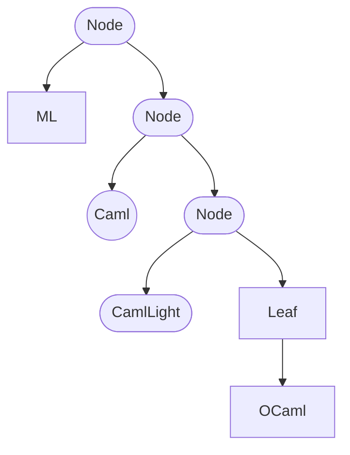

<a id="doc-6ebdb617a8104a7756d0cf36"></a>

# ocaml/ocaml.org / CLAUDE.md

Upstream: https://github.com/ocaml/ocaml.org/blob/31be26e15621c265bb86e4796b08c22942f47262/CLAUDE.md

Commit: `31be26e15621c265bb86e4796b08c22942f47262`

Retrieved: 2026-10-01T15:40:09.851809+00:00

Kind: official-document

Raw SHA256: `47b704ebc72db4d94b6b4b4cafe5de9c2ad58d897bca6cd022dcd550b9777ff2`

Source text below is untrusted reference content. Acquisition does not verify technical claims.

License status: UPSTREAM_NOTICES_CAPTURED_PER_FILE_REVIEW_REQUIRED. See this repository's captured license files.

---

# CLAUDE.md

This file provides guidance to Claude Code (claude.ai/code) when working with code in this repository.

## Build and Development Commands

Run `make help` to list the available targets. First-time setup is `make switch` (creates a local opam switch bound to the pinned opam-repository, then installs dependencies); `make watch` runs the server with auto-reload.

## Before Submitting a PR

Formatting and linting failures are the #1 cause of CI failures. Always run these before pushing:

```bash
make fmt                        # Format OCaml code (auto-promotes changes)
npx markdownlint-cli2 '**/*.md' # Lint Markdown files (config: .markdownlint-cli2.jsonc)
```

CI checks both on every push/PR. `make fmt` auto-promotes changes in place; commit any files it touches.

**OCamlFormat is pinned to 0.26.2** (in `.ocamlformat`, `Makefile`, and `.github/workflows/ci.yml`). With any other version installed, `make fmt` does *not* reformat — OCamlFormat's default version check aborts with a `version mismatch` error and exits non-zero. Install the pinned binary via `make deps` (or `opam install ocamlformat=0.26.2`).

Markdown lint rules live in `.markdownlint-cli2.jsonc`; CI lints only changed files and skips `data/planet/` and `data/changelog/`.

## Architecture Overview

This is a Dream-based OCaml web application that serves ocaml.org. The architecture separates data (YAML/Markdown), code generation, and rendering.

The stack is Lwt-based (Dream is Lwt-only) — do not introduce Eio dependencies.

### Data Flow

1. **Content** lives in `data/` as YAML and Markdown files (tutorials, books, jobs, events, etc.)
2. **Data packer** (`tool/data-packer/`) packs the YAML/Markdown into a binary blob, `data.bin`, at build time
3. The blob is embedded in the binary via an `.incbin` assembly directive; `src/ocamlorg_data/data.ml` deserializes it lazily (`bin_prot`) and exposes hand-written accessor modules (`Book`, `Changelog`, …)
4. **Frontend** (`src/ocamlorg_frontend/`) uses `.eml` templates (Dream's HTML templating) to render pages
5. **Web server** (`src/ocamlorg_web/`) handles routing and serves the site
6. **Data scraper** (`tool/data-scrape/`) fetches external content (planet feeds, videos, platform releases)

### Key Source Directories

- `src/ocamlorg_data/` - `data_intf.ml` defines the data types; `data.ml` is the hand-written accessor layer over the deserialized blob. The build artifact `data.bin` is generated from `data/` (never committed)
- `src/ocamlorg_frontend/pages/` - EML templates (OCaml + HTML) for all pages
- `src/ocamlorg_web/lib/` - Dream server, routing, handlers
- `src/ocamlorg_package/` - Package management and opam-repository integration
- `src/ocamlorg_static/` - Static file serving
- `src/global/` - Project-wide definitions (URL helpers, ppx import)
- `tool/data-packer/` - Packs YAML/Markdown data into the `data.bin` blob
- `tool/data-scrape/` - Scraper for external content (planet feeds, videos, platform releases)

### The EML Templating System

Pages use `.eml` files which are preprocessed by `dream_eml`. These mix OCaml code with HTML:
- OCaml expressions: `<%s variable %>` or `<% code %>`
- Templates are in `src/ocamlorg_frontend/pages/`

### Working with `data/`

Site content lives in `data/` as YAML and Markdown — one subdirectory per content type (`books/`, `tutorials/`, …) plus top-level `.yml` files (`jobs.yml`, `governance.yml`, …). The data packer enforces structure via the types in `src/ocamlorg_data/data_intf.ml`, so a malformed file fails the build. After editing, `make build` repacks the `data.bin` blob.

**Don't hand-edit scraped content.** `data/planet/`, `data/video-watch.yml`, `data/video-youtube.yml`, and `data/platform_releases/` are machine-managed — the scrape workflows open PRs against them and manual edits get overwritten (see CI Workflows).

**When you rename or remove `data/` content, update `asset/llms.txt` too.** It hardcodes `ocaml.org` links whose slugs derive from each page's `title:`/`id:` (not its filename), and CI never checks them, so stale links break silently.

### Tailwind CSS

CSS uses Tailwind. The binary is downloaded by Dune during build. Run `dune install tailwind` to persist it in the local switch across `dune clean`.

## System Dependencies

Required: libev, oniguruma, openssl, gmp. See `Dockerfile` for exact packages.

## Dependency Pinning

The opam repository is pinned to a specific commit in the following files, which must be updated together:

- `Makefile`
- `Dockerfile`
- `.devcontainer/Dockerfile`
- `dune-workspace`
- `.github/workflows/ci.yml`
- `.github/workflows/debug-ci.yml`
- `.github/workflows/release-scrapers.yml`

### Choosing the pin commit: stay at or below the base image's opam-repo tip

`Dockerfile` and `.devcontainer/Dockerfile` both derive from an `ocaml/opam` base image, which bundles a full (non-shallow) clone of opam-repository frozen at some tip. They select the pin with `git reset --hard <sha>` / `git checkout <sha>` **without a `git fetch`**, so the commit must already be present in that bundled clone:

- **At or below the base image's tip** → the commit is in local history, so plain checkout works with **no network fetch** — the fast path, and preferable because these images rebuild frequently on ocaml-ci.
- **Beyond the base image's tip** → checkout fails with `Could not parse object` (a fast Docker-build failure that only surfaces in the `deployability` check, not in GitHub Actions, whose setup-ocaml fetches the commit directly). Recovering requires prepending `git fetch origin <sha> &&` to the reset/checkout, which costs a full opam-repository download on every build.

So the default is to pin to the base image's current opam-repo tip. Find it with:

```bash
docker run --rm ocaml/opam:alpine-3.21-ocaml-5.2 sh -c 'cd ~/opam-repository && git rev-parse HEAD'   # production Dockerfile
docker run --rm ocaml/opam:debian-ocaml-5.2  sh -c 'cd ~/opam-repository && git rev-parse HEAD'        # .devcontainer
```

The two base images can sit at different tips; pick a commit at or below the **older** of the two so both build without a fetch. Only pin beyond the tip (and add the `git fetch`) if you specifically need a package version newer than the base image snapshot.

After updating the pin, run `opam repo set-url pin git+https://github.com/ocaml/opam-repository#<commit-hash>`, then `opam update && opam upgrade`. If OCamlFormat is upgraded in the process, update its version in `.ocamlformat`, `Makefile`, and `.github/workflows/ci.yml` together.

## Environment Variables

Defined in `src/ocamlorg_web/lib/config.ml` and `src/ocamlorg_package/lib/config.ml`. The ones you typically override when running locally:

| Variable | Default | Description |
| -------- | ------- | ----------- |
| `OCAMLORG_HTTP_PORT` | `8080` | HTTP server port |
| `OCAMLORG_DOC_URL` | `https://dill.caelum.ci.dev/profiles/full/docs/` | External package-documentation server (see below) |
| `OCAMLORG_REPO_PATH` | `~/.cache/ocamlorg/opam-repository` | Local opam-repository clone |
| `OCAMLORG_PKG_STATE_PATH` | `~/.cache/ocamlorg/package.state` | Package state cache file |

The remaining variables (`OCAMLORG_PACKAGE_CACHES_TTL`, `OCAMLORG_OPAM_POLLING`, `OCAMLORG_MANUAL_PATH`, `OCAMLORG_V2_PATH`) are tuning/path overrides rarely changed in development.

## CI Workflows

Two gate every PR: **ci.yml** (build + test + `make fmt` check; Ubuntu + macOS, OCaml 5.2.0) and **markdown-lint.yml** (lints changed `*.md`, skipping `data/planet/` and `data/changelog/`).

The rest are automation: **scrape.yml** and **scrape_platform_releases.yml** run daily and open PRs with newly scraped content; **release-scrapers.yml** rebuilds the scraper binary when `tool/`, `src/`, or build files land on `main`.

## Deployment

- `main` branch deploys to <https://ocaml.org/>
- `staging` branch deploys to <https://staging.ocaml.org/>
- Pipeline managed by [ocurrent-deployer](https://github.com/ocurrent/ocurrent-deployer), monitor at <https://deploy.ci.ocaml.org/?repo=ocaml/ocaml.org>

### Package Documentation

Package docs under `/p/<package>/<version>/doc/` are served from an external documentation server (`https://dill.caelum.ci.dev/profiles/full/docs/`) built by [ocaml-docs-ci](https://github.com/ocurrent/ocaml-docs-ci). Configurable via `OCAMLORG_DOC_URL`.

## Pushing to contributor forks

When pushing fixes to a contributor's fork you don't own, git-lfs lock
verification fails: pushing over SSH, git-lfs calls the fork's LFS locks API,
but you have no lock authorization on a repo you don't own, so it returns 403
and aborts the push. This is not a gap in your account's rights — you are not
meant to hold lock rights on a third party's fork.

Bypass the lock check: `GIT_LFS_SKIP_PUSH=1 git push <remote> HEAD:<branch>`


<a id="doc-ffdbe3a1e7ee93cacfc080b6"></a>

# ocaml/ocaml.org / CODE_OF_CONDUCT.md

Upstream: https://github.com/ocaml/ocaml.org/blob/31be26e15621c265bb86e4796b08c22942f47262/CODE_OF_CONDUCT.md

Commit: `31be26e15621c265bb86e4796b08c22942f47262`

Retrieved: 2026-10-01T15:40:09.851809+00:00

Kind: official-document

Raw SHA256: `246b23d4e0e206868880eb9fb5456a90e2a31fd2cff1091aec1c47ecfbf68b02`

Source text below is untrusted reference content. Acquisition does not verify technical claims.

License status: UPSTREAM_NOTICES_CAPTURED_PER_FILE_REVIEW_REQUIRED. See this repository's captured license files.

---

# Code of Conduct

This project has adopted the [OCaml Code of Conduct](https://github.com/ocaml/code-of-conduct/blob/main/CODE_OF_CONDUCT.md).

## Enforcement

This project follows the OCaml Code of Conduct [enforcement policy](https://github.com/ocaml/code-of-conduct/blob/main/CODE_OF_CONDUCT.md#enforcement).


<a id="doc-eca12c0a30e25b4b46522ebf"></a>

# ocaml/ocaml.org / CONTRIBUTING.md

Upstream: https://github.com/ocaml/ocaml.org/blob/31be26e15621c265bb86e4796b08c22942f47262/CONTRIBUTING.md

Commit: `31be26e15621c265bb86e4796b08c22942f47262`

Retrieved: 2026-10-01T15:40:09.851809+00:00

Kind: official-document

Raw SHA256: `e5833e18b7cf3391e3b9a9853213918c0332d27f65e44010abb11eea46f17b6a`

Source text below is untrusted reference content. Acquisition does not verify technical claims.

License status: UPSTREAM_NOTICES_CAPTURED_PER_FILE_REVIEW_REQUIRED. See this repository's captured license files.

---

# How to Contribute

Welcome to OCaml.org's contributing guide. Thank you for taking the time to read it! Your help with OCaml.org is extremely welcome. We are particularly motivated to support new contributors and people who are looking to learn and develop their skills. If you get stuck, please don’t hesitate to [ask questions on Discuss](https://discuss.ocaml.org/) or [raise an issue](https://github.com/ocaml/ocaml.org/issues/new).

This guide documents the best way to contribute to the project when adding things listed below in Contributing Content. If you're looking for a guide on how to setup the project and suggest a change to the code, you can refer to our [HACKING](./HACKING.md) guide, which will also give instructions on how to rebuild the website when making changes, if necessary.

- **Good First Issues**: if you are either new to the repository or still getting started with OCaml in general, issues marked as a `good first issue` are ideal.
- **Suggesting Changes**: most of the site content is stored in the `data` directory as Markdown or YAML. To suggest a change or update this content, you can edit those files directly and rebuild the website, detailed in the [HACKING](./HACKING.md) guide. This will promote the content into their `.ml` counterparts. If you would like to suggest entirely new website content or code, please [open an issue](https://github.com/ocaml/ocaml.org/issues) to discuss it first.
- **Implementing Pages**: most pages are implemented in `src/ocamlorg_frontend/pages` using the [.eml templating preprocessor](https://aantron.github.io/dream/#templates). This is a mixture of OCaml and HTML.

## Reporting Bugs

We use GitHub issues to track all bugs and feature requests. Feel free to [open an issue](https://github.com/ocaml/ocaml.org/issues/new) if you have found a bug or wish to see a feature implemented.

Please include images and browser-specific information if the bug is related to some visual aspect of the site. This tends to make it easier to reproduce and fix.

## Contributing Content

We've provided a list of community-driven content below. When adding content to any of these sections, it's best to fork the repo, add your file, and open a pull request (PR).

Anyone can contribute to these sections:
- [Images](#images)
- [The OCaml Planet](#ocaml-planet)
- [Job Board](#content-job)
- [Success Stories](#content-success-story)
- [Academic Users](#content-academic-user)
- [Industrial Users](#content-industrial-user)
- [OCaml Books](#content-book)
- [OCaml Cookbook Recipes](#content-cookbook)
- [Recurring Events](#content-recurring-event)
- [Upcoming Events](#content-upcoming_event)

OCaml Platform maintainers can contribute to these sections:
- [The OCaml Changelog](#content-changelog)
- [Backstage OCaml](#content-backstage)
- [Platform Tools Releases](#content-platform-tools-release)

The following sections give more details on how to contribute.

### <a name="images"></a>Adding Images

Some of the data that can be contributed by users may include images or other media; e.g., success stories, academic and industrial users, or books.

Images can be added to the corresponding subfolder in the `data/media/` folder.

For example, to add a university logo associated with an academic institution, you have to add the image file to the `data/media/academic_institution/` folder.

Videos or other media should not be added to the OCaml.org GitHub repository.

### <a name="ocaml-planet"></a>Add Your RSS Feed or YouTube Channel to the OCaml Planet <!-- markdownlint-disable-line MD013 -->

Anyone can contribute to the [OCaml Planet](https://ocaml.org/ocaml-planet), which is composed of three types of content:

- Community blog posts fetched from RSS feeds
- Videos fetched from YouTube channels
- Original blog posts linked from original source

#### Add Your RSS Feed

If you write about OCaml and have an RSS or Atom feed, you can add your feed to [`data/planet-sources.yml`](data/planet-sources.yml).

When compiling, the feed entries will be downloaded, and Markdown files for each item will be created in [`data/rss`](data/rss/). For instance: [building-ahrefs-codebase-with-melange.md`](data/rss/ahrefs/building-ahrefs-codebase-with-melange.md).

If you enable the `publish_all: true` flag in `data/planet-sources.yml`, you must make sure your feed only contains articles about OCaml.

#### Add Your YouTube Channel

If you have a YouTube channel and publish videos about OCaml (mention "OCaml" in the description of every video that should appear on the OCaml Planet!), you can add your channel to [`data/youtube.yml`](data/youtube.yml).

#### Link Original Blog Post

To contribute an individual link to your original blog post to the OCaml Planet, add a new Markdown file in [`data/planet/-individual_external_links/`](data/planet/-individual_external_links/).

Create a `.md` file with the following header:

```yaml
---
title: Title of Your Self-Hosted Post Here (title case)
description: one-sentence description
url: direct URL to your original blog post
date: 2023-06-13  (this format)
preview_image: direct link to preview image
---
```

### <a name="content-job"></a>Add an Entry to the Job Board

> Contribute to the [Job Board](https://ocaml.org/jobs).

The job board displays OCaml job opportunities.

To add a new entry to the job board, you can add it to [`data/jobs.yml`](data/jobs.yml).

Please make sure that the job involves mostly writing OCaml. Contributions to add jobs unrelated to OCaml, or where OCaml is a negligible part of the job, won't be accepted.

If you notice that a job opportunity is outdated (e.g., already fulfilled or not open anymore), we also welcome PRs to remove it.

### <a name="content-success-story"></a>Add a Success Story

> Contribute to the [Success Stories](https://ocaml.org/industrial-users).

Success stories are drafted by the ocaml.org maintainers through an interview with the featured company. They cannot be contributed by third parties.

If your company would like to be featured, please [open an issue](https://github.com/ocaml/ocaml.org/issues/new) or otherwise reach out to a maintainer.

If you know a company that uses OCaml and might be a good fit, please [open an issue](https://github.com/ocaml/ocaml.org/issues/new) so a maintainer can reach out.

The remainder of this section documents the file format used by maintainers when adding a new success story to the repository.

You can contribute a new success story by adding a Markdown file in [data/success_stories/](data/success_stories/). For instance: [janestreet.md](data/success_stories/janestreet.md).

The success stories should be structured in the following way:

- An overview of your company
- The challenge you faced and solved
- The solution you implemented, which should describe the role OCaml played in solving the challenge
- A post-mortem describing the results you had after implementing the solution

You can read [Ahref's Success Story](https://ocaml.org/success-stories/peta-byte-scale-web-crawling-and-data-processing) for a good example.

### <a name="content-academic-user"></a>Add an Academic User

> Contribute to the [Academic Users](https://ocaml.org/academic-users).

You can add a new academic user by creating a new Markdown file in [data/academic_institutions/](data/academic_institutions). When submitting an academic institution to our webpage, please structure the data as follows:

Information about the institution
- **`name`**: The full name of the academic institution.  
- **`description`**: A brief overview of the institution, including its background and key details.  
- **`url`**: The official website of the institution.  
- **`logo`**: A link to the institution’s logo image.  
- **`continent`**: The continent where the institution is located.  

A list of courses available at the institution. Each course entry must include:  
- **`name`**: The full name of the course.  
- **`acronym`**: The course code or identifier.  
- **`url`**: A direct link to the course webpage.  

Location
- **`lat`**: The latitude of the institution’s location.  
- **`long`**: The longitude of the institution’s location.

For instance: [cornell.md](data/academic_institutions/cornell.md).

### <a name="content-industrial-user"></a>Add an Industrial User

> Contribute to the [Industrial Users](https://ocaml.org/industrial-users).

Companies are welcome to add themselves to the list.

**If you are not affiliated with the company you want to add, please contact the company first and get their approval before opening a pull request.** Listings display the company's logo and make a public claim about their use of OCaml, which raises trademark and other legal concerns. A public citation that the company uses OCaml is *not* required, but the company's explicit approval *is*.

If you've come across a company that uses OCaml and don't want to reach out yourself, please [open an issue](https://github.com/ocaml/ocaml.org/issues/new) so a maintainer can contact them.

Add a new industrial user by creating a new Markdown file in [data/industrial_users/](data/industrial_users/). When submitting an industrial user to our webpage, please structure the data as follows:
  
Information about the organization
- **`name`**: The full name of the organization.  
- **`description`**: A brief overview of the organization, including its mission and key details.  
- **`logo`**: A link to the organization’s logo image.  
- **`url`**: The official website of the organization.  

Locations  
- A list of countries where the organization operates.  

Additional Information  
- **`consortium`**: Indicates whether the organization is part of a consortium (`true` or `false`).  
- **`featured`**: Indicates whether the organization is highlighted as a featured entity (`true` or `false`).

For instance: [cryptosense.md](data/industrial_users/cryptosense.md).

### <a name="content-book"></a>Add a Book

> Contribute to the [OCaml Books](https://ocaml.org/books).

Add a new OCaml book by creating a new Markdown file in [data/books/](data/books/). For instance: [ocaml-from-the-very-beginning.md](data/books/ocaml-from-the-very-beginning.md).

### <a name="content-cookbook"></a>Add a Recipe to the OCaml Cookbook

The OCaml Cookbook is a place where OCaml developers share how to solve common
tasks in OCaml using packages from the OCaml ecosystem.

Here are the steps to contribute a recipe for an existing task:
- Find the task in the [data/cookbook/tasks.yml](data/cookbook/tasks.yml) file.
- Go to the task folder inside [data/cookbook/](data/cookbook/) that has the
  same name as the task's `slug`.
- Create a `.ml` file containing the recipe and a YAML header with metadata about
  the recipe.

If the recipe does not fit into any existing task, you also need to create a
task. Add a `task:` entry in [data/cookbook/tasks.yml](data/cookbook/tasks.yml)
file. Fields `title`, `description`, and `slug` are mandatory. The task must be
located under a relevant `category:` field.

Finally, it is also possible to create and organise groups of tasks by creating
new categories. Categories are recursive and may have subcategories, which are
full categories too. A task listed in
[data/cookbook/tasks.yml](data/cookbook/tasks.yml) may have no recipes yet. On the
other hand, it is not allowed to have a task folder in
[data/cookbook/](data/cookbook/) that does not correspond to a task from the
[data/cookbook/tasks.yml](data/cookbook/tasks.yml) file because it triggers a
compilation error.

Each recipe is a way to perform a task using a combination of open-source
libraries.

#### Guidelines for New OCaml Cookbook Recipes

When contributing new recipes to the OCaml Cookbook, please adhere to the following:

1. **Task Selection**:
   - Focus on practical, reusable tasks relevant to a wide audience.
   - Ensure the task demonstrates idiomatic OCaml usage.
   - Avoid tasks that are overly trivial or highly specific to niche cases.

2. **Code Standards**:
   - Write clear, idiomatic OCaml code.
   - Ensure the code compiles without errors or warnings.
   - Use standard OCaml libraries and tools wherever possible.

3. **Evaluation Criteria**:
   - Does the recipe address a useful real-world task?
   - Is the code ready for production use?
   - If using a package, does it implicitly recommend the package for production?
   - Avoid duplicating existing recipes unless demonstrating package differences.

Following these guidelines will help us maintain a high-quality and consistent OCaml Cookbook.

### <a name="content-recurring-event"></a>Add A Recurring Event

> Contribute a [Recurring Event](https://ocaml.org/community).

You can add a new recurring event by adding it to the YAML file [data/events/recurring.yml](data/events/recurring.yml).

### <a name="content-upcoming_event"></a>Add an Upcoming Event

> Contribute to the [Upcoming Event](https://ocaml.org/community).

You can add a new upcoming event by creating a new Markdown file in [data/events/](data/events/).

### <a name="content-changelog"></a>OCaml Changelog

The [OCaml Changelog](https://ocaml.org/changelog) is a user-oriented blog that serves as a newsfeed for the OCaml ecosystem. It's important to note that despite its name, it's not a traditional changelog, but rather a curated blog of significant updates and news about the stable OCaml tooling.

The Changelog covers developments across:

- [The OCaml Compiler](https://github.com/ocaml/ocaml)
- [OCaml Platform Tools](https://ocaml.org/docs/platform)
- [OCaml Infrastructure](https://infra.ocaml.org/)
- [OCaml.org itself](https://ocaml.org/)

#### Purpose and Audience

The primary audience for the Changelog is OCaml users. Content should focus on changes, updates, and news that directly impact users of OCaml and its ecosystem.

Good candidates for Changelog posts include:

1. Announcements of new releases
2. Significant feature additions or changes
3. Important updates to OCaml.org that affect user experience
4. Infrastructure changes that impact users
5. Regular updates on ongoing development as part of Developer Previews

The Changelog is not meant for:

1. Internal refactoring that doesn't result in user-visible changes
2. Highly technical details that are only relevant to OCaml core developers
3. Sharing complete changelogs (although there is a `changelog` tag where you can include the changelogs as part of release announcements)

#### Contributing a Post

To contribute a new post to the Changelog:

1. Create a new Markdown file in the `data/changelog/` directory.
2. Use a clear, descriptive filename (e.g., `2025-08-26-ocaml-eglot-brings-lsp-support-to-emacs.md`).
3. Include relevant metadata at the top of the file (title, tags, etc.).
4. Write the post content, focusing on how the news or change affects OCaml users.
5. Submit a pull request with your new file.

### <a name="content-backstage"></a>Backstage OCaml

As a dual to the OCaml Changelog, Backstage OCaml is a channel TODO

#### Contributing a Backstage Post

To contribute a new post to Backstage OCaml:

1. Create a new Markdown file in the `data/backstage/` directory.
2. Use a clear, descriptive filename (e.g., `2025-06-05-portable-external-dependencies-for-dune-package-management.md`).
3. Include relevant metadata at the top of the file (title, tags, etc.).
4. Write the post content, focusing on how the news or change affects OCaml users.
5. Submit a pull request with your new file.

### <a name="content-platform-tools-release"></a>Platform Tools Releases

As part of the [OCaml Changelog page](https://ocaml.org/changelog) and the [Backstage OCaml page](https://ocaml.org/backstage), we list stable, and respectively, unstable releases of all the OCaml Platform tools, as well as the OCaml compiler.

#### Contributing Release Notes

To contribute OCaml Platform Tools release notes:

1. Create a new Markdown file in the `data/platform_releases/` directory.
2. Use a clear, descriptive filename (e.g., `2025-02-03-dune-release-2.1.0.md`).
3. Include relevant metadata at the top of the file (title, tags, etc.).
4. Submit a pull request with your new file.

## Git and GitHub Workflow

The preferred workflow for contributing to a repository is to fork the main repository on GitHub, clone, and develop on a new branch.

If you aren't familiar with how to work with Github or would like to learn it, here is [a great tutorial](https://app.egghead.io/playlists/how-to-contribute-to-an-open-source-project-on-github).

Feel free to use any approach while creating a PR. Here are a few suggestions from the Dev team:

- If you are not sure whether your changes will be accepted or want to discuss the method before delving into it, please create an issue and ask.
- Clone the repo locally (or continue editing directly in GitHub if the change is small). Check out the branch that you created.
- Create a draft PR with a small initial commit. Here's how you can [create a draft pull request.](https://github.blog/2019-02-14-introducing-draft-pull-requests/).
- Continue developing and feel free to ask questions in the PR if you run into obstacles or uncertainty as you make changes.
- Review your implementation according to the checks noted in the PR template.
- Once you feel your branch is ready, change the PR status to "ready to review."
- Consult the tasks noted in the PR template.
- When merging, consider cleaning up the commit body.
- Close any issues that were addressed by this PR.


<a id="doc-109104a263de6b7f787acd2b"></a>

# ocaml/ocaml.org / DOCUMENTATION_WRITING.md

Upstream: https://github.com/ocaml/ocaml.org/blob/31be26e15621c265bb86e4796b08c22942f47262/DOCUMENTATION_WRITING.md

Commit: `31be26e15621c265bb86e4796b08c22942f47262`

Retrieved: 2026-10-01T15:40:09.851809+00:00

Kind: official-document

Raw SHA256: `d69e3df16f1b2bd339965314a633490b336c7d5689fd4bbe4623564c9f0a35e6`

Source text below is untrusted reference content. Acquisition does not verify technical claims.

License status: UPSTREAM_NOTICES_CAPTURED_PER_FILE_REVIEW_REQUIRED. See this repository's captured license files.

---

# How to Write Documentation

This document explains how to write documentation such as tutorials, guides, or recommendations to be hosted in OCaml.org. It's also meant to be used as a style guide to ensure consistency in things like grammar, formatting, capitalisation, and spelling across all OCaml.org documentation.

Apply the [*Spiral Learning*](https://en.wikipedia.org/wiki/Spiral_approach) approach in tutorials. This teaching method first creates a solid foundation of a topic. By starting with an overview, it gives the reader the context and general information. Subsequent sections and tutorials review the important foundational information and expands, going into more detail and giving examples.

## Materials

- References, e.g.:
  - [OCaml Language Manual](https://ocaml.org/releases/latest/manual.html). You can contribute to [its source on GitHub](https://github.com/ocaml/ocaml/tree/trunk/manual).
  - [opam manual](https://opam.ocaml.org/). You can contribute to [its repository](https://github.com/ocaml/opam).
  - [Dune's documentation](https://dune.readthedocs.io/en/stable/). You can contribute to [its docs folder](https://github.com/ocaml/dune/tree/main/doc).
- Tutorials
- Guides
- Recommended practices

## Audience

Anytime one contributes to the OCaml.org documentation, it's important to keep the target audience in mind. For example, if writing a tutorial for programmers new to OCaml, you want to ensure the examples are simple and straightforward so as not to overwhelm them with too much detail while starting their learning journey. For more advanced users, adjust the tone and examples accordingly.

**Our audience:**
- Self-directed learners without a tutor
- Already know some programming basics (one other programming language)
- Likely a majority of consumers of libraries, hopefully some authors or people who turn into it
- English level B2 ideally

**Not our audience:**
- University students
- New to programming. We do not teach programming basics.

## Goals

Especially since the release of OCaml 5.0 with Multicore support, perhaps our biggest goal is to increase the adoption of OCaml. In order to reach this goal, it's essential to have current, consistent, and comprehensive documentation.

1. Enable people to use OCaml for real projects / at the job / side projects
1. Get people who want to build and contribute to the ecosystem up to speed and building something good quickly
1. **Oddly Specific**: Enable people to do Advent of Code in OCaml.

## Our Key Values / Constraints

- **Goals and Prerequisites**. Each tutorial begins with its objectives, so that people know what they will learn about.
- **Avoid Overwhelming Choices**. Tutorials should guide learners on a straightforward path, avoiding multiple options. This makes the learning process smoother. Detailed choices can be included in additional references and guides.
- **Highlight Important Computer Science Terms**. Use italics for well-known terms, providing a visual hint that these are important concepts. Linking to Wikipedia for further explanation is an option.
- **Be Entertaining in Examples, Accurate in Text**. While it's essential to be clear and precise in the main text, using engaging and fun examples can make the material more appealing. This approach helps cater to different learning styles.
- **Start with Examples**. Present examples first, then explain them. This helps in understanding the application before the theory.
- **Clear Section Headings**. Make sure section titles clearly indicate their content. Just like a candy store displays its products openly, avoid vague titles and opt for ones that clearly reveal the content. This is also helpful for better display of search results. Use title case (see General Formatting section below).
- **Use B2 Level English**. This ensures the material is comprehensible to those who are not native English speakers.

## Common Phrases

- "Binding a value to a name" = declaring a variable
- `'a` is a type parameter called "alpha." It is not a *type variable* (because the term *variable* is a forbidden word).
- Pass a function as a value to another function as a parameter - not a "function value"
  
## Things to Avoid

1. Don't use the same letter for different things, i.e., when talking about a type parameter `'a`, don't have a name `a` nearby. In fact, since `a` can easily be confused with `'a` (alpha), start with `f` when using letters as parameters.
1. Never use the term "variable," instead
    a. Names and values (binding = a value is bound to a name)
    b. Type parameter
1. Use “parameter” and “argument” appropriately. Parameters occur in function declarations. Arguments are values that functions are applied to.
1. Don't use math, computer science, or programming language theory terminology without reason and explanation.

## Writing, Grammar, and Spelling

Please don't worry about this too much, as a technical writer will review any new documentation or changes to catch these types of things. It's included here for reference, if interested.

### Tone & POV

We're aiming for a relatively casual tone in these tutorials and other documentation. This means that it should read like you're speaking directly to the reader rather than an academic tone. To this end, it is acceptable to use second person (you), sparingly.

It's also okay to use first person plural (we, us), sparingly, but don't use the first person singular (I, me), as there isn't an author byline for the reader to know who "I" is. Using "we" can be helpful to write active sentences (more below).

### Active Voice & Unnecessary Words

Active sentences employ a clear subject that performs an action with a robust verb (e.g., Mary baked the cake.), as opposed to weak verbs such as *occur* and *happen.* Passive sentences typically incorporate '***to be'*** verbs (is, are, were, was, etc.), where the subject undergoes the action (e.g., he cake was baked by Mary). Although it's not possible to avoid all **to be** verbs, try to minimise them when possible.

The sentences below highlight issues and provide suggestions for improvement:

- Read-only access is provided by MutableInput. [Passive voice] Improved: **MutableInput provides read-only access.**
- Compiler errors occur when you leave off a semicolon at the end of a statement. [Weak verbs *occur* with extraneous words*.*] Improved: **Compilers return errors when you omit a semicolon at the end of a statement.**
- There is a variable called `met-trick` that stores the current accuracy. [Extraneous words “there is” and “that” clause.] Improved: **The `met-trick` variable stores the current accuracy.**
- Caml was invented by Guy Cousineau in the twentieth century. [Passive voice] Improved: **Guy Cousineau invented Caml in the twentieth century.**
- The exception occurs when dividing by zero. [Weak verb *occurs]* Improved: **Dividing by zero raises the exception.**

It's best to eliminate unnecessary prepositional phrases, especially when using with the possessive. Avoid phrases like "the car of Susan." Instead, write "Susan's car." When prepositional phrases (e.g., those starting with by, for, in, of, on, etc.) are strung together, it makes for clumsy and awkward sentences. For example: "She went *on* a road trip *across* the mountains *to* take pictures." This sentence has three prepositional phrases back to back. You can improve it by removing at least one prepositional phrase, like this: "She took pictures on her roadtrip across the mountains."

Following these guidelines makes for more enjoyable reading experience.

### Spelling & Grammar

- [Grammar Help at Grammarly](https://www.grammarly.com/blog/category/handbook/)
- **Punctuation Preferences:**
  - Oxford (serial) comma [We bought bread, milk, and peanut butter], so there is a final comma before the conjunction.
  - Single space after a `.` period (full stop).
  - Always use `'` for singular names/nouns ending in `s` and for plural nouns ending in `s` (e.g., Thomas’ and Companies’). Although the grammatically correct way to say and spell singular nouns ending in `s` is “Thomas’s”, it does look weird. It’s the consensus to treat every `s` as if it were a plural possessive, so instead write "Thomas'." Whenever possible, rephrase the sentence to avoid it completely.
  - Place punctuation inside of quotation marks: OCaml is an "industrial-strength functional programming language with an emphasis on expressiveness and safety." (not "...safety".)
  - Use **en dashes `–`** surrounded by spaces for 'asides' (as an alternative, you can use parentheses). Example: OCaml Multicore is – as my grandmother would say – an excellent upgrade.
  - [Cambridge Dictionary: Punctuation](https://dictionary.cambridge.org/grammar/british-grammar/punctuation)
  - [Differences in British & American](https://www.unr.edu/writing-speaking-center/student-resources/writing-speaking-resources/british-american-english), please use the British spelling. See below.
  - [Another ^^](https://www.thepunctuationguide.com/british-versus-american-style.html)
- **Spelling**
  - [British spelling](http://www.tysto.com/uk-us-spelling-list.html)
    - ise rather than -ize (organise vs organize)
    - our, not or (flavour vs flavor)
    - yse, not yze (analyse vs analyze)
    - Double L : travelling vs traveling
    - ae/oe vs e (manoeuvre vs maneuver)
    - ence, not -ense (licence vs license)
    - ogue, not og (catalogue vs catalog)
    - learnt, not learned
    - focussed / focusses (instead of the single s: focused / focuses)
    - vs, not vs. as in American English. Same with Dr, Mr, Ms, Mrs instead of Dr., Mr., Ms., Mrs.
    - Although programme is traditionally the UK spelling, **program** is more common.

- **Capitalisation**
  - Capitalise every word (except “little words” like of, and, or, etc.) in titles, aka “[Title Case](https://apastyle.apa.org/style-grammar-guidelines/capitalization/title-case).” Strangely, it is correct to capitalise “with” in a title.
  - Use Title Case in headings / subheadings. Try to keep them under 7 words.
  - Capitalise the first letter of bullet points, aka “[Sentence Case](https://apastyle.apa.org/style-grammar-guidelines/capitalization/sentence-case).” However, if it’s not a complete sentence in the bullet point, don’t use a period (full stop) unless it’s followed by other sentences.


<a id="doc-9769a3f5504af3cd735e08f0"></a>

# ocaml/ocaml.org / HACKING.md

Upstream: https://github.com/ocaml/ocaml.org/blob/31be26e15621c265bb86e4796b08c22942f47262/HACKING.md

Commit: `31be26e15621c265bb86e4796b08c22942f47262`

Retrieved: 2026-10-01T15:40:09.851809+00:00

Kind: official-document

Raw SHA256: `11ac955dc391b6bd102c7fc4e65ac59be5c90766c89c71fd0ac74fc17cbc0f01`

Source text below is untrusted reference content. Acquisition does not verify technical claims.

License status: UPSTREAM_NOTICES_CAPTURED_PER_FILE_REVIEW_REQUIRED. See this repository's captured license files.

---

# Hacking on OCaml.org

## Setup and Development

### Setting Up the Project

Before starting to hack, you need a properly configured development environment. Linux and macOS are supported and used daily by the core team. System dependencies include:

* Libev: <http://software.schmorp.de/pkg/libev.html>
* Oniguruma: <https://github.com/kkos/oniguruma>
* OpenSSL: <https://www.openssl.org/>
* GNU Multiple Precision: <https://gmplib.org/>

The project [`Dockerfile`](./Dockerfile) contains up-to-date system configuration instructions, as used to ship into production. It is written for the Alpine Linux distribution, but it is meant to be adapted to other environments such as Ubuntu, macOS+Homebrew, or others. The GitHub workflow file [`.github/workflows/ci.yml`](.github/workflows/ci.yml) also contains useful commands for Ubuntu and macOS. Since OCaml.org is mostly written in OCaml, a properly configured OCaml development environment is also required, but is not detailed here. Although Docker is used to ship, it is not a requirement to begin hacking. It is possible to run workflow files in `.github/workflows` using the [`nektos/act`](https://github.com/nektos/act) tool. For instance, the following command runs the CI checks through GitHub on each pull request (where `ghghgh` is replace by an _ad-hoc_ GitHub token, see: <https://github.com/nektos/act#github_token>)

```bash
act -s GITHUB_TOKEN=ghghgh .github/workflows/ci.yml -j build
```

The Makefile contains many commands that can get you up and running. A typical workflow is to clone the repository after forking it.

```bash
git clone https://github.com/<username>/OCaml.org.git
cd OCaml.org
```

Ensure you have `opam` installed. Opam will manage the OCaml compiler along with all of the OCaml packages needed to build and run the project. By this point, we should all be using some Unix-like system (Linux, macOS, WSL2), so you should [run the opam install script](https://opam.OCaml.org/doc/Install.html#Binary-distribution). There are also manual instructions for people that don't want to run a script from the internet. We assume you are using `opam.2.1.0` or later, which provides a cleaner, friendlier experience when installing system dependencies.

With opam installed, you can now initialise opam with `opam init`. Note that in containers or WSL2, you will have to run `opam init --disable-sandboxing`. Opam might complain about some missing system dependencies like `unzip`, `cc` (a C compiler like `gcc`), etc. Make sure to install these before `opam init`.

Finally from the root of your project, you can setup a [local opam switch](https://opam.OCaml.org/doc/Manual.html#Switches) and install the dependencies. There is a single `make` target to do just that.

```bash
make switch
```

If you don't want a local opam switch and are happy to install everything globally (in the opam sense), then you can just install the dependencies directly.

```bash
make deps
```

Opam will likely ask questions about installing system dependencies. For the project to work, you will have to answer yes to installing these.

### Running the Server

After building the project, you can run the server with:

```bash
make start
```

To start the server in watch mode, you can run:

```bash
make watch
```

This will restart the server on filesystem changes.

### Before Submitting a PR

Formatting and linting failures are the most common cause of CI failures. Before pushing, always run:

```bash
make fmt
```

This formats OCaml code with ocamlformat and auto-promotes the changes. Commit any files it modifies. OCamlFormat is pinned to 0.26.2 (in `.ocamlformat`, `Makefile`, and `.github/workflows/ci.yml`); with any other version installed, `make fmt` aborts with a version-mismatch error instead of reformatting, so run `make deps` to install the pinned version.

If your PR touches Markdown files, also lint them:

```bash
npx markdownlint-cli2 '**/*.md'
```

Markdown lint rules are configured in [`.markdownlint-cli2.jsonc`](./.markdownlint-cli2.jsonc). The CI excludes `data/planet/` and `data/changelog/` from Markdown lint.

### Running Tests

#### Unit tests

You can run the unit test suite with:

```bash
make test
```

#### Load tests

See the readme's for running load tests via [k6](./test/load-test/k6/README.md)
or [locust](./test/load-test/locust/README.md).

### Building the Playground

The OCaml Playground is compiled separately from the rest of the server. The generated assets can be found in
[`playground/asset/`](./playground/asset/).

You can build the playground from the root of the project. There is no need to move to the `./playground/` directory for the following commands.

To regenerate the playground, you need to install the playground's dependencies first:

```bash
make deps -C playground
```

After the dependencies have been installed, simply build the project to regenerate the JavaScript assets:

```bash
make playground
```

Once the compilation is complete and successful, commit the newly-generated assets in OCaml.org's Git repo and merge the pull request.

### Deploying

Commits added on some branches are automatically deployed:

* `main` on <https://OCaml.org/>
* `staging` on <https://staging.OCaml.org/>

The deployment pipeline is managed in <https://github.com/ocurrent/ocurrent-deployer>, which listens to the `main` and `staging` branches and builds the site using the `Dockerfile` at the project's root. You can monitor the state of each deployment on [`deploy.ci.OCaml.org`](https://deploy.ci.OCaml.org/?repo=ocaml/OCaml.org).

To test the deployment locally, run the following commands:

```bash
docker build -t ocamlorg .
docker run -p 8080:8080  ocamlorg
```

This will build the Docker image and run a Docker container with the port `8080` mapped to the HTTP server.

With the Docker container running, visit the site at <http://localhost:8080/>.

The Docker images automatically build from the `live` and `staging` branches. They are then pushed to Docker Hub: <https://hub.docker.com/r/ocurrent/v3.OCaml.org-server>.

### Environment Variables

The following environment variables can be used to configure the server:

| Variable | Default | Description |
| -------- | ------- | ----------- |
| `OCAMLORG_HTTP_PORT` | `8080` | HTTP server port |
| `OCAMLORG_DOC_URL` | `https://dill.caelum.ci.dev/profiles/full/docs/` | Package documentation server URL (see [External Services](#external-services)) |
| `OCAMLORG_DOC_STATUS_URL` | `https://dill.caelum.ci.dev/profiles/full/` | Documentation build status server URL (see [External Services](#external-services)) |
| `OCAMLORG_REPO_PATH` | `~/.cache/ocamlorg/opam-repository` | Path to local opam-repository clone |
| `OCAMLORG_PKG_STATE_PATH` | `~/.cache/ocamlorg/package.state` | Path to package state cache file |
| `OCAMLORG_PACKAGE_CACHES_TTL` | `3600` | Package cache time-to-live in seconds |
| `OCAMLORG_OPAM_POLLING` | `3600` | Opam repository polling interval in seconds |
| `OCAMLORG_MANUAL_PATH` | `html-compiler-manuals` | Path to OCaml compiler manual HTML files |
| `OCAMLORG_V2_PATH` | `data/v2` | Path to v2 data files |

### External Services

#### Package Documentation

The package documentation pages displayed under `/p/<package>/<version>/doc/` are not generated by the OCaml.org server itself. Instead, they are fetched from an external documentation server.

This documentation is generated by [ocaml-docs-ci](https://github.com/ocurrent/ocaml-docs-ci), an OCurrent pipeline that builds documentation for all opam packages using [odoc](https://github.com/ocaml/odoc). The pipeline runs on a server called "dill" and the generated documentation is served at `https://dill.caelum.ci.dev/profiles/full/docs/`.

The same server also reports the documentation build status of each package version at `https://dill.caelum.ci.dev/profiles/full/`. The OCaml.org server links to these status pages when documentation is missing or failed to build.

Both URLs can be configured via the `OCAMLORG_DOC_URL` and `OCAMLORG_DOC_STATUS_URL` environment variables if you need to point to a different documentation server (e.g., for testing or staging).

### Staging Pull Requests

We [aim to keep the `staging` branch as close as possible to the `main`
branch](doc/FOR_MAINTAINERS.md#how-we-maintain-the-staging-branch), with only a few PRs added on top of it.

The maintainers will add your pull request to `staging` if it is worthwhile
to do so. For example, documentation PRs or new features where we need testing
and feedback from the community will generally be live on `staging` for a while
before they get merged.

### Managing Dependencies

OCaml.org is using an opam switch that is local and bound to a pinned commit in `opam-repository`. This is intended to protect the build from upstream regressions. The opam repository is specified in the following files:

```bash
Makefile
Dockerfile
.github/workflows/ci.yml
.github/workflows/debug-ci.yml
.github/workflows/release-scrapers.yml
```

When bringing up OCaml.org to a newer pin, the commit hash found in those files must be changed all at once.

Once the opam repo pin is updated, the local switch must be updated using the following command:

```sh
opam repo set-url pin git+https://github.com/ocaml/opam-repository#<commit-hash>
```

Where `<commit-hash>` is the pinned hash specified in the files mentioned above.

Once this is done, you can run `opam update` and `opam upgrade`. If OCamlFormat
was upgraded in the process, its version must be updated together in
`.ocamlformat`, `Makefile`, and `.github/workflows/ci.yml`.

### Handling the Tailwind CSS

The site uses the Tailwind CSS framework. The Tailwind binary is pulled from its GitHub [repo](https://github.com/tailwindlabs/tailwindcss). Download is performed by Dune during the build. When working on a local switch for hacking, you don't want `dune clean` to delete this binary. Just do `dune install tailwind` to have it installed in the local switch.

## Repository Structure

The following snippet describes the repository structure:

```text
.
├── asset/
|   The static assets served by the site.
│
├── data/
|   Data used by OCaml.org in Yaml and Markdown format.
│
├── playground/
│   The source and generated assets for the OCaml Playground
│
├── src
│   ├── global
│   │   Project wide definitions
│   │
│   ├── ocamlorg_data
│   │   Accessor layer over the packed `data/` blob (`data.bin`); types defined in `data_intf.ml`.
│   │
│   ├── ocamlorg_frontend
│   │   All of the front-end code primarily using .eml files (OCaml + HTML).
│   │
│   ├── ocamlorg_package
│   │   The library for constructing opam-repository statistics and information (e.g. rev deps).
│   │
│   ├── ocamlorg_static
│   │   Static file serving.
│   │
│   └── ocamlorg_web
│       The main entry-point of the server.
│
├── tool/
│   ├── data-packer
│   │   Packs YAML/Markdown data from `data/` into the `data.bin` binary blob.
│   │
│   ├── data-scrape
│   │   Scraper for external content (planet feeds, videos, platform releases).
│   │
│   ├── static-file-digest
│   │   Static file digest utility.
│   │
│   ├── tailwind
│   │   Tailwind CSS binary download and integration.
│   │
│   └── voodoo_serialize
│       Serialization tool for package documentation.
│
├── dune
├── dune-project
│   Dune file used to mark the root of the project and define project-wide parameters.
│   For the documentation of the syntax, see https://dune.readthedocs.io/en/stable/dune-files.html#dune-project.
│
├── ocamlorg.opam
├── ocamlorg.opam.template
│   opam package definitions.
│
├── CONTRIBUTING.md
│
├── Dockerfile
│   Dockerfile used to build and deploy the site in production.
│
├── LICENSE
├── LICENSE-3RD-PARTY
│   Licenses of the source code, data and vendored third-party projects.
│
├── Makefile
│   `Makefile` containing common development commands.
│
├── README.md
│
└── tailwind.config.js
    Configuration used by TailwindCSS to generate the CSS file for the site.
```


<a id="doc-c693279643b8cd5d248172d9"></a>

# ocaml/ocaml.org / LICENSE

Upstream: https://github.com/ocaml/ocaml.org/blob/31be26e15621c265bb86e4796b08c22942f47262/LICENSE

Commit: `31be26e15621c265bb86e4796b08c22942f47262`

Retrieved: 2026-10-01T15:40:09.851809+00:00

Kind: license

Raw SHA256: `b852a8e88087d56d8b1898e223c1ab0d364b66cab57ef91c056d7b61a00b383e`

Source text below is untrusted reference content. Acquisition does not verify technical claims.

License status: UPSTREAM_NOTICES_CAPTURED_PER_FILE_REVIEW_REQUIRED. See this repository's captured license files.

---

````text
Licenses
========

- Content is released under CC BY-SA 4.0.
- Code that implements the various tools in this repository is released under the ISC license.
- Code examples within content are released under the UNLICENSE.
- Design of the site. All rights reserved by the OCaml.org project.
- OCaml logo is released under the UNLICENSE.
- Abstracts, slides from meetings. Rights retained by contributor.

* CC BY-SA 4.0

A short summary can be found at https://creativecommons.org/licenses/by-sa/4.0/
The full license is available at https://creativecommons.org/licenses/by-sa/4.0/legalcode

You are free to:

_Share_ — copy and redistribute the material in any medium or format
_Adapt_ — remix, transform, and build upon the material
  for any purpose, even commercially.

The licensor cannot revoke these freedoms as long as you follow the
license terms.

Under the following terms:

_Attribution_ — You must give _appropriate credit_, provide a link to
the license, and _indicate if changes were made_. You may do so in any
reasonable manner, but not in any way that suggests the licensor
endorses you or your use.

_ShareAlike_ — If you remix, transform, or build upon the material, you
must distribute your contributions under the _same license_ as the
original.

_No additional restrictions_ — You may not apply legal terms or
technological measures that legally restrict others from doing
anything the license permits.


* UNLICENSE

This is free and unencumbered software released into the public domain.

Anyone is free to copy, modify, publish, use, compile, sell, or
distribute this software, either in source code form or as a compiled
binary, for any purpose, commercial or non-commercial, and by any
means.

In jurisdictions that recognize copyright laws, the author or authors
of this software dedicate any and all copyright interest in the
software to the public domain. We make this dedication for the benefit
of the public at large and to the detriment of our heirs and
successors. We intend this dedication to be an overt act of
relinquishment in perpetuity of all present and future rights to this
software under copyright law.

THE SOFTWARE IS PROVIDED "AS IS", WITHOUT WARRANTY OF ANY KIND,
EXPRESS OR IMPLIED, INCLUDING BUT NOT LIMITED TO THE WARRANTIES OF
MERCHANTABILITY, FITNESS FOR A PARTICULAR PURPOSE AND NONINFRINGEMENT.
IN NO EVENT SHALL THE AUTHORS BE LIABLE FOR ANY CLAIM, DAMAGES OR
OTHER LIABILITY, WHETHER IN AN ACTION OF CONTRACT, TORT OR OTHERWISE,
ARISING FROM, OUT OF OR IN CONNECTION WITH THE SOFTWARE OR THE USE OR
OTHER DEALINGS IN THE SOFTWARE.

For more information, please refer to <https://unlicense.org/>

* ISC

ISC License (ISC)
Copyright (c) 2021, OCaml.org project

Permission to use, copy, modify, and/or distribute this software for any purpose with or without fee is hereby granted, provided that the above copyright notice and this permission notice appear in all copies.

THE SOFTWARE IS PROVIDED "AS IS" AND THE AUTHOR DISCLAIMS ALL WARRANTIES WITH REGARD TO THIS SOFTWARE INCLUDING ALL IMPLIED WARRANTIES OF MERCHANTABILITY AND FITNESS. IN NO EVENT SHALL THE AUTHOR BE LIABLE FOR ANY SPECIAL, DIRECT, INDIRECT, OR CONSEQUENTIAL DAMAGES OR ANY DAMAGES WHATSOEVER RESULTING FROM LOSS OF USE, DATA OR PROFITS, WHETHER IN AN ACTION OF CONTRACT, NEGLIGENCE OR OTHER TORTIOUS ACTION, ARISING OUT OF OR IN CONNECTION WITH THE USE OR PERFORMANCE OF THIS SOFTWARE.

````


<a id="doc-275635f51fff68d5e00b27ab"></a>

# ocaml/ocaml.org / LICENSE-3RD-PARTY

Upstream: https://github.com/ocaml/ocaml.org/blob/31be26e15621c265bb86e4796b08c22942f47262/LICENSE-3RD-PARTY

Commit: `31be26e15621c265bb86e4796b08c22942f47262`

Retrieved: 2026-10-01T15:40:09.851809+00:00

Kind: license

Raw SHA256: `bc36933ff534fb32050460056105ee521d85aae45c1a0f643b3baf5cb60b78f4`

Source text below is untrusted reference content. Acquisition does not verify technical claims.

License status: UPSTREAM_NOTICES_CAPTURED_PER_FILE_REVIEW_REQUIRED. See this repository's captured license files.

---

````text
Third Party Licenses
====================

OCaml.org includes material from the projects listed below (Third Party
IP). The original copyright notice and the license under which we received
such Third Party IP, are set forth below.

--------------------------------------------------------------------------
Overview
--------------------------------------------------------------------------

asset/vendors/font-files/Inter-Black.woff,
asset/vendors/font-files/Inter-Black.woff2,
asset/vendors/font-files/Inter-BlackItalic.woff,
asset/vendors/font-files/Inter-BlackItalic.woff2,
asset/vendors/font-files/Inter-Bold.woff,
asset/vendors/font-files/Inter-Bold.woff2,
asset/vendors/font-files/Inter-BoldItalic.woff,
asset/vendors/font-files/Inter-BoldItalic.woff2,
asset/vendors/font-files/Inter-ExtraBold.woff,
asset/vendors/font-files/Inter-ExtraBold.woff2,
asset/vendors/font-files/Inter-ExtraBoldItalic.woff,
asset/vendors/font-files/Inter-ExtraBoldItalic.woff2,
asset/vendors/font-files/Inter-ExtraLight.woff,
asset/vendors/font-files/Inter-ExtraLight.woff2,
asset/vendors/font-files/Inter-ExtraLightItalic.woff,
asset/vendors/font-files/Inter-ExtraLightItalic.woff2,
asset/vendors/font-files/Inter-Italic.woff,
asset/vendors/font-files/Inter-Italic.woff2,
asset/vendors/font-files/Inter-Light.woff,
asset/vendors/font-files/Inter-Light.woff2,
asset/vendors/font-files/Inter-LightItalic.woff,
asset/vendors/font-files/Inter-LightItalic.woff2,
asset/vendors/font-files/Inter-Medium.woff,
asset/vendors/font-files/Inter-Medium.woff2,
asset/vendors/font-files/Inter-MediumItalic.woff,
asset/vendors/font-files/Inter-MediumItalic.woff2,
asset/vendors/font-files/Inter-Regular.woff,
asset/vendors/font-files/Inter-Regular.woff2,
asset/vendors/font-files/Inter-SemiBold.woff,
asset/vendors/font-files/Inter-SemiBold.woff2,
asset/vendors/font-files/Inter-SemiBoldItalic.woff,
asset/vendors/font-files/Inter-SemiBoldItalic.woff2,
asset/vendors/font-files/Inter-Thin.woff,
asset/vendors/font-files/Inter-Thin.woff2,
asset/vendors/font-files/Inter-ThinItalic.woff,
asset/vendors/font-files/Inter-ThinItalic.woff2,
asset/vendors/font-files/Inter-italic.var.woff2,
asset/vendors/font-files/Inter-roman.var.woff2,
asset/vendors/font-files/Inter.var.woff2,
asset/vendors/font-files/inter.css:

Name:      Inter
Version:   3.19
URL:       https://rsms.me/inter/
License:   MIT License
Copyright: Copyright (c) 2016-2020 The Inter Project Authors.


asset/vendors/font-files/RobotoMono-Italic.woff2
asset/vendors/font-files/RobotoMono-Italic.woff
asset/vendors/font-files/RobotoMono-Regular.woff2
asset/vendors/font-files/RobotoMono-Regular.woff
asset/vendors/font-files/RobotoMono-SemiBoldItalic.woff2
asset/vendors/font-files/RobotoMono-SemiBoldItalic.woff
asset/vendors/font-files/RobotoMono-SemiBold.woff2
asset/vendors/font-files/RobotoMono-SemiBold.woff
asset/vendors/font-files/roboto-mono.css:

Name:      Roboto Mono
URL:       https://fonts.google.com/specimen/Roboto+Mono/about
License:   Apache License, Version 2.0
Copyright: Copyright (c) 2015 Google. Designed by Christian Robertson


asset/vendors/alpine.min.js:

Name:      Alpine
Version:   3.12.0
URL:       https://alpinejs.dev/
License:   MIT License
Copyright: Copyright © 2019-2021 Caleb Porzio and contributors

asset/vendors/alpine-clipboard.js:

Name:      Alpine Clipboard
Version:   2.0.0
URL:       https://github.com/ryangjchandler/alpine-clipboard
License:   MIT License
Copyright: Copyright (c) 2020 Ryan Chandler and contributors

asset/vendors/htmx.min.js:

Name:      Htmx
Version:   1.9.0
URL:       https://htmx.org/
License:   BSD 2-Clause License
Copyright: Copyright (c) 2020 Big Sky Software

Name:      Htmx Multi-swap extension
Version:   1.9.0
URL:       https://htmx.org/extensions/multi-swap/
License:   BSD 2-Clause License
Copyright: Copyright (c) 2020 Big Sky Software

asset/vendors/swiper-bundle.min.css:
asset/vendors/swiper-bundle.min.js:

Name:      Swiper
Version:   7.4.1
URL:       https://swiperjs.com/
License:   MIT License
Copyright: Copyright 2014-2021 Vladimir Kharlampidi

asset/vendors/minisearch.min.js:

Name:      Minisearch
Version:   6.0.1
URL:       https://github.com/lucaong/minisearch
License:   MIT License
Copyright: Copyright 2022 Luca Ongaro

--------------------------------------------------------------------------
Licenses
--------------------------------------------------------------------------

* Inter

    Copyright (c) 2016-2020 The Inter Project Authors.
    "Inter" is trademark of Rasmus Andersson.
    https://github.com/rsms/inter

    This Font Software is licensed under the SIL Open Font License, Version 1.1.
    This license is copied below, and is also available with a FAQ at:
    http://scripts.sil.org/OFL

    -----------------------------------------------------------
    SIL OPEN FONT LICENSE Version 1.1 - 26 February 2007
    -----------------------------------------------------------

    PREAMBLE
    The goals of the Open Font License (OFL) are to stimulate worldwide
    development of collaborative font projects, to support the font creation
    efforts of academic and linguistic communities, and to provide a free and
    open framework in which fonts may be shared and improved in partnership
    with others.

    The OFL allows the licensed fonts to be used, studied, modified and
    redistributed freely as long as they are not sold by themselves. The
    fonts, including any derivative works, can be bundled, embedded,
    redistributed and/or sold with any software provided that any reserved
    names are not used by derivative works. The fonts and derivatives,
    however, cannot be released under any other type of license. The
    requirement for fonts to remain under this license does not apply
    to any document created using the fonts or their derivatives.

    DEFINITIONS
    "Font Software" refers to the set of files released by the Copyright
    Holder(s) under this license and clearly marked as such. This may
    include source files, build scripts and documentation.

    "Reserved Font Name" refers to any names specified as such after the
    copyright statement(s).

    "Original Version" refers to the collection of Font Software components as
    distributed by the Copyright Holder(s).

    "Modified Version" refers to any derivative made by adding to, deleting,
    or substituting -- in part or in whole -- any of the components of the
    Original Version, by changing formats or by porting the Font Software to a
    new environment.

    "Author" refers to any designer, engineer, programmer, technical
    writer or other person who contributed to the Font Software.

    PERMISSION AND CONDITIONS
    Permission is hereby granted, free of charge, to any person obtaining
    a copy of the Font Software, to use, study, copy, merge, embed, modify,
    redistribute, and sell modified and unmodified copies of the Font
    Software, subject to the following conditions:

    1) Neither the Font Software nor any of its individual components,
    in Original or Modified Versions, may be sold by itself.

    2) Original or Modified Versions of the Font Software may be bundled,
    redistributed and/or sold with any software, provided that each copy
    contains the above copyright notice and this license. These can be
    included either as stand-alone text files, human-readable headers or
    in the appropriate machine-readable metadata fields within text or
    binary files as long as those fields can be easily viewed by the user.

    3) No Modified Version of the Font Software may use the Reserved Font
    Name(s) unless explicit written permission is granted by the corresponding
    Copyright Holder. This restriction only applies to the primary font name as
    presented to the users.

    4) The name(s) of the Copyright Holder(s) or the Author(s) of the Font
    Software shall not be used to promote, endorse or advertise any
    Modified Version, except to acknowledge the contribution(s) of the
    Copyright Holder(s) and the Author(s) or with their explicit written
    permission.

    5) The Font Software, modified or unmodified, in part or in whole,
    must be distributed entirely under this license, and must not be
    distributed under any other license. The requirement for fonts to
    remain under this license does not apply to any document created
    using the Font Software.

    TERMINATION
    This license becomes null and void if any of the above conditions are
    not met.

    DISCLAIMER
    THE FONT SOFTWARE IS PROVIDED "AS IS", WITHOUT WARRANTY OF ANY KIND,
    EXPRESS OR IMPLIED, INCLUDING BUT NOT LIMITED TO ANY WARRANTIES OF
    MERCHANTABILITY, FITNESS FOR A PARTICULAR PURPOSE AND NONINFRINGEMENT
    OF COPYRIGHT, PATENT, TRADEMARK, OR OTHER RIGHT. IN NO EVENT SHALL THE
    COPYRIGHT HOLDER BE LIABLE FOR ANY CLAIM, DAMAGES OR OTHER LIABILITY,
    INCLUDING ANY GENERAL, SPECIAL, INDIRECT, INCIDENTAL, OR CONSEQUENTIAL
    DAMAGES, WHETHER IN AN ACTION OF CONTRACT, TORT OR OTHERWISE, ARISING
    FROM, OUT OF THE USE OR INABILITY TO USE THE FONT SOFTWARE OR FROM
    OTHER DEALINGS IN THE FONT SOFTWARE.


* Alpine

    Copyright © 2019-2021 Caleb Porzio and contributors

    Permission is hereby granted, free of charge, to any person obtaining a copy
    of this software and associated documentation files (the "Software"), to deal
    in the Software without restriction, including without limitation the rights
    to use, copy, modify, merge, publish, distribute, sublicense, and/or sell
    copies of the Software, and to permit persons to whom the Software is
    furnished to do so, subject to the following conditions:

    The above copyright notice and this permission notice shall be included in all
    copies or substantial portions of the Software.

    THE SOFTWARE IS PROVIDED "AS IS", WITHOUT WARRANTY OF ANY KIND, EXPRESS OR
    IMPLIED, INCLUDING BUT NOT LIMITED TO THE WARRANTIES OF MERCHANTABILITY,
    FITNESS FOR A PARTICULAR PURPOSE AND NONINFRINGEMENT. IN NO EVENT SHALL THE
    AUTHORS OR COPYRIGHT HOLDERS BE LIABLE FOR ANY CLAIM, DAMAGES OR OTHER
    LIABILITY, WHETHER IN AN ACTION OF CONTRACT, TORT OR OTHERWISE, ARISING FROM,
    OUT OF OR IN CONNECTION WITH THE SOFTWARE OR THE USE OR OTHER DEALINGS IN THE
    SOFTWARE.

* Alpine Clipboard

    Copyright (c) 2020 Ryan Chandler and contributors

    Permission is hereby granted, free of charge, to any person obtaining a copy
    of this software and associated documentation files (the "Software"), to deal
    in the Software without restriction, including without limitation the rights
    to use, copy, modify, merge, publish, distribute, sublicense, and/or sell
    copies of the Software, and to permit persons to whom the Software is
    furnished to do so, subject to the following conditions:

    The above copyright notice and this permission notice shall be included in all
    copies or substantial portions of the Software.

    THE SOFTWARE IS PROVIDED "AS IS", WITHOUT WARRANTY OF ANY KIND, EXPRESS OR
    IMPLIED, INCLUDING BUT NOT LIMITED TO THE WARRANTIES OF MERCHANTABILITY,
    FITNESS FOR A PARTICULAR PURPOSE AND NONINFRINGEMENT. IN NO EVENT SHALL THE
    AUTHORS OR COPYRIGHT HOLDERS BE LIABLE FOR ANY CLAIM, DAMAGES OR OTHER
    LIABILITY, WHETHER IN AN ACTION OF CONTRACT, TORT OR OTHERWISE, ARISING FROM,
    OUT OF OR IN CONNECTION WITH THE SOFTWARE OR THE USE OR OTHER DEALINGS IN THE
    SOFTWARE.

* Htmx

    Copyright (c) 2020, Big Sky Software
    All rights reserved.

    Redistribution and use in source and binary forms, with or without
    modification, are permitted provided that the following conditions are met:

    1. Redistributions of source code must retain the above copyright notice, this
    list of conditions and the following disclaimer.

    2. Redistributions in binary form must reproduce the above copyright notice,
    this list of conditions and the following disclaimer in the documentation
    and/or other materials provided with the distribution.

    THIS SOFTWARE IS PROVIDED BY THE COPYRIGHT HOLDERS AND CONTRIBUTORS "AS IS"
    AND ANY EXPRESS OR IMPLIED WARRANTIES, INCLUDING, BUT NOT LIMITED TO, THE
    IMPLIED WARRANTIES OF MERCHANTABILITY AND FITNESS FOR A PARTICULAR PURPOSE ARE
    DISCLAIMED. IN NO EVENT SHALL THE COPYRIGHT HOLDER OR CONTRIBUTORS BE LIABLE
    FOR ANY DIRECT, INDIRECT, INCIDENTAL, SPECIAL, EXEMPLARY, OR CONSEQUENTIAL
    DAMAGES (INCLUDING, BUT NOT LIMITED TO, PROCUREMENT OF SUBSTITUTE GOODS OR
    SERVICES; LOSS OF USE, DATA, OR PROFITS; OR BUSINESS INTERRUPTION) HOWEVER
    CAUSED AND ON ANY THEORY OF LIABILITY, WHETHER IN CONTRACT, STRICT LIABILITY,
    OR TORT (INCLUDING NEGLIGENCE OR OTHERWISE) ARISING IN ANY WAY OUT OF THE USE
    OF THIS SOFTWARE, EVEN IF ADVISED OF THE POSSIBILITY OF SUCH DAMAGE.

* Swiper

    The MIT License (MIT)

    Copyright (c) 2019 Vladimir Kharlampidi

    Permission is hereby granted, free of charge, to any person obtaining a copy of
    this software and associated documentation files (the "Software"), to deal in
    the Software without restriction, including without limitation the rights to
    use, copy, modify, merge, publish, distribute, sublicense, and/or sell copies of
    the Software, and to permit persons to whom the Software is furnished to do so,
    subject to the following conditions:

    The above copyright notice and this permission notice shall be included in all
    copies or substantial portions of the Software.

    THE SOFTWARE IS PROVIDED "AS IS", WITHOUT WARRANTY OF ANY KIND, EXPRESS OR
    IMPLIED, INCLUDING BUT NOT LIMITED TO THE WARRANTIES OF MERCHANTABILITY, FITNESS
    FOR A PARTICULAR PURPOSE AND NONINFRINGEMENT. IN NO EVENT SHALL THE AUTHORS OR
    COPYRIGHT HOLDERS BE LIABLE FOR ANY CLAIM, DAMAGES OR OTHER LIABILITY, WHETHER
    IN AN ACTION OF CONTRACT, TORT OR OTHERWISE, ARISING FROM, OUT OF OR IN
    CONNECTION WITH THE SOFTWARE OR THE USE OR OTHER DEALINGS IN THE SOFTWARE.

````


<a id="doc-b335630551682c19a781afeb"></a>

# ocaml/ocaml.org / README.md

Upstream: https://github.com/ocaml/ocaml.org/blob/31be26e15621c265bb86e4796b08c22942f47262/README.md

Commit: `31be26e15621c265bb86e4796b08c22942f47262`

Retrieved: 2026-10-01T15:40:09.851809+00:00

Kind: official-document

Raw SHA256: `5b58d13b63d69b6713fdf6dc52c25d51a3d1a1e9d059ca1eb156339e0a8fc93b`

Source text below is untrusted reference content. Acquisition does not verify technical claims.

License status: UPSTREAM_NOTICES_CAPTURED_PER_FILE_REVIEW_REQUIRED. See this repository's captured license files.

---

# OCaml.org

[](https://github.com/ocaml/ocaml.org/actions)

This repository contains the sources of the OCaml website. It is served at <https://ocaml.org/>.

## Features

- **Integrated documentation and package management:** The site combines the
  package management (currently opam.ocaml.org) with a new central
  documentation source (codenamed 'docs.ocaml.org') for all 14000+ opam packages
  directly within the OCaml.org site.

- **Responsive and accessible:** The site design also takes into account modern
  web-design principles, restructuring the old content in accordance with methods
  that will present it more compellingly. It is a total redesign that modernises
  the look and feel of the webpage, as well as make it easier to navigate and more
  accessible (particularly on mobile devices).

- **Separation of data editing from HTML/CSS generation:** The data used in the
  website is stored in Yaml or Markdown, so users can easily edit it and
  contribute to the website. Ocurrent is used to generate OCaml code from this
  data. The data turned in OCaml is the site served content. All the data used
  in the site can be found in [`./data`](./data).

## Getting Started

Before you begin, make sure you have opam (OCaml Package Manager) installed on your system. If you haven't installed it yet, you can follow the official installation instructions for your platform:

- [Official opam Installation Guide](https://opam.ocaml.org/doc/Install.html)

Once opam is installed, you can set up the project with the following command:

```sh
make switch
```

And run it with:

```sh
make start
```

## Maintainers

The OCaml.org maintainers team is composed of the following community members:

- Anil Madhavapeddy ([@avsm](https://github.com/avsm)), Owner (University of Cambridge)
- Thibaut Mattio ([@tmattio](https://github.com/tmattio)), Lead Maintainer (Tarides)
- Christine Rose ([@christinerose](https://github.com/christinerose)), Maintainer (Tarides)
- Cuihtlauac Alvarado ([@cuihtlauac](https://github.com/cuihtlauac)), Maintainer (Tarides)
- Sabine Schmaltz ([@sabine](https://github.com/sabine)), Maintainer (Tarides)

The roles and responsibilities are explained in the governance, don't hesitate to [have a look](https://ocaml.org/governance) for more details.

We're always looking for new maintainers! If you're interested in helping us make OCaml.org the best resource to learn OCaml and discover the ecosystem, [reach out to us](mailto:thibaut@tarides.com)!

## Acknowledgements

Thank you to everyone who contributed to the development of this new version of the website!

In particular:

For the groundwork on rethinking the sitemap, user flows, new content, design, and frontend, and package docs:

- Ashish Agarwal (Solvuu)
- Kanishka Azimi (Solvuu)
- Richard Davison (Solvuu)
- Patrick Ferris (OCaml Labs)
- Gemma Gordon (OCaml Labs)
- Isabella Leandersson (OCaml Labs)
- Thibaut Mattio (Tarides)
- Anil Madhavapeddy (University of Cambridge)

For the work on the package site infrastructure and UI:

- Jon Ludlam (OCaml Labs)
- Jules Aguillon (Tarides)
- Lucas Pluvinage (Tarides)

For meticulously going through the website to find issues:

- Paul-Elliot Anglès d’Auriac (Tarides)

For the work on the frontend designs and bringing them to life:

- Isabella Leandersson (OCaml Labs)
- Asaad Mahmood (Tarides)

For the work on the new content and reviewing the existing one:

- Christine Rose (Tarides)
- Isabella Leandersson (OCaml Labs)

We’d also like to thank the major funders who supported work on revamping the website. Grants from the Tezos Foundation and Jane Street facilitated the bulk of the work. Thank you! And if anyone else wishes to help support it on an ongoing basis, then donations to the OCaml Software Foundation and grants to the maintenance teams mentioned above are always welcomed.

## Contributing

We'd love your help improving OCaml.org!

See our contributing guide in [`CONTRIBUTING.md`](./CONTRIBUTING.md)

## License

- The source code is released under ISC.
- The data is released under CC BY-SA 4.0.
- Code examples within the content are released under UNLICENSE.
- The OCaml logo is released under UNLICENSE.
- The vendored files are listed with their licenses in [`LICENSE-3RD-PARTY`](./LICENSE-3RD-PARTY).

See our [`LICENSE`](./LICENSE) for the complete licenses.

## Code of Conduct

This project follows the [OCaml Code of Conduct](https://github.com/ocaml/ocaml.org/blob/main/CODE_OF_CONDUCT.md).


<a id="doc-ee289865f04653fdf9b11e51"></a>

# ocaml/ocaml.org / data/planet/0branch/migration-from-posterous.md

Upstream: https://github.com/ocaml/ocaml.org/blob/31be26e15621c265bb86e4796b08c22942f47262/data/planet/0branch/migration-from-posterous.md

Commit: `31be26e15621c265bb86e4796b08c22942f47262`

Retrieved: 2026-10-01T15:40:09.851809+00:00

Kind: official-document

Raw SHA256: `b27a0bce469ecfc034bb47c0acb462b4c5af11a6a8838ee5fdc52a39e7edbb3d`

Source text below is untrusted reference content. Acquisition does not verify technical claims.

License status: UPSTREAM_NOTICES_CAPTURED_PER_FILE_REVIEW_REQUIRED. See this repository's captured license files.

---

---
title: Migration from Posterous
description:
url: http://blog.0branch.com/posts/2013-02-17-posterous-migration.html
date: 2013-02-17T00:00:00-00:00
preview_image:
authors:
- Marc Simpson
source:
---

<div>
  <div class="span-22">
    <div class="span-12"><h1>Migration from Posterous</h1></div>
    <div style="text-align: right" class="span-10 last">
      <a href="https://blog.0branch.com/index.html">#</a> February 17, 2013
    </div>
  </div>
  <hr/>
  <div>
    <p>I&rsquo;ve migrated this blog from <a href="https://posterous.com/">Posterous</a> to <a href="http://jaspervdj.be/hakyll/">Hakyll</a> following the (long anticipated) <a href="http://blog.posterous.com/thanks-from-posterous">announcement</a> that Posterous will be shut down in April. Unfortunately, comments for old posts have been lost.</p>
<p>Hopefully folks like the new layout; mobile stylesheet coming soon.</p>
  </div>
</div>

<hr/>

<div></div>

<noscript>Please enable JavaScript to view the <a href="http://disqus.com/?ref_noscript">comments powered by Disqus.</a></noscript>
<a href="http://disqus.com" class="dsq-brlink">comments powered by <span class="logo-disqus">Disqus</span></a>


<a id="doc-6b0abb26be7797c6337a1e65"></a>

# ocaml/ocaml.org / data/planet/coq/migration-to-github-is-complete.md

Upstream: https://github.com/ocaml/ocaml.org/blob/31be26e15621c265bb86e4796b08c22942f47262/data/planet/coq/migration-to-github-is-complete.md

Commit: `31be26e15621c265bb86e4796b08c22942f47262`

Retrieved: 2026-10-01T15:40:09.851809+00:00

Kind: official-document

Raw SHA256: `330279582908dfb07e814dbce4e96a3b3904e2c19324ec4ffec2d2e1a9779817`

Source text below is untrusted reference content. Acquisition does not verify technical claims.

License status: UPSTREAM_NOTICES_CAPTURED_PER_FILE_REVIEW_REQUIRED. See this repository's captured license files.

---

---
title: Migration to GitHub is complete
description:
url: https://coq.inria.fr/news/140.html
date: 2017-11-21T00:00:00-00:00
preview_image:
authors:
- Coq
source:
---


<p>After several years of using GitHub specifically for its pull request system,
the Coq development team has migrated the
<a href="https://github.com/coq/coq/issues">Coq bug tracker</a> and
<a href="https://github.com/coq/coq/wiki">Cocorico, the Coq wiki</a>
to GitHub as well.</p>

<p>More information about the migration of the Coq bug tracker may be found in this
<a href="https://www.theozimmermann.net/2017/10/bugzilla-to-github/">blog post</a>.</p>

<p>More information about the migration of Cocorico, the Coq wiki, may be found on this
<a href="https://github.com/coq/coq/wiki/WikiMigration">wiki page</a>.</p>

<p>Finally, the GitHub repository is now the repository we push to
(as opposed to a mirror). Make sure that your git clone is tracking
<a href="https://github.com/coq/coq">https://github.com/coq/coq.git</a>
to be always up-to-date.</p>

 


<a id="doc-6e38cc8faaebb1342d08ff47"></a>

# ocaml/ocaml.org / data/planet/coq/release-candidate-of-coq-84-is-out.md

Upstream: https://github.com/ocaml/ocaml.org/blob/31be26e15621c265bb86e4796b08c22942f47262/data/planet/coq/release-candidate-of-coq-84-is-out.md

Commit: `31be26e15621c265bb86e4796b08c22942f47262`

Retrieved: 2026-10-01T15:40:09.851809+00:00

Kind: official-document

Raw SHA256: `bfef9f73832a5898ab12f2f0c6fa24636e616756be6febf0279133ee1840f245`

Source text below is untrusted reference content. Acquisition does not verify technical claims.

License status: UPSTREAM_NOTICES_CAPTURED_PER_FILE_REVIEW_REQUIRED. See this repository's captured license files.

---

---
title: Release candidate of Coq 8.4 is out
description:
url: https://coq.inria.fr/news/release-candidate-of-coq-84-is-out.html
date: 2012-08-08T21:28:00-00:00
preview_image:
authors:
- Coq
source:
---


<p>Coq 8.4 is available as a release candidate. More on the <a href="https://coq.inria.fr/coq-84">Coq 8.4</a> web page...</p>

 


<a id="doc-88068884510a53297c9cb0c8"></a>

# ocaml/ocaml.org / data/planet/coq/release-of-coq-82-beta.md

Upstream: https://github.com/ocaml/ocaml.org/blob/31be26e15621c265bb86e4796b08c22942f47262/data/planet/coq/release-of-coq-82-beta.md

Commit: `31be26e15621c265bb86e4796b08c22942f47262`

Retrieved: 2026-10-01T15:40:09.851809+00:00

Kind: official-document

Raw SHA256: `96739cf652033ea960a26107c1c3b07e8f4c0c348bc252278676d9cf491ef2c1`

Source text below is untrusted reference content. Acquisition does not verify technical claims.

License status: UPSTREAM_NOTICES_CAPTURED_PER_FILE_REVIEW_REQUIRED. See this repository's captured license files.

---

---
title: Release of Coq 8.2 (beta)
description:
url: https://coq.inria.fr/news/62.html
date: 2008-06-17T11:23:00-00:00
preview_image:
authors:
- Coq
source:
---


<p>The <em>beta</em> release of Coq 8.2 is now out. For more informations, look at this <a href="https://coq.inria.fr/coq-82-beta">page</a>.</p>

 


<a id="doc-2eb0a36e6455c26a19e3c58e"></a>

# ocaml/ocaml.org / data/planet/dinosaure/release-cycle-about-smtp-stack.md

Upstream: https://github.com/ocaml/ocaml.org/blob/31be26e15621c265bb86e4796b08c22942f47262/data/planet/dinosaure/release-cycle-about-smtp-stack.md

Commit: `31be26e15621c265bb86e4796b08c22942f47262`

Retrieved: 2026-10-01T15:40:09.851809+00:00

Kind: official-document

Raw SHA256: `3d9db0ca3dc0c2e3ebb70a08b85733607aad55221894976e520442aeec72c57f`

Source text below is untrusted reference content. Acquisition does not verify technical claims.

License status: UPSTREAM_NOTICES_CAPTURED_PER_FILE_REVIEW_REQUIRED. See this repository's captured license files.

---

---
title: Release cycle about SMTP stack
description:
url: https://blog.osau.re/articles/release_cycle_email.html
date: 2020-03-31T10:00:00-00:00
preview_image:
authors:
- Romain Calascibetta
source:
---

A description of the incoming SMTP stack.


<a id="doc-bac25b4d719fec6e6e49564e"></a>

# ocaml/ocaml.org / data/planet/erratique/release-of-uucd-300-uucp-100-uunf-100-and-uuseg-090.md

Upstream: https://github.com/ocaml/ocaml.org/blob/31be26e15621c265bb86e4796b08c22942f47262/data/planet/erratique/release-of-uucd-300-uucp-100-uunf-100-and-uuseg-090.md

Commit: `31be26e15621c265bb86e4796b08c22942f47262`

Retrieved: 2026-10-01T15:40:09.851809+00:00

Kind: official-document

Raw SHA256: `fc2418a82539062c761c9a41fb10fdee043bfcb5d3a02f5598be30ac176d02b6`

Source text below is untrusted reference content. Acquisition does not verify technical claims.

License status: UPSTREAM_NOTICES_CAPTURED_PER_FILE_REVIEW_REQUIRED. See this repository's captured license files.

---

---
title: Release of Uucd 3.0.0, Uucp 1.0.0, Uunf 1.0.0 and Uuseg 0.9.0
description:
url: https://erratique.ch/software
date: 2015-06-17T23:55:50-00:00
preview_image:
authors:
- "Daniel B\xFCnzli"
source:
---

Release of Uucd, Uucp, Uunf and Uuseg to support Unicode 8.0.0.


<a id="doc-13ab3013cb743de42a8b2086"></a>

# ocaml/ocaml.org / data/planet/frama-c/release-of-e-acsl-008.md

Upstream: https://github.com/ocaml/ocaml.org/blob/31be26e15621c265bb86e4796b08c22942f47262/data/planet/frama-c/release-of-e-acsl-008.md

Commit: `31be26e15621c265bb86e4796b08c22942f47262`

Retrieved: 2026-10-01T15:40:09.851809+00:00

Kind: official-document

Raw SHA256: `57c687ed6b2ed211d5617908e8d0923435283d2a755c23aa22c7d960c35c4a66`

Source text below is untrusted reference content. Acquisition does not verify technical claims.

License status: UPSTREAM_NOTICES_CAPTURED_PER_FILE_REVIEW_REQUIRED. See this repository's captured license files.

---

---
title: Release of E-ACSL 0.0.8
description:
url: http://frama-c.com/%20/events/eacsl-0.8.html%20
date: 2017-01-17T00:00:00-00:00
preview_image:
authors:
- Frama-C
source:
---


<a id="doc-b54cd65ee6c716e3ca9c7236"></a>

# ocaml/ocaml.org / data/planet/frama-c/release-of-frama-c-100-neon.md

Upstream: https://github.com/ocaml/ocaml.org/blob/31be26e15621c265bb86e4796b08c22942f47262/data/planet/frama-c/release-of-frama-c-100-neon.md

Commit: `31be26e15621c265bb86e4796b08c22942f47262`

Retrieved: 2026-10-01T15:40:09.851809+00:00

Kind: official-document

Raw SHA256: `7f4ece8b6eff359dfdaf924b4b460b63c531fdd8c7125c6d65d2aa9cb8cfe022`

Source text below is untrusted reference content. Acquisition does not verify technical claims.

License status: UPSTREAM_NOTICES_CAPTURED_PER_FILE_REVIEW_REQUIRED. See this repository's captured license files.

---

---
title: Release of Frama-C 10.0 (Neon)
description:
url: '%20https://frama-c.com/fc-versions/neon.html%20'
date: 2014-03-07T00:00:00-00:00
preview_image:
authors:
- Frama-C
source:
---


<a id="doc-34387aeed5cbb66fccf5ba07"></a>

# ocaml/ocaml.org / data/planet/frama-c/release-of-frama-c-110-sodium.md

Upstream: https://github.com/ocaml/ocaml.org/blob/31be26e15621c265bb86e4796b08c22942f47262/data/planet/frama-c/release-of-frama-c-110-sodium.md

Commit: `31be26e15621c265bb86e4796b08c22942f47262`

Retrieved: 2026-10-01T15:40:09.851809+00:00

Kind: official-document

Raw SHA256: `b6671171c706689f3f63ad1fbfc3eecbd3578aec1f217e85f431bcbf36c7fb0e`

Source text below is untrusted reference content. Acquisition does not verify technical claims.

License status: UPSTREAM_NOTICES_CAPTURED_PER_FILE_REVIEW_REQUIRED. See this repository's captured license files.

---

---
title: Release of Frama-C 11.0 (Sodium)
description:
url: '%20https://frama-c.com/fc-versions/sodium.html%20'
date: 2015-03-06T00:00:00-00:00
preview_image:
authors:
- Frama-C
source:
---


<a id="doc-ba7c89eb0e054e575d94a90b"></a>

# ocaml/ocaml.org / data/planet/frama-c/release-of-frama-c-120-magnesium.md

Upstream: https://github.com/ocaml/ocaml.org/blob/31be26e15621c265bb86e4796b08c22942f47262/data/planet/frama-c/release-of-frama-c-120-magnesium.md

Commit: `31be26e15621c265bb86e4796b08c22942f47262`

Retrieved: 2026-10-01T15:40:09.851809+00:00

Kind: official-document

Raw SHA256: `c7384499854ce477cbcd1032d841efcb7618d45784f1781a99a529ffbb711724`

Source text below is untrusted reference content. Acquisition does not verify technical claims.

License status: UPSTREAM_NOTICES_CAPTURED_PER_FILE_REVIEW_REQUIRED. See this repository's captured license files.

---

---
title: Release of Frama-C 12.0 (Magnesium)
description:
url: '%20https://frama-c.com/fc-versions/magnesium.html%20'
date: 2016-01-15T00:00:00-00:00
preview_image:
authors:
- Frama-C
source:
---


<a id="doc-36eb2283202ff1c0667656e1"></a>

# ocaml/ocaml.org / data/planet/frama-c/release-of-frama-c-130-aluminium.md

Upstream: https://github.com/ocaml/ocaml.org/blob/31be26e15621c265bb86e4796b08c22942f47262/data/planet/frama-c/release-of-frama-c-130-aluminium.md

Commit: `31be26e15621c265bb86e4796b08c22942f47262`

Retrieved: 2026-10-01T15:40:09.851809+00:00

Kind: official-document

Raw SHA256: `87d63c06086adb0c4937b22d4a67657df46d56a591a7f235df8dab62eab383f5`

Source text below is untrusted reference content. Acquisition does not verify technical claims.

License status: UPSTREAM_NOTICES_CAPTURED_PER_FILE_REVIEW_REQUIRED. See this repository's captured license files.

---

---
title: Release of Frama-C 13.0 (Aluminium)
description:
url: '%20https://frama-c.com/fc-versions/aluminium.html%20'
date: 2016-05-31T00:00:00-00:00
preview_image:
authors:
- Frama-C
source:
---


<a id="doc-e56725c6fe9661b77bb3e36b"></a>

# ocaml/ocaml.org / data/planet/frama-c/release-of-frama-c-140-silicon.md

Upstream: https://github.com/ocaml/ocaml.org/blob/31be26e15621c265bb86e4796b08c22942f47262/data/planet/frama-c/release-of-frama-c-140-silicon.md

Commit: `31be26e15621c265bb86e4796b08c22942f47262`

Retrieved: 2026-10-01T15:40:09.851809+00:00

Kind: official-document

Raw SHA256: `9d34c94c37ac3267ebefaec702af9f7aa1a808f7b7813d5d10988ebfd62e2598`

Source text below is untrusted reference content. Acquisition does not verify technical claims.

License status: UPSTREAM_NOTICES_CAPTURED_PER_FILE_REVIEW_REQUIRED. See this repository's captured license files.

---

---
title: Release of Frama-C 14.0 (Silicon)
description:
url: '%20https://frama-c.com/fc-versions/silicon.html%20'
date: 2016-12-01T00:00:00-00:00
preview_image:
authors:
- Frama-C
source:
---


<a id="doc-448933c6aa0a98843d0a70bf"></a>

# ocaml/ocaml.org / data/planet/frama-c/release-of-frama-c-150-phosphorus.md

Upstream: https://github.com/ocaml/ocaml.org/blob/31be26e15621c265bb86e4796b08c22942f47262/data/planet/frama-c/release-of-frama-c-150-phosphorus.md

Commit: `31be26e15621c265bb86e4796b08c22942f47262`

Retrieved: 2026-10-01T15:40:09.851809+00:00

Kind: official-document

Raw SHA256: `fef49a6bfdc2a3824da0dbdfca1f01198c684c2b3bd2dba3284a75948e8dfc6c`

Source text below is untrusted reference content. Acquisition does not verify technical claims.

License status: UPSTREAM_NOTICES_CAPTURED_PER_FILE_REVIEW_REQUIRED. See this repository's captured license files.

---

---
title: Release of Frama-C 15.0 (Phosphorus)
description:
url: '%20https://frama-c.com/fc-versions/phosphorus.html%20'
date: 2017-05-31T00:00:00-00:00
preview_image:
authors:
- Frama-C
source:
---


<a id="doc-a3dd021822128e64f3f3dbf4"></a>

# ocaml/ocaml.org / data/planet/frama-c/release-of-frama-c-160-sulfur.md

Upstream: https://github.com/ocaml/ocaml.org/blob/31be26e15621c265bb86e4796b08c22942f47262/data/planet/frama-c/release-of-frama-c-160-sulfur.md

Commit: `31be26e15621c265bb86e4796b08c22942f47262`

Retrieved: 2026-10-01T15:40:09.851809+00:00

Kind: official-document

Raw SHA256: `26c6ef9cc5f60f44a386df07404c780edc99a80b397bf0570fa19bd1df94b34c`

Source text below is untrusted reference content. Acquisition does not verify technical claims.

License status: UPSTREAM_NOTICES_CAPTURED_PER_FILE_REVIEW_REQUIRED. See this repository's captured license files.

---

---
title: Release of Frama-C 16.0 (Sulfur)
description:
url: '%20https://frama-c.com/fc-versions/sulfur.html%20'
date: 2017-11-29T00:00:00-00:00
preview_image:
authors:
- Frama-C
source:
---


<a id="doc-2e1a0660f4394e90a4c46329"></a>

# ocaml/ocaml.org / data/planet/frama-c/release-of-frama-c-170-chlorine.md

Upstream: https://github.com/ocaml/ocaml.org/blob/31be26e15621c265bb86e4796b08c22942f47262/data/planet/frama-c/release-of-frama-c-170-chlorine.md

Commit: `31be26e15621c265bb86e4796b08c22942f47262`

Retrieved: 2026-10-01T15:40:09.851809+00:00

Kind: official-document

Raw SHA256: `84971d14865d91d2c4f63ed688e6b31296023c5e2cf166d8b22969b8daabaf61`

Source text below is untrusted reference content. Acquisition does not verify technical claims.

License status: UPSTREAM_NOTICES_CAPTURED_PER_FILE_REVIEW_REQUIRED. See this repository's captured license files.

---

---
title: Release of Frama-C 17.0 (Chlorine)
description:
url: '%20https://frama-c.com/fc-versions/chlorine.html%20'
date: 2018-05-31T00:00:00-00:00
preview_image:
authors:
- Frama-C
source:
---


<a id="doc-c0e44c7087282185af37aa92"></a>

# ocaml/ocaml.org / data/planet/frama-c/release-of-frama-c-180-argon.md

Upstream: https://github.com/ocaml/ocaml.org/blob/31be26e15621c265bb86e4796b08c22942f47262/data/planet/frama-c/release-of-frama-c-180-argon.md

Commit: `31be26e15621c265bb86e4796b08c22942f47262`

Retrieved: 2026-10-01T15:40:09.851809+00:00

Kind: official-document

Raw SHA256: `ed738c410a9b61ffd89bcfdc49dd036dfdeb6583e5c85a171b91d906e5a8711e`

Source text below is untrusted reference content. Acquisition does not verify technical claims.

License status: UPSTREAM_NOTICES_CAPTURED_PER_FILE_REVIEW_REQUIRED. See this repository's captured license files.

---

---
title: Release of Frama-C 18.0 (Argon)
description:
url: '%20https://frama-c.com/fc-versions/argon.html%20'
date: 2018-10-29T00:00:00-00:00
preview_image:
authors:
- Frama-C
source:
---


<a id="doc-b531509f1dd05507206a093a"></a>

# ocaml/ocaml.org / data/planet/frama-c/release-of-frama-c-190-potassium.md

Upstream: https://github.com/ocaml/ocaml.org/blob/31be26e15621c265bb86e4796b08c22942f47262/data/planet/frama-c/release-of-frama-c-190-potassium.md

Commit: `31be26e15621c265bb86e4796b08c22942f47262`

Retrieved: 2026-10-01T15:40:09.851809+00:00

Kind: official-document

Raw SHA256: `43155f5592461aa8c69022d724fa816d578fee4bd01282ae03e6b4571d1d457c`

Source text below is untrusted reference content. Acquisition does not verify technical claims.

License status: UPSTREAM_NOTICES_CAPTURED_PER_FILE_REVIEW_REQUIRED. See this repository's captured license files.

---

---
title: Release of Frama-C 19.0 (Potassium)
description:
url: '%20https://frama-c.com/fc-versions/potassium.html%20'
date: 2019-06-21T00:00:00-00:00
preview_image:
authors:
- Frama-C
source:
---


<a id="doc-d9a92280ca232750d3652b50"></a>

# ocaml/ocaml.org / data/planet/frama-c/release-of-frama-c-191-potassium.md

Upstream: https://github.com/ocaml/ocaml.org/blob/31be26e15621c265bb86e4796b08c22942f47262/data/planet/frama-c/release-of-frama-c-191-potassium.md

Commit: `31be26e15621c265bb86e4796b08c22942f47262`

Retrieved: 2026-10-01T15:40:09.851809+00:00

Kind: official-document

Raw SHA256: `4cea39ff475b61ec027360a19565fdbd603ac4893c23336932d6dafbf28b5c76`

Source text below is untrusted reference content. Acquisition does not verify technical claims.

License status: UPSTREAM_NOTICES_CAPTURED_PER_FILE_REVIEW_REQUIRED. See this repository's captured license files.

---

---
title: Release of Frama-C 19.1 (Potassium)
description:
url: '%20https://frama-c.com/fc-versions/potassium.html%20'
date: 2019-09-17T00:00:00-00:00
preview_image:
authors:
- Frama-C
source:
---


<a id="doc-7e053dbcb6dfbedc6cd72ea4"></a>

# ocaml/ocaml.org / data/planet/frama-c/release-of-frama-c-200-calcium.md

Upstream: https://github.com/ocaml/ocaml.org/blob/31be26e15621c265bb86e4796b08c22942f47262/data/planet/frama-c/release-of-frama-c-200-calcium.md

Commit: `31be26e15621c265bb86e4796b08c22942f47262`

Retrieved: 2026-10-01T15:40:09.851809+00:00

Kind: official-document

Raw SHA256: `d9ca06b0df7a101fdfe977c88ddd981fad39df49fb558141d2cbb0163d9fc622`

Source text below is untrusted reference content. Acquisition does not verify technical claims.

License status: UPSTREAM_NOTICES_CAPTURED_PER_FILE_REVIEW_REQUIRED. See this repository's captured license files.

---

---
title: Release of Frama-C 20.0 (Calcium)
description:
url: '%20https://frama-c.com/fc-versions/calcium.html%20'
date: 2019-12-04T00:00:00-00:00
preview_image:
authors:
- Frama-C
source:
---


<a id="doc-bc15edc839985b22b8aed57c"></a>

# ocaml/ocaml.org / data/planet/frama-c/release-of-frama-c-210-scandium.md

Upstream: https://github.com/ocaml/ocaml.org/blob/31be26e15621c265bb86e4796b08c22942f47262/data/planet/frama-c/release-of-frama-c-210-scandium.md

Commit: `31be26e15621c265bb86e4796b08c22942f47262`

Retrieved: 2026-10-01T15:40:09.851809+00:00

Kind: official-document

Raw SHA256: `d544f5a9bb69a36e2c0f9ea24041dcea40c08efbbaf1ce916f8d987b7b2bdd6a`

Source text below is untrusted reference content. Acquisition does not verify technical claims.

License status: UPSTREAM_NOTICES_CAPTURED_PER_FILE_REVIEW_REQUIRED. See this repository's captured license files.

---

---
title: Release of Frama-C 21.0 (Scandium)
description:
url: '%20https://frama-c.com/fc-versions/sandium.html%20'
date: 2020-06-12T00:00:00-00:00
preview_image:
authors:
- Frama-C
source:
---


<a id="doc-4c8669aec1e3b686d628c8f0"></a>

# ocaml/ocaml.org / data/planet/frama-c/release-of-frama-c-211-scandium.md

Upstream: https://github.com/ocaml/ocaml.org/blob/31be26e15621c265bb86e4796b08c22942f47262/data/planet/frama-c/release-of-frama-c-211-scandium.md

Commit: `31be26e15621c265bb86e4796b08c22942f47262`

Retrieved: 2026-10-01T15:40:09.851809+00:00

Kind: official-document

Raw SHA256: `d3d03cfb24317b6393624eb0ca7419465e3bf82f66892a26eef518e7b1e73373`

Source text below is untrusted reference content. Acquisition does not verify technical claims.

License status: UPSTREAM_NOTICES_CAPTURED_PER_FILE_REVIEW_REQUIRED. See this repository's captured license files.

---

---
title: Release of Frama-C 21.1 (Scandium)
description:
url: '%20https://frama-c.com/fc-versions/scandium.html%20'
date: 2020-06-25T00:00:00-00:00
preview_image:
authors:
- Frama-C
source:
---


<a id="doc-f9360f26babcd8d70d45562e"></a>

# ocaml/ocaml.org / data/planet/frama-c/release-of-frama-c-220-titanium.md

Upstream: https://github.com/ocaml/ocaml.org/blob/31be26e15621c265bb86e4796b08c22942f47262/data/planet/frama-c/release-of-frama-c-220-titanium.md

Commit: `31be26e15621c265bb86e4796b08c22942f47262`

Retrieved: 2026-10-01T15:40:09.851809+00:00

Kind: official-document

Raw SHA256: `8dbe66ffee64fefc1730e3733a10d955c4ff2dd5b8812ebab8a2aebdba4322d7`

Source text below is untrusted reference content. Acquisition does not verify technical claims.

License status: UPSTREAM_NOTICES_CAPTURED_PER_FILE_REVIEW_REQUIRED. See this repository's captured license files.

---

---
title: Release of Frama-C 22.0 (Titanium)
description:
url: '%20https://frama-c.com/fc-versions/titanium.html%20'
date: 2020-11-20T00:00:00-00:00
preview_image:
authors:
- Frama-C
source:
---


<a id="doc-8e251e0d6549b1218689f82d"></a>

# ocaml/ocaml.org / data/planet/frama-c/release-of-frama-c-230-vanadium.md

Upstream: https://github.com/ocaml/ocaml.org/blob/31be26e15621c265bb86e4796b08c22942f47262/data/planet/frama-c/release-of-frama-c-230-vanadium.md

Commit: `31be26e15621c265bb86e4796b08c22942f47262`

Retrieved: 2026-10-01T15:40:09.851809+00:00

Kind: official-document

Raw SHA256: `37218d6c37b97dcda1ac9813799713d67c9b0a751238857534d14d825fc366e1`

Source text below is untrusted reference content. Acquisition does not verify technical claims.

License status: UPSTREAM_NOTICES_CAPTURED_PER_FILE_REVIEW_REQUIRED. See this repository's captured license files.

---

---
title: Release of Frama-C 23.0 (Vanadium)
description:
url: '%20https://frama-c.com/fc-versions/vanadium.html%20'
date: 2021-07-06T00:00:00-00:00
preview_image:
authors:
- Frama-C
source:
---


<a id="doc-ce06e70e9efd7f765ad288dd"></a>

# ocaml/ocaml.org / data/planet/frama-c/release-of-frama-c-231-vanadium.md

Upstream: https://github.com/ocaml/ocaml.org/blob/31be26e15621c265bb86e4796b08c22942f47262/data/planet/frama-c/release-of-frama-c-231-vanadium.md

Commit: `31be26e15621c265bb86e4796b08c22942f47262`

Retrieved: 2026-10-01T15:40:09.851809+00:00

Kind: official-document

Raw SHA256: `119a3cd13e196bff14888c0d043dda6f30737e6da8d2efab2524da02324dd362`

Source text below is untrusted reference content. Acquisition does not verify technical claims.

License status: UPSTREAM_NOTICES_CAPTURED_PER_FILE_REVIEW_REQUIRED. See this repository's captured license files.

---

---
title: Release of Frama-C 23.1 (Vanadium)
description:
url: '%20https://frama-c.com/fc-versions/vanadium.html%20'
date: 2021-07-21T00:00:00-00:00
preview_image:
authors:
- Frama-C
source:
---


<a id="doc-ac9e238963d8d830e89a3cd1"></a>

# ocaml/ocaml.org / data/planet/frama-c/release-of-frama-c-240-chromium.md

Upstream: https://github.com/ocaml/ocaml.org/blob/31be26e15621c265bb86e4796b08c22942f47262/data/planet/frama-c/release-of-frama-c-240-chromium.md

Commit: `31be26e15621c265bb86e4796b08c22942f47262`

Retrieved: 2026-10-01T15:40:09.851809+00:00

Kind: official-document

Raw SHA256: `c6c80bee87b107db7587872b3b4fd4eca11c6da7c62c0f5bf86c63d755ded68a`

Source text below is untrusted reference content. Acquisition does not verify technical claims.

License status: UPSTREAM_NOTICES_CAPTURED_PER_FILE_REVIEW_REQUIRED. See this repository's captured license files.

---

---
title: Release of Frama-C 24.0 (Chromium)
description:
url: '%20https://frama-c.com/fc-versions/chromium.html%20'
date: 2021-11-30T00:00:00-00:00
preview_image:
authors:
- Frama-C
source:
---


<a id="doc-a236d0fcb5b4d5a4d4bf86fb"></a>

# ocaml/ocaml.org / data/planet/frama-c/release-of-frama-c-250-manganese.md

Upstream: https://github.com/ocaml/ocaml.org/blob/31be26e15621c265bb86e4796b08c22942f47262/data/planet/frama-c/release-of-frama-c-250-manganese.md

Commit: `31be26e15621c265bb86e4796b08c22942f47262`

Retrieved: 2026-10-01T15:40:09.851809+00:00

Kind: official-document

Raw SHA256: `e0b74674508c0761c1d5ba4dd38713797dc9c1b18e518ab46abea016c79679fa`

Source text below is untrusted reference content. Acquisition does not verify technical claims.

License status: UPSTREAM_NOTICES_CAPTURED_PER_FILE_REVIEW_REQUIRED. See this repository's captured license files.

---

---
title: Release of Frama-C 25.0 (Manganese)
description:
url: '%20https://frama-c.com/fc-versions/manganese.html%20'
date: 2022-06-21T00:00:00-00:00
preview_image:
authors:
- Frama-C
source:
---


<a id="doc-ebb5373d821b83597cd4699d"></a>

# ocaml/ocaml.org / data/planet/frama-c/release-of-frama-c-260-iron.md

Upstream: https://github.com/ocaml/ocaml.org/blob/31be26e15621c265bb86e4796b08c22942f47262/data/planet/frama-c/release-of-frama-c-260-iron.md

Commit: `31be26e15621c265bb86e4796b08c22942f47262`

Retrieved: 2026-10-01T15:40:09.851809+00:00

Kind: official-document

Raw SHA256: `c45575231d72b52c06f742e99810b2d818fc9273490d3b02d249cc3b612448fe`

Source text below is untrusted reference content. Acquisition does not verify technical claims.

License status: UPSTREAM_NOTICES_CAPTURED_PER_FILE_REVIEW_REQUIRED. See this repository's captured license files.

---

---
title: Release of Frama-C 26.0 (Iron)
description:
url: '%20https://frama-c.com/fc-versions/iron.html%20'
date: 2022-11-23T00:00:00-00:00
preview_image:
authors:
- Frama-C
source:
---


<a id="doc-b484d63f222179956a0b24ce"></a>

# ocaml/ocaml.org / data/planet/frama-c/release-of-frama-c-261-iron.md

Upstream: https://github.com/ocaml/ocaml.org/blob/31be26e15621c265bb86e4796b08c22942f47262/data/planet/frama-c/release-of-frama-c-261-iron.md

Commit: `31be26e15621c265bb86e4796b08c22942f47262`

Retrieved: 2026-10-01T15:40:09.851809+00:00

Kind: official-document

Raw SHA256: `027fe04c737c588b47edb9f4d1ca1fef4ba18b691155e7daa951aa28dd0df491`

Source text below is untrusted reference content. Acquisition does not verify technical claims.

License status: UPSTREAM_NOTICES_CAPTURED_PER_FILE_REVIEW_REQUIRED. See this repository's captured license files.

---

---
title: Release of Frama-C 26.1 (Iron)
description:
url: '%20https://frama-c.com/fc-versions/iron.html%20'
date: 2023-02-15T00:00:00-00:00
preview_image:
authors:
- Frama-C
source:
---


<a id="doc-f47b1119d322719e98f0d4b2"></a>

# ocaml/ocaml.org / data/planet/frama-c/release-of-frama-c-270-cobalt.md

Upstream: https://github.com/ocaml/ocaml.org/blob/31be26e15621c265bb86e4796b08c22942f47262/data/planet/frama-c/release-of-frama-c-270-cobalt.md

Commit: `31be26e15621c265bb86e4796b08c22942f47262`

Retrieved: 2026-10-01T15:40:09.851809+00:00

Kind: official-document

Raw SHA256: `4ab686ca9af82777d60f0b906022b6e5ca8bb8afc4b4752da627379c90290ca9`

Source text below is untrusted reference content. Acquisition does not verify technical claims.

License status: UPSTREAM_NOTICES_CAPTURED_PER_FILE_REVIEW_REQUIRED. See this repository's captured license files.

---

---
title: Release of Frama-C 27.0 (Cobalt)
description:
url: '%20https://frama-c.com/fc-versions/cobalt.html%20'
date: 2023-06-15T00:00:00-00:00
preview_image:
authors:
- Frama-C
source:
---


<a id="doc-b74cb3b59e793a0e08a60727"></a>

# ocaml/ocaml.org / data/planet/frama-c/release-of-frama-c-271-cobalt.md

Upstream: https://github.com/ocaml/ocaml.org/blob/31be26e15621c265bb86e4796b08c22942f47262/data/planet/frama-c/release-of-frama-c-271-cobalt.md

Commit: `31be26e15621c265bb86e4796b08c22942f47262`

Retrieved: 2026-10-01T15:40:09.851809+00:00

Kind: official-document

Raw SHA256: `84b45777ac8d40d47278368207e3160d628ca5e3b5fb5d13a089255f06ac48e2`

Source text below is untrusted reference content. Acquisition does not verify technical claims.

License status: UPSTREAM_NOTICES_CAPTURED_PER_FILE_REVIEW_REQUIRED. See this repository's captured license files.

---

---
title: Release of Frama-C 27.1 (Cobalt)
description:
url: 'https://frama-c.com/fc-versions/cobalt.html'
date: 2023-07-18T00:00:00-00:00
preview_image:
authors:
- Frama-C
source:
---


<a id="doc-1b5c77e8e0000dd852eaa6a9"></a>

# ocaml/ocaml.org / data/planet/frama-c/release-of-frama-c-280-nickel.md

Upstream: https://github.com/ocaml/ocaml.org/blob/31be26e15621c265bb86e4796b08c22942f47262/data/planet/frama-c/release-of-frama-c-280-nickel.md

Commit: `31be26e15621c265bb86e4796b08c22942f47262`

Retrieved: 2026-10-01T15:40:09.851809+00:00

Kind: official-document

Raw SHA256: `cfa78c03bacf10756a2ba689cc5073aba58dd4431cc07d9b0b0bec51c82ff92d`

Source text below is untrusted reference content. Acquisition does not verify technical claims.

License status: UPSTREAM_NOTICES_CAPTURED_PER_FILE_REVIEW_REQUIRED. See this repository's captured license files.

---

---
title: Release of Frama-C 28.0 (Nickel)
description:
url: https://frama-c.com/fc-versions/nickel.html
date: 2023-11-30T00:00:00-00:00
preview_image:
authors:
- Frama-C
source:
---


<a id="doc-268caeadf430c38437694bc7"></a>

# ocaml/ocaml.org / data/planet/frama-c/release-of-frama-c-281-nickel.md

Upstream: https://github.com/ocaml/ocaml.org/blob/31be26e15621c265bb86e4796b08c22942f47262/data/planet/frama-c/release-of-frama-c-281-nickel.md

Commit: `31be26e15621c265bb86e4796b08c22942f47262`

Retrieved: 2026-10-01T15:40:09.851809+00:00

Kind: official-document

Raw SHA256: `bb23c7dbafce65ab5f2ddc424160f2ef332343f555e5e87df0a4153a4f219cf5`

Source text below is untrusted reference content. Acquisition does not verify technical claims.

License status: UPSTREAM_NOTICES_CAPTURED_PER_FILE_REVIEW_REQUIRED. See this repository's captured license files.

---

---
title: Release of Frama-C 28.1 (Nickel)
description:
url: https://frama-c.com/fc-versions/nickel.html
date: 2024-03-01T00:00:00-00:00
preview_image:
authors:
- Frama-C
source:
---


<a id="doc-aae89886c240b634e731523b"></a>

# ocaml/ocaml.org / data/planet/frama-c/release-of-frama-c-290-copper.md

Upstream: https://github.com/ocaml/ocaml.org/blob/31be26e15621c265bb86e4796b08c22942f47262/data/planet/frama-c/release-of-frama-c-290-copper.md

Commit: `31be26e15621c265bb86e4796b08c22942f47262`

Retrieved: 2026-10-01T15:40:09.851809+00:00

Kind: official-document

Raw SHA256: `5036f0c02162101f12c681fbf82593a6c21ccbc55d911549e0223c0f5ad30020`

Source text below is untrusted reference content. Acquisition does not verify technical claims.

License status: UPSTREAM_NOTICES_CAPTURED_PER_FILE_REVIEW_REQUIRED. See this repository's captured license files.

---

---
title: Release of Frama-C 29.0 (Copper)
description:
url: https://frama-c.com/fc-versions/copper.html
date: 2024-06-06T00:00:00-00:00
preview_image:
authors:
- Frama-C
source:
---


<a id="doc-a235d75880b43f3abb24ddca"></a>

# ocaml/ocaml.org / data/planet/frama-c/release-of-frama-c-300-zinc.md

Upstream: https://github.com/ocaml/ocaml.org/blob/31be26e15621c265bb86e4796b08c22942f47262/data/planet/frama-c/release-of-frama-c-300-zinc.md

Commit: `31be26e15621c265bb86e4796b08c22942f47262`

Retrieved: 2026-10-01T15:40:09.851809+00:00

Kind: official-document

Raw SHA256: `b37aca3f14734272da389f9af915b1626001bf1e83b73a30c3dcc793f4f6ae76`

Source text below is untrusted reference content. Acquisition does not verify technical claims.

License status: UPSTREAM_NOTICES_CAPTURED_PER_FILE_REVIEW_REQUIRED. See this repository's captured license files.

---

---
title: Release of Frama-C 30.0 (Zinc)
description:
url: https://frama-c.com/fc-versions/zinc.html
date: 2024-12-05T00:00:00-00:00
preview_image:
authors:
- Frama-C
source:
---


<a id="doc-a4fca7522f2683a7adb3f7f7"></a>

# ocaml/ocaml.org / data/planet/frama-c/release-of-frama-clang-001.md

Upstream: https://github.com/ocaml/ocaml.org/blob/31be26e15621c265bb86e4796b08c22942f47262/data/planet/frama-c/release-of-frama-clang-001.md

Commit: `31be26e15621c265bb86e4796b08c22942f47262`

Retrieved: 2026-10-01T15:40:09.851809+00:00

Kind: official-document

Raw SHA256: `6e1782d5f70aff06b58e80285bf2ba9748ae3fac7102268336e3ceade51771ff`

Source text below is untrusted reference content. Acquisition does not verify technical claims.

License status: UPSTREAM_NOTICES_CAPTURED_PER_FILE_REVIEW_REQUIRED. See this repository's captured license files.

---

---
title: Release of Frama-Clang 0.0.1
description:
url: '%20https://frama-c.com/fc-plugins/frama-clang.html%20'
date: 2016-07-04T00:00:00-00:00
preview_image:
authors:
- Frama-C
source:
---


<a id="doc-d9637c4a7b895116d6980ade"></a>

# ocaml/ocaml.org / data/planet/frama-c/release-of-frama-clang-0010.md

Upstream: https://github.com/ocaml/ocaml.org/blob/31be26e15621c265bb86e4796b08c22942f47262/data/planet/frama-c/release-of-frama-clang-0010.md

Commit: `31be26e15621c265bb86e4796b08c22942f47262`

Retrieved: 2026-10-01T15:40:09.851809+00:00

Kind: official-document

Raw SHA256: `2bf9555b8bfce5b19daeee868e81929fadca41f62aa2e381f00d9e412ceefddb`

Source text below is untrusted reference content. Acquisition does not verify technical claims.

License status: UPSTREAM_NOTICES_CAPTURED_PER_FILE_REVIEW_REQUIRED. See this repository's captured license files.

---

---
title: Release of Frama-Clang 0.0.10
description:
url: '%20https://frama-c.com/fc-plugins/frama-clang.html%20'
date: 2021-03-08T00:00:00-00:00
preview_image:
authors:
- Frama-C
source:
---


<a id="doc-78d5e3092c353c0931ac8489"></a>

# ocaml/ocaml.org / data/planet/frama-c/release-of-frama-clang-0011.md

Upstream: https://github.com/ocaml/ocaml.org/blob/31be26e15621c265bb86e4796b08c22942f47262/data/planet/frama-c/release-of-frama-clang-0011.md

Commit: `31be26e15621c265bb86e4796b08c22942f47262`

Retrieved: 2026-10-01T15:40:09.851809+00:00

Kind: official-document

Raw SHA256: `b7d035a4dd2b0c34470cbf2759f0b3e9cac8c45cef7ce3905d75fb79a8b8f517`

Source text below is untrusted reference content. Acquisition does not verify technical claims.

License status: UPSTREAM_NOTICES_CAPTURED_PER_FILE_REVIEW_REQUIRED. See this repository's captured license files.

---

---
title: Release of Frama-Clang 0.0.11
description:
url: '%20https://frama-c.com/fc-plugins/frama-clang.html%20'
date: 2021-07-13T00:00:00-00:00
preview_image:
authors:
- Frama-C
source:
---


<a id="doc-65a92edd1f0ba1b2baf984fa"></a>

# ocaml/ocaml.org / data/planet/frama-c/release-of-frama-clang-0012.md

Upstream: https://github.com/ocaml/ocaml.org/blob/31be26e15621c265bb86e4796b08c22942f47262/data/planet/frama-c/release-of-frama-clang-0012.md

Commit: `31be26e15621c265bb86e4796b08c22942f47262`

Retrieved: 2026-10-01T15:40:09.851809+00:00

Kind: official-document

Raw SHA256: `9829e41445cbcfd0ec603e0ec6ca763f11a540809ea15da4c1797d89de0dd27c`

Source text below is untrusted reference content. Acquisition does not verify technical claims.

License status: UPSTREAM_NOTICES_CAPTURED_PER_FILE_REVIEW_REQUIRED. See this repository's captured license files.

---

---
title: Release of Frama-Clang 0.0.12
description:
url: '%20https://frama-c.com/fc-plugins/frama-clang.html%20'
date: 2022-04-12T00:00:00-00:00
preview_image:
authors:
- Frama-C
source:
---


<a id="doc-56ed5ad2dc406e938f71f697"></a>

# ocaml/ocaml.org / data/planet/frama-c/release-of-frama-clang-0013.md

Upstream: https://github.com/ocaml/ocaml.org/blob/31be26e15621c265bb86e4796b08c22942f47262/data/planet/frama-c/release-of-frama-clang-0013.md

Commit: `31be26e15621c265bb86e4796b08c22942f47262`

Retrieved: 2026-10-01T15:40:09.851809+00:00

Kind: official-document

Raw SHA256: `6b932f0ebda05578d3cdef953a4b7c39c793e86e66249354af021841c13327bf`

Source text below is untrusted reference content. Acquisition does not verify technical claims.

License status: UPSTREAM_NOTICES_CAPTURED_PER_FILE_REVIEW_REQUIRED. See this repository's captured license files.

---

---
title: Release of Frama-Clang 0.0.13
description:
url: '%20https://frama-c.com/fc-plugins/frama-clang.html%20'
date: 2022-10-06T00:00:00-00:00
preview_image:
authors:
- Frama-C
source:
---


<a id="doc-4f8be76ed24bde945a230d04"></a>

# ocaml/ocaml.org / data/planet/frama-c/release-of-frama-clang-0014.md

Upstream: https://github.com/ocaml/ocaml.org/blob/31be26e15621c265bb86e4796b08c22942f47262/data/planet/frama-c/release-of-frama-clang-0014.md

Commit: `31be26e15621c265bb86e4796b08c22942f47262`

Retrieved: 2026-10-01T15:40:09.851809+00:00

Kind: official-document

Raw SHA256: `67999dea85c0d2633d6f290c5545eed2d65a59a872521c3063089aa4c505cc8d`

Source text below is untrusted reference content. Acquisition does not verify technical claims.

License status: UPSTREAM_NOTICES_CAPTURED_PER_FILE_REVIEW_REQUIRED. See this repository's captured license files.

---

---
title: Release of Frama-Clang 0.0.14
description:
url: '%20https://frama-c.com/fc-plugins/frama-clang.html%20'
date: 2023-09-07T00:00:00-00:00
preview_image:
authors:
- Frama-C
source:
---
    


<a id="doc-ce8a70a4850765996c6798b1"></a>

# ocaml/ocaml.org / data/planet/frama-c/release-of-frama-clang-002.md

Upstream: https://github.com/ocaml/ocaml.org/blob/31be26e15621c265bb86e4796b08c22942f47262/data/planet/frama-c/release-of-frama-clang-002.md

Commit: `31be26e15621c265bb86e4796b08c22942f47262`

Retrieved: 2026-10-01T15:40:09.851809+00:00

Kind: official-document

Raw SHA256: `a78bc9084742e05875c598dee96109a5349f854d9dff09d9f66df79e7e303423`

Source text below is untrusted reference content. Acquisition does not verify technical claims.

License status: UPSTREAM_NOTICES_CAPTURED_PER_FILE_REVIEW_REQUIRED. See this repository's captured license files.

---

---
title: Release of Frama-Clang 0.0.2
description:
url: '%20https://frama-c.com/fc-plugins/frama-clang.html%20'
date: 2017-05-05T00:00:00-00:00
preview_image:
authors:
- Frama-C
source:
---


<a id="doc-0f7bc98de4513b02ec138d7a"></a>

# ocaml/ocaml.org / data/planet/frama-c/release-of-frama-clang-003.md

Upstream: https://github.com/ocaml/ocaml.org/blob/31be26e15621c265bb86e4796b08c22942f47262/data/planet/frama-c/release-of-frama-clang-003.md

Commit: `31be26e15621c265bb86e4796b08c22942f47262`

Retrieved: 2026-10-01T15:40:09.851809+00:00

Kind: official-document

Raw SHA256: `9fefe55eed8a18c99541d5a781ae3908c1047fd90ddcab03437281132924abed`

Source text below is untrusted reference content. Acquisition does not verify technical claims.

License status: UPSTREAM_NOTICES_CAPTURED_PER_FILE_REVIEW_REQUIRED. See this repository's captured license files.

---

---
title: Release of Frama-Clang 0.0.3
description:
url: '%20https://frama-c.com/fc-plugins/frama-clang.html%20'
date: 2017-08-02T00:00:00-00:00
preview_image:
authors:
- Frama-C
source:
---


<a id="doc-438ed1fb02c4d0783e0e3644"></a>

# ocaml/ocaml.org / data/planet/frama-c/release-of-frama-clang-004.md

Upstream: https://github.com/ocaml/ocaml.org/blob/31be26e15621c265bb86e4796b08c22942f47262/data/planet/frama-c/release-of-frama-clang-004.md

Commit: `31be26e15621c265bb86e4796b08c22942f47262`

Retrieved: 2026-10-01T15:40:09.851809+00:00

Kind: official-document

Raw SHA256: `e36cd00fae0b0282f96a6864ae6e06d5551ffd265b2b29ff06003ee8ff83e191`

Source text below is untrusted reference content. Acquisition does not verify technical claims.

License status: UPSTREAM_NOTICES_CAPTURED_PER_FILE_REVIEW_REQUIRED. See this repository's captured license files.

---

---
title: Release of Frama-Clang 0.0.4
description:
url: '%20https://frama-c.com/fc-plugins/frama-clang.html%20'
date: 2017-12-21T00:00:00-00:00
preview_image:
authors:
- Frama-C
source:
---


<a id="doc-6bfc3c99327617935e452faa"></a>

# ocaml/ocaml.org / data/planet/frama-c/release-of-frama-clang-005.md

Upstream: https://github.com/ocaml/ocaml.org/blob/31be26e15621c265bb86e4796b08c22942f47262/data/planet/frama-c/release-of-frama-clang-005.md

Commit: `31be26e15621c265bb86e4796b08c22942f47262`

Retrieved: 2026-10-01T15:40:09.851809+00:00

Kind: official-document

Raw SHA256: `259dd996a8913538df5fc6b748761ab64b8ed63ff3b7fbce99335aa4b07d0795`

Source text below is untrusted reference content. Acquisition does not verify technical claims.

License status: UPSTREAM_NOTICES_CAPTURED_PER_FILE_REVIEW_REQUIRED. See this repository's captured license files.

---

---
title: Release of Frama-Clang 0.0.5
description:
url: '%20https://frama-c.com/fc-plugins/frama-clang.html%20'
date: 2018-02-19T00:00:00-00:00
preview_image:
authors:
- Frama-C
source:
---


<a id="doc-9e42469ee43220777b9da883"></a>

# ocaml/ocaml.org / data/planet/frama-c/release-of-frama-clang-006.md

Upstream: https://github.com/ocaml/ocaml.org/blob/31be26e15621c265bb86e4796b08c22942f47262/data/planet/frama-c/release-of-frama-clang-006.md

Commit: `31be26e15621c265bb86e4796b08c22942f47262`

Retrieved: 2026-10-01T15:40:09.851809+00:00

Kind: official-document

Raw SHA256: `3edccc757667ec98bddf383a928920d73b471464f5495b383b2c85fa42e5d488`

Source text below is untrusted reference content. Acquisition does not verify technical claims.

License status: UPSTREAM_NOTICES_CAPTURED_PER_FILE_REVIEW_REQUIRED. See this repository's captured license files.

---

---
title: Release of Frama-Clang 0.0.6
description:
url: '%20https://frama-c.com/fc-plugins/frama-clang.html%20'
date: 2018-07-23T00:00:00-00:00
preview_image:
authors:
- Frama-C
source:
---


<a id="doc-9edda7b950931191fa5c70c8"></a>

# ocaml/ocaml.org / data/planet/frama-c/release-of-frama-clang-007.md

Upstream: https://github.com/ocaml/ocaml.org/blob/31be26e15621c265bb86e4796b08c22942f47262/data/planet/frama-c/release-of-frama-clang-007.md

Commit: `31be26e15621c265bb86e4796b08c22942f47262`

Retrieved: 2026-10-01T15:40:09.851809+00:00

Kind: official-document

Raw SHA256: `ba79dc97deafc3b98ab9ed3d4bcf1e8f5b8b56fbf609b96252dc7fb62d94a56c`

Source text below is untrusted reference content. Acquisition does not verify technical claims.

License status: UPSTREAM_NOTICES_CAPTURED_PER_FILE_REVIEW_REQUIRED. See this repository's captured license files.

---

---
title: Release of Frama-Clang 0.0.7
description:
url: '%20https://frama-c.com/fc-plugins/frama-clang.html%20'
date: 2019-09-13T00:00:00-00:00
preview_image:
authors:
- Frama-C
source:
---


<a id="doc-acbca2c081fc8586e241ef39"></a>

# ocaml/ocaml.org / data/planet/frama-c/release-of-frama-clang-008.md

Upstream: https://github.com/ocaml/ocaml.org/blob/31be26e15621c265bb86e4796b08c22942f47262/data/planet/frama-c/release-of-frama-clang-008.md

Commit: `31be26e15621c265bb86e4796b08c22942f47262`

Retrieved: 2026-10-01T15:40:09.851809+00:00

Kind: official-document

Raw SHA256: `beba6332435248f0be46cd94b1f59d5fe64311ebb383ddb97f149b3def67b469`

Source text below is untrusted reference content. Acquisition does not verify technical claims.

License status: UPSTREAM_NOTICES_CAPTURED_PER_FILE_REVIEW_REQUIRED. See this repository's captured license files.

---

---
title: Release of Frama-Clang 0.0.8
description:
url: '%20https://frama-c.com/fc-plugins/frama-clang.html%20'
date: 2020-03-10T00:00:00-00:00
preview_image:
authors:
- Frama-C
source:
---


<a id="doc-3ca0f1e4d8593148a135e9aa"></a>

# ocaml/ocaml.org / data/planet/frama-c/release-of-frama-clang-009.md

Upstream: https://github.com/ocaml/ocaml.org/blob/31be26e15621c265bb86e4796b08c22942f47262/data/planet/frama-c/release-of-frama-clang-009.md

Commit: `31be26e15621c265bb86e4796b08c22942f47262`

Retrieved: 2026-10-01T15:40:09.851809+00:00

Kind: official-document

Raw SHA256: `ad1261da97a20487aa95b5f04c19d0d690b622a47e3d6bafeacf35bfdf47d236`

Source text below is untrusted reference content. Acquisition does not verify technical claims.

License status: UPSTREAM_NOTICES_CAPTURED_PER_FILE_REVIEW_REQUIRED. See this repository's captured license files.

---

---
title: Release of Frama-Clang 0.0.9
description:
url: '%20https://frama-c.com/fc-plugins/frama-clang.html%20'
date: 2020-07-15T00:00:00-00:00
preview_image:
authors:
- Frama-C
source:
---


<a id="doc-cafcbc7c6fc8e99421ac1675"></a>

# ocaml/ocaml.org / data/planet/frama-c/release-of-ltest-01.md

Upstream: https://github.com/ocaml/ocaml.org/blob/31be26e15621c265bb86e4796b08c22942f47262/data/planet/frama-c/release-of-ltest-01.md

Commit: `31be26e15621c265bb86e4796b08c22942f47262`

Retrieved: 2026-10-01T15:40:09.851809+00:00

Kind: official-document

Raw SHA256: `5eb7e8fb3ebbc0cecd50a9eaf5aada7b2d063d3bd5ec4672e56428cdd22d5a6f`

Source text below is untrusted reference content. Acquisition does not verify technical claims.

License status: UPSTREAM_NOTICES_CAPTURED_PER_FILE_REVIEW_REQUIRED. See this repository's captured license files.

---

---
title: Release of LTest 0.1
description:
url: '%20https://frama-c.com/fc-plugins/ltest.html%20'
date: 2022-04-08T00:00:00-00:00
preview_image:
authors:
- Frama-C
source:
---


<a id="doc-562584c096a674cd70e7309c"></a>

# ocaml/ocaml.org / data/planet/janestreet/troubleshooting-systemd-with-systemtap.md

Upstream: https://github.com/ocaml/ocaml.org/blob/31be26e15621c265bb86e4796b08c22942f47262/data/planet/janestreet/troubleshooting-systemd-with-systemtap.md

Commit: `31be26e15621c265bb86e4796b08c22942f47262`

Retrieved: 2026-10-01T15:40:09.851809+00:00

Kind: official-document

Raw SHA256: `9463d835f3e2fb0c09457e675efd2742fef3b5710a1b5b41c1e70b621ad1ade9`

Source text below is untrusted reference content. Acquisition does not verify technical claims.

License status: UPSTREAM_NOTICES_CAPTURED_PER_FILE_REVIEW_REQUIRED. See this repository's captured license files.

---

---
title: Troubleshooting systemd with SystemTap
description: When we set up a schedule on a computer, such as a list of commands torun
  every day at particular times via Linux cronjobs, weexpect that schedule to execute...
url: https://blog.janestreet.com/troubleshooting-systemd-with-systemtap/
date: 2020-02-03T00:00:00-00:00
preview_image: https://blog.janestreet.com/troubleshooting-systemd-with-systemtap/data-taps.jpg
authors:
- Jane Street Tech Blog
source:
---

<p>When we set up a schedule on a computer, such as a list of commands to
run every day at particular times via Linux <a href="https://www.ostechnix.com/a-beginners-guide-to-cron-jobs">cron
jobs</a>, we
expect that schedule to execute reliably.  Of course we&rsquo;ll check the
logs to see whether the job has failed, but we never question whether
the cron daemon itself will function.  We always assume that it will,
as it always has done; we are not expecting mutiny in the ranks of the
operating system.</p>


<a id="doc-11df4548b6ab1fb116aeedd0"></a>

# ocaml/ocaml.org / data/planet/ocamlpro/release--liquidity-version-10--.md

Upstream: https://github.com/ocaml/ocaml.org/blob/31be26e15621c265bb86e4796b08c22942f47262/data/planet/ocamlpro/release--liquidity-version-10--.md

Commit: `31be26e15621c265bb86e4796b08c22942f47262`

Retrieved: 2026-10-01T15:40:09.851809+00:00

Kind: official-document

Raw SHA256: `6e71b7404ccf8d377d8dd6820a1c1fdd86939541f04a59ed0898ec9d6fccbd47`

Source text below is untrusted reference content. Acquisition does not verify technical claims.

License status: UPSTREAM_NOTICES_CAPTURED_PER_FILE_REVIEW_REQUIRED. See this repository's captured license files.

---

---
title: 'Release : Liquidity version 1.0 ! '
description: "Nous sommes fiers d'annoncer la release de la premi\xE8re version majeure
  de Liquidity, le langage de smart contracts et son outillage. Parmi les fonctions
  phares : multiples points d'entr\xE9e, syst\xE8me de contrats modulaire, polymorphisme
  et inf\xE9rence de type, syntaxe ReasonML pour une plus grande ad..."
url: https://ocamlpro.com/blog/2019_03_09_release_liquidity_v1_smart_contracts_language
date: 2019-03-09T13:19:46-00:00
preview_image: URL_de_votre_image
authors:
- "\n    \xC7agdas Bozman\n  "
source:
---

<p>Nous sommes fiers d'annoncer la release de la premi&egrave;re version majeure de Liquidity, le langage de smart contracts et son outillage. Parmi les fonctions phares : multiples points d'entr&eacute;e, syst&egrave;me de contrats modulaire, polymorphisme et inf&eacute;rence de type, syntaxe ReasonML pour une plus grande adoption, etc.</p>
<p>Voir <a href="https://ocamlpro.com/blog/2019_03_08_announcing_liquidity_version_1_0">cet article !</a></p>


<a id="doc-497bf434a5029391034620f0"></a>

# ocaml/ocaml.org / data/planet/ocamlpro/release-de-techelson-moteur-de-tests-pour-michelson-et-liquidity-.md

Upstream: https://github.com/ocaml/ocaml.org/blob/31be26e15621c265bb86e4796b08c22942f47262/data/planet/ocamlpro/release-de-techelson-moteur-de-tests-pour-michelson-et-liquidity-.md

Commit: `31be26e15621c265bb86e4796b08c22942f47262`

Retrieved: 2026-10-01T15:40:09.851809+00:00

Kind: official-document

Raw SHA256: `607e3e44cfc08921f63b2c60be05be96a2babc69d90b084e64490c2ea11f9657`

Source text below is untrusted reference content. Acquisition does not verify technical claims.

License status: UPSTREAM_NOTICES_CAPTURED_PER_FILE_REVIEW_REQUIRED. See this repository's captured license files.

---

---
title: 'Release de Techelson, moteur de tests pour Michelson et Liquidity '
description: "Nous sommes fiers d\u2019annoncer la premi\xE8re release de Techelson,
  moteur d\u2019ex\xE9cution de tests pour Michelson. Les programmeurs Liquidity peuvent
  \xE9galement l\u2019utiliser. Voir Techelson, a test execution engine for Michelson...."
url: https://ocamlpro.com/blog/2019_03_07_fr_release_de_techelson_moteur_de_tests_pour_michelson_et_liquidity
date: 2019-03-07T13:19:46-00:00
preview_image: URL_de_votre_image
authors:
- "\n    Adrien Champion\n  "
source:
---

<p>Nous sommes fiers d&rsquo;annoncer la premi&egrave;re release de Techelson, moteur d&rsquo;ex&eacute;cution de tests pour Michelson. Les programmeurs Liquidity peuvent &eacute;galement l&rsquo;utiliser.</p>
<p>Voir <a href="https://ocamlpro.com/2019/03/05/techelson-a-test-execution-engine-for-michelson/">Techelson, a test execution engine for Michelson</a>.</p>


<a id="doc-082e1353ffaaaeb3bcbbb5d2"></a>

# ocaml/ocaml.org / data/planet/ocamlpro/release-dopam-205.md

Upstream: https://github.com/ocaml/ocaml.org/blob/31be26e15621c265bb86e4796b08c22942f47262/data/planet/ocamlpro/release-dopam-205.md

Commit: `31be26e15621c265bb86e4796b08c22942f47262`

Retrieved: 2026-10-01T15:40:09.851809+00:00

Kind: official-document

Raw SHA256: `83c518050a6e5bd2c31950ebcb2a099751e240dd1751b236b7be125d2957c0ea`

Source text below is untrusted reference content. Acquisition does not verify technical claims.

License status: UPSTREAM_NOTICES_CAPTURED_PER_FILE_REVIEW_REQUIRED. See this repository's captured license files.

---

---
title: "Release d\u2019opam 2.0.5"
description: "Nous sommes fiers d\u2019annoncer la release (mineure) d\u2019 opam
  2.0.5. Cette nouvelle version contient des mises \xE0 jours de build et correctifs.
  Plus d\u2019information..."
url: https://ocamlpro.com/blog/2019_07_23_fr_release_dopam_2.0.5
date: 2019-07-23T13:19:46-00:00
preview_image: URL_de_votre_image
authors:
- "\n    Raja Boujbel\n  "
source:
---

<p>Nous sommes fiers d&rsquo;annoncer la release (mineure) d&rsquo; <a href="https://github.com/ocaml/opam/releases/tag/2.0.5">opam 2.0.5</a>. Cette nouvelle version contient des mises &agrave; jours de build et correctifs.</p>
<blockquote>
<p><a href="https://ocamlpro.com/2019/07/11/opam-2-0-5-release/">Plus d&rsquo;information</a></p>
</blockquote>


<a id="doc-089a2d77994caf68177b6fe2"></a>

# ocaml/ocaml.org / data/planet/ocamlpro/release-of-a-first-version-of-tzscan-a-tezos-block-explorer-.md

Upstream: https://github.com/ocaml/ocaml.org/blob/31be26e15621c265bb86e4796b08c22942f47262/data/planet/ocamlpro/release-of-a-first-version-of-tzscan-a-tezos-block-explorer-.md

Commit: `31be26e15621c265bb86e4796b08c22942f47262`

Retrieved: 2026-10-01T15:40:09.851809+00:00

Kind: official-document

Raw SHA256: `88e7c38b46e31fbb67ef530bf74b0ef1da0a6ff945ceff62984efcf00f153fe3`

Source text below is untrusted reference content. Acquisition does not verify technical claims.

License status: UPSTREAM_NOTICES_CAPTURED_PER_FILE_REVIEW_REQUIRED. See this repository's captured license files.

---

---
title: 'Release of a first version of TzScan, a Tezos block explorer '
description: 'OCamlPro is proud to release a first version of TzScan, its Tezos block
  explorer to ease the use of the Tezos network. What TzScan can do for you : Several
  charts on blocks, operations, network, volumes, fees, and more,

  Marketcap and Futures/IOU prices from coinmarket.com,

  Blocks, operations, accoun...'
url: https://ocamlpro.com/blog/2018_02_14_release_of_a_first_version_of_tzscan_io_a_tezos_block_explorer
date: 2018-02-14T13:19:46-00:00
preview_image: URL_de_votre_image
authors:
- "\n    \xC7agdas Bozman\t\n  "
source:
---

<p></p>
<p>OCamlPro is proud to release a first version of <a href="https://tzscan.io/">TzScan</a>, its Tezos
block explorer to ease the use of the Tezos network.</p>
<p>What TzScan can do for you :</p>
<ul>
<li>Several charts on blocks, operations, network, volumes, fees, and more,
</li>
<li>Marketcap and Futures/IOU prices from coinmarket.com,
</li>
<li>Blocks, operations, accounts and contracts detail pages,
</li>
<li>Public API to get information about blocks, operations, accounts and more,
</li>
<li>Documentation on different concepts of Tezos like Endorsements, Nonces, etc.
</li>
</ul>
<p>What we tried to do with TzScan is to show differently the Tezos
network to have a better understanding of what is really going on by
showing the main points of Proof of Stake. Further enhancements and
optimization are to come but enjoy and play with our explorer.</p>
<p>If you have suggestions or bugs, please send us reports at contact@tzscan.io !</p>


<a id="doc-a38978291a583abdb18c9fe1"></a>

# ocaml/ocaml.org / data/planet/ocamlpro/release-of-alt-ergo-130-with-experimental-support-for-models-generation-.md

Upstream: https://github.com/ocaml/ocaml.org/blob/31be26e15621c265bb86e4796b08c22942f47262/data/planet/ocamlpro/release-of-alt-ergo-130-with-experimental-support-for-models-generation-.md

Commit: `31be26e15621c265bb86e4796b08c22942f47262`

Retrieved: 2026-10-01T15:40:09.851809+00:00

Kind: official-document

Raw SHA256: `903ecc455f2a34b6dac9f8d3e7522e44750d9dfdd7387655f78b8dc10b823cfb`

Source text below is untrusted reference content. Acquisition does not verify technical claims.

License status: UPSTREAM_NOTICES_CAPTURED_PER_FILE_REVIEW_REQUIRED. See this repository's captured license files.

---

---
title: 'Release of Alt-Ergo 1.30 with experimental support for models generation '
description: "We have recently released a new (public up-to-date) version of Alt-Ergo.
  We focus in this article on its main new feature: experimental support for models
  generation. This work has been done with Fr\xE9d\xE9ric Lang, an intern at OCamlPro
  from February to July 2016. The idea behind models generation The..."
url: https://ocamlpro.com/blog/2016_11_21_release_of_alt_ergo_1_30_with_experimental_support_for_models_generation
date: 2016-11-21T13:19:46-00:00
preview_image: URL_de_votre_image
authors:
- "\n    Mohamed Iguernlala\n  "
source:
---

<p>We have recently released a new (public up-to-date) version of Alt-Ergo. We focus in this article on its main new feature: experimental support for models generation. This work has been done with <em>Fr&eacute;d&eacute;ric Lang</em>, an intern at OCamlPro from February to July 2016.</p>
<h3>The idea behind models generation</h3>
<p>The idea behind this feature is the following: when Alt-Ergo fails to prove the validity of a given formula <code>F</code>, it tries to compute and exhibit values for the terms of the problem that make the negation of <code>F</code> satisfiable. For instance, for the following example, written in Alt-Ergo's syntax,</p>
<pre><code class="language-ocaml">logic f : int -&gt; int
logic a, b : int
goal g:
(a &lt;&gt; b and f(a) &lt;= f(b) + 2*a) -&gt;
false
</code></pre>
<p>a possible (counter) model is <code>a = 1</code>, <code>b = 3</code>, <code>f(a) = 0</code>, and <code>f(b) = 0</code>. The solution is called a <code>candidate</code> model because universally quantified formulas are, in general, not taken into account. We talk about <code>counter example</code> or <code>counter model</code> because the solution falsifies (i.e. satisfies the negation of) <code>F</code>.</p>
<h3>Basic usage</h3>
<p>Models generation in Alt-Ergo is non-intrusive. It is controlled via a new option called <code>-interpretation</code>. This option requires an integer argument. The default value <code>0</code> disables the feature, and:</p>
<ul>
<li><code>-interpretation 1</code> triggers a model computation and display at the end of Alt-Ergo's execution (i.e. just before returning <code>I don't know</code>),
</li>
<li><code>-interpretation 2</code> triggers a model computation before each axioms instantiation round,
</li>
<li><code>-interpretation 3</code> is the most aggressive. It triggers a model computation before each Boolean decision in the SAT.
</li>
</ul>
<p>For the two latest strategies, the model will be displayed at the end of the execution if the given formula is not proved. Note that a negative argument (-1, -2, or -3) will enable model computation as explained above, but the result will not be displayed (useful for automatic testing). In addition, if Alt-Ergo timeouts, the latest computed model, if any, will be shown.</p>
<h3>Advanced usage</h3>
<p>If you are not on Windows, you will also be able to use option <code>-interpretation-timelimit</code> to try to get a candidate model even when Alt-Ergo hits a given time limit (set with option <code>-timelimit</code>). The idea is simple: if Alt-Ergo fails to prove validity during the time allocated for &quot;proof search&quot;, it will activate models generation and tries to get a counter example during the time allocated for that.</p>
<h3>Form of produced models</h3>
<p>Currently, models are printed in a syntax similar to SMT2's. We made this choice because Why3 already parses models in this format. For instance, Alt-Ergo outputs the following model for the example above:</p>
<pre><code class="language-ocaml">(
(a 1)
(b 3)
((f 3) 0)
((f 1) 0)
)
</code></pre>
<h3>Some known issues and limitations</h3>
<ul>
<li>
<p>For the moment, arrays are interpreted in term of the accesses that appear in the input formula, or that have been added internally by the decision procedure. In particular, a non-constrained array <code>arr</code> will probably be uninterpreted in the model (which would mean that it can have any well-typed value at any well-typed index).</p>
</li>
<li>
<p>Model generation may not terminate in presence of non-linear arithmetic. This is actually the case for the example
below (Alt-Ergo handles rationals, and there is no rational <code>x</code> such that <code>x * x = 2</code>). We plan to implement a <code>delta-completeness</code> like approach to stop splitting when intervals become really too small.
<code>goal g: forall x : real. x * x = 2. -&gt; false</code>.</p>
</li>
<li>
<p>Currently, we generate a model for the content of the decision procedures part. Since the SAT's model is (in general) partial in Alt-Ergo, some ground terms may be missing. Moreover, no filtering with labels mechanism is done for the moment.</p>
</li>
</ul>
<h3>Alt-Ergo 1.30 vs 1.20 vs 1.01 releases</h3>
<p>A quick comparison between this new version, the latest private release (1.20), and the latest public release (1.01) on our internal benchmarks is shown below. You notice that this version is faster and discharges more formulas.</p>
<table style="width: 746px; height: 359px;">
<tbody>
<tr>
<td style="width: 186px; text-align: center;"></td>
<td style="width: 175px; text-align: center;">Alt-Ergo 1.01</td>
<td style="width: 176.317px; text-align: center;">Alt-Ergo 1.20</td>
<td style="width: 170.683px; text-align: center;">Alt-Ergo 1.30</td>
</tr>
<tr>
<td style="width: 186px; text-align: center;">Why3 benchmarks
(9752 VCs)</td>
<td style="width: 175px; text-align: center;">88.36%
7310 seconds</td>
<td style="width: 176.317px; text-align: center;">89.23%
7155 seconds</td>
<td style="width: 170.683px; text-align: center;">89.57%
4553 seconds</td>
</tr>
<tr>
<td style="width: 186px; text-align: center;">SPARK benchmarks
(14442 VCs)</td>
<td style="width: 175px; text-align: center;">78.05%
3872 seconds</td>
<td style="width: 176.317px; text-align: center;">78.42%
3042 seconds</td>
<td style="width: 170.683px; text-align: center;">78.56%
2909  seconds</td>
</tr>
<tr>
<td style="width: 186px; text-align: center;"> BWare benchmarks
(12828 VCs)</td>
<td style="width: 175px; text-align: center;">97.38%
6373 seconds</td>
<td style="width: 176.317px; text-align: center;">98.02%
6907 seconds</td>
<td style="width: 170.683px; text-align: center;">98.31%
4231  seconds</td>
</tr>
</tbody>
</table>
<h3>Download, install and bugs report</h3>
<p>You can learn more about Alt-Ergo and download the latest version on <a href="https://alt-ergo.ocamlpro.com/">the solver's website</a>. You can also install it <a href="https://opam.ocaml.org/packages/alt-ergo/alt-ergo.1.30">via the OPAM package manager</a>. For bugs report, we recommend <a href="https://github.com/OCamlPro/alt-ergo/issues">Alt-Ergo's issues tracker on Github</a>.</p>
<p>Don't hesitate to give your feedback to help us improving Alt-Ergo. You can also contribute with benchmarks to diversify and enrich our internal test-suite.</p>


<a id="doc-a8ff430c862b63a307a349a9"></a>

# ocaml/ocaml.org / data/planet/ocamlpro/release-of-alt-ergo-210-.md

Upstream: https://github.com/ocaml/ocaml.org/blob/31be26e15621c265bb86e4796b08c22942f47262/data/planet/ocamlpro/release-of-alt-ergo-210-.md

Commit: `31be26e15621c265bb86e4796b08c22942f47262`

Retrieved: 2026-10-01T15:40:09.851809+00:00

Kind: official-document

Raw SHA256: `558be89afc1319ccd9f4cdd13d0ac302e518a281b62177cc954373fb0eb6cc8e`

Source text below is untrusted reference content. Acquisition does not verify technical claims.

License status: UPSTREAM_NOTICES_CAPTURED_PER_FILE_REVIEW_REQUIRED. See this repository's captured license files.

---

---
title: 'Release of Alt-Ergo 2.1.0 '
description: 'A new release of Alt-Ergo (version 2.1.0) is available on Alt-Ergo''s
  website: https://alt-ergo.ocamlpro.com/#releases. An OPAM package for it will be
  published soon. In this release, we mainly improved the CDCL-based SAT solver to
  get performances similar to/better than the old Tableaux-like SAT. Th...'
url: https://ocamlpro.com/blog/2018_03_15_release_of_alt_ergo_2_1_0
date: 2018-03-15T13:19:46-00:00
preview_image: URL_de_votre_image
authors:
- "\n    Mohamed Iguernlala\n  "
source:
---

<p>A new release of Alt-Ergo (version 2.1.0) is available on Alt-Ergo's website: <a href="https://alt-ergo.ocamlpro.com/#releases">https://alt-ergo.ocamlpro.com/#releases</a>. An OPAM package for it will be published soon.</p>
<p>In this release, we mainly improved the CDCL-based SAT solver to get performances similar to/better than the old Tableaux-like SAT. The CDCL solver is now the default Boolean reasoner. The full list of CHANGES is available <a href="https://github.com/OCamlPro/alt-ergo/blob/2.1.0/sources/CHANGES">here</a>.</p>
<p>Despite our various tests, you may still encounter some issues with this new solver.  Please, don't hesitate to report bugs, ask questions, and give your feedback!</p>


<a id="doc-aad978ebfd43cdcefabcad0d"></a>

# ocaml/ocaml.org / data/planet/ocamlpro/release-of-alt-ergo-220.md

Upstream: https://github.com/ocaml/ocaml.org/blob/31be26e15621c265bb86e4796b08c22942f47262/data/planet/ocamlpro/release-of-alt-ergo-220.md

Commit: `31be26e15621c265bb86e4796b08c22942f47262`

Retrieved: 2026-10-01T15:40:09.851809+00:00

Kind: official-document

Raw SHA256: `a1c749e2b03a55334cd70625ad40a79c58f8c7d1ff36328afd44f6880cb24fa7`

Source text below is untrusted reference content. Acquisition does not verify technical claims.

License status: UPSTREAM_NOTICES_CAPTURED_PER_FILE_REVIEW_REQUIRED. See this repository's captured license files.

---

---
title: Release of Alt-Ergo 2.2.0
description: A new release of Alt-Ergo (version 2.2.0) is available. You can get it
  from Alt-Ergo's website. An OPAM package for it will be published in the next few
  days. The major novelty of this release is a new experimental front-end that supports
  the SMT-LIB 2 language, extended prenex polymorphism. This ex...
url: https://ocamlpro.com/blog/2018_04_23_release_of_alt_ergo_2_2_0
date: 2018-04-23T13:19:46-00:00
preview_image: URL_de_votre_image
authors:
- "\n    Mohamed Iguernlala\n  "
source:
---

<p>A new release of Alt-Ergo (version 2.2.0) is available.</p>
<p>You can get it from <a href="https://alt-ergo.ocamlpro.com/#releases">Alt-Ergo's website</a>. An OPAM package for it will be published in the next few days.</p>
<p>The major novelty of this release is a new experimental front-end that supports the SMT-LIB 2 language, extended prenex polymorphism. This extension is implemented as a standalone library, and is available <a href="https://github.com/OCamlPro/alt-ergo/blob/2.2.0/sources/CHANGES">here</a>: <a href="https://github.com/Coquera/psmt2-frontend">https://github.com/Coquera/psmt2-frontend</a></p>
<p>The full list of CHANGES is available <a href="https://github.com/OCamlPro/alt-ergo/blob/2.2.0/sources/CHANGES">here</a>. As usual, do not hesitate to report bugs, to ask questions, or to give your feedback!</p>


<a id="doc-577d3ee287340c6e2ca9af6d"></a>

# ocaml/ocaml.org / data/planet/ocamlpro/release-of-alt-ergo-240.md

Upstream: https://github.com/ocaml/ocaml.org/blob/31be26e15621c265bb86e4796b08c22942f47262/data/planet/ocamlpro/release-of-alt-ergo-240.md

Commit: `31be26e15621c265bb86e4796b08c22942f47262`

Retrieved: 2026-10-01T15:40:09.851809+00:00

Kind: official-document

Raw SHA256: `2b86a219c24db16994f02b9c204fa4ce94d59a91efbc0d0ff367c28aa01ef004`

Source text below is untrusted reference content. Acquisition does not verify technical claims.

License status: UPSTREAM_NOTICES_CAPTURED_PER_FILE_REVIEW_REQUIRED. See this repository's captured license files.

---

---
title: Release of Alt-Ergo 2.4.0
description: 'A new release of Alt-Ergo (version 2.4.0)  is available. You can get
  it from Alt-Ergo''s website. The associated opam package will be published in the
  next few days. This release contains some major novelties: Alt-Ergo supports incremental
  commands (push/pop) from the smt-lib standard.

  We switched co...'
url: https://ocamlpro.com/blog/2021_01_22_release_of_alt_ergo_2_4_0
date: 2021-01-22T13:19:46-00:00
preview_image: URL_de_votre_image
authors:
- "\n    Albin Coquereau\n  "
source:
---

<p>A new release of Alt-Ergo (version 2.4.0)  is available.</p>
<p>You can get it from <a href="https://alt-ergo.ocamlpro.com/">Alt-Ergo's website</a>. The associated opam package will be published in the next few days.</p>
<p>This release contains some major novelties:</p>
<ul>
<li>Alt-Ergo supports incremental commands (push/pop) from the <a href="https://smtlib.cs.uiowa.edu/">smt-lib </a>standard.
</li>
<li>We switched command line parsing to use <a href="https://erratique.ch/software/cmdliner">cmdliner</a>. You will need to  use <code>--&lt;option name&gt;</code> instead of <code>-&lt;option name&gt;</code>. Some options have also been renamed, see the manpage or the documentation.
</li>
<li>We improved the online documentation of your solver, available <a href="https://ocamlpro.github.io/alt-ergo/">here</a>.
</li>
</ul>
<p>This release also contains  some minor novelties:</p>
<ul>
<li><code>.mlw</code> and <code>.why</code> extension are depreciated, the use of <code>.ae</code> extension is advised.
</li>
<li>Add <code>--input</code> (resp <code>--output</code>) option to manually set the input (resp output) file format
</li>
<li>Add <code>--pretty-output</code> option to add better debug formatting and to add colors
</li>
<li>Add exponentiation operation, <code>**</code> in native Alt-Ergo syntax. The operator is fully interpreted when applied to constants
</li>
<li>Fix <code>--steps-count</code> and improve the way steps are counted (AdaCore contribution)
</li>
<li>Add <code>--instantiation-heuristic</code> option that can enable lighter or heavier instantiation
</li>
<li>Reduce the instantiation context (considered foralls / exists) in CDCL-Tableaux to better mimic the Tableaux-like SAT solver
</li>
<li>Multiple bugfixes
</li>
</ul>
<p>The full list of changes is available <a href="https://ocamlpro.github.io/alt-ergo/About/changes.html">here</a>. As usual, do not hesitate to report bugs, to ask questions, or to give your feedback!</p>


<a id="doc-66dffc69c8e64ef0096ee044"></a>

# ocaml/ocaml.org / data/planet/ocamlpro/release-of-ocplib-simplex-version-05.md

Upstream: https://github.com/ocaml/ocaml.org/blob/31be26e15621c265bb86e4796b08c22942f47262/data/planet/ocamlpro/release-of-ocplib-simplex-version-05.md

Commit: `31be26e15621c265bb86e4796b08c22942f47262`

Retrieved: 2026-10-01T15:40:09.851809+00:00

Kind: official-document

Raw SHA256: `16f76a28a56b5ba65d84bb4c5630db68a13cdcac2794abd18c052a736c88a003`

Source text below is untrusted reference content. Acquisition does not verify technical claims.

License status: UPSTREAM_NOTICES_CAPTURED_PER_FILE_REVIEW_REQUIRED. See this repository's captured license files.

---

---
title: Release of ocplib-simplex, version 0.5
description: 'On last November, we released version 0.5 of ocplib-simplex, a generic
  library implementing the Simplex Algorithm in OCaml. It is a key component of the
  Alt-Ergo automatic theorem prover that we keep developing at OCamlPro. ** The Simplex
  Algorithm

  What Changed in 0.5 ? ] The simplex algorithm The S...'
url: https://ocamlpro.com/blog/2022_11_25_ocplib-simplex-0.5
date: 2023-01-05T13:19:46-00:00
preview_image: URL_de_votre_image
authors:
- "\n    Steven de Oliveira\n  "
source:
---

<p></p>
<p>On last November, we released <a href="https://opam.ocaml.org/packages/ocplib-simplex/">version
0.5</a> of
<a href="https://github.com/OCamlPro/ocplib-simplex">ocplib-simplex</a>, a generic library implementing the <a href="https://en.wikipedia.org/wiki/Simplex_algorithm">Simplex
Algorithm</a> in OCaml. It is a key component of the <a href="https://alt-ergo.ocamlpro.com">Alt-Ergo</a> automatic
theorem prover that we keep developing at OCamlPro.</p>
<p></p><div>
<strong>Table of contents</strong>
<ul>
<li><a href="https://ocamlpro.com/blog/feed#simplex">The Simplex Algorithm</a>
</li>
<li><a href="https://ocamlpro.com/blog/feed#changes">What Changed in 0.5 ?</a>

</li>
</ul>
<p>
</p><div class="figure">
  <p>
    <a href="https://ocamlpro.com/blog/assets/img/ocplib-simplex.jpg">
      
    </a>
    </p><div class="caption">
      Try ocplib-simplex before implementing
your own library !
    </div>
  
</div>

<h2>
<a class="anchor"></a>The simplex algorithm<a href="https://ocamlpro.com/blog/feed#simplex">&#9875;</a>
          </h2>
<p>The <a href="https://en.wikipedia.org/wiki/Simplex_algorithm">Simplex Algorithm</a> is well known among linear optimization
enthusiasts. Let's say you own a manufacture producing two kinds of
chairs: the first is cheap, you make a small profit out of them but
they are quick to produce; the second one is a bit more fancy, you
make a bigger profit but they need a lot of time to build. You have a
limited amount of wood and time. How many cheap and fancy chairs
should you produce to optimize your profits?</p>
<p>You can represent this problem with a set of mathematical constraints (more
precisely, linear inequalities) which is precisely the scope of the simplex
algorithm. Given a set of linear inequalities, it computes a solution maximizing
a given value (in our example, the total profit).
If you are interested in the detail of the algorithm, you shoud definitely watch
<a href="https://www.youtube.com/watch?v=jh_kkR6m8H8">this video</a>.</p>
<p>The simplex algorithm is known to be a difficult problem in terms of
<a href="https://en.wikipedia.org/wiki/Computational_complexity">complexity</a>.
While the base algorithm is EXP-time, it is generally very efficient in
practice.</p>
<h2>
<a class="anchor"></a>What Changed in 0.5 ?<a href="https://ocamlpro.com/blog/feed#changes">&#9875;</a>
          </h2>
<p>Among the main changes in this new version of <a href="https://github.com/OCamlPro/ocplib-simplex">ocplib-simplex</a>:</p>
<ul>
<li>
<p>Make the library's API more generic and easier to use (see the <a href="https://github.com/OCamlPro/ocplib-simplex/blob/v0.5/tests/standalone_minimal.ml">System Solving Example</a> or the <a href="https://github.com/OCamlPro/ocplib-simplex/blob/v0.5/tests/standalone_minimal_maximization.ml">Linear Optimization Example</a>);</p>
</li>
<li>
<p>All the modules are better documentated in their <code>.mli</code> interfaces
(see
<a href="https://github.com/OCamlPro/ocplib-simplex/blob/v0.5/src/coreSig.mli">coreSig.mli</a>
for example);</p>
</li>
<li>
<p>the build system has been switched to <code>dune</code></p>
</li>
</ul>
<p>We hope that this work of simplification will help you to integrate
this library more easily in your projects!</p>
<p>If you want to follow this project, report an issue or contribute, you
can find it on <a href="https://github.com/OCamlPro/ocplib-simplex">GitHub</a>.</p>
<p>Please do not hesitate to contact us at OCamlPro:
<a href="mailto:alt-ergo@ocamlpro.com">alt-ergo@ocamlpro.com</a>.</p>
</div>


<a id="doc-b7ede682ebf3188930744e6a"></a>

# ocaml/ocaml.org / data/planet/tarides/release-of-base64.md

Upstream: https://github.com/ocaml/ocaml.org/blob/31be26e15621c265bb86e4796b08c22942f47262/data/planet/tarides/release-of-base64.md

Commit: `31be26e15621c265bb86e4796b08c22942f47262`

Retrieved: 2026-10-01T15:40:09.851809+00:00

Kind: official-document

Raw SHA256: `5d74c1b998e54e62a8f0222343e38b3b9f3f62231ba82d6c3d19e1ed978e815b`

Source text below is untrusted reference content. Acquisition does not verify technical claims.

License status: UPSTREAM_NOTICES_CAPTURED_PER_FILE_REVIEW_REQUIRED. See this repository's captured license files.

---

---
title: Release of Base64
description: "MirageOS is a library operating system written from the ground up in
  OCaml.\nIt has an impossible and incredibly huge goal to re-implement\u2026"
url: https://tarides.com/blog/2019-02-08-release-of-base64
date: 2019-02-08T00:00:00-00:00
preview_image: https://tarides.com/static/50a0344945c9df2a67b60ef32ee43a0f/0132d/mailboxes.jpg
authors:
- Tarides
source:
---

<p>MirageOS is a library operating system written from the ground up in OCaml.
It has an impossible and incredibly huge goal to re-implement all of the
world! Looking back at the work accomplished by the MirageOS team, it appears that's
what happened for several years. Re-implementing the entire stack, in particular
the lower layers that we often take for granted, requires a great attention to
detail. While it may seem reasonably easy to implement a given RFC, a huge
amount of work is often hidden under the surface.</p>
<p>In this article, we will explain the development process we went through, as we
updated a small part of the MirageOS stack: the library <code>ocaml-base64</code>. It's a
suitable example as the library is small (few hundreds lines of code), but it
needs ongoing development to ensure good quality and to be able to trust it for
higher level libraries (like <a href="https://github.com/mirage/mrmime">mrmime</a>).</p>
<p>Updating the library was instigated by a problem I ran into with the existing
base64 implementation while working on the e-mail stack. Indeed, we got some
errors when we tried to compute an <em>encoded-word</em> according to the <a href="https://www.ietf.org/rfc/rfc2047.txt">RFC
2047</a>. So after several years of not being touched, we decided to
update <a href="https://github.com/mirage/ocaml-base64"><code>ocaml-base64</code></a>.</p>
<h1 style="position:relative;"><a href="https://tarides.com/feed.xml#the-critique-of-pure-reason" aria-label="the critique of pure reason permalink" class="anchor before"><svg aria-hidden="true" focusable="false" height="16" version="1.1" viewbox="0 0 16 16" width="16"><path fill-rule="evenodd" d="M4 9h1v1H4c-1.5 0-3-1.69-3-3.5S2.55 3 4 3h4c1.45 0 3 1.69 3 3.5 0 1.41-.91 2.72-2 3.25V8.59c.58-.45 1-1.27 1-2.09C10 5.22 8.98 4 8 4H4c-.98 0-2 1.22-2 2.5S3 9 4 9zm9-3h-1v1h1c1 0 2 1.22 2 2.5S13.98 12 13 12H9c-.98 0-2-1.22-2-2.5 0-.83.42-1.64 1-2.09V6.25c-1.09.53-2 1.84-2 3.25C6 11.31 7.55 13 9 13h4c1.45 0 3-1.69 3-3.5S14.5 6 13 6z"></path></svg></a>The Critique of Pure Reason</h1>
<h2 style="position:relative;"><a href="https://tarides.com/feed.xml#the-first-problem" aria-label="the first problem permalink" class="anchor before"><svg aria-hidden="true" focusable="false" height="16" version="1.1" viewbox="0 0 16 16" width="16"><path fill-rule="evenodd" d="M4 9h1v1H4c-1.5 0-3-1.69-3-3.5S2.55 3 4 3h4c1.45 0 3 1.69 3 3.5 0 1.41-.91 2.72-2 3.25V8.59c.58-.45 1-1.27 1-2.09C10 5.22 8.98 4 8 4H4c-.98 0-2 1.22-2 2.5S3 9 4 9zm9-3h-1v1h1c1 0 2 1.22 2 2.5S13.98 12 13 12H9c-.98 0-2-1.22-2-2.5 0-.83.42-1.64 1-2.09V6.25c-1.09.53-2 1.84-2 3.25C6 11.31 7.55 13 9 13h4c1.45 0 3-1.69 3-3.5S14.5 6 13 6z"></path></svg></a>The first problem</h2>
<p>We started by attempting to use <code>ocaml-base64</code> on some examples extracted from
actual e-mails, and we quickly ran into cases where the library failed. This
highlighted that reality is much more complex than you can imagine from reading
an RFC. In this situation, what do you do: try to implement a best-effort
strategy and continue parsing? Or stick to the letter of the RFC and fail? In
the context of e-mails, which has accumulated a lot of baggage over time, you
cannot get around implementing a best-effort strategy.</p>
<p>The particular error we were seeing was a <code>Not_found</code> exception when decoding an
<em>encoded-word</em>. This exception appeared because the implementation relied on
<code>String.contains</code>, and the input contained a character which was not part of the
base64 alphabet.</p>
<p>This was the first reason why we thought it necessary to rewrite <code>ocaml-base64</code>.
Of course, we could just catch the exception and continue the initial
computation, but then another reason appeared.</p>
<h2 style="position:relative;"><a href="https://tarides.com/feed.xml#the-second-problem" aria-label="the second problem permalink" class="anchor before"><svg aria-hidden="true" focusable="false" height="16" version="1.1" viewbox="0 0 16 16" width="16"><path fill-rule="evenodd" d="M4 9h1v1H4c-1.5 0-3-1.69-3-3.5S2.55 3 4 3h4c1.45 0 3 1.69 3 3.5 0 1.41-.91 2.72-2 3.25V8.59c.58-.45 1-1.27 1-2.09C10 5.22 8.98 4 8 4H4c-.98 0-2 1.22-2 2.5S3 9 4 9zm9-3h-1v1h1c1 0 2 1.22 2 2.5S13.98 12 13 12H9c-.98 0-2-1.22-2-2.5 0-.83.42-1.64 1-2.09V6.25c-1.09.53-2 1.84-2 3.25C6 11.31 7.55 13 9 13h4c1.45 0 3-1.69 3-3.5S14.5 6 13 6z"></path></svg></a>The second problem</h2>
<p>As <a href="https://github.com/clecat">@clecat</a> and I reviewed RFC 2045, we noticed the
following requirement:</p>
<blockquote>
<p>The encoded output stream must be represented in lines of no more than 76
characters each.</p>
<p>See RFC 2045, section 6.8</p>
</blockquote>
<p>Pretty specific, but general to e-mails, we should never have more than 78
characters per line according to <a href="https://www.ietf.org/rfc/rfc822.txt">RFC 822</a>, nor more than 998 characters
according to <a href="https://www.ietf.org/rfc/rfc2822.txt">RFC 2822</a>.</p>
<p>Having a decoder that abided RFC 2045 more closely, including the requirement
above, further spurred us to implement a new decoder.</p>
<p>As part of the new implementation, we decided to implement tests and fuzzers to
ensure correctness. This also had the benefit, that we could run the fuzzer on
the existing codebase. When fuzzing an encoder/decoder pair, an excellent check
is whether the following isomorphism holds:</p>
<div class="gatsby-highlight" data-language="ocaml"><pre class="language-ocaml"><code class="language-ocaml"><span class="token keyword">let</span> iso0 input <span class="token operator">=</span> <span class="token keyword">assert</span> <span class="token punctuation">(</span>decode <span class="token punctuation">(</span>encode input<span class="token punctuation">)</span> <span class="token operator">=</span> input<span class="token punctuation">)</span>
<span class="token keyword">let</span> iso1 input <span class="token operator">=</span> <span class="token keyword">assert</span> <span class="token punctuation">(</span>encode <span class="token punctuation">(</span>decode input<span class="token punctuation">)</span> <span class="token operator">=</span> input<span class="token punctuation">)</span></code></pre></div>
<p>However, at this point <a href="https://github.com/hannesm">@hannesm</a> ran into another error (see
<a href="https://github.com/mirage/ocaml-base64/issues/20">#20</a>).</p>
<h2 style="position:relative;"><a href="https://tarides.com/feed.xml#the-third-problem" aria-label="the third problem permalink" class="anchor before"><svg aria-hidden="true" focusable="false" height="16" version="1.1" viewbox="0 0 16 16" width="16"><path fill-rule="evenodd" d="M4 9h1v1H4c-1.5 0-3-1.69-3-3.5S2.55 3 4 3h4c1.45 0 3 1.69 3 3.5 0 1.41-.91 2.72-2 3.25V8.59c.58-.45 1-1.27 1-2.09C10 5.22 8.98 4 8 4H4c-.98 0-2 1.22-2 2.5S3 9 4 9zm9-3h-1v1h1c1 0 2 1.22 2 2.5S13.98 12 13 12H9c-.98 0-2-1.22-2-2.5 0-.83.42-1.64 1-2.09V6.25c-1.09.53-2 1.84-2 3.25C6 11.31 7.55 13 9 13h4c1.45 0 3-1.69 3-3.5S14.5 6 13 6z"></path></svg></a>The third problem</h2>
<p>We started to review the <a href="https://github.com/mirleft/ocaml-nocrypto"><code>nocrypto</code></a> implementation of base64, which
respects our requirements. We had some concerns about the performance of the
implementation though, so we decided to see if we would get a performance
regression by switching to this implementation.</p>
<p>A quick benchmark based on random input revealed the opposite, however!
<code>nocrypto</code>'s implementation was faster than <code>ocaml-base64</code>:</p>
<div class="gatsby-highlight" data-language="sh"><pre class="language-sh"><code class="language-sh">ocaml-base64<span class="token string">'s implementation on bytes (length: 5000): 466 272.34ns
nocrypto'</span>s implementation on bytes <span class="token punctuation">(</span>length: <span class="token number">5000</span><span class="token punctuation">)</span>: <span class="token number">137</span> <span class="token number">406</span>.04ns</code></pre></div>
<p>Based on all these observations, we thought there was sufficient reason to
reconsider the <code>ocaml-base64</code> implementation. It's also worth mentioning that
the last real release (excluding <code>dune</code>/<code>jbuilder</code>/<code>topkg</code> updates) is from Dec.
24 2014. So, it's pretty old code and the OCaml eco-system has improved a lot
since 2014.</p>
<h1 style="position:relative;"><a href="https://tarides.com/feed.xml#implementation--review" aria-label="implementation  review permalink" class="anchor before"><svg aria-hidden="true" focusable="false" height="16" version="1.1" viewbox="0 0 16 16" width="16"><path fill-rule="evenodd" d="M4 9h1v1H4c-1.5 0-3-1.69-3-3.5S2.55 3 4 3h4c1.45 0 3 1.69 3 3.5 0 1.41-.91 2.72-2 3.25V8.59c.58-.45 1-1.27 1-2.09C10 5.22 8.98 4 8 4H4c-.98 0-2 1.22-2 2.5S3 9 4 9zm9-3h-1v1h1c1 0 2 1.22 2 2.5S13.98 12 13 12H9c-.98 0-2-1.22-2-2.5 0-.83.42-1.64 1-2.09V6.25c-1.09.53-2 1.84-2 3.25C6 11.31 7.55 13 9 13h4c1.45 0 3-1.69 3-3.5S14.5 6 13 6z"></path></svg></a>Implementation &amp; review</h1>
<p>We started integrating the <code>nocrypto</code> implementation. Of course, implementing
<a href="https://www.ietf.org/rfc/rfc4648.txt">RFC 4648</a> is not as easy as just reading examples and trying to do
something which works. The devil is in the detail.</p>
<p>@hannesm and <a href="https://github.com/cfcs">@cfcs</a> decided to do a big review of expected behavior
according to the RFC, and another about implementation and security issues.</p>
<h2 style="position:relative;"><a href="https://tarides.com/feed.xml#canonicalization" aria-label="canonicalization permalink" class="anchor before"><svg aria-hidden="true" focusable="false" height="16" version="1.1" viewbox="0 0 16 16" width="16"><path fill-rule="evenodd" d="M4 9h1v1H4c-1.5 0-3-1.69-3-3.5S2.55 3 4 3h4c1.45 0 3 1.69 3 3.5 0 1.41-.91 2.72-2 3.25V8.59c.58-.45 1-1.27 1-2.09C10 5.22 8.98 4 8 4H4c-.98 0-2 1.22-2 2.5S3 9 4 9zm9-3h-1v1h1c1 0 2 1.22 2 2.5S13.98 12 13 12H9c-.98 0-2-1.22-2-2.5 0-.83.42-1.64 1-2.09V6.25c-1.09.53-2 1.84-2 3.25C6 11.31 7.55 13 9 13h4c1.45 0 3-1.69 3-3.5S14.5 6 13 6z"></path></svg></a>Canonicalization</h2>
<p>The biggest problem about RFC 4648 is regarding canonical inputs. Indeed, there
are cases where two different inputs are associated with the same value:</p>
<div class="gatsby-highlight" data-language="ocaml"><pre class="language-ocaml"><code class="language-ocaml"><span class="token keyword">let</span> a <span class="token operator">=</span> Base64<span class="token punctuation">.</span>decode <span class="token string">&quot;Zm9vCg==&quot;</span> <span class="token punctuation">;;</span>
<span class="token operator">-</span> <span class="token punctuation">:</span> string <span class="token operator">=</span> <span class="token string">&quot;foo\n&quot;</span>
<span class="token keyword">let</span> b <span class="token operator">=</span> Base64<span class="token punctuation">.</span>decode <span class="token string">&quot;Zm9vCh==&quot;</span> <span class="token punctuation">;;</span>
<span class="token operator">-</span> <span class="token punctuation">:</span> string <span class="token operator">=</span> <span class="token string">&quot;foo\n&quot;</span></code></pre></div>
<p>This is mostly because the base64 format encodes the input 6 bits at a time. The
result is that 4 base64 encoded bytes are equal to 3 decoded bytes (<code>6 * 4 = 8 * 3</code>). Because of this, 2 base64 encoded bytes provide 1 byte plus 4 bits. What do
we need to do with these 4 bits? Nothing.</p>
<p>That's why the last character in our example can be something else than <code>g</code>. <code>g</code>
is the canonical byte to indicate using the 2 bits afterward the 6 bits
delivered by <code>C</code> (and make a byte - 8 bits). But <code>h</code> can be used where we just
need 2 bits at the end.</p>
<p>Due to this behavior, the check used for fuzzing changes: from a canonical
input, we should check isomorphism.</p>
<h2 style="position:relative;"><a href="https://tarides.com/feed.xml#invalid-character" aria-label="invalid character permalink" class="anchor before"><svg aria-hidden="true" focusable="false" height="16" version="1.1" viewbox="0 0 16 16" width="16"><path fill-rule="evenodd" d="M4 9h1v1H4c-1.5 0-3-1.69-3-3.5S2.55 3 4 3h4c1.45 0 3 1.69 3 3.5 0 1.41-.91 2.72-2 3.25V8.59c.58-.45 1-1.27 1-2.09C10 5.22 8.98 4 8 4H4c-.98 0-2 1.22-2 2.5S3 9 4 9zm9-3h-1v1h1c1 0 2 1.22 2 2.5S13.98 12 13 12H9c-.98 0-2-1.22-2-2.5 0-.83.42-1.64 1-2.09V6.25c-1.09.53-2 1.84-2 3.25C6 11.31 7.55 13 9 13h4c1.45 0 3-1.69 3-3.5S14.5 6 13 6z"></path></svg></a>Invalid character</h2>
<p>As mentioned above (&quot;The first problem&quot;), how should invalid characters be
handled? This happens when decoding a byte which is not a part of the base64
alphabet. In the old version, <code>ocaml-base64</code> would simply leak a <code>Not_found</code>
exception from <code>String.contains</code>.</p>
<p>The MirageOS team has taken <a href="https://mirage.io/wiki/mirage-3.0-errors">a stance on exceptions</a>, which is
to &quot;use exceptions for exceptional conditions&quot; - invalid input is hardly one of
those. This is to avoid any exception leaks, as it can be really hard to track
the origin of an exception in a unikernel. Because of this, several packages
have been updated to return a <code>result</code> type instead, and we wanted the new
implementation to follow suit.</p>
<p>On the other hand, exceptions can be useful when considered as a more
constrained form of assembly jump. Of course, they break the control flow, but
from a performance point of view, it's interesting to use this trick:</p>
<div class="gatsby-highlight" data-language="ocaml"><pre class="language-ocaml"><code class="language-ocaml"><span class="token keyword">exception</span> Found

<span class="token keyword">let</span> contains str chr <span class="token operator">=</span>
  <span class="token keyword">let</span> idx <span class="token operator">=</span> ref <span class="token number">0</span> <span class="token keyword">in</span>
  <span class="token keyword">let</span> len <span class="token operator">=</span> String<span class="token punctuation">.</span>length str <span class="token keyword">in</span>
  <span class="token keyword">try</span> <span class="token keyword">while</span> <span class="token operator">!</span>idx <span class="token operator">&lt;</span> len
      <span class="token keyword">do</span> <span class="token keyword">if</span> String<span class="token punctuation">.</span>unsafe_get str <span class="token operator">!</span>idx <span class="token operator">=</span> chr <span class="token keyword">then</span> raise Found <span class="token punctuation">;</span> incr idx <span class="token keyword">done</span> <span class="token punctuation">;</span>
      None
  <span class="token keyword">with</span> Found <span class="token operator">-&gt;</span> Some <span class="token operator">!</span>idx</code></pre></div>
<p>This kind of code for example is ~20% faster than <code>String.contains</code>.</p>
<p>As such, exceptions can be a useful tool for performance optimizations, but we
need to be extra careful not to expose them to the users of the library. This
code needs to be hidden behind a fancy functional interface. With this in mind,
we should assert that our <code>decode</code> function never leaks an exception. We'll
describe how we've adressed this problem later.</p>
<h2 style="position:relative;"><a href="https://tarides.com/feed.xml#special-cases" aria-label="special cases permalink" class="anchor before"><svg aria-hidden="true" focusable="false" height="16" version="1.1" viewbox="0 0 16 16" width="16"><path fill-rule="evenodd" d="M4 9h1v1H4c-1.5 0-3-1.69-3-3.5S2.55 3 4 3h4c1.45 0 3 1.69 3 3.5 0 1.41-.91 2.72-2 3.25V8.59c.58-.45 1-1.27 1-2.09C10 5.22 8.98 4 8 4H4c-.98 0-2 1.22-2 2.5S3 9 4 9zm9-3h-1v1h1c1 0 2 1.22 2 2.5S13.98 12 13 12H9c-.98 0-2-1.22-2-2.5 0-.83.42-1.64 1-2.09V6.25c-1.09.53-2 1.84-2 3.25C6 11.31 7.55 13 9 13h4c1.45 0 3-1.69 3-3.5S14.5 6 13 6z"></path></svg></a>Special cases</h2>
<p>RFC 4648 has some detailed cases and while we would sometimes like to work in a
perfect world where we will never need to deal with such errors, from our
experience, we cannot imagine what the end-user will do to formats, protocols
and such.</p>
<p>Even though the RFC has detailed examples, we have to read between lines to know
special cases and how to deal with them.</p>
<p>@hannesm noticed one of these cases, where padding (<code>=</code> sign at the end of
input) is not mandatory:</p>
<blockquote>
<p>The pad character &quot;=&quot; is typically percent-encoded when used in an URI [9],
but if the data length is known implicitly, this can be avoided by skipping
the padding; see section 3.2.</p>
<p>See RFC 4648, section 5</p>
</blockquote>
<p>That mostly means that the following kind of input can be valid:</p>
<div class="gatsby-highlight" data-language="ocaml"><pre class="language-ocaml"><code class="language-ocaml"><span class="token keyword">let</span> a <span class="token operator">=</span> Base64<span class="token punctuation">.</span>decode <span class="token label property">~pad</span><span class="token punctuation">:</span><span class="token boolean">false</span> <span class="token string">&quot;Zm9vCg&quot;</span>
<span class="token operator">-</span> <span class="token punctuation">:</span> string <span class="token operator">=</span> <span class="token string">&quot;foo\n&quot;</span></code></pre></div>
<p>It's only valid in a specific context though: when <em>length is known implicitly</em>.
Only the caller of <code>decode</code> can determine whether the length is implicitly known
such that padding can be omitted. To that end, we've added a new optional
argument <code>?pad</code> to the function <code>Base64.decode</code>.</p>
<h2 style="position:relative;"><a href="https://tarides.com/feed.xml#allocation-sub-off-and-len" aria-label="allocation sub off and len permalink" class="anchor before"><svg aria-hidden="true" focusable="false" height="16" version="1.1" viewbox="0 0 16 16" width="16"><path fill-rule="evenodd" d="M4 9h1v1H4c-1.5 0-3-1.69-3-3.5S2.55 3 4 3h4c1.45 0 3 1.69 3 3.5 0 1.41-.91 2.72-2 3.25V8.59c.58-.45 1-1.27 1-2.09C10 5.22 8.98 4 8 4H4c-.98 0-2 1.22-2 2.5S3 9 4 9zm9-3h-1v1h1c1 0 2 1.22 2 2.5S13.98 12 13 12H9c-.98 0-2-1.22-2-2.5 0-.83.42-1.64 1-2.09V6.25c-1.09.53-2 1.84-2 3.25C6 11.31 7.55 13 9 13h4c1.45 0 3-1.69 3-3.5S14.5 6 13 6z"></path></svg></a>Allocation, <code>sub</code>, <code>?off</code> and <code>?len</code></h2>
<p>Xavier Leroy has described the garbage collector in the following way:</p>
<blockquote>
<p>You see, the Caml garbage collector is like a god from ancient mythology:
mighty, but very irritable. If you mess with it, it'll make you suffer in
surprising ways.</p>
</blockquote>
<p>That's probably why my experience with improving the allocation policy of
(<code>ocaml-git</code>)<a href="https://github.com/mirage/ocaml-git">ocaml-git</a> was quite a nightmare. Allowing the user to control
allocation is important for efficiency, and we wanted to <code>ocaml-base64</code> to be a
good citizen.</p>
<p>At the beginning, <code>ocaml-base64</code> had a very simple API:</p>
<div class="gatsby-highlight" data-language="ocaml"><pre class="language-ocaml"><code class="language-ocaml"><span class="token keyword">val</span> decode <span class="token punctuation">:</span> string <span class="token operator">-&gt;</span> string
<span class="token keyword">val</span> encode <span class="token punctuation">:</span> string <span class="token operator">-&gt;</span> string</code></pre></div>
<p>This API forces allocations in two ways.</p>
<p>Firstly, if the caller needs to encode a part of a string, this part needs to be
extracted, e.g. using <code>String.sub</code>, which will allocate a new string. To avoid
this, two new optional arguments have been added to <code>encode</code>: <code>?off</code> and <code>?len</code>,
which specifies the substring to encode. Here's an example:</p>
<div class="gatsby-highlight" data-language="ocaml"><pre class="language-ocaml"><code class="language-ocaml"><span class="token comment">(* We want to encode the part 'foo' without prefix or suffix *)</span>

<span class="token comment">(* Old API -- forces allocation *)</span>
Base64<span class="token punctuation">.</span>encode <span class="token punctuation">(</span>String<span class="token punctuation">.</span>sub <span class="token string">&quot;prefix foo suffix&quot;</span> <span class="token number">7</span> <span class="token number">3</span><span class="token punctuation">)</span> <span class="token punctuation">;;</span>
<span class="token operator">-</span> <span class="token punctuation">:</span> string <span class="token operator">=</span> <span class="token string">&quot;Zm9v&quot;</span>

<span class="token comment">(* New API -- avoids allocation *)</span>
Base64<span class="token punctuation">.</span>encode <span class="token label property">~off</span><span class="token punctuation">:</span><span class="token number">7</span> <span class="token label property">~len</span><span class="token punctuation">:</span><span class="token number">3</span> <span class="token string">&quot;prefix foo suffix&quot;</span> <span class="token punctuation">;;</span>
<span class="token operator">-</span> <span class="token punctuation">:</span> string <span class="token operator">=</span> <span class="token string">&quot;Zm9v&quot;</span></code></pre></div>
<p>Secondly, a new string is allocated to hold the resulting string. We can
calculate a bound on the length of this string in the following manner:</p>
<div class="gatsby-highlight" data-language="ocaml"><pre class="language-ocaml"><code class="language-ocaml"><span class="token keyword">let</span> <span class="token punctuation">(</span><span class="token operator">//</span><span class="token punctuation">)</span> x y <span class="token operator">=</span>
  <span class="token keyword">if</span> y <span class="token operator">&lt;</span> <span class="token number">1</span> <span class="token keyword">then</span> raise Division_by_zero <span class="token punctuation">;</span>
  <span class="token keyword">if</span> x <span class="token operator">&gt;</span> <span class="token number">0</span> <span class="token keyword">then</span> <span class="token number">1</span> <span class="token operator">+</span> <span class="token punctuation">(</span><span class="token punctuation">(</span>x <span class="token operator">-</span> <span class="token number">1</span><span class="token punctuation">)</span> <span class="token operator">/</span> y<span class="token punctuation">)</span> <span class="token keyword">else</span> <span class="token number">0</span>

<span class="token keyword">let</span> encode input <span class="token operator">=</span>
  <span class="token keyword">let</span> res <span class="token operator">=</span> Bytes<span class="token punctuation">.</span>create <span class="token punctuation">(</span>String<span class="token punctuation">.</span>length input <span class="token operator">//</span> <span class="token number">3</span> <span class="token operator">*</span> <span class="token number">4</span><span class="token punctuation">)</span> <span class="token keyword">in</span>
  <span class="token operator">..</span><span class="token punctuation">.</span>

<span class="token keyword">let</span> decode input <span class="token operator">=</span>
  <span class="token keyword">let</span> res <span class="token operator">=</span> Bytes<span class="token punctuation">.</span>create <span class="token punctuation">(</span>String<span class="token punctuation">.</span>length input <span class="token operator">//</span> <span class="token number">4</span> <span class="token operator">*</span> <span class="token number">3</span><span class="token punctuation">)</span> <span class="token keyword">in</span>
  <span class="token operator">..</span><span class="token punctuation">.</span></code></pre></div>
<p>Unfortunately we cannot know the exact length of the result prior to computing
it. This forces a call to <code>String.sub</code> at the end of the computation to return a
string of the correct length. This means we have two allocations rather than
one. To avoid the additional allocation, [@avsm][avsm] proposed to provide a new
type <code>sub = string * int * int</code>. This lets the user call <code>String.sub</code> if
required (and allocate a new string), or use simply use the returned <code>sub</code> for
_blit_ting to another buffer or similar.</p>
<h1 style="position:relative;"><a href="https://tarides.com/feed.xml#fuzz-everything" aria-label="fuzz everything permalink" class="anchor before"><svg aria-hidden="true" focusable="false" height="16" version="1.1" viewbox="0 0 16 16" width="16"><path fill-rule="evenodd" d="M4 9h1v1H4c-1.5 0-3-1.69-3-3.5S2.55 3 4 3h4c1.45 0 3 1.69 3 3.5 0 1.41-.91 2.72-2 3.25V8.59c.58-.45 1-1.27 1-2.09C10 5.22 8.98 4 8 4H4c-.98 0-2 1.22-2 2.5S3 9 4 9zm9-3h-1v1h1c1 0 2 1.22 2 2.5S13.98 12 13 12H9c-.98 0-2-1.22-2-2.5 0-.83.42-1.64 1-2.09V6.25c-1.09.53-2 1.84-2 3.25C6 11.31 7.55 13 9 13h4c1.45 0 3-1.69 3-3.5S14.5 6 13 6z"></path></svg></a>Fuzz everything!</h1>
<p>There's a strong trend of fuzzing libraries for MirageOS, which is quite easy
thanks to the brilliant work by <a href="https://github.com/yomimono">@yomimono</a> and <a href="https://github.com/stedolan">@stedolan</a>!
The integrated fuzzing in OCaml builds on <a href="http://lcamtuf.coredump.cx/afl/">American fuzzy lop</a>, which is
very smart about discarding paths of execution that have already been tested and
generating unseen inputs which break your assumptions. My first experience with
fuzzing was with the library <a href="https://github.com/mirage/decompress"><code>decompress</code></a>, and I was impressed by
<a href="https://github.com/mirage/decompress/pull/34">precise error</a> it found about a name clash.</p>
<p>Earlier in this article, I listed some properties we wanted to check for
<code>ocaml-base64</code>:</p>
<ul>
<li>The functions <code>encode</code> and <code>decode</code> should be be isomorphic taking
canonicalization into account:</li>
</ul>
<div class="gatsby-highlight" data-language="ocaml"><pre class="language-ocaml"><code class="language-ocaml"><span class="token keyword">let</span> iso0 input <span class="token operator">=</span>
  <span class="token keyword">match</span> Base64<span class="token punctuation">.</span>decode <span class="token label property">~pad</span><span class="token punctuation">:</span><span class="token boolean">false</span> input <span class="token keyword">with</span>
  <span class="token operator">|</span> Error <span class="token punctuation">_</span> <span class="token operator">-&gt;</span> fail <span class="token punctuation">(</span><span class="token punctuation">)</span>
  <span class="token operator">|</span> Ok result0 <span class="token operator">-&gt;</span>
    <span class="token keyword">let</span> result1 <span class="token operator">=</span> Base64<span class="token punctuation">.</span>encode_exn result0 <span class="token keyword">in</span>
    <span class="token keyword">match</span> Base64<span class="token punctuation">.</span>decode <span class="token label property">~pad</span><span class="token punctuation">:</span><span class="token boolean">true</span> result1 <span class="token keyword">with</span>
    <span class="token operator">|</span> Error <span class="token punctuation">_</span> <span class="token operator">-&gt;</span> fail <span class="token punctuation">(</span><span class="token punctuation">)</span>
    <span class="token operator">|</span> Ok result2 <span class="token operator">-&gt;</span> check_eq result0 result2

<span class="token keyword">let</span> iso1 input <span class="token operator">=</span>
  <span class="token keyword">let</span> result <span class="token operator">=</span> Base64<span class="token punctuation">.</span>encode_exn input <span class="token keyword">in</span>
  <span class="token keyword">match</span> Base64<span class="token punctuation">.</span>decode <span class="token label property">~pad</span><span class="token punctuation">:</span><span class="token boolean">true</span> result0 <span class="token keyword">with</span>
  <span class="token operator">|</span> Error <span class="token punctuation">_</span> <span class="token operator">-&gt;</span> fail <span class="token punctuation">(</span><span class="token punctuation">)</span>
  <span class="token operator">|</span> Ok result1 <span class="token operator">-&gt;</span>
    <span class="token keyword">let</span> result2 <span class="token operator">=</span> Base64<span class="token punctuation">.</span>encode_exn result1 <span class="token keyword">in</span>
    check_eq result0 result2</code></pre></div>
<ul>
<li>The function <code>decode</code> should <em>never</em> raise an exception, but rather return a
result type:</li>
</ul>
<div class="gatsby-highlight" data-language="ocaml"><pre class="language-ocaml"><code class="language-ocaml"><span class="token keyword">let</span> no_exn input <span class="token operator">=</span>
  <span class="token keyword">try</span> ignore <span class="token operator">@@</span> Base64<span class="token punctuation">.</span>decode input <span class="token keyword">with</span> <span class="token punctuation">_</span> <span class="token operator">-&gt;</span> fail <span class="token punctuation">(</span><span class="token punctuation">)</span></code></pre></div>
<ul>
<li>And finally, we should randomize <code>?off</code> and <code>?len</code> arguments to ensure that we
don't get an <code>Out_of_bounds</code> exception when accessing input.</li>
</ul>
<p>Just because we've applied fuzzing to the new implementation for a long time, it
doesn't mean that the code is completely infallible. People can use our library
in an unimaginable way (and it's mostly what happens in the real world) and get
an unknowable error.</p>
<p>But, with the fuzzer, we've managed to test some properties across a very wide
range of input instead of unit testing with random (or not so random) inputs
from our brains. This development process allows <em>fixing the semantics</em> of
implementations (even if it's <strong>not</strong> a formal definition of semantics), but
it's better than nothing or outdated documentation.</p>
<h1 style="position:relative;"><a href="https://tarides.com/feed.xml#conclusion" aria-label="conclusion permalink" class="anchor before"><svg aria-hidden="true" focusable="false" height="16" version="1.1" viewbox="0 0 16 16" width="16"><path fill-rule="evenodd" d="M4 9h1v1H4c-1.5 0-3-1.69-3-3.5S2.55 3 4 3h4c1.45 0 3 1.69 3 3.5 0 1.41-.91 2.72-2 3.25V8.59c.58-.45 1-1.27 1-2.09C10 5.22 8.98 4 8 4H4c-.98 0-2 1.22-2 2.5S3 9 4 9zm9-3h-1v1h1c1 0 2 1.22 2 2.5S13.98 12 13 12H9c-.98 0-2-1.22-2-2.5 0-.83.42-1.64 1-2.09V6.25c-1.09.53-2 1.84-2 3.25C6 11.31 7.55 13 9 13h4c1.45 0 3-1.69 3-3.5S14.5 6 13 6z"></path></svg></a>Conclusion</h1>
<p>Based on our recent update to <code>ocaml-base64</code>, this blog post explains our
development process as go about rewriting the world to MirageOS, one bit at a
time. There's an important point to be made though:</p>
<p><code>ocaml-base64</code> is a small project. Currently, the implementation is about 250
lines of code. So it's a really small project. But as stated in the
introduction, we are fortunate enough to push the restart button of the computer
world - yes, we want to make a new operating system.</p>
<p>That's a massive task, and we shouldn't make it any harder on ourselves than
necessary. As such, we need to justify any step, any line of code, and why we
decided to spend our time on any change (why we decided to re-implement <code>git</code>
for example). So before committing any time to projects, we try to do a deep
analysis of the problem, get feedback from others, and find a consensus between
what we already know, what we want and what we should have (in the case of
<code>ocaml-base64</code>, @hannesm did a look on the PHP implementation and the Go
implementation).</p>
<p>Indeed, this is a hard question which nobody can answer perfectly in isolation.
So, the story of this update to <code>ocaml-base64</code> is an invitation for you to enter
the arcanas of the computer world through MirageOS :) ! Don't be afraid!</p>


<a id="doc-cfc4d9d8071f2c9c4b7b5ca8"></a>

# ocaml/ocaml.org / data/planet/tarides/release-of-ocamlformat-010.md

Upstream: https://github.com/ocaml/ocaml.org/blob/31be26e15621c265bb86e4796b08c22942f47262/data/planet/tarides/release-of-ocamlformat-010.md

Commit: `31be26e15621c265bb86e4796b08c22942f47262`

Retrieved: 2026-10-01T15:40:09.851809+00:00

Kind: official-document

Raw SHA256: `ea5ee171a1b16e52cb7a550ecc12582fa5af82e27f3691d274c35c464e6fc6ca`

Source text below is untrusted reference content. Acquisition does not verify technical claims.

License status: UPSTREAM_NOTICES_CAPTURED_PER_FILE_REVIEW_REQUIRED. See this repository's captured license files.

---

---
title: Release of OCamlFormat 0.10
description: "We are pleased to announce the release of OCamlFormat 0.10 (available
  on opam). There have been numerous changes since the last release, so\u2026"
url: https://tarides.com/blog/2019-06-27-release-of-ocamlformat-0-10
date: 2019-06-27T00:00:00-00:00
preview_image: https://tarides.com/static/dd98e4198ca9305bbbd638c382587e5b/eee8e/keyboard.jpg
authors:
- Tarides
source:
---

<p>We are pleased to announce the release of OCamlFormat 0.10 (available on opam).</p>
<p>There have been numerous changes since the last release, so here is a comprehensive list of the new features and breaking changes to help the transition from OCamlFormat 0.9.</p>
<p><code>ocamlformat-0.10</code> now works on the 4.08 AST, although the formatting should not differ greatly from the one of <code>ocamlformat-0.9</code> in this regard.
Please note that it is necessary to build <code>ocamlformat</code> with 4.08 to be able to parse new features like <code>let*</code>.</p>
<p>Upgrading from <code>ocamlformat-0.9</code> requires to install the following dependencies:</p>
<ul>
<li>ocaml-migrate-parsetree &gt;= 1.3.1 (upgrade)</li>
<li>uuseg &gt;= 10.0.0 (new)</li>
<li>uutf &gt;= 1.0.1 (upgrade)</li>
</ul>
<p>This release focuses on preserving the style of the original source and on handling more <code>ocp-indent</code> options.</p>
<h2 style="position:relative;"><a href="https://tarides.com/feed.xml#style-preservation" aria-label="style preservation permalink" class="anchor before"><svg aria-hidden="true" focusable="false" height="16" version="1.1" viewbox="0 0 16 16" width="16"><path fill-rule="evenodd" d="M4 9h1v1H4c-1.5 0-3-1.69-3-3.5S2.55 3 4 3h4c1.45 0 3 1.69 3 3.5 0 1.41-.91 2.72-2 3.25V8.59c.58-.45 1-1.27 1-2.09C10 5.22 8.98 4 8 4H4c-.98 0-2 1.22-2 2.5S3 9 4 9zm9-3h-1v1h1c1 0 2 1.22 2 2.5S13.98 12 13 12H9c-.98 0-2-1.22-2-2.5 0-.83.42-1.64 1-2.09V6.25c-1.09.53-2 1.84-2 3.25C6 11.31 7.55 13 9 13h4c1.45 0 3-1.69 3-3.5S14.5 6 13 6z"></path></svg></a>Style preservation</h2>
<h3 style="position:relative;"><a href="https://tarides.com/feed.xml#expression-grouping" aria-label="expression grouping permalink" class="anchor before"><svg aria-hidden="true" focusable="false" height="16" version="1.1" viewbox="0 0 16 16" width="16"><path fill-rule="evenodd" d="M4 9h1v1H4c-1.5 0-3-1.69-3-3.5S2.55 3 4 3h4c1.45 0 3 1.69 3 3.5 0 1.41-.91 2.72-2 3.25V8.59c.58-.45 1-1.27 1-2.09C10 5.22 8.98 4 8 4H4c-.98 0-2 1.22-2 2.5S3 9 4 9zm9-3h-1v1h1c1 0 2 1.22 2 2.5S13.98 12 13 12H9c-.98 0-2-1.22-2-2.5 0-.83.42-1.64 1-2.09V6.25c-1.09.53-2 1.84-2 3.25C6 11.31 7.55 13 9 13h4c1.45 0 3-1.69 3-3.5S14.5 6 13 6z"></path></svg></a>Expression grouping</h3>
<p>The new option <code>exp-grouping</code> has been added to preserve the keywords <code>begin</code>/<code>end</code> that are used to delimit expressions instead of parentheses. <code>exp-grouping=parens</code> always uses parentheses to delimit expressions. <code>exp-grouping=preserve</code> preserves the original grouping syntax (parentheses or <code>begin</code>/<code>end</code>).</p>
<h3 style="position:relative;"><a href="https://tarides.com/feed.xml#horizontal-alignment" aria-label="horizontal alignment permalink" class="anchor before"><svg aria-hidden="true" focusable="false" height="16" version="1.1" viewbox="0 0 16 16" width="16"><path fill-rule="evenodd" d="M4 9h1v1H4c-1.5 0-3-1.69-3-3.5S2.55 3 4 3h4c1.45 0 3 1.69 3 3.5 0 1.41-.91 2.72-2 3.25V8.59c.58-.45 1-1.27 1-2.09C10 5.22 8.98 4 8 4H4c-.98 0-2 1.22-2 2.5S3 9 4 9zm9-3h-1v1h1c1 0 2 1.22 2 2.5S13.98 12 13 12H9c-.98 0-2-1.22-2-2.5 0-.83.42-1.64 1-2.09V6.25c-1.09.53-2 1.84-2 3.25C6 11.31 7.55 13 9 13h4c1.45 0 3-1.69 3-3.5S14.5 6 13 6z"></path></svg></a>Horizontal alignment</h3>
<p>Horizontal alignment is something that users often use to make pattern-matching or type declarations easier to read, and it is a feature that has been requested many times. Three new options have been added to horizontally align the lines.</p>
<p><code>align-cases</code> horizontally aligns the match/try cases:</p>
<div class="gatsby-highlight" data-language="ocaml"><pre class="language-ocaml"><code class="language-ocaml"><span class="token keyword">let</span> fooooooooooo <span class="token operator">=</span>
  <span class="token keyword">match</span> foooooooooooooooooooooooo <span class="token keyword">with</span>
  <span class="token operator">|</span> Bfooooooooooooooooo <span class="token operator">-&gt;</span> foooooooooooo
  <span class="token operator">|</span> C <span class="token punctuation">(</span>a<span class="token punctuation">,</span> b<span class="token punctuation">,</span> c<span class="token punctuation">,</span> d<span class="token punctuation">)</span>      <span class="token operator">-&gt;</span> fooooooooooooooooooo
  <span class="token operator">|</span> <span class="token punctuation">_</span>                   <span class="token operator">-&gt;</span> fooooooooooooooooooo</code></pre></div>
<p><code>align-constructors-decl</code> horizontally aligns type declarations:</p>
<div class="gatsby-highlight" data-language="ocaml"><pre class="language-ocaml"><code class="language-ocaml"><span class="token keyword">type</span> t <span class="token operator">=</span>
  <span class="token operator">|</span> <span class="token punctuation">(</span> <span class="token punctuation">::</span> <span class="token punctuation">)</span> <span class="token keyword">of</span> a <span class="token operator">*</span> b
  <span class="token operator">|</span> <span class="token punctuation">[</span><span class="token punctuation">]</span>     <span class="token keyword">of</span> looooooooooooooooooooooooooooooooooooooong_break</code></pre></div>
<p><code>align-variants-decl</code> horizontally aligns variants type declarations:</p>
<div class="gatsby-highlight" data-language="ocaml"><pre class="language-ocaml"><code class="language-ocaml"><span class="token keyword">type</span> x <span class="token operator">=</span>
  <span class="token punctuation">[</span> <span class="token variant symbol">`Foooooooo</span>      <span class="token keyword">of</span> int
  <span class="token operator">|</span> <span class="token variant symbol">`Fooooooooooooo</span> <span class="token keyword">of</span> int <span class="token punctuation">]</span></code></pre></div>
<h3 style="position:relative;"><a href="https://tarides.com/feed.xml#preserve-blank-lines-in-sequences" aria-label="preserve blank lines in sequences permalink" class="anchor before"><svg aria-hidden="true" focusable="false" height="16" version="1.1" viewbox="0 0 16 16" width="16"><path fill-rule="evenodd" d="M4 9h1v1H4c-1.5 0-3-1.69-3-3.5S2.55 3 4 3h4c1.45 0 3 1.69 3 3.5 0 1.41-.91 2.72-2 3.25V8.59c.58-.45 1-1.27 1-2.09C10 5.22 8.98 4 8 4H4c-.98 0-2 1.22-2 2.5S3 9 4 9zm9-3h-1v1h1c1 0 2 1.22 2 2.5S13.98 12 13 12H9c-.98 0-2-1.22-2-2.5 0-.83.42-1.64 1-2.09V6.25c-1.09.53-2 1.84-2 3.25C6 11.31 7.55 13 9 13h4c1.45 0 3-1.69 3-3.5S14.5 6 13 6z"></path></svg></a>Preserve blank lines in sequences</h3>
<p>The new option <code>sequence-blank-line</code> decides whether a blank line is preserved between expressions of a sequence. <code>sequence-blank-line=compact</code> will not keep any blank line between expressions of a sequence, this is still the default behavior. <code>sequence-blank-line=preserve</code> will keep a blank line between two expressions of a sequence if the input contains at least one.</p>
<p>This option can help preserving the readability of the code in this situation:</p>
<div class="gatsby-highlight" data-language="ocaml"><pre class="language-ocaml"><code class="language-ocaml"><span class="token keyword">let</span> foo x y <span class="token operator">=</span>
  do_some_setup y <span class="token punctuation">;</span>

  important_function x</code></pre></div>
<h2 style="position:relative;"><a href="https://tarides.com/feed.xml#supporting-more-ocp-indent-options" aria-label="supporting more ocp indent options permalink" class="anchor before"><svg aria-hidden="true" focusable="false" height="16" version="1.1" viewbox="0 0 16 16" width="16"><path fill-rule="evenodd" d="M4 9h1v1H4c-1.5 0-3-1.69-3-3.5S2.55 3 4 3h4c1.45 0 3 1.69 3 3.5 0 1.41-.91 2.72-2 3.25V8.59c.58-.45 1-1.27 1-2.09C10 5.22 8.98 4 8 4H4c-.98 0-2 1.22-2 2.5S3 9 4 9zm9-3h-1v1h1c1 0 2 1.22 2 2.5S13.98 12 13 12H9c-.98 0-2-1.22-2-2.5 0-.83.42-1.64 1-2.09V6.25c-1.09.53-2 1.84-2 3.25C6 11.31 7.55 13 9 13h4c1.45 0 3-1.69 3-3.5S14.5 6 13 6z"></path></svg></a>Supporting more <code>ocp-indent</code> options</h2>
<p>The long term goal of <code>ocamlformat</code> is to handle every <code>ocp-indent</code> option, this release got closer to this goal as the following <code>ocp-indent</code> options are now supported by <code>ocamlformat</code>:</p>
<ul>
<li>max_indent</li>
<li>with</li>
<li>strict_with</li>
<li>ppx_stritem_ext</li>
<li>base</li>
<li>in</li>
<li>type</li>
</ul>
<h3 style="position:relative;"><a href="https://tarides.com/feed.xml#offset-added-to-a-new-line" aria-label="offset added to a new line permalink" class="anchor before"><svg aria-hidden="true" focusable="false" height="16" version="1.1" viewbox="0 0 16 16" width="16"><path fill-rule="evenodd" d="M4 9h1v1H4c-1.5 0-3-1.69-3-3.5S2.55 3 4 3h4c1.45 0 3 1.69 3 3.5 0 1.41-.91 2.72-2 3.25V8.59c.58-.45 1-1.27 1-2.09C10 5.22 8.98 4 8 4H4c-.98 0-2 1.22-2 2.5S3 9 4 9zm9-3h-1v1h1c1 0 2 1.22 2 2.5S13.98 12 13 12H9c-.98 0-2-1.22-2-2.5 0-.83.42-1.64 1-2.09V6.25c-1.09.53-2 1.84-2 3.25C6 11.31 7.55 13 9 13h4c1.45 0 3-1.69 3-3.5S14.5 6 13 6z"></path></svg></a>Offset added to a new line</h3>
<p>The new option <code>max-indent</code> sets the maximum offset (number of columns) added to a new line in addition to the offset of the previous line. If this offset is set to 2 columns, then each new line can only be indented by 2 columns more in addition to the previous line, for example:</p>
<div class="gatsby-highlight" data-language="ocaml"><pre class="language-ocaml"><code class="language-ocaml"><span class="token keyword">let</span> <span class="token punctuation">(</span><span class="token punctuation">)</span> <span class="token operator">=</span>
  fooooo
  <span class="token operator">|&gt;</span> List<span class="token punctuation">.</span>iter <span class="token punctuation">(</span><span class="token keyword">fun</span> x <span class="token operator">-&gt;</span>
    <span class="token keyword">let</span> x <span class="token operator">=</span> x <span class="token operator">$</span> y <span class="token keyword">in</span>
    fooooooooooo x<span class="token punctuation">)</span></code></pre></div>
<p>This option is equivalent to the <code>max_indent</code> option of <code>ocp-indent</code>, and it will be set if <code>max_indent</code> is set in an <code>.ocp-indent</code> configuration file.</p>
<h3 style="position:relative;"><a href="https://tarides.com/feed.xml#indentation-of-pattern-matching-cases" aria-label="indentation of pattern matching cases permalink" class="anchor before"><svg aria-hidden="true" focusable="false" height="16" version="1.1" viewbox="0 0 16 16" width="16"><path fill-rule="evenodd" d="M4 9h1v1H4c-1.5 0-3-1.69-3-3.5S2.55 3 4 3h4c1.45 0 3 1.69 3 3.5 0 1.41-.91 2.72-2 3.25V8.59c.58-.45 1-1.27 1-2.09C10 5.22 8.98 4 8 4H4c-.98 0-2 1.22-2 2.5S3 9 4 9zm9-3h-1v1h1c1 0 2 1.22 2 2.5S13.98 12 13 12H9c-.98 0-2-1.22-2-2.5 0-.83.42-1.64 1-2.09V6.25c-1.09.53-2 1.84-2 3.25C6 11.31 7.55 13 9 13h4c1.45 0 3-1.69 3-3.5S14.5 6 13 6z"></path></svg></a>Indentation of pattern matching cases</h3>
<p>The new options <code>funtion-indent</code> and <code>match-indent</code> respectively decide the indentation of function cases and the indentation of match/try cases.
These options are equivalent to the <code>with</code> option of <code>ocp-indent</code>, and they will be set if <code>with</code> is set in an <code>ocp-indent</code> configuration file.
If the indentation is set to 4 columns, cases are formatted like this:</p>
<div class="gatsby-highlight" data-language="ocaml"><pre class="language-ocaml"><code class="language-ocaml"><span class="token keyword">let</span> foooooooo <span class="token operator">=</span> <span class="token keyword">function</span>
    <span class="token operator">|</span> fooooooooooooooooooooooo <span class="token operator">-&gt;</span> foooooooooooooooooooooooooo

<span class="token keyword">let</span> foooooooo <span class="token operator">=</span>
  <span class="token keyword">match</span> fooooooooooooooooooooooo <span class="token keyword">with</span>
      <span class="token operator">|</span> fooooooooooooooooooooooo <span class="token operator">-&gt;</span> foooooooooooooooooooooooooo</code></pre></div>
<p>The new options <code>function-indent-nested</code> and <code>match-indent-nested</code> respectively decide whether the <code>function-indent</code> and the <code>match-indent</code> parameters should be applied even when in a sub-block. If these options are set to <code>never</code>, it only applies <code>function-indent</code> or <code>match-indent</code> if the function or match block starts a line. If these options are set to <code>always</code>, then the indent parameters are always applied. The <code>auto</code> value applies the indentation parameter when seen fit.</p>
<p>These options are equivalent to the <code>strict_with</code> option of <code>ocp-indent</code>, and they will be set if <code>strict_with</code> is set in an <code>ocp-indent</code> configuration file.</p>
<h3 style="position:relative;"><a href="https://tarides.com/feed.xml#indentation-inside-extension-nodes" aria-label="indentation inside extension nodes permalink" class="anchor before"><svg aria-hidden="true" focusable="false" height="16" version="1.1" viewbox="0 0 16 16" width="16"><path fill-rule="evenodd" d="M4 9h1v1H4c-1.5 0-3-1.69-3-3.5S2.55 3 4 3h4c1.45 0 3 1.69 3 3.5 0 1.41-.91 2.72-2 3.25V8.59c.58-.45 1-1.27 1-2.09C10 5.22 8.98 4 8 4H4c-.98 0-2 1.22-2 2.5S3 9 4 9zm9-3h-1v1h1c1 0 2 1.22 2 2.5S13.98 12 13 12H9c-.98 0-2-1.22-2-2.5 0-.83.42-1.64 1-2.09V6.25c-1.09.53-2 1.84-2 3.25C6 11.31 7.55 13 9 13h4c1.45 0 3-1.69 3-3.5S14.5 6 13 6z"></path></svg></a>Indentation inside extension nodes</h3>
<p>The new option <code>extension-indent</code> sets the indentation of items (that are not at structure level) inside extension nodes.
The new option <code>stritem-extension-indent</code> sets the indentation of structure items inside extension nodes. This option is equivalent to the <code>ppx_stritem_ext</code> option of <code>ocp-indent</code>, and it will be set if <code>ppx_stritem_ext</code> is set in an <code>.ocp-indent</code> configuration file.</p>
<p>For example if <code>extension-indent</code> is set to 5 and <code>stritem-extension-indent</code> is set to 3:</p>
<div class="gatsby-highlight" data-language="ocaml"><pre class="language-ocaml"><code class="language-ocaml"><span class="token keyword">let</span> foo <span class="token operator">=</span>
  <span class="token punctuation">[</span><span class="token operator">%</span>foooooooooo
       fooooooooooooooooooooooooooo foooooooooooooooooooooooooooooooooo
         foooooooooooooooooooooooooooo<span class="token punctuation">]</span>
  <span class="token punctuation">[</span><span class="token operator">@@</span>foooooooooo
       fooooooooooooooooooooooooooo foooooooooooooooooooooooooooooooooo
         foooooooooooooooooooooooooooo<span class="token punctuation">]</span>

<span class="token punctuation">[</span><span class="token operator">@@@</span>foooooooooo
   fooooooooooooooooooooooooooo foooooooooooooooooooooooooooooooooo
     foooooooooooooooooooooooooooo<span class="token punctuation">]</span></code></pre></div>
<h3 style="position:relative;"><a href="https://tarides.com/feed.xml#let-binding-indentation" aria-label="let binding indentation permalink" class="anchor before"><svg aria-hidden="true" focusable="false" height="16" version="1.1" viewbox="0 0 16 16" width="16"><path fill-rule="evenodd" d="M4 9h1v1H4c-1.5 0-3-1.69-3-3.5S2.55 3 4 3h4c1.45 0 3 1.69 3 3.5 0 1.41-.91 2.72-2 3.25V8.59c.58-.45 1-1.27 1-2.09C10 5.22 8.98 4 8 4H4c-.98 0-2 1.22-2 2.5S3 9 4 9zm9-3h-1v1h1c1 0 2 1.22 2 2.5S13.98 12 13 12H9c-.98 0-2-1.22-2-2.5 0-.83.42-1.64 1-2.09V6.25c-1.09.53-2 1.84-2 3.25C6 11.31 7.55 13 9 13h4c1.45 0 3-1.69 3-3.5S14.5 6 13 6z"></path></svg></a>Let-binding indentation</h3>
<p>The new option <code>let-binding-indent</code> sets the indentation of let binding expressions if they do not fit on a single line. This option is equivalent to the <code>base</code> option of <code>ocp-indent</code>.
The new option <code>indent-after-in</code> sets the indentation after <code>let ... in</code>, unless followed by another <code>let</code>. This option is equivalent to the <code>in</code> option of <code>ocp-indent</code>.
The new option <code>type-decl-indent</code> sets the indentation of type declarations if they do not fit on a single line. This option is equivalent to the <code>type</code> option of <code>ocp-indent</code>.</p>
<p>These options will be set if their <code>ocp-indent</code> counterparts are set in an <code>.ocp-indent</code> configuration file.</p>
<h2 style="position:relative;"><a href="https://tarides.com/feed.xml#miscellaneous-features" aria-label="miscellaneous features permalink" class="anchor before"><svg aria-hidden="true" focusable="false" height="16" version="1.1" viewbox="0 0 16 16" width="16"><path fill-rule="evenodd" d="M4 9h1v1H4c-1.5 0-3-1.69-3-3.5S2.55 3 4 3h4c1.45 0 3 1.69 3 3.5 0 1.41-.91 2.72-2 3.25V8.59c.58-.45 1-1.27 1-2.09C10 5.22 8.98 4 8 4H4c-.98 0-2 1.22-2 2.5S3 9 4 9zm9-3h-1v1h1c1 0 2 1.22 2 2.5S13.98 12 13 12H9c-.98 0-2-1.22-2-2.5 0-.83.42-1.64 1-2.09V6.25c-1.09.53-2 1.84-2 3.25C6 11.31 7.55 13 9 13h4c1.45 0 3-1.69 3-3.5S14.5 6 13 6z"></path></svg></a>Miscellaneous features</h2>
<p>This release also brings some new options, new values for existing features, or corrects erroneous behaviours.</p>
<h3 style="position:relative;"><a href="https://tarides.com/feed.xml#indicate-multiline-delimiters" aria-label="indicate multiline delimiters permalink" class="anchor before"><svg aria-hidden="true" focusable="false" height="16" version="1.1" viewbox="0 0 16 16" width="16"><path fill-rule="evenodd" d="M4 9h1v1H4c-1.5 0-3-1.69-3-3.5S2.55 3 4 3h4c1.45 0 3 1.69 3 3.5 0 1.41-.91 2.72-2 3.25V8.59c.58-.45 1-1.27 1-2.09C10 5.22 8.98 4 8 4H4c-.98 0-2 1.22-2 2.5S3 9 4 9zm9-3h-1v1h1c1 0 2 1.22 2 2.5S13.98 12 13 12H9c-.98 0-2-1.22-2-2.5 0-.83.42-1.64 1-2.09V6.25c-1.09.53-2 1.84-2 3.25C6 11.31 7.55 13 9 13h4c1.45 0 3-1.69 3-3.5S14.5 6 13 6z"></path></svg></a>Indicate multiline delimiters</h3>
<p>The former <code>indicate-multiline-delimiters</code> boolean option is now a 3-valued option:</p>
<ul>
<li><code>indicate-multiline-delimiters=space</code> (was equivalent to <code>true</code>) prints a space inside the delimiter to indicate the matching one is on a different line.</li>
<li><code>indicate-multiline-delimiters=no</code> (was equivalent to <code>false</code>) doesn't do anything special to indicate the closing delimiter.</li>
<li><code>indicate-multiline-delimiters=closing-on-separate-line</code> is the new feature of this option, it makes sure that the closing delimiter is on its own line.</li>
</ul>
<p>On this example we can see the closing parenthesis delimiting the nested pattern-matchings are on their own line and are aligned with the matching opening parenthesis:</p>
<div class="gatsby-highlight" data-language="ocaml"><pre class="language-ocaml"><code class="language-ocaml"><span class="token keyword">let</span> <span class="token punctuation">(</span><span class="token punctuation">)</span> <span class="token operator">=</span>
   <span class="token keyword">match</span> v <span class="token keyword">with</span>
   <span class="token operator">|</span> None <span class="token operator">-&gt;</span> None
   <span class="token operator">|</span> Some x <span class="token operator">-&gt;</span>
       <span class="token punctuation">(</span> <span class="token keyword">match</span> x <span class="token keyword">with</span>
       <span class="token operator">|</span> None <span class="token operator">-&gt;</span> None
       <span class="token operator">|</span> Some x <span class="token operator">-&gt;</span>
           <span class="token punctuation">(</span> <span class="token keyword">match</span> x <span class="token keyword">with</span>
           <span class="token operator">|</span> None <span class="token operator">-&gt;</span> None
           <span class="token operator">|</span> Some x <span class="token operator">-&gt;</span> x
           <span class="token punctuation">)</span>
       <span class="token punctuation">)</span></code></pre></div>
<h3 style="position:relative;"><a href="https://tarides.com/feed.xml#formatting-of-literal-strings" aria-label="formatting of literal strings permalink" class="anchor before"><svg aria-hidden="true" focusable="false" height="16" version="1.1" viewbox="0 0 16 16" width="16"><path fill-rule="evenodd" d="M4 9h1v1H4c-1.5 0-3-1.69-3-3.5S2.55 3 4 3h4c1.45 0 3 1.69 3 3.5 0 1.41-.91 2.72-2 3.25V8.59c.58-.45 1-1.27 1-2.09C10 5.22 8.98 4 8 4H4c-.98 0-2 1.22-2 2.5S3 9 4 9zm9-3h-1v1h1c1 0 2 1.22 2 2.5S13.98 12 13 12H9c-.98 0-2-1.22-2-2.5 0-.83.42-1.64 1-2.09V6.25c-1.09.53-2 1.84-2 3.25C6 11.31 7.55 13 9 13h4c1.45 0 3-1.69 3-3.5S14.5 6 13 6z"></path></svg></a>Formatting of literal strings</h3>
<p><code>break-string-literals=newlines</code> now takes into account pretty-printing commands like <code>@,</code>, <code>@;</code> and <code>@\n</code> to produce more readable strings. A new value for this option has been added, <code>break-string-literals=newlines-and-wrap</code>, to break lines at newlines delimiters (including pretty-printing commands) and also wrap the string literals at the margin.</p>
<p>Here is how <code>break-string-literals=newlines-and-wrap</code> formats a string:</p>
<div class="gatsby-highlight" data-language="ocaml"><pre class="language-ocaml"><code class="language-ocaml"><span class="token keyword">let</span> fooooooooooo <span class="token operator">=</span>
  <span class="token string">&quot;Lorem ipsum dolor sit amet, consectetur adipiscing elit, sed do eiusmod \
   tempor incididunt ut labore et dolore magna aliqua.@;\
   Ut enim ad minim veniam, quis nostrud exercitation ullamco laboris nisi \
   ut aliquip ex ea commodo consequat.@;\
   Duis aute irure dolor in reprehenderit in voluptate velit esse cillum \
   dolore eu fugiat nulla pariatur.@;\
   Excepteur sint occaecat cupidatat non proident, sunt in culpa qui \
   officia deserunt mollit anim id est laborum.&quot;</span></code></pre></div>
<p><strong>Warning:</strong> the <code>break-string-literals</code> will likely be removed in the next release and the default behavior would be <code>newlines-and-wrap</code>.</p>
<h3 style="position:relative;"><a href="https://tarides.com/feed.xml#break-before-the-in-keyword" aria-label="break before the in keyword permalink" class="anchor before"><svg aria-hidden="true" focusable="false" height="16" version="1.1" viewbox="0 0 16 16" width="16"><path fill-rule="evenodd" d="M4 9h1v1H4c-1.5 0-3-1.69-3-3.5S2.55 3 4 3h4c1.45 0 3 1.69 3 3.5 0 1.41-.91 2.72-2 3.25V8.59c.58-.45 1-1.27 1-2.09C10 5.22 8.98 4 8 4H4c-.98 0-2 1.22-2 2.5S3 9 4 9zm9-3h-1v1h1c1 0 2 1.22 2 2.5S13.98 12 13 12H9c-.98 0-2-1.22-2-2.5 0-.83.42-1.64 1-2.09V6.25c-1.09.53-2 1.84-2 3.25C6 11.31 7.55 13 9 13h4c1.45 0 3-1.69 3-3.5S14.5 6 13 6z"></path></svg></a>Break before the <code>in</code> keyword</h3>
<p>The new option <code>break-before-in</code> has been added to decide whether the line should break before the <code>in</code> keyword of a <code>let</code> binding. <code>break-before-in=fit-or-vertical</code> will always break the line before the <code>in</code> keyword if the whole <code>let</code> binding does not fit on a single line, it is still the default behavior. <code>break-before-in=auto</code> will only break the line if the <code>in</code> keyword does not fit on the previous line.</p>
<p>For example:</p>
<div class="gatsby-highlight" data-language="ocaml"><pre class="language-ocaml"><code class="language-ocaml"><span class="token keyword">let</span> <span class="token punctuation">_</span> <span class="token operator">=</span>
  <span class="token keyword">let</span> short <span class="token operator">=</span> this is short <span class="token keyword">in</span>
  <span class="token keyword">let</span> fooo <span class="token operator">=</span>
    <span class="token punctuation">(</span>this is very long<span class="token punctuation">)</span> but <span class="token punctuation">(</span>the <span class="token keyword">in</span> keyword can fit<span class="token punctuation">)</span> on the same line <span class="token keyword">in</span>
  foooooo</code></pre></div>
<h3 style="position:relative;"><a href="https://tarides.com/feed.xml#indentation-of-nested-pattern-matching" aria-label="indentation of nested pattern matching permalink" class="anchor before"><svg aria-hidden="true" focusable="false" height="16" version="1.1" viewbox="0 0 16 16" width="16"><path fill-rule="evenodd" d="M4 9h1v1H4c-1.5 0-3-1.69-3-3.5S2.55 3 4 3h4c1.45 0 3 1.69 3 3.5 0 1.41-.91 2.72-2 3.25V8.59c.58-.45 1-1.27 1-2.09C10 5.22 8.98 4 8 4H4c-.98 0-2 1.22-2 2.5S3 9 4 9zm9-3h-1v1h1c1 0 2 1.22 2 2.5S13.98 12 13 12H9c-.98 0-2-1.22-2-2.5 0-.83.42-1.64 1-2.09V6.25c-1.09.53-2 1.84-2 3.25C6 11.31 7.55 13 9 13h4c1.45 0 3-1.69 3-3.5S14.5 6 13 6z"></path></svg></a>Indentation of nested pattern-matching</h3>
<p>The new option <code>nested-match</code> defines the style of pattern-matchings nested in the last case of another pattern-matching. <code>nested-match=wrap</code> wraps the nested pattern-matching with parentheses and adds indentation, this is still the default behavior. <code>nested-match=align</code> vertically aligns the nested pattern-matching under the encompassing pattern-matching, for example:</p>
<div class="gatsby-highlight" data-language="ocaml"><pre class="language-ocaml"><code class="language-ocaml"><span class="token keyword">let</span> <span class="token punctuation">(</span><span class="token punctuation">)</span> <span class="token operator">=</span>
  <span class="token keyword">match</span> v <span class="token keyword">with</span>
  <span class="token operator">|</span> None <span class="token operator">-&gt;</span> None
  <span class="token operator">|</span> Some x <span class="token operator">-&gt;</span>
  <span class="token keyword">match</span> x <span class="token keyword">with</span>
  <span class="token operator">|</span> None <span class="token operator">-&gt;</span> None
  <span class="token operator">|</span> Some x <span class="token operator">-&gt;</span> x</code></pre></div>
<p>The new option <code>cases-matching-exp-indent</code> decides the indentation of cases right-hand sides which are <code>match</code> or <code>try</code> expressions. <code>cases-matching-exp-indent=compact</code> forces an indentation of 2, unless <code>nested-match</code> is set to <code>align</code> and this is the last case of the pattern matching. <code>compact</code> is the default behavior. <code>cases-matching-exp-indent=normal</code> indents as it would any other expression.</p>
<h3 style="position:relative;"><a href="https://tarides.com/feed.xml#whitelist-of-files-to-format" aria-label="whitelist of files to format permalink" class="anchor before"><svg aria-hidden="true" focusable="false" height="16" version="1.1" viewbox="0 0 16 16" width="16"><path fill-rule="evenodd" d="M4 9h1v1H4c-1.5 0-3-1.69-3-3.5S2.55 3 4 3h4c1.45 0 3 1.69 3 3.5 0 1.41-.91 2.72-2 3.25V8.59c.58-.45 1-1.27 1-2.09C10 5.22 8.98 4 8 4H4c-.98 0-2 1.22-2 2.5S3 9 4 9zm9-3h-1v1h1c1 0 2 1.22 2 2.5S13.98 12 13 12H9c-.98 0-2-1.22-2-2.5 0-.83.42-1.64 1-2.09V6.25c-1.09.53-2 1.84-2 3.25C6 11.31 7.55 13 9 13h4c1.45 0 3-1.69 3-3.5S14.5 6 13 6z"></path></svg></a>Whitelist of files to format</h3>
<p>A new kind of configuration files is now handled by <code>ocamlformat</code>: <code>.ocamlformat-enable</code> files.
If the <code>disable</code> option is set, an <code>.ocamlformat-enable</code> file can list the files that <code>ocamlformat</code> should format even when the <code>disable</code> option is set. Each line in an <code>.ocamlformat-enable</code> file specifies a filename relative to the directory containing the <code>.ocamlformat-enable</code> file.</p>
<p>The <code>.ocamlformat-enable</code> files are using the same syntax as the <code>.ocamlformat-ignore</code> files: lines starting with <code>#</code> are ignored and can be used as comments.</p>
<p>These new configuration files do not contradict the existing <code>.ocamlformat-ignore</code> files, as <code>.ocamlformat-enable</code> are only considered when <code>disable</code> is set, and <code>.ocamlformat-ignore</code> are only considered when <code>disable</code> is not set.</p>
<h3 style="position:relative;"><a href="https://tarides.com/feed.xml#disable-outside-detected-project" aria-label="disable outside detected project permalink" class="anchor before"><svg aria-hidden="true" focusable="false" height="16" version="1.1" viewbox="0 0 16 16" width="16"><path fill-rule="evenodd" d="M4 9h1v1H4c-1.5 0-3-1.69-3-3.5S2.55 3 4 3h4c1.45 0 3 1.69 3 3.5 0 1.41-.91 2.72-2 3.25V8.59c.58-.45 1-1.27 1-2.09C10 5.22 8.98 4 8 4H4c-.98 0-2 1.22-2 2.5S3 9 4 9zm9-3h-1v1h1c1 0 2 1.22 2 2.5S13.98 12 13 12H9c-.98 0-2-1.22-2-2.5 0-.83.42-1.64 1-2.09V6.25c-1.09.53-2 1.84-2 3.25C6 11.31 7.55 13 9 13h4c1.45 0 3-1.69 3-3.5S14.5 6 13 6z"></path></svg></a>Disable outside detected project</h3>
<p>The <code>disable-outside-detected-project</code> option is now set by default.</p>
<p>When the option <code>--enable-outside-detected-project</code> is not set, <code>.ocamlformat</code> files outside of the project (including the one in <code>XDG_CONFIG_HOME</code>) are not read. The project root of an input file is taken to be the nearest ancestor directory that contains a .git or .hg or dune-project file. If no config file is found, formatting is disabled.</p>
<h3 style="position:relative;"><a href="https://tarides.com/feed.xml#space-around-collection-expressions" aria-label="space around collection expressions permalink" class="anchor before"><svg aria-hidden="true" focusable="false" height="16" version="1.1" viewbox="0 0 16 16" width="16"><path fill-rule="evenodd" d="M4 9h1v1H4c-1.5 0-3-1.69-3-3.5S2.55 3 4 3h4c1.45 0 3 1.69 3 3.5 0 1.41-.91 2.72-2 3.25V8.59c.58-.45 1-1.27 1-2.09C10 5.22 8.98 4 8 4H4c-.98 0-2 1.22-2 2.5S3 9 4 9zm9-3h-1v1h1c1 0 2 1.22 2 2.5S13.98 12 13 12H9c-.98 0-2-1.22-2-2.5 0-.83.42-1.64 1-2.09V6.25c-1.09.53-2 1.84-2 3.25C6 11.31 7.55 13 9 13h4c1.45 0 3-1.69 3-3.5S14.5 6 13 6z"></path></svg></a>Space around collection-expressions</h3>
<p>The former option <code>space-around-collection-expressions</code> that was deciding whether a space should be added inside the delimiters of collection expressions (lists, arrays, records, variants) has been replaced by 4 new options: <code>space-around-arrays</code>, <code>space-around-lists</code>, <code>space-around-records</code> and <code>space-around-variants</code>, to allow a finer grain customization.</p>
<h3 style="position:relative;"><a href="https://tarides.com/feed.xml#fit-or-vertical-mode-for-pattern-matching" aria-label="fit or vertical mode for pattern matching permalink" class="anchor before"><svg aria-hidden="true" focusable="false" height="16" version="1.1" viewbox="0 0 16 16" width="16"><path fill-rule="evenodd" d="M4 9h1v1H4c-1.5 0-3-1.69-3-3.5S2.55 3 4 3h4c1.45 0 3 1.69 3 3.5 0 1.41-.91 2.72-2 3.25V8.59c.58-.45 1-1.27 1-2.09C10 5.22 8.98 4 8 4H4c-.98 0-2 1.22-2 2.5S3 9 4 9zm9-3h-1v1h1c1 0 2 1.22 2 2.5S13.98 12 13 12H9c-.98 0-2-1.22-2-2.5 0-.83.42-1.64 1-2.09V6.25c-1.09.53-2 1.84-2 3.25C6 11.31 7.55 13 9 13h4c1.45 0 3-1.69 3-3.5S14.5 6 13 6z"></path></svg></a>Fit-or-vertical mode for pattern matching</h3>
<p>The <code>break-cases</code> option that decides the shape of pattern matching has a new value <code>fit-or-vertical</code>. <code>break-cases=fit-or-vertical</code> tries to fit all or-patterns on the same line, otherwise breaks each or-pattern (they are wrapped in other modes).
For example if this set of or-patterns does not fit on a single line, we get the following output:</p>
<div class="gatsby-highlight" data-language="ocaml"><pre class="language-ocaml"><code class="language-ocaml"><span class="token keyword">let</span> ffffff <span class="token operator">=</span>
  <span class="token keyword">match</span> foooooooooooo <span class="token keyword">with</span>
  <span class="token operator">|</span> Aaaaaaaaaaaaaaaaa
  <span class="token operator">|</span> Bbbbbbbbbbbbbbbbb
  <span class="token operator">|</span> Ccccccccccccccccc
  <span class="token operator">|</span> Ddddddddddddddddd
  <span class="token operator">|</span> Eeeeeeeeeeeeeeeee <span class="token operator">-&gt;</span> foooooooooooooooooooo
  <span class="token operator">|</span> Fffffffffffffffff <span class="token operator">-&gt;</span> fooooooooooooooooo</code></pre></div>
<h3 style="position:relative;"><a href="https://tarides.com/feed.xml#kr-style-for-if-then-else" aria-label="kr style for if then else permalink" class="anchor before"><svg aria-hidden="true" focusable="false" height="16" version="1.1" viewbox="0 0 16 16" width="16"><path fill-rule="evenodd" d="M4 9h1v1H4c-1.5 0-3-1.69-3-3.5S2.55 3 4 3h4c1.45 0 3 1.69 3 3.5 0 1.41-.91 2.72-2 3.25V8.59c.58-.45 1-1.27 1-2.09C10 5.22 8.98 4 8 4H4c-.98 0-2 1.22-2 2.5S3 9 4 9zm9-3h-1v1h1c1 0 2 1.22 2 2.5S13.98 12 13 12H9c-.98 0-2-1.22-2-2.5 0-.83.42-1.64 1-2.09V6.25c-1.09.53-2 1.84-2 3.25C6 11.31 7.55 13 9 13h4c1.45 0 3-1.69 3-3.5S14.5 6 13 6z"></path></svg></a>K&amp;R style for if-then-else</h3>
<p>The <code>if-then-else</code> option now has a new value <code>k-r</code> that uses parentheses (when necessary) to reproduce a formatting close to the K&amp;R style. For example:</p>
<div class="gatsby-highlight" data-language="ocaml"><pre class="language-ocaml"><code class="language-ocaml"><span class="token keyword">let</span> <span class="token punctuation">_</span> <span class="token operator">=</span>
  <span class="token keyword">if</span> b <span class="token keyword">then</span> <span class="token punctuation">(</span>
    something loooooooooooooooooooooooooooooooong enough to_trigger a break <span class="token punctuation">;</span>
    this is more
  <span class="token punctuation">)</span> <span class="token keyword">else</span> <span class="token keyword">if</span> b1 <span class="token keyword">then</span> <span class="token punctuation">(</span>
    something loooooooooooooooooooooooooooooooong enough to_trigger a break <span class="token punctuation">;</span>
    this is more
  <span class="token punctuation">)</span> <span class="token keyword">else</span>
    e</code></pre></div>
<h2 style="position:relative;"><a href="https://tarides.com/feed.xml#breaking-changes" aria-label="breaking changes permalink" class="anchor before"><svg aria-hidden="true" focusable="false" height="16" version="1.1" viewbox="0 0 16 16" width="16"><path fill-rule="evenodd" d="M4 9h1v1H4c-1.5 0-3-1.69-3-3.5S2.55 3 4 3h4c1.45 0 3 1.69 3 3.5 0 1.41-.91 2.72-2 3.25V8.59c.58-.45 1-1.27 1-2.09C10 5.22 8.98 4 8 4H4c-.98 0-2 1.22-2 2.5S3 9 4 9zm9-3h-1v1h1c1 0 2 1.22 2 2.5S13.98 12 13 12H9c-.98 0-2-1.22-2-2.5 0-.83.42-1.64 1-2.09V6.25c-1.09.53-2 1.84-2 3.25C6 11.31 7.55 13 9 13h4c1.45 0 3-1.69 3-3.5S14.5 6 13 6z"></path></svg></a>Breaking changes</h2>
<ul>
<li>the <code>indicate-multiline-delimiters</code> option is no longer a boolean option but now has 3 values: <code>space</code>, <code>no</code> and <code>closing-on-separate-line</code> that are detailed in this patch note.</li>
<li>the <code>disable-outside-detected-project</code> option is now set by default.</li>
<li>the <code>default</code> preset profile has been removed (it was equivalent to the <code>ocamlformat</code> profile with <code>break-cases=fit</code>).</li>
<li>the <code>space-around-collection-expressions</code> option has been replaced by 4 new options: <code>space-around-arrays</code>, <code>space-around-lists</code>, <code>space-around-records</code> and <code>space-around-variants</code>.</li>
</ul>
<h2 style="position:relative;"><a href="https://tarides.com/feed.xml#whats-next" aria-label="whats next permalink" class="anchor before"><svg aria-hidden="true" focusable="false" height="16" version="1.1" viewbox="0 0 16 16" width="16"><path fill-rule="evenodd" d="M4 9h1v1H4c-1.5 0-3-1.69-3-3.5S2.55 3 4 3h4c1.45 0 3 1.69 3 3.5 0 1.41-.91 2.72-2 3.25V8.59c.58-.45 1-1.27 1-2.09C10 5.22 8.98 4 8 4H4c-.98 0-2 1.22-2 2.5S3 9 4 9zm9-3h-1v1h1c1 0 2 1.22 2 2.5S13.98 12 13 12H9c-.98 0-2-1.22-2-2.5 0-.83.42-1.64 1-2.09V6.25c-1.09.53-2 1.84-2 3.25C6 11.31 7.55 13 9 13h4c1.45 0 3-1.69 3-3.5S14.5 6 13 6z"></path></svg></a>What's next?</h2>
<p>We strongly encourage our users to try out the <code>conventional</code> preset profile, as we plan to make it the default profile in a future release. This profile's purpose is to reproduce the most commonly encountered styles, and it may be more pleasing to the eye than the current default options.</p>
<p>As stated previously, the <code>break-string-literals</code> will likely be removed in the next release and the default behavior would be <code>newlines-and-wrap</code>.</p>
<h2 style="position:relative;"><a href="https://tarides.com/feed.xml#credits" aria-label="credits permalink" class="anchor before"><svg aria-hidden="true" focusable="false" height="16" version="1.1" viewbox="0 0 16 16" width="16"><path fill-rule="evenodd" d="M4 9h1v1H4c-1.5 0-3-1.69-3-3.5S2.55 3 4 3h4c1.45 0 3 1.69 3 3.5 0 1.41-.91 2.72-2 3.25V8.59c.58-.45 1-1.27 1-2.09C10 5.22 8.98 4 8 4H4c-.98 0-2 1.22-2 2.5S3 9 4 9zm9-3h-1v1h1c1 0 2 1.22 2 2.5S13.98 12 13 12H9c-.98 0-2-1.22-2-2.5 0-.83.42-1.64 1-2.09V6.25c-1.09.53-2 1.84-2 3.25C6 11.31 7.55 13 9 13h4c1.45 0 3-1.69 3-3.5S14.5 6 13 6z"></path></svg></a>Credits</h2>
<p>This release also contains many other changes and bug fixes that we cannot detail here.</p>
<p>We would like to thank our maintainers and contributors for this release: Jules Aguillon, Josh Berdine, Hugo Heuzard, Guillaume Petiot and Thomas Refis, and especially our industrial users Jane Street, Ahrefs and Nomadic Labs that made this work possible by funding this project and providing helpful contributions and feedback.</p>
<p>We would be happy to provide support for more customers, please contact us at <a href="mailto:contact@tarides.com">contact@tarides.com</a></p>
<p>If you wish to get involved with OCamlFormat development or file an issue, please read the <a href="https://github.com/ocaml-ppx/ocamlformat/blob/master/CONTRIBUTING.md">contributing guide</a>, any contribution is welcomed.</p>


<a id="doc-c04abf9358f536be870147de"></a>

# ocaml/ocaml.org / data/planet/tarides/release-of-ocamlformat-09.md

Upstream: https://github.com/ocaml/ocaml.org/blob/31be26e15621c265bb86e4796b08c22942f47262/data/planet/tarides/release-of-ocamlformat-09.md

Commit: `31be26e15621c265bb86e4796b08c22942f47262`

Retrieved: 2026-10-01T15:40:09.851809+00:00

Kind: official-document

Raw SHA256: `6a082c5ecdc4daafa1342a9f7e75d6e6caa3b402b09c463bee0a06c5b95fffff`

Source text below is untrusted reference content. Acquisition does not verify technical claims.

License status: UPSTREAM_NOTICES_CAPTURED_PER_FILE_REVIEW_REQUIRED. See this repository's captured license files.

---

---
title: Release of OCamlFormat 0.9
description: "We are pleased to announce the release of OCamlFormat (available on
  opam).\nThere have been numerous changes since the last release,\nso here\u2026"
url: https://tarides.com/blog/2019-03-29-release-of-ocamlformat-0-9
date: 2019-03-29T00:00:00-00:00
preview_image: https://tarides.com/static/b0a6eda566f64c66aa1761737cf3ea4a/0132d/ceiling-arches.jpg
authors:
- Tarides
source:
---

<p>We are pleased to announce the release of OCamlFormat (available on opam).
There have been numerous changes since the last release,
so here is a comprehensive list of the new features and breaking changes to help the transition from OCamlFormat 0.8.</p>
<h1 style="position:relative;"><a href="https://tarides.com/feed.xml#additional-dependencies" aria-label="additional dependencies permalink" class="anchor before"><svg aria-hidden="true" focusable="false" height="16" version="1.1" viewbox="0 0 16 16" width="16"><path fill-rule="evenodd" d="M4 9h1v1H4c-1.5 0-3-1.69-3-3.5S2.55 3 4 3h4c1.45 0 3 1.69 3 3.5 0 1.41-.91 2.72-2 3.25V8.59c.58-.45 1-1.27 1-2.09C10 5.22 8.98 4 8 4H4c-.98 0-2 1.22-2 2.5S3 9 4 9zm9-3h-1v1h1c1 0 2 1.22 2 2.5S13.98 12 13 12H9c-.98 0-2-1.22-2-2.5 0-.83.42-1.64 1-2.09V6.25c-1.09.53-2 1.84-2 3.25C6 11.31 7.55 13 9 13h4c1.45 0 3-1.69 3-3.5S14.5 6 13 6z"></path></svg></a>Additional dependencies</h1>
<p>OCamlFormat now requires:</p>
<ul>
<li>ocaml &gt;= 4.06 (up from 4.04.1)</li>
<li>dune &gt;= 1.1.1</li>
<li>octavius &gt;= 1.2.0</li>
<li>uutf</li>
</ul>
<p>OCamlFormat_Reason now requires:</p>
<ul>
<li>ocaml &gt;= 4.06</li>
<li>dune &gt;= 1.1.1</li>
<li>ocaml-migrate-parsetree &gt;= 1.0.10 (up from 1.0.6)</li>
<li>octavius &gt;= 1.2.0</li>
<li>uutf</li>
<li>reason &gt;= 3.2.0 (up from 1.13.4)</li>
</ul>
<h1 style="position:relative;"><a href="https://tarides.com/feed.xml#new-preset-profiles" aria-label="new preset profiles permalink" class="anchor before"><svg aria-hidden="true" focusable="false" height="16" version="1.1" viewbox="0 0 16 16" width="16"><path fill-rule="evenodd" d="M4 9h1v1H4c-1.5 0-3-1.69-3-3.5S2.55 3 4 3h4c1.45 0 3 1.69 3 3.5 0 1.41-.91 2.72-2 3.25V8.59c.58-.45 1-1.27 1-2.09C10 5.22 8.98 4 8 4H4c-.98 0-2 1.22-2 2.5S3 9 4 9zm9-3h-1v1h1c1 0 2 1.22 2 2.5S13.98 12 13 12H9c-.98 0-2-1.22-2-2.5 0-.83.42-1.64 1-2.09V6.25c-1.09.53-2 1.84-2 3.25C6 11.31 7.55 13 9 13h4c1.45 0 3-1.69 3-3.5S14.5 6 13 6z"></path></svg></a>New preset profiles</h1>
<p>The <code>ocamlformat</code> profile aims to take advantage of the strengths of a parsetree-based auto-formatter,
and to limit the consequences of the weaknesses imposed by the current implementation.
This is a style which optimizes for what the formatter can do best, rather than to match the style of any existing code.
General guidelines that have directed the design include:</p>
<ul>
<li>Legibility, in the sense of making it as hard as possible for quick visual parsing to give the wrong interpretation,
is of highest priority;</li>
<li>Whenever possible the high-level structure of the code should be obvious by looking only at the left margin,
in particular, it should not be necessary to visually jump from left to right hunting for critical keywords, tokens, etc;</li>
<li>All else equal compact code is preferred as reading without scrolling is easier,
so indentation or white space is avoided unless it helps legibility;</li>
<li>Attention has been given to making some syntactic gotchas visually obvious.</li>
</ul>
<p><code>ocamlformat</code> is the new default profile.</p>
<p>The <code>conventional</code> profile aims to be as familiar and &quot;conventional&quot; appearing as the available options allow.</p>
<p>The <code>default</code> profile is <code>ocamlformat</code> with <code>break-cases=fit</code>.
<code>default</code> is deprecated and will be removed in version 0.10.</p>
<h1 style="position:relative;"><a href="https://tarides.com/feed.xml#ocamlformat-diff-tool" aria-label="ocamlformat diff tool permalink" class="anchor before"><svg aria-hidden="true" focusable="false" height="16" version="1.1" viewbox="0 0 16 16" width="16"><path fill-rule="evenodd" d="M4 9h1v1H4c-1.5 0-3-1.69-3-3.5S2.55 3 4 3h4c1.45 0 3 1.69 3 3.5 0 1.41-.91 2.72-2 3.25V8.59c.58-.45 1-1.27 1-2.09C10 5.22 8.98 4 8 4H4c-.98 0-2 1.22-2 2.5S3 9 4 9zm9-3h-1v1h1c1 0 2 1.22 2 2.5S13.98 12 13 12H9c-.98 0-2-1.22-2-2.5 0-.83.42-1.64 1-2.09V6.25c-1.09.53-2 1.84-2 3.25C6 11.31 7.55 13 9 13h4c1.45 0 3-1.69 3-3.5S14.5 6 13 6z"></path></svg></a>OCamlFormat diff tool</h1>
<p><code>ocamlformat-diff</code> is a tool that uses OCamlFormat to apply the same formatting to compared OCaml files,
so that the formatting differences between the two files are not displayed.
Note that <code>ocamlformat-diff</code> comes in a separate opam package and is not included in the <code>ocamlformat</code> package.</p>
<p>The file comparison is then performed by any diff backend.</p>
<p>The options' documentation is available through <code>ocamlformat-diff --help</code>.</p>
<p>The option <code>--diff</code> allows you to configure the diff command that is used to compare the formatted files.
The default value is the vanilla <code>diff</code>, but you can also use <code>patdiff</code> or any other similar comparison tool.</p>
<p><code>ocamlformat-diff</code> can be integrated with <code>git diff</code>,
as explained in the <a href="https://github.com/ocaml-ppx/ocamlformat/blob/0.9/tools/ocamlformat-diff/README.md">online documentation</a>.</p>
<h1 style="position:relative;"><a href="https://tarides.com/feed.xml#formatting-docstrings" aria-label="formatting docstrings permalink" class="anchor before"><svg aria-hidden="true" focusable="false" height="16" version="1.1" viewbox="0 0 16 16" width="16"><path fill-rule="evenodd" d="M4 9h1v1H4c-1.5 0-3-1.69-3-3.5S2.55 3 4 3h4c1.45 0 3 1.69 3 3.5 0 1.41-.91 2.72-2 3.25V8.59c.58-.45 1-1.27 1-2.09C10 5.22 8.98 4 8 4H4c-.98 0-2 1.22-2 2.5S3 9 4 9zm9-3h-1v1h1c1 0 2 1.22 2 2.5S13.98 12 13 12H9c-.98 0-2-1.22-2-2.5 0-.83.42-1.64 1-2.09V6.25c-1.09.53-2 1.84-2 3.25C6 11.31 7.55 13 9 13h4c1.45 0 3-1.69 3-3.5S14.5 6 13 6z"></path></svg></a>Formatting docstrings</h1>
<p>Previously, the docstrings <code>(** This is a docstring *)</code> could only be formatted like regular comments,
a new option <code>--parse-docstrings</code> has been added so that docstrings can be nicely formatted.</p>
<p>Here is a small example:</p>
<div class="gatsby-highlight" data-language="ocaml"><pre class="language-ocaml"><code class="language-ocaml"><span class="token comment">(** {1 Printers and escapes used by Cmdliner module} *)</span>

<span class="token keyword">val</span> subst_vars <span class="token punctuation">:</span> subst<span class="token punctuation">:</span><span class="token punctuation">(</span>string <span class="token operator">-&gt;</span> string option<span class="token punctuation">)</span> <span class="token operator">-&gt;</span> Buffer<span class="token punctuation">.</span>t <span class="token operator">-&gt;</span> string <span class="token operator">-&gt;</span> string
<span class="token comment">(** [subst b ~subst s], using [b], substitutes in [s] variables of the form
    &quot;$(doc)&quot; by their [subst] definition. This leaves escapes and markup
    directives $(markup,...) intact.
    @raise Invalid_argument in case of illegal syntax. *)</span></code></pre></div>
<p>Note that this option is disabled by default and you have to set it manually by adding <code>--parse-docstrings</code> to your command line
or <code>parse-docstrings=true</code> to your <code>.ocamlformat</code> file.
If you get the following error message:</p>
<div class="gatsby-highlight" data-language="text"><pre class="language-text"><code class="language-text">Error: Formatting of (** ... *) is unstable (e.g. parses as a list or not depending on the margin), please tighten up this comment in the source or disable the formatting using the option --no-parse-docstrings.</code></pre></div>
<p>It means the original docstring cannot be formatted (e.g. because it does not comply with the odoc syntax)
and you have to edit it or disable the formatting of docstrings.</p>
<p>Of course if you think your docstring complies with the odoc syntax and there might be a bug in OCamlFormat,
<a href="https://github.com/ocaml-ppx/ocamlformat/issues">feel free to file an issue on github</a>.</p>
<h1 style="position:relative;"><a href="https://tarides.com/feed.xml#print-the-configuration" aria-label="print the configuration permalink" class="anchor before"><svg aria-hidden="true" focusable="false" height="16" version="1.1" viewbox="0 0 16 16" width="16"><path fill-rule="evenodd" d="M4 9h1v1H4c-1.5 0-3-1.69-3-3.5S2.55 3 4 3h4c1.45 0 3 1.69 3 3.5 0 1.41-.91 2.72-2 3.25V8.59c.58-.45 1-1.27 1-2.09C10 5.22 8.98 4 8 4H4c-.98 0-2 1.22-2 2.5S3 9 4 9zm9-3h-1v1h1c1 0 2 1.22 2 2.5S13.98 12 13 12H9c-.98 0-2-1.22-2-2.5 0-.83.42-1.64 1-2.09V6.25c-1.09.53-2 1.84-2 3.25C6 11.31 7.55 13 9 13h4c1.45 0 3-1.69 3-3.5S14.5 6 13 6z"></path></svg></a>Print the configuration</h1>
<p>The new <code>--print-config</code> flag prints the configuration determined by the environment variable,
the configuration files, preset profiles and command line. Attributes are not considered.</p>
<p>It provides the full list of options with the values they are set to, and the source of this value.
For example <code>ocamlformat --print-config</code> prints:</p>
<div class="gatsby-highlight" data-language="text"><pre class="language-text"><code class="language-text">profile=ocamlformat (file .ocamlformat:1)
quiet=false (profile ocamlformat (file .ocamlformat:1))
max-iters=10 (profile ocamlformat (file .ocamlformat:1))
comment-check=true (profile ocamlformat (file .ocamlformat:1))
wrap-fun-args=true (profile ocamlformat (file .ocamlformat:1))
wrap-comments=true (file .ocamlformat:5)
type-decl=compact (profile ocamlformat (file .ocamlformat:1))
space-around-collection-expressions=false (profile ocamlformat (file .ocamlformat:1))
single-case=compact (profile ocamlformat (file .ocamlformat:1))
sequence-style=separator (profile ocamlformat (file .ocamlformat:1))
parse-docstrings=true (file .ocamlformat:4)
parens-tuple-patterns=multi-line-only (profile ocamlformat (file .ocamlformat:1))
parens-tuple=always (profile ocamlformat (file .ocamlformat:1))
parens-ite=false (profile ocamlformat (file .ocamlformat:1))
ocp-indent-compat=false (profile ocamlformat (file .ocamlformat:1))
module-item-spacing=sparse (profile ocamlformat (file .ocamlformat:1))
margin=77 (file .ocamlformat:3)
let-open=preserve (profile ocamlformat (file .ocamlformat:1))
let-binding-spacing=compact (profile ocamlformat (file .ocamlformat:1))
let-and=compact (profile ocamlformat (file .ocamlformat:1))
leading-nested-match-parens=false (profile ocamlformat (file .ocamlformat:1))
infix-precedence=indent (profile ocamlformat (file .ocamlformat:1))
indicate-nested-or-patterns=space (profile ocamlformat (file .ocamlformat:1))
indicate-multiline-delimiters=true (profile ocamlformat (file .ocamlformat:1))
if-then-else=compact (profile ocamlformat (file .ocamlformat:1))
field-space=tight (profile ocamlformat (file .ocamlformat:1))
extension-sugar=preserve (profile ocamlformat (file .ocamlformat:1))
escape-strings=preserve (profile ocamlformat (file .ocamlformat:1))
escape-chars=preserve (profile ocamlformat (file .ocamlformat:1))
doc-comments-tag-only=default (profile ocamlformat (file .ocamlformat:1))
doc-comments-padding=2 (profile ocamlformat (file .ocamlformat:1))
doc-comments=after (profile ocamlformat (file .ocamlformat:1))
disable=false (profile ocamlformat (file .ocamlformat:1))
cases-exp-indent=4 (profile ocamlformat (file .ocamlformat:1))
break-struct=force (profile ocamlformat (file .ocamlformat:1))
break-string-literals=wrap (profile ocamlformat (file .ocamlformat:1))
break-sequences=false (profile ocamlformat (file .ocamlformat:1))
break-separators=before (profile ocamlformat (file .ocamlformat:1))
break-infix-before-func=true (profile ocamlformat (file .ocamlformat:1))
break-infix=wrap (profile ocamlformat (file .ocamlformat:1))
break-fun-decl=wrap (profile ocamlformat (file .ocamlformat:1))
break-collection-expressions=fit-or-vertical (profile ocamlformat (file .ocamlformat:1))
break-cases=fit (file .ocamlformat:2)</code></pre></div>
<p>If many input files are specified, only print the configuration for the first file.
If no input file is specified, print the configuration for the root directory if specified,
or for the current working directory otherwise.</p>
<h1 style="position:relative;"><a href="https://tarides.com/feed.xml#parentheses-around-if-then-else-branches" aria-label="parentheses around if then else branches permalink" class="anchor before"><svg aria-hidden="true" focusable="false" height="16" version="1.1" viewbox="0 0 16 16" width="16"><path fill-rule="evenodd" d="M4 9h1v1H4c-1.5 0-3-1.69-3-3.5S2.55 3 4 3h4c1.45 0 3 1.69 3 3.5 0 1.41-.91 2.72-2 3.25V8.59c.58-.45 1-1.27 1-2.09C10 5.22 8.98 4 8 4H4c-.98 0-2 1.22-2 2.5S3 9 4 9zm9-3h-1v1h1c1 0 2 1.22 2 2.5S13.98 12 13 12H9c-.98 0-2-1.22-2-2.5 0-.83.42-1.64 1-2.09V6.25c-1.09.53-2 1.84-2 3.25C6 11.31 7.55 13 9 13h4c1.45 0 3-1.69 3-3.5S14.5 6 13 6z"></path></svg></a>Parentheses around if-then-else branches</h1>
<p>A new option <code>parens-ite</code> has been added to decide whether to use parentheses
around if-then-else branches that spread across multiple lines.</p>
<p>If this option is set, the following function:</p>
<div class="gatsby-highlight" data-language="ocaml"><pre class="language-ocaml"><code class="language-ocaml"><span class="token keyword">let</span> <span class="token keyword">rec</span> loop count a <span class="token operator">=</span>
  <span class="token keyword">if</span> count <span class="token operator">&gt;=</span> self<span class="token punctuation">#</span>len
  <span class="token keyword">then</span> a
  <span class="token keyword">else</span>
    <span class="token keyword">let</span> a' <span class="token operator">=</span> f cur<span class="token punctuation">#</span>get count a <span class="token keyword">in</span>
    cur<span class="token punctuation">#</span>incr <span class="token punctuation">(</span><span class="token punctuation">)</span><span class="token punctuation">;</span>
    loop <span class="token punctuation">(</span>count <span class="token operator">+</span> <span class="token number">1</span><span class="token punctuation">)</span> a'</code></pre></div>
<p>will be formatted as:</p>
<div class="gatsby-highlight" data-language="ocaml"><pre class="language-ocaml"><code class="language-ocaml"><span class="token keyword">let</span> <span class="token keyword">rec</span> loop count a <span class="token operator">=</span>
  <span class="token keyword">if</span> count <span class="token operator">&gt;=</span> self<span class="token punctuation">#</span>len
  <span class="token keyword">then</span> a
  <span class="token keyword">else</span> <span class="token punctuation">(</span>
    <span class="token keyword">let</span> a' <span class="token operator">=</span> f cur<span class="token punctuation">#</span>get count a <span class="token keyword">in</span>
    cur<span class="token punctuation">#</span>incr <span class="token punctuation">(</span><span class="token punctuation">)</span><span class="token punctuation">;</span>
    loop <span class="token punctuation">(</span>count <span class="token operator">+</span> <span class="token number">1</span><span class="token punctuation">)</span> a' <span class="token punctuation">)</span></code></pre></div>
<h1 style="position:relative;"><a href="https://tarides.com/feed.xml#parentheses-around-tuple-patterns" aria-label="parentheses around tuple patterns permalink" class="anchor before"><svg aria-hidden="true" focusable="false" height="16" version="1.1" viewbox="0 0 16 16" width="16"><path fill-rule="evenodd" d="M4 9h1v1H4c-1.5 0-3-1.69-3-3.5S2.55 3 4 3h4c1.45 0 3 1.69 3 3.5 0 1.41-.91 2.72-2 3.25V8.59c.58-.45 1-1.27 1-2.09C10 5.22 8.98 4 8 4H4c-.98 0-2 1.22-2 2.5S3 9 4 9zm9-3h-1v1h1c1 0 2 1.22 2 2.5S13.98 12 13 12H9c-.98 0-2-1.22-2-2.5 0-.83.42-1.64 1-2.09V6.25c-1.09.53-2 1.84-2 3.25C6 11.31 7.55 13 9 13h4c1.45 0 3-1.69 3-3.5S14.5 6 13 6z"></path></svg></a>Parentheses around tuple patterns</h1>
<p>A new option <code>parens-tuple-patterns</code> has been added, that mimics <code>parens-tuple</code> but only applies to patterns,
whereas <code>parens-tuples</code> only applies to expressions.
<code>parens-tuple-patterns=multi-line-only</code> mode will try to skip parentheses for single-line tuple patterns,
this is the default value.
<code>parens-tuple-patterns=always</code> always uses parentheses around tuples patterns.</p>
<p>For example:</p>
<div class="gatsby-highlight" data-language="ocaml"><pre class="language-ocaml"><code class="language-ocaml"><span class="token comment">(* with parens-tuple-patterns=always *)</span>
<span class="token keyword">let</span> <span class="token punctuation">(</span>a<span class="token punctuation">,</span> b<span class="token punctuation">)</span> <span class="token operator">=</span> <span class="token punctuation">(</span><span class="token number">1</span><span class="token punctuation">,</span> <span class="token number">2</span><span class="token punctuation">)</span>

<span class="token comment">(* with parens-tuple-patterns=multi-line-only *)</span>
<span class="token keyword">let</span> a<span class="token punctuation">,</span> b <span class="token operator">=</span> <span class="token punctuation">(</span><span class="token number">1</span><span class="token punctuation">,</span> <span class="token number">2</span><span class="token punctuation">)</span></code></pre></div>
<h1 style="position:relative;"><a href="https://tarides.com/feed.xml#single-case-pattern-matching-expressions" aria-label="single case pattern matching expressions permalink" class="anchor before"><svg aria-hidden="true" focusable="false" height="16" version="1.1" viewbox="0 0 16 16" width="16"><path fill-rule="evenodd" d="M4 9h1v1H4c-1.5 0-3-1.69-3-3.5S2.55 3 4 3h4c1.45 0 3 1.69 3 3.5 0 1.41-.91 2.72-2 3.25V8.59c.58-.45 1-1.27 1-2.09C10 5.22 8.98 4 8 4H4c-.98 0-2 1.22-2 2.5S3 9 4 9zm9-3h-1v1h1c1 0 2 1.22 2 2.5S13.98 12 13 12H9c-.98 0-2-1.22-2-2.5 0-.83.42-1.64 1-2.09V6.25c-1.09.53-2 1.84-2 3.25C6 11.31 7.55 13 9 13h4c1.45 0 3-1.69 3-3.5S14.5 6 13 6z"></path></svg></a>Single-case pattern-matching expressions</h1>
<p>The new option <code>single-case</code> defines the style of pattern-matching expressions with only a single case.
<code>single-case=compact</code> will try to format a single case on a single line, this is the default value.
<code>single-case=sparse</code> will always break the line before a single case.</p>
<p>For example:</p>
<div class="gatsby-highlight" data-language="ocaml"><pre class="language-ocaml"><code class="language-ocaml"><span class="token comment">(* with single-case=compact *)</span>
<span class="token keyword">try</span> some_irrelevant_expression
<span class="token keyword">with</span> Undefined_recursive_module <span class="token punctuation">_</span> <span class="token operator">-&gt;</span> <span class="token boolean">true</span>

<span class="token comment">(* with single-case=sparse *)</span>
<span class="token keyword">try</span> some_irrelevant_expression
<span class="token keyword">with</span>
<span class="token operator">|</span> Undefined_recursive_module <span class="token punctuation">_</span> <span class="token operator">-&gt;</span> <span class="token boolean">true</span></code></pre></div>
<h1 style="position:relative;"><a href="https://tarides.com/feed.xml#space-around-collection-expressions" aria-label="space around collection expressions permalink" class="anchor before"><svg aria-hidden="true" focusable="false" height="16" version="1.1" viewbox="0 0 16 16" width="16"><path fill-rule="evenodd" d="M4 9h1v1H4c-1.5 0-3-1.69-3-3.5S2.55 3 4 3h4c1.45 0 3 1.69 3 3.5 0 1.41-.91 2.72-2 3.25V8.59c.58-.45 1-1.27 1-2.09C10 5.22 8.98 4 8 4H4c-.98 0-2 1.22-2 2.5S3 9 4 9zm9-3h-1v1h1c1 0 2 1.22 2 2.5S13.98 12 13 12H9c-.98 0-2-1.22-2-2.5 0-.83.42-1.64 1-2.09V6.25c-1.09.53-2 1.84-2 3.25C6 11.31 7.55 13 9 13h4c1.45 0 3-1.69 3-3.5S14.5 6 13 6z"></path></svg></a>Space around collection expressions</h1>
<p>The new option <code>space-around-collection-expressions</code> decides whether to add a space
inside the delimiters of collection expressions (lists, arrays, records).</p>
<p>For example:</p>
<div class="gatsby-highlight" data-language="ocaml"><pre class="language-ocaml"><code class="language-ocaml"><span class="token comment">(* by default *)</span>
<span class="token keyword">type</span> wkind <span class="token operator">=</span> <span class="token punctuation">{</span>f <span class="token punctuation">:</span> <span class="token type-variable function">'a</span><span class="token punctuation">.</span> <span class="token type-variable function">'a</span> tag <span class="token operator">-&gt;</span> <span class="token type-variable function">'a</span> kind<span class="token punctuation">}</span>
<span class="token keyword">let</span> l <span class="token operator">=</span> <span class="token punctuation">[</span><span class="token string">&quot;Nil&quot;</span><span class="token punctuation">,</span> TCnoarg Thd<span class="token punctuation">;</span> <span class="token string">&quot;Cons&quot;</span><span class="token punctuation">,</span> TCarg <span class="token punctuation">(</span>Ttl Thd<span class="token punctuation">,</span> tcons<span class="token punctuation">)</span><span class="token punctuation">]</span>

<span class="token comment">(* with space-around-collection-expressions *)</span>
<span class="token keyword">type</span> wkind <span class="token operator">=</span> <span class="token punctuation">{</span> f <span class="token punctuation">:</span> <span class="token type-variable function">'a</span><span class="token punctuation">.</span> <span class="token type-variable function">'a</span> tag <span class="token operator">-&gt;</span> <span class="token type-variable function">'a</span> kind <span class="token punctuation">}</span>
<span class="token keyword">let</span> l <span class="token operator">=</span> <span class="token punctuation">[</span> <span class="token string">&quot;Nil&quot;</span><span class="token punctuation">,</span> TCnoarg Thd<span class="token punctuation">;</span> <span class="token string">&quot;Cons&quot;</span><span class="token punctuation">,</span> TCarg <span class="token punctuation">(</span>Ttl Thd<span class="token punctuation">,</span> tcons<span class="token punctuation">)</span> <span class="token punctuation">]</span></code></pre></div>
<h1 style="position:relative;"><a href="https://tarides.com/feed.xml#break-separators" aria-label="break separators permalink" class="anchor before"><svg aria-hidden="true" focusable="false" height="16" version="1.1" viewbox="0 0 16 16" width="16"><path fill-rule="evenodd" d="M4 9h1v1H4c-1.5 0-3-1.69-3-3.5S2.55 3 4 3h4c1.45 0 3 1.69 3 3.5 0 1.41-.91 2.72-2 3.25V8.59c.58-.45 1-1.27 1-2.09C10 5.22 8.98 4 8 4H4c-.98 0-2 1.22-2 2.5S3 9 4 9zm9-3h-1v1h1c1 0 2 1.22 2 2.5S13.98 12 13 12H9c-.98 0-2-1.22-2-2.5 0-.83.42-1.64 1-2.09V6.25c-1.09.53-2 1.84-2 3.25C6 11.31 7.55 13 9 13h4c1.45 0 3-1.69 3-3.5S14.5 6 13 6z"></path></svg></a>Break separators</h1>
<p>The new option <code>break-separators</code> decides whether to break before or after separators such as <code>;</code> in list or record expressions,
<code>*</code> in tuples or <code>-&gt;</code> in arrow types.
<code>break-separators=before</code> breaks the expressions before the separator, this is the default value.
<code>break-separators=after</code> breaks the expressions after the separator.
<code>break-separators=after-and-docked</code> breaks the expressions after the separator and docks the brackets for records.</p>
<p>For example:</p>
<div class="gatsby-highlight" data-language="ocaml"><pre class="language-ocaml"><code class="language-ocaml"><span class="token comment">(* with break-separators=before *)</span>
<span class="token keyword">type</span> t <span class="token operator">=</span>
  <span class="token punctuation">{</span> foooooooooooooooooooooooo<span class="token punctuation">:</span> foooooooooooooooooooooooooooooooooooooooo
  <span class="token punctuation">;</span> fooooooooooooooooooooooooooooo<span class="token punctuation">:</span> fooooooooooooooooooooooooooo <span class="token punctuation">}</span>

<span class="token comment">(* with break-separators=after *)</span>
<span class="token keyword">type</span> t <span class="token operator">=</span>
  <span class="token punctuation">{</span> foooooooooooooooooooooooo<span class="token punctuation">:</span> foooooooooooooooooooooooooooooooooooooooo<span class="token punctuation">;</span>
    fooooooooooooooooooooooooooooo<span class="token punctuation">:</span> fooooooooooooooooooooooooooo <span class="token punctuation">}</span>

<span class="token comment">(* with break-separators=after-and-docked *)</span>
<span class="token keyword">type</span> t <span class="token operator">=</span> <span class="token punctuation">{</span>
  foooooooooooooooooooooooo<span class="token punctuation">:</span> foooooooooooooooooooooooooooooooooooooooo<span class="token punctuation">;</span>
  fooooooooooooooooooooooooooooo<span class="token punctuation">:</span> fooooooooooooooooooooooooooo
<span class="token punctuation">}</span></code></pre></div>
<h1 style="position:relative;"><a href="https://tarides.com/feed.xml#not-breaking-before-bindmap-operators" aria-label="not breaking before bindmap operators permalink" class="anchor before"><svg aria-hidden="true" focusable="false" height="16" version="1.1" viewbox="0 0 16 16" width="16"><path fill-rule="evenodd" d="M4 9h1v1H4c-1.5 0-3-1.69-3-3.5S2.55 3 4 3h4c1.45 0 3 1.69 3 3.5 0 1.41-.91 2.72-2 3.25V8.59c.58-.45 1-1.27 1-2.09C10 5.22 8.98 4 8 4H4c-.98 0-2 1.22-2 2.5S3 9 4 9zm9-3h-1v1h1c1 0 2 1.22 2 2.5S13.98 12 13 12H9c-.98 0-2-1.22-2-2.5 0-.83.42-1.64 1-2.09V6.25c-1.09.53-2 1.84-2 3.25C6 11.31 7.55 13 9 13h4c1.45 0 3-1.69 3-3.5S14.5 6 13 6z"></path></svg></a>Not breaking before bind/map operators</h1>
<p>The new option <code>break-infix-before-func</code> decides whether to break infix operators
whose right arguments are anonymous functions specially.
This option is set by default, if you disable it with <code>--no-break-infix-before-func</code>,
it will not break before the operator so that the first line of the function appears docked at the end of line after the operator.</p>
<p>For example:</p>
<div class="gatsby-highlight" data-language="ocaml"><pre class="language-ocaml"><code class="language-ocaml"><span class="token comment">(* by default *)</span>
f x
<span class="token operator">&gt;&gt;=</span> <span class="token keyword">fun</span> y <span class="token operator">-&gt;</span>
g y
<span class="token operator">&gt;&gt;=</span> <span class="token keyword">fun</span> <span class="token punctuation">(</span><span class="token punctuation">)</span> <span class="token operator">-&gt;</span>
f x <span class="token operator">&gt;&gt;=</span> <span class="token keyword">fun</span> y <span class="token operator">-&gt;</span> g y <span class="token operator">&gt;&gt;=</span> <span class="token keyword">fun</span> <span class="token punctuation">(</span><span class="token punctuation">)</span> <span class="token operator">-&gt;</span> f x <span class="token operator">&gt;&gt;=</span> <span class="token keyword">fun</span> y <span class="token operator">-&gt;</span> g y <span class="token operator">&gt;&gt;=</span> <span class="token keyword">fun</span> <span class="token punctuation">(</span><span class="token punctuation">)</span> <span class="token operator">-&gt;</span> y <span class="token punctuation">(</span><span class="token punctuation">)</span>

<span class="token comment">(* with break-infix-before-func = false *)</span>
f x <span class="token operator">&gt;&gt;=</span> <span class="token keyword">fun</span> y <span class="token operator">-&gt;</span>
g y <span class="token operator">&gt;&gt;=</span> <span class="token keyword">fun</span> <span class="token punctuation">(</span><span class="token punctuation">)</span> <span class="token operator">-&gt;</span>
f x <span class="token operator">&gt;&gt;=</span> <span class="token keyword">fun</span> y <span class="token operator">-&gt;</span> g y <span class="token operator">&gt;&gt;=</span> <span class="token keyword">fun</span> <span class="token punctuation">(</span><span class="token punctuation">)</span> <span class="token operator">-&gt;</span> f x <span class="token operator">&gt;&gt;=</span> <span class="token keyword">fun</span> y <span class="token operator">-&gt;</span> g y <span class="token operator">&gt;&gt;=</span> <span class="token keyword">fun</span> <span class="token punctuation">(</span><span class="token punctuation">)</span> <span class="token operator">-&gt;</span> y <span class="token punctuation">(</span><span class="token punctuation">)</span></code></pre></div>
<h1 style="position:relative;"><a href="https://tarides.com/feed.xml#break-toplevel-cases" aria-label="break toplevel cases permalink" class="anchor before"><svg aria-hidden="true" focusable="false" height="16" version="1.1" viewbox="0 0 16 16" width="16"><path fill-rule="evenodd" d="M4 9h1v1H4c-1.5 0-3-1.69-3-3.5S2.55 3 4 3h4c1.45 0 3 1.69 3 3.5 0 1.41-.91 2.72-2 3.25V8.59c.58-.45 1-1.27 1-2.09C10 5.22 8.98 4 8 4H4c-.98 0-2 1.22-2 2.5S3 9 4 9zm9-3h-1v1h1c1 0 2 1.22 2 2.5S13.98 12 13 12H9c-.98 0-2-1.22-2-2.5 0-.83.42-1.64 1-2.09V6.25c-1.09.53-2 1.84-2 3.25C6 11.31 7.55 13 9 13h4c1.45 0 3-1.69 3-3.5S14.5 6 13 6z"></path></svg></a>Break toplevel cases</h1>
<p>There is a new value for the <code>break-cases</code> option: <code>toplevel</code>,
that forces top-level cases (i.e. not nested or-patterns) to break across lines,
otherwise breaks naturally at the margin.</p>
<p>For example:</p>
<div class="gatsby-highlight" data-language="ocaml"><pre class="language-ocaml"><code class="language-ocaml"><span class="token keyword">let</span> f <span class="token operator">=</span>
  <span class="token keyword">let</span> g <span class="token operator">=</span> <span class="token keyword">function</span>
    <span class="token operator">|</span> H <span class="token keyword">when</span> x y <span class="token operator">&lt;&gt;</span> k <span class="token operator">-&gt;</span> <span class="token number">2</span>
    <span class="token operator">|</span> T <span class="token operator">|</span> P <span class="token operator">|</span> U <span class="token operator">-&gt;</span> <span class="token number">3</span>
  <span class="token keyword">in</span>
  <span class="token keyword">fun</span> x g t h y u <span class="token operator">-&gt;</span>
    <span class="token keyword">match</span> x <span class="token keyword">with</span>
    <span class="token operator">|</span> E <span class="token operator">-&gt;</span> <span class="token number">4</span>
    <span class="token operator">|</span> Z <span class="token operator">|</span> P <span class="token operator">|</span> M <span class="token operator">-&gt;</span> <span class="token punctuation">(</span>
      <span class="token keyword">match</span> y <span class="token keyword">with</span>
      <span class="token operator">|</span> O <span class="token operator">-&gt;</span> <span class="token number">5</span>
      <span class="token operator">|</span> P <span class="token keyword">when</span> h x <span class="token operator">-&gt;</span> <span class="token punctuation">(</span>
          <span class="token keyword">function</span>
          <span class="token operator">|</span> A <span class="token operator">-&gt;</span> <span class="token number">6</span> <span class="token punctuation">)</span> <span class="token punctuation">)</span></code></pre></div>
<h1 style="position:relative;"><a href="https://tarides.com/feed.xml#number-of-spaces-before-docstrings" aria-label="number of spaces before docstrings permalink" class="anchor before"><svg aria-hidden="true" focusable="false" height="16" version="1.1" viewbox="0 0 16 16" width="16"><path fill-rule="evenodd" d="M4 9h1v1H4c-1.5 0-3-1.69-3-3.5S2.55 3 4 3h4c1.45 0 3 1.69 3 3.5 0 1.41-.91 2.72-2 3.25V8.59c.58-.45 1-1.27 1-2.09C10 5.22 8.98 4 8 4H4c-.98 0-2 1.22-2 2.5S3 9 4 9zm9-3h-1v1h1c1 0 2 1.22 2 2.5S13.98 12 13 12H9c-.98 0-2-1.22-2-2.5 0-.83.42-1.64 1-2.09V6.25c-1.09.53-2 1.84-2 3.25C6 11.31 7.55 13 9 13h4c1.45 0 3-1.69 3-3.5S14.5 6 13 6z"></path></svg></a>Number of spaces before docstrings</h1>
<p>The new option <code>doc-comments-padding</code> controls how many spaces are printed before doc comments in type declarations.
The default value is 2.</p>
<p>For example:</p>
<div class="gatsby-highlight" data-language="ocaml"><pre class="language-ocaml"><code class="language-ocaml"><span class="token comment">(* with doc-comments-padding = 2 *)</span>
<span class="token keyword">type</span> t <span class="token operator">=</span> <span class="token punctuation">{</span>a<span class="token punctuation">:</span> int  <span class="token comment">(** a *)</span><span class="token punctuation">;</span> b<span class="token punctuation">:</span> int  <span class="token comment">(** b *)</span><span class="token punctuation">}</span>

<span class="token comment">(* with doc-comments-padding = 1 *)</span>
<span class="token keyword">type</span> t <span class="token operator">=</span> <span class="token punctuation">{</span>a<span class="token punctuation">:</span> int <span class="token comment">(** a *)</span><span class="token punctuation">;</span> b<span class="token punctuation">:</span> int <span class="token comment">(** b *)</span><span class="token punctuation">}</span></code></pre></div>
<h1 style="position:relative;"><a href="https://tarides.com/feed.xml#ignore-files" aria-label="ignore files permalink" class="anchor before"><svg aria-hidden="true" focusable="false" height="16" version="1.1" viewbox="0 0 16 16" width="16"><path fill-rule="evenodd" d="M4 9h1v1H4c-1.5 0-3-1.69-3-3.5S2.55 3 4 3h4c1.45 0 3 1.69 3 3.5 0 1.41-.91 2.72-2 3.25V8.59c.58-.45 1-1.27 1-2.09C10 5.22 8.98 4 8 4H4c-.98 0-2 1.22-2 2.5S3 9 4 9zm9-3h-1v1h1c1 0 2 1.22 2 2.5S13.98 12 13 12H9c-.98 0-2-1.22-2-2.5 0-.83.42-1.64 1-2.09V6.25c-1.09.53-2 1.84-2 3.25C6 11.31 7.55 13 9 13h4c1.45 0 3-1.69 3-3.5S14.5 6 13 6z"></path></svg></a>Ignore files</h1>
<p>An <code>.ocamlformat-ignore</code> file specifies files that OCamlFormat should ignore.
Each line in an <code>.ocamlformat-ignore</code> file specifies a filename relative to the directory containing the <code>.ocamlformat-ignore</code> file.
Lines starting with <code>#</code> are ignored and can be used as comments.</p>
<p>Here is an example of such <code>.ocamlformat-ignore</code> file:</p>
<div class="gatsby-highlight" data-language="text"><pre class="language-text"><code class="language-text">#This is a comment
dir2/ignore_1.ml</code></pre></div>
<h1 style="position:relative;"><a href="https://tarides.com/feed.xml#tag-only-docstrings" aria-label="tag only docstrings permalink" class="anchor before"><svg aria-hidden="true" focusable="false" height="16" version="1.1" viewbox="0 0 16 16" width="16"><path fill-rule="evenodd" d="M4 9h1v1H4c-1.5 0-3-1.69-3-3.5S2.55 3 4 3h4c1.45 0 3 1.69 3 3.5 0 1.41-.91 2.72-2 3.25V8.59c.58-.45 1-1.27 1-2.09C10 5.22 8.98 4 8 4H4c-.98 0-2 1.22-2 2.5S3 9 4 9zm9-3h-1v1h1c1 0 2 1.22 2 2.5S13.98 12 13 12H9c-.98 0-2-1.22-2-2.5 0-.83.42-1.64 1-2.09V6.25c-1.09.53-2 1.84-2 3.25C6 11.31 7.55 13 9 13h4c1.45 0 3-1.69 3-3.5S14.5 6 13 6z"></path></svg></a>Tag-only docstrings</h1>
<p>The new option <code>doc-comments-tag-only</code> controls the position of doc comments only containing tags.
<code>doc-comments-tag-only=default</code> means no special treatment is done, this is the default value.
<code>doc-comments-tag-only=fit</code> puts doc comments on the same line if it fits.</p>
<p>For example:</p>
<div class="gatsby-highlight" data-language="ocaml"><pre class="language-ocaml"><code class="language-ocaml"><span class="token comment">(* with doc-comments-tag-only = default *)</span>

<span class="token comment">(** @deprecated  *)</span>
<span class="token keyword">open</span> Module

<span class="token comment">(* with doc-comments-tag-only = fit *)</span>

<span class="token keyword">open</span> Module <span class="token comment">(** @deprecated  *)</span></code></pre></div>
<h1 style="position:relative;"><a href="https://tarides.com/feed.xml#fit-or-vertical-mode-for-if-then-else" aria-label="fit or vertical mode for if then else permalink" class="anchor before"><svg aria-hidden="true" focusable="false" height="16" version="1.1" viewbox="0 0 16 16" width="16"><path fill-rule="evenodd" d="M4 9h1v1H4c-1.5 0-3-1.69-3-3.5S2.55 3 4 3h4c1.45 0 3 1.69 3 3.5 0 1.41-.91 2.72-2 3.25V8.59c.58-.45 1-1.27 1-2.09C10 5.22 8.98 4 8 4H4c-.98 0-2 1.22-2 2.5S3 9 4 9zm9-3h-1v1h1c1 0 2 1.22 2 2.5S13.98 12 13 12H9c-.98 0-2-1.22-2-2.5 0-.83.42-1.64 1-2.09V6.25c-1.09.53-2 1.84-2 3.25C6 11.31 7.55 13 9 13h4c1.45 0 3-1.69 3-3.5S14.5 6 13 6z"></path></svg></a>Fit or vertical mode for if-then-else</h1>
<p>There is a new value for the option <code>if-then-else</code>: <code>fit-or-vertical</code>.
<code>fit-or-vertical</code> vertically breaks all branches if they do not fit on a single line.
Compared to the <code>compact</code> (default) value, it breaks all branches if at least one of them does not fit on a single line.</p>
<p>For example:</p>
<div class="gatsby-highlight" data-language="ocaml"><pre class="language-ocaml"><code class="language-ocaml"><span class="token comment">(* with if-then-else = compact *)</span>
<span class="token keyword">let</span> <span class="token punctuation">_</span> <span class="token operator">=</span>
  <span class="token keyword">if</span> foo <span class="token keyword">then</span>
    <span class="token keyword">let</span> a <span class="token operator">=</span> <span class="token number">1</span> <span class="token keyword">in</span>
    <span class="token keyword">let</span> b <span class="token operator">=</span> <span class="token number">2</span> <span class="token keyword">in</span>
    a <span class="token operator">+</span> b
  <span class="token keyword">else</span> <span class="token keyword">if</span> foo <span class="token keyword">then</span> <span class="token number">12</span>
  <span class="token keyword">else</span> <span class="token number">0</span>

<span class="token comment">(* with if-then-else = fit-or-vertical *)</span>
<span class="token keyword">let</span> <span class="token punctuation">_</span> <span class="token operator">=</span>
  <span class="token keyword">if</span> foo <span class="token keyword">then</span>
    <span class="token keyword">let</span> a <span class="token operator">=</span> <span class="token number">1</span> <span class="token keyword">in</span>
    <span class="token keyword">let</span> b <span class="token operator">=</span> <span class="token number">2</span> <span class="token keyword">in</span>
    a <span class="token operator">+</span> b
  <span class="token keyword">else</span> <span class="token keyword">if</span> foo <span class="token keyword">then</span>
    <span class="token number">12</span>
  <span class="token keyword">else</span>
    <span class="token number">0</span></code></pre></div>
<h1 style="position:relative;"><a href="https://tarides.com/feed.xml#check-mode" aria-label="check mode permalink" class="anchor before"><svg aria-hidden="true" focusable="false" height="16" version="1.1" viewbox="0 0 16 16" width="16"><path fill-rule="evenodd" d="M4 9h1v1H4c-1.5 0-3-1.69-3-3.5S2.55 3 4 3h4c1.45 0 3 1.69 3 3.5 0 1.41-.91 2.72-2 3.25V8.59c.58-.45 1-1.27 1-2.09C10 5.22 8.98 4 8 4H4c-.98 0-2 1.22-2 2.5S3 9 4 9zm9-3h-1v1h1c1 0 2 1.22 2 2.5S13.98 12 13 12H9c-.98 0-2-1.22-2-2.5 0-.83.42-1.64 1-2.09V6.25c-1.09.53-2 1.84-2 3.25C6 11.31 7.55 13 9 13h4c1.45 0 3-1.69 3-3.5S14.5 6 13 6z"></path></svg></a>Check mode</h1>
<p>A new <code>--check</code> flag has been added.
It checks whether the input files already are formatted.
This flag is mutually exclusive with <code>--inplace</code> and <code>--output</code>.
It returns <code>0</code> if the input files are indeed already formatted, or <code>1</code> otherwise.</p>
<h1 style="position:relative;"><a href="https://tarides.com/feed.xml#break-function-declarations" aria-label="break function declarations permalink" class="anchor before"><svg aria-hidden="true" focusable="false" height="16" version="1.1" viewbox="0 0 16 16" width="16"><path fill-rule="evenodd" d="M4 9h1v1H4c-1.5 0-3-1.69-3-3.5S2.55 3 4 3h4c1.45 0 3 1.69 3 3.5 0 1.41-.91 2.72-2 3.25V8.59c.58-.45 1-1.27 1-2.09C10 5.22 8.98 4 8 4H4c-.98 0-2 1.22-2 2.5S3 9 4 9zm9-3h-1v1h1c1 0 2 1.22 2 2.5S13.98 12 13 12H9c-.98 0-2-1.22-2-2.5 0-.83.42-1.64 1-2.09V6.25c-1.09.53-2 1.84-2 3.25C6 11.31 7.55 13 9 13h4c1.45 0 3-1.69 3-3.5S14.5 6 13 6z"></path></svg></a>Break function declarations</h1>
<p>The new option <code>break-fun-decl</code> controls the style for function declarations and types.
<code>break-fun-decl=wrap</code> breaks only if necessary, this is the default value.
<code>break-fun-decl=fit-or-vertical</code> vertically breaks arguments if they do not fit on a single line.
<code>break-fun-decl=smart</code> is like <code>fit-or-vertical</code> but try to fit arguments on their line if they fit.
The <code>wrap-fun-args</code> option now only controls the style for function calls, and no more for function declarations.</p>
<p>For example:</p>
<div class="gatsby-highlight" data-language="ocaml"><pre class="language-ocaml"><code class="language-ocaml"><span class="token comment">(* with break-fun-decl = wrap *)</span>
<span class="token keyword">let</span> ffffffffffffffffffff aaaaaaaaaaaaaaaaaaaaaa bbbbbbbbbbbbbbbbbbbbbb
    cccccccccccccccccccccc <span class="token operator">=</span>
  g

<span class="token comment">(* with break-fun-decl = fit-or-vertical *)</span>
<span class="token keyword">let</span> ffffffffffffffffffff
    aaaaaaaaaaaaaaaaaaaaaa
    bbbbbbbbbbbbbbbbbbbbbb
    cccccccccccccccccccccc <span class="token operator">=</span>
  g

<span class="token comment">(* with break-fun-decl = smart *)</span>
<span class="token keyword">let</span> ffffffffffffffffffff
    aaaaaaaaaaaaaaaaaaaaaa bbbbbbbbbbbbbbbbbbbbbb cccccccccccccccccccccc <span class="token operator">=</span>
  g</code></pre></div>
<h1 style="position:relative;"><a href="https://tarides.com/feed.xml#disable-configuration-in-files-and-attributes" aria-label="disable configuration in files and attributes permalink" class="anchor before"><svg aria-hidden="true" focusable="false" height="16" version="1.1" viewbox="0 0 16 16" width="16"><path fill-rule="evenodd" d="M4 9h1v1H4c-1.5 0-3-1.69-3-3.5S2.55 3 4 3h4c1.45 0 3 1.69 3 3.5 0 1.41-.91 2.72-2 3.25V8.59c.58-.45 1-1.27 1-2.09C10 5.22 8.98 4 8 4H4c-.98 0-2 1.22-2 2.5S3 9 4 9zm9-3h-1v1h1c1 0 2 1.22 2 2.5S13.98 12 13 12H9c-.98 0-2-1.22-2-2.5 0-.83.42-1.64 1-2.09V6.25c-1.09.53-2 1.84-2 3.25C6 11.31 7.55 13 9 13h4c1.45 0 3-1.69 3-3.5S14.5 6 13 6z"></path></svg></a>Disable configuration in files and attributes</h1>
<p>Two new options have been added so that <code>.ocamlformat</code> configuration files and attributes in OCaml files do not change the
configuration.
These options can be useful if you use some preset profile
and you do not want attributes and <code>.ocamlformat</code> files to interfere with your preset configuration.
<code>--disable-conf-attrs</code> disables the configuration in attributes,
and <code>--disable-conf-files</code> disables <code>.ocamlformat</code> configuration files.</p>
<h1 style="position:relative;"><a href="https://tarides.com/feed.xml#preserve-module-items-spacing" aria-label="preserve module items spacing permalink" class="anchor before"><svg aria-hidden="true" focusable="false" height="16" version="1.1" viewbox="0 0 16 16" width="16"><path fill-rule="evenodd" d="M4 9h1v1H4c-1.5 0-3-1.69-3-3.5S2.55 3 4 3h4c1.45 0 3 1.69 3 3.5 0 1.41-.91 2.72-2 3.25V8.59c.58-.45 1-1.27 1-2.09C10 5.22 8.98 4 8 4H4c-.98 0-2 1.22-2 2.5S3 9 4 9zm9-3h-1v1h1c1 0 2 1.22 2 2.5S13.98 12 13 12H9c-.98 0-2-1.22-2-2.5 0-.83.42-1.64 1-2.09V6.25c-1.09.53-2 1.84-2 3.25C6 11.31 7.55 13 9 13h4c1.45 0 3-1.69 3-3.5S14.5 6 13 6z"></path></svg></a>Preserve module items spacing</h1>
<p>There is a new value for the option <code>module-item-spacing</code>: <code>preserve</code>,
that will not leave open lines between one-liners of similar sorts unless there is an open line in the input.</p>
<p>For example the line breaks are preserved in the following code:</p>
<div class="gatsby-highlight" data-language="ocaml"><pre class="language-ocaml"><code class="language-ocaml"><span class="token keyword">let</span> cmos_rtc_seconds <span class="token operator">=</span> <span class="token number">0x00</span>
<span class="token keyword">let</span> cmos_rtc_seconds_alarm <span class="token operator">=</span> <span class="token number">0x01</span>
<span class="token keyword">let</span> cmos_rtc_minutes <span class="token operator">=</span> <span class="token number">0x02</span>

<span class="token keyword">let</span> x <span class="token operator">=</span> o

<span class="token keyword">let</span> log_other <span class="token operator">=</span> <span class="token number">0x000001</span>
<span class="token keyword">let</span> log_cpu <span class="token operator">=</span> <span class="token number">0x000002</span>
<span class="token keyword">let</span> log_fpu <span class="token operator">=</span> <span class="token number">0x000004</span></code></pre></div>
<h1 style="position:relative;"><a href="https://tarides.com/feed.xml#breaking-changes" aria-label="breaking changes permalink" class="anchor before"><svg aria-hidden="true" focusable="false" height="16" version="1.1" viewbox="0 0 16 16" width="16"><path fill-rule="evenodd" d="M4 9h1v1H4c-1.5 0-3-1.69-3-3.5S2.55 3 4 3h4c1.45 0 3 1.69 3 3.5 0 1.41-.91 2.72-2 3.25V8.59c.58-.45 1-1.27 1-2.09C10 5.22 8.98 4 8 4H4c-.98 0-2 1.22-2 2.5S3 9 4 9zm9-3h-1v1h1c1 0 2 1.22 2 2.5S13.98 12 13 12H9c-.98 0-2-1.22-2-2.5 0-.83.42-1.64 1-2.09V6.25c-1.09.53-2 1.84-2 3.25C6 11.31 7.55 13 9 13h4c1.45 0 3-1.69 3-3.5S14.5 6 13 6z"></path></svg></a>Breaking changes</h1>
<ul>
<li>When <code>--disable-outside-detected-project</code> is set, disable ocamlformat when no <code>.ocamlformat</code> file is found.</li>
<li>Files are not parsed when ocamlformat is disabled.</li>
<li>Disallow <code>-</code> with other input files.</li>
<li>The <code>wrap-fun-args</code> option now only controls the style for function calls, and no more for function declarations.</li>
<li>The default profile is now named <code>ocamlformat</code>.</li>
<li>The deprecated syntax for <code>.ocamlformat</code> files: <code>option value</code> is no more supported anymore and you should use the <code>option = value</code> syntax instead.</li>
</ul>
<h1 style="position:relative;"><a href="https://tarides.com/feed.xml#miscellaneous-bugfixes" aria-label="miscellaneous bugfixes permalink" class="anchor before"><svg aria-hidden="true" focusable="false" height="16" version="1.1" viewbox="0 0 16 16" width="16"><path fill-rule="evenodd" d="M4 9h1v1H4c-1.5 0-3-1.69-3-3.5S2.55 3 4 3h4c1.45 0 3 1.69 3 3.5 0 1.41-.91 2.72-2 3.25V8.59c.58-.45 1-1.27 1-2.09C10 5.22 8.98 4 8 4H4c-.98 0-2 1.22-2 2.5S3 9 4 9zm9-3h-1v1h1c1 0 2 1.22 2 2.5S13.98 12 13 12H9c-.98 0-2-1.22-2-2.5 0-.83.42-1.64 1-2.09V6.25c-1.09.53-2 1.84-2 3.25C6 11.31 7.55 13 9 13h4c1.45 0 3-1.69 3-3.5S14.5 6 13 6z"></path></svg></a>Miscellaneous bugfixes</h1>
<ul>
<li>Preserve shebang (e.g. <code>#!/usr/bin/env ocaml</code>) at the beginning of a file.</li>
<li>Improve the formatting when <code>ocp-indent-compat</code> is set.</li>
<li>UTF8 characters are now correctly printed in comments.</li>
<li>Add parentheses around a constrained any-pattern (e.g. <code>let (_ : int) = x1</code>).</li>
<li>Emacs: the temporary buffer is now killed.</li>
<li>Emacs: add the keybinding in tuareg's map instead of merlin's.</li>
<li>Lots of improvements on the comments, docstrings, attributes formatting.</li>
<li>Lots of improvements on the formatting of modules.</li>
<li>Lots of improvements in the Reason support.</li>
<li>Do not rely on the file-system to format sources.</li>
<li>The <code>--debug</code> mode is more user-friendly.</li>
</ul>
<h1 style="position:relative;"><a href="https://tarides.com/feed.xml#credits" aria-label="credits permalink" class="anchor before"><svg aria-hidden="true" focusable="false" height="16" version="1.1" viewbox="0 0 16 16" width="16"><path fill-rule="evenodd" d="M4 9h1v1H4c-1.5 0-3-1.69-3-3.5S2.55 3 4 3h4c1.45 0 3 1.69 3 3.5 0 1.41-.91 2.72-2 3.25V8.59c.58-.45 1-1.27 1-2.09C10 5.22 8.98 4 8 4H4c-.98 0-2 1.22-2 2.5S3 9 4 9zm9-3h-1v1h1c1 0 2 1.22 2 2.5S13.98 12 13 12H9c-.98 0-2-1.22-2-2.5 0-.83.42-1.64 1-2.09V6.25c-1.09.53-2 1.84-2 3.25C6 11.31 7.55 13 9 13h4c1.45 0 3-1.69 3-3.5S14.5 6 13 6z"></path></svg></a>Credits</h1>
<p>This release also contains many other changes and bug fixes that we cannot detail here.</p>
<p>Special thanks to our maintainers and contributors for this release: Jules Aguillon, Mathieu Barbin, Josh Berdine, J&eacute;r&eacute;mie Dimino, Hugo Heuzard, Ludwig Pacifici, Guillaume Petiot, Nathan Rebours and Louis Roch&eacute;.</p>
<p>If you wish to get involved with OCamlFormat development or file an issue,
please read the <a href="https://github.com/ocaml-ppx/ocamlformat/blob/master/CONTRIBUTING.md">contributing guide</a>,
any contribution is welcomed.</p>


<a id="doc-25315cf954e81a56ca6b2f03"></a>

# ocaml/ocaml.org / data/tutorials/getting-started/1_00_install_OCaml.md

Upstream: https://github.com/ocaml/ocaml.org/blob/31be26e15621c265bb86e4796b08c22942f47262/data/tutorials/getting-started/1_00_install_OCaml.md

Commit: `31be26e15621c265bb86e4796b08c22942f47262`

Retrieved: 2026-10-01T15:40:09.851809+00:00

Kind: official-document

Raw SHA256: `b29f842f8df462938ae71797aa52a488b98b4dc766be80827f6f83632ac1bf66`

Source text below is untrusted reference content. Acquisition does not verify technical claims.

License status: UPSTREAM_NOTICES_CAPTURED_PER_FILE_REVIEW_REQUIRED. See this repository's captured license files.

---

---
id: installing-ocaml
title: Installing OCaml
description: |
  This page will help you install OCaml and the OCaml Platform Tools. |
  These instructions work on Windows, and Unix systems like Linux, and macOS.
category: "First Steps"
---

This guide will walk you through a minimum installation of OCaml. That includes installing a package manager and [the compiler](#initialise-opam) itself. We'll also install some platform tools like a build system, support for your editor, and a few other important ones.

On this page, you'll find installation instructions for Linux, macOS, Windows, and &ast;BSD for recent OCaml versions. For Docker, Linux instructions apply, except when setting up opam.

**Want to skip installation?** The [OCaml devcontainer](https://github.com/tarides/ocaml-devcontainer) provides a pre-configured OCaml environment that works with VS Code, GitHub Codespaces, or the DevContainer CLI. It is designed for use when quick onboarding matters, such as tutorials and workshops.

**Note**: You'll be installing OCaml and its tools through a [command line interface (CLI), or shell](https://www.youtube.com/watch?v=0PxTAn4g20U)

## Install opam

OCaml has an official package manager, [opam](https://opam.ocaml.org/), which allows users to download and install OCaml tools and libraries. Opam also makes it practical to deal with different projects which require different versions of OCaml.

Opam also installs the OCaml compiler. Alternatives exist, but opam is the best way to install OCaml. Although OCaml is available as a package in most Linux distributions, it is often outdated.

To install opam, you can [use your system package manager](https://opam.ocaml.org/doc/Install.html#Using-your-distribution-39-s-package-system) or download the [binary distribution](https://opam.ocaml.org/doc/Install.html#Binary-distribution). The details are available in these links, but for convenience, we use package distributions:

### For macOS

If you're installing with [Homebrew](https://brew.sh/):

```shell
brew install opam
```

Or if you're using [MacPorts](https://www.macports.org/):

```shell
port install opam
```

**Note**: While it's rather straightforward to install opam using macOS, it's possible you'll run into problems later with Homebrew because it has changed the way it installs. The executable files cannot be found in ARM64, the M1 processor used in newer Macs. Addressing this can be a rather complicated procedure, so we've made [a short ARM64 Fix doc](/docs/arm64-fix) explaining this so as not to derail this installation guide.

### For Linux

It's preferable to install opam with your system's package manager on Linux, as superuser. On the opam site, find [details of all installation methods](https://opam.ocaml.org/doc/Install.html). A version of opam above 2.0 is packaged in all supported Linux distributions. If you are using an unsupported Linux distribution, please either download a precompiled binary or build opam from sources.

If you are installing in Debian or Ubuntu:

```shell
sudo apt-get install opam
```

If you are installing in Arch Linux:

```shell
sudo pacman -S opam
```

**Note**: The Debian package for opam, which is also used in Ubuntu, has the OCaml compiler as a recommended dependency. By default, such dependencies are installed. If you want to only install opam without OCaml, you need to run something like this:

```shell
sudo apt-get install --no-install-recommends opam
```

### For Windows

It's easiest to install opam with [WinGet](https://github.com/microsoft/winget-cli):

```shell
PS C:\> winget install Git.Git OCaml.opam
```

### Binary Distribution

If you want the latest release of opam, install it through the binary distribution. On Unix and macOS, you'll need to install the following system packages first: `gcc`, `build-essential`, `curl`, `bubblewrap`, and `unzip`. Note that they might have different names depending on your operating system or distribution. Also, note this script internally calls `sudo`.

The following command will install the latest version of opam that applies to your system:

```shell
bash -c "sh <(curl -fsSL https://opam.ocaml.org/install.sh)"
```

On Windows, the winget package is maintained by opam's developers and uses the binaries released [on GitHub](https://github.com/ocaml/opam/releases), however you can also install using an equivalent PowerShell script:

```powershell
Invoke-Expression "& { $(Invoke-RestMethod https://opam.ocaml.org/install.ps1) }"
```

**Advanced Windows Users**: If you are familiar with Cygwin or WSL2, there are other installation methods described on the [OCaml on Windows](/docs/ocaml-on-windows) page.

## Initialise opam

After you install opam, you'll need to initialise it. To do so, run the following command, as a normal user. This might take a few minutes to complete.

```shell
opam init -y
```

**Note**: In case you are running `opam init` inside a Docker container, you will need to disable sandboxing, which is done by running `opam init --disable-sandboxing -y`. This is necessary, unless you run a privileged Docker container.

Make sure you follow the instructions provided at the end of the output of `opam init` to complete the initialisation. Typically, this is:

```shell
eval $(opam env)
```

on Unix, and from the Windows Command Prompt:

```shell
for /f \"tokens=*\" %i in ('opam env') do @%i
```

or from PowerShell:

```powershell
(& opam env) -split '\r?\n' | ForEach-Object { Invoke-Expression $_ }
```

Opam initialisation may take several minutes. While waiting for its installation and configuration to complete, start reading [A Tour of OCaml](tour-of-ocaml).

**Note**: opam can manage something called _switches_. This is key when switching between several OCaml projects. However, in this “getting started” series of tutorials, switches are not needed. If interested, you can read an introduction to [opam switches here](/docs/opam-switch-introduction).

**Any problems installing?** Be sure to read the [latest release notes](https://opam.ocaml.org/blog/opam-2-2-0/). You can file an issue at <https://github.com/ocaml/opam/issues> or <https://github.com/ocaml-windows/papercuts/issues>.

## Install Platform Tools

Now that we've successfully installed the OCaml compiler and the opam package manager, let's install some of the [OCaml Platform tools](https://ocaml.org/docs/platform), which you'll need to get the full developer experience in OCaml:

- [UTop](https://github.com/ocaml-community/utop), a modern interactive toplevel (REPL: Read-Eval-Print Loop)
- [Dune](https://dune.build), a fast and full-featured build system
- [`ocaml-lsp-server`](https://github.com/ocaml/ocaml-lsp) implements the Language Server Protocol to enable editor support for OCaml, e.g., in VS Code, Vim, or Emacs.
- [`odoc`](https://github.com/ocaml/odoc) to generate documentation from OCaml code
- [OCamlFormat](https://opam.ocaml.org/packages/ocamlformat/) to automatically format OCaml code

All these tools can be installed using a single command:

```shell
opam install dune ocaml-lsp-server odoc ocamlformat utop
```

You're now all set and ready to start hacking.

## Check Installation

To check that everything is working properly, you can start the UTop toplevel:

```shell
$ utop
────────┬─────────────────────────────────────────────────────────────┬─────────
        │ Welcome to utop version 2.13.1 (using OCaml version 5.1.0)! │
        └─────────────────────────────────────────────────────────────┘

Type #utop_help for help about using utop.

─( 00:00:00 )─< command 0 >──────────────────────────────────────{ counter: 0 }─
utop #
```

You're now in an OCaml toplevel, and you can start typing OCaml expressions. For instance, try typing `21 * 2;;` at the `#` prompt, then hit `Enter`. You'll see the following:

```ocaml
# 21 * 2;;
- : int = 42
```

**Congratulations**! You've installed OCaml! 🎉

Exit UTop by typing `#quit;;` (the `#` here is not the prompt, you have to type it) or pressing `Ctrl+D`.

## Join the Community

Make sure you [join the OCaml community](/community). You'll find many community members on [Discuss](https://discuss.ocaml.org/) or [Discord](https://discord.com/invite/cCYQbqN). These are great places to ask for help if you have any issues.


<a id="doc-79f1d97200497042ee6551c5"></a>

# ocaml/ocaml.org / data/tutorials/getting-started/1_01_a_tour_of_ocaml.md

Upstream: https://github.com/ocaml/ocaml.org/blob/31be26e15621c265bb86e4796b08c22942f47262/data/tutorials/getting-started/1_01_a_tour_of_ocaml.md

Commit: `31be26e15621c265bb86e4796b08c22942f47262`

Retrieved: 2026-10-01T15:40:09.851809+00:00

Kind: official-document

Raw SHA256: `490bf9acf33ba4364575a94aee8adc4ee2a2e5acf6e474cae893f2f0eceaed4d`

Source text below is untrusted reference content. Acquisition does not verify technical claims.

License status: UPSTREAM_NOTICES_CAPTURED_PER_FILE_REVIEW_REQUIRED. See this repository's captured license files.

---

---
id: tour-of-ocaml
title: A Tour of OCaml
description: >
  Hop on the OCaml sightseeing bus. This absolute beginner tutorial will drive you through the marvels and wonders of OCaml. We'll have a look at the most commonly used language features.
category: "First Steps"
recommended_next_tutorials:
  - "values-and-functions"
  - "basic-data-types"
  - "loops-recursion"
  - "lists"
---

This tutorial introduces OCaml's basic features: values, expressions, lists, functions, pattern matching, and more.

No OCaml or any functional programming knowledge is required; however, it is assumed the reader has some basic software development knowledge.
Please ensure you've installed OCaml and set up the environment, as described on the [Install OCaml](/docs/installing-ocaml) page.

We recommend that you execute the examples we provide, and to experiment with them, to get a feel for coding in OCaml.
To do this, you can use UTop (Universal Toplevel).

UTop allows users to interact with OCaml by reading and evaluating OCaml phrases, like expressions or value definitions, and printing the result on the screen. Use the `utop` command to run UTop. Exit it by pressing `Ctrl+D`. For more information, you can read the [Introduction to the OCaml Toplevel](/docs/toplevel-introduction).

Some of the examples in this tour include comments. Comments in OCaml start with `(*` and end with `*)` and can be nested. Since they are ignored by OCaml, they can be used anywhere whitespace is permitted. When entering the code below into UTop, the comments can be left out. Here are some examples:

```ocaml
(* Here is a comment *)
(* Outside of the nested comment is still a comment. (* Here is a nested comment *) Outside of the nested comment again. *)
# 50 + (* A comment in between parts of an expression *) 50;;
- : int = 100
```

<!--
The goal of this tutorial is to provide the following capabilities:
- Use UTop to evaluate OCaml expressions interactively
- Trigger evaluation of expressions, understand the output displayed, values and typing
- Write definitions of values and functions
- Write list literals, use basic list operation, pattern match on list values
- Write simple float expressions without typing errors
- Write and patch-match pair and tuples values
- Define a variant types, create and pattern match on values
- Define an immutable record type, create a values, access the fields
- Raise and catch an exception
- Return an error-as-data result, process it using pattern matching
- Declare and update a mutable basic mutable values: references and arrays
- Call functions defined in modules of the OCaml standard library
-->

## Expressions and Definitions

Let's start with a simple expression:

```ocaml
# 50 * 50;;
- : int = 2500
```

In OCaml, everything has a value, and every value has a type. The above example says, “`50 * 50` is an expression that has type `int` (integer) and evaluates to `2500`.” Since it is an anonymous expression, the character `-` appears instead of a name.

The double semicolon `;;` at the end tells the toplevel to evaluate and print the result of the given phrase.

Here are examples of other primitive values and types:

```ocaml
# 6.28;;
- : float = 6.28

# "This is really disco!";;
- : string = "This is really disco!"

# 'a';; (* Note the single quotes *)
- : char = 'a'

# true;;
- : bool = true
```

OCaml has _type inference_. It automatically determines the type of an expression without much guidance from the programmer. _Lists_ have a [dedicated tutorial](/docs/lists). For the time being, the following two expressions are both lists. The former contains integers, and the latter, strings.

```ocaml
# let u = [1; 2; 3; 4];;
val u : int list = [1; 2; 3; 4]

# ["this"; "is"; "mambo"];;
- : string list = ["this"; "is"; "mambo"]
```

The lists' types, `int list` and `string list`, have been inferred from the type of their elements. Lists can be empty `[]` (pronounced “nil”). Note that the first list has been given a name using the `let … = …` construction, which is detailed below. The most primitive operation on lists is to add a new element at the front of an existing list. This is done using the “cons” operator, written with the double colon operator `::`.

```ocaml
# 9 :: u;;
- : int list = [9; 1; 2; 3; 4]
```

In OCaml, `if … then … else …` is not a statement; it is an expression.

```ocaml
# 2 * if "hello" = "world" then 3 else 5;;
- : int = 10
```

The source beginning at `if` and ending at `5` is parsed as a single integer expression that is multiplied by 2. OCaml has no need for two different test constructions. The [ternary conditional operator](https://en.wikipedia.org/wiki/Ternary_conditional_operator) and the `if … then … else …` are the same. Also note parentheses are not needed here, which is often the case in OCaml.

Values can be given names using the `let` keyword. This is called _binding_ a value to a name. For example:

```ocaml
# let x = 50;;
val x : int = 50

# x * x;;
- : int = 2500
```

When entering `let x = 50;;`, OCaml responds with `val x : int = 50`, meaning that `x` is an identifier bound to value `50`. So `x * x;;` evaluates to the same as `50 * 50;;`.

Bindings in OCaml are _immutable_, meaning that the value assigned to a name never changes. Although `x` is often called a variable, it is not the case. It is in fact a constant. Using over-simplifying but acceptable words, all variables are immutable in OCaml. It is possible to give names to values that can be updated. In OCaml, this is called a _reference_ and will be discussed in the [Working With Mutable State](/docs/tour-of-ocaml#working-with-mutable-state) section.

There is no overloading in OCaml, so inside a lexical scope, names have a single value, which only depends on its definition.

Do not use dashes in names; use underscores instead. For example: `x_plus_y` works, `x-plus-y` does not.

Bindings can be given special comments (sometimes called "docstrings") that editors and tooling treat as related to the binding. These are denoted by adding a second `*` to the opening of the comment. For example:

```ocaml
# (** Feet in a mile *)
  let feet = 5280;;
val feet : int = 5280
```

This is discussed further in [`odoc` for Authors: Special Comments](https://ocaml.github.io/odoc/odoc/odoc_for_authors.html#special_comments).

Names can be defined locally, within an expression, using the `let … = … in …` syntax:

```ocaml
# let y = 50 in y * y;;
- : int = 2500

# y;;
Error: Unbound value y
```

This example defines the name `y` and binds it to the value `50`. It is then used in the expression `y * y`, resulting in the value `2500`. Note that `y` is only defined in the expression following the `in` keyword.

Since `let … = … in …` is an expression, it can be used within another expression in order to have several values with their own names:

```ocaml
# let a = 1 in
  let b = 2 in
    a + b;;
- : int = 3
```

This defines two names: `a` with value `1` and `b` with value `2`. Then the example uses them in the expression `a + b`, resulting in the value of `3`.

In OCaml, the equality symbol has two meanings. It is used in definitions and equality tests.

```ocaml
# let dummy = "hi" = "hello";;
val dummy : bool = false
```

This is interpreted as: “define `dummy` as the result of the structural equality test between the strings `"hi"` and `"hello"`.” OCaml also has a double equal operator `==`, which stands for physical equality, but it is not used in this tutorial. The operator `<>` is the negation of `=`, while `!=` is the negation of `==`.

## Functions

In OCaml, since everything is a value, functions are values too. Functions are defined using the `let` keyword:

```ocaml
# let square x = x * x;;
val square : int -> int = <fun>

# square 50;;
- : int = 2500
```

This example defines a function named `square` with the single parameter `x`. Its _function body_ is the expression `x * x`. There is no “return” keyword in OCaml.

When `square` is applied to `50`, it evaluates `x * x` into `50 * 50`, which leads to `2500`.

The REPL indicates that the type of `square` is `int -> int`. This means it is a function taking an `int` as argument (input) and returning an `int` as result (output). A function value can't be displayed, which is why `<fun>` is printed instead.

```ocaml
# String.ends_with;;
- : suffix:string -> string -> bool = <fun>

# String.ends_with ~suffix:"less" "stateless";;
- : bool = true
```

Some functions, such as `String.ends_with` have labelled parameters. Labels are useful when a function has several parameters of the same type; naming arguments allows to guess their purpose. Above, `~suffix:"less"` indicates `"less"` is passed as labelled argument `suffix`. Labelled arguments are detailed in the [Labelled Arguments](/docs/labels) tutorial.

### Anonymous Functions

_Anonymous_ functions do not have a name, and they are defined with the `fun` keyword:

```ocaml
# fun x -> x * x;;
- : int -> int = <fun>
```

We can write anonymous functions and immediately apply them to a value:

```ocaml
# (fun x -> x * x) 50;;
- : int = 2500
```

### Functions with Multiple Parameters and Partial Application

A function may have several parameters, separated by spaces.

```ocaml
# let cat a b = a ^ " " ^ b;;
val cat : string -> string -> string = <fun>
```

The function `cat` has two `string` parameters, `a` and `b`, and returns a value of type `string`.

```ocaml
# cat "ha" "ha";;
- : string = "ha ha"
```

Functions don't have to be called with all the arguments they expect. It is possible to only pass `a` to `cat` without passing `b`.

```ocaml
# let cat_hi = cat "hi";;
val cat_hi : string -> string = <fun>
```

This returns a function that expects a single string, here the `b` from the definition of `cat`. This is called a _partial application_. In the above, `cat` was partially applied to `"hi"`.

The function `cat_hi`, which resulted from the partial application of `cat`, behaves as follows:

```ocaml
# cat_hi "friend";;
- : string = "hi friend"
```

### Type Parameters and Higher-Order Functions

A function may expect a function as a parameter, which is called a _higher-order_ function. A well-known example of higher-order function is `List.map`. Here is how it can be used:

```ocaml
# List.map;;
- : ('a -> 'b) -> 'a list -> 'b list = <fun>

# List.map (fun x -> x * x);;
- : int list -> int list = <fun>

# List.map (fun x -> x * x) [0; 1; 2; 3; 4; 5];;
- : int list = [0; 1; 4; 9; 16; 25]
```

The name of this function begins with `List.` because it is part of the predefined library of functions acting on lists. This matter will be discussed more later. Function `List.map` has two parameters: the second is a list, and the first is a function that can be applied to the list's elements, whatever they may be. `List.map` returns a list formed by applying the function provided as argument to each of the elements of the input list.

The function `List.map` can be applied on any kind of list. Here it is given a list of integers, but it could be a list of floats, strings, or anything. This is known as _polymorphism_. The `List.map` function is polymorphic, meaning it has two implicit _type variables_: `'a` and `'b` (pronounced “alpha” and “beta”). They both can be anything; however, in regard to the function passed to `List.map`:

1. Input list elements have the same type as its input.
2. Output list elements have the same type as its output.

### Side-Effects and the `unit` Type

Performing operating system level input-output operations is done using functions. Here is an example of each:

```ocaml
# read_line;;
- : unit -> string = <fun>

# read_line ();;
caramba
- : string = "caramba"

# print_endline;;
- : string -> unit = <fun>

# print_endline "¿Cuándo se come aquí?";;
¿Cuándo se come aquí?
- : unit = ()
```

The function `read_line` reads characters on standard input and returns them as a string when end-of-line (EOL) is reached. The function `print_endline` prints a string on standard output, followed by an EOL.

The function `read_line` doesn't need any data to proceed, and the function `print_endline` doesn't have any meaningful data to return. Indicating this absence of data is the role of the `unit` type, which appears in their signature. The type `unit` has a single value, written `()` and pronounced “unit.” It is used as a placeholder when no data is passed or returned, but some token still has to be passed to start processing or indicate processing has terminated.

Input-output is an example of something taking place when executing a function but which does not appear in the function type. This is called a _side-effect_ and does not stop at I/O. The `unit` type is often used to indicate the presence of side-effects, although it's not always the case.

### Recursive Functions

A recursive function calls itself in its own body. Such functions must be declared using `let rec … = …` instead of just `let`. Recursion is not the only means to perform iterative computation on OCaml. Loops such as `for` and `while` are available, but they are meant to be used when writing imperative OCaml in conjunction with mutable data. Otherwise, recursive functions should be preferred.

Here is an example of a function which creates a list of consecutive integers between two bounds.

```ocaml
# let rec range lo hi =
    if lo > hi then
      []
    else
      lo :: range (lo + 1) hi;;
val range : int -> int -> int list = <fun>

# range 2 5;;
- : int list = [2; 3; 4; 5]
```

As indicated by its type `int -> int -> int list`, the function `range` takes two integers as arguments and returns a list of integers as result. The first `int` parameter, `lo`, is the range's lower bound; the second `int` parameter, `hi`, is the higher bound. If `lo > hi`, the empty range is returned. That's the first branch of the `if … then … else` expression. Otherwise, the `lo` value is prepended to the list created by calling `range` itself; this is recursion. Prepending is achieved using `::`, the cons operator in OCaml. It constructs a new list by adding an element at the front of an existing list. Progress is made at each call; since `lo` has just been prepended at the head of the list, `range` is called with `lo + 1`. This can be visualised this way (this is not OCaml syntax):

```text
   range 2 5
=> 2 :: range 3 5
=> 2 :: 3 :: range 4 5
=> 2 :: 3 :: 4 :: range 5 5
=> 2 :: 3 :: 4 :: 5 :: range 6 5
=> 2 :: 3 :: 4 :: 5 :: []
=> [2; 3; 4; 5]
```

Each `=>` sign corresponds to the computation of a recursive step, except the last one. OCaml handles lists internally, as shown in the penultimate expression, but displays them as the last expression. This is just pretty printing. No computation takes place between the two last steps.

## Data and Typing

### Type Conversion and Type-Inference

OCaml has floating-point values of type `float`. To add floats, one must use `+.` instead of `+`:

```ocaml
# 2.0 +. 2.0;;
- : float = 4.
```

In OCaml, `+.` is the addition between floats, while `+` is the addition between integers.

In many programming languages, values can be automatically converted from one type into another. This includes _implicit type conversion_ and _promotion_. For example, in such a language, if you write `1 + 2.5`, the first argument (an integer) is promoted to a floating point number, making the result a floating point number, too.

OCaml never implicitly converts values from one type to another. It is not possible to perform the addition of a float and integer. Both examples below throw an error:

```ocaml
# 1 + 2.5;;
Error: This expression has type float but an expression was expected of type
         int

# 1 +. 2.5;;
Error: This expression has type int but an expression was expected of type
         float
  Hint: Did you mean `1.'?
```

In the first example, `+` is intended to be used with integers, so it can't be used with the `2.5` float. In the second example, `+.` is intended to be used with floats, so it can't be used with the `1` integer.

In OCaml you need to explicitly convert the integer to a floating point number using the `float_of_int` function:

```ocaml
# float_of_int 1 +. 2.5;;
- : float = 3.5
```

There are several reasons why OCaml requires explicit conversions. Most importantly, it enables types to be worked out automatically. OCaml's _type inference_ algorithm computes a type for each expression and requires very little annotation, in comparison to other languages. Arguably, this saves more time than we lose by being more explicit.

### Lists

Lists may be the most common data type in OCaml. They are ordered collections of values having the same type. Here are a few examples.

```ocaml
# [];;
- : 'a list = []

# [1; 2; 3];;
- : int list = [1; 2; 3]

# [false; false; true];;
- : bool list = [false; false; true]

# [[1; 2]; [3]; [4; 5; 6]];;
- : int list list = [[1; 2]; [3]; [4; 5; 6]]
```

The examples above read the following way:

1. The empty list, nil
1. A list containing the numbers 1, 2, and 3
1. A list containing the Booleans `false`, `false`, and `true`. Repetitions are allowed.
1. A list of lists

Lists are defined as being either empty, written `[]`, or being an element `x` added at the front of another list `u`, which is written `x :: u` (the double colon operator is pronounced “cons”).

```ocaml
# 1 :: [2; 3; 4];;
- : int list = [1; 2; 3; 4]
```

In OCaml, _pattern matching_ provides a means to inspect data of any kind, except functions. In this section, it is introduced on lists, and it will be generalised to other data types in the next section. Here is how pattern matching can be used to define a recursive function that computes the sum of a list of integers:

```ocaml
# let rec sum u =
    match u with
    | [] -> 0
    | x :: v -> x + sum v;;
val sum : int list -> int = <fun>

# sum [1; 4; 3; 2; 5];;
- : int = 15
```
Note that the `x :: v` pattern in the second matching expression is used to destructure the list into its head `x` and tail `v`, where _head_ is the first element of the list and _tail_ is the rest of the list.

#### Polymorphic Functions on Lists

Here is how to write a recursive function that computes the length of a list:

```ocaml
# let rec length u =
    match u with
    | [] -> 0
    | _ :: v -> 1 + length v;; (* _ doesn't define a name; it can't be used in the body *)
val length : 'a list -> int = <fun>

# length [1; 2; 3; 4];;
- : int = 4

# length ["cow"; "sheep"; "cat"];;
- : int = 3

# length [[]];;
- : int = 1
```

This function operates not just on lists of integers but on any kind of list. It is a polymorphic function. Its type indicates input of type `'a list` where `'a` is a type parameter standing for any type. The empty list pattern `[]` can be of any element type. So the `_ :: v` pattern, as the value at the head of the list, is irrelevant because the `_` pattern indicates it is not inspected. Since both patterns must be of the same type, the typing algorithm infers the `'a list -> int` type.

#### Defining a Higher-Order Function

It is possible to pass a function as argument to another function. Functions having other functions as parameters are called _higher-order_ functions. This was illustrated earlier using function `List.map`. Here is how `map` can be written using pattern matching on lists.

```ocaml
# let square x = x * x;;
val square : int -> int

# let rec map f u =
    match u with
    | [] -> []
    | x :: u -> f x :: map f u;;
val map : ('a -> 'b) -> 'a list -> 'b list = <fun>

# map square [1; 2; 3; 4;];;
- : int list = [1; 4; 9; 16]
```

### Pattern Matching, Cont'd

Pattern matching isn't limited to lists. Any kind of data can be inspected using it, except functions. Patterns are expressions that are compared to an inspected value. It could be performed using `if … then … else …`, but pattern matching is more convenient. Here is an example using the `option` data type that will be detailed in the [Modules and the Standard Library](#modules-and-the-standard-library) section.

```ocaml
# #show option;;
type 'a option = None | Some of 'a

# let f opt = match opt with
    | None -> None
    | Some None -> None
    | Some (Some x) -> Some x;;
val f : 'a option option-> 'a option = <fun>
```

The inspected value is `opt` of type `option`. It is compared against the patterns from top to bottom. If `opt` is the `None` option, it is a match with the first pattern. If `opt` is the `Some None` option, it's a match with the second pattern. If `opt` is a double-wrapped option with a value, it's a match with the third pattern. Patterns can introduce names, just as `let` does. In the third pattern, `x` designates the data inside the double-wrapped option.

Pattern matching is detailed in the [Basic Datatypes](/docs/basic-data-types) tutorial as well as in per data type tutorials.

In this other example, the same comparison is made, using `if … then … else …` and pattern matching.

```ocaml
# let g x =
  if x = "foo" then 1
  else if x = "bar" then 2
  else if x = "baz" then 3
  else if x = "qux" then 4
  else 0;;
val g : string -> int = <fun>

# let g' x = match x with
    | "foo" -> 1
    | "bar" -> 2
    | "baz" -> 3
    | "qux" -> 4
    | _ -> 0;;
val g' : string -> int = <fun>
```

The underscore symbol is a catch-all pattern; it matches with anything.

Note that OCaml throws a warning when pattern matching does not catch all cases:

```ocaml
# fun i -> match i with 0 -> 1;;
Line 1, characters 9-28:
Warning 8 [partial-match]: this pattern-matching is not exhaustive.
Here is an example of a case that is not matched:
1
- : int -> int = <fun>
```

### Pairs and Tuples

Tuples are fixed-length collections of elements of any type. Pairs are tuples that have two elements. Here is a 3-tuple and a pair:

```ocaml
# (1, "one", 'K');;
- : int * string * char = (1, "one", 'K')

# ([], false);;
- : 'a list * bool = ([], false)
```

Access to the components of tuples is done using pattern matching. For instance, the predefined function `snd` returns the second component of a pair:

```ocaml
# let snd p =
    match p with
    | (_, y) -> y;;
val snd : 'a * 'b -> 'b = <fun>

# snd (42, "apple");;
- : string = "apple"
```

Note: The function `snd` is predefined in the OCaml standard library.

The type of tuples is written using `*` between the components' types.

### Variant Types

Like pattern matching generalises `switch` statements, variant types generalise enumerated and union types.

Here is the definition of a variant type acting as an enumerated data type:

```ocaml
# type primary_colour = Red | Green | Blue;;
type primary_colour = Red | Green | Blue

# [Red; Blue; Red];;
- : primary_colour list = [Red; Blue; Red]
```

Here is the definition of a variant type acting as a union type:

```ocaml
# type http_response =
    | Data of string
    | Error_code of int;;
type http_response = Data of string | Error_code of int

# Data "<!DOCTYPE html>
<html lang=\"en\">
  <head>
    <meta charset=\"utf-8\">
    <title>Dummy</title>
  </head>
  <body>
    Dummy Page
  </body>
</html>";;

- : http_response =
Data
 "<!DOCTYPE html>\n<html lang=\"en\">\n  <head>\n    <meta charset=\"utf-8\">\n    <title>Dummy</title>\n  </head>\n  <body>\n    Dummy Page\n  </body>\n</html>"

# Error_code 404;;
- : http_response = Error_code 404
```

Here is something sitting in between:

```ocaml
# type page_range =
    | All
    | Current
    | Range of int * int;;
type page_range = All | Current | Range of int * int
```

In the previous definitions, the capitalised identifiers are called _constructors_. They allow the creation of variant values. This is unrelated to object-oriented programming.

As suggested in the first sentence of this section, variants go along with pattern matching. Here are some examples:

```ocaml
# let colour_to_rgb colour =
    match colour with
    | Red -> (0xff, 0, 0)
    | Green -> (0, 0xff, 0)
    | Blue -> (0, 0, 0xff);;
val colour_to_rgb : primary_colour -> int * int * int = <fun>

# let http_status_code response =
    match response with
    | Data _ -> 200
    | Error_code code -> code;;
val http_status_code : http_response -> int = <fun>

# let is_printable page_count cur range =
    match range with
    | All -> true
    | Current -> 0 <= cur && cur < page_count
    | Range (lo, hi) -> 0 <= lo && lo <= hi && hi < page_count;;
val is_printable : int -> int -> page_range -> bool = <fun>
```

Like a function, a variant can be recursive if it refers to itself in its own definition. The predefined type `list` provides an example of such a variant:

```ocaml
# #show list;;
type 'a list = [] | (::) of 'a * 'a list
```

As previously shown, `sum`, `length`, and `map` functions provide examples of pattern matching over the list variant type.

### Records

Like tuples, records also pack elements of several types together. However, each element is given a name. Like variant types, records types must be defined before being used. Here are examples of a record type, a value, access to a component, and pattern matching on the same record.

```ocaml
# type person = {
    first_name : string;
    surname : string;
    age : int
  };;
type person = { first_name : string; surname : string; age : int; }

# let gerard = {
     first_name = "Gérard";
     surname = "Huet";
     age = 76
  };;
val gerard : person = {first_name = "Gérard"; surname = "Huet"; age = 76}
```

When defining `gerard`, no type needs to be declared. The type checker will search for a record which has exactly three fields with matching names and types. Note that there are no typing relationships between records. It is not possible to declare a record type that extends another by adding fields. Record type search will succeed if it finds an exact match and fails in any other case.

```ocaml
# let s = gerard.surname;;
val s : string = "Huet"

# let is_teenager person =
    match person with
    | { age = x; _ } -> 13 <= x && x <= 19;;
val is_teenager : person -> bool = <fun>

# is_teenager gerard;;
- : bool = false
```

Here, the pattern `{ age = x; _ }` is typed with the most recently declared record type that has an `age` field of type `int`. The type `int` is inferred from the expression `13 <= x && x <= 19`. The function `is_teenager` will only work with the found record type, here `person`.

## Dealing With Errors

### Exceptions

When a computation is interrupted, an exception is thrown. For instance:

```ocaml
# 10 / 0;;
Exception: Division_by_zero.
```

Exceptions are raised using the `raise` function.

```ocaml
# let id_42 n = if n <> 42 then raise (Failure "Sorry") else n;;
val id_42 : int -> int = <fun>

# id_42 42;;
- : int = 42

# id_42 0;;
Exception: Failure "Sorry".
```

Note that exceptions do not appear in function types.

Exceptions are caught using the `try … with …` construction:

```ocaml
# try id_42 0 with Failure _ -> 0;;
- : int = 0
```

The standard library provides several predefined exceptions. It is possible to define exceptions.

### Using the `result` Type

Another way to deal with errors in OCaml is by returning a value of type `result`,
which can represent either the correct result or an error. Here is how it is defined:

```ocaml
# #show result;;
type ('a, 'b) result = Ok of 'a | Error of 'b
```

So one may write:

```ocaml
# let id_42_res n = if n <> 42 then Error "Sorry" else Ok n;;
val id_42_res : int -> (int, string) result = <fun>

# id_42_res 42;;
- : (int, string) result = Ok 42

# id_42_res 0;;
- : (int, string) result = Error "Sorry"

# match id_42_res 0 with
  | Ok n -> n
  | Error _ -> 0;;
- : int = 0
```

## Working with Mutable State

OCaml supports imperative programming. Usually, the `let … = …` syntax does not define variables, it defines constants. However, mutable variables exist in OCaml. They are called _references_. Here's how we create a reference to an integer:

```ocaml
# let r = ref 0;;
val r : int ref = {contents = 0}
```

It is syntactically impossible to create an uninitialised or null reference. The `r`
reference is initialised with the integer zero. Accessing a reference's content
is done using the `!` de-reference operator.

```ocaml
# !r;;
- : int = 0
```

Note that `!r` and `r` have different types: `int` and `int ref`, respectively.
Just like it is not possible to perform multiplication of an integer and a float,
it is not possible to update an integer or multiply a reference.

Let's update the content of `r`. Here `:=` is the assignment operator; it is
pronounced “receives”.

```ocaml
# r := 42;;
- : unit = ()
```

This returns `()` because changing the content of a reference is a side-effect.

```ocaml
# !r;;
- : int = 42
```

Execute an expression after another with the `;` operator. Writing `a; b` means: execute `a`. Once done, execute `b`, only returns the value of `b`.

```ocaml
# let text = ref "hello ";;
val text : string ref = {contents = "hello "}

# print_string !text; text := "world!"; print_endline !text;;
hello world!
- : unit = ()
```

Here are the side effects that occur in the second line:

1. Display the contents of the reference `text` on standard output
1. Update the contents of the reference `text`
1. Display the contents of the reference `text` on standard output

This behaviour is the same as in an imperative language. However, although `;` is not defined as a function, it behaves as if it were a function of type `unit -> unit -> unit`.

## Modules and the Standard Library

Organising source code in OCaml is done using something called _modules_. A module is a group of definitions. The _standard library_ is a set of modules available to all OCaml programs. Here are how the definitions contained in the `Option` module of the standard library can be listed:

```ocaml
# #show Option;;
module Option :
  sig
    type 'a t = 'a option = None | Some of 'a
    val none : 'a t
    val some : 'a -> 'a t
    val value : 'a t -> default:'a -> 'a
    val get : 'a t -> 'a
    val bind : 'a t -> ('a -> 'b t) -> 'b t
    val join : 'a t t -> 'a t
    val map : ('a -> 'b) -> 'a t -> 'b t
    val fold : none:'a -> some:('b -> 'a) -> 'b t -> 'a
    val iter : ('a -> unit) -> 'a t -> unit
    val is_none : 'a t -> bool
    val is_some : 'a t -> bool
    val equal : ('a -> 'a -> bool) -> 'a t -> 'a t -> bool
    val compare : ('a -> 'a -> int) -> 'a t -> 'a t -> int
    val to_result : none:'e -> 'a t -> ('a, 'e) result
    val to_list : 'a t -> 'a list
    val to_seq : 'a t -> 'a Seq.t
  end
```

Definitions provided by modules are referred to by adding the module name as a prefix to their name.

```ocaml
# Option.map;;
- : ('a -> 'b) -> 'a option -> 'b option = <fun>

# Option.map (fun x -> x * x);;
- : int option -> int option = <fun>

# Option.map (fun x -> x * x) None;;
- : int option = None

# Option.map (fun x -> x * x) (Some 8);;
- : int option = Some 64
```

Here, usage of the function `Option.map` is illustrated in several steps.

1. Display its type. It has two parameters: a function of type `'a -> 'b` and an `'a option`.
1. Using partial application, only pass `fun x -> x * x`. Check the type of the resulting function.
1. Apply with `None`.
1. Apply with `Some 8`.

When the option value provided contains an actual value (i.e., it is `Some` something), it applies the provided function and returns its result wrapped in an option. When the option value provided doesn't contain anything (i.e., it is `None`), the result doesn't contain anything as well (i.e., it is `None` too).

The `List.map` function which was used earlier in this section is also part of a module, the `List` module.

```ocaml
# List.map;;
- : ('a -> 'b) -> 'a list -> 'b list = <fun>

# List.map (fun x -> x * x);;
- : int list -> int list = <fun>
```

This illustrates the first feature of the OCaml module system. It provides a means to separate concerns by preventing name clashes. Two functions having different type may have the same name if they are provided by different modules.

Modules also allow for efficient separate compilation. This is illustrated in the next tutorial.

## Conclusion

<!--
1. Values and Functions
1. Functions
1. Type-Inference
-->

In this tutorial, OCaml was used interactively. The next tutorial, [Your First OCaml Program](/docs/your-first-program), shows you how to write OCaml files, how to compile them, and how to kickstart a project.


<a id="doc-b53b32dacb1822bf25469455"></a>

# ocaml/ocaml.org / data/tutorials/getting-started/1_02_your_first_ocaml_program.md

Upstream: https://github.com/ocaml/ocaml.org/blob/31be26e15621c265bb86e4796b08c22942f47262/data/tutorials/getting-started/1_02_your_first_ocaml_program.md

Commit: `31be26e15621c265bb86e4796b08c22942f47262`

Retrieved: 2026-10-01T15:40:09.851809+00:00

Kind: official-document

Raw SHA256: `6308d38d0f60d158c10fb853d73c817c22dbe036a7a445c525dda166bc4de745`

Source text below is untrusted reference content. Acquisition does not verify technical claims.

License status: UPSTREAM_NOTICES_CAPTURED_PER_FILE_REVIEW_REQUIRED. See this repository's captured license files.

---

---
id: your-first-program
title: Your First OCaml Program
description: >
  Learn how to write your very first OCaml program.
category: "First Steps"
recommended_next_tutorials:
  - "values-and-functions"
  - "basic-data-types"
  - "loops-recursion"
  - "lists"
---

To complete this tutorial, you need to have [installed OCaml](/install). Optionally, we recommend [configuring your editor](/docs/set-up-editor).

We will work with files containing OCaml source code and compile them to produce executable binaries. However, this is not a detailed tutorial on OCaml compilation, project modularisation, or dependencies management; it only gives a glimpse at those topics. The goal is to sketch the bigger picture in order to avoid getting lost in the details. In other words, we do breadth-first learning instead of depth-first learning.

In the previous tutorial most commands were entered in UTop. In this tutorial, the majority of commands should be entered into a terminal. Code examples starting with a dollar sign `$` are intended to be entered in the terminal, while lines starting with a hash sign `#` are intended to be entered in UTop.

Once you've completed this tutorial, you should be able to create, compile, and execute an OCaml project using Dune, OCaml's build system. You will be able to work with files, make private definitions within modules, and know how to install and use opam packages.

<!--
Once you've completed this tutorial, you should be able to:
- Create an OCaml project from scratch, using Dune
- Trigger project compilation and execution using Dune
- Delete files in an automatically created project without breaking everything
- Split code in several files, use imported definitions
- Make a definition private
- Download, install, and use a package from the open source repository

How to work on several OCaml projects simultaneously is out of the scope of this tutorial. Currently (Summer 2023), this requires using opam local [_switches_](https://opam.ocaml.org/doc/man/opam-switch.html). This allows handling different sets of dependencies per project. Check the Best Practices document on [Dependencies](https://ocaml.org/docs/managing-dependencies) addressing that matter for detailed instructions. This document was written and tested using a global switch, which is created by default when installing opam and can be ignored in the beginning.
-->

**Note**: The files illustrating this tutorial are available as a [Git repo](https://github.com/ocaml-web/ocamlorg-docs-your-first-program).

## Working Within an opam Switch

When you installed OCaml, a global opam switch was created automatically. This tutorial can be completed while working inside this global opam switch.

When you work on several OCaml projects simultaneously, you should create more opam switches. For instructions on how to do that, see [Introduction to opam Switches](/docs/opam-switch-introduction).

## Compiling OCaml Programs

By default, OCaml comes with two compilers: one translating sources into native binaries and another turning sources into a bytecode format. OCaml also comes with an interpreter for that bytecode format. This tutorial demonstrates how to use the native compiler to write OCaml programs.

<!-- Other compilers exist, for instance, [js_of_ocaml](https://ocsigen.org/js_of_ocaml) generates JavaScript. The toplevel uses the bytecode compiler; expressions are read, type-checked, compiled into bytecode, and executed. The previous tutorial was interactive because we used the toplevel. -->

We start by setting up a traditional “Hello, World!” project using Dune. Make sure to have installed version 3.12 or later. The following creates a project named `hello`:

```shell
$ opam exec -- dune init proj hello
Success: initialized project component named hello
```

**Note 1**: If you have run `eval $(opam env)` at the start of your current terminal session, or if you answered yes to the question that was asked when you ran `opam init`, you can omit `opam exec --` from the start of `dune` commands.

**Note 2**: Throughout this tutorial, outputs generated by Dune might vary slightly because of the Dune version installed. This tutorial shows the output for Dune 3.12. If you'd like to get the most recent version of Dune, run `opam update; opam upgrade dune` in a terminal.

The project is stored in a directory named `hello` with the following contents:

```shell
hello
├── bin
│   ├── dune
│   └── main.ml
├── _build
│   └── log
├── dune-project
├── hello.opam
├── lib
│   └── dune
└── test
    ├── dune
    └── hello.ml
```

Unlike in Unix where they contain compiled binaries, directories `lib` and `bin` contain source code files, for libraries and programs, respectively. This is the convention used in many OCaml projects, including those created by Dune. All the built artifacts, and a copy of the sources, are stored in the `_build` directory. Do not edit anything in the `_build` directory, since any manual edits will be overwritten during subsequent builds.

OCaml source files have the `.ml` extension, which stands for “Meta Language.” Meta Language (ML) is an ancestor of OCaml. This is also what the “ml” stands for in “OCaml.” Here is the content of the `bin/main.ml` file:

```ocaml
let () = print_endline "Hello, World!"
```

The project-wide metadata is available in the `dune-project` file. It contains information about the project name, dependencies, and global setup.

Each directory containing source files that need to be built must contain a `dune` file describing how.

This builds the project:

```shell
opam exec -- dune build
```

This launches the executable it creates:

```shell
$ opam exec -- dune exec hello
Hello, World!
```

Let's see what happens when we edit the `bin/main.ml` file directly. Open it in your editor and replace the word `World` with your first name. Recompile the project with `dune build` as before, and then launch it again with `dune exec hello`.

Voilà! You've just written your first OCaml program.

In the rest of this tutorial, we will make more changes to this project in order to illustrate OCaml's tooling.

## Watch Mode

Before we dive in, note that you will typically want to use Dune's watch mode to continually compile and optionally restart your program. This ensures that the language server has the freshest possible data about your project, so your editor support will be top-notch. To use watch mode, just add the `-w` flag:

```shell
opam exec -- dune build -w
opam exec -- dune exec hello -w
```

## Why Isn't There a Main Function?

Although `bin/main.ml`'s name suggests it contains the application entry point into the project, it does not contain a dedicated `main` function, and there is no requirement that a project must contain a file with that name in order to produce an executable. A compiled OCaml file behaves as though that file were entered line by line into the toplevel. In other words, an executable OCaml file's entry point is its first line.

Double semicolons aren't needed in source files like they are in the toplevel. Statements are just processed in order from top to bottom, each triggering the side effects it may have. Definitions are added to the environment. Values resulting from nameless expressions are ignored. Side effects from all those will take place in the same order. That's OCaml main.

However, it is common practice to single out a value that triggers all the side effects and mark it as the intended main entry point. In OCaml, that's the role of `let () =`, which evaluates the expression on the right, including all the side effects, without creating a name.

## Modules and the Standard Library, Cont'd

Let's summarise what was said about modules in the [Tour of OCaml](/docs/tour-of-ocaml):

- A module is a collection of named values.
- Identical names from distinct modules don't clash.
- The standard library is a collection of several modules.

Modules aid in organising projects; concerns can be separated into isolated modules. This is outlined in the next section. Before creating a module ourselves, we'll demonstrate using a definition from a module of the standard library. Change the content of the file `bin/main.ml` to this:

```ocaml
let () = Printf.printf "%s\n" "Hello, World!"
```

This replaces the function `print_endline` with the function `printf` from the `Printf` module in the standard library. Building and executing this modified version should produce the same output as before. Use `dune exec hello` to try it for yourself.

## Every File Defines a Module

Each OCaml file defines a module, once compiled. This is how separate compilation works in OCaml. Each sufficiently standalone concern should be isolated into a module. References to external modules create dependencies. Circular dependencies between modules are not allowed.

To create a module, let's create a new file named `lib/en.ml` containing this:

```ocaml
let v = "Hello, world!"
```

Here is a new version of the `bin/main.ml` file:

```ocaml
let () = Printf.printf "%s\n" Hello.En.v
```

Now execute the resulting project:

```shell
$ opam exec -- dune exec hello
Hello, world!
```

The file `lib/en.ml` creates the module named `En`, which in turn defines a string value named `v`. Dune wraps `En` into another module called `Hello`; this name is defined by the stanza `name hello` in the file `lib/dune`. The string definition is `Hello.En.v` from the `bin/main.ml` file.

Dune can launch UTop to access the modules exposed by a project interactively. Here's how:

```shell
opam exec -- dune utop
```

Then, inside the `utop` toplevel, it is possible to inspect our `Hello.En` module:

```ocaml
# #show Hello.En;;
module Hello : sig val v : string end
```

Now exit `utop` with `Ctrl-D` or enter `#quit;;` before going to the next section.

**Note**: If you add a file named `hello.ml` in the `lib` directory, Dune will consider this the whole `Hello` module and it will make `En` unreachable. If you want your module `En` to be visible, you need to add this in your `hello.ml` file:

```ocaml
module En = En
```
<!-- FIXME refer to Dune/Library tutorial when available -->

## Defining Module Interfaces

UTop's `#show` command displays an [API](https://en.wikipedia.org/wiki/API#Libraries_and_frameworks) (in the software library sense): the list of definitions provided by a module. In OCaml, this is called a _module interface_. An `.ml` file defines a module. In a similar way, an `.mli` file defines a module interface. The module interface file corresponding to a module file must have the same base name, e.g., `en.mli` is the module interface for module `en.ml`. Create a `lib/en.mli` file with this content:

```ocaml
val v : string
```

Observe that only the list of the module signature's declarations (which is between `sig` and `end` in the `#show` output) has been written in the interface file `lib/en.mli`. This is explained in more detail in the tutorial dedicated to [modules](/docs/modules).

Module interfaces are also used to create _private_ definitions. A module definition is private if it is not listed in its corresponding module interface. If no module interface file exists, everything is public.

Amend the `lib/en.ml` file in your preferred editor; replace what's there with the following:

```ocaml
let hello = "Hello"
let v = hello ^ ", world!"
```

Also edit the `bin/main.ml` file like this:

```ocaml
let () = Printf.printf "%s\n" Hello.En.hello
```

Trying to compile this fails.

```shell
$ opam exec -- dune build
File "hello/bin/main.ml", line 1, characters 30-43:
1 | let () = Printf.printf "%s\n" Hello.En.hello
                                  ^^^^^^^^^^^^^^
Error: Unbound value Hello.En.hello
```

This is because we haven't changed `lib/en.mli`. Since it does not list
`hello`, it is therefore private.

## Defining Multiple Modules in a Library

Multiple modules can be defined in a single library. To demonstrate this,
create a new file named `lib/es.ml` with the following content:

```ocaml
let v = "¡Hola, mundo!"
```

And use the new module in `bin/main.ml`:

```ocaml
let () = Printf.printf "%s\n" Hello.Es.v
let () = Printf.printf "%s\n" Hello.En.v
```

Finally, run `dune build` and `dune exec hello` to see the new output, using the modules
you just created in the `hello` library.

```shell
$ opam exec -- dune exec hello
¡Hola, mundo!
Hello, world!
```

A more detailed introduction to modules can be found at [Modules](/docs/modules).

## Installing and Using Modules From a Package

OCaml has an active community of open-source contributors. Most projects are available using the opam package manager, which you installed in the [Install OCaml](/docs/up-and-ready) tutorial. The following section shows you how to install and use a package from opam's open-source repository.

To illustrate this, let's update our `hello` project to parse a string containing an [S-expression](https://en.wikipedia.org/wiki/S-expression) and print back to a string, both using [Sexplib](https://github.com/janestreet/sexplib). First, update the package list for opam by running `opam update`. Then, install the `Sexplib` package with this command:

```shell
opam install sexplib
```

Next, define a string containing a valid S-expression in `bin/main.ml`. Parse
it into an S-expression with the `Sexplib.Sexp.of_string` function, and then
convert it back into a string with `Sexplib.Sexp.to_string` and print it.

```ocaml
(* Read in Sexp from string *)
let exp1 = Sexplib.Sexp.of_string "(This (is an) (s expression))"

(* Do something with the Sexp ... *)

(* Convert back to a string to print *)
let () = Printf.printf "%s\n" (Sexplib.Sexp.to_string exp1)
```

The string you entered representing a valid S-expression is parsed into
an S-expression type, which is defined as either an `Atom` (string) or a `List`
of S-expressions (it's a recursive type). Refer to the [Sexplib documentation](https://github.com/janestreet/sexplib) for more information.

Before the example will build and run, you need to tell Dune that it needs `Sexplib` to compile the project. Do this by adding `Sexplib` to the `library` stanza of the `bin/dune` file. The full `bin/dune` file should then match the following.

```lisp
(executable
 (public_name hello)
 (name main)
 (libraries hello sexplib))
```

**Fun fact**: Dune configuration files are S-expressions.

Finally, execute as before:

```shell
$ opam exec -- dune exec hello
(This(is an)(s expression))
```

## Using the Preprocessor to Generate Code

<!-- https://github.com/ocaml/ocaml.org/pull/2249 -->
**Note**: This example was successfully tested on Windows using DkML 2.1.0. Run `dkml version` to see the version.

Let's assume we'd like `hello` to display its output as if it was a list of strings in UTop: `["hello"; "using"; "an"; "opam"; "library"]`. To do that, we need a function turning a `string list` into a `string`, adding brackets, spaces, and commas. Instead of defining it ourselves, let's generate it automatically with a package. We'll use [`ppx_deriving`](https://github.com/ocaml-ppx/ppx_deriving). Here is how to install it:

```shell
opam install ppx_deriving
```

Dune needs to be told how to use it, which is done in the `lib/dune` file. Note that this is different from the `bin/dune` file that you edited earlier! Open up the `lib/dune` file, and edit it to look like this:

```lisp
(library
 (name hello)
 (preprocess (pps ppx_deriving.show)))
```

The line `(preprocess (pps ppx_deriving.show))` means that before compilation the source needs to be transformed using the preprocessor `show` provided by the package `ppx_deriving`. It is not required to write `(libraries ppx_deriving)`, Dune infers that from the `preprocess` stanza.

The files `lib/en.ml` and `lib/en.mli` need to be edited, too:

**`lib/en.mli`**

```ocaml
val string_of_string_list : string list -> string
val v : string list
```

**`lib/en.ml`**

```ocaml
let string_of_string_list = [%show: string list]

let v = String.split_on_char ' ' "Hello using an opam library"
```

Let's read this from the bottom up:

- `v` has the type `string list`. We're using `String.split_on_char` to turn a `string` into a `string list` by splitting the string on space characters.
- `string_of_string_list` has type `string list -> string`. This converts a list of strings into a string, applying the expected formatting.

Finally, you'll also need to edit `bin/main.ml`

```ocaml
let () = print_endline Hello.En.(string_of_string_list v)
```

Here is the result:

```shell
$ opam exec -- dune exec hello
["Hello"; "using"; "an"; "opam"; "library"]
```

## A Sneak-Peek at Dune as a One-Stop Shop

This section explains the purpose of the files and directories created by `dune init proj` which haven't been mentioned earlier.

Along the history of OCaml, several build systems have been used. As of writing this tutorial (Summer 2023), Dune is the mainstream one, which is why it is used in the tutorial. Dune automatically extracts the dependencies between the modules from the files and compiles them in a compatible order. It only needs one `dune` file per directory where there is something to build. The three directories created by `dune init proj` have the following purposes:

- `bin`: executable programs
- `lib`: libraries
- `test`: tests

There will be a tutorial dedicated to Dune. This tutorial will present the many features of Dune, a few of which are listed here:

- Running tests
- Generating documentation
- Producing packaging metadata (here in `hello.opam`)
- Creating arbitrary files using all-purpose rules

The `_build` directory is where Dune stores all the files it generates. It can be deleted at any time, but subsequent builds will recreate it.

## Minimum Setup

In this last section, let's create a bare minimum project, highlighting what's really needed for Dune to work. We begin by creating a fresh project directory:

```shell
cd ..
mkdir minimo
cd minimo
```

At the very least, Dune only needs two files: `dune-project` and one `dune` file. Here is how to write them with as little text as possible:

`dune-project`

```lisp
(lang dune 3.6)
```

`dune`

```lisp
(executable (name minimo))
```

`minimo.ml`

```ocaml
let () = print_endline "My name is Minimo"
```

That's all! This is sufficient for Dune to build and execute the `minimo.ml` file.

```shell
$ opam exec -- dune exec ./minimo.exe
My name is Minimo
```

**Note**: `minimo.exe` is not a file name. This is how Dune is told to compile the `minimo.ml` file using OCaml's native compiler instead of the bytecode compiler. As a fun fact, note that an empty file is valid OCaml syntax. You can use that to reduce `minimo` even more; of course, it will not display anything, but it will be a valid project!

## Conclusion

This tutorial is the last of the "Getting Started" series. Moving forward, you have enough to pick and choose among the other tutorials to follow your own learning path.

<!--
TODO: link Project Quickstart If you're already familiar with lists, maps, and folds, and need to be productive as fast as possible, dive into the “Project Quickstart” guide.
-->


<a id="doc-6721080d4f565e09348cab4e"></a>

# ocaml/ocaml.org / data/tutorials/getting-started/2_00_editor_setup.md

Upstream: https://github.com/ocaml/ocaml.org/blob/31be26e15621c265bb86e4796b08c22942f47262/data/tutorials/getting-started/2_00_editor_setup.md

Commit: `31be26e15621c265bb86e4796b08c22942f47262`

Retrieved: 2026-10-01T15:40:09.851809+00:00

Kind: official-document

Raw SHA256: `478444696c5d1f3d2a31d32919d8c8017436b9a841fd000dc0262b2679fd09ac`

Source text below is untrusted reference content. Acquisition does not verify technical claims.

License status: UPSTREAM_NOTICES_CAPTURED_PER_FILE_REVIEW_REQUIRED. See this repository's captured license files.

---

---
id: set-up-editor
title: Configuring Your Editor
description: |
  This page will show you how to set up your editor for OCaml.
category: "Tooling"
---
While the toplevel is great for interactively trying out the language, we will shortly need to write OCaml files in an editor. The OCaml ecosystem provides `ocaml-lsp-server`, a Language Server Protocol (LSP) server that delivers editor features such as "jump to definition," "show type," autocompletion, and more. It uses [Merlin](https://ocaml.github.io/merlin/) under the hood as its analysis engine.

OCaml has plugins for many editors, but the most actively maintained are for Visual Studio Code, Emacs, and Vim.

**Note**: The [OCaml devcontainer](https://github.com/tarides/ocaml-devcontainer) ships with OCaml LSP, OCamlFormat, and editor support pre-configured for VS Code, Vim, and Emacs.

## Visual Studio Code

> TL;DR
> Install the packages `ocaml-lsp-server` and `ocamlformat` in your [opam switch](/docs/opam-switch-introduction).

For VSCode, install the [OCaml Platform Visual Studio Code extension](https://marketplace.visualstudio.com/items?itemName=ocamllabs.ocaml-platform) from the Visual Studio Marketplace. The extension depends on OCaml LSP and OCamlFormat. To install them in your switch, you can run:

```shell
opam install ocaml-lsp-server ocamlformat
```

Upon first loading an OCaml source file, you may be prompted to select the toolchain in use. Pick the version of OCaml you are using, e.g., `5.1.0` from the list.

### Editor Features at Your Disposal

If your editor is setup correctly, here are some important features you can begin using to your advantage:

#### 1) Hovering for Type Information


This is a great feature that lets you see type information of any OCaml variable or function. All you have to do is place your cursor over the code and it will be displayed in the tooltip.

#### 2) Jump to Definitions With `Ctrl + Click`


If you hold down the <kbd>Ctrl</kbd> key while hovering, the code appears as a clickable link which if clicked takes you to the file where the implementation is. This can be great if you want to understand how a piece of code works under the hood. In this example, hovering and `Ctrl + Clicking` over the `peek` method of the `Queue` module will take you to the definition of the `peek` method itself and how it is implemented.

#### 3) OCaml Commands With `Ctrl + Shift + P`


Pressing the key combination <kbd>Ctrl + Shift + P</kbd> opens a modal dialog at the top. If you type the word `ocaml`, you will be presented with a list of various OCaml commands at your disposal which can be used for different purposes.

### Windows Users

If you used the DkML distribution, you will need to:
    1. Go to `File` > `Preferences` > `Settings` view (or press `Ctrl ,`)
    2. Select `User` > `Extensions` > `OCaml Platform`
    3. Uncheck `OCaml: Use OCaml Env`. That's it!

## Emacs

> **Note:** Emacs 29.1 or later is recommended, as both `use-package` and `eglot` (the built-in LSP client) are included out of the box.

Using Emacs to work with OCaml requires at least two modes:

- A major mode, which, among other things, supports syntax highlighting and the structuring of indentation levels
- A minor mode, which will interact with a language server (such as `ocaml-lsp-server`). In this tutorial, we will focus on using `ocaml-eglot` and `ocaml-lsp-server`.

### Choosing a major mode

There are several major modes dedicated to OCaml, of which the 3 main ones are:

- [Tuareg](https://github.com/ocaml/tuareg): a well-established and actively maintained mode with comprehensive OCaml support. Recommended if you're using an older version of Emacs (before the introduction of `tree-sitter` support) or you need some of the advanced functionality that Tuareg provides.
- [Caml](https://github.com/ocaml/caml-mode): an older, lighter mode that is softly deprecated at this point.
- [Neocaml](https://github.com/bbatsov/neocaml): a newer mode based on [tree-sitter](https://tree-sitter.github.io/tree-sitter/), requiring Emacs 30+.

For the purposes of this tutorial, we are going to focus on the use of `tuareg` as the major mode, but you should feel free to experiment and choose your favourite one! To use `tuareg`, you can add these lines to your Emacs configuration:

```elisp
(use-package tuareg
  :ensure t
  :mode (("\\.ocamlinit\\'" . tuareg-mode)))
```

#### MELPA and `use-package`

The `use-package` macro has been built into Emacs since version 29.1. If you are on an older version, you will need to install [`use-package`](https://github.com/jwiegley/use-package) manually. You will also need to ensure [MELPA](https://melpa.org/#/getting-started) is configured as a package source.

### LSP setup for OCaml

Since version 29.1, Emacs includes [Eglot](https://www.gnu.org/software/emacs/manual/html_mono/eglot.html), a built-in LSP client. On older versions of Emacs, you will need to install it separately:

```elisp
(use-package eglot
  :ensure t)
```

Next, we need to bridge the gap between our major mode (in this case, `tuareg`) and `eglot`. Standard `eglot` provides basic LSP features, but OCaml's LSP server supports additional capabilities beyond the LSP specification. The [`ocaml-eglot`](https://github.com/tarides/ocaml-eglot) package exposes these extra features (such as type enclosing navigation, destruct, and project-wide search):

```elisp
(use-package ocaml-eglot
  :ensure t
  :after tuareg
  :hook
  (tuareg-mode . ocaml-eglot)
  (ocaml-eglot . eglot-ensure))
```

And that's all there is to it! Now all you need to do is install `ocaml-lsp-server` and `ocamlformat` in your [switch](/docs/opam-switch-introduction):

```shell
opam install ocaml-lsp-server ocamlformat
```

You are now ready to edit OCaml code _productively_ with Emacs!

#### Finer configuration

OCaml-eglot can be finely configured, the project [README](https://github.com/tarides/ocaml-eglot/blob/main/README.md) gives several configuration paths to adapt perfectly to your workflow. You will also find there an exhaustive presentation of the different functions offered by the mode.

#### Getting Type Information

Opening an OCaml file should launch an `ocaml-lsp` server, and you can convince yourself that it's working by using, for example, the `ocaml-eglot-type-enclosing` command (or using the `C-c C-t` binding) on an expression of your choice:


OCaml-eglot [README](https://github.com/tarides/ocaml-eglot/blob/main/README.md) provides a comprehensive overview of all the functions available in this mode!

#### Structured Navigation and Editing

**Note:** For advanced structured navigation and editing, OCaml is supported by [Combobulate](https://github.com/mickeynp/combobulate). It leverages `tree-sitter` to provide syntax-aware movement and structural editing for your OCaml code. You can learn more about setting up Combobulate with OCaml in the [Combobulate documentation](https://github.com/mickeynp/combobulate/blob/master/README.rst).

## Vim

For Vim, we won't use the LSP server but rather directly talk to Merlin.

```shell
opam install merlin
```

After installing Merlin above, instructions will be printed on how to link Merlin with your editor. If you do not have them visible, just run this command:

```shell
opam user-setup install
```

### Talking to Merlin

#### Getting Type Information in Vim


- In the Vim editor, press <kbd>Esc</kbd> to enter command mode.
- Place the cursor over the variable.
- Type `:MerlinTypeOf` and press <kbd>Enter</kbd>.
- The type information will be displayed in the command bar.
Other Merlin commands for Vim are available and you can checkout their usage on the [Merlin official documentation for Vim](https://ocaml.github.io/merlin/editor/vim/).

## Neovim

Neovim comes with an LSP client.

One note here is that `ocaml-lsp-server` is sensitive to versioning, and often does not play well with the sometimes outdated sources in Mason, a popular package manager for language services. We recommend you install the LSP server directly in the switch, and point your Neovim config to use that.

To install the LSP server and the formatter, run the following.
```shell
opam install ocaml-lsp-server ocamlformat
```

There are two main ways to install and manage LSP servers.
- A newer, more recommended way is to use the new Neovim LSP API for versions newer than v0.11.0 via `vim.lsp`.
- A more traditional way is to use `nvim-lspconfig`. For more info, `kickstart.nvim` has a great example setup.

### Using vim.lsp

Add this to your toplevel `init.lua`.
```lua
vim.lsp.config['ocamllsp'] = {
  cmd = { 'ocamllsp' },
  filetypes = {
    'ocaml',
    'ocaml.interface',
    'ocaml.menhir',
    'ocaml.ocamllex',
    'dune',
    'reason'
  },
  root_markers = {
    { 'dune-project', 'dune-workspace' },
    { "*.opam", "esy.json", "package.json" },
    '.git'
  },
  settings = {},
}

vim.lsp.enable 'ocamllsp'
```

See `:h lsp-config` for more detail on configuration options.

#### Using vim.lsp With runtimepath

You can also move your LSP config to a separate file via `runtimepath` if you'd like to keep your `init.lua` minimal. Putting your config table inside `lsp/<some_name>.lua` or `after/lsp/<some_name>.lua` will allow Neovim to search for them automatically.

See `:h runtimepath` for more detail.

Run the following at the root of your config.
```text
mkdir lsp
touch lsp/ocamllsp.lua
```

Your Neovim config should have the following structure now.
```text
.
├── init.lua
├── lsp
│   └── ocamllsp.lua
└── ...
```

Add your LSP config to `lsp/ocamllsp.lua`.
```lua
return {
  cmd = { 'ocamllsp' },
  filetypes = {
    'ocaml',
    'ocaml.interface',
    'ocaml.menhir',
    'ocaml.ocamllex',
    'dune',
    'reason'
  },
  root_markers = {
    { 'dune-project', 'dune-workspace' },
    { "*.opam", "esy.json", "package.json" },
    '.git'
  },
  settings = {},
}
```

Then enable them in the toplevel `init.lua`.
```lua
vim.lsp.enable 'ocamllsp'
```

### Using nvim-lspconfig

Add this to your `nvim-lspconfig` setup.
```lua
{
  'neovim/nvim-lspconfig',
  config = function()
    -- rest of config...

    -- add this line specifically for OCaml
    require('lspconfig').ocamllsp.setup {}
  end,
},
```

There is no need to pass more settings to `setup` because `nvim-lspconfig` provides reasonable defaults. See [the nvim-lspconfig OCaml LSP configuration](https://github.com/neovim/nvim-lspconfig/blob/master/lsp/ocamllsp.lua) for more info.


<a id="doc-3677791a2ad412f923261c3c"></a>

# ocaml/ocaml.org / data/tutorials/getting-started/2_01_toplevel.md

Upstream: https://github.com/ocaml/ocaml.org/blob/31be26e15621c265bb86e4796b08c22942f47262/data/tutorials/getting-started/2_01_toplevel.md

Commit: `31be26e15621c265bb86e4796b08c22942f47262`

Retrieved: 2026-10-01T15:40:09.851809+00:00

Kind: official-document

Raw SHA256: `7863138ef1a984b647ef41c1da17a81bd5e711a69caee6e99a8678a85cf5d7b1`

Source text below is untrusted reference content. Acquisition does not verify technical claims.

License status: UPSTREAM_NOTICES_CAPTURED_PER_FILE_REVIEW_REQUIRED. See this repository's captured license files.

---

---
id: toplevel-introduction
title: Introduction to the OCaml Toplevel
description: |
  This page will give you a brief introduction to the OCaml toplevel.
category: "Tooling"
---

An OCaml toplevel is a chat between the user and OCaml. The user writes OCaml code, and UTop evaluates it. This is why it is also called a Read-Eval-Print-Loop (REPL). Several OCaml toplevels exist, like `ocaml` and `utop`. We recommend using UTop, which is part of the [OCaml Platform](/docs/platform) toolchain.

To run UTop, we use the `utop` command, which looks like this:

```shell
$ utop
────────┬─────────────────────────────────────────────────────────────┬─────────
        │ Welcome to utop version 2.12.1 (using OCaml version 5.0.0)! │
        └─────────────────────────────────────────────────────────────┘

Type #utop_help for help about using utop.

─( 17:00:09 )─< command 0 >──────────────────────────────────────{ counter: 0 }─
utop #
```

Press `Ctrl-D` (end of file) or enter `#quit;;` to exit `utop`.

UTop displays a hash prompt `#`, similar to the `$` in the CLI. This `#` means it is waiting for input, so you can start writing your code after the prompt. To evaluate it, add a double semicolon `;;` to signal the end of the expression and press `Enter`.

Lines ending with double semicolons trigger the parsing, type checking, and evaluation of everything typed between the prompt and the double semicolon. The interpretation of that double semicolon isn't made by the OCaml interpreter; it is made by UTop. Once the evaluation of a double semicolon terminated entry is over, the REPL waits for another piece of input.

Code samples beginning with `#` are intended to be copied/pasted into UTop.

For instance, consider the following code snippet:

```ocaml
# 2 + 2;;
- : int = 4
```

In the code snippet above, `2 + 2;;` is the user's input, and `- : int = 4` is the output of OCaml.

If you need to amend the code before hitting `Enter`, you can use your keyboard's right and left arrows to move inside the text. The up and down arrows allow navigation through previously evaluated expressions. Typing `Enter` without a double semicolon `;;` will create a new line, so you can write multiple-line expressions this way.

Commands beginning with a hash character `#`, such as `#quit` or `#help`, are not evaluated by OCaml; they are interpreted as commands by UTop.

You're now ready to hack with UTop! If you hit any issue with the toplevel, don't hesitate to [ask on Discuss](https://discuss.ocaml.org/).

> Note: The double semicolon `;;` is also a valid token in the OCaml syntax outside the toplevel. In OCaml source code, it is a [no-op](https://en.wikipedia.org/wiki/NOP_(code)), i.e., it does not trigger any behaviour, so it is ignored by the compiler. If your intention is to compile or interpret files as scripts, double semicolons can and should be avoided when writing in OCaml. Leaving them does not raise errors, but they are useless. The compiler tolerates them to allow copy-paste from UTop to a file without having to remove them.

## Using Packages in UTop

### Loading Libraries In UTop

If you want to use a library from a package installed in the current opam switch in UTop, enter

```ocaml
# #require "<LIBRARY_NAME>";;
```

into the toplevel to make all definitions from the library available. For example, try

```ocaml
# Str.quote {|"hello"|};;
Error: Unbound module Str

# #require "str";;

# Str.quote {|"hello"|};;
- : string = "\"hello\""
```

**Tip**: UTop knows about the available libraries and completion works. Outside `utop` you can use `ocamlfind list` to display the complete list of libraries. Note that opam package may bundle several libraries and libraries may bundle several modules.

### Using a Pre-Processor Extension (PPX) in UTop

Pre-Processor Extensions enable code generation through annotations of your code
(for an example, see [section "Using the Preprocessor to Generate Code" in "Your First OCaml Program"](/docs/your-first-program#using-the-preprocessor-to-generate-code).

To activate a PPX in UTop, all you need to do is to load the corresponding library.

Assuming that the [`ppx_deriving`](https://ocaml.org/p/ppx_deriving/latest) package is installed in your opam switch, you run `#require "ppx_deriving.show"`.


<a id="doc-1ac01864d4ae2d9c3ab49d36"></a>

# ocaml/ocaml.org / data/tutorials/getting-started/2_02_opam_switch.md

Upstream: https://github.com/ocaml/ocaml.org/blob/31be26e15621c265bb86e4796b08c22942f47262/data/tutorials/getting-started/2_02_opam_switch.md

Commit: `31be26e15621c265bb86e4796b08c22942f47262`

Retrieved: 2026-10-01T15:40:09.851809+00:00

Kind: official-document

Raw SHA256: `b942394c8e05175188230f07d416f0a2e2702e1df0546e8d5a3f1833e1c1d91d`

Source text below is untrusted reference content. Acquisition does not verify technical claims.

License status: UPSTREAM_NOTICES_CAPTURED_PER_FILE_REVIEW_REQUIRED. See this repository's captured license files.

---

---
id: opam-switch-introduction
title: Introduction to opam Switches
description: |
  This page will give you a brief introduction to opam switches, what they're used for, and how to create them.
category: "Tooling"
recommended_next_tutorials:
  - "managing-dependencies"
---

This tutorial was written with AI assistance and reviewed by the OCaml.org team.

## What Is an opam Switch?

An opam switch is an isolated OCaml environment. Each switch has its own OCaml compiler, installed packages, and binaries, all independent from other switches. This is similar to Python's `virtualenv` or Node's `nvm`: you can have multiple OCaml setups side by side without them interfering with each other.

After [installing OCaml](/docs/installing-ocaml), you'll have a single switch called `default`.

## Global vs. Local Switches

There are two kinds of switches:

- **Global switches** are named environments stored under `~/.opam/<switch-name>/`. They aren't tied to any project directory. Your `default` switch is a global switch.
- **Local switches** are tied to a specific project directory and stored in an `_opam/` folder inside it. When you `cd` into a directory with a local switch, opam automatically uses it.

**For project work, we recommend local switches.** They keep each project's dependencies isolated and make it easy for collaborators to reproduce your setup.

## Listing Available Compilers

Before creating a switch, you'll need to pick a compiler version:

```shell
opam switch list-available ocaml-base-compiler
```

This lists all available compiler versions. Pick the latest stable version unless you have a reason not to: as of the time of writing, this is 5.4.1, but you can check this against the [OCaml Releases](https://ocaml.org/releases) website.

If the list doesn't include the newest version, it may be that you installed opam a while ago and haven't updated its list of packages. You can run `opam update` and check again.

Omitting `ocaml-base-compiler` shows the full list, including compiler variants with additional options enabled (such as flambda optimisations or frame pointers). These are useful for advanced use cases but not needed to get started.

## Creating a Global Switch

To create a named global switch:

```shell
opam switch create my_switch 5.4.1
```

Then update your shell environment:

```shell
eval $(opam env)
```

This switch is now available from any directory. It lives at `~/.opam/my_switch/`.

## Creating a Local Switch

To create a switch tied to your project, run this from inside the project directory:

```shell
opam switch create . 5.4.1
```

Then update your shell environment:

```shell
eval $(opam env)
```

This creates an `_opam/` directory in your project. Whenever you `cd` into this directory, opam will automatically select this switch.

If the directory contains `.opam` files, opam will automatically install their dependencies into the new switch. You can prevent this with `opam switch create . 5.4.1 --no-install`.

## Listing Your Switches

```shell
opam switch list
```

The arrow `->` marks the currently active switch:

```shell
#   switch                      compiler      description
->  /home/user/my_project       ocaml.5.4.1   /home/user/my_project
    default                     ocaml.5.4.1   default
```

## Switching Between Switches

To manually select a global switch:

```shell
opam switch set my_switch
eval $(opam env)
```

The `eval $(opam env)` step is important — it updates your shell's `PATH` and other environment variables so that `ocaml`, `dune`, and other tools point to the right switch. Without it, your shell will still use the previously active switch.

Local switches are selected automatically when you `cd` into their directory, but you still need to run `eval $(opam env)` (or use a tool like [direnv](/docs/opam-path)) to update the shell environment.

## Removing a Switch

To delete a switch you no longer need:

```shell
opam switch remove my_switch
```

For a local switch, use the path:

```shell
opam switch remove /home/user/my_project
```

---

> Learn more about opam switches in the [opam manual](https://opam.ocaml.org/doc/Manual.html) and the [opam-switch reference](https://opam.ocaml.org/doc/man/opam-switch.html).


<a id="doc-30ebdb1b4b6fb66d5acb6277"></a>

# ocaml/ocaml.org / data/tutorials/getting-started/3_01_ocaml_on_windows.md

Upstream: https://github.com/ocaml/ocaml.org/blob/31be26e15621c265bb86e4796b08c22942f47262/data/tutorials/getting-started/3_01_ocaml_on_windows.md

Commit: `31be26e15621c265bb86e4796b08c22942f47262`

Retrieved: 2026-10-01T15:40:09.851809+00:00

Kind: official-document

Raw SHA256: `0139c3f29ab79c6db6593f1528a00a0d2d7add842767b2d7fc1d93f919026040`

Source text below is untrusted reference content. Acquisition does not verify technical claims.

License status: UPSTREAM_NOTICES_CAPTURED_PER_FILE_REVIEW_REQUIRED. See this repository's captured license files.

---

---
id: ocaml-on-windows
title: OCaml on Windows
description: >
  Read about the state of OCaml on Windows and our roadmap to improve Windows support.
category: "Resources"
---

We recommend installing [opam](https://opam.ocaml.org/) for new users. Opam, the OCaml package manager, has full Windows support since version 2.2 and provides the most up-to-date OCaml environment.

You can also use [Docker](#docker-images) or [WSL2](#wsl2).

The recommendations are based on the availability table below:

* Tier 1 is fully supported with the latest compilers.
* Tier 2 is supported but maintained when possible.
* Tier 3 is user supported.

```text
╭──────────────────────────────────────────────────────────────────────────╮
│ Tier   │ OCaml Version and Environment   │ Support                       │
│ ------ │ ------------------------------- │ ----------------------------- │
│ Tier 1 │ OCaml 5.x with Opam 2.2+        │ Full support.                 │
│ Tier 3 │ 5.x with WSL2                   │ User supported.               │
│ Tier 3 │ 5.x with Docker                 │ User supported.               │
╰──────────────────────────────────────────────────────────────────────────╯
```

## Installing Opam on Windows

Opam is distributed via winget for Windows. To install it, run the following command in your terminal:

```shell-session
> winget install Git.Git OCaml.opam
```

We recommend installing Git from `winget`; however, you can omit this step and install Git using your preferred method if needed.
Opam will look for a compatible Git, and if none is found, it will prompt you with a set of options to install one.

After installation, launch a new shell to access the opam binary.

```shell-session
$ opam --version
2.2.1
```

Once opam is installed, run the `opam init` command to set up your opam environment.

You will notice that the repository information fetching stage takes a while to
complete. This is normal (for the moment), so we advise our users to get
themselves their favourite hot beverage while it runs.

opam requires a Unix-like environment to function. By default,
opam relies on Cygwin and is also compatible with MSYS2.

At *init-time*, opam scans your machine for available Unix environments and
prompts you to choose your favourite option. We recommend
to let it create its own internal Cygwin installation that will remain managed
by opam. This cuts down possible interferences from other tools
that interact with such environments. Think of it as a
sandboxed environment.

Opam's default behavior when initialising is to install a fresh `switch` as
well as an OCaml compiler of version `> 4.05`. By default, opam chooses `mingw` as
a C compiler when creating switches, but know that you can choose to install an
alternative instead, like `msvc`, with the following command:

```sh
opam install system-msvc
```

After `opam init` completes, run the following command to update your environment:

On CMD:

```dosbatch
> for /f "tokens=*" %i in ('opam env --switch=default') do @%i
```

On PowerShell:

```powershell
> (& opam env --switch=default) -split '\\r?\\n' | ForEach-Object { Invoke-Expression $_ }
```

On [Nushell](https://www.nushell.sh/):

```nushell
> opam env --shell=powershell | parse "$env:{key} = '{val}'" | transpose -rd | load-env
```

Opam will display the shell update command each time it is needed.

You can verify your installation with

```text
> ocaml --version
The OCaml toplevel, version 5.2.0

> ocaml
OCaml version 5.2.0
Enter #help;; for help.

# print_endline "Hello OCamleers!!";;
Hello OCamleers!!
- : unit = ()
#
```

You should now have a functioning OCaml environment ready for development. If you encounter any issues or need further assistance, don't hesitate to consult the [OCaml community](https://ocaml.org/community).

## Other Installation Environments

### WSL2

If you only need to *run* OCaml programs on a Windows machine, the simplest solution is to use the Windows Subsystem for Linux 2 (WSL2). WSL2 is a feature that allows Linux programs to run directly on Windows. WSL2 is substantially easier and faster to use than WSL1. Microsoft has comprehensive installation steps for [setting up WSL2](https://docs.microsoft.com/en-us/windows/wsl/install-win10).

After you have installed WSL2 and chosen one Linux distribution (we suggest [Ubuntu LTS](https://apps.microsoft.com/store/detail/ubuntu/9PDXGNCFSCZV?hl=en-us&gl=US)), you can follow the
[Installing OCaml: Installation for Linux and macOS](/docs/installing-ocaml) steps.

### Docker Images

The [`ocaml/opam`](https://hub.docker.com/r/ocaml/opam) Docker Hub repository
now contains regularly-updated Windows images. This includes images using
`msvc` and `mingw`. If you are comfortable with Docker, this might be an
easier way to get a working Windows environment on your machine.

## Editor Support for OCaml on Windows

### Visual Studio Code (VSCode)

**If you use opam installation**, you will need to add opam switch prefix on your path that runs VSCode.

**If you use WSL2**, you will remotely connect to your WSL2 instance from
VSCode. Microsoft has a [useful blog post](https://code.visualstudio.com/blogs/2019/09/03/wsl2)
that covers getting WSL2 and Visual Studio Code connected.

### Vim and Emacs

**For Vim and Emacs** install the [Merlin](https://github.com/ocaml/merlin)
system using opam:

```console
opam install merlin
```

The installation procedure will print instructions on how to link Merlin with
your editor.

**If you use Vim**, the default Cygwin Vim will not work with
Merlin. You will need to install Vim separately. In addition to the usual
instructions printed when installing Merlin, you may need to set the PATH in
Vim:

```vim
let $PATH .= ";".substitute(system('opam config var bin'),'\n$','','''')
```


<a id="doc-aa58aeea87c994abf1857e2f"></a>

# ocaml/ocaml.org / data/tutorials/getting-started/3_02_arm_fix.md

Upstream: https://github.com/ocaml/ocaml.org/blob/31be26e15621c265bb86e4796b08c22942f47262/data/tutorials/getting-started/3_02_arm_fix.md

Commit: `31be26e15621c265bb86e4796b08c22942f47262`

Retrieved: 2026-10-01T15:40:09.851809+00:00

Kind: official-document

Raw SHA256: `3363656e181d9c225e411e038343a5812a5a0a86946a9b98dc4b3090b8e1916a`

Source text below is untrusted reference content. Acquisition does not verify technical claims.

License status: UPSTREAM_NOTICES_CAPTURED_PER_FILE_REVIEW_REQUIRED. See this repository's captured license files.

---

---
id: arm64-fix
title: Fix Homebrew Errors on Apple M1
description: |
  This page will walk you through the workaround for ARM64 processors on newer Macs.
category: "Resources"
---

Since [Homebrew has changed](https://github.com/Homebrew/brew/issues/9177) the way it installs, sometimes the executable files cannot be found on macOS ARM64 M1. This might cause errors as you work through these tutorials. We want Homebrew to install ARM64 by default, so there are a few changes we need to make in order to do this.

Before we get started, let's check where Homebrew is installed. We can do this by running this in the CLI:

```shell
where brew
```

If the response is `/usr/local/bin/brew`, we'll need to make the changes. It needs to be `/opt/homebrew/bin/brew`.

## Install CLT

First, ensure the Command Line Tools (CLT) are installed by running

```shell
$ ls /Library/Developer/CommandLineTools
Library SDKs usr
```

If they're not installed, let's install them now. You don't have to install all of XCode; you can install just the CLT by [downloading them directly from Apple's Developer](https://developer.apple.com/download/all/). Look for a non-beta version for stability, like "Command Line Tools for XCode 14.3.1"

## Disable Rosetta

Next, it's necessary to disable Rosetta if you have it installed. This [Apple Support article](https://support.apple.com/en-us/HT211861) tells you how to check. If it's installed, please follow the steps below.

1. Uninstall Homebrew by running the following:

```shell
/bin/bash -c "$(curl -fsSL https://raw.githubusercontent.com/Homebrew/install/master/uninstall.sh)"
/bin/bash -c "$(curl -fsSL https://raw.githubusercontent.com/Homebrew/install/HEAD/uninstall.sh)"
```

1. Reinstall Homebrew:

```Shell
brew install /Users/tarides/Library/Caches/Homebrew/downloads/9e6d2a225119ad88cde6474d39696e66e4f87dc4a4d101243b91986843df691e--libev--4.33.arm64_monterey.bottle.tar.gz
```

1. Check to see if Homebrew is in the correct location now. It should return what's shown below:

```shell
$ which brew
/opt/homebrew/bin/brew
```

1. Close Terminal

It's essential to close your current Terminal window and open a new one for it to work properly. Then run the following command. If you get the output shown, you're ready to brew!

```shell
$ brew doctor
Your system is ready to brew.
```

## Return to Install Tutorial

Now that's all sorted, you can return to the [Install OCaml tutorial](/docs/installing-ocaml) to install and initialise opam.

You're all set to keep learning OCaml!


<a id="doc-dfbadb70273d8b7e7d2f6472"></a>

# ocaml/ocaml.org / data/tutorials/getting-started/3_03_ocaml_playground.md

Upstream: https://github.com/ocaml/ocaml.org/blob/31be26e15621c265bb86e4796b08c22942f47262/data/tutorials/getting-started/3_03_ocaml_playground.md

Commit: `31be26e15621c265bb86e4796b08c22942f47262`

Retrieved: 2026-10-01T15:40:09.851809+00:00

Kind: official-document

Raw SHA256: `42c6b7caf434fae974d5591f573d9b8295f17163bf42e5f211a55a428c2bc0d3`

Source text below is untrusted reference content. Acquisition does not verify technical claims.

License status: UPSTREAM_NOTICES_CAPTURED_PER_FILE_REVIEW_REQUIRED. See this repository's captured license files.

---

---
id: ocaml-playground
title: Using the OCaml Playground
short_title: The OCaml Playground
description: |
  This page will walk you through the OCaml Playground
category: "Resources"
---

Welcome to OCaml's in-browser playground!

The [OCaml Playground](https://ocaml.org/play) is made to make it easier for users, especially beginners, to get started with OCaml without worrying about installing anything. Everything is ready to use once you open it.

It has a simple interface of two panels: the _editor panel_ on the left and the _output panel_ on the right.

The editor panel is where you write code, and the output panel is where answers are displayed. Easy-peasy.

In a sense, the playground is much simpler than the [toplevel](https://ocaml.org/docs/toplevel-introduction), where you don't need to enter your code line by line on a prompt, instead type or copy code directly into the editor panel. And also, it is not required to end expressions with `;;`. To run the code in the editor panel, click on the "Run" button at the bottom of the editor panel.

Think of it like a file where you write your OCaml code. You can also clear the output anytime by clicking on the "Clear output" button on the output panel. Don't worry, it doesn't affect your code on the editor panel.

You can also share the code that you have written with others by clicking on the "Share" button (left of the "Run" button at the bottom of the editor panel). After you click on "Share", just copy the URL and share it with others.

If you ever get stuck, you can also look up the Standard library using the search bar at the top.

## Let's Enter Some Code

When you first enter the playground, you'll see the following.


Don't panic! It's just a bunch of instructions and some sample code on the editor panel and OCaml version and compilation information on the output panel.

You can clear the editor panel by simply pressing Ctrl+A and Backspace and start writing OCaml code. Likewise, you can press the "Clear output" button on the output panel to clear the panel.

Let's start with something simple. Type the following on your editor panel and click Run.

```ocaml
2+3
```

You should see the following output.

`- : int = 5`

Now, clear the output and also delete the things on the editor panel. Let's try out some strings. Go ahead and type the following editor panel and click Run.

```ocaml
"OCaml is amazing"
```

You should see the following output.

`- : string = "OCaml is amazing"`

That's amazing! You are doing great. Now let's write a short program. I'll be using the code sample that we saw when we entered the playground.

```ocaml
let num_domains = 2
let n = 20

let rec fib n =
  if n < 2 then 1
  else fib (n-1) + fib (n-2)

let rec fib_par n d =
  if d <= 1 then fib n
  else
    let a = fib_par (n-1) (d-1) in
    let b = Domain.spawn (fun _ -> fib_par (n-2) (d-1)) in
    a + Domain.join b

let () =
  let res = fib_par n num_domains in
  Printf.printf "fib(%d) = %d\n" n res
```

The output will be the following.

```text
fib(20) = 10946

val num_domains : int = 2
val n : int = 20
val fib : int -> int = <fun>
val fib_par : int -> int -> int = <fun>
```

## Autocomplete

The playground also supports code completion. It helps users by suggesting and completing their input based on the context.


## Caveat

As you can see from the above code samples, you don't need to use `;;` at the end of definitions.

A little caveat here is that the playground behaves differently from the OCaml toplevel.
All expressions and definitions are evaluated in order, every time you click the "Run" button.
When you write `2+3` and in the next line write a string `"this is a string"` ([see here](/play#code=MiszCiJ0aGlzIGlzIGEgc3RyaW5nIg%3D%3D)), you will see an error saying:

```text
Line 1, characters 2-3:
Error: This expression has type int
       This is not a function; it cannot be applied.
```

In contrast, when you separate these expressions with a `;;`, [like this](/play#code=MiszOzsKInRoaXMgaXMgYSBzdHJpbmci), or when you bind them to names, [like this](/play#code=bGV0IHggPSAyKzMKbGV0IHkgPSAidGhpcyBpcyBhIHN0cmluZyI%3D), they are evaluated successfully, one after another.

## Bottom Line

Congratulations! You have made it to the end. Hopefully, by now, you have a better idea how to use the [OCaml Playground](/play). Use this to practice the OCaml code and have fun. Happy Hacking!


<a id="doc-53f2a6bfa1d2760585bedf6a"></a>

# ocaml/ocaml.org / data/tutorials/guides/0tt_00_formatting_text.md

Upstream: https://github.com/ocaml/ocaml.org/blob/31be26e15621c265bb86e4796b08c22942f47262/data/tutorials/guides/0tt_00_formatting_text.md

Commit: `31be26e15621c265bb86e4796b08c22942f47262`

Retrieved: 2026-10-01T15:40:09.851809+00:00

Kind: official-document

Raw SHA256: `060ebe27fc921bdefbaae9b12bdf7e9a93331c269112f68cde547b02b5100066`

Source text below is untrusted reference content. Acquisition does not verify technical claims.

License status: UPSTREAM_NOTICES_CAPTURED_PER_FILE_REVIEW_REQUIRED. See this repository's captured license files.

---

---
id: formatting-text
title: Formatting and Wrapping Text
description: >
  The Format module of Caml Light and OCaml's standard libraries
  provides pretty-printing facilities to get a fancy display for printing
  routines
category: "Tutorials"
---

The `Format` module of Caml Light and OCaml's standard libraries
provides pretty-printing facilities to get a fancy display for printing
routines. This module implements a “pretty-printing engine” that is
intended to break lines in a nice way (let's say “automatically when it
is necessary”).

## Principles

Line breaking is based on three concepts:

* **boxes**: a box is a logical pretty-printing unit, which defines a
 behaviour of the pretty-printing engine to display the material
 inside the box.
* **break hints**: a break hint is a directive to the pretty-printing
 engine that proposes to break the line here, if it is necessary to
 properly print the rest of the material. Otherwise, the
 pretty-printing engine never breaks lines (except “in case of
 emergency” to avoid very bad output). In short, a break hint tells
 the pretty printer that a line break here may be appropriate.
* **Indentation rules**: When a line break occurs, the pretty-printing
 engine fixes the indentation (or amount of leading spaces) of the
 new line using indentation rules, as follows:
  * A box can state the extra indentation of every new line opened
 in its scope. This extra indentation is named **box breaking
 indentation**.
  * A break hint can also set the additional indentation of the new
 line it may fire. This extra indentation is named **hint
 breaking indentation**.
  * If break hint `bh` fires a new line within box `b`, then the
 indentation of the new line is simply the sum of: the current
 indentation of box `b` `+` the additional box breaking
 indentation, as defined by box `b` `+` the additional hint
 breaking indentation, as defined by break hint `bh`.

## Boxes

There are 4 types of boxes. (The most often used is the “hov” box type,
so skip the rest at first reading).

* **horizontal box** (*h* box, as obtained by the `open_hbox`
 procedure): within this box, break hints do not lead to line breaks.
* **vertical box** (*v* box, as obtained by the `open_vbox`
 procedure): within this box, every break hint leads to a new line.
* **vertical/horizontal box** (*hv* box, as obtained by the
 `open_hvbox` procedure): if it is possible, the entire box is
 written on a single line; otherwise, every break hint within the box
 leads to a new line.
* **vertical or horizontal box** (*hov* box, as obtained by the
 open_box or open_hovbox procedures): within this box, break hints
 are used to cut the line when there is no more room on the line.
 There are two kinds of “hov” boxes, you can find the details
 [below](#refinement-on-hov-boxes). In first approximation, let me consider these
 two kinds of “hov” boxes as equivalent and obtained by calling the
 `open_box` procedure.

Let me give an example. Suppose we can write 10 chars before the right
margin (that indicates no more room). We represent any char as a `-`
sign; characters `[` and `]` indicate the opening and closing of a box
and `b` stands for a break hint given to the pretty-printing engine.

The output "--b--b--" is displayed like this (the b symbol stands for
the value of the break that is explained below):

* within a “h” box:

    ```text
    --b--b--
    ```

* within a “v” box:

    ```text
    --b
    --b
    --
    ```

* within a “hv” box:

    If there is enough room to print the box on the line:

    ```text
    --b--b--
    ```

    But "---b---b---" that cannot fit on the line is written

    ```text
    ---b
    ---b
    ---
    ```

* within a “hov” box:

    If there is enough room to print the box on the line:

    ```text
    --b--b--
    ```

    But if "---b---b---" cannot fit on the line, it is written as

    ```text
    ---b---b
    ---
    ```

    The first break hint does not lead to a new line, since there is
    enough room on the line. The second one leads to a new line since
    there is no more room to print the material following it. If the
    room left on the line were even shorter, the first break hint may
    lead to a new line and "---b---b---" is written as:

    ```text
    ---b
    ---b
    ---
    ```

## Printing Spaces

Break hints are also used to output spaces (if the line is not split
when the break is encountered, otherwise the new line indicates properly
the separation between printing items). You output a break hint using
`print_break sp indent`, and this `sp` integer is used to print “sp”
spaces. Thus `print_break sp ...` may be thought as: print `sp` spaces
or output a new line.

For instance, if b is `break 1 0` in the output "--b--b--", we get

* within a “h” box:

    ```text
    -- -- --
    ```

* within a “v” box:

    ```text
    --
    --
    --
    ```

* within a “hv” box:

    ```text
    -- -- --
    ```

    or, according to the remaining room on the line:

    ```text
    --
    --
    --
    ```

* and similarly for “hov” boxes.

Generally speaking, a printing routine using "format", should not
directly output white spaces: the routine should use break hints
instead. (For instance `print_space ()` that is a convenient
abbreviation for `print_break 1 0` and outputs a single space or break
the line.)

## Indentation of New Lines

The user gets 2 ways to fix the indentation of new lines:

* **when defining the box**: when you open a box, you can fix the
 indentation added to each new line opened within that box.<br />
 For instance: `open_hovbox 1` opens a “hov” box with new lines
 indented 1 more than the initial indentation of the box. With output
 "---[--b--b--b--", we get:

    ```text
    ---[--b--b
         --b--
    ```

    with `open_hovbox 2`, we get

    ```text
    ---[--b--b
          --b--
    ```

    Note: the `[` sign in the display is not visible on the screen, it
    is just there to materialise the aperture of the pretty-printing
    box. Last “screen” stands for:

    ```text
    -----b--b
         --b--
    ```

* **when defining the break that makes the new line**. As said above,
 you output a break hint using `print_break     sp           indent`.
 The `indent` integer is used to fix the additional indentation of
 the new line. Namely, it is added to the default indentation offset
 of the box where the break occurs.<br />
 For instance, if `[` stands for the opening of a “hov” box with 1
 as extra indentation (as obtained by `open_hovbox 1`), and b is
 `print_break       1       2`, then from output "---[--b--b--b--",
 we get:

    ```text
    ---[-- --
          --
          --
    ```

## Refinement on “hov” Boxes

### Packing and Structural “hov” Boxes

The “hov” box type is refined into two categories.

* **the vertical or horizontal *packing* box** (as obtained by the
 open_hovbox procedure): break hints are used to cut the line when
 there is no more room on the line; no new line occurs if there is
 enough room on the line.
* **vertical or horizontal *structural* box** (as obtained by the
 open_box procedure): similar to the “hov” packing box, the break
 hints are used to cut the line when there is no more room on the
 line; in addition, break hints that can show the box structure lead
 to new lines even if there is enough room on the current line.

### Differences Between a Packing and a Structural “hov” Box

The difference between a packing and a structural “hov” box is shown by
a routine that closes boxes and parentheses at the end of printing: with
packing boxes, the closure of boxes and parentheses do not lead to new
lines if there is enough room on the line, whereas with structural boxes
each break hint will lead to a new line. For instance, when printing
`[(---[(----[(---b)]b)]b)]`, where `b` is a break hint without extra
indentation (`print_cut ()`). If `[` means opening of a packing “hov”
box (open_hovbox), `[(---[(----[(---b)]b)]b)]` is printed as follows:

```text
(---
 (----
  (---)))
```

If we replace the packing boxes by structural boxes (open_box), each
break hint that precedes a closing parenthesis can show the boxes
structure, if it leads to a new line; hence `[(---[(----[(---b)]b)]b)]`
is printed like this:

```text
(---
 (----
  (---
  )
 )
)
```

## Practical Advice

When writing a pretty-printing routine, follow these simple rules:

1. Boxes must be opened and closed consistently (`open_*` and
 `close_box` must be nested like parentheses).
1. Never hesitate to open a box.
1. Output many break hints, otherwise the pretty-printer is in a bad
 situation where it tries to do its best, which is always “worse than
 your bad”.
1. Do not try to force spacing using explicit spaces in the character
 strings. For each space you want in the output emit a break hint
 (`print_space ()`), unless you explicitly don't want the line to be
 broken here. For instance, imagine you want to pretty print an OCaml
 definition, more precisely a `let rec ident =     expression` value
 definition. You will probably treat the first three spaces as
 “unbreakable spaces” and write them directly in the string constants
 for keywords, and print `"let rec "` before the identifier, and
 similarly write `=` to get an unbreakable space after the
 identifier; in contrast, the space after the `=` sign is certainly a
 break hint, since breaking the line after `=` is a usual (and
 elegant) way to indent the expression part of a definition. In
 short, it is often necessary to print unbreakable spaces; however,
 most of the time a space should be considered a break hint.
1. Do not try to force new lines, let the pretty-printer do it for you:
 that's its only job. In particular, do not use `force_newline`: this
 procedure effectively leads to a newline, but it also has the
 unfortunate side effect to partially reinitialise the
 pretty-printing engine, so that the rest of the printing material is
 noticeably messed up.
1. Never put newline characters directly in the strings to be printed:
 the pretty printing engine will consider this newline character as any
 other character written on the current line and this will completely
 mess up the output. Instead of new line characters use line break
 hints: if those break hints must always result in new lines, it just
 means that the surrounding box must be a vertical box!
1. End your main program by a `print_newline ()` call, that flushes the
 pretty-printer tables (hence the output). (Note that the top-level
 loop of the interactive system does it as well, just before a new
 input.)

## Printing to `stdout`: Using `printf`

The `format` module provides a general printing facility “à la”
`printf`. In addition to the usual conversion facility provided by
`printf`, you can write pretty-printing indications directly inside the
format string (opening and closing boxes, indicating breaking hints,
etc).

Pretty-printing annotations are introduced by the `@` symbol, directly
into the string format. Almost any function of the `format` module can
be called from within a `printf` format string. For instance

* “`@[`” open a box (`open_box     0`). You may precise the type as an
 extra argument. For instance `@[<hov n>` is equivalent to
 `open_hovbox       n`.
* “`@]`” close a box (`close_box       ()`).
* “`@` ” output a breakable space (`print_space ()`).
* “`@,`” output a break hint (`print_cut       ()`).
* “`@;<n m>`” emit a “full” break hint (`print_break n m`).
* “`@.`” end the pretty-printing, closing all the boxes still opened
 (`print_newline ()`).

For instance

```ocaml
# Format.printf "@[<1>%s@ =@ %d@ %s@]@." "Price" 100 "Euros";;
Price = 100 Euros
- : unit = ()
```

## A Concrete Example

Let me give a full example: the shortest non trivial example you could
imagine, that is the λ-calculus. :)

Thus the problem is to pretty-print the values of a concrete data type
that models a language of expressions that defines functions and their
applications to arguments.

First, I give the abstract syntax of lambda-terms:

```ocaml
# type lambda =
  | Lambda of string * lambda
  | Var of string
  | Apply of lambda * lambda;;
type lambda =
    Lambda of string * lambda
  | Var of string
  | Apply of lambda * lambda
```

I use the format library to print the lambda-terms:

```ocaml
open Format
let ident = print_string
let kwd = print_string

let rec print_exp0 = function
  | Var s ->  ident s
  | lam -> open_hovbox 1; kwd "("; print_lambda lam; kwd ")"; close_box ()
and print_app = function
  | e -> open_hovbox 2; print_other_applications e; close_box ()
and print_other_applications f =
  match f with
  | Apply (f, arg) -> print_app f; print_space (); print_exp0 arg
  | f -> print_exp0 f
and print_lambda = function
  | Lambda (s, lam) ->
      open_hovbox 1;
      kwd "\\"; ident s; kwd "."; print_space(); print_lambda lam;
      close_box()
  | e -> print_app e
```

In Caml Light, replace the first line by:

<!-- $MDX skip -->
```ocaml
#open "format";;
```

### Most General Pretty-Printing: Using `fprintf`

We use the `fprintf` function to write the most versatile version of the
pretty-printing functions for lambda-terms. Now, the functions get an
extra argument, namely a pretty-printing formatter (the `ppf` argument)
where printing will occur. This way the printing routines are more
general, since they can print on any formatter defined in the program
(either printing to a file, or to `stdout`, to `stderr`, or even to a
string). Furthermore, the pretty-printing functions are now
compositional, since they may be used in conjunction with the special
`%a` conversion, that prints a `fprintf` argument with a user's supplied
function (these user's supplied functions also have a formatter as first
argument).

Using `fprintf`, the lambda-terms printing routines can be written as
follows:

```ocaml
open Format

let ident ppf s = fprintf ppf "%s" s
let kwd ppf s = fprintf ppf "%s" s

let rec pr_exp0 ppf = function
  | Var s -> fprintf ppf "%a" ident s
  | lam -> fprintf ppf "@[<1>(%a)@]" pr_lambda lam
and pr_app ppf e =
  fprintf ppf "@[<2>%a@]" pr_other_applications e
and pr_other_applications ppf f =
  match f with
  | Apply (f, arg) -> fprintf ppf "%a@ %a" pr_app f pr_exp0 arg
  | f -> pr_exp0 ppf f
and pr_lambda ppf = function
  | Lambda (s, lam) ->
     fprintf ppf "@[<1>%a%a%a@ %a@]"
             kwd "\\" ident s kwd "." pr_lambda lam
  | e -> pr_app ppf e
```

Given those general printing routines, procedures to print to `stdout`
or `stderr` is just a matter of partial application:

```ocaml
let print_lambda = pr_lambda std_formatter
let eprint_lambda = pr_lambda err_formatter
```


<a id="doc-e16d3aac4b9bcb28819f6927"></a>

# ocaml/ocaml.org / data/tutorials/guides/0tt_01_command_line_arguments.md

Upstream: https://github.com/ocaml/ocaml.org/blob/31be26e15621c265bb86e4796b08c22942f47262/data/tutorials/guides/0tt_01_command_line_arguments.md

Commit: `31be26e15621c265bb86e4796b08c22942f47262`

Retrieved: 2026-10-01T15:40:09.851809+00:00

Kind: official-document

Raw SHA256: `bf3bf9275d9f5f637582d1cd1d4b8c04b8a8775a8b50cee703193ac4ef47f7ab`

Source text below is untrusted reference content. Acquisition does not verify technical claims.

License status: UPSTREAM_NOTICES_CAPTURED_PER_FILE_REVIEW_REQUIRED. See this repository's captured license files.

---

---
id: cli-arguments
title: Command-line Arguments
description: >
  The Arg module that comes with the compiler can help you write command line interfaces
category: "Tutorials"
---

In this tutorial we learn how to read command line arguments directly, using
OCaml's `Sys.argv` array, and then how to do so more easily using the standard
library's `Arg` module.

## `Sys.argv`

Like in C and many other languages, the arguments that are passed to a given
program on the command line are stored in an array. Following tradition, this
array is named `argv`. It is found in the `Sys` module of the standard library,
therefore its full name is `Sys.argv`. The number of arguments including the
name of the program itself is simply the length of the array. It is obtained
using the `Array.length` function.

The following program displays the arguments with their position in `Sys.argv`:

<!-- $MDX file=examples/args.ml -->
```ocaml
let () =
  for i = 0 to Array.length Sys.argv - 1 do
    Printf.printf "[%i] %s\n" i Sys.argv.(i)
  done
```

If you save the program above as `args.ml`, and run `ocaml args.ml arg1 arg2
arg3`, here is what you get:

<!-- $MDX dir=examples -->
```sh
$ ocaml args.ml arg1 arg2 arg3
[0] args.ml
[1] arg1
[2] arg2
[3] arg3
```

Note that `ocaml` launched a subprocess that actually runs the program where
argv is `args.ml arg1 arg2 arg3`. You can also compile your program using
`ocamlopt -o args args.ml`, and then running `./args arg1 arg2 arg3` and you
will get:

<!-- $MDX dir=examples -->
```sh
$ ocamlopt -o args args.ml
$ ./args arg1 arg2 arg3
[0] ./args
[1] arg1
[2] arg2
[3] arg3
```

## Using the `Arg` Module

The OCaml standard library has a module for writing command line interfaces, so
we do not have to use `Sys.argv` directly. We shall consider the example from
the OCaml documentation, a program for appending files.

First, we set up the usage message to be printed in the case of a malformed
command line, or when help is requested:

<!-- $MDX file=examples/append.ml,part=0 -->
```ocaml
let usage_msg = "append [-verbose] <file1> [<file2>] ... -o <output>"
```

Now, we create some references to hold the information gathered from the
command line. The `Arg` module will fill these in for us as the command line is
read.

<!-- $MDX file=examples/append.ml,part=1 -->
```ocaml
let verbose = ref false
let input_files = ref []
let output_file = ref ""
```

We have a boolean reference for the `-verbose` flag with a default value of
`false`. Then we have a reference to a list which will hold the names of all
the input files. Finally, we have a string reference into which the single
output file name specified by `-o` will be placed.

We will need a function to handle the anonymous inputs, that is to say the ones
with no flag before them. In this case these are our input file names. Our
function simply adds the file name to the reference defined earlier.

<!-- $MDX file=examples/append.ml,part=2 -->
```ocaml
let anon_fun filename = input_files := filename :: !input_files
```

Finally we build the list of command line flag specifications. Each is a tuple
of the flag name, the action to be taken when it is encountered, and the help
string.

<!-- $MDX file=examples/append.ml,part=3 -->
```ocaml
let speclist =
  [
    ("-verbose", Arg.Set verbose, "Output debug information");
    ("-o", Arg.Set_string output_file, "Set output file name");
  ]
```

We have two kinds of action here: the `Arg.Set` action which sets a boolean
reference, and the `Arg.Set_string` action which sets a string reference. Our
`input_files` reference will of course be updated by the `anon_fun` function
already defined.

We can now call `Arg.parse`, giving it our specification list, anonymous
function, and usage message. Once it returns, the references will be filled
with all the information required to append our files.

<!-- $MDX file=examples/append.ml,part=4 -->
```ocaml
let () = Arg.parse speclist anon_fun usage_msg

(* Main functionality here *)
```

Let's save our program as `append.ml` and compile it with `ocamlopt -o append
append.ml` and try it out:

<!-- $MDX dir=examples -->
```sh
$ ocamlopt -o append append.ml
$ ./append -verbose one.txt two.txt -o three.txt
$ ./append one.txt two.txt
$ ./append -quiet
./append: unknown option '-quiet'.
append [-verbose] <file1> [<file2>] ... -o <output>
  -verbose Output debug information
  -o Set output file name
  -help  Display this list of options
  --help  Display this list of options
[2]
$ ./append -help
append [-verbose] <file1> [<file2>] ... -o <output>
  -verbose Output debug information
  -o Set output file name
  -help  Display this list of options
  --help  Display this list of options
```

Here is the whole program:

```ocaml
let usage_msg = "append [-verbose] <file1> [<file2>] ... -o <output>"

let verbose = ref false

let input_files = ref []

let output_file = ref ""

let anon_fun filename =
  input_files := filename :: !input_files

let speclist =
  [("-verbose", Arg.Set verbose, "Output debug information");
   ("-o", Arg.Set_string output_file, "Set output file name")]

let () =
  Arg.parse speclist anon_fun usage_msg;
  (* Main functionality here *)
```

The `Arg` module has many more actions than just `Set` and `Set_string`, and
some lower-level function for parsing more complicated command lines.

## Other Tools for Parsing Command-Line Options

There are libraries with facilities different from or more extensive than the
built-in `Arg` module:

* [Cmdliner](https://erratique.ch/software/cmdliner/doc/Cmdliner) is a modern
  interface for command line processing, which also generates UNIX man pages
  automatically.

* [Clap](https://opam.ocaml.org/packages/clap/) is an imperative command line
  parser.

* [Minicli](https://opam.ocaml.org/packages/minicli/) has good support for
  rejecting malformed command lines which others might silently accept.

* [Getopt](https://opam.ocaml.org/packages/getopt/) for OCaml is similar to
  [GNU getopt](https://www.gnu.org/software/libc/manual/html_node/Getopt.html).


<a id="doc-d50a20f6f2db5eca22de3ef0"></a>

# ocaml/ocaml.org / data/tutorials/guides/0tt_02_file_manipulation.md

Upstream: https://github.com/ocaml/ocaml.org/blob/31be26e15621c265bb86e4796b08c22942f47262/data/tutorials/guides/0tt_02_file_manipulation.md

Commit: `31be26e15621c265bb86e4796b08c22942f47262`

Retrieved: 2026-10-01T15:40:09.851809+00:00

Kind: official-document

Raw SHA256: `d67ef1b0fe76e63ad7c506a5e7a1204fe346c54299c9a9158bc82a845b757db9`

Source text below is untrusted reference content. Acquisition does not verify technical claims.

License status: UPSTREAM_NOTICES_CAPTURED_PER_FILE_REVIEW_REQUIRED. See this repository's captured license files.

---

---
id: file-manipulation
title: File Manipulation
description: >
  A guide to basic file manipulation in OCaml with the standard library
category: "Tutorials"
---

This is a guide to basic file manipulation in OCaml using only the
standard library.

<!-- TODO: links to new API locations -->
Official documentation for the modules of interest:
the core library including the initially opened module Stdlib and Printf.

## Buffered Channels

The normal way of opening a file in OCaml returns a **channel**. There
are two kinds of channels:

* channels that write to a file: type `out_channel`
* channels that read from a file: type `in_channel`

### Writing

For writing into a file, you would do this:

1. Open the file to obtain an `out_channel`
1. Write to the channel
1. If you want to force writing to the physical device, you must flush
 the channel, otherwise writing will not take place immediately.
1. When you are done, you can close the channel. This flushes the
 channel automatically.

Commonly used functions: `open_out`, `open_out_bin`, `flush`,
`close_out`, `close_out_noerr`

Standard `out_channel`s: `stdout`, `stderr`

### Reading

For reading data from a file you would do this:

1. Open the file to obtain an `in_channel`
1. Read characters from the channel. Reading consumes the channel, so
 if you read a character, the channel will point to the next
 character in the file.
1. When there are no more characters to read, the `End_of_file`
 exception is raised. Often, this is where you want to close the
 channel.

Commonly used functions: `open_in`, `open_in_bin`, `close_in`,
`close_in_noerr`

Standard `in_channel`: `stdin`

### Seeking

Whenever you write or read something to or from a channel, the current
position changes to the next character after what you just wrote or
read. Occasionally, you may want to skip to a particular position in the
file, or restart reading from the beginning. This is possible for
channels that point to regular files, use `seek_in` or `seek_out`.

### Gotchas

* Don't forget to flush your `out_channel`s if you want to actually
 write something. This is particularly important if you are writing
 to non-files such as the standard output (`stdout`) or a socket.
* Don't forget to close any unused channel, because operating systems
 have a limit on the number of files that can be opened
 simultaneously. You must catch any exception that would occur during
 the file manipulation, close the corresponding channel, and re-raise
 the exception.
* The `Unix` module provides access to non-buffered file descriptors
 among other things. It provides standard file descriptors that have
 the same name as the corresponding standard channels: `stdin`,
 `stdout` and `stderr`. Therefore if you do `open Unix`, you may get
 type errors. If you want to be sure that you are using the `stdout`
 channel and not the `stdout` file descriptor, you can prepend it
 with the module name where it comes from: `Stdlib.stdout`. *Note
 that most things that don't seem to belong to any module actually
 belong to the `Stdlib` module, which is automatically opened.*
* `open_out` and `open_out_bin` truncate the given file if it already
 exists! Use `open_out_gen` if you want an alternate behavior.

### Example

<!-- $MDX file=examples/file_manip.ml -->
```ocaml
let file = "example.dat"
let message = "Hello!"

let () =
  (* Write message to file *)
  let oc = open_out file in
  (* create or truncate file, return channel *)
  Printf.fprintf oc "%s\n" message;
  (* write something *)
  close_out oc;

  (* flush and close the channel *)

  (* Read file and display the first line *)
  let ic = open_in file in
  try
    let line = input_line ic in
    (* read line, discard \n *)
    print_endline line;
    (* write the result to stdout *)
    flush stdout;
    (* write on the underlying device now *)
    close_in ic
    (* close the input channel *)
  with e ->
    (* some unexpected exception occurs *)
    close_in_noerr ic;
    (* emergency closing *)
    raise e

(* exit with error: files are closed but channels are not flushed *)

(* normal exit: all channels are flushed and closed *)
```

We can compile and run this example:

<!-- $MDX dir=examples -->
```sh
$ ocamlopt -o file_manip file_manip.ml
$ ./file_manip
Hello!
```


<a id="doc-fadfb121f758ed31205c15c2"></a>

# ocaml/ocaml.org / data/tutorials/guides/0tt_03_calling_c_libraries.md

Upstream: https://github.com/ocaml/ocaml.org/blob/31be26e15621c265bb86e4796b08c22942f47262/data/tutorials/guides/0tt_03_calling_c_libraries.md

Commit: `31be26e15621c265bb86e4796b08c22942f47262`

Retrieved: 2026-10-01T15:40:09.851809+00:00

Kind: official-document

Raw SHA256: `59bda49229c0fbab24604e9c927f9be84c34cb7d777608e71222377209344290`

Source text below is untrusted reference content. Acquisition does not verify technical claims.

License status: UPSTREAM_NOTICES_CAPTURED_PER_FILE_REVIEW_REQUIRED. See this repository's captured license files.

---

---
id: calling-c-libraries
title: Calling C Libraries
description: >
  Cross the divide and call C code from your OCaml program
category: "Tutorials"
---

## MiniGtk

While the structure of lablgtk outlined in [Introduction to
Gtk](https://v2.ocaml.org/learn/tutorials/introduction_to_gtk.html) seems perhaps
over-complex, it's worth considering exactly why the author chose two
layers. To appreciate this, you really need to get your hands dirty and
look at other ways that a Gtk wrapper might have been written.

To this end I played around with something I call
<dfn>MiniGtk</dfn>, intended as a simple Gtk wrapper. All MiniGtk is
capable of is opening a window with a label, but after writing MiniGtk I
had renewed respect for the author of lablgtk!

MiniGtk is also a good tutorial for people who want to write OCaml
bindings around their favorite C library. If you've ever tried to write
bindings for Python or Java, you'll find doing the same for OCaml is
surprisingly easy, although you do have to worry a bit about the garbage
collector.

Let's talk first about how MiniGtk is structured: rather than using a
two layered approach as with lablgtk, I wanted to implement MiniGtk
using a single (object-oriented) layer. This means that MiniGtk consists
of a bunch of class definitions. Methods in those classes pretty much
directly translate into calls to the C `libgtk-1.2.so` library.

I also wanted to rationalise the module naming scheme for Gtk. So there
is exactly one top-level module called (surprise!) `Gtk` and all classes
are inside this module. A test program looks like this:

<!-- $MDX skip -->
```ocaml
let win = new Gtk.window ~title:"My window" ();;
let lbl = new Gtk.label ~text:"Hello" ();;
win#add lbl;;

let () =
  Gtk.main ()
```

I defined a single abstract type to cover all `GtkObject`s (and
"subclasses" of this C structure). In the `Gtk` module you'll find this
type definition:

```ocaml
type obj
```

As discussed in the last chapter, this defines an abstract type of which
it is impossible to create any instances. In OCaml, at least. Certain C
functions are going to create instances of this type. For instance, the
function which creates new labels (ie. `GtkLabel` structures) is defined
this way:

<!-- $MDX skip -->
```ocaml
external gtk_label_new : string -> obj = "gtk_label_new_c"
```

This strange function definition defines an <dfn>external
function</dfn>, one coming from C. The C function is called
`gtk_label_new_c`, and it takes a string and returns one of our abstract
`obj` types.

OCaml doesn't quite let you call *any* C function yet. You need to write
a little C wrapper around the library's function to translate to and
from OCaml's internal types and C types. `gtk_label_new_c` (note the
additional `_c`) is my wrapper around the real Gtk C function called
`gtk_label_new`. Here it is. I'll explain more about it later.

```C
CAMLprim value
gtk_label_new_c (value str)
{
  CAMLparam1 (str);
  CAMLreturn (wrap (GTK_OBJECT (
    gtk_label_new (String_val (str)))));
 }
```

Before explaining this function further, I'm going to take a step back
and look at the hierarchy of our Gtk classes. I've chosen to reflect the
actual Gtk widget hierarchy as closely as possible. All Gtk widgets are
derived from a virtual base class called `GtkObject`. In fact from this
class is derived `GtkWidget` and the whole variety of Gtk widgets are
derived from this. So we define our own `GtkObject` equivalent class
like this (note that `object` is a reserved word in OCaml).

```ocaml
type obj

class virtual gtk_object (obj : obj) =
object (self)
  val obj = obj
  method obj = obj
end
```

`type obj` defines our abstract object type, and `class gtk_object`
takes one of these "things" as a parameter to its constructor. Recall
from above that this parameter is actually the C `GtkObject` structure
(in fact it's a specially wrapped pointer to this structure).

You can't create `gtk_object` instances directly because it's a virtual
class, but if you could you'd have to construct them like this:
`new gtk_object obj`. What would you pass as that `obj` parameter? You'd
pass the return value of, for instance, `gtk_label_new` (go back and
have a look at how that `external` function was typed). This is shown
below:

<!-- $MDX skip -->
```ocaml
(* Example code, not really part of MiniGtk! *)
class label text =
  let obj = gtk_label_new text in
  object (self)
    inherit gtk_object obj
  end
```

Of course the real `label` class doesn't inherit directly from
`gtk_object` as shown above, but in principle this is how it works.

Following the Gtk class hierarchy the only class derived directly from
`gtk_object` is our `widget` class, defined like this:

<!-- $MDX skip -->
```ocaml
external gtk_widget_show : obj -> unit = "gtk_widget_show_c"
external gtk_widget_show_all : obj -> unit = "gtk_widget_show_all_c"

class virtual widget ?show obj =
  object (self)
    inherit gtk_object obj
    method show = gtk_widget_show obj
    method show_all = gtk_widget_show_all obj
    initializer if show <> Some false then self#show
  end
```

This class is considerably more complex. Let's look at the
initialization code first:

<!-- $MDX skip -->
```ocaml
class virtual widget ?show obj =
  object (self)
    inherit gtk_object obj
    initializer
      if show <> Some false then self#show
  end
```

The `initializer` section may well be new to you. This is code which
runs when an object is being created - the equivalent of a constructor
in other languages. In this case we check the boolean optional `show`
argument and unless the user specified it explicitly as `false` we
automatically call the `#show` method. (All Gtk widgets need to be
"shown" after being created unless you want a widget to be created but
hidden).

The actual definition of the methods happens with the help of a couple
of external functions. These are basically direct calls to the C library
(well, in fact there's a tiny bit of wrapper code, but that's not
functionally important).

<!-- $MDX skip -->
```ocaml
method show = gtk_widget_show obj
method show_all = gtk_widget_show_all obj
```

Notice that we pass the underlying `GtkObject` to both C library calls.
This makes sense because these functions are prototyped as
`void gtk_widget_show (GtkWidget *);` in C (`GtkWidget` and `GtkObject`
are safely used interchangeably in this context).

I want to describe the `label` class (the real one this time!), but in
between `widget` and `label` is `misc`, a generic class which describes
a large class of miscellaneous widgets. This class just adds padding and
alignment around a widget such as a label. Here is its definition:

<!-- $MDX skip -->
```ocaml
let may f x =
  match x with
  | None -> ()
  | Some x -> f x

external gtk_misc_set_alignment :
  obj -> float * float -> unit = "gtk_misc_set_alignment_c"
external gtk_misc_set_padding :
  obj -> int * int -> unit = "gtk_misc_set_padding_c"

class virtual misc ?alignment ?padding ?show obj =
  object (self)
    inherit widget ?show obj
    method set_alignment = gtk_misc_set_alignment obj
    method set_padding = gtk_misc_set_padding obj
    initializer
      may (gtk_misc_set_alignment obj) alignment;
      may (gtk_misc_set_padding obj) padding
  end
```

We start with a helper function called
`may : ('a -> unit) -> 'a option -> unit` which invokes its first
argument on the contents of its second unless the second argument is
`None`. This trick (stolen from lablgtk of course) is very useful when
dealing with optional arguments as we'll see.

The methods in `misc` should be straightforward. What is tricky is the
initialization code. First notice that we take optional `alignment` and
`padding` arguments to the constructor, and we pass the optional `show`
and mandatory `obj` arguments directly up to `widget`. What do we do
with the optional `alignment` and `padding`? The initializer uses these:

<!-- $MDX skip -->
```ocaml
initializer
  may (gtk_misc_set_alignment obj) alignment;
  may (gtk_misc_set_padding obj) padding
```

It's that tricky `may` function in action. *If* the user gave an
`alignment` argument, then this will set the alignment on the object by
calling `gtk_misc_set_alignment obj the_alignment`. But more commonly
the user will omit the `alignment` argument, in which case `alignment`
is `None` and this does nothing. (In effect we get Gtk's default
alignment, whatever that is). A similar thing happens with the
`padding`. Note there is a certain simplicity and elegance in the way
this is done.

Now we can finally get to the `label` class, which is derived directly
from `misc`:

<!-- $MDX skip -->
```ocaml
external gtk_label_new :
    string -> obj  = "gtk_label_new_c"
external gtk_label_set_text :
    obj -> string -> unit = "gtk_label_set_text_c"
external gtk_label_set_justify :
    obj -> Justification.t -> unit = "gtk_label_set_justify_c"
external gtk_label_set_pattern :
    obj -> string -> unit = "gtk_label_set_pattern_c"
external gtk_label_set_line_wrap :
    obj -> bool -> unit = "gtk_label_set_line_wrap_c"

class label ~text
  ?justify ?pattern ?line_wrap ?alignment
  ?padding ?show () =
  let obj = gtk_label_new text in
  object (self)
    inherit misc ?alignment ?padding ?show obj
    method set_text = gtk_label_set_text obj
    method set_justify = gtk_label_set_justify obj
    method set_pattern = gtk_label_set_pattern obj
    method set_line_wrap = gtk_label_set_line_wrap obj
    initializer
      may (gtk_label_set_justify obj) justify;
      may (gtk_label_set_pattern obj) pattern;
      may (gtk_label_set_line_wrap obj) line_wrap
  end
```

Although this class is bigger than the ones we've looked at up til now,
it's really more of the same idea, *except* that this class isn't
virtual. You can create instances of this class which means it finally
has to call `gtk_..._new`. This is the initialization code (we discussed
this pattern above):

<!-- $MDX skip -->
```ocaml
class label ~text ... () =
  let obj = gtk_label_new text in
  object (self)
    inherit misc ... obj
  end
```

(Pop quiz: what happens if we need to define a class which is both a
base class from which other classes can be derived, and is also a
non-virtual class of which the user should be allowed to create
instances?)

### Wrapping Calls to C Libraries

Now we'll look in more detail at actually wrapping up calls to C library
functions. Here's a simple example:

```C
/* external gtk_label_set_text :
     obj -> string -> unit
       = "gtk_label_set_text_c" */

CAMLprim value
gtk_label_set_text_c (value obj, value str)
{
  CAMLparam2 (obj, str);
  gtk_label_set_text (unwrap (GtkLabel, obj),
    String_val (str));
  CAMLreturn (Val_unit);
}
```

Comparing the OCaml prototype for the external function call (in the
comment) with the definition of the function we can see two things:

* The C function that OCaml calls is named `"gtk_label_set_text_c"`.
* Two arguments are passed (`value obj` and `value str`) and a unit is
 returned.

Values are OCaml's internal representation of all sorts of things from
simple integers through to strings and even objects. I'm not going to go
into any great detail about the `value` type because it is more than
adequately covered in the OCaml manual. To use `value` you need to just
know what macros are available to convert between a `value` and some C
type. The macros look like this:

<dl> <dt>`String_val (val)`</dt> <dd> Convert from a `value`
which is known to be a string to a C string (ie. `char *`). </dd>
<dt>`Val_unit`</dt> <dd> The OCaml unit `()` as a `value`. </dd>
<dt>`Int_val (val)`</dt> <dd> Convert from a `value` which
is known to be an integer to a C `int`. </dd>
<dt>`Val_int (i)`</dt> <dd> Convert from a C integer `i` into an
integer `value`. </dd> <dt>`Bool_val (val)`</dt> <dd> Convert
from a `value` which is known to be a boolean to a C boolean (ie. an
`int`). </dd> <dt>`Val_bool (i)`</dt> <dd> Convert from a C
integer `i` into a boolean `value`. </dd> </dl>

You can guess the others or consult the manual. Note that there is no
straightforward conversion from C `char *` to a value. This involves
allocating memory, which is somewhat more complicated.

In `gtk_label_set_text_c` above, the `external` definition, plus strong
typing and type inference, has already ensured that the arguments are of
the correct type, so to convert `value str` to a C `char *` we called
`String_val (str)`.

The other parts of the function are a bit stranger. To ensure that the
garbage collector "knows" that your C function is still using `obj` and
`str` while the C function is running (remember that the garbage
collector might be triggered within your C function by a number of
events - a callback to OCaml or using one of OCaml's allocation
functions), you need to frame the function to add code to tell the
garbage collector about the "roots" that you're using. And tell the
garbage collector when you finish using those roots too, of course. This
is done by framing the function within `CAMLparamN` ... `CAMLreturn`.
Hence:

```C
CAMLparam2 (obj, str);
...
CAMLreturn (Val_unit);
```

`CAMLparam2` is a macro saying that you're using two `value` parameters.
(There is another macro for annotating local `value` variables too). You
need to use `CAMLreturn` instead of plain `return` which tells the GC
you've finished with those roots. It might be instructive to examine
what code is inlined when you write `CAMLparam2 (obj, str)`. This is the
generated code (with the author's version of OCaml, so it might vary
between implementations slightly):

```C
struct caml__roots_block *caml__frame
    = local_roots;
struct caml__roots_block caml__roots_obj;

caml__roots_obj.next = local_roots;
local_roots = &caml__roots_obj;
caml__roots_obj.nitems = 1;
caml__roots_obj.ntables = 2;
caml__roots_obj.tables [0] = &obj;
caml__roots_obj.tables [1] = &str;
```

And for `CAMLreturn (foo)`:

```C
local_roots = caml__frame;
return (foo);
```

If you follow the code closely you'll see that `local_roots` is
obviously a linked list of `caml__roots_block` structures. One (or more)
of these structures is pushed onto the linked list when we enter the
function, and all of these are popped back off when we leave, thus
restoring `local_roots` to its previous state when we leave the
function. (*If* you remembered to call `CAMLreturn` instead of `return`
of course - otherwise `local_roots` will end up pointing at
uninitialised data on the stack with "hilarious" consequences).

Each `caml__roots_block` structure has space for up to five `value`s
(you can have multiple blocks, so this isn't a limitation). When the GC
runs we can infer that it must walk through the linked list, starting at
`local_roots`, and treat each `value` as a root for garbage collection
purposes. The consequences of *not* declaring a `value` parameter or
local `value` variable in this way would be that the garbage collector
might treat that variable as unreachable memory and thus reclaim it
while your function is running!

Finally there is the mysterious `unwrap` macro. This is one I wrote
myself, or rather, this is one I mostly copied from lablgtk. There are
two related functions, called `wrap` and `unwrap` and as you might
possibly have guessed, they wrap and unwrap `GtkObject`s in OCaml
`value`s. These functions establish the somewhat magical relationship
between `GtkObject` and our opaque, mysterious `obj` type which we
defined for OCaml (see the very first part of this chapter to remind
yourself).

The problem is how do we wrap up (and hide) the C `GtkObject` structure
in a way that we can pass it around as an opaque "thing" (`obj`) through
our OCaml code, and hopefully pass it back later to a C function which
can unwrap it and retrieve the same `GtkObject` back again?

In order for it to get passed to OCaml code at all, we must somehow
convert it to a `value`. Luckily we can quite easily use the C API to
create `value` blocks which the OCaml garbage collector *won't* examine
too closely ......


<a id="doc-eaeba9458d10d463dfef1865"></a>

# ocaml/ocaml.org / data/tutorials/guides/0tt_04_calling_fortran_libraries.md

Upstream: https://github.com/ocaml/ocaml.org/blob/31be26e15621c265bb86e4796b08c22942f47262/data/tutorials/guides/0tt_04_calling_fortran_libraries.md

Commit: `31be26e15621c265bb86e4796b08c22942f47262`

Retrieved: 2026-10-01T15:40:09.851809+00:00

Kind: official-document

Raw SHA256: `cac121e695bde95dc296eeb1f81677265c16cbb0ba920e57d93f53174efd6c07`

Source text below is untrusted reference content. Acquisition does not verify technical claims.

License status: UPSTREAM_NOTICES_CAPTURED_PER_FILE_REVIEW_REQUIRED. See this repository's captured license files.

---

---
id: calling-fortran-libraries
title: Calling Fortran Libraries
description: >
  Cross the divide and call Fortran code from your OCaml program
category: "Tutorials"
---

Fortran isn't a language that many people write new code in but it still
is in extensive use in the scientific communities. Many, many libraries
exist for doing numerical calculation that will never be written in C or
C++. It is quite possible though to call Fortran routines from OCaml as
they are normally compiled into the same object format, with minimal
name mangling, as C programs.

This tutorial will step by step through the process of compiling an
interface module for a fortran function. The steps that are involved
here are the same steps as for wrapping a C function with a few
considerations that have to be taken into account for Fortran.

The Fortran function is contained in a file called func.f and has the
following signature

`subroutine gtd6(integer iyd, real sec, real alt, real lat, real lon, real dens(8), real temp(2))`

The `iyd`, `sec`, `alt`, `lat`, and `lon` parameters are input
parameters while `dens` and `temp` are output parameters.

All of the examples below use the GNU Fortran 77 compiler (g77). None of
these have been tested with the GNU fortran 90 compiler (gfort) and will
not be until it has proven itself through some time.

## Step 1: Compile the Fortran Routine

Where C/C++ have only one category of subroutine (the function), Fortran
has two: the function and the subroutine. The function is the equivalent
to a non-void C function in that it takes parameters and always returns
a value. The subroutine is equivalent to a void C function.

When g77 compiles a fortran function it creates a named function that
has an underscore appended. If the fortran name for the function
contains any underscores then the compiled function name will have two
underscores appended. The generated function can be called by this name.
Subroutines will be converted into a C function that returns an int.

To compile the funcs.f file into an object file, one can use the
following:

`prompt> g77 -c funcs.f`

Which will generate the file 'funcs.o'. You can then see the names of
the compiled functions by executing

`prompt> nm funcs.o`

In this output you will see a line that has the following

` T gtd6_ `

This shows that the function gtd6_ has been created and is in the
object file.

Fortran has support for both integer and real types and those are the
names that they go by. In our case we have only real and integer types.
Reals are equivalent to C doubles and integers are equivalent to C
longs. In addition, Fortran passes everything by reference so the
corresponding C prototype for our gtd6 function is

`int gtd6_(integer *iyd, real* sec, real* alt, real* glat, real* glong, real* dens, real* temp);`

Note that it's up to the caller to know that `dens` and `temp` are
actually arrays. Failure to pass an array will cause a segmentation
violation since the gtd6_ function is using them as arrays (yet another
reason OCaml shines).

## Step 2: Create the C Wrapper

Because OCaml's foreign function interface is C based, it is necessary
to create a C wrapper. To avoid difficulties in passing back arrays of
values, we are going to simply create a function that will return the
second element of the temperature array as computed by the function and
ignore the other return values (this is a very frequent use of the
function). This function will be in the source file wrapper.c.

```C
CAMLprim value gtd6_t (value iydV, value secVal, value altVal, value latVal, value lonVal) {
   CAMLparam5( iydV, secVal, altVal, latVal, lonVal );
   long iyd = Long_val( iydV );
   float    sec = Double_val( secVal );
   float    alt = Double_val( altVal );
   float    lat = Double_val( latVal );
   float    lon = Double_val( lonVal );

   gtd6_(&iyd, &sec, &alt, &glat, &glon, d, t);
   CAMLreturn( caml_copy_double( t[1] ) );
}
```

A few points of interest

1. The file must include the OCaml header files `alloc.h`, `memory.h`,
 and `mlvalue.h`.
1. The function first calls the CAMLparam5 macro. This is required at
 the start of any function that uses the CAML types.
1. The function uses the Double_val and Long_val macros to extract
 the C types from the OCaml value object.
1. All of the values are passed by reference to the gtd6_ routine as
 required by the prototype.
1. The function uses the copy_caml_double function and the CAMLreturn
 macro to create a new value containing the return value and to
 return it respectively.

## Step 3: Compile the Shared Library

Now having the two source files funcs.f and wrapper.c we need to create
a shared library that can be loaded by OCaml. It's easier to do this as a
multistep process, so here are the commands:

`prompt> g77 -c funcs.f`

`prompt> cc -I<ocaml include path> -c wrapper.c`

`prompt> cc -shared -o wrapper.so wrapper.o funcs.o -lg2c`

This will create a shared object library called wrapper.so containing
the fortran function and the wrapper function. The -lg2c option is
required to provide the implementations of the built in fortran
functions that are used.

## Step 4: Now to OCaml

Now in an OCaml file (gtd6.ml) we have to define the external reference
to the function and a function to call it.

<!-- $MDX skip -->
```ocaml
external temp : int -> float -> float -> float -> float -> float = "gtd6_t"

let () =
  print_double (temp 1 2.0 3.0 4.0 5.0);
  print_newline ()
```

This tells OCaml that the temp function takes 5 parameters and returns a
single floating point and calls the C function gtd6_t.

At this point, the steps that are given are to compile this into
bytecode. I don't yet have much experience compiling to native so I'll
let someone else help out (or wait until I learn how to do it).

`prompt> ocamlc -c gtd6.ml`

`prompt> ocamlc -o test gtd6.cmo wrapper.so`

And voila, we've called the fortran function from OCaml.


<a id="doc-f49fca682514f23f0279b8c1"></a>

# ocaml/ocaml.org / data/tutorials/guides/1wf_00_using_the_ocaml_compiler_toolchain.md

Upstream: https://github.com/ocaml/ocaml.org/blob/31be26e15621c265bb86e4796b08c22942f47262/data/tutorials/guides/1wf_00_using_the_ocaml_compiler_toolchain.md

Commit: `31be26e15621c265bb86e4796b08c22942f47262`

Retrieved: 2026-10-01T15:40:09.851809+00:00

Kind: official-document

Raw SHA256: `7636790070c1a0c610e509bb076d1ca3b0697f53c9ad57962b96371b80e8630d`

Source text below is untrusted reference content. Acquisition does not verify technical claims.

License status: UPSTREAM_NOTICES_CAPTURED_PER_FILE_REVIEW_REQUIRED. See this repository's captured license files.

---

---
id: using-the-ocaml-compiler-toolchain
title: Using the OCaml Compiler Toolchain
description: >
  An introduction to the OCaml compiler tools for building OCaml projects as well as the most common build tools such as Dune
category: "Guides"
---

This tutorial explains how to compile your OCaml programs into executable form.
It addresses, in turn:

1. The compilation commands `ocamlc` and `ocamlopt` provided with OCaml. It is
   useful to learn these commands to understand OCaml's compilation model.

1. The `ocamlfind` front-end to the compiler, which saves you from worrying
   about where libraries have been installed on your particular system.

1. Automatic build systems for OCaml, such as `dune`, which release us from
   details of compiler command invocation, so we never touch `ocamlc`,
   `ocamlopt`, or even `ocamlfind`.

In ["Your First OCaml Program"](/docs/your-first-program) we jumped straight to using
the automated build system `dune`. Now we shall look under the hood.

## Compilation Basics

In this section, we will first see how to compile a simple program using
only `ocamlc` or `ocamlopt`. Then we will see how to use libraries and how
to take advantage of the
[findlib](https://github.com/ocaml/ocamlfind)
system, which provides the `ocamlfind` command.

### The `ocamlc` and `ocamlopt` Compilers

OCaml comes with two compilers: `ocamlc` is the bytecode compiler, and
`ocamlopt` is the native code compiler. If you don't know which one to use, use
`ocamlopt` since it provides executables that are faster than bytecode.

But if you want to try `ocamlc`, you can go ahead and try the following.

Create a new directory named `hello` and navigate to the directory:

```shell
mkdir hello
cd hello
```

Next, create a file named `hello.ml` and add the following code with your favorite text editor:

```shell
let () = print_endline "Hello OCaml!"
```

Now, we are ready to run the code. Save the file and return to the command line. Let's compile the code:

```dune
ocamlc -o hello hello.ml
```

The `-o hello` option tells the compiler to name the output executable as `hello`. The executable `hello` contains compiled OCaml bytecode. In addition, two other files are produced, `hello.cmi` and `hello.cmo`.

`hello.cmi` contains compiled interface information for OCaml modules. An interface file includes type information and module signatures but doesn't contain the actual code.

`hello.cmo` contains the compiled bytecode for OCaml modules. Bytecode is an intermediate representation of the code that is executed by the OCaml interpreter or runtime system.

`Note:` _cmi_ stands for Compiled Module Interface and _cmo_ stands for Compiled Module Object.

Now let's run the executable and see what happens:

```shell
$ ./hello
Hello OCaml!
```

Voilà! It says, `Hello OCaml!`.

We can change the string or add more content, save the file, recompile, and rerun.

Moving on, we'll see how to use `ocamlopt`. Let's assume that our program `program` has two source files,
`module1.ml` and `module2.ml`. We will compile them to native code,
using `ocamlopt`. For now, we also assume that they do not use any other
library than the standard library, which is automatically loaded. You
can compile the program in one single step:

```shell
ocamlopt -o program module1.ml module2.ml
```

The compiler produces an executable named `program` or `program.exe`. The order
of the source files matters, and so `module1.ml` cannot depend upon things that
are defined in `module2.ml`. Please also note that you should avoid creating a file that
conflicts with a module exposed by a library you are using. For instance, if you create
a file `graphics.ml` and use the `graphics` library, the `Graphics` module exposed
from the `graphics` library will be hidden by your newly defined module, hence all
of the functions defined in it will be made inaccessible.

The OCaml distribution is shipped with the standard library, plus several other
libraries. There are also a large number of third-party libraries, for a wide
range of applications, from networking to graphics. You should understand the
following:

1. The OCaml compilers know where the standard library is and use it
   systematically (try: `ocamlc -where`). You don't have to worry much about
   it.

1. The other libraries that ship with the OCaml distribution (str, unix, etc.)
   are installed in the same directory as the standard library.

1. Third-party libraries may be installed in various places, and even a given
   library can be installed in different places from one system to another.

If your program uses the unix library in addition to the standard library, for
example, the command line would be:

```shell
ocamlopt -o program unix.cmxa module1.ml module2.ml
```

Note that `.cmxa` is the extension of native code libraries, while `.cma` is
the extension of bytecode libraries. The file `unix.cmxa` is found because it
is always installed at the same place as the standard library, and this
directory is in the library search path.

If your program depends upon third-party libraries, you must pass them on the
command line. You must also indicate the libraries on which these libraries
depend. You must also pass the -I option to `ocamlopt` for each directory where
they may be found. This becomes complicated, and this information is
installation dependent. So we will use `ocamlfind` instead, which does these
jobs for us.

### Using the `ocamlfind` Front-End

The `ocamlfind` front-end is often used for compiling programs that use
third-party OCaml libraries. Library authors themselves make their library
installable with `ocamlfind` as well. You can install `ocamlfind` using the
opam package manager, by typing `opam install ocamlfind`.

Let's assume that all the libraries you want to use have been installed
properly with ocamlfind. You can see which libraries are available in your
system by typing:

```shell
ocamlfind list
```

This shows the list of package names, with their versions. Note that most
opam packages install software using ocamlfind, so your list of ocamlfind
libraries will be somewhat similar to your list of installed opam packages
obtained by `opam list`.

The command for compiling our program using package `pkg` will be:

```shell
ocamlfind ocamlopt -o program -linkpkg -package pkg module1.ml module2.ml
```

Multiple packages may be specified using commas e.g `pkg1,pkg2`. Ocamlfind
knows how to find any files `ocamlopt` may need from the package, for example
`.cmxa` implementation files or `.cmi` interface files, because they have been
packaged together and installed at a known location by ocamlfind. We need only
the name `pkg` to refer to them all - ocamlfind does the rest.

Note that you can compile the files separately. This is useful if
you want to recompile only some parts of the programs. Here are the
equivalent commands that perform a separate compilation of the source
files and link them together in a final step:

```shell
ocamlfind ocamlopt -c -package pkg module1.ml
ocamlfind ocamlopt -c -package pkg module2.ml
ocamlfind ocamlopt -o program -linkpkg -package pkg module1.cmx module2.cmx
```

Separate compilation (one command for `module1.ml`, another for `module2.ml`
and another to link the final output) is usually not performed manually but
only when using an automated build system that will take care of recompiling
only what is necessary.

## Interlude: Making a Custom Toplevel

OCaml provides another tool `ocamlmktop` to make an interactive toplevel with
libraries accessible. For example:

```shell
ocamlmktop -o toplevel unix.cma module1.ml module2.ml
```

We run `toplevel` and get an OCaml toplevel with modules `Unix`, `Module1`, and
`Module2` all available, allowing us to experiment interactively with our
program.

OCamlfind also supports `ocamlmktop`:

```shell
ocamlfind ocamlmktop -o toplevel unix.cma -package pkg module1.ml module2.ml
```

## Dune: An Automated Build System

The most popular modern system for building OCaml projects is
[dune](https://dune.readthedocs.io/en/stable/) which may be installed with
`opam install dune`. It allows one to build OCaml projects from a simple
description of their elements. For example, the dune file for our project might
look like this:

```dune
;; our example project
(executable
  (name program)
  (libraries unix pkg))
```

The dune [quick-start
guide](https://dune.readthedocs.io/en/latest/quick-start.html) shows you how to
write such description files for more complicated situations, and how to
structure, build, and run dune projects.

### Bytecode Using Dune

Dune is a build system for OCaml projects, and it allows you to configure different modes for building your executables. We will use `(modes byte exe)` stanza in the `dune` file, which will produce both bytecode (interpreted) and native executable versions of the OCaml program.

Let's create an example project named `myproject`.

```dune
mkdir myproject
cd myproject
```

Create a `dune-project` file, add the following content.

```lisp
(lang dune 3.0)
(name myproject)
```

Here, 3.0 is the installed version of `Dune`. You can check it by typing `dune --version` on your terminal. And the `name` is the name of the project, i.e., `myproject`.

Create a `dune` file, add the following content.

```lisp
(executable
 (name main)
 (libraries base)
 (modes byte exe))
```

As aforementioned, `(modes byte exe)` stanza produces both bytecode (interpreted) and native executable versions of our OCaml program.

Next, create a `main.ml` file, add the following content.

```ocaml
let () = print_endline "Hello Dune!"
```

Finally, we compile and execute it.

```shell
dune build main.bc
```

The `.bc` stands for generic bytecode file, and it can be an executable or library.

```shell
$ dune exec ./main.bc
Hello Dune!
```

We can also do that with `.exe`.

```shell
dune build main.exe
```

```shell
$ dune exec ./main.exe
Hello Dune!
```

## Other Build Systems

- [OMake](https://github.com/ocaml-omake/omake) Another OCaml build system.
- [GNU make](https://www.gnu.org/software/make/) GNU make can build anything, including OCaml. May be used in conjunction with [OCamlmakefile](https://github.com/mmottl/ocaml-makefile)
- [Oasis](https://github.com/ocaml/oasis) Generates a configure, build, and install system from a specification.


<a id="doc-04c63488df0ccd5f7f9d5e8d"></a>

# ocaml/ocaml.org / data/tutorials/guides/1wf_01_debugging.md

Upstream: https://github.com/ocaml/ocaml.org/blob/31be26e15621c265bb86e4796b08c22942f47262/data/tutorials/guides/1wf_01_debugging.md

Commit: `31be26e15621c265bb86e4796b08c22942f47262`

Retrieved: 2026-10-01T15:40:09.851809+00:00

Kind: official-document

Raw SHA256: `7205bb78c5af5e211af2830353ccc43e3daa11d800dc44b96d9b38e2f60caf09`

Source text below is untrusted reference content. Acquisition does not verify technical claims.

License status: UPSTREAM_NOTICES_CAPTURED_PER_FILE_REVIEW_REQUIRED. See this repository's captured license files.

---

---
id: debugging
title: Debugging
description: >
  Learn to debug OCaml programs using tracing and ocamldebug
category: "Guides"
---

This tutorial presents four techniques for debugging OCaml programs:

* [Tracing functions calls](#tracing-functions-calls-in-the-toplevel),
  which work in the interactive toplevel.
* The [OCaml debugger](#the-ocaml-debugger), which allows analysing programs
  compiled with `ocamlc`.
* [How to get a back trace for an uncaught
  exception](#printing-a-back-trace-for-an-uncaught-exception) in an
  OCaml program
* [Using Thread Sanitizer to detect a data race](#detecting-a-data-race-with-thread-sanitizer) in an OCaml 5 program

## Tracing Functions Calls in the Toplevel

The simplest way to debug programs in the toplevel is to follow the function
calls, by “tracing” the faulty function:

```ocaml
# let rec fib x = if x <= 1 then 1 else fib (x - 1) + fib (x - 2);;
val fib : int -> int = <fun>
# #trace fib;;
fib is now traced.
# fib 3;;
fib <-- 3
fib <-- 1
fib --> 1
fib <-- 2
fib <-- 0
fib --> 1
fib <-- 1
fib --> 1
fib --> 2
fib --> 3
- : int = 3
# #untrace fib;;
fib is no longer traced.
```

### Polymorphic Functions

A difficulty with polymorphic functions is that the output of the trace system
is not very informative in case of polymorphic arguments and/or results.
Consider a sorting algorithm (say bubble sort):

```ocaml
# let exchange i j v =
  let aux = v.(i) in
    v.(i) <- v.(j);
    v.(j) <- aux;;
val exchange : int -> int -> 'a array -> unit = <fun>
# let one_pass_vect fin v =
  for j = 1 to fin do
    if v.(j - 1) > v.(j) then exchange (j - 1) j v
  done;;
val one_pass_vect : int -> 'a array -> unit = <fun>
# let bubble_sort_vect v =
  for i = Array.length v - 1 downto 0 do
    one_pass_vect i v
  done;;
val bubble_sort_vect : 'a array -> unit = <fun>
# let q = [|18; 3; 1|];;
val q : int array = [|18; 3; 1|]
# #trace one_pass_vect;;
one_pass_vect is now traced.
# bubble_sort_vect q;;
one_pass_vect <-- 2
one_pass_vect --> <fun>
one_pass_vect* <-- [|<poly>; <poly>; <poly>|]
one_pass_vect* --> ()
one_pass_vect <-- 1
one_pass_vect --> <fun>
one_pass_vect* <-- [|<poly>; <poly>; <poly>|]
one_pass_vect* --> ()
one_pass_vect <-- 0
one_pass_vect --> <fun>
one_pass_vect* <-- [|<poly>; <poly>; <poly>|]
one_pass_vect* --> ()
- : unit = ()
```

The function `one_pass_vect` being polymorphic, its vector argument is printed
as a vector containing polymorphic values, `[|<poly>; <poly>; <poly>|]`, and
thus we cannot properly follow the computation.

A simple way to overcome this problem is to define a monomorphic version of the
faulty function. This is fairly easy using a *type constraint*.  Generally
speaking, this allows a proper understanding of the error in the definition of
the polymorphic function. Once this has been corrected, you just have to
suppress the type constraint to revert to a polymorphic version of the
function.

For our sorting routine, a single type constraint on the argument of the
`exchange` function warranties a monomorphic typing, that allows a proper trace
of function calls:

```ocaml
# let exchange i j (v : int array) =    (* notice the type constraint *)
  let aux = v.(i) in
    v.(i) <- v.(j);
    v.(j) <- aux;;
val exchange : int -> int -> int array -> unit = <fun>
# let one_pass_vect fin v =
  for j = 1 to fin do
    if v.(j - 1) > v.(j) then exchange (j - 1) j v
  done;;
val one_pass_vect : int -> int array -> unit = <fun>
# let bubble_sort_vect v =
  for i = Array.length v - 1 downto 0 do
    one_pass_vect i v
  done;;
val bubble_sort_vect : int array -> unit = <fun>
# let q = [| 18; 3; 1 |];;
val q : int array = [|18; 3; 1|]
# #trace one_pass_vect;;
one_pass_vect is now traced.
# bubble_sort_vect q;;
one_pass_vect <-- 2
one_pass_vect --> <fun>
one_pass_vect* <-- [|18; 3; 1|]
one_pass_vect* --> ()
one_pass_vect <-- 1
one_pass_vect --> <fun>
one_pass_vect* <-- [|3; 1; 18|]
one_pass_vect* --> ()
one_pass_vect <-- 0
one_pass_vect --> <fun>
one_pass_vect* <-- [|1; 3; 18|]
one_pass_vect* --> ()
- : unit = ()
```

### Limitations

To keep track of assignments to data structures and mutable variables in a
program, the trace facility is not powerful enough. You need an extra mechanism
to stop the program in any place and ask for internal values: that is a
symbolic debugger with its stepping feature.

Stepping a functional program has a meaning which is a bit weird to define and
understand. We will use the notion of *runtime events* that happen
when a parameter is passed to a function, when entering a pattern
matching, or selecting a clause in a pattern matching. Computation
progress is taken into account by these events, independently of the
instructions executed on the hardware.

Although this is difficult to implement, there exists such a debugger for OCaml
under Unix: `ocamldebug`. Its use is illustrated in the next section.

In fact, for complex programs, it is likely the case that the programmer will
use explicit printing to find the bugs, since this methodology allows the
reduction of the trace material: only useful data are printed and special
purpose formats are more suited to get the relevant information, than what can
be output automatically by the generic pretty-printer used by the trace
mechanism.

Compiler builtins help display useful debugging messages. They indicate a location in the program's source.
For example,

```ocaml
match Message.unpack response with
| Some y -> y
| None -> (Printf.eprintf "Invalid message at %s" __LOC__; raise Invalid_argument)
```

At compile time, the `__LOC__` builtin is substituted with its location in the program, described as a string `"File %S, line %d, characters %d-%d"`. File name, line number, start character and end character are also available through the `__POS__` builtin:

```ocaml
match Message.unpack response with
| Some y -> y
| None ->
    let fname, lnum, _cstart, _cend = __POS__ in
    Printf.printf "At line %d in file %s, an incorrect response was passed to Message.unpack"
    lnum fname;
    flush stdout; raise Invalid_argument
```

Compiler builtins are described in the
[standard library](https://ocaml.org/manual/5.2/api/Stdlib.html#1_Debugging) documentation.

## The OCaml Debugger

We now give a quick tutorial for the OCaml debugger (`ocamldebug`).  Before
starting, please note that

* `ocamldebug` runs on `ocamlc` bytecode programs (it does not work on
  native code executables), and
* it does not work under native Windows ports of OCaml (but it runs
  under the Cygwin port).

### Launching the Debugger

Consider the following obviously wrong program written in the file
`uncaught.ml`:

```ocaml
(* file uncaught.ml *)
let l = ref []
let find_address name = List.assoc name !l
let add_address name address = l := (name, address) :: ! l

let () =
  add_address "IRIA" "Rocquencourt";;
  print_string (find_address "INRIA"); print_newline ();;
```

```mdx-error
val l : (string * string) list ref = {contents = [("IRIA", "Rocquencourt")]}
val find_address : string -> string = <fun>
val add_address : string -> string -> unit = <fun>
Exception: Not_found.
```

At runtime, the program raises an uncaught exception `Not_found`.  Suppose we
want to find where and why this exception has been raised, we can proceed as
follows. First, we compile the program in debug mode:

```shell
ocamlc -g uncaught.ml
```

We launch the debugger:

```shell
ocamldebug a.out
```

Then the debugger answers with a banner and a prompt:

```text
OCaml Debugger version 4.14.0

(ocd)
```

### Finding the Cause of a Spurious Exception

Type `r` (for *run*); you get

```text
(ocd) r
Loading program... done.
Time : 27
Program end.
Uncaught exception: Not_found
(ocd)
```

Self-explanatory, isn't it? So, you want to step backward to set the program
counter before the time the exception is raised; hence type in `b` as
*backstep*, and you get

```text
(ocd) b
Time: 26 - pc: 0:29628 - module Stdlib__List
191     [] -> raise Not_found<|a|>
```

The debugger tells you that you are in `Stdlib`'s module `List`,
inside a pattern matching on a list that already chose the `[]` case
and just executed `raise Not_found`, since the program is stopped just
after this expression (as witnessed by the `<|a|>` mark).

But, as you know, you want the debugger to tell you which procedure calls the
one from `List`, and also who calls the procedure that calls the one from
`List`; hence, you want a backtrace of the execution stack:

```text
(ocd) bt
Backtrace:
#0 Stdlib__List list.ml:191:26
#1 Uncaught uncaught.ml:8:38
```

So the last function called is from module `List` on line 191, character 26, that is:

<!-- $MDX skip -->
```ocaml
let rec assoc x = function
  | [] -> raise Not_found
          ^
  | (a,b)::l -> if a = x then b else assoc x l
```

The function that calls it is in module `Uncaught`, file `uncaught.ml`
line 8, char 38:

<!-- $MDX skip -->
```ocaml
print_string (find_address "INRIA"); print_newline ();;
                                  ^
```

To sum up: if you're developing a program you can compile it with the `-g`
option, to be ready to debug the program if necessary. Hence, to find a
spurious exception you just need to type `ocamldebug a.out`, then `r`, `b`, and
`bt` gives you the backtrace.

### Getting Help and Info in the Debugger

To get more info about the current status of the debugger you can ask it
directly at the toplevel prompt of the debugger; for instance:

```text
(ocd) info breakpoints
No breakpoint.

(ocd) help break
break: Set breakpoint.
Syntax: break
        break function-name
        break @ [module] linenum
        break @ [module] linenum columnnum
        break @ [module] # characternum
        break frag:pc
        break pc
```

### Setting Break Points

Let's set up a breakpoint and rerun the entire program from the
beginning (`(g)oto 0` then `(r)un`):

```text
(ocd) break @Uncaught 7
Breakpoint 1 at 0:42856: file uncaught.ml, line 7, characters 3-36

(ocd) g 0
Time : 0
Beginning of program.

(ocd) r
Time: 20 - pc: 0:42856 - module Uncaught
Breakpoint: 1
7   add_address "IRIA" "Rocquencourt"<|a|>;;
```

Then, we can step and find what happens just before (`<|b|>`)
`List.assoc` is about to be called in `find_address`:

```text
(ocd) s
Time: 21 - pc: 0:42756 - module Uncaught
3 let find_address name = <|b|>List.assoc name !l

(ocd) p name
name : string = "INRIA"

(ocd) p !l
$1 : (string * string) list = ["IRIA", "Rocquencourt"]
(ocd)
```

Now we can guess why `List.assoc` will fail to find "INRIA" in the list...

### Using the Debugger Under Emacs

Under Emacs you call the debugger using `ESC-x` `ocamldebug a.out`. Then Emacs
will send you directly to the file and character reported by the debugger, and
you can step back and forth using `ESC-b` and `ESC-s`. Plus, you can set up break
points using `CTRL-X space`, and so on...

## Printing a Back Trace for an Uncaught Exception

Getting a back trace for an uncaught exception can be informative to
understand in which context a problem occurs. However, by default,
programs compiled with both `ocamlc` and `ocamlopt` will not print it:

```shell
ocamlc -g uncaught.ml
./a.out
Fatal error: exception Not_found
ocamlopt -g uncaught.ml
./a.out
Fatal error: exception Not_found
```

By running with the environment variable `OCAMLRUNPARAM` set to `b`
(for back trace) we get something more informative:

```shell
OCAMLRUNPARAM=b ./a.out
Fatal error: exception Not_found
Raised at Stdlib__List.assoc in file "list.ml", line 191, characters 10-25
Called from Uncaught.find_address in file "uncaught.ml" (inlined), line 3, characters 24-42
Called from Uncaught in file "uncaught.ml", line 8, characters 15-37
```

From this back trace it should be clear that we receive a `Not_found`
exception in `List.assoc` from the `Stdlib` when calling
`find_address` on line 8.

The environment variable `OCAMLRUNPARAM` also works when working on a
program built with `dune`:

```dune
;; file dune
(executable
 (name uncaught)
 (modules uncaught)
)
```

```shell
OCAMLRUNPARAM=b dune exec ./uncaught.exe
Fatal error: exception Not_found
Raised at Stdlib__List.assoc in file "list.ml", line 191, characters 10-25
Called from Dune__exe__Uncaught.find_address in file "uncaught.ml" (inlined), line 3, characters 24-42
Called from Dune__exe__Uncaught in file "uncaught.ml", line 8, characters 15-37
```

## Detecting a Data Race with Thread Sanitizer

With the introduction of Multicore parallelism in OCaml 5, comes the
risk of introducing data races among the involved `Domain`s. Luckily
the Thread Sanitizer (TSan) mode for OCaml is helpful to catch and
report these.

### Installing a TSan Switch

To install the TSan mode, create a dedicated TSan switch by running the
following command (here we create a 5.2.0 switch):

```shell
opam switch create 5.2.0+tsan ocaml-variants.5.2.0+options ocaml-option-tsan
```

To confirm that the TSan switch is installed correctly, run `opam
switch show` and confirm that it prints `5.2.0+tsan`.

Note: TSan is supported on all architectures with a native code
compiler since OCaml 5.2.0.

Troubleshooting:

* If the above fails during installation of `conf-unwind` with `No
  package 'libunwind' found`, try setting the environment variable
  `PKG_CONFIG_PATH` to point to the location of `libunwind.pc`, for
  example, `PKG_CONFIG_PATH=/usr/lib/x86_64-linux-gnu/pkgconfig`
* If the above fails with an error along the lines of
  `FATAL: ThreadSanitizer: unexpected memory mapping 0x61a1a94b2000-0x61a1a94ca000`,
  this is [a known issue with older versions of TSan](https://github.com/google/sanitizers/issues/1716)
  and can be addressed by reducing ASLR entropy by running
  `sudo sysctl vm.mmap_rnd_bits=28`

### Detecting a Data Race

Now consider the following OCaml program written in the file `race.ml`:

```ocaml
(* file race.ml *)
type t = { mutable x : int }

let v = { x = 0 }

let () =
  let t1 = Domain.spawn (fun () -> v.x <- 10; Unix.sleep 1) in
  let t2 = Domain.spawn (fun () -> v.x <- 11; Unix.sleep 1) in
  Domain.join t1;
  Domain.join t2;
  Printf.printf "v.x is %i\n" v.x
```

It builds a record `v` with a mutable field `x` initialised to `0`.
Next, it spawns two parallel `Domain`s `t1` and `t2` that both update
the field `v.x`.

Here is a corresponding `dune` file:

```dune
(executable
 (name race)
 (modules race)
 (libraries unix))
```

If we compile and run the program using `dune` under a regular `5.2.0` switch the
program appears to work:

```shell
$ opam exec -- dune build ./race.exe
$ opam exec -- dune exec ./race.exe
v.x is 11
```

However, if we compile and run the program with Dune from the new
`5.2.0+tsan` switch TSan warns us of a data race:

```text
$ opam switch 5.2.0+tsan
$ opam exec -- dune build ./race.exe
$ opam exec -- dune exec ./race.exe
==================
WARNING: ThreadSanitizer: data race (pid=19414)
  Write of size 8 at 0x7fb9d72fe498 by thread T4 (mutexes: write M87):
    #0 camlDune__exe__Race__fun_560 /home/user/race/_build/default/race.ml:6 (race.exe+0x60c65)
    #1 camlStdlib__Domain__body_696 /home/user/.opam/5.2.0+tsan/.opam-switch/build/ocaml-variants.5.2.0+tsan/stdlib/domain.ml:202 (race.exe+0x9c38c)
    #2 caml_start_program <null> (race.exe+0x110117)
    #3 caml_callback_exn runtime/callback.c:201 (race.exe+0xe00fe)
    #4 domain_thread_func runtime/domain.c:1215 (race.exe+0xe3e83)

  Previous write of size 8 at 0x7fb9d72fe498 by thread T1 (mutexes: write M83):
    #0 camlDune__exe__Race__fun_556 /home/user/race/_build/default/race.ml:5 (race.exe+0x60c05)
    #1 camlStdlib__Domain__body_696 /home/user/.opam/5.2.0+tsan/.opam-switch/build/ocaml-variants.5.2.0+tsan/stdlib/domain.ml:202 (race.exe+0x9c38c)
    #2 caml_start_program <null> (race.exe+0x110117)
    #3 caml_callback_exn runtime/callback.c:201 (race.exe+0xe00fe)
    #4 domain_thread_func runtime/domain.c:1215 (race.exe+0xe3e83)

  Mutex M87 (0x560c0b4fc438) created at:
    #0 pthread_mutex_init ../../../../src/libsanitizer/tsan/tsan_interceptors_posix.cpp:1295 (libtsan.so.2+0x50468)
    #1 caml_plat_mutex_init runtime/platform.c:57 (race.exe+0x1022f8)
  [...]

SUMMARY: ThreadSanitizer: data race (/tmp/race/race.exe+0x4efb15) in camlRace__fun_560
==================
v.x is 11
ThreadSanitizer: reported 1 warnings
```

Note that since TSan instrumentation operates in a separate switch;
this required no change to our `dune` file.

The TSan report warns of a data race between two uncoordinated writes
happening in parallel and prints a back trace for both:

* The first back trace reports a write at `race.ml` in line
  6 of `thread T4` and
* the second back trace reports a previous write at
  `race.ml` in line 5 of `thread T1`

Looking again at our program, we realize that these two writes are in
fact not coordinated. One possible fix is to replace our mutable
record field with an [`Atomic`](/manual/api/Atomic.html) that guarantees each
such write to happen fully, one after the other:

```ocaml
(* file race.ml *)
let v = Atomic.make 0

let () =
  let t1 = Domain.spawn (fun () -> Atomic.set v 10; Unix.sleep 1) in
  let t2 = Domain.spawn (fun () -> Atomic.set v 11; Unix.sleep 1) in
  Domain.join t1;
  Domain.join t2;
  Printf.printf "v is %i\n" (Atomic.get v)
```

If we recompile and run our program with this change, it now completes
without TSan warnings:

```shell
$ opam exec -- dune build ./race.exe
$ opam exec -- dune exec ./race.exe
v is 11
```

The TSan instrumentation benefits from compiling programs with debug
information, which happens by default under `dune`. To manually invoke
the `ocamlopt` compiler under our `5.2.0+tsan` switch it is thus
sufficient to pass it the `-g` flag:

```shell
ocamlopt -g -o race.exe -I +unix unix.cmxa race.ml
```


<a id="doc-e1bbfa04c33f76f41b5b2bae"></a>

# ocaml/ocaml.org / data/tutorials/guides/1wf_02_error_handling.md

Upstream: https://github.com/ocaml/ocaml.org/blob/31be26e15621c265bb86e4796b08c22942f47262/data/tutorials/guides/1wf_02_error_handling.md

Commit: `31be26e15621c265bb86e4796b08c22942f47262`

Retrieved: 2026-10-01T15:40:09.851809+00:00

Kind: official-document

Raw SHA256: `2e255682e6a005ba7a02e155b41738c16e104a78c46cc2753546f75ab5de0fc9`

Source text below is untrusted reference content. Acquisition does not verify technical claims.

License status: UPSTREAM_NOTICES_CAPTURED_PER_FILE_REVIEW_REQUIRED. See this repository's captured license files.

---

---
id: error-handling
title: Error Handling
description: >
  Discover the different ways you can manage errors in your OCaml programs
category: "Guides"
---

In OCaml, errors can be handled in several ways. This document presents most of
the available means. However, handling errors using the effect handlers
introduced in OCaml 5 hasn't been addressed yet. This topic is also addressed in the
[_Error Handling_](https://dev.realworldocaml.org/error-handling.html) chapter
of the _Real World OCaml_ book by Yaron Minsky and Anil Madhavapeddy (see
references).

## Errors as Special Values

Don't do that.

Some languages, most emblematically C, treat certain values as errors. For
instance, in Unix systems, here what is contained in `man 2 read`:
> read - read from a file descriptor
>
> `#include <unistd.h>`
>
> `ssize_t read(int fd, void *buf, size_t count);`
>
> [...]
>
> On error, -1 is returned, and `errno` is set to indicate the error.

Great software was written using this style. However, as expected return values can't be distinguished from values representing errors, nothing but the programmer's discipline ensures
errors aren't ignored. This has been the cause of many bugs, some with dire
consequences. This is not the proper way to deal with errors in OCaml.

There are three major ways to make it impossible to ignore errors in OCaml:

1. Exceptions
1. **`option`** values
1. **`result`** values

Use them. Do not encode errors inside data.

Exceptions provide a means to deal with errors at the control flow level, while
`option` and **`result`** make errors distinct from normal return values.

The rest of this document presents and compares approaches towards error
handling.

## Exceptions

Historically, the first way of handling errors in OCaml is exceptions. The
standard library relies heavily upon them.

The biggest issue with exceptions is that they do not appear in types. One has
to read the documentation to see that, indeed, `List.find` or `String.sub` are
functions that might fail by raising an exception.

However, exceptions have the great merit of being compiled into efficient
machine code. When implementing trial and error approaches likely to back-track
often, exceptions can be used to achieve good performance.

Exceptions belong to the type `exn`, which is an [extensible sum
type](/manual/extensiblevariants.html).

```ocaml
# exception Foo of string;;
exception Foo of string

# let i_will_fail () = raise (Foo "Oh no!");;
val i_will_fail : unit -> 'a = <fun>

# i_will_fail ();;
Exception: Foo "Oh no!".
```

Here, we add a variant `Foo` to the type `exn` and create a function that will
raise this exception. Now, how do we handle exceptions? The construct is `try
... with ...`:

```ocaml
# try i_will_fail () with Foo _ -> ();;
- : unit = ()
```

### Predefined Exceptions

The standard library predefines several exceptions, see
[`Stdlib`](/manual/api/Stdlib.html). Here are a few examples:

```ocaml
# 1 / 0;;
Exception: Division_by_zero.
# List.find (fun x -> x mod 2 = 0) [1; 3; 5];;
Exception: Not_found.
# String.sub "Hello world!" 3 (-2);;
Exception: Invalid_argument "String.sub / Bytes.sub".
# let rec loop x = x :: loop x;;
val loop : 'a -> 'a list = <fun>
# loop 42;;
Stack overflow during evaluation (looping recursion?).
```

Although the last one doesn't look as an exception, it actually is.

```ocaml
# try loop 42 with Stack_overflow -> [];;
- : int list = []
```

Among the predefined exceptions of the standard library, the following ones
are intended to be raised by user-written functions:

* `Exit` can be used to terminate an iteration, like a `break` statement
* `Not_found` should be raised when searching failed because there isn't
  anything satisfactory to be found
* `Invalid_argument` should be raised when a parameter can't be accepted
* `Failure` should be raised when a result can't be produced

Functions are provided by the standard library to raise `Invalid_argument` and
`Failure` using a string parameter:

```ocaml
val invalid_arg : string -> 'a
(** @raise Invalid_argument *)
val failwith : string -> 'a
(** @raise Failure *)
```

When implementing a software component which exposes functions raising
exceptions, a design decision must be made:

* Use the preexisting exceptions
* Raise custom exceptions

Both can make sense, and there isn't a general rule. If the standard library
exceptions are used, they must be raised under their intended conditions,
otherwise handlers will have trouble processing them. Using custom exceptions
will force client code to include dedicated catch conditions. This can be
desirable for errors that must be handled at the client level.

### Using `Fun.protect`

Because handling exceptions interrupts normal control flow, using them can
complicate some tasks requiring strictly ordered and coupled processes. For
these scenarios, the `Fun` module of the standard library provides:

```ocaml
val protect : finally:(unit -> unit) -> (unit -> 'a) -> 'a
```

This function is meant to be used when something _always_ needs to be done
_after_ a computation is complete, whether it succeeds or fails. The unlabeled
function argument is called first, then the function passed as the
[labeled argument](/docs/labels) `finally` is called. `protect` then returns the
same value as the unlabeled argument or raises the same exception that
function raised.

Note that functions passed to `protect` take only `()` as a parameter. This
does not limit the cases where `protect` can be used. Any computation `f x` can
be wrapped in a function `fun () -> f x`. As always, the body of the function
won't be evaluated until the function is called.

The `finally` function is only expected to perform some side-effect, and should
not raise any exception itself. If `finally` does throw an exception `e`,
`protect` will raise `Finally_raised e`, wrapped to make it clear that the
exception is not coming from the protected function.

Let's demonstrate with a function that tries reading the first `n` lines of a
text file (like the Unix command `head`). If the file has fewer than `n` lines,
the function must throw `End_of_file`. In any case, the file descriptor must be
closed afterwards. Here is a possible implementation using `Fun.protect`:

```ocaml
# let head_channel chan =
  let rec loop acc n = match input_line chan with
    | line when n > 0 -> loop (line :: acc) (n - 1)
    | _ -> List.rev acc in
  loop [];;
val head_channel : in_channel -> int -> string list = <fun>
# let head_file filename n =
  let ic = open_in filename in
  let finally () = close_in ic in
  let work () = head_channel ic n in
  Fun.protect ~finally work;;
val head_file : string -> int -> string list = <fun>
```

When `head_file` is called, it opens a file descriptor, defines `finally` and
`work`, then `Fun.protect ~finally work` performs two computations in order:
`work ()` and then `finally ()`, and has the same result as `work ()`, either
returning a value or raising an exception. Either way, the file descriptor is
closed after use.

### Asynchronous Exceptions

Some exceptions don't arise because something attempted by the program failed,
but rather because an external factor is impeding its execution. Those
exceptions are called asynchronous. These include:

* `Out_of_memory`
* `Stack_overflow`
* `Sys.Break`

The latter is thrown when the user interrupts an interactive execution. Because
they are loosely or not at all related with the program logic, it mostly doesn't
make sense to track the place where an asynchronous exception was thrown, as it
could be anywhere. Deciding if an application needs to catch those exceptions
and how it should be done is beyond the scope of this tutorial. Interested
readers may refer to Guillaume Munch-Maccagnoni's [A Guide to recover from
interrupts](https://guillaume.munch.name/software/ocaml/memprof-limits/recovering.html).

### Documentation

Functions that can raise exceptions should be documented like this:

<!-- $MDX skip -->
```ocaml
val foo : a -> b
(** [foo] does this and that, here is how it works, etc.
    @raise Invalid_argument if [a] doesn't satisfy ...
    @raise Sys_error if filesystem is not happy
*)
```

### Stack Traces

To get a stack trace when an unhandled exception makes your program crash, you
need to compile the program in debug mode (with `-g` when calling `ocamlc`, or
`-tag 'debug'` when calling `ocamlbuild`). Then:

```shell
OCAMLRUNPARAM=b ./myprogram [args]
```

And you will get a stack trace. Alternatively, you can call, from within the
program,

```ocaml
let () = Printexc.record_backtrace true
```

### Printing

To print an exception, the module `Printexc` comes in handy. For instance, the
function `notify_user : (unit -> 'a) -> 'a` below calls a function, and if it
fails, prints the exception on `stderr`. If stack traces are enabled, this
function will also display it.

```ocaml
let notify_user f =
  try f () with e ->
    let msg = Printexc.to_string e
    and stack = Printexc.get_backtrace () in
      Printf.eprintf "there was an error: %s%s\n" msg stack;
      raise e
```

OCaml knows how to print its built-in exceptions, but you can also tell it how to
print your own exceptions:

```ocaml
exception Foo of int

let () =
  Printexc.register_printer
    (function
      | Foo i -> Some (Printf.sprintf "Foo(%d)" i)
      | _ -> None (* for other exceptions *)
    )
```

Each printer should take care of the exceptions it knows about, returning `Some
<printed exception>`, and return `None` otherwise (let the other printers do the
job).

## Runtime Crashes

Although OCaml is a very safe language, it is possible to trigger unrecoverable
errors at runtime.

### Exceptions Not Raised

The compiler and runtime makes a best effort for raising meaningful exceptions.
However, some error conditions may remain undetected, which can result in a
segmentation fault. This is especially the case for `Out_of_memory`, which
is not reliable. It used to be the case for `Stack_overflow`:

> But catching stack overflows is tricky, both in Unix-like systems and under
> Windows, so the current implementation in OCaml is a best effort that is
> occasionally buggy.

[Xavier Leroy, October
2021](https://discuss.ocaml.org/t/stack-overflow-reported-as-segfault/8646/8)

This has improved since. Only linked C code should be able to trigger an
undetected stack overflow.

### Inherently Unsafe Functions

Some OCaml functions are inherently unsafe. Use them with care, not like this:

```shell
> echo "fst Marshal.(from_string (to_string 0 []) 0)" | ocaml -stdin
Segmentation fault (core dumped)
```

### Language Bugs

When a crash isn't coming from:

* A limitation of the native code compiler
* An inherently unsafe function such as are found in modules `Marshal` and `Obj`

it may be a language bug. It happens. Here is what to do when this is suspected:

1. Make sure the crash affects both compilers: bytecode and native
1. Write a self-contained and minimal proof-of-concept code which does nothing
   but triggering the crash
1. File an issue in the [OCaml Bug Tracker in
   GitHub](https://github.com/ocaml/ocaml/issues)

Here is an example of such a bug: <https://github.com/ocaml/ocaml/issues/7241>

### Safe vs. Unsafe Functions

Uncaught exceptions cause runtime crashes. Therefore, there is a tendency to use
the following terminology:

* Function raising exceptions: Unsafe
* Function handling errors in data: Safe

The main ways to write such safe error-handling functions are to use either
**`option`** (next section) or **`result`** (following section) values.
Although handling errors in data using those types may avoid the issues of error
values and exceptions, it requires extracting the enclosed value at every step,
which may lead to boilerplate code and comes with a runtime cost.

## Using the **`option`** Type for Errors

The **`option`** module provides the first alternative to exceptions. The `'a
option` data type represents either data of type `'a` - for instance, `Some 42`
is of type `int option` - or the absence of data due to any error as `None`.

Using **`option`** it is possible to write functions that return `None` instead of
throwing an exception. Here are two examples of such functions:

```ocaml
# let div_opt m n =
  try Some (m / n) with
    Division_by_zero -> None;;
val div_opt : int -> int -> int option = <fun>

# let find_opt p l =
  try Some (List.find p l) with
    Not_found -> None;;
val find_opt : ('a -> bool) -> 'a list -> 'a option = <fun>
```

We can try those functions:

```ocaml
# 1 / 0;;
Exception: Division_by_zero.
# div_opt 42 2;;
- : int option = Some 21
# div_opt 42 0;;
- : int option = None
# List.find (fun x -> x mod 2 = 0) [1; 3; 5];;
Exception: Not_found.
# find_opt (fun x -> x mod 2 = 0) [1; 3; 4; 5];;
- : int option = Some 4
# find_opt (fun x -> x mod 2 = 0) [1; 3; 5];;
- : int option = None
```

It tends to be considered good practice nowadays when a function can fail in
cases that are not bugs (i.e., not `assert false`, but network failures, keys
not present, etc.) to return type such as `'a option` or `('a, 'b) result` (see
next section) rather than throwing an exception.

### Naming Conventions

There are two conventions for naming pairs of functions with the same basic
behavior where one may raise an exception and the other returns an option. In
the above examples, the convention of the standard library is used: adding an
`_opt` suffix to the name of the version of the function that returns an option
instead of raising an exception.

```ocaml
val find: ('a -> bool) -> 'a list -> 'a
(** @raise Not_found *)
val find_opt: ('a -> bool) -> 'a list -> 'a option
```

This is extracted from the `List` module of the standard library.

However, some projects tend to avoid or reduce the usage of exceptions. In such
a context, the opposite convention is relatively common: the version of the
function that raises exceptions is suffixed with `_exn`. Using the same
functions, that would give the specification:

```ocaml
val find_exn: ('a -> bool) -> 'a list -> 'a
(** @raise Not_found *)
val find: ('a -> bool) -> 'a list -> 'a option
```

### Composing Functions Returning Options

The function `div_opt` can't raise exceptions. However, since it doesn't return
a result of type `int`, it can't be used in place of an `int`. The same way
OCaml doesn't
[promote](https://en.wikipedia.org/wiki/Type_conversion#Type_promotion) integers
into floats, it doesn't automatically convert `int option` into `int` or vice
versa.

```ocaml
# 21 + Some 21;;
Error: This expression has type 'a option
       but an expression was expected of type int
```

In order to combine option values with other values, conversion functions are
needed. Here are the functions provided by the **`option`** module to extract the
data contained in an option:

```ocaml
val get : 'a t -> 'a
val value : 'a t -> default:'a -> 'a
val fold : none:'a -> some:('b -> 'a) -> 'b t -> 'a
```

`get` returns the contents, or raises `Invalid_argument` if applied to `None`.
`value` returns the contents, or its `default` argument if applied to `None`.
`fold` returns its `some` argument applied to the contents of the option, or its
`none` argument if applied to `None`.

As a remark, observe that `value` can be implemented using `fold`:

```ocaml
# let value ~default = Option.fold ~none:default ~some:Fun.id;;
val value : default:'a -> 'a option -> 'a = <fun>
# Option.value ~default:() None = value ~default:() None;;
- : bool = true
# Option.value ~default:() (Some ()) = value ~default:() (Some ());;
- : bool = true
```

It is also possible to perform pattern matching on option values:

```ocaml
match opt with
| None -> ...    (* Something *)
| Some x -> ...  (* Something else *)
```

However, sequencing such expressions leads to deep nesting which is often
considered bad:

> if you need more than 3 levels of indentation, you're screwed anyway, and
> should fix your program.

[Linux Kernel Style
Guide](https://www.kernel.org/doc/Documentation/process/coding-style.rst)

The recommended way to avoid that is to refrain from or delay attempting to
access the content of an option value, as explained in the next sub section.

### Using on `Option.map` and `Option.bind`

Let's start with an example: imagine one needs to write a function returning
the [hostname](https://en.wikipedia.org/wiki/Hostname) part of an email address
provided as a string. For instance, given the string
`"gaston.lagaffe@courrier.dupuis.be"` it would return the string `"courrier"`
(one may have a point arguing against such a design, but this is only an
example).

Here is a questionable but straightforward implementation using exceptions:

```ocaml
# let host email =
  let fqdn_pos = String.index email '@' + 1 in
  let fqdn_len = String.length email - fqdn_pos in
  let fqdn = String.sub email fqdn_pos fqdn_len in
  try
    let host_len = String.index fqdn '.' in
    String.sub fqdn 0 host_len
  with Not_found ->
    if fqdn <> "" then fqdn else raise Not_found;;
val host : string -> string = <fun>
```

This may fail by raising `Not_found` if the first call to `String.index`
does, which could happen if there is no `@` character in the input string,
signifying that it's not an email address. However, if the second call to
`String.index` fails, meaning no dot character was found, we may return the
whole fully qualified domain name (FQDN) as a fallback, but only if it isn't
the empty string.

Note that generally `String.sub` may throw `Invalid_argument`. Fortunately, this
can't happen when calculating `fqdn`. In the worst case, the `@` character is
the last one, when `fqdn_pos` is off range by one but `fqdn_len` is null, and
that combination of parameters gives an empty string rather than an exception.

Below is the equivalent function using the same logic, but using **`option`**
instead of exceptions:

```ocaml
# let host_opt email =
  match String.index_opt email '@' with
  | Some at_pos -> begin
      let fqdn_pos = at_pos + 1 in
      let fqdn_len = String.length email - fqdn_pos in
      let fqdn = String.sub email fqdn_pos fqdn_len in
      match String.index_opt fqdn '.' with
      | Some host_len -> Some (String.sub fqdn 0 host_len)
      | None -> if fqdn <> "" then Some fqdn else None
    end
  | None -> None;;
val host_opt : string -> string option = <fun>
```

Although it qualifies as safe, its legibility isn't improved. Some may even
claim it is worse.

Before showing how to improve this code, we need to explain how `Option.map` and
`Option.bind` work. Here are their types:

```ocaml
val map : ('a -> 'b) -> 'a option -> 'b option
val bind : 'a option -> ('a -> 'b option) -> 'b option
```

`Option.map` applies a function `f` to an option parameter, if it isn't `None`

```ocaml
let map f = function
| Some x -> Some (f x)
| None -> None
```

If `f` can be applied to something, its result is rewrapped into a fresh option.
If there isn't anything to supply to `f`, `None` is forwarded.

If we don't take arguments order into account, `Option.bind` is almost exactly
the same, except we assume `f` returns an option. Therefore, there is no need to
rewrap its result, since it's already an option value:

```ocaml
let bind opt f = match opt with
| Some x -> f x
| None -> None
```

`bind` having flipped parameter order with respect to `map` allows its use as a
[binding operator](/manual/bindingops.html), which is a popular extension of
OCaml providing means to create “custom `let`”. Here is how it goes:

```ocaml
# let ( let* ) = Option.bind;;
val ( let* ) : 'a option -> ('a -> 'b option) -> 'b option = <fun>
```

Using these mechanisms, here is a possible way to rewrite `host_opt`:

```ocaml
# let host_opt email =
  let* fqdn_pos = Option.map (( + ) 1) (String.index_opt email '@') in
  let fqdn_len = String.length email - fqdn_pos in
  let fqdn = String.sub email fqdn_pos fqdn_len in
  String.index_opt fqdn '.'
  |> Option.map (fun host_len -> String.sub fqdn 0 host_len)
  |> function None when fqdn <> "" -> Some fqdn | opt -> opt;;
val host_opt : string -> string option = <fun>
```

This version was picked to illustrate how to use and combine operations on
options allowing users to achieve some balance between understandability and
robustness. A couple of observations:

* As in the original `host` function (with exceptions):
  * The calls to `String` functions (`index_opt`, `length`, and `sub`) are the
  same and in the same order
  * The same local names are used with the same types
* There isn't any remaining indentation or pattern-matching
* Line 1:
  * right-hand side of `=` : `Option.map` allows adding 1 to the result of
    `String.index_opt`, if it didn't fail
  * left-hand side of `=` : the `let*` syntax turns all the rest of the code
  (from line 2 to the end) into the body of an anonymous function which takes
  `fqdn_pos` as parameter, and the function `( let* )` is called with `fqdn_pos`
  and that anonymous function.
* Lines 2 and 3: same as in the original
* Line 4: `try` or `match` is removed
* Line 5: `String.sub` is applied, if the previous step didn't fail, otherwise
  the error is forwarded
* Line 6: if nothing was found earlier, and if isn't empty, `fqdn` is returned
  as a fallback

When used to handling errors with catch statements, it requires some time to get
used to the latter style. The key idea is avoiding or deferring looking directly
into option values. Instead, pass them along using ad hoc pipes (such as `map`
and `bind`). Erik Meijer calls that style “following the happy path.” Visually,
it also resembles the “early return“ pattern often found in C.

One of the limitations of the option type is that it doesn't record the reason that
prevented having a return value. `None` is silent, it doesn't say anything about
what went wrong. For this reason, functions returning option values should
document the circumstances under which they may return `None`. Such
documentation is likely to resemble that required for exceptions using `@raise`.
The **`result`** type, described in the next section, is intended to fill this
gap: manage errors in data like option values and provide information on
errors like exceptions.

## Using the **`result`** Type for Errors

The **`result`** module of the standard library defines the following type:

```ocaml
type ('a, 'b) result =
  | Ok of 'a
  | Error of 'b
```

A value `Ok x` means that the computation succeeded and produced `x`, a
value `Error e` means that it failed, and `e` represents whatever error
information has been collected in the process. Pattern matching can be used to
deal with both cases, as with any other sum type. However using `map` and `bind`
can be more convenient, maybe even more than it was with **`option`**.

Before taking a look at `Result.map`, let's think about `List.map` and
`Option.map` under a changed perspective. Both functions behave as identity when
applied to `[]` or `None`, respectively. That's the only possibility since those
parameters don't carry any data - unlike **`result`** with its `Error`
constructor. Nevertheless, `Result.map` is implemented similarly: on `Error`, it
also behaves like identity.

Here is its type:

```ocaml
val map : ('a -> 'b) -> ('a, 'c) result -> ('b, 'c) result
```

And here is how it is written:

```ocaml
let map f = function
| Ok x -> Ok (f x)
| Error e -> Error e
```

The **`result`** module has two map functions: the one we've just seen and another
one, with the same logic, applied to `Error`

Here is its type:

```ocaml
val map_error : ('c -> 'd) -> ('a, 'c) result -> ('a, 'd) result
```

And here is how it is written:

```ocaml
let map_error f = function
| Ok x -> Ok x
| Error e -> Error (f e)
```

The same reasoning applies to `Result.bind`, except there's no `bind_error`.
Using those functions, here is an hypothetical example of code using [Anil
Madhavapeddy's OCaml YAML library](https://github.com/avsm/ocaml-yaml):

```ocaml
let file_opt = File.read_opt path in
begin
  let* file = Option.to_result ~none:(`Msg "File not found") file_opt in
  let* yaml = Yaml.of_string file in
  let* found_opt = Yaml.Util.find key yaml in
  Option.to_result ~none:(`Msg (key ^ ", key not found")) found_opt
end |> Result.map_error (fun (`Msg e) -> Printf.sprintf "%s, error: %s" path e)
```

Here are the types of the involved functions:

```ocaml
val File.read_opt : string -> string option
val Yaml.of_string : string -> (Yaml.value, [`Msg of string]) result
val Yaml.Util.find : string -> Yaml.value -> (Yaml.value option, [`Msg of string]) result
val Option.to_result : none:'e -> 'a option -> ('a, 'e) result
```

* `File.read_opt` is supposed to open a file, read its contents and return it as
a string wrapped in an option, if anything goes wrong `None` is returned.
* `Yaml.of_string` parses a string and turns it into an ad hoc OCaml type
* `Yaml.find` recursively searches for a key in a Yaml tree. If found, it returns
  the corresponding data, wrapped in an option
* `Option.to_result` performs conversion of an **`option`** into a **`result`**.
* Finally, `let*` stands for `Result.bind`.

Since both functions from the `Yaml` module return **`result`** data, it is
easier to write a pipe which processes that type all along. That's why
`Option.to_result` needs to be used. Stages which produce **`result`** must be
chained using `bind`; stages which do not must be chained using some map
function to wrap their values back into a **`result`**.

The map functions of the **`result`** module allows processing of data or errors,
but the routines used must not fail, as `Result.map` will never turn an `Ok`
into an `Error` and `Result.map_error` will never turn an `Error` into an `Ok`.
On the other hand, functions passed to `Result.bind` are allowed to fail. As
stated before there isn't a `Result.bind_error`. One way to make sense out of
that absence is to consider its type, it would have to be:

```ocaml
val Result.bind_error : ('a, 'e) result -> ('e -> ('a, 'f) result) -> ('a, 'f) result
```

We would have:

* `Result.map_error f (Ok x) = Ok x`
* And either:
  * `Result.map_error f (Error e) = Ok y`
  * `Result.map_error f (Error e) = Error e'`

This means an error would be turned back into valid data or changed into
another error. This is almost like recovering from an error. However, when
recovery fails, it may be preferable to preserve the initial cause of failure.
That behaviour can be achieved by defining the following function:

```ocaml
# let recover f = Result.(fold ~ok:ok ~error:(fun (e : 'e) -> Option.to_result ~none:e (f e)));;
val recover : ('e -> 'a option) -> ('a, 'e) result -> ('a, 'e) result = <fun>
```

Although any kind of data can be wrapped as a **`result`** `Error`, it is
recommended to use that constructor to carry actual errors, for instance:

* `exn`, in which case the result type just makes exceptions explicit
* `string`, where the error case is a message that indicates what failed
* `string Lazy.t`, a more elaborate form of error message that is only evaluated
  if printing is required
* some polymorphic variant, with one case per possible error. This is very
  accurate (each error can be dealt with explicitly and occurs in the type), but
  the use of polymorphic variants sometimes make the code harder to read.

Note that some say the types **`result`** and `Either.t` are
[isomorphic](https://en.wikipedia.org/wiki/Isomorphism). Concretely, it means
it's always possible to replace one by the other, like in a completely neutral
refactoring. Values of type **`result`** and `Either.t` can be translated back and
forth, and applying both translations one after the other, in any order, returns
to the starting value. Nevertheless, this doesn't mean **`result`** should be used
in place of `Either.t`, or vice versa. Naming things matters, as punned by Phil
Karlton's famous quote:

> There are only two hard things in Computer Science: cache invalidation and
> naming things.

Handling errors necessarily complicates code, making it harder to read and
understand than simple code that behaves incorrectly or fails under exceptional
conditions. The right tools, data, and functions can help you ensure correct
behavior with minimal loss of clarity. Use them.

## `bind` as a Binary Operator

When `Option.bind` or `Result.bind` are used, they are often aliased into a
custom binding operator, such as `let*`. However, it is also possible to use it
as a binary operator, which is very often written `>>=`. Using `bind` this way
must be detailed because it is extremely popular in other functional programming
languages, especially in Haskell.

Assuming `a` and `b` are valid OCaml expressions, the following three pieces of
source code are functionally identical:

```ocaml
bind a (fun x -> b)
```

```ocaml
let* x = a in b
```

```ocaml
a >>= fun x -> b
```

It may seem pointless. To make sense, one must look at expressions where several
calls to `bind` are chained. The following three are also equivalent:

```ocaml
bind a (fun x -> bind b (fun y -> c))
```

```ocaml
let* x = a in
let* y = b in
c
```

```ocaml
a >>= fun x -> b >>= fun y -> c
```

Variables `x` and `y` may appear in `c` in the three cases. The first form isn't
very convenient, as it uses a lot of parentheses. The second one is often
preferred due to its resemblance with regular local definitions. The third
one is harder to read, as `>>=` associates to the right in order to avoid
parentheses in that precise case, but it's easy to get lost. Nevertheless, it
has some appeal when named functions are used. It looks a bit like good old Unix
pipes:

```ocaml
a >>= f >>= g
```

looks better than:

```ocaml
let* x = a in
let* y = f x in
g y
```

Writing `x >>= f` is very close to what is found in functionally tainted
programming languages which have methods and receivers such as Kotlin, Scala,
Go, Rust, Swift, or even modern Java, where it would look like:
`x.bind(f)`.

Here is the same code as presented at the end of the previous section, rewritten
using `Result.bind` as a binary operator:

```ocaml
File.read_opt path
|> Option.to_result ~none:(`Msg "File not found")
>>= Yaml.of_string
>>= Yaml.Util.find key
>>= Option.to_result ~none:(`Msg (key ^ ", key not found"))
|> Result.map_error (fun (`Msg e) -> Printf.sprintf "%s, error: %s" path e)
```

By the way, this style is called [tacit
programming](https://en.wikipedia.org/wiki/Tacit_programming). Thanks to the
associativity priorities of the `>>=` and `|>` operators, no parenthesised
expression extends beyond a single line.

OCaml has a strict typing discipline, not a strict styling discipline;
therefore, picking the right style is left to the author's decision. That
applies to error handling, so pick a style knowingly. See the [OCaml Programming
Guidelines](/docs/guidelines) for more details on those matters.

## Conversions Between Errors

### Throwing Exceptions From **`option`** or **`result`**

This is done by using the following functions:

* From **`option`** to `Invalid_argument` exception, use function `Option.get`:

  ```ocaml
  val get : 'a option -> 'a
  ```

* From **`result`** to `Invalid_argument` exception, use functions
  `Result.get_ok` and `Result.get_error`:

  ```ocaml
  val get_ok : ('a, 'e) result -> 'a
  val get_error : ('a, 'e) result -> 'e
  ```

To raise other exceptions, pattern matching and `raise` must be used.

## Conversion Between **`option`** and **`result`**

This is done by using the following functions:

* From **`option`** to **`result`**, use function `Option.to_result`:

  ```ocaml
  val to_result : none:'e -> 'a option -> ('a, 'e) result
  ```

* From **`result`** to **`option`**, use function `Result.to_option`:

  ```ocaml
  val to_option : ('a, 'e) result -> 'a option
  ```

## Turning Exceptions into **`option`** or **`result`**

The standard library does not provide such functions. This must be done using
**`try ... with`** or `match ... exception` statements. For instance, here is
how to create a version of `Stdlib.input_line` which returns an **`option`**
instead of throwing an exception:

```ocaml
let input_line_opt ic = try Some (input_line ic) with End_of_file -> None
```

It would be same for **`result`**, except some data must be provided to the
`Error` constructor.

Some may like to turn this into a higher-order generic function:

```ocaml
# let catch f x = try Some (f x) with _ -> None;;
val catch : ('a -> 'b) -> 'a -> 'b option = <fun>
```

## Assertions

The built-in `assert` instruction takes an expression as an argument and throws
the `Assert_failure` exception if the provided expression evaluates to `false`.
Assuming that you don't catch this exception (it's probably unwise to catch this
exception, particularly for beginners), this causes the program to stop and
print the source file and line number where the error occurred. An
example:

```ocaml
# assert (Sys.os_type = "Win32");;
Exception: Assert_failure ("//toplevel//", 1, 0).
```

Running this on Win32, of course, won't throw an error.

Writing `assert false` would just stop your program. This idiom is sometimes
used to indicate [dead code](https://en.wikipedia.org/wiki/Dead_code), parts of
the program that must be written (often for type checking or pattern matching
completeness) but are unreachable at run time.

Asserts should be understood as executable comments. They aren't supposed to
fail, unless during debugging or truly extraordinary circumstances that
absolutely prevent the execution from making any kind of progress.

When the execution reaches conditions which can't be handled, the right thing to
do is to throw a `Failure`, by calling `failwith "error message"`. Assertions aren't
meant to handle those cases. For instance, in the following code:

<!-- $MDX skip -->
```ocaml
match Sys.os_type with
| "Unix" | "Cygwin" ->   (* code omitted *)
| "Win32" ->             (* code omitted *)
| "MacOS" ->             (* code omitted *)
| _ -> failwith "this system is not supported"
```

It is right to use `failwith`, other operating systems aren't supported, but
they are possible. Here is the dual example:

```ocaml
function x when true -> () | _ -> assert false
```

Here, it wouldn't be correct to use `failwith` because it requires a corrupted
system or the compiler to be bugged for the second code path to be executed.
Breakage of the language semantics qualifies as extraordinary circumstances. It
is catastrophic!

## Concluding Remarks

Properly handling errors is a complex matter. It is a [cross-cutting
concern](https://en.wikipedia.org/wiki/Cross-cutting_concern), touches all parts
of an application, and can't be isolated in a dedicated module. In contrast to
several other mainstream languages, OCaml provides several mechanisms to handle
exceptional events, all with good runtime performance and code
understandability. Using them properly requires some initial learning and
practice. Later, it always requires some thinking, which is beneficial because proper
error management shouldn't ever be overlooked. No error handling mechanism is
always better than the others, and choosing one to use should be a matter of
fitting the context rather than that of taste. But opinionated OCaml code is also
fine, so it's a balance.

## External Resources

* [“Exceptions”](/manual/coreexamples.html#s%3Aexceptions) in ”The OCaml Manual, The Core Language”, chapter 1, section 6, December 2022
* [Module **`option`**](/manual/api/Option.html) in OCaml Library
* [Module **`result`**](/manual/api/Result.html) in OCaml Library
* [“Error Handling”](https://dev.realworldocaml.org/error-handling.html) in “Real World OCaml”, part 7, Yaron Minsky and Anil Madhavapeddy, 2ⁿᵈ edition, Cambridge University Press, October 2022
* “Add "finally" function to Pervasives”, Marcello Seri, GitHub PR, [ocaml/ocaml/pull/1855](https://github.com/ocaml/ocaml/pull/1855)
* “A guide to recover from interrupts”, Guillaume Munch-Maccagnoni, part of the [`memprof-limits`](https://gitlab.com/gadmm/memprof-limits/) documentation

<!--
Acknowledgements

- Authors
  1. Simon Cruanes [@c-cube](https://github.com/c-cubeauthored)
  2. John Whitington [@johnwhitington](https://github.com/johnwhitington)
  3. Cuihtlauac Alvarado [@cuihtlauac](https://github.com/cuihtlauac)
- Contributors
  * Dan Frumin [@co-dan](https://github.com/co-dan)
  * Jean-Pierre Rodi
  * Thibaut Mattio [@tmattio](https://github.com/tmattio)
  * Jonah Beckford [@jonahbeckford](https://github.com/jonahbeckford)
- Suggestions and Corrections:
  * Claude Jager-Rubinson
  * [@rand00](https://github.com/rand00)
  * Guillaume Munch-Maccagnoni [@gadmm](https://github.com/gadmm)
  * Edwin Török [@edwintorok](https://github.com/edwintorok)
  * Kim Nguyễn [@Tchou](https://github.com/Tchou)
  * Ashine Foster [@AshineFoster](https://github.com/AshineFoster)
  * Miod Vallat [@dustanddreams](https://github.com/dustanddreams)
  * Christine Rose [@christinerose](https://github.com/christinerose)
  * Riku Silvola [@rikusilvola](https://github.com/rikusilvola)
  * Guillaume Petiot [@gpetiot](https://github.com/gpetiot)
  * Garth Tuohy [@tuohy](https://github.com/tuohy)
-->


<a id="doc-fed8a7fb3bb17da7bf2a1394"></a>

# ocaml/ocaml.org / data/tutorials/guides/1wf_03_profiling.md

Upstream: https://github.com/ocaml/ocaml.org/blob/31be26e15621c265bb86e4796b08c22942f47262/data/tutorials/guides/1wf_03_profiling.md

Commit: `31be26e15621c265bb86e4796b08c22942f47262`

Retrieved: 2026-10-01T15:40:09.851809+00:00

Kind: official-document

Raw SHA256: `dbc9b7b2f43647c9a6407db46234e5624b1bcc509c85dc7223c270379dcdea50`

Source text below is untrusted reference content. Acquisition does not verify technical claims.

License status: UPSTREAM_NOTICES_CAPTURED_PER_FILE_REVIEW_REQUIRED. See this repository's captured license files.

---

---
id: profiling
title: Profiling
description: >
  Understand how to profile your OCaml code to analyse its performance and produce faster programs
category: "Guides"
---

## Speed

Why is OCaml fast? Indeed, step back and ask *is OCaml fast?* How can we
make programs faster? In this chapter we'll look at what actually
happens when you compile your OCaml programs down to machine code. This
will help in understanding why OCaml is not just a great language for
programming, but is also a very fast language indeed. And it'll help you
to help the compiler write better machine code for you. It's also (I
believe anyway) a good thing for programmers to have some idea of what
happens between you typing `ocamlopt` and getting a binary you can run.

But you will need to know some assembler to get the most out of this
section. Don't be afraid! I'll help you out by translating the assembler
into a C-like pseudocode (after all C is just a portable assembly
language).

### Basics of Assembly Language

The examples I give in this chapter are all compiled on an x86 Linux
machine. The x86 is, of course, a 32 bit machine, so an x86 "word" is 4
bytes (= 32 bits) long. At this level OCaml deals mostly with word-sized
objects, so you'll need to remember to multiply by four to get the size
in bytes.

To refresh your memory, the x86 has only a small number of general
purpose registers, each of which can store one word. The Linux assembler
puts `%` in front of register names. The registers are: `%eax`, `%ebx`,
`%ecx`, `%edx`, `%esi`, `%edi`, `%ebp` (special register used for stack
frames), and `%esp` (the stack pointer).

The Linux assembler (in common with other Unix assemblers, but opposite
to MS-derived assemblers) writes moves to and from registers/memory as:

```assembly
movl from, to
```

So `movl %ebx, %eax` means "copy the contents of register `%ebx` into
register `%eax`" (not the other way round).

Almost all of the assembly language that we will look at is going to be
dominated not by machine code instructions like `movl` but by what are
known as **assembler directives**. These directives begin
with a . (period) and they literally *direct* the assembler to do
something. Here are the common ones for the Linux assembler:

#### `.text`

**Text** is the Unix way of saying "program code". The **text segment**
simply means the part of the executable where program code is stored.
The `.text` directive switches the assembler so it starts writing into
the text segment.

#### `.data`

Similarly, the `.data` directive switches the assembler so it starts
writing into the data segment (part) of the executable.

```assembly
  .globl foo
foo:
```

This declares a global symbol called `foo`. It means the address of the
next thing to come can be named `foo`. Writing just `foo:` without the
preceding `.globl` directive declares a local symbol (local to just the
current file).

```assembly
.long 12345
.byte 9
.ascii "hello"
.space 4
```

`.long` writes a word (4 bytes) to the current segment. `.byte` writes a
single byte. `.ascii` writes a string of bytes (NOT nul-terminated).
`.space` writes the given number of zero bytes. Normally you use these
in the data segment.

### The “hello, world” Program

Enough assembler. Put the following program into a file called
`smallest.ml`:

```ocaml
print_string "hello, world\n"
```

And compile it to a native code executable using:

```shell
ocamlopt -S smallest.ml -o smallest
```

The `-S` (capital S) tells the compiler to leave the assembly language
file (called `smallest.s` - lowercase s) instead of deleting it.

Here are the edited highlights of the `smallest.s` file with my comments
added. First of all the data segment:

```assembly
    .data
    .long   4348                     ; header for string
    .globl  Smallest__1
lest__1:
    .ascii  "hello, world\12"        ; string
    .space  2                        ; padding ..
    .byte   2                        ;  .. after string
```

Next up the text (program code) segment:

```assembly
    .text
    .globl  Smallest__entry          ; entry point to the program
lest__entry:

    ; this is equivalent to the C pseudo-code:
    ; Pervasives.output_string (stdout, &Smallest__1)

    movl    $Smallest__1, %ebx
    movl    Pervasives + 92, %eax    ; Pervasives + 92 == stdout
    call    Pervasives__output_string_212

    ; return 1

    movl    $1, %eax
    ret
```

In C everything has to be inside a function. Think about how you can't
just write `printf ("hello, world\n");` in C, but instead you have to
put it inside `main () { ... }`. In OCaml you are allowed to have
commands at the top level, not inside a function. But when we translate
this into assembly language, where do we put those commands? There needs
to be some way to call those commands from outside, so they need to be
labelled in some way. As you can see from the code snippet, OCaml solves
this by taking the filename (`smallest.ml`), capitalising it and adding
`__entry`, thus making up a symbol called `Smallest__entry` to refer to
the top level commands in this file.

Now look at the code that OCaml has generated. The original code said
`print_string "hello, world\n"`, but OCaml has instead compiled the
equivalent of `Pervasives.output_string stdout "hello, world\n"`. Why?
If you look into `pervasives.ml` you'll see why:

```ocaml
let print_string s = output_string stdout s
```

OCaml has *inlined* this function. **Inlining** - taking a function and
expanding it from its definition - is sometimes a performance win,
because it avoids the overhead of an extra function call, and it can
lead to more opportunities for the optimiser to do its thing. Sometimes
inlining is not good, because it can lead to code bloating, and thus
destroys the good work done by the processor cache (and besides function
calls are actually not very expensive at all on modern processors).
OCaml will inline simple calls like this, because they are essentially
risk free, almost always leading to a small performance gain.

What else can we notice about this? The calling convention seems to be
that the first two arguments are passed in the `%eax` and `%ebx`
registers respectively. Other arguments are probably passed on the
stack, but we'll see about that later.

C programs have a simple convention for storing strings, known as
**ASCIIZ**. This just means that the string is stored in ASCII, followed
by a trailing NUL (`\0`) character. OCaml stores strings in a different
way, as we can see from the data segment above. This string is stored
like this:

```text
4 byte header: 4348
the string:    h e l l o , SP w o r l d \n
padding:       \0 \0 \002
```

Firstly the padding brings the total length of the string up to a whole
number of words (4 words, 16 bytes in this example). The padding is
carefully designed so that you can work out the actual length of the
string in bytes, provided that you know the total number of *words*
allocated to the string. The encoding for this is unambiguous (which you
can prove to yourself).

One nice feature of having strings with an explicit length is that you
can represent strings containing ASCII NUL (`\0`) characters in them,
something which is difficult to do in C. However, the flip side is that
you need to be aware of this if you pass an OCaml string to some C
native code: if it contains ASCII NUL, then the C `str*` functions will
fail on it.

Secondly we have the header. Every boxed (allocated) object in OCaml has
a header which tells the garbage collector about how large the object is
in words, and something about what the object contains. Writing the
number 4348 in binary:

```text
length of the object in words:  0000 0000 0000 0000 0001 00 (4 words)
color (used by GC):             00
tag:                            1111 1100 (String_tag)
```

See `/usr/include/caml/mlvalues.h` for more information about
the format of heap allocated objects in OCaml.

One unusual thing is that the code passes a pointer to the start of the
string (ie. the word immediately after the header) to
`Pervasives.output_string`. This means that `output_string` must
subtract 4 from the pointer to get at the header to determine the length
of the string.

What have I missed out from this simple example? Well, the text segment
above is not the whole story. It would be really nice if OCaml
translated that simple hello world program into just the five lines of
assembler shown above. But there is the question of what actually calls
`Smallest__entry` in the real program. For this OCaml includes a whole
load of bootstrapping code which does things like starting up the
garbage collector, allocating and initialising memory, calling
initialisers in libraries and so on. OCaml links all of this code
statically to the final executable, which is why the program I end up
with (on Linux) weighs in at a portly 95,442 bytes. Nevertheless the
start-up time for the program is still unmeasurably small (under a
millisecond), compared to several seconds for starting up a reasonable
Java program and a second or so for a Perl script.

### Tail Recursion

We mentioned in chapter 6 that OCaml can turn tail-recursive function
calls into simple loops. Is this actually true? Let's look at what
simple tail recursion compiles to:

<!-- do not execute this code!! -->
<!-- $MDX skip -->
```ocaml
let rec loop () =
  print_string "I go on forever ...";
  loop ()

let () = loop ()
```

The file is called `tail.ml`, so following OCaml's usual procedure for
naming functions, our function will be called `Tail__loop_nnn` (where
`nnn` is some unique number which OCaml appends to distinguish
identically named functions from one another).

Here is the assembler for just the `loop` function defined above:

```assembly
        .text
        .globl  Tail__loop_56
Tail__loop_56:
.L100:
        ; Print the string
        movl    $Tail__2, %ebx
        movl    Pervasives + 92, %eax
        call    Pervasives__output_string_212
.L101:
        ; The following movl is in fact obsolete:
        movl    $1, %eax
        ; Jump back to the .L100 label above (ie. loop forever)
        jmp     .L100
```

So that's pretty conclusive. Calling `Tail__loop_56` will first print
the string, and then jump back to the top, then print the string, and
jump back, and so on forever. It's a simple loop, *not* a recursive
function call, so it doesn't use any stack space.

### Digression: Where Are the Types?

OCaml is statically typed as we've said before on many occasions, so at
compile time, OCaml knows that the type of `loop` is `unit -> unit`. It
knows that the type of `"hello, world\n"` is `string`. It doesn't make
any attempt to communicate this fact to the `output_string` function.
`output_string` is expecting a `channel` and a `string` as arguments,
and indeed that's what it gets. What would happen if we passed, say, an
`int` instead of a `string`?

This is essentially an impossible condition. Because OCaml knows the
types at compile time, it doesn't need to deal with types or check types
at run time. There is no way, in pure OCaml, to "trick" the compiler
into generating a call to `Pervasives.output_string stdout 1`. Such an
error would be flagged at compile time, by type inference, and so could
never be compiled.

The upshot is that by the time we have compiled OCaml code to assembler
type information mostly isn't required, certainly in the cases we've
looked at above where the type is fully known at compile time, and there
is no polymorphism going on.

Fully knowing all your types at compile time is a major performance win
because it totally avoids any dynamic type checking at run time. Compare
this to a Java method invocation for example: `obj.method ()`. This is
an expensive operation because you need to find the concrete class that
`obj` is an instance of, and then look up the method, and you need to do
all of this potentially *every* time you call any method. Casting
objects is another case where you need to do a considerable amount of
work at run time in Java. None of this is allowed with OCaml's static
types.

### Polymorphic Types

As you might have guessed from the discussion above, polymorphism, which
is where the compiler *doesn't* have a fully known type for a function
at compile time, might have an impact on performance. Suppose we require
a function to work out the maximum of two integers. Our first attempt
is:

```ocaml
# let max a b =
  if a > b then a else b;;
val max : 'a -> 'a -> 'a = <fun>
```

Simple enough, but recall that the \> (greater than) operator in OCaml
is polymorphic. It has type `'a -> 'a -> bool`, and this means that the
`max` function we defined above is going to be polymorphic:

```ocaml
# let max a b =
  if a > b then a else b;;
val max : 'a -> 'a -> 'a = <fun>
```

This is indeed reflected in the code that OCaml generates for this
function, which is pretty complex:

```assembly
        .text
        .globl  Max__max_56
Max__max_56:

        ; Reserve two words of stack space.

        subl    $8, %esp

        ; Save the first and second arguments (a and b) on the stack.

        movl    %eax, 4(%esp)
        movl    %ebx, 0(%esp)

        ; Call the C "greaterthan" function (in the OCaml library).

        pushl   %ebx
        pushl   %eax
        movl    $greaterthan, %eax
        call    caml_c_call
.L102:
        addl    $8, %esp

        ; If the C "greaterthan" function returned 1, jump to .L100

        cmpl    $1, %eax
        je      .L100

        ; Returned 0, so get argument a which we previously saved on
        ; the stack and return it.

        movl    4(%esp), %eax
        addl    $8, %esp
        ret

        ; Returned 1, so get argument b which we previously saved on
        ; the stack and return it.

.L100:
        movl    0(%esp), %eax
        addl    $8, %esp
        ret
```

Basically the \> operation is done by calling a C function from the
OCaml library. This is obviously not going to be very efficient, nothing
like as efficient as if we could generate some quick inline assembly
language for doing the \>.

This is not a complete dead loss by any means. All we need to do is to
hint to the OCaml compiler that the arguments are in fact integers. Then
OCaml will generate a specialised version of `max` which only works on
`int` arguments:

```ocaml
# let max (a : int) (b : int) =
  if a > b then a else b;;
val max : int -> int -> int = <fun>
```

Here is the assembly code generated for this function:

```assembly
        .text
        .globl  Max_int__max_56
Max_int__max_56:

        ; Single assembly instruction "cmpl" for performing the > op.
        cmpl    %ebx, %eax

        ; If %ebx > %eax, jump to .L100
        jle     .L100
        ; Just return argument a.
        ret
        ; Return argument b.

.L100:
        movl    %ebx, %eax
        ret
```

That's just 5 lines of assembler, and is about as simple as you can make
it.

What about this code:

```ocaml
# let max a b =
  if a > b then a else b;;
val max : 'a -> 'a -> 'a = <fun>
# let () = print_int (max 2 3);;
3
```

Is OCaml going to be smart enough to inline the `max` function and
specialise it to work on integers? Disappointingly the answer is no.
OCaml still has to generate the external `Max.max` symbol (because this
is a module, and so that function might be called from outside the
module), and it doesn't inline the function.

Here's another variation:

```ocaml
# let max a b =
  if a > b then a else b in
  print_int (max 2 3);;
3
- : unit = ()
```

Disappointingly although the definition of `max` in this code is local
(it can't be called from outside the module), OCaml still doesn't
specialise the function.

Lesson: if you have a function which is unintentionally polymorphic then
you can help the compiler by specifying types for one or more of the
arguments.

### The Representation of Integers, Tag Bits, Heap-Allocated Values

There are a number of peculiarities about integers in OCaml. One of
these is that integers are 31 bit entities, not 32 bit entities. What
happens to the "missing" bit?

Write this to `int.ml`:

```ocaml
print_int 3
```

and compile with `ocamlopt -S int.ml -o int` to generate assembly
language in `int.s`. Recall from the discussion above that we are
expecting OCaml to inline the `print_int` function as
`output_string (string_of_int 3)`, and examining the assembly language
output we can see that this is exactly what OCaml does:

```assembly
        .text
        .globl  Int__entry
Int__entry:

        ; Call Pervasives.string_of_int (3)

        movl    $7, %eax
        call    Pervasives__string_of_int_152

        ; Call Pervasives.output_string (stdout, result_of_previous)

        movl    %eax, %ebx
        movl    Pervasives + 92, %eax
        call    Pervasives__output_string_212
```

The important code is `movl    $7, %eax`. It shows two things: Firstly the
integer is unboxed (not allocated on the heap), but is instead passed
directly to the function in the register `%eax`. This is fast. But
secondly we see that the number being passed is 7, not 3.

This is a consequence of the representation of integers in OCaml. The
bottom bit of the integer is used as a tag - we'll see what for next.
The top 31 bits are the actual integer. The binary representation of 7
is 111, so the bottom tag bit is 1 and the top 31 bits form the number
11 in binary = 3. To get from the OCaml representation to the integer,
divide by two and round down.

Why the tag bit at all? This bit is used to distinguish between integers
and pointers to structures on the heap, and the distinction is only
necessary if we are calling a polymorphic function. In the case above,
where we are calling `string_of_int`, the argument can only ever be an
`int` and so the tag bit would never be consulted. Nevertheless, to
avoid having two internal representations for integers, all integers in
OCaml carry around the tag bit.

A bit of background about pointers is required to understand why the tag
bit is really necessary, and why it is where it is.

In the world of RISC chips like the Sparc, MIPS and Alpha, pointers have
to be word-aligned. So on the older 32 bit Sparc, for example, it's not
possible to create and use a pointer which isn't aligned to a multiple
of 4 (bytes). Trying to use one generates a processor exception, which
means basically your program segfaults. The reason for this is just to
simplify memory access. It's just a lot simpler to design the memory
subsystem of a CPU if you only need to worry about word-aligned access.

For historical reasons (because the x86 is derived from an 8 bit chip),
the x86 has supported unaligned memory access, although if you align all
memory accesses to multiples of 4, then things go faster.

Nevertheless, all pointers in OCaml are aligned - ie. multiples of 4 for
32 bit processors, and multiples of 8 for 64 bit processors. This means
that the bottom bit of any pointer in OCaml will always be zero.

So you can see that by looking at the bottom bit of a register, you can
immediately tell if it stores a pointer ("tag" bit is zero), or an
integer (tag bit set to one).

Remember our polymorphic \> function which caused us so much trouble in
the previous section? We looked at the assembler and found out that
OCaml compiles a call to a C function called `greaterthan` whenever it
sees the polymorphic form of \>. This function takes two arguments, in
registers `%eax` and `%ebx`. But `greaterthan` can be called with
integers, floats, strings, opaque objects ... How does it know what
`%eax` and `%ebx` point to?

It uses the following decision tree:

* **Tag bit is one:** compare the two integers and return.
* **Tag bit is zero:** `%eax` and `%ebx` must point at two
 heap-allocated memory blocks. Look at the header word of the memory
 blocks, specifically the bottom 8 bits of the header word, which tag
 the content of the block.
  * **String_tag:** Compare two strings.
  * **Double_tag:** Compare two floats.
  * etc.

Note that because \> has type `'a -> 'a -> bool`, both arguments must
have the same type. The compiler should enforce this at compile time. I
would assume that `greaterthan` probably contains code to sanity-check
this at run time however.

### Floats

Floats are, by default, boxed (allocated on the heap). Save this as
`float.ml` and compile it with `ocamlopt -S float.ml -o float`:

```ocamltop
print_float 3.0
```

The number is not passed directly to `string_of_float` in the `%eax`
register as happened above with ints. Instead, it is created statically
in the data segment:

```assembly
        .data
        .long   2301
        .globl  Float__1
Float__1:
        .double 3.0
```

and a pointer to the float is passed in `%eax` instead:

```assembly
        movl    $Float__1, %eax
        call    Pervasives__string_of_float_157
```

Note the structure of the floating point number: it has a header (2301),
followed by the 8 byte (2 word) representation of the number itself. The
header can be decoded by writing it as binary:

```text
Length of the object in words:  0000 0000 0000 0000 0000 10 (8 bytes)
Color:                          00
Tag:                            1111 1101 (Double_tag)
```

`string_of_float` isn't polymorphic, but suppose we have a polymorphic
function `foo : 'a -> unit` taking one polymorphic argument. If we call
`foo` with `%eax` containing 7, then this is equivalent to `foo 3`,
whereas if we call `foo` with `%eax` containing a pointer to `Float__1`
above, then this is equivalent to `foo 3.0`.

### Arrays

I mentioned earlier that one of OCaml's targets was numerical computing.
Numerical computing does a lot of work on vectors and matrices, which
are essentially arrays of floats. As a special hack to make this go
faster, OCaml implements **arrays of unboxed floats**. This
means that in the special case where we have an object of type
`float array` (array of floats), OCaml stores them the same way as in C:

```C
double array[10];
```

... instead of having an array of pointers to ten separately allocated
floats on the heap.

Let's see this in practice:

```ocaml
let a = Array.create 10 0.0;;
for i = 0 to 9 do
  a.(i) <- float_of_int i
done
```

I'm going to compile this code with the `-unsafe` option to remove
bounds checking (simplifying the code for our exposition here). The
first line, which creates the array, is compiled to a simple C call:

```assembly
        pushl   $Arrayfloats__1     ; Boxed float 0.0
        pushl   $21                 ; The integer 10
        movl    $make_vect, %eax    ; Address of the C function to call
        call    caml_c_call
    ; ...
        movl    %eax, Arrayfloats   ; Store the resulting pointer to the
                                    ; array at this place on the heap.
```

The loop is compiled to this relatively simple assembly language:

```assembly
        movl    $1, %eax            ; Let %eax = 0. %eax is going to store i.
        cmpl    $19, %eax           ; If %eax > 9, then jump out of the
        jg      .L100               ;   loop (to label .L100 at the end).

.L101:                              ; This is the start of the loop body.
        movl    Arrayfloats, %ecx   ; Address of the array to %ecx.

        movl    %eax, %ebx          ; Copy i to %ebx.
        sarl    $1, %ebx            ; Remove the tag bit from %ebx by
                                    ;   shifting it right 1 place. So %ebx
                                    ;   now contains the real integer i.

        pushl   %ebx                ; Convert %ebx to a float.
        fildl   (%esp)
        addl    $4, %esp

        fstpl   -4(%ecx, %eax, 4)   ; Store the float in the array at the ith
                                ; position.

        addl    $2, %eax            ; i := i + 1
        cmpl    $19, %eax           ; If i <= 9, loop around again.
        jle     .L101
.L100:
```

The important statement is the one which stores the float into the
array. It is:

```assembly
        fstpl   -4(%ecx, %eax, 4)
```

The assembler syntax is rather complex, but the bracketed expression
`-4(%ecx, %eax, 4)` means "at the address `%ecx + 4*%eax - 4`". Recall
that `%eax` is the OCaml representation of i, complete with tag bit, so
it is essentially equal to `i*2+1`, so let's substitute that and
multiply it out:

```assembly
  %ecx + 4*%eax - 4
= %ecx + 4*(i*2+1) - 4
= %ecx + 4*i*2 + 4 - 4
= %ecx + 8*i
```

(Each float in the array is 8 bytes long.)

So arrays of floats are unboxed, as expected.

### Partially Applied Functions and Closures

How does OCaml compile functions which are only partially applied? Let's
compile this code:

```ocaml
Array.map ((+) 2) [|1; 2; 3; 4; 5|]
```

If you recall the syntax, `[| ... |]` declares an array (in this case an
`int array`), and `((+) 2)` is a closure - "the function which adds 2 to
things".

Compiling this code reveals some interesting new features. Firstly the
code which allocates the array:

```assembly
        movl    $24, %eax           ; Allocate 5 * 4 + 4 = 24 bytes of memory.
        call    caml_alloc

        leal    4(%eax), %eax       ; Let %eax point to 4 bytes into the
                                    ;   allocated memory.
```

All heap allocations have the same format: 4 byte header + data. In this
case the data is 5 integers, so we allocate 4 bytes for the header plus
5 * 4 bytes for the data. We update the pointer to point at the first
data word, ie. 4 bytes into the allocated memory block.

Next OCaml generates code to initialise the array:

```assembly
        movl    $5120, -4(%eax)
        movl    $3, (%eax)
        movl    $5, 4(%eax)
        movl    $7, 8(%eax)
        movl    $9, 12(%eax)
        movl    $11, 16(%eax)
```

The header word is 5120, which if you write it in binary means a block
containing 5 words, with tag zero. The tag of zero means it's a
"structured block" a.k.a. an array. We also copy the numbers 1, 2, 3, 4
and 5 to the appropriate places in the array. Notice the OCaml
representation of integers is used. Because this is a structured block,
the garbage collector will scan each word in this block, and the GC
needs to be able to distinguish between integers and pointers to other
heap-allocated blocks (the GC does not have access to type information
about this array).

Next the closure `((+) 2)` is created. The closure is represented by
this block allocated in the data segment:

```assembly
        .data
        .long   3319
        .globl  Closure__1
Closure__1:
        .long   caml_curry2
        .long   5
        .long   Closure__fun_58
```

The header is 3319, indicating a `Closure_tag` with length 3 words. The
3 words in the block are the address of the function `caml_curry2`, the
integer number 2 and the address of this function:

```assembly
        .text
        .globl  Closure__fun_58
Closure__fun_58:

        ; The function takes two arguments, %eax and %ebx.
        ; This line causes the function to return %eax + %ebx - 1.

        lea     -1(%eax, %ebx), %eax
        ret
```

What does this function do? On the face of it, it adds the two
arguments, and subtracts one. But remember that `%eax` and `%ebx` are in
the OCaml representation for integers. Let's represent them as:

* `%eax = 2 * a + 1`
* `%ebx = 2 * b + 1`

where `a` and `b` are the actual integer arguments. So this function
returns:

```text
%eax + %ebx - 1
= 2 * a + 1 + 2 * b + 1 - 1
= 2 * a + 2 * b + 1
= 2 * (a + b) + 1
```

In other words, this function returns the OCaml integer representation
of the sum `a + b`. This function is `(+)`!

(It's actually more subtle than this - to perform the mathematics
quickly, OCaml uses the x86 addressing hardware in a way that probably
wasn't intended by the designers of the x86.)

So back to our closure - we won't go into the details of the
`caml_curry2` function, but just say that this closure is the argument
`2` applied to the function `(+)`, waiting for a second argument. Just
as expected.

The actual call to the `Array.map` function is quite difficult to
understand, but the main points for our examination of OCaml is that the
code:

* Does call `Array.map` with an explicit closure.
* Does not attempt to inline the call and turn it into a loop.

Calling `Array.map` in this way is undoubtedly slower than writing a
loop over the array by hand. The overhead is mainly in the fact that the
closure must be evaluated for each element of the array, and that isn't
as fast as inlining the closure as a function (if this optimisation were
even possible). However, if you had a more substantial closure than just
`((+) 2)`, the overhead would be reduced. The FP version also saves
expensive *programmer* time versus writing the imperative loop.

## Profiling Tools

There are two types of profiling that you can do on OCaml programs:

1. Get execution counts for bytecode.
1. Get real profiling for native code.

The `ocamlcp` and `ocamlprof` programs perform profiling on bytecode.
Here is an example:

<!-- $MDX file=examples/gc.ml -->
```ocaml
let rec iterate r x_init i =
  if i = 1 then x_init
  else
    let x = iterate r x_init (i - 1) in
    r *. x *. (1.0 -. x)

let () =
  Random.self_init ();
  Graphics.open_graph " 640x480";
  for x = 0 to 640 do
    let r = 4.0 *. float_of_int x /. 640.0 in
    for i = 0 to 39 do
      let x_init = Random.float 1.0 in
      let x_final = iterate r x_init 500 in
      let y = int_of_float (x_final *. 480.) in
      Graphics.plot x y
    done
  done;
  Gc.print_stat stdout
```

And can be run and compiled with

<!-- $MDX skip -->
```shell
ocamlcp -p a graphics.cma graphtest.ml -o graphtest
./graphtest
ocamlprof graphtest.ml
```

The comments `(* nnn *)` are added by `ocamlprof`, showing how many
times each part of the code was called.

Profiling native code is done using your operating system's native
support for profiling. In the case of Linux, we use `gprof`. An alternative
is [perf](https://en.wikipedia.org/wiki/Perf_(Linux)), as explained below.

We compile it using the `-p` option to `ocamlopt` which tells the
compiler to include profiling information for `gprof`:

After running the program as normal, the profiling code dumps out a file
`gmon.out` which we can interpret with `gprof`:

```text
$ gprof ./a.out
Flat profile:

Each sample counts as 0.01 seconds.
  %   cumulative   self              self     total
 time   seconds   seconds    calls   s/call   s/call  name
 10.86      0.57     0.57     2109     0.00     0.00  sweep_slice
  9.71      1.08     0.51     1113     0.00     0.00  mark_slice
  7.24      1.46     0.38  4569034     0.00     0.00  Sieve__code_begin
  6.86      1.82     0.36  9171515     0.00     0.00  Stream__set_data_140
  6.57      2.17     0.34 12741964     0.00     0.00  fl_merge_block
  6.29      2.50     0.33  4575034     0.00     0.00  Stream__peek_154
  5.81      2.80     0.30 12561656     0.00     0.00  alloc_shr
  5.71      3.10     0.30     3222     0.00     0.00  oldify_mopup
  4.57      3.34     0.24 12561656     0.00     0.00  allocate_block
  4.57      3.58     0.24  9171515     0.00     0.00  modify
  4.38      3.81     0.23  8387342     0.00     0.00  oldify_one
  3.81      4.01     0.20 12561658     0.00     0.00  fl_allocate
  3.81      4.21     0.20  4569034     0.00     0.00  Sieve__filter_56
  3.62      4.40     0.19     6444     0.00     0.00  empty_minor_heap
  3.24      4.57     0.17     3222     0.00     0.00  oldify_local_roots
  2.29      4.69     0.12  4599482     0.00     0.00  Stream__slazy_221
  2.10      4.80     0.11  4597215     0.00     0.00  darken
  1.90      4.90     0.10  4596481     0.00     0.00  Stream__fun_345
  1.52      4.98     0.08  4575034     0.00     0.00  Stream__icons_207
  1.52      5.06     0.08  4575034     0.00     0.00  Stream__junk_165
  1.14      5.12     0.06     1112     0.00     0.00  do_local_roots

[ etc. ]
```

### Using `perf` on Linux

Assuming `perf` is installed and your program is compiled into
native code with `-g` (or ocamlbuild tag `debug`), you just need to type

<!-- $MDX skip -->
```sh
perf record --call-graph=dwarf -- ./foo.native a b c d
perf report
```

The first command launches `foo.native` with arguments `a b c d` and
records profiling information in `perf.data`; the second command
starts an interactive program to explore the call graph. The option
`--call-graph=dwarf` makes perf aware of the calling convention of
OCaml (with old versions of `perf`, enabling frame pointers in OCaml
might help; opam provides suitable compiler switches, such as `4.02.1+fp`).

### Using `Instruments` on macOS

macOS ships with a performance monitoring and debugging application called
`Instruments` that comes with a CPU counter, a Time Profiler, and a System
Trace templates.

Once you launch it and select the template you want, you must start *recording*
before you launch your application.

As you launch your application, real-time results will appear listed in
Instrument's browser:


From there, you can click on your program there and dig to see which functions are
taking the longest to execute.

## Summary

In summary here are some tips for getting the best performance out of
your programs:

1. Write your program as simply as possible. If it takes too long to
 run, profile it to find out where it's spending its time and
 concentrate optimisations on just those areas.
1. Check for unintentional polymorphism, and add type hints for the
 compiler.
1. Closures are slower than simple function calls, but add to
 maintainability and readability.
1. As a last resort, rewrite hotspots in your program in C (but first
 check the assembly language produced by the OCaml compiler to see if
 you can do better than it).
1. Performance might depend on external factors (speed of your database
 queries? speed of the network?). If so then no amount of
 optimization will help you.

### Further Reading

You can find out more about how OCaml represents different types by
reading the ("Interfacing C with OCaml") chapter in the OCaml manual and also
looking at the `mlvalues.h` header file.

<!--###  Java dynamic dispatch
**There are some serious mistakes in the last paragraph:**

* Dynamic method dispatch itself is seldom a performance problem. In
 languages without multiple inheritance (e.g. Java) this is usually
 done via one step of pointer indirection. Objects in OCaml are also
 dynamically dispatched. Since this is the point with polymorphism in
 an OO setting.

* Dynamic method dispatch often hinders a compiler to inline function
 and this hits the performance.

* In Java is a dynamic type check (aka cast) much more expensive than
 a dynamic method dispatch. -->


<a id="doc-f9ba3a829a735191c4d50f02"></a>

# ocaml/ocaml.org / data/tutorials/guides/1wf_04_multicore_ready.md

Upstream: https://github.com/ocaml/ocaml.org/blob/31be26e15621c265bb86e4796b08c22942f47262/data/tutorials/guides/1wf_04_multicore_ready.md

Commit: `31be26e15621c265bb86e4796b08c22942f47262`

Retrieved: 2026-10-01T15:40:09.851809+00:00

Kind: official-document

Raw SHA256: `4f1ed01f0e4255d72204813bf373b78029b31520247894355a50793f938d10d1`

Source text below is untrusted reference content. Acquisition does not verify technical claims.

License status: UPSTREAM_NOTICES_CAPTURED_PER_FILE_REVIEW_REQUIRED. See this repository's captured license files.

---

---
id: multicore-transition
title: Transitioning to Multicore with ThreadSanitizer
short_title: Transitioning to Multicore with TSan
description: >
  Learn to make your OCaml code multicore ready with ThreadSanitizer
category: "Guides"
---

The 5.0 release brought Multicore, `Domain`-based parallelism to the
OCaml language. Parallel `Domain`s performing uncoordinated operations
on shared mutable memory locations may however cause data races. Such
issues will unfortunately not
[(yet)](https://blog.janestreet.com/oxidizing-ocaml-parallelism/) be
caught by OCaml's strong type system, meaning they may go unnoticed
when introducing parallelism into an existing OCaml code base. In this
guide, we will therefore study a step-wise workflow that utilises the
[ThreadSanitizer (TSan)](https://ocaml.org/manual/latest/tsan.html)
tool to help make your OCaml code 5.x ready.

**Note:** Since OCaml 5.2.0 TSan support is available for [all Tier 1 architectures, on FreeBSD, Linux, and macOS](https://github.com/ocaml/ocaml#overview). Building OCaml with TSan support requires at least GCC 11 or Clang 14 installed as your C compiler. Note that TSan data race reports with GCC 11 are known to result in poor stack trace reporting (no line numbers), which is fixed in GCC 12.

## An Example Application

Consider a little bank library with the following signature in
`bank.mli`:

``` ocaml
type t
(** a collective type representing a bank *)

val init : num_accounts:int -> init_balance:int -> t
(** [init ~num_accounts ~init_balance] creates a bank with [num_accounts] each
    containing [init_balance]. *)

val transfer : t -> src_acc:int -> dst_acc:int -> amount:int -> unit
(** [transfer t ~src_acc ~dst_acc ~amount] moves [amount] from account
    [src_acc] to account [dst_acc].
    @raise Invalid_argument if amount is not positive,
    if [src_acc] and [dst_acc] are the same, or if [src_acc] contains
    insufficient funds. *)

val iter_accounts : t -> (account:int -> balance:int -> unit) -> unit
(** [iter_accounts t f] applies [f] to each account from [t]
    one after another. *)
```

Underneath the hood, the library may have been implemented in various
ways. Consider the following thread-unsafe implementation in `bank.ml`:

``` ocaml
type t = int array

let init ~num_accounts ~init_balance =
  Array.make num_accounts init_balance

let transfer t ~src_acc ~dst_acc ~amount =
  begin
    if amount <= 0 then raise (Invalid_argument "Amount has to be positive");
    if src_acc = dst_acc then raise (Invalid_argument "Cannot transfer to yourself");
    if t.(src_acc) < amount then raise (Invalid_argument "Not enough money on account");
    t.(src_acc) <- t.(src_acc) - amount;
    t.(dst_acc) <- t.(dst_acc) + amount;
  end

let iter_accounts t f = (* inspect the bank accounts *)
  Array.iteri (fun account balance -> f ~account ~balance) t;
```

## A Proposed Workflow

Now if we want to see if this code is Multicore ready for OCaml 5.x,
we can utilise the following workflow:

0. Install TSan
1. Write a parallel test runner
2. Run tests under TSan
3. If TSan complains about data races, address the reported issue and
   go to step 2.

## Following the Workflow

We will now go through the proposed workflow for our example
application.

### Install the Instrumenting TSan Compiler (Step 0)

TSan is included in OCaml starting from OCaml 5.2, but has to be explicitly enabled. You can install a TSan switch as follows (here we create a 5.2.0 switch named `5.2.0+tsan`):

``` shell
opam switch create 5.2.0+tsan ocaml-variants.5.2.0+options ocaml-option-tsan
```

Troubleshooting:

- If the above fails during installation of `conf-unwind` with `No package 'libunwind' found`, try setting the environment variable `PKG_CONFIG_PATH` to point to the location of `libunwind.pc`, for
example, `PKG_CONFIG_PATH=/usr/lib/x86_64-linux-gnu/pkgconfig`
- If the above fails with an error along the lines of `FATAL: ThreadSanitizer: unexpected memory mapping 0x61a1a94b2000-0x61a1a94ca000`, this is [a known issue with older versions of TSan](https://github.com/google/sanitizers/issues/1716) and can be addressed by reducing ASLR entropy by running `sudo sysctl vm.mmap_rnd_bits=28`

### Write a Parallel Test Runner (Step 1)

For a start, we can test our library under parallel usage by running
two `Domain`s in parallel. Here's a quick little test runner in
`bank_test.ml` utilising this idea:

``` ocaml
let num_accounts = 7

let money_shuffle t = (* simulate an economy *)
  for i = 1 to 10 do
    Unix.sleepf 0.1 ; (* wait for a network request *)
    let src_acc = i mod num_accounts in
    let dst_acc = (i*3+1) mod num_accounts in
    try Bank.transfer t ~src_acc ~dst_acc ~amount:1 (* transfer $1 *)
    with Invalid_argument _ -> ()
  done

let print_balances t = (* inspect the bank accounts *)
  for _ = 1 to 12 do
    let sum = ref 0 in
    Bank.iter_accounts t
      (fun ~account ~balance -> Format.printf "%i %3i " account balance; sum := !sum + balance);
    Format.printf "  total = %i @." !sum;
    Unix.sleepf 0.1;
  done

let _ =
  let t = Bank.init ~num_accounts ~init_balance:100 in
  (* run the simulation and the debug view in parallel *)
  [| Domain.spawn (fun () -> money_shuffle t);
     Domain.spawn (fun () -> print_balances t);
  |]
  |> Array.iter Domain.join
```

The runner creates a bank with 7 accounts containing $100
each and then runs two loops in parallel with:

- One transferring money with `money_shuffle`
- Another one repeatedly printing the account balances with `print_balances`:

``` shell
$ opam switch 5.2.0
$ opam exec -- dune runtest
0 100 1 100 2 100 3 100 4 100 5 100 6 100   total = 700
0 100 1 100 2 100 3 100 4 100 5 100 6 100   total = 700
0 100 1  99 2 100 3 100 4 101 5 100 6 100   total = 700
0 101 1  99 2  99 3 100 4 101 5 100 6 100   total = 700
0 101 1  99 2  99 3 100 4 100 5 100 6 101   total = 700
0 101 1  99 2 100 3 100 4 100 5  99 6 101   total = 700
0 101 1  99 2 100 3 100 4 100 5 100 6 100   total = 700
0 100 1 100 2 100 3 100 4 100 5 100 6 100   total = 700
0 100 1  99 2 100 3 100 4 101 5 100 6 100   total = 700
0 101 1  99 2  99 3 100 4 101 5 100 6 100   total = 700
0 101 1  99 2  99 3 100 4 101 5 100 6 100   total = 700
0 101 1  99 2  99 3 100 4 101 5 100 6 100   total = 700
```

From the above run under a regular `5.1.0` compiler, one may get the
impression that everything is OK, as the balances sum to a total of
$700 as expected, indicating that no money is lost.

### Run the Parallel Tests Under TSan (Step 2)

Let us now perform the same test run under TSan. Doing so is as simple
as follows and immediately complains about races:

``` shell
$ opam switch 5.2.0+tsan
$ opam exec -- dune runtest
File "test/dune", line 2, characters 7-16:
2 |  (name bank_test)
           ^^^^^^^^^
0 100 1 100 2 100 3 100 4 100 5 100 6 100   total = 700
0 100 1 100 2 100 3 100 4 100 5 100 6 100   total = 700
0 100 1  99 2 100 3 100 4 101 5 100 6 100   total = 700
0 101 1  99 2  99 3 100 4 101 5 100 6 100   total = 700
0 101 1  99 2  99 3 100 4 101 5 100 6 100   total = 700
0 101 1  99 2  99 3 100 4 100 5 100 6 101   total = 700
0 101 1  99 2 100 3 100 4 100 5  99 6 101   total = 700
0 101 1  99 2 100 3 100 4 100 5 100 6 100   total = 700
0 100 1 100 2 100 3 100 4 100 5 100 6 100   total = 700
0 100 1  99 2 100 3 100 4 101 5 100 6 100   total = 700
0 101 1  99 2  99 3 100 4 101 5 100 6 100   total = 700
0 101 1  99 2  99 3 100 4 101 5 100 6 100   total = 700
==================
WARNING: ThreadSanitizer: data race (pid=26148)
  Write of size 8 at 0x7f5b0c0fd6d8 by thread T4 (mutexes: write M85):
    #0 camlBank.transfer_322 lib/bank.ml:11 (bank_test.exe+0x6de4d)
    #1 camlDune__exe__Bank_test.money_shuffle_270 test/bank_test.ml:8 (bank_test.exe+0x6d7c5)
    #2 camlStdlib__Domain.body_703 /home/opam/.opam/5.2.0+tsan/.opam-switch/build/ocaml-variants.5.2.0+tsan/stdlib/domain.ml:202 (bank_test.exe+0xb06b0)
    #3 caml_start_program <null> (bank_test.exe+0x13fdfb)
    #4 caml_callback_exn runtime/callback.c:201 (bank_test.exe+0x106053)
    #5 domain_thread_func runtime/domain.c:1215 (bank_test.exe+0x10a2b1)

  Previous read of size 8 at 0x7f5b0c0fd6d8 by thread T1 (mutexes: write M81):
    #0 camlStdlib__Array.iteri_367 /home/opam/.opam/5.2.0+tsan/.opam-switch/build/ocaml-variants.5.2.0+tsan/stdlib/array.ml:136 (bank_test.exe+0xa0f36)
    #1 camlDune__exe__Bank_test.print_balances_496 test/bank_test.ml:15 (bank_test.exe+0x6d8f4)
    #2 camlStdlib__Domain.body_703 /home/opam/.opam/5.2.0+tsan/.opam-switch/build/ocaml-variants.5.2.0+tsan/stdlib/domain.ml:202 (bank_test.exe+0xb06b0)
    #3 caml_start_program <null> (bank_test.exe+0x13fdfb)
    #4 caml_callback_exn runtime/callback.c:201 (bank_test.exe+0x106053)
    #5 domain_thread_func runtime/domain.c:1205 (bank_test.exe+0x10a2b1)

  [...]
```

Notice we obtain a back trace of the two racing accesses, with

- A write in one `Domain` coming from the array assignment in
  `Bank.transfer`
- A read in another `Domain` coming from a call to
  `Stdlib.Array.iteri` to read and print the array entries in
  `print_balances`.

### Address the Reported Races and Rerun the Tests (Steps 3 and 2)

One way to address the reported races is to add a `Mutex`, ensuring
exclusive access to the underlying array. A first attempt could be
to wrap `transfer` and `iter_accounts` with `lock`-`unlock` calls as
follows:

``` ocaml
let lock = Mutex.create () (* addition *)

let transfer t ~src_acc ~dst_acc ~amount =
  begin
    Mutex.lock lock; (* addition *)
    if amount <= 0 then raise (Invalid_argument "Amount has to be positive");
    if src_acc = dst_acc then raise (Invalid_argument "Cannot transfer to yourself");
    if t.(src_acc) < amount then raise (Invalid_argument "Not enough money on account");
    t.(src_acc) <- t.(src_acc) - amount;
    t.(dst_acc) <- t.(dst_acc) + amount;
    Mutex.unlock lock; (* addition *)
  end

let iter_accounts t f = (* inspect the bank accounts *)
  Mutex.lock lock; (* addition *)
  Array.iteri (fun account balance -> f ~account ~balance) t;
  Mutex.unlock lock (* addition *)
```

Rerunning our tests, we obtain:

``` shell
$ opam exec -- dune runtest
File "test/dune", line 2, characters 7-16:
2 |  (name bank_test)
           ^^^^^^^^^
0 100 1 100 2 100 3 100 4 100 5 100 6 100   total = 700
0 100 1 100 2 100 3 100 4 100 5 100 6 100   total = 700
0 100 1  99 2 100 3 100 4 101 5 100 6 100   total = 700
0 101 1  99 2  99 3 100 4 101 5 100 6 100   total = 700
Fatal error: exception Sys_error("Mutex.lock: Resource deadlock avoided")
```

How come we may hit a resource deadlock error when adding just two
pairs of `Mutex.lock` and `Mutex.unlock` calls?

### Address the Reported Races and Rerun the Tests, Take 2 (Steps 3 and 2)

Oh, wait! When raising an exception in `transfer`, we forgot to unlock
the `Mutex` again. Let's adapt the function to do so:

``` ocaml
let transfer t ~src_acc ~dst_acc ~amount =
  begin
    if amount <= 0 then raise (Invalid_argument "Amount has to be positive");
    if src_acc = dst_acc then raise (Invalid_argument "Cannot transfer to yourself");
    Mutex.lock lock; (* addition *)
    if t.(src_acc) < amount
    then (Mutex.unlock lock; (* addition *)
          raise (Invalid_argument "Not enough money on account"));
    t.(src_acc) <- t.(src_acc) - amount;
    t.(dst_acc) <- t.(dst_acc) + amount;
    Mutex.unlock lock; (* addition *)
  end
```

We can now rerun our tests under TSan to confirm the fix:

``` shell
$ opam exec -- dune runtest
0 100 1 100 2 100 3 100 4 100 5 100 6 100   total = 700
0 100 1 100 2 100 3 100 4 100 5 100 6 100   total = 700
0 100 1  99 2 100 3 100 4 101 5 100 6 100   total = 700
0 101 1  99 2  99 3 100 4 101 5 100 6 100   total = 700
0 101 1  99 2  99 3 100 4 101 5 100 6 100   total = 700
0 101 1  99 2 100 3 100 4 100 5  99 6 101   total = 700
0 101 1  99 2 100 3 100 4 100 5 100 6 100   total = 700
0 100 1 100 2 100 3 100 4 100 5 100 6 100   total = 700
0 100 1  99 2 100 3 100 4 101 5 100 6 100   total = 700
0 101 1  99 2  99 3 100 4 101 5 100 6 100   total = 700
0 101 1  99 2  99 3 100 4 101 5 100 6 100   total = 700
0 101 1  99 2  99 3 100 4 101 5 100 6 100   total = 700
```

This works well and TSan no longer complains, so our little library is
ready for OCaml 5.x parallelism, hurrah!

### Final Remarks and a Word of Warning

The programming pattern of 'always-having-to-do-something-at-the-end'
that we encountered with the missing `Mutex.unlock` is a recurring
one for which OCaml offers a dedicated function:

```ocaml
 Fun.protect : finally:(unit -> unit) -> (unit -> 'a) -> 'a
```

Using `Fun.protect`, we could have written our final fix as follows:

```ocaml
let transfer t ~src_acc ~dst_acc ~amount =
  begin
    if amount <= 0 then raise (Invalid_argument "Amount has to be positive");
    if src_acc = dst_acc then raise (Invalid_argument "Cannot transfer to yourself");
    Mutex.lock lock; (* addition *)
    Fun.protect ~finally:(fun () -> Mutex.unlock lock) (* addition *)
      (fun () ->
         begin
           if t.(src_acc) < amount
           then raise (Invalid_argument "Not enough money on account");
           t.(src_acc) <- t.(src_acc) - amount;
           t.(dst_acc) <- t.(dst_acc) + amount;
         end)
  end
```

Admittedly, using a `Mutex` to ensure exclusive access may be a bit
heavy if performance is a concern. If this is the case, one option is
to replace the underlying `array` with a lock-free data structure,
such as the [`Hashtbl`
from`Kcas_data`](https://ocaml-multicore.github.io/kcas/doc/kcas_data/Kcas_data/Hashtbl/index.html).

As a final word of warning, `Domain`s are so fast that in a too
simple test runner, one `Domain` may complete before the second has
even started up yet! This is problematic, as there will be no apparent
parallelism for TSan to observe and check. In the above example, the
calls to `Unix.sleepf` help ensure that the test runner is indeed
parallel. A useful alternative trick is to coordinate on an [`Atomic`](/manual/api/Atomic.html)
to make sure both `Domain`s are up and running before the parallel
test code proceeds. To do so, we can adapt our parallel test runner as
follows:

```ocaml
let _ =
  let wait = Atomic.make 2 in
  let t = Bank.init ~num_accounts ~init_balance:100 in
  (* run the simulation and the debug view in parallel *)
  [| Domain.spawn (fun () ->
         Atomic.decr wait; while Atomic.get wait > 0 do () done; money_shuffle t);
     Domain.spawn (fun () ->
         Atomic.decr wait; while Atomic.get wait > 0 do () done; print_balances t);
  |]
  |> Array.iter Domain.join
```

With that warning in mind and TSan in hand, you should now be equipped
to hunt for data races.


<a id="doc-1b40ed914e0acf4387cebed8"></a>

# ocaml/ocaml.org / data/tutorials/guides/1wf_05_garbage_collection.md

Upstream: https://github.com/ocaml/ocaml.org/blob/31be26e15621c265bb86e4796b08c22942f47262/data/tutorials/guides/1wf_05_garbage_collection.md

Commit: `31be26e15621c265bb86e4796b08c22942f47262`

Retrieved: 2026-10-01T15:40:09.851809+00:00

Kind: official-document

Raw SHA256: `2b8907cfe76d6ec26c548363f5a29cb047ac74d9d775797e113230b258b42411`

Source text below is untrusted reference content. Acquisition does not verify technical claims.

License status: UPSTREAM_NOTICES_CAPTURED_PER_FILE_REVIEW_REQUIRED. See this repository's captured license files.

---

---
id: garbage-collection
title: How to Work with the Garbage Collector
description: >
  How to use the Gc module in OCaml and how to write your own finalisers.
category: "Guides"
---

In [Understanding the Garbage Collector](/docs/garbage-collector), we discussed how Garbage Collection in OCaml works.
In this tutorial, we look at how to use the `Gc` module and how to write your own finalisers.
At the end of the tutorial, we give some exercises you might try in order to develop a better understanding.

## The `Gc` Module

The `Gc` module contains some useful functions for querying and calling
the garbage collector from OCaml programs.

Here is a program that runs and then prints out GC statistics just
before quitting:

<!-- TODO: Probably write a GC example without dependencies -->

<!-- $MDX file=examples/gc.ml -->
```ocaml
let rec iterate r x_init i =
  if i = 1 then x_init
  else
    let x = iterate r x_init (i - 1) in
    r *. x *. (1.0 -. x)

let () =
  Random.self_init ();
  Graphics.open_graph " 640x480";
  for x = 0 to 640 do
    let r = 4.0 *. float_of_int x /. 640.0 in
    for i = 0 to 39 do
      let x_init = Random.float 1.0 in
      let x_final = iterate r x_init 500 in
      let y = int_of_float (x_final *. 480.) in
      Graphics.plot x y
    done
  done;
  Gc.print_stat stdout
```

Here is what it printed out for me:

```text
minor_words: 115926165     # Total number of words allocated
promoted_words: 31217      # Promoted from minor -> major
major_words: 31902         # Large objects allocated in major directly
minor_collections: 3538    # Number of minor heap collections
major_collections: 39      # Number of major heap collections
heap_words: 63488          # Size of the heap, in words = approx. 256K
heap_chunks: 1
top_heap_words: 63488
live_words: 2694
live_blocks: 733
free_words: 60794
free_blocks: 4
largest_free: 31586
fragments: 0
compactions: 0
```

We can see that minor heap collections are approximately 100 times more
frequent than major heap collections (in this example, not necessarily
in general). Over the lifetime of the program, an astonishing 440 MB of
memory was allocated. Of course, most of that would have been
immediately freed in a minor collection. Only about 128K was promoted to
long-term storage on the major heap, and another 128K consisted of
large objects which would have been allocated directly onto the major
heap.

We can instruct the GC to print out debugging messages when one of
several events happen (e.g., on every major collection). Try adding the
following code to the example above near the beginning:

<!-- $MDX skip -->
```ocaml
# Gc.set {(Gc.get ()) with Gc.verbose = 0x01}
```

(We haven't seen the `{ expression with field = value }` form before,
but it should be mostly obvious what it does). The above code
causes the GC to print a message at the start of every major collection.

## Finalisation and the Weak Module

We can write a function called a **finaliser** which is called when an
object is about to be freed by the GC.

The `Weak` module lets us create so-called weak pointers. A **weak
pointer** is best defined by comparing it to a "normal pointer". When we
have an ordinary OCaml object, we reference that object through a name
(e.g., `let name = ... in`) or through another object. The garbage
collector sees that we have a reference to that object and won't collect
it. That's what you might call a "normal pointer." If, however, you hold
a weak pointer or weak reference to an object, then you hint to the
garbage collector that it may collect the object at any time. (Not
necessarily that it *will* collect the object.) When
you come to examine the object later, you can either turn your weak pointer
into a normal pointer, or you can be informed that the GC did
actually collect the object.

Finalisation and weak pointers can be used together to implement an
in-memory object database cache.

Let's imagine that we have a very large
number of large user records in a file on disk. This is far too much
data to be loaded into memory all at once. Plus, other programs
might access the data on the disk, so we need to lock individual records
when we hold copies of them in memory.

The *public* interface to our "in-memory object database cache" is going
to be just two functions:

<!-- $MDX skip -->
```ocaml
type record = {mutable name : string; mutable address : string}
val get_record : int -> record
val sync_records : unit -> unit
```

The `get_record` call is the only call that most programs will need to
make. It gets the n<sup>th</sup> record either out of the cache or from
disk and returns it. The program can then read and/or update the
`record.name` and `record.address` fields. The program then just
literally forgets about the record! Behind the scenes, finalisation is
going to write the record back out to disk at some later point in time.

The `sync_records` function can also be called by user programs. This
function synchronises the disk copy and in-memory copies of all records.

OCaml doesn't currently run finalisers at exit. However you can easily
force it to by adding the following command to your code. This command
causes a full major GC cycle on exit:

<!-- $MDX skip -->
```ocaml
at_exit Gc.full_major
```

Our code is also going to implement a cache of recently accessed records
using the `Weak` module. The advantage of using the `Weak` module rather
than hand-rolling our own code is two-fold. Firstly, the garbage
collector has a global view of memory requirements for the whole
program, so it's in a better position to decide when to shrink the
cache. Secondly, our code will be much simpler.

For our example, we're going to use a very simple format for the file of
users' records. The file is just a list of user records, with each user
record having a fixed size of 256 bytes. Each user record has just two
fields (padded with spaces if necessary): the name field (64 bytes) and
the address field (192 bytes). Before a record can be loaded into
memory, the program must acquire an exclusive lock on the record. After
the in-memory copy is written back out to the file, the program must
release the lock. Here is some code to define the on-disk format and
some low-level functions to read, write, lock, and unlock records:

<!-- $MDX file=examples/objcache.ml,part=0 -->
```ocaml
(* In-memory format. *)
type record = { mutable name : string; mutable address : string }

(* On-disk format. *)
let record_size = 256
let name_size = 64
let addr_size = 192

(* Low-level load/save records to file. *)
let seek_record n fd = ignore (Unix.lseek fd (n * record_size) Unix.SEEK_SET)

let write_record record n fd =
  seek_record n fd;
  ignore (Unix.write fd (Bytes.of_string record.name) 0 name_size);
  ignore (Unix.write fd (Bytes.of_string record.address) 0 addr_size)

let read_record record n fd =
  seek_record n fd;
  ignore (Unix.read fd (Bytes.of_string record.name) 0 name_size);
  ignore (Unix.read fd (Bytes.of_string record.address) 0 addr_size)

(* Lock/unlock the nth record in a file. *)
let lock_record n fd =
  seek_record n fd;
  Unix.lockf fd Unix.F_LOCK record_size

let unlock_record n fd =
  seek_record n fd;
  Unix.lockf fd Unix.F_ULOCK record_size
```

We also need a function to create new, empty in-memory `record` objects:

<!-- $MDX file=examples/objcache.ml,part=1 -->
```ocaml
(* Create a new, empty record. *)
let new_record () =
  { name = String.make name_size ' '; address = String.make addr_size ' ' }
```

Because this is a really simple program, we're going to fix the number
of records in advance:

<!-- $MDX file=examples/objcache.ml,part=2 -->
```ocaml
(* Total number of records. *)
let nr_records = 10000

(* On-disk file. *)
let diskfile = Unix.openfile "users.bin" [ Unix.O_RDWR; Unix.O_CREAT ] 0o666
```

Download [users.bin.gz](/media/tutorials/users.bin.gz) and decompress it before
running the program.

Our cache of records is very simple:

<!-- $MDX file=examples/objcache.ml,part=3 -->
```ocaml
(* Cache of records. *)
let cache = Weak.create nr_records
```

The `get_record` function is very short and basically composed of two
halves. We grab the record from the cache. If the cache gives us `None`,
then that either means that we haven't loaded this record from the cache
yet, or it has been written out to disk (finalised) and dropped
from the cache. If the cache gives us `Some record`, then we just return
`record` (this promotes the weak pointer to the record to a normal
pointer).

<!-- $MDX file=examples/objcache.ml,part=4 -->
```ocaml
(* The finaliser function. *)
let finaliser n record =
  printf "*** objcache: finalising record %d\n%!" n;
  write_record record n diskfile;
  unlock_record n diskfile

(* Get a record from the cache or off disk. *)
let get_record n =
  match Weak.get cache n with
  | Some record ->
      printf "*** objcache: fetching record %d from memory cache\n%!" n;
      record
  | None ->
      printf "*** objcache: loading record %d from disk\n%!" n;
      let record = new_record () in
      Gc.finalise (finaliser n) record;
      lock_record n diskfile;
      read_record record n diskfile;
      Weak.set cache n (Some record);
      record
```

The `sync_records` function is even easier. First of all, it empties the
cache by replacing all the weak pointers with `None`. This now means
that the garbage collector *can* collect and finalise all of those
records. But it doesn't necessarily mean that the GC *will* collect the
records straightaway. In fact it's not likely that it will, so to force
the GC to collect the records immediately, we also invoke a major cycle.

Finally, we have some test code. I won't reproduce the test code here, but you
can download the complete program and test code
[objcache.ml](/media/tutorials/objcache.ml) and compile it with:

<!-- $MDX skip -->
```sh
ocamlc unix.cma objcache.ml -o objcache
```

## Exercises

Here are some ways to extend the example above, in approximately
increasing order of difficulty:

1. Implement the record as an **object**, and allow it to transparently
 pad/unpad strings. You will need to provide methods to set and get
 the name and address fields (four public methods in all). Hide as
 much of the implementation (file access, locking) code in the class
 as possible.
1. Extend the program so it acquires a **read lock** on getting
 the record, but upgrades this to a **write lock** just before the
 user updates any field.
1. Support a **variable number of records**, and add a function to
 create a new record (in the file). [Tip: OCaml has support for weak
 hashtables.]
1. Add support for **variable-length records**.
1. Make the underlying file representation a **DBM-style hash**.
1. Provide a general-purpose cache fronting a "users" table in your
 choice of **relational database** (with locking).


<a id="doc-913045d65a5a70d3a8a16500"></a>

# ocaml/ocaml.org / data/tutorials/guides/rs_00_guidelines.md

Upstream: https://github.com/ocaml/ocaml.org/blob/31be26e15621c265bb86e4796b08c22942f47262/data/tutorials/guides/rs_00_guidelines.md

Commit: `31be26e15621c265bb86e4796b08c22942f47262`

Retrieved: 2026-10-01T15:40:09.851809+00:00

Kind: official-document

Raw SHA256: `4e710f2e383e0f6fb5ea0e0f36c43b5450437c21b44186f61d31472f083d080f`

Source text below is untrusted reference content. Acquisition does not verify technical claims.

License status: UPSTREAM_NOTICES_CAPTURED_PER_FILE_REVIEW_REQUIRED. See this repository's captured license files.

---

---
id: guidelines
title: OCaml Programming Guidelines
description: >
  Opinionated guidelines for writing OCaml code
category: "Resources"
---

This is a set of reasonable guidelines for writing OCaml
programs that reflect the consensus among veteran OCaml
programmers.

OCaml source code can be formatted automatically with
[OCamlFormat](https://github.com/ocaml-ppx/ocamlformat), so
you don't have to worry about formatting it by hand. You can speed up
code review by just focusing on the important parts.
Nevertheless, some best practices are not automated, so they're
documented in this article. If you prefer to format your code
manually, there are some formatting guidelines at the end of this
article.

## General Guidelines

### Be Simple and Readable

The time you spend typing the programs is negligible compared to the
time spent reading them. That's the reason why you save a lot of time if
you work hard to optimise readability.

The time you are "wasting" to get a simpler program today will
pay off a hundredfold in the future during the uncountable
modifications and readings of the program (starting with the first
debugging).

>
> **Writing programs law**: A program is written once, modified ten
> times, and read 100 times. So it's beneficial to simplify its writing, always keep future
> modifications in mind, and never jeopardize readability.
>

### Naming Complex Arguments

In place of

<!-- $MDX skip -->
```ocaml
let temp =
  f x y z
    “large
    expression”
    “other large
    expression” in
...
```

write

<!-- $MDX skip -->
```ocaml
let t =
  “large
  expression”
and u =
  “other large
  expression” in
let temp =
  f x y z t u in
...
```

### Naming Anonymous Functions

In the case of an iterator whose argument is a complex function, define
the function by a `let` binding as well. In place of

<!-- $MDX skip -->
```ocaml
List.map
  (function x ->
    blabla
    blabla
    blabla)
  l
```

write

<!-- $MDX skip -->
```ocaml
let f x =
  blabla
  blabla
  blabla in
List.map f l
```
>
> **Justification**: Much clearer, in particular if the name given to
> the function is meaningful.
>

## Programming Guidelines

### How to Program
>
> *Always put your handiwork back on the bench,<br />
> then polish it and repolish it.*
>

#### Write Simple and Clear Programs

Reread, simplify, and clarify at every stage of
creation. Use your head!

#### Subdivide Your Programs Into Little Functions

Small functions are easier to master.

#### Factor out snippets of repeated code by defining them in separate functions

Sharing code obtained in this way facilitates maintenance, since
every correction or improvement automatically spreads throughout the
program. Besides, the simple act of isolating and naming a snippet of
code sometimes lets you identify an unsuspected feature.

#### Never copy-paste code when programming

Pasting code almost surely indicates introducing a code
sharing default and neglecting to identify and write a useful auxiliary
function. Hence, it means that some code sharing is lost in the program.
Losing code sharing implies that you will have more problems afterwards
for maintenance. A bug in the pasted code has to be corrected at each
occurrence of the bug in each copy of the code!

Moreover, it is difficult to identify that the same ten lines of
code is repeated twenty times throughout the program. By contrast, if an
auxiliary function defines those ten lines, it is fairly easy to see and
find where those lines are used: simply where the function is
called. If code is copy-pasted all over the place, then the program is
more difficult to understand.

In conclusion, copy-pasting code leads to programs that are more
difficult to read and more difficult to maintain. It must be banished.

### How to Comment Programs

Don't hesitate to comment when there's a difficulty. If there's no difficulty,
there's no point in commenting. It merely creates unnecessary noise.

Avoid comments in the bodies of functions.
Prefer one comment at the beginning of the function that explains how a
particular algorithm works. Once more, if there is no difficulty, there is no
point in commenting.

#### Avoid Nocuous Comments

A *nocuous* comment is a comment that does not add any value, e.g.,
trivial information. The nocuous comment is evidently not of
interest; it is a nuisance that uselessly distracts the reader. It
is often used to fulfill some strange criteria related to the so-called
*software metrology*, i.e., the ratio *number of comments* /
*number of lines of code*. This arbitrary ratio has no theoretical or practical interpretation.

Absolutely avoid
nocuous comments.

An example of what to avoid, the following comment uses technical words
and is thus masquerading as a real comment, but it has no additional
information of interest:

<!-- $MDX skip -->
```ocaml
(*
  Function print_lambda:
  print a lambda-expression given as argument.

  Arguments: lam, any lambda-expression.
  Returns: nothing.

  Remark: print_lambda can only be used for its side effect.
*)
let rec print_lambda lam =
  match lam with
  | Var s -> printf "%s" s
  | Abs l -> printf "\\ %a" print_lambda l
  | App (l1, l2) ->
     printf "(%a %a)" print_lambda l1 print_lambda l2
```

#### Usage in Module Interface

The function's usage must appear in the module's interface that
exports it, not in the program that implements it. Choose comments as
in the OCaml system's interface modules, which will subsequently automatically
extract the documentation of the interface module if necessary.

#### Use Assertions

Use assertions as much as possible, as they let you avoid verbose comments
while allowing a useful verification upon execution.

For example, the conditions to validate a function's arguments
are usefully verified by assertions.

<!-- $MDX skip -->
```ocaml
let f x =
  assert (x >= 0);
  ...
```

Note as well that an assertion is often preferable to a comment because
it's more trustworthy. An assertion is forced to be pertinent because it
is verified upon each execution, while a comment can quickly become
obsolete, making it detrimental to understanding
the program.

#### Comments line by line in imperative code

When writing difficult code, and particularly in case of highly
imperative code with a lot of memory modifications (physical mutations
in data structures), it is sometimes mandatory to comment inside the body
of functions to explain the algorithm's implementation encoded
here or to follow successive invariant modifications that the
function must maintain. Once more, if there is some difficulty
commenting is mandatory, for each program line if necessary.

### How to Choose Identifiers

It's hard to choose identifiers whose name evokes the meaning of the
corresponding portion of the program. This is why you must devote
particular care to this, emphasising clarity and regularity of
nomenclature.

#### Don't use abbreviations for global names

Global identifiers (including the names of functions) can be
long because it's important to understand what purpose they serve far
from their definition.

#### Separate words by underscores: (`int_of_string`, not `intOfString`)

Case modifications are meaningful in OCaml. In effect, capitalised words
are reserved for constructors and module names. In contrast,
regular variables (functions or identifiers) must start with a lowercase
letter. Those rules prevent proper usage of case modification for word
separation in identifiers. The first word starts the identifier, hence
it must be lowercase, and it is forbidden to choose `IntOfString` as a function
name.

#### Always give the same name to function arguments which have the same meaning

If necessary, make this nomenclature explicit in a comment at the top of
the file. If there are several arguments with the same meaning, then
attach numeral suffixes to them.

#### Local identifiers can be brief and should be reused from one function to another

This augments style consistency. Avoid using identifiers whose
appearance can lead to confusion, such as `l` or `O`, which are easy to confuse
with `1` and `0`.

Example:

<!-- $MDX skip -->
```ocaml
let add_expression expr1 expr2 = ...
let print_expression expr = ...
```

A tolerated exception to the recommendation not to use capitalisation to separate
words within identifiers when interfacing with
existing libraries which use this naming convention. This lets OCaml
library users to orient themselves in the original library
documentation more easily.

### How to Use Modules

#### Subdividing into modules

You must subdivide your programs into coherent modules.

For each module, you must explicitly write an interface.

For each interface, you must document the things defined by the module:
functions, types, exceptions, etc.

#### Opening modules

Avoid `open` directives, using instead the qualified identifier
notation. Thus you will prefer short but meaningful module names.

>
> **Justification**: The use of unqualified identifiers is ambiguous and
> gives rise to difficult-to-detect semantic errors.
>

<!-- $MDX skip -->
```ocaml
let lim = String.length name - 1 in
...
let lim = Array.length v - 1 in
...
... List.map succ ...
... Array.map succ ...
```

#### When to use open modules rather than leaving them closed

Consider it normal to open a module that modifies the
environment and brings other versions of an important set of functions.
For example, the `Format` module automatically provides indented
printing. This module redefines the usual printing functions
`print_string`, `print_int`, `print_float`, etc., so when you use
`Format`, open it systematically at the top of the file.<br />
If you don't open `Format`, you could miss a printing function qualification,
and this could be perfectly silent, since many of
`Format`'s functions have a counterpart in the default environment
(`Stdlib`). Mixing printing functions from `Format` and `Stdlib`
leads to subtle bugs in the display that are difficult to trace. For
instance:

<!-- $MDX skip -->
```ocaml
let f () =
  Format.print_string "Hello World!"; print_newline ()
```

is bogus since it does not call `Format.print_newline` to flush the
pretty-printer queue and output `"Hello World!"`. Instead
`"Hello World!"` is stuck into the pretty-printer queue, while
`Stdlib.print_newline` outputs a carriage return on the standard
output.

If `Format` is printing on a file and standard output is the
terminal, the user will have a difficult time finding that the file is missing
a carriage return (and the display of material on the file is
strange, since boxes that should be closed by `Format.print_newline` are
still open), while a spurious carriage return appeared on the screen!

For the same reason, open large libraries such as the one with
arbitrary-precision integers so as not to burden the program that uses
them.

<!-- $MDX skip -->
```ocaml
open Num

let rec fib n =
  if n <= 2 then Int 1 else fib (n - 1) +/ fib (n - 2)
```
>
> **Justification**: The program would be less readable if you had to
> qualify all the identifiers.
>

In a program where type definitions are shared, it's beneficial to gather
these definitions into one or more module(s) without implementations
(containing only types). Then it's acceptable to systematically open the
module that exports the shared type definitions.

### Pattern-Matching

Never be afraid of overusing pattern-matching! On the other hand, be careful to
avoid nonexhaustive pattern-matching constructs. Complete them with care,
without using a “catch-all” clause such as `| _ -> ...` or `| x -> ...` when
it's unnecessary (for example when matching a concrete type
defined within the program). See also the next section: compiler warnings.

### Compiler Warnings

Compiler warnings are meant to prevent potential errors, which is why you
absolutely must heed them and correct your programs if compiling them
produces such warnings. Besides, programs whose compilation produces
warnings have an odor of amateurism which certainly doesn't suit your
own work!

#### Pattern-matching warnings

Warnings about pattern-matching must be treated with the utmost care.

* Those with useless clauses should be eliminated, of course.
* For nonexhaustive pattern-matching, you must complete the
 corresponding pattern-matching construct without adding a default
 case “catch-all”, such as `| _ -> ...`, but rather with an explicit
 constructor list not examined by the rest of the construct,
 e.g., `| Cn _ | Cn1 _ -> ...`.

>
> **Justification**: It's not really more complicated to write
> it this way, and this allows the program to evolve more safely. In
> effect, the addition of a new constructor to the datatype
> matched will produce an alert anew, which will allow the
> programmer to add a clause corresponding to the new constructor, if
> warranted. On the contrary, the “catch-all” clause
> will make the function compile silently, and it might be thought
> that the function is correct, as the new constructor will be
> handled by the default case.
>

* Nonexhaustive pattern-matches induced by clauses with guards must
 also be corrected. A typical case consists in suppressing a
 redundant guard.

#### Destructuring `let` bindings

A “destructuring `let` binding” is one which
binds several names to several expressions simultaneously. You pack all
the names you want bound into a collection such as a tuple or a list,
then you correspondingly pack all the expressions into a collective
expression. When the `let` binding is evaluated, it unpacks the
collections on both sides and binds each expression to its corresponding
name. For example, `let x, y = 1, 2` is a destructuring `let` binding
that performs both the bindings `let x = 1` and `let y = 2`
simultaneously.

The `let` binding is not limited to simple identifier definitions. You
can use it with more complex or simpler patterns. For instance:

* `let` with complex patterns:<br />
 `let [x; y] as l = ...`<br />
 simultaneously defines a list `l` and its two elements `x` and `y`.
* `let` with simple pattern:<br />
 `let _ = ...` does not define anything, it just evaluates the
 expression on the right hand side of the `=` symbol.

#### The destructuring `let` must be exhaustive

Only use destructuring `let` bindings when the
pattern-matching is exhaustive (the pattern can never fail to match).
Typically, you will thus be limited to product-type definitions
(tuples or records) or, with a single case, variant-type definitions.
At any other time, use an explicit `match   ... with`
construct.

* `let ... in`: destructuring `let` that gives a warning must be
 replaced by an explicit pattern-matching. For instance, instead of
 `let [x; y] as l = List.map succ     (l1 @ l2) in expression` write:

<!-- $MDX skip -->
```ocaml
match List.map succ (l1 @ l2) with
| [x; y] as l -> expression
| _ -> assert false
```

* Global definition with destructuring `let` statements should be rewritten with
 explicit pattern-matching and tuples:

<!-- $MDX skip -->
```ocaml
let x, y, l =
  match List.map succ (l1 @ l2) with
  | [x; y] as l -> x, y, l
  | _ -> assert false
```

>
> **Justification**: There is no way to make the pattern-matching
> exhaustive if you use general destructuring `let` bindings.
>

#### Sequence warnings and `let _ = ...`

When the compiler emits a warning about a sequential expression type,
you must explicitly indicate that you want to ignore this expression's
result. To this end:

* use a vacuous binding and suppress the sequence warning of

<!-- $MDX skip -->
```ocaml
List.map f l;
print_newline ()
```

write
<!-- $MDX skip -->
```ocaml
let _ = List.map f l in
print_newline ()
```

* You can also use the predefined function `ignore : 'a     -> unit`,
 which ignores its argument to return `unit`.

<!-- $MDX skip -->
```ocaml
ignore (List.map f l);
print_newline ()
```

* Regardless, the best way to suppress this warning is to understand
 why the compiler emits it. The compiler warns you because
 your code computes a result that is useless since it's
 just deleted after computation. Hence, if useful at all, this
 computation is performed only for its side effects; hence, it should
 return `unit`.<br />

 Most of the time, the warning indicates the use of the wrong
 function, a probable confusion between the side-effect-only version
 of a function (which is a procedure whose result is irrelevant) with
 its functional counterpart (whose result is meaningful).<br />

 In the example mentioned above, the first situation prevailed, and
 the programmer should have called `iter` instead of `map`, then
 simply write:

<!-- $MDX skip -->
```ocaml
List.iter f l;
print_newline ()
```

In actual programs, the suitable (side-effect-only) function may not
exist and must be written. Frequently, a careful separation of the
procedural part from the functional part of the function
elegantly solves the problem, and the resulting program just looks
better afterwards! For instance, you would turn the problematic
definition
<!-- $MDX skip -->
```ocaml
let add x y =
  if x > 1 then print_int x;
  print_newline ();
  x + y;;
```

into the clearer, separate definition and change old calls to `add`
accordingly.

In any case, use the `let _ = ...` construction exactly in those cases
where you want to ignore a result. Don't systematically replace
sequences with this construction.

>
> **Justification**: Sequences are much clearer! Compare `e1; e2; e3` to
>
> ```ocaml
> let _ = e1 in
> let _ = e2 in
> e3
> ```

### The `hd` and `tl` Functions

Don't use the `hd` and `tl` functions, but rather pattern-match the list
argument explicitly.

>
> **Justification**: This is just as brief as and much clearer than
> using `hd` and `tl`, which must be protected by
> `try... with...` to catch the exception that might be raised by these
> functions.
>

### Loops

#### `for` loops

To simply traverse an array or a string, use a `for` loop.

<!-- $MDX skip -->
```ocaml
for i = 0 to Array.length v - 1 do
  ...
done
```

If the loop is complex or returns a result, use a recursive function.

<!-- $MDX skip -->
```ocaml
let find_index e v =
  let rec loop i =
    if i >= Array.length v then raise Not_found else
    if v.(i) = e then i else loop (i + 1) in
  loop 0;;
```
>
> **Justification**: The recursive function lets you code any loop
> whatsoever simply, even a complex one, e.g., with multiple exit
> points or with strange index steps (steps depending on a data value
> for example).
>
> Besides, the recursive loop avoids the use of mutables whose value can
> be modified inside any part of the loop whatsoever (or even
> outside). On the contrary, the recursive loop explicitly takes the values
> susceptible to change during the recursive calls as
> arguments.
>

#### `while` loops
>
> **While loops law**: Beware! A `while` loop is usually wrong, unless its
> loop invariant has been explicitly written.
>

The main use of the `while` loop is the infinite loop
`while true do     ...`. You get out of it through an exception,
generally on the program's termination.

Other `while` loops are hard to use, unless they come from canned
programs from algorithm courses where they were proved.

>
> **Justification**: `while` loops require one or more mutables, so
> the loop condition changes value and the loop finally terminates.
> To prove their correctness, you must discover the loop
> invariants, an interesting but difficult sport.
>

### Exceptions

Don't be afraid to define your own exceptions in your programs, but on
the other hand, use as many exceptions predefined by the
system as possible. For example, every search function that fails should raise the
predefined exception `Not_found`. Be careful to handle the exceptions
that a function call might raise with the help of a
`try ... with`.

Handling all exceptions by `try     ... with _ ->` is usually reserved
for the program's main function. If you must catch every
exception in order to maintain an algorithm's invariant, be careful to name
the exception and re-raise it after having reset the invariant.
Typically:
<!-- $MDX skip -->
```ocaml
let ic = open_in ...
and oc = open_out ... in
try
  treatment ic oc;
  close_in ic; close_out oc
with x -> close_in ic; close_out oc; raise x
```
>
> **Justification**: `try ... with _     ->` silently catches all
> exceptions, even those which have nothing to do with the computation
> at hand (for example, an interruption will be captured and the
> computation will continue anyway!).
>

### Data Structures

One of the great strengths of OCaml is the power of definable data structures
and the simplicity of manipulating them. So you
must take advantage of this to the fullest extent! Don't hesitate to
define your own data structures. In particular, don't systematically
represent enumerations by whole numbers, nor enumerations with two cases
by Booleans. Examples:

```ocaml
type figure =
   | Triangle | Square | Circle | Parallelogram
type convexity =
   | Convex | Concave | Other
type type_of_definition =
   | Recursive | Non_recursive
```
>
> **Justification**: A Boolean value often prevents intuitive
> understanding of the corresponding code. For example, if
> `type_of_definition` is coded by a Boolean, what does `true` signify?
> A “normal” definition (that is, non-recursive) or a recursive
> definition?
>
> In the case of an enumerated type encode by an integer, it is very
> difficult to limit the range of acceptable integers. One must define
> construction functions that will ensure the program's mandatory invariants
> (and afterwards verify no values have been built
> directly) or add assertions in the program and guards in pattern-matchings.
> This is not good practice when the definition of a sum
> type elegantly solves this problem along with the additional benefit of
> firing pattern-matching's full power and the compiler's verifications
> of exhaustiveness.
>
> **Criticism**: For binary enumerations, one can systematically define
> predicates whose names carry the semantics of the Boolean that
> implements the type. For instance, we can adopt the convention that a
> predicate ends by the letter `p`. Then, in place of defining a new sum
> type for `type_of_definition`, we will use a predicate function
> `recursivep` that returns `true` if the definition is recursive.
>
> **Answer**: This method is specific to binary enumeration and cannot
> be easily extended; moreover, it is not well suited to pattern-matching.
> For instance, a typical pattern-matching for definitions encoded by
> `| Let of bool * string * expression` would
> look like:
>
> ```ocaml
> | Let (_, v, e) as def ->
>    if recursivep def then code_for_recursive_case
>    else code_for_non_recursive_case
> ```
>
> or, if `recursivep`, can be applied to booleans:
>
> ```ocaml
> | Let (b, v, e) ->
>    if recursivep b then code_for_recursive_case
>    else code_for_non_recursive_case
> ```
>
> Contrast this with an explicit encoding:
>
> ```ocaml
> | Let (Recursive, v, e) -> code_for_recursive_case
> | Let (Non_recursive, v, e) -> code_for_non_recursive_case
> ```
>
> The difference between the two programs is subtle, and you may think
> that it's just a matter of taste; however, the explicit encoding is
> definitively more robust to modifications and fits better with the
> language.
>

*A contrario*, it is not necessary to systematically define new types
for Boolean flags when the interpretation of constructors `true` and
`false` are clear. The usefulness of the following
types' definitions are then questionable:
<!-- $MDX skip -->
```ocaml
type switch = On | Off
type bit = One | Zero
```

The same objection is admissible for enumerated types represented as
integers when those integers have an evident interpretation with
respect to the represented data.

### When to Use Mutables

Mutable values are useful and sometimes indispensable for simple and
clear programming. Nevertheless, you must use them with discernment because
OCaml's normal data structures are immutable. They are preferred
for the clarity and safety of programming they allow.

### Iterators

OCaml's iterators are a powerful and useful feature. However, you should
not overuse them nor neglect them. They are provided
by libraries and have every chance of being correct and
well thought out by the library's author, so it's useless to
reinvent them.

Write:
<!-- $MDX skip -->
```ocaml
let square_elements elements = List.map square elements
```

rather than:
<!-- $MDX skip -->
```ocaml
let rec square_elements = function
  | [] -> []
  | elem :: elements -> square elem :: square_elements elements
```

On the other hand, avoid writing:
<!-- $MDX skip -->
```ocaml
let iterator f x l =
  List.fold_right (List.fold_left f) [List.map x l] l
```

even though you get:
<!-- $MDX skip -->
```ocaml
  let iterator f x l =
    List.fold_right (List.fold_left f) [List.map x l] l;;
  iterator (fun l x -> x :: l) (fun l -> List.rev l) [[1; 2; 3]]
```

In case of express need, be sure to add an explanatory
comment. In my opinion, it's absolutely necessary!

### How to Optimize Programs
>
> **Pseudo law of optimisation**: No optimisation *a priori*.<br />
> No optimisation *a posteriori* either.
>

Above all, program simply and clearly. Don't start optimising until the
program's bottleneck has been identified (in general, after a few routines). Then
optimisation consists of changing *the algorithm's complexity* above all.
This often happens through redefining the data
structures manipulated and completely rewriting the part of the
program that poses a problem.

>
> **Justification**: Clarity and correctness of programs take
> precedence. Besides, in a substantial program, it is practically
> impossible to identify *a priori* the parts of the program whose
> efficiency is of prime importance.
>

### How to Choose Between Classes and Modules

Use OCaml classes when you need inheritance, i.e.,
incremental refinement of data and their functionality.

Use conventional data structures (in particular, variant
types) when you need pattern-matching.

Use modules when the data structures are fixed and their
functionality is equally fixed or it's enough to add new functions in
the programs which use them.

### Clarity of OCaml Code

The OCaml language includes powerful constructs that allow simple and
clear programming. The main problem to obtain crystal clear programs is
to use them appropriately.

The language features numerous programming styles (or programming
paradigms): imperative programming (based on the notion of state and
assignment), functional programming (based on the notion of function,
function results, and calculus), object oriented programming (based on
the notion of objects encapsulating a state and some procedures or
methods that can modify the state). The first work of the programmer is
to choose the programming paradigm that best fits the problem at
hand. When using a programming paradigm, the difficulty is
to use the language construct that expresses the computation to
implement the algorithm in the most natural and
easiest way.

#### Style dangers

Concerning programming styles, one can usually observe the two
symmetrical problematic behaviors. On one hand, the “all
imperative” way (*systematic* usage of loops and assignment), and on
the other hand, the “purely functional” way (*never* use loops nor
assignments). The “100% object” style will certainly appear in the
future.

* **The “too much imperative” danger**:
  * It is a bad idea to use imperative style to code a function that
 is *naturally* recursive. For instance, to compute the length of
 a list, you shouldn't write:
<!-- $MDX skip -->
```ocaml
let list_length l =
  let l = ref l in
  let res = ref 0 in
  while !l <> [] do
    incr res; l := List.tl !l
  done;
  !res;;
```

in place of the following recursive function that's so simple and
clear:
<!-- $MDX skip -->
```ocaml
let rec list_length = function
  | [] -> 0
  | _ :: l -> 1 + list_length l
```

(For those that would contest the equivalence of those two
versions, see the [note below](#imperative-and-functional-versions-of-list_length)).

* Another common “over-imperative error” in the imperative world is
  not to systematically choose the simple `for` loop to iterate on a vector's
  element, but instead to use a complex `while` loop with
  one or two references. Too many useless assignments means too many
  opportunity for errors.

* This category of programmer feels that the `mutable` keyword in
  the record-type definitions should be implicit.

* **The “too much functional” danger**:
  * The programmer that adheres to this dogma avoids
 using arrays and assignment. In the most severe cases, one
 observes a complete denial of writing any imperative
 construction, even when it's evidently the most elegant way
 to solve the problem.
  * Characteristic symptoms: systematic rewriting `for` loops
 with recursive functions, using lists in contexts where
 imperative data structures seem to be mandatory to anyone,
 passing numerous global parameters of the problem to every
 function, even when a global reference perfectly avoids
 these spurious parameters that are mainly invariants that must
 be repeatedly passed.
  * This programmer feels that the `mutable` keyword in record-type
    definitions should be suppressed from the language.

#### OCaml code generally considered unreadable

The OCaml language includes powerful constructs which allow simple and
clear programming. However, the power of these constructs also lets you
write uselessly complicated code to the point where you get a perfectly
unreadable program.

Here are a number of common ways to write overly-complicated code:

* Use useless (hence novice for readability) `if then else`, as in
<!-- $MDX skip -->
```ocaml
let flush_ps () =
  if not !psused then psused := true
```

or (more subtle)
<!-- $MDX skip -->
```ocaml
let sync b =
  if !last_is_dvi <> b then last_is_dvi := b
```

* Code one construct with another. For example, code a `let ... in` by
 the application of an anonymous function to an argument. You would
 write<br />
<!-- $MDX skip -->
```ocaml
(fun x y -> x + y)
   e1 e2
```

instead of simply writing
<!-- $MDX skip -->
```ocaml
let x = e1
and y = e2 in
x + y
```

* Systematically code sequences with `let in` bindings.

* Mix computations and side effects, particularly in function calls.
 Recall that the evaluation order of function call arguments
 is unspecified, which implies that you must not mix side effects and
 computations in function calls. However, when there is only one
 argument, you might take advantage of this to perform a side effect
 within the argument, although this is extremely troublesome for the reader,
 albeit without endangering the program semantics. This should be absolutely
 forbidden.

* Misuse of iterators and higher-order functions (i.e., over- or
 underuse). For example, it's better to use `List.map` or
 `List.iter` than to write their equivalents inline by using your own
 recursive functions. Even worse, don't use
 `List.map` or `List.iter`, but rather write their equivalents in terms of
 `List.fold_right` and `List.fold_left`.

* Another efficient way to write unreadable code is to mix all or some
 of these methods. For example:
<!-- $MDX skip -->
```ocaml
(fun u -> print_string "world"; print_string u)
  (let temp = print_string "Hello"; "!" in
   ((fun x -> print_string x; flush stdout) " ";
    temp));;
```

If you naturally write the program `print_string "Hello world!"` in this
way, please submit your work to the [Obfuscated OCaml
Contest](mailto:Pierre.Weis@inria.fr).

## Managing Program Development

Below are tips from veteran OCaml programmers that have served in
developing the compilers. These are good examples of large, complex
programs developed by small teams.

### How to Edit Programs

Many developers nurture a kind of veneration towards writing their programs
in the Emacs editor (GNU Emacs, in general). The
editor interfaces with the language well because it is capable of syntax-coloring
OCaml source code (rendering different categories of words in
color, thus coloring keywords, for example).

The following two commands are considered indispensable:

* `CTRL-C-CTRL-C` or `Meta-X compile`: launches recompilation from
 within the editor (using the `make` command).
* `` CTRL-X-` ``: puts the cursor in the file and at the exact place
 where the OCaml compiler has signaled an error.

Developers describe how to use these features: the `CTRL-C-CTRL-C`
combination recompiles the whole application; then, in case of errors, a
succession of `` CTRL-X-` `` commands permits correction of all signalled
errors; finally, the cycle begins again with a new recompilation
launched by `CTRL-C-CTRL-C`.

#### Other Emacs tricks

The `ESC-/` command (dynamic-abbrev-expand) automatically completes the
word in front of the cursor with one of the words in a
file being edited. This lets you always choose meaningful
identifiers without the tedium of having to type extended names in your
programs, i.e., the `ESC-/` easily completes the identifier after typing the
first letters. In case it brings up the wrong completion, each
subsequent `ESC-/` proposes an alternate completion.

Under Unix, the `CTRL-C-CTRL-C` or `Meta-X     compile` combination,
followed by `` CTRL-X-` ``, is also used to find all occurrences of a
certain string in an OCaml program. Instead of launching `make` to
recompile, launch the `grep` command. Then all the “error
messages” from `grep` are compatible with the `` CTRL-X-` `` usage,
which automatically takes you to the file and the place where the string
is found.

### How to Edit With the Interactive System

Under Unix: use the line editor `ledit`, which offers great editing
capabilities “à la Emacs” (including `ESC-/`!) as well as a history
mechanism that lets you retrieve previously-typed commands and even
retrieve commands from one session to another. `ledit` is written in
OCaml and can be freely downloaded from the
[ledit archive](ftp://ftp.inria.fr/INRIA/Projects/cristal/caml-light/bazar-ocaml/ledit.tar.gz).

### How to Compile

The `make` utility is indispensable for managing the compilation and
recompilation of programs. Sample `make` files can be found on [The
Hump](https://web.archive.org/web/20170809105617/http://caml.inria.fr/cgi-bin/hump.en.cgi). You can also consult
the `Makefiles` for the OCaml compilers.

### How to Develop as a Team: Version Control

Users of the [Git](https://git-scm.com/) software version control system
never run out of good things to say about the productivity gains it
brings. This system supports managing development by a programming team
while imposing consistency among them, and it maintains a
log of changes made to the software.<br />
Git also supports simultaneous development by several teams, possibly
dispersed among several sites linked on the Internet.

An anonymous Git read-only mirror [contains the working sources of the
OCaml compilers](https://github.com/ocaml/ocaml), and the sources of
other software related to OCaml.

## Formatting Guidelines

If you choose not to format your source code automatically with
[OCamlFormat](https://github.com/ocaml-ppx/ocamlformat), please
consider these style guidelines when doing it manually.

>
> **Pseudo spaces law**: never hesitate to separate words in your
> programs with spaces. The space bar is the easiest key to find on the
> keyboard, so press it as often as necessary!
>

### Delimiters

A space should always follow a delimiter symbol, and spaces should
surround operator symbols. It has been a great step forward in
typography to separate words by spaces in order to make written texts easier to
read. Do the same in your programs if you want them to be readable.

### How to Write Pairs

A tuple is parenthesised, and the commas therein (delimiters) are each
followed by a space: `(1, 2)`, `let triplet = (x, y, z)`...

**Commonly accepted exceptions**:

* **Definition of the components of a pair**: In place of
 `let (x, y) =       ...`, you can write `let x, y = ...`.

    > **Justification**: The point is to define several values
    > simultaneously, not to construct a tuple. Moreover, the
    > pattern is set off nicely between `let` and `=`.

* **Matching several values simultaneously**: It's okay to omit
  parentheses around n-tuples when matching several values
  simultaneously.

    ```ocaml
    match x, y with
    | 1, _ -> ...
    | x, 1 -> ...
    | x, y -> ...
    ```

    > **Justification**: The point is to match several values in
    > parallel, not to construct a tuple. Moreover, the expressions
    > being matched are set off by `match` and `with`, while the
    > patterns are set off nicely by `|` and `->`.

### How to Write Lists

Write `x :: l` with spaces around the `::` (since `::` is an infix
operator, hence surrounded by spaces) and `[1; 2; 3]` (since `;` is a
delimiter, hence followed by a space).

### How to Write Operator Symbols

Be careful to keep operator symbols separated by spaces. Not only
will your formulas be more readable, but you will also avoid confusion with
multicharacter operators. (Obvious exceptions to this rule are the symbols
`!` and `.`, which are not separated from their arguments.)<br />
Example: write `x + 1` or `x + !y`.

> **Justification**: If you left out the spaces then `x+1` would be
> understood, but `x+!y` would change its meaning, since `+!` would
> be interpreted as a multicharacter operator.
>
> **Criticism**: The absence of spaces around an operator improves the
> readability of formulas when used to reflect the relative
> precedences of operators. For example `x*y + 2*z` makes it very
> obvious that multiplication takes precedence over addition.
>
> **Response**: This is a bad idea, a chimera, because nothing in the
> language ensures that the spaces properly reflect the formula's meaning.
> For example `x * z-1` means `(x * z) - 1` and not
> `x * (z - 1)`, as the proposed interpretation of spaces would seem to
> suggest. Besides, the problem of multicharacter symbols would keep
> you from using this convention in a uniform way, i.e., you couldn't leave
> out the spaces around the multiplication to write `x*!y + 2*!z`.
> Finally, playing with spaces is a subtle and flimsy
> convention, a subliminal message which is difficult to grasp when
> reading. If you want to make the precedences obvious, use the
> expressive means brought to you by the language: write parentheses.
>
> **Additional justification**: Systematically surrounding operators
> with spaces simplifies the treatment of infix operators, which are not
> a complex particular case. In effect, whereas you can write `(+)`
> without spaces, you evidently cannot write `(*)` since `(*` is read as
> the beginning of a comment. You must write at least one space as in
> “`( *)`”, although an extra space after `*` is definitively preferable
> if you want to avoid that `*)` could be read, in some contexts, as the
> end of a comment.
>
> All these difficulties are easily avoided if you
> adopt the simple rule proposed here: keep operator symbols
> separated by spaces.<br />
> In fact, you will quickly find that this rule isn't difficult to
> follow. The space bar is the greatest and best-situated key on the
> keyboard. It is the easiest to use because you cannot miss it!

### How to Write Long Character Strings

Indent long character strings with the convention in force at that line,
plus an indication of string continuation at the end of each line (a `\`
character at the end of the line omits white spaces at the
beginning of the next line):
<!-- $MDX skip -->
```ocaml
let universal_declaration =
  "-1- Programs are born and remain free and equal under the law;\n\
   distinctions can only be based on the common good." in
  ...
```

### When to Use Parentheses Within an Expression

Parentheses are meaningful. They indicate the necessity of using an
unusual precedence, so they should be used wisely and not sprinkled
randomly throughout programs. To this end, you should know the usual
precedences, i.e., the combinations of operations which do not
require parentheses. Quite fortunately, this is not complicated if you
know a little mathematics or strive to follow the following rules:

#### Arithmetic operators: the same rules as in mathematics

For example: `1 + 2 * x` means `1 + (2 * x)`.

#### Function application: same rules as for *trigonometric functions*

In mathematics you write `sin x` to mean `sin (x)`. In the same way
`sin x + cos x` means `(sin x) + (cos x)` not `sin (x + (cos x))`. Use
the same conventions in OCaml: write `f x + g x` to mean
`(f x) + (g x)`.<br />
This convention generalises **to all (infix) operators**: `f x :: g x`
means `(f x) :: (g x)`, `f x @ g x` means `(f x) @ (g x)`, and
`failwith s ^ s'` means `(failwith s) ^ s'`, *not* `failwith (s ^ s')`.

#### Comparisons and Boolean operators

Comparisons are infix operators, so the preceding rules apply. This is
why `f x < g x` means `(f x) < (g x)`. For type reasons (and no other
sensible interpretation), the expression `f x < x + 2` means
`(f x) < (x + 2)`. Similarly, `f x < x + 2 && x > 3` means
`((f x) < (x + 2)) && (x > 3)`.

#### The relative precedences of the Boolean operators are those of mathematics

Although mathematicians have a tendency to overuse parentheses,
the Boolean “or” operator is analogous to addition and the “and”
to multiplication. So, just as `1 + 2 * x` means `1 + (2 * x)`,
`true || false && x` means `true || (false && x)`.

### How to Delimit Constructs in Programs

When it is necessary to delimit syntactic constructs in programs, use
the keywords `begin` and `end` as delimiters rather than parentheses.
However, using parentheses is acceptable if you do it in a consistent,
systematic way.

This explicit delimiting of constructs essentially concerns
pattern-matching constructs or sequences embedded within
`if then     else` constructs.

#### `match` construct in a `match` construct

When a `match ... with` or `try ... with` construct appears in a
pattern-matching clause, it is absolutely necessary to delimit this
embedded construct (otherwise subsequent clauses of the enclosing
pattern-matching construct will automatically be associated with the
enclosed pattern-matching construct). For example:

<!-- $MDX skip -->
```ocaml
match x with
| 1 ->
  begin match y with
  | ...
  end
| 2 ->
...
```

#### Sequences inside branches of `if`

In the same way, a sequence which appears in the `then` or `else` part
of a conditional must be delimited:

<!-- $MDX skip -->
```ocaml
if cond then begin
  e1;
  e2
end else begin
  e3;
  e4
end
```

## Indentation of Programs
>
> **Landin's pseudo law**: Treat your program's indentation as if
> it determines the meaning of your programs.
>

I would add to this law: be careful with the indentation in programs
because, in some cases, it really defines the meaning of the program!

A program's indentation is an art which elicits many strong
opinions. Here, several indentation styles are given that are drawn from
experience and which have not been severely criticised.

When a justification for the adopted style has seemed obvious to me, I
have indicated it. On the other hand, criticisms are also noted.

So each time, you must choose between the different styles
suggested.<br />
 The only absolute rule is the first below.

### Consistency of Indentation

Choose a generally accepted style of indentation, then use it
systematically throughout the whole application.

### Width of the Page

The page is 80 columns wide.

> **Justification**: This width makes it possible to read the code on
> all displays and to print it in a legible font on a standard sheet.

### Height of the Page

A function should always fit within one screenful (of about 70 lines),
or in exceptional cases two, at the very most three. To go beyond this
is unreasonable.

> **Justification**: When a function goes beyond one screenful, it's
> time to divide it into subproblems and handle them independently.
> Beyond a screenful, one gets lost in the code. The indentation is not
> readable and is difficult to keep correct.

### How Much to Indent

The change in indentation between successive lines of the program is
generally 1 or 2 spaces. Pick an amount to indent and stick with it
throughout the program.

### Using Tab Stops

Using the tab character (ASCII character 9) is absolutely *not*
recommended.

> **Justification**: Between one display and another, the indentation of
> the program changes completely. It can also become completely wrong
> if the programmer used both tabulations and spaces to indent the
> program.
>
> **Criticism**: The purpose of using tabulations is just to allow
> readers to indent more or less by changing the tab
> stops. The overall indentation remains correct, and the reader is glad
> to easily customise the indentation amount.
>
> **Answer**: It seems almost impossible to use this method since you
> should always use tabulations to indent, which is hard and unnatural.

### How to Indent Operations

When an operator takes complex arguments, or in the presence of multiple
calls to the same operator, start the next line with the operator,
and don't indent the rest of the operation. For example:

<!-- $MDX skip -->
```ocaml
x + y + z
+ t + u
```
>
> **Justification**: When the operator starts the line, it is clear that
> the operation continues on this line.
>

When dealing with a “large expression” in such an operation sequence,
it's preferable to define the “large expression” with the help of a `let in`
construction than to indent the line. In place of

<!-- $MDX skip -->
```ocaml
x + y + z
+ “large
  expression”
```

write

<!-- $MDX skip -->
```ocaml
let t =
  “large
   expression” in
x + y + z + t
```

You most certainly must bind expressions too large to be written
in one operation when using a combination of operators. In place of
the unreadable expression

<!-- $MDX skip -->
```ocaml
(x + y + z * t)
/ (“large
    expression”)
```

write

<!-- $MDX skip -->
```ocaml
let u =
  “large
  expression” in
(x + y + z * t) / u
```

These guidelines extend to all operators. For example:

<!-- $MDX skip -->
```ocaml
let u =
  “large
  expression” in
x :: y
:: z + 1 :: t :: u
```

### How to Indent Global `let ... ;;` Definitions

The body of a function defined globally in a module is generally
indented normally. However, it's okay to treat this case specially to
better offset the definition.

With a regular indentation of 1 or 2 spaces:

<!-- $MDX skip -->
```ocaml
let f x = function
  | C ->
  | D ->
  ...

let g x =
  let tmp =
    match x with
    | C -> 1
    | x -> 0 in
  tmp + 1
```
>
> **Justification**: No exception to the amount of indentation.
>

Other conventions are acceptable, for example:

* The body is left-justified when pattern-matching.

<!-- $MDX skip -->
```ocaml
let f x = function
| C ->
| D ->
...
```
>
> **Justification**: The vertical bars separating the patterns stop
> when the definition is done, so it's still easy to pass on to the
> following definition.
>
> **Criticism**: An unpleasant exception to the normal indentation.
>

* The body is justified just under the name of the defined function.

<!-- $MDX skip -->
```ocaml
let f x =
    let tmp = ... in
    try g x with
    | Not_found ->
    ...
```
>
> **Justification**: The first line of the definition is offset
> nicely, so it's easier to pass from definition to definition.
>
> **Criticism**: You run into the right margin too quickly.
>

### How to Indent `let ... in` Constructs

The expression following a definition introduced by `let` is indented to
the same level as the keyword `let`, and the keyword `in`, which
introduces it, is written at the end of the line:

<!-- $MDX skip -->
```ocaml
let expr1 = ... in
expr1 + expr1
```

In the case of a series of `let` definitions, the preceding rule implies.
These definitions should be placed at the same indentation level:

<!-- $MDX skip -->
```ocaml
let expr1 = ... in
let n = ... in
...
```
>
> **Justification**: It is suggested that a series of `let ... in`
> constructs is analogous to a set of assumptions in a mathematical
> text, whence the same indentation level for all the assumptions.
>

Variation: some write the keyword `in` alone on one line to set apart
the final expression of the computation:

<!-- $MDX skip -->
```ocaml
let e1 = ... in
let e2 = ... in
let new_expr =
  let e1' = derive_expression e1
  and e2' = derive_expression e2 in
  Add_expression e1' e2'
in
Mult_expression (new_expr, new_expr)
```
>
> **Criticism**: Lack of consistency.
>

### How to Indent `if ... then   ... else ...`

#### Multiple branches

Write conditions with multiple branches at the same level of
indentation:

<!-- $MDX skip -->
```ocaml
if cond1 ...
if cond2 ...
if cond3 ...
```
>
> **Justification**: Analogous treatment to pattern-matching clauses,
> all aligned to the same tab stop.
>

If the condition's size and the expressions allow, write:

<!-- $MDX skip -->
```ocaml
if cond1 then e1 else
if cond2 then e2 else
if cond3 then e3 else
e4

```

If expressions in the branches of multiple conditions have to be
enclosed (when they include statements for instance), write:

<!-- $MDX skip -->
```ocaml
if cond then begin
    e1
  end else
if cond2 then begin
    e2
  end else
if cond3 then ...
```

Some suggest another method for multiple conditionals: starting each
line by the keyword `else`:

<!-- $MDX skip -->
```ocaml
if cond1 ...
else if cond2 ...
else if cond3 ...
```
>
> **Justification**: `elsif` is a keyword in many languages, so use
> indentation and `else if` to bring it to mind. Moreover, you do not
> have to look at the end of line to know whether the condition is
> continued or another test is performed.
>
> **Criticism**: Lack of consistency in the treatment of all
> conditions. Why use a special case for the first condition?
>

Yet again, choose your style and use it systematically.

#### Single branches

Several styles are possible for single branches, according to the size
of the expressions in question and especially the presence of `begin`,
`end`, or `(` `)` delimiters for these expressions.

When delimiting a conditional's branches, several styles
are used:

> `(` at end of line:
>
> ```ocaml
> if cond then (
>   e1
> ) else (
>   e2
> )
> ```
>
> Or alternatively first `begin` at beginning of line:
>
> ```ocaml
> if cond then
>   begin
>     e1
>   end else begin
>     e2
>   end
> ```

In fact, the conditional's indentation depends on their expressions' size.

>
> If `cond`, `e1`, and `e2` are small, simply write them on one line:
>
> ```ocaml
> if cond then e1 else e2
> ```
>
> If the expressions making up a conditional are purely functional
> (without side effects), we advocate binding them within the
> conditional by using `let e = ... in` when they're too big to fit on a single
> line.
>
> >
> > **Justification**: This way you get back the simple indentation on
> > one line, which is the most readable. As a side benefit, naming
> > acts as an aid to comprehension.
> >
>
> So now we consider the case in which the expressions in question do
> have side effects, which keeps us from simply binding them with a
> `let e = ... in`.
>
> >
> > If `e1` and `cond` are small, but `e2` large:
> >
> > ```ocaml
> > if cond then e1 else
> >   e2
> > ```
> >
> > If `e1` and `cond` are large, but `e2` small:
> >
> > ```ocaml
> > if cond then
> >   e1
> > else e2
> > ```
> >
> > If all the expressions are large:
> >
> > ```ocaml
> > if cond then
> >   e1
> > else
> >   e2
> > ```
> >
> > If there are `( )` delimiters:
> >
> > ```ocaml
> > if cond then (
> >   e1
> > ) else (
> >   e2
> > )
> > ```
> >
> > A mixture where `e1` requires `( )`, but `e2` is small:
> >
> > ```ocaml
> > if cond then (
> >     e1
> > ) else e2
> > ```

### How to Indent Pattern-Matching Constructs

#### General principles

All the pattern-matching clauses are introduced by a vertical bar,
*including* the first one.

>
> **Criticism**: The first vertical bar is not mandatory. Hence, there
> is no need to write it.
>
> **Answer to criticism**: If you omit the first bar, the indentation
> seems unnatural. The first case gets an indentation larger
> than a normal new line would necessitate. It is thus a useless
> exception to the correct indentation rule. It also insists on not using
> the same syntax for the whole set of clauses, writing the first clause
> as an exception with a slightly different syntax. Last, aesthetic
> value is doubtful (some people would say “awful” instead of
> “doubtful”).
>

Align all the pattern-matching clauses with the vertical bar
that begins each clause, *including* the first one.

If an expression in a clause is too large to fit on one line, you must
break the line immediately after the arrow of the corresponding clause.
Then indent normally, starting from the beginning of the clause's pattern.

Arrows of pattern-matching clauses should not be aligned.

#### `match` or `try`

For a `match` or a `try`, align the clauses with the beginning of the
construct:

<!-- $MDX skip -->
```ocaml
match lam with
| Abs (x, body) -> 1 + size_lambda body
| App (lam1, lam2) -> size_lambda lam1 + size_lambda lam2
| Var v -> 1

try f x with
| Not_found -> ...
| Failure "not yet implemented" -> ...
```

Put the keyword `with` at the end of the line. If the preceding
expression extends beyond one line, put `with` on its own line:

<!-- $MDX skip -->
```ocaml
try
  let y = f x in
  if ...
with
| Not_found -> ...
| Failure "not yet implemented" -> ...
```
>
> **Justification**: The keyword `with` on its own line shows that
> the program enters the pattern-matching part of the construct.
>

#### Indenting expressions inside clauses

If the expression on the right of the pattern-matching arrow is too
large, cut the line after the arrow.

<!-- $MDX skip -->
```ocaml
match lam with
| Abs (x, body) ->
   1 + size_lambda body
| App (lam1, lam2) ->
   size_lambda lam1 + size_lambda lam2
| Var v ->
```

Some programmers generalise this rule to all clauses as soon as one
expressions overflows. They will then indent the last clause like this:

<!-- $MDX skip -->
```ocaml
| Var v ->
   1
```

Other programmers go one step further and apply this rule systematically
to any clause of any pattern-matching.

<!-- $MDX skip -->
```ocaml
let rec fib = function
  | 0 ->
     1
  | 1 ->
     1
  | n ->
     fib (n - 1) + fib ( n - 2)
```
>
> **Criticism**: May be not compact enough. For simple pattern-matchings
> (or simple clauses in complex matchings), the rule does not benefit readability.
>
> **Justification**: I don't see any reason for this rule, unless
> you are paid proportionally to the number of lines of code. In this
> case, use this rule to get more money without adding more bugs in your
> OCaml programs!
>

#### Pattern-matching in anonymous functions

Similarly to `match` or `try`, pattern-matching of anonymous functions,
starting with `function`, are indented with respect to the `function`
keyword:

<!-- $MDX skip -->
```ocaml
map
  (function
   | Abs (x, body) -> 1 + size_lambda 0 body
   | App (lam1, lam2) -> size_lambda (size_lambda 0 lam1) lam2
   | Var v -> 1)
  lambda_list
```

#### Pattern-matching in named functions

Pattern-matching in functions defined by `let` or `let rec` gives rise
to several reasonable styles that obey the preceding pattern-matching rules
(the one for anonymous functions being evidently excepted). See
above for recommended styles.

<!-- $MDX skip -->
```ocaml
let rec size_lambda accu = function
  | Abs (x, body) -> size_lambda (succ accu) body
  | App (lam1, lam2) -> size_lambda (size_lambda accu lam1) lam2
  | Var v -> succ accu

let rec size_lambda accu = function
| Abs (x, body) -> size_lambda (succ accu) body
| App (lam1, lam2) -> size_lambda (size_lambda accu lam1) lam2
| Var v -> succ accu
```

### Bad Indentation of Pattern-Matching Constructs

#### No *beastly* indentation of functions and case analyses

This consists in indenting normally under the keyword `match` or
`function` that has previously been pushed to the right. Don't write:

<!-- $MDX skip -->
```ocaml
let rec f x = function
              | [] -> ...
              ...
```

but choose to indent the line under the `let` keyword:

<!-- $MDX skip -->
```ocaml
let rec f x = function
  | [] -> ...
  ...
```
>
> **Justification**: You bump into the margin. The aesthetic value is
> doubtful.
>

#### No *beastly* alignment of the `->` symbols in pattern-matching clauses

Careful alignment of pattern-matching arrows is considered bad
practice, as exemplified in the following fragment:

<!-- $MDX skip -->
```ocaml
let f = function
  | C1          -> 1
  | Long_name _ -> 2
  | _           -> 3
```
>
> **Justification**: This makes it harder to maintain the program (the
> addition of a supplementary case can lead to changes in all indentations,
> so we often give up alignment at that time.
> In this case, it's better not to align the arrows in the first place!).
>

### How to Indent Function Calls

#### Indentation to the function's name

No problem arises except for functions with many arguments&mdash;or very
complicated arguments&mdash;which can't fit on the same line. You
must indent the expressions with respect to the function's name (1
or 2 spaces according to the chosen convention). Write small arguments
on the same line, and change lines at the start of an argument.

As far as possible, avoid arguments which consist of complex
expressions. In these cases, define the “large” argument by a `let`
construction.

>
> **Justification**: No indentation problem. If the name given to the
> expressions is meaningful, the code is more readable.
>
> **Additional justification**: If the argument's evaluation
> produces side effects, the `let` binding is in fact necessary to
> explicitly define the evaluation order.
>

## Notes

### Imperative and Functional Versions of `list_length`

The two versions of `list_length` are not completely equivalent in terms
of complexity. The imperative version uses a constant amount of
stack room to execute, whereas the functional version needs to store
return addresses of suspended recursive calls (whose maximum number is
equal to the length of the list argument). If you want to retrieve a
constant space requirement to run the functional program, you simply must
write a function that is recursive in its tail (or *tail-rec*). This
is a function that just ends by a recursive call (which is not the case
here, since a call to `+` has to be performed after the recursive call has
returned). Just use an accumulator for intermediate results, as in:
<!-- $MDX skip -->
```ocaml
let list_length l =
  let rec loop accu = function
    | [] -> accu
    | _ :: l -> loop (accu + 1) l in
  loop 0 l
```

This way, you get a program that has the same computational properties
as the imperative program with the additional clarity and natural
look of an algorithm that performs pattern-matching and recursive
calls to handle an argument that belongs to a recursive sum data type.

## Credits

Original translation from French: [Ruchira
Datta](mailto:datta@math.berkeley.edu).

Thanks to all those who have already participated in the critique of
this page: Daniel de Rauglaudre, Luc Maranget, Jacques Garrigue, Damien
Doligez, Xavier Leroy, Bruno Verlyck, Bruno Petazzoni, Francois Maltey,
Basile Starynkevitch, Toby Moth, Pierre Lescanne.


<a id="doc-b6c7379039507365fedc19a2"></a>

# ocaml/ocaml.org / data/tutorials/guides/rs_01_common_error_messages.md

Upstream: https://github.com/ocaml/ocaml.org/blob/31be26e15621c265bb86e4796b08c22942f47262/data/tutorials/guides/rs_01_common_error_messages.md

Commit: `31be26e15621c265bb86e4796b08c22942f47262`

Retrieved: 2026-10-01T15:40:09.851809+00:00

Kind: official-document

Raw SHA256: `502c7eef0cda0f8c9b8a66f6eeedf666b6b88a0437473fb636159719883a0a5a`

Source text below is untrusted reference content. Acquisition does not verify technical claims.

License status: UPSTREAM_NOTICES_CAPTURED_PER_FILE_REVIEW_REQUIRED. See this repository's captured license files.

---

---
id: common-errors
title: Common Error Messages
description: >
  Understand the most common error messages the OCaml compiler can throw at you
category: "Resources"
---

This page gives a list of quick explanations for some error or warning
messages that are emitted by the OCaml compilers. Longer explanations
are usually given in dedicated sections of this tutorial.

## Type Errors

### `This expression has type ... but is here used with type ...`

When the type of an object is not compatible with the context in which
it is used, it is frequent to obtain this kind of message:

```ocaml
# 1 + 2.5;;
Line 1, characters 5-8:
Error: This expression has type float but an expression was expected of type
         int
```

"This expression has type *X* but is here used with type *Y*" means that
if the contents of the expression is isolated (2.5), its type is
inferred as *X* (float). But the context, i.e. everything which is
around (1 + ...) tells that the gap expects an expression of type *Y*
(int) which is not compatible with *X*.

More disturbing is the following message:

```text
This expression has type my_type but is here used with type my_type
```

This error happens often while testing some type definitions using the
interactive toplevel.  In OCaml, it is perfectly legal
to define a type with a name
that is already taken by another type. Consider the following session:

```ocaml
# type my_type = A | B;;
type my_type = A | B
# let a = A;;
val a : my_type = A
# type my_type = A | B;;
type my_type = A | B
# let b = B;;
val b : my_type = B
# a = b;;
Line 1, characters 5-6:
Error: This expression has type my_type/1
       but an expression was expected of type my_type/2
       Hint: The type my_type has been defined multiple times in this
         toplevel session. Some toplevel values still refer to old versions
         of this type. Did you try to redefine them?
```

For the compiler, the second definition of my_type is totally
independent from the first definition. So we have defined two types
which have the same name. Since "a" was defined earlier, it belongs to
the first type while "b" belongs to the second type. In this example,
redefining "a" after the last definition of my_type solves the problem.
This kind of problem should not happen in real programs unless you use
the same name for the same type in the same module, which is highly
discouraged.

### `Warning: This optional argument cannot be erased`

Functions with optional arguments must have at least one non-labelled
argument. For instance, this is not OK:

```ocaml
# let f ?(x = 0) ?(y = 0) = print_int (x + y);;
Line 1, characters 18-23:
Warning 16 [unerasable-optional-argument]: this optional argument cannot be erased.
Line 1, characters 9-14:
Warning 16 [unerasable-optional-argument]: this optional argument cannot be erased.
val f : ?x:int -> ?y:int -> unit = <fun>
```

The solution is simply to add one argument of type unit, like this:

```ocaml
# let f ?(x = 0) ?(y = 0) () = print_int (x + y);;
val f : ?x:int -> ?y:int -> unit -> unit = <fun>
```

See the [Labels](/docs/labels) section for more details on
functions with labelled arguments.

### `The type of this expression... contains type variables that cannot be generalized`

This happens in some cases when the full type of an object is not known
by the compiler when it reaches the end of the compilation unit (file)
but for some reason it cannot remain polymorphic. Example:

```ocaml env=ref
# let x = ref None;;
val x : '_weak1 option ref = {contents = None}
```

triggers the following message during the compilation:

```text
The type of this expression, '_a option ref,
contains type variables that cannot be generalized
```

Solution: help the compiler with a type annotation, like for instance:

```ocaml env=ref
# let x : string option ref = ref None;;
val x : string option ref = {contents = None}
```

or:

```ocaml env=ref
# let x = ref (None : string option);;
val x : string option ref = {contents = None}
```

Data of type `'_weak<n>` may be allowed temporarily, for instance during a
toplevel session. It means that the given object has an unknown type,
but it cannot be any type: it is not polymorphic data. In the toplevel,
our example gives these results:

```ocaml env=ref
# let x = ref None;;
val x : '_weak2 option ref = {contents = None}
```

The compiler tells us that the type of x is not fully known yet. But by
using `x` later, the compiler can infer the type of `x`:

```ocaml env=ref
# x := Some 0;;
- : unit = ()
```

Now `x` has a known type:

```ocaml env=ref
# x;;
- : int option ref = {contents = Some 0}
```

## Pattern Matching Warnings and Errors

### `This pattern is unused`

This warning should be considered as an error, since there is no reason
to intentionally keep such code. It may happen when the programmer
introduced a catch-all pattern unintentionally such as in the following
situation:

```ocaml
# let test_member x tup =
  match tup with
  | (y, _) | (_, y) when y = x -> true
  | _ -> false;;
Line 3, characters 14-20:
Warning 12 [redundant-subpat]: this sub-pattern is unused.
Line 3, characters 5-20:
Warning 57 [ambiguous-var-in-pattern-guard]: Ambiguous or-pattern variables under guard;
variable y appears in different places in different or-pattern alternatives.
Only the first match will be used to evaluate the guard expression.
(See manual section 11.5)
val test_member : 'a -> 'a * 'a -> bool = <fun>
```

Obviously, the programmer had a misconception of what OCaml's pattern
matching is about. Remember the following:

* the tree of cases is traversed linearly, from left to right. There
 is *no backtracking* as in regexp matching.
* a guard ("when" clause) is not part of a pattern. It is simply a
 condition which is evaluated at most once and is used as a last
 resort to jump to the next match case.
* lowercase identifiers (bindings such as "y" above) are just names,
 so they will always match.

In our example, it is now clear that only the first item of the pair
will ever be tested. This leads to the following results:

```ocaml
# test_member 1 (1, 0);;
- : bool = true
# test_member 1 (0, 1);;
- : bool = false
```

### `This pattern-matching is not exhaustive`

OCaml's pattern matching can check whether a set of patterns is
exhaustive or not, based on the *type* only. So in the following
example, the compiler doesn't know what range of ints the "mod" operator
would return:

```ocamltop
let is_even x =
  match x mod 2 with
  | 0 -> true
  | 1 | -1 -> false
```

A short solution without pattern matching would be:

```ocaml
# let is_even x = x mod 2 = 0;;
val is_even : int -> bool = <fun>
```

In general, that kind of simplification is not possible and the best
solution is to add a catch-all case which should never be reached:

```ocaml
# let is_even x =
  match x mod 2 with
  | 0 -> true
  | 1 | -1 -> false
  | _ -> assert false;;
val is_even : int -> bool = <fun>
```

## Problems Recompiling Valid Programs

### `x.cmi is not a compiled interface`

When recompiling some old program or compiling a program from an
external source that was not cleaned properly, it is possible to get
this error message:

```text
some_module.cmi is not a compiled interface
```

It means that some_module.cmi is not valid according to the *current
version* of the OCaml compiler. Most of the time, removing the old
compiled files (*.cmi,*.cmo, *.cmx, ...) and recompiling is
sufficient to solve this problem.

### `Warning: Illegal backslash escape in string`

Recent versions of OCaml warn you against unprotected backslashes in
strings since they should be doubled. Such a message may be displayed
when compiling an older program, and can be turned off with the `-w x`
option.

```ocaml
# "\e\n" (* bad practice *);;
File "_none_", line 1, characters 1-3:
Warning 14 [illegal-backslash]: illegal backslash escape in string.
- : string = "\\e\n"
# "\\e\n" (* good practice *);;
- : string = "\\e\n"
```


<a id="doc-3cf59f69aa34a7283d2977ee"></a>

# ocaml/ocaml.org / data/tutorials/guides/rs_02_comparison_of_standard_containers.md

Upstream: https://github.com/ocaml/ocaml.org/blob/31be26e15621c265bb86e4796b08c22942f47262/data/tutorials/guides/rs_02_comparison_of_standard_containers.md

Commit: `31be26e15621c265bb86e4796b08c22942f47262`

Retrieved: 2026-10-01T15:40:09.851809+00:00

Kind: official-document

Raw SHA256: `bf882d34fabc3b29b82089432516936ab4d849720ec3dfede6d832dad3d92b00`

Source text below is untrusted reference content. Acquisition does not verify technical claims.

License status: UPSTREAM_NOTICES_CAPTURED_PER_FILE_REVIEW_REQUIRED. See this repository's captured license files.

---

---
id: data-structures-comparison 
title: Comparison of Standard Containers
description: >
  Rough comparison of the different container types in OCaml
category: "Resources"
---

This is a rough comparison of the different container types
provided by the OCaml standard library. In each
case, _n_ is the number of valid elements in the container.

Note that the big-O cost given for some operations reflects the current
implementation but is not guaranteed by the official documentation.
Hopefully it will not become worse. Anyway, if you want more details,
you can read the [documentation](/manual/api/index.html) about each of the modules or the OCaml [source code](https://github.com/ocaml/ocaml/tree/trunk/stdlib). Often, it
is also instructive to read the corresponding implementation.

## Lists: Immutable Singly-Linked Lists

Adding an element always creates a new list _l_ from an element _x_ List
_tl_. _tl_ remains unchanged, but it is not copied either.

* Adding an element: _O(1)_, [cons](https://en.wikipedia.org/wiki/Cons) operator `::`
* Length: _O(n)_, function `List.length`
* Accessing cell `i`: _O(i)_
* Finding an element: _O(n)_

Well-suited for: I/O, pattern-matching

Not very efficient for: random access, indexed elements

## Arrays: Mutable Vectors

Arrays are mutable data structures with a fixed length and random access.

* Adding an element (by creating a new array): _O(n)_
* Length: _O(1)_, function `Array.length`
* Accessing cell `i`: _O(1)_
* Finding an element: _O(n)_

Well-suited for the following cases: dealing with sets of elements of known size, accessing elements by numeric index, and modifying in-place elements. Basic arrays have a fixed length.

## Strings: Immutable Vectors

Strings are very similar to arrays, but they are immutable. Strings are
specialised for storing chars (bytes) and have some convenient syntax.
Strings have a fixed length. For extensible strings, the standard buffer
module can be used (see below).

* Adding an element (by creating a new string): _O(n)_
* Length: _O(1)_
* Accessing character `i`: _O(1)_
* Finding an element: _O(n)_

## Set and Map: Immutable Trees

Like lists, these are immutable, and they may share some subtrees. These trees
are a good solution for keeping older versions of sets of items.

* Adding an element: _O(log n)_
* Returning the number of elements: _O(n)_
* Finding an element: _O(log n)_

Sets and maps are very useful in compilation and metaprogramming, but
in other situations, hash tables are often more appropriate (see below).

## Hashtbl: Automatically Growing Hash Tables

OCaml hash tables are mutable data structures, which are a good solution
for storing (key, data) pairs in one single place.

* Adding an element: _O(1)_ if the initial size of the table is larger
 than the number of elements it contains; _O(log n)_ on average if _n_
 elements have been added in a table which is initially much smaller
 than _n_.
* Returning the number of elements: _O(1)_
* Finding an element: _O(1)_

## Buffer: Extensible Strings

Buffers provide an efficient way to accumulate a byte sequence in a
single place. They are mutable.

* Adding a char: _O(1)_ if the buffer is big enough, or _O(log n)_ on
 average if the initial buffer size was much smaller than the
 number of bytes _n_.
* Adding a string of _k_ chars: _O(k * "adding a char")_
* Length: _O(1)_
* Accessing cell `i`: _O(1)_

## Queue

OCaml queues are mutable first-in-first-out (FIFO) data structures.

* Adding an element: _O(1)_
* Taking an element: _O(1)_
* Length: _O(1)_

## Stack

OCaml stacks are mutable last-in-first-out (LIFO) data structures. They
are just like lists except they are mutable, i.e., adding an
element doesn't create a new stack but simply adds it to the stack.

* Adding an element: _O(1)_
* Taking an element: _O(1)_
* Length: _O(1)_


<a id="doc-139a0e7d4efc429add7cf831"></a>

# ocaml/ocaml.org / data/tutorials/language/0it_00_values_functions.md

Upstream: https://github.com/ocaml/ocaml.org/blob/31be26e15621c265bb86e4796b08c22942f47262/data/tutorials/language/0it_00_values_functions.md

Commit: `31be26e15621c265bb86e4796b08c22942f47262`

Retrieved: 2026-10-01T15:40:09.851809+00:00

Kind: official-document

Raw SHA256: `ea6091e57d072e0d3e0f93e789f4016c6d709bab654c0e05cc0c0386e0c96906`

Source text below is untrusted reference content. Acquisition does not verify technical claims.

License status: UPSTREAM_NOTICES_CAPTURED_PER_FILE_REVIEW_REQUIRED. See this repository's captured license files.

---

---
id: values-and-functions
title: Values and Functions
description: |
  Functions, values, definitions, environments, scopes, closures, and shadowing. This tutorial will help you master the fundamentals.
category: "Introduction"
prerequisite_tutorials:
  - "toplevel-introduction"
  - "installing-ocaml"
---

## Introduction

In OCaml, functions are treated as values, so you can use functions as arguments to functions and return them from functions. This tutorial introduces the relationship between expressions, values, and names. The first four sections address non-function values. The following sections, starting at [Function as Values](#function-as-values), address functions.

We use UTop to understand these concepts by example. You are encouraged to modify the examples to gain a better understanding.

## What is a Value?

Like most functional programming languages, OCaml is an [expression-oriented](https://en.wikipedia.org/wiki/Expression-oriented_programming_language) programming language. That means programs are expressions. Actually, almost everything is an expression. In OCaml, statements don't specify actions to be taken on data. All computations are made through expression evaluation. Computing expressions produce values. Below, you'll find a few examples of expressions, their types, and the resulting values. Some include computation and some do not:

```ocaml
# "Every expression has a type";;
- : string = "Every expression has a type"

# 2 * 21;;
- : int = 42

# int_of_float;;
- : float -> int = <fun>

# int_of_float (3.14159 *. 2.0);;
- : int = 6

# fun x -> x * x;;
- : int -> int = <fun>

# print_endline;;
- : string -> unit = <fun>

# print_endline "Hello!";;
Hello!
- : unit
```

An expression's type (before evaluation) and its resulting value's type (after computation) are the same. This allows the compiler to avoid runtime type checks in binaries. In OCaml, the compiler removes type information, so it's not available at runtime. In programming theory, this is called [subject reduction](https://en.wikipedia.org/wiki/Subject_reduction).

## Global Definitions

Every value can be named. This is the purpose of the `let … = …` statement. The name is on the left; the expression is on the right.
* If the expression can be evaluated, it is.
* Otherwise, the expression is turned into a value as-is. That's the case of function definition.

This is what happens when writing a definition in UTop:
```ocaml
# let the_answer = 2 * 3 * 7;;
val the_answer : int = 42
```

Global definitions are those entered at the top level. Here, `the_answer` is defined globally.

## Local Definitions

Local definitions bind a name inside an expression:
```ocaml
# let d = 2 * 3 in d * 7;;
- : int = 42

# d;;
Error: Unbound value d
```

Local definitions are introduced by the `let … = … in …` expression. The name bound before the `in` keyword is only bound in the expression after the `in` keyword. Here, the name `d` is bound to `6` inside the expression `d * 7`.

A couple of remarks:
* No global definition is introduced in this example, which is why we get an error.
* Computation of `2 * 3` will always take place before `d * 7`.

Local definitions can be chained (one after another) or nested (one inside another). Here is an example of chaining:
```ocaml
# let d = 2 * 3 in
  let e = d * 7 in
  d * e;;
- : int = 252

# d;;
Error: Unbound value d
# e;;
Error: Unbound value e
```

Here is how scoping works:
* `d` is bound to `6` inside `let e = d * 7 in d * e`
* `e` is bound to `42` inside `d * e`

Here is an example of nesting:
```ocaml
# let d =
    let e = 2 * 3 in
    e * 5 in
  d * 7;;
- : int = 210

# d;;
Error: Unbound value d
# e;;
Error: Unbound value e
```
Here is how scoping works:
* `e` is bound to `6` inside `e * 5`
* `d` is bound to `30` inside `d * 7`

Arbitrary combinations of chaining or nesting are allowed.

In both examples, `d` and `e` are local definitions.

## Forms of Pattern Matching

[Pattern matching](https://en.wikipedia.org/wiki/Pattern_matching) is a programming language construct that generalizes case analysis, it makes subexpression inspection possible and applies to values of any type.

In the following sections, we explore matching inside `let` bindings, which is a special case. In the next chapter on [Basic Data Types and Pattern Matching](/docs/basic-data-types), we examine pattern matching in general cases using `match...with`. The chapter on [Error Handling](/docs/error-handling) explores how destructuring values aids in error handling when using `try...with`.

## Pattern Matching in Definitions

<!-- 5 cases to illustrate below: Unit case. `_`, tuples, user-defined constructor variants, and records-->
<!-- FIXME: review & revise this entire section :: Sabine -->

<!--the example illustrates tuples::-->
When pattern matching only has one case, it can be used in name definitions and in
`let ... =` and `fun ... ->` expressions. In that case, less or more than one
name may be defined. This applies to tuples, records, and custom single-variant
types.

<!--the example illustrates tuples::-->
### Pattern Matching on Tuples

A common case is tuples. It allows the creation of two names with a single `let`.
```ocaml
# List.split;;
- : ('a * 'b) list -> 'a list * 'b list

# let (x, y) = List.split [(1, 2); (3, 4); (5, 6); (7, 8)];;
val x : int list = [1; 3; 5; 7]
val y : int list = [2; 4; 6; 8]
```

The `List.split` function turns a list of pairs into a pair of lists. Here, each resulting list is bound to a name.

### Pattern Matching on Records

<!--Because records are implicitly single-constructor variants,-->
We can pattern match on records:
```ocaml
# type name = { first : string; last: string };;
type name = { first : string; last : string; }

# let robin = { first = "Robin"; last = "Milner" };;
val robin : name = {first = "Robin"; last = "Milner"}

# let { first = given_name; last = family_name } = robin;;
val given_name : string = "Robin"
val family_name : string = "Milner"
```

### Pattern Matching in Function Parameters

Single-case pattern matching can also be used for parameter declaration.

Here is an example with tuples:
```ocaml
# let get_country ((country, { first; last }) : string * name) = country;;
val get_country : string * name -> string = <fun>
```

Here is an example with the `name` record:
```ocaml
# let introduce {first; last} = "I am " ^ first ^ " " ^ last;;
val introduce : name -> string = <fun>
```

**Note** Using the `discard` pattern for parameter declaration is also possible.
```ocaml
# let get_meaning _ = 42;;
val get_meaning : 'a -> int = <fun>
```

### Pattern Matching on `unit`
<!--Unit example-->
A special case of combined definition and pattern matching involves the `unit` type:
```ocaml
# let () = print_endline "ha ha";;
ha ha
```

**Note**: As explained in the [Tour of OCaml](/docs/tour-of-ocaml) tutorial, the `unit` type has a single value `()`, which is pronounced "unit."

Above, the pattern does not contain any identifier, meaning no name is defined. The expression is evaluated and the side effect takes place (printing `ha ha` to standard output).

**Note**: In order for compiled files to only evaluate an expression for its side effects, you must write them after `let () =`.

<!-- user-defined single constructor variant example -->

### Pattern Matching on User-Defined Types

This also works with user-defined types.
```ocaml
# type citizen = string * name;;
type citizen = string * name

# let ((country, { first = forename; last = surname }) : citizen) = ("United Kingdom", robin);;
val country : string = "United Kingdom"
val forename : string = "Robin"
val surname : string = "Milner"
```

### Nested Pattern Matching on User-Defined Types

Pattern matching also works with nested user-defined types. In the example below, we deconstruct nested tuples:

```ocaml
# let (name, (street, city, zip), (email, phone)) =
  ("John Doe", ("123 Elm St", "Springfield", 12345), ("john@example.com", 1234567890));;
val name : string = "John Doe"
val street : string = "123 Elm St"
val city : string = "Springfield"
val zip : int = 12345
val email : string = "john@example.com"
val phone : int = 1234567890
```

In the following example, we deconstruct a tuple nested within a record.

Records require explicit type definitions wherein field names are annotated with types. We first define a `person` record type, then create an instance of that type named `jane`:

```ocaml
# type person = {
    name : string;
    street : string;
    city : string;
    zip : int;
    contact: string * int;
  };;
type person = {
  name : string;
  street : string;
  city : string;
  zip : int;
  contact : string * int;
}

# let jane = {
    name = "Jane Doe";
    street = "123 Elm St";
    city = "Springfield";
    zip = 12345;
    contact = ("jane@example.com", 1234567890);
  };;
val jane : person =
  {name = "Jane Doe"; street = "123 Elm St"; city = "Springfield"; zip = 12345;
   contact = ("jane@example.com", 1234567890)}
```

The following examples demonstrate two methods by which we can extract Jane's `email` and `phone` number data in the nested `contact` tuple. We will do so first by using nested deconstruction, then demonstrate another approach by first extracting `content` followed by accessing the `email` and `phone` by deconstructing `contact`.

First, let's use nested deconstruction to access the contents of the `contact` tuple directly:

```ocaml
# let { name; street; city; zip; contact = (email, phone) } = jane;;
val name : string = "Jane Doe"
val street : string = "123 Elm St"
val city : string = "Springfield"
val zip : int = 12345
val email : string = "jane@example.com"
val phone : int = 1234567890
```

Notice that `contact` is not available in our top-level scope:

```ocaml
# contact;;
Error: Unbound value contact
```

This is because "contact" is not a top-level definition; rather, it is a local definition from deconstructive pattern-matching.

Next, we demonstrate the two-phase approach for accessing `email` and `phone`. This brings `contact` into our top-level scope and requires two steps:

```ocaml
(* Step 1: deconstruct all record fields *)
# let { name; street; city; zip; contact } = jane;;
val name : string = "Jane Doe"
val street : string = "123 Elm St"
val city : string = "Springfield"
val zip : int = 12345
val contact : string * int = ("jane@example.com", 1234567890)

(* Step 2: deconstruct the tuple *)
# let ( email, phone ) = contact;;
val email : string = "jane@example.com"
val phone : int = 1234567890
```

Notice that `contact` is now available at the top-level as a bound name:

```ocaml
# contact;;
- : string * int = ("jane@example.com", 1234567890)
```

### Discarding Values Using Pattern Matching

When pattern matching, it is possible to discard or ignore values that are not desired. The method by which this is done depends on the data structure being destructured.

Continuing from the above `jane` record example, we can simply omit the `zip` field in the pattern if we don't want to bind it to a name:

```ocaml
# let { name; street; city; contact = (email, phone) } = john;;
val name : string = "Nohn Doe"
val street : string = "123 Elm St"
val city : string = "Springfield"
val email : string = "jane@example.com"
val phone : int = 1234567890
```

Tuples behave differently from records; contained data is anonymous, and its position is used to access it. To discard the `email` value from the tuple of the `contact` field, we need to use the catch-all pattern (`_`):

```ocaml
# let { name; street; city; contact = (_, phone) } = john;;
val name : string = "Jane Doe"
val street : string = "123 Elm St"
val city : string = "Springfield"
val phone : int = 1234567890
```
<!-- END Version Two -->

## Scopes and Environments

Without oversimplifying, an OCaml program is a sequence of expressions or global `let` definitions. <!--These items are said to be at the _top-level_. An OCaml REPL, such as UTop, is called a "toplevel" because that's where typed definitions go.-->

Execution evaluates each item from top to bottom.

At any time during evaluation, the _environment_ is the ordered sequence of available definitions. The _environment_ is also known as _context_ in other languages.

Here, the name `twenty` is added to the top-level environment.
```ocaml
# let twenty = 20;;
val twenty : int = 20
```

The scope of `twenty` is global. This name is available anywhere after the definition.

Here, the global environment is unchanged:
```ocaml
# let ten = 10 in 2 * ten;;
- : int = 20

# ten;;
Error: Unbound value ten
```

Evaluating `ten` results in an error because it hasn't been added to the global environment. However, in the expression `2 * ten`, the local environment contains the definition of `ten`.

Although OCaml is an expression-oriented language, it has a few statements. The global `let` modifies the global environment by adding a name-value _binding_.

Top-level expressions are also statements because they are equivalent to `let _ =` definitions.
```ocaml
# (1.0 +. sqrt 5.0) /. 2.0;;
- : float = 1.6180339887498949

# let _ = (1.0 +. sqrt 5.0) /. 2.0;;
- : float = 1.6180339887498949
```
<!--
With respect to the environment, there are no means to:
- List its contents
- Clear its contents
- Remove a definition
- Reset it to an earlier state
-->
### Inner Shadowing

Once you create a name, define it, and bind it to a value, it does not change. That said, a name can be defined again to create a new binding:
```ocaml
# let i = 21;;
val i : int = 21

# let i = 7 in i * 2;;
- : int = 14

# i;;
- : int = 21
```

The second definition [_shadows_](https://en.wikipedia.org/wiki/Variable_shadowing) the first. Inner shadowing is limited to the local definition's scope. Therefore, anything written after will still take the previous definition, as shown above. Here, the value of `i` hasn't changed. It's still `21`, as defined in the first expression. The second expression binds `i` locally, inside `i * 2`, not globally.

<!--
A name-value pair in a local expression *shadows* a binding with the same name in the global environment. In other words, the local binding temporarily hides the global one, making it inaccessible, but it doesn't change it.
-->

### Same-Level Shadowing

Another kind of shadowing takes place when there are two definitions with the same name at the same level.
```ocaml
# let h = 2 * 3;;
val h : int = 6

# let e = h * 7;;
val e : int = 42

# let h = 7;;
val h : int = 7

# e;;
- : int = 42
```

There are now two definitions of `h` in the environment. The first `h` is unchanged. When the second `h` is defined, the first one becomes unreachable. <!--This means anything written after the second definition uses its value, but functions written *before* the second definition still use the first, even if called later.-->

## Function as Values

In OCaml, functions are values. This is the key concept of [functional programming](https://en.wikipedia.org/wiki/Functional_programming). In this context, it is also possible to say that OCaml has [first-class](https://en.wikipedia.org/wiki/First-class_function) functions.
<!--
For now, let's put aside those definitions and instead start playing with functions. Their meaning will arise from experience. Once things make sense, using these terms is just a means to interact with the community.

This is a big takeaway. We believe functional programming (_ergo_ OCaml) is best understood by practising it rather than reading about it. Just like skateboarding, cooking, or woodworking. Learning by doing is not only possible, it is usually the easiest and the best way to start. Because in the end, the goal is to write OCaml code, not to be able to give the correct definition of abstract terms.
-->
## Applying Functions

When several expressions are written side by side, the leftmost one should be a function. All the others are arguments. In OCaml, no parentheses are needed to express passing an argument to a function. Parentheses serve a single purpose: associating expressions to create subexpressions.
```ocaml
# max (21 * 2) (int_of_string "713");;
- : int = 713
```

The `max` function returns the largest of its two arguments, which are:
* `42`, the result of `21 * 2`
* `713`, the result of `int_of_string "713"`

When creating subexpressions, using `begin ... end` is also possible. This is the same as using brackets `( ... )`. As such, the above could also be rewritten and get the same result:

```ocaml
# max begin 21 * 2 end begin int_of_string "713" end;;
- : int = 713
```

```ocaml
# String.starts_with ~prefix:"state" "stateless";;
- : bool = true
```

Some functions, such as `String.starts_with` have labelled parameters. Labels are useful when a function has several parameters of the same type; naming arguments allows to guess their purpose. Above, `~prefix:"state"` indicates `"state"` is passed as labelled argument `prefix`.

Labelled and optional parameters are detailed in the [Labelled Arguments](/docs/labels) tutorial.

There are two alternative ways to apply functions.

### The Application Operator

The application operator is `@@`.
```ocaml
# sqrt 9.0;;
- : float = 3.

# sqrt @@ 9.0;;
- : float = 3.
```

The `@@` application operator applies an argument (on the right) to a function (on the left). It is useful when chaining several calls, as it avoids writing parentheses, which creates easier-to-read code. Here is an example with and without parentheses:
```ocaml
# int_of_float (sqrt (float_of_int (int_of_string "81")));;
- : int = 9

# int_of_float @@ sqrt @@ float_of_int @@ int_of_string "81";;
- : int = 9
```

### The Pipe Operator

The pipe operator (`|>`) also avoids parentheses but in reversed order: function on right, argument on left.
```ocaml
# "81" |> int_of_string |> float_of_int |> sqrt |> int_of_float;;
- : int = 9
```
This is just like a Unix shell pipe.

## Anonymous Functions

Functions don't have to be bound to a name unless they are [recursive](#recursive-functions). Take these examples:
```ocaml
# fun x -> x;;
- : 'a -> 'a = <fun>

# fun x -> x * x;;
- : int -> int = <fun>

# fun s t -> s ^ " " ^ t ;;
- : string -> string -> string = <fun>

# function [] -> None | x :: _ -> Some x;;
- : 'a list -> 'a option = <fun>
```

Function values not bound to names are called _[anonymous functions](https://en.wikipedia.org/wiki/Anonymous_function)_.

In order, here is what they are:
* The identity function, which takes anything and returns it unchanged
* The square function, which takes an integer and returns it squared
* The function that takes two strings and returns their concatenation with a space character in between
* The function that takes a list and either returns `None`, if the list is empty, or returns its first element.

Anonymous functions are often passed as arguments to other functions.
```ocaml
# List.map (fun x -> x * x) [1; 2; 3; 4];;
- : int list = [1; 4; 9; 16]
```

## Defining Global Functions

You can globally bind a function to a name using a global definition.
```ocaml
# let f = fun x -> x * x;;
val f : int -> int = <fun>
```
The expression, which happens to be a function, is turned into value and bound to a name. Here is another way to do the same thing:
```ocaml
# let g x = x * x;;
val g : int -> int = <fun>
```

The former explicitly binds the anonymous function to a name. The latter uses a more compact syntax and avoids the `fun` keyword and the arrow symbol.

## Defining Local Functions

A function may be defined locally.
```ocaml
# let sq x = x * x in sq 7 * sq 7;;
- : int = 2401

# sq;;
Error: Unbound value sq
```

Calling `sq` gets an error because it was only defined locally.

The function `sq` is only available inside the `sq 7 * sq 7` expression.

Although local functions are often defined inside the function's scope, this is not a requirement.

## Closures

This example illustrates a [_closure_](https://en.wikipedia.org/wiki/Closure_(computer_programming)) using [Same-Level Shadowing](#same-level-shadowing)
```ocaml
# let j = 2 * 3;;
val j : int = 6

# let k x = x * j;;
val k : int -> int = <fun>

# k 7;;
- : int = 42

# let j = 7;;
val j : int = 7

# k 7;; (* What is the result? *)
- : int = 42
```

Here is how this makes sense:
1. Constant `j` is defined, and its value is 6.
1. Function `k` is defined. It has a single parameter `x` and returns the value of `x * j`.
1. Compute `k` of 7, and its value is 42
1. Create a new definition `j`, shadowing the first one
1. Compute `k` of 7 again, the result is the same: 42

Although the new definition of `j` _shadows_ the first one, the original remains the one the function `k` uses. The `k` function's environment captures the first value of `j`, so every time you apply `k` (even after the second definition of `j`), you can be confident the function will behave the same.

However, all future expressions will use the new value of `j` (`7`), as shown here:
```ocaml
# let m = j * 3;;
val m : int = 21
```

Partially applying arguments to a function also creates a new closure.
```ocaml
# let max_42 = max 42;;
val max_42 : int -> int = <fun>
```

Inside the `max_42` function, the environment contains an additional binding between the first parameter of `max` and the value 42.

## Recursive Functions

In order to perform iterated computations, a function may call itself. Such a function is called _recursive_.
```ocaml
# let rec fibo n =
    if n <= 1 then n else fibo (n - 1) + fibo (n - 2);;
val fibo : int -> int = <fun>

# let u = List.init 10 Fun.id;;
val u : int list = [0; 1; 2; 3; 4; 5; 6; 7; 8; 9]

# List.map fibo u;;
- : int list = [0; 1; 1; 2; 3; 5; 8; 13; 21; 34]
```

This is a classic (and very inefficient) way to compute [Fibonacci](https://en.wikipedia.org/wiki/Fibonacci_sequence) numbers. The number of recursive calls created doubles at each call, which creates exponential growth.

In OCaml, recursive functions must be defined and explicitly declared by using `let rec`. It is not possible to accidentally create a recursive function, and recursive functions can't be anonymous.

**Note**: `List.init` is a standard library function that allows you to create a list by applying a given function to a sequence of integers, and `Fun.id` is the identity function, which returns its argument unchanged. We created a list with the numbers 0 - 9 and named it `u`. We applied the `fibo` function to every element of the list using `List.map`.

This version does a better job:
```ocaml
# let rec fib_loop m n i =
    if i = 0 then m else fib_loop n (n + m) (i - 1);;
val fib_loop : int -> int -> int -> int = <fun>

# let fib = fib_loop 0 1;;
val fib : int -> int = <fun>

# List.init 10 Fun.id |> List.map fib;;
- : int list = [0; 1; 1; 2; 3; 5; 8; 13; 21; 34]
```

The first version `fib_loop` has two extra parameters: the two previously computed Fibonacci numbers.

The second version `fib` uses the first two Fibonacci numbers as initial values. There is nothing to be computed when returning from a recursive call, so this enables the compiler to perform an optimisation called [tail call elimination](https://en.wikipedia.org/wiki/Tail_call). <!--This turns recursivity into imperative iteration in the generated native code and leads to improved performances.-->

**Note**: Notice that the `fib_loop` function has three parameters `m n i` but when defining `fib` only two arguments were passed `0 1`, using partial application.

## Functions with Multiple Parameters

### Defining Functions with Multiple Parameters

To define a function with multiple parameters, each must be listed between the name of the function (right after the `let` keyword) and the equal sign, separated by space:
```ocaml
# let sweet_cat x y = x ^ " " ^ y;;
val sweet_cat : string -> string -> string = <fun>

# sweet_cat "kitty" "cat";;
- : string = "kitty cat"
```

### Anonymous Functions with Multiple Parameters

We can use anonymous functions to define the same function in a different way:
```ocaml
# let sour_cat = fun x -> fun y -> x ^ " " ^ y;;
val sour_cat : string -> string -> string = <fun>

# sour_cat "kitty" "cat";;
- : string = "kitty cat"
```

Observe `sweet_cat` and `sour_cat` have the same body: `x ^ " " ^ y`. They only differ in the way parameters are listed:
1. As `x y` between name and `=` in `sweet_cat`
2. As `fun x -> fun y ->` after `=` in `sour_cat` (and nothing but name before `=`)

Also observe that `sweet_cat` and `sour_cat` have the same type: `string -> string -> string`.

If you check the assembly code generated using [compiler explorer](https://godbolt.org/), you'll see it is the same for both functions.

The way `sour_cat` is written corresponds more explicitly to the behaviour of both functions. The name `sour_cat` is bound to an anonymous function having parameter `x` and returning an anonymous function having parameter `y` and returning `x ^ " " ^ y`.

The way `sweet_cat` is written is an abbreviated version of `sour_cat`. Such a way of shortening syntax is called [syntactic sugar](https://en.wikipedia.org/wiki/Syntactic_sugar).

### Partial Application and Closures

We want to define functions of type `string -> string` that append `"kitty "` in front of its arguments. This can be done using `sour_cat` and `sweet_cat`
```ocaml
# let sour_kitty x = sour_cat "kitty" x;;
val sour_kitty : string -> string = <fun>

# let sweet_kitty = fun x -> sweet_cat "kitty" x;;
val sweet_kitty : string -> string = <fun>

# sour_kitty "cat";;
- : string = "kitty cat"

# sweet_kitty "cat";;
- : string = "kitty cat"
```

However, both definitions can be shortened using something called _partial application_
```ocaml
# let sour_kitty = sour_cat "kitty";;
val sour_kitty : string -> string = <fun>

# let sweet_kitty = sweet_cat "kitty";;
val sweet_kitty : string -> string = <fun>
```

Since a multiple-parameter function is a series of nested single-argument functions, you don't have to pass all arguments at once.

Passing a single argument to `sour_kitty` or `sweet_kitty` returns a function of type `string -> string`.
 The first argument, here `"kitty"`, is captured and the result is a [closure](#closures).

These expressions have the same value:
* `fun x -> sweet_cat "kitty" x`
* `sweet_cat "kitty"`

### Types of Functions of Multiple Parameters

Let's look at the types here:
```ocaml
# let dummy_cat : string -> (string -> string) = sweet_cat;;
val dummy_cat : string -> string -> string = <fun>
```

Here the type annotation `: string -> (string -> string)` is used to explicitly state the type of `dummy_cat`.

However, OCaml answers claiming the fresh definition has type `string -> string -> string`. This is because types `string -> string -> string` and `string -> (string -> string)` are the same.

With parentheses, it is obvious that a multiple-argument function is a single-parameter function that returns an anonymous function with one parameter removed.

Putting the parentheses the other way does not work:
```ocaml
# let bogus_cat : (string -> string) -> string = sweet_cat;;
Error: This expression has type string -> string -> string
       but an expression was expected of type (string -> string) -> string
       Type string is not compatible with type string -> string
```

Functions having type `(string -> string) -> string` take a function as a parameter. The function `sweet_cat` has a function as a result, not a function as a parameter.

The type arrow operator [_associates to the right_](https://en.wikipedia.org/wiki/Operator_associativity). Function types without parentheses should be treated as if they have parentheses to the right in the same way that the type of `dummy_cat` was declared above. Except they are not displayed.

### Tuples as Function Parameters

In OCaml, a _tuple_ is a data structure used to group a fixed number of values, which can be of different types. Tuples are surrounded by parentheses, and the elements are separated by commas. Here's the basic syntax to create and work with tuples in OCaml:
```ocaml
# ("felix", 1920);;
- : string * int = ("felix", 1920)
```

It is possible to use the tuple syntax to specify function parameters. Here is how it can be used to define yet another version of the running example:
```ocaml
# let spicy_cat (x, y) = x ^ " " ^ y;;
val spicy_cat : string * string -> string = <fun>

# spicy_cat ("hello", "world");;
- : string = "hello world"
```

It looks like two arguments have been passed: `"hello"` and `"world"`. However, only one, the `("hello", "world")` tuple, has been passed. Inspection of the generated assembly would show it isn't the same function as `sweet_cat`. It contains some more code. The contents of the tuple passed to `spicy_cat` (`x` and `y`) must be extracted before evaluation of the `x ^ " " ^ y` expression. This is the role of the additional assembly instructions.

In many imperative languages, the `spicy_cat ("hello", "world")` syntax reads as a function call with two arguments; but in OCaml, it denotes applying the function `spicy_cat` to a tuple containing `"hello"` and `"world"`.

### Currying and Uncurrying

In the previous sections, two kinds of multiple-parameter functions have been presented.
* Functions returning a function, such as `sweet_cat` and `sour_cat`
* Functions taking a tuple as a parameter, such as `spicy_cat`

Interestingly, both kinds of functions provide a way to pass several pieces of data while being functions with a single parameter. From this perspective, it makes sense to say: “All functions have a single argument.”

This goes even further. It is always possible to translate back and forth between functions that look like `sweet_cat` (or `sour_cat`) and functions that look like `spicy_cat`.

These translations have names:
* [Currying](https://en.wikipedia.org/wiki/Currying) goes from the `spicy_cat` form into the `sour_cat` (or `sweet_cat`) form.
* Uncurrying goes from the `sour_cat` (or `sweet_cat`) form into the `spicy_cat` form.

It also said that `sweet_cat` and `sour_cat` are _curried_ functions whilst `spicy_cat` is _uncurried_.

Functions with the following types can be translated back and forth:
* `string -> (string -> string)` &mdash; curried function type
* `string * string -> string` &mdash; uncurried function type

These translations are attributed to the 20th-century logician [Haskell Curry](https://en.wikipedia.org/wiki/Haskell_Curry).

Here, this is shown using `string` as an example, but it applies to any group of three types.

You can change the curried form into the uncurried form when refactoring, or the other way round.

However, it is also possible to implement one from the other to have both forms available:
```ocaml
# let uncurried_cat (x, y) = sweet_cat x y;;
val uncurried_cat : string * string -> string = <fun>

# let curried_cat x y = uncurried_cat (x, y);;
val curried_cat : string -> string -> string = <fun>
```

<!-- Currying and uncurrying can be understood as operations acting on functions the same way addition and subtraction are operations acting on numbers. -->

In practice, curried functions are the default because:
* They allow partial application
* No parentheses or commas
* No pattern matching over a tuple takes place

## Functions With Side Effects

To explain side effects, we need to define what _domain_ and _codomain_ are. Let's look at an example:
```ocaml
# string_of_int;;
- : int -> string = <fun>
```
For the function `string_of_int`:
* Its _domain_ is `int`, the type of its parameters
* The _codomain_ is `string`, the type of its results

In other words, the _domain_ is left of the `->` and the _codomain_ is on the right. These terms help avoid saying the "type at the right" or "type at the left" of a function's type arrow.

Some functions operate on data outside of their domain or codomain.
This behaviour is called an effect, or a side effect.

Doing input and output (I/O) with the operating system is the most common form of side effects. <!-- Input is out-of-domain data and output is out-of-codomain data. --> The result of functions returning random numbers (such as `Random.bits` does) or the current time (such as `Unix.time` does) is influenced by external factors, which is also called an effect. <!-- The external factor is out-of-domain input. -->

Similarly, any observable phenomena triggered by the computation of a function is an out-of-codomain output.

In practice, what is considered an effect is an engineering choice. In most circumstances, system I/O operations are considered as effects, unless they are ignored. The heat emitted by the processor when computing a function isn't usually considered a relevant side-effect, except when considering energy-efficient design.

In the OCaml community, as well as in the wider functional programming community, functions are often said to be either [pure](https://en.wikipedia.org/wiki/Pure_function) or impure. The former does not have side effects, the latter does. This distinction makes sense and is useful. Knowing what the effects are, and when are they taking place, is a key design consideration. However, it is important to remember this distinction always assumes some sort of context. Any computation has effects, and what is considered a relevant effect is a design choice.

Since, by definition, effects lie outside function types, a function type can't reflect a function's possible effects. However, it is important to document a function's intended side effects. Consider the `Unix.time` function. It returns the number of seconds elapsed since January 1, 1970.
```ocaml
# Unix.time ;;
- : unit -> float = <fun>
```

**Note**: If you're getting an `Unbound module error` in macOS, run this first: `#require "unix";;`.

The result of the `Unix.time` function is determined only by external factors. To perform the side effect, the function must be applied to an argument. Since no data needs to be passed, the argument is the `()` value.

Consider `print_endline`. It prints the string it was passed to standard output, followed by a line termination.
```ocaml
# print_endline;;
- : string -> unit = <fun>
```
Since the purpose of the function is only to produce an effect, it has no meaningful data to return; it returns the `()` value.

This illustrates the relationship between functions that have side effects and the `unit` type. The presence of the `unit` type does not indicate the presence of side effects. The absence of the `unit` type does not indicate the absence of side effects. But when no data needs to be passed as input or can be returned as output, the `unit` type is used.

## What Makes Functions Different From Other Values

Functions are like other values; however, there are restrictions:

1. Function values cannot be displayed in interactive sessions. The placeholder `<fun>` is displayed instead. This is because there is nothing meaningful to print. Once parsed and typed-checked, OCaml discards the function's source code and nothing remains to be printed.
```ocaml
# sqrt;;
- : float -> float = <fun>
```

1. Equality between functions can't be tested.
```ocaml
# pred;;
- : int -> int = <fun>

# succ;;
- : int -> int = <fun>

# pred = succ;;
Exception: Invalid_argument "compare: functional value".
```

There are two main reasons explaining this:
* There is no algorithm that takes two functions and determines if they return the same output when provided the same input.
* Assuming it was possible, such an algorithm would declare that implementations of quicksort and bubble sort are equal. That would mean one could replace the other, and that may not be wise.
<!--
It may seem counterintuitive that classes of objects of the same kind (i.e., having the same type) exist where equality between objects does not make sense. High school mathematics does not provide examples of those classes. But in the case of computing procedures seen as functions, equality isn't the right tool to compare them.
-->
<!--
- Pattern matching does not allow inspecting a function. Catch-all patterns can match against a function, but it is useless.
```ocaml
# match Fun.id with _ -> ();;
- : unit = ()
```
-->
## Conclusion

At the heart of OCaml lies the concept of the environment. The environment works as an ordered, append-only, key-value store. This means that items cannot be removed. Furthermore, it maintains order by preserving the sequence of available definitions.

When we use a `let` statement, we introduce zero, one, or more name-value pairs into the environment. Similarly, when applying a function to some arguments, we extend the environment by adding names and values corresponding to its arguments.
<!--
One may wonder:

> Why is function-as-values the key concept of functional programming?

The answer to this question goes beyond the scope of this tutorial. This comes from the [λ-calculus](https://en.wikipedia.org/wiki/Lambda_calculus), the mathematical theory underneath functional programming. In that formalism, there are nothing but functions. Everything, including data, is a function, and computation reduces to parameter passing. In functional programming (and thus OCaml), having functions and values at the same level is an invitation to think this way. This is different from the imperative programming approach where everything reduces to reading and writing into the memory.
-->


<a id="doc-a5e22bce6440c1d833e28932"></a>

# ocaml/ocaml.org / data/tutorials/language/0it_01_basic_datatypes.md

Upstream: https://github.com/ocaml/ocaml.org/blob/31be26e15621c265bb86e4796b08c22942f47262/data/tutorials/language/0it_01_basic_datatypes.md

Commit: `31be26e15621c265bb86e4796b08c22942f47262`

Retrieved: 2026-10-01T15:40:09.851809+00:00

Kind: official-document

Raw SHA256: `0c64080a23e418fbd4df6cb8f8a1da01d0addd3b87b2b5e3000a74a20998e078`

Source text below is untrusted reference content. Acquisition does not verify technical claims.

License status: UPSTREAM_NOTICES_CAPTURED_PER_FILE_REVIEW_REQUIRED. See this repository's captured license files.

---

---
id: basic-data-types
title: Basic Data Types and Pattern Matching
description: |
  Predefined Types, Variants, Records, and Pattern Matching
category: "Introduction"
prerequisite_tutorials:
  - "tour-of-ocaml"
  - "values-and-functions"
---

## Introduction

This document covers atomic types, such as integers and Booleans; predefined compound types, like strings and lists; and user-defined types, namely variants and records. We show how to pattern match on those types.

In OCaml, there are no type checks at runtime, and values don't change type unless explicitly converted. This is what being statically- and strongly-typed means. This allows safe processing of structured data.

**Note**: As in previous tutorials, expressions after `#` and ending with `;;` are for the toplevel, like UTop.

<!--
The goal of this tutorial is to provide for the following capabilities:
- Handle data of all predefined types using dedicated syntax
- Write variant type definitions: simple, recursive, and polymorphic
- Write record type definitions (without mutable fields)
- Write type aliases
- Use pattern matching to define functions for all basic type
-->

## Predefined Types

### Integers, Floats, Booleans, and Characters

#### Integers

The `int` type is the default and basic integer type in OCaml. When you enter a whole number, OCaml recognises it as an integer, as shown in this example:

```ocaml
# 42;;
- : int = 42
```

The `int` type represents platform-dependent signed integers. This means `int` does not always have the same number of bits. It depends on underlying platform characteristics, such as processor architecture or operating system. Operations on `int` values are provided by the [`Stdlib`](/manual/api/Stdlib.html) and the [`Int`](/manual/api/Int.html) modules.

Usually, `int` has 31 bits in 32-bit architectures and 63 in 64-bit architectures, because one bit is reserved for OCaml's runtime operation. The standard library also provides [`Int32`](/manual/api/Int32.html) and [`Int64`](/manual/api/Int64.html) modules, which support platform-independent operations on 32- and 64-bit signed integers. These modules are not detailed in this tutorial.

There are no dedicated types for unsigned integers in OCaml. Bitwise operations on `int` treat the sign bit the same as other bits. Binary operators use standard symbols. The signed remainder operator is written `mod`. Integers in OCaml have no predefined power operator.

#### Floats and Type Conversions

Float numbers have type `float`.

OCaml does not perform any implicit type conversion between values. Therefore, arithmetic expressions can't mix integers and floats. Arguments are either all `int` or all `float`. Arithmetic operators on floats are not the same, and they are written with a dot suffix: `+.`,  `-.`, `*.`, `/.`.

```ocaml
# let pi = 3.14159;;
val pi : float = 3.14159

# let tau = 2.0 *. pi;;
val tau : float = 6.28318

# let tau = 2 *. pi;;
Error: This expression has type int but an expression was expected of type
         float

# let tau = 2 * pi;;
Error: This expression has type float but an expression was expected of type
         int
```

Operations on `float` are provided by the [`Stdlib`](/manual/api/Stdlib.html) and the [`Float`](/manual/api/Float.html) modules.

#### Booleans

Boolean values are represented by the type `bool`.

```ocaml
# true;;
- : bool = true

# false;;
- : bool = false

# false < true;;
- : bool = true
```

Operations on `bool` are provided by the [`Stdlib`](/manual/api/Stdlib.html) and the [`Bool`](/manual/api/Bool.html) modules. The conjunction “and” is written `&&` and disjunction “or” is written `||`. Both are short-circuited, meaning that they don't evaluate the argument on the right if the left one's value is sufficient to decide the whole expression's value.

In OCaml, `if … then … else …` is a _conditional expression_. It has the same type as its branches.

```ocaml
# 3 * if "foo" = "bar" then 5 else 5 + 2;;
- : int = 21
```

The test subexpression must have type `bool`. Branches subexpressions must have the same type.

Conditional expression and pattern matching on a Boolean are the same:

```ocaml
# 3 * match "foo" = "bar" with true -> 5 | false -> 5 + 2;;
- : int = 21
```

#### Characters

Values of type `char` correspond to the 256 symbols of the Latin-1 set. Character literals are surrounded by single quotes, as shown below:

```ocaml
# 'd';;
- : char = 'd'
```

Operations on `char` values are provided by the [`Stdlib`](/manual/api/Stdlib.html) and the [`Char`](/manual/api/Char.html) modules.

The module [`Uchar`](/manual/api/Uchar.html) provides support for Unicode characters.

### Strings & Byte Sequences

#### Strings

<!--ORIGINAL
Strings are finite and fixed-sized sequences of char values. Strings are immutable, meaning it is impossible to change a character's value inside a string. The string concatenation operator symbol is ^
-->

Strings are immutable, meaning it is impossible to change a character's value inside a string.

```ocaml
# "hello" ^ " " ^ "world!";;
- : string = "hello world!"
```

Strings are finite and fixed-sized sequences of `char` values. The string concatenation operator symbol is `^`.

<!--CR
I'm not sure how to rearrange this to have the definition after the example? I've split the original paragraph to wrap around the example, but I wonder if it should be all before or after. If after, we could come up with a brief introductory sentence so the section doesn't start with an example without context.
-->

Indexed access to string characters is possible using the following syntax:

```ocaml
# "buenos dias".[4];;
- : char : 'o'
```

Operations on `string` values are provided by the [`Stdlib`](/manual/api/Stdlib.html) and the [`String`](/manual/api/String.html) modules.

#### Byte Sequences

<!--CR
Moved intro pp to after example, as it contains the definition. Perhaps a short intro sentence here for context?
-->

```ocaml
# String.to_bytes "hello";;
- : bytes = Bytes.of_string "hello"
```

Like strings, byte sequences are finite and fixed-sized. Each individual byte is represented by a `char` value. Like arrays, byte sequences are mutable, meaning they can't be extended or shortened, but each component byte may be updated. Essentially, a byte sequence (type `bytes`) is a mutable string that can't be printed. There is no way to write `bytes` literally, so they must be produced by a function.

Operations on `bytes` values are provided by the [`Stdlib`](/manual/api/Stdlib.html) and the [`Bytes`](/manual/api/Bytes.html) modules. Only the function `Bytes.get` allows direct access to the characters contained in a byte sequence. Unlike arrays, there is no direct access operator on byte sequences.

The memory representation of `bytes` is four times more compact than `char array`.

### Arrays & Lists

#### Arrays

Arrays are finite and fixed-sized sequences of values of the same type. Here are a couple of examples:

```ocaml
# [| 0; 1; 2; 3; 4; 5 |];;
- : int array = [|0; 1; 2; 3; 4; 5|]

# [| 'x'; 'y'; 'z' |];;
- : char array = [|'x'; 'y'; 'z'|]

# [| "foo"; "bar"; "baz" |];;
- : string array = [|"foo"; "bar"; "baz"|]
```

Arrays may contain values of any type. Here arrays are `int array`, `char array`, and `string array`, but any type of data can be used in an array. Usually, `array` is said to be a polymorphic type. Strictly speaking, it is a type operator, and it accepts a type as argument (here `int`, `char`, and `string`) to form another type (those inferred here). This is the empty array.

```ocaml
# [||];;
- : 'a array = [||]
```

Remember, `'a` ("alpha") is a type parameter that will be replaced by another type.

Like `string` and `bytes`, arrays support direct access, but the syntax is not the same.

```ocaml
# [| 'x'; 'y'; 'z' |].(2);;
- : char = 'z'
```

Arrays are mutable, meaning they can't be extended or shortened, but each element may be updated.

```ocaml
# let letter = [| 'v'; 'x'; 'y'; 'z' |];;
val letter : char array = [|'v'; 'x'; 'y'; 'z'|]

# letter.(2) <- 'F';;
- : unit = ()

# letter;;
- : char array = [|'v'; 'x'; 'F'; 'z'|]
```

The left-arrow `<-` is the array update operator. Above, it means the cell at index 2 is set to value `'F'`. It is the same as writing `Array.set letter 2 'F'`. Array update is a side effect, and the unit value is returned.

Operations on arrays are provided by the [`Array`](/manual/api/Array.html) module. There is a dedicated tutorial on [Arrays](/docs/arrays).

#### Lists

As literals, lists are very much like arrays. Here are the same previous examples turned into lists.

```ocaml
# [ 0; 1; 2; 3; 4; 5 ];;
- : int list = [0; 1; 2; 3; 4; 5]

# [ 'x'; 'y'; 'z' ];;
- : char list = ['x'; 'y'; 'z']

# [ "foo"; "bar"; "baz" ];;
- : string list = ["foo"; "bar"; "baz"]
```

Like arrays, lists are finite sequences of values of the same type. They are polymorphic, too. However, lists are extensible, immutable, and don't support direct access to all the values they contain. Lists play a central role in functional programming, so they have a [dedicated tutorial](/docs/lists).

Operations on lists are provided by the [`List`](/manual/api/List.html) module. The `List.append` function concatenates two lists. It can be used as an operator with the symbol `@`.

There are symbols of special importance with respect to lists:
- The empty list is written `[]`, has type `'a list'`, and is pronounced “nil.”
- The list constructor operator, written `::` and pronounced “cons,” is used to add a value at the head of a list.

Together, they are the basic means to build a list and access the data it stores. For instance, here is how lists are built by successively applying the cons (`::`) operator:

```ocaml
# 3 :: [];;
- : int list = [3]

# 2 :: 3 :: [];;
- : int list = [2; 3]

# 1 :: 2 :: 3 :: [];;
- : int list = [1; 2; 3]
```

Pattern matching provides the basic means to access data stored inside a list.

```ocaml
# match [1; 2; 3] with
  | x :: u -> x
  | [] -> raise Exit;;
- : int = 1

# match [1; 2; 3] with
  | x :: y :: u -> y
  | x :: u -> x
  | [] -> raise Exit;;
- : int = 2
```

In the above expressions, `[1; 2; 3]` is the value that is matched over. Each expression between the `|` and `->` symbols is a pattern. They are expressions of type `list`, only formed using `[]`, `::`, and binding names that represent various shapes a list may have. The pattern `[]` means “if the list is empty.” The pattern `x :: u` means “if the list contains data, let `x` be the first element of the list and `u` be the rest of the list.” Expressions at the right of the `->` symbol are the results returned in each corresponding case.

### Options & Results

#### Options

The `option` type is also a polymorphic type. Option values can store any kind of data or represent the absence of any such data. Option values can only be constructed in two different ways: either `None`, when no data is available, or `Some`, otherwise.

```ocaml
# None;;
- : 'a option = None

# Some 42;;
- : int option = Some 42

# Some "hello";;
- : string option = Some "hello"
```

Here is an example of pattern matching on an option value:

```ocaml
# match Some 42 with None -> raise Exit | Some x -> x;;
- : int = 42
```

Operations on options are provided by the [`Option`](/manual/api/Option.html) module. Options are discussed in the [Error Handling](/docs/error-handling) guide.

#### Results

The `result` type can be used to express that a function's outcome can be either success or failure. There are only two ways to build a result value: either using `Ok` or `Error` with the intended meaning. Both constructors can hold any kind of data. The `result` type is polymorphic, but it has two type parameters: one for `Ok` values and another for `Error` values.
```ocaml
# Ok 42;;
- : (int, 'a) result = Ok 42

# Error "Sorry";;
- : ('a, string) result = Error "Sorry"
```

Operations on results are provided by the [`Result`](/manual/api/Result.html) module. Results are discussed in the [Error Handling](/docs/error-handling) guide.

### Tuples

Here is a tuple containing two values, also known as a pair.

```ocaml
# (3, 'K');;
- : int * char = (3, 'K')
```

That pair contains the integer `3` and the character `'K'`; its type is `int * char`. The `*` symbol stands for _product type_.

This generalises to tuples with 3 or more elements. For instance, `(6.28, true, "hello")` has type `float * bool * string`. The types `int * char` and `float * bool * string` are called _product types_. The `*` symbol is used to denote types bundled together in products.

The predefined function `fst` returns the first element of a pair, while `snd` returns the second element of a pair.

```ocaml
# fst (3, 'g');;
- : int = 3

# snd (3, 'g');;
- : char = 'g'
```

In the standard library, both are defined using pattern matching. Here is how a function extracts the third element of the product of four types:

```ocaml
# let f x = match x with (h, i, j, k) -> j;;
val f : 'a * 'b * 'c * 'd -> 'c = <fun>
```

Note that types `int * char * bool`, `int * (char * bool)`, and `(int * char) * bool` are not the same. The values `(42, 'h', true)`, `(42, ('h', true))`, and `((42, 'h'), true)` are not equal. In mathematical language, the product type operator `*` is not _associative_.

<!--FIXME :: Please ensure this is still correct. In trying to keep examples away from a, b, c (so as not to be confused with `a, `b, `c), I thought it was particularly important here because the user might need to see that any letter/value/char will result in `a, `b, `c, `d in this case. In other words, h, i, j, k won't turn into `h, `i, `j, `k. -->

### Functions

The type of functions from type `m` to type `n` is written `m -> n`. Here are a few examples:

```ocaml
# fun x -> x * x;;
- : int -> int = <fun>

# (fun x -> x * x) 9;;
- : int = 81
```

The first expression is an anonymous function of type `int -> int`. The type is inferred from the expression `x * x`, which must be of type `int` since `*` is an operator that returns an `int`. The `<fun>` printed in place of the value is a token, meaning functions don't have a value to be displayed. This is because, if they have been compiled, their code is no longer available.

The second expression is function application. The argument `9` is applied, and the result `81` is returned.

```ocaml
# fun x -> x;;
- : 'a -> 'a = <fun>

# (fun x -> x) 42;;
- : int = 42

# (fun x -> x) "This is really disco!";;
- : string = "This is really disco!"
```

The first expression is another anonymous function. It is the _identity_ function, it can be applied to anything, and it returns its argument unchanged. This means that its argument can be of any type, and its result has the same type. The same code can be applied to data of different types. This is called _polymorphism_.

Remember, the `'a` is a _type parameter_, so values of any type can be passed to the function and their type replaces the type parameter. The identity function has the same input and output type, whatever it may be.

The following example shows that the identity function can apply to arguments of different types:

```ocaml
# let f = fun x -> x;;
val f : 'a -> 'a = <fun>

# f 9;;
- : int = 9

# f "hello";;
- : string = "hello"
```

Defining a function is the same as naming a value, as illustrated in the first expression:

```ocaml
# let g x = x * x;;
val g : int -> int = <fun>

# g 9;;
- : int = 81
```

Executable OCaml code consists primarily of functions, so it's beneficial to make them as concise and clear as possible. The function `g` is defined here using a shorter, more common, and maybe more intuitive syntax.

In OCaml, functions may terminate without returning the expected type value by throwing an exception (of type `exn`), which does not appear in its type. There is no way to know if a function may raise an exception without inspecting its code.

```ocaml
# raise;;
- : exn -> 'a' = <fun>
```

Exceptions are discussed in the [Error Handling](/docs/error-handling) guide.

Functions may have several parameters.

```ocaml
# fun s r -> s ^ " " ^ r;;
- : string -> string -> string = <fun>

# let mean s r = (s + r) / 2;;
val mean : int -> int -> int = <fun>
```

Like the product type symbol `*`, the function type symbol `->` is not associative. The following two types are not the same:
- `(int -> int) -> int` : This function takes a function of type `int -> int` as a parameter and returns an `int` as the result.
- `int -> (int -> int)` : This function takes an `int` as a parameter and returns a function of type `int -> int` as the result.

### Unit

Uniquely, the type `unit` has only one value. It is written `()` and pronounced “unit.”

The `unit` type has several uses. Mainly, it serves as a token when a function does not need to be passed data or doesn't have any data to return once it has completed its computation. This happens when functions have side effects such as OS-level I/O. Functions need to be applied to something for their computation to be triggered, and they also must return something. When nothing meaningful can be passed or returned, `()` should be used.

```ocaml
# read_line;;
- : unit -> string = <fun>

# print_endline;;
- : string -> unit = <fun>
```

The function `read_line` reads an end-of-line terminated sequence of characters from standard input and returns it as a string. Reading input begins when `()` is passed.

```ocaml
 # read_line ();;
foo bar
- : string = "foo bar"

# print_endline;;
- : string -> unit = <fun>
```

**Note**: Replace `foo bar` with your own text and press `Return`.

The function `print_endline` prints the string followed by a line ending on standard output. Return of the unit value means the output request has been queued by the operating system.

## User-Defined Types

User-defined types are always introduced using the `type … = …` statement. The keyword `type` must be written in lowercase. The first ellipsis stands for type name and must not begin with a capital. The second ellipsis stands for the type definition. Three cases are possible:
1. Variant
1. Record
1. Aliases

These three kinds of type definitions are covered in the next three sections.

### Variants

Variants are also called [_tagged unions_](https://en.wikipedia.org/wiki/Tagged_union). They relate to the concept of [_disjoint union_](https://en.wikipedia.org/wiki/Disjoint_union).

#### Enumerated Data Types

The simplest form of a variant type corresponds to an [enumerated type](https://en.wikipedia.org/wiki/Enumerated_type). It is defined by an explicit list of named values. Defined values are called constructors and must be capitalised.

For example, here is how variant data types could be defined to represent Dungeons & Dragons character classes and alignment.

```ocaml
# type character_class =
    | Barbarian
    | Bard
    | Cleric
    | Druid
    | Fighter
    | Monk
    | Paladin
    | Ranger
    | Rogue
    | Sorcerer
    | Wizard;;
type character_class =
    Barbarian
  | Bard
  | Cleric
  | Druid
  | Fighter
  | Monk
  | Paladin
  | Ranger
  | Rogue
  | Sorcerer
  | Wizard

# type rectitude = Evil | R_Neutral | Good;;
type rectitude = Evil | R_Neutral | Good

# type firmness = Chaotic | F_Neutral | Lawful;;
type firmness = Chaotic | F_Neutral | Lawful
```

These kinds of variant types can also be used to represent weekdays, cardinal
directions, or any other fixed-sized set of values that can be given names. An
ordering is defined on values following the definition order (e.g., `Druid
< Ranger`).

Pattern matching can be performed on the types defined above:

```ocaml
# let rectitude_to_french = function
    | Evil -> "Mauvais"
    | R_Neutral -> "Neutre"
    | Good -> "Bon";;
val rectitude_to_french : rectitude -> string = <fun>
```

Note that:

- `unit` is a variant with a unique constructor, which does not carry data: `()`.
- `bool` is also a variant with two constructors that doesn't carry data: `true` and `false`.

#### Constructors With Data

It is possible to wrap data in constructors. The following type has several constructors with data (e.g., `Hash of string`) and some without (e.g., `Head`). It represents the different means to refer to a Git [revision](https://git-scm.com/docs/gitrevisions).

```ocaml
# type commit =
  | Hash of string
  | Tag of string
  | Branch of string
  | Head
  | Fetch_head
  | Orig_head
  | Merge_head;;
type commit =
    Hash of string
  | Tag of string
  | Branch of string
  | Head
  | Fetch_head
  | Orig_head
  | Merge_head

```

Here is how to convert a `commit` to a `string` using pattern matching:

```ocaml
# let commit_to_string = function
  | Hash sha -> sha
  | Tag name -> name
  | Branch name -> name
  | Head -> "HEAD"
  | Fetch_head -> "FETCH_HEAD"
  | Orig_head -> "ORIG_HEAD"
  | Merge_head -> "MERGE_HEAD";;
val commit_to_string : commit -> string = <fun>
```

Above, the `function …` construct is used instead of the `match … with …` construct used previously:

```ocaml
let commit_to_string' x = match x with
  | Hash sha -> sha
  | Tag name -> name
  | Branch name -> name
  | Head -> "HEAD"
  | Fetch_head -> "FETCH_HEAD"
  | Orig_head -> "ORIG_HEAD"
  | Merge_head -> "MERGE_HEAD";;
val commit_to_string' : commit -> string = <fun>
```

We need to pass an inspected expression to the `match … with …` construct. The `function …` is a special form of an anonymous function that takes a parameter and forwards it to a `match … with …` construct, as shown above.

**Warning**: Wrapping product types with parentheses turns them into a single parameter.

```ocaml
# type t =
  | C1 of int * bool
  | C2 of (int * bool);;
type t = C1 of int * bool | C2 of (int * bool)

# let p = (4, false);;
val p : int * bool = (4, false)

# C1 p;;
Error: The constructor C1 expects 2 argument(s),
       but is applied here to 1 argument(s)

# C2 p;;
- : t = C2 (4, false)
```

The constructor `C1` has two parameters of type `int` and `bool`, whilst the constructor `C2` has a single parameter of type `int * bool`.

#### Recursive Variants

A variant definition referring to itself is recursive. A constructor may wrap data from the type being defined.

This is the case for the following definition, which can be used to store JSON values.

```ocaml
# type json =
  | Null
  | Bool of bool
  | Int of int
  | Float of float
  | String of string
  | Array of json list
  | Object of (string * json) list;;
type json =
    Null
  | Bool of bool
  | Int of int
  | Float of float
  | String of string
  | Array of json list
  | Object of (string * json) list
```

Both constructors `Array` and `Object` contain values of type `json`.

Functions defined using pattern matching on recursive variants are often recursive too. This function checks if a name is present in a whole JSON tree:

```ocaml
# let rec has_field name = function
  | Array u ->
      List.fold_left (fun b obj -> b || has_field name obj) false u
  | Object u ->
      List.fold_left
        (fun b (key, obj) -> b || key = name || has_field name obj) false u
  | _ -> false;;
val has_field : string -> json -> bool = <fun>
```

Here, the last pattern uses the symbol `_`, which catches everything. It returns `false` on all data that is neither `Array` nor `Object`.

### Polymorphic Data Types

#### Revisiting Predefined Types

The predefined type `option` is a variant type with two constructors: `Some` and `None`. It can contain values of any type, such as `Some 42` or `Some "hola"`. In that sense, `option` is polymorphic. Here is how it is defined in the standard library:

```ocaml
# #show option;;
type 'a option = None | Some of 'a
```

The predefined type `list` is polymorphic in the same sense. It is a variant with two constructors and can hold data of any type. Here is how it is defined in the standard library:

```ocaml
# #show list;;
type 'a list = [] | (::) of 'a * 'a list
```

The only magic here is turning constructors into symbols, which we don't cover in this tutorial. The types `bool` and `unit` also are regular variants, with the same magic:

```ocaml
# #show unit;;
type unit = ()

# #show bool;;
type bool = false | true
```

Implicitly, product types also behave as variant types. For instance, pairs can be seen as inhabitants of this type:

```ocaml
# type ('a, 'b) pair = Pair of 'a * 'b;;
type ('a, 'b) pair = Pair of 'a * 'b
```

`(int, bool) pair` would be written `int * bool`, and `Pair (42, true)` would be written `(42, true)`. From the developer's perspective, everything happens as if such a type were declared for every possible product shape. This is what allows pattern matching on products.

Even integers and floats can be seen as enumerated-like variant types, with many constructors and [funky syntactic sugar](https://youtu.be/O0_H3F84Yjk), which allows pattern matching on those types.

In the end, the only type construction that does not reduce to a variant is the function arrow type. Pattern matching allows the inspection of values of any type, except functions.

#### User-Defined Polymorphic Types

Here is an example of a variant type that combines constructors with data, constructors without data, polymorphism, and recursion:

```ocaml
# type 'a tree =
  | Leaf
  | Node of 'a * 'a tree * 'a tree;;
type 'a tree = Leaf | Node of 'a * 'a tree * 'a tree
```

It can be used to represent arbitrarily labelled binary trees. Assuming such a tree would be labelled with integers, here is a possible way to compute the sum of its integers, using recursion and pattern matching.

```ocaml
# let rec sum = function
  | Leaf -> 0
  | Node (x, lft, rht) -> x + sum lft + sum rht;;
val sum : int tree -> int = <fun>
```

Here is how the map function can be defined in this type:

```ocaml
# let rec map f = function
  | Leaf -> Leaf
  | Node (x, lft, rht) -> Node (f x, map f lft, map f rht);;
val map : ('a -> 'b) -> 'a tree -> 'b tree = <fun>
```

In the OCaml community, as well as in the larger functional programming community, the word _polymorphism_ is used loosely. It is applied to things working in a similar fashion with various types. In this broad sense, several features of OCaml are polymorphic. Each uses a particular form of polymorphism and has a name. In summary, OCaml has several forms of polymorphism. In most cases, the distinction between those concepts is blurred, but it is sometimes necessary to distinguish them.

Here are the terms applicable to data types:
1. `'a list`, `'a option`, and `'a tree` are very often said to be polymorphic types. Formally, `bool list` or `int option` are the types, whilst `list` and `option` are [type operators](https://en.wikipedia.org/wiki/Type_constructor) that take a type parameter and result in a type. This is a form of [parametric polymorphism](https://en.wikipedia.org/wiki/Parametric_polymorphism). `'a list` and `'a option` denote [type families](https://en.wikipedia.org/wiki/Type_family), which are all the types created by applying type parameters to the operators.

<!--

FIXME

issue - "The polymorphic variants tutorial is unreleased, so the best at this point would probably be to comment out the paragraph with a FIXME comment and add it back when the new tutorial gets released (probably in January)."

2. OCaml has something called _Polymorphic Variants_. Although the types `option`, `list`, and `tree` are variants and polymorphic, they aren't polymorphic variants. They are type-parametrised variants. We stick to this usage and say the variants in this section are polymorphic. OCaml polymorphic variants are covered in [another tutorial](docs/labels#more-variants-polymorphic-variants).
-->

### Records

Records are like tuples in that several values are bundled together. In a tuple, elements are identified by their position in the corresponding product type. They are either first, second, third, or at some other position. In a record, each element has a name and a value. This name-value pair is known as a field. That's why record types must be declared before being used.

For instance, here is the definition of a record type meant to partially represent a Dungeons & Dragons character class. Please note that the following code is dependent upon the definitions earlier in this tutorial. Ensure you have entered the definitions in the [Enumerated Data Types](/docs/basic-data-types#enumerated-data-types) section.

```ocaml
# type character = {
  name : string;
  level : int;
  race : string;
  class_type : character_class;
  alignment : firmness * rectitude;
  armor_class : int;
};;
type character = {
  name : string;
  level : int;
  race : string;
  class_type : character_class;
  alignment : firmness * rectitude;
  armor_class : int;
}
```

Values of type `character` carry the same data as inhabitants of this product: `string * int * string * character_class * character_alignment * int`.

Access the fields by using the dot notation, as shown:

```ocaml
# let ghorghor_bey = {
    name = "Ghôrghôr Bey";
    level = 17;
    race = "half-ogre";
    class_type = Fighter;
    alignment = (Chaotic, R_Neutral);
    armor_class = -8;
  };;
val ghorghor_bey : character =
  {name = "Ghôrghôr Bey"; level = 17; race = "half-ogre";
   class_type = Fighter; alignment = (Chaotic, R_Neutral); armor_class = -8}

# ghorghor_bey.alignment;;
- : firmness * rectitude = (Chaotic, R_Neutral)

# ghorghor_bey.class_type;;
- : character_class = Fighter

# ghorghor_bey.level;;
- : int = 17
```

To construct a new record with some field values changed without typing in the unchanged fields we can use record update syntax as shown:

```ocaml
# let togrev  = { ghorghor_bey with name = "Togrev"; level = 20; armor_class = -6 };;
val togrev : character =
  {name = "Togrev"; level = 20; race = "half-ogre"; class_type = Fighter;
   alignment = (Chaotic, R_Neutral); armor_class = -6}
```

Note that records behave like single constructor variants. That allows pattern matching on them.

```ocaml
# match ghorghor_bey with { level; _ } -> level;;
- : int = 17
```

### Aliases

#### Type Aliases

Just like values, any type can be given a name.

```ocaml
# type latitude_longitude = float * float;;
type latitude_longitude = float * float
```

This is mostly useful as a means of documentation or to shorten long type expressions.

#### Function Parameter Aliases

Function parameters can also be given a name with pattern matching for tuples and records.

```ocaml
(* Tuples as parameters *)
# let tuple_sum (x, y) = x + y;;
val tuple_sum : int * int -> int = <fun>

# let f ((x, y) as arg) = tuple_sum arg;;
val f : int * int -> int = <fun>


(* Records as parameters *)
# type dummy_record = {a: int; b: int};;
type dummy_record = { a : int; b : int; }

# let record_sum ({a; b}: dummy_record) = a + b;;
val record_sum : dummy_record -> int = <fun>

# let f ({a;b} as arg) = record_sum arg;;
val f : dummy_record -> int = <fun>
```

This is useful for matching variant values of parameters.

```ocaml
# let meaning_of_life = function Some _ as opt -> opt | None -> Some 42;;
val meaning_of_life : int option -> int option = <fun>
```

## A Complete Example: Mathematical Expressions

This example shows how to represent simple mathematical expressions like `n * (x + y)` and multiply them out symbolically to get `n * x + n * y`:

```ocaml env=expr
# type expr =
  | Plus of expr * expr        (* a + b *)
  | Minus of expr * expr       (* a - b *)
  | Times of expr * expr       (* a * b *)
  | Divide of expr * expr      (* a / b *)
  | Var of string              (* "x", "y", etc. *);;
type expr =
    Plus of expr * expr
  | Minus of expr * expr
  | Times of expr * expr
  | Divide of expr * expr
  | Var of string
```

The expression `n * (x + y)` would be written:

```ocaml env=expr
# let e = Times (Var "n", Plus (Var "x", Var "y"));;
val e : expr = Times (Var "n", Plus (Var "x", Var "y"))
```

Here is a function that prints out `Times (Var "n", Plus (Var "x", Var "y"))`
as something more like `n * (x + y)`:

```ocaml env=expr
# let rec to_string = function
  | Plus (e1, e2) -> "(" ^ to_string e1 ^ " + " ^ to_string e2 ^ ")"
  | Minus (e1, e2) -> "(" ^ to_string e1 ^ " - " ^ to_string e2 ^ ")"
  | Times (e1, e2) -> "(" ^ to_string e1 ^ " * " ^ to_string e2 ^ ")"
  | Divide (e1, e2) -> "(" ^ to_string e1 ^ " / " ^ to_string e2 ^ ")"
  | Var v -> v;;
val to_string : expr -> string = <fun>
```

We can write a function to multiply out expressions of the form `n * (x + y)`
or `(x + y) * n`, and for this we will use a nested pattern:

```ocaml env=expr
# let rec distrib = function
  | Times (e1, Plus (e2, e3)) ->
     Plus (Times (distrib e1, distrib e2),
           Times (distrib e1, distrib e3))
  | Times (Plus (e1, e2), e3) ->
     Plus (Times (distrib e1, distrib e3),
           Times (distrib e2, distrib e3))
  | Plus (e1, e2) -> Plus (distrib e1, distrib e2)
  | Minus (e1, e2) -> Minus (distrib e1, distrib e2)
  | Times (e1, e2) -> Times (distrib e1, distrib e2)
  | Divide (e1, e2) -> Divide (distrib e1, distrib e2)
  | Var v -> Var v;;
val distrib : expr -> expr = <fun>
```

This is how it can be used:

```ocaml env=expr
# e |> distrib |> to_string |> print_endline;;
((n * x) + (n * y))
- : unit = ()
```

The first two patterns hold the key to how the `distrib` function works.
The first pattern is `Times (e1, Plus (e2, e3))`, which matches expressions of
the form `e1 * (e2 + e3)`. The right-hand side of this first pattern is
equivalent to `(e1 * e2) + (e1 * e3)`. The second pattern does the same thing,
except for expressions of the form `(e1 + e2) * e3`.

The remaining patterns don't change the expressions' form, but they call the
`distrib` function recursively on their subexpressions. This ensures that all its
subexpressions get multiplied out too. (If you only wanted
to multiply out the very top level of an expression, you could replace all
the remaining patterns with a simple `e -> e` rule.)

The reverse operation, i.e., factorising out common subexpressions, can be
implemented in a similar fashion. The following version only works for the top-level expression.

```ocaml env=expr
# let top_factorise = function
  | Plus (Times (e1, e2), Times (e3, e4)) when e1 = e3 ->
     Times (e1, Plus (e2, e4))
  | Plus (Times (e1, e2), Times (e3, e4)) when e2 = e4 ->
     Times (Plus (e1, e3), e4)
  | e -> e;;
val top_factorise : expr -> expr = <fun>
# top_factorise (Plus (Times (Var "n", Var "x"),
                   Times (Var "n", Var "y")));;
- : expr = Times (Var "n", Plus (Var "x", Var "y"))
```

The factorise function above introduces another feature: _guards_ to each
pattern. The conditional follows the `when`, and it means that
the return code is executed only if the pattern matches and the condition in the
`when` clause is satisfied.

## Conclusion

This tutorial has provided a comprehensive overview of OCaml's basic data types and their usage. We have explored the built-in types, such as integers, floats, characters, lists, tuples, and strings, and the user-defined types: records and variants. Records and tuples are mechanisms for grouping heterogeneous data into cohesive units. Variants are a mechanism for exposing heterogeneous data as coherent alternatives.
<!--
From the data point of view, records and tuples are similar to the logical conjunction “and,” while variants are similar to the logical disjunction “or.” This analogy goes very deep, with records and tuples on one side as products and variants on the other side as union. These are true mathematical operations on data types. Records and tuples play the role of multiplication, which is why they are called product types. Variants play the role of addition. Putting it all together, basic OCaml types are said to be algebraic.

In this tutorial _variants_ and _products_ were presented, these correspond to [algebraic data types](https://en.wikipedia.org/wiki/Algebraic_data_type). At this level, a [nominal](https://en.wikipedia.org/wiki/Nominal_type_system) type-checking algorithm is used. Historically, this is OCaml's first type system, as it comes from the [ML](https://en.wikipedia.org/wiki/ML_(programming_language)) programming language, OCaml's ancestor. Although OCaml has other type systems, this document focused on data typed using this algorithm.

## Next: Advanced Data Types
-->
In this tutorial _variants_ and _products_ were presented, these correspond to [algebraic data types](https://en.wikipedia.org/wiki/Algebraic_data_type). At this level, a [nominal](https://en.wikipedia.org/wiki/Nominal_type_system) type-checking algorithm is used. Historically, this is OCaml's first type system, as it comes from the [ML](https://en.wikipedia.org/wiki/ML_(programming_language)) programming language, OCaml's ancestor. Although OCaml has other type systems, this document focused on data typed using this algorithm.
<!--
## Next: Advanced Data Types

Going further, you can explore several advanced topics related to OCaml's data types to deepen your understanding and enhance your programming skills.
- Mutually Recursive Variants
- Polymorphic Variants
- Extensible Variants
- [Generalised Algebraic Data Types](https://en.wikipedia.org/wiki/Generalized_algebraic_data_type)

As of writing this, these topics will be covered in forthcoming tutorials. Documentation on them is available in the OCaml [Language Manual](/manual/index.html) and in the [books](https://ocaml.org/books) on OCaml.

OCaml aggregates several type systems, also known as disciplines:
- A [nominal type system](https://en.wikipedia.org/wiki/Nominal_type_system) is used for predefined types, variants, and functions. , and it is also the scope of this tutorial.
- Two different [structural type systems](https://en.wikipedia.org/wiki/Structural_type_system) are also used:
  * One for polymorphic variants
  * Another for objects and classes
-->


<a id="doc-b0fa1603001d430706af8781"></a>

# ocaml/ocaml.org / data/tutorials/language/0it_02_loops_and_recursion.md

Upstream: https://github.com/ocaml/ocaml.org/blob/31be26e15621c265bb86e4796b08c22942f47262/data/tutorials/language/0it_02_loops_and_recursion.md

Commit: `31be26e15621c265bb86e4796b08c22942f47262`

Retrieved: 2026-10-01T15:40:09.851809+00:00

Kind: official-document

Raw SHA256: `aa74642a8d462481f7de5ed7fa1b5c25d916de2edeb4f429b94dedd8f0d0d1e4`

Source text below is untrusted reference content. Acquisition does not verify technical claims.

License status: UPSTREAM_NOTICES_CAPTURED_PER_FILE_REVIEW_REQUIRED. See this repository's captured license files.

---

---
id: loops-recursion
title: Loops and Recursions
description: >
  Learn basic control-flow and recursion in OCaml
category: "Introduction"
---

As in other OCaml.org documentation, the code examples will either be something you can test or
an example of code. Code snippets that begin with the CLI prompt `#`, end with `;;`, and have a
clear output can be tested in the OCaml toplevel (`ocaml` or `utop`)
or pasted into the OCaml playground. If the code doesn't start with `#` and end in `;;`,
it's an example of how to write the code.

## For Loops and While Loops

OCaml supports a rather limited form of the familiar `for` loop:

<!-- $MDX skip -->

```ocaml
for variable = start_value to end_value do
  expression
done

for variable = start_value downto end_value do
  expression
done
```

A simple but real example from LablGtk:

<!-- $MDX skip -->
```ocaml
for i = 1 to n_jobs () do
  do_next_job ()
done
```

In OCaml, `for` loops are just shorthand for writing:

<!-- $MDX skip -->
```ocaml
let i = 1 in
do_next_job ();
let i = 2 in
do_next_job ();
let i = 3 in
do_next_job ();
  ...
let i = n_jobs () in
do_next_job ();
()
```

OCaml doesn't support the concept of breaking out of a `for` loop early
i.e., it has no `break`, `continue`, or `last` statements. (You *could*
throw an exception and catch it outside, and this would run fast but
often looks clumsy.)

The expression inside an OCaml `for` loop should evaluate to `unit`
(otherwise you'll get a warning), and the `for` loop expression as a whole
returns `unit`:

```ocaml
# for i = 1 to 10 do i done;;
Line 1, characters 20-21:
Warning 10 [non-unit-statement]: this expression should have type unit.
- : unit = ()
```

Functional programmers tend to use recursion instead of explicit loops,
and it's wise to regard **for** loops with suspicion since it can't return anything,
hence OCaml's relatively powerless **for** loop. We talk about recursion
below.

**While loops** in OCaml are written:

<!-- $MDX skip -->
```ocaml
while boolean-condition do
  expression
done
```

As with `for` loops, the language doesn't provide a way to break out
of a `while` loop, except by throwing an exception, so this means that
`while` loops have fairly limited use. Again, remember that functional
programmers like recursion, so `while` loops are second-class citizens
in OCaml.

If you stop to consider `while` loops, you may see that they aren't really
any use at all except in conjunction with our old friend *references*.
Let's imagine that OCaml didn't have references for a moment:

<!-- $MDX skip -->
```ocaml
let quit_loop = false in
  while not quit_loop do
    print_string "Have you had enough yet? (y/n) ";
    let str = read_line () in
      if str.[0] = 'y' then
        (* how do I set quit_loop to true ?!? *)
  done
```

Remember that `quit_loop` is not a real "variable." The let-binding
just makes `quit_loop` shorthand for `false`. This means the `while`
loop condition (shown in red) is always true, and the loop runs on
forever!

Luckily OCaml *does have* references, so we can write the code above if
we want. Don't get confused and think that the `!` (exclamation mark)
means "not" as in C/Java. It's used here to mean "dereference the
pointer", similar in fact to Forth. You're better off reading `!` as
"get" or "deref".

<!-- $MDX skip -->
```ocaml
let quit_loop = ref false in
  while not !quit_loop do
    print_string "Have you had enough yet? (y/n) ";
    let str = read_line () in
      if str.[0] = 'y' then quit_loop := true
  done;;
```

## Looping Over Lists

If you want to loop over a list, don't be an imperative programmer and
reach for your trusty six-shooter Mr. `For` Loop! OCaml has some better
and faster ways to loop over lists, and they are all located in the
`List` module. In fact, there are dozens of good functions in `List`, but
we'll restrict ourselves to the most useful ones in this chapter.

First off, let's define a list for us to use:

```ocaml
# let my_list = [1; 2; 3; 4; 5; 6; 7; 8; 9; 10];;
val my_list : int list = [1; 2; 3; 4; 5; 6; 7; 8; 9; 10]
```

If you want to call a function once on every element of the list, use
`List.iter`, like this:

```ocaml
# let f elem =
    Printf.printf "I'm looking at element %d now\n" elem
  in
    List.iter f my_list;;
I'm looking at element 1 now
I'm looking at element 2 now
I'm looking at element 3 now
I'm looking at element 4 now
I'm looking at element 5 now
I'm looking at element 6 now
I'm looking at element 7 now
I'm looking at element 8 now
I'm looking at element 9 now
I'm looking at element 10 now
- : unit = ()
```

In fact, `List.iter` is what you should think about using first every
time your cerebellum suggests you use a `for` loop.

If you want to *transform* each element separately in the list - for
example, doubling each element in the list - then use `List.map`.

```ocaml
# List.map (( * ) 2) my_list;;
- : int list = [2; 4; 6; 8; 10; 12; 14; 16; 18; 20]
```

The function `List.filter` collects only those elements of a list which satisfy
some condition, e.g., returning all even numbers in a list.

```ocaml
# let is_even i =
    i mod 2 = 0
  in
    List.filter is_even my_list;;
- : int list = [2; 4; 6; 8; 10]
```

To find out if a list contains some element, use `List.mem` (short for
member):

```ocaml
# List.mem 12 my_list;;
- : bool = false
```

`List.for_all` and `List.exists` are the same as the "forall" and
"exist" operators in predicate logic.

For operating over two lists at the same time, there are "-2" variants
of some of these functions, namely `iter2`, `map2`, `for_all2`,
`exists2`.

While `map` and `filter` functions operate on individual list elements in
isolation, **Fold** is a more unusual operation that is best
thought about as "inserting an operator between each element of the
list." Suppose I wanted to add all the numbers in my list together. In
hand-waving terms, I want to insert a plus (+) sign between the
elements in my list:

```ocaml
# 1 + 2 + 3 + 4 + 5 + 6 + 7 + 8 + 9 + 10;;
- : int = 55
```

The fold operation does this, although the exact details are a little
bit more tricky. First of all, if I try to sum an empty
list, it would be nice if the answer was
zero, instead of error. However if I try to find the product of
the list, it would be preferable for the answer to be 1 instead. It's necessary to
provide some sort of "default" argument to a fold. The second issue
doesn't arise with simple operators like `+` and `*`: what happens if
the operator used isn't associative, i.e., (a *op* b) *op* c not
equal to a *op* (b *op* c)? In that case, it would matter if I started
from the left hand end of the list and worked right, versus if I started
from the right and worked left. For this reason, there are two versions
of fold, called `List.fold_left` (works left to right) and
`List.fold_right` (works right to left, and is also less efficient).

Let's use `List.fold_left` to define `sum` and `product` functions for
integer lists:

```ocaml
# let sum = List.fold_left ( + ) 0;;
val sum : int list -> int = <fun>
# let product = List.fold_left ( * ) 1;;
val product : int list -> int = <fun>
# sum my_list;;
- : int = 55
# product my_list;;
- : int = 3628800
```

That was easy! To turn it into something more interesting, I first need a
`range` function that builds the list of integers between two bounds. I'll come
back to how it works in the [Recursion](#recursion) section below; for now, here
it is:

```ocaml
# let rec range a b =
    if a > b then []
    else a :: range (a + 1) b;;
val range : int -> int -> int list = <fun>
# range 1 10;;
- : int list = [1; 2; 3; 4; 5; 6; 7; 8; 9; 10]
```

Notice that I've accidentally come up with a way to do mathematical factorials,
since `range 1 n` is the list of integers from `1` to `n`:

```ocaml
# let fact n = product (range 1 n);;
val fact : int -> int = <fun>
# fact 10;;
- : int = 3628800
```

(Notice that this factorial function isn't very useful because it
overflows the integers and gives wrong answers even for quite small
values of `n`.)

## Looping Over Strings

The `String` module also contains dozens of useful string-related
functions, and some of them are concerned with looping over strings.

`String.copy` copies a string, like `strdup`. There is also a `String.iter`
function which works like `List.iter`, except over the characters of the
string.

## Recursion

Now we come to a hard topic: recursion. Functional programmers are
defined by their love of recursive functions, and in many ways recursive
functions in functional programming are the equivalent of loops in imperative programming.
In functional languages, loops are second-class citizens, whilst
recursive functions get all the best support.

Writing recursive functions requires a change in mindset from writing
`for` loops and `while` loops, so this section will be
just an introduction and a few examples.

In the first example, we'll read the whole file into memory
(into a long string). There are essentially three possible approaches to
this:

### Approach 1

Get the length of the file and read it all at once using the
[`really_input`](https://ocaml.org/manual/api/Stdlib.html#VALreally_input) method. This is the simplest, but it might not work on
channels that are not really files (e.g., reading keyboard input), which
is why we have two other approaches.

### Approach 2

The imperative approach uses a `while` loop that is broken out of using
an exception.

### Approach 3

A recursive loop breaks out of the recursion again using an
exception.

We're going to introduce a few new concepts here. Our second two
approaches will use the `Buffer` module, an expandable buffer.
Think of it like a string onto which you can efficiently append more
text at the end. We're also going to be catching the `End_of_file`
exception, which the input functions throw when they reach the end of the
input. Finally, we're going to use `Sys.argv.(1)` to get the first command
line parameter.

```ocaml
(* Read whole file: Approach 1 *)
open Printf

let read_whole_chan chan =
  let len = in_channel_length chan in
  let result = (Bytes.create len) in
    really_input chan result 0 len;
    (Bytes.to_string result)

let read_whole_file filename =
  let chan = open_in filename in
    read_whole_chan chan

let main () =
  let filename = Sys.argv.(1) in
  let str = read_whole_file filename in
    printf "I read %d characters from %s\n" (String.length str) filename
```

Approach 1 works, but it's not very satisfactory because `read_whole_chan`
won't work on non-file channels, like keyboard input or sockets. Approach
2 involves a `while` loop:

```ocaml
(* Read whole file: Approach 2 *)
open Printf

let read_whole_chan chan =
  let buf = Buffer.create 4096 in
  try
    while true do
      let line = input_line chan in
        Buffer.add_string buf line;
        Buffer.add_char buf '\n'
    done;
    assert false (* This is never executed
                 (always raises Assert_failure). *)
  with
    End_of_file -> Buffer.contents buf

let read_whole_file filename =
  let chan = open_in filename in
    read_whole_chan chan

let main () =
  let filename = Sys.argv.(1) in
  let str = read_whole_file filename in
    printf "I read %d characters from %s\n" (String.length str) filename
```

The key to Approach 2 is to look at the central `while` loop. Remember,
the only way to break out of a `while` loop early is with an
exception, which is exactly what we're doing here. Although I haven't
covered exceptions yet, you probably won't have any trouble
understanding the `End_of_file` exception thrown in the above code with
`input_line` when it hits the end of the file. The buffer `buf`
accumulates the file contents, and when we hit the end of the
file, we return it (`Buffer.contents buf`).

One curious point about this is the apparently superfluous statement
(`assert false`) just after the `while` loop. What is it for?  Remember
that `while` loops, like `for` loops, are just expressions, and they return
the `unit` object (`()`). However, OCaml demands that the return type
inside a `try` matches the return type of each caught exception. In this
case, because `End_of_file` results in a `string`, the main body of the
`try` must also "return" a string (because of the infinite
`while` loop, the string could never actually be returned).  `assert false`
has a polymorphic type, so it will unify with whatever value is returned
by the `with` branch.

Here's the recursive version. Notice that it's *shorter* than Approach
2, but it's not so easy to understand (for imperative programmers at least):

```ocaml
(* Read whole file: Approach 3 *)
open Printf

let read_whole_chan chan =
  let buf = Buffer.create 4096 in
  let rec loop () =
    let line = input_line chan in
      Buffer.add_string buf line;
      Buffer.add_char buf '\n';
      loop ()
  in
    try loop () with
      End_of_file -> Buffer.contents buf

let read_whole_file filename =
  let chan = open_in filename in
    read_whole_chan chan

let main () =
  let filename = Sys.argv.(1) in
  let str = read_whole_file filename in
  printf "I read %d characters from %s\n" (String.length str) filename
```

Again we have an infinite loop, but in this case, it's done using recursion.
`loop` calls itself at the end of the function. The infinite recursion
is broken when `input_line` throws an `End_of_file` exception.

It looks like Approach 3 might overflow the stack if you gave it a
particularly large file, but this is not the case! Because of
tail recursion (discussed below), the compiler will turn the recursive
`loop` function into a real `while` loop (!), which runs in constant stack
space.

In the next example, we will show how recursion is great for constructing
or examining certain types of data structures, particularly trees. Let's
have a recursive type to represent files in a filesystem:

```ocaml
# type filesystem = File of string | Directory of filesystem list;;
type filesystem = File of string | Directory of filesystem list
```

The `opendir` and `readdir` functions are used to open a directory and
read elements from the directory. I'm going to define a handy
`readdir_no_ex` function which hides the annoying `End_of_file`
exception that `readdir` throws when it reaches the end of the
directory:

```ocaml
# #load "unix.cma";;
# open Unix;;
# let readdir_no_ex dirh =
  try
    Some (readdir dirh)
  with
    End_of_file -> None;;
val readdir_no_ex : dir_handle -> string option = <fun>
```

The type of `readdir_no_ex` is this. Recall our earlier discussion about
null pointers.

```ocaml
# readdir_no_ex;;
- : dir_handle -> string option = <fun>
```

I'm also going to define a simple recursive function that I can use to
convert the `filesystem` type into a string for (e.g.) printing:

```ocaml
# let rec string_of_filesystem fs =
  match fs with
  | File filename -> filename ^ "\n"
  | Directory fs_list ->
      List.fold_left (^) "" (List.map string_of_filesystem fs_list);;
val string_of_filesystem : filesystem -> string = <fun>
```

Note the use of `fold_left` and `map`. The `map` is used to
(recursively) convert each `filesystem` in the list into a `string`.
Then the `fold_left (^) ""` concatenates the list together into one big
string. Notice also the use of pattern matching. (The library defines a
function called `String.concat`, which is essentially equivalent to
`fold_left (^)`, but implemented more efficiently).

Now let's define a function to read a directory structure, recursively,
and return a recursive `filesystem` data structure. I'm going to show
this function in steps, but I'll print out the entire function at the
end of this section. First the outline of the function:

<!-- $MDX skip -->
```ocaml
let rec read_directory path =
  let dirh = opendir path in
  let rec loop () =
    (* ..... *) in
  Directory (loop ())
```

The call to `opendir` opens up the given path and returns a `dir_handle`
from which we will be able to read the names using `readdir_no_ex`
later. The return value of the function is going to be a
`Directory fs_list`, so all we need to do to complete the function is to
write our function `loop` which returns a list of `filesystem`s. The
type of `loop` will be:

<!-- $MDX skip -->
```ocaml
loop : unit -> filesystem list
```

How do we define loop? Let's take it in steps again:

<!-- $MDX skip -->
```ocaml
let rec loop () =
  let filename = readdir_no_ex dirh in
  (* ..... *)
```

First we read the next filename from the directory handle. `filename`
has type `string option`, in other words it could be `None` or
`Some "foo"`, where `foo` is the name of the next filename in the
directory. We also need to ignore the `"."` and `".."` files (i.e., the
current directory and the parent directory). We can do all this with a
nice pattern match:

<!-- $MDX skip -->
```ocaml
let rec loop () =
  let filename = readdir_no_ex dirh in
    match filename with
    | None -> []
    | Some "." -> loop ()
    | Some ".." -> loop ()
    | Some filename ->
        (* ..... *)
```

The `None` case is easy. Thinking recursively (!) if `loop` is called
and we've reached the end of the directory, `loop` needs to return a
list of entries. Since there aren't any entries, it returns the empty list
(`[]`).

For `"."` and `".."`, we just ignore the file and call `loop` again.

What do we do when `loop` reads a real filename (the `Some filename`
match below)? Let `pathname` be the full path to the file. We 'stat' the
file to see if it's really a directory. If it *is* a directory, we set
`this` by recursively calling `read_directory` which will return
`Directory something`. Notice that the overall result of
`read_directory` is `Directory (loop ())`. If the file is really a file
(not a directory) then we let `this` be `File pathname`. Next, we do
something clever: we return `this :: loop ()`. This is the recursive
call to `loop ()` in order to calculate the remaining directory members (a list),
to which we prepend `this`.

```ocaml
# let rec read_directory path =
  let dirh = opendir path in
  let rec loop () =
    let filename = readdir_no_ex dirh in
      match filename with
      | None -> []
      | Some "." -> loop ()
      | Some ".." -> loop ()
      | Some filename ->
          let pathname = path ^ "/" ^ filename in
          let stat = lstat pathname in
          let this =
            if stat.st_kind = S_DIR then
              read_directory pathname
            else
              File pathname
          in
            this :: loop ()
  in
    Directory (loop ());;
val read_directory : string -> filesystem = <fun>
```

That's quite a complex bit of recursion, but although this is a made-up
example, it's fairly typical of the complex patterns of recursion found
in real-world functional programs. The two important lessons to take
away from this are:

* The use of recursion to build a list:

<!-- $MDX skip -->
```ocaml
let rec loop () =
  match data with (* Could also be an if statement *)
  | base case -> []
  | recursive case -> element :: loop ()
```

Compare this to our previous `range` function. The pattern of recursion
is exactly the same:

<!-- $MDX skip -->
```ocaml
let rec range a b =
  if a > b then []              (* Base case *)
  else a :: range (a + 1) b     (* Recursive case *)
```

* The use of recursion to build up trees:

<!-- $MDX skip -->
```ocaml
let rec read_directory path =
  (* blah blah *)
  if file_is_a_directory path then
    read_directory path_to_file
  else
    Leaf file
```

All that remains now to make this a working program is a little bit of
code to call `read_directory` and display the result:

<!-- $MDX skip -->
```ocaml
let path = Sys.argv.(1) in
let fs = read_directory path in
print_endline (string_of_filesystem fs)
```

### Recursion Example: Maximum Element in a List

Remember the basic recursion pattern for lists:

<!-- $MDX skip -->
```ocaml
let rec loop () =
  a match or if statement
  | base case -> []
  | recursive case -> element :: loop ()
```

The key here is actually the use of the match / base case / recursive
case pattern. In this example (finding the maximum element in a list),
we'll have two base cases and one recursive case. But before we
jump ahead to the code, let's just step back and think about the
problem. By thinking about the problem, the solution will appear *as if
by magic*. (It's true!)

First of all, let's be clear that the maximum element of a list is just
the biggest one, e.g., the maximum element of the list `[1; 2; 3; 4; 1]`
is `4`.

Of course there are exceptions. There *isn't a maximum element*
of the empty list `[]`. If we are passed an empty
list, it would throw an error.

What's the maximum element of a single element list such as `[4]`?
That's easy! It's just the element itself, so `list_max [4]` should
return `4`, or in the general case, `list_max [x]` should return `x`.

What's the maximum element of the general list `x :: remainder` (this is
the "cons" notation for the list, so `remainder` is the tail - also a
list)?

Think about this for a while. Suppose you know the maximum element of
`remainder`, which is, say, `y`. What's the maximum element of
`x :: remainder`? It depends on whether `x > y` or `x <= y`. If `x` is
bigger than `y`, then the overall maximum is `x`, whereas conversely if
`x` is less than `y`, then the overall maximum is `y`.

Does this really work?

Consider `[1; 2; 3; 4; 1]` again. This is
`1 :: [2; 3; 4; 1]`. Now the maximum element of the remainder,
`[2; 3; 4; 1]`, is `4`. So now we're interested in `x = 1` and `y = 4`.
That head element `x = 1` doesn't matter because `y = 4` is bigger, so
the overall maximum of the whole list is `y = 4`.

Let's now code those rules above to get a working function:

```ocaml
# let rec list_max xs =
  match xs with
  | [] -> (* empty list: fail *)
      failwith "list_max called on empty list"
  | [x] -> (* single element list: return the element *)
      x
  | x :: remainder -> (* multiple element list: recursive case *)
      max x (list_max remainder);;
val list_max : 'a list -> 'a = <fun>
```

I've added comments so you can see how the rules / special cases we
decided upon above really correspond to lines of code.

Does it work?

```ocaml
# list_max [1; 2; 3; 4; 1];;
- : int = 4
# list_max [];;
Exception: Failure "list_max called on empty list".
# list_max [5; 4; 3; 2; 1];;
- : int = 5
# list_max [5; 4; 3; 2; 1; 100];;
- : int = 100
```

Notice how the solution proposed is both (a) very different from the
imperative for-loop solution, and (b) much more closely tied to the
problem specification. Functional programmers will tell you that it's
because the functional style is at a much higher level than the imperative
style, and therefore better and easier. Whether you believe them is up
to you. It's certainly true that it's much simpler to reason logically
about the functional version, which is useful if you wanted to formally
prove that `list_max` is correct ("correct" being the mathematical way
to say that a program is provably bug-free, useful for space shuttles,
nuclear power plants and higher quality software in general).

### Tail Recursion

Let's look at the `range` function again for about the twentieth time:

```ocaml
# let rec range a b =
  if a > b then []
  else a :: range (a+1) b;;
val range : int -> int -> int list = <fun>
```

I'm going to rewrite it slightly to make something about the structure
of the program clearer (still the same function however):

```ocaml
# let rec range a b =
  if a > b then [] else
    let result = range (a+1) b in
      a :: result;;
val range : int -> int -> int list = <fun>
```

Let's call it:

```ocaml
# List.length (range 1 10);;
- : int = 10
# List.length (range 1 1000000);;
Stack overflow during evaluation (looping recursion?).
```

Hmmm ... at first sight this looks like a problem with recursive
programming, and hence with the whole of functional programming! If you
write your code recursively instead of iteratively then you necessarily
run out of stack space on large inputs, right?

In fact, wrong. Compilers can perform a simple optimisation on certain
types of recursive functions to turn them into `while` loops. These
certain types of recursive functions therefore run in constant stack
space, and with the equivalent efficiency of imperative `while` loops.
These functions are called **tail-recursive functions**.

In tail-recursive functions, the recursive call happens at the end.
Remember our `loop ()` functions above? They all had the form:

<!-- $MDX skip -->
```ocaml
let rec loop () =
  (* do something *)
  loop ()
```

Because the recursive call to `loop ()` happens last,
`loop` is tail-recursive and the compiler will turn the whole thing into
a `while` loop.

Unfortunately `range` is not tail-recursive, and the longer version
above shows why. The recursive call to `range` doesn't happen as the
very last thing. In fact the final thing is the `::` (cons)
operation. As a result, the compiler doesn't turn the recursion into a
`while` loop, and the function is not efficient in its use of stack space.

The use of an accumulating argument or `accumulator` allows one to write
functions such as `range` above in a tail-recursive manner, which means they
will be efficient and work properly on large inputs. Let's plan our rewritten
`range` function which will use an accumulator argument to store the "result so
far":

<!-- $MDX skip -->
```ocaml
let rec range2 a b accum =
  (* ... *)

let range a b =
  range2 a b []
```

The `accum` argument is going to accumulate the result. It's the "result
so far". We pass in the empty list ("no result so far"). The easy case
is when `a > b`:

<!-- $MDX skip -->
```ocaml
let rec range2 a b accum =
  if a > b then accum
  else
    (* ... *)
```

If `a > b` (i.e., if we've reached the end of the recursion), then stop
and return the result (`accum`).

Now the trick is to write the `else`-clause and make sure that the call
to `range2` is the very last thing that we do, so the function is
tail-recursive:

```ocaml
# let rec range2 a b accum =
  if a > b then accum
  else range2 (a + 1) b (a :: accum);;
val range2 : int -> int -> int list -> int list = <fun>
```

There's only one slight problem with this function. It constructs the
list backwards! However, this is easy to rectify by redefining range as:

```ocaml
# let range a b = List.rev (range2 a b []);;
val range : int -> int -> int list = <fun>
```

It works this time, although it's a bit slow to run because it really
does have to construct a list with a million elements in it:

```ocaml
# List.length (range 1 1000000);;
- : int = 1000000
```

The following implementation is twice as fast as the previous one,
because it does not need to reverse a list:

```ocaml
# let rec range2 a b accum =
  if b < a then accum
  else range2 a (b - 1) (b :: accum);;
val range2 : int -> int -> int list -> int list = <fun>
# let range a b =
  range2 a b [];;
val range : int -> int -> int list = <fun>
```

That was a brief overview of tail recursion, but in real world
situations, determining if a function is tail-recursive can be quite
hard.

What did we really learn here?

One thing is that recursive
functions have a dangerous trap for inexperienced programmers. Your
function can appear to work for small inputs (during testing), but then fail
catastrophically in the field when exposed to large inputs. This is one
argument *against* using recursive functions; instead, use explicit `while`
loops when possible.

## Mutable Records, References (Again!) and Arrays

Previously we mentioned records in passing. These are like C `struct`s:

```ocaml
# type pair_of_ints = {a : int; b : int};;
type pair_of_ints = { a : int; b : int; }
# {a = 3; b = 5};;
- : pair_of_ints = {a = 3; b = 5}
# {a = 3};;
Line 1, characters 1-8:
Error: Some record fields are undefined: b
```

Let's move on to another interesting feature: OCaml records can have mutable fields.
Normally an expression like `{a = 3; b = 5}` is an immutable, constant
object. However if the record has **mutable fields**,
there is a way to change those fields in the record. This is an
imperative feature of OCaml, because functional languages don't normally
allow mutable objects (or references or mutable arrays, which we'll look
at in a moment).

Below is an object defined with a mutable field, used to
count how many times the object has been accessed. You could imagine
this being used in a caching scheme to decide which objects you'd evict
from memory.

```ocaml
# type name = {name : string; mutable access_count : int};;
type name = { name : string; mutable access_count : int; }
```

Here is a function defined on names which prints the `name` field and
increments the mutable `access_count` field:

```ocaml
# let print_name name =
  print_endline ("The name is " ^ name.name);
  name.access_count <- name.access_count + 1;;
val print_name : name -> unit = <fun>
```

Notice a strange (and very non-functional) feature of `print_name`: it modifies
its `access_count` parameter. This function is not "pure." OCaml is a
functional language, but not to the extent that it forces functional
programming down your throat.

Anyway, let's see `print_name` in action:

```ocaml
# let n = {name = "Richard Jones"; access_count = 0};;
val n : name = {name = "Richard Jones"; access_count = 0}
# n;;
- : name = {name = "Richard Jones"; access_count = 0}
# print_name n;;
The name is Richard Jones
- : unit = ()
# n;;
- : name = {name = "Richard Jones"; access_count = 1}
# print_name n;;
The name is Richard Jones
- : unit = ()
# n;;
- : name = {name = "Richard Jones"; access_count = 2}
```

Only fields explicitly marked as `mutable` can be assigned to using the
`<-` operator. If you try to assign to a non-mutable field, OCaml won't
let you:

```ocaml
# n.name <- "John Smith";;
Line 1, characters 1-23:
Error: The record field name is not mutable
```

References, with which we should be familiar by now, are implemented
using records with a mutable `contents` field. Check out the definition
in `Stdlib`:

```ocaml
type 'a ref = {mutable contents : 'a}
```

And look closely at what the OCaml toplevel prints out for the value of
a reference:

```ocaml
# let r = ref 100;;
val r : int Stdlib.ref = {Stdlib.contents = 100}
```

Arrays are another sort of mutable structure provided by OCaml. In
OCaml, plain lists are implemented as linked lists, and linked lists are
slow for some types of operation. For example, getting the head of a
list, or iterating over a list to perform some operation on each element,
is reasonably fast. However, when jumping to the n<sup>th</sup> element of a
list or trying to randomly access a list, you'll find that both are slow operations.
The OCaml [`Array`](/manual/api/Array.html) type is a real array, so random access is fast, but
insertion and deletion of elements is slow. [`Array`](/manual/api/Array.html)s are also mutable, so
you can randomly change elements, too.

The basics of arrays are simple:

```ocaml
# let a = Array.create 10 0;;
Line 1, characters 9-21:
Alert deprecated: Stdlib.Array.create
Use Array.make/ArrayLabels.make instead.
val a : int array = [|0; 0; 0; 0; 0; 0; 0; 0; 0; 0|]
# for i = 0 to Array.length a - 1 do
    a.(i) <- i
  done;;
- : unit = ()
# a;;
- : int array = [|0; 1; 2; 3; 4; 5; 6; 7; 8; 9|]
```

Notice the syntax for writing arrays: `[| element; element; ... |]`

The OCaml compiler was designed with heavy numerical processing in mind
(the sort of thing that FORTRAN is traditionally used for), so it
contains various optimisations specifically for arrays of numbers,
vectors, and matrices. Here is some benchmark code for doing dense matrix
multiplication. Notice that it uses `for`-loops and is generally very
imperative in style:

```ocaml
# let size = 30;;
val size : int = 30

# let mkmatrix rows cols =
  let count = ref 1
  and last_col = cols - 1
  and m = Array.make_matrix rows cols 0 in
    for i = 0 to rows - 1 do
      let mi = m.(i) in
        for j = 0 to last_col do
          mi.(j) <- !count;
          incr count
        done;
    done;
    m;;
val mkmatrix : int -> int -> int array array = <fun>

# let rec inner_loop k v m1i m2 j =
  if k < 0 then v
  else inner_loop (k - 1) (v + m1i.(k) * m2.(k).(j)) m1i m2 j;;
val inner_loop : int -> int -> int array -> int array array -> int -> int =
  <fun>

# let mmult rows cols m1 m2 m3 =
  let last_col = cols - 1
  and last_row = rows - 1 in
    for i = 0 to last_row do
      let m1i = m1.(i) and m3i = m3.(i) in
      for j = 0 to last_col do
        m3i.(j) <- inner_loop last_row 0 m1i m2 j
      done;
    done;;
val mmult :
  int -> int -> int array array -> int array array -> int array array -> unit =
  <fun>

# let () =
  let n =
    try int_of_string Sys.argv.(1)
    with Invalid_argument _ -> 1
  and m1 = mkmatrix size size
  and m2 = mkmatrix size size
  and m3 = Array.make_matrix size size 0 in
    for i = 1 to n - 1 do
      mmult size size m1 m2 m3
    done;
    mmult size size m1 m2 m3;
    Printf.printf "%d %d %d %d\n" m3.(0).(0) m3.(2).(3) m3.(3).(2) m3.(4).(4);;
Exception: Failure "int_of_string".
```

## Mutually Recursive Functions

Suppose I want to define two functions that call each other. This is
actually not a very common thing to do, but it can sometimes be useful.
Here's a contrived example (thanks to Ryan Tarpine): The number 0 is
even. Other numbers greater than 0 are even if their predecessor is odd.
Hence:

```ocaml
# let rec even n =
  match n with
  | 0 -> true
  | x -> odd (x - 1);;
Line 4, characters 10-13:
Error: Unbound value odd
```

The code above doesn't compile because we haven't defined the function
`odd` yet! That's easy though. Zero is not odd, and other numbers
greater than 0 are odd if their predecessor is even. So to make this
complete we need that function too:

```ocaml
# let rec even n =
  match n with
  | 0 -> true
  | x -> odd (x - 1);;
Line 4, characters 10-13:
Error: Unbound value odd

# let rec odd n =
  match n with
  | 0 -> false
  | x -> even (x - 1);;
Line 4, characters 10-14:
Error: Unbound value even
```

The only problem is...this program doesn't compile. In order to compile
the `even` function, we need to already have the definition of `odd`, and to
compile `odd`, we need the definition of `even`. So swapping the two
definitions around won't help either.

There are no "forward prototypes" (as seen in languages descended
from C) in OCaml, but there is a special syntax
for defining a set of two or more mutually recursive functions, like
`odd` and `even`:

```ocaml
# let rec even n =
    match n with
    | 0 -> true
    | x -> odd (x - 1)
  and odd n =
    match n with
    | 0 -> false
    | x -> even (x - 1);;
val even : int -> bool = <fun>
val odd : int -> bool = <fun>
```

You can also
use similar syntax for writing mutually recursive class definitions and
modules.


<a id="doc-8e96827d94fb042803b28adc"></a>

# ocaml/ocaml.org / data/tutorials/language/0it_03_lists.md

Upstream: https://github.com/ocaml/ocaml.org/blob/31be26e15621c265bb86e4796b08c22942f47262/data/tutorials/language/0it_03_lists.md

Commit: `31be26e15621c265bb86e4796b08c22942f47262`

Retrieved: 2026-10-01T15:40:09.851809+00:00

Kind: official-document

Raw SHA256: `0390050cad1af3d060af39f5cec6b0694b93e0eaceaa13523c49e88327bef762`

Source text below is untrusted reference content. Acquisition does not verify technical claims.

License status: UPSTREAM_NOTICES_CAPTURED_PER_FILE_REVIEW_REQUIRED. See this repository's captured license files.

---

---
id: lists
title: Lists
description: >
  Learn about one of OCaml's most used, built-in data types
category: "Introduction"
---

A list is an ordered sequence of elements. All elements of a list in OCaml must
be the same type. Lists are built into the language and have a special syntax.
Here is a list of three integers:

```ocaml
# [1; 2; 3];;
- : int list = [1; 2; 3]
```

Note semicolons separate the elements, not commas. The empty list is written
`[]`. The type of this list of integers is `int list`.

A list, if it is not empty, has a *head* (the first element) and a *tail* (the
list consisting of the rest of the elements). In our example, the head is the
integer `1` while the tail is the list `[2; 3]`. An empty list has neither a
head nor a tail. Here are some more lists:

```ocaml
# [];;
- : 'a list = []
# [1; 2; 3];;
- : int list = [1; 2; 3]
# [false; true; false];;
- : bool list = [false; true; false]
# [[1; 2]; [3; 4]; [5; 6]];;
- : int list list = [[1; 2]; [3; 4]; [5; 6]]
```

Notice the type of the empty list is `'a list` (its element type is not known).
Notice also the type of the last list - `int list list` or a list of lists of
integers.

There are two built-in operators on lists. The `::` or cons operator, adds one
element to the front of a list. The `@` or append operator combines two lists:

```ocaml
# 1 :: [2; 3];;
- : int list = [1; 2; 3]
# [1] @ [2; 3];;
- : int list = [1; 2; 3]
```

## Functions on Lists

We can write functions which operate over lists by pattern matching:

```ocaml
# let rec total l =
    match l with
    | [] -> 0
    | h :: t -> h + total t;;
val total : int list -> int = <fun>
# total [1; 3; 5; 3; 1];;
- : int = 13
```

Consider a function to find the length of a list:

```ocaml
# let rec length l =
    match l with
    | [] -> 0
    | _ :: t -> 1 + length t;;
val length : 'a list -> int = <fun>
```

This function operates not just on lists of integers, but on any kind of list.

```ocaml
# length [1; 2; 3];;
- : int = 3
# length ["cow"; "sheep"; "cat"];;
- : int = 3
# length [[]];;
- : int = 1
```

Why is this? Because in the pattern `_ :: t` the head of the list is not
inspected, so its type cannot be relevant. Such a function is called
polymorphic. Here is another polymorphic function, our own version of the `@`
operator for appending:

```ocaml
# let rec append a b =
  match a with
  | [] -> b
  | h :: t -> h :: append t b;;
val append : 'a list -> 'a list -> 'a list = <fun>
```

Notice that the memory for the second list is shared, but the first list is
effectively copied.

## Higher Order Functions on Lists

We might wish to apply a function to each element in a list, yielding a new
one. We shall write a function `map` which is given another function as its
argument - such a function is called "higher-order":

```ocaml
# let rec map f l =
    match l with
    | [] -> []
    | h :: t -> f h :: map f t;;
val map : ('a -> 'b) -> 'a list -> 'b list = <fun>
```

Notice the type of the function `f` in parentheses as part of the whole type.
This `map` function, given a function of type `'a -> 'b` and a list of `'a`s,
will build a list of `'b'`s. Sometimes `'a` and `'b` might be the same type, of
course. Here are two examples showing the `map` function in use:

```ocaml
# map (fun x -> x * 2) [1; 2; 3];;
- : int list = [2; 4; 6]
# map total [[1; 2]; [3; 4]; [5; 6]];;
- : int list = [3; 7; 11]
```

## The Standard Library `List` Module

The standard library [List](/manual/api/List.html) module contains a
wide range of useful utility functions, including pre-written versions of many
of the functions we have written in this tutorial. A version of the module with
labelled functions is available as part of
[StdLabels](/manual/api/StdLabels.html).

In the [List](/manual/api/List.html) module documentation, functions
which can raise an exception are marked. Such exceptions are usually the result
of lists which are empty (and therefore have neither a head nor a tail) or
lists of mismatched length.

### Maps and Iterators

We have already written a `map` function from scratch, and it is no surprise
that one is included in the [List](/manual/api/List.html) module.
There is also a variant for two lists:

```ocaml
# List.map2 ( + ) [1; 2; 3] [4; 5; 6];;
- : int list = [5; 7; 9]
```

In addition, we have an imperative analogue to
[`map`](/manual/api/List.html#VALmap), called
[`iter`](/manual/api/List.html#VALiter). It takes an imperative
function of type `'a -> unit` and an `'a list` and applies the function to each
element in turn. A suitable function might be `print_endline`:

```ocaml
# List.iter print_endline ["frank"; "james"; "mary"];;
frank
james
mary
- : unit = ()
```

There is a variant [`iter2`](/manual/api/List.html#VALiter2) for two
lists too:

```ocaml
# List.iter2
    (fun a b -> print_endline (a ^ " " ^ b))
    ["frank"; "james"; "mary"]
    ["carter"; "lee"; "jones"];;
frank carter
james lee
mary jones
- : unit = ()
```

Notice that [`map2`](/manual/api/List.html#VALmap2) and
[`iter2`](/manual/api/List.html#VALiter2) will fail if the lists are
of unequal length:

```ocaml
# List.map2 ( + ) [1; 2; 3] [4; 5];;
Exception: Invalid_argument "List.map2".
```

### List Scanning

The useful function [`mem`](/manual/api/List.html#VALmem) checks
whether a given element is a member of a list by scanning its contents:

```ocaml
# List.mem "frank" ["james"; "frank"; "mary"];;
- : bool = true
# List.mem [] [[1; 2]; [3]; []; [5]];;
- : bool = true
```

There are more elaborate scanning functions: imagine we wish to check to see if
all elements of a list are even, or if any element is even. We could either
write functions to go over each element of the list, keeping a boolean check,
or use `mem` and other functions already known to us:

```ocaml
# let all =
    not (List.mem false (List.map (fun x -> x mod 2 = 0) [2; 4; 6; 8]));;
val all : bool = true
# let any =
    List.mem true (List.map (fun x -> x mod 2 = 0) [1; 2; 3]);;
val any : bool = true
```

This is rather clumsy, though. The standard library provides two useful
functions [`for_all`](/manual/api/List.html#VALfor_all) and
[`exists`](/manual/api/List.html#VALexists) for this common problem:

```ocaml
# List.for_all (fun x -> x mod 2 = 0) [2; 4; 6; 8];;
- : bool = true
# List.exists (fun x -> x mod 2 = 0) [1; 2; 3];;
- : bool = true
```

So you can see how the standard library has evolved into its present state:
pieces of frequently-used code are turned into useful general functions.

### List Searching

The function [`find`](/manual/api/List.html#VALfind) returns the
first element of a list matching a given predicate (a predicate is a testing
function which returns either true or false when given an element). It raises
an exception if such an element is not found:

```ocaml
# List.find (fun x -> x mod 2 = 0) [1; 2; 3; 4; 5];;
- : int = 2
# List.find (fun x -> x mod 2 = 0) [1; 3; 5];;
Exception: Not_found.
```

The [`filter`](/manual/api/List.html#VALfilter) function again takes
a predicate and tests it against each element in the list, but this time
returns the list of all elements which test true:

```ocaml
# List.filter (fun x -> x mod 2 = 0) [1; 2; 3; 4; 5];;
- : int list = [2; 4]
```

If we wish to know also which elements did not test true, we can use
[`partition`](/manual/api/List.html#VALpartition) which returns a
pair of lists: the first being the list of elements for which the predicate is
true, the second those for which it is false.

```ocaml
# List.partition (fun x -> x mod 2 = 0) [1; 2; 3; 4; 5];;
- : int list * int list = ([2; 4], [1; 3; 5])
```

Note that the documentation for
[`filter`](/manual/api/List.html#VALfilter)  and
[`partition`](/manual/api/List.html#VALpartition) tells us that the
order of the input is preserved in the output. Where this is not stated in the
documentation, it cannot be assumed.

### Association Lists

Association lists are a simple (and simplistic) way of implementing the
dictionary data structure: that is to say, a group of keys each with an
associated value. For large dictionaries, for efficiency, we would use the
standard library's [Map](/manual/api/Map.html) or
[Hashtbl](/manual/api/Hashtbl.html) modules. But these functions from
the List module are useful for lists which are generally small, and have other
advantages: since they are just lists of pairs, they can be built and modified
easily. They are also easily printed in the toplevel.

```ocaml
# List.assoc 4 [(3, "three"); (1, "one"); (4, "four")];;
- : string = "four"
# List.mem_assoc 4 [(3, "three"); (1, "one"); (4, "four")];;
- : bool = true
```

When using association lists, and for other purposes, it is sometimes useful to
be able to make a list of pairs from a pair of lists and vice versa. The
[`List`](/manual/api/List.html) module provides the functions
[`split`](/manual/api/List.html#VALsplit) and
[`combine`](/manual/api/List.html#VALcombine) for this purpose:

```ocaml
# List.split [(3, "three"); (1, "one"); (4, "four")];;
- : int list * string list = ([3; 1; 4], ["three"; "one"; "four"])
# List.combine [3; 1; 4] ["three"; "one"; "four"];;
- : (int * string) list = [(3, "three"); (1, "one"); (4, "four")]
```

### Sorting Lists

The function [`List.sort`](/manual/api/List.html#VALsort), given a
comparison function of type `'a -> 'a -> int` (zero if equal, negative if first
smaller, positive if second smaller) and an input list of type `'a list`,
returns the list sorted according to the comparison function. Typically, we use
the built-in comparison function
[`compare`](/manual/api/Stdlib.html#VALcompare) which can compare any
two values of like type (with the exception of functions which are incomparable).

```ocaml
# List.sort compare [1; 4; 6; 4; 1];;
- : int list = [1; 1; 4; 4; 6]
# List.sort compare ["Reynolds"; "Smith"; "Barnes"];;
- : string list = ["Barnes"; "Reynolds"; "Smith"]
# List.sort (Fun.flip compare) [1; 4; 6; 4; 1];;
- : int list = [6; 4; 4; 1; 1]
# List.sort compare [(1, 3); (1, 2); (2, 3); (2, 2)];;
- : (int * int) list = [(1, 2); (1, 3); (2, 2); (2, 3)]
# List.sort
    (fun a b -> compare (fst a) (fst b))
    [(1, 3); (1, 2); (2, 3); (2, 2)];;
- : (int * int) list = [(1, 3); (1, 2); (2, 3); (2, 2)]
```

The function [`Fun.flip`](/manual/api/Fun.html#VALflip) reverses a binary function parameter order.

### Folds

There are two interestingly-named functions in the List module,
[`fold_left`](/manual/api/List.html#VALfold_left) and
[`fold_right`](/manual/api/List.html#VALfold_right). Their job is
to combine the elements of a list together, using a given function,
accumulating an answer which is then returned. The answer returned depends upon
the function given, the elements of the list, and the initial value of the
accumulator supplied. So you can imagine these are very general functions.
Let's explore [`fold_left`](/manual/api/List.html#VALfold_left)
first.

In this example, we supply the addition function and an initial
accumulator value of 0:

```ocaml
# List.fold_left ( + ) 0 [1; 2; 3];;
- : int = 6
```

The result is the sum of the elements in the list. Now let's use OCaml's
built-in `max` function which returns the larger of two given integers in place
of our addition function. We use `min_int`, the smallest possible integer, as
our initial accumulator

```ocaml
# List.fold_left max min_int [2; 4; 6; 0; 1];;
- : int = 6
```

The largest number in the list is found. Let's look at the type of the
[`fold_left`](/manual/api/List.html#VALfold_left) function:

```ocaml
# List.fold_left;;
- : ('a -> 'b -> 'a) -> 'a -> 'b list -> 'a = <fun>
```

The function is of type `'a -> 'b -> 'a` where `'a` is the accumulator and `'b`
is the type of each element of the list. The next parameter is the initial
accumulator, which must be of type `'a`, and then finally the input list of
type `'b list`. The result is the final value of the accumulator, so it must
have type `'a`. Of course, in both of our examples, `'a` and `'b` are the same
as one another. But this is not always so.

Consider the following definition of `append` which uses
[`fold_right`](/manual/api/List.html#VALfold_right)
([`fold_left`](/manual/api/List.html#VALfold_left) considers the
elements from the left,
[`fold_right`](/manual/api/List.html#VALfold_right) from the right):

```ocaml
# let append x y =
    List.fold_right (fun e a -> e :: a) x y;;
val append : 'a list -> 'a list -> 'a list = <fun>
```

In this example, the initial accumulator is the second list, and each element
of the first is consed to it in turn. You can see the order of the
fold right parameters is a little different:

```ocaml
# List.fold_right;;
- : ('a -> 'b -> 'b) -> 'a list -> 'b -> 'b = <fun>
```

The function comes first, then the list of elements, then the initial
accumulator value. We can use
[`fold_right`](/manual/api/List.html#VALfold_right) to define our
usual `map` function:

```ocaml
# let map f l =
    List.fold_right (fun e a -> f e :: a) l [];;
val map : ('a -> 'b) -> 'a list -> 'b list = <fun>
```

But care is needed. If we try that with
[`List.concat`](/manual/api/List.html#VALconcat), which turns a
list of lists into a list by concatenating the lists together, we produce this:

```ocaml
# let concat l = List.fold_left ( @ ) [] l;;
val concat : 'a list list -> 'a list = <fun>
```

Unfortunately, the order of evaluation here is such that larger and larger
items are passed to the `@` operator as its first argument, and so the function
has a worse running time than
[`List.concat`](/manual/api/List.html#VALconcat). You can read more
about the time and space efficiency of lists and other common OCaml data
structures in the [comparison of standard
containers](/docs/data-structures-comparison).

Here are some more redefinitions of familiar functions in terms of
[`fold_left`](/manual/api/List.html#VALfold_left) or
[`fold_right`](/manual/api/List.html#VALfold_right). Can you work
out how they operate?

```ocaml
# let length' l =
    List.fold_left (fun a _ -> a + 1) 0 l;;
val length' : 'a list -> int = <fun>
# let rev' l =
    List.fold_left (fun a e -> e :: a) [] l;;
val rev' : 'a list -> 'a list = <fun>
# let split' l =
    List.fold_right
      (fun (x, y) (xs, ys) -> (x :: xs, y :: ys))
      l
      ([], []);;
val split' : ('a * 'b) list -> 'a list * 'b list = <fun>
```

## Lists and Tail Recursion

The `length` function [previously
defined](https://ocaml.org/docs/lists#functions-on-lists) builds up an
intermediate expression of a size proportional to its input list:

```text
   length [1; 2; 3]
=> 1 + length [2; 3]
=> 1 + (1 + length [3])
=> 1 + (1 + (1 + length []))
=> 1 + (1 + (1 + 0))
=> 1 + (1 + 1)
=> 1 + 2
=> 3
```

**Note** The above is not OCaml syntax, it is a sketch meant to explain how
evaluation of `length [1; 2; 3]` takes place. The sign `=>` indicates an
evaluation step.

For long lists, this may overflow the stack (be too large for the computer to
handle). The solution is to write our function with an accumulating parameter,
like this:

```ocaml
# let rec length acc l =
    match l with
    | [] -> acc
    | _ :: t -> length (acc + 1) t;;
val length : int -> 'a list -> int = <fun>
# let l = length 0 [1; 2; 3];;
val l : int = 3
```

This function now uses a constant amount of space on the stack:

```text
   length 0 [1; 2; 3]
=> length 1 [2; 3]
=> length 2 [3]
=> length 3 []
=> 3
```

We call such a function *tail-recursive*. We may write a wrapper function so
that the initial accumulator value is supplied automatically:

```ocaml
# let rec length_inner acc l =
    match l with
    | [] -> acc
    | _ :: t -> length_inner (acc + 1) t;;
val length_inner : int -> 'a list -> int = <fun>
# let length l = length_inner 0 l;;
val length : 'a list -> int = <fun>
```

Or, we can do it all in one function:

```ocaml
# let length l =
    let rec length_inner acc l =
      match l with
      | [] -> acc
      | _ :: t -> length_inner (acc + 1) t
    in
      length_inner 0 l;;
val length : 'a list -> int = <fun>
```

In the standard library documentation, functions which are not tail-recursive
are marked.


<a id="doc-684da2b57f11e376fea8f170"></a>

# ocaml/ocaml.org / data/tutorials/language/0it_04_higher_order_functions.md

Upstream: https://github.com/ocaml/ocaml.org/blob/31be26e15621c265bb86e4796b08c22942f47262/data/tutorials/language/0it_04_higher_order_functions.md

Commit: `31be26e15621c265bb86e4796b08c22942f47262`

Retrieved: 2026-10-01T15:40:09.851809+00:00

Kind: official-document

Raw SHA256: `eb3fd2383ad04a62f8929fa69096b5db7d7000a2f197d80bbb5e7b4a41ad1444`

Source text below is untrusted reference content. Acquisition does not verify technical claims.

License status: UPSTREAM_NOTICES_CAPTURED_PER_FILE_REVIEW_REQUIRED. See this repository's captured license files.

---

---
id: higher-order-functions
title: Higher Order Functions
description: >
  Functions describe the world; higher-order functions take functions as parameters. Learn how to manipulate and leverage functions to write composable and reusable code.
category: "Introduction"
prerequisite_tutorials:
  - "values-and-functions"
  - "loops-recursion"
---

<!--
**What you'll learn**:
* What is a higher-order function
* What are some common higher-order functions
* What is function composition
* How to compose functions
* How to make reusable functions
* How to make functions fit anywhere

**(INTERNAL): journey:**
* introduction – motivate the existence of higher-order functions with an example
* how do i make new functions from existing functions?
* composing pipelines and `|>`
    * t-first vs t-last
* point-free composition
    * how we can do it
    * why we don't do it
* usual gotchas / patterns
    * i need a function that does nothing: Fun.id
    * my function is backwards: flip
    * my function takes too many params:
        * if you can, name it
        * partial application in pipelines
        * they're in the wrong order
            * lambda wrappers (fun x -> f 123 x true)
-->

## Introduction

In OCaml, working with functions quickly becomes second nature. We like to think that _functions describe the world_, and like that, we usually write functions that describe how something behaves.

Take for example a function that says hello to a person by name:

```ocaml
# let say_hi name = print_string ("Hello, " ^ name ^ "!\n") ;;
val say_hi : string -> unit = <fun>
```

We can call this function several times, to say "hello" to several people:

```ocaml
#say_hi "Xavier";;
Hello, Xavier!
- : unit = ()

# say_hi "Sabine";;
Hello, Sabine!
- : unit = ()

# say_hi "Joe";;
Hello, Joe!
- : unit = ()
```

If we wanted to say "hello" to the same person multiple times, we'd just _repeat_ the same line of code.

```ocaml
# say_hi "Camel";;
Hello, Camel!
- : unit = ()

# say_hi "Camel";;
Hello, Camel!
- : unit = ()

# say_hi "Camel";;
Hello, Camel!
- : unit = ()
```

One way we can avoid having to repeat these lines every time is by writing a function to say "hi" 3 times:

```ocaml
# let say_hi_3_times name =
  say_hi name;
  say_hi name;
  say_hi name
;;
val say_hi_3_times : string -> unit = <fun>
```

In this function we can see a few behaviors:
* It says "hi" to the same name.
* It repeats it exactly 3 times.

But what would happen if we wanted to say "hi" 2 times? Or 4 or 12 times?

When this happens, it usually means that the function is making certain decision that it shouldn't. In other words, the function **knows something** (like the number of times).

So instead, we will create a function that **lets the caller decide** how many times to say "hi." We do this by requiring a new argument, in this case, `times`:

```ocaml
# let rec say_many_hi times name =
  if times < 1 then ()
  else begin
    say_hi name;
    say_many_hi (times - 1) name
  end
;;
val say_many_hi : int -> string -> unit = <fun>
```

Much better. Now we can call:

```ocaml
# say_many_hi 3 "Xavier";;
Hello, Xavier!
Hello, Xavier!
Hello, Xavier!
- : unit = ()

# say_many_hi 12 "Camel";;
Hello, Camel!
Hello, Camel!
Hello, Camel!
Hello, Camel!
Hello, Camel!
Hello, Camel!
Hello, Camel!
Hello, Camel!
Hello, Camel!
Hello, Camel!
Hello, Camel!
Hello, Camel!
- : unit = ()
```

Unfortunately, reusing this _repetition_ behaviour isn't so easy because we have hard-coded our call to `say_hi`.

To make this reusable, we can **let the caller decide** what our function should do:

```ocaml
# let rec repeat times thing_to_do =
  if times < 1 then ()
  else begin
    thing_to_do;
    repeat (times - 1) thing_to_do
  end
;;
val repeat : int -> 'a -> unit = <fun>
```

But what should `thing_to_do` be? Our intuition may be that we can call:

```ocaml
# repeat 3 (say_hi "Camel");;
Hello, Camel!
- : unit = ()
```

But our program only outputs one salutation:

```text
Hello, Camel!
```

That is not what we want! We want it to say "hello" to Camel 3 times.

In OCaml, the arguments are evaluated before the function itself, so in this case, we ended up saying "hi" before we even got to the repeat function.

We can let `repeat` call `say_hi` many times by _delaying_ the function's execution by wrapping it with another function, like this:

```ocaml
# repeat 3 (
fun () ->
    say_hi "Camel");;
```

This means we must refactor our `repeat` function, by replacing `thing_to_do` with `thing_to_do ()`, to _call_ our new function:

```ocaml
let rec repeat times thing_to_do =
  if times < 1 then ()
  else (
    thing_to_do ();
    repeat (times - 1) thing_to_do)
;;
```

After renaming `thing_to_do` to `fn` we get a nice little `repeat` function:

```ocaml
# let rec repeat times fn =
  if times < 1 then ()
  else begin
    fn ();
    repeat (times - 1) fn
  end
;;
val repeat : int -> (unit -> 'a) -> unit = <fun>
```

And we can use `repeat` to recreate our original `say_many_hi`, or to repeat any work any number of times:

```ocaml
# let say_many_hi times name = repeat times (fun () -> say_hi name);;
val say_many_hi : int -> string -> unit = <fun>

# let print_big_space () = repeat 10 print_newline;;
val print_big_space : unit -> unit = <fun>
```

This is the power of **Higher-Order Functions**. They empower you to create complex behaviors from simpler functions.

Here's some other examples from the real world:

```ocaml
# let say_hi_to_many names = List.iter say_hi names;;
val say_hi_to_many : string list -> unit = <fun>


# module StringSet = Set.Make(String);;
module StringSet :
  sig
    type elt = string
    type t = StringSet.t
    val empty : t [...]
  end

# let only_once fn names =
  names
  |> StringSet.of_list
  |> StringSet.iter fn;;
val only_once : (string -> unit) -> string list -> unit = <fun>

# let yell_hi name =
  name
  |> String.uppercase_ascii
  |> say_hi;;
val yell_hi : string -> unit = <fun>

# let call_for_dinner names = only_once yell_hi names;;
val call_for_dinner : string list -> unit = <fun>
```

## Common Higher-Order Functions

In the wild, there's certain patterns that repeat over and over again. It's useful to be familiar with them because they are part of the common vocabulary of a functional programmer. Some of them are:

* Currying and uncurrying
* Pipelining, composition, and chaining
* Iterating
* Filtering
* Mapping
* Folding (or reducing)
* Sorting
* Binding (or flat mapping)

### Currying and Uncurrying

Since in OCaml all functions really just take one parameter, when you call `add x y`, you're actually calling two functions! `((add x) y)`

Sometimes it helps to apply _parts_ of a function in different orders, and sometimes it helps to make a function really take all its parameters _at once_.

This is what we call currying and uncurrying:

* A curried `add` function will be called like `add x y`.
* An uncurried `add` function will be called liked `add (x, y)`. Note how this is really just one argument!

Before we get to some examples, let's define some helper functions that will help us curry and uncurry functions.

#### Uncurrying

Our uncurry helper is a function that takes one function as input and returns another function. It is essentially a wrapper.

The input function must have type `'a -> 'b -> 'c`. This is the type of any function that takes 2 parameters.

The output function will have type `('a * 'b) -> 'c`. Notice how the arguments `'a` and `'b` are now bundled together in a tuple!

Here's our helper:

```ocaml
(* [uncurry] takes a function that is normally curried,
   and returns a function that takes all arguments at once. *)
# let uncurry f (x, y) = f x y;;
val uncurry : ('a -> 'b -> 'c) -> 'a * 'b -> 'c = <fun>
```

If we wanted to write `uncurry` for more arguments, we'd just make a new `uncurry3` or `uncurry4` or even `uncurry5` function that would work exactly the same:

```ocaml
# let uncurry4 f (w, x, y, z) = f w x y z;;
val uncurry4 : ('a -> 'b -> 'c -> 'd -> 'e) -> 'a * 'b * 'c * 'd -> 'e = <fun>
```

Uncurrying can be very useful when you're dealing with lists (which we do a lot in OCaml) and when the list happens to have tuples.

Take for example this list of tuples of names and favorite emojis:

```ocaml
# let people = [
  "🐫", "Sabine";
  "🚀", "Xavier";
  "✨", "Louis";
]
;;
```

If we wanted to do something with any of these elements, we'd need to split the tuple, and call a function:

```ocaml
# let greet emoji name =
  Printf.printf "Glad to see you like %s, %s!\n" emoji name
;;

let emoji, name = List.hd people in
# greet emoji name
;;
```

But we can also uncurry our `greet` function to operate over the entire tuple!

```ocaml
# uncurry greet (List.hd people)
;;
```

#### Currying

On the other hand, sometimes we have functions that already work with tuples, and we'd like to use them like functions that take multiple arguments.

For that we can define a little `curry` helper that will take a function as input, and return another function as output. It is essentially a wrapper.

The input function must have type: `('a * 'b) -> 'c` – this is the type of any function that takes one tuple with 2 parameters.

The output function will have type `'a -> 'b -> 'c` – notice how the arguments `'a` and `'b` are now unbundled!

Here's our helper:

```ocaml
(* [curry] takes a function that is normally curried,
   and returns a function that takes all arguments at once. *)
let curry f x y = f (x, y)
;;
```

If we wanted to write `curry` for more arguments, we'd just make a new `curry3` or `curry4` or even `curry5` function that would work exactly the same:

```ocaml
let curry4 f w x y z = f (w, x, y, z)
;;
```

Currying can be very useful when you're dealing with lists (which we do a lot in OCaml) and when the list has a single value, but your function takes more than one.

Take for example this list of names and an uncurried revealing function:

```ocaml
let names = [
  "Sabine";
  "Xavier";
  "Louis";
]
;;

let reveal (title, name) =
  Printf.printf "But it was %s, %s!\n" title name
;;
```

If we wanted to use `reveal` on a name, we have to put it into a tuple, and then do the call. Like this:

```ocaml
List.iter (fun name ->
  let title = "The OCamler" in
  reveal (title, name)) names
;;
```

But we can also curry our `reveal` function to take 2 arguments!

```ocaml
List.iter (curry reveal "The OCamler") names
;;
```

#### Readability Notes

Currying and uncurrying is all fun and games until your code gets very hard to read.

Sometimes it makes sense to curry a function, and sometimes the clearer thing is to manually wrap it in a function.

For example, this is a pipeline with a lot of currying/uncurrying that would most likely be easier to read and maintain if we manually wrote out the wrapper functions:

```ocaml
let do_and_return f x = f x; x
;;

let flip (x, y) = (y, x)
;;

names
|> List.map (do_and_return (greet "👋🏼"))
|> List.map (Fun.flip List.assoc (List.map flip people))
|> List.iter (curry reveal "The OCamler")
;;
```

Versus a much more readable and easier to maintain version:

```ocaml
let find_by_name name1 =
  List.find (fun (_emoji, name2) -> name1 = name2) people
;;

(* first iterate over the names, greeting them *)
names |> List.iter (greet "👋🏼")
;;

(* then find the right emoji by name *)
names
|> List.map find_by_name
|> List.iter (fun (emoji, _name) -> reveal ("The OCamler", emoji))
;;
```

### Pipelines, Composition, and Chaining

In OCaml we use functions a lot, so values go from one function to the other forming what we like to call _pipelines_.

```ocaml
let a = foo () in
let b = bar a in
let c = baz b in
(* ... *)
```

Of course, we can always call functions in a nested fashion, to avoid the extra variables and all that typing:

```ocaml
let c = baz (bar (foo ())) in
(* ... *)
```

But this is not so easy to read sometimes, especially as the number of functions grows, as it goes from the inside out.

To avoid this we have to use the `|>` operator:

```ocaml
let c = foo () |> bar |> baz in
(* ... *)
```

This operator translates to the exact same nested calls we would've done by hand (there is really no magic to it). It is defined as a function:

```ocaml
(* the pipeline operator *)
let (|>) x fn = fn x
```

It receives a value `x` and a function `fn` and as soon as it has both, it calls `fn` with `x`. This lets us invert the order and build pipelines that read left-to-right or top-to-bottom instead of inside-out.

But what happens when our functions have more than one argument?

Let's look at an example of string manipulation. We want to get the domain name from an email.

```ocaml
let email = "ocaml.mycamel@ocaml.org"
;;

email
|> String.split_on_char '@'
|> Fun.flip List.nth 0
|> Option.map (fun str -> String.sub str 0 5)
|> Option.get
;;
```

Thanks to OCaml currying functions by default, it is practical to _partially apply_ a function with only some of its arguments, and leave the last one to be passed along in the pipeline.

This is true for functions that have the most important argument in the last position (which we call **t-last**) and for functions that use labeled arguments and allow the most important argument to be passed last by passing all the names arguments first (which we usually call **t-first**).

**Note**:
The "t" in "**t-first**" and "**t-last**" stand for "**target argument**", as in "**target argument first**" and "**target argument last**".

These two cases sound very similar, but have a big practical difference when it comes to usability. Let's revisit our example above using labeled argument versions of those functions:

```ocaml
open StdLabels

module List = struct
  include List
  let nth_opt t ~at = nth_opt at t
end

email
|> String.split_on_char ~sep:'@'
|> List.nth_opt ~at:0
|> Option.map (String.sub ~off:0 ~len:5)
|> Option.value ~default:"new-user"
;;
```

<!--
NOTE(@leostera): this example kinda sucks, i'd like one where the use of labels greatly improves the readability but since `ListLabels.nth_opt` doesn't take an argument then we still need that nasty fun flip :( will get back t othis)
-->

### Iterating

We usually think of iteration when we think of looping, and going through collections of things:

* loop through elements in a list
* go over the keys in a map

But in OCaml the pattern for iteration can be extended to other kinds of data types, like optional values or results, or trees and lazy sequences.

Iterating in OCaml means that if there is one value (or more), we'd like to apply a function to it.

#### Iterating over Lists

A list in OCaml is a linked-list that is composed of a head (the first element) and a tail (the rest of the list).

We can iterate over lists by pattern matching on them. When doing so, we either get an empty list (`[]`), or we get a pattern with a head and a tail (`n :: rest`). On the branch with a head and a tail we can directly use the head value and apply a function to it and then recurse with the tail.

```ocaml
let rec print_nums nums =
  match nums with
  (* if the list is empty, we do nothing *)
  | [] -> ()
  (* if the list is not empty... *)
  | n :: rest ->
    (* we print the first element *)
    Printf.printf "%d\n" n;
    (* and repeat over the rest of the list *)
    print_nums rest
```

Now if we wanted to do something else with each element of the list, we could just _ask_ for a function that will run over them:

```ocaml
let rec print_all fn nums =
  match nums with
  | [] -> ()
  | n :: rest ->
    fn n;
    print_all fn rest
```

And this way we can call `print_all` with any function `fn`, so it really is just iterating over the list and running a function over every element.

That's exactly how `List.iter` is defined in the standard library.

#### Iterating over Optionals and Results

Another kind of data it is common to iterate over in OCaml is optional and result values. Normally, we want to run a function only if the option has _Some value_ in it or if there is an _Ok value_. If there is no value in it, or if we have an _Error_, we don't want to do anything.

We can do this by pattern-matching on our value and calling our function over the inner value in the Some or Ok branch.

```ocaml
let run_if_some opt fn =
  match opt with
  | Some value -> fn value
  | None -> ()
;;

let run_if_ok res fn =
  match res with
  | Ok value -> fn value
  | Error _  -> ()
;;
```

This is how `Option.iter` and `Result.iter` are defined in the standard library.

#### Iterating over Maps and Sets

Larger collections of data like maps and sets are also common in OCaml. We have dedicated modules for them but they have a _functor_ interface. This means you can't really use `Set` or `Map` directly, but you have to call the module-level function `Set.Make` to create your own custom version of the Set module for the specific types you want to store in it.

Once you create your Set or Map module, you'll find they provide functions to convert their values into lists.

With either of those functions, we can put together an iterator over maps or sets:

```ocaml
let iter values collection fn  =
  let values : 'a list = values collection in
  List.iter fn values
;;

module StringSet = Set.Make(String);;
module IntMap = Map.Make(Int);;

let iter_map map fn = iter IntMap.bindings map fn ;;
let iter_set set fn = iter StringSet.elements set fn ;;
```

You'll notice that we did not use pattern-matching this time around to iterate over the values of the Map or the Set directly. This is because the representation of Sets and Maps is private.

The actual implementation of iteration functions for Maps and Sets does use pattern-matching under the hood.

#### Iterating over Lazy Sequences

Usually, a module that implements some data type will provide functions that iterate over it.

But some data is _lazy_, and it only lets us access one element at a time. So if the data looked like `[1,2,3]` you'd only be able to _compute_ the 3rd value after accessing the first and second ones.

Lazy sequences in OCaml are represented with the `Seq` module, which has a function called `uncons` to get the next element. This function also returns the new sequence that we can use to get the 2nd element, and so on.

```ocaml
let rec iter seq fn =
  match Seq.uncons seq with
  | None -> ()
  | Some (value, seq2) ->
    fn value;
    iter seq2 fn
;;
```

This function will try to get the first element of the sequence, and if there is one, run our function `fn` over it. Then it will repeat over the new sequence (`seq2`) which starts at the second element.

This is almost exactly how `Seq.iter` is defined in the standard library.

#### Iterating over custom data types

So far we've seen how to iterate over data types from the standard library. Now we'll see how to iterate over our own data type for trees.

We'll define our tree type to include 2 constructors. One is for a leaf node (which is a node at the _end_ of the tree), and the other is for nodes that have children.

```ocaml
type 'value tree =
 | Leaf of 'value
 | Node of 'value tree * 'value
;;
```

So our data type allows us to represent tree-like data:



Now before we define our iteration function, its important to define what iteration means for our data type. Do we want to iterate from the bottom of the tree? Do we want to iterate from the top? Should we do middle-out?

For our example, we'll iterate from the top down as we go along:

```ocaml
let rec iter tree fn =
  match tree with
  | Leaf value -> fn value
  | Node (tree2, value) ->
      fn value;
      iter tree2 fn
;;
```

Again, we iterate by pattern matching on values, applying a function to the deconstructed value and recursing over the remaining data.

### Mapping

In contrast to iterating, sometimes we want to apply a function over some data and we want to keep the results without changing the shape of the data.

For example, if we have a list of users, maybe we want to get a list of usernames. Or if we have an optional password, we may want to encrypt it only if it is set.

This is called _mapping_.

#### Mapping Lists

Mapping lists is very similar to iterating over them. We pattern match on a list, get the head of it, run a function over it, and recurse over the body.

The main difference is that instead of throwing away the resulting value from running our function over the elements, we will _reconstruct_ a list from it.

```ocaml
let rec map list fn =
  match list with
  | [] -> []
  | head :: tail -> (fn head) :: (map tail fn)
;;
```

Note how we use the `::` constructor to both deconstruct the list and reconstruct it.

#### Mapping Options

Mapping an optional value is only meaningful when we want to change the contents in case there is a value inside our option. That is, if we have a `None` there is nothing to map, so we can only map `Some x` values.

```ocaml
let map opt fn =
  match opt with
  | Some value -> Some (fn value)
  | None -> None
;;
```

Note that both sides of the match return the same thing: if we had a `None` we return `None`, if we have a `Some` we return a `Some`. This way, the structure is preserved.

#### Mapping Results

When we have a result, mapping becomes a little trickier. We now have 2 possible ways in which we can change the internal value, and they're both fully valid maps!

We can map the value in the `Ok value` constructor, or we can map the error value in the `Error reason` constructor.

```ocaml
(* maps a result over the ok value *)
let map_ok res fn =
  match res with
  | Ok value -> Ok (fn value)
  | Error reason -> Error reason
;;

(* maps a result over the error value *)
let map_err res fn =
  match res with
  | Ok value -> Ok value
  | Error reason -> Error (fn reason)
;;
```

Both of these are useful in different situations, such as wanting to change the type of errors, or only perform operations once we have an `Ok` value.

#### Mapping Custom Data Types

When working with our custom data types, such as the `tree` we used in the Iterating section, we should try to always preserve the structure of the data. That is, if we map over it, we'd expect the same nodes and connections between nodes, but with different values in them.

```ocaml
let rec map tree fn =
  match tree with
  | Leaf value -> Leaf (fn value)
  | Node (tree2, value) -> Node (map tree2 fn, fn value)
;;
```

Note that the structure of the tree is preserved, but every time we encounter a `value`, we update it with `(fn value)`.

### Folding (or reducing)

Sometimes we want to iterate over data and collect the results as we go from element to element. This behavior is called "folding" or "reducing", and it is very useful for summarizing data.

For example, if we have a list of numbers from 1 to 10, we can add them together via a fold:

```ocaml
let sum = List.fold_left (+) 0 [1;2;3;4;5;6;7;8;9;10];;
```

If we wanted to implement a sum over the custom tree type we saw in the Iterating chapter, we could do it like this:

```ocaml
type 'value tree =
 | Leaf of 'value
 | Node of 'value tree * 'value
;;

let rec sum_tree tree =
  match tree with
  | Leaf value -> value
  | Node (tree2, value) -> value + (sum_tree tree2)
;;
```

And if we generalize this to apply any transformation over our tree and reduce it to a single value we will need to replace our `+` function with an argument `fn`:

```ocaml
let rec fold_tree tree fn =
  match tree with
  | Leaf value -> fn value
  | Node (tree2, value) -> fn value (fold_tree tree2 fn)
;;
```

But we quickly run into a problem: our `fn` function is meant to combine two items, so in the `Leaf` branch, what is the second item?

Folding requires us to define a _zero value_, a starting point for an accumulator, that will be used when the collection or data type is "empty".

Some data types don't have a good "empty" value. Our tree for example does not. Lists do have an empty list. Options have a `None` constructor. Results' don't have a good "empty" value either.

So to fix our `fold_tree` we just need to pass in a zero or accumulator value:

```ocaml
let rec fold_tree tree fn acc =
  match tree with
  | Leaf value -> fn value acc
  | Node (tree2, value) -> fn value (fold_tree tree2 fn acc)
;;
```

And voila! Our function now type-checks correctly and we can use it to reduce our trees down to any value.

### Sorting

Another common behavior usually implemented with higher-order functions is sorting collections.

Both `Array.sort` and `List.sort` implement an interface where if you pass in a function that knows how to compare 2 elements, they'll adapt the sorting to use this comparison.

For arrays, this operation mutates the array in-place:

```ocaml
let array = [| 4;9;1;10 |];;

(* sorts the array in ascending order *)
Array.sort (fun a b -> a - b) array;;

(* sorts the array in descending order *)
Array.sort (fun a b -> b - a) array;;
```

For lists, this operation returns a new sorted list:

```ocaml
let list = [4;9;1;10] ;;
let asc = List.sort (fun a b -> a - b) list ;;
let desc = List.sort (fun a b -> b - a) list ;;
```

Most OCaml modules include a `compare` function that can be passed in to `sort`:

```ocaml
let int_array = [|3;0;100|];;

Array.sort Int.compare int_array;;

List.sort String.compare ["z";"b";"a"];;

List.sort Bool.compare [true;false;false];;
```

### Binding

One last common higher-order pattern in functional programming is the ability to _join_ data from within. For historical reasons, this is normally called a _bind_.

For example, if we have a list and we map over it with a function that returns a list, then we'll have a list of lists. Sometimes we want this, but sometimes we would rather the new list was _flattened_ instead of _nested_.

To do this with lists we can use the `concat_map` function, which looks like this:

```ocaml
let twice x = [x;x];;
let double ls = List.concat_map twice ls;;

double [1;2;3];; (* [1;1;2;2;3;3] *)
```

#### Binding as early returns

This same pattern is useful to build chains of functions that _short circuit_ on specific values.

For example, if you had to retrieve a user from a database, and _only if there is a user_ try access the user's email, you could use `Option.bind` to short-circuit on the first operation:

```ocaml
type user = {
    email: string option
}

let get_user () = None ;;
let get_email user = user.email ;;

let email = Option.bind (get_user ()) get_email ;;
```

In this example, because our `get_user ()` call returns None, `get_email` will never be called. Only if `get_user` returns `Some user` does `get_email` be called.

This also applies to result values:

```ocaml
type user = {
    email: string
}

let get_user () = Error `no_database ;;
let get_email user = Ok user.email ;;

let email = Result.bind (get_user ()) get_email ;;
```

The main difference is that in this case `Result.bind` is biased towards `Ok value`, so that if a result value is an `Error reason`, it will short-circuit through the binds and just return the first error that appears.

#### Let-ops

Unfortunately, calling `Result.bind` can be a bit awkward. We can't pipe our value through a series of binds like we can do with calls to `map`. For example, this isn't valid:

```ocaml
let email = get_user ()
           |> Result.bind get_email
           |> Result.bind extract_domain
           |> Result.bind validate_domain
           ;;
```

Thankfully, OCaml lets us redefine a subset of operators called _let-operators_ that can be used to streamline the use of `bind` calls by making them look very close to normal let-bindings:

```ocaml
(* first we will declare out let* operator to be equal to Result.bind *)
let (let*) = Result.bind

let* user = get_user () in
let* email = get_email user in
let* domain = extract_domain email in
validate_domain domain
```

This has the advantage of making code a lot more readable, without changing the behavior we've come to expect from bind calls.

#### Async code

Async libraries for OCaml that implement Promises/Futures usually also have a `bind` function that allows you to chain computations.

<!-- ## Recipes

### How to flip the order of arguments?

For a function with 2 arguments, use `Fun.flip`:

```ocaml
let div a b = a / b;;
let vid = Fun.flip div;;

div 10 1 = vid 1 10
;;
```

For functions with more than 2 arguments consider wrapping it in a lambda that gives you more flexibility:

```ocaml
let create_user name email password = `user (name,email,password);;

let create_user2 email password name = create_user name email password;;
```

If you own the function, consider giving it named parameters to allow calling it with arguments out of order:

```ocaml
let create_user ~name ~email ~password = `user (name,email,password);;
```

### What to do when there are too many higher-order functions?

If you find yourself calling a function that has too many function parameters, to the point that the types get hard to track, or the ordering is ambiguous, consider:

1. using named parameters for the functions
2. creating a record of functions

To create a record of functions, it is best if the amount of type-variables is low:

```ocaml
type error = [ `bad_network ]
type ('input, 'output) operations = {
  create_record: 'input -> ('output, error) result;
  update_record: 'input -> ('output, error) result;
  read_record: 'input -> ('output, error) result;
  delete_record: 'input -> ('output, error) result;
}
``` -->

<!--
Comment

let f () = 42
let f () = g 42

One possible issue with the repeat function used in the intro comes from the fact
it is used to produce a side effect. Therefore two stories get mixed together, writing
a higher-order iterator and deferring evaluation of a side effect producing function in
order to repeat it.

On one hand, it is good because it feels more real life, on the other hand it makes
a bigger story mixing two problems.

In CS3110, `twice` and `repeat` are pure functions
```ocaml
let twice f x = f (f x)

let rec repeat f n x = if n = 0 then x else repeat f (n - 1) (f x)
```

Trouble with those function is they aren't very realistic, but they are easier to understand (I believe).
```ocaml
twice (fun s -> "hello " ^ s) "leandro"
```

What do you think?

-->


<a id="doc-8c968b00384ee57666efa64f"></a>

# ocaml/ocaml.org / data/tutorials/language/0it_05_labels.md

Upstream: https://github.com/ocaml/ocaml.org/blob/31be26e15621c265bb86e4796b08c22942f47262/data/tutorials/language/0it_05_labels.md

Commit: `31be26e15621c265bb86e4796b08c22942f47262`

Retrieved: 2026-10-01T15:40:09.851809+00:00

Kind: official-document

Raw SHA256: `0c249178a19786a986b70604ec36c59949e5dfb8e1845cd842a9ec7b9fad5a4d`

Source text below is untrusted reference content. Acquisition does not verify technical claims.

License status: UPSTREAM_NOTICES_CAPTURED_PER_FILE_REVIEW_REQUIRED. See this repository's captured license files.

---

---
id : labels
title: Labelled and Optional Arguments
description: >
  Provide labels to your functions arguments
category: "Introduction"
prerequisite_tutorials:
  - "values-and-functions"
---

It is possible to give names and default values to function parameters. This is broadly known as labels. In this tutorial, we learn how to use labels.

Throughout this tutorial, the code is written in UTop. In this document parameters that are not labelled are called _positional parameters_.

## Passing Labelled Arguments

The function `Option.value` from the standard library has a parameter labelled `default`.

```ocaml
# Option.value;;
- : 'a option -> default:'a -> 'a = <fun>
```

Labelled arguments are passed using a tilde `~` and can be placed at any position and in any order.

```ocaml
# Option.value (Some 10) ~default:42;;
- : int = 10

# Option.value ~default:42 (Some 10);;
- : int = 10

# Option.value ~default:42 None;;
- : int = 42
```

**Note**: Passing labelled arguments through the pipe operator (`|>`) throws a syntax error:

```ocaml
# ~default:42 |> Option.value None;;
Error: Syntax error
```

## Labelling Parameters

Here is how to name parameters in a function definition:

```ocaml
# let rec range ~first:lo ~last:hi =
    if lo > hi then []
    else lo :: range ~first:(lo + 1) ~last:hi;;
val range : first:int -> last:int -> int list = <fun>
```

The parameters of `range` are named
- `lo` and `hi` inside the function's body, as usual
- `first` and `last` when calling the function; these are the labels.

Here is how `range` is used:

```ocaml
# range ~first:1 ~last:10;;
- : int list = [1; 2; 3; 4; 5; 6; 7; 8; 9; 10]

# range ~last:10 ~first:1;;
- : int list = [1; 2; 3; 4; 5; 6; 7; 8; 9; 10]
```

It is possible to use a shorter syntax when using the same name as label and parameter.

```ocaml
# let rec range ~first ~last =
    if first > last then []
    else first :: range ~first:(first + 1) ~last;;
val range : first:int -> last:int -> int list = <fun>
```

At parameter definition `~first` is the same as `~first:first`. Passing argument `~last` is the same as `~last:last`.

## Passing Optional Arguments

Optional arguments can be omitted. When passed, a tilde `~` or a question mark `?` must be used. They can be placed at any position and in any order.

```ocaml
# let sum ?(init=0) u = List.fold_left ( + ) init u;;
val sum : ?init:int -> int list -> int = <fun>

# sum [0; 1; 2; 3; 4; 5];;
- : int = 15

# sum [0; 1; 2; 3; 4; 5] ~init:100;;
- : int = 115
```

It is also possible to pass optional arguments as values of type `option`. This is done using a question mark when passing the argument.

```ocaml
# sum [0; 1; 2; 3; 4; 5] ?init:(Some 100);;
- : int = 115

# sum [0; 1; 2; 3; 4; 5] ?init:None;;
- : int = 15
```

## Defining Optional Parameters With Default Values

In the previous section, we've defined a function with an optional parameter without explaining how it works. Let's look at a different variant of this function:

```ocaml
# let sum ?init:(x=0) u = List.fold_left ( + ) x u;;
val sum : ?init:int -> int list -> int = <fun>
```

It behaves the same, but in this case, `?init:(x = 0)` means that `~init` is an optional parameter that defaults to 0. Inside the function, the parameter is named `x`.

The definition in the previous section used the shortcut that makes `?(init = 0)` the same as `?init:(init = 0)`.

<!--
```ocaml
# let log ?(base = 10.) x = log10 x /. log10 base;;
val log : ?base:float -> float -> float = <fun>

# let get_ok ?(exn = fun _ -> Invalid_argument "result is Error _") = function
    | Ok v -> v
    | Error e -> raise (exn e);;
val get_ok : ?exn:('a -> exn) -> ('b, 'a) result -> 'b = <fun>

# let get_ok ?(exn = fun _ -> Invalid_argument "result is Error _") =
    Result.fold ~ok:Fun.id ~error:(fun e -> raise (exn e));;
val get_ok : ?exn:('a -> exn) -> ('b, 'a) result -> 'b = <fun>
```
-->

## Defining Optional Parameters Without Default Values

<!-- TODO: consider list take instead -->

An optional parameter can be declared without specifying a default value.

```ocaml
# let sub ?(pos=0) ?len:len_opt s =
    let default = String.length s - pos in
    let length = Option.value ~default len_opt in
    String.sub s pos length;;
val sub : ?pos:int -> ?len:int -> string -> string = <fun>
```

Here, we're defining a variant of the function `String.sub` from the standard library.
- `s` is the string from which we are extracting a substring.
- `pos` is the substring's starting position. It defaults to `0`.
- `len` is the substring's length. If missing, it defaults to `String.length s - pos`.

When an optional parameter isn't given a default value, its type inside the function is made an `option`. Here, `len` appears as `?len:int` in the function signature. However, inside the body of the function, `len_opt` is an `int option`.

<!-- TODO: consider a simpler example without any logic or exmplain use-case -->

This enables the following usages:

```ocaml
# sub ~len:5 ~pos:2 "immutability";;
- : string = "mutab"

# sub "immutability" ~pos:7 ;;
- : string = "ility"

# sub ~len:2 "immutability";;
- : string = "im"

# sub "immutability";;
- : string = "immutability"
```

It is possible to use the same name for the `len` parameter and label name.

```ocaml
# let sub ?(pos=0) ?len s =
    let default = String.length s - pos in
    let length = Option.value ~default len in
    String.sub s pos length;;
val sub : ?pos:int -> ?len:int -> string -> string = <fun>
```

## Optional Arguments and Partial Application

Let's compare two possible variants of the `String.concat` function from the standard library which has type `string -> string list -> string`.

In the first version, the optional separator is the last declared parameter.

```ocaml
# let concat_warn ss ?(sep="") = String.concat sep ss;;
Line 1, characters 15-18:
  Warning 16 [unerasable-optional-argument]:
  this optional argument cannot be erased.
val concat_warn : string list -> ?sep:string -> string = <fun>

# concat_warn ~sep:"--" ["foo"; "bar"; "baz"];;
- : string = "foo--bar--baz"

# concat_warn ~sep:"";;
- : string list -> string

# concat_warn ["foo"; "bar"; "baz"];;
- : ?sep:string -> string = <fun>
```

In the second version, the optional separator is the first declared parameter.

```ocaml
# let concat ?(sep="") ss = String.concat sep ss;;
val concat : ?sep:string -> string list -> string = <fun>

# concat ["foo"; "bar"; "baz"] ~sep:"--";;
- : string = "foo--bar--baz"

# concat ~sep:"--";;
- : string list -> string = <fun>
t
# concat ["foo"; "bar"; "baz"];;
- : string = "foobarbaz"
```

The only difference between the two versions is the order in which the parameters are declared. Both functions behave the same, except when only applied to the argument `["foo"; "bar"; "baz"]`. In that case:
- `concat` returns `"foobarbaz"`. The default value `""` of `~sep` is passed.
- `concat_warn` returns a partially applied function of type `?sep:string -> string`. The default value is not passed.

Most often, `concat` is needed. Therefore a function's last declared parameter shouldn't be optional. The warning suggests turning `concat_warn` into `concat`. Disregarding it exposes a function with an optional parameter that must be provided, which is contradictory.

**Note**: Optional parameters make it difficult for the compiler to know if a function is partially applied or not. This is why at least one positional parameter is required after the optional ones. If present at application, it means the function is fully applied, if missing, it means the function is partially applied.

### Passing Labelled Arguments Using the Pipe Operator

Declaring a function's unlabelled argument as the first one simplifies reading the function's type and does not prevent passing this argument using the pipe operator.

Let's modify the `range` function previously defined by adding an additional parameter `step`.

```ocaml
# let rec range step ~first ~last = if first > last then [] else first :: range step ~first:(first + step) ~last;;
val range : int -> first:int -> last:int -> int list = <fun>

# 3 |> range ~last:10 ~first:1;;
- : int list = [1; 4; 7; 10]
```

## Function with Only Optional Arguments

When all parameters of a function need to be optional, a dummy, positional and occurring last parameter must be added. The unit `()` value comes in handy for this. This is what is done here.

```ocaml
# let hello ?(who="world") () = "hello, " ^ who;;
val hello : ?who:string -> string = <fun>

# hello;;
- : ?who:string -> unit -> string = <fun>

# hello ();;
- : string = "hello, world"

# hello ~who:"sabine";;
- : unit -> string = <fun>

# hello ~who:"sabine" ();;
- : string = "hello, sabine"

# hello () ?who:None;;
- : string = "hello, world"

# hello ?who:(Some "christine") ();;
- : string = "hello, christine"
```

Without the unit parameter, the `optional argument cannot be erased` warning would be emitted.

## Forwarding an Optional Argument

Passing an optional argument with a question mark sign `?` allows forwarding it without unwrapping. These examples reuse the `sub` function defined in the [Defining Optional Parameters Without Default Values](#defining-optional-parameters-without-default-values) section.

```ocaml
# let take ?len s = sub ?len s;;
val take : ?len:int -> string -> string = <fun>

# take "immutability" ~len:2;;
- : string = "im"

# let rtake ?off s = sub ?pos:off s;;
val rtake : ?off:int -> string -> string = <fun>

# rtake "immutability" ~off:7;;
- : string = "ility"
```

In the definitions of `take` and `rtake`, the function `sub` is called with optional arguments passed with question marks.

In `take` the optional argument has the same name as in `sub`; writing `?len` is sufficient to forward without unwrapping.

## Conclusion

Functions can have named or optional parameters. Refer to the [reference manual](/manual/lablexamples.html) for more examples and details on labels.


<a id="doc-e9dbe71001dac526bdd93678"></a>

# ocaml/ocaml.org / data/tutorials/language/0it_06_imperative.md

Upstream: https://github.com/ocaml/ocaml.org/blob/31be26e15621c265bb86e4796b08c22942f47262/data/tutorials/language/0it_06_imperative.md

Commit: `31be26e15621c265bb86e4796b08c22942f47262`

Retrieved: 2026-10-01T15:40:09.851809+00:00

Kind: official-document

Raw SHA256: `e70aff73eb089719bb9387a23921343c4d262a938a061baa6cdd4acb19f11d6b`

Source text below is untrusted reference content. Acquisition does not verify technical claims.

License status: UPSTREAM_NOTICES_CAPTURED_PER_FILE_REVIEW_REQUIRED. See this repository's captured license files.

---

---
id: mutability-imperative-control-flow
title: Mutability and Imperative Control Flow
description: >
  Write stateful programs in OCaml. Use for and while loops, if-then-else, mutable record fields, and references.
category: "Introduction"
prerequisite_tutorials:
  - "basic-data-types"
  - "values-and-functions"
  - "lists"
  - "modules"
---

<!--
1. Deal with refs
1. Mutable record fields
1. for-loop
1. while-loop
1. raise Exit
1. Patterns and Anti-Pattern w.r.t. mixing FP & IP
1. Yes You Can! (do it with FP)

In a parking lot: Relationship between side-effects and mutability. Change of state is a side-effect; that must be said.

Side effects in parameters is bad because of parameter evaluation order not specified

This document has two main teaching goals:
1. Writing imperative code in OCaml
1. Combining and balancing imperative and functional code
-->

Imperative and functional programming both have unique merits, and OCaml allows combining them efficiently. In the first part of this tutorial, we introduce mutable state and imperative control flow. See the second part for examples of recommended or discouraged use of these features.

## Immutable vs Mutable Data

When you use `let … = …` to bind a value to a name, this name-value binding is [immutable](https://en.wikipedia.org/wiki/Immutable_object), so it is impossible to _mutate_ (which is a fancy term for “change,” “update,” or “modify”) the value assigned to the name.

In the following sections, we introduce OCaml's language features for dealing with _mutable_ states.

## References

There is a special kind of value, called _reference_, whose contents can be updated:

```ocaml
# let d = ref 0;;
val d : int ref = {contents = 0}

# d := 1;;
- : unit = ()

# !d;;
- : int = 1
```

Here is what happens in this example:
1. The value `{ contents = 0 }` is bound to the name `d`. This is a normal definition. Like any other definition, it is immutable. However, the value `0` in the `contents` field of `d` is _mutable_, so it can be updated.
2. The _assignment_ operator `:=` is used to update the mutable value inside `d` from `0` to `1`.
3. The _dereference_ operator `!` reads the contents of the mutable value inside `d`.

The `ref` identifier above refers to two different things:
* The function `ref : 'a -> 'a ref` that creates a reference
* The type of mutable references: `'a ref`

### Assignment Operator

```ocaml
# ( := );;
- : 'a ref -> 'a -> unit = <fun>
```

The assignment operator `:=` is just a function. It takes
1. the reference to be updated, and
1. the value that replaces the previous contents.

The update takes place as a [side effect](https://en.wikipedia.org/wiki/Side_effect_(computer_science)), and the value `()` is returned.

### Dereference Operator

```ocaml
# ( ! );;
- : 'a ref -> 'a = <fun>
```

The dereference operator is a function that takes a reference and returns its contents.

Refer to the [Operators](/docs/operators) documentation for more information on how unary and binary operators work in OCaml.

When working with mutable data in OCaml,
* it is impossible to create uninitialised references, and
* the mutable content and the reference have different syntax and type: no confusion between them is possible.

## Mutable Record Fields

Any field in a record can be tagged using the `mutable` keyword. Such a field can be updated.

```ocaml
# type book = {
  series : string;
  volume : int;
  title : string;
  author : string;
  mutable stock : int;
};;
type book = {
  series : string;
  volume : int;
  title : string;
  author : string;
  mutable stock : int;
}
```

For instance, here is how a bookshop could track its inventory:
* Fields `title`, `author`, `volume`, `series` are constants.
* Field `stock` is mutable because this value changes with each sale or restocking.

Such a database should have an entry like this:

```ocaml
# let vol_7 = {
    series = "Murderbot Diaries";
    volume = 7;
    title = "System Collapse";
    author = "Martha Wells";
    stock = 0
  };;
val vol_7 : book =
  {series = "Murderbot Diaries"; volume = 7; title = "System Collapse";
   author = "Martha Wells"; stock = 0}
```

When the bookshop receives a delivery of 10 of these books, we update the mutable `stock` field:

```ocaml
# vol_7.stock <- vol_7.stock + 10;;
- : unit = ()

# vol_7;;
- : book =
{series = "Murderbot Diaries"; volume = 7; title = "System Collapse";
 author = "Martha Wells"; stock = 10 }
```

Mutable record fields are updated using the left arrow symbol `<-`. In the expression `vol_7.stock <- vol_7.stock + 10`, the meaning of `vol_7.stock` depends on its context:
* In the left-hand side of `<-`, it refers to the mutable field to be updated.
* In the right-hand side of `<-`, it denotes the contents of the mutable field.

In contrast to references, there is no special syntax to dereference a mutable record field.

**Remark**: the left arrow symbol `<-` for mutating mutable record field values is not an operator function, like the assignment operator `( := )` is for `refs`. It is rather a _construct_ of the language, it has no type.

### Remark: References Are Single Field Records

In OCaml, references are records with a single mutable field:

```ocaml
# #show_type ref;;
type 'a ref = { mutable contents : 'a; }
```

The type `'a ref` is a record with a single field `contents`, which is marked with the `mutable` keyword.

Since references are single field records, we can define functions `create`, `assign`, and `deref` using the mutable record field update syntax:

```ocaml
# let create v = { contents = v };;
val create : 'a -> 'a ref = <fun>

# let assign f v = f.contents <- v;;
val assign : 'a ref -> 'a -> unit = <fun>

# let deref f = f.contents;;
val deref : 'a ref -> 'a = <fun>

# let f = create 0;;
val f : int ref = {contents = 0}

# deref f;;
- : int = 0

# assign f 2;;
- : unit = ()

# deref f;;
- : int = 2
```

The functions:
* `create` does the same as the `ref` function provided by the standard library.
* `assign` does the same as the `( := )` operator.
* `deref` does the same as the `( ! )` operator.

## Arrays

In OCaml, an array is a mutable, fixed-size data structure that can store a sequence of elements of the same type. Arrays are indexed by integers, provide constant-time access, and allow the update of elements.

```ocaml
# let g = [| 2; 3; 4; 5; 6; 7; 8 |];;
val g : int array = [|2; 3; 4; 5; 6; 7; 8|]

# g.(0);;
- : int = 2

# g.(0) <- 9;;
- : unit = ()

# g.(0);;
- : int = 9
```

The left arrow symbol `<-` is used to update an array element at a given index. The array index access syntax `g.(i)`, where `g` is a value of type `array` and `i` is an integer, stands for either
* the array location to update (when on the left-hand side of `<-`), or
* the cell's content (when on the right-hand side of `<-`).

For a more detailed discussion on arrays, see the [Arrays](/docs/arrays) tutorial.

## Byte Sequences

The `bytes` type in OCaml represents a fixed-length, mutable byte sequence. In a value of type `bytes`, each element has 8 bits. Since characters in OCaml are represented using 8 bits, `bytes` values are mutable `char` sequences. Like arrays, byte sequences support indexed access.

```ocaml
# let h = Bytes.of_string "abcdefghijklmnopqrstuvwxyz";;
val h : bytes = Bytes.of_string "abcdefghijklmnopqrstuvwxyz"

# Bytes.get h 10;;
- : char = 'k'

# Bytes.set h 10 '_';;
- : unit = ()

# h;;
- : bytes = Bytes.of_string "abcdefghij_lmnopqrstuvwxyz"
```

Byte sequences can be created from `string` values using the function `Bytes.of_string`. Individual elements in the sequence can be updated or read by their index using `Bytes.set` and `Bytes.get`.

You can think of byte sequences as either:
* updatable strings that can't be printed, or
* `char` arrays without syntactic sugar for indexed read and update.

**Note**: the `bytes` type uses a much more compact memory representation than `char array`. As of writing this tutorial, there is an 8-factor between `bytes` and `char array`. The former should always be preferred, except when `array` is required by polymorphic functions handling arrays.

<!-- FIXME: link to a dedicated Byte Sequences tutorial -->

## Example: `get_char` Function

<!-- FIXME: needs more motivation -->

In this section, we compare two ways to implement a `get_char` function. The function waits until a key is pressed and returns the corresponding character without echoing it. This function will also be used later on in this tutorial.

We use two functions from the `Unix` module to read and update attributes of the terminal associated with standard input:
* `tcgetattr stdin` returns the terminal attributes as a record (similar to `deref`)
* `tcsetattr stdin TCSAFLUSH` updates the terminal attributes (similar to `assign`)

These attributes need to be set correctly (i.e., turn off echoing and disable canonical mode) in order to read it the way we want. The logic is the same in both implementations:
1. Read and record the terminal attributes
1. Set the terminal attributes
1. Wait until a key is pressed, read it as a character
1. Restore the initial terminal attributes
1. Return the read character

We read characters from standard input using the `input_char` function from the OCaml standard library.

Below is the first implementation. If you're working in macOS, run `#require "unix";;` first to avoid an `Unbound module error`.

```ocaml
# let get_char () =
    let open Unix in
    let termio = tcgetattr stdin in
    let c_icanon, c_echo = termio.c_icanon, termio.c_echo in
    termio.c_icanon <- false;
    termio.c_echo <- false;
    tcsetattr stdin TCSAFLUSH termio;
    let c = input_char (in_channel_of_descr stdin) in
    termio.c_icanon <- c_icanon;
    termio.c_echo <- c_echo;
    tcsetattr stdin TCSAFLUSH termio;
    c;;
val get_char : unit -> char = <fun>
```

In this implementation, we update the fields of `termio`
* before `input_char`, setting both `c_icanon` and `c_echo` to `false`, and
* after `input_char`, restoring the initial values.

Here is the second implementation:

```ocaml
# let get_char () =
    let open Unix in
    let termio = tcgetattr stdin in
    tcsetattr stdin TCSAFLUSH
      { termio with c_icanon = false; c_echo = false };
    let c = input_char (in_channel_of_descr stdin) in
    tcsetattr stdin TCSAFLUSH termio;
    c;;
val get_char : unit -> char = <fun>
```

In this implementation, the record returned by the call to `tcgetattr` is not modified. A copy is made using `{ termio with c_icanon = false; c_echo = false }`. This copy only differs from the `termio` value on fields `c_icanon` and `c_echo`.

In the second call to `tcsetattr`, we restore the terminal attributes to their initial state.

## Imperative Control Flow

OCaml allows you to evaluate expressions in sequence and provides `for` and `while` loops to execute a block of code repeatedly.

### Evaluating Expressions in Sequence

**`let … in`**

```ocaml
# let () = print_string "This is" in print_endline " really Disco!";;
This is really Disco!
- : unit = ()
```

Using the `let … in` construct means two things:
* Names may be bound. In the example, no name is bound since `()` is used.
* Side effects take place in sequence. The bound expression (`print_string "This is"`) is evaluated first, and the referring expression (`print_endline " really Disco!"`) is evaluated second.

#### Semicolon

The single semicolon `;` operator is known as the _sequence_ operator. It allows you to evaluate multiple expressions in order, with the last expression's value as the entire sequence's value.

The values of any previous expressions are discarded. Thus, it makes sense to use expressions with side effects, except for the last expression of the sequence, which could be free of side effects.

```ocaml
# let _ =
  print_endline "Hello,";
  print_endline "world!";
  42;;
Hello,
world!
- : int = 42
```

In this example, the first two expressions are `print_endline` function calls, which produce side effects (printing to the console), and the last expression is simply the integer `42`, which becomes the value of the entire sequence. The `;` operator is used to separate these expressions.

**Remark** Even though it's called the sequence operator, the semicolon is not truly an operator because it is not a function of type `unit -> 'a -> 'a`. It is rather a _construct_ of the language. It allows adding a semicolon at the end of a sequence expression.

```ocaml
# (); 42; ;;
- : int = 42
```

Here, the semicolon after 42 is ignored.

**`begin … end` expressions**

In OCaml, `begin … end` and parentheses are the same.

Imagine we want to write a function that:
1. Has an `int` reference parameter containing value _n_
2. Updates the reference's contents to _2 &times; (n + 1)_

This is arguably convoluted and does not work:

```ocaml
# let f r = r := incr r; 2 * !r;;
Error: This expression has type unit but an expression was expected of type int
```

But here is how it can be made to work:

```ocaml
# let f r = r := begin incr r; 2 * !r end;;
val f : int ref -> unit = <fun>
```

The error came from the assign operator `:=`, which associates stronger than a semicolon `;`. Here is what we want to do, in order:
1. Increment `r`
2. Compute `2 * !r`
3. Assign into `r`

Remember the value of a semicolon-separated sequence is the value of its last expression. Grouping the first two steps with `begin … end` fixes the error.

**Fun fact**: `begin … end` and parentheses are literally the same:

```ocaml
# begin end;;
- : unit = ()
```

### `if … then … else …` and Side Effects

In OCaml, `if … then … else …` is an expression.

```ocaml
# 6 * if "foo" = "bar" then 5 else 5 + 2;;
- : int = 42
```

A conditional expression return type can be `unit` if both branches are too.

```ocaml
# if 0 = 1 then print_endline "foo" else print_endline "bar";;
bar
- : unit = ()
```

The above can also be expressed this way:

```ocaml
# print_endline (if 0 = 1 then "foo" else "bar");;
bar
- : unit = ()
```

The `unit` value `()` can serve as a [no-op](https://en.wikipedia.org/wiki/Noop) when only one branch has something to execute.

```ocaml
# if 0 = 1 then print_endline "foo" else ();;
- : unit = ()
```

But OCaml also allows writing `if … then …` expressions without an `else` branch, which is the same as the above.

```ocaml
# if 0 = 1 then print_endline "foo";;
- : unit = ()
```

In parsing, conditional expressions groups more than sequencing:

```ocaml
# if true then print_endline "A" else print_endline "B"; print_endline "C";;
A
C
- : unit = ()
```

Here `; print_endline "C"` is executed after the whole conditional expression, not after `print_endline "B"`.

If you want to have two prints in a conditional expression branch, use `begin … end`.

```ocaml
# if true then
    print_endline "A"
  else begin
    print_endline "B";
    print_endline "C"
  end;;
A
- : unit = ()
```

Here is an error you might encounter:

```ocaml
# if true then
    print_endline "A";
    print_endline "C"
  else
    print_endline "B";;
Error: Syntax error
```

Failing to group in the first branch results in a syntax error. What's before the semicolon is parsed as an `if … then …` without an `else` expression. What's after the semicolon appears as a [dangling](https://en.wikipedia.org/wiki/Dangling_else) `else`.

### For Loop

A `for` loop is an expression of type `unit`. Here, `for`, `to`, `do`, and `done` are keywords.

```ocaml
# for i = 0 to 5 do Printf.printf "%i\n" i done;;
0
1
2
3
4
5
- : unit = ()
```

Here:
* `i` is the loop counter; it is incremented after every iteration.
* `0` is the first value of `i`.
* `5` is the last value of `i`.
* The expression `Printf.printf "%i\n" i` is the body of the loop.

The iteration evaluates the body expression (which may contain `i`) until `i` reaches `5`.

The body of a `for` loop must be an expression of type `unit`:

```ocaml
# let j = [| 2; 3; 4; 5; 6; 7; 8 |];;
val j : int array = [|2; 3; 4; 5; 6; 7; 8|]

# for i = Array.length j - 1 downto 0 do 0 done;;
Line 1, characters 39-40:
Warning 10 [non-unit-statement]: this expression should have type unit.
- : unit = ()
```

When you use the `downto` keyword (instead of the `to` keyword), the counter decreases on every iteration of the loop.

`for` loops are convenient to iterate over and modify arrays:

```ocaml
# let sum = ref 0 in
  for i = 0 to Array.length j - 1 do sum := !sum + j.(i) done;
  !sum;;
- : int = 35
```

**Note:** Here is how to do the same thing using an iterator function:

```ocaml
# let sum = ref 0 in Array.iter (fun i -> sum := !sum + i) j; !sum;;
- : int = 35
```

### While Loop

A `while` loop is an expression of type `unit`. Here, `while`, `do`, and `done` are keywords.

```ocaml
# let i = ref 0 in
  while !i <= 5 do
    Printf.printf "%i\n" !i;
    i := !i + 1;
  done;;
0
1
2
3
4
5
- : unit = ()
```

Here:
* `!i <= 5` is the condition.
* The expression `Printf.printf "%i\n" !i; i := !i + 1;` is the body of the loop.

The iteration executes the body expression as long as the condition remains true.

In this example, the `while` loop continues to execute as long as the value held by the reference `i` is less than `5`.

### Breaking Loops Using Exceptions

Throwing the `Exit` exception is a recommended way to immediately exit from a loop.

The following example uses the `get_char` function we defined earlier (in the section [Example: `get_char` Function](#example-get_char-function)).

```ocaml
# try
    print_endline "Press Escape to exit";
    while true do
      let c = get_char () in
      if c = '\027' then raise Exit;
      print_char c;
      flush stdout
    done
  with Exit -> ();;
```

This `while` loop echoes characters typed on the keyboard. When the ASCII `Escape` character is read, the `Exit` exception is thrown, which terminates the iteration and displays the REPL reply: `- : unit = ()`.

### References Inside Closures

In the following example, the function `create_counter` returns a closure that “hides” a mutable reference `counter`. This closure captures the environment where `counter` is defined and can modify `counter` each time it's invoked. The `counter` reference is “hidden” within the closure, encapsulating its state.

```ocaml
# let create_counter () =
  let counter = ref (-1) in
  fun () -> incr counter; !counter;;
val create_counter : unit -> unit -> int = <fun>
```

First, we define a function named `create_counter` that takes no arguments. Inside `create_counter`, a reference `counter` is initialised with the value -1. This reference will hold the state of the counter. Next, we define a closure that takes no arguments `(fun () ->)`. The closure increments `counter` using `incr counter`, then returns the current value of `counter` using `!counter`.

```ocaml
# let c1 = create_counter ();;
val c1 : unit -> int = <fun>

# let c2 = create_counter ();;
val c2 : unit -> int = <fun>
```

Now, using partial application, we create two closures `c1` and `c2` that encapsulate a counter. Calling `c1 ()` will increment the counter associated with `c1` and return its current value. Similarly, calling `c2 ()` will update its own independent counter.

```ocaml
# c1 ();;
- : int = 0

# c1 ();;
- : int = 1

# c2 ();;
- : int = 0

# c1 ();;
- : int = 2
```

Calling `c1 ()` increments the counter associated with `c1` and returns its current value. Since this is the first call, the counter starts at 0. Another call to `c1 ()` increments the counter again, so it returns 1.

Calling `c2 ()` increments the counter associated with `c2`. Since `c2` has its own independent counter, it starts at 0. Another call to `c1 ()` increments its counter, resulting in 2.

## Recommendations for Mutable State and Side Effects

Functional and imperative programming styles are often used together. However, not all ways of combining them give good results. We show some patterns and anti-patterns relating to mutable states and side effects in this section.

### Good: Function-Encapsulated Mutability

Here is a function that computes the sum of an array of integers.

```ocaml
# let sum m =
    let result = ref 0 in
    for i = 0 to Array.length m - 1 do
      result := !result + m.(i)
    done;
    !result;;
val sum : int array -> int = <fun>
```

The function `sum` is written in an imperative style, using mutable data structures and a `for` loop. However, no mutability is exposed. It is a fully encapsulated implementation choice. This function is safe to use; no problems are to be expected.

### Good: Application-Wide State

Some applications maintain some state while they are running. Here are a couple of examples:
* A Read-Eval-Print-Loop (REPL). The state is the environment where values are bound to names. In OCaml, the environment is append-only, but some other languages allow replacing or removing name-value bindings.
* A server for a stateful protocol. Each session has a state. The global state consists of all the session states.
* A text editor. The state includes the most recent commands (to allow undo), the state of any open files, the settings, and the state of the UI.
* A cache.

The following is a toy line editor, using the `get_char` function [defined earlier](#example-get_char-function). It waits for characters on standard input and exits on end-of-file, carriage return, or newline. Otherwise, if the character is printable, it prints it and records it in a mutable list used as a stack. If the character is the delete code, the stack is popped and the last printed character is erased.

```ocaml
# let record_char state c =
    (String.make 1 c, c :: state);;
val record_char : char list -> char -> string * char list = <fun>

# let remove_char state =
    ("\b \b", if state = [] then [] else List.tl state);;
val remove_char : 'a list -> string * 'a list = <fun>

# let state_to_string state =
    List.(state |> rev |> to_seq |> String.of_seq);;
val state_to_string : char list -> string = <fun>

# let rec loop state =
    let c = get_char () in
    if c = '\004' || c = '\n' || c = '\r' then raise Exit;
    let s, new_state = match c with
      | '\127' -> remove_char !state
      | c when c >= ' ' -> record_char !state c
      | _ -> ("", !state) in
    print_string s;
    state := new_state;
    flush stdout;
    loop state;;
val loop : char list ref -> 'a = <fun>

# let state = ref [] in try loop state with Exit -> state_to_string !state;;
```

After this last command, you can type and edit any single line of text. Then, press return to get back to the REPL.

This example illustrates the following:
* The functions `record_char` and `remove_char` neither update the state nor produce side effects. Instead, they each return a pair of values consisting of a string to print and the next state, `new_state`.
* I/O and state-update side effects happen inside the `loop` function.
* The state is passed as argument to the `loop` function.

This is a possible way to handle an application-wide state. As in the [Function-Encapsulated Mutability](#good-function-encapsulated-mutability) example, state-aware code is contained in a narrow scope; the rest of the code is purely functional.

**Note**: Here, the state is copied, which is not memory efficient. In a memory-aware implementation, state-update functions would produce a “diff” (data describing the difference between the state's old and updated version).

### Good: Precomputing Values

Let's imagine you store angles as fractions of the circle in 8-bit unsigned integers, storing them as `char` values. In this system, 64 is 90 degrees, 128 is 180 degrees, 192 is 270 degrees, 256 is full circle, and so on. If you need to compute cosine on those values, an implementation might look like this:

```ocaml
# let char_cos c =
    c |> int_of_char |> float_of_int |> ( *. ) (Float.pi /. 128.0) |> cos;;
val char_cos : char -> float = <fun>
```

However, it is possible to make a faster implementation by precomputing all the possible values in advance. There are only 256 of them, which you'll see listed after the first result below:

```ocaml
# let char_cos_tab = Array.init 256 (fun i -> i |> char_of_int |> char_cos);;
val char_cos_tab : float array =

# let char_cos c = char_cos_tab.(int_of_char c);;
val char_cos : char -> float = <fun>
```

### Good: Memoization

The [memoization](https://en.wikipedia.org/wiki/Memoization) technique relies on the same idea as the previous section's example: lookup results from a table of previously computed values.

However, instead of precomputing everything, memoization uses a cache that is populated when calling the function. Either, the provided arguments
* are found in the cache (it is a hit) and the stored result is returned, or they
* are not found in the cache (it's a miss), and the result is computed, stored in the cache, and returned.

You can find a concrete example of memoization and an in-depth explanation in the chapter on [Memoization](https://ocaml.org/docs/memoization) of "OCaml Programming: Correct + Efficient + Beautiful."

### Good: Functional by Default

By default, OCaml programs should be written in a mostly functional style. This constitutes trying to avoid side effects where possible and relying on immutable data instead of mutable state.

It is possible to use an imperative programming style without losing the benefits of type and memory safety. However, it doesn't usually make sense to only program in an imperative style. Not using functional programming idioms at all would result in non-idiomatic OCaml code.

Most existing modules provide an interface meant to be used in a functional way. Some require the development and maintenance of [wrapper libraries](https://en.wikipedia.org/wiki/Wrapper_library) to be used in an imperative setting and such use results in inefficient code.

### It Depends: Module State

A module may expose or encapsulate a state in several different ways:
1. Good: expose a type representing a state, with state creation or reset functions
1. It depends: only expose state initialisation, which implies there is only a single state
1. Bad: mutable state with no explicit initialisation function or no name referring to the mutable state

For example, the [`Hashtbl`](/manual/api/Hashtbl.html) module provides an interface of the first kind. It has the type `Hashtbl.t` representing mutable data. It also exposes `create`, `clear`, and `reset` functions. The `clear` and `reset` functions return `unit`. This strongly signals the reader that they perform the side-effect of updating the mutable data.

```ocaml
# #show Hashtbl.t;;
type ('a, 'b) t = ('a, 'b) Hashtbl.t

#  Hashtbl.create;;
- : ?random:bool -> int -> ('a, 'b) Hashtbl.t = <fun>

# Hashtbl.reset;;
- : ('a, 'b) Hashtbl.t -> unit = <fun>

# Hashtbl.clear;;
- : ('a, 'b) Hashtbl.t -> unit = <fun>
```

On the other hand, a module may define mutable data internally impacting its behaviour without exposing it in its interface. This is inadvisable.

### Bad: Undocumented Mutation

**Note**: The following example code will purposely not run in your REPL; the function `Array.truncate` is not defined. It is provided as an example to contemplate and avoid.

Here's an example of bad code:

```ocaml
# let partition p k =
    let m = Array.copy k in
    let k_len = ref 0 in
    let m_len = ref 0 in
    for i = 0 to Array.length k - 1 do
      if p k.(i) then begin
        k.(!k_len) <- k.(i);
        incr k_len
      end else begin
        m.(!m_len) <- k.(i);
        incr m_len
      end
    done;
    (Array.truncate k_len k, Array.truncate m_len m);;
Error: Unbound value Array.truncate
```

To understand why this is bad code, assume that the function `Array.truncate` has type `int -> 'a array -> 'a array`. It behaves such that `Array.truncate 3 [5; 6; 7; 8; 9]` returns `[5; 6; 7]`, and the returned array physically corresponds to the 3 first cells of the input array.

The type of `partition` would be `('a -> bool) -> 'a array -> 'a array * 'a array`, and it could be documented as:
> `partition p k` returns a pair of arrays `(m, n)` where `m` is an array containing all the elements of `k` that satisfy the predicate `p`, and `n` is an array containing the elements of `k` that do not satisfy `p`. The order of the elements from the input array is preserved.

On first glance, this looks like an application of [Function-Encapsulated Mutability](#good-function-encapsulated-mutability). However, it is not. The input array is modified. This function has a side effect that is either
* not intended, or
* not documented.

In the latter case, the function should be named differently (e.g., `partition_in_place` or `partition_mut`), and the effect on the input array should be documented.

<!-- TODO:

### Bad: Stateful External Factor

GOTCHA: This is the dual of the previous anti-pattern. “Mutable in disguise” is an unintended or undocumented side-effect performed by a function. “Stateful Influence” is the unintended or undocumented influence of some mutable state on the result of a function (as an external factor).

-->

### Bad: Undocumented Side Effects

Consider this code:

**Note**: The following example will not run in your REPL; there is no module `Analytics` defined. It is provided as an example to contemplate. [Analytics](https://en.wikipedia.org/wiki/Web_analytics) are remote monitoring libraries.

```ocaml
# module Array = struct
    include Stdlib.Array
    let copy a =
      if Array.length a > 1000000 then Analytics.collect "Array.copy" a;
      copy a
    end;;
Error: Unbound module Analytics
```

A module called `Array` is defined; it shadows and includes the [`Stdlib.Array`](/manual/api/Array.html) module. See the [Module Inclusion](docs/modules#module-inclusion) part of the [Modules](docs/modules) tutorial for details about this pattern.

To understand why this code is bad, figure out that `Analytics.collect` is a function that makes a network connection to transmit data to a remote server.

Now, the newly defined `Array` module contains a `copy` function that has a potentially unexpected side effect, but only if the array to copy has a million cells or above.

If you're writing functions with non-obvious side effects, don't shadow existing definitions. Instead, give the function a descriptive name (for instance, `Array.copy_with_analytics`) and document the fact that there's a side-effect that the caller may not be aware of.

### Bad: Side Effects Depending on Order of Evaluation

Consider the following code:

```ocaml
# let id_print s = print_string (s ^ " "); s;;
val id_print : string -> string = <fun>

# let s =
    Printf.sprintf "%s %s %s"
      (id_print "Monday")
      (id_print "Tuesday")
      (id_print "Wednesday");;
Wednesday Tuesday Monday val s : string = "Monday Tuesday Wednesday "
```

The function `id_print` returns its input unchanged. However, it has a side effect: it first prints the string it receives as an argument.

In the second line, we apply `id_print` to the arguments `"Monday"`, `"Tuesday"`, and `"Wednesday"`. Then `Printf.sprintf "%s %s %s"` is applied to the results.

Since the evaluation order for function arguments in OCaml is not explicitly defined, the order in which the `id_print` side effects take place is unreliable. In this example, the arguments are evaluated from right to left, but this could change in future compiler releases.

This issue also arises when applying arguments to variant constructors, building tuple values, or initialising record fields. Here, it is illustrated on a tuple value:

```ocaml
# let r = ref 0 in ((incr r; !r), (decr r; !r));;
- : int * int = (0, -1)
```

The value of this expression depends on the order of subexpression evaluation. Since this order is not specified, there is no reliable way to know what this value is. At the time of writing this tutorial, the evaluation produced `(0, -1)`, but if you see something else, it is not a bug. Such an unreliable value must be avoided.

To ensure that evaluation takes place in a specific order, use the means to put expressions in sequences using either `let … in` expressions or the semi-colon sequence operator (`;`). Check the [Evaluating Expressions in Sequence](#evaluating-expressions-in-sequence) section.

<!--
You can use the sequence operator `;` to execute expressions in a particular order:

```ocaml
# print_endline "ha"; print_endline "ho";;
ha
ho
- : unit = ()
```

`let` expressions are executed in the order they appear, so you can nest them to achieve a particular order of evaluation:

```ocaml
# let () = print_endline "ha" in print_endline "hu";;
ha
hu
- : unit = ()
```
-->
## Conclusion

A mutable state is neither good nor bad. For the cases where a mutable state enables a significantly simpler implementation, OCaml provides fine tools to deal with it. We looked at references, mutable record fields, arrays, byte sequences, and imperative control flow expressions like `for` and `while` loops. Finally, we discussed several examples of recommended and discouraged use of side effects and mutable states.


<a id="doc-713af33cdeabb312f7fb0d56"></a>

# ocaml/ocaml.org / data/tutorials/language/1ms_00_modules.md

Upstream: https://github.com/ocaml/ocaml.org/blob/31be26e15621c265bb86e4796b08c22942f47262/data/tutorials/language/1ms_00_modules.md

Commit: `31be26e15621c265bb86e4796b08c22942f47262`

Retrieved: 2026-10-01T15:40:09.851809+00:00

Kind: official-document

Raw SHA256: `ba100b113f1e9446ab2a1c3faf4485b36f0d7b498d447e6166246d06fc67d213`

Source text below is untrusted reference content. Acquisition does not verify technical claims.

License status: UPSTREAM_NOTICES_CAPTURED_PER_FILE_REVIEW_REQUIRED. See this repository's captured license files.

---

---
id: modules
title: Modules
description: >
  Modules are collections of definitions. This is the basic means to organise OCaml software.
category: "Module System"
prerequisite_tutorials:
  - values-and-functions
  - basic-data-types
---

## Introduction

In this tutorial, we look at how to use and define modules.

Modules are collections of definitions grouped together. This is the basic means to organise OCaml software. Separate concerns can and should be isolated into separate modules.

**Note**: The files that illustrate this tutorial are available as a Git [repo](https://github.com/ocaml-web/ocamlorg-docs-modules).

## Basic Usage

### File-Based Modules

In OCaml, every piece of code is wrapped into a module. Optionally, a module
itself can be a [submodule](#submodules) of another module, pretty much like
directories in a file system.

Here is a program using two files: `athens.ml` and `berlin.ml`. Each file
defines a module named `Athens` and `Berlin`, respectively.

Here is the file `athens.ml`:

<!-- $MDX file=examples/athens.ml -->
```ocaml
let hello () = print_endline "Hello from Athens"
```

Here is the file `berlin.ml`:

<!-- $MDX file=examples/berlin.ml -->
```ocaml
let () = Athens.hello ()
```

To compile them using [Dune](https://dune.build/), at least two
configuration files are required:
* The `dune-project` file contains project-wide configuration.

  ```lisp
  (lang dune 3.7)
  ```

* The `dune` file contains actual build directives. A project may have several
  `dune` files, one per directory containing things to build. This single line is
  sufficient in this example:

  ```lisp
  (executable (name berlin))
  ```

After you create those files, build and run them:

<!-- $MDX dir=examples -->
```bash
$ opam exec -- dune build

$ opam exec -- dune exec ./berlin.exe
Hello from Athens
```

**Note**: Dune stores the build artifacts, and a copy of the sources, in the
`_build` directory, where you shall not edit anything. OCaml projects often contain
`bin` and `lib` directories. Unlike in Unix, they don't contain compiled binaries,
but source code for programs and libraries.

Actually, `opam exec -- dune build` is optional. Running `opam exec -- dune exec ./berlin.exe` would have
triggered the compilation. Note that in the `opam exec -- dune exec` command, the parameter
`./berlin.exe` is not a file path. This command means “execute the content of
the file `./berlin.ml`.” However, the executable file is stored and named
differently.

In a project, it is preferable to create the `dune` configuration files and
directory structure using the `dune init project` command. Refer to the Dune
documentation for more on this matter.

### Naming and Scoping

In `berlin.ml`, we used `Athens.hello` to refer to `hello` from `athens.ml`.
Generally, to access something from a module, use the module's name (which
always starts with a capital letter: `Athens`) followed by a dot and the
thing you want to use (`hello`). It may be a value, a type constructor, or
anything the module provides.

If you are using a module heavily, you might want to `open` it. This brings the
module's definitions into scope. In our example, `berlin.ml` could have been
written:

<!-- $MDX skip -->
```ocaml
open Athens
let () = hello ()
```

Using `open` is optional. Usually, we don't open a module like `List` because it
provides names other modules also provide, such as [`Array`](/manual/api/Array.html) or `Option`. Modules
like `Printf` provide names that aren't subject to conflicts, such as `printf`.
Placing `open Printf` at the top of a file avoids writing `Printf.printf` repeatedly.

```ocaml
open Printf
let data = ["a"; "beautiful"; "day"]
let () = List.iter (printf "%s\n") data
```

 The standard library is a module called `Stdlib`. It contains
 [submodules](#submodules) `List`, `Option`, `Either`, and more. By default, the
 OCaml compiler opens the standard library, as if you had written `open Stdlib`
 at the top of every file. Refer to Dune documentation if you need to opt-out.

You can open a module inside a definition, using the `let open ... in` construct:

```ocaml
# let list_sum_sq m =
    let open List in
    init m Fun.id |> map (fun i -> i * i) |> fold_left ( + ) 0;;
val list_sum_sq : int -> int = <fun>
```

The module access notation can be applied to an entire expression:

```ocaml
# let array_sum_sq m =
    Array.(init m Fun.id |> map (fun i -> i * i) |> fold_left ( + ) 0);;
val array_sum_sq : int -> int = <fun>
```

## Interfaces and Implementations

By default, anything defined in a module is accessible from other modules.
Values, functions, types, or submodules, everything is public. This can be
restricted to avoid exposing definitions that are not relevant from the outside.

For this, we must distinguish:
* The definitions inside a module (the module implementation)
* The public declarations of a module (the module interface)

An `.ml` file contains a module implementation; an `.mli` file contains a module
interface. By default, when no corresponding `.mli` file is provided, an
implementation has a default interface where everything is public.

Copy the `athens.ml` file into `cairo.ml` and change its contents:

<!-- $MDX file=examples/cairo.ml -->
```ocaml
let message = "Hello from Cairo"
let hello () = print_endline message
```

As it is, `Cairo` has the following interface:

<!-- $MDX skip -->
```ocaml
val message : string
val hello : unit -> unit
```

Explicitly defining a module interface allows restricting the default one. It
acts as a mask over the module's implementation. The `cairo.ml` file defines
`Cairo`'s implementation. Adding a `cairo.mli` file defines `Cairo`'s interface.
Filenames without extensions must be the same.

To turn `message` into a private definition, don't list it in the `cairo.mli` file:

<!-- $MDX file=examples/cairo.mli -->
```ocaml
val hello : unit -> unit
(** [hello ()] displays a greeting message. *)
```

**Note**: The double asterisk at the beginning indicates a
comment meant for API documentation tools, such as
[`odoc`](https://github.com/ocaml/odoc). It is a good habit to document `.mli`
files using the format supported by this tool.

The file `delhi.ml` defines the program calling `Cairo`:

<!-- $MDX file=examples/delhi.ml -->
```ocaml
let () = Cairo.hello ()
```

Update the `dune` file to allow this example's compilation aside from the
previous one.

```lisp
(executables (names berlin delhi))
```

Compile and execute both programs:

```shell
$ opam exec -- dune exec ./berlin.exe
Hello from Athens

$ opam exec -- dune exec ./delhi.exe
Hello from Cairo
```

You can check that `Cairo.message` is not public by attempting to compile a `delhi.ml` file containing:

```ocaml
let () = print_endline Cairo.message
```

This triggers a compilation error.

## Abstract and Read-Only Types

Function and value definitions are either public or private. That also applies
to type definitions, but there are two more cases.

Create files named `exeter.mli` and `exeter.ml` with the following contents:

**Interface: `exeter.mli`**

```ocaml
type aleph = Ada | Alan | Alonzo

type gimel
val gimel_of_bool : bool -> gimel
val gimel_flip : gimel -> gimel
val gimel_to_string : gimel -> string

type dalet = private Dennis of int | Donald of string | Dorothy
val dalet_of : (int, string) Either.t option -> dalet
```

**Implementation: `exeter.ml`**

```ocaml
type aleph = Ada | Alan | Alonzo

type bet = bool

type gimel = Christos | Christine
let gimel_of_bool b = if (b : bet) then Christos else Christine
let gimel_flip = function Christos -> Christine | Christine -> Christos
let gimel_to_string x = "Christ" ^ match x with Christos -> "os" | _ -> "ine"

type dalet = Dennis of int | Donald of string | Dorothy
let dalet_of = function
  | None -> Dorothy
  | Some (Either.Left x) -> Dennis x
  | Some (Either.Right x) -> Donald x
```

Update file `dune` to have three targets; two executables: `berlin` and `delhi`; and a library `exeter`.

```lisp
(executables (names berlin delhi) (modules athens berlin cairo delhi))
(library (name exeter) (modules exeter))
```

Run the `opam exec -- dune utop` command. This triggers `Exeter`'s compilation, launches `utop`, and loads `Exeter`.

```ocaml
# open Exeter;;

# #show aleph;;
type aleph = Ada | Alan | Alonzo
```

Type `aleph` is public. Values can be created or accessed.

```ocaml
# #show bet;;
Unknown element.
```

Type `bet` is private. It is not available outside of the implementation where it is defined, here `Exeter`.

```ocaml
# #show gimel;;
type gimel

# Christos;;
Error: Unbound constructor Christos

# #show_val gimel_of_bool;;
val gimel_of_bool : bool -> gimel

# true |> gimel_of_bool |> gimel_to_string;;
- : string = "Christos"

# true |> gimel_of_bool |> gimel_flip |> gimel_to_string;;
- : string = "Christine"
```

Type `gimel` is _abstract_. Values can be created or manipulated, but only as function results or arguments. Just the provided functions `gimel_of_bool`, `gimel_flip`, and `gimel_to_string` or polymorphic functions can receive or return `gimel` values.

```ocaml
# #show dalet;;
type dalet = private Dennis of int | Donald of string | Dorothy

# Donald 42;;
Error: Cannot create values of the private type Exeter.dalet

# dalet_of (Some (Either.Left 10));;
- : dalet = Dennis 10

# let dalet_to_string = function
  | Dorothy -> "Dorothy"
  | Dennis _ -> "Dennis"
  | Donald _ -> "Donald";;
val dalet_to_string : dalet -> string = <fun>
```

The type `dalet` is _read-only_. Pattern matching is possible, but values can only be constructed by the provided functions, here `dalet_of`.

Abstract and read-only types can be either variants, as shown in this section, records, or aliases. It is possible to access a read-only record field's value, but creating such a record requires using a provided function.

## Submodules

### Submodule Implementation

A module can be defined inside another module. That makes it a _submodule_.
Let's consider the files `florence.ml` and `glasgow.ml`

**`florence.ml`**
```ocaml
module Hello = struct
  let message = "Hello from Florence"
  let print () = print_endline message
end

let print_goodbye () = print_endline "Goodbye"
```

**`glasgow.ml`**
```ocaml
let () =
  Florence.Hello.print ();
  Florence.print_goodbye ()
```

Definitions from a submodule are accessed by chaining module names, here
`Florence.Hello.print`. Here is the updated `dune` file, with an additional
executable:

**`dune`**
```lisp
(executables (names berlin delhi) (modules athens berlin cairo delhi))
(executable (name glasgow) (modules florence glasgow))
(library (name exeter) (modules exeter))
```

### Submodule With Signatures

To define a submodule's interface, we can provide a _module signature_. This
is done in this second version of the `florence.ml` file:

```ocaml
module Hello : sig
 val print : unit -> unit
end = struct
  let message = "Hello"
  let print () = print_endline message
end

let print_goodbye () = print_endline "Goodbye"
```

The first version made `Florence.Hello.message` public. In this version it can't be accessed from `glasgow.ml`.

### Module Signatures are Types

The role played by module signatures to implementations is akin to the role played by types to values. Here is a third possible way to write file `florence.ml`:

```ocaml
module type HelloType = sig
  val print : unit -> unit
end

module Hello : HelloType = struct
  let message = "Hello"
  let print () = print_endline message
end

let print_goodbye () = print_endline "Goodbye"
```

First, we define a `module type` called `HelloType`, which defines the same module interface as before. Instead of providing the signature when defining the `Hello` module, we use the `HelloType` module type.

This allows writing interfaces shared by several modules. An implementation satisfies any module type listing some of its contents. This implies a module may have several types and that there is a subtyping relationship between module types.

## Module Manipulation

### Displaying a Module's Interface

You can use the OCaml toplevel to see the contents of an existing
module, such as `Unit`:

```ocaml
# #show Unit;;
module Unit :
  sig
    type t = unit = ()
    val equal : t -> t -> bool
    val compare : t -> t -> int
    val to_string : t -> string
  end
```

The OCaml compiler tool chain can be used to dump an `.ml` file's default interface.

```shell
$ ocamlc -i cairo.ml
val message : string
val hello : unit -> unit
```

You can also use Anil Madhavapeddy's [`ocaml-print-intf`](https://github.com/avsm/ocaml-print-intf) tool to do the same. You have to install it using `opam install ocaml-print-intf`. You can either:
* Call it on a `.cmi` file (Compiled ML Interface): `ocaml-print-intf cairo.cmi`.
* Call it using Dune: `dune exec -- ocaml-print-intf cairo.ml`

If you are using Dune, `.cmi` file are in the `_build` directory. Otherwise, you can compile manually to generate them. The command `ocamlc -c cairo.ml` will create `cairo.cmo` (the executable bytecode) and `cairo.cmi` (the compiled interface). See [Compiling OCaml Projects](docs/compiling-ocaml-projects) for details on compilation without Dune.

### Module Inclusion

Let's say we feel that a function is missing from the `List` module,
but we really want it as if it were part of it. In an `extlib.ml` file, we
can achieve this effect by using the `include` directive:

```ocaml
module List = struct
  include Stdlib.List
  let uncons = function
    | [] -> None
    | hd :: tl -> Some (hd, tl)
end
```

It creates a module `Extlib.List` that has everything the standard `List` module
has, plus a new `uncons` function. In order to override the default `List`
module from another `.ml` file, we need to add `open Extlib` at the beginning.

## Stateful Modules

A module may have an internal state. This is the case for the `Random` module from the standard library. The functions `Random.get_state` and `Random.set_state` provide read and write access to the internal state, which is nameless and has an abstract type.

```ocaml
# let s = Random.get_state ();;
val s : Random.State.t = <abstr>

# Random.bits ();;
- : int = 89809344

# Random.bits ();;
- : int = 994326685

# Random.set_state s;;
- : unit = ()

# Random.bits ();;
- : int = 89809344
```

Values returned by `Random.bits` will differ when you run this code. The first
and third calls return the same results, showing that the internal state was
reset.

## Conclusion

In OCaml, modules are the basic means of organising software. To sum up, a
module is a collection of definitions wrapped under a name. These definitions
can be submodules, which allows the creation of hierarchies of modules.
Top-level modules must be files and are the units of compilation. Every module
has an interface, which is the list of definitions a module exposes. By default,
a module's interface exposes all its definitions, but this can be restricted
using the interface syntax.

Going further, here are the other means to handle OCaml software components:
* Functors, which act like functions from modules to modules
* Libraries, which are compiled modules bundled together
* Packages, which are installation and distribution units


<a id="doc-cf3da2c81ad0724dd9ef8474"></a>

# ocaml/ocaml.org / data/tutorials/language/1ms_01_functors.md

Upstream: https://github.com/ocaml/ocaml.org/blob/31be26e15621c265bb86e4796b08c22942f47262/data/tutorials/language/1ms_01_functors.md

Commit: `31be26e15621c265bb86e4796b08c22942f47262`

Retrieved: 2026-10-01T15:40:09.851809+00:00

Kind: official-document

Raw SHA256: `7512a2d9d212400c5d797d9142aabea69d4c45db2165d4d7fc94be75071ff958`

Source text below is untrusted reference content. Acquisition does not verify technical claims.

License status: UPSTREAM_NOTICES_CAPTURED_PER_FILE_REVIEW_REQUIRED. See this repository's captured license files.

---

---
id: functors
title: Functors
description: >
  In OCaml, a functor is a function at the module-level. Functors take modules as arguments and return a new module.
category: "Module System"
prerequisite_tutorials:
  - modules
---

## Introduction

In this tutorial, we look at how to apply functors and how to write functors. We also show some use cases involving functors.

As suggested by the name, a _functor_ is almost like a function. However, while the inputs and outputs of functions are values, functors are between modules. A functor has a module as a parameter and returns a module as a result. A functor in OCaml is a parametrised module, not to be confused with a [functor in mathematics](https://en.wikipedia.org/wiki/Functor).

**Note**: The files illustrating this tutorial are available as a [Git repo](https://github.com/ocaml-web/ocamlorg-docs-functors).

## Project Setup

This tutorial uses the [Dune](https://dune.build) build tool. Make sure you have installed version 3.7 or later. We start by creating a fresh project. We need a directory named `funkt` with files `dune-project`, `dune`, and `funkt.ml`.

```shell
mkdir funkt; cd funkt
```

Place the following in the file **`dune-project`**:

```lisp
(lang dune 3.7)
(package (name funkt))
```

The content of the file **`dune`** should be this:

```lisp
(executable
  (name funkt)
  (public_name funkt)
  (libraries str))
```

Create an empty file `funkt.ml`.

Check that this works using the `opam exec -- dune exec funkt` command. It shouldn't do anything (the empty file is valid OCaml syntax), but it shouldn't fail either. The stanza `libraries str` makes the `Str` module (which we will use later) available.

## Using an Existing Functor: `Set.Make`

The standard library contains a [`Set`](/manual/api/Set.html) module which is designed to handle sets. This module enables you to perform operations such as union, intersection, and difference on sets. You may check the [Set](/docs/sets) tutorial to learn more about this module, but it is not required to follow the present tutorial.

To create a set module for a given element type (which allows you to use the provided type and its associated [functions](/manual/api/Set.S.html)), it's necessary to use the functor `Set.Make` provided by the `Set` module. Here is a simplified version of `Set`'s interface:

```ocaml
module type OrderedType = sig
  type t
  val compare : t -> t -> int
end

module Make : functor (Ord : OrderedType) -> Set.S
```

Here is how this reads (starting from the bottom, then going up):
* Like a function (indicated by the arrow `->`), the functor `Set.Make`
  * takes a module with signature `OrderedType` and
  * returns a module with signature [`Set.S`](/manual/api/Set.S.html)
* The module type `OrderedType` requires a type `t` and a function `compare`, which are used to perform the comparisons between elements of the set.

**Note**: Most set operations need to compare elements to check if they are the same. To allow using a user-defined comparison algorithm, the `Set.Make` functor takes a module that specifies both the element type `t` and the `compare` function. Passing the comparison function as a higher-order parameter, as done in `Array.sort`, for example, would add a lot of boilerplate code. Providing set operations as a functor allows specifying the comparison function only once.

Here is an example of how to use `Set.Make`:

**`funkt.ml`**
```ocaml
module StringCompare = struct
  type t = string
  let compare = String.compare
end

module StringSet = Set.Make(StringCompare)
```

This defines a module `Funkt.StringSet`. What `Set.Make` needs are:
* Type `t`, here `string`
* Function allowing to compare two values of type `t`, here `String.compare`

**Note**: A type `t` must be defined in the parameter module, here
`StringCompare`. Most often, as shown in this example, `t` is an alias for
another type, here `string`. If that other type is also called `t`, the compiler
will trigger an error _“The type abbreviation t is cyclic”_. This can be worked
around by adding the `nonrec` keyword to the type definition, like this:

```ocaml
type nonrec t = t
```

This can be simplified using an _anonymous module_ expression:

```ocaml
module StringSet = Set.Make(struct
  type t = string
  let compare = String.compare
end)
```

The module expression `struct ... end` is inlined in the `Set.Make` call.

However, since the module `String` already defines
* Type name `t`, which is an alias for `string`
* Function `compare` of type `t -> t -> int` compares two strings

This can be simplified even further into this:

```ocaml
module StringSet = Set.Make(String)
```

In all versions, the module resulting from the functor application `Set.Make` is bound to the name `StringSet`, and it has the signature `Set.S`. The module `StringSet` provides the operations on sets of strings. The function `String.compare` is used internally by `StringSet`.

When you run `opam exec -- dune exec funkt`, it doesn't do anything, but it shouldn't fail either.

Let's add some code to `funkt.ml` so that it does something.

**`funkt.ml`**
```ocaml
module StringSet = Set.Make(String)

let _ =
  In_channel.input_lines stdin
  |> List.concat_map Str.(split (regexp "[ \t.,;:()]+"))
  |> StringSet.of_list
  |> StringSet.iter print_endline
```

Here is how this code works:
* `In_channel.input_lines` : reads lines of text from standard input
* `List.concat_map` : splits lines into words and produces a word list
* `StringSet.of_list : string list -> StringSet.t` : converts the word list into a set
* `StringSet.iter : StringSet.t -> unit` : displays the set's elements

The functions `StringSet.of_list` and `StringSet.iter` are available in the functor's application result.

```shell
$ opam exec -- dune exec funkt < dune
executable
libraries
name
public_name
str
funkt
```

There are no duplicates in a `Set`. Therefore, the string `"funkt"` is only displayed once, although it appears twice in the `dune` file.

## Extending a Module with a Standard Library Functor

Using the `include` statement, here is an alternate way to expose the module created by `Set.Make(String)`:

**`funkt.ml`**
```ocaml
module String = struct
  include String
  module Set = Set.Make(String)
end

let _ =
  stdin
  |> In_channel.input_lines
  |> List.concat_map Str.(split (regexp "[ \t.,;:()]+"))
  |> String.Set.of_list
  |> String.Set.iter print_endline
```

This allows the user to seemingly extend the module `String` with a submodule `Set`. Check the behaviour using `opam exec -- dune exec funkt < dune`.

## Parametrising Modules with Functors

### Functors From the Standard Library

A functor is almost a module, except it needs to be applied to a module. This turns it into a module. In that sense, a functor allows module parametrisation.

That's the case for the sets, maps, and hash tables provided by the standard library. It works like a contract between the functor and the developer.
* If you provide a module that implements what is expected, as described by the parameter interface
* The functor returns a module that implements what is promised, as described by the result interface

Here is the module's signature that the functors `Set.Make` and `Map.Make` expect:

```ocaml
module type OrderedType = sig
  type t
  val compare : t -> t -> int
end
```

Here is the module's signature that the functor `Hashtbl.Make` expects:

```ocaml
module type HashedType = sig
  type t
  val equal : t -> t -> bool
  val hash : t -> int
end
```

The functors  `Set.Make`, `Map.Make`, and `Hashtbl.Make` return modules satisfying the interfaces `Set.S`, `Map.S`, and `Hashtbl.S` (respectively), which all contain an abstract type `t` and associated functions. Refer to the documentation for the details about what they provide:
* [`Set.S`](/manual/api/Set.S.html)
* [`Map.S`](/manual/api/Map.S.html)
* [`Hashtbl.S`](/manual/api/Hashtbl.S.html)

### Writing Your Own Functors

One reason to write a functor is to provide a data structure that is parametrised. This is the same as `Set` and `Map` on other data structures. In this section, we take heaps as an example.

There are many kinds of [heap](https://en.wikipedia.org/wiki/Heap_(data_structure)) data structures. Examples include binary heaps, leftist heaps, binomial heaps, or Fibonacci heaps.

The kind of data structures and algorithms used to implement a heap is not discussed in this document.

The common prerequisite to implement any heap is a means to compare the elements they contain. That's the same signature as the parameter of `Set.Make` and `Map.Make`:

```ocaml
module type OrderedType = sig
  type t
  val compare : t -> t -> int
end
```

Using such a parameter, a heap implementation must provide at least this interface:

```ocaml
module type HeapType = sig
  type elt
  type t
  val empty : t
  val is_empty : t -> bool
  val insert : t -> elt -> t
  val merge : t -> t -> t
  val find : t -> elt
  val delete : t -> t
end
```

Heap implementations can be represented as functors from `OrderedType` into `HeapType`. Each kind of heap would be a different functor.

Here is the skeleton of a possible implementation:

#### heap.ml

```ocaml
module type OrderedType = sig
  type t
  val compare : t -> t -> int
end

module type S = sig
  type elt
  type t
  val empty : t
  val is_empty : t -> bool
  val insert : t -> elt -> t
  val merge : t -> t -> t
  val find : t -> elt
  val delete : t -> t
end

module Binary(Elt: OrderedType) : S = struct
  type elt (* Add your own type definition *)
  type t (* Add your own type definition *)
  (* Add private functions here *)
  let empty = failwith "Not yet implemented"
  let is_empty h = failwith "Not yet implemented"
  let insert h e = failwith "Not yet implemented"
  let merge h1 h2 = failwith "Not yet implemented"
  let find h = failwith "Not yet implemented"
  let delete h = failwith "Not yet implemented"
end
```

Here, binary heaps is the only implementation suggested. This can be extended to other implementations by adding one functor per each, e.g., `Heap.Leftist`, `Heap.Binomial`, `Heap.Fibonacci`, etc.

<!--

TODO: Create this section

When several implementations of the same interface are needed at runtime, functors allow sharing of their common parts.

## Multiple Implementation of the Same Signature.

> Proposal:
>
>Functors arise when we want to provide multiple implementation of the same signature: client module should be parametrised so that we can choose between these implementations at link time.

> Example:
>
> The Unison file synchroniser has both a textual and a graphical user interface, both matching the signature `UI`. The main program is parametrised on the user interface module.

Benjamin Piece and Robert Harper.
Advanced Module Systems, ICFP 2000
-->

## Injecting Dependencies Using Functors

### Dependencies Between Modules

Here is a new version of the `funkt` program:

**`funkt.ml`**
```ocaml
module StringSet = Set.Make(String)

module IterPrint : sig
  val f : string list -> unit
end = struct
  let f = List.iter (fun s -> Out_channel.output_string stdout (s ^ "\n"))
end

let _ =
  stdin
  |> In_channel.input_lines
  |> List.concat_map Str.(split (regexp "[ \t.,;:()]+"))
  |> StringSet.of_list
  |> StringSet.elements
  |> IterPrint.f
```

It embeds an additional `IterPrint` module that exposes a single function `f` of type `string list -> unit` and has two dependencies:
* Module `List` through `List.iter` and `f`'s type
* Module `Out_channel` through `Out_channel.output_string`

Check the program's behaviour using `opam exec -- dune exec funkt < dune`.

### Dependency Injection

[Dependency injection](https://en.wikipedia.org/wiki/Dependency_injection) is a way to parametrise over a dependency.

Here is a refactoring of the module `IterPrint` to use dependency injection:

**`iterPrint.ml`**
```ocaml
module type Iterable = sig
  type 'a t
  val iter : ('a -> unit) -> 'a t -> unit
end

module type S = sig
  type 'a t
  val f : string t -> unit
end

module Make(Dep: Iterable) : S with type 'a t := 'a Dep.t = struct
  let f = Dep.iter (fun s -> Out_channel.output_string stdout (s ^ "\n"))
end
```

The module `IterPrint` is refactored into a functor that takes a module providing the function `iter` as a parameter. The `with type 'a t := 'a Dep.t` is called a "destructive type substitution", and it is a constraint that means the type `t` from the parameter `Dep` replaces the type `t` in the result module. This allows `f`'s type to use `Dep`'s `t` type. With this refactoring, `IterPrint` only has one dependency. At its compilation time, no implementation of function `iter` is available yet.

**Note**: An OCaml file (`.ml`) defines a module, not a functor. Functors must be embedded inside modules. It is customary to call the functor `Make`. This allows writing `module IntSet = Set.Make(Int)`.

**`funkt.ml`**
```ocaml
module StringSet = Set.Make(String)
module IterPrint = IterPrint.Make(List)

let _ =
  stdin
  |> In_channel.input_lines
  |> List.concat_map Str.(split (regexp "[ \t.,;:()]+"))
  |> StringSet.of_list
  |> StringSet.elements
  |> IterPrint.f
```

The dependency `List` is _injected_ when compiling the module `Funkt`. Observe that the code using `IterPrint` is unchanged. Check the program's behaviour using `opam exec -- dune exec funkt < dune`.

### Replacing a Dependency

Now, replacing the implementation of `iter` inside `IterListPrint` is no longer a refactoring; it is another functor application with another dependency. Here, [`Array`](/manual/api/Array.html) replaces `List`:

**`funkt.ml`**
```ocaml
module StringSet = Set.Make(String)
module IterPrint = IterPrint.Make(Array)

let _ =
  stdin
  |> In_channel.input_lines
  |> List.concat_map Str.(split (regexp "[ \t.,;:()]+"))
  |> StringSet.of_list
  |> StringSet.elements
  |> Array.of_list
  |> IterPrint.f
```

Check the program's behaviour using `opam exec -- dune exec funkt < dune`.

**Note**: Modules received and returned by `IterPrint.Make` both have a type `t`. The `with type ... := ...` constraint exposes that the two types `t` are the same. This makes functions from the injected dependency and result module use the exact same type. When the parameter's contained type is not exposed by the result module (i.e., when it is an _implementation detail_), the `with type` constraint is not necessary.

### Naming and Scoping

The `with type` constraint unifies types within a functor's parameter and result modules. We've used that in the previous section. This section addresses the naming and scoping mechanics of this constraint.

Naively, we might have defined `Iter.Make` as follows:

```ocaml
module Make(Dep: Iterable) : S = struct
  type 'a t = 'a Dep.t
  let f = Dep.iter (fun s -> Out_channel.output_string stdout (s ^ "\n"))
end
```

If the function `f` isn't used, the project compiles without error.

However, since `Make` is invoked to create module `IterPrint` in `funkt.ml`, the project fails to compile with the following error message:

```shell
5 | ..stdin
6 |   |> In_channel.input_lines
7 |   |> List.concat_map Str.(split (regexp "[ \t.,;:()]+"))
8 |   |> StringSet.of_list
9 |   |> StringSet.elements
Error: This expression has type string list
       but an expression was expected of type string IterPrint.t
```

Outside the functor, it is not known that `type 'a t` is set to `Dep.t`. In `funkt.ml`, `IterPrint.t` appears as an abstract type exposed by the result of `Make`. This is why the `with type` constraint is needed. It propagates the knowledge that `IterPrint.t` is the same type as `Dep.t` (`List.t` in this case).

The type constrained using `with type` isn't shadowed by definitions within the functor body. In the example, the `Make` functor can be redefined as follows:

```ocaml
module Make(Dep: Iterable) : S with type 'a t := 'a Dep.t = struct
  type 'a t = LocalType
  let g LocalType = "LocalType"
  let f = Dep.iter(fun s ->
    Out_channel.output_string stdout (g LocalType ^ "\n");
    Out_channel.output_string stdout (s ^ "\n"))
end
```

In the example above, `t` from `with type` takes precedence over the local `t`, which only has a local scope.

**Warning**: Don't shadow names too often because it makes the code harder to understand.

## Write a Functor to Extend Modules

In this section, we define a functor to extend several modules in the same way. This is the same idea as in the [Extending a Module with a Standard Library Functor](#extending-a-module-with-a-standard-library-functor), except we write the functor ourselves.

In this example, we extend `List` and [`Array`](/manual/api/Array.html) modules with a function `scan_left`. It does almost the same as `fold_left`, except it returns all the intermediate values, not the last one as `fold_left` does.

Create a fresh directory with the following files:

**`dune-project`**
```lisp
(lang dune 3.7)
```
**`dune`**
```lisp
(library (name scanLeft))
```

**`scanLeft.ml`**
```ocaml
module type LeftFoldable = sig
  type 'a t
  val fold_left : ('b -> 'a -> 'b) -> 'b -> 'a t -> 'b
  val of_list : 'a list -> 'a t
end

module type S = sig
  type 'a t
  val scan_left : ('b -> 'a -> 'b) -> 'b -> 'a t -> 'b t
end

module Make(F: LeftFoldable) : S with type 'a t := 'a F.t = struct
  let scan_left f b u =
    let f (b, u) a =
      let b' = f b a in
      (b', b' :: u) in
    u |> F.fold_left f (b, []) |> snd |> List.rev |> F.of_list
end
```

Run the `dune utop` command. Once inside the toplevel, enter the following commands.
```ocaml
# module Array = struct
    include Stdlib.Array
    include ScanLeft.Make(Stdlib.Array)
  end;;

# module List = struct
    include List
    include ScanLeft.Make(struct
      include List
      let of_list = Fun.id
    end)
  end;;

# Array.init 10 Fun.id |> Array.scan_left ( + ) 0;;
- : int array = [|0; 1; 3; 6; 10; 15; 21; 28; 36; 45|]

# List.init 10 Fun.id |> List.scan_left ( + ) 0;;
- : int list = [0; 1; 3; 6; 10; 15; 21; 28; 36; 45]
```

Modules `Array` and `List` appear augmented with `Array.scan_left` and `List.scan_left`. For brevity, the output of the first two toplevel commands is not shown here.

## Initialisation of Stateful Modules

Modules can hold a state. Functors can provide a means to initialise stateful modules. As an example of such, here is a possible way to handle random number generation seeds as a state:

**`random.ml`**
```ocaml
module type SeedType = sig
  val v : int array
end

module type S = sig
  val reset_state : unit -> unit

  val bits : unit -> int
  val bits32 : unit -> int32
  val bits64 : unit -> int64
  val nativebits : unit -> nativeint
  val int : int -> int
  val int32 : int32 -> int32
  val int64 : int64 -> int64
  val nativeint : nativeint -> nativeint
  val full_int : int -> int
  val float : float -> float
  val bool : unit -> bool
end

module Make(Seed: SeedType) : S = struct
  let state = Seed.v |> Random.State.make |> ref
  let reset_state () = state := Random.State.make Seed.v

  let bits () = Random.State.bits !state
  let bits32 () = Random.State.bits32 !state
  let bits64 () = Random.State.bits64 !state
  let nativebits () = Random.State.nativebits !state
  let int = Random.State.int !state
  let int32 = Random.State.int32 !state
  let int64 = Random.State.int64 !state
  let nativeint = Random.State.nativeint !state
  let full_int = Random.State.full_int !state
  let float = Random.State.float !state
  let bool () = Random.State.bool !state
end
```

Create this file and launch `utop`.

```ocaml
# #mod_use "random.ml";;

# module R1 = Random.Make(struct let v = [|0; 1; 2; 3|] end);;

# module R2 = Random.Make(struct let v = [|0; 1; 2; 3|] end);;

# R1.bits ();;
- : int = 75783189

# R2.bits ();;
- : int = 75783189

# R1.bits ();;
- : int = 774473149

# R1.reset_state ();;
- : unit = ()

# R2.bits ();;
- : int = 774473149

# R1.bits ();;
- : int = 75783189
```

Modules `R1` and `R2` are created with the same state; therefore, the first calls to `R1.bits` and `R2.bits` return the same value.

The second call to `R1.bits` moves `R1`'s state one step and returns the corresponding bits. The call to `R1.reset_state` sets the `R1`'s state to its initial value.

Calling `R2.bits` a second time shows the modules aren't sharing states. Otherwise, the value from the first calls to `bits` would have been returned.

Calling `R1.bits` a third time returns the same result as the first call, which demonstrates the state has indeed been reset.

## Conclusion

Functor application essentially works the same way as function application: passing parameters and getting results. The difference is that we are passing modules instead of values. Beyond comfort, it enables a design approach where concerns are not only separated in silos, which is enabled by modules, but also in stages stacked upon each other.


<a id="doc-58c6856cc28d86e0dfade6bf"></a>

# ocaml/ocaml.org / data/tutorials/language/1ms_02_first_class_modules.md

Upstream: https://github.com/ocaml/ocaml.org/blob/31be26e15621c265bb86e4796b08c22942f47262/data/tutorials/language/1ms_02_first_class_modules.md

Commit: `31be26e15621c265bb86e4796b08c22942f47262`

Retrieved: 2026-10-01T15:40:09.851809+00:00

Kind: official-document

Raw SHA256: `a672fca0c63032ba4410c38eefb1a1e70ae950785890b7ccebc2918e3c18eaae`

Source text below is untrusted reference content. Acquisition does not verify technical claims.

License status: UPSTREAM_NOTICES_CAPTURED_PER_FILE_REVIEW_REQUIRED. See this repository's captured license files.

---

---
id: first-class-modules
title: First-Class Modules
description: >
  First-Class Modules permit the use of modules as ordinary values.
category: "Module System"
---

## Introduction

First-class modules let you treat modules as values. You can pass them to functions, return them from functions, and store them in data structures. This provides an alternative to functors for some use cases and can simplify your APIs.

**Prerequisites**: [Modules](/docs/modules), [Functors](/docs/functors).

## Basic Example

Here's how to pack a module into a value and unpack it:

```ocaml
# module type Printer = sig
    val print : string -> unit
  end;;
module type Printer = sig val print : string -> unit end

# module SimplePrinter = struct
    let print s = print_endline ("Message: " ^ s)
  end;;
module SimplePrinter : sig val print : string -> unit end

# (* Pack a module into a value *)
  let printer = (module SimplePrinter : Printer);;
val printer : (module Printer) = <module>

# (* Unpack and use it *)
  let module P = (val printer : Printer) in
  P.print "Hello";;
Message: Hello
- : unit = ()
```

The expression `(module SimplePrinter : Printer)` converts a module into a value of type `(module Printer)`. The expression `(val printer : Printer)` converts it back. The type annotation can often be omitted when it can be inferred.

## Passing Modules to Functions

You can write functions that accept modules as parameters:

```ocaml
# let print_with (module P : Printer) message =
    P.print message;;
val print_with : (module Printer) -> string -> unit = <fun>

# print_with printer "Works!";;
Message: Works!
- : unit = ()
```

The pattern `(module P : Printer)` automatically unpacks the first-class module, making `P` available as a regular module inside the function.

## Practical Example: Multiple Implementations

First-class modules shine when you need to choose between implementations at runtime:

```ocaml
# module type Database = sig
    val name : string
    val execute : string -> string list
  end;;
module type Database =
  sig val name : string val execute : string -> string list end

# let postgres_connect host db_name =
    (module struct
      let name = "PostgreSQL"
      let execute query =
        Printf.printf "[PostgreSQL] %s\n" query;
        ["result"]
    end : Database);;
val postgres_connect : 'a -> 'b -> (module Database) = <fun>

# let mysql_connect host db_name =
    (module struct
      let name = "MySQL"
      let execute query =
        Printf.printf "[MySQL] %s\n" query;
        ["result"]
    end : Database);;
val mysql_connect : 'a -> 'b -> (module Database) = <fun>

# let execute (module D : Database) query =
    Printf.printf "Using %s\n" D.name;
    D.execute query;;
val execute : (module Database) -> string -> string list = <fun>
```

Now you can choose the database at runtime and store different implementations in data structures:

```ocaml
# let db1 = postgres_connect "localhost" "mydb";;
val db1 : (module Database) = <module>

# let db2 = mysql_connect "localhost" "backup";;
val db2 : (module Database) = <module>

# execute db1 "SELECT * FROM users";;
Using PostgreSQL
[PostgreSQL] SELECT * FROM users
- : string list = ["result"]

# (* Store in a list *)
  let all_dbs = [db1; db2];;
val all_dbs : (module Database) list = [<module>; <module>]

# List.iter (fun db -> ignore (execute db "SELECT 1")) all_dbs;;
Using PostgreSQL
[PostgreSQL] SELECT 1
Using MySQL
[MySQL] SELECT 1
- : unit = ()
```

## Runtime Selection

A common pattern is selecting an implementation based on configuration:

```ocaml
# type config = { db_type : string; host : string };;
type config = { db_type : string; host : string; }

# let get_database config =
    match config.db_type with
    | "postgres" -> postgres_connect config.host "mydb"
    | "mysql" -> mysql_connect config.host "mydb"
    | _ -> failwith "Unknown database type";;
val get_database : config -> (module Database) = <fun>

# let config = { db_type = "mysql"; host = "localhost" };;
val config : config = {db_type = "mysql"; host = "localhost"}

# let db = get_database config;;
val db : (module Database) = <module>

# execute db "SELECT * FROM config";;
Using MySQL
[MySQL] SELECT * FROM config
- : string list = ["result"]
```

## Using Type Constraints

When you need to expose the type from a first-class module, use type constraints with `with type`:

```ocaml
# module type Comparable = sig
    type t
    val compare : t -> t -> int
  end;;
module type Comparable = sig type t val compare : t -> t -> int end

# let int_comparable = (module struct
    type t = int
    let compare = Int.compare
  end : Comparable with type t = int);;
val int_comparable : (module Comparable with type t = int) = <module>

# let sort (type a) (module C : Comparable with type t = a) list =
    List.sort C.compare list;;
val sort : (module Comparable with type t = 'a) -> 'a list -> 'a list = <fun>

# sort int_comparable [3; 1; 4; 1; 5];;
- : int list = [1; 1; 3; 4; 5]
```

The `(type a)` syntax creates a locally abstract type that connects the module's type `t` with the list elements' type.

## When to Use First-Class Modules

**Use first-class modules when you need to:**
- Pass different module implementations to the same function
- Store modules in data structures (lists, hash tables)
- Choose implementations at runtime based on configuration
- Build plugin systems

**Use functors when you need to:**
- Generate many similar modules at compile time
- Maximize performance (first-class modules have small runtime overhead)
- Complex module relationships with multiple dependencies

## Common Patterns

### Plugin Registry

```ocaml
# module type Plugin = sig
    val name : string
    val run : unit -> unit
  end;;
module type Plugin = sig val name : string val run : unit -> unit end

# let plugins = ref [];;
val plugins : '_weak1 list ref = {contents = []}

# let register (module P : Plugin) =
    plugins := (module P : Plugin) :: !plugins;
    Printf.printf "Registered: %s\n" P.name;;
val register : (module Plugin) -> unit = <fun>

# register (module struct
    let name = "Logger"
    let run () = print_endline "Logging..."
  end);;
Registered: Logger
- : unit = ()

# List.iter (fun (module P : Plugin) -> P.run ()) !plugins;;
Logging...
- : unit = ()
```

### Heterogeneous Collections

```ocaml
# module type Formatter = sig
    val format : string -> string
  end;;
module type Formatter = sig val format : string -> string end

# let formatters = [
    ("upper", (module struct let format = String.uppercase_ascii end : Formatter));
    ("lower", (module struct let format = String.lowercase_ascii end : Formatter));
  ];;
val formatters : (string * (module Formatter)) list =
  [("upper", <module>); ("lower", <module>)]

# let apply name text =
    match List.assoc_opt name formatters with
    | Some (module F) -> F.format text
    | None -> text;;
val apply : string -> string -> string = <fun>

# apply "upper" "hello";;
- : string = "HELLO"
```

## Key Points

- Pack modules with `(module M : ModuleType)`
- Unpack with `let module M = (val x : ModuleType) in ...`
- Functions can directly pattern match: `fun (module M : ModuleType) -> ...`
- Use `with type` constraints to expose abstract types
- First-class modules enable runtime polymorphism without objects
- Small runtime overhead compared to functors

## Conclusion

First-class modules let you write flexible code that chooses implementations at runtime. They're particularly useful for plugin systems, configuration-based selection, and when you need to store different module implementations in data structures.

For compile-time module generation and maximum performance, use functors instead.


<a id="doc-0dfd61df87f9acecc1854659"></a>

# ocaml/ocaml.org / data/tutorials/language/1ms_03_dune.md

Upstream: https://github.com/ocaml/ocaml.org/blob/31be26e15621c265bb86e4796b08c22942f47262/data/tutorials/language/1ms_03_dune.md

Commit: `31be26e15621c265bb86e4796b08c22942f47262`

Retrieved: 2026-10-01T15:40:09.851809+00:00

Kind: official-document

Raw SHA256: `c0ce52846e312126792ac792f4d347e8f6d346a1e34bc0db4fc729060ad53b96`

Source text below is untrusted reference content. Acquisition does not verify technical claims.

License status: UPSTREAM_NOTICES_CAPTURED_PER_FILE_REVIEW_REQUIRED. See this repository's captured license files.

---

---
id: libraries-dune
title: Libraries With Dune
description: >
  Dune provides several means to arrange modules into libraries. We look at Dune's mechanisms for structuring projects with libraries that contain modules.
category: "Module System"
prerequisite_tutorials:
  - modules
  - functors
---

## Introduction

Dune provides several means to arrange modules into libraries. We look at Dune's mechanisms for structuring projects with libraries that contain modules.

This tutorial uses the [Dune](https://dune.build) build tool. Make sure you have version 3.7 or later installed.

In the following toy project, we create an OCaml library for the World Meteorological Organization, with clouds as its subject.

We use unique terms for different elements of our project to avoid ambiguity. For instance, the directory containing the file `cloud.ml` isn't named `cloud`. A different term is used. We also use the Spanish word "nube" and the [Nahuatl](https://en.wikipedia.org/wiki/Nahuatl) word "mixtli," where both terms mean "cloud."

**Note**: The other terms we use are classifications of clouds. These include "[cumulus](https://en.wikipedia.org/wiki/Cumulus_cloud)" (fluffy), "[nimbus](https://en.wiktionary.org/wiki/nimbus)" (precipitating), "[cumulonimbus](https://en.wikipedia.org/wiki/Cumulonimbus_cloud)" (fluffy and precipitating), "[nimbostratus](https://en.wikipedia.org/wiki/Nimbostratus_cloud)" (flat, amorphous, and precipitating), and "[altocumulus](https://en.wikipedia.org/wiki/Altocumulus_cloud)" (high altitude and fluffy).

## Minimum Project Setup

This section details the structure of an almost-minimum Dune project setup. Check [Your First OCaml Program](/docs/your-first-program) for automatic setup using the `dune init proj` command.

```shell
mkdir mixtli; cd mixtli
```

In this directory, create four more files: `dune-project`, `dune`, `cloud.ml`, and `wmo.ml`:

**`dune-project`**
```lisp
(lang dune 3.7)
(package (name wmo-clouds))
```

This file contains the global project configuration. It's kept almost to the minimum, including the `lang dune` stanza that specifies the required Dune version and the `package` stanza that makes this tutorial simpler.

**`dune`**
```lisp
(executable
  (name cloud)
  (public_name nube))
```

Each directory that requires some sort of build must contain a `dune` file. The `executable` stanza means an executable program is built.
- The `name cloud` stanza means the file `cloud.ml` contains the executable.
- The `public_name nube` stanza means the executable is made available using the name `nube`.

**`wmo.ml`**
```ocaml
module Stratus = struct
  let nimbus = "Nimbostratus (Ns)"
end

module Cumulus = struct
  let nimbus = "Cumulonimbus (Cb)"
end
```

**`cloud.ml`**
```ocaml
let () =
  Wmo.Stratus.nimbus |> print_endline;
  Wmo.Cumulus.nimbus |> print_endline
```

Here is the resulting output:

```shell
$ opam exec -- dune exec nube
Nimbostratus (Ns)
Cumulonimbus (Cb)
```

Here is the directory contents:

```shell
$ tree
.
├── dune
├── dune-project
├── cloud.ml
└── wmo.ml
```

Dune stores the files it creates, and a copy of the sources, in a directory named `_build`. You don't need to edit anything there. In a project managed using Git, the `_build` directory should be ignored

```shell
echo _build >> .gitignore
```

You can also configure your editor or IDE to ignore it too.

In OCaml, each `.ml` file defines a module. In the `mixtli` project, the file `cloud.ml` defines the `Cloud` module, the file `wmo.ml` defines the `Wmo` module that contains two submodules: `Stratus` and `Cumulus`.

Here are the different names:
- `mixtli` is the project's name (it means *cloud* in [Nahuatl](https://en.wikipedia.org/wiki/Nahuatl)
- `cloud.ml` is the OCaml source file's name, referred as `cloud` in the `dune` file.
- `nube` is the executable command's name (it means *cloud* in Spanish).
- `Cloud` is the name of the module associated with the file `cloud.ml`.
- `Wmo` is the name of the module associated with the file `wmo.ml`.
- `wmo-clouds` is the name of the package built by this project.

The `dune describe` command allows having a look at the project's module structure. Here is its output:

```lisp
((root /home/user/mixtli)
 (build_context _build/default)
 (executables
  ((names (cloud))
   (requires ())
   (modules
    (((name Wmo)
      (impl (_build/default/wmo.ml))
      (intf ())
      (cmt (_build/default/.cloud.eobjs/byte/wmo.cmt))
      (cmti ()))
     ((name Cloud)
      (impl (_build/default/cloud.ml))
      (intf ())
      (cmt (_build/default/.cloud.eobjs/byte/cloud.cmt))
      (cmti ()))))
   (include_dirs (_build/default/.cloud.eobjs/byte)))))
```
<!-- FIXME: update with wmo -->

## Libraries

<!--This contrasts with the `struct ... end` syntax where modules are aggregated top-down by nesting submodules into container modules. -->
In OCaml, a library is a collection of modules. By default, when Dune builds a library, it wraps the bundled modules into a module. This allows having several modules with the same name, inside different libraries, in the same project. That feature is known as [*namespaces*](https://en.wikipedia.org/wiki/Namespace) for module names. This is similar to what modules do for definitions; they avoid name clashes.

Dune creates libraries from directories. Let's look at an example. Here the `lib` directory contains its sources. This is different from the Unix standard, where `lib` stores compiled library binaries.

```shell
mkdir lib
```

The `lib` directory is populated with the following source files:

**`lib/dune`**
```lisp
(library (name wmo))
```

**`lib/cumulus.mli`**
```ocaml
val nimbus : string
```

<!-- FIXME: <> strings, no behaviour -->
**`lib/cumulus.ml`**
```ocaml
let nimbus = "Cumulonimbus (Cb)"
```

**`lib/stratus.mli`**
```ocaml
val nimbus : string
```

**`lib/stratus.ml`**
```ocaml
let nimbus = "Nimbostratus (Ns)"
```

All the modules found in the `lib` directory are bundled into the `Wmo` module. This module is the same as what we had in the `wmo.ml` file. To avoid redundancy, we delete it:

```shell
rm wmo.ml
```

We update the `dune` file building the executable to use the library as a dependency.

**`dune`**
```lisp
(executable
  (name cloud)
  (public_name nube)
  (libraries wmo))
```

**Observations**:
- Dune creates a module `Wmo` from the contents of directory `lib`.
- The directory's name (here `lib`) is irrelevant.
- The library name appears uncapitalised (`wmo`) in `dune` files:
  - In its definition, in `lib/dune`
  - When used as a dependency in `dune`

## Library Wrapper Modules

By default, when Dune bundles modules into a library, they are automatically wrapped into a module. It is possible to manually write the wrapper file. The wrapper file must have the same name as the library.

Here, we are creating a wrapper file for the `wmo` library from the previous section.

**`lib/wmo.ml`**
```ocaml
module Cumulus = Cumulus
module Stratus = Stratus
```

Here is how to make sense of these module definitions:
- On the left-hand side, `module Cumulus` means module `Wmo` contains a submodule named `Cumulus`.
- On the right-hand side, `Cumulus` refers to the module defined in the file `lib/cumulus.ml`.
<!-- TODO: Detail the semantics of this kind of module definition in the module doc -->

Run `dune exec nube` to see that the behaviour of the program is the same as in the previous section.

When a library directory contains a wrapper module (here `wmo.ml`), it is the only one exposed. All other file-based modules from that directory that do not appear in the wrapper module are private.

Using a wrapper file makes several things possible:
- Have different public and internal names, `module CumulusCloud = Cumulus`
- Define values in the wrapper module, `let ... =`
- Expose module resulting from functor application, `module StringSet = Set.Make(String)`
- Apply the same interface type to several modules without duplicating files
- Hide modules by not listing them

## Include Subdirectories

By default, Dune builds a library from the modules found in the same directory as the `dune` file, but it doesn't look into subdirectories. It is possible to change this behaviour.

In this example, we create subdirectories and move files there.

```shell
mkdir lib/cumulus lib/stratus
mv lib/cumulus.ml lib/cumulus/m.ml
mv lib/cumulus.mli lib/cumulus/m.mli
mv lib/stratus.ml lib/stratus/m.ml
mv lib/stratus.mli lib/stratus/m.mli
```

Change from the default behaviour with the `include_subdirs` stanza.

**`lib/dune`**
```lisp
(include_subdirs qualified)
(library (name wmo))
```

Update the library wrapper to expose the modules created from the subdirectories.

**`wmo.ml`**
```ocaml
module Cumulus = Cumulus.M
module Stratus = Stratus.M
```

Run `dune exec nube` to see that the behaviour of the program is the same as in the two previous sections.

The `include_subdirs qualified` stanza works recursively, except on subdirectories containing a `dune` file. See the [Dune documentation](https://dune.readthedocs.io/en/stable/dune-files.html#include-subdirs), this [GitHub issue](https://github.com/ocaml/dune/issues/1084), the [Discuss announcement](https://discuss.ocaml.org/t/upcoming-dune-feature-include-subdirs-qualified), and the [test cases](https://github.com/ocaml/dune/tree/main/test/blackbox-tests/test-cases/include-qualified) for more on this topic.

<!--
## Starting a Project from a Single File

It is possible to start an empty Dune project from a single file.

Create a fresh directory.

```shell
$ mkdir foo.dir; cd foo.dir
```

Create a `dune-project` file looking like this.

**`dune-project`**
```lisp
(lang dune 3.7)
(package (name foo) (allow_empty))
(generate_opam_files)
```

This is sufficient for `dune build` to work. It will not build anything.
- `(package (name foo) (allow_empty))` this means we're creating an Opam package named `foo` and we allow it to be empty
- `(generate_opam_files)` we ask Dune to setup the opam configuration automatically

Here `foo` is the project name and `foo.dir` is its container directory, the names don't have to be the same.
-->

## Remove Duplicated Interfaces

In the previous stages, interfaces were duplicated. In the
“[Libraries](#libraries)” section of this tutorial, two files are the same:
`lib/cumulus.mli` and `lib/stratus.mli`. Later, in the "[Include
Subdirectories](#include-subdirectories)" section, the files `lib/cumulus/m.mli`
and `lib/stratus/m.mli` are also the same.

Here is a possible way to fix this using named module types (also known as
signatures). First, delete the files `lib/cumulus/m.mli` and `lib/stratus/m.mli`.
Then modify module `Wmo` interface and implementation.

**`wmo.mli`**
```ocaml
module type Nimbus = sig
  val nimbus : string
end

module Cumulus : Nimbus
module Stratus : Nimbus
```

**`wmo.ml`**
```ocaml
module type Nimbus = sig
  val nimbus : string
end

module Cumulus = Cumulus.M
module Stratus = Stratus.M
```

This result is the same, except implementations `Cumulus.M` and `Stratus.M` are
explicitly bound to the same interface, defined in module `Wmo`.

## Disable Library Wrapping

This section details how Dune wraps a library's contents into a dedicated
module. It also shows how to disable this mechanism.

The `lib` folder contents are trimmed down back to a state close to what it was
in the [Libraries](#libraries) section. Delete file `lib/cumulus/m.ml`,
`lib/stratus/m.ml`, `lib/wmo.mli`, and `lib/wmo.ml`. Here are the contents of the
only files we need:

**`lib/dune`**
```lisp
(library (name wmo))
```

**`lib/cumulus.ml`**
```ocaml
let nimbus = "Cumulonimbus (Cb)"
let altus = "Altocumulus (Ac)"
```

**`lib/stratus.ml`**
```ocaml
let nimbus = "Nimbostratus (Ns)"
```

In this setup, running `dune utop` allows discovering what's available.

```ocaml
# #show Wmo;;
module Wmo : sig module Cumulus = Wmo.Cumulus module Stratus = Wmo.Stratus end

# #show Wmo.Cumulus;;
module Cumulus : sig val nimbus : string val altus : string end

# #show Wmo.Stratus;;
# module Stratus : sig val nimbus : string end

# #show Wmo__Cumulus;;
module Wmo__Cumulus : sig val nimbus : string val altus : string end

# #show Wmo__Stratus;;
# module Stratus : sig val nimbus : string end
```

Five modules are defined. `Wmo` is the wrapper module having `Cumulus` and
`Stratus` as submodules. Compilation of files `lib/cumulus.ml` and
`lib/stratus.ml` respectively produce modules `Wmo__Cumulus` and `Wmo__Stratus`.
The former submodules of `Wmo` are respective aliases of the latter.

The wrapper `Wmo` can be written manually. This one illustrates how a wrapped
submodule's interface can be restrained.

**`lib/wmo.ml`**
```ocaml
module Cumulus : sig val nimbus : string end = Cumulus
module Stratus = Stratus
```

Here is what it looks like in `dune utop`:

```ocaml
# #show Wmo.Cumulus;;
module Cumulus : sig val nimbus : string end

# #show Wmo__Cumulus;;
module Wmo__Cumulus : sig val nimbus : string val altus : string end
```

Wrapping can be disabled in Dune's configuration.

**`lib/dune`**
```ocaml
(library (name wmo) (wrapped false) (modules cumulus stratus))
```

In that case, the “library” only contains the modules `Cumulus` and `Stratus`,
bundled together, side by side. Check the following in `dune utop`, twice. Once
with file `lib/wmo.ml` unchanged, and a second time after deleting it.

```ocaml
# #show Cumulus;;
module Cumulus : sig val nimbus : string val altus : string end

# #show Stratus;;
module Stratus : sig val nimbus : string end
```

**Remarks**:
- When the file `lib/wmo.ml` exists, the `modules` stanza that doesn't list it
  prevents it from being bundled in the library
- When the file `lib/wmo.ml` doesn't exist, the `wrapped false` stanza prevents
   the creation of the `Wmo` wrapper

## Conclusion

The OCaml module system allows organising a project in many ways. Dune provides several means to arrange modules into libraries.


<a id="doc-4a0140a04ad4bcc599437201"></a>

# ocaml/ocaml.org / data/tutorials/language/3ds_00_options.md

Upstream: https://github.com/ocaml/ocaml.org/blob/31be26e15621c265bb86e4796b08c22942f47262/data/tutorials/language/3ds_00_options.md

Commit: `31be26e15621c265bb86e4796b08c22942f47262`

Retrieved: 2026-10-01T15:40:09.851809+00:00

Kind: official-document

Raw SHA256: `26d8af6634c7695048298e0fca5d2a684a9e354c9abeb916fa5cfbf9f001dafc`

Source text below is untrusted reference content. Acquisition does not verify technical claims.

License status: UPSTREAM_NOTICES_CAPTURED_PER_FILE_REVIEW_REQUIRED. See this repository's captured license files.

---

---
id: options
title: Options
description: >
  Add nothing-as-value to anything to avoid confusion between something and “no such thing“.
category: "Data Structures"
---

## Introduction

An [option](https://en.wikipedia.org/wiki/Option_type) value wraps another value or contains nothing if there isn't anything to wrap. The predefined variant type `option` represents such values.

<!-- $MDX non-deterministic=command -->
```ocaml
# #show option;;
type 'a option = None | Some of 'a
```

Here are examples of option values:

```ocaml
# Some 42;;
- : int option = Some 42

# None;;
- : 'a option = None
```

Here we have:
* 42, stored inside an `option` using the `Some` constructor and
* the `None` value, which doesn't store anything.

The option type is useful when the lack of data is better handled as the special value `None` rather than an exception. It is the type-safe version of returning error values. Since data wrapped in an option has a special meaning, confusion between values and the absence of values is impossible.

## Exceptions _vs_ Options

The function `Sys.getenv : string -> string` from the OCaml standard library queries the value of an environment variable; however, it throws an exception if the variable is not defined. On the other hand, the function `Sys.getenv_opt : string -> string option` does the same, except it returns `None` if the variable is not defined. Here is what may happen if we try to access an undefined environment variable:

```ocaml
# Sys.getenv "UNDEFINED_ENVIRONMENT_VARIABLE";;
Exception: Not_found.

# Sys.getenv_opt "UNDEFINED_ENVIRONMENT_VARIABLE";;
- : string option = None
```

See [Error Handling](/docs/error-handling) for a longer discussion on error handling using options, exceptions, and other means.

## The Standard Library `Option` Module

Most of the functions in this section, as well as other useful ones, are provided by the OCaml standard library in the [`Stdlib.Option`](/manual/api/Option.html) module.

### Map Over an Option

Using pattern matching, it is possible to define functions, allowing us to work with option values. For example, let's define a custom `map` function of type `('a -> 'b) -> 'a option -> 'b option` that allows us to apply a function to the wrapped value inside an `option` (if present):

```ocaml
let map f = function
  | None -> None
  | Some v -> Some (f v)
```

Our custom `map` function is the same as the standard library's `Option.map`:

```ocaml
# Option.map (fun x -> x * x) (Some 3);;
- : int option = Some 9

# Option.map (fun x -> x * x) None;;
- : int option : None
```

The following are a few simple examples demonstrating how the `Option.map` function works with different types and transformations:

**Example 1**: Incrementing an Integer

If there is a value inside `Some`, it gets incremented. If `None`, it remains `None`.

```ocaml
# Option.map (fun x -> x + 1) (Some 5);;
- : int option = Some 6

# Option.map (fun x -> x + 1) None;;
- : int option = None
```

**Example 2**: Extracting the First Character of a String

If there is a string inside `Some`, it extracts the first character. If `None`, it stays `None`.

```ocaml
# Option.map (fun s -> String.get s 0) (Some "hello");;
- : char option = Some 'h'

# Option.map (fun s -> String.get s 0) None;;
- : char option = None
```

**Example 3**: Doubling Each Element in an Option of a List

Here, `map` is applied to a list inside `Some`, doubling each number. If `None`, the list transformation doesn't occur.

```ocaml
# Option.map (List.map (fun x -> x * 2)) (Some [1; 2; 3]);;
- : int list option = Some [2; 4; 6]

# Option.map (List.map (fun x -> x * 2)) None;;
- : int list option = None
```

### Peel Off Doubly Wrapped Options

Sometimes we may encounter a value that is wrapped in multiple options. Let's define a custom `join` function of type `'a option option -> 'a option` that peels off one layer from a doubly wrapped option:

```ocaml
let join = function
  | Some Some v -> Some v
  | Some None -> None
  | None -> None
```

Our custom `join` function is the same as the standard library's `Option.join`:

```ocaml
# Option.join (Some (Some 42));;
- : int option = Some 42

# Option.join (Some None);;
- : 'a option = None

# Option.join None;;
- : 'a option = None
```

Here are additional examples demonstrating how `Option.join` works in different scenarios:

**Example 1**: Removing One Layer of Wrapping

If `Some (Some v)`, `join` extracts `v` and returns `Some v`. If `Some None` or `None`, it returns `None`.

```ocaml
# Option.join (Some (Some "hello"));;
- : string option = Some "hello"

# Option.join (Some None);;
- : 'a option = None

# Option.join None;;
- : 'a option = None
```

**Example 2**: Nested Option with a Computation

Here, `safe_divide` may return `Some` or `None`. `Option.join` ensures we don’t get `Some None`.

```ocaml
# let safe_divide x y = if y = 0 then None else Some (x / y);;
val safe_divide : int -> int -> int option = <fun>

# Option.join (Some (safe_divide 10 2));;
- : int option = Some 5

# Option.join (Some (safe_divide 10 0));;
- : int option = None

# Option.join None;;
- : int option = None
```

### Extract the Content of an Option

We will also want to extract the contents of a value wrapped in an option. Let's define a custom `get` function of type `'a option -> 'a` that allows us to access the value contained inside an `option`:

```ocaml
# let get = function
    | Some v -> v
    | None -> raise (Invalid_argument "option is None");;
val get : 'a option -> 'a = <fun>
```

Beware, `get o` throws an exception if `o` is `None`. To access the content of an `option` without the risk of raising an exception, the function `value` of type `'a option -> 'a -> 'a` can be used:

```ocaml
# let value opt ~default = match opt with
    | Some v -> v
    | None -> default;;
val value : 'a option -> default:'a -> 'a = <fun>
```

However, it needs a default value as an additional parameter.

In the standard library, these functions are `Option.get` and `Option.value`.

Here are examples demonstrating the usage of `Option.get` and `Option.value`:

**Example 1**: Extracting a Value with `Option.get`

```ocaml
# Option.get (Some 42);;
- : int = 42
```

The function successfully retrieves the value inside `Some 42`.

```ocaml
# Option.get None;;
Exception: Invalid_argument "Option.get".
```

Since `None` has no value, `Option.get` raises an exception.

**Example 2**: Extracting a Value with `Option.value` and a Default

```ocaml
# Option.value (Some "hello") ~default:"default";;
- : string = "hello"
```

The function returns `"hello"` because the option contains a value.

```ocaml
# Option.value None ~default:"default";;
- : string = "default"
```

Since the option is `None`, it returns the provided default value.

**Example 3**: Using `Option.value` for Safe Extraction

```ocaml
# let username = Some "alice";;
val username : string option = Some "alice"

# let display_name = Option.value username ~default:"Guest";;
val display_name : string = "alice"

# let missing_username = None;;
val missing_username : string option = None

# let display_name = Option.value missing_username ~default:"Guest";;
val display_name : string = "Guest"
```

These examples highlight the difference: `Option.get` is unsafe and raises an exception on `None`, while `Option.value` allows fallback behavior.

### Fold an Option

The function `fold` of type `none:'a -> some:('b -> 'a) -> 'b option -> 'a` can be seen as a combination of `map` and `value`:

```ocaml
let fold ~none ~some o = o |> Option.map some |> Option.value ~default:none
```

In the standard library, this function is `Option.bind`.

The `Option.fold` function can be used to implement a fall-back logic without writing pattern matching. For instance, here is a function that turns the contents of the `$PATH` environment variable into a list of strings, or the empty list if undefined. This version uses pattern matching:

```ocaml
# let path () =
    let split_on_colon = String.split_on_char ':' in
    let opt = Sys.getenv_opt "PATH" in
    match opt with
    | Some s -> split_on_colon s
    | None -> [];;
val path : unit -> string list = <fun>
```

Here is the same function, using the standard library's `Option.fold`:

```ocaml
# let path () =
    let split_on_colon = String.split_on_char ':' in
    Sys.getenv_opt "PATH" |> Option.fold ~some:split_on_colon ~none:[];;
val path : unit -> string list = <fun>
```

The following are additional examples demonstrating the use of `Option.fold`:

**Example 1**: Applying a Function to `Some`, Using a Default for `None`

```ocaml
# Option.fold ~none:0 ~some:(fun x -> x * 2) (Some 5);;
- : int = 10
```
Since the option contains `Some 5`, `fold` applies the function `fun x -> x * 2`, resulting in `10`.

```ocaml
# Option.fold ~none:0 ~some:(fun x -> x * 2) None;;
- : int = 0
```

Since the option is `None`, `fold` returns the default value `0`.

**Example 2**: Extracting String Length or Defaulting to Zero
```ocaml
# let string_length_opt = Some "hello";;
val string_length_opt : string option = Some "hello"

# Option.fold ~none:0 ~some:String.length string_length_opt;;
- : int = 5
```

Here, `Option.fold` applies `String.length` to `"hello"`, returning `5`.

```ocaml
# let missing_string = None;;
val missing_string : string option = None

# Option.fold ~none:0 ~some:String.length missing_string;;
- : int = 0
```

Since `None` is given, it returns the default `0`.

**Example 3**: Handling Optional User Input

This function safely handles optional names by providing a fallback greeting:

```ocaml
# let greet name_opt =
    Option.fold ~none:"Hello, Guest!" ~some:(fun name -> "Hello, " ^ name ^ "!")
;;
val greet : string option -> string = <fun>

# greet (Some "Alice");;
- : string = "Hello, Alice!"

# greet None;;
- : string = "Hello, Guest!"
```

### Bind an Option

The `bind` function of type `'a option -> ('a -> 'b option) -> 'b option` works a bit like `map`. But whilst `map` expects a function parameter `f` that returns an unwrapped value of type `b`, `bind` expects a function `f` that returns a value already wrapped in an option `'b option`.

Let's try to implement a custom `bind` function:

```ocaml
# let bind o f =
  match o with
  | Some v -> (f v)
  | None -> None;;
val bind : 'a option -> ('a -> 'b option) -> 'b option = <fun>
```
In the standard library, this function is `Option.bind`.

The following are simple examples demonstrating the use of `Option.bind`:

**Example 1**: Safe Division

Here, `bind` ensures that division by zero safely returns `None` instead of raising an exception:

```ocaml
# let safe_div x y =
    if y = 0 then None else Some (x / y);;
val safe_div : int -> int -> int option = <fun>

# Option.bind (Some 10) (fun x -> safe_div x 2);;
- : int option = Some 5

# Option.bind (Some 10) (fun x -> safe_div x 0);;
- : int option = None

# Option.bind None (fun x -> safe_div x 2);;
- : int option = None
```

**Example 2**: Extracting and Transforming Nested Options

Here, `bind` is used to wrap a value returned by a function in an option:

```ocaml
# let find_user user_id =
    if user_id = 1 then Some "Alice" else None;;
val find_user : int -> string option = <fun>

# let user_to_email username =
    if username = "Alice" then Some "alice@example.com" else None;;
val user_to_email : string -> string option = <fun>

# Option.bind (find_user 1) user_to_email;;
- : string option = Some "alice@example.com"

# Option.bind (find_user 2) user_to_email;;
- : string option = None
```

Notice how the function `user_to_email` does not require explicit pattern-matching on the option returned by `find_user`. With `Option.bind`, we can let the `bind` function handle the unwrapping for us.

**Example 3**: Chaining Computations

This example retrieves a configuration value and ensures it falls within a valid range.

```ocaml
# let lookup_config key =
    if key = "timeout" then Some 30 else None;;
val lookup_config : string -> int option = <fun>

# let validate_timeout t =
    if t > 0 && t < 60 then Some t else None;;
val validate_timeout : int -> int option = <fun>

# Option.bind (lookup_config "timeout") validate_timeout;;
- : int option = Some 30

# Option.bind (lookup_config "unknown_key") validate_timeout;;
- : int option = None
```

## Conclusion

The `option` type in OCaml provides a powerful and type-safe way to represent values that may be absent, avoiding the pitfalls of exceptions. By leveraging functions such as `map`, `join`, `get`, `value`, `fold`, and `bind`, we can work with optional values in a structured and expressive manner. These utilities enable functional-style programming while maintaining safety and composability. The `Option` module in the standard library encapsulates these patterns, making it easier to write clear, concise, and robust code when dealing with optional values.


<a id="doc-b07634f0b2b936c66061fedd"></a>

# ocaml/ocaml.org / data/tutorials/language/3ds_01_arrays.md

Upstream: https://github.com/ocaml/ocaml.org/blob/31be26e15621c265bb86e4796b08c22942f47262/data/tutorials/language/3ds_01_arrays.md

Commit: `31be26e15621c265bb86e4796b08c22942f47262`

Retrieved: 2026-10-01T15:40:09.851809+00:00

Kind: official-document

Raw SHA256: `fcf4d79de80f4e02a9b5df6fa450add2d018b8321e37e982d036af1fb709d9cb`

Source text below is untrusted reference content. Acquisition does not verify technical claims.

License status: UPSTREAM_NOTICES_CAPTURED_PER_FILE_REVIEW_REQUIRED. See this repository's captured license files.

---

---
id: arrays
title: Arrays
description: >
  The standard library's Array module
category: "Data Structures"
---

## Introduction

In OCaml, arrays are collections of elements of one type. Unlike lists, arrays can be mutated by replacing their elements with other values of the same type, but cannot be resized. Arrays also allow efficient access to elements at any position.

Despite these differences, many of the functions readily available on arrays are similar to the ones available for lists. Please refer to the [List tutorial](https://ocaml.org/docs/lists) and [documentation](/manual/api/List.html) for more details about these functions.

This tutorial aims to introduce the subject of arrays in OCaml and showcase the most useful functions and use cases.

Arrays are commonly used in OCaml for tasks such as:

- Storing and processing large amounts of data
- Implementing algorithms that require random access and modification of elements
- Working with matrices and other multi-dimensional data structures

## Creating Arrays

To create an array in OCaml, you can use the `[| ...; ... |]` syntax, which allows you to specify the values of each element directly. For example, to create an array with the values 1, 2, 3, 4, and 5, you will write `[| 1; 2; 3; 4; 5 |]`:

```ocaml
# [| 1; 2; 3; 4; 5 |];;
- : int array = [|1; 2; 3; 4; 5|]
```

Alternatively, you can create an array using the `Array.make` function, which takes two arguments: the length of the array and the initial value of each element. For example, to create an array of length 5 with all elements initialised to 0, you can write:

```ocaml
# let zeroes = Array.make 5 0;;
val zeroes : int array = [|0; 0; 0; 0; 0|]
```

`Array.init` generates an array of a given length by applying a function to each index of the array, starting at 0. The following line of code creates an array containing the first 5 even numbers using a function which doubles its argument:

```ocaml
# let even_numbers = Array.init 5 (fun i -> i * 2);;
val even_numbers : int array = [|0; 2; 4; 6; 8|]
```

## Accessing Array Elements

You can access individual elements of an array using the `.(index)` syntax, with the index of the element you want to access. The index of the first element is 0, and the index of the last element is one less than the size of the array.  For example, to access the third element of an array `even_numbers`, you would write:

```ocaml
# even_numbers.(2);;
- : int = 4
```

## Modifying Array Elements

To modify an element in an array, we simply assign a new value to it using the indexing operator. For example, to change the value of the third element of the array `even_numbers` created above to 42, we have to write:

```ocaml
# even_numbers.(2) <- 42;;
- : unit = ()
```

Note that this operation returns `unit`, not the modified array. `even_numbers` is modified in place as a side effect.

## The Standard Library [`Array`](/manual/api/Array.html) Module

OCaml provides several useful functions for working with arrays. Here are some of the most common ones:

### Length of an Array

The `Array.length` function returns the size of an array:

```ocaml
# Array.length even_numbers;;
- : int = 5
```

### Iterate on an Array

`Array.iter` applies a function to each element of an array, one at a time. The given function must return `unit`, operating by side effect. To print all the elements of the array `zeroes` created above, we can apply `print_int` to each element:

```ocaml
# Array.iter (fun x -> print_int x; print_string " ") zeroes;;
0 0 0 0 0 - : unit = ()
```

Iterating on arrays can also be made using `for` loops. Here is the same example using a loop:

```ocaml
# for i = 0 to Array.length zeroes - 1 do
    print_int zeroes.(i);
    print_string " "
  done;;
0 0 0 0 0 - : unit = ()
```

### Map an Array

The `Array.map` function creates a new array by applying a given function to each element of an array. For example, we can get an array containing the square of each number in the `even_numbers` array:

```ocaml
# Array.map (fun x -> x * x) even_numbers;;
- : int array = [|0; 4; 1764; 36; 64|]
```

### Folding an Array

To combine all the elements of an array into a single result, we can use the `Array.fold_left` and `Array.fold_right` functions. These functions take a binary function, an initial accumulator value, and an array as arguments. The binary function takes two arguments: the accumulator's current value and the current element of the array, then returns a new accumulator value. Both functions traverse the array
 but in opposite directions. This is essentially the same as `List.fold_left` and `List.fold_right`.

Here is the signature of `Array.fold_left`:

```ocaml
# Array.fold_left;;
val fold_left : ('a -> 'b -> 'a) -> 'a -> 'b array -> 'a = <fun>
```

`fold_left f init a` computes `f (... (f(f init a.(0)) a.(1)) ...) a.(n-1)`

Similarly, we can use the `Array.fold_right` function, which switches the order of its parameters:

```ocaml
# Array.fold_right;;
val fold_right : ('b -> 'a -> 'a) -> 'b array -> 'a -> 'a = <fun>
```

`fold_right f a init` computes `f a.(0) (f a.(1) ( ... (f a.(n-1) init) ...))`

These functions derive a single value from the whole array. For example, they can be used to find the maximum element of an array:

```ocaml
# Array.fold_left Int.max min_int even_numbers;;
- : int = 42
```

### Sorting an Array

To sort an array, we can use the `Array.sort` function. This function takes as arguments:
- a comparison function
- an array

It sorts the provided array in place and in ascending order, according to the provided comparison function. Sorting performed by `Array.sort` modifies the content of the provided array, which is why it returns `unit`. For example, to sort the array `even_numbers` created above, we can use:

```ocaml
# Array.sort compare even_numbers;;
- : unit = ()
# even_numbers;;
- : int array = [|0; 2; 6; 8; 42|]
```

## Copying Part of an Array into Another Array

The `Array.blit` function efficiently copies a contiguous part of an array into an array. Similar to the `array.(x) <- y` operation, this function modifies the destination in place and returns `unit`, not the modified array. Suppose you wanted to copy a part of `ones` into `zeroes`:

```ocaml
# let ones = Array.make 5 1;;
val ones : int array = [|1; 1; 1; 1; 1|]
# Array.blit ones 0 zeroes 1 2;;
- : unit = ()
# zeroes;;
- : int array = [|0; 1; 1; 0; 0|]
```

This copies two elements of `ones`, starting at index `0` (this array slice is `[| 1; 1 |]`) into `zeroes`, starting at index `1`. It is your responsibility to make sure that the two indices provided are valid in their respective arrays and that the number of elements to copy is within the bounds of each array.

We can also use this function to copy part of an array onto itself:

```ocaml
# Array.blit zeroes 1 zeroes 3 2;;
- : unit = ()
# zeroes;;
- : int array = [|0; 1; 1; 1; 1|]
```

This copies two elements of `zeroes`, starting at index `1` into the last part of `zeroes`, starting at index `3`.

## Conclusion

In this tutorial, we covered the basics of arrays in OCaml, including how to create and manipulate them, as well as some of the most useful functions and use cases. Please refer to the [standard library documentation](/manual/api/Array.html) to browse the complete list of functions of the [`Array`](/manual/api/Array.html) module.


<a id="doc-04326756cd1789b384a2c96f"></a>

# ocaml/ocaml.org / data/tutorials/language/3ds_02_maps.md

Upstream: https://github.com/ocaml/ocaml.org/blob/31be26e15621c265bb86e4796b08c22942f47262/data/tutorials/language/3ds_02_maps.md

Commit: `31be26e15621c265bb86e4796b08c22942f47262`

Retrieved: 2026-10-01T15:40:09.851809+00:00

Kind: official-document

Raw SHA256: `7bdd4823a136e7ec79cf55d1ebb65476ae8bebf6858a6548326f48ac6915bb30`

Source text below is untrusted reference content. Acquisition does not verify technical claims.

License status: UPSTREAM_NOTICES_CAPTURED_PER_FILE_REVIEW_REQUIRED. See this repository's captured license files.

---

---
id: maps
title: Maps
description: >
  Create a mapping using the standard library's Map module
category: "Data Structures"
---

## Introduction

In the most general sense, the [`Map`](/manual/api/Map.html) module lets you create _immutable_ key-value
[associative array](https://en.wikipedia.org/wiki/Associative_array) for your types. More concretely,
OCaml's `Map` module is implemented using a binary search tree algorithm to support fast lookups (of O(Log n)).

**Note**: The concept of a `Map` in this tutorial refers to a data structure that stores a
set of key-value pairs. It is sometimes called a dictionary or an association table. This
is a distinct concept from the maps we've explored in previous lessons, such as `List.map`,
`Array.map`, and `Option.map`, which are functions that operate over data rather than
being data themselves.

To use `Map`, we first have to use the [`Map.Make`](/manual/api/Map.Make.html) functor to
create our custom map module. Refer to the [Functors](/docs/functors) for more information
on functors. This functor has a module parameter that defines the keys' type to be used in
the maps, and a function for comparing them.

For a different implementation of an association table in OCaml's Standard Library, see the tutorial
on [Hash Tables](/docs/hash-tables).

```ocaml
# module StringMap = Map.Make(String);;

module StringMap :
  sig
    type key = string
    type 'a t = 'a Map.Make(String).t
    val empty : 'a t
    val add : key -> 'a -> 'a t -> 'a t
    val add_to_list : key -> 'a -> 'a list t -> 'a list t
    val update : key -> ('a option -> 'a option) -> 'a t -> 'a t
    val singleton : key -> 'a -> 'a t
    val remove : key -> 'a t -> 'a t
    (* ... *)
  end
```

After naming the newly-created module `StringMap`, OCaml's toplevel displays the
module's signature. Since it contains a large number of functions, the output
copied here is shortened for brevity `(...)`.

When we created the `StringMap` module, we fed the `Map.Make` functor the `String` module to
define the type of the map's keys, which we can observe in the `StringMap`'s signature
(`type key string`). However, we did not yet define the value's type. The value's type will
be defined when we create our first map.

## Creating a Map

The `StringMap` module has an `empty` value that has a type parameter `'a` in
its type: `empty : 'a t`.

This means that we can use `empty` to create new empty maps where the value is of any type.

The type of the values can be specified in two ways:
* When you create your new map with an annotation
* By adding an element to the map:

**Example 1**: By Annotation
```ocaml
# let int_map : int StringMap.t = StringMap.empty;;
val int_map : int StringMap.t = <abstr>
```

**Example 2**: By Adding an Element
```ocaml
# let int_map = StringMap.(empty |> add "one" 1);;
val int_map : int StringMap.t = <abstr>
```

## Working With Maps

Throughout the rest of this tutorial, we will use the following map:

```ocaml
# let lucky_numbers = StringMap.of_seq @@ List.to_seq [
    ("leostera", 2112);
    ("charstring88", 88);
    ("divagnz", 13);
  ];;
val lucky_numbers : int StringMap.t = <abstr>
```

## Finding Entries in a Map

To find entries in a map, use the `find_opt` or `find` functions:

```ocaml
# StringMap.find_opt "leostera" lucky_numbers;;
- : int option = Some 2112

# StringMap.find "leostera" lucky_numbers;;
- : int = 2112
```

When the searched key is present in the map:
* `find_opt` returns the associated value, wrapped in an option
* `find` returns the associated value

When the searched key is absent from the map:
* `find_opt` returns `None`
* `find` throws the `Not_found` exception

We can also use `find_first_opt` and `find_last_opt` if we want to use a
predicate function:

```ocaml
# let first_under_10_chars : (string * int) option =
  StringMap.find_first_opt
    (fun key -> String.length key < 10)
    lucky_numbers;;
val first_under_10_chars : (string * int) option = Some ("divagnz", 13)
```

The functions `find_first` and `find_last` behave similarly, except they
throw exceptions instead of returning options.

Note that `find_first_opt` and `find_last_opt` return the key-value pair,
not just the value.

## Adding Entries to a Map

To add an entry to a map, use the `add` function that takes a key, a value, and
the map to which it will be added. It returns a new map with that key-value pair added:

```ocaml
# let more_lucky_numbers = lucky_numbers |> StringMap.add "paguzar" 108;;
val more_lucky_numbers : int StringMap.t = <abstr>

# StringMap.find_opt "paguzar" lucky_numbers;;
- : int option = None

# StringMap.find_opt "paguzar" more_lucky_numbers;;
- : int option = Some 108
```

If the passed key is already associated with a value, the passed value replaces it.

Note that the initial map `lucky_numbers` remains unchanged.

## Removing Entries From a Map

To remove an entry from a map, use the `remove` function, which takes a key and
a map. It returns a new map with that key's entry removed.

```ocaml
# let fewer_lucky_numbers = lucky_numbers |> StringMap.remove "divagnz";;
val fewer_lucky_numbers : int StringMap.t = <abstr>

# StringMap.find_opt "divagnz" lucky_numbers;;
- : int option = Some 13

# StringMap.find_opt "divagnz" fewer_lucky_numbers;;
- : int option = None
```

Removing a key that isn't present in the map has no effect.

Note that the initial map `lucky_numbers` remains unchanged.

## Changing the Value Associated With a Key

To change a key's associated value, use the `update` function. It takes a
key, a map, and an update function. It returns a new map with the key's
associated value replaced by the new one.

```ocaml
# let updated_lucky_numbers =
    lucky_numbers
    |> StringMap.update "charstring88" (Option.map (fun _ -> 99));;
val updated_lucky_numbers : int StringMap.t = <abstr>

# StringMap.find_opt "charstring88" lucky_numbers;;
- : int option = Some 88

# StringMap.find_opt "charstring88" updated_lucky_numbers;;
- : int option = Some 99
```

You should experiment with different update functions; several behaviors are possible.

## Checking if a Key is Contained in a Map

To check if a key is a member of a map, use the `mem` function:

```ocaml
# StringMap.mem "paguzar" less_lucky_numbers;;
- : bool = false
```

## Merging Maps

To merge two maps, use the `union` function. This function takes two maps, a
function deciding how to handle entries with identical keys, and it returns a new map.

**Note**: As with all the other functions of `Map`, the input maps are not modified.

```ocaml
# StringMap.union;;
- : (string -> 'a -> 'a -> 'a option) ->
    'a StringMap.t -> 'a StringMap.t -> 'a StringMap.t
= <fun>
```

Here are examples of duplicate key resolution functions:

```ocaml
# let pick_fst key v1 _ = Some v1;;
val pick_fst : 'a -> 'b -> 'c -> 'b option = <fun>

# let pick_snd key _ v2 = Some v2;;
val pick_snd : 'a -> 'b -> 'c -> 'c option = <fun>

# let drop _ _ _ = None;;
val drop : 'a -> 'b -> 'c -> 'd option = <fun>
```

* `pick_fst` picks the result's value from the first map
* `pick_snd` picks the result's value from the second map
* `drop` drops both entries in the result map

```ocaml
# StringMap.(
    union pick_fst lucky_numbers updated_lucky_numbers
    |> find_opt "charstring88"
  );;
- : int option = Some 88

# StringMap.(
    union pick_snd lucky_numbers updated_lucky_numbers
    |> find_opt "charstring88"
  );;
- : int option = Some 99

# StringMap.(
    union drop lucky_numbers updated_lucky_numbers
    |> find_opt "charstring88"
  );;
- : int option = None
```

## Filtering a Map

To filter a map, use the `filter` function. It takes a predicate to filter
entries and a map. It returns a new map containing the entries satisfying the
predicate.

```ocaml
# let even_numbers =
  StringMap.filter
    (fun _ number -> number mod 2 = 0)
    lucky_numbers;;
val even_numbers : int StringMap.t = <abstr>
```

## Map a Map

Map modules have a `map` function:

```ocaml
StringMap.map;;
- : ('a -> 'b) -> 'a StringMap.t -> 'b StringMap.t = <fun>
```

The `lucky_numbers` map associates string keys with integer values:

```ocaml
# lucky_numbers;;
- : int StringMap.t = <abstr>
```

Using `StringMap.map`, we create a map associating keys with string values:

```ocaml
# let lucky_strings = StringMap.map string_of_int lucky_numbers;;
val lucky_strings : string StringMap.t = <abstr>
```

The keys are the same in both maps. For each key, a value in `lucky_numbers` is converted into a value in `lucky_strings` using `string_of_int`.

```ocaml
# lucky_numbers |> StringMap.find "leostera" |> string_of_int;;
- : string = "2112"

# lucky_strings |> StringMap.find "leostera";;
- : string = "2112"
```

## Maps With Custom Key Types

If you need to create a map with a custom key type, you can call the `Map.Make`
functor with a module of your own, provided that it implements two things:

1. A type `t` exposing the type of the map's key
2. A function `compare : t -> t -> int` that compares `t` values

Let's define our custom map below for non-negative numbers.

We'll start by defining a module for strings that compares them in a case-insensitive way.

```ocaml
# module Istring = struct
    type t = string
    let compare a b = String.(compare (lowercase_ascii a) (lowercase_ascii b))
  end;;
module Istring : sig type t val compare : t -> t -> int end
```

Note that our module has a `type t` and also a `compare` function. Now we can
call the `Map.Make` functor to get a map for non-negative numbers:

```ocaml
# module IstringMap = Map.Make(Istring);;
module IstringMap :
  sig
    type key = Istring.t
    type 'a t = 'a Map.Make(Istring).t
    val empty : 'a t
    val is_empty : 'a t -> bool
    val mem : key -> 'a t -> bool
    val add : key -> 'a -> 'a t -> 'a t
    val update : key -> ('a option -> 'a option) -> 'a t -> 'a t
    val singleton : key -> 'a -> 'a t
    val remove : key -> 'a t -> 'a t
    (* ... *)
end

# let lucky_int_numbers = IstringMap.of_seq @@ List.to_seq [
    ("leostera", 2112);
    ("charstring88", 88);
    ("divagnz", 13);
  ];;
val lucky_int_numbers : int IstringMap.t = <abstr>
```

## Conclusion

This was an overview of OCaml's `Map` module. Maps are reasonably efficient and
can be an alternative to the imperative `Hashtbl` module.

For more information, refer to [Map](/manual/api/Map.html) in the Standard Library
documentation.


<a id="doc-49f753db8d0612a5dc47192b"></a>

# ocaml/ocaml.org / data/tutorials/language/3ds_03_sets.md

Upstream: https://github.com/ocaml/ocaml.org/blob/31be26e15621c265bb86e4796b08c22942f47262/data/tutorials/language/3ds_03_sets.md

Commit: `31be26e15621c265bb86e4796b08c22942f47262`

Retrieved: 2026-10-01T15:40:09.851809+00:00

Kind: official-document

Raw SHA256: `a1adeeb9d8dc9e50be2408ffd1061d1d742d5dba8ba219611c7717eff09d68a9`

Source text below is untrusted reference content. Acquisition does not verify technical claims.

License status: UPSTREAM_NOTICES_CAPTURED_PER_FILE_REVIEW_REQUIRED. See this repository's captured license files.

---

---
id: sets
title: Sets
description: >
  The standard library's Set module
category: "Data Structures"
---

## Introduction

`Set` provides the functor `Set.Make`. You must start by passing `Set.Make` a module. It specifies the element type for your set. In return, you get another module with those elements' set operations.

**Disclaimer:** The examples in this tutorial require OCaml 5.1. If you're running a previous version of OCaml, you can either use `elements` instead of `to_list`, which is a new function in OCaml 5.1, or upgrade OCaml by running `opam update`, then `opam upgrade ocaml`. Check your current version with `ocaml --version`.

If you need to work with string sets, you must invoke `Set.Make(String)`. That returns a new module.

```ocaml
# module StringSet = Set.Make(String);;
module StringSet :
  sig
    type elt = string
    type t = Set.Make(String).t
    val empty : t
    val add : elt -> t -> t
    val singleton : elt -> t
    val remove : elt -> t -> t
    val union : t -> t -> t
    val inter : t -> t -> t
...
  end
```

After naming the newly-created module `StringSet`, OCaml's toplevel displays the module's signature. Since it contains a large number of functions, the output copied here is shortened for brevity (`...`).

This module also defines two types:
- `type elt = string` for the elements, and
- `type t = Set.Make(String).t` for the sets.

## Creating a Set

1. We can create an empty set using `StringSet.empty`:

```ocaml
# StringSet.empty ;;
- : StringSet.t = <abstr>

# StringSet.empty |> StringSet.to_list;;
- : string list = []
```

For `StringSet.empty`, you can see that the OCaml toplevel displays the placeholder `<abstr>` instead of the actual value. However, converting the string set to a list using `StringSet.to_list` results in an empty list.

(Remember, for OCaml versions before 5.1, it will be `StringSet.empty |> StringSet.elements;;`)

1. A set with a single element is created using `StringSet.singleton`:

```ocaml
# StringSet.singleton "hello";;
- : StringSet.t = <abstr>

# StringSet.(singleton "hello" |> to_list);;
- : string list = ["hello"]
```

1. Converting a list into a set using `StringSet.of_list`:

```ocaml
# StringSet.of_list ["hello"; "hi"];;
- : StringSet.t = <abstr>

# StringSet.(of_list ["hello"; "hi"] |> to_list);;
- : string list = ["hello"; "hi"]
```

There's another relevant function `StringSet.of_seq: string Seq.t -> StringSet.t` that creates a set from a [sequence](/doc/sequences).

## Working With Sets

Let's look at a few functions for working with sets using these two sets.

```ocaml
# let first_set = ["hello"; "hi"] |> StringSet.of_list;;
- : val first_set : StringSet.t = <abstr>

# let second_set = ["good morning"; "hi"] |> StringSet.of_list;;
- : val second_set : StringSet.t = <abstr>
```

### Adding an Element to a Set

```ocaml
# StringSet.(first_set |> add "good morning" |> to_list);;
- : string list = ["good morning"; "hello"; "hi"]
```

The function `StringSet.add` with type `string -> StringSet.t -> StringSet.t` takes both a string and a string set. It returns a new string set. Sets created with the `Set.Make` functor in OCaml are immutable, so every time you add or remove an element from a set, a new set is created. The old value is unchanged.

### Removing an Element from a Set

```ocaml
# StringSet.(first_set |> remove "hello" |> to_list);;
- : string list = ["hi"]
```

The function `StringSet.remove` with type `string -> StringSet.t -> StringSet.t` takes both a string and a string set. It returns a new string set without the given string.

### Union of Two Sets

```ocaml
# StringSet.(union first_set second_set |> to_list);;
- : string list = ["good morning"; "hello"; "hi"]
```

With the function `StringSet.union`, we can compute the union of two sets.

### Intersection of Two Sets

```ocaml
# StringSet.(inter first_set second_set |> to_list);;
- : string list = ["hi"]
```

With the function `StringSet.inter`, we can compute the intersection of two sets.

### Subtracting a Set from Another

```ocaml
# StringSet.(diff first_set second_set |> to_list);;
- : string list = ["hello"]
```

With the function `StringSet.diff`, we can remove the elements of the second set from the first set.

### Filtering a Set

```ocaml
# ["good morning"; "hello"; "hi"]
  |> StringSet.of_list
  |> StringSet.filter (fun str -> String.length str <= 5)
  |> StringSet.to_list;;
- : string list = ["hello"; "hi"]
```

The function `StringSet.filter` of type `(string -> bool) -> StringSet.t -> StringSet.t` creates a new set by keeping the elements that satisfy a predicate from an existing set.

### Checking if an Element is Contained in a Set

```ocaml
# ["good morning"; "hello"; "hi"]
  |> StringSet.of_list
  |> StringSet.mem "hello";;
- : bool = true
```

To check if an element is contained in a set, use the `StringSet.mem` function.

## Sets With Custom Comparators

The `Set.Make` functor expects a module with two definitions: a type `t`
that represents the element type and the function `compare`,
whose signature is `t -> t -> int`. The
`String` module matches that structure, so we could
directly pass `String` as an argument to `Set.Make`. Incidentally, many
other modules also have that structure, including `Int` and `Float`,
so they too can be directly passed into `Set.Make` to construct a corresponding set module.

The `StringSet` module we created uses the built-in `compare` function provided by the `String` module.

Let's say we want to create a set of strings that performs a case-insensitive
comparison instead of the case-sensitive comparison provided by `String.compare`.

We can accomplish this by passing an ad-hoc module to the `Set.Make` function:

```ocaml
# module CISS = Set.Make(struct
  type t = string
  let compare a b = compare (String.lowercase_ascii a) (String.lowercase_ascii b)
end);;
- : sig
    type elt = string
    type t
    val empty : t
    val is_empty : t -> bool
    val mem : elt -> t -> bool
    val add : elt -> t -> t
(...)
```

We name the resulting module `CISS` (short for "Case Insensitive String Set").

You can see that this module has the intended behaviour:

```ocaml
# CISS.singleton "hello" |> CISS.add "HELLO" |> CISS.to_list;;
- : string list = ["hello"]
```

The value `"HELLO"` is not added to the set because it is considered equal to the value `"hello"`, which is already contained in the set.

You can use any type for elements, as long as you define a meaningful `compare` operation.

```ocaml
# type color = Red | Green | Blue;;
type color = Red | Green | Blue

# module SC = Set.Make(struct
  type t = color
  let compare a b =
    match a, b with
    | (Red, Red) -> 0
    | (Red, Green) -> 1
    | (Red, Blue) -> 1
    | (Green, Red) -> -1
    | (Green, Green) -> 0
    | (Green, Blue) -> 1
    | (Blue, Red) -> -1
    | (Blue, Green) -> -1
    | (Blue, Blue) -> 0
end);;
...
```

## Conclusion

We gave an overview of OCaml's `Set` module by creating a `StringSet` module using the `Set.Make` functor. Further, we looked at how to create sets based on a custom comparison function. For more information, refer to [Set](/manual/api/Set.Make.html) in the Standard Library documentation.


<a id="doc-afc472aeb94d220ad5ad841e"></a>

# ocaml/ocaml.org / data/tutorials/language/3ds_04_hashtbl.md

Upstream: https://github.com/ocaml/ocaml.org/blob/31be26e15621c265bb86e4796b08c22942f47262/data/tutorials/language/3ds_04_hashtbl.md

Commit: `31be26e15621c265bb86e4796b08c22942f47262`

Retrieved: 2026-10-01T15:40:09.851809+00:00

Kind: official-document

Raw SHA256: `c5c7b0c9780b510bb97b6938d1ba817cb3a099113107e9257ea48a5b26199c20`

Source text below is untrusted reference content. Acquisition does not verify technical claims.

License status: UPSTREAM_NOTICES_CAPTURED_PER_FILE_REVIEW_REQUIRED. See this repository's captured license files.

---

---
id: hash-tables
title: Hash Tables
description: >
  Discover efficient and mutable lookup tables with OCaml's Hashtbl module
category: "Data Structures"
---

## Introduction

The OCaml Standard Library's `Hashtbl` module implements an associative array
similar to the standard library's [`Map`](https://ocaml.org/docs/maps) module.

While these modules share a similar structure and purpose, there are several
differences that can be weighed when choosing between the two.

One of the benefits of a hash table over a map is that instead of having a
logarithmic time complexity (O(log n)), a [`hash
table`](https://en.wikipedia.org/wiki/Hash_table) is able to retrieve
information at a nearly instantaneous constant time complexity (O(1)).

A hash table data structure achieves efficient reads and writes by employing a
hashing function that converts the key of a key/value pair into an
algorithmically unique "fingerprint" known as a hash. OCaml has a built-in
hashing function within the `Hashtbl` module that is available for each key.
The `Hashtbl` module implements an efficient, mutable lookup table.

## Creating a Polymorphic Hash Table

To create a hash table we could write:

```ocaml
# let my_hash = Hashtbl.create 123456;;
val my_hash : ('_weak1, '_weak2) Hashtbl.t = <abstr>
```

The 123456 is the initial size (in terms of element count) of the hash table.
This initial number is just your best guess as to the amount of data that you
will be putting into the hash table. The hash table can grow if you
under-estimate the size so don't worry about it too much. The type of my_hash
is:

```ocaml
# my_hash;;
- : ('_weak1, '_weak2) Hashtbl.t = <abstr>
```

The `'_weak1` and `'_weak2` correspond to the key and value types, respectively.
There are no concrete types (e.g., `int` or `float * string`) filled in those
slots because the type of the key and value are not yet determined. The
underscore indicates that the key and data types, once chosen, will be fixed. In
other words, you can't sometimes use a given hash table with `int`s for keys,
and then later use a string as a key in that same hash table.

### Adding Data to a Hash Table

Let's add some data to `my_hash`. Let's say I am working on a crossword
solving program and I want to find all words that start with a certain
letter. First I need to enter the data into `my_hash`.

Note that a hash table is modified by in-place updates, so unlike a
[map](https://ocaml.org/docs/maps), another hash table is _not_ created every
time you change the table. Thus, the code `let my_hash = Hashtbl.add my_hash
...` does not make sense. Instead, using an imperative style we would write
something like this:

```ocaml
# Hashtbl.add my_hash "h" "hello";
  Hashtbl.add my_hash "h" "hi";
  Hashtbl.add my_hash "h" "hug";
  Hashtbl.add my_hash "h" "hard";
  Hashtbl.add my_hash "w" "wimp";
  Hashtbl.add my_hash "w" "world";
  Hashtbl.add my_hash "w" "wine";;
- : unit = ()
```

The return type is `unit`, indicating that `Hashtbl.add` produces a side effect.

Now that we put data into `my_hash`, let's look at its type:

```ocaml
# my_hash;;
- : (string, string) Hashtbl.t = <abstr>
```

Where the type used to be the polymorphic `(_weak1, _weak2)`, it now has the
concrete representation of `(string * string)`.

### Finding Data in Hash Tables

If we want to find one element in `my_hash` that has an `"h"` in it then we
would write:

```ocaml
# Hashtbl.find my_hash "h";;
- : string = "hard"
```

As we would expect, querying the hash table `my_hash` with the key `h` returns a
single value, `"hard"` since this is the last element updated with the
value of `"h"`.

However, the previous values associated with the key `"h"` were not replaced.
What we may want instead is all the elements that start with `"h"`. To do this we
want to _find all_ of them. What better name for this than `find_all`?

```ocaml
# Hashtbl.find_all my_hash "h";;
- : string list = ["hard"; "hug"; "hi"; "hello"]
```

This returns `["hard"; "hug"; "hi"; "hello"]`, demonstrating that hashed key
collisions are associated with a list of values associated with that key.

### Removing Data from Hash Tables

If you remove a key, its previous value becomes again the default one
associated to the key.

```ocaml
# Hashtbl.remove my_hash "h";;
- : unit = ()
# Hashtbl.find my_hash "h";;
- : string = "hug"
```

This behavior is interesting for the above example or when, say, the
keys represent variables that can be temporarily masked by a local
variable of the same name.

### Replacing Data in Hash Tables

In other contexts, one may prefer new values _replace_ the previous ones.  In
this case, one uses `Hashtbl.replace`:

```ocaml
# Hashtbl.replace my_hash "t" "try";
  Hashtbl.replace my_hash "t" "test";
  Hashtbl.find_all my_hash "t";;
- : string list = ["test"]

# Hashtbl.remove my_hash "t";
  Hashtbl.find my_hash "t";;
Exception: Not_found.
```

To find out whether there is an entry in `my_hash` for a letter we would do:

```ocaml
# Hashtbl.mem my_hash "h";;
- : bool = true
```


<a id="doc-eaa778734ed6bb02fc743e28"></a>

# ocaml/ocaml.org / data/tutorials/language/3ds_05_seq.md

Upstream: https://github.com/ocaml/ocaml.org/blob/31be26e15621c265bb86e4796b08c22942f47262/data/tutorials/language/3ds_05_seq.md

Commit: `31be26e15621c265bb86e4796b08c22942f47262`

Retrieved: 2026-10-01T15:40:09.851809+00:00

Kind: official-document

Raw SHA256: `a3353f8589f8080f09f68679762fb7687fbcdfa0bedeac4e4a56ce71667a57cd`

Source text below is untrusted reference content. Acquisition does not verify technical claims.

License status: UPSTREAM_NOTICES_CAPTURED_PER_FILE_REVIEW_REQUIRED. See this repository's captured license files.

---

---
id: sequences
title: Sequences
description: >
  Learn about sequences, one of OCaml's most-used, built-in data types
category: "Data Structures"
prerequisite_tutorials:
  - "lists"
  - "options"
---

## Introduction

Sequences are very much like lists. However, from a pragmatic perspective, one
should imagine they can be either finite or infinite. That's the key intuition to understanding
and using sequences. To achieve this, sequence elements are computed on demand
and not stored in memory. Perhaps more frequently, sequences also allow for
reducing memory consumption from linear to constant space

<!--
Still in the intro: for people familiar with Python, I believe it would be very useful to mention Python’s generators: OCaml sequences are similar to Python generators. The main difference is that each element of a Python generator is consumed only once and never seen again, while an element in an OCaml sequence can be queried several times, but is re-computed each time (more expressive but opportunity for bugs). Also, OCaml does not have all the convenient syntax that Python has (there is no yield in OCaml [at least, until algebraic effects land in OCaml 5!]). The contrast between list and Seq.t in OCaml is the same as between range and xrange in old Python 2 (or [i for i in range(100)] versus range(100) in Python 3).
-->

One way to look at a value of type `'a Seq.t` is to consider it as a "lazy list"
where each element is wrapped in a function that must be "called" to reveal the value.

Consider how sequences are defined in the Standard Library:

```ocaml
type 'a node =
  | Nil
  | Cons of 'a * 'a t
and 'a t = unit -> 'a node
```

This is the mutually recursive definition of two types: `Seq.node`, which is
almost the same as `list`:

```ocaml
type 'a list =
  | []
  | (::) of 'a * 'a list
```

and `Seq.t`, which is merely a type alias for `unit -> 'a Seq.node`. The whole
point of this definition is `Seq.Cons` second component's type, which is a
function returning a sequence while its `list` counterpart is a list. Let's
compare the constructors of `list` and `Seq.node`:
1. Empty lists and sequences are defined the same way, a constructor without any
   parameters: `Seq.Nil` and `[]`.
1. Non-empty lists and sequences are both pairs whose former member is a piece
   of data.
1. However, the latter member in lists is recursively a `list`, while in
   sequences, it is a function returning a `Seq.node`.

A value of type `Seq.t` is not a list because the data it contains isn't
immediately available. A `unit` value has to be supplied to recover it, which we
may see as forcing evaluation to retrieve the first element of the list.
However, this only gives access to the tip of the
sequence, since the second argument of `Seq.Cons` is a function too.

This explains why sequences may be considered potentially
infinite: Until a `Seq.Nil` value has been found in the sequence, one can't say
for sure if some will ever appear. The sequence could be a stream of incoming
requests in a server, readings from an embedded sensor, or system logs. All have
unforeseeable termination, and it is easier to consider them potentially infinite.

In OCaml, any value `a` of type `t` can be turned into a constant function by
writing `fun _ -> a` or `fun () -> a`. The latter function is called a
[_thunk_](https://en.wikipedia.org/wiki/Thunk). Using this terminology, `Seq.t`
values are thunks.

## Constructing Sequences

With this understanding, we can manually construct a sequence like so:

``` ocaml
# let seq_123  =
    fun () -> Seq.Cons (1,
      fun () -> Seq.Cons (2,
        fun () -> Seq.Cons (3,
          fun () -> Seq.Nil)));;
val seq_123 : unit -> int Seq.node = <fun>
```

**Note:** The second component of each `Seq.Cons`' tuple is a function. This has
the effect of providing a means of acquiring a value rather than providing a
value directly.

We can also construct sequences using functions. Here is how to build an
infinite sequence of integers:

```ocaml
# let rec ints n : int Seq.t = fun () -> Seq.Cons (n, ints (n + 1));;
val ints : int -> int Seq.t = <fun>
```

The function `ints n` looks as if building the infinite sequence `(n; n + 1; n +
2; n + 3;...)`. In reality, since machine integers have bounds, the sequence
isn't indefinitely increasing. For technical reasons, when `max_int` is reached, it will circle
down to `min_int`.

The OCaml Standard Library contains a module for sequences called
[`Seq`](/releases/api/Seq.html). It contains `Seq.int`, which we implemented above.

## Iterating Over Sequences

The OCaml Standard Library also contains a `Seq.iter` function, which has the
same behavior as `List.iter`. Writing this:

```ocaml
# Seq.iter print_int (ints 0);;
```

in an OCaml toplevel means “print integers forever,” and you have to press
`Ctrl-C` to interrupt the execution. The following code is the same infinite
loop without any output:

```ocaml
# Seq.iter ignore (ints 0);;
```

The key point is that it doesn't leak memory. This example runs in constant
space. It is effectively nothing more than an infinite loop, which can be
confirmed by monitoring the space consumption of the program and by noticing
that it spins forever without crashing. Whereas a version of this with a list
`let rec ints n = n :: ints (n + 1)` would allocate a list of length
proportional to the running time, and thus would crash by running out of memory
pretty quickly.

## Taking Parts of a Sequence

The `Seq` module of the OCaml Standard Library contains the definition of the
function `Seq.take`, which returns a specified number of elements from the
beginning of a sequence. Here is a simplified implementation:

```ocaml
# let rec take n seq () =
    if n <= 0 then
      Seq.Nil
    else
      match seq () with
      | Seq.Cons (x, seq) -> Seq.Cons (x, take (n - 1) seq)
      | _ -> Seq.Nil;;
val take : int -> 'a Seq.t -> 'a Seq.t = <fun>
```

`take n seq` returns, at most, the `n` first elements of the sequence `seq`. If
`seq` contains less than `n` elements, an identical sequence is returned. In
particular, if `seq` is empty, or `n` is negative, an empty sequence is returned.

Observe the first line of our `take` function. It is the common pattern for recursive
functions over sequences. The last two parameters are:
* a sequence called `seq`
* a `unit` value

When executed, the function begins by unfreezing `seq` (that is, calling `seq
()`) and then pattern matching to look inside the data made available. However, this
does not happen unless a `unit` parameter is passed to `take`. Writing `take 10
seq` does not compute anything. It is a partial application and returns a
function needing a `unit` to produce a result.

This can be used to print integers without looping forever, as shown previously:

```ocaml
# Seq.ints 0 |> Seq.take 43 |> List.of_seq;;
- : int list =
[0; 1; 2; 3; 4; 5; 6; 7; 8; 9; 10; 11; 12; 13; 14; 15; 16; 17; 18; 19; 20; 21;
 22; 23; 24; 25; 26; 27; 28; 29; 30; 31; 32; 33; 34; 35; 36; 37; 38; 39; 40;
 41; 42]
```

([`Seq.ints i`](/manual/api/Seq.html) is the infinite sequence of the integers beginning at i and counting up.)

## Filtering a Sequence

The `Seq` module also has a function `Seq.filter`:

```ocaml
# Seq.filter;;
- : ('a -> bool) -> 'a Seq.t -> 'a Seq.t = <fun>
```

It builds a sequence of elements satisfying a condition.

Using `Seq.filter`, taking inspiration from the [trial division](https://en.wikipedia.org/wiki/Trial_division) algorithm, it is possible to define a function which seemingly generates the list of all primes numbers.

```ocaml
let rec trial_div seq () = match seq () with
  | Seq.Cons (m, seq_rest) -> Seq.Cons (m, trial_div (Seq.filter (fun n -> n mod m > 0) seq_rest))
  | Seq.Nil -> Seq.Nil
let primes = Seq.ints 2 |> trial_div;;
val trial_div : int Seq.t -> int Seq.t = <fun>
val primes : int Seq.t = <fun>
```

For instance, here is a list of 100 first prime numbers:

```ocaml
# primes |> Seq.take 100 |> List.of_seq;;
- : int list =
[2; 3; 5; 7; 11; 13; 17; 19; 23; 29; 31; 37; 41; 43; 47; 53; 59; 61; 67; 71;
 73; 79; 83; 89; 97; 101; 103; 107; 109; 113; 127; 131; 137; 139; 149; 151;
 157; 163; 167; 173; 179; 181; 191; 193; 197; 199; 211; 223; 227; 229; 233;
 239; 241; 251; 257; 263; 269; 271; 277; 281; 283; 293; 307; 311; 313; 317;
 331; 337; 347; 349; 353; 359; 367; 373; 379; 383; 389; 397; 401; 409; 419;
 421; 431; 433; 439; 443; 449; 457; 461; 463; 467; 479; 487; 491; 499; 503;
 509; 521; 523; 541]
```

The function `trial_div` is recursive in OCaml and can be understood if we break
it down into its constituent parts. It is defined using the `rec` keyword, allowing the
function to call itself. For each loop in the recursive call, it pattern-matches
on either `Seq.Cons (m, seq)` or the end of the sequence, `Seq.Nil`.

If it matches on the first branch `Seq.Cons (m, seq)`, we filter the
remaining sequence of all integers that are divisible by `m` before recursively
calling `trial_div` on the filtered sequence. This branch is matched on until we
reach the end of the sequence for every recursive call.

So far, we recursively traveled down our sequence until we reached the 100th
prime number. Next, we retrace our steps up the recursive trail, wherein we
construct our result by calling `Seq.Cons` on `m` and the previously constructed
filtered sequence beginning with `Seq.Nil`.

**Side Note**: It may be interesting to learn that `trial_div`, while it can
colloquially be called a recursive, is an example of a kind of recursion called
[corecursion](https://en.wikipedia.org/wiki/Corecursion). Corecursion differs
from recursion in that it constructs results incrementally rather than consuming
its input incrementally. Unlike traditional recursion, which works towards a
base case, corecursive functions must indefinitely produce values as a stream. The `trial_div` function is corecursive
because it does not immediately compute the complete sequence of primes. Instead, it
produces prime numbers on-demand, filtering and deferring further computation until
more elements are requested. This allows the sequence to be processed
incrementally rather than requiring a complete traversal upfront.

## Unfolding Sequences

Standard higher-order iteration functions are available on sequences. For
instance:
* `Seq.iter`
* `Seq.map`
* `Seq.fold_left`

All of these kinds of higher-order functions are also available for
[`Array`](/manual/api/Array.html), `List`, and `Set` and behave essentially the
same. Observe that there is no `fold_right` function. Since OCaml 4.11, there is
something which isn't (yet) available on other types: `unfold`. Here is how it
is implemented:

```ocaml
# let rec unfold f x () = match f x with
  | None -> Seq.Nil
  | Some (x, seq) -> Seq.Cons (x, unfold f seq);;
val unfold : ('a -> ('b * 'a) option) -> 'a -> 'b Seq.t = <fun>
```

Unlike previously mentioned iterators, `Seq.unfold` does not have a sequence
parameter, but a sequence result. `unfold` provides a general means to build
sequences. The result returned by `Seq.unfold f x` is the sequence built by
accumulating the results of successive calls to `f` until it returns `None`.
This is:

```text
(fst p₀, fst p₁, fst p₂, fst p₃, fst p₄, ...)
```

where `Some p₀ = f x` and `Some pₙ₊₁ = f (snd pₙ)`.

For instance, `Seq.ints` can be implemented using `Seq.unfold` in a
fairly compact way:

```ocaml
# let ints = Seq.unfold (fun n -> Some (n, n + 1));;
val ints : int -> int Seq.t = <fun>
```

As a fun fact, we can observe that a `map` over sequences can be implemented using
`Seq.unfold`. Here is how to write it:

```ocaml
# let map f = Seq.unfold (fun seq -> seq |> Seq.uncons |> Option.map (fun (x, seq) -> (f x, seq)));;
val map : ('a -> 'b) -> 'a Seq.t -> 'b Seq.t = <fun>
```

We can check our `map` function by applying a square function to a sequence:

```ocaml
# Seq.ints 0 |> map (fun x -> x * x) |> Seq.take 10 |> List.of_seq;;
- : int list = [0; 1; 4; 9; 16; 25; 36; 49; 64; 81]
```

The function `Seq.uncons` returns the head and tail of a sequence if it is not
empty. Otherwise, it returns `None`.

### Reading a File with `Seq.Unfold`

For the next example, we will demonstrate the versatility of `Seq.unfold` by
using it to read a file.

Before doing so, let's define a function that reads a file's line from a
provided channel, with the type signature needed by `Seq.unfold`.

```ocaml
# let input_line_opt chan =
    try Some (In_Channel.input_line chan, chan)
    with End_of_file -> None;;
val input_line_opt : in_channel -> (string * in_channel) option = <fun>
```

**Note**: To make the code in the next section work, create a file named "README.md" and add dummy content. We use a file generated by the following command:

``` shell
cat > README.md <<EOF
This is the first line.
This is the second line.
EOF
```

Finally, let's read the file's contents using `Seq.unfold`. Mind that `cin` is a local definition.

```ocaml
# let cin = open_in "README.md" in
    cin |> Seq.unfold In_channel.input_line_opt |> Seq.iter print_endline;
    close_in cin;;
This is the first line.
This is the second line.
- : unit = ()
```

Note: production code should handle file opening errors, this example has been
kept short to focus only on how files relate to sequences.

## Consumers vs Producers

A function with a sequence parameter consumes it; it's a sequence consumer. A function with a sequence result produces it; it's a sequence producer. In both cases, consumption and production occurs on only one element before continuing with the rest.

### Sequence Consumers: Partially Applied Functions as Parameters

A consumer is a function that **processes** a sequence, consuming its
elements. Consumers should be written as higher-order functions that take a
function parameter. This allows for deferred evaluation,
ensuring that elements are fetched one at a time instead of forcing the entire
sequence to be evaluated upfront.

#### Consumer Example: `Seq.iter`

```ocaml
# let print_seq = Seq.iter print_int;;
val print_seq : int Seq.t -> unit = <fun>

```

In `print_seq`, `Seq.iter` takes the function `print_int` and applies it to each
element as they are generated. If `List.iter` was used, the whole integer list would be needed before displaying them starts.

### Sequence Producers: Functions as Results

A producer is a function that **generates** a sequence. Producers return a function so that elements are only computed when needed.  This
ensures deferred evaluation and avoids unnecessary computation.

#### Producer Example: `Seq.unfold`

```ocaml
 # let naturals =
  Seq.unfold (fun x -> Some (x, x + 1)) 0;;
val naturals : int Seq.t = <fun>
```

This application of `Seq.unfold` has type  `unit -> int Seq.node`, making it a function, a deferred producer. Each time this function is called, a new element is produced.

## Be Aware of Seq.Cons vs Seq.cons

The `Seq` module in the OCaml Standard Library contains two versions of
"cons-ing" that warrant special attention due to their similar names and distinct
behavior.

We have already been introduced to the `Seq.Cons` variant constructor. As a
refresher, here is how to display its definition:

 ``` ocaml
# #show Seq.node;;
type 'a node = 'a Seq.node = Nil | Cons of 'a * 'a Seq.t

 ```

The other version of "cons-ing" is the
function `Seq.cons` (with a lowercase `c`) with the following value declaration:

```ocaml
val cons : 'a -> 'a Seq.t -> 'a Seq.t
```

From the signature, we gather that it is a function that takes two parameters, a
value and a sequence. Its definition is the following:

``` ocaml
 # let cons x next () = Cons (x, next);;
val cons : 'a -> 'a t -> unit -> 'a node = <fun>
```

`Seq.Cons` and `Seq.cons` are similar in that both are capable of creating a new
sequence:

 ``` ocaml
# let ints_from_2 = Seq.ints 2
  let ints_a () = Seq.Cons (1, ints_from_2)  (* With Seq.Cons *)
  let ints_b = Seq.cons 1 ints_from_2;;      (* With Seq.cons *)
val ints_from_2 : int Seq.t = <fun>
val ints_a : unit -> int Seq.node = <fun>
val ints_b : int Seq.t = <fun>

# ints_a |> Seq.take 3 |> List.of_seq;;
- : int list = [1; 2; 3]

# ints_b |> Seq.take 3 |> List.of_seq;;
- : int list = [1; 2; 3]
```

Now that we have seen these two versions of "cons-ing" can construct the same
sequence, it begs the question: what makes `Seq.cons` and `Seq.Cons` different?

Let's look at how confusing `Seq.Cons` and `Seq.cons` can lead to unintended
behavior.

### Fibs with `Seq.cons`

Although the following looks like a possible way to define the [Fibonacci
sequence](https://en.wikipedia.org/wiki/Fibonacci_number), it leads to trouble:

```ocaml
# let rec fibs_v1 m n = Seq.cons m (fibs_v1 n (n + m));;
val fibs : int -> int -> int Seq.t = <fun>

# let fibs_v1 0 1;;
Stack overflow during evaluation (looping recursion?).
```

<!-- Or with an int version:

```ocaml
# let rec ints_v1 n = Seq.cons n (n + 1);;
val fibs : int -> int -> int Seq.t = <fun>

# let res = ints_v1 0;;
Stack overflow during evaluation (looping recursion?).

n```
-->

This produces a never-ending recursion that leads to a stack overflow.

### Fibs with `Seq.Cons`

Next, let's define `fibs_v2` using the constructor `Seq.Cons`:

```ocaml
# let rec fibs_v2 m n () = Seq.Cons (m, fibs_v2 n (n + m));;
val fibs_v2 : int -> int -> int Seq.t = <fun>
```

<!-- Or with an int version:
``` ocaml
# let rec ints_v2 n () = Seq.Cons (n, ints_v2 (n + 1));;
val ints_v2 : int -> int Seq.t = <fun>

```
-->

This implementation successfully defines a producer of lazy sequences with which
we can produce and then consume Fibonacci numbers:

```ocaml
# fibs_v2 0 1 |> Seq.take 10 |> List.of_seq;;
- : int list = [0; 1; 1; 2; 3; 5; 8; 13; 21; 34]
```

<!-- Or with an int version
``` ocaml
# ints_v2 1 |> Seq.take 10 |> List.of_seq;;
- : int list = [1; 2; 3; 4; 5; 6; 7; 8; 9; 10]
```
-->

### Understanding the Difference

Why is it so? The issue with `fibs_v1`  lies in the recursive call `fibs_v1 n (n + m)`.
Function application is complete because `fibs_v1` is provided with all the
arguments it expects, triggering runaway recursion without a base case. In the
latter definition of `fibs_v2`, function application is partial because the `()` argument is missing.
Since evaluation is [eager](https://en.wikipedia.org/wiki/Evaluation_strategy#Eager_evaluation) in
OCaml, in the former case evaluation of the recursive call is triggered and a
non-terminating looping occurs. By contrast in the latter case, the partially
applied function is immediately returned as a
[closure](https://en.wikipedia.org/wiki/Closure_(computer_programming)).

For this reason, it is not possible to create a Fibonacci function using
`Seq.cons`.

If the distinction remains a mystery, take a moment to compare the inputs to the
`Seq.Cons` constructor and `Seq.cons` function. They look deceptively similar,
but one takes as input a value of type `'a * 'a t` and the other takes as input
arguments of `'a` and `'a t`.

### A Mental Model for `Seq.Cons` vs `Seq.cons`

It is useful to think of `Seq.Cons` and `Seq.cons` as accomplishing different
tasks. `Seq.Cons` provides a convenient means of recursively defining a sequence
generator and a clumsy means to prepend a value to a sequence.  Conversely,
`Seq.cons` provides a convenient means to prepend a value to a sequence and an
impossible means to recursively defining a sequence generator.

## Sequences for Conversions

Throughout the OCaml Standard Library, sequences are used as a bridge to perform
conversions between many datatypes. For instance, here are the signatures of
some of those functions:

* Lists

  ```ocaml
  val List.to_seq : 'a list -> 'a Seq.t
  val List.of_seq : 'a Seq.t -> 'a list
  ```

* Arrays

  ```ocaml
  val Array.to_seq : 'a array -> 'a Seq.t
  val Array.of_seq : 'a Seq.t -> 'a array
  ```

* Strings

  ```ocaml
  val String.to_seq : string -> char Seq.t
  val String.of_seq : char Seq.t -> string
  ```

Similar functions are also provided for sets, maps, hash tables (`Hashtbl`), and
others. When implementing a datatype module, it is
advised to expose `to_seq` and `of_seq` functions.

## Miscellaneous Considerations

There are a couple of related libraries, all providing means to handle large
flows of data:

* Rizo I [Streaming](/p/streaming)
* Simon Cruanes and Gabriel Radanne [Iter](/p/iter)
* Simon Cruanes [OSeq](/p/oseq) (an extension of `Seq` with more functions)
* Jane Street `Base.Sequence`

There used to be a module called [`Stream`](/releases/4.13/api/Stream.html) in
the OCaml standard library. It was
[removed](https://github.com/ocaml/ocaml/pull/10482) in 2021 with the release of
OCaml 4.14. Beware books and documentation written before may still mention it.
<!--
## Exercises

* [Streams](/problems#100)
* [Diagonal](/problems#101) -->

<!--
## Credits

* Authors:

  1. Cuihtlauac Alvarado [@cuihtlauac](https://github.com/cuihtlauac)

* Suggestions and Corrections:

  * Miod Vallat [@dustanddreams](https://github.com/dustanddreams)
  * Sayo Bamigbade [@SaySayo](https://github.com/SaySayo)
  * Christine Rose [@christinerose](https://github.com/christinerose)
  * Sabine Schmaltz [@sabine](https://github.com/sabine)
  * Guillaume Petiot [@gpetiot](https://github.com/gpetiot)
  * Xavier Van de Woestyne [@xvw](https://github.com/xvw)
  * Simon Cruanes [@c-cube](https://github.com/c-cube)
  * Glen Mével [gmevel](https://github.com/gmevel) -->

<!--
Suggestion: perhaps it would be enlightening to illustrate the use of Seq.unfold by re-implementing the already seen function primes? Perhaps in an exercise rather than in the main text of the tutorial.

```
let rec next_prime prime_list n =
  if List.for_all (fun p -> n mod p <> 0) prime_list then
    n
  else next_prime prime_list (n+1)

let primes =
  Seq.unfold
    begin fun (prime_list, n) ->
      let p = next_prime prime_list n in
      Some (p, (p::prime_list, p+1))
    end
    ([], 2)
```

This example illustrates a non-trivial use of the accumulator, and also the fact that the producer function loops until it finds a new prime to yield, because Seq.unfold does not allow the producer to “skip” a value: it must produce a new element or end the sequence. If we were allowed to skip values, we could more simply do:

``` let primes = Seq.unfold_skippable begin fun (prime_list, n) -> if
List.for_all (fun p -> n mod p <> 0) prime_list then Yield (n, (n::prime_list,
n+1)) else Skip (prime_list, n+1) end ([], 2) ``` -->


<a id="doc-53b4c8b2c1a3f5fbfd3a1018"></a>

# ocaml/ocaml.org / data/tutorials/language/3ds_06_memoization.md

Upstream: https://github.com/ocaml/ocaml.org/blob/31be26e15621c265bb86e4796b08c22942f47262/data/tutorials/language/3ds_06_memoization.md

Commit: `31be26e15621c265bb86e4796b08c22942f47262`

Retrieved: 2026-10-01T15:40:09.851809+00:00

Kind: official-document

Raw SHA256: `feb82921e5f732a560f13f0010580b5d237dfb22b616b4cd0e6e823cd3d1e318`

Source text below is untrusted reference content. Acquisition does not verify technical claims.

License status: UPSTREAM_NOTICES_CAPTURED_PER_FILE_REVIEW_REQUIRED. See this repository's captured license files.

---

---
id: memoization
title: Memoization
description: >
  Memoization, adapted from OCaml Programming: Correct + Efficient + Beautiful
category: "Data Structures"
external_tutorial:
  tag: "CS3110"
  banner:
    image: "tutorials/cs3110_banner.png"
    url: https://cs3110.github.io/textbook/cover.html
    alt: "Ocaml Programming: Correct + Efficient + Beautiful"
  contribute_link:
    url: https://github.com/cs3110/textbook/blob/main/src/chapters/ds/memoization.md
    description: "You are encouraged to contribute to the original sources of this page at the CS3110 GitHub repository."
---

Memoization is a powerful technique for speeding up simple recursive
algorithms, without having to change the way the algorithm works. This is done
by "remembering" the results of a computation, so that previously computed results
never have to be recomputed. We'll illustrate the principle using
imperative data structures, e.g. arrays and hash tables.

The following is an excerpt of the page ["Memoization"](https://cs3110.github.io/textbook/chapters/ds/memoization.html) from the book [OCaml Programming: Correct + Efficient + Beautiful](https://cs3110.github.io/textbook/cover.html), reproduced here with permission.

## Fibonacci

Let's again consider the problem of computing the nth Fibonacci number.
The naive recursive implementation takes exponential time, because of the
recomputation of the same Fibonacci numbers over and over again:

```ocaml
let rec fib n = if n < 2 then 1 else fib (n - 1) + fib (n - 2)
```

<div class="note">

**Note:** To be precise, its running time turns out to be O(p&#8319;), where p is the
golden ratio, (1 + &Sqrt;5)/2.
</div>

If we record Fibonacci numbers as they are computed, we can avoid this redundant
work. The idea is that whenever we compute `f n`, we store it in a table indexed
by `n`. In this case the indexing keys are integers, so we can implement
this table using an array:

```ocaml
let fibm n =
  let memo : int option array = Array.make (n + 1) None in
  let rec f_mem n =
    match memo.(n) with
    | Some result -> (* computed already *) result
    | None ->
        let result =
          if n < 2 then 1 else f_mem (n - 1) + f_mem (n - 2)
        in
        (* record in table *)
        memo.(n) <- Some result;
        result
  in
  f_mem n
```

The function `f_mem` defined inside `fibm` contains the original recursive
algorithm, except before doing that calculation it first checks if the result
has already been computed and stored in the table in which case it simply
returns the result.

How do we analyze the running time of this function? The time spent in a single
call to `f_mem` is O(1) if we exclude the time spent in any recursive calls
that it happens to make. Now we look for a way to bound the total number of
recursive calls by finding some measure of the progress that is being made.

A good choice of progress measure, not only here but also for many uses of
memoization, is the number of nonempty entries in the table (i.e. entries that
contain `Some n` rather than `None`). Each time `f_mem` makes the two recursive
calls it also increases the number of nonempty entries by one (filling in a
formerly empty entry in the table with a new value). Since the table has only
`n` entries, there can thus only be a total of O(`n`) calls to `f_mem`, for a
total running time of O(`n`) (because we established above that each call takes
O(1) time). This speedup from memoization thus reduces the running time from
exponential to linear, a huge change---e.g., for `n`=4 the speedup from
memoization is more than a factor of a million!

The key to being able to apply memoization is that there are common sub-problems
which are being solved repeatedly. Thus we are able to use some extra storage to
save on repeated computation.

Although this code uses imperative constructs (specifically, array update), the
side effects are not visible outside the function `fibm`. So from a client's
perspective, `fibm` is functional. There's no need to mention the imperative
implementation (i.e., the benign side effects) that are used internally.

## Memoization Using Higher-order Functions

Now that we've seen an example of memoizing one function, let's use higher-order
functions to memoize any function. First, consider the case of memoizing a
non-recursive function `f`. In that case we simply need to create a hash table
that stores the corresponding value for each argument that `f` is called with
(and to memoize multi-argument functions we can use currying and uncurrying to
convert to a single argument function).

```ocaml
let memo f =
  let h = Hashtbl.create 11 in
  fun x ->
    try Hashtbl.find h x
    with Not_found ->
      let y = f x in
      Hashtbl.add h x y;
      y
```

For recursive functions, however, the recursive call structure needs to be
modified. This can be abstracted out independent of the function that is being
memoized:

```ocaml
let memo_rec f =
  let h = Hashtbl.create 16 in
  let rec g x =
    try Hashtbl.find h x
    with Not_found ->
      let y = f g x in
      Hashtbl.add h x y;
      y
  in
  g
```

Now we can slightly rewrite the original `fib` function above using this general
memoization technique:

```ocaml
let fib_memo =
  let rec fib self n =
    if n < 2 then 1 else self (n - 1) + self (n - 2)
  in
  memo_rec fib
```

## Just for Fun: Party Optimization

Suppose we want to throw a party for a company whose org chart is a binary tree.
Each employee has an associated “fun value” and we want the set of invited
employees to have a maximum total fun value. However, no employee is fun if his
superior is invited, so we never invite two employees who are connected in the
org chart. (The less fun name for this problem is the maximum weight independent
set in a tree.) For an org chart with `n` employees, there are 2&#8319; possible
invitation lists, so the naive algorithm that compares the fun of every valid
invitation list takes exponential time.

We can use memoization to turn this into a linear-time algorithm. We start by
defining a variant type to represent the employees. The int at each node is the
fun.

```ocaml
type tree = Empty | Node of int * tree * tree
```

Now, how can we solve this recursively? One important observation is that in any
tree, the optimal invitation list that doesn't include the root node will be the
union of optimal invitation lists for the left and right subtrees. And the
optimal invitation list that does include the root node will be the union of
optimal invitation lists for the left and right children that do not include
their respective root nodes. So it seems useful to have functions that optimize
the invite lists for the case where the root node is required to be invited, and
for the case where the root node is excluded. We'll call these two functions
party_in and party_out. Then the result of party is just the maximum of these
two functions:

```ocaml
module Unmemoized = struct
  type tree =
    | Empty
    | Node of int * tree * tree

  (* Returns optimum fun for t. *)
  let rec party t = max (party_in t) (party_out t)

  (* Returns optimum fun for t assuming the root node of t
   * is included. *)
  and party_in t =
    match t with
    | Empty -> 0
    | Node (v, left, right) -> v + party_out left + party_out right

  (* Returns optimum fun for t assuming the root node of t
   * is excluded. *)
  and party_out t =
    match t with
    | Empty -> 0
    | Node (v, left, right) -> party left + party right
end
```

This code has exponential running time. But notice that there are only `n`
possible distinct calls to party. If we change the code to memoize the results
of these calls, the performance will be linear in `n`. Here is a version that
memoizes the result of party and also computes the actual invitation lists.
Notice that this code memoizes results directly in the tree.

```ocaml
module Memoized = struct
  (* This version memoizes the optimal fun value for each tree node. It
     also remembers the best invite list. Each tree node has the name of
     the employee as a string. *)
  type tree =
    | Empty
    | Node of
        int * string * tree * tree * (int * string list) option ref

  let rec party t : int * string list =
    match t with
    | Empty -> (0, [])
    | Node (_, name, left, right, memo) -> (
        match !memo with
        | Some result -> result
        | None ->
            let infun, innames = party_in t in
            let outfun, outnames = party_out t in
            let result =
              if infun > outfun then (infun, innames)
              else (outfun, outnames)
            in
            memo := Some result;
            result)

  and party_in t =
    match t with
    | Empty -> (0, [])
    | Node (v, name, l, r, _) ->
        let lfun, lnames = party_out l and rfun, rnames = party_out r in
        (v + lfun + rfun, name :: lnames @ rnames)

  and party_out t =
    match t with
    | Empty -> (0, [])
    | Node (_, _, l, r, _) ->
        let lfun, lnames = party l and rfun, rnames = party r in
        (lfun + rfun, lnames @ rnames)
end
```

Why was memoization so effective for solving this problem? As with the Fibonacci
algorithm, we had the overlapping sub-problems property, in which the naive
recursive implementation called the function party many times with the same
arguments. Memoization saves all those calls. Further, the party optimization
problem has the property of optimal substructure, meaning that the optimal
answer to a problem is computed from optimal answers to sub-problems. Not all
optimization problems have this property. The key to using memoization
effectively for optimization problems is to figure out how to write a recursive
function that implements the algorithm and has two properties. Sometimes this
requires thinking carefully.

<!--
*****
MRC 7/22/21: the section below needs a lot more explanation. Also the value
`big` was undefined in the original notes, so the code didn't compile.
I added a definition of `target + 1` but IDK whether that's "big enough".
*****

## Optimal Line Breaking

Here is a more involved example. Suppose that we have some text that we want to
format as a paragraph within a certain column width. For example, we might have
to do this if we were writing a web browser. For simplicity we will assume that
all characters have the same width. A formatting of the text consists of
choosing certain pairs of words to put line breaks in between. For example, when
applied to the list of words in this paragraph, with width 60, we want output
like the following:

```ocaml
let it =
  ["Here is a more involved example of memoization. Suppose that",
   "we have some text that we want to format as a paragraph",
   ...
   "applied to the list of words in this paragraph, with width",
   "60, we want output like the following:"] : string list
```

A good formatting uses up a lot of each column, and also gives each line similar
widths. The greedy approach would be to just fill each line as much as possible,
but this can result in lines with very different lengths. For example, if we
format the string “this may be a difficult example” at a width of 13 characters,
we get a formatting that could be improved:

```text
this may be a
difficult
example
```

Note that the optimal splitting is:

```text
this may be
a difficult
example
```

The TeX formatting program does a good job of keeping line widths similar by
finding the formatting that minimizes the sum of the cube of the leftover space
in each line (except for the last). However, for `n` words, there are
$\Omega(2^n)$ possible formattings, so the algorithm can't possibly check them
all for large text inputs. Remarkably, we can use memoization to find the
optimal formatting efficiently. In fact, memoization is useful for many
optimization problems.

We start by writing a simple recursive algorithm to walk down the list and try
either inserting a line break after each word, or not inserting a linebreak:

```ocaml
(** Result of formatting a string. A result [(lst, n)] means a string
    was formatted into the lines in [lst], with a total sum-of-cubes
    cost of [n]. Invariant: the list is never empty. *)
type break_result = string list * int

(** Result: format the words in [words] into a list of lines optimally,
    minimizing the sum of the cubes of differences between the line
    lengths and [target]. Performance: worst-case time is exponential in
    the number of words. *)
let linebreak1 (words : string list) (target : int) : string list =
  let rec lb (clen : int) (words : string list) : break_result =
    match words with
    | [] -> ([ "" ], 0) (* no charge for last line *)
    | word :: rest ->
        (* Try two ways of doing it: (1) insert a linebreak right after
           current word, or (2) continue the current line. Pick the
           better one. *)
        let wlen = String.length word in
        let contlen = if clen = 0 then wlen else clen + 1 + wlen in
        let l1, c1' = lb 0 rest in
        let cube x = x * x * x in
        let c1 = c1' + cube (target - contlen) in
        if contlen <= target then
          match lb contlen rest with
          | [], _ -> failwith "invariant violated"
          | h2 :: t2, c2 ->
              if c1 < c2 then (word :: l1, c1)
              else
                ((if h2 = "" then word else word ^ " " ^ h2) :: t2, c2)
        else
          let big = target + 1 in
          (word :: l1, big)
  in
  let result, cost = lb 0 words in
  result
```

This algorithm is exponential because it computes all possible formattings. It
is therefore much too slow to be practical.

The key observation is that in the optimal formatting of a paragraph of text,
the formatting of the text past any given point is the optimal formatting of
just that text, given that its first character starts at the column position
where the prior formatted text ends. Thus, the formatting problem has optimal
substructure when cast in this way.

So if we compute the best formatting after a particular line break position,
that formatting is the best for all possible formattings of the text before the
break.

We can make `linebreak` take linear time by memoizing the best formatting for
the calls where `clen = 0`. (We could memoize all calls, but that wouldn't
improve speed much.) This requires just introducing a function `lb_mem` that
looks up and records memoized formatting results:

```ocaml
(** Result of formatting a string. A result [(lst, n)] means a string
    was formatted into the lines in [lst], with a total sum-of-cubes
    cost of [n]. Invariant: the list is never empty. *)
type break_result = string list * int

(* Same spec as linebreak1. Performance: worst-case time is linear in
   the number of words. *)
let linebreak2 (words : string list) (target : int) : string list =
  let memo : break_result option array =
    Array.make (List.length words + 1) None
  in
  let rec lb_mem (words : string list) : break_result =
    let n = List.length words in
    match Array.get memo n with
    | Some br -> br
    | None ->
        let br = lb 0 words in
        Array.set memo n (Some br);
        br
  and lb (clen : int) (words : string list) : break_result =
    match words with
    | [] -> ([ "" ], 0) (* no charge for last line *)
    | word :: rest -> (
        let wlen = String.length word in
        let contlen = if clen = 0 then wlen else clen + 1 + wlen in
        let l1, c1' = lb_mem rest in
        let c1 = c1' + cube (target - contlen) in
        if contlen > target then
          let big = target + 1 in
          (word :: l1, big)
        else
          match lb contlen rest with
          | [], _ -> failwith "invariant violated"
          | h2 :: t2, c2 ->
              if c1 < c2 then (word :: l1, c1)
              else
                ((if h2 = "" then word else word ^ " " ^ h2) :: t2, c2))
  in
  let result, cost = lb 0 words in
  result
```
-->


<a id="doc-fcbbe688f79f5b31ec9c7146"></a>

# ocaml/ocaml.org / data/tutorials/language/3ds_07_monads.md

Upstream: https://github.com/ocaml/ocaml.org/blob/31be26e15621c265bb86e4796b08c22942f47262/data/tutorials/language/3ds_07_monads.md

Commit: `31be26e15621c265bb86e4796b08c22942f47262`

Retrieved: 2026-10-01T15:40:09.851809+00:00

Kind: official-document

Raw SHA256: `34e8310a7acb3447d947162b7763a39a7ea5974f184f15a00f77634e70fc53ba`

Source text below is untrusted reference content. Acquisition does not verify technical claims.

License status: UPSTREAM_NOTICES_CAPTURED_PER_FILE_REVIEW_REQUIRED. See this repository's captured license files.

---

---
id: monads
title: Monads
description: >
  Monads, adapted from OCaml Programming: Correct + Efficient + Beautiful
category: "Data Structures"
external_tutorial:
  tag: "CS3110"
  banner:
    image: "tutorials/cs3110_banner.png"
    url: https://cs3110.github.io/textbook/cover.html
    alt: "Ocaml Programming: Correct + Efficient + Beautiful"
  contribute_link:
    url: https://github.com/cs3110/textbook/blob/main/src/chapters/ds/monads.md
    description: "You are encouraged to contribute to the original sources of this page at the CS3110 GitHub repository."
---

This is an excerpt of the page ["Monads"](https://cs3110.github.io/textbook/chapters/ds/monads.html) from the book [OCaml Programming: Correct + Efficient + Beautiful](https://cs3110.github.io/textbook/cover.html), reproduced here with permission.

A *monad* is more of a design pattern than a data structure. That is, there are
many data structures that, if you look at them in the right way, turn out to be
monads.

The name "monad" comes from the mathematical field of *category theory*, which
studies abstractions of mathematical structures. If you ever take a PhD level
class on programming language theory, you will likely encounter that idea in
more detail. Here, though, we will omit most of the mathematical theory and
concentrate on code.

Monads became popular in the programming world through their use in Haskell, a
functional programming language that is even more pure than OCaml&mdash;that is,
Haskell avoids side effects and imperative features even more than OCaml. But no
practical language can do without side effects. After all, printing to the
screen is a side effect. So Haskell set out to control the use of side effects
through the monad design pattern. Since then, monads have become recognized as
useful in other functional programming languages, and are even starting to
appear in imperative languages.

Monads are used to model *computations*. Think of a computation as being like a
function, which maps an input to an output, but as also doing "something more."
The something more is an effect that the function has as a result of being
computed. For example, the effect might involve printing to the screen. Monads
provide an abstraction of effects, and help to make sure that effects happen in
a controlled order.

## The Monad Signature

For our purposes, a monad is a structure that satisfies two properties. First,
it must match the following signature:

```ocaml
module type Monad = sig
  type 'a t
  val return : 'a -> 'a t
  val bind : 'a t -> ('a -> 'b t) -> 'b t
end
```

Second, a monad must obey what are called the *monad laws*. We will return to
those much later, after we have studied the `return` and `bind` operations.

Think of a monad as being like a box that contains some value. The value has
type `'a`, and the box that contains it is of type `'a t`. We have previously
used a similar box metaphor for both options and promises. That was no accident:
options and promises are both examples of monads, as we will see in detail,
below.

**Return.** The `return` operation metaphorically puts a value into a box. You
can see that in its type: the input is of type `'a`, and the output is of type
`'a t`.

In terms of computations, `return` is intended to have some kind of trivial
effect. For example, if the monad represents computations whose side effect is
printing to the screen, the trivial effect would be to not print anything.

**Bind.** The `bind` operation metaphorically takes as input:

* a boxed value, which has type `'a t`, and

* a function that itself takes an *unboxed* value of type `'a` as input and
  returns a *boxed* value of type `'b t` as output.

The `bind` applies its second argument to the first. That requires taking the
`'a` value out of its box, applying the function to it, and returning the
result.

In terms of computations, `bind` is intended to sequence effects one after
another. Continuing the running example of printing, sequencing would mean first
printing one string, then another, and `bind` would be making sure that the
printing happens in the correct order.

The usual notation for `bind` is as an infix operator written `>>=` and still
pronounced "bind". So let's revise our signature for monads:

```ocaml
module type Monad = sig
  type 'a t
  val return : 'a -> 'a t
  val ( >>= ) : 'a t -> ('a -> 'b t) -> 'b t
end
```

All of the above is likely to feel very abstract upon first reading. It will
help to see some concrete examples of monads. Once you understand several `>>=`
and `return` operations, the design pattern itself should make more sense.

So the next few sections look at several different examples of code in which
monads can be discovered. Because monads are a design pattern, they aren't
always obvious; it can take some study to tease out where the monad operations
are being used.

## The Maybe Monad

As we've seen before, sometimes functions are partial: there is no good output
they can produce for some inputs. For example, the function
`max_list : int list -> int` doesn't necessarily have a good output value to
return for the empty list. One possibility is to raise an exception. Another
possibility is to change the return type to be `int option`, and use `None` to
represent the function's inability to produce an output. In other words, *maybe*
the function produces an output, or *maybe* it is unable to do so hence returns
`None`.

As another example, consider the built-in OCaml integer division function
`( / ) : int -> int -> int`. If its second argument is zero, it raises an
exception. Another possibility, though, would be to change its type to be
`( / ) : int -> int -> int option`, and return `None` whenever the divisor is
zero.

Both of those examples involved changing the output type of a partial function
to be an option, thus making the function total. That's a nice way to program,
until you start trying to combine many functions together. For example, because
all the integer operations&mdash;addition, subtraction, division,
multiplication, negation, etc.&mdash;expect an `int` (or two) as input, you can
form large expressions out of them. But as soon as you change the output type of
division to be an option, you lose that *compositionality*.

Here's some code to make that idea concrete:

```ocaml
(* works fine *)
let x = 1 + (4 / 2)
```

```ocaml
let div (x:int) (y:int) : int option =
  if y = 0 then None else Some (x / y)

let ( / ) = div

(* won't type check *)
let x = 1 + (4 / 2)
```

The problem is that we can't add an `int` to an `int option`:  the addition
operator expects its second input to be of type `int`, but the new division
operator returns a value of type `int option`.

One possibility would be to re-code all the existing operators to
accept `int option` as input.  For example,

```ocaml
let plus_opt (x:int option) (y:int option) : int option =
  match x,y with
  | None, _ | _, None -> None
  | Some a, Some b -> Some (Stdlib.( + ) a b)

let ( + ) = plus_opt

let minus_opt (x:int option) (y:int option) : int option =
  match x,y with
  | None, _ | _, None -> None
  | Some a, Some b -> Some (Stdlib.( - ) a b)

let ( - ) = minus_opt

let mult_opt (x:int option) (y:int option) : int option =
  match x,y with
  | None, _ | _, None -> None
  | Some a, Some b -> Some (Stdlib.( * ) a b)

let ( * ) = mult_opt

let div_opt (x:int option) (y:int option) : int option =
  match x,y with
  | None, _ | _, None -> None
  | Some a, Some b ->
    if b=0 then None else Some (Stdlib.( / ) a b)

let ( / ) = div_opt
```

```ocaml
(* does type check *)
let x = Some 1 + (Some 4 / Some 2)
```

But that's a tremendous amount of code duplication. We ought to apply the
Abstraction Principle and deduplicate. Three of the four operators can be
handled by abstracting a function that just does some pattern matching to
propagate `None`:

```ocaml
let propagate_none (op : int -> int -> int) (x : int option) (y : int option) =
  match x, y with
  | None, _ | _, None -> None
  | Some a, Some b -> Some (op a b)

let ( + ) = propagate_none Stdlib.( + )
let ( - ) = propagate_none Stdlib.( - )
let ( * ) = propagate_none Stdlib.( * )
```

Unfortunately, division is harder to deduplicate. We can't just pass
`Stdlib.( / )` to `propagate_none`, because neither of those functions will
check to see whether the divisor is zero. It would be nice if we could pass our
function `div : int -> int -> int option` to `propagate_none`, but the return
type of `div` makes that impossible.

So, let's rewrite `propagate_none` to accept an operator of the same type as
`div`, which makes it easy to implement division:

```ocaml
let propagate_none
  (op : int -> int -> int option) (x : int option) (y : int option)
=
  match x, y with
  | None, _ | _, None -> None
  | Some a, Some b -> op a b

let ( / ) = propagate_none div
```

Implementing the other three operations requires a little more work, because
their return type is `int` not `int option`. We need to wrap their return value
with `Some`:

```ocaml
let wrap_output (op : int -> int -> int) (x : int) (y : int) : int option =
  Some (op x y)

let ( + ) = propagate_none (wrap_output Stdlib.( + ))
let ( - ) = propagate_none (wrap_output Stdlib.( - ))
let ( * ) = propagate_none (wrap_output Stdlib.( * ))
```

Finally, we could re-implement `div` to use `wrap_output`:

```ocaml
let div (x : int) (y : int) : int option =
  if y = 0 then None else wrap_output Stdlib.( / ) x y

let ( / ) = propagate_none div
```

**Where's the Monad?** The work we just did was to take functions on integers
and transform them into functions on values that maybe are integers, but maybe
are not&mdash;that is, values that are either `Some i` where `i` is an integer,
or are `None`. We can think of these "upgraded" functions as computations that
*may have the effect of producing nothing*. They produce metaphorical boxes, and
those boxes may be full of something, or contain nothing.

There were two fundamental ideas in the code we just wrote, which correspond to
the monad operations of `return` and `bind`.

The first (which admittedly seems trivial) was upgrading a value from `int` to
`int option` by wrapping it with `Some`. That's what the body of `wrap_output`
does. We could expose that idea even more clearly by defining the following
function:

```ocaml
let return (x : int) : int option = Some x
```

This function has the *trivial effect* of putting a value into the metaphorical
box.

The second idea was factoring out code to handle all the pattern matching
against `None`. We had to upgrade functions whose inputs were of type `int` to
instead accept inputs of type `int option`. Here's that idea expressed as its
own function:

```ocaml
let bind (x : int option) (op : int -> int option) : int option =
  match x with
  | None -> None
  | Some a -> op a

let ( >>= ) = bind
```

The `bind` function can be understood as doing the core work of upgrading `op`
from a function that accepts an `int` as input to a function that accepts an
`int option` as input. In fact, we could even write a function that does that
upgrading for us using `bind`:

```ocaml
let upgrade : (int -> int option) -> (int option -> int option) =
  fun (op : int -> int option) (x : int option) -> (x >>= op)
```

All those type annotations are intended to help the reader understand
the function.  Of course, it could be written much more simply as:

```ocaml
let upgrade op x = x >>= op
```

Using just the `return` and `>>=` functions, we could re-implement the
arithmetic operations from above:

```ocaml
let ( + ) (x : int option) (y : int option) : int option =
  x >>= fun a ->
  y >>= fun b ->
  return (Stdlib.( + ) a b)

let ( - ) (x : int option) (y : int option) : int option =
  x >>= fun a ->
  y >>= fun b ->
  return (Stdlib.( - ) a b)

let ( * ) (x : int option) (y : int option) : int option =
  x >>= fun a ->
  y >>= fun b ->
  return (Stdlib.( * ) a b)

let ( / ) (x : int option) (y : int option) : int option =
  x >>= fun a ->
  y >>= fun b ->
  if b = 0 then None else return (Stdlib.( / ) a b)
```

Recall, from our discussion of the bind operator in Lwt, that the syntax above
should be parsed by your eye as

* take `x` and extract from it the value `a`,
* then take `y` and extract from it `b`,
* then use `a` and `b` to construct a return value.

Of course, there's still a fair amount of duplication going on there. We can
de-duplicate by using the same techniques as we did before:

```ocaml
let upgrade_binary op x y =
  x >>= fun a ->
  y >>= fun b ->
  op a b

let return_binary op x y = return (op x y)

let ( + ) = upgrade_binary (return_binary Stdlib.( + ))
let ( - ) = upgrade_binary (return_binary Stdlib.( - ))
let ( * ) = upgrade_binary (return_binary Stdlib.( * ))
let ( / ) = upgrade_binary div
```

**The Maybe Monad.** The monad we just discovered goes by several names: the
*maybe monad* (as in, "maybe there's a value, maybe not"), the *error monad* (as
in, "either there's a value or an error", and error is represented by
`None`&mdash;though some authors would want an error monad to be able to
represent multiple kinds of errors rather than just collapse them all to
`None`), and the *option monad* (which is obvious).

Here's an implementation of the monad signature for the maybe monad:

```ocaml
module Maybe : Monad = struct
  type 'a t = 'a option

  let return x = Some x

  let (>>=) m f =
    match m with
    | None -> None
    | Some x -> f x
end
```

These are the same implementations of `return` and `>>=` as we invented above,
but without the type annotations to force them to work only on integers. Indeed,
we never needed those annotations; they just helped make the code above a little
clearer.

In practice the `return` function here is quite trivial and not really
necessary. But the `>>=` operator can be used to replace a lot of boilerplate
pattern matching, as we saw in the final implementation of the arithmetic
operators above. There's just a single pattern match, which is inside of `>>=`.
Compare that to the original implementations of `plus_opt`, etc., which had many
pattern matches.

The result is we get code that (once you understand how to read the bind
operator) is easier to read and easier to maintain.

Now that we're done playing with integer operators, we should restore
their original meaning for the rest of this file:

```ocaml
let ( + ) = Stdlib.( + )
let ( - ) = Stdlib.( - )
let ( * ) = Stdlib.( * )
let ( / ) = Stdlib.( / )
```

## Example: The Writer Monad

When trying to diagnose faults in a system, it's often the case that a *log* of
what functions have been called, as well as what their inputs and outputs were,
would be helpful.

Imagine that we had two functions we wanted to debug, both of type `int -> int`.
For example:

```ocaml
let inc x = x + 1
let dec x = x - 1
```

(Ok, those are really simple functions; we probably don't need any help
debugging them. But imagine they compute something far more complicated, like
encryptions or decryptions of integers.)

One way to keep a log of function calls would be to augment each function to
return a pair: the integer value the function would normally return, as well as
a string containing a log message. For example:

```ocaml
let inc_log x = (x + 1, Printf.sprintf "Called inc on %i; " x)
let dec_log x = (x - 1, Printf.sprintf "Called dec on %i; " x)
```

But that changes the return type of both functions, which makes it hard to
*compose* the functions. Previously, we could have written code such as

```ocaml
let id x = dec (inc x)
```

or even better

```ocaml
let id x = x |> inc |> dec
```

or even better still, using the *composition operator* `>>`,

```ocaml
let ( >> ) f g x = x |> f |> g
let id = inc >> dec
```

and that would have worked just fine. But trying to do the same thing with the
loggable versions of the functions produces a type-checking error:

```ocaml
let id = inc_log >> dec_log
```

That's because `inc_log x` would be a pair, but `dec_log` expects simply an
integer as input.

We could code up an upgraded version of `dec_log` that is able to take a pair as
input:

```ocaml
let dec_log_upgraded (x, s) =
  (x - 1, Printf.sprintf "%s; Called dec on %i; " s x)

let id x = x |> inc_log |> dec_log_upgraded
```

That works fine, but we also will need to code up a similar upgraded version of
`f_log` if we ever want to call them in reverse order, e.g.,
`let id = dec_log >> inc_log`. So we have to write:

```ocaml
let inc_log_upgraded (x, s) =
  (x + 1, Printf.sprintf "%s; Called inc on %i; " s x)

let id = dec_log >> inc_log_upgraded
```

And at this point we've duplicated far too much code. The implementations of
`inc` and `dec` are duplicated inside both `inc_log` and `dec_log`, as well as
inside both upgraded versions of the functions. And both the upgrades duplicate
the code for concatenating log messages together. The more functions we want to
make loggable, the worse this duplication is going to become!

So, let's start over, and factor out a couple helper functions. The first helper
calls a function and produces a log message:

```ocaml
let log (name : string) (f : int -> int) : int -> int * string =
  fun x -> (f x, Printf.sprintf "Called %s on %i; " name x)
```

The second helper produces a logging function of type
`'a * string -> 'b * string` out of a non-loggable function:

```ocaml
let loggable (name : string) (f : int -> int) : int * string -> int * string =
  fun (x, s1) ->
    let (y, s2) = log name f x in
    (y, s1 ^ s2)
```

Using those helpers, we can implement the logging versions of our functions
without any duplication of code involving pairs or pattern matching or string
concatenation:

```ocaml
let inc' : int * string -> int * string =
  loggable "inc" inc

let dec' : int * string -> int * string =
  loggable "dec" dec

let id' : int * string -> int * string =
  inc' >> dec'
```

Here's an example usage:

```ocaml
id' (5, "")
```

Notice how it's inconvenient to call our loggable functions on integers, since
we have to pair the integer with a string. So let's write one more function to
help with that by pairing an integer with the *empty* log:

```ocaml
let e x = (x, "")
```

And now we can write `id' (e 5)` instead of `id' (5, "")`.

**Where's the Monad?** The work we just did was to take functions on integers
and transform them into functions on integers paired with log messages. We can
think of these "upgraded" functions as computations that log. They produce
metaphorical boxes, and those boxes contain function outputs as well as log
messages.

There were two fundamental ideas in the code we just wrote, which correspond to
the monad operations of `return` and `bind`.

The first was upgrading a value from `int` to `int * string` by pairing it with
the empty string. That's what `e` does. We could rename it `return`:

```ocaml
let return (x : int) : int * string = (x, "")
```

This function has the *trivial effect* of putting a value into the metaphorical
box along with the empty log message.

The second idea was factoring out code to handle pattern matching against pairs
and string concatenation. Here's that idea expressed as its own function:

```ocaml
let ( >>= ) (m : int * string) (f : int -> int * string) : int * string =
  let (x, s1) = m in
  let (y, s2) = f x in
  (y, s1 ^ s2)
```

Using `>>=`, we can re-implement `loggable`, such that no pairs
or pattern matching are ever used in its body:

```ocaml
let loggable (name : string) (f : int -> int) : int * string -> int * string =
  fun m ->
    m >>= fun x ->
    log name f x
```

**The Writer Monad.** The monad we just discovered is usually called the *writer
monad* (as in, "additionally writing to a log or string"). Here's an
implementation of the monad signature for it:

```ocaml
module Writer : Monad = struct
  type 'a t = 'a * string

  let return x = (x, "")

  let ( >>= ) m f =
    let (x, s1) = m in
    let (y, s2) = f x in
    (y, s1 ^ s2)
end
```

As we saw with the maybe monad, these are the same implementations of `return`
and `>>=` as we invented above, but without the type annotations to force them
to work only on integers. Indeed, we never needed those annotations; they just
helped make the code above a little clearer.

It's debatable which version of `loggable` is easier to read. Certainly you need
to be comfortable with the monadic style of programming to appreciate the
version of it that uses `>>=`. But if you were developing a much larger code
base (i.e., with more functions involving paired strings than just `loggable`),
using the `>>=` operator is likely to be a good choice: it means the code you
write can concentrate on the `'a` in the type `'a Writer.t` instead of on the
strings. In other words, the writer monad will take care of the strings for you,
as long as you use `return` and `>>=`.

## Example: The Lwt Monad

By now, it's probably obvious that the Lwt promises library that we discussed is
also a monad. The type `'a Lwt.t` of promises has a `return` and `bind`
operation of the right types to be a monad:

```ocaml
val return : 'a -> 'a t
val bind : 'a t -> ('a -> 'b t) -> 'b t
```

And `Lwt.Infix.( >>= )` is a synonym for `Lwt.bind`, so the library does provide
an infix bind operator.

Now we start to see some of the great power of the monad design pattern. The
implementation of `'a t` and `return` that we saw before involves creating
references, but those references are completely hidden behind the monadic
interface. Moreover, we know that `bind` involves registering callbacks, but
that functionality (which as you might imagine involves maintaining collections
of callbacks) is entirely encapsulated.

Metaphorically, as we discussed before, the box involved here is one that starts
out empty but eventually will be filled with a value of type `'a`. The
"something more" in these computations is that values are being produced
asynchronously, rather than immediately.

## Monad Laws

Every data structure has not just a signature, but some expected behavior. For
example, a stack has a push and a pop operation, and we expect those operations
to satisfy certain algebraic laws.  We saw those for stacks when we studied
equational specification:

* `peek (push x s) = x`
* `pop (push x empty) = empty`
* etc.

A monad, though, is not just a single data structure. It's a design pattern for
data structures. So it's impossible to write specifications of `return` and
`>>=` for monads in general: the specifications would need to discuss the
particular monad, like the writer monad or the Lwt monad.

On the other hand, it turns out that we can write down some laws that ought to
hold of any monad. The reason for that goes back to one of the intuitions we
gave about monads, namely, that they represent computations that have effects.
Consider Lwt, for example. We might register a callback C on promise X with
`bind`. That produces a new promise Y, on which we could register another
callback D. We expect a sequential ordering on those callbacks: C must run
before D, because Y cannot be resolved before X.

That notion of *sequential order* is part of what the monad laws stipulate. We
will state those laws below. But first, let's pause to consider sequential order
in imperative languages.

**Sequential Order.** In languages like Java and C, there is a semicolon that
imposes a sequential order on statements, e.g.:

```java
System.out.println(x);
x++;
System.out.println(x);
```

First `x` is printed, then incremented, then printed again. The effects that
those statements have must occur in that sequential order.

Let's imagine a hypothetical statement that causes no effect whatsoever. For
example, `assert true` causes nothing to happen in Java. (Some compilers will
completely ignore it and not even produce bytecode for it.) In most assembly
languages, there is likewise a "no op" instruction whose mnemonic is usually
`NOP` that also causes nothing to happen. (Technically, some clock cycles would
elapse. But there wouldn't be any changes to registers or memory.) In the theory
of programming languages, statements like this are usually called `skip`, as in,
"skip over me because I don't do anything interesting."

Here are two laws that should hold of `skip` and semicolon:

* `skip; s;` should behave the same as just `s;`.

* `s; skip;` should behave the same as just `s;`.

In other words, you can remove any occurrences of `skip`, because it has no
effects. Mathematically, we say that `skip` is a *left identity* (the first law)
and a *right identity* (the second law) of semicolon.

Imperative languages also usually have a way of grouping statements together
into blocks. In Java and C, this is usually done with curly braces. Here is a
law that should hold of blocks and semicolon:

* `{s1; s2;} s3;` should behave the same as `s1; {s2; s3;}`.

In other words, the order is always `s1` then `s2` then `s3`, regardless of
whether you group the first two statements into a block or the second two into a
block. So you could even remove the braces and just write `s1; s2; s3;`, which
is what we normally do anyway. Mathematically, we say that semicolon is
*associative.*

**Sequential Order with the Monad Laws.** The three laws above embody exactly
the same intuition as the monad laws, which we will now state. The monad laws
are just a bit more abstract hence harder to understand at first.

Suppose that we have any monad, which as usual must have the following
signature:

```ocaml
module type Monad = sig
  type 'a t
  val return : 'a -> 'a t
  val ( >>= ) : 'a t -> ('a -> 'b t) -> 'b t
end
```

The three monad laws are as follows:

* **Law 1:** `return x >>= f` behaves the same as `f x`.

* **Law 2:** `m >>= return` behaves the same as `m`.

* **Law 3:** `(m >>= f) >>= g` behaves the same as `m >>= (fun x -> f x >>= g)`.

Here, "behaves the same as" means that the two expressions will both evaluate to
the same value, or they will both go into an infinite loop, or they will both
raise the same exception.

These laws are mathematically saying the same things as the laws for `skip`,
semicolon, and braces that we saw above: `return` is a left and right identity
of `>>=`, and `>>=` is associative. Let's look at each law in more detail.

*Law 1* says that having the trivial effect on a value, then binding a function
on it, is the same as just calling the function on the value. Consider the maybe
monad: `return x` would be `Some x`, and `>>= f` would extract `x` and apply `f`
to it. Or consider the Lwt monad: `return x` would be a promise that is already
resolved with `x`, and `>>= f` would register `f` as a callback to run on `x`.

*Law 2* says that binding on the trivial effect is the same as just not having
the effect. Consider the maybe monad: `m >>= return` would depend upon whether
`m` is `Some x` or `None`. In the former case, binding would extract `x`, and
`return` would just re-wrap it with `Some`. In the latter case, binding would
just return `None`. Similarly, with Lwt, binding on `m` would register `return`
as a callback to be run on the contents of `m` after it is resolved, and
`return` would just take those contents and put them back into an already
resolved promise.

*Law 3* says that bind sequences effects correctly, but it's harder to see it in
this law than it was in the version above with semicolon and braces. Law 3 would
be clearer if we could rewrite it as

>`(m >>= f) >>= g` behaves the same as `m >>= (f >>= g)`.

But the problem is that doesn't type check: `f >>= g` doesn't have the right
type to be on the right-hand side of `>>=`. So we have to insert an extra
anonymous function `fun x -> ...` to make the types correct.

## Composition and Monad Laws

There is another monad operator called `compose` that can be used to compose
monadic functions. For example, suppose you have a monad with type `'a t`, and
two functions:

* `f : 'a -> 'b t`
* `g : 'b -> 'c t`

The composition of those functions would be

* `compose f g : 'a -> 'c t`

That is, the composition would take a value of type `'a`, apply `f` to it, extract
the `'b` out of the result, apply `g` to it, and return that value.

We can code up `compose` using `>>=`; we don't need to know anything more about
the inner workings of the monad:

```ocaml
let compose f g x =
  f x >>= fun y ->
  g y

let ( >=> ) = compose
```

As the last line suggests, `compose` can be expressed as infix operator written
`>=>`.

Returning to our example of the maybe monad with a safe division operator,
imagine that we have increment and decrement functions:

```ocaml
let inc (x : int) : int option = Some (x + 1)
let dec (x : int) : int option = Some (x - 1)
let ( >>= ) x op =
  match x with
  | None -> None
  | Some a -> op a
```

The monadic compose operator would enable us to compose those two into
an identity function without having to write any additional code:

```ocaml
let ( >=> ) f g x =
  f x >>= fun y ->
  g y

let id : int -> int option = inc >=> dec
```

Using the compose operator, there is a much cleaner formulation of the monad
laws:

* **Law 1:** `return >=> f` behaves the same as `f`.

* **Law 2:** `f >=> return` behaves the same as `f`.

* **Law 3:** `(f >=> g) >=> h` behaves the same as `f >=> (g >=> h)`.

In that formulation, it becomes immediately clear that `return` is a left and
right identity, and that composition is associative.


<a id="doc-ac6eb257f867dbf825900a4f"></a>

# ocaml/ocaml.org / data/tutorials/language/4ad_00_metaprogramming.md

Upstream: https://github.com/ocaml/ocaml.org/blob/31be26e15621c265bb86e4796b08c22942f47262/data/tutorials/language/4ad_00_metaprogramming.md

Commit: `31be26e15621c265bb86e4796b08c22942f47262`

Retrieved: 2026-10-01T15:40:09.851809+00:00

Kind: official-document

Raw SHA256: `f3173b5a3e2e559cea7a4b30fa60abc3a07751af16b5ce0e071c2bd255efc774`

Source text below is untrusted reference content. Acquisition does not verify technical claims.

License status: UPSTREAM_NOTICES_CAPTURED_PER_FILE_REVIEW_REQUIRED. See this repository's captured license files.

---

---
id: metaprogramming
title: Preprocessors and PPXs
description: |
  An introduction to metaprogramming in OCaml, including preprocessors, PPX
  extensions and the `ppxlib` library.
category: "Advanced Topics"
---

Preprocessors are programs meant to be called at compile time, so that they
alter the program before the actual compilation. They can be very
useful for several things, such as the inclusion of a file, conditional
compilation, boilerplate generation, or extending the language.

To start with an example, here is how the following source code would be altered
by [this
preprocessor](https://github.com/ocaml-ppx/ppxlib/tree/main/examples/simple-extension-rewriter):

<!-- $MDX skip -->
```ocaml
Printf.printf "This program has been compiled by user: %s" [%get_env "USER"]
```

The preprocessor will replace [%get_env "USER"] with the content of the USER
environment variable at compile time. This environment variable has no effect at
runtime. For example, if USER is set to "JohnDoe", the line would become:

<!-- $MDX skip -->
```ocaml
Printf.printf "This program has been compiled by user: %s" "JohnDoe"
```

In this guide, we explain the different mechanisms behind preprocessors in OCaml,
with as few prerequisites as possible. If you are only interested in how to use a
PPX in your project, jump to [this section](#using-ppxs) or to the [dune
doc](https://dune.readthedocs.io/en/stable/reference/preprocessing-spec.html).
If you are interested in writing a PPX, jump to [this section](#writing-a-ppx).

## Preprocessing in OCaml

Some languages have built-in support for preprocessing, in the sense that a
small part of the language is dedicated to being executed at compile time. This
is the case for instance of C, where the C preprocessor syntax and semantics is
part of the language; and Rust with its macro system.

In OCaml, there is no macro system part of the language, all preprocessors are
standalone programs. However, even though it is not part of the language, the OCaml
Platform officially supports a library for writing such preprocessors.

OCaml supports the execution of two kinds of preprocessors: one that works on
the source level (as in C), and the other that works on a more structured
representation of the program (as in Rust's macro): the [AST
level](#ocamls-parsetree-the-ocaml-ast). The latter is called "PPX," an
acronym for Pre-Processor eXtension.

While both types of preprocessing have their use cases, in OCaml it is
recommended to use PPXs whenever possible for several reasons:
- They integrate very nicely with Merlin and Dune, and they won't interfere
  with features such as error reporting in an editor and Merlin's "jump to definition."
- They are fast and compose well when [adequately written](#the-need-for-controlling-the-ppx-ecosystem-ppxlib).
- They are especially [adapted to
  OCaml](#why-ppxs-are-especially-useful-in-ocaml).

This guide presents the state of the two kinds of preprocessors in OCaml, but
with an emphasis on PPXs. Although the latter is the recommended way of writing
preprocessors, we start with source preprocessing in order to better understand
why PPXs are necessary in OCaml.

## Source Preprocessors

As mentioned in the introduction, preprocessing the source file can be useful
for things that can be solved by string manipulation, such as file inclusion,
conditional compilation, or macro expansion. Any preprocessor can be used, such
as the [C Preprocessor](https://gcc.gnu.org/onlinedocs/cpp/Invocation.html) or a
general preprocessor such as [`m4`](https://www.gnu.org/software/m4/m4.html).
However, some preprocessors such as
[`cppo`](https://github.com/ocaml-community/cppo) have been made especially to
integrate well with OCaml.

In OCaml, preprocessing text files do not have specific support from the language. Instead
it is the build system's role to drive the preprocessing. So, applying
preprocessors will boil down to telling Dune about it. Only for educational
purposes, in the next section we show how to preprocess a file using OCaml's
compiler, the more relevant part being [Preprocessing with
Dune](#preprocessing-with-dune).

### Preprocessing With `ocamlc` and `ocamlopt`

OCaml's compiler `ocamlc` and `ocamlopt` offer the `-pp` option to preprocess a
file in the compilation phase (but remember that you are encouraged to use Dune
to drive the preprocessing). Consider the following simple preprocessor which
replaces the string `"World"` by the string `"Universe"`, here in the form of a
shell script:

```shell
$ cat preprocessor.sh
#!/bin/sh

sed 's/World/Universe/g' $1
```

Compiling a classic "Hello, World!" program with this option
would alter the compilation:

```shell
$ cat hello.ml
print_endline "Hello, World!";;

$ ocamlopt -pp ./preprocessor.sh hello.ml
$ ./a.out
Hello, Universe!
```

### Preprocessing With Dune

Dune's build system has a specific stanza to apply preprocessing to files.
The full documentation can be found in the
[Dune preprocessing guide](https://dune.readthedocs.io/en/stable/explanation/preprocessing.html),
and should serve as a reference. In this section, we only give a few examples.

The stanza to apply preprocessing on the source file is `(preprocess (action
(<action>)))`. The `<action>` part can be any user-defined action, such as the
call to an external program, as specified by `(system <program>)`.

Putting it all together, the following `dune` file would rewrite the corresponding
module files using our previously written `preprocessor.sh`:

```dune
(executable
 (name hello)
 (preprocess
  (action
   (run ./preprocessor.sh %{input-file}))))
```

### The Limits of Manipulating Text Files

The complexities of a programming language's syntax make it very hard to
manipulate text in a way that is tied to the syntax. Suppose for instance that,
similarly to the previous example, you want to rewrite all occurrences of "World"
by "Universe," but _inside the OCaml strings of the program_ only. It is quite
involved and requires a good knowledge of the OCaml syntax to do so, as there
are several delimiters for strings (such as `{| ...|}`) and line breaks, or
comments could get in the way...

Consider another example. Suppose you have defined a type, and you want to
generate a serializer at compile time from this specific type to an encoding of
it in a `json` format, such as `Yojson` (see
[Why PPXs Are Especially Useful in OCaml](#why-ppxs-are-especially-useful-in-ocaml) for the reasons it has to be
generated at compile-time). This serialization code could be written by a
preprocessor, which would look for the type in the file and serialize it
differently depending on the type structure; that is, whether it is a variants
type, a record type, the structure of its subtypes...

All these difficulties come from the fact that we want to generate a program,
but we are manipulating a flat representation of it as plain text. The lack of
structure of this representation has several disadvantages:
- It is difficult to read parts of the program, such as the type to generate a
serialiser in the example above.
- It is error-prone to write programs as plain text, as there is no guarantee
  that the generated code always respects the programming language's syntax.
  Such errors in code generation can be hard to debug!

Working with a much more structured representation of a program solves both the reading and writing issues. This is exactly what PPXs do!

## PPXs

PPxs are a different kind of preprocessor—one that does not run on the textual
source code, but rather on the parsing result: the Abstract Syntax Tree (AST),
which in the OCaml compiler is called Parsetree. In order to understand PPXs well, we
need to understand what this Parsetree is.

### OCaml’s Parsetree: The OCaml AST

During the compilation phase, OCaml's compiler will parse the input file into an
internal representation of it, called the Parsetree. The program is represented
as a tree, with a complex OCaml type that you can find in the [`Parsetree`
module](/manual/api/compilerlibref/Parsetree.html).

Let's look at a few properties of this tree:
- Each node in the AST has a type corresponding to a different role, such as
  "let definitions," "expressions," "patterns," ...
- The tree's root is a list of `structure_item`s
- A `structure_item` can either represent a toplevel expression, a type
  definition, a let definition, etc. This is determined using a variant type.

There are several complementary ways of getting a grasp on the Parsetree type.
One is to read the [API
documentation](/manual/api/compilerlibref/Parsetree.html), which
includes examples of what each type and value represent. Another is to
examine the Parsetree value of crafted OCaml code. This can be achieved using
the external tool [astexplorer](https://astexplorer.net/), our OCaml
[VSCode
extension](https://marketplace.visualstudio.com/items?itemName=ocamllabs.ocaml-platform) (by opening `OCaml: Open AST explorer` in the command palette),
or even directly with the OCaml toplevel using the option `-dparsetree` (also
available in UTop).

```shell
$ ocaml -dparsetree
[Omitted output]
# let x = 1 + 2 ;;

Ptop_def
  [
    structure_item (//toplevel//[1,0+0]..[1,0+13])
      Pstr_value Nonrec
      [
        <def>
          pattern (//toplevel//[1,0+4]..[1,0+5])
            Ppat_var "x" (//toplevel//[1,0+4]..[1,0+5])
          expression (//toplevel//[1,0+8]..[1,0+13])
            Pexp_apply
            expression (//toplevel//[1,0+10]..[1,0+11])
              Pexp_ident "+" (//toplevel//[1,0+10]..[1,0+11])
            [
              <arg>
              Nolabel
                expression (//toplevel//[1,0+8]..[1,0+9])
                  Pexp_constant PConst_int (1,None)
              <arg>
              Nolabel
                expression (//toplevel//[1,0+12]..[1,0+13])
                  Pexp_constant PConst_int (2,None)
            ]
      ]
  ]

val x : int = 3
```

Note that the Parsetree is an internal representation of the code that happens
before typing the program, so an ill-typed program can be rewritten. The
internal representation after the typing is called the `Typedtree`. You can
inspect it by using the `-dtypedtree` option of `ocaml`.
When using `utop-full`, you can enable `-dtypedtree` within the REPL by running
`Clflags.dump_typedtree := true`. In what follows,
we will use AST to refer to the parsetree.

### PPX Rewriters

At its core, a PPX rewriter is just a transformation that takes a Parsetree and
returns a possibly modified Parsetree, but there are subtleties. First, PPXs
work on the Parsetree, which is the result of OCaml's parsing, so the
source file needs to have valid OCaml syntax. Thus, we cannot introduce custom
syntax such as the `#if` from the C preprocessor. Instead, we will use two
special syntaxes that were introduced in OCaml 4.02: Extension nodes and
attributes.

Secondly, most of the PPX's code transformation do not need to be given
the full AST; they can work locally in subparts of it. There are two kinds of
such local restrictions to the general PPX rewriters that cover most of the
usecases: extenders and derivers. They respectively correspond to the two new
syntaxes of OCaml 4.02 just mentioned, extension nodes and attributes.

#### Attributes and Derivers

Attributes are additional information that can be attached to any AST node.
That information can either be used by the compiler itself (e.g.,
to enable or disable warnings), add a "deprecated" warning, or force/check that a
function is inlined. The full list of attributes that the compiler uses is
available in the [manual](https://v2.ocaml.org/manual/attributes.html#ss:builtin-attributes).

The attributes' syntax is to suffix the node with `[@attribute_name payload]`,
where `payload` is itself an OCaml AST. The number of `@` determines to which
node the attribute is attached: `@` is for the closest node (expression,
patterns, etc.), `@@` is for the closest block (type declaration, class fields, etc.),
and `@@@` is a floating attribute. More information for the syntax can be
found in the [manual](https://v2.ocaml.org/manual/attributes.html).

<!-- $MDX skip -->
```ocaml
module X = struct
  [@@@warning "+9"]  (* locally enable warning 9 in this structure *)
  …
end
[@@deprecated "Please use module 'Y' instead."]
```

The previous example uses attributes reserved for the compiler, but any
attribute name can be put in a source code and used by a PPX for its
preprocessing.

```ocaml
type int_pair = (int * int) [@@deriving yojson]
```

A specific kind of PPX is associated with attributes: derivers, a
PPX that will generate (or _derive_) some code from a structure or signature
item, such as a type definition. It is applied using the syntax above, where
multiple derivers are separated by commas. Note that the generated code is added
after the input code, which is left unmodified.

Derivers are great for generating functions that depend on the structure of a
defined type (this was the example given in the [limits of manipulating text
files](#the-limits-of-manipulating-text-files)). Indeed, exactly the right amount
of information is passed to the PPX, and we also know that the PPX won't modify
any part of the source.

Examples of derivers are:
- [`ppx_show`](https://github.com/thierry-martinez/ppx_show) generates a pretty printer
  from a type for values of this type.
- Derivers that derive serializers from OCaml types to other formats, such as
  JSON with
  [`ppx_yojson_conv`](https://github.com/janestreet/ppx_yojson_conv), YAML with
  [`ppx_deriving_yaml`](https://github.com/patricoferris/ppx_deriving_yaml), or
  SEXP with [`ppx_sexp_conv`](https://github.com/janestreet/ppx_sexp_conv).
- [`ppx_accessor`](https://github.com/janestreet/ppx_accessor/) generates
  accessors for the fields of a given record type.

#### Extension Nodes and Extenders

Extension nodes are "holes" in the Parsetree. They are accepted by the parser in lots of places, such as patterns, expressions, core types, or module types. To find out if a certain place admits an extension node, you can look at the Parsetree to see if the corresponding node has an `extension` constructor. However, extension nodes are rejected
later by the compiler. As a result, they _have_ to be rewritten by a PPX for the
compilation to proceed.

The syntax for extension nodes is `[%extension_name payload]` where, again, the
number of `%` determines the kind of extension node: `%` is for "inside nodes,"
such as expressions and patterns, and `%%` is for "toplevel nodes," such as
structure/signature items or class fields. The payload is a structure node; that
is, the parser accepts the same thing for an `.ml` file as the payload of an
extension node. See the [formal
syntax](https://v2.ocaml.org/manual/extensionnodes.html).

<!-- $MDX skip -->
```ocaml
(* An extension node as an expression *)
let v = [%html "<a href='ocaml.org'>OCaml!</a>"]

(* An extension node as a let-binding *)
[%%html let v = "<a href='ocaml.org'>OCaml!</a>"]
```

When the extension node and the payload are of the same type, a shorter infix
syntax can be used. The syntax requires the extension node's name to be appended
to a keyword defining a block (such as `let`, `begin`, `module`, `val`, ...) and
is equivalent to the whole block being wrapped in the payload. A formal
definition of the syntax can be found in the OCaml
[manual](https://v2.ocaml.org/manual/extensionnodes.html).

<!-- $MDX skip -->
```ocaml
(* An equivalent syntax for [%%html let v = ...] *)
let%html v = "<a href='ocaml.org'>OCaml!</a>"
```

Note that there is a way to change the expected type of a payload. By adding a
`:` after the extension name, the expected payload is now a signature node (that
is, the same as what is accepted in `.mli` files). Similarly, a `?` will turn
the expected payload into a pattern node.

<!-- $MDX skip -->
```ocaml
(* Two equivalent syntaxes, with signatures as payload *)
[%ext_name: val foo : unit]
val%ext_name foo : unit

(* An extension node with a pattern as payload *)
let [%ext_name? a :: _ ] = ()
```

Extension nodes are meant to be rewritten by a PPX and, in this regard,
correspond to a specific kind of PPX: extenders. An extender is a PPX rewriter
which will replace all occurrences of extension nodes with a matching name. It does this with
some generated code that depends only on the payload, without information on the
context of the extension node (that is, without access to the rest of the code)
and without modifying anything else.

Examples of extenders include:
- Extenders which allow users to write OCaml values representing another language
  directly in such language. For example:
      - `ppx_yojson` to generate `Yojson` values by writing JSON code
      - `tyxml-ppx` to generate `Tyxml.Html` values by writing HTML code
      - `ppx_mysql` to generate `ocaml-mysql` queries by writing MySQL
        queries
- `ppx_expect` to generate CRAM tests from the extension node's payload.

### Using PPXs

Similarly to preprocessors for the text source code, OCaml's compiler provides
the `-ppx` option to run a PPX during the compilation phase. The PPX will read
the Parsetree from a file, where the marshalled value has been dumped, and output
the rewritten Parsetree the same way.

But again, since the tool responsible for driving the compilation is Dune, using
PPXs is just a matter of writing `dune` files. The same `preprocess` stanza
should be used, this time with `pps`:

```dune
  (preprocess (pps ppx1 ppx2))
```

And that's all you need to use PPXs! Although these instructions will work for
most PPXs, note that the first source of information will be the package
documentation, as some PPXs might need some special care to integrate with
Dune.

### Dropping PPXs Dependency With `[@@deriving_inline]`

Some derivers are only needed for boilerplate generation. When that's the case,
there is no strong requirement
for them to be included as a hard dependency: the added boilerplate code can be pretty printed and added
 to the source code by the PPX. This mechanism can be implemented using Dune
and [`ppxlib`](#the-need-for-controlling-the-ppx-ecosystem-ppxlib).

Attaching `[@@deriving_inline <deriver_name>]` to an item will derive some code
from the item just like the usual `[@@deriving <deriver_name>]` attribute.
However, instead of appending the generated code after the attributed item, it
will check that the generated code is already present after the attributed item.
If yes, nothing has to be done. Otherwise, it will generate a correct file, and
Dune will offer you the possibility of updating your source code using this
correct file (using the `dune promote` command).

As the new file contains the generated code, it no longer needs to be
preprocessed by the PPX, and can be compiled and distributed as is, and the PPX can be
removed from the dependencies. However, the PPX still needs to be run whenever the
item on which the attribute is attached change. This can be achieved by running
the PPX on the `@lint` target. Let us see an example, with the following
files:

```shell
$ cat dune
(library
 (name library_name)
 (lint (pps ppx_yojson_conv)))
$ cat lib.ml
type t = int [@@deriving_inline yojson]

[@@@deriving.end]
```

Now, we run the PPX and promote the generated code in the original file:

```shell
$ opam exec -- dune build @lint
File "lib/lib.ml", line 1, characters 0-0:
diff --git a/_build/default/lib/lib.ml b/_build/default/lib/lib.ml.lint-corrected
index 4999e06..5516d41 100644
--- a/_build/default/lib/lib.ml
+++ b/_build/default/lib/lib.ml.lint-corrected
@@ -1,3 +1,8 @@
 type t = int [@@deriving_inline yojson]

+let _ = fun (_ : t) -> ()
+let t_of_yojson = (int_of_yojson : Ppx_yojson_conv_lib.Yojson.Safe.t -> t)
+let _ = t_of_yojson
+let yojson_of_t = (yojson_of_int : t -> Ppx_yojson_conv_lib.Yojson.Safe.t)
+let _ = yojson_of_t
 [@@@deriving.end]
Promoting _build/default/lib/lib.ml.lint-corrected to lib/lib.ml.
```

The file now contains the generated value. While it is still a development
dependency, the PPX dependency can be dropped for compiling the project:

```shell
$ cat lib.ml
type t = int [@@deriving_inline yojson]
let _ = fun (_ : t) -> ()
let t_of_yojson = (int_of_yojson : Ppx_yojson_conv_lib.Yojson.Safe.t -> t)
let _ = t_of_yojson
let yojson_of_t = (yojson_of_int : t -> Ppx_yojson_conv_lib.Yojson.Safe.t)
let _ = yojson_of_t
[@@@deriving.end]
```

Note that, while it allows to drop a project's dependency both on `ppxlib` and
on the used PPX, using `deriving_inline` comes with some drawbacks. It can
increase the size (and readability) of the code base, and it relies on a printer
from the AST back to source code, which can be unreliable. In any case, if the
inlining fails, `ppxlib` will detect it via a roundtrip check by parsing the
generated source code and checking that it corresponds with the generated AST.
This way, the error is caught at compile-time.

### Why PPXs Are Especially Useful in OCaml

Now that we know what a PPX is and have seen examples of it, let's see why it
is particularly useful in OCaml.

For one, the types are lost at execution time. That means that the type's structure
cannot be deconstructed at execution time to control the flow. This is
why no general `to_string : 'a -> string` or `print : 'a -> ()` function can
exist in compiled binaries (in the toplevel, types are kept).

So any general function that depends on the type's structure _must_ be
written at compile time, when types are still available.

Secondly, one of the strong features of OCaml is its type system, which can be
used to check the sanity of many things. An example of this is the [`Tyxml`
library](https://github.com/ocsigen/tyxml), which uses the type system to ensure
that the resulting HTML value satisfies most of the W3C standards. However,
writing `Tyxml` values can be cumbersome compared to writing HTML syntax.
Transforming HTML code into OCaml values at compile time allows users to keep both the
type-checker on the produced value and the familiarity of writing HTML code.

Other rewriters, such as `ppx_expect`, show that being able to enrich the syntax
via PPX rewriters is very useful, even outside of the specificity of OCaml.

## The Need for Controlling the PPX Ecosystem: `ppxlib`

Although PPXs are great for generating code at compile time, they raise a few
questions, especially in the presence of multiple PPX rewriters.
- What is the semantics of the composition of multiple PPXs? The order might
  matter.
- How can I trust that some part of my code is not modified when using
  third-party PPXs?
- How can I keep compilation time short when using many rewriters?
- How can I write a PPX easily if I have to deal with parsing or demarshalling
  an AST?
- How can I deal with such a [long and complex
  type](/manual/api/compilerlibref/Parsetree.html) as in Parsetree?
- How can I solve the problem that new OCaml versions tend to add new features
  to the language and therefore need to enrich and break the Parsetree types?

Many of these questions stem from the fact that there is no macro language part
of OCaml and that the preprocessors are always standalone programs. This means
that they can do anything (while macros usually restrict the expressivity of the
preprocessing), and the compiler has no control over them. However, the OCaml
Platform includes a library to write PPXs, that somehow acts as a macro
language without losing the full generality of PPXs:
[ppxlib](https://github.com/ocaml-ppx/ppxlib/). This library provides generic
ways of writing [extenders](#extension-nodes-and-extenders) and
[derivers](#attributes-and-derivers), ensuring that they will work well
together, and removing the composition problem we had with multiple arbitrary
transformations. `ppxlib` also provides a driver which outputs one single binary, even in the case of multiple
transformations registered.

With `ppxlib`, PPX authors can concentrate on their own part: the rewriting
logic. Then, they can register their transformation, and `ppxlib` will be
responsible for the rest of the work that all PPXs have to do: getting the
Parsetree, giving it back to the compiler, and creating an executable with a
good CLI.

For those interested in the history of OCaml, note that before `ppxlib`, there
were other "official" libraries to deal with PPXs. `Camlp4` was a way to extend
the OCaml parser with added constructions, rewrite it, and pretty-print it in
regular OCaml syntax. `OMP` was a tool for making PPXs compatible across OCaml
versions and is now included in `ppxlib`.

### One PPX for Multiple OCaml Versions

One subtlety in writing a PPX is the fact that the types of the Parsetree
module might change when a new feature is added to the language. To keep a PPX
compatible with a new version, it would have to update the transformation from
the old types to the new ones. But, by doing so, it would lose compatibility
with the old OCaml version. Ideally, a single version of a PPX could preprocess
different OCaml versions.

`ppxlib` deals with this issue by converting Parsetree types to and from the
latest version. A PPX author then only needs to maintain their transformation for
OCaml's latest version and get a PPX that works on any version of OCaml. For
instance, when applying a PPX written for OCaml 5.0 during a compilation with
OCaml 4.08, `ppxlib` would get the 4.08 Parsetree, transform it into a 5.00
Parsetree, use the registered PPX to transform the Parsetree, and convert it
back to a 4.08 Parsetree to continue the compilation.

### Restricting PPXs for Composition, Speed, and Security

`ppxlib` explicitly supports registering the restricted transformations that
correspond to extenders and derivers. Writing those restricted PPXs has a lot
of advantages:
- Extenders and derivers won't modify your existing code, apart from the
  extension node. This is less error-prone, bugs have fewer critical effects, and
  a user can be confident that no sensible part of their code is changed.
- As extenders and derivers are "context-free," in the sense that they run only
  with a limited part of the AST as input, they can all be run in a single pass
  of the AST. Moreover, they are not run "one after the other" but all at the
  same time, so their composition semantics do not depend on the order of
  execution.
- This single pass also means faster rewriting and thus faster compilation time
  for the projects using multiple PPXs.

Compared to this, rewriters that work on the whole AST can also be registered in
`ppxlib`, and they will be run in alphabetical order by their name, after the
context-free pass.

Note that Dune combines all PPXs written using `ppxlib` in a single
preprocessor binary, even if the PPXs come from different packages.

### Writing a PPX

If you want to write your own PPX, the place to start is [ppxlib's
documentation](https://ocaml.org/p/ppxlib/latest/doc/index.html).


<a id="doc-a6c4ebd8c993bd5c2605ee76"></a>

# ocaml/ocaml.org / data/tutorials/language/4ad_01_operators.md

Upstream: https://github.com/ocaml/ocaml.org/blob/31be26e15621c265bb86e4796b08c22942f47262/data/tutorials/language/4ad_01_operators.md

Commit: `31be26e15621c265bb86e4796b08c22942f47262`

Retrieved: 2026-10-01T15:40:09.851809+00:00

Kind: official-document

Raw SHA256: `2457f0456922cc9b4f774ceaf410c6c1b7baaf920eb5041d94b865dcc4272923`

Source text below is untrusted reference content. Acquisition does not verify technical claims.

License status: UPSTREAM_NOTICES_CAPTURED_PER_FILE_REVIEW_REQUIRED. See this repository's captured license files.

---

---
id: operators
title: Operators
description: |
  Binary and prefix operators, how to use and define them, how they are parsed and evaluated.
category: "Advanced Topics"
---

## Goals

The learning goals of this tutorial are:
- Using operators as functions and reciprocally, using functions as operators
- Assign the right associativity and precedence to a custom operator
- Use and define custom `let` binders

## Using Binary Operators

In OCaml, almost all binary operators are regular functions. The function underlying an operator is referred by surrounding the operator symbol with parentheses. Here are the addition, string concatenation, and equality functions:

```ocaml
# (+);;
- : int -> int -> int = <fun>
# (^);;
- : string -> string -> string = <fun>
# (=);;
- : 'a -> 'a -> bool = <fun>
```

**Note**: the operator symbol for multiplication is ` * `, but can't be referred as `(*)`. This is because comments in OCaml are delimited by `(*` and `*)`. To resolve the parsing ambiguity, space characters must be inserted to get the multiplication function.

```ocaml
# ( * );;
- : int -> int -> int = <fun>
```

Using operators as functions is convenient when combined with partial application. For instance, here is how to get the values that are greater than or equal to 10 in a list of integers, using the function `List.filter` and an operator.

```ocaml
# List.filter;;
- : ('a -> bool) -> 'a list -> 'a list = <fun>

# List.filter (( <= ) 10);;
- : int list -> int list = <fun>

# List.filter (( <= ) 10) [6; 15; 7; 14; 8; 13; 9; 12; 10; 11];;
- : int list = [15; 14; 13; 12; 10; 11]

# List.filter (fun n -> 10 <= n) [6; 15; 7; 14; 8; 13; 9; 12; 10; 11];;
- : int list = [15; 14; 13; 12; 10; 11]
```

The first two lines and the last line are informative only.

1. The first shows the `List.filter` type, which is a function taking two parameters. The first parameter is a function; the second is a list.
2. The second is the partial application of `List.filter` to `( <= ) 10`, a function returning `true` if applied to a number that is greater or equal than 10.

Finally, in the third line, all the arguments expected by `List.filter` are provided. The returned list contains the values satisfying the `( <= ) 10` function.

## Defining Binary Operators

It is also possible to define binary operators. Here is an example:

```ocaml
# let cat s1 s2 = s1 ^ " " ^ s2;;
val cat : string -> string -> string = <fun>

# let ( ^? ) = cat;;
val ( ^? ) : string -> string -> string = <fun>
# "hi" ^? "friend";;
- : string = "hi friend"
```

It is a recommended practice to define operators in two steps, like shown in the example. The first definition contains the function's logic. The second definition is merely an alias of the first one. This provides a default pronunciation to the operator and clearly indicates that the operator is _syntactic sugar_: a means to ease reading by rendering the text more compact.

## Unary Operators

Unary operators are also called prefix operators. In some contexts, it can make sense to shorten a function's name into a symbol. This is often used as a way to shorten the name of a function that performs some sort of conversion over its argument.

```ocaml
# let ( !! ) = Lazy.force;;
val ( !! ) : 'a lazy_t -> 'a = <fun>

# let rec transpose = function
   | [] | [] :: _ -> []
   | rows -> List.(map hd rows :: transpose (map tl rows));;
val transpose : 'a list list -> 'a list list = <fun>

# let ( ~: ) = transpose;;
val ( ~: ) : 'a list list -> 'a list list
```

This allows users to write more compact code. However, be careful not to write excessively terse code, as it is harder to maintain. Understanding operators must be obvious to most readers, otherwise they do more harm than good.

## Allowed Operators

OCaml has a subtle syntax; not everything is allowed as an operator symbol. An operator symbol is an identifier with a special syntax, so it must have the following structure:

### Prefix Operator

1. First character, either:
    - `?` `~`
    - `!`
1. Following characters, at least one if the first character is `?` or `~`, optional otherwise:
    - `$` `&` `*` `+` `-` `/` `=` `>` `@` `^` `|`
    - `%` `<`

### Binary Operator

1. First character, either:
    - `$` `&` `*` `+` `-` `/` `=` `>` `@` `^` `|`
    - `%` `<`
    - `#`
1. Following characters, at least one if the first character is `#`, optional otherwise:
    - `$` `&` `*` `+` `-` `/` `=` `>` `@` `^` `|`
    - `%` `<`
    - `!` `.` `:` `?` `~`

This is defined in the [Prefix and Infix symbols](/manual/lex.html#sss:lex-ops-symbols) section of The OCaml Manual.

Tips:
- Don't define wide scope operators. Restrict their scope to module or function.
- Don't use many of them.
- Before defining a custom binary operator, check that the symbol is not already used. This can be done in two ways:
  - By surrounding the candidate symbol with parentheses in UTop and see if it responds with a type or with an `Unbound value` error
  - Use [Sherlocode](https://sherlocode.com/) to check if it is already used in some OCaml project
- Avoid shadowing existing operators.

## Operator Associativity and Precedence

Let's illustrate operator associativity with an example. The following function concatenates its string arguments, surrounded by `|` characters and separated by a `_` character.

```ocaml
# let par s1 s2 = "|" ^ s1 ^ "_" ^ s2 ^ "|";;
val par : string -> string -> string = <fun>

# par "hello" "world";;
- : string = "|hello_world|"
```

Let's turn `par` into two different operators:

```ocaml
# let ( @^ ) = par;;
val ( @^ ) : string -> string -> string = <fun>

# let ( &^ ) = par;;
val ( &^ ) : string -> string -> string = <fun>
```

At first sight, operators `@^` and `&^` are the same. However, the OCaml parser allows forming expressions using several operators without parentheses.

```ocaml
# "foo" @^ "bar" @^ "bus";;
- : string = "|foo_|bar_bus||"

# "foo" &^ "bar" &^ "bus";;
- : string = "||foo_bar|_bus|"
```

Although both expressions are calling the same function (`par`), they are evaluated in different orders.
1. Expression `"foo" @^ "bar" @^ "bus"` is evaluated as if it was `"foo" @^ ("bar" @^ "bus")`. Parentheses are added at the right, therefore `@^` _associates to the right_
1. Expression `"foo" &^ "bar" &^ "bus"` is evaluated as if it was `"(foo" &^ "bar") &^ "bus"`. Parentheses are added at the left, therefore `&^` _associates to the left_

Operator _precedence_ rules how expressions combining different operators without parentheses are interpreted. For instance, using the same operators, here is how expressions using both are evaluated:

```ocaml
# "foo" &^ "bar" @^ "bus";;
- : string = "|foo_|bar_bus||"

# "foo" @^ "bar" &^ "bus";;
- : string = "||foo_bar|_bus|"
```

In both cases, values are passed to `@^` before `&^`. Therefore, it is said that `@^` has _precedence_ over `&^`. Rules for operator priorities are detailed in the [Expressions](/manual/expr.html#ss%3Aprecedence-and-associativity) section of the OCaml Manual. They can be summarised the following way. The first character of an operator dictates its associativity and priority. Here are the first characters of the groups' operators. Each group has the same associativity and precedence. Groups are sorted in increasing precedence order.
1. Left associative: `$` `&` `<` `=` `>` `|`
1. Right associative: `@` `^`
1. Left associative: `+` `-`
1. Left associative: `%` `*` `/`
1. Left associative: `#`

The complete list of precedence is longer because it includes the predefined operators that are not allowed to be used as custom operators. The OCaml Manual has a [table](/manual/api/Ocaml_operators.html) that sums up the operator associativity rules.

## Binding Operators

OCaml allows the creation of custom `let` operators. This is often used on monad-related functions such as `Option.bind` or `List.concat_map`. See [Monads](/docs/monads) for more on this topic.

The `doi_parts` function attempts to extract the registrant and identifier parts from string expected to contain a [Digital Object Identifier (DOI)](https://en.wikipedia.org/wiki/Digital_object_identifier).

```ocaml
# let ( let* ) = Option.bind;;
val ( let* ) : 'a option -> ('a -> 'b option) -> 'b option = <fun>

# let doi_parts s =
  let open String in
  let* slash = rindex_opt s '/' in
  let* dot = rindex_from_opt s slash '.' in
  let prefix = sub s 0 dot in
  let len = slash - dot - 1 in
  if len >= 4 && ends_with ~suffix:"10" prefix then
    let registrant = sub s (dot + 1) len in
    let identifier = sub s (slash + 1) (length s - slash - 1) in
    Some (registrant, identifier)
  else
    None;;

# doi_parts "doi:10.1000/182";;
- : (string * string) option = Some ("1000", "182")

# doi_parts "https://doi.org/10.1000/182";;
- : (string * string) option = Some ("1000", "182")
```

This function is using `Option.bind` as a custom binder over the calls to `rindex_opt` and `rindex_from_opt`. This allows to only consider the case where both searches are successful and return the positions of the found characters. If any of them fails, `doi_parts` implicitly returns `None`.

The `let open String in` construct allows calling functions `rindex_opt`, `rindex_from_opt`, `length`, `ends_with` and `sub` from module `String` without prefixing each of them with `String.` within the scope of the definition of `doi_parts`.

The rest of the function applies if relevant delimiting characters have been found. It performs additional checks and extracts registrant and identifier from the string `s`, if possible.

 <!-- TODO: move this into the list tutorial
 In the following example, we use that mechanism to write a function which produces the list of Friday 13th dates between two years.

```ocaml
# let ( let* ) u f = List.concat_map f u;;
val ( let* ) : 'a list -> ('a -> 'b list) -> 'b list = <fun>

# let range lo =
    let rec loop u hi = if hi < lo then u else loop (hi :: u) (hi - 1) in loop [];;
val range : int -> int -> int list = <fun>

# let day_of_week y m d =
    let t = [| 0; 3; 2; 5; 0; 3; 5; 1; 4; 6; 2; 4 |] in
    let y = y - if m < 3 then 1 else 0 in
    (y + y / 4 - y / 100 + y / 400 + t.(m - 1) + d) mod 7;;
val day_of_week : int -> int -> int -> int = <fun>

# let friday13 lo hi =
    let* year = range lo hi in
    let* month = range 1 12 in
    if day_of_week year month 13 = 5 then [(13, month, year)] else [];;
val friday13 : int -> int -> (int * int * int) list = <fun>

# friday13 2020 2030;;
- : (int * int * int) list =
[(13, 3, 2020); (13, 11, 2020); (13, 8, 2021); (13, 5, 2022); (13, 1, 2023);
 (13, 10, 2023); (13, 9, 2024); (13, 12, 2024); (13, 6, 2025); (13, 2, 2026);
 (13, 3, 2026); (13, 11, 2026); (13, 8, 2027); (13, 10, 2028); (13, 4, 2029);
 (13, 7, 2029); (13, 9, 2030); (13, 12, 2030)]
```

Calling `range lo hi` returns a increasing list of consecutive integers between `lo` and `hi`, including both.

The function `day_of_week` calculates the day of the week for a given date. Generative large language model chatbots such as ChatGPT do a very good job at explaining such a function. Have a look at the result of a prompt such as “Explain how this code works” followed by the code, if you want to learn more about this function.

The `friday13` function uses an algorithm with two nested loops. Each `let*` acts almost like a `for` loop with a counter, a starting value, and an ending value. Each inner loop iteration produces a list. The global result is the concatenation and the flattening of those lists into a single one.
-->


<a id="doc-8ef89af4aa5ff25ae6680444"></a>

# ocaml/ocaml.org / data/tutorials/language/4ad_02_objects.md

Upstream: https://github.com/ocaml/ocaml.org/blob/31be26e15621c265bb86e4796b08c22942f47262/data/tutorials/language/4ad_02_objects.md

Commit: `31be26e15621c265bb86e4796b08c22942f47262`

Retrieved: 2026-10-01T15:40:09.851809+00:00

Kind: official-document

Raw SHA256: `4da4d943131fd74765b11935f237426a84c72021b9c36edae05792b3ca6094a4`

Source text below is untrusted reference content. Acquisition does not verify technical claims.

License status: UPSTREAM_NOTICES_CAPTURED_PER_FILE_REVIEW_REQUIRED. See this repository's captured license files.

---

---
id: objects
title: Objects
description: >
  OCaml is an object-oriented, imperative, functional programming language
category: "Advanced Topics"
---

## Objects and Classes

OCaml is an [object-oriented, imperative, functional programming language](https://ocaml.org/about).
It mixes all these paradigms and lets you use the most appropriate
(or most familiar) programming paradigm for the task at hand. In this
chapter, we're going to look at object-oriented programming in OCaml, but
we'll also talk about why you might or might not want to write
object-oriented programs.

The classic noddy example used in textbooks to demonstrate
object-oriented programming is the stack class. This is a pretty
terrible example in many ways, but let's use it here to show the
basics of writing object-oriented OCaml.

Here's some basic code to provide a stack of integers. The class is
implemented using a linked list.

```ocaml
# class stack_of_ints =
  object (self)
    val mutable the_list = ([] : int list)     (* instance variable *)
    method push x =                            (* push method *)
      the_list <- x :: the_list
    method pop =                               (* pop method *)
      let result = List.hd the_list in
      the_list <- List.tl the_list;
      result
    method peek =                              (* peek method *)
      List.hd the_list
    method size =                              (* size method *)
      List.length the_list
  end;;
class stack_of_ints :
  object
    val mutable the_list : int list
    method peek : int
    method pop : int
    method push : int -> unit
    method size : int
  end
```

The basic pattern `class name = object (self) ... end` defines a class
called `name`.

The class has one instance variable, which is mutable (not constant),
called `the_list`. This is the underlying linked list. We initialise
this (each time a `stack_of_ints` object is created) using some code
that you may not be familiar with. The expression `( [] : int list )`
means "an empty list, of type `int list`." Recall that the simple empty
list `[]` has type `'a list`, meaning a list of any type. However we
want a stack of `int`, not anything else, so in this case we want to
tell the type inference engine that this list isn't the general "list of
anything" but is in fact the narrower "list of `int`." The syntax
`( expression : type )` means `expression`, which is of type
`type`. This *isn't* a general type cast because you can't use it to
overrule the type inference engine, only to narrow a general type to
make it more specific. So you can't write, for example, `( 1 : float )`:

```ocaml
# (1 : float);;
Line 1, characters 2-3:
Error: This expression has type int but an expression was expected of type
         float
  Hint: Did you mean `1.'?
```

Type safety is preserved. Back to the example ...

This class has four simple methods:
- `push` pushes an integer onto the
stack.
- `pop` pops the top integer off the stack and returns it. Notice
the `<-` assignment operator used for updating our mutable instance
variable. It's the same `<-` assignment operator which is used for
updating mutable fields in records.
- `peek` returns the top of the stack (i.e., head of the list) without
affecting the stack
- `size` returns the number of elements in the
stack (i.e., the length of the list).

Let's write some code to test stacks of `int`s. First let's create a new
object. We use the familiar `new` operator:

```ocaml
# let s = new stack_of_ints;;
val s : stack_of_ints = <obj>
```

Now we'll push and pop some elements off the stack:

```ocaml
# for i = 1 to 10 do
    s#push i
  done;;
- : unit = ()
# while s#size > 0 do
    Printf.printf "Popped %d off the stack.\n" s#pop
  done;;
Popped 10 off the stack.
Popped 9 off the stack.
Popped 8 off the stack.
Popped 7 off the stack.
Popped 6 off the stack.
Popped 5 off the stack.
Popped 4 off the stack.
Popped 3 off the stack.
Popped 2 off the stack.
Popped 1 off the stack.
- : unit = ()
```

Notice the syntax. `object#method` means call `method` on `object`. This
is the same as `object.method` or `object->method` that you will be
familiar with in imperative languages.

In the OCaml toplevel, we can examine the types of objects and methods in
more detail:

```ocaml
# let s = new stack_of_ints;;
val s : stack_of_ints = <obj>
# s#push;;
- : int -> unit = <fun>
```

`s` is an opaque object. The implementation (i.e., the list) is hidden
from callers.

### Polymorphic Classes

A stack of integers is good, but what about a stack that can store any
type? (Not a single stack that can store a mixture of types, but
multiple stacks each storing objects of any single type). As with
`'a list`, we can define `'a stack`:

```ocaml
# class ['a] stack =
  object (self)
    val mutable list = ([] : 'a list)    (* instance variable *)
    method push x =                      (* push method *)
      list <- x :: list
    method pop =                         (* pop method *)
      let result = List.hd list in
      list <- List.tl list;
      result
    method peek =                        (* peek method *)
      List.hd list
    method size =                        (* size method *)
      List.length list
  end;;
class ['a] stack :
  object
    val mutable list : 'a list
    method peek : 'a
    method pop : 'a
    method push : 'a -> unit
    method size : int
  end
```
The `class ['a] stack` doesn't really define just one class. It defines a whole
"class of classes," one for every possible type (i.e., an infinitely large
number of classes!). Let's try and use our `'a stack` class. In this
instance, we create a stack and push a floating point number onto the
stack. Notice the type of the stack:

```ocaml
# let s = new stack;;
val s : '_weak1 stack = <obj>
# s#push 1.0;;
- : unit = ()
# s;;
- : float stack = <obj>
```

This stack is now a `float stack`, and only floating point numbers may
be pushed and popped from this stack. Let's demonstrate the type-safety
of our new `float stack`:

```ocaml
# s#push 3.0;;
- : unit = ()
# s#pop;;
- : float = 3.
# s#pop;;
- : float = 1.
# s#push "a string";;
Line 1, characters 8-18:
Error: This expression has type string but an expression was expected of type
         float
```

We can define polymorphic functions which can operate on any type of
stack. Our first attempt is this one:

```ocaml
# let drain_stack s =
  while s#size > 0 do
    ignore (s#pop)
  done;;
val drain_stack : < pop : 'a; size : int; .. > -> unit = <fun>
```

Notice the type of `drain_stack`. Cleverly (perhaps *too* cleverly),
OCaml's type inference engine has worked out that `drain_stack` works on
*any* object which has `pop` and `size` methods! So if we defined
another, entirely separate class which happened to contain `pop` and
`size` methods with suitable type signatures, then we might accidentally
call `drain_stack` on objects of that other type.

We can force OCaml to be more specific and only allow `drain_stack` to
be called on `'a stack`s by narrowing the type of the `s` argument, like
this:

```ocaml
# let drain_stack (s : 'a stack) =
  while s#size > 0 do
    ignore (s#pop)
  done;;
val drain_stack : 'a stack -> unit = <fun>
```

### Inheritance, Virtual Classes, Initialisers

I've noticed programmers in Java tend to overuse inheritance, possibly
because it's the only reasonable way of extending code in that language.
A much better and more general way to extend code is usually to use
hooks (cf. Apache's module API). Nevertheless, in certain narrow areas
inheritance can be useful, and the most important of these is in writing
GUI widget libraries.

Let's consider an imaginary OCaml widget library similar to Java's
Swing. We will define buttons and labels with the following class
hierarchy:

```text
widget  (superclass for all widgets)
  |
  +----> container  (any widget that can contain other widgets)
  |        |
  |        +----> button
  |
  +-------------> label
```

(Notice that a `button` is a `container` because it can contain either a
label or an image, depending on what is displayed on the button).

`widget` is the virtual superclass for all widgets. I want every widget
to have a name (just a string) which is constant over the life of that
widget. This was my first attempt:

```ocaml
# class virtual widget name =
  object (self)
    method get_name =
      name
    method virtual repaint : unit
  end;;
Error: Some type variables are unbound in this type:
         class virtual widget :
           'a ->
           object method get_name : 'a method virtual repaint : unit end
       The method get_name has type 'a where 'a is unbound
```

Oops! I forgot that OCaml cannot infer the type of `name` so will assume
that it is `'a`. But that defines a polymorphic class, and I didn't
declare the class as polymorphic (`class ['a] widget`). I need to narrow
the type of `name` like this:

```ocaml
# class virtual widget (name : string) =
  object (self)
    method get_name =
      name
    method virtual repaint : unit
  end;;
class virtual widget :
  string -> object method get_name : string method virtual repaint : unit end
```

Now there are several new things going on in this code. Firstly, the
class contains an **initialiser**. This is an argument to the class
(`name`) which you can think of as exactly the equivalent of an argument
to a constructor in, e.g., Java:

```java
public class Widget
{
  public Widget (String name)
  {
    ...
  }
}
```

In OCaml, a constructor constructs the whole class; it's not just a
specially named function, so we write the arguments as if they are
arguments to the class:

<!-- $MDX skip -->
```ocaml
class foo arg1 arg2 ... =
```

Secondly, the class contains a virtual method, so the whole class
is marked as virtual. The virtual method is our `repaint` method. We
need to tell OCaml it's virtual (`method virtual`), *and* we need to
tell OCaml the method's type. Because the method doesn't contain
any code, OCaml can't use type inference to automatically work out the
type for you, so you need to tell it the type. In this case, the method
just returns `unit`. If your class contains any virtual methods (even
just inherited ones), you need to specify the whole class as virtual
by using `class virtual ...`.

As in C++ and Java, virtual classes cannot be directly instantiated
using `new`:

```ocaml
# let w = new widget "my widget";;
Error: Cannot instantiate the virtual class widget
```

Now my `container` class is more interesting. It must inherit from
`widget` and have the mechanics for storing the list of contained
widgets. Here is my simple implementation for `container`:

```ocaml
# class virtual container name =
  object (self)
    inherit widget name
    val mutable widgets = ([] : widget list)
    method add w =
      widgets <- w :: widgets
    method get_widgets =
      widgets
    method repaint =
      List.iter (fun w -> w#repaint) widgets
  end;;
class virtual container :
  string ->
  object
    val mutable widgets : widget list
    method add : widget -> unit
    method get_name : string
    method get_widgets : widget list
    method repaint : unit
  end
```

Notes:

1. The `container` class is marked as virtual. It doesn't contain any
 virtual methods, but in this case, it serves to prevent people
 creating containers directly.
1. The `container` class has a `name` argument, which is passed directly
 up when constructing the `widget`.
1. `inherit widget name` means that the `container` inherits from
 `widget`, and it passes the `name` argument to the constructor for
 `widget`.
1. This `container` contains a mutable list of widgets and methods to
 `add` a widget to this list and `get_widgets` (return the list of
 widgets).
1. The list of widgets returned by `get_widgets` cannot be modified by
 code outside the class. The reason for this is somewhat subtle, but
 basically comes down to the fact that OCaml's linked lists are
 immutable. Let's imagine that someone wrote this code:

```ocaml
# let list = container#get_widgets in
  x :: list;;
```

Would this modify the private internal representation of my `container`
class, by prepending `x` to the list of widgets? No it wouldn't. If you run
the above code, you'll see it throws an error:

```ocaml
Error: Unbound value container
```

Yet, the private variable `widgets` would be unaffected by this or any other
change attempted by the outside code. This means, for example, that you
could change the internal representation to use an array at some later
date, and no code outside the class would need to be changed.

Last, but not least, we have implemented the previously virtual
`repaint` function so that `container#repaint` will repaint all of the
contained widgets. Notice the use of `List.iter` to iterate over the list,
and I also use an anonymous function expression that might be unfamiliar:

```ocaml
# (fun w -> w#repaint);;
- : < repaint : 'a; .. > -> 'a = <fun>
```

This defines an anonymous function with one argument `w` that just
calls `w#repaint` (the `repaint` method on widget `w`).

In this instance, our `button` class is simple (rather unrealistically
simple in fact, but nevermind that):

```ocaml
# type button_state = Released | Pressed;;
type button_state = Released | Pressed
# class button ?callback name =
  object (self)
    inherit container name as super
    val mutable state = Released
    method press =
      state <- Pressed;
      match callback with
      | None -> ()
      | Some f -> f ()
    method release =
      state <- Released
    method repaint =
      super#repaint;
      print_endline ("Button being repainted, state is " ^
                     (match state with
                      | Pressed -> "Pressed"
                      | Released -> "Released"))
  end;;
class button :
  ?callback:(unit -> unit) ->
  string ->
  object
    val mutable state : button_state
    val mutable widgets : widget list
    method add : widget -> unit
    method get_name : string
    method get_widgets : widget list
    method press : unit
    method release : unit
    method repaint : unit
  end
```

Notes:

1. This function has an optional argument ([see the previous chapter](https://ocaml.org/docs/functors))
 which is used to pass in the optional callback function. The
 callback is called when the button is pressed.
1. The expression `inherit container name as super` names the
 superclass `super`. I use this in the `repaint` method:
 `super#repaint`. This expressly calls the superclass method.
1. Pressing the button (calling `button#press` in this rather
 simplistic code) sets the button to `Pressed` and calls
 the callback function, if one was defined. Notice that the
 `callback` variable is either `None` or `Some f`, meaning it
 has type `(unit -> unit) option`. Reread the [previous chapter](https://ocaml.org/docs/functors) if you
 are unsure about this.
1. Notice a strange thing about the `callback` variable. It's defined
 as an argument to the class, but any method can see and use it. In
 other words, the variable is supplied when the object is
 constructed, and it also persists over the lifetime of the object.
1. The `repaint` method has been implemented. It calls the superclass
 (to repaint the container) then repaints the button, displaying the
 current state of the button.

Before defining our `label` class, let's play with the `button` class in
the OCaml toplevel:

```ocaml
# let b = new button ~callback:(fun () -> print_endline "Ouch!") "button";;
val b : button = <obj>

# b#repaint;;
Button being repainted, state is Released
- : unit = ()
# b#press;;
Ouch!
- : unit = ()
# b#repaint;;
Button being repainted, state is Pressed
- : unit = ()
# b#release;;
- : unit = ()
```

Here's our comparatively trivial `label` class:

```ocaml
# class label name text =
  object (self)
    inherit widget name
    method repaint =
      print_endline ("Label: " ^ text)
  end;;
class label :
  string ->
  string -> object method get_name : string method repaint : unit end
```

Let's create a label which says "Press me!" and add it to the button:

```ocaml
# let l = new label "label" "Press me!";;
val l : label = <obj>
# b#add l;;
- : unit = ()
# b#repaint;;
Label: Press me!
Button being repainted, state is Released
- : unit = ()
```

### A Note About `self`

In all the examples above, we defined classes using the general pattern:

<!-- $MDX skip -->
```ocaml
class name =
  object (self)
    (* ... *)
  end
```

The reference to `self` names the object,
allowing you to call methods in the same class or pass the object to
functions outside the class. In other words, it's exactly the same as
`this` in C++/Java. You may completely omit the
`(self)` part if you don't need to refer to yourself. Indeed, in all the
examples above, we could have done exactly that. However, we advise that
you leave it in because you never know when you might modify
the class and require the reference to `self`. There is no penalty for
having it.

### Inheritance and Coercions

```ocaml
# let b = new button "button";;
val b : button = <obj>
# let l = new label "label" "Press me!";;
val l : label = <obj>
# [b; l];;
Error: This expression has type label but an expression was expected of type
         button
       The first object type has no method add
```

We created a button `b` and a label `l` and then tried to create a list
containing both, but we got an error. Yet `b` and `l` are both `widget`s,
so maybe we can't put them into the same list because OCaml can't guess
that we want a `widget list`. Let's try telling it:

```ocaml
# let wl = ([] : widget list);;
val wl : widget list = []
# let wl = b :: wl;;
Error: This expression has type widget list
       but an expression was expected of type button list
       Type widget = < get_name : string; repaint : unit >
       is not compatible with type
         button =
           < add : widget -> unit; get_name : string;
             get_widgets : widget list; press : unit; release : unit;
             repaint : unit >
       The first object type has no method add
```

It turns out that OCaml doesn't coerce subclasses to the superclass type
by default, but you can tell it to by using the `:>`
(coercion) operator:

```ocaml
# let wl = (b :> widget) :: wl;;
val wl : widget list = [<obj>]
# let wl = (l :> widget) :: wl;;
val wl : widget list = [<obj>; <obj>]
```

The expression `(b :> widget)` means "coerce the button `b` to have type
`widget`." Type-safety is preserved because it is possible to tell
completely at compile time whether the coercion will succeed.

Actually, coercions are somewhat more subtle than described above,
so please read the manual to find out the full details.

The `container#add` method defined above is actually incorrect; it
fails if you try to add widgets of different types into a `container`. A
coercion would fix this.

Is it possible to coerce from a superclass (e.g., `widget`) to a subclass
(e.g., `button`)? The answer, perhaps surprisingly, is NO! Coercing in
this direction is *unsafe*. You might try to coerce a `widget` which is
in fact a `label`, not a `button`.

### The `Oo` Module and Comparing Objects

The `Oo` module contains a few useful functions for OO programming.

`Oo.copy` makes a shallow copy of an object. `Oo.id object` returns a
unique identifying number for each object (a unique number across all
classes).

`=` and `<>` can be used to compare objects for *physical* equality (an
object and its copy are not physically identical). You can also use `<`
etc., which provides an ordering of objects based apparently on their
IDs.

## Objects Without Class

Here we examine how to use objects pretty much like records, without
necessarily using classes.

### Immediate Objects and Object Types

Objects can be used instead of records. Plus, they have some nice properties
that can make them preferable to records in some cases. We saw that the
canonical way of creating objects is to first define a class, then use
this class to create individual objects. This can be cumbersome in some
situations because class definitions are more than a type definition and
cannot be defined recursively with types. However, objects have a type
that is very analogous to a record type, and it can be used in type
definitions. In addition, objects can be created without a class. They
are called *immediate objects*. Here is the definition of an immediate
object:

```ocaml
# let o =
  object
    val mutable n = 0
    method incr = n <- n + 1
    method get = n
  end;;
val o : < get : int; incr : unit > = <obj>
```

This object has a type, which is defined by its public methods only.
Values are not visible and neither are private methods (not shown).
Unlike records, such a type does not need to be predefined explicitly,
but doing so can make things clearer. We can do it like this:

```ocaml
# type counter = <get : int; incr : unit>;;
type counter = < get : int; incr : unit >
```

Compare with an equivalent record type definition:

```ocaml
# type counter_r =
  {get : unit -> int;
   incr : unit -> unit};;
type counter_r = { get : unit -> int; incr : unit -> unit; }
```

The implementation of a record working like our object would be:

```ocaml
# let r =
  let n = ref 0 in
    {get = (fun () -> !n);
     incr = (fun () -> incr n)};;
val r : counter_r = {get = <fun>; incr = <fun>}
```

In terms of functionality, both the object and the record are similar,
but each solution has its own advantages:

- **speed**: slightly faster field access in records
- **field names**: it is inconvenient to manipulate records of
 different types when some fields are named identically but it's not
 a problem with objects.
- **subtyping**: it is impossible to coerce the record type to a
 type with fewer fields. However, that is possible with objects, so
 objects of different kinds that share some methods can be mixed in a
 data structure where only their common methods are visible (see next
 section).
- **type definitions**: there is no need to define an object type in
 advance, so it lightens the dependency constraints between modules.

### Class Types vs. Just Types

Beware of the confusion between *class types* and object *types*. A
*class type* is not a data *type*, normally referred to as *type* in the
OCaml jargon. An object *type* is a kind of data *type*, just like a
record type or a tuple.

When a class is defined, both a *class type* and an object *type* of the
same name are defined:

```ocaml
# class t =
  object
    val x = 0
    method get = x
  end;;
class t : object val x : int method get : int end
```

`object val x : int method get : int end` is a class type.

In this example, `t` is also the type of objects that this class would
create. Objects that derive from different classes or no class at all
(immediate objects) can be mixed together as long as they have the same
type:

```ocaml
# let x = object method get = 123 end;;
val x : < get : int > = <obj>
# let l = [new t; x];;
val l : t list = [<obj>; <obj>]
```

Mixing objects that share a common subtype can be done, but it requires
explicit type coercion using the `:>` operator:

```ocaml
# let x = object method get = 123 end;;
val x : < get : int > = <obj>
# let y = object method get = 80 method special = "hello" end;;
val y : < get : int; special : string > = <obj>
# let l = [x; y];;
Error: This expression has type < get : int; special : string >
       but an expression was expected of type < get : int >
       The second object type has no method special
# let l = [x; (y :> t)];;
val l : t list = [<obj>; <obj>]
```


<a id="doc-e37c886920c1c19535fca539"></a>

# ocaml/ocaml.org / data/tutorials/language/5rt_00_memory_representation.md

Upstream: https://github.com/ocaml/ocaml.org/blob/31be26e15621c265bb86e4796b08c22942f47262/data/tutorials/language/5rt_00_memory_representation.md

Commit: `31be26e15621c265bb86e4796b08c22942f47262`

Retrieved: 2026-10-01T15:40:09.851809+00:00

Kind: official-document

Raw SHA256: `95f49439c08130c9923436bf3f39e7a575758efc18d07c6f2896d7b825160feb`

Source text below is untrusted reference content. Acquisition does not verify technical claims.

License status: UPSTREAM_NOTICES_CAPTURED_PER_FILE_REVIEW_REQUIRED. See this repository's captured license files.

---

---
id: memory-representation
title: Memory Representation of Values
description: >
  Memory Representation of Values, excerpt from Real World OCaml
category: "Runtime & Compiler"
external_tutorial:
  tag: "RWO"
  banner:
    image: "tutorials/rwo_banner.png"
    url: https://dev.realworldocaml.org/
    alt: "Real World OCaml"
  contribute_link:
    url: https://github.com/realworldocaml/book/blob/master/book/runtime-memory-layout/README.md
    description: "You are encouraged to contribute to the original sources of this page at the Real World OCaml GitHub repository."
prerequisite_tutorials:
  - "basic-data-types"
---

This is an adaptation of the chapter [Memory Representation of Values](https://dev.realworldocaml.org/runtime-memory-layout.html) from the book [Real World OCaml](https://dev.realworldocaml.org/), reproduced here with permission.

This document covers the precise mapping from OCaml types to runtime values
and walks you through them via the toplevel. The internal runtime representation of OCaml
values in memory is relevant

* when you want to interface with
code written in other programming languages, e.g. C, Rust, and others,
* when using various external system tools that operate on OCaml binaries,
such as profiling tools and debuggers

The OCaml toolchain is very predictable. The compiler minimizes the
amount of optimization magic that it performs, and relies instead on its
straightforward execution model for good performance. With some experience,
you can know rather precisely where a block of performance-critical OCaml
code is spending its time.

At the end of this document, you will be able to translate between OCaml
values and their memory representation.

## OCaml Types Disappear at Runtime

The OCaml compiler runs through several phases during the compilation
process. The first phase is syntax checking, during which source files are
parsed into abstract syntax trees (ASTs). The next stage is a *type checking*
pass over the AST. In a validly typed program, a function cannot be applied
with an unexpected type. For example, the `print_endline` function must
receive a single `string` argument, and an `int` will result in a type error.

Since OCaml verifies these properties at compile time, it doesn't need to
keep track of as much information at runtime. Thus, later stages of the
compiler can discard and simplify the type declarations to a much more
minimal subset that's actually required to distinguish polymorphic values at
runtime. This is a major performance win versus something like a Java or .NET
method call, where the runtime must look up the concrete instance of the
object and dispatch the method call. Those languages amortize some of the
cost via "Just-in-Time" dynamic patching, but OCaml prefers runtime
simplicity instead.

We'll explain this compilation pipeline in more detail in
[The Compiler Frontend: Parsing And Type Checking](/docs/compiler-frontend)
and
[The Compiler Backend: Byte Code And Native Code](/docs/compiler-backend).
-->

<!---->
We'll cover how these values are
managed by the runtime later on in
[Understanding The Garbage Collector](/docs/garbage-collector).

## OCaml Blocks and Values

A running OCaml program uses blocks of memory (i.e., contiguous sequences of
words in RAM) to represent values such as tuples, records, closures, or
arrays. An OCaml program implicitly allocates a block of memory when such a
value is created:

```ocaml env=simple_record
# type t = { foo: int; bar: int };;
type t = { foo : int; bar : int; }
# let x = { foo = 13; bar = 14 };;
val x : t = {foo = 13; bar = 14}
```

The type declaration `t` doesn't take up any memory at runtime, but the
subsequent `let` binding allocates a new block of memory with two words of
available space. One word holds the `foo` field, and the other word holds the
`bar` field. The OCaml compiler translates such an expression into an
explicit allocation for the block from OCaml's runtime system.

OCaml uses a uniform memory representation in which every OCaml variable is
stored as a *value*. An OCaml value is a single memory word that is either an
immediate integer or a pointer to some other memory. The OCaml runtime tracks
all values so that it can free them when they are no longer needed. It thus
needs to be able to distinguish between integer and pointer values, since it
scans pointers to find further values but doesn't follow integers that don't
point to anything meaningful beyond their immediate value.

### Distinguishing Integers and Pointers at Runtime <a name="distinguishing-integer-and-pointers-at-runtime"></a>

Wrapping primitive types (such as integers) inside another data
structure that records extra metadata about the value is known as
*boxing*. Values are boxed in order to make it easier for the garbage
collector (GC) to do its job, but at the expense of an extra level of
indirection to access the data within the boxed value.

OCaml values don't all have to be boxed at runtime. Instead, values
use a single tag bit per word to distinguish integers and pointers at
runtime. The value is an integer if the lowest bit of the block word
is nonzero, and a pointer if the lowest bit of the block word is
zero. Several OCaml types map onto this integer representation,
including `bool`, `int`, the empty list, and `unit`.  Some types, like
variants, sometimes use this integer representation and sometimes
don't.  In particular, for variants, constant constructors, i.e.,
constructors with no arguments like `None`, are represented as
integers, but constructors like `Some` that carry associated values
are boxed.

This representation means that integers are unboxed runtime values in OCaml
so that they can be stored directly without having to allocate a wrapper
block. They can be passed directly to other function calls in registers and
are generally the cheapest and fastest values to use in OCaml.

A value is treated as a memory pointer if its lowest bit is zero. A pointer
value can still be stored unmodified despite this, since pointers are
guaranteed to be word-aligned (with the bottom bits always being zero).

The only problem that remains with this memory representation is
distinguishing between pointers to OCaml values (which should be followed by
the GC) and pointers into the system heap to C values (which shouldn't be
followed).

The mechanism for this is simple, since the runtime system keeps track of the
heap blocks it has allocated for OCaml values. If the pointer is inside a
heap chunk that is marked as being managed by the OCaml runtime, it is
assumed to point to an OCaml value. If it points outside the OCaml runtime
area, it is treated as an opaque C pointer to some other system resource.

#### Some History About OCaml's Word-Aligned Pointers

The alert reader may be wondering how OCaml can guarantee that all of its
pointers are word-aligned. In the old days, when RISC chips such as Sparc,
MIPS, and Alpha were commonplace, unaligned memory accesses were forbidden by
the instruction set architecture and would result in a CPU exception that
terminated the program. Thus, all pointers were historically rounded off to
the architecture word size (usually 32 or 64 bits).

Modern CISC processors such as the Intel x86 do support unaligned memory
accesses, but the chip still runs faster if accesses are word-aligned. OCaml
therefore simply mandates that all pointers be word-aligned, which guarantees
that the bottom few bits of any valid pointer will be zero. Setting the
bottom bit to a nonzero value is a simple way to mark an integer, at the cost
of losing that single bit of precision.

An even more alert reader will be wondering about the performance
implications are for integer arithmetic using this tagged representation.
Since the bottom bit is set, any operation on the integer has to shift the
bottom bit right to recover the "native" value. The native code OCaml
compiler generates efficient x86 assembly code in this case, taking advantage
of modern processor instructions to hide the extra shifts where possible.
Addition is a single `LEA` x86 instruction, subtraction can be two
instructions, and multiplication is only a few more.

## Blocks and Values

An OCaml *block* is the basic unit of allocation on the heap. A block
consists of a one-word header (either 32 or 64 bits depending on the CPU
architecture) followed by variable-length data that is either opaque bytes or
an array of *fields*. The header has a multipurpose tag byte that defines
whether to interpret the subsequent data as opaque bytes or OCaml fields.

The GC never inspects opaque bytes. If the tag indicates an array of OCaml
fields are present, their contents are all treated as more valid OCaml
values. The GC always inspects fields and follows them as part of the
collection process described earlier.

 

The `size` field records the length of the block in memory words. This is 22
bits on 32-bit platforms, which is the reason OCaml strings are limited to 16
MB on that architecture. If you need bigger strings, either switch to a
64-bit host, or use the [`Bigarray`](/manual/api/Bigarray.html) module.

The 2-bit `color` field is used by the GC to keep track of its state during
mark-and-sweep collection.
We'll come back to this field in
[Understanding The Garbage Collector](/docs/garbage-collector).
This tag isn't exposed to OCaml source code in any case.

A block's tag byte is multipurpose, and indicates whether the data array
represents opaque bytes or fields. If a block's tag is greater than or equal
to `No_scan_tag` (251), then the block's data are all opaque bytes, and are
not scanned by the collector. The most common such block is the `string`
type, which we describe in more detail later in this chapter.

The exact representation of values inside a block depends on their static
OCaml type. All OCaml types are distilled down into `values`, and summarized below.

* `int` or `char` are stored directly as a value, shifted left by 1
  bit, with the least significant bit set to 1.

* `unit`, `[]`, `false` are all stored as OCaml `int` 0.

* `true` is stored as OCaml `int` 1.

* `Foo | Bar` variants are stored as ascending OCaml `int`s, starting
  from 0.

* `Foo | Bar of int` variants with parameters are boxed, while
  variants with no parameters are unboxed.

* Polymorphic variants with parameters are boxed with an extra
  header word to store the value, as compared to normal variants.
  Polymorphic variants with no parameters are unboxed.

* Floating-point numbers are stored as a block with a single field
  containing the double-precision float.

* Strings are word-aligned byte arrays with an explicit length.

* `[1; 2; 3]` lists are stored as `1::2::3::[]` where `[]` is an int,
  and `h::t` a block with tag 0 and two parameters.

* Tuples, records, and arrays are stored as a C array of
  values. Arrays can be variable size, but tuples and records are
  fixed-size.

* Records or arrays that are all float use a special tag for unboxed
  arrays of floats, or records that only have `float` fields.

### Integers, Characters, and Other Basic Types

Many basic types are efficiently stored as unboxed integers at runtime. The
native `int` type is the most obvious, although it drops a single bit of
precision due to the tag bit. Other atomic types such as `unit` and the empty
list `[]` value are stored as constant integers. Boolean values have a value
of `1` and `0` for `true` and `false`, respectively.

These basic types such as empty lists and `unit` are very efficient to use,
since integers are never allocated on the heap. They can be passed directly
in registers and not appear on the stack if you don't have too many
parameters to your functions. Modern architectures such as `x86_64` have a
lot of spare registers to further improve the efficiency of using unboxed
integers.

## Tuples, Records, and Arrays


Tuples, records, and arrays are all represented identically at runtime as a
block with tag `0`. Tuples and records have constant sizes determined at
compile time, whereas arrays can be of variable length. While arrays are
restricted to containing a single type of element in the OCaml type system,
this is not required by the memory representation.

You can check the difference between a block and a direct integer yourself
using the `Obj` module, which exposes the internal representation of values
to OCaml code:

```ocaml env=reprs
# Obj.is_block (Obj.repr (1,2,3));;
- : bool = true
# Obj.is_block (Obj.repr 1);;
- : bool = false
```

The `Obj.repr` function retrieves the runtime representation of any OCaml
value. `Obj.is_block` checks the bottom bit to determine if the value is a
block header or an unboxed integer.

### Floating-Point Numbers and Arrays

Floating-point numbers in OCaml are always stored as full, double-precision
values. Individual floating-point values are stored as a block with a single
field that contains the number. This block has the `Double_tag` set, which
signals to the collector that the floating-point value is not to be scanned:

```ocaml env=reprs
# Obj.tag (Obj.repr 1.0);;
- : int = 253
# Obj.double_tag;;
- : int = 253
```

Since each floating-point value is boxed in a separate memory block,
it can be inefficient to handle large arrays of floats in comparison
to unboxed integers. OCaml therefore special-cases records or arrays
that contain *only* `float` types. These are stored in a block that
contains the floats packed directly in the data section, with
`Double_array_tag` set to signal to the collector that the contents
are not OCaml values.


First, let's check that float arrays do in fact have a different tag number
from normal floating-point values:

```ocaml env=reprs
# Obj.double_tag;;
- : int = 253
# Obj.double_array_tag;;
- : int = 254
```

This tells us that float arrays have a tag value of 254. Now let's test some
sample values using the `Obj.tag` function to check that the allocated block
has the expected runtime tag, and also use `Obj.double_field` to retrieve a
float from within the block:

```ocaml env=reprs
# Obj.tag (Obj.repr [| 1.0; 2.0; 3.0 |]);;
- : int = 254
# Obj.tag (Obj.repr (1.0, 2.0, 3.0) );;
- : int = 0
# Obj.double_field (Obj.repr [| 1.1; 2.2; 3.3 |]) 1;;
- : float = 2.2
# Obj.double_field (Obj.repr 1.234) 0;;
- : float = 1.234
```

The first thing we tested was that a float array has the correct unboxed
float array tag value (254). However, the next line tests a tuple of
floating-point values instead, which are *not* optimized in the same way and
have the normal tuple tag value (0).

Only records and arrays can have the float array optimization, and for
records, every single field must be a float.

## Variants and Lists

Basic variant types with no extra parameters for any of their branches are
simply stored as an OCaml integer, starting with `0` for the first option and
in ascending order:

```ocaml env=reprs
# type t = Apple | Orange | Pear;;
type t = Apple | Orange | Pear
# ((Obj.magic (Obj.repr Apple)) : int);;
- : int = 0
# ((Obj.magic (Obj.repr Pear)) : int);;
- : int = 2
# Obj.is_block (Obj.repr Apple);;
- : bool = false
```

`Obj.magic` unsafely forces a type cast between any two OCaml types; in this
example, the `int` type hint retrieves the runtime integer value. The
`Obj.is_block` confirms that the value isn't a more complex block, but just
an OCaml `int`.

Variants that have parameters are a little more complex. They are
stored as blocks, with the value *tags* ascending from 0 (counting from
leftmost variants with parameters). The parameters are stored as words in the
block:

```ocaml env=reprs
# type t = Apple | Orange of int | Pear of string | Kiwi;;
type t = Apple | Orange of int | Pear of string | Kiwi
# Obj.is_block (Obj.repr (Orange 1234));;
- : bool = true
# Obj.tag (Obj.repr (Orange 1234));;
- : int = 0
# Obj.tag (Obj.repr (Pear "xyz"));;
- : int = 1
# (Obj.magic (Obj.field (Obj.repr (Orange 1234)) 0) : int);;
- : int = 1234
# (Obj.magic (Obj.field (Obj.repr (Pear "xyz")) 0) : string);;
- : string = "xyz"
```

In the preceding example, the `Apple` and `Kiwi` values are still stored as
normal OCaml integers with values `0` and `1`, respectively. The `Orange` and
`Pear` values both have parameters and are stored as blocks whose tags ascend
from `0` (and so `Pear` has a tag of `1`, as the use of `Obj.tag` verifies).
Finally, the parameters are fields that contain OCaml values within the
block, and `Obj.field` can be used to retrieve them.

Lists are stored with a representation that is exactly the same as if the
list was written as a variant type with `Nil` and `Cons`. The empty list
`[]` is an integer `0`, and subsequent blocks have tag `0` and two
parameters: a block with the current value, and a pointer to the rest of the
list.

### Obj Module Considered Harmful

`Obj` is an undocumented module that exposes the internals of the OCaml
compiler and runtime. It is very useful for examining and understanding how
your code will behave at runtime but should *never* be used for production
code unless you understand the implications. The module bypasses the OCaml
type system, making memory corruption and segmentation faults possible.

Some theorem provers such as Coq do output code that uses `Obj` internally,
but the external module signatures never expose it. Unless you too have a
machine proof of correctness to accompany your use of `Obj`, stay away from
it except for debugging!

Due to this encoding, there is a limit around 240 variants with parameters
that applies to each type definition, but the only limit on the number of
variants without parameters is the size of the native integer (either 31 or
63 bits). This limit arises because of the size of the tag byte, and that
some of the high-numbered tags are reserved.

## Polymorphic Variants <a name="polymorphic-variants-1"></a>

<!-- FIXME: reference polymorphic variants tutorial from OCaml.org -->
Polymorphic variants are more flexible than normal variants when writing code
but are slightly less efficient at runtime. This is because there isn't as
much static compile-time information available to optimize their memory
layout.

A polymorphic variant without any parameters is stored as an unboxed integer
and so only takes up one word of memory, just like a normal variant. This
integer value is determined by applying a hash function to the *name* of the
variant. The hash function is exposed via the `compiler-libs` package that
reveals some of the internals of the OCaml compiler:

```ocaml env=reprs
# #require "ocaml-compiler-libs.common";;
# Btype.hash_variant "Foo";;
- : int = 3505894
# (Obj.magic (Obj.repr `Foo) : int);;
- : int = 3505894
```

The hash function is designed to give the same results on 32-bit and 64-bit
architectures, so the memory representation is stable across different CPUs
and host types.

Polymorphic variants use more memory space than normal variants when
parameters are included in the data type constructors. Normal variants use
the tag byte to encode the variant value and save the fields for the
contents, but this single byte is insufficient to encode the hashed value for
polymorphic variants. They must allocate a new block (with tag `0`) and store
the value in there instead. Polymorphic variants with constructors thus use
one word of memory more than normal variant constructors.

Another inefficiency over normal variants is when a polymorphic variant
constructor has more than one parameter. Normal variants hold parameters as a
single flat block with multiple fields for each entry, but polymorphic
variants must adopt a more flexible uniform memory representation, since they
may be reused in a different context across compilation units. They allocate
a tuple block for the parameters that is pointed to from the argument field
of the variant. There are thus three additional words for such variants,
along with an extra memory indirection due to the tuple.

The extra space usage is generally not significant in a typical application,
and polymorphic variants offer a great deal more flexibility than normal
variants. However, if you're writing code that demands high performance or
must run within tight memory bounds, the runtime layout is at least very
predictable. The OCaml compiler never switches memory representation due to
optimization passes. This lets you predict the precise runtime layout by
referring to these guidelines and your source code.

## String Values

OCaml `string`s (and their mutable cousins, `bytes`) are standard
OCaml blocks with the header size defining the size of the string in
machine words. The `String_tag` (252) is higher than the
`No_scan_tag`, indicating that the contents of the block are opaque to
the collector. The block contents are the contents of the string, with
padding bytes to align the block on a word boundary.


On a 32-bit machine, the padding is calculated based on the modulo of the
string length and word size to ensure the result is word-aligned. A 64-bit
machine extends the potential padding up to 7 bytes instead of 3.
Given a string length modulo 4:

* `0` has padding `00 00 00 03`
* `1` has padding `00 00 02`
* `2` has padding `00 01`
* `3` has padding `00`

This string representation is a clever way to ensure that the contents
are always zero-terminated by the padding word and to still compute
its length efficiently without scanning the whole string. The
following formula is used:

```text
number_of_words_in_block * sizeof(word) - last_byte_of_block - 1
```

The guaranteed `NULL` termination comes in handy when passing a string to C,
but is not relied upon to compute the length from OCaml code. OCaml strings
can thus contain `NULL` bytes at any point within the string.

Care should be taken that any C library functions that receive these buffers
can also cope with arbitrary bytes within the buffer contents and are not
expecting C strings. For instance, the C `memcopy` or `memmove` standard
library functions can operate on arbitrary data, but `strlen` or `strcpy`
both require a `NULL`-terminated buffer, and neither has a mechanism for
encoding a `NULL` value within its contents.

## Custom Heap Blocks

OCaml supports *custom* heap blocks via a `Custom_tag` that lets the runtime
perform user-defined operations over OCaml values. A custom block lives in
the OCaml heap like an ordinary block and can be of whatever size the user
desires. The `Custom_tag` (255) is higher than `No_scan_tag` and so isn't
scanned by the GC.

The first word of the data within the custom block is a C pointer to a
`struct` of custom operations. The custom block cannot have pointers to OCaml
blocks and is opaque to the GC:

```c
struct custom_operations {
  char *identifier;
  void (*finalize)(value v);
  int (*compare)(value v1, value v2);
  intnat (*hash)(value v);
  void (*serialize)(value v,
                    /*out*/ uintnat * wsize_32 /*size in bytes*/,
                    /*out*/ uintnat * wsize_64 /*size in bytes*/);
  uintnat (*deserialize)(void * dst);
  int (*compare_ext)(value v1, value v2);
};
```

The custom operations specify how the runtime should perform polymorphic
comparison, hashing and binary marshaling. They also optionally contain a
*finalizer* that the runtime calls just before the block is
garbage-collected. This finalizer has nothing to do with ordinary OCaml
finalizers (as created by `Gc.finalize` and explained in
[Understanding The Garbage Collector](/docs/garbage-collector)).
They are instead used to call C cleanup functions such as `free`.

### Managing External Memory with Bigarray

A common use of custom blocks is to manage external system memory directly
from within OCaml. The Bigarray interface was originally intended to exchange
data with Fortran code, and maps a block of system memory as a
multidimensional array that can be accessed from OCaml. Bigarray operations
work directly on the external memory without requiring it to be copied into
the OCaml heap (which is a potentially expensive operation for large arrays).

Bigarray sees a lot of use beyond just scientific computing, and several Core
libraries use it for general-purpose I/O:

`Iobuf`
: The `Iobuf` module maps I/O buffers as a one-dimensional array of bytes. It
  provides a sliding window interface that lets consumer processes read from
  the buffer while it's being filled by producers. This lets OCaml use I/O
  buffers that have been externally allocated by the operating system without
  any extra data copying.

`Bigstring`
: The `Bigstring` module provides a `String`-like interface that uses
  [`Bigarray`](/manual/api/Bigarray.html) internally. The `Bigbuffer` collects these into extensible
  string buffers that can operate entirely on external system memory.

The [Lacaml](http://mmottl.github.io/lacaml/) library isn't part of Core but
provides the recommended interfaces to the widely used BLAS and LAPACK
mathematical Fortran libraries. These allow developers to write
high-performance numerical code for applications that require linear algebra.
It supports large vectors and matrices, but with static typing safety of
OCaml to make it easier to write safe algorithms.

## Conclusion

We covered the precise mapping from OCaml types to their internal runtime
representation in memory, which should enable you to better understand the
output of various debugging and profiling tools, as well as how to
integrate your OCaml code with code from other languages.

Other recommended tutorials:

1. [Understanding the Garbage Collector](/docs/garbage-collector)
1. [Calling C Libraries](/docs/calling-c-libraries)


<a id="doc-a622b5f13f53a09d0da5b890"></a>

# ocaml/ocaml.org / data/tutorials/language/5rt_01_garbage-collector.md

Upstream: https://github.com/ocaml/ocaml.org/blob/31be26e15621c265bb86e4796b08c22942f47262/data/tutorials/language/5rt_01_garbage-collector.md

Commit: `31be26e15621c265bb86e4796b08c22942f47262`

Retrieved: 2026-10-01T15:40:09.851809+00:00

Kind: official-document

Raw SHA256: `64d8971a958c246cc678fe805015bc279eb8b77d8af54d80deac451986103257`

Source text below is untrusted reference content. Acquisition does not verify technical claims.

License status: UPSTREAM_NOTICES_CAPTURED_PER_FILE_REVIEW_REQUIRED. See this repository's captured license files.

---

---
id: garbage-collector
title: Understanding the Garbage Collector
description: >
  Understanding the Garbage Collector, excerpt from Real World OCaml
category: "Runtime & Compiler"
external_tutorial:
  tag: "RWO"
  banner:
    image: "tutorials/rwo_banner.png"
    url: https://dev.realworldocaml.org/
    alt: "Real World OCaml"
  contribute_link:
    url: https://github.com/realworldocaml/book/blob/master/book/garbage-collector/README.md
    description: "You are encouraged to contribute to the original sources of this page at the Real World OCaml GitHub repository."
---

This is an adaptation of the chapter [Understanding the Garbage Collector](https://dev.realworldocaml.org/garbage-collector.html) from the book [Real World OCaml](https://dev.realworldocaml.org/), reproduced here with permission.

*This chapter includes contributions from Stephen Weeks and Sadiq Jaffer.*

We've described the runtime format of individual OCaml variables earlier, in
[Memory Representation Of Values](/docs/memory-representation).
When you execute your program, OCaml manages the lifecycle of these variables
by regularly scanning allocated values and freeing them when they're no
longer needed. This in turn means that your applications don't need to
manually implement memory management, and it greatly reduces the likelihood
of memory leaks creeping into your code.

The OCaml runtime is a C library that provides routines that can be called
from running OCaml programs. The runtime manages a *heap*, which is a
collection of memory regions that it obtains from the operating system. The
runtime uses this memory to hold *heap blocks* that it fills up with OCaml
values in response to allocation requests by the OCaml program.

## Mark and Sweep Garbage Collection

When there isn't enough memory available to satisfy an allocation request
from the pool of allocated heap blocks, the runtime system invokes the
garbage collector (GC). An OCaml program can't explicitly free a value when
it is done with it. Instead, the GC regularly determines which values are
*live* and which values are *dead*, i.e., no longer in use. Dead values are
collected and their memory made available for reuse by the application.

The GC doesn't keep constant track of values as they are allocated and used.
Instead, it regularly scans them by starting from a set of *root* values that
the application always has access to (such as the stack). The GC maintains a
directed graph in which heap blocks are nodes, and there is an edge from heap
block `b1` to heap block `b2` if some field of `b1` is a pointer to `b2`.

All blocks reachable from the roots by following edges in the graph must be
retained, and unreachable blocks can be reused by the application. The
algorithm used by OCaml to perform this heap traversal is commonly known as
*mark and sweep* garbage collection, and we'll explain it further now.

## Generational Garbage Collection

The usual OCaml programming style involves allocating many small
values that are used for a short period of time and then never
accessed again. OCaml takes advantage of this fact to improve
performance by using a *generational* GC.

A generational GC maintains separate memory regions to hold blocks based on
how long the blocks have been live. OCaml's heap is split into two such
regions:

- A small, fixed-size *minor heap* where most blocks are initially allocated

- A larger, variable-size *major heap* for blocks that have been live longer

A typical functional programming style means that young blocks tend to
die young and old blocks tend to stay around for longer than young
ones. This is often referred to as the *generational
hypothesis*.

OCaml uses different memory layouts and garbage-collection algorithms for the
major and minor heaps to account for this generational difference. We'll
explain how they differ in more detail next.

<div class="note">

### The Gc Module and OCAMLRUNPARAM

OCaml provides several mechanisms to query and alter the behavior of
the runtime system. The `Gc` module provides this functionality from
within OCaml code, and we'll frequently refer to it in the rest of the
chapter. As with several other standard library modules, Core alters
the `Gc` interface from the standard OCaml library. We'll assume that
you've opened `Core` in our explanations.

You can also control the behavior of OCaml programs by setting the
`OCAMLRUNPARAM` environment variable before launching your application. This
lets you set GC parameters without recompiling, for example to benchmark the
effects of different settings. The format of `OCAMLRUNPARAM` is documented in
the
[OCaml manual](https://ocaml.org/manual/runtime.html).
</div>

## The Fast Minor Heap

The minor heap is where most of your short-lived values are held. It consists
of one contiguous chunk of virtual memory containing a sequence of OCaml
blocks. If there is space, allocating a new block is a fast, constant-time
operation that requires just a couple of CPU instructions.

To garbage-collect the minor heap, OCaml uses *copying collection* to
move all live blocks in the minor heap to the major heap. This takes
work proportional to the number of live blocks in the minor heap,
which is typically small according to the generational hypothesis. In
general, the garbage collector *stops the world* (that is, halts the
application) while it runs, which is why it's so important that it
complete quickly to let the application resume running with minimal
interruption.

### Allocating on the Minor Heap

The minor heap is a contiguous chunk of virtual memory that is usually a few
megabytes in size so that it can be scanned quickly.


The runtime stores the boundaries of the minor heap in two pointers that
delimit the start and end of the heap region (`caml_young_start` and
`caml_young_end`, but we will drop the `caml_young` prefix for brevity). The
`base` is the memory address returned by the system `malloc`, and `start` is
aligned against the next nearest word boundary from `base` to make it easier
to store OCaml values.

In a fresh minor heap, the `limit` equals the `start`, and the current
`ptr` will equal the `end`. `ptr` decreases as blocks are allocated until it
reaches `limit`, at which point a minor garbage collection is triggered.

Allocating a block in the minor heap just requires `ptr` to be decremented by
the size of the block (including the header) and a check that it's not less
than `limit`. If there isn't enough space left for the block without
decrementing past `limit`, a minor garbage collection is triggered. This is a
very fast check (with no branching) on most CPU architectures.

#### Understanding Allocation

You may wonder why `limit` is required at all, since it always seems
to equal `start`. It's because the easiest way for the runtime to
schedule a minor heap collection is by setting `limit` to equal
`end`. The next allocation will never have enough space after this is
done and will always trigger a garbage collection. There are various
internal reasons for such early collections, such as handling pending
UNIX signals, but they don't ordinarily matter for application code.

It is possible to write loops or recurse in a way that may take a long time
to do an allocation - if at all. To ensure that UNIX signals and other
internal bookkeeping that require interrupting the running OCaml program
still happen the compiler introduces *poll points* into generated native code.

These poll points check `ptr` against `limit` and developers should expect
them to be placed at the start of every function and the back edge of loops.
The compiler includes a dataflow pass that removes all but the minimum set
of points necessary to ensure these checks happen in a bounded amount of time.

<div class="note">

#### Setting the Size of the Minor Heap

The default minor heap size in OCaml is normally 2 MB on 64-bit platforms,
but this is increased to 8 MB if you use Core (which generally prefers
default settings that improve performance, but at the cost of a bigger memory
profile). This setting can be overridden via the `s=<words>` argument to
`OCAMLRUNPARAM`. You can change it after the program has started by calling
the `Gc.set` function:

```ocaml env=tune
# open Core;;
# let c = Gc.get ();;
val c : Gc.Control.t =
  {Core.Gc.Control.minor_heap_size = 262144; major_heap_increment = 15;
   space_overhead = 120; verbose = 0; max_overhead = 500;
   stack_limit = 1048576; allocation_policy = 2; window_size = 1;
   custom_major_ratio = 44; custom_minor_ratio = 100;
   custom_minor_max_size = 8192}
# Gc.tune ~minor_heap_size:(262144 * 2) ();;
- : unit = ()
```

Changing the GC size dynamically will trigger an immediate minor heap
collection. Note that Core increases the default minor heap size from the
standard OCaml installation quite significantly, and you'll want to reduce
this if running in very memory-constrained environments.
</div>

## The Long-Lived Major Heap

The major heap is where the bulk of the longer-lived and larger values in
your program are stored. It consists of any number of noncontiguous chunks of
virtual memory, each containing live blocks interspersed with regions of free
memory. The runtime system maintains a free-list data structure that indexes
all the free memory that it has allocated, and uses it to satisfy allocation
requests for OCaml blocks.

The major heap is typically much larger than the minor heap and can scale to
gigabytes in size. It is cleaned via a mark-and-sweep garbage collection
algorithm that operates in several phases:

- The *mark* phase scans the block graph and marks all live blocks by setting
  a bit in the tag of the block header (known as the *color* tag).

- The *sweep* phase sequentially scans the heap chunks and identifies dead
  blocks that weren't marked earlier.

- The *compact* phase relocates live blocks into a freshly allocated heap to
  eliminate gaps in the free list. This prevents the fragmentation of heap
  blocks in long-running programs and normally occurs much less frequently
  than the mark and sweep phases.

A major garbage collection must also stop the world to ensure that blocks can
be moved around without this being observed by the live application. The
mark-and-sweep phases run incrementally over slices of the heap to avoid
pausing the application for long periods
of time, and also precede each slice with a fast minor collection. Only the
compaction phase touches all the memory in one go, and is a relatively rare
operation.

### Allocating on the Major Heap

The major heap consists of a singly linked list of contiguous memory chunks
sorted in increasing order of virtual address. Each chunk is a single memory
region allocated via *malloc(3)* and consists of a header and data area which
contains OCaml heap chunks. A heap chunk header contains:

- The *malloc*ed virtual address of the memory region containing the chunk

- The size in bytes of the data area

- An allocation size in bytes used during heap compaction to merge small
  blocks to defragment the heap

- A link to the next heap chunk in the list

- A pointer to the start and end of the range of blocks that may contain
  unexamined fields and need to be scanned later. Only used after mark stack
  overflow.

Each chunk's data area starts on a page boundary, and its size is a multiple
of the page size (4 KB). It contains a contiguous sequence of heap blocks
that can be as small as one or two 4 KB pages, but are usually allocated in 1
MB chunks (or 512 KB on 32-bit architectures).

#### Controlling the Major Heap Increment

The `Gc` module uses the `major_heap_increment` value to control the
major heap growth. This defines the number of words to add to the
major heap per expansion and is the only memory allocation operation
that the operating system observes from the OCaml runtime after
initial startup (since the minor is fixed in size).

Allocating an OCaml value on the major heap first checks the free list
of blocks for a suitable region to place it. If there isn't enough
room on the free list, the runtime expands the major heap by
allocating a fresh heap chunk that will be large enough. That chunk is
then added to the free list, and the free list is checked again (and
this time will definitely succeed).

Older versions of OCaml required setting a fixed number of bytes for
the major heap increment.  That was a value that was tricky to get
right: too small of a value could lead to lots of smaller heap chunks
spread across different regions of virtual memory that require more
housekeeping in the OCaml runtime to keep track of them; too large of
a value can waste memory for programs with small heaps.

You can use `Gc.tune` to set that value, but the values are a little
counter-intuitive, for backwards-compatibility reasons.  Values under
1000 are interpreted as percentages, and the default is 15%.  Values
1000 and over are treated as a raw number of bytes.  But most of the
time, you won't set the value at all.

### Memory Allocation Strategies

The major heap does its best to manage memory allocation as efficiently as
possible and relies on heap compaction to ensure that memory stays contiguous
and unfragmented. The default allocation policy normally works fine for most
applications, but it's worth bearing in mind that there are other options,
too.

The free list of blocks is always checked first when allocating a new block
in the major heap. The default free list search is called
*best-fit allocation*, with alternatives *next-fit* and *first-fit* algorithms
also available.

#### Best-Fit Allocation

The best-fit allocator is a combination of two strategies. The first,
size-segregated free lists, is based on the observation that nearly all
major heap allocations in OCaml are small (consider list elements and tuples
which are only a couple of machine words). Best fit keeps separate free lists
for sizes up to and including 16 words which gives a fast path for most
allocations. Allocations for these sizes can be serviced from their segregated
free lists or, if they are empty, from the next size with a space.

The second strategy, for larger allocations, is the use of a specialized data
structure known as a *splay tree* for the free list. This is a type of search
tree that adapts to recent access patterns. For our use this means that the
most commonly requested allocation sizes are the quickest to access.

Small allocations, when there are no larger sizes available in the segregated
free lists, and large allocations greater than sixteen words are serviced from
the main free list. The free list is queried for the smallest block that is
at least as large as the allocation requested.

Best-fit allocation is the default allocation mechanism. It represents a good
trade-off between the allocation cost (in terms of CPU work) and heap
fragmentation.

#### Next-Fit Allocation

Next-fit allocation keeps a pointer to the block in the free list that was
most recently used to satisfy a request. When a new request comes in, the
allocator searches from the next block to the end of the free list, and then
from the beginning of the free list up to that block.

Next-fit allocation is quite a cheap
allocation mechanism, since the same heap chunk can be reused across
allocation requests until it runs out. This in turn means that there is good
memory locality to use CPU caches better. The big downside of next-fit is
that since most allocations are small, large blocks at the start of the
free list become heavily fragmented.

#### First-Fit Allocation

If your program allocates values of many varied sizes, you may sometimes find
that your free list becomes fragmented. In this situation, the GC is forced
to perform an expensive compaction despite there being free chunks, since
none of the chunks alone are big enough to satisfy the request.

First-fit allocation focuses on reducing memory fragmentation (and hence the
number of compactions), but at the expense of slower memory allocation. Every
allocation scans the free list from the beginning for a suitable free chunk,
instead of reusing the most recent heap chunk as the next-fit allocator does.

For some workloads that need more real-time behavior under load, the
reduction in the frequency of heap compaction will outweigh the extra
allocation cost.

#### Controlling the Heap Allocation Policy

You can set the heap allocation policy by calling `Gc.tune`:

```ocaml env=main
# Gc.tune ~allocation_policy:First_fit ();;
- : unit = ()
```

The same behavior can be controlled via an environment variable by
setting `OCAMLRUNPARAM` to `a=0` for next-fit, `a=1` for first-fit, or
`a=2` for best-fit.

### Marking and Scanning the Heap

The marking process can take a long time to run over the complete major heap
and has to pause the main application while it's active. It therefore runs
incrementally by marking the heap in *slices*. Each value in the heap has a
2-bit *color* field in its header that is used to store information about
whether the value has been marked so that the GC can resume easily between
slices.

- Blue:  On the free list and not currently in use
- White (during marking): Not reached yet, but possibly reachable
- White (during sweeping): Unreachable and can be freed
- Black:  Reachable, and its fields have been scanned

The color tags in the value headers store most of the state of the marking
process, allowing it to be paused and resumed later. On allocation, all heap
values are initially given the color white indicating they are possibly
reachable but haven't been scanned yet. The GC and application alternate
between marking a slice of the major heap and actually getting on with
executing the program logic. The OCaml runtime calculates a sensible value
for the size of each major heap slice based on the rate of allocation and
available memory.

The marking process starts with a set of *root* values that are always live
(such as the application stack and globals). These root values have their
color set to black and are pushed on to a specialized data structure known as
the *mark* stack. Marking proceeds by popping a value from the stack and
examining its fields. Any fields containing white-colored blocks are changed
to black and pushed onto the mark stack.

This process is repeated until the mark stack is empty and there are no further
values to mark. There's one important edge case in this process, though. The
mark stack can only grow to a certain size, after which the GC can no longer
recurse into intermediate values since it has nowhere to store them while it
follows their fields. This is known as mark stack *overflow* and a process
called *pruning* begins. Pruning empties the mark stack entirely, summarizing
the addresses of each block as start and end ranges in each heap chunk header.

Later in the marking process when the mark stack is empty it is replenished by
*redarkening* the heap. This starts at the first heap chunk (by address) that
has blocks needing redarkening (i.e were removed from the mark stack during
 a prune) and entries from the redarkening range are added to the mark stack
 until it is a quarter full. The emptying and replenishing cycle continues
until there are no heap chunks with ranges left to redarken.

#### Controlling Major Heap Collections

You can trigger a single slice of the major GC via the `major_slice` call.
This performs a minor collection first, and then a single slice. The size of
the slice is normally automatically computed by the GC to an appropriate
value and returns this value so that you can modify it in future calls if
necessary:

```ocaml env=tune
# Gc.major_slice 0;;
- : int = 0
# Gc.full_major ();;
- : unit = ()
```

The `space_overhead` setting controls how aggressive the GC is about setting
the slice size to a large size. This represents the proportion of memory used
for live data that will be "wasted" because the GC doesn't immediately
collect unreachable blocks. Core defaults this to `100` to reflect a typical
system that isn't overly memory-constrained. Set this even higher if you have
lots of memory, or lower to cause the GC to work harder and collect blocks
faster at the expense of using more CPU time.

### Heap Compaction

After a certain number of major GC cycles have completed, the heap may begin
to be fragmented due to values being deallocated out of order from how they
were allocated. This makes it harder for the GC to find a contiguous block of
memory for fresh allocations, which in turn would require the heap to be
grown unnecessarily.

The heap compaction cycle avoids this by relocating all the values in the
major heap into a fresh heap that places them all contiguously in memory
again. A naive implementation of the algorithm would require extra memory to
store the new heap, but OCaml performs the compaction in place within the
existing heap.

<div class="note">

#### Controlling Frequency of Compactions

The `max_overhead` setting in the `Gc` module defines the connection between
free memory and allocated memory after which compaction is activated.

A value of `0` triggers a compaction after every major garbage collection
cycle, whereas the maximum value of `1000000` disables heap compaction
completely. The default settings should be fine unless you have unusual
allocation patterns that are causing a higher-than-usual rate of compactions:
</div>

```ocaml env=tune
# Gc.tune ~max_overhead:0 ();;
- : unit = ()
```

### Intergenerational Pointers <a name="inter-generational-pointers"></a>

One complexity of generational collection arises from the fact that minor
heap sweeps are much more frequent than major heap collections. In order to
know which blocks in the minor heap are live, the collector must track which
minor-heap blocks are directly pointed to by major-heap blocks. Without this
information, each minor collection would also require scanning the much
larger major heap.

OCaml maintains a set of such *intergenerational pointers* to avoid this
dependency between a major and minor heap collection. The compiler introduces
a write barrier to update this so-called *remembered set* whenever a
major-heap block is modified to point at a minor-heap block.

#### The Mutable Write Barrier

The write barrier can have profound implications for the structure of your
code. It's one of the reasons using immutable data structures and allocating
a fresh copy with changes can sometimes be faster than mutating a record in
place.

The OCaml compiler keeps track of any mutable types and adds a call to the
runtime `caml_modify` function before making the change. This checks the
location of the target write and the value it's being changed to, and ensures
that the remembered set is consistent. Although the write barrier is
reasonably efficient, it can sometimes be slower than simply allocating a
fresh value on the fast minor heap and doing some extra minor collections.

Let's see this for ourselves with a simple test program. You'll need to
install the Core benchmarking suite via `opam install core_bench` before you
compile this code:

```ocaml file=examples/barrier_bench/barrier_bench.ml
open Core
open Core_bench

module Mutable = struct
  type t =
    { mutable iters : int
    ; mutable count : float
    }

  let rec test t =
    if t.iters = 0
    then ()
    else (
      t.iters <- t.iters - 1;
      t.count <- t.count +. 1.0;
      test t)
end

module Immutable = struct
  type t =
    { iters : int
    ; count : float
    }

  let rec test t =
    if t.iters = 0
    then ()
    else test { iters = t.iters - 1; count = t.count +. 1.0 }
end

let () =
  let iters = 1_000_000 in
  let count = 0.0 in
  let tests =
    [ Bench.Test.create ~name:"mutable" (fun () ->
          Mutable.test { iters; count })
    ; Bench.Test.create ~name:"immutable" (fun () ->
          Immutable.test { iters; count })
    ]
  in
  Bench.make_command tests |> Command_unix.run
```

This program defines a type `t1` that is mutable and `t2` that is immutable.
The benchmark loop iterates over both fields and increments a counter.
Compile and execute this with some extra options to show the amount of
garbage collection occurring:

```sh dir=examples/barrier_bench,non-deterministic=command
$ opam exec -- dune exec -- ./barrier_bench.exe -ascii alloc -quota 1
Estimated testing time 2s (2 benchmarks x 1s). Change using '-quota'.

  Name        Time/Run   mWd/Run   mjWd/Run   Prom/Run   Percentage
 ----------- ---------- --------- ---------- ---------- ------------
  mutable       5.06ms    2.00Mw     20.61w     20.61w      100.00%
  immutable     3.95ms    5.00Mw     95.64w     95.64w       77.98%

```

There is a space/time trade-off here. The mutable version takes longer
to complete than the immutable one but allocates many fewer minor-heap
words than the immutable version.  Minor allocation in OCaml is very
fast, and so it is often better to use immutable data structures in
preference to the more conventional mutable versions. On the other
hand, if you only rarely mutate a value, it can be faster to take the
write-barrier hit and not allocate at all.

The only way to know for sure is to benchmark your program under real-world
scenarios using `Core_bench` and experiment with the trade-offs. The
command-line benchmark binaries have a number of useful options that affect
garbage collection behavior and the output format:

```sh dir=examples/barrier_bench
$ opam exec -- dune exec -- ./barrier_bench.exe -help
Benchmark for mutable, immutable

  barrier_bench.exe [COLUMN ...]

Columns that can be specified are:
 time       - Number of nano secs taken.
 cycles     - Number of CPU cycles (RDTSC) taken.
 alloc      - Allocation of major, minor and promoted words.
 gc         - Show major and minor collections per 1000 runs.
 percentage - Relative execution time as a percentage.
 speedup    - Relative execution cost as a speedup.
 samples    - Number of samples collected for profiling.
...
```

## Attaching Finalizer Functions to Values

OCaml's automatic memory management guarantees that a value will eventually
be freed when it's no longer in use, either via the GC sweeping it or the
program terminating. It's sometimes useful to run extra code just before a
value is freed by the GC, for example, to check that a file descriptor has
been closed, or that a log message is recorded.

<div class="note">

### What Values Can Be Finalized?

Various values cannot have finalizers attached since they aren't
heap-allocated. Some examples of values that are not heap-allocated are
integers, constant constructors, Booleans, the empty array, the empty list,
and the unit value. The exact list of what is heap-allocated or not is
implementation-dependent, which is why Core provides the `Heap_block` module
to explicitly check before attaching the finalizer.

Some constant values can be heap-allocated but never deallocated during the
lifetime of the program, for example, a list of integer constants.
`Heap_block` explicitly checks to see if the value is in the major or minor
heap, and rejects most constant values. Compiler optimizations may also
duplicate some immutable values such as floating-point values in arrays.
These may be finalized while another duplicate copy is being used by the
program.
</div>

Core provides a `Heap_block` module that dynamically checks if a given
value is suitable for finalizing.  Core keeps the functions for
registering finalizers in the `Core.Gc.Expert` module. Finalizers
can run at any time in any thread, so they can be pretty hard to reason
about in multi-threaded contexts.
Async, which we discussed in [Concurrent Programming with
Async](https://dev.realworldocaml.org/concurrent-programming.html#concurrent-programming-with-async),
shadows the `Gc` module with its own module that contains a function,
`Gc.add_finalizer`, which is concurrency-safe.  In particular,
finalizers are scheduled in their own Async job, and care is taken by
Async to capture exceptions and raise them to the appropriate monitor
for error-handling.

Let's explore this with a small example that finalizes values of
different types, all of which are heap-allocated.

```ocaml file=examples/finalizer/finalizer.ml
open Core
open Async

let attach_finalizer n v =
  match Heap_block.create v with
  | None -> printf "%20s: FAIL\n%!" n
  | Some hb ->
    let final _ = printf "%20s: OK\n%!" n in
    Gc.add_finalizer hb final

type t = { foo : bool }

let main () =
  attach_finalizer "allocated variant" (`Foo (Random.bool ()));
  attach_finalizer "allocated string" (Bytes.create 4);
  attach_finalizer "allocated record" { foo = Random.bool () };
  Gc.compact ();
  return ()

let () =
  Command.async
    ~summary:"Testing finalizers"
    (Command.Param.return main)
  |> Command_unix.run
```

Building and running this should show the following output:

```sh dir=examples/finalizer
$ opam exec -- dune exec -- ./finalizer.exe
    allocated record: OK
    allocated string: OK
   allocated variant: OK
```

The GC calls the finalization functions in the order of the deallocation. If
several values become unreachable during the same GC cycle, the finalization
functions will be called in the reverse order of the corresponding calls to
`add_finalizer`. Each call to `add_finalizer` adds to the set of functions,
which are run when the value becomes unreachable. You can have many
finalizers all pointing to the same heap block if you wish.

After a garbage collection determines that a heap block `b` is unreachable,
it removes from the set of finalizers all the functions associated with
`b`, and serially applies each of those functions to `b`. Thus, every
finalizer function attached to `b` will run at most once. However, program
termination will not cause all the finalizers to be run before the runtime
exits.

The finalizer can use all features of OCaml, including assignments that make
the value reachable again and thus prevent it from being garbage-collected.
It can also loop forever, which will cause other finalizers to be interleaved
with it.


<a id="doc-f38f5a18703ba4923122fb39"></a>

# ocaml/ocaml.org / data/tutorials/language/5rt_02_compiler_frontend.md

Upstream: https://github.com/ocaml/ocaml.org/blob/31be26e15621c265bb86e4796b08c22942f47262/data/tutorials/language/5rt_02_compiler_frontend.md

Commit: `31be26e15621c265bb86e4796b08c22942f47262`

Retrieved: 2026-10-01T15:40:09.851809+00:00

Kind: official-document

Raw SHA256: `231ba476032aab4329d705dd7dd653979772d8c08ddba742f61a952d9923d87a`

Source text below is untrusted reference content. Acquisition does not verify technical claims.

License status: UPSTREAM_NOTICES_CAPTURED_PER_FILE_REVIEW_REQUIRED. See this repository's captured license files.

---

---
id: compiler-frontend
title: "The Compiler Frontend: Parsing and Type Checking"
short_title: Compiler Frontend
description: >
  The Compiler Frontend: Parsing and Type Checking, excerpt from Real World OCaml
category: "Runtime & Compiler"
external_tutorial:
  tag: "RWO"
  banner:
    image: "tutorials/rwo_banner.png"
    url: https://dev.realworldocaml.org/
    alt: "Real World OCaml"
  contribute_link:
    url: https://github.com/realworldocaml/book/blob/master/book/compiler-frontend/README.md
    description: "You are encouraged to contribute to the original sources of this page at the Real World OCaml GitHub repository."
---

This is an adaptation of the chapter [The Compiler Frontend: Parsing and Type Checking](https://dev.realworldocaml.org/compiler-frontend.html) from the book [Real World OCaml](https://dev.realworldocaml.org/), reproduced here with permission.

Compiling source code into executable programs involves a fairly
complex set of libraries, linkers, and assemblers. While Dune mostly
hides this complexity from you, it's still useful to understand how
these pieces work so that you can debug performance problems, or come
up with solutions for unusual situations that aren't well handled by
existing tools.

OCaml has a strong emphasis on static type safety and rejects source
code that doesn't meet its requirements as early as possible. The
compiler does this by running the source code through a series of
checks and transformations. Each stage performs its job (e.g., type
checking, optimization, or code generation) and discards some
information from the previous stage. The final native code output is
low-level assembly code that doesn't know anything about the OCaml
modules or objects that the compiler started with.

In this chapter, we'll cover the following topics:

- An overview of the compiler codebase and the compilation pipeline,
  and what each stage represents
- Parsing, which goes from raw text to the abstract syntax tree
- PPX's, which further transform the AST
- Type-checking, including module resolution

The details of the remainder of the compilation process, which gets
all the way to executable code comes next, in [The Compiler Backend:
Byte Code And Native
Code](/docs/compiler-backend#the-compiler-backend-byte-code-and-native-code).

## An Overview of the Toolchain

The OCaml tools accept textual source code as input, using the filename
extensions `.ml` and `.mli` for modules and signatures, respectively. We
assume you've built a few OCaml programs already by this
point.

Each source file represents a *compilation unit* that is built separately.
The compiler generates intermediate files with different filename extensions
to use as it advances through the compilation stages. The linker takes a
collection of compiled units and produces a standalone executable or library
archive that can be reused by other applications.

The overall compilation pipeline looks like this:


Notice that the pipeline branches toward the end. OCaml has multiple compiler
backends that reuse the early stages of compilation but produce very
different final outputs. The *bytecode* can be run by a portable interpreter
and can even be transformed into JavaScript (via
[js_of_ocaml](http://ocsigen.org/js_of_ocaml)) or C source code (via
[OCamlCC](https://github.com/ocaml-bytes/ocamlcc)). The *native code*
compiler generates specialized executable binaries suitable for
high-performance applications.

### Obtaining the Compiler Source Code

Although it's not necessary to understand the examples, you may find it
useful to have a copy of the OCaml source tree checked out while you read
through this chapter. The source code is available at the Git repository
with all the history and development branches included, browsable online
at [GitHub](https://github.com/ocaml/ocaml).

The source tree is split up into subdirectories. The core compiler consists
of:

`asmcomp/`
: Native-code compiler that converts OCaml into high performance native code executables.

`bytecomp/`
: Bytecode compiler that converts OCaml into an interpreted executable format.

`driver/`
: Command-line interfaces for the compiler tools.

`file_formats/`
: Serializers and deserializers for on-disk files used by the compiler driver.

`lambda/`
: The lambda conversion pass.

`middle_end/`
: The clambda, closure and flambda passes.

`parsing/`
: The OCaml lexer, parser, and libraries for manipulating them.

`runtime/`
: The runtime library with the garbage collector.

`typing/`
: The static type checking implementation and type definitions.

A number of tools and scripts are also built alongside the core compiler:

`debugger/`
: The interactive bytecode debugger.

`toplevel/`
: Interactive top-level console.

`stdlib/`
: The compiler standard library, including the `Pervasives` module.

`otherlibs/`
: Optional libraries such as the Unix and graphics modules.

`tools/`
: Command-line utilities such as `ocamldep` that are installed with the
  compiler.

`testsuite/`
: Regression tests for the core compiler.

We'll go through each of the compilation stages now and explain how they will
be useful to you during day-to-day OCaml development.

## Parsing Source Code

When a source file is passed to the OCaml compiler, its first task is to
parse the text into a more structured abstract syntax tree (AST). The parsing
logic is implemented in OCaml itself using the techniques described in
[Parsing With Ocamllex And Menhir](https://dev.realworldocaml.org/parsing-with-ocamllex-and-menhir.html#parsing-with-ocamllex-and-menhir).
The lexer and parser rules can be found in the `parsing` directory in the
source distribution.

### Syntax Errors

The OCaml parser's goal is to output a well-formed AST data structure
to the next phase of compilation, and so it fails on any source code
that doesn't match basic syntactic requirements. The compiler emits a
*syntax error* in this situation, with a pointer to the filename and
line and character number that's as close to the error as
possible.

Here's an example syntax error that we obtain by performing a module
assignment as a statement instead of as a `let` binding:

```ocaml file=examples/front-end/broken_module.ml
let () =
  module MyString = String;
  ()
```

The code results in a syntax error when compiled:

```sh dir=examples/front-end
$ ocamlc -c broken_module.ml
File "broken_module.ml", line 2, characters 2-8:
2 |   module MyString = String;
      ^^^^^^
Error: Syntax error
[2]
```

The correct version of this source code creates the `MyString` module
correctly via a local open, and compiles successfully:

```ocaml file=examples/front-end/fixed_module.ml
let () =
  let module MyString = String in
  ()
```

The syntax error points to the line and character number of the first token
that couldn't be parsed. In the broken example, the `module` keyword isn't a
valid token at that point in parsing, so the error location information is
correct.

### Generating Documentation from Interfaces

Whitespace and source code comments are removed during parsing and aren't
significant in determining the semantics of the program. However, other tools
in the OCaml distribution can interpret comments for their own ends.

OCaml uses specially formatted comments in the source code to
generate documentation bundles. These comments are combined with the function
definitions and signatures, and output as structured documentation in a
variety of formats. Tools such as `odoc` and `ocamldoc` can generate
HTML pages, LaTeX and PDF documents, UNIX
manual pages, and even module dependency graphs that can be viewed using
[Graphviz](http://www.graphviz.org).

Here's a sample of some source code that's been annotated with docstring
comments:

```ocaml file=examples/front-end/doc.ml
(** The first special comment of the file is the comment associated
   with the whole module. *)

(** Comment for exception My_exception. *)
exception My_exception of (int -> int) * int

(** Comment for type [weather]  *)
type weather =
  | Rain of int (** The comment for constructor Rain *)
  | Sun         (** The comment for constructor Sun *)

(** Find the current weather for a country
    @author Anil Madhavapeddy
    @param location The country to get the weather for.
*)
let what_is_the_weather_in location =
  match location with
  | `Cambridge  -> Rain 100
  | `New_york   -> Rain 20
  | `California -> Sun
```

The docstrings are distinguished by beginning with the double
asterisk. There are formatting conventions for the contents of the comment to
mark metadata. For instance, the `@tag` fields mark specific properties such
as the author of that section of code.

There are two main tools used to manipulate docstring comments: the `ocamldoc`
tool that is supplied with the compiler, and the `odoc` tool that is developed
outside the compiler but is intended to be the long-term replacement.
Try compiling the HTML documentation and UNIX man pages by running `ocamldoc`
over the source file:

```shell
mkdir -p html man/man3
ocamldoc -html -d html doc.ml
ocamldoc -man -d man/man3 doc.ml
man -M man Doc
```

You should now have HTML files inside the `html/`
directory and also be able to view the UNIX manual pages held in
`man/man3`. There are quite a few comment formats and
options to control the output for the various backends. Refer to the
[OCaml manual](https://ocaml.org/manual/native.html)
for the complete list.

You can also use `odoc` to generate complete snapshots of your project via
integration with dune, as described in ["Generating Documentation"](/docs/generating-documentation).

## Preprocessing with ppx

One powerful feature in OCaml is a facility to extend the standard language via
*extension points*.  These represent placeholders in the OCaml syntax tree and are
ignored by the standard compiler tooling, beyond being delimited and stored in
the abstract syntax tree alongside the normal parsed source code. They are
intended to be expanded by external tools that select extension nodes that can
interpret them.  The external tools can choose to generate further OCaml code
by transforming the input syntax tree, thus forming the basis of an extensible
preprocessor for the language.

There are two primary forms of extension points in OCaml: *attributes* and
*extension nodes*.  Let's first run through some examples of what they look
like, and then see how to use them in your own code.

### Extension Attributes

Attributes supply additional information that is attached to a node in the OCaml
syntax tree, and subsequently interpreted and expanded by external tools.

The basic form of an attribute is the `[@ ... ]` syntax.  The number of `@` symbols
defines which part of the syntax tree the attribute is bound to:

- a single `[@` binds using a postfix notation to algebraic categories such as expressions or individual constructors in type definitions.
- a double `[@@` binds to blocks of code, such as module definitions, type declarations or class fields.
- a triple `[@@@` appears as a standalone entry in a module implementation or
 signature, and are not tied to any specific source code node.

The OCaml compiler has some useful builtin attributes that we can use to
illustrate their use without requiring any external tools.  Let's first look
at the use of the standalone attribute `@@@warning` to toggle an OCaml
compiler warning.

```ocaml env=main
# module Abc = struct

  [@@@warning "+non-unit-statement"]
  let a = Sys.get_argv (); ()

  [@@@warning "-non-unit-statement"]
  let b = Sys.get_argv (); ()
  end;;
Line 4, characters 11-26:
Warning 10 [non-unit-statement]: this expression should have type unit.
module Abc : sig val a : unit val b : unit end
```

The warning in our example is taken from the [compiler manual
page](https://ocaml.org/manual/native.html). This warning emits a
message if the expression in a sequence doesn't have type `unit`.  The
`@@@warning` nodes in the module implementation cause the compiler to
change its behavior within the scope of that structure only.

An annotation can also be more narrowly attached to a block of code.  For example,
a module implementation can be annotated with `@@deprecated` to indicate that it
should not be used in new code:

```ocaml env=main
# module Planets = struct
    let earth = true
    let pluto = true
  end [@@deprecated "Sorry, Pluto is no longer a planet. Use the Planets2016 module instead."];;
module Planets : sig val earth : bool val pluto : bool end
# module Planets2016 = struct
    let earth = true
    let pluto = false
  end;;
module Planets2016 : sig val earth : bool val pluto : bool end
```

In this example, the `@@deprecated` annotation is only attached to the
`Planets` module, and the human-readable argument string redirects developers
to the newer code.  Now if we try to use the value that has been marked as
deprecated, the compiler will issue a warning.

```ocaml env=main
# let is_pluto_a_planet = Planets.pluto;;
Line 1, characters 25-38:
Alert deprecated: module Planets
Sorry, Pluto is no longer a planet. Use the Planets2016 module instead.
val is_pluto_a_planet : bool = true
# let is_pluto_a_planet = Planets2016.pluto;;
val is_pluto_a_planet : bool = false
```

Finally, an attribute can also be attached to an individual expression.  In the
next example, the `@warn_on_literal_pattern` attribute indicates that the
argument to the type constructor should not be pattern matched upon with a
constant literal.

```ocaml env=main
# type program_result =
  | Error of string [@warn_on_literal_pattern]
  | Exit_code of int;;
type program_result = Error of string | Exit_code of int
# let exit_with = function
  | Error "It blew up" -> 1
  | Exit_code code -> code
  | Error _ -> 100;;
Line 2, characters 11-23:
Warning 52 [fragile-literal-pattern]: Code should not depend on the actual values of
this constructor's arguments. They are only for information
and may change in future versions. (See manual section 11.5)
val exit_with : program_result -> int = <fun>
```

### Commonly Used Extension Attributes

We have already used extension points in [Data Serialization With S
Expressions](https://dev.realworldocaml.org/data-serialization.html#data-serialization-with-s-expressions)
to generate boilerplate code for handling s-expressions.  These are
introduced by a third-party library using the `(preprocess)` directive
in a dune file, for example:

```dune
(library
 (name hello_world)
 (libraries core)
 (preprocess (pps ppx_jane))
```

This allows you to take advantage of a community of syntax augmentation.
There are also a number of builtin attributes
in the core OCaml compiler.  Some are performance oriented and give directives to the compiler,
whereas others will activate usage warnings. The full list is available in the [attributes section](https://ocaml.org/manual/attributes.html) of the OCaml manual.

### Extension Nodes

While extension points are useful for annotating existing source
code, we also need a mechanism to store generic placeholders
within the OCaml AST for code generation.  OCaml provides this
facility via the *extension node* syntax.

The general syntax for an extension node is `[%id expr]`, where
`id` is an identifier for a particular extension node rewriter
and `expr` is the payload for the rewriter to parse.  An infix
form is also available when the payload is of the same kind of syntax.
For example `let%foo bar = 1` is equivalent to `[%foo let bar = 1]`.

We've already seen extension nodes in use via the Core syntax extensions
earlier in the book, where they act as syntactic sugar for error
handling (`let%bind`), for command-line parsing (`let%map`) or
inline testing (`let%expect_test`).  Extension nodes are introduced
via dune rules in the same fashion as extension attributes, via the
`(preprocess)` attribute.

## Static Type Checking

After obtaining a valid abstract syntax tree, the compiler has to verify that
the code obeys the rules of the OCaml type system. Code that is syntactically
correct but misuses values is rejected with an explanation of the problem.

Although type checking is done in a single pass in OCaml, it actually
consists of three distinct steps that happen simultaneously:

automatic type inference
: An algorithm that calculates types for a module without requiring manual
  type annotations

module system
: Combines software components with explicit knowledge of their type
  signatures

explicit subtyping
: Checks for objects and polymorphic variants

Automatic type inference lets you write succinct code for a particular task
and have the compiler ensure that your use of variables is locally
consistent.

Type inference doesn't scale to very large codebases that depend on separate
compilation of files. A small change in one module may ripple through
thousands of other files and libraries and require all of them to be
recompiled. The module system solves this by providing the facility to
combine and manipulate explicit type signatures for modules within a large
project, and also to reuse them via functors and first-class
modules.

Subtyping in OCaml objects is always an explicit operation (via the `:>`
operator). This means that it doesn't complicate the core type inference
engine and can be tested as a separate concern.

### Displaying Inferred Types from the Compiler

We've already seen how you can explore type inference directly from the
toplevel. It's also possible to generate type signatures for an entire file
by asking the compiler to do the work for you. Create a file with a single
type definition and value:

```ocaml file=examples/front-end/typedef.ml
type t = Foo | Bar
let v = Foo
```

Now run the compiler with the `-i` flag to infer the type signature for that
file. This runs the type checker but doesn't compile the code any further
after displaying the interface to the standard output:

```sh dir=examples/front-end
$ ocamlc -i typedef.ml
type t = Foo | Bar
val v : t
```

The output is the default signature for the module that represents the input
file. It's often useful to redirect this output to an `mli` file to give you
a starting signature to edit the external interface without having to type it
all in by hand.

The compiler stores a compiled version of the interface as a `cmi` file. This
interface is either obtained from compiling an `mli` signature file for a
module, or by the inferred type if there is only an `ml` implementation
present.

The compiler makes sure that your `ml` and `mli` files have compatible
signatures. The type checker throws an immediate error if this isn't
the case.  For example, if you have this as your `ml` file:

```ocaml file=examples/front-end/conflicting_interface.ml
type t = Foo
```

\noindent
and this as your `mli`:

```ocaml file=examples/front-end/conflicting_interface.mli
type t = Bar
```

\noindent
then, when you try to build, you'll get this error:

```sh dir=examples/front-end
$ ocamlc -c conflicting_interface.mli conflicting_interface.ml
File "conflicting_interface.ml", line 1:
Error: The implementation conflicting_interface.ml
       does not match the interface conflicting_interface.cmi:
       Type declarations do not match:
         type t = Foo
       is not included in
         type t = Bar
       Constructors have different names, Foo and Bar.
       File "conflicting_interface.mli", line 1, characters 0-12:
         Expected declaration
       File "conflicting_interface.ml", line 1, characters 0-12:
         Actual declaration
[2]
```

<div class="note">

#### Which Comes First: The ml or the mli?

There are two schools of thought on which order OCaml code should be
written in. It's very easy to begin writing code by starting with an
`ml` file and using the type inference to guide you as you build up
your functions. The `mli` file can then be generated as described, and
the exported functions documented.

If you're writing code that spans multiple files, it's sometimes easier to
start by writing all the `mli` signatures and checking that they type-check
against one another. Once the signatures are in place, you can write the
implementations with the confidence that they'll all glue together correctly,
with no cyclic dependencies among the modules.

As with any such stylistic debate, you should experiment with which system
works best for you. Everyone agrees on one thing though: no matter in what
order you write them, production code should always explicitly define an
`mli` file for every `ml` file in the project. It's also perfectly fine to
have an `mli` file without a corresponding `ml` file if you're only declaring
signatures (such as module types).

Signature files provide a place to write succinct documentation and to
abstract internal details that shouldn't be exported. Maintaining separate
signature files also speeds up incremental compilation in larger code bases,
since recompiling a `mli` signature is much faster than a full compilation of
the implementation to native code.
</div>

### Type Inference <a name="type-inference-1"></a>

Type inference is the process of determining the appropriate types for
expressions based on their use. It's a feature that's partially present in
many other languages such as Haskell and Scala, but OCaml embeds it as a
fundamental feature throughout the core language.

OCaml type inference is based on the Hindley-Milner algorithm, which is
notable for its ability to infer the most general type for an expression
without requiring any explicit type annotations. The algorithm can deduce
multiple types for an expression and has the notion of a *principal type*
that is the most general choice from the possible inferences. Manual type
annotations can specialize the type explicitly, but the automatic inference
selects the most general type unless told otherwise.

OCaml does have some language extensions that strain the limits of principal
type inference, but by and large, most programs you write will never
*require* annotations (although they sometimes help the compiler produce
better error messages).

#### Adding Type Annotations to Find Errors

It's often said that the hardest part of writing OCaml code is getting past
the type checker—but once the code does compile, it works correctly the
first time! This is an exaggeration of course, but it can certainly feel true
when moving from a dynamically typed language. The OCaml static type system
protects you from certain classes of bugs such as memory errors and
abstraction violations by rejecting your program at compilation time rather
than by generating an error at runtime. Learning how to navigate the type
checker's compile-time feedback is key to building robust libraries and
applications that take full advantage of these static checks.

There are a couple of tricks to make it easier to quickly locate type errors
in your code. The first is to introduce manual type annotations to narrow
down the source of your error more accurately. These annotations shouldn't
actually change your types and can be removed once your code is correct.
However, they act as anchors to locate errors while you're still writing your
code.

Manual type annotations are particularly useful if you use lots of
polymorphic variants or objects. Type inference with row polymorphism can
generate some very large signatures, and errors tend to propagate more widely
than if you are using more explicitly typed variants or classes.

<!-- TODO: I wonder if we should kill this detailed section on
     polymorphic variants.  It covers at least some of the same
     territory as the Variants section covers, and it doesn't feel
     like it's really about the compiler frontend. -->

For instance, consider this broken example that expresses some simple
algebraic operations over integers:

```ocaml file=examples/front-end/broken_poly.ml
let rec algebra =
  function
  | `Add (x,y) -> (algebra x) + (algebra y)
  | `Sub (x,y) -> (algebra x) - (algebra y)
  | `Mul (x,y) -> (algebra x) * (algebra y)
  | `Num x     -> x

let _ =
  algebra (
    `Add (
      (`Num 0),
      (`Sub (
          (`Num 1),
          (`Mul (
              (`Nu 3),(`Num 2)
            ))
        ))
    ))
```

There's a single character typo in the code so that it uses `Nu` instead of
`Num`. The resulting type error is impressive:

```sh dir=examples/front-end
$ ocamlc -c broken_poly.ml
File "broken_poly.ml", lines 9-18, characters 10-6:
 9 | ..........(
10 |     `Add (
11 |       (`Num 0),
12 |       (`Sub (
13 |           (`Num 1),
14 |           (`Mul (
15 |               (`Nu 3),(`Num 2)
16 |             ))
17 |         ))
18 |     ))
Error: This expression has type
         [> `Add of
              ([< `Add of 'a * 'a
                | `Mul of 'a * 'a
                | `Num of int
                | `Sub of 'a * 'a
                > `Num ]
               as 'a) *
              [> `Sub of 'a * [> `Mul of [> `Nu of int ] * [> `Num of int ] ]
              ] ]
       but an expression was expected of type
         [< `Add of 'a * 'a | `Mul of 'a * 'a | `Num of int | `Sub of 'a * 'a
          > `Num ]
         as 'a
       The second variant type does not allow tag(s) `Nu
[2]
```

The type error is perfectly accurate, but rather verbose and with a line
number that doesn't point to the exact location of the incorrect variant
name. The best the compiler can do is to point you in the general direction
of the `algebra` function application.

This is because the type checker doesn't have enough information to match the
inferred type of the `algebra` definition to its application a few lines
down. It calculates types for both expressions separately, and when they
don't match up, outputs the difference as best it can.

Let's see what happens with an explicit type annotation to help the compiler
out:

```ocaml file=examples/front-end/broken_poly_with_annot.ml
type t = [
  | `Add of t * t
  | `Sub of t * t
  | `Mul of t * t
  | `Num of int
]

let rec algebra (x:t) =
  match x with
  | `Add (x,y) -> (algebra x) + (algebra y)
  | `Sub (x,y) -> (algebra x) - (algebra y)
  | `Mul (x,y) -> (algebra x) * (algebra y)
  | `Num x     -> x

let _ =
  algebra (
    `Add (
      (`Num 0),
      (`Sub (
          (`Num 1),
          (`Mul (
              (`Nu 3),(`Num 2)
            ))
        ))
    ))
```

This code contains exactly the same error as before, but we've added a closed
type definition of the polymorphic variants, and a type annotation to the
`algebra` definition. The compiler error we get is much more useful now:

```sh dir=examples/front-end
$ ocamlc -i broken_poly_with_annot.ml
File "broken_poly_with_annot.ml", line 22, characters 14-21:
22 |               (`Nu 3),(`Num 2)
                   ^^^^^^^
Error: This expression has type [> `Nu of int ]
       but an expression was expected of type t
       The second variant type does not allow tag(s) `Nu
[2]
```

This error points directly to the correct line number that contains the typo.
Once you fix the problem, you can remove the manual annotations if you prefer
more succinct code. You can also leave the annotations there, of course, to
help with future refactoring and debugging.

#### Enforcing Principal Typing

The compiler also has a stricter *principal type checking* mode that is
activated via the `-principal` flag. This
warns about risky uses of type information to ensure that the type inference
has one principal result. A type is considered risky if the success or
failure of type inference depends on the order in which subexpressions are
typed.

The principality check only affects a few language features:

- Polymorphic methods for objects

- Permuting the order of labeled arguments in a function from their type
  definition

- Discarding optional labeled arguments

- Generalized algebraic data types (GADTs) present from OCaml 4.0 onward

- Automatic disambiguation of record field and constructor names (since OCaml
  4.1)

Here's an example of principality warnings when used with record
disambiguation.

```ocaml file=examples/front-end/non_principal.ml
type s = { foo: int; bar: unit }
type t = { foo: int }

let f x =
  x.bar;
  x.foo
```

Inferring the signature with `-principal` will show you a new warning:

```sh dir=examples/front-end
$ ocamlc -i -principal non_principal.ml
File "non_principal.ml", line 6, characters 4-7:
6 |   x.foo
        ^^^
Warning 18 [not-principal]: this type-based field disambiguation is not principal.
type s = { foo : int; bar : unit; }
type t = { foo : int; }
val f : s -> int
```

This example isn't principal, since the inferred type for `x.foo` is guided
by the inferred type of `x.bar`, whereas principal typing requires that each
subexpression's type can be calculated independently. If the `x.bar` use is
removed from the definition of `f`, its argument would be of type `t` and not
`type s`.

You can fix this either by permuting the order of the type declarations, or
by adding an explicit type annotation:

```ocaml file=examples/front-end/principal.ml
type s = { foo: int; bar: unit }
type t = { foo: int }

let f (x:s) =
  x.bar;
  x.foo
```

There is now no ambiguity about the inferred types, since we've explicitly
given the argument a type, and the order of inference of the subexpressions
no longer matters.

```sh dir=examples/front-end
$ ocamlc -i -principal principal.ml
type s = { foo : int; bar : unit; }
type t = { foo : int; }
val f : s -> int
```

The `dune` equivalent is to add the flag `-principal` to your build description.

```ocaml file=examples/front-end/dune
(executable
  (name principal)
  (flags :standard -principal)
  (modules principal))

(executable
  (name non_principal)
  (flags :standard -principal)
  (modules non_principal))
```

The `:standard` directive will include all the default flags, and then
`-principal` will be appended after those in the compiler build flags.

```sh dir=examples/front-end/
$ opam exec -- dune build principal.exe
$ opam exec -- dune build non_principal.exe
File "non_principal.ml", line 6, characters 4-7:
6 |   x.foo
        ^^^
Error (warning 18 [not-principal]): this type-based field disambiguation is not principal.
[1]
```

Ideally, all code should systematically use `-principal`. It reduces variance
in type inference and enforces the notion of a single known type. However,
there are drawbacks to this mode: type inference is slower, and the `cmi`
files become larger. This is generally only a problem if you extensively use
objects, which usually have larger type signatures to cover all their
methods.

If compiling in principal mode works, it is guaranteed that the program will
pass type checking in non-principal mode, too.  Bear in mind that the `cmi`
files generated in principal mode differ from the default mode. Try to ensure
that you compile your whole project with it activated. Getting the files mixed
up won't let you violate type safety, but it can result in the type checker
failing unexpectedly very occasionally. In this case, just recompile with a
clean source tree.

### Modules and Separate Compilation

The OCaml module system enables smaller components to be reused effectively
in large projects while still retaining all the benefits of static type
safety. We covered the basics of using modules earlier in
[Files Modules And Programs](https://dev.realworldocaml.org/files-modules-and-programs.html#files-modules-and-programs).
The module language that operates over these signatures also extends to
functors and first-class modules, described in
[Functors](https://dev.realworldocaml.org/functors.html#functors) and
[First Class Modules](https://dev.realworldocaml.org/first-class-modules.html#first-class-modules),
respectively.

This section discusses how the compiler implements them in more detail.
Modules are essential for larger projects that consist of many source files
(also known as *compilation units*). It's impractical to recompile every
single source file when changing just one or two files, and the module system
minimizes such recompilation while still encouraging code reuse.

#### The Mapping Between Files and Modules

Individual compilation units provide a convenient way to break up a big
module hierarchy into a collection of files. The relationship between files
and modules can be explained directly in terms of the module system.

Create a file called `alice.ml` with the following contents:

```ocaml file=examples/front-end/alice.ml
let friends = [ Bob.name ]
```

and a corresponding signature file:

```ocaml file=examples/front-end/alice.mli
val friends : Bob.t list
```

These two files produce essentially the same result as the following
code.

```ocaml file=examples/front-end/alice_combined.ml
module Alice : sig
  val friends : Bob.t list
end = struct
  let friends = [ Bob.name ]
end
```

#### Defining a Module Search Path

In the preceding example, `Alice` also has a reference to another module
`Bob`. For the overall type of `Alice` to be valid, the compiler also needs
to check that the `Bob` module contains at least a `Bob.name` value and
defines a `Bob.t` type.

The type checker resolves such module references into concrete structures and
signatures in order to unify types across module boundaries. It does this by
searching a list of directories for a compiled interface file matching that
module's name. For example, it will look for `alice.cmi` and `bob.cmi` on the
search path and use the first ones it encounters as the interfaces for
`Alice` and `Bob`.

The module search path is set by adding `-I` flags to the compiler
command line with the directory containing the `cmi` files as the
argument. Manually specifying these flags gets complex when you have
lots of libraries, and is the reason why tools like `dune` and
`ocamlfind` exist.  They both automate the process of turning
third-party package names and build descriptions into command-line
flags that are passed to the compiler command line.

By default, only the current directory and the OCaml standard library
will be searched for `cmi` files. The `Stdlib` module from the
standard library will also be opened by default in every compilation
unit. The standard library location is obtained by running `ocamlc
-where` and can be overridden by setting the `CAMLLIB` environment
variable. Needless to say, don't override the default path unless you
have a good reason to (such as setting up a cross-compilation
environment).

<div class="note">

#### Inspecting Compilation Units with ocamlobjinfo

For separate compilation to be sound, we need to ensure that all the
`cmi` files used to type-check a module are the same across compilation runs.
If they vary, this raises the possibility of two modules checking different
type signatures for a common module with the same name. This in turn lets the
program completely violate the static type system and can lead to memory
corruption and crashes.

OCaml guards against this by recording a MD5 checksum in every `cmi`. Let's
examine our earlier `typedef.ml` more closely:

```sh dir=examples/front-end,non-deterministic
$ ocamlc -c typedef.ml
$ ocamlobjinfo typedef.cmi
File typedef.cmi
Unit name: Typedef
Interfaces imported:
    cdd43318ee9dd1b187513a4341737717    Typedef
    9b04ecdc97e5102c1d342892ef7ad9a2    Pervasives
    79ae8c0eb753af6b441fe05456c7970b    CamlinternalFormatBasics
```

`ocamlobjinfo` examines the compiled interface and displays what other
compilation units it depends on. In this case, we don't use any external
modules other than `Pervasives`. Every module depends on `Pervasives` by
default, unless you use the `-nopervasives` flag (this is an advanced use
case, and you shouldn't normally need it).

The long alphanumeric identifier beside each module name is a hash calculated
from all the types and values exported from that compilation unit. It's used
during type-checking and linking to ensure that all of the compilation units
have been compiled consistently against one another. A difference in the
hashes means that a compilation unit with the same module name may have
conflicting type signatures in different modules. The compiler will reject
such programs with an error similar to this:

```shell
$ ocamlc -c foo.ml
File "foo.ml", line 1, characters 0-1:
Error: The files /home/build/bar.cmi
       and /usr/lib/ocaml/map.cmi make inconsistent assumptions
       over interface Map
```

This hash check is very conservative, but ensures that separate compilation
remains type-safe all the way up to the final link phase. Your build system
should ensure that you never see the preceding error messages, but if you do
run into it, just clean out your intermediate files and recompile from
scratch.
</div>

### Wrapping Libraries with Module Aliases

The module-to-file mapping described so far rigidly enforces a 1:1 mapping
between a top-level module and a file. It's often convenient to split larger
modules into separate files to make editing easier, but still compile them
all into a single OCaml module.

Dune provides a very convenient way of doing this for libraries via
automatically generating a toplevel *module alias* file that places all the
files in a given library as submodules within the toplevel module for
that library. This is known as *wrapping* the library, and works as follows.

Let's define a simple library with two files `a.ml` and `b.ml` that each define
a single value.

```ocaml file=examples/packing/A.ml
let v = "hello"
```

```ocaml file=examples/packing/B.ml
let w = 42
```

The dune file defines a library called `hello` that includes these two modules.

```ocaml file=examples/packing/dune
(library
  (name hello)
  (modules a b))
(executable
  (name test)
  (libraries hello)
  (modules test))
```

If we now build this library, we can look at how dune assembles the modules
into a `Hello` library.

```sh dir=examples/packing
$ opam exec -- dune build
$ cat _build/default/hello.ml-gen
(** @canonical Hello.A *)
module A = Hello__A


(** @canonical Hello.B *)
module B = Hello__B
```

Dune has generated a `hello.ml` file which forms the toplevel module exposed
by the library. It has also renamed the individual modules into internal
mangled names such as `Hello__A`, and assigned those internal modules as
aliases within the generated `hello.ml` file.  This then allows a user
of this library to access the values as `Hello.A`.  For example, our test
executable contains this:

```ocaml file=examples/packing/test.ml
let v = Hello.A.v
let w = Hello.B.w
```

One nice aspect about this module alias scheme is that a single toplevel
module provides a central place to write documentation about how to use
all the submodules exposed by the library.  We can manually add a `hello.ml`
and `hello.mli` to our library that does exactly this.  First add the
`hello` module to the dune file:

```ocaml file=examples/packing-with-doc/dune
(library
  (name hello)
  (modules a b hello))
(executable
  (name test)
  (libraries hello)
  (modules test))
```

Then the `hello.ml` file contains the module aliases (and any other code
you might want to add to the toplevel module).

```ocaml file=examples/packing-with-doc/hello.ml
module A = A
module B = B
```

Finally, the `hello.mli` interface file can reference all the submodules
and include documentation strings:

```ocaml file=examples/packing-with-doc/hello.mli
(** Documentation for module A *)
module A : sig
  (** [v] is Hello *)
  val v : string
end

(** Documentation for module B *)
module B : sig
  (** [w] is 42 *)
  val w : int
end
```

If you want to disable this behavior of dune and deliberately include
multiple toplevel modules, you can add `(wrapped false)` to your libraries
stanza. However, this is discouraged in general due to the increased likelihood
of linking clashes when you have a lot of library dependencies, since every
module that is linked into an executable must have a unique name in OCaml.

### Shorter Module Paths in Type Errors

Core uses the OCaml module system quite extensively to provide a complete
replacement standard library. It collects these modules into a single
`Std` module, which provides a single module that needs to be opened to
import the replacement modules and functions.

There's one downside to this approach: type errors suddenly get much more
verbose. We can see this if you run the vanilla OCaml toplevel (not `utop`).

```shell
$ ocaml
# List.map print_endline "";;
Error: This expression has type string but an expression was expected of type
         string list
```

This type error without `Core` has a straightforward type error. When we
switch to Core, though, it gets more verbose:

```shell
$ ocaml
# open Core;;
# List.map ~f:print_endline "";;
Error: This expression has type string but an expression was expected of type
         'a Core.List.t = 'a list
```

The default `List` module in OCaml is overridden by `Core.List`. The compiler
does its best to show the type equivalence, but at the cost of a more verbose
error message.

The compiler can remedy this via a so-called short paths heuristic. This
causes the compiler to search all the type aliases for the shortest module
path and use that as the preferred output type. The option is activated by
passing `-short-paths` to the compiler, and works on the toplevel, too.

```shell
$ ocaml -short-paths
# open Core;;
# List.map ~f:print_endline "foo";;
Error: This expression has type string but an expression was expected of type
         'a list
```

The `utop` enhanced toplevel activates short paths by default, which is why
we have not had to do this before in our interactive examples. However, the
compiler doesn't default to the short path heuristic, since there are some
situations where the type aliasing information is useful to know, and it
would be lost in the error if the shortest module path is always picked.

You'll need to choose for yourself if you prefer short paths or the default
behavior in your own projects, and pass the `-short-paths` flag to the
compiler if you need

## The Typed Syntax Tree

When the type checking process has successfully completed, it is combined
with the AST to form a *typed abstract syntax tree*. This contains precise
location information for every token in the input file, and decorates each
token with concrete type information.

The compiler can output this as compiled `cmt` and `cmti` files that contain
the typed AST for the implementation and signatures of a compilation unit.
This is activated by passing the `-bin-annot` flag to the compiler.

The `cmt` files are particularly useful for IDE tools to match up OCaml
source code at a specific location to the inferred or external types.
For example, the `merlin` and `ocaml-lsp-server` opam packages both use
this information to provide you with tooltips and docstrings within your
editor, as described in [OCaml Platform](/docs/set-up-editor).

### Examining the Typed Syntax Tree Directly

The compiler has a couple of advanced flags that can dump the raw output of
the internal AST representation. You can't depend on these flags to give the
same output across compiler revisions, but they are a useful learning
tool.

We'll use our toy `typedef.ml` again:

```ocaml file=examples/front-end/typedef.ml
type t = Foo | Bar
let v = Foo
```

Let's first look at the untyped syntax tree that's generated from the parsing
phase:

```sh dir=examples/front-end
$ ocamlc -dparsetree typedef.ml 2>&1
[
  structure_item (typedef.ml[1,0+0]..[1,0+18])
    Pstr_type Rec
    [
      type_declaration "t" (typedef.ml[1,0+5]..[1,0+6]) (typedef.ml[1,0+0]..[1,0+18])
        ptype_params =
          []
        ptype_cstrs =
          []
        ptype_kind =
          Ptype_variant
            [
              (typedef.ml[1,0+9]..[1,0+12])
                "Foo" (typedef.ml[1,0+9]..[1,0+12])
                []
                None
              (typedef.ml[1,0+13]..[1,0+18])
                "Bar" (typedef.ml[1,0+15]..[1,0+18])
                []
                None
            ]
        ptype_private = Public
        ptype_manifest =
          None
    ]
  structure_item (typedef.ml[2,19+0]..[2,19+11])
    Pstr_value Nonrec
    [
      <def>
        pattern (typedef.ml[2,19+4]..[2,19+5])
          Ppat_var "v" (typedef.ml[2,19+4]..[2,19+5])
        expression (typedef.ml[2,19+8]..[2,19+11])
          Pexp_construct "Foo" (typedef.ml[2,19+8]..[2,19+11])
          None
    ]
]
```

This is rather a lot of output for a simple two-line program, but it shows
just how much structure the OCaml parser generates even from a small source
file.

Each portion of the AST is decorated with the precise location information
(including the filename and character location of the token). This code
hasn't been type checked yet, so the raw tokens are all included.

The typed AST that is normally output as a compiled `cmt` file can be
displayed in a more developer-readable form via the `-dtypedtree` option:

```sh dir=examples/front-end
$ ocamlc -dtypedtree typedef.ml 2>&1
[
  structure_item (typedef.ml[1,0+0]..typedef.ml[1,0+18])
    Tstr_type Rec
    [
      type_declaration t/267 (typedef.ml[1,0+0]..typedef.ml[1,0+18])
        ptype_params =
          []
        ptype_cstrs =
          []
        ptype_kind =
          Ttype_variant
            [
              (typedef.ml[1,0+9]..typedef.ml[1,0+12])
                Foo/268
                []
                None
              (typedef.ml[1,0+13]..typedef.ml[1,0+18])
                Bar/269
                []
                None
            ]
        ptype_private = Public
        ptype_manifest =
          None
    ]
  structure_item (typedef.ml[2,19+0]..typedef.ml[2,19+11])
    Tstr_value Nonrec
    [
      <def>
        pattern (typedef.ml[2,19+4]..typedef.ml[2,19+5])
          Tpat_var "v/270"
        expression (typedef.ml[2,19+8]..typedef.ml[2,19+11])
          Texp_construct "Foo"
          []
    ]
]
```

The typed AST is more explicit than the untyped syntax tree. For instance,
the type declaration has been given a unique name (`t/1008`), as has the
`v` value (`v/1011`).

You'll rarely need to look at this raw output from the compiler unless you're
building IDE tools, or are hacking on extensions to the
core compiler itself. However, it's useful to know that this intermediate
form exists before we delve further into the code generation process next, in
[The Compiler Backend: Byte Code And Native Code](/docs/compiler-backend#the-compiler-backend-byte-code-and-native-code).


<a id="doc-dc9951f6e0bed2bff72d3879"></a>

# ocaml/ocaml.org / data/tutorials/language/5rt_03_compiler_backend.md

Upstream: https://github.com/ocaml/ocaml.org/blob/31be26e15621c265bb86e4796b08c22942f47262/data/tutorials/language/5rt_03_compiler_backend.md

Commit: `31be26e15621c265bb86e4796b08c22942f47262`

Retrieved: 2026-10-01T15:40:09.851809+00:00

Kind: official-document

Raw SHA256: `08ee3d59f569f05f9f6ea1cf5419a3b158f3348546a5b54df38157eaa1b22988`

Source text below is untrusted reference content. Acquisition does not verify technical claims.

License status: UPSTREAM_NOTICES_CAPTURED_PER_FILE_REVIEW_REQUIRED. See this repository's captured license files.

---

---
id: compiler-backend
title: "The Compiler Backend: Bytecode and Native code"
short_title: Compiler Backend
description: >
  The Compiler Backend, excerpt from Real World OCaml
category: "Runtime & Compiler"
external_tutorial:
  tag: "RWO"
  banner:
    image: "tutorials/rwo_banner.png"
    url: https://dev.realworldocaml.org/
    alt: "Real World OCaml"
  contribute_link:
    url: https://github.com/realworldocaml/book/blob/master/book/compiler-backend/README.md
    description: "You are encouraged to contribute to the original sources of this page at the Real World OCaml GitHub repository."
---

This is an adaptation of the chapter [The Compiler Backend: Bytecode and Native code](https://dev.realworldocaml.org/compiler-backend.html) from the book [Real World OCaml](https://dev.realworldocaml.org/), reproduced here with permission.

Once OCaml has passed the type checking stage, it can stop emitting syntax
and type errors and begin the process of compiling the well-formed modules
into executable code.

In this chapter, we'll cover the following topics:

- The untyped intermediate lambda code where pattern matching is optimized

- The bytecode `ocamlc` compiler and `ocamlrun` interpreter

- The native code `ocamlopt` code generator, and debugging and profiling
  native code

## The Untyped Lambda Form

The first code generation phase eliminates all the static type information
into a simpler intermediate *lambda form*. The lambda form discards
higher-level constructs such as modules and objects and replaces them with
simpler values such as records and function pointers. Pattern matches are
also analyzed and compiled into highly optimized automata.

The lambda form is the key stage that discards the OCaml type
information and maps the source code to the runtime memory model
described in [Memory Representation Of Values](/docs/memory-representation).
This stage also performs some optimizations, most notably converting
pattern-match statements into more optimized but low-level statements.

### Pattern Matching Optimization

The compiler dumps the lambda form in an s-expression syntax if you add the
`-dlambda` directive to the command line.
Let's use this to learn more about how the OCaml pattern-matching engine
works by building three different pattern matches and comparing their lambda
forms.

Let's start by creating a straightforward exhaustive pattern match using four
normal variants:

```ocaml file=examples/back-end/pattern_monomorphic_large.ml
type t = | Alice | Bob | Charlie | David

let test v =
  match v with
  | Alice   -> 100
  | Bob     -> 101
  | Charlie -> 102
  | David   -> 103
```

The lambda output for this code looks like this:

```sh dir=examples/back-end
$ ocamlc -dlambda -c pattern_monomorphic_large.ml 2>&1
(setglobal Pattern_monomorphic_large!
  (let
    (test/272 =
       (function v/274[int] : int
         (switch* v/274
          case int 0: 100
          case int 1: 101
          case int 2: 102
          case int 3: 103)))
    (makeblock 0 test/272)))
```

It's not important to understand every detail of this internal form, and it
is explicitly undocumented since it can change across compiler revisions.
Despite these caveats, some interesting points emerge from reading it:

- There are no mentions of modules or types any more. Global values
  are created via `setglobal`, and OCaml values are constructed by
  `makeblock`.  The blocks are the runtime values you should remember
  from [Memory Representation Of
  Values](/docs/runtime-memory-layout#memory-representation-of-values).

- The pattern match has turned into a switch case that jumps to the
  right case depending on the header tag of `v`. Recall that variants
  without parameters are stored in memory as integers in the order in
  which they appear.  The pattern-matching engine knows this and has
  transformed the pattern into an efficient jump table.

- Values are addressed by a unique name that distinguishes shadowed values by
  appending a number (e.g., `v/1014`). The type safety checks in the earlier
  phase ensure that these low-level accesses never violate runtime memory
  safety, so this layer doesn't do any dynamic checks. Unwise use of unsafe
  features such as the `Obj.magic` module can still easily induce crashes at
  this level.

The compiler computes a jump table in order to handle all four cases. If we
drop the number of variants to just two, then there's no need for the
complexity of computing this table:

```ocaml file=examples/back-end/pattern_monomorphic_small.ml
type t = | Alice | Bob

let test v =
  match v with
  | Alice   -> 100
  | Bob     -> 101
```

The lambda output for this code is now quite different:

```sh dir=examples/back-end
$ ocamlc -dlambda -c pattern_monomorphic_small.ml 2>&1
(setglobal Pattern_monomorphic_small!
  (let (test/270 = (function v/272[int] : int (if v/272 101 100)))
    (makeblock 0 test/270)))
```

The compiler emits simpler conditional jumps rather than setting up a
jump table, since it statically determines that the range of possible
variants is small enough. Finally, let's consider code that's
essentially the same as our first pattern match example, but with
polymorphic variants instead of normal variants:

```ocaml file=examples/back-end/pattern_polymorphic.ml
let test v =
  match v with
  | `Alice   -> 100
  | `Bob     -> 101
  | `Charlie -> 102
  | `David   -> 103
```

The lambda form for this also reflects the runtime representation of
polymorphic variants:

```sh dir=examples/back-end
$ ocamlc -dlambda -c pattern_polymorphic.ml 2>&1
(setglobal Pattern_polymorphic!
  (let
    (test/267 =
       (function v/269[int] : int
         (if (>= v/269 482771474) (if (>= v/269 884917024) 100 102)
           (if (>= v/269 3306965) 101 103))))
    (makeblock 0 test/267)))
```

We mentioned in [Variants](https://dev.realworldocaml.org/variants.html#variants) that
pattern matching over polymorphic variants is slightly less efficient, and it
should be clearer why this is the case now. Polymorphic variants have a
runtime value that's calculated by hashing the variant name, and so the
compiler can't use a jump table as it does for normal variants. Instead, it
creates a decision tree that compares the hash values against the input
variable in as few comparisons as possible.

Pattern matching is an important part of OCaml programming. You'll often
encounter deeply nested pattern matches over complex data structures in real
code. A good paper that describes the fundamental algorithms implemented in
OCaml is
["Optimizing pattern matching"](http://dl.acm.org/citation.cfm?id=507641) by
Fabrice Le Fessant and Luc Maranget.

The paper describes the backtracking algorithm used in classical pattern
matching compilation, and also several OCaml-specific optimizations, such as
the use of exhaustiveness information and control flow optimizations via
static exceptions.
It's not essential that you understand all of this just to use pattern
matching, of course, but it'll give you insight as to why pattern
matching is such an efficient language construct in OCaml.

### Benchmarking Pattern Matching

Let's benchmark these three pattern-matching techniques to quantify their
runtime costs more accurately. The `Core_bench` module runs the tests
thousands of times and also calculates statistical variance of the results.
You'll need to `opam install core_bench` to get the library:

```ocaml file=examples/back-end/bench_patterns/bench_patterns.ml
open Core
open Core_bench

module Monomorphic = struct
  type t =
    | Alice
    | Bob
    | Charlie
    | David

  let bench () =
    let convert v =
      match v with
      | Alice -> 100
      | Bob -> 101
      | Charlie -> 102
      | David -> 103
    in
    List.iter
      ~f:(fun v -> ignore (convert v))
      [ Alice; Bob; Charlie; David ]
end

module Monomorphic_small = struct
  type t =
    | Alice
    | Bob

  let bench () =
    let convert v =
      match v with
      | Alice -> 100
      | Bob -> 101
    in
    List.iter
      ~f:(fun v -> ignore (convert v))
      [ Alice; Bob; Alice; Bob ]
end

module Polymorphic = struct
  type t =
    [ `Alice
    | `Bob
    | `Charlie
    | `David
    ]

  let bench () =
    let convert v =
      match v with
      | `Alice -> 100
      | `Bob -> 101
      | `Charlie -> 102
      | `David -> 103
    in
    List.iter
      ~f:(fun v -> ignore (convert v))
      [ `Alice; `Bob; `Alice; `Bob ]
end

let benchmarks =
  [ "Monomorphic large pattern", Monomorphic.bench
  ; "Monomorphic small pattern", Monomorphic_small.bench
  ; "Polymorphic large pattern", Polymorphic.bench
  ]

let () =
  List.map benchmarks ~f:(fun (name, test) ->
      Bench.Test.create ~name test)
  |> Bench.make_command
  |> Command_unix.run
```

Building and executing this example will run for around 30 seconds by
default, and you'll see the results summarized in a neat table:

```sh dir=examples/back-end/bench_patterns,non-deterministic=command
$ opam exec -- dune exec -- ./bench_patterns.exe -ascii -quota 0.25
Estimated testing time 750ms (3 benchmarks x 250ms). Change using '-quota'.

  Name                        Time/Run   Percentage
 --------------------------- ---------- ------------
  Monomorphic large pattern     6.54ns       67.89%
  Monomorphic small pattern     9.63ns      100.00%
  Polymorphic large pattern     9.63ns       99.97%
```

These results confirm the performance hypothesis that we obtained earlier by
inspecting the lambda code. The shortest running time comes from the small
conditional pattern match, and polymorphic variant pattern matching is the
slowest. There isn't a hugely significant difference in these examples, but
you can use the same techniques to peer into the innards of your own source
code and narrow down any performance hotspots.

The lambda form is primarily a stepping stone to the bytecode executable
format that we'll cover next. It's often easier to look at the textual output
from this stage than to wade through the native assembly code from compiled
executables.

## Generating Portable Bytecode

After the lambda form has been generated, we are very close to having
executable code. The OCaml toolchain branches into two separate compilers at
this point. We'll describe the bytecode compiler first, which consists of two
pieces:

`ocamlc`
: Compiles files into a bytecode that is a close mapping to the lambda form

`ocamlrun`
: A portable interpreter that executes the bytecode

The big advantage of using bytecode is simplicity, portability, and
compilation speed. The mapping from the lambda form to bytecode is
straightforward, and this results in predictable (but slow) execution speed.

The bytecode interpreter implements a stack-based virtual machine. The OCaml
stack and an associated accumulator store values that consist of:

long
: Values that correspond to an OCaml `int` type

block
: Values that contain the block header and a memory address with the data
  fields that contain further OCaml values indexed by an integer

code offset
: Values that are relative to the starting code address

The interpreter virtual machine only has seven registers in total:
- program counter,
- stack, exception and argument pointers,
- accumulator,
- environment and global data.

You can display the bytecode instructions in
textual form via `-dinstr`. Try this on one of our earlier pattern-matching
examples:

```sh dir=examples/back-end
$ ocamlc -dinstr pattern_monomorphic_small.ml 2>&1
 branch L2
L1: acc 0
 branchifnot L3
 const 101
 return 1
L3: const 100
 return 1
L2: closure L1, 0
 push
 acc 0
 makeblock 1, 0
 pop 1
 setglobal Pattern_monomorphic_small!
```

The preceding bytecode has been simplified from the lambda form into a set of
simple instructions that are executed serially by the interpreter.

There are around 140 instructions in total, but most are just minor variants
of commonly encountered operations (e.g., function application at a specific
arity). You can find full details
[online](http://cadmium.x9c.fr/distrib/caml-instructions.pdf).

<div class="note">

### Where Did the Bytecode Instruction Set Come From?

The bytecode interpreter is much slower than compiled native code, but is
still remarkably performant for an interpreter without a JIT compiler. Its
efficiency can be traced back to Xavier Leroy's ground-breaking work in 1990,
["The ZINC experiment: An Economical Implementation of the ML Language".](http://hal.inria.fr/docs/00/07/00/49/PS/RT-0117.ps)

This paper laid the theoretical basis for the implementation of an
instruction set for a strictly evaluated functional language such as OCaml.
The bytecode interpreter in modern OCaml is still based on the ZINC model.
The native code compiler uses a different model since it uses CPU registers
for function calls instead of always passing arguments on the stack, as the
bytecode interpreter does.

Understanding the reasoning behind the different implementations of the
bytecode interpreter and the native compiler is a very useful exercise for
any budding language hacker.
</div>

### Compiling and Linking Bytecode

The `ocamlc` command compiles individual `ml` files into bytecode files that
have a `cmo` extension. The compiled bytecode files are matched with the
associated `cmi` interface, which contains the type signature exported to
other compilation units.

A typical OCaml library consists of multiple source files, and hence multiple
`cmo` files that all need to be passed as command-line arguments to use the
library from other code. The compiler can combine these multiple files into a
more convenient single archive file by using the `-a` flag. Bytecode archives
are denoted by the `cma` extension.

The individual objects in the library are linked as regular `cmo` files in
the order specified when the library file was built. If an object file within
the library isn't referenced elsewhere in the program, then it isn't included
in the final binary unless the `-linkall` flag forces its inclusion. This
behavior is analogous to how C handles object files and archives (`.o` and
`.a`, respectively).

The bytecode files are then linked together with the OCaml standard library
to produce an executable program. The order in which `.cmo` arguments are
presented on the command line defines the order in which compilation units
are initialized at runtime. Remember that OCaml has no single `main` function
like C, so this link order is more important than in C programs.

### Executing Bytecode

The bytecode runtime comprises three parts: the bytecode interpreter, GC, and
a set of C functions that implement the primitive operations. The bytecode
contains instructions to call these C functions when required.

The OCaml linker produces bytecode that targets the standard OCaml runtime by
default, and so needs to know about any C functions that are referenced from
other libraries that aren't loaded by default.

Information about these extra libraries can be specified while linking a
bytecode archive:

```shell
ocamlc -a -o mylib.cma a.cmo b.cmo -dllib -lmylib
```

The `dllib` flag embeds the arguments in the archive file. Any subsequent
packages linking this archive will also include the extra C linking
directive. This in turn lets the interpreter dynamically load the external
library symbols when it executes the bytecode.

You can also generate a complete standalone executable that bundles the
`ocamlrun` interpreter with the bytecode in a single binary. This is known as
a *custom runtime* mode and is built as follows:

```shell
ocamlc -a -o mylib.cma -custom a.cmo b.cmo -cclib -lmylib
```

The custom mode is the most similar mode to native code compilation, as both
generate standalone executables. There are quite a few other options
available for compiling bytecode (notably with shared libraries or building
custom runtimes). Full details can be found in the
[OCaml](https://ocaml.org/manual/comp.html#s%3Acomp-options).

Dune can build a self-contained bytecode executable if you specify the
`byte_complete` mode in the executable rule. For example, this `dune`
file will generate a `prog.bc.exe` target:

```scheme
(executable
  (name prog)
  (modules prog)
  (modes byte byte_complete))
```

### Embedding OCaml Bytecode in C

A consequence of using the bytecode compiler is that the final link phase
must be performed by `ocamlc`. However, you might sometimes want to embed
your OCaml code inside an existing C application. OCaml also supports this
mode of operation via the `-output-obj` directive.

This mode causes `ocamlc` to output an object file containing the bytecode
for the OCaml part of the program, as well as a `caml_startup` function. All
of the OCaml modules are linked into this object file as bytecode, just as
they would be for an executable.

This object file can then be linked with C code using the standard C
compiler, needing only the bytecode runtime library (which is installed as
`libcamlrun.a`). Creating an executable just requires you to link the runtime
library with the bytecode object file. Here's an example to show how it all
fits together.

Create two OCaml source files that contain a single print line:

```ocaml file=examples/back-end-embed/embed_me1.ml
let () = print_endline "hello embedded world 1"
```

```ocaml file=examples/back-end-embed/embed_me2.ml
let () = print_endline "hello embedded world 2"
```

Next, create a C file to be your main entry point:

```c
#include <stdio.h>
#include <caml/alloc.h>
#include <caml/mlvalues.h>
#include <caml/memory.h>
#include <caml/callback.h>

int
main (int argc, char **argv)
{
  printf("Before calling OCaml\n");
  fflush(stdout);
  caml_startup (argv);
  printf("After calling OCaml\n");
  return 0;
}
```

Now compile the OCaml files into a standalone object file:

```sh dir=examples/back-end-embed
rm -f embed_out.c
ocamlc -output-obj -o embed_out.o embed_me1.ml embed_me2.ml
```

After this point, you no longer need the OCaml compiler, as `embed_out.o` has
all of the OCaml code compiled and linked into a single object file. Compile
an output binary using `gcc` to test this out:

```shell
$ gcc -fPIC -Wall -I`ocamlc -where` -L`ocamlc -where` -ltermcap -lm -ldl \
  -o finalbc.native main.c embed_out.o -lcamlrun
$ ./finalbc.native
Before calling OCaml
hello embedded world 1
hello embedded world 2
After calling OCaml
```

You can inspect the commands that `ocamlc` is invoking by adding `-verbose`
to the command line to help figure out the GCC command line if you get stuck.
You can even obtain the C source code to the `-output-obj` result by
specifying a `.c` output file extension instead of the `.o` we used earlier:

```sh dir=examples/back-end-embed
ocamlc -output-obj -o embed_out.c embed_me1.ml embed_me2.ml
```

Embedding OCaml code like this lets you write OCaml that interfaces with any
environment that works with a C compiler. You can even cross back from the C
code into OCaml by using the `Callback` module to register named entry points
in the OCaml code. This is explained in detail in the
[interfacing with C](https://ocaml.org/manual/intfc.html)
section of the OCaml manual.

## Compiling Fast Native Code

The native code compiler is ultimately the tool that most production OCaml
code goes through. It compiles the lambda form into fast native code
executables, with cross-module inlining and additional optimization passes
that the bytecode interpreter doesn't perform. Care is taken to ensure
compatibility with the bytecode runtime, so the same code should run
identically when compiled with either toolchain.

The `ocamlopt` command is the frontend to the native code compiler and has a
very similar interface to `ocamlc`. It also accepts `ml` and `mli` files, but
compiles them to:

- A `.o` file containing native object code

- A `.cmx` file containing extra information for linking and cross-module
  optimization

- A `.cmi` compiled interface file that is the same as the bytecode compiler

When the compiler links modules together into an executable, it uses the
contents of the `cmx` files to perform cross-module inlining across
compilation units. This can be a significant speedup for standard library
functions that are frequently used outside of their module.

Collections of `.cmx` and `.o` files can also be linked into a `.cmxa`
archive by passing the `-a` flag to the compiler. However, unlike the
bytecode version, you must keep the individual `cmx` files in the
compiler search path so that they are available for cross-module
inlining. If you don't do this, the compilation will still succeed,
but you will have missed out on an important optimization and have
slower binaries.

### Inspecting Assembly Output

The native code compiler generates assembly language that is then passed to
the system assembler for compiling into object files. You can get `ocamlopt`
to output the assembly by passing the `-S` flag to the compiler command
line.

The assembly code is highly architecture-specific, so the following
discussion assumes an Intel or AMD 64-bit platform. We've generated the
example code using `-inline 20` and `-nodynlink` since it's best to generate
assembly code with the full optimizations that the compiler supports. Even
though these optimizations make the code a bit harder to read, it will give
you a more accurate picture of what executes on the CPU. Don't forget that
you can use the lambda code from earlier to get a slightly higher-level
picture of the code if you get lost in the more verbose assembly.

#### The Impact of Polymorphic Comparison

We warned you in [Maps And Hash
Tables](https://dev.realworldocaml.org/maps-and-hashtables.html#maps-and-hash-tables)
that using polymorphic comparison is both convenient and
perilous. Let's look at precisely what the difference is at the
assembly language level now.

First let's create a comparison function where we've explicitly annotated the
types, so the compiler knows that only integers are being compared:

```ocaml file=examples/back-end/compare_mono.ml
let cmp (a:int) (b:int) =
  if a > b then a else b
```

Now compile this into assembly and read the resulting `compare_mono.S` file.

```sh dir=examples/back-end,skip
ocamlopt -S compare_mono.ml
```

This file extension may be lowercase on some platforms such as Linux.
If you've never seen assembly language before, then the contents may be
rather scary. While you'll need to learn x86 assembly to fully understand it,
we'll try to give you some basic instructions to spot patterns in this
section. The excerpt of the implementation of the `cmp` function can be found
below:

```asm
_camlCompare_mono__cmp_1008:
        .cfi_startproc
.L101:
        cmpq    %rbx, %rax
        jle     .L100
        ret
        .align  2
.L100:
        movq    %rbx, %rax
        ret
        .cfi_endproc
```

The `_camlCompare_mono__cmp_1008` is an assembly label that has been computed
from the module name (`Compare_mono`) and the function name (`cmp_1008`). The
numeric suffix for the function name comes straight from the lambda form
(which you can inspect using `-dlambda`, but in this case isn't necessary).

The arguments to `cmp` are passed in the `%rbx` and `%rax` registers, and
compared using the `jle` "jump if less than or equal" instruction. This
requires both the arguments to be immediate integers to work. Now let's see
what happens if our OCaml code omits the type annotations and is a
polymorphic comparison instead:

```ocaml file=examples/back-end/compare_poly.ml
let cmp a b =
  if a > b then a else b
```

Compiling this code with `-S` results in a significantly more complex
assembly output for the same function:

```asm
_camlCompare_poly__cmp_1008:
        .cfi_startproc
        subq    $24, %rsp
        .cfi_adjust_cfa_offset  24
.L101:
        movq    %rax, 8(%rsp)
        movq    %rbx, 0(%rsp)
        movq    %rax, %rdi
        movq    %rbx, %rsi
        leaq    _caml_greaterthan(%rip), %rax
        call    _caml_c_call
.L102:
        leaq    _caml_young_ptr(%rip), %r11
        movq    (%r11), %r15
        cmpq    $1, %rax
        je      .L100
        movq    8(%rsp), %rax
        addq    $24, %rsp
        .cfi_adjust_cfa_offset  -24
        ret
        .cfi_adjust_cfa_offset  24
        .align  2
.L100:
        movq    0(%rsp), %rax
        addq    $24, %rsp
        .cfi_adjust_cfa_offset  -24
        ret
        .cfi_adjust_cfa_offset  24
        .cfi_endproc
```

The `.cfi` directives are assembler hints that contain Call Frame Information
that lets the debugger provide more sensible backtraces, and they have no
effect on runtime performance. Notice that the rest of the implementation is
no longer a simple register comparison. Instead, the arguments are pushed on
the stack (the `%rsp` register), and a C function call is invoked by placing
a pointer to `caml_greaterthan` in `%rax` and jumping to `caml_c_call`.

OCaml on x86_64 architectures caches the location of the minor heap in the
`%r15` register since it's so frequently referenced in OCaml functions. The
minor heap pointer can also be changed by the C code that's being called
(e.g., when it allocates OCaml values), and so `%r15` is restored after
returning from the `caml_greaterthan` call. Finally, the return value of the
comparison is popped from the stack and returned.

#### Benchmarking Polymorphic Comparison

You don't have to fully understand the intricacies of assembly language to
see that this polymorphic comparison is much heavier than the simple
monomorphic integer comparison from earlier. Let's confirm this hypothesis
again by writing a quick `Core_bench` test with both functions:

```ocaml file=examples/back-end/bench_poly_and_mono/bench_poly_and_mono.ml
open Core
open Core_bench

let polymorphic_compare () =
  let cmp a b = Stdlib.(if a > b then a else b) in
  for i = 0 to 1000 do
    ignore(cmp 0 i)
  done

let monomorphic_compare () =
  let cmp (a:int) (b:int) = Stdlib.(if a > b then a else b) in
  for i = 0 to 1000 do
    ignore(cmp 0 i)
  done

let tests =
  [ "Polymorphic comparison", polymorphic_compare;
    "Monomorphic comparison", monomorphic_compare ]

let () =
  List.map tests ~f:(fun (name,test) -> Bench.Test.create ~name test)
  |> Bench.make_command
  |> Command_unix.run
```

Running this shows quite a significant runtime difference between the two:

```sh dir=examples/back-end/bench_poly_and_mono,non-deterministic=command
$ opam exec -- dune exec -- ./bench_poly_and_mono.exe -ascii -quota 1
Estimated testing time 2s (2 benchmarks x 1s). Change using '-quota'.

  Name                       Time/Run   Percentage
 ------------------------ ------------ ------------
  Polymorphic comparison   4_050.20ns      100.00%
  Monomorphic comparison     471.75ns       11.65%

```

We see that the polymorphic comparison is close to 10 times slower! These
results shouldn't be taken too seriously, as this is a very narrow test that,
like all such microbenchmarks, isn't representative of more complex
codebases. However, if you're building numerical code that runs many
iterations in a tight inner loop, it's worth manually peering at the produced
assembly code to see if you can hand-optimize it.

<div class="note">

#### Accessing Stdlib Modules from Within Core

In the benchmark above comparing polymorphic and monomorphic
comparison, you may have noticed that we prepended the comparison
functions with `Stdlib`.  This is because the Core module explicitly
redefines the `>` and `<` and `=` operators to be specialized for
operating over `int` types, as explained in [Maps and
Hashtables](https://dev.realworldocaml.org/maps-and-hashtables.html#the-polymorphic-comparator).
You can always recover any of the OCaml standard library functions by
accessing them through the `Stdlib` module, as we did in our
benchmark.
</div>

### Debugging Native Code Binaries

The native code compiler builds executables that can be debugged using
conventional system debuggers such as GNU `gdb`. You need to compile your
libraries with the `-g` option to add the debug information to the output,
just as you need to with C compilers.

Extra debugging information is inserted into the output assembly when the
library is compiled in debug mode. These include the CFI stubs you will have
noticed in the profiling output earlier (`.cfi_start_proc` and
`.cfi_end_proc` to delimit an OCaml function call, for example).

#### Understanding Name Mangling

So how do you refer to OCaml functions in an interactive debugger like
`gdb`? The first thing you need to know is how OCaml function names compile
down to symbol names in the compiled object files, a procedure generally
called *name mangling*.

Each OCaml source file is compiled into a native object file that must export
a unique set of symbols to comply with the C binary interface. This means
that any OCaml values that may be used by another compilation unit need to be
mapped onto a symbol name. This mapping has to account for OCaml language
features such as nested modules, anonymous functions, and variable names that
shadow one another.

The conversion follows some straightforward rules for named variables and
functions:

- The symbol is prefixed by `caml` and the local module name, with dots
  replaced by underscores.

- This is followed by a double `__` suffix and the variable name.

- The variable name is also suffixed by a `_` and a number. This is the
  result of the lambda compilation, which replaces each variable name with a
  unique value within the module. You can determine this number by examining
  the `-dlambda` output from `ocamlopt`.

Anonymous functions are hard to predict without inspecting intermediate
compiler output. If you need to debug them, it's usually easier to modify the
source code to let-bind the anonymous function to a variable name.

#### Interactive Breakpoints with the GNU Debugger

Let's see name mangling in action with some interactive debugging using GNU
`gdb`.

Let's write a mutually recursive function that selects alternating values
from a list. This isn't tail-recursive, so our stack size will grow as we
single-step through the execution:

```ocaml file=examples/back-end/alternate_list/alternate_list.ml
open Core

let rec take =
  function
  |[] -> []
  |hd::tl -> hd :: (skip tl)
and skip =
  function
  |[] -> []
  |_::tl -> take tl

let () =
  take [1;2;3;4;5;6;7;8;9]
  |> List.map ~f:string_of_int
  |> String.concat ~sep:","
  |> print_endline
```

Compile and run this with debugging symbols. You should see the following
output:

```scheme file=examples/back-end/alternate_list/dune
(executable
  (name      alternate_list)
  (libraries core))
```

```sh dir=examples/back-end/alternate_list
$ opam exec -- dune build alternate_list.exe
$ ./_build/default/alternate_list.exe -ascii -quota 1
1,3,5,7,9
```

Now we can run this interactively within `gdb`:

```text
$ gdb ./alternate_list.native
GNU gdb (GDB) 7.4.1-debian
Copyright (C) 2012 Free Software Foundation, Inc.
License GPLv3+: GNU GPL version 3 or later <http://gnu.org/licenses/gpl.html>
This is free software: you are free to change and redistribute it.
There is NO WARRANTY, to the extent permitted by law.  Type "show copying"
and "show warranty" for details.
This GDB was configured as "x86_64-linux-gnu".
For bug reporting instructions, please see:
<http://www.gnu.org/software/gdb/bugs/>...
Reading symbols from /home/avsm/alternate_list.native...done.
(gdb)
```

The `gdb` prompt lets you enter debug directives. Let's set the program to
break just before the first call to `take`:

```text
(gdb) break camlAlternate_list__take_69242
Breakpoint 1 at 0x5658d0: file alternate_list.ml, line 5.
```

We used the C symbol name by following the name mangling rules defined
earlier. A convenient way to figure out the full name is by tab completion.
Just type in a portion of the name and press the <tab\> key to see a list of
possible completions.

Once you've set the breakpoint, start the program executing:

```text
(gdb) run
Starting program: /home/avsm/alternate_list.native
[Thread debugging using libthread_db enabled]
Using host libthread_db library "/lib/x86_64-linux-gnu/libthread_db.so.1".

Breakpoint 1, camlAlternate_list__take_69242 () at alternate_list.ml:5
4         function
```

The binary has run until the first `take` invocation and stopped,
waiting for further instructions. GDB has lots of features, so let's
continue the program and check the backtrace after a couple of
recursions:

```text
(gdb) cont
Continuing.

Breakpoint 1, camlAlternate_list__take_69242 () at alternate_list.ml:5
4         function
(gdb) cont
Continuing.

Breakpoint 1, camlAlternate_list__take_69242 () at alternate_list.ml:5
4         function
(gdb) bt
#0  camlAlternate_list__take_69242 () at alternate_list.ml:4
#1  0x00000000005658e7 in camlAlternate_list__take_69242 () at alternate_list.ml:6
#2  0x00000000005658e7 in camlAlternate_list__take_69242 () at alternate_list.ml:6
#3  0x00000000005659f7 in camlAlternate_list__entry () at alternate_list.ml:14
#4  0x0000000000560029 in caml_program ()
#5  0x000000000080984a in caml_start_program ()
#6  0x00000000008099a0 in ?? ()
#7  0x0000000000000000 in ?? ()
(gdb) clear camlAlternate_list__take_69242
Deleted breakpoint 1
(gdb) cont
Continuing.
1,3,5,7,9
[Inferior 1 (process 3546) exited normally]
```

The `cont` command resumes execution after a breakpoint has paused it,
`bt` displays a stack backtrace, and `clear` deletes the breakpoint so the
application can execute until completion. GDB has a host of other features we
won't cover here, but you can view more guidelines via Mark Shinwell's talk
on
["Real-world debugging in OCaml."](http://www.youtube.com/watch?v=NF2WpWnB-nk%3C)

One very useful feature of OCaml native code is that C and OCaml share the
same stack. This means that GDB backtraces can give you a combined view of
what's going on in your program *and* runtime library. This includes any
calls to C libraries or even callbacks into OCaml from the C layer if you're
in an environment which embeds the OCaml runtime as a library.

### Profiling Native Code

The recording and analysis of where your application spends its execution
time is known as *performance profiling*. OCaml native code binaries can be
profiled just like any other C binary, by using the name mangling described
earlier to map between OCaml variable names and the profiler output.

Most profiling tools benefit from having some instrumentation included in the
binary. OCaml supports two such tools:

- GNU `gprof`, to measure execution time and call graphs

- The [Perf](https://perf.wiki.kernel.org/) profiling framework in modern
  versions of Linux

Note that many other tools that operate on native binaries, such as Valgrind,
will work just fine with OCaml as long as the program is linked with the
`-g` flag to embed debugging symbols.

#### Gprof

`gprof` produces an execution profile of an OCaml program by recording a call
graph of which functions call one another, and recording the time these calls
take during the program execution.

Getting precise information out of `gprof` requires passing the `-p` flag to
the native code compiler when compiling *and* linking the binary. This
generates extra code that records profile information to a file called
`gmon.out` when the program is executed. This profile information can then be
examined using `gprof`.

#### Perf

Perf is a more modern alternative to `gprof` that doesn't require you to
instrument the binary. Instead, it uses hardware counters and debug
information within the binary to record information accurately.

Run Perf on a compiled binary to record information first. We'll use our
write barrier benchmark from earlier, which measures memory allocation versus
in-place modification:

```shell
$ perf record -g ./barrier_bench.native
Estimated testing time 20s (change using -quota SECS).

  Name        Time (ns)             Time 95ci   Percentage
  ----        ---------             ---------   ----------
  mutable     7_306_219   7_250_234-7_372_469        96.83
  immutable   7_545_126   7_537_837-7_551_193       100.00

[ perf record: Woken up 11 times to write data ]
[ perf record: Captured and wrote 2.722 MB perf.data (~118926 samples) ]
perf record -g ./barrier.native
Estimated testing time 20s (change using -quota SECS).

  Name        Time (ns)             Time 95ci   Percentage
  ----        ---------             ---------   ----------
  mutable     7_306_219   7_250_234-7_372_469        96.83
  immutable   7_545_126   7_537_837-7_551_193       100.00

[ perf record: Woken up 11 times to write data ]
[ perf record: Captured and wrote 2.722 MB perf.data (~118926 samples) ]
```

When this completes, you can interactively explore the results:

```shell
$ perf report -g
+  48.86%  barrier.native  barrier.native  [.] camlBarrier__test_immutable_69282
+  30.22%  barrier.native  barrier.native  [.] camlBarrier__test_mutable_69279
+  20.22%  barrier.native  barrier.native  [.] caml_modify
```

This trace broadly reflects the results of the benchmark itself. The mutable
benchmark consists of the combination of the call to `test_mutable` and the
`caml_modify` write barrier function in the runtime. This adds up to slightly
over half the execution time of the application.

Perf has a growing collection of other commands that let you archive these
runs and compare them against each other. You can read more on the
[home page](http://perf.wiki.kernel.org).

<div class="note">

#### Using the Frame Pointer to Get More Accurate Traces

Although Perf doesn't require adding in explicit probes to the binary, it
does need to understand how to unwind function calls so that the kernel can
accurately record the function backtrace for every event.
Since Linux 3.9 the kernel has had support for using DWARF debug information
to parse the program stack, which is emitted when the `-g` flag is passed
to the OCaml compiler.  For even more accurate stack parsing, we need
the compiler to fall back to using the same conventions as C for
function calls. On 64-bit Intel systems, this means that a special register
known as the *frame pointer* is used to record function call history.
Using the frame pointer in this fashion means a slowdown (typically around
3-5%) since it's no longer available for general-purpose use.

OCaml thus
makes the frame pointer an optional feature that can be used to improve the
resolution of Perf traces.
opam provides a compiler switch that compiles OCaml with the frame pointer
activated:

```sh skip
opam switch create 4.13+fp ocaml-variants.4.13.1+options ocaml-option-fp
```

Using the frame pointer changes the OCaml calling convention, but opam takes
care of recompiling all your libraries with the new interface.
</div>

### Embedding Native Code in C

The native code compiler normally links a complete executable, but can also
output a standalone native object file just as the bytecode compiler can.
This object file has no further dependencies on OCaml except for the runtime
library.

The native code runtime is a different library from the bytecode one, and is
installed as `libasmrun.a` in the OCaml standard library directory.

Try this custom linking by using the same source files from the bytecode
embedding example earlier in this chapter:

```shell
$ ocamlopt -output-obj -o embed_native.o embed_me1.ml embed_me2.ml
$ gcc -Wall -I `ocamlc -where` -o final.native embed_native.o main.c \
   -L `ocamlc -where` -lasmrun -ltermcap -lm -ldl
$ ./final.native
Before calling OCaml
hello embedded world 1
hello embedded world 2
After calling OCaml
```

The `embed_native.o` is a standalone object file that has no further
references to OCaml code beyond the runtime library, just as with the
bytecode runtime. Do remember that the link order of the libraries is
significant in modern GNU toolchains (especially as used in Ubuntu 11.10 and
later) that resolve symbols from left to right in a single
pass.

<div class="note">

#### Activating the Debug Runtime

Despite your best efforts, it is easy to introduce a bug into some
components, such as C bindings, that causes heap invariants to be violated.
OCaml includes a `libasmrund.a` variant of the runtime library which is
compiled with extra debugging checks that perform extra memory integrity
checks during every garbage collection cycle. Running these extra checks will
abort the program nearer the point of corruption and help isolate the bug in
the C code.

To use the debug library, just link your program with the
`-runtime-variant d` flag:
</div>

```sh dir=examples/back-end-embed,non-deterministic=output
$ ocamlopt -runtime-variant d -verbose -o hello.native hello.ml
+ as  -o 'hello.o' '/tmp/build_cd0b96_dune/camlasmd3c336.s'
+ as  -o '/tmp/build_cd0b96_dune/camlstartup9d55d0.o' '/tmp/build_cd0b96_dune/camlstartup2b2cd3.s'
+ gcc -O2 -fno-strict-aliasing -fwrapv -pthread -Wall -Wdeclaration-after-statement -fno-common -fexcess-precision=standard -fno-tree-vrp -ffunction-sections  -Wl,-E  -o 'hello.native'  '-L/home/yminsky/.opam/rwo-4.13.1/lib/ocaml'  '/tmp/build_cd0b96_dune/camlstartup9d55d0.o' '/home/yminsky/.opam/rwo-4.13.1/lib/ocaml/std_exit.o' 'hello.o' '/home/yminsky/.opam/rwo-4.13.1/lib/ocaml/stdlib.a' '/home/yminsky/.opam/rwo-4.13.1/lib/ocaml/libasmrund.a' -lm -ldl
$ ./hello.native
### OCaml runtime: debug mode ###
Initial minor heap size: 256k words
Initial major heap size: 992k bytes
Initial space overhead: 120%
Initial max overhead: 500%
Initial heap increment: 15%
Initial allocation policy: 2
Initial smoothing window: 1
Hello OCaml World!
```

## Summarizing the File Extensions

We've seen how the compiler uses intermediate files to store various stages
of the compilation toolchain. Here's a cheat sheet of all them in one place.

- `.ml` are source files for compilation unit module implementations.
- `.mli` are source files for compilation unit module interfaces. If
  missing, generated from the `.ml` file.
- `.cmi` are compiled module interface from a corresponding `.mli`
  source file.
- `.cmo` are compiled bytecode object file of the module
  implementation.
- `.cma` are a library of bytecode object files packed into a single
  file.
- `.o` are C source files that have been compiled into native object
  files by the system `cc`.
- `.cmt` are the typed abstract syntax tree for module
  implementations.
- `.cmti` are the typed abstract syntax tree for module interfaces.
- `.annot` are old-style annotation file for displaying `typed`,
  superseded by `cmt` files.

The native code compiler also generates some additional files.

- `.o` are compiled native object files of the module implementation.
- `.cmx` contains extra information for linking and cross-module
  optimization of the object file.
- `.cmxa` and `.a` are libraries of `cmx` and `o` units, stored in the
  `cmxa` and `a` files respectively. These files are always needed
  together.
- `.S` or `.s` are the assembly language output if `-S` is specified.


<a id="doc-84b4c1831391d50f0ead281a"></a>

# ocaml/ocaml.org / data/tutorials/platform/0_00_bootstrap_project.md

Upstream: https://github.com/ocaml/ocaml.org/blob/31be26e15621c265bb86e4796b08c22942f47262/data/tutorials/platform/0_00_bootstrap_project.md

Commit: `31be26e15621c265bb86e4796b08c22942f47262`

Retrieved: 2026-10-01T15:40:09.851809+00:00

Kind: official-document

Raw SHA256: `91f79e56a33e480510ba9caf31f2bd9c8456f4faf10a83b5eb3bed5b4e78ce57`

Source text below is untrusted reference content. Acquisition does not verify technical claims.

License status: UPSTREAM_NOTICES_CAPTURED_PER_FILE_REVIEW_REQUIRED. See this repository's captured license files.

---

---
id: "bootstrapping-a-dune-project"
title: "Bootstrapping a Project with Dune"
short_title: "Bootstrapping a Project"
description: |
  How to set up a project with Dune
category: "Projects"
---

[Dune](https://dune.readthedocs.io/en/stable/overview.html) is recommended for bootstrapping projects. To install `dune`, please see [the OCaml install page](/install).

To start a new project, you can run:

```sh
$ opam exec -- dune init project hello_world
Success: initialized project component named hello_world
```

You can now build and run your new project:

```sh
$ cd hello_world
$ opam exec -- dune exec bin/main.exe
Hello, world!
```

To create a new library in the current project, use:

```sh
$ opam exec -- dune init lib my_lib ./path/to/my_lib
Success: initialized library component named my_lib
```

To create a new executable in the current project, use:

```sh
$ opam exec -- dune init exec my_bin ./path/to/my_bin
Success: initialized executable component named my_bin 
```

To create a new test in the current project, use:

```sh
$ opam exec -- dune init test my_test ./path/to/my_test
Success: initialized test component named my_test 
```

## More Comprehensive Scaffolding

If you're looking for project templates that include more than the basics, there are other community projects that offer more comprehensive project scaffolding:

- [spin](https://github.com/tmattio/spin)
- [drom](https://ocamlpro.github.io/drom/sphinx/about.html)
- [carcass](https://github.com/dbuenzli/carcass)


<a id="doc-0a6dc71d67cbefdb3f86e792"></a>

# ocaml/ocaml.org / data/tutorials/platform/0_01_managing_deps.md

Upstream: https://github.com/ocaml/ocaml.org/blob/31be26e15621c265bb86e4796b08c22942f47262/data/tutorials/platform/0_01_managing_deps.md

Commit: `31be26e15621c265bb86e4796b08c22942f47262`

Retrieved: 2026-10-01T15:40:09.851809+00:00

Kind: official-document

Raw SHA256: `59dde0717d40dc58c4186e90d77925b53f01585fc09c3587408831c7bb1054ac`

Source text below is untrusted reference content. Acquisition does not verify technical claims.

License status: UPSTREAM_NOTICES_CAPTURED_PER_FILE_REVIEW_REQUIRED. See this repository's captured license files.

---

---
id: "managing-dependencies"
title: "Managing Dependencies With opam"
description: |
  How to manage dependencies with opam
category: "Projects"
prerequisite_tutorials:
  - "opam-switch-introduction"
---

This tutorial was written with AI assistance and reviewed by the OCaml.org team.

## Installing Existing Dependencies

We recommend installing a project's dependencies in a [local opam switch](/docs/opam-switch-introduction) to sandbox your development environment. If you haven't created one yet, run `opam switch create .` from your project directory first.

Before installing, make sure your package index is up to date:

```shell
opam update
```

Then install the project's dependencies:

```shell
opam install . --deps-only --with-test --with-doc --with-dev-setup
```

If you prefer to install your dependencies in a global switch instead, select it first:

```shell
opam switch set <switch_name>
eval $(opam env)
opam install . --deps-only --with-test --with-doc --with-dev-setup
```

Once the dependencies have been installed successfully, and assuming the project uses Dune as the build system, you can compile it with:

```shell
opam exec -- dune build
```

Or if you set your environment with `eval $(opam env)`:

```shell
dune build
```

## Adding Dependencies From the opam Repository

To avoid duplicating the project configuration into multiple files, Dune allows you to generate the project's `*.opam` file from the
package definitions in `dune-project` when adding the `(generate_opam_files true)` stanza.

However, opam remains a central piece of the ecosystem, and it's very likely that you will have to work with `*.opam` files at some point,
so we don't take a stance on whether you should specify your dependencies in the `*.opam` file or in `dune-project`.

### Adding a Dependency to Your dune-project File

If the project generates the opam file from the `dune-project` (you can tell by the line `# This file is generated by dune, edit dune-project instead` at the top of the `*.opam` file), you can add your dependencies in the `dune-project` in the appropriate `package` stanza. It should look like this:

```dune
(package
 (name demo)
 (synopsis "A short, but powerful statement about your project")
 (description "A complete and exhaustive description of everything your project does.")
 (depends
  (ocaml
   (>= 4.08.0))
  dune
  (alcotest :with-test)
  (odoc :with-doc)))
```

Once you have added your dependency, you can build your project with `dune build` which will regenerate the `*.opam` files.

### Adding a Dependency to Your .opam File

If the `*.opam` files are not generated, you can add the dependencies in them directly in the `depends` field. It should look like this:

```opam
opam-version: "2.0"
synopsis: "A short, but powerful statement about your project"
description: "A complete and exhaustive description of everything your project does."
depends: [
  "ocaml" {>= "4.08.0"}
  "dune"
  "alcotest" {with-test}
  "odoc" {with-doc}
]
build: [
  ["dune" "subst"] {pinned}
  [
    "dune"
    "build"
    "-p"
    name
    "-j"
    jobs
    "@install"
    "@runtest" {with-test}
    "@doc" {with-doc}
  ]
]
```

Either way, once you have added your dependency in the appropriate file, you can run `opam install . --deps-only` to update your current switch dependencies.

## Installing a Package Directly

To quickly install a package into your active switch without declaring it in your project files:

```shell
opam install <package-name>
```

Or a specific version:

```shell
opam install <package-name>.<package-version>
```

This is handy for trying out a library, but for project work you should declare the dependency in your `dune-project` or `*.opam` file (as described above) so that collaborators and CI can reproduce your setup with `opam install . --deps-only`.

## Adding Dependencies From a Git Repository

Sometimes, you may want to install a package directly from a Git repository, e.g., when it is not available on the opam repository or when you want to use an unreleased version.

### Adding a Git Dependency to a dune-project File

In OCaml projects that use Dune for building and opam for package management, you can specify Git dependencies using a combination of `dune-project` and `.opam.template` files.

This approach is particularly useful when you want to keep the Dune and opam configurations in sync, especially when dealing with external dependencies from Git repositories.

If your project does not have a file matching the name of your project's `.opam` file, but with the file extension `.opam.template`, you have to create it.

For example, if your project's opam file is `my_project.opam`, create `my_project.opam.template` and use `pin-depends` to tell `opam` to install a package from a Git repository.

```opam
pin-depends: [
  ["<package-name>.dev" "git+https://<repository-url>#<branch-or-commit>"]
]
```

Next, regenerate the `.opam` file of your project by running
```shell
opam exec -- dune build
```

Then, run
```shell
opam install . --deps-only
```

to install the new dependency you added.

### Adding a Git Dependency to Your .opam File

To open your opam file, locate the `opam` file for your OCaml project. This file defines the package's dependencies and other metadata.

Add the `pin-depends` field in the `opam` file if it doesn't exist. Inside this field, you specify the package and the URL from which it should be fetched. For example:

```opam
pin-depends: [
  ["<package-name>.dev" "git+https://<repository-url>#<branch-or-commit>"]
]
```

Finally, use opam install to install the dependencies, including the one specified in the `pin-depends` field.

```shell
opam install . --deps-only
```

### Installing a Git Dependency in Your Switch

You can install a package in your active switch directly from a Git URL:

```shell
opam pin add <package-name> <git-url>#<branch-or-commit>
```

## Dependency Categories

Each dependency in opam can be tagged with a flag to indicate when it is needed:

- **Normal** (no flag): used at runtime
- **Build** (`build`): used only to build the project
- **Test** (`with-test`): used only to run tests
- **Documentation** (`with-doc`): used only to generate documentation
- **Development** (`with-dev-setup`): used for development

In `dune-project`, flags look like this:

```dune
(alcotest :with-test)
```

In `*.opam` files:

```opam
"alcotest" {with-test}
```

See [opam documentation](https://opam.ocaml.org/doc/Manual.html#Package-variables) for more details on the opam syntax.


<a id="doc-fe3f09d7611ca2540e6db599"></a>

# ocaml/ocaml.org / data/tutorials/platform/0_02_install_compiler.md

Upstream: https://github.com/ocaml/ocaml.org/blob/31be26e15621c265bb86e4796b08c22942f47262/data/tutorials/platform/0_02_install_compiler.md

Commit: `31be26e15621c265bb86e4796b08c22942f47262`

Retrieved: 2026-10-01T15:40:09.851809+00:00

Kind: official-document

Raw SHA256: `2338e1a90f56739465383da0ee649cc98d3d20f4dd10ad8018b2bddbf08b6af4`

Source text below is untrusted reference content. Acquisition does not verify technical claims.

License status: UPSTREAM_NOTICES_CAPTURED_PER_FILE_REVIEW_REQUIRED. See this repository's captured license files.

---

---
id: "install-a-specific-ocaml-compiler-version"
title: "Installing a Specific OCaml Compiler Version"
short_title: "Installing a Specific Compiler Version"
description: |
  How to install a specific version of OCaml
category: "Projects"
---

> **TL;DR**
>
> Use `opam switch set` to manually select the switch to use and use `dune-workspace` to automatically run commands in different environments.

Compilation environments are managed with opam switches. The typical workflow is to have a local opam switch for the project, but you may need to select a different compilation environment (i.e. a different compiler version) sometimes. For instance, to run unit tests on an older/newer version of OCaml.

To do this, you'll need to create global opam switches. To create an opam switch with a given version of the compiler, you can use:

```shell
opam switch create 4.14.0 ocaml-base-compiler.4.14.0
```

This will create a new switch called `4.14.0` with the compiler version `4.14.0`.

The list of available compiler versions can be retrieved with:

```shell
opam switch list-available
```

This will list the available compiler versions for all of the configured Opam repositories.

Once you've created a switch (or you already have a switch you'd like to use), you can run:

```shell
opam switch set <switch_name>
eval $(opam env)
```

to configure the current environment with this switch.

If it is a new switch, you will need to reinstall your dependencies (see "Installing dependencies") with `opam install . --deps-only`.

Alternatively, you may want to automatically run commands in a given set of compilation environments. To do this, you can create a file `dune-workspace` at the root of your project and list the opam switches you'd like to use there:

```dune
(lang dune 2.0)
(context (opam (switch 4.11.0)))
(context (opam (switch 4.12.0)))
(context (opam (switch 4.13.0)))
```

All the Dune commands you run will be run on all of the switches listed. For instance with the definition above:

```shell
dune runtest --workspace dune-workspace
```

Dune will run the tests for OCaml `4.11.0`, `4.12.0` and `4.13.0`.


<a id="doc-755b7a221823761f98f8eefc"></a>

# ocaml/ocaml.org / data/tutorials/platform/0_03_run_executables_and_tests.md

Upstream: https://github.com/ocaml/ocaml.org/blob/31be26e15621c265bb86e4796b08c22942f47262/data/tutorials/platform/0_03_run_executables_and_tests.md

Commit: `31be26e15621c265bb86e4796b08c22942f47262`

Retrieved: 2026-10-01T15:40:09.851809+00:00

Kind: official-document

Raw SHA256: `9e8d65aef433d29e523748c291c2dbf1638ccd9087f164378897f7bf7b625889`

Source text below is untrusted reference content. Acquisition does not verify technical claims.

License status: UPSTREAM_NOTICES_CAPTURED_PER_FILE_REVIEW_REQUIRED. See this repository's captured license files.

---

---
id: "running-executables-and-tests-with-dune"
title: "Running Executables and Tests with Dune"
short_title: "Running Executables and Tests"
description: |
  How to run executables and tests with Dune
category: "Projects"
---

## Running Executables

> **TL;DR**
>
> Add an `executable` stanza in your `dune` file and run the executable with `dune exec <executable_path>.exe` or `dune exec <public_name>`.

To tell Dune to produce an executable, you can use the executable stanza:

```dune
(executable
 (name <executable_name>)
 (public_name <public_name>)
 (libraries <libraries...>))
```

The `<executable_name>` is the name of the executable used internally in the project.
The `<public_name>` is the name of the installed binary when installing the package.
Finally, `<libraries...>` is the list of libraries to link to the executable.

Once Dune has produced the executable with `dune build`, you can execute it with `dune exec <executable_path>.exe` or `dune exec <public_name>`.

For instance, if you've put your `dune` file in `bin/dune` with the following content:

```dune
(executable
 (name main)
 (public_name my-app)
 (libraries))
```

You can run it with `dune exec bin/main.exe` or `dune exec my-app`.

## Automatic Recompiling on File Changes

Compiling a project with `dune exec <executable_path>.exe` can take time, especially with many files. To speed this up, you can use `dune build --watch`, which automatically recompiles files as they change.

Keep in mind:

* `dune build --watch` monitors files and triggers necessary recompilation.
* Dune locks the build directory, so you can't run two Dune commands simultaneously.
* To run the application, stop the watch process (Ctrl-C) or execute the app directly with `_build\default\<executable_path>.exe`.

## Running Tests

> **TL;DR**
>
> Add a `test` stanza in your `dune` file and run the tests with `dune test`.

Tests are created using Dune's `test` stanza. The `test` stanza is a simple convenience wrapper that will create an executable and add it to the list of tests of the `@runtest` target.

For instance, if you add a test in your dune file:

```dune
(test
 (name dummy_test)
 (modules dummy_test))
```

with a module `dummy_test.ml`:

```ocaml
let () = exit 1
```

Running `dune test` will fail with the following output:

```text
  dummy_test alias src/ocamlorg_web/test/runtest (exit 1)
```

This means that the test failed because the executable exited with the status code `1`.

The output is not very descriptive. If we want to create suites of unit tests, with several tests per files, and different kinds of assertions, we will want to use a test framework such as Alcotest.

Let's modify our dummy test to link to Alcotest:

```dune
(test
 (name dummy_test)
 (modules dummy_test)
 (libraries alcotest))
```

With the following module:

```ocaml
open Alcotest

let test_hello_with_name name () =
  let greeting = "Hello " ^ name ^ "!" in
  let expected = Printf.sprintf "Hello %s!" name in
  check string "same string" greeting expected

let suite =
  [ "can greet Tom", `Quick, test_hello_with_name "Tom"
  ; "can greet John", `Quick, test_hello_with_name "John"
  ]

let () =
  Alcotest.run "Dummy" [ "Greeting", suite ]
```

If we run `dune test` again, the test should be successful and output the following:

```text
Testing `Dummy'.
This run has ID `B5926D16-0DD4-4C97-8C7A-5AFE1F5DF31B'.

  [OK]          Greeting          0   can greet Tom.
  [OK]          Greeting          1   can greet John.

Full test results in `_build/default/_build/_tests/Dummy'.
Test Successful in 0.000s. 2 tests run.
```


<a id="doc-6ee952e8c02bc99211ac38da"></a>

# ocaml/ocaml.org / data/tutorials/platform/0_09_opam_path.md

Upstream: https://github.com/ocaml/ocaml.org/blob/31be26e15621c265bb86e4796b08c22942f47262/data/tutorials/platform/0_09_opam_path.md

Commit: `31be26e15621c265bb86e4796b08c22942f47262`

Retrieved: 2026-10-01T15:40:09.851809+00:00

Kind: official-document

Raw SHA256: `9679c48449e68b47720b405e6cdc142123588453afaa8e7fb02c3007d654afca`

Source text below is untrusted reference content. Acquisition does not verify technical claims.

License status: UPSTREAM_NOTICES_CAPTURED_PER_FILE_REVIEW_REQUIRED. See this repository's captured license files.

---

---
id: "opam-path"
title: "Running Commands in an opam Switch"
description: |
  How to use commands installed in an opam switch
category: "Projects"
---

Opam is a package manager for OCaml that facilitates the installation and management of OCaml libraries and tools. When working with opam, it's essential to understand how to run commands within a specific opam switch. In this tutorial, we'll explore three methods: `opam env`, `opam exec`, and `direnv`.

## Using `opam env`

The `opam env` command is used to set environment variables for a specific opam switch. This method is useful for configuring your shell environment to work with a particular opam switch.

Usage:
```bash
eval "$(opam env)"
```

This command evaluates the output of opam env and sets the necessary environment variables for the currently active switch. After running this command, you'll have access to the packages installed in the opam switch.

## Using `opam exec`

The opam exec command allows you to run a command in the context of a specific opam switch without modifying your shell environment.

Usage:
```bash
opam exec -- <command>
```
Replace `<command>` with the actual command you want to run. This ensures that the command is executed within the opam switch's environment.

Example:
```bash
opam exec -- ocaml
```

This will launch the version of the OCaml REPL within the context of the current opam switch.

## Using `direnv`

[Direnv](https://direnv.net/) is a tool (written in [Go](https://go.dev/)) that allows you to set environment variables based on your current directory. It is especially useful for managing opam switches and automating the setup of project-specific environments.

1. Install `direnv`

   Ensure `direnv` is installed on your system. You can install it using a package manager or follow the instructions on the official website.

1. Setup `direnv` integration

   Add the following line to your shell profile (e.g., `~/.bashrc` or `~/.zshrc`):
   ```bash
   eval "$(direnv hook <shell>)"
   ```
   Replace `<shell>` with your actual shell type (`bash`, `zsh`, `fish`, etc.).

1. Configure opam with `direnv`

   In your OCaml project directory, create a file named `.envrc` and add the following line to automatically load the opam environment:
   ```bash
   eval $(opam env)
   ```

1. Allow `direnv`

   Navigate to your project directory and run the following command to allow `direnv` to load the environment:
   ```bash
   direnv allow
   ```

   This command activates `direnv` for the current directory, ensuring that the opam switch environment is loaded whenever you enter the directory.

1. Usage

   Now, whenever you navigate to your OCaml project directory, `direnv` will automatically activate the opam switch environment specified in your `.envrc` file. This eliminates the need to manually run `opam env` each time you work on your project.

1. Example

   Suppose you have an OCaml project in directory `disco` and a local opam switch is associated with it, and a `.envrc` file in that directory containing the following:
   ```bash
   eval $(opam env)
   ```
   After running `direnv allow`, `direnv` will handle the opam switch activation for you.

1. Messages from `direnv`

   Whenever entering or leaving a `direnv` managed directory, you will be informed of the actions performed.

   On entrance:
   ```text
   direnv: loading ~/caml/ocaml.org/.envrc
   direnv: export ~CAML_LD_LIBRARY_PATH ~MANPATH ~OCAML_TOPLEVEL_PATH ~OPAM_SWITCH_PREFIX ~PATH
   ```

   On exit:
   ```text
   direnv: loading ~/.envrc
   direnv: export ~PATH
   ```

   By using `direnv` in conjunction with opam, you can streamline your development workflow, ensuring that the correct opam switch is automatically set up whenever you work on a specific project.


<a id="doc-69462d6764f33b0edc667542"></a>

# ocaml/ocaml.org / data/tutorials/platform/1_07_ocamlformat.md

Upstream: https://github.com/ocaml/ocaml.org/blob/31be26e15621c265bb86e4796b08c22942f47262/data/tutorials/platform/1_07_ocamlformat.md

Commit: `31be26e15621c265bb86e4796b08c22942f47262`

Retrieved: 2026-10-01T15:40:09.851809+00:00

Kind: official-document

Raw SHA256: `b1072c68d31d91111169f0f6dc0f057549c3112e3c8b41772ce920cfa0ebadc3`

Source text below is untrusted reference content. Acquisition does not verify technical claims.

License status: UPSTREAM_NOTICES_CAPTURED_PER_FILE_REVIEW_REQUIRED. See this repository's captured license files.

---

---
id: "formatting-your-code"
title: "Formatting Your Code With OCamlFormat"
short_title: "Formatting Your Code"
description: |
  How to set up OCamlFormat to automatically format your code
category: "Additional Tooling"
---

Automatic formatting with OCamlFormat requires an `.ocamlformat` configuration file at the root of the project.

An empty file is accepted, but since different versions of OCamlFormat will vary in formatting, it
is good practice to specify the version you're using. Running

```shell
echo "version = `ocamlformat --version`" > .ocamlformat
```

creates a configuration file for the currently installed version of OCamlFormat.

In addition to editor plugins that use OCamlFormat for automatic code formatting, Dune also offers a command to run OCamlFormat to automatically format all files from your codebase:

```shell
opam exec -- dune fmt
```


<a id="doc-da3c6aec4bdec31c6a5ded20"></a>

# ocaml/ocaml.org / data/tutorials/platform/2_08_odoc.md

Upstream: https://github.com/ocaml/ocaml.org/blob/31be26e15621c265bb86e4796b08c22942f47262/data/tutorials/platform/2_08_odoc.md

Commit: `31be26e15621c265bb86e4796b08c22942f47262`

Retrieved: 2026-10-01T15:40:09.851809+00:00

Kind: official-document

Raw SHA256: `c7d33936b870d73a7db1456be9aed0e5820c22d4d2bd78d1dbcc66412a0a9022`

Source text below is untrusted reference content. Acquisition does not verify technical claims.

License status: UPSTREAM_NOTICES_CAPTURED_PER_FILE_REVIEW_REQUIRED. See this repository's captured license files.

---

---
id: "generating-documentation"
title: "Generating Documentation With odoc"
short_title: "Generating Documentation"
description: |
  How to use odoc to generate documentation.
category: "Additional Tooling"
---

The documentation rendering tool `odoc` generates documentation
in the form of HTML, LaTeX, or man pages,
from the docstrings and interfaces of the project's modules.

Dune can run `odoc` on your project to generate HTML documentation with this command:

```shell
$ opam exec -- dune build @doc

# Unix or macOS
$ open _build/default/_doc/_html/index.html

# Windows
$ explorer _build\default\_doc\_html\index.html
```

Alternatively, you can use the `dune ocaml doc` command, which builds the documentation and automatically opens it in your web browser:

```shell
dune ocaml doc
```

This is a convenient shortcut that combines the build and open steps into a single command.

## Generating `.mld` Documentation Pages

In addition to documenting the publicly-visible API of your project,
`odoc` also gives you the ability to add individual documentation pages.

For example, to replace the automatically generated documentation
index file, you have to add a file `index.mld` to your project.

To make Dune find your `.mld` pages and process them with `odoc`,
the `dune` file in the same directory as your `.mld` files needs to
include this stanza:

```dune
(documentation
 (package name-of-your-package))
```

A common place to put `.mld` files is a directory named `doc` or `docs`.

For more information on how to write documentation pages for `odoc`,
see the [`odoc` for authors documentation](https://ocaml.github.io/odoc/odoc/odoc_for_authors.html).


<a id="doc-706f476a65b351a19fab28e6"></a>

# ocaml/ocaml.org / data/tutorials/platform/2_10_ocaml_ci.md

Upstream: https://github.com/ocaml/ocaml.org/blob/31be26e15621c265bb86e4796b08c22942f47262/data/tutorials/platform/2_10_ocaml_ci.md

Commit: `31be26e15621c265bb86e4796b08c22942f47262`

Retrieved: 2026-10-01T15:40:09.851809+00:00

Kind: official-document

Raw SHA256: `6c3f70dceb765487207214b09b167831b9cfe3be4cb565886e2eee32941e542b`

Source text below is untrusted reference content. Acquisition does not verify technical claims.

License status: UPSTREAM_NOTICES_CAPTURED_PER_FILE_REVIEW_REQUIRED. See this repository's captured license files.

---

---
id: "ocaml-ci"
title: "OCaml-CI"
short_title: "OCaml-CI"
description: |
   OCaml-CI is a continuous integration service specifically designed for OCaml projects hosted on GitHub (and GitLab).
category: "Additional Tooling"
---

This tutorial was written with AI assistance and reviewed by the OCaml.org team.

## What is OCaml-CI?

OCaml-CI is a continuous integration service specifically designed for OCaml projects hosted on GitHub (and GitLab). It's built on the [OCurrent](https://github.com/ocurrent/ocurrent) pipeline framework and is hosted at [ocaml.ci.dev](https://ocaml.ci.dev).

## How It Works

OCaml-CI uses metadata from the project's `opam` and `dune` files to work out what to build, and it caches intermediate steps to make builds fast. It reads the project's `.opam` files to automatically test against multiple OCaml versions and OS platforms. This is a key advantage of OCaml-CI: it reuses the existing OCaml ecosystem metadata rather than requiring yet another configuration format.

The pipeline operates as follows:

1. **Discovers installations** of the GitHub app
2. **Lists repositories** to check for each installation
3. **Identifies branches and PRs** to monitor
4. For each target, it fetches the head commit, generates a Dockerfile and builds it. The generated Dockerfile first adds all the `*.opam` files found in the project, then uses opam to install all the dependencies, then adds the rest of the source files.

This approach makes rebuilds fast because Docker reuses cached steps when opam files haven't changed.

## Setting Up OCaml-CI on a Project

### Step 1: Install the GitHub App

Add the app to your account by selecting **Configure** at [https://github.com/apps/ocaml-ci](https://github.com/apps/ocaml-ci), then select the GitHub account or organisation and click **Configure**.

### Step 2: Select Repositories

Select only the repositories you want tested (starting with no more than three please). If you select **All Repositories**, we won't be able to build anything!

### Step 3: Get Approved

You will need to be approved before it will start building anything. This is done by adding yourself to a list by submitting a PR to the [ocaml-ci](https://github.com/ocurrent/ocaml-ci) repository, specifically adding yourself to [`deploy-data/github-organisations.txt`](https://github.com/ocurrent/ocaml-ci/blob/master/deploy-data/github-organisations.txt).

### Step 4: Add a Status Badge (Optional)

Add this to your README:
```markdown
[](https://ocaml.ci.dev/github/<user>/<repo>)
```

## Project Requirements

For OCaml-CI to work properly, your project needs:

- Valid `.opam` files describing your package dependencies
- A `dune-project` or `dune` files (recommended for proper metadata)

OCaml-CI will automatically determine which OCaml versions and platforms to test based on your opam file constraints.

## Testing Locally

You can test how OCaml-CI would build your project locally:

```bash
git clone --recursive https://github.com/ocurrent/ocaml-ci.git
cd ocaml-ci
opam install . --deps-only --with-test --yes
dune exec -- ocaml-ci-local /path/to/your/project
```

This runs a local web interface at `http://localhost:8080` showing how your project would be built.

## Key Features

- **Automatic multi-version testing**: Tests against multiple OCaml compiler versions
- **Multi-platform support**: Tests on different operating systems
- **Smart caching**: Docker layer caching makes rebuilds fast
- **Webhook integration**: Automatically rebuilds when opam-repository is updated
- **Remote API**: Cap'n Proto API for programmatic access and a CLI client

## The OCaml-CI CLI

The CLI allows you to interact with OCaml-CI programmatically &mdash; checking build status, viewing logs, cancelling or rebuilding jobs.

### Requirements

You need a **capability file** (`ocaml-ci.cap`) which grants access to the API. This file must be provided to you by the OCaml-CI administrators.

### Installation & Usage

You can run it via dune:
```bash
dune exec -- ocaml-ci --ci-cap=ocaml-ci.cap ...
```

Or install it as `ocaml-ci`.

### Example Commands

**List branches and PRs for a repository:**
```bash
$ ocaml-ci mirage/irmin
615364620f4233cb82a96144824eb6ad5d1104f0 refs/heads/1.4 (passed)
e0fcf0d336544650ca5237b356cfce4a48378245 refs/heads/main (passed)
6c46d1de5e67a3f504fc55af1d644d852c946533 refs/heads/mirage-dev (passed)
28421a152e8e19b3fb5048670629e7e01d0fbea6 refs/pull/523/head (passed)
...
b2d4b06f94d13384ae08eb06439ce9c6066419cd refs/pull/815/head (failed)
```

**List build variants for a specific ref:**
```bash
$ ocaml-ci mirage/irmin refs/heads/main
debian-12-ocaml-5.2
debian-12-ocaml-5.1
alpine-3.20-ocaml-5.2
macos-homebrew-ocaml-5.2
```

**View the build log (follows if still running):**
```bash
$ ocaml-ci mirage/irmin refs/heads/main debian-12-ocaml-5.2 log
[...]
- Test Successful in 17.643s. 99 tests run.
-> compiled  irmin-unix.dev
-> installed irmin-unix.dev
Done.
Job succeeded
```

**Other actions:**
- `cancel` - Cancel a running build
- `rebuild` - Trigger a rebuild
- `status` - Check build status

### Shorthand Syntax

For convenience:
- You can omit `refs/` from references (e.g., `heads/master` instead of `refs/heads/master`)
- For PRs, you can omit `/head` (e.g., `pull/867` instead of `refs/pull/867/head`)
- For commits, provide at least 6 characters

Example:
```bash
ocaml-ci mirage/irmin pull/867 debian-12-ocaml-5.2 cancel
```

## Further Reading

- [OCaml-CI Getting Started](https://ocaml.ci.dev/getting-started) — a brief walkthrough of the basic setup steps.
- [OCaml-CI README](https://github.com/ocurrent/ocaml-ci) — the most comprehensive reference, covering how the pipeline works, installation, setup, CLI usage, and deployment.
- [OCaml-CI, Renovated](https://tarides.com/blog/2023-07-12-ocaml-ci-renovated/) on the Tarides blog — the value proposition, experimental builds, lower-bounds testing, and the 2022 UI renovation.
- [Best Practices for Continuous Integration (CI) in 2023](https://discuss.ocaml.org/t/best-practices-for-continuous-integration-ci-in-2023/12380) — a community discussion with practical tips.


<a id="doc-f9ee5944dbfeb937bb294bfd"></a>

# ocaml/ocaml.org / data/tutorials/platform/2_11_docker.md

Upstream: https://github.com/ocaml/ocaml.org/blob/31be26e15621c265bb86e4796b08c22942f47262/data/tutorials/platform/2_11_docker.md

Commit: `31be26e15621c265bb86e4796b08c22942f47262`

Retrieved: 2026-10-01T15:40:09.851809+00:00

Kind: official-document

Raw SHA256: `274b2e2d27b9649b0f582c9a43f57b5c2c9ff3327d17d07b53aead9cbd909a82`

Source text below is untrusted reference content. Acquisition does not verify technical claims.

License status: UPSTREAM_NOTICES_CAPTURED_PER_FILE_REVIEW_REQUIRED. See this repository's captured license files.

---

---
id: "ocaml-docker"
title: "OCaml Docker Images"
short_title: "Docker Images"
description: |
  An overview of the official OCaml Docker images: what they provide and how to use them
category: "Additional Tooling"
---

This tutorial was written with AI assistance and reviewed by the OCaml.org team.

The [`ocaml/opam`](https://hub.docker.com/r/ocaml/opam) Docker images provide pre-built OCaml environments across a wide range of Linux distributions, Windows variants, and architectures. They are primarily built and maintained for OCaml's continuous integration systems (ocaml-ci, opam-repo-ci, opam-health-check), but they can also be used as a base for your own CI pipelines or for quickly trying out different OCaml versions. Note that because these images are designed for CI, they have some characteristics (such as a non-root default user and a potentially stale `opam-repository` snapshot) that require extra steps when used for development workflows.

## Docker Hub Repository: `ocaml/opam`

The official OCaml Docker images are hosted at **[hub.docker.com/r/ocaml/opam](https://hub.docker.com/r/ocaml/opam)**. The [`ocurrent/docker-base-images`](https://github.com/ocurrent/docker-base-images) repository contains their build instructions.

**Note:** The older repositories `ocaml/opam2`, `ocaml/opam2-staging`, `ocurrent/opam`, and `ocaml/ocaml` are **no longer updated**. Use `ocaml/opam` for the latest images.

## What's Inside Each Image

Each image contains the following:
- The latest release of `opam`
- A global `opam` switch with the base-image-specific compiler pre-installed
- A local copy of [`opam-repository`](https://github.com/ocaml/opam-repository) from when the base-image was created
- A default user called `opam`

Each image also includes two Dockerfiles showing how it was built:
- `/Dockerfile.opam` - the first stage installing the opam binary
- `/Dockerfile.ocaml` - builds on the first stage by installing a particular opam switch

## Tag Format

Images are tagged with distribution and OCaml version:

```bash
# Full explicit tag
docker run --rm -it ocaml/opam:debian-11-ocaml-4.14

# Shorter aliases (latest versions)
docker run --rm -it ocaml/opam:debian      # Latest Debian + latest OCaml
docker run --rm -it ocaml/opam:ubuntu-lts  # Latest Ubuntu LTS
docker run --rm -it ocaml/opam:alpine      # Latest Alpine
```

The `latest` tag is the latest release of OCaml running on the latest version of Debian (Debian is used as it has the widest architecture support for OCaml).

## Supported Distributions

- **Debian** (various versions)
- **Ubuntu** (including `ubuntu-lts` for latest LTS)
- **Alpine**
- **Fedora**
- **openSUSE**
- **Arch Linux** (rolling release, just `archlinux` tag)
- **Windows**: `windows-mingw-*` (MinGW-w64) and `windows-msvc-*` (Visual Studio)

## Supported Architectures

The images are multi-arch, with support for `arm`, `x86`, and `ppc` architectures in both 32-bit and 64-bit variants where possible.

## OCaml Compiler Variants

Beyond standard OCaml versions, there are variants like:
- Flambda enabled (`ocaml-option-flambda`)
- Frame pointers enabled (`ocaml-option-fp`)

## How They're Built

The images are built by an OCurrent pipeline that produces Docker images for various combinations of Linux distribution, Windows version, OCaml version, and architecture.

The images are **updated weekly** via an automated pipeline at [images.ci.ocaml.org](https://images.ci.ocaml.org).

## Usage Notes

### Default User is `opam`, Not `root`

When you use these images as a base in a Dockerfile (`FROM ocaml/opam...`), commands run as the `opam` user by default. This can cause permission errors if you try to install system packages or write to directories that require root access. To work around this, either switch to `root` for those steps or ensure you operate within `/home/opam`:

```dockerfile
FROM ocaml/opam:debian

# Switch to root to install system dependencies
USER root
RUN apt-get update && apt-get install -y libgmp-dev
USER opam
```

When copying files into the image, set ownership so the `opam` user can access them:
```dockerfile
COPY --chown=opam <SRCs> <DST>
```

### The `opam-repository` Snapshot May Be Stale

Each image ships with a copy of `opam-repository` from the time the image was built. Since images are rebuilt weekly, the repository may be up to a week out of date. Run `opam update` before installing packages to ensure you have the latest package definitions:

```bash
opam update
opam install <package>
```

## Special Tags

- **`archive`** - Contains a snapshot of all source archives for opam-repository (useful for setting up a local cache)
- **SHA256 hashes** - Used by OCaml-CI for reproducible builds

## Dev Containers

For a development-oriented Docker setup with OCaml LSP, editors, and debugging tools pre-installed, see the [OCaml devcontainer](https://github.com/tarides/ocaml-devcontainer). It works with VS Code, GitHub Codespaces, and the DevContainer CLI.

## Example: Basic Usage

```bash
# Interactive session with latest Debian + OCaml
docker run --rm -it ocaml/opam

# Specific distribution and OCaml version
docker run --rm -it ocaml/opam:ubuntu-22.04-ocaml-5.1

# Mount your project
docker run --rm -it -v $(pwd):/home/opam/project ocaml/opam
```

## Pinning Images

Instead of using tags (which can change when images are updated weekly), you can **pin** to an exact immutable image using its SHA256 digest:

```dockerfile
# Unpinned - may change over time
FROM ocaml/opam:debian-11-ocaml-4.14

# Pinned - guaranteed to be identical every time
FROM ocaml/opam:debian-11-ocaml-4.14@sha256:167218493be2d3a2f93c9546fc73f249c6911ee5c8998874a2038677bfbd6fb2
```

**Why pin?**

- **Reproducibility**: When you pull an image by its digest, you are guaranteed to get the exact same image every time, regardless of when or by whom it was pushed to the registry.
- **Debugging**: OCaml-CI uses pinning so you can reproduce a failing build with the exact same environment
- **Security**: If the image changes for any reason, the mathematics of cryptography guarantees that the digest also changes.

**Finding a digest:**
```bash
docker images --digests ocaml/opam
```

**Trade-off**: Pinned images don't get automatic updates, so you must manually update the digest to receive security patches.


<a id="doc-f7014eb53136b61022086581"></a>

# ocaml/ocaml.org / data/tutorials/platform/2_12_github_actions.md

Upstream: https://github.com/ocaml/ocaml.org/blob/31be26e15621c265bb86e4796b08c22942f47262/data/tutorials/platform/2_12_github_actions.md

Commit: `31be26e15621c265bb86e4796b08c22942f47262`

Retrieved: 2026-10-01T15:40:09.851809+00:00

Kind: official-document

Raw SHA256: `02d2d140033a2768cb37bd4e4eb481bcca1c74ab9ef8fc604a2c1b9bdf03eb6e`

Source text below is untrusted reference content. Acquisition does not verify technical claims.

License status: UPSTREAM_NOTICES_CAPTURED_PER_FILE_REVIEW_REQUIRED. See this repository's captured license files.

---

---
id: "using-ocaml-with-github-actions"
title: "Using OCaml with GitHub Actions"
short_title: "GitHub Actions"
description: |
  Using the setup-ocaml GitHub Action to set up CI workflows for OCaml projects
category: "Additional Tooling"
---

This tutorial was written with AI assistance and reviewed by the OCaml.org team.

## `setup-ocaml`

[`setup-ocaml`](https://github.com/ocaml/setup-ocaml) is an action that provides an OS-neutral interface to `opam`, and so will not add features that only work on one operating system. It is the _de-facto_ standard for OCaml CI workflows. It is maintained by Sora Morimoto ([@smorimoto](https://github.com/smorimoto)).

### Basic Usage

Create `.github/workflows/ci.yml`:

```yaml
name: CI

on: [push, pull_request]

jobs:
  build:
    strategy:
      matrix:
        os: [ubuntu-latest, macos-latest, windows-latest]
        ocaml-compiler: [5, "4.14"]
    runs-on: ${{ matrix.os }}
    steps:
      - uses: actions/checkout@v4
      - uses: ocaml/setup-ocaml@v3
        with:
          ocaml-compiler: ${{ matrix.ocaml-compiler }}
      - run: opam install . --deps-only --with-test
      - run: opam exec -- dune build
      - run: opam exec -- dune runtest
```

### Built-in Linting Extensions

The action includes several linting sub-actions:

Check source code formatting
```yaml
  lint-fmt:
    runs-on: ubuntu-latest
    steps:
      - uses: actions/checkout@v4
      - uses: ocaml/setup-ocaml@v3
        with:
          ocaml-compiler: 5
      - uses: ocaml/setup-ocaml/lint-fmt@v3    # Check ocamlformat
```

Lint opam package files
```yaml
  lint-opam:
    runs-on: ubuntu-latest
    steps:
      - uses: actions/checkout@v4
      - uses: ocaml/setup-ocaml@v3
        with:
          ocaml-compiler: 5
      - uses: ocaml/setup-ocaml/lint-opam@v3  # Lint opam files
```

Check documentation builds
```yaml
  lint-doc:
    runs-on: ubuntu-latest
    steps:
      - uses: actions/checkout@v4
      - uses: ocaml/setup-ocaml@v3
        with:
          ocaml-compiler: 5
      - uses: ocaml/setup-ocaml/lint-doc@v3   # Check documentation
```

### Key Features

| Feature | Input | Description |
|---------|-------|-------------|
| Compiler version | `ocaml-compiler: 5.2` | Supports semver syntax |
| Compiler variants | `ocaml-compiler: ocaml-variants.5.2.0+options,ocaml-option-flambda` | Flambda, etc. |
| Dune cache | `dune-cache: true` | Speed up builds |
| Custom opam repo | `opam-repositories: ...` | Use custom/pinned repos |
| Disable sandbox | `opam-disable-sandboxing: true` | For Docker/containers |

### Cross-Platform Support

Works on Linux, macOS, and Windows with the same workflow file. The action handles platform-specific opam setup automatically.

## OCaml-CI _vs_ GitHub Actions

| Aspect | OCaml-CI | GitHub Actions + setup-ocaml |
|--------|----------|------------------------------|
| Configuration | Zero (reads opam/dune files) | Manual YAML workflow |
| Platforms | Linux, macOS (experimental) | Linux, macOS, Windows |
| Multi-version testing | Automatic from opam constraints | Manual matrix setup |
| Lower-bound testing | Built-in (experimental) | DIY |
| Caching | Automatic, smart | Manual with `dune-cache: true` |
| Approval needed | Yes (allowlist) | No |

Many projects use both: [OCaml-CI](/docs/ocaml-ci) for comprehensive automated testing, and GitHub Actions for quick feedback and Windows support.


<a id="doc-a8e214748ab44df40edfd523"></a>

# ocaml/ocaml.org / data/tutorials/platform/3_04_create_libraries.md

Upstream: https://github.com/ocaml/ocaml.org/blob/31be26e15621c265bb86e4796b08c22942f47262/data/tutorials/platform/3_04_create_libraries.md

Commit: `31be26e15621c265bb86e4796b08c22942f47262`

Retrieved: 2026-10-01T15:40:09.851809+00:00

Kind: official-document

Raw SHA256: `7003e7cfb4b133c29c9e95f257d961515986718a09f1ba11ae814dd864e8729b`

Source text below is untrusted reference content. Acquisition does not verify technical claims.

License status: UPSTREAM_NOTICES_CAPTURED_PER_FILE_REVIEW_REQUIRED. See this repository's captured license files.

---

---
id: "creating-libraries"
title: "Creating Libraries to Structure a Project with Dune"
short_title: "Creating Libraries"
description: |
  How to create libraries with Dune
category: "Libraries & Packages"
---

> **TL;DR**
>
> Add a `library` stanza in your `dune` file.

Creating a library with dune is as simple as adding a `library` stanza in your dune file:

```dune
(library
 (name <name>)
 (public_name <public_name>)
 (libraries <libraries...>))
```

Where `<name>` is the name of the library used internally, `<public_name>` is the name of the library used by users of the package and `<libraries...>` is the list of libraries to link to your library.

Note that if the library does not have a `public_name`, it will not be installed when installing the package through opam. As a consequence, you cannot use an internal library that does not have a `public_name` in a library or executable that has one.


<a id="doc-7ead98b6ed61e1a8020ca0f9"></a>

# ocaml/ocaml.org / data/tutorials/platform/3_05_publish_packages.md

Upstream: https://github.com/ocaml/ocaml.org/blob/31be26e15621c265bb86e4796b08c22942f47262/data/tutorials/platform/3_05_publish_packages.md

Commit: `31be26e15621c265bb86e4796b08c22942f47262`

Retrieved: 2026-10-01T15:40:09.851809+00:00

Kind: official-document

Raw SHA256: `6efd396c93ca56028ea3acd88dfcaf65c34eb3e656acb3be60dea50a80264acf`

Source text below is untrusted reference content. Acquisition does not verify technical claims.

License status: UPSTREAM_NOTICES_CAPTURED_PER_FILE_REVIEW_REQUIRED. See this repository's captured license files.

---

---
id: "publishing-packages-w-dune"
title: "Publishing a Package with Dune"
short_title: "Publishing a Package"
description: |
  How to publish a package with Dune
category: "Libraries & Packages"
---

> **TL;DR**
>
> Create a `CHANGES.md` file and run `dune-release bistro`.

The opam package manager may differ from the package manager you're used to. In order to ensure the highest stability of the ecosystem, each package publication goes through two processes:

- An automated CI pipeline which tests if your package installs using multiple distributions and multiple OCaml compiler versions. It will also check that your new release does not break your reverse dependencies (those packages that require your package). A lower-bound check also ensures that your package installs with the lowest version of your package's dependencies.
- A manual review of the package metadata by an opam-repository maintainer.

This process starts with a PR to the opam-repository, with the addition of a file for the version of the package to publish. The file contains information such as the package name, description, VCS repository, and most importantly, the URL the sources can be downloaded from.

If everything looks good and the CI build passes, the PR is merged and the package becomes available in opam after an `opam update` to update the opam-repository.

If there is anything to change, an opam-repository maintainer will comment on the PR with some recommendations.

This is a heavy process, but hopefully, all of it is completely automated on the user side. The recommended way to publish a package is to use the `dune-release` command (provided by the opam package `dune-release`).

Once you're ready to publish your package on opam, simply create a `CHANGES.md` file with the following format:

```text
# <version>

<release note>

# <older version>

<release note>
```

and run `dune-release bistro`.

Dune Release will run some verification (such as running the tests, linting the opam file, etc.) and will open a PR for you on `opam-repository`. From there, all you have to do is wait for the PR to be merged, or for a maintainer to review your package publication.


<a id="doc-3bff917a73080d1ba1848afb"></a>

# ocaml/ocaml.org / doc/FOR_MAINTAINERS.md

Upstream: https://github.com/ocaml/ocaml.org/blob/31be26e15621c265bb86e4796b08c22942f47262/doc/FOR_MAINTAINERS.md

Commit: `31be26e15621c265bb86e4796b08c22942f47262`

Retrieved: 2026-10-01T15:40:09.851809+00:00

Kind: official-document

Raw SHA256: `bd5b76b2c3671003968acd1dafee3c90034636383cc2586ee5a3696677a6b551`

Source text below is untrusted reference content. Acquisition does not verify technical claims.

License status: UPSTREAM_NOTICES_CAPTURED_PER_FILE_REVIEW_REQUIRED. See this repository's captured license files.

---

# Information for Maintainers

## How we maintain the staging branch

To reduce the workload maintaining the `staging` branch in a good shape where
it is close to the main branch with only a few patches applied, some discipline is needed:

1. We squash every patch into a single commit, and
2. if the patch belongs to an open PR,
- we mention the PR number and title in the commit message, and
- we mention the commit id and message of the latest commit in that PR in the commit message body

This way, looking at the commits on `staging` via `git log` or the GitHub UI, it is obvious where each commit is coming from and what its purpose is. Additionally, this ensures that rebasing on an updated
`main` branch remains simple.

## Add a PR to staging

Example: Assuming a PR lies in branch `<pr-branch>`
(e.g. `fix-issue-42`) and has number `<pr-num>` in GitHub (e.g. 43 in
<https://github.com/ocaml/ocaml.org/pull/43>), and `origin` is
`ocaml/ocaml.org.git` at GitHub, here are the steps:

### Method 1: `git merge`

1. Squash a PR directly onto staging:
  ```sh
  git checkout staging
  git merge --squash <pr-branch>
  git commit -m "<title of PR on GitHub> #<pr-num>"
  ```

1. Set the commit message to:
  ```text
  <title of PR on GitHub> #<pr-num>

  <message of last commit> <last commit id>
  ```

### Method 2: `git reset`

An alternative method to get a squashed PR onto staging is this:
1. On the PR branch: create a new branch from the PR branch and squash with `git reset`:
  ```sh
  git checkout -b <new-branch-name>
  git reset <commit id before the first commit of the patch>
  git commit
  ```

1. Set the commit message to:
  ```text
  <title of PR on GitHub> #<pr-num>

  <message of last commit> <last commit id>
  ```

1. Cherry-pick the commit to staging
  ```sh
  git checkout staging
  git cherry-pick <commit id>
  ```

## Remove a PR from staging

To remove a commit from `staging`, a simple method is to `git rebase -i main`. This gives you a list of commits that you can edit to remove the commit.


<a id="doc-126df1f2753f38dd081c5665"></a>

# ocaml/ocaml.org / doc/personas.md

Upstream: https://github.com/ocaml/ocaml.org/blob/31be26e15621c265bb86e4796b08c22942f47262/doc/personas.md

Commit: `31be26e15621c265bb86e4796b08c22942f47262`

Retrieved: 2026-10-01T15:40:09.851809+00:00

Kind: official-document

Raw SHA256: `e539bc1f3963f273e83c13d213041af3dc1697de52a060be3a8264e1f6b0319c`

Source text below is untrusted reference content. Acquisition does not verify technical claims.

License status: UPSTREAM_NOTICES_CAPTURED_PER_FILE_REVIEW_REQUIRED. See this repository's captured license files.

---

# OCaml.org Personas

This document contains the personas we identify while organizing user research and interviewing users.
It is by no means complete and we will add new personas when we identify them.

## Jim

**Age**: 25 years old
**Occupation**: Mid-level developer
**Marital Status**: Single
**Location**: Remote worker

Graduated from University two years ago, Jim started to learn programming at an early age. He wrote his first personal projects with Java and Python before he even entered university. In University, he got exposed to functional programming in OCaml as well as several other programming languages as part of his course work. He learned to like OCaml as a language with a strong type system that provides safety guarantees. For the last six years, he has been using OCaml, TypeScript and Rust for personal and company projects. By now, his experience with different languages allows him to pick up new syntaxes and languages quickly.

He is working as a freelancer since he prefers to have the freedom of choosing his clients and coding with statically typed languages like OCaml, TypeScript, Rust. He enjoys delivering features for exciting clients, particularly for Start-Ups. He gets bored quickly and likes to manage his time at his convenience. He spends time on forums, OCaml discuss and Stack Overflow, Reddit and Discord to find answers or useful additional explanations and details. He is not afraid of looking at the source code of packages to estimate code quality and to learn how the internals work. He knows he is good at programming and not interested in leading people. He is well aware of his market value as a freelancer.

Once, he created a package but he is not particularly interested in spending time on growing a community around that package. He prefers to browse packages when he has a specific task to solve. He has certain packages and authors that he trusts. He likes packages with guidance, clear documentation and a helpful community. When a package is not well structured and documented, he moves on quickly.

### Dislike and Frustration

- When a client is unclear on what needs to be done.
- When a client rejects OCaml as a programming language choice
- Documentation that does not get to the point
- Bad package APIs, unobvious behaviour of the implementation

### Motivation and Goal

- Earn Money.
- Add different projects, knowledge and skills to his resume.
- Always looking for better frameworks, tools, and ways of doing things to build more reliable software in a shorter time.
- Deliver secure and safe projects with little maintenance.

### Brand

Gitlab/Slack/(Favorite package maybe most used one)/(Fav authors)

### Characteristics

Passionate - Creative - Positive Attitude - Quick Learner- Adaptable - Independent

## Nelly

**Age**: 18 years old
**Occupation**: Student
**Marital Status**: Single
**Location**: Campus resident

For a year, Nelly has been studying computer science in University. She is a total beginner at programming and is discovering and learning OCaml as part of her coursework. Her objective this year is to learn OCaml so that she can get good grades for her programming class - and later on a well paying job as a developer. The class she is taking teaches basic programming skills in OCaml using only the Standard Library.

Nelly uses the OCaml Learning resources and tutorials when she gets stuck while trying to solve the exercises given by her instructor. She also reads the book the instructor recommended to the students.

With the guidance of the OCaml learn area, she has managed to install OCaml on Windows. Around 70% of the time, she manages to fix mistakes in her code using the resources available to her. In case she cannot fix the mistake herself, she asks her tutor because she still feels too insecure to ask beginner questions in larger groups or on public forums.

Besides, Nelly is a curious student and works hard to reach her goal. She is more talented than she gives herself credit for, and the instructor recognizes that. For her BSc degree, she chooses to implement a project in OCaml, coming in contact with the OCaml package ecosystem for the first time.

### Dislike and Frustration

- Sometimes underestimates the time needed to complete the exercises, may struggle to meet deadlines to turn in her solutions.
- Frustrated when she cannot figure out the solution to the exercises
- Spending weeks writing code only to realise at the end that all of that was not needed or could be replaced by two lines of code.

### Motivation and Goal

- Improve and stabilise OCaml knowledge.
- Get her diploma.
- Get a well paying job in a good company doing work that fascinates her.

### Brand

N/A

### Characteristics

Focus - Motivate - Curious - Positive attitude - Listener

## Eugene

**Age**: 38 years old
**Occupation**: Team Lead
**Marital Status**: Single
**Location**: 2 days a week office

Eugene has a MSc in computer science from a prestigious university. After graduating, he has worked for a few different start-ups and corporations that use OCaml. He has gained a lot of experience and is a technical expert on the OCaml language, tools, and package ecosystem.

Eugene has decided to take a team lead position as the next step in his career, so now he is managing 6 developers with various experience levels, from junior to senior.

He is able to flag risk and anticipate business needs, provides recommendations and advice to his team with specific OCaml tools, packages or implementation techniques. He does know various strong and healthy packages and has favourite package authors.

To avoid project failure, he communicates with stakeholders and his team and keeps track of tasks and issues to measure progress. He has established a process of best practice. Analyses and planning, task distributions, implementation, code review, testing and documentation for maintenance and future updates.

He wants a productive and efficient team to be able to work on tight deadlines or complex features and have a successful delivery.

Since he started working in his new role 8 months ago, he regrets no longer finding enough time to improve the packages he published earlier in his career.

### Dislike and Frustration

- Miscommunication between team members.
- When a package the product depends on becomes deprecated or has security vulnerabilities.
- When team members disregard his advice and ship broken features into production.

### Motivation and Goal

- Deliver successful features on time.
- Collaborate with the product team to understand user needs and to avoid having to later redo work.
- Smooth and organised process well documented.

### Brand

Gitlab/ Jira for scanning issue/task/bugs/Slack/Docker

### Characteristics

Empathy - Good communication skills - Open-Minded - Self-Critical - Leadership - Problem solver

## Evelyn

**Age**: 42 years old
**Occupation**: Senior developer
**Marital Status**: Parent
**Location**: N/A

More than 10 years of using OCaml.
Evelyn is a senior software engineer in a large company. She values the company and understands the current business as potential growth. She does have an analytical mindset. She is entirely autonomous and always ready to advise junior engineers by investigating issues and guiding them towards better software architecture and cleaner APIs. When she starts to work on a new project, she has her process: She researches tools and packages, compares them and documents her selection. Her package “Must Haves”:
Enough and relevant documentation.
Package is trusted by other businesses.
Package is maintained and the likelihood of being maintained in the future is high.
Good code quality and clean API.
There is an active community of developers around the package or the package authors are responding to issues, questions and discussions.

Evelyn’s goal is to not lose time by using an inappropriate package and estimate time and capacity. She likes collaboration and when things go as planned. Her code always uses descriptive variable- and function names and is well-commented. Anyone who reads her code can quickly understand how it works. It makes her secure and confident. She is used to handling stressful situations and managing interpersonal conflict.

Active in publishing OCaml packages and engaging with the OCaml community. She is obsessed with keeping her packages healthy and always includes tests. She also helps to improve other packages regularly.
Her team always queries her for skills and knowledge with OCaml.

### Dislike and Frustration

- Losing time on meetings that could be better spent maintaining packages or helping other developers become more productive and capable.
- Missing documentation and guidance on packages.
- When people make uninformed choices, publish bad packages or write bad code.

### Motivation and Goal

- Like to see prioritised tasks standing up first.
- See other people become better developers while also learning new things herself.
- Choose the best package for the job - and if it does not exist, create it.
- Participate in the OCaml Community.

### Brand

N/A

### Characteristics

Technical Experience - Pedagogic - Passionate - Handles complexity - Established reputation - Team player

## Carl

**Age**: 38 years old
**Occupation**: Instructor and Academic researcher
**Marital Status**: N/A
**Location**: N/A

Carl is a professor at University. He was appointed 3 years ago. His research intersects with programming language theory, specifically functional programming. He holds beginner and advanced programming lectures using a curriculum built on the OCaml language.

For the beginner lectures, he takes inspiration from the OCaml curriculums of prestigious research universities to create course materials for his students. For the advanced lectures, he creates course materials that challenge the students to code specific projects that involve authentic tasks.

Beginner lectures rely only on the OCaml Standard Library, but not on external packages. Carl provides detailed installation instructions on how to set up the OCaml environment, and how to use the OCaml environment installed on the computers available in the department’s computer rooms. Lessons and exercises focus on learning the syntax and semantics of the OCaml language as well as basic algorithms.

For the advanced courses, he prepares project templates and provides installation instructions to ensure that the students do not struggle unnecessarily with setup and package installation. By providing the students with environments where they can focus on solving problems according to the lecture topic and matching their expected level of programming ability, he enables them to quickly improve and build confidence. The projects allow students to make some implementation choices so they can build advanced coding skills using (almost always pre-selected) packages from the OCaml ecosystem.

Carl is active in the OCaml community. He sometimes provides feedback to package authors, in order to help make a package more usable and understandable by his students. He likes when packages are well-structured and documented with titles, descriptions and code examples.

### Dislike and Frustration

- Packages lacking documentation require him to write his own instructions for his students so they can use the package in a project.
- Students do not read the recommended books.
- Students do not code neatly and do not add comments to their code.

### Motivation and Goal

- Keep students motivated.
- Provide engaging education materials.
- Passing knowledge.

### Brand

GitLab / Email / Zoom / Google Cloud / Terminal

### Characteristics

Organised, Technical Experience - Pedagogic - Passionate  


<a id="doc-ad44f0c295afea8ab48377c1"></a>

# ocaml/ocaml.org / practice/README.md

Upstream: https://github.com/ocaml/ocaml.org/blob/31be26e15621c265bb86e4796b08c22942f47262/practice/README.md

Commit: `31be26e15621c265bb86e4796b08c22942f47262`

Retrieved: 2026-10-01T15:40:09.851809+00:00

Kind: official-document

Raw SHA256: `3ee39580ef9c0771bffbb3d7026b7586c36a2df793502858b8438a2d7a2a8ee3`

Source text below is untrusted reference content. Acquisition does not verify technical claims.

License status: UPSTREAM_NOTICES_CAPTURED_PER_FILE_REVIEW_REQUIRED. See this repository's captured license files.

---

## Instruction for Learners

`cd` into the folder corresponding to the exercise you are willing to practice.

Run `dune build --root .`, it should compile without an error.

Run `dune test --root . answer`, it should pass, showing that there is a
solution to this exercise.

Hack your solution in the file `work/impl.ml`. Check it compiles by running
`dune build --root .`, check if it behaves as expected by running `dune test
--root . work`.

You are allowed to look at file `ex.ml`, it contains the test cases. That may help.

Don't look at the file `answer/impl.ml`, it contains the solution.

## Instruction for Maintainers

One XXX folder per exercise. Each is a standalone Dune project.

Each folder has this structure
```text
XXX
├── answer
│   ├── impl.ml
│   └── test
│       ├── dune
│       └── run.ml
├── dune
├── dune-project
├── ex.ml
└── work
    ├── impl.ml
    └── test
        ├── dune
        └── run.ml
```

File `ex.ml` contains:
- Module type `Testable` the function to be implemented in the exercise
- Functor `Make` containing the test cases

File `answer/impl.ml` contains the reference answer to the exercise

File `work/impl.ml` contains a dummy definition, meant to be replaced
by the learner's solution.

Files in `test` folders should (hopefully) always be the same


<a id="doc-c6833109f9b877e98af68f4f"></a>

# ocaml/ocaml.org / test/load-test/k6/README.md

Upstream: https://github.com/ocaml/ocaml.org/blob/31be26e15621c265bb86e4796b08c22942f47262/test/load-test/k6/README.md

Commit: `31be26e15621c265bb86e4796b08c22942f47262`

Retrieved: 2026-10-01T15:40:09.851809+00:00

Kind: official-document

Raw SHA256: `e83a6fdb1e236eda6aa5ca8b4c922efd16384556457624f4d052d61ef92a4bcb`

Source text below is untrusted reference content. Acquisition does not verify technical claims.

License status: UPSTREAM_NOTICES_CAPTURED_PER_FILE_REVIEW_REQUIRED. See this repository's captured license files.

---

# k6 Load Tests

This directory contains a [k6](https://grafana.com/docs/k6/latest/) script for
load testing ocaml.org endpoints.

- The k6 test script is defined in [./script.js](./script.js). 
- The runner script [./run.sh](./run.sh) will run `./script.js` with the k6
  docker image.
  

## Running load tests

### Prerequisites

- docker
- k6parser
- xdg-open (MacOS users may need to adjust the runner script)

### Usage

``` sh
./run.sh script.js
```

will run a load test against all defined endpoints using 10 virtual users, and
running for 30 seconds.

You can specify different values for the concurrent users and duration using the
`--vus` and `--duration` flags, respectively. E.g., to test with 100 virtual
users for one minute:

``` sh
./run.sh --vus 100 --duration 1m script.js
```

## Reviewing the results

k6 will print out the a summary of results when the test is finished. See
<https://grafana.com/docs/k6/latest/get-started/results-output/> for
documentation on how to interpret the results.

- Detailed results are written to a gzipped JOSN file
  `_results/{day}T{time}-results.gz`.
- A browser will be opened with a visualization plotting general responsiveness,
  loaded with the file `_results/{day}T{time}-results.report`.


<a id="doc-374abf1fb6ead8e0f66ffdd6"></a>

# ocaml/ocaml.org / test/load-test/locust/README.md

Upstream: https://github.com/ocaml/ocaml.org/blob/31be26e15621c265bb86e4796b08c22942f47262/test/load-test/locust/README.md

Commit: `31be26e15621c265bb86e4796b08c22942f47262`

Retrieved: 2026-10-01T15:40:09.851809+00:00

Kind: official-document

Raw SHA256: `bada59d4b962a389b3e9c1496c894dd4b3af85ddfffa4d65f9c4a071b335b4b8`

Source text below is untrusted reference content. Acquisition does not verify technical claims.

License status: UPSTREAM_NOTICES_CAPTURED_PER_FILE_REVIEW_REQUIRED. See this repository's captured license files.

---

# Locust Load Tests

This directory contains a [locust](https://locust.io/) script for load testing
ocaml.org endpoints.

## Running simple load tests

1. Start the test framework running with

   ``` sh
   ./main.sh
   ```

2. Navigate to http://0.0.0.0:8089

3. Configure
  - the max number of users to simulate
  - the number of new users to add to the simulation every second
  - the host (e.g., `http://localhost:8080`)

## Running load tests with multiple cores

``` sh
./main.sh n
```

where `n` is the number of processes to run concurrently.

## Reviewing the load tests

- Click "Stop" when you are finished running your test.
- Review the various tabs, or click "Download data" for options to download the
  test results.
- You can also review prometheus metrics about the staging and prod servers at
  https://status.ocaml.ci.dev/d/be358r0z9ai9sf/ocaml-org

## Adding new routines

Tests are defined as "tasks" (sequences of site traversal) in
[./locustfile.py](./locustfile.py).


<a id="doc-679be235dfc05172d15b0930"></a>

# ocaml/ocaml.org / tool/data-packer/DESIGN.md

Upstream: https://github.com/ocaml/ocaml.org/blob/31be26e15621c265bb86e4796b08c22942f47262/tool/data-packer/DESIGN.md

Commit: `31be26e15621c265bb86e4796b08c22942f47262`

Retrieved: 2026-10-01T15:40:09.851809+00:00

Kind: official-document

Raw SHA256: `79b2d0041231fea9e4439f96203bff01b97d8d817f713f121891038f12bf4728`

Source text below is untrusted reference content. Acquisition does not verify technical claims.

License status: UPSTREAM_NOTICES_CAPTURED_PER_FILE_REVIEW_REQUIRED. See this repository's captured license files.

---

# Data Packer Design

## Problem

The current `ood-gen` tool converts 67 MiB of YAML/Markdown data into 119 MiB of
OCaml source code. The OCaml compiler then has to parse, type-check, and compile
all that generated code. This is slow.

## Solution

Replace code generation with binary serialization:

```
Current:  data/*.yaml,md  →  [ood-gen]  →  *.ml (119 MiB)  →  [ocamlc]  →  binary
Proposed: data/*.yaml,md  →  [packer]   →  data.bin       →  [as]      →  binary
```

The packer:
1. Parses YAML/Markdown (same as ood-gen)
2. Serializes to bin_prot format (fast)
3. Outputs a single binary blob

The blob is embedded via `.incbin` assembly directive and deserialized at runtime.

## Architecture

```
┌─────────────────────────────────────────────────────────────────────┐
│  tool/data-packer/                                                  │
│                                                                     │
│  ┌──────────────┐   ┌──────────────┐   ┌──────────────────────────┐ │
│  │ data/*.yaml  │ → │ parse        │ → │ Bin_prot.Writer          │ │
│  │ data/*.md    │   │ (reuse ood-  │   │ → _build/data.bin        │ │
│  │              │   │  gen logic)  │   │                          │ │
│  └──────────────┘   └──────────────┘   └──────────────────────────┘ │
└─────────────────────────────────────────────────────────────────────┘
                                                    │
                                                    ▼
┌─────────────────────────────────────────────────────────────────────┐
│  src/ocamlorg_data/                                                 │
│                                                                     │
│  ┌──────────────┐   ┌──────────────┐   ┌──────────────────────────┐ │
│  │ data_blob.s  │ → │ data_blob.o  │ → │ linked into ocamlorg     │ │
│  │ (.incbin)    │   │              │   │ binary                   │ │
│  └──────────────┘   └──────────────┘   └──────────────────────────┘ │
│                                                                     │
│  ┌──────────────────────────────────────────────────────────────┐   │
│  │ data.ml                                                      │   │
│  │   external get_blob : unit -> Bigstringaf.t                  │   │
│  │   let all_testimonials = lazy (deserialize blob)             │   │
│  │   ...                                                        │   │
│  └──────────────────────────────────────────────────────────────┘   │
└─────────────────────────────────────────────────────────────────────┘
```

## Binary Format

Single blob containing all data types, with a header for fast lookup:

```
┌────────────────────────────────────────┐
│ Header                                 │
│   magic: "OODP" (4 bytes)              │
│   version: uint32                      │
│   num_sections: uint32                 │
│   section_offsets: (name, offset, len) │
└────────────────────────────────────────┘
┌────────────────────────────────────────┐
│ Section: testimonials                  │
│   bin_prot encoded list                │
└────────────────────────────────────────┘
┌────────────────────────────────────────┐
│ Section: books                         │
│   bin_prot encoded list                │
└────────────────────────────────────────┘
│ ...                                    │
```

## Type Modifications

Add `[@@deriving bin_io]` to types in `data_intf.ml`:

```ocaml
(* Before *)
type t = { name : string; ... } [@@deriving show]

(* After *)
type t = { name : string; ... } [@@deriving show, bin_io]
```

Special handling needed for:
- `Ptime.t` → custom bin_io (serialize as RFC3339 string or float)
- Polymorphic variants → bin_io handles these

## Assembly Wrapper

```asm
    .section .rodata
    .global ocamlorg_data_blob
    .global ocamlorg_data_blob_size

ocamlorg_data_blob:
    .incbin "data.bin"
ocamlorg_data_blob_end:

ocamlorg_data_blob_size:
    .quad ocamlorg_data_blob_end - ocamlorg_data_blob
```

## C Stubs

```c
#include <caml/mlvalues.h>
#include <caml/bigarray.h>

extern char ocamlorg_data_blob[];
extern size_t ocamlorg_data_blob_size;

CAMLprim value caml_ocamlorg_data_blob(value unit) {
    return caml_ba_alloc_dims(
        CAML_BA_UINT8 | CAML_BA_C_LAYOUT | CAML_BA_EXTERNAL,
        1, ocamlorg_data_blob, (long)ocamlorg_data_blob_size
    );
}
```

## OCaml Interface

```ocaml
(* In src/ocamlorg_data/data.ml *)

external get_blob : unit -> Bigstringaf.t = "caml_ocamlorg_data_blob"

let blob = lazy (get_blob ())

module Testimonial = struct
  include Data_intf.Testimonial

  let all = lazy (
    let buf = Lazy.force blob in
    let pos_ref = ref (Header.find_section "testimonials") in
    bin_read_t_list buf ~pos_ref
  )

  let all () = Lazy.force all
end
```

## Build Integration (dune)

```lisp
; Generate data.bin from sources
(rule
 (target data.bin)
 (deps (source_tree %{workspace_root}/data)
       (:packer %{workspace_root}/tool/data-packer/bin/pack.exe))
 (action (run %{packer} -o %{target})))

; Generate assembly wrapper
(rule
 (target data_blob.s)
 (deps data.bin)
 (action (write-file %{target}
   "    .section .rodata\n    .global ocamlorg_data_blob\nocamlorg_data_blob:\n    .incbin \"data.bin\"\n...")))

; Compile assembly
(rule
 (target data_blob.o)
 (deps data_blob.s data.bin)
 (action (run %{cc} -c %{deps} -o %{target})))
```

## Expected Benefits

| Metric | Current | Packer |
|--------|---------|--------|
| Data processing | ~seconds | ~seconds |
| Code compilation | minutes | milliseconds |
| Total build time | minutes | seconds |
| Incremental rebuild | full recompile | re-serialize only |

## Benchmark Results (Full Implementation)

With the complete data set (all types from ood-gen):

```
=== Data Sizes ===
Source data (YAML/Markdown):  67 MB
Generated OCaml (ood-gen):   119 MB
Packed binary (bin_prot):     17 MB  (75% smaller than source!)

=== Data Counts ===
testimonials:              7
academic_testimonials:     2
jobs:                     21
opam_users:               12
resources:                11
featured_resources:        6
videos:                  406
academic_institutions:    38
books:                    20
code_examples:             1
papers:                   74
tools:                    17
releases:                 35
success_stories:          11
industrial_users:         50
news:                     82
events:                   20
recurring_events:         12
exercises:                87
pages:                     5
conferences:              20
tutorials:                58
tutorial_search_documents: 758
changelog entries:       560
backstage entries:        99
planet entries:         2454
blog_sources:             77
blog_posts:             2048
cookbook_recipes:         59
cookbook_tasks:           86
cookbook_top_categories:  19
is_ocaml_yet:              2
outreachy rounds:         13
governance_teams:          5
governance_working_groups: 1
tool_pages:               10

=== Timing ===
Pack (parse YAML/MD + serialize): ~6.35 seconds
Unpack (deserialize from binary):  ~0.30 seconds
```

The unpacking is very fast - only 0.3 seconds to load all 6000+ records from binary.
Compare this to compiling 119 MiB of OCaml code, which takes minutes.

## Migration Path

1. **Phase 1**: Prototype with one type (Testimonial)
2. **Phase 2**: Add bin_io to all types in data_intf.ml
3. **Phase 3**: Create full packer (reusing ood-gen parsing)
4. **Phase 4**: Replace ood-gen rules in dune
5. **Phase 5**: Remove ood-gen (optional, can keep for debugging)

## Open Questions

1. Should we compress the blob? (gzip can reduce size significantly)
2. Should each type be a separate blob for faster incremental builds?
3. Do we need versioning/migration support for the binary format?
